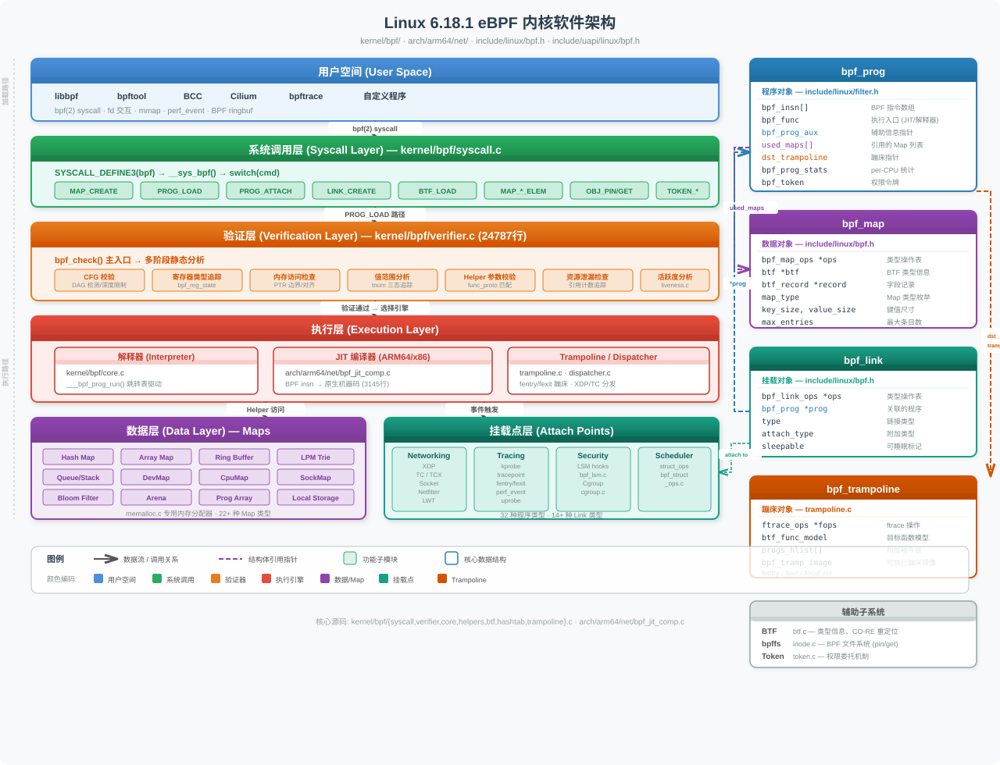
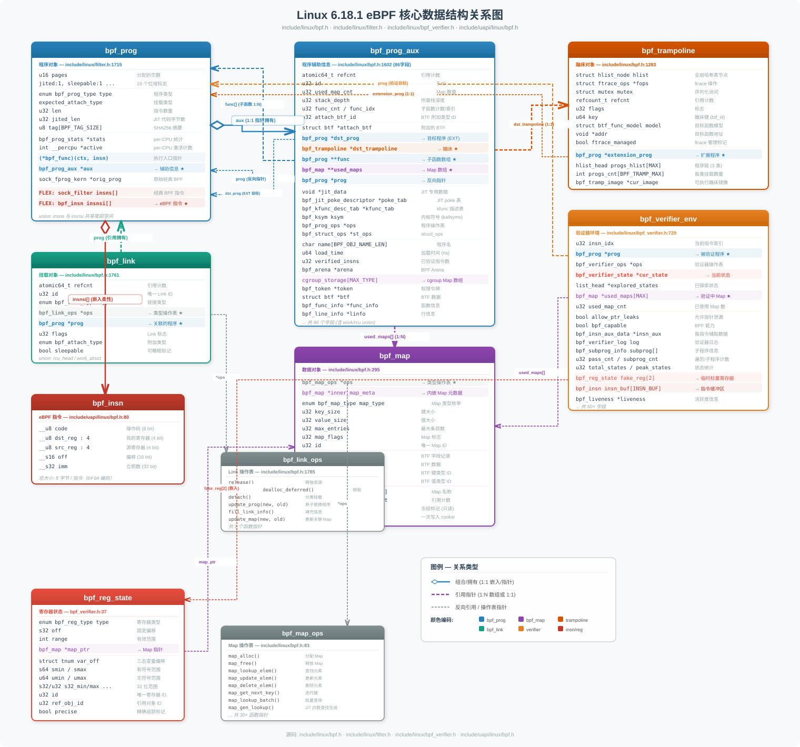
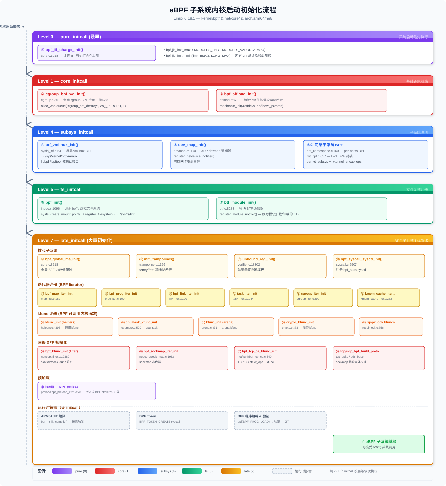

# Linux 6.18.1 内核 eBPF 子系统源码深度分析

---

## 目录

<details>
<summary><a href="#1-ebpf-内核支持选项与开关">1. eBPF 内核支持选项与开关</a></summary>

- [1.1 核心 Kconfig 选项](#11-核心-kconfig-选项)
- [1.2 JIT 编译选项](#12-jit-编译选项)
- [1.3 安全与权限选项](#13-安全与权限选项)
- [1.4 运行时 sysctl 开关](#14-运行时-sysctl-开关)
- [1.5 依赖关系总览](#15-依赖关系总览)

</details>

<details>
<summary><a href="#2-ebpf-实现原理">2. eBPF 实现原理</a></summary>

- [2.1 指令集架构 (ISA)](#21-指令集架构-isa)
- [2.2 虚拟机寄存器模型](#22-虚拟机寄存器模型)
- [2.3 程序加载流程](#23-程序加载流程)
- [2.4 验证器 (Verifier)](#24-验证器-verifier)
- [2.5 解释器执行引擎](#25-解释器执行引擎)
- [2.6 JIT 编译引擎 (ARM64)](#26-jit-编译引擎-arm64)
- [2.7 Helper 函数机制](#27-helper-函数机制)
- [2.8 Map 数据结构](#28-map-数据结构)
- [2.9 BTF 类型信息](#29-btf-类型信息)
- [2.10 Trampoline 与动态挂载](#210-trampoline-与动态挂载)

</details>

<details>
<summary><a href="#3-ebpf-内核软件架构">3. eBPF 内核软件架构</a></summary>

- [3.1 整体架构分层](#31-整体架构分层)
- [3.2 核心数据结构关系](#32-核心数据结构关系)
- [3.3 源码文件组织](#33-源码文件组织)
- [3.4 程序类型与挂载点](#34-程序类型与挂载点)
- [3.5 Map 类型体系](#35-map-类型体系)
- [3.6 Link 抽象层](#36-link-抽象层)
- [3.7 编译构建依赖](#37-编译构建依赖)
- [3.8 子系统初始化流程](#38-子系统初始化流程)

</details>

<details>
<summary><a href="#4-如何生成一个-ebpf-程序">4. 如何生成一个 eBPF 程序</a></summary>

- [4.1 eBPF 程序的生命周期](#41-ebpf-程序的生命周期)
- [4.2 开发工具链](#42-开发工具链)
- [4.3 编写 eBPF 内核侧程序 (.bpf.c)](#43-编写-ebpf-内核侧程序-bpfc)
- [4.4 编写用户空间加载程序](#44-编写用户空间加载程序)
- [4.5 编译流程详解](#45-编译流程详解)
- [4.6 内核加载路径源码分析](#46-内核加载路径源码分析)
- [4.7 三种开发模式对比](#47-三种开发模式对比)
- [4.8 完整实例：kprobe 跟踪程序](#48-完整实例kprobe-跟踪程序)
- [4.9 常见问题与调试](#49-常见问题与调试)
- [4.10 交叉编译 ARM64 libbpf.so](#410-交叉编译-arm64-libbpfso)

</details>

<details>
<summary><a href="#5-ebpf-完整指令集参考">5. eBPF 完整指令集参考</a></summary>

- [5.1 指令编码格式](#51-指令编码格式)
- [5.2 ALU 算术逻辑指令](#52-alu-算术逻辑指令)
- [5.3 内存访问指令](#53-内存访问指令)
- [5.4 跳转指令](#54-跳转指令)
- [5.5 函数调用与返回指令](#55-函数调用与返回指令)
- [5.6 原子操作指令](#56-原子操作指令)
- [5.7 内部 (非 UAPI) 指令](#57-内部-非-uapi-指令)
- [5.8 指令集总览表](#58-指令集总览表)
- [5.9 指令集版本演进](#59-指令集版本演进)
- [5.10 Opcode 空间占用分析与扩展机制](#510-opcode-空间占用分析与扩展机制)

</details>

<details>
<summary><a href="#6-ebpf-底层挂载技术栈深度分析">6. eBPF 底层挂载技术栈深度分析</a></summary>

- [6.1 技术栈总览](#61-技术栈总览)
- [6.2 Kprobe / Kretprobe](#62-kprobe--kretprobe)
- [6.3 Tracepoint (静态跟踪点)](#63-tracepoint-静态跟踪点)
- [6.4 Ftrace / Fentry / Fexit / Fmod_ret](#64-ftrace--fentry--fexit--fmod_ret)
- [6.5 Uprobe / Uretprobe](#65-uprobe--uretprobe)
- [6.6 Perf Event](#66-perf-event)
- [6.7 BPF LSM (Linux Security Module)](#67-bpf-lsm-linux-security-module)
- [6.8 技术选型对比](#68-技术选型对比)

</details>

<details>
<summary><a href="#7-网络子系统-ebpf-挂载点深度分析">7. 网络子系统 eBPF 挂载点深度分析</a></summary>

- [7.1 网络数据路径 BPF 挂载点全景](#71-网络数据路径-bpf-挂载点全景)
- [7.2 XDP (eXpress Data Path)](#72-xdp-express-data-path)
- [7.3 TC (Traffic Control) — SCHED_CLS / SCHED_ACT](#73-tc-traffic-control--sched_cls--sched_act)
- [7.4 Socket Filter (SOCKET_FILTER)](#74-socket-filter-socket_filter)
- [7.5 Cgroup BPF 网络程序](#75-cgroup-bpf-网络程序)
- [7.6 LWT (Lightweight Tunnel) BPF](#76-lwt-lightweight-tunnel-bpf)
- [7.7 SOCK_OPS / SK_SKB / SK_MSG — Socket 级编程](#77-sock_ops--sk_skb--sk_msg--socket-级编程)
- [7.8 SK_REUSEPORT — 端口复用选择](#78-sk_reuseport--端口复用选择)
- [7.9 Flow Dissector](#79-flow-dissector)
- [7.10 SK_LOOKUP — Socket 查找覆盖](#710-sk_lookup--socket-查找覆盖)
- [7.11 Netfilter BPF](#711-netfilter-bpf)
- [7.12 网络 BPF 程序类型技术选型对比](#712-网络-bpf-程序类型技术选型对比)

</details>

<details>
<summary><a href="#8-ebpf-尾调用与-bpf-to-bpf-函数调用深度分析">8. eBPF 尾调用与 BPF-to-BPF 函数调用深度分析</a></summary>

- [8.1 技术概览与对比](#81-技术概览与对比)
- [8.2 尾调用 (Tail Call)](#82-尾调用-tail-call)
- [8.3 BPF-to-BPF 函数调用 (Subprog)](#83-bpf-to-bpf-函数调用-subprog)
- [8.4 BPF_PROG_TYPE_EXT — 运行时函数替换](#84-bpf_prog_type_ext--运行时函数替换)
- [8.5 尾调用与函数调用的组合使用](#85-尾调用与函数调用的组合使用)
- [8.6 技术选型决策树](#86-技术选型决策树)

</details>

<details>
<summary><a href="#9-ebpf-性能分析实战cpu--内存--io">9. eBPF 性能分析实战：CPU / 内存 / I/O</a></summary>

- [9.1 CPU 性能分析：函数调用追踪与热点代码检测](#91-cpu-性能分析函数调用追踪与热点代码检测)
- [9.2 内存分析：分配/释放追踪与泄漏检测](#92-内存分析分配释放追踪与泄漏检测)
- [9.3 I/O 性能分析：磁盘 I/O 与网络 I/O 监控](#93-io-性能分析磁盘-io-与网络-io-监控)
- [9.4 三大场景技术选型总结](#94-三大场景技术选型总结)

</details>

<details>
<summary><a href="#10-qemu-arm64-ebpf-基础实验">10. QEMU ARM64 eBPF 基础实验</a></summary>

- [10.1 实验环境搭建](#101-实验环境搭建)
- [10.2 实验一：Hello BPF — 最小 tracepoint 程序](#102-实验一hello-bpf--最小-tracepoint-程序)
- [10.3 实验二：Kprobe 函数追踪 — 追踪进程创建](#103-实验二kprobe-函数追踪--追踪进程创建)
- [10.4 实验三：Tracepoint + Map — 系统调用频率统计](#104-实验三tracepoint--map--系统调用频率统计)
- [10.5 实验四：Fentry/Fexit — 零开销函数耗时测量](#105-实验四fentryfexit--零开销函数耗时测量)
- [10.6 实验五：BPF Map 进阶 — 多类型 Map 联合使用](#106-实验五bpf-map-进阶--多类型-map-联合使用)
- [10.7 实验六：XDP 网络实验 — 丢弃 / 统计 / 重定向](#107-实验六xdp-网络实验--丢弃--统计--重定向)
- [10.8 实验总结与故障排查](#108-实验总结与故障排查)

</details>

<details>
<summary><a href="#11-ebpf-面试高频问题与深度解答">11. eBPF 面试高频问题与深度解答</a></summary>

- [11.1 基础概念类 (必问)](#111-基础概念类-必问)
- [11.2 JIT 编译与执行引擎](#112-jit-编译与执行引擎)
- [11.3 挂载机制类](#113-挂载机制类)
- [11.4 安全与限制类](#114-安全与限制类)
- [11.5 性能与实践类](#115-性能与实践类)
- [11.6 网络子系统类](#116-网络子系统类)
- [11.7 内存与 Map 操作类](#117-内存与-map-操作类)
- [11.8 架构与系统设计类](#118-架构与系统设计类)
- [11.9 高级与前沿类](#119-高级与前沿类)
- [11.10 场景设计类](#1110-场景设计类)
- [11.11 编码与调试实操类](#1111-编码与调试实操类)
- [11.12 面试快问快答 (10 题)](#1112-面试快问快答-10-题)

</details>

---

## 1. eBPF 内核支持选项与开关

> 源码位置: `kernel/bpf/Kconfig`

### 1.1 核心 Kconfig 选项

| 配置项 | 类型 | 默认值 | 说明 |
|--------|------|--------|------|
| `CONFIG_BPF` | bool (自动选中) | — | BPF 核心解释器，被 `BPF_SYSCALL` 自动选中，经典 socket filter 也依赖此项 |
| `CONFIG_BPF_SYSCALL` | bool | n | **主开关** — 启用 `bpf()` 系统调用，允许通过 fd 操控 BPF 程序和 Map |

`CONFIG_BPF` 被选中时自动关联:

```
config BPF
    bool
    select CRYPTO_LIB_SHA256
```

`CONFIG_BPF_SYSCALL` 的依赖链:

```
config BPF_SYSCALL
    bool "Enable bpf() system call"
    select BPF
    select IRQ_WORK
    select NEED_TASKS_RCU
    select TASKS_TRACE_RCU
    select BINARY_PRINTF
    select NET_SOCK_MSG if NET
    select NET_XGRESS if NET
    select PAGE_POOL if NET
```

### 1.2 JIT 编译选项

| 配置项 | 依赖 | 说明 |
|--------|------|------|
| `CONFIG_HAVE_CBPF_JIT` | arch 提供 | 架构声明支持经典 BPF JIT |
| `CONFIG_HAVE_EBPF_JIT` | arch 提供 | 架构声明支持 eBPF JIT（ARM64 启用此项） |
| `CONFIG_BPF_JIT` | `BPF` + (`HAVE_CBPF_JIT` \|\| `HAVE_EBPF_JIT`) | 启用 BPF JIT 编译器，将 BPF 字节码编译为原生机器码 |
| `CONFIG_BPF_JIT_ALWAYS_ON` | `BPF_SYSCALL` + `HAVE_EBPF_JIT` + `BPF_JIT` | **永久启用 JIT，移除解释器**，防止 Spectre 类推测执行攻击 |
| `CONFIG_BPF_JIT_DEFAULT_ON` | `HAVE_EBPF_JIT` + `BPF_JIT` | 当 `ARCH_WANT_DEFAULT_BPF_JIT` 或 `BPF_JIT_ALWAYS_ON` 时默认开启 |

当 `BPF_JIT_ALWAYS_ON=y` 时，`/proc/sys/net/core/bpf_jit_enable` 锁定为 1，`kernel/bpf/core.c` 中 `___bpf_prog_run()` 解释器代码被条件编译排除:

```c
/* kernel/bpf/core.c */
#ifndef CONFIG_BPF_JIT_ALWAYS_ON
static u64 ___bpf_prog_run(u64 *regs, const struct bpf_insn *insn)
{
    // 解释器实现 ...
}
#endif
```

### 1.3 安全与权限选项

| 配置项 | 默认值 | 说明 |
|--------|--------|------|
| `CONFIG_BPF_UNPRIV_DEFAULT_OFF` | **y** | 默认禁止非特权用户使用 BPF（设置 `unprivileged_bpf_disabled=2`） |
| `CONFIG_BPF_LSM` | n | 启用 BPF LSM（Linux Security Module）钩子插桩，依赖 `BPF_EVENTS` + `SECURITY` + `BPF_JIT` |

`BPF_LSM` 允许通过 BPF 程序实现动态 MAC（强制访问控制）和审计策略。

### 1.4 运行时 sysctl 开关

| sysctl 路径 | 取值 | 说明 |
|-------------|------|------|
| `/proc/sys/net/core/bpf_jit_enable` | 0/1/2 | 0=禁用JIT，1=启用JIT，2=启用JIT并输出调试汇编 |
| `/proc/sys/net/core/bpf_jit_harden` | 0/1/2 | 常量致盲（constant blinding）防侧信道攻击 |
| `/proc/sys/net/core/bpf_jit_kallsyms` | 0/1 | 将 JIT 镜像导出到 kallsyms（perf 可见） |
| `/proc/sys/kernel/unprivileged_bpf_disabled` | 0/1/2 | 0=允许非特权，1=永久禁止，2=禁止但可切回0 |

源码中 sysctl 变量定义:

```c
/* kernel/bpf/syscall.c */
int sysctl_unprivileged_bpf_disabled __read_mostly =
    IS_BUILTIN(CONFIG_BPF_UNPRIV_DEFAULT_OFF) ? 2 : 0;
```

### 1.5 依赖关系总览

```
CONFIG_BPF_SYSCALL ──select──> CONFIG_BPF ──select──> CRYPTO_LIB_SHA256
       │
       ├──select──> IRQ_WORK, TASKS_TRACE_RCU, BINARY_PRINTF
       │
       ├──depends──> CONFIG_BPF_JIT (需架构支持)
       │                  │
       │                  └──depends──> CONFIG_BPF_JIT_ALWAYS_ON
       │
       ├──depends──> CONFIG_BPF_UNPRIV_DEFAULT_OFF
       │
       └──depends──> CONFIG_BPF_LSM (+ SECURITY + BPF_EVENTS + BPF_JIT)
```

---

## 2. eBPF 实现原理

### 2.1 指令集架构 (ISA)

> 源码位置: `include/uapi/linux/bpf.h`, `include/uapi/linux/bpf_common.h`

eBPF 采用固定宽度 **64 位指令编码**，每条指令 8 字节:

```c
/* include/uapi/linux/bpf.h */
struct bpf_insn {
    __u8    code;       /* 操作码 */
    __u8    dst_reg:4;  /* 目标寄存器 */
    __u8    src_reg:4;  /* 源寄存器 */
    __s16   off;        /* 有符号偏移 */
    __s32   imm;        /* 有符号立即数 */
};
```

**指令类别 (Instruction Classes)**:

| 编码 | 类别 | 说明 |
|------|------|------|
| `BPF_ALU` (0x04) | 32位ALU运算 | add, sub, mul, and, or, xor, lsh, rsh, neg, mod, xor |
| `BPF_ALU64` (0x07) | 64位ALU运算 | 同上，操作 64 位寄存器 |
| `BPF_JMP` (0x05) | 64位跳转 | jeq, jne, jgt, jge, jlt, jle, call, exit |
| `BPF_JMP32` (0x06) | 32位跳转 | 同上，比较 32 位值 |
| `BPF_LD` (0x00) | 加载 | 特殊加载（64位立即数, 包头数据） |
| `BPF_LDX` (0x01) | 通用加载 | 从内存加载到寄存器 |
| `BPF_ST` (0x02) | 立即数存储 | 立即数写入内存 |
| `BPF_STX` (0x03) | 寄存器存储 | 寄存器写入内存 |

**原子操作扩展**:

```c
#define BPF_ATOMIC   0xc0   /* 原子内存操作 - 操作类型在 imm 字段 */
#define BPF_XCHG     (0xe0 | BPF_FETCH)  /* 原子交换 */
#define BPF_CMPXCHG  (0xf0 | BPF_FETCH)  /* 原子比较交换 */
#define BPF_LOAD_ACQ 0x100  /* load-acquire */
#define BPF_STORE_REL 0x110 /* store-release */
```

### 2.2 虚拟机寄存器模型

> 源码位置: `include/uapi/linux/bpf.h`, `kernel/bpf/core.c`

eBPF 虚拟机具有 **11 个 64 位通用寄存器** + 1 个隐藏辅助寄存器:

| 寄存器 | 别名 | 用途 |
|--------|------|------|
| R0 | — | **返回值**寄存器（函数返回值 / 程序退出码） |
| R1 | ARG1 / CTX | 第1参数 / **上下文指针**（程序入口时指向 `bpf_context`） |
| R2 | ARG2 | 第2参数 |
| R3 | ARG3 | 第3参数 |
| R4 | ARG4 | 第4参数 |
| R5 | ARG5 | 第5参数 |
| R6-R9 | — | **被调用者保存**（callee-saved），跨函数调用保持 |
| R10 | FP | **帧指针**（只读），指向 512 字节栈帧 |
| AX | BPF_REG_AX | 内核内部辅助寄存器，用于常量致盲等 |

```c
/* kernel/bpf/core.c */
#define BPF_R0  regs[BPF_REG_0]
#define DST     regs[insn->dst_reg]
#define SRC     regs[insn->src_reg]
#define FP      regs[BPF_REG_FP]
#define AX      regs[BPF_REG_AX]
#define IMM     insn->imm

/* include/linux/filter.h */
#define MAX_BPF_STACK  512  /* BPF 程序最大可用栈空间 */
```

### 2.3 程序加载流程

> 源码位置: `kernel/bpf/syscall.c` — `bpf_prog_load()` (L2859)

用户态通过 `bpf(BPF_PROG_LOAD, ...)` 系统调用加载 eBPF 程序，完整流程:

```
用户空间 bpf(BPF_PROG_LOAD, attr, size)
    │
    ▼
SYSCALL_DEFINE3(bpf) ──> __sys_bpf(BPF_PROG_LOAD)
    │
    ▼ ① 参数校验
    bpf_check_uarg_tail_zero()      // 未知字段须为零（前向兼容）
    copy_from_bpfptr(&attr)          // 从用户空间拷贝 bpf_attr
    security_bpf(cmd, &attr)         // LSM 安全检查
    │
    ▼ ② 权限检查
    bpf_token_capable(CAP_BPF)       // Token / Capability 权限
    sysctl_unprivileged_bpf_disabled // 非特权检查
    │
    ▼ ③ 分配程序对象
    bpf_prog_alloc(size, GFP_USER)   // vmalloc 分配 bpf_prog + insns
    kzalloc(bpf_prog_aux)            // 分配辅助结构
    alloc_percpu(int)                // per-CPU 活跃计数器
    │
    ▼ ④ 拷贝用户程序
    copy_from_bpfptr(prog->insns)    // 拷贝 BPF 指令
    strncpy_from_bpfptr(license)     // 拷贝许可证字符串
    license_is_gpl_compatible()      // GPL 兼容性检查
    │
    ▼ ⑤ 验证器校验
    bpf_check(&prog, attr, uattr)    // ★ 核心验证（24787行代码）
    │
    ▼ ⑥ 运行时选择（JIT / 解释器）
    bpf_prog_select_runtime(prog)
        ├── bpf_int_jit_compile()    // 尝试 JIT 编译
        └── bpf_prog_lock_ro()       // 设置代码页只读
    │
    ▼ ⑦ 注册到系统
    bpf_prog_alloc_id(prog)          // 分配全局唯一 ID
    bpf_prog_new_fd(prog)            // 创建 fd 返回用户空间
```

### 2.4 验证器 (Verifier)

> 源码位置: `kernel/bpf/verifier.c` — **24787 行**，eBPF 子系统最大的单文件

验证器是 eBPF 安全性的核心保障，它在程序加载时进行**静态代码分析**:

**两遍扫描策略**:

```
第一遍: 深度优先搜索 (DFS) — 检查程序是 DAG（有向无环图）
    - 拒绝超过 BPF_MAXINSNS 条指令的程序
    - 检测循环（通过后向边检测）
    - 拒绝不可达指令
    - 检查跳转目标是否越界

第二遍: 全路径模拟执行 — 从第1条指令遍历所有可能路径
    - 分析路径长度限制为 64k 指令
    - 分支数量限制为 1k
    - 逐指令更新寄存器/栈类型状态
```

**寄存器类型追踪系统**:

```c
/* include/linux/bpf_verifier.h */
struct bpf_reg_state {
    enum bpf_reg_type type;    /* 寄存器类型 */
    s32 off;                   /* 指针固定偏移 */

    /* 标量值范围追踪 */
    struct tnum var_off;       /* 已知位值追踪 */
    s64 smin_value, smax_value;    /* 有符号 64 位范围 */
    u64 umin_value, umax_value;    /* 无符号 64 位范围 */
    s32 s32_min_value, s32_max_value;  /* 有符号 32 位范围 */
    u32 u32_min_value, u32_max_value;  /* 无符号 32 位范围 */

    u32 id;                    /* 指针身份标识 */
    u32 ref_obj_id;            /* 引用计数对象 ID */
    u32 frameno;               /* 栈帧编号 */
};
```

**关键寄存器类型**:

| 类型 | 含义 |
|------|------|
| `SCALAR_VALUE` | 普通标量值，非有效指针 |
| `PTR_TO_CTX` | 指向 BPF 程序上下文 |
| `PTR_TO_MAP_VALUE` | 指向 Map 元素值 |
| `PTR_TO_MAP_VALUE_OR_NULL` | Map 查找返回值，可能为 NULL |
| `PTR_TO_STACK` | 指向栈帧中的某位置 |
| `PTR_TO_PACKET` | 指向网络数据包 |
| `PTR_TO_SOCKET` | 指向 socket 对象 |
| `PTR_TO_BTF_ID` | 指向内核 BTF 类型的对象 |

**Helper 函数参数约束验证** (以 `bpf_map_lookup_elem` 为例):

```c
/* kernel/bpf/helpers.c */
const struct bpf_func_proto bpf_map_lookup_elem_proto = {
    .func       = bpf_map_lookup_elem,
    .gpl_only   = false,
    .ret_type   = RET_PTR_TO_MAP_VALUE_OR_NULL,  // 返回可能为NULL的Map值指针
    .arg1_type  = ARG_CONST_MAP_PTR,             // 第1参数: 常量Map指针
    .arg2_type  = ARG_PTR_TO_MAP_KEY,            // 第2参数: 指向Map Key的栈指针
};
```

### 2.5 解释器执行引擎

> 源码位置: `kernel/bpf/core.c` — `___bpf_prog_run()` (L1708)

当 JIT 不可用时，eBPF 使用**高性能跳转表解释器** (computed goto):

```c
static u64 ___bpf_prog_run(u64 *regs, const struct bpf_insn *insn)
{
    /* 256 项跳转表 — 以 opcode 为索引直接跳转 */
    static const void * const jumptable[256] = {
        [0 ... 255] = &&default_label,
        BPF_INSN_MAP(BPF_INSN_2_LBL, BPF_INSN_3_LBL),
        [BPF_JMP | BPF_TAIL_CALL] = &&JMP_TAIL_CALL,
        [BPF_ST  | BPF_NOSPEC]    = &&ST_NOSPEC,   // Spectre 缓解
        // ... probe_mem 等内部指令
    };

select_insn:
    goto *jumptable[insn->code];  /* 直接跳转，无 switch 开销 */

    /* ALU 运算宏展开 */
    ALU(ADD, +)    ALU(SUB, -)    ALU(AND, &)
    ALU(OR,  |)    ALU(XOR, ^)    ALU(MUL, *)
    SHT(LSH, <<)   SHT(RSH, >>)

    /* 每条指令执行后 CONT 跳回 select_insn */
    #define CONT ({ insn++; goto select_insn; })
```

**执行入口调用链**:

```c
/* include/linux/filter.h */
static __always_inline u32 __bpf_prog_run(const struct bpf_prog *prog,
                                           const void *ctx,
                                           bpf_dispatcher_fn dfunc)
{
    ret = dfunc(ctx, prog->insnsi, prog->bpf_func);
    // prog->bpf_func 指向 JIT 代码或解释器入口
}

static __always_inline u32 bpf_prog_run(const struct bpf_prog *prog,
                                         const void *ctx)
{
    return __bpf_prog_run(prog, ctx, bpf_dispatcher_nop_func);
}
```

### 2.6 JIT 编译引擎 (ARM64)

> 源码位置: `arch/arm64/net/bpf_jit_comp.c` — 3145 行

ARM64 JIT 将 eBPF 字节码**一对一翻译为 AArch64 机器指令**。

**BPF → ARM64 寄存器映射**:

```c
/* arch/arm64/net/bpf_jit_comp.c */
static const int bpf2a64[] = {
    [BPF_REG_0]  = A64_R(7),     /* 返回值 */
    [BPF_REG_1]  = A64_R(0),     /* 参数1 (ARM64 调用约定第1参数) */
    [BPF_REG_2]  = A64_R(1),     /* 参数2 */
    [BPF_REG_3]  = A64_R(2),     /* 参数3 */
    [BPF_REG_4]  = A64_R(3),     /* 参数4 */
    [BPF_REG_5]  = A64_R(4),     /* 参数5 */
    [BPF_REG_6]  = A64_R(19),    /* callee-saved */
    [BPF_REG_7]  = A64_R(20),    /* callee-saved */
    [BPF_REG_8]  = A64_R(21),    /* callee-saved */
    [BPF_REG_9]  = A64_R(22),    /* callee-saved */
    [BPF_REG_FP] = A64_R(25),    /* 帧指针 */
    [TMP_REG_1]  = A64_R(10),    /* JIT 临时寄存器 */
    [TMP_REG_2]  = A64_R(11),
    [TMP_REG_3]  = A64_R(12),
    [TCCNT_PTR]  = A64_R(26),    /* 尾调用计数指针 */
    [BPF_REG_AX] = A64_R(9),     /* 常量致盲辅助寄存器 */
    [PRIVATE_SP] = A64_R(27),    /* 私有栈指针 */
    [ARENA_VM_START] = A64_R(28), /* Arena VM 起始地址 */
};
```

**JIT 编译上下文**:

```c
struct jit_ctx {
    const struct bpf_prog *prog;
    int idx;                     /* 当前指令索引 */
    int epilogue_offset;         /* 尾声代码偏移 */
    int *offset;                 /* BPF insn → ARM64 insn 偏移映射 */
    int exentry_idx;             /* 异常表项索引 */
    __le32 *image;               /* 输出机器码镜像（可执行） */
    __le32 *ro_image;            /* 只读镜像 */
    u32 stack_size;              /* 栈帧大小 */
    u64 arena_vm_start;          /* Arena VM 起始 */
    bool fp_used;                /* 是否使用帧指针 */
    bool write;                  /* 是否写入 image */
};
```

**JIT 编译选择流程** (`kernel/bpf/core.c`):

```c
struct bpf_prog *bpf_prog_select_runtime(struct bpf_prog *fp, int *err)
{
    bool jit_needed = false;

    if (IS_ENABLED(CONFIG_BPF_JIT_ALWAYS_ON) ||
        bpf_prog_has_kfunc_call(fp))
        jit_needed = true;

    if (!bpf_prog_select_interpreter(fp))
        jit_needed = true;

    // 调用架构相关 JIT 编译
    fp = bpf_int_jit_compile(fp);

    if (!fp->jited && jit_needed) {
        *err = -ENOTSUPP;  // JIT 必需但编译失败
        return fp;
    }

    // 设置代码页只读保护
    *err = bpf_prog_lock_ro(fp);

    // 尾调用兼容性检查
    *err = bpf_check_tail_call(fp);
    return fp;
}
```

### 2.7 Helper 函数机制

> 源码位置: `kernel/bpf/helpers.c` — 4442 行

Helper 函数是 eBPF 程序调用内核功能的唯一合法途径。每个 Helper 通过 `bpf_func_proto` 声明其类型签名:

```c
/* 调用宏 — 自动处理寄存器到 C 参数的转换 */
BPF_CALL_2(bpf_map_lookup_elem, struct bpf_map *, map, void *, key)
{
    WARN_ON_ONCE(!rcu_read_lock_held() && !rcu_read_lock_trace_held());
    return (unsigned long) map->ops->map_lookup_elem(map, key);
}

/* 类型原型 — 验证器用此约束参数类型 */
const struct bpf_func_proto bpf_map_lookup_elem_proto = {
    .func       = bpf_map_lookup_elem,
    .gpl_only   = false,
    .pkt_access = true,
    .ret_type   = RET_PTR_TO_MAP_VALUE_OR_NULL,
    .arg1_type  = ARG_CONST_MAP_PTR,
    .arg2_type  = ARG_PTR_TO_MAP_KEY,
};
```

**核心 Helper 分类**:

| 类别 | 典型 Helper | 说明 |
|------|-------------|------|
| Map 操作 | `bpf_map_lookup_elem`, `bpf_map_update_elem`, `bpf_map_delete_elem` | 增删改查 Map |
| 时间 | `bpf_ktime_get_ns`, `bpf_jiffies64` | 获取内核时间 |
| 输出 | `bpf_trace_printk`, `bpf_ringbuf_output` | 调试打印、事件输出 |
| 随机数 | `bpf_get_prandom_u32` | 伪随机数 |
| 进程信息 | `bpf_get_current_pid_tgid`, `bpf_get_current_uid_gid`, `bpf_get_current_comm` | 当前进程属性 |
| 尾调用 | `bpf_tail_call` | 跳转到另一个 BPF 程序 |
| 包操作 | `bpf_skb_load_bytes`, `bpf_xdp_adjust_head` | 网络包读写 |
| Socket | `bpf_sk_lookup_tcp`, `bpf_sk_release` | Socket 查找 |

### 2.8 Map 数据结构

> 源码位置: `kernel/bpf/hashtab.c`, `kernel/bpf/arraymap.c`, `kernel/bpf/ringbuf.c` 等

Map 是 eBPF 的**核心数据共享机制**，支持程序间、程序与用户空间之间的数据交换。

**Map 通用抽象** (`include/linux/bpf.h`):

```c
struct bpf_map {
    const struct bpf_map_ops *ops;    /* 类型特定操作函数表 */
    enum bpf_map_type map_type;       /* Map 类型 */
    u32 key_size;                     /* Key 大小 */
    u32 value_size;                   /* Value 大小 */
    u32 max_entries;                  /* 最大条目数 */
    u32 map_flags;                    /* 创建标志 */
    u32 id;                           /* 全局唯一 ID */
    struct btf *btf;                  /* BTF 类型信息 */
    struct btf_record *record;        /* BTF 字段记录 */
    char name[BPF_OBJ_NAME_LEN];     /* 名称 */
    atomic64_t refcnt;                /* 引用计数 */
    bool frozen;                      /* 冻结标志 */
};
```

**Map 操作函数表** (`struct bpf_map_ops`):

```c
struct bpf_map_ops {
    /* 用户空间接口 (syscall) */
    struct bpf_map *(*map_alloc)(union bpf_attr *attr);
    void (*map_free)(struct bpf_map *map);
    int (*map_get_next_key)(struct bpf_map *map, void *key, void *next_key);

    /* 用户空间 + eBPF 程序共用 */
    void *(*map_lookup_elem)(struct bpf_map *map, void *key);
    long (*map_update_elem)(struct bpf_map *map, void *key, void *value, u64 flags);
    long (*map_delete_elem)(struct bpf_map *map, void *key);

    /* 批量操作 */
    int (*map_lookup_batch)(...);
    int (*map_update_batch)(...);
    int (*map_delete_batch)(...);

    /* 内存统计 */
    u64 (*map_mem_usage)(const struct bpf_map *map);
};
```

**Hash Map 内部结构** (`kernel/bpf/hashtab.c`):

```c
struct bucket {
    struct hlist_nulls_head head;   /* 哈希桶链表 */
    rqspinlock_t raw_lock;          /* 原子上下文安全自旋锁 */
};

struct bpf_htab {
    struct bpf_map map;
    struct bpf_mem_alloc ma;        /* 专用内存分配器 */
    struct bucket *buckets;         /* 哈希桶数组 */
    void *elems;                    /* 预分配元素池 */
    union {
        struct pcpu_freelist freelist;  /* 预分配空闲链表 */
        struct bpf_lru lru;            /* LRU 淘汰策略 */
    };
};
```

**Ring Buffer 结构** (`kernel/bpf/ringbuf.c`):

```c
struct bpf_ringbuf {
    wait_queue_head_t waitq;          /* 等待队列 */
    struct irq_work work;             /* IRQ 工作项 */
    u64 mask;                         /* 环形掩码 */
    struct page **pages;              /* 页面数组 */
    rqspinlock_t spinlock;            /* 生产者锁 */
    atomic_t busy;                    /* 用户态 ringbuf 忙标志 */
    unsigned long consumer_pos __aligned(PAGE_SIZE);   /* 消费者位置（独占页） */
    unsigned long producer_pos __aligned(PAGE_SIZE);   /* 生产者位置（独占页） */
    unsigned long pending_pos;
    char data[] __aligned(PAGE_SIZE); /* 数据环形缓冲区 */
};
```

### 2.9 BTF 类型信息

> 源码位置: `kernel/bpf/btf.c` — 9579 行

BTF (BPF Type Format) 是 eBPF 的元数据格式，描述 BPF 程序/Map 的 C 数据类型:

- 存储在 ELF `.BTF` 段
- `struct btf_type` 描述每个 C 类型（int, struct, union, enum, func...）
- 每个 `btf_type` 通过 `type_id` 隐式标识（按顺序从1开始编号）
- 支持 `vmlinux BTF` — 内核自身的完整类型信息
- 启用 CO-RE (Compile Once, Run Everywhere) 能力

### 2.10 Trampoline 与动态挂载

> 源码位置: `kernel/bpf/trampoline.c`

BPF Trampoline 是 **fentry/fexit/fmod_ret** 的底层实现机制，利用 ftrace 动态修改内核函数入口:

```c
struct bpf_trampoline {
    struct hlist_node hlist;               /* 全局哈希表节点 */
    struct ftrace_ops *fops;               /* ftrace 操作 */
    struct mutex mutex;                    /* 序列化访问 */
    refcount_t refcnt;
    u64 key;                               /* 目标函数标识 */
    struct {
        struct btf_func_model model;       /* 函数签名模型 */
        void *addr;                        /* 目标函数地址 */
        bool ftrace_managed;               /* 是否通过 ftrace 管理 */
    } func;
    struct bpf_prog *extension_prog;       /* EXT 程序（函数替换） */
    struct hlist_head progs_hlist[BPF_TRAMP_MAX];  /* 附加的程序链 */
    int progs_cnt[BPF_TRAMP_MAX];          /* 每种类型的程序计数 */
    struct bpf_tramp_image *cur_image;     /* 当前蹦床可执行镜像 */
};
```

全局蹦床哈希表 (1024 桶):

```c
#define TRAMPOLINE_HASH_BITS 10
#define TRAMPOLINE_TABLE_SIZE (1 << TRAMPOLINE_HASH_BITS)  /* 1024 */
static struct hlist_head trampoline_table[TRAMPOLINE_TABLE_SIZE];
```

---

## 3. eBPF 内核软件架构



### 3.1 整体架构分层

```
┌─────────────────────────────────────────────────────────────────────┐
│                         用户空间 (User Space)                        │
│  libbpf / bpftool / BCC / cilium / 自定义程序                        │
│  ─── bpf() syscall ── fd 交互 ── mmap ── perf_event ───────────     │
└────────────────────────────────┬────────────────────────────────────┘
                                 │  bpf(2) 系统调用
┌────────────────────────────────▼────────────────────────────────────┐
│                    系统调用层 (Syscall Layer)                         │
│  kernel/bpf/syscall.c                                               │
│  SYSCALL_DEFINE3(bpf) → __sys_bpf() → switch(cmd) 分发              │
│  ┌──────────┬──────────┬───────────┬──────────┬──────────────┐      │
│  │MAP_CREATE│PROG_LOAD │ OBJ_PIN   │LINK_CREATE│ BTF_LOAD    │      │
│  │MAP_*_ELEM│PROG_ATTACH│ OBJ_GET  │LINK_UPDATE│ ITER_CREATE │      │
│  └──────────┴──────────┴───────────┴──────────┴──────────────┘      │
└────────────────────────────────┬────────────────────────────────────┘
                                 │
┌────────────────────────────────▼────────────────────────────────────┐
│                     验证层 (Verification Layer)                      │
│  kernel/bpf/verifier.c (24787 行)                                   │
│  ┌────────────────────────────────────────────────────────┐         │
│  │ CFG 校验 → 寄存器类型追踪 → 内存访问检查 → 资源泄漏检查  │         │
│  │ Helper 参数验证 → 指针算术校验 → 值范围分析 (tnum)       │         │
│  └────────────────────────────────────────────────────────┘         │
│  kernel/bpf/liveness.c (活跃度分析)                                  │
│  kernel/bpf/log.c (验证日志)                                        │
│  kernel/bpf/tnum.c (数值三态追踪)                                    │
└────────────────────────────────┬────────────────────────────────────┘
                                 │
┌────────────────────────────────▼────────────────────────────────────┐
│                    执行层 (Execution Layer)                          │
│  ┌───────────────────┐    ┌──────────────────────────────────┐     │
│  │   解释器            │    │         JIT 编译器                │     │
│  │   kernel/bpf/core.c│    │  arch/arm64/net/bpf_jit_comp.c  │     │
│  │   ___bpf_prog_run()│    │  arch/x86/net/bpf_jit_comp.c    │     │
│  │   跳转表驱动        │    │  BPF insn → 原生机器码           │     │
│  └───────────────────┘    └──────────────────────────────────┘     │
│                                                                     │
│  kernel/bpf/trampoline.c    — fentry/fexit 蹦床                     │
│  kernel/bpf/dispatcher.c    — XDP/TC 高速分发器                      │
└────────────────────────────────┬────────────────────────────────────┘
                                 │
┌────────────────────────────────▼────────────────────────────────────┐
│                    数据层 (Data Layer)                               │
│  ┌──────────┬──────────┬──────────┬──────────┬───────────────┐     │
│  │ Hash Map │Array Map │ Ring Buf │ LPM Trie │ Bloom Filter  │     │
│  │hashtab.c │arraymap.c│ringbuf.c │lpm_trie.c│bloom_filter.c │     │
│  └──────────┴──────────┴──────────┴──────────┴───────────────┘     │
│  ┌──────────┬──────────┬──────────┬──────────┬───────────────┐     │
│  │Queue/Stack│DevMap  │ CpuMap   │ SockMap  │  Arena        │     │
│  │queue_stack│devmap.c │cpumap.c  │(net/)    │  arena.c      │     │
│  └──────────┴──────────┴──────────┴──────────┴───────────────┘     │
│  kernel/bpf/memalloc.c    — 专用内存分配器                           │
│  kernel/bpf/local_storage.c — 本地存储                               │
└────────────────────────────────┬────────────────────────────────────┘
                                 │
┌────────────────────────────────▼────────────────────────────────────┐
│                    挂载点层 (Attach Points)                          │
│  ┌─────────────┬──────────────┬───────────────┬─────────────┐      │
│  │  Networking  │   Tracing    │   Security    │  Scheduler  │      │
│  │ XDP, TC, SK  │ kprobe, tp   │ LSM hooks     │ struct_ops  │      │
│  │ socket, lwt  │ fentry/fexit │ bpf_lsm.c    │             │      │
│  │ netfilter    │ perf_event   │               │             │      │
│  └─────────────┴──────────────┴───────────────┴─────────────┘      │
│  kernel/bpf/cgroup.c     — cgroup BPF 程序管理                      │
│  kernel/bpf/tcx.c        — TC express 路径                          │
│  kernel/bpf/bpf_lsm.c   — LSM 安全钩子                              │
│  kernel/bpf/bpf_struct_ops.c — struct_ops（调度器等）                 │
└─────────────────────────────────────────────────────────────────────┘
```

### 3.2 核心数据结构关系



```
bpf_prog (程序对象)
    │
    ├── bpf_insn[]           BPF 指令数组
    ├── bpf_func             执行入口 (JIT 代码或解释器)
    ├── bpf_prog_aux ─────── 辅助信息
    │       ├── bpf_map *used_maps[]     引用的 Map 列表
    │       ├── btf *attach_btf          附加的 BTF 信息
    │       ├── bpf_trampoline *dst_trampoline  蹦床
    │       ├── bpf_prog **func          子函数数组 (BPF-to-BPF call)
    │       ├── bpf_ksym ksym            内核符号 (kallsyms 可见)
    │       ├── bpf_token *token         权限令牌
    │       └── jit_data                 架构相关 JIT 数据
    │
    └── bpf_prog_stats       per-CPU 统计 (计数/耗时/miss)

bpf_map (数据对象)
    │
    ├── bpf_map_ops *ops     类型特定操作表
    ├── btf *btf             类型信息
    ├── btf_record *record   BTF 字段记录 (spin_lock, timer, kptr...)
    └── map_type, key_size, value_size, max_entries  元信息

bpf_link (挂载对象)
    │
    ├── bpf_link_ops *ops    类型特定操作表
    ├── bpf_prog *prog       关联的程序
    ├── type                 链接类型
    └── attach_type          附加类型

bpf_trampoline (蹦床)
    │
    ├── ftrace_ops *fops     ftrace 操作
    ├── btf_func_model       目标函数模型
    ├── progs_hlist[]        附加程序链 (fentry/fexit/fmod_ret)
    └── bpf_tramp_image      可执行蹦床镜像
```

### 3.3 源码文件组织

**核心框架** (`kernel/bpf/`):

| 文件 | 行数 | 职责 |
|------|------|------|
| `verifier.c` | 24787 | 静态验证器 — 类型检查、安全校验、路径分析 |
| `btf.c` | 9579 | BTF 类型格式解析、校验、CO-RE 重定位 |
| `syscall.c` | 6513 | `bpf()` 系统调用入口与命令分发 |
| `helpers.c` | 4442 | 通用 Helper 函数实现 |
| `core.c` | 3318 | 解释器引擎、程序分配、运行时选择 |
| `hashtab.c` | 2631 | Hash / Percpu-Hash / LRU-Hash Map |
| `trampoline.c` | — | fentry/fexit/fmod_ret 蹦床管理 |
| `dispatcher.c` | — | XDP/TC 程序高速分发器 |
| `ringbuf.c` | — | Ring Buffer Map |
| `arraymap.c` | — | Array / Percpu-Array / Prog-Array Map |
| `lpm_trie.c` | — | 最长前缀匹配 Trie Map |
| `bloom_filter.c` | — | Bloom Filter Map |
| `queue_stack_maps.c` | — | Queue / Stack Map |
| `arena.c` | — | Arena Map (64位 MMU 环境) |
| `memalloc.c` | — | BPF 专用内存分配器 |
| `rqspinlock.c` | — | 可排队自旋锁 (原子上下文安全) |
| `token.c` | — | BPF Token 权限委托 |
| `log.c` | — | 验证器日志输出 |
| `tnum.c` | — | 三态数值追踪 (tristate number) |
| `liveness.c` | — | 寄存器活跃度分析 |
| `disasm.c` | — | BPF 指令反汇编器 |
| `inode.c` | — | bpffs 文件系统 |
| `btf_relocate.c` | — | BTF 重定位 |
| `relo_core.c` | — | CO-RE 重定位核心 |
| `stream.c` | — | BPF 流式输出 |

**迭代器** (`kernel/bpf/`):

| 文件 | 职责 |
|------|------|
| `bpf_iter.c` | BPF 迭代器框架 |
| `task_iter.c` | 任务/线程迭代器 |
| `map_iter.c` | Map 迭代器 |
| `prog_iter.c` | 程序迭代器 |
| `link_iter.c` | Link 迭代器 |
| `btf_iter.c` | BTF 迭代器 |
| `cgroup_iter.c` | Cgroup 迭代器 |
| `kmem_cache_iter.c` | 内核 slab 缓存迭代器 |
| `dmabuf_iter.c` | DMA-buf 迭代器 |

**存储** (`kernel/bpf/`):

| 文件 | 职责 |
|------|------|
| `local_storage.c` | 通用本地存储框架 |
| `bpf_local_storage.c` | BPF 本地存储实现 |
| `bpf_task_storage.c` | Task 本地存储 |
| `bpf_cgrp_storage.c` | Cgroup 本地存储 |
| `bpf_inode_storage.c` | Inode 本地存储 (需 BPF_LSM) |

**安全与网络** (`kernel/bpf/`):

| 文件 | 职责 |
|------|------|
| `bpf_lsm.c` | LSM 安全模块钩子 |
| `bpf_struct_ops.c` | struct_ops 机制 |
| `cgroup.c` | Cgroup BPF 程序管理 |
| `tcx.c` | TC express 路径 |
| `mprog.c` | 多程序管理 |
| `net_namespace.c` | 网络命名空间 BPF |
| `offload.c` | 硬件卸载 |
| `devmap.c` | 设备重定向 Map |
| `cpumap.c` | CPU 重定向 Map |
| `crypto.c` | BPF 加密操作 |

**JIT 编译器** (架构相关):

| 文件 | 职责 |
|------|------|
| `arch/arm64/net/bpf_jit_comp.c` | ARM64 JIT (3145行) |
| `arch/arm64/net/bpf_jit.h` | ARM64 JIT 头文件 |
| `arch/x86/net/bpf_jit_comp.c` | x86-64 JIT |

**UAPI 头文件**:

| 文件 | 职责 |
|------|------|
| `include/uapi/linux/bpf.h` | 用户空间 API — 指令编码、枚举、bpf_attr |
| `include/uapi/linux/bpf_common.h` | 经典 BPF 公共定义 |

**内核头文件**:

| 文件 | 职责 |
|------|------|
| `include/linux/bpf.h` | 核心内部头 — bpf_map, bpf_prog_aux, bpf_link, bpf_trampoline |
| `include/linux/filter.h` | 指令宏、bpf_prog 结构、执行入口 |
| `include/linux/bpf_verifier.h` | 验证器 — bpf_reg_state, bpf_verifier_env |
| `include/linux/bpf_types.h` | 程序类型/Map类型/Link类型注册表 (X-macro) |
| `include/linux/btf.h` | BTF 内部接口 |

### 3.4 程序类型与挂载点

> 源码位置: `include/uapi/linux/bpf.h` — `enum bpf_prog_type`, `include/linux/bpf_types.h`

Linux 6.18.1 支持 **32 种程序类型**:

| 程序类型 | 上下文类型 | 挂载点 | 依赖配置 |
|---------|-----------|--------|---------|
| `SOCKET_FILTER` | `struct __sk_buff` | Socket 过滤 | `CONFIG_NET` |
| `KPROBE` | `bpf_user_pt_regs_t` | 内核探针 | `CONFIG_BPF_EVENTS` |
| `TRACEPOINT` | `__u64 *` | 静态跟踪点 | `CONFIG_BPF_EVENTS` |
| `SCHED_CLS` / `SCHED_ACT` | `struct __sk_buff` | TC 流量分类/动作 | `CONFIG_NET` |
| `XDP` | `struct xdp_md` | 网卡驱动收包入口 | `CONFIG_NET` |
| `PERF_EVENT` | `struct bpf_perf_event_data` | Perf 事件 | `CONFIG_BPF_EVENTS` |
| `CGROUP_SKB` | `struct __sk_buff` | Cgroup 入/出站 | `CONFIG_CGROUP_BPF` |
| `CGROUP_SOCK` | `struct bpf_sock` | Cgroup socket 创建 | `CONFIG_CGROUP_BPF` |
| `CGROUP_SOCK_ADDR` | `struct bpf_sock_addr` | Cgroup 连接地址 | `CONFIG_CGROUP_BPF` |
| `CGROUP_DEVICE` | `struct bpf_cgroup_dev_ctx` | Cgroup 设备访问 | `CONFIG_CGROUP_BPF` |
| `CGROUP_SYSCTL` | `struct bpf_sysctl` | Cgroup sysctl 控制 | `CONFIG_CGROUP_BPF` |
| `CGROUP_SOCKOPT` | `struct bpf_sockopt` | Cgroup socket 选项 | `CONFIG_CGROUP_BPF` |
| `LWT_IN/OUT/XMIT/SEG6LOCAL` | `struct __sk_buff` | 轻量级隧道 | `CONFIG_NET` |
| `SOCK_OPS` | `struct bpf_sock_ops` | TCP 连接事件 | `CONFIG_NET` |
| `SK_SKB` / `SK_MSG` | `struct __sk_buff` / `struct sk_msg_md` | Socket 数据流 | `CONFIG_NET` |
| `RAW_TRACEPOINT` | `struct bpf_raw_tracepoint_args` | 原始跟踪点 | `CONFIG_BPF_EVENTS` |
| `RAW_TRACEPOINT_WRITABLE` | 同上 | 可写原始跟踪点 | `CONFIG_BPF_EVENTS` |
| `TRACING` | `void *` | fentry/fexit/fmod_ret | `CONFIG_BPF_EVENTS` |
| `STRUCT_OPS` | `void *` | 内核 struct ops 替换 | `CONFIG_BPF_JIT` |
| `EXT` | `void *` | 扩展/替换其他 BPF 程序 | `CONFIG_BPF_JIT` |
| `LSM` | `void *` | LSM 安全钩子 | `CONFIG_BPF_LSM` |
| `SK_REUSEPORT` | `struct sk_reuseport_md` | Socket 端口复用 | `CONFIG_INET` |
| `SK_LOOKUP` | `struct bpf_sk_lookup` | Socket 查找 | `CONFIG_INET` |
| `FLOW_DISSECTOR` | `struct __sk_buff` | 流解析 | `CONFIG_NET` |
| `LIRC_MODE2` | `__u32` | 红外遥控 | `CONFIG_BPF_LIRC_MODE2` |
| `SYSCALL` | `void *` | BPF 程序执行系统调用 | 始终可用 |
| `NETFILTER` | `struct bpf_nf_ctx` | Netfilter 钩子 | `CONFIG_NETFILTER_BPF_LINK` |

**类型注册机制** — X-macro 模式 (`include/linux/bpf_types.h`):

```c
/* 通过 X-macro 同时注册验证器 ops、程序 ops、上下文映射 */
BPF_PROG_TYPE(BPF_PROG_TYPE_XDP, xdp, struct xdp_md, struct xdp_buff)
//             枚举值              名称   用户上下文类型   内核上下文类型

/* verifier.c 中展开为: */
static const struct bpf_verifier_ops * const bpf_verifier_ops[] = {
    [BPF_PROG_TYPE_XDP] = &xdp_verifier_ops,
    // ...
};

/* syscall.c 中展开为: */
static const struct bpf_map_ops * const bpf_map_types[] = {
    [BPF_MAP_TYPE_HASH] = &htab_map_ops,
    // ...
};
```

### 3.5 Map 类型体系

Linux 6.18.1 支持 **22+ 种 Map 类型**:

| 类别 | Map 类型 | 实现文件 | 说明 |
|------|---------|---------|------|
| **通用** | `HASH` / `PERCPU_HASH` | `hashtab.c` | 哈希表（预分配/按需分配） |
| | `LRU_HASH` / `LRU_PERCPU_HASH` | `hashtab.c` | LRU 淘汰哈希表 |
| | `ARRAY` / `PERCPU_ARRAY` | `arraymap.c` | 定长数组（支持 mmap） |
| | `LPM_TRIE` | `lpm_trie.c` | 最长前缀匹配（路由表） |
| | `BLOOM_FILTER` | `bloom_filter.c` | 布隆过滤器 |
| | `QUEUE` / `STACK` | `queue_stack_maps.c` | FIFO 队列 / LIFO 栈 |
| **事件** | `RINGBUF` | `ringbuf.c` | 高效环形缓冲区（替代 perf buffer） |
| | `USER_RINGBUF` | `ringbuf.c` | 用户态生产者环形缓冲区 |
| | `PERF_EVENT_ARRAY` | `arraymap.c` | Perf 事件数组 |
| **嵌套** | `ARRAY_OF_MAPS` | `map_in_map.c` | Map 中的 Map（数组） |
| | `HASH_OF_MAPS` | `map_in_map.c` | Map 中的 Map（哈希） |
| **程序** | `PROG_ARRAY` | `arraymap.c` | 尾调用程序数组 |
| **网络** | `DEVMAP` / `DEVMAP_HASH` | `devmap.c` | XDP 设备重定向 |
| | `CPUMAP` | `cpumap.c` | XDP CPU 重定向 |
| | `XSKMAP` | (net/) | AF_XDP socket |
| | `SOCKMAP` / `SOCKHASH` | (net/) | Socket 重定向 |
| | `REUSEPORT_SOCKARRAY` | `reuseport_array.c` | 端口复用 |
| **存储** | `SK_STORAGE` | (net/) | Socket 本地存储 |
| | `TASK_STORAGE` | `bpf_task_storage.c` | 任务本地存储 |
| | `INODE_STORAGE` | `bpf_inode_storage.c` | Inode 本地存储 |
| | `CGRP_STORAGE` | `bpf_cgrp_storage.c` | Cgroup 本地存储 |
| **特殊** | `STRUCT_OPS` | `bpf_struct_ops.c` | 内核结构体操作 |
| | `ARENA` | `arena.c` | 内存竞技场（64位） |
| | `STACK_TRACE` | `stackmap.c` | 栈跟踪 |
| | `CGROUP_ARRAY` | `arraymap.c` | Cgroup 数组 |

### 3.6 Link 抽象层

`bpf_link` 是 eBPF 程序与挂载点之间的**生命周期管理对象**:

```c
/* include/linux/bpf.h */
struct bpf_link {
    atomic64_t refcnt;
    u32 id;
    enum bpf_link_type type;
    const struct bpf_link_ops *ops;
    struct bpf_prog *prog;           /* 关联的 BPF 程序 */
    u32 flags;
    enum bpf_attach_type attach_type;
    bool sleepable;
};

struct bpf_link_ops {
    void (*release)(struct bpf_link *link);
    void (*dealloc)(struct bpf_link *link);
    void (*dealloc_deferred)(struct bpf_link *link);  /* RCU 延迟释放 */
    int  (*detach)(struct bpf_link *link);
    int  (*update_prog)(struct bpf_link *link, ...);  /* 原子替换程序 */
    int  (*fill_link_info)(const struct bpf_link *link, ...);
};
```

**支持的 Link 类型**:

| Link 类型 | 挂载对象 | 依赖 |
|-----------|---------|------|
| `RAW_TRACEPOINT` | raw_tracepoint | — |
| `TRACING` | fentry/fexit/fmod_ret | — |
| `CGROUP` | cgroup | `CONFIG_CGROUP_BPF` |
| `ITER` | BPF 迭代器 | — |
| `NETNS` | 网络命名空间 | `CONFIG_NET` |
| `XDP` | XDP 程序 | `CONFIG_NET` |
| `NETFILTER` | netfilter 钩子 | `CONFIG_NET` |
| `TCX` | TC express | `CONFIG_NET` |
| `NETKIT` | netkit 设备 | `CONFIG_NET` |
| `SOCKMAP` | socket map | `CONFIG_NET` |
| `PERF_EVENT` | perf event | `CONFIG_PERF_EVENTS` |
| `KPROBE_MULTI` | 多 kprobe 批量 | — |
| `STRUCT_OPS` | struct_ops | — |
| `UPROBE_MULTI` | 多 uprobe 批量 | — |

### 3.7 编译构建依赖

> 源码位置: `kernel/bpf/Makefile`

```makefile
# 始终编译 — BPF 核心解释器
obj-y := core.o

# CONFIG_BPF_SYSCALL — BPF 子系统主体
obj-$(CONFIG_BPF_SYSCALL) += syscall.o verifier.o inode.o helpers.o tnum.o
                             log.o token.o liveness.o
obj-$(CONFIG_BPF_SYSCALL) += bpf_iter.o map_iter.o task_iter.o prog_iter.o link_iter.o
obj-$(CONFIG_BPF_SYSCALL) += hashtab.o arraymap.o percpu_freelist.o bpf_lru_list.o
                             lpm_trie.o map_in_map.o bloom_filter.o
obj-$(CONFIG_BPF_SYSCALL) += local_storage.o queue_stack_maps.o ringbuf.o
obj-$(CONFIG_BPF_SYSCALL) += btf.o memalloc.o rqspinlock.o stream.o
obj-$(CONFIG_BPF_SYSCALL) += disasm.o mprog.o
obj-$(CONFIG_BPF_SYSCALL) += relo_core.o btf_iter.o btf_relocate.o kmem_cache_iter.o

# CONFIG_BPF_JIT — JIT 相关
obj-$(CONFIG_BPF_JIT) += trampoline.o dispatcher.o

# BPF_JIT + BPF_SYSCALL 联合
ifeq ($(CONFIG_BPF_JIT),y)
obj-$(CONFIG_BPF_SYSCALL) += bpf_struct_ops.o cpumask.o
obj-${CONFIG_BPF_LSM}     += bpf_lsm.o
endif

# 条件编译 — 按子系统依赖
ifeq ($(CONFIG_NET),y)
obj-$(CONFIG_BPF_SYSCALL) += devmap.o cpumap.o offload.o net_namespace.o tcx.o
endif

ifeq ($(CONFIG_PERF_EVENTS),y)
obj-$(CONFIG_BPF_SYSCALL) += stackmap.o
endif

ifeq ($(CONFIG_CGROUPS),y)
obj-$(CONFIG_BPF_SYSCALL) += cgroup_iter.o bpf_cgrp_storage.o
endif

ifeq ($(CONFIG_MMU)$(CONFIG_64BIT),yy)
obj-$(CONFIG_BPF_SYSCALL) += arena.o range_tree.o  # Arena 仅 64 位 + MMU
endif

ifeq ($(CONFIG_DMA_SHARED_BUFFER),y)
obj-$(CONFIG_BPF_SYSCALL) += dmabuf_iter.o
endif

# Ftrace 排除 — 防止 BPF 关键路径被 ftrace 拦截导致死锁
CFLAGS_REMOVE_percpu_freelist.o = $(CC_FLAGS_FTRACE)
CFLAGS_REMOVE_bpf_lru_list.o    = $(CC_FLAGS_FTRACE)
CFLAGS_REMOVE_queue_stack_maps.o = $(CC_FLAGS_FTRACE)
CFLAGS_REMOVE_lpm_trie.o        = $(CC_FLAGS_FTRACE)
CFLAGS_REMOVE_ringbuf.o         = $(CC_FLAGS_FTRACE)
CFLAGS_REMOVE_rqspinlock.o      = $(CC_FLAGS_FTRACE)
```

**关键编译注意事项**:
- `core.o` 始终编入内核（`obj-y`），因为经典 socket filter 依赖它
- 当 `BPF_JIT_ALWAYS_ON=y` 且为 x86 + GCC 时，禁用 `core.o` 的 GCSE 优化（避免解释器跳转表问题）
- 多个 BPF 关键路径文件通过 `CFLAGS_REMOVE_*` 排除 ftrace 插桩，防止 BPF 程序挂载在 ftrace 钩子时发生递归死锁

### 3.8 子系统初始化流程



eBPF 子系统的初始化并非集中在一个函数中完成，而是通过 Linux 内核的 **initcall 机制** 分散在多个层级（level）中，按严格的启动顺序依次执行。理解这个流程对于调试 "BPF 功能不可用" 类问题至关重要。

> **initcall 执行顺序**: pure(0) → core(1) → postcore(2) → arch(3) → subsys(4) → fs(5) → device(6) → late(7)

#### 3.8.1 initcall 层级概览

| 层级 | 等级 | BPF 初始化函数数量 | 核心职责 |
|------|------|---------|----------|
| `pure_initcall` | 0 | 1 | JIT 内存限额计算 |
| `core_initcall` | 1 | 2 | cgroup 工作队列、硬件卸载哈希表 |
| `subsys_initcall` | 4 | 4 | BTF sysfs 暴露、XDP devmap、per-netns、LWT |
| `fs_initcall` | 5 | 2 | bpffs 文件系统、模块 BTF 通知器 |
| `late_initcall` | 7 | 20+ | 内存分配器、蹦床、验证器、迭代器、kfunc、网络 BPF |

#### 3.8.2 Level 0: pure_initcall — JIT 内存限额

**最早执行**，在所有 initcall 之前。

> 源码: `kernel/bpf/core.c:1018`

```c
static int __init bpf_jit_charge_init(void)
{
    /* Only used as heuristic here to derive limit. */
    bpf_jit_limit_max = bpf_jit_alloc_exec_limit();
    bpf_jit_limit = min_t(u64, round_up(bpf_jit_limit_max >> 1,
                        PAGE_SIZE), LONG_MAX);
    return 0;
}
pure_initcall(bpf_jit_charge_init);
```

**关键分析**:
- `bpf_jit_alloc_exec_limit()` 在 ARM64 上返回 `MODULES_END - MODULES_VADDR`，即模块可执行区域总大小
- JIT 限额取该值的 **一半**（`>> 1`），防止 BPF JIT 占满整个模块地址空间
- 此限额是 **所有后续 JIT 编译的前提**，必须最先计算

#### 3.8.3 Level 1: core_initcall — 基础设施

> 源码: `kernel/bpf/cgroup.c:35`, `kernel/bpf/offload.c:873`

**① cgroup_bpf_wq_init() — cgroup BPF 专用工作队列**

```c
static int __init cgroup_bpf_wq_init(void)
{
    cgroup_bpf_destroy_wq = alloc_workqueue("cgroup_bpf_destroy",
                        WQ_PERCPU, 1);
    if (!cgroup_bpf_destroy_wq)
        panic("Failed to alloc workqueue for cgroup bpf destroy.\n");
    return 0;
}
core_initcall(cgroup_bpf_wq_init);
```

- 创建 `WQ_PERCPU` 类型的专用工作队列，避免 cgroup BPF 销毁操作占满 `system_percpu_wq` 导致**死锁**
- 失败直接 `panic()`，说明此组件对系统运行是**硬性依赖**

**② bpf_offload_init() — 硬件卸载设备表**

```c
static int __init bpf_offload_init(void)
{
    return rhashtable_init(&offdevs, &offdevs_params);
}
core_initcall(bpf_offload_init);
```

- 初始化 `rhashtable` 用于跟踪支持 BPF 硬件卸载的网络设备（如 Netronome SmartNIC）

#### 3.8.4 Level 4: subsys_initcall — BTF 与网络钩子

> 源码: `kernel/bpf/sysfs_btf.c:54`, `kernel/bpf/devmap.c:1160`, `kernel/bpf/net_namespace.c:560`, `net/core/lwt_bpf.c:657`

**③ btf_vmlinux_init() — 暴露内核 BTF 到 sysfs**

```c
static int __init btf_vmlinux_init(void)
{
    bin_attr_btf_vmlinux.private = __start_BTF;
    bin_attr_btf_vmlinux.size = __stop_BTF - __start_BTF;

    if (bin_attr_btf_vmlinux.size == 0)
        return 0;  /* 未编入 BTF 则跳过 */

    btf_kobj = kobject_create_and_add("btf", kernel_kobj);
    if (!btf_kobj)
        return -ENOMEM;

    return sysfs_create_bin_file(btf_kobj, &bin_attr_btf_vmlinux);
}
subsys_initcall(btf_vmlinux_init);
```

**这是 CO-RE 生态的基石**:
- `__start_BTF` / `__stop_BTF` 是链接器脚本定义的符号，指向内核 ELF 中嵌入的 `.BTF` section
- 创建 `/sys/kernel/btf/vmlinux` 二进制 sysfs 文件，`libbpf` 和 `bpftool` 读取此文件获取内核类型信息
- 如果 `CONFIG_DEBUG_INFO_BTF=n`，BTF section 为空，此函数直接返回

**④ dev_map_init() — XDP devmap 网络设备通知器**

```c
static int __init dev_map_init(void)
{
    register_netdevice_notifier(&dev_map_notifier);
    return 0;
}
subsys_initcall(dev_map_init);
```

- 注册网络设备事件通知器，当网卡被删除时自动清理引用该设备的 XDP devmap 条目

**⑤ netns_bpf_init() — per-netns BPF 链接**

```c
static int __init netns_bpf_init(void)
{
    return register_pernet_subsys(&netns_bpf_pernet_ops);
}
subsys_initcall(netns_bpf_init);
```

- 注册 per-network-namespace 操作，支持 `BPF_LINK_TYPE_NETNS` 在不同网络命名空间挂载 BPF 程序

**⑥ bpf_lwt_init() — 轻量级隧道 BPF 封装**

```c
static int __init bpf_lwt_init(void)
{
    return lwtunnel_encap_add_ops(&bpf_encap_ops, LWTUNNEL_ENCAP_BPF);
}
subsys_initcall(bpf_lwt_init);
```

- 向内核路由子系统注册 BPF 类型的轻量级隧道封装操作

#### 3.8.5 Level 5: fs_initcall — bpffs 与模块 BTF

> 源码: `kernel/bpf/inode.c:1096`, `kernel/bpf/btf.c:8285`

**⑦ bpf_init() — 注册 bpffs 虚拟文件系统**

```c
static int __init bpf_init(void)
{
    int ret;

    ret = sysfs_create_mount_point(fs_kobj, "bpf");
    if (ret)
        return ret;

    ret = register_filesystem(&bpf_fs_type);
    if (ret)
        sysfs_remove_mount_point(fs_kobj, "bpf");

    return ret;
}
fs_initcall(bpf_init);
```

**bpffs 是 BPF 对象持久化的核心机制**:
- 在 `/sys/fs/` 下创建 `bpf` 挂载点
- 注册 `bpf` 文件系统类型（`bpf_fs_type`）
- 用户通过 `mount -t bpf bpf /sys/fs/bpf` 挂载后，可以通过 `bpf(BPF_OBJ_PIN)` 将 map / prog / link 钉在文件路径上
- 实现 BPF 对象的**生命周期独立**——即使创建者进程退出，对象仍然存活

**⑧ btf_module_init() — 内核模块 BTF 跟踪**

```c
static int __init btf_module_init(void)
{
    register_module_notifier(&btf_module_nb);
    return 0;
}
fs_initcall(btf_module_init);
```

- 注册模块加载/卸载通知器，自动解析和管理每个内核模块携带的 BTF 数据
- 依赖 `CONFIG_DEBUG_INFO_BTF_MODULES`

#### 3.8.6 Level 7: late_initcall — 子系统主体

这是 BPF 初始化最密集的层级，包含 **20+ 个 initcall**，分为四大类：

##### 核心子系统初始化

| 函数 | 源文件 | 行号 | 职责 |
|------|--------|------|------|
| `bpf_global_ma_init()` | `kernel/bpf/core.c` | 3218 | 全局 BPF 内存分配器 |
| `init_trampolines()` | `kernel/bpf/trampoline.c` | 1126 | fentry/fexit 蹦床哈希表 |
| `unbound_reg_init()` | `kernel/bpf/verifier.c` | 18802 | 验证器寄存器模板 |
| `bpf_syscall_sysctl_init()` | `kernel/bpf/syscall.c` | 6507 | bpf_stats_enabled sysctl |

**⑨ bpf_global_ma_init() — BPF 全局内存分配器**

```c
static int __init bpf_global_ma_init(void)
{
    int ret;

    ret = bpf_mem_alloc_init(&bpf_global_ma, 0, false);
    bpf_global_ma_set = !ret;
    return ret;
}
late_initcall(bpf_global_ma_init);
```

- 初始化 BPF 专用的 per-CPU 内存分配器（`bpf_mem_alloc`）
- 该分配器使用 free-list 缓存机制，避免在 BPF 程序执行路径中调用 `kmalloc()`
- `bpf_global_ma_set` 标志位控制后续是否使用此分配器

**⑩ init_trampolines() — 蹦床哈希表**

```c
static int __init init_trampolines(void)
{
    int i;

    for (i = 0; i < TRAMPOLINE_TABLE_SIZE; i++)
        INIT_HLIST_HEAD(&trampoline_table[i]);
    return 0;
}
late_initcall(init_trampolines);
```

- 初始化 `TRAMPOLINE_TABLE_SIZE` 个哈希桶，用于存储 `bpf_trampoline` 对象
- 每个被 fentry/fexit/fmod_ret 挂载的内核函数对应一个 trampoline 条目

##### BPF 迭代器注册

| 函数 | 源文件 | 行号 | 迭代器类型 |
|------|--------|------|-----------|
| `bpf_map_iter_init()` | `map_iter.c` | 182 | map / map_elem |
| `bpf_prog_iter_init()` | `prog_iter.c` | 100 | BPF prog |
| `bpf_link_iter_init()` | `link_iter.c` | 100 | BPF link |
| `task_iter_init()` | `task_iter.c` | 1044 | task / task_file / task_vma |
| `bpf_cgroup_iter_init()` | `cgroup_iter.c` | 290 | cgroup |
| `dmabuf_iter_init()` | `dmabuf_iter.c` | 96 | DMA-buf |
| `bpf_kmem_cache_iter_init()` | `kmem_cache_iter.c` | 232 | kmem_cache |

这些迭代器通过 `bpf_iter_reg_target()` 注册，使 `BPF_PROG_TYPE_TRACING` 类型的程序可以遍历内核数据结构（如所有已加载的 BPF 程序、所有进程的 VMA 等）。

##### kfunc 注册

| 函数 | 源文件 | 行号 | kfunc 类别 |
|------|--------|------|-----------|
| `kfunc_init()` | `helpers.c` | 4393 | 通用 kfunc (bpf_rcu_read_lock, bpf_obj_new/drop, bpf_task_acquire...) |
| `cpumask_kfunc_init()` | `cpumask.c` | 520 | cpumask 操作 |
| `kfunc_init()` | `arena.c` | 631 | arena 内存操作 |
| `crypto_kfunc_init()` | `crypto.c` | 373 | 加密操作 |
| `rqspinlock_register_kfuncs()` | `rqspinlock.c` | 756 | 可重入自旋锁 |

kfunc 通过 `register_btf_kfunc_id_set()` 注册到全局 BTF kfunc ID 集合中，验证器在校验 `BPF_PSEUDO_KFUNC_CALL` 指令时查询此集合。

##### 网络 BPF 初始化

| 函数 | 源文件 | 行号 | 职责 |
|------|--------|------|------|
| `bpf_kfunc_init()` | `net/core/filter.c` | 12389 | skb/xdp/sock_addr/sock_ops kfunc |
| `init_subsystem()` | `net/core/filter.c` | 12466 | bpf_sock_destroy kfunc |
| `bpf_sockmap_iter_init()` | `net/core/sock_map.c` | 1953 | sockmap 迭代器 |
| `bpf_sk_storage_map_iter_init()` | `net/core/bpf_sk_storage.c` | 912 | sk_storage 迭代器 |
| `bpf_tcp_ca_kfunc_init()` | `net/ipv4/bpf_tcp_ca.c` | 340 | TCP CC struct_ops |
| `tcp_bpf_v4_build_proto()` | `net/ipv4/tcp_bpf.c` | 635 | TCP sockmap 协议变体 |
| `udp_bpf_v4_build_proto()` | `net/ipv4/udp_bpf.c` | 134 | UDP sockmap 协议变体 |

##### BPF 预加载

```c
/* kernel/bpf/preload/bpf_preload_kern.c:78 */
static int __init load(void)
{
    // 加载嵌入的 BPF skeleton，用于 bpffs 的内省功能
    // 提供 /sys/fs/bpf 目录下的 progs.debug / maps.debug 文件
}
late_initcall(load);
```

#### 3.8.7 运行时按需初始化

以下核心组件**没有 initcall**，而是在运行时按需触发：

| 组件 | 触发时机 | 说明 |
|------|---------|------|
| **ARM64 JIT 编译** | `bpf(BPF_PROG_LOAD)` 系统调用 | 调用 `bpf_int_jit_compile()`，无独立 `__init` |
| **BPF Token** | `bpf(BPF_TOKEN_CREATE)` 系统调用 | 纯运行时对象，无初始化代码 |
| **Verifier 核心** | 首次 `BPF_PROG_LOAD` | 验证器逻辑在编译时确定，运行时无需额外初始化 |
| **BPF syscall 本身** | 内核编译期 | 通过 `SYSCALL_DEFINE3(bpf)` 静态注册，不依赖 initcall |

> **ARM64 JIT 关键点**: `arch/arm64/net/bpf_jit_comp.c` 中没有任何 `__init` 函数或 `initcall` 注册。JIT 编译器通过 `struct bpf_jit_progs` 的回调指针在加载时被调用。`bpf_jit_enable` sysctl 默认开启（`CONFIG_BPF_JIT_DEFAULT_ON=y`）。

#### 3.8.8 完整启动时序总结

```
内核启动
  │
  ├─ pure_initcall (level 0)
  │   └── ① bpf_jit_charge_init()      ← core.c:1018    JIT 内存限额
  │
  ├─ core_initcall (level 1)
  │   ├── ② cgroup_bpf_wq_init()       ← cgroup.c:35    cgroup BPF 工作队列
  │   └── ③ bpf_offload_init()         ← offload.c:873  HW 卸载哈希表
  │
  ├─ subsys_initcall (level 4)
  │   ├── ④ btf_vmlinux_init()         ← sysfs_btf.c:54    /sys/kernel/btf/vmlinux
  │   ├── ⑤ dev_map_init()             ← devmap.c:1160     XDP devmap 通知器
  │   ├── ⑥ netns_bpf_init()           ← net_namespace.c:560  per-netns BPF
  │   └── ⑦ bpf_lwt_init()            ← lwt_bpf.c:657     LWT BPF 封装
  │
  ├─ fs_initcall (level 5)
  │   ├── ⑧ bpf_init()                 ← inode.c:1096   bpffs 文件系统 /sys/fs/bpf
  │   └── ⑨ btf_module_init()          ← btf.c:8285     模块 BTF 通知器
  │
  ├─ late_initcall (level 7)
  │   │
  │   │  ── 核心子系统 ──
  │   ├── ⑩ bpf_global_ma_init()       ← core.c:3218       全局内存分配器
  │   ├── ⑪ init_trampolines()         ← trampoline.c:1126 蹦床哈希表
  │   ├── ⑫ unbound_reg_init()         ← verifier.c:18802  验证器寄存器模板
  │   ├── ⑬ bpf_syscall_sysctl_init()  ← syscall.c:6507    bpf_stats sysctl
  │   │
  │   │  ── 迭代器注册 ──
  │   ├── ⑭ bpf_map_iter_init()        ← map_iter.c        map 迭代器
  │   ├── ⑮ bpf_prog_iter_init()       ← prog_iter.c       prog 迭代器
  │   ├── ⑯ bpf_link_iter_init()       ← link_iter.c       link 迭代器
  │   ├── ⑰ task_iter_init()           ← task_iter.c       task/vma 迭代器
  │   ├── ⑱ bpf_cgroup_iter_init()     ← cgroup_iter.c     cgroup 迭代器
  │   ├── ⑲ bpf_kmem_cache_iter_init() ← kmem_cache_iter.c kmem_cache 迭代器
  │   │
  │   │  ── kfunc 注册 ──
  │   ├── ⑳ kfunc_init (helpers)       ← helpers.c         通用 kfunc
  │   ├── ㉑ cpumask_kfunc_init()       ← cpumask.c         cpumask kfunc
  │   ├── ㉒ kfunc_init (arena)         ← arena.c           arena kfunc
  │   ├── ㉓ crypto_kfunc_init()        ← crypto.c          加密 kfunc
  │   ├── ㉔ rqspinlock_kfuncs()        ← rqspinlock.c      自旋锁 kfunc
  │   │
  │   │  ── 网络 BPF ──
  │   ├── ㉕ bpf_kfunc_init (filter)    ← net/core/filter.c   网络 kfunc
  │   ├── ㉖ bpf_sockmap_iter_init()    ← sock_map.c          sockmap 迭代器
  │   ├── ㉗ bpf_tcp_ca_kfunc_init()    ← bpf_tcp_ca.c        TCP CC struct_ops
  │   ├── ㉘ tcp/udp_bpf_build_proto()  ← tcp_bpf.c/udp_bpf.c sockmap 协议
  │   │
  │   │  ── 预加载 ──
  │   └── ㉙ load()                     ← preload_kern.c    嵌入式 BPF skeleton
  │
  └─ eBPF 子系统就绪 ── 可接受 bpf(2) 系统调用
```

**关键依赖链**:
1. **JIT 限额** (pure) 必须在任何 JIT 编译前就绪
2. **BTF sysfs** (subsys) 必须在用户空间工具访问 `/sys/kernel/btf/vmlinux` 前就绪
3. **bpffs** (fs) 必须在用户空间 `mount -t bpf` 前注册
4. **全局内存分配器** (late) 必须在第一个 BPF map 创建前初始化
5. **蹦床哈希表** (late) 必须在第一个 fentry/fexit attach 前就绪
6. **kfunc 注册** (late) 必须在验证器校验 kfunc 调用前完成

> **调试技巧**: 如果启动后 `bpftool prog list` 失败，按以下顺序排查：
> 1. 检查 `CONFIG_BPF_SYSCALL=y` — 否则 `bpf(2)` 系统调用不存在
> 2. 检查 `/sys/kernel/btf/vmlinux` 是否存在 — 否则 `btf_vmlinux_init()` 未执行或 BTF 未编入
> 3. 检查 `/sys/fs/bpf` 是否可挂载 — 否则 `bpf_init()` 失败
> 4. 检查 `dmesg | grep -i bpf` — 查看是否有 initcall 报错

---

## 4. 如何生成一个 eBPF 程序

### 4.1 eBPF 程序的生命周期

```
  ┌─────────────┐    ┌──────────────┐    ┌──────────────┐    ┌──────────────┐    ┌──────────────┐
  │  1. 编写      │    │  2. 编译      │    │  3. 加载      │    │  4. 挂载      │    │  5. 运行      │
  │  .bpf.c 源码  │──→│  Clang/LLVM  │──→│  bpf(2) 加载  │──→│  attach 到    │──→│  内核触发     │
  │  C 受限子集   │    │  → .bpf.o    │    │  → 验证+JIT   │    │  钩子点       │    │  执行回调     │
  └─────────────┘    └──────────────┘    └──────────────┘    └──────────────┘    └──────────────┘
                                                                                       │
  ┌─────────────┐    ┌──────────────┐                                                  │
  │  7. 销毁      │←──│  6. 读取结果  │←─────────────────────────────────────────────────┘
  │  fd 关闭      │    │  Map / Ring  │
  │  引用归零释放  │    │  perf_event  │
  └─────────────┘    └──────────────┘
```

完整流程分为以下阶段:

1. **编写**: 使用 C 语言受限子集（无全局变量、无浮点、无可变长循环）编写内核侧 BPF 程序
2. **编译**: Clang/LLVM 编译为 BPF 字节码 ELF 目标文件（`.bpf.o`）
3. **加载**: 用户空间通过 `bpf(BPF_PROG_LOAD)` 系统调用将字节码提交给内核，经过**验证器**校验安全性后，由 **JIT 编译器**转为原生机器码
4. **挂载**: 通过 `bpf(BPF_LINK_CREATE)` 或 `bpf(PROG_ATTACH)` 将程序附加到 kprobe、tracepoint、XDP、TC 等钩子
5. **运行**: 内核在事件发生时自动调用 BPF 程序
6. **读取结果**: 用户空间通过 Map、Ring Buffer、perf event 等机制读取 BPF 程序产出的数据
7. **销毁**: 关闭文件描述符，引用归零后内核释放 BPF 程序和 Map 内存

### 4.2 开发工具链

| 工具 | 用途 | 来源 |
|------|------|------|
| **Clang/LLVM** (≥ 12) | 将 C 编译为 BPF 字节码（`--target=bpf`）| LLVM 项目 |
| **libbpf** | 用户空间 BPF 程序加载/管理库 | `tools/lib/bpf/` |
| **bpftool** | BPF 对象检查、加载、管理命令行工具 | `tools/bpf/bpftool/` |
| **pahole** | DWARF → BTF 转换 | dwarves 项目 |
| **vmlinux.h** | 内核所有类型定义的头文件（由 bpftool 从 BTF 生成） | `bpftool btf dump file vmlinux format c` |
| **bpf_helpers.h** | BPF Helper 函数声明 | `tools/lib/bpf/bpf_helpers.h` |
| **bpf_tracing.h** | 跟踪相关宏（PT_REGS_PARM 等）| `tools/lib/bpf/bpf_tracing.h` |
| **bpf_core_read.h** | CO-RE（一次编译，处处运行）宏 | `tools/lib/bpf/bpf_core_read.h` |

**生成 vmlinux.h**:

```bash
# 从编译好的内核 vmlinux 或运行中内核的 BTF 导出
bpftool btf dump file /sys/kernel/btf/vmlinux format c > vmlinux.h

# 或从自编译的 vmlinux
bpftool btf dump file ./vmlinux format c > vmlinux.h
```

### 4.3 编写 eBPF 内核侧程序 (.bpf.c)

> 源码示例: `samples/bpf/tracex1.bpf.c`

eBPF 内核侧程序遵循以下规范:

**关键约束**:
- 不允许无界循环（需可证明终止）
- 不允许全局可变变量（使用 Map 替代）
- 栈空间限制 512 字节
- 不能调用任意内核函数（仅限 Helper 和 kfunc）
- 指针操作受验证器严格限制

**程序结构模板**:

```c
/* minimal.bpf.c — 最小 eBPF 程序模板 */
#include "vmlinux.h"               /* 内核所有类型定义 */
#include <bpf/bpf_helpers.h>       /* SEC() 宏、Helper 声明 */
#include <bpf/bpf_core_read.h>     /* CO-RE 读取宏 */
#include <bpf/bpf_tracing.h>       /* PT_REGS_PARM 等跟踪宏 */

/* 定义 Map — 用于内核侧与用户侧数据交换 */
struct {
    __uint(type, BPF_MAP_TYPE_HASH);
    __uint(max_entries, 1024);
    __type(key, u32);
    __type(value, u64);
} my_map SEC(".maps");

/* SEC("section_name") 声明程序类型和挂载点
 * 常见 section 名:
 *   kprobe/函数名      — 内核探针
 *   tracepoint/子系统/事件 — 静态跟踪点
 *   tp_btf/事件名       — BTF 跟踪点
 *   fentry/函数名       — 函数入口 (需 BTF)
 *   fexit/函数名        — 函数出口 (需 BTF)
 *   xdp                — 网卡收包
 *   tc                 — 流量控制
 *   lsm/钩子名         — LSM 安全钩子
 *   struct_ops/结构体名  — 内核结构体替换
 */
SEC("kprobe/__netif_receive_skb_core")
int bpf_prog1(struct pt_regs *ctx)
{
    struct sk_buff *skb;
    u32 pid = bpf_get_current_pid_tgid() >> 32;
    u64 count = 1;

    /* CO-RE 安全读取内核数据结构 */
    bpf_core_read(&skb, sizeof(skb), (void *)PT_REGS_PARM1(ctx));
    int len = BPF_CORE_READ(skb, len);

    /* 更新 Map */
    u64 *val = bpf_map_lookup_elem(&my_map, &pid);
    if (val)
        __sync_fetch_and_add(val, 1);
    else
        bpf_map_update_elem(&my_map, &pid, &count, BPF_ANY);

    return 0;
}

/* 许可证声明 — 必须 GPL 兼容才能使用大部分 Helper */
char LICENSE[] SEC("license") = "GPL";
```

**实际内核源码示例** (`samples/bpf/tracex1.bpf.c`):

```c
#include "vmlinux.h"
#include <bpf/bpf_helpers.h>
#include <bpf/bpf_core_read.h>
#include <bpf/bpf_tracing.h>

SEC("kprobe.multi/__netif_receive_skb_core*")
int bpf_prog1(struct pt_regs *ctx)
{
    char devname[IFNAMSIZ];
    struct net_device *dev;
    struct sk_buff *skb;
    int len;

    bpf_core_read(&skb, sizeof(skb), (void *)PT_REGS_PARM1(ctx));
    dev = BPF_CORE_READ(skb, dev);
    len = BPF_CORE_READ(skb, len);
    BPF_CORE_READ_STR_INTO(&devname, dev, name);

    if (devname[0] == 'l' && devname[1] == 'o') {
        char fmt[] = "skb %p len %d\n";
        bpf_trace_printk(fmt, sizeof(fmt), skb, len);
    }
    return 0;
}

char LICENSE[] SEC("license") = "GPL";
```

### 4.4 编写用户空间加载程序

用户空间程序负责: 加载 `.bpf.o` → 附加到钩子 → 读取结果。

**libbpf API 风格** (`samples/bpf/tracex1_user.c`):

```c
#include <stdio.h>
#include <bpf/libbpf.h>

int main(int ac, char **argv)
{
    struct bpf_link *link = NULL;
    struct bpf_program *prog;
    struct bpf_object *obj;
    char filename[256];

    /* 1. 打开 BPF ELF 对象文件 */
    snprintf(filename, sizeof(filename), "%s.bpf.o", argv[0]);
    obj = bpf_object__open_file(filename, NULL);
    if (libbpf_get_error(obj)) {
        fprintf(stderr, "ERROR: opening BPF object file failed\n");
        return 1;
    }

    /* 2. 查找程序 */
    prog = bpf_object__find_program_by_name(obj, "bpf_prog1");
    if (!prog) {
        fprintf(stderr, "ERROR: finding prog failed\n");
        goto cleanup;
    }

    /* 3. 加载到内核 (触发 verifier + JIT) */
    if (bpf_object__load(obj)) {
        fprintf(stderr, "ERROR: loading BPF object failed\n");
        goto cleanup;
    }

    /* 4. 附加到钩子 (自动检测 SEC 类型) */
    link = bpf_program__attach(prog);
    if (libbpf_get_error(link)) {
        fprintf(stderr, "ERROR: attach failed\n");
        link = NULL;
        goto cleanup;
    }

    /* 5. 程序运行中... 读取结果 */
    printf("BPF program attached. Reading trace pipe...\n");
    /* 可以 read map、poll ring buffer 等 */

cleanup:
    bpf_link__destroy(link);
    bpf_object__close(obj);
    return 0;
}
```

**libbpf 核心 API 调用链**:

```
bpf_object__open_file()          解析 ELF，创建 bpf_object
    │
    ├── 解析 .maps section       → 创建 bpf_map 对象
    ├── 解析程序 sections         → 创建 bpf_program 对象
    └── 解析 .BTF / .BTF.ext    → 加载 BTF 信息
    │
bpf_object__load()               逐个加载到内核
    │
    ├── bpf(BPF_BTF_LOAD)        加载 BTF
    ├── bpf(BPF_MAP_CREATE)      创建 Map (逐个)
    ├── CO-RE 重定位              基于 BTF 修正字段偏移
    ├── bpf(BPF_PROG_LOAD)       加载程序 → verifier → JIT
    └── 填充 map fd 到指令        修正 LD_MAP_FD 指令
    │
bpf_program__attach()            附加到钩子
    │
    ├── 根据 SEC 自动检测类型
    ├── bpf(BPF_LINK_CREATE)     创建 Link
    └── 返回 bpf_link *
```

### 4.5 编译流程详解

> 源码参考: `samples/bpf/Makefile`

**现代 Clang 直接编译方式** (推荐):

```bash
# 一步编译: C → BPF ELF 目标文件
clang -g -O2 --target=bpf \
    -D__TARGET_ARCH_arm64 \
    -I/path/to/vmlinux.h/dir \
    -I/path/to/libbpf/include \
    -c my_prog.bpf.c -o my_prog.bpf.o
```

关键编译参数:

| 参数 | 说明 |
|------|------|
| `--target=bpf` | 目标为 BPF 字节码 |
| `-g` | 生成 DWARF/BTF 调试信息（CO-RE 必需） |
| `-O2` | 优化级别（必须 ≥ O1，验证器要求优化后的代码） |
| `-D__TARGET_ARCH_arm64` | 指定目标架构（用于 bpf_tracing.h 中的寄存器映射） |
| `-c` | 仅编译，不链接 |

**传统多步编译方式** (内核 samples/bpf 中的旧风格):

```bash
# 步骤 1: Clang 编译为 LLVM IR (native target)
clang -nostdinc $(LINUXINCLUDE) -D__KERNEL__ -D__BPF_TRACING__ \
    -O2 -emit-llvm -Xclang -disable-llvm-passes \
    -c my_prog.c -o - |

# 步骤 2: LLVM opt 做 BPF CORE 处理和优化
opt -O2 -mtriple=bpf-pc-linux |

# 步骤 3: llvm-dis 转为 IR 文本
llvm-dis |

# 步骤 4: LLC 生成 BPF 目标文件
llc -march=bpf -filetype=obj -o my_prog.o
```

**生成 Skeleton 头文件** (libbpf skeleton 风格):

```bash
# 编译 BPF 程序
clang -g -O2 --target=bpf -c my_prog.bpf.c -o my_prog.bpf.o

# 生成 skeleton 头文件 — 包含自动加载/销毁 API
bpftool gen skeleton my_prog.bpf.o name my_prog > my_prog.skel.h

# 用户空间程序 #include "my_prog.skel.h" 后可直接调用:
#   my_prog__open()
#   my_prog__load()
#   my_prog__attach()
#   my_prog__destroy()
```

### 4.6 内核加载路径源码分析

> 源码位置: `kernel/bpf/syscall.c` — `bpf_prog_load()`

当用户空间调用 `bpf(BPF_PROG_LOAD, &attr, sizeof(attr))` 时，内核执行以下流程:

```
SYSCALL_DEFINE3(bpf, cmd, uattr, size)                    // syscall.c:6257
└── __sys_bpf(cmd, uattr, size)                            // syscall.c:6110
    └── case BPF_PROG_LOAD:
        └── bpf_prog_load(&attr, uattr, size)              // syscall.c:2859
            │
            ├── 1. 权限检查
            │   ├── bpf_token_capable(CAP_BPF)             // Token 或 capability
            │   ├── sysctl_unprivileged_bpf_disabled 检查
            │   └── is_net_admin_prog_type → CAP_NET_ADMIN
            │
            ├── 2. 分配程序对象
            │   └── bpf_prog_alloc(bpf_prog_size(insn_cnt))
            │       // 分配 bpf_prog + bpf_insn[] 柔性数组
            │
            ├── 3. 拷贝指令和许可证
            │   ├── copy_from_bpfptr(prog->insns, attr->insns)
            │   └── strncpy_from_bpfptr(license, attr->license)
            │       // GPL 兼容性检查
            │
            ├── 4. 查找程序类型操作表
            │   └── find_prog_type(type, prog)
            │       // 设置 prog->ops = bpf_verifier_ops[type]
            │
            ├── 5. 运行验证器 ★ (最核心步骤)
            │   └── bpf_check(&prog, attr, uattr, size)   // verifier.c
            │       ├── CFG 校验 (无环、深度限制)
            │       ├── 寄存器类型追踪 (bpf_reg_state)
            │       ├── 内存访问边界检查
            │       ├── Helper 参数类型匹配
            │       ├── 值范围分析 (tnum)
            │       └── 资源泄漏检查
            │
            ├── 6. 选择运行时引擎
            │   └── bpf_prog_select_runtime(prog)
            │       ├── bpf_int_jit_compile(prog)          // JIT (如果开启)
            │       │   └── arch/arm64/net/bpf_jit_comp.c
            │       │       // BPF insn → ARM64 机器码
            │       └── 或保留解释器 (bpf_func = ___bpf_prog_run)
            │
            ├── 7. 注册程序
            │   ├── bpf_prog_alloc_id(prog)                // 分配全局唯一 ID
            │   ├── bpf_prog_kallsyms_add(prog)            // 加入 kallsyms
            │   └── perf_event_bpf_event(PROG_LOAD)        // perf 事件通知
            │
            └── 8. 返回文件描述符
                └── bpf_prog_new_fd(prog)                  // 创建 anon_inode fd
                    // 用户空间通过此 fd 操控程序
```

**`bpf_attr` 中 PROG_LOAD 的关键字段** (`include/uapi/linux/bpf.h`):

```c
union bpf_attr {
    struct {    /* BPF_PROG_LOAD */
        __u32 prog_type;           /* 程序类型 enum bpf_prog_type */
        __u32 insn_cnt;            /* BPF 指令数量 */
        __aligned_u64 insns;       /* BPF 指令数组指针 (用户空间地址) */
        __aligned_u64 license;     /* 许可证字符串指针 */
        __u32 log_level;           /* 验证器日志级别 (0=关闭) */
        __u32 log_size;            /* 日志缓冲区大小 */
        __aligned_u64 log_buf;     /* 日志缓冲区指针 */
        __u32 kern_version;        /* 内核版本 (旧版检查) */
        __u32 prog_flags;          /* BPF_F_* 标志 */
        char prog_name[BPF_OBJ_NAME_LEN]; /* 程序名 */
        __u32 prog_ifindex;        /* 硬件卸载网卡索引 */
        __u32 expected_attach_type;/* 期望挂载类型 */
        __u32 prog_btf_fd;         /* BTF 对象 fd */
        __u32 func_info_rec_size;  /* 函数信息记录大小 */
        __aligned_u64 func_info;   /* 函数信息数组指针 */
        __u32 func_info_cnt;       /* 函数信息数量 */
        __u32 line_info_rec_size;  /* 行信息记录大小 */
        __aligned_u64 line_info;   /* 行信息数组指针 */
        __u32 line_info_cnt;       /* 行信息数量 */
        __u32 attach_btf_id;       /* BTF 类型 ID (fentry/fexit) */
        __u32 attach_prog_fd;      /* 附加目标程序 fd (EXT/tracing) */
        __u32 fd_array_cnt;        /* fd 数组条目数 */
        __aligned_u64 fd_array;    /* fd 数组指针 */
        __u32 prog_token_fd;       /* BPF Token fd */
    };
    /* ... 其他命令的字段 ... */
};
```

### 4.7 三种开发模式对比

| 特性 | 原始 bpf_insn 手写 | libbpf + CO-RE | BCC (Python/Lua) |
|------|-------------------|----------------|------------------|
| **示例文件** | `samples/bpf/sock_example.c` | `samples/bpf/tracex1.bpf.c` | BCC 外部项目 |
| **编写方式** | C 宏构造指令数组 | C 源码 + SEC() 宏 | Python 字符串内嵌 C |
| **编译** | 不需要（运行时构造） | Clang `--target=bpf` | 运行时编译 |
| **内核头文件** | 手动 include | vmlinux.h (BTF) | 运行时从内核提取 |
| **可移植性** | ❌ 依赖具体偏移 | ✅ CO-RE 自动重定位 | ⚠️ 需目标有编译器 |
| **依赖** | 仅 libbpf 基础 API | libbpf + Clang | BCC + LLVM + 内核头 |
| **适用场景** | 内核内部/极简场景 | **生产推荐** | 快速原型/调试 |

**模式 1: 原始 bpf_insn 手写** (`samples/bpf/sock_example.c`):

```c
/* 使用宏直接构造 BPF 指令 */
struct bpf_insn prog[] = {
    BPF_MOV64_REG(BPF_REG_6, BPF_REG_1),
    BPF_LD_ABS(BPF_B, ETH_HLEN + offsetof(struct iphdr, protocol)),
    BPF_STX_MEM(BPF_W, BPF_REG_10, BPF_REG_0, -4),
    BPF_MOV64_REG(BPF_REG_2, BPF_REG_10),
    BPF_ALU64_IMM(BPF_ADD, BPF_REG_2, -4),
    BPF_LD_MAP_FD(BPF_REG_1, map_fd),
    BPF_RAW_INSN(BPF_JMP | BPF_CALL, 0, 0, 0, BPF_FUNC_map_lookup_elem),
    BPF_JMP_IMM(BPF_JEQ, BPF_REG_0, 0, 2),
    BPF_MOV64_IMM(BPF_REG_1, 1),
    BPF_ATOMIC_OP(BPF_DW, BPF_ADD, BPF_REG_0, BPF_REG_1, 0),
    BPF_MOV64_IMM(BPF_REG_0, 0),
    BPF_EXIT_INSN(),
};

/* 直接调用 bpf() 系统调用加载 */
prog_fd = bpf_prog_load(BPF_PROG_TYPE_SOCKET_FILTER, NULL, "GPL",
                         prog, ARRAY_SIZE(prog), NULL);
```

**模式 2: libbpf + CO-RE** (现代推荐方式):

```c
/* BPF 侧: my_prog.bpf.c */
#include "vmlinux.h"
#include <bpf/bpf_helpers.h>
SEC("kprobe/do_sys_open")
int handle_kprobe(struct pt_regs *ctx) { ... }
char LICENSE[] SEC("license") = "GPL";

/* 用户侧: my_prog.c */
#include "my_prog.skel.h"      /* bpftool gen skeleton 生成 */
int main() {
    struct my_prog *skel = my_prog__open();
    my_prog__load(skel);
    my_prog__attach(skel);
    /* ... 运行 ... */
    my_prog__destroy(skel);
}
```

**模式 3: BCC (外部项目)**:

```python
from bcc import BPF
b = BPF(text='''
int kprobe__do_sys_open(struct pt_regs *ctx) {
    bpf_trace_printk("open called\\n");
    return 0;
}
''')
b.trace_print()
```

### 4.8 完整实例：kprobe 跟踪程序

以下是一个基于内核源码 `samples/bpf/` 的完整开发流程:

**步骤 1: 编写 BPF 内核侧程序**

```c
/* trace_open.bpf.c */
#include "vmlinux.h"
#include <bpf/bpf_helpers.h>
#include <bpf/bpf_tracing.h>

struct event {
    u32 pid;
    char comm[16];
    char filename[256];
};

struct {
    __uint(type, BPF_MAP_TYPE_RINGBUF);
    __uint(max_entries, 256 * 1024);  /* 256 KB */
} events SEC(".maps");

SEC("kprobe/do_sys_openat2")
int trace_open(struct pt_regs *ctx)
{
    struct event *e;
    const char __user *filename = (const char __user *)PT_REGS_PARM2(ctx);

    e = bpf_ringbuf_reserve(&events, sizeof(*e), 0);
    if (!e)
        return 0;

    e->pid = bpf_get_current_pid_tgid() >> 32;
    bpf_get_current_comm(&e->comm, sizeof(e->comm));
    bpf_probe_read_user_str(&e->filename, sizeof(e->filename), filename);

    bpf_ringbuf_submit(e, 0);
    return 0;
}

char LICENSE[] SEC("license") = "GPL";
```

**步骤 2: 编译**

```bash
# 生成 vmlinux.h (仅需一次)
bpftool btf dump file /sys/kernel/btf/vmlinux format c > vmlinux.h

# 编译 BPF 程序
clang -g -O2 --target=bpf -D__TARGET_ARCH_arm64 \
    -I. -c trace_open.bpf.c -o trace_open.bpf.o

# (可选) 生成 skeleton
bpftool gen skeleton trace_open.bpf.o name trace_open > trace_open.skel.h
```

**步骤 3: 编写并编译用户空间程序**

```c
/* trace_open.c */
#include <stdio.h>
#include <signal.h>
#include <bpf/libbpf.h>
#include "trace_open.skel.h"

static volatile bool running = true;
static void sig_handler(int sig) { running = false; }

static int handle_event(void *ctx, void *data, size_t data_sz)
{
    struct event { u32 pid; char comm[16]; char filename[256]; } *e = data;
    printf("PID %-6d %-16s %s\n", e->pid, e->comm, e->filename);
    return 0;
}

int main()
{
    struct trace_open *skel;
    struct ring_buffer *rb;

    signal(SIGINT, sig_handler);

    skel = trace_open__open_and_load();
    if (!skel) { fprintf(stderr, "Failed to load\n"); return 1; }

    if (trace_open__attach(skel)) {
        fprintf(stderr, "Failed to attach\n");
        goto cleanup;
    }

    rb = ring_buffer__new(bpf_map__fd(skel->maps.events), handle_event, NULL, NULL);

    printf("%-8s %-16s %s\n", "PID", "COMM", "FILENAME");
    while (running)
        ring_buffer__poll(rb, 100 /* ms */);

    ring_buffer__free(rb);
cleanup:
    trace_open__destroy(skel);
    return 0;
}
```

```bash
# 编译用户空间程序
gcc -o trace_open trace_open.c -lbpf -lelf -lz
```

**步骤 4: 运行**

```bash
sudo ./trace_open
# PID    COMM             FILENAME
# 1234   bash             /etc/passwd
# 5678   cat              /proc/cpuinfo
# ...
```

### 4.9 常见问题与调试

| 问题 | 原因 | 解决方法 |
|------|------|---------|
| `EPERM` 加载失败 | 非特权用户 | `sudo` 运行或配置 `BPF_F_TOKEN_FD` |
| `E2BIG` 加载失败 | 指令数超限 | 非特权限 4096 条，特权限 100 万条（`BPF_COMPLEXITY_LIMIT_INSNS`）|
| 验证器报 `invalid mem access` | 指针越界/空指针 | 检查 Map 查找后空值判断，检查偏移范围 |
| 验证器报 `back-edge` | 无界循环 | 使用 `bpf_loop()` Helper 或 `#pragma unroll` |
| JIT 编译失败 | 架构不支持某指令 | 检查 `CONFIG_HAVE_EBPF_JIT`，启用 `CONFIG_BPF_JIT` |
| CO-RE 重定位失败 | 内核无 BTF | 启用 `CONFIG_DEBUG_INFO_BTF=y` 重编内核 |
| Map 创建失败 `ENOMEM` | 超过内存限制 | 调大 `ulimit -l` 或设置 `RLIMIT_MEMLOCK` |

**调试工具**:

```bash
# 查看验证器日志（设置 log_level）
# 在 libbpf 中:
LIBBPF_OPTS(bpf_object_open_opts, opts, .kernel_log_level = 1);
obj = bpf_object__open_file("prog.bpf.o", &opts);

# 查看已加载的 BPF 程序
bpftool prog list
bpftool prog show id <ID>

# 查看 BPF 程序反汇编 (字节码)
bpftool prog dump xlated id <ID>

# 查看 JIT 编译后的机器码 (ARM64)
bpftool prog dump jited id <ID>

# 查看 Map 内容
bpftool map list
bpftool map dump id <MAP_ID>

# 查看程序统计信息
bpftool prog profile id <ID> duration 5

# 检查 BTF 信息
bpftool btf list
bpftool btf dump id <BTF_ID>

# 启用 JIT 日志 (需 root)
echo 2 > /proc/sys/net/core/bpf_jit_enable    # 1=JIT, 2=JIT+日志
dmesg | grep -i bpf
```

### 4.10 交叉编译 ARM64 libbpf.so

> 源码位置: `tools/lib/bpf/`, `tools/scripts/Makefile.arch`, `tools/scripts/Makefile.include`

libbpf 是 eBPF 用户空间程序的**核心依赖库**，负责 BPF 程序的加载、Map 管理、BTF 处理和 CO-RE 重定位。内核源码树中自带 libbpf 源码 (`tools/lib/bpf/`)，可直接交叉编译出 ARM64 架构的动态库/静态库。

#### 4.10.1 源码结构与构建系统

```
tools/lib/bpf/
├── Makefile                 # 主构建文件 — 支持 CROSS_COMPILE、LLVM 等变量
├── libbpf.map               # 符号版本脚本 (20 个版本段: LIBBPF_0.0.1 → LIBBPF_1.7.0)
├── libbpf_version.h         # 版本宏: LIBBPF_MAJOR_VERSION=1, LIBBPF_MINOR_VERSION=7
├── libbpf.h                 # 主 API 头文件
├── bpf.h                    # 低级 bpf() 系统调用封装
├── btf.h                    # BTF 操作 API
├── libbpf.c                 # 核心实现 (~14000 行)
├── bpf.c                    # 系统调用封装实现
├── btf.c                    # BTF 处理实现
├── libbpf.pc.template       # pkg-config 模板
├── bpf_helpers.h            # BPF 程序侧 helper 声明 (安装到 include/bpf/)
├── bpf_tracing.h            # 跟踪宏 (PT_REGS_PARM 等)
├── bpf_core_read.h          # CO-RE 读取宏
└── bpf_endian.h             # 字节序转换宏
```

**构建系统关键变量** (来自 `Makefile`):

| 变量 | 含义 | 默认值 |
|------|------|--------|
| `CROSS_COMPILE` | 工具链前缀 (如 `aarch64-linux-gnu-`) | 空 |
| `ARCH` | 目标架构 | `$(HOSTARCH)` (由 `uname -m` 推导) |
| `LLVM` | 使用 LLVM 工具链 | 未设置 |
| `OUTPUT` | 构建输出目录 | 当前目录 |
| `prefix` | 安装前缀 | `/usr/local` |
| `DESTDIR` | 安装根目录 (staging) | 空 |
| `EXTRA_CFLAGS` | 额外编译标志 | 空 |

**架构推导链** (`tools/scripts/Makefile.arch`):

```makefile
HOSTARCH := $(shell uname -m | sed -e 's/aarch64.*/arm64/')
ARCH     ?= $(HOSTARCH)   # 可通过 ARCH=arm64 覆盖
SRCARCH  := $(ARCH)       # 用于 -I tools/arch/$(SRCARCH)/include
```

#### 4.10.2 GCC 交叉编译工具链

**前提**: 安装 ARM64 交叉编译器:

```bash
# Ubuntu / Debian
sudo apt-get install gcc-aarch64-linux-gnu g++-aarch64-linux-gnu

# 验证
aarch64-linux-gnu-gcc --version
```

**基本编译命令**:

```bash
cd /path/to/linux-6.18.1

# 编译 libbpf.a + libbpf.so (ARM64)
make -C tools/lib/bpf \
    CROSS_COMPILE=aarch64-linux-gnu- \
    ARCH=arm64 \
    OUTPUT=$(pwd)/build/libbpf/ \
    all
```

Makefile 内部展开的工具链变量:

```makefile
# tools/scripts/Makefile.include — GCC 模式
CC    = aarch64-linux-gnu-gcc
AR    = aarch64-linux-gnu-ar
LD    = aarch64-linux-gnu-ld
STRIP = aarch64-linux-gnu-strip
```

**shared library 链接命令** (Makefile 内部):

```bash
aarch64-linux-gnu-gcc -g -O2 \
    --shared \
    -Wl,-soname,libbpf.so.1 \
    -Wl,--version-script=libbpf.map \
    sharedobjs/libbpf-in.o \
    -lelf -lz \
    -o libbpf.so.1.7
```

> **注意**: 链接时需要 ARM64 版本的 `libelf` 和 `zlib`，否则链接器报错 (见 4.10.4)。

#### 4.10.3 LLVM/Clang 交叉编译

Clang 内置多目标支持，无需独立的交叉编译器:

```bash
make -C tools/lib/bpf \
    LLVM=1 \
    ARCH=arm64 \
    CROSS_COMPILE=aarch64-linux-gnu- \
    OUTPUT=$(pwd)/build/libbpf/ \
    all
```

Makefile 内部展开:

```makefile
# tools/scripts/Makefile.include — LLVM 模式
CC    = clang
AR    = llvm-ar
LD    = ld.lld
STRIP = llvm-strip

# 自动生成交叉编译标志
CLANG_TARGET     := aarch64-linux-gnu
CLANG_CROSS_FLAGS := --target=aarch64-linux-gnu
# + --sysroot, --gcc-toolchain (如检测到 GCC 工具链)
```

**Clang + 指定 sysroot** (无 GCC 工具链环境):

```bash
make -C tools/lib/bpf \
    LLVM=1 \
    ARCH=arm64 \
    EXTRA_CFLAGS="--target=aarch64-linux-gnu --sysroot=/path/to/aarch64-sysroot" \
    OUTPUT=$(pwd)/build/libbpf/ \
    all
```

#### 4.10.4 交叉编译依赖库 (libelf / zlib)

libbpf 链接时依赖 `-lelf -lz`，必须提供 **ARM64 目标架构** 的版本。

**方案 A: 使用发行版提供的多架构包**:

```bash
# Ubuntu/Debian — 启用 arm64 架构
sudo dpkg --add-architecture arm64
sudo apt-get update
sudo apt-get install libelf-dev:arm64 zlib1g-dev:arm64

# 编译 libbpf 时自动找到 /usr/lib/aarch64-linux-gnu/ 下的库
make -C tools/lib/bpf \
    CROSS_COMPILE=aarch64-linux-gnu- \
    ARCH=arm64 \
    OUTPUT=$(pwd)/build/libbpf/ \
    all
```

**方案 B: 从源码交叉编译依赖库**:

```bash
export CROSS=aarch64-linux-gnu-
export STAGING=$(pwd)/aarch64-staging
mkdir -p $STAGING

# --- 编译 zlib ---
wget https://zlib.net/zlib-1.3.1.tar.gz
tar xf zlib-1.3.1.tar.gz && cd zlib-1.3.1
CC=${CROSS}gcc AR=${CROSS}ar RANLIB=${CROSS}ranlib \
    ./configure --prefix=$STAGING --static
make -j$(nproc) && make install
cd ..

# --- 编译 elfutils (提供 libelf) ---
wget https://sourceware.org/elfutils/ftp/0.191/elfutils-0.191.tar.bz2
tar xf elfutils-0.191.tar.bz2 && cd elfutils-0.191
./configure \
    --host=aarch64-linux-gnu \
    --prefix=$STAGING \
    --disable-debuginfod \
    --disable-libdebuginfod \
    --with-zlib=$STAGING \
    CC=${CROSS}gcc
make -j$(nproc) && make install
cd ..
```

然后编译 libbpf 时指定库搜索路径:

```bash
make -C tools/lib/bpf \
    CROSS_COMPILE=aarch64-linux-gnu- \
    ARCH=arm64 \
    OUTPUT=$(pwd)/build/libbpf/ \
    EXTRA_CFLAGS="-I$STAGING/include" \
    LDFLAGS="-L$STAGING/lib" \
    all
```

#### 4.10.5 完整构建脚本

以下脚本从内核树编译 libbpf 并安装到 staging 目录:

```bash
#!/bin/bash
set -e

# === 配置 ===
KERNEL_DIR=/path/to/linux-6.18.1
CROSS_COMPILE=aarch64-linux-gnu-
BUILD_DIR=${KERNEL_DIR}/build/libbpf-arm64
STAGING=${KERNEL_DIR}/build/staging-arm64

mkdir -p "$BUILD_DIR" "$STAGING"

# === 编译 ===
make -C "${KERNEL_DIR}/tools/lib/bpf" \
    CROSS_COMPILE=${CROSS_COMPILE} \
    ARCH=arm64 \
    OUTPUT="${BUILD_DIR}/" \
    all

# === 安装 ===
make -C "${KERNEL_DIR}/tools/lib/bpf" \
    CROSS_COMPILE=${CROSS_COMPILE} \
    ARCH=arm64 \
    OUTPUT="${BUILD_DIR}/" \
    prefix=/usr \
    DESTDIR="${STAGING}" \
    install

# === 验证产出 ===
echo "=== 共享库 ==="
file "${BUILD_DIR}/libbpf.so.1.7"
aarch64-linux-gnu-readelf -h "${BUILD_DIR}/libbpf.so.1.7" | grep Machine

echo "=== 静态库 ==="
file "${BUILD_DIR}/libbpf.a"

echo "=== 安装目录结构 ==="
find "${STAGING}" -type f | head -20
```

预期输出:

```
=== 共享库 ===
build/libbpf-arm64/libbpf.so.1.7: ELF 64-bit LSB shared object, ARM aarch64, ...
  Machine:                           AArch64
=== 静态库 ===
build/libbpf-arm64/libbpf.a: current ar archive
=== 安装目录结构 ===
build/staging-arm64/usr/lib64/libbpf.so.1.7
build/staging-arm64/usr/lib64/libbpf.so.1        → libbpf.so.1.7
build/staging-arm64/usr/lib64/libbpf.so          → libbpf.so.1
build/staging-arm64/usr/lib64/libbpf.a
build/staging-arm64/usr/lib64/pkgconfig/libbpf.pc
build/staging-arm64/usr/include/bpf/libbpf.h
build/staging-arm64/usr/include/bpf/bpf.h
build/staging-arm64/usr/include/bpf/btf.h
build/staging-arm64/usr/include/bpf/bpf_helpers.h
build/staging-arm64/usr/include/bpf/bpf_tracing.h
build/staging-arm64/usr/include/bpf/bpf_core_read.h
...
```

#### 4.10.6 产出文件与部署

**构建产出**:

| 文件 | 说明 |
|------|------|
| `libbpf.so.1.7` | ARM64 共享库 (版本号跟随 `libbpf.map` 最新段) |
| `libbpf.so.1` | 主版本号 symlink → `libbpf.so.1.7` |
| `libbpf.so` | 开发 symlink → `libbpf.so.1` |
| `libbpf.a` | ARM64 静态库 |
| `libbpf.pc` | pkg-config 描述文件 |
| `bpf_helper_defs.h` | 自动生成的 BPF helper 函数声明 |

**目标板部署**:

```bash
# 拷贝到 ARM64 目标板
scp build/staging-arm64/usr/lib64/libbpf.so* target:/usr/lib64/
ssh target "ldconfig"  # 刷新动态链接缓存

# 验证
ssh target "ldd /path/to/your_bpf_app"
# 预期: libbpf.so.1 => /usr/lib64/libbpf.so.1
```

**用户空间 BPF 程序交叉编译** (使用本地编译好的 libbpf):

```bash
# 编译 BPF 内核侧程序 (目标是 BPF 字节码，不依赖 libbpf.so)
clang -g -O2 --target=bpf \
    -D__TARGET_ARCH_arm64 \
    -I build/staging-arm64/usr/include \
    -c my_prog.bpf.c -o my_prog.bpf.o

# 生成 skeleton
bpftool gen skeleton my_prog.bpf.o name my_prog > my_prog.skel.h

# 编译用户空间加载器 (目标是 ARM64 ELF)
aarch64-linux-gnu-gcc -g -O2 \
    -I build/staging-arm64/usr/include \
    -L build/staging-arm64/usr/lib64 \
    my_loader.c \
    -lbpf -lelf -lz \
    -o my_loader

# 验证
file my_loader
# my_loader: ELF 64-bit LSB executable, ARM aarch64, ...
```

---

## 5. eBPF 完整指令集参考

> 源码位置: `include/uapi/linux/bpf_common.h`, `include/uapi/linux/bpf.h`, `kernel/bpf/core.c`

### 5.1 指令编码格式

每条 eBPF 指令固定 **64 位 (8 字节)**，编码结构定义于 `struct bpf_insn`:

```c
// include/uapi/linux/bpf.h
struct bpf_insn {
    __u8  code;       // 操作码 (opcode), 8 位
    __u8  dst_reg:4;  // 目的寄存器, 4 位 (r0~r10)
    __u8  src_reg:4;  // 源寄存器, 4 位 (r0~r10)
    __s16 off;        // 有符号偏移, 16 位
    __s32 imm;        // 有符号立即数, 32 位
};
```

**内存布局** (小端序):

```
字节:   0        1        2    3    4    5    6    7
      +--------+--------+---------+-------------------+
      | opcode |dst|src  |  off    |       imm         |
      +--------+--------+---------+-------------------+
        8 bit   4+4 bit   16 bit       32 bit
```

**操作码 (opcode) 编码规则**:

| 位域 | ALU/JMP 类指令 | LD/LDX/ST/STX 类指令 |
|------|---------------|---------------------|
| 第 0~2 位 | 指令类别 (class) | 指令类别 (class) |
| 第 3 位 | 源操作数类型: 0=K(立即数), 1=X(寄存器) | 同上 |
| 第 4~7 位 | 操作码 (operation) | 第 3~4 位: 访问大小; 第 5~7 位: 寻址模式 |

**指令类别 (class) 定义**:

```c
// include/uapi/linux/bpf_common.h
#define BPF_LD    0x00   // 加载 (64 位立即数)
#define BPF_LDX   0x01   // 从内存加载到寄存器
#define BPF_ST    0x02   // 立即数存储到内存
#define BPF_STX   0x03   // 寄存器存储到内存
#define BPF_ALU   0x04   // 32 位算术逻辑运算
#define BPF_JMP   0x05   // 64 位条件跳转
#define BPF_JMP32 0x06   // 32 位条件跳转 (eBPF 扩展)
#define BPF_ALU64 0x07   // 64 位算术逻辑运算 (eBPF 扩展)
```

**访问大小修饰**:

```c
#define BPF_W   0x00   // 32 位 (word)
#define BPF_H   0x08   // 16 位 (half-word)
#define BPF_B   0x10   //  8 位 (byte)
#define BPF_DW  0x18   // 64 位 (double-word, eBPF 扩展)
```

### 5.2 ALU 算术逻辑指令

#### 5.2.1 64 位 ALU 指令 (BPF_ALU64, class=0x07)

| 操作码 | 助记符 | 语义 | 编码 (hex) | 源码宏 |
|--------|--------|------|-----------|--------|
| `BPF_ALU64 \| BPF_ADD \| BPF_X` | `add64 dst, src` | `dst += src` | `0x0f` | `BPF_ALU64_REG(BPF_ADD, dst, src)` |
| `BPF_ALU64 \| BPF_ADD \| BPF_K` | `add64 dst, imm` | `dst += imm` | `0x07` | `BPF_ALU64_IMM(BPF_ADD, dst, imm)` |
| `BPF_ALU64 \| BPF_SUB \| BPF_X` | `sub64 dst, src` | `dst -= src` | `0x1f` | `BPF_ALU64_REG(BPF_SUB, dst, src)` |
| `BPF_ALU64 \| BPF_SUB \| BPF_K` | `sub64 dst, imm` | `dst -= imm` | `0x17` | `BPF_ALU64_IMM(BPF_SUB, dst, imm)` |
| `BPF_ALU64 \| BPF_MUL \| BPF_X` | `mul64 dst, src` | `dst *= src` | `0x2f` | `BPF_ALU64_REG(BPF_MUL, dst, src)` |
| `BPF_ALU64 \| BPF_MUL \| BPF_K` | `mul64 dst, imm` | `dst *= imm` | `0x27` | `BPF_ALU64_IMM(BPF_MUL, dst, imm)` |
| `BPF_ALU64 \| BPF_DIV \| BPF_X` | `div64 dst, src` | `dst /= src` (无符号, off=0); `dst /= src` (有符号, off=1) | `0x3f` | `BPF_ALU64_REG(BPF_DIV, dst, src)` |
| `BPF_ALU64 \| BPF_DIV \| BPF_K` | `div64 dst, imm` | `dst /= imm` (无符号/有符号同上) | `0x37` | `BPF_ALU64_IMM(BPF_DIV, dst, imm)` |
| `BPF_ALU64 \| BPF_MOD \| BPF_X` | `mod64 dst, src` | `dst %= src` (无符号, off=0); (有符号, off=1) | `0x9f` | `BPF_ALU64_REG(BPF_MOD, dst, src)` |
| `BPF_ALU64 \| BPF_MOD \| BPF_K` | `mod64 dst, imm` | `dst %= imm` | `0x97` | `BPF_ALU64_IMM(BPF_MOD, dst, imm)` |
| `BPF_ALU64 \| BPF_OR \| BPF_X` | `or64 dst, src` | `dst \|= src` | `0x4f` | `BPF_ALU64_REG(BPF_OR, dst, src)` |
| `BPF_ALU64 \| BPF_OR \| BPF_K` | `or64 dst, imm` | `dst \|= imm` | `0x47` | `BPF_ALU64_IMM(BPF_OR, dst, imm)` |
| `BPF_ALU64 \| BPF_AND \| BPF_X` | `and64 dst, src` | `dst &= src` | `0x5f` | `BPF_ALU64_REG(BPF_AND, dst, src)` |
| `BPF_ALU64 \| BPF_AND \| BPF_K` | `and64 dst, imm` | `dst &= imm` | `0x57` | `BPF_ALU64_IMM(BPF_AND, dst, imm)` |
| `BPF_ALU64 \| BPF_XOR \| BPF_X` | `xor64 dst, src` | `dst ^= src` | `0xaf` | `BPF_ALU64_REG(BPF_XOR, dst, src)` |
| `BPF_ALU64 \| BPF_XOR \| BPF_K` | `xor64 dst, imm` | `dst ^= imm` | `0xa7` | `BPF_ALU64_IMM(BPF_XOR, dst, imm)` |
| `BPF_ALU64 \| BPF_LSH \| BPF_X` | `lsh64 dst, src` | `dst <<= (src & 63)` | `0x6f` | `BPF_ALU64_REG(BPF_LSH, dst, src)` |
| `BPF_ALU64 \| BPF_LSH \| BPF_K` | `lsh64 dst, imm` | `dst <<= imm` | `0x67` | `BPF_ALU64_IMM(BPF_LSH, dst, imm)` |
| `BPF_ALU64 \| BPF_RSH \| BPF_X` | `rsh64 dst, src` | `dst >>= (src & 63)` (逻辑右移) | `0x7f` | `BPF_ALU64_REG(BPF_RSH, dst, src)` |
| `BPF_ALU64 \| BPF_RSH \| BPF_K` | `rsh64 dst, imm` | `dst >>= imm` (逻辑右移) | `0x77` | `BPF_ALU64_IMM(BPF_RSH, dst, imm)` |
| `BPF_ALU64 \| BPF_ARSH \| BPF_X` | `arsh64 dst, src` | `(s64)dst >>= (src & 63)` (算术右移) | `0xcf` | `BPF_ALU64_REG(BPF_ARSH, dst, src)` |
| `BPF_ALU64 \| BPF_ARSH \| BPF_K` | `arsh64 dst, imm` | `(s64)dst >>= imm` (算术右移) | `0xc7` | `BPF_ALU64_IMM(BPF_ARSH, dst, imm)` |
| `BPF_ALU64 \| BPF_MOV \| BPF_X` | `mov64 dst, src` | `dst = src` | `0xbf` | `BPF_MOV64_REG(dst, src)` |
| `BPF_ALU64 \| BPF_MOV \| BPF_K` | `mov64 dst, imm` | `dst = (s64)(s32)imm` | `0xb7` | `BPF_MOV64_IMM(dst, imm)` |
| `BPF_ALU64 \| BPF_NEG` | `neg64 dst` | `dst = -dst` | `0x87` | — |

**符号扩展 MOV** (off 字段指定源宽度):

| off 值 | 助记符 | 语义 | 源码宏 |
|--------|--------|------|--------|
| `8` | `movsx64 dst, (s8)src` | `dst = (s8)src` | `BPF_MOVSX64_REG(dst, src, 8)` |
| `16` | `movsx64 dst, (s16)src` | `dst = (s16)src` | `BPF_MOVSX64_REG(dst, src, 16)` |
| `32` | `movsx64 dst, (s32)src` | `dst = (s32)src` | `BPF_MOVSX64_REG(dst, src, 32)` |

**示例 — 64 位加法**:

```c
// C 宏形式 (内核内部使用)
BPF_ALU64_REG(BPF_ADD, BPF_REG_0, BPF_REG_1)   // r0 += r1
BPF_ALU64_IMM(BPF_ADD, BPF_REG_0, 100)          // r0 += 100

// 字节码形式
// { .code = 0x0f, .dst_reg = 0, .src_reg = 1, .off = 0, .imm = 0 }  → r0 += r1
// { .code = 0x07, .dst_reg = 0, .src_reg = 0, .off = 0, .imm = 100 } → r0 += 100

// 解释器执行 (kernel/bpf/core.c)
ALU64_ADD_X:
    DST = DST + SRC;    // regs[insn->dst_reg] += regs[insn->src_reg]
    CONT;
ALU64_ADD_K:
    DST = DST + IMM;    // regs[insn->dst_reg] += insn->imm
    CONT;
```

**示例 — 有符号/无符号除法**:

```c
// 无符号除法 (off=0, 默认)
BPF_ALU64_REG(BPF_DIV, BPF_REG_0, BPF_REG_1)   // r0 /= r1 (unsigned)

// 有符号除法 (off=1, Linux 6.x 新增)
// { .code = 0x3f, .dst_reg = 0, .src_reg = 1, .off = 1, .imm = 0 }
// 解释器:
ALU64_DIV_X:
    switch (OFF) {
    case 0: DST = div64_u64(DST, SRC);  break;  // 无符号
    case 1: DST = div64_s64(DST, SRC);  break;  // 有符号
    }
```

#### 5.2.2 32 位 ALU 指令 (BPF_ALU, class=0x04)

32 位 ALU 与 64 位结构相同，仅操作低 32 位并**清零高 32 位**。

| 操作码 | 助记符 | 语义 | 编码 (hex) |
|--------|--------|------|-----------|
| `BPF_ALU \| BPF_ADD \| BPF_X` | `add32 dst, src` | `dst = (u32)dst + (u32)src` | `0x0c` |
| `BPF_ALU \| BPF_ADD \| BPF_K` | `add32 dst, imm` | `dst = (u32)dst + (u32)imm` | `0x04` |
| `BPF_ALU \| BPF_SUB \| BPF_X` | `sub32 dst, src` | `dst = (u32)dst - (u32)src` | `0x1c` |
| `BPF_ALU \| BPF_SUB \| BPF_K` | `sub32 dst, imm` | `dst = (u32)dst - (u32)imm` | `0x14` |
| `BPF_ALU \| BPF_MUL \| BPF_X` | `mul32 dst, src` | `dst = (u32)dst * (u32)src` | `0x2c` |
| `BPF_ALU \| BPF_MUL \| BPF_K` | `mul32 dst, imm` | `dst = (u32)dst * (u32)imm` | `0x24` |
| `BPF_ALU \| BPF_DIV \| BPF_X` | `div32 dst, src` | `dst = (u32)dst / (u32)src` | `0x3c` |
| `BPF_ALU \| BPF_DIV \| BPF_K` | `div32 dst, imm` | `dst = (u32)dst / (u32)imm` | `0x34` |
| `BPF_ALU \| BPF_MOD \| BPF_X` | `mod32 dst, src` | `dst = (u32)dst % (u32)src` | `0x9c` |
| `BPF_ALU \| BPF_MOD \| BPF_K` | `mod32 dst, imm` | `dst = (u32)dst % (u32)imm` | `0x94` |
| `BPF_ALU \| BPF_OR \| BPF_X` | `or32 dst, src` | `dst = (u32)dst \| (u32)src` | `0x4c` |
| `BPF_ALU \| BPF_OR \| BPF_K` | `or32 dst, imm` | `dst = (u32)dst \| (u32)imm` | `0x44` |
| `BPF_ALU \| BPF_AND \| BPF_X` | `and32 dst, src` | `dst = (u32)dst & (u32)src` | `0x5c` |
| `BPF_ALU \| BPF_AND \| BPF_K` | `and32 dst, imm` | `dst = (u32)dst & (u32)imm` | `0x54` |
| `BPF_ALU \| BPF_XOR \| BPF_X` | `xor32 dst, src` | `dst = (u32)dst ^ (u32)src` | `0xac` |
| `BPF_ALU \| BPF_XOR \| BPF_K` | `xor32 dst, imm` | `dst = (u32)dst ^ (u32)imm` | `0xa4` |
| `BPF_ALU \| BPF_LSH \| BPF_X` | `lsh32 dst, src` | `dst = (u32)dst << (src & 31)` | `0x6c` |
| `BPF_ALU \| BPF_LSH \| BPF_K` | `lsh32 dst, imm` | `dst = (u32)dst << imm` | `0x64` |
| `BPF_ALU \| BPF_RSH \| BPF_X` | `rsh32 dst, src` | `dst = (u32)dst >> (src & 31)` | `0x7c` |
| `BPF_ALU \| BPF_RSH \| BPF_K` | `rsh32 dst, imm` | `dst = (u32)dst >> imm` | `0x74` |
| `BPF_ALU \| BPF_ARSH \| BPF_X` | `arsh32 dst, src` | `dst = (u32)((s32)dst >> (src & 31))` | `0xcc` |
| `BPF_ALU \| BPF_ARSH \| BPF_K` | `arsh32 dst, imm` | `dst = (u32)((s32)dst >> imm)` | `0xc4` |
| `BPF_ALU \| BPF_MOV \| BPF_X` | `mov32 dst, src` | `dst = (u32)src` | `0xbc` |
| `BPF_ALU \| BPF_MOV \| BPF_K` | `mov32 dst, imm` | `dst = (u32)imm` | `0xb4` |
| `BPF_ALU \| BPF_NEG` | `neg32 dst` | `dst = (u32)(-dst)` | `0x84` |

**32 位 MOV 符号扩展** (off 指定源宽度):

| off 值 | 助记符 | 语义 |
|--------|--------|------|
| `8` | `movsx32 dst, (s8)src` | `dst = (u32)(s8)src` |
| `16` | `movsx32 dst, (s16)src` | `dst = (u32)(s16)src` |

**示例 — 32 位运算**:

```c
BPF_ALU32_REG(BPF_ADD, BPF_REG_0, BPF_REG_1)   // w0 += w1 (32 位)
BPF_ALU32_IMM(BPF_AND, BPF_REG_2, 0xFF)         // w2 &= 0xFF

// 解释器执行:
ALU_ADD_X:
    DST = (u32) DST + (u32) SRC;  // 结果截断为 32 位并零扩展
    CONT;
```

#### 5.2.3 字节序转换指令

| 操作码 | 助记符 | 语义 | 编码 |
|--------|--------|------|------|
| `BPF_ALU \| BPF_END \| BPF_TO_LE` | `le16/le32/le64 dst` | 转为小端序 (imm=16/32/64) | `0xd4` |
| `BPF_ALU \| BPF_END \| BPF_TO_BE` | `be16/be32/be64 dst` | 转为大端序 (imm=16/32/64) | `0xdc` |
| `BPF_ALU64 \| BPF_END \| BPF_TO_LE` | `bswap16/32/64 dst` | 字节序翻转 (imm=16/32/64) | `0xd7` |

**imm 字段**指定操作位宽: `16`, `32`, 或 `64`。

**示例**:

```c
// 网络字节序 (大端) 转主机序
BPF_ENDIAN(BPF_TO_BE, BPF_REG_0, 32)  // r0 = cpu_to_be32(r0)

// 解释器:
ALU_END_TO_BE:
    switch (IMM) {
    case 16: DST = (__force u16) cpu_to_be16(DST); break;
    case 32: DST = (__force u32) cpu_to_be32(DST); break;
    case 64: DST = (__force u64) cpu_to_be64(DST); break;
    }

// 字节翻转 (bswap, ALU64 类)
ALU64_END_TO_LE:
    switch (IMM) {
    case 16: DST = (__force u16) __swab16(DST); break;
    case 32: DST = (__force u32) __swab32(DST); break;
    case 64: DST = (__force u64) __swab64(DST); break;
    }
```

### 5.3 内存访问指令

#### 5.3.1 加载指令 (LDX — 寄存器间接加载)

| 操作码 | 助记符 | 语义 | 编码 |
|--------|--------|------|------|
| `BPF_LDX \| BPF_MEM \| BPF_B` | `ldxb dst, [src+off]` | `dst = *(u8 *)(src + off)` | `0x71` |
| `BPF_LDX \| BPF_MEM \| BPF_H` | `ldxh dst, [src+off]` | `dst = *(u16 *)(src + off)` | `0x69` |
| `BPF_LDX \| BPF_MEM \| BPF_W` | `ldxw dst, [src+off]` | `dst = *(u32 *)(src + off)` | `0x61` |
| `BPF_LDX \| BPF_MEM \| BPF_DW` | `ldxdw dst, [src+off]` | `dst = *(u64 *)(src + off)` | `0x79` |

**示例**:

```c
BPF_LDX_MEM(BPF_W, BPF_REG_0, BPF_REG_1, 16)
// r0 = *(u32 *)(r1 + 16)
// 字节码: { .code = 0x61, .dst_reg = 0, .src_reg = 1, .off = 16, .imm = 0 }
```

#### 5.3.2 符号扩展加载 (LDX MEMSX)

| 操作码 | 助记符 | 语义 | 编码 |
|--------|--------|------|------|
| `BPF_LDX \| BPF_MEMSX \| BPF_B` | `ldxsb dst, [src+off]` | `dst = *(s8 *)(src + off)` | `0x91` |
| `BPF_LDX \| BPF_MEMSX \| BPF_H` | `ldxsh dst, [src+off]` | `dst = *(s16 *)(src + off)` | `0x89` |
| `BPF_LDX \| BPF_MEMSX \| BPF_W` | `ldxsw dst, [src+off]` | `dst = *(s32 *)(src + off)` | `0x81` |

**示例**:

```c
// 从 ctx 偏移处加载一个有符号字节，自动符号扩展到 64 位
// ldxsb r0, [r6+4]  →  r0 = (s64)(s8)(*(u8*)(r6 + 4))
```

#### 5.3.3 存储指令 (STX — 寄存器到内存)

| 操作码 | 助记符 | 语义 | 编码 |
|--------|--------|------|------|
| `BPF_STX \| BPF_MEM \| BPF_B` | `stxb [dst+off], src` | `*(u8 *)(dst + off) = src` | `0x73` |
| `BPF_STX \| BPF_MEM \| BPF_H` | `stxh [dst+off], src` | `*(u16 *)(dst + off) = src` | `0x6b` |
| `BPF_STX \| BPF_MEM \| BPF_W` | `stxw [dst+off], src` | `*(u32 *)(dst + off) = src` | `0x63` |
| `BPF_STX \| BPF_MEM \| BPF_DW` | `stxdw [dst+off], src` | `*(u64 *)(dst + off) = src` | `0x7b` |

**示例**:

```c
BPF_STX_MEM(BPF_DW, BPF_REG_10, BPF_REG_1, -8)
// *(u64 *)(r10 - 8) = r1  (将 r1 存到栈上)
// 字节码: { .code = 0x7b, .dst_reg = 10, .src_reg = 1, .off = -8, .imm = 0 }
```

#### 5.3.4 立即数存储 (ST — 立即数到内存)

| 操作码 | 助记符 | 语义 | 编码 |
|--------|--------|------|------|
| `BPF_ST \| BPF_MEM \| BPF_B` | `stb [dst+off], imm` | `*(u8 *)(dst + off) = imm` | `0x72` |
| `BPF_ST \| BPF_MEM \| BPF_H` | `sth [dst+off], imm` | `*(u16 *)(dst + off) = imm` | `0x6a` |
| `BPF_ST \| BPF_MEM \| BPF_W` | `stw [dst+off], imm` | `*(u32 *)(dst + off) = imm` | `0x62` |
| `BPF_ST \| BPF_MEM \| BPF_DW` | `stdw [dst+off], imm` | `*(u64 *)(dst + off) = imm` | `0x7a` |

**示例**:

```c
BPF_ST_MEM(BPF_W, BPF_REG_10, -4, 0)
// *(u32 *)(r10 - 4) = 0  (栈上变量初始化为 0)
```

#### 5.3.5 64 位立即数加载 (LD_IMM_DW)

这是唯一一条**双指令宽度** (128 位) 的指令，用于加载 64 位立即数:

| 操作码 | 助记符 | 语义 | 编码 |
|--------|--------|------|------|
| `BPF_LD \| BPF_DW \| BPF_IMM` | `lddw dst, imm64` | `dst = imm64` | `0x18` |

**编码方式**: 占两条指令位置，第一条 imm 存低 32 位，第二条 imm 存高 32 位:

```c
// 宏展开为两条指令:
BPF_LD_IMM64(BPF_REG_1, 0x1234567890abcdef)
// 第 1 条: { .code = 0x18, .dst_reg = 1, .src_reg = 0, .off = 0, .imm = 0x90abcdef }
// 第 2 条: { .code = 0x00, .dst_reg = 0, .src_reg = 0, .off = 0, .imm = 0x12345678 }

// 解释器:
LD_IMM_DW:
    DST = (u64)(u32)insn[0].imm | ((u64)(u32)insn[1].imm) << 32;
    insn++;  // 跳过第二条伪指令
    CONT;
```

**特殊用途** (通过 src_reg 编码):

| src_reg 值 | 宏 | 用途 |
|-----------|-----|------|
| `0` | `BPF_LD_IMM64` | 普通 64 位立即数 |
| `BPF_PSEUDO_MAP_FD (1)` | `BPF_LD_MAP_FD` | 加载 Map 文件描述符，内核重定位为 Map 指针 |
| `BPF_PSEUDO_MAP_VALUE (2)` | `BPF_LD_MAP_VALUE` | 加载 Map value 地址 |
| `BPF_PSEUDO_BTF_ID (3)` | — | 加载 BTF 类型 ID 对应的内核地址 |
| `BPF_PSEUDO_FUNC (4)` | — | 加载子程序地址 |

#### 5.3.6 传统包直接访问 (LD_ABS / LD_IND)

仅用于 `BPF_PROG_TYPE_SOCKET_FILTER` 等传统网络程序，现代 eBPF 推荐使用直接指针:

| 操作码 | 助记符 | 语义 | 编码 |
|--------|--------|------|------|
| `BPF_LD \| BPF_ABS \| BPF_B` | `ldabs_b imm` | `r0 = *(u8 *)(skb->data + imm)` | `0x30` |
| `BPF_LD \| BPF_ABS \| BPF_H` | `ldabs_h imm` | `r0 = *(u16 *)(skb->data + imm)` | `0x28` |
| `BPF_LD \| BPF_ABS \| BPF_W` | `ldabs_w imm` | `r0 = *(u32 *)(skb->data + imm)` | `0x20` |
| `BPF_LD \| BPF_IND \| BPF_B` | `ldind_b src, imm` | `r0 = *(u8 *)(skb->data + src + imm)` | `0x50` |
| `BPF_LD \| BPF_IND \| BPF_H` | `ldind_h src, imm` | `r0 = *(u16 *)(skb->data + src + imm)` | `0x48` |
| `BPF_LD \| BPF_IND \| BPF_W` | `ldind_w src, imm` | `r0 = *(u32 *)(skb->data + src + imm)` | `0x40` |

### 5.4 跳转指令

#### 5.4.1 无条件跳转

| 操作码 | 助记符 | 语义 | 编码 |
|--------|--------|------|------|
| `BPF_JMP \| BPF_JA` | `ja +off` | `PC += off` (16 位偏移) | `0x05` |
| `BPF_JMP32 \| BPF_JA` | `gotol +imm` | `PC += imm` (32 位偏移，长跳转) | `0x06` |

**示例**:

```c
BPF_JMP_A(5)    // 向前跳 5 条指令
// { .code = 0x05, .dst_reg = 0, .src_reg = 0, .off = 5, .imm = 0 }

BPF_JMP32_A(1000)  // 长距离跳转 (使用 imm 字段)
// { .code = 0x06, .dst_reg = 0, .src_reg = 0, .off = 0, .imm = 1000 }
```

#### 5.4.2 64 位条件跳转 (BPF_JMP, class=0x05)

| 操作码 | 助记符 | 条件 | 编码 (reg/imm) |
|--------|--------|------|---------------|
| `BPF_JMP \| BPF_JEQ \| BPF_X/K` | `jeq dst, src/imm, +off` | `dst == src/imm` (无符号) | `0x1d / 0x15` |
| `BPF_JMP \| BPF_JNE \| BPF_X/K` | `jne dst, src/imm, +off` | `dst != src/imm` | `0x5d / 0x55` |
| `BPF_JMP \| BPF_JGT \| BPF_X/K` | `jgt dst, src/imm, +off` | `(u64)dst > (u64)src/imm` | `0x2d / 0x25` |
| `BPF_JMP \| BPF_JGE \| BPF_X/K` | `jge dst, src/imm, +off` | `(u64)dst >= (u64)src/imm` | `0x3d / 0x35` |
| `BPF_JMP \| BPF_JLT \| BPF_X/K` | `jlt dst, src/imm, +off` | `(u64)dst < (u64)src/imm` | `0xad / 0xa5` |
| `BPF_JMP \| BPF_JLE \| BPF_X/K` | `jle dst, src/imm, +off` | `(u64)dst <= (u64)src/imm` | `0xbd / 0xb5` |
| `BPF_JMP \| BPF_JSGT \| BPF_X/K` | `jsgt dst, src/imm, +off` | `(s64)dst > (s64)src/imm` | `0x6d / 0x65` |
| `BPF_JMP \| BPF_JSGE \| BPF_X/K` | `jsge dst, src/imm, +off` | `(s64)dst >= (s64)src/imm` | `0x7d / 0x75` |
| `BPF_JMP \| BPF_JSLT \| BPF_X/K` | `jslt dst, src/imm, +off` | `(s64)dst < (s64)src/imm` | `0xcd / 0xc5` |
| `BPF_JMP \| BPF_JSLE \| BPF_X/K` | `jsle dst, src/imm, +off` | `(s64)dst <= (s64)src/imm` | `0xdd / 0xd5` |
| `BPF_JMP \| BPF_JSET \| BPF_X/K` | `jset dst, src/imm, +off` | `dst & src/imm != 0` | `0x4d / 0x45` |

**示例**:

```c
// if (r1 > 100) goto +3
BPF_JMP_IMM(BPF_JGT, BPF_REG_1, 100, 3)
// { .code = 0x25, .dst_reg = 1, .src_reg = 0, .off = 3, .imm = 100 }

// if (r1 == r2) goto +5
BPF_JMP_REG(BPF_JEQ, BPF_REG_1, BPF_REG_2, 5)
// { .code = 0x1d, .dst_reg = 1, .src_reg = 2, .off = 5, .imm = 0 }

// 解释器 (以 JEQ 为例):
JMP_JEQ_X:
    if ((u64) DST == (u64) SRC) { insn += insn->off; CONT_JMP; }
    CONT;
JMP_JEQ_K:
    if ((u64) DST == (u64) IMM) { insn += insn->off; CONT_JMP; }
    CONT;
```

#### 5.4.3 32 位条件跳转 (BPF_JMP32, class=0x06)

与 64 位跳转完全对称，但仅比较操作数的低 32 位:

| 操作码 | 助记符 | 条件 | 编码 (reg/imm) |
|--------|--------|------|---------------|
| `BPF_JMP32 \| BPF_JEQ \| BPF_X/K` | `jeq32 dst, src/imm, +off` | `(u32)dst == (u32)src/imm` | `0x1e / 0x16` |
| `BPF_JMP32 \| BPF_JNE \| BPF_X/K` | `jne32 dst, src/imm, +off` | `(u32)dst != (u32)src/imm` | `0x5e / 0x56` |
| `BPF_JMP32 \| BPF_JGT \| BPF_X/K` | `jgt32 dst, src/imm, +off` | `(u32)dst > (u32)src/imm` | `0x2e / 0x26` |
| `BPF_JMP32 \| BPF_JGE \| BPF_X/K` | `jge32 dst, src/imm, +off` | `(u32)dst >= (u32)src/imm` | `0x3e / 0x36` |
| `BPF_JMP32 \| BPF_JLT \| BPF_X/K` | `jlt32 dst, src/imm, +off` | `(u32)dst < (u32)src/imm` | `0xae / 0xa6` |
| `BPF_JMP32 \| BPF_JLE \| BPF_X/K` | `jle32 dst, src/imm, +off` | `(u32)dst <= (u32)src/imm` | `0xbe / 0xb6` |
| `BPF_JMP32 \| BPF_JSGT \| BPF_X/K` | `jsgt32 dst, src/imm, +off` | `(s32)dst > (s32)src/imm` | `0x6e / 0x66` |
| `BPF_JMP32 \| BPF_JSGE \| BPF_X/K` | `jsge32 dst, src/imm, +off` | `(s32)dst >= (s32)src/imm` | `0x7e / 0x76` |
| `BPF_JMP32 \| BPF_JSLT \| BPF_X/K` | `jslt32 dst, src/imm, +off` | `(s32)dst < (s32)src/imm` | `0xce / 0xc6` |
| `BPF_JMP32 \| BPF_JSLE \| BPF_X/K` | `jsle32 dst, src/imm, +off` | `(s32)dst <= (s32)src/imm` | `0xde / 0xd6` |
| `BPF_JMP32 \| BPF_JSET \| BPF_X/K` | `jset32 dst, src/imm, +off` | `(u32)dst & (u32)src/imm != 0` | `0x4e / 0x46` |

**示例**:

```c
// 仅比较 r3 低 32 位是否 != 0
BPF_JMP32_IMM(BPF_JNE, BPF_REG_3, 0, 2)
// { .code = 0x56, .dst_reg = 3, .src_reg = 0, .off = 2, .imm = 0 }
```

#### 5.4.4 条件伪跳转 (BPF_JCOND)

| 操作码 | 助记符 | 语义 | 编码 |
|--------|--------|------|------|
| `BPF_JMP \| BPF_JCOND` (imm=`BPF_MAY_GOTO`) | `may_goto +off` | 有界循环控制 — 递减计数器，到 0 时跳转 | `0xe5` |

```c
// 验证器在 may_goto 前插入隐藏的计数器，用于有界循环
// 最大迭代次数由 BPF_MAX_LOOPS (8M) 控制
```

### 5.5 函数调用与返回指令

| 操作码 | 助记符 | 语义 | 编码 |
|--------|--------|------|------|
| `BPF_JMP \| BPF_CALL` (src=0) | `call imm` | 调用 Helper 函数 #imm | `0x85` |
| `BPF_JMP \| BPF_CALL` (src=`BPF_PSEUDO_CALL`) | `call +imm` | BPF-to-BPF 子程序调用 (PC 相对) | `0x85` |
| `BPF_JMP \| BPF_CALL` (src=`BPF_PSEUDO_KFUNC_CALL`) | `call kfunc` | 调用内核函数 (kfunc) | `0x85` |
| `BPF_JMP \| BPF_EXIT` | `exit` | 返回 r0 | `0x95` |

**调用约定**:
- **参数**: r1~r5 (最多 5 个参数)
- **返回值**: r0
- **保存寄存器**: r6~r9 (callee-saved), r10 (只读帧指针)
- **易失寄存器**: r0~r5 (调用后被破坏)

**示例 — Helper 调用**:

```c
// 调用 bpf_map_lookup_elem (helper #1)
BPF_EMIT_CALL(BPF_FUNC_map_lookup_elem)
// 展开为:
// { .code = 0x85, .dst_reg = 0, .src_reg = 0, .off = 0, .imm = 1 }

// 解释器:
JMP_CALL:
    BPF_R0 = (__bpf_call_base + insn->imm)(BPF_R1, BPF_R2, BPF_R3, BPF_R4, BPF_R5);
    CONT;
```

**示例 — BPF-to-BPF 子程序调用**:

```c
// 调用 PC+5 处的子程序
BPF_CALL_REL(5)
// { .code = 0x85, .dst_reg = 0, .src_reg = 1, .off = 0, .imm = 5 }
// src_reg=1 表示 BPF_PSEUDO_CALL，imm 是相对当前 PC 的偏移
```

**示例 — 尾调用 (Tail Call)**:

```c
// 尾调用是内部操作码 (非 UAPI)，由验证器将 bpf_tail_call() helper 重写
JMP_TAIL_CALL:
    // r1=ctx, r2=map, r3=index
    struct bpf_array *array = container_of(map, struct bpf_array, map);
    if (index >= array->map.max_entries) goto out;
    if (tail_call_cnt >= MAX_TAIL_CALL_CNT) goto out;  // 最大 33 次
    tail_call_cnt++;
    prog = READ_ONCE(array->ptrs[index]);
    insn = prog->insnsi;
    goto select_insn;  // 不返回，直接跳转到目标程序
```

### 5.6 原子操作指令

原子操作使用 `BPF_STX | BPF_ATOMIC | SIZE` 编码，具体操作类型由 **imm 字段**指定。

#### 5.6.1 原子读-改-写 (支持 W/DW 大小)

| imm 值 | 助记符 | 语义 |
|--------|--------|------|
| `BPF_ADD` (0x00) | `lock xadd [dst+off], src` | `*(dst+off) += src` |
| `BPF_OR` (0x40) | `lock or [dst+off], src` | `*(dst+off) \|= src` |
| `BPF_AND` (0x50) | `lock and [dst+off], src` | `*(dst+off) &= src` |
| `BPF_XOR` (0xa0) | `lock xor [dst+off], src` | `*(dst+off) ^= src` |

#### 5.6.2 原子 Fetch 操作 (返回旧值到 src)

| imm 值 | 助记符 | 语义 |
|--------|--------|------|
| `BPF_ADD \| BPF_FETCH` (0x01) | `lock xadd.f [dst+off], src` | `src = atomic_fetch_add(dst+off, src)` |
| `BPF_OR \| BPF_FETCH` (0x41) | `lock or.f [dst+off], src` | `src = atomic_fetch_or(dst+off, src)` |
| `BPF_AND \| BPF_FETCH` (0x51) | `lock and.f [dst+off], src` | `src = atomic_fetch_and(dst+off, src)` |
| `BPF_XOR \| BPF_FETCH` (0xa1) | `lock xor.f [dst+off], src` | `src = atomic_fetch_xor(dst+off, src)` |

#### 5.6.3 原子交换与比较交换

| imm 值 | 助记符 | 语义 |
|--------|--------|------|
| `BPF_XCHG` (0xe1) | `xchg [dst+off], src` | `src = atomic_xchg(dst+off, src)` |
| `BPF_CMPXCHG` (0xf1) | `cmpxchg [dst+off], r0, src` | `r0 = atomic_cmpxchg(dst+off, r0, src)` |

**CMPXCHG 语义**: 若 `*(dst+off) == r0`，则写入 src 并返回旧值到 r0；否则不修改，r0 更新为当前值。

**示例**:

```c
// 原子加 (32 位)
BPF_ATOMIC_OP(BPF_W, BPF_ADD, BPF_REG_1, BPF_REG_2, 0)
// *(u32 *)(r1 + 0) += r2
// { .code = 0xc3, .dst_reg = 1, .src_reg = 2, .off = 0, .imm = 0x00 }

// 原子 fetch-and-add (64 位)
BPF_ATOMIC_OP(BPF_DW, BPF_ADD | BPF_FETCH, BPF_REG_1, BPF_REG_2, 8)
// r2 = atomic64_fetch_add(r2, (atomic64_t *)(r1 + 8))
// { .code = 0xdb, .dst_reg = 1, .src_reg = 2, .off = 8, .imm = 0x01 }

// 原子比较交换 (64 位)
BPF_ATOMIC_OP(BPF_DW, BPF_CMPXCHG, BPF_REG_1, BPF_REG_3, 0)
// r0 = atomic64_cmpxchg((r1+0), r0, r3)
// 如果 *(r1+0) == r0，则 *(r1+0) = r3; r0 = 旧值
```

#### 5.6.4 Load-Acquire 与 Store-Release (内存序)

Linux 6.x 新增的有序原子操作，支持 B/H/W/DW 全部大小:

| imm 值 | 助记符 | 语义 |
|--------|--------|------|
| `BPF_LOAD_ACQ` (0x100) | `load_acq dst, [src+off]` | `dst = smp_load_acquire(src+off)` |
| `BPF_STORE_REL` (0x110) | `store_rel [dst+off], src` | `smp_store_release(dst+off, src)` |

**示例**:

```c
// 解释器实现:
case BPF_LOAD_ACQ:
    switch (BPF_SIZE(insn->code)) {
    case BPF_B:  DST = (u8) smp_load_acquire((u8 *)(SRC + insn->off));  break;
    case BPF_H:  DST = (u16)smp_load_acquire((u16 *)(SRC + insn->off)); break;
    case BPF_W:  DST = (u32)smp_load_acquire((u32 *)(SRC + insn->off)); break;
    case BPF_DW: DST = (u64)smp_load_acquire((u64 *)(SRC + insn->off)); break;
    }

case BPF_STORE_REL:
    switch (BPF_SIZE(insn->code)) {
    case BPF_B:  smp_store_release((u8 *)(DST + insn->off),  (u8)SRC);  break;
    case BPF_H:  smp_store_release((u16 *)(DST + insn->off), (u16)SRC); break;
    case BPF_W:  smp_store_release((u32 *)(DST + insn->off), (u32)SRC); break;
    case BPF_DW: smp_store_release((u64 *)(DST + insn->off), (u64)SRC); break;
    }
```

### 5.7 内部 (非 UAPI) 指令

以下指令仅由验证器/JIT 内部使用，不出现在用户提交的程序中:

| 操作码 | 标签 | 说明 |
|--------|------|------|
| `BPF_JMP \| BPF_CALL_ARGS` | `JMP_CALL_ARGS` | 带扩展参数的内部调用 |
| `BPF_JMP \| BPF_TAIL_CALL` | `JMP_TAIL_CALL` | 尾调用 (由 `bpf_tail_call()` 重写) |
| `BPF_ST \| BPF_NOSPEC` | `ST_NOSPEC` | Spectre 缓解屏障 (`barrier_nospec()`) |
| `BPF_LDX \| BPF_PROBE_MEM \| SIZE` | `LDX_PROBE_MEM_{B,H,W,DW}` | 容错内存探测 (`bpf_probe_read_kernel`) |
| `BPF_LDX \| BPF_PROBE_MEMSX \| SIZE` | `LDX_PROBE_MEMSX_{B,H,W}` | 容错内存探测 + 符号扩展 |

```c
// 验证器插入的 Spectre 缓解:
ST_NOSPEC:
    barrier_nospec();  // x86: lfence; arm64: 依赖固件 SSBD 缓解
    CONT;

// 容错探测加载 (读取失败不会崩溃，DST 置为 0):
LDX_PROBE_MEM_W:
    bpf_probe_read_kernel_common(&DST, sizeof(u32),
        (const void *)(long)(SRC + insn->off));
    DST = *((u32 *)&DST);
    CONT;
```

### 5.8 指令集总览表

汇总全部 **UAPI 公开指令** (来自 `BPF_INSN_MAP` 宏展开 + 额外公开的传统指令):

| 分类 | 指令数 | 说明 |
|------|--------|------|
| ALU32 (寄存器) | 13 | ADD/SUB/MUL/DIV/MOD/OR/AND/XOR/LSH/RSH/ARSH/MOV + NEG |
| ALU32 (立即数) | 12 | ADD/SUB/MUL/DIV/MOD/OR/AND/XOR/LSH/RSH/ARSH/MOV |
| ALU32 字节序 | 2 | END_TO_BE, END_TO_LE |
| ALU64 (寄存器) | 13 | 同 ALU32 + NEG |
| ALU64 (立即数) | 12 | 同 ALU32 |
| ALU64 字节序 | 1 | END_TO_LE (bswap) |
| JMP64 (寄存器) | 11 | JEQ/JNE/JGT/JLT/JGE/JLE/JSGT/JSLT/JSGE/JSLE/JSET |
| JMP64 (立即数) | 11 | 同上 |
| JMP64 无条件 | 1 | JA |
| JMP32 (寄存器) | 11 | 同 JMP64 |
| JMP32 (立即数) | 11 | 同上 |
| JMP32 无条件 | 1 | JA (长跳转) |
| 条件伪跳转 | 1 | JCOND (may_goto) |
| 调用/返回 | 2 | CALL, EXIT |
| 加载 LDX | 4 | MEM B/H/W/DW |
| 符号扩展加载 | 3 | MEMSX B/H/W |
| 存储 STX | 4 | MEM B/H/W/DW |
| 立即数存储 ST | 4 | MEM B/H/W/DW |
| 64 位立即数加载 | 1 | LD_IMM_DW |
| 原子操作 | 4 | ATOMIC B/H/W/DW |
| 传统包访问 | 6 | LD_ABS B/H/W + LD_IND B/H/W |
| **总计** | **~128** | **完整 UAPI 指令集** |

### 5.9 指令集版本演进

| 特性 | 引入版本 | 说明 |
|------|---------|------|
| 基础 eBPF ISA | 3.18 | 10 寄存器、CALL/EXIT、ALU64 |
| BPF_XADD (原子加) | 4.1 | `BPF_STX \| BPF_ATOMIC` |
| BPF_JMP32 | 5.1 | 32 位比较跳转，减少零扩展 |
| 有符号除法/取模 (off=1) | 6.3 | `sdiv`, `smod` |
| BPF_MOVSX (符号扩展 MOV) | 6.3 | off=8/16/32 |
| BPF_MEMSX (符号扩展加载) | 6.3 | `LDX_MEMSX` |
| BPF_BSWAP (字节翻转) | 6.3 | `ALU64_END_TO_LE` |
| gotol (32 位长跳转) | 6.3 | `JMP32_JA` |
| 原子 fetch 操作 | 5.12 | FETCH + AND/OR/XOR |
| 原子 XCHG/CMPXCHG | 5.12 | 交换和比较交换 |
| Load-Acquire / Store-Release | 6.11 | `BPF_LOAD_ACQ`, `BPF_STORE_REL` |
| may_goto (有界循环) | 6.4 | `BPF_JCOND` |

### 5.10 Opcode 空间占用分析与扩展机制

> 基于 `kernel/bpf/core.c` 中 `bpf_opcode_in_insntable()` 和 `BPF_INSN_MAP` 宏精确统计

#### 5.10.1 当前 opcode 空间使用情况

eBPF 的 opcode 字段为 **8 位**，理论上限 **256** 个编码点。按 class (低 3 位) 划分，每个 class 有 $2^5 = 32$ 个可能编码:

| Class | 编码 | 已用 (UAPI) | 已用 (内部) | 空闲 | 占用率 |
|-------|------|------------|------------|------|--------|
| **LD** | 0x00 | 7 | 0 | 25 | 21.9% |
| **LDX** | 0x01 | 7 | 7 | 18 | 43.8% |
| **ST** | 0x02 | 4 | 1 | 27 | 15.6% |
| **STX** | 0x03 | 8 | 0 | 24 | 25.0% |
| **ALU** | 0x04 | 27 | 0 | 5 | **84.4%** |
| **JMP** | 0x05 | 26 | 2 | 5 | **87.5%** |
| **JMP32** | 0x06 | 23 | 0 | 9 | 71.9% |
| **ALU64** | 0x07 | 26 | 0 | 6 | **81.3%** |
| **总计** | — | **128** | **10** | **119** | **53.5%** |

> 注: 1 个编码点 (`0xe5`) 被 UAPI 的 `BPF_JCOND` 和内部的 `JMP_CALL_ARGS` 共享。

**关键结论**: 256 个 opcode 中，**已占用 137 个** (UAPI 128 + 独立内部 9)，**剩余 119 个空闲** — 整体空间使用约一半。但分布极不均匀: **ALU/JMP/ALU64 class 已接近饱和 (>80%)**，而 **LD/ST 类非常空闲 (<25%)**。

#### 5.10.2 各 Class 剩余空闲 opcode

```
ALU   (0x04): 仅剩 5 个 → 0x8c, 0xe4, 0xec, 0xf4, 0xfc
JMP   (0x05): 仅剩 5 个 → 0x0d, 0x8d, 0x9d, 0xed, 0xfd
ALU64 (0x07): 仅剩 6 个 → 0x8f, 0xdf, 0xe7, 0xef, 0xf7, 0xff
JMP32 (0x06): 剩余 9 个 → 0x0e, 0x86, 0x8e, 0x96, 0x9e, 0xe6, 0xee, 0xf6, 0xfe
LD    (0x00): 剩余 25 个 (大量空闲)
LDX   (0x01): 剩余 18 个
ST    (0x02): 剩余 27 个 (最空闲)
STX   (0x03): 剩余 24 个
```

#### 5.10.3 已有的 opcode 扩展技巧

内核已经通过多种手段在**不消耗新 opcode 的情况下**扩展指令语义:

| 扩展方式 | 利用的字段 | 示例 | 效果 |
|---------|-----------|------|------|
| **imm 子操作码** | `insn->imm` | 原子操作: 同一 opcode `0xdb` 通过 imm 区分 ADD/AND/OR/XOR/XCHG/CMPXCHG/LOAD_ACQ/STORE_REL **8+ 种操作** | 4 个 opcode → 40+ 逻辑指令 |
| **off 子操作码** | `insn->off` | DIV/MOD: off=0 无符号, off=1 有符号 | 1 个 opcode → 2 种语义 |
| **off 操作数宽度** | `insn->off` | MOVSX: off=8/16/32 指定源宽度 | 1 个 opcode → 3 种变体 |
| **src_reg 子类型** | `insn->src_reg` | CALL: src=0 helper, src=1 bpf2bpf, src=2 kfunc | 1 个 opcode → 3 种调用 |
| **src_reg 伪常量** | `insn->src_reg` | LD_IMM_DW: src=0/1/2/3/4 → 普通/map_fd/map_value/btf_id/func | 1 个 opcode → 5 种用途 |
| **imm 参数化** | `insn->imm` | JCOND: imm=BPF_MAY_GOTO 指定条件伪跳转类型 | 1 个 opcode → 可扩展 |
| **双指令宽度** | 第 2 条指令 | LD_IMM_DW: 两条 8 字节 → 128 位编码空间 | 突破 32 位 imm 限制 |

**imm 子操作码是最强大的扩展手段**: 原子操作 (`STX_ATOMIC_{B,H,W,DW}`) 仅占 4 个 opcode，但通过 32 位 imm 字段已编码出 **10+ 种逻辑操作** (add, or, and, xor, fetch 变体, xchg, cmpxchg, load_acq, store_rel)。注意 `BPF_LOAD_ACQ = 0x100` 已超过 8 位范围 — 这是因为它存储在 32 位 imm 字段中。

#### 5.10.4 理论实际容量远超 256

虽然 opcode 只有 8 位，但一条 eBPF 指令有 **64 位 (8 字节)** 编码空间。如果充分利用所有字段进行指令复用:

```
可编码空间:
  opcode:   8 bit  →  256 种
  dst_reg:  4 bit  →  16 种  (通常绑定寄存器，不适合复用)
  src_reg:  4 bit  →  16 种  (已用于区分 CALL 子类型)
  off:     16 bit  → 65536 种 (已用于 sdiv/movsx 子类型)
  imm:     32 bit  → 4G 种   (已用于原子操作子类型)

有效指令变体数 = opcode × src_reg子类型 × off子类型 × imm子类型
实际远超 256 条
```

当前通过这些组合技巧，**逻辑指令总数已超过 200 条** (如 128 个独立 opcode + 原子操作的 10+ 种 imm 变体 + sdiv/smod 的 off 变体 + movsx 的 3 种 off + CALL 的 3 种 src_reg + LD_IMM_DW 的 5 种 src_reg)。

#### 5.10.5 未来超过 256 条的扩展策略

如果 ALU/JMP class 的 opcode 耗尽，社区已有以下可行路径:

| 策略 | 原理 | 优先级 |
|------|------|--------|
| **继续利用 imm/off/src_reg 子编码** | 新操作复用现有 opcode + 子字段区分 | **高** (已广泛使用) |
| **利用 LD/ST class 空间** | LD/ST 有 50+ 空闲 opcode，可分配新功能 | 中 |
| **前缀指令** | 类似 x86 的前缀字节，用一个保留 opcode 作为 "escape" 前缀，后续字节编码新指令 | 中 (已有先例: LD_IMM_DW 用双指令) |
| **多指令编码** | 类似 LD_IMM_DW 的双指令方案，用第二条指令的 code=0x00 作为延续标记 | 低 (增加验证器复杂度) |

**关键代码验证逻辑** — 内核拒绝未知 opcode 的入口:

```c
// kernel/bpf/core.c
bool bpf_opcode_in_insntable(u8 code)
{
    static const bool public_insntable[256] = {
        [0 ... 255] = false,          // 默认全部非法
        BPF_INSN_MAP(...),            // UAPI 合法指令
        [BPF_LD | BPF_ABS | ...],    // 传统指令
        [BPF_JMP | BPF_JCOND] = true, // 条件伪跳转
    };
    return public_insntable[code];     // 未在表中 → 验证器拒绝
}

// kernel/bpf/verifier.c — 加载时验证
if (!bpf_opcode_in_insntable(insn->code)) {
    verbose(env, "unknown opcode %02x\n", insn->code);
    return -EINVAL;
}
```

> **结论**: 8 位 opcode 空间在 6.18.1 中仅使用 53.5%，且通过 imm/off/src_reg 子编码已实现远超 256 条的逻辑指令。短期内 opcode 空间充足，长期可通过前缀指令或子编码继续扩展，类似 x86 从单字节 opcode 演进到多字节 opcode 的历程。

---

## 6. eBPF 底层挂载技术栈深度分析

> 源码位置: `kernel/trace/bpf_trace.c`, `kernel/bpf/trampoline.c`, `kernel/bpf/syscall.c`, `kernel/bpf/bpf_lsm.c`

<svg viewBox="0 0 1280 920" xmlns="http://www.w3.org/2000/svg" font-family="'Segoe UI','Noto Sans SC',Arial,sans-serif">
  <defs>
    <filter id="sh6"><feDropShadow dx="2" dy="2" stdDeviation="2" flood-opacity="0.12"/></filter>
    <linearGradient id="hUser" x1="0" y1="0" x2="1" y2="0"><stop offset="0" stop-color="#6366f1"/><stop offset="1" stop-color="#818cf8"/></linearGradient>
    <linearGradient id="hBpf" x1="0" y1="0" x2="1" y2="0"><stop offset="0" stop-color="#059669"/><stop offset="1" stop-color="#34d399"/></linearGradient>
    <linearGradient id="hKprobe" x1="0" y1="0" x2="1" y2="0"><stop offset="0" stop-color="#dc2626"/><stop offset="1" stop-color="#f87171"/></linearGradient>
    <linearGradient id="hTp" x1="0" y1="0" x2="1" y2="0"><stop offset="0" stop-color="#d97706"/><stop offset="1" stop-color="#fbbf24"/></linearGradient>
    <linearGradient id="hFtrace" x1="0" y1="0" x2="1" y2="0"><stop offset="0" stop-color="#2563eb"/><stop offset="1" stop-color="#60a5fa"/></linearGradient>
    <linearGradient id="hUprobe" x1="0" y1="0" x2="1" y2="0"><stop offset="0" stop-color="#7c3aed"/><stop offset="1" stop-color="#a78bfa"/></linearGradient>
    <linearGradient id="hPerf" x1="0" y1="0" x2="1" y2="0"><stop offset="0" stop-color="#0891b2"/><stop offset="1" stop-color="#22d3ee"/></linearGradient>
    <linearGradient id="hLsm" x1="0" y1="0" x2="1" y2="0"><stop offset="0" stop-color="#be185d"/><stop offset="1" stop-color="#f472b6"/></linearGradient>
    <linearGradient id="hKernel" x1="0" y1="0" x2="1" y2="0"><stop offset="0" stop-color="#374151"/><stop offset="1" stop-color="#6b7280"/></linearGradient>
    <marker id="a6" markerWidth="10" markerHeight="7" refX="9" refY="3.5" orient="auto"><path d="M1,1 L9,3.5 L1,6" fill="none" stroke="#374151" stroke-width="1.5" stroke-linejoin="round"/></marker>
    <marker id="a6r" markerWidth="10" markerHeight="7" refX="9" refY="3.5" orient="auto"><path d="M1,1 L9,3.5 L1,6" fill="none" stroke="#dc2626" stroke-width="1.5" stroke-linejoin="round"/></marker>
    <marker id="a6b" markerWidth="10" markerHeight="7" refX="9" refY="3.5" orient="auto"><path d="M1,1 L9,3.5 L1,6" fill="none" stroke="#2563eb" stroke-width="1.5" stroke-linejoin="round"/></marker>
    <marker id="a6g" markerWidth="10" markerHeight="7" refX="9" refY="3.5" orient="auto"><path d="M1,1 L9,3.5 L1,6" fill="none" stroke="#059669" stroke-width="1.5" stroke-linejoin="round"/></marker>
    <marker id="a6o" markerWidth="10" markerHeight="7" refX="9" refY="3.5" orient="auto"><path d="M1,1 L9,3.5 L1,6" fill="none" stroke="#d97706" stroke-width="1.5" stroke-linejoin="round"/></marker>
    <marker id="a6p" markerWidth="10" markerHeight="7" refX="9" refY="3.5" orient="auto"><path d="M1,1 L9,3.5 L1,6" fill="none" stroke="#7c3aed" stroke-width="1.5" stroke-linejoin="round"/></marker>
    <marker id="a6c" markerWidth="10" markerHeight="7" refX="9" refY="3.5" orient="auto"><path d="M1,1 L9,3.5 L1,6" fill="none" stroke="#0891b2" stroke-width="1.5" stroke-linejoin="round"/></marker>
    <marker id="a6m" markerWidth="10" markerHeight="7" refX="9" refY="3.5" orient="auto"><path d="M1,1 L9,3.5 L1,6" fill="none" stroke="#be185d" stroke-width="1.5" stroke-linejoin="round"/></marker>
  </defs>

  <!-- Title -->
  <text x="640" y="30" text-anchor="middle" font-size="18" font-weight="bold" fill="#1e293b">eBPF 底层挂载技术栈全景图</text>
  <text x="640" y="50" text-anchor="middle" font-size="11" fill="#64748b">Linux 6.18.1 — kernel/trace/bpf_trace.c · kernel/bpf/trampoline.c · kernel/bpf/syscall.c</text>

  <!-- Layer 1: User Space -->
  <g transform="translate(140,70)">
    <rect width="1000" height="80" rx="10" fill="#fff" stroke="#6366f1" stroke-width="2" filter="url(#sh6)"/>
    <rect width="1000" height="32" rx="10" fill="url(#hUser)"/>
    <rect y="22" width="1000" height="10" fill="#818cf8"/>
    <text x="500" y="22" text-anchor="middle" fill="#fff" font-size="14" font-weight="bold">用户空间 (User Space)</text>
    <text x="30" y="52" font-size="11" fill="#4b5563">libbpf / bpftool</text>
    <text x="200" y="52" font-size="11" fill="#4b5563">BCC (Python/C++)</text>
    <text x="380" y="52" font-size="11" fill="#4b5563">bpftrace</text>
    <text x="510" y="52" font-size="11" fill="#4b5563">cilium</text>
    <text x="620" y="52" font-size="11" fill="#4b5563">Falco</text>
    <text x="730" y="52" font-size="11" fill="#4b5563">自定义 loader</text>
    <text x="30" y="70" font-size="10" fill="#9ca3af">bpf() syscall → BPF_PROG_LOAD / BPF_LINK_CREATE / BPF_RAW_TRACEPOINT_OPEN</text>
  </g>

  <!-- Layer 2: BPF Core -->
  <g transform="translate(140,185)">
    <rect width="1000" height="95" rx="10" fill="#fff" stroke="#059669" stroke-width="2" filter="url(#sh6)"/>
    <rect width="1000" height="32" rx="10" fill="url(#hBpf)"/>
    <rect y="22" width="1000" height="10" fill="#34d399"/>
    <text x="500" y="22" text-anchor="middle" fill="#fff" font-size="14" font-weight="bold">eBPF 核心子系统 (kernel/bpf/)</text>
    <text x="30" y="50" font-size="11" fill="#059669" font-weight="bold">Verifier</text>
    <text x="30" y="64" font-size="10" fill="#6b7280">verifier.c — 安全校验</text>
    <text x="200" y="50" font-size="11" fill="#059669" font-weight="bold">JIT Compiler</text>
    <text x="200" y="64" font-size="10" fill="#6b7280">arm64: bpf_jit_comp.c</text>
    <text x="400" y="50" font-size="11" fill="#059669" font-weight="bold">Map Subsystem</text>
    <text x="400" y="64" font-size="10" fill="#6b7280">hashtab.c / arraymap.c</text>
    <text x="600" y="50" font-size="11" fill="#059669" font-weight="bold">BTF</text>
    <text x="600" y="64" font-size="10" fill="#6b7280">btf.c — 类型信息</text>
    <text x="720" y="50" font-size="11" fill="#059669" font-weight="bold">Trampoline</text>
    <text x="720" y="64" font-size="10" fill="#6b7280">trampoline.c — 动态挂载</text>
    <text x="880" y="50" font-size="11" fill="#059669" font-weight="bold">Link</text>
    <text x="880" y="64" font-size="10" fill="#6b7280">syscall.c — fd 抽象</text>
    <text x="30" y="84" font-size="10" fill="#9ca3af">bpf_prog_type → verifier_ops → attach → 底层技术栈</text>
  </g>

  <!-- Layer 3: Attach Technologies -->
  <!-- Kprobe -->
  <g transform="translate(20,330)">
    <rect width="170" height="145" rx="8" fill="#fff" stroke="#dc2626" stroke-width="2" filter="url(#sh6)"/>
    <rect width="170" height="30" rx="8" fill="url(#hKprobe)"/>
    <rect y="22" width="170" height="8" fill="#f87171"/>
    <text x="85" y="21" text-anchor="middle" fill="#fff" font-size="13" font-weight="bold">Kprobe/Kretprobe</text>
    <text x="12" y="46" font-size="9" fill="#dc2626" font-weight="bold">动态内核函数探测</text>
    <line x1="8" y1="52" x2="162" y2="52" stroke="#fca5a5" stroke-width="0.8"/>
    <text x="12" y="66" font-size="10" fill="#374151">BPF_PROG_TYPE_KPROBE</text>
    <text x="12" y="80" font-size="10" fill="#374151">perf_event 挂载</text>
    <text x="12" y="94" font-size="10" fill="#374151">int3/BRK 断点注入</text>
    <text x="12" y="108" font-size="10" fill="#374151">kprobe_multi (fprobe)</text>
    <text x="12" y="122" font-size="10" fill="#374151">kprobe_session</text>
    <text x="12" y="136" font-size="9" fill="#9ca3af">ctx: struct pt_regs</text>
  </g>

  <!-- Tracepoint -->
  <g transform="translate(210,330)">
    <rect width="170" height="145" rx="8" fill="#fff" stroke="#d97706" stroke-width="2" filter="url(#sh6)"/>
    <rect width="170" height="30" rx="8" fill="url(#hTp)"/>
    <rect y="22" width="170" height="8" fill="#fbbf24"/>
    <text x="85" y="21" text-anchor="middle" fill="#fff" font-size="13" font-weight="bold">Tracepoint</text>
    <text x="12" y="46" font-size="9" fill="#d97706" font-weight="bold">静态内核跟踪点</text>
    <line x1="8" y1="52" x2="162" y2="52" stroke="#fde68a" stroke-width="0.8"/>
    <text x="12" y="66" font-size="10" fill="#374151">BPF_PROG_TYPE_TRACEPOINT</text>
    <text x="12" y="80" font-size="10" fill="#374151">BPF_PROG_TYPE_RAW_TP</text>
    <text x="12" y="94" font-size="10" fill="#374151">TRACE_EVENT 宏定义</text>
    <text x="12" y="108" font-size="10" fill="#374151">perf / bpf_link 挂载</text>
    <text x="12" y="122" font-size="10" fill="#374151">RAW_TP_WRITABLE</text>
    <text x="12" y="136" font-size="9" fill="#9ca3af">ctx: tp 参数 / raw args</text>
  </g>

  <!-- Fentry/Fexit -->
  <g transform="translate(400,330)">
    <rect width="180" height="145" rx="8" fill="#fff" stroke="#2563eb" stroke-width="2" filter="url(#sh6)"/>
    <rect width="180" height="30" rx="8" fill="url(#hFtrace)"/>
    <rect y="22" width="180" height="8" fill="#60a5fa"/>
    <text x="90" y="21" text-anchor="middle" fill="#fff" font-size="13" font-weight="bold">Fentry/Fexit/Fmod</text>
    <text x="12" y="46" font-size="9" fill="#2563eb" font-weight="bold">Ftrace + BPF Trampoline</text>
    <line x1="8" y1="52" x2="172" y2="52" stroke="#bfdbfe" stroke-width="0.8"/>
    <text x="12" y="66" font-size="10" fill="#374151">BPF_PROG_TYPE_TRACING</text>
    <text x="12" y="80" font-size="10" fill="#374151">BPF_TRACE_FENTRY</text>
    <text x="12" y="94" font-size="10" fill="#374151">BPF_TRACE_FEXIT</text>
    <text x="12" y="108" font-size="10" fill="#374151">BPF_MODIFY_RETURN</text>
    <text x="12" y="122" font-size="10" fill="#374151">arch_prepare_bpf_trampoline</text>
    <text x="12" y="136" font-size="9" fill="#9ca3af">ctx: BTF 类型化参数</text>
  </g>

  <!-- Uprobe -->
  <g transform="translate(600,330)">
    <rect width="170" height="145" rx="8" fill="#fff" stroke="#7c3aed" stroke-width="2" filter="url(#sh6)"/>
    <rect width="170" height="30" rx="8" fill="url(#hUprobe)"/>
    <rect y="22" width="170" height="8" fill="#a78bfa"/>
    <text x="85" y="21" text-anchor="middle" fill="#fff" font-size="13" font-weight="bold">Uprobe/Uretprobe</text>
    <text x="12" y="46" font-size="9" fill="#7c3aed" font-weight="bold">用户空间函数探测</text>
    <line x1="8" y1="52" x2="162" y2="52" stroke="#ddd6fe" stroke-width="0.8"/>
    <text x="12" y="66" font-size="10" fill="#374151">BPF_PROG_TYPE_KPROBE</text>
    <text x="12" y="80" font-size="10" fill="#374151">uprobe_multi (批量)</text>
    <text x="12" y="94" font-size="10" fill="#374151">uprobe_session</text>
    <text x="12" y="108" font-size="10" fill="#374151">ELF 偏移 + PID 过滤</text>
    <text x="12" y="122" font-size="10" fill="#374151">copy-on-write 断点</text>
    <text x="12" y="136" font-size="9" fill="#9ca3af">ctx: struct pt_regs</text>
  </g>

  <!-- Perf Event -->
  <g transform="translate(790,330)">
    <rect width="170" height="145" rx="8" fill="#fff" stroke="#0891b2" stroke-width="2" filter="url(#sh6)"/>
    <rect width="170" height="30" rx="8" fill="url(#hPerf)"/>
    <rect y="22" width="170" height="8" fill="#22d3ee"/>
    <text x="85" y="21" text-anchor="middle" fill="#fff" font-size="13" font-weight="bold">Perf Event</text>
    <text x="12" y="46" font-size="9" fill="#0891b2" font-weight="bold">硬件/软件性能计数器</text>
    <line x1="8" y1="52" x2="162" y2="52" stroke="#a5f3fc" stroke-width="0.8"/>
    <text x="12" y="66" font-size="10" fill="#374151">BPF_PROG_TYPE_PERF_EVENT</text>
    <text x="12" y="80" font-size="10" fill="#374151">PMU 硬件计数器</text>
    <text x="12" y="94" font-size="10" fill="#374151">软件事件 (缺页等)</text>
    <text x="12" y="108" font-size="10" fill="#374151">perf_event_open()</text>
    <text x="12" y="122" font-size="10" fill="#374151">PERF_EVENT_IOC_SET_BPF</text>
    <text x="12" y="136" font-size="9" fill="#9ca3af">ctx: bpf_perf_event_data</text>
  </g>

  <!-- BPF LSM -->
  <g transform="translate(980,330)">
    <rect width="160" height="145" rx="8" fill="#fff" stroke="#be185d" stroke-width="2" filter="url(#sh6)"/>
    <rect width="160" height="30" rx="8" fill="url(#hLsm)"/>
    <rect y="22" width="160" height="8" fill="#f472b6"/>
    <text x="80" y="21" text-anchor="middle" fill="#fff" font-size="13" font-weight="bold">BPF LSM</text>
    <text x="12" y="46" font-size="9" fill="#be185d" font-weight="bold">安全策略钩子</text>
    <line x1="8" y1="52" x2="152" y2="52" stroke="#fbcfe8" stroke-width="0.8"/>
    <text x="12" y="66" font-size="10" fill="#374151">BPF_PROG_TYPE_LSM</text>
    <text x="12" y="80" font-size="10" fill="#374151">BPF_LSM_MAC</text>
    <text x="12" y="94" font-size="10" fill="#374151">security_hook_heads</text>
    <text x="12" y="108" font-size="10" fill="#374151">Trampoline 挂载</text>
    <text x="12" y="122" font-size="10" fill="#374151">可修改返回值</text>
    <text x="12" y="136" font-size="9" fill="#9ca3af">ctx: LSM hook 参数</text>
  </g>

  <!-- Arrows from BPF Core to technologies -->
  <path d="M240,280 L240,310 L105,310 L105,330" fill="none" stroke="#dc2626" stroke-width="2" marker-end="url(#a6r)"/>
  <path d="M390,280 L390,310 L295,310 L295,330" fill="none" stroke="#d97706" stroke-width="2" marker-end="url(#a6o)"/>
  <path d="M570,280 L570,310 L490,310 L490,330" fill="none" stroke="#2563eb" stroke-width="2" marker-end="url(#a6b)"/>
  <path d="M740,280 L740,310 L685,310 L685,330" fill="none" stroke="#7c3aed" stroke-width="2" marker-end="url(#a6p)"/>
  <path d="M900,280 L900,310 L875,310 L875,330" fill="none" stroke="#0891b2" stroke-width="2" marker-end="url(#a6c)"/>
  <path d="M1040,280 L1040,310 L1060,310 L1060,330" fill="none" stroke="#be185d" stroke-width="2" marker-end="url(#a6m)"/>

  <!-- Layer 4: Kernel Infrastructure -->
  <g transform="translate(20,520)">
    <rect width="1120" height="100" rx="10" fill="#fff" stroke="#374151" stroke-width="2" filter="url(#sh6)"/>
    <rect width="1120" height="32" rx="10" fill="url(#hKernel)"/>
    <rect y="22" width="1120" height="10" fill="#6b7280"/>
    <text x="560" y="22" text-anchor="middle" fill="#fff" font-size="14" font-weight="bold">内核基础设施层</text>

    <text x="30" y="50" font-size="11" fill="#dc2626" font-weight="bold">kprobes</text>
    <text x="30" y="64" font-size="10" fill="#6b7280">BRK/int3 断点</text>
    <text x="30" y="78" font-size="10" fill="#6b7280">kernel/kprobes.c</text>

    <text x="180" y="50" font-size="11" fill="#d97706" font-weight="bold">tracepoints</text>
    <text x="180" y="64" font-size="10" fill="#6b7280">static_key + callback</text>
    <text x="180" y="78" font-size="10" fill="#6b7280">TRACE_EVENT()</text>

    <text x="360" y="50" font-size="11" fill="#2563eb" font-weight="bold">ftrace</text>
    <text x="360" y="64" font-size="10" fill="#6b7280">mcount/fentry 桩</text>
    <text x="360" y="78" font-size="10" fill="#6b7280">kernel/trace/ftrace.c</text>

    <text x="520" y="50" font-size="11" fill="#7c3aed" font-weight="bold">uprobes</text>
    <text x="520" y="64" font-size="10" fill="#6b7280">用户空间断点</text>
    <text x="520" y="78" font-size="10" fill="#6b7280">kernel/events/uprobes.c</text>

    <text x="690" y="50" font-size="11" fill="#0891b2" font-weight="bold">perf_event</text>
    <text x="690" y="64" font-size="10" fill="#6b7280">PMU 抽象层</text>
    <text x="690" y="78" font-size="10" fill="#6b7280">kernel/events/core.c</text>

    <text x="860" y="50" font-size="11" fill="#be185d" font-weight="bold">LSM framework</text>
    <text x="860" y="64" font-size="10" fill="#6b7280">security_hook_heads</text>
    <text x="860" y="78" font-size="10" fill="#6b7280">security/security.c</text>

    <text x="30" y="94" font-size="9" fill="#9ca3af">← 这些是独立于 BPF 的内核子系统，BPF 通过上层挂载技术接入 →</text>
  </g>

  <!-- Arrows from tech boxes to infrastructure -->
  <path d="M105,475 L105,520" fill="none" stroke="#dc2626" stroke-width="1.5" stroke-dasharray="4,2" marker-end="url(#a6r)"/>
  <path d="M295,475 L295,498 L250,498 L250,520" fill="none" stroke="#d97706" stroke-width="1.5" stroke-dasharray="4,2" marker-end="url(#a6o)"/>
  <path d="M490,475 L490,498 L430,498 L430,520" fill="none" stroke="#2563eb" stroke-width="1.5" stroke-dasharray="4,2" marker-end="url(#a6b)"/>
  <path d="M685,475 L685,498 L590,498 L590,520" fill="none" stroke="#7c3aed" stroke-width="1.5" stroke-dasharray="4,2" marker-end="url(#a6p)"/>
  <path d="M875,475 L875,498 L760,498 L760,520" fill="none" stroke="#0891b2" stroke-width="1.5" stroke-dasharray="4,2" marker-end="url(#a6c)"/>
  <path d="M1060,475 L1060,498 L940,498 L940,520" fill="none" stroke="#be185d" stroke-width="1.5" stroke-dasharray="4,2" marker-end="url(#a6m)"/>

  <!-- Layer 5: Kernel Functions -->
  <g transform="translate(20,660)">
    <rect width="1120" height="65" rx="10" fill="#f8fafc" stroke="#cbd5e1" stroke-width="1.5" filter="url(#sh6)"/>
    <text x="560" y="20" text-anchor="middle" font-size="13" font-weight="bold" fill="#334155">内核目标函数 / 跟踪点 / 安全钩子</text>
    <text x="50" y="42" font-size="10" fill="#64748b" font-family="monospace">do_sys_open()</text>
    <text x="190" y="42" font-size="10" fill="#64748b" font-family="monospace">tcp_v4_connect()</text>
    <text x="360" y="42" font-size="10" fill="#64748b" font-family="monospace">sched:sched_switch</text>
    <text x="540" y="42" font-size="10" fill="#64748b" font-family="monospace">malloc() [userspace]</text>
    <text x="720" y="42" font-size="10" fill="#64748b" font-family="monospace">CPU cycles/cache-miss</text>
    <text x="920" y="42" font-size="10" fill="#64748b" font-family="monospace">bprm_check_security</text>
    <text x="50" y="56" font-size="9" fill="#94a3b8">kprobe 目标</text>
    <text x="190" y="56" font-size="9" fill="#94a3b8">fentry/fexit 目标</text>
    <text x="360" y="56" font-size="9" fill="#94a3b8">tracepoint</text>
    <text x="540" y="56" font-size="9" fill="#94a3b8">uprobe 目标</text>
    <text x="720" y="56" font-size="9" fill="#94a3b8">PMU 事件</text>
    <text x="920" y="56" font-size="9" fill="#94a3b8">LSM 钩子</text>
  </g>

  <!-- Arrows from infra to functions -->
  <path d="M580,620 L580,660" fill="none" stroke="#6b7280" stroke-width="1.5" marker-end="url(#a6)"/>

  <!-- Layer labels on left -->
  <text x="8" y="108" font-size="9" fill="#6366f1" font-weight="bold" transform="rotate(-90,8,108)">User</text>
  <text x="8" y="228" font-size="9" fill="#059669" font-weight="bold" transform="rotate(-90,8,228)">BPF</text>
  <text x="8" y="400" font-size="9" fill="#374151" font-weight="bold" transform="rotate(-90,8,400)">Attach</text>
  <text x="8" y="570" font-size="9" fill="#374151" font-weight="bold" transform="rotate(-90,8,570)">Infra</text>

  <!-- Legend -->
  <g transform="translate(20,760)">
    <rect width="400" height="70" rx="6" fill="white" fill-opacity="0.95" stroke="#e2e8f0" stroke-width="1"/>
    <text x="10" y="16" font-size="10" font-weight="bold" fill="#374151">图例</text>
    <line x1="10" y1="34" x2="40" y2="34" stroke="#059669" stroke-width="2"/>
    <path d="M38,31 L46,34 L38,37" fill="none" stroke="#059669" stroke-width="1.5"/>
    <text x="50" y="37" font-size="9" fill="#6b7280">BPF 核心 → 挂载技术 (实线)</text>
    <line x1="10" y1="52" x2="40" y2="52" stroke="#374151" stroke-width="1.5" stroke-dasharray="4,2"/>
    <path d="M38,49 L46,52 L38,55" fill="none" stroke="#374151" stroke-width="1.5"/>
    <text x="50" y="55" font-size="9" fill="#6b7280">挂载技术 → 内核基础设施 (虚线)</text>
    <text x="230" y="37" font-size="9" fill="#6b7280">每种颜色对应一种挂载技术</text>
    <text x="230" y="55" font-size="9" fill="#6b7280">从上到下: 用户空间 → BPF 核心 → 挂载 → 基础设施 → 目标</text>
  </g>
</svg>

### 6.1 技术栈总览

eBPF 程序通过多种**底层挂载技术**接入内核执行路径。每种技术对应不同的 `bpf_prog_type` 和 `bpf_attach_type`:

```c
// include/uapi/linux/bpf.h — 与跟踪相关的程序类型
enum bpf_prog_type {
    BPF_PROG_TYPE_KPROBE,                    // kprobe/kretprobe/uprobe
    BPF_PROG_TYPE_TRACEPOINT,                // 静态 tracepoint (perf 格式)
    BPF_PROG_TYPE_PERF_EVENT,                // perf 硬件/软件事件
    BPF_PROG_TYPE_RAW_TRACEPOINT,            // raw tracepoint (无 perf 格式化)
    BPF_PROG_TYPE_RAW_TRACEPOINT_WRITABLE,   // 可写 raw tracepoint
    BPF_PROG_TYPE_TRACING,                   // fentry/fexit/fmod_ret/raw_tp (BTF)
    BPF_PROG_TYPE_LSM,                       // 安全钩子
    BPF_PROG_TYPE_EXT,                       // 扩展/替换已有 BPF 程序
};

// 对应的 attach type (部分)
enum bpf_attach_type {
    BPF_TRACE_RAW_TP,            // raw tracepoint
    BPF_TRACE_FENTRY,            // 函数入口 (替代 kprobe)
    BPF_TRACE_FEXIT,             // 函数出口 (替代 kretprobe)
    BPF_MODIFY_RETURN,           // 修改函数返回值
    BPF_LSM_MAC,                 // LSM 安全钩子
    BPF_TRACE_KPROBE_MULTI,      // kprobe 批量挂载 (fprobe)
    BPF_TRACE_UPROBE_MULTI,      // uprobe 批量挂载
    BPF_TRACE_KPROBE_SESSION,    // kprobe session 模式
    BPF_TRACE_UPROBE_SESSION,    // uprobe session 模式
};
```

### 6.2 Kprobe / Kretprobe

> 源码位置: `kernel/kprobes.c`, `kernel/trace/bpf_trace.c`

#### 6.2.1 Kprobe 工作原理

Kprobe 是 Linux 内核的**动态探测机制**，可在几乎任意内核函数地址插入探测点:

```
目标函数原始代码:
  do_sys_open:
    stp  x29, x30, [sp, #-16]!   ← 原始第一条指令
    mov  x29, sp
    ...

插入 kprobe 后:
  do_sys_open:
    BRK #xxx                      ← 替换为断点指令 (ARM64)
    mov  x29, sp
    ...

执行流程:
  1. CPU 执行到 BRK → 触发异常
  2. 异常处理器调用 kprobe_handler()
  3. 执行 pre_handler (此处运行 BPF 程序)
  4. 单步执行原始指令
  5. 执行 post_handler
  6. 返回正常执行流
```

#### 6.2.2 BPF + Kprobe 挂载路径

```c
// kernel/trace/bpf_trace.c — kprobe BPF 验证器/程序操作
const struct bpf_verifier_ops kprobe_verifier_ops = {
    .get_func_proto  = kprobe_prog_func_proto,   // 允许的 helper 函数
    .is_valid_access = kprobe_prog_is_valid_access, // ctx 访问验证
};

// ctx 是 struct pt_regs — 包含探测点的所有寄存器状态
static bool kprobe_prog_is_valid_access(int off, int size, ...)
{
    if (off < 0 || off >= sizeof(struct pt_regs))
        return false;
    ...
}
```

**挂载方式**: 通过 `perf_event` 系统:

```
用户空间                                    内核
  │                                          │
  ├─ perf_event_open(PERF_TYPE_TRACEPOINT)   │
  │   → 创建 perf_event (关联到 kprobe)      │
  │                                          │
  ├─ ioctl(PERF_EVENT_IOC_SET_BPF, prog_fd)  │
  │   → perf_event_attach_bpf_prog()         │
  │       → event->prog = prog               │
  │       → rcu_assign_pointer(              │
  │           event->tp_event->prog_array)   │
  │                                          │
  └─ [kprobe 触发时]                         │
      → trace_call_bpf()                     │
        → bpf_prog_run(prog, ctx=pt_regs)   │
```

#### 6.2.3 Kprobe Multi-Attach

`BPF_TRACE_KPROBE_MULTI` 允许一个 BPF 程序同时挂载到**多个内核函数**，底层使用 `fprobe` (ftrace-based probe) 而非传统的断点机制，性能更优:

```c
// kernel/trace/bpf_trace.c
int bpf_kprobe_multi_link_attach(const union bpf_attr *attr, struct bpf_prog *prog)
{
    // 1. 从用户空间复制函数名/地址列表
    // 2. 使用 ftrace 注册 fprobe (不是传统 kprobe 的断点方式)
    // 3. 创建 bpf_kprobe_multi_link
    // 4. fprobe 回调 → kprobe_multi_link_prog_run() → bpf_prog_run()
}
```

#### 6.2.4 Kprobe Session

`BPF_TRACE_KPROBE_SESSION` 将 kprobe 和 kretprobe **绑定为一个 session** — entry handler 的返回值决定是否触发 return handler，避免不需要的 kretprobe 开销。

#### 6.2.5 完整示例

```c
// ===== kprobe.bpf.c =====
#include "vmlinux.h"
#include <bpf/bpf_helpers.h>
#include <bpf/bpf_tracing.h>

// 挂载到 do_unlinkat() 函数入口
SEC("kprobe/do_unlinkat")
int BPF_KPROBE(trace_unlinkat, int dfd, struct filename *name)
{
    pid_t pid = bpf_get_current_pid_tgid() >> 32;
    char comm[16];
    bpf_get_current_comm(&comm, sizeof(comm));

    bpf_printk("kprobe: pid=%d comm=%s deleting file", pid, comm);
    return 0;
}

// 挂载到 do_unlinkat() 函数返回
SEC("kretprobe/do_unlinkat")
int BPF_KRETPROBE(trace_unlinkat_ret, int ret)
{
    bpf_printk("kretprobe: do_unlinkat returned %d", ret);
    return 0;
}

char LICENSE[] SEC("license") = "GPL";
```

```c
// ===== kprobe_multi.bpf.c — 批量挂载示例 =====
SEC("kprobe.multi/tcp_*")   // 匹配所有 tcp_ 开头的函数
int BPF_KPROBE(trace_tcp_funcs)
{
    __u64 ip = bpf_get_func_ip(ctx);  // 获取当前函数地址
    bpf_printk("kprobe_multi: function at 0x%llx called", ip);
    return 0;
}
```

### 6.3 Tracepoint (静态跟踪点)

> 源码位置: `include/trace/events/*.h`, `kernel/trace/bpf_trace.c`

#### 6.3.1 Tracepoint 工作原理

Tracepoint 是**编译时嵌入**内核源码的静态跟踪点，由 `TRACE_EVENT()` 宏生成:

```c
// include/trace/events/sched.h — 调度器 tracepoint 定义
TRACE_EVENT(sched_switch,
    TP_PROTO(bool preempt,
             struct task_struct *prev,
             struct task_struct *next,
             unsigned int prev_state),

    TP_ARGS(preempt, prev, next, prev_state),

    TP_STRUCT__entry(
        __array( char, prev_comm, TASK_COMM_LEN)
        __field( pid_t, prev_pid)
        __field( int,   prev_prio)
        __field( long,  prev_state)
        __array( char, next_comm, TASK_COMM_LEN)
        __field( pid_t, next_pid)
        __field( int,   next_prio)
    ),
    ...
);

// 内核代码中的调用点:
// kernel/sched/core.c
trace_sched_switch(preempt, prev, next, prev_state);
// ↑ 如果没有 tracepoint 消费者注册，这是一个几乎零开销的 static_key 检查
```

**与 kprobe 对比**:

| 特性 | Kprobe | Tracepoint |
|------|--------|-----------|
| 定义方式 | 动态 (任意地址) | 静态 (编译时嵌入) |
| 稳定性 | 依赖内核内部实现 | 有稳定 ABI 保证 |
| 性能 | 断点异常 (较慢) | static_key 分支 (极快) |
| 可用点 | 几乎所有函数 | 仅预定义点 (~2000+) |
| 参数访问 | 通过 pt_regs 间接访问 | 直接访问格式化参数 |

#### 6.3.2 BPF + Tracepoint 挂载路径

**方式一**: `BPF_PROG_TYPE_TRACEPOINT` — perf 格式化参数

```c
// BPF 程序接收 perf 格式化后的参数结构体 (固定布局)
SEC("tracepoint/sched/sched_switch")
int handle_sched_switch(struct trace_event_raw_sched_switch *ctx)
{
    // ctx 指向 TP_STRUCT__entry 定义的字段
    pid_t prev_pid = ctx->prev_pid;
    pid_t next_pid = ctx->next_pid;
    ...
}
```

**方式二**: `BPF_PROG_TYPE_RAW_TRACEPOINT` — 原始参数直接传递

```c
// 直接接收 TP_PROTO 定义的原始参数 (无格式化开销)
SEC("raw_tracepoint/sched_switch")
int handle_raw_sched_switch(struct bpf_raw_tracepoint_args *ctx)
{
    // ctx->args[0] = preempt
    // ctx->args[1] = prev (struct task_struct *)
    // ctx->args[2] = next (struct task_struct *)
    struct task_struct *prev = (void *)ctx->args[1];
    ...
}
```

#### 6.3.3 Raw Tracepoint

Raw Tracepoint 跳过 perf 的格式化层，**直接传递原始参数指针**，性能更优:

```c
// kernel/bpf/syscall.c — raw tracepoint 挂载
static int bpf_raw_tp_link_attach(struct bpf_prog *prog, ...)
{
    struct bpf_raw_event_map *btp;
    btp = bpf_get_raw_tracepoint(tp_name);   // 查找 tracepoint
    ...
    err = bpf_probe_register(link->btp, link); // 注册到 tracepoint 回调链
    ...
}

// 验证器操作
const struct bpf_verifier_ops raw_tracepoint_verifier_ops = {
    .get_func_proto  = raw_tp_prog_func_proto,
    .is_valid_access = raw_tp_prog_is_valid_access,
};
```

`RAW_TRACEPOINT_WRITABLE` 变体允许 BPF 程序**修改 tracepoint 缓冲区数据**:

```c
const struct bpf_verifier_ops raw_tracepoint_writable_verifier_ops = {
    .get_func_proto  = raw_tp_prog_func_proto,
    .is_valid_access = raw_tp_writable_prog_is_valid_access,
};
// off==0 时 reg_type = PTR_TO_TP_BUFFER → 可写
```

#### 6.3.4 完整示例

```c
// ===== tracepoint.bpf.c — perf 格式 tracepoint =====
#include "vmlinux.h"
#include <bpf/bpf_helpers.h>

// 跟踪进程创建
SEC("tracepoint/sched/sched_process_exec")
int handle_exec(struct trace_event_raw_sched_process_exec *ctx)
{
    pid_t pid = bpf_get_current_pid_tgid() >> 32;
    char comm[16];
    bpf_get_current_comm(&comm, sizeof(comm));
    bpf_printk("exec: pid=%d comm=%s", pid, comm);
    return 0;
}

// 跟踪系统调用入口
SEC("tracepoint/raw_syscalls/sys_enter")
int handle_sys_enter(struct trace_event_raw_sys_enter *ctx)
{
    long syscall_nr = ctx->id;
    if (syscall_nr == /* __NR_openat */ 257)
        bpf_printk("sys_enter: openat called");
    return 0;
}

char LICENSE[] SEC("license") = "GPL";
```

```c
// ===== raw_tp.bpf.c — raw tracepoint (更高性能) =====
SEC("raw_tracepoint/sched_switch")
int handle_sched_switch(struct bpf_raw_tracepoint_args *ctx)
{
    // 直接获取原始 task_struct 指针
    struct task_struct *prev = (struct task_struct *)ctx->args[1];
    struct task_struct *next = (struct task_struct *)ctx->args[2];

    pid_t prev_pid = BPF_CORE_READ(prev, pid);
    pid_t next_pid = BPF_CORE_READ(next, pid);

    bpf_printk("switch: %d -> %d", prev_pid, next_pid);
    return 0;
}
```

### 6.4 Ftrace / Fentry / Fexit / Fmod_ret

> 源码位置: `kernel/bpf/trampoline.c`, `arch/arm64/net/bpf_jit_comp.c`

#### 6.4.1 Ftrace 基础原理

Ftrace 是内核的函数跟踪框架，通过编译时在每个函数入口插入 **`-pg` / `-fpatchable-function-entry`** 桩位实现:

```
// ARM64: -fpatchable-function-entry=2 (函数入口前 2 条 NOP)
target_function:
    NOP                  ← ftrace 可修补为 BL <trampoline>
    NOP                  ← 保留
    STP x29, x30, ...   ← 函数实际开始

// 激活 ftrace 后:
target_function:
    BL ftrace_caller     ← 跳转到 ftrace trampoline
    NOP
    STP x29, x30, ...
```

#### 6.4.2 BPF Trampoline 机制

BPF Trampoline 是 fentry/fexit 的核心 — **不使用断点异常**，而是直接在目标函数入口/出口**生成 JIT 代码跳板**:

```c
// kernel/bpf/trampoline.c
static enum bpf_tramp_prog_type bpf_attach_type_to_tramp(struct bpf_prog *prog)
{
    switch (prog->expected_attach_type) {
    case BPF_TRACE_FENTRY:    return BPF_TRAMP_FENTRY;        // 函数入口
    case BPF_TRACE_FEXIT:     return BPF_TRAMP_FEXIT;         // 函数出口
    case BPF_MODIFY_RETURN:   return BPF_TRAMP_MODIFY_RETURN; // 修改返回值
    case BPF_LSM_MAC:                                         // LSM 也用 trampoline
        if (!prog->aux->attach_func_proto->type)
            return BPF_TRAMP_FEXIT;      // void 函数 → fexit 模式
        else
            return BPF_TRAMP_MODIFY_RETURN; // 非 void → 可改返回值
    default:
        return BPF_TRAMP_REPLACE;          // freplace: 完全替换目标函数
    }
}

int bpf_trampoline_link_prog(struct bpf_tramp_link *link,
                             struct bpf_trampoline *tr,
                             struct bpf_prog *tgt_prog)
{
    // 1. 确定 trampoline 类型 (fentry/fexit/fmod_ret)
    // 2. 将 BPF 程序添加到 trampoline 的程序链表
    // 3. 调用 bpf_trampoline_update() 重新生成 JIT 代码
    //    → arch_prepare_bpf_trampoline() (架构相关)
    // 4. 通过 ftrace 或 direct_call 修补目标函数入口
}
```

**ARM64 Trampoline 生成** (`arch/arm64/net/bpf_jit_comp.c`):

```
arch_prepare_bpf_trampoline() 生成的代码结构:

  [保存寄存器/栈帧]
  [如果有 fentry 程序]:
      for each fentry_prog:
          call bpf_prog_run(prog, ctx)
  [调用原始函数]
  [如果有 fexit/fmod_ret 程序]:
      for each fexit_prog:
          call bpf_prog_run(prog, ctx)
  [恢复寄存器]
  [返回]
```

#### 6.4.3 Fentry / Fexit / Fmod_ret 对比

| 特性 | Fentry | Fexit | Fmod_ret |
|------|--------|-------|----------|
| 执行时机 | 函数入口 (第一条指令前) | 函数返回后 | 函数执行前，可拦截 |
| 可访问数据 | 所有参数 (BTF 类型化) | 参数 + 返回值 | 参数 + 可设置返回值 |
| 底层机制 | BPF Trampoline | BPF Trampoline | BPF Trampoline |
| 开销 | 极低 (无断点异常) | 极低 | 极低 |
| ctx 类型 | BTF 函数签名 | BTF 函数签名 | BTF 函数签名 |
| 与 kprobe 对比 | 10~100x 更快 | 比 kretprobe 快 | 独有能力 |
| `bpf_attach_type` | `BPF_TRACE_FENTRY` | `BPF_TRACE_FEXIT` | `BPF_MODIFY_RETURN` |

#### 6.4.4 完整示例

```c
// ===== fentry_fexit.bpf.c =====
#include "vmlinux.h"
#include <bpf/bpf_helpers.h>
#include <bpf/bpf_tracing.h>

// Fentry: 在 tcp_v4_connect() 入口执行
// 直接以 BTF 类型化参数访问 — 无需 PT_REGS_PARM 宏
SEC("fentry/tcp_v4_connect")
int BPF_PROG(trace_tcp_connect, struct sock *sk, struct sockaddr *uaddr, int addr_len)
{
    pid_t pid = bpf_get_current_pid_tgid() >> 32;
    bpf_printk("fentry: pid=%d tcp_v4_connect sk=%p", pid, sk);
    return 0;
}

// Fexit: 在 tcp_v4_connect() 返回后执行 — 可同时访问参数和返回值
SEC("fexit/tcp_v4_connect")
int BPF_PROG(trace_tcp_connect_ret, struct sock *sk, struct sockaddr *uaddr,
             int addr_len, int ret)
{
    if (ret == 0)
        bpf_printk("fexit: tcp_v4_connect succeeded for sk=%p", sk);
    else
        bpf_printk("fexit: tcp_v4_connect failed with %d", ret);
    return 0;
}

// Fmod_ret: 修改 security_task_alloc() 的返回值 — 可拦截操作
SEC("fmod_ret/security_task_alloc")
int BPF_PROG(block_task_alloc, struct task_struct *task, unsigned long clone_flags,
             int ret)  // ret = 原始返回值
{
    // 返回非 0 值会覆盖原始函数的返回值 (拦截操作)
    pid_t pid = bpf_get_current_pid_tgid() >> 32;
    if (pid == 12345)  // 阻止特定进程 fork
        return -EPERM;
    return ret;  // 返回 0 → 不修改
}

char LICENSE[] SEC("license") = "GPL";
```

### 6.5 Uprobe / Uretprobe

> 源码位置: `kernel/events/uprobes.c`, `kernel/trace/bpf_trace.c`

#### 6.5.1 Uprobe 工作原理

Uprobe 是**用户空间函数探测**机制，通过修改用户进程的代码页实现:

```
工作流程:
  1. 用户注册 uprobe (指定 ELF 路径 + 偏移)
  2. 内核在目标虚拟地址写入 BRK 指令 (copy-on-write)
  3. 用户进程执行到断点 → 陷入内核
  4. uprobe_handler() → 执行 BPF 程序
  5. 单步执行原始指令 → 返回用户空间

特点:
  - 支持任意用户空间 ELF 二进制 (包括共享库)
  - 通过 PID 过滤限定目标进程
  - uprobe_multi 支持批量挂载
```

**BPF Uprobe 类型**: 复用 `BPF_PROG_TYPE_KPROBE`，但 attach_type 不同:

```c
// 判断 kprobe 程序是否为 uprobe_multi
static inline bool is_uprobe_multi(const struct bpf_prog *prog)
{
    return prog->expected_attach_type == BPF_TRACE_UPROBE_MULTI ||
           prog->expected_attach_type == BPF_TRACE_UPROBE_SESSION;
}
```

#### 6.5.2 完整示例

```c
// ===== uprobe.bpf.c — 跟踪用户空间函数 =====
#include "vmlinux.h"
#include <bpf/bpf_helpers.h>
#include <bpf/bpf_tracing.h>

// 跟踪 libc 的 malloc 函数入口
// 挂载路径: /lib/aarch64-linux-gnu/libc.so.6:malloc
SEC("uprobe//lib/aarch64-linux-gnu/libc.so.6:malloc")
int BPF_UPROBE(trace_malloc, size_t size)
{
    pid_t pid = bpf_get_current_pid_tgid() >> 32;
    if (size > 1024 * 1024)  // 仅跟踪 > 1MB 的分配
        bpf_printk("uprobe: pid=%d malloc(%lu)", pid, size);
    return 0;
}

// 跟踪 malloc 返回值
SEC("uretprobe//lib/aarch64-linux-gnu/libc.so.6:malloc")
int BPF_URETPROBE(trace_malloc_ret, void *ret)
{
    pid_t pid = bpf_get_current_pid_tgid() >> 32;
    bpf_printk("uretprobe: pid=%d malloc returned %p", pid, ret);
    return 0;
}

// 跟踪 Go 程序中的函数 (通过 uprobe_multi)
SEC("uprobe.multi")
int BPF_UPROBE(trace_go_func)
{
    __u64 ip = bpf_get_func_ip(ctx);
    bpf_printk("uprobe_multi: function at 0x%llx", ip);
    return 0;
}

char LICENSE[] SEC("license") = "GPL";
```

### 6.6 Perf Event

> 源码位置: `kernel/events/core.c`, `kernel/trace/bpf_trace.c`

#### 6.6.1 工作原理与 BPF 集成

Perf Event 是内核的性能监控框架，BPF 可挂载到硬件 PMU 事件和软件事件:

```c
// kernel/trace/bpf_trace.c — BPF 与 perf_event 关联
int perf_event_attach_bpf_prog(struct perf_event *event,
                               struct bpf_prog *prog, u64 bpf_cookie)
{
    // 1. 将 BPF 程序添加到 event->tp_event->prog_array
    // 2. 每次 perf_event 触发时，回调执行所有挂载的 BPF 程序
    // 3. 最多 BPF_TRACE_MAX_PROGS (64) 个程序
    ret = bpf_prog_array_copy(old_array, NULL, prog, bpf_cookie, &new_array);
    event->prog = prog;
    rcu_assign_pointer(event->tp_event->prog_array, new_array);
    ...
}

// perf_event BPF 验证器
// ctx 是 struct bpf_perf_event_data，包含:
//   - regs: pt_regs 寄存器状态
//   - sample_period: 采样周期
//   - addr: 事件地址
```

**支持的事件类型**:

| 类型 | 说明 | 示例 |
|------|------|------|
| `PERF_TYPE_HARDWARE` | CPU PMU 硬件计数器 | cycles, instructions, cache-misses |
| `PERF_TYPE_SOFTWARE` | 内核软件事件 | page-faults, context-switches |
| `PERF_TYPE_HW_CACHE` | 缓存相关事件 | L1D-loads, LLC-misses |
| `PERF_TYPE_TRACEPOINT` | Tracepoint (perf 接口) | 用于 kprobe/tracepoint 的 perf 通道 |

#### 6.6.2 完整示例

```c
// ===== perf_event.bpf.c — CPU 采样分析 =====
#include "vmlinux.h"
#include <bpf/bpf_helpers.h>

struct {
    __uint(type, BPF_MAP_TYPE_HASH);
    __uint(max_entries, 10240);
    __type(key, u32);       // PID
    __type(value, u64);     // 采样次数
} sample_counts SEC(".maps");

// 挂载到 perf 硬件事件 (CPU cycles 采样)
SEC("perf_event")
int on_cpu_sample(struct bpf_perf_event_data *ctx)
{
    u32 pid = bpf_get_current_pid_tgid() >> 32;
    u64 *count, init_val = 1;

    count = bpf_map_lookup_elem(&sample_counts, &pid);
    if (count)
        __sync_fetch_and_add(count, 1);
    else
        bpf_map_update_elem(&sample_counts, &pid, &init_val, BPF_ANY);

    return 0;
}

char LICENSE[] SEC("license") = "GPL";
```

**用户空间加载**:

```c
// 创建 perf_event: CPU cycles 采样, 每 1000000 个 cycle 触发一次
struct perf_event_attr attr = {
    .type = PERF_TYPE_HARDWARE,
    .config = PERF_COUNT_HW_CPU_CYCLES,
    .sample_period = 1000000,
    .freq = 0,
};
int perf_fd = perf_event_open(&attr, -1 /* all pids */, cpu, -1, 0);
ioctl(perf_fd, PERF_EVENT_IOC_SET_BPF, prog_fd);
ioctl(perf_fd, PERF_EVENT_IOC_ENABLE, 0);
```

### 6.7 BPF LSM (Linux Security Module)

> 源码位置: `kernel/bpf/bpf_lsm.c`, `security/security.c`

#### 6.7.1 工作原理

BPF LSM 允许 BPF 程序挂载到 **Linux Security Module 钩子点**，动态实现安全策略:

```c
// kernel/bpf/bpf_lsm.c — 验证 LSM BPF 程序
int bpf_lsm_verify_prog(struct bpf_verifier_log *vlog,
                        const struct bpf_prog *prog)
{
    u32 btf_id = prog->aux->attach_btf_id;
    const char *func_name = prog->aux->attach_func_name;

    if (!prog->gpl_compatible)
        return -EINVAL;  // LSM 程序必须 GPL

    if (btf_id_set_contains(&bpf_lsm_disabled_hooks, btf_id))
        return -EINVAL;  // 某些钩子被禁用

    if (!btf_id_set_contains(&bpf_lsm_hooks, btf_id))
        return -EINVAL;  // 必须挂载到合法的 security_* 函数

    return 0;
}
```

**底层机制**: LSM BPF 使用 **BPF Trampoline** (与 fentry/fexit 相同) 挂载到 `security_hook_heads` 中的函数:

```
security_file_open()
  → security_hook_heads.file_open 链表
    → SELinux hook (静态)
    → AppArmor hook (静态)
    → BPF LSM hook (动态, 通过 trampoline)
      → bpf_prog_run(lsm_prog, ctx)
      → 如果返回非 0 → 拒绝操作
```

#### 6.7.2 完整示例

```c
// ===== lsm.bpf.c — 动态安全策略 =====
#include "vmlinux.h"
#include <bpf/bpf_helpers.h>
#include <bpf/bpf_tracing.h>
#include <errno.h>

// 阻止特定进程执行 unlink 操作
SEC("lsm/path_unlink")
int BPF_PROG(restrict_unlink, const struct path *dir,
             struct dentry *dentry, int ret)
{
    // ret 是前面 LSM 钩子的返回值 (如 SELinux 的结果)
    if (ret != 0)
        return ret;  // 前置钩子已拒绝，保持结果

    pid_t pid = bpf_get_current_pid_tgid() >> 32;
    char comm[16];
    bpf_get_current_comm(&comm, sizeof(comm));

    // 阻止 "untrusted_app" 进程删除文件
    if (comm[0] == 'u' && comm[1] == 'n')  // 简化匹配
        return -EPERM;

    return 0;  // 允许操作
}

// 限制 bpf() 系统调用 — 只允许 root 加载 BPF 程序
SEC("lsm/bpf")
int BPF_PROG(restrict_bpf, int cmd, union bpf_attr *attr,
             unsigned int size, int ret)
{
    if (ret != 0)
        return ret;

    __u32 uid = bpf_get_current_uid_gid() & 0xFFFFFFFF;
    if (uid != 0 && cmd == BPF_PROG_LOAD)
        return -EPERM;

    return 0;
}

char LICENSE[] SEC("license") = "GPL";
```

### 6.8 技术选型对比

| 维度 | Kprobe | Tracepoint | Fentry/Fexit | Uprobe | Perf Event | BPF LSM |
|------|--------|-----------|-------------|--------|-----------|---------|
| **挂载目标** | 任意内核函数 | 预定义跟踪点 | 任意内核函数 | 用户空间函数 | PMU/软件事件 | 安全钩子 |
| **动态/静态** | 动态 | 静态 | 动态 | 动态 | — | 动态 |
| **性能开销** | 中 (断点异常) | 低 (static_key) | **极低** (trampoline) | 中 (断点+模式切换) | 低 (PMU 溢出) | 极低 (trampoline) |
| **参数访问** | pt_regs (需手动提取) | 格式化结构体 | **BTF 类型化** | pt_regs | bpf_perf_event_data | BTF 类型化 |
| **返回值访问** | kretprobe (额外开销) | 不直接支持 | **fexit 原生支持** | uretprobe | — | 可修改返回值 |
| **修改返回值** | 仅 override_return | 不支持 | **fmod_ret** | 不支持 | 不支持 | **原生支持** |
| **批量挂载** | kprobe_multi | — | — | uprobe_multi | — | — |
| **prog_type** | KPROBE | TRACEPOINT | TRACING | KPROBE | PERF_EVENT | LSM |
| **推荐场景** | 兼容旧内核 | 稳定事件跟踪 | **首选内核跟踪** | 应用性能分析 | CPU/缓存分析 | 安全策略 |
| **内核版本要求** | 4.1+ | 4.7+ | **5.5+** | 4.1+ | 4.9+ | **5.7+** |
| **源码入口** | `bpf_trace.c` | `bpf_trace.c` | `trampoline.c` | `bpf_trace.c` | `bpf_trace.c` | `bpf_lsm.c` |

> **最佳实践**: 对于内核函数跟踪，**优先使用 fentry/fexit** — 性能最优、参数访问最方便 (BTF 类型化)。仅在需要挂载到 fentry 不支持的非 ftrace 函数时才使用 kprobe。对于稳定的内核事件监控，使用 tracepoint。

---

## 7. 网络子系统 eBPF 挂载点深度分析

> 源码位置: `net/core/filter.c`, `net/core/dev.c`, `net/core/lwt_bpf.c`, `net/core/sock_map.c`, `net/core/flow_dissector.c`, `net/netfilter/nf_bpf_link.c`, `kernel/bpf/cgroup.c`

Linux 内核网络子系统是 eBPF 最丰富的应用领域，提供了从网卡驱动到 socket 层的**全链路挂载点**。与第 6 章介绍的跟踪/安全类挂载点不同，网络类 BPF 程序直接参与数据包的**转发决策** — 可以丢弃、修改、重定向数据包，实现高性能的可编程网络数据平面。

### 7.1 网络数据路径 BPF 挂载点全景

```
          ┌─────────────────────────────────────────────────────────┐
          │                    用户空间应用                          │
          │          socket recv()  /  socket send()                │
          └──────────┬───────────────────────────┬──────────────────┘
                     │ ingress                   │ egress
          ┌──────────▼──────────┐     ┌──────────▼──────────┐
          │  SK_LOOKUP          │     │  CGROUP_SKB (egress) │
          │  (socket 选择覆盖)  │     │  CGROUP_SOCK_ADDR   │
          └──────────┬──────────┘     │  CGROUP_SOCKOPT     │
                     │                └──────────┬──────────┘
          ┌──────────▼──────────┐                │
          │  SOCK_OPS           │                │
          │  (TCP 连接事件)     │                │
          └──────────┬──────────┘                │
                     │                           │
          ┌──────────▼──────────┐     ┌──────────▼──────────┐
          │  SK_SKB / SK_MSG    │     │  LWT_OUT / LWT_XMIT │
          │  (sockmap 重定向)   │     │  (轻量级隧道)       │
          └──────────┬──────────┘     └──────────┬──────────┘
                     │                           │
          ┌──────────▼──────────┐     ┌──────────▼──────────┐
          │  NETFILTER          │     │  TC egress           │
          │  (nf_hook BPF)      │     │  SCHED_CLS           │
          └──────────┬──────────┘     └──────────┬──────────┘
                     │                           │
          ┌──────────▼──────────┐                │
          │  TC ingress         │                ▼
          │  SCHED_CLS          │          ┌──────────┐
          └──────────┬──────────┘          │  网卡 TX  │
                     │                     └──────────┘
          ┌──────────▼──────────┐
          │  XDP                │
          │  (最早挂载点)       │  ← 驱动层 / Generic
          └──────────┬──────────┘
                     │
               ┌─────▼─────┐
               │   网卡 RX  │
               └───────────┘
```

### 7.2 XDP (eXpress Data Path)

> 源码: `net/core/dev.c`, `net/core/filter.c`, `include/net/xdp.h`, `include/uapi/linux/bpf.h`

XDP 是内核网络栈中**最早的 BPF 挂载点**，在 `sk_buff` 分配之前执行，直接操作原始数据帧 (`xdp_buff`)，实现极致性能。

#### 7.2.1 XDP 上下文结构

```c
/* include/net/xdp.h */
struct xdp_buff {
    void *data;              /* 数据包开始位置 (以太网头) */
    void *data_end;          /* 数据包结束位置 */
    void *data_meta;         /* 元数据区域 (向前扩展) */
    void *data_hard_start;   /* 最早可写位置 (headroom) */
    struct xdp_rxq_info *rxq; /* RX 队列信息 */
    struct xdp_txq_info *txq; /* TX 队列信息 */
    u32 frame_sz;            /* 帧总大小 */
    u32 flags;               /* XDP 缓冲区标志 */
};

/* include/uapi/linux/bpf.h — BPF 程序看到的 UAPI 视图 */
struct xdp_md {
    __u32 data;              /* 数据包起始偏移 */
    __u32 data_end;          /* 数据包结束偏移 */
    __u32 data_meta;         /* 元数据偏移 */
    __u32 ingress_ifindex;   /* rxq->dev->ifindex */
    __u32 rx_queue_index;    /* rxq->queue_index */
    __u32 egress_ifindex;    /* txq->dev->ifindex */
};
```

#### 7.2.2 XDP 动作码

```c
/* include/uapi/linux/bpf.h */
enum xdp_action {
    XDP_ABORTED = 0,  /* 错误，丢弃并触发 trace_xdp_exception */
    XDP_DROP,          /* 丢弃数据包 (不分配 sk_buff，极速丢弃) */
    XDP_PASS,          /* 正常传递给内核协议栈 */
    XDP_TX,            /* 从同一网卡原路发回 */
    XDP_REDIRECT,      /* 重定向到另一网卡/CPU/AF_XDP socket */
};
```

#### 7.2.3 内核执行路径

XDP 有两种执行模式:

**Native XDP (驱动模式)** — 在网卡驱动 NAPI poll 回调中执行，`sk_buff` 尚未分配:

```
网卡中断 → NAPI poll → 驱动 rx 处理 → bpf_prog_run_xdp() → XDP 动作
```

**Generic XDP (通用模式)** — 在 `netif_receive_skb` 路径中执行，已有 `sk_buff`:

```c
/* net/core/dev.c - Generic XDP 入口 */
u32 bpf_prog_run_generic_xdp(struct sk_buff *skb, struct xdp_buff *xdp,
                             const struct bpf_prog *xdp_prog)
{
    /* XDP 程序看到从 MAC 头开始的数据包 */
    mac_len = skb->data - skb_mac_header(skb);
    hard_start = skb->data - skb_headroom(skb);
    frame_sz = (void *)skb_end_pointer(skb) - hard_start;

    xdp_init_buff(xdp, frame_sz, &rxqueue->xdp_rxq);
    xdp_prepare_buff(xdp, hard_start,
                     skb_headroom(skb) - mac_len,
                     skb_headlen(skb) + mac_len, true);

    /* 执行 XDP BPF 程序 */
    act = bpf_prog_run_xdp(xdp_prog, xdp);

    /* 处理 bpf_xdp_adjust_head 导致的偏移变化 */
    off = xdp->data - orig_data;
    if (off) {
        if (off > 0) __skb_pull(skb, off);
        else         __skb_push(skb, -off);
        skb->mac_header += off;
    }

    /* 根据动作码分发 */
    switch (act) {
    case XDP_REDIRECT:
    case XDP_TX:
        __skb_push(skb, mac_len);
        break;
    case XDP_PASS:
        /* 传递元数据 */
        metalen = xdp->data - xdp->data_meta;
        if (metalen) skb_metadata_set(skb, metalen);
        break;
    }
    return act;
}
```

#### 7.2.4 Verifier / Ops 注册

```c
/* net/core/filter.c */
const struct bpf_verifier_ops xdp_verifier_ops = {
    .get_func_proto     = xdp_func_proto,        /* XDP 可用的 helper 函数 */
    .is_valid_access    = xdp_is_valid_access,    /* 上下文字段访问校验 */
    .convert_ctx_access = xdp_convert_ctx_access, /* xdp_md → xdp_buff 字段转换 */
    .gen_prologue       = bpf_noop_prologue,
    .btf_struct_access  = xdp_btf_struct_access,  /* BTF 类型化 kptr 访问 */
};

const struct bpf_prog_ops xdp_prog_ops = {
    .test_run = bpf_prog_test_run_xdp,  /* BPF_PROG_TEST_RUN 支持 */
};
```

#### 7.2.5 XDP 专有 Helper 函数

XDP 程序可调用的核心 helper (通过 `xdp_func_proto()` 注册):

| Helper 函数 | 功能 |
|-------------|------|
| `bpf_xdp_adjust_head` | 调整数据包头部位置 (增删封装头) |
| `bpf_xdp_adjust_tail` | 调整数据包尾部 (截断/扩展) |
| `bpf_xdp_adjust_meta` | 调整元数据区域 (向 TC 传递信息) |
| `bpf_redirect` | 重定向到指定 ifindex 的网卡 |
| `bpf_redirect_map` | 通过 DEVMAP/CPUMAP/XSKMAP 重定向 |
| `bpf_xdp_get_buff_len` | 获取含 frags 的总长度 |
| `bpf_xdp_load_bytes` / `store_bytes` | 非线性数据读写 |
| `bpf_fib_lookup` | FIB 路由查找 |

#### 7.2.6 完整示例: XDP 丢弃指定端口流量

```c
/* SPDX-License-Identifier: GPL-2.0 */
#include <linux/bpf.h>
#include <bpf/bpf_helpers.h>
#include <linux/if_ether.h>
#include <linux/ip.h>
#include <linux/tcp.h>
#include <arpa/inet.h>

#define DROP_PORT 9999

SEC("xdp")
int xdp_drop_port(struct xdp_md *ctx)
{
    void *data = (void *)(long)ctx->data;
    void *data_end = (void *)(long)ctx->data_end;

    /* 解析以太网头 */
    struct ethhdr *eth = data;
    if ((void *)(eth + 1) > data_end)
        return XDP_PASS;

    if (eth->h_proto != __constant_htons(ETH_P_IP))
        return XDP_PASS;

    /* 解析 IP 头 */
    struct iphdr *iph = (void *)(eth + 1);
    if ((void *)(iph + 1) > data_end)
        return XDP_PASS;

    if (iph->protocol != IPPROTO_TCP)
        return XDP_PASS;

    /* 解析 TCP 头 */
    struct tcphdr *tcph = (void *)iph + (iph->ihl * 4);
    if ((void *)(tcph + 1) > data_end)
        return XDP_PASS;

    /* 目标端口匹配则丢弃 */
    if (tcph->dest == __constant_htons(DROP_PORT))
        return XDP_DROP;

    return XDP_PASS;
}

char _license[] SEC("license") = "GPL";
```

### 7.3 TC (Traffic Control) — SCHED_CLS / SCHED_ACT

> 源码: `net/core/dev.c` (`sch_handle_ingress`, `sch_handle_egress`), `net/core/filter.c`

TC BPF 程序挂载在**流量控制 (qdisc)** 层，操作完整的 `sk_buff`，在 ingress 和 egress 方向都可挂载。相比 XDP，TC 能访问完整的 `sk_buff` 元数据和 L4+ 信息。

#### 7.3.1 TCX 架构 (6.x 新机制)

Linux 6.x 引入 **TCX (TC eXpress)** 替代旧的 `cls_bpf` 分类器，直接在 `net_device` 上维护 BPF 程序链表:

```c
/* net/core/dev.c - Ingress 路径 */
static __always_inline struct sk_buff *
sch_handle_ingress(struct sk_buff *skb, struct packet_type **pt_prev,
                   int *ret, struct net_device *orig_dev, bool *another)
{
    /* TCX: 直接从 net_device 获取 BPF 程序入口 */
    struct bpf_mprog_entry *entry =
        rcu_dereference_bh(skb->dev->tcx_ingress);

    if (!entry)
        return skb;

    bpf_net_ctx = bpf_net_ctx_set(&__bpf_net_ctx);
    qdisc_skb_cb(skb)->pkt_len = skb->len;
    tcx_set_ingress(skb, true);

    /* 优先执行 TCX 链 */
    if (static_branch_unlikely(&tcx_needed_key)) {
        sch_ret = tcx_run(entry, skb, true);
        if (sch_ret != TC_ACT_UNSPEC)
            goto ingress_verdict;
    }
    /* 回退到传统 tc_run */
    sch_ret = tc_run(tcx_entry(entry), skb, &drop_reason);

ingress_verdict:
    switch (sch_ret) {
    case TC_ACT_REDIRECT:
        __skb_push(skb, skb->mac_len);
        skb_do_redirect(skb);
        return NULL;
    case TC_ACT_SHOT:
        kfree_skb_reason(skb, drop_reason);
        return NULL;
    case TC_ACT_STOLEN:
    case TC_ACT_QUEUED:
    case TC_ACT_TRAP:
        consume_skb(skb);
        return NULL;
    }
    return skb;
}
```

**Egress 路径** 类似，通过 `dev->tcx_egress`:

```c
static __always_inline struct sk_buff *
sch_handle_egress(struct sk_buff *skb, int *ret, struct net_device *dev)
{
    struct bpf_mprog_entry *entry =
        rcu_dereference_bh(dev->tcx_egress);
    ...
}
```

#### 7.3.2 TC 上下文: `__sk_buff`

TC BPF 程序的上下文是 `struct __sk_buff` (UAPI 视图)，编译时由 verifier 转换为真实的 `sk_buff` 字段访问:

```c
/* include/uapi/linux/bpf.h */
struct __sk_buff {
    __u32 len;              /* 数据包长度 */
    __u32 pkt_type;         /* 包类型 (PACKET_HOST 等) */
    __u32 mark;             /* skb->mark (可读写) */
    __u32 queue_mapping;    /* 队列映射 */
    __u32 protocol;         /* 以太网协议号 */
    __u32 vlan_tci;         /* VLAN tag */
    __u32 priority;         /* 优先级 */
    __u32 ingress_ifindex;  /* 入接口 */
    __u32 ifindex;          /* 设备索引 */
    __u32 tc_index;         /* TC 索引 */
    __u32 tc_classid;       /* TC 分类 ID (可写) */
    __u32 data;             /* 数据包起始 */
    __u32 data_end;         /* 数据包结束 */
    __u32 data_meta;        /* 元数据 (由 XDP 传入) */
    __u64 tstamp;           /* 时间戳 */
    __u32 wire_len;         /* 原始线路长度 */
    ...
};
```

#### 7.3.3 TC 动作码

TC BPF 程序使用 `TC_ACT_*` 返回值 (与 `BPF_*` 二进制兼容):

| 返回值 | 值 | 含义 |
|--------|-----|------|
| `TC_ACT_OK` / `BPF_OK` | 0 | 继续传递 |
| `TC_ACT_SHOT` / `BPF_DROP` | 2 | 丢弃数据包 |
| `TC_ACT_REDIRECT` / `BPF_REDIRECT` | 7 | 重定向到另一网卡 |
| `TC_ACT_STOLEN` | 4 | 数据包已被消费 |
| `TC_ACT_PIPE` | 3 | 传递给下一个 filter |

#### 7.3.4 Verifier / Ops 注册

```c
/* net/core/filter.c */
const struct bpf_verifier_ops tc_cls_act_verifier_ops = {
    .get_func_proto     = tc_cls_act_func_proto,     /* TC 可用的 helper */
    .is_valid_access    = tc_cls_act_is_valid_access, /* 字段访问校验 */
    .convert_ctx_access = tc_cls_act_convert_ctx_access,
    .gen_prologue       = tc_cls_act_prologue,
    .gen_ld_abs         = bpf_gen_ld_abs,
    .btf_struct_access  = tc_cls_act_btf_struct_access,
};
```

#### 7.3.5 完整示例: TC Ingress 带宽限速

```c
#include <linux/bpf.h>
#include <bpf/bpf_helpers.h>
#include <linux/pkt_cls.h>
#include <linux/if_ether.h>
#include <linux/ip.h>

/* 每秒允许的字节数 */
#define RATE_LIMIT_BPS 1000000  /* 1 MB/s */

struct {
    __uint(type, BPF_MAP_TYPE_PERCPU_ARRAY);
    __uint(max_entries, 1);
    __type(key, __u32);
    __type(value, __u64);  /* 上一次时间戳 (ns) + 累计字节数 */
} rate_state SEC(".maps");

SEC("tc")
int tc_rate_limit(struct __sk_buff *skb)
{
    __u32 key = 0;
    __u64 *val = bpf_map_lookup_elem(&rate_state, &key);
    if (!val)
        return TC_ACT_OK;

    __u64 now = bpf_ktime_get_ns();
    __u64 elapsed_ns = now - (*val >> 32 << 32);

    /* 简化: 每秒重置计数器 */
    if (elapsed_ns > 1000000000ULL) {
        *val = (now & 0xFFFFFFFF00000000ULL) | skb->len;
        return TC_ACT_OK;
    }

    __u64 bytes = *val & 0xFFFFFFFF;
    if (bytes + skb->len > RATE_LIMIT_BPS)
        return TC_ACT_SHOT;  /* 超速丢弃 */

    *val += skb->len;
    return TC_ACT_OK;
}

char _license[] SEC("license") = "GPL";
```

### 7.4 Socket Filter (SOCKET_FILTER)

> 源码: `net/core/filter.c` (`sk_filter_verifier_ops`)

这是 BPF 最古老的程序类型，源自经典 BPF (cBPF) 的 `SO_ATTACH_FILTER`。现代 eBPF 版本通过 `BPF_PROG_TYPE_SOCKET_FILTER` 挂载，在 socket 接收路径上对数据包进行过滤/截断。

**上下文**: `struct __sk_buff` (与 TC 共享)

**返回值**: 返回要保留的数据包字节数 (0 = 丢弃)

```c
/* net/core/filter.c */
const struct bpf_verifier_ops sk_filter_verifier_ops = {
    .get_func_proto     = sk_filter_func_proto,     /* helper 更受限 */
    .is_valid_access    = sk_filter_is_valid_access, /* 只读访问 */
    .convert_ctx_access = bpf_convert_ctx_access,
    .gen_ld_abs         = bpf_gen_ld_abs,
};
```

**与 TC 的关键区别**: Socket Filter 无法修改数据包内容，helper 集合更受限，主要用于抓包过滤 (tcpdump 底层机制) 和 socket 级别的包过滤。

### 7.5 Cgroup BPF 网络程序

> 源码: `kernel/bpf/cgroup.c`, `net/core/filter.c`

Cgroup BPF 将 BPF 程序与 **cgroup v2** 层级绑定，实现基于容器/进程组的网络策略。这是容器网络 (Kubernetes、Docker) 策略执行的核心机制。

#### 7.5.1 程序类型矩阵

| 程序类型 | 挂载点 | 上下文 | 用途 |
|---------|--------|--------|------|
| `CGROUP_SKB` | `BPF_CGROUP_INET_INGRESS/EGRESS` | `__sk_buff` | 数据包级别的入/出流量过滤 |
| `CGROUP_SOCK` | `BPF_CGROUP_INET_SOCK_CREATE` 等 | `bpf_sock` | Socket 创建/释放事件 |
| `CGROUP_SOCK_ADDR` | `BPF_CGROUP_INET4_CONNECT` 等 | `bpf_sock_addr` | `connect/bind/sendmsg` 地址重写 |
| `CGROUP_SOCKOPT` | `BPF_CGROUP_GETSOCKOPT/SETSOCKOPT` | sockopt 上下文 | 拦截/修改 socket 选项 |
| `CGROUP_SYSCTL` | `BPF_CGROUP_SYSCTL` | sysctl 上下文 | 拦截 sysctl 读写 |
| `CGROUP_DEVICE` | `BPF_CGROUP_DEVICE` | device 上下文 | 设备访问控制 |

#### 7.5.2 CGROUP_SKB 数据包过滤

这是最常用的 cgroup 网络程序，在 socket 发送/接收路径上执行:

```c
/* kernel/bpf/cgroup.c */
int __cgroup_bpf_run_filter_skb(struct sock *sk, struct sk_buff *skb,
                                enum cgroup_bpf_attach_type atype)
{
    if (sk->sk_family != AF_INET && sk->sk_family != AF_INET6)
        return 0;

    cgrp = sock_cgroup_ptr(&sk->sk_cgrp_data);

    /* 计算数据包指针给 BPF 程序使用 */
    bpf_compute_and_save_data_end(skb, &saved_data_end);

    if (atype == CGROUP_INET_EGRESS) {
        u32 flags = 0;
        ret = bpf_prog_run_array_cg(&cgrp->bpf, atype, skb,
                                    __bpf_prog_run_save_cb, 0, &flags);
        /* Egress 返回值:
         *   0: 丢弃
         *   1: 允许通过
         *   2: 丢弃 + 拥塞通知 (CN)
         *   3: 允许 + 拥塞通知 (CN)
         */
        cn = flags & BPF_RET_SET_CN;
        if (ret && !IS_ERR_VALUE((long)ret))
            ret = -EFAULT;
        if (!ret)
            ret = cn ? NET_XMIT_CN : NET_XMIT_SUCCESS;
        else
            ret = cn ? NET_XMIT_DROP : ret;
    } else {
        /* Ingress: 返回 0 表示允许，非 0 表示丢弃 */
        ret = bpf_prog_run_array_cg(&cgrp->bpf, atype, skb,
                                    __bpf_prog_run_save_cb, 0, NULL);
    }
    return ret;
}
```

#### 7.5.3 CGROUP_SOCK_ADDR 地址透明重写

这是实现**透明代理**和**服务网格 (Service Mesh)** 的关键机制:

```c
/* kernel/bpf/cgroup.c */
int __cgroup_bpf_run_filter_sock_addr(struct sock *sk,
                                      struct sockaddr *uaddr,
                                      int *uaddrlen,
                                      enum cgroup_bpf_attach_type atype,
                                      void *t_ctx, u32 *flags)
{
    /* BPF 程序可以修改 uaddr 中的地址和端口
     * 例如: connect(1.2.3.4:80) → BPF 重写为 → connect(10.0.0.1:15001)
     * 实现对应用透明的流量劫持 */
    ...
}
```

上下文结构:

```c
/* include/uapi/linux/bpf.h */
struct bpf_sock_addr {
    __u32 user_family;      /* socket family (允许修改) */
    __u32 user_ip4;         /* 用户空间传入的 IPv4 地址 (允许修改) */
    __u32 user_ip6[4];      /* IPv6 地址 (允许修改) */
    __u32 user_port;        /* 端口 (允许修改) */
    __u32 family;           /* 协议族 */
    __u32 type;             /* socket 类型 */
    __u32 protocol;         /* 协议号 */
    __u32 msg_src_ip4;      /* sendmsg 源 IP (允许修改) */
    __u32 msg_src_ip6[4];
    __bpf_md_ptr(struct bpf_sock *, sk);
};
```

#### 7.5.4 完整示例: Cgroup 出口流量统计

```c
#include <linux/bpf.h>
#include <bpf/bpf_helpers.h>

struct {
    __uint(type, BPF_MAP_TYPE_PERCPU_ARRAY);
    __uint(max_entries, 1);
    __type(key, __u32);
    __type(value, __u64);
} egress_bytes SEC(".maps");

SEC("cgroup_skb/egress")
int count_egress(struct __sk_buff *skb)
{
    __u32 key = 0;
    __u64 *val = bpf_map_lookup_elem(&egress_bytes, &key);
    if (val)
        __sync_fetch_and_add(val, skb->len);

    return 1;  /* 1 = 允许通过 */
}

char _license[] SEC("license") = "GPL";
```

### 7.6 LWT (Lightweight Tunnel) BPF

> 源码: `net/core/lwt_bpf.c`, `net/core/lwtunnel.c`, `net/core/filter.c`

LWT BPF 挂载在**路由表 (FIB)** 的封装层，用于实现可编程的隧道封装/解封装和路由策略。

#### 7.6.1 三种挂载点

```c
/* net/core/lwt_bpf.c */
struct bpf_lwt {
    struct bpf_lwt_prog in;   /* BPF_PROG_TYPE_LWT_IN — 接收方向 */
    struct bpf_lwt_prog out;  /* BPF_PROG_TYPE_LWT_OUT — 发送方向 */
    struct bpf_lwt_prog xmit; /* BPF_PROG_TYPE_LWT_XMIT — 传输方向 */
    int family;
};
```

**执行路径核心** — `run_lwt_bpf()`:

```c
/* net/core/lwt_bpf.c */
static int run_lwt_bpf(struct sk_buff *skb, struct bpf_lwt_prog *lwt,
                       struct dst_entry *dst, bool can_redirect)
{
    local_bh_disable();
    bpf_net_ctx = bpf_net_ctx_set(&__bpf_net_ctx);
    bpf_compute_data_pointers(skb);
    ret = bpf_prog_run_save_cb(lwt->prog, skb);

    switch (ret) {
    case BPF_OK:
    case BPF_LWT_REROUTE:  /* L3 重路由 (LWT 专有返回值 = 128) */
        break;
    case BPF_REDIRECT:     /* L2 重定向 (仅 LWT_XMIT 允许) */
        if (unlikely(!can_redirect)) {
            pr_warn_once("Illegal redirect in prog %s\n", lwt->name);
            ret = BPF_OK;
        } else {
            skb_reset_mac_header(skb);
            skb_do_redirect(skb);
        }
        break;
    case BPF_DROP:
        kfree_skb(skb);
        ret = -EPERM;
        break;
    }
    bpf_net_ctx_clear(bpf_net_ctx);
    local_bh_enable();
    return ret;
}
```

#### 7.6.2 通过路由表配置

LWT BPF 通过 `ip route` 命令的 `encap bpf` 选项配置:

```c
/* net/core/lwt_bpf.c - Netlink 配置解析 */
static int bpf_build_state(struct net *net, struct nlattr *nla,
                           unsigned int family, const void *cfg,
                           struct lwtunnel_state **ts, ...)
{
    if (tb[LWT_BPF_IN]) {
        newts->flags |= LWTUNNEL_STATE_INPUT_REDIRECT;
        ret = bpf_parse_prog(tb[LWT_BPF_IN], &bpf->in,
                             BPF_PROG_TYPE_LWT_IN);
    }
    if (tb[LWT_BPF_OUT]) {
        newts->flags |= LWTUNNEL_STATE_OUTPUT_REDIRECT;
        ret = bpf_parse_prog(tb[LWT_BPF_OUT], &bpf->out,
                             BPF_PROG_TYPE_LWT_OUT);
    }
    if (tb[LWT_BPF_XMIT]) {
        newts->flags |= LWTUNNEL_STATE_XMIT_REDIRECT;
        ret = bpf_parse_prog(tb[LWT_BPF_XMIT], &bpf->xmit,
                             BPF_PROG_TYPE_LWT_XMIT);
    }
    ...
}

/* 注册为 lwtunnel 封装操作 */
static const struct lwtunnel_encap_ops bpf_encap_ops = {
    .build_state    = bpf_build_state,
    .destroy_state  = bpf_destroy_state,
    .input          = bpf_input,    /* dst_input 路径 */
    .output         = bpf_output,   /* dst_output 路径 */
    .xmit           = bpf_xmit,    /* dev 传输路径 */
    .owner          = THIS_MODULE,
};
```

#### 7.6.3 LWT 特有返回值

| 返回值 | 值 | 含义 | 可用类型 |
|--------|-----|------|---------|
| `BPF_OK` | 0 | 继续正常传输 | 全部 |
| `BPF_DROP` | 2 | 丢弃数据包 | 全部 |
| `BPF_REDIRECT` | 7 | L2 重定向 | 仅 `LWT_XMIT` |
| `BPF_LWT_REROUTE` | 128 | 基于修改后的 L3 头重新路由 | `LWT_IN`, `LWT_XMIT` |

### 7.7 SOCK_OPS / SK_SKB / SK_MSG — Socket 级编程

> 源码: `net/core/filter.c`, `net/core/sock_map.c`

这三种程序类型协同工作，实现 **socket 级别的流量观测与重定向**，是 Cilium 等项目实现 **socket-level load balancing** 的基础。

#### 7.7.1 SOCK_OPS — TCP 连接生命周期事件

```c
/* include/uapi/linux/bpf.h */
struct bpf_sock_ops {
    __u32 op;               /* 当前操作码 (BPF_SOCK_OPS_*) */
    __u32 family;           /* 协议族 */
    __u32 remote_ip4;       /* 远端 IPv4 */
    __u32 local_ip4;        /* 本地 IPv4 */
    __u32 remote_ip6[4];
    __u32 local_ip6[4];
    __u32 remote_port;      /* 远端端口 */
    __u32 local_port;       /* 本地端口 */
    ...
    __u32 sk_txhash;
    __u64 bytes_received;   /* 已接收字节数 */
    __u64 bytes_acked;      /* 已确认字节数 */
    ...
};
```

主要操作码:

| 操作码 | 触发时机 |
|--------|---------|
| `BPF_SOCK_OPS_TCP_CONNECT_CB` | 主动连接 (SYN 发送前) |
| `BPF_SOCK_OPS_PASSIVE_ESTABLISHED_CB` | 被动连接建立 (三次握手完成) |
| `BPF_SOCK_OPS_ACTIVE_ESTABLISHED_CB` | 主动连接建立 |
| `BPF_SOCK_OPS_STATE_CB` | TCP 状态变迁 |
| `BPF_SOCK_OPS_RTT_CB` | RTT 采样事件 |

**核心用途**: 在连接建立时将 socket 加入 **sockmap**，为后续 SK_SKB/SK_MSG 重定向做准备。

#### 7.7.2 SK_SKB / SK_MSG — Sockmap 数据重定向

```c
/* net/core/sock_map.c - 程序类型注册 */
static int sock_map_prog_update(struct bpf_map *map, ...)
{
    switch (attr->attach_type) {
    case BPF_SK_MSG_VERDICT:      /* SK_MSG: sendmsg 路径 */
        ...
    case BPF_SK_SKB_STREAM_PARSER: /* SK_SKB: 消息边界解析 */
        ...
    case BPF_SK_SKB_STREAM_VERDICT: /* SK_SKB: 路由决策 */
        ...
    case BPF_SK_SKB_VERDICT:       /* SK_SKB: 简化版 verdict */
        ...
    }
}
```

**SK_MSG** 上下文:

```c
struct sk_msg_md {
    __bpf_md_ptr(void *, data);      /* 消息数据 */
    __bpf_md_ptr(void *, data_end);
    __u32 family;
    __u32 remote_ip4;
    __u32 local_ip4;
    __u32 remote_ip6[4];
    __u32 local_ip6[4];
    __u32 remote_port;
    __u32 local_port;
    __u32 size;                       /* 消息总大小 */
    __bpf_md_ptr(struct bpf_sock *, sk);
};
```

**工作流程**:

```
1. SOCK_OPS 程序监听 TCP 连接事件
2. 连接建立时，调用 bpf_sock_map_update() 将 socket 加入 sockmap
3. SK_MSG/SK_SKB 程序在数据传输时执行
4. 调用 bpf_msg_redirect_map() 或 bpf_sk_redirect_map() 实现 socket 间直接转发
   (绕过整个 TCP/IP 协议栈)
```

#### 7.7.3 完整示例: Socket 级透明代理

```c
/* SOCK_OPS: 将所有 TCP 连接加入 sockmap */
struct {
    __uint(type, BPF_MAP_TYPE_SOCKHASH);
    __uint(max_entries, 65535);
    __type(key, __u64);     /* 用 local_ip:port + remote_ip:port 作 key */
    __type(value, __u32);
} sock_hash SEC(".maps");

SEC("sockops")
int bpf_sockops(struct bpf_sock_ops *skops)
{
    if (skops->op == BPF_SOCK_OPS_PASSIVE_ESTABLISHED_CB ||
        skops->op == BPF_SOCK_OPS_ACTIVE_ESTABLISHED_CB) {

        __u64 key = ((__u64)skops->local_ip4 << 32) |
                     skops->local_port;
        bpf_sock_hash_update(skops, &sock_hash, &key, BPF_ANY);
    }
    return 0;
}

/* SK_MSG: 将消息重定向到目标 socket */
SEC("sk_msg")
int bpf_sk_msg_verdict(struct sk_msg_md *msg)
{
    __u64 key = ((__u64)msg->remote_ip4 << 32) |
                 (msg->remote_port >> 16);
    return bpf_msg_redirect_hash(msg, &sock_hash, &key, BPF_F_INGRESS);
}

char _license[] SEC("license") = "GPL";
```

### 7.8 SK_REUSEPORT — 端口复用选择

> 源码: `net/core/filter.c` (`sk_reuseport_verifier_ops`)

当多个 socket 绑定同一端口 (`SO_REUSEPORT`) 时，SK_REUSEPORT 程序决定将新连接/数据包分配给哪个 socket:

```c
struct sk_reuseport_md {
    __bpf_md_ptr(void *, data);      /* TCP/UDP 头开始 */
    __bpf_md_ptr(void *, data_end);
    __u32 len;               /* 数据包总长度 */
    __u32 eth_protocol;      /* 以太网协议号 */
    __u32 ip_protocol;       /* IP 协议 (TCP/UDP) */
    __u32 bind_inany;        /* 是否绑定 INANY */
    __u32 hash;              /* 四元组 hash */
    __bpf_md_ptr(struct bpf_sock *, sk);  /* 当前候选 socket */
    __bpf_md_ptr(struct bpf_sock *, migrating_sk); /* 迁移中的 socket */
};
```

**返回值**: `SK_PASS` (使用 `bpf_sk_select_reuseport()` 选定的 socket) 或 `SK_DROP` (拒绝)。

### 7.9 Flow Dissector

> 源码: `net/core/flow_dissector.c`, `net/core/filter.c`

Flow Dissector BPF 替换内核默认的协议解析逻辑，自定义如何从数据包中提取 **flow key** (五元组等)。挂载于 **network namespace** 级别:

```c
/* net/core/flow_dissector.c */
/* 在 __skb_flow_dissect() 中调用 */
enum netns_bpf_attach_type type = NETNS_BPF_FLOW_DISSECTOR;
struct bpf_prog *prog = rcu_dereference(net->bpf.progs[type]);
if (prog) {
    struct bpf_flow_dissector ctx = {
        .flow_keys = key,
        .data      = skb->data,
        .data_end  = skb->data + hlen,
    };
    result = bpf_flow_dissect(prog, &ctx, n_proto, nhoff, hlen, flags);
    if (result != BPF_FLOW_DISSECTOR_CONTINUE) {
        /* BPF 已完成解析，不再走内核默认路径 */
        ...
    }
}
```

**返回值**: `BPF_OK` (解析完成) 或 `BPF_FLOW_DISSECTOR_CONTINUE` (129, 回退到内核默认解析)。

### 7.10 SK_LOOKUP — Socket 查找覆盖

> 源码: `net/core/filter.c` (`sk_lookup_verifier_ops`)

SK_LOOKUP 允许 BPF 程序**覆盖内核的 socket 查找结果**，在收到入站数据包时选择由哪个 socket 处理。这是实现无需 iptables 的透明端口转发的高效方案。

```c
/* include/uapi/linux/bpf.h */
struct bpf_sk_lookup {
    __bpf_md_ptr(struct bpf_sock *, sk); /* 可通过 bpf_sk_assign 设置 */
    __u32 family;           /* AF_INET / AF_INET6 */
    __u32 protocol;         /* IPPROTO_TCP / IPPROTO_UDP */
    __u32 remote_ip4;       /* 源 IP */
    __u32 remote_ip6[4];
    __be16 remote_port;     /* 源端口 */
    __u32 local_ip4;        /* 目的 IP */
    __u32 local_ip6[4];
    __u32 local_port;       /* 目的端口 */
    __u32 ingress_ifindex;  /* 入接口 */
};
```

**专有 Helper**:

```c
/* net/core/filter.c */
sk_lookup_func_proto(enum bpf_func_id func_id, ...)
{
    switch (func_id) {
    case BPF_FUNC_sk_assign:     /* 将 socket 分配给连接 */
        return &bpf_sk_lookup_assign_proto;
    case BPF_FUNC_sk_release:    /* 释放 socket 引用 */
        return &bpf_sk_release_proto;
    ...
    }
}
```

**返回值**: `SK_PASS` (使用分配的 socket) 或 `SK_DROP` (丢弃)。

### 7.11 Netfilter BPF

> 源码: `net/netfilter/nf_bpf_link.c`

Netfilter BPF (5.18+) 允许将 BPF 程序挂载到 **netfilter hook 点**，替代传统 iptables/nftables 规则:

```c
/* net/netfilter/nf_bpf_link.c */
static unsigned int nf_hook_run_bpf(void *bpf_prog, struct sk_buff *skb,
                                    const struct nf_hook_state *s)
{
    const struct bpf_prog *prog = bpf_prog;
    struct bpf_nf_ctx ctx = {
        .state = s,       /* netfilter hook 状态 (hook 号、协议族等) */
        .skb = skb,       /* 数据包 */
    };
    return bpf_prog_run_pin_on_cpu(prog, &ctx);
}

/* BPF Link 创建 */
int bpf_nf_link_attach(const union bpf_attr *attr, struct bpf_prog *prog)
{
    /* 检查协议族和 hook 点 */
    err = bpf_nf_check_pf_and_hooks(attr);

    link = kzalloc(sizeof(*link), GFP_USER);
    bpf_link_init(&link->link, BPF_LINK_TYPE_NETFILTER, ...);

    link->hook_ops.hook = nf_hook_run_bpf;
    link->hook_ops.hook_ops_type = NF_HOOK_OP_BPF;
    link->hook_ops.priv = prog;
    link->hook_ops.pf = attr->link_create.netfilter.pf;
    link->hook_ops.priority = attr->link_create.netfilter.priority;
    link->hook_ops.hooknum = attr->link_create.netfilter.hooknum;

    /* 注册 netfilter hook */
    err = nf_register_net_hook(net, &link->hook_ops);
    ...
}
```

**支持的 Hook 点** (IPv4/IPv6):

| Hook 点 | 编号 | 数据包位置 |
|---------|------|-----------|
| `NF_INET_PRE_ROUTING` | 0 | 路由判定前 |
| `NF_INET_LOCAL_IN` | 1 | 目的是本机 |
| `NF_INET_FORWARD` | 2 | 转发路径 |
| `NF_INET_LOCAL_OUT` | 3 | 本机发出 |
| `NF_INET_POST_ROUTING` | 4 | 路由判定后 |

**优先级限制**:

```c
static int bpf_nf_check_pf_and_hooks(const union bpf_attr *attr)
{
    prio = attr->link_create.netfilter.priority;
    if (prio == NF_IP_PRI_FIRST)   return -ERANGE;  /* 禁止最高优先级 */
    if (prio == NF_IP_PRI_LAST)    return -ERANGE;  /* 禁止最低 (conntrack confirm) */
    /* 使用 IP_DEFRAG 标志时不能早于 conntrack defrag */
    if ((flags & BPF_F_NETFILTER_IP_DEFRAG) &&
        prio <= NF_IP_PRI_CONNTRACK_DEFRAG)
        return -ERANGE;
}
```

### 7.12 网络 BPF 程序类型技术选型对比

| 维度 | XDP | TC (SCHED_CLS) | CGROUP_SKB | SOCK_OPS | SK_MSG | NETFILTER | SK_LOOKUP |
|------|-----|----------------|------------|----------|--------|-----------|-----------|
| **数据包位置** | 驱动层 (sk_buff 前) | qdisc 层 | socket 层 | TCP 事件 | sendmsg 路径 | netfilter 框架 | socket 查找 |
| **上下文结构** | `xdp_md` | `__sk_buff` | `__sk_buff` | `bpf_sock_ops` | `sk_msg_md` | `bpf_nf_ctx` | `bpf_sk_lookup` |
| **可修改数据包** | ✓ (原始帧) | ✓ (sk_buff) | ✗ (仅 mark) | ✗ | ✓ | ✓ | ✗ |
| **可丢弃** | ✓ `XDP_DROP` | ✓ `TC_ACT_SHOT` | ✓ 返回 0 | ✗ | ✓ | ✓ `NF_DROP` | ✓ `SK_DROP` |
| **可重定向** | ✓ `XDP_REDIRECT` | ✓ `TC_ACT_REDIRECT` | ✗ | ✗ | ✓ `bpf_msg_redirect` | ✗ | ✓ `bpf_sk_assign` |
| **性能** | **最高** | 高 | 中 | 低开销 | 高 | 中 | 低开销 |
| **方向** | Ingress only | Ingress + Egress | Ingress + Egress | 事件驱动 | Egress | 双向 | Ingress |
| **典型场景** | DDoS 防护、负载均衡 | 容器网络、策略 | 容器带宽限制 | 连接跟踪 | L7 代理加速 | 防火墙替代 | 端口转发 |
| **内核版本** | 4.8+ | 4.1+ | 4.10+ | 4.13+ | 4.17+ | 6.4+ | 5.9+ |
| **源码入口** | `dev.c` | `dev.c` / `filter.c` | `cgroup.c` | `filter.c` | `sock_map.c` | `nf_bpf_link.c` | `filter.c` |

> **最佳实践**: 
> - **DDoS 防护 / 高速包过滤** → XDP (驱动模式，线速处理)
> - **容器网络策略 (Kubernetes CNI)** → TC + Cgroup BPF (Cilium 方案)
> - **透明代理 / Service Mesh** → CGROUP_SOCK_ADDR + SOCK_OPS + SK_MSG
> - **替代 iptables** → Netfilter BPF (6.4+) 或 TC BPF
> - **自定义负载均衡** → XDP + SK_LOOKUP

---

## 8. eBPF 尾调用与 BPF-to-BPF 函数调用深度分析

> 源码位置: `kernel/bpf/core.c`, `kernel/bpf/verifier.c`, `arch/arm64/net/bpf_jit_comp.c`, `include/linux/bpf.h`

eBPF 提供两种核心的**程序间控制流转移**机制 — **尾调用 (Tail Call)** 和 **BPF-to-BPF 函数调用 (Subprog Call)**。两者解决不同的编程需求：尾调用实现程序链式执行（类似 `execve`，不返回），函数调用实现代码模块化复用（类似普通函数调用，会返回）。

### 8.1 技术概览与对比

| 维度 | 尾调用 (Tail Call) | BPF-to-BPF 函数调用 | BPF_PROG_TYPE_EXT |
|------|-------------------|---------------------|--------------------|
| **语义** | 替换当前程序执行（不返回） | 调用子函数并返回 | 运行时替换目标函数 |
| **指令** | `BPF_JMP \| BPF_TAIL_CALL` | `BPF_JMP \| BPF_CALL` (src=`BPF_PSEUDO_CALL`) | 通过 trampoline 挂载 |
| **栈帧** | 复用当前栈帧 | 创建新栈帧 | 替换目标函数栈帧 |
| **上下文** | 传递当前 ctx (R1) | 通过 R1-R5 传参 | 继承目标函数签名 |
| **嵌套限制** | 33 次 (`MAX_TAIL_CALL_CNT`) | 8 层 (`MAX_CALL_FRAMES`) | 1 层 |
| **目标程序** | 运行时从 `PROG_ARRAY` Map 查找 | 编译时确定 (同 ELF) | 运行时附加 |
| **典型场景** | 协议分层处理、策略链 | 公共逻辑复用 | 热更新、扩展 |
| **内核版本** | 4.2+ | 4.16+ (静态) / 5.6+ (全局) | 5.6+ |

### 8.2 尾调用 (Tail Call)

尾调用允许一个 BPF 程序在执行结束前**跳转**到另一个 BPF 程序，新程序**取代**当前程序继续执行，不会返回调用者。这类似于 UNIX 的 `execve()` 系统调用。

**调用方式**:

```c
/* BPF 程序中调用 */
bpf_tail_call(ctx, &prog_array_map, index);
/* 如果成功，此行之后的代码永远不会执行 */
```

#### 8.2.1 核心数据结构

**PROG_ARRAY Map** — 存储可尾调用的目标程序:

```c
/* include/linux/bpf.h */
struct bpf_array {
    struct bpf_map map;
    u32 elem_size;
    u32 index_mask;
    struct bpf_array_aux *aux;
    union {
        DECLARE_FLEX_ARRAY(char, value) __aligned(8);
        DECLARE_FLEX_ARRAY(void *, ptrs) __aligned(8);   /* ← 存储 bpf_prog 指针 */
        DECLARE_FLEX_ARRAY(void __percpu *, pptrs) __aligned(8);
    };
};

#define MAX_TAIL_CALL_CNT 33  /* 最大尾调用深度 */
```

**bpf_tail_call_proto** — Helper 函数原型:

```c
/* kernel/bpf/core.c */
const struct bpf_func_proto bpf_tail_call_proto = {
    .func       = BPF_PTR_POISON,    /* 不通过普通 helper 机制调用 */
    .gpl_only   = false,
    .ret_type   = RET_VOID,
    .arg1_type  = ARG_PTR_TO_CTX,     /* R1: 当前上下文指针 */
    .arg2_type  = ARG_CONST_MAP_PTR,  /* R2: PROG_ARRAY map 指针 */
    .arg3_type  = ARG_ANYTHING,       /* R3: 目标程序在 map 中的索引 */
};
```

#### 8.2.2 解释器执行路径

```c
/* kernel/bpf/core.c — ___bpf_prog_run() 解释器 */
static u64 ___bpf_prog_run(u64 *regs, const struct bpf_insn *insn,
                           u64 *stack)
{
    u32 tail_call_cnt = 0;  /* 每次顶层调用初始化为 0 */
    ...

    JMP_TAIL_CALL: {
        struct bpf_map *map = (struct bpf_map *)(unsigned long)BPF_R2;
        struct bpf_array *array = container_of(map, struct bpf_array, map);
        struct bpf_prog *prog;
        u32 index = BPF_R3;

        /* 检查 1: 索引是否越界 */
        if (unlikely(index >= array->map.max_entries))
            goto out;

        /* 检查 2: 尾调用深度是否超限 */
        if (unlikely(tail_call_cnt >= MAX_TAIL_CALL_CNT))
            goto out;

        tail_call_cnt++;

        /* 检查 3: 目标槽位是否有程序 */
        prog = READ_ONCE(array->ptrs[index]);
        if (!prog)
            goto out;

        /* 关键: 直接跳转到新程序的第一条指令
         * 不创建新栈帧，R1 (ctx) 保持不变 */
        insn = prog->insnsi;
        goto select_insn;  /* 继续解释执行新程序 */
    out:
        CONT;  /* 尾调用失败，继续执行当前程序的下一条指令 */
    }
}
```

**执行流程图**:

```
程序 A 执行中
    │
    ├─ bpf_tail_call(ctx, map, idx)
    │    ├─ index >= max_entries?  → 失败，继续 A
    │    ├─ tail_call_cnt >= 33?  → 失败，继续 A
    │    ├─ map[idx] == NULL?     → 失败，继续 A
    │    └─ 成功 → 跳转到程序 B 的第一条指令
    │              (复用 A 的栈帧，R1=ctx 不变)
    │              A 的剩余代码不再执行
    │
    └─ (如果尾调用失败) 继续执行 A 的后续代码
```

#### 8.2.3 ARM64 JIT 实现

ARM64 JIT 对尾调用的实现高度优化，避免了解释器的间接跳转开销:

```c
/* arch/arm64/net/bpf_jit_comp.c */
static int emit_bpf_tail_call(struct jit_ctx *ctx)
{
    /* bpf_tail_call(void *prog_ctx, struct bpf_array *array, u64 index)
     * R2 = array, R3 = index */
    const u8 r2 = bpf2a64[BPF_REG_2];    /* array 指针 */
    const u8 r3 = bpf2a64[BPF_REG_3];    /* 索引 */
    const u8 tmp = bpf2a64[TMP_REG_1];
    const u8 prg = bpf2a64[TMP_REG_2];
    const u8 tcc = bpf2a64[TMP_REG_3];   /* tail_call_cnt */
    const u8 ptr = bpf2a64[TCCNT_PTR];   /* tail_call_cnt 指针 */

    /* ① if (index >= array->map.max_entries) goto out; */
    off = offsetof(struct bpf_array, map.max_entries);
    emit_a64_mov_i64(tmp, off, ctx);
    emit(A64_LDR32(tmp, r2, tmp), ctx);   /* tmp = array->map.max_entries */
    emit(A64_CMP(0, r3, tmp), ctx);       /* 比较 index 与 max_entries */
    branch1 = ctx->image + ctx->idx;       /* 条件跳转: CS (>=) → out */
    emit(A64_NOP, ctx);

    /* ② if (*tail_call_cnt_ptr >= MAX_TAIL_CALL_CNT) goto out; */
    emit_a64_mov_i64(tmp, MAX_TAIL_CALL_CNT, ctx);
    emit(A64_LDR64I(tcc, ptr, 0), ctx);   /* tcc = *tail_call_cnt_ptr */
    emit(A64_CMP(1, tcc, tmp), ctx);       /* 比较与 33 */
    branch2 = ctx->image + ctx->idx;
    emit(A64_NOP, ctx);

    /* ③ (*tail_call_cnt_ptr)++; */
    emit(A64_ADD_I(1, tcc, tcc, 1), ctx);

    /* ④ prog = array->ptrs[index]; if (!prog) goto out; */
    off = offsetof(struct bpf_array, ptrs);
    emit_a64_mov_i64(tmp, off, ctx);
    emit(A64_ADD(1, tmp, r2, tmp), ctx);   /* tmp = &array->ptrs[0] */
    emit(A64_LSL(1, prg, r3, 3), ctx);     /* prg = index << 3 (指针大小) */
    emit(A64_LDR64(prg, tmp, prg), ctx);   /* prg = array->ptrs[index] */
    branch3 = ctx->image + ctx->idx;
    emit(A64_NOP, ctx);                     /* CBZ prg → out */

    /* ⑤ 更新 tail_call_cnt (仅在槽位非空时) */
    emit(A64_STR64I(tcc, ptr, 0), ctx);

    /* ⑥ 恢复 SP，弹出被调用者保存的寄存器 */
    if (ctx->stack_size && !ctx->priv_sp_used)
        emit(A64_ADD_I(1, A64_SP, A64_SP, ctx->stack_size), ctx);
    pop_callee_regs(ctx);

    /* ⑦ 跳转到 prog->bpf_func + PROLOGUE_OFFSET
     *    (跳过新程序的序言，因为我们已经设置好栈帧) */
    off = offsetof(struct bpf_prog, bpf_func);
    emit_a64_mov_i64(tmp, off, ctx);
    emit(A64_LDR64(tmp, prg, tmp), ctx);   /* tmp = prog->bpf_func */
    emit(A64_ADD_I(1, tmp, tmp, sizeof(u32) * PROLOGUE_OFFSET), ctx);
    emit(A64_BR(tmp), ctx);                 /* BR (非 BLR!) — 不保存返回地址 */

    /* 回填条件分支目标 */
    *branch1 = cpu_to_le32(A64_B_(A64_COND_CS, off));  /* >= 跳转 */
    *branch2 = cpu_to_le32(A64_B_(A64_COND_CS, off));
    *branch3 = cpu_to_le32(A64_CBZ(1, prg, off));      /* NULL 跳转 */
}
```

**ARM64 JIT 关键细节**:

| 要点 | 说明 |
|------|------|
| `BR` 而非 `BLR` | 使用无条件跳转 (不保存 LR)，因为尾调用不需要返回 |
| `PROLOGUE_OFFSET` | 跳过新程序的 prologue，直接从函数体开始执行 |
| `TCCNT_PTR` | tail_call_cnt 通过**栈上指针**传递，而非寄存器，确保跨尾调用链共享 |
| `pop_callee_regs` | 恢复当前帧的被调用者保存寄存器后再跳转 |

**主程序 vs 子程序的 tail_call_cnt 初始化**:

```c
/* arch/arm64/net/bpf_jit_comp.c */
static void prepare_bpf_tail_call_cnt(struct jit_ctx *ctx)
{
    const bool is_main_prog = !bpf_is_subprog(ctx->prog);
    const u8 ptr = bpf2a64[TCCNT_PTR];

    if (is_main_prog) {
        /* 主程序: 在栈上分配并初始化 tail_call_cnt = 0 */
        emit(A64_PUSH(A64_ZR, ptr, A64_SP), ctx);
        emit(A64_MOV(1, ptr, A64_SP), ctx);
    } else
        /* 子程序: 保存调用者传入的 ptr，不重新初始化
         * 确保 bpf2bpf + tail_call 组合时共享计数器 */
        emit(A64_PUSH(ptr, ptr, A64_SP), ctx);
}
```

#### 8.2.4 Verifier 校验

Verifier 在 `check_subprogs()` 阶段标记包含尾调用的子程序:

```c
/* kernel/bpf/verifier.c */
static int check_subprogs(struct bpf_verifier_env *env)
{
    for (i = 0; i < insn_cnt; i++) {
        if (code == (BPF_JMP | BPF_CALL) &&
            insn[i].src_reg == 0 &&
            insn[i].imm == BPF_FUNC_tail_call) {
            /* 标记当前子程序包含尾调用 */
            subprog[cur_subprog].has_tail_call = true;
            subprog[cur_subprog].tail_call_reachable = true;
        }
        ...
    }
}
```

加载时还会检查 PROG_ARRAY Map 中的程序类型兼容性:

```c
/* kernel/bpf/core.c */
static int bpf_check_tail_call(const struct bpf_prog *fp)
{
    struct bpf_prog_aux *aux = fp->aux;
    /* 遍历程序引用的所有 map */
    for (i = 0; i < aux->used_map_cnt; i++) {
        struct bpf_map *map = aux->used_maps[i];
        if (!map_type_contains_progs(map))
            continue;
        /* 检查: PROG_ARRAY 中的程序类型必须与调用者兼容 */
        if (!__bpf_prog_map_compatible(map, fp))
            return -EINVAL;
    }
    return 0;
}
```

**Verifier 对尾调用的限制**:

| 规则 | 说明 |
|------|------|
| 类型一致 | PROG_ARRAY 中所有程序的 `prog_type` 必须相同 |
| 运行时深度限制 | `tail_call_cnt >= 33` 时静默失败 (不报错，继续执行后续代码) |
| 上下文传递 | R1 (ctx) 自动传递，R2-R5 被覆盖 |
| 不保证成功 | 索引越界、槽位为空、深度超限均静默失败 |

#### 8.2.5 完整示例: XDP 协议分层处理

利用尾调用实现 **XDP 协议解析器** — 根据 L3/L4 协议类型跳转到不同的处理程序:

```c
/* === common.h === */
#define PARSE_IP4  0
#define PARSE_IP6  1
#define PARSE_TCP  2
#define PARSE_UDP  3

struct {
    __uint(type, BPF_MAP_TYPE_PROG_ARRAY);
    __uint(max_entries, 8);
    __type(key, __u32);
    __type(value, __u32);
} parsers SEC(".maps");
```

```c
/* === xdp_entry.bpf.c — 入口程序 === */
#include <linux/bpf.h>
#include <bpf/bpf_helpers.h>
#include <linux/if_ether.h>
#include "common.h"

SEC("xdp")
int xdp_entry(struct xdp_md *ctx)
{
    void *data = (void *)(long)ctx->data;
    void *data_end = (void *)(long)ctx->data_end;

    struct ethhdr *eth = data;
    if ((void *)(eth + 1) > data_end)
        return XDP_PASS;

    /* 根据 L3 协议尾调用到对应处理器 */
    switch (eth->h_proto) {
    case __constant_htons(ETH_P_IP):
        bpf_tail_call(ctx, &parsers, PARSE_IP4);
        break;
    case __constant_htons(ETH_P_IPV6):
        bpf_tail_call(ctx, &parsers, PARSE_IP6);
        break;
    }

    /* 尾调用失败时的 fallback */
    return XDP_PASS;
}

char _license[] SEC("license") = "GPL";
```

```c
/* === xdp_ip4.bpf.c — IPv4 处理程序 === */
#include <linux/bpf.h>
#include <bpf/bpf_helpers.h>
#include <linux/if_ether.h>
#include <linux/ip.h>
#include "common.h"

SEC("xdp")
int xdp_parse_ip4(struct xdp_md *ctx)
{
    void *data = (void *)(long)ctx->data;
    void *data_end = (void *)(long)ctx->data_end;

    struct ethhdr *eth = data;
    if ((void *)(eth + 1) > data_end)
        return XDP_PASS;

    struct iphdr *iph = (void *)(eth + 1);
    if ((void *)(iph + 1) > data_end)
        return XDP_PASS;

    /* 继续尾调用到 L4 处理器 */
    switch (iph->protocol) {
    case IPPROTO_TCP:
        bpf_tail_call(ctx, &parsers, PARSE_TCP);
        break;
    case IPPROTO_UDP:
        bpf_tail_call(ctx, &parsers, PARSE_UDP);
        break;
    }

    return XDP_PASS;
}

char _license[] SEC("license") = "GPL";
```

```c
/* === xdp_tcp.bpf.c — TCP 处理程序 (示例: 丢弃端口 9999) === */
#include <linux/bpf.h>
#include <bpf/bpf_helpers.h>
#include <linux/if_ether.h>
#include <linux/ip.h>
#include <linux/tcp.h>

SEC("xdp")
int xdp_parse_tcp(struct xdp_md *ctx)
{
    void *data = (void *)(long)ctx->data;
    void *data_end = (void *)(long)ctx->data_end;

    struct ethhdr *eth = data;
    struct iphdr *iph = (void *)(eth + 1);
    struct tcphdr *tcph = (void *)iph + sizeof(*iph);

    if ((void *)(tcph + 1) > data_end)
        return XDP_PASS;

    if (tcph->dest == __constant_htons(9999))
        return XDP_DROP;

    return XDP_PASS;
}

char _license[] SEC("license") = "GPL";
```

**用户空间加载程序** (填充 PROG_ARRAY Map):

```c
/* loader.c */
#include <bpf/libbpf.h>

int main(void)
{
    struct bpf_object *obj_entry, *obj_ip4, *obj_tcp;
    int map_fd, prog_fd;
    __u32 key;

    /* 加载入口程序 */
    obj_entry = bpf_object__open_file("xdp_entry.bpf.o", NULL);
    bpf_object__load(obj_entry);

    /* 获取 PROG_ARRAY map fd */
    map_fd = bpf_object__find_map_fd_by_name(obj_entry, "parsers");

    /* 加载并注册 IPv4 处理程序 */
    obj_ip4 = bpf_object__open_file("xdp_ip4.bpf.o", NULL);
    bpf_object__load(obj_ip4);
    prog_fd = bpf_program__fd(
        bpf_object__find_program_by_name(obj_ip4, "xdp_parse_ip4"));
    key = 0;  /* PARSE_IP4 */
    bpf_map_update_elem(map_fd, &key, &prog_fd, BPF_ANY);

    /* 加载并注册 TCP 处理程序 */
    obj_tcp = bpf_object__open_file("xdp_tcp.bpf.o", NULL);
    bpf_object__load(obj_tcp);
    prog_fd = bpf_program__fd(
        bpf_object__find_program_by_name(obj_tcp, "xdp_parse_tcp"));
    key = 2;  /* PARSE_TCP */
    bpf_map_update_elem(map_fd, &key, &prog_fd, BPF_ANY);

    /* 附加入口程序到网卡 */
    /* ... bpf_xdp_attach(ifindex, entry_prog_fd, ...) ... */

    return 0;
}
```

> **尾调用的核心优势**: 各协议处理器是**独立的 BPF 程序** (独立 ELF 文件)，可以独立编译、独立更新。运行时通过修改 PROG_ARRAY Map 的槽位即可**热替换**任意一个处理器，无需重新加载整个程序链。

### 8.3 BPF-to-BPF 函数调用 (Subprog)

BPF-to-BPF 函数调用允许在**同一个 BPF 程序 (ELF 文件)** 内定义多个函数，并像普通 C 函数一样互相调用。这是解决 BPF 代码复用和模块化的关键机制。

**与尾调用的根本区别**: 函数调用**会返回**，有独立栈帧，支持参数传递和返回值。

#### 8.3.1 子程序发现与注册

Verifier 在加载阶段扫描所有 `BPF_PSEUDO_CALL` 指令，发现并注册子程序:

```c
/* kernel/bpf/verifier.c */
static bool bpf_pseudo_call(const struct bpf_insn *insn)
{
    return insn->code == (BPF_JMP | BPF_CALL) &&
           insn->src_reg == BPF_PSEUDO_CALL;
    /* src_reg == BPF_PSEUDO_CALL 区分:
     *   src_reg == 0:              调用 helper 函数
     *   src_reg == BPF_PSEUDO_CALL: 调用 BPF 子程序
     *   src_reg == BPF_PSEUDO_KFUNC_CALL: 调用 kfunc
     */
}

static int add_subprog(struct bpf_verifier_env *env, int off)
{
    int insn_cnt = env->prog->len;

    if (off >= insn_cnt || off < 0) {
        verbose(env, "call to invalid destination\n");
        return -EINVAL;
    }
    if (env->subprog_cnt >= BPF_MAX_SUBPROGS) {  /* 最多 256 个子程序 */
        verbose(env, "too many subprograms\n");
        return -E2BIG;
    }
    /* 记录子程序入口偏移 */
    env->subprog_info[env->subprog_cnt++].start = off;
    sort(env->subprog_info, env->subprog_cnt,
         sizeof(env->subprog_info[0]), cmp_subprogs, NULL);
    return env->subprog_cnt - 1;
}
```

**子程序信息结构**:

```c
/* include/linux/bpf_verifier.h */
#define BPF_MAX_SUBPROGS 256

struct bpf_subprog_info {
    u32 start;                /* 子程序入口指令偏移 */
    u16 stack_depth;          /* 该子程序的最大栈深度 */
    bool has_tail_call: 1;    /* 是否包含尾调用 */
    bool tail_call_reachable: 1; /* 尾调用是否可达 */
    bool is_cb: 1;            /* 是否为回调函数 */
    bool is_async_cb: 1;      /* 是否为异步回调 */
    bool is_exception_cb: 1;  /* 是否为异常回调 */
    bool changes_pkt_data: 1; /* 是否修改数据包 */
    bool might_sleep: 1;      /* 是否可能睡眠 */
    enum priv_stack_mode priv_stack_mode;
    u8 arg_cnt;
    struct bpf_subprog_arg_info args[MAX_BPF_FUNC_REG_ARGS];
};
```

#### 8.3.2 Verifier 调用校验

`check_func_call()` 对 BPF-to-BPF 调用执行完整校验:

```c
/* kernel/bpf/verifier.c */
static int check_func_call(struct bpf_verifier_env *env,
                           struct bpf_insn *insn, int *insn_idx)
{
    target_insn = *insn_idx + insn->imm + 1;
    subprog = find_subprog(env, target_insn);

    /* 检查参数类型 (BTF 签名校验) */
    err = btf_check_subprog_call(env, subprog, caller->regs);

    if (subprog_is_global(env, subprog)) {
        /* 全局函数: 假设有效，仅检查参数类型兼容
         * 全局函数会被单独验证 */
        verbose(env, "Func#%d ('%s') is global and assumed valid.\n",
                subprog, sub_name);
        mark_reg_unknown(env, caller->regs, BPF_REG_0);
        return 0;
    }

    /* 静态函数: 设置新栈帧，深入验证被调用函数体 */
    err = setup_func_entry(env, subprog, *insn_idx,
                           set_callee_state, state);
    clear_caller_saved_regs(env, caller->regs);

    /* 跳转到子程序入口继续验证 */
    *insn_idx = env->subprog_info[subprog].start - 1;
    return 0;
}
```

**全局函数 vs 静态函数的验证差异**:

| 维度 | 静态函数 (`static`) | 全局函数 (非 `static`) |
|------|---------------------|------------------------|
| 验证方式 | 内联验证 — 在调用处展开完整路径 | 独立验证 — 假设参数有效 |
| 参数类型 | 继承调用者的精确类型信息 | 仅依赖 BTF 声明的类型签名 |
| 可被 EXT 替换 | ✗ | ✓ (通过 `BPF_PROG_TYPE_EXT`) |
| 多调用点优化 | 每个调用点都重新验证 | 验证一次，多处复用 |
| 限制 | 不能在持锁时调用全局函数 | 参数不能是精确的指针范围 |

#### 8.3.3 JIT 多函数编译 (jit_subprogs)

Verifier 完成后，`jit_subprogs()` 将所有子程序拆分为独立的 `bpf_prog` 并分别 JIT 编译:

```c
/* kernel/bpf/verifier.c */
static int jit_subprogs(struct bpf_verifier_env *env)
{
    struct bpf_prog *prog = env->prog, **func;

    if (env->subprog_cnt <= 1)
        return 0;  /* 没有子程序，无需拆分 */

    /* 第一遍: 将 BPF_PSEUDO_CALL 的 imm 替换为子程序 ID */
    for (i = 0, insn = prog->insnsi; i < prog->len; i++, insn++) {
        if (!bpf_pseudo_call(insn))
            continue;
        subprog = find_subprog(env, i + insn->imm + 1);
        insn->off = subprog;   /* 临时存储子程序 ID */
        insn->imm = 1;         /* 占位 */
    }

    /* 为每个子程序分配独立的 bpf_prog */
    func = kcalloc(env->subprog_cnt, sizeof(prog), GFP_KERNEL);
    for (i = 0; i < env->subprog_cnt; i++) {
        len = subprog_end - subprog_start;
        func[i] = bpf_prog_alloc_no_stats(bpf_prog_size(len), GFP_USER);
        memcpy(func[i]->insnsi, &prog->insnsi[subprog_start],
               len * sizeof(struct bpf_insn));
        func[i]->aux->stack_depth = env->subprog_info[i].stack_depth;
        func[i]->aux->tail_call_reachable =
            env->subprog_info[i].tail_call_reachable;

        /* 第一次 JIT 编译 */
        func[i] = bpf_int_jit_compile(func[i]);
    }

    /* 第二遍: 用真实的 JIT 地址回填 CALL 指令 */
    for (i = 0; i < env->subprog_cnt; i++) {
        insn = func[i]->insnsi;
        for (j = 0; j < func[i]->len; j++, insn++) {
            if (!bpf_pseudo_call(insn))
                continue;
            subprog = insn->off;
            /* 计算相对偏移: 目标函数地址 - __bpf_call_base */
            insn->imm = BPF_CALL_IMM(func[subprog]->bpf_func);
        }
        /* 记录函数数组，用于架构回查 */
        func[i]->aux->func = func;
        func[i]->aux->func_cnt = env->subprog_cnt;
    }

    /* 第二次 JIT 编译 (用真实地址) */
    for (i = 0; i < env->subprog_cnt; i++) {
        old_bpf_func = func[i]->bpf_func;
        tmp = bpf_int_jit_compile(func[i]);
        if (func[i]->bpf_func != old_bpf_func) {
            verbose(env, "JIT doesn't support bpf-to-bpf calls\n");
            return -ENOTSUPP;
        }
    }

    /* 注册到 kallsyms */
    for (i = 1; i < env->subprog_cnt; i++)
        bpf_prog_kallsyms_add(func[i]);
    ...
}
```

#### 8.3.4 ARM64 JIT 函数调用实现

ARM64 JIT 通过 `emit_call()` 生成函数调用指令:

```c
/* arch/arm64/net/bpf_jit_comp.c */

/* BPF_JMP | BPF_CALL 处理 */
case BPF_JMP | BPF_CALL:
{
    u64 func_addr;
    bool func_addr_fixed;

    /* bpf_jit_get_func_addr() 区分 helper / subprog / kfunc:
     *   - helper:  func_addr = helper 函数地址
     *   - subprog: func_addr = 子程序 JIT 后的地址
     *   - kfunc:   func_addr = 内核函数地址 */
    ret = bpf_jit_get_func_addr(ctx->prog, insn, extra_pass,
                                &func_addr, &func_addr_fixed);
    emit_call(func_addr, ctx);  /* 生成 BL 或间接 BLR 指令 */
    emit(A64_MOV(1, r0, A64_R(0)), ctx);  /* 将 X0 (返回值) 移到 BPF_R0 */
    break;
}

/* emit_call: 根据偏移范围选择直接/间接调用 */
static void emit_call(u64 target, struct jit_ctx *ctx)
{
    if (should_emit_indirect_call((long)target, ctx))
        emit_indirect_call(target, ctx);  /* 间接: MOV tmp, addr; BLR tmp */
    else
        emit_direct_call(target, ctx);    /* 直接: BL offset */
}
```

**BPF 调用约定** (ARM64 映射):

| BPF 寄存器 | ARM64 寄存器 | 用途 |
|-----------|-------------|------|
| R1-R5 | X0-X4 | 函数参数 |
| R0 | X7 → 调用后从 X0 移入 | 返回值 |
| R6-R9 | X19-X22 | 被调用者保存 |
| R10 (FP) | X25 | 帧指针 |

#### 8.3.5 全局函数与静态函数

**静态函数** (默认 `static`):

```c
/* 静态函数 — 在每个调用点内联验证 */
static __noinline int parse_eth(void *data, void *data_end)
{
    struct ethhdr *eth = data;
    if ((void *)(eth + 1) > data_end)
        return -1;
    return eth->h_proto;
}
```

**全局函数** (non-static, 需要 BTF):

```c
/* 全局函数 — 独立验证，可被 EXT 替换 */
__noinline int parse_eth(struct xdp_md *ctx)
{
    void *data = (void *)(long)ctx->data;
    void *data_end = (void *)(long)ctx->data_end;
    struct ethhdr *eth = data;
    if ((void *)(eth + 1) > data_end)
        return -1;
    return eth->h_proto;
}
```

> **`__noinline`** 属性防止编译器将函数内联，确保生成 `BPF_PSEUDO_CALL` 指令。

#### 8.3.6 完整示例: 模块化包解析

将包解析逻辑拆分为可复用的子函数:

```c
/* packet_parser.bpf.c — 单文件多函数 BPF 程序 */
#include <linux/bpf.h>
#include <bpf/bpf_helpers.h>
#include <linux/if_ether.h>
#include <linux/ip.h>
#include <linux/tcp.h>

struct pkt_info {
    __u32 src_ip;
    __u32 dst_ip;
    __u16 src_port;
    __u16 dst_port;
    __u8  protocol;
};

/* --- 静态子函数: 解析以太网头 --- */
static __noinline int parse_ethhdr(void *data, void *data_end,
                                   __u16 *eth_proto)
{
    struct ethhdr *eth = data;
    if ((void *)(eth + 1) > data_end)
        return -1;
    *eth_proto = eth->h_proto;
    return sizeof(struct ethhdr);
}

/* --- 静态子函数: 解析 IPv4 头 --- */
static __noinline int parse_iphdr(void *data, void *data_end,
                                  int offset, struct pkt_info *info)
{
    struct iphdr *iph = data + offset;
    if ((void *)(iph + 1) > data_end)
        return -1;
    info->src_ip = iph->saddr;
    info->dst_ip = iph->daddr;
    info->protocol = iph->protocol;
    return offset + (iph->ihl * 4);
}

/* --- 静态子函数: 解析 TCP 头 --- */
static __noinline int parse_tcphdr(void *data, void *data_end,
                                   int offset, struct pkt_info *info)
{
    struct tcphdr *tcph = data + offset;
    if ((void *)(tcph + 1) > data_end)
        return -1;
    info->src_port = tcph->source;
    info->dst_port = tcph->dest;
    return 0;  /* 解析完成 */
}

/* --- 统计 Map --- */
struct {
    __uint(type, BPF_MAP_TYPE_HASH);
    __uint(max_entries, 10240);
    __type(key, __u32);    /* dst_ip */
    __type(value, __u64);  /* packet count */
} ip_counter SEC(".maps");

/* --- 主程序: 组合调用子函数 --- */
SEC("xdp")
int xdp_packet_parser(struct xdp_md *ctx)
{
    void *data = (void *)(long)ctx->data;
    void *data_end = (void *)(long)ctx->data_end;
    struct pkt_info info = {};
    __u16 eth_proto;
    int offset;

    /* 调用子函数: 解析以太网 */
    offset = parse_ethhdr(data, data_end, &eth_proto);
    if (offset < 0)
        return XDP_PASS;

    if (eth_proto != __constant_htons(ETH_P_IP))
        return XDP_PASS;

    /* 调用子函数: 解析 IPv4 */
    offset = parse_iphdr(data, data_end, offset, &info);
    if (offset < 0)
        return XDP_PASS;

    /* 调用子函数: 解析 TCP */
    if (info.protocol == IPPROTO_TCP) {
        if (parse_tcphdr(data, data_end, offset, &info) < 0)
            return XDP_PASS;
    }

    /* 统计每个目标 IP 的包数 */
    __u64 *cnt = bpf_map_lookup_elem(&ip_counter, &info.dst_ip);
    if (cnt) {
        __sync_fetch_and_add(cnt, 1);
    } else {
        __u64 init = 1;
        bpf_map_update_elem(&ip_counter, &info.dst_ip, &init, BPF_ANY);
    }

    return XDP_PASS;
}

char _license[] SEC("license") = "GPL";
```

**编译后的指令级视图** (`bpftool prog dump xlated`):

```
; 主程序
0: r6 = r1                     ; 保存 ctx
1: r1 = *(u32 *)(r6 + 0)      ; data
2: r2 = *(u32 *)(r6 + 4)      ; data_end
...
10: call pc+50                  ; BPF_PSEUDO_CALL → parse_ethhdr()
11: if r0 < 0 goto +30         ; 检查返回值
...
20: call pc+80                  ; BPF_PSEUDO_CALL → parse_iphdr()
...
30: call pc+110                 ; BPF_PSEUDO_CALL → parse_tcphdr()
...

; parse_ethhdr 子程序 (偏移 50)
50: r0 = *(u16 *)(r1 + 12)     ; eth->h_proto
...
55: exit                        ; 返回到调用者
```

### 8.4 BPF_PROG_TYPE_EXT — 运行时函数替换

`BPF_PROG_TYPE_EXT` (Extension) 允许在运行时**替换**目标 BPF 程序中的**全局函数**，实现热更新和动态扩展。

#### 8.4.1 工作原理

```c
/* kernel/bpf/syscall.c — EXT 类型加载 */
case BPF_PROG_TYPE_EXT:
    /* EXT 程序必须指定 attach_btf_id (目标全局函数的 BTF ID)
     * 和 attach_prog_fd (目标程序的 fd) */
    dst_prog = bpf_prog_get(attr->attach_prog_fd);
    ...
```

**机制**:
1. 目标程序包含一个 **全局函数** (non-static)
2. EXT 程序的签名必须与目标全局函数**完全匹配** (通过 BTF 校验)
3. 通过 `bpf_link_create()` 附加 EXT 程序，底层利用 **BPF Trampoline** 将目标函数的调用重定向到 EXT 程序
4. Detach 时恢复原始函数

```
目标程序                     EXT 程序附加后
┌──────────────────┐        ┌──────────────────┐
│ main_prog():     │        │ main_prog():     │
│   ...            │        │   ...            │
│   call parse()  ─┼──┐     │   call parse()  ─┼──┐
│   ...            │  │     │   ...            │  │
├──────────────────┤  │     ├──────────────────┤  │
│ parse(): ◄───────┼──┘     │ parse(): (跳过)  │  │  trampoline
│   原始逻辑       │        │                  │  ├──────────►
│   return val     │        │                  │  │  ┌────────────┐
└──────────────────┘        └──────────────────┘  └─►│ ext_parse()│
                                                     │ 新逻辑     │
                                                     │ return val │
                                                     └────────────┘
```

#### 8.4.2 完整示例: 动态替换全局函数

**目标程序** (包含可替换的全局函数):

```c
/* target.bpf.c */
#include <linux/bpf.h>
#include <bpf/bpf_helpers.h>

/* 全局函数 — 可被 EXT 替换 */
__noinline int process_packet(struct xdp_md *ctx)
{
    /* 默认逻辑: 放行所有流量 */
    return XDP_PASS;
}

SEC("xdp")
int xdp_main(struct xdp_md *ctx)
{
    return process_packet(ctx);
}

char _license[] SEC("license") = "GPL";
```

**EXT 替换程序**:

```c
/* ext_filter.bpf.c */
#include <linux/bpf.h>
#include <bpf/bpf_helpers.h>
#include <linux/if_ether.h>
#include <linux/ip.h>

/* 签名必须与目标全局函数完全一致 */
SEC("freplace")
int new_process_packet(struct xdp_md *ctx)
{
    void *data = (void *)(long)ctx->data;
    void *data_end = (void *)(long)ctx->data_end;

    struct ethhdr *eth = data;
    if ((void *)(eth + 1) > data_end)
        return XDP_PASS;

    /* 新逻辑: 丢弃非 IPv4 流量 */
    if (eth->h_proto != __constant_htons(ETH_P_IP))
        return XDP_DROP;

    return XDP_PASS;
}

char _license[] SEC("license") = "GPL";
```

**用户空间热替换**:

```c
/* hot_replace.c */
#include <bpf/libbpf.h>

int main(void)
{
    struct bpf_object *target_obj, *ext_obj;
    struct bpf_program *ext_prog;
    struct bpf_link *link;
    int target_fd;

    /* 1. 加载目标程序 */
    target_obj = bpf_object__open_file("target.bpf.o", NULL);
    bpf_object__load(target_obj);
    target_fd = bpf_program__fd(
        bpf_object__find_program_by_name(target_obj, "xdp_main"));

    /* 2. 加载 EXT 程序，指定附加目标 */
    ext_obj = bpf_object__open_file("ext_filter.bpf.o", NULL);
    ext_prog = bpf_object__find_program_by_name(ext_obj, "new_process_packet");
    bpf_program__set_attach_target(ext_prog, target_fd, "process_packet");
    bpf_object__load(ext_obj);

    /* 3. 附加 — 立即替换 process_packet 的实现 */
    link = bpf_program__attach(ext_prog);
    /* 此时 xdp_main → process_packet 已被重定向到 new_process_packet */

    /* 4. 分离 — 恢复原始 process_packet */
    /* bpf_link__destroy(link); */

    return 0;
}
```

### 8.5 尾调用与函数调用的组合使用

尾调用和 BPF-to-BPF 调用可以**组合使用**，但需要注意 `tail_call_cnt` 的传递:

```c
/* 组合使用示例 */
static __noinline int common_check(struct xdp_md *ctx)
{
    /* 公共校验逻辑 (BPF-to-BPF 调用) */
    void *data = (void *)(long)ctx->data;
    void *data_end = (void *)(long)ctx->data_end;
    if (data + 14 > data_end)
        return -1;
    return 0;
}

struct {
    __uint(type, BPF_MAP_TYPE_PROG_ARRAY);
    __uint(max_entries, 4);
    __type(key, __u32);
    __type(value, __u32);
} jmp_table SEC(".maps");

SEC("xdp")
int stage1(struct xdp_md *ctx)
{
    /* 先调用子函数做公共检查 */
    if (common_check(ctx) < 0)
        return XDP_DROP;

    /* 然后尾调用到下一阶段 */
    bpf_tail_call(ctx, &jmp_table, 0);
    return XDP_PASS;
}
```

**ARM64 JIT 的 tail_call_cnt 传递机制**:

```
主程序 (main):
  ① 在栈上分配 tail_call_cnt = 0
  ② TCCNT_PTR 指向栈上的 cnt
  ③ 调用 common_check() — BLR，TCCNT_PTR 通过寄存器传递
  ④ common_check 的 prologue 保存并传递 TCCNT_PTR
  ⑤ common_check 返回
  ⑥ bpf_tail_call → emit_bpf_tail_call:
     - 通过 TCCNT_PTR 读取 cnt，检查 < 33
     - cnt++，写回
     - BR 到新程序 (新程序继承同一个 cnt 指针)
```

> **关键**: ARM64 JIT 使用栈上指针 (`TCCNT_PTR`) 而非寄存器值传递 `tail_call_cnt`，确保函数调用和尾调用组合时共享同一个计数器，防止无限循环。

### 8.6 技术选型决策树

```
需要在 BPF 程序间共享控制流？
├─ 需要返回到调用者？
│   ├─ 是 → BPF-to-BPF 函数调用
│   │   ├─ 函数在同一 ELF 中？
│   │   │   ├─ 是 → static __noinline 函数
│   │   │   └─ 否 → 不支持 (必须在同一 ELF)
│   │   └─ 需要运行时替换？
│   │       └─ 是 → 全局函数 + BPF_PROG_TYPE_EXT
│   └─ 否 (链式执行) → 尾调用
│       ├─ 目标程序需要热更新？ → 尾调用 (修改 PROG_ARRAY 即可)
│       ├─ 处理逻辑超过指令限制？ → 尾调用 (每个阶段独立计数)
│       └─ 需要超过 8 层嵌套？ → 尾调用 (支持 33 层)
└─ 不需要 → 单一 BPF 程序即可
```

| 场景 | 推荐方案 | 原因 |
|------|---------|------|
| 协议分层解析 (L2→L3→L4) | **尾调用** | 每层独立程序，可热替换 |
| 公共工具函数 (校验和、解析) | **静态函数调用** | 编译时确定，验证精确 |
| 可插拔的策略模块 | **全局函数 + EXT** | 运行时替换，不影响主程序 |
| 超长处理逻辑 (>100 万指令) | **尾调用链** | 每个程序独立计算指令数 |
| Cilium 数据路径 | **尾调用 + 函数调用混合** | 大模块用尾调用，小函数用函数调用 |

---

## 9. eBPF 性能分析实战：CPU / 内存 / I/O

本章基于 Linux 6.18.1 内核 tracepoint、kprobe、fentry 等挂载点，给出三个完整的 eBPF 性能分析程序。每个案例包含：**内核挂载点源码分析 → BPF 内核侧程序 → 用户空间加载程序 → 编译运行 → 输出解读**。

### 9.1 CPU 性能分析：函数调用追踪与热点代码检测

#### 9.1.1 分析目标

| 目标 | 方法 | 挂载点 |
|------|------|--------|
| 函数调用频率统计 | fentry 挂载目标函数 | `BPF_PROG_TYPE_TRACING` / fentry |
| On-CPU 热点采样 | perf_event 硬件 PMU 采样 | `BPF_PROG_TYPE_PERF_EVENT` |
| 调度延迟分析 | tracepoint `sched_switch` | `BPF_PROG_TYPE_TRACEPOINT` |
| 函数耗时统计 | kprobe + kretprobe | `BPF_PROG_TYPE_KPROBE` |

#### 9.1.2 内核挂载点源码分析

**sched_switch tracepoint** — `include/trace/events/sched.h`:

```c
// include/trace/events/sched.h
TRACE_EVENT(sched_switch,
    TP_PROTO(bool preempt,
             struct task_struct *prev,
             struct task_struct *next,
             unsigned int prev_state),
    TP_STRUCT__entry(
        __array(  char, prev_comm, TASK_COMM_LEN )
        __field(  pid_t, prev_pid                )
        __field(  int,   prev_prio               )
        __field(  long,  prev_state              )
        __array(  char, next_comm, TASK_COMM_LEN )
        __field(  pid_t, next_pid                )
        __field(  int,   next_prio               )
    ),
    ...
);
```

**perf_event BPF 程序触发路径** — `kernel/events/core.c`:

```c
// kernel/events/core.c — perf 溢出回调
static void bpf_overflow_handler(struct perf_event *event,
                                 struct perf_sample_data *data,
                                 struct pt_regs *regs)
{
    // ... 最终调用 bpf_prog_run() 执行用户 BPF 程序
    // ctx = &bpf_ctx;  传入 perf_event 上下文
    // BPF 程序可读取 IP / 调用栈
}
```

**ARM64 `pt_regs` 结构** — `arch/arm64/include/asm/ptrace.h`:

```c
struct pt_regs {
    union {
        struct user_pt_regs user_regs;
        struct {
            u64 regs[31];  // x0-x30
            u64 sp;
            u64 pc;        // ← 采样时的指令地址
            u64 pstate;
        };
    };
    // ...
};
```

#### 9.1.3 完整示例：CPU 热点采样 + 函数耗时统计

**BPF 内核侧程序** — `cpu_profile.bpf.c`:

```c
// SPDX-License-Identifier: GPL-2.0
#include "vmlinux.h"
#include <bpf/bpf_helpers.h>
#include <bpf/bpf_tracing.h>
#include <bpf/bpf_core_read.h>

#define MAX_STACK_DEPTH  128
#define MAX_ENTRIES      10240
#define TASK_COMM_LEN    16

/* ========== 第一部分: On-CPU 热点采样 (perf_event) ========== */

/* 栈 ID → 命中次数 */
struct {
    __uint(type, BPF_MAP_TYPE_HASH);
    __uint(max_entries, MAX_ENTRIES);
    __type(key, s32);           /* stack_id */
    __type(value, u64);         /* count    */
} stack_counts SEC(".maps");

/* 栈 ID → 调用栈帧地址 */
struct {
    __uint(type, BPF_MAP_TYPE_STACK_TRACE);
    __uint(max_entries, MAX_ENTRIES);
    __uint(key_size, sizeof(u32));
    __uint(value_size, MAX_STACK_DEPTH * sizeof(u64));
} stack_traces SEC(".maps");

/*
 * perf_event 硬件 PMU 采样 — 每次 CPU cycles 溢出触发
 * 获取当前调用栈并计数
 */
SEC("perf_event")
int on_cpu_sample(struct bpf_perf_event_data *ctx)
{
    u64 id = bpf_get_current_pid_tgid();
    u32 pid = id >> 32;

    if (pid == 0)  /* 跳过 idle */
        return 0;

    /* 获取内核态调用栈 ID */
    s32 stack_id = bpf_get_stackid(ctx, &stack_traces,
                                    BPF_F_FAST_STACK_CMP);
    if (stack_id < 0)
        return 0;

    u64 *count = bpf_map_lookup_elem(&stack_counts, &stack_id);
    if (count) {
        __sync_fetch_and_add(count, 1);
    } else {
        u64 one = 1;
        bpf_map_update_elem(&stack_counts, &stack_id, &one, BPF_ANY);
    }
    return 0;
}

/* ========== 第二部分: 函数耗时统计 (fentry/fexit) ========== */

struct func_latency_t {
    u64 total_ns;
    u64 count;
    u64 max_ns;
    u64 min_ns;
};

/* 线程 → 进入时间戳 */
struct {
    __uint(type, BPF_MAP_TYPE_HASH);
    __uint(max_entries, MAX_ENTRIES);
    __type(key, u32);              /* tid   */
    __type(value, u64);            /* ktime */
} func_start SEC(".maps");

/* 函数名 hash → 延迟统计 */
struct {
    __uint(type, BPF_MAP_TYPE_HASH);
    __uint(max_entries, 256);
    __type(key, u32);              /* 函数标识 */
    __type(value, struct func_latency_t);
} func_latency SEC(".maps");

/*
 * 示例：追踪 mutex_lock 的耗时
 * fentry — 记录进入时间
 */
SEC("fentry/mutex_lock")
int BPF_PROG(trace_mutex_lock_entry, struct mutex *lock)
{
    u32 tid = (u32)bpf_get_current_pid_tgid();
    u64 ts = bpf_ktime_get_ns();
    bpf_map_update_elem(&func_start, &tid, &ts, BPF_ANY);
    return 0;
}

/*
 * fexit — 计算耗时并累加
 */
SEC("fexit/mutex_lock")
int BPF_PROG(trace_mutex_lock_exit, struct mutex *lock)
{
    u32 tid = (u32)bpf_get_current_pid_tgid();
    u64 *start_ts = bpf_map_lookup_elem(&func_start, &tid);
    if (!start_ts)
        return 0;

    u64 delta = bpf_ktime_get_ns() - *start_ts;
    bpf_map_delete_elem(&func_start, &tid);

    u32 func_id = 1;  /* mutex_lock 标识 */
    struct func_latency_t *lat = bpf_map_lookup_elem(&func_latency, &func_id);
    if (lat) {
        __sync_fetch_and_add(&lat->total_ns, delta);
        __sync_fetch_and_add(&lat->count, 1);
        if (delta > lat->max_ns)
            lat->max_ns = delta;
        if (delta < lat->min_ns || lat->min_ns == 0)
            lat->min_ns = delta;
    } else {
        struct func_latency_t init = {
            .total_ns = delta,
            .count = 1,
            .max_ns = delta,
            .min_ns = delta,
        };
        bpf_map_update_elem(&func_latency, &func_id, &init, BPF_ANY);
    }
    return 0;
}

/* ========== 第三部分: 调度延迟分析 (tracepoint/sched_switch) ========== */

struct sched_info_t {
    u64 on_cpu_ns;      /* 本次 on-cpu 时长 */
    u64 total_on_cpu;   /* 累计 on-cpu 时长 */
    u64 switch_count;   /* 上下文切换次数   */
    char comm[TASK_COMM_LEN];
};

/* pid → 上次被调度上 CPU 的时间 */
struct {
    __uint(type, BPF_MAP_TYPE_HASH);
    __uint(max_entries, MAX_ENTRIES);
    __type(key, u32);
    __type(value, u64);
} sched_start SEC(".maps");

/* pid → 调度统计 */
struct {
    __uint(type, BPF_MAP_TYPE_HASH);
    __uint(max_entries, MAX_ENTRIES);
    __type(key, u32);
    __type(value, struct sched_info_t);
} sched_info SEC(".maps");

/*
 * tracepoint/sched/sched_switch
 * 每次上下文切换:
 *   1. 记录 prev 进程的 on-cpu 时长
 *   2. 记录 next 进程的调度起始时间
 */
SEC("tp/sched/sched_switch")
int handle_sched_switch(struct trace_event_raw_sched_switch *ctx)
{
    u64 now = bpf_ktime_get_ns();

    /* --- 处理被切走的 prev 进程 --- */
    u32 prev_pid = ctx->prev_pid;
    if (prev_pid != 0) {
        u64 *start = bpf_map_lookup_elem(&sched_start, &prev_pid);
        if (start) {
            u64 delta = now - *start;
            struct sched_info_t *info =
                bpf_map_lookup_elem(&sched_info, &prev_pid);
            if (info) {
                info->on_cpu_ns = delta;
                __sync_fetch_and_add(&info->total_on_cpu, delta);
                __sync_fetch_and_add(&info->switch_count, 1);
            } else {
                struct sched_info_t new_info = {
                    .on_cpu_ns = delta,
                    .total_on_cpu = delta,
                    .switch_count = 1,
                };
                bpf_probe_read_kernel_str(new_info.comm,
                    sizeof(new_info.comm), ctx->prev_comm);
                bpf_map_update_elem(&sched_info, &prev_pid,
                    &new_info, BPF_ANY);
            }
        }
    }

    /* --- 记录 next 进程上 CPU 时间 --- */
    u32 next_pid = ctx->next_pid;
    if (next_pid != 0) {
        bpf_map_update_elem(&sched_start, &next_pid, &now, BPF_ANY);
    }

    return 0;
}

char LICENSE[] SEC("license") = "GPL";
```

**用户空间加载程序** — `cpu_profile.c`:

```c
// SPDX-License-Identifier: GPL-2.0
#include <stdio.h>
#include <stdlib.h>
#include <signal.h>
#include <unistd.h>
#include <errno.h>
#include <string.h>
#include <sys/syscall.h>
#include <linux/perf_event.h>
#include <bpf/libbpf.h>
#include <bpf/bpf.h>
#include "cpu_profile.skel.h"

#define MAX_STACK_DEPTH 128

static volatile sig_atomic_t exiting = 0;

static void sig_handler(int sig) { exiting = 1; }

/* 打开 perf_event 硬件 PMU: CPU cycles 采样 */
static int open_perf_event(int cpu, int freq)
{
    struct perf_event_attr attr = {
        .type           = PERF_TYPE_HARDWARE,
        .config         = PERF_COUNT_HW_CPU_CYCLES,
        .sample_freq    = freq,
        .freq           = 1,
        .inherit        = 0,
        .sample_type    = PERF_SAMPLE_RAW,
    };
    return syscall(SYS_perf_event_open, &attr, -1, cpu, -1, 0);
}

/* 打印函数耗时统计 */
static void print_func_latency(int map_fd)
{
    struct {
        __u64 total_ns;
        __u64 count;
        __u64 max_ns;
        __u64 min_ns;
    } lat;
    __u32 key = 1;  /* mutex_lock */

    printf("\n=== 函数耗时统计 (mutex_lock) ===\n");
    printf("%-12s %-12s %-12s %-12s %-12s\n",
           "Func", "Count", "Avg(us)", "Max(us)", "Min(us)");

    if (bpf_map_lookup_elem(map_fd, &key, &lat) == 0 && lat.count > 0) {
        printf("%-12s %-12llu %-12.2f %-12.2f %-12.2f\n",
               "mutex_lock",
               lat.count,
               (double)lat.total_ns / lat.count / 1000.0,
               (double)lat.max_ns / 1000.0,
               (double)lat.min_ns / 1000.0);
    }
}

/* 打印 On-CPU 热点栈 Top-N */
static void print_top_stacks(int count_fd, int stack_fd, int top_n)
{
    __s32 key, next_key;
    __u64 count;
    struct {
        __s32 id;
        __u64 cnt;
    } top[32];
    int n = 0;

    printf("\n=== On-CPU 热点调用栈 Top-%d ===\n", top_n);
    key = 0;
    while (bpf_map_get_next_key(count_fd, &key, &next_key) == 0) {
        bpf_map_lookup_elem(count_fd, &next_key, &count);
        if (n < top_n || count > top[top_n - 1].cnt) {
            int pos = (n < top_n) ? n++ : top_n - 1;
            top[pos].id = next_key;
            top[pos].cnt = count;
            /* 简单排序 */
            for (int i = pos; i > 0 && top[i].cnt > top[i-1].cnt; i--) {
                struct { __s32 id; __u64 cnt; } tmp = top[i];
                top[i] = top[i-1];
                top[i-1] = tmp;
            }
        }
        key = next_key;
    }

    for (int i = 0; i < n && i < top_n; i++) {
        __u64 stack[MAX_STACK_DEPTH] = {};
        printf("\n#%d  samples=%llu  stack_id=%d\n", i + 1,
               top[i].cnt, top[i].id);
        if (bpf_map_lookup_elem(stack_fd, &top[i].id, stack) == 0) {
            for (int j = 0; j < MAX_STACK_DEPTH && stack[j]; j++)
                printf("  [%2d] 0x%llx\n", j, stack[j]);
        }
    }
}

/* 打印调度统计 Top-N */
static void print_sched_info(int map_fd, int top_n)
{
    struct {
        __u64 on_cpu_ns;
        __u64 total_on_cpu;
        __u64 switch_count;
        char  comm[16];
    } info;
    __u32 key, next_key;

    printf("\n=== 调度统计 (上下文切换次数 Top-%d) ===\n", top_n);
    printf("%-8s %-16s %-14s %-14s\n",
           "PID", "COMM", "Switches", "Total-CPU(ms)");

    key = 0;
    int count = 0;
    while (bpf_map_get_next_key(map_fd, &key, &next_key) == 0 &&
           count < top_n) {
        if (bpf_map_lookup_elem(map_fd, &next_key, &info) == 0) {
            printf("%-8u %-16s %-14llu %-14.2f\n",
                   next_key, info.comm, info.switch_count,
                   (double)info.total_on_cpu / 1000000.0);
        }
        key = next_key;
        count++;
    }
}

int main(int argc, char **argv)
{
    int freq = 99;  /* 采样频率 99Hz，避免与 timer 对齐 */
    int duration = 10;

    if (argc > 1) duration = atoi(argv[1]);
    if (argc > 2) freq = atoi(argv[2]);

    signal(SIGINT, sig_handler);
    signal(SIGTERM, sig_handler);

    /* 1. 打开并加载 BPF 骨架 */
    struct cpu_profile_bpf *skel = cpu_profile_bpf__open_and_load();
    if (!skel) {
        fprintf(stderr, "Failed to open/load BPF skeleton\n");
        return 1;
    }

    /* 2. 挂载 fentry/fexit 和 tracepoint */
    if (cpu_profile_bpf__attach(skel)) {
        fprintf(stderr, "Failed to attach BPF programs\n");
        goto cleanup;
    }

    /* 3. 为每个 CPU 打开 perf_event 并挂载 BPF */
    int nr_cpus = sysconf(_SC_NPROCESSORS_ONLN);
    int *perf_fds = calloc(nr_cpus, sizeof(int));
    struct bpf_link **perf_links = calloc(nr_cpus, sizeof(void *));

    for (int cpu = 0; cpu < nr_cpus; cpu++) {
        perf_fds[cpu] = open_perf_event(cpu, freq);
        if (perf_fds[cpu] < 0) {
            fprintf(stderr, "open perf_event on cpu %d: %s\n",
                    cpu, strerror(errno));
            continue;
        }
        perf_links[cpu] = bpf_program__attach_perf_event(
            skel->progs.on_cpu_sample, perf_fds[cpu]);
        if (!perf_links[cpu]) {
            fprintf(stderr, "attach perf on cpu %d failed\n", cpu);
            close(perf_fds[cpu]);
            perf_fds[cpu] = -1;
        }
    }

    printf("CPU profiling for %d seconds (freq=%dHz)...\n",
           duration, freq);

    /* 4. 等待采集 */
    for (int i = 0; i < duration && !exiting; i++)
        sleep(1);

    /* 5. 输出结果 */
    print_top_stacks(bpf_map__fd(skel->maps.stack_counts),
                     bpf_map__fd(skel->maps.stack_traces), 10);
    print_func_latency(bpf_map__fd(skel->maps.func_latency));
    print_sched_info(bpf_map__fd(skel->maps.sched_info), 20);

cleanup:
    /* 6. 清理 */
    for (int cpu = 0; cpu < nr_cpus; cpu++) {
        if (perf_links[cpu]) bpf_link__destroy(perf_links[cpu]);
        if (perf_fds[cpu] >= 0) close(perf_fds[cpu]);
    }
    free(perf_fds);
    free(perf_links);
    cpu_profile_bpf__destroy(skel);
    return 0;
}
```

#### 9.1.4 编译与运行

```bash
# 1. 生成 vmlinux.h (已有可跳过)
bpftool btf dump file /sys/kernel/btf/vmlinux format c > vmlinux.h

# 2. 编译 BPF 内核侧
clang -O2 -g -target bpf -D__TARGET_ARCH_arm64 \
    -c cpu_profile.bpf.c -o cpu_profile.bpf.o

# 3. 生成骨架头文件
bpftool gen skeleton cpu_profile.bpf.o > cpu_profile.skel.h

# 4. 编译用户空间程序
clang -O2 -g -o cpu_profile cpu_profile.c \
    -lbpf -lelf -lz

# 5. 运行 (需 root / CAP_BPF)
sudo ./cpu_profile 10 99
```

#### 9.1.5 输出示例与解读

```
CPU profiling for 10 seconds (freq=99Hz)...

=== On-CPU 热点调用栈 Top-10 ===

#1  samples=342  stack_id=17
  [ 0] 0xffff800080a12c48    ← mutex_lock+0x28
  [ 1] 0xffff800080e34a10    ← ext4_readdir+0x120
  [ 2] 0xffff800080c89b54    ← iterate_dir+0x64
  [ 3] 0xffff800080c89e08    ← __arm64_sys_getdents64+0x48

#2  samples=218  stack_id=42
  [ 0] 0xffff800080124560    ← _raw_spin_lock+0x20
  [ 1] 0xffff800080b8f200    ← scheduler_tick+0x40
  ...

=== 函数耗时统计 (mutex_lock) ===
Func         Count        Avg(us)      Max(us)      Min(us)
mutex_lock   15234        2.35         1842.50      0.12

=== 调度统计 (上下文切换次数 Top-20) ===
PID      COMM             Switches       Total-CPU(ms)
1234     nginx            48523          8234.56
5678     postgres         32451          6123.45
```

**解读要点**：

| 指标 | 含义 | 调优方向 |
|------|------|---------|
| 栈采样频繁出现 `spin_lock` | 锁竞争热点 | 考虑减小临界区或换 RCU |
| `mutex_lock` max 耗时 1842μs | 互斥锁等待过久 | 排查持锁路径是否有 I/O |
| 进程切换次数过高 | CPU 绑定不足或时间片太短 | 调整 `sched_min_granularity_ns` |

---

### 9.2 内存分析：分配/释放追踪与泄漏检测

#### 9.2.1 分析目标

| 目标 | 方法 | 挂载点 |
|------|------|--------|
| kmalloc/kfree 追踪 | tracepoint `kmem/kmalloc`, `kmem/kfree` | `BPF_PROG_TYPE_TRACEPOINT` |
| slab 分配追踪 | tracepoint `kmem/kmem_cache_alloc` | `BPF_PROG_TYPE_TRACEPOINT` |
| 页分配追踪 | tracepoint `kmem/mm_page_alloc` | `BPF_PROG_TYPE_TRACEPOINT` |
| 内存泄漏检测 | 记录 alloc 未匹配 free 的调用栈 | 对比 alloc/free 哈希表 |

#### 9.2.2 内核挂载点源码分析

**kmalloc tracepoint** — `include/trace/events/kmem.h`:

```c
// include/trace/events/kmem.h
TRACE_EVENT(kmalloc,
    TP_PROTO(unsigned long call_site, const void *ptr,
             size_t bytes_req, size_t bytes_alloc,
             gfp_t gfp_flags, int node),
    TP_STRUCT__entry(
        __field( unsigned long, call_site )  /* 调用者地址 */
        __field( const void *, ptr        )  /* 分配的指针 */
        __field( size_t,       bytes_req  )  /* 请求大小   */
        __field( size_t,       bytes_alloc)  /* 实际分配   */
        __field( unsigned long, gfp_flags )  /* GFP 标志   */
        __field( int,          node       )  /* NUMA 节点  */
    ),
    ...
);

TRACE_EVENT(kfree,
    TP_PROTO(unsigned long call_site, const void *ptr),
    TP_STRUCT__entry(
        __field( unsigned long, call_site )
        __field( const void *, ptr        )
    ),
    ...
);

TRACE_EVENT(kmem_cache_alloc,
    TP_PROTO(unsigned long call_site, const void *ptr,
             struct kmem_cache *s, gfp_t gfp_flags, int node),
    TP_STRUCT__entry(
        __field( unsigned long, call_site  )
        __field( const void *, ptr         )
        __string( name, s->name            )  /* slab 名称 */
        __field( size_t,       bytes_req   )
        __field( size_t,       bytes_alloc )
        __field( unsigned long, gfp_flags  )
        __field( int,          node        )
        __field( bool,         accounted   )
    ),
    ...
);
```

**触发路径** — `mm/slub.c`:

```
kmalloc()
  → __kmalloc_noprof()
    → slab_alloc_node()
      → trace_kmalloc()          ← tracepoint 触发
        → BPF 程序执行

kfree()
  → __kfree()
    → slab_free()
      → trace_kfree()            ← tracepoint 触发
        → BPF 程序执行
```

#### 9.2.3 完整示例：内存泄漏检测器

**设计思路**：
1. 在 `kmalloc` tracepoint 记录 `{ptr → (size, call_site, stack_id, timestamp)}`
2. 在 `kfree` tracepoint 删除对应 ptr 记录
3. 用户空间定期扫描 map，存活超过阈值的条目 → 疑似泄漏

**BPF 内核侧程序** — `memleak.bpf.c`:

```c
// SPDX-License-Identifier: GPL-2.0
#include "vmlinux.h"
#include <bpf/bpf_helpers.h>
#include <bpf/bpf_tracing.h>
#include <bpf/bpf_core_read.h>

#define MAX_ENTRIES  65536
#define MAX_STACK    64

/* 每次分配的元信息 */
struct alloc_info {
    u64  size;           /* 请求大小         */
    u64  call_site;      /* 调用者内核地址   */
    s32  stack_id;       /* 调用栈 ID        */
    u64  timestamp_ns;   /* 分配时间         */
};

/* 统计: 每个调用栈的分配汇总 */
struct alloc_stats {
    u64  total_size;     /* 累计分配字节     */
    u64  alloc_count;    /* 分配次数         */
    u64  free_count;     /* 释放次数         */
};

/* ptr → alloc_info: 跟踪所有活跃分配 */
struct {
    __uint(type, BPF_MAP_TYPE_HASH);
    __uint(max_entries, MAX_ENTRIES);
    __type(key, u64);                  /* ptr 地址 */
    __type(value, struct alloc_info);
} allocs SEC(".maps");

/* stack_id → 调用栈帧 */
struct {
    __uint(type, BPF_MAP_TYPE_STACK_TRACE);
    __uint(max_entries, MAX_ENTRIES);
    __uint(key_size, sizeof(u32));
    __uint(value_size, MAX_STACK * sizeof(u64));
} stack_traces SEC(".maps");

/* stack_id → 分配统计 */
struct {
    __uint(type, BPF_MAP_TYPE_HASH);
    __uint(max_entries, MAX_ENTRIES);
    __type(key, s32);
    __type(value, struct alloc_stats);
} alloc_stats_map SEC(".maps");

/* 可选过滤: 仅跟踪大于此阈值的分配 */
const volatile u64 min_size = 0;
/* 可选过滤: 仅跟踪指定进程 */
const volatile u32 target_pid = 0;

/*
 * tracepoint/kmem/kmalloc
 * 上下文字段: call_site, ptr, bytes_req, bytes_alloc, gfp_flags, node
 */
SEC("tp/kmem/kmalloc")
int handle_kmalloc(struct trace_event_raw_kmalloc *ctx)
{
    if (target_pid) {
        u32 pid = bpf_get_current_pid_tgid() >> 32;
        if (pid != target_pid)
            return 0;
    }

    u64 ptr = (u64)ctx->ptr;
    u64 size = ctx->bytes_req;

    if (!ptr || size < min_size)
        return 0;

    /* 获取调用栈 */
    s32 stack_id = bpf_get_stackid(ctx, &stack_traces,
                                    BPF_F_FAST_STACK_CMP);

    /* 记录分配信息 */
    struct alloc_info info = {
        .size = size,
        .call_site = ctx->call_site,
        .stack_id = stack_id,
        .timestamp_ns = bpf_ktime_get_ns(),
    };
    bpf_map_update_elem(&allocs, &ptr, &info, BPF_ANY);

    /* 更新调用栈统计 */
    if (stack_id >= 0) {
        struct alloc_stats *stats =
            bpf_map_lookup_elem(&alloc_stats_map, &stack_id);
        if (stats) {
            __sync_fetch_and_add(&stats->total_size, size);
            __sync_fetch_and_add(&stats->alloc_count, 1);
        } else {
            struct alloc_stats new_stats = {
                .total_size = size,
                .alloc_count = 1,
                .free_count = 0,
            };
            bpf_map_update_elem(&alloc_stats_map, &stack_id,
                                &new_stats, BPF_ANY);
        }
    }
    return 0;
}

/*
 * tracepoint/kmem/kmem_cache_alloc — slab 分配器分配
 */
SEC("tp/kmem/kmem_cache_alloc")
int handle_cache_alloc(struct trace_event_raw_kmem_cache_alloc *ctx)
{
    if (target_pid) {
        u32 pid = bpf_get_current_pid_tgid() >> 32;
        if (pid != target_pid)
            return 0;
    }

    u64 ptr = (u64)ctx->ptr;
    u64 size = ctx->bytes_req;

    if (!ptr || size < min_size)
        return 0;

    s32 stack_id = bpf_get_stackid(ctx, &stack_traces,
                                    BPF_F_FAST_STACK_CMP);

    struct alloc_info info = {
        .size = size,
        .call_site = ctx->call_site,
        .stack_id = stack_id,
        .timestamp_ns = bpf_ktime_get_ns(),
    };
    bpf_map_update_elem(&allocs, &ptr, &info, BPF_ANY);

    if (stack_id >= 0) {
        struct alloc_stats *stats =
            bpf_map_lookup_elem(&alloc_stats_map, &stack_id);
        if (stats) {
            __sync_fetch_and_add(&stats->total_size, size);
            __sync_fetch_and_add(&stats->alloc_count, 1);
        } else {
            struct alloc_stats new_stats = {
                .total_size = size, .alloc_count = 1, .free_count = 0,
            };
            bpf_map_update_elem(&alloc_stats_map, &stack_id,
                                &new_stats, BPF_ANY);
        }
    }
    return 0;
}

/*
 * tracepoint/kmem/kfree — 释放时删除记录
 */
SEC("tp/kmem/kfree")
int handle_kfree(struct trace_event_raw_kfree *ctx)
{
    u64 ptr = (u64)ctx->ptr;
    if (!ptr)
        return 0;

    /* 查找该 ptr 的分配信息 */
    struct alloc_info *info = bpf_map_lookup_elem(&allocs, &ptr);
    if (!info)
        return 0;

    /* 更新统计 */
    s32 stack_id = info->stack_id;
    if (stack_id >= 0) {
        struct alloc_stats *stats =
            bpf_map_lookup_elem(&alloc_stats_map, &stack_id);
        if (stats)
            __sync_fetch_and_add(&stats->free_count, 1);
    }

    /* 已释放，从活跃表中删除 */
    bpf_map_delete_elem(&allocs, &ptr);
    return 0;
}

/*
 * tracepoint/kmem/kmem_cache_free — slab 释放
 */
SEC("tp/kmem/kmem_cache_free")
int handle_cache_free(struct trace_event_raw_kmem_cache_free *ctx)
{
    u64 ptr = (u64)ctx->ptr;
    if (!ptr)
        return 0;

    struct alloc_info *info = bpf_map_lookup_elem(&allocs, &ptr);
    if (!info)
        return 0;

    s32 stack_id = info->stack_id;
    if (stack_id >= 0) {
        struct alloc_stats *stats =
            bpf_map_lookup_elem(&alloc_stats_map, &stack_id);
        if (stats)
            __sync_fetch_and_add(&stats->free_count, 1);
    }

    bpf_map_delete_elem(&allocs, &ptr);
    return 0;
}

char LICENSE[] SEC("license") = "GPL";
```

**用户空间加载程序** — `memleak.c`:

```c
// SPDX-License-Identifier: GPL-2.0
#include <stdio.h>
#include <stdlib.h>
#include <signal.h>
#include <unistd.h>
#include <string.h>
#include <time.h>
#include <bpf/libbpf.h>
#include <bpf/bpf.h>
#include "memleak.skel.h"

#define MAX_STACK 64

static volatile sig_atomic_t exiting = 0;
static void sig_handler(int sig) { exiting = 1; }

struct alloc_info {
    __u64 size;
    __u64 call_site;
    __s32 stack_id;
    __u64 timestamp_ns;
};

struct alloc_stats {
    __u64 total_size;
    __u64 alloc_count;
    __u64 free_count;
};

/* 疑似泄漏: alloc - free > 0 且总字节数大 */
struct suspect {
    __s32 stack_id;
    __u64 outstanding_bytes;
    __u64 outstanding_count;
};

static int compare_suspects(const void *a, const void *b)
{
    const struct suspect *sa = a, *sb = b;
    if (sb->outstanding_bytes > sa->outstanding_bytes) return 1;
    if (sb->outstanding_bytes < sa->outstanding_bytes) return -1;
    return 0;
}

static void print_leak_report(int allocs_fd, int stats_fd,
                               int stack_fd, int age_threshold_s)
{
    __u64 now = 0;
    __u64 key, next_key;
    struct alloc_info info;
    struct suspect suspects[1024];
    int n_suspects = 0;

    /* 方法一: 扫描活跃分配表，找存活超过阈值的条目 */
    printf("\n=== 长寿命活跃分配 (存活 > %ds) ===\n", age_threshold_s);
    printf("%-18s %-10s %-12s %-18s\n",
           "Ptr", "Size", "Age(s)", "CallSite");

    /* 注意: bpf_ktime_get_ns 是 CLOCK_MONOTONIC，
       用户空间需用同源时钟 */
    struct timespec ts;
    clock_gettime(CLOCK_MONOTONIC, &ts);
    now = (u64)ts.tv_sec * 1000000000ULL + ts.tv_nsec;

    key = 0;
    int shown = 0;
    while (bpf_map_get_next_key(allocs_fd, &key, &next_key) == 0) {
        if (bpf_map_lookup_elem(allocs_fd, &next_key, &info) == 0) {
            __u64 age_ns = now - info.timestamp_ns;
            double age_s = (double)age_ns / 1e9;
            if (age_s > age_threshold_s && shown < 50) {
                printf("0x%-16llx %-10llu %-12.1f 0x%-16llx\n",
                       next_key, info.size, age_s, info.call_site);
                shown++;
            }
        }
        key = next_key;
    }

    /* 方法二: 扫描统计表，找 alloc_count > free_count 的调用栈 */
    printf("\n=== 疑似泄漏调用栈 (alloc > free) Top-20 ===\n");
    printf("%-10s %-12s %-12s %-14s %-14s\n",
           "StackID", "Allocs", "Frees", "Outstanding",
           "OutBytes");

    __s32 skey, snext;
    struct alloc_stats stats;
    skey = 0;
    while (bpf_map_get_next_key(stats_fd, &skey, &snext) == 0) {
        if (bpf_map_lookup_elem(stats_fd, &snext, &stats) == 0) {
            if (stats.alloc_count > stats.free_count &&
                n_suspects < 1024) {
                suspects[n_suspects].stack_id = snext;
                suspects[n_suspects].outstanding_count =
                    stats.alloc_count - stats.free_count;
                /* 近似: outstanding_bytes ≈ total_size *
                   outstanding_count / alloc_count */
                suspects[n_suspects].outstanding_bytes =
                    stats.total_size *
                    (stats.alloc_count - stats.free_count) /
                    stats.alloc_count;
                n_suspects++;
            }
        }
        skey = snext;
    }

    qsort(suspects, n_suspects, sizeof(struct suspect),
          compare_suspects);

    for (int i = 0; i < n_suspects && i < 20; i++) {
        /* 重新读取 stats 获取精确数据 */
        if (bpf_map_lookup_elem(stats_fd, &suspects[i].stack_id,
                                &stats) == 0) {
            printf("%-10d %-12llu %-12llu %-14llu %-14llu\n",
                   suspects[i].stack_id,
                   stats.alloc_count, stats.free_count,
                   suspects[i].outstanding_count,
                   suspects[i].outstanding_bytes);
        }

        /* 打印调用栈 */
        __u64 stack[MAX_STACK] = {};
        if (bpf_map_lookup_elem(stack_fd, &suspects[i].stack_id,
                                stack) == 0) {
            for (int j = 0; j < MAX_STACK && stack[j]; j++)
                printf("    [%2d] 0x%llx\n", j, stack[j]);
        }
    }
}

int main(int argc, char **argv)
{
    int duration = 30, age_threshold = 10;
    __u32 target_pid = 0;
    __u64 min_size = 0;

    if (argc > 1) duration = atoi(argv[1]);
    if (argc > 2) age_threshold = atoi(argv[2]);
    if (argc > 3) target_pid = atoi(argv[3]);
    if (argc > 4) min_size = atoll(argv[4]);

    signal(SIGINT, sig_handler);
    signal(SIGTERM, sig_handler);

    struct memleak_bpf *skel = memleak_bpf__open();
    if (!skel) {
        fprintf(stderr, "Failed to open BPF skeleton\n");
        return 1;
    }

    /* 设置可调参数 */
    skel->rodata->target_pid = target_pid;
    skel->rodata->min_size = min_size;

    if (memleak_bpf__load(skel)) {
        fprintf(stderr, "Failed to load BPF programs\n");
        goto cleanup;
    }

    if (memleak_bpf__attach(skel)) {
        fprintf(stderr, "Failed to attach BPF programs\n");
        goto cleanup;
    }

    printf("Tracing kernel memory alloc/free for %ds "
           "(pid=%u, min_size=%llu)...\n",
           duration, target_pid, min_size);

    for (int i = 0; i < duration && !exiting; i++)
        sleep(1);

    print_leak_report(bpf_map__fd(skel->maps.allocs),
                      bpf_map__fd(skel->maps.alloc_stats_map),
                      bpf_map__fd(skel->maps.stack_traces),
                      age_threshold);

cleanup:
    memleak_bpf__destroy(skel);
    return 0;
}
```

#### 9.2.4 编译与运行

```bash
# 编译
clang -O2 -g -target bpf -D__TARGET_ARCH_arm64 \
    -c memleak.bpf.c -o memleak.bpf.o
bpftool gen skeleton memleak.bpf.o > memleak.skel.h
clang -O2 -g -o memleak memleak.c -lbpf -lelf -lz

# 运行: 追踪 30 秒, 存活超过 10 秒的分配标记为疑似泄漏
sudo ./memleak 30 10

# 仅追踪指定进程, 且仅记录 >1024 字节的分配
sudo ./memleak 60 15 $(pidof myapp) 1024
```

#### 9.2.5 输出示例与解读

```
Tracing kernel memory alloc/free for 30s (pid=0, min_size=0)...

=== 长寿命活跃分配 (存活 > 10s) ===
Ptr                Size       Age(s)       CallSite
0x ffff0000c1a23400 4096       28.3         0xffff800080d45a20
0x ffff0000c2b81800 256        22.1         0xffff800080e12c88
0x ffff0000c3c92000 8192       18.7         0xffff800080f678b0

=== 疑似泄漏调用栈 (alloc > free) Top-20 ===
StackID    Allocs       Frees        Outstanding    OutBytes
42         15234        15100        134            548864
    [ 0] 0xffff800080d45a20     ← kmalloc+0x50
    [ 1] 0xffff800080e890c4     ← my_driver_alloc+0x34
    [ 2] 0xffff800080e89400     ← my_driver_ioctl+0x120
    [ 3] 0xffff800080c23b90     ← __arm64_sys_ioctl+0xa8

87         8921         8921         0              0
    ...  (已完全释放，无泄漏)
```

**解读要点**：

| 指标 | 含义 | 行动 |
|------|------|------|
| Outstanding > 0 且持续增长 | 该调用栈路径存在泄漏 | 检查 `my_driver_alloc` 的释放路径 |
| 长寿命分配 Age > 阈值 | 对象未及时释放 | 区分是缓存还是真正泄漏 |
| OutBytes 大 | 泄漏内存总量大，优先修复 | 结合 `addr2line` 定位源码行号 |

**配合 `addr2line` 解析地址**：

```bash
# 将内核地址转换为源码文件:行号
aarch64-linux-gnu-addr2line -e vmlinux -f 0xffff800080e890c4
# 输出: my_driver_alloc
#        drivers/mydrv/core.c:234
```

---

### 9.3 I/O 性能分析：磁盘 I/O 与网络 I/O 监控

#### 9.3.1 分析目标

| 目标 | 方法 | 挂载点 |
|------|------|--------|
| 块设备 I/O 延迟 | tracepoint `block/block_rq_issue` + `block/block_rq_complete` | `BPF_PROG_TYPE_TRACEPOINT` |
| I/O 请求大小分布 | 统计 `nr_sector` 直方图 | 同上 |
| 网络收发吞吐 | tracepoint `net/net_dev_xmit` + `net/netif_receive_skb` | `BPF_PROG_TYPE_TRACEPOINT` |
| TCP 重传监控 | tracepoint `tcp/tcp_retransmit_skb` | `BPF_PROG_TYPE_TRACEPOINT` |
| 连接状态追踪 | tracepoint `sock/inet_sock_set_state` | `BPF_PROG_TYPE_TRACEPOINT` |

#### 9.3.2 内核挂载点源码分析

**块 I/O tracepoint** — `include/trace/events/block.h`:

```c
// include/trace/events/block.h

/* 请求发送给设备驱动 */
DECLARE_EVENT_CLASS(block_rq,
    TP_PROTO(struct request *rq),
    TP_STRUCT__entry(
        __field( dev_t,         dev         )  /* 设备号     */
        __field( sector_t,      sector      )  /* 起始扇区   */
        __field( unsigned int,  nr_sector   )  /* 扇区数量   */
        __field( unsigned int,  bytes       )  /* 字节数     */
        __field( unsigned short, ioprio     )  /* I/O 优先级 */
        __array( char,          rwbs, 10    )  /* R/W/D 标志 */
        __array( char,  comm, TASK_COMM_LEN )  /* 进程名     */
        __string( cmd, rq->q->disk ?
                  rq->q->disk->disk_name : "?" )
    ),
    ...
);

/* block_rq_issue: 请求下发时刻 */
DEFINE_EVENT(block_rq, block_rq_issue,
    TP_PROTO(struct request *rq),
    TP_ARGS(rq)
);

/* block_rq_complete: 请求完成时刻 (含 error 字段) */
DECLARE_EVENT_CLASS(block_rq_completion,
    TP_PROTO(struct request *rq, int error, unsigned int nr_bytes),
    TP_STRUCT__entry(
        __field( dev_t,         dev       )
        __field( sector_t,      sector    )
        __field( unsigned int,  nr_sector )
        __field( int,           error     )
        __field( unsigned short, ioprio   )
        __array( char,          rwbs, 10  )
        __string( cmd, ... )
    ),
    ...
);
```

**网络 tracepoint** — `include/trace/events/net.h`:

```c
// include/trace/events/net.h

/* 发送完成 */
TRACE_EVENT(net_dev_xmit,
    TP_PROTO(struct sk_buff *skb, int rc,
             struct net_device *dev, unsigned int skb_len),
    TP_STRUCT__entry(
        __field( void *,       skbaddr )
        __field( unsigned int, len     )  /* 包长度 */
        __field( int,          rc      )  /* 发送结果 */
        __string( name, dev->name      )  /* 网卡名 */
    ),
    ...
);

/* 接收 */
DECLARE_EVENT_CLASS(net_dev_template,
    TP_PROTO(struct sk_buff *skb),
    TP_STRUCT__entry(
        __field( void *,       skbaddr )
        __field( unsigned int, len     )
        __string( name, skb->dev ?
                  skb->dev->name : "" )
    ),
    ...
);
DEFINE_EVENT(net_dev_template, netif_receive_skb, ...);
```

**TCP 重传** — `include/trace/events/tcp.h`:

```c
// include/trace/events/tcp.h
TRACE_EVENT(tcp_retransmit_skb,
    TP_PROTO(const struct sock *sk,
             const struct sk_buff *skb, int err),
    TP_STRUCT__entry(
        __field( const void *, skbaddr )
        __field( const void *, skaddr  )
        __field( int,    state  )     /* TCP 状态 */
        __field( __u16,  sport  )
        __field( __u16,  dport  )
        __field( __u16,  family )     /* AF_INET/AF_INET6 */
        __array( __u8,  saddr, 4  )
        __array( __u8,  daddr, 4  )
        __array( __u8,  saddr_v6, 16 )
        __array( __u8,  daddr_v6, 16 )
    ),
    ...
);
```

#### 9.3.3 完整示例：磁盘 I/O + 网络 I/O 综合监控

**BPF 内核侧程序** — `io_monitor.bpf.c`:

```c
// SPDX-License-Identifier: GPL-2.0
#include "vmlinux.h"
#include <bpf/bpf_helpers.h>
#include <bpf/bpf_tracing.h>
#include <bpf/bpf_core_read.h>

#define MAX_ENTRIES   10240
#define MAX_SLOTS     32     /* 直方图桶: 2^0μs ~ 2^31μs */
#define TASK_COMM_LEN 16

/* ========== 第一部分: 块设备 I/O 延迟 ========== */

/* 请求 → 下发时间戳 */
struct {
    __uint(type, BPF_MAP_TYPE_HASH);
    __uint(max_entries, MAX_ENTRIES);
    __type(key, u64);     /* dev << 32 | sector 作为 key */
    __type(value, u64);   /* ktime_ns */
} blk_start SEC(".maps");

/* I/O 延迟直方图: slot index → count */
struct {
    __uint(type, BPF_MAP_TYPE_ARRAY);
    __uint(max_entries, MAX_SLOTS);
    __type(key, u32);
    __type(value, u64);
} blk_latency_hist SEC(".maps");

/* 设备 → I/O 统计 */
struct io_stats {
    u64 read_bytes;
    u64 write_bytes;
    u64 read_count;
    u64 write_count;
    u64 total_latency_ns;
    u64 max_latency_ns;
};

struct {
    __uint(type, BPF_MAP_TYPE_HASH);
    __uint(max_entries, 256);
    __type(key, u32);              /* dev_t */
    __type(value, struct io_stats);
} blk_stats SEC(".maps");

/* log2 计算用于直方图桶索引 */
static __always_inline u32 log2l(u64 v)
{
    u32 r = 0;
    while (v >>= 1)
        r++;
    return r;
}

/*
 * tracepoint/block/block_rq_issue — 请求下发给驱动
 * 记录时间戳
 */
SEC("tp/block/block_rq_issue")
int handle_block_rq_issue(struct trace_event_raw_block_rq *ctx)
{
    u64 key = ((u64)ctx->dev << 32) | (u64)ctx->sector;
    u64 ts = bpf_ktime_get_ns();
    bpf_map_update_elem(&blk_start, &key, &ts, BPF_ANY);

    /* 更新读写字节统计 */
    u32 dev = ctx->dev;
    u64 bytes = (u64)ctx->nr_sector * 512;
    struct io_stats *stats = bpf_map_lookup_elem(&blk_stats, &dev);

    /* 通过 rwbs[0] 判断读写: 'R'=读, 'W'=写 */
    char rwbs0 = ctx->rwbs[0];

    if (stats) {
        if (rwbs0 == 'R') {
            __sync_fetch_and_add(&stats->read_bytes, bytes);
            __sync_fetch_and_add(&stats->read_count, 1);
        } else if (rwbs0 == 'W') {
            __sync_fetch_and_add(&stats->write_bytes, bytes);
            __sync_fetch_and_add(&stats->write_count, 1);
        }
    } else {
        struct io_stats new_stats = {};
        if (rwbs0 == 'R') {
            new_stats.read_bytes = bytes;
            new_stats.read_count = 1;
        } else if (rwbs0 == 'W') {
            new_stats.write_bytes = bytes;
            new_stats.write_count = 1;
        }
        bpf_map_update_elem(&blk_stats, &dev, &new_stats, BPF_ANY);
    }
    return 0;
}

/*
 * tracepoint/block/block_rq_complete — 请求完成
 * 计算延迟
 */
SEC("tp/block/block_rq_complete")
int handle_block_rq_complete(
    struct trace_event_raw_block_rq_completion *ctx)
{
    u64 key = ((u64)ctx->dev << 32) | (u64)ctx->sector;
    u64 *start_ts = bpf_map_lookup_elem(&blk_start, &key);
    if (!start_ts)
        return 0;

    u64 delta = bpf_ktime_get_ns() - *start_ts;
    bpf_map_delete_elem(&blk_start, &key);

    /* 延迟直方图 (单位: μs) */
    u64 delta_us = delta / 1000;
    u32 slot = log2l(delta_us);
    if (slot >= MAX_SLOTS)
        slot = MAX_SLOTS - 1;
    u64 *count = bpf_map_lookup_elem(&blk_latency_hist, &slot);
    if (count)
        __sync_fetch_and_add(count, 1);

    /* 更新设备延迟统计 */
    u32 dev = ctx->dev;
    struct io_stats *stats = bpf_map_lookup_elem(&blk_stats, &dev);
    if (stats) {
        __sync_fetch_and_add(&stats->total_latency_ns, delta);
        if (delta > stats->max_latency_ns)
            stats->max_latency_ns = delta;
    }
    return 0;
}

/* ========== 第二部分: 网络 I/O 监控 ========== */

struct net_stats {
    u64 tx_bytes;
    u64 tx_packets;
    u64 rx_bytes;
    u64 rx_packets;
    u64 tx_errors;
};

/* 网卡名 hash → 网络统计 */
struct {
    __uint(type, BPF_MAP_TYPE_HASH);
    __uint(max_entries, 256);
    __type(key, u32);               /* ifindex */
    __type(value, struct net_stats);
} net_stats_map SEC(".maps");

/*
 * tracepoint/net/net_dev_xmit — 网络发送
 */
SEC("tp/net/net_dev_xmit")
int handle_net_dev_xmit(struct trace_event_raw_net_dev_xmit *ctx)
{
    /* 用 skbaddr 的低 32 位做简单 hash，
       因为 tp 上下文没有直接 ifindex
       实际可用 net_dev_start_xmit 获取更多信息 */
    u32 len = ctx->len;
    int rc = ctx->rc;

    /* 使用固定 key=0 做全局统计 (简化版) */
    u32 key = 0;
    struct net_stats *stats = bpf_map_lookup_elem(&net_stats_map, &key);
    if (stats) {
        if (rc == 0) {  /* NET_XMIT_SUCCESS */
            __sync_fetch_and_add(&stats->tx_bytes, len);
            __sync_fetch_and_add(&stats->tx_packets, 1);
        } else {
            __sync_fetch_and_add(&stats->tx_errors, 1);
        }
    } else {
        struct net_stats new_stats = {};
        if (rc == 0) {
            new_stats.tx_bytes = len;
            new_stats.tx_packets = 1;
        } else {
            new_stats.tx_errors = 1;
        }
        bpf_map_update_elem(&net_stats_map, &key,
                            &new_stats, BPF_ANY);
    }
    return 0;
}

/*
 * tracepoint/net/netif_receive_skb — 网络接收
 */
SEC("tp/net/netif_receive_skb")
int handle_netif_receive_skb(
    struct trace_event_raw_net_dev_template *ctx)
{
    u32 key = 0;
    u32 len = ctx->len;

    struct net_stats *stats = bpf_map_lookup_elem(&net_stats_map, &key);
    if (stats) {
        __sync_fetch_and_add(&stats->rx_bytes, len);
        __sync_fetch_and_add(&stats->rx_packets, 1);
    } else {
        struct net_stats new_stats = {
            .rx_bytes = len,
            .rx_packets = 1,
        };
        bpf_map_update_elem(&net_stats_map, &key,
                            &new_stats, BPF_ANY);
    }
    return 0;
}

/* ========== 第三部分: TCP 重传监控 ========== */

struct retransmit_event {
    u32 saddr;
    u32 daddr;
    u16 sport;
    u16 dport;
    int state;
    u64 timestamp_ns;
};

/* ringbuf 实时推送重传事件到用户空间 */
struct {
    __uint(type, BPF_MAP_TYPE_RINGBUF);
    __uint(max_entries, 256 * 1024);  /* 256KB */
} retransmit_events SEC(".maps");

/* 源端口 → 重传次数 */
struct {
    __uint(type, BPF_MAP_TYPE_HASH);
    __uint(max_entries, MAX_ENTRIES);
    __type(key, u64);    /* saddr:sport << 32 | daddr:dport */
    __type(value, u64);  /* count */
} retransmit_count SEC(".maps");

/*
 * tracepoint/tcp/tcp_retransmit_skb — TCP 重传
 */
SEC("tp/tcp/tcp_retransmit_skb")
int handle_tcp_retransmit(
    struct trace_event_raw_tcp_retransmit_skb *ctx)
{
    /* 提交事件到 ringbuf */
    struct retransmit_event *evt =
        bpf_ringbuf_reserve(&retransmit_events,
                            sizeof(*evt), 0);
    if (!evt)
        return 0;

    /* IPv4 地址 */
    __builtin_memcpy(&evt->saddr, ctx->saddr, 4);
    __builtin_memcpy(&evt->daddr, ctx->daddr, 4);
    evt->sport = ctx->sport;
    evt->dport = ctx->dport;
    evt->state = ctx->state;
    evt->timestamp_ns = bpf_ktime_get_ns();

    bpf_ringbuf_submit(evt, 0);

    /* 更新计数 */
    u64 conn_key = ((u64)ctx->sport << 48) |
                   ((u64)ctx->dport << 32);
    __builtin_memcpy(&conn_key, ctx->saddr, 4);

    u64 *cnt = bpf_map_lookup_elem(&retransmit_count, &conn_key);
    if (cnt)
        __sync_fetch_and_add(cnt, 1);
    else {
        u64 one = 1;
        bpf_map_update_elem(&retransmit_count, &conn_key,
                            &one, BPF_ANY);
    }
    return 0;
}

char LICENSE[] SEC("license") = "GPL";
```

**用户空间加载程序** — `io_monitor.c`:

```c
// SPDX-License-Identifier: GPL-2.0
#include <stdio.h>
#include <stdlib.h>
#include <signal.h>
#include <unistd.h>
#include <string.h>
#include <arpa/inet.h>
#include <bpf/libbpf.h>
#include <bpf/bpf.h>
#include "io_monitor.skel.h"

static volatile sig_atomic_t exiting = 0;
static void sig_handler(int sig) { exiting = 1; }

struct io_stats {
    __u64 read_bytes;
    __u64 write_bytes;
    __u64 read_count;
    __u64 write_count;
    __u64 total_latency_ns;
    __u64 max_latency_ns;
};

struct net_stats {
    __u64 tx_bytes;
    __u64 tx_packets;
    __u64 rx_bytes;
    __u64 rx_packets;
    __u64 tx_errors;
};

struct retransmit_event {
    __u32 saddr;
    __u32 daddr;
    __u16 sport;
    __u16 dport;
    int   state;
    __u64 timestamp_ns;
};

static const char *tcp_state_str(int state)
{
    static const char *states[] = {
        [1]  = "ESTABLISHED", [2]  = "SYN_SENT",
        [3]  = "SYN_RECV",   [4]  = "FIN_WAIT1",
        [5]  = "FIN_WAIT2",  [6]  = "TIME_WAIT",
        [7]  = "CLOSE",      [8]  = "CLOSE_WAIT",
        [9]  = "LAST_ACK",   [10] = "LISTEN",
        [11] = "CLOSING",
    };
    if (state >= 1 && state <= 11) return states[state];
    return "UNKNOWN";
}

/* ringbuf 回调: 实时打印 TCP 重传事件 */
static int handle_retransmit(void *ctx, void *data, size_t sz)
{
    struct retransmit_event *evt = data;
    char saddr[16], daddr[16];

    inet_ntop(AF_INET, &evt->saddr, saddr, sizeof(saddr));
    inet_ntop(AF_INET, &evt->daddr, daddr, sizeof(daddr));

    printf("[TCP RETRANSMIT] %s:%d -> %s:%d state=%s\n",
           saddr, ntohs(evt->sport),
           daddr, ntohs(evt->dport),
           tcp_state_str(evt->state));
    return 0;
}

/* 打印块 I/O 延迟直方图 */
static void print_blk_latency_hist(int hist_fd)
{
    printf("\n=== 块设备 I/O 延迟直方图 (μs) ===\n");
    printf("%-16s %-10s %s\n", "Latency(μs)", "Count", "Distribution");

    __u64 max_count = 0;
    __u64 counts[32] = {};
    for (__u32 i = 0; i < 32; i++) {
        bpf_map_lookup_elem(hist_fd, &i, &counts[i]);
        if (counts[i] > max_count) max_count = counts[i];
    }

    for (__u32 i = 0; i < 32; i++) {
        if (counts[i] == 0) continue;
        __u64 low = (i == 0) ? 0 : (1ULL << i);
        __u64 high = (1ULL << (i + 1)) - 1;

        int bar_len = max_count ?
            (int)(counts[i] * 40 / max_count) : 0;
        char bar[41] = {};
        for (int j = 0; j < bar_len && j < 40; j++)
            bar[j] = '#';

        printf("[%7llu, %-7llu) %-10llu |%s\n",
               low, high, counts[i], bar);
    }
}

/* 打印块 I/O 设备统计 */
static void print_blk_stats(int stats_fd)
{
    __u32 key, next;
    struct io_stats stats;

    printf("\n=== 块设备 I/O 统计 ===\n");
    printf("%-10s %-12s %-12s %-10s %-10s %-12s %-12s\n",
           "Device", "ReadMB", "WriteMB", "ReadOps",
           "WriteOps", "AvgLat(μs)", "MaxLat(μs)");

    key = 0;
    while (bpf_map_get_next_key(stats_fd, &key, &next) == 0) {
        if (bpf_map_lookup_elem(stats_fd, &next, &stats) == 0) {
            __u64 total_ops = stats.read_count + stats.write_count;
            double avg_lat = total_ops ?
                (double)stats.total_latency_ns / total_ops / 1000.0
                : 0;
            printf("%-10u %-12.2f %-12.2f %-10llu %-10llu %-12.1f %-12.1f\n",
                   next,
                   (double)stats.read_bytes / (1024*1024),
                   (double)stats.write_bytes / (1024*1024),
                   stats.read_count, stats.write_count,
                   avg_lat,
                   (double)stats.max_latency_ns / 1000.0);
        }
        key = next;
    }
}

/* 打印网络统计 */
static void print_net_stats(int net_fd)
{
    __u32 key = 0;
    struct net_stats stats;

    printf("\n=== 网络 I/O 统计 ===\n");
    if (bpf_map_lookup_elem(net_fd, &key, &stats) == 0) {
        printf("TX: %llu packets, %.2f MB, %llu errors\n",
               stats.tx_packets,
               (double)stats.tx_bytes / (1024*1024),
               stats.tx_errors);
        printf("RX: %llu packets, %.2f MB\n",
               stats.rx_packets,
               (double)stats.rx_bytes / (1024*1024));
        double total_mb = (double)(stats.tx_bytes + stats.rx_bytes)
                          / (1024*1024);
        printf("Total throughput: %.2f MB\n", total_mb);
    }
}

int main(int argc, char **argv)
{
    int duration = 10;
    if (argc > 1) duration = atoi(argv[1]);

    signal(SIGINT, sig_handler);
    signal(SIGTERM, sig_handler);

    struct io_monitor_bpf *skel = io_monitor_bpf__open_and_load();
    if (!skel) {
        fprintf(stderr, "Failed to open/load BPF skeleton\n");
        return 1;
    }

    if (io_monitor_bpf__attach(skel)) {
        fprintf(stderr, "Failed to attach BPF programs\n");
        goto cleanup;
    }

    /* ringbuf 用于接收 TCP 重传事件 */
    struct ring_buffer *rb = ring_buffer__new(
        bpf_map__fd(skel->maps.retransmit_events),
        handle_retransmit, NULL, NULL);
    if (!rb) {
        fprintf(stderr, "Failed to create ring buffer\n");
        goto cleanup;
    }

    printf("Monitoring I/O for %d seconds...\n\n", duration);
    printf("--- TCP retransmit events (real-time) ---\n");

    for (int i = 0; i < duration && !exiting; i++) {
        /* 轮询 ringbuf, 100ms 超时 */
        ring_buffer__poll(rb, 100);
        /* 每秒轮询约 10 次 */
        for (int j = 0; j < 9 && !exiting; j++)
            ring_buffer__poll(rb, 100);
    }

    /* 汇总输出 */
    print_blk_latency_hist(
        bpf_map__fd(skel->maps.blk_latency_hist));
    print_blk_stats(bpf_map__fd(skel->maps.blk_stats));
    print_net_stats(bpf_map__fd(skel->maps.net_stats_map));

cleanup:
    ring_buffer__free(rb);
    io_monitor_bpf__destroy(skel);
    return 0;
}
```

#### 9.3.4 编译与运行

```bash
# 编译 BPF 内核侧
clang -O2 -g -target bpf -D__TARGET_ARCH_arm64 \
    -c io_monitor.bpf.c -o io_monitor.bpf.o

# 生成骨架
bpftool gen skeleton io_monitor.bpf.o > io_monitor.skel.h

# 编译用户空间
clang -O2 -g -o io_monitor io_monitor.c -lbpf -lelf -lz

# 运行 30 秒
sudo ./io_monitor 30
```

#### 9.3.5 输出示例与解读

```
Monitoring I/O for 30 seconds...

--- TCP retransmit events (real-time) ---
[TCP RETRANSMIT] 10.0.0.5:45892 -> 10.0.0.100:443 state=ESTABLISHED
[TCP RETRANSMIT] 10.0.0.5:45892 -> 10.0.0.100:443 state=ESTABLISHED

=== 块设备 I/O 延迟直方图 (μs) ===
Latency(μs)      Count      Distribution
[      0, 1      ) 12         |#
[      2, 3      ) 456        |#####
[      4, 7      ) 2341       |########################
[      8, 15     ) 8923       |########################################
[     16, 31     ) 5612       |#########################
[     32, 63     ) 1823       |########
[     64, 127    ) 456        |##
[    128, 255    ) 89         |
[    256, 511    ) 12         |
[   1024, 2047   ) 3          |

=== 块设备 I/O 统计 ===
Device     ReadMB       WriteMB      ReadOps    WriteOps   AvgLat(μs)   MaxLat(μs)
8388624    128.50       256.75       32456      18234      14.2         1856.3

=== 网络 I/O 统计 ===
TX: 185234 packets, 42.56 MB, 3 errors
RX: 234567 packets, 156.78 MB
Total throughput: 199.34 MB
```

**解读要点**：

| 指标 | 含义 | 调优方向 |
|------|------|---------|
| 直方图集中在 4-15μs | I/O 延迟正常 (SSD 典型值) | 若集中在 ms 级别则检查磁盘健康 |
| 长尾 > 1ms | 偶发高延迟 | 检查 I/O 调度器或是否有 flush 阻塞 |
| TCP 重传频繁 | 网络质量差或 buffer 不足 | 检查网卡 ring buffer、MTU、拥塞策略 |
| TX errors > 0 | 发送失败 | 检查网卡队列长度 `txqueuelen` |
| RX >> TX | 下载密集型负载 | 正常，或检查 GRO 合并效率 |

#### 9.3.6 高级用法：per-进程 I/O 追踪

在 BPF 程序中增加进程维度统计，可精确定位哪个进程产生最多 I/O:

```c
/* 附加在 handle_block_rq_issue 中 */
struct proc_io {
    u64 bytes;
    u64 count;
    char comm[16];
};

struct {
    __uint(type, BPF_MAP_TYPE_HASH);
    __uint(max_entries, MAX_ENTRIES);
    __type(key, u32);               /* pid */
    __type(value, struct proc_io);
} proc_io_map SEC(".maps");

/* 在 block_rq_issue handler 中添加 */
u32 pid = bpf_get_current_pid_tgid() >> 32;
u64 bytes = (u64)ctx->nr_sector * 512;
struct proc_io *pio = bpf_map_lookup_elem(&proc_io_map, &pid);
if (pio) {
    __sync_fetch_and_add(&pio->bytes, bytes);
    __sync_fetch_and_add(&pio->count, 1);
} else {
    struct proc_io new_pio = { .bytes = bytes, .count = 1 };
    bpf_get_current_comm(new_pio.comm, sizeof(new_pio.comm));
    bpf_map_update_elem(&proc_io_map, &pid, &new_pio, BPF_ANY);
}
```

---

### 9.4 三大场景技术选型总结

| 场景 | 推荐挂载点 | BPF Map 类型 | 数据传递方式 | 典型开销 |
|------|-----------|-------------|-------------|---------|
| CPU 热点采样 | `perf_event` (HW PMU) | `STACK_TRACE` + `HASH` | 采样结束后遍历 map | < 1% CPU |
| 函数耗时 | `fentry` / `fexit` | `HASH` | 采样结束后遍历 map | 极低 (trampoline 直调) |
| 调度分析 | `tp/sched/sched_switch` | `HASH` | 采样结束后遍历 map | 每次切换 ~100ns |
| 内存泄漏 | `tp/kmem/kmalloc` + `kfree` | `HASH` + `STACK_TRACE` | 定期扫描活跃表 | 每次 alloc/free ~200ns |
| 磁盘 I/O | `tp/block/block_rq_issue` + `complete` | `HASH` + `ARRAY` (直方图) | 采样结束后遍历 | 每次 I/O ~150ns |
| 网络吞吐 | `tp/net/net_dev_xmit` + `receive_skb` | `HASH` | 定期读取统计 | 每包 ~80ns |
| TCP 重传 | `tp/tcp/tcp_retransmit_skb` | `RINGBUF` | 实时推送事件 | 仅重传时触发 |

> **关键设计原则**：
> - **perf_event 采样**用于统计性分析 (On-CPU profiling)，低开销高价值
> - **tracepoint** 用于事件驱动的精确追踪，内核 ABI 稳定
> - **fentry/fexit** 用于函数级精确计时，零拷贝访问参数
> - **RINGBUF** 用于低频但需实时推送的事件 (如 TCP 重传)
> - **HASH + 聚合** 用于高频事件的统计汇总，避免用户空间数据洪泛

---

## 10. QEMU ARM64 eBPF 基础实验

本章设计 **6 组递进式实验**，在 QEMU `virt` 平台上从零实践 eBPF 核心技术。每组实验包含：**目标 → 内核配置 → BPF 程序 → 用户空间加载 → 编译部署 → 运行验证 → 预期输出**。

### 10.1 实验环境搭建

#### 10.1.1 内核配置补全

当前 `ybzhang_defconfig` 已启用基础 BPF 支持，但缺少部分关键选项。以下给出完整实验所需的内核配置增量：

```
# ===== 当前已启用 (无需修改) =====
CONFIG_BPF=y
CONFIG_BPF_SYSCALL=y
CONFIG_BPF_JIT=y
CONFIG_BPF_JIT_DEFAULT_ON=y
CONFIG_CGROUP_BPF=y
CONFIG_PERF_EVENTS=y
CONFIG_KALLSYMS=y
CONFIG_KALLSYMS_ALL=y
CONFIG_HAVE_EBPF_JIT=y
CONFIG_NETFILTER_BPF_LINK=y
CONFIG_VIRTIO_NET=y
CONFIG_TUN=y
CONFIG_9P_FS=y

# ===== 需要额外启用 =====
CONFIG_KPROBES=y                  # 实验 2/3 必需: kprobe 挂载
CONFIG_KPROBE_EVENTS=y            # kprobe 事件接口
CONFIG_FTRACE=y                   # 实验 4 必需: fentry/fexit
CONFIG_DYNAMIC_FTRACE=y           # fentry 动态挂载
CONFIG_FUNCTION_TRACER=y          # ftrace 函数跟踪
CONFIG_FPROBE=y                   # fentry trampoline
CONFIG_BPF_EVENTS=y               # BPF + perf event 集成
CONFIG_DEBUG_INFO_BTF=y           # 所有实验推荐: CO-RE + vmlinux.h
CONFIG_TRACEPOINTS=y              # 实验 3/5 必需: tracepoint
CONFIG_TRACING=y                  # tracing 子系统
CONFIG_NET_CLS_BPF=y              # 实验 6: TC BPF
CONFIG_NET_CLS_ACT=y              # TC action 支持
CONFIG_NET_SCH_INGRESS=y          # TC ingress qdisc
CONFIG_XDP_SOCKETS=y              # XDP socket 支持
CONFIG_BPF_STREAM_PARSER=y        # sockmap 支持
CONFIG_BPF_LSM=y                  # 实验 5: BPF LSM
CONFIG_SECURITY=y
CONFIG_SECURITYFS=y
CONFIG_LSM="bpf"                  # 或追加到现有 LSM 列表
```

**一键配置脚本**:

```bash
#!/bin/bash
# enable_bpf_full.sh — 在现有 .config 基础上启用完整 BPF 支持
cd /repo/ybzhang/kernel/linux-6.18.1

# 基于现有 defconfig
make LLVM=/repo/ybzhang/kernel/rootfs/bin/ ARCH=arm64 ybzhang_defconfig

# 追加 BPF 实验所需选项
scripts/config --enable KPROBES
scripts/config --enable KPROBE_EVENTS
scripts/config --enable FTRACE
scripts/config --enable DYNAMIC_FTRACE
scripts/config --enable FUNCTION_TRACER
scripts/config --enable FPROBE
scripts/config --enable BPF_EVENTS
scripts/config --enable DEBUG_INFO_BTF
scripts/config --enable TRACEPOINTS
scripts/config --enable TRACING
scripts/config --enable NET_CLS_BPF
scripts/config --set-val NET_SCH_INGRESS y
scripts/config --enable XDP_SOCKETS
scripts/config --enable BPF_STREAM_PARSER
scripts/config --enable BPF_LSM
scripts/config --enable SECURITY
scripts/config --enable SECURITYFS

# 解决依赖
make LLVM=/repo/ybzhang/kernel/rootfs/bin/ ARCH=arm64 olddefconfig

# 编译内核
make LLVM=/repo/ybzhang/kernel/rootfs/bin/ ARCH=arm64 \
    CONFIG_INITRAMFS_SOURCE="rootfs extra_nodes.txt" -j$(nproc)
```

#### 10.1.2 QEMU 启动与 9P 共享

利用现有 `launch.sh` 的 9P 机制，将编译好的 BPF 程序通过 `kmodules/` 目录共享进虚拟机：

```
宿主机 (x86_64/ARM64)                    QEMU Guest (ARM64)
┌─────────────────────┐                  ┌──────────────────────┐
│ kmodules/            │  ← 9P mount →   │ /mnt/9p/             │
│   ├── lab1_hello/    │                  │   ├── lab1_hello/    │
│   │   └── hello_bpf  │                  │   │   └── hello_bpf  │
│   ├── lab2_kprobe/   │                  │   ├── lab2_kprobe/   │
│   ├── lab3_trace/    │                  │   ├── lab3_trace/    │
│   ├── lab4_fentry/   │                  │   ├── lab4_fentry/   │
│   ├── lab5_map/      │                  │   ├── lab5_map/      │
│   └── lab6_xdp/     │                  │   └── lab6_xdp/      │
└─────────────────────┘                  └──────────────────────┘
```

**QEMU 启动** (基于现有 launch.sh):

```bash
# 运行模式 (非调试)
./launch.sh arm64 run

# Guest 内部挂载 9P 共享
mkdir -p /mnt/9p
mount -t 9p -o trans=virtio kmod_mount /mnt/9p
ls /mnt/9p/   # 可看到 kmodules/ 下的实验目录
```

#### 10.1.3 交叉编译工具链

所有 BPF 程序在宿主机交叉编译，部署到 Guest 运行：

```bash
# BPF 内核侧: clang -target bpf (与宿主机架构无关)
clang -O2 -g -target bpf -D__TARGET_ARCH_arm64 \
    -I/repo/ybzhang/kernel/linux-6.18.1 \
    -c xxx.bpf.c -o xxx.bpf.o

# 生成骨架
bpftool gen skeleton xxx.bpf.o > xxx.skel.h

# 用户空间: aarch64 交叉编译
aarch64-linux-gnu-gcc -O2 -g -static -o xxx xxx.c \
    -L/path/to/arm64/lib -lbpf -lelf -lz

# 或使用 LLVM 交叉编译 (参考 4.10 节)
clang --target=aarch64-linux-gnu --sysroot=/path/to/sysroot \
    -O2 -g -static -o xxx xxx.c -lbpf -lelf -lz
```

> **关键**: 用户空间程序使用 **`-static`** 静态链接，避免 Guest 缺少共享库。

#### 10.1.4 生成 vmlinux.h

```bash
# 方法一: 从编译产物的 BTF 生成 (推荐)
bpftool btf dump file /repo/ybzhang/kernel/linux-6.18.1/vmlinux \
    format c > vmlinux.h

# 方法二: Guest 运行时从 /sys/kernel/btf/vmlinux 生成
# (需 CONFIG_DEBUG_INFO_BTF=y)
bpftool btf dump file /sys/kernel/btf/vmlinux format c > vmlinux.h
```

---

### 10.2 实验一：Hello BPF — 最小 tracepoint 程序

**目标**：验证 BPF 子系统可用，挂载最简单的 tracepoint，在内核日志输出消息。

**涉及知识**：`BPF_PROG_TYPE_TRACEPOINT`、`bpf_printk`、骨架加载。

#### 10.2.1 BPF 内核侧程序 — `hello.bpf.c`

```c
// SPDX-License-Identifier: GPL-2.0
#include "vmlinux.h"
#include <bpf/bpf_helpers.h>

/*
 * 挂载点: tracepoint/syscalls/sys_enter_write
 * 每次任何进程调用 write() 系统调用时触发
 *
 * tracepoint 上下文由 include/trace/events/syscalls.h 定义:
 *   struct trace_event_raw_sys_enter {
 *       long id;        // 系统调用号
 *       long args[6];   // 参数
 *   };
 */
SEC("tp/syscalls/sys_enter_write")
int handle_write(struct trace_event_raw_sys_enter *ctx)
{
    /* args[0] = fd, args[1] = buf, args[2] = count */
    int fd = (int)ctx->args[0];
    size_t count = (size_t)ctx->args[2];

    /*
     * bpf_printk() 输出到 /sys/kernel/debug/tracing/trace_pipe
     * 限制: 最多 3 个参数, 总字符串 < 512 字节
     * 内核实现: kernel/trace/bpf_trace.c → bpf_trace_printk()
     */
    bpf_printk("Hello BPF! pid=%d write(fd=%d, count=%lu)",
               bpf_get_current_pid_tgid() >> 32, fd, count);

    return 0;
}

char LICENSE[] SEC("license") = "GPL";
```

#### 10.2.2 用户空间加载程序 — `hello.c`

```c
// SPDX-License-Identifier: GPL-2.0
#include <stdio.h>
#include <signal.h>
#include <unistd.h>
#include <bpf/libbpf.h>
#include "hello.skel.h"

static volatile sig_atomic_t exiting = 0;
static void sig_handler(int sig) { exiting = 1; }

int main(void)
{
    signal(SIGINT, sig_handler);

    /* 1. 打开、加载、挂载 BPF 程序 */
    struct hello_bpf *skel = hello_bpf__open_and_load();
    if (!skel) {
        fprintf(stderr, "Failed to load BPF skeleton\n");
        return 1;
    }

    if (hello_bpf__attach(skel)) {
        fprintf(stderr, "Failed to attach BPF programs\n");
        hello_bpf__destroy(skel);
        return 1;
    }

    printf("Hello BPF is running! "
           "Read output: cat /sys/kernel/debug/tracing/trace_pipe\n");
    printf("Press Ctrl+C to stop.\n");

    while (!exiting)
        sleep(1);

    hello_bpf__destroy(skel);
    printf("Detached.\n");
    return 0;
}
```

#### 10.2.3 编译与运行

```bash
# --- 宿主机编译 ---
cd /repo/ybzhang/kernel/linux-6.18.1/kmodules
mkdir -p lab1_hello && cd lab1_hello

# 编译 BPF
clang -O2 -g -target bpf -D__TARGET_ARCH_arm64 \
    -I/repo/ybzhang/kernel/linux-6.18.1 \
    -c hello.bpf.c -o hello.bpf.o

bpftool gen skeleton hello.bpf.o > hello.skel.h

# 静态链接用户空间
aarch64-linux-gnu-gcc -O2 -g -static -o hello hello.c \
    -lbpf -lelf -lz

# --- Guest 内运行 ---
mount -t 9p -o trans=virtio kmod_mount /mnt/9p
mount -t debugfs none /sys/kernel/debug    # 如未挂载
cd /mnt/9p/lab1_hello
./hello &
cat /sys/kernel/debug/tracing/trace_pipe
```

#### 10.2.4 预期输出

```
# cat /sys/kernel/debug/tracing/trace_pipe
          hello-85    [001] d..1  12.345678: bpf_trace_printk: Hello BPF! pid=85 write(fd=1, count=42)
             sh-1     [000] d..1  12.346123: bpf_trace_printk: Hello BPF! pid=1 write(fd=1, count=2)
            cat-86    [002] d..1  12.347890: bpf_trace_printk: Hello BPF! pid=86 write(fd=1, count=128)
```

**验证要点**：

| 检查项 | 预期 | 失败排查 |
|--------|------|---------|
| BPF 程序加载成功 | 无报错 | 检查 `CONFIG_BPF_SYSCALL=y` |
| trace_pipe 有输出 | 每次 write 触发 | 检查 `CONFIG_TRACING=y`, debugfs 已挂载 |
| pid 显示正确 | 与实际进程匹配 | 正常 |
| JIT 编译启用 | `sysctl net.core.bpf_jit_enable` = 1 | 检查 `CONFIG_BPF_JIT=y` |

---

### 10.3 实验二：Kprobe 函数追踪 — 追踪进程创建

**目标**：用 kprobe 挂载 `do_fork` / `kernel_clone`，记录每次进程创建的父子 PID。

**涉及知识**：`BPF_PROG_TYPE_KPROBE`、`bpf_get_current_pid_tgid()`、`BPF_MAP_TYPE_RINGBUF`。

**需要**: `CONFIG_KPROBES=y`

#### 10.3.1 BPF 内核侧程序 — `fork_trace.bpf.c`

```c
// SPDX-License-Identifier: GPL-2.0
#include "vmlinux.h"
#include <bpf/bpf_helpers.h>
#include <bpf/bpf_tracing.h>
#include <bpf/bpf_core_read.h>

#define TASK_COMM_LEN 16

struct fork_event {
    u32 parent_pid;
    u32 child_pid;
    char parent_comm[TASK_COMM_LEN];
    u64 timestamp_ns;
};

/* Ringbuf: 实时推送事件到用户空间 */
struct {
    __uint(type, BPF_MAP_TYPE_RINGBUF);
    __uint(max_entries, 64 * 1024);
} events SEC(".maps");

/* 统计: 进程创建总次数 */
struct {
    __uint(type, BPF_MAP_TYPE_ARRAY);
    __uint(max_entries, 1);
    __type(key, u32);
    __type(value, u64);
} fork_count SEC(".maps");

/*
 * kprobe: kernel_clone (Linux 5.10+ 替代 do_fork)
 *
 * 内核路径:
 *   sys_clone() → kernel_clone() → copy_process() → wake_up_new_task()
 *
 * kernel_clone 原型 (kernel/fork.c):
 *   pid_t kernel_clone(struct kernel_clone_args *args)
 *
 * 进入时 current = 父进程
 */
SEC("kprobe/kernel_clone")
int BPF_KPROBE(trace_kernel_clone)
{
    struct fork_event *evt;

    evt = bpf_ringbuf_reserve(&events, sizeof(*evt), 0);
    if (!evt)
        return 0;

    u64 pid_tgid = bpf_get_current_pid_tgid();
    evt->parent_pid = pid_tgid >> 32;
    evt->child_pid = 0;  /* kprobe 进入时子进程尚未创建 */
    evt->timestamp_ns = bpf_ktime_get_ns();
    bpf_get_current_comm(evt->parent_comm, sizeof(evt->parent_comm));

    bpf_ringbuf_submit(evt, 0);

    /* 计数 +1 */
    u32 zero = 0;
    u64 *cnt = bpf_map_lookup_elem(&fork_count, &zero);
    if (cnt)
        __sync_fetch_and_add(cnt, 1);

    return 0;
}

/*
 * kretprobe: kernel_clone 返回时可获取子 PID
 * 返回值 (retval) = 新进程的 PID
 */
SEC("kretprobe/kernel_clone")
int BPF_KRETPROBE(trace_kernel_clone_ret, long ret)
{
    if (ret <= 0)  /* fork 失败 */
        return 0;

    struct fork_event *evt;
    evt = bpf_ringbuf_reserve(&events, sizeof(*evt), 0);
    if (!evt)
        return 0;

    u64 pid_tgid = bpf_get_current_pid_tgid();
    evt->parent_pid = pid_tgid >> 32;
    evt->child_pid = (u32)ret;
    evt->timestamp_ns = bpf_ktime_get_ns();
    bpf_get_current_comm(evt->parent_comm, sizeof(evt->parent_comm));

    bpf_ringbuf_submit(evt, 0);
    return 0;
}

char LICENSE[] SEC("license") = "GPL";
```

#### 10.3.2 用户空间加载程序 — `fork_trace.c`

```c
// SPDX-License-Identifier: GPL-2.0
#include <stdio.h>
#include <signal.h>
#include <unistd.h>
#include <bpf/libbpf.h>
#include <bpf/bpf.h>
#include "fork_trace.skel.h"

static volatile sig_atomic_t exiting = 0;
static void sig_handler(int sig) { exiting = 1; }

struct fork_event {
    __u32 parent_pid;
    __u32 child_pid;
    char  parent_comm[16];
    __u64 timestamp_ns;
};

static int handle_event(void *ctx, void *data, size_t sz)
{
    struct fork_event *evt = data;

    if (evt->child_pid == 0) {
        printf("[FORK ENTER] parent=%s(pid=%u) calling kernel_clone\n",
               evt->parent_comm, evt->parent_pid);
    } else {
        printf("[FORK EXIT]  parent=%s(pid=%u) -> child_pid=%u\n",
               evt->parent_comm, evt->parent_pid, evt->child_pid);
    }
    return 0;
}

int main(void)
{
    signal(SIGINT, sig_handler);

    struct fork_trace_bpf *skel = fork_trace_bpf__open_and_load();
    if (!skel) {
        fprintf(stderr, "Failed to load BPF\n");
        return 1;
    }

    if (fork_trace_bpf__attach(skel)) {
        fprintf(stderr, "Failed to attach BPF\n");
        goto cleanup;
    }

    struct ring_buffer *rb = ring_buffer__new(
        bpf_map__fd(skel->maps.events), handle_event, NULL, NULL);
    if (!rb) {
        fprintf(stderr, "Failed to create ring buffer\n");
        goto cleanup;
    }

    printf("Tracing process creation... Ctrl+C to stop.\n\n");

    while (!exiting) {
        int err = ring_buffer__poll(rb, 100);
        if (err < 0 && err != -EINTR)
            break;
    }

    /* 打印总计 */
    __u32 zero = 0;
    __u64 total = 0;
    bpf_map_lookup_elem(bpf_map__fd(skel->maps.fork_count),
                        &zero, &total);
    printf("\nTotal fork calls: %llu\n", total);

    ring_buffer__free(rb);
cleanup:
    fork_trace_bpf__destroy(skel);
    return 0;
}
```

#### 10.3.3 编译与运行

```bash
# --- 宿主机编译 ---
mkdir -p kmodules/lab2_kprobe && cd kmodules/lab2_kprobe

clang -O2 -g -target bpf -D__TARGET_ARCH_arm64 \
    -I/repo/ybzhang/kernel/linux-6.18.1 \
    -c fork_trace.bpf.c -o fork_trace.bpf.o

bpftool gen skeleton fork_trace.bpf.o > fork_trace.skel.h

aarch64-linux-gnu-gcc -O2 -g -static -o fork_trace fork_trace.c \
    -lbpf -lelf -lz

# --- Guest 内运行 ---
cd /mnt/9p/lab2_kprobe
./fork_trace &

# 在另一个 shell 触发 fork
sh -c "echo hello"
ls /tmp
```

#### 10.3.4 预期输出

```
Tracing process creation... Ctrl+C to stop.

[FORK ENTER] parent=sh(pid=1) calling kernel_clone
[FORK EXIT]  parent=sh(pid=1) -> child_pid=92
[FORK ENTER] parent=sh(pid=92) calling kernel_clone
[FORK EXIT]  parent=sh(pid=92) -> child_pid=93

Total fork calls: 4
```

**验证要点**：

| 检查项 | 预期 | 失败排查 |
|--------|------|---------|
| kprobe 挂载成功 | 无 `ENOTSUP` 错误 | 确认 `CONFIG_KPROBES=y` |
| 父 PID 正确 | 与 `ps` 输出匹配 | 正常 |
| 子 PID > 0 | kretprobe 捕获返回值 | 检查 kretprobe 支持 |
| ringbuf 事件到达 | 用户空间实时打印 | 检查 map 大小是否足够 |

---

### 10.4 实验三：Tracepoint + Map — 系统调用频率统计

**目标**：统计 Guest 中每个系统调用的调用次数，展示 BPF Map 的读写操作。

**涉及知识**：`BPF_PROG_TYPE_TRACEPOINT`、`BPF_MAP_TYPE_HASH`、用户空间遍历 Map。

#### 10.4.1 BPF 内核侧程序 — `syscall_count.bpf.c`

```c
// SPDX-License-Identifier: GPL-2.0
#include "vmlinux.h"
#include <bpf/bpf_helpers.h>

#define MAX_SYSCALLS 512

/* 系统调用号 → 调用次数 */
struct {
    __uint(type, BPF_MAP_TYPE_HASH);
    __uint(max_entries, MAX_SYSCALLS);
    __type(key, u32);        /* syscall_nr */
    __type(value, u64);      /* count      */
} syscall_counts SEC(".maps");

/* 系统调用号 → 最后调用者 PID */
struct {
    __uint(type, BPF_MAP_TYPE_HASH);
    __uint(max_entries, MAX_SYSCALLS);
    __type(key, u32);
    __type(value, u32);
} syscall_last_pid SEC(".maps");

/*
 * tracepoint/raw_syscalls/sys_enter
 * 全局系统调用入口，ctx->id = 系统调用号
 *
 * 内核定义: include/trace/events/syscalls.h
 *   TRACE_EVENT(sys_enter,
 *       TP_PROTO(struct pt_regs *regs, long id),
 *       TP_STRUCT__entry(
 *           __field(long, id)
 *           __array(unsigned long, args, 6)
 *       )
 *   );
 */
SEC("tp/raw_syscalls/sys_enter")
int handle_sys_enter(struct trace_event_raw_sys_enter *ctx)
{
    u32 syscall_nr = (u32)ctx->id;
    u32 pid = bpf_get_current_pid_tgid() >> 32;

    /* 原子递增调用计数 */
    u64 *count = bpf_map_lookup_elem(&syscall_counts, &syscall_nr);
    if (count) {
        __sync_fetch_and_add(count, 1);
    } else {
        u64 one = 1;
        bpf_map_update_elem(&syscall_counts, &syscall_nr,
                            &one, BPF_ANY);
    }

    /* 记录最后调用者 */
    bpf_map_update_elem(&syscall_last_pid, &syscall_nr,
                        &pid, BPF_ANY);

    return 0;
}

char LICENSE[] SEC("license") = "GPL";
```

#### 10.4.2 用户空间加载程序 — `syscall_count.c`

```c
// SPDX-License-Identifier: GPL-2.0
#include <stdio.h>
#include <signal.h>
#include <unistd.h>
#include <bpf/libbpf.h>
#include <bpf/bpf.h>
#include "syscall_count.skel.h"

/* ARM64 常用系统调用名 (arch/arm64/include/asm/unistd.h → unistd32.h) */
static const char *syscall_name(int nr)
{
    switch (nr) {
    case 56:  return "openat";
    case 57:  return "close";
    case 63:  return "read";
    case 64:  return "write";
    case 93:  return "exit";
    case 94:  return "exit_group";
    case 96:  return "set_tid_address";
    case 98:  return "futex";
    case 113: return "clock_gettime";
    case 160: return "uname";
    case 172: return "getpid";
    case 198: return "socket";
    case 203: return "connect";
    case 220: return "clone";
    case 221: return "execve";
    case 222: return "mmap";
    case 226: return "mprotect";
    case 233: return "mkdirat";
    case 261: return "prlimit64";
    case 278: return "getrandom";
    case 422: return "futex_waitv";
    default:  return NULL;
    }
}

static volatile sig_atomic_t exiting = 0;
static void sig_handler(int sig) { exiting = 1; }

int main(int argc, char **argv)
{
    int duration = 5;
    if (argc > 1) duration = atoi(argv[1]);

    signal(SIGINT, sig_handler);

    struct syscall_count_bpf *skel = syscall_count_bpf__open_and_load();
    if (!skel) {
        fprintf(stderr, "Failed to load BPF\n");
        return 1;
    }

    if (syscall_count_bpf__attach(skel)) {
        fprintf(stderr, "Failed to attach BPF\n");
        goto cleanup;
    }

    printf("Counting syscalls for %d seconds...\n", duration);
    for (int i = 0; i < duration && !exiting; i++)
        sleep(1);

    /* 遍历 map 输出结果 */
    int counts_fd = bpf_map__fd(skel->maps.syscall_counts);
    int pid_fd = bpf_map__fd(skel->maps.syscall_last_pid);

    printf("\n%-8s %-20s %-12s %-8s\n",
           "NR", "SYSCALL", "COUNT", "LAST_PID");
    printf("%-8s %-20s %-12s %-8s\n",
           "----", "--------", "------", "------");

    __u32 key, next_key;
    __u64 count;
    __u32 last_pid;
    key = 0;

    while (bpf_map_get_next_key(counts_fd, &key, &next_key) == 0) {
        bpf_map_lookup_elem(counts_fd, &next_key, &count);
        bpf_map_lookup_elem(pid_fd, &next_key, &last_pid);

        const char *name = syscall_name(next_key);
        if (name)
            printf("%-8u %-20s %-12llu %-8u\n",
                   next_key, name, count, last_pid);
        else
            printf("%-8u %-20s %-12llu %-8u\n",
                   next_key, "(unknown)", count, last_pid);

        key = next_key;
    }

cleanup:
    syscall_count_bpf__destroy(skel);
    return 0;
}
```

#### 10.4.3 编译与运行

```bash
# --- 宿主机编译 ---
mkdir -p kmodules/lab3_trace && cd kmodules/lab3_trace

clang -O2 -g -target bpf -D__TARGET_ARCH_arm64 \
    -I/repo/ybzhang/kernel/linux-6.18.1 \
    -c syscall_count.bpf.c -o syscall_count.bpf.o

bpftool gen skeleton syscall_count.bpf.o > syscall_count.skel.h

aarch64-linux-gnu-gcc -O2 -g -static -o syscall_count syscall_count.c \
    -lbpf -lelf -lz

# --- Guest 内运行 ---
cd /mnt/9p/lab3_trace
./syscall_count 10
# 在 10 秒内执行一些命令: ls, cat, echo...
```

#### 10.4.4 预期输出

```
Counting syscalls for 10 seconds...

NR       SYSCALL              COUNT        LAST_PID
----     --------             ------       ------
56       openat               45           102
57       close                48           102
63       read                 234          98
64       write                189          95
93       exit                 3            102
220      clone                5            1
221      execve               5            102
222      mmap                 32           102
226      mprotect             18           102
278      getrandom            2            95
```

**实验扩展**：

- 修改程序增加 **per-进程** 维度统计 (key = `{pid, syscall_nr}`)
- 增加 **时间戳过滤**：只统计某个时间窗口内的调用
- 将 `HASH` 换成 `PERCPU_HASH` 对比并发性能

---

### 10.5 实验四：Fentry/Fexit — 零开销函数耗时测量

**目标**：用 fentry/fexit 测量 `vfs_read` 的延迟分布，体验 trampoline 零拷贝挂载。

**涉及知识**：`BPF_PROG_TYPE_TRACING`、fentry/fexit、`BPF_MAP_TYPE_ARRAY` 直方图。

**需要**: `CONFIG_FTRACE=y`, `CONFIG_DYNAMIC_FTRACE=y`, `CONFIG_DEBUG_INFO_BTF=y`

#### 10.5.1 BPF 内核侧程序 — `vfs_latency.bpf.c`

```c
// SPDX-License-Identifier: GPL-2.0
#include "vmlinux.h"
#include <bpf/bpf_helpers.h>
#include <bpf/bpf_tracing.h>

#define MAX_SLOTS 26   /* 2^0 ns ~ 2^25 ns (≈33ms) */

/* tid → 进入时间戳 */
struct {
    __uint(type, BPF_MAP_TYPE_HASH);
    __uint(max_entries, 10240);
    __type(key, u32);
    __type(value, u64);
} start_ts SEC(".maps");

/* 延迟直方图 (log2 桶) */
struct {
    __uint(type, BPF_MAP_TYPE_ARRAY);
    __uint(max_entries, MAX_SLOTS);
    __type(key, u32);
    __type(value, u64);
} latency_hist SEC(".maps");

/* 总计统计 */
struct {
    __uint(type, BPF_MAP_TYPE_ARRAY);
    __uint(max_entries, 1);
    __type(key, u32);
    __type(value, u64);
} total_count SEC(".maps");

struct {
    __uint(type, BPF_MAP_TYPE_ARRAY);
    __uint(max_entries, 1);
    __type(key, u32);
    __type(value, u64);
} total_ns SEC(".maps");

/*
 * fentry/vfs_read — 函数进入
 *
 * vfs_read 原型 (fs/read_write.c):
 *   ssize_t vfs_read(struct file *file, char __user *buf,
 *                    size_t count, loff_t *pos)
 *
 * fentry 通过 BPF trampoline 直接挂载，无 int3/brk 指令
 * 可以直接访问参数: file, buf, count, pos
 */
SEC("fentry/vfs_read")
int BPF_PROG(trace_vfs_read_entry,
             struct file *file, char *buf,
             size_t count, loff_t *pos)
{
    u32 tid = (u32)bpf_get_current_pid_tgid();
    u64 ts = bpf_ktime_get_ns();
    bpf_map_update_elem(&start_ts, &tid, &ts, BPF_ANY);
    return 0;
}

/*
 * fexit/vfs_read — 函数退出，可访问参数 + 返回值
 */
SEC("fexit/vfs_read")
int BPF_PROG(trace_vfs_read_exit,
             struct file *file, char *buf,
             size_t count, loff_t *pos,
             ssize_t ret)  /* fexit 额外拿到返回值 */
{
    u32 tid = (u32)bpf_get_current_pid_tgid();
    u64 *ts = bpf_map_lookup_elem(&start_ts, &tid);
    if (!ts)
        return 0;

    u64 delta = bpf_ktime_get_ns() - *ts;
    bpf_map_delete_elem(&start_ts, &tid);

    /* 更新直方图 */
    u32 slot = 0;
    u64 v = delta;
    while (v >>= 1)
        slot++;
    if (slot >= MAX_SLOTS)
        slot = MAX_SLOTS - 1;

    u64 *hist_count = bpf_map_lookup_elem(&latency_hist, &slot);
    if (hist_count)
        __sync_fetch_and_add(hist_count, 1);

    /* 更新总计 */
    u32 zero = 0;
    u64 *cnt = bpf_map_lookup_elem(&total_count, &zero);
    if (cnt)
        __sync_fetch_and_add(cnt, 1);
    u64 *ns = bpf_map_lookup_elem(&total_ns, &zero);
    if (ns)
        __sync_fetch_and_add(ns, delta);

    return 0;
}

char LICENSE[] SEC("license") = "GPL";
```

#### 10.5.2 用户空间加载程序 — `vfs_latency.c`

```c
// SPDX-License-Identifier: GPL-2.0
#include <stdio.h>
#include <signal.h>
#include <unistd.h>
#include <bpf/libbpf.h>
#include <bpf/bpf.h>
#include "vfs_latency.skel.h"

#define MAX_SLOTS 26

static volatile sig_atomic_t exiting = 0;
static void sig_handler(int sig) { exiting = 1; }

int main(int argc, char **argv)
{
    int duration = 5;
    if (argc > 1) duration = atoi(argv[1]);

    signal(SIGINT, sig_handler);

    struct vfs_latency_bpf *skel = vfs_latency_bpf__open_and_load();
    if (!skel) {
        fprintf(stderr, "Failed to load BPF\n");
        return 1;
    }

    if (vfs_latency_bpf__attach(skel)) {
        fprintf(stderr, "Failed to attach (need CONFIG_FTRACE=y "
                "CONFIG_DEBUG_INFO_BTF=y)\n");
        goto cleanup;
    }

    printf("Tracing vfs_read() latency for %d seconds...\n", duration);
    for (int i = 0; i < duration && !exiting; i++)
        sleep(1);

    /* 读取总计 */
    __u32 zero = 0;
    __u64 cnt = 0, ns = 0;
    bpf_map_lookup_elem(bpf_map__fd(skel->maps.total_count),
                        &zero, &cnt);
    bpf_map_lookup_elem(bpf_map__fd(skel->maps.total_ns),
                        &zero, &ns);

    printf("\nvfs_read() calls: %llu, avg latency: %.2f us\n\n",
           cnt, cnt ? (double)ns / cnt / 1000.0 : 0);

    /* 打印直方图 */
    int hist_fd = bpf_map__fd(skel->maps.latency_hist);
    __u64 counts[MAX_SLOTS] = {};
    __u64 max_count = 0;

    for (__u32 i = 0; i < MAX_SLOTS; i++) {
        bpf_map_lookup_elem(hist_fd, &i, &counts[i]);
        if (counts[i] > max_count) max_count = counts[i];
    }

    printf("%-20s %-10s %s\n", "Latency", "Count", "Distribution");
    for (__u32 i = 0; i < MAX_SLOTS; i++) {
        if (counts[i] == 0) continue;

        __u64 low = (i == 0) ? 0 : (1ULL << i);
        __u64 high = (1ULL << (i + 1)) - 1;

        const char *unit = "ns";
        double low_d = low, high_d = high;
        if (low >= 1000000) {
            low_d /= 1000000; high_d /= 1000000; unit = "ms";
        } else if (low >= 1000) {
            low_d /= 1000; high_d /= 1000; unit = "us";
        }

        int bar = max_count ? (int)(counts[i] * 40 / max_count) : 0;
        char bar_str[41] = {};
        for (int j = 0; j < bar && j < 40; j++) bar_str[j] = '#';

        printf("[%6.0f, %-6.0f) %-2s %-10llu |%s\n",
               low_d, high_d, unit, counts[i], bar_str);
    }

cleanup:
    vfs_latency_bpf__destroy(skel);
    return 0;
}
```

#### 10.5.3 编译与运行

```bash
# --- 宿主机编译 ---
mkdir -p kmodules/lab4_fentry && cd kmodules/lab4_fentry

clang -O2 -g -target bpf -D__TARGET_ARCH_arm64 \
    -I/repo/ybzhang/kernel/linux-6.18.1 \
    -c vfs_latency.bpf.c -o vfs_latency.bpf.o

bpftool gen skeleton vfs_latency.bpf.o > vfs_latency.skel.h

aarch64-linux-gnu-gcc -O2 -g -static -o vfs_latency vfs_latency.c \
    -lbpf -lelf -lz

# --- Guest 内运行 ---
cd /mnt/9p/lab4_fentry
./vfs_latency 10 &
# 制造读负载
dd if=/dev/zero of=/dev/null bs=4k count=10000
cat /proc/meminfo > /dev/null
find / -name "*.conf" 2>/dev/null
```

#### 10.5.4 预期输出

```
Tracing vfs_read() latency for 10 seconds...

vfs_read() calls: 28456, avg latency: 12.35 us

Latency              Count      Distribution
[     0, 1     ) ns  234        |###
[     2, 3     ) ns  567        |######
[     4, 7     ) ns  1234       |############
[     8, 15    ) ns  3456       |##################################
[    16, 31    ) ns  8234       |########################################
[     1, 1     ) us  6543       |################################
[     2, 3     ) us  4321       |#####################
[     4, 7     ) us  2345       |###########
[     8, 15    ) us  987        |#####
[    16, 31    ) us  345        |##
[     1, 1     ) ms  12         |
[     2, 3     ) ms  3          |
```

**fentry vs kprobe 对比实验**：

| 指标 | fentry | kprobe |
|------|--------|--------|
| 挂载开销 | ~5ns (trampoline 直跳) | ~80ns (int3/brk + 异常处理) |
| 参数访问 | 直接 C 参数，类型安全 | 需 PT_REGS_PARM 宏 |
| 返回值 | fexit 原生支持 | 需单独 kretprobe |
| BTF 依赖 | 必须 `CONFIG_DEBUG_INFO_BTF` | 不需要 |

---

### 10.6 实验五：BPF Map 进阶 — 多类型 Map 联合使用

**目标**：综合使用 `HASH`、`ARRAY`、`PERCPU_ARRAY`、`LRU_HASH` 四种 Map，实现进程生命周期追踪。

**涉及知识**：Map 类型差异、PERCPU 优化、LRU 淘汰策略、BPF 原子操作。

#### 10.6.1 BPF 内核侧程序 — `proc_lifecycle.bpf.c`

```c
// SPDX-License-Identifier: GPL-2.0
#include "vmlinux.h"
#include <bpf/bpf_helpers.h>
#include <bpf/bpf_tracing.h>
#include <bpf/bpf_core_read.h>

#define TASK_COMM_LEN 16
#define MAX_ENTRIES   4096

/* ===== Map 1: HASH — 活跃进程表 (pid → 信息) ===== */
struct proc_info {
    char comm[TASK_COMM_LEN];
    u64  start_ns;       /* 创建时间          */
    u64  exit_ns;        /* 退出时间 (0=活跃) */
    u32  ppid;           /* 父进程 PID        */
    int  exit_code;      /* 退出码            */
};

struct {
    __uint(type, BPF_MAP_TYPE_HASH);
    __uint(max_entries, MAX_ENTRIES);
    __type(key, u32);
    __type(value, struct proc_info);
} proc_table SEC(".maps");

/* ===== Map 2: PERCPU_ARRAY — 各 CPU 独立计数 (无锁) ===== */
enum counter_idx {
    CNT_FORK = 0,
    CNT_EXEC = 1,
    CNT_EXIT = 2,
    CNT_MAX  = 3,
};

struct {
    __uint(type, BPF_MAP_TYPE_PERCPU_ARRAY);
    __uint(max_entries, CNT_MAX);
    __type(key, u32);
    __type(value, u64);
} percpu_counters SEC(".maps");

/* ===== Map 3: LRU_HASH — 最近退出进程 (自动淘汰旧条目) ===== */
struct exit_record {
    char comm[TASK_COMM_LEN];
    u64  lifetime_ns;    /* 存活时长   */
    int  exit_code;
};

struct {
    __uint(type, BPF_MAP_TYPE_LRU_HASH);
    __uint(max_entries, 256);     /* 只保留最近 256 个 */
    __type(key, u32);
    __type(value, struct exit_record);
} recent_exits SEC(".maps");

/* ===== Map 4: ARRAY — 全局统计聚合 ===== */
struct global_stats {
    u64 total_lifetime_ns;    /* 所有已退出进程的累计存活时间 */
    u64 max_lifetime_ns;      /* 最长存活进程               */
    u64 exit_count;
};

struct {
    __uint(type, BPF_MAP_TYPE_ARRAY);
    __uint(max_entries, 1);
    __type(key, u32);
    __type(value, struct global_stats);
} global SEC(".maps");

/* --- 进程创建: tracepoint/sched/sched_process_fork --- */
SEC("tp/sched/sched_process_fork")
int handle_fork(struct trace_event_raw_sched_process_fork *ctx)
{
    u32 child_pid = ctx->child_pid;
    u32 parent_pid = ctx->parent_pid;

    struct proc_info info = {
        .start_ns = bpf_ktime_get_ns(),
        .exit_ns = 0,
        .ppid = parent_pid,
        .exit_code = 0,
    };
    bpf_probe_read_kernel_str(info.comm, sizeof(info.comm),
                               ctx->child_comm);

    bpf_map_update_elem(&proc_table, &child_pid, &info, BPF_ANY);

    /* percpu 计数 — 无锁，每个 CPU 独立递增 */
    u32 idx = CNT_FORK;
    u64 *cnt = bpf_map_lookup_elem(&percpu_counters, &idx);
    if (cnt)
        (*cnt)++;

    return 0;
}

/* --- 进程 exec: tracepoint/sched/sched_process_exec --- */
SEC("tp/sched/sched_process_exec")
int handle_exec(struct trace_event_raw_sched_process_exec *ctx)
{
    u32 pid = bpf_get_current_pid_tgid() >> 32;

    /* 更新进程名 */
    struct proc_info *info = bpf_map_lookup_elem(&proc_table, &pid);
    if (info)
        bpf_get_current_comm(info->comm, sizeof(info->comm));

    u32 idx = CNT_EXEC;
    u64 *cnt = bpf_map_lookup_elem(&percpu_counters, &idx);
    if (cnt)
        (*cnt)++;

    return 0;
}

/* --- 进程退出: tracepoint/sched/sched_process_exit --- */
SEC("tp/sched/sched_process_exit")
int handle_exit(struct trace_event_raw_sched_process_template *ctx)
{
    u32 pid = bpf_get_current_pid_tgid() >> 32;

    struct proc_info *info = bpf_map_lookup_elem(&proc_table, &pid);
    if (!info)
        return 0;

    u64 now = bpf_ktime_get_ns();
    u64 lifetime = now - info->start_ns;

    /* 写入 LRU 最近退出表 */
    struct exit_record rec = {
        .lifetime_ns = lifetime,
        .exit_code = 0,
    };
    __builtin_memcpy(rec.comm, info->comm, TASK_COMM_LEN);
    bpf_map_update_elem(&recent_exits, &pid, &rec, BPF_ANY);

    /* 更新全局统计 */
    u32 zero = 0;
    struct global_stats *gs = bpf_map_lookup_elem(&global, &zero);
    if (gs) {
        __sync_fetch_and_add(&gs->total_lifetime_ns, lifetime);
        __sync_fetch_and_add(&gs->exit_count, 1);
        if (lifetime > gs->max_lifetime_ns)
            gs->max_lifetime_ns = lifetime;
    }

    /* 从活跃表删除 */
    bpf_map_delete_elem(&proc_table, &pid);

    u32 idx = CNT_EXIT;
    u64 *cnt = bpf_map_lookup_elem(&percpu_counters, &idx);
    if (cnt)
        (*cnt)++;

    return 0;
}

char LICENSE[] SEC("license") = "GPL";
```

#### 10.6.2 用户空间加载程序 — `proc_lifecycle.c`

```c
// SPDX-License-Identifier: GPL-2.0
#include <stdio.h>
#include <signal.h>
#include <unistd.h>
#include <bpf/libbpf.h>
#include <bpf/bpf.h>
#include "proc_lifecycle.skel.h"

static volatile sig_atomic_t exiting = 0;
static void sig_handler(int sig) { exiting = 1; }

int main(int argc, char **argv)
{
    int duration = 10;
    if (argc > 1) duration = atoi(argv[1]);

    signal(SIGINT, sig_handler);

    struct proc_lifecycle_bpf *skel =
        proc_lifecycle_bpf__open_and_load();
    if (!skel) {
        fprintf(stderr, "Failed to load BPF\n");
        return 1;
    }

    if (proc_lifecycle_bpf__attach(skel)) {
        fprintf(stderr, "Failed to attach BPF\n");
        goto cleanup;
    }

    printf("Tracking process lifecycle for %d seconds...\n", duration);
    for (int i = 0; i < duration && !exiting; i++)
        sleep(1);

    /* 1. PERCPU_ARRAY: 聚合各 CPU 计数 */
    int nr_cpus = sysconf(_SC_NPROCESSORS_ONLN);
    printf("\n=== 事件计数 (PERCPU_ARRAY 聚合) ===\n");

    const char *counter_names[] = {"fork", "exec", "exit"};
    for (__u32 i = 0; i < 3; i++) {
        __u64 values[128] = {};  /* 足够大 */
        bpf_map_lookup_elem(
            bpf_map__fd(skel->maps.percpu_counters),
            &i, values);
        __u64 total = 0;
        for (int cpu = 0; cpu < nr_cpus; cpu++)
            total += values[cpu];
        printf("  %-6s : %llu (", counter_names[i], total);
        for (int cpu = 0; cpu < nr_cpus; cpu++) {
            if (cpu) printf(", ");
            printf("cpu%d=%llu", cpu, values[cpu]);
        }
        printf(")\n");
    }

    /* 2. HASH: 当前活跃进程 */
    printf("\n=== 活跃进程 (HASH) ===\n");
    printf("%-8s %-8s %-16s\n", "PID", "PPID", "COMM");
    {
        __u32 key, next;
        struct {
            char comm[16]; __u64 start_ns, exit_ns;
            __u32 ppid; int exit_code;
        } info;
        key = 0;
        int count = 0;
        while (bpf_map_get_next_key(
                   bpf_map__fd(skel->maps.proc_table),
                   &key, &next) == 0 && count < 30) {
            bpf_map_lookup_elem(
                bpf_map__fd(skel->maps.proc_table),
                &next, &info);
            printf("%-8u %-8u %-16s\n",
                   next, info.ppid, info.comm);
            key = next;
            count++;
        }
    }

    /* 3. LRU_HASH: 最近退出进程 */
    printf("\n=== 最近退出进程 (LRU_HASH, 最多 256) ===\n");
    printf("%-8s %-16s %-14s\n", "PID", "COMM", "Lifetime(ms)");
    {
        __u32 key, next;
        struct { char comm[16]; __u64 lifetime_ns; int exit_code; } rec;
        key = 0;
        int count = 0;
        while (bpf_map_get_next_key(
                   bpf_map__fd(skel->maps.recent_exits),
                   &key, &next) == 0 && count < 20) {
            bpf_map_lookup_elem(
                bpf_map__fd(skel->maps.recent_exits),
                &next, &rec);
            printf("%-8u %-16s %-14.3f\n",
                   next, rec.comm,
                   (double)rec.lifetime_ns / 1e6);
            key = next;
            count++;
        }
    }

    /* 4. ARRAY: 全局统计 */
    printf("\n=== 全局统计 (ARRAY) ===\n");
    {
        __u32 zero = 0;
        struct { __u64 total_ns, max_ns, count; } gs;
        bpf_map_lookup_elem(
            bpf_map__fd(skel->maps.global), &zero, &gs);
        printf("  已退出进程总数 : %llu\n", gs.count);
        printf("  平均存活时间   : %.3f ms\n",
               gs.count ? (double)gs.total_ns / gs.count / 1e6 : 0);
        printf("  最长存活时间   : %.3f ms\n",
               (double)gs.max_ns / 1e6);
    }

cleanup:
    proc_lifecycle_bpf__destroy(skel);
    return 0;
}
```

#### 10.6.3 编译与运行

```bash
# --- 宿主机编译 ---
mkdir -p kmodules/lab5_map && cd kmodules/lab5_map

clang -O2 -g -target bpf -D__TARGET_ARCH_arm64 \
    -I/repo/ybzhang/kernel/linux-6.18.1 \
    -c proc_lifecycle.bpf.c -o proc_lifecycle.bpf.o

bpftool gen skeleton proc_lifecycle.bpf.o > proc_lifecycle.skel.h

aarch64-linux-gnu-gcc -O2 -g -static -o proc_lifecycle \
    proc_lifecycle.c -lbpf -lelf -lz

# --- Guest 内运行 ---
cd /mnt/9p/lab5_map
./proc_lifecycle 15 &

# 在 15 秒内制造进程活动
for i in $(seq 1 20); do sh -c "echo $i" ; done
ls /proc > /dev/null
cat /proc/meminfo > /dev/null
```

#### 10.6.4 预期输出

```
Tracking process lifecycle for 15 seconds...

=== 事件计数 (PERCPU_ARRAY 聚合) ===
  fork   : 42 (cpu0=12, cpu1=10, cpu2=11, cpu3=9)
  exec   : 38 (cpu0=10, cpu1=9, cpu2=10, cpu3=9)
  exit   : 40 (cpu0=11, cpu1=9, cpu2=11, cpu3=9)

=== 活跃进程 (HASH) ===
PID      PPID     COMM
95       1        proc_lifecycle
1        0        linuxrc

=== 最近退出进程 (LRU_HASH, 最多 256) ===
PID      COMM             Lifetime(ms)
134      echo             1.234
133      sh               3.567
132      echo             0.987
131      sh               2.345
...

=== 全局统计 (ARRAY) ===
  已退出进程总数 : 40
  平均存活时间   : 2.456 ms
  最长存活时间   : 15.789 ms
```

**Map 类型对比总结**：

| Map 类型 | 本实验用途 | 特点 | 适用场景 |
|----------|-----------|------|---------|
| `HASH` | 活跃进程表 | 动态增删，按 key 精确查找 | 需要增删改查的数据 |
| `PERCPU_ARRAY` | per-CPU 计数 | 无锁，每 CPU 独立，需用户空间聚合 | 高频计数器 |
| `LRU_HASH` | 最近退出进程 | 满时自动淘汰最旧条目 | 固定大小的滑动窗口 |
| `ARRAY` | 全局统计 | 下标访问 O(1)，预分配 | 固定数量的全局变量 |

---

### 10.7 实验六：XDP 网络实验 — 丢弃 / 统计 / 重定向

**目标**：在 QEMU virtio-net 上挂载 XDP 程序，实现 ICMP 丢弃、流量统计、协议解析。

**涉及知识**：`BPF_PROG_TYPE_XDP`、`xdp_md` 上下文、包头解析、`XDP_DROP` / `XDP_PASS`。

**QEMU 网络准备**：

```bash
# 启动 QEMU 时添加用户模式网络
qemu-system-aarch64 -machine virt -cpu cortex-a57 \
    -m 1024 -smp 4 -kernel arch/arm64/boot/Image \
    --append "nokaslr rdinit=/linuxrc console=ttyAMA0" -nographic \
    --fsdev local,id=kmod_dev,path=$PWD/kmodules,security_model=none \
    -device virtio-9p-device,fsdev=kmod_dev,mount_tag=kmod_mount \
    -netdev user,id=net0,hostfwd=tcp::2222-:22 \
    -device virtio-net-device,netdev=net0

# Guest 内配置网络
ip addr add 10.0.2.15/24 dev eth0
ip link set eth0 up
ip route add default via 10.0.2.2
```

#### 10.7.1 BPF 内核侧程序 — `xdp_lab.bpf.c`

```c
// SPDX-License-Identifier: GPL-2.0
#include "vmlinux.h"
#include <bpf/bpf_helpers.h>
#include <bpf/bpf_endian.h>

/* 手动定义以太网/IP/ICMP 头 (避免依赖用户空间头文件) */
#define ETH_P_IP   0x0800
#define ETH_P_IPV6 0x86DD
#define ETH_P_ARP  0x0806
#define IPPROTO_ICMP 1
#define IPPROTO_TCP  6
#define IPPROTO_UDP  17

struct ethhdr {
    unsigned char h_dest[6];
    unsigned char h_source[6];
    __be16 h_proto;
} __attribute__((packed));

struct iphdr {
    __u8  ihl:4, version:4;
    __u8  tos;
    __be16 tot_len;
    __be16 id;
    __be16 frag_off;
    __u8  ttl;
    __u8  protocol;
    __sum16 check;
    __be32 saddr;
    __be32 daddr;
} __attribute__((packed));

struct icmphdr {
    __u8 type;
    __u8 code;
    __sum16 checksum;
    union {
        struct { __be16 id; __be16 sequence; } echo;
        __be32 gateway;
    } un;
} __attribute__((packed));

/* ===== 协议统计 Map ===== */
enum proto_idx {
    PROTO_ARP = 0,
    PROTO_ICMP,
    PROTO_TCP,
    PROTO_UDP,
    PROTO_OTHER,
    PROTO_DROPPED,   /* 被 XDP_DROP 丢弃 */
    PROTO_MAX,
};

struct {
    __uint(type, BPF_MAP_TYPE_PERCPU_ARRAY);
    __uint(max_entries, PROTO_MAX);
    __type(key, u32);
    __type(value, u64);
} pkt_stats SEC(".maps");

/* 字节统计 */
struct {
    __uint(type, BPF_MAP_TYPE_PERCPU_ARRAY);
    __uint(max_entries, PROTO_MAX);
    __type(key, u32);
    __type(value, u64);
} byte_stats SEC(".maps");

/* 控制: 是否丢弃 ICMP (用户空间可修改) */
struct {
    __uint(type, BPF_MAP_TYPE_ARRAY);
    __uint(max_entries, 1);
    __type(key, u32);
    __type(value, u32);
} drop_icmp SEC(".maps");

static __always_inline void count_pkt(u32 idx, u32 bytes)
{
    u64 *cnt = bpf_map_lookup_elem(&pkt_stats, &idx);
    if (cnt) (*cnt)++;
    u64 *bc = bpf_map_lookup_elem(&byte_stats, &idx);
    if (bc) (*bc) += bytes;
}

/*
 * XDP 程序入口
 *
 * xdp_md 上下文 (include/uapi/linux/bpf.h):
 *   struct xdp_md {
 *       __u32 data;        // 包起始
 *       __u32 data_end;    // 包结束
 *       __u32 data_meta;
 *       __u32 ingress_ifindex;
 *       __u32 rx_queue_index;
 *       __u32 egress_ifindex;
 *   };
 *
 * 返回值:
 *   XDP_DROP    = 丢弃
 *   XDP_PASS    = 继续走内核协议栈
 *   XDP_TX      = 从同网卡发回
 *   XDP_REDIRECT = 重定向到其他网卡
 */
SEC("xdp")
int xdp_filter(struct xdp_md *ctx)
{
    void *data = (void *)(long)ctx->data;
    void *data_end = (void *)(long)ctx->data_end;
    u32 pkt_len = data_end - data;

    /* --- 解析以太网头 --- */
    struct ethhdr *eth = data;
    if ((void *)(eth + 1) > data_end)
        return XDP_PASS;

    __be16 h_proto = eth->h_proto;

    /* ARP */
    if (h_proto == bpf_htons(ETH_P_ARP)) {
        count_pkt(PROTO_ARP, pkt_len);
        return XDP_PASS;
    }

    /* 非 IPv4 直接放行 */
    if (h_proto != bpf_htons(ETH_P_IP)) {
        count_pkt(PROTO_OTHER, pkt_len);
        return XDP_PASS;
    }

    /* --- 解析 IP 头 --- */
    struct iphdr *ip = (void *)(eth + 1);
    if ((void *)(ip + 1) > data_end)
        return XDP_PASS;

    u8 protocol = ip->protocol;

    /* ICMP */
    if (protocol == IPPROTO_ICMP) {
        struct icmphdr *icmp = (void *)ip + (ip->ihl * 4);
        if ((void *)(icmp + 1) > data_end)
            return XDP_PASS;

        count_pkt(PROTO_ICMP, pkt_len);

        /* 检查是否启用 ICMP 丢弃 */
        u32 zero = 0;
        u32 *drop = bpf_map_lookup_elem(&drop_icmp, &zero);
        if (drop && *drop) {
            count_pkt(PROTO_DROPPED, pkt_len);
            return XDP_DROP;  /* 丢弃 ICMP! */
        }
        return XDP_PASS;
    }

    /* TCP */
    if (protocol == IPPROTO_TCP) {
        count_pkt(PROTO_TCP, pkt_len);
        return XDP_PASS;
    }

    /* UDP */
    if (protocol == IPPROTO_UDP) {
        count_pkt(PROTO_UDP, pkt_len);
        return XDP_PASS;
    }

    count_pkt(PROTO_OTHER, pkt_len);
    return XDP_PASS;
}

char LICENSE[] SEC("license") = "GPL";
```

#### 10.7.2 用户空间加载程序 — `xdp_lab.c`

```c
// SPDX-License-Identifier: GPL-2.0
#include <stdio.h>
#include <signal.h>
#include <unistd.h>
#include <string.h>
#include <net/if.h>
#include <bpf/libbpf.h>
#include <bpf/bpf.h>
#include "xdp_lab.skel.h"

static volatile sig_atomic_t exiting = 0;
static void sig_handler(int sig) { exiting = 1; }

static const char *proto_names[] = {
    "ARP", "ICMP", "TCP", "UDP", "OTHER", "DROPPED"
};

int main(int argc, char **argv)
{
    const char *ifname = "eth0";
    int drop_icmp_flag = 0;
    int duration = 10;

    if (argc > 1) ifname = argv[1];
    if (argc > 2) drop_icmp_flag = atoi(argv[2]);
    if (argc > 3) duration = atoi(argv[3]);

    int ifindex = if_nametoindex(ifname);
    if (!ifindex) {
        fprintf(stderr, "Interface %s not found\n", ifname);
        return 1;
    }

    signal(SIGINT, sig_handler);

    struct xdp_lab_bpf *skel = xdp_lab_bpf__open_and_load();
    if (!skel) {
        fprintf(stderr, "Failed to load BPF\n");
        return 1;
    }

    /* 设置 ICMP 丢弃开关 */
    __u32 zero = 0, flag = drop_icmp_flag;
    bpf_map_update_elem(bpf_map__fd(skel->maps.drop_icmp),
                        &zero, &flag, BPF_ANY);

    /* 用 XDP link 挂载到网卡 (SKB 模式, QEMU virtio 兼容) */
    struct bpf_xdp_attach_opts opts = {
        .sz = sizeof(opts),
    };
    int prog_fd = bpf_program__fd(skel->progs.xdp_filter);

    /* 优先尝试 native, 失败回退 skb */
    if (bpf_xdp_attach(ifindex, prog_fd,
                        XDP_FLAGS_DRV_MODE, &opts) < 0) {
        printf("Native XDP not supported, trying SKB mode...\n");
        if (bpf_xdp_attach(ifindex, prog_fd,
                            XDP_FLAGS_SKB_MODE, &opts) < 0) {
            fprintf(stderr, "Failed to attach XDP\n");
            goto cleanup;
        }
    }

    printf("XDP attached to %s (ifindex=%d), "
           "drop_icmp=%d, duration=%ds\n",
           ifname, ifindex, drop_icmp_flag, duration);
    printf("Try: ping 10.0.2.15 from host\n\n");

    int nr_cpus = sysconf(_SC_NPROCESSORS_ONLN);

    for (int sec = 0; sec < duration && !exiting; sec++) {
        sleep(1);

        /* 每秒打印统计 */
        printf("[%3ds] ", sec + 1);
        for (__u32 i = 0; i < 6; i++) {
            __u64 vals[128] = {};
            bpf_map_lookup_elem(
                bpf_map__fd(skel->maps.pkt_stats), &i, vals);
            __u64 total = 0;
            for (int c = 0; c < nr_cpus; c++)
                total += vals[c];

            __u64 bvals[128] = {};
            bpf_map_lookup_elem(
                bpf_map__fd(skel->maps.byte_stats), &i, bvals);
            __u64 bytes = 0;
            for (int c = 0; c < nr_cpus; c++)
                bytes += bvals[c];

            if (total)
                printf("%s=%llu(%.1fKB) ", proto_names[i],
                       total, (double)bytes / 1024.0);
        }
        printf("\n");
    }

    /* 动态切换: 中途开启/关闭 ICMP 丢弃 */
    if (!drop_icmp_flag) {
        printf("\n--- Enabling ICMP drop ---\n");
        flag = 1;
        bpf_map_update_elem(bpf_map__fd(skel->maps.drop_icmp),
                            &zero, &flag, BPF_ANY);
        printf("ICMP DROP enabled! Ping should fail now.\n");
        sleep(5);
    }

    /* 卸载 XDP */
    bpf_xdp_detach(ifindex, 0, &opts);
    printf("XDP detached.\n");

cleanup:
    xdp_lab_bpf__destroy(skel);
    return 0;
}
```

#### 10.7.3 编译与运行

```bash
# --- 宿主机编译 ---
mkdir -p kmodules/lab6_xdp && cd kmodules/lab6_xdp

clang -O2 -g -target bpf -D__TARGET_ARCH_arm64 \
    -I/repo/ybzhang/kernel/linux-6.18.1 \
    -c xdp_lab.bpf.c -o xdp_lab.bpf.o

bpftool gen skeleton xdp_lab.bpf.o > xdp_lab.skel.h

aarch64-linux-gnu-gcc -O2 -g -static -o xdp_lab xdp_lab.c \
    -lbpf -lelf -lz

# --- Guest 内运行 ---
# 确保 eth0 已配置 (见 10.7 开头)
cd /mnt/9p/lab6_xdp

# 模式 1: 仅统计，不丢包
./xdp_lab eth0 0 30

# 模式 2: 丢弃所有 ICMP
./xdp_lab eth0 1 30
```

**宿主机发送测试流量**：

```bash
# 终端 1: ping Guest
ping 10.0.2.15

# 终端 2: TCP 连接
curl http://10.0.2.15:8080 2>/dev/null || nc -z 10.0.2.15 22
```

#### 10.7.4 预期输出

```
XDP attached to eth0 (ifindex=1), drop_icmp=0, duration=30s
Try: ping 10.0.2.15 from host

[  1s] ARP=2(0.1KB) ICMP=4(0.4KB) TCP=12(8.2KB)
[  2s] ARP=2(0.1KB) ICMP=8(0.8KB) TCP=18(12.1KB)
[  3s] ARP=2(0.1KB) ICMP=12(1.2KB) TCP=24(16.3KB) UDP=3(0.5KB)
...
[ 30s] ARP=4(0.2KB) ICMP=120(11.7KB) TCP=340(231.5KB) UDP=15(2.1KB)

--- Enabling ICMP drop ---
ICMP DROP enabled! Ping should fail now.
# 宿主机 ping 此时会超时:
# From 10.0.2.2 icmp_seq=31 ... timeout

XDP detached.
```

**实验扩展**：

| 扩展方向 | 说明 |
|----------|------|
| 按源 IP 统计 | Map key 换成 `__be32 saddr` |
| 按端口限速 | 解析 TCP/UDP 头获取 `dport`，配合 token bucket |
| XDP_TX 反射 | 交换 MAC/IP，实现内核旁路的 ping 应答 |
| XDP 重定向 | 配合 `bpf_redirect_map` 转发到其他网卡 |

---

### 10.8 实验总结与故障排查

#### 10.8.1 六组实验递进关系

```
实验 1: Hello BPF         ← tracepoint + bpf_printk (最小验证)
   ↓
实验 2: Kprobe 追踪       ← kprobe + ringbuf (动态挂载 + 事件推送)
   ↓
实验 3: 系统调用统计      ← tracepoint + HASH map (map 读写)
   ↓
实验 4: Fentry 延迟测量   ← fentry/fexit + 直方图 (高级挂载)
   ↓
实验 5: Map 进阶          ← 4 种 Map 联合 (数据结构选型)
   ↓
实验 6: XDP 网络          ← XDP + 包解析 + 动态控制 (网络编程)
```

#### 10.8.2 常见故障排查表

| 现象 | 原因 | 解决 |
|------|------|------|
| `bpf(BPF_PROG_LOAD) failed: Operation not permitted` | 非 root 或缺少 `CAP_BPF` | Guest 内使用 root |
| `libbpf: prog 'xxx': BPF program load failed: Invalid argument` | 验证器拒绝 | 检查 map 访问边界、指针校验 |
| `kprobe: attach failed: No such file or directory` | `CONFIG_KPROBES` 未启用 | 重新编译内核 |
| `fentry: attach failed` | 缺少 `CONFIG_FTRACE` 或 BTF | 启用 `CONFIG_DEBUG_INFO_BTF` |
| `XDP attach failed` | virtio-net 不支持 native XDP | 使用 `XDP_FLAGS_SKB_MODE` |
| `ring_buffer__poll` 无事件 | 程序未触发或 ringbuf 太小 | 增大 `max_entries`、手动触发事件 |
| 程序运行 segfault | 交叉编译架构不匹配 | 确认 `aarch64-linux-gnu-gcc -static` |
| `trace_pipe` 无输出 | debugfs 未挂载 | `mount -t debugfs none /sys/kernel/debug` |
| `map lookup` 返回全 0 | PERCPU map 未聚合各 CPU 值 | 用户空间遍历所有 CPU 累加 |
| BTF 加载失败 | 内核无 `/sys/kernel/btf/vmlinux` | 启用 `CONFIG_DEBUG_INFO_BTF` |

#### 10.8.3 Guest 内常用调试命令

```bash
# 检查 BPF 子系统状态
cat /proc/config.gz | gunzip | grep BPF    # 运行时配置
sysctl net.core.bpf_jit_enable             # JIT 状态
ls /sys/kernel/btf/vmlinux                 # BTF 是否可用

# 查看已加载的 BPF 程序
bpftool prog list                          # 需静态编译 bpftool
bpftool map list
bpftool net list                           # XDP/TC 挂载

# 查看可用 tracepoint
ls /sys/kernel/debug/tracing/events/       # tracepoint 类别
cat /sys/kernel/debug/tracing/available_filter_functions  # kprobe 可挂载函数

# 实时查看 BPF 输出
cat /sys/kernel/debug/tracing/trace_pipe   # bpf_printk 输出
```

#### 10.8.4 交叉编译静态 bpftool (可选)

```bash
# 在宿主机编译 ARM64 静态 bpftool
cd /repo/ybzhang/kernel/linux-6.18.1/tools/bpf/bpftool

make ARCH=arm64 CROSS_COMPILE=aarch64-linux-gnu- \
    EXTRA_CFLAGS="-static" \
    EXTRA_LDFLAGS="-static" \
    -j$(nproc)

# 复制到 kmodules 共享进 Guest
cp bpftool /repo/ybzhang/kernel/linux-6.18.1/kmodules/

# Guest 内使用
/mnt/9p/bpftool prog list
```

---

## 11. eBPF 面试高频问题与深度解答

本章覆盖 **50+ 道** 嵌入式/内核/云原生岗位中常见的 eBPF 面试题，按难度和主题分类。每题给出**简答 + 深度展开 + 内核源码佐证**，可直接用于面试准备。

---

### 11.1 基础概念类 (必问)

---

#### Q1: 什么是 eBPF？它和经典 BPF (cBPF) 有什么区别？

**简答**：eBPF (extended Berkeley Packet Filter) 是 Linux 内核中的一个**运行时可编程虚拟机**，允许用户在不修改内核源码、不插入内核模块的前提下，在内核中安全地运行自定义逻辑。

**深度展开**：

| 维度 | cBPF (经典) | eBPF (扩展) |
|------|------------|-------------|
| 寄存器 | 2 个 (A, X)，32 位 | 11 个 (R0-R10)，64 位 |
| 指令集 | ~30 条，面向包过滤 | ~300+ 条，通用计算 |
| 栈大小 | 无显式栈 | 512 字节 |
| 调用约定 | 无函数调用 | helper 函数 + BPF-to-BPF 调用 |
| 数据结构 | 无 | Map (hash/array/ringbuf/...) |
| JIT | 可选 | 全架构支持，ARM64 在 `arch/arm64/net/bpf_jit_comp.c` |
| 挂载点 | 仅 socket filter | kprobe/tracepoint/fentry/XDP/TC/LSM/... |
| 安全性 | 简单检查 | 完整验证器 (`kernel/bpf/verifier.c`, ~2 万行) |
| 用途 | 抓包 (tcpdump) | 可观测性、安全、网络、调度 |

**关键源码**：程序类型定义在 `include/uapi/linux/bpf.h` 的 `enum bpf_prog_type`，6.18.1 已定义 30+ 种程序类型。

---

#### Q2: eBPF 程序的执行流程是什么？从编写到运行经历了哪些阶段？

**简答**：编写 C → Clang 编译为 BPF 字节码 → `bpf()` 系统调用加载 → 验证器校验 → JIT 编译为原生指令 → 挂载到内核钩子 → 事件触发时执行。

**深度展开**：

```
用户空间                          内核空间
─────────                        ─────────
.bpf.c                           
   │ clang -target bpf            
   ▼                              
.bpf.o (ELF)                     
   │ bpf() syscall                
   ▼                              ▼
              ──────────→  sys_bpf() [kernel/bpf/syscall.c]
                                  │
                                  ▼
                           bpf_prog_load()
                                  │
                                  ▼
                           bpf_check() [verifier.c]
                           ├─ CFG 遍历 (DAG, 无环)
                           ├─ 寄存器状态追踪
                           ├─ 内存访问边界检查
                           └─ 指令数限制 (100 万)
                                  │
                                  ▼
                           bpf_int_jit_compile() [bpf_jit_comp.c]
                           → 转化为 ARM64 原生指令
                                  │
                                  ▼
                           bpf_prog_attach() / link_create()
                           → 挂载到 kprobe/XDP/TC/...
                                  │
                                  ▼
                           事件触发 → bpf_prog_run()
```

---

#### Q3: eBPF 验证器 (Verifier) 做了什么？为什么需要它？

**简答**：验证器确保 BPF 程序不会**崩溃内核、死循环、越界访问**。它在加载时进行静态分析，拒绝不安全的程序。

**深度展开**：

验证器 (`kernel/bpf/verifier.c`) 执行以下检查：

1. **CFG 验证**：构建控制流图，确保无不可达代码、无循环（有界循环除外）
2. **寄存器状态追踪**：每条指令后追踪 R0-R10 的类型 (`SCALAR_VALUE`, `PTR_TO_MAP_VALUE`, `PTR_TO_CTX`, ...)
3. **内存安全**：所有指针解引用必须先经过 bounds check（`bpf_map_lookup_elem` 返回值必须判空）
4. **栈访问**：512 字节栈，不允许越界读写
5. **指令数限制**：单程序最多 100 万条已验证指令（`BPF_COMPLEXITY_LIMIT_INSNS`）
6. **helper 参数类型检查**：每个 helper 函数的参数类型必须匹配
7. **map 引用计数**：确保 map 不会在程序运行时被释放

```c
// kernel/bpf/verifier.c — 核心验证循环
static int do_check(struct bpf_verifier_env *env) {
    for (;;) {
        // 逐指令模拟执行
        err = check_cond_jmp_op(env, insn, ...);  // 分支
        err = check_mem_access(env, ...);          // 内存访问
        err = check_helper_call(env, insn, ...);   // helper 调用
        if (err) return err;
    }
}
```

**面试加分**：验证器的复杂度是 O(程序长度 × 状态数)，对于有分支的程序会进行路径剪枝 (`state pruning`)，在 `verifier.c` 的 `is_state_visited()` 中实现。

---

#### Q4: eBPF Map 是什么？有哪些常用类型？

**简答**：Map 是 eBPF 程序与用户空间、以及 eBPF 程序之间的**共享数据结构**。内核侧通过 helper 读写，用户侧通过 `bpf()` 系统调用操作。

**常用类型**：

| 类型 | 说明 | 典型场景 |
|------|------|---------|
| `BPF_MAP_TYPE_HASH` | 哈希表，O(1) 查找 | pid → 进程信息 |
| `BPF_MAP_TYPE_ARRAY` | 定长数组，下标访问 | 直方图桶、全局变量 |
| `BPF_MAP_TYPE_PERCPU_HASH/ARRAY` | per-CPU 版本，无锁 | 高频计数器 |
| `BPF_MAP_TYPE_LRU_HASH` | 满时自动淘汰 | 连接跟踪表 |
| `BPF_MAP_TYPE_RINGBUF` | 高性能环形缓冲区 | 事件推送到用户空间 |
| `BPF_MAP_TYPE_STACK_TRACE` | 内核调用栈采集 | 性能分析 |
| `BPF_MAP_TYPE_PROG_ARRAY` | 程序数组，用于尾调用 | 协议分层处理 |
| `BPF_MAP_TYPE_PERF_EVENT_ARRAY` | per-CPU perf 缓冲 | 旧式事件推送 |
| `BPF_MAP_TYPE_SOCKMAP` | Socket 重定向表 | L7 代理 |

**内核实现**：所有 Map 类型在 `kernel/bpf/` 下各有实现文件 (`hashtab.c`, `arraymap.c`, `ringbuf.c` 等)，统一通过 `struct bpf_map_ops` 注册。

---

#### Q5: eBPF 程序有哪些类型？各挂载在什么位置？

**简答**：

| 程序类型 | 挂载点 | 用途 |
|---------|--------|------|
| `KPROBE` | 任意内核函数 | 动态追踪 |
| `TRACEPOINT` | 内核静态跟踪点 | 稳定 ABI 的追踪 |
| `TRACING` (fentry/fexit) | 内核函数 (通过 trampoline) | 零开销追踪 |
| `PERF_EVENT` | 硬件/软件 PMU | CPU 采样 |
| `XDP` | 网卡驱动入口 | 高速包处理 |
| `SCHED_CLS` | TC ingress/egress | 流量分类 |
| `CGROUP_SKB` | cgroup 网络出入口 | 容器网络策略 |
| `LSM` | LSM hook 点 | 安全策略 |
| `SOCK_OPS` | TCP 连接事件 | 连接级调优 |
| `SK_SKB` / `SK_MSG` | sockmap | L4/L7 代理 |

---

### 11.2 JIT 编译与执行引擎

---

#### Q6: eBPF JIT 编译器做了什么？ARM64 上是怎么实现的？

**简答**：JIT 将 BPF 字节码**一次性翻译为目标架构的原生机器码**，避免逐条解释执行的开销。ARM64 JIT 在 `arch/arm64/net/bpf_jit_comp.c` 实现。

**深度展开**：

```c
// arch/arm64/net/bpf_jit_comp.c
struct bpf_prog *bpf_int_jit_compile(struct bpf_prog *prog) {
    // 第一遍: 计算每条 BPF 指令对应的 ARM64 指令数
    // 第二遍: 生成实际的 ARM64 机器码
    // 第三遍 (可选): 修正跳转偏移
    
    for (i = 0; i < prog->len; i++) {
        err = build_insn(insn, ctx, extra_pass);
        // BPF ALU64_ADD → ARM64 ADD Xd, Xn, Xm
        // BPF JMP_EQ   → ARM64 CMP + B.EQ
        // BPF CALL     → ARM64 BLR
    }
}
```

**ARM64 寄存器映射**：

| BPF 寄存器 | ARM64 寄存器 | 用途 |
|-----------|-------------|------|
| R0 | X7 | 返回值 |
| R1-R5 | X0-X4 | 参数 (与 AAPCS 对齐) |
| R6-R9 | X19-X22 | callee-saved |
| R10 (FP) | X25 | BPF 帧指针 |
| — | X26 | 尾调用计数器 |
| — | X9 | 临时寄存器 |

---

#### Q7: eBPF 解释器和 JIT 有什么区别？为什么现代系统默认开启 JIT？

**简答**：

| 维度 | 解释器 | JIT |
|------|--------|-----|
| 执行方式 | 逐条取指、译码、执行 | 预编译为原生码，直接执行 |
| 性能 | 慢 10-30× | 接近原生 C 代码 |
| 安全性 | Spectre 缓解困难 | 可插入缓解指令 |
| 代码位置 | `kernel/bpf/core.c` `___bpf_prog_run` | `arch/arm64/net/bpf_jit_comp.c` |

**为什么默认 JIT**：解释器因 Spectre v1/v2 漏洞，在高安全环境下可被配置为 `CONFIG_BPF_JIT_ALWAYS_ON` 强制 JIT，甚至编译时去掉解释器代码。

---

#### Q8: JIT Blinding (常量致盲) 是什么？为什么需要？

**简答**：JIT blinding 将 BPF 程序中的**立即数常量随机化**，防止 JIT spraying 攻击。

```
原始:   MOV R1, 0xdeadbeef
致盲后: MOV R1, (0xdeadbeef XOR random)
        XOR R1, random
```

**实现**：`kernel/bpf/core.c` → `bpf_jit_blind_insn()`，通过 `sysctl net.core.bpf_jit_harden=1` 启用。

---

### 11.3 挂载机制类

---

#### Q9: kprobe 和 fentry 有什么区别？什么时候选择哪个？

**简答**：

| 维度 | kprobe | fentry |
|------|--------|--------|
| 机制 | 替换指令为 BRK (ARM64) | BPF trampoline 直接跳转 |
| 开销 | ~80ns (异常 → 处理 → 恢复) | ~5ns (函数序言直跳) |
| 参数访问 | 通过 `PT_REGS_PARM` 宏，需手动转型 | 直接 C 类型参数，编译器检查 |
| 返回值 | 需单独 kretprobe | fexit 原生支持 |
| BTF 依赖 | 不需要 | 需要 `CONFIG_DEBUG_INFO_BTF` |
| 挂载任意地址 | 支持 (函数内部偏移) | 不支持 (仅函数入口/出口) |
| 稳定性 | 内核函数签名变更会破坏 | 同样，但 CO-RE 可缓解 |

**选择建议**：优先 fentry (性能好、类型安全)，kprobe 用于无 BTF 环境或需要挂载函数中间位置的场景。

---

#### Q10: tracepoint 和 kprobe 有什么区别？

**简答**：

| 维度 | tracepoint | kprobe |
|------|-----------|--------|
| 定义方式 | 内核源码中静态定义 `TRACE_EVENT()` | 动态挂载，无需预定义 |
| ABI 稳定性 | **稳定** (内核承诺保持兼容) | **不稳定** (函数可重命名/删除) |
| 性能 | 未激活时接近零开销 (static key) | 始终有 BRK 异常开销 |
| 覆盖范围 | 仅内核预定义的点 | 任意可探测的内核函数 |
| 上下文信息 | 结构化字段 (内核已提取好) | 原始 `pt_regs`，需自行解析 |

**面试加分**：tracepoint 内部使用 `static_key` 机制（ARM64 通过 `NOP/B` 指令切换），未启用时零性能损失。

---

#### Q11: 什么是 BPF Trampoline？它解决了什么问题？

**简答**：BPF Trampoline 是一段**动态生成的机器码**，作为目标函数和 BPF 程序之间的桥梁。它替代了传统 kprobe 的异常处理流程，实现近乎零开销的函数挂载。

**工作原理** (ARM64):

```
目标函数 original:       目标函数 patched:
  STP X29, X30, [SP]      B  trampoline      ← nop 替换为跳转
  ...                      ...

trampoline (动态生成):
  保存寄存器
  调用 fentry BPF 程序
  调用原始函数
  调用 fexit BPF 程序
  恢复寄存器
  返回
```

**源码**：`arch/arm64/net/bpf_jit_comp.c` → `arch_prepare_bpf_trampoline()`

---

#### Q12: XDP 和 TC BPF 有什么区别？

**简答**：

| 维度 | XDP | TC (SCHED_CLS) |
|------|-----|-----------------|
| 执行位置 | 驱动层 `napi_poll` 之前 | 协议栈 ingress/egress |
| 上下文 | `xdp_md` (裸数据指针) | `__sk_buff` (有 skb 元数据) |
| 性能 | 最快 (可绕过整个协议栈) | 较快 (已进入协议栈) |
| sk_buff | **不存在** | 存在 |
| 方向 | 仅 ingress | ingress + egress |
| 典型动作 | `XDP_DROP/PASS/TX/REDIRECT` | `TC_ACT_OK/SHOT/REDIRECT` |
| 典型用途 | DDoS 防护、负载均衡 | 容器网络策略、QoS |
| QEMU 兼容 | 需 SKB 模式回退 | 完全兼容 |

---

### 11.4 安全与限制类

---

#### Q13: eBPF 程序有哪些安全限制？

**简答**：

1. **指令数**：最大 100 万条已验证指令 (`BPF_COMPLEXITY_LIMIT_INSNS`)
2. **栈大小**：512 字节 (含子函数调用总和)
3. **无循环** (传统)：DAG 约束；有界循环需验证器证明可终止
4. **无全局变量**：数据必须放 Map 或栈
5. **helper 白名单**：只能调用内核允许的 helper 函数
6. **指针算术受限**：不能对 `PTR_TO_CTX` 做任意偏移
7. **尾调用深度**：最多 33 层 (`MAX_TAIL_CALL_CNT`)
8. **子函数嵌套**：最多 8 层 (`MAX_BPF_STACK / 512`)
9. **map 操作返回值必须检查**：`bpf_map_lookup_elem` 返回 NULL 必须处理
10. **权限**：需 `CAP_BPF` 或 root；非特权 BPF 默认关闭

---

#### Q14: eBPF 程序可以修改内核数据吗？如何保证安全？

**简答**：**受限可以**。不同程序类型有不同的写权限：

| 操作 | 允许/限制 |
|------|----------|
| 读取函数参数 | 所有类型允许 |
| 修改函数返回值 | 仅 `fmod_ret` / `struct_ops` |
| 修改包数据 | XDP/TC 允许 (`bpf_xdp_adjust_head`) |
| 写入 Map | 所有类型允许 |
| 修改任意内核内存 | **禁止** |
| 调用内核函数 | 仅通过注册的 helper/kfunc |
| 分配内存 | 仅通过 `bpf_mem_alloc` (受限 slab) |

**安全保证**：验证器会精确追踪每个指针的类型和边界，拒绝任何越界写入。

---

#### Q15: 非特权用户可以使用 eBPF 吗？

**简答**：Linux 5.x 起通过 `sysctl kernel.unprivileged_bpf_disabled` 控制：

- `= 0`：允许非特权加载 `SOCKET_FILTER` 和 `CGROUP_SKB` 类型
- `= 1`：禁止（默认值，6.18.1 通过 `CONFIG_BPF_UNPRIV_DEFAULT_OFF=y` 设置）
- `= 2`：永久禁止（运行时不可恢复）

特权操作需要 `CAP_BPF` (5.8+) 或 `CAP_SYS_ADMIN`。

---

### 11.5 性能与实践类

---

#### Q16: eBPF 程序的性能开销有多大？

**简答**：

| 挂载类型 | 单次触发开销 | 说明 |
|---------|------------|------|
| fentry/fexit | ~5-10 ns | trampoline 直跳，最快 |
| kprobe | ~80-150 ns | BRK 异常处理 |
| tracepoint | ~50-100 ns | static key 开关 |
| XDP | ~20-50 ns/包 | 在驱动层执行 |
| perf_event | 采样周期决定 | 99Hz ≈ 1% CPU |
| TC | ~100-200 ns/包 | 协议栈内 |

**面试加分**：实际开销取决于 BPF 程序本身的复杂度。一个空 fentry 程序 ~5ns，但如果程序内做大量 map 操作可能到 μs 级。

---

#### Q17: 如何调试 eBPF 程序？

**简答**：

| 方法 | 工具/技巧 | 场景 |
|------|----------|------|
| `bpf_printk()` | 输出到 `trace_pipe` | 快速 printf 调试 |
| `bpftool prog dump` | 查看 JIT 后的指令 | 验证 JIT 正确性 |
| verifier log | `bpf_object__load` 设置 `log_level` | 加载失败排查 |
| `bpf_trace_printk` | 同 `bpf_printk` | 内核侧调试 |
| `llvm-objdump -d xxx.bpf.o` | 查看 BPF 字节码 | 编译问题排查 |
| perf + stack trace | `bpf_get_stackid` | 性能分析 |
| BTF + CO-RE | 跨版本兼容调试 | 部署问题排查 |

---

#### Q18: 什么是 CO-RE (Compile Once – Run Everywhere)？

**简答**：CO-RE 允许 BPF 程序**编译一次，在不同内核版本上运行**，无需在目标机器上重新编译。

**实现机制**：

1. **BTF (BPF Type Format)**：内核编译时生成结构体类型信息，嵌入 vmlinux
2. **vmlinux.h**：从 BTF 生成的全量内核头文件，替代传统 kernel headers
3. **CO-RE relocations**：编译器在 BPF ELF 中标记需要重定位的字段访问
4. **libbpf**：加载时根据目标内核 BTF 修正字段偏移

```c
// 无 CO-RE: 硬编码偏移，换内核版本就炸
u32 pid = *(u32 *)(task + 0x5a8);

// CO-RE: 自动适配字段偏移
u32 pid = BPF_CORE_READ(task, pid);
// 编译器生成重定位记录:
// .BTF.ext: field_relo: task_struct.pid offset=?
// libbpf 在加载时查询目标内核 BTF 填入正确偏移
```

---

#### Q19: eBPF 尾调用和 BPF-to-BPF 函数调用有什么区别？

**简答**：

| 维度 | 尾调用 (Tail Call) | 函数调用 (BPF-to-BPF) |
|------|-------------------|----------------------|
| 机制 | 跳转到另一个 BPF 程序 (不返回) | 像普通函数调用（会返回） |
| 栈 | **不继承**，新程序使用新栈 | **共享** 512B 栈空间 |
| 深度 | 最多 33 层 | 最多 8 层 |
| 性能 | JIT 直跳，极快 | 正常函数调用开销 |
| 数据结构 | `BPF_MAP_TYPE_PROG_ARRAY` | 编译时确定的子程序 |
| 热替换 | 可运行时替换 map 中的程序 | 需重新加载 |
| 典型用途 | 协议分层、大逻辑拆分 | 公共函数复用 |

**ARM64 实现差异**：
- 尾调用：`emit_bpf_tail_call()` 生成直接跳转到目标程序的 prologue
- 函数调用：`emit(A64_BLR(tmp), ctx)` 生成标准 BLR 调用指令

---

#### Q20: Ringbuf 和 Perf Event Array 有什么区别？为什么推荐 Ringbuf？

**简答**：

| 维度 | PERF_EVENT_ARRAY | RINGBUF |
|------|-----------------|---------|
| 缓冲区 | per-CPU (每个 CPU 独立) | 共享单一环形缓冲区 |
| 内存效率 | 每个 CPU 需独立分配 | 所有 CPU 共享，利用率高 |
| 排序 | 跨 CPU 事件无序 | 天然有序 (单缓冲区) |
| API | `bpf_perf_event_output` | `bpf_ringbuf_reserve` + `submit` |
| 背压 | 丢弃 | 可查询剩余空间 |
| 内核版本 | 4.x+ | 5.8+ |

**推荐 Ringbuf**：内存利用率更高，事件天然有序，API 支持 reserve/submit 避免拷贝。

---

### 11.6 网络子系统类

---

#### Q21: XDP 有哪些工作模式？QEMU 中应该用哪种？

**简答**：

| 模式 | 说明 | 性能 |
|------|------|------|
| **Native** (`XDP_FLAGS_DRV_MODE`) | 驱动原生支持，最快 | 最高 |
| **Offload** (`XDP_FLAGS_HW_MODE`) | 卸载到网卡硬件 | 网卡处理 |
| **Generic/SKB** (`XDP_FLAGS_SKB_MODE`) | 内核通用实现，兼容所有网卡 | 较慢 |

QEMU virtio-net 不支持 native XDP，应使用 **SKB 模式**。

---

#### Q22: 如何用 eBPF 实现一个简单的防火墙？

**简答**：在 XDP 或 TC 挂载点解析包头，匹配规则后返回 `XDP_DROP` / `TC_ACT_SHOT`。

```c
SEC("xdp")
int firewall(struct xdp_md *ctx) {
    // 1. 解析以太网头 → IP 头
    // 2. 查 Map 匹配规则 (src IP, dst port)
    // 3. 命中规则 → return XDP_DROP
    // 4. 未命中 → return XDP_PASS
}
```

**关键设计**：规则存储在 `BPF_MAP_TYPE_HASH` 或 `BPF_MAP_TYPE_LPM_TRIE` (最长前缀匹配) 中，用户空间通过 `bpf_map_update_elem` 动态增删规则。

---

#### Q23: Cilium / Calico 等 CNI 如何使用 eBPF？

**简答**：

- **Cilium**：用 XDP + TC 替代 iptables，在数据路径关键位置挂载 BPF 程序实现：
  - L3/L4 网络策略 (TC ingress/egress)
  - 负载均衡 (XDP + `bpf_redirect`)
  - Service mesh (sock_ops + sk_msg，绕过 TCP 协议栈做 socket 直传)
  - 连接跟踪 (自研 CT map 替代 conntrack)

- **Calico**：eBPF 模式下用 TC 程序替代 iptables 规则链，减少跳转次数。

---

### 11.7 内存与 Map 操作类

---

#### Q24: BPF Map 的并发安全怎么保证的？

**简答**：

| Map 类型 | 并发机制 |
|---------|---------|
| HASH | 每个 bucket 有自旋锁 (`raw_spinlock_t`) |
| ARRAY | 元素级 RCU + 原子操作 |
| PERCPU_HASH/ARRAY | 每 CPU 独立副本，无锁 |
| RINGBUF | 单生产者多消费者，lock-free |
| LRU_HASH | 分片 LRU + per-CPU freelist |

**面试加分**：BPF spinlock (`bpf_spin_lock`) 可在 map value 内嵌入，提供用户定义的细粒度锁。验证器确保不会在持锁时调用可能睡眠的 helper。

---

#### Q25: 如何从 BPF 程序中获取内核调用栈？

**简答**：使用 `bpf_get_stackid()` helper + `BPF_MAP_TYPE_STACK_TRACE` map。

```c
struct {
    __uint(type, BPF_MAP_TYPE_STACK_TRACE);
    __uint(max_entries, 10240);
    __uint(key_size, sizeof(u32));
    __uint(value_size, 128 * sizeof(u64));  // 最多 128 帧
} stacks SEC(".maps");

SEC("perf_event")
int profile(struct bpf_perf_event_data *ctx) {
    s32 id = bpf_get_stackid(ctx, &stacks, BPF_F_FAST_STACK_CMP);
    // id 是栈的唯一 hash 标识
    // 用户空间通过 bpf_map_lookup_elem(stack_fd, &id, frames) 获取帧地址
    // 再通过 /proc/kallsyms 或 addr2line 解析符号
}
```

---

#### Q26: BPF 程序能分配内存吗？

**简答**：传统 BPF 不能。6.1+ 内核引入了 `bpf_mem_alloc` 机制，允许通过 `bpf_obj_new()` / `bpf_obj_drop()` 分配/释放内核对象，用于 BPF 链表 (`bpf_list_head`) 和红黑树 (`bpf_rb_root`)。

这些分配在验证器控制下，使用专用的 per-CPU slab 缓存，保证不会泄漏。

---

### 11.8 架构与系统设计类

---

#### Q27: 如何设计一个基于 eBPF 的可观测性平台？

**简答**：

```
┌─────────────┐    ┌──────────────┐    ┌──────────────┐
│ BPF 探针层   │    │  数据管道层   │    │  分析展示层   │
│             │    │              │    │              │
│ kprobe      │    │ ringbuf →    │    │ Grafana      │
│ tracepoint  │───→│ perf_event → │───→│ Prometheus   │
│ fentry      │    │ map polling  │    │ Jaeger       │
│ perf_event  │    │              │    │              │
│ XDP/TC      │    │ 用户空间聚合  │    │ 告警系统     │
└─────────────┘    └──────────────┘    └──────────────┘
```

**关键设计决策**：

| 决策点 | 建议 |
|--------|------|
| 高频事件 (>100K/s) | 内核侧聚合 (PERCPU_HASH)，定期 poll |
| 低频关键事件 | RINGBUF 实时推送 |
| 调用栈采集 | perf_event 采样 + STACK_TRACE map |
| 跨内核版本 | CO-RE + vmlinux.h |
| 动态启停 | BPF link + pin to bpffs |

---

#### Q28: eBPF 可以完全替代内核模块吗？

**简答**：**不能完全替代**，但在很多场景已经是更好的选择。

| 维度 | eBPF | 内核模块 |
|------|------|---------|
| 安全性 | 验证器保证不崩溃 | 可 panic 内核 |
| 灵活性 | 受限于验证器约束 | 完全自由 |
| 性能 | JIT 后接近原生 | 原生 |
| 复杂度 | 受限 (100 万指令、512B 栈) | 无限制 |
| 热加载 | 无需重启 | 可 insmod/rmmod |
| 内核 API | helper 白名单 | 完整 kernel API |
| 典型用途 | 观测、策略、轻量处理 | 驱动、文件系统、协议栈 |

**面试加分**：eBPF `struct_ops` 机制 (如 `BPF_PROG_TYPE_STRUCT_OPS`) 允许用 BPF 实现内核子系统的回调接口（如 TCP 拥塞控制），这模糊了 eBPF 和内核模块的边界。

---

#### Q29: eBPF 在 ARM64 嵌入式场景下有什么特殊考虑？

**简答**：

| 考虑点 | 说明 |
|--------|------|
| **内存受限** | Map `max_entries` 要控制，避免消耗过多 pinned memory |
| **无 BTF** | 嵌入式内核常不编译 BTF → 不能用 fentry/CO-RE → 使用 kprobe + 手动偏移 |
| **交叉编译** | BPF 部分用 `clang -target bpf`，用户空间用 `aarch64-linux-gnu-gcc -static` |
| **no MMU 变体** | 部分 ARM 不支持虚拟内存 → eBPF 不可用 |
| **实时性** | BPF 程序在中断上下文执行，验证器保证有界执行 |
| **JIT 缓存** | ARM64 需要刷新 I-cache (`__flush_icache_range`) |

---

### 11.9 高级与前沿类

---

#### Q30: 什么是 BPF kfunc？和 helper 有什么区别？

**简答**：

| 维度 | Helper | kfunc |
|------|--------|-------|
| 注册方式 | `BPF_CALL_x` 宏 + 全局 func proto | `BTF_KFUNCS_START` 注册 |
| 参数检查 | 编译时硬编码 | 基于 BTF 类型信息 |
| 数量限制 | UAPI 编号有限 (~200) | 无编号限制 |
| 稳定性 | UAPI 稳定 | **不稳定**，可随时修改 |
| 典型用途 | 通用操作 (map/printk/...) | 子系统特定 (netfilter/XDP/...) |

**面试加分**：kfunc 是 6.x 内核的发展方向，新增功能优先以 kfunc 形式暴露，避免 UAPI helper 编号耗尽问题。

---

#### Q31: BPF Type Format (BTF) 包含什么信息？

**简答**：BTF 是一种紧凑的类型描述格式，包含：

1. **结构体/联合体定义**：成员名、偏移、大小
2. **枚举定义**：枚举值和名称
3. **函数原型**：参数类型和返回类型
4. **typedef / const / volatile** 等修饰
5. **变量声明**：全局变量的类型
6. **行号信息** (BTF.ext)：源码对应关系

**内核中的作用**：
- 生成 `vmlinux.h`
- CO-RE 字段重定位
- fentry/fexit 参数类型推导
- `bpftool btf dump` 内核类型探索

---

#### Q32: 有界循环 (bounded loop) 在验证器中如何工作？

**简答**：Linux 5.3+ 支持有界循环。验证器通过以下方式证明循环可终止：

1. 识别循环变量 (标量寄存器) 的**单调变化**
2. 追踪循环变量的**值域**
3. 证明每次迭代使循环变量**严格趋近终止条件**
4. 循环体最多模拟展开 `BPF_MAX_LOOPS` 次

```c
// 验证器能通过的有界循环
for (int i = 0; i < 100; i++) {  // i 单调递增，上界 100
    // 循环体
}

// 5.17+ 支持 bpf_loop() helper: 更灵活的循环
bpf_loop(100, callback_fn, ctx, 0);
```

---

#### Q33: eBPF 程序能否访问用户空间内存？

**简答**：可以，但必须通过安全的 helper 函数：

| Helper | 用途 |
|--------|------|
| `bpf_probe_read_user()` | 安全读取用户空间内存 |
| `bpf_probe_read_user_str()` | 安全读取用户空间字符串 |
| `bpf_copy_from_user()` | 从用户空间拷贝 (sleepable 程序) |

直接解引用用户空间指针是**被验证器禁止的**。这些 helper 内部使用 `copy_from_user` 并处理缺页异常。

---

### 11.10 场景设计类

---

#### Q34: 用 eBPF 如何实现内存泄漏检测？

**简答**：挂载 `tp/kmem/kmalloc` 和 `tp/kmem/kfree`，维护 `{ptr → alloc_info}` 哈希表：

1. `kmalloc` 触发时：记录 `ptr, size, stack_id, timestamp` 到 HASH map
2. `kfree` 触发时：从 map 中删除对应 ptr
3. 用户空间定期扫描：存活超过阈值的条目 → 疑似泄漏
4. 通过 `STACK_TRACE` map 获取分配时调用栈 → `addr2line` 定位源码

**关键数据结构**：

```c
struct alloc_info {
    u64 size;
    u64 call_site;
    s32 stack_id;
    u64 timestamp_ns;
};
// BPF_MAP_TYPE_HASH: key=ptr, value=alloc_info
```

---

#### Q35: 用 eBPF 如何实现 TCP 连接延迟监控？

**简答**：挂载 `tp/sock/inet_sock_set_state`，追踪 TCP 状态转换计时：

```c
SEC("tp/sock/inet_sock_set_state")
int handle_state_change(struct trace_event_raw_inet_sock_set_state *ctx) {
    if (ctx->newstate == TCP_ESTABLISHED) {
        // SYN_SENT → ESTABLISHED 的时间差 = 连接建立延迟
        // 记录 {saddr:sport → latency} 到 map
    }
}
```

配合 `tp/tcp/tcp_retransmit_skb` 监控重传。

---

#### Q36: eBPF 如何实现 L4 负载均衡？

**简答**：在 XDP 层修改包的目的 MAC/IP，直接 `XDP_TX` 回发：

```
客户端 → VIP (XDP 程序)
              │
              ├─ 查 backend map → 选择后端
              ├─ 修改 dst MAC/IP
              └─ XDP_TX (从同网卡发出)
                    → 后端服务器
```

**关键**：用 `bpf_xdp_adjust_head()` 处理封装，`bpf_fib_lookup()` 查路由填 MAC。Cilium 和 Katran (Facebook) 都用这种方式实现。

---

#### Q37: 如何用 eBPF 做安全审计？

**简答**：使用 `BPF_PROG_TYPE_LSM` 挂载 LSM hook：

```c
SEC("lsm/file_open")
int audit_file_open(struct file *file) {
    // 记录: 谁打开了什么文件
    // 检查: 是否在黑名单路径
    // return -EACCES; 可阻止操作
    return 0;
}

SEC("lsm/bprm_check_security")
int audit_exec(struct linux_binprm *bprm) {
    // 记录: 谁执行了什么程序
    // 检查: 容器内是否执行了非白名单程序
}
```

**典型审计点**：`file_open`, `bprm_check_security`, `socket_connect`, `task_alloc`。

---

### 11.11 编码与调试实操类

---

#### Q38: 为什么 BPF 程序中 `bpf_map_lookup_elem` 的返回值必须判空？

**简答**：因为查找可能失败 (key 不存在)，返回 `NULL`。验证器**强制要求**在解引用前检查非空，否则拒绝加载：

```c
// 错误 — 验证器拒绝
u64 *val = bpf_map_lookup_elem(&my_map, &key);
*val += 1;  // R0 could be NULL!

// 正确
u64 *val = bpf_map_lookup_elem(&my_map, &key);
if (val)     // 验证器标记: R0 is PTR_TO_MAP_VALUE_OR_NULL → PTR_TO_MAP_VALUE
    *val += 1;
```

---

#### Q39: eBPF 程序中如何安全地读取内核结构体字段？

**简答**：三种方式，安全性递增：

```c
// 方式 1: 直接读 (仅在 ctx 类型允许时)
u32 pid = ctx->pid;  // 对于 tracepoint 上下文

// 方式 2: bpf_probe_read_kernel (传统，手动指定偏移)
u32 pid;
bpf_probe_read_kernel(&pid, sizeof(pid), &task->pid);

// 方式 3: BPF_CORE_READ (CO-RE，跨版本兼容)
u32 pid = BPF_CORE_READ(task, pid);
// 展开为: bpf_probe_read_kernel(&pid, sizeof(pid),
//          __builtin_preserve_access_index(&task->pid));
```

---

#### Q40: 为什么 eBPF 程序不能使用浮点运算？

**简答**：BPF 指令集**没有浮点指令**。原因：

1. **内核上下文**：BPF 程序在内核执行，切换 FPU 上下文开销大
2. **验证器简化**：浮点运算复杂度高，验证困难
3. **替代方案**：使用定点算术（乘以 1000 后用整数计算）

```c
// 错误
double avg = total / count;

// 正确: 用整数模拟，精度到微秒
u64 avg_us = total_ns / count;  // 结果在用户空间再转浮点
```

---

### 11.12 面试快问快答 (10 题)

| # | 问题 | 一句话答案 |
|---|------|-----------|
| Q41 | BPF 程序最大指令数？ | 100 万条已验证指令 (`BPF_COMPLEXITY_LIMIT_INSNS`) |
| Q42 | BPF 栈大小？ | 512 字节，子函数共享 |
| Q43 | 尾调用最大深度？ | 33 层 (`MAX_TAIL_CALL_CNT`) |
| Q44 | BPF-to-BPF 最大嵌套？ | 8 层 |
| Q45 | BPF 程序能睡眠吗？ | 5.10+ `BPF_F_SLEEPABLE` 允许特定类型睡眠 |
| Q46 | BPF 程序能分配堆内存吗？ | 6.1+ `bpf_obj_new()` 可分配 BTF 类型对象 |
| Q47 | `bpf_printk` 最多几个参数？ | 3 个 (受 `bpf_trace_printk` helper 限制) |
| Q48 | XDP_REDIRECT 和 XDP_TX 区别？ | TX 从同网卡发回，REDIRECT 转发到其他网卡/CPU |
| Q49 | BPF token 是什么？ | 6.9+ 机制，允许非特权容器使用 BPF (受限委托) |
| Q50 | eBPF 和 io_uring 能结合吗？ | 实验性支持：io_uring 可触发 BPF 程序 |

---

> **文档基于**: Linux 内核 6.18.1 源码分析  
> **源码路径**: `kernel/bpf/`, `include/linux/bpf*.h`, `include/uapi/linux/bpf.h`, `arch/arm64/net/bpf_jit_comp.c`, `net/core/filter.c`, `net/core/dev.c`, `net/netfilter/nf_bpf_link.c`, `include/trace/events/{kmem,block,net,tcp,sched}.h`
