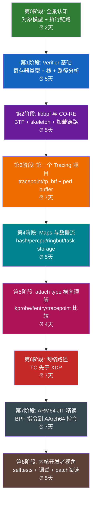

# Linux ARM64 eBPF 理论与实践一体化学习指南

> **环境**：Linux 6.18.1 / ARM64 / 当前源码树可直接作为学习基线  
> **学习对象**：eBPF 基础机制、Verifier、CO-RE/libbpf、Tracing、TC/XDP、ARM64 JIT  
> **编写视角**：顶级 eBPF + ARM64 内核专家  
> **学习方法论**：每个阶段 = 理论模型 + 内核源码 + 可运行实验 + 结果验证 + 反思复盘

---

## 目录

<details>
<summary><a href="#为什么这份指南适合当前内核">为什么这份指南适合当前内核</a></summary>

</details>

<details>
<summary><a href="#学习路线总览">学习路线总览</a></summary>

</details>

<details>
<summary><a href="#先给结论学习-ebpf-最容易走偏的地方">先给结论：学习 eBPF 最容易走偏的地方</a></summary>

</details>

<details>
<summary><a href="#理解-ebpf-字节码的故事">理解 eBPF 字节码的故事</a></summary>

- [为什么 eBPF 要有自己的字节码](#为什么-ebpf-要有自己的字节码)
- [这段“字节码故事”到底是怎样流动的](#这段字节码故事到底是怎样流动的)
- [eBPF 字节码和普通虚拟机字节码有什么不同](#ebpf-字节码和普通虚拟机字节码有什么不同)
- [为什么说 map 和 helper 也是这段故事的一部分](#为什么说-map-和-helper-也是这段故事的一部分)
- [字节码、解释器、JIT 三者的关系](#字节码解释器jit-三者的关系)

</details>

<details>
<summary><a href="#从-linux-ebpf-ybzhang-ppt-吸收的历史与工程视角">从 Linux ebpf ybzhang PPT 吸收的历史与工程视角</a></summary>

- [1. 用历史线索建立全局感](#1-用历史线索建立全局感)
- [2. PPT 里的使用场景分类值得保留](#2-ppt-里的使用场景分类值得保留)
- [3. 嵌入式和 ARM64 场景下的工具选型](#3-嵌入式和-arm64-场景下的工具选型)
- [4. 嵌入式/交叉编译视角的补足](#4-嵌入式交叉编译视角的补足)

</details>

<details>
<summary><a href="#第0部分开始之前必须先建立的五条主线">第0部分：开始之前必须先建立的五条主线</a></summary>

- [0.1 如何使用 libbpf 编写一个 eBPF 程序](#01-如何使用-libbpf-编写一个-ebpf-程序)
- [0.2 当前 eBPF 的系统调用](#02-当前-ebpf-的系统调用)
- [0.3 kprobe、ftrace、tracepoint 以及其他 hook 怎么理解](#03-kprobeftracetracepoint-以及其他-hook-怎么理解)
- [0.4 eBPF 内核如何加载并运行程序](#04-ebpf-内核如何加载并运行程序)
- [0.5 用户空间如何使用 eBPF 程序](#05-用户空间如何使用-ebpf-程序)

</details>

<details>
<summary><a href="#第a部分8周学习计划按天拆解">第A部分：8周学习计划，按天拆解</a></summary>

- [第0周：建立对象模型与环境直觉](#第0周建立对象模型与环境直觉)
- [第1周：Verifier 是第一大关](#第1周verifier-是第一大关)
- [第2周：libbpf、BTF、CO-RE](#第2周libbpfbtfco-re)
- [第3周：第一个 tracing 闭环项目](#第3周第一个-tracing-闭环项目)
- [第4周：Map 与数据通道](#第4周map-与数据通道)
- [第5周：Attach Type 横向比较](#第5周attach-type-横向比较)
- [第6周：网络路径，TC 先于 XDP](#第6周网络路径tc-先于-xdp)
- [第7周：ARM64 JIT 精读](#第7周arm64-jit-精读)
- [第8周：内核开发者视角](#第8周内核开发者视角)

</details>

<details>
<summary><a href="#第b部分第一个可运行的-ebpf-tracing-项目实战">第B部分：第一个可运行的 eBPF Tracing 项目实战</a></summary>

- [1. 项目目标](#1-项目目标)
- [2. 先看 BPF 侧到底做了什么](#2-先看-bpf-侧到底做了什么)
- [3. 用户态程序做了什么](#3-用户态程序做了什么)
- [4. 这个项目涉及的理论点](#4-这个项目涉及的理论点)
- [5. 你应该如何自己做一版最小项目](#5-你应该如何自己做一版最小项目)
- [6. 建议的编译与运行准备](#6-建议的编译与运行准备)
- [7. 这个项目完成后你应该具备什么能力](#7-这个项目完成后你应该具备什么能力)

</details>

<details>
<summary><a href="#第c部分arm64-ebpf-jit-精读路线">第C部分：ARM64 eBPF JIT 精读路线</a></summary>

- [1. 第一个入口：寄存器映射](#1-第一个入口寄存器映射)
- [2. 第二个入口：立即数与地址装载](#2-第二个入口立即数与地址装载)
- [3. 第三个入口：prologue 与栈布局](#3-第三个入口prologue-与栈布局)
- [4. 第四个入口：helper call 如何落到 AArch64 调用](#4-第四个入口helper-call-如何落到-aarch64-调用)
- [5. 第五个入口：helper 特化内联](#5-第五个入口helper-特化内联)
- [6. 第六个入口：tail call](#6-第六个入口tail-call)
- [7. 第七个入口：BTI 与 KCFI](#7-第七个入口bti-与-kcfi)
- [8. 第八个入口：从一条 BPF 指令追到一串 A64 指令](#8-第八个入口从一条-bpf-指令追到一串-a64-指令)
- [9. 推荐的 JIT 精读顺序](#9-推荐的-jit-精读顺序)
- [10. JIT 学习阶段的实践要求](#10-jit-学习阶段的实践要求)

</details>

<details>
<summary><a href="#第d部分基于当前源码树的阅读顺序">第D部分：基于当前源码树的阅读顺序</a></summary>

- [第一层：官方文档层](#第一层官方文档层)
- [第二层：用户态工程层](#第二层用户态工程层)
- [第三层：内核实现层](#第三层内核实现层)
- [第四层：测试与维护层](#第四层测试与维护层)

</details>

<details>
<summary><a href="#第e部分实践环境建议">第E部分：实践环境建议</a></summary>

</details>

<details>
<summary><a href="#第f部分每阶段的结果判定标准">第F部分：每阶段的结果判定标准</a></summary>

- [Verifier 阶段通过标准](#verifier-阶段通过标准)
- [CO-RE 阶段通过标准](#co-re-阶段通过标准)
- [Tracing 阶段通过标准](#tracing-阶段通过标准)
- [ARM64 JIT 阶段通过标准](#arm64-jit-阶段通过标准)

</details>

<details>
<summary><a href="#第g部分最后的学习建议">第G部分：最后的学习建议</a></summary>

</details>

<details>
<summary><a href="#第h部分前14天函数级精读清单">第H部分：前14天函数级精读清单</a></summary>

- [Day 1：建立对象模型](#day-1建立对象模型)
- [Day 2：把 BPF 指令模型和 C 前端分开](#day-2把-bpf-指令模型和-c-前端分开)
- [Day 3：Verifier 总体流程](#day-3verifier-总体流程)
- [Day 4：Verifier 状态结构](#day-4verifier-状态结构)
- [Day 5：Verifier 日志与失败案例](#day-5verifier-日志与失败案例)
- [Day 6：libbpf 和 skeleton 的角色](#day-6libbpf-和-skeleton-的角色)
- [Day 7：BTF 与 CO-RE](#day-7btf-与-co-re)
- [Day 8：选一个真实 tracing 工具](#day-8选一个真实-tracing-工具)
- [Day 9：先读 BPF 侧](#day-9先读-bpf-侧)
- [Day 10：再读用户态侧](#day-10再读用户态侧)
- [Day 11：从 tracing 扩展到 attach type 比较](#day-11从-tracing-扩展到-attach-type-比较)
- [Day 12：进入 ARM64 JIT 的第一层](#day-12进入-arm64-jit-的第一层)
- [Day 13：ARM64 JIT 的立即数与调用路径](#day-13arm64-jit-的立即数与调用路径)
- [Day 14：ARM64 JIT 的 prologue、tail call、helper 特化](#day-14arm64-jit-的-prologuetail-callhelper-特化)

</details>

<details>
<summary><a href="#第i部分可直接执行的命令模板">第I部分：可直接执行的命令模板</a></summary>

- [1. 先确认内核/BPF 基本能力](#1-先确认内核bpf-基本能力)
- [2. 构建基础工具](#2-构建基础工具)
- [3. ARM64 交叉编译时的常用环境变量](#3-arm64-交叉编译时的常用环境变量)
- [4. 观察已加载程序与 map](#4-观察已加载程序与-map)
- [5. 查看 BPF IR 和 JIT 后机器码](#5-查看-bpf-ir-和-jit-后机器码)
- [6. 观察 tracing 输出](#6-观察-tracing-输出)
- [7. 打开程序统计信息](#7-打开程序统计信息)
- [8. 观察和调整 JIT 行为](#8-观察和调整-jit-行为)
- [9. 运行 selftests](#9-运行-selftests)
- [10. 用 vmtest 跑隔离环境](#10-用-vmtest-跑隔离环境)
- [11. 建议的最小日常闭环命令](#11-建议的最小日常闭环命令)

</details>

<details>
<summary><a href="#第j部分学习过程中最值得记录的笔记模板">第J部分：学习过程中最值得记录的笔记模板</a></summary>

- [笔记模板](#笔记模板)
- [一个最小示例](#一个最小示例)

</details>

<details>
<summary><a href="#第k部分继续深入时的自然下一步">第K部分：继续深入时的自然下一步</a></summary>

</details>

---

## 为什么这份指南适合当前内核

这不是一份泛泛的 eBPF 教程，而是专门围绕你当前这棵 Linux 6.18.1 ARM64 源码树组织的学习路径。

当前源码里已经具备完整学习条件：

1. ARM64 默认配置已经启用基础 eBPF 能力。
   `arch/arm64/configs/defconfig` 中已经有 `CONFIG_BPF_SYSCALL=y`、`CONFIG_BPF_JIT=y`、`CONFIG_CGROUP_BPF=y`。
2. 内核文档完整。
   `Documentation/bpf/` 下有 verifier、BTF、helpers、programs、maps、libbpf 等核心文档。
3. 样例完整。
   `samples/bpf/` 与 `tools/bpf/` 提供从早期样例到 libbpf/CO-RE 风格的实际代码。
4. 自测完整。
   `tools/testing/selftests/bpf/` 是最有价值的系统化教材之一。
5. ARM64 JIT 后端完整可读。
   `arch/arm64/net/bpf_jit_comp.c` 可以直接作为架构级深入学习入口。

如果你想在 ARM64 平台真正掌握 eBPF，正确路径不是先盯着 JIT，也不是先抄工具，而是：

```text
执行模型 → Verifier → libbpf/CO-RE → Tracing → Map/数据通道 → TC/XDP → ARM64 JIT → Selftests/内核开发视角
```

---

## 学习路线总览



**绿色** = 全景理解  
**蓝色** = verifier 核心  
**紫色** = libbpf/CO-RE 工程化  
**橙色** = 第一个闭环项目  
**青色** = map 与数据通道  
**洋红** = attach type 比较  
**红色** = 网络场景  
**灰色** = ARM64 JIT  
**棕色** = 内核开发者能力

---

## 先给结论：学习 eBPF 最容易走偏的地方

很多人学 eBPF 会掉进三种误区：

1. 只看语法，不看 verifier。
2. 只会跑现成工具，不理解加载、attach、map、BTF 和数据回传。
3. 过早研究 JIT，却没有建立 BPF IR、helper 调用语义和 verifier 约束的基础。

你应该反过来学：

1. 先理解 eBPF 是一种受 verifier 严格约束的内核执行环境，而不是普通脚本。
2. 再理解程序如何通过 libbpf/BTF/CO-RE 被加载到内核。
3. 然后用 tracing 场景跑通完整闭环。
4. 最后回头研究 ARM64 JIT，才能看懂为什么某条 BPF 指令在 AArch64 上要生成那样的机器码。

---

## 理解 eBPF 字节码的故事

很多人第一次接触 eBPF，会把它误解成“内核里跑的 C 代码”。这其实不对。

更准确的说法是：

```text
eBPF 程序的真正执行对象不是 C 源码，而是 eBPF 指令集定义的一段字节码/指令流。
```

### 为什么 eBPF 要有自己的字节码

因为内核需要的是：

1. 一种和具体 CPU 架构解耦的中间表示。
2. 一种可以被 verifier 做静态安全证明的受限指令模型。
3. 一种可以在不同 hook 上复用的统一执行语义。

如果直接在内核里跑用户写的 native 代码，会立刻失去：

1. 可验证性。
2. 可移植性。
3. 对 helper、map、上下文访问的严格约束。

所以 eBPF 本质上是一台抽象机。

### 这段“字节码故事”到底是怎样流动的

它的主线其实很清楚：

```text
C 源码
   -> clang/LLVM BPF 后端
   -> eBPF 指令序列
   -> ELF 对象文件(.text/.maps/.BTF/.BTF.ext)
   -> libbpf 解析与重定位
   -> bpf(BPF_PROG_LOAD)
   -> verifier 检查
   -> interpreter 或 JIT
   -> hook 事件触发时运行
```

这里每一层的职责都不同：

1. C 只是开发语言，不是最终执行格式。
2. LLVM BPF 后端负责把 C 变成 eBPF ISA 指令。
3. ELF 负责把程序、map、BTF、重定位信息打包在一起。
4. libbpf 负责把这些对象整理好并交给内核。
5. verifier 负责证明程序安全。
6. 解释器或 JIT 负责真正执行这段 eBPF 指令流。

### eBPF 字节码和普通虚拟机字节码有什么不同

从 PPT 里抽出来的一个很好的视角是：eBPF 也可以被理解成“专用虚拟机字节码”，但它和 Java VM、QEMU 这种通用虚拟机不是一类东西。

正确理解应该是：

1. eBPF 虚拟机只模拟一个很小的、为内核安全扩展而设计的抽象执行环境。
2. 它没有完整用户态进程模型、文件系统、设备模型这些通用虚拟机能力。
3. 它重点解决的是“受限指令 + 可验证 + 可挂接到内核事件”。

在解释执行路径下，这个抽象机最核心的实现就体现在 `kernel/bpf/core.c` 的 `___bpf_prog_run()` 一类逻辑中。

所以你可以把 eBPF 看成：

```text
一种专门为 Linux 内核可编程扩展设计的小型、安全、可验证、可 JIT 的专用字节码系统。
```

### 为什么说 map 和 helper 也是这段故事的一部分

因为单靠一套受限指令，是不可能完成复杂内核交互的。

eBPF 之所以从“包过滤指令”成长为“通用内核可编程框架”，关键就在于它后来补上了三块：

1. map：提供程序之间、内核与用户态之间的数据共享能力。
2. helper：提供受控的内核能力出口。
3. verifier：确保这些能力不会被滥用。

这也是为什么 PPT 里的时间线提到 2014 年之后，eBPF 的关键扩展不只是指令集，而是 map、helper、verifier、JIT、BTF 这些机制一起演进。

### 字节码、解释器、JIT 三者的关系

这是必须彻底理顺的一点：

1. 字节码定义语义。
2. 解释器逐条解释语义。
3. JIT 把语义翻译成架构本地机器码。

也就是说：

1. 字节码不是解释器。
2. JIT 也不是另一套语义。
3. 它们都在执行同一套 eBPF 指令语义，只是执行形式不同。

这也正是你后面学习 ARM64 JIT 的基础。

---

## 从 Linux ebpf ybzhang PPT 吸收的历史与工程视角

PPT 里有一些内容和当前 Markdown 已经重合，但也有几类视角值得明确吸收进来，尤其适合你现在这个 ARM64/嵌入式背景。

### 1. 用历史线索建立全局感

PPT 里的时间线可以整理成一个更准确、对学习更有帮助的版本：

1. 1992 年，经典 BPF 诞生，核心目标是提升报文过滤和抓包效率，典型代表是 tcpdump。
2. 2011 年前后，Linux 内核里 BPF JIT 能力逐渐成熟，开始显著改善执行性能。
3. 2014 年，eBPF 形态真正成型，BPF 从“报文过滤器”扩展为“通用内核可编程机制”，map、helper、verifier、扩展指令集开始成为核心组成。
4. 2016 年，XDP 让 eBPF 在高性能网络数据路径上的价值进一步爆发。
5. 2018 年后，BTF/CO-RE、trampoline、LSM、ringbuf、struct_ops 等特性持续扩展，使 eBPF 进入网络、跟踪、安全、容器、云原生等多个领域。

这条时间线最大的学习价值，不是背年份，而是建立一个判断：

```text
eBPF 不是“突然出现的一门内核脚本语言”，而是一条从包过滤、到可验证虚拟机、再到内核通用扩展框架的演化线。
```

### 2. PPT 里的使用场景分类值得保留

PPT 把 eBPF 常见用途归纳为几类，这个归纳是有效的，值得保留为“场景地图”：

1. 网络监控与流量管理。
2. 系统性能监控与优化。
3. 应用程序监控与调试。
4. 安全监控、IDS/IPS 与策略控制。
5. 容器、云原生与微服务可观测性。
6. 故障诊断与日志辅助分析。

这组分类的价值在于：它提醒你学习时不要把 eBPF 只理解成 tracing 工具，也不要只理解成网络工具。它实际上是一个跨子系统的内核扩展能力。

### 3. 嵌入式和 ARM64 场景下的工具选型

PPT 有一个很实用的工程判断，我建议直接吸收到当前指南里：

1. BCC 适合快速原型、调试和实验。
2. libbpf 适合真正部署、轻量集成和对资源更敏感的环境。
3. libbpf-bootstrap 适合作为新项目或示例工程的脚手架起点。

把它翻译成更工程化的建议就是：

在 ARM64 或嵌入式环境里，优先级通常是：

1. 学习和验证阶段：BCC、bpftrace、bpftool 都可以用来加速理解。
2. 真正交付阶段：优先选 libbpf/CO-RE。
3. 新项目起步：优先参考 libbpf-bootstrap 的组织方式，而不是从零手搓整个构建系统。

原因很直接：

1. BCC 依赖重，运行时模型更偏开发工具。
2. libbpf 更轻量、更接近主线推荐路径。
3. 对 ARM64 板卡、容器镜像、嵌入式固件来说，最终可部署性通常比原型便利性更重要。

### 4. 嵌入式/交叉编译视角的补足

PPT 后半段虽然很多页是工程截图，但它提醒了一个现实问题：

```text
在 ARM64 或嵌入式设备上做 eBPF，真正的难点常常不止是写程序，还包括工具链和依赖的交叉编译与部署。
```

这意味着你在实践时最好把环境问题单独建模：

1. 目标内核是否打开了 BPF、BTF、tracing、网络相关配置。
2. 宿主机是否具备 clang/llvm/pahole/bpftool。
3. 目标设备是否需要交叉编译 libbpf、zlib、elfutils、bpftool 等依赖。
4. 最终是动态链接部署、静态链接部署，还是只把 `.bpf.o` 和用户态控制程序一起下发。

对于你的学习路线，这意味着：

1. 在开发机上先把语义和程序跑通。
2. 再考虑 ARM64 板卡上的交叉编译和裁剪。
3. 最后才处理产品化部署问题。

这个顺序非常关键，否则很容易被工具链问题拖住，误以为是 eBPF 本身很难。

---

## 第0部分：开始之前必须先建立的五条主线

这一部分专门回答五个最容易卡住 eBPF 入门的问题：

1. 如何使用 libbpf 编写一个 eBPF 程序。
2. 当前 eBPF 的系统调用到底是什么。
3. kprobe、ftrace、tracepoint 以及其他 hook 应该怎么理解。
4. eBPF 程序在内核里到底如何被加载和运行。
5. 用户空间到底如何真正使用 eBPF 程序。

如果这五条主线没建立起来，后面再看 verifier、JIT、CO-RE 都会比较散。

### 0.1 如何使用 libbpf 编写一个 eBPF 程序

现代 eBPF 开发里，推荐的主路径不是自己手搓 `bpf()` syscall，而是：

```text
BPF 侧 C 代码 -> clang 编译成 .bpf.o -> bpftool 生成 skeleton -> 用户态通过 libbpf open/load/attach -> 事件/Map 与用户态交互
```

也就是说，libbpf 负责的是“加载器”和“对象生命周期管理”，不是 BPF 字节码编译器。

#### 0.1.1 一个最小 libbpf 项目的结构

通常会有两部分：

1. `xxx.bpf.c`
   运行在内核里的 BPF 程序。
2. `xxx.c`
   运行在用户态的控制程序，负责加载、附着、读写 map、消费事件。

#### 0.1.2 一个最小的 BPF 侧程序

下面这个例子用 tracepoint 跟踪 `execve`，适合作为第一个 libbpf 程序模型：

```c
// exec_trace.bpf.c
#include "vmlinux.h"
#include <bpf/bpf_helpers.h>
#include <bpf/bpf_core_read.h>

struct event {
   u32 pid;
   char comm[16];
};

struct {
   __uint(type, BPF_MAP_TYPE_RINGBUF);
   __uint(max_entries, 1 << 24);
} events SEC(".maps");

SEC("tracepoint/syscalls/sys_enter_execve")
int handle_execve(void *ctx)
{
   struct event *e;

   e = bpf_ringbuf_reserve(&events, sizeof(*e), 0);
   if (!e)
      return 0;

   e->pid = bpf_get_current_pid_tgid() >> 32;
   bpf_get_current_comm(&e->comm, sizeof(e->comm));
   bpf_ringbuf_submit(e, 0);
   return 0;
}

char LICENSE[] SEC("license") = "GPL";
```

这个最小程序包含了 eBPF 程序最关键的四个要素：

1. `SEC()` 指定程序类型和 hook。
2. `.maps` 段定义 map。
3. helper 调用实现与内核交互。
4. `license` 告诉内核许可证信息。

#### 0.1.3 一个最小的用户态 libbpf 程序

用户态一般用 skeleton 包装，代码会非常清楚：

```c
// exec_trace.c
#include <stdio.h>
#include <signal.h>
#include <bpf/libbpf.h>
#include "exec_trace.skel.h"

static volatile sig_atomic_t exiting;

static void on_sigint(int signo)
{
   exiting = 1;
}

static int handle_event(void *ctx, void *data, size_t len)
{
   const struct event *e = data;

   printf("pid=%u comm=%s\n", e->pid, e->comm);
   return 0;
}

int main(void)
{
   struct ring_buffer *rb = NULL;
   struct exec_trace_bpf *skel;
   int err;

   signal(SIGINT, on_sigint);

   skel = exec_trace_bpf__open();
   if (!skel)
      return 1;

   err = exec_trace_bpf__load(skel);
   if (err)
      goto out;

   err = exec_trace_bpf__attach(skel);
   if (err)
      goto out;

   rb = ring_buffer__new(bpf_map__fd(skel->maps.events), handle_event, NULL, NULL);
   if (!rb) {
      err = 1;
      goto out;
   }

   while (!exiting)
      ring_buffer__poll(rb, 100);

out:
   ring_buffer__free(rb);
   exec_trace_bpf__destroy(skel);
   return err != 0;
}
```

这段代码反映了 libbpf 应用最核心的生命周期：

1. `__open()`：解析对象文件，发现程序、map、全局变量。
2. `__load()`：创建 map、解析重定位、调用 `BPF_PROG_LOAD` 进入内核 verifier。
3. `__attach()`：把程序附着到 hook。
4. 运行期间：通过 ringbuf、perf buffer、map 与内核交换数据。
5. `__destroy()`：卸载和清理。

#### 0.1.4 典型构建流程

```bash
bpftool btf dump file /sys/kernel/btf/vmlinux format c > vmlinux.h
clang -g -O2 -target bpf -D__TARGET_ARCH_arm64 -c exec_trace.bpf.c -o exec_trace.bpf.o
bpftool gen skeleton exec_trace.bpf.o > exec_trace.skel.h
cc -g -O2 exec_trace.c -lbpf -lelf -lz -o exec_trace
```

这四步分别对应：

1. 生成 BTF 类型头文件。
2. 编译 BPF 程序。
3. 生成 libbpf skeleton。
4. 编译用户态控制程序。

#### 0.1.5 为什么现在推荐 libbpf

因为 libbpf 把最麻烦的工作统一处理掉了：

1. 解析 ELF 和 BTF。
2. 处理 CO-RE 重定位。
3. 创建 map。
4. 调用 `bpf()` syscall 装载程序。
5. 自动附着支持的程序类型。
6. 通过 skeleton 暴露清晰的用户态接口。

你真正应该把精力放在：

1. 程序语义是否正确。
2. verifier 是否能接受。
3. hook 是否选对。
4. map 和数据通道设计是否合理。

#### 0.1.6 libbpf 的两种常见编程风格

实际开发里，libbpf 有两种常见用法。

第一种是 skeleton 风格。

特点：

1. 最简洁。
2. 适合新项目。
3. map、prog、rodata 都能通过结构体字段直接访问。

核心接口：

1. `xxx__open()`
2. `xxx__load()`
3. `xxx__attach()`
4. `xxx__destroy()`

第二种是通用 object/program API 风格。

特点：

1. 更灵活。
2. 适合需要自己控制对象打开、查找 program/map、逐个 attach 的场景。

核心接口：

1. `bpf_object__open_file()`
2. `bpf_object__load()`
3. `bpf_object__find_program_by_name()`
4. `bpf_program__attach_*()`
5. `bpf_map__fd()`

如果你刚开始学，建议先用 skeleton。因为它更容易让你把注意力集中在：

1. hook 选择。
2. verifier 约束。
3. 数据通道设计。

而不是先陷入对象查找和生命周期样板代码。

#### 0.1.7 libbpf 视角下的程序生命周期

从 libbpf 角度看，一个 BPF 应用通常经历四个阶段。

Open：

1. 解析 ELF。
2. 发现 program、map、global data。
3. 准备 BTF/CO-RE 元数据。

Load：

1. 创建 map。
2. 处理 relocation。
3. 触发 `BPF_PROG_LOAD`。
4. 让 verifier 校验程序。

Attach：

1. 把 program 绑定到具体 hook。
2. 现代 attach 常常体现为 `BPF_LINK_CREATE`。

Run/Interact：

1. 事件触发时内核执行程序。
2. 用户态通过 ringbuf/perf buffer/map 交互。

把这四步理解成固定模板，后面看 tracing、XDP、tc、cgroup BPF 都会顺很多。

### 0.2 当前 eBPF 的系统调用

Linux 并不是给 eBPF 设计了一堆分散 syscall，而是统一提供了一个：

```c
int bpf(int cmd, union bpf_attr *attr, unsigned int size);
```

核心思路是：

1. `cmd` 指定操作类型。
2. `union bpf_attr` 作为参数载体。
3. 不同 `cmd` 解释 `attr` 的不同字段。

也就是说，“当前 eBPF 的系统调用”本质上就是一个 `bpf()`，但它下面有很多子命令。

#### 0.2.1 当前内核中的主要 `bpf_cmd`

在当前 6.18.1 源码里，`include/uapi/linux/bpf.h` 的 `enum bpf_cmd` 包含这些主要命令。

按功能分组更容易理解。

Map 相关：

1. `BPF_MAP_CREATE`
2. `BPF_MAP_LOOKUP_ELEM`
3. `BPF_MAP_UPDATE_ELEM`
4. `BPF_MAP_DELETE_ELEM`
5. `BPF_MAP_GET_NEXT_KEY`
6. `BPF_MAP_LOOKUP_AND_DELETE_ELEM`
7. `BPF_MAP_FREEZE`
8. `BPF_MAP_LOOKUP_BATCH`
9. `BPF_MAP_LOOKUP_AND_DELETE_BATCH`
10. `BPF_MAP_UPDATE_BATCH`
11. `BPF_MAP_DELETE_BATCH`

Program 相关：

1. `BPF_PROG_LOAD`
2. `BPF_PROG_TEST_RUN`
3. `BPF_PROG_ATTACH`
4. `BPF_PROG_DETACH`
5. `BPF_PROG_QUERY`
6. `BPF_PROG_GET_NEXT_ID`
7. `BPF_PROG_GET_FD_BY_ID`
8. `BPF_PROG_BIND_MAP`
9. `BPF_PROG_STREAM_READ_BY_FD`

对象与元信息：

1. `BPF_OBJ_PIN`
2. `BPF_OBJ_GET`
3. `BPF_OBJ_GET_INFO_BY_FD`
4. `BPF_MAP_GET_NEXT_ID`
5. `BPF_MAP_GET_FD_BY_ID`

链接与附着：

1. `BPF_LINK_CREATE`
2. `BPF_LINK_UPDATE`
3. `BPF_LINK_GET_FD_BY_ID`
4. `BPF_LINK_GET_NEXT_ID`
5. `BPF_LINK_DETACH`
6. `BPF_RAW_TRACEPOINT_OPEN`

BTF、迭代器、统计与安全能力：

1. `BPF_BTF_LOAD`
2. `BPF_BTF_GET_FD_BY_ID`
3. `BPF_BTF_GET_NEXT_ID`
4. `BPF_ITER_CREATE`
5. `BPF_ENABLE_STATS`
6. `BPF_TASK_FD_QUERY`
7. `BPF_TOKEN_CREATE`

#### 0.2.2 最重要的四个命令

如果只抓主线，最重要的是这四个：

1. `BPF_MAP_CREATE`
   创建 map。
2. `BPF_PROG_LOAD`
   把 BPF 指令交给内核 verifier，并完成加载。
3. `BPF_LINK_CREATE`
   创建程序和 hook 之间的 link。
4. `BPF_OBJ_PIN`
   把 map/prog/link 固定到 bpffs，方便跨进程使用。

现代 libbpf 基本会帮你封装这些 syscall，但理解这四个命令仍然非常关键，因为它们决定了 eBPF 用户态与内核交互的基本模型。

### 0.3 kprobe、ftrace、tracepoint 以及其他 hook 怎么理解

很多初学者会把 hook 理解成“程序挂载点”，这没有错，但还不够。更准确的理解是：

```text
hook 决定了 BPF 程序在什么时机被调用、能拿到什么上下文、允许做什么事、返回值有什么语义。
```

#### 0.3.1 先区分三类最常见 tracing hook

##### tracepoint

特点：

1. 内核显式定义好的静态观测点。
2. 上下文结构稳定性比 kprobe 更好。
3. 非常适合入门和做可观测性工具。

典型 section：

1. `SEC("tracepoint/<category>/<name>")`

##### kprobe / kretprobe

特点：

1. 动态挂到任意内核函数入口或返回点。
2. 灵活，但更依赖内核符号和函数原型稳定性。
3. 容易写，但长期可维护性通常不如 tracepoint 和 fentry。

典型 section：

1. `SEC("kprobe/<function>")`
2. `SEC("kretprobe/<function>")`

##### ftrace 路径上的 fentry / fexit / fmod_ret

很多人说“eBPF 挂 ftrace”，在现代内核里更准确的说法通常是 tracing 程序通过 trampoline/ftrace 机制工作，具体程序形态常见为：

1. `fentry`
2. `fexit`
3. `fmod_ret`

特点：

1. 开销通常比 kprobe 更低。
2. 更贴近函数调用语义。
3. 强依赖 BTF 和 attach target 校验。
4. 是现代内核里非常重要的一类高质量 hook。

典型 section：

1. `SEC("fentry/<function>")`
2. `SEC("fexit/<function>")`
3. `SEC("fmod_ret/<function>")`

#### 0.3.2 `tp_btf` 是什么

`tp_btf` 可以理解为基于 BTF 的 tracing attach 形式之一，它让程序在很多场景下比传统 tracepoint 更自然地拿到类型信息。

典型 section：

1. `SEC("tp_btf/<name>")`

你的当前源码树中 `runqslower` 就是一个很好的例子。

#### 0.3.3 其他重要 hook 类型

如果从系统视角看，eBPF hook 不止 tracing。

常见的还包括：

网络与数据路径：

1. `xdp`
2. `tc/ingress`
3. `tc/egress`
4. `sk_skb`
5. `sk_msg`
6. `flow_dissector`
7. `netfilter`

安全与策略：

1. `lsm`
2. `cgroup/*`
3. `sockops`
4. `sk_lookup`

用户态与混合观测：

1. `uprobe`
2. `uretprobe`
3. `usdt`

其他重要能力：

1. `raw_tracepoint`
2. `perf_event`
3. `iter`
4. `struct_ops`
5. `syscall`

#### 0.3.4 该怎么选 hook

如果目标是入门和做稳定观测，建议优先级通常是：

1. `tracepoint` / `tp_btf`
2. `fentry` / `fexit`
3. `kprobe` / `kretprobe`

原因是：

1. `tracepoint` 稳定、直观，最适合第一批练习。
2. `fentry/fexit` 更现代，性能更好，但前置要求更高。
3. `kprobe` 最灵活，但最容易沦为“能用但脆弱”。

#### 0.3.5 常见 hook 的 `SEC()`、程序类型与 libbpf attach API 对照

把 hook 真正学会，一个很有效的方法是把这三件事同时记住：

1. BPF 侧 `SEC()` 怎么写。
2. 对应的 `BPF_PROG_TYPE_*` 是什么。
3. 用户态 libbpf 常用哪个 attach API。

最常见的对照如下。

tracepoint：

1. `SEC("tracepoint/<category>/<name>")`
2. `BPF_PROG_TYPE_TRACEPOINT`
3. `bpf_program__attach_tracepoint()`

raw tracepoint：

1. `SEC("raw_tracepoint/<name>")` 或 `SEC("raw_tp/<name>")`
2. `BPF_PROG_TYPE_RAW_TRACEPOINT`
3. `bpf_program__attach_raw_tracepoint()` 或旧内核上的 `BPF_RAW_TRACEPOINT_OPEN`

kprobe / kretprobe：

1. `SEC("kprobe/<func>")`
2. `SEC("kretprobe/<func>")`
3. `BPF_PROG_TYPE_KPROBE`
4. `bpf_program__attach_kprobe()`

fentry / fexit / fmod_ret：

1. `SEC("fentry/<func>")`
2. `SEC("fexit/<func>")`
3. `SEC("fmod_ret/<func>")`
4. `BPF_PROG_TYPE_TRACING`
5. `bpf_program__attach_trace()`

tp_btf：

1. `SEC("tp_btf/<name>")`
2. `BPF_PROG_TYPE_TRACING`
3. `bpf_program__attach_trace()`

uprobe / uretprobe：

1. `SEC("uprobe/<path>:<func>")`
2. `SEC("uretprobe/<path>:<func>")`
3. `BPF_PROG_TYPE_KPROBE`
4. `bpf_program__attach_uprobe()`

lsm：

1. `SEC("lsm/<hook>")`
2. `BPF_PROG_TYPE_LSM`
3. `bpf_program__attach_lsm()`

xdp：

1. `SEC("xdp")`
2. `BPF_PROG_TYPE_XDP`
3. `bpf_program__attach_xdp()`

tcx：

1. `SEC("tcx/ingress")` 或 `SEC("tcx/egress")`
2. `BPF_PROG_TYPE_SCHED_CLS`
3. `bpf_program__attach_tcx()`

如果你记不住全部，至少记住一个经验法则：

1. `tracepoint/kprobe` 这类传统 tracing hook，经常通过 perf event 或类似机制接入。
2. `fentry/fexit/tp_btf/lsm` 这类更现代的 BTF/tracing hook，经常更直接依赖 `BPF_LINK_CREATE` 和 tracing attach target 校验。

#### 0.3.6 三条典型 hook 调用链

这里给出三条最值得背下来的主线。

##### tracepoint 路径

用户态 attach：

```text
bpf_program__attach_tracepoint()
   -> perf_event_open(tracepoint)
   -> bpf_program__attach_perf_event_opts()
```

运行时路径：

```text
tracepoint 事件发生
   -> tracepoint/perf 事件框架
   -> 对应 BPF 程序被调用
   -> 程序读上下文、更新 map、输出事件
```

要点：

1. tracepoint attach 在 libbpf 侧明显依赖 `perf_event_open()`。
2. 这是为什么 tracepoint 程序通常很好观测、很好入门。

##### kprobe 路径

用户态 attach：

```text
bpf_program__attach_kprobe()
   -> bpf_program__attach_kprobe_opts()
   -> perf_event_open_probe() 或 legacy kprobe event
   -> bpf_program__attach_perf_event_opts()
```

内核执行路径：

```text
命中被探测函数
   -> kprobe/kretprobe 机制触发
   -> kernel/trace/bpf_trace.c: trace_call_bpf()
   -> bpf_prog_run_array(..., bpf_prog_run)
   -> BPF 程序运行
```

要点：

1. `kernel/trace/bpf_trace.c` 里明确写了 kprobe handler 通过 `trace_call_bpf()` 执行 BPF 程序。
2. 这条路径非常值得看源码，因为它把 tracing 子系统和 BPF runtime 连接起来了。

##### fentry / fexit / tp_btf 路径

用户态 attach：

```text
bpf_program__attach_trace()
   -> bpf_link_create(..., expected_attach_type, ...)
```

内核侧主线：

```text
BPF_LINK_CREATE
   -> attach target 校验
   -> trampoline/ftrace 相关基础设施建立
   -> 目标函数入口/出口或 BTF tracing 点触发时进入 BPF 程序
```

要点：

1. 这类 hook 更接近现代 tracing/BTF attach 机制。
2. 相比 kprobe，它们通常有更强的 attach target 约束，也更依赖内核 BTF。
3. 这也是为什么 `fentry/fexit` 常被视为更现代、更高质量的 tracing 路径。

### 0.4 eBPF 内核如何加载并运行程序

这是最容易被神秘化的一块。其实只要分成“加载路径”和“执行路径”就清楚了。

#### 0.4.1 加载路径

当用户态通过 libbpf 或 직접 syscall 调用 `BPF_PROG_LOAD` 时，内核主路径大致是：

```text
userspace
  -> bpf(BPF_PROG_LOAD, ...)
  -> SYSCALL_DEFINE3(bpf)
  -> __sys_bpf()
  -> bpf_prog_load()
  -> find_prog_type()
  -> security_bpf_prog_load()
  -> bpf_check()
  -> bpf_prog_select_runtime()
  -> JIT 或 interpreter 选择
  -> 分配 prog ID / 返回 prog FD
```

把这条路径拆开看：

1. `__sys_bpf()` 是统一分发入口。
2. `bpf_prog_load()` 负责做加载参数校验、拷贝指令、处理 attach target、准备 `struct bpf_prog`。
3. `bpf_check()` 就是 verifier 主入口，它证明程序安全。
4. `bpf_prog_select_runtime()` 负责在解释器和 JIT 之间做选择。
5. 如果是 ARM64 且 JIT 可用，最终会进入 ARM64 的 JIT 编译路径。

#### 0.4.2 运行时选择：解释器还是 JIT

`bpf_prog_select_runtime()` 的核心逻辑是：

1. 如果需要 JIT，就调用 `bpf_int_jit_compile()`。
2. 如果不走 JIT，则保留解释器路径。
3. 最终程序通过统一的 `bpf_prog_run()` 家族接口被执行。

也就是说，BPF 程序的“语义”由 verifier 保证，但“执行形态”可能是：

1. 解释执行。
2. JIT 后的本地机器码执行。

#### 0.4.3 如果不走 JIT，谁来执行指令

在解释器路径下，核心执行函数是 `kernel/bpf/core.c` 里的 `___bpf_prog_run()`。

它本质上是：

1. 准备一组 BPF 伪寄存器。
2. 逐条 decode BPF 指令。
3. 根据 opcode 做跳转和计算。
4. 最终返回 `R0`。

这让你可以把解释器理解为：

```text
一个实现了 BPF 抽象机语义的虚拟执行器。
```

#### 0.4.4 如果走 JIT，谁来执行程序

在 ARM64 上，JIT 会把 BPF 指令编译成 AArch64 机器码，最终 `prog->bpf_func` 指向生成后的原生函数入口。

之后运行某个 hook 时，内核不是再解释 BPF 指令，而是直接调用这段本地代码。

这也是为什么 JIT 性能更高。

#### 0.4.5 真正触发执行时发生了什么

程序被 attach 之后，真正运行还取决于 hook。

例如：

1. tracepoint 触发时，tracepoint 框架准备上下文并调用对应 BPF 程序。
2. cgroup hook 触发时，对应子系统在合适时机调用 `bpf_prog_run()` 或 `bpf_prog_run_array_*()`。
3. XDP 收到包时，在数据路径上调用 `bpf_prog_run_xdp()` 一类接口。
4. trampoline/fentry 路径则通过 tracing/trampoline 机制进入 BPF 程序。

所以“内核如何运行 eBPF 程序”的标准答案不是单一函数，而是：

```text
先由 verifier 保证安全，再由 runtime 选择解释器或 JIT，最后由具体 hook 所在子系统在事件发生时调用它。
```

#### 0.4.6 从 `bpf_prog_run()` 再往下看一层

如果你继续往执行细节深入，可以把运行时分成三层。

第一层：通用运行接口层。

1. `bpf_prog_run()`
2. `bpf_prog_run_array()`
3. 各子系统自己的 `bpf_prog_run_*()` 包装

第二层：运行时选择层。

1. 如果程序是解释执行，就落到 `___bpf_prog_run()`。
2. 如果程序已经 JIT，则调用 `prog->bpf_func` 指向的本地机器码。

第三层：具体 hook 子系统。

1. tracing 子系统负责 tracing hook 上下文。
2. 网络子系统负责 skb/xdp 上下文。
3. cgroup、LSM、sockops 等子系统各自负责自己的上下文语义。

这样你就不会把所有“程序执行”都误解成某一个固定函数里发生的事情。

#### 0.4.7 hook 不同，返回值语义也不同

这一点非常重要。

同样都是 `return 0` 或 `return 1`，在不同 hook 上意义完全不同。

例如：

1. tracing 程序里返回值很多时候只是局部控制语义，或者根本不作为包处理决策使用。
2. XDP 程序里返回的是 `XDP_PASS`、`XDP_DROP`、`XDP_TX` 这类动作。
3. cgroup/sock、LSM 一类程序里，返回值可能直接决定允许、拒绝或修改策略。

所以学习每种 hook 时，必须同时掌握：

1. 上下文类型是什么。
2. 可以调用哪些 helper。
3. 返回值语义是什么。

#### 0.4.8 尾调是什么，它真正解决什么问题

尾调，英文是 tail call，在 eBPF 里不是普通意义上的“编译器优化型尾调用”，也不是简单 helper 调用。

在 eBPF 里，它更准确的定义是：

```text
当前 eBPF 程序根据 index 从 BPF_MAP_TYPE_PROG_ARRAY 中查出另一个 eBPF 程序，然后把执行流无返回地跳转过去。
```

核心要素有三个：

1. map 类型必须是 `BPF_MAP_TYPE_PROG_ARRAY`。
2. 程序通过 `bpf_tail_call(ctx, prog_array, index)` 发起跳转。
3. 跳过去之后，不会再返回原程序继续执行。

##### 为什么叫“尾调”

因为语义上它更接近“把当前程序的剩余执行权直接交给另一个程序”。

所以它和普通 helper 调用的差别非常大：

1. helper 调用返回后，当前程序继续执行。
2. tail call 成功后，当前程序就结束了，控制流转交给下一个程序。
3. 如果 tail call 失败，例如索引越界、目标为空、超过次数限制，则继续执行当前程序后续逻辑。

##### 尾调在内核解释器里的真实语义

`kernel/bpf/core.c` 的解释器路径能非常清楚地看到这一点。

它做的事情本质上是：

1. 从 `BPF_R2` 取到 `prog_array map`。
2. 从 `BPF_R3` 取到 `index`。
3. 检查 `index < max_entries`。
4. 检查 `tail_call_cnt < MAX_TAIL_CALL_CNT`。
5. 取出目标 `prog`。
6. 把 `insn` 直接切换到目标程序的指令流入口。
7. 重新开始执行，而不是调用后返回。

这就是为什么它本质上是“程序链路跳转”，而不是普通函数调用。

##### 为什么需要尾调

它主要解决三个问题：

1. 程序模块化。
2. 程序分发与多阶段流水线。
3. 动态替换某一段逻辑，而不必重写整个程序。

典型用途包括：

1. 根据协议类型跳到不同处理程序。
2. 根据数据路径阶段拆分多个小程序。
3. 在 `prog_array` 中替换某个 slot，实现热更新式逻辑切换。

所以 tail call 的一个核心价值是：

```text
它把“大程序”拆成“程序图”，让 eBPF 从单段逻辑扩展成可组合的执行流水线。
```

##### 为什么内核要限制尾调次数

为了防止无限跳转和执行失控，内核定义了 `MAX_TAIL_CALL_CNT`，当前内核中该常量是 33。

也就是说：

1. 每次成功 tail call 都会递增计数。
2. 达到限制后，tail call 失败并回到当前程序继续后续逻辑或结束。

这个限制的目的不是任意拍脑袋，而是确保：

1. 程序执行有上界。
2. verifier 与 runtime 的复杂度保持可控。
3. 不会因为程序链路设计不当导致 CPU 被无限占用。

##### 为什么 verifier 对尾调这么敏感

因为 tail call 会显著改变控制流模型。

在当前内核里，verifier 对 tail call 的关注点包括：

1. map 是否真的是 `BPF_MAP_TYPE_PROG_ARRAY`。
2. 是否存在资源泄漏风险。
3. 是否和 bpf-to-bpf calls、子程序、返回类型等约束冲突。
4. 在某些条件下，混合 tail call 与普通 BPF 函数调用会被限制。

这也是为什么你会在 verifier 里看到类似：

1. `mixing of tail_calls and bpf-to-bpf calls is not supported`
2. `tail_call is only allowed in functions that return 'int'`
3. `tail_call is not allowed in subprogs without BTF`

这些限制的本质不是“功能没做完”，而是为了保证控制流、安全性和执行边界仍然是可证明的。

##### 尾调和 ARM64 JIT 的关系

你现在正在学 ARM64，所以还要多理解一层：

1. 解释器里 tail call 体现为切换 `insn` 指针。
2. JIT 里 tail call 会被翻译成更接近本地跳转/分发逻辑的代码序列。
3. 由于它不是普通 helper 调用，所以 prologue、tail-call counter、BTI landing pad 都会受到影响。

这也正是为什么 `arch/arm64/net/bpf_jit_comp.c` 会专门为 tail call 预留状态和生成特殊逻辑。

##### 用一句话记住尾调

```text
尾调不是“调用另一个函数”，而是“根据 prog_array 把当前 eBPF 程序的执行权交给另一个 eBPF 程序，并且成功后不再返回”。
```

### 0.5 用户空间如何使用 eBPF 程序

用户空间对 eBPF 的使用，不只是“把程序 load 进去”。完整一点看，用户态至少有五类职责。

#### 0.5.1 编译与打包

用户态首先要完成：

1. 生成 `vmlinux.h`。
2. 编译 `.bpf.c` 到 `.bpf.o`。
3. 生成 skeleton。
4. 编译控制程序。

这一步属于“交付 BPF 应用”。

#### 0.5.2 打开、加载、附着

用户态最核心的 libbpf 生命周期是：

1. open
2. load
3. attach

如果不用 skeleton，等价的通用 API 思路大致是：

1. `bpf_object__open_file()`
2. `bpf_object__load()`
3. `bpf_program__attach_*()`

如果使用 skeleton，则通常就是：

1. `xxx__open()`
2. `xxx__load()`
3. `xxx__attach()`

#### 0.5.3 配置程序和读写 map

用户空间经常要做的事有：

1. 在 load 前设置 `.rodata` 或其他全局变量。
2. 在运行时对 map 做 lookup/update/delete。
3. 把配置写进 map，让内核中的 BPF 程序读取。

这部分意味着：

```text
用户态不是旁观者，而是 eBPF 应用的控制面。
```

#### 0.5.4 消费内核事件

最常见的数据回传方式有：

1. ringbuf
2. perf buffer
3. 直接读 map

不同方式适用场景不同：

1. ringbuf 适合现代事件流。
2. perf buffer 历史使用广泛，tracing 中很多样例还在用。
3. map 适合统计、状态缓存、配置控制。

#### 0.5.5 调试、观察、持久化

用户空间还经常需要：

1. 用 `bpftool prog show/map show/link show` 看对象状态。
2. 用 `bpftool prog dump xlated/jited` 看 IR 和机器码。
3. 用 `BPF_OBJ_PIN` 或 libbpf pin 接口把对象挂到 bpffs。
4. 在退出前决定是销毁 link，还是保留 pinned 对象给其他进程复用。

#### 0.5.6 一个完整的用户态心智模型

如果把用户空间的职责压缩成一句话，就是：

```text
用户空间负责构建、加载、附着、配置、观测和回收 eBPF 应用，而内核负责验证、执行和与 hook 子系统集成。
```

这句话你后面读 libbpf、syscall、JIT、samples、selftests 时可以一直拿来做总纲。

---

## 第A部分：8周学习计划，按天拆解

这一部分回答你的第一个要求：把学习路径拆成真正可执行的日程，而不是大而空的阶段建议。

### 第0周：建立对象模型与环境直觉

#### Day 1：先把对象边界建立起来

学习目标：知道 eBPF 世界里有哪些对象，它们如何协作。

必读：

1. `Documentation/bpf/index.rst`
2. `Documentation/bpf/programs.rst`
3. `Documentation/bpf/maps.rst`
4. `Documentation/bpf/syscall_api.rst`

必须回答的三个问题：

1. 什么是 program，什么是 map，什么是 attach point？
2. helper 与 kfunc 的区别是什么？
3. 用户态 loader 负责什么，内核 verifier/JIT 又负责什么？

当日实践：

1. 浏览 `samples/bpf/README.rst`。
2. 浏览 `tools/bpf/bpftool/Documentation/bpftool-prog.rst`。
3. 画一张自己的执行链图：

```text
clang/llvm -> ELF(.BTF/.maps/.text) -> libbpf -> bpf syscall -> verifier -> JIT/interpreter -> attach -> event/map output
```

交付物：

1. 一页自己的对象模型笔记。

#### Day 2：理解 eBPF 指令不是 C，而是另一层 IR

学习目标：知道 C 只是前端，真正进内核的是 BPF 指令。

必读：

1. `Documentation/bpf/standardization/instruction-set.rst`
2. `Documentation/bpf/classic_vs_extended.rst`

必须理解：

1. BPF 寄存器模型：R0-R10。
2. 栈模型：R10 是只读 frame pointer。
3. helper call 和普通函数调用不是一回事。

当日实践：

1. 用 `bpftool prog dump xlated` 的文档理解 xlated 输出长什么样。
2. 随便选一个简单样例，观察 BPF 程序 section 名称如何决定程序类型。

交付物：

1. 写下“BPF 程序执行时寄存器和栈分别承载什么”。

---

### 第1周：Verifier 是第一大关

#### Day 3：理解 verifier 的两阶段模型

核心文档：

1. `Documentation/bpf/verifier.rst`

核心源码：

1. `include/linux/bpf_verifier.h`
2. `kernel/bpf/verifier.c`

必须理解：

1. CFG 检查不是全部，路径模拟才是核心。
2. verifier 不是“语法检查器”，而是“安全证明器”。
3. R1-R5 调用后被 clobber，R6-R9 是 callee-saved，这一点后面会直接连到 ARM64 JIT 的寄存器映射。

实践：

1. 读 `Documentation/bpf/verifier.rst` 中关于 `PTR_TO_CTX`、`PTR_TO_STACK`、`SCALAR_VALUE` 的描述。
2. 在笔记里画出寄存器状态流转图。

#### Day 4：读状态结构，不要停留在文档表面

重点源码：

1. `include/linux/bpf_verifier.h` 中的 `struct bpf_reg_state`
2. `struct bpf_verifier_env`

当日目标：

1. 理解 `type`、固定偏移、可变偏移、umin/umax、smin/smax、tnum 的关系。
2. 明白 verifier 为什么能在不执行程序的情况下证明安全性。

实践：

1. 写一页关于 `tnum` 的直觉笔记。
2. 用自己的语言解释“为什么指针加指针会退化成标量”。

#### Day 5：把 verifier 主流程串起来

重点函数：

1. `check_cfg()`
2. `do_check()`
3. `do_check_common()`

当日目标：

1. 理解 verifier 先做 CFG，再做逐指令状态传播。
2. 理解“路径爆炸”和“状态合并”为什么是 verifier 最核心的复杂度来源。

实践：

1. 在源码里把主流程调用链抄一遍。
2. 记录每个函数负责的边界，不求细节全懂，但要分清职责。

#### Day 6：刻意写会失败的程序

这是最关键的一天。

要刻意制造以下 verifier 失败：

1. 读取未初始化栈。
2. 越界栈访问。
3. 未判空访问 `map_value_or_null`。
4. 非法指针算术。
5. helper 参数类型不匹配。

实践目标：

1. 每个失败案例都记录一条“verifier 想保护什么”的结论。

#### Day 7：复盘 verifier

输出要求：

1. 用一页纸总结 verifier 关心的五个维度：寄存器类型、范围、对齐、栈初始化、引用生命周期。

---

### 第2周：libbpf、BTF、CO-RE

#### Day 8：先理解 BTF 解决什么问题

核心文档：

1. `Documentation/bpf/btf.rst`

必须理解：

1. BTF 不是调试信息替代品，而是类型元数据基础设施。
2. CO-RE 不是“自动兼容魔法”，它依赖 BTF 和 relocation 机制。

实践：

1. 确认 selftests 参考配置中有 `CONFIG_DEBUG_INFO_BTF=y`。

#### Day 9：理解 skeleton 的本质

重点代码：

1. `tools/bpf/bpftool/gen.c`

学习目标：

1. skeleton 只是把 BPF object 的打开、加载、attach、map/prog 访问包装成 C API。
2. 明白为什么现代 eBPF 项目大量采用 skeleton。

实践：

1. 阅读 `bpftool gen skeleton` 相关实现思路。
2. 记录 open/load/attach 三阶段分别失败时意味着什么。

#### Day 10：读一个真实 CO-RE 样例

推荐入口：

1. `tools/bpf/runqslower/runqslower.c`
2. `tools/bpf/runqslower/runqslower.bpf.c`

这一天先不急着理解全部功能，只看结构：

1. BPF 侧定义 maps 和 SEC。
2. 用户态侧 open/load/attach。
3. perf buffer 收事件。

#### Day 11：把一个 tracing 项目的边界讲清楚

必须能回答：

1. 为什么 BPF 程序里用了 `tp_btf/`？
2. 为什么用户态需要 BTF 支持？
3. 为什么数据要通过 perf buffer 或 ringbuf 回来，而不是直接打印？

#### Day 12：整理 CO-RE 心智模型

输出要求：

1. 写一页“CO-RE 不是为了跨平台，而是为了跨内核结构变动”的总结。

---

### 第3周：第一个 tracing 闭环项目

这一周对应下文的第B部分实战章节，重点是能亲手跑通一个最小但完整的项目。

#### Day 13：选定项目目标

建议目标：

1. 观测进程调度等待延迟。
2. 观测某个 syscall 的进入和返回时间。
3. 观测某个内核函数调用频次。

最推荐：

1. 类似 `runqslower` 的调度延迟观测，因为上下文、过滤、时间戳、事件上报都很典型。

#### Day 14：先从 BPF 侧读懂代码

重点是：

1. `SEC("tp_btf/sched_wakeup")`
2. `SEC("tp_btf/sched_switch")`
3. `BPF_MAP_TYPE_TASK_STORAGE`
4. `BPF_MAP_TYPE_PERF_EVENT_ARRAY`

#### Day 15：再从用户态读懂代码

重点是：

1. `*_bpf__open()`
2. `*_bpf__load()`
3. `*_bpf__attach()`
4. `perf_buffer__new()`
5. 事件轮询与解析

#### Day 16：自己画完整调用链

```text
task wakeup -> tp_btf program -> task_storage 记录时间戳 -> sched_switch -> 读取时间差 -> perf_event_output -> user space perf buffer -> 打印结果
```

#### Day 17：做第一次改造

建议改动之一：

1. 只跟踪指定 PID。
2. 增加最小延迟阈值。
3. 修改输出字段。

#### Day 18：做第二次改造

建议改动之一：

1. 把 perf buffer 改成 ringbuf。
2. 增加每 CPU 统计 map。
3. 增加丢事件统计。

#### Day 19：做故障注入与调试

主动观察：

1. 如果 BTF 不匹配会怎样。
2. 如果 attach 点不对会怎样。
3. 如果 map 定义不兼容会怎样。

#### Day 20：总结项目

输出要求：

1. 一页“这个项目中 verifier、BTF、map、attach、数据回传各自负责什么”。

---

### 第4周：Map 与数据通道

目标：不要只会用一个 map。

本周至少亲手理解：

1. hash map
2. percpu hash/array
3. task storage
4. ringbuf
5. perf event array

要求：

1. 明白它们的并发语义。
2. 明白为什么 percpu map 经常更适合统计。
3. 明白为什么 tracing 场景下 ringbuf 相比 perf buffer 更现代，但 perf buffer 仍然广泛存在。

---

### 第5周：Attach Type 横向比较

这一周不要急着追求更多代码，而是建立判断力。

要比较：

1. tracepoint
2. tp_btf
3. kprobe/kretprobe
4. fentry/fexit

你需要能说清：

1. 上下文结构是否稳定。
2. BTF 依赖程度。
3. 开销差异。
4. verifier 约束差异。
5. 适用场景。

---

### 第6周：网络路径，TC 先于 XDP

这是很多人会犯错的地方。正确顺序是先 TC 再 XDP。

原因：

1. TC 的上下文和调试方式更平滑。
2. XDP 更贴近驱动与 NIC，理解门槛更高。
3. 先学 `__sk_buff` 语义，再学 `xdp_md` 会更稳。

建议练习：

1. 写一个 tc classifier 做简单统计。
2. 再写一个 XDP 程序做 drop/pass 或简单计数。
3. 用 bpftool 对比 xlated 与 jited。

---

### 第7周：ARM64 JIT 精读

这一周对应下文第C部分的源码精读。

注意顺序：

1. 先看寄存器映射。
2. 再看 prologue/epilogue。
3. 再看 helper call、tail call、branch、imm64。
4. 最后看 BTI/KCFI 与 trampolines。

---

### 第8周：内核开发者视角

这周不要再只写 demo，而要学会从测试和实现反推设计边界。

必做：

1. 阅读 `tools/testing/selftests/bpf/README.rst`
2. 选读 verifier 子目录下的测试用例
3. 读 `tools/testing/selftests/bpf/config`

目标：

1. 明白 eBPF 子系统是如何被维护和验证的。
2. 学会把 selftests 当教材，而不是只当 CI 附属品。

---

## 第B部分：第一个可运行的 eBPF Tracing 项目实战

这一部分回答你的第二个要求：基于当前内核，给出一个适合 ARM64 平台入门的第一个项目。

我建议你以 `tools/bpf/runqslower/` 为模板，做一个“调度等待延迟追踪器”。

原因很直接：

1. 它是 tracing 场景，不依赖复杂网络环境。
2. 它同时覆盖 BTF、CO-RE、map、事件输出、用户态加载。
3. 它的逻辑足够真实，但不复杂到淹没核心概念。

### 1. 项目目标

观测一个进程从“被唤醒”到“真正上 CPU 运行”之间的延迟。

核心思路：

1. 在 `sched_wakeup` 或 `sched_wakeup_new` 时记录时间戳。
2. 在 `sched_switch` 中看到该任务被切入时，读取时间差。
3. 当延迟超过阈值时，把事件送到用户态。

### 2. 先看 BPF 侧到底做了什么

`runqslower.bpf.c` 的结构非常经典。

#### 2.1 两类 map

第一类：任务本地存储

```c
struct {
    __uint(type, BPF_MAP_TYPE_TASK_STORAGE);
    __uint(map_flags, BPF_F_NO_PREALLOC);
    __type(key, int);
    __type(value, u64);
} start SEC(".maps");
```

作用：

1. 给每个 task 绑定一个时间戳。
2. 唤醒时写入，切换上 CPU 时读取。

第二类：事件输出

```c
struct {
    __uint(type, BPF_MAP_TYPE_PERF_EVENT_ARRAY);
    __uint(key_size, sizeof(u32));
    __uint(value_size, sizeof(u32));
} events SEC(".maps");
```

作用：

1. 把最终事件送到用户态。

#### 2.2 attach 点

```c
SEC("tp_btf/sched_wakeup")
SEC("tp_btf/sched_wakeup_new")
SEC("tp_btf/sched_switch")
```

说明：

1. 这是 `tp_btf` 风格 tracing 程序。
2. 它比传统 tracepoint 更贴近 BTF 类型信息。

#### 2.3 核心流程

唤醒路径：

1. `trace_enqueue()` 获取 task 指针。
2. 过滤 PID。
3. 通过 `bpf_task_storage_get()` 拿到该 task 的存储槽。
4. 记录 `bpf_ktime_get_ns()` 时间戳。

切换路径：

1. `handle__sched_switch()` 拿到 `prev` 和 `next`。
2. 对 `next` 读取之前保存的时间戳。
3. 计算等待时间。
4. 超过阈值则通过 `bpf_perf_event_output()` 发到用户态。
5. 删除 task storage，避免脏数据残留。

### 3. 用户态程序做了什么

`runqslower.c` 是现代 libbpf 程序的标准骨架。

核心步骤：

1. 解析命令行参数。
2. `*_bpf__open()` 打开 object。
3. 通过 `obj->rodata` 设置过滤条件。
4. `*_bpf__load()` 完成 verifier 校验与内核加载。
5. `*_bpf__attach()` 绑定到 hook。
6. 建立 perf buffer。
7. 轮询事件并格式化输出。

### 4. 这个项目涉及的理论点

这个小项目至少覆盖了下面这些 eBPF 核心知识点：

1. `SEC()` 决定程序类型与 attach 语义。
2. BTF/CO-RE 让程序更稳地适配内核结构。
3. verifier 会检查 task storage 与 helper 调用是否合法。
4. map 负责跨事件保存状态。
5. perf buffer 负责把内核事件送回用户态。
6. skeleton 负责把 open/load/attach 包成易用接口。

### 5. 你应该如何自己做一版最小项目

建议你写一个独立练习项目，按下面顺序做。

#### 第一步：先照着最小功能做出来

目标：

1. 只统计 `sched_switch` 次数，先不算延迟。

这样做的原因：

1. 先把 attach 和事件上报跑通。

#### 第二步：引入时间戳

目标：

1. 对指定 PID 记录 wakeup 时间。
2. 在 switch 时计算延迟。

#### 第三步：加入过滤和阈值

目标：

1. 支持 PID 过滤。
2. 支持最小延迟阈值。

#### 第四步：加入聚合统计

目标：

1. 增加 map，统计每个 PID 的事件次数和最大延迟。

#### 第五步：从 perf buffer 迁移到 ringbuf

目标：

1. 亲自比较两种用户态消费模型。

### 6. 建议的编译与运行准备

参考当前源码树中的说明，你至少需要准备：

1. clang
2. llvm
3. pahole
4. libelf 相关开发环境

如果后续要大规模跑自测或在隔离环境验证，优先考虑：

1. `tools/testing/selftests/bpf/vmtest.sh`

### 7. 这个项目完成后你应该具备什么能力

完成这一实战后，你至少应该达到以下水平：

1. 能读懂一个标准 libbpf/CO-RE tracing 项目。
2. 能区分 BPF 侧和用户态侧各自职责。
3. 能理解 map、attach、事件回传的协作关系。
4. 能开始自己写中小型 tracing 工具。

---

## 第C部分：ARM64 eBPF JIT 精读路线

这一部分回答你的第三个要求：不是泛泛解释，而是给出面向当前 ARM64 JIT 实现的源码精读路线。

核心文件：

1. `arch/arm64/net/bpf_jit_comp.c`

如果你只记一句话，那就是：

```text
Verifier 证明程序安全，ARM64 JIT 负责把 BPF 抽象机语义翻译成 AArch64 指令序列。
```

### 1. 第一个入口：寄存器映射

文件一开始最重要的数据结构之一就是：

```c
static const int bpf2a64[] = {
    [BPF_REG_0] = A64_R(7),
    [BPF_REG_1] = A64_R(0),
    [BPF_REG_2] = A64_R(1),
    [BPF_REG_3] = A64_R(2),
    [BPF_REG_4] = A64_R(3),
    [BPF_REG_5] = A64_R(4),
    [BPF_REG_6] = A64_R(19),
    [BPF_REG_7] = A64_R(20),
    [BPF_REG_8] = A64_R(21),
    [BPF_REG_9] = A64_R(22),
    [BPF_REG_FP] = A64_R(25),
    ...
};
```

这段映射必须吃透，因为它把 BPF 抽象机语义直接锚到 AArch64 ABI 上。

应该重点理解：

1. 为什么 `BPF_REG_1` 到 `BPF_REG_5` 会落到 A64 的参数寄存器附近。
2. 为什么 `BPF_REG_6` 到 `BPF_REG_9` 落到 A64 callee-saved 区间。
3. 为什么 `BPF_REG_FP` 要单独映射到固定寄存器。
4. 为什么还需要额外的临时寄存器与私有栈寄存器。

你会发现 verifier 文档里关于调用后寄存器保存规则，与这里的映射是严格对齐的。这就是为什么先学 verifier 再学 JIT 是正确顺序。

### 2. 第二个入口：立即数与地址装载

JIT 不是简单把常量塞进寄存器就完了。AArch64 对立即数编码有限制，所以你会看到：

1. `emit_a64_mov_i()`
2. `emit_a64_mov_i64()`
3. `emit_addr_mov_i64()`

这组函数的意义是：

1. 把 BPF 里的 32 位和 64 位立即数拆成合法的 A64 指令组合。
2. 对 vmalloc/kernel text 这样的地址采取更有针对性的拼装方式。

精读建议：

1. 先理解 `MOVZ/MOVN/MOVK` 的硬件语义。
2. 再看为什么某些场景优先选 `MOVN` 而不是 `MOVZ`。

### 3. 第三个入口：prologue 与栈布局

`bpf_jit_comp.c` 中对 prologue 的注释非常关键，因为它把 BPF 栈、A64 栈和函数调用栈三者叠在一起解释了。

你需要重点理解下面几层：

1. A64 原生的 FP/LR 保存区。
2. JIT 保存的 callee-saved 寄存器区。
3. BPF 的逻辑栈区。
4. 额外函数调用栈区。

这一段要结合以下逻辑一起看：

1. `emit_kcfi()`
2. `emit_bti()`
3. `push_callee_regs()`
4. `prepare_bpf_tail_call_cnt()`
5. `ctx->stack_size = round_up(..., 16)`

这里有几个 ARM64 特有的学习重点：

1. 为什么栈必须 16 字节对齐。
2. 为什么某些场景要给 BPF 私有栈单独建指针。
3. 为什么要考虑 BTI 和 KCFI，而不是只关心功能正确。

### 4. 第四个入口：helper call 如何落到 AArch64 调用

JIT 中一个特别关键的函数组合是：

1. `should_emit_indirect_call()`
2. `emit_direct_call()`
3. `emit_indirect_call()`
4. `emit_call()`

这四个函数回答的是：

```text
当 BPF 程序调用 helper 或 trampoline 时，ARM64 JIT 应该生成直接 branch link，还是先装地址再 BLR？
```

你必须理解：

1. 直接调用有分支距离限制。
2. 当目标超出可编码范围，或者目标在编译阶段无法静态确认时，必须退化成间接调用。
3. 间接调用路径会先把地址装进临时寄存器，再用 `BLR`。

这正是 AArch64 指令编码约束如何反过来影响 JIT 设计的典型例子。

### 5. 第五个入口：helper 特化内联

JIT 里不是所有 helper 都一定走普通函数调用。

例如你会看到一些特殊处理：

1. `bpf_get_smp_processor_id` 被内联成寄存器读取和内存访问。
2. `bpf_get_current_task` / `_btf` 被内联成从 `SP_EL0` 获取当前 task。

这部分特别值得学，因为它体现了一个重要理念：

```text
JIT 不只是翻译器，还是性能与 ABI 约束之间的优化器。
```

### 6. 第六个入口：tail call

tail call 是 eBPF 里非常独特的一块，既不是普通函数调用，也不是简单跳转。

你应该重点理解：

1. tail call count 为什么要维护。
2. 为什么 prologue 里要准备 tail call 相关状态。
3. 为什么 BTI 落点会影响 tail call 跳转设计。

### 7. 第七个入口：BTI 与 KCFI

这是 ARM64 平台学习里非常值得额外投入的一点。

当前实现中专门有：

1. `emit_bti()`
2. `emit_kcfi()`

它们回答的不是“程序能不能跑”，而是：

1. 控制流完整性如何在 JIT 代码里体现。
2. 为什么不同入口需要不同类型的 BTI landing pad。
3. 为什么 freplace、blr、br 这类调用/跳转语义会影响 landing pad 选择。

这部分如果你搞懂，说明你对 ARM64 平台 eBPF 的理解已经不是“功能层”，而是“架构安全语义层”。

### 8. 第八个入口：从一条 BPF 指令追到一串 A64 指令

真正高质量的 JIT 学习方式，不是顺序扫完整个文件，而是挑典型指令做样本追踪。

建议你至少追这几类：

1. `BPF_ALU64 | BPF_MOV | BPF_K`
2. `BPF_LD | BPF_IMM | BPF_DW`
3. `BPF_JMP | BPF_CALL`
4. `BPF_JMP | BPF_EXIT`
5. `BPF_JMP | BPF_TAIL_CALL`

每一类都回答四个问题：

1. BPF 语义是什么。
2. JIT 选择了哪些 A64 指令。
3. 为什么不是别的指令组合。
4. 这和 verifier 的约束有什么关系。

### 9. 推荐的 JIT 精读顺序

不要从头顺读到尾。按下面顺序更高效：

1. 先读 `bpf2a64[]`。
2. 再读 `emit_*mov*` 系列。
3. 再读 `emit_call()` 相关函数。
4. 再读 prologue/epilogue。
5. 再读 `BPF_CALL`、`BPF_EXIT`、`BPF_TAIL_CALL` 路径。
6. 最后读 trampoline 与异常回调相关逻辑。

### 10. JIT 学习阶段的实践要求

这部分如果只读源码，很容易空转。你必须做对照实验。

建议操作：

1. 加载一个简单程序。
2. 用 bpftool 查看 xlated 指令。
3. 用 bpftool 查看 jited 指令。
4. 逐条对照 BPF IR 和 A64 指令。

你最终应该形成这样的能力：

1. 看一条 BPF helper call，大致能猜到 ARM64 JIT 会生成 direct call 还是 indirect call。
2. 看一个 BPF 栈访问，大致能猜到会相对于哪个 A64 寄存器寻址。
3. 看一个程序失败日志，能判断问题更可能在 verifier 还是在 JIT 落地阶段。

---

## 第D部分：基于当前源码树的阅读顺序

如果你现在就开始学，最推荐的源码阅读顺序如下：

### 第一层：官方文档层

1. `Documentation/bpf/index.rst`
2. `Documentation/bpf/verifier.rst`
3. `Documentation/bpf/btf.rst`
4. `Documentation/bpf/programs.rst`
5. `Documentation/bpf/maps.rst`
6. `Documentation/bpf/helpers.rst`
7. `Documentation/bpf/libbpf/index.rst`

### 第二层：用户态工程层

1. `samples/bpf/README.rst`
2. `tools/bpf/runqslower/`
3. `tools/bpf/bpftool/Documentation/bpftool-prog.rst`
4. `tools/bpf/bpftool/gen.c`

### 第三层：内核实现层

1. `include/linux/bpf_verifier.h`
2. `kernel/bpf/verifier.c`
3. `arch/arm64/net/bpf_jit_comp.c`

### 第四层：测试与维护层

1. `tools/testing/selftests/bpf/README.rst`
2. `tools/testing/selftests/bpf/config`
3. `tools/testing/selftests/bpf/verifier/`

---

## 第E部分：实践环境建议

如果你准备在 ARM64 环境系统性练习，建议尽量对齐 selftests 参考能力集。

重点配置建议：

1. `CONFIG_BPF=y`
2. `CONFIG_BPF_SYSCALL=y`
3. `CONFIG_BPF_JIT=y`
4. `CONFIG_BPF_EVENTS=y`
5. `CONFIG_BPF_LSM=y`
6. `CONFIG_CGROUP_BPF=y`
7. `CONFIG_DEBUG_INFO_BTF=y`
8. `CONFIG_FUNCTION_TRACER=y`
9. `CONFIG_FTRACE_SYSCALLS=y`
10. `CONFIG_NET_CLS_BPF=y`
11. `CONFIG_XDP_SOCKETS=y`

你的当前 ARM64 defconfig 已经提供基础入口，但如果你想把 tracing、CO-RE、LSM、网络、selftests 一次学完整，最好参考 `tools/testing/selftests/bpf/config` 再补充。

---

## 第F部分：每阶段的结果判定标准

不要只用“看懂了”判断进度。要用可验证标准。

### Verifier 阶段通过标准

1. 你能解释 R1-R5 与 R6-R9 的调用后语义。
2. 你能看懂基本 verifier log。
3. 你能自己制造并解释 5 种常见失败。

### CO-RE 阶段通过标准

1. 你能解释 BTF 与 CO-RE 的关系。
2. 你能读懂 skeleton 风格项目的 open/load/attach 流程。
3. 你能修改一个样例的过滤条件和输出结构。

### Tracing 阶段通过标准

1. 你能独立写一个简单 tracepoint 或 tp_btf 工具。
2. 你能在 BPF 侧保存状态并回传事件。
3. 你能定位 attach 失败、加载失败、事件不出的常见问题。

### ARM64 JIT 阶段通过标准

1. 你能解释 `bpf2a64[]` 映射设计。
2. 你能解释为什么 helper call 有 direct/indirect 两条路径。
3. 你能看懂 prologue 的栈布局与寄存器保存设计。

---

## 第G部分：最后的学习建议

如果你只做一件最重要的事，那就是：

```text
每学一个主题，都做“文档 -> 源码 -> 样例 -> 自己改造 -> 对照输出 -> 写总结”这个闭环。
```

这是把 eBPF 真正学成“能开发、能调试、能读内核实现”的唯一可靠路径。

在 ARM64 平台上，尤其要记住：

1. verifier 是语义入口。
2. libbpf/CO-RE 是工程入口。
3. tracing 是最好的第一实践场景。
4. ARM64 JIT 是架构理解的最后一跳。

只要按这条路线推进，你最后得到的不是“会用几个 eBPF 工具”，而是：

1. 能自己写 eBPF 程序。
2. 能读 verifier 和 selftests。
3. 能理解 ARM64 后端为什么这么实现。
4. 能继续往内核补丁、性能调优、可观测性工具开发方向走。

---

## 第H部分：前14天函数级精读清单

前面的 8 周计划已经给了阶段路线，这一部分进一步把前 14 天收敛到“今天具体读哪些文件、哪些函数、产出什么结论”。

### Day 1：建立对象模型

阅读文件：

1. `Documentation/bpf/index.rst`
2. `Documentation/bpf/programs.rst`
3. `Documentation/bpf/maps.rst`
4. `Documentation/bpf/syscall_api.rst`

当天必须搞清楚：

1. BPF program、map、attach point、helper、link 各自是什么。
2. 用户态通过 `bpf()` syscall 把什么东西交给内核。

当天产出：

1. 一张 eBPF 对象关系图。

### Day 2：把 BPF 指令模型和 C 前端分开

阅读文件：

1. `Documentation/bpf/standardization/instruction-set.rst`
2. `Documentation/bpf/classic_vs_extended.rst`

重点概念：

1. R0-R10 寄存器模型。
2. R10 栈基寄存器语义。
3. helper call 与普通 C 调用的差异。

当天产出：

1. 写出你对 `BPF_REG_0`、`BPF_REG_1-5`、`BPF_REG_6-9`、`BPF_REG_FP` 的直觉解释。

### Day 3：Verifier 总体流程

阅读文件：

1. `Documentation/bpf/verifier.rst`
2. `kernel/bpf/verifier.c`

重点函数：

1. `check_cfg()`
2. `do_check()`
3. `do_check_common()`

当天必须搞清楚：

1. verifier 为什么先做 CFG 再做状态传播。
2. “安全证明”具体落在哪些约束上。

### Day 4：Verifier 状态结构

阅读文件：

1. `include/linux/bpf_verifier.h`

重点结构：

1. `struct bpf_reg_state`
2. `struct bpf_verifier_env`
3. `struct bpf_func_state`

当天必须搞清楚：

1. 寄存器类型为什么要区分 `PTR_TO_CTX`、`PTR_TO_STACK`、`SCALAR_VALUE`。
2. `umin/umax`、`smin/smax`、`tnum` 为什么能组合出更强的证明能力。

### Day 5：Verifier 日志与失败案例

阅读目标：

1. `Documentation/bpf/verifier.rst` 中的典型错误模式。
2. `tools/testing/selftests/bpf/verifier/` 目录下的若干小用例。

当天必须完成：

1. 整理 5 种最常见 verifier 拒绝原因。
2. 每种原因配一条你自己的解释。

### Day 6：libbpf 和 skeleton 的角色

阅读文件：

1. `Documentation/bpf/libbpf/index.rst`
2. `tools/bpf/bpftool/gen.c`

重点函数或主题：

1. skeleton code generation 的整体流程。
2. open/load/attach 三阶段职责。

当天必须搞清楚：

1. skeleton 不是新机制，而是对 libbpf 对象模型的包装。

### Day 7：BTF 与 CO-RE

阅读文件：

1. `Documentation/bpf/btf.rst`
2. `Documentation/bpf/llvm_reloc.rst`

当天必须搞清楚：

1. BTF 解决的不是“调试方便”，而是类型可描述与重定位问题。
2. CO-RE 依赖哪些前提。

### Day 8：选一个真实 tracing 工具

阅读文件：

1. `tools/bpf/runqslower/runqslower.c`
2. `tools/bpf/runqslower/runqslower.bpf.c`

当天重点函数：

1. `main()`
2. `handle_event()`
3. `trace_enqueue()`
4. `handle__sched_switch()`

当天必须搞清楚：

1. 为什么这个工具是很好的第一个 tracing 项目。

### Day 9：先读 BPF 侧

重点函数：

1. `trace_enqueue()`
2. `handle__sched_wakeup()`
3. `handle__sched_wakeup_new()`
4. `handle__sched_switch()`

当天必须搞清楚：

1. `BPF_MAP_TYPE_TASK_STORAGE` 在这里为什么合适。
2. 为什么事件最终通过 `bpf_perf_event_output()` 发送。

当天产出：

1. 一张“wakeup 到 sched_switch”的数据流图。

### Day 10：再读用户态侧

重点函数：

1. `runqslower_bpf__open()`
2. `runqslower_bpf__load()`
3. `runqslower_bpf__attach()`
4. `perf_buffer__new()`

当天必须搞清楚：

1. 用户态是怎么把过滤条件写进 `.rodata` 的。
2. open、load、attach 哪一步失败意味着什么。

### Day 11：从 tracing 扩展到 attach type 比较

阅读文件：

1. `Documentation/bpf/programs.rst`
2. `tools/bpf/bpftool/Documentation/bpftool-prog.rst`

当天必须搞清楚：

1. `tracepoint`、`tp_btf`、`kprobe`、`fentry/fexit` 的使用边界。
2. 为什么新项目通常优先考虑 BTF 友好的路径。

### Day 12：进入 ARM64 JIT 的第一层

阅读文件：

1. `arch/arm64/net/bpf_jit_comp.c`

重点对象：

1. `bpf2a64[]`
2. `struct jit_ctx`
3. `emit()`
4. `emit_u32_data()`

当天必须搞清楚：

1. JIT 输出镜像是如何被逐条写入的。
2. BPF 抽象寄存器为什么要先映射到一组稳定的 A64 寄存器。

### Day 13：ARM64 JIT 的立即数与调用路径

重点函数：

1. `emit_a64_mov_i()`
2. `emit_a64_mov_i64()`
3. `emit_addr_mov_i64()`
4. `should_emit_indirect_call()`
5. `emit_direct_call()`
6. `emit_indirect_call()`
7. `emit_call()`

当天必须搞清楚：

1. AArch64 立即数与 branch 编码约束如何影响 JIT 设计。
2. 为什么 helper call 有 direct call 和 indirect call 两条路径。

### Day 14：ARM64 JIT 的 prologue、tail call、helper 特化

重点函数或区域：

1. prologue 生成逻辑
2. `emit_bti()`
3. `emit_kcfi()`
4. `emit_bpf_tail_call()`
5. `BPF_JMP | BPF_CALL` 路径

当天必须搞清楚：

1. BTI/KCFI 为什么会出现在 BPF JIT 代码中。
2. tail call 和普通 helper call 在控制流语义上有什么本质差异。
3. `bpf_get_smp_processor_id`、`bpf_get_current_task` 为什么适合内联。

---

## 第I部分：可直接执行的命令模板

这一部分不是要求你一次都跑完，而是给你一组后续可以直接照抄、按阶段使用的命令模板。

### 1. 先确认内核/BPF 基本能力

```bash
bpftool feature probe kernel
bpftool feature probe kernel full
```

建议在学习初期先观察这几类输出：

1. program types
2. map types
3. helper availability
4. JIT status
5. BTF support

### 2. 构建基础工具

```bash
make headers_install
make -C tools/bpf/bpftool
make -C tools/testing/selftests/bpf
make M=samples/bpf
```

说明：

1. `headers_install` 会在当前源码树生成本地头文件视图。
2. `bpftool` 是你后面观察 xlated/jited 的核心工具。
3. selftests 是系统化教材，不只是测试。
4. `samples/bpf` 有助于快速对照早期风格样例。

### 3. ARM64 交叉编译时的常用环境变量

```bash
export ARCH=arm64
export CROSS_COMPILE=aarch64-linux-gnu-
```

如果你在宿主机上交叉编译 samples 或部分工具，可以先设置这两个变量。

### 4. 观察已加载程序与 map

```bash
bpftool prog show
bpftool map show
bpftool link show
```

学习阶段最常做的不是“写更多代码”，而是反复看：

1. 程序有没有真正装进内核。
2. map 有没有按预期创建。
3. attach 结果是不是 link 化了。

### 5. 查看 BPF IR 和 JIT 后机器码

```bash
bpftool prog dump xlated id <prog_id> linum
bpftool prog dump jited  id <prog_id> linum
```

如果你在学 ARM64 JIT，这组命令必须变成熟练动作。

建议观察：

1. helper call 前后寄存器变化。
2. 栈访问的寻址方式。
3. prologue/epilogue 的固定模式。

### 6. 观察 tracing 输出

```bash
bpftool prog tracelog
```

用途：

1. 适合最初调试 `bpf_trace_printk()` 或相关调试输出。
2. 不适合高频正式数据通道。

### 7. 打开程序统计信息

```bash
sysctl kernel.bpf_stats_enabled=1
bpftool prog show
```

用途：

1. 让 `bpftool prog show` 能观察运行统计。
2. 适合做简单的程序行为验证。

### 8. 观察和调整 JIT 行为

```bash
cat /proc/sys/net/core/bpf_jit_enable
cat /proc/sys/net/core/bpf_jit_harden
echo 1 | sudo tee /proc/sys/net/core/bpf_jit_enable
echo 2 | sudo tee /proc/sys/net/core/bpf_jit_enable
```

经验解释：

1. 学习阶段通常需要确认 JIT 是否启用。
2. 某些环境下把 `bpf_jit_enable` 调到更激进的级别有助于观察 JIT 行为。
3. 这类调整要在测试环境做，不要直接套到生产机。

### 9. 运行 selftests

```bash
make -C tools/testing/selftests/bpf
sudo tools/testing/selftests/bpf/test_progs
```

如果你只是开始学习，不要试图一次吃掉所有自测。更好的方式是：

1. 先关注 verifier 相关子项。
2. 再关注 tracing/CO-RE 相关子项。
3. 最后再看 trampoline、struct_ops、网络等更复杂区域。

### 10. 用 vmtest 跑隔离环境

```bash
tools/testing/selftests/bpf/vmtest.sh -h
```

适用场景：

1. 你不想污染当前开发环境。
2. 你想更贴近维护者 CI 的运行方式。

### 11. 建议的最小日常闭环命令

如果你每天只有 30 到 60 分钟，建议固定执行这个顺序：

```bash
bpftool feature probe kernel
bpftool prog show
bpftool map show
bpftool prog dump xlated id <prog_id>
bpftool prog dump jited id <prog_id>
```

这个顺序的价值是：

1. 先确认环境能力。
2. 再确认程序/映射实际状态。
3. 最后把 BPF IR 与 ARM64 JIT 输出对上。

---

## 第J部分：学习过程中最值得记录的笔记模板

为了避免学完就散，建议你每次实验都按同一模板记一页笔记。

### 笔记模板

1. 今天看的文档/源码是什么。
2. 今天重点理解了哪条控制流或数据流。
3. 今天跑了什么命令。
4. 今天看到的 verifier/JIT 现象是什么。
5. 今天还没搞清楚的问题是什么。
6. 明天准备追哪一个函数或哪个 attach type。

### 一个最小示例

```text
主题：runqslower 的 sched_wakeup -> sched_switch 数据流
源码：tools/bpf/runqslower/runqslower.bpf.c
关注函数：trace_enqueue(), handle__sched_switch()
实验：观察 task storage 和 perf_event_output 的作用
现象：wakeup 时只记录时间，真正输出在 switch 路径
结论：一个 tracing 工具通常要跨多个 hook 才能形成完整语义
遗留问题：如果切换成 ringbuf，用户态逻辑会怎么变
```

---

## 第K部分：继续深入时的自然下一步

当你把本指南的前半段走通后，后续最自然的三个方向是：

1. 写一个你自己的 tracing 工具，而不是继续只读现成样例。
2. 开始对照 `tools/testing/selftests/bpf/` 读 verifier 和 trampoline 相关测试。
3. 回到 `arch/arm64/net/bpf_jit_comp.c`，按“单条 BPF 指令 -> 单段 A64 机器码”的方式做对照笔记。

做到这一步，你就已经进入真正的 ARM64 eBPF 内核开发学习区，而不是工具使用层。
