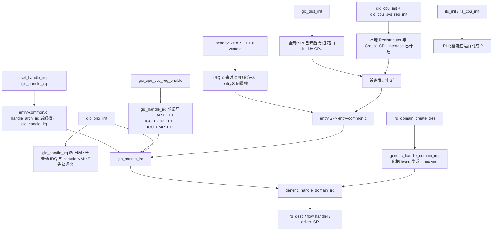

# ARMv8 下 GICv3 基础硬件知识整理

> 目标：先把 GICv3 的硬件对象、寄存器分层和中断流转建立成一张稳定的脑图，后面再去看 Linux IRQ 子系统和驱动实现时就不会乱。
>
> 参考资料：
> - `arm64-reference/gic/IHI0069H_b_gic_architecture_specification.pdf`
> - `arm64-reference/gic/GICv3_Software_Overview_Official_Release_B.pdf`
> - `arm64-reference/gic/GICv3_v4_overview.pdf`
> - `Documentation/devicetree/bindings/interrupt-controller/arm,gic-v3.yaml`
> - `drivers/irqchip/irq-gic-v3.c`
> - `include/linux/irqchip/arm-gic-v3.h`
> - `arch/arm64/include/asm/sysreg.h`

---

## 目录

<details>
<summary><a href="#1-先建立全局图gicv3-到底解决什么问题">1. 先建立全局图：GICv3 到底解决什么问题</a></summary>

</details>

<details>
<summary><a href="#2-gicv3-的核心硬件组件">2. GICv3 的核心硬件组件</a></summary>

</details>

<details>
<summary><a href="#21-distributor">2.1 Distributor</a></summary>

</details>

<details>
<summary><a href="#22-redistributor">2.2 Redistributor</a></summary>

</details>

<details>
<summary><a href="#23-cpu-interface">2.3 CPU Interface</a></summary>

</details>

<details>
<summary><a href="#24-its">2.4 ITS</a></summary>

</details>

<details>
<summary><a href="#3-gicv3-的中断类型和-intid-空间">3. GICv3 的中断类型和 INTID 空间</a></summary>

</details>

<details>
<summary><a href="#31-具体举例哪些东西通常会是-sgi--ppi--eppi--lpi">3.1 具体举例：哪些东西通常会是 SGI / PPI / EPPI / LPI</a></summary>

- [SGI 的典型例子](#sgi-的典型例子)
- [PPI 的典型例子](#ppi-的典型例子)
- [EPPI 的典型例子](#eppi-的典型例子)
- [LPI 的典型例子](#lpi-的典型例子)
- [一张最实用的对照表](#一张最实用的对照表)

</details>

<details>
<summary><a href="#4-gicdgicr-和-icc_-三层寄存器接口怎么理解">4. GICD、GICR 和 ICC_* 三层寄存器接口怎么理解</a></summary>

</details>

<details>
<summary><a href="#40-先记前缀它决定这是谁的寄存器">4.0 先记前缀：它决定“这是谁的寄存器”</a></summary>

</details>

<details>
<summary><a href="#401-再记动作词它决定这个寄存器到底干什么">4.0.1 再记动作词：它决定“这个寄存器到底干什么”</a></summary>

</details>

<details>
<summary><a href="#4011-名字里的数字和后缀是什么意思">4.0.1.1 名字里的数字和后缀是什么意思</a></summary>

- [末尾的 `EL1`](#末尾的-el1)
- [中间的 `1`](#中间的-1)
- [末尾的 `nE`](#末尾的-ne)

</details>

<details>
<summary><a href="#4012-现场拆-6-个最常见寄存器">4.0.1.2 现场拆 6 个最常见寄存器</a></summary>

- [例子 1: `GICD_ISENABLER`](#例子-1-gicd_isenabler)
- [例子 2: `GICD_IROUTER`](#例子-2-gicd_irouter)
- [例子 3: `GICR_WAKER`](#例子-3-gicr_waker)
- [例子 4: `ICC_IAR1_EL1`](#例子-4-icc_iar1_el1)
- [例子 5: `ICC_EOIR1_EL1`](#例子-5-icc_eoir1_el1)
- [例子 6: `GICR_PROPBASER`](#例子-6-gicr_propbaser)

</details>

<details>
<summary><a href="#4013-再加一层场景记忆不要孤立背寄存器">4.0.1.3 再加一层场景记忆，不要孤立背寄存器</a></summary>

- [场景一：打开一条共享中断](#场景一打开一条共享中断)
- [场景二：CPU 进入中断处理](#场景二cpu-进入中断处理)
- [场景三：LPI/MSI 初始化](#场景三lpimsi-初始化)
- [场景四：本地 Redistributor 上下电](#场景四本地-redistributor-上下电)

</details>

<details>
<summary><a href="#402-常见寄存器怎么从名字直接反推作用">4.0.2 常见寄存器怎么从名字直接反推作用</a></summary>

</details>

<details>
<summary><a href="#403-最容易背混的几个寄存器怎么区分">4.0.3 最容易背混的几个寄存器，怎么区分</a></summary>

- [`ISENABLER` 和 `ICENABLER`](#isenabler-和-icenabler)
- [`ISPENDR` 和 `ICPENDR`](#ispendr-和-icpendr)
- [`ISACTIVER` 和 `ICACTIVER`](#isactiver-和-icactiver)
- [`IAR`、`EOIR`、`DIR`](#iareoirdir)
- [`PROPBASER` 和 `PENDBASER`](#propbaser-和-pendbaser)

</details>

<details>
<summary><a href="#404-一个最好用的记忆框架">4.0.4 一个最好用的记忆框架</a></summary>

</details>

<details>
<summary><a href="#41-gicd-寄存器是全局共享中断的控制面">4.1 GICD 寄存器是全局共享中断的控制面</a></summary>

</details>

<details>
<summary><a href="#42-gicr-寄存器是每-cpu-本地中断和-lpi-的控制面">4.2 GICR 寄存器是每 CPU 本地中断和 LPI 的控制面</a></summary>

</details>

<details>
<summary><a href="#43-icc_-是-cpu-和-gic-之间的握手面">4.3 ICC_* 是 CPU 和 GIC 之间的握手面</a></summary>

</details>

<details>
<summary><a href="#5-一条中断在硬件里是怎么流动的">5. 一条中断在硬件里是怎么流动的</a></summary>

</details>

<details>
<summary><a href="#51-共享-spi-的路径">5.1 共享 SPI 的路径</a></summary>

</details>

<details>
<summary><a href="#52-本地-ppisgi-的路径">5.2 本地 PPI/SGI 的路径</a></summary>

</details>

<details>
<summary><a href="#53-msilpi-的路径">5.3 MSI/LPI 的路径</a></summary>

</details>

<details>
<summary><a href="#6-中断状态机必须吃透">6. 中断状态机必须吃透</a></summary>

</details>

<details>
<summary><a href="#7-eoi-mode-0-和-eoi-mode-1-的差别">7. EOI mode 0 和 EOI mode 1 的差别</a></summary>

</details>

<details>
<summary><a href="#71-eoi-mode-0">7.1 EOI mode 0</a></summary>

</details>

<details>
<summary><a href="#72-eoi-mode-1">7.2 EOI mode 1</a></summary>

</details>

<details>
<summary><a href="#8-优先级屏蔽和-group">8. 优先级、屏蔽和 Group</a></summary>

</details>

<details>
<summary><a href="#81-优先级不是数字大就更高">8.1 优先级不是数字大就更高</a></summary>

</details>

<details>
<summary><a href="#82-icc_pmr_el1-控制当前-cpu-愿意接收什么优先级">8.2 ICC_PMR_EL1 控制当前 CPU 愿意接收什么优先级</a></summary>

</details>

<details>
<summary><a href="#821-为什么它像一道门槛">8.2.1 为什么它像一道门槛</a></summary>

</details>

<details>
<summary><a href="#822-一个最直观的例子">8.2.2 一个最直观的例子</a></summary>

</details>

<details>
<summary><a href="#823-为什么它和-icc_rpr_el1-总是一起提">8.2.3 为什么它和 `ICC_RPR_EL1` 总是一起提</a></summary>

</details>

<details>
<summary><a href="#824-放到-linux-运行时路径里看">8.2.4 放到 Linux 运行时路径里看</a></summary>

</details>

<details>
<summary><a href="#825-再给一个更贴近内核的例子">8.2.5 再给一个更贴近内核的例子</a></summary>

</details>

<details>
<summary><a href="#826-容易混淆的点">8.2.6 容易混淆的点</a></summary>

- [`ICC_PMR_EL1` 不是 enable 位](#icc_pmr_el1-不是-enable-位)
- [`ICC_PMR_EL1` 不是在改中断本身的优先级](#icc_pmr_el1-不是在改中断本身的优先级)
- [`ICC_PMR_EL1` 和 `DAIF.IF` 不是一回事](#icc_pmr_el1-和-daifif-不是一回事)

</details>

<details>
<summary><a href="#827-把-pmr--rpr-放进真实代码路径里看">8.2.7 把 `PMR` / `RPR` 放进真实代码路径里看</a></summary>

- [第一，`gic_handle_irq()` 不是一上来就只管读 IAR](#第一gic_handle_irq-不是一上来就只管读-iar)
- [第二，`RPR` 被用来判断“当前这条是不是 pseudo-NMI 优先级”](#第二rpr-被用来判断当前这条是不是-pseudo-nmi-优先级)
- [第三，`PMR` 在 IRQ 处理中被动态调整](#第三pmr-在-irq-处理中被动态调整)

</details>

<details>
<summary><a href="#828-irqsoff-路径为什么还要额外折腾-pmr">8.2.8 `irqsoff` 路径为什么还要额外折腾 `PMR`</a></summary>

</details>

<details>
<summary><a href="#83-group-0-和-group-1">8.3 Group 0 和 Group 1</a></summary>

</details>

<details>
<summary><a href="#831-先建立最基础的理解">8.3.1 先建立最基础的理解</a></summary>

</details>

<details>
<summary><a href="#832-为什么-linux-常见的是-icc_iar1_el1">8.3.2 为什么 Linux 常见的是 `ICC_IAR1_EL1`</a></summary>

</details>

<details>
<summary><a href="#833-一个很直观的例子">8.3.3 一个很直观的例子</a></summary>

</details>

<details>
<summary><a href="#834-那-group-0-可以怎样理解">8.3.4 那 Group 0 可以怎样理解</a></summary>

</details>

<details>
<summary><a href="#835-为什么-gicd_ctlrds-和-scr_el3fiq-会扯进来">8.3.5 为什么 `GICD_CTLR.DS` 和 `SCR_EL3.FIQ` 会扯进来</a></summary>

</details>

<details>
<summary><a href="#836-一个贴近代码的例子">8.3.6 一个贴近代码的例子</a></summary>

</details>

<details>
<summary><a href="#837-对学习-linux-arm64-gicv3-来说到底该抓什么">8.3.7 对学习 Linux ARM64 GICv3 来说，到底该抓什么</a></summary>

</details>

<details>
<summary><a href="#838-容易混淆的点">8.3.8 容易混淆的点</a></summary>

- [Group 0 / Group 1 不是“高优先级组 / 低优先级组”](#group-0--group-1-不是高优先级组--低优先级组)
- [Group 0 / Group 1 也不是“外设中断 / 软件中断”的分类](#group-0--group-1-也不是外设中断--软件中断的分类)
- [普通世界 Linux 看到的世界不一定等于硬件的完整世界](#普通世界-linux-看到的世界不一定等于硬件的完整世界)

</details>

<details>
<summary><a href="#839-把-group-1-放进-linux-初始化和异常入口里看">8.3.9 把 Group 1 放进 Linux 初始化和异常入口里看</a></summary>

- [初始化阶段](#初始化阶段)
- [运行时阶段](#运行时阶段)

</details>

<details>
<summary><a href="#8310-一条最值得记的group-1-主路径">8.3.10 一条最值得记的“Group 1 主路径”</a></summary>

</details>

<details>
<summary><a href="#8311-group-0-在-linux-里为什么显得存在感弱">8.3.11 Group 0 在 Linux 里为什么显得“存在感弱”</a></summary>

</details>

<details>
<summary><a href="#8312-一个贴近调试的例子">8.3.12 一个贴近调试的例子</a></summary>

</details>

<details>
<summary><a href="#9-affinity-和路由">9. Affinity 和路由</a></summary>

</details>

<details>
<summary><a href="#10-redistributor-的电源管理也属于硬件基础">10. Redistributor 的电源管理也属于硬件基础</a></summary>

</details>

<details>
<summary><a href="#11-espi-和-eppi-为什么值得单独记">11. ESPI 和 EPPI 为什么值得单独记</a></summary>

</details>

<details>
<summary><a href="#12-lpi-是-gicv3-进入现代-msi-世界的关键">12. LPI 是 GICv3 进入现代 MSI 世界的关键</a></summary>

</details>

<details>
<summary><a href="#13-站在-linux-角度硬件知识应该怎样映射到源码">13. 站在 Linux 角度，硬件知识应该怎样映射到源码</a></summary>

</details>

<details>
<summary><a href="#14-几个最容易混淆的点">14. 几个最容易混淆的点</a></summary>

</details>

<details>
<summary><a href="#141-distributor-不是总入口redistributor-也不是辅助块">14.1 Distributor 不是“总入口”，Redistributor 也不是“辅助块”</a></summary>

</details>

<details>
<summary><a href="#142-ppisgi-不是先去-distributor-再回来">14.2 PPI/SGI 不是先去 Distributor 再回来</a></summary>

</details>

<details>
<summary><a href="#143-eoi-不一定等于完整结束中断">14.3 EOI 不一定等于完整结束中断</a></summary>

</details>

<details>
<summary><a href="#144-spi-的路由和-lpi-的落点不是同一套机制">14.4 SPI 的路由和 LPI 的落点不是同一套机制</a></summary>

</details>

<details>
<summary><a href="#145-gicv3-的-cpu-interface-重点是-system-register而不是老的-mmio-gicc">14.5 GICv3 的 CPU interface 重点是 system register，而不是老的 MMIO GICC</a></summary>

</details>

<details>
<summary><a href="#15-适合作为下一步的学习顺序">15. 适合作为下一步的学习顺序</a></summary>

</details>

<details>
<summary><a href="#16-一页总结">16. 一页总结</a></summary>

</details>

<details>
<summary><a href="#17-group-1-下不同类型中断的完整响应流程">17. Group 1 下不同类型中断的完整响应流程</a></summary>

</details>

<details>
<summary><a href="#171-场景一sgi典型是-reschedule-ipi">17.1 场景一：SGI，典型是 reschedule IPI</a></summary>

- [场景描述](#场景描述)
- [硬件到软件的完整流程](#硬件到软件的完整流程)
- [这里最该抓住什么](#这里最该抓住什么)
- [再换个贴近内核的例子](#再换个贴近内核的例子)

</details>

<details>
<summary><a href="#172-场景二ppi典型是-architected-timer-中断">17.2 场景二：PPI，典型是 architected timer 中断</a></summary>

- [场景描述](#场景描述-1)
- [完整流程](#完整流程)
- [这里最该抓住什么](#这里最该抓住什么-1)
- [再给一个 PPI 例子](#再给一个-ppi-例子)

</details>

<details>
<summary><a href="#173-场景三spi典型是网卡共享中断">17.3 场景三：SPI，典型是网卡共享中断</a></summary>

- [场景描述](#场景描述-2)
- [完整流程](#完整流程-1)
- [这里最该抓住什么](#这里最该抓住什么-2)
- [再给一个更具体的例子](#再给一个更具体的例子)

</details>

<details>
<summary><a href="#174-场景四eppi典型是扩展本地错误上报中断">17.4 场景四：EPPI，典型是扩展本地错误上报中断</a></summary>

- [场景描述](#场景描述-3)
- [完整流程](#完整流程-2)
- [核心理解](#核心理解)

</details>

<details>
<summary><a href="#175-场景五lpi典型是-nvme-的-msi-x">17.5 场景五：LPI，典型是 NVMe 的 MSI-X</a></summary>

- [场景描述](#场景描述-4)
- [完整流程](#完整流程-3)
- [这里最该抓住什么](#这里最该抓住什么-3)

</details>

<details>
<summary><a href="#176-把五种类型放在一张图里对比">17.6 把五种类型放在一张图里对比</a></summary>

</details>

<details>
<summary><a href="#18-初始化-gicv3-控制器的最小流程">18. 初始化 GICv3 控制器的最小流程</a></summary>

</details>

<details>
<summary><a href="#181-最小流程总览">18.1 最小流程总览</a></summary>

</details>

<details>
<summary><a href="#182-每一步的最小含义">18.2 每一步的最小含义</a></summary>

- [第一步：映射 GICD / GICR](#第一步映射-gicd--gicr)
- [第二步：验证 GIC 版本](#第二步验证-gic-版本)
- [第三步：建立 Linux 中断命名空间](#第三步建立-linux-中断命名空间)
- [第四步：开启 system register interface](#第四步开启-system-register-interface)
- [第五步：准备优先级和 PMR](#第五步准备优先级和-pmr)
- [第六步：初始化 Distributor](#第六步初始化-distributor)
- [第七步：初始化当前 CPU 的 Redistributor](#第七步初始化当前-cpu-的-redistributor)
- [第八步：注册异常入口处理函数](#第八步注册异常入口处理函数)
- [第九步：ITS/LPI 可选步骤](#第九步itslpi-可选步骤)

</details>

<details>
<summary><a href="#183-最小流程的核心目标">18.3 最小流程的核心目标</a></summary>

</details>

<details>
<summary><a href="#19-linux-6181-当前版本初始化-gicv3-的详细具体流程">19. Linux 6.18.1 当前版本初始化 GICv3 的详细具体流程</a></summary>

</details>

<details>
<summary><a href="#190-gicv3-初始化之前arm64-异常向量表和-irq-根入口其实已经准备好了">19.0 GICv3 初始化之前：ARM64 异常向量表和 IRQ 根入口其实已经准备好了</a></summary>

- [19.0.1 第一步：boot CPU 和 secondary CPU 先把 `VBAR_EL1` 指向 `vectors`](#1901-第一步boot-cpu-和-secondary-cpu-先把-vbar_el1-指向-vectors)
- [19.0.2 第二步：`entry.S` 里 IRQ 槽位早就定义好了](#1902-第二步entrys-里-irq-槽位早就定义好了)
- [19.0.3 第三步：`entry-common.c` 已经定义好了 IRQ 的 C 入口](#1903-第三步entry-commonc-已经定义好了-irq-的-c-入口)
- [19.0.4 第四步：GICv3 初始化前，`handle_arch_irq` 还只是默认占位符](#1904-第四步gicv3-初始化前handle_arch_irq-还只是默认占位符)
- [19.0.5 把这段前置条件压缩成一条最值得背的链](#1905-把这段前置条件压缩成一条最值得背的链)

</details>

<details>
<summary><a href="#191-入口一设备树路径-gic_of_init">19.1 入口一：设备树路径 `gic_of_init()`</a></summary>

</details>

<details>
<summary><a href="#192-入口二acpi-路径-gic_acpi_init">19.2 入口二：ACPI 路径 `gic_acpi_init()`</a></summary>

</details>

<details>
<summary><a href="#193-初始化主入口gic_init_bases">19.3 初始化主入口：`gic_init_bases()`</a></summary>

- [第一步：建立全局 `gic_data`](#第一步建立全局-gic_data)
- [第二步：读 `GICD_TYPER`，识别能力](#第二步读-gicd_typer识别能力)
- [第三步：处理 quirk 和 `GICD_TYPER2`](#第三步处理-quirk-和-gicd_typer2)
- [第四步：创建 `irq_domain`](#第四步创建-irq_domain)
- [第五步：初始化 MBI 能力](#第五步初始化-mbi-能力)
- [第六步：注册异常入口处理函数](#第六步注册异常入口处理函数)

</details>

<details>
<summary><a href="#194-gic_update_rdist_properties摸清-redistributor-能力">19.4 `gic_update_rdist_properties()`：摸清 Redistributor 能力</a></summary>

</details>

<details>
<summary><a href="#195-gic_cpu_sys_reg_enable打开-cpu-system-register-接口">19.5 `gic_cpu_sys_reg_enable()`：打开 CPU system register 接口</a></summary>

</details>

<details>
<summary><a href="#196-gic_prio_init建立优先级语义基线">19.6 `gic_prio_init()`：建立优先级语义基线</a></summary>

</details>

<details>
<summary><a href="#197-gic_dist_init初始化-distributor">19.7 `gic_dist_init()`：初始化 Distributor</a></summary>

</details>

<details>
<summary><a href="#198-gic_cpu_init初始化当前-cpu-对应的-redistributor-和本地-group1-中断">19.8 `gic_cpu_init()`：初始化当前 CPU 对应的 Redistributor 和本地 Group1 中断</a></summary>

</details>

<details>
<summary><a href="#199-gic_cpu_sys_reg_init初始化-cpu-interface-运行方式">19.9 `gic_cpu_sys_reg_init()`：初始化 CPU interface 运行方式</a></summary>

</details>

<details>
<summary><a href="#1910-gic_enable_nmi_support尝试启用-pseudo-nmi-能力">19.10 `gic_enable_nmi_support()`：尝试启用 pseudo-NMI 能力</a></summary>

</details>

<details>
<summary><a href="#1911-gic_smp_init把多核启动路径接上">19.11 `gic_smp_init()`：把多核启动路径接上</a></summary>

</details>

<details>
<summary><a href="#1912-gic_cpu_pm_init接上-cpu-pm-路径">19.12 `gic_cpu_pm_init()`：接上 CPU PM 路径</a></summary>

</details>

<details>
<summary><a href="#1913-lpiits-路径its_init--its_cpu_init--its_lpi_memreserve_init">19.13 LPI/ITS 路径：`its_init()` / `its_cpu_init()` / `its_lpi_memreserve_init()`</a></summary>

- [`its_init()` 主要做什么](#its_init-主要做什么)
- [`its_cpu_init()` 的位置含义](#its_cpu_init-的位置含义)
- [`its_lpi_memreserve_init()` 的位置含义](#its_lpi_memreserve_init-的位置含义)

</details>

<details>
<summary><a href="#1914-最后给一条当前版本最值得背的初始化主线">19.14 最后给一条“当前版本最值得背的初始化主线”</a></summary>

</details>

<details>
<summary><a href="#1915-初始化完成后第一次真正-irq-到来时这些初始化结果分别在哪里被消费">19.15 初始化完成后，第一次真正 IRQ 到来时，这些初始化结果分别在哪里被消费</a></summary>

- [19.15.1 `VBAR_EL1 = vectors`：保证“CPU 能接住 IRQ”](#19151-vbar_el1--vectors保证cpu-能接住-irq)
- [19.15.2 `set_handle_irq(gic_handle_irq)`：把 ARM64 架构 IRQ 根入口接到 GICv3](#19152-set_handle_irqgic_handle_irq把-arm64-架构-irq-根入口接到-gicv3)
- [19.15.3 `gic_cpu_sys_reg_enable()`：让 `gic_handle_irq()` 能真的访问 `ICC_*`](#19153-gic_cpu_sys_reg_enable让-gic_handle_irq-能真的访问-icc_)
- [19.15.4 `gic_prio_init()`：决定运行时优先级语义到底怎么解释](#19154-gic_prio_init决定运行时优先级语义到底怎么解释)
- [19.15.5 `gic_dist_init()`：决定全局 SPI 能不能真的送到某个 CPU](#19155-gic_dist_init决定全局-spi-能不能真的送到某个-cpu)
- [19.15.6 `gic_cpu_init()` / `gic_cpu_sys_reg_init()`：决定本地 CPU interface 能不能真的取号和开中断](#19156-gic_cpu_init--gic_cpu_sys_reg_init决定本地-cpu-interface-能不能真的取号和开中断)
- [19.15.7 `irq_domain_create_tree()`：决定 `hwirq -> virq` 能不能翻译成功](#19157-irq_domain_create_tree决定-hwirq---virq-能不能翻译成功)
- [19.15.8 ITS/LPI 初始化：决定 LPI 路径是不是只停在“硬件支持”层面](#19158-itslpi-初始化决定-lpi-路径是不是只停在硬件支持层面)
- [19.15.9 最后把“初始化”和“第一次 IRQ”压成一条完整闭环](#19159-最后把初始化和第一次-irq压成一条完整闭环)
- [19.15.10 最后再给一张“初始化函数 vs 运行时消费点”速查表](#191510-最后再给一张初始化函数-vs-运行时消费点速查表)
- [19.16 用一个具体 SPI 例子把 `DT -> hwirq -> virq -> runtime IRQ` 一次走完](#1916-用一个具体-spi-例子把-dt---hwirq---virq---runtime-irq-一次走完)
- [19.17 再给一个完全对称的 PPI 例子：为什么它不走 `GICD_IROUTER`](#1917-再给一个完全对称的-ppi-例子为什么它不走-gicd_irouter)
- [19.18 最后补第三个对称例子：LPI，为什么它既不像 SPI 也不像 PPI](#1918-最后补第三个对称例子lpi为什么它既不像-spi-也不像-ppi)
- [19.19 再往源码里压一层：`MAPD / MAPC / MAPTI` 到底分别把哪三件事钉死](#1919-再往源码里压一层mapd--mapc--mapti-到底分别把哪三件事钉死)
- [19.20 再补最后一跳：驱动调用 `pci_alloc_irq_vectors()` 以后，Linux 是怎么走到 ITS domain 的](#1920-再补最后一跳驱动调用-pci_alloc_irq_vectors-以后linux-是怎么走到-its-domain-的)

</details>

<details>
<summary><a href="#20-从异常向量表到驱动-isr-的逐行源码讲解">20. 从异常向量表到驱动 ISR 的逐行源码讲解</a></summary>

</details>

<details>
<summary><a href="#201-第一段异常向量表本体-vectors">20.1 第一段：异常向量表本体 `vectors`</a></summary>

</details>

<details>
<summary><a href="#202-第二段kernel_ventry-1-h-64-irq-进入真正的汇编入口">20.2 第二段：`kernel_ventry 1, h, 64, irq` 进入真正的汇编入口</a></summary>

- [20.2.1 把 `kernel_ventry` 宏按“逐行注释”直接翻成白话](#2021-把-kernel_ventry-宏按逐行注释直接翻成白话)

</details>

<details>
<summary><a href="#203-第三段el1h_64_irq-是怎么生成的">20.3 第三段：`el1h_64_irq` 是怎么生成的</a></summary>

</details>

<details>
<summary><a href="#204-第四段c-层-irq-入口-el1h_64_irq_handler">20.4 第四段：C 层 IRQ 入口 `el1h_64_irq_handler()`</a></summary>

</details>

<details>
<summary><a href="#205-第五段handle_arch_irq-指向-gicv3-的-gic_handle_irq">20.5 第五段：`handle_arch_irq` 指向 GICv3 的 `gic_handle_irq()`</a></summary>

</details>

<details>
<summary><a href="#206-第六段真正从-gic-里取出中断号">20.6 第六段：真正从 GIC 里取出中断号</a></summary>

</details>

<details>
<summary><a href="#207-第七段ack--进入-linux-irq-core">20.7 第七段：ACK + 进入 Linux IRQ core</a></summary>

</details>

<details>
<summary><a href="#208-第八段最终怎么到驱动-isr">20.8 第八段：最终怎么到驱动 ISR</a></summary>

</details>

<details>
<summary><a href="#209-整条路径压缩成一行">20.9 整条路径压缩成一行</a></summary>

</details>

<details>
<summary><a href="#21-单独展开-entrys-里的-el1h_64_irq-irq-汇编路径">21. 单独展开 `entry.S` 里的 `el1h_64_irq` IRQ 汇编路径</a></summary>

</details>

<details>
<summary><a href="#211-第一步向量槽位实际执行的代码">21.1 第一步：向量槽位实际执行的代码</a></summary>

- [`.align 7`](#align-7)
- [`sub sp, sp, #PT_REGS_SIZE`](#sub-sp-sp-pt_regs_size)
- [`add sp, sp, x0`](#add-sp-sp-x0)
- [`sub x0, sp, x0`](#sub-x0-sp-x0)
- [`tbnz x0, #THREAD_SHIFT, 0f`](#tbnz-x0-thread_shift-0f)
- [`sub x0, sp, x0`](#sub-x0-sp-x0-1)
- [`sub sp, sp, x0`](#sub-sp-sp-x0)
- [`b el1h_64_irq`](#b-el1h_64_irq)

</details>

<details>
<summary><a href="#212-第二步el1h_64_irq-的骨架代码">21.2 第二步：`el1h_64_irq` 的骨架代码</a></summary>

- [`kernel_entry 1, 64`](#kernel_entry-1-64)
- [`mov x0, sp`](#mov-x0-sp)
- [`bl el1h_64_irq_handler`](#bl-el1h_64_irq_handler)
- [`b ret_to_kernel`](#b-ret_to_kernel)

</details>

<details>
<summary><a href="#213-第三步kernel_entry-164-的逐句解释">21.3 第三步：`kernel_entry 1,64` 的逐句解释</a></summary>

- [`stp x0, x1, [sp, #16 * 0]`](#stp-x0-x1-sp-16--0)
- [`stp x2, x3, [sp, #16 * 1]`](#stp-x2-x3-sp-16--1)
- [`stp x4, x5, [sp, #16 * 2]`](#stp-x4-x5-sp-16--2)
- [`stp x6, x7, [sp, #16 * 3]`](#stp-x6-x7-sp-16--3)
- [`stp x8, x9, [sp, #16 * 4]`](#stp-x8-x9-sp-16--4)
- [`stp x10, x11, [sp, #16 * 5]`](#stp-x10-x11-sp-16--5)
- [`stp x12, x13, [sp, #16 * 6]`](#stp-x12-x13-sp-16--6)
- [`stp x14, x15, [sp, #16 * 7]`](#stp-x14-x15-sp-16--7)
- [`stp x16, x17, [sp, #16 * 8]`](#stp-x16-x17-sp-16--8)
- [`stp x18, x19, [sp, #16 * 9]`](#stp-x18-x19-sp-16--9)
- [`stp x20, x21, [sp, #16 * 10]`](#stp-x20-x21-sp-16--10)
- [`stp x22, x23, [sp, #16 * 11]`](#stp-x22-x23-sp-16--11)
- [`stp x24, x25, [sp, #16 * 12]`](#stp-x24-x25-sp-16--12)
- [`stp x26, x27, [sp, #16 * 13]`](#stp-x26-x27-sp-16--13)
- [`stp x28, x29, [sp, #16 * 14]`](#stp-x28-x29-sp-16--14)
- [`add x21, sp, #PT_REGS_SIZE`](#add-x21-sp-pt_regs_size)
- [`get_current_task tsk`](#get_current_task-tsk)
- [`mrs x22, elr_el1`](#mrs-x22-elr_el1)
- [`mrs x23, spsr_el1`](#mrs-x23-spsr_el1)
- [`stp lr, x21, [sp, #S_LR]`](#stp-lr-x21-sp-s_lr)
- [`stp xzr, xzr, [sp, #S_STACKFRAME]`](#stp-xzr-xzr-sp-s_stackframe)
- [`mov x0, #FRAME_META_TYPE_PT_REGS`](#mov-x0-frame_meta_type_pt_regs)
- [`str x0, [sp, #S_STACKFRAME_TYPE]`](#str-x0-sp-s_stackframe_type)
- [`add x29, sp, #S_STACKFRAME`](#add-x29-sp-s_stackframe)
- [`stp x22, x23, [sp, #S_PC]`](#stp-x22-x23-sp-s_pc)

</details>

<details>
<summary><a href="#214-第四步如果启用了-pseudo-nmi还会额外保存-icc_pmr_el1">21.4 第四步：如果启用了 pseudo-NMI，还会额外保存 `ICC_PMR_EL1`</a></summary>

</details>

<details>
<summary><a href="#215-第五步进入-c-层后el1h_64_irq_handler-自己其实很薄">21.5 第五步：进入 C 层后，`el1h_64_irq_handler()` 自己其实很薄</a></summary>

</details>

<details>
<summary><a href="#216-第六步从-ret_to_kernel-收尾返回">21.6 第六步：从 `ret_to_kernel` 收尾返回</a></summary>

</details>

<details>
<summary><a href="#22-irq-和-fiq-的区别">22. IRQ 和 FIQ 的区别</a></summary>

</details>

<details>
<summary><a href="#221-最直观的区别它们是两类不同异常入口">22.1 最直观的区别：它们是两类不同异常入口</a></summary>

</details>

<details>
<summary><a href="#222-在-arm64--gicv3--普通世界-linux-里最常见的是-irq">22.2 在 ARM64 + GICv3 + 普通世界 Linux 里，最常见的是 IRQ</a></summary>

</details>

<details>
<summary><a href="#223-fiq-为什么在普通-linux-里存在感很弱">22.3 FIQ 为什么在普通 Linux 里“存在感很弱”</a></summary>

</details>

<details>
<summary><a href="#224-用-group-视角理解-irq--fiq-更稳">22.4 用 Group 视角理解 IRQ / FIQ 更稳</a></summary>

</details>

<details>
<summary><a href="#225-irq-和-fiq-在入口代码上的区别">22.5 IRQ 和 FIQ 在入口代码上的区别</a></summary>

</details>

<details>
<summary><a href="#226-irq-和-fiq-在学习上的优先级">22.6 IRQ 和 FIQ 在学习上的优先级</a></summary>

</details>

<details>
<summary><a href="#227-一句话总结-irq-和-fiq-的区别">22.7 一句话总结 IRQ 和 FIQ 的区别</a></summary>

</details>

<details>
<summary><a href="#23-从-gic_handle_irq-到驱动-isr-的-linux-通用-irq-core-路径">23. 从 `gic_handle_irq()` 到驱动 ISR 的 Linux 通用 IRQ core 路径</a></summary>

</details>

<details>
<summary><a href="#231-第一跳generic_handle_domain_irqdomain-hwirq">23.1 第一跳：`generic_handle_domain_irq(domain, hwirq)`</a></summary>

</details>

<details>
<summary><a href="#232-第二跳irq_resolve_mapping-到底在查什么">23.2 第二跳：`irq_resolve_mapping()` 到底在查什么</a></summary>

</details>

<details>
<summary><a href="#233-第三跳handle_irq_descdesc-开始真正分发">23.3 第三跳：`handle_irq_desc(desc)` 开始真正分发</a></summary>

</details>

<details>
<summary><a href="#234-第四跳gicv3-在-gic_irq_domain_map-里给不同类型中断选-flow-handler">23.4 第四跳：GICv3 在 `gic_irq_domain_map()` 里给不同类型中断选 flow handler</a></summary>

</details>

<details>
<summary><a href="#235-第五跳handle_fasteoi_irq-做了什么">23.5 第五跳：`handle_fasteoi_irq()` 做了什么</a></summary>

</details>

<details>
<summary><a href="#236-第六跳handle_percpu_devid_irq-做了什么">23.6 第六跳：`handle_percpu_devid_irq()` 做了什么</a></summary>

</details>

<details>
<summary><a href="#237-第七跳handle_irq_event--handle_irq_event_percpu-才真正调用驱动-isr">23.7 第七跳：`handle_irq_event()` / `handle_irq_event_percpu()` 才真正调用驱动 ISR</a></summary>

</details>

<details>
<summary><a href="#238-把这条后半段路径压成一条主线">23.8 把这条后半段路径压成一条主线</a></summary>

</details>

<details>
<summary><a href="#239-一张最有用的对照表">23.9 一张最有用的对照表</a></summary>

</details>

<details>
<summary><a href="#2310-你现在应该怎样理解驱动-isr">23.10 你现在应该怎样理解“驱动 ISR”</a></summary>

</details>

<details>
<summary><a href="#24-从-request_irq-到-irqaction-再到-action-handler-的驱动注册视角">24. 从 `request_irq()` 到 `irqaction` 再到 `action->handler()` 的驱动注册视角</a></summary>

</details>

<details>
<summary><a href="#241-request_irq-本质上是在注册一个-irqaction">24.1 `request_irq()` 本质上是在注册一个 `irqaction`</a></summary>

</details>

<details>
<summary><a href="#242-request_threaded_irq-的核心代码到底做了什么">24.2 `request_threaded_irq()` 的核心代码到底做了什么</a></summary>

</details>

<details>
<summary><a href="#243-request_irq-和-request_threaded_irq-的关系">24.3 `request_irq()` 和 `request_threaded_irq()` 的关系</a></summary>

</details>

<details>
<summary><a href="#244-__setup_irq-是整个注册路径的核心">24.4 `__setup_irq()` 是整个注册路径的核心</a></summary>

</details>

<details>
<summary><a href="#245-__setup_irq-里最值得抓住的几个关键动作">24.5 `__setup_irq()` 里最值得抓住的几个关键动作</a></summary>

- [动作一：把 `new->irq = irq`](#动作一把-new-irq--irq)
- [动作二：如果提供了 `thread_fn`，就准备线程化处理](#动作二如果提供了-thread_fn就准备线程化处理)
- [动作三：首次安装 action 时请求 irqchip 资源](#动作三首次安装-action-时请求-irqchip-资源)
- [动作四：共享中断检查](#动作四共享中断检查)
- [动作五：第一次注册时激活并可能启动中断](#动作五第一次注册时激活并可能启动中断)

</details>

<details>
<summary><a href="#246-最关键的一步irqaction-最终挂在哪里">24.6 最关键的一步：`irqaction` 最终挂在哪里</a></summary>

</details>

<details>
<summary><a href="#247-request_percpu_irq-和-request_irq-有什么不同">24.7 `request_percpu_irq()` 和 `request_irq()` 有什么不同</a></summary>

</details>

<details>
<summary><a href="#248-这一节最该背下来的主链">24.8 这一节最该背下来的主链</a></summary>

</details>

<details>
<summary><a href="#25-具体场景一平台设备-spi-从初始化到-isr-返回完整串一次">25. 具体场景一：平台设备 SPI 从初始化到 ISR 返回完整串一次</a></summary>

</details>

<details>
<summary><a href="#251-设备-probe-时怎么拿到-irq">25.1 设备 probe 时怎么拿到 IRQ</a></summary>

</details>

<details>
<summary><a href="#252-驱动怎么注册-isr">25.2 驱动怎么注册 ISR</a></summary>

</details>

<details>
<summary><a href="#253-这条-spi-在-gicv3-那边是什么样子">25.3 这条 SPI 在 GICv3 那边是什么样子</a></summary>

</details>

<details>
<summary><a href="#254-中断真正发生时完整路径怎么走">25.4 中断真正发生时，完整路径怎么走</a></summary>

</details>

<details>
<summary><a href="#255-isr-返回之后怎么回去">25.5 ISR 返回之后怎么回去</a></summary>

</details>

<details>
<summary><a href="#256-这一类场景最该记住什么">25.6 这一类场景最该记住什么</a></summary>

</details>

<details>
<summary><a href="#26-具体场景二architected-timer-ppi-从初始化到-isr-返回完整串一次">26. 具体场景二：architected timer PPI 从初始化到 ISR 返回完整串一次</a></summary>

</details>

<details>
<summary><a href="#261-arch-timer-初始化时怎么注册中断">26.1 arch timer 初始化时怎么注册中断</a></summary>

</details>

<details>
<summary><a href="#262-注册时-irq-core-帮它做了什么">26.2 注册时 IRQ core 帮它做了什么</a></summary>

</details>

<details>
<summary><a href="#263-arch-timer-的-isr-本体是什么">26.3 arch timer 的 ISR 本体是什么</a></summary>

</details>

<details>
<summary><a href="#264-一次-ppi-真正到来时完整路径怎么走">26.4 一次 PPI 真正到来时，完整路径怎么走</a></summary>

</details>

<details>
<summary><a href="#265-isr-返回之后怎么回去">26.5 ISR 返回之后怎么回去</a></summary>

</details>

<details>
<summary><a href="#266-把-spi-和-ppi-两个具体场景放一起对比">26.6 把 SPI 和 PPI 两个具体场景放一起对比</a></summary>

</details>

<details>
<summary><a href="#267-这两节最该背下来的结论">26.7 这两节最该背下来的结论</a></summary>

</details>

<details>
<summary><a href="#27-设备是怎么拿到-linux-irq-号的of_irq_get--platform_get_irq-路径">27. 设备是怎么拿到 Linux irq 号的：`of_irq_get()` / `platform_get_irq()` 路径</a></summary>

</details>

<details>
<summary><a href="#271-最常见的驱动视角只有一句话">27.1 最常见的驱动视角只有一句话</a></summary>

</details>

<details>
<summary><a href="#272-platform_get_irq-先干了什么">27.2 `platform_get_irq()` 先干了什么</a></summary>

</details>

<details>
<summary><a href="#273-of_irq_get-本质上在做什么">27.3 `of_irq_get()` 本质上在做什么</a></summary>

</details>

<details>
<summary><a href="#274-更早一层irq_of_parse_and_map-是同一类事情的老朋友">27.4 更早一层：`irq_of_parse_and_map()` 是同一类事情的老朋友</a></summary>

</details>

<details>
<summary><a href="#275-把设备树gic-irq_domain驱动拿到-irq-号串起来">27.5 把设备树、GIC irq_domain、驱动拿到 irq 号串起来</a></summary>

</details>

<details>
<summary><a href="#276-这一节最该记住什么">27.6 这一节最该记住什么</a></summary>

</details>

<details>
<summary><a href="#28-一个真实网卡驱动场景request_irq---isr---napi-完整串一次">28. 一个真实网卡驱动场景：`request_irq -> ISR -> NAPI` 完整串一次</a></summary>

</details>

<details>
<summary><a href="#281-驱动-open初始化时怎么申请-irq">28.1 驱动 open/初始化时怎么申请 IRQ</a></summary>

</details>

<details>
<summary><a href="#282-isr-本体先做了什么">28.2 ISR 本体先做了什么</a></summary>

</details>

<details>
<summary><a href="#283-napi-是怎么被拉起来的">28.3 NAPI 是怎么被拉起来的</a></summary>

</details>

<details>
<summary><a href="#284-把整条真实网卡路径串起来">28.4 把整条真实网卡路径串起来</a></summary>

</details>

<details>
<summary><a href="#285-这条路径里最该抓住的分层">28.5 这条路径里最该抓住的分层</a></summary>

</details>

<details>
<summary><a href="#286-一句话总结这个真实场景">28.6 一句话总结这个真实场景</a></summary>

</details>

<details>
<summary><a href="#29-sym_code_startvectors-这些异常向量表具体放在代码段哪里">29. `SYM_CODE_START(vectors)` 这些异常向量表具体放在代码段哪里</a></summary>

</details>

<details>
<summary><a href="#291-第一层在源码里它被放进-entrytext">29.1 第一层：在源码里它被放进 `.entry.text`</a></summary>

</details>

<details>
<summary><a href="#292-第二层entrytext-最终被链接进主-text">29.2 第二层：`.entry.text` 最终被链接进主 `.text`</a></summary>

</details>

<details>
<summary><a href="#293-第三层谁把它装进-vbar_el1">29.3 第三层：谁把它装进 `VBAR_EL1`</a></summary>

</details>

<details>
<summary><a href="#294-每个-cpu-平时用的向量表指针从哪来">29.4 每个 CPU 平时用的向量表指针从哪来</a></summary>

</details>

<details>
<summary><a href="#295-在你当前这份-vmlinux-里它的真实地址是多少">29.5 在你当前这份 `vmlinux` 里，它的真实地址是多少</a></summary>

</details>

<details>
<summary><a href="#2951-你想要的具体偏移位置可以分成三种看法">29.5.1 你想要的“具体偏移位置”可以分成三种看法</a></summary>

</details>

<details>
<summary><a href="#2952-vectors-自己这张表内部的槽位偏移">29.5.2 `vectors` 自己这张表内部的槽位偏移</a></summary>

</details>

<details>
<summary><a href="#2953-再把-el1h-irq-这条和后面的-handler-符号分清">29.5.3 再把 `EL1h irq` 这条和后面的 handler 符号分清</a></summary>

</details>

<details>
<summary><a href="#2954-把-el1h-irq-slot---el1h_64_irq---el1h_64_irq_handler-的真实地址彻底对上">29.5.4 把 `EL1h irq slot -> el1h_64_irq -> el1h_64_irq_handler` 的真实地址彻底对上</a></summary>

</details>

<details>
<summary><a href="#2955-el1h-irq-这个-slot-里每条指令的实际地址">29.5.5 `EL1h irq` 这个 slot 里每条指令的实际地址</a></summary>

</details>

<details>
<summary><a href="#2956-再往下一跳汇编-handler-到-c-handler-的距离">29.5.6 再往下一跳：汇编 handler 到 C handler 的距离</a></summary>

</details>

<details>
<summary><a href="#2957-sym_code_startvectors-这个宏本身到底做了什么">29.5.7 `SYM_CODE_START(vectors)` 这个宏本身到底做了什么</a></summary>

</details>

<details>
<summary><a href="#2958-再往下展开el1h_64_irq-这个汇编-handler-自己的精确地址布局">29.5.8 再往下展开：`el1h_64_irq` 这个汇编 handler 自己的精确地址布局</a></summary>

</details>

<details>
<summary><a href="#2959-el1h_64_irq-逐条指令地址图">29.5.9 `el1h_64_irq` 逐条指令地址图</a></summary>

</details>

<details>
<summary><a href="#29510-从-el1h_64_irq-到-c-handler-的精确跳转点">29.5.10 从 `el1h_64_irq` 到 C handler 的精确跳转点</a></summary>

</details>

<details>
<summary><a href="#29511-el1h_64_irq_handler-在-c-里到底又做了什么">29.5.11 `el1h_64_irq_handler()` 在 C 里到底又做了什么</a></summary>

</details>

<details>
<summary><a href="#29512-handle_arch_irq-不是写死的它是启动时绑定上的根-irq-入口">29.5.12 `handle_arch_irq` 不是写死的，它是启动时绑定上的根 IRQ 入口</a></summary>

</details>

<details>
<summary><a href="#29513-do_interrupt_handler-这一层到底做了什么">29.5.13 `do_interrupt_handler()` 这一层到底做了什么</a></summary>

</details>

<details>
<summary><a href="#29514-gic_handle_irq-的核心动作就是读-iar再进-irq_domain">29.5.14 `gic_handle_irq()` 的核心动作就是：读 IAR，再进 irq_domain</a></summary>

</details>

<details>
<summary><a href="#29515-generic_handle_domain_irq-怎么把-hwirq-变成-irq_desc">29.5.15 `generic_handle_domain_irq()` 怎么把 hwirq 变成 `irq_desc`</a></summary>

</details>

<details>
<summary><a href="#29516-irq_desc-里具体走哪种-flow-handler是-gic-域映射时就决定好的">29.5.16 `irq_desc` 里具体走哪种 flow handler，是 GIC 域映射时就决定好的</a></summary>

</details>

<details>
<summary><a href="#29517-以最常见的-spi-为例最后怎么落到-action-handler">29.5.17 以最常见的 SPI 为例，最后怎么落到 `action->handler()`</a></summary>

</details>

<details>
<summary><a href="#29518-把-el1h-irq-这条完整链第一次彻底串成一行">29.5.18 把 `EL1h irq` 这条完整链第一次彻底串成一行</a></summary>

</details>

<details>
<summary><a href="#296-你可以怎么理解-vectors-和-tramp_vectors-的关系">29.6 你可以怎么理解 `vectors` 和 `tramp_vectors` 的关系</a></summary>

</details>

<details>
<summary><a href="#297-这一节最该背下来的结论">29.7 这一节最该背下来的结论</a></summary>

</details>

---

## 1. 先建立全局图：GICv3 到底解决什么问题

在 ARMv8 多核系统里，中断控制器不能只做一件事。它至少要同时解决下面几类问题：

1. 设备发出的共享中断，应该送到哪个 CPU。
2. 每个 CPU 自己的本地中断，应该如何独立管理。
3. CPU 当前是否允许接收某个优先级的中断。
4. MSI 这类基于消息写入的中断，怎样翻译成普通可投递的中断。
5. 在虚拟化场景下，怎样把宿主机和虚拟机的中断继续分层。

GICv3 的设计就是围绕这些问题拆成几个硬件对象：

```text
设备/外设 ----> SPI/ESPI ---------+
                                   |
CPU 本地源 -> SGI/PPI/EPPI ----+   |
                               |   |
PCIe/MSI ----> ITS -> LPI -----+---+--> GIC 逻辑 --> CPU Interface --> CPU 异常入口

其中：
- GICD: Distributor，系统级全局共享中断控制中心
- GICR: Redistributor，每个 CPU 一份的本地中断管理单元
- ICC_*: CPU Interface，对 CPU 暴露的 system register 接口
- ITS: Interrupt Translation Service，把 MSI 翻译成 LPI
```

如果把它压缩成一句话：

```text
Distributor 管全局共享中断
Redistributor 管每 CPU 本地中断
CPU Interface 负责最后把中断交给 CPU
```

---

## 2. GICv3 的核心硬件组件

## 2.1 Distributor

Distributor 从整个 SoC 的角度管理中断，最关键的是两类职责：

1. 管理全局共享中断的属性。
2. 决定共享中断最终路由到哪个 PE。

这里的共享中断主要是 SPI 和 ESPI。

Distributor 里最常见的寄存器包括：

1. `GICD_CTLR`: 全局控制。
2. `GICD_TYPER`: 能力发现，比如是否支持 LPI、ESPI、RSS。
3. `GICD_ISENABLER` / `GICD_ICENABLER`: 使能和禁止。
4. `GICD_ISPENDR` / `GICD_ICPENDR`: pending 状态。
5. `GICD_ISACTIVER` / `GICD_ICACTIVER`: active 状态。
6. `GICD_IPRIORITYR`: 优先级。
7. `GICD_ICFGR`: 触发方式。
8. `GICD_IROUTER`: SPI 路由。

你在 Linux 里看到 affinity 迁移、SPI 绑核、共享中断路由，本质上大多都在操作 Distributor 这层语义。

## 2.2 Redistributor

Redistributor 是 GICv3 相比早期 GIC 的关键变化。它把每个 CPU 本地相关的中断状态从一个大一统的全局块里拆出来，变成每个 PE 各自维护。

它负责承载：

1. SGI: Software Generated Interrupt。
2. PPI: Private Peripheral Interrupt。
3. EPPI: Extended PPI。
4. LPI 在目标 CPU 一侧的本地状态。

在 Linux 源码里可以看到一个很直观的定义：

```c
#define gic_data_rdist_sgi_base() (gic_data_rdist_rd_base() + SZ_64K)
```

这说明一个 Redistributor 通常可以理解成两段：

1. `RD_base`: Redistributor 控制寄存器块。
2. `SGI_base`: SGI/PPI/EPPI 的本地寄存器块。

Redistributor 常见寄存器：

1. `GICR_CTLR`
2. `GICR_TYPER`
3. `GICR_WAKER`
4. `GICR_PROPBASER`
5. `GICR_PENDBASER`

其中 `GICR_WAKER` 很重要，因为它决定某个 CPU 的 Redistributor 是否处于睡眠态。Linux 在初始化和 CPU 热插拔时都会处理它。

## 2.3 CPU Interface

CPU Interface 是 GIC 最终把中断呈现给 CPU 核心的那一层。在 GICv3 里，普通世界 Linux 最常使用的是 system register 形式的接口，而不是老式 MMIO CPU interface。

最关键的寄存器是：

1. `ICC_IAR1_EL1`: 读取当前要处理的中断号。
2. `ICC_EOIR1_EL1`: EOI，至少完成 priority drop。
3. `ICC_DIR_EL1`: deactivate，用于 EOI mode 1。
4. `ICC_PMR_EL1`: 优先级屏蔽寄存器。
5. `ICC_RPR_EL1`: 当前运行优先级。
6. `ICC_IGRPEN1_EL1`: Group 1 中断使能。
7. `ICC_CTLR_EL1`: CPU interface 控制。
8. `ICC_SGI1R_EL1`: 发起 SGI。

所以 CPU Interface 管的不是“系统里有哪些中断”，而是“当前 CPU 此刻到底能看到哪条中断”。

## 2.4 ITS

ITS 是可选扩展，但在 PCIe/MSI 场景里非常重要。

它的核心作用不是直接送中断给 CPU，而是把一条 MSI 写入翻译成 LPI，并且决定这个 LPI 属于哪个 device/event/collection，最后再落到目标 CPU 的 Redistributor。

一句话理解：

```text
ITS 负责翻译 MSI
Redistributor 负责承接 LPI
CPU Interface 负责最后交付给 CPU
```

---

## 3. GICv3 的中断类型和 INTID 空间

学习 GICv3 时，最容易乱的是中断编号空间。你必须先分清每一种 INTID 属于哪类中断，以及它的寄存器归谁管理。

Linux 在 `drivers/irqchip/irq-gic-v3.c` 里直接把 INTID 划分为下面几段：

1. SGI: `0-15`
2. PPI: `16-31`
3. SPI: `32-1019`
4. EPPI: 从 `1056` 开始
5. ESPI: 从 `4096` 开始
6. LPI: `8192` 及以上

可以先记住这张表：

| 类型 | INTID 范围 | 归属 | 典型来源 |
| --- | --- | --- | --- |
| SGI | 0-15 | 每 CPU 本地 | 核间 IPI |
| PPI | 16-31 | 每 CPU 本地 | 定时器、PMU |
| SPI | 32-1019 | 全局共享 | 网卡、块设备、中断控制器后的共享外设 |
| EPPI | 1056+ | 每 CPU 本地 | 扩展的 PPI |
| ESPI | 4096+ | 全局共享 | 扩展的 SPI |
| LPI | 8192+ | ITS + Redistributor | MSI/MSI-X |

这里最重要的不是背编号，而是建立这两个条件反射：

1. SGI/PPI/EPPI 属于每 CPU 本地中断，主要落在 GICR 这一侧。
2. SPI/ESPI 属于全局共享中断，主要落在 GICD 这一侧。

Linux 代码里也正是这么判断的：

```c
static inline bool gic_irq_in_rdist(struct irq_data *d)
{
    switch (get_intid_range(d)) {
    case SGI_RANGE:
    case PPI_RANGE:
    case EPPI_RANGE:
        return true;
    default:
        return false;
    }
}
```

这段代码背后的硬件含义非常直接：本地中断走 Redistributor，本地之外的共享中断走 Distributor。

## 3.1 具体举例：哪些东西通常会是 SGI / PPI / EPPI / LPI

这几个名字如果只背英文缩写，学习时很容易没有画面。更好的方式是把它们和 Linux/ARM64 里真实会遇到的场景绑定起来。

### SGI 的典型例子

SGI 是软件主动发给别的 CPU 的中断，本质上是核间通信工具，不是外设自己拉起来的硬件线。

常见例子：

1. 调度器发 `reschedule IPI`，通知另一个 CPU 需要重新调度。
2. SMP 场景下发 `call function IPI`，让目标 CPU 立即执行某个函数。
3. TLB shootdown，某个 CPU 修改页表后，通知其他 CPU 刷 TLB。
4. `stop_machine`、CPU hotplug、跨核同步等场景下的 IPI。

你可以把 SGI 直接理解成：

```text
CPU A 通过 ICC_SGI1R_EL1 主动“敲” CPU B 一下
让 CPU B 立刻进入中断去处理一件同步事务
```

所以 SGI 的关键词是：`软件生成`、`跨 CPU 通知`、`IPI`。

### PPI 的典型例子

PPI 是每个 CPU 私有的外设中断。它不是 CPU 自己软件发出来的，而是某个“每核独有”的硬件源对本核发中断。

ARM64 Linux 里最经典的 PPI 例子：

1. ARM architected timer 中断，比如 `CNTP`、`CNTV` 定时器中断。
2. PMU overflow 中断，也就是性能计数器溢出打到当前 CPU。
3. 每 CPU 本地 watchdog 或本地性能监控单元的中断。

直观理解：

```text
每个 CPU 都有自己那份 timer/PMU 源
它们各自只打给自己的那个 CPU
这类中断就是 PPI
```

所以 PPI 的关键词是：`每 CPU 私有`、`硬件源触发`、`常见于 timer/PMU`。

### EPPI 的典型例子

EPPI 是 Extended PPI，本质上还是“每 CPU 私有中断”，只是 PPI 原本 16 个编号位不够用了，于是架构又扩了一段新的 per-CPU interrupt 空间。

它的理解重点不是某个固定设备名，而是：

1. 它和 PPI 的语义一样，仍然是 per-CPU 本地中断。
2. 它只是编号空间扩展了，不再局限于最初那 16 个 PPI 槽位。

在实际 SoC 里，EPPI 可能被用来承载这些“额外的每核本地源”：

1. 扩展的本地性能监控单元中断。
2. 每 CPU 的额外本地错误上报或 RAS 相关中断。
3. 厂商自定义的 per-core watchdog、trace、debug 本地中断源。

所以 EPPI 最好的理解方式是：

```text
它不是一种全新的语义类型
而是“扩容后的 PPI”
语义仍然是每 CPU 私有，只是编号更多了
```

这也是为什么 Linux 在 `gic_irq_in_rdist()` 里把 `SGI_RANGE`、`PPI_RANGE`、`EPPI_RANGE` 一起归到 Redistributor。

### LPI 的典型例子

LPI 是现代 ARM64 平台里最值得重视的一类，因为它通常和 PCIe 设备的 MSI/MSI-X 绑定。

常见例子：

1. PCIe NVMe 设备发出的 MSI-X 中断。
2. PCIe 网卡发出的多队列 MSI-X 中断。
3. 通过 ITS 管理的大量消息中断源。

这类中断和传统 SPI 最大的区别在于：

1. 它们通常不是一根固定物理中断线。
2. 它们是设备通过消息写入触发。
3. 需要 ITS 把 MSI 翻译成 LPI，再送到目标 CPU 的 Redistributor。

你可以把 LPI 理解成：

```text
不是“设备拉一根线”
而是“设备发一条消息”
ITS 把这条消息翻译成中断，再交给 GIC
```

所以 LPI 的关键词是：`MSI/MSI-X`、`ITS 翻译`、`大规模消息中断`。

### 一张最实用的对照表

| 类型 | 最好记的例子 | 谁触发 | 送给谁 |
| --- | --- | --- | --- |
| SGI | reschedule IPI、TLB flush IPI | 另一个 CPU 用软件触发 | 指定 CPU |
| PPI | architected timer、PMU overflow | 当前 CPU 的本地硬件源 | 当前 CPU |
| EPPI | 扩展的本地 PMU/RAS/watchdog 中断 | 当前 CPU 的扩展本地硬件源 | 当前 CPU |
| LPI | NVMe / NIC 的 MSI-X | 设备发 MSI，ITS 翻译 | ITS 选定的目标 CPU |

如果你只想用一句话把它们分开，可以记成：

```text
SGI: CPU 打 CPU
PPI: 本核私有硬件打本核
EPPI: 扩展版的 PPI
LPI: 设备发 MSI，由 ITS 翻译后送到目标 CPU
```

---

## 4. GICD、GICR 和 ICC_* 三层寄存器接口怎么理解

在继续往下看之前，先解决一个最实际的问题：这些寄存器名字为什么这么难记。

根本原因不是寄存器太多，而是你还没有把名字拆开。

GICv3 的寄存器名其实大多都满足这个模式：

```text
前缀 + 对象 + 动作/属性
```

比如：

1. `GICD_ISENABLER` = `GICD` + `ISENABLER`
2. `GICR_WAKER` = `GICR` + `WAKER`
3. `ICC_IAR1_EL1` = `ICC` + `IAR1` + `EL1`

只要你能把这三层拆开，寄存器名基本就不用硬背了。

## 4.0 先记前缀：它决定“这是谁的寄存器”

| 前缀 | 全称 | 你该怎么理解 |
| --- | --- | --- |
| GICD | GIC Distributor | 全局共享中断那一侧 |
| GICR | GIC Redistributor | 每 CPU 本地中断那一侧 |
| ICC | Interrupt Controller CPU interface | CPU 通过 system register 访问的接口 |
| ICV | Interrupt Controller Virtual interface | 虚拟化里的虚拟 CPU interface |
| ICH | Interrupt Controller Hypervisor interface | 虚拟化里的 EL2 控制接口 |

最先记住的就是：

```text
D = Distributor，全局
R = Redistributor，每 CPU 本地
CC = CPU interface，CPU 手上直接读写的寄存器
```

## 4.0.1 再记动作词：它决定“这个寄存器到底干什么”

下面这些后缀是高频动作词，掌握它们以后，大部分寄存器名一眼就能猜中八九不离十。

| 缩写 | 全称 | 直观含义 |
| --- | --- | --- |
| CTLR | Control Register | 总控制开关 |
| TYPER | Type Register | 硬件能力、规格、数量信息 |
| IIDR | Implementer Identification Register | 厂商和实现版本信息 |
| STATUSR | Status Register | 状态寄存器 |
| WAKER | Wake Register | 睡眠和唤醒控制 |
| IGRPEN | Interrupt Group Enable | 开启某个 Group 的中断 |
| IGROUPR | Interrupt Group Register | 某条中断属于哪个 Group |
| ISENABLER | Interrupt Set-Enable Register | 置位 enable |
| ICENABLER | Interrupt Clear-Enable Register | 清除 enable |
| ISPENDR | Interrupt Set-Pending Register | 置位 pending |
| ICPENDR | Interrupt Clear-Pending Register | 清除 pending |
| ISACTIVER | Interrupt Set-Active Register | 置位 active |
| ICACTIVER | Interrupt Clear-Active Register | 清除 active |
| IPRIORITYR | Interrupt Priority Register | 中断优先级 |
| ICFGR | Interrupt Configuration Register | 触发方式配置 |
| IROUTER | Interrupt Router Register | 把共享中断路由到目标 CPU |
| IAR | Interrupt Acknowledge Register | 读出当前要处理的中断号 |
| EOIR | End Of Interrupt Register | 结束中断，至少完成 priority drop |
| DIR | Deactivate Interrupt Register | 失活中断 |
| PMR | Priority Mask Register | 优先级屏蔽门槛 |
| RPR | Running Priority Register | 当前正在运行的优先级 |
| SGI1R | Software Generated Interrupt Register | 通过软件发起 SGI |
| PROPBASER | Properties Base Register | LPI 属性表基址 |
| PENDBASER | Pending Base Register | LPI pending 表基址 |

最有效的记忆法是按动词分组：

```text
SET 类:
  ISENABLER / ISPENDR / ISACTIVER

CLEAR 类:
  ICENABLER / ICPENDR / ICACTIVER

CPU 握手类:
  IAR / EOIR / DIR

描述能力类:
  TYPER / IIDR

总控制类:
  CTLR / PMR / IGRPEN
```

光记动作词还不够，因为很多寄存器后面还带数字和异常级别后缀，比如：

1. `ICC_IAR1_EL1`
2. `ICC_EOIR1_EL1`
3. `ICC_IGRPEN1_EL1`
4. `GICD_ISENABLERnE`

这些后缀第一次看会很晕，但其实也有规律。

## 4.0.1.1 名字里的数字和后缀是什么意思

### 末尾的 `EL1`

这个最容易理解，它表示这个 system register 属于哪个异常级。

1. `EL1` 表示内核常驻运行的异常级。
2. `EL2` 通常是 hypervisor。
3. `EL3` 通常是 secure monitor。

所以：

```text
ICC_IAR1_EL1
最后的 EL1 不是中断号的一部分
而是在说“这个寄存器是 EL1 访问的 CPU interface 寄存器”
```

### 中间的 `1`

像 `IAR1`、`EOIR1`、`IGRPEN1` 里的这个 `1`，通常是和 Group 1 中断接口相关。

对普通世界 Linux 来说，最常接触的是 Group 1，所以你会频繁看到：

1. `ICC_IAR1_EL1`
2. `ICC_EOIR1_EL1`
3. `ICC_HPPIR1_EL1`
4. `ICC_IGRPEN1_EL1`

可以先粗略记成：

```text
带 1 的 ICC_* 寄存器
大多和普通世界 Linux 常处理的 Group 1 中断路径有关
```

这就能解释为什么 Linux 异常入口路径里读的是 `ICC_IAR1_EL1`，而不是你随便猜的别的寄存器。

### 末尾的 `nE`

这类后缀出现在 Distributor 的扩展寄存器里，比如：

1. `GICD_ISENABLERnE`
2. `GICD_ICENABLERnE`
3. `GICD_IPRIORITYRnE`
4. `GICD_ICFGRnE`
5. `GICD_IROUTERnE`

这里可以这样理解：

1. `n` 表示这是一个寄存器数组里的第 `n` 组。
2. `E` 表示 Extended，也就是扩展范围，通常服务 ESPI。

所以：

```text
GICD_ISENABLERnE
  = Distributor 侧
  = enable 类寄存器
  = 第 n 组
  = 扩展版，服务 ESPI 这类扩展中断范围
```

这也是为什么 Linux 里专门需要 `convert_offset_index()` 去把 ESPI 映射到 `GICD_*nE` 这一套寄存器。

## 4.0.1.2 现场拆 6 个最常见寄存器

只讲表格不够，下面直接做几次“现场拆词”，这是最有效的训练方式。

### 例子 1: `GICD_ISENABLER`

拆法：

```text
GICD       -> Distributor
IS         -> Interrupt Set
ENABLER    -> Enable Register
```

连起来就是：

```text
Distributor 侧的“置位 enable”寄存器
```

你应该立刻联想到的场景是：

1. 某条 SPI 初始化时被打开。
2. Linux 驱动为共享外设中断做 enable。

### 例子 2: `GICD_IROUTER`

拆法：

```text
GICD    -> Distributor
IROUTER -> Interrupt Router
```

连起来就是：

```text
Distributor 侧的中断路由寄存器
```

你应该立刻联想到：

1. 这大概率不是 PPI/SGI 的寄存器。
2. 它一定和 SPI/ESPI 这类共享中断绑核有关。

### 例子 3: `GICR_WAKER`

拆法：

```text
GICR   -> Redistributor
WAKER  -> Wake control
```

连起来就是：

```text
某个 CPU 本地 Redistributor 的睡眠/唤醒寄存器
```

你应该立刻联想到：

1. CPU hotplug。
2. CPU idle 或低功耗。
3. Redistributor 是否真正醒了。

### 例子 4: `ICC_IAR1_EL1`

拆法：

```text
ICC   -> CPU interface
IAR   -> Interrupt Acknowledge Register
1     -> Group 1 路径
EL1   -> EL1 访问
```

连起来就是：

```text
EL1 上 CPU interface 的 Group 1 中断 ACK 寄存器
```

你应该立刻联想到：

1. 异常入口进来后，CPU 从这里取当前 INTID。
2. 这是“我现在到底在处理谁”的入口寄存器。

### 例子 5: `ICC_EOIR1_EL1`

拆法：

```text
ICC    -> CPU interface
EOIR   -> End Of Interrupt Register
1      -> Group 1 路径
EL1    -> EL1 访问
```

连起来就是：

```text
EL1 上 CPU interface 的 Group 1 中断结束寄存器
```

但要特别注意，它不是总等于“彻底结束”。

在 EOI mode 1 下：

1. `EOIR` 只是先做 priority drop。
2. `DIR` 才是真正 deactivate。

这就是为什么 Linux 里 `ICC_EOIR1_EL1` 后面还会跟着 `ICC_DIR_EL1`。

### 例子 6: `GICR_PROPBASER`

拆法：

```text
GICR       -> Redistributor
PROP       -> Properties
BASER      -> Base Register
```

连起来就是：

```text
Redistributor 侧的 LPI 属性表基址寄存器
```

你应该立刻联想到：

1. 这不是普通 SPI/PPI 的基础寄存器。
2. 它多半和 LPI、ITS、大规模 MSI 有关。

## 4.0.1.3 再加一层场景记忆，不要孤立背寄存器

如果只按单个寄存器背，很容易过几天就忘。更稳的方法是按“场景”记一组寄存器。

### 场景一：打开一条共享中断

你脑子里应该联想到这一组：

1. `GICD_ISENABLER`
2. `GICD_IPRIORITYR`
3. `GICD_ICFGR`
4. `GICD_IROUTER`

含义分别是：

1. 打开它。
2. 给它设优先级。
3. 给它设 edge/level。
4. 给它设目标 CPU。

### 场景二：CPU 进入中断处理

你脑子里应该联想到这一组：

1. `ICC_IAR1_EL1`
2. `ICC_EOIR1_EL1`
3. `ICC_DIR_EL1`

含义分别是：

1. 先读出是谁。
2. 再做中断结束的第一步。
3. 最后彻底失活。

### 场景三：LPI/MSI 初始化

你脑子里应该联想到这一组：

1. `GICR_PROPBASER`
2. `GICR_PENDBASER`
3. ITS 相关寄存器和命令队列

含义分别是：

1. LPI 属性表放哪。
2. LPI pending 表放哪。
3. ITS 如何把 MSI 翻译成 LPI。

### 场景四：本地 Redistributor 上下电

你脑子里应该联想到：

1. `GICR_WAKER`
2. `GICR_CTLR`

最直接的问题就是：

1. 这个 CPU 的 Redistributor 有没有睡。
2. 它是否真的醒过来了。

## 4.0.2 常见寄存器怎么从名字直接反推作用

下面这张表是最值得反复看的，因为它把“缩写是什么”和“实际干什么”直接连起来了。

| 寄存器 | 拆解 | 作用 | 最短记忆法 |
| --- | --- | --- | --- |
| `GICD_CTLR` | Distributor + Control | 控制整个 Distributor 是否工作，ARE、Group enable 等都在这里 | 全局总开关 |
| `GICD_TYPER` | Distributor + Type | 看这个 GIC 支持多少 SPI、是否支持 ESPI/LPI/RSS | 看能力 |
| `GICD_ISENABLER` | Distributor + Set Enable | 使能某条共享中断 | 开中断 |
| `GICD_ICENABLER` | Distributor + Clear Enable | 禁止某条共享中断 | 关中断 |
| `GICD_IPRIORITYR` | Distributor + Priority | 给共享中断设优先级 | 设优先级 |
| `GICD_ICFGR` | Distributor + Config | 配 edge/level | 设触发方式 |
| `GICD_IROUTER` | Distributor + Router | 给 SPI/ESPI 选目标 CPU affinity | 设路由 |
| `GICR_WAKER` | Redistributor + Wake | 控制本 CPU 的 Redistributor 睡眠/唤醒 | 管本地唤醒 |
| `GICR_TYPER` | Redistributor + Type | 看这个 Redistributor 的本地能力和 CPU 关联信息 | 看本地能力 |
| `GICR_PROPBASER` | Redistributor + Properties Base | 指向 LPI 属性表 | LPI 属性表地址 |
| `GICR_PENDBASER` | Redistributor + Pending Base | 指向 LPI pending 表 | LPI pending 表地址 |
| `ICC_IAR1_EL1` | CPU interface + Interrupt Ack Register | CPU 读出当前 INTID，等于 ACK 入口动作 | 读中断号 |
| `ICC_EOIR1_EL1` | CPU interface + End Of Interrupt Register | 结束中断的第一步，通常是 priority drop | 先 EOI |
| `ICC_DIR_EL1` | CPU interface + Deactivate Interrupt Register | EOI mode 1 下真正把中断失活 | 再失活 |
| `ICC_PMR_EL1` | CPU interface + Priority Mask Register | 决定当前 CPU 愿意接收多高优先级的中断 | 优先级门槛 |
| `ICC_RPR_EL1` | CPU interface + Running Priority Register | 看当前正在运行的优先级是多少 | 看当前优先级 |
| `ICC_IGRPEN1_EL1` | CPU interface + Interrupt Group Enable | 开启 Group 1 中断投递 | 开 Group 1 |
| `ICC_SGI1R_EL1` | CPU interface + SGI Register | 软件向别的 CPU 发 SGI | 发 IPI |

## 4.0.3 最容易背混的几个寄存器，怎么区分

### `ISENABLER` 和 `ICENABLER`

这两个只差一个字母，但其实非常规则：

1. `IS` = Interrupt Set
2. `IC` = Interrupt Clear

所以：

```text
ISENABLER = set enable = 打开
ICENABLER = clear enable = 关闭
```

### `ISPENDR` 和 `ICPENDR`

同样的规律：

```text
ISPENDR = set pending = 置 pending
ICPENDR = clear pending = 清 pending
```

### `ISACTIVER` 和 `ICACTIVER`

还是同一套规律：

```text
ISACTIVER = set active
ICACTIVER = clear active
```

### `IAR`、`EOIR`、`DIR`

这三个是 CPU interface 最核心的一组，最容易出现在异常入口和尾部路径上。

你可以直接按处理顺序记：

```text
IAR  = 我先读出来是谁
EOIR = 我先告诉 GIC 这条中断处理进入收尾阶段
DIR  = 我再把它彻底失活
```

如果是 EOI mode 1，这个顺序尤其重要。

### `PROPBASER` 和 `PENDBASER`

它们通常在 ITS/LPI 学习里第一次把人看晕。其实只要抓住关键词就行：

1. `PROP` = property，属性。
2. `PEND` = pending，挂起状态。
3. `BASER` = base register，表基址寄存器。

所以：

```text
PROPBASER = LPI 属性表地址
PENDBASER = LPI pending 表地址
```

## 4.0.4 一个最好用的记忆框架

以后你看到一个新寄存器，按下面四步拆：

1. 先看前缀：`GICD`、`GICR`、`ICC`。
2. 再看动作词：`CTLR`、`TYPER`、`ISENABLER`、`IAR`、`EOIR` 这类。
3. 再看对象范围：它是全局共享中断，还是每 CPU 本地，还是 CPU interface。
4. 最后代入场景：初始化、路由、ACK/EOI、LPI 表项、睡眠唤醒。

比如：

```text
GICD_IROUTER
  = Distributor 那一侧
  = Router
  = 作用一定和共享中断路由有关

ICC_PMR_EL1
  = CPU interface 那一侧
  = Priority Mask
  = 作用一定和当前 CPU 接收中断的优先级门槛有关

GICR_WAKER
  = Redistributor 那一侧
  = Wake
  = 作用一定和某个 CPU 本地 redistributor 的睡眠/唤醒有关
```

只要你按这个逻辑拆，寄存器名基本不需要死记。

## 4.1 GICD 寄存器是全局共享中断的控制面

只要你在研究下面这些问题，基本就在看 GICD：

1. 某条 SPI 是否 enable。
2. 它是 level 还是 edge。
3. 它优先级是多少。
4. 它是否 pending/active。
5. 它要路由到哪个 CPU。

其中最典型的是 `GICD_IROUTER`。它给 SPI/ESPI 指定目标 CPU affinity，所以它是“共享中断路由”最核心的寄存器之一。

## 4.2 GICR 寄存器是每 CPU 本地中断和 LPI 的控制面

GICR 主要处理：

1. SGI/PPI/EPPI 的状态。
2. Redistributor 的电源和唤醒状态。
3. LPI 属性表、pending 表的基址和属性。

这也是为什么 timer、IPI、LPI 这类问题经常要盯着 GICR 看，而不是先去看 GICD。

## 4.3 ICC_* 是 CPU 和 GIC 之间的握手面

ICC system registers 是 CPU 真正与 GIC 交互的入口。你可以把它理解成中断的最后一跳。

最关键的握手动作是：

1. CPU 读 `ICC_IAR1_EL1`，取到 INTID。
2. CPU 写 `ICC_EOIR1_EL1`，完成至少 priority drop。
3. 如果启用 EOI mode 1，还要写 `ICC_DIR_EL1`，完成 deactivate。

所以：

```text
GICD/GICR 决定中断状态和路由
ICC_* 决定当前 CPU 如何真正接收和结束这条中断
```

---

## 5. 一条中断在硬件里是怎么流动的

## 5.1 共享 SPI 的路径

共享外设发出 SPI 时，可以把路径粗略理解成：

```text
设备拉起中断线
-> Distributor 看到某个 SPI pending
-> Distributor 根据 IROUTER 选择目标 CPU
-> 目标 CPU 的 CPU Interface 看到最高优先级可投递中断
-> CPU 进入 IRQ 异常入口
```

这里要特别记住：SPI 的“属性和路由”是全局语义，所以主要在 Distributor。

## 5.2 本地 PPI/SGI 的路径

PPI 和 SGI 不需要先走全局路由再回来，它们本来就是 per-CPU 语义：

```text
本地 timer 或其他私有源触发
-> 当前 CPU 对应的 Redistributor 管理它的状态
-> CPU Interface 交给 CPU
-> CPU 进入 IRQ 异常入口
```

## 5.3 MSI/LPI 的路径

MSI/LPI 的路径更复杂，但本质不难：

```text
设备发 MSI 写事务
-> ITS 把 MSI 翻译成 LPI
-> Collection 选择目标 CPU
-> 目标 CPU 的 Redistributor 承接这条 LPI
-> CPU Interface 交给 CPU
```

因此 LPI 的关键不是 `GICD_IROUTER`，而是 ITS 的翻译逻辑和 GICR 上的本地表项。

---

## 6. 中断状态机必须吃透

GIC 架构里，一个中断不是只有“来了/没来”两种状态。最少要理解这四种：

1. Inactive
2. Pending
3. Active
4. Active and Pending

可以把它简化成：

```text
Inactive
  -> Pending      外设或软件把中断触发出来
  -> Active       CPU ACK 了这条中断
  -> Active+Pending 处理中时又来了一次
  -> Inactive     EOI/Deactivate 完整结束
```

为什么这很重要？

因为 Linux 驱动里看到的 ACK、EOI、DIR，并不是简单的“读寄存器/写寄存器”，它们对应的是状态机转换。

在 `drivers/irqchip/irq-gic-v3.c` 里：

1. `gic_read_iar()` 对应 ACK 前的读取。
2. `gic_complete_ack()` 在 EOI mode 1 下先做 priority drop。
3. `gic_write_dir()` 对应 deactivate。

`gic_complete_ack()` 后紧跟 `isb()` 也很关键，因为它保证 IAR 读取和后续处理之间的顺序，不让 CPU 看到过期状态。

---

## 7. EOI mode 0 和 EOI mode 1 的差别

这一点在看 Linux 代码时非常容易混淆。

## 7.1 EOI mode 0

EOI 时一次写操作既完成 priority drop，也完成 deactivate。

## 7.2 EOI mode 1

EOI 被拆成两步：

1. `ICC_EOIR1_EL1`: 先做 priority drop。
2. `ICC_DIR_EL1`: 再做 deactivate。

Linux GICv3 驱动更常见的是 mode 1，因为它给内核更细的控制粒度。

因此你看到 `EOIR` 后面还跟一个 `DIR`，不要以为重复了。它们在硬件语义上不是同一件事。

---

## 8. 优先级、屏蔽和 Group

## 8.1 优先级不是数字大就更高

GIC 里优先级数值越小，优先级越高。这是很多人第一次看时最容易反过来的地方。

## 8.2 ICC_PMR_EL1 控制当前 CPU 愿意接收什么优先级

`ICC_PMR_EL1` 可以理解成“门槛”。中断优先级必须高到足以穿过这个门槛，CPU 才会真正看到它。

因此 pseudo-NMI、普通 IRQ、优先级屏蔽这些机制，最后都要落回 `ICC_PMR_EL1` 和 `ICC_RPR_EL1` 上。

如果只看这两句话，还是容易停留在抽象层。更准确的理解方式是：

```text
GIC 里可能同时有很多 pending interrupt
但 CPU 此刻真正能“看见”的那一条
不仅取决于谁优先级更高
还取决于 ICC_PMR_EL1 这道门是不是放它进来
```

也就是说，`ICC_PMR_EL1` 不是在“选择哪一条中断是最高优先级”，而是在“划一条当前 CPU 愿意接收的优先级边界”。

## 8.2.1 为什么它像一道门槛

前面已经说过，GIC 的优先级数值越小，优先级越高。

所以当你看到 `ICC_PMR_EL1` 时，脑子里最好不要想成“优先级值寄存器”，而要想成：

```text
当前 CPU 的优先级准入门槛
```

只有优先级足够高的中断，才会穿过这道门槛，被 CPU interface 呈现给 CPU。

它控制的是“当前 CPU 能看到什么”，不是“系统里存不存在这条中断”。

这一点很重要，因为某条中断即使已经在 GIC 内部 pending 了，如果它的优先级过不去 `ICC_PMR_EL1` 这道门，CPU 仍然像“没看到”一样，不会进异常入口。

## 8.2.2 一个最直观的例子

假设某个 CPU 当前有两条可投递中断：

1. 一个普通设备 IRQ，比如网卡中断。
2. 一个更高优先级的 pseudo-NMI 风格中断。

可以用下面这种抽象图来理解：

```text
中断 A: 优先级较低，属于普通 IRQ
中断 B: 优先级较高，属于 pseudo-NMI

ICC_PMR_EL1 设成“只允许更高优先级中断通过”

结果:
  A 被挡在门外
  B 可以被 CPU 看到
```

这就是为什么 Linux 在实现 pseudo-NMI 时，非常依赖 `ICC_PMR_EL1`。本质上它不是凭空造出一种“新异常类型”，而是通过优先级门槛把普通 IRQ 和更高优先级中断区分开。

## 8.2.3 为什么它和 `ICC_RPR_EL1` 总是一起提

`ICC_PMR_EL1` 管的是“谁能进来”，`ICC_RPR_EL1` 管的是“当前正在运行的优先级是多少”。

可以把这两个寄存器分工记成：

```text
PMR = 门口保安，决定谁能进
RPR = 现场看板，告诉你现在谁在台上运行
```

Linux 在 `drivers/irqchip/irq-gic-v3.c` 里用 `gic_rpr_is_nmi_prio()` 去判断当前正在运行的优先级是否已经处在 pseudo-NMI 优先级上，本质就是在利用 `ICC_RPR_EL1` 反查当前上下文。

所以：

1. `PMR` 更像准入控制。
2. `RPR` 更像运行态观测。

## 8.2.4 放到 Linux 运行时路径里看

对 Linux 而言，`ICC_PMR_EL1` 最常出现的地方不是设备驱动，而是异常入口和中断控制路径。

典型语义是：

1. 进入某些关键上下文时，暂时提高门槛，屏蔽普通 IRQ。
2. 只允许更高优先级的中断继续打断当前 CPU。
3. 离开关键上下文时，再把门槛放回去。

这也是为什么 GICv3 的 pseudo-NMI 不是只靠 `DAIF.IF` 就能完成，而是需要 `ICC_PMR_EL1` 配合。因为 `DAIF.IF` 只是 CPU 侧的异常屏蔽位，而 GIC 的优先级选择是另一层语义。

## 8.2.5 再给一个更贴近内核的例子

假设内核正在处理一个普通网卡中断，此时你不希望另外一个普通块设备中断再次打断当前路径，但你又希望某个更紧急的 pseudo-NMI 级别中断仍然能被响应。

那么直观理解就是：

```text
把 ICC_PMR_EL1 调到一个更严格的门槛
普通 IRQ 都先挡住
只有更高优先级的那类中断还能进来
```

这样做的结果不是“中断消失”，而是：

1. 普通 IRQ 先留在 GIC 的 pending 语义里。
2. 当前 CPU 暂时不接收它们。
3. 等门槛恢复后，再继续处理。

这正是优先级屏蔽和简单全局关中断最大的区别。

## 8.2.6 容易混淆的点

### `ICC_PMR_EL1` 不是 enable 位

它不会直接把某条中断打开或关闭。打开/关闭中断更多是 `GICD_ISENABLER`、`GICD_ICENABLER`、`GICR_*ENABLER*` 这一类寄存器的职责。

`PMR` 管的是“当前 CPU 是否愿意接收某个优先级范围”。

### `ICC_PMR_EL1` 不是在改中断本身的优先级

中断本身的优先级通常在 `GICD_IPRIORITYR` 或者对应的 Redistributor 优先级寄存器中配置。

`PMR` 改的是 CPU 当前的准入门槛，不是中断对象自己的属性。

### `ICC_PMR_EL1` 和 `DAIF.IF` 不是一回事

`DAIF.IF` 更像 CPU 异常入口层面的 IRQ mask。

`ICC_PMR_EL1` 则是 GIC CPU interface 看到的优先级门槛。

这两层可以协同，但语义并不相同。

## 8.2.7 把 `PMR` / `RPR` 放进真实代码路径里看

如果你已经开始读 Linux 代码，那么这一节最好和下面这条路径一起记：

```text
entry-common.c: el1h_64_irq_handler()
  -> el1_interrupt(regs, handle_arch_irq)
  -> handle_arch_irq == gic_handle_irq()
  -> __gic_handle_irq_from_irqson() / __gic_handle_irq_from_irqsoff()
  -> gic_read_iar()
  -> gic_rpr_is_nmi_prio()
  -> gic_pmr_mask_irqs()
```

这里最关键的点有三个。

### 第一，`gic_handle_irq()` 不是一上来就只管读 IAR

在 `drivers/irqchip/irq-gic-v3.c` 里，`gic_handle_irq()` 会先判断当前是不是从 `IRQs disabled` 的上下文进来的：

1. 如果是从 `irqsoff` 上下文进来，就走 `__gic_handle_irq_from_irqsoff()`。
2. 否则走 `__gic_handle_irq_from_irqson()`。

这一步和 `PMR` 有直接关系，因为从不同上下文进来，内核要不要临时重新调整优先级门槛，处理方式是不一样的。

### 第二，`RPR` 被用来判断“当前这条是不是 pseudo-NMI 优先级”

在 `__gic_handle_irq_from_irqson()` 里，代码顺序很有代表性：

1. `irqnr = gic_read_iar();`
2. `is_nmi = gic_rpr_is_nmi_prio();`

而 `gic_rpr_is_nmi_prio()` 本质上就是：

```text
读 ICC_RPR_EL1
判断当前运行优先级是不是 GICV3_PRIO_NMI
```

也就是说，Linux 不是单靠“某个中断号范围”去猜它是不是 pseudo-NMI，而是直接从 CPU interface 当前优先级状态来判断。

### 第三，`PMR` 在 IRQ 处理中被动态调整

在 `__gic_handle_irq_from_irqson()` 里，如果启用了 priority masking，驱动会：

1. `gic_pmr_mask_irqs();`
2. `gic_arch_enable_irqs();`

这背后的语义非常重要：

1. 先把 `PMR` 调到一个只允许更高优先级中断继续穿透的门槛。
2. 然后再重新打开体系结构层面的 IRQ 接收。

这样就能实现：

1. 普通 IRQ 不会无脑嵌套普通 IRQ。
2. 但更高优先级的 pseudo-NMI 风格中断仍然有机会进来。

## 8.2.8 `irqsoff` 路径为什么还要额外折腾 `PMR`

`__gic_handle_irq_from_irqsoff()` 那段代码非常值得反复看，因为它写得很诚实，注释直接告诉你：

1. 入口代码可能把 `PMR` 放到了一个“允许任何中断都能被 ACK”的状态。
2. 如果这时候直接读 `IAR`，有可能把一个普通 IRQ 当成 NMI 上下文里的中断处理掉。

所以驱动做了这样一件事：

1. 先保存原来的 `PMR`。
2. 再调用 `gic_pmr_mask_irqs()`，临时把门槛抬高到只允许 NMI 的级别。
3. `isb()` 后再读 `IAR`。
4. 最后把原来的 `PMR` 恢复回去。

这个例子非常能说明：

```text
PMR 不是静态配置项
它在真实中断路径里会被当成一个动态控制手柄来使用
```

这也是理解 GICv3 pseudo-NMI 的关键。

## 8.3 Group 0 和 Group 1

GIC 架构里中断会分组，涉及安全态和非安全态的视角差异。对普通世界 Linux 来说，最常见的是 Group 1 中断接口，比如 `ICC_IAR1_EL1` 和 `ICC_EOIR1_EL1`。

`drivers/irqchip/irq-gic-v3.c` 里有一段非常值得反复看，它解释了安全状态、`GICD_CTLR.DS`、`SCR_EL3.FIQ` 和 `ICC_PMR_EL1` 展示方式之间的关系。这段注释直接告诉你：

1. 优先级值不只是一个数字。
2. 它在安全态和非安全态视角下可能会被转换。
3. Linux 编程时必须考虑 Distributor 和 ICC_PMR_EL1 看到的优先级是否一致。

如果你以前只在 x86 上学过中断，这一节最容易迷糊，因为 Group 0 / Group 1 不是“优先级级别”，也不是“某个设备类型”，而是 GIC 架构在安全模型下给中断做的一层分组。

## 8.3.1 先建立最基础的理解

可以先粗略理解成：

1. Group 0 和 Group 1 是两套不同的中断分组语义。
2. 它们可以对应不同的安全状态、不同的 CPU interface 入口、不同的异常线语义。
3. 普通世界 Linux 最常处理的是 Group 1。

最实用的记法不是背规范术语，而是：

```text
Group 1 = 普通世界 Linux 最常见、最常打交道的那一组
Group 0 = 更接近 secure side / 特权控制语义，普通世界 Linux 通常不直接主导它
```

这虽然不够覆盖全部架构细节，但对你读 Linux ARM64 GICv3 路径非常够用。

## 8.3.2 为什么 Linux 常见的是 `ICC_IAR1_EL1`

这正是 Group 语义最直观的体现。

普通世界 Linux 在异常入口里，最常走的是 Group 1 接口：

1. `ICC_IAR1_EL1`
2. `ICC_EOIR1_EL1`
3. `ICC_IGRPEN1_EL1`

这说明对 Linux 来说，日常处理的绝大多数 IRQ 都落在 Group 1 路径上。

所以当你看到名字里带 `1` 的这些 ICC 寄存器时，第一反应就应该是：

```text
这大概率是普通世界 Linux 正常 IRQ 路径在用的寄存器
```

## 8.3.3 一个很直观的例子

假设你有一台普通 ARM64 服务器，网卡、NVMe、定时器、IPI 这些中断都是 Linux 正常运行所依赖的中断。

在绝大多数常规系统里，你会把它们理解成：

1. 由 Linux 在 non-secure world 管理。
2. 通过 Group 1 路径进入 Linux。
3. 由 `ICC_IAR1_EL1`、`ICC_EOIR1_EL1` 这一组寄存器完成 ACK/EOI。

也就是说，平时你调驱动、看 `/proc/interrupts`、跟踪设备 IRQ，大多数时候接触到的都是 Group 1 世界。

## 8.3.4 那 Group 0 可以怎样理解

Group 0 不适合一上来就往最细的安全架构术语里钻，否则很容易把自己绕晕。

先抓住两个事实：

1. Group 0 和安全态关系更紧。
2. 在一些系统配置下，Group 0 甚至可能以 FIQ 语义呈现，而不是 Linux 平时处理的那种普通 IRQ 语义。

这也是为什么 `irq-gic-v3.c` 那段注释会专门提 `SCR_EL3.FIQ`。它说明中断分组不仅影响“名字怎么叫”，还影响：

1. 中断如何被呈现给 CPU。
2. 优先级值在 non-secure 视角下怎样被转换。
3. Linux 能否把某些更高优先级中断当成 pseudo-NMI 一类语义来处理。

## 8.3.5 为什么 `GICD_CTLR.DS` 和 `SCR_EL3.FIQ` 会扯进来

这是这部分最值得真正理解的地方。

`irq-gic-v3.c` 的注释已经说得很直白：GIC 里优先级值怎么呈现，不只取决于优先级本身，还取决于两个系统级条件：

1. `GICD_CTLR.DS`
2. `SCR_EL3.FIQ`

它们会共同影响：

1. `ICC_PMR_EL1` 看到的优先级值是不是 non-secure 视角下的值。
2. Distributor 看到的优先级是不是经过转换后的值。

这背后的硬件含义是：

```text
Group 语义不是一个“孤立的分类标签”
它和安全状态、FIQ/IRQ 呈现方式、优先级编码方式绑在一起
```

所以 Linux 驱动在初始化 pseudo-NMI 或优先级屏蔽逻辑时，不能只看一个 `PMR` 值，还必须先确认整个平台到底是以哪种安全/分组视图在工作。

## 8.3.6 一个贴近代码的例子

在 `drivers/irqchip/irq-gic-v3.c` 里，驱动会根据：

1. `GICD_CTLR.DS`
2. `SCR_EL3.FIQ`

去决定 `dist_prio_irq` 和 `dist_prio_nmi` 是否要先转换成 non-secure 视角的优先级值。

你可以把它理解成：

```text
Linux 希望在 PMR 里表达“普通 IRQ 门槛”和“pseudo-NMI 门槛”
但 Distributor 那边看到的优先级编码方式
可能和 Linux 当前写进 ICC_PMR_EL1 的视角不完全一样
所以驱动必须先做视图对齐
```

这一步如果理解了，你就不会把 Group 0 / Group 1 当成“只是多了两个名字”。

## 8.3.7 对学习 Linux ARM64 GICv3 来说，到底该抓什么

如果你的目标是先把 Linux ARM64 GICv3 路径看懂，而不是先去啃完整安全架构规范，那这一节最应该抓住的是：

1. Linux 日常 IRQ 路径主要使用 Group 1 接口。
2. Group 语义会影响 IRQ 是如何被 CPU 呈现出来的。
3. Group 语义还会影响优先级值在 Distributor 和 `ICC_PMR_EL1` 之间是否需要转换。
4. pseudo-NMI 能不能正确工作，和这套 Group/安全视角配置是直接相关的。

## 8.3.8 容易混淆的点

### Group 0 / Group 1 不是“高优先级组 / 低优先级组”

它们不是简单的高低优先级划分，真正的优先级仍然由中断优先级字段决定。

### Group 0 / Group 1 也不是“外设中断 / 软件中断”的分类

它们和 SGI/PPI/SPI/LPI 那条分类轴不是一回事。

也就是说：

1. SGI/PPI/SPI/LPI 是按中断来源和作用域分。
2. Group 0 / Group 1 是按安全和呈现语义分。

这两条轴是交叉的，不要混成一条。

### 普通世界 Linux 看到的世界不一定等于硬件的完整世界

Linux 读到和写到的 `ICC_PMR_EL1` 优先级值，在某些安全配置下可能是经过 non-secure 视图转换后的值。

所以你调试时不能想当然地认为 Distributor 里的优先级编码一定和 `PMR` 一模一样。

## 8.3.9 把 Group 1 放进 Linux 初始化和异常入口里看

如果你想真正建立“Group 1 是 Linux 日常 IRQ 主通道”的感觉，最好把初始化路径和运行时路径连在一起看。

### 初始化阶段

在 `drivers/irqchip/irq-gic-v3.c` 的 CPU interface 初始化路径里，可以看到几件很关键的事情：

1. 写 `ICC_PMR_EL1`，建立默认优先级门槛。
2. 配 `ICC_CTLR_EL1`，决定 EOI mode 0 还是 mode 1。
3. 清理 `AP1R` 相关状态。
4. 最后调用 `gic_write_grpen1(1)`。

这里最后一步特别关键：

```text
gic_write_grpen1(1)
  = 开启 Group 1 中断投递
```

所以这不是一个抽象概念，而是 Linux 在 CPU 初始化阶段明确做出的动作。

### 运行时阶段

运行时你最常看到的 Group 1 证据就是：

1. `gic_read_iar()` 背后读的是 `ICC_IAR1_EL1`
2. `gic_complete_ack()` 背后写的是 `ICC_EOIR1_EL1`
3. deactivate 时用的是 `ICC_DIR_EL1`

也就是说，日常 IRQ 路径从 ACK 到 EOI，走的就是 Group 1 这一套 CPU interface。

## 8.3.10 一条最值得记的“Group 1 主路径”

你可以直接把下面这条链背下来：

```text
entry-common.c: el1h_64_irq_handler()
  -> el1_interrupt(regs, handle_arch_irq)
  -> handle_arch_irq 指向 gic_handle_irq()
  -> gic_read_iar()      读 ICC_IAR1_EL1
  -> gic_complete_ack()  写 ICC_EOIR1_EL1
  -> gic_write_dir()     写 ICC_DIR_EL1
```

这条链背后的核心结论是：

```text
Linux 普通 IRQ 运行路径
本质上就是在走 Group 1 CPU interface
```

这比单独背“Group 1 是普通世界常见组”要扎实得多，因为你能在代码里看到它真的发生了。

## 8.3.11 Group 0 在 Linux 里为什么显得“存在感弱”

因为对普通世界 Linux 开发者来说：

1. 大多数日常设备 IRQ 都不需要你直接操作 Group 0 接口。
2. 你日常跟踪的异常入口也主要是 `handle_arch_irq` 这条 Group 1 主线。
3. Group 0 更多是平台安全状态、FIQ 语义、以及 pseudo-NMI 可行性检查时才间接影响你。

所以学习顺序上，先把 Group 1 吃透是对的。等你真的要研究 secure world、EL3、FIQ、或者更细的安全配置时，再把 Group 0 那一整套展开，会更稳。

## 8.3.12 一个贴近调试的例子

假设你现在在追一个普通网卡 IRQ，或者在看 NVMe MSI 中断最终为什么进了 Linux。

这时你真正会碰到的是：

1. 异常入口到了 `el1h_64_irq_handler()`。
2. 最后走到 `gic_handle_irq()`。
3. 从 `ICC_IAR1_EL1` 读到 INTID。
4. 通过 Group 1 路径完成 ACK/EOI。

这说明对于这类普通调试场景，你完全可以先把 Group 1 当成 Linux 主世界。

而 Group 0 需要你意识到它存在、会影响安全视图和优先级编码，但不用一开始就把主要精力压在它上面。

---

## 9. Affinity 和路由

GICv3 的另一个核心点是 affinity routing。

在 GICv2 时代，很多路由逻辑还带着较强的 legacy 痕迹。到 GICv3，架构明确转向基于 affinity 的路由模型，尤其对 SPI/ESPI 来说，这体现在 `GICD_IROUTER` 上。

Linux 里有个函数：

```c
static u64 gic_cpu_to_affinity(int cpu)
```

它把 CPU 的 MPIDR 拆成 `Aff3:Aff2:Aff1:Aff0` 格式，用于给中断设置路由目标。

这背后的硬件含义是：

1. 中断不是简单“发给 CPU 3”。
2. 它本质上是“发给某个拓扑 affinity 对应的 PE”。

所以 GICv3 和 ARMv8 多级拓扑天然是绑定在一起的。

---

## 10. Redistributor 的电源管理也属于硬件基础

很多人学 GIC 只盯 enable、ack、eoi，但 CPU 热插拔和低功耗时，Redistributor 的睡眠/唤醒同样很关键。

Linux 驱动中 `gic_enable_redist()` 直接操作 `GICR_WAKER`：

1. `ProcessorSleep`
2. `ChildrenAsleep`

它表达的不是软件抽象，而是很真实的硬件状态同步问题：

1. 这个 CPU 对应的 Redistributor 是否正在睡眠。
2. 唤醒或休眠是否真正完成。

如果这一层没处理对，中断可能在 CPU 上线、下线、idle 切换时出现非常隐蔽的问题。

---

## 11. ESPI 和 EPPI 为什么值得单独记

你会注意到 `EPPI_BASE_INTID` 是 `1056`，`ESPI_BASE_INTID` 是 `4096`。这两个扩展中断范围不是简单线性接在 SPI 后面。

Linux 里也因此专门有一个 `convert_offset_index()`，把 ESPI 对应到 `GICD_ISENABLERnE`、`GICD_ICFGRnE`、`GICD_IROUTERnE` 这类扩展寄存器块。

它说明一个很重要的事实：

1. 扩展中断不只是“编号变大”。
2. 它在寄存器布局上通常也进入了新的寄存器区间。

所以你以后读 TRM 或调试寄存器映射时，不能想当然地按 SPI 的偏移公式去算 ESPI。

---

## 12. LPI 是 GICv3 进入现代 MSI 世界的关键

LPI 的特点可以概括成三点：

1. 数量可以非常大。
2. 主要配合 ITS 使用。
3. 不再像普通 SPI 那样只靠 GICD 那套寄存器就能搞定。

LPI 需要属性表和 pending 表，因此你会在 GICR 上看到：

1. `GICR_PROPBASER`
2. `GICR_PENDBASER`

这两个寄存器把 LPI 从“固定小规模中断编号空间”推进到“表驱动的大规模消息中断系统”。

对现代 ARM64 服务器平台而言，这是非常关键的能力，因为 PCIe/MSI/MSI-X 已经是主流。

---

## 13. 站在 Linux 角度，硬件知识应该怎样映射到源码

如果你准备下一步开始看 Linux 软件架构，建议先把下面这几个文件和硬件对象一一对应起来：

1. `include/linux/irqchip/arm-gic-v3.h`
   - 看 GICD/GICR 寄存器布局、INTID 常量、能力位定义。

2. `arch/arm64/include/asm/sysreg.h`
   - 看 `ICC_IAR1_EL1`、`ICC_EOIR1_EL1`、`ICC_DIR_EL1`、`ICC_PMR_EL1`、`ICC_SGI1R_EL1`。

3. `drivers/irqchip/irq-gic-v3.c`
   - 看中断分类、初始化、ACK/EOI、route、pseudo-NMI、Redistributor 管理。

4. `Documentation/devicetree/bindings/interrupt-controller/arm,gic-v3.yaml`
   - 看设备树如何描述 GICD、GICR、可选 GICC/GICH/GICV，以及 ITS 节点。

如果这四处你能对上，后续再去看 `entry.S`、`entry-common.c` 和 generic IRQ core，就会顺很多。

---

## 14. 几个最容易混淆的点

## 14.1 Distributor 不是“总入口”，Redistributor 也不是“辅助块”

它们是分层分工关系：

1. Distributor 管系统级共享中断。
2. Redistributor 管每 CPU 本地中断和 LPI 本地承接。

## 14.2 PPI/SGI 不是先去 Distributor 再回来

它们本来就是 per-CPU 中断，核心语义在 Redistributor 侧。

## 14.3 EOI 不一定等于完整结束中断

在 EOI mode 1 里，`EOIR` 和 `DIR` 是两步。

## 14.4 SPI 的路由和 LPI 的落点不是同一套机制

SPI 典型看 `GICD_IROUTER`，LPI 更依赖 ITS 和 Redistributor。

## 14.5 GICv3 的 CPU interface 重点是 system register，而不是老的 MMIO GICC

ARMv8 AArch64 普通世界 Linux 主要使用 `ICC_*` system register 接口，这一点在理解 `entry.S` 和 `irq-gic-v3.c` 时非常关键。

---

## 15. 适合作为下一步的学习顺序

如果你现在刚把硬件基础吃下去，下一步建议按这个顺序继续：

1. 先看 `arm64_gicv3_interrupt_learning_guide.md` 的第 0 课和第 2 课，把异常入口和中断总图连起来。
2. 再看 `drivers/irqchip/irq-gic-v3.c` 里的初始化路径，重点是 GICD、GICR、ICC sysreg 初始化。
3. 然后看 ARM64 异常入口：`arch/arm64/kernel/entry.S` 和 `arch/arm64/kernel/entry-common.c`。
4. 最后再进入 Linux 通用 IRQ 框架：`irq_desc`、`irq_data`、`irq_chip`、`irq_domain`。

这样顺序最稳，因为你先有硬件对象，再看架构入口，再看软件抽象，不容易本末倒置。

---

## 16. 一页总结

最后把 GICv3 硬件基础压缩成一页：

```text
GICD:
  管系统级共享中断 SPI/ESPI
  管 enable/pending/active/config/priority/route

GICR:
  每 CPU 一份
  管 SGI/PPI/EPPI
  管 Redistributor 睡眠唤醒
  管 LPI 的本地承接和表项入口

ICC_*:
  CPU 侧 system register 接口
  IAR 取号
  EOIR 降优先级
  DIR 失活
  PMR 做优先级门控

ITS:
  MSI -> LPI 翻译器
  决定 LPI 如何映射到目标 CPU

中断主线:
  产生 -> pending -> 路由/投递 -> CPU ACK -> handler -> EOI/Deactivate

最关键的思维方式:
  先分清中断类型
  再分清寄存器属于 GICD、GICR 还是 ICC_*
  最后再去看 Linux 驱动如何把这些硬件语义包装成 irq_chip 和 irq_domain
```

这份文档只覆盖硬件基础。你后面如果要继续，我可以下一步直接给你整理：

1. `entry.S` 到 `gic_handle_irq()` 的完整软件路径。
2. GICv3 初始化路径和关键数据结构。
3. ITS/LPI/MSI 的硬件架构和 Linux 实现。
4. pseudo-NMI、优先级屏蔽和 Group 机制的深入分析。

---

## 17. Group 1 下不同类型中断的完整响应流程

这一节只讨论 **Group 1**。也就是说，我们只看普通世界 Linux 最常走的那条 IRQ 主路径：

1. 入口侧主要用 `ICC_IAR1_EL1` / `ICC_EOIR1_EL1` / `ICC_DIR_EL1`
2. CPU interface 通过 Group 1 接口把中断交给 Linux
3. `handle_arch_irq` 最终指向 `gic_handle_irq()`

先给一条所有类型都共享的骨架路径：

```text
中断源产生事件
-> GIC 侧把它变成 pending interrupt
-> CPU 收到 IRQ 异常
-> entry.S 建 pt_regs，进入 el1h_64_irq_handler() 或 el0t_64_irq_handler()
-> entry-common.c: el1_interrupt() / el0_interrupt()
-> handle_arch_irq == gic_handle_irq()
-> gic_read_iar() 读 ICC_IAR1_EL1 拿到 INTID
-> gic_complete_ack() 写 ICC_EOIR1_EL1
-> generic_handle_domain_irq() / generic_handle_domain_nmi()
-> irq_desc / irq_chip / action->handler
-> gic_write_dir() 或对应 flow handler 收尾
-> kernel_exit -> eret
```

差异主要出现在最前面的“中断是怎么产生、怎么路由、落在哪一侧寄存器”这部分。

## 17.1 场景一：SGI，典型是 reschedule IPI

### 场景描述

CPU0 发现 CPU3 需要立即重新调度，于是给 CPU3 发一个 reschedule IPI。

### 硬件到软件的完整流程

```text
CPU0 想唤醒或打断 CPU3
-> Linux IPI 框架调用 GICv3 的 SGI 发送路径
-> drivers/irqchip/irq-gic-v3.c: gic_ipi_send_mask()
-> gic_send_sgi()
-> 写 ICC_SGI1R_EL1
-> GIC 把对应 SGI 标记到目标 CPU 的 Redistributor 侧
-> CPU3 看到 Group 1 IRQ 到来
-> 进入 entry.S 异常向量
-> el1h_64_irq_handler() / el0t_64_irq_handler()
-> handle_arch_irq -> gic_handle_irq()
-> gic_read_iar() 从 ICC_IAR1_EL1 读到 SGI INTID (0-15)
-> generic_handle_domain_irq()
-> IPI 对应的 flow handler 和 IPI action 被执行
-> 调度器或 smp_call_function 相关逻辑运行
-> 写 ICC_EOIR1_EL1 / ICC_DIR_EL1 收尾
-> 返回原上下文
```

### 这里最该抓住什么

1. SGI 是 **CPU 写 `ICC_SGI1R_EL1` 主动制造出来** 的。
2. 它是 **per-CPU 本地语义**，不走 `GICD_IROUTER` 那种 SPI 路由路径。
3. 响应路径进入 Linux 后，和别的 Group 1 IRQ 一样，仍然通过 `gic_handle_irq()` 主线处理。

### 再换个贴近内核的例子

TLB shootdown 也可以按同一条路径理解：

```text
CPU0 修改页表
-> 需要 CPU1/CPU2/CPU3 失效旧 TLB
-> 通过 ICC_SGI1R_EL1 发 SGI
-> 目标 CPU 进入 Group 1 IRQ 主路径
-> 执行本地 TLB flush 相关 IPI handler
```

## 17.2 场景二：PPI，典型是 architected timer 中断

### 场景描述

CPU1 上的本地定时器到期，需要让当前 CPU 进入时钟中断处理。

### 完整流程

```text
CPU1 的本地 timer 到期
-> timer 硬件把对应 PPI 拉成 pending
-> 这条 PPI 属于 CPU1 自己的 Redistributor
-> CPU1 收到 Group 1 IRQ
-> 进入 entry.S
-> el1_interrupt() / el0_interrupt()
-> gic_handle_irq()
-> gic_read_iar() 从 ICC_IAR1_EL1 读到 PPI INTID (16-31)
-> generic_handle_domain_irq()
-> timer 的 irq_desc / clockevent handler 被执行
-> update_process_times / scheduler tick / hrtimer 等逻辑继续推进
-> ICC_EOIR1_EL1 / ICC_DIR_EL1 收尾
-> 返回被打断的上下文
```

### 这里最该抓住什么

1. PPI 不是别的 CPU 发给你的，它是 **本 CPU 私有硬件源** 触发的。
2. 它的配置和状态主要落在 **GICR** 这一侧。
3. 一旦进入 Linux，响应路径和 SGI/SPI 在主干上几乎一样，区别只在“中断是如何产生的”。

### 再给一个 PPI 例子

PMU overflow 也能按同一模型理解：

```text
CPU2 上性能计数器溢出
-> 本地 PMU 触发 PPI
-> CPU2 自己进入 IRQ
-> handler 读取和清理 PMU 状态
```

## 17.3 场景三：SPI，典型是网卡共享中断

### 场景描述

网卡收到一个包，需要打中断通知某个 CPU 收包。

### 完整流程

```text
网卡设备拉起一条共享中断线
-> GIC Distributor 看到对应 SPI pending
-> Distributor 查这条中断的优先级、配置、使能状态
-> GICD_IROUTER 决定目标 CPU affinity
-> 目标 CPU 收到 Group 1 IRQ
-> entry.S 建 pt_regs
-> handle_arch_irq -> gic_handle_irq()
-> gic_read_iar() 从 ICC_IAR1_EL1 读到 SPI INTID (32+)
-> gic_complete_ack() 做 ACK/priority drop
-> generic_handle_domain_irq()
-> irq_desc 找到网卡驱动注册的 ISR
-> 驱动读取设备寄存器/NAPI 调度/收包处理
-> flow handler 最后调用 EOI/Deactivate
-> 返回原上下文
```

### 这里最该抓住什么

1. SPI 是 **全局共享中断**，源头语义主要在 **Distributor**。
2. `GICD_IROUTER` 是它和 PPI 最大的区别之一，因为 SPI 需要决定发给哪个 CPU。
3. 真正进 Linux 之后，它还是沿着同一条 `gic_handle_irq()` 主线往下走。

### 再给一个更具体的例子

如果网卡 IRQ 被绑到 CPU5，可以这样理解：

```text
驱动/irq affinity 把 SPI 路由到 CPU5
-> GICD_IROUTER 指向 CPU5 affinity
-> 后续这个共享中断主要由 CPU5 进入并处理
```

## 17.4 场景四：EPPI，典型是扩展本地错误上报中断

### 场景描述

某个 SoC 把额外的每核本地错误上报源放在 EPPI 空间里，比如扩展 RAS/trace/watchdog 本地中断。

### 完整流程

```text
CPU0 本地扩展硬件源触发
-> 对应 EPPI 在 CPU0 的 Redistributor 侧变成 pending
-> CPU0 收到 Group 1 IRQ
-> entry.S / entry-common.c
-> gic_handle_irq()
-> ICC_IAR1_EL1 读到 EPPI INTID (1056+)
-> generic_handle_domain_irq()
-> 对应的 per-CPU handler 运行
-> ICC_EOIR1_EL1 / ICC_DIR_EL1 收尾
```

### 核心理解

1. EPPI 在“响应路径”上和 PPI 几乎一样。
2. 真正的差别只在 **INTID 空间扩展了**，不再局限于 16 个 PPI。
3. 所以最稳的记忆方式就是：**EPPI = 扩展版 PPI，流程按 PPI 理解。**

## 17.5 场景五：LPI，典型是 NVMe 的 MSI-X

### 场景描述

NVMe 控制器某个提交队列完成了 IO，通过 MSI-X 通知 Linux。

### 完整流程

```text
NVMe 设备发出 MSI/MSI-X 写事务
-> ITS 捕获这个消息
-> ITS 用 DeviceID/EventID 查表，把它翻译成某个 LPI
-> ITS 按 collection 把这条 LPI 投递到目标 CPU 的 Redistributor
-> 目标 CPU 收到 Group 1 IRQ
-> entry.S / entry-common.c
-> handle_arch_irq -> gic_handle_irq()
-> gic_read_iar() 从 ICC_IAR1_EL1 读到 LPI INTID (8192+)
-> generic_handle_domain_irq()
-> MSI domain / ITS domain / NVMe 驱动 ISR 被调起
-> block 层完成队列处理
-> EOIR / DIR 收尾
```

### 这里最该抓住什么

1. LPI 的源头不是“设备拉线”，而是 **设备发消息**。
2. 路由核心不是 `GICD_IROUTER`，而是 **ITS 的翻译和 collection 选择**。
3. 一旦 LPI 已经被投递给目标 CPU，它进入 Linux 后依然和别的 Group 1 IRQ 共用 `gic_handle_irq()` 主线。

## 17.6 把五种类型放在一张图里对比

| 类型 | 典型例子 | 产生位置 | 路由关键点 | 进入 Linux 后的主干 |
| --- | --- | --- | --- | --- |
| SGI | reschedule IPI | 另一个 CPU 写 `ICC_SGI1R_EL1` | 目标 CPU 列表 | `gic_handle_irq()` |
| PPI | architected timer | 本 CPU 本地硬件源 | 无全局路由，直达本 CPU | `gic_handle_irq()` |
| EPPI | 扩展 per-CPU RAS/watchdog | 本 CPU 扩展本地硬件源 | 同 PPI | `gic_handle_irq()` |
| SPI | 网卡/块设备共享中断 | 外设共享线 | `GICD_IROUTER` | `gic_handle_irq()` |
| LPI | NVMe/NIC MSI-X | 设备消息写 | ITS + collection | `gic_handle_irq()` |

最重要的结论是：

```text
不同类型中断在 Linux 里的“后半段”非常像
真正的差异主要集中在“中断怎么产生、怎么路由、落在哪一侧寄存器”
```

---

## 18. 初始化 GICv3 控制器的最小流程

这里先不讨论 Linux 当前版本的所有细枝末节，只回答一个工程上很实用的问题：

```text
如果只想让 GICv3 最小可工作，最少要做哪些事？
```

可以把最小流程压缩成下面 8 步。

## 18.1 最小流程总览

```text
1. 找到并映射 GICD / GICR 寄存器空间
2. 确认这是一个有效的 GICv3 Distributor
3. 建立 Linux 侧的 irq_domain 和 hwirq 映射基础
4. 开启 CPU system register interface
5. 初始化优先级空间和默认 PMR
6. 初始化 Distributor：Group1、优先级、触发方式、默认路由
7. 初始化当前 CPU 的 Redistributor 和 SGI/PPI 配置
8. 注册 handle_arch_irq，使异常入口能落到 gic_handle_irq()
```

如果系统支持 LPI/MSI，还要再加一步：

```text
9. 初始化 ITS 和 LPI 表
```

## 18.2 每一步的最小含义

### 第一步：映射 GICD / GICR

没有这一步，你连寄存器都访问不了。最少需要：

1. Distributor 基址
2. 一个或多个 Redistributor region 基址

### 第二步：验证 GIC 版本

至少要确认：

1. Distributor 能被正确访问
2. 版本是 GICv3/GICv4 兼容路径

### 第三步：建立 Linux 中断命名空间

最核心的是：

1. 创建 `irq_domain`
2. 后续才能把 GIC hwirq 映射成 Linux virq

### 第四步：开启 system register interface

也就是让 CPU 能通过 `ICC_*` system registers 和 GIC 交互。

如果这一步没做好，后面的 `ICC_IAR1_EL1`、`ICC_EOIR1_EL1` 都没法正常用。

### 第五步：准备优先级和 PMR

至少要完成：

1. 确认当前平台的 priority space
2. 设一个默认 `ICC_PMR_EL1`
3. 确保 CPU 至少能看到正常 Group 1 IRQ

### 第六步：初始化 Distributor

至少要完成：

1. 先 disable Distributor
2. 把共享中断配置成 Group 1
3. 设默认优先级和触发方式
4. 打开 ARE
5. Enable Group 1
6. 给 SPI 设一个可用的默认路由

### 第七步：初始化当前 CPU 的 Redistributor

至少要完成：

1. 找到当前 CPU 对应的 Redistributor
2. 把它唤醒
3. 把 SGI/PPI 配成 Group 1
4. 配默认优先级
5. 初始化 CPU interface 控制寄存器
6. 打开 `ICC_IGRPEN1_EL1`

### 第八步：注册异常入口处理函数

也就是：

```text
set_handle_irq(gic_handle_irq)
```

没有这一步，即使 GIC 硬件已经能送中断，ARM64 异常入口也不知道该把 IRQ 交给谁处理。

### 第九步：ITS/LPI 可选步骤

如果平台支持 PCIe MSI/MSI-X 并且 GIC 支持 LPI，那么最少还需要：

1. 找到 ITS 节点
2. 分配 LPI 属性表 / pending 表
3. 初始化 ITS irq_domain
4. 建立 MSI 到 LPI 的翻译路径

## 18.3 最小流程的核心目标

最小流程不是“把所有特性都打开”，而是保证下面这件事成立：

```text
某条 Group 1 中断能够从 GIC 送到 CPU
CPU 能通过 ICC_IAR1_EL1 读到它
Linux 能通过 gic_handle_irq() 把它分发给正确的 handler
```

只要这条主链打通，GICv3 就算最小可工作了。剩下的 pseudo-NMI、ITS、GICv4、虚拟化、EPPI/ESPI 扩展，都是在这个骨架上叠加。

---

## 19. Linux 6.18.1 当前版本初始化 GICv3 的详细具体流程

这一节开始不再讲抽象最小流程，而是直接按你当前源码树里的真实函数顺序来。

先给总图：

```text
boot CPU / secondary CPU 早期启动
-> head.S: __primary_switched() / __secondary_switched()
-> msr VBAR_EL1, vectors
-> entry.S / entry-common.c IRQ 异常入口就位
-> handle_arch_irq 仍然只是 default_handle_irq
DT/ACPI 发现 GICv3
-> gic_of_init() / gic_acpi_init()
-> gic_init_bases()
  -> set_handle_irq(gic_handle_irq)
  -> gic_update_rdist_properties()
  -> gic_cpu_sys_reg_enable()
  -> gic_prio_init()
  -> gic_dist_init()
  -> gic_cpu_init()
  -> gic_enable_nmi_support()
  -> gic_smp_init()
  -> gic_cpu_pm_init()
  -> its_init() / its_cpu_init() / its_lpi_memreserve_init()
```

下面逐步展开。

## 19.0 GICv3 初始化之前：ARM64 异常向量表和 IRQ 根入口其实已经准备好了

这一点非常关键。

**`irq-gic-v3.c` 并不是从“零”开始接管 IRQ 的。等它开始跑 `gic_init_bases()` 时，ARM64 侧的异常向量表、IRQ 槽位和 `handle_arch_irq` 这条软件入口已经存在，只是最后一跳还没接到 GICv3 驱动。**

也就是说，第 19 章如果只写 `gic_of_init()` / `gic_init_bases()`，会漏掉一个很重要的前提：

1. CPU 早就在 `head.S` 里把 `VBAR_EL1` 装成了 `vectors`
2. `entry.S` 早就定义好了 EL1/EL0 的 IRQ 异常槽位
3. `entry-common.c` 早就准备好了 `el1h_64_irq_handler()` / `el0t_64_irq_handler()`
4. 但 `handle_arch_irq` 在 GIC 驱动初始化前还只是默认占位 handler

### 19.0.1 第一步：boot CPU 和 secondary CPU 先把 `VBAR_EL1` 指向 `vectors`

这一步发生在 GIC 驱动初始化之前，而且是每个 CPU 各自完成的。

关键位置在：

1. `arch/arm64/kernel/head.S` 的 `__primary_switched()`
2. `arch/arm64/kernel/head.S` 的 `__secondary_switched()`

这两个位置都会执行：

```asm
adr_l x8, vectors
msr   vbar_el1, x8
isb
```

或者 secondary CPU 对应寄存器版本：

```asm
adr_l x5, vectors
msr   vbar_el1, x5
isb
```

它的含义非常直接：

1. ARM64 的异常向量表不是等 GIC 驱动起来后才有
2. CPU 一进入正常内核执行环境，就先要知道“异常来了跳哪张表”
3. 所以 `VBAR_EL1 -> vectors` 是 GIC 初始化之前就必须完成的前置动作

#### 19.0.1.1 为什么一旦写了 `VBAR_EL1 = vectors`，CPU 就会自动跳到对应槽位

这里最关键的一句话是：

**是的，这一步本质上是 ARMv8 异常进入硬件机制的一部分，不是 Linux 先运行一段软件判断“该跳哪张向量表”。**

要把这件事想清楚，可以把它拆成三层：

1. `VBAR_EL1` 只是“EL1 异常向量表基址寄存器”
2. `vectors` 只是 Linux 在 `entry.S` 里定义出来的一块 2KB 对齐代码区
3. 真正决定“异常来了跳到 `VBAR_EL1 + 哪个偏移`”的是 ARM64 CPU 的异常进入硬件逻辑

也就是说，异常真正发生时，CPU 硬件会按架构规定自动完成下面这几件事：

1. 识别这是哪一类异常：`sync / irq / fiq / error`
2. 识别异常是从哪里来的：`当前 EL 用 SP0`、`当前 EL 用 SPx`、`低异常级 64-bit`、`低异常级 32-bit`
3. 根据这两个维度，从 16 个固定槽位里选中一个槽位
4. 用 `VBAR_EL1 + 固定偏移` 形成新的取指地址
5. 从那个槽位开始执行向量代码

所以这里不是：

```text
Linux 先收到异常
-> 软件判断异常类型
-> 再自己决定跳到哪
```

而是：

```text
异常一发生
-> CPU 硬件直接查看 VBAR_EL1
-> CPU 硬件按异常来源和类型选定固定 offset
-> 直接从 VBAR_EL1 + offset 开始取指
-> 进入 entry.S 的某个 vector slot
```

这就是为什么文档里会一直写：

```text
VBAR_EL1
-> vectors
-> entry.S 的 IRQ slot
```

其中前两跳是“硬件找入口”，后两跳才是“Linux 提供入口代码”。

#### 19.0.1.2 16 个槽位不是 Linux 随便排的，而是 ARM64 架构固定格式

`entry.S` 里的 `vectors` 之所以长这样：

1. `kernel_ventry 1, t, 64, sync`
2. `kernel_ventry 1, t, 64, irq`
3. `kernel_ventry 1, h, 64, sync`
4. `kernel_ventry 1, h, 64, irq`
5. `kernel_ventry 0, t, 64, sync`
6. `kernel_ventry 0, t, 64, irq`
7. `kernel_ventry 0, t, 32, sync`
8. `kernel_ventry 0, t, 32, irq`

本质原因不是 Linux 喜欢这么排，而是 ARM64 规定了：

1. 向量表基址要满足对齐要求
2. 表里有 16 个固定入口
3. 每个入口槽位大小固定
4. 不同异常来源和类型对应不同固定偏移

因此 `vectors` 并不是“一堆普通 label 的集合”，而是专门按 CPU 异常硬件入口格式摆放的一张表。

你可以把它理解成：

**Linux 负责把代码按 ARM64 规定的表格格式摆好；CPU 硬件负责在异常发生时按表格规则跳到正确格子。**

#### 19.0.1.2.1 把 `VBAR_EL1 + offset` 直接展开成一张 16 槽位速查表

对 ARM64 来说，这张表最值得死记的不是抽象概念，而是：

**CPU 异常被 taken to EL1 以后，硬件最终就是从 `VBAR_EL1 + 某个固定 offset` 开始取指；每个 slot 间隔 `0x80` 字节，16 个 slot 一共正好 2KB。**

这个“每个 slot 间隔 `0x80` 字节”的说法，不是拍脑袋估的，至少有两层很硬的依据。

第一层是 Linux 自己在 `arch/arm64/kernel/entry.S` 里把每个 vector entry 明确限制成 128 字节。

`kernel_ventry` 宏开头先做：

```armasm
.align 7
.Lventry_start@:
...
.org .Lventry_start@ + 128    // Did we overflow the ventry slot?
```

这里：

1. `.align 7` 表示按 `2^7 = 128` 字节对齐
2. `.org .Lventry_start + 128` 表示当前这个入口槽位的末尾被钉死在“起点后 128 字节”
3. 注释 `Did we overflow the ventry slot?` 已经把语义写得很直白了：这个入口槽位的预算就是 128 字节

也就是说，在 Linux 源码实现层面，**一个 `kernel_ventry` 就是一个 128 字节的 vector slot**。

第二层是 `vectors` 里正好连续摆了 16 个这样的槽位。

也就是：

1. `EL1t`: sync / irq / fiq / error
2. `EL1h`: sync / irq / fiq / error
3. `EL0 64-bit`: sync / irq / fiq / error
4. `EL0 32-bit`: sync / irq / fiq / error

总共 4 组 × 4 类 = 16 个 slot。

因此整个向量表大小就是：

```text
16 * 128 = 2048 bytes = 0x800 bytes = 2KB
```

这也正好对应 `vectors` 前面的：

```armasm
.align 11
SYM_CODE_START(vectors)
```

因为 `.align 11` 表示按 `2^11 = 2048` 字节对齐，也就是给整张 2KB 向量表做对齐。

所以可以把这三句连起来记：

```text
每个 kernel_ventry 槽位 = 128B
16 个槽位 = 16 * 128B = 2KB
整张 vectors 表 = 2KB 对齐
```

如果再往上追一层，这不是 Linux 私人喜好，而是 AArch64 异常向量表布局本身就要求每个入口槽位是固定大小，Linux 这里只是按架构格式把它明确编码到了汇编宏里。

对应到当前 Linux 的 `entry.S: vectors`，可以直接写成下面这张表：

| `VBAR_EL1 + offset` | 架构语义 | `entry.S` 里的槽位 |
|---|---|---|
| `+0x000` | Current EL with SP0, synchronous | `kernel_ventry 1, t, 64, sync` |
| `+0x080` | Current EL with SP0, IRQ | `kernel_ventry 1, t, 64, irq` |
| `+0x100` | Current EL with SP0, FIQ | `kernel_ventry 1, t, 64, fiq` |
| `+0x180` | Current EL with SP0, SError/Error | `kernel_ventry 1, t, 64, error` |
| `+0x200` | Current EL with SPx, synchronous | `kernel_ventry 1, h, 64, sync` |
| `+0x280` | Current EL with SPx, IRQ | `kernel_ventry 1, h, 64, irq` |
| `+0x300` | Current EL with SPx, FIQ | `kernel_ventry 1, h, 64, fiq` |
| `+0x380` | Current EL with SPx, SError/Error | `kernel_ventry 1, h, 64, error` |
| `+0x400` | Lower EL using AArch64, synchronous | `kernel_ventry 0, t, 64, sync` |
| `+0x480` | Lower EL using AArch64, IRQ | `kernel_ventry 0, t, 64, irq` |
| `+0x500` | Lower EL using AArch64, FIQ | `kernel_ventry 0, t, 64, fiq` |
| `+0x580` | Lower EL using AArch64, SError/Error | `kernel_ventry 0, t, 64, error` |
| `+0x600` | Lower EL using AArch32, synchronous | `kernel_ventry 0, t, 32, sync` |
| `+0x680` | Lower EL using AArch32, IRQ | `kernel_ventry 0, t, 32, irq` |
| `+0x700` | Lower EL using AArch32, FIQ | `kernel_ventry 0, t, 32, fiq` |
| `+0x780` | Lower EL using AArch32, SError/Error | `kernel_ventry 0, t, 32, error` |

这里最该抓住的两个常用槽位是：

1. 内核自己在 EL1 里跑普通 IRQ 时，最常落到的是 `VBAR_EL1 + 0x280`，也就是 `EL1h IRQ`
2. 用户态 64-bit 程序运行时发生 IRQ，被带到内核后最常落到的是 `VBAR_EL1 + 0x480`，也就是 `Lower EL AArch64 IRQ`

所以如果把你前面那句链条写得再精确一点，其实是：

```text
head.S
-> msr VBAR_EL1, vectors
-> isb
-> 以后异常被 taken to EL1
-> ARM64 硬件按来源和类型选一个固定 offset
-> 例如内核态 IRQ 常见是 VBAR_EL1 + 0x280
-> 或用户态 64 位 IRQ 常见是 VBAR_EL1 + 0x480
-> 从对应 slot 开始执行 entry.S 代码
```

#### 19.0.1.2.1.1 这里的“异常从哪里来”到底在分什么：EL1t、EL1h、Lower EL 64/32

看到下面这些词时：

1. `Current EL with SP0`
2. `Current EL with SPx`
3. `Lower EL using AArch64`
4. `Lower EL using AArch32`

最容易犯的错，是把它们理解成“异常内容不同”。

其实它们分的不是“异常内容”，而是 **异常发生前 CPU 正在什么异常级，以及当时拿哪根栈指针当当前栈**。

对运行在 EL1 的 Linux 来说，这四类可以直接翻成：

| 架构名字 | Linux 里最常看到的槽位名 | 异常发生前的上下文 | 当前栈指针是谁 |
|---|---|---|---|
| Current EL with SP0 | `EL1t` | 已经在 EL1 里 | `SP_EL0` |
| Current EL with SPx | `EL1h` | 已经在 EL1 里 | `SP_EL1` |
| Lower EL using AArch64 | `EL0 64-bit` | 从 64 位 EL0 进 EL1 | EL0 时是 `SP_EL0`，进 EL1 后切到 `SP_EL1` |
| Lower EL using AArch32 | `EL0 32-bit` | 从 32 位 compat EL0 进 EL1 | EL0 时是 `SP_EL0`，进 EL1 后切到 `SP_EL1` |

这里的 `EL1t` / `EL1h` 里的缩写含义是：

1. `EL1t` = `Exception Level 1, thread`
2. `EL1h` = `Exception Level 1, handler`

但这里的 `thread` / `handler` 不要硬套成 Linux 里的“线程态 / 中断态”。在 ARM64 异常模式里，它们最该记住的意思其实是：

1. `EL1t`：人已经在 EL1，但当前拿来当栈的是 `SP_EL0`
2. `EL1h`：人已经在 EL1，当前拿来当栈的是 `SP_EL1`

为了方便记忆，可以临时用下面这两个不太严格但很好记的口语化说法：

1. `t` 可以记成“借用 `SP_EL0` 这根栈”
2. `h` 可以记成“使用本级 handler 栈，也就是 `SP_EL1`”

这只是记忆法，不是 ARM 手册里的正式定义。它的目的只是帮你第一时间抓住：

**`EL1t` 和 `EL1h` 的本质区别，不在异常类型，而在 EL1 代码发生异常前到底在用 `SP_EL0` 还是 `SP_EL1`。**

可以把它画成一个最短的图：

```text
Current EL with SP0  -> EL1t -> 当前在 EL1，但 current SP = SP_EL0
Current EL with SPx  -> EL1h -> 当前在 EL1，但 current SP = SP_EL1
Lower EL AArch64     -> EL0t 64 -> 从 64-bit 用户态进内核
Lower EL AArch32     -> EL0t 32 -> 从 32-bit compat 用户态进内核
```

这里再强调一次最容易混淆的点：

1. `EL1t` / `EL1h` 说的是“已经在 EL1 里时，当前使用哪根栈”
2. `Lower EL 64/32` 说的是“异常是从更低异常级升上来的”

所以：

1. 从 EL0 用户态进内核，是 `Lower EL ...`
2. 已经在 EL1 内核态里又来一个异常，才会在 `EL1t` 和 `EL1h` 之间分流

#### 19.0.1.2.1.2 把常见 8 个 `kernel_ventry` 入口直接画成“异常前栈指针是谁”的示意图

如果只看这 8 行：

```asm
kernel_ventry 1, t, 64, sync
kernel_ventry 1, t, 64, irq
kernel_ventry 1, h, 64, sync
kernel_ventry 1, h, 64, irq
kernel_ventry 0, t, 64, sync
kernel_ventry 0, t, 64, irq
kernel_ventry 0, t, 32, sync
kernel_ventry 0, t, 32, irq
```

最有用的读法是：

```text
kernel_ventry <来源>, <栈模式>, <来源位宽>, <异常类型>
```

也就是：

1. `<来源>`：`1` 表示来自当前 EL，`0` 表示来自低异常级
2. `<栈模式>`：`t` 对应 `EL1t`，`h` 对应 `EL1h`
3. `<来源位宽>`：`64` 表示来源上下文是 AArch64，`32` 表示来源上下文是 AArch32
4. `<异常类型>`：`sync` 是同步异常，`irq` 是普通中断

先把 8 个入口压成一张总表：

| `kernel_ventry` | 异常从哪来 | 异常发生前 current SP | 典型例子 |
|---|---|---|---|
| `1, t, 64, sync` | EL1 当前级 | `SP_EL0` | EL1t 下执行非法指令 |
| `1, t, 64, irq` | EL1 当前级 | `SP_EL0` | EL1t 下收到定时器中断 |
| `1, h, 64, sync` | EL1 当前级 | `SP_EL1` | 内核态 data abort |
| `1, h, 64, irq` | EL1 当前级 | `SP_EL1` | 内核态执行时收到 IRQ |
| `0, t, 64, sync` | EL0 64-bit | `SP_EL0` | 64 位用户态 syscall / page fault |
| `0, t, 64, irq` | EL0 64-bit | `SP_EL0` | 64 位用户态运行时收到 IRQ |
| `0, t, 32, sync` | EL0 32-bit | `SP_EL0` | 32 位 compat syscall / page fault |
| `0, t, 32, irq` | EL0 32-bit | `SP_EL0` | 32 位 compat 进程运行时收到 IRQ |

下面逐个画成“异常前后栈指针”的小图。

##### 19.0.1.2.1.2.1 `kernel_ventry 1, t, 64, sync`

含义：已经在 EL1，当前栈是 `SP_EL0`，然后发生同步异常。

```text
异常前
EL1 code running
current SP -> SP_EL0
SP_EL1     -> 这时不是 current SP

触发
-> 非法指令 / data abort / BRK / 访问系统寄存器异常

异常入口选择
-> Current EL with SP0, synchronous
-> kernel_ventry 1, t, 64, sync
```

这类场景在 stock Linux 主路径里并不常见，因为 Linux 平时不是跑在 `EL1t`。

##### 19.0.1.2.1.2.2 `kernel_ventry 1, t, 64, irq`

含义：已经在 EL1，当前栈是 `SP_EL0`，然后来了 IRQ。

```text
异常前
EL1 code running
current SP -> SP_EL0

触发
-> timer IRQ / device IRQ

异常入口选择
-> Current EL with SP0, IRQ
-> kernel_ventry 1, t, 64, irq
```

也就是说，`1,t` 这两组入口并不是“来自用户态”，而是“已经在 EL1 了，但当前栈恰好选的是 `SP_EL0`”。

##### 19.0.1.2.1.2.3 `kernel_ventry 1, h, 64, sync`

含义：已经在 EL1，当前栈是 `SP_EL1`，然后发生同步异常。

```text
异常前
EL1 kernel code
current SP -> SP_EL1
SP_EL0     -> 不作为当前栈使用

触发
-> 内核态 data abort / undef / BRK

异常入口选择
-> Current EL with SPx, synchronous
-> kernel_ventry 1, h, 64, sync
```

这是 Linux 内核最常见、最好理解的一类内核态同步异常入口。

##### 19.0.1.2.1.2.4 `kernel_ventry 1, h, 64, irq`

含义：已经在 EL1，当前栈是 `SP_EL1`，然后来了 IRQ。

```text
异常前
EL1 kernel code
current SP -> SP_EL1

触发
-> timer IRQ / device IRQ

异常入口选择
-> Current EL with SPx, IRQ
-> kernel_ventry 1, h, 64, irq
```

这就是 Linux 内核态最常见的 IRQ 入口，也就是大家最熟的 `EL1h IRQ`。

##### 19.0.1.2.1.2.5 `kernel_ventry 0, t, 64, sync`

含义：异常来自低异常级，来源上下文是 64 位 EL0，同步异常把 CPU 带进 EL1。

```text
异常前
EL0 64-bit user code
current SP -> SP_EL0     <- 用户栈

触发
-> svc / page fault / undef

异常后
taken to EL1
current SP -> SP_EL1     <- 当前进程对应的内核栈

异常入口选择
-> Lower EL using AArch64, synchronous
-> kernel_ventry 0, t, 64, sync
```

这类路径最典型的两个例子就是：

1. 64 位用户程序执行 `svc #0` 发起系统调用
2. 64 位用户程序访问坏地址触发 page fault

##### 19.0.1.2.1.2.6 `kernel_ventry 0, t, 64, irq`

含义：异常来自低异常级，来源上下文是 64 位 EL0，这次异常类型是 IRQ。

```text
异常前
EL0 64-bit app
current SP -> SP_EL0     <- 用户栈

触发
-> timer IRQ / device IRQ

异常后
taken to EL1
current SP -> SP_EL1     <- 当前进程对应的内核栈

异常入口选择
-> Lower EL using AArch64, IRQ
-> kernel_ventry 0, t, 64, irq
```

这就是“用户态程序跑着跑着被时钟中断打断，然后进内核”的典型路径。

##### 19.0.1.2.1.2.7 `kernel_ventry 0, t, 32, sync`

含义：异常来自低异常级，来源上下文是 32 位 EL0 compat，同步异常把 CPU 带进 EL1。

```text
异常前
EL0 32-bit compat app
current SP -> SP_EL0

触发
-> SVC / page fault / undef

异常后
taken to EL1
current SP -> SP_EL1

异常入口选择
-> Lower EL using AArch32, synchronous
-> kernel_ventry 0, t, 32, sync
```

它和上一类的核心区别不是“是不是来自用户态”，而是“来源用户态是 AArch64 还是 AArch32 compat”。

##### 19.0.1.2.1.2.8 `kernel_ventry 0, t, 32, irq`

含义：异常来自低异常级，来源上下文是 32 位 EL0 compat，这次异常类型是 IRQ。

```text
异常前
EL0 32-bit compat app
current SP -> SP_EL0

触发
-> timer IRQ / device IRQ

异常后
taken to EL1
current SP -> SP_EL1

异常入口选择
-> Lower EL using AArch32, IRQ
-> kernel_ventry 0, t, 32, irq
```

如果把这 8 个入口压缩成一句话，其实就是：

```text
先看异常发生前是在 EL1 还是 EL0
-> 如果在 EL1，再看当时 current SP 是 SP_EL0 还是 SP_EL1
-> 如果在 EL0，再看来源是 AArch64 还是 AArch32
-> 最后再看异常类型是 sync / irq / fiq / error
```

#### 19.0.1.2.1.3 再往前走半步：选中 vector slot 以后，`pt_regs` 压在哪根栈上

前面那 8 个例子只回答了一个问题：

**异常发生前，CPU 正在用哪根栈。**

但真正读 `entry.S` 时，你很快会遇到第二个问题：

**异常一旦进了 slot，Linux 把 `pt_regs` 压到哪？后面的 C handler 为什么拿到的 `regs` 参数几乎就等于当前 `sp`？**

先直接看 `kernel_ventry` 入口最关键的第一步：

```armasm
sub sp, sp, #PT_REGS_SIZE
```

这条指令的语义非常朴素：

1. 先在“当前这根异常入口正在使用的栈”上，向下预留一块 `struct pt_regs` 大小的空间
2. 后续入口代码把保存下来的通用寄存器、`sp`、`pc`、`pstate` 等现场写进这块内存
3. 再由 `entry_handler` 里的 `mov x0, sp` 把这块栈上对象的起始地址传给 C

`struct pt_regs` 的核心定义也很直白：

```c
struct pt_regs {
   u64 regs[31];
   u64 sp;
   u64 pc;
   u64 pstate;
   ...
};
```

所以从 C 层角度看，`el1h_64_irq_handler(struct pt_regs *regs)` 或 `el0t_64_irq_handler(struct pt_regs *regs)` 里的 `regs`，本质上就是：

**异常入口刚刚在当前内核栈上摆出来的那份寄存器快照。**

可以把最常见的两条路径对照起来看。

##### 19.0.1.2.1.3.1 64 位用户态进内核：异常前是用户栈，压 `pt_regs` 时已经是内核栈

以 `kernel_ventry 0, t, 64, irq` 或 `kernel_ventry 0, t, 64, sync` 为例：

```text
异常前
EL0 64-bit app
current SP = SP_EL0        <- 用户栈

异常被 taken to EL1
CPU 开始执行 EL1 vector slot
current SP 切到 EL1 侧语义

Linux 入口代码
sub sp, sp, #PT_REGS_SIZE  <- 在当前进程的内核栈上留出 pt_regs
保存现场到 [sp ... sp+PT_REGS_SIZE)
mov x0, sp                 <- 把 pt_regs * 传给 C handler
```

这就是为什么大家会说：

1. 用户态异常进内核时，异常前用的是用户栈
2. 但 `pt_regs` 并不是压在用户栈上，而是压在进入 EL1 后的那根内核栈上

换句话说，`EL0 -> EL1` 这类入口最该分清的是两件不同的事：

1. 异常发生前 current SP 是谁
2. Linux 异常入口真正保存内核可见现场时，栈落在哪

##### 19.0.1.2.1.3.2 内核态 EL1h 被打断：异常前就是内核栈，压 `pt_regs` 还是这根内核栈

以最常见的 `kernel_ventry 1, h, 64, irq` 为例：

```text
异常前
EL1 kernel code
current SP = SP_EL1        <- 当前内核栈

异常进入 vector slot
sub sp, sp, #PT_REGS_SIZE  <- 仍然在这根内核栈上向下扩出 pt_regs
保存现场
mov x0, sp                 <- x0 = struct pt_regs *
bl el1h_64_irq_handler
```

所以 `EL1h IRQ` 这条路径最容易理解：

1. 异常前本来就在内核栈上
2. 异常后只是继续在同一根内核栈上往下压一份 `pt_regs`
3. 然后把这块地址传给 C handler

##### 19.0.1.2.1.3.3 把“异常前的栈”和“`pt_regs` 落在哪”压成一张速查图

```text
A. EL1h IRQ / sync
  异常前: current SP = SP_EL1
  压 pt_regs: 仍在 SP_EL1 对应的内核栈上

B. EL1t IRQ / sync
  异常前: current SP = SP_EL0
  压 pt_regs: 从当前异常入口使用的栈继续下探
  这类路径在 stock Linux 主线上通常不是最常见主路径

C. EL0 64-bit IRQ / sync
  异常前: current SP = SP_EL0 (用户栈)
  压 pt_regs: 进入 EL1 后，在内核栈上建立 pt_regs

D. EL0 32-bit IRQ / sync
  异常前: current SP = SP_EL0 (compat 用户栈)
  压 pt_regs: 进入 EL1 后，在内核栈上建立 pt_regs
```

如果把这段和后面更细的 `entry_handler -> kernel_entry -> el1h_64_irq_handler()` 拆解连起来看，最该记住的主线其实只有一句：

```text
CPU 先按异常来源选中 vector slot
-> Linux 在当前异常入口使用的栈上留出 pt_regs
-> mov x0, sp
-> C handler 收到的 regs，本质上就是这份栈上的现场快照
```

#### 19.0.1.2.1.4 再把 `kernel_entry` / `kernel_exit` 压成一张“保存什么、恢复什么”的速写图

如果前面那一句已经看懂了，接下来最自然的问题就是：

1. `pt_regs` 里到底保存了什么
2. 异常处理完成以后，CPU 又是怎么从这块内存回到原来现场的

把 `entry.S` 里的 `kernel_entry` 和 `kernel_exit` 去掉各种 PAN、MTE、PAC、PMR 之类的细节以后，最值得先记住的骨架其实很简单。

##### 19.0.1.2.1.4.1 `kernel_entry` 在干什么

`kernel_entry` 的主线可以压成：

```text
1. 把 x0-x29 依次写到栈上的 pt_regs 区域
2. 取出异常前的关键控制现场：
  - 异常前 SP
  - ELR_EL1 里的返回 PC
  - SPSR_EL1 里的返回 PSTATE
3. 把这些值也写进 pt_regs
4. 最后让 x0 = sp，把这块 pt_regs 传给 C handler
```

如果对照 `struct pt_regs`，可以先把它记成下面这张示意图：

```text
pt_regs on stack
+---------------------------+
| x0  ... x29               |
| lr(x30) / aborted sp      |
| pc (= ELR_EL1)            |
| pstate (= SPSR_EL1)       |
| orig_x0 / syscallno / ... |
+---------------------------+
sp -> 指向这块 pt_regs 起始地址
```

这里有个很关键但经常一开始会绕住人的点：

1. `pt_regs.sp` 里保存的是“被打断上下文的 SP”
2. 而此刻硬件寄存器 `sp` 自己，已经指向当前栈上的 `pt_regs`

所以不要把这两个 `sp` 混成一件事：

1. 一个是 **保存在 `pt_regs` 里的旧现场值**
2. 一个是 **异常入口此刻正在用来访问 `pt_regs` 的当前栈指针**

##### 19.0.1.2.1.4.2 为什么 `regs->pc` / `regs->pstate` 能代表异常前现场

这是因为 `kernel_entry` 会把：

1. `ELR_EL1` 保存到 `pt_regs.pc`
2. `SPSR_EL1` 保存到 `pt_regs.pstate`

可以直接把它理解成：

```text
ELR_EL1  = 将来 eret 要跳回去的地址
SPSR_EL1 = 将来 eret 要恢复回去的 PSTATE
```

所以从 C 层看：

1. `regs->pc` 是异常前下一条准备继续执行的位置
2. `regs->pstate` 是异常前的模式和屏蔽位等状态

这也是为什么很多 fault / trap / signal 路径都围绕 `struct pt_regs *regs` 做文章，因为它本质上就是“异常前 CPU 现场”的软件镜像。

##### 19.0.1.2.1.4.3 `kernel_exit` 在干什么

与 `kernel_entry` 对称，`kernel_exit` 可以先粗暴地记成：

```text
1. 从 pt_regs 里把返回 PC / 返回 PSTATE 取回
2. 写回 ELR_EL1 / SPSR_EL1
3. 把通用寄存器从 pt_regs 依次恢复到 x0-x29
4. sp += PT_REGS_SIZE，丢掉这块 pt_regs
5. 执行 eret，回到异常前上下文
```

对于最常见的 `EL1h IRQ`，可以把一来一回画成：

```text
异常前
EL1 kernel code
current SP = SP_EL1

异常进入
vector slot
-> sub sp, sp, #PT_REGS_SIZE
-> kernel_entry 保存现场到 pt_regs
-> mov x0, sp
-> el1h_64_irq_handler(regs)

异常返回
-> ret_to_kernel
-> kernel_exit 1
-> 从 pt_regs 恢复寄存器
-> add sp, sp, #PT_REGS_SIZE
-> eret

回到
原来被打断的 EL1 内核代码继续执行
```

对于 `EL0 64-bit IRQ/sync`，流程图只需要把“回到哪里”改一下：

```text
异常前
EL0 app, current SP = SP_EL0

异常进入
-> 在 EL1 内核栈上建立 pt_regs
-> 进入 el0t_64_*_handler(regs)

异常返回
-> ret_to_user
-> kernel_exit 0
-> 恢复 ELR_EL1 / SPSR_EL1 / GPRs / SP_EL0
-> eret

回到
原来的 EL0 用户态位置继续执行
```

##### 19.0.1.2.1.4.4 把整个入口-返回过程压成最后一张总图

```text
异常发生
-> CPU 根据来源和类型选 vector slot
-> sub sp, sp, #PT_REGS_SIZE
-> kernel_entry 把异常前现场保存成 pt_regs
-> mov x0, sp
-> C handler(regs)
-> ret_to_kernel / ret_to_user
-> kernel_exit 从 pt_regs 恢复现场
-> eret 回到异常前控制流
```

如果只保留一个最重要的心智模型，那就是：

**`pt_regs` 就是 entry.S 临时放在栈上的“异常前 CPU 现场快照”；`kernel_entry` 负责把快照拍下来，`kernel_exit` 负责按这张快照把现场拼回去。**

#### 19.0.1.2.1.5 再具体一点：`pt_regs` 里最值得优先记住的字段和位置关系

如果刚接触 `pt_regs`，不需要一上来就把每个偏移全背下来。最该先抓住的是哪几类字段分别代表什么。

从 `struct pt_regs` 和 `asm-offsets.c` 可以把它先压成下面这张速查表：

| 类别 | 典型字段 | 含义 |
|---|---|---|
| 通用寄存器 | `regs[0] ... regs[30]` | 异常前的 `x0 ... x30` |
| 被打断上下文的栈 | `sp` | 异常前那个上下文自己的 SP |
| 被打断上下文的 PC | `pc` | 由 `ELR_EL1` 保存下来的返回地址 |
| 被打断上下文的状态 | `pstate` | 由 `SPSR_EL1` 保存下来的 PSTATE |
| syscall 相关 | `orig_x0`, `syscallno` | 系统调用入口会补写的额外信息 |
| 中断优先级相关 | `pmr` | 某些配置下保存的 `ICC_PMR_EL1` |

其中最常用、也是最该先建立直觉的 4 个字段是：

1. `regs->regs[n]`：异常前的通用寄存器
2. `regs->sp`：异常前那一刻的栈顶
3. `regs->pc`：异常前准备继续执行的位置
4. `regs->pstate`：异常前的模式和屏蔽状态

可以把它画成更贴近源码的简图：

```text
low address
sp -> +------------------------------+
      | regs[0]   = x0              |
      | regs[1]   = x1              |
      | ...                         |
      | regs[29]  = x29 (fp)        |
      | regs[30]  = x30 (lr)        |
      | sp        = aborted SP      |
      | pc        = ELR_EL1         |
      | pstate    = SPSR_EL1        |
      | orig_x0                      |
      | syscallno                    |
      | pmr                          |
      | ...                          |
      +------------------------------+
high address
```

这张图里最容易绕住人的点还是那个老问题：

1. 图中 `pt_regs.sp` 这个字段，保存的是“被打断现场自己的 SP”
2. 图左边箭头那个当前硬件 `sp`，则是“异常入口现在正用来指向这块 `pt_regs` 的栈指针”

前者是快照里的内容，后者是拍快照时正在用的镜头位置，两个不是同一个概念。

#### 19.0.1.2.1.6 用一条真实路径把前面所有抽象概念串起来：64 位用户态执行 `svc #0`

前面讲了那么多 `EL0 64-bit sync`、`pt_regs`、`kernel_entry`、`kernel_exit`，最值得拿来落地的一条真实路径就是：

**一个 64 位用户程序执行 `svc #0` 发起系统调用。**

这条路径之所以有代表性，是因为它正好能把：

1. `Lower EL using AArch64, synchronous`
2. `kernel_ventry 0, t, 64, sync`
3. `el0t_64_sync_handler(struct pt_regs *regs)`
4. `do_el0_svc(regs)`

一次串起来。

先把它压成一张总图：

```text
用户态 64-bit 程序执行 svc #0
-> CPU 识别：Lower EL using AArch64 + synchronous
-> 命中 vector slot: kernel_ventry 0, t, 64, sync
-> 在 EL1 内核栈上建立 pt_regs
-> 进入 el0t_64_sync_handler(regs)
-> 读取 ESR_EL1，发现异常类别是 SVC64
-> 调 el0_svc(regs)
-> do_el0_svc(regs)
-> 从 regs->regs[8] 取 syscall number
-> 调具体 sys_* 实现
-> ret_to_user
-> kernel_exit 0
-> eret 回到 EL0
```

把这条路径按源码再拆成几步。

##### 19.0.1.2.1.6.1 第一步：用户态 `svc #0` 被硬件分类到 `EL0 64-bit sync`

因为异常发生前：

1. 代码跑在 EL0
2. 来源是 AArch64
3. 异常类型是同步异常

所以 CPU 会直接选：

```text
Lower EL using AArch64, synchronous
-> kernel_ventry 0, t, 64, sync
```

也就是说，这一步根本不是 Linux C 代码先判断“这是 syscall”，而是硬件先把它送到 `EL0 64-bit sync` 这一大类入口。

##### 19.0.1.2.1.6.2 第二步：入口汇编先建立 `pt_regs`，再把 `regs` 传给 C

这一步和前面讲的一样：

```text
vector slot
-> sub sp, sp, #PT_REGS_SIZE
-> kernel_entry 0, 64
-> mov x0, sp
-> bl el0t_64_sync_handler
```

到了这里，C 看到的 `regs` 就已经是一份完整的异常前现场快照了。

##### 19.0.1.2.1.6.3 第三步：`el0t_64_sync_handler()` 先看 `ESR_EL1`，再决定这是 syscall 还是 page fault

这一层非常关键，因为它解释了为什么前面一直说：

1. vector slot 只按“大类来源 + 大类异常类型”分流
2. 更细的“到底是 syscall、data abort、instruction abort”要到 C handler 里再看 `ESR_EL1`

对 `el0t_64_sync_handler(regs)` 来说，逻辑可以压成：

```text
read esr_el1
switch (ESR_ELx_EC(esr)) {
  SVC64      -> el0_svc(regs)
  DABT_LOW   -> el0_da(regs, esr)
  IABT_LOW   -> el0_ia(regs, esr)
  ...
}
```

所以：

1. 同样都是 `kernel_ventry 0, t, 64, sync`
2. syscall 和 page fault 一开始走的是同一个 vector slot
3. 只是进了 `el0t_64_sync_handler()` 以后，才由 `ESR_EL1.EC` 分成不同细路径

##### 19.0.1.2.1.6.4 第四步：真正的 syscall 号不是从 `ESR_EL1` 来的，而是从 `regs->regs[8]` 来的

当 `ESR_EL1.EC` 表明这是 `SVC64` 以后，内核会走：

```text
el0_svc(regs)
-> do_el0_svc(regs)
-> el0_svc_common(regs, regs->regs[8], __NR_syscalls, sys_call_table)
```

这一步特别值得记住，因为它把两种信息的来源彻底分开了：

1. `ESR_EL1` 告诉内核“这是一个 SVC64 异常”
2. `regs->regs[8]` 告诉内核“具体要调哪个 syscall number”

对 arm64 用户态 ABI 来说：

1. `x8` 放 syscall number
2. `x0-x5` 等放参数

所以这里的 `regs->regs[8]` 本质上就是异常前用户态 `x8` 的那份保存值。

##### 19.0.1.2.1.6.5 第五步：syscall 跑完后，不是“函数返回到用户态”，而是走异常返回路径

调用完具体系统调用实现以后，流程不会像普通 C 函数那样直接 `ret` 回用户态，而是：

```text
具体 sys_* 处理完成
-> ret_to_user
-> kernel_exit 0
-> 从 pt_regs 恢复用户态现场
-> eret
-> 回到 EL0 的用户代码
```

这也是为什么 `ELR_EL1` / `SPSR_EL1` / `pt_regs` 这么重要：

它们不是调试辅助信息，而是异常返回时真正要拿来恢复控制流和模式状态的依据。

##### 19.0.1.2.1.6.6 用一句最短的话收住 syscall 这条路径

```text
svc #0 先让 CPU 选中 EL0 64-bit sync 这个 vector slot
-> 再由 el0t_64_sync_handler() 读取 ESR_EL1 确认它是 SVC64
-> 然后从 regs->regs[8] 取出 syscall number 分发到具体 sys_* 实现
-> 最后通过 kernel_exit + eret 回到用户态
```

#### 19.0.1.2.1.7 再补另一条同槽位分支：64 位用户态 page fault 是怎么走的

前面 syscall 那条链有一个很重要的副作用：

**它证明了 `EL0 64-bit sync` 只是一个“大类入口”，并不等于“这一定是 syscall”。**

要把这点彻底看实，最好的对照就是把同一个 vector slot 的另一条常见分支也走一遍，也就是：

**64 位用户态访问了一个无效地址，触发 data abort / page fault。**

这条路径和 syscall 的前半段完全一样，直到 `el0t_64_sync_handler()` 读取 `ESR_EL1` 之前都不分家。

先把它压成总图：

```text
用户态 64-bit 程序访问坏地址
-> CPU 识别：Lower EL using AArch64 + synchronous
-> 命中 vector slot: kernel_ventry 0, t, 64, sync
-> 在 EL1 内核栈上建立 pt_regs
-> 进入 el0t_64_sync_handler(regs)
-> 读取 ESR_EL1，发现异常类别是 DABT_LOW
-> 调 el0_da(regs, esr)
-> 读取 FAR_EL1，拿到 fault address
-> do_mem_abort(far, esr, regs)
-> 按 fault_info/esr 细分到 do_page_fault() 或其他 fault handler
-> 处理完成后回用户态，或给当前进程送 SIGSEGV
```

##### 19.0.1.2.1.7.1 第一步：和 syscall 一样，硬件先把它送到 `EL0 64-bit sync`

因为异常发生前它同样满足：

1. 来源是 EL0
2. 来源位宽是 AArch64
3. 异常类型是同步异常

所以硬件入口仍然是：

```text
Lower EL using AArch64, synchronous
-> kernel_ventry 0, t, 64, sync
```

这里最关键的结论就是：

1. syscall 走这里
2. page fault 也先走这里
3. 两者不是靠 vector slot 区分的，而是靠进入 C 以后解析 `ESR_EL1` 再分叉

##### 19.0.1.2.1.7.2 第二步：`el0t_64_sync_handler()` 看到的这次不是 `SVC64`，而是 `DABT_LOW`

到了同步异常 C 入口以后，内核还是先读：

```text
esr = read_sysreg(esr_el1)
```

只是这次 `ESR_ELx_EC(esr)` 的结果不再是 `SVC64`，而是：

```text
ESR_ELx_EC_DABT_LOW
```

于是分支就变成：

```text
el0t_64_sync_handler(regs)
-> case ESR_ELx_EC_DABT_LOW:
-> el0_da(regs, esr)
```

也就是说，对 page fault 来说：

1. `ESR_EL1` 先告诉内核“这是 lower EL 的 data abort”
2. 然后才进入更具体的内存异常处理链

##### 19.0.1.2.1.7.3 第三步：`el0_da()` 额外读取 `FAR_EL1`，把 fault address 交给内存异常处理

这一步和 syscall 路径的差异就很明显了。

syscall 最关心的是：

1. syscall number 是多少
2. 参数在哪些寄存器里

而 page fault 最关心的是：

1. fault address 是多少
2. 这是哪类 memory abort
3. 这个地址该不该由内核补页、扩栈、发信号或直接判错

所以 `el0_da()` 的主线可以压成：

```text
far = read_sysreg(far_el1)
arm64_enter_from_user_mode(regs)
do_mem_abort(far, esr, regs)
arm64_exit_to_user_mode(regs)
```

这里：

1. `ESR_EL1` 负责描述 fault 类型
2. `FAR_EL1` 负责给出 fault address
3. `regs` 负责给出异常前用户态现场

这三个值合起来，才是 page fault 处理真正依赖的输入。

##### 19.0.1.2.1.7.4 第四步：`do_mem_abort()` 不是只处理一种 fault，而是再按 `esr` 细分

`do_mem_abort(far, esr, regs)` 并不等于“直接调用 do_page_fault()”。

它先会根据 `esr_to_fault_info(esr)` 找到这次 fault 对应的处理函数。也就是说：

1. translation fault
2. permission fault
3. access flag fault
4. tag check fault
5. synchronous external abort

这些虽然都可能从 `EL0 64-bit sync -> DABT_LOW` 这条大路径进来，但在 `do_mem_abort()` 里还会继续细分。

可以先把这层记成：

```text
do_mem_abort(far, esr, regs)
-> esr_to_fault_info(esr)
-> 找到对应 fault_info 项
-> 调 inf->fn(far, esr, regs)
```

其中最常见、最符合“page fault”直觉的几类，最后会落到：

```text
do_page_fault(far, esr, regs)
```

例如：

1. translation fault
2. access flag fault
3. permission fault

这也是为什么很多时候口头会把 `do_mem_abort()` 这条路径直接称成 page fault 路径，但源码里它实际上是更大一层的 memory abort 总入口。

##### 19.0.1.2.1.7.5 第五步：page fault 的结局可能是“补页后返回”，也可能是“发 SIGSEGV”

这和 syscall 的一个重要不同点在于：

1. syscall 一般是明确分发到一个 `sys_*` 实现，然后正常返回
2. page fault 则可能成功修复，也可能最终变成异常信号

从这条链看，常见结果大致有两种：

1. fault 被内核认为可处理，例如缺页后补页成功，然后再通过 `ret_to_user -> kernel_exit 0 -> eret` 回用户态
2. fault 被认定为非法访问，最后给当前任务送 `SIGSEGV` / `SIGBUS` 等，再返回到用户态的信号处理路径

所以 page fault 的“返回用户态”，并不一定意味着“原指令像什么都没发生一样继续跑”；也可能是转去执行用户态信号处理。

##### 19.0.1.2.1.7.6 把 syscall 和 page fault 压成一张对照表

| 维度 | syscall (`svc #0`) | page fault (`data abort`) |
|---|---|---|
| 异常大类入口 | `kernel_ventry 0, t, 64, sync` | `kernel_ventry 0, t, 64, sync` |
| `ESR_EL1.EC` | `SVC64` | `DABT_LOW` |
| 下一跳 | `el0_svc(regs)` | `el0_da(regs, esr)` |
| 关键附加寄存器 | `regs->regs[8]` 里的 syscall number | `FAR_EL1` 里的 fault address |
| 更深分发 | `do_el0_svc()` -> `sys_*` | `do_mem_abort()` -> `do_page_fault()` / 其他 fault handler |
| 常见结果 | syscall 返回值写回寄存器 | 补页成功继续执行，或发 `SIGSEGV` |

如果只收住一句话，那就是：

```text
syscall 和 page fault 都先走 EL0 64-bit sync 这个大入口
-> syscall 由 ESR_EL1.EC = SVC64 分到 el0_svc()
-> page fault 由 ESR_EL1.EC = DABT_LOW 分到 el0_da() / do_mem_abort()
```

#### 19.0.1.2.1.8 app 运行的时候 IRQ 来了，这个时候“中断上下文切换”到底发生了什么

这里最容易混淆的是两种完全不同的“切换”：

1. **异常/中断入口切换**：CPU 从用户态 EL0 切到内核态 EL1，开始跑 IRQ 入口
2. **进程调度切换**：内核把 CPU 从当前 task 切到另一个 task

当 app 正在运行时来了一个硬中断，首先发生的是第 1 种，不是第 2 种。

也就是说，CPU 一开始并没有立刻“切到别的进程”，而是：

1. 打断当前用户态 app
2. 把它的现场保存下来
3. 进入当前 task 对应的内核异常入口
4. 在硬中断上下文里处理这次 IRQ

先把主线压成一张图：

```text
EL0 app 正在运行
current SP = SP_EL0            <- 用户栈

IRQ 到来
-> CPU 选中 Lower EL AArch64 IRQ
-> 命中 kernel_ventry 0, t, 64, irq
-> 进入 EL1
-> 在当前 task 的内核栈上建立 pt_regs
-> el0t_64_irq_handler(regs)
-> arm64_enter_from_user_mode(regs)
-> irq_enter_rcu()
-> do_interrupt_handler(regs, handle_arch_irq)
-> 如果当前还在 thread stack 上，则切到 per-CPU irq stack
-> handle_arch_irq(regs)
-> irq_exit_rcu()
-> arm64_exit_to_user_mode(regs)
-> ret_to_user
-> kernel_exit 0
-> eret 回到用户态
```

下面把这条链拆开。

##### 19.0.1.2.1.8.1 第一步：硬件先把用户态 IRQ 归类到 `EL0 64-bit IRQ`

异常发生前：

1. 当前在 EL0
2. 来源是 AArch64 用户态
3. 异常类型是 IRQ

所以 CPU 会直接命中：

```text
Lower EL using AArch64, IRQ
-> kernel_ventry 0, t, 64, irq
```

也就是前面表里说的 `VBAR_EL1 + 0x480` 那个槽位。

##### 19.0.1.2.1.8.2 第二步：先切到内核异常入口，并在当前 task 的内核栈上保存用户态现场

一旦进了这个 vector slot，第一批动作和其他 EL0 异常一样：

```text
sub sp, sp, #PT_REGS_SIZE
-> kernel_entry 0, 64
-> mov x0, sp
-> bl el0t_64_irq_handler
```

这里最关键的是：

1. 被打断的 app 原来在用 `SP_EL0`，也就是用户栈
2. 但 `pt_regs` 不是压在用户栈上
3. `pt_regs` 是建在“当前这个 task 的内核栈”上

所以这一步已经完成了第一层上下文切换：

```text
用户执行上下文
-> 被打断
-> 现场被封装成 pt_regs
-> CPU 开始在内核异常入口里运行
```

##### 19.0.1.2.1.8.3 第三步：`el0t_64_irq_handler()` 把“异常入口状态”转成 Linux 的用户态 IRQ 上下文

`el0t_64_irq_handler(regs)` 不会直接去读 GIC，而是先走：

```text
el0_interrupt(regs, handle_arch_irq)
```

它内部主线是：

```text
arm64_enter_from_user_mode(regs)
write_sysreg(DAIF_PROCCTX_NOIRQ, daif)
irq_enter_rcu()
do_interrupt_handler(regs, handle_arch_irq)
irq_exit_rcu()
arm64_exit_to_user_mode(regs)
```

这一步的意义不是“保存更多寄存器”，而是把 Linux 的上下文语义切对：

1. 告诉内核：这次是 **从用户态进入内核**
2. 告诉内核：现在进入了 **hardirq/irq entry** 这套记账和追踪语义
3. 在退出前再做对应的 **回用户态准备**

换句话说：

1. `kernel_ventry` / `kernel_entry` 更偏向“硬件现场保存”
2. `arm64_enter_from_user_mode()` / `irq_enter_rcu()` 更偏向“Linux 运行时上下文切换”

##### 19.0.1.2.1.8.4 第四步：真正的硬中断处理通常会再从 task 的 thread stack 切到 per-CPU irq stack

这是这条路径里最容易被忽略，但又最值得记住的一步。

`do_interrupt_handler(regs, handler)` 里会先判断：

```text
if (on_thread_stack())
  call_on_irq_stack(regs, handler);
else
  handler(regs);
```

对“app 运行时被 IRQ 打断”这种典型路径来说，此时通常还站在当前 task 的 thread stack 上，所以会走：

```text
call_on_irq_stack(regs, handle_arch_irq)
```

而 `call_on_irq_stack()` 的核心动作就是：

```text
保存当前栈上的 frame record
-> 取出本 CPU 的 irq_stack_ptr
-> sp = irq_stack_ptr + IRQ_STACK_SIZE
-> 在新的 irq stack 上调用 handle_arch_irq(regs)
-> 调完再把 sp 恢复回原来的 thread stack
```

所以这个阶段的栈关系要分两层看：

1. **`pt_regs` 仍然躺在当前 task 的内核栈上**
2. **真正的 IRQ handler 代码通常在每 CPU 的 irq stack 上执行**

可以把它画成一张最重要的示意图：

```text
被打断前
EL0 app
user stack (SP_EL0)

进异常入口后
current task kernel stack
+------------------------------+
| pt_regs (保存用户态现场)     |  <- regs
+------------------------------+

真正跑硬中断 handler 时
per-CPU irq stack
+------------------------------+
| handle_arch_irq(regs)        |
| irqchip handler / GIC path   |
+------------------------------+

其中 regs 指针仍然指向上面那块 task kernel stack 上的 pt_regs
```

这就是“app 运行时中断来了，上下文怎么切换”的核心答案：

1. 先从用户栈切到当前 task 的内核异常入口
2. 在 task 内核栈上保存用户态现场
3. 再把真正的 IRQ 处理切到 per-CPU irq stack 去跑

##### 19.0.1.2.1.8.5 第五步：这还不是“切到另一个进程”，当前 app 仍然是 current task

这也是最容易和调度切换混掉的地方。

在这条 IRQ 入口链里：

1. `current` 仍然是刚才那个被打断的 app 对应 task
2. `pt_regs` 保存的也是这个 app 被打断时的用户态现场
3. 硬中断 handler 只是借用 CPU 在内核态里临时处理外部事件

所以这一步更准确的说法是：

```text
不是 task switch
而是 current task 被打断后，CPU 临时进入 hardirq context
```

只有如果后续中断处理导致调度条件成立，内核才可能在更靠后的合适点切到别的 task；但那已经是“调度”问题，不是 IRQ 入口第一拍发生的事情。

##### 19.0.1.2.1.8.6 第六步：IRQ 处理完以后，再沿着异常返回链回到用户态 app

当 `handle_arch_irq(regs)` 这一层完成后，流程会反向收尾：

```text
irq_exit_rcu()
-> arm64_exit_to_user_mode(regs)
-> ret_to_user
-> kernel_exit 0
-> 从 pt_regs 恢复用户态寄存器/pc/pstate/sp_el0
-> eret
-> 回到原来被打断的 app
```

如果没有发生需要调度或发信号之类的额外事情，那么从用户视角看，就像：

```text
app 跑着跑着
-> 被中断打断了一小会儿
-> 然后又从原来的用户态 PC 继续跑
```

##### 19.0.1.2.1.8.7 用一句最短的话收住“app 运行时 IRQ 的上下文切换”

```text
app 在 EL0 跑时来了 IRQ
-> CPU 先切到 EL1 的 EL0 IRQ 向量入口
-> 在当前 task 的内核栈上保存用户态现场为 pt_regs
-> Linux 进入从 user mode 来的 hardirq 上下文
-> 真正的 IRQ handler 通常再切到 per-CPU irq stack 上跑
-> 处理完后通过 kernel_exit + eret 回到原来的用户态 app
```

##### 19.0.1.2.1.8.8 把这次 IRQ 的三根栈画成一张完整速查图

如果前面只记一句话，那最该记住的不是某个函数名，而是：

**一次“app 运行时被 IRQ 打断”的路径里，往往会先后牵涉三根不同语义的栈。**

```text
阶段 A: 中断发生前

EL0 user mode
current = 当前 app 对应 task
current SP = SP_EL0

user stack
+------------------------------+
| 用户函数调用帧               |
| 用户局部变量                 |
| 用户返回地址                 |
+------------------------------+


阶段 B: 刚进 EL1 异常入口，先保存用户态现场

EL1 exception entry
current 仍然是同一个 task
pt_regs 建在 current task 的 kernel stack 上

current task kernel stack
+------------------------------+
| pt_regs                     |  <- regs
|  - x0..x30                  |
|  - sp  (被打断的用户 SP)     |
|  - pc  (被打断的用户 PC)     |
|  - pstate                   |
+------------------------------+
| 原来的内核栈内容             |
+------------------------------+


阶段 C: 真正跑硬中断 handler 时

EL1 hardirq context
current 仍然是同一个 task
sp 常常被切到 per-CPU irq stack

per-CPU irq stack
+------------------------------+
| handle_arch_irq(regs)       |
| irqchip handler             |
| 通常是 gic_handle_irq()     |
+------------------------------+

注意
regs 仍然指向上面那个 current task kernel stack 上的 pt_regs
并不是指向 irq stack
```

这张图里最值得死记的 4 个结论是：

1. 用户态原始执行栈是 `SP_EL0` 对应的 user stack
2. `pt_regs` 保存点是当前 task 的 kernel stack，不是 user stack
3. 真正的硬中断处理代码常常跑在每 CPU 的 irq stack 上
4. 整个 IRQ 入口期间，`current` 一开始并没有变，仍然是被打断的那个 app 对应 task

##### 19.0.1.2.1.8.9 这条链再往下一跳是什么

把栈关系看清之后，再把函数链压成一句就够了：

```text
el0t_64_irq_handler(regs)
-> el0_interrupt(regs, handle_arch_irq)
-> do_interrupt_handler(regs, handle_arch_irq)
-> call_on_irq_stack(regs, handle_arch_irq)
-> handle_arch_irq(regs)
```

如果 GICv3 已经完成初始化，那么这里的：

```text
handle_arch_irq == gic_handle_irq
```

也就是说，用户态 app 被 IRQ 打断以后，ARM64 架构入口部分把“模式切换、现场保存、栈切换”处理完，最后才把控制权交给 irqchip 驱动入口。

所以可以把职责边界记成：

1. `entry.S` / `entry-common.c` 负责把 CPU 安全地带进 Linux 的 IRQ 上下文
2. `handle_arch_irq` 负责把这次 IRQ 真正分发到 irqchip / GIC 驱动链路

##### 19.0.1.2.1.8.10 对普通 app IRQ 来说，`handle_arch_irq` 进去以后通常立刻发生什么

如果机器上已经是 GICv3，且这次是普通 app 运行时遇到的常规 IRQ，那么这条链再往下通常可以压成：

```text
handle_arch_irq(regs)
-> gic_handle_irq(regs)
-> __gic_handle_irq_from_irqson(regs)
-> irqnr = gic_read_iar()          // 读 ICC_IAR1_EL1
-> __gic_handle_irq(irqnr, regs)
-> gic_complete_ack(irqnr)         // EOI / priority drop + isb
-> generic_handle_domain_irq(gic_data.domain, irqnr)
-> generic IRQ 子系统分发到具体设备 handler
```

这里最值得先记住的不是所有细节，而是这 4 个动作：

1. **取号**：从 `ICC_IAR1_EL1` 读出当前 INTID
2. **确认/完成 ACK**：做 GIC 侧需要的确认与同步动作
3. **domain 翻译**：把 GIC 硬件号 `irqnr` 交给 `generic_handle_domain_irq()`
4. **设备分发**：再由 Linux 通用 IRQ 子系统找到具体驱动 ISR

所以 app 被 IRQ 打断以后，并不是：

```text
EL0 app
-> 直接跳到某个设备驱动 ISR
```

而是：

```text
EL0 app
-> ARM64 异常入口
-> Linux IRQ 上下文切换
-> GIC 取号和 ACK
-> generic irq domain 翻译
-> 具体设备 handler
```

这也是为什么前面一直强调 `handle_arch_irq` 只是“架构根入口”，它下面还隔着：

1. irqchip 驱动入口，例如 `gic_handle_irq()`
2. irq domain 映射
3. generic irq 分发层
4. 最后才是设备自己的中断处理函数

如果把“app 运行时 IRQ 的第一拍”一直收成最后一条最短的链，就是：

```text
用户态 app 被中断打断
-> pt_regs 保存在当前 task 的 kernel stack
-> 真正的 hardirq 处理切到 per-CPU irq stack
-> gic_handle_irq() 从 ICC_IAR1_EL1 读出 irqnr
-> generic_handle_domain_irq() 分发到具体 ISR
```

#### 19.0.1.2.2 为什么 Linux 正常内核运行时大多数异常入口落在 `EL1h`，而不是 `EL1t`

这里最关键的一句话是：

**因为 Linux 正常在 EL1 运行时，通常就是让内核使用 `SP_EL1` 这套栈语义，也就是 `PSTATE.M = EL1h`；所以同样是“Current EL”的异常，硬件大多数时候会选 `SPx` 那组槽位，而不是 `SP0` 那组。**

这件事不是靠口头经验判断，当前源码里其实有两个很硬的证据。

第一个证据在启动阶段。

`init_kernel_el()` 在准备返回到 EL1 时，会把：

1. `spsr_el1` 或 `spsr_el2`
2. 设成 `INIT_PSTATE_EL1`

而 `INIT_PSTATE_EL1` 的定义就是：

```c
#define INIT_PSTATE_EL1 \
  (PSR_D_BIT | PSR_A_BIT | PSR_I_BIT | PSR_F_BIT | PSR_MODE_EL1h)
```

这里最后那个 `PSR_MODE_EL1h` 就已经把“以后进 EL1 时默认按 `EL1h` 语义运行”写死了。

第二个证据在异常处理代码本身。

`entry-common.c` 里：

1. `el1t_64_sync`
2. `el1t_64_irq`
3. `el1t_64_fiq`
4. `el1t_64_error`

这一组直接就是：

```c
UNHANDLED(el1t, 64, sync)
UNHANDLED(el1t, 64, irq)
UNHANDLED(el1t, 64, fiq)
UNHANDLED(el1t, 64, error)
```

反过来，真正承载普通内核异常主线的是：

1. `el1h_64_sync_handler()`
2. `el1h_64_irq_handler()`
3. `el1h_64_fiq_handler()`
4. `el1h_64_error_handler()`

这就说明当前 Linux 的设计预期非常明确：

1. `EL1t` 不是常规内核执行模型
2. 常规内核异常主线按 `EL1h` 来组织
3. 所以内核态 IRQ 常见落点才会是 `VBAR_EL1 + 0x280`

如果把这件事再压成一条最该背的链，就是：

```text
启动时
-> INIT_PSTATE_EL1 带 PSR_MODE_EL1h
-> 内核在 EL1 正常运行时默认按 EL1h 语义用栈

因此异常发生时
-> CPU 看见这是 Current EL with SPx
-> 常落到 EL1h 那组 vector slot
-> 普通 IRQ 常见就是 VBAR_EL1 + 0x280
-> entry.S: kernel_ventry 1, h, 64, irq
-> entry-common.c: el1h_64_irq_handler()
```

所以“为什么 Linux 大多数时候走 `EL1h`”的决定性答案不是“因为大家都这么用”，而是：

**启动 PSTATE、运行时栈选择和异常处理代码骨架，本来就是按 `EL1h` 这条主线设计出来的。**

#### 19.0.1.3 为什么写完 `VBAR_EL1` 后还要跟一个 `isb`

这也是异常入口能正确切过去的一个小但关键的点。

`msr vbar_el1, x8` 只是把新地址写进系统寄存器；后面的 `isb` 则是告诉 CPU：

1. 之前流水线里可能还在按旧上下文看世界
2. 从 `isb` 之后开始，后续指令和后续异常入口都要看到新的 `VBAR_EL1`

所以它的语义可以粗略理解成：

```text
先把异常向量表基址改成 vectors
再用 isb 保证“从现在开始异常来了，就按这张新表进”
```

#### 19.0.1.4 为什么 Linux 只要把 `vectors` 放对位置，后面硬件就能正常跳进去

因为 Linux 额外把另外两件前提也一起满足了：

1. `vectors` 放在可执行的内核代码段里
2. `vectors` 满足 `VBAR_EL1` 需要的对齐要求

所以当异常发生时，CPU 硬件看到的其实不是一个“抽象符号名 `vectors`”，而是：

1. 一个已经写进 `VBAR_EL1` 的有效虚拟地址
2. 这块地址上按架构要求摆好的一整张向量表
3. 这块地址在当前内核页表里是可访问、可取指的

这样它当然就能直接从对应槽位取指执行。

把这段压成最值得记的一条链，就是：

```text
head.S
-> msr VBAR_EL1, vectors
-> isb
-> 以后只要异常被 taken to EL1
-> ARM64 硬件自动用 VBAR_EL1 + 固定偏移选中 vector slot
-> 开始执行 entry.S 里那个槽位的代码
-> Linux 再继续走 kernel_ventry / entry_handler / entry-common.c
```

### 19.0.2 第二步：`entry.S` 里 IRQ 槽位早就定义好了

`VBAR_EL1` 指到 `vectors` 之后，并不是直接跳进 `gic_handle_irq()`，而是先跳到 `entry.S` 里的异常向量表。

这张表里已经预留好了 IRQ 入口，例如：

1. `kernel_ventry 1, h, 64, irq`：EL1h 64-bit IRQ 槽位
2. `kernel_ventry 0, t, 64, irq`：EL0t 64-bit IRQ 槽位

也就是说，在 GIC 驱动初始化之前，ARM64 已经把“IRQ 异常来了，先怎么建栈、怎么保存现场、怎么跳到 C handler”这部分准备好了。

从结构上看，这一步负责的是：

```text
异常来了
-> 命中 vectors 里的 IRQ slot
-> kernel_ventry
-> entry_handler 展开的 el1h_64_irq / el0t_64_irq 汇编入口
-> kernel_entry 建 pt_regs
-> BL 对应 C handler
```

### 19.0.3 第三步：`entry-common.c` 已经定义好了 IRQ 的 C 入口

GIC 驱动初始化前，`entry-common.c` 这层也已经就位。

关键函数是：

1. `el1h_64_irq_handler(struct pt_regs *regs)`
2. `el0t_64_irq_handler(struct pt_regs *regs)`

它们最后都会走到：

1. `el1_interrupt(regs, handle_arch_irq)`
2. `el0_interrupt(regs, handle_arch_irq)`

这里最关键的点是：

**到了 `entry-common.c` 这一层，ARM64 已经不再关心“底下是不是 GICv3、GICv2 还是别的 irqchip”，它只认一个架构根入口函数指针：`handle_arch_irq`。**

### 19.0.4 第四步：GICv3 初始化前，`handle_arch_irq` 还只是默认占位符

在 `arch/arm64/kernel/irq.c` 里，当前架构根 IRQ 入口最初是：

1. `handle_arch_irq = default_handle_irq`

也就是说，在真正的 irqchip 驱动调用 `set_handle_irq()` 之前：

1. 向量表已经有了
2. `entry.S` IRQ 入口已经有了
3. `entry-common.c` 的 IRQ C 入口已经有了
4. 但最后那根“架构 IRQ 根 handler 指针”还没接到 GICv3

这也是为什么 `gic_init_bases()` 里的：

```text
set_handle_irq(gic_handle_irq)
```

会如此关键。它不是“创建 IRQ 入口”，而是：

**把 ARM64 早已存在的 IRQ 根入口，正式接到 GICv3 驱动的运行时取号/EOI/分发逻辑上。**

### 19.0.5 把这段前置条件压缩成一条最值得背的链

```text
head.S
-> __primary_switched() / __secondary_switched()
-> VBAR_EL1 = vectors
-> entry.S: IRQ slot 已就位
-> entry-common.c: el1h_64_irq_handler()/el0t_64_irq_handler()
-> handle_arch_irq = default_handle_irq
-> gic_of_init() / gic_acpi_init()
-> gic_init_bases()
-> set_handle_irq(gic_handle_irq)
-> 从此 ARM64 IRQ 根入口正式接到 GICv3
```

所以第 19 章里你最应该先立住的一句话是：

**GICv3 初始化不是在“创建 ARM64 IRQ 异常入口”，而是在“接管一个已经由 `head.S + entry.S + entry-common.c` 搭好的架构 IRQ 入口”。**

## 19.1 入口一：设备树路径 `gic_of_init()`

在你当前内核里，DT 路径入口是：

```text
IRQCHIP_DECLARE(gic_v3, "arm,gic-v3", gic_of_init)
```

也就是说，内核在 early irqchip 初始化阶段匹配到 `arm,gic-v3` 后，就会进入 `gic_of_init()`。

`gic_of_init()` 主要做这些事：

1. `gic_of_iomap(node, 0, "GICD", &res)` 映射 Distributor。
2. 记录 `dist_phys_base`。
3. `gic_validate_dist_version(dist_base)` 验证 GIC 版本。
4. 解析 `#redistributor-regions`。
5. 循环映射每个 `GICR` region。
6. 读取 `redistributor-stride`。
7. 处理 DT 级别的 quirk。
8. 调 `gic_init_bases(...)` 进入通用初始化主流程。
9. 初始化 PPI partition 信息。
10. 在支持 split EOI/Deactivate 时补 KVM 相关信息。

所以 `gic_of_init()` 的定位很清楚：

```text
它主要负责“把硬件资源拿到手”
真正把 GIC 跑起来的核心逻辑在 gic_init_bases()
```

## 19.2 入口二：ACPI 路径 `gic_acpi_init()`

如果平台不是 DT，而是 ACPI，流程入口会变成 `gic_acpi_init()`。

它的职责和 `gic_of_init()` 类似：

1. 从 ACPI MADT / GIC 表中解析 GICD 和 GICR 信息。
2. 映射资源。
3. 最终仍然调用 `gic_init_bases()`。

所以你可以把 DT 和 ACPI 的关系理解成：

```text
前半段只是发现和映射资源的方式不同
后半段真正初始化 GICv3 的主流程仍然汇合到 gic_init_bases()
```

## 19.3 初始化主入口：`gic_init_bases()`

这是当前版本最核心的主函数。

### 第一步：建立全局 `gic_data`

它首先保存：

1. `fwnode`
2. Distributor 物理基址和虚拟基址
3. Redistributor region 数组
4. region 数量和 stride

这一步相当于把“GIC 硬件描述”灌进全局驱动状态。

### 第二步：读 `GICD_TYPER`，识别能力

它会读取 `GICD_TYPER`，得到：

1. SPI 数量
2. 是否支持 ESPI
3. 是否支持 LPI
4. 是否支持 RSS

然后打印：

1. `SPIs implemented`
2. `Extended SPIs implemented`

这一步直接决定后面驱动会不会走扩展中断和 ITS/LPI 路径。

### 第三步：处理 quirk 和 `GICD_TYPER2`

驱动会：

1. 读取 `GICD_IIDR`
2. 根据实现厂商和版本应用 quirk
3. 在允许的情况下读取 `GICD_TYPER2`

这说明初始化不是“纯规范路径”，而是已经考虑了具体 SoC/厂商实现差异。

### 第四步：创建 `irq_domain`

这里做的是：

1. `irq_domain_create_tree(handle, &gic_irq_domain_ops, &gic_data)`
2. 分配 per-cpu `rdist` 数据结构
3. 更新 bus token 为 `DOMAIN_BUS_WIRED`

这一步很关键，因为它建立了 GIC hwirq 到 Linux virq 的抽象入口。

### 第五步：初始化 MBI 能力

如果 `GICD_TYPER` 表示支持 MBI，驱动会调用 `mbi_init()`。

这不是最常见主线，但说明当前驱动在主初始化阶段已经把 message-based interrupt 能力考虑进去了。

### 第六步：注册异常入口处理函数

这一步就是：

```text
set_handle_irq(gic_handle_irq)
```

这一步完成后，ARM64 异常入口里的 `handle_arch_irq` 就真正指向 GICv3 驱动的运行时入口了。

换句话说，这一步接上的不是一个“新创建的入口”，而是前面 19.0 里已经准备好的那条老链：

```text
VBAR_EL1
-> vectors
-> entry.S IRQ slot
-> entry-common.c: el1_interrupt()/el0_interrupt()
-> handle_arch_irq
-> gic_handle_irq
```

## 19.4 `gic_update_rdist_properties()`：摸清 Redistributor 能力

在进入 CPU 和 Distributor 初始化前，驱动会先迭代所有 Redistributor，提取并更新：

1. `ppi_nr`
2. 是否支持 `vlpis`
3. 是否支持 `rvpeid`
4. 是否支持 `direct_lpi`
5. 是否支持 `vpend_valid_dirty`

这一层的意义是：

```text
先摸清每 CPU 本地中断和 LPI 相关能力边界
后面初始化 CPU interface 和 ITS 时才不会盲写
```

## 19.5 `gic_cpu_sys_reg_enable()`：打开 CPU system register 接口

这一步是让 CPU 可以通过 `ICC_*` system registers 访问 GIC CPU interface。

没有这一步，后面所有：

1. `ICC_IAR1_EL1`
2. `ICC_EOIR1_EL1`
3. `ICC_PMR_EL1`
4. `ICC_IGRPEN1_EL1`

都谈不上正常工作。

## 19.6 `gic_prio_init()`：建立优先级语义基线

这一步是当前版本里非常关键、也很容易被初学者忽略的一步。

它主要做：

1. `gic_has_group0()`：探测 Linux 是否能看到 Group0。
2. `gic_dist_security_disabled()`：读 `GICD_CTLR.DS` 看安全状态是否关闭。
3. 根据 `SCR_EL3.FIQ` / `DS` / Group0 视图关系，决定 `dist_prio_irq`、`dist_prio_nmi` 是否需要转成 non-secure 视角的优先级值。

也就是说，这一步不是简单“给默认优先级赋个值”，而是在先确认：

```text
Distributor 看到的优先级
和 ICC_PMR_EL1 看到的优先级
是否处在同一个视图空间里
```

如果这一步没做对，后面的优先级屏蔽、pseudo-NMI 都会歪掉。

## 19.7 `gic_dist_init()`：初始化 Distributor

这是全局共享中断侧的主初始化函数。

它主要做这些动作：

1. 先写 `0` 到 `GICD_CTLR`，关闭 Distributor。
2. 把所有 SPI 配成 non-secure Group 1。
3. 如果有 ESPI，也把 ESPI 区间 disable / clear active / 设 Group1 / 设触发方式 / 设优先级。
4. 调 `gic_dist_config()` 处理共性配置。
5. 构造 `GICD_CTLR` 值：开启 `ARE_NS`、`ENABLE_G1A`、`ENABLE_G1`，必要时加 `nASSGIreq`。
6. 重新 enable Distributor，并等待 RWP 清空。
7. 把所有全局中断默认路由到 boot CPU：写 `GICD_IROUTER` 和 `GICD_IROUTERnE`。

这一段非常值得背，因为它几乎就是“共享中断侧最小初始化”的完整展开。

## 19.8 `gic_cpu_init()`：初始化当前 CPU 对应的 Redistributor 和本地 Group1 中断

这是每 CPU 本地中断一侧的主初始化函数。

它主要做：

1. `gic_populate_rdist()`：找到当前 CPU 对应的 Redistributor。
2. `gic_enable_redist(true)`：把当前 CPU 的 Redistributor 唤醒。
3. 检查当前 CPU 是否支持扩展中断范围。
4. 取 `rbase = gic_data_rdist_sgi_base()`。
5. 把当前 CPU 的 SGI/PPI 配成 non-secure Group 1。
6. `gic_cpu_config()`：给本地中断设默认优先级和配置。
7. `gic_redist_wait_for_rwp()`。
8. `gic_cpu_sys_reg_init()`：继续初始化 CPU interface 侧寄存器。

## 19.9 `gic_cpu_sys_reg_init()`：初始化 CPU interface 运行方式

这一步是 Group 1 主路径真正开始成型的地方。

它做的事情包括：

1. 根据是否启用 priority masking 设置默认 `ICC_PMR_EL1`。
2. `gic_write_bpr1(0)`，恢复 `BPR1` 默认值，避免 firmware 留下异常配置。
3. 根据 `supports_deactivate_key` 选择：
  - `EOI mode 1`: `ICC_CTLR_EL1_EOImode_drop`
  - `EOI mode 0`: `ICC_CTLR_EL1_EOImode_drop_dir`
4. 清空 `AP0R` / `AP1R` 相关寄存器状态。
5. 最后 `gic_write_grpen1(1)`，开启 Group 1 中断投递。

这一步之后，你才真正得到一条可运行的 Group 1 CPU interface。

## 19.10 `gic_enable_nmi_support()`：尝试启用 pseudo-NMI 能力

这一步不是“GIC 基本可用”的必需条件，但在当前版本里它紧跟核心初始化之后。

它会检查：

1. 是否启用 priority masking
2. 是否允许 pseudo-NMI
3. 当前平台的 Group0 / 安全视图是否满足要求

如果条件满足，就打开 pseudo-NMI 支持。

## 19.11 `gic_smp_init()`：把多核启动路径接上

这一步主要干两件事：

1. 注册 CPU hotplug / startup 回调。
2. 让后续每个 CPU 上线时都走 `gic_starting_cpu()`。

而 `gic_starting_cpu()` 里又会做：

1. `gic_cpu_sys_reg_enable()`
2. `gic_cpu_init()`
3. 如果支持 LPI，再做 `its_cpu_init()`

这说明当前版本的 GICv3 初始化不是只初始化 boot CPU，而是把每个 secondary CPU 的本地 Redistributor/CPU interface 初始化路径也在这里接好了。

## 19.12 `gic_cpu_pm_init()`：接上 CPU PM 路径

这一步是把 GICv3 和 CPU 电源管理、低功耗路径接起来，保证 suspend/resume 或 CPU power management 场景下本地中断状态能被正确保存恢复。

## 19.13 LPI/ITS 路径：`its_init()` / `its_cpu_init()` / `its_lpi_memreserve_init()`

如果 `gic_dist_supports_lpis()` 返回真，当前版本会继续进入 ITS/LPI 初始化。

### `its_init()` 主要做什么

1. 创建 `itt_pool`
2. 保存 `rdists`、`parent_domain`、`irq_prio`
3. 根据 DT 或 ACPI 探测 ITS 节点：`its_of_probe()` / `its_acpi_probe()`
4. 如果一个 ITS 都没有，就放弃 LPI
5. `allocate_lpi_tables()`：分配 LPI 相关表
6. 遍历所有 ITS，探测是否支持 GICv4 / v4.1
7. 必要时初始化 vPE / v4 相关 domain
8. 注册 ITS syscore ops

### `its_cpu_init()` 的位置含义

它说明除了全局 ITS 初始化外，每 CPU 侧还要做配套设置，特别是 LPI 最终要落到某个 Redistributor 这一点。

### `its_lpi_memreserve_init()` 的位置含义

它说明当前版本还会把 LPI 相关内存保留和后续管理接上。

## 19.14 最后给一条“当前版本最值得背的初始化主线”

如果你后面准备直接啃 `drivers/irqchip/irq-gic-v3.c`，建议先把下面这条线背熟：

```text
gic_of_init() / gic_acpi_init()
  -> gic_init_bases()
    -> irq_domain_create_tree()
    -> set_handle_irq(gic_handle_irq)
    -> gic_update_rdist_properties()
    -> gic_cpu_sys_reg_enable()
    -> gic_prio_init()
    -> gic_dist_init()
    -> gic_cpu_init()
      -> gic_populate_rdist()
      -> gic_enable_redist(true)
      -> gic_cpu_sys_reg_init()
        -> write ICC_PMR_EL1
        -> write ICC_CTLR_EL1
        -> gic_write_grpen1(1)
    -> gic_enable_nmi_support()
    -> gic_smp_init()
    -> gic_cpu_pm_init()
    -> its_init() / its_cpu_init() / its_lpi_memreserve_init()
```

这条主线基本就把你当前内核版本的 GICv3 初始化骨架全覆盖了。

## 19.15 初始化完成后，第一次真正 IRQ 到来时，这些初始化结果分别在哪里被消费

如果第 19 章只停在 `gic_init_bases()` 这一串函数名，你很容易产生一个错觉：

```text
初始化是一坨静态配置
运行时 IRQ 又是另一条完全独立的路径
```

实际上不是这样。

**第 19 章里做的每一步初始化，后面第一次真正 IRQ 到来时几乎都能在运行时路径上找到对应的“消费点”。**

这一点最值得先用一张总图记住：



### 19.15.1 `VBAR_EL1 = vectors`：保证“CPU 能接住 IRQ”

这一步不是 GIC 驱动做的，但它是所有后续初始化能发挥作用的绝对前提。

如果没有前面 19.0 讲过的：

1. `head.S` 把 `VBAR_EL1` 指向 `vectors`
2. `entry.S` 里有 IRQ 槽位
3. `entry-common.c` 里有 `el1h_64_irq_handler()` / `el0t_64_irq_handler()`

那么设备即使真的把 IRQ 送进 CPU，CPU 也没有一条正确的软件入口链把它送到 GIC 驱动。

所以这一步在第一次 IRQ 到来时的“消费点”就是：

```text
CPU 收到 IRQ 异常
-> 通过 VBAR_EL1 进入 vectors
-> 走 entry.S / entry-common.c
```

### 19.15.2 `set_handle_irq(gic_handle_irq)`：把 ARM64 架构 IRQ 根入口接到 GICv3

这是第 19 章和第 20 章之间最关键的一根桥。

初始化时：

1. `gic_init_bases()` 调 `set_handle_irq(gic_handle_irq)`

运行时：

1. `el1h_64_irq_handler()` 会走 `el1_interrupt(regs, handle_arch_irq)`
2. `el0t_64_irq_handler()` 会走 `el0_interrupt(regs, handle_arch_irq)`
3. 此时 `handle_arch_irq` 已经不再是默认占位符，而是真正指向 `gic_handle_irq`

所以这一初始化动作在运行时被消费的精确位置就是：

```text
entry-common.c
-> handle_arch_irq
-> gic_handle_irq
```

### 19.15.3 `gic_cpu_sys_reg_enable()`：让 `gic_handle_irq()` 能真的访问 `ICC_*`

`gic_handle_irq()` 不是读 MMIO 的旧式 CPU interface，它依赖当前 CPU 已经能使用 system register 接口。

运行时你会看到它最终要做的事情包括：

1. `gic_read_iar()`
2. `write_gicreg(..., ICC_EOIR1_EL1)`
3. 根据需要读写 `ICC_PMR_EL1`

如果初始化时没有做 `gic_cpu_sys_reg_enable()`，那么后面这些 `ICC_*` 操作根本就没有成立前提。

所以这一步在运行时的消费点是：

```text
gic_handle_irq()
-> 读取 ICC_IAR1_EL1 取号
-> 写 ICC_EOIR1_EL1 做 priority drop / EOI
-> 必要时操作 ICC_PMR_EL1
```

### 19.15.4 `gic_prio_init()`：决定运行时优先级语义到底怎么解释

这一初始化动作很容易被忽略，因为它不像 enable register 那样显眼。

但它实际决定了运行时下面这些判断是不是语义正确：

1. `dist_prio_irq`
2. `dist_prio_nmi`
3. pseudo-NMI 与普通 IRQ 的优先级边界

运行时在 `gic_handle_irq()` 相关路径里，像：

1. `gic_rpr_is_nmi_prio()`
2. `gic_pmr_mask_irqs()`
3. NMI/IRQ 分流

都会依赖初始化时建立好的那套优先级视角。

所以这一步不是“初始化时看一眼就结束”，而是在之后每次 IRQ/NMI 优先级判断时持续被消费。

### 19.15.5 `gic_dist_init()`：决定全局 SPI 能不能真的送到某个 CPU

这一步最直接的运行时消费点是：

1. Distributor 已经被 enable
2. SPI 已经被分到 non-secure Group 1
3. 路由信息已经写进 `GICD_IROUTER`

所以设备发一个 SPI 之后，能否真的到达目标 CPU，最根的前提就来自 `gic_dist_init()`。

换句话说：

**`gic_handle_irq()` 负责“IRQ 到了之后怎么办”，但 `gic_dist_init()` 负责“IRQ 能不能先到”。**

### 19.15.6 `gic_cpu_init()` / `gic_cpu_sys_reg_init()`：决定本地 CPU interface 能不能真的取号和开中断

这是每 CPU 本地侧最直接的运行时前提。

运行时 `gic_handle_irq()` 要能成立，当前 CPU 至少需要：

1. 找到了自己的 Redistributor
2. SGI/PPI 已正确分组和配置
3. Group1 CPU interface 已 enable
4. `ICC_PMR_EL1` / `ICC_CTLR_EL1` / `ICC_IGRPEN1_EL1` 已初始化

而这些正是：

1. `gic_cpu_init()`
2. `gic_cpu_sys_reg_init()`

在初始化时干的事情。

所以你可以直接把它理解成：

**`gic_cpu_init()` 负责“让这个 CPU 成为一个可以真正接收和确认 Group1 IRQ 的 CPU”。**

### 19.15.7 `irq_domain_create_tree()`：决定 `hwirq -> virq` 能不能翻译成功

运行时 `gic_handle_irq()` 不是自己直接去找驱动 ISR，它最终会走：

1. `generic_handle_domain_irq(gic_data.domain, irqnr)`

这里的 `gic_data.domain` 就是初始化阶段创建的 irq_domain。

所以这个动作在运行时的消费点非常精确：

```text
gic_handle_irq
-> generic_handle_domain_irq(gic_data.domain, irqnr)
-> 把 GIC hwirq 翻成 Linux virq
-> 找到 irq_desc / flow handler / action
```

如果这条 domain 没建好，前面哪怕已经成功从 `ICC_IAR1_EL1` 取到硬件中断号，后面也只会落到 “Unexpected interrupt” 这一类错误路径。

### 19.15.8 ITS/LPI 初始化：决定 LPI 路径是不是只停在“硬件支持”层面

如果系统支持 LPI，那么：

1. `its_init()`
2. `its_cpu_init()`
3. `its_lpi_memreserve_init()`

就不是可有可无的附加功能，而是决定后续 LPI 能不能从“硬件支持”变成“Linux 真能跑通”的关键。

普通 SPI/PPI 路径不一定立刻消费它们，但一旦进入 MSI/LPI 场景，运行时路径就会直接依赖这些初始化结果。

### 19.15.9 最后把“初始化”和“第一次 IRQ”压成一条完整闭环

建议把下面这条闭环直接背下来：

```text
head.S
-> VBAR_EL1 = vectors
-> entry.S / entry-common.c IRQ 入口就位

gic_of_init() / gic_acpi_init()
-> gic_init_bases()
  -> irq_domain_create_tree()
  -> set_handle_irq(gic_handle_irq)
  -> gic_cpu_sys_reg_enable()
  -> gic_prio_init()
  -> gic_dist_init()
  -> gic_cpu_init()
  -> gic_cpu_sys_reg_init()

第一次真正 IRQ 到来
-> CPU 通过 VBAR_EL1 进入 vectors
-> entry-common.c 调 handle_arch_irq
-> handle_arch_irq == gic_handle_irq
-> gic_handle_irq 通过 ICC_IAR1_EL1 取号
-> generic_handle_domain_irq(gic_data.domain, irqnr)
-> Linux generic IRQ core
-> 驱动 ISR
```

这条闭环一旦打通，你对第 19 章的理解就会从“记住初始化函数顺序”升级成“知道这些初始化究竟是为了哪一次运行时动作服务”。

### 19.15.10 最后再给一张“初始化函数 vs 运行时消费点”速查表

如果你后面要在源码里来回跳，第 19 章最值得配套保存的就是下面这张表。

| 初始化阶段动作 | 它建立了什么 | 第一次 IRQ 到来时在哪里被消费 |
|---|---|---|
| `head.S: VBAR_EL1 = vectors` | CPU 的异常向量表基址 | CPU 收到 IRQ 后先通过 `VBAR_EL1` 进入 `entry.S` 的 IRQ 槽位 |
| `entry.S` IRQ slot + `entry-common.c` IRQ handler | ARM64 架构 IRQ 根入口骨架 | `el1h_64_irq_handler()` / `el0t_64_irq_handler()` 调 `handle_arch_irq` |
| `irq_domain_create_tree()` | GIC hwirq 到 Linux virq 的 domain | `gic_handle_irq()` 里 `generic_handle_domain_irq(gic_data.domain, irqnr)` |
| `set_handle_irq(gic_handle_irq)` | 把 `handle_arch_irq` 接到 GICv3 | `entry-common.c` 经过 `handle_arch_irq` 最终进入 `gic_handle_irq()` |
| `gic_cpu_sys_reg_enable()` | 当前 CPU 可通过 `ICC_*` system register 访问 CPU interface | `gic_handle_irq()` 里读 `ICC_IAR1_EL1`、写 `ICC_EOIR1_EL1`、操作 `ICC_PMR_EL1` |
| `gic_prio_init()` | 建立 IRQ/NMI 的优先级语义基线 | `gic_handle_irq()` 及其辅助路径里对 pseudo-NMI / 普通 IRQ 的优先级判断 |
| `gic_dist_init()` | Distributor 侧 Group1、enable、路由、全局 SPI 配置 | 设备发出的 SPI 能否真正被路由并投递到目标 CPU |
| `gic_cpu_init()` | 当前 CPU 的 Redistributor、SGI/PPI、本地 Group1 配置 | 当前 CPU 能否实际接收、确认并继续处理本地/转发到本地的中断 |
| `gic_cpu_sys_reg_init()` | `ICC_PMR_EL1`、`ICC_CTLR_EL1`、`ICC_BPR1_EL1`、`ICC_IGRPEN1_EL1` 运行方式 | `gic_handle_irq()` 能否按正确 EOI 模式、优先级屏蔽语义和 Group1 enable 状态运行 |
| `gic_enable_nmi_support()` | pseudo-NMI 运行条件 | `gic_handle_irq()` 里 NMI/IRQ 分流和 `gic_rpr_is_nmi_prio()` 相关路径 |
| `gic_smp_init()` | secondary CPU / hotplug 的本地 GICv3 初始化挂接 | 非 boot CPU 第一次真正接 IRQ 前，它得先在启动回调里走完本地初始化 |
| `its_init()` / `its_cpu_init()` / `its_lpi_memreserve_init()` | ITS/LPI 运行时基础设施 | MSI/LPI 场景下的运行时 IRQ 分发路径 |

如果你只想记一句高度压缩的话，可以记成：

**第 19 章左边这些初始化函数，最终都是在第 20 章右边那条运行时路径上被逐个消费掉的。**

### 19.16 用一个具体 SPI 例子把 `DT -> hwirq -> virq -> runtime IRQ` 一次走完

如果前面的内容你都能跟上，下一步最值得补的不是再记一堆函数名，而是拿一个具体 SPI 例子把整条链真正走一遍。

这里用一个最典型的设备树中断描述做例子：

```dts
foo@12340000 {
  interrupt-parent = <&gic>;
  interrupts = <GIC_SPI 57 IRQ_TYPE_LEVEL_HIGH>;
};
```

其中宏定义在：

1. `GIC_SPI = 0`
2. `IRQ_TYPE_LEVEL_HIGH = 4`

所以它本质上等价于：

```text
interrupts = <0 57 4>
```

这里很多人会问：

**为什么偏偏是 `GIC_SPI = 0`？这个 `0` 依赖的到底是哪条规则？**

答案不是“Linux 私下约定”，而是：

**GIC 设备树 interrupt specifier 的第 0 个 cell，本来就被规定用来编码“中断类型类别”；而在这套编码里，SPI 的类型码就是 0。**

这件事最直接的证据就在 `include/dt-bindings/interrupt-controller/arm-gic.h`：

```c
/* interrupt specifier cell 0 */

#define GIC_SPI  0
#define GIC_PPI  1
#define GIC_ESPI 2
#define GIC_EPPI 3
```

这里注释已经把规则写死了：

1. 这是 **interrupt specifier 的 cell 0**
2. 这个 cell 不是“中断号”，而是“中断类别编码”
3. 其中 `0` 表示 SPI，`1` 表示 PPI，`2` 表示 ESPI，`3` 表示 EPPI

所以：

```text
interrupts = <GIC_SPI 57 IRQ_TYPE_LEVEL_HIGH>
```

真正展开后不是随便冒出来一个 `0`，而是：

```text
cell0 = 0  -> 这路中断属于 SPI 类别
cell1 = 57 -> 这是 SPI 区间里的偏移号
cell2 = 4  -> IRQ_TYPE_LEVEL_HIGH
```

也就是说，`0` 的语义不是“第 0 号 SPI”，而是：

**“这个 interrupt specifier 的类型字段取值为 SPI。”**

这条规则不是只有头文件里定义了，运行时 `gic_irq_domain_translate()` 也确实按这个规则消费它。

在 `drivers/irqchip/irq-gic-v3.c` 里，GICv3 主 domain 的翻译逻辑会直接：

```c
switch (fwspec->param[0]) {
case 0:         /* SPI */
  *hwirq = fwspec->param[1] + 32;
  break;
case 1:         /* PPI */
  *hwirq = fwspec->param[1] + 16;
  break;
case 2:         /* ESPI */
  ...
case 3:         /* EPPI */
  ...
}
```

这里就能看得非常清楚：

1. `fwspec->param[0]` 就是 DTS 里 `interrupts = <...>` 的第一个 cell
2. 代码直接把 `0` 当作 SPI 类型码处理
3. 然后才去解释第二个 cell，并把 `57` 翻成真正的 GIC hwirq：`57 + 32 = 89`

所以“为什么 `GIC_SPI = 0`”最准确的回答就是：

```text
因为 ARM GIC 的 DT interrupt specifier 规则规定：
第 0 个 cell 用来编码中断类别，
而 SPI 这一类的编码值就是 0。
```

把这三元组按规则重新读一遍，就会很顺：

```text
interrupts = <0 57 4>

0 -> SPI 类型
57 -> SPI 区间里的偏移
4 -> level-high 触发类型
```

先给一句最关键的结论：

**DT 里写的 `57` 对 SPI 来说不是最终 GIC INTID，而是“SPI 区间里的偏移号”；进到 GICv3 irq_domain 后，Linux 会把它翻成真正的 hwirq/INTID：`57 + 32 = 89`。**

这件事如果不先记住，后面看 `ICC_IAR1_EL1` 读回来的号和 DTS 里的号，经常会以为自己看错了。

#### 19.16.1 第一步：设备树里的 `<GIC_SPI 57 4>` 先变成 `irq_fwspec`

在通用 IRQ 层，OF 描述最终会被整理成一个 `irq_fwspec`。

关键路径可以压缩成：

```text
of irq 解析
-> irq_create_of_mapping()
-> of_phandle_args_to_fwspec()
-> irq_create_fwspec_mapping()
```

所以走到 `irqdomain` 世界时，GICv3 驱动看到的大致是：

```text
fwspec->param[0] = 0   // SPI
fwspec->param[1] = 57
fwspec->param[2] = 4   // IRQ_TYPE_LEVEL_HIGH
```

#### 19.16.2 第二步：`gic_irq_domain_translate()` 把 DT 语义翻成真正的 GIC hwirq

在 `irq-gic-v3.c` 里，`gic_irq_domain_translate()` 对 OF 场景的处理是：

```text
case 0: /* SPI */
  *hwirq = fwspec->param[1] + 32;
```

所以这个例子里：

1. DT 里的 SPI 偏移号 = `57`
2. GIC 真正的 hwirq/INTID = `57 + 32 = 89`
3. type = `IRQ_TYPE_LEVEL_HIGH`

也就是说，真正进入 GIC 驱动内部后，这条中断已经不再是“SPI 57”，而是：

```text
hwirq = 89
type  = level-high
```

这里一定要把三个名字分清：

1. `57`：DTS 里的 SPI 偏移号
2. `89`：GIC 硬件世界里的真正 INTID / hwirq
3. `virq`：Linux 后面分配出来的逻辑中断号，通常不是固定值

#### 19.16.3 第三步：`gic_irq_domain_alloc()` 建立 `virq <-> hwirq` 映射

`irq_create_fwspec_mapping()` 在找到匹配 domain 后，会继续走分配路径。对 GICv3 来说，最终会落到：

1. `gic_irq_domain_alloc()`
2. `gic_irq_domain_map(domain, virq, hwirq)`

如果把这一步按真实实现链路展开，可以压成：

```text
irq_create_fwspec_mapping(fwspec)
-> irq_find_matching_fwspec() 找到 gic_data.domain
-> irq_domain_translate(domain, fwspec, &hwirq, &type)
-> 先检查这条 hwirq 是否已经有现成映射：irq_find_mapping(domain, hwirq)
-> 如果还没有，就分配一个新的 Linux irq number: virq
-> irq_domain_alloc_irqs_locked(domain, -1, 1, ...)
-> gic_irq_domain_alloc(domain, virq, 1, fwspec)
-> gic_irq_domain_translate(...) 再确认一次 hwirq/type
-> gic_irq_domain_map(domain, virq, hwirq)
-> 把这组关系插入 irq_domain 的映射和反向映射结构里
-> 返回 virq
```

这里最容易忽略的一点是：

**建立映射不是单纯在某张表里记一笔 `virq <-> hwirq`，而是同时把这一条 IRQ 需要的 Linux 核心对象也初始化起来。**

##### 19.16.3.1 通用 IRQ 框架这一层先做了什么

`irq_create_fwspec_mapping()` 的逻辑不是“无脑新建一条映射”，而是先分两步：

1. 先用 `irq_domain_translate()` 把 firmware 语义翻成 `hwirq + type`
2. 再看这条 `hwirq` 在该 domain 下是不是已经有现成 `virq`

也就是：

```text
已有映射？
-> irq_find_mapping(domain, hwirq)
-> 有的话直接返回旧 virq

还没有映射？
-> 分配新 virq
-> 建立 virq <-> hwirq 映射
```

所以同一条硬件中断不会每次 `of_irq_get()` 都新分配一个 Linux irq number；如果之前已经建好映射，后面会直接复用同一个 `virq`。

##### 19.16.3.2 “分配一个 virq” 这一步，内核到底做了什么

真正分配新 Linux irq number 的关键入口是：

```text
irq_domain_alloc_irqs_locked(domain, -1, 1, ...)
```

这里的 `-1` 意思不是“失败”，而是：

**这次不指定固定 irq number，由 Linux 自己从全局 IRQ 编号空间里找一个空闲的 virq。**

在 `irqdomain.c` 里，这一步大致会做下面几件事：

1. `irq_domain_alloc_descs(...)` 分配一个新的 Linux irq number，也就是 `virq`
2. `irq_domain_alloc_irq_data(...)` 给这条中断准备好 `irq_data`
3. `irq_domain_alloc_irqs_hierarchy(...)` 调到具体 domain 的 `alloc()` 回调
4. 最后 `irq_domain_insert_irq(virq)` 把映射插入 domain 的 revmap

所以“分配 virq”这件事，本质上不是只得到一个数字，而是：

```text
得到一个新的 virq
并把它对应的 irq_desc / irq_data / domain 关系一起搭好
```

##### 19.16.3.3 GIC 这层具体又做了什么

GICv3 自己的 domain `alloc()` 回调就是：

```text
gic_irq_domain_alloc(domain, virq, nr_irqs, fwspec)
```

它先再次调用：

```text
gic_irq_domain_translate(domain, fwspec, &hwirq, &type)
```

然后对每一条要分配的 IRQ 做：

```text
gic_irq_domain_map(domain, virq + i, hwirq + i)
```

这一步最关键，因为它不只是记映射关系，还会按中断类型给这条 IRQ 绑定 Linux 侧的行为属性。

对 GICv3 来说，`gic_irq_domain_map()` 会根据 `hwirq` 所属区间做不同初始化，例如：

1. SGI/PPI/EPPI：设成 per-CPU 语义，绑定 `handle_percpu_devid_irq`
2. SPI/ESPI：绑定 `handle_fasteoi_irq`，并标记 probe / single-target 等属性
3. LPI：也绑定 `handle_fasteoi_irq`，但前提是硬件支持 LPI

也就是说：

```text
同样是“建立映射”
GIC 驱动同时还决定了这路中断在 Linux 里该用什么 irq_chip / flow handler / 语义
```

##### 19.16.3.4 用一个具体例子把这条路径跑一遍

还是用前面的例子：

```dts
interrupts = <GIC_SPI 57 IRQ_TYPE_LEVEL_HIGH>
```

它进入 Linux 后，可以把整个过程压成：

```text
1. OF 解析出 fwspec = <0, 57, 4>
2. gic_irq_domain_translate() 把它翻成:
  hwirq = 57 + 32 = 89
  type  = IRQ_TYPE_LEVEL_HIGH
3. irq_find_mapping(gic_data.domain, 89)
  -> 如果之前没建过，返回 0
4. irq_domain_alloc_irqs_locked(...)
  -> Linux 分配一个新的 virq，比如 54
5. gic_irq_domain_alloc(domain, 54, 1, fwspec)
6. gic_irq_domain_map(domain, 54, 89)
  -> 建立 54 <-> 89
  -> 给这条 IRQ 绑定 gic irq_chip 和 handle_fasteoi_irq
7. irq_domain_insert_irq(54)
  -> 把反向映射插进 revmap，运行时就能通过 hwirq=89 再翻回 virq=54
8. 返回给驱动/调用者的结果就是 virq 54
```

所以对这个例子来说，最值得脑子里保留的不是单独哪一行函数，而是下面这条链：

```text
DTS 三元组
-> fwspec
-> gic_irq_domain_translate() 得到 hwirq
-> 通用 IRQ 框架分配 virq
-> gic_irq_domain_map() 绑定 hwirq / virq / irq_chip / flow handler
-> revmap 插入
-> 返回 virq 给驱动
```

##### 19.16.3.5 `hwirq = 89` 到底是如何映射成 `virq` 的

这里最容易产生误解的地方是：

**`89 -> virq` 没有一个像 `89 + C`、`89 - C` 这样的固定数学公式，也没有“SGI/PPI/SPI/LPI 各自固定映射到某一段 virq 区间”的规则。对 GIC 这类 hierarchical irq_domain 来说，`virq` 是 Linux 在全局逻辑 IRQ 空间里动态分配出来的。**

也就是说，对 `hwirq = 89`，真正的“映射规则”不是：

```text
virq = 某个固定函数(hwirq)
```

而是：

```text
1. 先看 domain 里 hwirq=89 是否已经有映射
2. 如果有，直接复用原来的 virq
3. 如果没有，就从 Linux 全局 irq_desc 编号空间里分配一个空闲 virq
4. 再把 hwirq=89 和这个新 virq 关联起来
```

所以：

```text
hwirq = 89
第一次创建映射时 -> 可能得到 virq = 54
另一次启动、另一套配置下 -> 也可能得到 virq = 61
```

**它的稳定性来自“表项已经建立后复用旧映射”，不是来自“hwirq 和 virq 之间有固定换算公式”。**

##### 19.16.3.6 “89 对应哪个 virq” 是怎么被决定的

这个决定点在通用 IRQ 框架里：

```text
irq_domain_alloc_irqs_locked(domain, -1, 1, ...)
```

它内部首先会调用：

```text
irq_domain_alloc_descs(irq_base, nr_irqs, hwirq_hint, ...)
```

当这里传的是 `irq_base = -1` 时，意思就是：

**不要指定固定 Linux irq number，而是从当前系统的全局 IRQ 描述符空间里找一个空闲号。**

但对当前这个 GICv3 hierarchical domain 路径，还有一个非常关键的细节：

```text
irq_domain_alloc_irqs_locked(domain, -1, 1, ...)
  -> irq_domain_alloc_descs(-1, 1, 0, ...)
```

注意这里传给 `irq_domain_alloc_descs()` 的第三个参数不是 `89`，而是 `0`。

而 `irq_domain_alloc_descs()` 在 `virq < 0` 时会这样做：

```text
hint = hwirq % irq_get_nr_irqs()
if (hint == 0)
    hint++
__irq_alloc_descs(-1, hint, cnt, ...)
```

所以在 GICv3 这条路径上：

```text
hwirq_hint = 0
-> hint = 0 % nr_irqs = 0
-> hint++
-> 从 1 开始找空闲 virq
```

接下来 `__irq_alloc_descs()` 会在全局 `sparse_irqs` 空间里调用 `irq_find_free_area(from, cnt)`，也就是：

**从逻辑 IRQ 号 `1` 开始，找第一个空闲的 `irq_desc` 编号。**

所以对 `hwirq = 89` 来说，更精确的说法不是：

```text
它拿到哪个 virq，取决于“从 1 开始往后找时，第一个空闲逻辑 IRQ 号是多少”
```

这就是为什么：

```text
如果 1..53 已经被占用，而 54 空闲
那么 hwirq = 89 这次就会拿到 virq = 54

如果 1..60 都已占用，而 61 空闲
那么它这次就会拿到 virq = 61
```

你会发现，**这里决定 virq 的不是 `89` 所在的 GIC 区间，而是全局逻辑 IRQ 号空间当前的占用情况。**

##### 19.16.3.6.1 `virq` 的范围到底是什么

`virq` 不是任意大整数，更不可能是负数。

原因有三层：

1. 它最终要对应一条 `irq_desc`，本质上就是 Linux 逻辑 IRQ 描述符编号
2. `struct irq_data` 里保存 `virq` 的字段是：

```text
unsigned int irq;
```

所以成功建立映射后的 `virq` 本身就是正的无符号整数。

3. 动态分配时，`irq_create_fwspec_mapping()` / `irq_domain_alloc_irqs_locked()` 最终都要求返回值 `> 0`；`0` 或负数都被当成失败路径处理

因此，对当前这种 GIC 动态映射场景，可以把 `virq` 的有效取值理解成：

```text
1 <= virq < nr_irqs
```

这里的 `nr_irqs` 是系统当前支持的逻辑 IRQ 数量上限；它初始来自 `NR_IRQS`，启动时可以由架构通过 `arch_probe_nr_irqs()` 调整。

而当要分配的新号超出当前 `nr_irqs` 时，内核会尝试扩容；但扩容也不是无限制的，它受 `MAX_SPARSE_IRQS` 约束：

```text
CONFIG_SPARSE_IRQ=y  -> MAX_SPARSE_IRQS = INT_MAX
CONFIG_SPARSE_IRQ=n  -> MAX_SPARSE_IRQS = NR_IRQS
```

所以它当然不可能映射成你说的：

```text
999999999999999999999
```

因为那早就超出了 `int` / `unsigned int` 能表示的范围，也超出了 IRQ 描述符分配器允许的上界。

##### 19.16.3.6.2 一定要把两套“编号范围”分开

你前面列的：

```text
SGI:  0-15
PPI:  16-31
SPI:  32-1019
EPPI: 从 1056 开始
ESPI: 从 4096 开始
LPI:  8192 及以上
```

这套范围说的是：

**GIC 硬件世界里的 INTID / hwirq 编码区间。**

而 `virq` 的范围说的是：

**Linux 通用 IRQ 核心里的全局逻辑编号空间。**

这两套编号空间不是按区间一一对齐的，也不是“硬件 0~8192 映射到逻辑多少到多少”这种线性关系。

最准确的理解应该是：

```text
hwirq 的区间
负责告诉 GIC 驱动：这是一条 SGI/PPI/SPI/EPPI/ESPI/LPI，应该怎么设置 chip/handler

virq 的编号
负责告诉 Linux IRQ 核心：这条中断在全局逻辑 IRQ 空间里用哪个 irq_desc 来表示
```

所以 `hwirq = 89` 属于 SPI_RANGE，这只决定它在 `gic_irq_domain_map()` 里会走 SPI 那个分支；
**并不决定它必须映射成某个固定 virq 段，比如“89 对应 89”或“SPI 一定映射到 virq 32~1019”这种规则。**

##### 19.16.3.7 映射关系是以什么形式存储的

最核心的存储不在 GIC 私有结构里，而是在 `struct irq_domain` 的反向映射结构里。

`struct irq_domain` 自己就写着：

```text
revmap_size : 线性映射表大小
revmap_tree : 超出线性范围时使用的 radix tree
revmap      : 线性表，元素类型是 irq_data *
```

所以对普通 GIC SPI 这类 `hwirq = 89` 的情况，通常会落在线性表里：

```text
domain->revmap[89] = irq_data
```

如果某个 hwirq 超过 `revmap_size`，则会走：

```text
radix_tree_insert(&domain->revmap_tree, hwirq, irq_data)
```

也就是说，**这张表是以 `hwirq` 为 key，以 `irq_data *` 为 value**，而不是直接存一个裸 `virq` 整数。

##### 19.16.3.8 具体写表发生在哪一行

真正把 `hwirq -> irq_data` 写进 domain revmap 的地方是：

```text
irq_domain_insert_irq(virq)
  -> irq_domain_set_mapping(domain, data->hwirq, data)
```

而 `irq_domain_set_mapping()` 的动作可以压成：

```text
if (hwirq < domain->revmap_size)
    domain->revmap[hwirq] = irq_data;
else
    radix_tree_insert(&domain->revmap_tree, hwirq, irq_data);
```

所以用我们这个例子说，就是：

#### 19.16.4 `request_threaded_irq()` 里 `handler`、`thread_fn`、`IRQF_ONESHOT` 是怎么配合的

前面我们一直停在：

```text
驱动拿到 virq
```

接下来驱动最常见的一步就是：

```c
request_threaded_irq(irq, handler, thread_fn, flags, name, dev_id)
```

这里最容易混淆的是：

1. `handler` 不是普通进程上下文函数，它仍然跑在 hardirq context
2. `thread_fn` 才是后面被唤醒的 IRQ 内核线程里执行的函数
3. `IRQF_ONESHOT` 不是“线程化开关”，而是“在线程跑完之前先把这条 IRQ 线保持 masked”的约束

把三者压成一句最短的话：

```text
handler 负责“快确认 + 唤醒线程”
thread_fn 负责“慢处理 + 可睡眠处理”
IRQF_ONESHOT 负责“在线程处理完成前不要让同一条中断线再次重入”
```

##### 19.16.4.1 `handler` 到底做什么

`request_threaded_irq()` 的内核注释写得很直接：

```text
handler is still called in hard interrupt context
if yes it needs to disable the interrupt on the device
and return IRQ_WAKE_THREAD
which will wake up the handler thread and run thread_fn
```

也就是说，`handler` 还是硬中断上半部，它应该只做这些短动作：

1. 快速判断这次中断是不是自己设备触发的
2. 如果不是自己设备，返回 `IRQ_NONE`
3. 如果是自己设备，先做最小限度的确认/屏蔽
4. 返回 `IRQ_WAKE_THREAD`，告诉内核去唤醒中断线程

这里要特别记住：

**`handler` 不是用来做重活的，它还是硬中断上下文，不能随便睡眠，也不适合做很慢的总线访问。**

##### 19.16.4.2 `thread_fn` 到底做什么

`thread_fn` 是 IRQ 内核线程里执行的函数。

它和 `handler` 最大的区别不是“名字不同”，而是：

**它运行在线程上下文，不是 hardirq 上下文，所以可以做那些可能睡眠、可能耗时的动作。**

典型适合放在 `thread_fn` 里的事情有：

1. 读 I2C/SPI/slow bus 寄存器
2. 等待运行时电源管理恢复
3. 拿 `mutex`
4. 扫描设备状态并上报事件
5. 清设备里的中断状态位
6. 重新使能设备中断

这就是为什么 Linux 要提供“线程化中断”：

```text
硬中断上半部只负责快路径
真正慢的、可能睡眠的工作挪到 IRQ 线程里做
```

##### 19.16.4.3 `IRQF_ONESHOT` 到底解决什么问题

`IRQF_ONESHOT` 的内核注释是：

```text
Run thread_fn with interrupt line masked
```

意思不是“这个中断只触发一次”，而是：

**当 `handler` 返回 `IRQ_WAKE_THREAD` 后，在对应的 `thread_fn` 跑完之前，先把这条 IRQ 线保持 masked，避免同一条中断在线程还没处理完时再次打进来。**

这个机制特别适合：

1. level-triggered 中断
2. 设备状态需要在线程里慢慢读/清
3. 如果太早 unmask，很容易因为电平还没清掉而立即再次进中断

所以三者真正的协作顺序通常是：

```text
1. 硬件中断到来
2. handler 在 hardirq context 里先跑
3. handler 判断“是本设备”
4. handler 返回 IRQ_WAKE_THREAD
5. 内核唤醒这条 IRQ 对应的线程
6. 如果设置了 IRQF_ONESHOT，则这期间中断线保持 masked
7. thread_fn 在线程上下文里做主要处理
8. thread_fn 返回 IRQ_HANDLED
9. oneshot 流程结束后再 unmask 这条中断线
```

##### 19.16.4.3.1 “内核唤醒这条 IRQ 对应的线程” 到底是谁来唤醒

这里也很容易想岔：

**不是 `thread_fn` 自己把自己唤醒，也不是驱动手工去调度这个线程，而是 Linux IRQ 核心在硬中断处理路径里看到 `handler` 返回 `IRQ_WAKE_THREAD` 后，主动去唤醒对应的 IRQ 内核线程。**

最关键的一段在通用硬中断分发代码里：

```text
res = action->handler(irq, action->dev_id);

if (res == IRQ_WAKE_THREAD)
  __irq_wake_thread(desc, action);
```

也就是说：

```text
驱动的 handler 只负责“返回一个请求”
真正执行唤醒动作的是 IRQ 核心
```

##### 19.16.4.3.2 `__irq_wake_thread()` 具体做了什么

IRQ 核心内部的 `__irq_wake_thread(desc, action)` 干的事情可以压成三步：

```text
1. 给这条 irqaction 置位 IRQTF_RUNTHREAD
2. 更新 oneshot 相关状态 desc->threads_oneshot
3. atomic_inc(&desc->threads_active)
4. wake_up_process(action->thread)
```

其中最关键的两句是：

```text
set_bit(IRQTF_RUNTHREAD, &action->thread_flags)
wake_up_process(action->thread)
```

第一句的语义是：

```text
给 IRQ 线程留一个“你该跑一次了”的标记
```

第二句的语义是：

```text
把这个处于睡眠态的 IRQ 内核线程唤醒，让调度器有机会运行它
```

所以回答“谁来唤醒”时，最准确的说法是：

```text
驱动的 primary handler 返回 IRQ_WAKE_THREAD
-> 通用 IRQ 核心调用 __irq_wake_thread()
-> __irq_wake_thread() 调用 wake_up_process(action->thread)
```

##### 19.16.4.3.3 IRQ 线程原来睡在哪里，为什么会醒

IRQ 线程本身并不是一直在忙等，它平时就在自己的主循环里睡着：

```text
while (!irq_wait_for_interrupt(desc, action)) {
  action_ret = handler_fn(desc, action);
  ...
}
```

而 `irq_wait_for_interrupt()` 的核心逻辑是：

```text
set_current_state(TASK_INTERRUPTIBLE)

if (test_and_clear_bit(IRQTF_RUNTHREAD, &action->thread_flags))
  return 0;

schedule();
```

它的意思非常直接：

1. 先把自己设成可中断睡眠态
2. 检查 `IRQTF_RUNTHREAD` 有没有被置位
3. 如果已经置位，就返回主循环，开始跑 `thread_fn`
4. 如果还没置位，就 `schedule()` 睡下去

所以完整闭环其实是：

```text
硬中断 handler 返回 IRQ_WAKE_THREAD
-> IRQ 核心 __irq_wake_thread()
-> set_bit(IRQTF_RUNTHREAD)
-> wake_up_process(action->thread)
-> IRQ 线程从 schedule() 返回
-> irq_wait_for_interrupt() 看到 IRQTF_RUNTHREAD 已置位
-> 返回 0
-> 外层循环开始执行 thread_fn
```

##### 19.16.4.3.4 驱动还能不能手工唤醒线程

可以，IRQ 核心也提供了公开接口：

```text
irq_wake_thread(irq, dev_id)
```

它最终也是在 `desc->action` 链上找到对应 action，然后调用同样的内部逻辑：

```text
__irq_wake_thread(desc, action)
```

但最常见的正常路径仍然是：

```text
handler 返回 IRQ_WAKE_THREAD
```

而不是驱动自己在别处显式调用 `irq_wake_thread()`。

##### 19.16.4.3.5 为什么这条链特别适合帮助区分“中断上半部”和“网络下半部”

这里最值得单独拎出来讲，因为很多人一看到“下半部”就容易把下面几种东西混在一起：

1. 线程化中断里的 `thread_fn`
2. 网络收包里的 `NET_RX_SOFTIRQ`
3. NAPI 的 `poll()` 函数

它们都属于“把重活从硬中断里挪出去”的思路，但**它们不是同一种机制**。

先把最短结论立住：

```text
中断上半部：首先响应硬件 IRQ 的 hardirq handler

线程化中断下半部：被 IRQ 核心唤醒的 IRQ 内核线程，跑 thread_fn

网络下半部：通常不是 IRQ 线程，而是 NET_RX_SOFTIRQ 里的 net_rx_action()
          再去调用各个驱动的 napi->poll()
```

也就是说，当你在网络驱动里看到“上半部/下半部”时，默认更应该想到的是：

```text
hardirq + NAPI/softirq
```

而不是：

```text
hardirq + request_threaded_irq() 的 thread_fn
```

##### 19.16.4.3.6 线程化中断这条链在干什么

线程化中断这条链我们刚才已经拆开了：

```text
硬件 IRQ
-> 通用 IRQ 流程调用 action->handler()
-> handler 返回 IRQ_WAKE_THREAD
-> IRQ 核心调用 __irq_wake_thread()
-> set_bit(IRQTF_RUNTHREAD)
-> wake_up_process(action->thread)
-> IRQ 内核线程醒来
-> thread_fn 运行
```

这里的关键特征是：

1. 下半部载体是 `task_struct`，也就是一个真正的内核线程
2. 唤醒动作是 `wake_up_process()`
3. 运行函数是 `thread_fn`
4. 执行上下文是线程上下文

所以线程化中断的“下半部”本质上是：

```text
IRQ core 帮你创建并管理的一条专用中断线程
```

##### 19.16.4.3.7 网络收包这条链在干什么

网络驱动的经典收包路径通常不是这样。

在大多数网卡/NAPI 驱动里，硬中断上半部更常做的是：

1. 确认设备来了 RX/TX 中断
2. 屏蔽或暂缓设备中断
3. 调 `napi_schedule_irqoff(&napi)`
4. 然后尽快退出硬中断

而 `napi_schedule_irqoff()` 的后续不是去唤醒某个 `irqaction->thread`，而是：

```text
__napi_schedule_irqoff(napi)
-> ____napi_schedule(this_cpu_ptr(&softnet_data), napi)
-> 把 napi 挂到本 CPU 的 softnet_data.poll_list
-> 如果当前不在 net_rx_action() 里
  -> raise_softirq_irqoff(NET_RX_SOFTIRQ)
```

然后网络子系统在初始化时已经注册过：

```text
open_softirq(NET_RX_SOFTIRQ, net_rx_action)
```

于是后面真正跑起来的是：

```text
NET_RX_SOFTIRQ
-> net_rx_action()
-> 从 softnet_data.poll_list 里取出 napi
-> napi_poll(n, ...)
-> 驱动的 poll() 函数去收包 / 清描述符 / 交 skb 给协议栈
```

这条链的关键特征是：

1. 下半部载体默认是 softirq/NAPI，不是 `irqaction->thread`
2. 调度动作是 `raise_softirq_irqoff(NET_RX_SOFTIRQ)`
3. 真正跑的是 `net_rx_action()` 和驱动的 `napi->poll()`
4. 它更像“每 CPU 的网络轮询下半部”，不是“每 IRQ 一条线程”

##### 19.16.4.3.8 把两条链并排看，就不容易混了

把线程化中断和网络收包各压成一行：

```text
线程化中断：
hardirq handler
-> IRQ_WAKE_THREAD
-> __irq_wake_thread()
-> wake_up_process(action->thread)
-> thread_fn
```

```text
网络收包常见路径：
hardirq handler
-> napi_schedule_irqoff()
-> ____napi_schedule()
-> raise_softirq_irqoff(NET_RX_SOFTIRQ)
-> net_rx_action()
-> napi->poll()
```

最应该抓住的分界线是：

```text
线程化中断的下半部 = IRQ 线程
网络收包常见的下半部 = softirq/NAPI poll
```

所以如果有人问：

```text
“网卡中断上半部做完以后，下半部是谁？”
```

经典答案通常不是：

```text
request_threaded_irq() 里的 thread_fn
```

而是：

```text
NET_RX_SOFTIRQ 里的 net_rx_action()，以及里面驱动注册的 napi->poll()
```

##### 19.16.4.3.9 一个很实用的判断口诀

如果你想在脑子里快速判断当前看到的“下半部”到底是哪一种，可以用这个口诀：

```text
看到 IRQ_WAKE_THREAD / wake_up_process(action->thread)
-> 这是线程化中断下半部

看到 napi_schedule_irqoff / NET_RX_SOFTIRQ / net_rx_action / napi_poll
-> 这是网络软中断/NAPI 下半部
```

##### 19.16.4.3.10 还要补一句例外，避免以后混淆

网络栈也并非绝对不会用线程。

在 `____napi_schedule()` 里如果 `NAPI_STATE_THREADED` 被设置，NAPI 也可以走线程化调度，代码里确实也会出现：

```text
wake_up_process(thread)
```

但这属于网络栈的 threaded NAPI 特殊模式，不是大家平时最常说的“网络下半部”默认形态。

所以在大多数学习和排查场景里，先把下面这条作为主结论记住最稳妥：

```text
线程化中断的下半部，默认是 IRQ 线程；
网络收包的下半部，默认是 NET_RX_SOFTIRQ + NAPI poll。
```

##### 19.16.4.3.11 用一个真实网卡驱动把“网络下半部”走一遍

上面那条 `hardirq -> NAPI/softirq` 还是有点抽象，拿一个真实驱动看会更扎实。

这里用 `drivers/net/ethernet/hisilicon/hisi_femac.c` 这个例子。

它不是 `request_threaded_irq()` 风格，而是很典型的：

```text
普通硬中断上半部
-> 关设备中断
-> napi_schedule()
-> NAPI poll 里做主要收包/清理工作
-> napi_complete_done()
-> 重新开设备中断
```

也就是说，它非常适合拿来和线程化中断做对照。

###### 19.16.4.3.11.1 第一段：网卡硬中断上半部做什么

`hisi_femac_interrupt()` 的核心逻辑可以压成：

```c
static irqreturn_t hisi_femac_interrupt(int irq, void *dev_id)
{
  int ints;
  struct net_device *dev = dev_id;
  struct hisi_femac_priv *priv = netdev_priv(dev);

  ints = readl(priv->glb_base + GLB_IRQ_RAW);

  if (likely(ints & DEF_INT_MASK)) {
    writel(ints & DEF_INT_MASK, priv->glb_base + GLB_IRQ_RAW);
    hisi_femac_irq_disable(priv, DEF_INT_MASK);
    napi_schedule(&priv->napi);
  }

  return IRQ_HANDLED;
}
```

这个 ISR 做的事非常短：

1. 读中断状态寄存器
2. 清当前已看到的中断状态
3. 先把这组设备中断关掉，避免持续打断 CPU
4. 调 `napi_schedule(&priv->napi)`
5. 立即返回 `IRQ_HANDLED`

这就体现了网络驱动硬中断上半部的经典风格：

```text
不在 hardirq 里慢慢收包
而是尽快把工作转交给 NAPI poll
```

这里要特别注意：

**它没有返回 `IRQ_WAKE_THREAD`，也没有唤醒 `irqaction->thread`；它走的是 NAPI 调度，而不是线程化中断。**

###### 19.16.4.3.11.2 第二段：NAPI poll 里谁在做主要处理

`hisi_femac_poll()` 的核心逻辑是：

```c
static int hisi_femac_poll(struct napi_struct *napi, int budget)
{
  ...
  do {
    hisi_femac_xmit_reclaim(dev);
    num = hisi_femac_rx(dev, task);
    work_done += num;
    task -= num;
    if (work_done >= budget)
      break;

    ints = readl(priv->glb_base + GLB_IRQ_RAW);
    writel(ints & DEF_INT_MASK, priv->glb_base + GLB_IRQ_RAW);
  } while (ints & DEF_INT_MASK);

  if (work_done < budget) {
    napi_complete_done(napi, work_done);
    hisi_femac_irq_enable(priv, DEF_INT_MASK & (~IRQ_INT_TX_PER_PACKET));
  }

  return work_done;
}
```

这段代码特别适合帮助你看清“网络下半部”到底在干什么：

1. 先回收 TX 完成描述符
2. 再从 RX ring 里一批一批取包
3. 每轮处理受 `budget` 限制，不会无限霸占 CPU
4. 如果这一轮已经把活干完了，就 `napi_complete_done()`
5. 然后重新打开设备中断

所以这里的“下半部主体”不是一个 `thread_fn`，而是：

```text
NAPI poll 函数
```

###### 19.16.4.3.11.3 第三段：真正收包的动作又在哪里

`hisi_femac_poll()` 里真正收包的动作又继续下钻到：

```text
hisi_femac_rx(dev, task)
```

它会循环从硬件 ring 里取包，然后：

```text
skb_put(...)
skb->protocol = eth_type_trans(...)
napi_gro_receive(&priv->napi, skb)
```

所以网络驱动里常见的“下半部重活”通常包括：

1. 取 RX 描述符
2. DMA unmap
3. 构造 skb
4. 把 skb 交给 GRO / 协议栈
5. refill RX ring

这些动作之所以放在 NAPI poll，而不是硬中断上半部，本质原因和线程化中断类似：

```text
因为这部分工作相对重，不适合一直占着 hardirq 上半部做
```

###### 19.16.4.3.11.4 把这条驱动链压成一句话

对于这个真实驱动，可以把路径记成：

```text
设备中断
-> hisi_femac_interrupt()
-> 清中断 + 关设备 IRQ
-> napi_schedule(&priv->napi)
-> NET_RX_SOFTIRQ / net_rx_action()
-> hisi_femac_poll()
-> hisi_femac_rx()
-> napi_gro_receive()
-> napi_complete_done()
-> hisi_femac_irq_enable()
```

这一串正好说明了：

**网络收包的“下半部”通常不是 IRQ 线程，而是由 NAPI/softirq 驱动的 poll 函数。**

###### 19.16.4.3.11.5 再和线程化中断并排对比一次

把 `request_threaded_irq()` 的典型路径和这个网卡驱动路径并排摆一下：

```text
线程化中断：
hardirq handler
-> IRQ_WAKE_THREAD
-> __irq_wake_thread()
-> wake_up_process(action->thread)
-> thread_fn
```

```text
网络 NAPI 驱动：
hardirq ISR
-> napi_schedule()
-> raise_softirq_irqoff(NET_RX_SOFTIRQ)
-> net_rx_action()
-> napi->poll()
```

所以如果你以后在网络驱动里看到：

```text
关中断
调 napi_schedule()
poll 里收包
poll 结束后再开中断
```

脑子里应该立刻对应到：

```text
这是网络软中断/NAPI 下半部模型
不是线程化中断模型
```

##### 19.16.4.4 如果 `handler == NULL` 会发生什么

这是 `request_threaded_irq()` 里另一个常见点。

如果你传：

```c
request_threaded_irq(irq, NULL, thread_fn, flags, name, dev_id)
```

内核会自动给你装一个默认 primary handler：

```text
irq_default_primary_handler()
  -> return IRQ_WAKE_THREAD;
```

也就是说：

```text
连“快判断”都不自己写了
中断一来就直接唤醒线程
```

这种写法通常只适合：

1. 这条中断不共享，或者来源非常明确
2. 设备端不需要在 hardirq 里先做一轮快速筛选
3. 驱动愿意把几乎全部处理都放到线程里

##### 19.16.4.5 一个真实驱动里线程化中断通常长什么样子

看两个内核里的真实例子会最直观。

第一个例子是 `omap4-keypad`，它的硬中断上半部很短：

```c
static irqreturn_t omap4_keypad_irq_handler(int irq, void *dev_id)
{
  struct omap4_keypad *keypad_data = dev_id;

  if (kbd_read_irqreg(keypad_data, OMAP4_KBD_IRQSTATUS))
    return IRQ_WAKE_THREAD;

  return IRQ_NONE;
}
```

这段代码体现了 `handler` 的典型职责：

1. 快速看状态寄存器
2. 如果不是本设备，返回 `IRQ_NONE`
3. 如果是本设备，返回 `IRQ_WAKE_THREAD`

然后它的线程函数才做真正的事情：

```c
static irqreturn_t omap4_keypad_irq_thread_fn(int irq, void *dev_id)
{
  struct omap4_keypad *keypad_data = dev_id;
  struct device *dev = keypad_data->input->dev.parent;
  u32 low, high;
  int error;
  u64 keys;

  error = pm_runtime_resume_and_get(dev);
  if (error)
    return IRQ_NONE;

  low = kbd_readl(keypad_data, OMAP4_KBD_FULLCODE31_0);
  high = kbd_readl(keypad_data, OMAP4_KBD_FULLCODE63_32);
  keys = low | (u64)high << 32;

  omap4_keypad_scan_keys(keypad_data, keys);

  kbd_write_irqreg(keypad_data, OMAP4_KBD_IRQSTATUS,
           kbd_read_irqreg(keypad_data, OMAP4_KBD_IRQSTATUS));

  pm_runtime_mark_last_busy(dev);
  pm_runtime_put_autosuspend(dev);

  return IRQ_HANDLED;
}
```

这个例子特别好，因为它把线程化中断的几个典型特征都展现出来了：

1. 在线程里做 runtime PM
2. 在线程里读一批寄存器
3. 在线程里扫描状态并上报事件
4. 在线程里清中断

这些动作如果全塞进 hardirq 上半部，通常就太重了。

第二个例子是 `adp5588-keys`，它更能说明“为什么线程函数里可以睡眠”：

```c
static irqreturn_t adp5588_hard_irq(int irq, void *handle)
{
  struct adp5588_kpad *kpad = handle;

  kpad->irq_time = ktime_get();
  return IRQ_WAKE_THREAD;
}
```

上半部只记录时间，然后立刻唤醒线程。

而它的线程函数里直接会做：

```c
if (ktime_before(now, target_time)) {
  delay = ktime_to_us(ktime_sub(target_time, now));
  usleep_range(delay, delay + 1000);
}
```

这说明了一件非常本质的事：

**线程化中断的 `thread_fn` 可以睡眠；如果这是硬中断上半部，这种写法是绝对不允许的。**

##### 19.16.4.6 一个驱动里最常见的线程化中断模板

把真实驱动压成模板，通常长这样：

```c
static irqreturn_t mydev_irq_handler(int irq, void *dev_id)
{
  struct mydev *dev = dev_id;

  if (!mydev_irq_pending(dev))
    return IRQ_NONE;

  mydev_mask_irq(dev);
  return IRQ_WAKE_THREAD;
}

static irqreturn_t mydev_irq_thread(int irq, void *dev_id)
{
  struct mydev *dev = dev_id;
  int status;

  status = mydev_read_status(dev);   /* 这里可能睡眠 */
  mydev_handle_status(dev, status);  /* 这里可能比较重 */
  mydev_ack_irq(dev, status);
  mydev_unmask_irq(dev);

  return IRQ_HANDLED;
}

ret = request_threaded_irq(dev->irq,
               mydev_irq_handler,
               mydev_irq_thread,
               IRQF_ONESHOT,
               "mydev",
               dev);
```

把它翻成中文动作顺序就是：

```text
上半部：确认是不是自己 -> 先屏蔽/冻结设备中断 -> 唤醒线程
线程部：读状态 -> 做主要处理 -> 清中断 -> 重新使能 -> 返回 IRQ_HANDLED
```

##### 19.16.4.7 什么场景最适合线程化中断

下面这些设备最常见：

1. GPIO expander
2. PMIC
3. I2C/SPI 触摸屏、键盘、传感器
4. 需要 runtime PM 恢复后才能访问寄存器的设备
5. 中断来了以后需要做较复杂状态机处理的设备

因为这些设备的共同点通常是：

```text
中断来源判断很快
但真正把状态读全、处理完、清干净并不快
甚至会睡眠
```

这正是线程化中断要解决的问题。

```text
如果 gic domain 的 revmap_size > 89
那么最终会写入：domain->revmap[89] = 指向这条中断的 irq_data
```

##### 19.16.3.9 `virq` 本身又存在哪儿

上面那张 revmap 表里存的是 `irq_data *`，不是整数 `virq`。

真正的 Linux irq number 放在：

```text
struct irq_data {
  unsigned int irq;      // 这就是 virq
  irq_hw_number_t hwirq; // 这就是 domain 内的硬件号
  struct irq_domain *domain;
}
```

所以同一条映射，从对象关系上看是：

```text
domain->revmap[89]
    -> irq_data
        -> irq = 54
        -> hwirq = 89
        -> domain = gic_data.domain
```

而这条 IRQ 对应的外层 `irq_data` 又是嵌在 `irq_desc` 里的，所以 Linux 最终既能从 `hwirq` 反查到 `irq_data`，也能顺着 `irq_data` 找到 `irq_desc`。

##### 19.16.3.10 运行时又是怎么从 `hwirq = 89` 找回 `virq` 的

运行期真正做这件事的核心函数是：

```text
__irq_resolve_mapping(domain, hwirq, &irq)
```

它的逻辑可以直接压成：

```text
1. 如果 hwirq < domain->revmap_size
   -> data = domain->revmap[hwirq]
2. 否则
   -> data = radix_tree_lookup(&domain->revmap_tree, hwirq)
3. 如果找到了 irq_data
   -> irq = data->irq
   -> desc = irq_data_to_desc(data)
```

所以对于 `hwirq = 89`：

```text
读 ICC_IAR1_EL1 得到 hwirq = 89
-> 在 gic domain 的 revmap[89] 中拿到 irq_data
-> 从 irq_data->irq 取出 virq，比如 54
-> 再从 irq_data/irq_desc 继续往下分发
```

把这三件事压成一句最准确的话就是：

```text
hwirq=89 映射成哪个 virq，不由一个固定公式决定；
它由 Linux 在创建映射时动态分配一个空闲 virq，
并把这条关系以 “domain->revmap[89] = irq_data，且 irq_data->irq = virq” 的形式存起来。
```

所以这个阶段建立的是：

```text
Linux 分配一个 virq，例如 virq = 54   // 这里只是示意，不是固定值
建立映射：virq 54 <-> hwirq 89
```

最该记住的一点是：

**`virq` 不是 DTS 里那个数字，也不是 GIC INTID，它是 Linux 通用 IRQ 框架里动态分配出来的逻辑号。**

这里一个最自然的问题就是：

**为什么 Linux 还要额外分配一个 `virq`？直接拿硬件中断号 `hwirq` / INTID 来用不可以吗？**

先给最短答案：

**通常不行，因为 `hwirq` 只是“某个 irq_domain 内部的硬件号”，而 Linux IRQ 核心需要的是一个可以统一挂 `irq_desc`、`irq_data`、flow handler、driver ISR 的全局逻辑编号。**

把原因拆开看，会比较清楚。

##### 19.16.3.1 第一个原因：`hwirq` 本来就是 domain 局部号，不是 Linux 全局号

`struct irq_data` 的定义里其实已经把这件事写死了：

```text
irq    = interrupt number
hwirq  = hardware interrupt number, local to the interrupt domain
domain = responsible for mapping between hwirq number and linux irq number
```

这里最关键的词就是：

```text
local to the interrupt domain
```

也就是说，`hwirq` 的语义本来就是：

1. 它只在“这个 domain 自己的编号空间里”有意义
2. 换一个 irq_domain，这个号的含义就可能完全不同

所以 Linux 不能直接假设“所有硬件号在全系统天然唯一，而且都能直接拿来当通用 IRQ 号”。

对 GIC 主 domain 来说，`89` 当然能表示一条 SPI；
但对别的中断控制器 domain、GPIO irq domain、MSI/ITS domain 来说，另一条中断也完全可以有它自己的 `hwirq` 编码空间。

##### 19.16.3.2 第二个原因：Linux 需要一个统一编号，把不同 irqchip/domain 都接进同一套 IRQ 核心对象

Linux 驱动最终面对的不是某个 GIC 私有世界，而是通用 IRQ 框架。

这套框架要统一管理：

1. `irq_desc`
2. `irq_data`
3. `irq_chip`
4. flow handler
5. `irqaction` / driver ISR

所以内核更愿意把：

```text
各种 irqchip/domain 各自的 hwirq
```

先翻译成：

```text
Linux 自己统一的一套 virq 编号
```

这样驱动层接口就能稳定成：

1. `platform_get_irq()` 返回 `virq`
2. `request_irq(virq, ...)`
3. `/proc/interrupts`、`irq_desc`、调试接口也都围绕 `virq`

如果直接让驱动拿 `hwirq` 工作，那么：

1. 驱动就必须知道自己下面挂的是哪个 irqchip/domain
2. 还得自己理解这个 domain 的硬件号编码规则
3. 通用 IRQ 核心就很难给所有控制器提供统一接口

这显然会把驱动层重新拉回“跟具体中断控制器强绑定”的老路。

##### 19.16.3.3 第三个原因：很多硬件中断号并不适合直接暴露成稳定 Linux 号

这点在 GIC 世界尤其明显：

1. SPI 用 `offset + 32`
2. PPI 用 `offset + 16`
3. ESPI / EPPI 有自己的基址
4. LPI 往往是运行时动态分配出来的 hwirq

也就是说，`hwirq` 本身可能：

1. 来自不同区间
2. 来自不同控制器
3. 甚至是运行时动态生成

Linux 如果直接把这些硬件号原样暴露成统一 IRQ 号，会让上层接口跟底层控制器编码细节绑得很死。

而引入 `virq` 后，Linux 就可以把这些底层差异都藏在 `irq_domain` / `irq_data` 下面。

##### 19.16.3.4 还有一个经常被忽略的点：Linux 确实支持“直接映射”，但那是特例，不是常态

`irqdomain.c` 里其实专门有一条 `NO_MAP` 分支：

```text
if (irq_domain_is_nomap(domain)) {
  ...
  if (irq && desc)
    *irq = hwirq;
}
```

这说明：

1. Linux 不是完全不能让 `virq == hwirq`
2. 但这是 **特定 domain 的特例模式**
3. 通用模型仍然是假设：`hwirq` 和 Linux `irq` 是两层不同编号，需要映射

换句话说，`virq == hwirq` 不是设计前提，只是某些简单场景下可以允许的优化或特判。

##### 19.16.3.5 把“为什么需要 virq”压成一条最值得背的链

```text
hwirq 只是某个 irq_domain 内部的硬件号
-> Linux 先把它翻译成统一的 virq
-> virq 再挂到 irq_desc / irq_data / flow handler / driver ISR
-> 驱动和平时调试接口都围绕 virq 工作
```

所以最准确的说法不是“Linux 非要多套一层编号”，而是：

**Linux 需要用 `virq` 把“各种 irqchip/domain 各自的局部硬件号”统一包装成一套稳定的通用 IRQ 框架接口。**

后面驱动 probe 时，常见情况就是：

1. 驱动通过 `platform_get_irq()` / OF IRQ 获取接口拿到 `virq`
2. 驱动再对这个 `virq` 调 `request_irq()` / `devm_request_irq()` 注册 ISR

所以驱动作者平时拿在手里的，多半是 `virq`，不是 `hwirq`。

#### 19.16.4 第四步：`gic_dist_init()` 和 `gic_set_affinity()` 决定这个 SPI 最终送给哪个 CPU

对 SPI 来说，是否能被某个 CPU 收到，不只是“有映射关系”就够了，还要看 Distributor 路由。

初始化阶段：

1. `gic_dist_init()` 会把所有全局中断默认路由到 boot CPU
2. 它内部对每个 SPI 写 `GICD_IROUTER`

运行阶段如果用户或内核改 affinity：

1. `gic_set_affinity()` 会调用 `gic_cpu_to_affinity(cpu)`
2. 然后把结果写回该中断对应的 `GICD_IROUTER`

所以这条 SPI 在运行时会有两个层次的“CPU 目标”：

1. 初始化时的默认 boot CPU 路由
2. 后续 `irq_set_affinity()` 之类动作改出来的目标 CPU 路由

#### 19.16.5 第五步：设备真的发中断时，`ICC_IAR1_EL1` 读回来的已经是 `89`

假设这个设备现在真的触发中断，那么 GICv3 运行时主线就会变成：

```text
设备发出 SPI 57 这条 DT 描述对应的共享中断
-> 在 GIC 硬件里它对应的真实 INTID 是 89
-> Distributor 按 GICD_IROUTER 把 INTID 89 投递给目标 CPU
-> CPU 进入 entry.S / entry-common.c
-> handle_arch_irq == gic_handle_irq
-> gic_handle_irq() 读取 ICC_IAR1_EL1
-> 读到 irqnr = 89
```

这里再次强调：

**运行时 `gic_read_iar()` 读到的是硬件 INTID/hwirq，也就是 `89`，不是 DTS 里的偏移号 `57`，更不是 Linux `virq`。**

#### 19.16.6 第六步：`generic_handle_domain_irq(gic_data.domain, 89)` 再把它翻回 Linux virq

接下来最关键的一步是：

1. `gic_handle_irq()` 不直接用 `89` 去找驱动 ISR
2. 它会调用 `generic_handle_domain_irq(gic_data.domain, irqnr)`
3. 这里 `irqnr = 89`

于是 Linux 再通过之前第 19.16.3 里建好的 irq_domain 映射，把：

```text
hwirq 89
-> virq 54   // 假设示例值
-> irq_desc / flow handler / action
-> 驱动 ISR
```

这一步就是为什么第 19 章里 `irq_domain_create_tree()` 和 `gic_irq_domain_alloc()` 那些看起来“静态”的工作，运行时其实直接决定了 IRQ 能不能最终落到驱动。

##### 19.16.6.1 “在 irq_domain 的反向映射表里找”到底找到了什么

如果把这一步说得更源码化一点，`generic_handle_domain_irq(gic_data.domain, irqnr)` 并不是一句很虚的话，它最后会直接走到：

```c
generic_handle_domain_irq(domain, hwirq)
  -> handle_irq_desc(irq_resolve_mapping(domain, hwirq))
```

也就是说，这里真正先做的事情不是“直接找驱动 ISR”，而是：

1. 先根据 `domain + hwirq` 去做一次 **反向映射查找**
2. 把这个 GIC 硬件号翻回 Linux IRQ 核心对象

这一步对应的核心代码在 `kernel/irq/irqdomain.c` 的 `__irq_resolve_mapping()`。

它的主线可以压成：

```text
if (hwirq < domain->revmap_size)
  data = domain->revmap[hwirq]
else
  data = radix_tree_lookup(&domain->revmap_tree, hwirq)

if (data) {
  desc = irq_data_to_desc(data)
  irq  = data->irq
}
```

这几行非常关键，因为它说明了：

1. `irq_domain` 里的反向映射表，存的第一层对象其实是 **`struct irq_data *`**
2. 找到 `irq_data` 之后，再由 `irq_data_to_desc(data)` 拿到 **`struct irq_desc *`**
3. 同一个 `irq_data` 里，`data->irq` 本身就是 **Linux irq number，也就是 virq**

所以“在 irq_domain 的反向映射表里找”这句话，精确翻译其实是：

```text
hwirq
-> irq_domain.revmap[] / revmap_tree
-> struct irq_data *
-> data->irq        == Linux irq number (virq)
-> irq_data_to_desc == struct irq_desc *
```

##### 19.16.6.2 为什么有时候说“找到 virq”，有时候又说“找到 irq_desc”

这是因为这几个对象在 IRQ 核心里本来就是一层套一层：

1. **`virq` / Linux irq number**：一个整数编号，例如 `54`
2. **`struct irq_data`**：描述这个中断在线路/irqchip/domain 层面的数据
3. **`struct irq_desc`**：IRQ 核心真正管理这个中断的总描述符

其中 `struct irq_data` 里最值得先记的字段是：

```text
irq     = Linux irq number
hwirq   = hardware irq number（在该 domain 里的硬件号）
chip    = 这路中断挂的 irq_chip
domain  = 负责这组 hwirq <-> virq 映射的 irq_domain
```

而 `struct irq_desc` 里最值得先记的是：

```text
irq_data   = 这路中断对应的 irq_data
handle_irq = flow handler
action     = 驱动注册进来的 irqaction 链
```

所以这几层关系可以直接画成：

```text
Linux irq number (virq)
    |
    v
   struct irq_desc
    |
    +--> irq_data.irq    = virq
    +--> irq_data.hwirq  = GIC hwirq / INTID
    +--> irq_data.domain = gic_data.domain
    +--> irq_data.chip   = gic irq_chip
    +--> handle_irq      = flow handler
    +--> action          = driver ISR 链
```

所以：

1. 说“找到 virq”时，强调的是翻译结果里的 Linux 编号
2. 说“找到 irq_desc”时，强调的是 IRQ 核心后续真正拿来分发的管理对象
3. 说“找到 irq_data”时，强调的是 `hwirq / virq / chip / domain` 这几个关系都挂在它上面

##### 19.16.6.3 为什么 irq_domain 同时有 `revmap[]` 和 `revmap_tree`

这也是反向映射表里很容易被忽略的一点。

`struct irq_domain` 里相关字段长这样：

```text
revmap_size
revmap_tree
revmap[]
```

含义是：

1. 如果 `hwirq` 比较小，落在 `revmap_size` 范围内，就直接走 **线性数组 `revmap[hwirq]`**
2. 如果 `hwirq` 超出线性范围，就走 **`revmap_tree` 这棵 radix tree**

也就是说，irq_domain 不是永远只靠一张简单数组表，而是：

```text
小 hwirq 走线性 revmap[]
大或稀疏 hwirq 走 revmap_tree
```

对 GIC 这种常见控制器来说，你可以先把它理解成：

1. IRQ 核心尽量给常见 hwirq 一条便宜的 O(1) 线性查找路径
2. 只有超出线性表范围时，才退到 tree 查找

##### 19.16.6.4 把“反向映射表查找”压成一条运行时最值得背的链

```text
gic_handle_irq() 读到 hwirq / INTID
-> generic_handle_domain_irq(gic_data.domain, hwirq)
-> irq_resolve_mapping(domain, hwirq)
-> domain->revmap[hwirq] / revmap_tree 里拿到 struct irq_data *
-> data->irq 得到 Linux irq number (virq)
-> irq_data_to_desc(data) 得到 struct irq_desc *
-> handle_irq_desc(desc)
-> desc->handle_irq / desc->action
-> 最后才落到驱动 ISR
```

所以“在 irq_domain 的反向映射表里找”这句话，最准确的展开其实是：

**先按 `hwirq` 找到 `irq_data`，再顺着 `irq_data` 拿到 `virq` 和 `irq_desc`，最后才由 `irq_desc` 继续分发到 flow handler 和 driver ISR。**

#### 19.16.7 把这个例子压缩成一条最值得背的具体链

```text
设备树
interrupts = <GIC_SPI 57 IRQ_TYPE_LEVEL_HIGH>

OF/irqdomain 侧
-> irq_create_of_mapping()
-> irq_create_fwspec_mapping()
-> gic_irq_domain_translate()
-> SPI 57 变成 hwirq 89
-> gic_irq_domain_alloc()
-> 建立 virq X <-> hwirq 89

初始化路由侧
-> gic_dist_init() 默认把该 SPI 路由到 boot CPU
-> 后续可由 gic_set_affinity() 改写 GICD_IROUTER

运行时
-> 设备触发中断
-> GIC 把 INTID 89 投递给目标 CPU
-> entry.S / entry-common.c
-> gic_handle_irq()
-> gic_read_iar() 读到 89
-> generic_handle_domain_irq(gic_data.domain, 89)
-> 翻回 virq X
-> 驱动 ISR
```

#### 19.16.8 这个例子里最容易混淆的三个数字

最后只记这三句话就够了：

1. DTS 里的 `57` 是 **SPI 偏移号**。
2. GIC 运行时看到的 `89` 是 **真正的硬件 INTID / hwirq**。
3. Linux 驱动最终拿到的 `virq X` 是 **通用 IRQ 框架里的逻辑号**。

你把这三个数字分清了，后面再看 `irq-gic-v3.c`、`irqdomain.c`、驱动 probe 里的 `platform_get_irq()`，基本就不会再串线。

### 19.17 再给一个完全对称的 PPI 例子：为什么它不走 `GICD_IROUTER`

刚才那个 SPI 例子解决的是“共享中断怎么走全链路”。

但如果只看 SPI，不看一个对称的 PPI 例子，很容易把下面两件事混在一起：

1. “所有 GIC 中断都要通过 Distributor 路由到某个 CPU”
2. “所有 DT 里的中断号都按 SPI 那套 `+32` 规则变成 hwirq”

这两件事对 PPI 都不成立。

先给一句最关键的结论：

**PPI 是每 CPU 本地中断，它在 DT 里用 `GIC_PPI` 描述，进入 GICv3 irq_domain 后按 `16 + offset` 变成 hwirq，而且它不走 `GICD_IROUTER`，而是天然属于“当前 CPU 本地 Redistributor 那一侧”的中断。**

这里用一个典型例子：

```dts
timer {
  interrupts = <GIC_PPI 13 IRQ_TYPE_LEVEL_HIGH>;
};
```

宏定义里：

1. `GIC_PPI = 1`
2. `IRQ_TYPE_LEVEL_HIGH = 4`

所以本质上等价于：

```text
interrupts = <1 13 4>
```

#### 19.17.1 第一步：`GIC_PPI 13` 在 GIC 域里会变成 `hwirq = 13 + 16 = 29`

这件事还是发生在同一个函数里：`gic_irq_domain_translate()`。

它对 PPI 的规则是：

```text
case 1: /* PPI */
  *hwirq = fwspec->param[1] + 16;
```

所以这个例子里：

1. DTS 里的 PPI 偏移号 = `13`
2. 真正的 GIC hwirq/INTID = `13 + 16 = 29`

这一步和 SPI 很像，但偏移基数不同：

1. SPI：`+32`
2. PPI：`+16`

因此最容易记错的点就是：

**DTS 里的偏移号不是 INTID 本身，PPI 和 SPI 进入 GIC 硬件编号空间时用的起点也不同。**

#### 19.17.2 第二步：PPI 也会建立 `virq <-> hwirq` 映射，但它的作用域是“每 CPU 本地语义”

和 SPI 一样，PPI 最终也会经过：

1. `irq_create_fwspec_mapping()`
2. `gic_irq_domain_alloc()`
3. `gic_irq_domain_map()`

所以它同样会得到：

```text
hwirq 29 <-> virq Y
```

但这里一定要补一句额外理解：

1. `virq Y` 作为 Linux 逻辑号依旧是全局编号体系里的一个数
2. 但它背后的硬件语义不是“全局共享 SPI 29”，而是“每个 CPU 本地的 PPI 29”
3. 也就是说，不同 CPU 最终都可能在自己的本地 GICR 侧看到同一个 PPI INTID 29

这就是为什么“同样是 hwirq 29”，它的语义和“某个全局 SPI hwirq 89”完全不同。

#### 19.17.3 第三步：PPI 不走 `GICD_IROUTER`，因为它根本不需要 Distributor 做目标 CPU 选择

这一步是 SPI 和 PPI 最大的分水岭。

对 SPI 来说：

1. 它是全局共享中断
2. 必须决定“送给哪个 CPU”
3. 所以要看 `GICD_IROUTER`

对 PPI 来说：

1. 它天然就是每 CPU 私有中断
2. 不需要 Distributor 再做“目标 CPU 路由选择”
3. 它的配置和使能主要落在当前 CPU 对应的 Redistributor/SGI_base 那一侧

所以这条路径里最该背的一句是：

**SPI 的关键寄存器是 `GICD_IROUTER`，PPI 的关键位置则是当前 CPU 的 `GICR` 本地配置块。**

#### 19.17.4 第四步：`gic_cpu_init()` 才是 PPI 真正的运行时前置条件

前面第 19.8 节已经讲过，`gic_cpu_init()` 会：

1. `gic_populate_rdist()`：找到当前 CPU 的 Redistributor
2. `gic_enable_redist(true)`：唤醒本地 Redistributor
3. 取 `rbase = gic_data_rdist_sgi_base()`
4. 把 SGI/PPI 配成 non-secure Group1
5. `gic_cpu_config()`：设优先级和默认配置
6. `gic_cpu_sys_reg_init()`：打开本地 CPU interface 运行方式

这说明 PPI 能不能真的跑起来，最依赖的初始化不是 `gic_dist_init()`，而是：

1. `gic_cpu_init()`
2. `gic_cpu_sys_reg_init()`

所以从“初始化结果被谁消费”这个角度看：

1. SPI 更强调 Distributor 路由与全局 enable
2. PPI 更强调当前 CPU 的 Redistributor 和本地 CPU interface 已经完成初始化

#### 19.17.5 第五步：PPI 触发时，运行时 `gic_read_iar()` 读到的是 `29`

假设这是一个典型的 per-CPU timer 或 PMU overflow 之类本地源，那么运行时主线会变成：

```text
本地硬件源在 CPU3 上触发 PPI 13
-> 在 GIC 硬件编号空间里，这对应 hwirq/INTID 29
-> CPU3 的本地 Redistributor/CPU interface 把它呈现给 CPU3
-> CPU3 进入 entry.S / entry-common.c
-> gic_handle_irq()
-> gic_read_iar() 读到 irqnr = 29
-> generic_handle_domain_irq(gic_data.domain, 29)
-> 翻回 virq Y
-> 对应驱动 ISR / timer handler / PMU handler
```

这里要特别强调：

1. `gic_read_iar()` 读到的依旧是硬件 INTID，也就是 `29`
2. 它不会因为这是 PPI 就直接返回 Linux `virq`
3. 它也不会先经过 `GICD_IROUTER` 再到 CPU

#### 19.17.6 把 SPI 和 PPI 最容易混的三点并排对比

| 维度 | SPI 例子 | PPI 例子 |
|---|---|---|
| DTS 第一个参数 | `GIC_SPI` | `GIC_PPI` |
| DTS 偏移号变 hwirq | `57 + 32 = 89` | `13 + 16 = 29` |
| 是否全局共享 | 是 | 否，每 CPU 本地 |
| 是否依赖 `GICD_IROUTER` | 是 | 否 |
| 主要初始化依赖 | `gic_dist_init()` + `gic_cpu_init()` | `gic_cpu_init()` + `gic_cpu_sys_reg_init()` |
| 运行时进入 GIC 驱动后读到什么 | `irqnr = 89` | `irqnr = 29` |
| 最后都要不要过 irq_domain | 要 | 要 |

#### 19.17.7 最后把这个 PPI 例子压缩成一条最该背的链

```text
设备树
interrupts = <GIC_PPI 13 IRQ_TYPE_LEVEL_HIGH>

irqdomain
-> gic_irq_domain_translate()
-> PPI 13 变成 hwirq 29
-> gic_irq_domain_alloc()
-> 建立 virq Y <-> hwirq 29

初始化前置条件
-> gic_cpu_init()
-> 当前 CPU 的 Redistributor 与本地 Group1 配置就位

运行时
-> 当前 CPU 本地源触发中断
-> 不经过 GICD_IROUTER
-> gic_handle_irq()
-> gic_read_iar() 读到 29
-> generic_handle_domain_irq(gic_data.domain, 29)
-> 翻回 virq Y
-> 驱动 ISR
```

只要你把这个例子和前面的 SPI 例子一对照，后面再看 GICv3，就不太会再把“共享中断路由”和“每 CPU 本地中断”混成一条路径了。

### 19.18 最后补第三个对称例子：LPI，为什么它既不像 SPI 也不像 PPI

如果只把 SPI 和 PPI 对比清楚，GICv3 的主体已经能看懂一大半；但还有最后一类最现代、也最容易被误解的路径：LPI。

先给一句最关键的结论：

**LPI 既不是 DTS 里静态写死的“某条 SPI/PPI 偏移号”，也不是单纯由 Distributor 路由的共享线中断。它通常来自 MSI/MSI-X，由 ITS 在运行时把“设备事件”翻译成一个动态分配的 LPI hwirq，再投递到目标 CPU 的 Redistributor。**

所以如果把三类路径并排看：

1. SPI：设备共享中断，靠 Distributor 和 `GICD_IROUTER`
2. PPI：每 CPU 本地中断，靠本地 Redistributor
3. LPI：设备发 MSI，ITS 翻译后落到目标 CPU 的 Redistributor

#### 19.18.1 LPI 例子不能再写成固定的 `interrupts = <GIC_SPI ...>`

这是 LPI 和前两类最大的表面区别。

SPI/PPI 的例子里，我们都能从设备树直接写一个：

1. `interrupts = <GIC_SPI 57 IRQ_TYPE_LEVEL_HIGH>`
2. `interrupts = <GIC_PPI 13 IRQ_TYPE_LEVEL_HIGH>`

但 LPI 场景通常对应的是 PCIe MSI/MSI-X 一类消息中断，它的关键输入不再是“GIC 某条固定 wire interrupt 编号”，而是：

1. 某个 device ID
2. 某个 event ID
3. 这个事件要被 ITS 翻译成哪个 LPI
4. 这个 LPI 最终投递给哪个 collection / 哪个 CPU

也就是说，LPI 主线里最核心的不是一个静态 `interrupts = <...>`，而是：

```text
设备发 MSI
-> ITS 看到 device/event
-> ITS 分配或使用一个 LPI hwirq
-> 把这个 LPI 映射到目标 CPU 的 Redistributor
```

#### 19.18.2 第一步：`its_init()` 和 `allocate_lpi_tables()` 先把 LPI 世界需要的表搭起来

在第 19 章初始化主线里，只有当 `gic_dist_supports_lpis()` 成立时，Linux 才会继续走：

1. `its_init()`
2. `its_cpu_init()`
3. `its_lpi_memreserve_init()`

其中 `its_init()` 的关键事情包括：

1. 探测 ITS 节点：`its_of_probe()` / `its_acpi_probe()`
2. `allocate_lpi_tables()`
3. 建立 ITS 自己的 irq_domain 与设备事件管理对象

而 `allocate_lpi_tables()` 最关键的作用是：

1. 建立全局 LPI 属性表 `PROPBASE`
2. 给每个 possible CPU 分配本地 `PENDBASE`

这就解释了为什么 LPI 路径天然比 SPI/PPI 复杂：

1. 它不是只需要普通 enable/group/route 配置
2. 它还需要一整套 ITS + Redistributor 的表结构和状态机

#### 19.18.3 第二步：ITS 会给设备事件分配一段真正的 LPI hwirq 空间

LPI 的 hwirq 不是像 SPI/PPI 那样简单做固定偏移：

1. SPI：`offset + 32`
2. PPI：`offset + 16`

对 ITS/LPI 来说，真正的 LPI hwirq 来自运行时分配。

在 `irq-gic-v3-its.c` 里，设备建立时会拿到：

1. `event_map.lpi_base`
2. `event_map.nr_lpis`

后续 `its_alloc_device_irq()` 会从这段 LPI 区间里找空位，并返回：

```text
*hwirq = dev->event_map.lpi_base + idx
```

所以这里最该记住的是：

**LPI 的 hwirq 不是 DTS 里写死的，它通常是在 ITS 设备/event 建立时，从 `>= 8192` 的 LPI 空间里动态分配出来的。**

假设某个设备事件最后被分配到：

```text
hwirq = 8201
```

那么这个 `8201` 才是后面真正进入 GIC 运行时路径的硬件 INTID。

#### 19.18.4 第三步：ITS domain 会先拿到 `virq Z <-> hwirq 8201`，再把 parent GIC domain 接上

ITS 的 `irq_domain_ops` 不是和 GIC 主 domain 完全分开的两条平行世界，它最终还是会把分配出来的 LPI hwirq 接到 parent GIC domain 上。

关键关系是：

1. `its_irq_domain_alloc()` 先为设备事件分配 LPI hwirq
2. `its_irq_gic_domain_alloc()` 再构造 parent fwspec
3. 其中 parent fwspec 会带上：
   `param[0] = GIC_IRQ_TYPE_LPI`
   `param[1] = hwirq`
4. 最终通过 `irq_domain_alloc_irqs_parent()` 接到 GIC domain

而 GIC 主 domain 在 `gic_irq_domain_translate()` 里对 LPI 的规则就是：

```text
case GIC_IRQ_TYPE_LPI:
  *hwirq = fwspec->param[1]
```

也就是说，LPI 进入 GIC domain 时不再做额外偏移换算，直接使用 ITS 分配好的那个真正 hwirq。

所以这条链可以压缩成：

```text
ITS 为设备事件分配 hwirq 8201
-> ITS domain 建立 virq Z <-> hwirq 8201
-> parent GIC domain 看到的是 “这是一条 LPI，hwirq 就是 8201”
```

#### 19.18.5 第四步：LPI 最终落点不是 `GICD_IROUTER`，而是目标 CPU 的 Redistributor

这是 LPI 和 SPI 最根本的硬件差异。

SPI 的目标 CPU 选择靠：

1. `GICD_IROUTER`

LPI 的目标 CPU 选择则不是靠 `GICD_IROUTER`，而是靠：

1. ITS collection / target address
2. 目标 CPU 那一侧的 Redistributor
3. `GICR_PROPBASER` / `GICR_PENDBASER` 等 LPI 相关表

所以你必须把下面这句话记牢：

**SPI 是 Distributor 选目标 CPU；LPI 是 ITS 选目标集合，再由目标 CPU 的 Redistributor 承接。**

这也是为什么 LPI 的初始化前提里必须有：

1. `its_init()`
2. `allocate_lpi_tables()`
3. `its_cpu_init()`

而不仅仅是 `gic_dist_init()`。

#### 19.18.6 第五步：运行时 `gic_read_iar()` 读回来的就是那个 LPI hwirq，比如 `8201`

假设某个 NVMe/NIC 的 MSI-X 事件最终被 ITS 翻译成：

```text
hwirq = 8201
```

那么运行时主线就会变成：

```text
设备写 MSI doorbell
-> ITS 根据 device/event 把它翻译成 LPI 8201
-> 目标 CPU 的 Redistributor 呈现这条 LPI
-> CPU 进入 entry.S / entry-common.c
-> gic_handle_irq()
-> gic_read_iar() 读到 irqnr = 8201
-> generic_handle_domain_irq(gic_data.domain, 8201)
-> 通过 irq_domain 层层翻回 virq Z
-> 驱动 ISR
```

这里和前面两个例子一样，最容易混的是“谁在手里拿哪个编号”：

1. 设备/MSI 侧知道的是 device/event
2. GIC 运行时 `ICC_IAR1_EL1` 读回来的是真正的 LPI hwirq，比如 `8201`
3. Linux 驱动最终手里拿的是 `virq Z`

#### 19.18.7 LPI 和普通 IRQ 在 EOI/Deactivate 语义上也不完全一样

这一点很值得顺手记住。

在 `irq-gic-v3.c` 里，EOI mode 1 路径下会明确判断：

1. `irqd_to_hwirq(d) >= 8192`
2. 这种情况下“不需要 deactivate an LPI”

也就是说，LPI 不只是“编号大于等于 8192 的一种中断”，它在运行时的确认/结束语义上也和普通 SPI/PPI 有差别。

#### 19.18.8 最后把 SPI / PPI / LPI 三条路径并排压成一张表

| 维度 | SPI | PPI | LPI |
|---|---|---|---|
| 典型来源 | 共享外设线中断 | 每核本地硬件源 | PCIe MSI/MSI-X |
| DTS/入口语义 | `GIC_SPI offset type` | `GIC_PPI offset type` | 常见于 MSI/ITS 路径，不是固定 wire interrupt 偏移 |
| 变成 hwirq 的方式 | `offset + 32` | `offset + 16` | ITS 运行时动态分配，通常 `>= 8192` |
| 主要硬件落点 | Distributor | 当前 CPU 的 Redistributor | ITS + 目标 CPU 的 Redistributor |
| 是否依赖 `GICD_IROUTER` | 是 | 否 | 否 |
| 主要初始化依赖 | `gic_dist_init()` + `gic_cpu_init()` | `gic_cpu_init()` + `gic_cpu_sys_reg_init()` | `its_init()` + `allocate_lpi_tables()` + `its_cpu_init()` |
| `gic_read_iar()` 读到的是什么 | 真实 SPI INTID | 真实 PPI INTID | 真实 LPI INTID |
| 最后是否都进入 `generic_handle_domain_irq()` | 是 | 是 | 是 |

#### 19.18.9 最后把 LPI 例子压成一条最该背的链

```text
设备 MSI/MSI-X 事件
-> ITS 为 device/event 分配一个 LPI hwirq（例如 8201）
-> ITS domain 建立 virq Z <-> hwirq 8201
-> parent GIC domain 接收 “LPI 8201”
-> 目标 CPU 的 Redistributor 承接这条 LPI
-> CPU 进入 entry.S / entry-common.c
-> gic_handle_irq()
-> gic_read_iar() 读到 8201
-> generic_handle_domain_irq(gic_data.domain, 8201)
-> 翻回 virq Z
-> 驱动 ISR
```

到这里为止，第 19 章其实已经把 GICv3 最核心的三条中断语义主线都补全了：

1. SPI：共享中断，经 Distributor 路由
2. PPI：每 CPU 本地中断，经 Redistributor 本地承接
3. LPI：ITS 翻译 MSI，再落到目标 CPU 的 Redistributor

### 19.19 再往源码里压一层：`MAPD / MAPC / MAPTI` 到底分别把哪三件事钉死

前面的 LPI 例子已经把逻辑讲通了，但如果你第一次看 `irq-gic-v3-its.c`，还是很容易被一堆 ITS 命令名字绕晕。

其实只要先抓住三个最关键的命令，LPI 主线就会一下子清楚很多：

1. `MAPD`：把“这个设备”登记到 ITS
2. `MAPC`：把“这个 collection”登记到目标 CPU
3. `MAPTI`：把“这个设备事件”绑定到某个真实 LPI hwirq

也就是说，前面那句“ITS 把 device/event 翻译成 LPI”拆开以后，本质上就是这三步。

#### 19.19.1 `MAPD`：先告诉 ITS，“这个 device_id 存在，它的 ITT 在哪”

设备对象建立时，内核会调用：

1. `its_send_mapd(dev, 1)`

对应的命令构造里，最关键的字段就是：

1. `device_id`
2. `ITT` 地址
3. `size`
4. `valid`

也就是：

```text
MAPD
-> 设备号是谁
-> 这个设备的中断翻译表 ITT 放在哪里
-> 这个设备现在是否有效
```

所以 `MAPD` 钉死的是：

**ITS 从这一刻开始知道“这个设备已经注册进来了，以后这个 device_id 的 event 可以拿来做翻译”。**

如果没有这一步，后面的 `event_id` 根本没有归属对象。

#### 19.19.2 `MAPC`：再告诉 ITS，“某个 collection 对应哪个 CPU 的 Redistributor”

光知道设备还不够，ITS 还得知道“投递给谁”。

这一步在 CPU 侧初始化里完成。`its_cpu_init()` 会继续调用：

1. `its_cpu_init_lpis()`
2. `its_cpu_init_collections()`

而 `its_cpu_init_collections()` 的关键动作就是：

1. 计算当前 CPU 对应的 `target_address`
2. 令 `col_id = cpu`
3. 调 `its_send_mapc(its, &its->collections[cpu], 1)`

所以 `MAPC` 钉死的是：

```text
collection X
-> 最终投递到哪个 target_address
-> 也就是哪个 CPU / 哪个 Redistributor
```

这一步和 SPI 的 `GICD_IROUTER` 很像，但语义并不相同：

1. SPI：Distributor 直接决定一条共享线中断送到哪个 CPU
2. LPI：ITS 先决定某个 collection 属于哪个 CPU，后续 event 再挂到这个 collection 上

所以从教学角度看，你可以把 `MAPC` 理解成：

**LPI 世界里的“把目标 CPU 定下来”。**

#### 19.19.3 `MAPTI`：最后才是“把设备事件 event_id 映射到真实 LPI INTID”

当前面两步都已经有了以后，激活某条 ITS IRQ 时，`its_irq_domain_activate()` 会做最关键的一跳：

1. 选出目标 CPU
2. 更新 `effective_affinity`
3. 记录 `event -> cpu` 关系
4. 调 `its_send_mapti(its_dev, d->hwirq, event)`

而 `MAPTI` 命令里最关键的字段就是：

1. `device_id`
2. `event_id`
3. `phys_id`，也就是真正的 LPI hwirq
4. `collection`

把这几个字段翻成白话，就是：

```text
设备 A 的事件 B
-> 对应真实 LPI hwirq 8201
-> 并且这个事件属于 collection CPU3
```

这一步才真正完成了“device/event -> LPI INTID -> target CPU”的闭环。

#### 19.19.4 用一个最小例子把三条 ITS 命令串起来

假设：

1. 某个 PCIe 设备 `device_id = 0x42`
2. 它的 MSI-X 第 5 个事件 `event_id = 5`
3. ITS 给它分到的真实 LPI `hwirq = 8201`
4. 当前决定投递到 CPU3

那么最小脑图就是：

```text
MAPD
-> device 0x42 已注册
-> ITT 已告诉 ITS

MAPC
-> collection 3
-> target_address = CPU3 的 Redistributor

MAPTI
-> (device 0x42, event 5)
-> phys_id 8201
-> collection 3
```

后面运行时设备一旦发 MSI，这条链就不是“重新现算一遍”，而是直接消费前面已经编程好的映射结果。

#### 19.19.5 所以运行时看到 `irqnr = 8201` 时，背后其实已经预埋了这三层关系

当目标 CPU 真正进入：

1. `entry.S`
2. `entry-common.c`
3. `gic_handle_irq()`

并且 `gic_read_iar()` 读到：

```text
irqnr = 8201
```

这不是“GIC 临时拍脑袋给了一个 8201”，而是它背后已经有完整的前置关系：

1. `MAPD` 说明 `8201` 属于哪个设备上下文
2. `MAPC` 说明这条事件该落到哪个 CPU
3. `MAPTI` 说明这个 `event_id` 对应的真实 LPI 就是 `8201`

所以从源码理解上，LPI 最容易背的一句话是：

**运行时 CPU 只看到 `irqnr = 8201`，但这个 `8201` 其实是 ITS 事先通过 `MAPD + MAPC + MAPTI` 编程出来的结果。**

#### 19.19.6 最后把 ITS 这三条命令压成一条最该背的源码链

```text
设备建立
-> its_send_mapd(dev, 1)
-> ITS 知道 device_id 和 ITT

CPU 初始化
-> its_cpu_init()
-> its_cpu_init_collections()
-> its_send_mapc(...)
-> ITS 知道 collection 对应哪个 CPU

IRQ 激活
-> its_irq_domain_activate()
-> its_send_mapti(its_dev, d->hwirq, event)
-> ITS 知道 device/event 对应哪个真实 LPI hwirq，以及送到哪个 collection

运行时
-> 设备发 MSI
-> 目标 CPU 收到 LPI
-> gic_read_iar() 读到真实 LPI INTID
-> generic_handle_domain_irq(...)
-> 驱动 ISR
```

### 19.20 再补最后一跳：驱动调用 `pci_alloc_irq_vectors()` 以后，Linux 是怎么走到 ITS domain 的

到前面为止，我们已经把 ITS 内部世界讲清了。但很多人第一次真正写驱动时，脑子里会卡在另一个问题上：

**驱动明明只是调用了 `pci_alloc_irq_vectors()`，为什么最后会跑进 GICv3 ITS？**

这条链如果不补上，第 19 章虽然硬件和 irqdomain 都讲了，但和驱动作者眼里的入口还差半步。

#### 19.20.1 驱动侧看到的入口，通常真的就只有这两个 API

对大多数 PCI 设备驱动来说，入口就是：

1. `pci_alloc_irq_vectors()`
2. `pci_irq_vector()`

然后拿到返回的 Linux IRQ 号，再去：

1. `request_irq()`
2. 或 `request_threaded_irq()`

也就是说，驱动作者通常根本不会直接碰：

1. `its_msi_prepare()`
2. `its_irq_domain_alloc()`
3. `irq_domain_alloc_irqs_parent()`

这些都藏在 MSI 公共层和 irqdomain 后面。

#### 19.20.2 ITS 自己先在初始化期把 MSI parent domain 挂好

之所以驱动后面能“自动走到 ITS”，前提是初始化阶段 ITS 已经把自己的 MSI domain 建好了。

`its_init_domain()` 里最关键的动作是：

1. 准备 `dom_info.parent = its_parent`
2. `dom_info.ops = &its_domain_ops`
3. `info->ops = &its_msi_domain_ops`
4. 调 `msi_create_parent_irq_domain(&dom_info, &gic_v3_its_msi_parent_ops)`

所以从架构上说，ITS 不是“一个孤零零的私有分配器”，而是：

**它把自己注册成了 Linux MSI 层下面的一个 parent irq domain。**

这就是后面驱动发起 MSI vector 申请时，为什么请求会自然流到 ITS 的根本原因。

#### 19.20.3 设备真正开始申请 MSI 时，MSI 公共层会先调用 `msi_prepare`

在 MSI 公共层里，`msi_domain_prepare_irqs()` 的核心事情其实很简单：

1. 取出 `domain->host_data`
2. 找到这个 domain 对应的 `ops`
3. 调 `ops->msi_prepare(domain, dev, nvec, arg)`

对 ITS domain 来说，这里对应的就是：

1. `its_msi_prepare()`

而 `its_msi_prepare()` 最关键的动作是：

1. 从 `scratchpad` 里拿到 `dev_id`
2. 查 `its_find_device(its, dev_id)`
3. 如果还没有这个设备，就 `its_create_device(its, dev_id, nvec, true)`

换句话说，驱动一旦开始申请 MSI vectors，ITS 侧做的第一件事不是立刻分配 `virq`，而是：

**先确保“这个 PCI 设备在 ITS 世界里已经有对应的 its_device 和 ITT”。**

这一步实际上就会触发前面讲过的 `MAPD` 语义。

#### 19.20.4 真正的 IRQ 分配阶段，会继续走到 `its_irq_domain_alloc()`

等设备上下文准备好以后，后面的真正分配才会落到 ITS irq domain 自己的 `.alloc`。

也就是：

1. `its_domain_ops.alloc = its_irq_domain_alloc`

而 `its_irq_domain_alloc()` 做的正是我们前面已经拆开的那几件核心工作：

1. `its_alloc_device_irq()` 从 `lpi_base` 段里给设备事件找真实 LPI hwirq
2. `its_irq_gic_domain_alloc()` 构造 parent fwspec，类型是 `GIC_IRQ_TYPE_LPI`
3. `irq_domain_alloc_irqs_parent()` 把这条 LPI 接到 parent GIC domain
4. `irq_domain_set_hwirq_and_chip()` 建立 `virq <-> hwirq` 关系

所以如果把“驱动申请 MSI vector”翻成底层白话，其实就是：

```text
请给这个 PCI 设备若干个 Linux IRQ
-> ITS 先确认这个设备在 ITS 里存在
-> ITS 给这些事件分配真实 LPI hwirq
-> 再把这些 LPI hwirq 接到 parent GIC domain
-> 最终返回 virq 给驱动
```

#### 19.20.5 最后驱动手里的 `pci_irq_vector()` 返回值，本质上就是 Linux `virq`

这一点非常关键。

驱动调用：

1. `pci_alloc_irq_vectors()`
2. `pci_irq_vector(dev, i)`

拿到的不是：

1. GIC 的 SPI 号
2. ITS 的 `device_id`
3. `ICC_IAR1_EL1` 里读出来的真实 LPI INTID

驱动拿到的是 Linux IRQ core 里的：

1. `virq`

而等运行时中断真正发生时：

1. GIC 硬件给 CPU 的是 LPI hwirq，例如 `8201`
2. `gic_handle_irq()` 把它交给 `generic_handle_domain_irq(gic_data.domain, 8201)`
3. irqdomain 再把它翻回驱动当初注册用的那个 `virq`

所以站在驱动视角，最该背的一句就是：

**驱动申请的是 `virq`，ITS/GIC 在底下维护的是 `device/event -> LPI hwirq -> virq` 这整套映射。**

#### 19.20.6 把“驱动 API -> ITS -> GIC -> ISR”压成一条最该背的总链

```text
驱动 probe()
-> pci_alloc_irq_vectors()
-> MSI 公共层 msi_domain_prepare_irqs()
-> ITS 的 its_msi_prepare()
-> 为 dev_id 建 its_device / ITT / MAPD 语义
-> ITS 的 its_irq_domain_alloc()
-> 为每个事件分配真实 LPI hwirq
-> irq_domain_alloc_irqs_parent()
-> 接到 parent GIC domain
-> 返回 Linux virq 给驱动
-> driver request_irq()/request_threaded_irq()

运行时
-> 设备发 MSI/MSI-X
-> ITS 按 MAPTI 把 event 翻译成真实 LPI hwirq
-> 目标 CPU 收到 LPI
-> gic_read_iar() 读到真实 INTID
-> generic_handle_domain_irq(...)
-> 翻回驱动注册时的 virq
-> ISR
```

---

## 20. 从异常向量表到驱动 ISR 的逐行源码讲解

这一节开始，我们不再停留在“流程图”。而是直接站在当前源码树上，把一条普通 **Group 1 IRQ** 从异常向量表一路跟到驱动 ISR。

要跟的关键文件只有三个：

1. `arch/arm64/kernel/entry.S`
2. `arch/arm64/kernel/entry-common.c`
3. `drivers/irqchip/irq-gic-v3.c`

先给你整条主线：

```text
VBAR_EL1 -> vectors
-> kernel_ventry 1,h,64,irq
-> el1h_64_irq
-> kernel_entry 1
-> el1h_64_irq_handler(struct pt_regs *regs)
-> el1_interrupt(regs, handle_arch_irq)
-> handle_arch_irq == gic_handle_irq
-> gic_read_iar() / ICC_IAR1_EL1
-> generic_handle_domain_irq()
-> irq_desc -> action->handler
```

下面按代码实际顺序展开。

## 20.1 第一段：异常向量表本体 `vectors`

源码在 `entry.S`：

```armasm
SYM_CODE_START(vectors)
  kernel_ventry	1, t, 64, sync
  kernel_ventry	1, t, 64, irq
  kernel_ventry	1, t, 64, fiq
  kernel_ventry	1, t, 64, error

  kernel_ventry	1, h, 64, sync
  kernel_ventry	1, h, 64, irq
  kernel_ventry	1, h, 64, fiq
  kernel_ventry	1, h, 64, error

  kernel_ventry	0, t, 64, sync
  kernel_ventry	0, t, 64, irq
  kernel_ventry	0, t, 64, fiq
  kernel_ventry	0, t, 64, error

  kernel_ventry	0, t, 32, sync
  kernel_ventry	0, t, 32, irq
  kernel_ventry	0, t, 32, fiq
  kernel_ventry	0, t, 32, error
SYM_CODE_END(vectors)
```

这里先不要急着看宏内部。先把这 16 个槽位读成一个矩阵：

1. `EL1t`
2. `EL1h`
3. `EL0 64-bit`
4. `EL0 32-bit`

每一类再细分：

1. `sync`
2. `irq`
3. `fiq`
4. `error`

所以 `kernel_ventry 1, h, 64, irq` 的意思就是：

```text
来自 EL1
使用 handler stack（h）
64 位上下文
异常类型是 IRQ
```

这就是我们这次重点跟踪的入口。

## 20.2 第二段：`kernel_ventry 1, h, 64, irq` 进入真正的汇编入口

`kernel_ventry` 宏定义如下：

```armasm
.macro kernel_ventry, el:req, ht:req, regsize:req, label:req
  .align 7
.Lventry_start\@:
  .if	\el == 0
  ...
  .endif

  sub	sp, sp, #PT_REGS_SIZE
  add	sp, sp, x0
  sub	x0, sp, x0
  tbnz	x0, #THREAD_SHIFT, 0f
  sub	x0, sp, x0
  sub	sp, sp, x0
  b	el\el\ht\()_\regsize\()_\label
...
.endm
```

把 `el=1, ht=h, regsize=64, label=irq` 代进去以后，最后那条跳转实际会变成：

```armasm
b	el1h_64_irq
```

也就是说，向量表槽位本身不直接保存所有寄存器，它先做一层最小入口处理，然后跳到 `el1h_64_irq`。

### 20.2.1 把 `kernel_ventry` 宏按“逐行注释”直接翻成白话

前面为了先抓主线，我把 `kernel_ventry` 压缩成了一个短骨架。现在把原宏按“这一行到底在干什么”直接展开一遍。

先给两个小语法提示，不然后面的汇编看起来会很怪：

1. `\@` 是 GAS 宏里的“本次展开唯一编号”，用来避免局部标签重名。
2. `el\el\ht\()_\regsize\()_\label` 这种写法是在拼接符号名，例如展开成 `el1h_64_irq`。

下面是逐行注释版：

```armasm
.macro kernel_ventry, el:req, ht:req, regsize:req, label:req  // 定义异常向量槽宏；4 个参数都必须传
  .align 7                                                    // 当前槽位起点按 2^7 = 128B 对齐
.Lventry_start\@:                                             // 本次宏展开实例自己的局部起点标签
  .if \el == 0                                                // 只有来自 EL0 的向量槽才需要下面这段前导处理
  /*
   * This must be the first instruction of the EL0 vector entries. It is
   * skipped by the trampoline vectors, to trigger the cleanup.
   */
  b .Lskip_tramp_vectors_cleanup\@                            // EL0 槽位第一条指令必须是这条 branch，给 trampoline vector 一个固定跳过点
  .if \regsize == 64                                          // 只有 64-bit EL0 入口会处理 tpidrro_el0
  mrs x30, tpidrro_el0                                        // 把 tpidrro_el0 暂存到 x30
  msr tpidrro_el0, xzr                                        // 清空 tpidrro_el0，避免带着旧的 EL0 值继续往下走
  .else
  mov x30, xzr                                                // 32-bit EL0 没有对应值要保存，x30 置 0 占位
  .endif
.Lskip_tramp_vectors_cleanup\@:                               // EL0 前导处理结束；非 EL0 入口根本不会生成这整段
  .endif

  sub sp, sp, #PT_REGS_SIZE                                   // 先在当前异常入口使用的栈上预留一整块 pt_regs 空间
  /*
   * Test whether the SP has overflowed, without corrupting a GPR.
   * Task and IRQ stacks are aligned so that SP & (1 << THREAD_SHIFT)
   * should always be zero.
   */
  add sp, sp, x0                                              // 临时把 x0 加到 sp 上，借机做无额外 scratch 寄存器的栈越界检测
  sub x0, sp, x0                                              // 现在 x0 = 原来的 sp（准确说是减去 PT_REGS_SIZE 之后的 sp）
  tbnz x0, #THREAD_SHIFT, 0f                                  // 如果该位为 1，说明当前 sp 落在非法区域，跳到 0: 走 overflow 栈兜底路径
  sub x0, sp, x0                                              // 走到这里说明没溢出；把原始 x0 值恢复回来
  sub sp, sp, x0                                              // 把 sp 也恢复回预留 pt_regs 后的正常位置
  b el\el\ht\()_\regsize\()_\label                        // 跳到真正的二级入口，例如 el1h_64_irq 或 el0t_64_sync

0:                                                            // 栈溢出或已经在 overflow stack 上再次进异常，统一从这里处理
  /*
   * Either we've just detected an overflow, or we've taken an exception
   * while on the overflow stack. Either way, we won't return to
   * userspace, and can clobber EL0 registers to free up GPRs.
   */

  /* Stash the original SP (minus PT_REGS_SIZE) in tpidr_el0. */
  msr tpidr_el0, x0                                           // 把刚才算出来的“原始 sp - PT_REGS_SIZE”暂存到 tpidr_el0

  /* Recover the original x0 value and stash it in tpidrro_el0 */
  sub x0, sp, x0                                              // 从刚才的代数变换里把原始 x0 恢复出来
  msr tpidrro_el0, x0                                         // 再把原始 x0 暂存到 tpidrro_el0

  /* Switch to the overflow stack */
  adr_this_cpu sp, overflow_stack + OVERFLOW_STACK_SIZE, x0   // 切到本 CPU 的 overflow stack 顶部

  /*
   * Check whether we were already on the overflow stack. This may happen
   * after panic() re-enables interrupts.
   */
  mrs x0, tpidr_el0                                           // 取回被打断上下文当时的 sp
  sub x0, sp, x0                                              // 计算它与 overflow stack 顶部之间的距离
  tst x0, #~(OVERFLOW_STACK_SIZE - 1)                         // 如果超出 overflow stack 的范围，这个距离高位就不会全是 0
  b.ne __bad_stack                                            // 不在 overflow stack 合法范围内，说明栈已经坏了，去 bad stack 路径

  /* We were already on the overflow stack. Restore sp/x0 and carry on. */
  sub sp, sp, x0                                              // 如果本来就在 overflow stack 上，把 sp 恢复到被打断时的位置
  mrs x0, tpidrro_el0                                         // 把原始 x0 也恢复回来
  b el\el\ht\()_\regsize\()_\label                        // 继续跳到真正的异常二级入口
.org .Lventry_start\@ + 128                                  // 强制本槽位大小固定为 128B；超出就说明 ventry 写爆了
  .endm                                                       // 宏定义结束
```

如果把这段宏再压成三句话，其实它只做了三类事：

1. 对 EL0 来源入口先做一小段 trampoline/cleanup 相关前导。
2. 给 `pt_regs` 预留空间，并且用一组不额外占 scratch 寄存器的指令检查当前栈有没有溢出。
3. 如果栈正常，就跳去真正的 `el1h_64_irq` / `el0t_64_sync` 这类二级入口；如果栈不正常，就切到 overflow stack 兜底后再继续。

其中最容易卡住的那 5 行是：

```armasm
add sp, sp, x0
sub x0, sp, x0
tbnz x0, #THREAD_SHIFT, 0f
sub x0, sp, x0
sub sp, sp, x0
```

它们的核心目的只有一个：

**尽量不额外占用别的 GPR，就地检查当前 `sp` 的 `THREAD_SHIFT` 位是否异常，同时最后还能把 `sp` 和 `x0` 都恢复回原值。**

如果你愿意，我下一步可以继续把这 5 行单独拎出来，专门画一个“寄存器值怎么变来变去”的代数推导图。

## 20.3 第三段：`el1h_64_irq` 是怎么生成的

`el1h_64_irq` 不是手写函数，而是这个宏展开出来的：

```armasm
.macro entry_handler el:req, ht:req, regsize:req, label:req
SYM_CODE_START_LOCAL(el\el\ht\()_\regsize\()_\label)
  kernel_entry \el, \regsize
  mov	x0, sp
  bl	el\el\ht\()_\regsize\()_\label\()_handler
  .if \el == 0
  b	ret_to_user
  .else
  b	ret_to_kernel
  .endif
SYM_CODE_END(el\el\ht\()_\regsize\()_\label)
.endm
```

而后面显式实例化了：

```armasm
entry_handler	1, h, 64, irq
```

所以 `el1h_64_irq` 展开后的骨架可以直接读成：

```armasm
el1h_64_irq:
  kernel_entry 1, 64
  mov	x0, sp
  bl	el1h_64_irq_handler
  b	ret_to_kernel
```

这是 IRQ 汇编路径最关键的骨架。

含义非常直接：

1. `kernel_entry 1, 64` 保存上下文。
2. `mov x0, sp` 把栈上的 `pt_regs` 作为第一个参数传给 C。
3. `bl el1h_64_irq_handler` 进入 C 层。
4. C 处理完成后跳去 `ret_to_kernel` 做异常返回。

## 20.4 第四段：C 层 IRQ 入口 `el1h_64_irq_handler()`

在 `entry-common.c` 中：

```c
static void noinstr el1_interrupt(struct pt_regs *regs,
          void (*handler)(struct pt_regs *))
{
  write_sysreg(DAIF_PROCCTX_NOIRQ, daif);

  if (IS_ENABLED(CONFIG_ARM64_PSEUDO_NMI) && regs_irqs_disabled(regs))
    __el1_pnmi(regs, handler);
  else
    __el1_irq(regs, handler);
}

asmlinkage void noinstr el1h_64_irq_handler(struct pt_regs *regs)
{
  el1_interrupt(regs, handle_arch_irq);
}
```

这里最重要的是：

1. `el1h_64_irq_handler()` 并不自己去读 GIC 寄存器。
2. 它只是把 `regs` 和 `handle_arch_irq` 传给 `el1_interrupt()`。
3. `el1_interrupt()` 再决定走普通 IRQ 路径，还是 pseudo-NMI 路径。

所以这一层的职责是：

```text
把汇编入口保存好的 pt_regs
正式交给 ARM64 通用异常处理框架
```

## 20.5 第五段：`handle_arch_irq` 指向 GICv3 的 `gic_handle_irq()`

在 GICv3 初始化里，驱动会做：

```c
set_handle_irq(gic_handle_irq);
```

所以 `handle_arch_irq` 最终就会指向：

```c
static void __exception_irq_entry gic_handle_irq(struct pt_regs *regs)
{
  if (unlikely(gic_supports_nmi() && !interrupts_enabled(regs)))
    __gic_handle_irq_from_irqsoff(regs);
  else
    __gic_handle_irq_from_irqson(regs);
}
```

这就是“异常入口”真正和“中断控制器驱动”接上的地方。

## 20.6 第六段：真正从 GIC 里取出中断号

正常场景主要走 `__gic_handle_irq_from_irqson()`：

```c
static void __gic_handle_irq_from_irqson(struct pt_regs *regs)
{
  bool is_nmi;
  u32 irqnr;

  irqnr = gic_read_iar();

  is_nmi = gic_rpr_is_nmi_prio();

  if (is_nmi) {
    nmi_enter();
    __gic_handle_nmi(irqnr, regs);
    nmi_exit();
  }

  if (gic_prio_masking_enabled()) {
    gic_pmr_mask_irqs();
    gic_arch_enable_irqs();
  }

  if (!is_nmi)
    __gic_handle_irq(irqnr, regs);
}
```

这里最重要的一句就是：

```text
irqnr = gic_read_iar()
```

它背后的硬件动作就是：

```text
读 ICC_IAR1_EL1
拿到当前 Group 1 中断的 INTID
```

所以到这一步，Linux 才真正知道“这次到底是谁在打断我”。

## 20.7 第七段：ACK + 进入 Linux IRQ core

真正处理普通 IRQ 的代码是：

```c
static inline void gic_complete_ack(u32 irqnr)
{
  if (static_branch_likely(&supports_deactivate_key))
    write_gicreg(irqnr, ICC_EOIR1_EL1);

  isb();
}

static void __gic_handle_irq(u32 irqnr, struct pt_regs *regs)
{
  if (gic_irqnr_is_special(irqnr))
    return;

  gic_complete_ack(irqnr);

  if (generic_handle_domain_irq(gic_data.domain, irqnr)) {
    WARN_ONCE(true, "Unexpected interrupt (irqnr %u)\n", irqnr);
    gic_deactivate_unhandled(irqnr);
  }
}
```

这里要抓住两层动作：

1. `gic_complete_ack(irqnr)`
   - 向 `ICC_EOIR1_EL1` 写回 INTID
   - 至少完成 priority drop
   - `isb()` 保证顺序

2. `generic_handle_domain_irq(gic_data.domain, irqnr)`
   - 把 GIC hwirq 映射成 Linux irq_desc
   - 再把中断交给对应的 flow handler 和驱动 ISR

## 20.8 第八段：最终怎么到驱动 ISR

可以把 `generic_handle_domain_irq()` 后面的逻辑理解成：

```text
gic_data.domain 找到 hwirq 对应的 Linux virq
-> irq_desc 找到这条中断的 irq_chip / handler / action
-> 通用 IRQ core 调到驱动注册的 ISR
```

对网卡中断来说，这里最后会到网卡驱动注册的 handler。

对 timer 中断来说，这里最后会到 clockevent 层的 handler。

对 IPI 来说，这里最后会到 SMP IPI 对应的 action。

所以这一层已经不是 GIC 专属了，而是 Linux 通用 IRQ 框架在继续往下分发。

## 20.9 整条路径压缩成一行

建议直接背下面这条：

```text
vectors
-> kernel_ventry 1,h,64,irq
-> el1h_64_irq
-> kernel_entry 1
-> el1h_64_irq_handler
-> el1_interrupt(regs, handle_arch_irq)
-> gic_handle_irq
-> gic_read_iar / ICC_IAR1_EL1
-> gic_complete_ack / ICC_EOIR1_EL1
-> generic_handle_domain_irq
-> driver ISR
```

---

## 21. 单独展开 `entry.S` 里的 `el1h_64_irq` IRQ 汇编路径

这一节只盯 `el1h_64_irq` 这一条线，不把别的异常混进来。

最好的理解方式是：

```text
向量槽位先把你送到 el1h_64_irq
el1h_64_irq 再保存现场并跳进 C
```

## 21.1 第一步：向量槽位实际执行的代码

对于 `kernel_ventry 1, h, 64, irq`，真正执行的关键指令序列可以读成：

```armasm
  .align 7
.Lventry_start:
  sub	sp, sp, #PT_REGS_SIZE
  add	sp, sp, x0
  sub	x0, sp, x0
  tbnz	x0, #THREAD_SHIFT, 0f
  sub	x0, sp, x0
  sub	sp, sp, x0
  b	el1h_64_irq
```

下面逐句解释。

### `.align 7`

把这个向量入口按 128 字节对齐。因为 AArch64 异常向量槽位本来就是固定大小，硬件按这个布局来取入口地址。

### `sub sp, sp, #PT_REGS_SIZE`

先在当前栈上给 `pt_regs` 预留出一整块空间。

这是异常入口的第一件正事：

```text
后面所有被打断现场
都要往这块 pt_regs 里存
```

### `add sp, sp, x0`

临时把 `x0` 的值加到 `sp` 上。

这一步不是为了改最终栈，而是配合后两条指令做 **栈溢出检测**，同时尽量不多占 GPR。

### `sub x0, sp, x0`

把刚才变形过的 `sp` 再减掉原始 `x0`，结果得到原来的 `sp` 值，并暂存在 `x0` 里。

注释里已经说得很直白：这是为了在不额外破坏别的寄存器前提下检查栈范围。

### `tbnz x0, #THREAD_SHIFT, 0f`

检查恢复出来的 `sp` 在 `THREAD_SHIFT` 对应位上是不是异常置位。

如果这一位不该为 1 却为 1，说明当前栈很可能越界或溢出了，于是跳到 `0f` 的 overflow 路径。

### `sub x0, sp, x0`

如果没有 overflow，那么这一步把最开始的 `x0` 原值算回来。

### `sub sp, sp, x0`

把刚才为了检测临时扭动过的 `sp` 恢复回真正应该使用的异常栈顶。

### `b el1h_64_irq`

跳到真正的 EL1h 64-bit IRQ 汇编入口。

也就是说，`kernel_ventry` 这一层做完以后，才算正式进入 `el1h_64_irq`。

## 21.2 第二步：`el1h_64_irq` 的骨架代码

它由 `entry_handler 1, h, 64, irq` 展开而来，骨架如下：

```armasm
el1h_64_irq:
  kernel_entry 1, 64
  mov	x0, sp
  bl	el1h_64_irq_handler
  b	ret_to_kernel
```

下面继续逐句解释。

### `kernel_entry 1, 64`

这是整个异常保存现场的核心宏。它会把当前被打断现场压成一份完整 `pt_regs`。

### `mov x0, sp`

把当前 `sp` 作为第一个参数传给 C 层。

因为此时 `sp` 指向的正是刚构造好的 `pt_regs`，所以这一句的含义就是：

```text
把 pt_regs *regs 传给 el1h_64_irq_handler(regs)
```

### `bl el1h_64_irq_handler`

正式进入 C 层的 EL1h IRQ handler。

### `b ret_to_kernel`

C 层处理返回后，进入异常返回路径，最终执行 `kernel_exit 1` 再 `eret` 回到被打断的内核上下文。

## 21.3 第三步：`kernel_entry 1,64` 的逐句解释

这一部分是最值得真正吃透的。

对 `el1h_64_irq` 而言，`kernel_entry 1, 64` 里会执行下面这些关键代码：

```armasm
  stp	x0, x1, [sp, #16 * 0]
  stp	x2, x3, [sp, #16 * 1]
  stp	x4, x5, [sp, #16 * 2]
  stp	x6, x7, [sp, #16 * 3]
  stp	x8, x9, [sp, #16 * 4]
  stp	x10, x11, [sp, #16 * 5]
  stp	x12, x13, [sp, #16 * 6]
  stp	x14, x15, [sp, #16 * 7]
  stp	x16, x17, [sp, #16 * 8]
  stp	x18, x19, [sp, #16 * 9]
  stp	x20, x21, [sp, #16 * 10]
  stp	x22, x23, [sp, #16 * 11]
  stp	x24, x25, [sp, #16 * 12]
  stp	x26, x27, [sp, #16 * 13]
  stp	x28, x29, [sp, #16 * 14]

  add	x21, sp, #PT_REGS_SIZE
  get_current_task tsk
  mrs	x22, elr_el1
  mrs	x23, spsr_el1
  stp	lr, x21, [sp, #S_LR]
  stp	xzr, xzr, [sp, #S_STACKFRAME]
  mov	x0, #FRAME_META_TYPE_PT_REGS
  str	x0, [sp, #S_STACKFRAME_TYPE]
  add	x29, sp, #S_STACKFRAME
  stp	x22, x23, [sp, #S_PC]
```

下面逐句解释。

### `stp x0, x1, [sp, #16 * 0]`

把被打断现场的 `x0` 和 `x1` 保存到 `pt_regs` 的第 0 组槽位。

### `stp x2, x3, [sp, #16 * 1]`

把 `x2` 和 `x3` 保存到第 1 组槽位。

### `stp x4, x5, [sp, #16 * 2]`

把 `x4` 和 `x5` 保存到第 2 组槽位。

### `stp x6, x7, [sp, #16 * 3]`

把 `x6` 和 `x7` 保存到第 3 组槽位。

### `stp x8, x9, [sp, #16 * 4]`

把 `x8` 和 `x9` 保存到第 4 组槽位。

### `stp x10, x11, [sp, #16 * 5]`

把 `x10` 和 `x11` 保存到第 5 组槽位。

### `stp x12, x13, [sp, #16 * 6]`

把 `x12` 和 `x13` 保存到第 6 组槽位。

### `stp x14, x15, [sp, #16 * 7]`

把 `x14` 和 `x15` 保存到第 7 组槽位。

### `stp x16, x17, [sp, #16 * 8]`

把 `x16` 和 `x17` 保存到第 8 组槽位。

### `stp x18, x19, [sp, #16 * 9]`

把 `x18` 和 `x19` 保存到第 9 组槽位。

### `stp x20, x21, [sp, #16 * 10]`

把 `x20` 和 `x21` 保存到第 10 组槽位。

### `stp x22, x23, [sp, #16 * 11]`

把 `x22` 和 `x23` 保存到第 11 组槽位。

### `stp x24, x25, [sp, #16 * 12]`

把 `x24` 和 `x25` 保存到第 12 组槽位。

### `stp x26, x27, [sp, #16 * 13]`

把 `x26` 和 `x27` 保存到第 13 组槽位。

### `stp x28, x29, [sp, #16 * 14]`

把 `x28` 和 `x29` 保存到第 14 组槽位。

到这里为止，可以把它理解成：

```text
把通用寄存器现场整块搬进 pt_regs
```

### `add x21, sp, #PT_REGS_SIZE`

算出“被打断前的栈顶位置”，也就是原始 SP 值，后面作为 aborted SP 保存。

### `get_current_task tsk`

拿当前 task，也就是当前线程的 `thread_info/task_struct` 入口。

### `mrs x22, elr_el1`

读出异常返回地址，也就是“被打断时下一条要执行的 PC”。

### `mrs x23, spsr_el1`

读出被打断现场的 PSTATE/SPSR 信息。

### `stp lr, x21, [sp, #S_LR]`

把当前 `lr` 和刚算出的原始 SP 一起保存到 `pt_regs` 指定槽位里。

### `stp xzr, xzr, [sp, #S_STACKFRAME]`

构造一个空的元数据 frame record，供内核 unwinder 识别异常边界。

### `mov x0, #FRAME_META_TYPE_PT_REGS`

标记这个 frame 的类型是 `pt_regs` 类型的异常帧。

### `str x0, [sp, #S_STACKFRAME_TYPE]`

把这个 frame 类型写进栈帧元数据。

### `add x29, sp, #S_STACKFRAME`

把 `x29` 设置成当前异常 frame 的 frame pointer，方便 unwinder 和调试器继续回溯。

### `stp x22, x23, [sp, #S_PC]`

把刚才读出的 `ELR_EL1` 和 `SPSR_EL1` 写进 `pt_regs`。

到这一步结束时，`pt_regs` 才算完整可用了。

## 21.4 第四步：如果启用了 pseudo-NMI，还会额外保存 `ICC_PMR_EL1`

在 `kernel_entry` 里还有这样一段条件代码：

```armasm
#ifdef CONFIG_ARM64_PSEUDO_NMI
  alternative_if_not ARM64_HAS_GIC_PRIO_MASKING
  b	.Lskip_pmr_save\@
  alternative_else_nop_endif

  mrs_s	x20, SYS_ICC_PMR_EL1
  str	w20, [sp, #S_PMR]
  mov	x20, #GIC_PRIO_IRQON | GIC_PRIO_PSR_I_SET
  msr_s	SYS_ICC_PMR_EL1, x20

.Lskip_pmr_save\@:
#endif
```

这段的含义是：

1. 先把旧的 `ICC_PMR_EL1` 保存到 `pt_regs`。
2. 再把 `PMR` 设置成异常入口希望使用的优先级门槛。

这就是为什么后面 `gic_handle_irq()` 能依赖 `PMR` / `RPR` 做 pseudo-NMI 判断。

## 21.5 第五步：进入 C 层后，`el1h_64_irq_handler()` 自己其实很薄

前面已经看到它只做：

```c
el1_interrupt(regs, handle_arch_irq);
```

所以 `el1h_64_irq` 这一条汇编路径真正最重的工作其实是：

1. 栈溢出检查
2. 保存寄存器现场
3. 保存 `ELR_EL1/SPSR_EL1`
4. 在需要时保存 `PMR`
5. 把 `pt_regs *` 传给 C

它自己并不读取 GIC IAR，也不直接调驱动 ISR。

## 21.6 第六步：从 `ret_to_kernel` 收尾返回

当 C 层处理完成后，汇编会跳到：

```armasm
ret_to_kernel:
  kernel_exit 1
```

`kernel_exit 1` 会：

1. 恢复需要的寄存器
2. 恢复 `ELR_EL1/SPSR_EL1`
3. 在需要时恢复 `ICC_PMR_EL1`
4. 最终执行 `eret`

所以异常完整闭环就是：

```text
kernel_ventry 进来
-> kernel_entry 保存现场
-> C 层处理
-> kernel_exit 恢复现场
-> eret 回去
```

---

## 22. IRQ 和 FIQ 的区别

这一节只讲对 ARM64 Linux 学习最有用的区别，不去一上来就钻最细的 secure architecture 角落。

## 22.1 最直观的区别：它们是两类不同异常入口

从向量表就能直接看出来：

```armasm
kernel_ventry 1, h, 64, irq
kernel_ventry 1, h, 64, fiq
```

也就是说，CPU 从硬件层面就把 `IRQ` 和 `FIQ` 当成两种不同异常类型。

Linux 在 C 层也分别有：

1. `el1h_64_irq_handler()`
2. `el1h_64_fiq_handler()`

它们分别调用：

1. `handle_arch_irq`
2. `handle_arch_fiq`

## 22.2 在 ARM64 + GICv3 + 普通世界 Linux 里，最常见的是 IRQ

对普通世界 Linux 来说，绝大多数你日常调试的设备中断都会表现成 IRQ：

1. 网卡 SPI
2. 定时器 PPI
3. IPI/SGI
4. NVMe 的 LPI/MSI-X

所以你平时真正最该先吃透的是 IRQ 主线，也就是前面一直讲的：

```text
handle_arch_irq
-> gic_handle_irq
-> ICC_IAR1_EL1 / ICC_EOIR1_EL1 / ICC_DIR_EL1
```

## 22.3 FIQ 为什么在普通 Linux 里“存在感很弱”

因为在 GICv3 的安全与分组语义里，FIQ 往往和下面这些事情绑得更紧：

1. Group 0
2. secure world
3. EL3 / firmware 控制
4. 某些更高优先级或更受控的中断呈现方式

这也是为什么普通 Linux 开发者经常长期只接触 IRQ 路径，却几乎不直接碰 FIQ 路径。

## 22.4 用 Group 视角理解 IRQ / FIQ 更稳

在当前这个学习上下文里，最稳的理解方式是：

1. **Group 1** 中断在普通世界 Linux 中最常以 **IRQ** 形式进入。
2. **Group 0** 在很多平台配置里更可能和 **FIQ** 语义纠缠在一起。

注意这里我用了“更可能”和“常见”。因为真正的呈现方式还和：

1. `GICD_CTLR.DS`
2. `SCR_EL3.FIQ`
3. secure / non-secure 视图

一起决定。

所以最重要的不是死背“IRQ=Group1，FIQ=Group0”这种过度简化结论，而是记住：

```text
在普通 Linux 日常路径里
你主要处理的是 Group 1 IRQ

FIQ 更多和安全世界、Group 0、特殊呈现语义相关
```

## 22.5 IRQ 和 FIQ 在入口代码上的区别

如果只站在 `entry.S` 看，它们的区别主要有三层：

1. 向量槽位不同
2. 汇编入口符号不同
3. C 层 handler 指针不同

也就是：

```text
IRQ:
  kernel_ventry ..., irq
  -> el1h_64_irq
  -> el1h_64_irq_handler
  -> handle_arch_irq

FIQ:
  kernel_ventry ..., fiq
  -> el1h_64_fiq
  -> el1h_64_fiq_handler
  -> handle_arch_fiq
```

换句话说，它们在入口结构上是“平行的两条线”。

## 22.6 IRQ 和 FIQ 在学习上的优先级

如果你现在的目标是搞懂 ARM64 Linux GICv3 正常设备中断路径，那么建议优先级很明确：

1. 先把 IRQ 主线吃透。
2. 再理解 Group 0 / Group 1 和安全视图。
3. 最后再把 FIQ 放到 secure/firmware/特殊优先级语义里去看。

这样不容易一开始被 FIQ 和安全世界那套细节拖偏。

## 22.7 一句话总结 IRQ 和 FIQ 的区别

最适合当前阶段的记法是：

```text
IRQ = 普通世界 Linux 最常见的中断入口主线
FIQ = 另一条更特殊、通常和安全世界/Group 0 更相关的异常入口线
```

---

## 23. 从 `gic_handle_irq()` 到驱动 ISR 的 Linux 通用 IRQ core 路径

前面我们已经把路径跟到这里：

```text
entry.S
-> entry-common.c
-> gic_handle_irq()
-> gic_read_iar()
-> gic_complete_ack()
```

但这还只是在 GICv3 驱动里。真正要到驱动 ISR，还要再经过 Linux 通用 IRQ core。

这一节专门把后半段补齐。

## 23.1 第一跳：`generic_handle_domain_irq(domain, hwirq)`

在 GICv3 驱动里，普通 IRQ 最后会调用：

```c
generic_handle_domain_irq(gic_data.domain, irqnr)
```

对应内核代码是：

```c
int generic_handle_domain_irq(struct irq_domain *domain, unsigned int hwirq)
{
  return handle_irq_desc(irq_resolve_mapping(domain, hwirq));
}
```

这句代码虽然短，但其实做了两件非常关键的事：

1. `irq_resolve_mapping(domain, hwirq)`
   - 先把 GIC 的硬件中断号 `hwirq` 找到对应的 Linux `irq_desc`

2. `handle_irq_desc(desc)`
   - 再把这条中断真正交给 Linux 通用 IRQ core 去分发

所以：

```text
generic_handle_domain_irq
  = hwirq -> irq_desc -> 通用分发入口
```

## 23.2 第二跳：`irq_resolve_mapping()` 到底在查什么

Linux 用 `irq_domain` 解耦“硬件中断号”和“Linux 虚拟 IRQ 号”。

它的底层实现是：

```c
struct irq_desc *__irq_resolve_mapping(struct irq_domain *domain,
               irq_hw_number_t hwirq,
               unsigned int *irq)
{
  ...
  if (hwirq < domain->revmap_size)
    data = rcu_dereference(domain->revmap[hwirq]);
  else
    data = radix_tree_lookup(&domain->revmap_tree, hwirq);

  if (likely(data)) {
    desc = irq_data_to_desc(data);
    if (irq)
      *irq = data->irq;
  }
  ...
}
```

它的本质就是：

```text
拿 GIC 的 hwirq
去 irq_domain 的反向映射表里找
找到对应的 irq_data / irq_desc / Linux irq number
```

所以你可以把 `irq_domain` 理解成一张翻译表：

```text
GIC 世界里的 hwirq
<-> Linux 世界里的 irq_desc / virq
```

## 23.3 第三跳：`handle_irq_desc(desc)` 开始真正分发

`generic_handle_domain_irq()` 找到 `irq_desc` 后，会调用：

```text
handle_irq_desc(desc)
```

你可以把它理解成：

```text
“这条中断的 Linux 描述符我已经找到了
现在请按这条中断自己的 flow handler 去处理它”
```

在 Linux IRQ core 里，真正决定“接下来按什么风格处理中断”的关键字段就是：

```text
desc->handle_irq
```

这个字段会在中断初始化和映射阶段就设好。

## 23.4 第四跳：GICv3 在 `gic_irq_domain_map()` 里给不同类型中断选 flow handler

GICv3 驱动在 `gic_irq_domain_map()` 里会根据中断类型设置不同的 flow handler：

```c
switch (__get_intid_range(hw)) {
case SGI_RANGE:
case PPI_RANGE:
case EPPI_RANGE:
  irq_set_percpu_devid(irq);
  irq_domain_set_info(d, irq, hw, chip, d->host_data,
          handle_percpu_devid_irq, NULL, NULL);
  break;

case SPI_RANGE:
case ESPI_RANGE:
  irq_domain_set_info(d, irq, hw, chip, d->host_data,
          handle_fasteoi_irq, NULL, NULL);
  irq_set_probe(irq);
  irqd_set_single_target(irqd);
  break;

case LPI_RANGE:
  ...
  irq_domain_set_info(d, irq, hw, chip, d->host_data,
          handle_fasteoi_irq, NULL, NULL);
  break;
}
```

这段代码非常关键，因为它决定了不同中断类型进 IRQ core 后“按哪种风格处理”：

1. SGI/PPI/EPPI
   - `handle_percpu_devid_irq`
   - 因为它们是 per-CPU 本地中断

2. SPI/ESPI/LPI
   - `handle_fasteoi_irq`
   - 因为它们适合 fast-EOI 风格的透明中断控制器处理模型

所以你要记住：

```text
GICv3 并不是把所有中断都丢给同一个 flow handler
而是按中断类型在 map 阶段就分流了
```

## 23.5 第五跳：`handle_fasteoi_irq()` 做了什么

对于 SPI/ESPI/LPI，GICv3 通常会用 `handle_fasteoi_irq()`：

```c
void handle_fasteoi_irq(struct irq_desc *desc)
{
  struct irq_chip *chip = desc->irq_data.chip;

  guard(raw_spinlock)(&desc->lock);

  ...
  kstat_incr_irqs_this_cpu(desc);
  if (desc->istate & IRQS_ONESHOT)
    mask_irq(desc);

  handle_irq_event(desc);

  cond_unmask_eoi_irq(desc, chip);
  ...
}
```

这段代码的关键语义是：

1. 锁住 `irq_desc`
2. 做一些状态检查
3. 增加本 CPU 上的中断统计
4. 真正调用 `handle_irq_event(desc)`
5. 最后做条件性的 unmask / eoi 收尾

其中最重要的一句仍然是：

```text
handle_irq_event(desc)
```

因为真正调用驱动 ISR 的地方就在这里往下。

## 23.6 第六跳：`handle_percpu_devid_irq()` 做了什么

对于 SGI/PPI/EPPI，GICv3 通常会用 `handle_percpu_devid_irq()`：

```c
void handle_percpu_devid_irq(struct irq_desc *desc)
{
  struct irq_chip *chip = irq_desc_get_chip(desc);
  struct irqaction *action = desc->action;
  unsigned int irq = irq_desc_get_irq(desc);
  irqreturn_t res;

  __kstat_incr_irqs_this_cpu(desc);

  if (chip->irq_ack)
    chip->irq_ack(&desc->irq_data);

  if (likely(action)) {
    trace_irq_handler_entry(irq, action);
    res = action->handler(irq, raw_cpu_ptr(action->percpu_dev_id));
    trace_irq_handler_exit(irq, action, res);
  }
  ...
}
```

这条路径的特点是：

1. 它是 per-CPU 中断，不强调共享 flow。
2. `action->percpu_dev_id` 会按当前 CPU 取对应的设备私有指针。
3. 很适合本地 timer、IPI、每 CPU 本地 PMU 这类中断。

所以从这里也能反过来理解为什么 GICv3 给 SGI/PPI/EPPI 选这个 flow handler。

## 23.7 第七跳：`handle_irq_event()` / `handle_irq_event_percpu()` 才真正调用驱动 ISR

再往下，核心代码在 `kernel/irq/handle.c`：

```c
irqreturn_t __handle_irq_event_percpu(struct irq_desc *desc)
{
  irqreturn_t retval = IRQ_NONE;
  unsigned int irq = desc->irq_data.irq;
  struct irqaction *action;

  for_each_action_of_desc(desc, action) {
    irqreturn_t res;

    trace_irq_handler_entry(irq, action);
    res = action->handler(irq, action->dev_id);
    trace_irq_handler_exit(irq, action, res);
    ...
    retval |= res;
  }

  return retval;
}
```

这一段就是驱动 ISR 最终被调用的地方：

```text
action->handler(irq, action->dev_id)
```

也就是说，不管你前面是：

1. GICv3 的 SGI
2. timer 的 PPI
3. 网卡的 SPI
4. NVMe 的 LPI

最终到了 Linux IRQ core 深处，都会落到驱动当初 `request_irq()`、`request_percpu_irq()` 等接口注册进去的 `action->handler` 上。

## 23.8 把这条后半段路径压成一条主线

建议把 `gic_handle_irq()` 之后的路径直接记成：

```text
gic_handle_irq()
-> generic_handle_domain_irq(domain, hwirq)
-> irq_resolve_mapping(domain, hwirq)
-> irq_desc
-> desc->handle_irq
   -> handle_fasteoi_irq()        对 SPI/ESPI/LPI 常见
   -> handle_percpu_devid_irq()   对 SGI/PPI/EPPI 常见
-> handle_irq_event()
-> handle_irq_event_percpu()
-> action->handler(irq, dev_id)
```

## 23.9 一张最有用的对照表

| 阶段 | 关键函数 | 作用 |
| --- | --- | --- |
| GICv3 驱动入口 | `gic_handle_irq()` | 从 GIC CPU interface 收到中断并分发 |
| hwirq 到 desc | `generic_handle_domain_irq()` | 进入 IRQ domain 翻译路径 |
| 映射查找 | `irq_resolve_mapping()` | 从 hwirq 找到 `irq_desc` |
| 选择 flow handler | `desc->handle_irq` | 决定用哪种 IRQ flow 处理方式 |
| SPI/LPI 常见 flow | `handle_fasteoi_irq()` | fast-EOI 风格中断处理 |
| per-CPU 常见 flow | `handle_percpu_devid_irq()` | 每 CPU 本地中断处理 |
| 调用 action 链 | `handle_irq_event_percpu()` | 迭代所有 action |
| 最终驱动入口 | `action->handler()` | 驱动注册的 ISR 真正被调用 |

## 23.10 你现在应该怎样理解“驱动 ISR”

驱动 ISR 不是 GIC 驱动直接调用的。

更准确的说法是：

```text
GICv3 驱动负责把硬件中断号拿出来
并把它交给 Linux 通用 IRQ core

Linux 通用 IRQ core 再根据 irq_domain、irq_desc、flow handler、irqaction
最终调用驱动 ISR
```

这也是为什么学 ARM64 GICv3 时，看到 `gic_handle_irq()` 还不算结束。你必须把后面这条 Linux IRQ core 路径也接上，整条链才算真正闭环。

---

## 24. 从 `request_irq()` 到 `irqaction` 再到 `action->handler()` 的驱动注册视角

前面我们主要是从“异常来了以后怎么走”这个方向往下看。

这一节反过来，从驱动作者的视角看：

```text
我的驱动调用 request_irq()
内核到底做了什么
最后又为什么会在中断到来时调用到我的 ISR
```

这是把“注册路径”和“运行路径”真正闭环起来的关键一节。

## 24.1 `request_irq()` 本质上是在注册一个 `irqaction`

对驱动作者来说，你最熟悉的接口一般是：

1. `request_irq()`
2. `request_threaded_irq()`
3. `devm_request_irq()`

它们在 IRQ core 里最后都会落到一个共同的核心目标：

```text
分配并填写一个 irqaction
把它挂到 irq_desc->action 链表上
必要时启动这条中断线
```

所以你可以先把 `irqaction` 理解成：

```text
这条 IRQ 对应的“驱动处理动作描述符”
```

它里面最重要的字段就是：

1. `handler`
2. `thread_fn`
3. `flags`
4. `name`
5. `dev_id`

## 24.2 `request_threaded_irq()` 的核心代码到底做了什么

IRQ core 里的关键实现是：

```c
int request_threaded_irq(unsigned int irq, irq_handler_t handler,
       irq_handler_t thread_fn, unsigned long irqflags,
       const char *devname, void *dev_id)
{
  ...
  action = kzalloc(sizeof(struct irqaction), GFP_KERNEL);
  ...
  action->handler = handler;
  action->thread_fn = thread_fn;
  action->flags = irqflags;
  action->name = devname;
  action->dev_id = dev_id;
  ...
  retval = __setup_irq(irq, desc, action);
  ...
}
```

这段代码最该抓住的是：

1. 先分配 `struct irqaction`
2. 把驱动传进来的 ISR、名字、flags、`dev_id` 全都填进去
3. 然后调用 `__setup_irq()` 完成真正注册

所以从全局上看：

```text
request_irq/request_threaded_irq
只是“准备 action + 调 __setup_irq”
```

## 24.3 `request_irq()` 和 `request_threaded_irq()` 的关系

学习时最容易乱的一点是：

1. 我该把 `request_irq()` 当独立路径看吗？
2. 还是应该直接盯 `request_threaded_irq()`？

更稳的理解方式是：

```text
request_irq() 是普通硬中断注册接口
request_threaded_irq() 是它的超集版本
```

也就是说，线程化中断只是多了一层 `thread_fn`。核心注册动作并没有变，真正挂到 `irq_desc->action` 上的仍然是 `irqaction`。

## 24.4 `__setup_irq()` 是整个注册路径的核心

真正的核心在 `__setup_irq()`。这也是你看 IRQ core 时必须啃的一大坨代码。

它的职责可以概括成：

1. 校验这条中断能不能这么申请
2. 如果需要，创建 irq thread
3. 获取 irqchip 资源
4. 处理共享中断规则
5. 设置 trigger type
6. 激活中断
7. 把新的 `irqaction` 挂到 `desc->action` 链表上
8. 必要时启动这条中断线

## 24.5 `__setup_irq()` 里最值得抓住的几个关键动作

### 动作一：把 `new->irq = irq`

这一步很基础，但意义明确：

```text
这个 irqaction 从现在开始正式属于哪条 Linux irq
```

### 动作二：如果提供了 `thread_fn`，就准备线程化处理

也就是说，如果驱动用的是 `request_threaded_irq()`，那么 `__setup_irq()` 不只是挂一个硬中断 handler，还会配套建立线程化处理环境。

### 动作三：首次安装 action 时请求 irqchip 资源

源码里会调用：

```text
irq_request_resources(desc)
```

这一步意味着：

```text
IRQ core 会去让底层 irq_chip 做这条中断线需要的资源准备
```

### 动作四：共享中断检查

如果这条中断线已经有旧 action，那么 `__setup_irq()` 会检查：

1. 双方是否都声明 `IRQF_SHARED`
2. trigger type 是否一致
3. oneshot 语义是否一致
4. per-cpu 属性是否一致

如果不一致，就拒绝共享。

### 动作五：第一次注册时激活并可能启动中断

第一次装 action 时，`__setup_irq()` 会调用：

1. `irq_activate(desc)`
2. 在允许自动使能时再调 `irq_startup(desc, ...)`

这一步很重要，因为它意味着：

```text
从驱动视角看“我 request_irq 成功了”
不仅是软件链表上挂了个 action
还通常意味着底层 irqchip 和中断线已经准备好可以接收中断了
```

## 24.6 最关键的一步：`irqaction` 最终挂在哪里

虽然 `__setup_irq()` 很长，但你最需要记住的是：

```text
它最后把 new irqaction 挂到 desc->action 链上
```

而前面第 23 节已经看到，真正调用驱动 ISR 的地方是：

```c
res = action->handler(irq, action->dev_id);
```

所以整个闭环其实非常清楚：

```text
驱动 request_irq()
-> IRQ core 创建 irqaction
-> irqaction 挂到 desc->action
-> 中断到来
-> desc->handle_irq 选定 flow handler
-> handle_irq_event_percpu() 遍历 desc->action
-> action->handler() 被调用
```

## 24.7 `request_percpu_irq()` 和 `request_irq()` 有什么不同

对于 PPI、SGI 这类 per-CPU 中断，更常见的是 `request_percpu_irq()`。

它的核心实现是：

```c
int __request_percpu_irq(unsigned int irq, irq_handler_t handler,
       unsigned long flags, const char *devname,
       void __percpu *dev_id)
{
  ...
  action = kzalloc(sizeof(struct irqaction), GFP_KERNEL);
  ...
  action->handler = handler;
  action->flags = flags | IRQF_PERCPU | IRQF_NO_SUSPEND;
  action->name = devname;
  action->percpu_dev_id = dev_id;
  ...
  retval = __setup_irq(irq, desc, action);
  ...
}
```

跟普通 `request_irq()` 比，最关键的差别有两个：

1. `dev_id` 变成了 `percpu_dev_id`
2. flags 会带上 `IRQF_PERCPU`

这意味着后续 flow handler 走的通常就是 `handle_percpu_devid_irq()`，而不是普通共享 SPI 常见的 `handle_fasteoi_irq()`。

## 24.8 这一节最该背下来的主链

建议直接记这一条：

```text
driver
-> request_irq() / request_threaded_irq() / request_percpu_irq()
-> 分配 irqaction
-> __setup_irq()
-> 挂到 irq_desc->action
-> irq_activate() / irq_startup()

中断真的来了以后
-> desc->handle_irq
-> handle_irq_event_percpu()
-> action->handler()
```

---

## 25. 具体场景一：平台设备 SPI 从初始化到 ISR 返回完整串一次

这一节我们选一个最贴近日常驱动开发的例子：

```text
一个平台设备的共享外设中断 SPI
驱动在 probe 里通过 platform_get_irq() 拿到 irq
然后 request_irq()
```

为了不陷入某个复杂网卡私有逻辑，我们用当前树里一个非常典型的 platform 设备模式来理解。它和大多数平台网卡、平台 CAN、平台控制器驱动的中断注册方式本质一样。

## 25.1 设备 probe 时怎么拿到 IRQ

以 `sun4i_can` 这类平台驱动为例，可以看到：

```c
irq = platform_get_irq(pdev, 0);
if (irq < 0) {
  err = -ENODEV;
  goto exit;
}
```

这里的含义是：

1. 驱动从 DT/ACPI 描述里取第 0 个中断资源。
2. 这个返回值已经不是 GIC hwirq，而是 Linux 视角下可直接 `request_irq()` 的 irq number。

也就是说，前面 `irq_domain` 那层翻译，在更早的设备初始化过程中就已经帮驱动准备好了。

## 25.2 驱动怎么注册 ISR

同一个驱动里接着会做：

```c
err = request_irq(dev->irq, sun4i_can_interrupt, 0, dev->name, dev);
if (err) {
  netdev_err(dev, "request_irq err: %d\n", err);
  goto exit_irq;
}
```

把它翻译成人话就是：

```text
请把这条 irq 交给 sun4i_can_interrupt 处理
名字叫 dev->name
回调时把 dev 作为 dev_id 传回来
```

所以此时注册链就是：

```text
driver probe
-> platform_get_irq()
-> request_irq(irq, isr, flags, name, dev)
-> IRQ core 创建 irqaction
-> action->handler = sun4i_can_interrupt
-> action->dev_id = dev
-> __setup_irq()
-> 挂到 desc->action
```

## 25.3 这条 SPI 在 GICv3 那边是什么样子

因为它是平台共享外设中断，所以在 GICv3 里它通常属于：

1. `SPI_RANGE`
2. 由 Distributor 管理
3. `gic_irq_domain_map()` 会给它分配 `handle_fasteoi_irq`

也就是说，这条中断进入 IRQ core 之后的 flow handler 一般会是：

```text
desc->handle_irq = handle_fasteoi_irq
```

## 25.4 中断真正发生时，完整路径怎么走

现在假设设备真的产生了一次 SPI。

完整路径可以串成：

```text
设备拉起共享中断线
-> GICD 把对应 SPI 置成 pending
-> 通过 GICD_IROUTER 把它送到目标 CPU
-> CPU 进入 IRQ 异常
-> entry.S: vectors -> kernel_ventry -> el1h_64_irq
-> kernel_entry 保存 pt_regs
-> entry-common.c: el1h_64_irq_handler
-> el1_interrupt(regs, handle_arch_irq)
-> handle_arch_irq == gic_handle_irq
-> gic_read_iar() 从 ICC_IAR1_EL1 读到 hwirq
-> gic_complete_ack() 写 ICC_EOIR1_EL1
-> generic_handle_domain_irq(gic_data.domain, hwirq)
-> irq_resolve_mapping() 找到 irq_desc
-> desc->handle_irq == handle_fasteoi_irq
-> handle_irq_event(desc)
-> handle_irq_event_percpu(desc)
-> action->handler(irq, action->dev_id)
-> sun4i_can_interrupt(irq, dev)
```

这个 `sun4i_can_interrupt()` 如果换成某个网卡驱动的 ISR，本质路径也是一样的。

## 25.5 ISR 返回之后怎么回去

驱动 ISR 返回后，后面的收尾继续发生：

```text
handle_irq_event_percpu() 返回
-> handle_fasteoi_irq() 收尾
-> GIC 侧完成必要的 eoi/deactivate
-> gic_handle_irq() 返回
-> el1_interrupt() 返回
-> ret_to_kernel / ret_to_user
-> kernel_exit
-> eret
```

所以从驱动视角看，一次 SPI 完整闭环就是：

```text
probe 时 request_irq() 把 ISR 挂上去
运行时中断到了以后 action->handler() 被调起
ISR 返回后沿着异常返回路径回到原上下文
```

## 25.6 这一类场景最该记住什么

1. 对平台 SPI 设备来说，驱动通常只看到 `platform_get_irq()` + `request_irq()`。
2. `irq_domain`、`irq_desc`、`handle_fasteoi_irq` 这些翻译和分发动作都在中间帮你做了。
3. 驱动 ISR 最终只是 `action->handler()` 链上的一个函数指针回调。

---

## 26. 具体场景二：architected timer PPI 从初始化到 ISR 返回完整串一次

前一节是共享外设 SPI。现在换成另一个非常经典、也非常有 ARM64 味道的场景：

```text
architected timer 的 PPI
```

这条路径特别适合帮助你理解：

1. 为什么 PPI 是 per-CPU 中断
2. 为什么它更常用 `request_percpu_irq()`
3. 为什么 flow handler 会变成 `handle_percpu_devid_irq`

## 26.1 arch timer 初始化时怎么注册中断

在 `drivers/clocksource/arm_arch_timer.c` 里，关键代码是：

```c
ppi = arch_timer_ppi[arch_timer_uses_ppi];
switch (arch_timer_uses_ppi) {
case ARCH_TIMER_VIRT_PPI:
  err = request_percpu_irq(ppi, arch_timer_handler_virt,
         "arch_timer", arch_timer_evt);
  break;
case ARCH_TIMER_PHYS_SECURE_PPI:
case ARCH_TIMER_PHYS_NONSECURE_PPI:
  err = request_percpu_irq(ppi, arch_timer_handler_phys,
         "arch_timer", arch_timer_evt);
  ...
}
```

这里最关键的是：

1. 用的不是 `request_irq()`，而是 `request_percpu_irq()`。
2. 传进去的 `dev_id` 是一个 per-cpu 的 `clock_event_device` 结构。

所以它从一开始就把这条中断声明成了：

```text
每个 CPU 各自拥有一份处理上下文的本地中断
```

## 26.2 注册时 IRQ core 帮它做了什么

因为这条 PPI 在 GICv3 初始化阶段已经被 map 成 per-CPU 中断，所以 `request_percpu_irq()` 最后也是走 `__setup_irq()`，但 action 会带上：

1. `IRQF_PERCPU`
2. `percpu_dev_id`

而 GICv3 这边对 SGI/PPI/EPPI 的映射又会设：

```text
desc->handle_irq = handle_percpu_devid_irq
```

这就把“PPI 是 per-CPU 本地中断”的语义一直从 GIC 一侧延续到了 Linux IRQ core。

## 26.3 arch timer 的 ISR 本体是什么

它的 handler 非常薄：

```c
static irqreturn_t arch_timer_handler_virt(int irq, void *dev_id)
{
  struct clock_event_device *evt = dev_id;

  return timer_handler(ARCH_TIMER_VIRT_ACCESS, evt);
}

static irqreturn_t arch_timer_handler_phys(int irq, void *dev_id)
{
  struct clock_event_device *evt = dev_id;

  return timer_handler(ARCH_TIMER_PHYS_ACCESS, evt);
}
```

真正核心逻辑在：

```c
static __always_inline irqreturn_t timer_handler(const int access,
          struct clock_event_device *evt)
{
  unsigned long ctrl;

  ctrl = arch_timer_reg_read_cp15(access, ARCH_TIMER_REG_CTRL);
  if (ctrl & ARCH_TIMER_CTRL_IT_STAT) {
    ctrl |= ARCH_TIMER_CTRL_IT_MASK;
    arch_timer_reg_write_cp15(access, ARCH_TIMER_REG_CTRL, ctrl);
    evt->event_handler(evt);
    return IRQ_HANDLED;
  }

  return IRQ_NONE;
}
```

也就是说，arch timer ISR 的核心动作是：

1. 读 timer 控制寄存器看中断状态
2. mask 掉当前 timer interrupt
3. 调 `evt->event_handler(evt)` 把事件交给 clockevent 框架

## 26.4 一次 PPI 真正到来时，完整路径怎么走

现在假设 CPU1 上的本地 timer 到期。

完整路径可以串成：

```text
CPU1 本地 timer 到期
-> 对应 PPI 在 CPU1 的 Redistributor 侧变成 pending
-> CPU1 收到 IRQ 异常
-> entry.S: vectors -> kernel_ventry -> el1h_64_irq
-> kernel_entry 保存现场
-> entry-common.c: el1h_64_irq_handler
-> el1_interrupt(regs, handle_arch_irq)
-> gic_handle_irq()
-> gic_read_iar() 从 ICC_IAR1_EL1 读到 PPI hwirq
-> generic_handle_domain_irq(gic_data.domain, hwirq)
-> irq_resolve_mapping()
-> desc->handle_irq == handle_percpu_devid_irq
-> action->handler(irq, raw_cpu_ptr(action->percpu_dev_id))
-> arch_timer_handler_phys()/arch_timer_handler_virt()
-> timer_handler()
-> evt->event_handler(evt)
```

这条链里最能体现 PPI 特征的有两点：

1. `raw_cpu_ptr(action->percpu_dev_id)`
2. 最终处理的是当前 CPU 自己那份 `clock_event_device`

所以 PPI 的“每 CPU 私有”不是口头概念，而是一路体现在：

1. GIC Redistributor 路由
2. `request_percpu_irq()` 注册
3. `handle_percpu_devid_irq()` flow handler
4. `percpu_dev_id`

## 26.5 ISR 返回之后怎么回去

arch timer 的 ISR 返回后，路径和 SPI 一样，也会一路往回退：

```text
timer_handler() 返回
-> arch_timer_handler_phys()/virt() 返回
-> handle_percpu_devid_irq() 收尾
-> gic_handle_irq() 返回
-> el1_interrupt() 返回
-> ret_to_kernel / ret_to_user
-> kernel_exit
-> eret
```

## 26.6 把 SPI 和 PPI 两个具体场景放一起对比

| 维度 | 平台 SPI 设备 | architected timer PPI |
| --- | --- | --- |
| 中断来源 | 共享外设 | 当前 CPU 本地 timer |
| 注册接口 | `request_irq()` | `request_percpu_irq()` |
| GIC 类型 | SPI | PPI |
| GIC 管理侧 | Distributor | Redistributor |
| flow handler | `handle_fasteoi_irq` | `handle_percpu_devid_irq` |
| ISR 参数 | `dev_id` | `percpu_dev_id` |
| 典型 ISR | 网卡/控制器 ISR | `arch_timer_handler_phys/virt` |

## 26.7 这两节最该背下来的结论

建议直接记下面两句：

```text
共享外设 SPI:
  driver -> request_irq() -> irqaction -> handle_fasteoi_irq -> action->handler()

本地 PPI:
  driver -> request_percpu_irq() -> irqaction -> handle_percpu_devid_irq -> action->handler()
```

如果你把这两条线吃透，那么：

1. 平台共享设备中断怎么注册、怎么分发
2. 每 CPU 本地中断怎么注册、怎么分发

这两大类最核心场景你就都已经打通了。

---

## 27. 设备是怎么拿到 Linux irq 号的：`of_irq_get()` / `platform_get_irq()` 路径

前面我们已经讲清了两件事：

1. GICv3 驱动把 `hwirq` 映射成 Linux `irq_desc`
2. 驱动用 `request_irq()` / `request_percpu_irq()` 注册 ISR

但中间还差一个非常关键的问题：

```text
驱动里的 platform_get_irq() 返回的这个 irq
到底是怎么来的？
```

这一节把设备模型这一层补上。

## 27.1 最常见的驱动视角只有一句话

大多数平台驱动里你看到的只是：

```c
irq = platform_get_irq(pdev, 0);
if (irq < 0)
  return irq;
```

对驱动作者来说，这个 `irq` 已经是 Linux 视角下可以直接 `request_irq()` 的编号。

但在底层，这个编号不是凭空冒出来的，而是通过：

```text
设备树 interrupt specifier
-> of_irq_get()
-> irq_create_of_mapping()
-> irq_domain
-> Linux irq number
```

这条链得到的。

## 27.2 `platform_get_irq()` 先干了什么

在 `drivers/base/platform.c` 里，关键代码是：

```c
int platform_get_irq_optional(struct platform_device *dev, unsigned int num)
{
  ...
  struct fwnode_handle *fwnode = dev_fwnode(&dev->dev);
  ...
  if (is_of_node(fwnode)) {
    ret = of_irq_get(to_of_node(fwnode), num);
    if (ret > 0 || ret == -EPROBE_DEFER)
      goto out;
  }
  ...
  r = platform_get_resource(dev, IORESOURCE_IRQ, num);
  ...
  if (r) {
    ret = r->start;
    goto out;
  }
  ...
}
```

它的语义可以直接翻成：

1. 先看这个设备是不是来自 OF/DT。
2. 如果是，就优先走 `of_irq_get()`。
3. 如果不是，再看 platform resource 里有没有现成的 `IORESOURCE_IRQ`。

所以对 DT 平台设备而言，`platform_get_irq()` 的主路径通常就是：

```text
platform_get_irq()
-> of_irq_get()
```

## 27.3 `of_irq_get()` 本质上在做什么

在 `drivers/of/irq.c` 里，关键代码是：

```c
int of_irq_get(struct device_node *dev, int index)
{
  int rc;
  struct of_phandle_args oirq;
  struct irq_domain *domain;

  rc = of_irq_parse_one(dev, index, &oirq);
  if (rc)
    return rc;

  domain = irq_find_host(oirq.np);
  if (!domain) {
    rc = -EPROBE_DEFER;
    goto out;
  }

  rc = irq_create_of_mapping(&oirq);
out:
  of_node_put(oirq.np);

  return rc;
}
```

这段代码的意思非常清楚：

1. `of_irq_parse_one()`
   - 先从设备树节点里解析出第 `index` 个中断描述，也就是 `interrupts = <...>` 里的那组 cell

2. `irq_find_host(oirq.np)`
   - 找到这个 interrupt parent 对应的 irq_domain

3. `irq_create_of_mapping(&oirq)`
   - 用这个 DT 中断描述在对应 irq_domain 里创建或查找 Linux irq 映射

所以：

```text
of_irq_get
  = 解析 DT 中断描述
  -> 找 irq_domain
  -> 生成 Linux irq number
```

## 27.4 更早一层：`irq_of_parse_and_map()` 是同一类事情的老朋友

你在老代码里经常还能看到：

```c
unsigned int irq_of_parse_and_map(struct device_node *dev, int index)
{
  struct of_phandle_args oirq;
  unsigned int ret;

  if (of_irq_parse_one(dev, index, &oirq))
    return 0;

  ret = irq_create_of_mapping(&oirq);
  ...
  return ret;
}
```

它和 `of_irq_get()` 的核心思想其实一样，都是：

```text
DT interrupt specifier
-> irq_create_of_mapping()
-> Linux irq
```

## 27.5 把设备树、GIC irq_domain、驱动拿到 irq 号串起来

对当前这棵 ARM64 + GICv3 源码树来说，最关键的整体链路可以直接写成：

```text
设备树节点里的 interrupts = <...>
-> interrupt-parent 指向 GICv3
-> GICv3 驱动在 gic_init_bases() 里创建 irq_domain
-> 驱动 probe 时 platform_get_irq()
-> of_irq_get()
-> irq_create_of_mapping()
-> 得到 Linux irq number
-> request_irq() / request_percpu_irq()
```

所以驱动里看到的 `irq` 已经不是 GIC 原始 `INTID`，而是经过 `irq_domain` 翻译后的 Linux irq number。

## 27.6 这一节最该记住什么

建议把下面三句背住：

```text
DT 里写的是中断描述符，不是 Linux irq number

platform_get_irq() / of_irq_get() 负责把设备资源翻译成 Linux irq number

irq_domain 是这层翻译的核心基础设施
```

---

## 28. 一个真实网卡驱动场景：`request_irq -> ISR -> NAPI` 完整串一次

前面第 25 节我们已经用“平台设备 SPI”讲清了通用路径。

这一节再往前走半步，选一个真实网卡驱动模式，把：

```text
probe -> request_irq -> ISR -> NAPI -> poll
```

整条链串起来。这样你就能把“中断分发”和“网络收包下半场”连在一起。

这里选一个很典型的真实模型：`stmmac`。

## 28.1 驱动 open/初始化时怎么申请 IRQ

在 `drivers/net/ethernet/stmicro/stmmac/stmmac_main.c` 里，单 IRQ 模式下关键代码是：

```c
static int stmmac_request_irq_single(struct net_device *dev)
{
  struct stmmac_priv *priv = netdev_priv(dev);
  ...
  ret = request_irq(dev->irq, stmmac_interrupt,
        IRQF_SHARED, dev->name, dev);
  ...
}
```

这一步的驱动视角非常直接：

1. `dev->irq` 已经是 Linux irq number
2. ISR 是 `stmmac_interrupt`
3. `dev_id` 是 `dev`

所以它的注册含义就是：

```text
这条网卡 IRQ 发生时
请调用 stmmac_interrupt(irq, dev)
```

## 28.2 ISR 本体先做了什么

`stmmac_interrupt()` 的核心代码是：

```c
static irqreturn_t stmmac_interrupt(int irq, void *dev_id)
{
  struct net_device *dev = (struct net_device *)dev_id;
  struct stmmac_priv *priv = netdev_priv(dev);

  if (test_bit(STMMAC_DOWN, &priv->state))
    return IRQ_HANDLED;

  if (priv->sfty_irq <= 0 && stmmac_safety_feat_interrupt(priv))
    return IRQ_HANDLED;

  stmmac_common_interrupt(priv);
  stmmac_dma_interrupt(priv);

  return IRQ_HANDLED;
}
```

从这里你能直接看出一个很典型的现代网卡 ISR 风格：

1. 先做设备状态检查
2. 再处理中断来源分类
3. 重点把 DMA/RX/TX 中断下半场交给后续逻辑

也就是说，ISR 本身通常不在硬中断上下文里完成全部网络收包工作。

## 28.3 NAPI 是怎么被拉起来的

`stmmac_dma_interrupt()` 往下会走到 `stmmac_napi_check()`，里面的关键代码是：

```c
if ((status & handle_rx) && (chan < priv->plat->rx_queues_to_use)) {
  if (napi_schedule_prep(rx_napi)) {
    spin_lock_irqsave(&ch->lock, flags);
    stmmac_disable_dma_irq(priv, priv->ioaddr, chan, 1, 0);
    spin_unlock_irqrestore(&ch->lock, flags);
    __napi_schedule(rx_napi);
  }
}
```

这段代码非常典型，应该认真吃透。

它做了三件经典的 NAPI 动作：

1. `napi_schedule_prep(rx_napi)`
   - 先确认这次 NAPI 调度是不是可以发起

2. `stmmac_disable_dma_irq(...)`
   - 先把这一路 DMA IRQ 关掉，避免中断风暴

3. `__napi_schedule(rx_napi)`
   - 把真正的数据包处理推到 NAPI poll 路径

这就是 Linux 网卡驱动里最核心的设计之一：

```text
硬中断 ISR 只做最小必要工作
真正的批量收包放到 NAPI poll 里做
```

## 28.4 把整条真实网卡路径串起来

现在把一条真实网卡共享中断从初始化到收包主线串一次：

```text
设备树里的 interrupts = <...>
-> GICv3 irq_domain 建好映射
-> 驱动拿到 dev->irq
-> request_irq(dev->irq, stmmac_interrupt, IRQF_SHARED, ...)
-> IRQ core 创建 irqaction
-> action->handler = stmmac_interrupt

运行时：
设备收到包
-> 网卡硬件拉起 SPI
-> GICD 置 pending 并路由到目标 CPU
-> entry.S -> entry-common.c -> gic_handle_irq()
-> generic_handle_domain_irq()
-> irq_desc->handle_irq = handle_fasteoi_irq
-> handle_irq_event_percpu()
-> action->handler() == stmmac_interrupt()
-> stmmac_dma_interrupt()
-> stmmac_napi_check()
-> 关闭对应 DMA IRQ
-> __napi_schedule(rx_napi)
-> 后续由 NAPI poll 批量收包
```

这条链特别适合帮助你把“中断上半部”和“网络下半部”分清。

## 28.5 这条路径里最该抓住的分层

建议把它拆成四层看：

1. **GIC 层**
   - 负责把 SPI 送到 CPU

2. **IRQ core 层**
   - 负责 `irq_domain -> irq_desc -> handle_fasteoi_irq -> action->handler`

3. **驱动 ISR 层**
   - 负责最小必要的硬中断处理

4. **NAPI poll 层**
   - 负责真正的数据收发批处理

只要这四层不混，你分析网卡中断就会很稳。

## 28.6 一句话总结这个真实场景

最适合当前阶段的记法是：

```text
GICv3 把网卡 SPI 送到 CPU
IRQ core 把它分发给 stmmac_interrupt
stmmac_interrupt 不直接做大量收包
而是调度 NAPI，让 poll 路径去批量处理数据
```

---

## 29. `SYM_CODE_START(vectors)` 这些异常向量表具体放在代码段哪里

这个问题非常关键，因为它把“异常入口”从抽象概念落到了真实镜像布局上。

先直接给结论：

```text
vectors 这个符号定义在 entry.S 的 .entry.text 输入节里
而 .entry.text 最终被链接进内核主 .text 段
启动后 head.S 把 vectors 的虚拟地址写进 VBAR_EL1
```

也就是说：

```text
vectors 不在 .data / .bss
也不在单独的运行时特殊内存区
它就在内核代码段里
```

## 29.1 第一层：在源码里它被放进 `.entry.text`

在 `arch/arm64/kernel/entry.S` 里，异常向量表前面有这两句：

```asm
  .pushsection ".entry.text", "ax"
  .align	11
SYM_CODE_START(vectors)
```

这里有三个点要注意：

1. `.pushsection ".entry.text", "ax"`
   - 说明后面的内容被放进输入节 `.entry.text`
   - `a` 表示 alloc，`x` 表示 executable
   - 所以它本质上就是“可执行代码节”

2. `.align 11`
   - 表示按 $2^{11} = 2048$ 字节对齐
   - 这正好符合 ARM64 异常向量表对 `VBAR_EL1` 基地址的对齐要求

3. `SYM_CODE_START(vectors)`
   - 这里定义了符号 `vectors`
   - `VBAR_EL1` 最终就是指向这个符号地址

所以从源码层看，你可以把它理解成：

```text
entry.S 里专门开了一块 .entry.text 可执行代码区
vectors 就是这块区里的异常向量表起始符号
```

## 29.2 第二层：`.entry.text` 最终被链接进主 `.text`

这个不是靠猜，而是链接脚本明确写出来的。

在 `include/asm-generic/vmlinux.lds.h` 里：

```c
#define ENTRY_TEXT							\
    ALIGN_FUNCTION();					\
    __entry_text_start = .;					\
    *(.entry.text)						\
    __entry_text_end = .;
```

这说明：

1. 所有输入节 `.entry.text`
2. 都会被收进 `ENTRY_TEXT`
3. 并且在链接后形成一段有边界符号的区域：
   - `__entry_text_start`
   - `__entry_text_end`

然后在 `arch/arm64/kernel/vmlinux.lds.S` 里，`ENTRY_TEXT` 又被放进主 `.text`：

```c
  .text : ALIGN(SEGMENT_ALIGN) {
    _stext = .;
      IRQENTRY_TEXT
      SOFTIRQENTRY_TEXT
      ENTRY_TEXT
      TEXT_TEXT
      ...
  }
```

这段的含义非常直接：

```text
.entry.text 不是独立输出段
它被并入了最终的 .text 输出段
所以 vectors 最终属于内核主代码段的一部分
```

## 29.3 第三层：谁把它装进 `VBAR_EL1`

在 `arch/arm64/kernel/head.S` 里，内核主 CPU 切换到正常虚拟地址后会做：

```asm
SYM_FUNC_START_LOCAL(__primary_switched)
  ...
  adr_l	x8, vectors
  msr	vbar_el1, x8
  isb
  ...
```

这三句就是最核心的安装动作：

1. `adr_l x8, vectors`
   - 取出 `vectors` 的虚拟地址

2. `msr vbar_el1, x8`
   - 把这个地址写进 `VBAR_EL1`

3. `isb`
   - 保证后续异常入口使用新的向量表

所以 `vectors` 的地址不是“某个硬编码常量”，而是链接后的真实虚拟地址。

## 29.4 每个 CPU 平时用的向量表指针从哪来

在 `arch/arm64/kernel/cpufeature.c` 里还能看到：

```c
DEFINE_PER_CPU_READ_MOSTLY(const char *, this_cpu_vector) = vectors;
```

这说明默认情况下，每个 CPU 的 `this_cpu_vector` 都指向 `vectors`。

而在 `entry.S` 的返回路径上，如果启用了某些缓解或 trampoline 机制，也会看到：

```asm
ldr_this_cpu	x30, this_cpu_vector, x29
msr		vbar_el1, x30
```

所以更准确地说：

```text
默认异常向量表是 vectors
per-CPU 当前实际启用的向量表指针保存在 this_cpu_vector
VBAR_EL1 装载的是 this_cpu_vector 当前指向的那张表
```

## 29.5 在你当前这份 `vmlinux` 里，它的真实地址是多少

我直接看了当前工作区这份已构建 `vmlinux` 的符号表，结果是：

```text
_stext                = ffff800080010000
__entry_text_start    = ffff8000800102d0
vectors               = ffff800080010800
__entry_text_end      = ffff800080014360
_etext                = ffff800080f00000

__entry_tramp_text_start = ffff800081457000
tramp_vectors            = ffff800081457000
```

这几个地址很有用，可以直接得出下面几个结论：

1. `vectors` 确实落在 `_stext` 和 `_etext` 之间。
2. `vectors` 也确实落在 `__entry_text_start` 和 `__entry_text_end` 之间。
3. 所以它就是主 `.text` 里的 `.entry.text` 子区域，不是别的段。
4. `tramp_vectors` 则在另一块只读可执行区域 `.entry.tramp.text` 里，主要给 trampoline / KPTI 路径用。

换句话说，对你当前这份镜像，最准确的描述就是：

```text
vectors 位于主代码段 .text 内部
更精确地说，位于 .text 里的 .entry.text 区域
当前链接虚拟地址是 ffff800080010800
```

## 29.5.1 你想要的“具体偏移位置”可以分成三种看法

如果你说“具体偏移”，通常至少有三种不同坐标系：

1. 相对内核主代码段起点 `_stext` 的偏移
2. 相对 `.entry.text` 起点 `__entry_text_start` 的偏移
3. 相对 `vmlinux` 文件开头的文件偏移

对当前这份镜像，它们分别是：

```text
vectors - _stext              = 0x800
vectors - __entry_text_start  = 0x530

.text section file offset     = 0x20000
vectors file offset           = 0x20800
```

也就是说：

```text
vectors 就是主 .text 段起点往后 0x800 字节
也是 .entry.text 起点往后 0x530 字节
在 vmlinux 文件里的偏移是 0x20800
```

如果你后面拿 `gdb`、`objdump`、`readelf`、`hexdump` 去对照，最常用的就是这三个数。

## 29.5.2 `vectors` 自己这张表内部的槽位偏移

ARM64 异常向量表一共有 16 个 slot，每个 `kernel_ventry` 占 `0x80` 字节。

所以：

```text
slot n 的地址 = vectors + n * 0x80
```

对当前 `vectors` 来说，整张表大小正好是：

```text
16 * 0x80 = 0x800 字节
```

这也和 ELF 符号里 `vectors` 的大小 `0x800` 完全一致。

具体槽位偏移如下：

```text
0   EL1t sync     vectors+0x000   _stext+0x800
1   EL1t irq      vectors+0x080   _stext+0x880
2   EL1t fiq      vectors+0x100   _stext+0x900
3   EL1t error    vectors+0x180   _stext+0x980
4   EL1h sync     vectors+0x200   _stext+0xa00
5   EL1h irq      vectors+0x280   _stext+0xa80
6   EL1h fiq      vectors+0x300   _stext+0xb00
7   EL1h error    vectors+0x380   _stext+0xb80
8   EL0 64 sync   vectors+0x400   _stext+0xc00
9   EL0 64 irq    vectors+0x480   _stext+0xc80
10  EL0 64 fiq    vectors+0x500   _stext+0xd00
11  EL0 64 error  vectors+0x580   _stext+0xd80
12  EL0 32 sync   vectors+0x600   _stext+0xe00
13  EL0 32 irq    vectors+0x680   _stext+0xe80
14  EL0 32 fiq    vectors+0x700   _stext+0xf00
15  EL0 32 error  vectors+0x780   _stext+0xf80
```

所以如果你现在最关心的是你前面一直在追的那条路径：

```text
EL1h irq 入口 = vectors + 0x280
        = _stext + 0xa80
        = ffff800080010a80
```

这就是 `entry.S` 里 `kernel_ventry 1, h, 64, irq` 对应的那一个真正入口槽。

## 29.5.3 再把 `EL1h irq` 这条和后面的 handler 符号分清

这里很容易混掉两个地址：

1. `vectors + 0x280`
  - 这是异常向量表里的“槽入口地址”
  - CPU 异常一进来，先跳到这里

2. `el1h_64_irq`
  - 这是 `kernel_ventry` 最后 `b el1h_64_irq` 跳转到的真正汇编处理例程
  - 它也在 `.entry.text` 里，但不是向量表槽本身

所以更准确地说：

```text
CPU 先落到 vectors 表里的 EL1h irq slot
slot 里的最后一条分支再跳到 el1h_64_irq
el1h_64_irq 再执行 kernel_entry / 调 C handler
```

这一点你一旦分清，后面看向量表和 handler 就不会再把“表项地址”和“处理函数地址”混为一谈。

## 29.5.4 把 `EL1h irq slot -> el1h_64_irq -> el1h_64_irq_handler` 的真实地址彻底对上

如果继续往下追当前这份 `vmlinux` 的真实符号地址，那么可以得到：

```text
vectors            = ffff800080010800
EL1h irq slot      = ffff800080010a80   (= vectors + 0x280)
el1h_64_irq        = ffff8000800112b4
el1h_64_irq_handler= ffff800080ed05cc
```

这四个地址分别代表四个不同层次：

1. `vectors`
  - 整张异常向量表的基址

2. `EL1h irq slot`
  - 这张表里专门处理 “EL1h + IRQ + 64-bit” 的那个槽入口

3. `el1h_64_irq`
  - 槽里最后一条跳转落到的真正汇编 handler

4. `el1h_64_irq_handler`
  - 汇编 handler 里 `bl` 调用的 C 函数

把这条链直接写开就是：

```text
VBAR_EL1
-> vectors
-> vectors + 0x280              (EL1h irq slot)
-> b el1h_64_irq
-> el1h_64_irq_handler(struct pt_regs *regs)
```

## 29.5.5 `EL1h irq` 这个 slot 里每条指令的实际地址

对 `kernel_ventry 1, h, 64, irq` 这个宏展开出来的正常路径，当前镜像里的地址可以精确写成：

```text
ffff800080010a80  sub sp, sp, #PT_REGS_SIZE
ffff800080010a84  add sp, sp, x0
ffff800080010a88  sub x0, sp, x0
ffff800080010a8c  tbnz x0, #THREAD_SHIFT, 0f
ffff800080010a90  sub x0, sp, x0
ffff800080010a94  sub sp, sp, x0
ffff800080010a98  b el1h_64_irq
```

所以如果你只看正常 fast path，那么 CPU 在 `EL1h irq slot` 里执行到最后一条分支的地址是：

```text
ffff800080010a98
```

它跳到：

```text
el1h_64_irq = ffff8000800112b4
```

两者之间的距离是：

```text
0x81c
```

这个数本身不是最重要的，最重要的是你现在已经能把：

```text
向量槽地址
-> 槽内最后一条 branch 的地址
-> 目标汇编 handler 地址
```

这三者完全对应起来了。

## 29.5.6 再往下一跳：汇编 handler 到 C handler 的距离

当前镜像里还有一组很实用的数：

```text
el1h_64_irq         = ffff8000800112b4
el1h_64_irq_handler = ffff800080ed05cc
delta               = 0xebf318
```

这个 `delta` 很大是正常的，因为：

1. `el1h_64_irq`
  - 在 `.entry.text` 这块靠前的位置

2. `el1h_64_irq_handler`
  - 是 C 代码生成出来的全局函数符号
  - 位于后面常规 `.text` 布局中的别处

所以不要误以为 “handler 一定紧跟在向量表后面”。实际上：

```text
向量表 slot 和汇编入口通常还比较靠近
真正 C handler 可能已经在后面很远的位置
```

## 29.5.7 `SYM_CODE_START(vectors)` 这个宏本身到底做了什么

这个问题也值得单独说清，不然很容易把“宏定义形式”和“真实地址”混在一起。

在 `include/linux/linkage.h` 里：

```c
#define SYM_CODE_START(name)                \
	SYM_START(name, SYM_L_GLOBAL, SYM_A_ALIGN)

#define SYM_CODE_END(name)                  \
	SYM_END(name, SYM_T_NONE)
```

它的语义非常简单：

1. 定义一个全局代码符号
2. 按要求做对齐
3. 在 ELF 里为这段代码生成符号边界和大小信息

所以：

```text
SYM_CODE_START(vectors) 不会“额外搬动” vectors 到别的地址
真正决定它位置的是当前所在节（.entry.text）和链接脚本布局
SYM_CODE_START 负责的是符号定义和注解
```

这也是为什么你在追偏移时，要优先看：

1. `.pushsection ".entry.text"`
2. `ENTRY_TEXT`
3. `.text` 输出段
4. 符号表地址

而不是把 `SYM_CODE_START(vectors)` 本身当成“地址分配器”。

## 29.5.8 再往下展开：`el1h_64_irq` 这个汇编 handler 自己的精确地址布局

前面我们已经把：

```text
EL1h irq slot = ffff800080010a80
slot 里的最后一条 b = ffff800080010a98
el1h_64_irq = ffff8000800112b4
```

这三层对上了。

现在继续往下，把 `el1h_64_irq` 本体这段汇编也落到具体地址。

从当前 `vmlinux` 的 ELF 符号表可以看到：

```text
el1h_64_irq: addr = ffff8000800112b4
             size = 112 bytes = 0x70
```

也就是说，这个汇编 handler 自己占一小段连续代码区：

```text
[ffff8000800112b4, ffff800080011324)
```

## 29.5.9 `el1h_64_irq` 逐条指令地址图

`entry.S` 里它是由：

```asm
entry_handler 1, h, 64, irq
```

这个宏展开出来的。对当前配置，关键正常路径可以写成下面这张地址图：

```text
ffff8000800112b4  stp x0, x1
ffff8000800112b8  stp x2, x3
ffff8000800112bc  stp x4, x5
ffff8000800112c0  stp x6, x7
ffff8000800112c4  stp x8, x9
ffff8000800112c8  stp x10, x11
ffff8000800112cc  stp x12, x13
ffff8000800112d0  stp x14, x15
ffff8000800112d4  stp x16, x17
ffff8000800112d8  stp x18, x19
ffff8000800112dc  stp x20, x21
ffff8000800112e0  stp x22, x23
ffff8000800112e4  stp x24, x25
ffff8000800112e8  stp x26, x27
ffff8000800112ec  stp x28, x29
ffff8000800112f0  add x21, sp, #PT_REGS_SIZE
ffff8000800112f4  get_current_task tsk
ffff8000800112f8  mrs x22, elr_el1
ffff8000800112fc  mrs x23, spsr_el1
ffff800080011300  stp lr, x21, [sp, #S_LR]
ffff800080011304  stp xzr, xzr, [sp, #S_STACKFRAME]
ffff800080011308  mov x0, #FRAME_META_TYPE_PT_REGS
ffff80008001130c  str x0, [sp, #S_STACKFRAME_TYPE]
ffff800080011310  add x29, sp, #S_STACKFRAME
ffff800080011314  stp x22, x23, [sp, #S_PC]
ffff800080011318  mov x0, sp
ffff80008001131c  bl el1h_64_irq_handler
ffff800080011320  b ret_to_kernel
```

这一张表的意义很大，因为你现在已经不是只知道“它会调 C handler”，而是知道：

1. 哪些地址在保存寄存器
2. 哪个地址在构造 `pt_regs`
3. 哪个地址真正 `bl` 进 C
4. 哪个地址跳向返回路径

## 29.5.10 从 `el1h_64_irq` 到 C handler 的精确跳转点

当前镜像里，最关键的两条控制转移是：

```text
bl el1h_64_irq_handler  @ ffff80008001131c
b  ret_to_kernel        @ ffff800080011320
```

对应目标地址分别是：

```text
el1h_64_irq_handler = ffff800080ed05cc
ret_to_kernel       = ffff8000800120f4
```

所以这一段真正的执行主链可以写成：

```text
ffff800080010a80   EL1h irq slot 基址
-> ffff800080010a98   slot 内 b el1h_64_irq
-> ffff8000800112b4   el1h_64_irq 汇编入口
-> ffff80008001131c   bl el1h_64_irq_handler
-> ffff800080ed05cc   C handler
-> ffff800080011320   b ret_to_kernel
-> ffff8000800120f4   ret_to_kernel
```

如果只看几个最关键的跨层偏移，也可以压缩成：

```text
EL1h irq slot -> el1h_64_irq   = 0x834
el1h_64_irq   -> C handler     = 0xebf318
el1h_64_irq   -> ret_to_kernel = 0xe40
```

这里面真正最值得记住的不是这几个 delta 数值本身，而是：

```text
slot 在 vectors 表里
汇编 handler 还在 .entry.text 里
C handler 已经到了后面普通代码区
ret_to_kernel 又回到 entry.S 的返回路径
```

## 29.5.11 `el1h_64_irq_handler()` 在 C 里到底又做了什么

在 `arch/arm64/kernel/entry-common.c` 里，这个函数本体很短：

```c
asmlinkage void noinstr el1h_64_irq_handler(struct pt_regs *regs)
{
  el1_interrupt(regs, handle_arch_irq);
}
```

而 `el1_interrupt()` 又是：

```c
static void noinstr el1_interrupt(struct pt_regs *regs,
          void (*handler)(struct pt_regs *))
{
  write_sysreg(DAIF_PROCCTX_NOIRQ, daif);

  if (IS_ENABLED(CONFIG_ARM64_PSEUDO_NMI) && regs_irqs_disabled(regs))
    __el1_pnmi(regs, handler);
  else
    __el1_irq(regs, handler);
}
```

继续往下普通 IRQ 路径就是：

```c
static __always_inline void __el1_irq(struct pt_regs *regs,
              void (*handler)(struct pt_regs *))
{
  irqentry_state_t state;

  state = enter_from_kernel_mode(regs);

  irq_enter_rcu();
  do_interrupt_handler(regs, handler);
  irq_exit_rcu();

  exit_to_kernel_mode(regs, state);
}
```

所以 `el1h_64_irq_handler()` 的真实语义不是“直接去 GIC ack”，而是：

```text
根据当前上下文决定走 __el1_irq 还是 __el1_pnmi
然后再通过 do_interrupt_handler(..., handle_arch_irq)
把控制权交给体系结构 IRQ 分发入口
```

把这一层和前面的地址链合在一起，你就能得到一个完整版本：

```text
CPU 进 EL1h irq vector slot
-> branch 到 el1h_64_irq
-> 保存现场并构造 pt_regs
-> bl el1h_64_irq_handler(regs)
-> el1_interrupt(regs, handle_arch_irq)
-> __el1_irq(regs, handle_arch_irq)
-> do_interrupt_handler(regs, handle_arch_irq)
-> handle_arch_irq == gic_handle_irq
```

## 29.5.12 `handle_arch_irq` 不是写死的，它是启动时绑定上的根 IRQ 入口

这一步非常关键，因为很多人看到：

```c
el1_interrupt(regs, handle_arch_irq)
```

会以为 `handle_arch_irq` 是一个固定函数名。其实不是。

在 `arch/arm64/kernel/irq.c` 里：

```c
void (*handle_arch_irq)(struct pt_regs *) __ro_after_init = default_handle_irq;

int __init set_handle_irq(void (*handle_irq)(struct pt_regs *))
{
  if (handle_arch_irq != default_handle_irq)
    return -EBUSY;

  handle_arch_irq = handle_irq;
  pr_info("Root IRQ handler: %ps\n", handle_irq);
  return 0;
}
```

所以它的语义非常明确：

1. `handle_arch_irq` 一开始只是一个函数指针变量
2. 默认指向 `default_handle_irq`
3. 真正的中断控制器驱动初始化时，再把它改成真正的根 IRQ handler

对 GICv3 来说，这个绑定发生在 `drivers/irqchip/irq-gic-v3.c` 里：

```c
set_handle_irq(gic_handle_irq);
```

这就是 ARM64 异常层最终把 IRQ 交到 GICv3 的关键绑定点。

所以更完整地说：

```text
el1h_64_irq_handler()
-> el1_interrupt(..., handle_arch_irq)
-> handle_arch_irq 这个函数指针在 GICv3 初始化时被设置成 gic_handle_irq
```

## 29.5.13 `do_interrupt_handler()` 这一层到底做了什么

在 `arch/arm64/kernel/entry-common.c` 里：

```c
static void do_interrupt_handler(struct pt_regs *regs,
         void (*handler)(struct pt_regs *))
{
  struct pt_regs *old_regs = set_irq_regs(regs);

  if (on_thread_stack())
    call_on_irq_stack(regs, handler);
  else
    handler(regs);

  set_irq_regs(old_regs);
}
```

这一层做的不是 GIC 相关逻辑，而是 IRQ 上下文的运行环境整理：

1. `set_irq_regs(regs)`
   - 把当前 `pt_regs` 设成 IRQ 上下文可见的寄存器现场

2. `on_thread_stack()` / `call_on_irq_stack()`
   - 如果当前还在普通线程栈，就切到 per-CPU IRQ stack 去跑真正 handler

3. `handler(regs)`
   - 这里的 `handler` 对当前 GICv3 系统来说，就是 `gic_handle_irq`

当前镜像里，这个函数符号地址是：

```text
do_interrupt_handler = ffff80008001ea88
```

## 29.5.14 `gic_handle_irq()` 的核心动作就是：读 IAR，再进 irq_domain

在 `drivers/irqchip/irq-gic-v3.c` 里，IRQ 打开场景下的主路径是：

```c
static void __gic_handle_irq_from_irqson(struct pt_regs *regs)
{
  bool is_nmi;
  u32 irqnr;

  irqnr = gic_read_iar();

  is_nmi = gic_rpr_is_nmi_prio();
  ...
  if (!is_nmi)
    __gic_handle_irq(irqnr, regs);
}
```

继续往下：

```c
static void __gic_handle_irq(u32 irqnr, struct pt_regs *regs)
{
  if (gic_irqnr_is_special(irqnr))
    return;

  gic_complete_ack(irqnr);

  if (generic_handle_domain_irq(gic_data.domain, irqnr)) {
    WARN_ONCE(true, "Unexpected interrupt (irqnr %u)\n", irqnr);
    gic_deactivate_unhandled(irqnr);
  }
}
```

这一段可以压缩成一句话：

```text
GICv3 先从 ICC_IAR1_EL1 读出 hwirq(INTID)
然后通过 generic_handle_domain_irq(gic_data.domain, irqnr)
把它交给 Linux 通用 IRQ core
```

也就是说，`gic_handle_irq()` 真正最核心的分界线就是：

```text
硬件世界的 INTID
-> Linux irq_domain 世界
```

## 29.5.15 `generic_handle_domain_irq()` 怎么把 hwirq 变成 `irq_desc`

在 `kernel/irq/irqdesc.c` 里：

```c
int generic_handle_domain_irq(struct irq_domain *domain, unsigned int hwirq)
{
  return handle_irq_desc(irq_resolve_mapping(domain, hwirq));
}
```

而 `handle_irq_desc()` 是：

```c
int handle_irq_desc(struct irq_desc *desc)
{
  ...
  generic_handle_irq_desc(desc);
  return 0;
}
```

所以这一步做的事情很朴素：

1. `irq_resolve_mapping(domain, hwirq)`
   - 先把 GIC 的 `irqnr/hwirq` 映射成 Linux `virq` 对应的 `irq_desc`

2. `handle_irq_desc(desc)`
   - 再用这个 `irq_desc` 进入通用分发逻辑

当前镜像里，这几个关键函数地址是：

```text
generic_handle_domain_irq = ffff8000801438f4
handle_irq_desc           = ffff8000801437b8
```

## 29.5.16 `irq_desc` 里具体走哪种 flow handler，是 GIC 域映射时就决定好的

这一步很重要，因为很多人以为 `generic_handle_domain_irq()` 之后是固定同一条路径，其实不是。

在 `drivers/irqchip/irq-gic-v3.c:gic_irq_domain_map()` 里：

```c
switch (__get_intid_range(hw)) {
case SGI_RANGE:
case PPI_RANGE:
case EPPI_RANGE:
  irq_set_percpu_devid(irq);
  irq_domain_set_info(d, irq, hw, chip, d->host_data,
          handle_percpu_devid_irq, NULL, NULL);
  break;

case SPI_RANGE:
case ESPI_RANGE:
  irq_domain_set_info(d, irq, hw, chip, d->host_data,
          handle_fasteoi_irq, NULL, NULL);
  ...
  break;

case LPI_RANGE:
  irq_domain_set_info(d, irq, hw, chip, d->host_data,
          handle_fasteoi_irq, NULL, NULL);
  break;
}
```

这说明：

1. `SGI/PPI/EPPI`
   - 默认走 `handle_percpu_devid_irq`

2. `SPI/ESPI/LPI`
   - 默认走 `handle_fasteoi_irq`

也就是说，GICv3 在 irq_domain 建映射时，就已经把后面 Linux IRQ core 用哪种 flow handler 处理这条中断定好了。

当前镜像里，这两个 handler 的地址分别是：

```text
handle_fasteoi_irq      = ffff80008014a634
handle_percpu_devid_irq = ffff80008014aaf4
```

## 29.5.17 以最常见的 SPI 为例，最后怎么落到 `action->handler()`

对网卡、存储、PCIe 设备这类最常见的 SPI/LPI 路径，最终通常会走 `handle_fasteoi_irq()`。

在 `kernel/irq/chip.c` 里，核心结构是：

```c
void handle_fasteoi_irq(struct irq_desc *desc)
{
  ...
  kstat_incr_irqs_this_cpu(desc);
  ...
  handle_irq_event(desc);
  ...
}
```

而 `handle_irq_event_percpu()` 在 `kernel/irq/handle.c` 里会做：

```c
for_each_action_of_desc(desc, action) {
  ...
  res = action->handler(irq, action->dev_id);
  ...
}
```

所以最常见的共享外设中断主线可以写成：

```text
gic_handle_irq
-> generic_handle_domain_irq(gic_data.domain, irqnr)
-> irq_resolve_mapping(domain, hwirq)
-> handle_irq_desc(desc)
-> desc->handle_irq == handle_fasteoi_irq
-> handle_irq_event(desc)
-> handle_irq_event_percpu(desc)
-> action->handler(irq, dev_id)
```

当前镜像里这一层最关键的地址是：

```text
handle_fasteoi_irq      = ffff80008014a634
handle_irq_event_percpu = ffff800080144a8c
```

## 29.5.18 把 `EL1h irq` 这条完整链第一次彻底串成一行

现在你已经可以把从异常向量表到驱动 ISR 的这条路径，第一次完整而精确地写出来：

```text
VBAR_EL1
-> vectors
-> vectors + 0x280                     (EL1h irq slot)
-> b el1h_64_irq
-> el1h_64_irq_handler(regs)
-> el1_interrupt(regs, handle_arch_irq)
-> __el1_irq(regs, handle_arch_irq)
-> do_interrupt_handler(regs, handle_arch_irq)
-> handle_arch_irq == gic_handle_irq   (由 set_handle_irq 在 GICv3 init 时绑定)
-> gic_read_iar()
-> generic_handle_domain_irq(gic_data.domain, irqnr)
-> irq_resolve_mapping(domain, hwirq)
-> handle_irq_desc(desc)
-> desc->handle_irq = handle_fasteoi_irq / handle_percpu_devid_irq
-> handle_irq_event_percpu(desc)
-> action->handler(irq, dev_id)
```

如果你现在是在追 SPI 网卡、PCIe MSI、块设备这类普通外设 IRQ，那么大多数时候可以继续把最后两步近似理解成：

```text
desc->handle_irq = handle_fasteoi_irq
-> action->handler = 驱动 request_irq() 注册的 ISR
```

## 29.6 你可以怎么理解 `vectors` 和 `tramp_vectors` 的关系

这两个很容易混：

1. `vectors`
   - 常规内核异常向量表
   - 在 `.entry.text`
   - 属于主 `.text`

2. `tramp_vectors`
   - trampoline 异常向量表
   - 在 `.entry.tramp.text`
   - 主要服务于 `CONFIG_UNMAP_KERNEL_AT_EL0` 等场景

所以平时你说“ARM64 异常向量表”，默认先看 `vectors`；如果在分析 KPTI / trampoline 切换，再去看 `tramp_vectors`。

## 29.7 这一节最该背下来的结论

建议直接记成下面这四句：

```text
SYM_CODE_START(vectors) 定义在 entry.S 的 .entry.text 输入节

.entry.text 通过 ENTRY_TEXT 宏被链接进最终的 .text 主代码段

head.S 在 __primary_switched() 里把 vectors 地址写入 VBAR_EL1

当前这份 vmlinux 里，vectors 的实际链接地址是 ffff800080010800
```