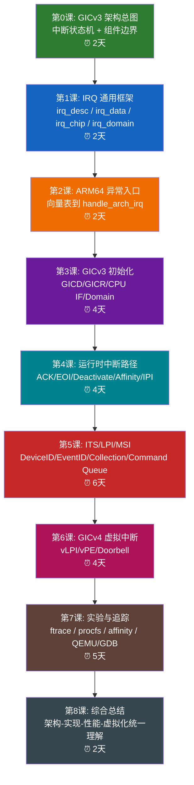

# Linux ARM64 GICv3 中断子系统完全学习指南

> **环境**：Linux 6.18.1 / ARM64 / ARMv8 / GICv3 / 可选 ITS / 可选 GICv4
> **源码基线**：当前工作区内核源码树
> **编写视角**：顶级 Linux ARM64 中断子系统专家
> **学习方法论**：架构文档 + 内核源码 + 调试实验 + 数据结构 + 算法

---

## 目录

<details>
<summary><a href="#学习路线总览">学习路线总览</a></summary>

</details>

<details>
<summary><a href="#先给结论研究-gicv3-应该抓住什么">先给结论：研究 GICv3 应该抓住什么</a></summary>

</details>

<details>
<summary><a href="#第0课gicv3-架构总图">第0课：GICv3 架构总图</a></summary>

- [0.1 硬件组件图](#01-硬件组件图)
- [0.1.1 Distributor、Redistributor、CPU Interface 三者从架构上分别代表什么](#011-distributorredistributorcpu-interface-三者从架构上分别代表什么)
- [0.1.2 Distributor 的架构意义](#012-distributor-的架构意义)
- [0.1.3 Redistributor 的架构意义](#013-redistributor-的架构意义)
- [0.1.4 CPU Interface 的架构意义](#014-cpu-interface-的架构意义)
- [0.1.5 为什么架构上必须拆成这三层](#015-为什么架构上必须拆成这三层)
- [0.1.6 三者在一条中断路径里怎么协作](#016-三者在一条中断路径里怎么协作)
- [0.1.7 站在普通世界 Linux 视角，三者各自最常对应什么问题](#017-站在普通世界-linux-视角三者各自最常对应什么问题)
- [0.2 中断类型一定要先分清](#02-中断类型一定要先分清)
- [0.3 GICv3 的四状态模型](#03-gicv3-的四状态模型)
- [0.4 架构文档与源码对照阅读法](#04-架构文档与源码对照阅读法)

</details>

<details>
<summary><a href="#第1课先掌握-linux-通用-irq-四件套">第1课：先掌握 Linux 通用 IRQ 四件套</a></summary>

- [1.1 `irq_desc`](#11-irq_desc)
- [1.2 `irq_data`](#12-irq_data)
- [1.3 `irq_chip`](#13-irq_chip)
- [1.4 `irq_domain`](#14-irq_domain)
- [1.4.1 把“设备树里的中断描述”变成 `irq_desc`：最短静态建链图](#141-把设备树里的中断描述变成-irq_desc最短静态建链图)

</details>

<details>
<summary><a href="#第2课arm64-从异常入口走到-gic-驱动">第2课：ARM64 从异常入口走到 GIC 驱动</a></summary>

- [2.1 异常向量表内容](#21-异常向量表内容)
- [2.2 `kernel_ventry` 和 `entry_handler` 宏展开后的真实含义](#22-kernel_ventry-和-entry_handler-宏展开后的真实含义)
- [2.3 入口总链路](#23-入口总链路)
- [2.4 关键源码点](#24-关键源码点)
- [2.5 NMI/Pseudo-NMI 特殊路径](#25-nmipseudo-nmi-特殊路径)
- [2.6 Pseudo-NMI 专题](#26-pseudo-nmi-专题)
- [2.6.16 FIQ 和 IRQ：区别、联系，以及在内核代码里的具体实现](#2616-fiq-和-irq区别联系以及在内核代码里的具体实现)
- [2.7 Linux 中断处理全景：Hardirq / Softirq / Tasklet / Threaded IRQ](#27-linux-中断处理全景hardirq--softirq--tasklet--threaded-irq)
- [2.8 中断与同步：真正容易出错的部分](#28-中断与同步真正容易出错的部分)

</details>

<details>
<summary><a href="#第3课gicv3-初始化总流程">第3课：GICv3 初始化总流程</a></summary>

- [3.1 Device Tree/ACPI 初始化入口](#31-device-treeacpi-初始化入口)
- [3.1.1 如果从设备树 bring-up 角度看，最容易记住的入口链](#311-如果从设备树-bring-up-角度看最容易记住的入口链)
- [3.2 Distributor 初始化：`gic_dist_init()`](#32-distributor-初始化gic_dist_init)
- [3.3 Redistributor 初始化：`gic_populate_rdist()` + `gic_cpu_init()`](#33-redistributor-初始化gic_populate_rdist--gic_cpu_init)
- [3.4 CPU Interface 初始化：`gic_cpu_sys_reg_init()`](#34-cpu-interface-初始化gic_cpu_sys_reg_init)
- [3.5 把三层寄存器配置串起来看：到底要配哪些寄存器](#35-把三层寄存器配置串起来看到底要配哪些寄存器)

</details>

<details>
<summary><a href="#第4课核心数据结构必须建立对象图">第4课：核心数据结构必须建立对象图</a></summary>

- [4.1 GICv3 核心对象图](#41-gicv3-核心对象图)
- [4.2 `struct gic_chip_data`](#42-struct-gic_chip_data)
- [4.3 `struct rdists`](#43-struct-rdists)
- [4.4 ITS 核心结构](#44-its-核心结构)
- [4.5 关系要这样记](#45-关系要这样记)

</details>

<details>
<summary><a href="#第5课运行时中断路径的关键算法">第5课：运行时中断路径的关键算法</a></summary>

- [5.1 INTID 分类算法：`__get_intid_range()`](#51-intid-分类算法__get_intid_range)
- [5.2 寄存器地址换算：`convert_offset_index()`](#52-寄存器地址换算convert_offset_index)
- [5.3 ACK/EOI/Deactivate 路径](#53-ackeoideactivate-路径)
- [5.4 中断路由算法：`gic_set_affinity()`](#54-中断路由算法gic_set_affinity)
- [5.5 SGI 目标列表算法：`gic_compute_target_list()`](#55-sgi-目标列表算法gic_compute_target_list)
- [5.6 ITS LPI 分配算法](#56-its-lpi-分配算法)
- [5.7 ITS 命令队列算法](#57-its-命令队列算法)
- [5.8 ITS 负载均衡算法：`its_select_cpu()`](#58-its-负载均衡算法its_select_cpu)

</details>

<details>
<summary><a href="#第6课gicv3-的-irq-domain-实现">第6课：GICv3 的 IRQ domain 实现</a></summary>

- [6.1 顶层 GIC domain](#61-顶层-gic-domain)
- [6.2 `gic_irq_domain_translate()` 很重要](#62-gic_irq_domain_translate-很重要)
- [6.3 `gic_irq_domain_map()` 把 hwirq 绑定到 flow handler](#63-gic_irq_domain_map-把-hwirq-绑定到-flow-handler)

</details>

<details>
<summary><a href="#第7课itslpimsi-是第二战场">第7课：ITS/LPI/MSI 是第二战场</a></summary>

- [7.1 必须先建立翻译模型](#71-必须先建立翻译模型)
- [7.2 ITS 初始化主线](#72-its-初始化主线)
- [7.3 LPI 两张表](#73-lpi-两张表)
- [7.4 MSI domain 层次](#74-msi-domain-层次)
- [7.5 最关键的 ITS 命令](#75-最关键的-its-命令)

</details>

<details>
<summary><a href="#第8课gicv4-是高级专题但必须知道边界">第8课：GICv4 是高级专题，但必须知道边界</a></summary>

- [8.1 GICv4 解决的核心问题](#81-gicv4-解决的核心问题)
- [8.2 三个核心对象](#82-三个核心对象)
- [8.3 当前源码中的体现](#83-当前源码中的体现)

</details>

<details>
<summary><a href="#第9课按源码文件建立研究地图">第9课：按源码文件建立研究地图</a></summary>

- [9.1 必读源码优先级](#91-必读源码优先级)
- [9.2 推荐阅读顺序](#92-推荐阅读顺序)

</details>

<details>
<summary><a href="#第10课源码结合实践的四阶段研究规划">第10课：源码结合实践的四阶段研究规划</a></summary>

</details>

<details>
<summary><a href="#阶段a打基础建立对象模型第1周">阶段A：打基础，建立对象模型（第1周）</a></summary>

</details>

<details>
<summary><a href="#阶段b跑通中断入口与本地中断第2周">阶段B：跑通中断入口与本地中断（第2周）</a></summary>

</details>

<details>
<summary><a href="#阶段c跑通-affinity-与-ipi第3周">阶段C：跑通 affinity 与 IPI（第3周）</a></summary>

</details>

<details>
<summary><a href="#阶段d跑通-itslpimsi最后看-gicv4第4-5周">阶段D：跑通 ITS/LPI/MSI，最后看 GICv4（第4-5周）</a></summary>

</details>

<details>
<summary><a href="#第11课结合你当前仓库的实操建议">第11课：结合你当前仓库的实操建议</a></summary>

- [11.1 启动环境建议](#111-启动环境建议)
- [11.2 最实用的实验命令](#112-最实用的实验命令)
- [11.3 研究 ITS 的实验切入点](#113-研究-its-的实验切入点)
- [11.4 结合 QEMU 的分组实验设计](#114-结合-qemu-的分组实验设计)
- [实验组A：最小化 GICv3 启动确认实验](#实验组a最小化-gicv3-启动确认实验)
- [实验组A-1：Pseudo-NMI 启用验证实验](#实验组a-1pseudo-nmi-启用验证实验)
- [实验组B：PPI 路径实验，盯住本地 timer 中断](#实验组bppi-路径实验盯住本地-timer-中断)
- [实验组C：SPI 路径实验，观察共享设备中断和 affinity 迁移](#实验组cspi-路径实验观察共享设备中断和-affinity-迁移)
- [实验组D：IPI/SGI 路径实验，观察核间中断](#实验组dipisgi-路径实验观察核间中断)
- [实验组E：ITS/LPI/MSI 进阶实验](#实验组eitslpimsi-进阶实验)
- [实验组F：GDB 单步实验，从异常入口走到 flow handler](#实验组fgdb-单步实验从异常入口走到-flow-handler)
- [11.5 一个建议的实验顺序](#115-一个建议的实验顺序)

</details>

<details>
<summary><a href="#第12课学完这部分内容能解决哪些问题">第12课：学完这部分内容能解决哪些问题</a></summary>

- [12.1 能判断问题到底在架构层、IRQ core 层，还是驱动层](#121-能判断问题到底在架构层irq-core-层还是驱动层)
- [12.2 能解释“为什么中断只在某个 CPU 上跑”](#122-能解释为什么中断只在某个-cpu-上跑)
- [12.3 能解释“为什么改了 affinity 但流量/中断没有按预期迁移”](#123-能解释为什么改了-affinity-但流量中断没有按预期迁移)
- [12.4 能区分 hardirq 高、softirq 高、ksoftirqd 高、threaded irq 卡住这几类不同现场](#124-能区分-hardirq-高softirq-高ksoftirqd-高threaded-irq-卡住这几类不同现场)
- [12.5 能解释“为什么某类中断根本不能像预期那样绑核”](#125-能解释为什么某类中断根本不能像预期那样绑核)
- [12.6 能处理 ITS/MSI/LPI 相关的“看起来像普通 SPI，其实不是”的问题](#126-能处理-itsmsilpi-相关的看起来像普通-spi其实不是的问题)
- [12.7 能把性能问题和同步问题联系起来看](#127-能把性能问题和同步问题联系起来看)

</details>

<details>
<summary><a href="#第13课经典问题处理手册">第13课：经典问题处理手册</a></summary>

- [13.0 一套真正能落地的 IRQ Debug 方案](#130-一套真正能落地的-irq-debug-方案)
- [13.1 经典问题一：中断绑定 CPU](#131-经典问题一中断绑定-cpu)
- [13.2 经典问题二：softirq 过高](#132-经典问题二softirq-过高)
- [13.3 中断绑核和 softirq 过高，正确的整体处置思路](#133-中断绑核和-softirq-过高正确的整体处置思路)
- [13.4 一条最实用的现场排查清单](#134-一条最实用的现场排查清单)
- [13.5 用 QEMU 复现“中断绑定 CPU”问题](#135-用-qemu-复现中断绑定-cpu问题)
- [13.6 用 QEMU 复现“softirq 过高”问题](#136-用-qemu-复现softirq-过高问题)
- [13.7 经典问题的源码定位清单](#137-经典问题的源码定位清单)
- [13.8 处理这类问题的一条总原则](#138-处理这类问题的一条总原则)
- [13.9 经典问题三：关中断时间过长](#139-经典问题三关中断时间过长)
- [13.10 经典问题四：中断上下文里出现 loop、风暴或反复 pending](#1310-经典问题四中断上下文里出现-loop风暴或反复-pending)
- [13.11 这几类问题的实战判断口诀](#1311-这几类问题的实战判断口诀)
- [13.12 把源码读成闭环的一份函数级阅读地图](#1312-把源码读成闭环的一份函数级阅读地图)
- [13.13 常用 IRQ 经典问题总表](#1313-常用-irq-经典问题总表)

</details>

<details>
<summary><a href="#第14课最值得你亲手画的三张图">第14课：最值得你亲手画的三张图</a></summary>

- [图1：从异常向量到设备 ISR 的调用链](#图1从异常向量到设备-isr-的调用链)
- [图2：GICv3 初始化对象图](#图2gicv3-初始化对象图)
- [图3：ITS 翻译图](#图3its-翻译图)

</details>

<details>
<summary><a href="#总总结顶级内核工程师视角下的-gicv3-研究结论">总总结：顶级内核工程师视角下的 GICv3 研究结论</a></summary>

- [结论1：GICv3 的本质不是寄存器集合，而是“分层中断路由系统”](#结论1gicv3-的本质不是寄存器集合而是分层中断路由系统)
- [结论2：研究 GICv3 最容易走偏的地方，是只盯寄存器，不盯 IRQ core](#结论2研究-gicv3-最容易走偏的地方是只盯寄存器不盯-irq-core)
- [结论3：GICv3 真正复杂的部分，不是普通 SPI/PPI，而是 ITS/LPI/GICv4](#结论3gicv3-真正复杂的部分不是普通-spippi而是-itslpigicv4)
- [结论4：算法层面最值得反复咀嚼的是四个点](#结论4算法层面最值得反复咀嚼的是四个点)
- [结论5：最有效的学习方式不是“看完所有源码”，而是“按路径验证源码”](#结论5最有效的学习方式不是看完所有源码而是按路径验证源码)

</details>

<details>
<summary><a href="#最后给你的研究建议">最后给你的研究建议</a></summary>

</details>

---

## 学习路线总览



**绿色**=架构基础 **蓝色**=Linux 通用框架 **橙色**=异常入口 **紫色**=初始化 **青色**=运行路径 **红色**=ITS/MSI **洋红**=虚拟化 **棕色**=实验

---

## 先给结论：研究 GICv3 应该抓住什么

如果你站在内核实现者视角看 GICv3，中断子系统不是“几个寄存器读写”，而是三层叠加：

1. **ARM GIC 架构层**：Distributor、Redistributor、CPU Interface、ITS、vPE/vLPI 这些硬件对象和状态机。
2. **Linux 通用 IRQ 抽象层**：`irq_desc`、`irq_data`、`irq_chip`、`irq_domain` 负责把“硬件中断号”和“Linux IRQ 编号”解耦。
3. **平台驱动实现层**：`drivers/irqchip/irq-gic-v3.c`、`irq-gic-v3-its.c`、`irq-gic-v4.c` 把架构语义映射为 Linux IRQ core 能消费的操作集。

真正的研究重点有五个：

1. **异常入口到设备 ISR 的完整调用链**。
2. **初始化阶段怎样把 GICD/GICR/ICC sysreg 建起来**。
3. **irq_domain 怎样把 hwirq 翻译成 virq**。
4. **ITS 怎样把 DeviceID/EventID 翻译成 LPI，并维护命令队列与表项**。
5. **GICv4 怎样把物理 LPI 扩展成 guest 可见的 vLPI/vPE**。

如果这五条线打通，你对 ARM64 GICv3 中断子系统就不是“会用”，而是“能读、能改、能调、能定位性能与虚拟化问题”。

---

## 第0课：GICv3 架构总图

### 0.1 硬件组件图

```text
设备/外设 ──> SPI/ESPI ───────┐
                               │
CPU本地源 ─> SGI/PPI/EPPI ─┐   │
                           │   │
PCIe/MSI ─> ITS -> LPI ────┴──> GIC 逻辑 ──> CPU Interface(ICC_*) ──> ARM64 IRQ 异常入口

其中：
- GICD 负责全局中断：SPI / ESPI 路由与配置
- GICR 负责每 CPU 局部中断：SGI / PPI / EPPI / LPI 相关状态
- ICC_* system registers 是 CPU 侧中断接口
- ITS 负责 MSI/LPI 翻译
- GICv4 再往上扩展出 vLPI / vPE
```

### 0.1.1 Distributor、Redistributor、CPU Interface 三者从架构上分别代表什么

这三个名字如果只按“寄存器块”去记，很容易越学越乱。更准确的理解方式是：它们代表 **三个不同层次的中断职责分工**。

1. **Distributor**
   代表系统级、全局共享中断的控制与路由中心。
2. **Redistributor**
   代表每个 CPU/PE 自己那一份本地中断状态和本地投递前站。
3. **CPU Interface**
   代表 GIC 最终把中断交给 CPU 核心时的接口层。

如果把它压成一句最不容易忘的话，就是：

```text
Distributor 管全局
Redistributor 管每核本地
CPU Interface 负责最后把中断真正送进 CPU
```

### 0.1.2 Distributor 的架构意义

Distributor 站在 **整个 SoC/系统** 的视角看中断。

它最重要的职责不是“离 CPU 最近”，而是：

1. 定义和管理全局共享中断，典型就是 SPI/ESPI。
2. 保存这些全局中断的组别、使能、优先级、触发方式等属性。
3. 决定这类全局中断应该被路由到哪个目标 PE 或 affinity。

所以从架构语义上说，Distributor 更像：

1. 全局中断命名空间的控制中心。
2. 共享中断的属性仓库。
3. SPI 路由决策点。

对 Linux 来说，凡是你在研究：

1. 共享设备中断。
2. `GICD_IROUTER`。
3. affinity 迁移。

本质上都是在研究 Distributor 这一层。

### 0.1.3 Redistributor 的架构意义

Redistributor 是 GICv3 相比 GICv2 最关键的架构拆分之一。

它的本质是：把“每 CPU 本地相关的中断状态”从全局中心拆出来，变成每个 PE 自己维护一份。

它主要承载：

1. SGI：核间中断。
2. PPI/EPPI：每 CPU 私有中断。
3. LPI 在目标 CPU 侧的本地状态和表项落点。

所以 Redistributor 从架构上代表的是：

1. 每 CPU 的本地中断入口管理单元。
2. 本地 pending/active/config 状态的宿主。
3. LPI 最终落到某个 CPU 时的本地承接点。

这也是为什么在 GICv3 里：

1. timer/PPI 研究要盯 GICR。
2. IPI/SGI 研究要盯 GICR 和 `ICC_SGI1R_EL1`。
3. ITS/LPI 最终也要落回某个 Redistributor。

### 0.1.4 CPU Interface 的架构意义

CPU Interface 不是“大而全的配置中心”，而是 **GIC 和 CPU 核心之间真正发生中断握手的那一层**。

在 GICv3 里，这一层主要体现为 `ICC_*` system registers。

它负责的不是“系统里有哪些中断”，而是：

1. 当前 CPU 此刻能看到哪条最高优先级中断。
2. CPU 通过哪条接口把 INTID 读出来。
3. CPU 如何做 ACK、EOI、Deactivate。
4. CPU 通过 PMR/BPR/IGRPEN 控制可接收的优先级和 Group。

所以从架构语义上说，CPU Interface 代表的是：

1. GIC 到 CPU 核心的最终交付接口。
2. 优先级屏蔽和激活优先级栈的承载层。
3. 普通 IRQ 与 pseudo-NMI 等执行语义真正生效的地方。

对普通世界 Linux 来说，这一层最典型的寄存器就是：

1. `ICC_IAR1_EL1`
2. `ICC_EOIR1_EL1`
3. `ICC_DIR_EL1`
4. `ICC_PMR_EL1`
5. `ICC_IGRPEN1_EL1`

### 0.1.5 为什么架构上必须拆成这三层

如果不拆，所有共享中断、本地中断、优先级交付都堆在一个全局块里，多核扩展、LPI、虚拟化都会变得非常笨重。

GICv3 把它拆开，本质上解决了三个问题：

1. **全局共享中断** 继续由 Distributor 集中管理。
2. **每 CPU 本地中断状态** 下沉到 Redistributor，避免所有本地状态都挤在一个全局中心。
3. **真正的 CPU 接口语义** 留在 ICC system register 层，方便优先级、屏蔽、NMI-like 语义和异常入口配合。

所以这不是“为了寄存器分类好看”，而是 GICv3 为了多核扩展、LPI/ITS 和更复杂的优先级语义做的架构分层。

### 0.1.6 三者在一条中断路径里怎么协作

#### 情况一：共享 SPI 中断

```text
设备
  -> Distributor 看到这是一条全局 SPI
  -> Distributor 按路由规则选择目标 CPU
  -> 目标 CPU 对应的本地侧接收这条中断
  -> CPU Interface 把最高优先级 pending interrupt 交给 CPU
  -> ARM64 异常入口
```

这里最该记住的是：**SPI 的“全局属性和路由”在 Distributor。**

#### 情况二：PPI/SGI 这类每 CPU 本地中断

```text
本地 timer / IPI
  -> 直接进入当前 CPU 对应的 Redistributor 语义范围
  -> CPU Interface 呈现给 CPU
  -> ARM64 异常入口
```

这里最该记住的是：**PPI/SGI 不是先绕 Distributor 再回来，它本来就是 per-CPU 本地对象。**

#### 情况三：LPI/MSI

```text
MSI write
  -> ITS 翻译成 LPI
  -> collection 选定目标 CPU
  -> 落到目标 CPU 的 Redistributor
  -> CPU Interface 交给 CPU
```

这里最该记住的是：**ITS 负责翻译，Redistributor 负责本地落点，CPU Interface 负责最终交付。**

### 0.1.7 站在普通世界 Linux 视角，三者各自最常对应什么问题

如果你的研究视角是普通世界 Linux，可以把三者直接对应到三类常见问题：

1. **Distributor**
   重点对应 SPI、共享中断、绑核、`GICD_IROUTER`、affinity。
2. **Redistributor**
   重点对应 PPI、SGI、timer、本地中断、LPI 落点、每 CPU 初始化。
3. **CPU Interface**
   重点对应 `ICC_IAR1_EL1`、`ICC_EOIR1_EL1`、`ICC_DIR_EL1`、`ICC_PMR_EL1`、pseudo-NMI 与优先级屏蔽。

这三类问题分清楚之后，你看源码时就不会把：

1. “共享中断怎么路由”
2. “本地中断状态存在哪”
3. “CPU 为什么此刻真的进了 IRQ”

混成同一个层次的问题。

### 0.2 中断类型一定要先分清

在当前源码里，`drivers/irqchip/irq-gic-v3.c` 通过 `__get_intid_range()` 把中断分成：

1. `SGI_RANGE`：0-15，核间中断。
2. `PPI_RANGE`：16-31，每 CPU 私有外设中断。
3. `SPI_RANGE`：32-1019，共享外设中断。
4. `EPPI_RANGE`：从 `EPPI_BASE_INTID=1056` 开始，扩展 PPI。
5. `ESPI_RANGE`：从 `ESPI_BASE_INTID=4096` 开始，扩展 SPI。
6. `LPI_RANGE`：8192 及以上，ITS 管理的 Locality-specific Peripheral Interrupt。

这个分类非常关键，因为它直接决定：

1. 中断状态寄存器在 GICD 还是 GICR。
2. 是否可设置 affinity。
3. 使用什么 flow handler。
4. 是否走 ITS/LPI 特殊路径。

### 0.3 GICv3 的四状态模型

阅读 `arm64-reference/gic/IHI0069H_b_gic_architecture_specification.pdf` 时，必须把中断状态机和 Linux 路径对上：

1. `Inactive`
2. `Pending`
3. `Active`
4. `Active+Pending`

Linux 中最关键的对应点是：

1. `ICC_IAR1_EL1` 读取时完成 ACK，获得 INTID。
2. `ICC_EOIR1_EL1` 做优先级 drop。
3. `ICC_DIR_EL1` 或 `GICD/GICR ICACTIVER` 做 deactivate。

当前内核默认优先使用 **EOI mode 1**，也就是把 **priority drop** 和 **deactivate** 拆开。这在 `supports_deactivate_key`、`gic_eoimode1_chip`、`gic_eoimode1_eoi_irq()` 里体现得很清楚。

### 0.4 架构文档与源码对照阅读法

你当前目录 `arm64-reference/gic` 下的 PDF 建议这样用：

1. `IHI0069H_b_gic_architecture_specification.pdf`
   作用：权威规范。重点看 Distributor、Redistributor、Interrupt state、System register interface、ITS、GICv4。
2. `GICv3_Software_Overview_Official_Release_B.pdf`
   作用：适合先建立全局图，再回到规范。
3. `GICv3_v4_overview.pdf`
   作用：理解从 GICv3 到 GICv4 的扩展动机。
4. `learn_the_architecture_-_generic_interrupt_controller_v3_and_v4__overview_198123_0302_03_en.pdf`
   作用：适合查概念，不适合做最终结论。

建议原则：

1. **架构结论以 IHI0069 为准**。
2. **Linux 行为以当前源码为准**。
3. **不把文档概念直接等同于 Linux 数据结构**，而是逐一映射。

---

## 第1课：先掌握 Linux 通用 IRQ 四件套

如果不先掌握 IRQ core，看 GIC 驱动一定会陷入“读得懂寄存器，读不懂框架”。

### 1.1 `irq_desc`

定义在 `include/linux/irqdesc.h`。

它是 Linux 侧真正的 IRQ 描述符，关键字段：

1. `irq_data`：和硬件控制器交互的那一层。
2. `handle_irq`：flow handler，例如 `handle_fasteoi_irq`。
3. `action`：设备驱动注册的 ISR 链表。
4. `lock`：描述符锁。
5. `percpu_enabled` / `affinity_hint`：亲和性与 per-cpu 语义。

一句话理解：**`irq_desc` 是 Linux 中断对象本体**。

### 1.2 `irq_data`

定义在 `include/linux/irq.h`。

关键字段：

1. `irq`：Linux IRQ 号。
2. `hwirq`：硬件中断号。
3. `chip`：底层控制器操作集。
4. `domain`：hwirq 和 virq 的映射域。
5. `chip_data`：控制器私有数据。

一句话理解：**`irq_data` 是 Linux IRQ 与硬件控制器之间的桥**。

### 1.3 `irq_chip`

它定义控制器可做的动作，例如：

1. `irq_mask`
2. `irq_unmask`
3. `irq_eoi`
4. `irq_set_type`
5. `irq_set_affinity`
6. `irq_set_vcpu_affinity`
7. `ipi_send_mask`

在 GICv3 中，核心实现是：

1. `gic_chip`
2. `gic_eoimode1_chip`
3. `its_irq_chip`
4. `mbi_irq_chip`

一句话理解：**`irq_chip` 是硬件控制器的虚函数表**。

### 1.4 `irq_domain`

定义在 `include/linux/irqdomain.h`。

核心职责：把固件/设备树/ACPI 描述的中断，翻译成 Linux 内部能管理的 virq。

关键操作：

1. `translate`
2. `alloc`
3. `free`
4. `select`
5. `map`

GICv3 里最关键的是 `gic_irq_domain_ops`。ITS 进一步在 GIC domain 上叠出 MSI domain。

一句话理解：**`irq_domain` 是 Linux 里“中断命名空间”的翻译层**。

### 1.4.1 把“设备树里的中断描述”变成 `irq_desc`：最短静态建链图

如果你总觉得 `irq_domain` 很抽象，最有效的办法不是死记结构体，而是把“控制器先注册自己”和“设备再来申请映射”这两条线分开看。

先是控制器侧把自己的翻译能力挂进系统：

```text
IRQCHIP_DECLARE(arm,gic-v3, gic_of_init)
   -> of_irq_init()
   -> gic_of_init()
   -> gic_init_bases()
   -> irq_domain_create_tree()
```

然后才是普通设备侧根据固件描述申请一条可管理的 Linux IRQ：

```text
设备节点 interrupts 属性
   -> of_irq_parse_one()
   -> irq_create_of_mapping() / irq_create_fwspec_mapping()
   -> irq_find_matching_fwspec()
   -> gic_irq_domain_translate()
   -> irq_domain_alloc_descs()
   -> gic_irq_domain_alloc() / gic_irq_domain_map()
   -> irq_domain_set_info()
   -> irq_desc->handle_irq = handle_fasteoi_irq 或 handle_percpu_devid_irq
```

这一段最该记住的不是 API 名字，而是三件事：

1. `irq_domain` 先由中断控制器注册出来，设备驱动只是后来拿它做翻译。
2. `translate` 解决“这串固件 cell 到底代表哪个 hwirq 和 trigger type”。
3. `map/alloc` 解决“给它分配 virq，并把 `irq_chip`、flow handler、`irq_data` 绑定起来”。

所以你在现场看到“设备树写了 interrupts，但驱动拿到 irq 后行为不对”，排查顺序通常应该是：

1. DTS cell 是否写对。
2. `gic_irq_domain_translate()` 解析出的 hwirq/type 是否对。
3. `irq_domain_set_info()` 最终给 `irq_desc` 绑定了哪个 flow handler。

---

## 第2课：ARM64 从异常入口走到 GIC 驱动

### 2.1 异常向量表内容

ARM64 中断研究如果不先看 `arch/arm64/kernel/entry.S` 里的向量表，后面所有“IRQ 从哪里来”都会是悬空的。

当前源码里的核心对象是 `vectors`：

```text
SYM_CODE_START(vectors)
   EL1t: sync / irq / fiq / error
   EL1h: sync / irq / fiq / error
   EL0 64-bit: sync / irq / fiq / error
   EL0 32-bit: sync / irq / fiq / error
SYM_CODE_END(vectors)
```

也就是说，`VBAR_EL1` 指向的是一张 **16 项异常向量表**，每组 4 类异常：

| 来源上下文 | sync | irq | fiq | error |
|---|---|---|---|---|
| EL1t | `kernel_ventry 1, t, 64, sync` | `kernel_ventry 1, t, 64, irq` | `kernel_ventry 1, t, 64, fiq` | `kernel_ventry 1, t, 64, error` |
| EL1h | `kernel_ventry 1, h, 64, sync` | `kernel_ventry 1, h, 64, irq` | `kernel_ventry 1, h, 64, fiq` | `kernel_ventry 1, h, 64, error` |
| EL0 64-bit | `kernel_ventry 0, t, 64, sync` | `kernel_ventry 0, t, 64, irq` | `kernel_ventry 0, t, 64, fiq` | `kernel_ventry 0, t, 64, error` |
| EL0 32-bit | `kernel_ventry 0, t, 32, sync` | `kernel_ventry 0, t, 32, irq` | `kernel_ventry 0, t, 32, fiq` | `kernel_ventry 0, t, 32, error` |

这里有三个关键点：

1. ARM64 并不是只有 “IRQ 向量”，而是按异常来源和异常类型做二维展开。
2. `EL1t` 与 `EL1h` 不是两种“中断类型”，而是指 CPU 已经运行在 EL1 时，当前使用的是哪一个栈指针寄存器：`EL1t` 表示此时 EL1 代码使用 `SP_EL0`，`EL1h` 表示此时 EL1 代码使用当前异常级自己的栈指针，在 EL1 上就是 `SP_EL1`。
3. Linux 真正关心的硬中断主路径，大多会落到 `EL1h IRQ` 或 `EL0 64-bit IRQ` 这一类入口。

换句话说，这里的 `t/h` 重点不在“异常是什么”，而在“异常发生前 CPU 正在 EL1 下用哪根栈指针”。

1. 如果内核代码当时跑在 EL1，并且 `SP` 选择的是 `SP_EL1`，那么命中的是 `EL1h` 对应的向量槽。
2. 如果某段 EL1 代码当时改成使用 `SP_EL0`，那么命中的是 `EL1t` 对应的向量槽。

其中所谓 `SP_ELx` 只是一个泛称，意思是“当前异常级自己的栈指针”：

1. 对 EL1 来说是 `SP_EL1`。
2. 对 EL2 来说是 `SP_EL2`。
3. 对 EL3 来说是 `SP_EL3`。

在 Linux ARM64 主线里，内核正常运行基本都在 `EL1h` 语义下，也就是用内核自己的栈，所以 `EL1t` 更多是架构上完整保留的入口，而不是你平时最常踩到的主路径。

### 2.2 `kernel_ventry` 和 `entry_handler` 宏展开后的真实含义

向量表项不是简单的函数指针。每个向量槽位本质上都是 `kernel_ventry` 宏展开出来的一小段入口汇编，它负责：

1. 为异常分配 `pt_regs` 栈空间。
2. 做栈溢出检测。
3. 在需要时处理 trampoline 和 PAN/TTBR0 等入口细节。
4. 跳到 `elX...label` 的具体入口。

随后，`entry_handler el, ht, regsize, label` 宏又把这些入口统一成：

```text
kernel_entry
   -> x0 = sp (pt_regs)
   -> bl el..._handler
   -> ret_to_user / ret_to_kernel
```

所以从结构上看，ARM64 异常入口有三层：

```text
vectors
   -> kernel_ventry
   -> entry_handler 生成的 el1h_64_irq / el0t_64_irq ...
   -> C 语言 handler，例如 el1h_64_irq_handler
```

这也是为什么你研究 GICv3 时，既要看 `entry.S`，也要看 `entry-common.c`。

#### 2.2.1 一个最有价值的验证实验：亲眼看到 EL0 向量会先跳过 cleanup，而 EL1h 不会

前面关于 `EL1h`、`EL0 64-bit`、`kernel_ventry` 和 trampoline 的讨论，如果只停在文字层面，很容易越看越绕。最有效的办法是直接在 QEMU + GDB 里做一个两步实验：

1. **静态看向量槽反汇编**，确认 EL0 入口最前面确实多了一条 branch，而 EL1h 没有。
2. **动态命中一次 EL0 IRQ 入口**，确认正常路径会先执行这条 branch，直接跳过 cleanup 代码。

这个实验的目的不是构造一个罕见的 `EL1t` 现场，而是把下面三件事一次看实：

1. `kernel_ventry 1, h, 64, irq` 和 `kernel_ventry 0, t, 64, irq` 展开的第一批指令不一样。
2. EL0 向量里的 `b .Lskip_tramp_vectors_cleanup` 在正常入口下确实会先执行。
3. Linux 主线日常最常命中的仍然是 `EL1h` 和 `EL0 64-bit`，不是 `EL1t`。

##### 实验准备

沿用前面实验组 F 的调试方式启动：

```bash
./launch.sh arm64 debug
```

另开一个终端连接 GDB：

```bash
gdb-multiarch vmlinux
```

```gdb
target remote localhost:1234
set pagination off
set confirm off
set disassemble-next-line on
```

##### 第一步：静态比较两个向量槽的前几条指令

`vectors` 里每个 slot 固定 128 字节，所以：

1. `EL1h IRQ` 是第 6 个槽，偏移 `5 * 128 = 0x280`
2. `EL0 64-bit IRQ` 是第 10 个槽，偏移 `9 * 128 = 0x480`

在 GDB 里直接看：

```gdb
x/8i vectors+0x280
x/10i vectors+0x480
```

你应当看到类似的差异：

1. `vectors+0x280` 对应 `EL1h IRQ`，开头就是 `sub sp, sp, #PT_REGS_SIZE` 一类指令。
2. `vectors+0x480` 对应 `EL0 64-bit IRQ`，最前面会多一条 `b .Lskip_tramp_vectors_cleanup...`，后面才是 `mrs x30, tpidrro_el0` / `msr tpidrro_el0, xzr`。

这一步只回答一个问题：**宏展开后的代码形态到底是不是你以为的那样。**

##### 第二步：动态命中一次 EL0 IRQ，验证 normal path 会跳过 cleanup

先在 EL0 IRQ 的正式入口和 C handler 上下断点：

```gdb
tb el0t_64_irq
tb el0t_64_irq_handler
c
```

然后在 guest 里找一个最简单的用户态忙循环，让 timer IRQ 更容易在 EL0 上下文打进来：

```bash
while :; do :; done
```

如果系统里有 shell，这个实验很稳定；没有 shell 时，也可以让任意用户态程序持续运行，核心目标只是让 CPU 长时间停留在 EL0。

当 GDB 命中 `el0t_64_irq` 后，不要急着继续，先回头看这个向量槽的第一条是否真的是 branch：

```gdb
x/6i vectors+0x480
```

然后看当前 `pc`：

```gdb
p/x $pc
```

你要确认的不是“cleanup 存不存在”，而是：

1. 当前这次正常 EL0 IRQ 入口已经越过了第一条 branch 之后的跳转语义。
2. 普通入口最终会落到 `el0t_64_irq`，而不会停在 cleanup 的 `mrs/msr` 那两条上。

如果你想更直观看到“第一条 branch 确实先执行了”，可以在 `vectors+0x480` 这个槽位附近下地址断点：

```gdb
delete breakpoints
tb * (vectors + 0x480)
tb el0t_64_irq
c
```

命中第一条后单步一条：

```gdb
si
p/x $pc
```

这时你会看到 `pc` 已经跳到 `.Lskip_tramp_vectors_cleanup` 之后的位置，而不是顺序落到 `mrs x30, tpidrro_el0`。这正是“正常 EL0 入口默认跳过 cleanup”的直接证据。

##### 第三步：对照看 EL1h IRQ 为什么没有这条 branch

再补一组断点：

```gdb
delete breakpoints
tb el1h_64_irq
tb el1h_64_irq_handler
c
```

这次你通常会在内核态被 timer 或其他中断打进来时命中。然后对照反汇编：

```gdb
x/6i vectors+0x280
```

你应当看到：

1. `EL1h IRQ` 的槽位前面没有那条 trampoline cleanup branch。
2. 它会直接从 `sub sp, sp, #PT_REGS_SIZE` 开始进入通用入口壳。

##### 实验结论应该是什么

如果这组实验做通，你应该能把下面三句话真正坐实，而不是停留在“好像懂了”：

1. `EL0 64-bit IRQ` 的 `kernel_ventry` 比 `EL1h IRQ` 多一段只给 trampoline/cleanup 预留的前导代码。
2. 这段前导代码在普通入口下默认会被第一条 `b` 跳过去。
3. Linux ARM64 日常最常见的运行时路径，仍然是 `EL0 64-bit` 进内核和 `EL1h` 内核态再被中断打断；`EL1t` 在 stock Linux 中通常不是主路径。

##### 一个现实提醒

不要把这个实验目标定成“在 stock Linux 上硬造一次 `EL1t`”。那通常既不自然，也不重要。这个实验最应该验证的是：

1. 你能看懂异常向量槽不是“函数指针表”，而是 128B 小汇编片段。
2. 你能分清 EL0 向量和 EL1h 向量在入口前几条指令上的差异。
3. 你能把 `kernel_ventry -> entry_handler -> kernel_entry -> el..._handler` 这四层串起来。

#### 2.2.2 沿着 `EL1h IRQ` 继续拆：`entry_handler`、`kernel_entry`、`el1h_64_irq_handler`

如果你已经把 `kernel_ventry 1, h, 64, irq` 看明白了，下一步最容易卡住的地方就是：

1. `entry_handler` 到底只是个壳，还是已经做了大量工作。
2. `kernel_entry` 到底什么时候才真正把寄存器保存成 `pt_regs`。
3. `el1h_64_irq_handler` 是不是一进来就直接到 GIC。

最常见这条路径实际长这样：

```text
kernel_ventry 1, h, 64, irq
  -> el1h_64_irq
  -> kernel_entry 1, 64
  -> mov x0, sp
  -> bl el1h_64_irq_handler
  -> el1_interrupt(regs, handle_arch_irq)
  -> __el1_irq(...) 或 __el1_pnmi(...)
```

这里默认你走的是 **正常的 `EL1h IRQ` 路径**，并且上一层 `kernel_ventry` 已经正常结束，所以此时：

1. `sp = 原始内核栈顶 - PT_REGS_SIZE`
2. `x0` 已恢复成异常打进来时的原值
3. `ELR_EL1` 里保存被打断 PC
4. `SPSR_EL1` 里保存被打断 PSTATE

##### 2.2.2.1 `entry_handler 1, h, 64, irq` 实际展开成什么

这一行会生成：

```asm
el1h_64_irq:
    kernel_entry 1, 64
    mov x0, sp
    bl el1h_64_irq_handler
    b ret_to_kernel
```

所以 `entry_handler` 本身非常薄，它真正只干两件事：

1. 调 `kernel_entry`，把异常现场写成 `pt_regs`。
2. 把当前 `sp` 当成 `struct pt_regs *` 放进 `x0`，再调 C 入口。

也就是说，**完整寄存器保存不是在 `entry_handler` 里逐条写的，而是在它调用的 `kernel_entry` 里完成的。**

##### 2.2.2.2 `kernel_entry 1, 64` 先做的第一件事：把 `x0..x29` 压到 `pt_regs`

开头这 15 条：

```asm
stp x0, x1, [sp, #16 * 0]
stp x2, x3, [sp, #16 * 1]
...
stp x28, x29, [sp, #16 * 14]
```

执行完以后，栈上这块 `pt_regs` 区域里已经有：

1. 原始 `x0..x29`
2. 但此时还没有单独写入 `lr/x30`
3. 也还没有写入被打断时的 `pc/pstate`

这一步最重要的认识是：**直到这里，异常现场才第一次真正落到内存里。**

##### 2.2.2.3 对 `EL1` 路径来说，`x21/x22/x23` 分别被拿来装什么

因为现在是 `el == 1`，所以走的是 `kernel_entry` 的内核态分支：

```asm
add x21, sp, #PT_REGS_SIZE
get_current_task tsk
```

执行后：

1. `x21 = 被打断时的原始 SP`
2. `tsk` 是别名寄存器 `x28`，此时会被装成 current task

接着：

```asm
mrs x22, elr_el1
mrs x23, spsr_el1
stp lr, x21, [sp, #S_LR]
```

执行后：

1. `x22 = ELR_EL1 = 被打断时的 PC`
2. `x23 = SPSR_EL1 = 被打断时的 PSTATE`
3. `pt_regs` 里 `S_LR` 位置写入了当前 `lr/x30`
4. `pt_regs` 里 `S_SP` 位置写入了刚才算出的原始 `SP`

所以到这里为止，`pt_regs` 已经不只是通用寄存器快照，还开始拥有：

1. 被打断时的栈顶
2. 被打断时的返回地址语义

##### 2.2.2.4 元数据 frame 和 `pc/pstate` 是什么时候写进去的

后面这几句：

```asm
stp xzr, xzr, [sp, #S_STACKFRAME]
mov x0, #FRAME_META_TYPE_PT_REGS
str x0, [sp, #S_STACKFRAME_TYPE]
add x29, sp, #S_STACKFRAME
stp x22, x23, [sp, #S_PC]
```

它们分别完成：

1. 清空异常 frame 元数据区域
2. 标记这是一帧 `PT_REGS` 类型的异常边界
3. 让 `x29` 指向这帧的 `S_STACKFRAME`
4. 把 `x22/x23`，也就是被打断时的 `PC/PSTATE`，写入 `pt_regs`

因此 `kernel_entry 1,64` 结束时，最关键的临时寄存器含义是：

1. `x21 = 被打断时的 SP`
2. `x22 = 被打断时的 PC`
3. `x23 = 被打断时的 PSTATE`
4. `x28 = current task`
5. `x29 = 当前异常 frame 的元数据指针`

而 `sp` 始终保持指向当前这份 `pt_regs` 基址。

如果内核启用了 pseudo-NMI，`kernel_entry` 还会额外保存 `ICC_PMR_EL1` 到 `pt_regs->pmr`，并把 PMR 改到异常入口需要的值。这一段属于优先级屏蔽机制，不影响“`pt_regs` 是什么时候建出来的”这个主线判断。

##### 2.2.2.5 `mov x0, sp` 这句为什么是关键分界线

`kernel_entry` 返回后立刻就是：

```asm
mov x0, sp
```

执行后：

1. `x0 = 当前 pt_regs 基址`

这一步的意义非常大，因为从这里开始：

1. 汇编世界里的当前异常栈帧
2. C 代码里看到的 `struct pt_regs *regs`

两者正式等价了。

也就是说，后面 `el1h_64_irq_handler(struct pt_regs *regs)` 里的 `regs`，本质上就是当前 `sp`。

##### 2.2.2.6 `el1h_64_irq_handler` 本身其实很薄

在 `arch/arm64/kernel/entry-common.c` 里：

```c
asmlinkage void noinstr el1h_64_irq_handler(struct pt_regs *regs)
{
    el1_interrupt(regs, handle_arch_irq);
}
```

所以它不是“复杂 IRQ 总调度器”，而只是做了一次非常关键的转交：

1. 把刚建好的 `regs` 传下去
2. 把架构层已经注册好的 `handle_arch_irq` 传下去

对当前 GICv3 系统来说，这个 `handle_arch_irq` 最终通常就是 `gic_handle_irq` 那条根路径。

##### 2.2.2.7 `el1_interrupt()` 才决定这次进入普通 IRQ 还是 pseudo-NMI 路径

`el1_interrupt()` 的关键逻辑可以压成：

```c
write_sysreg(DAIF_PROCCTX_NOIRQ, daif);

if (CONFIG_ARM64_PSEUDO_NMI && regs_irqs_disabled(regs))
    __el1_pnmi(regs, handler);
else
    __el1_irq(regs, handler);
```

这里最容易误解的一点是：

1. 它判断的不是“现在 DAIF 里 IRQ 位是什么”
2. 而是 `regs` 里保存的旧 `PSTATE`，也就是**异常打进来之前** IRQ 是不是已经被关掉了

于是就分出两条路：

1. 普通情况走 `__el1_irq()`
2. 开了 pseudo-NMI 且被打断现场本来就是 IRQ-off 时，走 `__el1_pnmi()`

##### 2.2.2.8 最常见的普通路径最终怎么接到 GIC

在普通 IRQ 路径里，`__el1_irq()` 的关键骨架是：

```c
state = enter_from_kernel_mode(regs);
irq_enter_rcu();
do_interrupt_handler(regs, handler);
irq_exit_rcu();
exit_to_kernel_mode(regs, state);
```

这里最关键的一句其实是：

1. `do_interrupt_handler(regs, handler)`

因为这里的 `handler` 就是 `handle_arch_irq`，所以这一步之后就正式离开 ARM64 通用异常入口框架，进入 GICv3 根处理函数那条主线。

也就是：

```text
el1h_64_irq
  -> kernel_entry
  -> x0 = sp
  -> el1h_64_irq_handler(regs)
  -> el1_interrupt(regs, handle_arch_irq)
  -> __el1_irq(...)
  -> do_interrupt_handler(regs, handle_arch_irq)
  -> gic_handle_irq(...)
```

##### 2.2.2.9 只看寄存器的话，这三层最该抓哪几个值

如果你在 GDB 里单步这段代码，最值得盯的不是所有寄存器，而是下面几个：

1. `sp`
   它从 `kernel_ventry` 之后开始一直指向当前 `pt_regs`。
2. `x21`
   在 `kernel_entry` 中被赋值成“被打断时的原始 SP”。
3. `x22`
   被赋值成 `ELR_EL1`，也就是被打断时的 PC。
4. `x23`
   被赋值成 `SPSR_EL1`，也就是被打断时的 PSTATE。
5. `x0`
   在进入 C 入口前被重写成 `sp`，也就是 `regs` 参数。

如果这几个值你在 GDB 里都能对上，就说明你已经不是“看懂结构图”，而是已经真正把 `entry_handler -> kernel_entry -> el1h_64_irq_handler` 这段吃透了。

### 2.3 入口总链路

当前源码里的关键路径是：

```text
ARM64 异常向量
  -> el1h_64_irq_handler()                     arch/arm64/kernel/entry-common.c
  -> el1_interrupt()
  -> handle_arch_irq                          由 set_handle_irq() 注册
  -> gic_handle_irq()                         drivers/irqchip/irq-gic-v3.c
  -> gic_read_iar()
  -> gic_complete_ack()
  -> generic_handle_domain_irq()
  -> irq_resolve_mapping()
  -> handle_irq_desc()
  -> desc->handle_irq()
  -> handle_fasteoi_irq() / handle_percpu_devid_irq()
  -> action->handler()
```

### 2.4 关键源码点

1. `arch/arm64/kernel/entry-common.c`
   `el1h_64_irq_handler()` 调用 `el1_interrupt(regs, handle_arch_irq)`。
2. `kernel/irq/handle.c`
   `set_handle_irq()` 把 `handle_arch_irq` 指向 GIC 驱动的根处理函数。
3. `drivers/irqchip/irq-gic-v3.c`
   `gic_init_bases()` 中调用 `set_handle_irq(gic_handle_irq)`。
4. `kernel/irq/irqdesc.c`
   `generic_handle_domain_irq()` 用 `irq_resolve_mapping(domain, hwirq)` 找到 desc，然后进入 flow handler。

### 2.5 NMI/Pseudo-NMI 特殊路径

GICv3 在 ARM64 上支持 pseudo-NMI 的关键点：

1. `supports_pseudo_nmis`
2. `gic_rpr_is_nmi_prio()`
3. `__gic_handle_irq_from_irqsoff()`
4. `generic_handle_domain_nmi()`

这里的本质是：**同一个 GIC CPU interface，通过优先级空间和 PMR/RPR 机制，把 NMI 语义模拟出来**。这部分一定要同时看架构文档里的优先级模型和 `gic_prio_init()` 的实现。

### 2.6 Pseudo-NMI 专题

Pseudo-NMI 是 ARM64 上一个非常值得单独研究的点，因为它不是“多一种中断类型”，而是 **利用 GICv3 的优先级屏蔽能力，把普通 Group1 interrupt 中的一部分提升成 NMI-like 语义**。

#### 2.6.1 启用条件

这项能力不是默认就有，至少要同时满足下面几层条件：

1. 内核配置打开 `CONFIG_ARM64_PSEUDO_NMI`。
2. 启动参数显式带 `irqchip.gicv3_pseudo_nmi=1`。
3. 平台具备 GICv3 及其优先级屏蔽支持。
4. 当前 GIC 集成没有被 `nmi_support_forbidden` 判定为不可用。

源码依据：

1. `arch/arm64/Kconfig` 中 `config ARM64_PSEUDO_NMI` 明确要求 ARM GICv3。
2. `Documentation/admin-guide/kernel-parameters.txt` 明确要求 `irqchip.gicv3_pseudo_nmi` 启用。
3. `drivers/irqchip/irq-gic-v3.c` 中 `gic_enable_nmi_support()` 要求 `gic_prio_masking_enabled()` 为真，且 `nmi_support_forbidden` 为假。

#### 2.6.2 它到底是怎么工作的

本质机制有三步：

1. 选定一档比普通 IRQ 更高的优先级，当前驱动里由 `dist_prio_nmi = GICV3_PRIO_NMI` 表示。
2. 在异常入口保存并重设 `ICC_PMR_EL1`，让 CPU 在关普通 IRQ 的情况下仍能响应这档高优先级中断。
3. 收到中断后通过 `ICC_RPR_EL1` 判断当前激活优先级是否等于 `GICV3_PRIO_NMI`，如果相等就走 NMI 处理路径。

因此 pseudo-NMI 不是架构里凭空多出的另一类 INTID，而是 **同一套 INTID + 不同优先级 + PMR/RPR 协议**。

#### 2.6.3 ARM64 异常入口发生了什么变化

`arch/arm64/kernel/entry.S` 在 `CONFIG_ARM64_PSEUDO_NMI` 打开时，会在异常入口额外处理 `ICC_PMR_EL1`：

1. 保存旧的 `ICC_PMR_EL1` 到栈上。
2. 写入 `GIC_PRIO_IRQON | GIC_PRIO_PSR_I_SET` 相关值，让高优先级中断可见。
3. 异常退出时恢复 `ICC_PMR_EL1`。
4. 在不支持 relaxed sync 的实现上，还要做同步保证优先级变化被 redistributor 看到。

这说明 pseudo-NMI 不只是 GIC 驱动自己的事，它已经深入到 ARM64 异常入口汇编。

#### 2.6.4 GIC 驱动里的核心路径

在 `drivers/irqchip/irq-gic-v3.c` 中，核心路径是：

```text
gic_enable_nmi_support()
   -> static_branch_enable(&supports_pseudo_nmis)
   -> gic_{eoimode1_,}chip.flags |= IRQCHIP_SUPPORTS_NMI

irq_set_nmi()
   -> gic_irq_nmi_setup()
   -> 切换 desc->handle_irq
   -> 把中断优先级写成 dist_prio_nmi

异常到来
   -> gic_handle_irq()
   -> gic_read_iar()
   -> gic_rpr_is_nmi_prio()
   -> __gic_handle_nmi()
   -> generic_handle_domain_nmi()
```

关键函数含义：

1. `gic_enable_nmi_support()`：全局打开 pseudo-NMI 能力。
2. `gic_irq_nmi_setup()`：把某条 IRQ 切到 NMI 语义，并改 flow handler。
3. `gic_irq_nmi_teardown()`：撤销 NMI 语义。
4. `gic_rpr_is_nmi_prio()`：通过 `ICC_RPR_EL1` 判断当前中断是不是 NMI 优先级。
5. `__gic_handle_irq_from_irqsoff()`：在本来 IRQ 关闭的上下文中，只允许 pseudo-NMI 进入。

#### 2.6.5 flow handler 是怎么变的

这点很容易被忽略，但其实非常关键。

当一条 IRQ 被切换成 pseudo-NMI 后，`irq_desc->handle_irq` 也会变：

1. 对 SPI/ESPI，切到 `handle_fasteoi_nmi`。
2. 对 PPI/EPPI/SGI 这类 redistributor 本地中断，切到 `handle_percpu_devid_fasteoi_nmi`。

对应地，teardown 时会再切回：

1. `handle_fasteoi_irq`
2. `handle_percpu_devid_irq`

也就是说 pseudo-NMI 不只是“优先级改高”，而是 **Linux IRQ core 处理语义也一起切换成 NMI-safe flow handler**。

#### 2.6.6 为什么 `gic_prio_init()` 很重要

`gic_prio_init()` 是 pseudo-NMI 能不能成立的根基，因为它要统一处理三件事：

1. `GICD_CTLR.DS` 是否置位。
2. `SCR_EL3.FIQ` 是否影响非安全态优先级视图。
3. Distributor priority 和 `ICC_PMR_EL1`/`ICC_RPR_EL1` 之间的编码是否一致。

如果这个映射关系没有对齐，那么：

1. 你以为写进去的是 NMI 优先级。
2. CPU interface 实际看到的却可能是另一档优先级。
3. 最终 `gic_rpr_is_nmi_prio()` 就会判断错误。

所以 pseudo-NMI 的本质不是“多开一个开关”，而是 **把优先级空间从 GICD/GICR 一直到 ICC sysreg 整体校准**。

#### 2.6.7 限制与边界

当前实现里有几个边界一定要记住：

1. LPI 不走这里，`gic_irq_nmi_setup()` 明确拒绝 `hwirq >= 8192`。
2. 已经 enable 的 IRQ 不能直接切成 NMI，否则返回错误。
3. 如果平台集成有安全态/固件问题，驱动可能直接禁止 pseudo-NMI。
4. pseudo-NMI 依赖优先级屏蔽，不等价于某些架构里的“硬件绝对不可屏蔽中断”。

#### 2.6.8 研究 pseudo-NMI 时要重点看哪几处源码

1. `arch/arm64/Kconfig` 中 `CONFIG_ARM64_PSEUDO_NMI`。
2. `arch/arm64/kernel/entry.S` 中 `ICC_PMR_EL1` 的保存与恢复。
3. `arch/arm64/kernel/entry-common.c` 中 `__el1_pnmi()` 与 `el1_interrupt()`。
4. `kernel/entry/common.c` 中 `irqentry_nmi_enter()` / `irqentry_nmi_exit()`。
5. `drivers/irqchip/irq-gic-v3.c` 中：
    `gic_prio_init()`、`gic_enable_nmi_support()`、`gic_irq_nmi_setup()`、`gic_rpr_is_nmi_prio()`、`__gic_handle_irq_from_irqsoff()`。

#### 2.6.9 一句话总结 pseudo-NMI

在 ARM64 GICv3 上，pseudo-NMI 的本质是：**用优先级屏蔽替代传统的不可屏蔽线语义，再让 ARM64 异常入口和 Linux IRQ core 一起配合，构造出 NMI-like 执行环境**。

#### 2.6.10 站在普通世界看 Group0 和 Group1，真正该关心什么

如果你的研究对象是 **普通世界的 Linux 内核中断**，那这件事可以先大幅简化。

先记结论：

1. Linux 日常处理的主线，几乎总是 **Group 1 Non-secure**。
2. Group 0 通常不是普通世界 Linux 的主路径。
3. 所谓“普通世界里看到的一条正常设备中断”，绝大多数都可以先按 Group1 来理解。

也就是说，从普通世界视角看，最实用的理解不是反复纠结 Group0/Group1 的完整安全态拓扑，而是先抓住：

1. 这条中断是不是会被 Linux 接收。
2. Linux 接收时走的是不是 Group1 CPU interface 路径。
3. 它是否只是 Group1 中被提升成 pseudo-NMI 语义的一部分。

#### 2.6.11 为什么 Linux 主线几乎都站在 Group1 上

当前这棵源码已经把这个立场写得很清楚。

头文件 `include/linux/irqchip/arm-gic-v3.h` 开头就说明：驱动假设自己运行在 **non-secure** 状态。

驱动初始化阶段，`gic_dist_init()` 又明确做了两件事：

1. 把 SPI 配成 **non-secure Group-1**。
2. 使能 Distributor 的 **Group1** 路径。

而在 CPU interface 这边，`gic_cpu_sys_reg_init()` 最终会通过 `gic_write_grpen1(1)` 打开 `ICC_IGRPEN1_EL1`，这意味着普通世界 CPU 真正启用的是 **Group1 接收路径**。

再配合 `arch/arm64/include/asm/arch_gicv3.h` 里的 `gic_read_iar()` 可以看到，普通路径读取的也是 `ICC_IAR1_EL1`，而不是 Group0 那套接口。

所以对 Linux 来说，主线实际上是：

```text
设备中断
   -> 被配置成 Group 1 Non-secure
   -> CPU 从 ICC_IAR1_EL1 取到 INTID
   -> gic_handle_irq
   -> generic_handle_domain_irq
   -> handle_fasteoi_irq / handle_percpu_devid_irq
   -> 具体驱动 ISR
```

#### 2.6.12 普通世界里，Group0 什么时候才值得你分心

如果你当前专注 Linux 主线，Group0 可以先只在下面两类问题里出现：

1. 硬件明明在报中断，但 Linux 完全收不到。
2. 某些平台上固件、EL3、TrustZone 先把这条中断截走了。

也就是说，Group0 对普通世界研究更像一个 **排障边界条件**，而不是日常主线。

更直接一点说：

1. 正常做 Linux 设备驱动、中断亲和性、softirq、ITS/LPI 分析时，默认按 Group1 看。
2. 只有当 Linux 这条路径根本不成立时，才把视角拉回 secure world / Group0。

#### 2.6.13 不要把 Group0/Group1 和 FIQ/IRQ 简单画等号

学习材料里经常会把它粗略记成：

1. Group0 对应 FIQ。
2. Group1 对应 IRQ。

这对入门记忆有帮助，但对 ARM64 GICv3/Linux 来说不够精确。

更本质的理解应该是：

1. Group0/Group1 先是 **安全域和 CPU interface 路径分组**。
2. IRQ/FIQ 是最终异常表现和更高层路由策略的问题。
3. 在 Linux 普通世界的研究里，真正稳定成立的事实是：**主线走 Group1**。

#### 2.6.14 pseudo-NMI 和 Group0 不是一回事

这是最容易混淆的点。

在普通世界 Linux 里，pseudo-NMI 不是“把中断切到 Group0 去处理”，而是：

1. 仍然站在普通世界的 GICv3/Linux 处理框架内。
2. 仍然依赖 Group1 路径。
3. 只是借助更高优先级和 `ICC_PMR_EL1` / `ICC_RPR_EL1` 协议，让其中一部分 Group1 interrupt 获得 NMI-like 语义。

所以你做 pseudo-NMI 调试时，如果从概念上把它想成“普通世界里的 Group0”，通常会把自己带偏。

#### 2.6.15 一句真正适合当前研究任务的总结

如果你现在的关注点是 **普通世界 Linux ARM64 GICv3 中断主线**，那最该牢牢记住的是：

1. 普通设备中断主线 = Group1 Non-secure 主线。
2. pseudo-NMI = Group1 内部的高优先级特殊语义，不是回到 Group0。
3. Group0 更多是 Linux 收不到中断时才需要怀疑的边界条件。

### 2.6.16 FIQ 和 IRQ：区别、联系，以及在内核代码里的具体实现

FIQ 和 IRQ 是 ARM 架构异常模型里两类不同的异常入口，但在你当前这个 **普通世界 Linux + ARM64 + GICv3** 的研究任务里，它们的实际地位并不对称。

先记结论：

1. **IRQ** 是普通世界 Linux 的主中断路径。
2. **FIQ** 在 ARM64 架构里仍然有独立异常入口，但在当前 GICv3 普通世界主线里通常不是日常处理中断的主路径。
3. Linux 在 GICv3 上解决“更高优先级、近似不可屏蔽”需求时，主流做法是 **pseudo-NMI**，而不是把普通设备中断改走 FIQ 根路径。

#### 2.6.17 先从架构语义看：FIQ 和 IRQ 到底差在哪

在 ARM64 异常模型里，IRQ 和 FIQ 是两类不同异常：

1. IRQ
   普通中断异常。
2. FIQ
   快速中断异常。

最直接的架构区别有三个：

1. **异常入口不同**
   向量表里 IRQ 和 FIQ 有不同入口。
2. **屏蔽位不同**
   `PSTATE/DAIF` 里，IRQ 主要对应 `I` 位，FIQ 对应 `F` 位。
3. **路由与安全语义可能不同**
   在结合 GIC 和安全态时，FIQ 往往更容易出现在 secure/EL3 语境里。

所以从架构上说，它们首先是两类不同异常入口，而不是“同一条线的两个名字”。

#### 2.6.18 但不要把 FIQ/IRQ 和 Group0/Group1 机械画等号

这是最容易学偏的地方。

很多材料会粗略记成：

1. Group0 = FIQ
2. Group1 = IRQ

这个记忆法只能当非常粗的入门类比，不能当 Linux/GICv3 的精确定义。

更准确的理解应该是：

1. Group0/Group1 是 **GIC 的中断分组和 CPU interface 路径语义**。
2. IRQ/FIQ 是 **ARM CPU 侧的异常入口类型**。
3. 两者经常有关联，但不是同一个维度的概念。

所以你分析 Linux 源码时，千万不要把：

1. “这条中断属于 Group0 还是 Group1”
2. “CPU 最后进的是 IRQ 向量还是 FIQ 向量”

当成完全同义的问题。

#### 2.6.19 在 ARM64 异常入口里，FIQ 和 IRQ 的代码长什么样

当前源码里，ARM64 确实给 IRQ 和 FIQ 都保留了独立入口。

在 `arch/arm64/kernel/entry-common.c` 里：

1. `el1h_64_irq_handler()`
   调 `el1_interrupt(regs, handle_arch_irq)`。
2. `el1h_64_fiq_handler()`
   调 `el1_interrupt(regs, handle_arch_fiq)`。

也就是说，从异常入口这一层看，Linux ARM64 并没有把 FIQ 删除掉，而是：

1. 给 IRQ 留了一套 root handler 指针。
2. 给 FIQ 也留了一套 root handler 指针。

#### 2.6.20 但在当前普通世界 Linux 主线里，IRQ 被真正注册了，FIQ 往往没有

这一点看 `arch/arm64/kernel/irq.c` 最清楚。

这里定义了两套根处理器：

1. `handle_arch_irq`
2. `handle_arch_fiq`

也提供了两套注册接口：

1. `set_handle_irq()`
2. `set_handle_fiq()`

但当前 GICv3 主驱动实际会调用的是：

1. `set_handle_irq(gic_handle_irq)`

也就是说，普通世界 GICv3 的根中断处理函数被注册到 **IRQ 根路径**。

而 FIQ 这边如果没有平台驱动显式注册，默认处理器是：

1. `default_handle_fiq()`
2. 它会直接 `panic("FIQ taken without a root FIQ handler\n")`

这就说明一个非常关键的现实：

1. ARM64 Linux 支持 FIQ 异常入口。
2. 但在当前 GICv3 普通世界主线里，FIQ 通常没有像 IRQ 那样被设置成日常根处理路径。

#### 2.6.21 当前树里哪个平台真的会注册 FIQ 根处理器

这棵树里并不是完全没人用 `set_handle_fiq()`。

一个现成例子是：

1. `drivers/irqchip/irq-apple-aic.c`
   会调用 `set_handle_fiq(aic_handle_fiq)`。

这很有代表性，因为它说明：

1. Linux ARM64 架构层确实支持平台走 FIQ 根路径。
2. 但这不是当前 GICv3 普通世界主线的默认形态。

所以你在当前任务里要得出的正确结论不是“Linux 没有 FIQ”，而是：

1. Linux 有 FIQ 机制。
2. 但 GICv3 普通世界主线主要走 IRQ 根路径。

#### 2.6.22 那 pseudo-NMI 和 FIQ 到底是什么关系

这是当前研究任务里最值得讲清的点。

在 GICv3 普通世界 Linux 里，pseudo-NMI 不是“把普通中断改成走 FIQ 向量”。

它真正做的是：

1. 仍然通过 GICv3 的普通 Group1/ICC 路径拿到中断。
2. 通过 `ICC_PMR_EL1` / `ICC_RPR_EL1` 做优先级屏蔽和识别。
3. 在 IRQ core 里切到 NMI-safe flow handler。

也就是说：

1. FIQ 是 **CPU 异常入口类型**。
2. pseudo-NMI 是 **Linux 在 GICv3/Group1 路径上构造出的 NMI-like 处理语义**。

它们都和“高优先级中断”有关，但不是同一个实现层面。

#### 2.6.23 pseudo-NMI 在代码里到底走哪条线

当前这棵树里，pseudo-NMI 这条线非常明确：

1. `gic_handle_irq()` 先读 IAR。
2. `gic_rpr_is_nmi_prio()` 用 `ICC_RPR_EL1` 判断当前是不是 NMI 优先级。
3. 若是，则走 `__gic_handle_nmi()`。
4. 再走 `generic_handle_domain_nmi()`。
5. 最终落到 `handle_fasteoi_nmi()` 或 `handle_percpu_devid_fasteoi_nmi()`。

这条路径说明：

1. pseudo-NMI 是 GICv3 IRQ 根路径内部的“高优先级分支”。
2. 它不是“换了一个 FIQ root handler”。

#### 2.6.24 Linux IRQ core 对 NMI 有什么特殊限制

从 `kernel/irq/manage.c` 的 `request_nmi()` 和 `kernel/irq/chip.c` 的 NMI-safe flow handler 可以看到，Linux 对 NMI 语义要求更严格：

1. NMI 不能共享。
2. NMI 不能线程化。
3. 对 per-CPU NMI 有更严格的约束。

这也是为什么当前代码里专门有：

1. `handle_fasteoi_nmi()`
2. `handle_percpu_devid_fasteoi_nmi()`
3. `generic_handle_domain_nmi()`

它们的存在说明：Linux 不是把 NMI 当“普通 IRQ 提高一点优先级”来处理，而是给它单独定义了一套处理约束。

#### 2.6.25 普通世界下，FIQ 和 IRQ 最实用的区别总结

如果只从你现在最需要的角度总结，可以记成下面这张表：

```text
IRQ
  - Linux GICv3 普通世界主路径
  - root handler 是 handle_arch_irq -> gic_handle_irq
  - 普通设备中断、PPI、SPI、ITS/LPI 主线都在这条路上

FIQ
  - ARM64 架构仍有独立异常入口
  - 需要平台显式注册 root FIQ handler
  - 在当前 GICv3 普通世界主线里通常不是默认日常路径

pseudo-NMI
  - 不是 FIQ
  - 仍然站在 GICv3 Group1/IRQ 主路径上
  - 通过优先级屏蔽 + NMI-safe flow handler 构造 NMI-like 语义
```

#### 2.6.26 研究和排障时该怎么用这层知识

以后你遇到高优先级中断相关问题，先问自己三个问题：

1. 这是在问 CPU 异常入口类型，还是在问 GIC 的 Group/优先级语义。
2. 这是平台真的注册了 FIQ 根处理器，还是 Linux 在 IRQ 主路径里做 pseudo-NMI。
3. 当前问题应该去看 `handle_arch_fiq`，还是去看 `gic_handle_irq -> __gic_handle_nmi`。

这三个问题答清之后，FIQ、IRQ、Group0/Group1、pseudo-NMI 这四组概念就不会再混成一锅。

#### 2.6.27 一张图看清 FIQ、IRQ、pseudo-NMI 三条代码路径

```text
普通 IRQ 主线
   异常入口: el1h_64_irq_handler
      -> el1_interrupt(regs, handle_arch_irq)
      -> gic_handle_irq
      -> gic_read_iar / generic_handle_domain_irq
      -> handle_fasteoi_irq 或 handle_percpu_devid_irq
      -> 普通设备 ISR

真正 FIQ 主线
   异常入口: el1h_64_fiq_handler
      -> el1_interrupt(regs, handle_arch_fiq)
      -> 平台显式注册的 root FIQ handler
      -> 平台自定义 FIQ 处理逻辑

pseudo-NMI 主线
   入口外观: 仍然从 IRQ 根路径进入
      -> gic_handle_irq
      -> gic_rpr_is_nmi_prio
      -> __gic_handle_nmi
      -> generic_handle_domain_nmi
      -> handle_fasteoi_nmi 或 handle_percpu_devid_fasteoi_nmi
      -> NMI-safe handler
```

这张图最该带走的结论是：

1. pseudo-NMI 不是 FIQ 分支。
2. pseudo-NMI 是 IRQ 根路径里的高优先级特殊分支。
3. 真正 FIQ 只有在平台显式注册 root FIQ handler 时，才会变成可用执行路径。

#### 2.6.28 当前这棵 GICv3 普通世界树里，三条线的现实优先级

如果只看你当前这棵 Linux 6.18.1 + GICv3 + 普通世界主线，可以把三条线按“现实重要性”排序成：

1. **IRQ**
    日常最重要，普通设备中断主线都在这里。
2. **pseudo-NMI**
    高优先级特殊路径，重要但不是默认所有平台都有。
3. **FIQ**
    架构上存在，但对当前 GICv3 普通世界主线通常是边缘路径，除非平台显式注册。

### 2.7 Linux 中断处理全景：Hardirq / Softirq / Tasklet / Threaded IRQ

研究 GICv3 很容易把注意力全部放在 top half，也就是“硬中断来了以后怎么 ack/eoi”。但 Linux 真正完整的处理中断模型，至少包含四层。

#### 2.7.1 Hardirq：真正的硬中断顶半部

对 GICv3 来说，hardirq 主路径是：

```text
异常入口
   -> irq_enter_rcu()
   -> handle_arch_irq
   -> gic_handle_irq
   -> generic_handle_domain_irq
   -> handle_fasteoi_irq / handle_percpu_devid_irq
   -> primary handler
   -> irq_exit_rcu()
```

hardirq 的特征：

1. 运行在中断上下文。
2. 不能睡眠。
3. 能抢占普通进程上下文。
4. 退出时可能顺手触发 softirq 处理。

在 `kernel/softirq.c` 中，`irq_exit_rcu()` 会在离开 hardirq 前检查 `local_softirq_pending()`，必要时调用 `invoke_softirq()`。

#### 2.7.2 Softirq：延后到下半部的每 CPU 位图调度

softirq 的本质是一组 **per-CPU pending bit + 一组 action 表**：

1. `softirq_vec[]` 保存每类 softirq 的处理函数。
2. `raise_softirq_irqoff()` 置位 pending bit。
3. `__do_softirq()` 遍历 pending bit，逐个执行 action。
4. 若现场不适合长时间执行，则唤醒 `ksoftirqd/<cpu>` 线程接管。

从 `kernel/softirq.c` 可以看出它的核心设计是：

1. 按 CPU 本地化，减少全局锁。
2. 不要求通用框架提供统一串行化。
3. 如果某类 softirq 要串行，由它自己内部加锁。

当前内核里，常见 softirq 名字包括：

1. `HI`
2. `TIMER`
3. `NET_TX`
4. `NET_RX`
5. `BLOCK`
6. `IRQ_POLL`
7. `TASKLET`
8. `SCHED`
9. `HRTIMER`
10. `RCU`

#### 2.7.3 Tasklet：构建在 softirq 之上的轻量串行回调

tasklet 不是独立于 softirq 的第五种上下文，而是建立在 softirq 之上的封装：

1. `__tasklet_schedule()` 把 tasklet 加到 per-CPU 链表。
2. 然后触发 `TASKLET_SOFTIRQ` 或 `HI_SOFTIRQ`。
3. `tasklet_action_common()` 在 softirq 上下文里逐个执行 tasklet。

tasklet 的关键语义：

1. 同一个 tasklet 实例不会并发执行。
2. 仍然运行在 softirq 上下文，本质上还是不能睡眠。
3. 更像是“给驱动的一个串行化 bottom half 便利层”。

但你必须注意当前内核的现实方向：`kernel/workqueue.c` 已经明确写了：

```text
TODO: Convert all tasklet users to workqueue and use softirq directly.
```

所以 tasklet 依然重要，但它更像是 **理解历史与存量驱动** 的对象，而不是新设计首选。

#### 2.7.4 Threaded IRQ：把下半部显式线程化

`request_threaded_irq()` 是 Linux 中断处理里最实用的一种现代模式。

语义是：

1. primary handler 仍然运行在 hardirq 上下文。
2. 它只做“快速确认、判断来源、必要时关设备中断”。
3. 若需要慢路径处理，就返回 `IRQ_WAKE_THREAD`。
4. 内核唤醒对应 irq thread 执行 `thread_fn`。

这条路径在 `kernel/irq/manage.c` 里非常清楚：

1. `request_threaded_irq()` 建立 `irqaction`。
2. 若 `handler == NULL`，内核给一个默认 primary handler，直接返回 `IRQ_WAKE_THREAD`。
3. `irq_thread_fn()` 在线程上下文运行 `thread_fn`。
4. `IRQF_ONESHOT` 用来保证在线程结束前中断线保持屏蔽，避免重入混乱。

这类设计的本质是：**把必须快处理的部分留在 hardirq，把可能睡眠或耗时的部分安全地下沉到进程上下文**。

#### 2.7.4.1 Threaded IRQ 和 workqueue 怎么分工最合理

很多资料会把 threaded irq 和 workqueue 混着讲，但工程上它们解决的问题并不完全一样。

可以这样分：

1. **threaded irq** 适合“这件事就是这条 IRQ 的后半段处理”，并且希望保留和该中断源强绑定的串行语义。
2. **workqueue** 适合“这已经不再是硬中断语义本身，而是后续异步工作”，例如重试、批处理、状态机推进、延时重采样。

最常见的合理分层是：

```text
hardirq primary handler
   -> 快速 ack / mask / 判断是否本设备
   -> IRQ_WAKE_THREAD

irq thread
   -> 做需要睡眠的慢路径
   -> 如仍需延后、合并、重试
   -> queue_work() / mod_delayed_work()
```

这样做的好处是：

1. IRQ 语义边界清楚，线级同步仍由 IRQ core 管。
2. 真正耗时或需要延时的工作，交给 workqueue，不把 irq thread 也拖成“大杂烩”。
3. 像按键去抖、链路恢复、批量收包后整理这类逻辑，更容易表达成 `delayed_work` 或普通 `work_struct`。

所以不要把 workqueue 当成 threaded irq 的替代品。更准确地说：**threaded irq 是中断处理模型的一部分，workqueue 是更通用的异步执行机制。**

#### 2.7.5 四层关系要这样理解

```text
Hardirq
   -> 必须快、不能睡眠
   -> 可能 raise softirq

Softirq
   -> 每 CPU 执行
   -> 仍不能睡眠

Tasklet
   -> 构建在 softirq 上
   -> 提供单实例串行语义

Threaded IRQ
   -> 由 hardirq 唤醒内核线程
   -> 线程上下文，可睡眠
```

对于 GICv3 研究，这个分层非常重要，因为 GIC 驱动基本只直接负责 hardirq 这一层；而驱动作者真正写业务处理时，往往是在 threaded IRQ、softirq 或 tasklet 里完成后续动作。

### 2.8 中断与同步：真正容易出错的部分

GICv3 研究如果不进入同步问题，最后很容易只得到“流程图理解”，但一到真实驱动或并发 bug 就完全失效。

#### 2.8.1 先分清四种常见上下文

1. 进程上下文：可以睡眠。
2. hardirq 上下文：不能睡眠。
3. softirq/tasklet 上下文：也不能睡眠。
4. threaded irq 上下文：本质是内核线程，可以睡眠。

这四者的差异，直接决定你能不能拿 mutex、能不能调用 `synchronize_irq()`、能不能做阻塞 I/O。

#### 2.8.2 `local_irq_disable()` 保护的是什么

`local_irq_disable()` 只禁止 **当前 CPU 的本地硬中断响应**，它不解决：

1. 其他 CPU 并发访问。
2. 已经在别的 CPU 上运行的 handler。
3. NMI/pseudo-NMI 语义层面的更高优先级打断。

因此它通常只适合：

1. 很短的临界区。
2. 和 per-CPU 数据结构配合使用。
3. 与 `spin_lock_irqsave()` 配合，既关本地 IRQ 又拿锁。

#### 2.8.3 `local_bh_disable()` 保护的是什么

`local_bh_disable()` 不是关硬中断，它的目标是：**阻止当前 CPU 的 softirq/bottom half 在本地被执行**。

所以它适合的场景是：

1. 当前代码与 softirq 共享数据。
2. 你不想被本地 bottom half 重入。
3. 但你又不想完全关闭本地硬中断。

这也是为什么一些网络栈代码爱用它，而不是直接 `local_irq_disable()`。

#### 2.8.4 `spin_lock_irqsave()` / `raw_spin_lock_irqsave()`

这是中断相关同步里最常见的一对。

理解方式：

1. `spin_lock_irqsave()`：拿自旋锁，并保存/关闭当前 CPU 的本地硬中断。
2. `raw_spin_lock_irqsave()`：更底层、更少封装，适合 irq core、低层架构代码和极端敏感路径。

在 IRQ 核心和 GIC 驱动里你会频繁看到 `raw_spin_lock_irqsave()`，因为这些位置：

1. 不能睡眠。
2. 需要精确控制上下文。
3. 经常运行在 hardirq/NMI 邻近路径。

#### 2.8.5 `disable_irq_nosync()`、`disable_irq()`、`synchronize_irq()` 的区别

这是驱动里最容易误用的三件套。

1. `disable_irq_nosync(irq)`
    只做禁止，不等待正在运行的 handler 结束。
2. `disable_irq(irq)`
    先禁止，再调用 `synchronize_irq()` 等当前 handler 彻底退出。
3. `synchronize_irq(irq)`
    不一定改变 enable 状态，但会等待这条 IRQ 的 hardirq 和 threaded handler 都跑完。

从 `kernel/irq/manage.c` 看得很清楚：

1. `__synchronize_irq()` 先确保 hardirq handler 结束。
2. 再等待 `threads_active` 变成 0。

所以这几个 API 的实际使用原则是：

1. 只想阻止未来中断，且允许当前 handler 收尾，用 `disable_irq_nosync()`。
2. 要拆设备、释放共享资源前，通常要 `disable_irq()` 或 `disable_irq_nosync() + synchronize_irq()`。
3. 如果持有 handler 可能依赖的锁去调用 `synchronize_irq()`，非常容易死锁。

#### 2.8.6 `synchronize_hardirq()` 和 `synchronize_irq()` 不一样

如果一条中断带有 irq thread：

1. `synchronize_hardirq()` 只保证硬中断部分结束。
2. `synchronize_irq()` 还会等待 threaded handler 结束。

这在 threaded IRQ 驱动里非常关键。

#### 2.8.7 `IRQF_ONESHOT` 的同步意义

很多人把 `IRQF_ONESHOT` 当成“线程化中断的一个普通 flag”，这是不够的。

它真正解决的是：

1. hardirq primary handler 唤醒 thread 后。
2. 在线程还没处理完成前，不让同一中断线重新放开造成混乱。

`irq_finalize_oneshot()` 这一段代码就是专门在处理这类竞态。

#### 2.8.8 研究 GICv3 时最该警惕的同步错觉

1. “关本地中断就等于没有并发”是错的，因为还有别的 CPU。
2. “disable_irq() 之后硬件就完全安静了”也不一定成立，因为还可能有 in-flight handler 和 threaded handler。
3. “tasklet 比 softirq 安全”不准确，它只是多了一层串行语义，仍然不能睡眠。
4. “threaded irq 就完全不需要关中断”也不对，因为 primary handler 和线级 mask/unmask 仍然决定竞态窗口。

#### 2.8.9 中断同步的一条实战规则

如果你在分析一段驱动代码，先问自己四个问题：

1. 这段代码运行在哪个上下文。
2. 它会不会被同一 IRQ 的 hardirq 重入。
3. 它会不会被 softirq/tasklet 并发访问。
4. 它需要等待的是“未来不再进中断”，还是“当前所有 handler 全部退出”。

这四个问题一旦答清，锁和同步 API 的选择基本就不会偏。

---

## 第3课：GICv3 初始化总流程

### 3.1 Device Tree/ACPI 初始化入口

当前源码里有两条主入口：

1. `gic_of_init()`
2. `gic_acpi_init()`

它们最终都汇聚到：

```text
gic_init_bases()
  -> irq_domain_create_tree()
  -> set_handle_irq(gic_handle_irq)
  -> gic_update_rdist_properties()
  -> gic_cpu_sys_reg_enable()
  -> gic_prio_init()
  -> gic_dist_init()
  -> gic_cpu_init()
  -> gic_enable_nmi_support()
  -> gic_smp_init()
  -> gic_cpu_pm_init()
  -> its_init() / gicv2m_init()
```

### 3.1.1 如果从设备树 bring-up 角度看，最容易记住的入口链

把 GICv3 初始化只背成 `gic_init_bases()` 还不够，因为工程上很多问题其实卡在它之前。

对 DT 平台，一条更完整、也更适合排障的入口链是：

```text
IRQCHIP_DECLARE(gic_v3, "arm,gic-v3", gic_of_init)
   -> __irqchip_of_table
   -> of_irq_init()
   -> 匹配到 gic 节点 compatible = "arm,gic-v3"
   -> gic_of_init()
   -> of_iomap() 映射 GICD/GICR
   -> gic_validate_dist_version()
   -> 读取 #redistributor-regions / redistributor-stride
   -> gic_init_bases()
```

这条链最有用的地方在于它能把启动失败快速分层：

1. 连 `gic_of_init()` 都没进，优先看 DT compatible 和 irqchip early init。
2. 进了 `gic_of_init()` 但 distributor 版本校验失败，优先看寄存器映射和基地址。
3. GICD 没问题但 Redistributor 遍历异常，优先看 redist region 和 stride 描述。
4. `gic_init_bases()` 之后才异常，才开始进入 domain、ICC sysreg、ITS 这些更靠后的问题。

### 3.2 Distributor 初始化：`gic_dist_init()`

这里完成的是全局中断面配置：

1. 关闭 Distributor。
2. 把 SPI/ESPI 配置为 Non-secure Group-1。
3. 设置默认优先级。
4. 配置触发方式默认值。
5. 打开 `ARE_NS` 和 Group1。
6. 通过 `GICD_IROUTER` 把所有 SPI 默认路由到 boot CPU。

这里要理解两件事：

1. **ARE 打开后，路由基于 affinity，而不是旧式 CPU mask**。
2. **SPI/ESPI 路由在 GICD，SGI/PPI/EPPI 在 GICR**。

### 3.3 Redistributor 初始化：`gic_populate_rdist()` + `gic_cpu_init()`

GICv3 的 per-CPU 本地初始化核心就是找到“当前 CPU 对应的 GICR”。

流程：

1. `gic_iterate_rdists()` 遍历所有 redist region。
2. `__gic_populate_rdist()` 读取 `GICR_TYPER`，用 MPIDR affinity 匹配当前 CPU。
3. 保存当前 CPU 的 `rd_base`、`phys_base`。
4. `gic_enable_redist(true)` 唤醒 redistributor。
5. 对 SGI/PPI 配置 Group1、优先级、触发方式。
6. `gic_cpu_sys_reg_init()` 初始化 ICC system registers。

### 3.4 CPU Interface 初始化：`gic_cpu_sys_reg_init()`

这部分是理解 GICv3 的关键：

1. `ICC_PMR_EL1`：优先级屏蔽。
2. `ICC_BPR1_EL1`：二进制优先级分组。
3. `ICC_CTLR_EL1`：EOI 模式、RSS 等能力。
4. `ICC_AP0R*` / `ICC_AP1R*`：活跃优先级寄存器清理。
5. `ICC_IGRPEN1_EL1`：使能 Group1。

这一步完成后，CPU 才真正能从系统寄存器接口接收 GICv3 中断。

### 3.5 把三层寄存器配置串起来看：到底要配哪些寄存器

前面讲了三层的架构意义，这里把问题落到最实用的层面：**初始化时这三层到底各要配置哪些寄存器，为什么要配，当前源码是怎么配的。**

先记一个原则：

1. Distributor 更偏“全局属性和路由配置”。
2. Redistributor 更偏“每 CPU 本地中断状态配置”。
3. CPU Interface 更偏“CPU 当前接收/确认/屏蔽语义配置”。

#### 3.5.1 Distributor 层：典型要配哪些寄存器

在当前源码里，Distributor 的主初始化函数是 `gic_dist_init()`，再配合 `gic_dist_config()` 批量做通用配置。

最关键的寄存器有：

1. `GICD_CTLR`
   用来总开关 Distributor，并打开 `ARE_NS`、`ENABLE_G1`、`ENABLE_G1A`。
2. `GICD_IGROUPR`
   把 SPI 配成 non-secure Group-1。
3. `GICD_IPRIORITYR`
   给全局中断设置默认优先级。
4. `GICD_ICFGR`
   配置 SPI 是 level 还是 edge，默认通常先按 level 初始化。
5. `GICD_ICENABLER` / `GICD_ICACTIVER`
   初始化时先把全局中断 disable/deactivate，避免遗留状态。
6. `GICD_IROUTER`
   给每条 SPI 指定目标 affinity，也就是“这条共享中断送哪个 CPU”。

当前代码里的典型动作非常清楚：

```text
gic_dist_init()
  -> 写 GICD_CTLR=0，先关 distributor
  -> 写 GICD_IGROUPR，把 SPI 设成 Group1
  -> gic_dist_config()
       -> 写 GICD_ICFGR，设默认触发方式
       -> 写 GICD_IPRIORITYR，设默认优先级
       -> 写 GICD_ICACTIVER / GICD_ICENABLER，先清 active/enable
  -> 写 GICD_CTLR = ARE_NS | ENABLE_G1A | ENABLE_G1
  -> 写 GICD_IROUTER，把 SPI 默认都路由到 boot CPU
```

这套配置背后的架构含义是：

1. 先把全局共享中断放到一个已知、干净的初始状态。
2. 再声明它们属于普通世界 Group1。
3. 再设置谁有资格接收这些共享中断。

如果你后面研究的是：

1. 为什么某个 SPI 总打到 CPU0。
2. 为什么 affinity 改了不生效。
3. 为什么某条共享中断触发类型不对。

那第一反应就该回到 Distributor 这层。

#### 3.5.2 Redistributor 层：典型要配哪些寄存器

Redistributor 的主初始化函数是 `gic_cpu_init()`，更早还会通过 `gic_populate_rdist()` 和 `gic_enable_redist(true)` 找到并唤醒当前 CPU 对应的 GICR。

最关键的寄存器有：

1. `GICR_WAKER`
   控制当前 Redistributor 的睡眠/唤醒状态。
2. `GICR_IGROUPR0`
   把 SGI/PPI 配成 Group1。
3. `GICR_IPRIORITYR0`
   给本地 SGI/PPI 设置优先级。
4. `GICR_ICFGR0` / `GICR_ICFGR1`
   设置本地中断触发方式。
5. `GICR_ICENABLER0` / `GICR_ICACTIVER0`
   初始化时先把本地中断 disable/deactivate。
6. `GICR_PROPBASER` / `GICR_PENDBASER`
   这是 LPI 才需要的本地表基址寄存器，用于 property table 和 pending table。

当前源码的典型动作是：

```text
gic_cpu_init()
  -> gic_populate_rdist() 找当前 CPU 对应的 GICR
  -> gic_enable_redist(true)
       -> 写 GICR_WAKER，清 ProcessorSleep
       -> 轮询 ChildrenAsleep 消失
  -> 写 GICR_IGROUPR0，把 SGI/PPI 设成 Group1
  -> gic_cpu_config()
       -> 写 GICR_ICACTIVER0 / GICR_ICENABLER0，先清 active/enable
       -> 写 GICR_IPRIORITYR0，设本地中断优先级
  -> 后续若启用 LPI，再配置 GICR_PROPBASER / GICR_PENDBASER
```

这套配置背后的架构含义是：

1. 先把当前 CPU 的本地中断入口唤醒。
2. 再把 SGI/PPI 这些 per-CPU 中断初始化到已知状态。
3. 若系统使用 ITS/LPI，再给本地 LPI 建立 property/pending 表落点。

所以一旦你分析的是：

1. timer PPI 为什么只在本 CPU 上起作用。
2. IPI 为什么属于本地中断语义。
3. LPI 为什么最终落到某个具体 CPU。

你就应该优先看 Redistributor，而不是去翻 `GICD_IROUTER`。

#### 3.5.3 CPU Interface 层：典型要配哪些寄存器

CPU Interface 的初始化主函数是 `gic_cpu_sys_reg_init()`，更早还有 `gic_cpu_sys_reg_enable()` 负责打开 system register interface。

最关键的寄存器有两类。

第一类是“初始化语义寄存器”：

1. `ICC_SRE_EL1`
   打开 system register interface，不走老式内存映射 CPU IF。
2. `ICC_PMR_EL1`
   设置当前 CPU 的优先级屏蔽门限。
3. `ICC_BPR1_EL1`
   恢复/设置二进制优先级分组。
4. `ICC_CTLR_EL1`
   配 EOI mode、RSS 等 CPU interface 行为。
5. `ICC_AP0R*` / `ICC_AP1R*`
   清理 active priority state，避免固件遗留状态污染。
6. `ICC_IGRPEN1_EL1`
   真正打开 Group1 接收。

第二类是“运行期交互寄存器”：

1. `ICC_IAR1_EL1`
   读 INTID，同时完成 ACK 语义。
2. `ICC_EOIR1_EL1`
   做 priority drop。
3. `ICC_DIR_EL1`
   在 EOImode1 下做 deactivate。
4. `ICC_RPR_EL1`
   读当前 running priority，pseudo-NMI 判断会用到。

当前源码里的典型动作是：

```text
gic_cpu_sys_reg_enable()
  -> 使能 ICC_SRE_EL1

gic_cpu_sys_reg_init()
  -> 写 ICC_PMR_EL1
  -> 写 ICC_BPR1_EL1=0
  -> 写 ICC_CTLR_EL1，选择 EOI mode
  -> 清 ICC_AP0R* / ICC_AP1R*
  -> 写 ICC_IGRPEN1_EL1=1

运行时
  -> 读 ICC_IAR1_EL1 取 INTID
  -> 写 ICC_EOIR1_EL1 做 priority drop
  -> 必要时写 ICC_DIR_EL1 做 deactivate
```

这套配置背后的架构含义是：

1. Distributor/Redistributor 决定“中断对象和本地状态”。
2. CPU Interface 决定“CPU 此刻是否真的能看到它，以及怎么确认/完成它”。

所以如果你的问题是：

1. 为什么 CPU 现在看不到某条本来应该来的中断。
2. 为什么 pseudo-NMI 在关普通 IRQ 时还能进来。
3. 为什么 ACK/EOI/Deactivate 的时序会影响行为。

那就说明你已经进入 CPU Interface 这一层了。

#### 3.5.4 一张最实用的寄存器分层表

```text
Distributor（全局共享）
  GICD_CTLR
  GICD_IGROUPR
  GICD_IPRIORITYR
  GICD_ICFGR
  GICD_ICENABLER / GICD_ICACTIVER
  GICD_IROUTER

Redistributor（每 CPU 本地）
  GICR_WAKER
  GICR_IGROUPR0
  GICR_IPRIORITYR0
  GICR_ICFGR0 / GICR_ICFGR1
  GICR_ICENABLER0 / GICR_ICACTIVER0
  GICR_PROPBASER / GICR_PENDBASER

CPU Interface（CPU 交付与握手）
  ICC_SRE_EL1
  ICC_PMR_EL1
  ICC_BPR1_EL1
  ICC_CTLR_EL1
  ICC_AP0R* / ICC_AP1R*
  ICC_IGRPEN1_EL1
  ICC_IAR1_EL1 / ICC_EOIR1_EL1 / ICC_DIR_EL1
```

#### 3.5.5 一句最值得带走的理解

如果只允许保留一句最有用的话，那就是：

1. Distributor 配“共享中断是什么、送给谁”。
2. Redistributor 配“本地中断和本地落点长什么样”。
3. CPU Interface 配“CPU 现在怎么接、怎么屏蔽、怎么确认这条中断”。

#### 3.5.6 Distributor 关键寄存器逐个展开

下面这部分不再只停留在“寄存器名单”，而是逐个说清楚：**它到底管什么、当前代码怎么写、你排障时该想到什么。**

##### 3.5.6.1 `GICD_CTLR`

这是 Distributor 的总控寄存器。

当前代码里最关键的位有：

1. `GICD_CTLR_ARE_NS`
   打开 affinity routing，表示非安全态下 SPI 路由不再走老式 CPU mask，而走 affinity 路由。
2. `GICD_CTLR_ENABLE_G1`
   打开 Group1 中断投递。
3. `GICD_CTLR_ENABLE_G1A`
   打开 Group1A 语义。
4. `GICD_CTLR_nASSGIreq`
   某些实现支持“SGI 无 active state”，当前代码会按 `GICD_TYPER2_nASSGIcap` 条件打开。

当前 `gic_dist_init()` 的核心写法是：

```text
先写 0 到 GICD_CTLR，把 distributor 关掉
完成 SPI 属性初始化后
再写 ARE_NS | ENABLE_G1A | ENABLE_G1
```

这一步的真正意义是：

1. 先冻结全局共享中断面。
2. 配好属性后再统一放开。
3. 明确系统走的是 non-secure Group1 路径。

如果你碰到：

1. `GICD_IROUTER` 看起来改了，但路由表现不对。
2. 平台仍像 GICv2 那样在用旧 target mask 语义。

第一反应就是检查 `ARE_NS` 是否真的打开。

##### 3.5.6.2 `GICD_IGROUPR`

这个寄存器决定 SPI 属于哪一组。

在当前 Linux 普通世界路径里，它最重要的作用只有一个：

1. 把 SPI 配成 non-secure Group1。

代码里最直接的动作就是：

```text
for (i = 32; i < GIC_LINE_NR; i += 32)
    writel_relaxed(~0, base + GICD_IGROUPR + i / 8)
```

这里写全 1，本质上就是把这一批 SPI 都放进 Group1。

所以如果你研究对象是普通世界 Linux，这个寄存器最值得记住的一句话是：

1. Linux 主线默认希望普通 SPI 都属于 Group1。

##### 3.5.6.3 `GICD_IPRIORITYR`

这是共享中断优先级寄存器。

它的要点有三个：

1. 通常每条中断占一个字节。
2. 数值越小，优先级越高。
3. 它要和 CPU interface 侧的 `ICC_PMR_EL1` 配合起来理解，单独看没有意义。

当前初始化里，`gic_dist_config()` 和 `gic_dist_init()` 都会批量把 SPI/ESPI 写成默认优先级 `dist_prio_irq`。

所以它的架构意义不是“决定这条中断最终去哪”，而是：

1. 决定当这条中断到了 CPU interface 之后，它和别的中断比谁优先。

如果你在研究 pseudo-NMI，就一定要记住：

1. Distributor/GICR 侧优先级编码
2. `ICC_PMR_EL1` / `ICC_RPR_EL1` 侧优先级解释

这两边必须能对上。

##### 3.5.6.4 `GICD_ICFGR`

这个寄存器控制 SPI 的触发方式。

最实用的理解是：

1. 它决定某条共享中断是 level 还是 edge。
2. 当前 `gic_configure_irq()` 里，真正操作的关键位就是 `0x2 << ((irq % 16) * 2)`。
3. level 会清该位，edge 会置该位。

初始化阶段，`gic_dist_config()` 默认先把所有全局中断设成 level-triggered。

这也是为什么很多设备驱动最终还会通过 `irq_set_irq_type()` 或 flow setup 再精调一次。

如果现场出现：

1. 中断风暴。
2. `nobody cared`。
3. 明明清了设备状态却还是重复进中断。

那么 `GICD_ICFGR` 是否和设备真实电气行为匹配，永远是优先检查项。

##### 3.5.6.5 `GICD_ISENABLER` / `GICD_ICENABLER`

这对寄存器是共享中断 enable/disable 的主开关。

最实用的理解：

1. `ISENABLER` 用来使能。
2. `ICENABLER` 用来禁止。
3. `gic_mask_irq()` / `gic_unmask_irq()` 运行期就会打到这类寄存器。

初始化时，内核往往先用 `ICENABLER` 把它们都关掉，避免带着固件或上电遗留状态进入系统。

所以它是“线是否允许进入 GIC 主状态机”的第一层布尔门。

##### 3.5.6.6 `GICD_ISACTIVER` / `GICD_ICACTIVER`

这对寄存器表示 active 状态，而不是 enable 状态。

这个区别非常重要：

1. enable 说的是“以后还接不接新中断”。
2. active 说的是“当前这条中断是否仍被认为处于已激活状态”。

当前初始化阶段会先清 active。

运行时更关键的是：

1. 在 EOImode1 下，priority drop 和 deactivate 被拆开。
2. 某些路径最终会通过 `ICC_DIR_EL1` 或 `GICD_ICACTIVER` 完成 deactivate。

如果你在调 ACK/EOI/Deactivate 时序，这对寄存器比 enable 位更关键。

##### 3.5.6.7 `GICD_IROUTER`

这是 Distributor 层最“架构味”的一个寄存器，因为它直接承载 SPI 的 affinity 路由。

最关键的语义有两个：

1. `Aff3:Aff0`
   指定目标 PE 的 affinity 编码。
2. `GICD_IROUTER_SPI_MODE_ONE` / `GICD_IROUTER_SPI_MODE_ANY`
   决定是单目标还是任何符合条件的目标。

当前代码里：

1. 初始化阶段把所有 SPI 默认路由到 boot CPU。
2. 运行期 `gic_set_affinity()` 会重新计算目标 CPU 的 affinity，然后写 `GICD_IROUTER`。

所以如果你研究的是：

1. `/proc/irq/N/smp_affinity_list` 为什么能影响某条 SPI。
2. `effective_affinity` 为什么最后落到某个 CPU。

本质上都是在研究 `GICD_IROUTER` 的写入结果。

#### 3.5.7 Redistributor 关键寄存器逐个展开

##### 3.5.7.1 `GICR_WAKER`

这是 Redistributor 层最重要的“电源/唤醒语义”寄存器。

当前代码主要关心两个位：

1. `GICR_WAKER_ProcessorSleep`
   表示该 Redistributor 对应 PE 是否处于 sleep 语义。
2. `GICR_WAKER_ChildrenAsleep`
   用来确认相关子逻辑是否已经真的睡下或醒来。

`gic_enable_redist(true)` 的关键动作就是：

1. 清 `ProcessorSleep`。
2. 轮询直到 `ChildrenAsleep` 消失。

所以它的真正含义不是“一个普通 enable 位”，而是：

1. 当前 CPU 对应的本地中断入口是否真的被唤醒、可接收本地中断。

如果某个 CPU 的 PPI/SGI 行为异常，`GICR_WAKER` 是必须先看的点。

##### 3.5.7.2 `GICR_IGROUPR0`

它是本地 SGI/PPI 的分组寄存器，对应 Redistributor 本地视角的 Group 设置。

当前代码里会批量写全 1：

```text
for (i = 0; i < gic_data.ppi_nr + SGI_NR; i += 32)
    writel_relaxed(~0, rbase + GICR_IGROUPR0 + i / 8)
```

本质上就是把 SGI/PPI 放进 Group1。

这和前面 `GICD_IGROUPR` 的关系是：

1. `GICD_IGROUPR` 管全局 SPI。
2. `GICR_IGROUPR0` 管每 CPU 本地 SGI/PPI。

##### 3.5.7.3 `GICR_IPRIORITYR0`

它是 SGI/PPI 的本地优先级寄存器。

当前 `gic_cpu_config()` 会批量写默认优先级。

最关键的理解不是“它和 `GICD_IPRIORITYR` 名字像”，而是：

1. 前者管共享中断。
2. 后者管当前 CPU 本地中断。

如果你在研究 timer PPI 的优先级或 pseudo-NMI 的本地优先级语义，这一层就会参与其中。

##### 3.5.7.4 `GICR_ICFGR0` / `GICR_ICFGR1`

这组寄存器管本地中断触发方式。

最实用的理解：

1. SGI 的行为大体是架构固定的，不是你随便改的重点。
2. PPI 的触发方式在某些场景下会依赖这组寄存器或相关配置路径。

所以本地中断的 trigger type 问题，不要下意识去查 `GICD_ICFGR`，要先分清它是不是 PPI/SGI。

##### 3.5.7.5 `GICR_ISENABLER0` / `GICR_ICENABLER0`

它们对应本地中断的 enable/disable。

最关键的区别是：

1. 这组是当前 CPU 本地中断的开关。
2. 它不控制全局 SPI。

所以 PPI 看不到时，去翻 Distributor 的 enable 位通常是方向错了。

##### 3.5.7.6 `GICR_ISACTIVER0` / `GICR_ICACTIVER0`

这组对应本地中断的 active 状态。

和 Distributor 那组一样，要把它和 enable 语义分开看。

特别是你在分析：

1. PPI 重入。
2. 本地中断没有完全退出。
3. 本地 active 状态残留。

这组寄存器会比 enable 位更接近真相。

##### 3.5.7.7 `GICR_PROPBASER`

这是 LPI property table 的基址寄存器。

对 LPI 来说，它至少承载三类信息：

1. property table 的物理地址。
2. cacheability / shareability。
3. IDbits 等表规模相关信息。

所以它的本质是：

1. 告诉 Redistributor 去哪里找“每个 LPI 的属性字节”。

而每个属性字节里又会继续编码：

1. 优先级。
2. 使能。
3. Group1 属性。

##### 3.5.7.8 `GICR_PENDBASER`

这是 LPI pending table 的基址寄存器。

它决定的是：

1. Redistributor 去哪里看/改某个 LPI 的 pending 状态位图。

所以如果你理解 `GICR_PROPBASER` 是“LPI 属性表地址”，那 `GICR_PENDBASER` 就是“LPI pending 位图地址”。

ITS/LPI 问题只要开始涉及“为什么某个 MSI 翻译成了 LPI 但没有在目标 CPU 表现出来”，这两个寄存器就必须一起看。

#### 3.5.8 CPU Interface 关键寄存器逐个展开

##### 3.5.8.1 `ICC_SRE_EL1`

这是 system register interface 的入口开关。

最关键的位是：

1. `ICC_SRE_EL1_SRE`
   打开 system register interface。
2. `ICC_SRE_EL1_DIB` / `ICC_SRE_EL1_DFB`
   与 bypass 行为相关。

当前 `gic_cpu_sys_reg_enable()` 的本质动作就是：

1. 尝试把 SRE 打开。
2. 如果 EL2 不允许，内核直接报严重错误。

所以这不是一个“可有可无的小位”，而是 GICv3 CPU interface 能不能按 `ICC_*` sysreg 工作的前提。

##### 3.5.8.2 `ICC_PMR_EL1`

这是 CPU priority mask register，也是 ARM64 pseudo-NMI 研究里最关键的寄存器之一。

最重要的理解是：

1. 它定义当前 CPU 愿意看到的优先级门限。
2. 数值越小的中断优先级越高。
3. 所以它不是“开关”，而是“阈值门”。

当前代码里：

1. 没启用 priority masking 时，会写默认值。
2. 启用 pseudo-NMI 时，异常入口还会临时改它，让高优先级中断在普通 IRQ-off 场景下仍能进来。

所以只要你在分析：

1. 为什么某条中断被屏蔽。
2. 为什么 pseudo-NMI 还能打断。

最终都会回到 `ICC_PMR_EL1`。

##### 3.5.8.3 `ICC_BPR1_EL1`

这是 binary point register。

它的架构意义是：

1. 决定优先级中哪些位参与抢占分组。
2. 哪些位只作为子优先级。

当前内核在初始化时直接写 0，目的很明确：

1. 把被固件改乱的值恢复到一个可预测状态。

所以你研究 Linux 主线时，不需要一开始就把 BPR 学到极细，但一定要知道：

1. 如果 BPR 被固件留成异常值，CPU 可能连正常抢占式中断行为都表现不对。

##### 3.5.8.4 `ICC_CTLR_EL1`

这是 CPU interface 的行为控制寄存器。

当前 Linux 最关心的两个点：

1. `EOImode`
   决定写 EOI 时是只做 priority drop，还是同时做 deactivate。
2. `RSS`
   影响 SGI routing 扩展能力。

当前内核会在两种模式里二选一：

1. `ICC_CTLR_EL1_EOImode_drop`
   EOI mode 1，只做 priority drop。
2. `ICC_CTLR_EL1_EOImode_drop_dir`
   EOI mode 0，EOI 同时完成 deactivate。

这就是为什么 Linux GICv3 路径里，常常要分开讨论：

1. ACK
2. EOI
3. Deactivate

##### 3.5.8.5 `ICC_AP0R*` / `ICC_AP1R*`

这组寄存器保存 active priority state。

当前内核初始化时会把它们清零，目的不是“常规配置”，而是：

1. 清掉固件或前一阶段遗留的 active priority 状态。
2. 避免 CPU interface 从一开始就带着脏优先级栈运行。

所以它们更像“启动清场寄存器”，不是你日常调 IRQ affinity 会直接碰的对象。

##### 3.5.8.6 `ICC_IGRPEN1_EL1`

这是普通世界 Linux 主线非常关键的一个寄存器。

它的作用非常直接：

1. 打开 Group1 接收。

当前 `gic_cpu_sys_reg_init()` 的最后关键一步就是：

1. `gic_write_grpen1(1)`

所以如果把 `GICD_IGROUPR` 视为“这条中断被归到哪组”，那 `ICC_IGRPEN1_EL1` 就是：

1. CPU 这一端愿不愿意真的接这组中断。

##### 3.5.8.7 `ICC_IAR1_EL1`

这是运行期最关键的寄存器之一。

它的语义不是“普通读取状态”，而是：

1. CPU 从这里取当前最高优先级 pending interrupt 的 INTID。
2. 读取动作本身带 ACK 语义。
3. 没有可交付中断时，会返回 spurious 值 `0x3ff`。

当前 Linux 通过 `gic_read_iar()` 读它，而后进入 `gic_handle_irq()`。

所以只要你在 GDB 或 trace 里想回答“CPU 这次到底拿到了哪条中断”，最终都要落到它。

##### 3.5.8.8 `ICC_EOIR1_EL1`

这是 end of interrupt register，但在 GICv3/Linux 主线上，它更准确的理解是：

1. 在 EOImode1 下主要做 priority drop。

当前 `gic_complete_ack()` 会写它。

所以不要把它简单理解成“中断彻底结束了”，因为在 EOImode1 下：

1. 写 `ICC_EOIR1_EL1` 只代表把当前中断从“正在运行的最高优先级”上拿下来。
2. 真正的 deactivate 还可能在后面单独发生。

##### 3.5.8.9 `ICC_DIR_EL1`

这是 deactivate register。

当前 `gic_eoimode1_eoi_irq()` 的核心工作就是：

1. 在需要时写 `ICC_DIR_EL1`，把这条中断真正 deactivate。

所以如果你在研究 `EOI mode 1`，那一定要把这两个寄存器分清：

1. `ICC_EOIR1_EL1` 管 priority drop。
2. `ICC_DIR_EL1` 管 deactivate。

这也是理解 active / active+pending 状态机的关键。

##### 3.5.8.10 `ICC_RPR_EL1`

这是 running priority register。

当前普通 IRQ 主线平时不太直接盯它，但 pseudo-NMI 路径非常依赖它。

内核通过 `gic_rpr_is_nmi_prio()` 读取它，判断当前激活优先级是不是 NMI 优先级那一档。

所以它最关键的作用不是“中断号识别”，而是：

1. 当前 CPU 正在运行的优先级层级判断。

##### 3.5.8.11 `ICC_SGI1R_EL1`

这是 SGI 发送寄存器，也是 IPI 分析里必须盯住的那个点。

它主要编码：

1. SGI ID。
2. 目标 cluster 的 affinity。
3. target list。
4. RS 等扩展路由信息。

当前 `gic_ipi_send_mask()` 会按 cluster 压缩目标 CPU，再写 `ICC_SGI1R_EL1`。

所以它和 `GICD_IROUTER` 的关系一定要分清：

1. `GICD_IROUTER` 主要是 SPI 路由。
2. `ICC_SGI1R_EL1` 是 SGI/IPI 主动发送路径。

#### 3.5.9 研究寄存器时最容易犯的三个错误

1. 把 enable 和 active 混为一谈。
2. 把 Distributor 的全局路由问题和 Redistributor 的本地状态问题混为一谈。
3. 把 `ICC_EOIR1_EL1` 误当成“已经完全结束中断”，忽略了 `ICC_DIR_EL1` 的 deactivate 语义。

#### 3.5.10 一个最值得带走的寄存器阅读方法

以后你只要遇到一个 GICv3 寄存器，先问自己三个问题：

1. 它属于 GICD、GICR、还是 ICC system register。
2. 它管的是分组/优先级/路由/唤醒，还是 ACK/EOI/Deactivate。
3. 它影响的是“全局共享中断”“本地中断状态”，还是“CPU 当前交付语义”。

这三个问题一旦答清，寄存器就不会再是一堆零散名字，而会自动落回正确的架构层次。

#### 3.5.11 从寄存器反查源码：最实用的函数对照表

如果你已经知道寄存器名字，下一步最有价值的能力就是：**看到寄存器就能想到该去哪个函数下断点或读代码。**

下面这张表只列当前这棵树里最值得反复看的函数。

##### 3.5.11.1 Distributor 侧

1. `GICD_CTLR`
   先看 `gic_dist_init()`。
   这是全局开关、`ARE_NS`、`ENABLE_G1`、`ENABLE_G1A` 的主写入点。
2. `GICD_IGROUPR`
   先看 `gic_dist_init()`。
   这是 SPI 批量设成 Group1 的主位置。
3. `GICD_IPRIORITYR`
   先看 `gic_dist_config()`。
   这是共享中断默认优先级批量初始化点。
4. `GICD_ICFGR`
   先看 `gic_dist_config()`，再看 `gic_configure_irq()`。
   前者给默认值，后者在具体设置 trigger type 时精调。
5. `GICD_ISENABLER` / `GICD_ICENABLER`
   先看 `gic_unmask_irq()` / `gic_mask_irq()`。
   这就是运行期 enable/disable 主路径。
6. `GICD_ISACTIVER` / `GICD_ICACTIVER`
   先看 `gic_eoimode1_eoi_irq()`、`gic_irq_set_irqchip_state()`。
   这是 active 状态管理和某些异常路径修正的关键点。
7. `GICD_IROUTER`
   先看 `gic_dist_init()`，再看 `gic_set_affinity()`。
   前者给默认 boot CPU 路由，后者处理运行期绑核。

##### 3.5.11.2 Redistributor 侧

1. `GICR_WAKER`
   先看 `gic_enable_redist()`。
   这是唤醒/休眠当前 CPU redistributor 的主函数。
2. `GICR_IGROUPR0`
   先看 `gic_cpu_init()`。
   这是 SGI/PPI 批量设成 Group1 的主位置。
3. `GICR_IPRIORITYR0`
   先看 `gic_cpu_config()`。
   这是本地中断默认优先级初始化点。
4. `GICR_ICFGR0` / `GICR_ICFGR1`
   先看 `gic_cpu_config()` 和 `gic_configure_irq()`。
   路径和 Distributor 类似，但对象换成了本地中断。
5. `GICR_ICENABLER0` / `GICR_ICACTIVER0`
   先看 `gic_cpu_config()`、`gic_mask_irq()`、`gic_irq_set_irqchip_state()`。
   这是本地中断 disable/active 管理路径。
6. `GICR_PROPBASER` / `GICR_PENDBASER`
   先看 ITS/LPI 初始化路径，以及 `lpi_update_config()` 相关逻辑。
   真正深入时要跟 ITS 表建立和 redistributor LPI 使能一起看。

##### 3.5.11.3 CPU Interface 侧

1. `ICC_SRE_EL1`
   先看 `gic_cpu_sys_reg_enable()`。
   这是 system register interface 能不能工作的前置点。
2. `ICC_PMR_EL1`
   先看 `gic_cpu_sys_reg_init()`，再看 pseudo-NMI 的异常入口汇编。
   这是优先级门限的核心寄存器。
3. `ICC_BPR1_EL1`
   先看 `gic_cpu_sys_reg_init()`。
   这是恢复 binary point 的地方。
4. `ICC_CTLR_EL1`
   先看 `gic_cpu_sys_reg_init()`。
   这里会选 EOImode0 还是 EOImode1。
5. `ICC_AP0R*` / `ICC_AP1R*`
   先看 `gic_cpu_sys_reg_init()`。
   这是清理 active priority 栈的地方。
6. `ICC_IGRPEN1_EL1`
   先看 `gic_cpu_sys_reg_init()`。
   这是普通世界 Group1 真正被 CPU 侧打开的时刻。
7. `ICC_IAR1_EL1`
   先看 `gic_read_iar()`、`gic_handle_irq()`。
   这是取 INTID 和 ACK 的真正入口。
8. `ICC_EOIR1_EL1`
   先看 `gic_complete_ack()`。
   这是 priority drop 的关键动作点。
9. `ICC_DIR_EL1`
   先看 `gic_eoimode1_eoi_irq()`。
   这是 EOImode1 下单独 deactivate 的关键点。
10. `ICC_RPR_EL1`
    先看 `gic_rpr_is_nmi_prio()`。
    这是 pseudo-NMI 判断当前 running priority 的锚点。
11. `ICC_SGI1R_EL1`
    先看 `gic_ipi_send_mask()`。
    这是 IPI/SGI 发送链路的主写点。

##### 3.5.11.4 ITS/LPI 额外补一条

如果你已经进入 MSI/LPI 研究，就再额外记住四个函数：

1. `its_send_mapti()`
   负责把 DevID/EventID 映射到 LPI。
2. `its_send_mapc()`
   负责把 collection 绑到目标 redistributor/CPU。
3. `its_send_movi()`
   负责把某个 event 对应的 LPI 迁移到新的 collection/CPU。
4. `its_set_affinity()`
   这是 LPI 绑核时最关键的运行期入口。

所以如果问题是 MSI/LPI 的 affinity，不要再盯 `GICD_IROUTER`，而是要转向 `its_set_affinity()` 和 `its_send_movi()`。

#### 3.5.12 SPI / PPI / IPI / LPI 四类路径分别会碰哪些寄存器

这一节的目的只有一个：让你看到一种中断类型时，能立刻联想到它大概率会碰哪些寄存器层。

##### 3.5.12.1 SPI：共享外设中断

最常见路径：

```text
设备
  -> GICD_IGROUPR / GICD_IPRIORITYR / GICD_ICFGR
  -> GICD_IROUTER 选目标 CPU
  -> ICC_IAR1_EL1 取 INTID
  -> ICC_EOIR1_EL1 / ICC_DIR_EL1 完成结束语义
```

SPI 最该盯的寄存器集合：

1. `GICD_IROUTER`
2. `GICD_ICFGR`
3. `GICD_ISENABLER` / `GICD_ICENABLER`
4. `ICC_IAR1_EL1`
5. `ICC_EOIR1_EL1`
6. `ICC_DIR_EL1`

所以 SPI 的主线特点是：

1. 全局属性看 GICD。
2. 最终交付看 ICC。

##### 3.5.12.2 PPI：每 CPU 私有中断

最常见路径：

```text
本地 timer / 本地设备源
  -> GICR_IGROUPR0 / GICR_IPRIORITYR0 / GICR_ICFGR1
  -> GICR_ISENABLER0 / GICR_ICENABLER0
  -> ICC_IAR1_EL1
  -> handle_percpu_devid_irq
```

PPI 最该盯的寄存器集合：

1. `GICR_IGROUPR0`
2. `GICR_IPRIORITYR0`
3. `GICR_ICFGR0/1`
4. `GICR_ISENABLER0` / `GICR_ICENABLER0`
5. `ICC_IAR1_EL1`

所以 PPI 的主线特点是：

1. 不靠 `GICD_IROUTER` 绑核。
2. 先看 GICR，本地语义非常强。

##### 3.5.12.3 SGI/IPI：核间中断

最常见路径：

```text
发送 CPU
  -> ICC_SGI1R_EL1 编码目标 cluster/target list

接收 CPU
  -> 本地 GICR 语义范围接收 SGI
  -> ICC_IAR1_EL1 取 INTID
  -> handle_percpu_devid_irq 或相近 percpu flow
```

IPI 最该盯的寄存器集合：

1. `ICC_SGI1R_EL1`
2. `GICR_IGROUPR0`
3. `GICR_IPRIORITYR0`
4. `ICC_IAR1_EL1`

所以 IPI 的主线特点是：

1. 发送动作看 `ICC_SGI1R_EL1`。
2. 它不是 SPI，不看 `GICD_IROUTER`。

##### 3.5.12.4 LPI：ITS/MSI 过来的本地中断

最常见路径：

```text
MSI write
  -> ITS command path: MAPTI / MAPC / MOVI
  -> GICR_PROPBASER / GICR_PENDBASER 对应的表项生效
  -> 目标 CPU 的 redistributor 接收 LPI
  -> ICC_IAR1_EL1 取到 INTID
```

LPI 最该盯的寄存器和对象集合：

1. `GICR_PROPBASER`
2. `GICR_PENDBASER`
3. ITS 命令：`MAPTI` / `MAPC` / `MOVI` / `INV`
4. `ICC_IAR1_EL1`

所以 LPI 的主线特点是：

1. 不走普通 SPI 的 `GICD_IROUTER` 路由模型。
2. 它的“绑核”本质是 ITS collection / MOVI 迁移问题。

##### 3.5.12.5 一张最实用的速查图

```text
SPI
  主看: GICD_CTLR / GICD_IGROUPR / GICD_ICFGR / GICD_IROUTER / ICC_IAR1_EL1

PPI
  主看: GICR_WAKER / GICR_IGROUPR0 / GICR_ICFGR1 / GICR_ISENABLER0 / ICC_IAR1_EL1

IPI/SGI
  主看: ICC_SGI1R_EL1 / GICR_IGROUPR0 / ICC_IAR1_EL1

LPI
  主看: GICR_PROPBASER / GICR_PENDBASER / ITS MAPTI-MAPC-MOVI / ICC_IAR1_EL1
```

这张速查图的价值在于：以后你只要先判定中断类型，就能立刻把寄存器搜索范围缩到正确的那一层，不会在 GICD、GICR、ICC、ITS 之间盲跳。

---

## 第4课：核心数据结构必须建立对象图

### 4.1 GICv3 核心对象图

```text
gic_chip_data
  |- dist_base / dist_phys_base
  |- redist_regions[]
  |- rdists
  |    |- per-cpu rdist
  |    |    |- rd_lock
  |    |    |- rd_base
  |    |    |- pend_page
  |    |    |- phys_base
  |    |- prop_table_pa / prop_table_va
  |    |- gicd_typer / gicd_typer2
  |    |- has_vlpis / has_rvpeid / has_direct_lpi
  |- domain
  |- flags / has_rss / ppi_nr
```

### 4.2 `struct gic_chip_data`

作用：**整个 GIC 控制器实例的全局状态**。

重点字段：

1. `dist_base`：GICD 虚拟基址。
2. `redist_regions`：所有 GICR 区域。
3. `rdists`：per-CPU redistributor 与 LPI 表管理。
4. `domain`：GIC 的顶层 irq_domain。
5. `has_rss`：是否支持 RSS。
6. `ppi_descs`：partitioned PPI 描述。

### 4.3 `struct rdists`

定义在 `include/linux/irqchip/arm-gic-v3.h`。

这是 GICv3 LPI/vPE 时代最重要的“per-CPU 中断本地资源容器”：

1. `rdist`：每 CPU 的 redistributor 状态。
2. `prop_table_pa/va`：全局 LPI property table。
3. `has_vlpis`：是否支持虚拟 LPI。
4. `has_rvpeid`：是否支持 RVPEID。
5. `has_direct_lpi`：是否支持 direct LPI invalidation。

### 4.4 ITS 核心结构

ITS 相关最重要的结构体在 `irq-gic-v3-its.c`：

1. `its_node`
   表示一个 ITS 实例，包含命令队列、BASER 表、collection、设备链表。
2. `its_device`
   表示挂到某个 ITS 上的一个 DeviceID 视图，维护 ITT 和 event->LPI 映射。
3. `its_collection`
   表示目标 redistributor/CPU 的抽象。
4. `event_lpi_map`
   管理一段 LPI 分配区间与 event id 的对应。
5. `its_cmd_desc`
   Linux 侧命令描述符。
6. `its_cmd_block`
   硬件真正消费的 4x64-bit 命令块。

### 4.5 关系要这样记

```text
一个 ITS 节点 its_node
  -> 管多个 its_device
  -> 每个 its_device 有多个 EventID
  -> EventID 映射到 LPI
  -> LPI 通过 collection 路由到某个 CPU/redistributor
  -> 命令通过 cmd_queue 发给 ITS 完成 MAPD/MAPTI/MOVI/INV/INT/CLEAR
```

---

## 第5课：运行时中断路径的关键算法

这一课是源码研究的核心，因为这里把数据结构、寄存器和并发语义全部串起来了。

### 5.1 INTID 分类算法：`__get_intid_range()`

特点：

1. 纯范围判断。
2. $O(1)$。
3. 后续所有寄存器选择、flow handler 选择、affinity 能力判断都依赖它。

这是整个 GICv3 驱动里最基础的“分流器”。

### 5.2 寄存器地址换算：`convert_offset_index()`

难点在扩展中断：

1. EPPI 在寄存器布局上和普通 PPI 连续，需要重算 index。
2. ESPI 使用 `GICD_*nE` 系列寄存器，需要把原 offset 映射到扩展寄存器窗口。

这就是典型的“架构抽象不规整，软件做统一归一化”的代码。

### 5.3 ACK/EOI/Deactivate 路径

运行时最关键路径：

```text
gic_handle_irq()
  -> gic_read_iar()
  -> gic_complete_ack()
  -> generic_handle_domain_irq()
  -> handle_fasteoi_irq() / handle_percpu_devid_irq()
  -> gic_eoi_irq() 或 gic_eoimode1_eoi_irq()
```

要点：

1. `gic_complete_ack()` 在 EOI mode 1 下先写 `ICC_EOIR1_EL1` 做 priority drop。
2. 真正 deactivate 由 `gic_eoimode1_eoi_irq()` 决定是否写 `ICC_DIR_EL1` 或 `GICD_ICACTIVER`。
3. 对 forwarded-to-vcpu 的中断，deactivate 逻辑又不同。

### 5.4 中断路由算法：`gic_set_affinity()`

SPI/ESPI 的 affinity 设置路径：

1. 选 CPU。
2. 若中断当前启用，先 mask。
3. 计算 `GICD_IROUTER` 对应寄存器地址。
4. 用 `gic_cpu_to_affinity(cpu)` 生成 Aff3:Aff0 路由值。
5. 写回后重新 unmask。

复杂度是 $O(1)$，但必须满足硬件时序：**改路由前后要处理 enable 状态和 RWP 同步**。

### 5.5 SGI 目标列表算法：`gic_compute_target_list()`

这是研究 IPI 必看的函数。

思路：

1. 把目标 CPU 按 cluster 分组。
2. 同 cluster 的 CPU 压成 16-bit target list。
3. 不同 cluster 分多次写 `ICC_SGI1R_EL1`。

本质：**GICv3 的 SGI 发送不是“遍历每个 CPU 单播”，而是“按 affinity cluster 压缩发送”**。

### 5.6 ITS LPI 分配算法

ITS 里最漂亮的一段算法是 LPI allocator。

数据结构：

1. `lpi_range_list`：空闲 LPI 区间链表。
2. `struct lpi_range { base_id, span }`

分配策略：

1. `alloc_lpi_range()`：顺序扫描第一个能容纳的区间，属于 **first-fit**。
2. `free_lpi_range()`：按 base 排序插入，再做相邻区间合并。

复杂度：

1. 分配近似 $O(n)$。
2. 释放近似 $O(n)$。

这不是最复杂的分配器，但对于“释放少、分配多”的 MSI/LPI 场景非常合适。

### 5.7 ITS 命令队列算法

ITS 命令队列是一个 ring buffer：

1. `its_allocate_entry()`：检查 `CWRITER`/`CREADR`，分配下一个命令槽位。
2. `its_post_commands()`：推进 `GITS_CWRITER`。
3. `its_wait_for_range_completion()`：轮询 `GITS_CREADR` 等待硬件消费。

这个设计的本质不是“发命令”，而是：

1. **软件队列可见性**
2. **缓存一致性**
3. **硬件消费进度跟踪**
4. **必要时补一个 SYNC/VSYNC 保证命令完成语义**

### 5.8 ITS 负载均衡算法：`its_select_cpu()`

ITS 给 LPI 选目标 CPU 时，不是随便找一个在线核，而是：

1. 优先考虑 NUMA node。
2. 再结合 online mask 与 affinity mask。
3. 最终调用 `cpumask_pick_least_loaded()` 选负载最轻 CPU。

这是中断平衡和内存局部性的折中实现。

---

## 第6课：GICv3 的 IRQ domain 实现

### 6.1 顶层 GIC domain

`gic_irq_domain_ops` 实现了四个关键动作：

1. `translate`
2. `alloc`
3. `free`
4. `select`

### 6.2 `gic_irq_domain_translate()` 很重要

它负责把不同来源的中断描述翻译成 hwirq：

1. Device Tree SPI：`param[0] == 0`，hwirq = `param[1] + 32`
2. Device Tree PPI：`param[0] == 1`，hwirq = `param[1] + 16`
3. ESPI / EPPI：分别加上 `ESPI_BASE_INTID` / `EPPI_BASE_INTID`
4. LPI：直接使用传入 hwirq
5. SGI：参数个数为 1 且 `<16`

这说明 **IRQ domain 并不是只做“编号映射”，它还承担了固件语义翻译**。

### 6.3 `gic_irq_domain_map()` 把 hwirq 绑定到 flow handler

映射规则：

1. SGI/PPI/EPPI -> `handle_percpu_devid_irq`
2. SPI/ESPI -> `handle_fasteoi_irq`
3. LPI -> `handle_fasteoi_irq`

同时会设置：

1. `irq_chip` 选择 `gic_chip` 或 `gic_eoimode1_chip`
2. `irq_set_percpu_devid()`
3. `irqd_set_single_target()`
4. `irqd_set_handle_enforce_irqctx()`

这就是 **架构中断类型 -> Linux flow handler** 的绑定点。

---

## 第7课：ITS/LPI/MSI 是第二战场

### 7.1 必须先建立翻译模型

```text
MSI 写事务
  -> ITS_TRANSLATER
  -> DeviceID + EventID
  -> ITT 表项
  -> 映射到某个 LPI
  -> LPI 路由到 collection 对应的 redistributor
  -> CPU 接收中断
```

GICv3 的 ITS 研究，本质上是在研究一个“中断地址翻译与投递引擎”。

### 7.2 ITS 初始化主线

主线在 `its_init()`：

1. 扫描 DT/ACPI 发现 ITS 节点。
2. `its_probe_one()` 初始化每个 ITS。
3. 分配命令队列 `CBASER`。
4. 配置 `BASER` 表：Device table、Collection table、可能的 VPE table。
5. 初始化 MSI domain。
6. `allocate_lpi_tables()` 建立 PROPBASE/PENDBASE。
7. CPU online 时执行 `its_cpu_init()`、`its_cpu_init_lpis()`、`its_cpu_init_collections()`。

### 7.3 LPI 两张表

1. **PROPBASE**：每个 LPI 一个配置字节，记录优先级、使能、Group1 属性。
2. **PENDBASE**：pending bitmap。

代码关键点：

1. `its_setup_lpi_prop_table()`
2. `its_cpu_init_lpis()`
3. `lpi_write_config()`
4. `lpi_update_config()`

### 7.4 MSI domain 层次

ITS 不是直接给设备 IRQ，而是在 GIC parent domain 上叠加一个 MSI domain：

1. GIC 顶层 domain 管理 hwirq。
2. ITS parent MSI domain 为设备分配中断。
3. `its_irq_chip` 提供 mask/unmask/eoi/compose_msi_msg/set_affinity 等操作。

所以 ITS 学习时一定要理解 **hierarchical irq_domain**。

### 7.5 最关键的 ITS 命令

1. `MAPD`：映射 DeviceID 到 ITT。
2. `MAPC`：映射 collection 到目标 redistributor。
3. `MAPTI`：把 DeviceID/EventID 绑定到物理 INTID/LPI。
4. `MOVI`：改投递目标 collection。
5. `INV`：失效单个 event 对应缓存。
6. `INVALL`：失效整个 collection。
7. `INT`：置 pending。
8. `CLEAR`：清 pending。
9. `DISCARD`：丢弃映射。

如果你读 `its_build_*_cmd()` 这一组函数，就能把规范里的命令编码和 Linux 软件对象一一对上。

---

## 第8课：GICv4 是高级专题，但必须知道边界

### 8.1 GICv4 解决的核心问题

它不是“又多了几条命令”，而是：

1. 让 guest 可见的虚拟中断更直接地下沉到 GIC 硬件。
2. 减少 hypervisor 在虚拟中断注入路径上的软件参与。

### 8.2 三个核心对象

1. `vLPI`：guest 可见的虚拟 LPI。
2. `vPE`：virtual Processing Element，对应 guest vCPU 的 GIC 视角。
3. `doorbell`：当 vPE 不在当前运行状态时，用 doorbell LPI 提醒 hypervisor。

### 8.3 当前源码中的体现

1. `drivers/irqchip/irq-gic-v4.c` 提供 hypervisor 友好的接口封装。
2. `irq_set_vcpu_affinity()` 被扩展成一个“半 ioctl 式”控制入口。
3. `its_vlpi_map()` / `its_vlpi_unmap()` / `its_prop_update_vlpi()` 管理物理 LPI 和虚拟 LPI 的切换。
4. `its_make_vpe_resident()` / `its_make_vpe_non_resident()` / `its_commit_vpe()` 管理 vPE 调度状态。

研究建议：

1. 先把 GICv3 + ITS 完全吃透。
2. 再看 GICv4，否则很容易把 host 语义和 guest 语义混在一起。

---

## 第9课：按源码文件建立研究地图

### 9.1 必读源码优先级

**第一层：必须完全读懂**

1. `drivers/irqchip/irq-gic-v3.c`
2. `drivers/irqchip/irq-gic-v3-its.c`
3. `arch/arm64/kernel/entry-common.c`
4. `kernel/irq/irqdesc.c`
5. `kernel/irq/chip.c`
6. `include/linux/irq.h`
7. `include/linux/irqdesc.h`
8. `include/linux/irqdomain.h`
9. `include/linux/irqchip/arm-gic-v3.h`

**第二层：建议深入**

1. `drivers/irqchip/irq-gic-v4.c`
2. `drivers/irqchip/irq-gic-v3-mbi.c`
3. `arch/arm64/include/asm/irq.h`
4. `drivers/irqchip/irq-gic-common.h`

### 9.2 推荐阅读顺序

1. `include/linux/irq.h`
2. `include/linux/irqdesc.h`
3. `include/linux/irqdomain.h`
4. `kernel/irq/chip.c`
5. `kernel/irq/irqdesc.c`
6. `arch/arm64/kernel/entry-common.c`
7. `drivers/irqchip/irq-gic-v3.c`
8. `drivers/irqchip/irq-gic-v3-its.c`
9. `drivers/irqchip/irq-gic-v4.c`
10. `drivers/irqchip/irq-gic-v3-mbi.c`

这个顺序比“直接怼 `irq-gic-v3.c`”有效得多。

---

## 第10课：源码结合实践的四阶段研究规划

## 阶段A：打基础，建立对象模型（第1周）

目标：不用跑实验，也能画出 GICv3 软件对象图。

任务：

1. 通读 `irq_desc`、`irq_data`、`irq_chip`、`irq_domain`。
2. 手画一张 “hwirq -> irq_domain -> virq -> irq_desc -> action” 图。
3. 通读 `irq-gic-v3.c` 中：
   `gic_init_bases`、`gic_irq_domain_translate`、`gic_irq_domain_map`、`gic_handle_irq`、`gic_set_affinity`、`gic_ipi_send_mask`。
4. 对照 `arm64-reference/gic` 文档，把寄存器分成四类：GICD、GICR、ICC、GITS。

产出：

1. 一张数据结构关系图。
2. 一张中断运行时调用链图。
3. 一张初始化流程图。

## 阶段B：跑通中断入口与本地中断（第2周）

目标：在系统上实际看到 IRQ 从异常入口进入设备 ISR。

任务：

1. 启动 ARM64 内核，确认是否使用 GICv3。
2. 观察 `dmesg | grep -i gic`。
3. 观察 `/proc/interrupts`。
4. 用 ftrace 或 trace-cmd 跟踪：
   `gic_handle_irq`、`generic_handle_domain_irq`、`handle_fasteoi_irq`、`irq_handler_entry`。
5. 分析一个 SPI 和一个 PPI 的路径差异。

关键问题：

1. 为什么 PPI 走 `handle_percpu_devid_irq`？
2. 为什么 SPI 走 `handle_fasteoi_irq`？
3. EOI mode 1 下 priority drop 和 deactivate 为什么要分离？

## 阶段C：跑通 affinity 与 IPI（第3周）

目标：把多核路由机制彻底打通。

任务：

1. 修改某个 SPI 的 affinity，观察 `/proc/irq/N/smp_affinity_list`。
2. 阅读并验证 `gic_set_affinity()`。
3. 跟踪 `gic_ipi_send_mask()` 与 `ICC_SGI1R_EL1` 写入。
4. 研究 RSS 能力位和 cluster 路由的关系。

关键问题：

1. `gic_compute_target_list()` 为什么按 cluster 压缩目标？
2. `gic_cpu_to_affinity()` 如何从 MPIDR 生成 Aff3:Aff0？
3. `GICD_IROUTER` 和 `ICC_SGI1R_EL1` 是两套不同的路由接口，软件上怎么统一理解？

## 阶段D：跑通 ITS/LPI/MSI，最后看 GICv4（第4-5周）

目标：从 MSI 写事务一路跟到 LPI delivery。

任务：

1. 确认平台是否有 ITS。
2. 阅读 `its_init()`、`its_probe_one()`、`its_cpu_init_lpis()`、`its_irq_chip`。
3. 把 `MAPD/MAPC/MAPTI/MOVI/INV` 的生命周期画成图。
4. 如果平台支持虚拟化，再读 `irq-gic-v4.c`。

关键问题：

1. PROPBASE 和 PENDBASE 分别保存什么。
2. 为什么 ITS 命令队列必须做 flush / sync。
3. 为什么 GICv4 要引入 vPE 和 doorbell。

---

## 第11课：结合你当前仓库的实操建议

### 11.1 启动环境建议

当前仓库已有 `launch.sh`，可以直接作为 ARM64 QEMU 启动入口。但如果你要严肃研究 GICv3，建议显式确认 QEMU 使用 GICv3，而不是依赖默认值。

建议检查：

1. QEMU 命令行是否显式带 `gic-version=3`。
2. 启动后 `dmesg` 是否打印 GICv3 相关初始化信息。
3. 如果要研究 ITS，平台和 QEMU 机型要确保真的暴露 ITS 能力。

### 11.2 最实用的实验命令

#### 实验1：确认 GICv3 初始化结果

```bash
dmesg | grep -i gic
cat /proc/interrupts
```

观察点：

1. `GICv3 features`
2. `Pseudo-NMIs enabled`
3. `ITS: Enabling GICv4 support`
4. 各 CPU 的 redistributor 探测日志

#### 实验2：追踪 IRQ 主路径

```bash
echo function_graph > /sys/kernel/tracing/current_tracer
echo gic_handle_irq > /sys/kernel/tracing/set_graph_function
echo generic_handle_domain_irq >> /sys/kernel/tracing/set_graph_function
echo handle_fasteoi_irq >> /sys/kernel/tracing/set_graph_function
echo 1 > /sys/kernel/tracing/tracing_on
cat /sys/kernel/tracing/trace_pipe
```

如果系统里不方便用 `function_graph`，至少打开 trace event：

```bash
echo 1 > /sys/kernel/tracing/events/irq/irq_handler_entry/enable
echo 1 > /sys/kernel/tracing/events/irq/irq_handler_exit/enable
cat /sys/kernel/tracing/trace_pipe
```

#### 实验3：观察 affinity

```bash
cat /proc/irq/<irq>/smp_affinity_list
echo 2 > /proc/irq/<irq>/smp_affinity_list
cat /proc/irq/<irq>/smp_affinity_list
```

研究问题：

1. Linux 侧 affinity 改了。
2. GICD `IROUTER` 是否也按预期变了。
3. `/proc/interrupts` 是否迁移到目标 CPU 计数。

#### 实验4：观察 IPI

```bash
echo 1 > /sys/kernel/tracing/events/ipi/enable
cat /sys/kernel/tracing/trace_pipe
```

然后触发多核调度、workqueue、TLB shootdown 或 smp_call_function 场景。

#### 实验5：GDB 看异常入口

当前仓库 `launch.sh arm64 debug` 已经给了一个可调试入口。可以重点断在：

1. `el1h_64_irq_handler`
2. `gic_handle_irq`
3. `generic_handle_domain_irq`
4. `handle_fasteoi_irq`
5. 目标设备 ISR

这样你可以把“汇编入口”和“驱动入口”真正接起来。

### 11.3 研究 ITS 的实验切入点

如果平台支持 ITS，建议按这个顺序验证：

1. 启动日志确认 ITS 节点被 probe。
2. 确认 LPI property table 和 pending table 已分配。
3. 找一个 MSI 设备，观察其中断是否落入 LPI 范围。
4. 跟踪 `its_irq_compose_msi_msg()`、`its_set_affinity()`、`its_send_mapti()`、`its_send_inv()`。

### 11.4 结合 QEMU 的分组实验设计

下面这几组实验按“侵入性从低到高”排序。前两组可以直接复用你当前仓库里的 `launch.sh` 思路，后面几组需要调整 QEMU 参数，但都围绕当前源码主线设计。

### 实验组A：最小化 GICv3 启动确认实验

#### 目标

确认当前 QEMU 虚拟机确实以 GICv3 方式启动，并验证 `gic_of_init()` 到 `gic_init_bases()` 的主初始化链路。

#### 推荐启动命令

建议你把当前 `launch.sh` 的 `-machine virt` 明确成 `-M virt,gic-version=3`，最小命令如下：

```bash
qemu-system-aarch64 \
   -M virt,gic-version=3 \
   -cpu cortex-a57 \
   -smp 4 \
   -m 1024 \
   -kernel arch/arm64/boot/Image \
   --append "nokaslr rdinit=/linuxrc console=ttyAMA0" \
   -nographic \
   --fsdev local,id=kmod_dev,path=$PWD/kmodules,security_model=none \
   -device virtio-9p-device,fsdev=kmod_dev,mount_tag=kmod_mount
```

这个参数形式和内核自测脚本里常见的 `-M virt,gic-version=3` 一致，研究时比依赖默认值可靠得多。

#### 观察点

```bash
dmesg | grep -Ei "gic|its|redistributor|ppi|lpi"
cat /proc/interrupts
```

重点观察：

1. 是否出现 GICv3 相关初始化日志。
2. 是否出现每 CPU redistributor 匹配日志。
3. 是否有 `GICv3 features`、`Pseudo-NMIs enabled`、`ITS` 相关信息。
4. `/proc/interrupts` 里是否能看到 timer、IPI、串口等来源。

#### 源码对应

1. `gic_of_init()`
2. `gic_init_bases()`
3. `gic_update_rdist_properties()`
4. `gic_dist_init()`
5. `gic_cpu_init()`

#### 预期收获

这组实验主要解决一个问题：**你看到的日志和你读的初始化源码是否一一对应**。

### 实验组A-1：Pseudo-NMI 启用验证实验

#### 目标

验证当前内核和 QEMU 组合下，ARM64 GICv3 pseudo-NMI 是否真的被启用，而不是只有配置项和文档支持。

#### 启动建议

在实验组A的基础上，把内核命令行改成：

```bash
--append "nokaslr rdinit=/linuxrc console=ttyAMA0 irqchip.gicv3_pseudo_nmi=1"
```

同时建议先确认内核配置里已经打开：

```bash
grep CONFIG_ARM64_PSEUDO_NMI .config
```

#### 观察点

启动后先看：

```bash
dmesg | grep -Ei "Pseudo-NMI|PMR|GICv3"
```

最关键的成功信号是类似下面这条日志：

```text
Pseudo-NMIs enabled using ... ICC_PMR_EL1 synchronisation
```

这说明 `gic_enable_nmi_support()` 已经执行成功，并且 `supports_pseudo_nmis` 对应的 static key 被打开。

#### 进一步验证路径

如果只做“启用验证”，看到上面的日志就足够了。若你还想验证执行路径，可以在 GDB 里断：

```gdb
b gic_rpr_is_nmi_prio
b __gic_handle_irq_from_irqsoff
b __gic_handle_nmi
b generic_handle_domain_nmi
```

#### 一个现实限制

在通用 QEMU `virt` 机型里，**能否方便地产生一条真正走 pseudo-NMI flow handler 的中断**，取决于：

1. 内核里是否有合适的用户可触发 NMI 请求者。
2. QEMU CPU 模型是否暴露足够的 PMU/优先级屏蔽相关能力。
3. 你是否有驱动或调试手段把某条 IRQ 显式切成 NMI。

所以这组实验最稳妥的目标应该分两层：

1. 第一层：验证 pseudo-NMI 能力已经真正启用。
2. 第二层：在具备 PMU 或特定驱动条件时，再去验证真实的 NMI handler 进入。

#### 源码对应

1. `gic_enable_nmi_support()`
2. `gic_irq_nmi_setup()`
3. `gic_rpr_is_nmi_prio()`
4. `__gic_handle_irq_from_irqsoff()`
5. `irqentry_nmi_enter()` / `irqentry_nmi_exit()`

#### 预期收获

你会清楚地区分三件事：

1. 内核编译支持 pseudo-NMI。
2. 启动参数请求启用 pseudo-NMI。
3. 平台实际成功打开 pseudo-NMI 运行机制。

---

### 实验组B：PPI 路径实验，盯住本地 timer 中断

#### 目标

验证每 CPU 本地中断走 `GICR + handle_percpu_devid_irq` 路径，而不是走全局 SPI 路径。

#### 思路

QEMU `virt` 机型下，最稳定、最容易持续产生的中断就是架构 timer。它通常表现为 PPI，非常适合研究：

1. GICR 本地寄存器控制。
2. per-cpu 中断处理。
3. `handle_percpu_devid_irq()` 调用路径。

#### 运行步骤

```bash
cat /proc/interrupts
cat /proc/interrupts | grep -Ei "arch|timer|cntv|phys"
```

打开 trace：

```bash
echo 0 > /sys/kernel/tracing/tracing_on
echo nop > /sys/kernel/tracing/current_tracer
echo > /sys/kernel/tracing/trace
echo 1 > /sys/kernel/tracing/events/irq/irq_handler_entry/enable
echo 1 > /sys/kernel/tracing/events/irq/irq_handler_exit/enable
echo 1 > /sys/kernel/tracing/tracing_on
cat /sys/kernel/tracing/trace_pipe
```

为了放大 timer 活动，可以在用户态启动多个忙循环：

```bash
for i in 1 2 3 4; do
   sh -c 'while :; do :; done' &
done
```

#### 你要验证什么

1. 中断是否在多个 CPU 上分别增长。
2. timer 类中断是否表现出 per-cpu 特征。
3. trace 中是否能看到 timer ISR 被频繁进入。
4. 从源码角度，它为什么映射到 `handle_percpu_devid_irq()`。

#### 源码对应

1. `gic_irq_domain_map()` 中 PPI 映射分支。
2. `handle_percpu_devid_irq()`。
3. `gic_cpu_init()` 对 GICR SGI/PPI 区域的初始化。

#### 预期收获

你会把“PPI 是每 CPU 本地中断”从概念变成可观测事实。

---

### 实验组C：SPI 路径实验，观察共享设备中断和 affinity 迁移

#### 目标

验证共享中断走 `GICD + IROUTER + handle_fasteoi_irq` 路径，并观察 affinity 调整后的中断迁移。

#### 推荐设备来源

这组实验可以优先用两类设备：

1. 当前命令行里已有的 `virtio-9p-device`。
2. 如果你愿意再加一个设备，建议加 `virtio-blk-device` 或 `virtio-net-device`，这样更容易产生稳定 I/O 中断。

#### 一个更适合 SPI 研究的 QEMU 启动模板

```bash
qemu-system-aarch64 \
   -M virt,gic-version=3 \
   -cpu cortex-a57 \
   -smp 4 \
   -m 1024 \
   -kernel arch/arm64/boot/Image \
   --append "nokaslr rdinit=/linuxrc console=ttyAMA0" \
   -nographic \
   --fsdev local,id=kmod_dev,path=$PWD/kmodules,security_model=none \
   -device virtio-9p-device,fsdev=kmod_dev,mount_tag=kmod_mount \
   -drive if=none,file=disk.img,format=raw,id=vdisk \
   -device virtio-blk-device,drive=vdisk
```

如果你暂时没有 `disk.img`，这组实验也可以先只用 9p 设备和串口中断做基础观察。

#### 实验步骤

1. 找到一个会持续增加计数的共享中断。
2. 记录初始 CPU 分布。
3. 修改 affinity。
4. 继续压 I/O，观察中断是否迁移。

示例：

```bash
cat /proc/interrupts
cat /proc/irq/<irq>/smp_affinity_list
echo 2 > /proc/irq/<irq>/smp_affinity_list
cat /proc/irq/<irq>/smp_affinity_list
watch -n 1 cat /proc/interrupts
```

如果有块设备或 9p 挂载，可以反复读文件放大中断：

```bash
while true; do
   find / > /dev/null 2>&1
done
```

#### 你要验证什么

1. 共享中断是否只在目标 CPU 上明显增长。
2. affinity 修改后，计数是否从旧 CPU 向新 CPU 迁移。
3. 这和 `gic_set_affinity()` 中 `GICD_IROUTER` 写入语义是否一致。

#### 源码对应

1. `gic_set_affinity()`
2. `gic_cpu_to_affinity()`
3. `handle_fasteoi_irq()`
4. `gic_eoimode1_eoi_irq()`

#### 预期收获

你会真正理解 **SPI 是怎么从 GICD 路由到指定 CPU 的**，而不只是知道 `IROUTER` 这个寄存器名字。

---

### 实验组D：IPI/SGI 路径实验，观察核间中断

#### 目标

验证 SGI 发送路径 `gic_ipi_send_mask()`，理解 cluster 压缩目标列表和 `ICC_SGI1R_EL1` 写入。

#### 运行步骤

开启 IPI trace event：

```bash
echo 0 > /sys/kernel/tracing/tracing_on
echo > /sys/kernel/tracing/trace
echo 1 > /sys/kernel/tracing/events/ipi/enable
echo 1 > /sys/kernel/tracing/tracing_on
cat /sys/kernel/tracing/trace_pipe
```

然后制造多核活动。最简单的方式仍然是多个忙循环：

```bash
for i in 1 2 3 4; do
   sh -c 'while :; do :; done' &
done
```

如果内核开启了 CPU hotplug，也可以做一次 CPU offline/online 观察 IPI 与重配置行为：

```bash
echo 0 > /sys/devices/system/cpu/cpu3/online
echo 1 > /sys/devices/system/cpu/cpu3/online
```

#### 更强的放大方式

如果你愿意写一个很小的测试模块，可以在模块里周期性调用：

1. `smp_call_function_many()`
2. `on_each_cpu()`

这样能更稳定地产生 SGI。

#### 你要验证什么

1. `/proc/interrupts` 中 IPI 计数是否在多 CPU 上增长。
2. trace 中是否能看到 IPI 进入事件。
3. 为什么 SGI 不走 `GICD_IROUTER`，而是走 `ICC_SGI1R_EL1`。
4. `gic_compute_target_list()` 为什么按 cluster 压缩发送目标。

#### 源码对应

1. `gic_ipi_send_mask()`
2. `gic_compute_target_list()`
3. `gic_send_sgi()`
4. `gic_smp_init()`

#### 预期收获

你会把“IPI 是 SGI 的 Linux 使用形态”这个抽象关系彻底吃透。

---

### 实验组E：ITS/LPI/MSI 进阶实验

#### 目标

如果你的 QEMU 支持 ITS，这组实验用来打通 `MSI -> ITS -> LPI -> collection -> redistributor` 整条路径。

#### 前置条件

内核至少要具备这些能力，缺一项都可能看不到你想要的现象：

1. `CONFIG_ARM_GIC_V3_ITS=y`
2. `CONFIG_PCI=y`
3. `CONFIG_PCI_HOST_GENERIC=y` 或等价平台 PCI host 支持
4. `CONFIG_VIRTIO_PCI=y` 或你选用设备对应的 PCI 驱动

#### QEMU 启动模板

```bash
qemu-system-aarch64 \
   -M virt,gic-version=3,its=on \
   -cpu cortex-a57 \
   -smp 4 \
   -m 1024 \
   -kernel arch/arm64/boot/Image \
   --append "nokaslr rdinit=/linuxrc console=ttyAMA0" \
   -nographic \
   -netdev user,id=n1 \
   -device virtio-net-pci,netdev=n1 \
   -device virtio-rng-pci
```

如果你有块镜像，也可以把 `virtio-net-pci` 换成 `virtio-blk-pci`。关键不是设备类型，而是：**它必须真的走 PCI MSI/MSI-X，才能把 ITS/LPI 路径激活起来**。

#### 启动后先看什么

```bash
dmesg | grep -Ei "ITS|LPI|GICv4|VPE|redistributor"
cat /proc/interrupts
```

关注：

1. 是否有 ITS probe 成功日志。
2. 是否打印了 property table / pending table 分配信息。
3. 中断号是否出现 8192 以上的 LPI 痕迹，或出现 MSI/LPI 相关描述。

#### 触发设备活动

1. `virtio-net-pci` 可通过网络流量触发。
2. `virtio-blk-pci` 可通过读写块设备触发。
3. `virtio-rng-pci` 可通过读取随机源触发。

#### 你要验证什么

1. ITS 是否被初始化。
2. LPI property/pending table 是否被建立。
3. 设备中断是否已经不是普通 SPI，而进入 ITS/LPI 体系。
4. `its_set_affinity()` 是否把 LPI 在 collection 之间迁移。

#### 源码对应

1. `its_init()`
2. `its_probe_one()`
3. `its_cpu_init_lpis()`
4. `its_irq_chip`
5. `its_send_mapd()` / `its_send_mapti()` / `its_send_inv()` / `its_send_movi()`

#### 预期收获

你会真正把“MSI 在 GICv3 上不是直接进 GICD，而是先进 ITS 再转成 LPI”这个关键事实观察出来。

---

### 实验组F：GDB 单步实验，从异常入口走到 flow handler

#### 目标

把“ARM64 异常入口 -> GIC 根处理 -> IRQ core flow handler -> 设备 ISR”这条链真正踩一遍，并且让你知道不同类型中断该下哪组断点。

#### 启动与连接

当前仓库已经有：

```bash
./launch.sh arm64 debug
```

这个脚本会用 QEMU 的 `-s -S` 方式启动，也就是：

1. GDB stub 监听 `localhost:1234`。
2. CPU 在第一条指令前暂停。

建议另开一个终端，用带符号的内核镜像连上：

```bash
gdb-multiarch vmlinux
```

如果你本机没有 `gdb-multiarch`，也可以用：

```bash
aarch64-linux-gnu-gdb vmlinux
```

连上后先做最小初始化：

```gdb
target remote localhost:1234
set pagination off
set confirm off
set disassemble-next-line on
```

如果你要从非常早的启动阶段开始看，当前仓库根目录还有 `fix_vmlinux_head_entry.sh` 可辅助修正早期入口符号。但对 IRQ 单步手册来说，通常不需要从 `_text` 开始。

#### 一套最稳的基础断点

如果你只是想先抓住“一次 IRQ 是怎么走进来的”，建议用下面这组断点，而不是一开始就断太多层：

```gdb
b el1h_64_irq_handler
b el1_interrupt
b gic_handle_irq
b __gic_handle_irq_from_irqson
b __gic_handle_irq_from_irqsoff
b __gic_handle_irq
b generic_handle_domain_irq
b handle_fasteoi_irq
b handle_percpu_devid_irq
b __handle_irq_event_percpu
c
```

这些断点的意义分别是：

1. `el1h_64_irq_handler`
   看 EL1 IRQ 最终进到哪个 C handler。
2. `el1_interrupt`
   看 pseudo-NMI 开启后，是走 `__el1_pnmi()` 还是普通 `__el1_irq()`。
3. `gic_handle_irq`
   看 ARM64 根 IRQ handler 最终是否已经切到 GICv3。
4. `__gic_handle_irq_from_irqson`
   看正常 IRQ 上下文读取 IAR、判断 NMI 优先级的逻辑。
5. `__gic_handle_irq_from_irqsoff`
   看 IRQ-off 场景下为什么只允许 pseudo-NMI 继续进来。
6. `__gic_handle_irq`
   看 `irqnr` 被 ACK 后如何交给 domain 层。
7. `generic_handle_domain_irq`
   看 `hwirq -> virq/desc` 的映射入口。
8. `handle_fasteoi_irq`
   常见于 GICv3 的 SPI/shared 中断路径。
9. `handle_percpu_devid_irq`
   常见于 timer 等 per-CPU PPI 路径。
10. `__handle_irq_event_percpu`
    最终会调用具体设备 ISR。

#### 第一次停住以后，推荐这样走

不要从头到尾都用 `si`。更高效的办法是：

1. 汇编入口附近用 `ni`/`si` 看 3 到 10 条指令，确认已经从异常向量切到 C。
2. 进入 C 函数后优先用 `n`。
3. 想进入下一层关键函数时，再用 `s`。
4. 如果 timer 中断太频繁，删掉旧断点，改用临时断点 `tb` 只抓一条链。

一个很实用的做法是，在第一次打到 `el1h_64_irq_handler` 后执行：

```gdb
delete breakpoints
tb el1_interrupt
tb gic_handle_irq
tb __gic_handle_irq_from_irqson
tb __gic_handle_irq
tb generic_handle_domain_irq
tb handle_fasteoi_irq
tb handle_percpu_devid_irq
tb __handle_irq_event_percpu
c
```

这样 GDB 会像接力一样，一次只抓这条中断路径，避免被后续 timer 打断得太碎。

#### 每个关键断点停住后看什么

在 `el1h_64_irq_handler`：

```gdb
p/x regs->pc
p/x regs->pstate
```

你要确认：

1. 当前确实是 EL1 IRQ 入口。
2. `regs` 已经建立好了，后面整个 IRQ 链都会围绕这份现场展开。

在 `el1_interrupt`：

```gdb
p regs_irqs_disabled(regs)
p handler
```

你要确认：

1. 这次异常来自 IRQ-on 还是 IRQ-off 上下文。
2. `handler` 指针是否已经是 `handle_arch_irq`。

在 `__gic_handle_irq_from_irqson`：

```gdb
n
p/x irqnr
p is_nmi
```

这里最关键的是：

1. `irqnr = gic_read_iar()` 读出来的 INTID 是多少。
2. `is_nmi` 是否把当前中断识别成 pseudo-NMI。

在 `__gic_handle_irq`：

```gdb
p/x irqnr
n
```

你要看：

1. 这是不是一个 special INTID（1020-1023）。
2. 普通 INTID 是否会继续落到 `generic_handle_domain_irq()`。

在 `generic_handle_domain_irq`：

```gdb
p/x hwirq
n
```

这里的核心不是背 API，而是确认：**GIC 硬件号已经正式进入 Linux IRQ domain 映射层。**

在 `handle_fasteoi_irq`：

```gdb
p desc->irq_data.irq
p/x desc->istate
p desc->action->name
```

你要确认：

1. 现在看到的是 Linux virq，而不是 GIC hwirq。
2. 这条线走的是 fasteoi flow handler。
3. `desc->action->name` 是否已经指向具体设备驱动。

在 `handle_percpu_devid_irq`：

```gdb
p desc->irq_data.irq
p desc->action->name
```

如果这里命中，通常说明你抓到的是 PPI/per-CPU 中断，例如架构 timer。

在 `__handle_irq_event_percpu`：

```gdb
p irq
p action->name
p action->handler
```

到这一步你已经真正走到“设备 ISR 入口”了。接下来直接 `s` 进 `action->handler()`，就能进入具体驱动。

#### 断点方案A：先抓最稳定的 PPI/timer 路径

如果你只是第一次练手，最适合抓的是 timer PPI，因为它最稳定、最容易触发。

建议断点链：

```gdb
delete breakpoints
tb el1h_64_irq_handler
tb el1_interrupt
tb gic_handle_irq
tb __gic_handle_irq_from_irqson
tb __gic_handle_irq
tb generic_handle_domain_irq
tb handle_percpu_devid_irq
tb __handle_irq_event_percpu
c
```

预期现象：

1. 会落到 `handle_percpu_devid_irq()`，而不是 `handle_fasteoi_irq()`。
2. `action->name` 往往能体现 timer/percpu 语义。
3. 这条链最适合理解“PPI 为什么天然跟 CPU 绑定”。

#### 断点方案B：抓 SPI/shared 中断路径

如果你已经按前文实验给 QEMU 加了 `virtio-blk` 或 `virtio-net`，这组断点最适合抓共享 SPI：

```gdb
delete breakpoints
tb gic_handle_irq
tb __gic_handle_irq_from_irqson
tb __gic_handle_irq
tb generic_handle_domain_irq
tb handle_fasteoi_irq
tb __handle_irq_event_percpu
c
```

然后在 guest 内制造 I/O 或网络流量。

预期现象：

1. 这次大概率命中 `handle_fasteoi_irq()`。
2. `desc->action->name` 会变成具体 virtio 设备的 handler。
3. 你会看到 GICv3 常见的“透明控制器 + fasteoi”处理模型。

#### 断点方案C：抓 pseudo-NMI 路径

这组断点只在你前面已经满足 pseudo-NMI 条件时才有意义，包括：

1. 内核打开 `CONFIG_ARM64_PSEUDO_NMI`。
2. 平台和命令行允许 GICv3 pseudo-NMI 工作。

断点链：

```gdb
delete breakpoints
tb el1_interrupt
tb __gic_handle_irq_from_irqsoff
tb __gic_handle_nmi
tb handle_fasteoi_nmi
c
```

如果命中这条链，说明你看到的已经不是普通 IRQ，而是 pseudo-NMI 处理路径。这里最重要的不是多看几条汇编，而是确认：

1. 入口来自 IRQ-off 上下文。
2. `__gic_handle_irq_from_irqsoff()` 会先收紧 PMR，再读 IAR。
3. 最终落到的是 NMI-safe 的 flow handler，而不是普通 `handle_fasteoi_irq()`。

#### 断点方案D：抓真正 FIQ 路径

这组断点**不是当前普通世界 GICv3/QEMU 默认就能抓到**，只有在下面条件成立时才有意义：

1. 平台真的注册了 root FIQ handler。
2. 不是只存在 FIQ 异常入口，而是 `set_handle_fiq()` 已被实际调用。

在当前这棵树里，Apple AIC 这类平台会是更现实的例子；对你现在这套 GICv3 普通世界主线和常规 QEMU `virt` 实验来说，通常抓不到真正 FIQ。

如果平台满足条件，断点链可以这样下：

```gdb
delete breakpoints
tb el1h_64_fiq_handler
tb el1_interrupt
tb handle_arch_fiq
c
```

如果你已经知道平台具体 root FIQ handler 名字，再继续加：

```gdb
tb <platform_root_fiq_handler>
c
```

这里要看清楚三件事：

1. 命中的是 `el1h_64_fiq_handler()`，而不是 `el1h_64_irq_handler()`。
2. `handler` 参数已经是 `handle_arch_fiq`，不是 `handle_arch_irq`。
3. 后续跳进去的是平台自己的 FIQ 根处理函数，而不是 `gic_handle_irq()`。

如果你在当前普通世界 GICv3/QEMU 环境里下了这组断点却始终不命中，这通常不是你断错了，而是：

1. 当前系统根本没把日常中断走 FIQ 根路径。
2. 当前平台没有注册 root FIQ handler。

#### 断点方案E：一眼区分你现在抓到的是 IRQ、FIQ，还是 pseudo-NMI

如果你现场只想快速判断“我现在到底在哪条线上”，最省时间的方法不是一次打很多断点，而是按下面顺序试：

```gdb
delete breakpoints
tb el1h_64_irq_handler
tb el1h_64_fiq_handler
tb __gic_handle_irq_from_irqsoff
tb __gic_handle_nmi
c
```

判断规则非常简单：

1. 命中 `el1h_64_fiq_handler`
   说明你抓到的是 FIQ 入口。
2. 命中 `el1h_64_irq_handler`，后面走到普通 `gic_handle_irq`
   说明你抓到的是普通 IRQ 主线。
3. 命中 `el1h_64_irq_handler`，后面又命中 `__gic_handle_irq_from_irqsoff` 或 `__gic_handle_nmi`
   说明你抓到的是 pseudo-NMI 相关路径，而不是 FIQ。

这组模板的价值在于：它能最快帮你把“FIQ、IRQ、pseudo-NMI 三组概念”在执行现场里真正分开。

#### 一份最实用的观察清单

你每次单步时，都只问这五个问题：

1. 我现在看到的是 `pt_regs` 现场、GIC hwirq，还是 Linux virq。
2. 当前中断属于 PPI、SPI 还是 pseudo-NMI。
3. 它走的是 `handle_percpu_devid_irq()` 还是 `handle_fasteoi_irq()`。
4. `desc->action->handler` 究竟是谁。
5. 从这里再往下一层，控制权会交给哪个函数。

如果这五个问题你都能在 GDB 里答出来，说明这条 IRQ 路径你已经真正“走通”了。

#### 和前面实验怎么配合

最有效的组合不是“只开 GDB”，而是：

1. 先用 `/proc/interrupts` 确认当前哪条 IRQ 在增长。
2. 再用前面实验里的 tracepoint 确认是 PPI、SPI 还是 softirq 联动。
3. 最后回到 GDB，按对应断点方案抓一次完整路径。

这样你看到的就不只是“代码会跳转”，而是“现场现象如何映射到源码执行链”。

#### 预期收获

这组手册练熟之后，你会获得三种非常关键的能力：

1. 能把一次 IRQ 从异常入口一直跟到具体 ISR。
2. 能当场分辨当前抓到的是 PPI 还是 SPI，是否走了 pseudo-NMI。
3. 遇到“中断不按预期工作”时，知道该在架构层、GIC 层、IRQ core 层还是设备驱动层下断。

---

### 11.5 一个建议的实验顺序

如果你想把这些实验变成一条清晰的学习路径，我建议按下面顺序执行：

1. 先做实验组A，确认环境和 GICv3 初始化没有歧义。
2. 再做实验组B，吃透 PPI 和每 CPU 本地中断。
3. 接着做实验组D，理解 SGI/IPI。
4. 然后做实验组C，理解共享 SPI 和 affinity。
5. 最后做实验组E，进入 ITS/LPI/MSI。
6. 任意阶段卡住，都用实验组F 的 GDB 单步回到根路径。

这个顺序的逻辑是：**先本地中断，再核间中断，再共享中断，最后消息中断和虚拟化扩展**。

---

## 第12课：学完这部分内容能解决哪些问题

如果你把这份文档涉及的内容真正吃透，收益不只是“知道 GICv3 怎么工作”，而是能解决一批非常典型、非常工程化的问题。

### 12.1 能判断问题到底在架构层、IRQ core 层，还是驱动层

很多中断问题的第一现场都长得很像：

1. 设备超时。
2. 某个 CPU 100%。
3. `/proc/interrupts` 计数异常。
4. IRQ 明明注册了但 handler 不跑。

学完这部分之后，你能先把问题分类：

1. 是异常入口都没进，属于架构/向量表问题。
2. 进了 GIC 根处理函数，但没有完成 hwirq 到 virq 映射，属于 `irq_domain` 问题。
3. 找到了 `irq_desc`，但 flow handler 或 trigger type 不对，属于 IRQ core / irq_chip 问题。
4. flow handler 正常，设备 ISR 不响应或清中断失败，属于设备驱动问题。

这一步非常重要，因为它决定你后面查的是 `entry.S`、`irq-gic-v3.c`、`kernel/irq/*`，还是具体设备驱动。

### 12.2 能解释“为什么中断只在某个 CPU 上跑”

这类问题在实际系统里非常常见。学完后你可以准确分辨：

1. 这是 PPI，本来就是 per-CPU 中断，不能像 SPI 那样任意绑核。
2. 这是 SPI/ESPI，可以通过 `GICD_IROUTER` 改路由。
3. 这是 LPI/MSI，实际是 ITS 在做 collection 路由。
4. 这是 managed IRQ，用户态不一定能自由改 affinity。
5. 这是 single-target 中断，`effective_affinity` 可能比你设置的 mask 更窄。

这意味着你不会再把所有“中断绑核失败”都归因成同一种故障。

### 12.3 能解释“为什么改了 affinity 但流量/中断没有按预期迁移”

这类问题的根源通常不止一个：

1. 你改的是 `smp_affinity_list`，但控制器实际生效的是 `effective_affinity`。
2. 设备驱动、MSI-X 队列、NAPI poll、RPS/XPS 还停留在旧 CPU。
3. `irqbalance` 或驱动自身的 affinity 管理在回写。
4. 中断迁了，但软中断和应用线程没迁，最终 CPU 热点没变。

理解 GICv3 + IRQ core + softirq 之后，你会知道：**“改硬中断 CPU”只是第一步，真正要看的是中断、软中断、协议栈、应用线程四层是否一起迁移。**

### 12.4 能区分 hardirq 高、softirq 高、ksoftirqd 高、threaded irq 卡住这几类不同现场

这些现象表面上都可能表现为 “CPU 很高” 或 “网络/块 IO 很慢”，但本质完全不同：

1. hardirq 高：顶半部就很重，或者中断风暴严重。
2. softirq 高：下半部负担重，典型是 `NET_RX`、`TIMER`、`RCU`。
3. `ksoftirqd/N` 高：softirq 已经重到不能在 `irq_exit()` 窗口里就地消化，只能交给内核线程兜底。
4. `irq/<n>-<name>` 线程高：threaded irq 的 `thread_fn` 太重，或者被 `IRQF_ONESHOT` 持续串行化。

这四类问题的解决方法完全不同。学完后你会先分型，再下手，而不是一上来就改 affinity 或盲目调参数。

### 12.5 能解释“为什么某类中断根本不能像预期那样绑核”

这是经典误区。学完后你会很快排除以下情况：

1. SGI/PPI 本来就是本地中断，不存在用户想象中的全局绑核。
2. 某些 IRQ 是 per-cpu 或 managed affinity，用户空间不允许随意改。
3. 某些控制器或中断类型只有单目标语义。
4. 某些平台因为安全态/固件/erratum，实际路由行为受限。

### 12.6 能处理 ITS/MSI/LPI 相关的“看起来像普通 SPI，其实不是”的问题

这类问题特别容易误判。学完 ITS 之后，你能区分：

1. 这是 SPI 直接进 GICD。
2. 这是 PCI MSI 先进 ITS，再变成 LPI。
3. affinity 改的是 GICD 的 `IROUTER`，还是 ITS 的 collection 路由。
4. 中断号和 delivery path 为什么和传统 SPI 完全不同。

### 12.7 能把性能问题和同步问题联系起来看

很多经典性能 bug 的本质其实是同步模型不对，例如：

1. 不该在 hardirq 里做太重的工作。
2. 不该在 softirq/tasklet 上下文里做会阻塞的动作。
3. 不该拿着 handler 依赖的锁去 `synchronize_irq()`。
4. threaded irq 里如果阻塞太久，oneshot 可能把线长期压住。

理解中断与同步之后，你不只是会看计数，还会判断“为什么会卡住、为什么会抖、为什么会打爆某个 CPU”。

---

## 第13课：经典问题处理手册

这一节不讲抽象原理，专门讲一组线上和实验室里最常见、也最容易误判的 IRQ 问题，并给出一套真正能落地的 debug 方案。

### 13.0 一套真正能落地的 IRQ Debug 方案

很多人调 IRQ 问题时，一上来就：

1. 改 affinity。
2. 开一堆 tracepoint。
3. 在 GDB 里乱下断点。

这样很容易把自己绕进去。更有效的做法是按层缩圈，而且每一层只回答一个问题。

#### 13.0.1 先把现场分成四类

IRQ 相关问题，第一眼先分型，不要急着猜具体寄存器。

1. **中断没来**
   `/proc/interrupts` 不涨，handler 不进。
2. **中断来了但行为不对**
   计数在涨，但设备还是超时、丢事件或重复进中断。
3. **中断太多**
   某条 IRQ、hardirq、softirq 或 `ksoftirqd` 飙高。
4. **中断迁不动或迁不干净**
   改了 affinity，但热点 CPU 没变。

只要先把问题分到这四类，后面的工具选择就会清晰很多。

#### 13.0.2 最实用的缩圈顺序：先看“有没有”，再看“是哪条”，最后看“为什么”

建议固定按下面顺序排：

```text
第一层：这次中断到底有没有到 CPU
  -> 看 /proc/interrupts

第二层：到了以后走的是哪条路径
  -> 看 hwirq / virq / flow handler / action

第三层：为什么表现成当前症状
  -> 看 trigger type / affinity / softirq / 设备清源 / 线程化路径
```

也就是：

1. **先确认事件是否真的发生。**
2. **再确认内核把它认成了哪条 IRQ。**
3. **最后才进入原因分析。**

把顺序反过来，通常会在寄存器和代码里迷路。

#### 13.0.3 一张最重要的工具分工表

| 你想回答的问题 | 最先用的工具 | 它解决什么 | 不适合解决什么 |
|---|---|---|---|
| 这条中断有没有在涨 | `/proc/interrupts` | 看 IRQ 计数、CPU 分布 | 看不到调用链 |
| 下半部是不是被打爆了 | `/proc/softirqs`、`ps` | 看 softirq 类型、`ksoftirqd`、`irq/<n>` 线程 | 看不到是哪条硬中断 raise 的 |
| 这次 IRQ 具体走了哪条链 | ftrace tracepoint | 看 `irq_handler_entry/exit`、`softirq_raise/entry/exit` | 不适合看非常早的汇编入口细节 |
| 当前 CPU 到底拿到了哪个 INTID | GDB / 寄存器读值 | 看 `gic_read_iar()`、`hwirq`、`regs` | 不适合做大范围统计 |
| 为什么系统卡但 IRQ 数不夸张 | `irqsoff` tracer | 看 irq-off latency | 看不到普通 steady-state 统计 |
| 为什么写了 affinity 还没迁走 | `/proc/irq/*` + trace | 看 `effective_affinity` 和后续 softirq | 单看 `smp_affinity_list` 容易误判 |

最常见的错误就是：

1. 想看统计，却先上 GDB。
2. 想看单次路径，却只盯 `/proc/interrupts`。
3. 想看 irq-off latency，却只看某条 IRQ 的计数。

#### 13.0.4 我最推荐的现场最小命令集

如果你在线上或实验室第一次接触一个 IRQ 问题，先跑这组，不要一开始就扩展：

```bash
cat /proc/interrupts
cat /proc/softirqs
ps -Leo pid,psr,comm,%cpu | egrep 'ksoftirqd|irq/'
cat /proc/irq/<irq>/smp_affinity_list
cat /proc/irq/<irq>/effective_affinity_list
```

然后按需再加一组 tracepoint：

```bash
echo 1 > /sys/kernel/tracing/events/irq/irq_handler_entry/enable
echo 1 > /sys/kernel/tracing/events/irq/irq_handler_exit/enable
echo 1 > /sys/kernel/tracing/events/irq/softirq_raise/enable
echo 1 > /sys/kernel/tracing/events/irq/softirq_entry/enable
echo 1 > /sys/kernel/tracing/events/irq/softirq_exit/enable
cat /sys/kernel/tracing/trace_pipe
```

如果现场开始怀疑“不是某条 IRQ 有问题，而是 IRQ-off 区间太长”，立刻切换到：

```bash
echo irqsoff > /sys/kernel/tracing/current_tracer
echo 0 > /sys/kernel/tracing/tracing_max_latency
echo 1 > /sys/kernel/tracing/tracing_on
```

#### 13.0.5 一个真正好用的调试顺序模板

你可以把 IRQ debug 固定成下面这个模板：

1. **先统计**
   `interrupts`、`softirqs`、`irq thread/ksoftirqd`。
2. **再分类**
   PPI / SPI / LPI，hardirq / softirq / threaded irq / irq-off。
3. **再跟踪**
   tracepoint 把“谁触发了谁”串起来。
4. **最后单步**
   真要看一次执行路径，再用 GDB 去抓 `el1h_64_irq_handler -> gic_handle_irq -> generic_handle_domain_irq`。

一句话总结：**先用 cheap 工具缩面，再用贵工具打点。**

#### 13.0.6 线上 5 分钟 IRQ 排障清单

如果你在真实环境里只给自己 5 分钟，不要试图“一次看全”。更有效的做法是按下面这张清单扫一遍，先把问题缩到一个方向。

**第 1 分钟：先看是不是 IRQ 本身在涨**

```bash
cat /proc/interrupts
cat /proc/softirqs
```

你只回答两个问题：

1. 有没有某条 IRQ 明显暴涨。
2. 有没有某类 softirq 明显暴涨。

**第 2 分钟：看压力到底在 hardirq、softirq，还是 irq thread**

```bash
ps -Leo pid,psr,comm,%cpu | egrep 'ksoftirqd|irq/'
```

你只回答三个问题：

1. 是 `irq/<n>-xxx` 高。
2. 还是 `ksoftirqd/N` 高。
3. 还是两者都不高，但 IRQ 计数异常。

**第 3 分钟：如果怀疑绑核或热点 CPU，立刻看 affinity 实际生效结果**

```bash
cat /proc/irq/<irq>/smp_affinity_list
cat /proc/irq/<irq>/effective_affinity_list
```

这一步只回答：

1. 你写进去的 mask 和真正生效的 CPU 是不是一回事。
2. 这是 SPI/LPI 的可迁移问题，还是 PPI/per-cpu 本来就不该迁。

**第 4 分钟：如果计数在涨但行为不对，开最小 tracepoint**

```bash
echo 1 > /sys/kernel/tracing/events/irq/irq_handler_entry/enable
echo 1 > /sys/kernel/tracing/events/irq/irq_handler_exit/enable
echo 1 > /sys/kernel/tracing/events/irq/softirq_raise/enable
echo 1 > /sys/kernel/tracing/events/irq/softirq_entry/enable
echo 1 > /sys/kernel/tracing/events/irq/softirq_exit/enable
cat /sys/kernel/tracing/trace_pipe
```

你只回答：

1. 哪个硬中断在高频进入。
2. 它有没有带出 softirq。
3. softirq 是原地执行还是掉到 `ksoftirqd`。

**第 5 分钟：如果系统卡但计数不离谱，切到 `irqsoff`**

```bash
echo irqsoff > /sys/kernel/tracing/current_tracer
echo 0 > /sys/kernel/tracing/tracing_max_latency
echo 1 > /sys/kernel/tracing/tracing_on
```

这一步只回答：

1. 到底是不是 irq-off latency。
2. 最长 irq-off 区间落在谁的调用栈上。

这份 5 分钟清单最重要的价值不是“立刻修好”，而是让你在极短时间里先判断：

1. 这是没中断、乱中断、太多中断，还是关中断太久。
2. 你下一步该去看 `irq-gic-v3.c`、`kernel/irq/*`、`kernel/softirq.c`，还是设备驱动。

#### 13.0.7 QEMU、ftrace、GDB 三套方案分别适合抓什么

这三套工具经常一起出现，但它们解决的问题完全不同。最容易犯的错误，就是拿错工具干错事。

| 场景 | 首选方案 | 为什么 | 什么时候再升级 |
|---|---|---|---|
| 想看系统总体趋势 | QEMU 复现实验 + `/proc/*` | 容易反复做、低成本放大问题 | 现象已稳定但还不知道链路时，再加 trace |
| 想看是谁触发了谁 | ftrace / tracepoint | 最适合串 IRQ、softirq、线程化路径 | 已知道热点函数，想看单次精确执行时，再上 GDB |
| 想看某一次 IRQ 的精确执行路径 | GDB | 能看到 `regs`、`hwirq`、`desc`、flow handler | 只在问题范围已经很小时才值得用 |
| 想看异常向量和早期入口汇编 | GDB + 反汇编 | 这是 ftrace 根本看不到的层 | 一旦确认入口没问题，就应尽快回到 trace/统计层 |
| 想看 irq-off latency | ftrace 的 `irqsoff` tracer | 这是 GDB 和 `/proc/interrupts` 都不擅长的方向 | 找到热点栈后，再回源码和 GDB 验证 |

更实用的理解方式是：

1. **QEMU** 适合复现和放大。
2. **ftrace** 适合看运行时行为和链路。
3. **GDB** 适合看一次执行的精确状态。

所以最合理的组合通常不是“三个一起开”，而是：

1. 先在 QEMU 或真实机器上把现象稳定复现。
2. 再用 ftrace 把链路收敛到几个关键函数。
3. 最后只在这几个关键点上用 GDB 打一次精确断点。

一句更工程化的话是：

1. **QEMU 负责造现场。**
2. **ftrace 负责看现场。**
3. **GDB 负责钉现场。**

### 13.1 经典问题一：中断绑定 CPU

#### 13.1.1 典型症状

1. `/proc/interrupts` 显示某条中断几乎全部打在一个 CPU 上。
2. 某个 CPU 持续高负载，其他 CPU 很闲。
3. 明明改了 `/proc/irq/<irq>/smp_affinity_list`，效果却不明显。
4. 流量、块 IO、virtio 队列负载集中在一个核上。

#### 13.1.2 第一件事：先分清这是什么中断

不要一上来就改 affinity，先判断：

1. SGI/PPI/EPPI：本地中断，重点看 per-CPU 语义，不要按 SPI 的脑回路去改。
2. SPI/ESPI：共享中断，重点看 `gic_set_affinity()` 和 `GICD_IROUTER`。
3. LPI/MSI：重点看 ITS、队列数、collection、设备多队列布局。

#### 13.1.3 最小排查命令

```bash
cat /proc/interrupts
cat /proc/irq/<irq>/smp_affinity_list
cat /proc/irq/<irq>/effective_affinity_list
ps -Leo pid,psr,comm,%cpu | egrep 'ksoftirqd|irq/'
cat /proc/softirqs
```

如果 `effective_affinity_list` 不存在，就至少观察 `/proc/interrupts` 的真实增量分布。

#### 13.1.4 为什么“改了 affinity 却没效果”

最常见原因有这几类：

1. 这条 IRQ 根本不能由用户自由设 affinity。
2. 设备/驱动使用 managed IRQ，真正生效的 CPU 由内核和队列拓扑决定。
3. 控制器只能单目标投递，`effective_affinity` 比用户 mask 更窄。
4. `irqbalance` 把你的设置又改回去了。
5. 对多队列设备来说，你只改了 IRQ，没有改队列到 CPU 的整体映射。

#### 13.1.5 真正有效的处理顺序

对共享 SPI 或 MSI/LPI，建议按这个顺序处理：

1. 先确认 IRQ 类型和是否支持 affinity。
2. 暂停或约束 `irqbalance`，避免它不断回写。
3. 调整 `/proc/irq/<irq>/smp_affinity_list`。
4. 观察 `/proc/interrupts` 是否真的迁移。
5. 再检查软中断、协议栈、应用线程是否跟着迁移。

对多队列设备，还要继续做：

1. 调整 MSI-X queue 数量。
2. 保证 queue 和 IRQ 一一或合理对应。
3. 配合 RSS/RPS/XPS/RFS 或驱动自己的 queue affinity 机制。
4. 把应用线程绑到和 queue/IRQ 同 NUMA、同 CPU 域。

也就是说，正确方法不是“只改 IRQ”，而是 **中断投递、队列映射、软中断执行、用户线程调度一起看**。

#### 13.1.6 一个典型错误案例

错误做法：

1. 看到 CPU0 的网卡中断最高。
2. 直接把 `/proc/irq/N/smp_affinity_list` 改到 CPU2。
3. 发现吞吐和 CPU 热点没明显改善。

常见原因：

1. 硬中断迁了，但 `NET_RX` softirq 仍在原热点 CPU 上跑。
2. 应用线程仍绑在原 CPU。
3. 设备多队列配置不均，只有一个队列真的在收包。

这正是“只懂中断号，不懂中断全路径”的典型后果。

### 13.2 经典问题二：softirq 过高

#### 13.2.1 典型症状

1. `top`/`htop` 看到 `ksoftirqd/N` 很高。
2. `/proc/softirqs` 里某一列增长特别快。
3. 硬中断不算太高，但 CPU 仍然被中断相关负载打满。
4. 网络吞吐下降、时延抖动、丢包或块 IO 抖动。

#### 13.2.2 第一件事：先看是哪类 softirq

```bash
cat /proc/softirqs
```

优先看：

1. `NET_RX`
2. `NET_TX`
3. `TIMER`
4. `RCU`
5. `TASKLET`
6. `BLOCK`

不同类型意味着完全不同的问题根源：

1. `NET_RX` 高，多半是收包路径、NAPI、队列分布、RPS/RSS 问题。
2. `TIMER` 高，常见于定时器过密或 tick/nohz 场景异常。
3. `RCU` 高，常见于宽系统噪声、回调堆积、长关抢占区间。
4. `TASKLET` 高，往往说明驱动还在用旧式 bottom half，或者工作该迁移到 workqueue/threaded irq。

#### 13.2.3 第二件事：分清是 hardirq 重，还是 softirq 重

一起看：

```bash
cat /proc/interrupts
cat /proc/softirqs
ps -Leo pid,psr,comm,%cpu | egrep 'ksoftirqd|irq/'
```

如果现象是：

1. `irq/<n>-xxx` 高：更偏向 threaded irq 压力。
2. `ksoftirqd/N` 高：softirq 已经溢出到线程兜底。
3. `/proc/interrupts` 某条线暴涨：先查 IRQ 源和绑核。
4. `NET_RX` 高而硬中断不算极端：多半是 NAPI/协议栈下半部压力。

#### 13.2.4 `ksoftirqd` 高意味着什么

这通常意味着：

1. softirq 没能在 `irq_exit_rcu()` 那个有限窗口内处理完。
2. 内核为了避免占用过久、影响系统响应，把剩余工作丢给 `ksoftirqd/<cpu>`。

所以 `ksoftirqd` 高并不是“另一个无关线程很忙”，而是 **中断下半部已经重到需要线程兜底** 的信号。

#### 13.2.5 `NET_RX` softirq 高的典型处理顺序

这是最经典的一类问题。建议按这个顺序处理：

1. 看 IRQ 是否过度集中在单 CPU。
2. 看设备是否启用了足够的队列和 MSI-X 中断。
3. 看 RSS/RPS/XPS/RFS 是否合理。
4. 看应用线程是否也压在同一 CPU。
5. 最后才考虑调 `netdev_budget`、`netdev_budget_usecs` 这类预算参数。

原因很直接：

1. 如果根因是队列和 IRQ 分布错误，先改 budget 只是在推迟症状。
2. 如果根因是单队列瓶颈，先调内核参数也不会把吞吐凭空分散到别的 CPU。

#### 13.2.6 `TASKLET` softirq 高怎么理解

如果 `TASKLET` 相关压力异常高，通常意味着：

1. 驱动把大量工作仍放在 tasklet。
2. tasklet 虽然串行化了自己，但仍运行在 softirq 上下文，不能睡眠。
3. 对复杂、耗时或容易阻塞的逻辑，更合理的方向通常是 threaded irq 或 workqueue。

这也是为什么当前内核源码已经明显在推动 tasklet 向 workqueue/softirq 直接接口迁移。

#### 13.2.7 softirq 高时应该怎么 trace

最实用的 tracepoint 是：

```bash
echo 1 > /sys/kernel/tracing/events/irq/softirq_raise/enable
echo 1 > /sys/kernel/tracing/events/irq/softirq_entry/enable
echo 1 > /sys/kernel/tracing/events/irq/softirq_exit/enable
cat /sys/kernel/tracing/trace_pipe
```

配合：

```bash
echo 1 > /sys/kernel/tracing/events/irq/irq_handler_entry/enable
echo 1 > /sys/kernel/tracing/events/irq/irq_handler_exit/enable
```

你就能把：

1. 哪个硬中断 raise 了 softirq。
2. 哪类 softirq 被频繁执行。
3. 是在 hardirq return 路径里执行，还是落到了 `ksoftirqd`。

串成一条完整链。

### 13.3 中断绑核和 softirq 过高，正确的整体处置思路

这两个问题经常一起出现，正确思路不是分开治，而是按层推进：

1. 先看硬中断落在哪些 CPU。
2. 再看对应 softirq 落在哪些 CPU。
3. 再看队列、NAPI、协议栈、块层或 virtio 队列分布。
4. 最后看应用线程、workqueue、irq thread 的 CPU 分布。

换句话说，你要追的是：

```text
Device/Queue
   -> IRQ CPU
   -> Softirq CPU
   -> Kernel worker / irq thread CPU
   -> User thread CPU
```

这条链只要有一层没跟上，最终热点就还会留在原来的 CPU 上。

### 13.4 一条最实用的现场排查清单

遇到“中断绑定 CPU”或“softirq 过高”，可以直接按下面顺序做：

```bash
cat /proc/interrupts
cat /proc/softirqs
ps -Leo pid,psr,comm,%cpu | egrep 'ksoftirqd|irq/'
cat /proc/irq/<irq>/smp_affinity_list
cat /proc/irq/<irq>/effective_affinity_list
```

然后判断：

1. 是 PPI/SPI/LPI 中的哪一种。
2. 是 hardirq 高还是 softirq 高。
3. 是 `irq/<n>-xxx` 线程高还是 `ksoftirqd/N` 高。
4. 这是单队列问题、队列分布问题，还是 GIC 路由问题。

做完这四步，绝大多数经典问题都不会再是“毫无抓手”的状态。

### 13.5 用 QEMU 复现“中断绑定 CPU”问题

这一组实验的目的不是证明 affinity 接口存在，而是要把下面这条链真正观察出来：

```text
共享设备 IRQ
  -> GICD IROUTER / ITS collection
  -> /proc/interrupts CPU 分布变化
  -> softirq / 线程负载是否跟着变化
```

#### 13.5.1 启动建议

为了更容易观察共享中断，建议在 QEMU 里显式加入一个更容易产生 I/O 中断的设备。最实用的是 `virtio-blk-device` 或 `virtio-net-pci`。

一个适合绑核实验的模板是：

```bash
qemu-system-aarch64 \
  -M virt,gic-version=3 \
  -cpu cortex-a57 \
  -smp 4 \
  -m 1024 \
  -kernel arch/arm64/boot/Image \
  --append "nokaslr rdinit=/linuxrc console=ttyAMA0" \
  -nographic \
  --fsdev local,id=kmod_dev,path=$PWD/kmodules,security_model=none \
  -device virtio-9p-device,fsdev=kmod_dev,mount_tag=kmod_mount \
  -drive if=none,file=disk.img,format=raw,id=vdisk \
  -device virtio-blk-device,drive=vdisk
```

如果你暂时没有 `disk.img`，也可以先用现有 9p 设备配合大量目录遍历做弱化版本实验，但效果通常不如块设备或网卡直观。

#### 13.5.2 实验步骤

1. 启动系统后，先找出目标设备中断号。
2. 记录初始分布。
3. 持续产生 I/O。
4. 调整 affinity。
5. 观察中断和 softirq 是否一起迁移。

最小命令序列：

```bash
cat /proc/interrupts
cat /proc/irq/<irq>/smp_affinity_list
cat /proc/irq/<irq>/effective_affinity_list
watch -n 1 cat /proc/interrupts
```

调整 affinity：

```bash
echo 2 > /proc/irq/<irq>/smp_affinity_list
cat /proc/irq/<irq>/smp_affinity_list
cat /proc/irq/<irq>/effective_affinity_list
```

如果是块设备，可以用循环 I/O 放大中断：

```bash
while true; do
  dd if=/dev/<blkdev> of=/dev/null bs=1M count=64 2>/dev/null
done
```

如果是 9p 或文件系统路径，也可以用：

```bash
while true; do
  find / -type f >/dev/null 2>&1
done
```

#### 13.5.3 要看什么才算真的迁移

不要只看 `smp_affinity_list` 已经写成功。真正要看的是：

1. `/proc/interrupts` 中目标 IRQ 的增量是否迁移到新 CPU。
2. `effective_affinity_list` 是否与目标 CPU 对齐。
3. 相关 `ksoftirqd/N` 或 `irq/<n>-xxx` 线程的热点 CPU 是否随之变化。

如果只有第一步变化，而后两步没有变化，说明你只迁移了硬中断入口，后续路径没有迁移完。

#### 13.5.4 用 trace 把它串起来

```bash
echo 1 > /sys/kernel/tracing/events/irq/irq_handler_entry/enable
echo 1 > /sys/kernel/tracing/events/irq/irq_handler_exit/enable
echo 1 > /sys/kernel/tracing/events/irq/softirq_raise/enable
echo 1 > /sys/kernel/tracing/events/irq/softirq_entry/enable
echo 1 > /sys/kernel/tracing/events/irq/softirq_exit/enable
cat /sys/kernel/tracing/trace_pipe
```

观察重点：

1. 目标 IRQ handler 在哪个 CPU 上进入。
2. 它 raise 了什么 softirq。
3. softirq 最终在哪个 CPU 上真正执行。

这个实验的价值在于：**你会看到“改中断 CPU”和“改完整数据路径 CPU”不是一回事。**

### 13.6 用 QEMU 复现“softirq 过高”问题

softirq 过高最适合做网络收包场景，因为 `NET_RX` 是最常见也最典型的高 softirq 来源。

#### 13.6.1 启动建议

若 QEMU 支持网络设备，建议显式加一个 `virtio-net-pci`：

```bash
qemu-system-aarch64 \
  -M virt,gic-version=3 \
  -cpu cortex-a57 \
  -smp 4 \
  -m 1024 \
  -kernel arch/arm64/boot/Image \
  --append "nokaslr rdinit=/linuxrc console=ttyAMA0" \
  -nographic \
  -netdev user,id=n1,hostfwd=tcp::10022-:22 \
  -device virtio-net-pci,netdev=n1
```

如果 guest 里网络工具有限，也可以把这组实验退化成：

1. 观察 `TIMER` 或 `TASKLET` softirq。
2. 或者用块设备压力配合 block 相关 softirq。

但从“经典现场”角度，`NET_RX` 最有代表性。

#### 13.6.2 实验步骤

先建立基线：

```bash
cat /proc/softirqs
ps -Leo pid,psr,comm,%cpu | egrep 'ksoftirqd|irq/'
```

打开 trace：

```bash
echo 1 > /sys/kernel/tracing/events/irq/softirq_raise/enable
echo 1 > /sys/kernel/tracing/events/irq/softirq_entry/enable
echo 1 > /sys/kernel/tracing/events/irq/softirq_exit/enable
echo 1 > /sys/kernel/tracing/events/irq/irq_handler_entry/enable
echo 1 > /sys/kernel/tracing/events/irq/irq_handler_exit/enable
cat /sys/kernel/tracing/trace_pipe
```

然后在 guest 内持续制造流量或 I/O：

1. 网络场景：连续收发数据。
2. 块设备场景：持续读写。
3. 文件系统场景：大量元数据与目录遍历。

#### 13.6.3 要看什么

重点不是单纯看 CPU 高，而是看：

1. `softirq_raise` 是由哪类 IRQ 触发的。
2. 主要高的是 `NET_RX`、`TIMER` 还是 `TASKLET`。
3. softirq 是在 `irq_exit()` 路径里就地处理，还是掉到 `ksoftirqd/<cpu>`。
4. `ksoftirqd/<cpu>` 高时，对应的硬中断是否也集中在同一 CPU。

#### 13.6.4 一个最经典的观察模式

你经常会看到下面这种现象：

1. 某个 virtio 网卡 IRQ 大量打在 CPU0。
2. `NET_RX` softirq 也主要在 CPU0。
3. 最终 `ksoftirqd/0` 很高。

这时候结论往往不是“单纯 softirq 有问题”，而是：

1. IRQ 分布不均。
2. 队列分布不均。
3. NAPI / RSS / RPS 没把负载摊开。

也就是说，softirq 高往往是上游硬中断和队列拓扑问题的结果，不是独立故障。

### 13.7 经典问题的源码定位清单

如果你在线上或实验室遇到这两类问题，最值得优先看的源码位置如下。

#### 13.7.1 “中断绑定 CPU”要先看哪里

1. `drivers/irqchip/irq-gic-v3.c`
   `gic_set_affinity()`：SPI/ESPI 路由改写点。
2. `drivers/irqchip/irq-gic-v3.c`
   `gic_cpu_to_affinity()`：逻辑 CPU 到 Aff3:Aff0 的编码。
3. `drivers/irqchip/irq-gic-v3-its.c`
   `its_set_affinity()`、`its_select_cpu()`：LPI/MSI 的 CPU 选择和 MOVI 路径。
4. `kernel/irq/manage.c`
   `irq_set_affinity()`、`irq_set_affinity_locked()`、`irq_validate_effective_affinity()`：IRQ core 通用层。

#### 13.7.2 “softirq 过高”要先看哪里

1. `kernel/softirq.c`
   `raise_softirq_irqoff()`：谁在 raise。
2. `kernel/softirq.c`
   `__do_softirq()`：谁在真正消费。
3. `kernel/softirq.c`
   `invoke_softirq()`、`wakeup_softirqd()`：为什么会落到 `ksoftirqd`。
4. `kernel/softirq.c`
   `tasklet_action_common()`：tasklet 是否成为热点。
5. `kernel/irq/manage.c`
   `request_threaded_irq()`、`irq_thread_fn()`：是不是 threaded irq 过重。

#### 13.7.3 “中断高 + softirq 高”联动问题怎么看

要同时沿两条线看：

```text
IRQ 线：
  gic_handle_irq
    -> generic_handle_domain_irq
    -> handle_fasteoi_irq / handle_percpu_devid_irq

下半部线：
  irq_exit_rcu
    -> invoke_softirq
    -> __do_softirq
    -> 具体 softirq action
```

只看其中一条线，通常都会误判。

### 13.8 处理这类问题的一条总原则

遇到“绑核”和“softirq 高”这类问题时，先不要急着改参数。更高效的方法是先回答三个问题：

1. 中断是怎么投递到当前 CPU 的。
2. 下半部是怎么继续留在当前 CPU 的。
3. 最终业务线程为什么也没有逃离这个 CPU。

当这三个问题答清楚后，改 affinity、改队列、改 softirq 预算、改线程绑核，才会是有方向的动作，而不是碰运气。

### 13.9 经典问题三：关中断时间过长

这类问题在 ARM64/GICv3 系统里非常典型，因为它不一定直接表现成 “某条 IRQ 有问题”，却会带来明显的系统时延抖动、丢实时性、timer 漂移、网络吞吐下降甚至 watchdog 告警。

#### 13.9.1 典型症状

1. 某些请求时延偶发尖峰。
2. `ksoftirqd`、timer、RCU 或调度行为出现明显抖动。
3. `/proc/interrupts` 看起来不极端，但系统交互变钝。
4. 某个 CPU 在 trace 里出现很长时间的 irq-off 区间。
5. 如果启用了 watchdog 或时延跟踪，可能看到 latency/warn 输出。

#### 13.9.2 本质是什么

“关中断时间过长”不是单纯指 `local_irq_disable()` 被调用了，而是：

1. 某段路径在 **本地 IRQ 关闭** 的状态下执行了太久。
2. 结果当前 CPU 在这段时间里不能及时响应新的硬中断。
3. timer tick、设备 IRQ、IPI 等外部事件都被延后处理。

所以它本质上是 **IRQ-off latency** 问题。

#### 13.9.3 最常见根因

1. 在 `spin_lock_irqsave()` / `raw_spin_lock_irqsave()` 保护区里做了过重工作。
2. 在本地关中断后做了循环扫描、复杂链表遍历或大块寄存器轮询。
3. 驱动在 hardirq 上下文里清状态、搬数据、轮询设备太久。
4. 错把本应放到 threaded irq / workqueue / softirq 的工作塞进 hardirq 或 irq-off 临界区。
5. 在 pseudo-NMI、IPI、stop machine、CPU hotplug 等敏感路径上引入了过长的关中断区间。

#### 13.9.4 最有效的观测手段：`irqsoff` tracer

这类问题最直接的工具不是 `/proc/interrupts`，而是 ftrace 的 `irqsoff` tracer。

文档 `Documentation/trace/ftrace.rst` 已经明确说明：`irqsoff` 用来跟踪“中断被关闭了多长时间”。

最小使用方式：

```bash
echo 0 > /sys/kernel/tracing/options/function-trace
echo irqsoff > /sys/kernel/tracing/current_tracer
echo 0 > /sys/kernel/tracing/tracing_max_latency
echo 1 > /sys/kernel/tracing/tracing_on

# 在系统里触发可疑负载

echo 0 > /sys/kernel/tracing/tracing_on
cat /sys/kernel/tracing/trace
```

如果内核支持图形函数跟踪，也可以配合 `function_graph` 或把可疑函数加入过滤器，这样更容易看出是哪个锁或哪个循环把 IRQ-off 区间拉长了。

#### 13.9.5 你应该优先怀疑哪些函数

从这份指南覆盖的路径看，优先怀疑：

1. `raw_spin_lock_irqsave()` / `spin_lock_irqsave()` 周围的临界区。
2. `gic_handle_irq()` 之后进入的设备 primary handler。
3. GIC/ITS 驱动里围绕寄存器轮询和命令完成等待的路径。
4. 任何本该在下半部或线程里做、却被留在 hardirq/top-half 的工作。

#### 13.9.6 处理原则

遇到这类问题，常规正确做法是：

1. 缩短 irq-off 临界区，只保留真正必须原子化的操作。
2. 把耗时逻辑移到 threaded irq、softirq、tasklet 或 workqueue。
3. 避免在关中断区间里做“边判断边循环”的大工作量操作。
4. 若必须轮询，尽量把轮询移到可睡眠上下文，或严格限制循环次数和预算。
5. 重新检查是否误用了 `raw_spin_lock_irqsave()`，而实际上只需要普通锁或 `local_bh_disable()`。

#### 13.9.7 源码锚点

1. `Documentation/trace/ftrace.rst`
   `irqsoff` tracer 的使用说明。
2. `kernel/trace/trace_irqsoff.c`
   IRQ-off latency 跟踪实现。
3. `kernel/irq/manage.c`
   各类 IRQ 管理路径和锁保护语义。
4. `kernel/irq/chip.c`
   flow handler 的顶半部执行语义。

#### 13.9.8 用 QEMU 逼近“关中断时间过长”现场

这一类问题在纯虚拟平台上不一定能百分之百复刻真实硬件的时延形态，但完全可以把“方法论”练熟。

建议使用至少 4 vCPU，这样更容易观察某一个 CPU 被 irq-off 区间拖慢后的连锁反应：

```bash
qemu-system-aarch64 \
   -M virt,gic-version=3 \
   -cpu cortex-a57 \
   -smp 4 \
   -m 1024 \
   -kernel arch/arm64/boot/Image \
   --append "nokaslr rdinit=/linuxrc console=ttyAMA0" \
   -nographic \
   -device virtio-blk-device,drive=d0 \
   -drive if=none,file=rootfs.ext4,format=raw,id=d0
```

进入 guest 后，先打开 `irqsoff` tracer：

```bash
echo 0 > /sys/kernel/tracing/options/function-trace
echo irqsoff > /sys/kernel/tracing/current_tracer
echo 0 > /sys/kernel/tracing/tracing_max_latency
echo 1 > /sys/kernel/tracing/tracing_on
```

然后制造两类压力：

1. 持续块 I/O，逼近块层和 virtio 中断路径。
2. 持续目录遍历或 page cache 扰动，放大调度、timer、IPI 与软中断交错。

例如：

```bash
while true; do
   dd if=/dev/vda of=/dev/null bs=1M count=128 iflag=direct 2>/dev/null
done
```

再配合另一条 shell：

```bash
while true; do
   find / -maxdepth 4 -type f >/dev/null 2>&1
done
```

最后关闭 tracing 并读取最大时延样本：

```bash
echo 0 > /sys/kernel/tracing/tracing_on
cat /sys/kernel/tracing/trace
```

你要重点看：

1. 最大 irq-off 区间落在哪个函数栈上。
2. 是锁临界区拖长，还是某个 handler/软中断路径过重。
3. 是否总发生在同一个 CPU 上。

如果你愿意进一步做“人为注入”，最直接的方法是在你自己控制的测试模块里，用 `local_irq_disable()` 包住一个短暂 busy loop，再用 `irqsoff` tracer 验证它如何被记录。这个实验不代表正确写法，但非常适合理解工具输出格式。

### 13.10 经典问题四：中断上下文里出现 loop、风暴或反复 pending

用户口中的“中断里 loop”通常不是一个精确定义，但在线上现场里大多对应下面几类问题：

1. handler 没有正确清中断源，导致中断反复进来。
2. 控制器/设备不断报告 pending，形成中断风暴。
3. edge 类型中断在 flow handler 里反复重放，出现显式循环。
4. 驱动在 hardirq 里自己写了大 loop，试图“一次把活干完”。

#### 13.10.1 先区分哪一种 loop

从源码角度看，至少有三种“loop 感”：

1. **flow handler 显式循环**
   典型是 `handle_edge_irq()`，它会在 `IRQS_PENDING` 置位时用 `do ... while` 继续处理。
2. **resend / repeated pending**
   典型是 `handle_fasteoi_irq()`，它自身不做大循环，但可能在 `IRQS_PENDING` 场景下触发 `check_irq_resend()`。
3. **设备层中断风暴**
   驱动没清设备状态、硬件线持续保持 asserted，导致 CPU 看起来像是在“中断里打转”。

#### 13.10.2 为什么 GICv3 上也会看到这种问题

虽然 GICv3 常见路径是 `handle_fasteoi_irq()`，不像 `handle_edge_irq()` 那样自带显式 `do/while`，但问题依然会以这几种形式出现：

1. 设备 ISR 没有正确清设备侧状态位。
2. level 中断在设备侧仍然保持 active/asserted。
3. affinity 切换与处理中并发，触发 resend 或重复 pending。
4. threaded irq / primary handler 返回值不对，导致 IRQ core 误判处理结果。

#### 13.10.3 最经典的现场表现

1. `/proc/interrupts` 某条 IRQ 计数爆炸式增长。
2. 某个 CPU 几乎完全被 hardirq 吃满。
3. 日志里出现 `irq X: nobody cared`。
4. 中断线被内核判定为 spurious 并禁用。
5. 系统吞吐下降，但 CPU 大量时间耗在同一个 handler 附近。

#### 13.10.4 先看什么

遇到这种问题，第一轮不要急着猜驱动逻辑，先看：

```bash
cat /proc/interrupts
cat /proc/irq/<irq>/spurious
cat /sys/kernel/tracing/trace_pipe
```

并打开这些 tracepoint：

```bash
echo 1 > /sys/kernel/tracing/events/irq/irq_handler_entry/enable
echo 1 > /sys/kernel/tracing/events/irq/irq_handler_exit/enable
echo 1 > /sys/kernel/tracing/events/irq/softirq_raise/enable
```

这样你能先判断：

1. 是不是同一条 IRQ 在高频反复进入。
2. 它有没有真正返回 `IRQ_HANDLED`。
3. 是否不断在抬高 softirq 压力。

#### 13.10.5 内核会怎么处理这类异常

Linux IRQ core 并不是完全放任这种情况。

1. `note_interrupt()` 会对“没人处理”或处理异常的 IRQ 做统计。
2. `kernel/irq/spurious.c` 会做 spurious 检测。
3. 达到阈值后，内核可能把这条线标记为 spurious disabled，并启动轮询恢复逻辑。

所以如果你看到：

1. `irq X: nobody cared`
2. `/proc/irq/<irq>/spurious`
3. `IRQS_SPURIOUS_DISABLED`

那已经说明问题不只是“CPU 有点忙”，而是 IRQ core 认定这条中断线行为异常。

#### 13.10.6 最常见根因

1. 设备状态寄存器没有在正确时机清除。
2. 先 EOI 后清设备，或清设备/清 pending 的顺序不对。
3. handler 误返回 `IRQ_NONE` / `IRQ_HANDLED`。
4. level/edge trigger 配置与硬件实际行为不匹配。
5. 在 hardirq 里自己写了无预算的 polling loop。
6. 多队列/共享中断场景里没有先准确判断“是不是我的中断”。

#### 13.10.7 正确处理思路

这类问题正确顺序通常是：

1. 先确认 trigger type 是否正确。
2. 再确认设备 handler 是否先判源、再清状态。
3. 再确认返回值是否符合 IRQ core 期望。
4. 对共享中断，要先严格判断是不是自己的中断。
5. 把重活挪出 hardirq，不要在中断上下文里写“大循环直到彻底干净”。

一句话：**中断 handler 应该快速确认、快速清源、快速退出，而不是试图在顶半部里把整个设备世界收拾干净。**

#### 13.10.8 GICv3 语境下要特别注意什么

在 GICv3 上，还要特别注意 ACK/EOI/Deactivate 与设备清状态之间的配合：

1. GIC 侧的 priority drop / deactivate 正常，不代表设备侧线已经撤销。
2. 如果设备状态没清，level 中断会马上再次被看到。
3. 这时表面看像“GIC 反复进中断”，本质上其实是设备线一直没松开。

所以排查时一定要把：

1. GIC 控制器侧状态。
2. 设备寄存器侧状态。
3. handler 返回值。

放在一起看。

#### 13.10.9 源码锚点

1. `kernel/irq/chip.c`
   `handle_fasteoi_irq()`：GICv3 常见 flow handler。
2. `kernel/irq/chip.c`
   `handle_edge_irq()`：显式 loop 处理模型，适合理解 `IRQS_PENDING`。
3. `kernel/irq/resend.c`
   `check_irq_resend()`：resend 逻辑。
4. `kernel/irq/spurious.c`
   `note_interrupt()`：spurious/异常处理统计与禁用逻辑。

#### 13.10.10 用 QEMU 复现“中断风暴 / loop 感”问题

在通用 QEMU `virt` 机型上，最容易制造的是“高频中断 + handler/softirq 路径持续活跃”的现场，而不是完全等价的真实硬件故障。对学习来说，这已经足够。

建议优先用网络设备，因为它最容易做出“IRQ 很高、softirq 也很高”的联动形态：

```bash
qemu-system-aarch64 \
  -M virt,gic-version=3 \
  -cpu cortex-a57 \
  -smp 4 \
  -m 1024 \
  -kernel arch/arm64/boot/Image \
  --append "nokaslr rdinit=/linuxrc console=ttyAMA0" \
  -nographic \
  -netdev user,id=n1,hostfwd=tcp::10022-:22 \
  -device virtio-net-pci,netdev=n1
```

进入 guest 后先建立观察面：

```bash
cat /proc/interrupts
cat /proc/softirqs

echo 1 > /sys/kernel/tracing/events/irq/irq_handler_entry/enable
echo 1 > /sys/kernel/tracing/events/irq/irq_handler_exit/enable
echo 1 > /sys/kernel/tracing/events/irq/softirq_raise/enable
echo 1 > /sys/kernel/tracing/events/irq/softirq_entry/enable
echo 1 > /sys/kernel/tracing/events/irq/softirq_exit/enable
cat /sys/kernel/tracing/trace_pipe
```

然后用持续网络流量把现象放大。若 guest 工具受限，也可以用块 I/O 压力替代，但网络更容易看到 `NET_RX` 的联动。

你要重点观察：

1. 同一条 IRQ 是否高频进入。
2. 每次 IRQ 退出后是否紧跟着 raise 同类 softirq。
3. 热点 CPU 是否长期固定不变。
4. `/proc/interrupts` 的增量和 `/proc/softirqs` 的增量是否同向放大。

如果你在自研驱动里想故意复现更接近“loop”的错误模式，最有教学意义的两种做法是：

1. 故意延后清设备状态位，观察 level 中断如何反复回来。
2. 故意在 handler 里写一个无预算的小循环，观察 hardirq 占比和 trace 行为如何恶化。

这两种做法只应该用于实验，不应该进入正式代码。

#### 13.10.11 按键抖动这类问题，内核到底怎么处理

先记一个非常重要的现实：**Linux IRQ core 并不会自动理解“这个信号是按键抖动”，去帮你做通用去抖。**

对这类问题，内核通常分三层处理：

1. **硬件层去抖**
   最理想。GPIO 控制器、PMIC、keypad 控制器自己提供 debounce 能力。
2. **驱动层软件去抖**
   硬件不支持时，驱动自己用 hrtimer、delayed work、状态重采样来消抖。
3. **IRQ core 自保**
   如果抖动已经表现成异常中断行为，IRQ core 只能从 spurious/storm 角度做统计、告警、必要时禁线，不会替你理解“按键语义”。

也就是说：

1. 去抖的第一责任人通常是硬件/驱动。
2. IRQ core 负责的是“别让系统被打死”，不是“替你做业务语义去抖”。

##### 13.10.11.1 一个最典型的内核例子：`gpio_keys`

`drivers/input/keyboard/gpio_keys.c` 是最值得看的例子，因为它把“硬件去抖优先，软件去抖兜底”写得非常清楚。

它的策略是：

1. 如果设备描述里给了 `debounce_interval`，先调用 `gpiod_set_debounce()`。
2. 如果底层 GPIO 控制器不支持，就退回软件去抖。
3. 软件去抖时，不在硬中断里忙等，而是用 `hrtimer` 或 `delayed_work` 延后再确认状态。

也就是这条思路：

```text
gpio_keys_gpio_isr()
  -> 先收中断
  -> 不立刻认定按键状态稳定
  -> 启动 debounce_timer 或 delayed_work
  -> 延后一段时间再采样 GPIO
  -> 最终再上报 input event
```

这说明 Linux 对“按键抖动”的主流处理方法不是在 IRQ core 里兜，而是：

1. 中断只当作“状态可能变化了”的提示。
2. 真正的稳定判定放到稍后的定时器/工作队列里做。

##### 13.10.11.2 为什么不能在 ISR 里直接忙等去抖

很多初学者第一反应是：

1. 进中断后 `udelay()` 一会儿。
2. 再多读几次 GPIO。

这通常是坏主意，因为它会把问题从“抖动”变成：

1. hardirq 太重。
2. 关中断区间过长。
3. 甚至把抖动放大成中断风暴期间的系统时延问题。

所以内核主流做法更偏向：

1. ISR 快速返回。
2. 定时器或线程里做稳定判定。

##### 13.10.11.3 如果 GPIO 质量很差，内核甚至会放弃 IRQ，改成轮询

`gpio_keys_polled.c` 就是另一种思路：

1. 不再依赖边沿中断即时触发。
2. 改成固定周期采样。
3. 通过阈值或连续采样次数实现去抖。

这很有工程意义，因为它说明：

1. 不是所有输入源都适合坚持用中断。
2. 当信号质量太差时，轮询反而更稳定、更容易控噪。

#### 13.10.12 电平不稳、状态没清导致的中断风暴，内核靠什么扛住

这一类问题比“按键抖动”更危险，因为它不只是业务误触发，而是真的可能把 CPU 打爆。

最常见场景是：

1. level 中断线一直被设备拉着不放。
2. 设备状态位没有及时清掉。
3. 触发类型配错，edge/level 语义和硬件行为不匹配。

这时 Linux 的处理分成三层：

1. **驱动层先止血**
   快速判源、快速清设备状态、必要时先 mask。
2. **flow handler 限制重入/重发**
   `handle_edge_irq()` 处理 pending loop，`handle_fasteoi_irq()` 处理 resend/EOI 语义。
3. **IRQ core 统计并熔断**
   `note_interrupt()` 发现长期没人处理或异常返回值时，最终可能报 `nobody cared` 并把线标成 spurious disabled。

##### 13.10.12.1 对 level 不稳，最关键的不是“多打一层锁”，而是先把源清掉

GICv3 语境下，最常见误区是：

1. 先做 EOI。
2. 设备侧状态却还没清。

结果就是：

1. GIC 这边看起来像“又来了一次中断”。
2. 其实本质上是设备线一直处于 asserted 状态。

所以对 level 风暴，永远优先检查：

1. 设备寄存器状态位有没有及时清。
2. 清状态和 EOI 的顺序是否正确。
3. 驱动是否误把 `IRQ_NONE` / `IRQ_HANDLED` 返回值写错了。

##### 13.10.12.2 `IRQF_ONESHOT` 和线程化中断为什么常用来治这类问题

如果设备状态清理比较重，主流办法不是把大工作留在 hardirq，而是：

1. primary handler 里只做最小确认。
2. 唤醒 irq thread。
3. 配 `IRQF_ONESHOT`，在线程处理完之前不要把中断线完全放开。

这样做的价值是：

1. 减少 hardirq 重入窗口。
2. 避免“中断来了又来，线程还没来得及把设备状态收拾干净”。

##### 13.10.12.3 IRQ core 最后的自保机制是什么

如果驱动还是没处理好，IRQ core 最后会做两类自保：

1. `handle_edge_irq()` 会围绕 `IRQS_PENDING` 继续处理 pending edge。
2. `note_interrupt()` 会累计“没人真正处理”的情况。

当情况足够糟时，内核会：

1. 打印 `irq X: nobody cared`。
2. 把这条线标成 spurious disabled。
3. 通过轮询计时器尝试恢复。

这说明 Linux 的策略不是“无穷无尽地硬扛”，而是：

1. 先尽量继续服务。
2. 实在异常就熔断，防止整机被拖垮。

##### 13.10.12.4 这一类问题最实用的处理顺序

如果现场像“按键乱跳”或“电平不稳导致 IRQ 爆炸”，正确顺序通常是：

1. 先判断这是业务抖动，还是已经升级成 IRQ 风暴。
2. 对输入类设备，优先找硬件 debounce 或驱动软件 debounce。
3. 对 level 风暴，优先看设备状态清除和 trigger type。
4. 对重处理路径，考虑 threaded irq + `IRQF_ONESHOT`。
5. 最后才去看 IRQ core 的 spurious 统计是不是已经开始熔断。

一句话：**去抖靠硬件/驱动，止风暴靠正确清源和正确 flow，IRQ core 负责最后兜底。**

### 13.11 这几类问题的实战判断口诀

如果现场是“系统变卡但中断计数不夸张”，优先怀疑：

1. irq-off 区间过长。
2. 顶半部临界区太重。

如果现场是“某条 IRQ 计数疯涨、CPU 被某条中断打爆”，优先怀疑：

1. 中断源没清。
2. trigger type 不匹配。
3. handler 返回值或共享中断判源逻辑错误。

这两个方向分清楚，排查效率会高很多。

### 13.12 把源码读成闭环的一份函数级阅读地图

如果你希望把这一整章真正读透，不建议在源码里漫无目的跳转。更高效的方法，是按下面四条函数链一口气读通。

#### 13.12.1 先读“异常入口到顶半部”这条链

按顺序读：

1. `arch/arm64/kernel/entry.S`
   `vectors`、`kernel_ventry`、`entry_handler`、`el1h_64_irq_handler`
2. `arch/arm64/kernel/entry-common.c`
   `el1_interrupt()`
3. `drivers/irqchip/irq-gic-v3.c`
   `gic_handle_irq()`
4. `kernel/irq/irqdesc.c`
   `generic_handle_domain_irq()` / `generic_handle_irq_desc()`
5. `kernel/irq/chip.c`
   `handle_fasteoi_irq()` 或对应 flow handler

这条链读完，你会真正明白“CPU 为什么会进 ISR”。

#### 13.12.2 再读“flow handler 到设备 handler”这条链

按顺序读：

1. `kernel/irq/chip.c`
   `handle_fasteoi_irq()`
2. `kernel/irq/manage.c`
   `handle_irq_event()`、`handle_irq_event_percpu()`
3. `kernel/irq/manage.c`
   `__handle_irq_event_percpu()`
4. 具体设备驱动里的 `request_irq()` / `request_threaded_irq()` 注册点和 ISR

这条链读完，你会明白“IRQ core 怎么把控制权交给具体驱动”。

#### 13.12.3 然后读“硬中断退出到软中断”这条链

按顺序读：

1. `kernel/irq/handle.c`
   `irq_exit_rcu()`
2. `kernel/softirq.c`
   `invoke_softirq()`
3. `kernel/softirq.c`
   `__do_softirq()`
4. `kernel/softirq.c`
   具体 softirq action，如网络、timer、tasklet 路径

这条链读完，你会明白“为什么问题经常不是停在 hardirq，而是继续传染到 softirq”。

#### 13.12.4 最后读“绑核 / 风暴 / spurious / resend”这条问题链

按顺序读：

1. `drivers/irqchip/irq-gic-v3.c`
   `gic_set_affinity()`
2. `drivers/irqchip/irq-gic-v3-its.c`
   `its_set_affinity()`
3. `kernel/irq/chip.c`
   `handle_edge_irq()`、`handle_fasteoi_irq()`
4. `kernel/irq/resend.c`
   `check_irq_resend()`
5. `kernel/irq/spurious.c`
   `note_interrupt()`

这条链读完，你会开始具备“看到现场现象就能联想到具体 flow handler 和统计逻辑”的能力。

#### 13.12.5 一个最实用的阅读策略

每读完一条链，只回答三个问题：

1. 当前这一层的输入是什么。
2. 它把什么状态传给下一层。
3. 这一层最常见的失效模式是什么。

如果你始终这样读，GICv3 中断子系统就不会再是“很多文件很多寄存器”，而会变成一套有明确边界和失效模式的分层系统。

### 13.13 常用 IRQ 经典问题总表

如果你不想每次都从整章重读，下面这张表就是一份实战速查卡。

| 现场现象 | 第一反应先看什么 | 最常见根因 | 最先用的工具 | 最先看的源码 |
|---|---|---|---|---|
| `/proc/interrupts` 不涨，设备超时 | 异常入口有没有进、GIC 有没有 ack 到 INTID | 设备没发中断、路由没通、domain 映射没建起来 | `/proc/interrupts`、GDB | `entry-common.c`、`irq-gic-v3.c`、`irqdesc.c` |
| IRQ 在涨，但设备仍超时 | `action->handler` 有没有跑、驱动有没有清源 | 共享中断判源错误、设备状态没清、返回值错误 | tracepoint、GDB | `chip.c`、`manage.c`、设备驱动 ISR |
| 某个 CPU 被某条 IRQ 打爆 | 这是 PPI、SPI 还是 LPI | 设备风暴、level 线未清、绑核不均 | `/proc/interrupts`、trace | `irq-gic-v3.c`、`spurious.c` |
| 改了 affinity 但热点没变 | `effective_affinity`、softirq 和应用线程有没有跟着迁 | managed IRQ、单队列瓶颈、软中断未迁移 | `/proc/irq/*`、`/proc/softirqs` | `manage.c`、`irq-gic-v3.c`、`irq-gic-v3-its.c` |
| `ksoftirqd/N` 很高 | 是哪类 softirq 在涨 | `NET_RX`/`TIMER`/`TASKLET` 压力大，下半部被迫线程化 | `/proc/softirqs`、trace | `softirq.c` |
| `irq/<n>-xxx` 很高 | 这是 threaded irq 还是 hardirq 带出来的慢路径 | `thread_fn` 太重、`IRQF_ONESHOT` 长时间串行化 | `ps`、trace | `manage.c`、设备驱动 `request_threaded_irq()` |
| 系统卡，但 IRQ 数不极端 | 有没有长 irq-off 区间 | `spin_lock_irqsave()` 临界区太重、hardirq 干了慢活 | `irqsoff` tracer | `trace_irqsoff.c`、`chip.c`、驱动 top half |
| 日志里出现 `nobody cared` | trigger type、设备清源、共享判源是否正确 | edge/level 配错、设备没清状态、ISR 返回值不对 | `/proc/irq/<irq>/spurious`、trace | `spurious.c`、`chip.c`、设备驱动 |
| 同一条 IRQ 反复 pending / loop 感 | flow handler 是 `edge` 还是 `fasteoi`，设备线是否仍 asserted | 电平未释放、resend、共享中断误判 | trace、GDB | `chip.c`、`resend.c`、`spurious.c` |
| MSI/LPI 看起来像 SPI 一样不好迁 | 这是 ITS collection 问题，不是 `IROUTER` 问题 | `its_set_affinity()` / MOVI 路径没对上 | `/proc/interrupts`、GDB、日志 | `irq-gic-v3-its.c` |

这张表真正想帮你建立的是一种固定思维：

1. 先按现象分型。
2. 再按中断类型分层。
3. 最后才落到具体函数和寄存器。

只要顺序不乱，绝大多数 IRQ 问题都能很快从“看起来一团糟”收敛成一个明确的小范围。

---

## 第14课：最值得你亲手画的三张图

### 图1：从异常向量到设备 ISR 的调用链

```text
el1h_64_irq_handler
  -> el1_interrupt
  -> handle_arch_irq
  -> gic_handle_irq
  -> generic_handle_domain_irq
  -> handle_irq_desc
  -> handle_fasteoi_irq / handle_percpu_devid_irq
  -> 驱动 handler
```

### 图2：GICv3 初始化对象图

```text
DT/ACPI
  -> gic_of_init / gic_acpi_init
  -> gic_init_bases
  -> domain 创建
  -> GICD 初始化
  -> 每CPU GICR 匹配
  -> ICC sysreg 初始化
  -> SMP/IPI 初始化
  -> ITS 初始化
```

### 图3：ITS 翻译图

```text
MSI write
  -> ITS_TRANSLATER
  -> DeviceID/EventID
  -> ITT
  -> LPI
  -> Collection
  -> Redistributor
  -> CPU
```

如果这三张图你能独立画出来并给别人讲明白，说明你已经进入“会分析内核中断子系统”的层次。

---

## 总总结：顶级内核工程师视角下的 GICv3 研究结论

### 结论1：GICv3 的本质不是寄存器集合，而是“分层中断路由系统”

它由 GICD、GICR、ICC sysregs、ITS 共同组成。Linux 再在其上叠加 `irq_domain` 和 `irq_chip`，把硬件对象转成统一的软件抽象。

### 结论2：研究 GICv3 最容易走偏的地方，是只盯寄存器，不盯 IRQ core

真正决定 Linux 中断行为的，不止是 `ICC_IAR1_EL1` 和 `ICC_EOIR1_EL1`，而是：

1. `irq_domain` 如何映射。
2. `irq_desc` 选了什么 flow handler。
3. `irq_chip` 在什么时机 mask/unmask/eoi/deactivate。

### 结论3：GICv3 真正复杂的部分，不是普通 SPI/PPI，而是 ITS/LPI/GICv4

普通中断路径相对直接，真正难点在：

1. ITS 表项与命令队列。
2. LPI 内存表的一致性。
3. vLPI/vPE 的状态迁移。
4. direct LPI、doorbell、VMOVP 这些虚拟化扩展。

### 结论4：算法层面最值得反复咀嚼的是四个点

1. INTID 分类与寄存器窗口换算。
2. SGI cluster 压缩发送算法。
3. LPI 区间 first-fit 分配与合并。
4. ITS 命令 ring buffer 的生产者/消费者同步。

### 结论5：最有效的学习方式不是“看完所有源码”，而是“按路径验证源码”

推荐固定方法：

1. 先画图。
2. 再读路径。
3. 再打断点。
4. 再跑 trace。
5. 最后回到架构文档校准理解。

这比纯静态阅读效率高一个量级。

---

## 最后给你的研究建议

如果你的目标是把这个主题研究到可以做内核开发、性能分析或面试答辩的程度，我建议你按下面顺序推进：

1. **先完全吃透 `irq-gic-v3.c` 的初始化和运行时路径**。
2. **再把 `irq_domain` 和 `handle_fasteoi_irq` 真正吃透**。
3. **随后集中攻克 `irq-gic-v3-its.c`，不要一开始就试图把 5000 多行代码一次看完**。
4. **最后再进入 GICv4，理解虚拟中断为什么要把 host IRQ API“借壳”给 hypervisor 使用**。

当你做到这一步，你对 Linux ARM64 GICv3 中断子系统的理解，就已经超过绝大多数只会背概念的人。