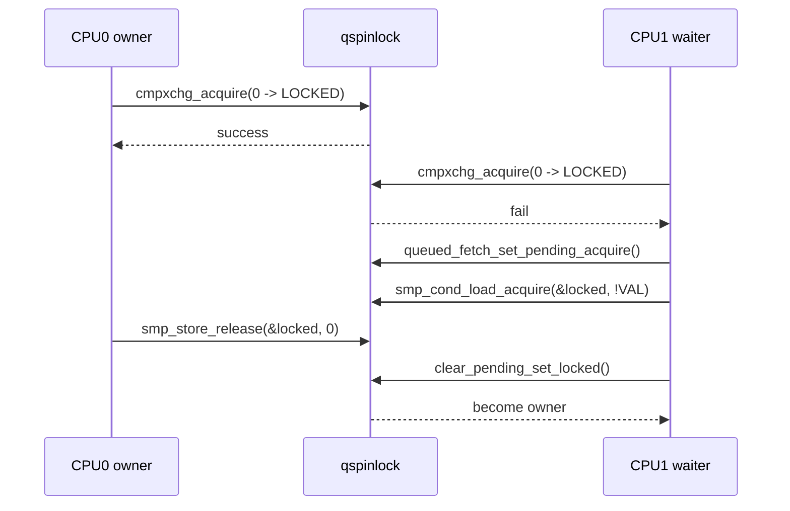
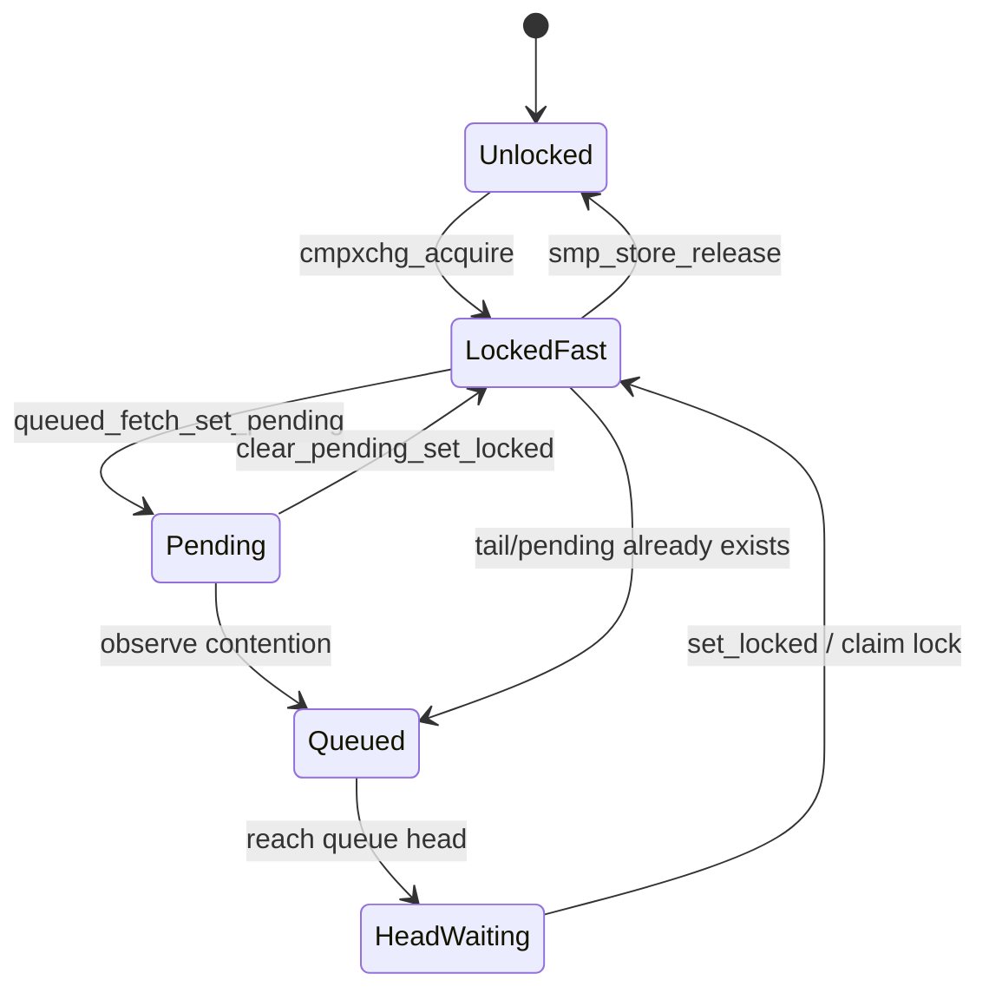
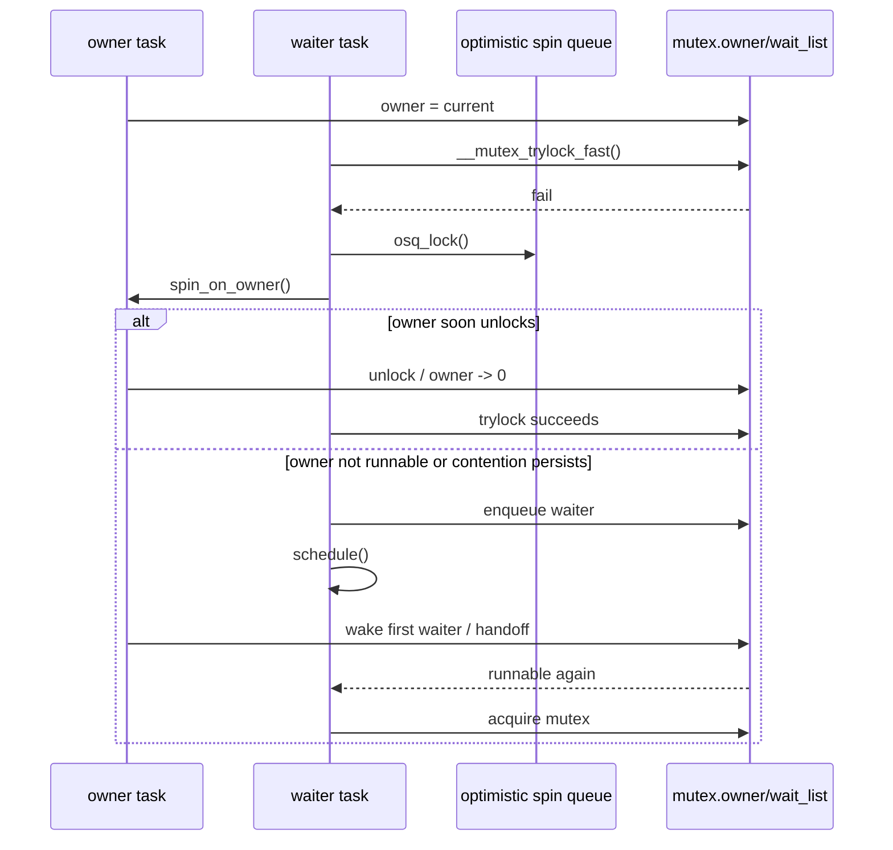
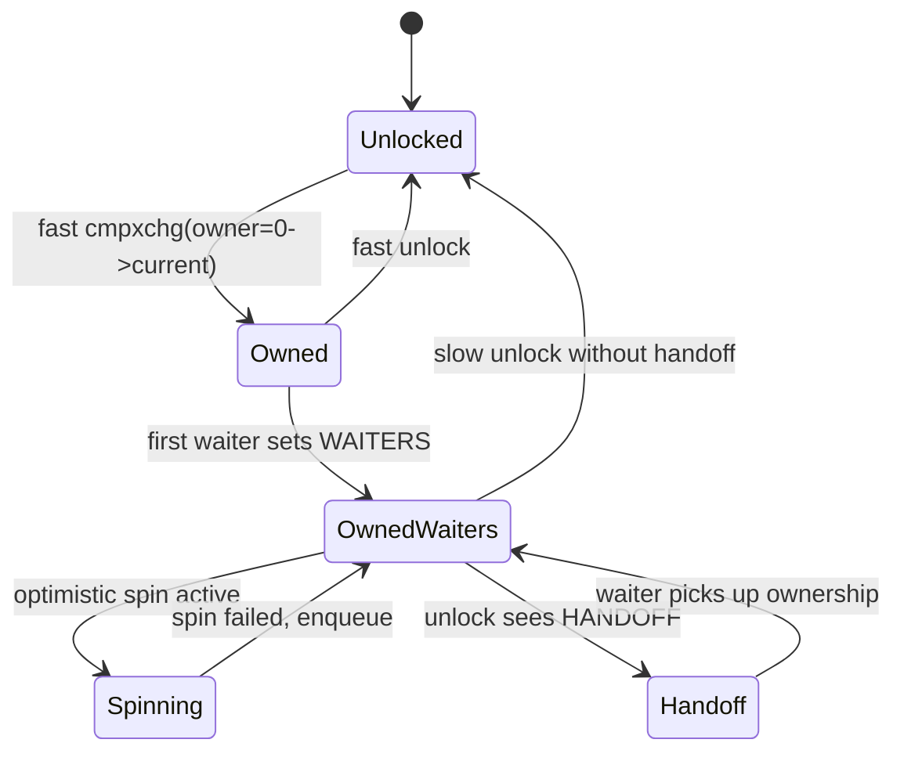

# Linux ARM64 锁实现与调试实验指南

> 环境基线：Linux 6.18.1 / ARM64 / SMP 内核
> 关注范围：spinlock、semaphore、mutex，以及锁调试与实验方法
> 分析原则：以当前仓库代码为准，区分 arm64 架构支撑层 与 内核通用锁算法层

---

## 1. 先给结论：ARM64 下锁到底是怎么分层的

在当前内核里，`arm64` 并没有单独维护一套“完全独立”的 `spinlock/semaphore/mutex` 算法，而是采用下面这套分层：

1. **硬件与架构支撑层由 arm64 提供**
   - 原子读改写、Acquire/Release 语义
   - `ldar/stlr` 这类有序访存指令
   - `wfe` 等待、事件唤醒相关机制
   - `__cmpwait_relaxed()`、`smp_cond_load_acquire()` 这种等待原语

2. **锁算法主体大多在通用 locking 子系统里**
   - `spinlock` 走的是 `qspinlock`
   - `semaphore` 在 `kernel/locking/semaphore.c`
   - `mutex` 在 `kernel/locking/mutex.c`

3. **ARM64 的关键价值不在“重新发明锁算法”，而在于保证这些算法在 ARM 弱内存序上仍然正确、高效并具备前进性**

这点很重要。很多文章会把 “ARM64 spinlock” 直接等同于一份独立的汇编锁实现，但在这个版本里，更准确的说法是：

- `raw_spinlock_t` 的底层锁字结构最终落到 `arch_spinlock_t`
- `arch_spin_lock()` 被映射到通用 `queued_spin_lock()`
- 真正的 arm64 特化，主要体现在**原子操作、等待循环、内存屏障、WFE/事件流**这些基础设施上

---

## 2. 源码导航图

理解锁实现时，建议按下面顺序读源码：

### 2.1 spinlock 相关

- `arch/arm64/include/asm/spinlock.h`
- `arch/arm64/include/asm/spinlock_types.h`
- `include/asm-generic/qspinlock_types.h`
- `include/asm-generic/qspinlock.h`
- `kernel/locking/qspinlock.c`
- `kernel/locking/qspinlock.h`
- `arch/arm64/include/asm/barrier.h`
- `arch/arm64/include/asm/cmpxchg.h`
- `arch/arm64/include/asm/rqspinlock.h`

### 2.2 semaphore 相关

- `include/linux/semaphore.h`
- `kernel/locking/semaphore.c`

### 2.3 mutex 相关

- `include/linux/mutex_types.h`
- `include/linux/mutex.h`
- `kernel/locking/mutex.c`
- `kernel/locking/mutex-debug.c`

### 2.4 锁调试相关

- `kernel/locking/spinlock_debug.c`
- `kernel/locking/lockdep.c`
- `kernel/locking/lockdep_proc.c`
- `include/trace/events/lock.h`
- `Documentation/locking/lockdep-design.rst`
- `Documentation/locking/lockstat.rst`
- `Documentation/locking/locktorture.rst`
- `Documentation/locking/mutex-design.rst`
- `tools/perf/Documentation/perf-lock.txt`

### 2.5 SLUB 实战延伸

- `mm/slub.c`
- `arm64_slub_lock_path_analysis.md`

---

## 3. ARM64 锁实现的底层基础：原子、有序访存与等待

先不谈具体锁类型，先看 ARM64 给锁子系统提供了什么。

### 3.1 Acquire / Release 是整个锁实现的根

在 ARM64 上，锁正确性不能依赖 x86 式的“默认强序”直觉，而必须显式依赖：

- `Acquire`：后续内存访问不能越过加锁点向前跑
- `Release`：前面的共享数据写入不能越过解锁点向后跑

当前代码里你会反复看到这些接口：

- `atomic_try_cmpxchg_acquire()`
- `atomic_fetch_or_acquire()`
- `atomic_long_try_cmpxchg_acquire()`
- `atomic_long_try_cmpxchg_release()`
- `smp_store_release()`
- `smp_load_acquire()`

这些接口最终会落到 arm64 的 `ldar/stlr` 或对应的原子序列上。

### 3.2 ARM64 的条件等待不是忙等死转，而是借助 `wfe`

`arch/arm64/include/asm/barrier.h` 里的：

- `smp_cond_load_relaxed()`
- `smp_cond_load_acquire()`

在条件不满足时，会调用：

- `__cmpwait_relaxed()`

而 `__cmpwait_relaxed()` 在 `arch/arm64/include/asm/cmpxchg.h` 中的核心行为是：

1. 先加载当前值
2. 比较是否仍然等于旧值
3. 如果还没变化，则执行 `wfe`

这意味着 ARM64 的很多锁等待循环并不是单纯 `while (...) cpu_relax()`，而是：

- 先观察共享变量
- 未变化则进入更省电、更少总线压力的等待
- 等有事件或状态变化再重新检查

### 3.3 一个很容易忽视的点：rqspinlock 有 arm64 特化

普通 `spinlock` 走通用 `qspinlock`，但 `rqspinlock` 在：

- `arch/arm64/include/asm/rqspinlock.h`

里对 `res_smp_cond_load_acquire()` 做了 arm64 定制。原因写得很直接：

- 某些平台上如果没有 `arch_timer_evtstrm_available()`
- 仅靠 WFE 型等待可能在“没有新的 store 落到锁字节”时长期不再苏醒

所以这里额外处理了**时间检查**与**事件流可用性**，防止等待线程因为平台事件流特性而“睡死”。

这说明 ARM64 锁实现里最值得看的是：

- 算法是否正确
- 在弱内存序上是否有 acquire/release 对应
- 在 WFE 语义下是否保证 forward progress

---

## 4. spinlock：ARM64 上的实际实现原理

## 4.1 类型层次

从类型上看，链路大致是：

`spinlock_t`
-> `raw_spinlock_t`
-> `arch_spinlock_t`
-> `qspinlock` 的 32-bit 锁字

`include/linux/spinlock_types_raw.h` 里可以看到：

- `raw_spinlock_t` 内部的 `raw_lock` 类型就是 `arch_spinlock_t`

而 `arch/arm64/include/asm/spinlock_types.h` 又直接包含：

- `asm-generic/qspinlock_types.h`

这已经说明：当前 arm64 的原始自旋锁类型就是**通用 qspinlock 类型**。

## 4.2 qspinlock 的 32-bit 锁字布局

`include/asm-generic/qspinlock_types.h` 把锁压缩成一个 `atomic_t val`，关键字段如下：

- `locked`：低 8 bit，表示是否持锁
- `pending`：下一字节，表示是否有人处于 pending 状态
- `tail`：高位编码 MCS 队列尾指针

在 `NR_CPUS < 16K` 时，布局可以理解为：

- bit 0..7：`locked`
- bit 8：`pending`
- bit 16..17：MCS 节点索引
- bit 18..31：CPU 编号加一

它的设计目标很明确：

1. 保持 `spinlock_t` 很小，只占 4 字节
2. 既保留快速无竞争路径
3. 又在竞争时退化为 MCS 队列锁，避免缓存行疯狂抖动

## 4.3 fastpath：先试图一把抢到

`include/asm-generic/qspinlock.h` 的 `queued_spin_lock()` 很直接：

1. 先把期望值设成 0
2. 用 `atomic_try_cmpxchg_acquire(&lock->val, &val, _Q_LOCKED_VAL)`
3. 若成功，立即拿锁
4. 若失败，进入 `queued_spin_lock_slowpath()`

这个 fastpath 的特点：

- 成本极低
- 只适合无竞争场景
- 使用 acquire 语义，保证临界区读取不会越过加锁点

## 4.4 slowpath：pending + MCS 队列

真正的核心在 `kernel/locking/qspinlock.c`。

慢路径大致分两阶段：

### 阶段 A：先尝试 pending holder 优化

当锁只有轻微竞争时，代码不会立刻排队，而是：

1. 设置 `pending` 位
2. 等待 owner 释放 `locked`
3. 再通过 `clear_pending_set_locked()` 接管锁

这样做的目的，是在“只有一个后来者”的情况下，避免过早构建 MCS 队列。

### 阶段 B：竞争明显时，进入 MCS 队列

如果观察到：

- 锁已被持有
- 或者已经存在 pending / tail

那么代码进入 `queue:` 路径：

1. 取当前 CPU 的 `qnodes[]` 里的 MCS 节点
2. 用 `encode_tail(cpu, idx)` 编码自己的尾指针
3. 初始化本地节点 `node->locked = 0, node->next = NULL`
4. 通过 `xchg_tail(lock, tail)` 原子发布新尾巴
5. 如果之前已有尾节点，则把自己挂到前驱的 `next`
6. 在自己的 `node->locked` 上等待前驱唤醒
7. 到达队首后，再等待锁字里的 `locked/pending` 清空
8. 最终拿到锁

这个设计借鉴了经典 MCS lock，但又做了压缩：

- 传统 MCS 需要显式 tail 指针和 next 指针
- qspinlock 把 tail 编码进 32-bit 锁字高位
- 首等待者不是一直盯着自己的节点，而是能配合 `locked/pending` 状态走快一点的接力流程

## 4.5 为什么 qspinlock 比简单 test-and-set 更适合多核竞争

如果只是简单 TAS 自旋，所有 CPU 都会反复争同一个 cacheline。

qspinlock 在竞争场景下的优势：

1. **队列化**：后来的 CPU 排队，不再全员直接抢锁字
2. **局部自旋**：很多等待发生在本地 MCS 节点上，减少共享 cacheline 抖动
3. **公平性更好**：相比裸 TAS，不容易让某个 CPU 长期饿死

## 4.6 ARM64 在 spinlock 中真正负责什么

### 负责 1：等待循环的正确性

`qspinlock.c` 中很多地方使用：

- `smp_cond_load_acquire()`
- `atomic_cond_read_acquire()`

在 arm64 上，这些等待不是纯忙轮询，而会落到 `__cmpwait_relaxed()`，内部有 `wfe`。

### 负责 2：解锁的 release 语义

`include/asm-generic/qspinlock.h` 中：

```c
smp_store_release(&lock->locked, 0);
```

这保证解锁前的共享数据写入对后继持锁者可见。

### 负责 3：前进性

`include/asm-generic/qspinlock.h` 文档明确强调：

- qspinlock 依赖较强的一致性与 forward progress 假设
- 对 LL/SC 架构尤其要谨慎

arm64 的实现通过有序原子操作、等待原语和必要的特化，来满足这些要求。

## 4.7 qspinlock 关键源码逐行解释

下面不再只讲概念，而是直接对关键代码做“逐行解释”。

### 4.7.1 fastpath 逐行解释

代码来自 `include/asm-generic/qspinlock.h`：

```c
static __always_inline void queued_spin_lock(struct qspinlock *lock)
{
	int val = 0;

	if (likely(atomic_try_cmpxchg_acquire(&lock->val, &val, _Q_LOCKED_VAL)))
		return;

	queued_spin_lock_slowpath(lock, val);
}
```

逐行看：

1. `int val = 0;`
   - 这里的含义不是“锁值恒为 0”，而是告诉 `cmpxchg`：我预期锁当前完全空闲。

2. `atomic_try_cmpxchg_acquire(&lock->val, &val, _Q_LOCKED_VAL)`
   - 尝试把 `lock->val` 从 `0` 原子更新成 `_Q_LOCKED_VAL`。
   - 成功说明没有竞争，当前 CPU 直接拿锁。
   - `acquire` 非常关键，它把后续临界区访问钉在加锁之后。

3. `if (likely(...)) return;`
   - 最常见场景是无竞争，直接返回。
   - 因此这个 fastpath 会被编译器和 CPU 分支预测重点优化。

4. `queued_spin_lock_slowpath(lock, val);`
   - 失败时进入慢路径。
   - 注意这里把失败时观测到的 `val` 也带进去了，这样慢路径不必重新完全从头探测一次状态。

### 4.7.2 slowpath 逐行解释：pending 优化段

代码来自 `kernel/locking/qspinlock.c`：

```c
if (val & ~_Q_LOCKED_MASK)
	goto queue;

val = queued_fetch_set_pending_acquire(lock);

if (unlikely(val & ~_Q_LOCKED_MASK)) {
	if (!(val & _Q_PENDING_MASK))
		clear_pending(lock);
	goto queue;
}

if (val & _Q_LOCKED_MASK)
	smp_cond_load_acquire(&lock->locked, !VAL);

clear_pending_set_locked(lock);
```

逐行看：

1. `if (val & ~_Q_LOCKED_MASK)`
   - 如果当前观测到的不只是 `locked` 位，还看到了 `pending` 或 `tail`，说明竞争已经不轻了。
   - 这时别走“单后来者优化”，直接去排队更稳妥。

2. `val = queued_fetch_set_pending_acquire(lock);`
   - 原子地设置 `pending` 位，并返回旧锁值。
   - 这个动作表示：“我先占一个待接力资格”。

3. `if (unlikely(val & ~_Q_LOCKED_MASK))`
   - 设置完 `pending` 后如果发现已有别的竞争者，说明自己不是唯一后来者。
   - 继续坚持 pending 模式会让状态机变复杂，所以撤销并转队列路径。

4. `if (!(val & _Q_PENDING_MASK)) clear_pending(lock);`
   - 只有在旧值里原本没有 `pending` 的情况下，才说明是当前 CPU 刚刚设上的。
   - 那么在转队列前，需要把自己刚写进去的 `pending` 清理掉。

5. `if (val & _Q_LOCKED_MASK) smp_cond_load_acquire(&lock->locked, !VAL);`
   - 如果 owner 还在持锁，就等待 `locked` 清零。
   - 在 ARM64 上，这个等待最终会走到 `__cmpwait_relaxed()` 和 `wfe`。

6. `clear_pending_set_locked(lock);`
   - owner 已放锁后，pending holder 把状态从 `pending` 直接切到 `locked`。
   - 这是 qspinlock 减少队列构建开销的关键一步。

### 4.7.3 slowpath 逐行解释：MCS 入队段

代码来自 `kernel/locking/qspinlock.c`：

```c
node = this_cpu_ptr(&qnodes[0].mcs);
idx = node->count++;
tail = encode_tail(smp_processor_id(), idx);

node = grab_mcs_node(node, idx);
node->locked = 0;
node->next = NULL;

smp_wmb();
old = xchg_tail(lock, tail);

if (old & _Q_TAIL_MASK) {
	prev = decode_tail(old, qnodes);
	WRITE_ONCE(prev->next, node);
	arch_mcs_spin_lock_contended(&node->locked);
}
```

逐行看：

1. `node = this_cpu_ptr(&qnodes[0].mcs);`
   - 取当前 CPU 的 qnode 基址。
   - qspinlock 给每 CPU 预留了几层嵌套节点，覆盖 task/softirq/hardirq/nmi 这几层上下文。

2. `idx = node->count++;`
   - 当前 CPU 在本次嵌套深度下取一个节点槽位。

3. `tail = encode_tail(smp_processor_id(), idx);`
   - 把 `cpu + nesting index` 压缩编码进 32-bit 锁字尾部格式。

4. `node = grab_mcs_node(node, idx);`
   - 真正定位到本次排队使用的 MCS 节点。

5. `node->locked = 0; node->next = NULL;`
   - 初始化本节点，表示我还没被前驱唤醒，且暂时没有后继。

6. `smp_wmb();`
   - 保证上面对节点的初始化，先于后面的 tail 发布对其他 CPU 可见。

7. `old = xchg_tail(lock, tail);`
   - 原子交换队列尾指针，把自己挂到队尾。
   - 返回旧 tail，用来判断自己前面是否已经有人。

8. `if (old & _Q_TAIL_MASK)`
   - 如果旧 tail 非空，说明自己不是第一个排队者。

9. `prev = decode_tail(old, qnodes);`
   - 根据旧 tail 反解码出前驱节点地址。

10. `WRITE_ONCE(prev->next, node);`
   - 把自己链接到前驱的 `next` 上。

11. `arch_mcs_spin_lock_contended(&node->locked);`
   - 然后只在自己的本地节点字段上等待前驱唤醒。
   - 这正是 MCS 锁减少共享 cacheline 争用的本质。

## 4.8 qspinlock 时序图与状态迁移图

### 4.8.1 轻度竞争时序图



### 4.8.2 重度竞争状态图



---

## 5. semaphore：本质是“计数 + 等待队列 + 内部自旋锁”

## 5.1 数据结构

`include/linux/semaphore.h` 中的 `struct semaphore` 很简单：

- `raw_spinlock_t lock`：保护内部状态
- `unsigned int count`：剩余资源数
- `struct list_head wait_list`：等待者链表
- 可选 `last_holder`：配合 hung task 调试

这里有个重要认识：

**semaphore 自己不是自旋锁，它是睡眠锁；但它的内部元数据修改，仍然要靠 raw spinlock 串行化。**

因此，哪怕你在分析 semaphore，也仍然会间接走到 arm64 的 qspinlock。

## 5.2 fastpath：count 大于 0 直接减 1

`kernel/locking/semaphore.c` 中的 `down()` / `down_interruptible()` / `down_killable()` / `down_timeout()` 基本模式一致：

1. `raw_spin_lock_irqsave(&sem->lock, flags)`
2. 若 `sem->count > 0`，调用 `__sem_acquire()`，即 `count--`
3. 否则进入慢路径 `__down*()`
4. 释放 `sem->lock`

这里为什么用 `irqsave`？源码注释讲得很清楚：

- `down_trylock()` 和 `up()` 可以在中断上下文调用
- 内核里也存在一些“知道一定成功”的 `down()` 场景
- 所以内部 spinlock 需要用 irqsave 版本，避免被本地中断重入破坏

## 5.3 slowpath：挂等待队列并睡眠

`___down_common()` 是核心：

1. 把当前任务包装成 `struct semaphore_waiter`
2. 挂到 `sem->wait_list` 尾部
3. 设置任务状态为 `TASK_UNINTERRUPTIBLE` / `TASK_INTERRUPTIBLE` / `TASK_KILLABLE`
4. 先解开 `sem->lock`
5. 调用 `schedule_timeout()` 睡眠
6. 被唤醒后重新拿回 `sem->lock`
7. 检查自己是否被 `up()` 标记为 `waiter.up = true`

这是一种非常典型的“自旋锁保护元数据 + 睡眠等待真实资源”的内核阻塞锁模式。

## 5.4 up() 为什么和 mutex_unlock() 语义不同

`up()` 的语义明显比 mutex 宽松：

- 它**不要求释放者必须是获取者**
- 它可以在别的上下文里释放
- 它甚至可用于中断上下文

源码也明确写了：

- unlike mutexes, `up()` may be called from any context

因此 semaphore 适合表达“资源计数”或“生产者/消费者放行”，但不适合表达严格所有权互斥。

## 5.5 semaphore 的本质特点

可以把它理解成：

- 外层语义：计数资源
- 内层实现：`raw_spinlock + count + wait_list + schedule/wakeup`

它比 mutex 更宽松，但也更难做严格语义检查，所以现在很多“仅需互斥”的代码更推荐 mutex。

## 5.6 semaphore 关键源码逐行解释

### 5.6.1 `down()` 快路径逐行解释

代码来自 `kernel/locking/semaphore.c`：

```c
void __sched down(struct semaphore *sem)
{
   unsigned long flags;

   might_sleep();
   raw_spin_lock_irqsave(&sem->lock, flags);
   if (likely(sem->count > 0))
      __sem_acquire(sem);
   else
      __down(sem);
   raw_spin_unlock_irqrestore(&sem->lock, flags);
}
```

逐行看：

1. `might_sleep();`
   - `down()` 语义上允许阻塞，因此这里显式声明：当前路径必须允许睡眠。

2. `raw_spin_lock_irqsave(&sem->lock, flags);`
   - 先拿内部 raw spinlock，并关本地中断。
   - 保护的是 `count` 和 `wait_list`，不是用户临界区本身。

3. `if (likely(sem->count > 0))`
   - 资源还有剩余，不必睡眠。

4. `__sem_acquire(sem);`
   - 实际动作非常简单，就是 `count--`，并在启用 hung task blocker 时记录 holder。

5. `else __down(sem);`
   - 资源不足时转慢路径，把当前任务挂入等待队列。

6. `raw_spin_unlock_irqrestore(&sem->lock, flags);`
   - 最后释放内部自旋锁并恢复中断状态。

### 5.6.2 `___down_common()` 慢路径逐行解释

代码来自 `kernel/locking/semaphore.c`：

```c
list_add_tail(&waiter.list, &sem->wait_list);
waiter.task = current;
waiter.up = false;

for (;;) {
   if (signal_pending_state(state, current))
      goto interrupted;
   if (unlikely(timeout <= 0))
      goto timed_out;
   __set_current_state(state);
   raw_spin_unlock_irq(&sem->lock);
   timeout = schedule_timeout(timeout);
   raw_spin_lock_irq(&sem->lock);
   if (waiter.up)
      return 0;
}
```

逐行看：

1. `list_add_tail(&waiter.list, &sem->wait_list);`
   - 把当前任务包装成 waiter，放进等待队列尾部。

2. `waiter.task = current; waiter.up = false;`
   - 记录当前任务，并约定由 `up()` 将 `waiter.up` 改成 true 作为唤醒确认。

3. `if (signal_pending_state(state, current))`
   - 如果是可中断或可杀死的等待，要先检查信号条件。

4. `if (unlikely(timeout <= 0))`
   - 支持超时获取语义。

5. `__set_current_state(state);`
   - 把自己标记为真正的睡眠状态，而不是仍处于 RUNNING。

6. `raw_spin_unlock_irq(&sem->lock);`
   - 睡眠前一定要先放掉内部 spinlock，否则别人永远无法 `up()`。

7. `timeout = schedule_timeout(timeout);`
   - 进入调度器，真正阻塞等待。

8. `raw_spin_lock_irq(&sem->lock);`
   - 被唤醒后重新拿回内部锁，重新检查共享状态。

9. `if (waiter.up) return 0;`
   - 若 `up()` 已经点名把资源交给自己，就成功返回。

---

## 6. mutex：所有权明确的睡眠互斥锁

## 6.1 数据结构比 semaphore 更复杂

`include/linux/mutex_types.h` 中，非 `PREEMPT_RT` 情况下：

- `atomic_long_t owner`
- `raw_spinlock_t wait_lock`
- `struct optimistic_spin_queue osq`（可选）
- `struct list_head wait_list`

和 semaphore 相比，多出来的关键点是：

1. `owner` 明确记录持锁者
2. 支持 optimistic spinning
3. 语义严格，调试能力更强

`owner` 的低几位会复用为 flag：

- `MUTEX_FLAG_WAITERS`
- `MUTEX_FLAG_HANDOFF`
- `MUTEX_FLAG_PICKUP`

也就是说，mutex 不是简单的 “0/1”，而是一个带状态机的所有权变量。

## 6.2 fastpath：owner 从 0 原子改成 current

`mutex_lock()` 的快路径非常直接：

1. `__mutex_trylock_fast()`
2. 用 `atomic_long_try_cmpxchg_acquire(&lock->owner, &zero, curr)`
3. 成功则直接拿到锁

这里的 acquire 语义与 spinlock 一样，保证后续临界区访问不会跑到加锁之前。

## 6.3 midpath：optimistic spinning

这是 mutex 最值得分析的部分之一。

当 mutex 被占用，但持锁者当前仍在 CPU 上运行时，立即睡眠往往不是最优。于是 mutex 会尝试：

1. 判断当前线程是否 `need_resched()`
2. 看 owner 是否还在 CPU 上执行
3. 若适合自旋，则进入 `mutex_optimistic_spin()`
4. 多个 spinner 先通过 `osq_lock()` 形成 MCS 队列
5. 只有队首 spinner 才去盯 owner 变化并尝试抢锁

这个设计的意义：

- 避免所有等待者一起疯狂轮询 owner
- 在 owner 快要释放锁时，减少一次真正睡眠/唤醒开销

也就是说，mutex 虽然是睡眠锁，但在实际实现上已经变成了：

- 无竞争走原子 fastpath
- 短竞争先自旋
- 长竞争再睡眠

## 6.4 slowpath：wait_list + wait_lock + handoff

如果 optimistic spinning 仍未成功，则进入 `__mutex_lock_common()`：

1. `preempt_disable()`
2. 尝试一次 trylock / optimistic spin
3. 拿 `wait_lock`
4. 将 waiter 加入 `wait_list`
5. 设置当前任务状态
6. `schedule_preempt_disabled()` 睡眠
7. 被唤醒后重新检查，必要时再 spin
8. 真正获得锁后，把 waiter 从队列移除

unlock 端的 `__mutex_unlock_slowpath()` 则负责：

1. 先尝试 release owner
2. 若有等待者，则取队列第一个 waiter
3. 将其唤醒
4. 必要时通过 `__mutex_handoff()` 显式移交所有权

这个 handoff 很关键，它解决的是：

- 唤醒了某个 waiter，但又被其他后来者抢走
- 导致队首 waiter 长期拿不到锁

所以 mutex 的公平性与吞吐量之间做了比较细的平衡。

## 6.5 mutex 为什么比 semaphore 更适合“纯互斥”

因为 mutex 具备这些性质：

1. 只有 owner 才能 unlock
2. 禁止递归加锁
3. 禁止在中断上下文使用
4. 能和 lockdep / debug mutex 深度联动
5. 能利用 optimistic spinning 获得更好的短临界区性能

这就是 `Documentation/locking/mutex-design.rst` 一直强调“若只是互斥，应优先 mutex”的原因。

## 6.6 一个必须记住的特例：PREEMPT_RT

如果启用 `CONFIG_PREEMPT_RT`，`struct mutex` 会切换为 rtmutex 变体。

也就是说：

- 本文分析的 `mutex.c` 逻辑主要针对常规非 RT 内核
- RT 内核里，mutex 语义会更靠近优先级继承的 rtmutex

如果你后续要专门研究实时内核，这里要分开看。

## 6.7 mutex 关键源码逐行解释

### 6.7.1 `mutex_lock()` fastpath 逐行解释

代码来自 `kernel/locking/mutex.c`：

```c
void __sched mutex_lock(struct mutex *lock)
{
   might_sleep();

   if (!__mutex_trylock_fast(lock))
      __mutex_lock_slowpath(lock);
}
```

逐行看：

1. `might_sleep();`
   - mutex 是睡眠锁，所以调用者必须位于允许睡眠的进程上下文。

2. `if (!__mutex_trylock_fast(lock))`
   - 先尝试最便宜的 uncontended fastpath。

3. `__mutex_lock_slowpath(lock);`
   - 一旦有人占锁，就转入更复杂的 optimistic spinning / wait queue 逻辑。

而 `__mutex_trylock_fast()` 的核心是：

```c
unsigned long curr = (unsigned long)current;
unsigned long zero = 0UL;

if (atomic_long_try_cmpxchg_acquire(&lock->owner, &zero, curr))
   return true;
```

这里逐行含义是：

1. `curr` 保存当前任务指针。
2. `zero` 表示期望锁当前无人持有，也没有任何 flag。
3. `cmpxchg_acquire` 成功，就把 owner 从 0 原子切成 current。
4. 失败时说明不是无竞争场景，需要走慢路径。

### 6.7.2 `mutex_optimistic_spin()` 逐行解释

代码来自 `kernel/locking/mutex.c`：

```c
if (!waiter) {
   if (!mutex_can_spin_on_owner(lock))
      goto fail;
   if (!osq_lock(&lock->osq))
      goto fail;
}

for (;;) {
   struct task_struct *owner;
   owner = __mutex_trylock_or_owner(lock);
   if (!owner)
      break;
   if (!mutex_spin_on_owner(lock, owner, ww_ctx, waiter))
      goto fail_unlock;
   cpu_relax();
}
```

逐行看：

1. `if (!waiter)`
   - 只有不是 waitqueue 中正式 waiter 的 spinner，才需要先去竞争 OSQ 的 MCS 队列头资格。

2. `mutex_can_spin_on_owner(lock)`
   - 判断 owner 是否还在 CPU 上、当前线程是否需要调度等。
   - 如果 owner 已经不运行了，继续自旋通常得不偿失。

3. `osq_lock(&lock->osq)`
   - 进入 optimistic spin queue，只允许队首 spinner 真正盯 owner。

4. `owner = __mutex_trylock_or_owner(lock);`
   - 每轮先试一次能不能直接拿到锁。
   - 拿不到就返回当前 owner，供后续判断是否继续自旋。

5. `if (!owner) break;`
   - owner 为空，说明本轮已经成功拿锁。

6. `if (!mutex_spin_on_owner(...))`
   - 如果 owner 不在 CPU、需要调度、或者 ww_mutex 条件不允许，就停止自旋。

7. `cpu_relax();`
   - 继续下一轮自旋，但不做重型同步，只是降低流水线压力。

### 6.7.3 `__mutex_lock_common()` 慢路径逐行解释

代码来自 `kernel/locking/mutex.c`：

```c
raw_spin_lock_irqsave(&lock->wait_lock, flags);
if (__mutex_trylock(lock))
   goto skip_wait;

__mutex_add_waiter(lock, &waiter, &lock->wait_list);
set_current_state(state);

for (;;) {
   if (__mutex_trylock(lock))
      goto acquired;
   if (signal_pending_state(state, current)) {
      ret = -EINTR;
      goto err;
   }
   raw_spin_unlock_irqrestore_wake(&lock->wait_lock, flags, &wake_q);
   schedule_preempt_disabled();
   raw_spin_lock_irqsave(&lock->wait_lock, flags);
}
```

逐行看：

1. `raw_spin_lock_irqsave(&lock->wait_lock, flags);`
   - wait queue 相关元数据必须先由 `wait_lock` 串行化。

2. `if (__mutex_trylock(lock)) goto skip_wait;`
   - 拿到 `wait_lock` 后再试一次，有时刚好在这一瞬间 owner 放锁。

3. `__mutex_add_waiter(...)`
   - 把当前任务挂入 mutex 等待队列，并设置 `WAITERS` flag。

4. `set_current_state(state);`
   - 把任务切换到可睡眠状态。

5. `if (__mutex_trylock(lock)) goto acquired;`
   - 每次睡醒后第一件事仍然是尝试拿锁。

6. `if (signal_pending_state(...))`
   - 可中断 mutex 需要处理信号提前退出。

7. `raw_spin_unlock_irqrestore_wake(...)`
   - 睡眠前放掉 `wait_lock`，否则 unlock 侧无法推进。

8. `schedule_preempt_disabled();`
   - 真正挂起，等待被 unlock 端唤醒。

9. `raw_spin_lock_irqsave(&lock->wait_lock, flags);`
   - 唤醒后重新进入受保护检查区。

### 6.7.4 `__mutex_unlock_slowpath()` 逐行解释

代码来自 `kernel/locking/mutex.c`：

```c
owner = atomic_long_read(&lock->owner);
for (;;) {
   if (owner & MUTEX_FLAG_HANDOFF)
      break;
   if (atomic_long_try_cmpxchg_release(&lock->owner, &owner,
         __owner_flags(owner))) {
      if (owner & MUTEX_FLAG_WAITERS)
         break;
      return;
   }
}

raw_spin_lock_irqsave(&lock->wait_lock, flags);
if (!list_empty(&lock->wait_list)) {
   struct mutex_waiter *waiter = list_first_entry(&lock->wait_list,
         struct mutex_waiter, list);
   next = waiter->task;
   wake_q_add(&wake_q, next);
}

if (owner & MUTEX_FLAG_HANDOFF)
   __mutex_handoff(lock, next);
```

逐行看：

1. `owner = atomic_long_read(&lock->owner);`
   - 先读 owner 和 flags 组合状态。

2. `if (owner & MUTEX_FLAG_HANDOFF) break;`
   - 如果已经进入 handoff 模式，不能简单清零 owner，要把锁交给指定 waiter。

3. `atomic_long_try_cmpxchg_release(..., __owner_flags(owner))`
   - 常规解锁路径把 owner 指针清掉，但保留必要 flags。
   - `release` 语义保证临界区写入先于解锁对外可见。

4. `if (owner & MUTEX_FLAG_WAITERS) break;`
   - 即使 owner 字段已经成功清掉，只要还有 waiter，也要继续走 slowpath 做唤醒。

5. `raw_spin_lock_irqsave(&lock->wait_lock, flags);`
   - 串行化 waitqueue 操作。

6. `list_first_entry(&lock->wait_list, ...)`
   - 选队首 waiter，通常优先唤醒它。

7. `wake_q_add(&wake_q, next);`
   - 把 waiter 加入批量唤醒队列，减少立即调度开销。

8. `if (owner & MUTEX_FLAG_HANDOFF) __mutex_handoff(lock, next);`
   - 若启用了 handoff，则不是简单唤醒，而是把 owner 直接移交给 `next`。

## 6.8 mutex 时序图与状态迁移图

### 6.8.1 optimistic spinning + 睡眠时序图



### 6.8.2 mutex owner 状态图



---

## 7. 三种锁放在一起对比

| 维度 | spinlock | semaphore | mutex |
|---|---|---|---|
| 是否睡眠 | 否 | 是 | 是 |
| 是否记录 owner | 调试时可记录 | 不要求 | 必须有 owner |
| 是否允许中断上下文用获取接口 | 可以，需选对 irq 版本 | `down_trylock/up` 可，阻塞式 `down` 需谨慎 | 不允许 |
| 是否允许非 owner 释放 | 不允许 | 允许 | 不允许 |
| 典型用途 | 极短临界区、IRQ/底层元数据 | 资源计数、放行 | 普通进程上下文互斥 |
| ARM64 关键点 | qspinlock + WFE 等待 | 内部 raw spinlock 仍走 qspinlock | owner 原子状态机 + OSQ 自旋 + 睡眠队列 |

如果只需要进程上下文里的互斥，优先级通常是：

- `mutex` 优先
- 只有明确需要“计数资源”或“非 owner 释放”时才考虑 `semaphore`
- 只有绝对不能睡眠，且临界区非常短，才用 `spinlock`

---

## 8. 从 ARM64 角度理解这三类锁的统一模型

虽然三者形态不同，但底层都能归纳为一个统一模型：

1. **先用原子/自旋手段保护锁元数据**
2. **轻度竞争时尽量不睡眠**
3. **重度竞争时进入队列或睡眠**
4. **解锁时用 release 语义向后继发布可见性**

具体映射如下：

- `spinlock`：完全忙等，但竞争时 MCS 队列化
- `semaphore`：内部元数据靠 raw spinlock，真正等待靠调度器
- `mutex`：原子 fastpath + OSQ 自旋 midpath + 睡眠 slowpath

ARM64 提供的核心能力是：

- 原子 RMW
- Acquire/Release 内存序
- 基于 `wfe` 的等待优化
- 必要时用事件流/时间检查保证等待不会卡死

---

## 9. 实验环境建议

建议在 ARM64 QEMU 或开发板上使用 debug kernel 做实验。建议打开以下配置：

```text
CONFIG_SMP=y
CONFIG_DEBUG_KERNEL=y
CONFIG_PROVE_LOCKING=y
CONFIG_LOCK_STAT=y
CONFIG_DEBUG_SPINLOCK=y
CONFIG_DEBUG_MUTEXES=y
CONFIG_DEBUG_ATOMIC_SLEEP=y
CONFIG_DETECT_HUNG_TASK_BLOCKER=y
CONFIG_LOCK_TORTURE_TEST=m
CONFIG_EVENT_TRACING=y
CONFIG_FUNCTION_TRACER=y
CONFIG_FTRACE=y
CONFIG_BPF=y
CONFIG_BPF_SYSCALL=y
```

其中：

- `CONFIG_PROVE_LOCKING` 会自动选择 `LOCKDEP`、`DEBUG_SPINLOCK`、`DEBUG_MUTEXES` 等
- `CONFIG_LOCK_STAT` 除了 `/proc/lock_stat` 外，还会启用 `perf lock` 所需事件
- `CONFIG_DEBUG_ATOMIC_SLEEP` 能抓“拿着 spinlock 去睡眠”这类常见错误
- `CONFIG_DETECT_HUNG_TASK_BLOCKER` 能帮助定位卡住的 semaphore / mutex 持有者

如果只是第一次实验，建议先从这一组开始：

```text
CONFIG_DEBUG_KERNEL=y
CONFIG_PROVE_LOCKING=y
CONFIG_LOCK_STAT=y
CONFIG_DEBUG_ATOMIC_SLEEP=y
CONFIG_LOCK_TORTURE_TEST=m
```

---

## 10. 实验一：用 locktorture 观察自旋锁与 mutex 的竞争特征

`Documentation/locking/locktorture.rst` 已经给了最直接的现成实验框架。

### 10.1 编译模块

开启：

```text
CONFIG_LOCK_TORTURE_TEST=m
```

### 10.2 跑 spinlock 压测

```bash
modprobe locktorture torture_type=spin_lock nwriters_stress=8 stat_interval=10
dmesg | grep torture
```

观察点：

1. 总获取次数是否持续增长
2. 是否出现失败标志
3. CPU 数增加后吞吐是否线性恶化

### 10.3 跑 mutex 压测

```bash
rmmod locktorture
modprobe locktorture torture_type=mutex_lock nwriters_stress=8 stat_interval=10
dmesg | grep torture
```

观察点：

1. 与 `spin_lock` 相比，长竞争下是否更平滑
2. 是否能通过 `perf lock contention` 看到显著等待热点

### 10.4 结论预期

- 短临界区、高频竞争下，spinlock 往往延迟更低
- 竞争持续且临界区变长时，mutex 通常更可控，因为等待者会睡眠，不会一直烧 CPU

---

## 11. 实验二：观察 semaphore 与 mutex 的语义差异

这个实验不一定要写很大的模块，核心是验证两件事：

1. `semaphore` 允许非 owner 释放
2. `mutex` 不允许

### 11.1 semaphore 实验思路

准备一个二值 semaphore：

```c
static DEFINE_SEMAPHORE(test_sem, 1);
```

线程 A：

- `down_interruptible(&test_sem)`
- 持有一段时间

线程 B：

- 不执行 `down()`
- 直接 `up(&test_sem)`

预期：

- 从语义上讲这是允许的
- 它表达的是“资源计数恢复”，不是严格 owner 互斥

### 11.2 mutex 实验思路

准备一个 mutex：

```c
static DEFINE_MUTEX(test_mutex);
```

线程 A：

- `mutex_lock(&test_mutex)`

线程 B：

- 直接 `mutex_unlock(&test_mutex)`

预期：

- 在 `CONFIG_DEBUG_MUTEXES=y` 下应触发明显告警
- 因为 mutex 明确要求 owner 才能释放

这个实验非常适合帮助你建立“semaphore 不是 mutex 替代品”的直觉。

---

## 12. 实验三：在 ARM64 上观察 qspinlock 的竞争热点

### 12.1 开启 lockstat

```bash
echo 1 > /proc/sys/kernel/lock_stat
cat /proc/lock_stat | head -n 80
```

参考 `Documentation/locking/lockstat.rst`，你需要重点看：

- `contentions`
- `waittime-*`
- `holdtime-*`
- 顶部 contention point

### 12.2 寻找典型热点 spinlock

```bash
grep ':' /proc/lock_stat | head
```

如果系统压力够大，常会看到：

- `rq->lock`
- 各类 LRU / zone / mapping 锁
- dentry / inode 相关锁

### 12.3 关注 `rqspinlock`

调度器 `rq->lock` 在 ARM64 上尤其值得看，因为它对应 `rqspinlock` 的等待特化。

可以用下面思路观察：

1. 跑高调度压力 workload
2. 打开 lockstat
3. 看 `rq->lock` 的 contention 和 wait time
4. 再结合 `perf lock contention` 做排序

这样能把源码里的 `rqspinlock` 定制与真实热点对应起来。

---

## 13. 实验四：用 tracepoint 直接观察锁争用开始与结束

`include/trace/events/lock.h` 中定义了几类非常有用的事件：

- `lock:contention_begin`
- `lock:contention_end`
- `lock:lock_acquire`
- `lock:lock_release`
- `lock:lock_contended`
- `lock:lock_acquired`

其中：

- `contention_begin/end` 更偏向“争用区间”
- `lockdep` / `lock_stat` 相关事件更偏向“锁类和统计”

### 13.1 用 tracefs 打开事件

```bash
cd /sys/kernel/tracing
echo 1 > events/lock/contention_begin/enable
echo 1 > events/lock/contention_end/enable
cat trace_pipe
```

你会看到锁地址和标志位：

- `SPIN`
- `MUTEX`
- `READ`
- `WRITE`

### 13.2 如何把地址对应回具体锁

有几种方法：

1. 配合 `perf lock info`
2. 结合 `kallsyms` 和对象地址
3. 自己在目标模块里打印锁对象地址

这个方法非常适合分析：

- 是谁在争
- 争用持续多久
- 是 spin 类锁还是睡眠类锁

---

## 14. 调试锁问题的完整方法论

这一部分是本文最实用的内容。实际调试锁问题时，建议按下面层次推进。

## 14.1 第一层：先抓“违规语义”

优先打开：

- `CONFIG_PROVE_LOCKING`
- `CONFIG_DEBUG_SPINLOCK`
- `CONFIG_DEBUG_MUTEXES`
- `CONFIG_DEBUG_ATOMIC_SLEEP`

这几项主要抓的是：

- 自旋锁未初始化
- 同一 CPU / 同一线程递归拿 spinlock
- mutex 非 owner 解锁
- 在 atomic context 里调用可能睡眠的接口
- 锁顺序反转导致的潜在死锁

如果你正在改内核锁逻辑，第一步不是看性能，而是先把这一层跑干净。

## 14.2 第二层：用 lockdep 查锁顺序

`lockdep` 的核心不是“记录谁持锁”，而是：

- 构建 lock class
- 记录锁依赖图
- 判断是否可能形成环

重点接口：

- `/proc/lockdep`
- `/proc/lockdep_stats`

命令：

```bash
cat /proc/lockdep_stats
cat /proc/lockdep | less
```

调试时要重点看：

1. 某个 lock class 的 `FD/BD` 是否异常多
2. 某个类是否出现了不该有的子类
3. 是否已经形成反向依赖边

### lockdep 最擅长抓什么

- ABBA 死锁
- 同类锁递归
- irq-safe / irq-unsafe 混用
- 中断上下文与普通上下文的错误嵌套

### lockdep 不擅长抓什么

- 性能差但语义合法的锁热点
- 极端时序下的饥饿问题
- 用户自己没有正确打 lockdep 注解的隐式同步

所以 lockdep 是**正确性工具**，不是性能工具。

## 14.3 第三层：用 lockstat / perf lock 查性能热点

### lockstat

开启：

```bash
echo 1 > /proc/sys/kernel/lock_stat
cat /proc/lock_stat | less
```

它适合回答：

- 哪把锁最常发生争用
- 等待时间最长的是谁
- 持锁时间最长的是谁
- 热点 contention callsite 在哪里

### perf lock

参考 `tools/perf/Documentation/perf-lock.txt`，常用命令：

```bash
perf lock record -- <your workload>
perf lock report
perf lock contention
perf lock script
perf lock info
```

如果系统支持 BPF，`perf lock contention --use-bpf` 很适合在线抓热点。

例如只看某些类型：

```bash
perf lock contention -abY spinlock,mutex,semaphore
```

它适合回答：

- 具体 workload 中哪类锁在拖慢吞吐
- 每个线程在等哪些锁
- 平均等待时间和总等待时间谁最高

## 14.4 第四层：用 tracepoint 看时间线

当你已经知道“有热点”，但还不知道“争用是怎么发生的”时，用 tracepoint：

- `events/lock/contention_begin`
- `events/lock/contention_end`

这一步适合分析：

- 短时突发争用
- 某个阶段性 workload 下的锁竞争波峰
- 某个锁是持续热，还是只在特定路径下热

## 14.5 第五层：怀疑死锁或长时间卡住时，看 hung task

建议打开：

- `CONFIG_DETECT_HUNG_TASK_BLOCKER`

在 semaphore 里，`last_holder` 可帮助你看到最近持有者。

对于 mutex / semaphore 卡死问题，还建议配合：

```bash
echo w > /proc/sysrq-trigger
```

这会打印阻塞任务栈，通常很适合定位：

- 谁在等锁
- 谁持锁不放
- 是不是锁持有路径里又睡眠或阻塞了别的资源

## 14.6 第六层：在代码里加断言，而不是靠猜

推荐在自己修改的关键路径里加：

- `lockdep_assert_held(&lock)`
- `lockdep_assert_irqs_disabled()`

这类断言价值很高，因为它们能把“调用者应该持有某锁”这种隐含约束，变成运行时可验证规则。

如果你在 ARM64 内核里调某个复杂路径，比如页分配、调度或 slab，这种断言比事后读栈更省时间。

---

## 15. ARM64 锁调试时最常见的几类坑

## 15.1 误把 semaphore 当 mutex

常见后果：

- 以为 unlock 必须由 owner 执行
- 以为 lockdep 会像 mutex 一样给出强语义检查

实际上 semaphore 更像“计数资源门票”。

## 15.2 在 spinlock 保护区里走到了可睡眠路径

这是最常见、也最致命的错误之一。建议一定打开：

- `CONFIG_DEBUG_ATOMIC_SLEEP`

这样当你在：

- 持有 spinlock
- preempt disabled
- IRQ context

等状态下调用 `might_sleep()` 路径时，内核会直接报警。

## 15.3 只看功能正确，不看锁顺序

很多代码“单线程测试没问题”，但一上 SMP 就会出现：

- A 路径先拿 L1 再拿 L2
- B 路径先拿 L2 再拿 L1

这种问题靠 code review 很容易漏，靠 lockdep 最快。

## 15.4 误解 ARM64 上的等待行为

在 x86 上你可能习惯把等待理解成纯忙等，但 ARM64 很多锁等待路径带有：

- `wfe`
- 事件流依赖
- acquire/release 可见性要求

所以分析“为什么线程没继续转”时，不要只盯 while 循环，还要看：

- 是否有事件唤醒条件
- 是否用了正确的 release store
- 是否平台事件流可用

`rqspinlock` 的 arm64 特化就是一个非常典型的例子。

---

## 16. 建议的阅读顺序

如果你打算系统掌握 ARM64 锁实现，建议按这个顺序：

1. `include/asm-generic/qspinlock_types.h`
2. `include/asm-generic/qspinlock.h`
3. `kernel/locking/qspinlock.c`
4. `arch/arm64/include/asm/barrier.h`
5. `arch/arm64/include/asm/cmpxchg.h`
6. `include/linux/semaphore.h`
7. `kernel/locking/semaphore.c`
8. `include/linux/mutex_types.h`
9. `kernel/locking/mutex.c`
10. `Documentation/locking/mutex-design.rst`
11. `Documentation/locking/lockdep-design.rst`
12. `Documentation/locking/lockstat.rst`

读完这一轮，你对 ARM64 锁的认识基本会从“会用 API”提升到“能解释实现与定位问题”。

---

## 17. 最后的总结

把本文压缩成几句话：

1. **ARM64 下的 spinlock 主体算法是 qspinlock，不是老式 ticket lock。**
2. **ARM64 的核心贡献是原子操作、Acquire/Release、WFE 等等待原语，而不是重写全部锁算法。**
3. **semaphore 是计数资源语义，mutex 是严格 owner 互斥语义。**
4. **mutex 的实现最复杂，包含 fastpath、optimistic spinning、slowpath、handoff。**
5. **调试锁问题要分层做：先 lockdep 保正确，再 lockstat/perf lock 看性能，再 tracepoint 看时间线。**

如果你后面还想继续深入，我建议下一步专门再拆三篇小文档：

1. `qspinlock` 的逐函数状态机分析
2. `mutex` 的 owner flag 和 handoff 时序分析
3. `lockdep` 报告的逐字段解读与典型案例

这样你会从“知道原理”进一步进入“能手工推演锁状态迁移”的层次。