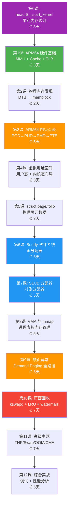
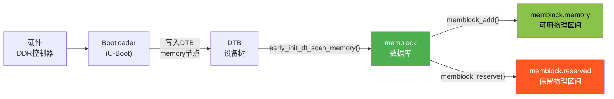
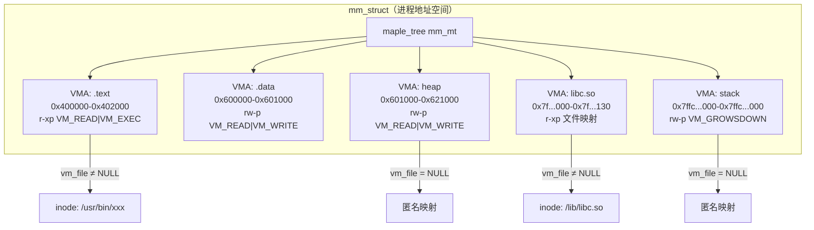
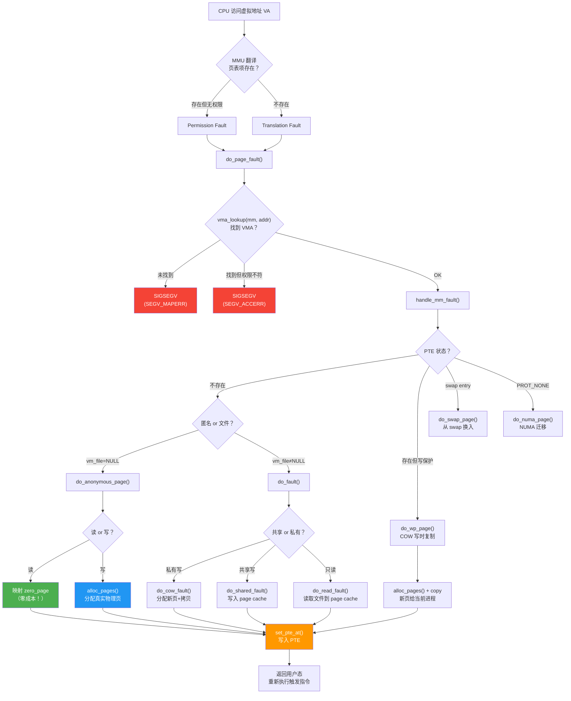

# Linux ARM64 内存管理完全学习指南

> **环境**：Linux 6.18.1 / ARM64 / QEMU 1GB  
> **内核配置**：`VA_BITS=52`, `PA_BITS=52`, `PGTABLE_LEVELS=5`, `CONFIG_NUMA=y`, `CONFIG_TRANSPARENT_HUGEPAGE_ALWAYS=y`  
> **编写视角**：顶级 Linux ARM64 内存管理专家  
> **学习方法论**：每个知识点 = 原理图 + 核心代码 + QEMU 实验，数字建立直觉

---

## 目录

<details>
<summary><a href="#学习路线总览">学习路线总览</a></summary>

</details>

<details>
<summary><a href="#第0课heads-→-start_kernel-早期内存映射3天">第0课：head.S → start_kernel 早期内存映射（3天）</a></summary>

- [0.1 学习目标](#01-学习目标)
- [0.2 核心问题](#02-核心问题)
- [0.3 原理图：三阶段页表演进](#03-原理图三阶段页表演进)
- [0.4 五个页表目录及其生命周期](#04-五个页表目录及其生命周期)
- [0.5 代码逐行解析：primary_entry（arch/arm64/kernel/head.S:85）](#05-代码逐行解析primary_entryarcharm64kernelheads85)
- [0.6 代码逐行解析：__cpu_setup（arch/arm64/mm/proc.S:465）](#06-代码逐行解析__cpu_setuparcharm64mmprocs465)
- [0.7 代码逐行解析：__primary_switch + __enable_mmu](#07-代码逐行解析__primary_switch--__enable_mmu)
- [0.8 代码解析：early_map_kernel（arch/arm64/kernel/pi/map_kernel.c:241）](#08-代码解析early_map_kernelarcharm64kernelpimap_kernelc241)
- [0.9 代码解析：map_kernel — 按段精细映射](#09-代码解析map_kernel--按段精细映射)
- [0.10 代码解析：__primary_switched → start_kernel 的过渡](#010-代码解析__primary_switched-→-start_kernel-的过渡)
- [0.11 代码解析：paging_init — 最终页表](#011-代码解析paging_init--最终页表)
- [0.12 关键时刻图：TTBR0 / TTBR1 切换时间线](#012-关键时刻图ttbr0--ttbr1-切换时间线)
- [0.13 create_init_idmap 的递归建表算法（pi/map_range.c）](#013-create_init_idmap-的递归建表算法pimap_rangec)
- [0.14 QEMU 实验 0.1：GDB 观察 MMU 开启瞬间](#014-qemu-实验-01gdb-观察-mmu-开启瞬间)
- [0.15 QEMU 实验 0.2：GDB 跟踪页表切换](#015-qemu-实验-02gdb-跟踪页表切换)
- [0.16 QEMU 实验 0.3：验证 kimage_voffset](#016-qemu-实验-03验证-kimage_voffset)
- [0.17 检查清单](#017-检查清单)

</details>

<details>
<summary><a href="#第1课arm64-硬件基础3天">第1课：ARM64 硬件基础（3天）</a></summary>

- [1.1 学习目标](#11-学习目标)
- [1.2 原理图：CPU 访问内存的硬件路径](#12-原理图cpu-访问内存的硬件路径)
- [1.3 ARM64 关键系统寄存器](#13-arm64-关键系统寄存器)
- [1.4 QEMU 实验 1.1：观察 MMU 开启时刻](#14-qemu-实验-11观察-mmu-开启时刻)
- [1.5 QEMU 实验 1.2：查看 cache 参数](#15-qemu-实验-12查看-cache-参数)
- [1.6 关键概念检查清单](#16-关键概念检查清单)

</details>

<details>
<summary><a href="#第2课物理内存发现2天">第2课：物理内存发现（2天）</a></summary>

- [2.1 学习目标](#21-学习目标)
- [2.2 原理图：内存发现流程](#22-原理图内存发现流程)
- [2.3 核心数据结构图](#23-核心数据结构图)
- [2.4 代码阅读顺序](#24-代码阅读顺序)
- [2.5 QEMU 实验 2.1：GDB 观察 memblock](#25-qemu-实验-21gdb-观察-memblock)
- [2.6 QEMU 实验 2.2：查看 memblock 调试输出](#26-qemu-实验-22查看-memblock-调试输出)

</details>

<details>
<summary><a href="#第3课arm64-四级页表5天核心">第3课：ARM64 四级页表（5天，核心！）</a></summary>

- [3.1 学习目标](#31-学习目标)
- [3.2 原理图：虚拟地址拆分（VA_BITS=48，4KB页）](#32-原理图虚拟地址拆分va_bits484kb页)
- [3.3 原理图：四级翻译流程](#33-原理图四级翻译流程)
- [3.4 PTE 格式（ARM64 Stage 1，4KB 页，关键）](#34-pte-格式arm64-stage-14kb-页关键)
- [3.5 代码阅读顺序](#35-代码阅读顺序)
- [3.6 QEMU 实验 3.1：GDB 手动遍历四级页表](#36-qemu-实验-31gdb-手动遍历四级页表)
- [3.7 QEMU 实验 3.2：观察 AP 权限位](#37-qemu-实验-32观察-ap-权限位)
- [3.8 检查清单](#38-检查清单)

</details>

<details>
<summary><a href="#第4课虚拟地址空间布局3天">第4课：虚拟地址空间布局（3天）</a></summary>

- [4.1 原理图：ARM64 完整虚拟地址空间](#41-原理图arm64-完整虚拟地址空间)
- [4.2 QEMU 实验 4.1：在 GDB 中验证地址空间布局](#42-qemu-实验-41在-gdb-中验证地址空间布局)
- [4.3 QEMU 实验 4.2：用 /proc/PID/maps 验证](#43-qemu-实验-42用-procpidmaps-验证)

</details>

<details>
<summary><a href="#第5课struct-page--folio3天">第5课：struct page / folio（3天）</a></summary>

- [5.1 原理图：struct page 的多态设计](#51-原理图struct-page-的多态设计)
- [5.2 QEMU 实验 5.1：GDB 观察不同状态的 page](#52-qemu-实验-51gdb-观察不同状态的-page)

</details>

<details>
<summary><a href="#第6课buddy-伙伴系统5天">第6课：Buddy 伙伴系统（5天）</a></summary>

- [6.1 原理图：Buddy 分配与合并](#61-原理图buddy-分配与合并)
- [6.2 Migrate Type 分区](#62-migrate-type-分区)
- [6.3 代码阅读顺序](#63-代码阅读顺序)
- [6.4 QEMU 实验 6.1：观察 buddyinfo](#64-qemu-实验-61观察-buddyinfo)
- [6.5 QEMU 实验 6.2：GDB 观察分配拆分过程](#65-qemu-实验-62gdb-观察分配拆分过程)

</details>

<details>
<summary><a href="#第7课slub-分配器5天">第7课：SLUB 分配器（5天）</a></summary>

- [7.1 原理图：SLUB 三级缓存架构](#71-原理图slub-三级缓存架构)
- [7.2 QEMU 实验 7.1：追踪对象分配全路径](#72-qemu-实验-71追踪对象分配全路径)

</details>

<details>
<summary><a href="#第8课vma-与-mmap5天">第8课：VMA 与 mmap（5天）</a></summary>

- [8.1 原理图：进程 VMA 管理](#81-原理图进程-vma-管理)
- [8.2 VMA 创建流程](#82-vma-创建流程)
- [8.3 QEMU 实验 8.1：strace 追踪 mmap](#83-qemu-实验-81strace-追踪-mmap)

</details>

<details>
<summary><a href="#第9课缺页异常5天核心">第9课：缺页异常（5天，核心！）</a></summary>

- [9.1 原理图：缺页异常全路径](#91-原理图缺页异常全路径)
- [9.2 QEMU 实验 9.1：追踪一次完整的缺页流程](#92-qemu-实验-91追踪一次完整的缺页流程)
- [9.3 QEMU 实验 9.2：验证 COW](#93-qemu-实验-92验证-cow)

</details>

<details>
<summary><a href="#第10课页面回收7天最难">第10课：页面回收（7天，最难）</a></summary>

- [10.1 原理图：水位线触发机制](#101-原理图水位线触发机制)
- [10.2 原理图：LRU 链表状态机](#102-原理图lru-链表状态机)
- [10.3 回收优先级](#103-回收优先级)
- [10.4 代码阅读顺序](#104-代码阅读顺序)
- [10.5 QEMU 实验 10.1：触发并观察 kswapd 回收](#105-qemu-实验-101触发并观察-kswapd-回收)
- [10.6 QEMU 实验 10.2：GDB 在回收路径打断点](#106-qemu-实验-102gdb-在回收路径打断点)

</details>

<details>
<summary><a href="#第11课高级主题7天">第11课：高级主题（7天）</a></summary>

- [11.1 THP 透明大页](#111-thp-透明大页)
- [11.2 CMA 连续内存分配器](#112-cma-连续内存分配器)
- [11.3 OOM Killer](#113-oom-killer)
- [11.4 QEMU 实验 11.1：触发 OOM](#114-qemu-实验-111触发-oom)

</details>

<details>
<summary><a href="#第12课综合实战5天">第12课：综合实战（5天）</a></summary>

- [12.1 内核模块实验框架](#121-内核模块实验框架)
- [12.2 Makefile](#122-makefile)
- [12.3 完整监控脚本](#123-完整监控脚本)

</details>

<details>
<summary><a href="#学习节奏建议">学习节奏建议</a></summary>

- [每日学习模式](#每日学习模式)
- [核心原则](#核心原则)

</details>

---

## 学习路线总览



**紫色**=启动映射 **绿色**=硬件基础 **橙色**=核心机制 **蓝色**=分配器 **红色**=回收（最难）

---

## 第0课：head.S → start_kernel 早期内存映射（3天）

### 0.1 学习目标

理解 ARM64 Linux 内核从上电到进入 C 语言世界的完整内存映射建立过程。从 `head.S` 汇编入口到 `start_kernel()`，再到 `setup_arch()` 中 `paging_init()` 完成最终页表切换的全路径。

### 0.2 核心问题

> **内核镜像被 bootloader 加载到物理内存后，MMU 是关闭的（PA=VA），内核最终要运行在高地址虚拟空间（TTBR1），这个切换是怎么完成的？**

答案分为三个阶段：
1. **阶段1**（head.S 汇编）：创建 identity map（PA=VA），用于安全开启 MMU
2. **阶段2**（head.S → early_map_kernel）：开启 MMU 后立即创建内核映射（init_pg_dir），跳入虚拟地址
3. **阶段3**（setup_arch → paging_init）：在 C 代码中用 swapper_pg_dir 建立最终的线性映射 + idmap

### 0.3 原理图：三阶段页表演进

```
 ┌──────────────────────────────────────────────────────────────────────────────────┐
 │                        ARM64 内核启动页表三阶段演进                               │
 ├──────────────────────────────────────────────────────────────────────────────────┤
 │                                                                                  │
 │  阶段1: MMU OFF → 创建 Identity Map                                              │
 │  ┌─────────────────────────────────────────────────────────────────────┐          │
 │  │  primary_entry:                                                     │          │
 │  │    x0 = FDT 物理地址（bootloader 传入）                             │          │
 │  │    x19 = MMU 是否已开启标志                                         │          │
 │  │    x21 = FDT 指针                                                   │          │
 │  │                                                                     │          │
 │  │    bl create_init_idmap   ← 在 init_idmap_pg_dir 中建立恒等映射     │          │
 │  │         VA = PA，映射范围: _stext → _end                            │          │
 │  │         text段: PAGE_KERNEL_ROX（只读可执行）                        │          │
 │  │         data段: PAGE_KERNEL（可读写）                                │          │
 │  │                                                                     │          │
 │  │    bl __cpu_setup         ← 配置 TCR/MAIR/SCTLR（但MMU还没开）     │          │
 │  │    b  __primary_switch    ← 跳入 MMU 开启流程                       │          │
 │  └─────────────────────────────────────────────────────────────────────┘          │
 │         │                                                                        │
 │         ▼                                                                        │
 │  阶段2: MMU ON → 创建内核虚拟映射                                                │
 │  ┌─────────────────────────────────────────────────────────────────────┐          │
 │  │  __primary_switch:                                                  │          │
 │  │    TTBR0 ← init_idmap_pg_dir （恒等映射，物理地址=虚拟地址）        │          │
 │  │    TTBR1 ← reserved_pg_dir   （临时空表，阻止内核空间访问）         │          │
 │  │    set_sctlr_el1 → 开启 MMU！                                      │          │
 │  │    ↓                                                                │          │
 │  │    此刻 PC 仍在低地址物理范围内运行（因为 TTBR0 恒等映射）          │          │
 │  │    ↓                                                                │          │
 │  │    bl early_map_kernel    ← 在 init_pg_dir 中建立内核虚拟映射       │          │
 │  │         解析 FDT，处理 KASLR 随机化偏移                             │          │
 │  │         map_kernel() 按段映射到 KIMAGE_VADDR+offset:               │          │
 │  │           _text → _stext   : PAGE_KERNEL (non-exec)                │          │
 │  │           _stext → _etext  : PAGE_KERNEL_ROX (代码段)              │          │
 │  │           __start_rodata   : PAGE_KERNEL (只读数据)                 │          │
 │  │           __inittext       : PAGE_KERNEL_ROX (init代码)            │          │
 │  │           _data → _end     : PAGE_KERNEL (数据段)                  │          │
 │  │         TTBR1 ← init_pg_dir → swapper_pg_dir（复制根页表）          │          │
 │  │    ↓                                                                │          │
 │  │    ldr x8, =__primary_switched  ← 加载虚拟地址                      │          │
 │  │    br  x8                       ← 跳入！从此运行在高地址虚拟空间     │          │
 │  └─────────────────────────────────────────────────────────────────────┘          │
 │         │                                                                        │
 │         ▼                                                                        │
 │  阶段3: C代码 → 最终页表                                                          │
 │  ┌─────────────────────────────────────────────────────────────────────┐          │
 │  │  __primary_switched:                                                │          │
 │  │    保存 kimage_voffset = _text(VA) - _text(PA)                      │          │
 │  │    bl start_kernel                                                  │          │
 │  │      → setup_arch()                                                 │          │
 │  │        → cpu_uninstall_idmap()  ← TTBR0 指向空页表，卸载恒等映射    │          │
 │  │        → arm64_memblock_init()  ← 物理内存注册到 memblock            │          │
 │  │        → paging_init()          ← ★ 最终页表建立！                  │          │
 │  │            map_mem(swapper_pg_dir)  ← 建立完整线性映射               │          │
 │  │                遍历所有 memblock.memory 区域                         │          │
 │  │                __map_memblock() 映射到 PAGE_OFFSET 线性区            │          │
 │  │            create_idmap()       ← 重建精确的 idmap_pg_dir            │          │
 │  │            declare_kernel_vmas() ← 声明内核 VMA 区域                 │          │
 │  │        → bootmem_init()         ← zone/node 初始化，buddy 启动      │          │
 │  └─────────────────────────────────────────────────────────────────────┘          │
 └──────────────────────────────────────────────────────────────────────────────────┘
```

### 0.4 五个页表目录及其生命周期

```
 ┌────────────────────┬───────────────────────┬──────────────────────────────────────┐
 │ 页表目录名          │ 用途                  │ 生命周期                             │
 ├────────────────────┼───────────────────────┼──────────────────────────────────────┤
 │ init_idmap_pg_dir  │ 恒等映射 (PA=VA)      │ head.S 创建 → setup_arch 卸载       │
 │                    │ MMU 开启瞬间使用       │ TTBR0 使用                           │
 ├────────────────────┼───────────────────────┼──────────────────────────────────────┤
 │ reserved_pg_dir    │ 空页表（安全占位）     │ 切换 TTBR1 时临时使用               │
 │                    │ 防止野指针访问         │ 全程保留                             │
 ├────────────────────┼───────────────────────┼──────────────────────────────────────┤
 │ init_pg_dir        │ 早期内核映射           │ early_map_kernel 创建               │
 │                    │ 内核镜像虚拟映射       │ 根页表复制到 swapper_pg_dir 后废弃   │
 ├────────────────────┼───────────────────────┼──────────────────────────────────────┤
 │ swapper_pg_dir     │ ★ 最终内核页表        │ early_map_kernel 初始化（从init复制）│
 │                    │ 内核镜像 + 线性映射    │ paging_init 完善，永久使用           │
 │                    │                       │ TTBR1 使用                           │
 ├────────────────────┼───────────────────────┼──────────────────────────────────────┤
 │ idmap_pg_dir       │ ★ 最终恒等映射        │ paging_init → create_idmap() 创建   │
 │                    │ 仅映射 .idmap.text 段  │ CPU hotplug/suspend 时 TTBR0 使用   │
 └────────────────────┴───────────────────────┴──────────────────────────────────────┘
```

### 0.5 代码逐行解析：primary_entry（arch/arm64/kernel/head.S:85）

```asm
 ;;  寄存器约定（贯穿整个 boot 流程）：
 ;;  x19 = MMU 是否已开启（EFI stub 可能已开启 MMU）
 ;;  x20 = CPU boot mode（EL1 or EL2）
 ;;  x21 = FDT 物理地址指针

 SYM_CODE_START(primary_entry)
     bl   record_mmu_state      ;; 读取 CurrentEL，记录 MMU 开/关状态到 x19
     bl   preserve_boot_args    ;; 保存 x0-x3（bootloader 传参）到 boot_args[]

     ;; 设置早期栈（汇编阶段需要栈来调用 C 函数）
     adrp x1, early_init_stack
     mov  sp, x1
     mov  x29, xzr              ;; frame pointer = 0（栈回溯终止点）

     ;; ★ 核心：创建恒等映射页表
     adrp x0, __pi_init_idmap_pg_dir   ;; x0 = 页表目录物理地址
     mov  x1, xzr                       ;; clrmask = 0
     bl   __pi_create_init_idmap        ;; → map_range() 递归建表

     ;; Cache 一致性处理
     cbnz x19, 0f               ;; 如果 MMU 已开启，走 clean 路径
     dmb  sy                    ;; MMU 关闭：需要 invalidate cache
     ...dcache_inval_poc...     ;; 清除可能的投机加载缓存行
     b    1f
 0:  ...dcache_clean_poc...     ;; MMU 已开启：clean .idmap.text 段

 1:  mov  x0, x19
     bl   init_kernel_el        ;; 确定运行在 EL1 还是 EL2，返回 boot mode
     mov  x20, x0

     bl   __cpu_setup           ;; ★ 配置 MMU 相关寄存器（但还不开 MMU）
     b    __primary_switch      ;; 跳入 MMU 开启 + 内核映射流程
 SYM_CODE_END(primary_entry)
```

### 0.6 代码逐行解析：__cpu_setup（arch/arm64/mm/proc.S:465）

```asm
 SYM_FUNC_START(__cpu_setup)
     tlbi vmalle1               ;; 清空所有 TLB 条目
     dsb  nsh

     ;; ★ 配置 MAIR_EL1（内存属性索引寄存器）
     ;; 定义 5 种内存类型：
     ;;   MT_DEVICE_nGnRnE (idx=0) : 严格设备内存
     ;;   MT_DEVICE_nGnRE  (idx=1) : 设备内存（允许 Early Write Ack）
     ;;   MT_NORMAL_NC     (idx=2) : 普通内存，不缓存
     ;;   MT_NORMAL        (idx=3) : ★ 普通内存，Write-Back 缓存
     ;;   MT_NORMAL_TAGGED (idx=4) : MTE 标签内存
     mov_q mair, MAIR_EL1_SET
     msr  mair_el1, mair

     ;; ★ 配置 TCR_EL1（翻译控制寄存器）
     ;; TCR_T0SZ = 64 - IDMAP_VA_BITS    → TTBR0 翻译范围
     ;; TCR_T1SZ = 64 - VA_BITS_MIN(48)  → TTBR1 翻译范围
     ;; TCR_TG0  = 4KB granule           → TTBR0 页大小
     ;; TCR_TG1  = 4KB granule           → TTBR1 页大小
     ;; TCR_SHARED | TCR_CACHE_FLAGS     → Inner/Outer WB-WA cacheable
     ;; TCR_IPS  = 根据 MMFR0 动态计算   → 物理地址位数
     mov_q tcr, TCR_T0SZ(...) | TCR_T1SZ(...) | ...
     msr  tcr_el1, tcr

     ;; 准备 SCTLR_EL1（返回值，__enable_mmu 中写入）
     mov_q x0, INIT_SCTLR_EL1_MMU_ON
     ret                        ;; 返回 head.S，x0 = SCTLR 值
 SYM_FUNC_END(__cpu_setup)
```

### 0.7 代码逐行解析：__primary_switch + __enable_mmu

```asm
 SYM_FUNC_START_LOCAL(__primary_switch)
     adrp x1, reserved_pg_dir           ;; x1 = TTBR1 临时空页表
     adrp x2, __pi_init_idmap_pg_dir    ;; x2 = TTBR0 恒等映射页表
     bl   __enable_mmu                  ;; ★ 开启 MMU！
     ;; ── 从此刻起，CPU 使用虚拟地址 ──
     ;; 但因为 TTBR0 是恒等映射，PA=VA，所以代码继续正常执行

     adrp x1, early_init_stack
     mov  sp, x1
     mov  x29, xzr
     mov  x0, x20                       ;; boot status
     mov  x1, x21                       ;; FDT 指针
     bl   __pi_early_map_kernel         ;; ★ 建立内核虚拟映射

     ldr  x8, =__primary_switched       ;; ★ 加载虚拟地址（高地址！）
     adrp x0, KERNEL_START              ;; __pa(KERNEL_START)
     br   x8                            ;; ★ 跳入虚拟地址空间！
 SYM_FUNC_END(__primary_switch)

 ;; ────────────────────────────────────

 SYM_FUNC_START(__enable_mmu)
     ;; 检查页粒度支持
     mrs  x3, ID_AA64MMFR0_EL1
     ubfx x3, x3, #TGRAN_SHIFT, 4
     cmp  x3, #TGRAN_SUPPORTED_MIN
     b.lt __no_granule_support          ;; 不支持则停机

     ;; ★ 加载页表基址到 TTBR 寄存器
     phys_to_ttbr x2, x2
     msr  ttbr0_el1, x2                ;; TTBR0 ← init_idmap_pg_dir
     load_ttbr1 x1, x1, x3            ;; TTBR1 ← reserved_pg_dir

     ;; ★★★ 写入 SCTLR_EL1，开启 MMU ★★★
     set_sctlr_el1 x0                  ;; M位=1, C位=1, I位=1
     ret                               ;; 返回后 CPU 已在虚拟地址模式
 SYM_FUNC_END(__enable_mmu)
```

### 0.8 代码解析：early_map_kernel（arch/arm64/kernel/pi/map_kernel.c:241）

```c
 asmlinkage void __init early_map_kernel(u64 boot_status, phys_addr_t fdt)
 {
     /* 1. 清零 BSS + 初始页表 */
     memset(__bss_start, 0, (char *)init_pg_end - (char *)__bss_start);

     /* 2. 解析 FDT 中的 CPU feature overrides */
     void *fdt_mapped = map_fdt(fdt);   // 在恒等映射中映射 FDT
     init_feature_override(boot_status, fdt_mapped, chosen);

     /* 3. 确定实际 VA_BITS（可能因硬件不支持降级） */
     int va_bits = VA_BITS;             // 52
     int root_level = 4 - CONFIG_PGTABLE_LEVELS;  // 4 - 5 = -1

     /* 4. KASLR 随机化偏移计算 */
     u64 kaslr_offset = pa_base % MIN_KIMG_ALIGN;
     if (CONFIG_RANDOMIZE_BASE) {
         kaslr_seed = kaslr_early_init(fdt_mapped, chosen);
         kaslr_offset |= kaslr_seed & ~(MIN_KIMG_ALIGN - 1);
     }

     /* 5. LPA2 支持处理（52-bit PA 需要特殊 TCR.DS 位） */
     if (CONFIG_ARM64_LPA2 && va_bits > VA_BITS_MIN)
         remap_idmap_for_lpa2();

     /* 6. ★ 核心：建立内核虚拟映射 */
     u64 va_base = KIMAGE_VADDR + kaslr_offset;
     map_kernel(kaslr_offset, va_base - pa_base, root_level);
 }
```

### 0.9 代码解析：map_kernel — 按段精细映射

```c
 static void __init map_kernel(u64 kaslr_offset, u64 va_offset, int root_level)
 {
     phys_addr_t pgdp = (phys_addr_t)init_pg_dir + PAGE_SIZE;

     /* 按段映射内核镜像到 init_pg_dir */
     map_segment(init_pg_dir, &pgdp, va_offset,
                 _text, _stext, PAGE_KERNEL, ...);         // 非执行头部
     map_segment(init_pg_dir, &pgdp, va_offset,
                 _stext, _etext, PAGE_KERNEL_ROX, ...);    // ★ 代码段：只读可执行
     map_segment(init_pg_dir, &pgdp, va_offset,
                 __start_rodata, __inittext_begin,
                 PAGE_KERNEL, ...);                         // 只读数据（含异常表）
     map_segment(init_pg_dir, &pgdp, va_offset,
                 __inittext_begin, __inittext_end,
                 PAGE_KERNEL_ROX, ...);                     // init 代码
     map_segment(init_pg_dir, &pgdp, va_offset,
                 __initdata_begin, __initdata_end,
                 PAGE_KERNEL, ...);                         // init 数据
     map_segment(init_pg_dir, &pgdp, va_offset,
                 _data, _end, PAGE_KERNEL, ...);            // 普通数据段

     dsb(ishst);
     idmap_cpu_replace_ttbr1((phys_addr_t)init_pg_dir);    // ★ TTBR1 切换！

     /* 如果需要重定位或 SCS 修补，第二轮映射 */
     if (twopass) {
         relocate_kernel(kaslr_offset);
         /* 重映射代码段为只读可执行 */
         unmap_segment(..., _stext, _etext, ...);
         map_segment(..., _stext, _etext, PAGE_KERNEL_ROX, ...);
     }

     /* ★ 复制根页表到 swapper_pg_dir，切换 TTBR1 */
     memcpy(swapper_pg_dir + va_offset, init_pg_dir, PAGE_SIZE);
     dsb(ishst);
     idmap_cpu_replace_ttbr1((phys_addr_t)swapper_pg_dir);
 }
```

### 0.10 代码解析：__primary_switched → start_kernel 的过渡

```asm
 SYM_FUNC_START_LOCAL(__primary_switched)
     ;; 此时已运行在虚拟地址空间（TTBR1 = swapper_pg_dir）
     adr_l x4, init_task
     init_cpu_task x4, x5, x6   ;; 设置 init_task 为当前任务

     adr_l x8, vectors
     msr   vbar_el1, x8         ;; 安装异常向量表（虚拟地址）

     str_l x21, __fdt_pointer   ;; 保存 FDT 指针到全局变量

     ;; ★ 计算并保存虚拟-物理偏移
     adrp  x4, _text            ;; x4 = _text 虚拟地址
     sub   x4, x4, x0           ;; x0 = KERNEL_START 物理地址
     str_l x4, kimage_voffset   ;; kimage_voffset = VA - PA

     bl    finalise_el2         ;; 最终确认 EL2/VHE 配置
     bl    start_kernel          ;; ★★★ 进入 C 语言世界！
     ASM_BUG()                  ;; 不应返回
 SYM_FUNC_END(__primary_switched)
```

### 0.11 代码解析：paging_init — 最终页表

```c
 /* setup_arch() 中调用顺序 (arch/arm64/kernel/setup.c:332-344) */
 void __init setup_arch(char **cmdline_p)
 {
     cpu_uninstall_idmap();      // ★ TTBR0 指向空页表，卸载早期恒等映射
     arm64_memblock_init();      // 物理内存注册到 memblock
     paging_init();              // ★ 建立最终完整页表
     bootmem_init();             // zone/node 初始化 → buddy 就绪
 }

 /* paging_init() (arch/arm64/mm/mmu.c:1351) */
 void __init paging_init(void)
 {
     /* 1. 建立完整线性映射 */
     map_mem(swapper_pg_dir);
     //  遍历 memblock.memory 所有区域
     //  __map_memblock(pgdp, start, end, PAGE_KERNEL)
     //  映射到 PAGE_OFFSET（线性区）
     //  内核镜像区域特殊处理：先 NOMAP 再单独映射为 non-exec

     /* 2. 重建精确的 idmap */
     memblock_allow_resize();
     create_idmap();
     //  只映射 __idmap_text_start → __idmap_text_end
     //  到 idmap_pg_dir（不是 init_idmap_pg_dir）
     //  这是最终的恒等映射，仅用于 CPU suspend/hotplug

     /* 3. 声明内核 VMA */
     declare_kernel_vmas();
     //  将内核各段注册为 vm_struct：
     //  _text→_etext, rodata, inittext, initdata, _data→_end
 }
```

### 0.12 关键时刻图：TTBR0 / TTBR1 切换时间线

```
 时间 ──────────────────────────────────────────────────────────────────────────────►

 ┌─ primary_entry ─┐  ┌─── __primary_switch ────┐  ┌── __primary_switched ──┐
 │   MMU OFF       │  │      MMU ON             │  │   虚拟地址空间         │
 │                 │  │                         │  │                       │
 │ create_init_    │  │ __enable_mmu:           │  │ start_kernel:         │
 │ idmap           │  │   TTBR0←init_idmap      │  │   setup_arch:         │
 │ (init_idmap_    │  │   TTBR1←reserved       │  │     cpu_uninstall_    │
 │  pg_dir)        │  │   SCTLR.M=1 ★开MMU    │  │     idmap             │
 │                 │  │                         │  │     TTBR0←zero_page  │
 │ __cpu_setup     │  │ early_map_kernel:       │  │                       │
 │ (TCR/MAIR)     │  │   TTBR1←init_pg_dir    │  │   paging_init:        │
 │                 │  │   TTBR1←swapper ★      │  │     map_mem           │
 │                 │  │                         │  │     create_idmap      │
 │                 │  │ br __primary_switched   │  │                       │
 │                 │  │   ★跳入虚拟地址         │  │                       │
 └─────────────────┘  └─────────────────────────┘  └───────────────────────┘

 TTBR0: [init_idmap_pg_dir] ───────────────────────→ [zero_page]（最终闲置）
 TTBR1: [reserved_pg_dir] → [init_pg_dir] → [swapper_pg_dir] ═══════（永久使用）
```

### 0.13 create_init_idmap 的递归建表算法（pi/map_range.c）

```c
 /* 核心算法：递归按需分配页表页 */
 void map_range(phys_addr_t *pte, u64 start, u64 end, phys_addr_t pa,
                pgprot_t prot, int level, pte_t *tbl, ...)
 {
     // level: 0=PGD, 1=PUD, 2=PMD, 3=PTE
     // lshift = (3 - level) * TABLE_SHIFT

     while (start < end) {
         u64 next = min(align_up(start, block_size), end);

         if (level < 2 || 跨越 block 边界) {
             // 需要更细粒度 → 分配下一级页表页
             if (pte_none(*tbl)) {
                 *tbl = 新表项 | PMD_TYPE_TABLE;
                 *pte += PAGE_SIZE;   // 从预分配池消耗一页
             }
             // 递归到下一级
             map_range(pte, start, next, pa, prot, level+1, ...);
         } else {
             // 对齐良好 → 直接放 block/page 映射
             *tbl = pa | protval;     // 2MB block 或 4KB page
         }
         start = next; tbl++;
     }
 }
```

关键特点：
- **MMU 关闭时运行**：指针即物理地址，不需要 `__pa()/__va()` 转换
- **页表页从紧邻的物理页池预分配**：`ptep` 从 `pg_dir + PAGE_SIZE` 开始递增
- **`__pi_` 前缀**：Position Independent，链接时放在特殊段中，MMU off 时可调用

### 0.14 QEMU 实验 0.1：GDB 观察 MMU 开启瞬间

```bash
# 在 __enable_mmu 处设置断点：
(gdb) hbreak *__enable_mmu
(gdb) c

# 到达断点后，查看关键寄存器
(gdb) info reg x0 x1 x2
# x0 = SCTLR 值（即将写入，包含 M=1 位）
# x1 = reserved_pg_dir 物理地址（→ TTBR1）
# x2 = init_idmap_pg_dir 物理地址（→ TTBR0）

# 查看 TCR（已由 __cpu_setup 配置）
(gdb) p/x $TCR_EL1
# 关注 T0SZ, T1SZ, TG0, TG1, IPS 字段

# 查看恒等映射页表内容
(gdb) x/8gx $x2
# 应看到: PGD[0] 指向下一级页表的物理地址 | PMD_TYPE_TABLE

# 单步执行 set_sctlr_el1（注意用 hbreak 硬件断点）
(gdb) si
# ★ 此刻 MMU 已开启！但地址不变（恒等映射保证）

# 继续到跳入虚拟地址的关键时刻
(gdb) hbreak *__primary_switch+48   # br x8 那条指令
(gdb) c
(gdb) info reg x8
# x8 = 0xffff800080xxxxxx（高地址！__primary_switched 的虚拟地址）
(gdb) si
# ★ 跳入后观察 PC 变化：从低地址 → 高地址
```

### 0.15 QEMU 实验 0.2：GDB 跟踪页表切换

```bash
# 在 paging_init 前后对比 TTBR1
(gdb) b paging_init
(gdb) c

# 到达后查看当前 TTBR1（此时仍是 swapper_pg_dir 的早期映射）
(gdb) p/x $TTBR1_EL1

# 在 map_mem 中设断点，观察线性映射建立
(gdb) b __map_memblock
(gdb) c
(gdb) p/x start
(gdb) p/x end
# 应看到完整的物理内存范围（如 0x40000000 → 0x80000000 = 1GB）

# 查看 swapper_pg_dir 页表内容变化
(gdb) x/8gx &swapper_pg_dir
# map_mem 完成后应看到有效的 PGD 条目
```

### 0.16 QEMU 实验 0.3：验证 kimage_voffset

```bash
# kimage_voffset = 内核虚拟地址 - 物理地址
(gdb) b __primary_switched
(gdb) c

# 查看计算过程
(gdb) p/x $x4     # _text 虚拟地址
(gdb) p/x $x0     # KERNEL_START 物理地址
(gdb) p/x $x4 - $x0   # 这就是 kimage_voffset

# 也可以直接查看全局变量
(gdb) p/x kimage_voffset
# 典型值：0xffff7fffc0000000（QEMU 默认加载地址）

# 验证：任意内核符号地址 - kimage_voffset = 其物理地址
(gdb) p/x &start_kernel
(gdb) p/x &start_kernel - kimage_voffset
# 结果应该在 QEMU 的 RAM 物理地址范围内（0x40000000+）
```

### 0.17 检查清单

- [ ] 能画出 primary_entry → __cpu_setup → __primary_switch → __enable_mmu → early_map_kernel → __primary_switched → start_kernel 的完整调用链
- [ ] 理解为什么需要恒等映射：MMU 开启瞬间，下一条指令的 PC（物理地址）必须能翻译成自身
- [ ] 理解 TTBR0（用户空间/恒等映射）和 TTBR1（内核空间）的分工
- [ ] 能说出五个页表目录的用途和生命周期
- [ ] 理解 `__cpu_setup` 配置的三个关键寄存器：MAIR（内存属性）、TCR（翻译控制）、SCTLR（系统控制）
- [ ] 理解 `ldr x8, =__primary_switched; br x8` 实现了从物理地址到虚拟地址的跳转
- [ ] 理解 `paging_init()` 为什么要重建页表而不直接复用 early 页表（线性映射需要覆盖全部物理内存）
- [ ] 能在 QEMU/GDB 中观察到 MMU 开启瞬间和虚拟地址跳转

---

## 第1课：ARM64 硬件基础（3天）

### 1.1 学习目标

理解 ARM64 的 MMU、Cache、TLB 三大硬件单元如何协作完成地址翻译。

### 1.2 原理图：CPU 访问内存的硬件路径

```
                    CPU Core
                       │
                  ┌────▼────┐
                  │  发出VA  │  虚拟地址（Virtual Address）
                  └────┬────┘
                       │
          ┌────────────▼────────────┐
          │         TLB             │  Translation Lookaside Buffer
          │  VA → PA 缓存（快表）    │  ← 命中率 > 99%
          │                        │
          │  TLB Hit?              │
          ├────Yes──┐   ┌──No──────┤
          │         │   │          │
          │         │   │  ┌───────▼───────┐
          │         │   │  │  Table Walker  │  硬件自动遍历页表
          │         │   │  │  读TTBR→PGD→   │  （不需要软件参与）
          │         │   │  │  PUD→PMD→PTE   │
          │         │   │  └───────┬───────┘
          │         │   │          │ PTE→PA
          │         │   │  ┌───────▼───────┐
          │         │   │  │  填充TLB缓存   │
          │         │   │  └───────┬───────┘
          │         ▼   ▼          │
          │     ┌───PA───┐◄────────┘
          └─────┤        │
                └───┬────┘
                    │
          ┌─────────▼─────────┐
          │    L1 Cache       │  64字节 cache line
          │    命中？          │
          ├──Yes──┐  ┌─No────┤
          │       │  │       │
          │       │  ▼       │
          │    L2 Cache      │
          │       │  │       │
          │       │  ▼       │
          │    L3 Cache      │  （如果有）
          │       │  │       │
          │       │  ▼       │
          │    物理内存(DDR)   │
          └───────┴──┴───────┘
```

### 1.3 ARM64 关键系统寄存器

| 寄存器 | 作用 | 内核中的操作 |
|--------|------|-------------|
| **TTBR0_EL1** | 用户态页表基址（EL0 地址翻译） | `switch_mm()` 切换进程时写入 |
| **TTBR1_EL1** | 内核态页表基址（EL1 地址翻译） | 所有进程共享，启动后不变 |
| **TCR_EL1** | 翻译控制（VA 位数、粒度等） | `__cpu_setup` 中配置 |
| **MAIR_EL1** | 内存属性索引（Normal/Device/...） | PTE 的 AttrIndx 字段引用此寄存器 |
| **SCTLR_EL1** | 系统控制（MMU 开关、Cache 开关） | SCTLR_EL1.M=1 表示 MMU 开启 |
| **CTR_EL0** | Cache 类型（cache line 大小） | `cache_line_size()` 读取 |

### 1.4 QEMU 实验 1.1：观察 MMU 开启时刻

```bash
# GDB 中：
(gdb) break __primary_switch
(gdb) continue

# 此时 MMU 即将开启：
(gdb) info registers SCTLR_EL1     # 查看 MMU 状态（M bit）
# 或者用:
(gdb) p/x $SCTLR_EL1

# 单步走过 MMU 开启点，观察地址空间切换
(gdb) stepi
```

### 1.5 QEMU 实验 1.2：查看 cache 参数

```bash
# QEMU 内运行：
cat /sys/devices/system/cpu/cpu0/cache/index0/size            # L1 D-Cache
cat /sys/devices/system/cpu/cpu0/cache/index0/coherency_line_size  # = 64
cat /sys/devices/system/cpu/cpu0/cache/index0/ways_of_associativity
cat /sys/devices/system/cpu/cpu0/cache/index0/number_of_sets
```

### 1.6 关键概念检查清单

```
☐ 为什么需要两个 TTBR？（用户/内核地址空间隔离）
☐ TLB miss 时硬件 Table Walker 自动遍历页表（ARM64 不需要软件参与正常翻译）
☐ Cache 以 cache line（64字节）为单位操作
☐ MAIR 定义的内存类型：Normal-WB（普通内存）、Device-nGnRnE（设备 MMIO）
☐ 为什么 QEMU 中看到的 cache 参数可能不代表真实硬件？
```

---

## 第2课：物理内存发现（2天）

### 2.1 学习目标

理解从硬件上电到内核知道"有多少物理内存在哪里"的全过程。

### 2.2 原理图：内存发现流程



### 2.3 核心数据结构图

```
struct memblock
├── struct memblock_type memory          ← 所有可用物理内存区间
│   ├── cnt = 1                          ← 区间数量（QEMU 1GB 就一个）
│   ├── max = 128                        ← 数组容量
│   └── regions[]
│       └── [0]: base=0x40000000, size=0x40000000 (1GB)
│
└── struct memblock_type reserved        ← 被保留的物理区间
    ├── cnt = N
    └── regions[]
        ├── [0]: base=0x40080000, size=xxx  ← 内核镜像
        ├── [1]: base=xxx, size=xxx         ← DTB
        └── [2]: base=xxx, size=xxx         ← initrd

空闲内存 = memory - reserved
```

### 2.4 代码阅读顺序

```
1. arch/arm64/kernel/setup.c:setup_arch()
     └─ arm64_memblock_init()      ← 填充 memblock
2. arch/arm64/mm/init.c
     └─ arm64_memblock_init()      ← 裁剪 + 保留内核
     └─ bootmem_init()             ← sparse_init + zone_sizes_init
3. mm/memblock.c
     └─ memblock_add()             ← 添加内存区间
     └─ memblock_reserve()         ← 标记保留区
     └─ memblock_free_all()        ← ★ 过渡到 buddy
```

### 2.5 QEMU 实验 2.1：GDB 观察 memblock

```bash
(gdb) break start_kernel
(gdb) continue
(gdb) p memblock.memory.cnt             # 可用区间数
(gdb) p/x memblock.memory.regions[0]    # 物理内存范围
(gdb) p memblock.reserved.cnt           # 保留区间数
(gdb) set $i = 0
(gdb) while $i < memblock.reserved.cnt
> p/x memblock.reserved.regions[$i]
> set $i = $i + 1
> end
```

### 2.6 QEMU 实验 2.2：查看 memblock 调试输出

```bash
# 在内核启动参数中加入 memblock=debug
# QEMU 命令行加入: -append "... memblock=debug"
# 然后看 dmesg：
dmesg | grep -i memblock | head -40
```

---

## 第3课：ARM64 四级页表（5天，核心！）

### 3.1 学习目标

彻底理解 ARM64 四级页表结构，能手动从 VA 推算出 PA。

### 3.2 原理图：虚拟地址拆分（VA_BITS=48，4KB页）

```
 63    48 47    39 38    30 29    21 20    12 11      0
┌────────┬────────┬────────┬────────┬────────┬──────────┐
│ 未使用  │ PGD索引 │ PUD索引 │ PMD索引 │ PTE索引 │  页内偏移  │
│ (TTBR  │  9 bit  │  9 bit │  9 bit │  9 bit │  12 bit  │
│  选择)  │ 0-511  │ 0-511  │ 0-511  │ 0-511  │ 0-4095  │
└────────┴────────┴────────┴────────┴────────┴──────────┘
    ↓         ↓        ↓        ↓        ↓         ↓
  bit63=0   每级512   每级512   每级512   每级512   4KB页
  →TTBR0    个条目    个条目    个条目    个条目    内偏移
  →用户态
  bit63=1
  →TTBR1
  →内核态
```

### 3.3 原理图：四级翻译流程

```
                TTBR0_EL1（存 PGD 物理基址）
                      │
                      ▼
            ┌─────────────────────┐
            │  PGD（Page Global   │  512个条目 × 8字节 = 4KB（正好一页）
            │   Directory）       │
            │  [pgd_index(VA)]    │
            └─────────┬───────────┘
                      │ 取出 PUD 物理基址
                      ▼
            ┌─────────────────────┐
            │  PUD（Page Upper    │  512个条目 × 8字节 = 4KB
            │   Directory）       │
            │  [pud_index(VA)]    │  ← ★ 可以是 1GB 块映射（pud_huge）
            └─────────┬───────────┘
                      │ 取出 PMD 物理基址
                      ▼
            ┌─────────────────────┐
            │  PMD（Page Middle   │  512个条目 × 8字节 = 4KB
            │   Directory）       │
            │  [pmd_index(VA)]    │  ← ★ 可以是 2MB 块映射（THP/HugePage）
            └─────────┬───────────┘
                      │ 取出 PTE 物理基址
                      ▼
            ┌─────────────────────┐
            │  PTE（Page Table    │  512个条目 × 8字节 = 4KB
            │   Entry）           │
            │  [pte_index(VA)]    │
            └─────────┬───────────┘
                      │ 取出物理页帧地址
                      ▼
            ┌─────────────────────┐
            │  物理页（4KB）       │
            │  + 页内偏移          │  → 最终物理地址 PA
            └─────────────────────┘
```

### 3.4 PTE 格式（ARM64 Stage 1，4KB 页，关键）

```
 63  55 54  52 51  50 49      12 11  10  9  8  7  6  5  4  2  1  0
┌─────┬──────┬──────┬───────────┬──┬────┬───┬───┬──┬───┬───┬────┬──┐
│ 忽略 │PBHA │ Res0 │ OA[49:12] │nG│ AF │SH │AP │NS│Idx│ 块│TYPE│ V│
│     │      │      │ 物理地址   │  │    │   │   │  │   │  │    │  │
└─────┴──────┴──────┴───────────┴──┴────┴───┴───┴──┴───┴───┴────┴──┘
                          │        │   │   │   │         │        │
                          │        │   │   │   │         │        └─ Valid=1
                          │        │   │   │   │         └── TYPE=1(table) 0(block)
                          │        │   │   │   └── AP[2:1]
                          │        │   │   │       00=EL1 RW, EL0 无
                          │        │   │   │       01=EL1 RW, EL0 RW
                          │        │   │   │       10=EL1 RO, EL0 无
                          │        │   │   │       11=EL1 RO, EL0 RO
                          │        │   │   └── SH[1:0] 共享属性
                          │        │   │       00=Non-shareable
                          │        │   │       10=Outer shareable
                          │        │   │       11=Inner shareable
                          │        │   └── AF=Access Flag（首次访问设1）
                          │        └── nG=non-Global（ASID相关）
                          └── OA = Output Address（物理页帧地址）
```

### 3.5 代码阅读顺序

```
1. arch/arm64/include/asm/pgtable-hwdef.h   ← 硬件 PTE 位定义
2. arch/arm64/include/asm/pgtable-types.h   ← pgd_t/pud_t/pmd_t/pte_t 类型
3. arch/arm64/include/asm/pgtable.h         ← pte_mkwrite/pte_wrprotect 等操作
4. mm/memory.c: set_pte_at()                ← 写入 PTE 的通用入口
5. arch/arm64/include/asm/tlbflush.h        ← TLB flush 操作
```

### 3.6 QEMU 实验 3.1：GDB 手动遍历四级页表

```bash
# 假设目标用户态地址 addr = 0x400000（进程的 .text 段）
(gdb) break do_page_fault
(gdb) continue

# 获取当前进程的 PGD 基址
(gdb) set $pgd_base = (unsigned long *)current->mm->pgd

# 计算各级索引
(gdb) set $addr = 0x400000UL
(gdb) set $pgd_idx = ($addr >> 39) & 0x1ff
(gdb) set $pud_idx = ($addr >> 30) & 0x1ff
(gdb) set $pmd_idx = ($addr >> 21) & 0x1ff
(gdb) set $pte_idx = ($addr >> 12) & 0x1ff
(gdb) printf "PGD[%d] PUD[%d] PMD[%d] PTE[%d]\n", $pgd_idx, $pud_idx, $pmd_idx, $pte_idx

# 逐级遍历
(gdb) set $pgd_entry = $pgd_base[$pgd_idx]
(gdb) printf "PGD entry = %lx\n", $pgd_entry
# 取出下一级物理地址（低位清零）
(gdb) set $pud_base = (unsigned long *)__va($pgd_entry & 0x0000FFFFFFFFF000UL)
(gdb) set $pud_entry = $pud_base[$pud_idx]
(gdb) printf "PUD entry = %lx\n", $pud_entry
# ... 以此类推到 PTE
(gdb) set $pmd_base = (unsigned long *)__va($pud_entry & 0x0000FFFFFFFFF000UL)
(gdb) set $pmd_entry = $pmd_base[$pmd_idx]
(gdb) printf "PMD entry = %lx\n", $pmd_entry
(gdb) set $pte_base = (unsigned long *)__va($pmd_entry & 0x0000FFFFFFFFF000UL)
(gdb) set $pte_entry = $pte_base[$pte_idx]
(gdb) printf "PTE entry = %lx → PA = %lx\n", $pte_entry, ($pte_entry & 0x0000FFFFFFFFF000UL)
```

### 3.7 QEMU 实验 3.2：观察 AP 权限位

```bash
# 用户态程序写只读页 → 触发 Permission Fault
# GDB 中：
(gdb) break do_page_fault
(gdb) commands
> printf "ESR=%lx FAR=%lx\n", $x1, $x0
> end
# 观察 ESR 的 EC 字段 = 0x24 (Data Abort, lower EL)
# 以及 ISS 中的 WnR 位（是否是写操作）
```

### 3.8 检查清单

```
☐ 能手写 VA → PGD_idx → PUD_idx → PMD_idx → PTE_idx → PA 的计算过程
☐ 理解 AP[2:1] 四种权限组合与 VM_READ/VM_WRITE/VM_EXEC 的映射关系
☐ 理解 AF（Access Flag）用于统计页面访问热度（用于 LRU）
☐ 理解 nG 位与 ASID 的关系（进程切换不必全刷 TLB）
☐ 理解 PMD block entry = 2MB 大页（THP 的硬件基础）
```

---

## 第4课：虚拟地址空间布局（3天）

### 4.1 原理图：ARM64 完整虚拟地址空间

```
0x0000_0000_0000_0000  ────────────────────────────
│                                                  │
│   用户态空间（TTBR0_EL1）                         │
│   TASK_SIZE = 1 << VA_BITS                       │
│                                                  │
│   ┌─────────────────────────────────────────┐    │
│   │ 0x0000_0000_0000 : NULL 保护页            │    │
│   │ 0x0000_0040_0000 : .text（代码段）         │    │
│   │ 0x0000_0060_0000 : .data + .bss           │    │
│   │              ↑                            │    │
│   │         start_brk → brk（堆，向上增长）    │    │
│   │                                           │    │
│   │         ─── 空洞 ───                      │    │
│   │                                           │    │
│   │         mmap_base（mmap区，向下增长）      │    │  ← ASLR 随机偏移
│   │              ↓                            │    │
│   │         共享库/mmap映射                    │    │
│   │                                           │    │
│   │         ─── 空洞 ───                      │    │
│   │                                           │    │
│   │              ↓                            │    │
│   │         栈（start_stack，向下增长）         │    │  ← ASLR 随机偏移
│   │         VM_GROWSDOWN 标志                  │    │
│   └─────────────────────────────────────────┘    │
│                                                  │
地址空间的 "中间洞"（非法地址，访问触发 SIGSEGV）
│                                                  │
│   内核态空间（TTBR1_EL1）                         │
│   所有进程共享同一页表                             │
│                                                  │
│   ┌─────────────────────────────────────────┐    │
│   │ MODULES_VADDR : 内核模块（.ko）           │    │
│   │ VMALLOC_START : vmalloc / ioremap        │    │
│   │ KIMAGE_VADDR  : 内核镜像 .text/.data      │    │  ← KASLR 随机偏移
│   │ PAGE_OFFSET   : 线性映射                  │    │  ← 直接映射所有物理内存
│   │              PA = VA - PAGE_OFFSET         │    │
│   │              + PHYS_OFFSET                 │    │
│   │ VMEMMAP_START : struct page 数组           │    │
│   └─────────────────────────────────────────┘    │
│                                                  │
0xFFFF_FFFF_FFFF_FFFF  ────────────────────────────
```

### 4.2 QEMU 实验 4.1：在 GDB 中验证地址空间布局

```bash
(gdb) p/x PAGE_OFFSET
(gdb) p/x MODULES_VADDR
(gdb) p/x VMALLOC_START
(gdb) p/x KIMAGE_VADDR
(gdb) p/x current->mm->mmap_base        # mmap 区域起始
(gdb) p/x current->mm->start_brk        # 堆起始
(gdb) p/x current->mm->brk              # 堆当前位置
(gdb) p/x current->mm->start_stack      # 栈起始
```

### 4.3 QEMU 实验 4.2：用 /proc/PID/maps 验证

```bash
# QEMU 内运行一个进程，查看其完整 VMA 列表：
cat /proc/self/maps

# 典型输出：
# 5580bad50000-5580bad52000 r-xp 00000000  ← .text（VM_READ|VM_EXEC）
# 5580baf51000-5580baf52000 rw-p 00001000  ← .data（VM_READ|VM_WRITE）
# 5580baf52000-5580baf73000 rw-p 00000000  ← [heap]
# 7f8a12340000-7f8a124d0000 r-xp 00000000  ← libc.so（mmap区域）
# 7ffcb3a21000-7ffcb3a42000 rw-p 00000000  ← [stack]
```

---

## 第5课：struct page / folio（3天）

### 5.1 原理图：struct page 的多态设计

```
                     struct page（64字节）
 ┌───────────────────────────────────────────────────┐
 │                                                   │
 │  这64字节在不同用途下有完全不同的语义（C union）：   │
 │                                                   │
 │  ┌──────────────────────────────────────────────┐ │
 │  │  用途1：Buddy 空闲页                          │ │
 │  │  . lru         → free_area[order].free_list  │ │
 │  │  . private     → buddy order                 │ │
 │  │  . _mapcount   → PAGE_BUDDY_MAPCOUNT_VALUE   │ │
 │  └──────────────────────────────────────────────┘ │
 │  ┌──────────────────────────────────────────────┐ │
 │  │  用途2：用户匿名页（分配出去的）              │ │
 │  │  . mapping     → anon_vma（反向映射根）       │ │
 │  │  . index       → 虚拟页偏移                   │ │
 │  │  . _mapcount   → 映射此页的 PTE 数量          │ │
 │  │  . _refcount   → 引用计数                     │ │
 │  │  . lru         → LRU 链表（active/inactive）  │ │
 │  └──────────────────────────────────────────────┘ │
 │  ┌──────────────────────────────────────────────┐ │
 │  │  用途3：文件页 / Page Cache                   │ │
 │  │  . mapping     → address_space（文件inode）   │ │
 │  │  . index       → 文件内页偏移                  │ │
 │  │  . private     → buffer_head / 文件系统私有    │ │
 │  └──────────────────────────────────────────────┘ │
 │  ┌──────────────────────────────────────────────┐ │
 │  │  用途4：SLUB Slab 页                         │ │
 │  │  . freelist    → 空闲对象链表头               │ │
 │  │  . counters    → inuse | objects | frozen     │ │
 │  │  . slab_cache  → 所属的 kmem_cache            │ │
 │  │  . slab_list   → node partial 链表            │ │
 │  └──────────────────────────────────────────────┘ │
 └───────────────────────────────────────────────────┘
```

### 5.2 QEMU 实验 5.1：GDB 观察不同状态的 page

```bash
# 1. 查看 buddy 空闲页
(gdb) p sizeof(struct page)           # → 64

# 2. 查看一个匿名用户页
(gdb) break do_anonymous_page
(gdb) continue
(gdb) finish
# 在缺页处理后：
(gdb) p *vmf->page
(gdb) p page_count(vmf->page)        # 引用计数
(gdb) p page_mapcount(vmf->page)     # PTE映射数

# 3. 查看 slab 页
(gdb) set $obj = kmalloc(256, 0xCC0)   # GFP_KERNEL
(gdb) set $page = virt_to_page($obj)
(gdb) p ((struct slab *)$page)->slab_cache->name   # 应该是 "kmalloc-256"
(gdb) p ((struct slab *)$page)->inuse              # 已用对象数
```

---

## 第6课：Buddy 伙伴系统（5天）

### 6.1 原理图：Buddy 分配与合并

```
alloc_pages(order=2) 请求 4 页（2^2）：

order:  0(1页)  1(2页)   2(4页)   3(8页)   4(16页) ...  10(1024页)
       ┌─────┐ ┌─────┐  ┌─────┐  ┌─────┐  ┌─────┐     ┌──────┐
 free  │     │ │     │  │空！  │  │ A8  │  │     │ ... │      │
 list  │     │ │     │  │     │  │     │  │     │     │      │
       └─────┘ └─────┘  └─────┘  └─────┘  └─────┘     └──────┘

order=2 链表空 → 向上找 order=3：
  A8（8页）拆分 → A4（前4页，返回给调用者）+ B4（后4页，放入 order=2 链表）

       ┌─────┐ ┌─────┐  ┌─────┐  ┌─────┐
 free  │     │ │     │  │ B4  │  │空了！│
 list  │     │ │     │  │     │  │     │
       └─────┘ └─────┘  └─────┘  └─────┘
                          ↑ 新增       ↑ 被借了

返回给调用者：A4（物理连续4页）

─────────────────────────────────────────

free_pages(A4, order=2) 归还 4 页：

检查伙伴 B4 是否也空闲？
  → 是！合并回 A8（order=3），放入 order=3 链表
  → 继续检查 A8 的伙伴是否也空闲...（递归合并）

伙伴公式：buddy_pfn = pfn ^ (1 << order)
  PFN=0x100, order=2 → buddy = 0x100 ^ 0x4 = 0x104
  （PFN 的第 order 位取反）
```

### 6.2 Migrate Type 分区

```
free_area[order].free_list[MIGRATE_TYPE]

  MIGRATE_UNMOVABLE  ← 内核数据结构（不能移动）
  MIGRATE_MOVABLE    ← 用户页面（可以迁移，compaction用）
  MIGRATE_RECLAIMABLE← page cache等（可以丢弃重读）

     fallback 顺序：
     MOVABLE → RECLAIMABLE → UNMOVABLE（最后手段，会产生外部碎片）
```

### 6.3 代码阅读顺序

```
1. mm/page_alloc.c: __alloc_pages()          ← 分配入口
2. mm/page_alloc.c: get_page_from_freelist() ← 从 zone 的 free_area 取页
3. mm/page_alloc.c: __free_one_page()        ← 伙伴合并核心
4. mm/page_alloc.c: __rmqueue()              ← 从链表摘下块
5. include/linux/mmzone.h: struct free_area  ← 数据结构
```

### 6.4 QEMU 实验 6.1：观察 buddyinfo

```bash
# QEMU 内：
cat /proc/buddyinfo

# 典型输出（每个数字 = 该 order 的空闲块数量）：
# Node 0, zone   Normal   1234  567  234  89  42  18  7  3  1  0  0
#                          ↑     ↑    ↑         ↑              ↑
#                        order0 ord1 ord2      ord4           ord10

# 可用总页数计算：
# 1234×1 + 567×2 + 234×4 + 89×8 + 42×16 + 18×32 + 7×64 + 3×128 + 1×256
```

### 6.5 QEMU 实验 6.2：GDB 观察分配拆分过程

```bash
(gdb) break __rmqueue_smallest
(gdb) commands
> printf "zone=%s order=%d mi=%d\n", zone->name, $x1, $x2
> end

(gdb) break __free_one_page
(gdb) commands
> printf "free pfn=%lx order=%d → buddy_pfn=%lx\n", pfn, order, pfn^(1<<order)
> end
```

---

## 第7课：SLUB 分配器（5天）

### 7.1 原理图：SLUB 三级缓存架构

```
kmem_cache_alloc() 调用：

Step 1: 检查 per-CPU freelist（无锁快路径）
┌────────────────────────────────────────────┐
│  CPU 0                    CPU 1            │
│  kmem_cache_cpu           kmem_cache_cpu   │
│  ┌───────────────┐       ┌───────────────┐ │
│  │ freelist ──→ obj──→ obj──→ NULL       │ │
│  │ slab (frozen) │       │ freelist ──→...│ │
│  │ tid = 42      │       │ tid = 87      │ │
│  └───────────────┘       └───────────────┘ │
│     ↑ cmpxchg(tid)          ↑ cmpxchg    │
│     无锁！                   各 CPU 独立   │
└────────────────────────────────────────────┘
          │  freelist 空？
          ▼
Step 2: 检查 per-CPU partial list（local_lock）
┌────────────────────────────────────────────┐
│  partial → slab_A → slab_B → NULL         │
│  （每 CPU 缓存几个半满 slab）               │
│  取 slab_A，freeze 它作为新的 cpu slab      │
└────────────────────────────────────────────┘
          │  partial 也空？
          ▼
Step 3: 去 node partial list（spin_lock）
┌────────────────────────────────────────────┐
│  kmem_cache_node                           │
│  ┌──────────────────────────────────────┐  │
│  │ list_lock (spinlock)                 │  │
│  │ partial: slab_X → slab_Y → slab_Z   │  │ ← ★ 多核竞争点
│  │ nr_partial = 3                       │  │
│  └──────────────────────────────────────┘  │
└────────────────────────────────────────────┘
          │  node partial 也空？
          ▼
Step 4: 向 Buddy 申请新 slab
┌────────────────────────────────────────────┐
│  alloc_pages(GFP_KERNEL, oo_order(oo))     │
│  → 从 buddy 获取 2^order 页               │
│  → 切成 N 个对象，串成 freelist             │
│  → freeze 为新的 cpu slab                  │
└────────────────────────────────────────────┘
```

### 7.2 QEMU 实验 7.1：追踪对象分配全路径

```bash
# GDB 中：
(gdb) break __slab_alloc_node
(gdb) commands
> printf "cache=%s\n", s->name
> printf "  freelist=%p slab=%p\n", c->freelist, c->slab
> end

# 触发内核分配（例如 open 一个文件）
# 观察快路径和慢路径切换
```

---

## 第8课：VMA 与 mmap（5天）

### 8.1 原理图：进程 VMA 管理



### 8.2 VMA 创建流程

```
用户态调用                    内核处理                         结果
─────────────────────────────────────────────────────────────
malloc(4096)
  └─ brk() 系统调用 ───→ do_brk_flags()            ──→  扩展 heap VMA
                            └─ vma_merge() 或
                               vm_area_alloc()

mmap(NULL, 64KB, ...)
  └─ mmap() 系统调用 ──→ do_mmap()                  ──→  新建 VMA
                           ├─ get_unmapped_area()    ←  找空闲虚拟区间
                           └─ mmap_region()          ←  创建 VMA 并插入 maple tree
                                └─ vm_area_alloc()   ←  从 SLUB 分配 vma 结构

                         注意！mmap 返回时 ★ 不分配物理页 ★
                         物理页等到真正访问时通过缺页异常分配（Demand Paging）
```

### 8.3 QEMU 实验 8.1：strace 追踪 mmap

```bash
# QEMU 内：
strace -e mmap,brk,munmap ls 2>&1 | head -30
# 观察：
# mmap(NULL, 8192, PROT_READ|PROT_WRITE, MAP_PRIVATE|MAP_ANONYMOUS, ...) = 0x7f...
# brk(NULL) = 0x55...
# brk(0x55...) = 0x55...
```

---

## 第9课：缺页异常（5天，核心！）

### 9.1 原理图：缺页异常全路径



### 9.2 QEMU 实验 9.1：追踪一次完整的缺页流程

```bash
# GDB 中设置条件断点：
(gdb) break do_page_fault
(gdb) commands
> printf "=== PAGE FAULT ===\n"
> printf "FAR (fault addr) = %lx\n", $x0
> printf "ESR = %lx\n", $x1
> end

(gdb) break do_anonymous_page
(gdb) commands
> printf "  → anonymous page fault at %lx\n", vmf->address
> end

(gdb) break set_pte_at
(gdb) commands
> printf "  → set_pte_at: addr=%lx pte=%lx\n", $x1, $x3
> end

# 在 QEMU 内运行任何程序，观察缺页流程
```

### 9.3 QEMU 实验 9.2：验证 COW

```c
// cow_test.c — 在 QEMU 内编译运行
#include <stdio.h>
#include <unistd.h>
#include <sys/mman.h>
int main() {
    int *p = mmap(NULL, 4096, PROT_READ|PROT_WRITE,
                  MAP_PRIVATE|MAP_ANONYMOUS, -1, 0);
    *p = 42;
    printf("Parent: *p=%d at %p (PID=%d)\n", *p, p, getpid());

    if (fork() == 0) {
        // 子进程：读 → 用的父进程的页（共享）
        printf("Child read: *p=%d\n", *p);
        // 子进程：写 → 触发 COW（Permission Fault → do_wp_page → 分配新页）
        *p = 99;
        printf("Child written: *p=%d\n", *p);
        _exit(0);
    }
    wait(NULL);
    printf("Parent after fork: *p=%d\n", *p); // 仍然是 42
}
```

```bash
# GDB 侧：
(gdb) break do_wp_page
(gdb) break wp_page_copy
# 观察子进程写入时触发 COW 的完整流程
```

---

## 第10课：页面回收（7天，最难）

### 10.1 原理图：水位线触发机制

```
Pages Free
  ▲
  │
  │  ┌──────────── high watermark ────────────────┐
  │  │                                             │
  │  │   FREE > HIGH → kswapd 睡眠（正常状态）     │
  │  │                                             │
  │  ├──────────── low watermark ─────────────────┤
  │  │                                             │
  │  │   LOW < FREE < HIGH → kswapd 被唤醒         │  ← 后台异步回收
  │  │   回收到 HIGH 后 kswapd 再次睡眠             │
  │  │                                             │
  │  ├──────────── min watermark ─────────────────┤
  │  │                                             │
  │  │   FREE < MIN → 直接回收（Direct Reclaim）    │  ← 调用者同步等待！
  │  │   分配者自己调用 shrink_node() 回收          │
  │  │   性能影响严重                               │
  │  │                                             │
  │  │   FREE ≈ 0 → OOM Killer 启动               │  ← 最后手段：杀进程
  │  │                                             │
  └──┴─────────────────────────────────────────────┘
  0
```

### 10.2 原理图：LRU 链表状态机

```
      ┌─────────────────────────────────────────────────┐
      │                                                 │
      ▼                                                 │
┌──────────────┐     第2次访问      ┌──────────────┐    │
│  INACTIVE    │ ──────────────→   │   ACTIVE     │    │
│  (不活跃)    │     mark_page_    │  (活跃)       │    │
│              │     accessed()    │              │    │
│ 回收扫描目标 │                    │ 受保护不扫描   │    │
└──────┬───────┘                   └──────┬───────┘    │
       │                                  │            │
       │ shrink_page_list()               │ deactivate │
       │ →try_to_unmap(RMAP)              │ (长时间未访问│
       │ →pageout() 或 discard            │  or 内存紧张)│
       ▼                                  │            │
┌──────────────┐                          │            │
│  FREED       │◄─────────────────────────┘            │
│  (回收释放)   │                                       │
│  buddy 空闲页 │                  第1次访问（缺页加载）  │
└──────────────┘──────────────────────────────────────→─┘
                     文件页：从磁盘读入
                     匿名页：alloc_pages() 新分配
```

### 10.3 回收优先级

```
回收扫描顺序（shrink_lruvec 中）：

优先回收          ────────────────→         最后回收
┌──────────────┐ ┌──────────────┐ ┌──────────────┐ ┌─────────────┐
│ INACTIVE_FILE│ │ INACTIVE_ANON│ │ ACTIVE_FILE  │ │ ACTIVE_ANON │
│ 不活跃文件页  │ │ 不活跃匿名页  │ │ 活跃文件页    │ │ 活跃匿名页   │
│              │ │              │ │              │ │             │
│ ★ 最先被回收 │ │ 需要写 swap  │ │ deactivate   │ │ 最受保护    │
│ 清理干净直接  │ │ 代价较高     │ │ 后才回收     │ │ 只在极端压力 │
│ 释放（discard│ │              │ │              │ │ 下才动      │
│              │ │              │ │              │ │             │
└──────────────┘ └──────────────┘ └──────────────┘ └─────────────┘

swappiness 参数（0-200，默认60）：
  0   → 几乎不 swap 匿名页，只回收文件页
  60  → 平衡
  200 → 积极 swap 匿名页
```

### 10.4 代码阅读顺序

```
1. mm/vmscan.c: kswapd()                ← 后台回收线程主循环
2. mm/vmscan.c: balance_pgdat()         ← 判断是否需要回收
3. mm/vmscan.c: shrink_node()           ← 回收一个 NUMA 节点
4. mm/vmscan.c: shrink_lruvec()         ← 扫描 LRU 链表
5. mm/vmscan.c: shrink_page_list()      ← 逐页处理回收
6. mm/rmap.c:   try_to_unmap()          ← RMAP 解除所有映射
7. mm/swap.c:   lru_cache_add()         ← 页面加入 LRU
8. mm/workingset.c                      ← 访问热度跟踪
```

### 10.5 QEMU 实验 10.1：触发并观察 kswapd 回收

```bash
# QEMU 内：

# 1. 开启 vmscan 相关 ftrace 事件
cd /sys/kernel/debug/tracing
echo 1 > events/vmscan/mm_vmscan_kswapd_wake/enable
echo 1 > events/vmscan/mm_vmscan_kswapd_sleep/enable
echo 1 > events/vmscan/mm_vmscan_lru_shrink_inactive/enable
echo 1 > events/vmscan/mm_vmscan_direct_reclaim_begin/enable
echo 1 > events/vmscan/mm_vmscan_direct_reclaim_end/enable
echo 1 > tracing_on

# 2. 制造内存压力
# 写一个C程序分配大量匿名内存：
cat > /tmp/pressure.c << 'EOF'
#include <stdlib.h>
#include <string.h>
int main() {
    for (int i = 0; i < 200; i++) {
        void *p = malloc(4 * 1024 * 1024);  // 每次4MB
        memset(p, i, 4 * 1024 * 1024);       // 实际分配（触发缺页）
    }
    return 0;
}
EOF
gcc -o /tmp/pressure /tmp/pressure.c
/tmp/pressure &

# 3. 实时观察
cat trace | tail -30

# 期望看到：
# kswapd0-XX [000] mm_vmscan_kswapd_wake: nid=0 zid=2 order=0
# kswapd0-XX [000] mm_vmscan_lru_shrink_inactive: ... nr_scanned=32 nr_reclaimed=28
```

### 10.6 QEMU 实验 10.2：GDB 在回收路径打断点

```bash
(gdb) break kswapd
(gdb) break shrink_lruvec
(gdb) commands
> p lruvec->lists[0]        # INACTIVE_ANON 链表
> p lruvec->lists[1]        # ACTIVE_ANON 链表
> p lruvec->lists[2]        # INACTIVE_FILE 链表
> p lruvec->lists[3]        # ACTIVE_FILE 链表
> end

(gdb) break shrink_page_list
(gdb) commands
> printf "nr_to_reclaim = %lu\n", sc->nr_to_reclaim
> end
```

---

## 第11课：高级主题（7天）

### 11.1 THP 透明大页

```
正常 4KB 页：                        THP 2MB 大页（PMD block entry）：

PGD → PUD → PMD → PTE → 4KB 页      PGD → PUD → PMD(block) → 2MB 连续内存
                   ↑                                ↑
                512个PTE                          1个PMD entry
                4KB级映射                          2MB级映射
                512次TLB miss                     1次TLB miss ← ★ 性能优势

好处：TLB 覆盖面 × 512，减少 TLB miss
代价：需要物理连续 2MB 内存（compaction 碎片整理）
```

### 11.2 CMA 连续内存分配器

```
CMA 与 Buddy 的关系：

正常 Buddy 分配：
  任何空闲页都可以分配，无法保证物理连续

CMA（Contiguous Memory Allocator）：
  预留一块物理连续区域
  平时作为 MOVABLE 页给 buddy 使用
  需要连续内存时（如 DMA buffer）→ migrate_pages 把占用的页迁移走

  ┌──────────────────────────────────────────┐
  │  Normal Buddy 管理的页面                  │
  │  ┌────────────────────────┐              │
  │  │  CMA 区域（32MB）       │              │
  │  │  平时：buddy MOVABLE   │              │
  │  │  需要时：迁移 + 独占    │ ← dma_alloc_coherent()
  │  └────────────────────────┘              │
  └──────────────────────────────────────────┘
```

### 11.3 OOM Killer

```
内存耗尽判断流程：

alloc_pages() 失败
  → __alloc_pages_slowpath()
    → __alloc_pages_direct_reclaim()  ← 尝试直接回收
    → __alloc_pages_direct_compact()  ← 尝试碎片整理
    → 仍然失败?
      → __alloc_pages_may_oom()
        → out_of_memory()
          → select_bad_process()     ← 选择 OOM score 最高的进程
            → oom_badness() 评分标准：
                score = 进程已用物理内存 / 系统总内存 * 1000
                + /proc/PID/oom_score_adj 调整值（-1000 ~ 1000）
          → oom_kill_process()       ← 发送 SIGKILL
```

### 11.4 QEMU 实验 11.1：触发 OOM

```bash
# QEMU 内（1GB 内存）：
# 写一个不断分配不释放的程序
cat > /tmp/oom.c << 'EOF'
#include <stdio.h>
#include <stdlib.h>
#include <string.h>
int main() {
    int i = 0;
    while (1) {
        char *p = malloc(10 * 1024 * 1024);  // 10MB
        if (!p) break;
        memset(p, 0, 10 * 1024 * 1024);
        printf("Allocated %d MB\n", ++i * 10);
    }
    return 0;
}
EOF
gcc -o /tmp/oom /tmp/oom.c
/tmp/oom

# 观察 dmesg：
dmesg | grep -i "oom\|killed\|out of memory"
```

---

## 第12课：综合实战（5天）

### 12.1 内核模块实验框架

```c
// mm_lab.c — 内存管理实验模块
#include <linux/module.h>
#include <linux/mm.h>
#include <linux/slab.h>
#include <linux/mmzone.h>
#include <linux/swap.h>

static int __init mm_lab_init(void)
{
    struct page *page;
    struct zone *z;
    void *obj;

    pr_info("=== MM Lab Start ===\n");

    // 实验1: buddy 分配
    page = alloc_pages(GFP_KERNEL, 2);  // 4页
    pr_info("[buddy] PFN=%lx zone=%s order=2\n",
            page_to_pfn(page), page_zone(page)->name);
    __free_pages(page, 2);

    // 实验2: SLUB 分配
    obj = kmalloc(256, GFP_KERNEL);
    pr_info("[slub] obj=%px slab=%s\n",
            obj, virt_to_slab(obj)->slab_cache->name);
    kfree(obj);

    // 实验3: 水位线
    z = &NODE_DATA(0)->node_zones[ZONE_NORMAL];
    pr_info("[watermark] min=%lu low=%lu high=%lu free=%lu\n",
            z->_watermark[WMARK_MIN],
            z->_watermark[WMARK_LOW],
            z->_watermark[WMARK_HIGH],
            zone_page_state(z, NR_FREE_PAGES));

    // 实验4: LRU 统计
    pr_info("[lru] active_anon=%lu inactive_anon=%lu\n",
            node_page_state(NODE_DATA(0), NR_ACTIVE_ANON),
            node_page_state(NODE_DATA(0), NR_INACTIVE_ANON));
    pr_info("[lru] active_file=%lu inactive_file=%lu\n",
            node_page_state(NODE_DATA(0), NR_ACTIVE_FILE),
            node_page_state(NODE_DATA(0), NR_INACTIVE_FILE));

    pr_info("=== MM Lab End ===\n");
    return -EINVAL;  // 自动卸载
}
module_init(mm_lab_init);
MODULE_LICENSE("GPL");
```

### 12.2 Makefile

```makefile
obj-m := mm_lab.o
KDIR := /lib/modules/$(shell uname -r)/build

all:
	make -C $(KDIR) M=$(PWD) modules

clean:
	make -C $(KDIR) M=$(PWD) clean
```

### 12.3 完整监控脚本

```bash
#!/bin/bash
# mm_monitor.sh — 内存管理综合监控
while true; do
    clear
    echo "========== $(date) =========="

    echo -e "\n--- Memory Overview ---"
    grep -E "MemTotal|MemFree|MemAvailable|Cached|Slab|PageTables|AnonPages" /proc/meminfo

    echo -e "\n--- Buddy Info ---"
    cat /proc/buddyinfo

    echo -e "\n--- Top SLUB caches ---"
    head -1 /proc/slabinfo
    sort -k3 -rn /proc/slabinfo | head -5

    echo -e "\n--- VM Stats (key counters) ---"
    grep -E "pgfault|pgmajfault|pgsteal|pgscan|kswapd|pgalloc|pgfree|oom_kill" /proc/vmstat

    echo -e "\n--- Watermarks ---"
    grep -A5 "Normal" /proc/zoneinfo | grep -E "pages free|min|low|high"

    sleep 2
done
```

---

## 学习节奏建议

| 周次 | 课程 | 重点 | 实验数量 |
|------|------|------|----------|
| **第1周** | 第1-2课 | 硬件基础 + memblock | 4个 |
| **第2周** | 第3课 | 四级页表（最核心的硬基础） | 3个 |
| **第3周** | 第4-5课 | 虚拟地址空间 + struct page | 4个 |
| **第4周** | 第6-7课 | Buddy + SLUB（分配器双雄） | 4个 |
| **第5周** | 第8-9课 | VMA + 缺页异常（虚实连接） | 5个 |
| **第6-7周** | 第10课 | 页面回收 kswapd/LRU（最难） | 4个 |
| **第8周** | 第11-12课 | 高级主题 + 综合实战 | 5个 |

### 每日学习模式

```
上午 2小时：读代码 + 画结构图（理论）
下午 2小时：QEMU + GDB 实验（实践）
晚上 30分钟：用 GDB 验证一个关键数字（建立直觉）
```

### 核心原则

```
1. 先数据结构，后算法
   → 先 GDB 打出 sizeof()，再看代码逻辑

2. 先主干，后分支
   → 先看正常路径（happy path），再看边界处理

3. 每学一个概念，立刻做一个实验
   → "我看到了这个数字" 比 "我读到了这个概念" 记忆深 10 倍

4. 用 /proc 和 /sys 验证一切
   → 理论对不对，用数字说话
```

---

*基于 Linux 6.18.1 内核源码，ARM64 架构，QEMU 1GB 虚拟机环境。*
