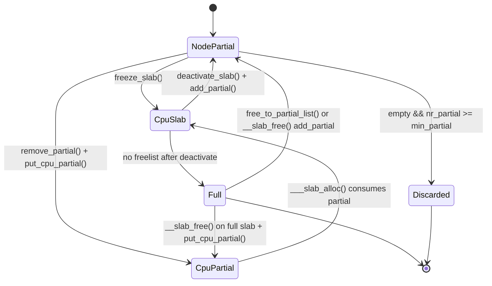
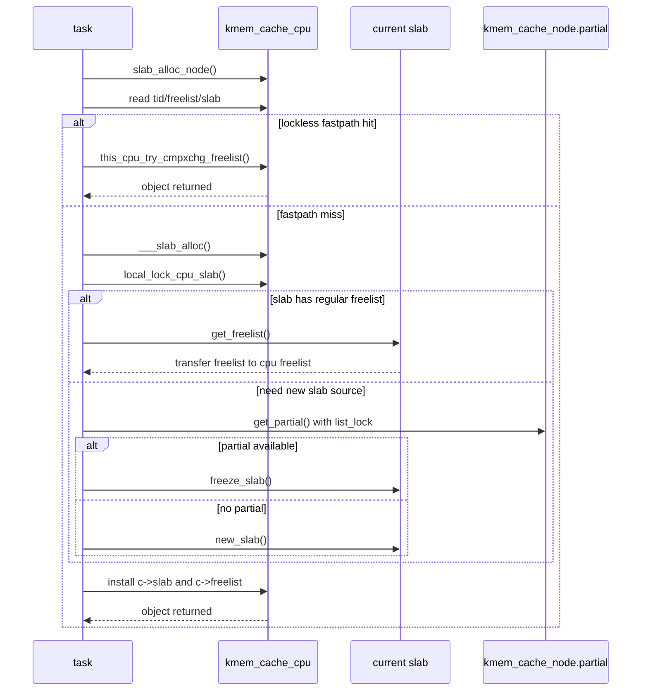
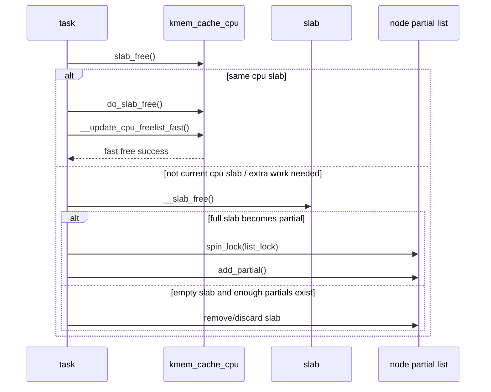

# ARM64 结合 SLUB 的真实锁路径分析

> 代码基线：Linux 6.18.1 / `mm/slub.c`
> 目标：把通用锁原理落到 `kmalloc()/kfree()` 的真实调用链上
> 重点：`slab_mutex`、`node->list_lock`、`cpu_slab->lock`、`slab_lock()`、无锁 fastpath

---

## 1. 为什么 SLUB 是分析锁实现的最好切入点之一

前面的主文档解释了 `spinlock`、`semaphore`、`mutex` 各自的实现原理，但这些分析仍然偏“锁框架自身”。

真正进入内核实战后，更重要的问题通常是：

1. 某个子系统到底用了哪种锁？
2. 哪条路径是真正无锁的？
3. 什么时候会退化到 `spin_lock_irqsave()`？
4. 一把锁在热路径上，还是只在管理路径上？

`SLUB` 非常适合回答这些问题，因为它同时用到了：

- lockless per-cpu fastpath
- `local_lock` 保护 percpu 慢路径元数据
- `spinlock` 保护 node partial/full 链表
- `mutex` 保护全局 cache 元数据和 flush/hotplug 路径
- 在某些架构条件不满足时，退回 `bit_spin_lock()` 级别的 per-slab 锁

也就是说，`slub.c` 把锁分层用法几乎演示全了。

---

## 2. `slub.c` 文件头已经把锁层级写出来了

`mm/slub.c` 一开头就给出锁顺序：

```c
/*
 * Lock order:
 *   1. slab_mutex (Global Mutex)
 *   2. node->list_lock (Spinlock)
 *   3. kmem_cache->cpu_slab->lock (Local lock)
 *   4. slab_lock(slab) (Only on some arches)
 *   5. object_map_lock (Only for debugging)
 */
```

这段注释非常关键，建议当成阅读全文件的索引。

### 2.1 逐行解释这段锁顺序注释

1. `slab_mutex`
   - 这是全局 mutex，不走分配/释放热路径。
   - 它保护 slab cache 链表、cache 元数据变更、cpu hotplug flush 等“大动作”。

2. `node->list_lock`
   - 这是每节点一个自旋锁。
   - 保护该 node 上的 `partial`/`full` 链表，以及 `nr_partial` 计数。
   - 是 SLUB 里最重要的集中式锁。

3. `kmem_cache->cpu_slab->lock`
   - 这是 percpu 的 `local_lock`。
   - 保护当前 CPU 的 `kmem_cache_cpu` 慢路径字段，例如 `slab`、`freelist`、`partial`、`tid` 的协调切换。

4. `slab_lock(slab)`
   - 这是 per-slab 级别的 bit spinlock。
   - 仅在没有 `cmpxchg_double` 能力时使用，保护 `slab->freelist` 和 counters。

5. `object_map_lock`
   - 只在 debug 检查里使用，不在正常热路径里出现。

这个顺序说明了一件事：

- **SLUB 的设计目标不是“所有地方都上锁”，而是把大多数路径压到 percpu 无锁或局部锁内，只在无法避免时才碰集中式 `list_lock`。**

---

## 3. SLUB 里四种对象/页状态

`slub.c` 头部还定义了四类关键状态：

- node partial slab: `SL_partial && !frozen`
- cpu partial slab: `!SL_partial && !frozen`
- cpu slab: `!SL_partial && frozen`
- full slab: `!SL_partial && !frozen`

这几个状态决定了走哪把锁。

### 3.1 对这四种状态的直观理解

1. **node partial slab**
   - 还挂在某个 NUMA node 的 partial 链表上
   - 由 `node->list_lock` 管理

2. **cpu partial slab**
   - 已经从 node partial 链表摘下，但还没成为当前 CPU 正在分配的 slab
   - 暂存在 percpu partial 缓存中

3. **cpu slab**
   - 当前 CPU 的活跃 slab
   - `frozen=1`，表示它暂时不参与 node 链表管理
   - 热路径基本都围绕它展开

4. **full slab**
   - 没有空闲对象了
   - 普通配置下不一定长期进 full list
   - 开 debug 时可能被追踪到 full 链表里

### 3.2 状态迁移图



这个状态机和锁路径是强绑定的：

- 在 `CpuSlab` 上尽量走无锁/局部锁
- 一旦回到 `NodePartial`，就要进入 `node->list_lock` 世界

---

## 4. 分配热路径总览：`kmalloc()` 到 `slub.c`

分配主链路可以压缩成：

```text
kmalloc/kmem_cache_alloc
  -> slab_alloc_node()
    -> __slab_alloc_node()
      -> fastpath: lockless percpu freelist
      -> slowpath: __slab_alloc()
           -> local_lock(cpu_slab)
           -> get_freelist() / deactivate_slab()
           -> get_partial() [list_lock]
           -> new_slab()
           -> freeze_slab()
```

### 4.1 分配热路径时序图



---

## 5. `__slab_alloc_node()`：真正的无锁快路径

代码来自 `mm/slub.c`，这是 SLUB 最重要的 fastpath：

```c
c = raw_cpu_ptr(s->cpu_slab);
tid = READ_ONCE(c->tid);
barrier();

object = c->freelist;
slab = c->slab;

if (!USE_LOCKLESS_FAST_PATH() ||
    unlikely(!object || !slab || !node_match(slab, node))) {
	object = __slab_alloc(s, gfpflags, node, addr, c, orig_size);
} else {
	void *next_object = get_freepointer_safe(s, object);
	if (unlikely(!__update_cpu_freelist_fast(s, object, next_object, tid))) {
		note_cmpxchg_failure("slab_alloc", s, tid);
		goto redo;
	}
}
```

### 5.1 逐行解释

1. `c = raw_cpu_ptr(s->cpu_slab);`
   - 直接取当前 CPU 的 `kmem_cache_cpu` 指针。
   - 这里还没有加锁，因为它本身就是 fastpath。

2. `tid = READ_ONCE(c->tid);`
   - 读取事务编号 `tid`。
   - 这是 lockless fastpath 正确性的关键校验字段。

3. `barrier();`
   - 防止编译器把后面的 `freelist/slab` 访问重排到 `tid` 之前。

4. `object = c->freelist; slab = c->slab;`
   - 读出当前 CPU 活跃 slab 的 lockless freelist 头和 slab 指针。

5. `if (!USE_LOCKLESS_FAST_PATH() || unlikely(!object || !slab || !node_match(...)))`
   - 只要有一个条件不满足，就不能走无锁快路径：
   - 当前配置禁用了无锁 fastpath
   - percpu freelist 为空
   - 当前 CPU 没有活跃 slab
   - NUMA node 不匹配

6. `object = __slab_alloc(...)`
   - 进入真正的慢路径协调逻辑。

7. `void *next_object = get_freepointer_safe(s, object);`
   - 先从当前对象里取出“下一个空闲对象”的指针。

8. `__update_cpu_freelist_fast(s, object, next_object, tid)`
   - 这是 fastpath 的核心原子动作。
   - 本质是把 `(freelist, tid)` 这个二元组做一次 `this_cpu_try_cmpxchg_freelist()`。
   - 只有在“当前仍是同一 CPU，且没有被别的路径改过”的条件下才成功。

9. `goto redo;`
   - 如果 cmpxchg 失败，就重新读一遍 percpu 状态。
   - 这是典型 lockless retry 模式。

### 5.2 这里为什么不需要 `spinlock`

因为 SLUB 用的是：

- percpu 数据局部化
- `(freelist, tid)` 原子比较交换
- 失败自动重试

也就是说，它不是“绝对没人并发改”，而是“即使有人改，我也能检测到并放弃当前快照”。

这就是 lockless fastpath 的根本思想。

---

## 6. `___slab_alloc()`：慢路径如何一步步把对象找出来

当 `__slab_alloc_node()` 无法直接从 percpu freelist 拿对象时，就进入 `___slab_alloc()`。

这条路径是理解 `cpu_slab->lock`、`node->list_lock` 如何协作的核心。

### 6.1 关键代码片段

```c
slab = READ_ONCE(c->slab);
...
local_lock_cpu_slab(s, flags);
if (unlikely(slab != c->slab)) {
	local_unlock_cpu_slab(s, flags);
	goto reread_slab;
}
freelist = c->freelist;
if (freelist)
	goto load_freelist;

freelist = get_freelist(s, slab);
if (!freelist) {
	c->slab = NULL;
	c->tid = next_tid(c->tid);
	local_unlock_cpu_slab(s, flags);
	goto new_slab;
}
```

### 6.2 逐行解释

1. `slab = READ_ONCE(c->slab);`
   - 先看当前 CPU 还有没有活跃 slab。

2. `local_lock_cpu_slab(s, flags);`
   - 一旦要修改 `kmem_cache_cpu` 字段，就必须拿 `cpu_slab->lock`。
   - 这把锁不是普通全局 spinlock，而是 percpu `local_lock`。

3. `if (unlikely(slab != c->slab))`
   - 双重检查，防止这段时间被抢占或被别的路径改变当前 CPU 的 slab。

4. `freelist = c->freelist; if (freelist) goto load_freelist;`
   - 若 percpu freelist 又有了对象，就直接消费，不必继续更重路径。

5. `freelist = get_freelist(s, slab);`
   - 如果 percpu freelist 空了，但 slab 还在，尝试把 slab 自己的 regular freelist 接管过来。

6. `if (!freelist)`
   - slab 连 regular freelist 也没有了，说明这个 cpu slab 真耗尽了。

7. `c->slab = NULL; c->tid = next_tid(c->tid);`
   - 把当前 CPU 的活跃 slab 清空，并推进事务号。

8. `goto new_slab;`
   - 后面转去找 partial 或新建 slab。

### 6.3 `get_freelist()` 的锁语义

`get_freelist()` 的本质是：

1. 读取 `slab->freelist` 和 counters
2. 把 slab 标记成仍然 frozen
3. 原子更新 slab freelist 为 `NULL`
4. 把原先 freelist 的所有权转给 percpu freelist

关键代码：

```c
lockdep_assert_held(this_cpu_ptr(&s->cpu_slab->lock));
...
} while (!__slab_update_freelist(s, slab,
	freelist, counters,
	NULL, new.counters,
	"get_freelist"));
```

这里说明：

- `get_freelist()` 本身要求调用者已经持有 `cpu_slab->lock`
- 真正更新 `slab->freelist/counters` 时，则通过 `__slab_update_freelist()` 走 `cmpxchg_double` 或 `slab_lock()`

所以它体现的是两层保护：

1. `cpu_slab->lock` 保护当前 CPU 对 percpu 元数据的协调
2. `cmpxchg_double` / `slab_lock()` 保护单个 slab 的 freelist/counters 一致性

---

## 7. partial 路径：什么时候会碰 `node->list_lock`

`___slab_alloc()` 在拿不到当前 cpu slab 对象后，会走：

```text
get_partial()
  -> get_partial_node()
      -> spin_lock_irqsave(&n->list_lock, flags)
      -> remove_partial() / alloc_single_from_partial()
```

### 7.1 关键代码片段

```c
if (gfpflags_allow_spinning(pc->flags))
	spin_lock_irqsave(&n->list_lock, flags);
else if (!spin_trylock_irqsave(&n->list_lock, flags))
	return NULL;

list_for_each_entry_safe(slab, slab2, &n->partial, slab_list) {
	...
	remove_partial(n, slab);
	...
}

spin_unlock_irqrestore(&n->list_lock, flags);
```

### 7.2 逐行解释

1. `spin_lock_irqsave(&n->list_lock, flags)`
   - 进入 node partial 链表世界。
   - 这里已经不是 percpu 局部视图，而是跨 CPU 共享状态。

2. `spin_trylock_irqsave()`
   - 对不允许阻塞/自旋太久的场景，SLUB 会选择 trylock 失败即放弃，而不是硬等。

3. `list_for_each_entry_safe(..., &n->partial, slab_list)`
   - 遍历该 node 的 partial slab 链表。

4. `remove_partial(n, slab);`
   - 一旦决定把这个 slab 交给当前 CPU，就需要先从 node partial 链表摘掉。

### 7.3 debug cache 为什么更依赖 `list_lock`

`slub.c` 文件头就写了：

- 对 debug caches，分配会被强制拉进 `list_lock` 保护区，以便与一致性检查串行化

这意味着：

- 开启 `SLAB_CONSISTENCY_CHECKS` / `SLAB_STORE_USER` 等调试选项后
- 你看到的 `list_lock` 争用会显著增加

这在实验里非常容易观测到。

---

## 8. `freeze_slab()`：为什么说 cpu slab 是“冻结态”

### 8.1 关键代码片段

```c
freelist = slab->freelist;
counters = slab->counters;

new.counters = counters;
VM_BUG_ON(new.frozen);

new.inuse = slab->objects;
new.frozen = 1;

} while (!slab_update_freelist(s, slab,
	freelist, counters,
	NULL, new.counters,
	"freeze_slab"));
```

### 8.2 逐行解释

1. 读取 `slab->freelist` 和 counters。
2. 检查当前 slab 不应已经 frozen。
3. 把 `new.inuse` 设成 `slab->objects`。
   - 这一步很容易误解。
   - 它不是说对象突然真的都被分配了，而是说：**这个 slab 里的可分配对象不再由 node partial 链表管理，而是整体移交给 percpu 分配上下文。**

4. `new.frozen = 1;`
   - 宣布该 slab 进入 cpu slab 专属状态。

5. `slab_update_freelist(... NULL, new.counters ...)`
   - 把 slab 里的 regular freelist 清空，因为这些对象接下来会转由 percpu freelist 消费。

所以“冻结”的真正含义是：

- **这个 slab 暂时脱离全局/节点链表管理，成为某个 CPU 的专属活跃 slab。**

---

## 9. `deactivate_slab()`：把 cpu slab 再放回共享世界

当当前 CPU 不再适合继续使用这个 slab 时，会走 `deactivate_slab()`。

### 9.1 关键代码片段

```c
if (READ_ONCE(slab->freelist)) {
	stat(s, DEACTIVATE_REMOTE_FREES);
	tail = DEACTIVATE_TO_TAIL;
}

...

do {
	old.freelist = READ_ONCE(slab->freelist);
	old.counters = READ_ONCE(slab->counters);
	VM_BUG_ON(!old.frozen);

	new.counters = old.counters;
	new.frozen = 0;
	if (freelist_tail) {
		new.inuse -= free_delta;
		set_freepointer(s, freelist_tail, old.freelist);
		new.freelist = freelist;
	} else {
		new.freelist = old.freelist;
	}
} while (!slab_update_freelist(...));

if (!new.inuse && n->nr_partial >= s->min_partial) {
	discard_slab(s, slab);
} else if (new.freelist) {
	spin_lock_irqsave(&n->list_lock, flags);
	add_partial(n, slab, tail);
	spin_unlock_irqrestore(&n->list_lock, flags);
}
```

### 9.2 逐行解释

1. `if (READ_ONCE(slab->freelist))`
   - 如果在 slab frozen 期间，其他 CPU 远程 free 过对象，那么 slab 自己的 freelist 可能已经被挂上新对象。

2. `tail = DEACTIVATE_TO_TAIL;`
   - 有 remote frees 时，回 partial list 会更倾向放尾部，减少刚被别人触碰过的 slab 立刻再次竞争。

3. `VM_BUG_ON(!old.frozen);`
   - 只有 frozen slab 才允许走 deactivate，状态不对说明逻辑错误。

4. `new.frozen = 0;`
   - 解除冻结，准备回归共享管理。

5. `new.inuse -= free_delta;`
   - 把 percpu freelist 上那批对象重新计入“空闲对象”。

6. `set_freepointer(... freelist_tail, old.freelist);`
   - 把 percpu freelist 尾部接到 slab 原 freelist 头上，完成拼接。

7. `if (!new.inuse && n->nr_partial >= s->min_partial)`
   - 若 slab 已空，而且 node partial 已经够多，直接回收。

8. `else if (new.freelist) add_partial(...)`
   - 还有空闲对象，就重新放回 node partial 链表。

### 9.3 这条路径用了哪些锁

1. slab freelist/counters 更新：`slab_update_freelist()`
   - `cmpxchg_double` 或 `slab_lock()`

2. node partial 链表修改：`spin_lock_irqsave(&n->list_lock, ...)`

这正好体现了 SLUB 的分工：

- per-slab 状态修改靠原子或细粒度锁
- 链表组织修改靠 node 自旋锁

---

## 10. 释放热路径：`kfree()` 到 `do_slab_free()`

释放主链路可以压缩成：

```text
kfree/kmem_cache_free
  -> slab_free()
      -> free_to_pcs()          [若启用 sheaves 且本地 node 合适]
      -> do_slab_free()
          -> fastpath: update current cpu freelist
          -> slowpath: __slab_free()
```

### 10.1 释放热路径时序图



---

## 11. `do_slab_free()`：当前 CPU slab 的 lockless fast free

### 11.1 关键代码片段

```c
c = raw_cpu_ptr(s->cpu_slab);
tid = READ_ONCE(c->tid);
barrier();

if (unlikely(slab != c->slab)) {
	__slab_free(s, slab, head, tail, cnt, addr);
	return;
}

freelist = READ_ONCE(c->freelist);
set_freepointer(s, tail, freelist);

if (unlikely(!__update_cpu_freelist_fast(s, freelist, head, tid))) {
	note_cmpxchg_failure("slab_free", s, tid);
	goto redo;
}
```

### 11.2 逐行解释

1. `c = raw_cpu_ptr(s->cpu_slab); tid = READ_ONCE(c->tid);`
   - 和分配 fastpath 一样，先拿 percpu 指针与事务号快照。

2. `if (unlikely(slab != c->slab))`
   - 如果当前释放对象不属于当前 CPU 的活跃 slab，就不能直接塞回 percpu freelist。
   - 必须转入 `__slab_free()` 做更复杂处理。

3. `freelist = READ_ONCE(c->freelist);`
   - 读出 percpu freelist 当前头部。

4. `set_freepointer(s, tail, freelist);`
   - 把当前释放对象串到原 freelist 头前面。

5. `__update_cpu_freelist_fast(...)`
   - 原子把 percpu freelist 头从旧值切换成新释放对象头。
   - 成功就完成了一次无锁 free。

6. `goto redo;`
   - 若期间被别的路径打断修改了 `tid/freelist`，则重新来一轮。

### 11.3 为什么 free fastpath 和 alloc fastpath 几乎镜像对称

因为二者都是围绕同一对字段：

- `c->freelist`
- `c->tid`

进行 lockless cmpxchg。

区别仅在于：

- 分配是把 freelist 头向后挪一个对象
- 释放是把新对象挂回 freelist 头部

---

## 12. `__slab_free()`：释放慢路径如何决定是否碰 `list_lock`

### 12.1 关键代码片段

```c
prior = slab->freelist;
counters = slab->counters;
set_freepointer(s, tail, prior);
new.counters = counters;
was_frozen = new.frozen;
new.inuse -= cnt;
if ((!new.inuse || !prior) && !was_frozen) {
	if (!kmem_cache_has_cpu_partial(s) || prior) {
		n = get_node(s, slab_nid(slab));
		spin_lock_irqsave(&n->list_lock, flags);
		on_node_partial = slab_test_node_partial(slab);
	}
}
...
if (likely(!n)) {
	if (likely(was_frozen)) {
		...
	} else if (kmem_cache_has_cpu_partial(s) && !prior) {
		put_cpu_partial(s, slab, 1);
	}
	return;
}
```

### 12.2 逐行解释

1. `prior = slab->freelist; counters = slab->counters;`
   - 先抓取 slab 当前的 freelist/counters 快照。

2. `set_freepointer(s, tail, prior);`
   - 先把当前要释放的对象链到 freelist 头前。

3. `was_frozen = new.frozen; new.inuse -= cnt;`
   - 记录该 slab 之前是不是 frozen，并把 inuse 减掉。

4. `if ((!new.inuse || !prior) && !was_frozen)`
   - 这句最关键。
   - 意思是：如果释放后 slab 变空，或者原来是 full slab（`prior == NULL`），并且它不是 frozen slab，那么可能需要做链表操作。

5. `spin_lock_irqsave(&n->list_lock, flags);`
   - 只有在真的要改 node partial/full 链表时，才拿 `list_lock`。
   - 这就是 SLUB 极力避免集中式锁的典型写法。

6. `if (likely(!n))`
   - 如果前面根本没拿 `list_lock`，说明当前 free 不需要碰 node 链表。

7. `if (likely(was_frozen))`
   - frozen slab 的 free 很多时候只是 remote free 到 slab freelist，不需要链表动作。

8. `else if (kmem_cache_has_cpu_partial(s) && !prior) put_cpu_partial(s, slab, 1);`
   - 如果原来是 full slab，现在第一次出现空闲对象，而且 cache 支持 cpu partial，就先放到 percpu partial，而不是立刻回 node partial。

### 12.3 这条路径体现出的性能策略

SLUB 的目标不是“free 完就马上回全局链表”，而是：

1. 若能继续停留在 percpu 世界，就别碰全局锁
2. 只有确实要改变 node partial/full 组织时，才拿 `list_lock`

这是它缩小锁竞争范围的根本原因。

---

## 13. `free_to_partial_list()`：debug cache 下的集中式路径

当 `kmem_cache_debug(s)` 为真时，`__slab_free()` 不走常规优化，而是直接：

```c
if (IS_ENABLED(CONFIG_SLUB_TINY) || kmem_cache_debug(s)) {
	free_to_partial_list(s, slab, head, tail, cnt, addr);
	return;
}
```

### 13.1 关键代码片段

```c
spin_lock_irqsave(&n->list_lock, flags);

if (free_debug_processing(...)) {
	void *prior = slab->freelist;
	slab->inuse -= cnt;
	set_freepointer(s, tail, prior);
	slab->freelist = head;

	if (!prior) {
		remove_full(s, n, slab);
		if (!slab_free)
			add_partial(n, slab, DEACTIVATE_TO_TAIL);
	}
}

spin_unlock_irqrestore(&n->list_lock, flags);
```

### 13.2 逐行解释

1. `spin_lock_irqsave(&n->list_lock, flags);`
   - debug cache 直接进入集中式 node 锁路径。

2. `free_debug_processing(...)`
   - 在持锁状态下做一致性检查、tracking、poison、redzone 等处理。

3. `slab->inuse -= cnt;`
   - 更新 inuse。

4. `slab->freelist = head;`
   - 直接把释放链重新挂回 slab freelist。

5. `if (!prior) remove_full(...); add_partial(...);`
   - 若释放前该 slab 是 full，则需要把它从 full list 移出，并重新加回 partial list。

这条路径说明：

- debug 打开后，SLUB 为了正确性和可验证性，愿意牺牲 lockless fastpath。

---

## 14. `slab_lock()`：没有 `cmpxchg_double` 时的兜底

SLUB 并不假定所有架构都能高效支持 double-word cmpxchg。

`slub.c` 中：

```c
static __always_inline void slab_lock(struct slab *slab)
{
	bit_spin_lock(SL_locked, &slab->flags.f);
}
```

而 `__slab_update_freelist()` 会根据条件二选一：

```c
if (s->flags & __CMPXCHG_DOUBLE)
	ret = __update_freelist_fast(...);
else
	ret = __update_freelist_slow(...);
```

### 14.1 这里和 ARM64 的关系

在 ARM64 上，这通常意味着：

- 若平台和配置支持 `system_has_freelist_aba`
- 则优先走 `cmpxchg_double` 风格的 lockless/low-lock 更新

否则就退到：

- `slab_lock()`
- 本地关中断
- 修改 `slab->freelist/counters`

这正好对应主文档里讲的架构层责任：

- 架构原子能力越强，SLUB 越能放大 lockless fastpath 的收益

---

## 15. `slab_mutex` 和 `flush_lock`：为什么热路径里几乎看不到 mutex

`slab_mutex` 在 `slub.c` 中主要出现于：

- cache 初始化和全局 cache 链表遍历
- `flush_all_rcu_sheaves()`
- `slub_cpu_dead()`
- cache shutdown / flush 类路径

例如：

```c
mutex_lock(&slab_mutex);
list_for_each_entry(s, &slab_caches, list) {
	...
}
mutex_unlock(&slab_mutex);
```

### 15.1 这说明什么

1. `slab_mutex` 是**管理锁**，不是分配/释放热路径锁。
2. SLUB 把 mutex 放在“配置、flush、hotplug、全局遍历”层面。
3. 真正频繁分配/释放时，关键竞争点还是：
   - `cpu_slab->lock`
   - `node->list_lock`
   - `cmpxchg_double` / `slab_lock()`

另外一个管理锁是：

- `flush_lock`

它用于协调跨 CPU flush work 的发起与等待，也不在普通 `kmalloc/kfree` 热路径里。

---

## 16. 把主文档里的三类锁重新映射回 SLUB

### 16.1 spinlock 在 SLUB 里的真实位置

主要是：

- `node->list_lock`
- `barn->lock`
- `slab_lock()`（bit spinlock）

其中最重要的是 `node->list_lock`，它就是 SLUB 的集中式共享锁。

### 16.2 mutex 在 SLUB 里的真实位置

主要是：

- `slab_mutex`
- `flush_lock`

它们不保护对象分配的每一步，而是保护全局结构和 flush 生命周期。

### 16.3 semaphore 在 SLUB 里几乎不是核心角色

`slub.c` 本体不以 semaphore 作为核心同步手段。

这也从侧面说明：

- 对高频内存分配器，semaphore 这种阻塞资源门控结构并不适合做热路径主锁。

---

## 17. 最值得下断点/打 trace 的函数

如果你要调试 SLUB 锁行为，最推荐的函数断点如下：

### 分配路径

- `slab_alloc_node()`
- `__slab_alloc_node()`
- `___slab_alloc()`
- `get_partial_node()`
- `freeze_slab()`
- `deactivate_slab()`

### 释放路径

- `slab_free()`
- `do_slab_free()`
- `__slab_free()`
- `free_to_partial_list()`
- `put_cpu_partial()`

### 管理路径

- `flush_this_cpu_slab()`
- `slub_cpu_dead()`
- `flush_all_rcu_sheaves()`

---

## 18. 建议的 SLUB 锁实验

## 18.1 实验一：验证 debug cache 会放大 `list_lock` 争用

思路：

1. 用普通配置跑对象分配压测
2. 打开 `slab_debug=FZPU` 或针对某个 cache 开启 debug
3. 用 `lockstat` 对比 `kmem_cache_node->list_lock` 的 contention 变化

预期：

- debug cache 下更多路径会被强制串行到 `list_lock`

## 18.2 实验二：观察 percpu fastpath 是否真的占主导

思路：

1. 给 `__slab_alloc_node()` 和 `___slab_alloc()` 打 trace
2. 跑高频小对象 `kmalloc/kfree`
3. 对比分配次数中：
   - fastpath 命中
   - slowpath 比例
   - `ALLOC_FASTPATH` / `ALLOC_SLOWPATH` 统计

预期：

- 正常小对象 workload 中，绝大多数应命中 percpu fastpath

## 18.3 实验三：观察 full slab 第一次 free 如何重新回到 partial

思路：

1. 找一个对象 cache，先把一个 slab 填满
2. 对该 slab 上对象做一次 free
3. 跟踪 `do_slab_free()` -> `__slab_free()` -> `put_cpu_partial()` 或 `add_partial()`

预期：

- full slab 不会永远留在 full 状态
- 一旦重新出现空闲对象，会被迁回 cpu partial 或 node partial

---

## 19. 最后的总结

把 `slub.c` 的真实锁路径压缩成一句话：

- **快路径尽量只碰 percpu freelist 和事务号，不碰共享锁；慢路径先用 `cpu_slab->lock` 协调本 CPU 状态，再在必要时进入 `node->list_lock`，只有更底层的 slab freelist/counters 更新才依赖 `cmpxchg_double` 或 `slab_lock()`。**

因此，SLUB 不是“一个大锁分配器”，而是一套非常明确的分层同步系统：

1. **percpu lockless fastpath**：`__slab_alloc_node()` / `do_slab_free()`
2. **percpu local lock**：`___slab_alloc()`、`put_cpu_partial()`、`flush_slab()`
3. **per-node spinlock**：`get_partial_node()`、`free_to_partial_list()`、`deactivate_slab()`
4. **per-slab 原子或 bit spinlock**：`slab_update_freelist()`
5. **global mutex**：`slab_mutex` / `flush_lock`

这套分层恰好把主文档里的锁原理全部落地到了一个真实、复杂而且高频的内核子系统中。