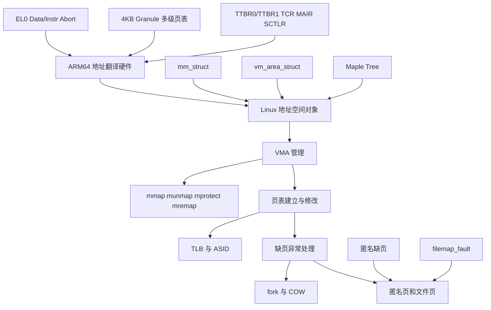

# Linux ARM64 虚拟内存管理学习指南

> 适用范围：Linux 6.18.1 / ARM64 / 当前工作区源码
>
> 文档目标：只聚焦 Linux ARM64 虚拟内存管理，不展开 buddy、SLUB、memblock 等“物理内存管理”主线之外的内容。

---

## 一句话先说清

**Linux ARM64 虚拟内存管理的主线，就是把“CPU 的地址翻译硬件”与“内核维护的地址空间对象”接起来：硬件负责从 VA 走到页表，内核负责决定这段 VA 是否存在、权限是什么、缺页时该补什么页、何时拆映射与刷新 TLB。**

如果你先抓住这条主线，后面的 `mm_struct`、`vm_area_struct`、Maple Tree、页表、缺页异常、COW、`mmap()`、`munmap()`、TLB shootdown 都会自然归位。

---

## 学习范围与边界

这份文档只讨论 ARM64 虚拟内存管理的核心内容：

1. ARM64 地址翻译硬件与异常入口
2. Linux 进程地址空间对象模型
3. VMA 管理与 Maple Tree
4. 用户页表与页表项权限语义
5. 匿名页、文件页与缺页处理
6. fork/COW/mprotect/munmap 等会改映射关系的路径
7. ASID、TLB、TLB shootdown、页表释放
8. 内核虚拟地址空间布局中与 VM 强相关的区域

这份文档有意不展开：

1. buddy allocator 细节
2. SLUB/SLAB 对象分配器
3. memblock 初始化全过程
4. 页回收实现细节
5. NUMA 和 memcg 的完整机制

这些模块当然和 VM 有强联系，但它们不是 ARM64 虚拟内存的第一主线。

---

## 学习总图



建议按这张图的顺序学习，不要一开始就扎进单个函数。

---

## 核心心智模型

把 ARM64 Linux VM 拆成下面四层：

### 1. 硬件翻译层

CPU 拿到虚拟地址后，使用 TTBR、TCR、MAIR、页表项权限位来完成地址翻译。

这层回答的是：

1. 这个 VA 属于 TTBR0 还是 TTBR1
2. 页表要走几级
3. 这一页是否可读、可写、可执行
4. 如果翻译失败，抛出哪类异常

### 2. 地址空间描述层

内核用 `mm_struct` 和 `vm_area_struct` 描述一个进程有哪些虚拟地址区间，以及这些区间应该具有什么属性。

这层回答的是：

1. 某个地址是否落在合法 VMA 中
2. 这段地址是匿名映射还是文件映射
3. 它是否允许写、执行、共享、增长栈等

### 3. 页表维护层

内核根据 VMA 策略，在真正访问时建立、修改或删除页表项。

这层回答的是：

1. 当前是否已经有 PTE/PMD 映射
2. 需要新建映射还是权限升级
3. 修改后如何与 TLB 一致

### 4. 缺页与生命周期层

当 CPU 因为页不存在、权限不对、COW 等原因触发异常时，Linux 进入 fault 路径处理。

这层回答的是：

1. 这是有效缺页还是非法访问
2. 该补零页、分配匿名页、读文件页、还是做 COW
3. 失败时返回 SIGSEGV、SIGBUS 还是 OOM

---

## ARM64 虚拟内存必须先懂的硬件知识

这一部分不是为了学体系结构考试，而是为了后面读 Linux fault 和页表代码时不迷路。

### 1. TTBR0_EL1 和 TTBR1_EL1

ARM64 EL1 下通常有两套翻译基址：

1. `TTBR0_EL1`：通常给用户地址空间
2. `TTBR1_EL1`：通常给内核地址空间

Linux 的直觉化理解是：

1. 用户态地址主要通过 `TTBR0_EL1` 翻译
2. 内核高地址主要通过 `TTBR1_EL1` 翻译

所以“切换进程地址空间”最核心的硬件动作之一，就是切换用户态那部分页表根；而内核全局映射一般保持在 TTBR1 侧。

### 2. TCR_EL1

`TCR_EL1` 决定翻译规则，最常见要点：

1. 虚拟地址大小
2. 页粒度，例如 4KB granule
3. cacheability / shareability
4. 物理地址位宽

你读 ARM64 内核 VM 时，要把 `VA_BITS`、`PAGE_SHIFT`、`CONFIG_PGTABLE_LEVELS` 和 TCR 联系起来看。

#### Linux 在启动时是怎么设置 TCR_EL1 的

ARM64 Linux 启动阶段会在 [arch/arm64/mm/proc.S](arch/arm64/mm/proc.S) 里拼出默认 `TCR_EL1` 值：

```asm
mov_q tcr, TCR_T0SZ(IDMAP_VA_BITS) | TCR_T1SZ(VA_BITS_MIN) | TCR_CACHE_FLAGS | \
           TCR_SHARED | TCR_TG_FLAGS | TCR_KASLR_FLAGS | TCR_ASID16 | \
           TCR_TBI0 | TCR_A1 | TCR_KASAN_SW_FLAGS | TCR_MTE_FLAGS
```

这行很重要，因为它把 ARM64 Linux VM 的几个核心假设一次性全写进硬件寄存器了。

#### 先抓最重要的字段

1. `T0SZ` / `T1SZ`

Linux 宏定义在 [arch/arm64/include/asm/pgtable-hwdef.h](arch/arm64/include/asm/pgtable-hwdef.h)：

```c
#define TCR_T0SZ(x) ((UL(64) - (x)) << TCR_T0SZ_OFFSET)
#define TCR_T1SZ(x) ((UL(64) - (x)) << TCR_T1SZ_OFFSET)
```

这里的关键不是死记位偏移，而是理解它表达的语义：

1. `x` 表示地址有效位数
2. `TxSZ = 64 - x`
3. 所以 Linux 代码里如果写 `TCR_T1SZ(VA_BITS)`，本质上是在告诉 CPU：`TTBR1` 这侧的虚拟地址空间有多少有效位

直观理解：

1. `T0SZ` 主要控制 `TTBR0_EL1` 侧，也就是用户地址翻译范围
2. `T1SZ` 主要控制 `TTBR1_EL1` 侧，也就是内核地址翻译范围

2. `TG0` / `TG1`

页粒度大小。Linux 在 [arch/arm64/mm/proc.S](arch/arm64/mm/proc.S) 里用 `TCR_TG_FLAGS` 统一选择：

1. 4KB pages：`TCR_TG0_4K | TCR_TG1_4K`
2. 16KB pages：`TCR_TG0_16K | TCR_TG1_16K`
3. 64KB pages：`TCR_TG0_64K | TCR_TG1_64K`

这会直接影响：

1. 单页大小
2. 页表层级
3. 每级索引位数

3. `IRGNx` / `ORGNx`

这两组位定义页表遍历本身的 cacheability，不是普通数据页的 AttrIndx。Linux 用：

1. `TCR_IRGN_WBWA`
2. `TCR_ORGN_WBWA`

并在 [arch/arm64/mm/proc.S](arch/arm64/mm/proc.S) 里组合成 `TCR_CACHE_FLAGS`，注释就是：

1. `PTWs cacheable, inner/outer WBWA`

这句话的意思是：

1. CPU 在走页表时，也要读页表页
2. Linux 希望这些页表遍历访问本身是可缓存的
3. 这样页表 walk 不至于性能太差

4. `SH0` / `SH1`

shareability。Linux 用 `TCR_SHARED`，在 [arch/arm64/include/asm/pgtable-hwdef.h](arch/arm64/include/asm/pgtable-hwdef.h) 里定义为：

1. `TCR_SH0_INNER | TCR_SH1_INNER`

直观含义：

1. 两侧翻译都按 Inner Shareable 处理
2. 多核系统里缓存一致性和页表可见性依赖这类属性协同工作

5. `IPS`

物理地址位宽。Linux 在 [arch/arm64/mm/proc.S](arch/arm64/mm/proc.S) 里根据 CPU 能力动态计算并写入 `TCR_EL1.IPS`。

你可以把它理解成：

1. 告诉硬件 stage-1 翻译最终能产生多宽的物理地址
2. 它必须和当前 CPU 支持的 PA range 匹配

6. `ASID16`

Linux 打开 `TCR_ASID16`，表示使用 16-bit ASID。它和后面的 TLB/上下文切换强相关，核心收益是：

1. 可以让更多地址空间上下文共存于 TLB
2. 降低频繁全量 TLB flush 的压力

7. `TBI0` / `TBI1` / `TBIDx`

Top Byte Ignore。它控制地址高字节是否参与地址翻译。Linux 在 KASAN/MTE/Tagged Address ABI 场景下很依赖这些位。

直观理解：

1. 高字节可以被拿来装 tag
2. CPU 做地址翻译时可选择忽略它
3. 这就是为什么 ARM64 会有“带 tag 的指针仍能访问正常地址”的机制基础

8. `HA` / `HD`

硬件 Access Flag / Dirty 管理相关位。Linux 在 [arch/arm64/mm/proc.S](arch/arm64/mm/proc.S) 里会根据 CPU 能力决定是否打开 `TCR_HA`。

这背后的语义是：

1. 某些 CPU 可以帮内核自动更新访问位
2. 减少部分软件 fault/页表写回开销

#### 学 TCR_EL1 时最该抓住的结论

`TCR_EL1` 不是“页表内容”，它是“CPU 要如何解释这棵页表”的总开关。页表里存的是条目，而 `TCR_EL1` 决定：

1. 这些条目该按几级来走
2. 走出来的地址多宽
3. 表遍历是否缓存
4. 高位 tag 是否忽略
5. ASID 怎样参与上下文隔离

### 3. MAIR_EL1

`MAIR_EL1` 决定内存属性索引背后的真实语义，例如：

1. Normal memory
2. Device memory
3. Normal Non-Cacheable

Linux 页表项里不是直接写“这是设备内存”，而是写 AttrIndx，再由 MAIR 解释。

#### MAIR_EL1 到底在干什么

你可以把 `MAIR_EL1` 理解成一张“内存属性字典表”：

1. 页表项里只放一个小索引 `AttrIndx`
2. `MAIR_EL1` 里按槽位保存这个索引对应的真实属性编码
3. CPU 最终根据索引去查 `MAIR_EL1`

所以：

1. 页表项回答的是“我用哪个属性槽”
2. `MAIR_EL1` 回答的是“这个槽具体表示什么内存类型”

#### Linux 在 ARM64 上的默认 MAIR_EL1

Linux 在 [arch/arm64/mm/proc.S](arch/arm64/mm/proc.S) 里定义了：

```c
#define MAIR_EL1_SET                                                    \
    (MAIR_ATTRIDX(MAIR_ATTR_DEVICE_nGnRnE, MT_DEVICE_nGnRnE) |          \
     MAIR_ATTRIDX(MAIR_ATTR_DEVICE_nGnRE, MT_DEVICE_nGnRE) |            \
     MAIR_ATTRIDX(MAIR_ATTR_NORMAL_NC, MT_NORMAL_NC) |                  \
     MAIR_ATTRIDX(MAIR_ATTR_NORMAL, MT_NORMAL) |                        \
     MAIR_ATTRIDX(MAIR_ATTR_NORMAL, MT_NORMAL_TAGGED))
```

而索引定义在 [arch/arm64/include/asm/memory.h](arch/arm64/include/asm/memory.h)：

1. `MT_NORMAL = 0`
2. `MT_NORMAL_TAGGED = 1`
3. `MT_NORMAL_NC = 2`
4. `MT_DEVICE_nGnRnE = 3`
5. `MT_DEVICE_nGnRE = 4`

属性编码定义在 [arch/arm64/include/asm/sysreg.h](arch/arm64/include/asm/sysreg.h)：

1. `MAIR_ATTR_NORMAL = 0xff`
2. `MAIR_ATTR_NORMAL_NC = 0x44`
3. `MAIR_ATTR_DEVICE_nGnRnE = 0x00`
4. `MAIR_ATTR_DEVICE_nGnRE = 0x04`

#### 这些名字各自是什么意思

1. `Normal`

普通缓存内存。绝大多数内核线性映射、用户普通内存、page cache 都属于这一类。

2. `Normal_NC`

普通非缓存内存。它还是“正常内存语义”，但不走普通缓存策略。

3. `Device_nGnRnE`

设备内存，严格顺序，含义是：

1. non-Gathering
2. non-Reordering
3. no Early write acknowledgement

这是最强约束的设备类型。

4. `Device_nGnRE`

也是设备内存，但比 `nGnRnE` 略宽松，允许 Early write acknowledgement。

5. `Normal_Tagged`

与 MTE/tagged pointer 相关。Linux 启动早期先按 Normal memory 放，后续如果硬件支持 MTE，再切换到 tagged 语义。

#### MAIR 和页表项是怎么接起来的

连接点是 `PTE_ATTRINDX()`，定义在 [arch/arm64/include/asm/pgtable-hwdef.h](arch/arm64/include/asm/pgtable-hwdef.h)。

也就是说：

1. 页表项里存 `AttrIndx`
2. `AttrIndx(MT_NORMAL)` 表示“去 MAIR 里找 Normal 那个槽”
3. `AttrIndx(MT_DEVICE_nGnRnE)` 表示“去 MAIR 里找设备内存槽”

Linux 里很直观的例子在 [arch/arm64/include/asm/pgtable-prot.h](arch/arm64/include/asm/pgtable-prot.h)：

1. `PROT_NORMAL = ... | PTE_ATTRINDX(MT_NORMAL)`
2. `PROT_DEVICE_nGnRnE = ... | PTE_ATTRINDX(MT_DEVICE_nGnRnE)`

所以真正的完整链条是：

1. `pgprot_t` 选择某个 `MT_xxx`
2. 宏把它编码进 PTE 的 `AttrIndx`
3. CPU 再通过 `MAIR_EL1` 把这个索引翻译成真实内存属性

#### 学 MAIR_EL1 时最该抓住的结论

**页表项里不是直接写“缓存/设备/非缓存”的全文，而是写一个索引；`MAIR_EL1` 才是这组索引对应含义的总字典。**

### 4. 页表级数

ARM64 的页表级数受虚拟地址位数和页大小影响。你在 4KB granule 下最常见的是：

1. PGD
2. P4D
3. PUD
4. PMD
5. PTE

但不是每次都真的有独立 5 级，取决于配置和宏折叠。

学习时要记住：

1. Linux 通用 MM 用统一抽象层名
2. ARM64 实际层数由配置决定
3. 折叠层不代表概念消失，只是代码层面复用

### 5. Data Abort / Instruction Abort

当翻译失败或者权限检查失败时，ARM64 会产生内存访问异常。对 Linux VM 最重要的是：

1. 用户读写触发的数据异常
2. 指令取值触发的执行异常
3. 权限 fault 与 translation fault 的区别

ARM64 用户态缺页主入口可以从这里开始读：

1. [arch/arm64/kernel/entry-common.c](arch/arm64/kernel/entry-common.c)
2. [arch/arm64/mm/fault.c](arch/arm64/mm/fault.c)

---

## Linux 里的地址空间对象模型

这一部分是整个 VM 学习的“骨架”。

### 1. mm_struct：一个进程的地址空间总控对象

`mm_struct` 是进程用户地址空间的总对象，定义在 [include/linux/mm_types.h](include/linux/mm_types.h#L944)。

你至少要先认识这些成员：

1. `mm_mt`：当前 VMA 主索引，Maple Tree
2. `pgd`：用户页表根
3. `mmap_lock`：地址空间修改与查找的重要锁
4. `map_count`：VMA 数量
5. `page_table_lock`：部分页表和计数保护
6. `mmap_base` / `task_size`：用户地址空间布局关键参数

最关键的理解：

**`mm_struct` 是“这个进程拥有怎样的用户虚拟地址空间”的内核状态总和。**

### 2. vm_area_struct：一段属性一致的虚拟地址区间

`vm_area_struct` 定义在 [include/linux/mm_types.h](include/linux/mm_types.h#L813)。

一个 VMA 表示一段连续的地址区间 `[vm_start, vm_end)`，这段区间内部的访问属性和来源是一致的。

最重要成员：

1. `vm_start` / `vm_end`
2. `vm_mm`
3. `vm_page_prot`
4. `vm_flags`
5. `vm_file`
6. `vm_pgoff`
7. `anon_vma`
8. `vm_ops`

最关键的理解：

**VMA 不是页表，也不是物理页，它是“这段地址应该怎么被对待”的策略描述。**

### 3. Maple Tree：当前 VMA 主索引

`mm_struct` 里现在是 `struct maple_tree mm_mt;`，见 [include/linux/mm_types.h](include/linux/mm_types.h#L961)。

你要明确三件事：

1. 现在 VMA 主索引是 Maple Tree，不是历史上的 `mm_rb`
2. Maple Tree 很适合管理不重叠地址区间
3. `VMA_ITERATOR` / `vma_iter_init()` 是当前 VMA 遍历入口之一，见 [include/linux/mm_types.h](include/linux/mm_types.h#L1352)

### 4. `shared.rb` 不是 VMA 主树

`vm_area_struct` 里仍然还有：

```c
struct {
        struct rb_node rb;
        unsigned long rb_subtree_last;
} shared;
```

这不是旧的 VMA 主树残留，而是文件映射反向查询用的 `i_mmap interval tree` 节点。它服务的是“一个文件页范围被哪些 VMA 映射”，不是“一个进程有哪些 VMA”。

相关代码：

1. [mm/interval_tree.c](mm/interval_tree.c)
2. [mm/vma.c](mm/vma.c)

---

## ARM64 用户虚拟地址空间怎么看

学习 ARM64 VM 时，不要只盯着用户态。你需要同时分清用户地址和内核地址。

### 1. 用户地址空间

用户地址空间主要受这些因素控制：

1. `task_size`
2. `mmap_base`
3. 栈增长方向与 guard gap
4. 随机化布局

典型组成：

1. text/code
2. data/bss
3. heap/brk
4. mmap 区
5. stack
6. vdso/vvar

这些区间在内核里都会表现为一个或多个 VMA。

### 2. 内核地址空间

ARM64 学习 VM 时，必须把下面几块区分开：

1. linear map
2. kernel image mapping
3. vmalloc area
4. modules area
5. fixmap
6. vmemmap

你之前如果已经在研究 ARM64 地址转换，这一点尤其关键：

1. 线性映射地址转换和用户页表 fault 不是一回事
2. 内核镜像地址转换也不是用户 VMA 机制的一部分
3. 但它们都属于“ARM64 虚拟地址空间布局”的大图

---

## 页表：VM 的硬件落点

### 1. 页表不是策略本身

一个最常见误区是把页表当成 VM 的全部。

实际上：

1. VMA 描述“应该怎样”
2. 页表记录“当前已经怎样”

例如一个匿名可写 VMA：

1. 它可以存在但尚未建立任何 PTE
2. 第一次访问时才通过缺页分配页并填入 PTE
3. fork 后它仍然是可写 VMA，但页表可能暂时被降成只读以支持 COW

### 2. 用户页表最重要的几个对象

学习 Linux VM 时，至少要知道这些抽象层名：

1. `pgd_t`
2. `p4d_t`
3. `pud_t`
4. `pmd_t`
5. `pte_t`

以及两个重要概念：

1. 页表页本身也需要内核管理
2. 页表页现在有 `ptdesc` 抽象，定义在 [include/linux/mm_types.h](include/linux/mm_types.h#L522)

### 3. 页表项里你最该关心什么

学习 ARM64 VM，优先抓这些语义位，而不是一上来背所有 bit layout：

1. valid / present
2. writable
3. executable / PXN / UXN
4. accessed / dirty 相关语义
5. user accessible
6. shareable / memory attribute
7. huge mapping 还是普通页映射

### 4. ARM64 常见 PTE 关键位速查

如果你只想先建立读代码的直觉，最值得优先记住的是下面这些位。定义可以直接看 [arch/arm64/include/asm/pgtable-hwdef.h](arch/arm64/include/asm/pgtable-hwdef.h) 和 [arch/arm64/include/asm/pgtable.h](arch/arm64/include/asm/pgtable.h)。

1. `PTE_VALID`

表示这个 PTE 对硬件来说是否是有效映射。没有它，CPU 走到这里通常会触发 translation fault。

2. `PTE_USER`

表示用户态是否可访问。用户态映射通常需要它；纯内核映射通常不会带它。

3. `PTE_RDONLY`

表示硬件视角的只读限制。注意它和 Linux 软件语义里的“这个 VMA 将来可不可写”不是一回事，因为 COW 场景下 VMA 可以允许写，但当前 PTE 仍可能故意只读。

4. `PTE_AF`

Access Flag，表示这页已经被访问过。某些 CPU 能硬件更新它，Linux 也会在 fault 与回收路径里关注它。

5. `PTE_DBM`

Dirty Bit Management 相关位。ARM64 上 Linux 还把它复用为 `PTE_WRITE` 软件语义位，所以你在代码里会看到：

1. `pte_write(pte)` 实际检查的是 `PTE_WRITE`
2. `PTE_WRITE` 在头文件里又等同于 `PTE_DBM`

这正说明 Linux 软件层和 ARM64 硬件位语义是交织在一起使用的。

6. `PTE_PXN`

Privileged Execute-Never。置位时，特权态不能从这页取指执行。

7. `PTE_UXN`

User Execute-Never。置位时，用户态不能从这页取指执行。

8. `PTE_SHARED`

页的 shareability 属性。Linux 常见正常页映射通常会配成 inner-shareable。

9. `PTE_NG`

not Global。和 TLB/ASID 作用域有关，用户态映射通常会涉及它。

### 5. 把这些位翻译成直观语义

你可以先用下面这张简化表建立感觉：

| 关心的问题 | 主要看什么位 |
|---|---|
| 这页是否存在 | `PTE_VALID` |
| 用户态能否访问 | `PTE_USER` |
| 当前硬件是否只读 | `PTE_RDONLY` |
| 用户态能否执行 | `PTE_UXN` 是否清零 |
| 内核态能否执行 | `PTE_PXN` 是否清零 |
| 是否被访问过 | `PTE_AF` |
| 是否带可写/dirty 语义 | `PTE_DBM` / `PTE_WRITE` |
| 内存类型是什么 | `PTE_ATTRINDX(...)` + `MAIR_EL1` |

最重要的理解不是逐位硬背，而是知道：

1. 有的位是纯硬件语义
2. 有的位被 Linux 赋予了额外软件语义
3. fault 路径里经常同时检查 VMA 和 PTE，不能只看其中一层

---

## VMA 管理：`mmap()` 这一层到底在干什么

### 1. `mmap()` 不是直接分配物理页

它通常先做的是：

1. 在地址空间中找到合适区间
2. 建立或合并 VMA
3. 设置 `vm_flags`、`vm_file`、`vm_pgoff`、`vm_page_prot`
4. 暂时不一定分配物理页

真正分配页常常等到首次访问时通过缺页完成。

### 2. 你读 VMA 管理代码要看什么

建议先抓这几类操作：

1. 建立 VMA
2. 拆分 VMA
3. 合并 VMA
4. 删除 VMA
5. 修改 VMA 权限与属性

主文件是：

1. [mm/vma.c](mm/vma.c)

### 3. VMA 相关系统调用的学习顺序

建议顺序：

1. `mmap`
2. `munmap`
3. `mprotect`
4. `mremap`
5. `brk`

因为这几条路径几乎覆盖了“地址空间形状如何变化”的主要情况。

---

## ARM64 缺页处理：整条主线必须亲手走一遍

这是 Linux ARM64 虚拟内存里最关键的一条路径。

### 1. 先给结论

一次用户态缺页，最重要的步骤是：

1. ARM64 异常入口捕获 fault address 和 syndrome
2. Linux 判断是不是用户空间内存访问 fault
3. 查找该地址对应的 VMA
4. 判断 fault 类型：匿名页、文件页、COW、权限 fault、非法访问
5. 调 `handle_mm_fault()` 进入通用 MM
6. 建立或修改页表项
7. 返回用户态重试指令

### 2. ARM64 入口

建议从这里开始：

1. [arch/arm64/kernel/entry-common.c](arch/arm64/kernel/entry-common.c)
2. [arch/arm64/mm/fault.c](arch/arm64/mm/fault.c)

如果想把入口关系看完整，还应该补看：

1. [arch/arm64/kernel/entry.S](arch/arm64/kernel/entry.S)

可以先抓这几个函数名：

1. `do_mem_abort`
2. `do_page_fault`
3. `handle_mm_fault`

这里要先纠正一个很常见的误解：

**`el1h_64_sync_handler` 不是“所有异常的总入口”，它只是 ARM64 异常向量表里“EL1h 64-bit synchronous exception” 这一格的 C 分发函数。**

在 [arch/arm64/kernel/entry.S](arch/arm64/kernel/entry.S) 里，异常向量按来源和类型至少分成：

1. EL1t sync / irq / fiq / error
2. EL1h sync / irq / fiq / error
3. EL0 64-bit sync / irq / fiq / error
4. EL0 32-bit sync / irq / fiq / error

所以：

1. `el1h_64_sync_handler` 只处理 EL1h 的同步异常
2. 用户态常见缺页更多是从 EL0 的 data abort / instruction abort 入口进来
3. 真正和 VMA/fault 关系最紧的，不是向量表本身，而是它后面调用的 `do_mem_abort()`

可以把入口层级先记成：

```text
entry.S 向量槽位
-> entry-common.c 中对应的 sync/irq/error handler
-> do_mem_abort()
-> fault.c 中进一步分发
```

### 3. 查找 VMA

fault 到达通用 MM 前，必须先知道这个地址是不是落在合法 VMA 中。

这一步的本质是：

1. 用 `mm_struct` 的 Maple Tree 查地址
2. 找到包含该地址或最近后继的 VMA
3. 检查权限和访问类型是否匹配

如果地址压根不在合法 VMA 中，通常直接走 SIGSEGV。

### 4. `handle_mm_fault()` 的意义

你可以把 `handle_mm_fault()` 理解成：

**通用 MM 层根据 VMA 策略、fault 类型和现有页表状态，决定这次 fault 应该如何修复。**

它会进一步分叉到：

1. 匿名缺页
2. 文件缺页
3. 写时复制
4. 大页相关处理
5. 权限升级或脏位处理

### 5. 一次用户态匿名页缺页的真实调用链

如果你想真正把 ARM64 VM 主线打通，最值得亲自走一遍的不是所有 fault 分支，而是“用户态访问一个尚未建立映射的匿名地址”这条最基本路径。

先给压缩版调用链：

```text
EL0 load/store
-> entry.S 中 EL0 64-bit sync 向量
-> el0t_64_sync_handler()
-> el0_da() / el0_ia()
-> do_mem_abort()
-> esr_to_fault_info()
-> fault_info[fsc].fn(...)
-> do_page_fault()
-> 找到 VMA 并检查 vm_flags
-> handle_mm_fault()
-> __handle_mm_fault()
-> handle_pte_fault()
-> do_anonymous_page()
-> 分配匿名 folio 或映射 zero page
-> set_pte_at()
-> 返回用户态重试
```

### 6. 第一步：ARM64 捕获异常并进入 fault 路径

ARM64 缺页不是直接从 `fault.c` 开始，而是先经过异常入口层。最值得先抓住的文件和函数是：

1. [arch/arm64/kernel/entry.S](arch/arm64/kernel/entry.S)
2. [arch/arm64/kernel/entry-common.c](arch/arm64/kernel/entry-common.c)
3. [arch/arm64/mm/fault.c](arch/arm64/mm/fault.c)

对用户态缺页，常见链路是：

1. `entry.S` 选中 EL0 64-bit sync 向量槽位
2. `entry-common.c` 里的 `el0t_64_sync_handler()` 按 `ESR_EL1.EC` 分发
3. 对 data abort / instruction abort，继续进入 `el0_da()` / `el0_ia()`
4. 这两个入口读取 `FAR_EL1`，然后调用 `do_mem_abort(far, esr, regs)`

所以你至少要先抓住这三个函数：

1. `do_mem_abort()`
2. `do_page_fault()`
3. `el0_da()` / `el0_ia()`

这里再强调一次：

**`entry-common.c` 负责把“ARM64 异常语义”送进 fault 路径，但它本身基本不直接做 VMA 查找。真正开始碰 VMA 的地方在 `fault.c` 的 `do_page_fault()`。**

### 7. `do_mem_abort()` 不是最终处理者，而是总分发器

`do_mem_abort()` 的核心不是自己处理所有 fault，而是根据 `ESR_EL1` 里的 `FSC` 字段选择下一跳。

关键代码关系是：

1. `esr_to_fault_info(esr)`
2. `fault_info[]`
3. `inf->fn(far, esr, regs)`

也就是说，`do_mem_abort()` 做的事本质上是：

```text
从 ESR 提取 FSC
-> 用 FSC 索引 fault_info[]
-> 取出表项中的 fn
-> 调用这个 fn
```

这里的 `fn` 不是运行时注册的 hook，而是在 [arch/arm64/mm/fault.c](arch/arm64/mm/fault.c) 里的 `fault_info[]` 静态表中直接初始化好的函数指针。常见映射是：

1. translation fault -> `do_translation_fault`
2. access flag fault -> `do_page_fault`
3. permission fault -> `do_page_fault`
4. alignment fault -> `do_alignment_fault`
5. synchronous external abort -> `do_sea`
6. tag check fault -> `do_tag_check_fault`

所以：

1. `do_mem_abort()` 是 ARM64 memory abort 总分发器
2. `fault_info[]` 是按 `FSC` 编码建立的静态跳转表
3. `do_page_fault()` 只是其中最常见、最重要的一条分支

### 8. `do_page_fault()` 做的第一件大事不是分配页

`do_page_fault()` 的本质不是“直接补页”，而是 ARM64 页故障协调器。它先把异常转换成 Linux VM 可以处理的语义，再把真正建页表的工作交给通用 MM。

它先做的是判断 fault 类型并构造访问语义：

1. 指令 fault 对应 `VM_EXEC`
2. 写 fault 对应 `VM_WRITE`
3. 读 fault 对应 `VM_READ`，并按架构语义补上必要的兼容检查

也就是说，ARM64 fault 入口先把 syndrome 翻译成 Linux VM 能理解的访问意图。

再往下，`do_page_fault()` 主要负责：

1. 判断当前上下文是否允许处理 page fault
2. 把 fault 归类成读 / 写 / 执行访问
3. 查找目标地址所在 VMA
4. 检查 `vma->vm_flags`、GCS、pkey 等访问限制
5. 调用 `handle_mm_fault()` 把工作交给通用 MM
6. 根据返回结果决定成功、重试、发信号还是内核报错

### 9. 第二步：先找 VMA，再谈修 fault

在 [arch/arm64/mm/fault.c](arch/arm64/mm/fault.c) 里，`do_page_fault()` 会先：

1. 找到 fault 地址所在 VMA
2. 检查 `vma->vm_flags` 是否允许本次访问
3. 不满足就直接走 `SEGV_MAPERR` 或 `SEGV_ACCERR`

这一点非常重要：

**缺页处理的前提不是“页表里没页”，而是“这个地址在 VMA 语义上首先得合法”。**

实现上，`do_page_fault()` 通常会先尝试：

1. `lock_vma_under_rcu(mm, addr)` 走 RCU 快路径
2. 快路径失败后，再走 `lock_mm_and_find_vma(mm, addr, regs)` 的慢路径

也就是说，它先解决“这个地址在地址空间语义上是否合法”，然后才把真正修映射的工作交给通用 MM。

### 10. 第三步：进入通用 MM 层

ARM64 侧确认地址合法后，调用：

1. `handle_mm_fault(vma, addr, flags, regs)`

这个函数在 [mm/memory.c](mm/memory.c) 中。它的职责可以概括成一句话：

**根据 VMA 和 fault flags，驱动真正的页表遍历与缺页修复。**

它会继续进入：

1. `__handle_mm_fault()`

### 11. 第四步：逐级走页表，直到 PTE 层

`__handle_mm_fault()` 在 [mm/memory.c](mm/memory.c) 里会依次做：

1. `pgd_offset()`
2. `p4d_alloc()`
3. `pud_alloc()`
4. `pmd_alloc()`
5. 最后进入 `handle_pte_fault()`

这一步体现的是：

1. fault 处理不只是“补一页”
2. 它还可能需要补中间页表页
3. 所以 OOM 可以发生在真正分配匿名页之前

### 12. 第五步：为什么会走到 `do_anonymous_page()`

在 [mm/memory.c](mm/memory.c) 里，PTE 层 fault 最终会按映射类型分流。

对于匿名映射，一个关键分支是：

1. `return do_anonymous_page(vmf);`

而文件映射则会去 `do_fault()` 再分成 `do_read_fault()`、`do_cow_fault()`、`do_shared_fault()` 等。

这就是匿名页和文件页必须分开学的原因：它们从 PTE fault 层开始就分岔了。

### 13. 第六步：`do_anonymous_page()` 到底干了什么

`do_anonymous_page()` 在 [mm/memory.c](mm/memory.c) 里，是理解匿名 demand paging 的核心函数。

先抓它最关键的两种情况：

1. 读 fault 且允许 zero page
2. 需要真正分配私有匿名页

#### 情况 A：只读首次访问，可能直接映射 zero page

如果这次 fault 不是写，并且当前 mm 没禁用 zeropage，代码会：

1. 构造指向 zero page 的特殊 PTE
2. 走到 `setpte` 路径安装 PTE

这就是为什么匿名内存首次读取并不总是立刻分配真实私有页。

#### 情况 B：写 fault 或必须私有化，分配匿名 folio

如果不能走 zero page，`do_anonymous_page()` 会：

1. `vmf_anon_prepare()`
2. `alloc_anon_folio(vmf)`
3. `__folio_mark_uptodate(folio)`
4. `folio_mk_pte(folio, vma->vm_page_prot)`
5. 根据 VMA 是否可写，补上 `pte_mkwrite()` 与 `pte_mkdirty()`
6. 最终安装 PTE

这一步很关键，因为它把三层信息真正接起来了：

1. VMA 给出保护属性来源 `vm_page_prot`
2. folio 提供底层物理页承载
3. PTE 把两者变成 CPU 可执行的映射

### 12. 第七步：真正落地到页表的动作是什么

匿名页 fault 最终真正让映射生效的关键动作，就是安装 PTE。

你在代码里会看到类似：

1. `set_pte_at(mm, addr, pte, entry)`

这意味着：

1. 该虚拟地址对应的 PTE 位置被写入新条目
2. 新条目指向 zero page 或新分配的匿名 folio
3. CPU 之后重试这条指令时，就能按新页表继续访问

### 13. 第八步：为什么这条路径能帮助你理解整个 VM

因为它把最核心的四个对象一次性串起来了：

1. ARM64 异常寄存器给出 fault 信息
2. VMA 决定地址在语义上是否合法
3. 页表层负责把缺失的层级和 PTE 补齐
4. 匿名 folio 提供底层物理页内容

只要这条路径你能完整讲出来，Linux ARM64 虚拟内存的主骨架就已经立住了。

---

## 匿名页和文件页：为什么一定要分开学

这是 Linux VM 的基础分水岭。

### 1. 匿名页

典型来源：

1. heap
2. stack
3. `MAP_ANONYMOUS`
4. 私有匿名内存

典型特征：

1. 没有 `vm_file`
2. 初次读常见是零页或分配新匿名页
3. fork 时容易进入 COW
4. 回收时可能走 swap

### 2. 文件页

典型来源：

1. 可执行文件映射
2. 共享库映射
3. 文件 `mmap`

典型特征：

1. 背后有 `address_space` 与 page cache
2. fault 时可能需要从 page cache 取页或发起 IO
3. 文件截断、写回、回收、反向映射关系更复杂

### 3. 你该看哪条文件缺页路径

建议先抓：

1. `filemap_fault`
2. page cache 与 VMA 的连接关系

主文件可以先看：

1. [mm/filemap.c](mm/filemap.c)
2. [mm/memory.c](mm/memory.c)

---

## fork 和 COW：虚拟内存为什么比“复制页表”复杂得多

### 1. fork 的关键不是立刻复制所有页

fork 后，父子进程最常见的策略不是立刻复制全部匿名页，而是：

1. 共享原页
2. 把相关映射临时降为只读
3. 当任一方写入时触发写 fault
4. fault 时分配新页并复制内容

这就是写时复制，COW。

### 2. 你学习 COW 必须同时看三层

1. VMA 仍然可能是可写的
2. 页表当前却可能被故意设置成只读
3. fault 路径负责在真正写入时恢复“每个进程独占的新页”

如果只看 VMA，不看页表，会误以为“可写 VMA 为什么还会 permission fault”。这正是 COW 的关键点。

---

## `mprotect()` / `munmap()` / `mremap()`：映射关系怎么被改掉

这三条路径建议你尽快补上，因为它们体现了 VM 不只是“建映射”，更是“修改映射”。

### 1. `mprotect()`

关注点：

1. 改 VMA 属性
2. 可能拆分或合并 VMA
3. 修改对应页表权限
4. 刷新 TLB

### 2. `munmap()`

关注点：

1. 从地址空间移除 VMA 或缩短它
2. 拆除页表映射
3. 通过 `mmu_gather` 批量回收页表和延迟 TLB flush

### 3. `mremap()`

关注点：

1. 变更地址区间
2. 迁移页表项
3. 维持 VMA 和页表的一致性

这些路径都能在 [mm/vma.c](mm/vma.c) 和 [mm/mremap.c](mm/mremap.c) 找到主代码。

---

## ASID、TLB、TLB shootdown：不懂这个就不算真的懂 ARM64 VM

### 1. 为什么页表改了还不够

因为 CPU 会缓存地址翻译结果到 TLB。

这意味着：

1. 内核修改页表后
2. 旧翻译可能仍停留在 TLB 中
3. 必须用正确方式失效本地或远端 CPU 上的 TLB

#### 什么叫“内核修改页表后”

这里的“修改页表”不是抽象说法，而是非常具体的代码动作：

1. 往页表内存里写入一个新的 PTE/PMD
2. 把原来存在的 PTE/PMD 清掉
3. 把只读 PTE 改成可写
4. 把 old page 的 PTE 改成 new page
5. 把 huge 映射拆成普通页映射，或反过来合并

在 Linux 代码里，这些动作通常表现为：

1. `set_pte_at()` / `set_pmd_at()`
2. `ptep_set_access_flags()`
3. `ptep_get_and_clear()` / `ptep_get_and_clear_full()`
4. huge page 版本的 `huge_ptep_*()`

例如在 [mm/memory.c](mm/memory.c) 里你会大量看到：

1. `set_pte_at(vma->vm_mm, addr, pte, entry)`
2. `ptep_set_access_flags(...)`
3. `ptep_get_and_clear_full(...)`

这些都属于“内核修改页表”。

#### 为什么这句话后面总跟着 TLB

因为页表只是内存里的数据结构，而 CPU 真正访问时通常先查 TLB。

所以可能出现这种时序：

1. 内核已经把页表从 A 改成 B
2. 但 CPU TLB 里还缓存着旧的 A
3. 如果不做 TLBI，CPU 可能继续按旧翻译访问

这就是“内核修改页表后还不够”的精确含义。

#### 具体到不同场景，修改页表分别意味着什么

1. 建立新映射

例如首次匿名缺页，内核分配新页后把 `pte_none()` 位置填成有效 PTE。这属于“从无到有”的页表写入。

2. 升级访问权限

例如 Access Flag / dirty / writable 变化，或者某些 fault 路径中把 PTE 从只读升级到可写。常见接口就是 `ptep_set_access_flags()`。

3. 删除映射

例如 `munmap()`、页回收、迁移、COW 替换旧映射时，会先把旧 PTE 清掉，再做 TLB flush，再安全释放后续资源。

4. 替换映射目标

例如 COW，把 old page 的只读共享映射替换成指向 new private page 的可写映射。

#### 为什么 `set_pte_at()` 不能随便拿来“覆盖已有映射”

在 [mm/debug_vm_pgtable.c](mm/debug_vm_pgtable.c) 里有一句非常关键的注释：

1. 架构可能为了性能优化 `set_pte_at()`，默认不做 TLB flush
2. 因而它不应该被拿来直接更新一个已经存在的 PTE
3. 正确做法常常是先 clear，再按语义选择合适的更新与 flush 路径

这正好说明：

1. “修改页表”不是普通 C 变量赋值
2. 它必须符合该架构对 TLB 一致性的约束

#### Linux 是怎么把页表修改和 TLB 回收绑在一起的

批量拆映射场景下，Linux 常常不是每改一条 PTE 就立刻 flush，而是用 `mmu_gather` 机制收集起来，最后统一处理。

核心接口：

1. `tlb_gather_mmu()`
2. `tlb_finish_mmu()`

而 [mm/mmu_gather.c](mm/mmu_gather.c) 对 `tlb_finish_mmu()` 的注释已经直接点明：

1. 有些路径会并行做 PTE 改动并批量延迟 flush
2. `munmap()` 一类操作还可能释放页表页
3. 对 AArch64 这样的架构，如果 flush 时机不对，可能留下 stale TLB entry

所以“内核修改页表后”在工程语义上通常等价于：

1. 修改页表内存里的条目
2. 选择正确的 barrier / cache / TLB 协议
3. 在本地或远端 CPU 上完成必要的失效
4. 然后才安全认为新映射状态真正生效

### 2. ASID 的作用

ARM64 的 ASID 让不同地址空间的 TLB 项可以并存，减少频繁全量 flush。

学习时你至少要知道：

1. ASID 与 `mm_struct` 上下文相关
2. 切换进程时不一定要清空全部 TLB
3. 但修改映射仍要针对性 invalidation

### 3. TLB shootdown 为什么麻烦

因为一个地址空间可能同时在多个 CPU 上运行。

于是某个 CPU 修改页表后，常常还需要：

1. 通知其他 CPU
2. 让它们把对应 TLB 项失效
3. 然后才能安全释放旧页表页或旧映射资源

这也是 `tlb_gather_mmu()` / `tlb_finish_mmu()` 存在的重要背景，相关声明就在 [include/linux/mm_types.h](include/linux/mm_types.h#L1407)。

---

## 与 ARM64 VM 强相关的内核地址空间主题

如果你学习 ARM64 VM 只看用户态，也是不够的。至少还要建立这几个内核地址区的正确区分：

### 1. linear map

内核对物理内存的线性映射。它和用户页表 fault 不是一套机制，但同属 ARM64 虚拟地址空间设计的一部分。

### 2. kernel image mapping

内核镜像代码与数据所在虚拟区，和 linear map 不是同一个概念。

### 3. vmalloc

用于非连续物理页拼接出连续虚拟地址空间。

### 4. fixmap

少量固定用途虚拟地址。

### 5. vmemmap

用于映射 `struct page` 数组的虚拟区。

这些内容虽然不等于用户态 VM，但对 ARM64 地址空间全局图非常重要。

---

## 学 Linux ARM64 VM 时必须会读的源码文件

下面这批文件建议你反复来回看。

### 第一批：对象定义

1. [include/linux/mm_types.h](include/linux/mm_types.h)
2. [include/linux/mm.h](include/linux/mm.h)
3. [include/linux/maple_tree.h](include/linux/maple_tree.h)

### 第二批：ARM64 fault 入口

1. [arch/arm64/kernel/entry-common.c](arch/arm64/kernel/entry-common.c)
2. [arch/arm64/mm/fault.c](arch/arm64/mm/fault.c)

### 第三批：VMA 管理

1. [mm/vma.c](mm/vma.c)
2. [mm/mmap.c](mm/mmap.c)

### 第四批：通用缺页与页表修改

1. [mm/memory.c](mm/memory.c)
2. [mm/mprotect.c](mm/mprotect.c)
3. [mm/mremap.c](mm/mremap.c)

### 第五批：文件映射与反向映射

1. [mm/filemap.c](mm/filemap.c)
2. [mm/rmap.c](mm/rmap.c)
3. [mm/interval_tree.c](mm/interval_tree.c)

---

## 推荐学习顺序

这是当前工作区里最稳的学习顺序。

### 第 1 阶段：建立骨架

目标：先知道“有哪些对象”和“它们之间是什么关系”。

先读：

1. [include/linux/mm_types.h](include/linux/mm_types.h)
2. [include/linux/maple_tree.h](include/linux/maple_tree.h)

要回答的问题：

1. `mm_struct` 管什么
2. `vm_area_struct` 管什么
3. `mm_mt` 为什么取代了旧 VMA rb tree
4. `shared.rb` 为什么还存在

### 第 2 阶段：跑通一次真实 fault

目标：建立“用户访问 VA -> ARM64 异常 -> Linux fault -> 页表更新”的完整链路。

顺序：

1. [arch/arm64/kernel/entry-common.c](arch/arm64/kernel/entry-common.c)
2. [arch/arm64/mm/fault.c](arch/arm64/mm/fault.c)
3. [mm/memory.c](mm/memory.c)

要回答的问题：

1. fault address 从哪里来
2. 如何找到 VMA
3. 为什么会分匿名页和文件页
4. 页表何时真正建立

### 第 3 阶段：学地址空间修改

目标：理解 VMA 不是静态表，而是会持续变化。

顺序：

1. [mm/vma.c](mm/vma.c)
2. [mm/mprotect.c](mm/mprotect.c)
3. [mm/mremap.c](mm/mremap.c)

要回答的问题：

1. VMA 如何拆分合并
2. 改权限为什么要动页表和 TLB
3. `munmap` 如何安全拆映射

### 第 4 阶段：补匿名页、文件页、COW

顺序：

1. [mm/filemap.c](mm/filemap.c)
2. [mm/rmap.c](mm/rmap.c)
3. [mm/memory.c](mm/memory.c)

要回答的问题：

1. 匿名 fault 和文件 fault 差别在哪
2. COW 为什么要把页表临时设成只读
3. 文件页为什么要通过 page cache 和 i_mmap 反查

---

## 最容易踩的坑

### 1. 把 VMA、页表、物理页混成一层

一定要分清：

1. VMA 是策略
2. 页表是当前硬件映射状态
3. 物理页是底层承载对象

### 2. 只读 x86 资料，不补 ARM64 fault 入口

Linux 通用 MM 很多思想跨架构相通，但 ARM64 的异常模型、页表位语义、ASID/TLB 细节必须单独掌握。

### 3. 只学 `handle_mm_fault()`，不学 `mmap()`/`munmap()`

这样会只理解“怎么补页”，却不理解“地址空间是怎么长出来和被拆掉的”。

### 4. 看到 `rb_node` 就以为 VMA 还没换 Maple Tree

要区分：

1. VMA 主索引：Maple Tree
2. 文件映射反向索引：interval tree，底层仍是 rb tree
3. NOMMU region tree：仍是 rb tree

### 5. 只背宏，不结合具体 fault 路径

学习 VM 时最容易沉迷宏和位定义，但真正有价值的是把一个真实场景从头走通。

---

## 面向当前工作区的练习建议

下面这些练习最适合当前 ARM64 源码环境。

### 练习 1：画一次匿名页读 fault 调用链

目标：从 ARM64 异常入口一直追到建立 PTE。

建议起点：

1. [arch/arm64/mm/fault.c](arch/arm64/mm/fault.c)
2. [mm/memory.c](mm/memory.c)

输出要求：

1. 标出每一层函数
2. 标出在哪一步找到 VMA
3. 标出在哪一步分配匿名页
4. 标出在哪一步填 PTE

### 练习 2：对比匿名写 fault 和 COW fault

目标：分清“普通匿名首次写入”和“fork 后写入”的差异。

重点观察：

1. 页表原始权限
2. fault flag
3. 是否需要复制旧页内容

### 练习 3：对比 `mmap` 后未访问 与 已访问 的区别

目标：理解 VMA 存在不等于页表已建立。

重点观察：

1. VMA 已经创建
2. 但真正的物理页和 PTE 可能尚不存在
3. 首次访问才进入 demand paging

### 练习 4：追踪 `munmap` 的页表拆除与 TLB flush

目标：理解“删映射”比“建映射”更讲究同步与时序。

重点观察：

1. 哪一步修改 VMA
2. 哪一步批量收集旧页表
3. 哪一步真正 flush TLB

---

## 你学会 ARM64 VM 之后，应该能回答的问题

如果下面这些问题你都能顺口讲清，说明虚拟内存主线已经打通。

1. `mm_struct` 和 `vm_area_struct` 分别代表什么
2. 为什么 VMA 主索引换成了 Maple Tree
3. 为什么 `vm_area_struct` 里还保留 `shared.rb`
4. 一次 ARM64 用户态 data abort 是怎么走到 `handle_mm_fault()` 的
5. 合法 VMA 与非法地址是怎么区分的
6. 匿名缺页和文件缺页分别补什么东西
7. COW 为什么会把可写 VMA 上的页表暂时降成只读
8. `mprotect()` 为什么一定伴随页表和 TLB 操作
9. 修改页表后为什么不能忘记 TLB
10. linear map、kernel image、vmalloc 与用户页表 fault 的关系分别是什么

---

## 最后的学习建议

学习 Linux ARM64 虚拟内存，不要把它学成“零散宏和函数名的集合”。

你应该始终围绕这条主线反复练：

1. 先看地址是否合法落入某个 VMA
2. 再看这段 VMA 的策略是什么
3. 再看当前页表状态是什么
4. 最后看 fault 或系统调用如何把两者调整到一致

只要你一直用这条线索去读 [include/linux/mm_types.h](include/linux/mm_types.h)、[arch/arm64/mm/fault.c](arch/arm64/mm/fault.c)、[mm/vma.c](mm/vma.c)、[mm/memory.c](mm/memory.c)，Linux ARM64 VM 就会越来越清晰，而不会越学越碎。