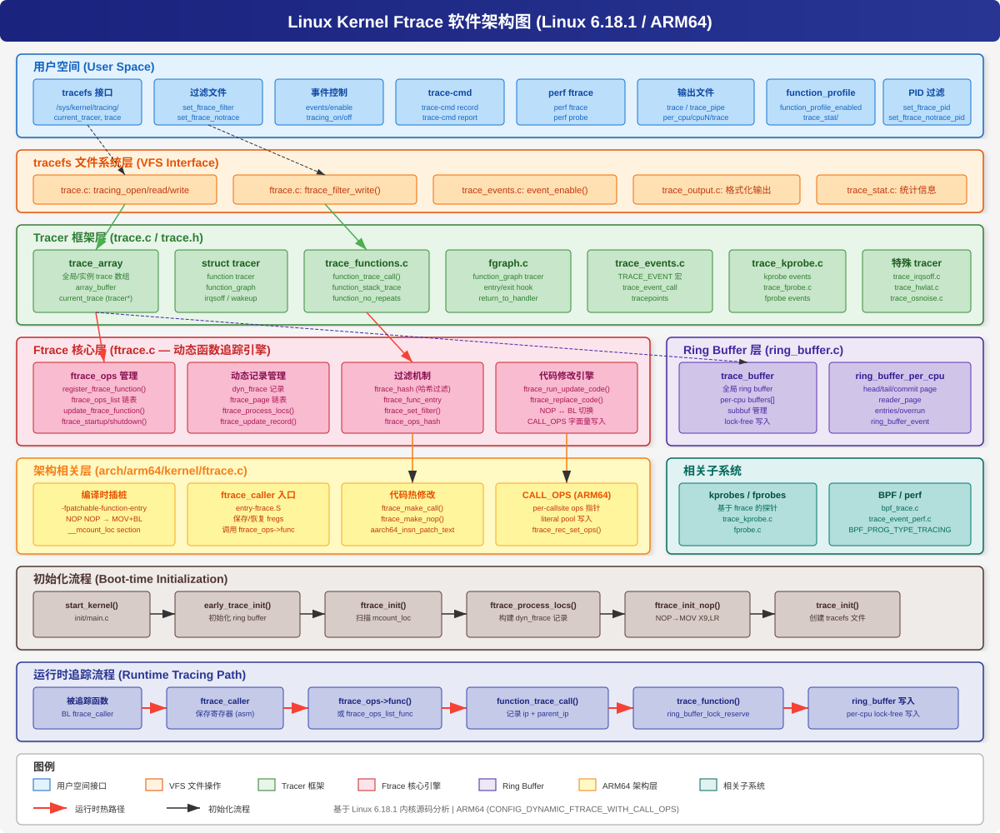
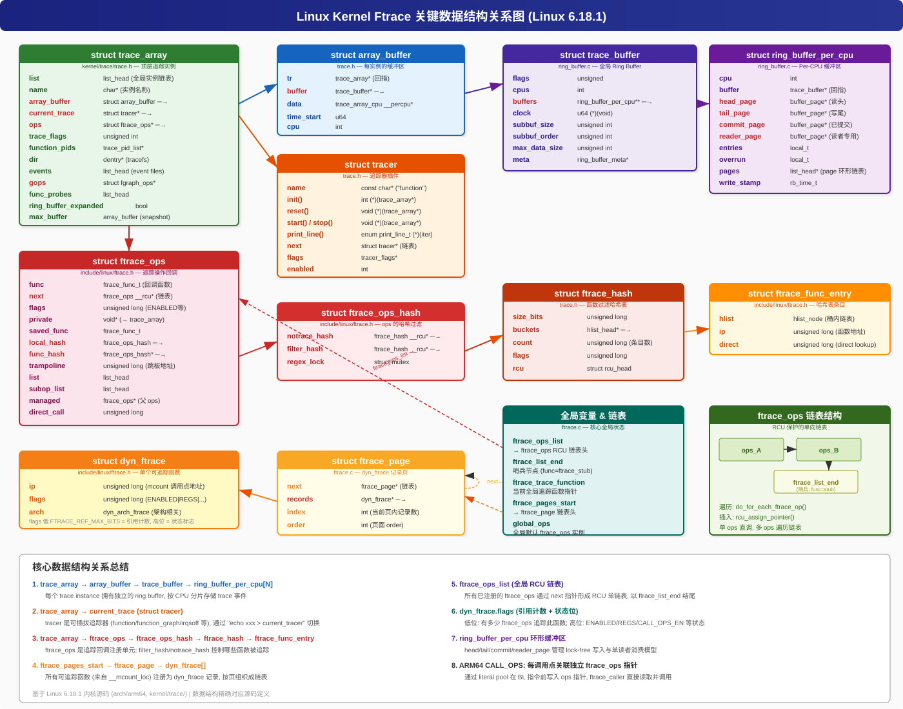

# Linux Kernel Ftrace 实现原理深度分析

> 基于 Linux 6.18.1 内核源码 / ARM64 架构

---

## 目录

<details>
<summary><b>1. 概述</b></summary>

- 1.1 [核心能力](#11-核心能力)
- 1.2 [设计哲学](#12-设计哲学)

</details>

<details>
<summary><b>2. 用户视角</b></summary>

- 2.1 [tracefs 文件接口一览](#21-tracefs-文件接口一览)
- 2.2 [tracefs 挂载与访问](#22-tracefs-挂载与访问)

</details>

<details>
<summary><b>3. 编译插桩与启动初始化</b></summary>

- 3.1 [GCC 编译选项与 NOP 占位](#31-gcc-编译选项与-nop-占位)
- 3.2 [`__mcount_loc` Section — 地址收集](#32-__mcount_loc-section--地址收集)
- 3.3 [地址调整：`ftrace_call_adjust()`](#33-地址调整ftrace_call_adjust)
- 3.4 [内核启动序列](#34-内核启动序列)
- 3.5 [`ftrace_init()` 详解](#35-ftrace_init-详解)
- 3.6 [`ftrace_process_locs()` — 构建追踪记录](#36-ftrace_process_locs--构建追踪记录)

</details>

<details>
<summary><b>4. 软件架构与核心数据结构</b></summary>

- 4.1 [软件架构总览](#41-软件架构总览)
- 4.2 [`struct ftrace_ops` — 追踪操作回调](#42-struct-ftrace_ops--追踪操作回调)
- 4.3 [`struct dyn_ftrace` — 可追踪函数记录](#43-struct-dyn_ftrace--可追踪函数记录)
- 4.4 [`struct ftrace_page` — 记录页](#44-struct-ftrace_page--记录页)
- 4.5 [`struct ftrace_hash` / `ftrace_ops_hash` — 过滤哈希表](#45-struct-ftrace_hash--ftrace_ops_hash--过滤哈希表)
- 4.6 [`struct trace_array` — 追踪实例](#46-struct-trace_array--追踪实例)
- 4.7 [`struct tracer` — 追踪器插件](#47-struct-tracer--追踪器插件)
- 4.8 [`struct trace_buffer` / `ring_buffer_per_cpu` — Ring Buffer](#48-struct-trace_buffer--ring_buffer_per_cpu--ring-buffer)
- 4.9 [数据结构关系总结](#49-数据结构关系总结)

</details>

<details>
<summary><b>5. Ftrace 子系统关键机制</b></summary>

- 5.1 [动态代码修改引擎](#51-动态代码修改引擎)
  - 5.1.1 [修改流程总览](#511-修改流程总览)
  - 5.1.2 [ARM64 代码修改实现](#512-arm64-代码修改实现)
  - 5.1.3 [指令修改前后对比](#513-指令修改前后对比)
  - 5.1.4 [ARM64 CALL_OPS 优化](#514-arm64-call_ops-优化)
- 5.2 [运行时追踪路径](#52-运行时追踪路径)
  - 5.2.1 [热路径（Hot Path）](#521-热路径hot-path)
  - 5.2.2 [`function_trace_call()` 实现](#522-function_trace_call-实现)
  - 5.2.3 [`update_ftrace_function()` — 全局追踪函数选择](#523-update_ftrace_function--全局追踪函数选择)
- 5.3 [过滤机制](#53-过滤机制)
  - 5.3.1 [过滤架构](#531-过滤架构)
  - 5.3.2 [过滤逻辑](#532-过滤逻辑)
  - 5.3.3 [哈希查找](#533-哈希查找)
- 5.4 [Ring Buffer 机制](#54-ring-buffer-机制)
  - 5.4.1 [结构概览](#541-结构概览)
  - 5.4.2 [写入路径（Lock-free）](#542-写入路径lock-free)
  - 5.4.3 [读取路径](#543-读取路径)
  - 5.4.4 [Reader Page Swap 机制](#544-reader-page-swap-机制)
- 5.5 [Function Graph Tracer](#55-function-graph-tracer)
- 5.6 [Trace Events（Tracepoints）](#56-trace-eventstracepoints)

</details>

<details>
<summary><b>6. 使用场景与能解决的问题</b></summary>

- 6.1 [典型使用场景](#61-典型使用场景)
- 6.2 [ftrace 能解决哪些问题](#62-ftrace-能解决哪些问题)
- 6.3 [ftrace vs 其他追踪工具对比](#63-ftrace-vs-其他追踪工具对比)

</details>

<details>
<summary><b>7. 内核编译配置选项</b></summary>

- 7.1 [最小可用配置](#71-最小可用配置)
- 7.2 [推荐完整配置](#72-推荐完整配置)
- 7.3 [ARM64 架构特有选项](#73-arm64-架构特有选项)
- 7.4 [各 Tracer 所需配置汇总](#74-各-tracer-所需配置汇总)
- 7.5 [配置检查与验证](#75-配置检查与验证)

</details>

<details>
<summary><b>8. Ftrace 用法详解</b></summary>

- 8.1 [基本函数追踪](#81-基本函数追踪)
- 8.2 [Function Graph 追踪](#82-function-graph-追踪)
- 8.3 [Trace Event 使用](#83-trace-event-使用)
- 8.4 [高级用法：多实例与 PID 过滤](#84-高级用法多实例与-pid-过滤)
- 8.5 [kprobe / fprobe 动态探针](#85-kprobe--fprobe-动态探针)
- 8.6 [延迟追踪器](#86-延迟追踪器)
- 8.7 [Histogram Triggers](#87-histogram-triggers)
- 8.8 [Boottime Tracing](#88-boottime-tracing)
- 8.9 [`echo function > current_tracer` 完整执行路径](#89-echo-function--current_tracer-完整执行路径)

</details>

<details>
<summary><b>9. 实际案例</b></summary>

- 9.1 [案例一：定位系统调用延迟抖动](#91-案例一定位系统调用延迟抖动)
- 9.2 [案例二：追踪中断关闭导致的实时性问题](#92-案例二追踪中断关闭导致的实时性问题)
- 9.3 [案例三：分析驱动初始化失败](#93-案例三分析驱动初始化失败)
- 9.4 [案例四：内存分配慢路径分析](#94-案例四内存分配慢路径分析)
- 9.5 [案例五：网络收包路径性能分析](#95-案例五网络收包路径性能分析)
- 9.6 [案例六：调度延迟问题排查](#96-案例六调度延迟问题排查)

</details>

<details>
<summary><b>10. QEMU 实践案例</b></summary>

- 10.1 [QEMU 环境准备](#101-qemu-环境准备)
- 10.2 [实验一：function tracer 基础 — 追踪 sys_write 调用链](#102-实验一function-tracer-基础--追踪-sys_write-调用链)
- 10.3 [实验二：function_graph — 分析 fork 完整调用树和耗时](#103-实验二function_graph--分析-fork-完整调用树和耗时)
- 10.4 [实验三：Trace Events — 追踪调度切换与中断](#104-实验三trace-events--追踪调度切换与中断)
- 10.5 [实验四：kprobe 动态探针 — 捕获函数参数与返回值](#105-实验四kprobe-动态探针--捕获函数参数与返回值)
- 10.6 [实验五：多实例追踪 — 隔离不同子系统](#106-实验五多实例追踪--隔离不同子系统)
- 10.7 [实验六：Histogram Trigger — 统计调度延迟分布](#107-实验六histogram-trigger--统计调度延迟分布)
- 10.8 [实验七：Stack Trace — 定位函数调用来源](#108-实验七stack-trace--定位函数调用来源)
- 10.9 [实验八：追踪内核模块函数](#109-实验八追踪内核模块函数)

</details>

<details>
<summary><b>11. Ftrace 面试经典问题与解答</b></summary>

- 11.1 [基础概念类](#111-基础概念类)
- 11.2 [实现原理类](#112-实现原理类)
- 11.3 [使用实践类](#113-使用实践类)
- 11.4 [性能与设计类](#114-性能与设计类)
- 11.5 [综合分析类](#115-综合分析类)

</details>

<details>
<summary><b>12. 参考索引</b></summary>

- 12.1 [关键源文件索引](#121-关键源文件索引)

</details>

---

## 1. 概述

Ftrace (Function Tracer) 是 Linux 内核内建的追踪框架，最初由 Steven Rostedt 开发。它提供了一套完整的基础设施，用于追踪内核函数调用、测量延迟、分析性能问题。

### 1.1 核心能力

| 功能 | 说明 |
|------|------|
| **函数追踪** | 追踪任意内核函数的调用和返回 |
| **Function Graph** | 可视化函数调用层级和耗时 |
| **Trace Events** | 基于 tracepoint 的结构化事件追踪 |
| **动态过滤** | 运行时选择追踪哪些函数 |
| **延迟分析** | irqsoff/preemptoff/wakeup 延迟追踪器 |
| **kprobe/fprobe** | 基于 ftrace 的动态探针 |
| **BPF 集成** | BPF 程序可挂载到 ftrace 追踪点 |

### 1.2 设计哲学

- **零开销原则**：未启用时对性能几乎零影响（NOP 指令）
- **动态修改**：运行时通过 text patching 启用/禁用追踪
- **Per-CPU 无锁**：Ring Buffer 使用 per-CPU 设计，写入路径无锁
- **可插拔 Tracer**：tracer 作为插件注册，可动态切换

---

## 2. 用户视角

> 理解 ftrace 先从用户能看到什么开始——所有交互都通过 tracefs 文件系统完成。

### 2.1 tracefs 文件接口一览

| tracefs 路径 | 功能 | 对应代码 |
|-------------|------|---------|
| `current_tracer` | 设置/查看当前 tracer | `trace.c` |
| `available_tracers` | 列出可用 tracer | `trace.c` |
| `tracing_on` | 启用/禁用写入 ring buffer | `trace.c` |
| `trace` | 读取 trace 输出（快照式） | `trace.c` |
| `trace_pipe` | 流式读取（消费型，阻塞） | `trace.c` |
| `set_ftrace_filter` | 设置函数白名单过滤 | `ftrace.c` |
| `set_ftrace_notrace` | 设置函数黑名单 | `ftrace.c` |
| `set_ftrace_pid` | 设置 PID 过滤 | `ftrace.c` |
| `available_filter_functions` | 列出所有可追踪函数 | `ftrace.c` |
| `events/` | Trace event 控制目录 | `trace_events.c` |
| `per_cpu/cpuN/` | Per-CPU 数据 | `trace.c` |

### 2.2 tracefs 挂载与访问

```bash
# 默认挂载点（大多数发行版已自动挂载）
mount -t tracefs nodev /sys/kernel/tracing

# 也可通过旧兼容路径访问
ls /sys/kernel/debug/tracing/

# 查看当前支持的追踪器
cat /sys/kernel/tracing/available_tracers
# → function function_graph nop ...

# 查看可追踪函数数量
wc -l /sys/kernel/tracing/available_filter_functions
```

---

## 3. 编译插桩与启动初始化

### 3.1 GCC 编译选项与 NOP 占位

内核使用 `-fpatchable-function-entry=N` 编译选项（ARM64），在每个函数入口前插入 N 个 NOP 指令。

对于 ARM64 + `CONFIG_DYNAMIC_FTRACE_WITH_CALL_OPS`，编译器生成：

```
addr+00:  NOP        // Literal (first 32 bits) — 存放 ftrace_ops 指针低32位
addr+04:  NOP        // Literal (last 32 bits)  — 存放 ftrace_ops 指针高32位
addr+08:  func: [BTI C]  // 可选的 BTI 指令
addr+0C:  NOP        // → 运行时改为 MOV X9, LR
addr+10:  NOP        // → 运行时改为 BL ftrace_caller
```

### 3.2 `__mcount_loc` Section — 地址收集

链接器将所有插桩点地址收集到 `__mcount_loc` section 中：

```c
// vmlinux.lds.h 定义
__start_mcount_loc = .;
KEEP(*(__mcount_loc))
__stop_mcount_loc = .;
```

这些地址在 `ftrace_init()` 中被遍历处理。

### 3.3 地址调整：`ftrace_call_adjust()`

```c
// arch/arm64/kernel/ftrace.c
unsigned long ftrace_call_adjust(unsigned long addr)
{
    // 对于 CALL_OPS：跳过 literal NOPs、BTI、第一个 NOP
    // 返回 BL 指令的地址（即将被修改的位置）
    addr += 2 * AARCH64_INSN_SIZE;  // 跳过 literal
    if (aarch64_insn_is_bti(insn))
        addr += AARCH64_INSN_SIZE;  // 跳过 BTI
    addr += AARCH64_INSN_SIZE;      // 跳过 MOV X9,LR 位置
    return addr;
}
```

### 3.4 内核启动序列

```
start_kernel()                    // init/main.c
  ├── early_trace_init()          // 初始化 ring buffer 和 trace_array
  │     ├── tracer_alloc_buffers()
  │     └── init_events()
  ├── ftrace_init()               // 核心 ftrace 初始化
  │     ├── ftrace_dyn_arch_init()
  │     ├── ftrace_process_locs() // 构建 dyn_ftrace 记录
  │     └── set_ftrace_early_filters()
  └── trace_init()                // 创建 tracefs 文件系统
        └── tracer_init_tracefs()
```

### 3.5 `ftrace_init()` 详解

```c
// kernel/trace/ftrace.c:7933
void __init ftrace_init(void)
{
    extern unsigned long __start_mcount_loc[];
    extern unsigned long __stop_mcount_loc[];
    unsigned long count;

    // 1. 架构相关初始化
    ftrace_dyn_arch_init();

    // 2. 计算可追踪函数数量
    count = __stop_mcount_loc - __start_mcount_loc;

    // 3. 处理所有插桩位置，构建 dyn_ftrace 记录
    ftrace_process_locs(NULL, __start_mcount_loc, __stop_mcount_loc);

    // 4. 启用 ftrace
    ftrace_enabled = 1;

    // 5. 应用启动时过滤器
    set_ftrace_early_filters();
}
```

### 3.6 `ftrace_process_locs()` — 构建追踪记录

```c
// kernel/trace/ftrace.c:7130
static int ftrace_process_locs(struct module *mod,
                               unsigned long *start, unsigned long *end)
{
    // 1. 排序 mcount 地址（若非编译时排序）
    sort(start, count, sizeof(*start), ftrace_cmp_ips, NULL);

    // 2. 分配 ftrace_page 页面
    start_pg = ftrace_allocate_pages(count);

    // 3. 遍历每个地址，创建 dyn_ftrace 记录
    while (p < end) {
        addr = ftrace_call_adjust(*p++);  // 架构相关地址调整
        rec = &pg->records[pg->index++];
        rec->ip = addr;

        // 4. 初始化每个调用点（NOP → MOV X9,LR）
        ftrace_init_nop(mod, rec);
    }
}
```

---

## 4. 软件架构与核心数据结构

### 4.1 软件架构总览



```
┌─────────────────────────────────────────────────────────────────┐
│ 用户空间：tracefs 文件接口 / trace-cmd / perf ftrace            │
├─────────────────────────────────────────────────────────────────┤
│ tracefs VFS 层：trace.c / ftrace.c 中的 file_operations        │
├─────────────────────────────────────────────────────────────────┤
│ Tracer 框架层：struct tracer (function/function_graph/irqsoff) │
│                trace_array / array_buffer / trace_events        │
├─────────────────────────────────────────────────────────────────┤
│ Ftrace 核心引擎：ftrace_ops 管理 / 动态记录 / 过滤 / 代码修改  │
│                  ftrace.c (7900+ 行核心代码)                    │
├─────────────────────────────────────────────────────────────────┤
│ Ring Buffer 层：ring_buffer.c (lock-free per-cpu ring buffer)  │
├─────────────────────────────────────────────────────────────────┤
│ 架构相关层：arch/arm64/kernel/ftrace.c + entry-ftrace.S        │
│            text patching / ftrace_caller 汇编入口               │
└─────────────────────────────────────────────────────────────────┘
```

以下按自底向上的顺序介绍各层核心数据结构。



### 4.2 `struct ftrace_ops` — 追踪操作回调

这是 ftrace 最核心的数据结构，代表一个注册的追踪回调。

```c
// include/linux/ftrace.h
struct ftrace_ops {
    ftrace_func_t           func;          // 回调函数
    struct ftrace_ops __rcu *next;          // RCU 链表
    unsigned long           flags;          // FTRACE_OPS_FL_* 标志
    void                    *private;       // 私有数据（通常指向 trace_array）
    ftrace_func_t           saved_func;     // PID 过滤时保存原始 func

    // CONFIG_DYNAMIC_FTRACE
    struct ftrace_ops_hash  local_hash;     // 本地哈希（filter/notrace）
    struct ftrace_ops_hash  *func_hash;     // 指向活跃哈希
    unsigned long           trampoline;     // 跳板地址
    unsigned long           trampoline_size;
    struct list_head        list;
    struct list_head        subop_list;     // 子 ops 链表
    ftrace_ops_func_t       ops_func;
    struct ftrace_ops       *managed;       // 父 ops（若为 SUBOP）
    unsigned long           direct_call;    // 直接调用地址
};
```

**关键标志位**：

| 标志 | 含义 |
|------|------|
| `FTRACE_OPS_FL_ENABLED` | ops 已启用 |
| `FTRACE_OPS_FL_DYNAMIC` | 动态分配的 ops |
| `FTRACE_OPS_FL_SAVE_REGS` | 需要保存完整寄存器 |
| `FTRACE_OPS_FL_IPMODIFY` | 可修改 IP（live patching） |
| `FTRACE_OPS_FL_PID` | 受 PID 过滤影响 |
| `FTRACE_OPS_FL_RCU` | 仅在 RCU 读侧调用 |
| `FTRACE_OPS_FL_DIRECT` | 直接调用（跳过 ftrace 框架） |
| `FTRACE_OPS_FL_SUBOP` | 子操作，由 managed ops 管控 |

### 4.3 `struct dyn_ftrace` — 可追踪函数记录

```c
// include/linux/ftrace.h
struct dyn_ftrace {
    unsigned long   ip;     // mcount 调用点地址
    unsigned long   flags;  // 引用计数 + 状态标志
    struct dyn_arch_ftrace arch;  // 架构相关数据
};
```

`flags` 字段编码：
- **低 `FTRACE_REF_MAX_BITS` 位**：引用计数（有多少 ftrace_ops 追踪此函数）
- **高位标志**：
  - `FTRACE_FL_ENABLED` — 当前已启用
  - `FTRACE_FL_REGS` — 需要保存寄存器
  - `FTRACE_FL_CALL_OPS` — 使用 per-callsite ops（ARM64）
  - `FTRACE_FL_CALL_OPS_EN` — CALL_OPS 已激活
  - `FTRACE_FL_TOUCHED` — 曾被修改过
  - `FTRACE_FL_MODIFIED` — 当前已被修改

### 4.4 `struct ftrace_page` — 记录页

```c
// kernel/trace/ftrace.c:1117
struct ftrace_page {
    struct ftrace_page  *next;      // 下一页
    struct dyn_ftrace   *records;   // dyn_ftrace 数组
    int                 index;      // 当前页内记录数
    int                 order;      // 页面 order
};
```

全局链表：`ftrace_pages_start → page1 → page2 → ... → NULL`

### 4.5 `struct ftrace_hash` / `ftrace_ops_hash` — 过滤哈希表

```c
// kernel/trace/trace.h
struct ftrace_hash {
    unsigned long       size_bits;      // 哈希大小（2^size_bits 个桶）
    struct hlist_head   *buckets;       // 哈希桶数组
    unsigned long       count;          // 条目数
    unsigned long       flags;          // FTRACE_HASH_FL_MOD
    struct rcu_head     rcu;
};
```

```c
// include/linux/ftrace.h
struct ftrace_ops_hash {
    struct ftrace_hash __rcu *notrace_hash;  // 不追踪的函数
    struct ftrace_hash __rcu *filter_hash;   // 要追踪的函数
    struct mutex             regex_lock;
};
```

### 4.6 `struct trace_array` — 追踪实例

```c
// kernel/trace/trace.h
struct trace_array {
    struct list_head    list;           // 全局实例链表
    char                *name;          // 实例名称
    struct array_buffer array_buffer;   // 主缓冲区
    struct array_buffer max_buffer;     // 最大延迟快照缓冲区
    int                 buffer_disabled;
    struct tracer       *current_trace; // 当前活跃 tracer
    unsigned int        trace_flags;    // 追踪选项
    struct ftrace_ops   *ops;           // 关联的 ftrace_ops
    struct fgraph_ops   *gops;          // function_graph ops
    struct trace_pid_list __rcu *function_pids;
    struct dentry       *dir;           // tracefs 目录
    struct list_head    events;         // event 文件链表
    // ...
};
```

### 4.7 `struct tracer` — 追踪器插件

```c
// kernel/trace/trace.h
struct tracer {
    const char      *name;              // "function", "function_graph" 等
    int             (*init)(struct trace_array *tr);
    void            (*reset)(struct trace_array *tr);
    void            (*start)(struct trace_array *tr);
    void            (*stop)(struct trace_array *tr);
    void            (*print_header)(struct seq_file *m);
    enum print_line_t (*print_line)(struct trace_iterator *iter);
    struct tracer   *next;              // tracer 注册链表
    struct tracer_flags *flags;
    int             enabled;
};
```

### 4.8 `struct trace_buffer` / `ring_buffer_per_cpu` — Ring Buffer

```c
// kernel/trace/ring_buffer.c
struct trace_buffer {
    unsigned        flags;
    int             cpus;
    atomic_t        record_disabled;
    struct ring_buffer_per_cpu **buffers;  // per-CPU 缓冲区数组
    u64             (*clock)(void);       // 时间源
    unsigned int    subbuf_size;
    unsigned int    subbuf_order;
    unsigned int    max_data_size;
};
```

```c
// kernel/trace/ring_buffer.c
struct ring_buffer_per_cpu {
    int                     cpu;
    struct trace_buffer     *buffer;
    struct list_head        *pages;         // 环形页链表
    struct buffer_page      *head_page;     // 读头
    struct buffer_page      *tail_page;     // 写尾
    struct buffer_page      *commit_page;   // 已提交
    struct buffer_page      *reader_page;   // 读者专用页
    local_t                 entries;        // 条目数
    local_t                 overrun;        // 溢出数
    unsigned long           nr_pages;
    rb_time_t               write_stamp;    // 写时间戳
};
```

### 4.9 数据结构关系总结

```
ftrace_trace_arrays (全局链表)
  └── trace_array
       ├── array_buffer
       │    ├── trace_buffer (ring buffer)
       │    │    └── ring_buffer_per_cpu[N]
       │    │         ├── buffer_page 环形链表 (head/tail/commit)
       │    │         └── ring_buffer_event[] (实际 trace 数据)
       │    └── trace_array_cpu __percpu (per-CPU 状态)
       │
       ├── current_trace → struct tracer (function/function_graph/...)
       │
       └── ops → struct ftrace_ops
                  ├── func (回调函数指针)
                  ├── next → ops_B → ... → ftrace_list_end
                  └── func_hash → ftrace_ops_hash
                       ├── filter_hash → ftrace_hash
                       │    └── buckets[] → ftrace_func_entry {ip}
                       └── notrace_hash → ftrace_hash

ftrace_pages_start (全局链表)
  └── ftrace_page → ftrace_page → ...
       └── records[] → dyn_ftrace {ip, flags}
```

---

## 5. Ftrace 子系统关键机制

### 5.1 动态代码修改引擎

#### 5.1.1 修改流程总览

当用户启用追踪（如 `echo function > current_tracer`）时：

```
register_ftrace_function(ops)
  → ftrace_startup(ops, command)
    → ftrace_hash_rec_enable(ops)          // 更新 dyn_ftrace 引用计数
    → ftrace_run_update_code(command)      // 触发代码修改
      → arch_ftrace_update_code(command)
        → ftrace_replace_code()            // 遍历所有记录
          → ftrace_update_record()         // 决定 MAKE_CALL/MAKE_NOP
          → ftrace_make_call(rec, addr)    // ARM64: NOP → BL
          → ftrace_make_nop(mod, rec, addr) // ARM64: BL → NOP
```

#### 5.1.2 ARM64 代码修改实现

```c
// arch/arm64/kernel/ftrace.c
int ftrace_make_call(struct dyn_ftrace *rec, unsigned long addr)
{
    unsigned long pc = rec->ip;

    // 1. 更新 per-callsite ops 指针（CALL_OPS 模式）
    ftrace_rec_update_ops(rec);

    // 2. 找到可达的目标地址（可能使用 PLT）
    ftrace_find_callable_addr(rec, NULL, &addr);

    // 3. NOP → BL ftrace_caller
    old = aarch64_insn_gen_nop();
    new = aarch64_insn_gen_branch_imm(pc, addr, AARCH64_INSN_BRANCH_LINK);
    return ftrace_modify_code(pc, old, new, true);
}
```

#### 5.1.3 指令修改前后对比

```
   禁用状态 (Disabled):              启用状态 (Enabled):
   ┌─────────────────────┐          ┌─────────────────────┐
   │ [ops 指针 literal]  │          │ [ops 指针 literal]  │
   │ MOV X9, LR          │          │ MOV X9, LR          │
   │ NOP                 │  ──→     │ BL ftrace_caller    │
   │ <function prologue> │          │ <function prologue> │
   └─────────────────────┘          └─────────────────────┘
```

#### 5.1.4 ARM64 CALL_OPS 优化

**传统模式 vs CALL_OPS 模式**：

| 对比项 | 传统模式 | CALL_OPS 模式 |
|--------|---------|---------------|
| ops 获取方式 | 全局 `function_trace_op` | 从函数前 literal pool 读取 |
| 多 ops 开销 | 遍历链表 | 仅遍历当前函数关联的 ops |
| 配置宏 | — | `CONFIG_DYNAMIC_FTRACE_WITH_CALL_OPS` |

**literal pool 写入**：

```c
// arch/arm64/kernel/ftrace.c
static int ftrace_rec_set_ops(const struct dyn_ftrace *rec,
                              const struct ftrace_ops *ops)
{
    unsigned long literal = ALIGN_DOWN(rec->ip - 12, 8);
    return aarch64_insn_write_literal_u64((void *)literal,
                                          (unsigned long)ops);
}
```

**内存布局**：

```
literal+0: [ftrace_ops 指针低32位]   ← ftrace_rec_set_ops() 写入
literal+4: [ftrace_ops 指针高32位]
func+0:    MOV X9, LR               ← ftrace_init_nop() 写入
func+4:    BL ftrace_caller          ← ftrace_make_call() 写入
func+8:    <function body...>
```

---

### 5.2 运行时追踪路径

#### 5.2.1 热路径（Hot Path）

```
被追踪函数入口
  │
  ├── MOV X9, LR           // 保存原始 LR 到 X9
  ├── BL ftrace_caller      // 跳转到 ftrace 入口（汇编）
  │
  ▼ ftrace_caller (entry-ftrace.S)
  │
  ├── 保存 ftrace_regs (x0-x8, fp, lr, sp, pc)
  ├── [CALL_OPS] 从 literal pool 加载 ops 指针
  ├── 调用 ops->func(ip, parent_ip, ops, fregs)
  │     │
  │     ├── 单 ops: 直接调用 ops->func
  │     └── 多 ops: ftrace_ops_list_func() 遍历链表
  │           │
  │           └── function_trace_call(ip, parent_ip, ops, fregs)
  │                 │
  │                 ├── trace_function(tr, ip, parent_ip, trace_ctx)
  │                 │     │
  │                 │     ├── ring_buffer_lock_reserve() // 预留空间
  │                 │     ├── 填充 ftrace_entry {ip, parent_ip}
  │                 │     └── ring_buffer_unlock_commit() // 提交
  │                 │
  │                 └── [可选] ftrace_trace_stack() // 栈追踪
  │
  ├── 恢复寄存器
  └── RET 到原始调用者
```

#### 5.2.2 `function_trace_call()` 实现

```c
// kernel/trace/trace_functions.c
static void function_trace_call(unsigned long ip, unsigned long parent_ip,
                                struct ftrace_ops *op, struct ftrace_regs *fregs)
{
    struct trace_array *tr = op->private;
    struct trace_array_cpu *data;
    int bit, pc;

    // 递归保护
    bit = ftrace_test_recursion_trylock(ip, parent_ip);
    if (bit < 0) return;

    data = this_cpu_ptr(tr->array_buffer.data);
    if (atomic_read(&data->disabled)) goto out;

    pc = preempt_count();
    trace_function(tr, ip, parent_ip, trace_ctx);

out:
    ftrace_test_recursion_unlock(bit);
}
```

#### 5.2.3 `update_ftrace_function()` — 全局追踪函数选择

```c
// kernel/trace/ftrace.c
static void update_ftrace_function(void)
{
    if (ops_list == &ftrace_list_end) {
        func = ftrace_stub;                    // 无追踪
    } else if (ops_list->next == &ftrace_list_end) {
        func = ftrace_ops_get_list_func(ops);  // 单 ops：直接调用
    } else {
        func = ftrace_ops_list_func;           // 多 ops：遍历链表
    }
    ftrace_trace_function = func;
}
```

---

### 5.3 过滤机制

#### 5.3.1 过滤架构

```
用户写入 set_ftrace_filter
  → ftrace_filter_write()
    → ftrace_regex_write() // 解析正则/glob
      → ftrace_match_records() // 匹配 dyn_ftrace
        → add_hash_entry() // 添加到 filter_hash
  → ftrace_hash_move_and_update_ops()
    → ftrace_hash_rec_enable/disable()
    → ftrace_run_update_code() // 修改代码
```

#### 5.3.2 过滤逻辑

```
对每个 dyn_ftrace 记录：
  if (filter_hash 为空)
      追踪所有函数（除了 notrace_hash 中的）
  else
      仅追踪 filter_hash 中的函数

  if (ip 在 notrace_hash 中)
      不追踪此函数
```

#### 5.3.3 哈希查找

```c
// kernel/trace/ftrace.c
struct ftrace_func_entry *
ftrace_lookup_ip(struct ftrace_hash *hash, unsigned long ip)
{
    if (ftrace_hash_empty(hash))
        return NULL;
    
    key = hash_long(ip, hash->size_bits);
    hhd = &hash->buckets[key];
    
    hlist_for_each_entry_rcu_notrace(entry, hhd, hlist) {
        if (entry->ip == ip)
            return entry;
    }
    return NULL;
}
```

---

### 5.4 Ring Buffer 机制

#### 5.4.1 结构概览

```
trace_buffer
  └── buffers[cpu]  (ring_buffer_per_cpu)
       ├── pages → buffer_page 环形链表
       │    ├── page1 → page2 → page3 → ... → page1
       │    └── 每页包含 buffer_data_page + ring_buffer_event[]
       ├── head_page   — 读者当前读取位置
       ├── tail_page   — 写者当前写入位置
       ├── commit_page — 已提交的最新页
       └── reader_page — 读者专用页（swap 机制）
```

#### 5.4.2 写入路径（Lock-free）

```c
ring_buffer_lock_reserve(buffer, length)
  → 获取 per-cpu buffer
  → 在 tail_page 上预留 length 字节
  → 返回 ring_buffer_event*

// 调用者填充数据...

ring_buffer_unlock_commit(buffer)
  → 更新 commit 指针
  → 更新时间戳
```

#### 5.4.3 读取路径

```
cat /sys/kernel/tracing/trace
  → tracing_read()
    → trace_iterator 遍历所有 CPU buffer
      → ring_buffer_peek() / ring_buffer_consume()
        → 使用 reader_page 与 head_page swap 实现无锁读取
```

#### 5.4.4 Reader Page Swap 机制

```
写者视角:                    读者视角:
┌──────┐                    reader_page
│page1 │←head               ┌──────┐
│page2 │                    │empty │
│page3 │←tail               └──────┘
│page4 │                         │
└──┬───┘                         │ swap
   │                             ▼
   └──→ page1                reader_page 与 head_page 交换
                             读者获得满页，空页插回环形链表
```

---

### 5.5 Function Graph Tracer

Function Graph Tracer 追踪函数的进入和返回，可以测量函数执行时间。

```
1. 函数进入时：记录 entry 事件，修改栈上返回地址
   原始 LR → return_to_handler

2. 函数返回时：跳转到 return_to_handler
   → 记录 exit 事件（含执行时间）
   → 恢复原始返回地址
   → 返回到真正的调用者
```

**关键文件**：
- `kernel/trace/fgraph.c` — Function Graph 核心实现
- `kernel/trace/trace_functions_graph.c` — 输出格式化
- `arch/arm64/kernel/entry-ftrace.S` — ARM64 汇编入口

---

### 5.6 Trace Events（Tracepoints）

**TRACE_EVENT 宏**：

```c
TRACE_EVENT(sched_switch,
    TP_PROTO(bool preempt, struct task_struct *prev, struct task_struct *next, ...),
    TP_ARGS(preempt, prev, next, ...),
    TP_STRUCT__entry(
        __array(char, prev_comm, TASK_COMM_LEN)
        __field(pid_t, prev_pid)
        // ...
    ),
    TP_fast_assign(
        memcpy(__entry->prev_comm, prev->comm, TASK_COMM_LEN);
        __entry->prev_pid = prev->pid;
    ),
    TP_printk("prev_comm=%s ...", __entry->prev_comm, ...)
);
```

**事件架构**：

```
TRACE_EVENT 宏展开
  ├── 定义 tracepoint（静态 key + 回调链）
  ├── 定义 trace_event_class（事件类模板）
  ├── 定义 trace_event_call（事件实例）
  └── 注册到 trace_events.c 框架
       └── 创建 tracefs events/ 目录
```

---

## 6. 使用场景与能解决的问题

### 6.1 典型使用场景

| 场景 | 说明 | 推荐 Tracer / 方法 |
|------|------|-------------------|
| **函数调用追踪** | 确认某个函数是否被调用、被谁调用、调用频率 | `function` tracer + `set_ftrace_filter` |
| **函数调用关系分析** | 可视化函数调用树、查看完整调用链 | `function_graph` tracer |
| **函数耗时测量** | 精确测量单个函数或调用子树的执行时间 | `function_graph` tracer |
| **中断/抢占延迟分析** | 定位关中断或关抢占时间过长的代码路径 | `irqsoff` / `preemptoff` tracer |
| **调度延迟分析** | 任务从唤醒到实际运行的延迟 | `wakeup` / `wakeup_rt` tracer |
| **内核事件追踪** | 调度切换、内存分配、I/O 操作等内核事件 | Trace Events (`events/` 目录) |
| **动态探针** | 在任意函数入口/返回点插入探针，获取参数和返回值 | kprobe / fprobe events |
| **驱动调试** | 追踪驱动初始化流程、中断处理、DMA 操作 | `function_graph` + 事件过滤 |
| **启动流程分析** | 内核启动阶段的函数调用和耗时 | Boottime Tracing |
| **硬件延迟检测** | SMI、NMI 等硬件引入的延迟 | `hwlat` / `osnoise` tracer |
| **用户态与内核态联合分析** | 系统调用路径追踪 | syscall events + uprobe events |
| **性能热点定位** | 函数调用频率统计 | Function Profiler |

### 6.2 ftrace 能解决哪些问题

#### 问题一：「系统卡顿但不知道卡在哪」

**症状**：应用延迟突然升高，但 CPU 利用率不高。

**ftrace 方案**：
1. 用 `irqsoff` tracer 检查是否有长时间关中断
2. 用 `preemptoff` tracer 检查是否有长时间关抢占
3. 用 `wakeup_rt` tracer 检查实时任务调度延迟
4. 用 `function_graph` 追踪怀疑的慢路径

#### 问题二：「函数行为不符合预期」

**症状**：代码逻辑看起来正确，但运行结果异常。

**ftrace 方案**：
1. 用 `function` tracer 确认函数是否被调用
2. 用 kprobe event 获取函数入口参数值
3. 用 `function_graph` + `funcgraph-retval` 查看返回值
4. 用 trace event filter 缩小范围到特定条件

#### 问题三：「驱动初始化失败但无日志」

**症状**：设备探测失败，dmesg 无有用信息。

**ftrace 方案**：
1. 使用 Boottime Tracing 在启动阶段追踪 `probe` 相关函数
2. 用 `function_graph` 追踪 `platform_driver_register` 调用链
3. 用 kprobe event 捕获 `device_add`/`driver_probe_device` 的参数和返回值

#### 问题四：「内存分配偶发慢」

**症状**：`kmalloc`/`alloc_pages` 偶尔耗时很长。

**ftrace 方案**：
1. 用 `function_graph` 追踪 `__alloc_pages` 调用树
2. 启用 `kmem` trace events（`mm_page_alloc`、`mm_page_free`）
3. 用 histogram trigger 统计分配耗时分布

#### 问题五：「网络丢包但找不到位置」

**症状**：网络包在内核协议栈某处被丢弃。

**ftrace 方案**：
1. 启用 `net` 和 `skb` trace events（`kfree_skb`、`net_dev_xmit`）
2. 用 `kfree_skb` event 的 `reason` 字段定位丢包原因
3. 用 `function_graph` 追踪 `netif_receive_skb` 调用链

#### 问题六：「锁竞争导致性能下降」

**症状**：多核系统负载上去后性能不线性增长。

**ftrace 方案**：
1. 启用 `lock` trace events（`lock_acquire`、`lock_contended`）
2. 用 histogram trigger 按锁地址聚合竞争次数
3. 用 `function_graph` 追踪持锁期间的函数调用

### 6.3 ftrace vs 其他追踪工具对比

| 对比维度 | ftrace | perf | eBPF/bpftrace | SystemTap |
|---------|--------|------|---------------|-----------|
| **内核内建** | 是 | 是 | 需要 BPF 支持 | 需要额外模块 |
| **使用方式** | tracefs 文件接口 | 命令行工具 | C/脚本 | 脚本 |
| **开销** | 极低（动态 NOP） | 采样式，低 | 低（JIT 编译） | 中等 |
| **函数追踪** | 原生支持 | 有限 | 通过 ftrace | 支持 |
| **调用图** | function_graph | 采样式 | 需要编程 | 支持 |
| **延迟分析** | 专用 tracer | 支持 | 需要编程 | 支持 |
| **事件聚合** | histogram trigger | 原生支持 | 原生支持 | 支持 |
| **嵌入式适用性** | 高（无额外依赖） | 需要工具链 | 需要较新内核 | 复杂 |
| **学习成本** | 低 | 中等 | 中高 | 高 |

> **建议**：在嵌入式和实时系统中，ftrace 通常是首选，因为它零额外依赖、开销可控、操作简单。在需要复杂聚合和编程化分析时，配合 eBPF 使用。

---

## 7. 内核编译配置选项

> 以下基于 Linux 6.18.1 / ARM64 架构。不同架构和内核版本可能略有差异。

### 7.1 最小可用配置

启用 ftrace 最基本的函数追踪功能，需要以下配置：

```kconfig
# 基础设施（通常自动选中）
CONFIG_TRACING_SUPPORT=y          # 追踪基础支持
CONFIG_FTRACE=y                   # Ftrace 总开关（menuconfig "Tracers"）
CONFIG_TRACING=y                  # 追踪框架（自动选中 RING_BUFFER, TRACEPOINTS 等）

# 函数追踪（核心功能）
CONFIG_FUNCTION_TRACER=y          # 函数追踪器
CONFIG_DYNAMIC_FTRACE=y           # 动态 ftrace（NOP patching，默认=y）

# 通常需要的符号支持
CONFIG_KALLSYMS=y                 # 内核符号表（自动选中）
CONFIG_KALLSYMS_ALL=y             # 导出所有符号（推荐）
```

**最小配置的 `menuconfig` 路径**：

```
Kernel hacking
  └─ Tracers  [*]                           # CONFIG_FTRACE
      └─ Kernel Function Tracer  [*]        # CONFIG_FUNCTION_TRACER
```

### 7.2 推荐完整配置

用于日常内核开发和调试的推荐配置：

```kconfig
# ===== 核心追踪 =====
CONFIG_FTRACE=y
CONFIG_FUNCTION_TRACER=y
CONFIG_FUNCTION_GRAPH_TRACER=y        # 函数调用图 + 耗时
CONFIG_FUNCTION_GRAPH_RETVAL=y        # 函数返回值追踪
CONFIG_DYNAMIC_FTRACE=y
CONFIG_DYNAMIC_FTRACE_WITH_ARGS=y     # 通过 ftrace_regs 访问参数

# ===== 延迟追踪器 =====
CONFIG_IRQSOFF_TRACER=y               # 中断关闭延迟追踪
CONFIG_PREEMPT_TRACER=y               # 抢占关闭延迟追踪（需要 CONFIG_PREEMPTION=y）
CONFIG_SCHED_TRACER=y                 # 调度延迟追踪

# ===== 事件追踪 =====
CONFIG_EVENT_TRACING=y                # 事件追踪框架（通常自动选中）
CONFIG_FTRACE_SYSCALLS=y              # 系统调用追踪
CONFIG_ENABLE_DEFAULT_TRACERS=y       # 默认追踪器

# ===== 动态探针 =====
CONFIG_KPROBES=y                      # kprobe 支持
CONFIG_KPROBE_EVENTS=y                # kprobe 事件（动态探针）
CONFIG_FPROBE=y                       # fprobe（基于 ftrace 的高效探针）
CONFIG_FPROBE_EVENTS=y                # fprobe 事件
CONFIG_UPROBE_EVENTS=y                # 用户态探针

# ===== 快照与高级功能 =====
CONFIG_TRACER_SNAPSHOT=y              # 快照缓冲区
CONFIG_STACK_TRACER=y                 # 最大栈深度追踪
CONFIG_HIST_TRIGGERS=y                # 直方图触发器
CONFIG_FUNCTION_PROFILER=y            # 函数调用频率统计

# ===== 硬件/OS 噪声 =====
CONFIG_HWLAT_TRACER=y                 # 硬件延迟检测
CONFIG_OSNOISE_TRACER=y               # OS 噪声追踪
CONFIG_TIMERLAT_TRACER=y              # 定时器延迟追踪

# ===== 启动追踪 =====
CONFIG_BOOTTIME_TRACING=y             # 启动阶段追踪

# ===== BPF 集成 =====
CONFIG_BPF_EVENTS=y                   # BPF 挂载 ftrace 追踪点

# ===== 符号支持 =====
CONFIG_KALLSYMS=y
CONFIG_KALLSYMS_ALL=y
CONFIG_DEBUG_INFO=y                   # 调试信息（配合 addr2line）
CONFIG_DEBUG_INFO_BTF=y               # BTF 类型信息（kprobe 参数名访问）
```

### 7.3 ARM64 架构特有选项

ARM64 在 `arch/arm64/Kconfig` 中提供以下 ftrace 相关能力声明：

```kconfig
# ARM64 自动声明的能力（无需手动配置）
config ARM64
    select HAVE_FUNCTION_TRACER
    select HAVE_FUNCTION_GRAPH_TRACER
    select HAVE_FUNCTION_GRAPH_FREGS
    select HAVE_DYNAMIC_FTRACE
    select HAVE_DYNAMIC_FTRACE_WITH_ARGS
    select HAVE_DYNAMIC_FTRACE_WITH_DIRECT_CALLS
    select HAVE_DYNAMIC_FTRACE_WITH_CALL_OPS
    select HAVE_FTRACE_REGS_HAVING_PT_REGS
    select HAVE_SYSCALL_TRACEPOINTS
    select HAVE_BUILDTIME_MCOUNT_SORT

# ARM64 使用 patchable-function-entry 方式插桩
config FTRACE_MCOUNT_USE_PATCHABLE_FUNCTION_ENTRY
    bool
    default y    # ARM64 默认使用此方式
```

**ARM64 CALL_OPS 优化**：

```kconfig
# ARM64 支持 per-callsite ops 指针，自动启用
CONFIG_DYNAMIC_FTRACE_WITH_CALL_OPS=y
# → 每个函数前有 8 字节 literal pool 存放 ftrace_ops 指针
# → 避免全局链表遍历，多 ops 场景性能更好
```

### 7.4 各 Tracer 所需配置汇总

| Tracer / 功能 | 必需配置 | 可选增强 |
|---------------|---------|---------|
| `function` | `FUNCTION_TRACER`, `DYNAMIC_FTRACE` | `FUNCTION_TRACE_ARGS` |
| `function_graph` | `FUNCTION_GRAPH_TRACER` | `FUNCTION_GRAPH_RETVAL`, `FUNCTION_GRAPH_RETADDR` |
| `irqsoff` | `IRQSOFF_TRACER` | `TRACER_SNAPSHOT` |
| `preemptoff` | `PREEMPT_TRACER`, `PREEMPTION` | `TRACER_SNAPSHOT` |
| `preemptirqsoff` | `IRQSOFF_TRACER`, `PREEMPT_TRACER` | — |
| `wakeup` / `wakeup_rt` | `SCHED_TRACER` | `TRACER_SNAPSHOT` |
| `hwlat` | `HWLAT_TRACER` | — |
| `osnoise` / `timerlat` | `OSNOISE_TRACER`, `TIMERLAT_TRACER` | — |
| Trace Events | `EVENT_TRACING` | `FTRACE_SYSCALLS` |
| kprobe events | `KPROBES`, `KPROBE_EVENTS` | `PROBE_EVENTS_BTF_ARGS` |
| fprobe events | `FPROBE`, `FPROBE_EVENTS` | `PROBE_EVENTS_BTF_ARGS` |
| uprobe events | `UPROBE_EVENTS` | — |
| Stack Tracer | `STACK_TRACER` | — |
| Function Profiler | `FUNCTION_PROFILER` | — |
| Histogram | `HIST_TRIGGERS` | `SYNTH_EVENTS` |
| Boottime Tracing | `BOOTTIME_TRACING` | — |
| BPF 集成 | `BPF_EVENTS`, `BPF_SYSCALL` | `BPF_KPROBE_OVERRIDE` |
| blktrace | `BLK_DEV_IO_TRACE` | — |

### 7.5 配置检查与验证

编译内核后，验证 ftrace 是否正确启用：

```bash
# 1. 检查 .config 中的关键选项
grep -E 'CONFIG_(FTRACE|FUNCTION_TRACER|DYNAMIC_FTRACE|FUNCTION_GRAPH)=' .config

# 2. 启动后检查 tracefs 是否可用
ls /sys/kernel/tracing/

# 3. 查看可用的 tracer
cat /sys/kernel/tracing/available_tracers
# 期望输出包含: function function_graph ...

# 4. 查看可追踪函数数量
wc -l /sys/kernel/tracing/available_filter_functions
# ARM64 典型值：40000~80000 个函数

# 5. 检查事件目录
ls /sys/kernel/tracing/events/ | head -20
# 应包含 sched, irq, block, net, kmem 等

# 6. 检查 kprobe 支持
cat /sys/kernel/tracing/kprobe_events 2>/dev/null && echo "kprobe OK"

# 7. 检查动态 ftrace 状态
cat /sys/kernel/tracing/enabled_functions
```

**常见问题排查**：

| 问题 | 原因 | 解决方案 |
|------|------|---------|
| `/sys/kernel/tracing` 不存在 | `CONFIG_FTRACE=n` 或未挂载 | 启用 FTRACE，或 `mount -t tracefs nodev /sys/kernel/tracing` |
| `available_tracers` 只有 `nop` | 未启用具体 tracer | 启用 `CONFIG_FUNCTION_TRACER` 等 |
| `available_filter_functions` 为空 | `CONFIG_DYNAMIC_FTRACE=n` | 启用 DYNAMIC_FTRACE |
| `function_graph` 不可用 | 架构不支持或未配置 | 确认 `HAVE_FUNCTION_GRAPH_TRACER` 和 `FUNCTION_GRAPH_TRACER=y` |
| kprobe event 创建失败 | 未启用 kprobe 或函数在 notrace 列表 | 启用 `KPROBE_EVENTS`，检查函数是否可探测 |
| Boottime Tracing 无效 | 未配置 | 启用 `BOOTTIME_TRACING`，需要 `BOOT_CONFIG` |

---

## 8. Ftrace 用法详解

### 8.1 基本函数追踪

```bash
# 开启 function tracer
echo function > /sys/kernel/tracing/current_tracer

# 只追踪指定函数（支持 glob 通配）
echo 'schedule*' > /sys/kernel/tracing/set_ftrace_filter

# 追加更多函数（注意 >> 不是 >）
echo 'wake_up*' >> /sys/kernel/tracing/set_ftrace_filter

# 排除某些函数
echo 'schedule_idle' > /sys/kernel/tracing/set_ftrace_notrace

# 开始追踪
echo 1 > /sys/kernel/tracing/tracing_on

# 读取结果
cat /sys/kernel/tracing/trace

# 停止并清理
echo 0 > /sys/kernel/tracing/tracing_on
echo nop > /sys/kernel/tracing/current_tracer
```

### 8.2 Function Graph 追踪

```bash
# 开启 function_graph tracer（显示调用树和耗时）
echo function_graph > /sys/kernel/tracing/current_tracer

# 限制追踪深度
echo 3 > /sys/kernel/tracing/max_graph_depth

# 只追踪指定函数的调用图
echo 'do_sys_open' > /sys/kernel/tracing/set_graph_function

echo 1 > /sys/kernel/tracing/tracing_on
# ... 执行操作 ...
echo 0 > /sys/kernel/tracing/tracing_on

cat /sys/kernel/tracing/trace
```

输出示例：

```
 # CPU  DURATION                  FUNCTION CALLS
 # |     |   |                     |   |   |   |
  0)               |  do_sys_open() {
  0)   0.541 us    |    getname();
  0)               |    do_filp_open() {
  0)   0.312 us    |      path_openat();
  0)   1.024 us    |    }
  0)   2.108 us    |  }
```

### 8.3 Trace Event 使用

```bash
# 查看可用事件
ls /sys/kernel/tracing/events/

# 启用某个事件
echo 1 > /sys/kernel/tracing/events/sched/sched_switch/enable

# 设置事件过滤条件
echo 'prev_pid == 1234' > /sys/kernel/tracing/events/sched/sched_switch/filter

# 读取结果
echo 1 > /sys/kernel/tracing/tracing_on
cat /sys/kernel/tracing/trace_pipe   # 流式消费读取

# 停止
echo 0 > /sys/kernel/tracing/events/sched/sched_switch/enable
```

### 8.4 高级用法：多实例与 PID 过滤

```bash
# 创建独立追踪实例（不干扰全局 trace）
mkdir /sys/kernel/tracing/instances/my_trace
echo function > /sys/kernel/tracing/instances/my_trace/current_tracer

# PID 过滤：只追踪指定进程
echo 1234 > /sys/kernel/tracing/set_ftrace_pid
echo function > /sys/kernel/tracing/current_tracer

# 清理实例
rmdir /sys/kernel/tracing/instances/my_trace
```

### 8.5 kprobe / fprobe 动态探针

**kprobe event — 在任意函数入口/返回插入探针**：

```bash
# 在 do_sys_openat2 入口插入探针，获取第二个参数（文件名指针）
echo 'p:myopen do_sys_openat2 filename=+0(%x1):string' > /sys/kernel/tracing/kprobe_events

# 如果启用了 BTF，可以直接用参数名
echo 'p:myopen do_sys_openat2 filename=+0($arg2):string' > /sys/kernel/tracing/kprobe_events

# 启用探针
echo 1 > /sys/kernel/tracing/events/kprobes/myopen/enable

# 读取结果
cat /sys/kernel/tracing/trace_pipe
# 输出示例:
# cat-1234 [001] .... 123.456: myopen: (do_sys_openat2+0x0/0x1c0) filename="/etc/passwd"

# 清理
echo 0 > /sys/kernel/tracing/events/kprobes/myopen/enable
echo '-:myopen' >> /sys/kernel/tracing/kprobe_events
```

**kretprobe — 获取函数返回值**：

```bash
# 在函数返回时捕获返回值
echo 'r:myret do_sys_openat2 ret=$retval' > /sys/kernel/tracing/kprobe_events
echo 1 > /sys/kernel/tracing/events/kprobes/myret/enable
cat /sys/kernel/tracing/trace_pipe
# 输出示例:
# cat-1234 [001] .... 123.789: myret: (ksys_open+0x70/0xa0 <- do_sys_openat2) ret=3
```

**fprobe event（推荐，性能更好）**：

```bash
# fprobe 基于 ftrace 实现，可同时探测多个函数
echo 'f:myfprobe vfs_read count=$arg3' > /sys/kernel/tracing/dynamic_events
echo 1 > /sys/kernel/tracing/events/fprobes/myfprobe/enable
cat /sys/kernel/tracing/trace_pipe
```

### 8.6 延迟追踪器

**irqsoff — 追踪最长关中断时间**：

```bash
echo irqsoff > /sys/kernel/tracing/current_tracer
echo 0 > /sys/kernel/tracing/tracing_max_latency  # 重置最大值
echo 1 > /sys/kernel/tracing/tracing_on

# 等待一段时间...

echo 0 > /sys/kernel/tracing/tracing_on
cat /sys/kernel/tracing/trace
```

输出示例：

```
# tracer: irqsoff
#
# irqsoff latency trace v1.1.5 on 6.18.1
# latency: 42 us, #4/4, CPU#2 | (M:preempt VP:0, KP:0, SP:0 HP:0)
#    -----------------
#    | task: kworker/2:1-156 (uid:0 nice:0 policy:0 rt_prio:0)
#    -----------------
#  => started at: _raw_spin_lock_irqsave
#  => ended at:   _raw_spin_unlock_irqrestore
#
#                    _------=> CPU#
#                   / _-----=> irqs-off
#                  | / _----=> need-resched
#                  || / _---=> hardirq/softirq
#                  ||| / _--=> preempt-depth
#                  |||| /
#  cmd     pid     ||||| time  |   caller
   kworker-156     2d..1    0us+: _raw_spin_lock_irqsave
   kworker-156     2d..1   42us : _raw_spin_unlock_irqrestore
   kworker-156     2d..1   43us : trace_hardirqs_on
```

**preemptoff — 追踪最长关抢占时间**：

```bash
echo preemptoff > /sys/kernel/tracing/current_tracer
echo 0 > /sys/kernel/tracing/tracing_max_latency
echo 1 > /sys/kernel/tracing/tracing_on
# ... 操作 ...
cat /sys/kernel/tracing/trace
```

**wakeup_rt — 追踪实时任务调度延迟**：

```bash
echo wakeup_rt > /sys/kernel/tracing/current_tracer
echo 0 > /sys/kernel/tracing/tracing_max_latency
echo 1 > /sys/kernel/tracing/tracing_on
# ... 运行实时应用 ...
echo 0 > /sys/kernel/tracing/tracing_on
cat /sys/kernel/tracing/trace
# 输出最长的唤醒-调度延迟及完整调用栈
```

### 8.7 Histogram Triggers

```bash
# 统计 sched_switch 事件中各任务的切换次数
echo 'hist:key=next_comm:val=hitcount:sort=hitcount.descending' > \
    /sys/kernel/tracing/events/sched/sched_switch/trigger

# 查看结果
cat /sys/kernel/tracing/events/sched/sched_switch/hist
# 输出示例:
# { next_comm: swapper/0 } hitcount: 12345
# { next_comm: kworker/0:1 } hitcount: 6789
# { next_comm: my_app } hitcount: 2345

# 统计函数执行时间分布（需要 function_graph 事件）
echo 'hist:key=common_pid:val=hitcount:sort=hitcount' > \
    /sys/kernel/tracing/events/sched/sched_wakeup/trigger

# 清除 trigger
echo '!hist:key=next_comm:val=hitcount' > \
    /sys/kernel/tracing/events/sched/sched_switch/trigger
```

**跨事件延迟测量**：

```bash
# 测量从 sched_wakeup 到 sched_switch 的延迟
echo 'hist:keys=pid:ts0=common_timestamp.usecs' > \
    /sys/kernel/tracing/events/sched/sched_wakeup/trigger

echo 'hist:keys=next_pid:wakeup_lat=common_timestamp.usecs-$ts0:sort=wakeup_lat' > \
    /sys/kernel/tracing/events/sched/sched_switch/trigger

cat /sys/kernel/tracing/events/sched/sched_switch/hist
```

### 8.8 Boottime Tracing

在内核启动阶段追踪驱动初始化等流程（需要 `CONFIG_BOOTTIME_TRACING=y`）：

```
# 添加到 bootconfig（附加到 initrd）
ftrace {
    tracer = function_graph;
    options = funcgraph-proc;
    buffer_size = 64m;
    event.sched.sched_process_exec.enable;
    tracing_on = 1;
}
```

```bash
# 方法一：通过内核命令行
# 在 bootloader 中添加:
trace_event=initcall:* ftrace=function_graph ftrace_filter="*_probe *_init"

# 方法二：通过 bootconfig 附加到 initrd
scripts/bootconfig -a my_bootconfig /path/to/initrd.img

# 启动后查看结果
cat /sys/kernel/tracing/trace > /tmp/boot_trace.txt
```

### 8.9 `echo function > current_tracer` 完整执行路径

> 串联从用户操作到内核代码修改的完整链路：

```
tracing_set_tracer()                     // trace.c
  → tracer_init(t, tr)                   // 调用 tracer->init()
    → function_trace_init(tr)            // trace_functions.c
      → tr->ops->func = function_trace_call
      → register_ftrace_function(tr->ops)
        → __register_ftrace_function(ops)
          → add_ftrace_ops(&ftrace_ops_list, ops)
          → update_ftrace_function()
        → ftrace_startup(ops, command)
          → ftrace_hash_rec_enable(ops)
          → ftrace_run_update_code()     // 修改所有匹配函数的代码
            → NOP → BL ftrace_caller
```

---

## 9. 实际案例

### 9.1 案例一：定位系统调用延迟抖动

**问题描述**：嵌入式设备上 `read()` 系统调用偶发耗时 >10ms，正常应 <1ms。

**排查步骤**：

```bash
#!/bin/bash
# Step 1: 用 function_graph 追踪 read 系统调用路径
cd /sys/kernel/tracing
echo 0 > tracing_on
echo function_graph > current_tracer
echo 10 > max_graph_depth
echo 'ksys_read' > set_graph_function

# Step 2: 只追踪目标进程
PID=$(pidof my_app)
echo $PID > set_ftrace_pid

# Step 3: 增大缓冲区避免丢失
echo 8192 > buffer_size_kb

# Step 4: 开始追踪
echo 1 > tracing_on

# Step 5: 等待问题复现...
sleep 30

# Step 6: 停止并保存
echo 0 > tracing_on
cat trace > /tmp/read_latency.txt

# Step 7: 找出耗时最长的调用
grep -E '(^#|[0-9]+ us|[0-9]+ ms)' /tmp/read_latency.txt | head -50
```

**分析输出**：

```
  0)               |  ksys_read() {
  0)               |    vfs_read() {
  0)               |      ext4_file_read_iter() {
  0)               |        filemap_read() {
  0) ! 11234 us    |          filemap_get_pages();   ← 这里！页缓存未命中
  0)   0.312 us    |          touch_atime();
  0) ! 11240 us    |        }
  0) ! 11242 us    |      }
  0) ! 11244 us    |    }
  0) ! 11246 us    |  }
```

**结论**：`filemap_get_pages()` 触发了磁盘 I/O（页缓存未命中），导致延迟抖动。解决方案：预读优化或使用 `posix_fadvise()` 提示。

### 9.2 案例二：追踪中断关闭导致的实时性问题

**问题描述**：RT 应用偶发超时，怀疑有代码路径长时间关中断。

**排查步骤**：

```bash
#!/bin/bash
cd /sys/kernel/tracing

# Step 1: 使用 irqsoff tracer
echo irqsoff > current_tracer
echo 0 > tracing_max_latency   # 清零，只记录新的最大值

# Step 2: 开始追踪
echo 1 > tracing_on

# Step 3: 运行负载，等待问题复现
stress-ng --cpu 4 --io 2 --timeout 60s &
wait

# Step 4: 停止并查看
echo 0 > tracing_on
cat trace
```

**分析输出**：

```
# irqsoff latency trace v1.1.5 on 6.18.1
# latency: 156 us, #8/8, CPU#1
#    -----------------
#    | task: my_driver_irq-89
#    -----------------
#  => started at: my_driver_transfer
#  => ended at:   my_driver_complete
#
  my_driver-89   1d..1    0us : _raw_spin_lock_irqsave <my_driver_transfer>
  my_driver-89   1d..1   45us : memcpy_fromio           ← MMIO 拷贝耗时
  my_driver-89   1d..1  120us : memcpy_fromio           ← 又一次大块拷贝
  my_driver-89   1d..1  156us : _raw_spin_unlock_irqrestore <my_driver_complete>
```

**结论**：驱动在持有 spinlock（关中断）时做了大块 MMIO 拷贝。解决方案：将数据拷贝移到 spinlock 外，或使用 threaded IRQ。

### 9.3 案例三：分析驱动初始化失败

**问题描述**：平台设备驱动 probe 失败，dmesg 只有 "probe failed" 无详细信息。

**排查步骤**：

```bash
#!/bin/bash
cd /sys/kernel/tracing

# Step 1: 使用 kprobe 追踪 probe 函数的返回值
# 追踪所有 platform_driver 的 probe 调用
echo 'p:probe_entry platform_probe dev=%x0' > kprobe_events
echo 'r:probe_ret platform_probe ret=$retval' >> kprobe_events

# Step 2: 追踪更细粒度的子函数
echo 'p:clk_get __clk_get name=+0(%x0):string' >> kprobe_events
echo 'r:clk_ret __clk_get ret=$retval' >> kprobe_events

# Step 3: 启用
echo 1 > events/kprobes/enable
echo 1 > tracing_on

# Step 4: 触发驱动加载
echo my_device > /sys/bus/platform/drivers/my_driver/bind

# Step 5: 查看结果
echo 0 > tracing_on
cat trace
```

**分析输出**：

```
  modprobe-2345  [000] ....  45.123: probe_entry: (platform_probe+0x0) dev=ffff0000c1234000
  modprobe-2345  [000] ....  45.124: clk_get: (__clk_get+0x0) name="pll_audio"
  modprobe-2345  [000] ....  45.124: clk_ret: (__clk_get+0x0 <- clk_get) ret=-2
  modprobe-2345  [000] ....  45.125: probe_ret: (platform_probe+0x0) ret=-2
```

**结论**：`clk_get("pll_audio")` 返回 `-ENOENT`（-2），时钟未在设备树中定义。修复设备树后问题解决。

### 9.4 案例四：内存分配慢路径分析

**问题描述**：系统运行一段时间后，`kmalloc` 偶发耗时超过 100ms。

**排查步骤**：

```bash
#!/bin/bash
cd /sys/kernel/tracing

# Step 1: 追踪内存分配事件
echo 1 > events/kmem/mm_page_alloc/enable
echo 1 > events/kmem/mm_page_alloc_zone_locked/enable
echo 1 > events/vmscan/mm_vmscan_direct_reclaim_begin/enable
echo 1 > events/vmscan/mm_vmscan_direct_reclaim_end/enable
echo 1 > events/compaction/mm_compaction_begin/enable
echo 1 > events/compaction/mm_compaction_end/enable

# Step 2: 用 function_graph 追踪慢路径
echo function_graph > current_tracer
echo '__alloc_pages' > set_graph_function
echo 8 > max_graph_depth

# Step 3: 增大缓冲区
echo 16384 > buffer_size_kb

# Step 4: 追踪
echo 1 > tracing_on
sleep 120   # 等待问题复现
echo 0 > tracing_on

# Step 5: 查找慢分配
grep -B5 'direct_reclaim\|compaction' trace | head -40
```

**分析输出**：

```
  my_app-3456  [002] ....  300.123: mm_vmscan_direct_reclaim_begin: order=0
  my_app-3456  [002] ....  300.123:   | __alloc_pages() {
  my_app-3456  [002] ....  300.123:   |   __alloc_pages_slowpath() {
  my_app-3456  [002] ....  300.123:   |     wake_all_kswapds() ...
  my_app-3456  [002] ....  300.230:   |     __perform_reclaim() {       ← 107ms!
  my_app-3456  [002] ....  300.230:   |       try_to_free_pages() ...
  my_app-3456  [002] ....  300.230:   |     }
  my_app-3456  [002] ....  300.231: mm_vmscan_direct_reclaim_end: nr_reclaimed=32
```

**结论**：内存不足触发 direct reclaim（同步回收），`__perform_reclaim()` 耗时 107ms。解决方案：调整 `vm.min_free_kbytes` 提前触发 kswapd 异步回收，或增加物理内存。

### 9.5 案例五：网络收包路径性能分析

**问题描述**：网络吞吐低于预期，怀疑软中断处理有瓶颈。

**排查步骤**：

```bash
#!/bin/bash
cd /sys/kernel/tracing

# Step 1: 追踪 NAPI 和网络收包事件
echo 1 > events/napi/napi_poll/enable
echo 1 > events/net/netif_receive_skb/enable
echo 1 > events/net/net_dev_xmit/enable
echo 1 > events/irq/softirq_entry/enable
echo 1 > events/irq/softirq_exit/enable

# Step 2: 过滤只看 NET_RX_SOFTIRQ (vec=3)
echo 'vec == 3' > events/irq/softirq_entry/filter
echo 'vec == 3' > events/irq/softirq_exit/filter

# Step 3: 用 histogram 统计 NAPI poll 处理量
echo 'hist:key=dev_name:val=hitcount,work:sort=hitcount.descending' > \
    events/napi/napi_poll/trigger

# Step 4: 追踪
echo 1 > tracing_on
iperf3 -c target_ip -t 10   # 产生网络负载
echo 0 > tracing_on

# Step 5: 查看 NAPI 统计
cat events/napi/napi_poll/hist
```

**结论示例**：如果某个网卡的 NAPI work 总是等于 budget（默认 64），说明网络流量高，NAPI 处理不过来。解决方案：调整 `net.core.netdev_budget` 或启用 GRO/XDP。

### 9.6 案例六：调度延迟问题排查

**问题描述**：实时音频应用偶发出现 underrun，怀疑调度延迟导致。

**排查步骤**：

```bash
#!/bin/bash
cd /sys/kernel/tracing

# Step 1: 使用 wakeup_rt tracer
echo wakeup_rt > current_tracer
echo 0 > tracing_max_latency

# Step 2: 设置追踪选项
echo 1 > options/latency-format
echo 1 > options/function-trace

# Step 3: 开始追踪
echo 1 > tracing_on

# Step 4: 运行音频应用（RT 优先级）
chrt -f 80 /usr/bin/audio_processor &
sleep 60

# Step 5: 查看最大调度延迟
echo 0 > tracing_on
cat tracing_max_latency
# 如果 >500us，说明有调度延迟问题

# Step 6: 查看延迟发生时的完整调用栈
cat trace
```

**同时用 Histogram 统计延迟分布**：

```bash
# 用 sched events 测量唤醒到运行的延迟
echo 'hist:keys=pid:ts0=common_timestamp.usecs if comm=="audio_processo"' > \
    events/sched/sched_wakeup/trigger

echo 'hist:keys=next_pid:wakeup_lat=common_timestamp.usecs-$ts0:sort=wakeup_lat if next_comm=="audio_processo"' > \
    events/sched/sched_switch/trigger

# 运行一段时间后查看
cat events/sched/sched_switch/hist
```

**结论示例**：如果 trace 显示 RT 任务被唤醒后等待了 2ms 才调度运行，且期间 CPU 在执行非 RT 的内核路径（如 softirq），则需要配置 `PREEMPT_RT` 或将 softirq 线程化。

---

## 10. QEMU 实践案例

> 以下实验基于本仓库的 QEMU 环境：ARM64 / virt 平台 / cortex-a57 / 4 SMP / 1GB RAM。
> 启动命令：`./launch.sh arm64 run`

### 10.1 QEMU 环境准备

**确认内核配置**：

```bash
# 在 QEMU 内执行，确认 ftrace 可用
mount -t tracefs nodev /sys/kernel/tracing 2>/dev/null
cat /sys/kernel/tracing/available_tracers
# 期望输出: function function_graph nop ...

# 确认可追踪函数
wc -l /sys/kernel/tracing/available_filter_functions

# 确认事件支持
ls /sys/kernel/tracing/events/ | head -10
```

**实验通用的重置脚本**（每次实验前执行）：

```bash
#!/bin/sh
# reset_ftrace.sh — 重置 ftrace 到干净状态
cd /sys/kernel/tracing
echo 0 > tracing_on
echo nop > current_tracer
echo > set_ftrace_filter
echo > set_ftrace_notrace
echo > set_ftrace_pid
echo > set_graph_function
echo > kprobe_events 2>/dev/null
echo 0 > events/enable
echo > trace
echo 1408 > buffer_size_kb
echo "ftrace reset done"
```

---

### 10.2 实验一：function tracer 基础 — 追踪 sys_write 调用链

**目标**：理解 function tracer 的基本工作方式，追踪 `write()` 系统调用涉及的内核函数。

**步骤**：

```bash
#!/bin/sh
# lab1_function_tracer.sh
cd /sys/kernel/tracing

# 1. 重置
echo 0 > tracing_on
echo nop > current_tracer
echo > trace

# 2. 设置 function tracer
echo function > current_tracer

# 3. 只追踪 vfs_write 和 ksys_write 相关函数
echo 'ksys_write' > set_ftrace_filter
echo 'vfs_write' >> set_ftrace_filter
echo 'new_sync_write' >> set_ftrace_filter
echo '__arm64_sys_write' >> set_ftrace_filter

# 4. 只追踪当前 shell 进程
echo $$ > set_ftrace_pid

# 5. 开始追踪
echo 1 > tracing_on

# 6. 触发 write 系统调用
echo "Hello ftrace!" > /dev/null

# 7. 停止追踪
echo 0 > tracing_on

# 8. 查看结果
cat trace
```

**预期输出**：

```
# tracer: function
#
#                                _-----=> irqs-off/BH-disabled
#                               / _----=> need-resched
#                              | / _---=> hardirq/softirq
#                              || / _--=> preempt-depth
#                              ||| / _-=> migrate-disable
#                              |||| /     delay
#           TASK-PID     CPU#  |||||  TIMESTAMP  FUNCTION
#              | |         |   |||||     |         |
              sh-120     [002] .....   xxx.xxx: __arm64_sys_write <-invoke_syscall
              sh-120     [002] .....   xxx.xxx: ksys_write <-__arm64_sys_write
              sh-120     [002] .....   xxx.xxx: vfs_write <-ksys_write
              sh-120     [002] .....   xxx.xxx: new_sync_write <-vfs_write
```

**思考题**：
1. 为什么输出中的 FUNCTION 列右边还有 `<-xxx` 的标注？它表示什么？
2. 如果去掉 `set_ftrace_pid` 的过滤会发生什么？
3. `echo 'ksys*' > set_ftrace_filter` 使用 glob 通配能匹配到哪些函数？

---

### 10.3 实验二：function_graph — 分析 fork 完整调用树和耗时

**目标**：使用 function_graph 可视化 `fork()` 的完整内核调用树，测量各函数耗时。

**步骤**：

```bash
#!/bin/sh
# lab2_function_graph.sh
cd /sys/kernel/tracing

# 1. 重置
echo 0 > tracing_on
echo nop > current_tracer
echo > trace
echo > set_graph_function

# 2. 设置 function_graph tracer
echo function_graph > current_tracer

# 3. 限制追踪深度（避免输出太多）
echo 5 > max_graph_depth

# 4. 只追踪 kernel_clone 的调用图
echo 'kernel_clone' > set_graph_function

# 5. 开始追踪
echo 1 > tracing_on

# 6. 触发 fork — 运行一个简单命令（sh fork+exec）
ls /proc > /dev/null

# 7. 停止追踪
echo 0 > tracing_on

# 8. 查看调用图
cat trace
```

**预期输出**：

```
# tracer: function_graph
#
# CPU  DURATION                  FUNCTION CALLS
# |     |   |                     |   |   |   |
  1)               |  kernel_clone() {
  1)               |    copy_process() {
  1)   0.520 us    |      dup_task_struct();
  1)               |      copy_creds() {
  1)   0.208 us    |        prepare_creds();
  1)   0.520 us    |      }
  1)               |      sched_fork() {
  1)   0.312 us    |        __sched_fork();
  1)   0.729 us    |      }
  1)               |      copy_mm() {
  1)   2.916 us    |        dup_mm();
  1)   3.229 us    |      }
  1)               |      copy_files() {
  1)   0.416 us    |        dup_fd();
  1)   0.729 us    |      }
  1)  12.500 us    |    }
  1)   0.312 us    |    wake_up_new_task();
  1)  13.125 us    |  }
```

**进阶实验**：

```bash
# 去掉深度限制看完整调用树
echo 0 > max_graph_depth

# 启用函数返回值（需要 CONFIG_FUNCTION_GRAPH_RETVAL=y）
echo 1 > options/funcgraph-retval

# 启用进程名显示
echo 1 > options/funcgraph-proc
```

**思考题**：
1. `!` 标记的时间（如 `! 11234 us`）表示什么含义？
2. `+` 标记又表示什么？（提示：参考 `trace_functions_graph.c` 中的阈值定义）
3. `set_graph_function` 和 `set_ftrace_filter` 的区别是什么？

---

### 10.4 实验三：Trace Events — 追踪调度切换与中断

**目标**：使用 trace events 追踪进程调度切换和中断，不使用 function tracer。

**步骤**：

```bash
#!/bin/sh
# lab3_trace_events.sh
cd /sys/kernel/tracing

# 1. 重置
echo 0 > tracing_on
echo nop > current_tracer
echo 0 > events/enable
echo > trace

# 2. 启用调度相关事件
echo 1 > events/sched/sched_switch/enable
echo 1 > events/sched/sched_wakeup/enable

# 3. 启用中断事件
echo 1 > events/irq/irq_handler_entry/enable
echo 1 > events/irq/irq_handler_exit/enable

# 4. 增大缓冲区避免丢数据
echo 4096 > buffer_size_kb

# 5. 开始追踪
echo 1 > tracing_on

# 6. 产生一些负载
ls / > /dev/null
cat /proc/interrupts > /dev/null

# 7. 停止
echo 0 > tracing_on

# 8. 查看结果
head -50 trace
```

**预期输出**：

```
#           TASK-PID     CPU#  |||||  TIMESTAMP  FUNCTION
              sh-120     [000] d..2.   150.123: sched_switch: prev_comm=sh prev_pid=120 ... ==> next_comm=ls next_pid=135 ...
          <idle>-0       [001] d.h1.   150.124: irq_handler_entry: irq=30 name=arch_timer
          <idle>-0       [001] d.h1.   150.124: irq_handler_exit: irq=30 ret=handled
          <idle>-0       [001] d..2.   150.125: sched_wakeup: comm=ksoftirqd/1 pid=17 ...
```

**进阶：添加事件过滤条件**：

```bash
# 只看 CPU 0 上的调度切换
echo 'common_cpu == 0' > events/sched/sched_switch/filter

# 只看特定进程被调度走的事件
echo 'prev_comm == "my_app"' > events/sched/sched_switch/filter

# 只看 arch_timer 中断
echo 'name == "arch_timer"' > events/irq/irq_handler_entry/filter

# 同时使用 trace_pipe 流式查看
cat trace_pipe &
echo 1 > tracing_on
# ... Ctrl+C 停止
```

**思考题**：
1. `trace` 和 `trace_pipe` 的区别是什么？各自适合什么场景？
2. Trace Events 和 function tracer 可以同时使用吗？
3. `d..2.` 这些标志字段各代表什么含义？

---

### 10.5 实验四：kprobe 动态探针 — 捕获函数参数与返回值

**目标**：在不修改内核代码的情况下，使用 kprobe 捕获 `do_sys_openat2()` 的文件名参数和返回值。

**步骤**：

```bash
#!/bin/sh
# lab4_kprobe.sh
cd /sys/kernel/tracing

# 1. 重置
echo 0 > tracing_on
echo > kprobe_events
echo > trace

# 2. 在 do_sys_openat2 入口创建探针，获取 filename 参数
#    ARM64 calling convention: x0=dfd, x1=filename(struct filename*)
#    struct filename 的 name 字段偏移为 0（第一个成员是 const char *name）
echo 'p:myopen do_sys_openat2 dfd=%x0 fname=+0(+0(%x1)):string' > kprobe_events

# 3. 在 do_sys_openat2 返回时获取返回值（fd 或错误码）
echo 'r:myopen_ret do_sys_openat2 fd=$retval' >> kprobe_events

# 4. 查看已注册的探针
cat kprobe_events

# 5. 启用探针
echo 1 > events/kprobes/myopen/enable
echo 1 > events/kprobes/myopen_ret/enable

# 6. 开始追踪
echo 1 > tracing_on

# 7. 触发文件打开操作
cat /proc/version > /dev/null
ls /tmp > /dev/null 2>&1

# 8. 停止追踪
echo 0 > tracing_on

# 9. 查看结果
cat trace
```

**预期输出**：

```
              sh-120   [001] .....   200.123: myopen: (do_sys_openat2+0x0/0x1b0) dfd=0xffffffffffffff9c fname="/proc/version"
              sh-120   [001] .....   200.123: myopen_ret: (ksys_open+0x6c/0xa0 <- do_sys_openat2) fd=3
              ls-142   [002] .....   200.456: myopen: (do_sys_openat2+0x0/0x1b0) dfd=0xffffffffffffff9c fname="/tmp"
              ls-142   [002] .....   200.456: myopen_ret: (ksys_open+0x6c/0xa0 <- do_sys_openat2) fd=3
```

**进阶：使用过滤条件**：

```bash
# 只追踪 sh 进程的 open
echo 'common_comm == "sh"' > events/kprobes/myopen/filter

# 只追踪打开失败的情况（返回值 < 0，即 fd 为大数，因为 unsigned 表示）
echo 'fd > 0xfffffffffffff000' > events/kprobes/myopen_ret/filter
```

**清理**：

```bash
echo 0 > events/kprobes/enable
echo > kprobe_events
```

**思考题**：
1. `%x0` 和 `$retval` 的语法分别代表什么？
2. `+0(+0(%x1)):string` 这个表达式如何解析？（两层解引用 + 类型转换）
3. kprobe 和 ftrace function tracer 的实现机制有什么区别？

---

### 10.6 实验五：多实例追踪 — 隔离不同子系统

**目标**：创建多个追踪实例，同时追踪不同子系统而互不干扰。

**步骤**：

```bash
#!/bin/sh
# lab5_multi_instance.sh
cd /sys/kernel/tracing

# 1. 创建两个独立实例
mkdir -p instances/sched_trace
mkdir -p instances/mm_trace

# 2. 实例 A — 追踪调度
cd instances/sched_trace
echo 1 > events/sched/sched_switch/enable
echo 1 > events/sched/sched_wakeup/enable
echo 2048 > buffer_size_kb

# 3. 实例 B — 追踪内存分配
cd /sys/kernel/tracing/instances/mm_trace
echo 1 > events/kmem/mm_page_alloc/enable
echo 1 > events/kmem/mm_page_free/enable
echo 2048 > buffer_size_kb

# 4. 同时启动
echo 1 > /sys/kernel/tracing/instances/sched_trace/tracing_on
echo 1 > /sys/kernel/tracing/instances/mm_trace/tracing_on

# 5. 产生负载
dd if=/dev/zero of=/dev/null bs=4096 count=100 2>/dev/null
ls /proc > /dev/null

# 6. 停止
echo 0 > /sys/kernel/tracing/instances/sched_trace/tracing_on
echo 0 > /sys/kernel/tracing/instances/mm_trace/tracing_on

# 7. 分别查看结果
echo "=== Scheduling Events ==="
head -20 /sys/kernel/tracing/instances/sched_trace/trace

echo ""
echo "=== Memory Events ==="
head -20 /sys/kernel/tracing/instances/mm_trace/trace

# 8. 清理
echo 0 > /sys/kernel/tracing/instances/sched_trace/events/enable
echo 0 > /sys/kernel/tracing/instances/mm_trace/events/enable
rmdir /sys/kernel/tracing/instances/sched_trace
rmdir /sys/kernel/tracing/instances/mm_trace
```

**要点**：
- 每个实例有独立的 ring buffer，互不影响
- 全局 `current_tracer` 不影响实例，实例使用 events
- 实例通过 `mkdir` 创建、`rmdir` 销毁（需先禁用所有 events）

**思考题**：
1. 实例和全局 trace 的 ring buffer 是共享还是独立的？
2. `function` tracer 能在实例中使用吗？（提示：和全局 `current_tracer` 的关系）
3. 什么场景下需要用多实例？

---

### 10.7 实验六：Histogram Trigger — 统计调度延迟分布

**目标**：使用 histogram trigger 统计进程从唤醒到实际运行的调度延迟分布。

**步骤**：

```bash
#!/bin/sh
# lab6_histogram.sh
cd /sys/kernel/tracing

# 1. 重置
echo 0 > tracing_on
echo > trace
echo 0 > events/enable

# 2. 在 sched_wakeup 事件上记录唤醒时间戳
echo 'hist:keys=pid:ts0=common_timestamp.usecs' > \
    events/sched/sched_wakeup/trigger

# 3. 在 sched_switch 事件上计算延迟
echo 'hist:keys=next_pid:wakeup_lat=common_timestamp.usecs-$ts0:sort=wakeup_lat' > \
    events/sched/sched_switch/trigger

# 4. 开始
echo 1 > tracing_on

# 5. 产生多种负载来观察不同延迟
for i in $(seq 1 20); do
    ls /proc > /dev/null
    cat /proc/version > /dev/null
done

# 6. 停止并查看直方图
echo 0 > tracing_on

echo "=== Wakeup Latency Distribution ==="
cat events/sched/sched_switch/hist
```

**预期输出**：

```
# event histogram
#
# trigger info: hist:keys=next_pid:vals=wakeup_lat:sort=wakeup_lat:size=2048 [active]
#

{ next_pid:        120 } hitcount:         15  wakeup_lat:        234
{ next_pid:         17 } hitcount:          8  wakeup_lat:        456
{ next_pid:        135 } hitcount:          5  wakeup_lat:       1023
{ next_pid:         42 } hitcount:          3  wakeup_lat:       2567

Totals:
    Hits: 31
    Entries: 4
    Dropped: 0
```

**进阶：按时间区间分桶**：

```bash
# 清除旧 trigger
echo '!hist:keys=next_pid:wakeup_lat=common_timestamp.usecs-$ts0' > \
    events/sched/sched_switch/trigger

# 用对数分桶显示延迟分布（需要 5.10+ 内核）
echo 'hist:keys=next_pid.log2:vals=hitcount:sort=hitcount' > \
    events/sched/sched_switch/trigger
```

**清理**：

```bash
echo '!hist:keys=pid:ts0=common_timestamp.usecs' > events/sched/sched_wakeup/trigger
echo '!hist:keys=next_pid:wakeup_lat=common_timestamp.usecs-$ts0:sort=wakeup_lat' > events/sched/sched_switch/trigger
```

**思考题**：
1. Histogram trigger 的数据存储在哪里？（ring buffer 还是独立结构？）
2. `$ts0` 变量的作用域是什么？
3. 如何用 histogram trigger 实现类似 `perf sched latency` 的功能？

---

### 10.8 实验七：Stack Trace — 定位函数调用来源

**目标**：追踪特定函数被调用时的完整内核栈，定位调用来源。

**步骤**：

```bash
#!/bin/sh
# lab7_stacktrace.sh
cd /sys/kernel/tracing

# 1. 重置
echo 0 > tracing_on
echo nop > current_tracer
echo > trace

# 2. 设置 function tracer，启用栈追踪选项
echo function > current_tracer
echo 1 > options/func_stack_trace

# 3. 只追踪 __alloc_pages 来分析谁在分配内存
echo '__alloc_pages' > set_ftrace_filter

# 4. 开始追踪（只抓少量数据，因为栈追踪开销大）
echo 1 > tracing_on

# 5. 触发内存分配
cat /proc/meminfo > /dev/null

# 6. 立即停止
echo 0 > tracing_on

# 7. 查看结果（含完整调用栈）
cat trace
```

**预期输出**：

```
              cat-150   [001] .....   300.123: __alloc_pages <-alloc_pages_mpol
              cat-150   [001] .....   300.123: <stack trace>
 => __alloc_pages
 => alloc_pages_mpol
 => folio_alloc
 => __filemap_get_folio
 => filemap_get_pages
 => filemap_read
 => vfs_read
 => ksys_read
 => __arm64_sys_read
 => invoke_syscall
 => el0_svc_common
 => do_el0_svc
 => el0_svc
 => el0t_64_sync_handler
 => el0t_64_sync
```

**要点**：
- `func_stack_trace` 选项开销极大，务必配合 `set_ftrace_filter` 使用
- 栈追踪对定位「谁调用了这个函数」非常有价值
- QEMU 上的栈追踪完整可靠（无 KASLR 干扰）

**思考题**：
1. `func_stack_trace` 的实现原理是什么？（提示：`ftrace_trace_stack()`）
2. 为什么一定要配合过滤使用？
3. 从调用栈可以看出这次内存分配的完整请求路径是什么？

---

### 10.9 实验八：追踪内核模块函数

**目标**：使用 ftrace 追踪动态加载的内核模块中的函数。

**步骤**：

```bash
#!/bin/sh
# lab8_module_trace.sh

# 0. 挂载 9p 共享目录（QEMU 启动时已配置）
mkdir -p /mnt/kmod
mount -t 9p -o trans=virtio kmod_mount /mnt/kmod 2>/dev/null

# 1. 加载测试模块（假设已编译放在 kmodules 目录）
insmod /mnt/kmod/my_test_module.ko

cd /sys/kernel/tracing

# 2. 查看模块的可追踪函数
grep '\[my_test_module\]' available_filter_functions
# 输出示例:
# my_module_init [my_test_module]
# my_module_read [my_test_module]
# my_module_write [my_test_module]

# 3. 设置追踪（用 :mod: 语法过滤整个模块）
echo ':mod:my_test_module' > set_ftrace_filter

# 4. 开启 function_graph
echo function_graph > current_tracer
echo 1 > tracing_on

# 5. 触发模块操作
cat /dev/my_test_device > /dev/null 2>&1
echo "test" > /dev/my_test_device 2>&1

# 6. 停止
echo 0 > tracing_on
cat trace

# 7. 清理
echo nop > current_tracer
rmmod my_test_module 2>/dev/null
```

**要点**：
- `:mod:module_name` 语法可过滤整个模块的所有函数
- 模块加载时 ftrace 自动扫描并注册模块中的可追踪函数
- `available_filter_functions` 中模块函数用 `[module_name]` 标记

**思考题**：
1. 模块加载时 ftrace 如何发现模块中的函数？（提示：`ftrace_module_notify`）
2. 如果模块卸载时 ftrace 还在追踪它的函数，会发生什么？
3. `:mod:` 语法在代码中是如何解析的？

---

## 11. Ftrace 面试经典问题与解答

### 11.1 基础概念类

---

**Q1：什么是 ftrace？它和 strace/ltrace 有什么区别？**

**A**：ftrace 是 Linux 内核内建的追踪框架，用于追踪**内核态**函数调用、事件和延迟。

| 工具 | 追踪对象 | 实现方式 | 开销 |
|------|---------|---------|------|
| **ftrace** | 内核函数、内核事件 | 编译插桩 + 动态 NOP patching | 极低（未启用时零开销） |
| **strace** | 系统调用接口 | ptrace 系统调用 | 高（每次 syscall 两次上下文切换） |
| **ltrace** | 用户态库函数 | PLT hook / breakpoint | 中等 |

关键区别：ftrace 追踪的是**内核内部**函数调用链，可以看到系统调用进入内核后的完整执行路径；strace 只能看到系统调用的入口和返回值。

---

**Q2：ftrace 的零开销原则是如何实现的？**

**A**：通过 **Dynamic Ftrace** 机制：

1. **编译期**：GCC 使用 `-fpatchable-function-entry` 在每个函数入口插入 NOP 指令
2. **启动期**：`ftrace_init()` 将所有 NOP 地址记录到 `dyn_ftrace` 数组中
3. **运行态**：
   - **未追踪时**：函数入口是 NOP，CPU 直接跳过，几乎零开销
   - **启用追踪时**：通过 text patching 将 NOP 替换为 `BL ftrace_caller`（ARM64）
   - **禁用时**：再改回 NOP

核心代码路径：`ftrace_make_call()` / `ftrace_make_nop()` → `aarch64_insn_patch_text_nosync()`

---

**Q3：tracefs 和 debugfs 是什么关系？**

**A**：
- **tracefs** 是 ftrace 专用的虚拟文件系统，挂载点为 `/sys/kernel/tracing`
- 早期（~2014年前）ftrace 通过 debugfs 暴露接口（`/sys/kernel/debug/tracing/`）
- 后来独立出 tracefs，因为追踪功能不应该依赖 debug 配置
- 现代内核中 debugfs 下的 `tracing/` 目录是向后兼容的自动挂载（`CONFIG_TRACEFS_AUTOMOUNT_DEPRECATED`）
- **推荐始终使用** `/sys/kernel/tracing/`

---

### 11.2 实现原理类

---

**Q4：描述 ARM64 上 ftrace 的函数入口布局（CALL_OPS 模式）。**

**A**：

```
func-12: [ftrace_ops 指针低 32 位]   ← literal pool
func-8:  [ftrace_ops 指针高 32 位]   ← literal pool
func-4:  BTI C                       ← 可选（Branch Target Identification）
func+0:  MOV X9, LR                  ← 保存返回地址
func+4:  NOP / BL ftrace_caller      ← 追踪开关点
func+8:  <function body ...>
```

- **禁用时**：`func+4` 是 NOP，函数正常执行
- **启用时**：`func+4` 改为 `BL ftrace_caller`
- **CALL_OPS 优化**：`ftrace_caller` 汇编入口直接从 `func-12` 读取 `ftrace_ops` 指针，避免全局变量查找
- `MOV X9, LR` 保存原始返回地址，因为 `BL` 会覆盖 LR

关键源码：`arch/arm64/kernel/ftrace.c` 和 `arch/arm64/kernel/entry-ftrace.S`

---

**Q5：`ftrace_ops` 是什么？多个追踪器同时工作时如何调度？**

**A**：

`ftrace_ops` 是追踪回调的注册单元，每个追踪使用者注册一个：

```c
struct ftrace_ops {
    ftrace_func_t func;           // 回调函数
    struct ftrace_ops_hash local_hash;  // 过滤 hash
    unsigned long flags;
    // ...
};
```

**多 ops 调度**：
- 所有注册的 `ftrace_ops` 形成单链表：`ftrace_ops_list → ops_A → ops_B → ftrace_list_end`
- **单 ops 优化**：如果只有一个 ops，`ftrace_trace_function` 直接指向 `ops->func`
- **多 ops**：`ftrace_trace_function` 指向 `ftrace_ops_list_func()`，遍历链表依次调用
- **CALL_OPS 优化**（ARM64）：每个函数调用点存储自己关联的 `ftrace_ops` 指针，无需遍历全局链表

选择逻辑在 `update_ftrace_function()` 中：

```c
if (只有一个 ops) → 直接调用 ops->func
else              → 使用 ftrace_ops_list_func 遍历
```

---

**Q6：Ring Buffer 如何做到写入路径无锁？**

**A**：三个关键设计：

1. **Per-CPU 隔离**：每个 CPU 有独立的 `ring_buffer_per_cpu`，写入时不跨 CPU 竞争
2. **原子预留**：使用 `local_t` 原子操作预留写入空间（`local_add_return()`），不需要锁
3. **Reader Page Swap**：读者不直接读写者的页，而是通过 swap 获取一个满页：
   - 写者持续写入环形页链表
   - 读者用空闲的 `reader_page` 与 `head_page` 交换
   - 交换使用 `cmpxchg` 原子操作保证一致性

```
写入: tail_page 上 local_add_return() 预留空间 → 填充数据 → 更新 commit
读取: reader_page ↔ head_page 原子交换 → 读者获得满页
```

关键代码：`kernel/trace/ring_buffer.c` 中的 `rb_reserve_next_event()` 和 `rb_buffer_peek()`

---

**Q7：`ftrace_modify_code()` 如何保证多核安全？**

**A**：ARM64 上代码修改需要处理指令缓存一致性：

1. **单指令原子性**：ARM64 指令是 4 字节对齐的，单条指令修改是原子的（`aarch64_insn_write()`）
2. **stop_machine 时机**：某些复杂修改场景使用 `stop_machine()` 暂停所有 CPU
3. **指令缓存刷新**：修改后必须执行：
   - 数据缓存写回（`DC CVAU`）
   - 指令缓存失效（`IC IVAU`）
   - 指令同步屏障（`ISB`）
4. **CALL_OPS literal 写入**：8 字节 ops 指针写入使用 `aarch64_insn_write_literal_u64()`，需要确保两个 4 字节写入的原子性

关键代码：`arch/arm64/kernel/patching.c` → `__aarch64_insn_write()`

---

### 11.3 使用实践类

---

**Q8：如何用 ftrace 追踪某个特定进程的所有内核函数调用？**

**A**：

```bash
cd /sys/kernel/tracing
echo 0 > tracing_on

# 设置 function tracer
echo function > current_tracer

# 设置 PID 过滤（假设目标 PID = 1234）
echo 1234 > set_ftrace_pid

# 可选：进一步缩小到感兴趣的函数
echo 'vfs_*' > set_ftrace_filter

# 开始
echo 1 > tracing_on

# ... 目标进程执行 ...

echo 0 > tracing_on
cat trace
```

**原理**：`set_ftrace_pid` 写入时会设置 `trace_array->function_pids`（`trace_pid_list`），在 `function_trace_call()` 中通过 `trace_ignore_this_task()` 检查当前进程是否匹配。

**注意**：
- PID 过滤只影响 function tracer，不影响 trace events
- 可以写入多个 PID（每行一个，或追加 `>>`）
- 如果需要追踪新 fork 的子进程，设置 `options/function-fork`

---

**Q9：`set_ftrace_filter` 支持哪些语法？**

**A**：

| 语法 | 示例 | 含义 |
|------|------|------|
| 精确匹配 | `schedule` | 只匹配 `schedule` |
| 前缀通配 | `sched*` | 匹配 `schedule`, `scheduler_tick`, ... |
| 后缀通配 | `*_irq` | 匹配 `do_IRQ`, `local_irq_enable`, ... |
| 中间通配 | `*alloc*` | 匹配含 `alloc` 的所有函数 |
| 模块过滤 | `:mod:ext4` | 匹配 ext4 模块的所有函数 |
| 追加 | `echo 'func' >> set_ftrace_filter` | 追加到已有过滤（`>>` vs `>`） |
| 命令语法 | `echo 'func:traceoff' > set_ftrace_filter` | 触发 func 时关闭追踪 |

**命令语法支持的 action**：
- `traceon` / `traceoff` — 在追踪到此函数时自动开启/关闭追踪
- `snapshot` — 自动保存快照
- `stacktrace` — 记录调用栈
- `dump` / `cpudump` — 输出 ring buffer 内容

代码实现：`ftrace_regex_write()` → `ftrace_match_records()` 使用 `glob_match()`

---

**Q10：如何用 ftrace 分析一个函数执行了多长时间？**

**A**：三种方法：

**方法一：function_graph tracer（最直接）**

```bash
echo function_graph > current_tracer
echo 'target_function' > set_graph_function
echo 1 > tracing_on
# ... 触发调用 ...
cat trace
# DURATION 列直接显示耗时
```

**方法二：kprobe + kretprobe 计时**

```bash
echo 'p:entry target_function' > kprobe_events
echo 'r:exit target_function lat=$common_timestamp' >> kprobe_events
# 通过入口和返回的时间戳差值计算
```

**方法三：trace event + histogram trigger**

```bash
# 如果目标函数有对应的 trace event
echo 'hist:keys=common_pid:ts0=common_timestamp.usecs' > events/xxx/entry/trigger
echo 'hist:keys=common_pid:lat=common_timestamp.usecs-$ts0' > events/xxx/exit/trigger
```

最推荐 **方法一**，直接输出耗时，无需后处理。

---

### 11.4 性能与设计类

---

**Q11：ftrace 启用后对系统性能的影响有多大？**

**A**：

| 状态 | 开销 | 说明 |
|------|------|------|
| **完全禁用**（`CONFIG_FTRACE=n`） | 0 | 无插桩代码 |
| **编译启用但未激活**（NOP 状态） | ~0.5-1% | 每个函数入口多 1-2 条 NOP 指令 |
| **function tracer 全局开启** | 10-30% | 每个函数调用都经过 ftrace_caller |
| **function tracer + 过滤** | 1-5% | 只有被过滤的函数有额外开销 |
| **function_graph** | 15-40% | 需要修改返回地址，进入和返回各一次回调 |
| **trace events** | 极低 | 基于 static key，未启用时仅一条 NOP/分支 |

**优化建议**：
- 生产环境建议编译启用 `DYNAMIC_FTRACE`，但不激活 — NOP 几乎零开销
- 使用过滤（`set_ftrace_filter`）将影响范围缩到最小
- Trace events 优于 function tracer 用于持续监控
- 增大 ring buffer（`buffer_size_kb`）避免丢数据

---

**Q12：为什么 ftrace 使用 ring buffer 而不是简单的线性缓冲区？**

**A**：

1. **写入不阻塞**：环形缓冲区写满时覆盖旧数据，保证写入路径不会因缓冲区满而阻塞（对内核追踪至关重要，不能因为追踪影响正常执行）
2. **保留最新数据**：出问题时通常关注最近发生的事件，ring buffer 天然保留最新数据
3. **Per-CPU 无锁设计**：每个 CPU 独立的 ring buffer 避免跨核竞争，适合高频写入场景
4. **Reader Page Swap**：读者获取一整页数据，不干扰写者的环形链表，实现读写分离
5. **snapshot 支持**：可以瞬间获取当前 buffer 的快照，不丢失正在写入的数据

**线性缓冲区的问题**：写满后要么停止追踪（丢失后续事件），要么阻塞写入者（影响被追踪代码的行为）——两种都不可接受。

---

**Q13：ftrace 的过滤机制为什么使用哈希表？**

**A**：

因为 ftrace 的过滤判断在**每次函数调用的热路径**上执行：

```c
// 简化的过滤逻辑
if (filter_hash 非空 && ip 不在 filter_hash 中)
    return;  // 不追踪
if (ip 在 notrace_hash 中)
    return;  // 不追踪
```

- 可追踪函数数量可达 40000-80000 个
- 过滤列表可能包含数千个函数
- 每次函数调用都需要查询 — 必须 **O(1)** 查找
- 哈希表查找平均 O(1)，远优于线性搜索 O(n) 或二分查找 O(log n)

实现细节：
- `ftrace_hash` 使用 `hash_long(ip, size_bits)` 映射
- 每个桶是 `hlist`（内核标准哈希链表）
- 使用 RCU 保护读路径无锁

---

### 11.5 综合分析类

---

**Q14：描述 `echo function > current_tracer` 从用户态到内核代码修改的完整路径。**

**A**：

```
用户态: write(fd, "function\n", 9)
  │
  ▼ VFS 层
  tracing_set_trace_write()           // trace.c — tracefs 文件 write 操作
    → tracing_set_tracer()
       │
       ├── 查找 tracer: 遍历 trace_types 链表，找到 name=="function" 的 tracer
       │
       ├── 停止旧 tracer:
       │   old_tracer->reset(tr)       // 清理旧追踪状态
       │
       ├── 初始化新 tracer:
       │   tracer_init(t, tr)
       │   → function_trace_init(tr)   // trace_functions.c
       │     ├── tr->ops->func = function_trace_call
       │     └── register_ftrace_function(tr->ops)
       │         │
       │         ├── __register_ftrace_function(ops)
       │         │   ├── add_ftrace_ops(&ftrace_ops_list, ops)  // 链表挂载
       │         │   └── update_ftrace_function()               // 选择全局回调
       │         │
       │         └── ftrace_startup(ops, command)
       │             ├── ftrace_hash_rec_enable(ops)    // 更新 dyn_ftrace 引用计数
       │             └── ftrace_run_update_code()       // 触发代码修改
       │                 → arch_ftrace_update_code()
       │                   → ftrace_replace_code()
       │                     遍历 ftrace_pages_start:
       │                     for each dyn_ftrace rec:
       │                       if (rec 引用计数 > 0)
       │                         ftrace_make_call(rec)  // NOP → BL ftrace_caller
       │                       else
       │                         ftrace_make_nop(rec)   // BL → NOP
       │
       └── tr->current_trace = t       // 记录当前活跃 tracer
```

关键点：
- tracefs 文件操作 → tracer 初始化 → ops 注册 → 代码修改，四步完成
- 代码修改是遍历所有 `dyn_ftrace` 记录，按引用计数决定 NOP/BL
- 整个过程在 `ftrace_lock` mutex 保护下串行执行

---

**Q15：如果让你设计一个内核追踪框架，你会如何设计？和 ftrace 的设计有什么异同？**

**A**：这是一个开放性问题，好的回答应涵盖以下关键设计决策：

**1. 插桩方式**：
- ftrace 选择：编译期插入 NOP + 运行期 text patching
- 替代方案：hardware breakpoint（慢、数量有限）、软件断点 INT3（x86 可用，但 overhead 大）
- 权衡：编译插桩需要重新编译，但性能最好

**2. 数据缓冲区**：
- ftrace 选择：per-CPU ring buffer + reader page swap
- 必须考虑：无锁写入（追踪在中断/NMI上下文也要工作）、溢出策略（覆盖 vs 丢弃）
- 关键约束：写入路径绝不能 sleep 或获取可能死锁的锁

**3. 过滤机制**：
- ftrace 选择：哈希表 + 正则/glob 匹配
- 必须考虑：过滤判断在热路径上，必须高效
- 进阶：CALL_OPS 将 ops 绑定到每个调用点，彻底消除运行时过滤开销

**4. 用户接口**：
- ftrace 选择：虚拟文件系统（tracefs）
- 替代：ioctl、netlink、系统调用
- tracefs 的优点：shell 脚本即可使用，无需额外工具

**5. 可扩展性**：
- ftrace 选择：tracer 插件注册机制 + trace event 框架
- 新功能（如 BPF 集成）可以作为新的 ftrace_ops 注册，不改变核心框架

---

**Q16：解释 ftrace 中的递归保护机制。**

**A**：

**问题**：ftrace 回调函数（如 `function_trace_call()`）本身会调用其他内核函数。如果这些函数也被追踪，就会无限递归。

**解决方案**：`ftrace_test_recursion_trylock()` / `ftrace_test_recursion_unlock()`

```c
// 简化实现逻辑
static inline int ftrace_test_recursion_trylock(unsigned long ip,
                                                 unsigned long parent_ip)
{
    // 使用 current_thread_info 中的 trace_recursion 位图
    // 不同上下文（normal、softirq、irq、nmi）使用不同的位
    int bit = trace_ctx & trace_recursion_mask;
    
    if (current->trace_recursion & (1 << bit))
        return -1;  // 已在追踪中，跳过
    
    current->trace_recursion |= (1 << bit);
    return bit;
}
```

关键设计：
- 使用**执行上下文**（普通/softirq/hardirq/NMI）区分递归层级
- 同一上下文内不允许递归，不同上下文可以嵌套追踪
- 通过位操作实现，极低开销
- 保证即使在 NMI 中触发追踪也不会死循环

---

**Q17：trace events 和 function tracer 在实现上的本质区别是什么？**

**A**：

| 维度 | function tracer | trace events |
|------|----------------|--------------|
| **插桩位置** | 函数入口（编译器生成） | 代码中手动放置的 tracepoint |
| **粒度** | 函数级别 | 任意代码位置 |
| **开关机制** | NOP ↔ BL（text patching） | static key（jump label）分支优化 |
| **数据内容** | ip + parent_ip | 自定义结构化字段 |
| **性能开销** | 每个被追踪函数都有开销 | 只有 tracepoint 命中点有开销 |
| **可过滤字段** | 函数名 | 事件的任意字段 |
| **使用场景** | 通用函数调用追踪 | 特定内核事件的结构化记录 |

**static key 原理**（trace events 的开关）：
```c
// 禁用时（默认）：编译器生成的跳转指令跳过 tracepoint
if (static_key_false(&__tracepoint_sched_switch.key))
    __DO_TRACE(...)   // 被跳过

// 启用时：运行时修改跳转指令，使其 fall through 到 tracepoint 代码
```

这比 ftrace 的 NOP patching 更轻量——只需修改一条跳转指令的目标。

---

## 12. 参考索引

### 12.1 关键源文件索引

| 文件 | 职责 |
|------|------|
| `kernel/trace/ftrace.c` | Ftrace 核心引擎（7900+ 行） |
| `kernel/trace/trace.c` | Tracer 框架、tracefs 接口 |
| `kernel/trace/trace.h` | 核心数据结构定义 |
| `kernel/trace/trace_functions.c` | function tracer 实现 |
| `kernel/trace/trace_functions_graph.c` | function_graph 输出格式 |
| `kernel/trace/fgraph.c` | function_graph 核心 |
| `kernel/trace/ring_buffer.c` | Ring Buffer 实现 |
| `kernel/trace/trace_events.c` | Trace Event 框架 |
| `kernel/trace/trace_output.c` | 输出格式化 |
| `kernel/trace/trace_kprobe.c` | kprobe event |
| `kernel/trace/trace_fprobe.c` | fprobe event |
| `kernel/trace/fprobe.c` | fprobe 核心 |
| `kernel/trace/trace_irqsoff.c` | IRQ off 延迟追踪器 |
| `kernel/trace/trace_events_filter.c` | 事件过滤器 |
| `kernel/trace/ftrace_internal.h` | 内部接口声明 |
| `include/linux/ftrace.h` | 公共 API 和数据结构 |
| `include/linux/ring_buffer.h` | Ring Buffer 公共 API |
| `arch/arm64/kernel/ftrace.c` | ARM64 代码修改实现 |
| `arch/arm64/kernel/entry-ftrace.S` | ARM64 汇编入口 |
