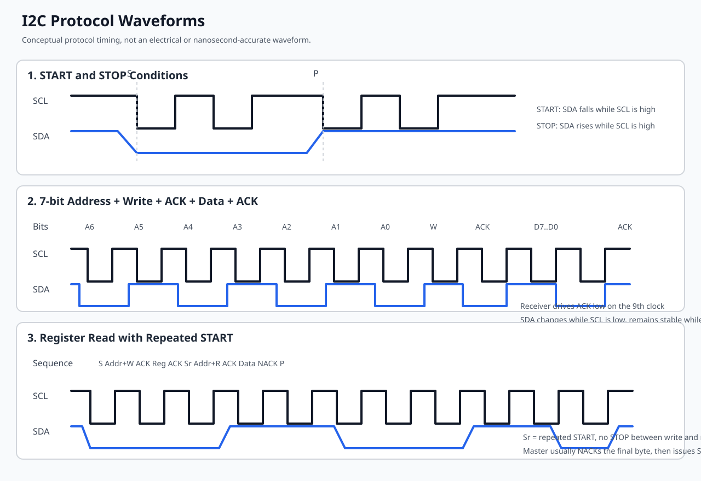
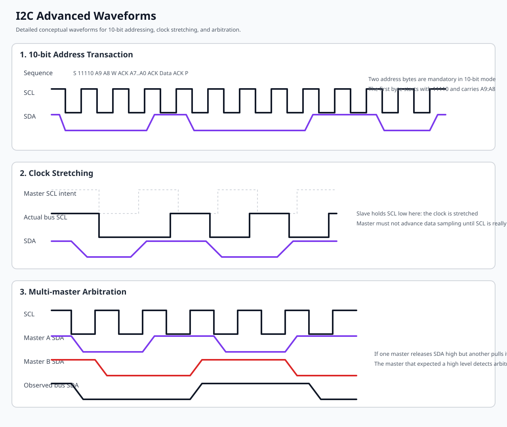
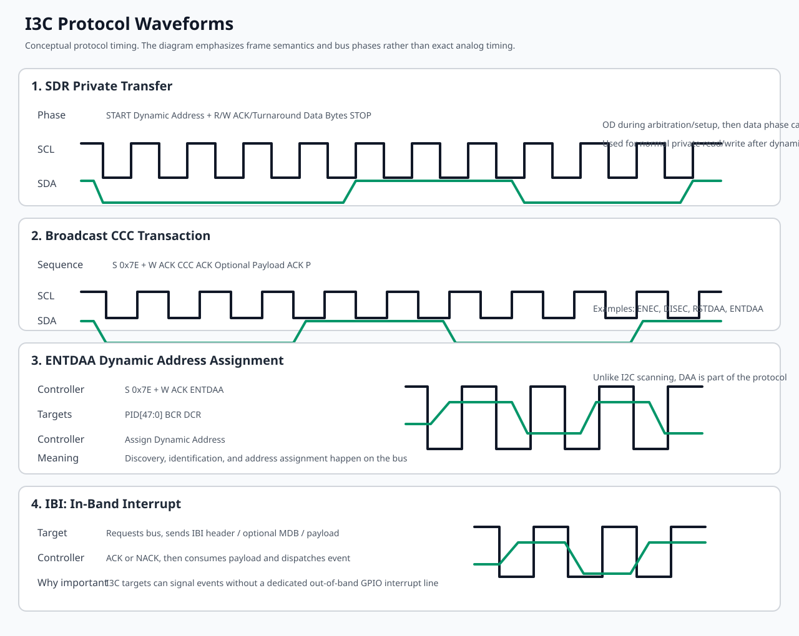
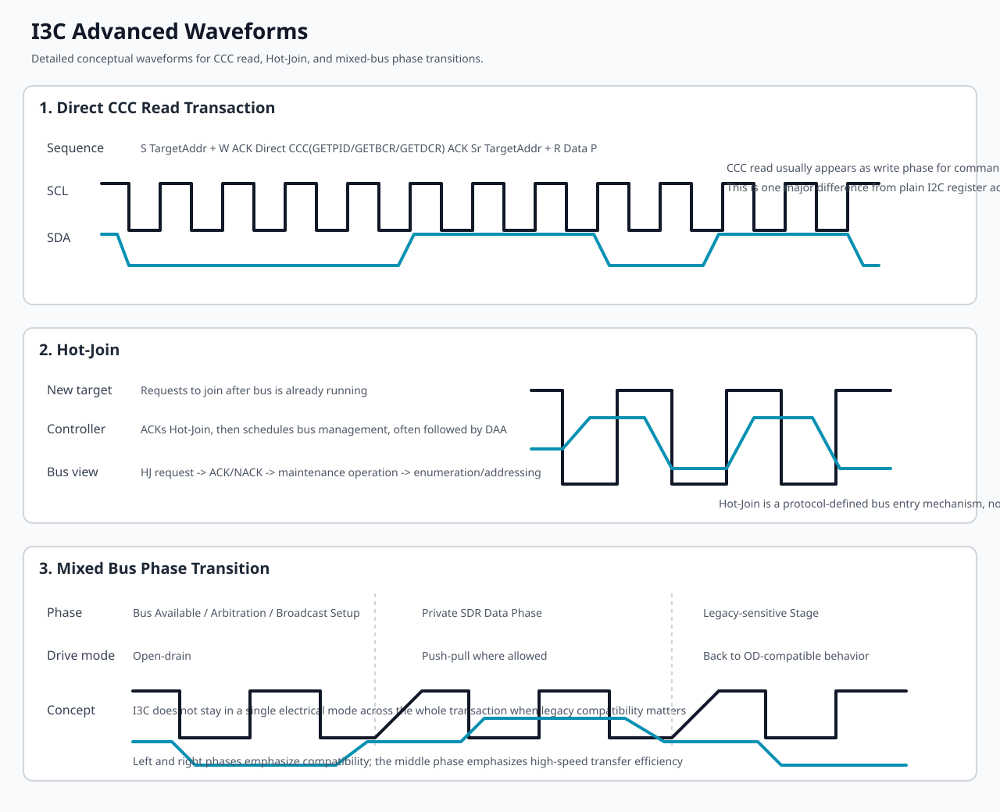

# I2C / I3C 协议、硬件、Linux 软件架构与 QEMU 实验指南

## 1. 文档目标与结论先行

本文围绕 7 个目标展开：

1. 汇总 I2C 与 I3C 的协议规范与核心差异。
2. 提供 I2C 与 I3C 的硬件规范和关键知识点。
3. 分析当前内核树中的 I2C/I3C 代码，提炼软件架构与关键数据结构。
4. 给出 QEMU 下可执行或可落地改造的 I2C/I3C 测试方案、测试代码和实验步骤。
5. 总结 I2C/I3C 的 GPIO 模拟软件现状。
6. 说明当前代码里多为 slave/target 侧软件时，如果改成 client/device-driver 侧，应该如何软件模拟。
7. 总结 I2C/I3C 面试常见问题与参考答案。

先给出最重要的判断：

- I2C 在 Linux 主线里的软件体系非常成熟，既有主控制器框架，也有 slave backend、GPIO bit-bang、stub 仿真、QEMU 设备模型。
- I3C 在 Linux 主线里的重点是 master controller 框架、动态地址管理、CCC、IBI、I2C backward compatibility，以及 I3C device driver 模型。
- 当前这棵内核树里，I3C 没有像 I2C 那样成熟的“通用 target/slave 软件后端 + GPIO bit-bang”组合。
- 因而，I2C 最容易做“纯软件 + 虚拟化”实验；I3C 更适合做“真实控制器驱动验证”或“基于新版本 QEMU 的总线/目标设备联合验证”。

## 2. I2C 与 I3C 协议规范总结

## 2.1 I2C 的协议模型

I2C 是两线总线：

- SDA：串行数据线。
- SCL：串行时钟线。

其电气特征是开漏/开集电极，需要外部上拉电阻。任何设备只能主动拉低，释放后由上拉电阻把线拉高。

I2C 基本帧序：

- START：SCL 为高时，SDA 从高到低。
- 地址阶段：7-bit 或 10-bit 地址，加 1 bit R/W。
- ACK/NACK：每 8 bit 数据后第 9 个时钟由接收方应答。
- 数据阶段：字节流传输。
- STOP：SCL 为高时，SDA 从低到高。

I2C 的关键行为：

- 仲裁：多主场景中，主设备在发送“1”时若读回“0”，说明仲裁失败。
- 时钟拉伸：从设备可主动拉低 SCL，延缓主设备继续传输。
- Repeated START：不发 STOP，直接重新发 START，可用于寄存器地址写后立即读。

### I2C 协议规范波形图

下面的图是协议级概念波形图，重点用于说明帧结构和边沿语义，不表示精确纳秒级比例。



图中重点观察：

- START 条件：`SCL` 为高时，`SDA` 从高变低。
- STOP 条件：`SCL` 为高时，`SDA` 从低变高。
- 地址和数据阶段：`SDA` 在 `SCL` 高电平期间必须稳定，数据通常在 `SCL` 低电平期间切换。
- ACK 位：第 9 个时钟由接收方拉低应答。
- Repeated START：在不发 STOP 的情况下重新发起一次 START，用于典型“写寄存器地址再读数据”的组合事务。

### I2C 进阶波形图

为了对应规范里更容易被问到、也更容易在驱动实现里出问题的部分，再补 3 个进阶场景：10-bit 地址、clock stretching、multi-master arbitration。



图中重点观察：

- 10-bit 地址：前两个字节共同携带地址信息，第一个字节前缀为 `11110xx`。
- Clock Stretching：从设备把 `SCL` 保持在低电平，主设备必须等待，不能继续推进位时序。
- Arbitration：多主场景下，如果某主机想发送高电平，但线上实际被其他主机拉成低电平，该主机立即仲裁失败并退出。

I2C 速率模式：

- Standard Mode：100 kHz。
- Fast Mode：400 kHz。
- Fast Mode Plus：1 MHz。
- High Speed Mode：3.4 MHz。
- Ultra Fast Mode：5 MHz，仅单向场景，实际使用远少于前几种。

## 2.2 SMBus 与 I2C 的关系

SMBus 可以看成 I2C 的受限子集或上层约束协议。

SMBus 相比 I2C 更强调：

- 命令码语义。
- 超时要求。
- PEC 校验。
- 固定事务类型，例如 byte data、word data、block data。

Linux I2C 子系统里，SMBus 通过 `i2c_smbus_xfer()` 和一组 helper 暴露；若控制器不支持原生 SMBus，内核可以退化为 I2C message 模拟。

## 2.3 I3C 的协议模型

I3C 是 MIPI 定义的更现代串行总线，目标是：

- 向后兼容 I2C 设备。
- 获得比 I2C 更高的吞吐与更低的功耗。
- 支持动态地址分配。
- 支持更强的事件机制，例如 IBI。
- 减少传统 I2C 上拉带来的速度和功耗瓶颈。

I3C 的核心事务包括：

- Common Command Code，简称 CCC。
- SDR private transfer。
- HDR transfer。
- 动态地址分配 DAA。
- In-Band Interrupt，简称 IBI。
- Hot-Join。

I3C 的物理层与时序特征：

- 总线初始化与仲裁相关阶段仍会使用 open-drain。
- 大部分高速数据阶段切换为 push-pull。
- 这样既保留总线发现/兼容能力，又显著提升速度。

I3C 常见地址与命令概念：

- Broadcast address：0x7e。
- Hot-Join address：0x02。
- CCC：如 ENEC、DISEC、RSTDAA、ENTDAA、SETDASA、GETPID、GETBCR、GETDCR。

### I3C 协议规范波形图

下面的图同样是协议级概念图，重点突出 I3C 相比 I2C 多出来的控制平面：CCC、DAA、IBI，以及 open-drain 到 push-pull 的阶段切换。



图中重点观察：

- SDR Private Transfer：常规私有读写事务，使用动态地址，数据阶段可进入 push-pull。
- Broadcast CCC：控制器向 `0x7e` 广播 CCC，例如 `ENTDAA`、`RSTDAA`、`ENEC`。
- ENTDAA：先广播命令，再由目标设备返回 `PID/BCR/DCR`，最后由控制器分配动态地址。
- IBI：目标设备在总线上直接发起中断请求，控制器决定 ACK 或 NACK，并接收可选 payload。
- Mixed Bus：总线初始化、仲裁和兼容阶段仍要照顾 legacy I2C 设备，因此 I3C 不是全程 push-pull。

### I3C 进阶波形图

I3C 更容易混淆的点不在普通读写，而在总线管理动作，因此进阶图重点补 3 类：CCC 读事务、Hot-Join、mixed-bus 的 open-drain 到 push-pull 切换。



图中重点观察：

- CCC Read：控制器先发 direct CCC，再通过后续读阶段取回设备信息，比如 `GETPID`、`GETBCR`、`GETDCR`。
- Hot-Join：未被枚举的新设备通过规范定义流程请求加入总线，而不是像 I2C 那样靠扫描碰运气。
- Mixed Bus Transition：在兼容 legacy I2C 设备的场景下，I3C 不同阶段的驱动方式不同，驱动和硬件设计都必须考虑这个切换点。

### 波形到驱动实现的关注点

只会看协议波形还不够，真正写 Linux 控制器驱动或设备驱动时，要把这些波形事件映射成明确的软件状态、错误路径和中断处理。

I2C 侧重点：

- START / STOP：控制器驱动通常不会逐位软件采样，但必须正确维护一次 transfer 的起止边界；在 `drivers/i2c/busses/i2c-cadence.c` 这类驱动里，这对应消息提交、HOLD bit、完成中断和 bus busy 清理。
- Repeated START：在 Linux 里通常体现为一次 `i2c_transfer()` 里的多个 `struct i2c_msg`；驱动若错误地下发 STOP，就会把“写寄存器地址再读数据”拆坏。
- ACK / NACK：协议上是第 9 个时钟，驱动上则体现为控制器状态位、FIFO 状态和返回码；最常见的软件问题是把地址 NACK、数据 NACK、仲裁丢失都混成同一种错误。
- Clock Stretching：如果控制器支持不完整，驱动就容易出现超时；在排障时要同时看波形上 `SCL` 是否被拉低，以及驱动里 timeout 路径是否过早触发。
- Arbitration：协议上是“发 1 读回 0”，驱动上通常体现为仲裁丢失状态位和一次 transfer 中止；如果没有把这个条件单独区分出来，多主问题会被误判成普通 I/O error。
- 10-bit Address：不是所有控制器 IP 都完整支持，驱动要显式声明 capability；若功能位、地址格式或寄存器装载错了，波形上最直接的表现就是第一字节前缀和第二地址字节不对。

I3C 侧重点：

- CCC：在 `drivers/i3c/master/i3c-master-cdns.c` 这类驱动里，CCC 不是普通私有收发，而是单独的提交路径；如果把 CCC 当普通 xfer 处理，DAA、事件使能、能力读取都会异常。
- DAA：波形上看是 ENTDAA 加设备回传 PID/BCR/DCR，软件上对应地址槽位管理、设备描述符创建和总线锁保护；这里的 bug 往往不是“收不到数据”，而是“地址分配状态机错乱”。
- IBI：波形上是目标设备主动发起请求，软件上则是 IBI FIFO、slot pool、handler 投递和回收；只看设备驱动不看控制器中断路径，通常定位不到问题根因。
- Mixed Bus Transition：这不是文档里的抽象概念，而是直接决定控制器时钟、驱动模式和兼容约束的硬要求；如果总线上还挂了 legacy I2C 设备，I3C 控制器驱动必须在配置阶段把这些限制算进去。
- Hot-Join：协议上是新设备请求入网，软件上往往表现为一次维护类操作或 workqueue 流程；如果驱动只覆盖 probe 时枚举，没有覆盖运行期加入，总线管理会不完整。

如果把这些映射关系记住，就会知道：波形不是“硬件同学才看的图”，而是驱动状态机的外在表现。

## 2.4 I2C 与 I3C 的核心差异

| 维度 | I2C | I3C |
| --- | --- | --- |
| 电气层 | 开漏 + 上拉 | 初始化阶段开漏，传输阶段可 push-pull |
| 地址模型 | 静态 7/10-bit 地址 | 静态地址可选，运行期动态地址是核心机制 |
| 速率 | 常见 100k/400k/1M/3.4M | SDR 典型可到 12.5 MHz 级别 |
| 中断机制 | 依赖额外 GPIO 或轮询 | IBI 原生带内中断 |
| 发现机制 | 一般依赖板级描述或扫描 | DAA + CCC 原生发现/配置 |
| 兼容性 | 原生 I2C | 向后兼容 I2C target |
| 时钟拉伸 | 常见 | 设计目标是减少 I2C 式低效交互 |
| 协议复杂度 | 低 | 明显更高 |
| Linux 生态成熟度 | 极成熟 | 成熟度正在提升，仍以 master/controller 为主 |

## 2.5 对软件设计的直接影响

- I2C 驱动通常以“固定地址 + 寄存器读写”为主。
- I3C 驱动除了收发数据，还要考虑 CCC、PID/BCR/DCR、动态地址、IBI、总线模式、与 legacy I2C 共存。
- I2C 更适合简单 bit-bang 和纯软件模拟。
- I3C 因涉及 push-pull、DAA、CCC、IBI 等复杂状态机，不适合通用 GPIO bit-bang 方案。

## 3. I2C 与 I3C 的硬件规范和知识点

## 3.1 I2C 硬件知识点

I2C 硬件设计重点：

- 必须有合适的上拉电阻。
- 总线电容会直接影响上升沿时间。
- rise/fall time 会影响最大支持速率。
- clock stretching 必须由控制器和固件共同正确支持。
- 仲裁丢失、NACK、总线卡死需要控制器可观测。

I2C 常见硬件问题：

- SDA 被某个器件永久拉低，导致 bus busy。
- 时钟拉伸超时处理不当，导致主机等待过久。
- repeated start 能力受控制器实现限制。
- FIFO 深度、最大传输长度、DMA 对齐要求因 IP 不同而差异很大。

I2C 控制器设计常见寄存器能力：

- 控制寄存器：主从模式、读写方向、ACK、FIFO reset。
- 状态寄存器：RX/TX valid、总线忙、仲裁丢失。
- 地址寄存器。
- 数据寄存器。
- 中断状态/屏蔽/使能寄存器。
- 传输长度寄存器。
- 时钟分频寄存器。
- 超时寄存器。

## 3.2 I3C 硬件知识点

I3C 硬件设计重点：

- 混合总线场景下，要考虑 I2C legacy device 的 spike filter 和时序限制。
- 动态地址分配要求控制器具备 DAA 硬件/软件状态机。
- CCC 处理是基础能力，不只是普通收发。
- IBI 需要独立队列、slot pool、中断路由。
- I3C 与 I2C 共总线时，控制器需要在不同模式间切换。

I3C 常见寄存器/硬件资源：

- 命令 FIFO。
- 响应 FIFO。
- TX/RX FIFO。
- IBI FIFO。
- Device address table。
- Device characteristic table。
- 总线模式与时钟配置寄存器。
- CCC 提交通道。

I3C 设计里必须理解的几个字段：

- PID：Provisioned ID，设备唯一标识。
- BCR：Bus Characteristic Register。
- DCR：Device Characteristic Register。
- Dynamic Address。
- LVR：Legacy Virtual Register，用于混挂 I2C 设备时描述能力限制。

## 3.3 I2C/I3C 混合总线知识点

这是 I3C 真正有工程价值的地方。

混合总线里需要注意：

- 总线上可能同时有 I3C 设备和 legacy I2C 设备。
- I3C master 需要维护 I2C 设备描述符和 I3C 设备描述符两类对象。
- 时钟频率必须满足最慢、最敏感设备限制。
- 某些总线模式需要控制高电平脉宽，避免 I2C 设备误判。

## 4. 当前内核树中的 I2C 软件架构分析

本节重点分析以下文件：

- `include/linux/i2c.h`
- `drivers/i2c/i2c-core-base.c`
- `drivers/i2c/i2c-core-smbus.c`
- `drivers/i2c/i2c-core-slave.c`
- `drivers/i2c/busses/i2c-cadence.c`
- `drivers/i2c/busses/i2c-gpio.c`
- `drivers/i2c/algos/i2c-algo-bit.c`
- `drivers/i2c/i2c-slave-eeprom.c`
- `drivers/i2c/i2c-stub.c`

## 4.1 I2C 总体软件分层

Linux I2C 子系统可以分为 5 层：

1. 核心层：设备/驱动匹配、adapter 注册、client 创建、bus lock、错误码约束。
2. 算法层：`struct i2c_algorithm`，定义 xfer、smbus_xfer、功能位、slave register/unregister。
3. 控制器驱动层：例如 Cadence、DesignWare、GPIO bit-bang 等。
4. 设备驱动层：`struct i2c_driver` + `struct i2c_client`。
5. 软件后端/仿真层：`i2c-slave-eeprom`、`i2c-slave-testunit`、`i2c-stub`。

## 4.2 I2C 关键数据结构

### `struct i2c_adapter`

这是“总线控制器实例”的核心对象，重要字段包括：

- `owner`：模块归属。
- `class`：探测类别。
- `algo`：指向 `struct i2c_algorithm`。
- `algo_data`：控制器私有数据。
- `lock_ops`、`bus_lock`、`mux_lock`：总线锁。
- `timeout`、`retries`：传输策略。
- `dev`：设备模型对象。
- `bus_recovery_info`：总线恢复回调与 GPIO 资源。
- `quirks`：硬件约束，例如最大消息数量、是否支持 repeated start。

理解上，`i2c_adapter` 就是 Linux 内核中“这条 I2C 总线”的软件代表。

### `struct i2c_client`

这是“挂在某条总线上的设备实例”。重要字段：

- `flags`：PEC、10-bit、SLAVE、HOST_NOTIFY 等。
- `addr`：设备地址。
- `name`：设备名字。
- `adapter`：所属总线。
- `dev`：设备模型对象。
- `irq`：中断。
- `slave_cb`：若以 slave backend 形式存在，回调入口在这里。

### `struct i2c_driver`

这是设备驱动对象。重要字段：

- `probe()` / `remove()` / `shutdown()`。
- `alert()`：SMBus alert 回调。
- `id_table`。
- `detect()` / `address_list`：自动探测支持。
- `driver`：嵌入的通用 `device_driver`。

### `struct i2c_algorithm`

这是控制器能力抽象层。重要字段：

- `xfer` / `xfer_atomic`。
- `smbus_xfer` / `smbus_xfer_atomic`。
- `functionality()`。
- `reg_target` / `unreg_target`，旧名字是 `reg_slave` / `unreg_slave`。

### `struct i2c_msg`

这是单个 I2C 传输消息描述。核心是：

- `addr`
- `flags`
- `len`
- `buf`

用户和驱动常见“组合消息”就是多个 `i2c_msg` 组成的一次 transfer，例如“写寄存器地址 + repeated start + 读数据”。

### `struct i2c_bus_recovery_info`

这是 I2C 总线卡死恢复的关键结构。重要字段：

- `recover_bus`
- `get_scl` / `set_scl`
- `get_sda` / `set_sda`
- `prepare_recovery` / `unprepare_recovery`
- `scl_gpiod` / `sda_gpiod`

它解释了为什么 I2C 与 GPIO 高耦合，因为最常见的恢复方式就是通过 GPIO 手动抖 SCL。

## 4.3 `i2c-core-base.c` 的软件架构

这个文件是 I2C 子系统中最重要的“总线核心”。

它主要负责：

- `i2c_bus_type` 设备总线注册。
- 设备与驱动匹配。
- adapter 注册与编号管理。
- client 创建设备模型对象。
- I2C 传输入口和锁管理。
- debugfs、tracepoint、runtime PM 相关通用逻辑。
- OF/ACPI/ID table 多套匹配机制。

核心逻辑路径：

1. 控制器驱动调用 `i2c_add_adapter()` 或 `i2c_add_numbered_adapter()`。
2. I2C core 为 adapter 创建 `struct device`，挂到 `i2c_bus_type`。
3. 板级信息、DT、ACPI、手工 new_device 等路径创建 `i2c_client`。
4. `i2c_driver` 注册后，通过 OF/ACPI/ID table 匹配到 `i2c_client`。
5. 设备驱动 `probe()` 开始执行。
6. 设备驱动通过 `i2c_transfer()` 或 SMBus helper 发起访问。
7. I2C core 将请求下沉到 adapter 的 `algo->xfer` 或 `algo->smbus_xfer`。

换句话说，I2C core 负责：

- 管“设备生命周期”。
- 管“驱动匹配”。
- 管“通用锁和错误语义”。
- 不直接做具体硬件收发。

## 4.4 `i2c-core-slave.c` 的架构意义

这个文件把 I2C slave backend 做成了统一框架。

其关键接口：

- `i2c_slave_register()`
- `i2c_slave_unregister()`
- `i2c_slave_event()`

slave backend 与 bus driver 的关系是：

- bus driver 负责接硬件中断、识别读写方向、取数据/送数据。
- backend 负责状态机和业务行为，例如 EEPROM 内容、测试寄存器、sysfs 可视化。

这也是为什么 I2C 的 target/slave 模拟很成熟，因为 Linux 已经把“硬件无关的后端”和“硬件相关的总线驱动”解耦了。

## 4.5 `i2c-cadence.c` 的架构分析

这是当前编辑器打开的文件，对应 Cadence I2C 控制器驱动。

### 核心私有结构 `struct cdns_i2c`

这是该驱动的中心对象，里面包含：

- MMIO 基址 `membase`
- `struct i2c_adapter adap`
- 当前消息指针 `p_msg`
- 发送/接收 buffer 指针
- 剩余发送/接收计数
- 输入时钟、目标 I2C 时钟
- `ctrl_reg` 缓存
- bus recovery 信息 `rinfo`
- slave 模式下的 `slave`、`dev_mode`、`slave_state`
- FIFO 深度、最大传输长度、atomic 模式状态

这个结构的设计非常典型：

- 一半是硬件状态。
- 一半是 I2C core glue。
- 一半是传输进行中的软件状态机。

### 功能入口

Cadence 驱动通过 `cdns_i2c_algo` 绑定到 I2C core：

- `.xfer = cdns_i2c_master_xfer`
- `.xfer_atomic = cdns_i2c_master_xfer_atomic`
- `.functionality = cdns_i2c_func`
- `.reg_slave = cdns_reg_slave`
- `.unreg_slave = cdns_unreg_slave`

说明它既支持：

- 普通 master 传输。
- 原子上下文传输。
- slave backend 注册。

### master 传输主路径

master 传输主路径是：

- `cdns_i2c_master_xfer()`
- `cdns_i2c_master_common_xfer()`
- `cdns_i2c_process_msg()`
- `cdns_i2c_msend()` / `cdns_i2c_mrecv()`
- `cdns_i2c_master_isr()`

其软件特点：

- 按消息逐个处理。
- 多消息场景通过 `bus_hold_flag` 支持 repeated start。
- 大接收包依赖 transfer size register 和 HOLD bit 联动。
- 有针对 Cadence/Zynq 版本的 HOLD bit workaround。
- 同时提供中断模式和 atomic 轮询模式。

### slave 模式路径

slave 模式下的核心流程：

- `cdns_reg_slave()` 注册后保存 `id->slave`。
- `cdns_i2c_set_mode(CDNS_I2C_MODE_SLAVE)` 切到 slave 硬件模式。
- 中断入口 `cdns_i2c_isr()` 根据 `dev_mode` 分发到 `cdns_i2c_slave_isr()`。
- 接收时调用 `I2C_SLAVE_WRITE_REQUESTED` / `I2C_SLAVE_WRITE_RECEIVED`。
- 发送时调用 `I2C_SLAVE_READ_REQUESTED` / `I2C_SLAVE_READ_PROCESSED`。
- STOP 或异常时调用 `I2C_SLAVE_STOP`。

这与 `Documentation/i2c/slave-interface.rst` 的框架严格一致。

### 该驱动体现出的工程要点

- 当前驱动不是“只支持 slave”，而是“以 master 为主，同时兼容 slave backend”。
- 驱动非常强调 FIFO、超时、总线忙、传输长度限制、HOLD bit quirk。
- runtime PM、clock notifier、reset control、bus recovery 都已纳入。
- 这是一个成熟的 SoC 控制器驱动，而不是简单的寄存器搬运。

## 4.6 `i2c-gpio.c` 与 `i2c-algo-bit.c` 的意义

`i2c-gpio.c` 是基于 GPIO 的总线驱动，`i2c-algo-bit.c` 是它背后的位操作算法库。

这两个文件的组合就是 Linux 主线里最典型的 I2C bit-bang 方案。

职责划分：

- `i2c-gpio.c` 负责把 GPIO 适配成 `setsda`、`setscl`、`getsda`、`getscl`。
- `i2c-algo-bit.c` 负责实现 start、stop、outb、inb、仲裁、ACK、超时、时序延迟。

这套实现的价值在于：

- 它把 I2C 从“专用 IP”退化成了“只要有两个 GPIO 就能工作”。
- 它还是总线恢复、故障注入、bring-up 阶段非常重要的调试工具。

## 4.7 I2C 软件模拟设施总结

当前树里现成可用的 I2C 软件模拟设施有：

- `i2c-stub.c`：面向 SMBus/I2C 寄存器仿真的“假芯片”。
- `i2c-slave-eeprom.c`：面向 slave target 的 EEPROM backend。
- `i2c-slave-testunit.c`：面向测试的 slave backend。
- `i2c-gpio.c` + `i2c-algo-bit.c`：面向主机控制器的 bit-bang。
- 文档支持：`Documentation/i2c/i2c-stub.rst`、`Documentation/i2c/slave-interface.rst`、`Documentation/i2c/gpio-fault-injection.rst`。

## 5. 当前内核树中的 I3C 软件架构分析

本节重点分析：

- `include/linux/i3c/device.h`
- `include/linux/i3c/master.h`
- `include/linux/i3c/ccc.h`
- `drivers/i3c/master.c`
- `drivers/i3c/device.c`
- `drivers/i3c/master/i3c-master-cdns.c`

## 5.1 I3C 总体软件分层

Linux I3C 子系统的核心是“master-centric architecture”。

大体分为 4 层：

1. I3C core：bus、device、driver、DAA、CCC、IBI、地址管理。
2. master controller driver：Cadence、DW、AST2600、HCI 等。
3. I3C device driver：面向具体 I3C 设备的 `struct i3c_driver`。
4. backward compatibility：I3C master 下挂的 legacy I2C 设备通过 `struct i2c_dev_desc` 进入同一框架。

与 I2C 最大不同是：

- I3C 核心不是简单的“一个 adapter + xfer callback”。
- 它必须显式管理“整条总线状态”。

## 5.2 I3C 关键数据结构

### `struct i3c_master_controller`

这是 I3C 主控制器对象。重要字段：

- `dev`
- `this`：代表 master 自己的 `i3c_dev_desc`
- `i2c`：向后兼容的 I2C adapter
- `ops`
- `secondary` / `init_done` / `hotjoin`
- `boardinfo.i3c` / `boardinfo.i2c`
- `bus`
- `wq`

这个结构说明：I3C master 自己同时向 Linux 暴露 I2C 和 I3C 两种访问面。

### `struct i3c_master_controller_ops`

这是 I3C 控制器驱动的核心接口集。重要字段：

- `bus_init()` / `bus_cleanup()`
- `attach_i3c_dev()` / `detach_i3c_dev()`
- `do_daa()`
- `supports_ccc_cmd()` / `send_ccc_cmd()`
- `priv_xfers()`
- `attach_i2c_dev()` / `detach_i2c_dev()`
- `i2c_xfers()`
- `request_ibi()` / `enable_ibi()` / `disable_ibi()` / `free_ibi()`

可以看到，I3C 驱动要处理的不只是“传输”，还要处理：

- 设备加入/离开。
- 动态地址。
- 事件。
- legacy I2C 设备。

### `struct i3c_bus`

表示整条 I3C 总线。重要字段：

- `cur_master`
- `addrslots`
- `mode`
- `scl_rate.i3c` / `scl_rate.i2c`
- `devs.i3c` / `devs.i2c`
- `lock`

这说明 I3C core 管的是“总线全局状态机”，不是局部消息队列。

### `struct i3c_dev_desc` 与 `struct i2c_dev_desc`

这两个结构是 I3C 总线上的内部设备描述符：

- `i3c_dev_desc`：面向真正的 I3C 设备。
- `i2c_dev_desc`：面向挂在 I3C 总线上的 legacy I2C 设备。

这两个结构共享 `struct i3c_i2c_dev_desc common`，体现出 I3C core 统一管理混合总线设备的设计。

### `struct i3c_device_info`

描述设备能力信息：

- `pid`
- `bcr`
- `dcr`
- `static_addr`
- `dyn_addr`
- `hdr_cap`
- `max_read_len` / `max_write_len`
- `max_ibi_len`

这相当于 I3C 设备的“能力快照”。

### `struct i3c_priv_xfer`

这是 I3C private SDR 传输描述，重要字段：

- `rnw`
- `len`
- `actual_len`
- `data.in` / `data.out`
- `err`

### `struct i3c_driver`

I3C 设备驱动对象，核心字段比较简洁：

- `probe(struct i3c_device *dev)`
- `remove(struct i3c_device *dev)`
- `id_table`

I3C 设备驱动常用接口是：

- `i3c_device_do_priv_xfers()`
- `i3c_device_request_ibi()`
- `i3c_device_enable_ibi()`

## 5.3 `drivers/i3c/master.c` 的软件架构

这个文件是 I3C core 的心脏。

它主要负责：

- I3C bus 锁与 bus id 管理。
- I3C 设备与驱动匹配。
- `i3c_master_register()` / `i3c_master_unregister()`。
- boardinfo、静态设备、动态设备管理。
- DAA、SETDASA、RSTDAA、DEFSLVS 等核心流程。
- IBI 管理。
- 混合总线上的 I2C 设备接入。

尤其重要的设计点：

- 维护锁区分 maintenance operation 和 normal operation。
- 总线中同时存在 I3C 设备列表和 I2C 设备列表。
- I3C device object 与内部 dev desc 分离。

这是一种比 I2C 更重的控制平面设计。

## 5.4 `i3c-master-cdns.c` 的架构分析

Cadence I3C master 驱动是当前树里最值得对照 `i2c-cadence.c` 一起看的文件。

### 它承担的职责

- 初始化 I3C 总线模式与时钟。
- 配置 master 自身的地址与能力。
- 实现 CCC 命令提交。
- 实现 private SDR xfers。
- 实现 I2C over I3C bus 的兼容传输。
- 实现 DAA。
- 实现 IBI 请求、使能、禁用、slot 回收。
- 处理中断与 Hot-Join workqueue。

### `cdns_i3c_master_ops`

Cadence I3C 驱动向 I3C core 暴露的 `ops` 包括：

- `bus_init`
- `bus_cleanup`
- `do_daa`
- `attach_i3c_dev` / `reattach_i3c_dev` / `detach_i3c_dev`
- `attach_i2c_dev` / `detach_i2c_dev`
- `supports_ccc_cmd`
- `send_ccc_cmd`
- `priv_xfers`
- `i2c_xfers`
- `request_ibi` / `enable_ibi` / `disable_ibi` / `free_ibi` / `recycle_ibi_slot`

这说明它不是简单控制器驱动，而是 I3C 总线管理者。

### bus init 逻辑

Cadence I3C 驱动在 `bus_init()` 里做了几件关键事情：

- 根据 `bus->mode` 配置 pure / mixed-fast / mixed-slow 模式。
- 根据 `sysclk` 计算 I3C 与 I2C 时钟预分频。
- 为 master 本身分配地址。
- 从寄存器读取 master 自身设备信息。
- 配置 hot-join 相关行为。
- 计算并设置 data hold delay。

这与 I2C 控制器初始化相比，明显多出“总线拓扑与协议模式配置”这一层。

### IBI 处理路径

Cadence I3C 驱动的 IBI 处理路径体现了 I3C 与 I2C 最本质的软件差异。

主要流程：

- 中断触发。
- 从 IBI FIFO 取出事件。
- 判断是 IBI、Hot-Join 还是 Master Request。
- 为设备取空闲 `i3c_ibi_slot`。
- 读取 payload。
- 通过 `i3c_master_queue_ibi()` 投递给上层。
- 处理完成后 recycle slot。

这是一套完整的“事件驱动协议栈”，而 I2C 通常没有这个层次。

### probe 路径

Cadence I3C probe 过程包括：

- 申请并映射 MMIO。
- 获取 `pclk` 和 `sysclk`。
- 校验 `DEV_ID`。
- 初始化 transfer queue、自旋锁、hot-join work。
- 初始化 IRQ。
- 读取硬件容量，如 FIFO 深度、设备槽位数。
- 分配 IBI slot 表。
- 最终调用 `i3c_master_register()` 挂入 I3C core。

## 5.5 当前树里的 I3C 边界

要注意几个现实边界：

- 当前树里 I3C 的重点是 master/controller 与 I3C device driver，不是 target backend 仿真。
- `i3c_master_register(..., secondary = true)` 在当前 core 里仍不支持 secondary master 完整工作流。
- 当前树里没有 `i3c-gpio` 这一类通用 GPIO bit-bang 控制器驱动。
- 当前树里也没有类似 `i2c-stub` 的通用 I3C 虚拟 target 驱动。

## 6. I2C / I3C GPIO 模拟软件总结

## 6.1 I2C GPIO 模拟

I2C GPIO 模拟是成熟方案。

内核主线现成支持：

- `drivers/i2c/busses/i2c-gpio.c`
- `drivers/i2c/algos/i2c-algo-bit.c`

特点：

- 适合 bring-up。
- 适合没有硬件 I2C controller 的 SoC/FPGA 原型。
- 适合故障注入和总线恢复验证。
- 性能一般，但功能完整。

缺点：

- CPU 占用高。
- 时序精度受软件调度影响。
- 高速模式和复杂负载场景不如专用 IP 稳定。

## 6.2 I3C GPIO 模拟

I3C GPIO 模拟在当前主线并不是成熟通用方案。

原因不是“没人写”，而是协议本身不适合简单 bit-bang：

- I3C 既有 open-drain，又有 push-pull。
- DAA 需要严谨的时序和状态机。
- CCC 不是普通寄存器读写。
- IBI 需要实时事件通路。
- 高速 SDR/HDR 使纯 GPIO 方案工程价值很低。

结论：

- I2C GPIO 仿真是主流工具。
- I3C GPIO 仿真在工程上通常不推荐，除非只做非常受限的协议级教学演示。

## 7. 如果不是 slave，而是 client，应如何软件模拟

这里先统一术语。

在 Linux I2C/I3C 子系统里：

- slave/target 更接近“被主机访问的设备端”。
- client/device driver 更接近“Linux 作为主机时，内核中某个设备驱动访问总线上的外设”。

你提到“现在代码里面都是 slave 的软件”，更准确地说，当前树里 I2C 的“软件仿真后端”主要是 target/slave 视角，比如 `i2c-slave-eeprom`。

如果目标改成 client/device-driver 视角，模拟方法会完全不同。

## 7.1 I2C client 的软件模拟方法

### 方法 A：`i2c-stub` 模拟外设

这是最轻量的方法。

适用场景：

- 你的驱动是 `struct i2c_driver`。
- 只需要模拟寄存器型设备。
- 不关心严格时序。

做法：

- 加载 `i2c-stub`。
- 预装寄存器值。
- 再加载你的 I2C client 驱动。
- 驱动会像连到真实芯片一样收发 SMBus/I2C 命令。

优点：

- 不需要真实硬件。
- 不需要 QEMU。
- 非常适合 probe、寄存器读写、错误路径验证。

### 方法 B：QEMU I2C 设备模型模拟外设

适用场景：

- 你要测真实控制器驱动 + 设备驱动联动。
- 你要验证 DT、总线拓扑、mux、EEPROM、温度传感器等。

QEMU 里大量 I2C 设备是通过 `TYPE_I2C_SLAVE` 实现的，例如：

- `tmp105`
- `ds1338`
- `at24c-eeprom`
- `pca954x`

从 Linux guest 的视角，它们就是普通外设。你的 `i2c_client` 驱动无需知道自己运行在 QEMU。

### 方法 C：`i2c-gpio` + 对端 MCU/FPGA/逻辑分析器

适合：

- 做低速 bring-up。
- 做边界故障验证。
- 做总线恢复验证。

## 7.2 I3C client 的软件模拟方法

I3C client 的软件模拟要难得多，主线里没有 `i3c-stub` 这种现成方案。

当前可行方法主要有 4 种。

### 方法 A：基于新版本 QEMU 的 I3C target 模型

这是最接近“纯软件外设”的方法。

根据上游 QEMU 仓库，已经存在：

- `hw/i3c/core.c`
- `hw/i3c/dw-i3c.c`
- `hw/i3c/aspeed_i3c.c`
- `hw/i3c/mock-i3c-target.c`

这意味着：

- 新版本 QEMU 已开始具备 I3C bus 和 target 模型。
- 可以用 `mock-i3c-target` 模拟一个简单 I3C 目标设备。
- 适合验证 Linux guest 中的 I3C controller driver 和 I3C device driver。

### 方法 B：写一个“测试用 I3C target 模型”在 QEMU 中作为外设

这是面向体系验证的最佳方案。

做法是：

- 在 QEMU 中实现一个 `TYPE_I3C_TARGET` 子类。
- 实现 `send()`、`recv()`、`event()`、`handle_ccc_read()`、`handle_ccc_write()`。
- 必要时支持 IBI。

这样 guest 里的 `struct i3c_driver` 就可以直接和它对接。

### 方法 C：内核中写“假 master controller”做协议单元测试

适合：

- 你要测 I3C 设备驱动逻辑。
- 不要求真实硬件寄存器。

思路：

- 实现一个最小 `i3c_master_controller_ops`。
- 在 `priv_xfers()`、`send_ccc_cmd()` 里返回预置结果。
- 人工构造 `i3c_device_info`、PID、BCR、DCR。

这更像 KUnit/fake HCD 路线，而不是总线真实仿真。

### 方法 D：双模器件用 `i3c_i2c_driver_register()` 先走 I2C 验证

若你的器件同时支持 I2C/I3C，可先：

- 用 I2C 路径验证寄存器功能。
- 再进入 I3C 路径验证 DAA、CCC、IBI。

这在工程上非常有效，因为很多传感器、PMIC、管理芯片都有双模式支持。

## 7.3 最小 I2C client 驱动示例

```c
#include <linux/module.h>
#include <linux/i2c.h>

struct demo_i2c_priv {
	int chip_id;
};

static int demo_i2c_probe(struct i2c_client *client)
{
	struct demo_i2c_priv *priv;
	int val;

	priv = devm_kzalloc(&client->dev, sizeof(*priv), GFP_KERNEL);
	if (!priv)
		return -ENOMEM;

	val = i2c_smbus_read_byte_data(client, 0x00);
	if (val < 0)
		return val;

	priv->chip_id = val;
	i2c_set_clientdata(client, priv);
	dev_info(&client->dev, "chip id=0x%x\n", priv->chip_id);
	return 0;
}

static void demo_i2c_remove(struct i2c_client *client)
{
}

static const struct i2c_device_id demo_i2c_ids[] = {
	{ "demo_i2c", 0 },
	{ }
};
MODULE_DEVICE_TABLE(i2c, demo_i2c_ids);

static struct i2c_driver demo_i2c_driver = {
	.probe = demo_i2c_probe,
	.remove = demo_i2c_remove,
	.id_table = demo_i2c_ids,
	.driver = {
		.name = "demo_i2c",
	},
};
module_i2c_driver(demo_i2c_driver);

MODULE_LICENSE("GPL");
```

这个驱动最适合配合 `i2c-stub` 或 QEMU I2C device 模型测试。

## 7.4 最小 I3C device driver 示例

```c
#include <linux/module.h>
#include <linux/i3c/device.h>

struct demo_i3c_priv {
	struct i3c_device *dev;
	u8 buf[16];
};

static void demo_i3c_ibi(struct i3c_device *dev,
				 const struct i3c_ibi_payload *payload)
{
	dev_info(i3cdev_to_dev(dev), "IBI len=%u\n", payload->len);
}

static int demo_i3c_probe(struct i3c_device *dev)
{
	struct demo_i3c_priv *priv;
	struct i3c_priv_xfer xfers[2] = { };
	struct i3c_ibi_setup ibi = {
		.max_payload_len = 8,
		.num_slots = 4,
		.handler = demo_i3c_ibi,
	};
	int ret;

	priv = devm_kzalloc(i3cdev_to_dev(dev), sizeof(*priv), GFP_KERNEL);
	if (!priv)
		return -ENOMEM;

	priv->dev = dev;
	i3cdev_set_drvdata(dev, priv);

	priv->buf[0] = 0xaa;
	priv->buf[1] = 0x55;

	xfers[0].rnw = 0;
	xfers[0].len = 2;
	xfers[0].data.out = priv->buf;

	xfers[1].rnw = 1;
	xfers[1].len = 4;
	xfers[1].data.in = &priv->buf[4];

	ret = i3c_device_do_priv_xfers(dev, xfers, 2);
	if (ret < 0)
		return ret;

	ret = i3c_device_request_ibi(dev, &ibi);
	if (!ret)
		i3c_device_enable_ibi(dev);

	return 0;
}

static void demo_i3c_remove(struct i3c_device *dev)
{
	i3c_device_disable_ibi(dev);
	i3c_device_free_ibi(dev);
}

static const struct i3c_device_id demo_i3c_ids[] = {
	I3C_DEVICE(0x123, 0x4567, NULL),
	{ }
};
MODULE_DEVICE_TABLE(i3c, demo_i3c_ids);

static struct i3c_driver demo_i3c_driver = {
	.probe = demo_i3c_probe,
	.remove = demo_i3c_remove,
	.id_table = demo_i3c_ids,
	.driver = {
		.name = "demo_i3c",
	},
};
module_i3c_driver(demo_i3c_driver);

MODULE_LICENSE("GPL");
```

这个示例更适合：

- 真实 I3C master 硬件。
- 或者支持 I3C target 模型的新版本 QEMU。

## 8. QEMU 可做的 I2C / I3C 实验

## 8.1 I2C：当前最容易落地

I2C 在 QEMU 里已经非常成熟。

从上游 QEMU 可见：

- `hw/i2c/core.c` 提供 I2C 总线框架。
- 很多设备模型继承 `TYPE_I2C_SLAVE`。
- 多个板级文件通过 `i2c_slave_create_simple()`、`at24c_eeprom_init()` 等把外设挂到 I2C bus。
- QEMU 自己还有 `tests/qtest/bcm2835-i2c-test.c`、`tmp105-test.c`、`ds1338-test.c` 等测试样例。

### 实验 1：QEMU + 现成 I2C 设备 + guest 用户态验证

实验目标：

- 在 guest 中验证 Linux I2C core、I2C controller 驱动、I2C 设备模型三者联动。

推荐设备：

- TMP105
- DS1338
- AT24C EEPROM

guest 内部操作示例：

```bash
i2cdetect -y 0
i2cget -y 0 0x49 0x00
i2cset -y 0 0x49 0x01 0x60
i2ctransfer -y 0 w1@0x50 0x00 r16
```

预期观察点：

- `/sys/bus/i2c/devices/` 中出现设备。
- `dmesg` 中 I2C adapter 注册成功。
- `i2cdetect` 能看到虚拟器件地址。

### 实验 2：QEMU + 你的 I2C client 驱动

做法：

- 选择 QEMU 已有设备模型，例如 TMP105 或 AT24C。
- 在 guest kernel 中启用对应 controller 驱动与 `i2c-dev`。
- 把你的 client 驱动绑到该地址或兼容字符串。
- 用 probe 读取寄存器验证驱动行为。

这是测试 I2C client 驱动最推荐的方法之一。

### 实验 3：QEMU 板级代码中添加一个 I2C 设备

基于上游 QEMU 的常见写法，板级代码里通常是这样挂载 I2C 设备：

```c
I2CBus *bus = aspeed_i2c_get_bus(&soc->i2c, 3);
i2c_slave_create_simple(bus, "tmp105", 0x4d);
at24c_eeprom_init(bus, 0x50, 8 * 1024);
```

这能让你快速做“控制器 + 设备 + guest 驱动”一体化验证。

## 8.2 I3C：可做，但前提更多

必须先说明边界。

当前工作区没有 QEMU 源码，但从上游 QEMU 仓库可以确认，较新的 QEMU 已有：

- `hw/i3c/core.c`
- `hw/i3c/dw-i3c.c`
- `hw/i3c/aspeed_i3c.c`
- `hw/i3c/mock-i3c-target.c`

同时，上游功能测试中已经出现基于 AST2600 的 I3C guest 命令，例如：

```bash
i3ctransfer -d /dev/bus/i3c/5-1234567890ab -w 0x12,0x34,0x56,0x78,0x90,0xab,0xcd,0xef
i3ctransfer -d /dev/bus/i3c/5-1234567890ab -r 8
```

这说明：

- 新版 QEMU 的 I3C 仿真已经开始可用。
- 但它不像 I2C 那样“几乎所有发行版自带的 QEMU 都现成可用”。

### 实验 4：新版 QEMU + AST2600 + mock-i3c-target

实验目标：

- 验证 Linux guest 中的 I3C master 驱动。
- 验证 DAA、private transfer、IBI。

建议路径：

1. 使用包含 `hw/i3c/` 的较新 QEMU。
2. 选择支持 I3C 的 AST2600 相关机器或自定义 SoC 板级模型。
3. 在 QEMU 板级代码中把 `mock-i3c-target` 挂到某个 I3C bus。
4. guest 内启用 I3C 栈、controller 驱动、必要工具。
5. 用 `i3ctransfer` 或内核测试驱动做收发。

主机侧板级挂设备的思路如下：

```c
I3CBus *bus = aspeed_i3c_get_bus(&soc->i3c, 5);

i3c_target_create_simple(bus,
				 "mock-i3c-target",
				 0x10,
				 0x00,
				 0x00,
				 0x1234567890abULL);
```

说明：

- 这是基于上游 QEMU `i3c_target_create_simple()` 接口的示意代码。
- 实际板级集成时，可能还要补充设备属性、IBI magic number、machine wiring。

### 实验 5：Linux guest 中的 I3C 设备驱动验证

推荐做法：

- 在 guest 内放入上文的最小 `demo_i3c_driver`。
- probe 中调用 `i3c_device_do_priv_xfers()`。
- 若目标模型支持 IBI，再打开 `i3c_device_request_ibi()`。

验证点：

- 设备是否完成绑定。
- private transfer 是否成功。
- IBI 是否到达。
- DAA 后的动态地址是否稳定。

### 实验 6：若你的 QEMU 版本没有 I3C

这是现实中很常见的情况。

替代路线：

- 路线 A：先用 I2C 模式验证双模器件的寄存器面。
- 路线 B：在内核里写 fake I3C master controller 做驱动单测。
- 路线 C：用真实 FPGA/SoC 板卡做 I3C 验证，把 QEMU 只用于系统其他部分。

## 9. 现成软件实验清单

## 9.1 I2C 最小实验清单

### 实验 A：`i2c-stub` 纯软件仿真

```bash
modprobe i2c-stub chip_addr=0x50
i2cdetect -l
i2cset -y <busnum> 0x50 0x00 0x5a
i2cget -y <busnum> 0x50 0x00
```

你可以在此基础上加载自己的 `i2c_client` 驱动。

### 实验 B：slave EEPROM backend

```bash
echo slave-24c02 0x1064 > /sys/bus/i2c/devices/i2c-1/new_device
```

说明：

- `0x1064` 里的 `0x1000` 表示 Linux slave address 空间。
- 这个方法适合验证 controller 的 slave mode + backend 逻辑。

### 实验 C：i2c-gpio

适合验证：

- GPIO 时序。
- 总线恢复。
- 软件 bit-bang 可行性。

## 9.2 I3C 最小实验清单

### 实验 D：I3C guest 驱动

把最小 `demo_i3c_driver` 编进内核或模块，验证：

- probe
- private SDR xfer
- IBI handler

### 实验 E：新版 QEMU `mock-i3c-target`

验证：

- DAA
- private read/write
- IBI
- Hot-Join

## 9.3 抓波形与排障方法

这一节的目标不是讲协议定义，而是讲出问题时怎么把逻辑分析仪、内核日志和驱动代码三者对上。

### 9.3.1 I2C 抓波形排障方法

建议最少同时观察 4 类信息：

- 波形：`SCL`、`SDA`、START、STOP、ACK/NACK、Repeated START。
- 用户态命令：`i2cget`、`i2cset`、`i2ctransfer` 的具体参数。
- 内核日志：adapter 注册、超时、仲裁丢失、总线恢复日志。
- 驱动代码路径：`master_xfer()`、ISR、timeout、bus recovery。

典型排障顺序：

1. 先确认总线上是否真的出现 START。
2. 再看地址字节是否正确，7-bit/10-bit、读写位是否符合预期。
3. 然后看第 9 个时钟 ACK 是否存在。
4. 如果没有 ACK，区分是地址阶段就 NACK，还是数据阶段才 NACK。
5. 如果传输中断在一半，检查是否有 clock stretching、arbitration loss 或驱动过早发 STOP。

I2C 常见现象与定位：

- 现象：`i2cdetect` 全部是 `--`。
	定位：先看波形上有没有 START 和地址；若没有，多半是控制器没有真正发起传输，优先查驱动 probe、clock、reset、pinmux。
- 现象：地址对，但没有 ACK。
	定位：优先查设备地址、上拉、电源、设备是否复位完成；其次查 7-bit/10-bit 地址格式是否错。
- 现象：读寄存器失败，但写寄存器地址阶段正常。
	定位：重点查是否少了 Repeated START，或者驱动错误地下发了 STOP。
- 现象：总线长期 busy，`SDA` 拉低不释放。
	定位：看是否需要 `i2c_bus_recovery_info` 路径做 SCL 恢复；再查 slave 设备是否卡在半字节状态。
- 现象：偶发超时。
	定位：先查 clock stretching，再查中断丢失、FIFO 阈值和 runtime PM 切换。

### 9.3.2 I3C 抓波形排障方法

I3C 不能只按 I2C 的思路抓，因为除了私有读写，还要看 CCC、DAA、IBI、Hot-Join 等管理流量。

建议同时观察：

- 波形：broadcast CCC、ENTDAA、IBI、private SDR、open-drain 到 push-pull 的阶段变化。
- 用户态或测试动作：`i3ctransfer`、驱动 probe、IBI enable、动态地址分配时机。
- 内核日志：I3C master register、CCC 提交、DAA 结果、IBI handler 是否被投递。
- 控制器代码路径：`send_ccc_cmd()`、`do_daa()`、`priv_xfers()`、IBI IRQ 路径。

I3C 常见现象与定位：

- 现象：设备没有拿到动态地址。
	定位：先看是否真的发了 `ENTDAA`，再看目标是否回传 PID/BCR/DCR，最后看控制器驱动是否正确更新地址槽位。
- 现象：private transfer 失败，但 CCC 正常。
	定位：说明控制平面和数据平面可能已经分叉，优先查 `priv_xfers()` 路径、动态地址缓存和总线模式配置。
- 现象：IBI 打不开或设备发了但内核没响应。
	定位：按“设备请求 - 控制器 ACK - IBI FIFO - slot 分配 - handler 投递”这条链逐级看，不要只盯设备驱动。
- 现象：混合总线下 I3C 正常率低。
	定位：优先怀疑 mixed-bus 约束没配对，尤其是时钟、open-drain 阶段和 legacy I2C 兼容限制。
- 现象：Hot-Join 后设备偶尔不可见。
	定位：重点查控制器驱动是否把 Hot-Join 放到独立 workqueue 或维护流程里处理，而不是只在初次枚举阶段考虑设备列表。

### 9.3.3 抓波形时最容易犯的错误

- 只看用户态返回码，不看真实波形，结果把协议问题误判成软件问题。
- 只看波形，不看驱动日志，结果不知道失败发生在地址阶段、数据阶段还是中断处理阶段。
- 用 I2C 的经验直接套 I3C，把 CCC、DAA、IBI 当成普通寄存器读写。
- 看到 NACK 就认为一定是设备坏了，忽略了地址格式、重复起始、时钟拉伸和仲裁等前置条件。

最有效的方法始终是三件事一起看：总线波形、内核日志、驱动代码路径。

## 10. 面试经典问题与参考答案

## 10.1 I2C 为什么要上拉电阻

答：

因为 I2C 物理层是开漏，设备只能主动拉低，不能主动驱高。总线释放时必须依靠上拉电阻回到高电平。上拉阻值会影响上升时间，从而影响总线速度和稳定性。

## 10.2 I2C 的 repeated start 有什么用

答：

最典型场景是先写寄存器地址，再不发 STOP 而直接读数据。这样可以保持事务原子性，避免总线被其他主机抢占，也符合很多寄存器型芯片的访问协议。

## 10.3 I2C clock stretching 是什么

答：

从设备在还没准备好时，可主动拉低 SCL，阻止主设备继续发时钟。主设备必须支持等待。若控制器不支持或驱动没处理好，就会出现超时、读写失败或总线锁死。

## 10.4 I2C 总线卡死怎么恢复

答：

通常用 GPIO 手动输出若干个 SCL 脉冲，把卡在中间状态的从设备状态机“推走”，然后再发 STOP。Linux 用 `i2c_bus_recovery_info` 和 `i2c_generic_scl_recovery()` 支持这种方式。

## 10.5 I2C `i2c_client` 和 slave backend 的区别

答：

`i2c_client` 是 Linux 作为主机侧时，对外设的设备实例；slave backend 是 Linux 自己扮演被访问设备时的后端逻辑。前者是 driver model 的 device 视角，后者是 target 仿真视角。

## 10.6 I3C 相比 I2C 最大的改进是什么

答：

不止是更快。更关键的是：动态地址分配、CCC 管理、IBI、push-pull 高速传输，以及对 legacy I2C 的兼容共存。它是面向系统管理总线升级的一整套协议，不只是 I2C 提频版。

## 10.7 I3C 为什么不适合简单 GPIO bit-bang

答：

因为 I3C 涉及 open-drain 与 push-pull 切换、DAA、CCC、IBI、高速时序，纯 GPIO bit-bang 很难兼顾准确性、性能与工程价值。I2C 适合 bit-bang，但 I3C 通常不适合通用软件模拟。

## 10.8 I3C 里的 CCC 是什么

答：

CCC 是 Common Command Code，是 I3C 中用于总线配置、事件控制、设备信息读取、地址分配等的标准命令集。它是 I3C 控制平面的基础，类似“总线管理协议”。

## 10.9 I3C 的 IBI 和 I2C 中断 GPIO 有什么区别

答：

I2C 设备通常靠额外 GPIO 拉中断线通知主机；I3C 的 IBI 是总线内原生事件机制，设备可直接在总线上发中断请求，不需要单独中断线。

## 10.10 I3C 驱动开发最容易忽略什么

答：

- 动态地址不是固定的。
- probe 前后设备能力信息可能变化。
- CCC 不只是初始化时发一次。
- IBI 处理需要 slot、workqueue、并发控制。
- 混合总线上的 I2C legacy 设备会限制总线模式与速率。

## 11. 代码阅读建议

如果后续要继续深挖，推荐按下面顺序阅读：

1. `include/linux/i2c.h`
2. `drivers/i2c/i2c-core-base.c`
3. `drivers/i2c/busses/i2c-cadence.c`
4. `drivers/i2c/i2c-core-slave.c`
5. `drivers/i2c/algos/i2c-algo-bit.c`
6. `include/linux/i3c/device.h`
7. `include/linux/i3c/master.h`
8. `drivers/i3c/master.c`
9. `drivers/i3c/master/i3c-master-cdns.c`

## 12. 总结

用一句话概括：

- I2C 在 Linux 里已经形成了“控制器驱动 + 设备驱动 + slave backend + stub + GPIO bit-bang + QEMU device model”的完整生态。
- I3C 在 Linux 里已经形成了“master core + device driver + CCC/DAA/IBI + mixed I2C compatibility”的现代化架构，但 target/backend/gpio 模拟生态还远不如 I2C 完整。
- 因而，做学习、面试、功能 bring-up 时，I2C 可以大量依赖纯软件；I3C 更适合依赖真实控制器或新版 QEMU 的专用总线模型。
