# Linux kernel issue debug guide

> 基于 Linux 6.18.1 内核源码分析，聚焦 ARM64 平台的 RCU、Watchdog、DeadLock、MemoryLeak、MemoryOverwritten 和 KASAN 子系统原理与问题定位技术。
> 源码路径：`kernel/rcu/`、`kernel/watchdog.c`、`kernel/hung_task.c`、`kernel/locking/lockdep.c`、`mm/kmemleak.c`、`mm/kasan/`、`arch/arm64/mm/kasan_init.c`

## 目录

<details>
<summary><b>1. RCU 原理和问题定位</b></summary>

- [RCU 实现原理](#rcu-实现原理)
- [Quiescent State（静默状态）深入解析](#quiescent-state静默状态深入解析)
- 1.1 [RCU 软件架构](#11-rcu-软件架构)
  - 1.1.1 [层级树结构](#111-层级树结构)
  - 1.1.2 [Grace Period 状态机](#112-grace-period-状态机)
  - 1.1.3 [Quiescent State 上报机制](#113-quiescent-state-上报机制)
  - 1.1.4 [Callback 分段处理流水线](#114-callback-分段处理流水线)
  - 1.1.5 [Force-Quiescent-State 扫描](#115-force-quiescent-state-扫描)
  - 1.1.6 [NOCB 回调卸载架构](#116-nocb-回调卸载架构)
- 1.2 [RCU 关键数据结构](#12-rcu-关键数据结构)
  - 1.2.1 [struct rcu_state — 全局 RCU 状态](#121-struct-rcu_state--全局-rcu-状态)
  - 1.2.2 [struct rcu_node — 层级树节点](#122-struct-rcu_node--层级树节点)
  - 1.2.3 [struct rcu_data — Per-CPU RCU 数据](#123-struct-rcu_data--per-cpu-rcu-数据)
  - 1.2.4 [struct rcu_segcblist — 分段回调链表](#124-struct-rcu_segcblist--分段回调链表)
  - 1.2.5 [struct rcu_snap_record — Stall 诊断快照](#125-struct-rcu_snap_record--stall-诊断快照)
- 1.3 [RCU 告警 Debug 需要 Enable 的内核开关](#13-rcu-告警-debug-需要-enable-的内核开关)
  - 1.3.1 [基础 RCU 配置开关](#131-基础-rcu-配置开关)
  - 1.3.2 [Stall 检测配置开关](#132-stall-检测配置开关)
  - 1.3.3 [Debug 与 Tracing 配置开关](#133-debug-与-tracing-配置开关)
  - 1.3.4 [运行时 sysctl 调优参数](#134-运行时-sysctl-调优参数)
  - 1.3.5 [Boot 参数](#135-boot-参数)
  - 1.3.6 [推荐 Debug 配置组合](#136-推荐-debug-配置组合)
- 1.4 [RCU 告警案例分析和 Log 解读](#14-rcu-告警案例分析和-log-解读)
  - 1.4.1 [RCU CPU Stall 告警格式全解析](#141-rcu-cpu-stall-告警格式全解析)
  - 1.4.2 [案例一：单核长时间关中断导致 RCU Stall](#142-案例一单核长时间关中断导致-rcu-stall)
  - 1.4.3 [案例二：PREEMPT_RCU 下读侧临界区阻塞 GP](#143-案例二preempt_rcu-下读侧临界区阻塞-gp)
  - 1.4.4 [案例三：GP kthread 饥饿](#144-案例三gp-kthread-饥饿)
  - 1.4.5 [案例四：FQS Timer 丢失唤醒](#145-案例四fqs-timer-丢失唤醒)
  - 1.4.6 [Stall 检测时序与误报排除](#146-stall-检测时序与误报排除)
- 1.5 [RCU 核心算法总结](#15-rcu-核心算法总结)
  - 1.5.1 [GP 序列号编码算法](#151-gp-序列号编码算法)
  - 1.5.2 [漏斗锁算法（Funnel Locking）](#152-漏斗锁算法funnel-locking)
  - 1.5.3 [QS 位图逐层上报算法](#153-qs-位图逐层上报算法)
  - 1.5.4 [Callback 分段流水线算法](#154-callback-分段流水线算法)
  - 1.5.5 [Force-Quiescent-State 两阶段扫描算法](#155-force-quiescent-state-两阶段扫描算法)
  - 1.5.6 [Stall 检测 5 重屏障验证算法](#156-stall-检测-5-重屏障验证算法)
  - 1.5.7 [GP kthread 主循环状态机算法](#157-gp-kthread-主循环状态机算法)
  - 1.5.8 [广度优先树遍历算法](#158-广度优先树遍历算法)
  - 1.5.9 [Expedited GP 算法](#159-expedited-gp-算法)
  - 1.5.10 [__note_gp_changes 本地 GP 同步算法](#1510-__note_gp_changes-本地-gp-同步算法)
- 1.6 [RCU 面试经典问题问答](#16-rcu-面试经典问题问答)
- 1.7 [RCU 各种读写场景处理流程](#17-rcu-各种读写场景处理流程)
  - 1.7.1 [场景一：单指针替换（最基本模式）](#171-场景一单指针替换最基本模式)
  - 1.7.2 [场景二：RCU 链表 — 增删改查全流程](#172-场景二rcu-链表--增删改查全流程)
  - 1.7.3 [场景三：RCU 哈希表 — hlist 操作](#173-场景三rcu-哈希表--hlist-操作)
  - 1.7.4 [场景四：RCU + 引用计数（最安全模式）](#174-场景四rcu--引用计数最安全模式)
  - 1.7.5 [场景五：三种回收方式对比与选择](#175-场景五三种回收方式对比与选择)
  - 1.7.6 [场景六：SRCU — 可睡眠的 RCU 读侧](#176-场景六srcu--可睡眠的-rcu-读侧)
  - 1.7.7 [场景七：RCU 保护的数组/指针数组](#177-场景七rcu-保护的数组指针数组)
  - 1.7.8 [场景八：延迟执行 — get_state + cond_synchronize](#178-场景八延迟执行--get_state_synchronize_rcu--cond_synchronize_rcu)
  - 1.7.9 [场景九：批量操作 — rcu_barrier](#179-场景九批量操作--rcu_barrier)
  - 1.7.10 [各场景 API 速查表](#1710-各场景-api-速查表)
</details>
<details>
<summary><b>2. Watchdog 原理和问题定位</b></summary>

- 2.1 [Watchdog 软件架构](#21-watchdog-软件架构)
  - 2.1.1 [三层锁检测框架总览](#211-三层锁检测框架总览)
  - 2.1.2 [各检测器原理](#212-各检测器原理)
    - 2.1.2.1 [Soft Lockup 检测器](#2121-soft-lockup-检测器)
    - 2.1.2.2 [Hard Lockup 检测器（Perf 方案）](#2122-hard-lockup-检测器perf-方案)
    - 2.1.2.3 [Hard Lockup 检测器（Buddy 方案）](#2123-hard-lockup-检测器buddy-方案)
    - 2.1.2.4 [Hung Task 检测器](#2124-hung-task-检测器)
- 2.2 [ARM64 平台特性](#22-arm64-平台特性)
- 2.3 [关键数据结构](#23-关键数据结构)
- 2.4 [内核配置与调优参数](#24-内核配置与调优参数)
- 2.5 [Watchdog 告警 Log 解读](#25-watchdog-告警-log-解读)
- 2.6 [Watchdog 核心算法总结](#26-watchdog-核心算法总结)
  - 2.6.1 [采样周期推导算法](#261-采样周期推导算法)
  - 2.6.2 [Soft Lockup 三阶段渐进检测算法](#262-soft-lockup-三阶段渐进检测算法)
  - 2.6.3 [CPU 利用率环形缓冲区算法](#263-cpu-利用率环形缓冲区算法)
  - 2.6.4 [中断风暴 Top-N 插入排序算法](#264-中断风暴-top-n-插入排序算法)
  - 2.6.5 [Hard Lockup 计数器比较算法](#265-hard-lockup-计数器比较算法)
  - 2.6.6 [Buddy 环形互检算法](#266-buddy-环形互检算法)
  - 2.6.7 [Perf NMI 去抖算法](#267-perf-nmi-去抖算法)
  - 2.6.8 [Hung Task RCU 分批扫描算法](#268-hung-task-rcu-分批扫描算法)
  - 2.6.9 [Hung Task 四阶段状态判定算法](#269-hung-task-四阶段状态判定算法)
  - 2.6.10 [Blocker 检测算法](#2610-blocker-检测算法)
  - 2.6.11 [Completion 同步喂狗算法](#2611-completion-同步喂狗算法)
- 2.7 [Watchdog 面试经典问题问答](#27-watchdog-面试经典问题问答)
</details>
<details>
<summary><b>3. DeadLock 原理和问题定位</b></summary>

- 3.1 [DeadLock 检测机制与使用原理](#31-deadlock-检测机制与使用原理)
  - 3.1.1 [死锁的基本概念与四个必要条件](#311-死锁的基本概念与四个必要条件)
  - 3.1.2 [Lockdep 验证器总体设计思想](#312-lockdep-验证器总体设计思想)
  - 3.1.3 [Lock Class 与 Lock Instance 的关系](#313-lock-class-与-lock-instance-的关系)
  - 3.1.4 [Lockdep 检测的三类死锁场景](#314-lockdep-检测的三类死锁场景)
  - 3.1.5 [依赖图的强路径规则](#315-依赖图的强路径规则)
  - 3.1.6 [BFS 环路检测算法](#316-bfs-环路检测算法)
  - 3.1.7 [IRQ 安全性检查](#317-irq-安全性检查)
  - 3.1.8 [内核配置与使用方法](#318-内核配置与使用方法)
- 3.2 [DeadLock 软件架构](#32-deadlock-软件架构)
  - 3.2.1 [Lockdep 架构总览](#321-lockdep-架构总览)
  - 3.2.2 [锁获取核心路径](#322-锁获取核心路径)
  - 3.2.3 [依赖图构建与验证](#323-依赖图构建与验证)
  - 3.2.4 [缓存加速机制](#324-缓存加速机制)
  - 3.2.5 [/proc 接口](#325-proc-接口)
- 3.3 [DeadLock 关键数据结构](#33-deadlock-关键数据结构)
  - 3.3.1 [struct lock_class — 锁类](#331-struct-lock_class--锁类)
  - 3.3.2 [struct lockdep_map — 锁实例映射](#332-struct-lockdep_map--锁实例映射)
  - 3.3.3 [struct held_lock — 持有锁记录](#333-struct-held_lock--持有锁记录)
  - 3.3.4 [struct lock_list — 依赖图边](#334-struct-lock_list--依赖图边)
  - 3.3.5 [struct lock_chain — 锁链缓存](#335-struct-lock_chain--锁链缓存)
  - 3.3.6 [struct lock_class_key — 锁类键](#336-struct-lock_class_key--锁类键)
  - 3.3.7 [数据结构关系总览](#337-数据结构关系总览)
- 3.4 [DeadLock 核心算法总结](#34-deadlock-核心算法总结)
  - 3.4.1 [Lock Class 注册与哈希查找算法](#341-lock-class-注册与哈希查找算法)
  - 3.4.2 [Chain Key Jenkins 滚动哈希算法](#342-chain-key-jenkins-滚动哈希算法)
  - 3.4.3 [BFS 环路检测算法](#343-bfs-环路检测算法)
  - 3.4.4 [强路径依赖过滤算法](#344-强路径依赖过滤算法)
  - 3.4.5 [IRQ 安全性四步验证算法](#345-irq-安全性四步验证算法)
  - 3.4.6 [Chain Cache 查找与缓存算法](#346-chain-cache-查找与缓存算法)
  - 3.4.7 [冗余依赖消除算法](#347-冗余依赖消除算法)
  - 3.4.8 [Usage Mask 标记与 IRQ 状态追踪算法](#348-usage-mask-标记与-irq-状态追踪算法)
  - 3.4.9 [dep_gen_id 去重标记算法](#349-dep_gen_id-去重标记算法)
  - 3.4.10 [全局 Graph Lock 与递归防护算法](#3410-全局-graph-lock-与递归防护算法)
- 3.5 [DeadLock 经典案例与 Log 解读](#35-deadlock-经典案例与-log-解读)
  - 3.5.1 [Case 1：AA 递归死锁](#351-case-1aa-递归死锁--同一锁重复获取)
  - 3.5.2 [Case 2：ABBA 锁序反转死锁](#352-case-2abba-锁序反转死锁)
  - 3.5.3 [Case 3：ABCDA 多锁环路死锁](#353-case-3abcda-多锁环路死锁)
  - 3.5.4 [Case 4：IRQ 安全性违规死锁](#354-case-4irq-安全性违规死锁)
  - 3.5.5 [Case 5：读写锁不安全升级死锁](#355-case-5读写锁不安全升级死锁)
  - 3.5.6 [Case 6：锁状态不一致](#356-case-6锁状态不一致--usage-冲突)
  - 3.5.7 [通用定位方法论](#357-通用定位方法论)
- 3.6 [DeadLock 面试经典问题问答](#36-deadlock-面试经典问题问答)
</details>
<details>
<summary><b>4. MemoryLeak 原理和问题定位</b></summary>

- 4.1 [内核内存泄漏检测机制总结](#41-内核内存泄漏检测机制总结)
  - 4.1.1 [检测机制全景对比](#411-检测机制全景对比)
  - 4.1.2 [kmemleak — 核心泄漏检测器](#412-kmemleak--核心泄漏检测器)
  - 4.1.3 [KASAN — 地址消毒剂](#413-kasan--地址消毒剂)
  - 4.1.4 [KFENCE — 低开销采样检测](#414-kfence--低开销采样检测)
  - 4.1.5 [page_owner — 页级泄漏追踪](#415-page_owner--页级泄漏追踪)
  - 4.1.6 [SLUB Debug — Slab 分配器内建检测](#416-slub-debug--slab-分配器内建检测)
  - 4.1.7 [检测机制选择决策树](#417-检测机制选择决策树)
- 4.2 [kmemleak 检测原理深度分析](#42-kmemleak-检测原理深度分析)
  - 4.2.1 [保守垃圾收集器算法](#421-保守垃圾收集器算法)
  - 4.2.2 [三色标记法](#422-三色标记法)
  - 4.2.3 [对象生命周期](#423-对象生命周期)
  - 4.2.4 [Hook 机制 — 与内存分配器的集成](#424-hook-机制--与内存分配器的集成)
  - 4.2.5 [扫描区域详解](#425-扫描区域详解)
  - 4.2.6 [RB Tree 快速查找](#426-rb-tree-快速查找)
  - 4.2.7 [Checksum 变化检测](#427-checksum-变化检测)
  - 4.2.8 [误报控制 API](#428-误报控制-api)
  - 4.2.9 [并发控制与锁层次](#429-并发控制与锁层次)
  - 4.2.10 [扫描线程工作机制](#4210-扫描线程工作机制)
- 4.3 [kmemleak 软件架构](#43-kmemleak-软件架构)
  - 4.3.1 [架构总览](#431-架构总览)
  - 4.3.2 [关键数据结构](#432-关键数据结构)
  - 4.3.3 [内存池双轨分配策略](#433-内存池双轨分配策略)
  - 4.3.4 [debugfs 接口命令详解](#434-debugfs-接口命令详解)
  - 4.3.5 [内核配置选项](#435-内核配置选项)
  - 4.3.6 [初始化流程](#436-初始化流程)
  - 4.3.7 [实战使用流程](#437-实战使用流程)
- 4.4 [kmemleak 涉及算法总结](#44-kmemleak-涉及算法总结)
  - 4.4.1 [算法全景概览](#441-算法全景概览)
  - 4.4.2 [保守 GC 三色标记算法](#442-保守-gc-三色标记算法)
  - 4.4.3 [BFS 灰色传播算法](#443-bfs-灰色传播算法)
  - 4.4.4 [红黑树地址范围查找算法](#444-红黑树地址范围查找算法)
  - 4.4.5 [保守指针扫描算法](#445-保守指针扫描算法)
  - 4.4.6 [CRC32 变化检测算法](#446-crc32-变化检测算法)
  - 4.4.7 [Jenkins Hash (jhash2) 调用栈去重](#447-jenkins-hash-jhash2-调用栈去重)
  - 4.4.8 [RCU + 引用计数生命周期管理](#448-rcu--引用计数生命周期管理)
  - 4.4.9 [地址范围快速拒绝算法](#449-地址范围快速拒绝算法)
  - 4.4.10 [双轨内存池分配算法](#4410-双轨内存池分配算法)
  - 4.4.11 [对象重叠与别名检测](#4411-对象重叠与别名检测)
  - 4.4.12 [算法协同工作流](#4412-算法协同工作流)
- 4.5 [SLUB 对象泄漏专项定位（kmalloc-512 / kmalloc-4k）](#45-slub-对象泄漏专项定位kmalloc-512--kmalloc-4k)
  - 4.5.1 [问题特征与判定标准](#451-问题特征与判定标准)
  - 4.5.2 [内核选项与启动参数](#452-内核选项与启动参数)
  - 4.5.3 [针对 kmalloc-512 / kmalloc-4k 的最小化抓取方案](#453-针对-kmalloc-512--kmalloc-4k-的最小化抓取方案)
  - 4.5.4 [定位步骤（从增长到调用栈）](#454-定位步骤从增长到调用栈)
  - 4.5.5 [4K 对象泄漏与 page_owner 联动](#455-4k-对象泄漏与-page_owner-联动)
  - 4.5.6 [修复后回归与验收标准](#456-修复后回归与验收标准)
  - 4.5.7 [eBPF 在线定位 root cause](#457-ebpf-在线定位-root-cause)
- 4.6 [Buddy 系统泄漏定位办法](#46-buddy-系统泄漏定位办法)
  - 4.6.1 [先区分：碎片化还是泄漏](#461-先区分碎片化还是泄漏)
  - 4.6.2 [Buddy 观测面：必须看的接口](#462-buddy-观测面必须看的接口)
  - 4.6.3 [page_owner：页级 root cause 的主工具](#463-page_owner页级-root-cause-的主工具)
  - 4.6.4 [libbpf 在线法：mm_page_alloc/mm_page_free 净增分析](#464-libbpf-在线法mm_page_allocmm_page_free-净增分析)
  - 4.6.5 [标准排查流程（实战版）](#465-标准排查流程实战版)
  - 4.6.6 [常见误判与规避](#466-常见误判与规避)
- 4.7 [Buddy 系统泄漏示例分析](#47-buddy-系统泄漏示例分析)
  - 4.7.1 [Case 1：驱动 DMA 缓冲区未释放导致 order-0 持续泄漏](#471-case-1驱动-dma-缓冲区未释放导致-order-0-持续泄漏)
  - 4.7.2 [Case 2：网络驱动 compound page 引用计数不平衡导致 order-3 泄漏](#472-case-2网络驱动-compound-page-引用计数不平衡导致-order-3-泄漏)
  - 4.7.3 [Case 3：CMA 预留页被长期 pin 导致 zone Movable 枯竭](#473-case-3cma-预留页被长期-pin-导致-zone-movable-枯竭)
  - 4.7.4 [Case 4：内核模块 vmalloc 泄漏导致 page table 页持续增长](#474-case-4内核模块-vmalloc-泄漏导致-page-table-页持续增长)
  - 4.7.5 [Case 5：碎片化伪泄漏 — 高阶分配失败但总量未减](#475-case-5碎片化伪泄漏--高阶分配失败但总量未减)
  - 4.7.6 [eBPF 在线定位 Buddy 泄漏 root cause](#476-ebpf-在线定位-buddy-泄漏-root-cause)
- 4.8 [应用程序（用户态）内存泄漏定义与检测方案](#48-应用程序用户态内存泄漏定义与检测方案)
  - 4.8.1 [什么是应用程序内存泄漏](#481-什么是应用程序内存泄漏)
  - 4.8.2 [泄漏判定标准与量化指标](#482-泄漏判定标准与量化指标)
  - 4.8.3 [方案一：Valgrind Memcheck](#483-方案一valgrind-memcheck开发测试阶段首选)
  - 4.8.4 [方案二：AddressSanitizer (ASan)](#484-方案二addresssanitizer-asan--编译时插桩)
  - 4.8.5 [方案三：gperftools / tcmalloc Heap Profiler](#485-方案三gperftools--tcmalloc-heap-profiler--生产友好)
  - 4.8.6 [方案四：jemalloc Heap Profiling](#486-方案四jemalloc-heap-profiling--高性能替代)
  - 4.8.7 [方案五：eBPF 在线无侵入检测](#487-方案五ebpf-在线无侵入检测--生产环境首选)
  - 4.8.8 [方案六：/proc 与 smaps 分析](#488-方案六proc-与-smaps-分析--零工具快速判定)
  - 4.8.9 [方案七：GC 语言的内存泄漏检测](#489-方案七gc-语言的内存泄漏检测)
  - 4.8.10 [全方案对比决策矩阵](#4810-全方案对比决策矩阵)
  - 4.8.11 [推荐排查流程](#4811-推荐排查流程)
- 4.9 [MemoryLeak 面试经典问题问答](#49-memoryleak-面试经典问题问答)
</details>
<details>
<summary><b>5. MemoryOverwritten 原理和问题定位</b></summary>

- 5.1 [内核 MemoryOverwritten 检测机制总结](#51-内核-memoryoverwritten-检测机制总结)
  - 5.1.1 [检测机制全景对比](#511-检测机制全景对比)
  - 5.1.2 [KASAN — 内核地址消毒剂](#512-kasan--内核地址消毒剂)
  - 5.1.3 [KFENCE — 低开销采样电子围栏](#513-kfence--低开销采样电子围栏)
  - 5.1.4 [SLUB Debug — Slab 分配器内建检测](#514-slub-debug--slab-分配器内建检测)
  - 5.1.5 [Stack Protector — 栈溢出保护](#515-stack-protector--栈溢出保护)
  - 5.1.6 [DEBUG_PAGEALLOC — 页级释放后访问检测](#516-debug_pagealloc--页级释放后访问检测)
  - 5.1.7 [FORTIFY_SOURCE — 编译期字符串函数越界检测](#517-fortify_source--编译期字符串函数越界检测)
  - 5.1.8 [CONFIG_DEBUG_LIST — 链表完整性校验](#518-config_debug_list--链表完整性校验)
  - 5.1.9 [Hardened Usercopy — 用户态拷贝边界校验](#519-hardened-usercopy--用户态拷贝边界校验)
  - 5.1.10 [PAGE_TABLE_CHECK — 页表映射合法性校验](#5110-page_table_check--页表映射合法性校验)
  - 5.1.11 [检测机制选择决策树](#5111-检测机制选择决策树)
- 5.2 [KASAN 检测原理深度分析](#52-kasan-检测原理深度分析)
  - 5.2.1 [KASAN Generic — Shadow Memory 架构全景](#521-kasan-generic--shadow-memory-架构全景)
  - 5.2.2 [编译器插桩机制](#522-编译器插桩机制)
  - 5.2.3 [Slab 对象内存布局与 Shadow 染色](#523-slab-对象内存布局与-shadow-染色)
  - 5.2.4 [Quarantine（隔离区）延迟回收机制](#524-quarantine隔离区延迟回收机制)
  - 5.2.5 [SW_TAGS 模式 — 软件标签检测](#525-sw_tags-模式--软件标签检测)
  - 5.2.6 [HW_TAGS 模式 — ARM64 MTE 硬件加速](#526-hw_tags-模式--arm64-mte-硬件加速)
  - 5.2.7 [KASAN 错误报告解读](#527-kasan-错误报告解读)
  - 5.2.8 [KASAN 与内核子系统集成点](#528-kasan-与内核子系统集成点)
  - 5.2.9 [实战调试技巧](#529-实战调试技巧)
- 5.3 [KFENCE 检测原理深度分析](#53-kfence-检测原理深度分析)
  - 5.3.1 [KFENCE 池布局与 Guard Page 架构](#531-kfence-池布局与-guard-page-架构)
  - 5.3.2 [对象放置策略与 Canary 字节模式](#532-对象放置策略与-canary-字节模式)
  - 5.3.3 [采样机制与 Counting Bloom Filter](#533-采样机制与-counting-bloom-filter)
  - 5.3.4 [Page Fault 检测与错误报告](#534-page-fault-检测与错误报告)
  - 5.3.5 [KFENCE 与 SLUB 分配器集成](#535-kfence-与-slub-分配器集成)
  - 5.3.6 [池初始化与页表设置](#536-池初始化与页表设置)
  - 5.3.7 [实战调试技巧](#537-实战调试技巧)
- 5.4 [SLUB Debug 检测原理深度分析](#54-slub-debug-检测原理深度分析)
  - 5.4.1 [对象布局与 Red Zone 机制](#541-对象布局与-red-zone-机制)
  - 5.4.2 [Poison 模式 — 释放后写检测](#542-poison-模式--释放后写检测)
  - 5.4.3 [check_object 校验流程](#543-check_object-校验流程)
  - 5.4.4 [Freelist 指针加固与 Double-Free 检测](#544-freelist-指针加固与-double-free-检测)
  - 5.4.5 [SLAB_STORE_USER — 调用栈追踪](#545-slab_store_user--调用栈追踪)
  - 5.4.6 [错误报告解读](#546-错误报告解读)
  - 5.4.7 [实战调试技巧](#547-实战调试技巧)
- 5.5 [mprotect 页保护检测原理深度分析](#55-mprotect-页保护检测原理深度分析)
  - 5.5.1 [页保护机制核心原理 — 从硬件到系统调用](#551-页保护机制核心原理--从硬件到系统调用)
  - 5.5.2 [mprotect 系统调用实现路径](#552-mprotect-系统调用实现路径)
  - 5.5.3 [ARM64 PTE 权限位与页表修改](#553-arm64-pte-权限位与页表修改)
  - 5.5.4 [Permission Fault 检测流程](#554-permission-fault-检测流程)
  - 5.5.5 [内核态页保护 — set_memory_ro/rw 与 __ro_after_init](#555-内核态页保护--set_memory_rorw-与-__ro_after_init)
  - 5.5.6 [内核中的页保护实践 — DEBUG_PAGEALLOC / KFENCE / STRICT_KERNEL_RWX](#556-内核中的页保护实践--debug_pagealloc--kfence--strict_kernel_rwx)
  - 5.5.7 [用户态 mprotect 检测 MemoryOverwritten 实战](#557-用户态-mprotect-检测-memoryoverwritten-实战)
  - 5.5.8 [实战调试技巧](#558-实战调试技巧)
- 5.6 [MemoryOverwritten 软件架构](#56-memoryoverwritten-软件架构)
  - 5.6.1 [架构总览 — 多层防御体系](#561-架构总览--多层防御体系)
  - 5.6.2 [编译期防御层](#562-编译期防御层)
  - 5.6.3 [运行时分配器防御层](#563-运行时分配器防御层)
  - 5.6.4 [运行时访问检查层](#564-运行时访问检查层)
  - 5.6.5 [硬件辅助层](#565-硬件辅助层)
  - 5.6.6 [各层协同与组合策略](#566-各层协同与组合策略)
- 5.7 [关键数据结构](#57-关键数据结构)
  - 5.7.1 [KASAN 数据结构](#571-kasan-数据结构)
  - 5.7.2 [KFENCE 数据结构](#572-kfence-数据结构)
  - 5.7.3 [SLUB Debug 数据结构](#573-slub-debug-数据结构)
- 5.8 [内核配置与调优参数](#58-内核配置与调优参数)
  - 5.8.1 [KASAN 配置](#581-kasan-配置)
  - 5.8.2 [KFENCE 配置](#582-kfence-配置)
  - 5.8.3 [SLUB Debug 配置](#583-slub-debug-配置)
  - 5.8.4 [其他防御配置](#584-其他防御配置)
  - 5.8.5 [推荐配置组合](#585-推荐配置组合)
- 5.9 [MemoryOverwritten 经典案例与 Log 解读](#59-memoryoverwritten-经典案例与-log-解读)
  - 5.9.1 [Case 1：KASAN 检测 Slab OOB 写](#591-case-1kasan-检测-slab-oob-写)
  - 5.9.2 [Case 2：KASAN 检测 Use-After-Free](#592-case-2kasan-检测-use-after-free)
  - 5.9.3 [Case 3：KFENCE 检测 OOB 写（Guard Page 触发）](#593-case-3kfence-检测-oob-写guard-page-触发)
  - 5.9.4 [Case 4：SLUB Debug 检测 Red Zone 被覆写](#594-case-4slub-debug-检测-red-zone-被覆写)
  - 5.9.5 [Case 5：Stack Canary 被破坏](#595-case-5stack-canary-被破坏)
  - 5.9.6 [Case 6：List Corruption 检测](#596-case-6list-corruption-检测)
  - 5.9.7 [通用定位方法论](#597-通用定位方法论)
- 5.10 [核心算法总结](#510-核心算法总结)
  - 5.10.1 [Shadow Memory 地址映射算法](#5101-shadow-memory-地址映射算法)
  - 5.10.2 [Shadow Byte 毒化与检查算法](#5102-shadow-byte-毒化与检查算法)
  - 5.10.3 [Quarantine FIFO 批量回收算法](#5103-quarantine-fifo-批量回收算法)
  - 5.10.4 [KFENCE Counting Bloom Filter 算法](#5104-kfence-counting-bloom-filter-算法)
  - 5.10.5 [KFENCE Canary 模式填充与校验算法](#5105-kfence-canary-模式填充与校验算法)
  - 5.10.6 [SLUB Red Zone 哨兵检测算法](#5106-slub-red-zone-哨兵检测算法)
  - 5.10.7 [SLUB Poison 模式检测算法](#5107-slub-poison-模式检测算法)
  - 5.10.8 [Stack Canary 随机值校验算法](#5108-stack-canary-随机值校验算法)
  - 5.10.9 [Hardened Usercopy 多区域边界校验算法](#5109-hardened-usercopy-多区域边界校验算法)
  - 5.10.10 [List 双向链表完整性校验算法](#51010-list-双向链表完整性校验算法)
- 5.11 [MemoryOverwritten 面试经典问题问答](#511-memoryoverwritten-面试经典问题问答)
</details>
<details>
<summary><b>6. KASAN 检测原理和问题定位</b></summary>

- 6.1 [KASAN 概述与三种检测模式](#61-kasan-概述与三种检测模式)
  - 6.1.1 [什么是 KASAN — 内核地址消毒剂的定位与价值](#611-什么是-kasan--内核地址消毒剂的定位与价值)
  - 6.1.2 [三种模式全景对比（Generic / SW_TAGS / HW_TAGS）](#612-三种模式全景对比generic--sw_tags--hw_tags)
  - 6.1.3 [各模式适用场景与选择决策树](#613-各模式适用场景与选择决策树)
  - 6.1.4 [KASAN 能检测的 Bug 类型全景](#614-kasan-能检测的-bug-类型全景)
- 6.2 [Generic KASAN — Shadow Memory 检测原理](#62-generic-kasan--shadow-memory-检测原理)
  - 6.2.1 [Shadow Memory 地址映射原理 — 8:1 压缩编码](#621-shadow-memory-地址映射原理--81-压缩编码)
  - 6.2.2 [Shadow Byte 编码规则与毒化值表](#622-shadow-byte-编码规则与毒化值表)
  - 6.2.3 [编译器插桩机制 — Inline vs Outline 检查插入](#623-编译器插桩机制--inline-vs-outline-检查插入)
  - 6.2.4 [内存访问检查完整流程 — 从 load/store 到 bug report](#624-内存访问检查完整流程--从-loadstore-到-bug-report)
  - 6.2.5 [ARM64 Shadow Memory 虚拟地址空间布局](#625-arm64-shadow-memory-虚拟地址空间布局)
  - 6.2.6 [Slab 对象 Shadow 染色全过程 — alloc/free/redzone](#626-slab-对象-shadow-染色全过程--allocfreeredzone)
  - 6.2.7 [栈变量保护 — 编译器栈帧 Shadow 插桩](#627-栈变量保护--编译器栈帧-shadow-插桩)
  - 6.2.8 [全局变量保护 — 编译器构造函数与 redzone 注册](#628-全局变量保护--编译器构造函数与-redzone-注册)
- 6.3 [SW_TAGS KASAN — 软件标签检测原理](#63-sw_tags-kasan--软件标签检测原理)
  - 6.3.1 [ARM64 Top Byte Ignore (TBI) 硬件特性](#631-arm64-top-byte-ignore-tbi-硬件特性)
  - 6.3.2 [Tag 生成算法 — Per-CPU PRNG（线性同余）](#632-tag-生成算法--per-cpu-prng线性同余)
  - 6.3.3 [指针 Tag vs 内存 Tag 比较检测流程](#633-指针-tag-vs-内存-tag-比较检测流程)
  - 6.3.4 [HWASAN Load/Store 检查宏](#634-hwasan-loadstore-检查宏)
  - 6.3.5 [Stack Ring 环形缓冲区追踪机制](#635-stack-ring-环形缓冲区追踪机制)
  - 6.3.6 [与 Generic 模式的 Shadow Memory 差异](#636-与-generic-模式的-shadow-memory-差异)
- 6.4 [HW_TAGS KASAN — ARM64 MTE 硬件加速检测](#64-hw_tags-kasan--arm64-mte-硬件加速检测)
  - 6.4.1 [ARMv8.5 MTE 硬件原理 — Allocation Tag 与 Logical Tag](#641-armv85-mte-硬件原理--allocation-tag-与-logical-tag)
  - 6.4.2 [三种硬件检测模式 — SYNC / ASYNC / ASYMM](#642-三种硬件检测模式--sync--async--asymm)
  - 6.4.3 [MTE Granule (16 字节) 与 4-bit Tag 存储](#643-mte-granule-16-字节-与-4-bit-tag-存储)
  - 6.4.4 [MTE 指令集 — IRG / ADDG / STG / LDG / SUBP](#644-mte-指令集--irg--addg--stg--ldg--subp)
  - 6.4.5 [Page Allocator 采样策略 — 采样间隔与 order 阈值](#645-page-allocator-采样策略--采样间隔与-order-阈值)
  - 6.4.6 [CPU 热插拔与 Per-CPU 模式切换](#646-cpu-热插拔与-per-cpu-模式切换)
  - 6.4.7 [HW_TAGS 异步 Fault 处理流程](#647-hw_tags-异步-fault-处理流程)
- 6.5 [KASAN 软件架构](#65-kasan-软件架构)
  - 6.5.1 [架构总览 — 源码文件组织与分层设计](#651-架构总览--源码文件组织与分层设计)
  - 6.5.2 [公共核心层 — common.c（SLUB 集成与对象生命周期）](#652-公共核心层--commonc-slub-集成与对象生命周期)
  - 6.5.3 [Generic 检查层 — generic.c（Shadow 检查与插桩回调）](#653-generic-检查层--genericc-shadow-检查与插桩回调)
  - 6.5.4 [SW_TAGS 检查层 — sw_tags.c（Tag 检查与 PRNG）](#654-sw_tags-检查层--sw_tagsc-tag-检查与-prng)
  - 6.5.5 [HW_TAGS 检查层 — hw_tags.c（MTE 控制与 CPU 管理）](#655-hw_tags-检查层--hw_tagsc-mte-控制与-cpu-管理)
  - 6.5.6 [Shadow Memory 管理层 — shadow.c / init.c](#656-shadow-memory-管理层--shadowc--initc)
  - 6.5.7 [报告层 — report.c / report_generic.c / report_*_tags.c](#657-报告层--reportc--report_genericc--report_tagsc)
  - 6.5.8 [隔离区层 — quarantine.c（Generic 专属）](#658-隔离区层--quarantinec-generic-专属)
  - 6.5.9 [标签追踪层 — tags.c（Stack Ring 管理）](#659-标签追踪层--tagsc-stack-ring-管理)
  - 6.5.10 [ARM64 平台层 — arch/arm64/mm/kasan_init.c](#6510-arm64-平台层--archarm64mmkasan_initc)
- 6.6 [关键数据结构](#66-关键数据结构)
  - 6.6.1 [struct kasan_alloc_meta — 对象分配元数据（Generic 专属）](#661-struct-kasan_alloc_meta--对象分配元数据generic-专属)
  - 6.6.2 [struct kasan_track — 分配/释放调用栈记录](#662-struct-kasan_track--分配释放调用栈记录)
  - 6.6.3 [struct kasan_report_info — 错误报告完整信息](#663-struct-kasan_report_info--错误报告完整信息)
  - 6.6.4 [struct kasan_stack_ring / kasan_stack_ring_entry — Tag 模式栈环](#664-struct-kasan_stack_ring--kasan_stack_ring_entry--tag-模式栈环)
  - 6.6.5 [struct qlist_head / qlist_node — 隔离区队列](#665-struct-qlist_head--qlist_node--隔离区队列)
  - 6.6.6 [Shadow Byte 编码值全表（Generic / SW_TAGS / HW_TAGS）](#666-shadow-byte-编码值全表generic--sw_tags--hw_tags)
  - 6.6.7 [kasan_flags / static_key 运行时控制变量](#667-kasan_flags--static_key-运行时控制变量)
- 6.7 [KASAN 与内核子系统集成](#67-kasan-与内核子系统集成)
  - 6.7.1 [SLUB 分配器集成 — 对象 alloc/free/init 全 Hook 路径](#671-slub-分配器集成--对象-allocfreeinit-全-hook-路径)
  - 6.7.2 [Page Allocator 集成 — __kasan_poison_pages / __kasan_unpoison_pages](#672-page-allocator-集成--__kasan_poison_pages--__kasan_unpoison_pages)
  - 6.7.3 [vmalloc 区域保护 — 动态 Shadow 页表填充](#673-vmalloc-区域保护--动态-shadow-页表填充)
  - 6.7.4 [栈变量保护 — CONFIG_KASAN_STACK 编译器联动](#674-栈变量保护--config_kasan_stack-编译器联动)
  - 6.7.5 [全局变量保护 — 编译器 __asan_register_globals](#675-全局变量保护--编译器-__asan_register_globals)
  - 6.7.6 [per-task kasan_depth — 递归与嵌套检查抑制](#676-per-task-kasan_depth--递归与嵌套检查抑制)
- 6.8 [Quarantine 隔离区机制深度分析](#68-quarantine-隔离区机制深度分析)
  - 6.8.1 [Per-CPU 隔离区 — cpu_quarantine 快速缓存](#681-per-cpu-隔离区--cpu_quarantine-快速缓存)
  - 6.8.2 [Global 批量隔离区 — QUARANTINE_BATCHES 环形数组](#682-global-批量隔离区--quarantine_batches-环形数组)
  - 6.8.3 [隔离区大小管理 — 物理内存 1/32 上限](#683-隔离区大小管理--物理内存-132-上限)
  - 6.8.4 [对象回收流程 — 批量 drain 与 kmem_cache 回调](#684-对象回收流程--批量-drain-与-kmem_cache-回调)
  - 6.8.5 [Quarantine 与 UAF 检测窗口](#685-quarantine-与-uaf-检测窗口)
- 6.9 [KASAN 初始化完整流程](#69-kasan-初始化完整流程)
  - 6.9.1 [ARM64 Phase 1 — kasan_early_init() 早期 Shadow 映射](#691-arm64-phase-1--kasan_early_init-早期-shadow-映射)
  - 6.9.2 [ARM64 Phase 2 — kasan_init_shadow() memblock 分配真实 Shadow 页](#692-arm64-phase-2--kasan_init_shadow-memblock-分配真实-shadow-页)
  - 6.9.3 [Phase 3 — 模式初始化（Generic / SW_TAGS / HW_TAGS 各自路径）](#693-phase-3--模式初始化generic--sw_tags--hw_tags-各自路径)
  - 6.9.4 [Static Key 与运行时 Enable/Disable 控制](#694-static-key-与运行时-enabledisable-控制)
  - 6.9.5 [Early Shadow Page 到真实 Shadow 的切换时序](#695-early-shadow-page-到真实-shadow-的切换时序)
- 6.10 [错误报告机制深度分析](#610-错误报告机制深度分析)
  - 6.10.1 [报告触发路径 — 从 check_region 到 kasan_report()](#6101-报告触发路径--从-check_region-到-kasan_report)
  - 6.10.2 [Bug 类型自动分类 — Shadow Byte 到错误类型映射](#6102-bug-类型自动分类--shadow-byte-到错误类型映射)
  - 6.10.3 [Generic 模式报告完整内容解读](#6103-generic-模式报告完整内容解读)
  - 6.10.4 [Tags 模式报告内容解读](#6104-tags-模式报告内容解读)
  - 6.10.5 [报告抑制 — multi_shot / kasan_depth / HW suppress](#6105-报告抑制--multi_shot--kasan_depth--hw-suppress)
  - 6.10.6 [Fault 处理策略 — report / panic / panic_on_write](#6106-fault-处理策略--report--panic--panic_on_write)
- 6.11 [内核配置与调优参数](#611-内核配置与调优参数)
  - 6.11.1 [Kconfig 选项完整详解](#6111-kconfig-选项完整详解)
  - 6.11.2 [Boot 启动参数](#6112-boot-启动参数)
  - 6.11.3 [运行时 sysfs / debugfs 控制](#6113-运行时-sysfs--debugfs-控制)
  - 6.11.4 [推荐配置组合 — 开发 / CI / 生产 / MTE 四种场景](#6114-推荐配置组合--开发--ci--生产--mte-四种场景)
- 6.12 [KASAN 经典案例与 Log 解读](#612-kasan-经典案例与-log-解读)
  - 6.12.1 [Case 1：Generic KASAN 检测 Slab Out-of-Bounds](#6121-case-1generic-kasan-检测-slab-out-of-bounds)
  - 6.12.2 [Case 2：Generic KASAN 检测 Use-After-Free](#6122-case-2generic-kasan-检测-use-after-free)
  - 6.12.3 [Case 3：Generic KASAN 检测 Global Out-of-Bounds](#6123-case-3generic-kasan-检测-global-out-of-bounds)
  - 6.12.4 [Case 4：Generic KASAN 检测 Stack Out-of-Bounds](#6124-case-4generic-kasan-检测-stack-out-of-bounds)
  - 6.12.5 [Case 5：SW_TAGS 检测 Tag Mismatch — Heap OOB](#6125-case-5sw_tags-检测-tag-mismatch--heap-oob)
  - 6.12.6 [Case 6：HW_TAGS (MTE) SYNC 模式检测 UAF](#6126-case-6hw_tags-mte-sync-模式检测-uaf)
  - 6.12.7 [Case 7：HW_TAGS (MTE) ASYNC 模式异步报告](#6127-case-7hw_tags-mte-async-模式异步报告)
  - 6.12.8 [Case 8：Double-Free 检测](#6128-case-8double-free-检测)
  - 6.12.9 [Case 9：Invalid-Free（非法释放）检测](#6129-case-9invalid-free非法释放检测)
  - 6.12.10 [通用 KASAN Log 五步定位法](#61210-通用-kasan-log-五步定位法)
- 6.13 [核心算法总结](#613-核心算法总结)
  - 6.13.1 [Shadow Memory 地址映射算法（addr >> 3 + offset）](#6131-shadow-memory-地址映射算法addr--3--offset)
  - 6.13.2 [Generic 多粒度内存访问检查算法（1/2/4/8/16/N 字节）](#6132-generic-多粒度内存访问检查算法124816n-字节)
  - 6.13.3 [Shadow Byte 毒化 / 解毒算法（poison / unpoison）](#6133-shadow-byte-毒化--解毒算法poison--unpoison)
  - 6.13.4 [Quarantine Per-CPU + Global FIFO 批量回收算法](#6134-quarantine-per-cpu--global-fifo-批量回收算法)
  - 6.13.5 [SW_TAGS Per-CPU LCG PRNG Tag 生成算法](#6135-sw_tags-per-cpu-lcg-prng-tag-生成算法)
  - 6.13.6 [SW_TAGS Stack Ring 无锁环形缓冲追踪算法](#6136-sw_tags-stack-ring-无锁环形缓冲追踪算法)
  - 6.13.7 [HW_TAGS 采样计数器与 order 阈值算法](#6137-hw_tags-采样计数器与-order-阈值算法)
  - 6.13.8 [Bug 类型自动分类 — Shadow Byte 值域判定算法](#6138-bug-类型自动分类--shadow-byte-值域判定算法)
  - 6.13.9 [ARM64 多级页表 Shadow 映射初始化算法](#6139-arm64-多级页表-shadow-映射初始化算法)
  - 6.13.10 [vmalloc Shadow 动态填充算法](#61310-vmalloc-shadow-动态填充算法)
- 6.14 [KASAN 面试经典问题问答](#614-kasan-面试经典问题问答)
</details>
<details>
<summary><b>7. 内核 Panic / Oops 问题定位方法</b></summary>

- 7.1 [Panic 与 Oops 概述](#71-panic-与-oops-概述)
  - 7.1.1 [Panic vs Oops vs BUG vs WARN 的区别与联系](#711-panic-vs-oops-vs-bug-vs-warn-的区别与联系)
  - 7.1.2 [ARM64 异常等级与 Panic 触发路径](#712-arm64-异常等级与-panic-触发路径)
  - 7.1.3 [panic() 函数完整执行流程](#713-panic-函数完整执行流程)
  - 7.1.4 [die() / oops_enter() / oops_exit() 流程](#714-die--oops_enter--oops_exit-流程)
  - 7.1.5 [panic_on_oops / panic_timeout / panic_print 参数](#715-panic_on_oops--panic_timeout--panic_print-参数)
- 7.2 [Oops 日志完整解读](#72-oops-日志完整解读)
  - 7.2.1 [Oops 日志结构逐行解析](#721-oops-日志结构逐行解析)
  - 7.2.2 [ARM64 寄存器状态解读（pc/lr/sp/pstate/x0-x30）](#722-arm64-寄存器状态解读pclrsppstatex0-x30)
  - 7.2.3 [Call Trace 调用栈解读与符号化](#723-call-trace-调用栈解读与符号化)
  - 7.2.4 [ESR_EL1 异常综合寄存器解码](#724-esr_el1-异常综合寄存器解码)
  - 7.2.5 [FAR_EL1 故障地址寄存器与地址空间判定](#725-far_el1-故障地址寄存器与地址空间判定)
- 7.3 [常见 Panic / Oops 触发原因分类](#73-常见-panic--oops-触发原因分类)
  - 7.3.1 [NULL 指针解引用（最常见）](#731-null-指针解引用最常见)
  - 7.3.2 [非法内核地址访问（野指针 / UAF）](#732-非法内核地址访问野指针--uaf)
  - 7.3.3 [用户空间地址在内核态访问](#733-用户空间地址在内核态访问)
  - 7.3.4 [对齐异常（Alignment Fault）](#734-对齐异常alignment-fault)
  - 7.3.5 [未定义指令异常（Undefined Instruction）](#735-未定义指令异常undefined-instruction)
  - 7.3.6 [栈溢出（Stack Overflow）](#736-栈溢出stack-overflow)
  - 7.3.7 [BUG() / BUG_ON() 显式触发](#737-bug--bug_on-显式触发)
  - 7.3.8 [Kernel Panic — not syncing 常见子类型](#738-kernel-panic--not-syncing-常见子类型)
- 7.4 [addr2line / objdump / gdb 离线分析方法](#74-addr2line--objdump--gdb-离线分析方法)
  - 7.4.1 [addr2line 从地址定位源码行](#741-addr2line-从地址定位源码行)
  - 7.4.2 [objdump 反汇编出错函数分析](#742-objdump-反汇编出错函数分析)
  - 7.4.3 [gdb vmlinux 离线调试定位](#743-gdb-vmlinux-离线调试定位)
  - 7.4.4 [decode_stacktrace.sh 自动化栈解析脚本](#744-decode_stacktracesh-自动化栈解析脚本)
  - 7.4.5 [faddr2line 从 function+offset 定位源码](#745-faddr2line-从-functionoffset-定位源码)
- 7.5 [kdump / crash 离线内存转储分析](#75-kdump--crash-离线内存转储分析)
  - 7.5.1 [kdump 原理 — kexec 加载捕获内核](#751-kdump-原理--kexec-加载捕获内核)
  - 7.5.2 [ARM64 kdump 配置与 crashkernel 参数](#752-arm64-kdump-配置与-crashkernel-参数)
  - 7.5.3 [crash 工具基本使用 — bt / dis / struct / log](#753-crash-工具基本使用--bt--dis--struct--log)
  - 7.5.4 [crash 高级分析 — 进程状态 / 锁状态 / 内存状态](#754-crash-高级分析--进程状态--锁状态--内存状态)
  - 7.5.5 [从 vmcore 还原 Panic 现场完整步骤](#755-从-vmcore-还原-panic-现场完整步骤)
- 7.6 [pstore / ramoops 持久化存储](#76-pstore--ramoops-持久化存储)
  - 7.6.1 [pstore 子系统架构与后端（ramoops / blk / zone）](#761-pstore-子系统架构与后端ramoops--blk--zone)
  - 7.6.2 [ramoops 配置 — 设备树 / 启动参数](#762-ramoops-配置--设备树--启动参数)
  - 7.6.3 [读取 /sys/fs/pstore/ 下的日志文件](#763-读取-sysfspstore-下的日志文件)
  - 7.6.4 [pmsg / console / ftrace 前端区域配置](#764-pmsg--console--ftrace-前端区域配置)
- 7.7 [动态调试与在线分析工具](#77-动态调试与在线分析工具)
  - 7.7.1 [ftrace 追踪 Panic 前的函数调用路径](#771-ftrace-追踪-panic-前的函数调用路径)
  - 7.7.2 [kprobe / kretprobe 动态插桩](#772-kprobe--kretprobe-动态插桩)
  - 7.7.3 [eBPF 追踪异常路径](#773-ebpf-追踪异常路径)
  - 7.7.4 [/proc/vmcore 与 /proc/kcore 在线分析](#774-procvmcore-与-prockcore-在线分析)
  - 7.7.5 [KGDB / KDB 内核调试器](#775-kgdb--kdb-内核调试器)
- 7.8 [内核配置与编译选项](#78-内核配置与编译选项)
  - 7.8.1 [DEBUG_INFO / DEBUG_INFO_DWARF5 调试信息](#781-debug_info--debug_info_dwarf5-调试信息)
  - 7.8.2 [KALLSYMS / KALLSYMS_ALL 符号表](#782-kallsyms--kallsyms_all-符号表)
  - 7.8.3 [FRAME_POINTER vs SHADOW_CALL_STACK 栈回溯](#783-frame_pointer-vs-shadow_call_stack-栈回溯)
  - 7.8.4 [CONFIG_PANIC_ON_OOPS / PANIC_TIMEOUT 控制](#784-config_panic_on_oops--panic_timeout-控制)
  - 7.8.5 [CONFIG_DEBUG_BUGVERBOSE 完整 BUG 信息](#785-config_debug_bugverbose-完整-bug-信息)
- 7.9 [ARM64 异常处理与 Oops 产生机制源码分析](#79-arm64-异常处理与-oops-产生机制源码分析)
  - 7.9.1 [异常向量表 entry.S — vectors / el1_sync / el1_irq](#791-异常向量表-entrys--vectors--el1_sync--el1_irq)
  - 7.9.2 [do_mem_abort() → 页表异常分发](#792-do_mem_abort--页表异常分发)
  - 7.9.3 [die() → __die() → show_regs() 完整调用链](#793-die--__die--show_regs-完整调用链)
  - 7.9.4 [ARM64 栈回溯算法 — unwind_frame()](#794-arm64-栈回溯算法--unwind_frame)
  - 7.9.5 [内核态 vs 用户态异常处理差异](#795-内核态-vs-用户态异常处理差异)
- 7.10 [经典案例与实战 Log 分析](#710-经典案例与实战-log-分析)
  - 7.10.1 [Case 1：NULL Pointer Dereference 定位全流程](#7101-case-1null-pointer-dereference-定位全流程)
  - 7.10.2 [Case 2：野指针 UAF 导致的随机 Oops](#7102-case-2野指针-uaf-导致的随机-oops)
  - 7.10.3 [Case 3：栈溢出 — recursive call / 大局部变量](#7103-case-3栈溢出--recursive-call--大局部变量)
  - 7.10.4 [Case 4：BUG_ON 触发的主动 Panic](#7104-case-4bug_on-触发的主动-panic)
  - 7.10.5 [Case 5：Panic not syncing: VFS — 根文件系统挂载失败](#7105-case-5panic-not-syncing-vfs--根文件系统挂载失败)
  - 7.10.6 [Case 6：SMP CPU 初始化失败 Panic](#7106-case-6smp-cpu-初始化失败-panic)
  - 7.10.7 [Case 7：中断上下文 Oops — 中断处理函数崩溃](#7107-case-7中断上下文-oops--中断处理函数崩溃)
  - 7.10.8 [Case 8：模块加载崩溃 — 符号不匹配 / 版本不兼容](#7108-case-8模块加载崩溃--符号不匹配--版本不兼容)
- 7.11 [Panic / Oops 问题定位流程图与方法论](#711-panic--oops-问题定位流程图与方法论)
  - 7.11.1 [六步定位法 — 从日志到根因](#7111-六步定位法--从日志到根因)
  - 7.11.2 [无日志情况的排查策略](#7112-无日志情况的排查策略)
  - 7.11.3 [偶发 Panic 的复现与捕获策略](#7113-偶发-panic-的复现与捕获策略)
  - 7.11.4 [内核二分法 — git bisect 定位引入 commit](#7114-内核二分法--git-bisect-定位引入-commit)
- 7.12 [面试经典问题问答](#712-面试经典问题问答)
</details>
<details>
<summary><b>8. 内核 Ramdump 机制原理与实践</b></summary>

- 8.1 [Ramdump 概述与对比](#81-ramdump-概述与对比)
  - 8.1.1 [什么是 Ramdump — 内存转储的本质](#811-什么是-ramdump--内存转储的本质)
  - 8.1.2 [三种 Ramdump 机制对比（kdump / Bootloader / pstore）](#812-三种-ramdump-机制对比kdump--bootloader--pstore)
  - 8.1.3 [Ramdump 在嵌入式 vs 服务器场景的差异](#813-ramdump-在嵌入式-vs-服务器场景的差异)
  - 8.1.4 [内存保持（Memory Preservation）的硬件前提](#814-内存保持memory-preservation的硬件前提)
- 8.2 [kdump 原理与实践](#82-kdump-原理与实践)
  - 8.2.1 [kdump 整体架构 — 第一内核与捕获内核](#821-kdump-整体架构--第一内核与捕获内核)
  - 8.2.2 [kexec 系统调用 — 加载捕获内核流程](#822-kexec-系统调用--加载捕获内核流程)
  - 8.2.3 [crashkernel 内存预留机制与参数配置](#823-crashkernel-内存预留机制与参数配置)
  - 8.2.4 [ARM64 kdump 特殊处理 — EL2/EL1 切换与 PSCI](#824-arm64-kdump-特殊处理--el2el1-切换与-psci)
  - 8.2.5 [Panic 路径触发 kdump 的完整流程](#825-panic-路径触发-kdump-的完整流程)
  - 8.2.6 [/proc/vmcore 与 ELF core 格式解析](#826-procvmcore-与-elf-core-格式解析)
  - 8.2.7 [makedumpfile — vmcore 压缩与过滤](#827-makedumpfile--vmcore-压缩与过滤)
  - 8.2.8 [crash 工具加载 vmcore 离线分析](#828-crash-工具加载-vmcore-离线分析)
  - 8.2.9 [kdump 关键数据结构（kimage / kexec_segment）](#829-kdump-关键数据结构kimage--kexec_segment)
  - 8.2.10 [kdump 内核配置开关与调优参数](#8210-kdump-内核配置开关与调优参数)
  - 8.2.11 [kdump 常见问题与排错](#8211-kdump-常见问题与排错)
- 8.3 [Bootloader Ramdump 原理与实践](#83-bootloader-ramdump-原理与实践)
  - 8.3.1 [Bootloader Ramdump 整体架构](#831-bootloader-ramdump-整体架构)
  - 8.3.2 [硬件看门狗复位与 Warm Reset 保留内存](#832-硬件看门狗复位与-warm-reset-保留内存)
  - 8.3.3 [Qualcomm 方案 — SCM 调用与 Download Mode](#833-qualcomm-方案--scm-调用与-download-mode)
  - 8.3.4 [MediaTek 方案 — AEE 与 MRDUMP](#834-mediatek-方案--aee-与-mrdump)
  - 8.3.5 [通用 ARM64 方案 — PSCI SYSTEM_RESET2 与 Reset Reason](#835-通用-arm64-方案--psci-system_reset2-与-reset-reason)
  - 8.3.6 [Bootloader 端内存转储流程（U-Boot / ABL）](#836-bootloader-端内存转储流程u-boot--abl)
  - 8.3.7 [转储传输 — USB / SD 卡 / TFTP / eMMC 分区](#837-转储传输--usb--sd-卡--tftp--emmc-分区)
  - 8.3.8 [内核侧 Ramdump 模式触发与标记设置](#838-内核侧-ramdump-模式触发与标记设置)
  - 8.3.9 [Bootloader Ramdump 与 kdump 的协作与互斥](#839-bootloader-ramdump-与-kdump-的协作与互斥)
  - 8.3.10 [Bootloader Ramdump 常见问题与排错](#8310-bootloader-ramdump-常见问题与排错)
- 8.4 [pstore 子系统原理与实践](#84-pstore-子系统原理与实践)
  - 8.4.1 [pstore 子系统整体架构](#841-pstore-子系统整体架构)
  - 8.4.2 [pstore 前端类型（dmesg / console / pmsg / ftrace）](#842-pstore-前端类型dmesg--console--pmsg--ftrace)
  - 8.4.3 [ramoops 后端 — 保留内存区域实现](#843-ramoops-后端--保留内存区域实现)
  - 8.4.4 [ramoops 设备树配置与 Boot 参数](#844-ramoops-设备树配置与-boot-参数)
  - 8.4.5 [blk 后端 — 块设备持久化存储](#845-blk-后端--块设备持久化存储)
  - 8.4.6 [EFI 变量后端（UEFI 系统）](#846-efi-变量后端uefi-系统)
  - 8.4.7 [/sys/fs/pstore/ 文件系统接口与日志读取](#847-sysfspstore-文件系统接口与日志读取)
  - 8.4.8 [pstore 内部缓冲区管理 — persistent_ram_zone](#848-pstore-内部缓冲区管理--persistent_ram_zone)
  - 8.4.9 [pstore 关键数据结构（pstore_info / ramoops_platform_data）](#849-pstore-关键数据结构pstore_info--ramoops_platform_data)
  - 8.4.10 [pstore 与 Panic 路径的集成 — kmsg_dump](#8410-pstore-与-panic-路径的集成--kmsg_dump)
  - 8.4.11 [pstore 内核配置开关与调优](#8411-pstore-内核配置开关与调优)
  - 8.4.12 [pstore 常见问题与排错](#8412-pstore-常见问题与排错)
- 8.5 [Ramdump 分析工具与实战](#85-ramdump-分析工具与实战)
  - 8.5.1 [crash 工具完整使用指南](#851-crash-工具完整使用指南)
  - 8.5.2 [GDB + vmlinux 加载 core dump](#852-gdb--vmlinux-加载-core-dump)
  - 8.5.3 [Trace32 / DS-5 加载 ramdump](#853-trace32--ds-5-加载-ramdump)
  - 8.5.4 [ramparse 工具（Qualcomm 平台）](#854-ramparse-工具qualcomm-平台)
  - 8.5.5 [从 ramdump 还原 Panic 现场的完整步骤](#855-从-ramdump-还原-panic-现场的完整步骤)
- 8.6 [ARM64 平台 Ramdump 相关硬件机制](#86-arm64-平台-ramdump-相关硬件机制)
  - 8.6.1 [Warm Reset vs Cold Reset 与 DDR 内容保持](#861-warm-reset-vs-cold-reset-与-ddr-内容保持)
  - 8.6.2 [TrustZone 与 Secure World 对 Ramdump 的影响](#862-trustzone-与-secure-world-对-ramdump-的影响)
  - 8.6.3 [DRAM 自刷新模式与断电保护](#863-dram-自刷新模式与断电保护)
  - 8.6.4 [Cache 刷写 — Panic 路径的 flush_cache_all()](#864-cache-刷写--panic-路径的-flush_cache_all)
- 8.7 [三种机制的选型与组合策略](#87-三种机制的选型与组合策略)
  - 8.7.1 [服务器场景推荐方案](#871-服务器场景推荐方案)
  - 8.7.2 [嵌入式 / 手机场景推荐方案](#872-嵌入式--手机场景推荐方案)
  - 8.7.3 [多机制组合部署最佳实践](#873-多机制组合部署最佳实践)
  - 8.7.4 [各机制资源开销对比](#874-各机制资源开销对比)
- 8.8 [经典案例与实战分析](#88-经典案例与实战分析)
  - 8.8.1 [Case 1：kdump 捕获内核 OOM Panic 的 vmcore 分析](#881-case-1kdump-捕获内核-oom-panic-的-vmcore-分析)
  - 8.8.2 [Case 2：Bootloader Ramdump 定位看门狗复位根因](#882-case-2bootloader-ramdump-定位看门狗复位根因)
  - 8.8.3 [Case 3：pstore 恢复断电前的 Panic 日志](#883-case-3pstore-恢复断电前的-panic-日志)
  - 8.8.4 [Case 4：kdump 捕获内核失败的排查过程](#884-case-4kdump-捕获内核失败的排查过程)
  - 8.8.5 [Case 5：ramoops 区域被 Bootloader 覆盖的排查](#885-case-5ramoops-区域被-bootloader-覆盖的排查)
- 8.9 [面试经典问题问答](#89-面试经典问题问答)
</details>
<details>
<summary><b>9. 内核内存压缩机制原理与实践</b></summary>

- 9.1 [内存压缩概述与动机](#91-内存压缩概述与动机)
  - 9.1.1 [为什么需要内存压缩 — 内存回收代价与 I/O 瓶颈](#911-为什么需要内存压缩--内存回收代价与-io-瓶颈)
  - 9.1.2 [内存压缩 vs Swap vs 内存回收的关系](#912-内存压缩-vs-swap-vs-内存回收的关系)
  - 9.1.3 [三大压缩机制对比（zram / zswap / zpool）](#913-三大压缩机制对比zram--zswap--zpool)
  - 9.1.4 [压缩算法选择 — lzo / lz4 / zstd / lzo-rle 对比](#914-压缩算法选择--lzo--lz4--zstd--lzo-rle-对比)
  - 9.1.5 [ARM64 平台内存压缩的性能考量](#915-arm64-平台内存压缩的性能考量)
- 9.2 [zram 原理与实践](#92-zram-原理与实践)
  - 9.2.1 [zram 整体架构 — 基于块设备的压缩内存盘](#921-zram-整体架构--基于块设备的压缩内存盘)
  - 9.2.2 [zram 创建与初始化流程](#922-zram-创建与初始化流程)
  - 9.2.3 [zram 读写 I/O 路径详解](#923-zram-读写-io-路径详解)
  - 9.2.4 [zram 压缩 / 解压缩流程](#924-zram-压缩--解压缩流程)
  - 9.2.5 [zram 内存管理 — zs_pool / zspage / handle](#925-zram-内存管理--zs_pool--zspage--handle)
  - 9.2.6 [zram 作为 Swap 后端的配置与使用](#926-zram-作为-swap-后端的配置与使用)
  - 9.2.7 [zram writeback — 冷页回写到磁盘](#927-zram-writeback--冷页回写到磁盘)
  - 9.2.8 [zram recompression — 多级压缩算法](#928-zram-recompression--多级压缩算法)
  - 9.2.9 [zram 关键数据结构（zram / zram_table_entry）](#929-zram-关键数据结构zram--zram_table_entry)
  - 9.2.10 [zram sysfs 接口与统计信息](#9210-zram-sysfs-接口与统计信息)
  - 9.2.11 [zram 内核配置开关与调优参数](#9211-zram-内核配置开关与调优参数)
- 9.3 [zswap 原理与实践](#93-zswap-原理与实践)
  - 9.3.1 [zswap 整体架构 — Swap 路径上的压缩缓存层](#931-zswap-整体架构--swap-路径上的压缩缓存层)
  - 9.3.2 [zswap 与 Swap 子系统的集成点（frontswap）](#932-zswap-与-swap-子系统的集成点frontswap)
  - 9.3.3 [zswap store 路径 — 页面压缩入池](#933-zswap-store-路径--页面压缩入池)
  - 9.3.4 [zswap load 路径 — 页面解压缩](#934-zswap-load-路径--页面解压缩)
  - 9.3.5 [zswap 淘汰策略 — LRU writeback 到真实 Swap](#935-zswap-淘汰策略--lru-writeback-到真实-swap)
  - 9.3.6 [zswap 内存池管理 — zpool 抽象层](#936-zswap-内存池管理--zpool-抽象层)
  - 9.3.7 [zswap 关键数据结构（zswap_pool / zswap_entry / zswap_tree）](#937-zswap-关键数据结构zswap_pool--zswap_entry--zswap_tree)
  - 9.3.8 [zswap 与 cgroup 内存控制的交互](#938-zswap-与-cgroup-内存控制的交互)
  - 9.3.9 [zswap debugfs 接口与统计信息](#939-zswap-debugfs-接口与统计信息)
  - 9.3.10 [zswap 内核配置开关与调优参数](#9310-zswap-内核配置开关与调优参数)
- 9.4 [zsmalloc 内存分配器](#94-zsmalloc-内存分配器)
  - 9.4.1 [zsmalloc 设计目标 — 解决压缩页的碎片问题](#941-zsmalloc-设计目标--解决压缩页的碎片问题)
  - 9.4.2 [zspage 结构 — 跨物理页的连续存储](#942-zspage-结构--跨物理页的连续存储)
  - 9.4.3 [size_class 分类与分配策略](#943-size_class-分类与分配策略)
  - 9.4.4 [zs_map_object / zs_unmap_object — 跨页访问机制](#944-zs_map_object--zs_unmap_object--跨页访问机制)
  - 9.4.5 [zsmalloc compaction — 碎片整理](#945-zsmalloc-compaction--碎片整理)
  - 9.4.6 [zsmalloc 关键数据结构（zs_pool / size_class / zspage）](#946-zsmalloc-关键数据结构zs_pool--size_class--zspage)
  - 9.4.7 [zsmalloc vs zbud vs z3fold 对比](#947-zsmalloc-vs-zbud-vs-z3fold-对比)
- 9.5 [内存压缩与回收路径的交互](#95-内存压缩与回收路径的交互)
  - 9.5.1 [Swap 子系统回顾 — swap_info / swap_entry_t / swap cache](#951-swap-子系统回顾--swap_info--swap_entry_t--swap-cache)
  - 9.5.2 [匿名页回收触发压缩的完整路径](#952-匿名页回收触发压缩的完整路径)
  - 9.5.3 [内存压力传导 — watermark / kswapd / direct reclaim](#953-内存压力传导--watermark--kswapd--direct-reclaim)
  - 9.5.4 [zswap accept_threshold — 压缩池满时的降级策略](#954-zswap-accept_threshold--压缩池满时的降级策略)
  - 9.5.5 [内存压缩对 OOM Killer 的影响](#955-内存压缩对-oom-killer-的影响)
- 9.6 [压缩算法内核实现](#96-压缩算法内核实现)
  - 9.6.1 [crypto_comp 压缩框架接口](#961-crypto_comp-压缩框架接口)
  - 9.6.2 [lzo / lzo-rle 实现要点](#962-lzo--lzo-rle-实现要点)
  - 9.6.3 [lz4 实现与 ARM64 优化](#963-lz4-实现与-arm64-优化)
  - 9.6.4 [zstd 实现与内存开销](#964-zstd-实现与内存开销)
  - 9.6.5 [Per-CPU 压缩缓冲区管理](#965-per-cpu-压缩缓冲区管理)
- 9.7 [ARM64 平台压缩性能优化](#97-arm64-平台压缩性能优化)
  - 9.7.1 [NEON / SVE 指令加速压缩算法](#971-neon--sve-指令加速压缩算法)
  - 9.7.2 [Cache 友好性与压缩页布局](#972-cache-友好性与压缩页布局)
  - 9.7.3 [大小核调度对压缩性能的影响](#973-大小核调度对压缩性能的影响)
  - 9.7.4 [Android 平台 zram 调优最佳实践](#974-android-平台-zram-调优最佳实践)
- 9.8 [监控、调试与问题定位](#98-监控调试与问题定位)
  - 9.8.1 [/proc/meminfo 中压缩相关字段解读](#981-procmeminfo-中压缩相关字段解读)
  - 9.8.2 [zram /sys/block/zram0/ 完整指标解读](#982-zram-sysblockzram0-完整指标解读)
  - 9.8.3 [zswap /sys/kernel/debug/zswap/ 指标解读](#983-zswap-syskerneldebugzswap-指标解读)
  - 9.8.4 [vmstat 中 pswpin / pswpout 与压缩的关系](#984-vmstat-中-pswpin--pswpout-与压缩的关系)
  - 9.8.5 [ftrace 追踪压缩路径性能瓶颈](#985-ftrace-追踪压缩路径性能瓶颈)
  - 9.8.6 [常见问题 — 压缩率低 / 压缩延迟高 / 内存反增](#986-常见问题--压缩率低--压缩延迟高--内存反增)
- 9.9 [经典案例与实战分析](#99-经典案例与实战分析)
  - 9.9.1 [Case 1：Android 设备 zram 调优 — 从 OOM 到流畅](#991-case-1android-设备-zram-调优--从-oom-到流畅)
  - 9.9.2 [Case 2：服务器 zswap 配置 — 减少 Swap I/O 90%](#992-case-2服务器-zswap-配置--减少-swap-io-90)
  - 9.9.3 [Case 3：zram writeback 导致 eMMC 写寿命问题](#993-case-3zram-writeback-导致-emmc-写寿命问题)
  - 9.9.4 [Case 4：zsmalloc 碎片导致分配失败定位](#994-case-4zsmalloc-碎片导致分配失败定位)
  - 9.9.5 [Case 5：zswap 压缩池满 writeback 风暴排查](#995-case-5zswap-压缩池满-writeback-风暴排查)
- 9.10 [面试经典问题问答](#910-面试经典问题问答)
</details>
<details>
<summary><b>10. 内核 SLUB Debug 机制原理与实践</b></summary>

- 10.1 [SLUB 分配器基础回顾](#101-slub-分配器基础回顾)
  - 10.1.1 [SLUB 在内核内存分配体系中的位置](#1011-slub-在内核内存分配体系中的位置)
  - 10.1.2 [SLUB 核心概念 — slab / object / freelist / kmem_cache](#1012-slub-核心概念--slab--object--freelist--kmem_cache)
  - 10.1.3 [SLUB 快速路径与慢速路径分配流程](#1013-slub-快速路径与慢速路径分配流程)
  - 10.1.4 [Per-CPU partial / Node partial 缓存层级](#1014-per-cpu-partial--node-partial-缓存层级)
  - 10.1.5 [SLUB vs SLAB vs SLOB 对比](#1015-slub-vs-slab-vs-slob-对比)
- 10.2 [SLUB Debug 总览与开启方式](#102-slub-debug-总览与开启方式)
  - 10.2.1 [SLUB Debug 能检测的问题类型](#1021-slub-debug-能检测的问题类型)
  - 10.2.2 [CONFIG_SLUB_DEBUG 编译选项](#1022-config_slub_debug-编译选项)
  - 10.2.3 [slub_debug Boot 参数完整语法与标志位](#1023-slub_debug-boot-参数完整语法与标志位)
  - 10.2.4 [针对特定 cache 开启 Debug — slub_debug=,<cache_name>](#1024-针对特定-cache-开启-debug--slub_debugcache_name)
  - 10.2.5 [运行时通过 sysfs 动态开关 Debug](#1025-运行时通过-sysfs-动态开关-debug)
  - 10.2.6 [SLUB Debug 对性能的影响与评估](#1026-slub-debug-对性能的影响与评估)
- 10.3 [Red Zone（红区检测）](#103-red-zone红区检测)
  - 10.3.1 [Red Zone 原理 — 对象前后的哨兵区域](#1031-red-zone-原理--对象前后的哨兵区域)
  - 10.3.2 [Red Zone 布局与魔数值（SLUB_RED_INACTIVE / SLUB_RED_ACTIVE）](#1032-red-zone-布局与魔数值slub_red_inactive--slub_red_active)
  - 10.3.3 [Red Zone 检查时机 — alloc / free / validate](#1033-red-zone-检查时机--alloc--free--validate)
  - 10.3.4 [Red Zone 越界写检测原理与 Log 解读](#1034-red-zone-越界写检测原理与-log-解读)
  - 10.3.5 [check_bytes_and_report() 源码分析](#1035-check_bytes_and_report-源码分析)
- 10.4 [Poisoning（毒化检测）](#104-poisoning毒化检测)
  - 10.4.1 [Poison 原理 — 空闲对象填充魔数模式](#1041-poison-原理--空闲对象填充魔数模式)
  - 10.4.2 [POISON_FREE (0x6b) 与 POISON_INUSE (0x5a) 模式](#1042-poison_free-0x6b-与-poison_inuse-0x5a-模式)
  - 10.4.3 [Use-After-Free 检测原理 — 释放后内容被篡改](#1043-use-after-free-检测原理--释放后内容被篡改)
  - 10.4.4 [Uninitialized Use 检测原理](#1044-uninitialized-use-检测原理)
  - 10.4.5 [check_object() / check_pad_bytes() 源码分析](#1045-check_object--check_pad_bytes-源码分析)
  - 10.4.6 [Poison 与 KASAN 的对比与互补](#1046-poison-与-kasan-的对比与互补)
- 10.5 [Object Tracking（对象追踪）](#105-object-tracking对象追踪)
  - 10.5.1 [TRACK_ALLOC / TRACK_FREE 追踪信息结构](#1051-track_alloc--track_free-追踪信息结构)
  - 10.5.2 [alloc_traces / free_traces 调用栈记录](#1052-alloc_traces--free_traces-调用栈记录)
  - 10.5.3 [struct track 数据结构与存储位置](#1053-struct-track-数据结构与存储位置)
  - 10.5.4 [通过 sysfs 读取对象追踪信息](#1054-通过-sysfs-读取对象追踪信息)
  - 10.5.5 [利用 Object Tracking 定位内存泄漏](#1055-利用-object-tracking-定位内存泄漏)
- 10.6 [Freelist Pointer 保护](#106-freelist-pointer-保护)
  - 10.6.1 [SLAB_FREELIST_HARDENED — freelist 指针混淆](#1061-slab_freelist_hardened--freelist-指针混淆)
  - 10.6.2 [freelist_ptr_encode / freelist_ptr_decode 算法](#1062-freelist_ptr_encode--freelist_ptr_decode-算法)
  - 10.6.3 [Double-Free 检测 — freelist 一致性校验](#1063-double-free-检测--freelist-一致性校验)
  - 10.6.4 [CONFIG_SLAB_FREELIST_RANDOM — freelist 随机化](#1064-config_slab_freelist_random--freelist-随机化)
  - 10.6.5 [Freelist 破坏的安全影响与利用防护](#1065-freelist-破坏的安全影响与利用防护)
- 10.7 [SLUB 对象内存布局详解](#107-slub-对象内存布局详解)
  - 10.7.1 [Debug 关闭时的对象布局 — object + FP](#1071-debug-关闭时的对象布局--object--fp)
  - 10.7.2 [Debug 开启时的完整布局 — Red Zone + Object + Red Zone + Padding + Track](#1072-debug-开启时的完整布局--red-zone--object--red-zone--padding--track)
  - 10.7.3 [对象大小计算 — inuse / size / offset 字段的含义](#1073-对象大小计算--inuse--size--offset-字段的含义)
  - 10.7.4 [calculate_sizes() 源码分析](#1074-calculate_sizes-源码分析)
  - 10.7.5 [Debug 元数据对 slab 利用率的影响](#1075-debug-元数据对-slab-利用率的影响)
- 10.8 [SLUB Debug 关键数据结构](#108-slub-debug-关键数据结构)
  - 10.8.1 [struct kmem_cache — Debug 相关字段详解](#1081-struct-kmem_cache--debug-相关字段详解)
  - 10.8.2 [struct slab — slab 页面元数据](#1082-struct-slab--slab-页面元数据)
  - 10.8.3 [struct track — 分配/释放追踪信息](#1083-struct-track--分配释放追踪信息)
  - 10.8.4 [kmem_cache_flags — Debug 标志位定义与组合](#1084-kmem_cache_flags--debug-标志位定义与组合)
  - 10.8.5 [关键魔数常量定义汇总](#1085-关键魔数常量定义汇总)
- 10.9 [SLUB sysfs / debugfs 接口](#109-slub-sysfs--debugfs-接口)
  - 10.9.1 [/sys/kernel/slab/<cache>/ 目录结构](#1091-syskernelslabcache-目录结构)
  - 10.9.2 [red_zone / poison / store_user / sanity_checks 属性](#1092-red_zone--poison--store_user--sanity_checks-属性)
  - 10.9.3 [validate 接口 — 手动触发全量校验](#1093-validate-接口--手动触发全量校验)
  - 10.9.4 [shrink 接口 — 释放空闲 slab 页面](#1094-shrink-接口--释放空闲-slab-页面)
  - 10.9.5 [alloc_traces / free_traces — 调用栈统计](#1095-alloc_traces--free_traces--调用栈统计)
  - 10.9.6 [slabinfo 工具使用指南](#1096-slabinfo-工具使用指南)
- 10.10 [SLUB Debug 源码核心流程分析](#1010-slub-debug-源码核心流程分析)
  - 10.10.1 [alloc_debug_processing() — 分配时检查流程](#10101-alloc_debug_processing--分配时检查流程)
  - 10.10.2 [free_debug_processing() — 释放时检查流程](#10102-free_debug_processing--释放时检查流程)
  - 10.10.3 [check_slab() / check_object() 完整校验逻辑](#10103-check_slab--check_object-完整校验逻辑)
  - 10.10.4 [on_freelist() — freelist 完整性遍历检查](#10104-on_freelist--freelist-完整性遍历检查)
  - 10.10.5 [slab_bug() / slab_fix() — 错误报告与修复机制](#10105-slab_bug--slab_fix--错误报告与修复机制)
  - 10.10.6 [init_object() / restore_bytes() — 初始化与恢复](#10106-init_object--restore_bytes--初始化与恢复)
- 10.11 [SLUB Debug 内核配置开关汇总](#1011-slub-debug-内核配置开关汇总)
  - 10.11.1 [CONFIG_SLUB_DEBUG / CONFIG_SLUB_DEBUG_ON](#10111-config_slub_debug--config_slub_debug_on)
  - 10.11.2 [CONFIG_SLAB_FREELIST_HARDENED / RANDOM](#10112-config_slab_freelist_hardened--random)
  - 10.11.3 [CONFIG_SLUB_STATS — 分配统计信息](#10113-config_slub_stats--分配统计信息)
  - 10.11.4 [CONFIG_MEMCG_KMEM — cgroup slab 隔离](#10114-config_memcg_kmem--cgroup-slab-隔离)
  - 10.11.5 [推荐 Debug 配置组合 — 开发 / 测试 / 生产](#10115-推荐-debug-配置组合--开发--测试--生产)
- 10.12 [经典案例与实战 Log 分析](#1012-经典案例与实战-log-分析)
  - 10.12.1 [Case 1：Red Zone 检测到 slab-out-of-bounds 越界写](#10121-case-1red-zone-检测到-slab-out-of-bounds-越界写)
  - 10.12.2 [Case 2：Poison 检测到 Use-After-Free](#10122-case-2poison-检测到-use-after-free)
  - 10.12.3 [Case 3：Double-Free 导致 freelist 损坏](#10123-case-3double-free-导致-freelist-损坏)
  - 10.12.4 [Case 4：Object Tracking 定位 kmalloc 泄漏](#10124-case-4object-tracking-定位-kmalloc-泄漏)
  - 10.12.5 [Case 5：slub_debug=FZPU 全量检测定位间歇性踩内存](#10125-case-5slub_debugfzpu-全量检测定位间歇性踩内存)
  - 10.12.6 [Case 6：生产环境最小化开启 SLUB Debug 排查方案](#10126-case-6生产环境最小化开启-slub-debug-排查方案)
- 10.13 [SLUB Debug 与其他检测工具的对比与配合](#1013-slub-debug-与其他检测工具的对比与配合)
  - 10.13.1 [SLUB Debug vs KASAN — 检测能力对比](#10131-slub-debug-vs-kasan--检测能力对比)
  - 10.13.2 [SLUB Debug vs KFENCE — 采样 vs 全量](#10132-slub-debug-vs-kfence--采样-vs-全量)
  - 10.13.3 [SLUB Debug + ftrace 联合分析](#10133-slub-debug--ftrace-联合分析)
  - 10.13.4 [多工具组合检测策略](#10134-多工具组合检测策略)
- 10.14 [面试经典问题问答](#1014-面试经典问题问答)
</details>
<details>
<summary><b>11. 内核 Coredump 机制原理与实践</b></summary>

- 11.1 [Coredump 概述](#111-coredump-概述)
  - 11.1.1 [什么是 Coredump — 进程崩溃时的内存快照](#1111-什么是-coredump--进程崩溃时的内存快照)
  - 11.1.2 [Coredump vs Ramdump vs Kdump 的区别与联系](#1112-coredump-vs-ramdump-vs-kdump-的区别与联系)
  - 11.1.3 [触发 Coredump 的信号类型（SIGSEGV / SIGABRT / SIGFPE / SIGBUS）](#1113-触发-coredump-的信号类型sigsegv--sigabrt--sigfpe--sigbus)
  - 11.1.4 [Coredump 在内核态与用户态调试中的角色](#1114-coredump-在内核态与用户态调试中的角色)
- 11.2 [Coredump 内核实现架构](#112-coredump-内核实现架构)
  - 11.2.1 [do_coredump() 完整执行流程](#1121-do_coredump-完整执行流程)
  - 11.2.2 [信号处理路径 — get_signal() 到 do_coredump() 的调用链](#1122-信号处理路径--get_signal-到-do_coredump-的调用链)
  - 11.2.3 [coredump_wait() — 多线程同步与冻结](#1123-coredump_wait--多线程同步与冻结)
  - 11.2.4 [format_corename() — core 文件名模板解析](#1124-format_corename--core-文件名模板解析)
  - 11.2.5 [dump_emit() / dump_align() — 内存数据写出机制](#1125-dump_emit--dump_align--内存数据写出机制)
  - 11.2.6 [Coredump 过滤机制 — /proc/PID/coredump_filter](#1126-coredump-过滤机制--procpidcoredump_filter)
- 11.3 [ELF Core 文件格式详解](#113-elf-core-文件格式详解)
  - 11.3.1 [ELF Header 与 Program Header Table 结构](#1131-elf-header-与-program-header-table-结构)
  - 11.3.2 [PT_NOTE 段 — 寄存器 / 信号信息 / 进程状态](#1132-pt_note-段--寄存器--信号信息--进程状态)
  - 11.3.3 [PT_LOAD 段 — 内存映射区域转储](#1133-pt_load-段--内存映射区域转储)
  - 11.3.4 [NT_PRSTATUS / NT_PRPSINFO / NT_SIGINFO / NT_AUXV 详解](#1134-nt_prstatus--nt_prpsinfo--nt_siginfo--nt_auxv-详解)
  - 11.3.5 [ARM64 特有 NOTE — NT_ARM_TLS / NT_ARM_HW_BREAK / NT_ARM_SVE](#1135-arm64-特有-note--nt_arm_tls--nt_arm_hw_break--nt_arm_sve)
  - 11.3.6 [fill_elf_header() / fill_note() 内核生成源码分析](#1136-fill_elf_header--fill_note-内核生成源码分析)
- 11.4 [Coredump 配置与控制](#114-coredump-配置与控制)
  - 11.4.1 [ulimit -c 与 RLIMIT_CORE 资源限制](#1141-ulimit--c-与-rlimit_core-资源限制)
  - 11.4.2 [/proc/sys/kernel/core_pattern 输出路径与管道模式](#1142-procsyskernelcore_pattern-输出路径与管道模式)
  - 11.4.3 [core_pattern 模板变量（%p / %e / %t / %s / %h）](#1143-core_pattern-模板变量p--e--t--s--h)
  - 11.4.4 [管道模式（|program）与 systemd-coredump 集成](#1144-管道模式program与-systemd-coredump-集成)
  - 11.4.5 [/proc/sys/kernel/core_pipe_limit 并发控制](#1145-procsyskernelcore_pipe_limit-并发控制)
  - 11.4.6 [/proc/PID/coredump_filter 按位控制转储内容](#1146-procpidcoredump_filter-按位控制转储内容)
  - 11.4.7 [SUID/SGID 程序的 Coredump 安全限制（fs.suid_dumpable）](#1147-suidsgid-程序的-coredump-安全限制fssuid_dumpable)
- 11.5 [多线程与多进程 Coredump 处理](#115-多线程与多进程-coredump-处理)
  - 11.5.1 [多线程 Coredump — zap_threads() 冻结所有线程](#1151-多线程-coredump--zap_threads-冻结所有线程)
  - 11.5.2 [每个线程的寄存器状态捕获](#1152-每个线程的寄存器状态捕获)
  - 11.5.3 [线程组共享内存与独立内存的转储策略](#1153-线程组共享内存与独立内存的转储策略)
  - 11.5.4 [coredump_task_exit() — 进程退出时的清理](#1154-coredump_task_exit--进程退出时的清理)
- 11.6 [ARM64 平台 Coredump 特性](#116-arm64-平台-coredump-特性)
  - 11.6.1 [ARM64 寄存器集保存（x0-x30 / sp / pc / pstate）](#1161-arm64-寄存器集保存x0-x30--sp--pc--pstate)
  - 11.6.2 [FPSIMD / SVE / SME 寄存器保存](#1162-fpsimd--sve--sme-寄存器保存)
  - 11.6.3 [MTE 标签信息在 Coredump 中的保存](#1163-mte-标签信息在-coredump-中的保存)
  - 11.6.4 [PAC 指针认证对 Coredump 分析的影响](#1164-pac-指针认证对-coredump-分析的影响)
  - 11.6.5 [elf_core_copy_task_regs() ARM64 实现分析](#1165-elf_core_copy_task_regs-arm64-实现分析)
- 11.7 [Coredump 关键数据结构](#117-coredump-关键数据结构)
  - 11.7.1 [struct coredump_params — 转储参数集](#1171-struct-coredump_params--转储参数集)
  - 11.7.2 [struct core_thread — 线程链表](#1172-struct-core_thread--线程链表)
  - 11.7.3 [struct elf_prstatus / elf_prpsinfo — 进程状态信息](#1173-struct-elf_prstatus--elf_prpsinfo--进程状态信息)
  - 11.7.4 [struct linux_binfmt — 二进制格式注册与 core_dump 回调](#1174-struct-linux_binfmt--二进制格式注册与-core_dump-回调)
  - 11.7.5 [struct vm_area_struct — VMA 遍历与转储决策](#1175-struct-vm_area_struct--vma-遍历与转储决策)
- 11.8 [GDB / LLDB 加载 Core 文件分析](#118-gdb--lldb-加载-core-文件分析)
  - 11.8.1 [GDB 加载 core 文件基本操作](#1181-gdb-加载-core-文件基本操作)
  - 11.8.2 [调用栈分析 — bt / bt full / thread apply all bt](#1182-调用栈分析--bt--bt-full--thread-apply-all-bt)
  - 11.8.3 [内存与变量检查 — print / x / info registers](#1183-内存与变量检查--print--x--info-registers)
  - 11.8.4 [共享库符号加载与 solib-search-path](#1184-共享库符号加载与-solib-search-path)
  - 11.8.5 [ARM64 交叉调试 — aarch64-linux-gnu-gdb 实战](#1185-arm64-交叉调试--aarch64-linux-gnu-gdb-实战)
- 11.9 [systemd-coredump 与 coredumpctl](#119-systemd-coredump-与-coredumpctl)
  - 11.9.1 [systemd-coredump 架构与工作流程](#1191-systemd-coredump-架构与工作流程)
  - 11.9.2 [/etc/systemd/coredump.conf 配置详解](#1192-etcsystemdcoredumpconf-配置详解)
  - 11.9.3 [coredumpctl list / info / debug 命令使用](#1193-coredumpctl-list--info--debug-命令使用)
  - 11.9.4 [Journal 存储与磁盘空间管理](#1194-journal-存储与磁盘空间管理)
- 11.10 [内核态进程 Coredump 与内核崩溃转储的关联](#1110-内核态进程-coredump-与内核崩溃转储的关联)
  - 11.10.1 [内核线程崩溃不会产生 Coredump 的原因](#11101-内核线程崩溃不会产生-coredump-的原因)
  - 11.10.2 [用户态辅助进程崩溃的 Coredump 场景](#11102-用户态辅助进程崩溃的-coredump-场景)
  - 11.10.3 [Coredump 与 kdump / pstore 的互补关系](#11103-coredump-与-kdump--pstore-的互补关系)
- 11.11 [内核配置开关与安全考量](#1111-内核配置开关与安全考量)
  - 11.11.1 [CONFIG_COREDUMP — Coredump 功能开关](#11111-config_coredump--coredump-功能开关)
  - 11.11.2 [CONFIG_ELF_CORE — ELF 格式 core 支持](#11112-config_elf_core--elf-格式-core-支持)
  - 11.11.3 [CONFIG_CORE_DUMP_DEFAULT_ELF_HEADERS — 默认转储 ELF header](#11113-config_core_dump_default_elf_headers--默认转储-elf-header)
  - 11.11.4 [Coredump 安全风险 — 敏感数据泄露防护](#11114-coredump-安全风险--敏感数据泄露防护)
  - 11.11.5 [生产环境 Coredump 策略最佳实践](#11115-生产环境-coredump-策略最佳实践)
- 11.12 [经典案例与实战分析](#1112-经典案例与实战分析)
  - 11.12.1 [Case 1：SIGSEGV 空指针 — 从 core 文件定位崩溃行](#11121-case-1sigsegv-空指针--从-core-文件定位崩溃行)
  - 11.12.2 [Case 2：SIGABRT — glibc 堆破坏检测触发 abort](#11122-case-2sigabrt--glibc-堆破坏检测触发-abort)
  - 11.12.3 [Case 3：多线程竞态导致的间歇性 Coredump](#11123-case-3多线程竞态导致的间歇性-coredump)
  - 11.12.4 [Case 4：栈溢出导致 SIGSEGV 的分析方法](#11124-case-4栈溢出导致-sigsegv-的分析方法)
  - 11.12.5 [Case 5：Coredump 生成失败的排查流程](#11125-case-5coredump-生成失败的排查流程)
  - 11.12.6 [Case 6：大内存进程 Coredump 慢 / 磁盘满的处理策略](#11126-case-6大内存进程-coredump-慢--磁盘满的处理策略)
- 11.13 [面试经典问题问答](#1113-面试经典问题问答)
</details>

---

## 1. RCU 原理和问题定位

### RCU 实现原理

RCU（Read-Copy-Update）是一种专为**读多写少**场景设计的同步机制。与传统读写锁不同，RCU 的核心设计哲学是：**让读者零开销，把同步代价转移给写者**。

#### 基本思想：Read-Copy-Update 三步曲

```
 Reader 侧（零开销）            Writer 侧（承担同步代价）
 ┌────────────────┐             ┌──────────────────────────────┐
 │ rcu_read_lock() │             │ 1. Copy: 复制旧数据，修改副本 │
 │   p = rcu_dereference(gp);  │ │ 2. Update: rcu_assign_pointer │
 │   // 读取 *p ... │            │    → 新读者看到新数据          │
 │ rcu_read_unlock()│            │ 3. synchronize_rcu()          │
 └────────────────┘             │    → 等待所有旧读者退出        │
                                │ 4. kfree(old_ptr)             │
                                │    → 安全释放旧数据            │
                                └──────────────────────────────┘
```

#### 读者侧 — 为什么零开销

RCU 读者侧的 API 实现极其轻量（`include/linux/rcupdate.h`）：

| 内核配置 | `rcu_read_lock()` 实现 | `rcu_read_unlock()` 实现 |
|---------|----------------------|------------------------|
| **非抢占**（`!PREEMPT_RCU`）| `preempt_disable()` | `preempt_enable()` |
| **可抢占**（`PREEMPT_RCU`）| `current->rcu_read_lock_nesting++` | `current->rcu_read_lock_nesting--` |

- 非抢占模式下，`rcu_read_lock()` 仅是一次 `preempt_disable()`——无原子操作、无锁、无内存屏障、无 cache line 竞争
- 可抢占模式下，仅操作 Per-Task 的计数器 `rcu_read_lock_nesting`，同样无共享内存竞争
- `rcu_dereference(p)` 编译为 `smp_load_acquire()` 语义（ARM64 为 `ldar`），确保指针解引用不被重排到读侧临界区之前

#### 写者侧 — 发布-订阅模型

写者通过**发布-订阅模型**实现无锁的指针替换（`include/linux/rcupdate.h`）：

```c
// rcu_assign_pointer(p, v) 展开为:
smp_store_release(&p, v);   // ARM64: stlr (store-release)

// rcu_dereference(p) 展开为:
smp_load_acquire(p);         // ARM64: ldar (load-acquire)
```

**内存屏障配对关系**：

```
Writer CPU                         Reader CPU
──────────────                     ──────────────
初始化 new_data 的所有字段           rcu_read_lock()
    │                                   │
    ▼ smp_store_release                 ▼ smp_load_acquire
rcu_assign_pointer(gp, new_data)   p = rcu_dereference(gp)
                                        │
                                        ▼
                                   读取 p->field（保证看到初始化后的值）
                                   rcu_read_unlock()
```

- `smp_store_release` 保证：new_data 的初始化**先于**指针发布对其他 CPU 可见
- `smp_load_acquire` 保证：指针解引用**后于**指针读取，读者不会看到未初始化的数据

#### 回收侧 — Grace Period 保障

写者替换指针后，旧数据不能立即释放——可能还有读者持有旧指针。RCU 通过 **Grace Period（宽限期）** 确保安全回收：

```
时间轴 ──────────────────────────────────────────────────→
         │                       │
   rcu_assign_pointer()    synchronize_rcu() 返回
         │                       │
         │◄──── Grace Period ───►│
         │                       │
   之前进入临界区的     所有旧读者已退出     可安全
   读者仍在读取旧数据   （经过了 QS）       kfree(old)
```

`synchronize_rcu()` 的语义：等待所有在调用**之前**已进入 `rcu_read_lock()` 临界区的读者退出。调用**之后**进入的读者不需要等待，因为它们只会看到新指针。

#### RCU 与传统锁的对比

| 维度 | 读写锁（rwlock） | RCU |
|------|-----------------|-----|
| 读者开销 | 原子操作（cache line 弹跳）| 几乎为零 |
| 读者可扩展性 | 受限于 cache line 竞争 | 完美线性扩展 |
| 读者可以睡眠 | 通常不可以 | `PREEMPT_RCU` 下可被抢占 |
| 写者开销 | 加锁/解锁 | `synchronize_rcu()` 等待 |
| 写者延迟 | 低（锁释放即可） | 高（需等待 Grace Period）|
| 适用场景 | 读写均衡 | **读远多于写**（路由表、模块列表等）|

#### 典型使用模式

**链表删除示例**（最常见场景）：

```c
// Writer (持有自己的锁保护写-写互斥)
spin_lock(&my_lock);
old = rcu_dereference_protected(head, lockdep_is_held(&my_lock));
rcu_assign_pointer(head, new_entry);  // 原子替换指针
spin_unlock(&my_lock);

synchronize_rcu();  // 等待所有读者退出
kfree(old);         // 安全释放旧数据

// Reader (无需任何锁)
rcu_read_lock();
p = rcu_dereference(head);
if (p)
    do_something(p->data);
rcu_read_unlock();
```

**异步回调模式**（避免 `synchronize_rcu()` 阻塞写者）：

```c
// Writer
rcu_assign_pointer(head, new_entry);
call_rcu(&old->rcu_head, my_free_callback);  // 注册回调，GP 完成后异步执行
// Writer 立即返回，不阻塞

// Callback (在 GP 完成后由 RCU softirq 或 NOCB kthread 执行)
void my_free_callback(struct rcu_head *rhp)
{
    struct my_struct *p = container_of(rhp, struct my_struct, rcu_head);
    kfree(p);
}
```

---

### Quiescent State（静默状态）深入解析

Quiescent State（QS，静默状态）是 RCU Grace Period 判定的**核心概念**——它标志着一个 CPU 当前**不在** RCU 读侧临界区内。当所有 CPU 都经过了至少一次 QS，就意味着所有旧读者已退出，Grace Period 结束。

#### QS 的本质定义

**QS = CPU 一定不持有任何 RCU 读锁的时刻。**

```
   rcu_read_lock()     rcu_read_unlock()
        │                    │
 ───────┤████████████████████├───────────────────
        │  读侧临界区 (非 QS) │     QS 区域
        │  不能释放旧数据      │     安全状态
```

关键原则：只要一个 CPU 经过了 QS，就保证它**之前**进入的所有 RCU 读侧临界区都已退出。

#### QS 检测事件分类

根据内核配置和运行状态，QS 的检测来源不同（`kernel/rcu/tree.c`）：

| QS 类型 | 触发条件 | 检测方式 | 适用配置 |
|---------|---------|---------|---------|
| **调度器 QS** | `schedule()` 上下文切换 | 非 `PREEMPT_RCU`：任何上下文切换即为 QS | `TREE_RCU` |
| **用户态 QS** | 从内核返回用户态 | `rcu_sched_clock_irq(user=1)` 检测 | 所有 |
| **Idle QS** | CPU 进入 idle 循环 | context tracking: `ct_rcu_watching()` | 所有 |
| **显式 QS** | `rcu_read_unlock()` 最外层解锁 | `rcu_read_lock_nesting` 降为 0 | `PREEMPT_RCU` |
| **主动 QS** | `cond_resched()` / `cond_resched_tasks_rcu_qs()` | 内核合作式让步 | 非抢占内核 |
| **Softirq QS** | `rcu_softirq_qs()` | 长时间 softirq 中的显式 QS 标记 | 所有 |
| **Extended QS (EQS)** | CPU 长时间在 idle/userspace | Dynticks 计数器（`ct_rcu_watching`） | `NO_HZ` |

#### 非抢占 RCU 的 QS 检测

在非抢占 RCU（`!CONFIG_PREEMPT_RCU`）下，`rcu_read_lock()` = `preempt_disable()`，因此：

```
任何导致调度的事件 = QS
┌─────────────────────────────────────────┐
│ • schedule() 主动/被动上下文切换          │
│ • 从内核态返回用户态                      │
│ • CPU 进入 idle 循环                     │
│ • cond_resched() 在非抢占内核中主动让步   │
└─────────────────────────────────────────┘

原理：preempt_disable() 禁止抢占 → 只要发生了上下文切换，
      就说明 rcu_read_unlock() (preempt_enable()) 一定已经调用过
```

**检测路径**（`kernel/rcu/tree.c`）：

```
调度时钟中断 (tick)
   │
   ▼
rcu_sched_clock_irq(user)
   │
   ├─ user == 1 || CPU 从 idle 返回?
   │     → rcu_note_voluntary_context_switch()  // 用户态/idle QS
   │
   ├─ rcu_urgent_qs == true?
   │     → set_tsk_need_resched()  // 强制调度以获取 QS
   │
   └─ rcu_pending()?
         → invoke_rcu_core()  // 触发 RCU softirq
              │
              ▼
         rcu_core()
              │
              ├─ rcu_check_quiescent_state(rdp)
              │     ├─ note_gp_changes()     // 同步本地 GP 状态
              │     ├─ rdp->cpu_no_qs.b.norm == 0?  // 已经过 QS?
              │     └─ rcu_report_qs_rdp()   // 上报 QS
              │
              └─ rcu_do_batch()  // 执行已完成 GP 的 callback
```

#### 可抢占 RCU 的 QS 检测

在可抢占 RCU（`CONFIG_PREEMPT_RCU`）下，`rcu_read_lock()` 仅操作 `rcu_read_lock_nesting` 计数器，读者可以被抢占：

```c
// kernel/rcu/tree_plugin.h
void __rcu_read_lock(void)
{
    current->rcu_read_lock_nesting++;  // Per-Task 计数器
}

void __rcu_read_unlock(void)
{
    if (--current->rcu_read_lock_nesting == 0) {  // 最外层解锁
        barrier();
        if (unlikely(current->rcu_read_unlock_special.s))
            rcu_read_unlock_special(t);  // 处理被抢占的读者
    }
}
```

**被抢占读者的处理**：

当一个持有 `rcu_read_lock()` 的任务被抢占，该任务会被加入所属叶 `rcu_node` 的 `blkd_tasks` 链表：

```
任务 T 持有 rcu_read_lock() 被抢占
    │
    ▼ 调度器调用 rcu_preempt_note_context_switch()
加入 rnp->blkd_tasks 链表
    │
    ├─ 如果此时有 GP 在进行中:
    │     rnp->gp_tasks 指向 T → 阻塞 GP 完成
    │     GP 需等待 T 执行 rcu_read_unlock() 才能继续
    │
    └─ 当 T 最终执行 rcu_read_unlock():
         rcu_read_unlock_special()
              │
              ├─ 从 blkd_tasks 移除
              ├─ 如果 T 是最后一个阻塞 GP 的任务:
              │     → rcu_report_unblock_qs_rnp()
              │     → QS 逐层上报
              └─ 可能触发优先级提升 (CONFIG_RCU_BOOST)
```

#### Extended Quiescent State (EQS) — Dynticks 机制

当 CPU 进入 idle 或长时间运行在用户态时，处于 **Extended Quiescent State**（扩展静默状态）。EQS 通过 context tracking 的 `ct_rcu_watching` 计数器追踪：

```
ct_rcu_watching 计数器布局:
┌────────────────────────────────────────────────────┐
│         计数器值                    │ CT_RCU_WATCHING │
│     (偶数 = EQS, 奇数 = 活跃)      │     bit          │
└────────────────────────────────────────────────────┘

CPU 状态转换:
                 ct_rcu_watching
                    │
  idle/userspace ◄──┤ 偶数（EQS）
                    │
  内核态执行     ◄──┤ 奇数（active，正在观察 RCU）
                    │
  每次进出 idle/用户态，计数器 +1

FQS 扫描时的 EQS 检测:
  snap1 = ct_rcu_watching_cpu_acquire(cpu)  // 第 1 次快照
  ...（等待一段时间）
  snap2 = ct_rcu_watching(cpu)              // 第 2 次快照
  if (snap1 != snap2 || (snap2 & CT_RCU_WATCHING) == 0):
      → CPU 经过了 EQS → 可代报 QS
```

#### QS → Grace Period 完成的完整路径

```
单个 CPU 的 QS 上报到 GP 完成的全路径:

1. QS 发生
   ├─ 上下文切换 → rdp->cpu_no_qs.b.norm = false
   ├─ EQS 检测 → FQS 代报
   └─ rcu_read_unlock() 最外层 → special 处理

2. 本地检测 (rcu_core → rcu_check_quiescent_state)
   └─ rdp->cpu_no_qs.b.norm == false && core_needs_qs
      → rcu_report_qs_rdp(rdp)

3. 叶节点上报
   └─ rnp->qsmask &= ~rdp->grpmask  (清零本 CPU 的位)
      ├─ qsmask != 0 → 等待其他 CPU
      └─ qsmask == 0 → 传播到父节点

4. 逐层传播 (rcu_report_qs_rnp)
   └─ 父 rnp->qsmask &= ~子 grpmask
      ├─ qsmask != 0 → 等待其他子节点
      └─ qsmask == 0 → 继续向上

5. 到达根节点
   └─ root->qsmask == 0 → GP 可以完成
      → rcu_report_qs_rsp() → 唤醒 GP kthread

6. GP 完成 (rcu_gp_cleanup)
   └─ rcu_seq_end() → gp_seq 完成
      → callback WAIT→DONE 段推进
      → softirq/NOCB kthread 执行 callback
      → kfree() 安全释放旧数据
```

#### QS 未上报的后果 — RCU CPU Stall

如果某个 CPU 长时间未上报 QS（默认 21 秒），RCU 会触发 **CPU Stall Warning**：

| 阻塞原因 | 典型表现 | stall log 特征 |
|---------|---------|----------------|
| 关中断死循环 | tick 无法触发 | `(0 ticks this GP)` `softirq=N/N` |
| 抢占读者被阻塞 | `rcu_read_lock()` 内的任务无法调度 | `Tasks blocked on level-N rcu_node` |
| GP kthread 饥饿 | GP kthread 无法获得 CPU 时间 | `kthread starved for N jiffies` |
| softirq 被禁 | `local_bh_disable()` 过久 | softirq 计数无变化 |

详细 Stall 分析参见 [1.4 RCU 告警案例分析和 Log 解读](#14-rcu-告警案例分析和-log-解读)。

---

### 1.1 RCU 软件架构

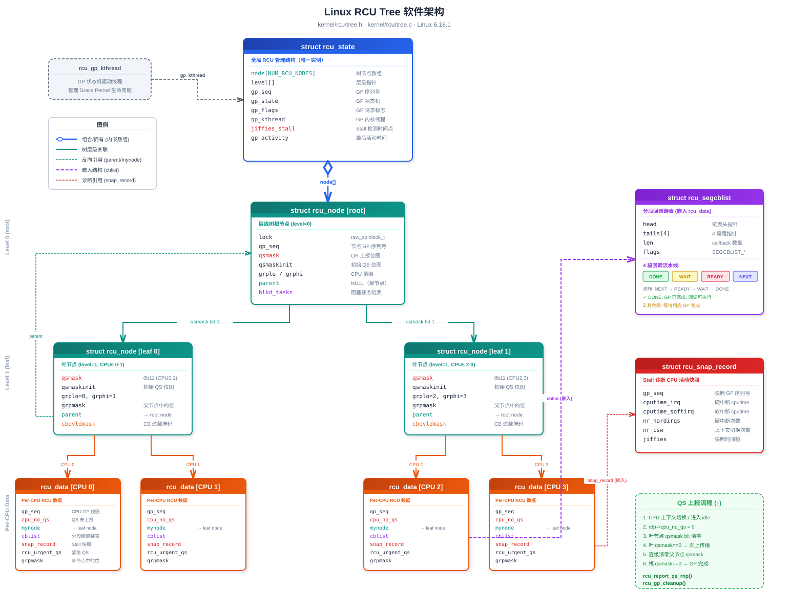

#### 1.1.1 层级树结构

RCU（Read-Copy-Update）在 Linux 内核中的核心实现是 **Tree RCU**（`kernel/rcu/tree.c`），采用层级树结构来高效管理大规模 SMP 系统上的 Grace Period 检测。

**设计思想**：

```
                         rcu_state (全局)
                              │
                         ┌────┴────┐
                    rcu_node (root, level=0)
                   ┌──────┴──────┐
             rcu_node         rcu_node        (level=1)
           ┌───┴───┐       ┌───┴───┐
       rcu_node  rcu_node rcu_node rcu_node   (leaf, level=2)
        │  │      │  │      │  │     │  │
       CPU CPU   CPU CPU   CPU CPU  CPU CPU   (rcu_data, per-CPU)
```

**关键参数**（定义在 `kernel/rcu/Kconfig`）：

| 参数 | 默认值 | 说明 |
|------|--------|------|
| `RCU_FANOUT` | 64（64位）/ 32（32位）| 中间节点扇出因子 |
| `RCU_FANOUT_LEAF` | 16 | 叶节点扇出因子（控制 cache 行为）|
| `NUM_RCU_NODES` | 根据 CPU 数量自动计算 | 树中 `rcu_node` 总数 |

**树的构建逻辑**：
- **叶节点**：每个叶 `rcu_node` 管理一组 CPU（最多 `RCU_FANOUT_LEAF` 个）
- **中间节点**：每个中间 `rcu_node` 管理最多 `RCU_FANOUT` 个子节点
- **根节点**：全局唯一，是所有 Quiescent State 汇聚的终点
- `rcu_node.grplo` / `grphi` 标记该节点负责的 CPU 范围

**RCU 实现类型选择**（`kernel/rcu/Kconfig`）：

| 配置 | 适用场景 | 选择条件 |
|------|---------|---------|
| `TREE_RCU` | 多核 SMP 系统 | `default y if SMP` |
| `PREEMPT_RCU` | 需要实时响应的 SMP | `default y if PREEMPT \|\| PREEMPT_RT` |
| `TINY_RCU` | 单核非实时系统 | `default y if !PREEMPT_RCU && !SMP` |

#### 1.1.2 Grace Period 状态机

Grace Period（GP）是 RCU 的核心概念——在一个 GP 内，所有 CPU 都必须经过至少一次 Quiescent State（静默状态），之后旧数据的回调才能安全执行。

GP 状态机定义在 `kernel/rcu/tree.c` 中：

```
┌─────────────┐
│ RCU_GP_IDLE  │ ← GP 空闲，无 GP 进行中
└──────┬──────┘
       │ gp_flags = RCU_GP_FLAG_INIT（有 callback 需要新 GP）
       ▼
┌────────────────┐
│ RCU_GP_WAIT_GPS │ ← 等待 GP 启动
└───────┬────────┘
        ▼
┌────────────────┐
│ RCU_GP_DONE_GPS │ ← GP 启动完成
└───────┬────────┘
        ▼
┌──────────────┐
│ RCU_GP_ONOFF  │ ← 处理 CPU hotplug
└──────┬───────┘
       ▼
┌─────────────┐
│ RCU_GP_INIT  │ ← 初始化：设置各节点 qsmask
└──────┬──────┘     record_gp_stall_check_time() 记录 stall 检测时间
       ▼
┌────────────────┐     ┌────────────────────┐
│ RCU_GP_WAIT_FQS │ ←→ │ RCU_GP_DOING_FQS    │ ← FQS 扫描循环
└───────┬────────┘     └────────────────────┘
        │ 所有 CPU 都报告了 QS（root->qsmask == 0）
        ▼
┌────────────────┐
│ RCU_GP_CLEANUP  │ ← GP 清理：推进 callback
└───────┬────────┘
        ▼
┌────────────────┐
│ RCU_GP_CLEANED  │ ← GP 清理完成 → 回到 IDLE 或启动新 GP
└────────────────┘
```

**GP 核心流程**（代码路径 `kernel/rcu/tree.c`）：

1. **GP 请求**（`rcu_start_this_gp()`）：
   - `call_rcu()` 注册的回调触发 GP 需求
   - 采用**漏斗锁（Funnel Locking）**：CPU 从叶节点逐级向上设置 `gp_seq_needed`
   - 最终在根节点设置 `gp_flags = RCU_GP_FLAG_INIT`，唤醒 GP kthread

2. **GP 初始化**（`rcu_gp_init()`）：
   - 调用 `rcu_seq_start(&rcu_state.gp_seq)` 递增 GP 序列号
   - **广度优先遍历**整棵树，设置每个 `rcu_node.qsmask = qsmaskinit`
   - 对离线 CPU 立即上报 QS
   - 调用 `record_gp_stall_check_time()` 记录 stall 检测时间基准

3. **FQS 扫描循环**（`rcu_gp_fqs_loop()`）：
   - 等待 `jiffies_till_first_fqs`（默认 1 jiffie）后开始首次 FQS
   - 此后每隔 `jiffies_till_next_fqs`（默认 1 jiffie）进行一次 FQS
   - callback 过载时自动缩短 FQS 间隔

4. **GP 清理**（`rcu_gp_cleanup()`）：
   - 调用 `rcu_seq_end()` 标记 GP 完成
   - 广度优先遍历更新所有节点的 `gp_seq`
   - 通过 `__note_gp_changes()` 推进已就绪的 callback

#### 1.1.3 Quiescent State 上报机制

Quiescent State（QS）表示一个 CPU 当前不在 RCU 读侧临界区内。

**QS 检测方式**：

| 方式 | 触发条件 | 说明 |
|------|---------|------|
| 调度器上下文切换 | `schedule()` | 非 PREEMPT_RCU 下自动 QS |
| Dynticks 空闲 | 进入 idle 循环 | `ct_rcu_watching()` 标记 EQS |
| 显式解锁 | `rcu_read_unlock()` | PREEMPT_RCU 下最后一层解锁 |
| 主动让出 | `cond_resched()` | 非抢占内核中的合作式 QS |
| 用户态执行 | 从内核返回用户态 | Extended QS |

**上报传播流程**：

```
CPU 上报 QS
    │
    ▼ rdp->cpu_no_qs = 0
叶节点 rcu_node.qsmask 对应 bit 清零
    │
    ├─→ 叶节点 qsmask != 0：等待其他 CPU
    │
    └─→ 叶节点 qsmask == 0：向上传播
         │
         ▼ 父节点 rcu_node.qsmask 对应 bit 清零（rcu_report_qs_rnp()）
              │
              └─→ 递归向上，直到根节点
                   │
                   └─→ 根节点 qsmask == 0 → GP 可以完成
```

**Dynticks 快照检测**：

FQS 扫描使用两次快照机制检测处于 EQS 的 CPU：
1. `rcu_watching_snap_save()`：保存 CPU 的 dynticks 状态快照
2. `rcu_watching_snap_recheck()`：比较状态是否变化，判断是否经过 EQS

#### 1.1.4 Callback 分段处理流水线

RCU callback 在 `struct rcu_segcblist` 中按 GP 依赖关系分为 4 个段：

```
┌────────────────────────────────────────────────────────────────┐
│  RCU_DONE_TAIL(0)  │ RCU_WAIT_TAIL(1) │ RCU_NEXT_READY(2) │ RCU_NEXT(3)  │
│  GP 已完成         │ 等待当前 GP 完成   │ 等待下一 GP 启动    │ 新注册       │
│  ✓ 可以执行        │ ⏳ 等待中          │ ⏳ 预备中           │ 🆕 未分配     │
└────────────────────────────────────────────────────────────────┘
head ────────────────────────────────────────────────────→ tail
```

**流转过程**：

1. `call_rcu()` → callback 进入 `RCU_NEXT_TAIL` 段
2. GP 启动 → `rcu_accelerate_cbs()` 将 `RCU_NEXT` 移到 `RCU_NEXT_READY`
3. 下一个 GP 启动 → `RCU_NEXT_READY` 移到 `RCU_WAIT_TAIL`
4. GP 完成 → `rcu_advance_cbs()` 将 `RCU_WAIT` 移到 `RCU_DONE_TAIL`
5. RCU softirq / NOCB kthread 执行 `RCU_DONE_TAIL` 段的回调

#### 1.1.5 Force-Quiescent-State 扫描

当 GP 等待过久，FQS 机制会主动催促未上报 QS 的 CPU：

```c
// kernel/rcu/tree.c - rcu_gp_fqs()
第 1 次 FQS: rcu_watching_snap_save()     → 收集各 CPU 的 dynticks 状态快照
后续 FQS:   rcu_watching_snap_recheck()   → 检查 dynticks 状态是否变化
            如果 CPU 在 EQS 中 → 代其上报 QS
            如果 CPU 无响应 → 对 NO_HZ_FULL CPU 发送 reschedule IPI
```

**FQS 时间参数**：

| 参数 | 默认值 | 说明 |
|------|--------|------|
| `jiffies_till_first_fqs` | 1 jiffie | 首次 FQS 延迟 |
| `jiffies_till_next_fqs` | 1 jiffie | 后续 FQS 间隔 |
| callback 过载时 | 自动缩短 | 加速 GP 完成 |

#### 1.1.6 NOCB 回调卸载架构

当 `CONFIG_RCU_NOCB_CPU` 使能时，指定 CPU 的 RCU callback 执行被卸载到专门的 kthread：

```
普通 CPU:  call_rcu() → RCU softirq 执行 callback（本 CPU）

NOCB CPU:  call_rcu() → nocb_bypass 链表 → nocb_gp_kthread（GP 跟踪）
                                           → nocb_cb_kthread（callback 执行）
```

**用途**：减少延迟敏感 CPU 的 OS jitter，适用于实时/HPC 场景。

---

### 1.2 RCU 关键数据结构

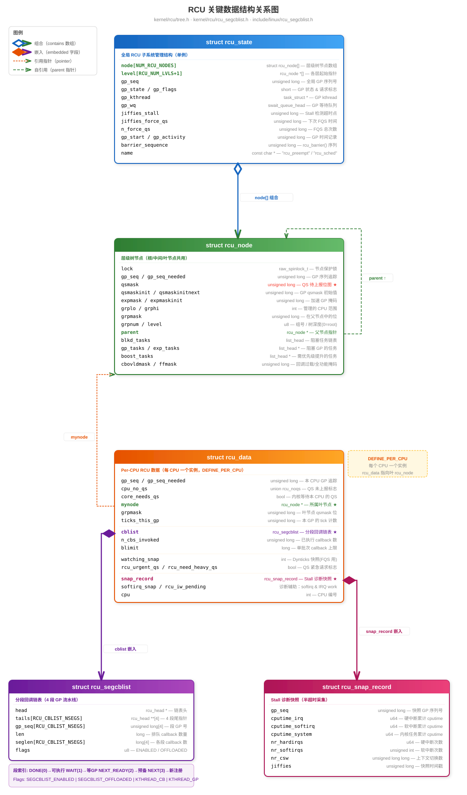

#### 1.2.1 struct rcu_state — 全局 RCU 状态

定义在 `kernel/rcu/tree.h`，是整个 RCU 子系统的全局管理结构：

| 字段 | 类型 | 说明 |
|------|------|------|
| `node[NUM_RCU_NODES]` | `struct rcu_node[]` | 层级树中所有 `rcu_node` 的扁平数组 |
| `level[RCU_NUM_LVLS+1]` | `struct rcu_node *[]` | 指向每层起始节点的指针 |
| `gp_seq` | `unsigned long` | **全局 GP 序列号**（低 2 位为状态标志）|
| `gp_state` | `short` | 当前 GP 状态（`RCU_GP_*` 枚举）|
| `gp_flags` | `unsigned long` | GP 请求标志（`RCU_GP_FLAG_INIT` / `RCU_GP_FLAG_FQS`）|
| `gp_kthread` | `struct task_struct *` | GP kthread 的 task 指针 |
| `gp_wq` | `wait_queue_head_t` | GP kthread 等待队列 |
| `gp_start` | `unsigned long` | 当前 GP 开始的 jiffies |
| `gp_activity` | `unsigned long` | GP kthread 最后活动时间 |
| `jiffies_stall` | `unsigned long` | **Stall 检测超时时间点** |
| `jiffies_force_qs` | `unsigned long` | 下一次 FQS 的 jiffies |
| `n_force_qs` | `unsigned long` | FQS 扫描总次数 |
| `n_online_cpus` | `int` | 当前在线 CPU 数 |
| `barrier_sequence` | `atomic_t` | `rcu_barrier()` 同步序列号 |
| `expedited_sequence` | `unsigned long` | 加速 GP 计数器 |
| `nr_fqs_jiffies_stall` | `int` | 防误报的 FQS 循环计数器 |
| `name` | `const char *` | RCU 类型名（如 `"rcu_preempt"`）|

#### 1.2.2 struct rcu_node — 层级树节点

定义在 `kernel/rcu/tree.h`，是层级树中的中间/叶节点：

| 字段 | 类型 | 说明 |
|------|------|------|
| `lock` | `raw_spinlock_t` | 保护本节点状态的自旋锁 |
| `gp_seq` | `unsigned long` | 本节点的 GP 序列号（与全局同步）|
| `gp_seq_needed` | `unsigned long` | 本节点子树需要的最远 GP |
| `qsmask` | `unsigned long` | **QS 掩码**：需要上报 QS 的 CPU/子节点位图 |
| `qsmaskinit` | `unsigned long` | 当前 GP 的 `qsmask` 初始值 |
| `qsmaskinitnext` | `unsigned long` | 下一 GP 的 `qsmask` 初始值 |
| `grplo` / `grphi` | `int` | 本节点管理的 CPU 范围 `[grplo, grphi]` |
| `grpmask` | `unsigned long` | 在父节点 qsmask 中的对应位 |
| `grpnum` | `u8` | 在父节点中的组号 |
| `level` | `u8` | 树深度（0 = 根节点）|
| `parent` | `struct rcu_node *` | 父节点指针 |
| `blkd_tasks` | `struct list_head` | 在 RCU 读侧临界区中被阻塞的任务链表 |
| `gp_tasks` | `struct list_head *` | 阻塞当前 GP 的首个任务 |
| `exp_tasks` | `struct list_head *` | 阻塞当前加速 GP 的首个任务 |
| `boost_tasks` | `struct list_head *` | 需要优先级提升的首个任务 |
| `cbovldmask` | `unsigned long` | callback 过载的 CPU 掩码 |
| `ffmask` | `unsigned long` | 全功能 CPU 掩码 |
| `expmask` | `unsigned long` | 加速 GP 需要上报 QS 的 CPU 掩码 |

#### 1.2.3 struct rcu_data — Per-CPU RCU 数据

定义在 `kernel/rcu/tree.h`，每个 CPU 一个实例：

| 字段分组 | 字段 | 说明 |
|---------|------|------|
| **QS/GP** | `gp_seq` | 本 CPU 所知的 GP 序列号 |
| | `gp_seq_needed` | 本 CPU 回调所需的 GP 序列号 |
| | `cpu_no_qs` | QS 尚未上报标志（`.b.norm` / `.b.exp`）|
| | `core_needs_qs` | 内核等待本 CPU 的 QS |
| | `mynode` | 指向所属叶 `rcu_node` |
| | `grpmask` | 在叶节点 qsmask 中的位 |
| | `ticks_this_gp` | 本 GP 期间的调度时钟 tick 数 |
| **Callback** | `cblist` | `struct rcu_segcblist`，分段回调链表 |
| | `n_cbs_invoked` | 启动以来已执行的 callback 总数 |
| | `blimit` | 单批次处理的 callback 上限 |
| **Dynticks** | `watching_snap` | Dynticks 状态快照（FQS 使用）|
| | `rcu_need_heavy_qs` | GP 过久，需要重量级 QS |
| | `rcu_urgent_qs` | 紧急请求 QS |
| | `rcu_forced_tick` | 强制 tick 以提供 QS |
| **Stall 诊断** | `snap_record` | `struct rcu_snap_record`，CPU 活动快照 |
| | `rcu_iw_pending` | IRQ work 是否挂起 |
| | `rcu_iw_gp_seq` | IRQ work 执行时的 GP seq |
| | `softirq_snap` | RCU softirq 快照 |
| **NOCB** | `nocb_gp_kthread` | NOCB GP kthread 指针 |
| | `nocb_bypass` | 旁路 callback 链表 |
| | `nocb_lock` | NOCB 保护锁 |

#### 1.2.4 struct rcu_segcblist — 分段回调链表

定义在 `kernel/rcu/rcu_segcblist.h`：

| 字段 | 类型 | 说明 |
|------|------|------|
| `head` | `struct rcu_head *` | 回调链表头 |
| `tails[RCU_CBLIST_NSEGS]` | `struct rcu_head **[4]` | 4 个段的尾指针 |
| `gp_seq[RCU_CBLIST_NSEGS]` | `unsigned long[4]` | 每段依赖的 GP 序列号 |
| `len` | `long` | 已排队的 callback 数量 |
| `flags` | `u8` | 状态标志 |

**段索引常量**：
- `RCU_DONE_TAIL (0)` — GP 已完成，可执行
- `RCU_WAIT_TAIL (1)` — 等待 GP 完成
- `RCU_NEXT_READY_TAIL (2)` — 等待下一 GP 启动
- `RCU_NEXT_TAIL (3)` — 新注册，未分配 GP

**Flags**：
- `SEGCBLIST_ENABLED` — 链表已启用
- `SEGCBLIST_OFFLOADED` — 已卸载到 NOCB kthread
- `SEGCBLIST_KTHREAD_CB` / `SEGCBLIST_KTHREAD_GP` — kthread 状态

#### 1.2.5 struct rcu_snap_record — Stall 诊断快照

定义在 `kernel/rcu/tree.h`，用于 RCU CPU Stall 告警时的 CPU 活动信息：

```c
struct rcu_snap_record {
    unsigned long    gp_seq;          // 快照对应的 GP 序列号
    u64              cputime_irq;     // 硬中断累计 cputime
    u64              cputime_softirq; // 软中断累计 cputime
    u64              cputime_system;  // 内核任务累计 cputime
    u64              nr_hardirqs;     // 硬中断次数
    unsigned int     nr_softirqs;     // 软中断次数
    unsigned long long nr_csw;        // 上下文切换次数
    unsigned long    jiffies;         // 快照时的 jiffies
};
```

快照在 **Stall 超时时间的一半** 时刻采集，Stall 告警时输出 delta 值，帮助判断 CPU 在 stall 期间的活动状态。

---

### 1.3 RCU 告警 Debug 需要 Enable 的内核开关

#### 1.3.1 基础 RCU 配置开关

| 配置项 | 默认值 | 说明 | 源文件 |
|--------|--------|------|--------|
| `CONFIG_TREE_RCU` | `y`（SMP）| 层级树 RCU 实现 | `kernel/rcu/Kconfig` |
| `CONFIG_PREEMPT_RCU` | `y`（PREEMPT/RT）| 可抢占 RCU 读者 | `kernel/rcu/Kconfig` |
| `CONFIG_RCU_STALL_COMMON` | `y`（TREE_RCU）| **Stall 检测基础设施** | `kernel/rcu/Kconfig` |
| `CONFIG_RCU_BOOST` | `y`（PREEMPT_RT）| 对阻塞读者进行优先级提升 | `kernel/rcu/Kconfig` |
| `CONFIG_RCU_NOCB_CPU` | `n` | Callback 卸载到 kthread | `kernel/rcu/Kconfig` |

#### 1.3.2 Stall 检测配置开关

| 配置项 | 默认值 | 范围 | 说明 |
|--------|--------|------|------|
| `CONFIG_RCU_CPU_STALL_TIMEOUT` | **21 秒** | 3-300 | 普通 GP Stall 超时阈值 |
| `CONFIG_RCU_EXP_CPU_STALL_TIMEOUT` | **0**（使用普通超时）| 0-300000 ms | 加速 GP Stall 超时（毫秒）|
| `CONFIG_RCU_CPU_STALL_CPUTIME` | `n` | — | **开启后输出 Stall 期间 CPU 时间统计** |
| `CONFIG_RCU_CPU_STALL_NOTIFIER` | `n` | — | Stall 通知链（DEBUG_KERNEL + RCU_EXPERT）|

> **Debug 建议**：务必开启 `CONFIG_RCU_CPU_STALL_CPUTIME=y`，它能在 Stall 告警中输出硬中断/软中断/上下文切换的统计信息，是定位 Stall 根因的关键数据。

#### 1.3.3 Debug 与 Tracing 配置开关

| 配置项 | 默认值 | 说明 |
|--------|--------|------|
| `CONFIG_PROVE_RCU` | `y`（PROVE_LOCKING 时）| 基于 lockdep 的 RCU 正确性验证 |
| `CONFIG_PROVE_RCU_LIST` | `n` | RCU 链表 lockdep 检查 |
| `CONFIG_RCU_TRACE` | `y`（TREE_RCU 时）| **启用 ftrace 事件跟踪**（rcu:rcu_stall_warning 等）|
| `CONFIG_RCU_EQS_DEBUG` | — | NO_HZ 一致性检查 |
| `CONFIG_RCU_STRICT_GRACE_PERIOD` | `n` | 严格 GP 模式（仅调试用，≤4 CPU）|
| `CONFIG_RCU_TORTURE_TEST` | `n` | RCU 压力测试模块 |
| `CONFIG_RCU_SCALE_TEST` | `n` | RCU 性能测试模块 |

#### 1.3.4 运行时 sysctl 调优参数

通过 `/proc/sys/kernel/` 或 `sysctl` 在运行时调整：

| sysctl 参数 | 默认值 | 说明 |
|-------------|--------|------|
| `kernel.rcu_cpu_stall_timeout` | 21 | Stall 超时（秒），范围 3-300 |
| `kernel.rcu_exp_cpu_stall_timeout` | 0 | 加速 GP Stall 超时（毫秒）|
| `kernel.panic_on_rcu_stall` | 0 | **Stall 时是否 panic** |
| `kernel.max_rcu_stall_to_panic` | — | 达到此次数后才 panic |
| `kernel.rcu_cpu_stall_suppress` | 0 | 抑制 Stall 告警 |
| `kernel.rcu_cpu_stall_ftrace_dump` | 0 | **Stall 时 dump ftrace buffer** |

#### 1.3.5 Boot 参数

内核启动参数（通过 bootargs 传递）：

| 参数 | 说明 |
|------|------|
| `rcupdate.rcu_cpu_stall_timeout=<秒>` | 设置 Stall 超时 |
| `rcupdate.rcu_cpu_stall_suppress=1` | 抑制 Stall 告警 |
| `rcupdate.rcu_cpu_stall_cputime=1` | 启用 CPU 时间统计输出 |
| `rcupdate.rcu_cpu_stall_ftrace_dump=1` | Stall 时 dump ftrace |
| `rcu_nocbs=<cpulist>` | 指定 NOCB CPU |

#### 1.3.6 推荐 Debug 配置组合

**生产环境调试建议**：

```kconfig
# 基础 Stall 检测（通常已默认开启）
CONFIG_RCU_STALL_COMMON=y
CONFIG_RCU_CPU_STALL_TIMEOUT=21

# 增强诊断信息（强烈建议开启）
CONFIG_RCU_CPU_STALL_CPUTIME=y
CONFIG_RCU_TRACE=y

# lockdep 检测（开发/测试环境）
CONFIG_PROVE_RCU=y

# Stall 时 panic 抓 ramdump（严重问题复现时）
# 运行时: echo 1 > /proc/sys/kernel/panic_on_rcu_stall
```

**开发环境深度调试**：

```kconfig
CONFIG_RCU_CPU_STALL_CPUTIME=y
CONFIG_RCU_TRACE=y
CONFIG_PROVE_RCU=y
CONFIG_PROVE_RCU_LIST=y
CONFIG_RCU_EQS_DEBUG=y
CONFIG_RCU_CPU_STALL_NOTIFIER=y    # 需要 RCU_EXPERT=y
CONFIG_RCU_STRICT_GRACE_PERIOD=y   # 仅小系统
```

---

### 1.4 RCU 告警案例分析和 Log 解读

#### 1.4.1 RCU CPU Stall 告警格式全解析

**Stall 检测入口**：`check_cpu_stall()`（`kernel/rcu/tree_stall.h`）

检测分为两类：
- **Self-Detected**（`print_cpu_stall()`）：本 CPU 检测到自己 stall
- **Other-Detected**（`print_other_cpu_stall()`）：检测到其他 CPU stall

**典型 Log 格式及字段解读**：

```
INFO: rcu_preempt detected stalls on CPUs/tasks:
    2-...0: (3 GPs behind) idle=b30/1/0x4000000000000000 softirq=1492/1493 fqs=2134
    5-...0: (0 ticks this GP) idle=713/1/0x4000000000000000 softirq=506/506 fqs=2134
    (detected by 0, t=6002 jiffies, g=2745, q=29 ncpus=8)
```

**逐字段解析**：

```
2-...0:
│ ├──┘
│ │    CPU 编号
│ │
│ └─── 4 个标志位:
│      位1: 'O' = 在线, '.' = 离线
│      位2: 'o' = qsmaskinit 中有位, '.' = 没有
│      位3: 'N' = qsmaskinitnext 中有位, '.' = 没有
│      位4: IRQ work 状态:
│           '?' = 未启用 CONFIG_IRQ_WORK
│           '0'-'9' = IRQ work 挂起，数字=距上次响应的 GP 数
│           '!' = IRQ work 从未执行
│           '.' = IRQ work 正常执行
│
(3 GPs behind)        本 CPU 的 gp_seq 落后全局 3 个 GP → 严重 stall
(0 ticks this GP)     本 GP 期间本 CPU 调度时钟 tick 为 0 → 可能关中断

idle=b30/1/0x...      ct_rcu_watching_cpu() & 0xffff / ct_nesting / ct_nmi_nesting
                      用于判断 CPU 是否在 idle/用户态/NMI 中

softirq=1492/1493     RCU softirq 快照值 / 当前值
                      差值为 1 说明只执行了一次 RCU softirq

fqs=2134              从 GP 开始到现在的 FQS 扫描次数

(detected by 0, ...)  检测者 CPU=0
t=6002 jiffies        GP 已持续 6002 jiffies
g=2745                当前 GP 序列号
q=29                  全局 callback 总数
ncpus=8               在线 CPU 数
```

**CPU 时间统计输出**（需 `CONFIG_RCU_CPU_STALL_CPUTIME=y`）：

```
             hardirqs   softirqs   csw/system
    number:    12345       678        42
   cputime:      800        50       100   ==> 10500(ms)
```

- `number` 行：stall 期间的硬中断/软中断/上下文切换 **次数增量**
- `cputime` 行：stall 期间的硬中断/软中断/内核任务的 **CPU 时间增量**（毫秒）
- `==> 10500(ms)`：本次采样周期的总时长

#### 1.4.2 案例一：单核长时间关中断导致 RCU Stall

**典型 Log**：

```
INFO: rcu_preempt detected stalls on CPUs/tasks:
    3-...0: (0 ticks this GP) idle=b30/1/0x4000000000000000 softirq=1492/1492 fqs=5001
             hardirqs   softirqs   csw/system
    number:        0          0          0
   cputime:        0          0      10500   ==> 10500(ms)
    (detected by 0, t=21003 jiffies, g=1000, q=5 ncpus=8)
```

**Log 解读**：
1. **`0 ticks this GP`**：CPU 3 在本 GP 期间没有调度时钟 tick → 很可能关了中断
2. **`softirq=1492/1492`**：RCU softirq 完全没有执行（差值 = 0）
3. **CPU 时间统计**：硬中断 0 次、软中断 0 次、上下文切换 0 次，但 system cputime = 10500ms → CPU 一直在内核态运行，且中断被关闭
4. **IRQ work 标志 '!'**：如果出现 `!` 说明 IRQ work 从未执行，佐证中断被禁用

**定位方向**：
- 检查 CPU 3 上是否有 `local_irq_disable()` 后长时间未恢复
- 检查是否有 `spin_lock_irqsave()` 后进入死循环
- 查看 NMI dump 的栈回溯确认卡在什么位置

#### 1.4.3 案例二：PREEMPT_RCU 下读侧临界区阻塞 GP

**典型 Log**：

```
INFO: rcu_preempt detected stalls on CPUs/tasks:
    Tasks blocked on level-1 rcu_node (CPUs 0-7):
     P1234/1:bq.l P5678
    (detected by 2, t=63007 jiffies, g=4000, q=100 ncpus=8)
```

**Log 解读**：
1. **`Tasks blocked on level-1 rcu_node`**：有任务在 `rcu_node` 的 `blkd_tasks` 链表上
2. **`P1234/1:bq.l`**：
   - `P1234`：PID = 1234
   - `/1`：`rcu_read_lock_nesting = 1`（在 1 层 RCU 读侧临界区中）
   - `b`：`rcu_read_unlock_special.b.blocked = 1`（已被标记为 blocked）
   - `q`：`rcu_read_unlock_special.b.need_qs = 1`（需要上报 QS）
   - `.`：`rcu_read_unlock_special.b.exp_hint = 0`（无加速 GP 提示）
   - `l`：`on_blkd_list = 1`（在 blkd_tasks 链表上）
3. **`P5678`**（无详细信息）：该任务正在运行中，无法检查其状态

**定位方向**：
- 检查 PID 1234 的调度状态：是否被优先级反转？是否在等待互斥锁？
- 使用 `sched_show_task(P1234)` 的输出查看完整栈
- 检查是否有 `rcu_read_lock()` 后调用了可能睡眠的函数
- 如果开启了 `CONFIG_RCU_BOOST`，检查 boost 是否生效

#### 1.4.4 案例三：GP kthread 饥饿

**典型 Log**：

```
rcu_preempt kthread starved for 15000 jiffies! g1000 f0x0 RCU_GP_WAIT_FQS(5) ->state=0x402 ->cpu=3
    Unless rcu_preempt kthread gets sufficient CPU time, OOM is now expected behavior.
RCU grace-period kthread stack dump:
[stack trace of rcu_gp_kthread]
```

**Log 解读**（代码路径 `kernel/rcu/tree_stall.h: rcu_check_gp_kthread_starvation()`）：
1. **`starved for 15000 jiffies`**：GP kthread 已经 15000 jiffies（约 150 秒）没有活动
2. **`g1000`**：当前 GP 序列号
3. **`f0x0`**：`gp_flags = 0`
4. **`RCU_GP_WAIT_FQS(5)`**：卡在 FQS 等待状态
5. **`->state=0x402`**：kthread 的 task state
6. **`->cpu=3`**：kthread 最后运行在 CPU 3

**定位方向**：
- GP kthread 是实时优先级，被饥饿说明系统有更高优先级任务持续运行
- 检查 CPU 3 上是否有 RT FIFO 任务占满 CPU
- `OOM is now expected behavior`：GP 无法完成 → callback 堆积 → slab 内存无法释放 → OOM

#### 1.4.5 案例四：FQS Timer 丢失唤醒

**典型 Log**：

```
rcu_preempt kthread timer wakeup didn't happen for 5000 jiffies! g2000 f0x0 RCU_GP_WAIT_FQS(5) ->state=0x402
    Possible timer handling issue on cpu=2 timer-softirq=1234
```

**Log 解读**（代码路径 `kernel/rcu/tree_stall.h: rcu_check_gp_kthread_expired_fqs_timer()`）：
1. **GP 卡在 `RCU_GP_WAIT_FQS` 状态**，且等待时间远超预期
2. **GP kthread 不在运行队列上**（`!gpk->on_rq`）
3. **Timer softirq 可能未正常执行**：`timer-softirq=1234` 显示该 CPU 上的 timer softirq 计数

**定位方向**：
- Timer 中断是否在 CPU 2 上正常触发？
- 检查 `TIMER_SOFTIRQ` 是否被阻塞（例如 `ksoftirqd` 被饿死）
- 检查是否有 `local_bh_disable()` 长时间未恢复

#### 1.4.6 Stall 检测时序与误报排除

**检测时序**（`kernel/rcu/tree_stall.h: check_cpu_stall()`）：

```
GP 开始
  │
  ├─── +jiffies_till_stall_check/2 ──→ 记录 CPU 活动快照（snap_record）
  │                                     发送 IRQ work 检测中断响应
  │
  ├─── +jiffies_till_stall_check ────→ 触发 Stall 告警（默认 21s）
  │                                     Self-detected 或 Other-detected
  │
  └─── +3*jiffies_till_stall_check ──→ 后续 Stall 告警（间隔递增 3 倍）
```

**误报排除机制**（5 重内存屏障验证）：

```c
// check_cpu_stall() 中的误报防护
gs1 = READ_ONCE(rcu_state.gp_seq);      // ①
smp_rmb();
js  = READ_ONCE(rcu_state.jiffies_stall); // ②
smp_rmb();
gps = READ_ONCE(rcu_state.gp_start);      // ③
smp_rmb();
gs2 = READ_ONCE(rcu_state.gp_seq);        // ④

// 验证条件（任一不满足则认为误报）：
if (gs1 != gs2)           → GP 边界穿越，数据不一致
if (j < js)               → 尚未到达 stall 超时
if (gps >= js)            → GP 启动时间异常
if (!rcu_seq_state(gs2))  → GP 已完成
```

**KVM 虚拟机误报处理**：

```c
if (kvm_check_and_clear_guest_paused())
    return;  // 虚拟机被宿主机暂停，不是真正的 stall
```

**`false positive?` 标记**：

当 GP kthread 饥饿且目标 CPU 处于 EQS（Extended Quiescent State）时，`print_cpu_stall_info()` 会输出 `(false positive?)` 提示，说明该 CPU 并非真的 stall，而是 GP kthread 未能及时处理其 QS 上报。

---

### 1.5 RCU 核心算法总结

本节提炼 Tree RCU 实现中涉及的核心算法，帮助理解 RCU 运行机理和 debug 问题时的思路。

#### 1.5.1 GP 序列号编码算法

**源码**：`kernel/rcu/rcu.h` — `rcu_seq_start()` / `rcu_seq_end()` / `rcu_seq_snap()`

GP 序列号 `gp_seq` 使用**低 2 位作为状态标志位**，高位作为单调递增计数器：

```
gp_seq 布局:
┌───────────────────────────────────────────┬──┬──┐
│        GP 计数器 (单调递增)                │S1│S0│
└───────────────────────────────────────────┴──┴──┘
                                            ▲  ▲
                                            └──┴── 状态标志 (0-3)

状态编码:
  S = 00 (0) → GP 空闲，无 GP 进行中
  S = 01 (1) → GP 已启动（rcu_seq_start 将 +1）
  S = 10 (2) → GP 中间状态（SRCU 使用）
  S = 11 (3) → GP 完成前最后状态

完整 GP 周期:
  gp_seq = ...00  → rcu_seq_start() → ...01  (GP 开始)
                  → FQS 循环...
  gp_seq = ...01  → rcu_seq_end()   → ...00  (GP 结束，计数器 +1)
  实际上 rcu_seq_end() = (gp_seq | 0x3) + 1 → 状态位归零，计数器进位
```

**关键操作**：

| 操作 | 实现 | 说明 |
|------|------|------|
| `rcu_seq_state(s)` | `s & RCU_SEQ_STATE_MASK` | 取低 2 位状态 |
| `rcu_seq_start(sp)` | `*sp += 1; smp_mb()` | GP 开始，状态 0→1 |
| `rcu_seq_end(sp)` | `smp_mb(); *sp = (*sp \| 0x3) + 1` | GP 结束，状态→0，计数器+1 |
| `rcu_seq_snap(sp)` | `(READ_ONCE(*sp) + 2*MASK + 1) & ~MASK` | 取"需要完整 GP 后"的目标序列号 |
| `rcu_seq_done(sp, s)` | `READ_ONCE(*sp) >= s` | 判断目标 GP 是否完成 |

**`rcu_seq_snap()` 算法解析**：  
给定当前 `gp_seq`，返回一个目标值 `s`，保证从当前时刻起至少经过一个**完整** GP 后，`gp_seq >= s` 才为真。公式 `(cur + 2*MASK + 1) & ~MASK` 等价于向上取整到下一个 "状态=00" 的值再多跨一个完整 GP，确保 `call_rcu()` 时注册的 callback 在未来某个 GP 完成后才被执行。

#### 1.5.2 漏斗锁算法（Funnel Locking）

**源码**：`kernel/rcu/tree.c` — `rcu_start_this_gp()`

当 CPU 需要请求新 GP 时，采用**自底向上的漏斗锁**策略，避免所有 CPU 同时竞争根节点锁：

```
算法流程（从叶节点到根节点）:

CPU 发起 GP 请求 (gp_seq_req)
    │
    ▼
叶节点 rnp_start (已持锁)
    │ 检查: rnp->gp_seq_needed >= gp_seq_req?
    │       或 GP 已经 started?
    │ ──────→ 是：提前退出（其他人已请求）
    │
    │ 否: WRITE(rnp->gp_seq_needed, gp_seq_req)
    │     检查: GP 正在进行中?
    │ ──────→ 是：提前退出（cleanup 会看到标记）
    │
    ▼ 加锁父节点，释放子节点锁
中间节点
    │ 同样检查 + 标记 gp_seq_needed
    │ ──────→ 可提前退出
    │
    ▼ 加锁父节点，释放中间节点锁
根节点
    │ 无正在进行的 GP:
    │   设置 gp_flags = RCU_GP_FLAG_INIT
    │   返回 true → 唤醒 GP kthread
    │
    │ 已有 GP:
    │   直接退出
    ▼
退出时: 将根节点的 gp_seq_needed 回写到叶节点和 rdp
```

**核心思想**：  
- 越接近叶节点，持锁越短，竞争越低
- 中间节点发现已有 GP 在进行中就提前退出，因为 GP cleanup 阶段会扫描所有节点的 `gp_seq_needed`
- 只有极少数请求能到达根节点，形成"漏斗"效果
- 退出时回写最新的 `gp_seq_needed` 到叶节点，避免后续重复向上遍历

**复杂度**：$O(\log_{fanout} N_{CPU})$ 层级锁获取，远优于直接竞争单一全局锁的 $O(N_{CPU})$。

#### 1.5.3 QS 位图逐层上报算法

**源码**：`kernel/rcu/tree.c` — `rcu_report_qs_rnp()` / `rcu_report_qs_rdp()`

Quiescent State 上报采用**自底向上的位图清零 + 逐层传播**：

```
算法流程:

1. CPU 上报 QS (rcu_report_qs_rdp):
   ├─ 验证: rdp->gp_seq == rnp->gp_seq? (当前 GP 有效)
   ├─ 验证: cpu_no_qs.b.norm == 0? (已上报则跳过)
   └─ 计算 mask = rdp->grpmask
      调用 rcu_report_qs_rnp(mask, rnp, gps, flags)

2. 位图逐层上报 (rcu_report_qs_rnp):
   for (;;) {
       ├─ 检查: rnp->gp_seq != gps → 跳过(GP 已变)
       ├─ rnp->qsmask &= ~mask   (清零对应位)
       │
       ├─ qsmask != 0 || 还有阻塞任务?
       │  └─→ 是: return (本层还有其他未上报的)
       │
       ├─ qsmask == 0 且无阻塞任务:
       │  ├─ rnp->completedqs = rnp->gp_seq (标记本层完成)
       │  ├─ mask = rnp->grpmask (获取本节点在父节点的位)
       │  ├─ 到达 root? → break → 调用 rcu_report_qs_rsp()
       │  └─ 释放本层锁，加锁父层，继续循环
   }

3. 到达根节点且所有位清零 (rcu_report_qs_rsp):
   └─ 设置 gp_flags |= RCU_GP_FLAG_FQS → 唤醒 GP kthread 完成 GP
```

**关键设计**：  
- 每个节点用 `qsmask` 位图追踪子节点/CPU 的 QS 状态
- 只有最后一个清零该层位图的 CPU 才向上传播，避免冗余遍历
- 从叶到根最坏 $O(\text{depth})$ 次锁操作，但平均只需 1-2 层

#### 1.5.4 Callback 分段流水线算法

**源码**：`kernel/rcu/rcu_segcblist.c` — `rcu_segcblist_advance()` / `rcu_segcblist_accelerate()`

RCU callback 使用 **4 段流水线**，以 GP 序列号为分界进行段推进：

```
段布局:
head ──→ [DONE(0)] ──→ [WAIT(1)] ──→ [NEXT_READY(2)] ──→ [NEXT(3)] ──→ NULL
           │               │               │                  │
        可执行          等当前GP完成     等下一GP启动        新注册

tails[4] 数组: 每段的尾指针 (指向段尾 rcu_head 的 next 指针)
gp_seq[4] 数组: 每段所属的 GP 序列号
```

**advance 算法**（GP 完成时调用）：

```
rcu_segcblist_advance(rsclp, seq):
  // 找到所有 gp_seq <= seq 的段，合并到 DONE
  for i = WAIT_TAIL; i < NEXT_TAIL; i++:
      if seq < rsclp->gp_seq[i]: break
      tails[DONE_TAIL] = tails[i]     // 拉伸 DONE 段
      move seglen[i] → seglen[DONE]

  // 清理空洞：将后面的段前移填补
  for j = WAIT_TAIL; i < NEXT_TAIL; i++, j++:
      tails[j] = tails[i]
      gp_seq[j] = gp_seq[i]
      move seglen accordingly
```

**accelerate 算法**（获得更精确 GP 信息时调用）：

```
rcu_segcblist_accelerate(rsclp, seq):
  // 从 NEXT_READY 往 DONE 方向找第一个 gp_seq < seq 的非空段
  for i = NEXT_READY_TAIL; i > DONE_TAIL; i--:
      if !empty(i) && gp_seq[i] < seq: break

  // 将 i+1 到 NEXT_TAIL 的所有段合并，标记为 seq
  for j = i+1; j <= NEXT_TAIL; j++:
      tails[j] = tails[NEXT_TAIL]
      gp_seq[j] = seq     // 加速：标记更早的 GP 即可完成
```

**设计意图**：  
- `call_rcu()` 注册时只能保守估计 GP 号（放入 `NEXT` 段）
- `accelerate` 在获取全局锁后用精确的 `gp_seq` 重新标记，将 callback 提前到更早的 GP
- `advance` 在 GP 完成后将已就绪段滑向 `DONE`，供 softirq 或 NOCB kthread 执行

#### 1.5.5 Force-Quiescent-State 两阶段扫描算法

**源码**：`kernel/rcu/tree.c` — `rcu_gp_fqs()` / `force_qs_rnp()`

FQS 采用**两阶段 Dynticks 快照比对**来检测处于 EQS 的 CPU：

```
第 1 次 FQS (first_time=true):
  force_qs_rnp(rcu_watching_snap_save)
  │
  └─ 遍历所有叶节点的 qsmask 中仍为 1 的 CPU:
     rdp->watching_snap = ct_rcu_watching_cpu_acquire(cpu)
     ├─ 如果 CPU 已在 EQS → 直接代报 QS (return 1)
     └─ 否则 → 保存快照供后续比对 (return 0)

后续 FQS (first_time=false):
  force_qs_rnp(rcu_watching_snap_recheck)
  │
  └─ 遍历所有叶节点的 qsmask 中仍为 1 的 CPU:
     比对 rdp->watching_snap 与当前 dynticks 状态
     ├─ 状态已变化 → CPU 经过了 EQS → 代报 QS (return 1)
     ├─ 状态未变化且需要 resched → return -1 → 发送 IPI
     └─ 否则 → 继续等待 (return 0)
```

**Callback 过载加速**：
```
if (rcu_state.cbovld):
    j = (j + 2) / 3   // FQS 间隔缩短为 1/3
```

当 callback 堆积严重时，FQS 循环自动加速，更频繁地催促未响应的 CPU。

#### 1.5.6 Stall 检测 5 重屏障验证算法

**源码**：`kernel/rcu/tree_stall.h` — `check_cpu_stall()`

为防止 GP 边界穿越导致的**误报**，stall 检测使用 5 个读屏障验证数据一致性：

```c
// 采样顺序（读端）：
gs1 = READ_ONCE(rcu_state.gp_seq);      // ① 第一次读 gp_seq
smp_rmb();                                // ── 屏障 ──
js  = READ_ONCE(rcu_state.jiffies_stall); // ② 读 stall 超时点
smp_rmb();                                // ── 屏障 ──
gps = READ_ONCE(rcu_state.gp_start);      // ③ 读 GP 启动时间
smp_rmb();                                // ── 屏障 ──
gs2 = READ_ONCE(rcu_state.gp_seq);        // ④ 第二次读 gp_seq

// 写端顺序（GP init/cleanup 中）：
// gp_start → jiffies_stall → gp_seq （反序更新，配合 smp_wmb）
```

**4 个拒绝条件**（任一满足则认为误报退出）：

| 条件 | 含义 |
|------|------|
| `gs1 != gs2` | 两次读 gp_seq 不一致 → GP 边界穿越 |
| `j < js` | 当前时间未到 stall 超时点 |
| `gps >= js` | GP start ≥ stall 超时 → 时间异常 |
| `!rcu_seq_state(gs2)` | GP 已完成（状态位 = 0）|

**竞态窗口保护**：  
- 如果在 ①→④ 期间一个 GP 结束并启动了新 GP，`gs1 != gs2` 必定成立
- `smp_rmb()` 保证读取顺序不被 CPU 重排

**cmpxchg 抢占式报告**：
```c
cmpxchg(&rcu_state.jiffies_stall, js, jn)
```
使用 `cmpxchg` 确保只有一个 CPU 输出 stall 告警（self-detected 或 other-detected），避免重复打印。

#### 1.5.7 GP kthread 主循环状态机算法

**源码**：`kernel/rcu/tree.c` — `rcu_gp_kthread()`

GP kthread 是一个无限循环的状态机：

```
rcu_gp_kthread():
  for (;;) {
    ┌──────────────────────────────────────┐
    │ Phase 1: 等待 GP 请求                 │
    │  WAIT_GPS → swait(gp_flags & INIT)   │
    │  DONE_GPS → rcu_gp_init()            │
    │  └─ 返回 false → 继续等待            │
    │  └─ 返回 true  → 进入 Phase 2        │
    └──────────────┬───────────────────────┘
                   ▼
    ┌──────────────────────────────────────┐
    │ Phase 2: FQS 循环（rcu_gp_fqs_loop）  │
    │  WAIT_FQS → sleep(j jiffies)         │
    │  DOING_FQS → rcu_gp_fqs()           │
    │  ├─ 检查 root->qsmask == 0? → break │
    │  ├─ cbovld? → j = (j+2)/3 加速      │
    │  └─ 循环直到所有 CPU 上报 QS          │
    └──────────────┬───────────────────────┘
                   ▼
    ┌──────────────────────────────────────┐
    │ Phase 3: GP 清理（rcu_gp_cleanup）    │
    │  CLEANUP:                            │
    │  ├─ 广度优先遍历更新所有 rnp->gp_seq  │
    │  ├─ __note_gp_changes() 推进 callback│
    │  ├─ rcu_future_gp_cleanup() 检查     │
    │  ├─ rcu_seq_end() → GP 完成          │
    │  └─ 如果有新请求 → 设 GP_FLAG_INIT   │
    │  CLEANED → 回到 Phase 1              │
    └──────────────────────────────────────┘
  }
```

**关键时序参数**：

| 参数 | 默认 | 说明 |
|------|------|------|
| `jiffies_till_first_fqs` | `RCU_JIFFIES_TILL_FORCE_QS`（1-3） | 首次 FQS 延迟 |
| `jiffies_till_next_fqs` | 同上 | 后续 FQS 间隔 |
| callback 过载 | 间隔 ÷ 3 | 自适应加速 |
| stall 超时 | 21s | `jiffies_stall` 阈值 |

#### 1.5.8 广度优先树遍历算法

**源码**：`kernel/rcu/tree.c` — `rcu_for_each_node_breadth_first()` / `rcu_for_each_leaf_node()`

RCU 树结构存储在**扁平数组** `rcu_state.node[NUM_RCU_NODES]` 中，采用类似堆的布局：

```
数组布局（heap-style）:
┌────────────────────────────────────────────────┐
│ node[0] │ node[1] │ node[2] │ ... │ node[m]   │ node[m+1] │ ... │
│ root    │ level-1 起始       ...   │ level-1 末│ leaf 起始  ...   │
└────────────────────────────────────────────────┘
     ↑          ↑                          ↑
  level[0]   level[1]                   level[2]

遍历方式:
  rcu_for_each_node_breadth_first(rnp):
    for (rnp = &node[0]; rnp < &node[NUM_RCU_NODES]; rnp++)
    // 数组线性遍历即为广度优先，因为同层节点连续存储

  rcu_for_each_leaf_node(rnp):
    for (rnp = level[RCU_NUM_LVLS-1]; rnp < &node[NUM_RCU_NODES]; rnp++)
    // 从最后一层起始指针开始遍历
```

**优势**：
- 无需队列/栈即可实现 BFS——数组顺序就是 BFS 序
- Cache 友好：连续内存访问
- `level[]` 数组 $O(1)$ 定位任意层的起始位置

#### 1.5.9 Expedited GP 算法

**源码**：`kernel/rcu/tree_exp.h` — `exp_funnel_lock()` / `sync_rcu_exp_select_cpus()`

加速 GP（synchronize_rcu_expedited）使用 **IPI 主动催促** 而非被动等待 QS：

```
算法流程:

1. 漏斗锁获取（exp_funnel_lock）:
   从叶节点向上遍历:
   ├─ 检查 exp_seq_rq >= s? → 已有人在做 → wait_event()
   ├─ 设置 exp_seq_rq = s → 后来者可以等待我们
   └─ 到达根节点 → 获取 exp_mutex → 成为执行者
   快速路径: 直接 trylock exp_mutex（低竞争场景）

2. 初始化 expmask（sync_exp_reset_tree）:
   广度优先遍历，设置 rnp->expmask = rnp->expmaskinit
   叶节点: 如果有 blkd_tasks → 设置 exp_tasks

3. 并行 IPI 选择（sync_rcu_exp_select_cpus）:
   为每个叶节点分配 kworker:
   ├─ 当前 CPU → 跳过 IPI（直接 mask）
   ├─ 已在 EQS 的 CPU → ct_rcu_watching_cpu_acquire() 检测 → 直接代报
   ├─ 其他在线 CPU → smp_call_function_single(cpu, rcu_exp_handler)
   │                  IPI handler 中上报 exp QS
   └─ 离线 CPU → 直接代报

4. 等待完成（synchronize_rcu_expedited_wait）:
   swait_event 等待 root->expmask == 0 && root->exp_tasks == NULL

5. QS 上报传播（__rcu_report_exp_rnp）:
   与普通 GP 类似的自底向上位图清零
   到达根节点 → 唤醒 expedited_wq
```

**与普通 GP 的对比**：

| 维度 | 普通 GP | 加速 GP |
|------|---------|---------|
| QS 检测 | 被动等待调度/idle | 主动 IPI 催促 |
| 延迟 | 数十毫秒～数秒 | 数微秒～数毫秒 |
| 开销 | 极低（无 IPI） | 较高（per-CPU IPI）|
| 序列号 | `rcu_state.gp_seq` | `rcu_state.expedited_sequence` |
| 并发控制 | GP kthread 单线程 | per-leaf kworker 并行 |

#### 1.5.10 __note_gp_changes 本地 GP 同步算法

**源码**：`kernel/rcu/tree.c` — `__note_gp_changes()`

每个 CPU 在调度时钟中断或 softirq 中，通过此算法同步本地 `rdp->gp_seq` 与所属叶 `rnp->gp_seq`：

```
__note_gp_changes(rnp, rdp):
  if rdp->gp_seq == rnp->gp_seq:
      return  // 已同步，无需操作

  // Case 1: 有 GP 刚完成
  if rcu_seq_completed_gp(rdp->gp_seq, rnp->gp_seq):
      rcu_advance_cbs(rnp, rdp)   // 推进 callback (WAIT→DONE)
      rdp->core_needs_qs = false

  // Case 2: 新 GP 已启动但本 CPU 还没看到完成
  else:
      rcu_accelerate_cbs(rnp, rdp)  // 加速标记 callback
      // 如果该 CPU 已完成 QS 但 GP 还没看到，保留状态

  // Case 3: 新 GP 刚开始（对本 CPU 而言）
  if rcu_seq_new_gp(rdp->gp_seq, rnp->gp_seq):
      need_qs = !!(rnp->qsmask & rdp->grpmask)
      rdp->cpu_no_qs.b.norm = need_qs   // 设置 QS 需求
      rdp->core_needs_qs = need_qs

  rdp->gp_seq = rnp->gp_seq  // 同步到最新 GP
```

**触发时机**：
- 调度时钟中断 → `rcu_sched_clock_irq()` → `note_gp_changes()`
- RCU softirq → `rcu_core()` → `__note_gp_changes()`
- GP init/cleanup 中 GP kthread 自身也会调用

### 1.6 RCU 面试经典问题问答

#### Q1: RCU 和读写锁（rwlock）有什么区别？各自适用什么场景？

**答**：

| 维度 | RCU | rwlock |
|------|-----|--------|
| 读者开销 | **零开销**（仅 `preempt_disable` 或计数器++） | 需要原子操作竞争 lock，有 cache line bouncing |
| 读者并发 | 完全并发，无任何互斥 | 读者间不互斥，但与写者互斥 |
| 写者并发 | 写者间需额外锁保护（如 spinlock） | 写者间互斥，写者与读者互斥 |
| 读者阻塞写者 | **不阻塞**（写者只是等旧读者退出，新读者已看到新数据） | 写者必须等所有读者释放锁 |
| 内存开销 | 旧数据延迟释放，短暂双份内存 | 无额外内存开销 |
| 适用场景 | **读远多于写**（路由表、模块列表、进程链表） | 读写比接近或需要强一致性 |
| 可在中断中使用 | ✓（非抢占模式天然支持） | 需 `read_lock_irqsave` |

**核心区别**：rwlock 保护的是**临界区的互斥访问**，RCU 保护的是**指针指向的数据对象的生命周期**。RCU 本质上是一种"延迟释放"机制。

#### Q2: 什么是 Grace Period？为什么它是 RCU 正确性的核心？

**答**：Grace Period（GP）是从写者调用 `synchronize_rcu()` 到所有 CPU 都经历过至少一次 Quiescent State 的时间段。

```
Writer: rcu_assign_pointer(gp, new)   synchronize_rcu() 返回   kfree(old)
          │                                   │                    │
时间线  ───┼───────── Grace Period ────────────┼────────────────────┼──→
          │   CPU0 QS ✓  CPU1 QS ✓  CPU2 QS ✓│                    │
          │        所有 CPU 都不再持有旧引用     │                    │
```

**正确性保证**：GP 结束意味着所有在 `rcu_assign_pointer()` 之前进入读侧临界区的读者都已退出，因此旧数据可以安全释放。如果没有 GP 机制，写者无法知道何时旧数据不再被任何 CPU 引用。

#### Q3: RCU 的 Quiescent State 有哪些？为什么上下文切换算 QS？

**答**：Quiescent State（QS）表示 CPU 不在任何 RCU 读侧临界区内。常见 QS 包括：

| QS 类型 | 触发条件 | 代码路径 |
|---------|---------|---------|
| 上下文切换 | 进程切换时 `rcu_read_lock_nesting == 0` | `rcu_note_context_switch()` |
| 用户态运行 | 从内核态返回用户态 | `rcu_user_enter()` |
| Idle | CPU 进入 idle 状态 | `rcu_idle_enter()` |
| 离线 | CPU 被 offline | `rcutree_dead_cpu()` |

**为什么上下文切换算 QS**：`rcu_read_lock()` 在非抢占配置下等价于 `preempt_disable()`，因此只要 CPU 发生了上下文切换，就证明它此刻没有处于任何 `preempt_disable()` 区域内，也就不在 RCU 读侧临界区。

#### Q4: RCU CPU Stall 是什么？如何排查？

**答**：RCU CPU Stall 是指某个 CPU 长时间未上报 QS，阻塞了 Grace Period 的完成。默认超时 21 秒后内核打印告警。

**排查步骤**：
1. **看告警格式**：`rcu_preempt detected stalls on CPUs/tasks:` 后面列出的就是卡住的 CPU 或 task
2. **看栈回溯**：确认 CPU 卡在哪个函数（常见：自旋锁死循环、长时间关中断、长 RCU 读侧临界区）
3. **看 GP 序列号**：`(t=...)` 中的时间表示 GP 已等待多久
4. **检查关中断**：`hardirqs last disabled at` 信息判断是否长时间关中断
5. **看 NOCB 状态**：如果是 `nocb` CPU，检查 NOCB kthread 是否被阻塞

**常见根因**：长时间关中断（`spin_lock_irqsave` 死循环）、可抢占 RCU 下读侧临界区中睡眠、GP kthread 被高优先级任务抢占饥饿。

#### Q5: `call_rcu()` 和 `synchronize_rcu()` 的区别？何时用哪个？

**答**：

| 维度 | `synchronize_rcu()` | `call_rcu()` |
|------|---------------------|-------------|
| 行为 | **同步等待**当前 GP 完成后返回 | **异步注册**回调，GP 完成后由 softirq/kthread 执行 |
| 阻塞 | 会睡眠（不可在原子上下文调用） | 不阻塞，O(1) 注册 |
| 内存 | 无额外内存（栈上等待） | 需要在被释放对象中嵌入 `struct rcu_head`（16 字节） |
| 适用 | 进程上下文、写者路径简单时 | 中断/软中断上下文、高性能路径、需要批量释放时 |

**最佳实践**：如果在进程上下文且不关心延迟，用 `synchronize_rcu()` 更简单；如果在不可睡眠上下文或性能敏感路径，用 `call_rcu()`。大量 `call_rcu()` 可能导致回调积压，此时 RCU 会通过 `rcu_barrier()` 或加速 GP 来缓解。

#### Q6: RCU 的层级树（Tree RCU）为什么需要多层节点？

**答**：Tree RCU 使用 `rcu_state → rcu_node[] → rcu_data` 的多层树结构，核心目的是**解决大规模 SMP 系统的扩展性问题**：

- 如果所有 CPU 直接向全局 root 汇报 QS，root 锁会成为严重瓶颈（O(n) 竞争）
- 树结构将 QS 汇报分散到叶节点，每个叶节点只管 16-64 个 CPU
- 叶节点满（所有 CPU 都上报 QS）后才向父节点汇聚，形成**漏斗锁**模式
- 理论上锁竞争从 O(n) 降到 O(log n)

**配置公式**：`CONFIG_RCU_FANOUT = 64`（默认），4096 CPU 系统只需 2 层节点 = 64 个叶 + 1 个根 = 65 个 `rcu_node`。

#### Q7: `rcu_dereference()` 和普通指针解引用有什么区别？不用会怎样？

**答**：`rcu_dereference(p)` 展开为 `smp_load_acquire(p)`（ARM64 = `ldar` 指令），它提供两个关键保证：

1. **阻止编译器重排**：保证先读到指针值，再通过该指针访问数据（防止编译器将数据访问提前到指针读取之前）
2. **阻止 CPU 乱序**：ARM64 的弱内存模型下，没有 acquire 语义可能导致 CPU 先执行 `*p` 再执行 `p = load(gp)`，读到新指针指向的旧数据

**不用的后果**：在弱内存序架构（ARM64、PowerPC）上可能读到**部分初始化的对象**——新指针已可见但指向的数据字段还是旧值。x86 因为是 TSO 模型通常不会暴露问题，但代码不可移植。

#### Q8: RCU 回调的分段流水线（segmented callback list）是如何工作的？

**答**：每个 CPU 的 `rcu_segcblist` 将回调链表分为 4 段，每段对应不同的 GP 生命周期状态：

```
DONE ──→ WAIT ──→ NEXT_READY ──→ NEXT
  │         │           │            │
已完成GP    等待当前GP   等待下一GP    新注册
可立即执行  gp_seq[0]   gp_seq[1]    未关联GP
```

**工作流程**：
1. `call_rcu()` → 回调插入 `NEXT` 段
2. GP 开始 → `NEXT` 段批量推进为 `NEXT_READY`，关联 `gp_seq`
3. GP 完成 → `WAIT` 段推进为 `DONE`，`NEXT_READY` 推进为 `WAIT`
4. softirq → 执行 `DONE` 段所有回调

**设计优势**：流水线化让 GP 和回调执行重叠，避免所有回调等同一个 GP。

#### Q9: `rcu_barrier()` 的作用是什么？什么时候必须用？

**答**：`rcu_barrier()` 等待所有**已注册**的 `call_rcu()` 回调执行完毕（不仅仅是等 GP 完成，还要等回调函数本身执行结束）。

**必须使用的场景**：**内核模块卸载时**。如果模块注册了 `call_rcu()` 回调但不调用 `rcu_barrier()`，模块代码被卸载后回调执行时会跳转到已释放的代码页，导致内核崩溃。

```c
static void __exit my_module_exit(void)
{
    // 移除数据结构...
    rcu_barrier();  // 必须！等待所有 call_rcu 回调执行完
    // 现在安全卸载模块代码
}
```

#### Q10: 如何选择 `rcu_read_lock()`、`rcu_read_lock_bh()`、`srcu_read_lock()` ？

**答**：

| API | 保护范围 | 能否睡眠 | 典型场景 |
|-----|---------|---------|---------|
| `rcu_read_lock()` | 标准 RCU（保护进程上下文和软中断中的数据） | ✗ | 大部分场景 |
| `rcu_read_lock_bh()` | BH-RCU（保护软中断可访问的数据） | ✗ | 网络子系统（路由表、conntrack） |
| `srcu_read_lock()` | SRCU（可睡眠的 RCU） | **✓** | 需要在读侧临界区中可能睡眠的场景（如 notifier 链、块设备 I/O） |

**选择规则**：不需要睡眠用 `rcu_read_lock()`；数据可能被软中断并发访问用 `rcu_read_lock_bh()`；必须在读侧临界区睡眠用 `srcu_read_lock()`（但性能较低，每个 `srcu_struct` 独立跟踪 GP）。

### 1.7 RCU 各种读写场景处理流程

本节系统梳理 RCU 在不同数据结构和并发模式下的标准使用范式。每个场景给出 Writer / Reader / Reclaimer 三方代码模板、内存屏障配对关系和典型内核使用实例。

#### 1.7.1 场景一：单指针替换（最基本模式）

**适用场景**：全局单一指针指向某个动态分配对象，需要原子替换。

```
┌─────────────────┐     ┌─────────────────┐      ┌─────────────────┐
│    Writer        │     │    Reader        │      │   Reclaimer     │
├─────────────────┤     ├─────────────────┤      ├─────────────────┤
│ 1.分配 new_data  │     │ rcu_read_lock() │      │ synchronize_rcu │
│ 2.初始化字段      │     │ p=rcu_dereference│      │   或 call_rcu   │
│ 3.rcu_assign_ptr │     │ 读取 p->field   │      │ kfree(old)      │
│ 4.安排旧对象回收  │     │ rcu_read_unlock │      │                 │
└─────────────────┘     └─────────────────┘      └─────────────────┘
```

**代码模板**：

```c
/* 全局 RCU 保护指针 */
struct config __rcu *global_cfg;
static DEFINE_SPINLOCK(cfg_lock);       // 写-写互斥

/* Writer: 替换配置 */
void update_config(int new_val)
{
    struct config *new, *old;

    new = kmalloc(sizeof(*new), GFP_KERNEL);
    new->value = new_val;                            // ① 初始化所有字段

    spin_lock(&cfg_lock);
    old = rcu_dereference_protected(global_cfg,      // ② 安全解引用(持有锁)
                lockdep_is_held(&cfg_lock));
    rcu_assign_pointer(global_cfg, new);             // ③ 发布新指针 (stlr)
    spin_unlock(&cfg_lock);

    synchronize_rcu();                               // ④ 等待旧读者退出
    kfree(old);                                      // ⑤ 安全释放
}

/* Reader: 读取配置 */
int read_config(void)
{
    struct config *p;
    int val;

    rcu_read_lock();                                 // ① 进入读侧临界区
    p = rcu_dereference(global_cfg);                 // ② 获取指针 (ldar)
    val = p->value;                                  // ③ 访问数据
    rcu_read_unlock();                               // ④ 退出读侧临界区
    return val;
}
```

**内存屏障配对**：

```
Writer CPU                           Reader CPU
───────────                          ───────────
new->value = new_val    ─┐
                         │ smp_store_release (stlr)
rcu_assign_pointer()   ──┘     ┌── rcu_dereference()
                               │ smp_load_acquire (ldar)
                               └── val = p->value
保证: Reader 看到 new 指针时, new->value 一定已初始化完成
```

**内核实例**：`net/core/net_namespace.c` 中的 `net_generic()` 使用此模式读取网络命名空间的子系统私有数据。

#### 1.7.2 场景二：RCU 链表 — 增删改查全流程

**适用场景**：RCU 保护的双向链表（`struct list_head`），最常见的 RCU 使用模式。

##### 添加节点

```c
/* 头插法 — 新节点在头部, 读者立即可见 */
spin_lock(&list_lock);
list_add_rcu(&new->list, &my_list);    // rcu_assign_pointer 保证发布
spin_unlock(&list_lock);

/* 尾插法 — 新节点在尾部 */
spin_lock(&list_lock);
list_add_tail_rcu(&new->list, &my_list);
spin_unlock(&list_lock);
```

**`list_add_rcu` 内部实现**（`include/linux/rculist.h`）：

```c
static inline void __list_add_rcu(struct list_head *new,
        struct list_head *prev, struct list_head *next)
{
    new->next = next;
    new->prev = prev;
    rcu_assign_pointer(list_next_rcu(prev), new);  // 关键: 发布语义
    next->prev = new;                               // 读者不走 prev, 安全
}
```

**为什么安全**：读者通过 `list_for_each_entry_rcu()` 只走 `->next` 方向，而 `prev` 的更新不需要发布语义。`rcu_assign_pointer` 保证读者要么看到完整的新节点，要么看不到。

##### 删除节点

```c
spin_lock(&list_lock);
list_del_rcu(&victim->list);           // ① 从链表摘除 (设置 poison)
spin_unlock(&list_lock);
                                        // ② 选择回收方式:
synchronize_rcu();                      //    方式 A: 同步等待
kfree(victim);

// 或
call_rcu(&victim->rcu_head, my_free);   //    方式 B: 异步回调
// 或
kfree_rcu(victim, rcu_head);            //    方式 C: 简化版异步
```

**`list_del_rcu` 与 `list_del` 的区别**：

```
list_del_rcu():                     list_del():
  __list_del_entry(entry);            __list_del_entry(entry);
  entry->prev = LIST_POISON2;        entry->next = LIST_POISON1;  ← 会毒化 next!
  // next 不毒化!                     entry->prev = LIST_POISON2;
```

`list_del_rcu` **不毒化 `next` 指针**——因为正在遍历的读者可能正持有该节点的 `next` 指针。如果毒化 `next`，读者 `list_for_each_entry_rcu()` 会解引用 `LIST_POISON1` 崩溃。

##### 替换节点

```c
/* 原子替换: 读者看到旧节点或新节点, 不会看到中间状态 */
spin_lock(&list_lock);
list_replace_rcu(&old->list, &new->list);  // 原子替换
spin_unlock(&list_lock);

synchronize_rcu();
kfree(old);
```

**`list_replace_rcu` 实现**：

```c
static inline void list_replace_rcu(struct list_head *old,
                                    struct list_head *new)
{
    new->next = old->next;
    new->prev = old->prev;
    rcu_assign_pointer(list_next_rcu(new->prev), new);  // 前驱指向 new
    new->next->prev = new;
    old->prev = LIST_POISON2;
}
```

##### 遍历（读者侧）

```c
struct my_entry *pos;

rcu_read_lock();
list_for_each_entry_rcu(pos, &my_list, list) {
    // 安全访问 pos->data
    // 注意: 不可修改 pos 的链表字段
    // 注意: 不可在此睡眠 (除非 SRCU)
    process(pos->data);
}
rcu_read_unlock();
```

**完整链表操作时序图**：

```
Writer (CPU0)                    Reader (CPU1)
─────────────                    ──────────────
                                 rcu_read_lock()
                                 → A → B → C → (遍历中)
list_del_rcu(&B->list)
 A ──→ C (B 从链表摘除)          → A → C (跳过 B, 或 A → B → C 仍安全)
 B->next 仍有效!                 B->next = C (仍可到 C)
                                 rcu_read_unlock()
synchronize_rcu()                // Reader 已退出
kfree(B)                         // 安全释放
```

**内核实例**：`kernel/module/main.c` 中的模块列表 `modules` 使用 `list_add_rcu` / `list_del_rcu` + `list_for_each_entry_rcu` 管理已加载模块。

#### 1.7.3 场景三：RCU 哈希表 — hlist 操作

**适用场景**：RCU 保护的哈希桶链表（`struct hlist_head` + `struct hlist_node`），适合大规模查找场景。

```
┌─────────────┐
│ hash_table[] │
├──┬──┬──┬──┬─┤
│ 0│ 1│ 2│..│n│     每个桶是一个 hlist_head
└──┴──┴──┴──┴─┘
   │
   ▼
 [node_A] → [node_B] → [node_C] → NULL    (hlist 单向链表)
```

**写者操作**：

```c
/* 插入 */
spin_lock(&bucket_lock);
hlist_add_head_rcu(&new->hnode, &hash_table[hash]);
spin_unlock(&bucket_lock);

/* 删除 */
spin_lock(&bucket_lock);
hlist_del_rcu(&victim->hnode);
spin_unlock(&bucket_lock);
kfree_rcu(victim, rcu_head);           // 异步释放

/* 替换 */
spin_lock(&bucket_lock);
hlist_replace_rcu(&old->hnode, &new->hnode);
spin_unlock(&bucket_lock);
kfree_rcu(old, rcu_head);
```

**读者查找**：

```c
struct my_entry *entry;

rcu_read_lock();
hlist_for_each_entry_rcu(entry, &hash_table[hash], hnode) {
    if (entry->key == target_key) {
        result = entry->value;
        break;
    }
}
rcu_read_unlock();
```

**`hlist_add_head_rcu` 实现**：

```c
static inline void hlist_add_head_rcu(struct hlist_node *n,
                                      struct hlist_head *h)
{
    struct hlist_node *first = h->first;
    n->next = first;
    WRITE_ONCE(n->pprev, &h->first);
    rcu_assign_pointer(hlist_first_rcu(h), n);     // 发布: 桶头指向新节点
    if (first)
        WRITE_ONCE(first->pprev, &n->next);
}
```

**为什么哈希表用 hlist 而非 list**：`hlist_head` 只有一个 `first` 指针（8 字节），而 `list_head` 有 `next + prev`（16 字节）。当哈希表有成千上万个桶时，节省 50% 的桶头空间。

**内核实例**：`include/linux/pid.h` 中 PID 哈希表、`net/netfilter/nf_conntrack_core.c` 中连接追踪哈希表。

#### 1.7.4 场景四：RCU + 引用计数（最安全模式）

**适用场景**：对象需要在 RCU 读侧临界区外继续使用（如需要睡眠操作）。纯 RCU 读侧临界区不能睡眠，通过引用计数延长对象生命周期。

```
┌────────────────────────────────────────────────────────────┐
│ 问题: rcu_read_unlock() 后对象可能随时被释放                 │
│ 方案: 在 rcu_read_lock() 内先获取引用, 再到临界区外使用      │
└────────────────────────────────────────────────────────────┘
```

**代码模板**：

```c
struct my_obj {
    struct rcu_head rcu;
    refcount_t refcnt;
    // ... 数据字段
};

/* Reader: RCU 查找 + 获取引用 */
struct my_obj *find_and_get(int key)
{
    struct my_obj *obj;

    rcu_read_lock();
    obj = lookup_by_key_rcu(key);               // ① RCU 保护下查找
    if (obj && !refcount_inc_not_zero(&obj->refcnt))  // ② 尝试获取引用
        obj = NULL;                              // 对象正在被释放, 放弃
    rcu_read_unlock();                           // ③ 退出 RCU 临界区

    return obj;   // 持有引用, 可安全在任意上下文使用 (包括睡眠)
}

/* 使用者: 可以睡眠 */
void process(void)
{
    struct my_obj *obj = find_and_get(42);
    if (!obj)
        return;

    msleep(100);                                 // 可以睡眠!
    do_work(obj);
    refcount_dec_and_test(&obj->refcnt)          // 释放引用
        ? kfree(obj) : (void)0;
}

/* Writer: 删除对象 */
void delete_obj(struct my_obj *obj)
{
    spin_lock(&list_lock);
    list_del_rcu(&obj->list);                    // ① 从链表摘除
    spin_unlock(&list_lock);

    if (refcount_dec_and_test(&obj->refcnt))     // ② 释放写者引用
        kfree_rcu(obj, rcu);                     // 如果无其他引用, 异步释放
}
```

**`refcount_inc_not_zero` 的关键作用**：

```
Writer:                          Reader:
  list_del_rcu()                   rcu_read_lock()
  refcount = 0 (released)         obj = lookup_rcu()
                                   refcount_inc_not_zero()
                                     → returns false (已为 0!)
                                     → obj = NULL (安全放弃)
                                   rcu_read_unlock()
```

如果简单使用 `refcount_inc()`，当 writer 已将引用计数降为 0 后，reader 仍可能把它加回 1，导致对象生命周期管理混乱。`refcount_inc_not_zero` 在原子层面检查"当前不为 0 才加 1"，避免了这个问题。

**内核实例**：`fs/dcache.c` 中 dentry 查找（`d_lookup` + `dget`）、`net/core/sock.c` 中 socket 查找。

#### 1.7.5 场景五：三种回收方式对比与选择

| 方式 | API | 阻塞 | 上下文 | 内存 | 适用场景 |
|------|-----|------|-------|------|---------|
| 同步等待 | `synchronize_rcu()` | 阻塞（可睡眠） | 进程上下文 | 无额外 | 简单路径、不频繁 |
| 异步回调 | `call_rcu(&head, func)` | 不阻塞 | 任意 | 嵌入 `rcu_head`(16B) | 高性能路径、中断上下文 |
| 简化异步 | `kfree_rcu(ptr, rhf)` | 不阻塞 | 任意 | 嵌入 `rcu_head`(16B) | 只需 kfree 的场景 |
| 无头异步 | `kfree_rcu_mightsleep(ptr)` | 可能阻塞 | 可睡眠 | 无需嵌入 rcu_head | 结构体无法嵌入 rcu_head |

**选择决策树**：

```
回调逻辑是否只是 kfree/kvfree?
├─ 是 → 结构体中有 rcu_head 字段?
│       ├─ 是 → kfree_rcu(ptr, rcu_head_field)     ← 最简洁
│       └─ 否 → 可以睡眠?
│               ├─ 是 → kfree_rcu_mightsleep(ptr)  ← 无头版本
│               └─ 否 → 重构结构体, 添加 rcu_head
└─ 否 → 需要自定义回收逻辑
        ├─ 可以睡眠? → synchronize_rcu() + 自定义代码
        └─ 不可睡眠? → call_rcu(&head, custom_func)
```

**三种方式的时序对比**：

```
时间线 ──────────────────────────────────────────────────────→

方式 A: synchronize_rcu()
  Writer: rcu_assign_pointer()
          │                    synchronize_rcu()     kfree()
          │                    ├── 阻塞等待 GP ──────┤ 返回
          │                    │                      │
  Reader: │ rcu_read_lock()  ... rcu_read_unlock() │
          │◄────── 旧读者安全退出 ─────────────────►│

方式 B: call_rcu()
  Writer: rcu_assign_pointer()  call_rcu()  → 立即返回, 继续工作
          │                      │
  GP完成: │                      ├─── GP ──────→ softirq 执行 callback → kfree()
          │                      │
  Reader: │ rcu_read_lock()  ... rcu_read_unlock()

方式 C: kfree_rcu()
  Writer: rcu_assign_pointer()  kfree_rcu()  → 立即返回
          │                      │
  GP完成: │                      ├─── GP ──────→ RCU 批量 kfree (内核自动)
          │                      │     延迟额外合并, 减少 kfree 调用次数
```

**`call_rcu` 回调积压风险**：

```c
/* 危险模式: 大量 call_rcu 可能导致 OOM */
for (i = 0; i < 1000000; i++) {
    p = kmalloc(...);
    // ... 使用 ...
    call_rcu(&p->rcu, my_free);  // 回调堆积, GP 完成前内存不释放
}

/* 解决方法 1: 定期同步 */
for (i = 0; i < 1000000; i++) {
    p = kmalloc(...);
    call_rcu(&p->rcu, my_free);
    if (i % 1000 == 0)
        rcu_barrier();           // 每 1000 次同步一次
}

/* 解决方法 2: cond_synchronize_rcu() 延迟最小同步 */
unsigned long snap = get_state_synchronize_rcu();
// ... 做一些其他工作 ...
cond_synchronize_rcu(snap);      // 仅在 GP 未自然完成时等待
kfree(old);
```

#### 1.7.6 场景六：SRCU — 可睡眠的 RCU 读侧

**适用场景**：读侧临界区内需要执行可能睡眠的操作（分配内存、I/O、获取 mutex 等）。

```c
DEFINE_SRCU(my_srcu);        // 或 init_srcu_struct(&my_srcu)

/* Reader: 可以睡眠 */
int idx = srcu_read_lock(&my_srcu);           // ① 进入 SRCU 读侧
// 可以执行睡眠操作:
buf = kmalloc(4096, GFP_KERNEL);              // OK: 可能睡眠
mutex_lock(&some_mutex);                       // OK: 可能睡眠
// ...
srcu_read_unlock(&my_srcu, idx);              // ② 退出 SRCU 读侧

/* Writer: 等待 SRCU GP */
synchronize_srcu(&my_srcu);                   // 等待所有 SRCU 读者退出
// 或
call_srcu(&my_srcu, &p->rcu, my_free);       // 异步回调
```

**SRCU 与标准 RCU 的区别**：

| 维度 | 标准 RCU | SRCU |
|------|---------|------|
| 读者能否睡眠 | 不能 | **可以** |
| GP 跟踪 | 全局唯一 `rcu_state` | **每个 `srcu_struct` 独立** |
| 读者开销 | ~0（preempt_disable 或计数器++） | Per-CPU 计数器 + 内存屏障 |
| GP 延迟 | 毫秒级 | 可能更长（取决于读者睡眠时间） |
| 典型场景 | 路由表、模块列表 | notifier chain、块设备 I/O |

**注意事项**：
- 每个 `srcu_struct` 独立跟踪 GP → 不同 SRCU domain 的读者互不影响
- SRCU 不能防止读者无限期阻塞 GP，因此 SRCU 读侧临界区应有时间上界
- 使用 `list_for_each_entry_srcu()` 替代 `list_for_each_entry_rcu()` 遍历 SRCU 保护的链表

**内核实例**：`kernel/notifier.c` 中 blocking notifier chain、`drivers/vfio/` 中 VFIO 设备操作。

#### 1.7.7 场景七：RCU 保护的数组/指针数组

**适用场景**：通过索引直接访问的指针数组（如 fd 表、网络命名空间子系统数组）。

```c
struct my_data __rcu **my_array;   // RCU 保护的指针数组

/* 初始化 */
my_array = kcalloc(size, sizeof(*my_array), GFP_KERNEL);

/* Writer: 替换数组元素 */
void update_slot(int idx, struct my_data *new)
{
    struct my_data *old;

    spin_lock(&array_lock);
    old = rcu_dereference_protected(my_array[idx],
                lockdep_is_held(&array_lock));
    rcu_assign_pointer(my_array[idx], new);        // 原子替换单个槽位
    spin_unlock(&array_lock);

    if (old)
        kfree_rcu(old, rcu_head);
}

/* Reader: 索引访问 */
struct my_data *read_slot(int idx)
{
    struct my_data *p;

    rcu_read_lock();
    p = rcu_dereference(my_array[idx]);            // 单次指针读取
    if (p)
        use_data(p);
    rcu_read_unlock();
    return NULL;
}

/* Writer: 扩容 — 整体替换数组 */
void resize_array(int new_size)
{
    struct my_data __rcu **new_arr, **old_arr;
    int i;

    new_arr = kcalloc(new_size, sizeof(*new_arr), GFP_KERNEL);

    spin_lock(&array_lock);
    old_arr = rcu_dereference_protected(my_array,
                lockdep_is_held(&array_lock));
    for (i = 0; i < old_size; i++)
        new_arr[i] = old_arr[i];                   // 复制旧指针
    rcu_assign_pointer(my_array, new_arr);         // 发布新数组
    spin_unlock(&array_lock);

    synchronize_rcu();                              // 等待旧数组的读者退出
    kvfree(old_arr);                               // 释放旧数组壳
}
```

**内核实例**：`fs/file.c` 中 `struct fdtable` 的 `fd` 数组扩容、`net/core/net_namespace.c` 中 `net_generic()` 子系统数据数组。

#### 1.7.8 场景八：延迟执行 — `get_state_synchronize_rcu` + `cond_synchronize_rcu`

**适用场景**：写者知道后续还有其他工作要做，希望与 GP 重叠执行，仅在必要时等待。

```c
/* 优化前: 同步等待浪费时间 */
rcu_assign_pointer(gp, new);
synchronize_rcu();          // 阻塞等待, 即使期间有其他工作可做
kfree(old);

/* 优化后: GP 与其他工作重叠 */
rcu_assign_pointer(gp, new);
unsigned long cookie = get_state_synchronize_rcu();  // ① 拍快照

do_other_work_A();                                    // ② 做其他工作
do_other_work_B();                                    //    (时间可能已超过 GP)

cond_synchronize_rcu(cookie);                        // ③ 仅在 GP 未完成时等待
kfree(old);                                          // ④ 安全释放
```

**原理**：`get_state_synchronize_rcu()` 返回当前 GP 序列号快照。`cond_synchronize_rcu()` 检查自快照以来是否已经过了至少一个完整 GP——如果是，直接返回（零开销）；如果否，调用 `synchronize_rcu()` 等待。

```
时间线 ────────────────────────────────────────────→

最佳情况 (GP 在做其他工作时自然完成):
  get_state    do_work_A   do_work_B   cond_sync → 直接返回, 0 等待
       │           │           │           │
  GP:  ├─── GP N ──┤── GP N+1 ─┤           │ (已过 GP, 无需等待)

最坏情况 (GP 未完成):
  get_state    do_work_A   cond_sync ── 等待 ──→ 返回
       │           │           │                    │
  GP:  ├─── GP N ──┼───────────┼── GP N 完成 ───────┤
```

**内核实例**：`mm/slab_common.c` 中 slab 内存回收、`kernel/bpf/` 中 BPF 程序替换。

#### 1.7.9 场景九：批量操作 — `rcu_barrier`

**适用场景**：需要确保所有已注册的 `call_rcu()` 回调**执行完毕**（不仅仅是 GP 完成）。

```c
/* 典型场景: 内核模块卸载 */
static void __exit my_module_exit(void)
{
    /* 1. 停止新的 RCU 操作 */
    my_unregister_all();

    /* 2. 等待所有已注册的 call_rcu 回调执行完毕 */
    rcu_barrier();

    /* 3. 现在安全释放模块代码和静态数据 */
    // module_put 完成, 代码页可卸载
}
```

**`synchronize_rcu` vs `rcu_barrier` 区别**：

```
call_rcu(&p1->rcu, free_func);   // 注册回调 1
call_rcu(&p2->rcu, free_func);   // 注册回调 2
call_rcu(&p3->rcu, free_func);   // 注册回调 3

synchronize_rcu();
// GP 完成, 但 free_func 可能还在 softirq 队列中未执行!
// 如果此时卸载模块, free_func 的代码已不存在 → 崩溃

rcu_barrier();
// 保证: 所有 free_func 都已执行完毕, 安全卸载
```

**实现原理**：`rcu_barrier` 向每个 CPU 注册一个 `rcu_barrier` 回调，然后等待所有这些回调执行完毕。因为 RCU 回调按注册顺序执行，`rcu_barrier` 回调排在已有回调之后，当它执行时，之前的所有回调必然已完成。

#### 1.7.10 各场景 API 速查表

| 操作类型 | Writer API | Reader API | Reclaim API |
|---------|-----------|-----------|------------|
| **单指针替换** | `rcu_assign_pointer()` | `rcu_dereference()` | `synchronize_rcu` / `call_rcu` / `kfree_rcu` |
| **链表插入** | `list_add_rcu()` / `list_add_tail_rcu()` | `list_for_each_entry_rcu()` | — |
| **链表删除** | `list_del_rcu()` | `list_for_each_entry_rcu()` | `kfree_rcu` / `call_rcu` |
| **链表替换** | `list_replace_rcu()` | `list_for_each_entry_rcu()` | `kfree_rcu` / `call_rcu` |
| **哈希表插入** | `hlist_add_head_rcu()` | `hlist_for_each_entry_rcu()` | — |
| **哈希表删除** | `hlist_del_rcu()` | `hlist_for_each_entry_rcu()` | `kfree_rcu` / `call_rcu` |
| **哈希表替换** | `hlist_replace_rcu()` | `hlist_for_each_entry_rcu()` | `kfree_rcu` / `call_rcu` |
| **数组元素替换** | `rcu_assign_pointer(arr[i], new)` | `rcu_dereference(arr[i])` | `kfree_rcu` / `call_rcu` |
| **数组扩容** | `rcu_assign_pointer(arr, new_arr)` | `rcu_dereference(arr)` | `synchronize_rcu` + `kvfree` |
| **SRCU 链表** | `list_add_rcu()` | `list_for_each_entry_srcu()` | `synchronize_srcu` / `call_srcu` |
| **RCU + refcount** | `list_del_rcu()` + `refcount_dec` | `rcu_dereference` + `refcount_inc_not_zero` | `kfree` (最后引用者) |
| **延迟同步** | `get_state_synchronize_rcu()` | — | `cond_synchronize_rcu()` + `kfree` |
| **批量等待** | — | — | `rcu_barrier()` |

**写者侧锁保护规则**：

```
所有写操作都需要额外的写-写互斥保护 (RCU 不提供写者间同步):
  ├─ 简单场景: spinlock (不可睡眠)
  ├─ 需要睡眠: mutex
  ├─ 按结构体: per-object lock (细粒度)
  └─ 按桶:     per-bucket lock (哈希表常用)

rcu_dereference_protected(ptr, lockdep_is_held(&lock))
  → 写者在持有锁时解引用 RCU 指针, 不需要 rcu_read_lock
  → lockdep 条件用于 debug 验证调用者确实持有锁
```

---

## 2. Watchdog 原理和问题定位

### 2.1 Watchdog 软件架构

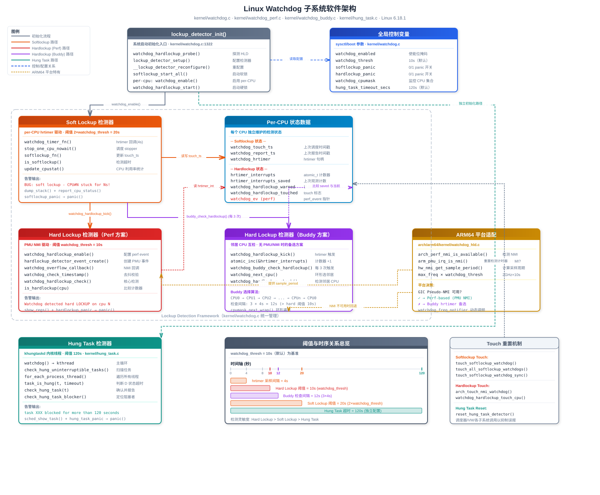

#### 2.1.1 三层锁检测框架总览

Linux 内核 Watchdog 子系统是一个**多层次锁检测框架**，负责检测系统级别的 lockup（死锁/活锁），代码主要在 `kernel/watchdog.c`。

```
┌─────────────────────────────────────────────────────────────────────┐
│                     Lockup Detection Framework                       │
├─────────────────┬──────────────────────┬────────────────────────────┤
│  Hard Lockup    │  Soft Lockup         │  Hung Task                 │
│  (NMI/PMU)      │  (hrtimer)           │  (khungtaskd)              │
├─────────────────┼──────────────────────┼────────────────────────────┤
│ 检测: 中断被关闭 │ 检测: 内核态自旋      │ 检测: D 状态任务超时        │
│ 阈值: 10s       │ 阈值: 20s            │ 阈值: 120s                 │
│ 上下文: NMI     │ 上下文: hrtimer 中断  │ 上下文: 内核线程            │
│ 触发: PMU 溢出  │ 触发: 高精度定时器     │ 触发: 周期性任务扫描        │
└─────────────────┴──────────────────────┴────────────────────────────┘
```

**初始化流程**（`kernel/watchdog.c: lockup_detector_init()`）：

```
系统启动
    │
    ▼
lockup_detector_init()
    ├─→ watchdog_hardlockup_probe()  // 探测硬锁检测器
    │   ├─→ 优先: Perf-based (PMU NMI)
    │   └─→ 备选: Buddy hrtimer
    │
    ├─→ cpumask_copy(&watchdog_cpumask, cpu_possible_mask)
    │
    └─→ lockup_detector_setup()
        └─→ 对每个 CPU: watchdog_enable()
            ├─→ 启动 per-CPU hrtimer（softlockup 检测）
            └─→ watchdog_hardlockup_enable()
                └─→ 配置 perf event 或 buddy 系统
```

#### 2.1.2 各检测器原理

##### 2.1.2.1 Soft Lockup 检测器

**原理**：通过 per-CPU hrtimer 定期触发，检查调度器是否还在正常工作。如果一个 CPU 长时间不让出执行权（在内核态自旋），hrtimer 中断仍能触发，但 softlockup watchdog 会发现 touch timestamp 未更新。

**采样周期计算**：

```c
// kernel/watchdog.c: set_sample_period()
sample_period = get_softlockup_thresh() * (NSEC_PER_SEC / NUM_SAMPLE_PERIODS);
             = (watchdog_thresh * 2) * (1000000000 / 5)
             = 20 * 200000000 = 4,000,000,000 ns = 4 秒（默认）
```

| 参数 | 值 | 说明 |
|------|-----|------|
| `watchdog_thresh` | 10（默认）| 基础阈值 |
| `NUM_SAMPLE_PERIODS` | 5 | 采样周期数 |
| Soft lockup 阈值 | `watchdog_thresh * 2` = 20 秒 | 实际超时 |
| 采样间隔 | 4 秒 | hrtimer 触发间隔 |

**检测流程**：

```
hrtimer 触发 → watchdog_timer_fn()
    │
    ├─→ watchdog_hardlockup_kick()    // 踢 hardlockup 检测器
    │
    ├─→ stop_one_cpu_nowait(softlockup_fn)  // 调度 stopper 线程更新 touch_ts
    │
    ├─→ update_cpustat()              // 更新 CPU 利用率统计
    │
    └─→ is_softlockup() 检测
         │
         ├─ touch_ts 在阈值内 → 正常，返回
         │
         └─ touch_ts 过期 → Soft Lockup!
              │
              ├─→ pr_emerg("BUG: soft lockup - CPU#%d stuck for %us!")
              ├─→ print_modules()
              ├─→ print_irqtrace_events(current)
              ├─→ dump_stack()           // 当前 CPU 栈回溯
              ├─→ report_cpu_status()    // CPU 利用率报告
              ├─→ add_taint(TAINT_SOFTLOCKUP)
              └─→ softlockup_panic → panic()（如果配置）
```

**Touch 机制**（重置检测计时器）：

| 函数 | 调用者 | 说明 |
|------|--------|------|
| `touch_softlockup_watchdog()` | 调度器核心代码 | 通用 touch |
| `touch_softlockup_watchdog_sched()` | 调度器进入 idle | 仅重置 report_ts |
| `touch_all_softlockup_watchdogs()` | 各子系统 | 重置所有 CPU |
| `touch_softlockup_watchdog_sync()` | 同步场景 | 原子同步 touch |

##### 2.1.2.2 Hard Lockup 检测器（Perf 方案）

**原理**：使用硬件 PMU（Performance Monitoring Unit）的计数器溢出中断（以 NMI 优先级触发），即使中断被禁用也能检测到 lockup。

**代码路径**：`kernel/watchdog_perf.c`

```
PMU 计数器溢出（每 watchdog_thresh 秒一次）
    │
    ▼ NMI 上下文
watchdog_overflow_callback(event, data, regs)
    │
    ├─→ watchdog_check_timestamp()   // 去抖检查
    │   └─ 比较当前时间与 last_timestamp
    │      间隔 < 4/5 * watchdog_thresh → 跳过（防 CPU 变频误报）
    │
    └─→ watchdog_hardlockup_check(cpu, regs)
         │
         ├─→ is_hardlockup(cpu)
         │   └─ 比较 hrtimer_interrupts 与 hrtimer_interrupts_saved
         │      相等 → hrtimer 未触发 → CPU 卡死 → Hard Lockup!
         │      不等 → 正常，更新 saved 值
         │
         └─→ 检测到 Hard Lockup:
              ├─→ pr_emerg("CPU#%d: Watchdog detected hard LOCKUP on cpu %d")
              ├─→ print_modules()
              ├─→ print_irqtrace_events(current)
              ├─→ show_regs(regs) 或 dump_stack()
              └─→ hardlockup_panic → panic()（如果配置）
```

**ARM64 平台采样周期**（`arch/arm64/kernel/watchdog_hld.c`）：

```c
u64 hw_nmi_get_sample_period(unsigned long watchdog_thresh)
{
    unsigned long max_cpu_freq = cpufreq_get_hw_max_freq(0) * 1000UL;
    if (!max_cpu_freq)
        max_cpu_freq = 5UL * 1000 * 1000 * 1000;  // 5GHz 安全回退
    return (u64)max_cpu_freq * watchdog_thresh;
    // 例: 2GHz * 10s = 20,000,000,000 cycles
}
```

ARM64 还注册了 `watchdog_freq_notifier` 监听 CPUFreq 事件，当 CPU 频率变化时自动更新 perf event 的采样周期，防止因变频导致误报。

##### 2.1.2.3 Hard Lockup 检测器（Buddy 方案）

**原理**：当硬件不支持 PMU NMI 时的备选方案。每个 CPU 的 hrtimer 在触发时，除了做 softlockup 检测，还会检查"邻居" CPU 的 hrtimer 是否正常触发。

**代码路径**：`kernel/watchdog_buddy.c`

```
CPU A 的 hrtimer 触发
    │
    ▼
watchdog_hardlockup_kick()
    │
    ├─→ atomic_inc(&hrtimer_interrupts)    // 本 CPU 计数器 +1
    │
    └─→ watchdog_buddy_check_hardlockup()
         │
         ├─→ if (hrtimer_interrupts % 3 != 0) return;  // 每 3 次检查 1 次
         │   // 3 * 4s = 12s，略大于 watchdog_thresh(10s)
         │
         └─→ next_cpu = watchdog_next_cpu(this_cpu);  // 环形选择下一个 CPU
              watchdog_hardlockup_check(next_cpu, NULL);
```

**Buddy 选择算法**：

```c
// watchdog_buddy.c: watchdog_next_cpu()
static int watchdog_next_cpu(int cpu)
{
    cpumask_t *watchdog_cpus;  // 当前被监控的 CPU 集合
    int next = cpumask_next(cpu, watchdog_cpus);
    if (next >= nr_cpu_ids)
        next = cpumask_first(watchdog_cpus);  // 环形回绕
    return next;
}
```

##### 2.1.2.4 Hung Task 检测器

**原理**：独立于 lockup 检测器，专门检测长时间处于 `TASK_UNINTERRUPTIBLE`（D 状态）的任务。由专门的内核线程 `khungtaskd` 周期性扫描任务链表。

**代码路径**：`kernel/hung_task.c`

```
khungtaskd 内核线程（周期唤醒）
    │
    ▼
watchdog_thread_fn()
    │
    └─→ check_hung_uninterruptible_tasks()
         │
         └─→ 遍历所有 task:
              │
              for_each_process_thread(g, t)
                  │
                  └─→ task_is_hung(t) 判断:
                       │
                       ├─ 不是 TASK_UNINTERRUPTIBLE → 跳过
                       ├─ 设置了 TASK_WAKEKILL/TASK_NOLOAD/TASK_FROZEN → 跳过
                       ├─ switch_count 有变化 → 正常（更新 last_switch_time）
                       ├─ 超时未到 → 还在等待
                       │
                       └─ 超时且 switch_count 无变化 → Hung!
                            │
                            ├─→ pr_err("INFO: task %s:%d blocked for more than %ld seconds.")
                            ├─→ sched_show_task(t)          // 任务状态和栈
                            ├─→ debug_show_held_locks(t)    // 持有的锁
                            ├─→ check_hung_task_blocker(t)  // 阻塞者信息
                            └─→ hung_task_panic → panic()（如果配置）
```

**阻塞者检测**（`CONFIG_DETECT_HUNG_TASK_BLOCKER`）：

```c
// hung_task.c: check_hung_task_blocker()
// 尝试找出是哪个锁/信号量阻塞了 hung task
// 并输出锁的持有者信息，帮助定位根因
```

### 2.2 ARM64 平台特性

**硬锁检测支持**（`arch/arm64/kernel/watchdog_hld.c`）：

```c
// ARM64 需要 Pseudo-NMI 支持才能使用 perf-based hardlockup 检测
bool __init arch_perf_nmi_is_available(void)
{
    return arm_pmu_irq_is_nmi();  // 检查 PMU 中断是否能以 NMI 优先级触发
}
```

- 如果 GIC 支持优先级分组且 PMU 中断配置为 NMI → 使用 Perf 方案
- 否则 → 回退到 Buddy 方案
- ARM64 通过 CPUFreq notifier 动态调整 PMU 采样周期

### 2.3 关键数据结构

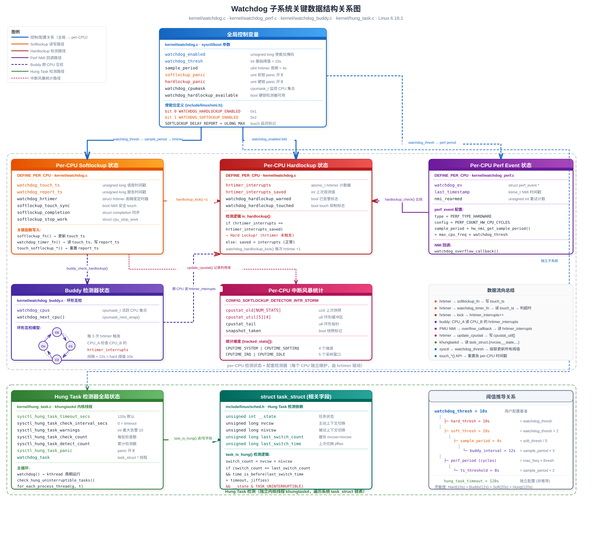

**全局控制变量**（`kernel/watchdog.c`）：

| 变量 | 类型 | 默认值 | 说明 |
|------|------|--------|------|
| `watchdog_enabled` | `unsigned long` | — | 检测器使能位掩码 |
| `watchdog_user_enabled` | `int` | 1 | 用户总开关 |
| `watchdog_thresh` | `int` | 10 | 基础阈值（秒）|
| `hardlockup_panic` | `unsigned int` | 0/1 | 硬锁 panic |
| `softlockup_panic` | `unsigned int` | 0/1 | 软锁 panic |

**使能位定义**（`include/linux/nmi.h`）：

```c
#define WATCHDOG_HARDLOCKUP_ENABLED_BIT  0
#define WATCHDOG_SOFTOCKUP_ENABLED_BIT   1
#define WATCHDOG_HARDLOCKUP_ENABLED      (1 << 0)  // 0x1
#define WATCHDOG_SOFTOCKUP_ENABLED       (1 << 1)  // 0x2
```

**Per-CPU Softlockup 状态**：

| 变量 | 类型 | 说明 |
|------|------|------|
| `watchdog_touch_ts` | `unsigned long` | 上次成功调度的时间戳 |
| `watchdog_report_ts` | `unsigned long` | 上次 softlockup 报告的时间戳 |
| `watchdog_hrtimer` | `struct hrtimer` | per-CPU 高精度定时器 |
| `softlockup_touch_sync` | `bool` | 原子同步 touch 标志 |

**Per-CPU Hardlockup 状态**：

| 变量 | 类型 | 说明 |
|------|------|------|
| `hrtimer_interrupts` | `atomic_t` | hrtimer 触发计数器 |
| `hrtimer_interrupts_saved` | `int` | 上次观测的计数值 |
| `watchdog_hardlockup_warned` | `bool` | 已报告硬锁告警 |
| `watchdog_hardlockup_touched` | `bool` | 抑制新上线 CPU 误报 |
| `watchdog_ev`（perf） | `struct perf_event *` | per-CPU perf 事件 |

**Hung Task 状态**（`kernel/hung_task.c`）：

| 变量 | 类型 | 默认值 | 说明 |
|------|------|--------|------|
| `sysctl_hung_task_timeout_secs` | `unsigned long` | 120 | D 状态超时（秒）|
| `sysctl_hung_task_check_interval_secs` | `unsigned long` | 0 | 检查间隔（0=等于 timeout）|
| `sysctl_hung_task_warnings` | `int` | 10 | 最大告警次数 |
| `watchdog_task` | `struct task_struct *` | — | khungtaskd 线程指针 |

### 2.4 内核配置与调优参数

**内核配置开关**：

| 配置项 | 说明 | 建议 |
|--------|------|------|
| `CONFIG_LOCKUP_DETECTOR` | 主开关 | 必须开启 |
| `CONFIG_SOFTLOCKUP_DETECTOR` | Soft lockup 检测 | 必须开启 |
| `CONFIG_HARDLOCKUP_DETECTOR` | Hard lockup 检测 | 建议开启 |
| `CONFIG_HARDLOCKUP_DETECTOR_PERF` | Perf-based 方案 | ARM64/x86 默认 |
| `CONFIG_HARDLOCKUP_DETECTOR_BUDDY` | Buddy 方案 | Perf 不可用时 |
| `CONFIG_DETECT_HUNG_TASK` | Hung task 检测 | 必须开启 |
| `CONFIG_DETECT_HUNG_TASK_BLOCKER` | 显示阻塞者信息 | 建议开启 |
| `CONFIG_BOOTPARAM_SOFTLOCKUP_PANIC` | 默认 soft panic | 按需 |
| `CONFIG_BOOTPARAM_HARDLOCKUP_PANIC` | 默认 hard panic | 按需 |
| `CONFIG_BOOTPARAM_HUNG_TASK_PANIC` | 默认 hung panic | 按需 |
| `CONFIG_SOFTLOCKUP_DETECTOR_INTR_STORM` | **中断风暴检测** | 建议开启 |

**Runtime sysctl 参数**（`/proc/sys/kernel/`）：

| 参数 | 默认值 | 范围 | 说明 |
|------|--------|------|------|
| `watchdog` | 1 | 0-1 | 总开关 |
| `nmi_watchdog` | 1 | 0-1 | 硬锁检测开关 |
| `soft_watchdog` | 1 | 0-1 | 软锁检测开关 |
| `watchdog_thresh` | 10 | 0-60 | 基础阈值（秒）|
| `watchdog_cpumask` | 全部 | cpumask | 监控的 CPU 集合 |
| `softlockup_panic` | 0 | 0-1 | 软锁是否 panic |
| `hardlockup_panic` | 0 | 0-1 | 硬锁是否 panic |
| `softlockup_all_cpu_backtrace` | 0 | 0-1 | 软锁时 dump 所有 CPU 栈 |
| `hardlockup_all_cpu_backtrace` | 0 | 0-1 | 硬锁时 dump 所有 CPU 栈 |
| `hung_task_timeout_secs` | 120 | 0=禁用 | Hung task 超时 |
| `hung_task_check_interval_secs` | 0 | 0=同 timeout | 检查间隔 |
| `hung_task_warnings` | 10 | — | 最大告警次数 |
| `hung_task_panic` | 0 | 0-1 | Hung task 是否 panic |
| `hung_task_all_cpu_backtrace` | 0 | 0-1 | Hung task 时 dump 所有 CPU |

**Boot 参数**：

| 参数 | 说明 |
|------|------|
| `nowatchdog` | 禁用所有 watchdog |
| `nosoftlockup` | 禁用 softlockup 检测 |
| `nmi_watchdog=0/1/panic` | 配置硬锁检测 |
| `softlockup_panic=0/1` | 软锁 panic 开关 |
| `watchdog_thresh=<秒>` | 设置阈值 |

**阈值关系总结**：

```
watchdog_thresh = 10s（默认）

Hard Lockup 检测阈值  = watchdog_thresh         = 10s
Soft Lockup 检测阈值  = watchdog_thresh * 2      = 20s
hrtimer 采样间隔       = soft_thresh / 5          = 4s
Buddy 检查间隔         = 采样间隔 * 3             = 12s（略 > hard 阈值）
Hung Task 超时         = hung_task_timeout_secs   = 120s（独立配置）
```

### 2.5 Watchdog 告警 Log 解读

**Soft Lockup 告警**：

```
watchdog: BUG: soft lockup - CPU#3 stuck for 23s! [kworker/3:1:1234]
Modules linked in: module_a module_b
irq event stamp: 12345678
hardirqs last  enabled at (12345677): [<ffff...>] _raw_spin_unlock_irqrestore+0x68/0xa0
hardirqs last disabled at (12345678): [<ffff...>] _raw_spin_lock_irqsave+0x2c/0x70
softirqs last  enabled at (12340000): [<ffff...>] __do_softirq+0x358/0x4a8
softirqs last disabled at (12339999): [<ffff...>] irq_exit+0xd0/0xd8
CPU: 3 UID: 0 PID: 1234 Comm: kworker/3:1 Tainted: G
[stack trace]
CPU#3 Utilization every 4000ms during lockup:
    #1:  95% system,   0% softirq,   5% hardirq,   0% idle
    #2:  90% system,   0% softirq,  10% hardirq,   0% idle
    #3:  98% system,   0% softirq,   2% hardirq,   0% idle
    #4:  97% system,   0% softirq,   3% hardirq,   0% idle
    #5:  99% system,   0% softirq,   1% hardirq,   0% idle
```

**解读要点**：
- `stuck for 23s`：超过 20s（soft 阈值）后检测到
- 栈回溯显示 CPU 卡在什么位置
- **CPU 利用率报告**（需 `CONFIG_SOFTLOCKUP_DETECTOR_INTR_STORM`）：
  - 5 个采样周期的 system/softirq/hardirq/idle 占比
  - 如果 hardirq 超过 50%，额外输出 Top 5 中断号

**中断风暴报告**（hardirq 占比 > 50% 时）：

```
CPU#3 Detect HardIRQ Time exceeds 50%. Most frequent HardIRQs:
    #1: 50000       irq#42
    #2: 3000        irq#18
    #3: 100         irq#3
```

**Hard Lockup 告警**：

```
watchdog: CPU#5: Watchdog detected hard LOCKUP on cpu 5
Modules linked in: ...
CPU: 5 UID: 0 PID: 567 Comm: some_task
[register dump]
[stack trace]
```

**Hung Task 告警**：

```
INFO: task kworker/0:1:123 blocked for more than 120 seconds.
      Not tainted 6.18.1 #1
"echo 0 > /proc/sys/kernel/hung_task_timeout_secs" disables this message.
task:kworker/0:1     state:D stack:0     pid:123   tgid:123   ppid:2
[stack trace showing where task is blocked]
```

**定位要点**：
- 查看栈回溯确认阻塞位置
- 检查是否在等锁，锁的持有者是谁
- 如果开启 `CONFIG_DETECT_HUNG_TASK_BLOCKER`，会显示锁持有者信息

### 2.6 Watchdog 核心算法总结

本节提炼 Watchdog 子系统实现中涉及的核心算法，帮助理解各检测器运行机理和 debug 问题时的思路。

#### 2.6.1 采样周期推导算法

**源码**：`kernel/watchdog.c` — `set_sample_period()`

所有检测阈值从单一基准 `watchdog_thresh`（默认 10s）级联推导，保证各层检测器时序一致：

```
算法:
  输入: watchdog_thresh = 10s
  
  soft_thresh = watchdog_thresh × 2 = 20s      // get_softlockup_thresh()
  sample_period = soft_thresh / 5 = 4s          // hrtimer 触发间隔
  
  推导关系树:
  watchdog_thresh (10s)
      ├─ hard_lockup_thresh = 10s               // Perf NMI 触发周期
      ├─ soft_lockup_thresh = 20s               // is_softlockup() 判定阈值
      │   └─ sample_period = 4s                 // hrtimer 周期
      │       └─ buddy_interval = 12s           // 每 3 次 hrtimer 检查 1 次
      ├─ perf_period = max_cpu_freq × 10s       // PMU 计数器溢出周期（cycles）
      │   └─ ts_threshold = sample_period × 2   // NMI 去抖阈值 = 8s
      └─ hung_task_timeout = 120s               // 独立配置，不参与推导
```

**设计原理**：除以 5（`NUM_SAMPLE_PERIODS = 5`）保证在 hardlockup 阈值（10s）内 hrtimer 能触发 2-3 次，给 hardlockup 检测器足够的"心跳"证据。

**时间戳精度**：`get_timestamp()` 使用 `running_clock() >> 30`，约 1 秒精度（$2^{30} \approx 10^9$ ns），足够检测秒级 lockup。

#### 2.6.2 Soft Lockup 三阶段渐进检测算法

**源码**：`kernel/watchdog.c` — `is_softlockup()`

不是简单的单阈值判定，而是三阶段渐进式响应：

```
输入: touch_ts (上次调度时间), period_ts (上次报告时间), now (当前时间)
输出: 0 (正常) 或 duration (lockup 持续秒数)

阶段 1 — 中断风暴预警 (20% 阈值):
  if (now >= period_ts + soft_thresh / 5)     // 即 >= period_ts + 4s
    if need_counting_irqs():                  // 上一周期 hardirq > 50%
      start_counting_irqs()                   // 开始快照中断计数
      
阶段 2 — BPF 调度器弹出 (75% 阈值):
  if (now >= period_ts + soft_thresh * 3/4)   // 即 >= period_ts + 15s
    scx_softlockup(now - touch_ts)            // 通知 sched_ext 弹出 BPF 调度器

阶段 3 — 确认 Soft Lockup (100% 阈值):
  if (now > period_ts + soft_thresh)          // 即 > period_ts + 20s
    return (now - touch_ts)                   // 返回 lockup 持续时间
    
  return 0                                    // 正常
```

**设计原理**：渐进式响应允许系统在完全告警前尝试自救（弹出有问题的 BPF 调度器），同时在早期就开始收集诊断信息（中断计数快照）。

#### 2.6.3 CPU 利用率环形缓冲区算法

**源码**：`kernel/watchdog.c` — `update_cpustat()` / `print_cpustat()`（需 `CONFIG_SOFTLOCKUP_DETECTOR_INTR_STORM`）

使用定长环形缓冲区记录 lockup 前 5 个采样周期的 CPU 利用率分布：

```
数据结构 (per-CPU):
  cpustat_old[4]          : u16    上一次快照（16 位精度）
  cpustat_util[5][4]      : u8     环形缓冲区，5 个窗口 × 4 维度
  cpustat_tail            : u8     写入指针

维度: SYSTEM | SOFTIRQ | HARDIRQ | IDLE

算法 update_cpustat():
  1. 读取当前 kernel_cpustat（纳秒级）
  2. 转换为 16 位精度: new_stat = (ns + 2^23) >> 24  // 约 16.8ms 粒度
  3. 计算百分比: util = (new_stat - old_stat) × 100 / sample_period_16
  4. 钳位: if util > 100 then util = 100  // 防止整数除法累积误差
  5. 写入: cpustat_util[tail][i] = util
  6. 前进: tail = (tail + 1) % 5

精度设计:
  原始 cpustat: u64 (纳秒)
  压缩后: u16 (>>24, 约 16.8ms 粒度)
  百分比: u8 (0-100)
  每 CPU 总内存: 4×2 + 5×4 + 1 = 29 字节
```

**打印算法**：从 `tail`（最旧的条目）开始顺序输出 5 个周期，保证时间有序。

**空间复杂度**：O(1)，每 CPU 29 字节。  
**时间复杂度**：O(1) 每次更新。

#### 2.6.4 中断风暴 Top-N 插入排序算法

**源码**：`kernel/watchdog.c` — `tabulate_irq_count()` / `print_irq_counts()`

当 hardirq 占比 > 50% 时，找出触发次数最多的 Top 5 中断号：

```
算法 tabulate_irq_count(sorted[], irq, counts, rank=5):
  // 在线插入排序：对每个中断，与已排序的 Top-5 逐一比较
  new = {irq, counts}
  for i = 0 to rank-1:
    if counts > sorted[i].counts:
      swap(new, sorted[i])    // 当前中断"挤入"，被挤出的继续下沉

完整流程:
  1. 初始化 sorted[5] = {(-1,0), (-1,0), ...}
  2. for_each_active_irq(i):
       count = kstat_get_irq_since_snapshot(i)  // 自快照以来的增量
       tabulate_irq_count(sorted, i, count, 5)
  3. 输出 sorted[0..4]（按降序排列的 Top 5）
```

**时间复杂度**：O(5 × n)，其中 n 为活跃中断数。避免了完整排序的 O(n log n)。  
**触发条件**：`need_counting_irqs()` 检查最近一个采样窗口的 hardirq 百分比 > `HARDIRQ_PERCENT_THRESH` (50%)。

#### 2.6.5 Hard Lockup 计数器比较算法

**源码**：`kernel/watchdog.c` — `is_hardlockup()` / `watchdog_hardlockup_kick()`

基于 monotonic 计数器的"心跳"检测，核心思想：如果一个 CPU 的 hrtimer 中断能正常触发，那么计数器必然递增：

```
写入端 watchdog_hardlockup_kick() (hrtimer 上下文):
  new = atomic_inc_return(&hrtimer_interrupts[this_cpu])  // 每次 +1
  
检测端 is_hardlockup(cpu) (NMI 或 buddy CPU 上下文):
  hrint = atomic_read(&hrtimer_interrupts[cpu])
  if (hrtimer_interrupts_saved[cpu] == hrint):
    return true      // 计数器未变 → hrtimer 未触发 → Hard Lockup!
  else:
    hrtimer_interrupts_saved[cpu] = hrint  // 记录新值
    return false      // 正常

防误报机制 watchdog_hardlockup_check():
  if (watchdog_hardlockup_touched[cpu]):   // 刚 touch 过
    watchdog_hardlockup_touched[cpu] = false
    return                                 // 跳过本次检测
  if (watchdog_hardlockup_warned[cpu]):    // 已报告过
    return                                 // 不重复报告
```

**关键性质**：atomic_t 保证跨 CPU 可见性。`hrtimer_interrupts_saved` 不需要原子操作，因为同一 CPU 的 saved 值只被单一检测者读写。

#### 2.6.6 Buddy 环形互检算法

**源码**：`kernel/watchdog_buddy.c` — `watchdog_next_cpu()` / `watchdog_buddy_check_hardlockup()`

无 PMU NMI 时的去中心化 hardlockup 检测方案。每个 CPU 的 hrtimer 负责检测"下一个"邻居 CPU：

```
CPU 环形拓扑 (watchdog_next_cpu):
  next = cpumask_next_wrap(cpu, &watchdog_cpus)
  if (next == cpu): return nr_cpu_ids  // 只有自己，无法互检
  return next

  示例 (4 CPU):  CPU0 → CPU1 → CPU2 → CPU3 → CPU0

频率控制 (watchdog_buddy_check_hardlockup):
  if (hrtimer_interrupts % 3 != 0): return   // 每 3 次触发才检查 1 次
  // 3 × 4s = 12s，比 hard 阈值 10s 略大，留 20% 安全裕量
  
  next = watchdog_next_cpu(this_cpu)
  smp_rmb()                                   // 配对 enable/disable 的 smp_wmb()
  watchdog_hardlockup_check(next, NULL)

内存屏障协议:
  enable(cpu):   touch(cpu) → touch(next) → smp_wmb() → set_bit(cpu)
  disable(cpu):  touch(next) → smp_wmb() → clear_bit(cpu)
  check():       smp_rmb() → read hrtimer_interrupts
  // 保证新上线/下线 CPU 的 touch 操作对检测者可见
```

**防误报设计**：
- 新 CPU 上线时：touch 自己和下一个邻居，延迟至少 3 个采样周期
- CPU 下线时：touch 下一个邻居，防止接管者在 1 个采样周期内误判

#### 2.6.7 Perf NMI 去抖算法

**源码**：`kernel/watchdog_perf.c` — `watchdog_check_timestamp()`

PMU 计数器基于 CPU cycle 数，Turbo-Mode 可能导致实际频率远高于标称频率，使 NMI 触发过快。去抖算法过滤这种误触发：

```
算法 watchdog_check_timestamp():
  now = ktime_get_mono_fast_ns()
  delta = now - last_timestamp[this_cpu]
  
  if (delta < watchdog_hrtimer_sample_threshold):    // 阈值 = 2 × sample_period = 8s
    // NMI 触发太快，可能是 Turbo-Mode 导致
    if (++nmi_rearmed[this_cpu] < 10):               // 允许最多 10 次快速触发
      return false                                    // 忽略本次
    // 第 10 次强制执行，防止 jiffies-based ktime 完全卡死
    
  nmi_rearmed[this_cpu] = 0
  last_timestamp[this_cpu] = now
  return true                                         // 执行 hardlockup 检测

阈值设置 watchdog_update_hrtimer_threshold():
  watchdog_hrtimer_sample_threshold = sample_period × 2
  // = 4s × 2 = 8s
  // 保证 4/5 × watchdog_thresh 内 hrtimer 至少触发 1 次
```

**设计原理**：`nmi_rearmed` 上限 10 是安全网 — 如果 ktime 基于 jiffies 且 jiffies 卡死，delta 永远为 0，没有这个上限就永远不会触发检测。

#### 2.6.8 Hung Task RCU 分批扫描算法

**源码**：`kernel/hung_task.c` — `check_hung_uninterruptible_tasks()`

遍历系统所有线程是 O(n) 操作，长时间持有 RCU 读锁会延迟 GP 完成。分批扫描算法定期释放 RCU 锁：

```
算法 check_hung_uninterruptible_tasks(timeout):
  max_count = sysctl_hung_task_check_count
  last_break = jiffies
  
  rcu_read_lock()
  for_each_process_thread(g, t):
    if (--max_count < 0): break                       // 上限保护
    
    if (jiffies > last_break + HUNG_TASK_LOCK_BREAK): // LOCK_BREAK = HZ/10 = 100ms
      // RCU 锁中断：安全地释放再重新获取
      get_task_struct(g)                              // 防止扫描期间被释放
      get_task_struct(t)
      rcu_read_unlock()
      cond_resched()                                  // 让出 CPU
      rcu_read_lock()
      alive = pid_alive(g) && pid_alive(t)            // 检查是否还活着
      put_task_struct(t)
      put_task_struct(g)
      if (!alive): break                              // 被释放了，终止扫描
      last_break = jiffies
    
    check_hung_task(t, timeout)
  rcu_read_unlock()
```

**时间复杂度**：O(min(n, max_count))，其中 n 为系统线程总数。  
**RCU 友好性**：每 100ms 主动释放 RCU 读锁，避免阻塞 GP 导致内存回收停滞。

#### 2.6.9 Hung Task 四阶段状态判定算法

**源码**：`kernel/hung_task.c` — `task_is_hung()`

对每个任务执行四阶段过滤，逐步缩小"真正 hung"的范围：

```
算法 task_is_hung(t, timeout):

  switch_count = t->nvcsw + t->nivcsw        // 主动 + 被动上下文切换总数

  阶段 1 — 状态过滤:
    if !(t->__state & TASK_UNINTERRUPTIBLE): return false   // 非 D 状态
    if (t->__state & TASK_WAKEKILL):          return false   // 可被 kill 唤醒
    if (t->__state & TASK_NOLOAD):            return false   // idle 类任务
    if (t->__state & TASK_FROZEN):            return false   // freezer 冻结

  阶段 2 — 新任务保护:
    if (switch_count == 0): return false      // 从未被调度过的新任务

  阶段 3 — 上下文切换变化检测:
    if (switch_count != t->last_switch_count):
      t->last_switch_count = switch_count     // 更新缓存
      t->last_switch_time = jiffies           // 重置计时
      return false                            // 有调度活动，正常

  阶段 4 — 超时判定:
    if (jiffies < t->last_switch_time + timeout × HZ):
      return false                            // 还没超时
    return true                               // Hung!
```

**关键设计**：使用 `last_switch_count` + `last_switch_time` 双字段缓存，避免每次都需要记录初始切换计数。只有当切换计数**停止变化**后才开始计时。

#### 2.6.10 Blocker 检测算法

**源码**：`kernel/hung_task.c` — `debug_show_blocker()`（需 `CONFIG_DETECT_HUNG_TASK_BLOCKER`）

当确认任务 hung 后，尝试追溯其阻塞原因：

```
算法 debug_show_blocker(task):
  blocker = READ_ONCE(task->blocker)          // 获取阻塞者信息
  if (!blocker): return
  
  type = hung_task_get_blocker_type(blocker)  // 解析锁类型
  
  switch (type):
    BLOCKER_TYPE_MUTEX:
      owner = mutex_get_owner(lock)           // 获取 mutex 持有者
    BLOCKER_TYPE_SEM:
      owner = sem_last_holder(lock)           // 获取信号量最后持有者
    BLOCKER_TYPE_RWSEM_READER:
    BLOCKER_TYPE_RWSEM_WRITER:
      owner = rwsem_owner(lock)               // 获取读写锁持有者
      // 区分 reader/writer blocked-by 和 blocked-as
  
  // 在系统所有线程中搜索 owner 对应的 task_struct
  for_each_process_thread(g, t):
    if (t == owner_task):
      sched_show_task(t)                      // 输出阻塞者的状态和栈
      break
```

**支持的锁类型**：mutex、semaphore、rwsem（区分读者/写者身份）。

#### 2.6.11 Completion 同步喂狗算法

**源码**：`kernel/watchdog.c` — `softlockup_fn()` / `watchdog_timer_fn()`

softlockup 检测的核心问题：如何证明调度器还在正常工作？使用 `stop_one_cpu` + `completion` 机制确保**实际 CPU 执行**：

```
算法:

watchdog_timer_fn() (hrtimer 中断上下文):
  if completion_done(&softlockup_completion):     // 上次的喂狗已完成
    reinit_completion(&softlockup_completion)     // 重置 completion
    stop_one_cpu_nowait(                          // 调度 stopper 线程
      this_cpu, softlockup_fn, ...)               // 在本 CPU 上运行

softlockup_fn() (stopper 线程上下文, 最高优先级):
  update_touch_ts()                               // 更新 watchdog_touch_ts
  stop_counting_irqs()                            // 停止中断计数
  complete(&softlockup_completion)                // 通知 hrtimer 已完成

检测逻辑:
  if (now - touch_ts > soft_thresh):              // touch_ts 长时间未更新
    → stopper 线程无法运行 → 调度器卡死 → Soft Lockup!
```

**为何用 stopper 线程而非直接在 hrtimer 中更新**：hrtimer 运行在中断上下文，即使调度器完全卡死 hrtimer 仍能触发。必须通过调度一个"真正的线程"来证明调度器还能工作。`stop_one_cpu` 使用最高优先级的 per-CPU stopper 线程，最大限度减少误报。

### 2.7 Watchdog 面试经典问题问答

#### Q1: Soft Lockup 和 Hard Lockup 有什么区别？各自检测什么问题？

**答**：

| 维度 | Soft Lockup | Hard Lockup |
|------|-------------|-------------|
| 检测目标 | CPU 长时间在内核态自旋，不让出执行权 | CPU 长时间无法响应中断（中断被禁用） |
| 检测机制 | per-CPU hrtimer 中断检查 stopper 线程是否被调度 | PMU NMI 或 Buddy CPU 检查 hrtimer 是否还在触发 |
| 默认阈值 | 20 秒（`watchdog_thresh × 2`） | 10 秒（`watchdog_thresh`） |
| 运行上下文 | hrtimer 中断上下文 | NMI 上下文（Perf）或邻居 CPU hrtimer 中断（Buddy） |
| 中断是否可用 | **可用**（hrtimer 能触发） | **不可用**（hrtimer 也被阻塞） |
| 典型根因 | `spin_lock` 死循环、长时间禁抢占的计算 | `spin_lock_irqsave` 死循环、NMI 死循环 |

**关键理解**：Soft Lockup 时中断仍然可以触发，只是没有进程调度；Hard Lockup 时连中断都无法触发了。Hard Lockup 比 Soft Lockup 更严重。

#### Q2: Watchdog 是如何证明"调度器还在正常工作"的？

**答**：通过 **Completion + Stopper 线程**的两阶段验证：

1. **hrtimer 中断**每 4 秒触发一次 `watchdog_timer_fn()`
2. 在 hrtimer 中通过 `stop_one_cpu_nowait()` 调度一个**stopper 线程**（最高优先级 per-CPU 线程）
3. Stopper 线程执行 `softlockup_fn()` → 更新 `watchdog_touch_ts` 时间戳 → 完成 `completion`
4. 下次 hrtimer 触发时检查时间戳是否被更新

**如果调度器卡死**：stopper 线程无法被调度 → `watchdog_touch_ts` 不更新 → 超过 20 秒 → Soft Lockup 告警。

**为什么不直接在 hrtimer 中更新时间戳**？因为 hrtimer 运行在中断上下文，即使调度器完全卡死，只要中断没被禁用 hrtimer 仍然能触发。必须调度一个"真正的线程"才能证明调度器还在工作。

#### Q3: Buddy 方案和 Perf 方案各自的优缺点？ARM64 用哪个？

**答**：

| 维度 | Perf 方案（PMU NMI） | Buddy 方案（邻居互检） |
|------|---------------------|---------------------|
| 依赖 | 需要 PMU 硬件 + NMI 支持 | 仅需 hrtimer，无硬件依赖 |
| 检测精度 | 精确——NMI 能打断任何上下文 | 有延迟——依赖邻居 CPU 的 hrtimer |
| 自检能力 | ✓ 能检测本 CPU | ✗ 只能检测邻居 CPU |
| 误报风险 | Turbo-Mode 变频可能误报（需去抖算法） | CPU 上下线时可能误报（需 touch + 内存屏障） |
| 实时性 | watchdog_thresh 秒内检出 | 约 1.2 × watchdog_thresh 秒检出（模 3 频率） |

**ARM64 选择策略**：优先 Perf 方案（需要 GIC 支持 Pseudo-NMI + PMU 中断以 NMI 优先级触发），不满足时自动回退到 Buddy 方案。通过 `arch_perf_nmi_is_available()` → `arm_pmu_irq_is_nmi()` 判断。

#### Q4: Hung Task 和 Soft Lockup 有什么区别？

**答**：

| 维度 | Hung Task | Soft Lockup |
|------|-----------|-------------|
| 检测目标 | 进程长时间处于 `TASK_UNINTERRUPTIBLE`（D 状态） | CPU 长时间在内核态不让出执行权 |
| 默认阈值 | 120 秒 | 20 秒 |
| 检测者 | `khungtaskd` 内核线程（周期扫描所有任务） | per-CPU hrtimer 中断 |
| 典型根因 | 等锁（mutex/rwsem）、等 I/O、等信号量 | 自旋锁死循环、长时间禁抢占计算 |
| CPU 状态 | CPU 可能正常调度其他任务 | CPU 完全被一个任务占据 |
| 影响范围 | 仅影响被阻塞的进程 | 整个 CPU 上的所有任务都无法运行 |

**核心区别**：Soft Lockup 是 CPU 级别的问题（CPU 被霸占），Hung Task 是进程级别的问题（进程被阻塞）。Hung Task 的 CPU 可能运行得很正常，只是某个进程在 D 状态等了太久。

#### Q5: 看到 Soft Lockup 告警后，如何快速定位根因？

**答**：分三步走：

**第一步 — 看栈回溯**：
```
BUG: soft lockup - CPU#3 stuck for 23s! [kworker/3:1:1234]
```
栈回溯直接指出 CPU 卡在哪个函数。常见模式：
- 卡在 `_raw_spin_lock` → 自旋锁死循环，需要找是谁持有锁不释放
- 卡在 `copy_to_user`/`copy_from_user` → 可能 mmap 了有问题的设备内存
- 卡在某个驱动函数 → 驱动代码有 bug

**第二步 — 看 CPU 利用率报告**（需 `CONFIG_SOFTLOCKUP_DETECTOR_INTR_STORM`）：
```
CPU#3 Utilization every 4000ms during lockup:
    #1:  95% system,   0% softirq,   5% hardirq,   0% idle
```
- `system` 高 → 内核态自旋
- `hardirq` > 50% → 中断风暴，会额外显示 Top 5 中断号
- `softirq` 高 → 软中断处理过多

**第三步 — 看中断状态**：
```
hardirqs last disabled at: [<ffff...>] _raw_spin_lock_irqsave+0x2c
```
如果 hardirq 被禁用的位置和栈回溯吻合，说明问题出在持锁后的代码路径。

#### Q6: `watchdog_thresh` 设为 0 会怎样？设太小会怎样？

**答**：
- **设为 0**：禁用 softlockup 和 hardlockup 检测（`get_softlockup_thresh()` 返回 0，hrtimer 不启动）
- **设太小（如 1）**：
  - soft 阈值 = 2 秒，采样间隔 = 0.4 秒
  - 正常的内核长操作（如大内存分配、文件系统 fsync）可能触发误报
  - hrtimer 频率过高，增加系统开销
- **推荐值**：默认 10 即可。虚拟化环境中可适当调大（20-30），因为 vCPU 调度延迟可能导致误报

#### Q7: 如何区分 Hard Lockup 和系统完全死机（hang）？

**答**：

| 现象 | Hard Lockup | 系统 Hang |
|------|------------|-----------|
| 串口有输出 | ✓ NMI 能打印 lockup 告警 | ✗ 无任何输出 |
| 其他 CPU 正常 | ✓ 只有特定 CPU 卡死 | ✗ 所有 CPU 都无响应 |
| 中断响应 | 仅 NMI 可响应 | 无任何中断响应 |
| 可能原因 | `spin_lock_irqsave` 死循环 | 看门狗硬件没启用、电源/硬件故障、总线死锁 |

**排查方法**：如果有硬件 watchdog（如 ARM 的 SP805），系统 hang 后硬件 watchdog 超时会触发 reset，可通过 ramdump 分析。如果连硬件 watchdog 都没触发，多半是硬件问题。

#### Q8: Hung Task 检测中，为什么要每 100ms 释放一次 RCU 读锁？

**答**：`khungtaskd` 遍历系统所有线程时需持有 RCU 读锁。如果系统有上万个线程，长时间持有 RCU 读锁会：

1. **阻塞 Grace Period 完成** → 其他 `call_rcu()` 回调无法执行 → 内存无法释放
2. **导致 RCU CPU Stall** → 因为本 CPU 迟迟不上报 QS

因此每 `HUNG_TASK_LOCK_BREAK = HZ/10`（约 100ms）释放一次 RCU 读锁，调用 `cond_resched()` 让出 CPU，再重新获取。释放前用 `get_task_struct()` 增加引用计数防止扫描位置的 task 被释放。

#### Q9: 为什么 Buddy 检测要每 3 次 hrtimer 才检查一次？不能每次都检查吗？

**答**：这是精心设计的时序关系：

- hrtimer 周期 = 4 秒
- Hard Lockup 阈值 = `watchdog_thresh` = 10 秒
- 每 3 次 hrtimer 检查 1 次 = 12 秒间隔

**不能每次检查**的原因：如果每次 hrtimer 都检查（4 秒间隔），而 hardlockup 的邻居 CPU 可能只是刚好在这 4 秒内没有触发 hrtimer（比如正在运行一段长的关中断代码但还没超过 10 秒阈值），就会产生误报。

**12 秒 > 10 秒**的设计保证：当检测到邻居的 `hrtimer_interrupts` 计数器没变化时，至少已经过了 12 秒，超过了 10 秒阈值，确信是真正的 hardlockup。多出的 20% 是安全裕量。

#### Q10: 如何在运行时动态调整 Watchdog 行为？

**答**：通过 `/proc/sys/kernel/` 下的 sysctl 参数：

```bash
# 禁用/启用总开关
echo 0 > /proc/sys/kernel/watchdog          # 禁用所有检测
echo 1 > /proc/sys/kernel/watchdog          # 启用

# 单独控制
echo 0 > /proc/sys/kernel/nmi_watchdog      # 仅禁用 hardlockup
echo 0 > /proc/sys/kernel/soft_watchdog     # 仅禁用 softlockup

# 调整阈值
echo 30 > /proc/sys/kernel/watchdog_thresh  # 基础阈值改为 30s
                                             # soft=60s, hard=30s

# 指定监控的 CPU
echo 0-3 > /proc/sys/kernel/watchdog_cpumask  # 仅监控 CPU 0-3

# 触发 panic（用于 kdump 抓取完整信息）
echo 1 > /proc/sys/kernel/softlockup_panic
echo 1 > /proc/sys/kernel/hardlockup_panic
echo 1 > /proc/sys/kernel/hung_task_panic

# Hung Task 超时
echo 0 > /proc/sys/kernel/hung_task_timeout_secs  # 0 = 禁用
echo 300 > /proc/sys/kernel/hung_task_timeout_secs # 延长到 5 分钟
```

**生产建议**：开发环境打开 `*_panic` 配合 kdump 自动收集 vmcore；生产环境关闭 panic 仅记录日志，避免服务中断。

---

## 3. DeadLock 原理和问题定位

### 3.1 DeadLock 检测机制与使用原理

Linux 内核通过 **Lockdep**（Lock Dependency Validator，锁依赖验证器）在运行时自动检测潜在的死锁场景。Lockdep 是一个**编译时插桩 + 运行时验证**的框架，它不等死锁真正发生，而是在每次获取锁时检查"如果所有 CPU 都以这样的顺序拿锁，是否可能死锁"，从而在第一次出现违规顺序时就发出告警。

> **核心源码**：`kernel/locking/lockdep.c`（约 6700 行）
> **头文件**：`include/linux/lockdep.h`、`include/linux/lockdep_types.h`
> **内部头文件**：`kernel/locking/lockdep_internals.h`
> **设计文档**：`Documentation/locking/lockdep-design.rst`

#### 3.1.1 死锁的基本概念与四个必要条件

死锁（Deadlock）是指两个或多个执行流互相持有对方所需的锁，导致所有参与者永久等待的状态。经典的四个必要条件：

| 条件 | 说明 | 内核场景举例 |
|------|------|-------------|
| **互斥**（Mutual Exclusion） | 资源一次只能被一个执行流持有 | `spin_lock()`, `mutex_lock()` |
| **持有并等待**（Hold and Wait） | 持有至少一个锁的同时等待获取另一个锁 | 在持有 A 的临界区内调用 `lock(B)` |
| **不可抢占**（No Preemption） | 已持有的锁不能被强制释放 | spinlock 不可被其他 CPU 抢走 |
| **循环等待**（Circular Wait） | 存在一个等待环：T1→T2→...→Tn→T1 | CPU0 持有 A 等 B，CPU1 持有 B 等 A |

内核中常见的死锁模式：

```
场景一：AA 死锁（自死锁 / 递归锁定）
──────────────────────────────
  CPU0:
    spin_lock(&lock_A);
    spin_lock(&lock_A);   ← 同一个锁再次获取，永久自旋

场景二：ABBA 死锁（锁顺序反转）
──────────────────────────────
  CPU0:                    CPU1:
    spin_lock(&A);           spin_lock(&B);
    spin_lock(&B); ← 等B    spin_lock(&A); ← 等A
         ↓                        ↓
       DEADLOCK                 DEADLOCK

场景三：IRQ 反转死锁
──────────────────────────────
  CPU0 (进程上下文):
    spin_lock(&A);         ← 持有A
    <硬中断到来>
    spin_lock(&A);         ← 中断中再次获取A → 自死锁

  正确做法：spin_lock_irqsave(&A, flags);
```

#### 3.1.2 Lockdep 验证器总体设计思想

Lockdep 的核心思想来自 Ingo Molnar（2006 年引入），其设计哲学是：

> **"在第一次出现不安全的锁序列时就报告，而不是等到死锁真正发生。"**

源码注释（`kernel/locking/lockdep.c` 第 14-28 行）：

```c
/*
 * this code maps all the lock dependencies as they occur in a live kernel
 * and will warn about the following classes of locking bugs:
 *
 * - lock inversion scenarios
 * - circular lock dependencies
 * - hardirq/softirq safe/unsafe locking bugs
 *
 * Bugs are reported even if the current locking scenario does not cause
 * any deadlock at this point.
 *
 * I.e. if anytime in the past two locks were taken in a different order,
 * even if it happened for another task, even if those were different
 * locks (but of the same class as this lock), this code will detect it.
 */
```

**关键设计原则**：

| 原则 | 说明 |
|------|------|
| **基于类而非实例** | 同一 `lock_class_key` 的所有锁实例共享依赖规则。一个 `inode->i_lock` 代表所有 inode 的 i_lock |
| **全局依赖图** | 所有锁类之间的先后关系记录在一张有向图中，节点是 lock_class，边是"A 先于 B 获取" |
| **编译时插桩** | `spin_lock()` 等宏展开后自动调用 `lock_acquire()` / `lock_release()`，无需手动注解 |
| **首次违规即报** | 不需要死锁真正发生，只要检测到违反锁序的路径就立即输出 WARNING |
| **运行时开销可控** | 通过 chain cache 缓存已验证的锁链，相同锁链只在首次出现时做完整 BFS 检测 |

**Lockdep 的核心验证流程**（每次 `lock_acquire()` 调用时触发）：

```
lock_acquire(lock)
  │
  ├─ register_lock_class(lock)     ← 查找或注册 lock_class
  │
  ├─ check_deadlock(curr, hlock)   ← 检查 AA 自死锁（同 class 是否已持有）
  │    │
  │    └─ 遍历 curr->held_locks[]，比较 class_idx
  │
  ├─ check_prev_add(prev, next)    ← 添加 prev→next 依赖边
  │    │
  │    ├─ check_noncircular()      ← BFS 搜索是否形成环（ABBA 检测）
  │    │    └─ __bfs_forwards()    ← 从 next 出发沿 locks_after 做 BFS
  │    │         ← 如果能到达 prev 的 class，说明形成环路 → 报告
  │    │
  │    ├─ check_irq_usage()        ← 检查 IRQ 安全性反转
  │    │    ├─ __bfs_backwards()   ← 收集 prev 上游的 USED_IN_IRQ 使用
  │    │    └─ find_usage_forwards()← 检查 next 下游的 ENABLED_IRQ 使用
  │    │
  │    └─ check_redundant()        ← 冗余边剪枝
  │
  └─ validate_chain()              ← 锁链 hash 缓存加速
```

#### 3.1.3 Lock Class 与 Lock Instance 的关系

Lockdep **不跟踪每一个锁实例**，而是将具有相同 `lock_class_key` 的所有锁归为一个 **Lock Class**（锁类）。这是 Lockdep 能在有限内存中覆盖全系统锁的关键抽象。

```
┌─ 编译时 ─────────────────────────────────┐
│                                           │
│  DEFINE_SPINLOCK(my_lock);                │
│  ↓ 展开为                                │
│  struct spinlock my_lock = {              │
│      .dep_map = {                         │
│          .key = &__key,    ← 静态变量地址 │
│          .name = "my_lock",               │
│      }                                    │
│  };                                       │
│  static struct lock_class_key __key;      │
│                                           │
└───────────────────────────────────────────┘

┌─ 运行时 ─────────────────────────────────────────────────────────┐
│                                                                   │
│  lock_class_key ──hash──→ classhash_table[] ──→ lock_class        │
│       (地址)                                     ├ locks_after     │
│                                                  ├ locks_before    │
│                                                  ├ usage_mask      │
│                                                  └ name            │
│                                                                   │
│  同类所有实例共享一个 lock_class：                                │
│                                                                   │
│  inode_A->i_lock ─┐                                               │
│  inode_B->i_lock ─┼──→ lock_class("&sb->s_type->i_lock_key")    │
│  inode_C->i_lock ─┘                                               │
│                                                                   │
└───────────────────────────────────────────────────────────────────┘
```

**对应源码**（`include/linux/lockdep_types.h`）：

```c
/* 锁类键 —— 编译时由宏自动生成的静态变量，地址唯一标识一类锁 */
struct lock_class_key {
    union {
        struct hlist_node           hash_entry;
        struct lockdep_subclass_key subkeys[MAX_LOCKDEP_SUBCLASSES]; /* 8 */
    };
};

/* 锁实例到锁类的映射 —— 嵌入每个锁对象中 */
struct lockdep_map {
    struct lock_class_key   *key;           /* 指向 lock_class_key */
    struct lock_class       *class_cache[2];/* 缓存已查找的 lock_class */
    const char              *name;
    u8  wait_type_outer;
    u8  wait_type_inner;
    u8  lock_type;
};
```

**Subclass 机制**：同一类锁的不同 **嵌套层级** 可用 subclass 区分。例如文件系统中父目录 inode 和子目录 inode 的 `i_mutex` 虽然是同一个 `lock_class_key`，但通过 `mutex_lock_nested(&inode->i_mutex, I_MUTEX_PARENT)` 指定不同 subclass（0-7），Lockdep 视为不同锁类，允许嵌套获取。

#### 3.1.4 Lockdep 检测的三类死锁场景

Lockdep 能检测的死锁分为三大类，每类对应不同的检测函数：

**（1）AA 死锁 —— `check_deadlock()`**

同一个 lock_class 被同一个任务重复获取（非读锁的递归获取）。

```c
/* kernel/locking/lockdep.c: check_deadlock() */
static int check_deadlock(struct task_struct *curr, struct held_lock *next)
{
    for (i = 0; i < curr->lockdep_depth; i++) {
        prev = curr->held_locks + i;
        if (hlock_class(prev) != hlock_class(next))
            continue;
        /* 允许 read-after-read 递归 */
        if ((next->read == 2) && prev->read)
            continue;
        /* 允许带 cmp_fn 的有序锁 */
        if (class->cmp_fn &&
            class->cmp_fn(prev->instance, next->instance) < 0)
            continue;
        /* 有 nest_lock 保护则允许 */
        if (nest)
            return 2;
        print_deadlock_bug(curr, prev, next);  /* 报告 AA 死锁 */
        return 0;
    }
    return 1;
}
```

检测方法：遍历当前任务的 `held_locks[]` 数组，检查是否已持有相同 `class_idx` 的锁。时间复杂度 **O(n)**，n 是当前持锁深度（通常 < 48）。

典型告警输出：
```
============================================
WARNING: possible recursive locking detected
--------------------------------------------
task_name/1234 is trying to acquire lock:
 (&lock_A){+.+.}-{2:2}, at: some_function+0x42/0x100

but task is already holding lock:
 (&lock_A){+.+.}-{2:2}, at: another_function+0x18/0x80
```

**（2）ABBA 死锁 —— `check_noncircular()`**

锁顺序反转导致的循环依赖。通过在依赖图上做 **BFS**（广度优先搜索）检测。

```c
/* kernel/locking/lockdep.c: check_noncircular() */
static noinline enum bfs_result
check_noncircular(struct held_lock *src, struct held_lock *target,
                  struct lock_trace **const trace)
{
    bfs_init_root(&src_entry, src);
    /* 从 src(=next) 的 locks_after 方向做 BFS，
     * 如果能到达 target(=prev) 的 class，说明形成环 */
    ret = check_path(target, &src_entry, hlock_conflict, NULL, &target_entry);
    if (ret == BFS_RMATCH) {
        /* 环路检测到！打印报告 */
        if (src->class_idx == target->class_idx)
            print_deadlock_bug(current, src, target);
        else
            print_circular_bug(&src_entry, target_entry, src, target);
    }
    return ret;
}
```

检测逻辑：当尝试添加 `prev → next` 依赖时，从 `next` 的 `locks_after` 链表出发做正向 BFS，如果能到达 `prev` 的 lock_class，说明已存在 `next → ... → prev` 路径，新增 `prev → next` 后将形成环路。

典型告警输出：
```
======================================================
WARNING: possible circular locking dependency detected
------------------------------------------------------
task_name/1234 is trying to acquire lock:
 (&B){+.+.}-{2:2}, at: func_b+0x42/0x100

but task is already holding lock:
 (&A){+.+.}-{2:2}, at: func_a+0x18/0x80

which lock already depends on the new lock.
the existing dependency chain (in reverse order) is:

-> #1 (&A){+.+.}-{2:2}:
       lock_acquire+0xd4/0x2d8
       _raw_spin_lock+0x48/0x60
       func_other+0x28/0x80

-> #0 (&B){+.+.}-{2:2}:
       lock_acquire+0xd4/0x2d8
       _raw_spin_lock+0x48/0x60
       func_b+0x42/0x100
```

**（3）IRQ 安全性反转 —— `check_irq_usage()`**

一把锁在进程上下文中使用但未关中断，同时在中断处理函数中也使用，可能导致中断上下文自死锁。

```
场景演示：
─────────
  进程上下文:
    spin_lock(&A);        ← 未关中断，usage: ENABLED_HARDIRQ
    ...
    <硬中断>
      spin_lock(&A);      ← 中断中获取同一锁，usage: USED_IN_HARDIRQ
      → 自死锁！

Lockdep 会在首次记录到以下矛盾使用时报警：
  - 锁 A 在某处被 USED_IN_HARDIRQ（hardirq 中使用）
  - 锁 A 在某处被 ENABLED_HARDIRQ（持有时硬中断未关闭）
```

检测方法分 4 步（`check_irq_usage()`）：

| 步骤 | 操作 | BFS 方向 |
|------|------|----------|
| Step 1 | 从 `prev` 反向 BFS 收集 `USED_IN_IRQ` 使用位掩码 | backwards |
| Step 2 | 从 `next` 正向 BFS 查找 `ENABLED_IRQ` 使用（取反匹配） | forwards |
| Step 3 | 如果 Step 2 命中，回溯找到具体的 unsafe 锁 | backwards |
| Step 4 | 缩小到一对矛盾位，输出详细报告 | — |

典型告警输出：
```
========================================================
WARNING: possible irq lock inversion dependency detected
--------------------------------------------------------
task_name/1234 just changed the state of lock:
 (&A){+.+.}-{2:2}, at: func_a+0x42/0x100

but this lock took another, HARDIRQ-unsafe lock in the past:
 (&B){+.+.}-{2:2}

and interrupts could create inverse lock ordering between them.
```

#### 3.1.5 依赖图的强路径规则

Lockdep 的依赖图并非简单的"A→B"无标注有向图，每条边都标注了 **依赖类型**，表示获取者和被获取者的读写属性：

```
依赖类型编码（lock_list::dep 的 4 个位）:
──────────────────────────────────────────

  bit1  bit0   名称    含义
  ────  ────  ─────  ─────────────────────────────────
   0     0     SR    prev=Shared(read), next=Recursive(read==2)
   0     1     ER    prev=Exclusive(write), next=Recursive
   1     0     SN    prev=Shared, next=Non-recursive(read!=2)
   1     1     EN    prev=Exclusive, next=Non-recursive
```

源码定义（`kernel/locking/lockdep.c`）：
```c
#define DEP_SR_BIT (0 + (0 << 1)) /* 0 */
#define DEP_ER_BIT (1 + (0 << 1)) /* 1 */
#define DEP_SN_BIT (0 + (1 << 1)) /* 2 */
#define DEP_EN_BIT (1 + (1 << 1)) /* 3 */
```

**强依赖路径**（Strong Dependency Path）规则：

Lockdep 只沿**强路径**搜索环路。强路径的定义是：路径中不存在相邻的两条边形成 `-(*R)-> -(S*)->` 的模式。直观理解：

```
弱路径（不构成死锁威胁）：
  A -(SR)-> B -(SN)-> C
  等价于：read_lock(A) 后 lock(B)，然后 read_lock(B) 后 lock(C)
  这不构成死锁，因为读锁之间不互斥

强路径（构成死锁威胁）：
  A -(EN)-> B -(EN)-> C
  等价于：write_lock(A) 后 lock(B)，然后 write_lock(B) 后 lock(C)
  如果 C -> A 存在依赖，就是真正的死锁环
```

BFS 遍历时通过 `lock_list::only_xr` 标志跟踪前驱边是否仅有 `*R` 类型，如果是则过滤掉当前边的 `S*` 类型：

```c
/* __bfs() 中的强路径过滤 */
if (lock->parent) {
    u8 dep = lock->dep;
    bool prev_only_xr = lock->parent->only_xr;

    /* 前驱仅 *R → 过滤 S* 类型 */
    if (prev_only_xr)
        dep &= ~(DEP_SR_MASK | DEP_SN_MASK);

    if (!dep)
        continue;  /* 无强路径，跳过 */

    lock->only_xr = !(dep & (DEP_SN_MASK | DEP_EN_MASK));
}
```

#### 3.1.6 BFS 环路检测算法

Lockdep 使用**广度优先搜索（BFS）**在依赖图上检测环路，核心函数是 `__bfs()`，使用一个固定大小的循环队列（`circular_queue`）。

**算法流程**：

```
__bfs(source_entry, match_fn, offset):
  ┌─────────────────────────────────────────┐
  │  初始化循环队列 cq                       │
  │  将 source_entry 入队                    │
  ├─────────────────────────────────────────┤
  │  while (lock = 下一个兄弟 || lock = 出队)│
  │    │                                     │
  │    ├─ Step 1: 已访问? → 跳过            │
  │    │          否则标记已访问              │
  │    │                                     │
  │    ├─ Step 2: 强路径过滤                 │
  │    │   前驱 only_xr? → 去掉 S* 类型边   │
  │    │   过滤后无边? → 跳过                │
  │    │                                     │
  │    ├─ Step 3: match(lock)? → 返回命中    │
  │    │                                     │
  │    └─ Step 4: 展开子节点                 │
  │       遍历 lock->class->locks_{after|    │
  │       before}，仅将第一个子节点入队      │
  │       （兄弟节点通过 __bfs_next 遍历）   │
  └─────────────────────────────────────────┘
```

**关键实现细节**：

1. **方向参数**：`offset` 决定搜索方向
   - `offsetof(lock_class, locks_after)` → 正向搜索（`__bfs_forwards`）
   - `offsetof(lock_class, locks_before)` → 反向搜索（`__bfs_backwards`）

2. **空间优化**：每个节点的邻接链表中，只将第一个子节点入队，其余兄弟通过 `__bfs_next()` 的 `list_next_or_null_rcu()` 遍历，大幅节省队列空间。

3. **循环队列**：固定大小 `MAX_CIRCULAR_QUEUE_SIZE`（4096），超出返回 `BFS_EQUEUEFULL` 错误。

4. **已访问标记**：通过 `lock_list::parent` 指针的 bit 0 标记（`mark_lock_accessed` / `lock_accessed`），利用对齐保证 bit 0 空闲。

**时间复杂度**：O(V + E)，V = 依赖图中的 lock_class 数量，E = 依赖边数量。在实际系统中，由于 chain cache 的存在，大多数 `lock_acquire()` 调用不会触发 BFS。

#### 3.1.7 IRQ 安全性检查

IRQ 安全性检查是 Lockdep 独有的创新功能。内核通过 `usage_mask` 跟踪每个 lock_class 在不同上下文中的使用情况：

**Usage 状态位**（`lockdep_internals.h`）：

```
每个 lock_class 的 usage_mask 包含以下位：

  LOCK_USED_IN_HARDIRQ         在 hardirq 处理中获取过
  LOCK_USED_IN_HARDIRQ_READ    在 hardirq 处理中以 read 模式获取过
  LOCK_ENABLED_HARDIRQ         持有该锁时 hardirq 处于开启状态
  LOCK_ENABLED_HARDIRQ_READ    以 read 持有该锁时 hardirq 处于开启状态

  LOCK_USED_IN_SOFTIRQ         在 softirq 处理中获取过
  LOCK_USED_IN_SOFTIRQ_READ    在 softirq 处理中以 read 模式获取过
  LOCK_ENABLED_SOFTIRQ         持有该锁时 softirq 处于开启状态
  LOCK_ENABLED_SOFTIRQ_READ    以 read 持有该锁时 softirq 处于开启状态

  LOCK_USED                    该锁曾被获取过
  LOCK_USED_READ               该锁曾以 read 模式被获取过
```

**冲突规则**：

```
IRQ 不安全 ←→ IRQ 安全 冲突对：

  USED_IN_HARDIRQ   ←→ ENABLED_HARDIRQ       硬中断反转
  USED_IN_SOFTIRQ   ←→ ENABLED_SOFTIRQ       软中断反转

  扩展到依赖路径：如果 A → ... → B 是强路径，且：
  - A 的上游子图中存在 USED_IN_IRQ 的锁
  - B 的下游子图中存在 ENABLED_IRQ 的锁
  → 则中断可能创建 B → A 的隐式依赖，形成死锁环
```

**`check_irq_usage()` 的四步检测**（`kernel/locking/lockdep.c`）：

```c
static int check_irq_usage(struct task_struct *curr,
                           struct held_lock *prev,
                           struct held_lock *next)
{
    /* Step 1: 反向 BFS 收集 prev 上游的 USED_IN_IRQ 位 */
    bfs_init_rootb(&this, prev);
    __bfs_backwards(&this, &usage_mask, usage_accumulate, ...);
    usage_mask &= LOCKF_USED_IN_IRQ_ALL;
    if (!usage_mask) return 1;  /* 上游无 IRQ 使用，安全 */

    /* Step 2: 正向 BFS 在 next 下游找 ENABLED_IRQ 的锁 */
    forward_mask = exclusive_mask(usage_mask);
    bfs_init_root(&that, next);
    ret = find_usage_forwards(&that, forward_mask, &target_entry1);
    if (ret == BFS_RNOMATCH) return 1;  /* 下游无冲突使用，安全 */

    /* Step 3: 反向找到具体的 unsafe 锁 */
    backward_mask = original_mask(target_entry1->class->usage_mask
                                  & LOCKF_ENABLED_IRQ_ALL);
    ret = find_usage_backwards(&this, backward_mask, &target_entry);

    /* Step 4: 找到精确冲突位对，打印报告 */
    find_exclusive_match(..., &backward_bit, &forward_bit);
    print_bad_irq_dependency(curr, ...);
    return 0;
}
```

**Usage 标记的简写格式**（出现在告警输出中）：

```
锁状态标注: {X.Y.}-{W:R}

  位置  含义
  ──── ───────────────────────
  X    HARDIRQ 状态
  .    (点) = 未标记
  Y    SOFTIRQ 状态

  字符含义：
  '+'  USED_IN + ENABLED（已在中断内外都使用过）
  '-'  USED_IN_*_READ（仅 read 模式在中断中使用）
  '.'  未使用

  {W:R}
  W    wait_type_inner（锁类型：0=未检查, 1=wait-free, 2=spin, 3=sleep）
  R    wait_type_outer

  示例：
  (&A){+.+.}-{2:2}  = hardirq-safe+unsafe, softirq-safe+unsafe, spin lock
  (&B){-.-.}-{3:3}  = hardirq-read-safe, softirq-read-safe, sleeping lock
```

#### 3.1.8 内核配置与使用方法

**编译配置开关**：

| 配置项 | 说明 | 依赖 |
|--------|------|------|
| `CONFIG_LOCKDEP` | Lockdep 框架主开关（通常不直接选，由下面的选项自动拉入） | `CONFIG_DEBUG_KERNEL` |
| `CONFIG_PROVE_LOCKING` | **推荐开启**。启用完整的锁依赖验证（环路检测 + IRQ 安全检查） | 自动选中 `CONFIG_LOCKDEP` |
| `CONFIG_LOCK_STAT` | 锁统计信息收集（竞争点、等待/持有时间），通过 `/proc/lock_stat` 查看 | `CONFIG_LOCKDEP` |
| `CONFIG_DEBUG_LOCK_ALLOC` | 检测锁的分配/释放正确性（如释放后使用） | `CONFIG_LOCKDEP` |
| `CONFIG_DEBUG_LOCKDEP` | Lockdep 自身的 debug 信息和 selftest | `CONFIG_LOCKDEP` |
| `CONFIG_LOCKDEP_BITS` | 依赖图条目数（默认 15 → 32768 个） | `CONFIG_LOCKDEP` |
| `CONFIG_LOCKDEP_CHAINS_BITS` | 锁链缓存大小（默认 16 → 65536 条） | `CONFIG_LOCKDEP` |
| `CONFIG_LOCKDEP_STACK_TRACE_BITS` | 栈 trace 条目数 | `CONFIG_LOCKDEP` |

**推荐 Debug 配置组合**：

```kconfig
# .config 中启用完整死锁检测
CONFIG_PROVE_LOCKING=y        # 核心：环路检测 + IRQ 安全验证
CONFIG_DEBUG_LOCK_ALLOC=y     # 分配/释放检查
CONFIG_LOCK_STAT=y            # 锁竞争统计
CONFIG_DEBUG_LOCKDEP=y        # Lockdep 自检
CONFIG_TRACE_IRQFLAGS=y       # IRQ 状态跟踪（PROVE_LOCKING 自动选中）
```

**运行时 sysctl 参数**：

```bash
# 查看 lockdep 统计
cat /proc/lockdep_stats

# 查看所有已注册的 lock_class 及依赖关系
cat /proc/lockdep

# 查看锁链缓存
cat /proc/lockdep_chains

# 查看锁竞争统计（需 CONFIG_LOCK_STAT=y）
cat /proc/lock_stat

# 运行时控制（通过 module_param）
echo 0 > /proc/sys/kernel/prove_locking   # 禁用验证（不推荐）
echo 1 > /proc/sys/kernel/lock_stat       # 启用锁统计
```

**`/proc/lockdep_stats` 输出解读**：

```
 lock-classes:                         1234  ← 已注册的 lock_class 数量
 direct dependencies:                  5678  ← 依赖图中的边数
 indirect dependencies:               12345  ← 间接依赖数
 all direct dependencies:              9012  ← 含冗余的所有直接依赖
 dependency chains:                    3456  ← 已缓存的锁链数
 dependency chain hlocks:             17280  ← 锁链中 held_lock 总数
 in-hardirq chains:                     123
 in-softirq chains:                     456
 in-process chains:                    2877
 stack-trace entries:                 45678  ← 栈回溯条目
 max locking depth:                      12  ← 最大持锁深度
 max bfs queue depth:                    89  ← BFS 队列最大深度
 chain lookup hits:                 9876543  ← chain cache 命中次数
 chain lookup misses:                  3456  ← chain cache 未命中（触发完整验证）
 cyclic checks:                        3456  ← check_noncircular() 调用次数
 redundant checks:                     2345  ← check_redundant() 调用次数
 redundant links:                       890  ← 被剪枝的冗余边
```

**Lockdep 的资源限制**：

| 资源 | 默认上限 | 宏定义 | 说明 |
|------|---------|--------|------|
| lock_class 数量 | 8192 | `MAX_LOCKDEP_KEYS` (2^13) | 超出后 lockdep 自动关闭 |
| 依赖边数量 | 32768 | `MAX_LOCKDEP_ENTRIES` (2^15) | `list_entries[]` 数组 |
| 锁链缓存 | 65536 | `MAX_LOCKDEP_CHAINS` (2^16) | chain hash |
| 持锁深度 | 48 | `MAX_LOCK_DEPTH` | 单任务最大嵌套锁数 |
| BFS 队列 | 4096 | `MAX_CIRCULAR_QUEUE_SIZE` | 环路检测队列 |
| subclass | 8 | `MAX_LOCKDEP_SUBCLASSES` | 同一 key 的子类数 |

**常见 Lockdep 注解 API**：

```c
/* 1. 嵌套锁：同类锁允许特定嵌套顺序 */
mutex_lock_nested(&child->i_mutex, I_MUTEX_CHILD);
spin_lock_nested(&lock, SINGLE_DEPTH_NESTING);

/* 2. 设置锁类（运行时改变 lock_class） */
lockdep_set_class(&lock->dep_map, &my_key);
lockdep_set_class_and_name(&lock->dep_map, &my_key, "my_lock");

/* 3. 禁用验证（谨慎使用） */
lockdep_set_novalidate_class(&lock);  /* 仍记录但不验证顺序 */
lockdep_set_notrack_class(&lock);     /* 完全不跟踪 */

/* 4. 注册动态分配的 key */
lockdep_register_key(&my_key);        /* 使用前注册 */
lockdep_unregister_key(&my_key);      /* 释放前注销 */

/* 5. 断言辅助 */
lockdep_assert_held(&lock);           /* 断言当前持有该锁 */
lockdep_assert_held_write(&rwlock);   /* 断言以写模式持有 */
lockdep_assert_none_held_once();      /* 断言当前未持有任何锁 */
```

### 3.2 DeadLock 软件架构

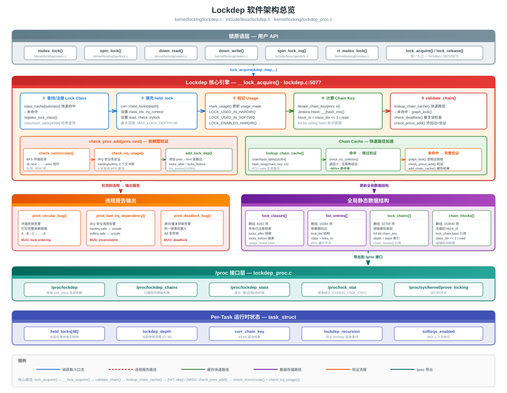

#### 3.2.1 Lockdep 架构总览

Lockdep 是一个**编译时插桩 + 运行时验证**的框架，整体架构分为五层：

```
┌─────────────────────────────────────────────────────────────────────┐
│  锁原语层     mutex_lock / spin_lock / down_read / rwlock ...       │
│              每个锁内嵌 struct lockdep_map，编译时自动插桩            │
├─────────────────────────────────────────────────────────────────────┤
│  统一入口     lock_acquire() / lock_release()                       │
│              所有锁原语的获取/释放都汇聚到这两个函数                   │
├─────────────────────────────────────────────────────────────────────┤
│  核心引擎     __lock_acquire()  5 步流水线                           │
│              ① 注册 lock_class → ② 填充 held_lock → ③ 标记 usage   │
│              → ④ 计算 chain_key → ⑤ validate_chain()               │
├─────────────────────────────────────────────────────────────────────┤
│  验证子系统   check_noncircular() — BFS 环路检测                     │
│              check_irq_usage()   — IRQ 安全性验证                   │
│              check_deadlock()    — AA 重复获取检测                   │
├─────────────────────────────────────────────────────────────────────┤
│  存储/导出    lock_classes[8192] / list_entries[16384]               │
│              lock_chains[32768] → /proc/lockdep*                    │
└─────────────────────────────────────────────────────────────────────┘
```

**锁原语与 Lockdep 的关系**：内核中每种锁原语在编译时通过宏自动插入 `lock_acquire()`/`lock_release()` 调用，用户无需手动调用：

```c
/* kernel/locking/mutex.c — mutex_lock 为例 */
void __sched mutex_lock(struct mutex *lock)
{
    might_sleep();
    /* 编译时插桩：在真正获取锁之前通知 lockdep */
    mutex_acquire(&lock->dep_map, 0, 0, _RET_IP_);
    /* ↑ 展开为 lock_acquire(&lock->dep_map, subclass=0, trylock=0, read=0, ...) */

    __mutex_lock_slowpath(lock);
}

/* include/linux/spinlock.h — spin_lock 为例 */
static inline void spin_lock(spinlock_t *lock)
{
    raw_spin_lock(&lock->rlock);
    /* 内部调用 spin_acquire(&lock->dep_map, 0, 0, _RET_IP_)
       展开为 lock_acquire() */
}
```

**全局保护机制**：核心引擎使用一个全局 `graph_lock`（arch_spinlock_t）保护依赖图的写操作。读操作（如 chain cache 查找）通过 RCU 实现无锁读取。

#### 3.2.2 锁获取核心路径

`__lock_acquire()` 是 Lockdep 的核心函数（`lockdep.c:5077`），每次锁获取都会执行以下 5 步流水线：

```
lock_acquire(dep_map, subclass, trylock, read, check, nest_lock, ip)
│                                                    lockdep.c:5825
│  lockdep_recursion_inc()   ← 防止 lockdep 自身递归
│
▼
__lock_acquire()                                     lockdep.c:5077
│
├─ Step 1: 查找/注册 Lock Class
│   ├─ 快速路径: hlock->class_cache[subclass]  (O(1) 命中)
│   └─ 慢速路径: register_lock_class()
│       ├─ hash = hash_long(key, CLASSHASH_BITS=12)
│       ├─ 在 classhash_table[4096] 中查找
│       └─ 未找到 → 分配新 lock_class, 初始化 locks_after/locks_before
│
├─ Step 2: 填充 held_lock 条目
│   ├─ hlock = curr->held_locks[curr->lockdep_depth]
│   ├─ 设置: class_idx, irq_context, trylock, read, check
│   ├─ 设置: hardirqs_off, references
│   └─ 超出 MAX_LOCK_DEPTH(48) → 告警并关闭 lockdep
│
├─ Step 3: 标记 IRQ Usage
│   ├─ mark_usage() 根据当前 IRQ 上下文更新 usage_mask
│   ├─ 在 hardirq 中获取 → 标记 LOCK_USED_IN_HARDIRQ
│   ├─ 在 softirq 中获取 → 标记 LOCK_USED_IN_SOFTIRQ
│   └─ IRQ 已启用时获取 → 标记 LOCK_ENABLED_*
│
├─ Step 4: 计算 Chain Key（64-bit 滚动哈希）
│   ├─ hlock_id = (class_idx << 1) | read
│   ├─ chain_key = iterate_chain_key(prev_chain_key, hlock_id)
│   │              ↓ Jenkins Hash: __jhash_mix(key1, key2, key3)
│   └─ 唯一标识从第一把锁到当前锁的整条持锁序列
│
├─ Step 5: validate_chain()                          lockdep.c:3861
│   ├─ if (trylock || !check) → 跳过验证
│   ├─ lookup_chain_cache(chain_key)
│   │   ├─ 命中 (~95%+): check_no_collision() → 返回, 跳过验证 ★快速路径★
│   │   └─ 未命中: graph_lock() → 进入完整验证
│   │
│   └─ 完整验证流程:
│       ├─ check_deadlock()    — 检查是否重复获取同一 lock_class (AA)
│       ├─ check_prevs_add()   — 对每个已持有的锁:
│       │   └─ check_prev_add(prev, next)
│       │       ├─ check_noncircular()  — BFS 检测 prev→...→next 是否有环
│       │       ├─ check_irq_usage()    — 检查 IRQ 安全性冲突
│       │       └─ add_lock_dep()       — 添加依赖边到图中
│       └─ add_chain_cache()   — 缓存本次锁链供后续快速命中
│
└─ 收尾:
    ├─ curr->curr_chain_key = chain_key
    ├─ curr->lockdep_depth++
    └─ check_chain_key() — 完整性校验
```

**释放路径 `lock_release()`**（`lockdep.c:5875`）相对简单：

```
lock_release(dep_map, ip)
│
▼
__lock_release()
├─ 在 curr->held_locks[] 中逆序查找匹配的 lock_class
├─ 找到后移除该条目（数组压缩）
├─ 重新计算后续所有 held_lock 的 chain_key
├─ curr->lockdep_depth--
└─ lock_release_holdtime()  — 更新持锁时间统计 (CONFIG_LOCK_STAT)
```

#### 3.2.3 依赖图构建与验证

Lockdep 在运行时维护一个**有向依赖图**，图的节点是 `lock_class`，边代表"曾经在持有锁 A 时获取了锁 B"的顺序关系。

**依赖边的类型**（4 种，由 `enum lock_usage_bit` 编码）：

| 依赖类型 | 含义 | 边的标记 |
|----------|------|---------|
| **NN** (Non-read → Non-read) | 写锁 A 之后获取写锁 B | 最强约束 |
| **NR** (Non-read → Read) | 写锁 A 之后获取读锁 B | |
| **RN** (Read → Non-read) | 读锁 A 之后获取写锁 B | |
| **RR** (Read → Read) | 读锁 A 之后获取读锁 B | 最弱约束 |

**依赖图构建过程**：

```c
/* lockdep.c:check_prev_add() — 添加一条依赖边 */
check_prev_add(curr, prev_hlock, next_hlock, distance, trace)
{
    /* 1. 环路检测 */
    ret = check_noncircular(next, prev, trace);
    if (ret == BFS_RMATCH)
        return print_circular_bug();  /* 发现环 → 报告死锁 */

    /* 2. IRQ 安全性验证 */
    if (!check_irq_usage(curr, prev, next))
        return 0;  /* IRQ 冲突 → 已报告 */

    /* 3. 冗余检测（优化） */
    ret = check_redundant(prev, next);
    if (ret == BFS_RMATCH)
        return 2;  /* 冗余边，无需添加 */

    /* 4. 添加双向边 */
    add_lock_to_list(/* prev → next */, &prev_class->locks_after, ...);
    add_lock_to_list(/* next ← prev */, &next_class->locks_before, ...);
}
```

**BFS 环路检测算法**（`check_noncircular()`，`lockdep.c:2149`）：

```
输入: src=next_lock, target=prev_lock
目标: 在依赖图中查找 src →...→ target 的路径

算法:
1. 初始化 BFS 队列 Q（循环数组，最大 4096 项）
2. 将 src 的所有 locks_after 邻居入队
3. while Q 非空:
   a. 取出队首节点 entry
   b. if entry.class == target.class:
      → 发现环路！回溯路径打印 print_circular_bug()
   c. 检查 "强路径" 规则（读写依赖类型兼容性）
   d. 将 entry.class 的所有 locks_after 邻居入队
4. 队列为空 → 无环，安全
```

**IRQ 安全性检查**（`check_irq_usage()`，`lockdep.c:2780`）：

IRQ 检查用 4 步双向 BFS 检测是否存在 hardirq/softirq 上下文冲突：

```
步骤 1: BFS 反向遍历 prev 的 locks_before
        收集所有 "被间接持有" 的锁的 usage_mask
        → 找出其中 hardirq-safe 的锁（在 hardirq 中被使用过）

步骤 2: BFS 正向遍历 next 的 locks_after
        收集所有 "之后会获取" 的锁的 usage_mask
        → 找出其中 hardirq-unsafe 的锁（在 IRQ 启用时被使用过）

步骤 3-4: 对 softirq 重复同样的检查

冲突条件:
  锁 A 在 hardirq 中使用（safe）且 锁 B 在 IRQ 启用时使用（unsafe）
  如果 A →...→ B 存在依赖链，则可能死锁：
    CPU0: 持有 B (IRQ enabled) → hardirq 来了 → 试图获取 A → 等待
    CPU1: 持有 A → 试图获取 B → 等待 CPU0 释放
    → 死锁！
```

#### 3.2.4 缓存加速机制

完整的 BFS 验证开销较大，Lockdep 通过 **Chain Cache** 实现 ~95% 以上的命中率，将大多数锁获取的验证开销降到 O(1)。

**Chain Key 计算**：

```c
/* lockdep.c — Jenkins Hash 滚动计算 */
static u64 iterate_chain_key(u64 key1, u64 key2)
{
    u32 k0 = key1, k1 = key1 >> 32;
    __jhash_mix(key2, k0, k1);
    return (u64)k1 << 32 | k0;
}

/* 每次获取锁时：
   hlock_id = (class_idx << 1) | read;   // 编码锁类+读写模式
   chain_key = iterate_chain_key(prev_chain_key, hlock_id);
*/
```

Chain Key 唯一标识一条"从第一把锁到当前锁"的完整持锁序列。相同的锁获取顺序产生相同的 Chain Key。

**Chain Cache 查找**（`lookup_chain_cache()`，`lockdep.c:3796`）：

```
输入: 64-bit chain_key
1. bucket = chainhash_table[hash_long(chain_key, 14)]   // 16384 buckets
2. RCU-safe 遍历 bucket 链表
3. 比较 chain->chain_key == chain_key
4. 命中:
   ├─ check_no_collision() — 验证 hlock_id 序列完全匹配（防哈希碰撞）
   ├─ debug_atomic_inc(chain_lookup_hits)
   └─ 返回 0 → validate_chain() 直接返回，跳过所有验证
5. 未命中:
   ├─ debug_atomic_inc(chain_lookup_misses)
   ├─ graph_lock() — 获取全局锁
   ├─ 执行完整验证（check_deadlock + check_prevs_add）
   └─ add_chain_cache() — 将新锁链存入缓存
       ├─ 分配 lock_chains[] 条目
       ├─ 压缩 held_lock 序列到 chain_hlocks[]
       └─ 插入 chainhash_table bucket
```

**缓存效果分析**：

| 指标 | 说明 |
|------|------|
| 命中率 | 启动后快速收敛到 95%+（通过 `/proc/lockdep_stats` 查看） |
| 命中开销 | O(1) 哈希 + 短链表遍历，无需获取全局锁 |
| 未命中开销 | O(V+E) BFS 遍历，需要 `graph_lock()` 全局锁 |
| 缓存容量 | 32768 条链（`MAX_LOCKDEP_CHAINS`），溢出后 lockdep 关闭 |
| 碰撞处理 | `check_no_collision()` 逐项比对 hlock_id 序列 |

#### 3.2.5 /proc 接口

Lockdep 通过 `kernel/locking/lockdep_proc.c` 向用户空间导出多个 `/proc` 文件：

| 文件 | 说明 | 依赖配置 |
|------|------|---------|
| `/proc/lockdep` | 列出所有已注册的 `lock_class`，包含名称、usage_mask、依赖关系 | `CONFIG_LOCKDEP` |
| `/proc/lockdep_chains` | 列出所有已缓存的锁链（chain_key + 包含的锁类序列） | `CONFIG_LOCKDEP` |
| `/proc/lockdep_stats` | 全面的统计信息（类/边/链数量、命中率、BFS 深度等） | `CONFIG_LOCKDEP` |
| `/proc/lock_stat` | 每个锁类的竞争统计（等待次数、平均/最大等待时间、持有时间） | `CONFIG_LOCK_STAT` |

**`/proc/lockdep` 输出格式**：

```
all lock classes:
 000000004a24cc83 OPS: 12345  FD:  123  BD:   45 +.+.+.+.: &rq->__lock
 00000000b7c8e39a OPS:  6789  FD:   67  BD:   23 -.-.-.+.: &p->pi_lock
 ...
```

各字段含义：
- 前 16 位：lock_class 的唯一哈希标识
- `OPS`：该锁类被获取的总次数
- `FD`：`locks_after` 中的直接正向依赖数
- `BD`：`locks_before` 中的直接反向依赖数
- 8 位 usage 标记（`+`=使用过, `-`=未使用, `.`=不适用），对应 hardirq/softirq 的 read/write、enabled/disabled 八种组合

**`/proc/lock_stat` 竞争统计**（需 `CONFIG_LOCK_STAT=y`）：

```
lock_stat version 0.4
----------------------------------------------------------------------------------------------------------------------
                              class name    con-hierarchical    contentions   waittime-min   waittime-max waittime-total
----------------------------------------------------------------------------------------------------------------------
                         &rq->__lock:        1234 [<ffffff...>]       567      0.42          123.45       9876.54
                           &p->pi_lock:         89 [<ffffff...>]        12      0.15           45.67       1234.56
```

该接口对于定位**锁竞争热点**非常有价值：`contentions` 列显示争用次数，`waittime-max` 显示最大等待时间（微秒），可快速识别哪些锁是性能瓶颈。

### 3.3 DeadLock 关键数据结构

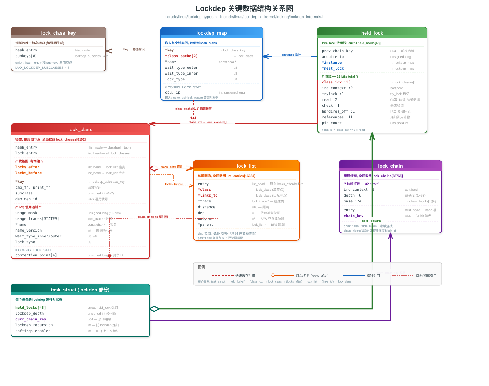

#### 3.3.1 struct lock_class — 锁类

**源码位置**：`include/linux/lockdep_types.h:98`

`lock_class` 是 Lockdep 依赖图的**节点**，代表一类锁（而非锁实例）。所有同类型的锁（如所有 inode 的 `i_mutex`）共享同一个 `lock_class`。全局静态数组 `lock_classes[8192]` 存储所有已注册的锁类。

```c
struct lock_class {
    struct hlist_node       hash_entry;      /* classhash_table[4096] 哈希桶链表节点 */
    struct list_head        lock_entry;      /* 链入 all_lock_classes 或 free_lock_classes */

    /* ===== 依赖图: 有向边 ===== */
    struct list_head        locks_after;     /* 正向依赖边链表 (lock_list) */
    struct list_head        locks_before;    /* 反向依赖边链表 (lock_list) */

    const struct lockdep_subclass_key *key;  /* 指向 lock_class_key.subkeys[subclass] */
    lock_cmp_fn             cmp_fn;          /* 比较函数 (用于排序同类锁) */
    lock_print_fn           print_fn;        /* 打印函数 (输出锁名) */

    unsigned int            subclass;        /* 子类编号 (0~7) */
    unsigned int            dep_gen_id;      /* BFS 遍历的代号, 防止重复访问 */

    /* ===== IRQ 使用追踪 ===== */
    unsigned long           usage_mask;      /* 16-bit 位图: 记录该锁在各 IRQ 上下文中的使用情况 */
    const struct lock_trace *usage_traces[LOCK_TRACE_STATES];  /* 每种 usage 的栈回溯 */

    const char              *name;           /* 锁名称字符串 (如 "&rq->__lock") */
    int                     name_version;    /* 名称版本, 用于图遍历 */
    u8                      wait_type_inner; /* 该锁提供的等待上下文 */
    u8                      wait_type_outer; /* 该锁可以在什么上下文中被获取 */
    u8                      lock_type;       /* 锁类型标识 */

#ifdef CONFIG_LOCK_STAT
    unsigned long           contention_point[4];   /* 竞争发生的 IP 地址 (Top-4) */
    unsigned long           contending_point[4];   /* 竞争持有者的 IP 地址 */
#endif
};
```

**`usage_mask` 位图含义**（16 bits，定义在 `lockdep_internals.h`）：

| 位 | 含义 | 标记 |
|----|------|------|
| 0 | `LOCK_USED_IN_HARDIRQ` | 在硬中断中以写模式获取 |
| 1 | `LOCK_USED_IN_HARDIRQ_READ` | 在硬中断中以读模式获取 |
| 2 | `LOCK_ENABLED_HARDIRQ` | 在硬中断**启用**时以写模式获取 |
| 3 | `LOCK_ENABLED_HARDIRQ_READ` | 在硬中断**启用**时以读模式获取 |
| 4~7 | 同上，对 softirq | softirq 版本 |
| 8 | `LOCK_USED` | 曾被以写模式获取过 |
| 9 | `LOCK_USED_READ` | 曾被以读模式获取过 |

**`/proc/lockdep` 中的 8 位 usage 字符串**：每两位对应一种 IRQ 状态，`+` 表示有此用法，`-` 表示无，`.` 表示不适用。例如 `+.-.+.+.` 表示该锁在 hardirq 中写获取过(+)、未在 hardirq 中读获取(.)、未在 hardirq-enabled 中写获取(-)、...

#### 3.3.2 struct lockdep_map — 锁实例映射

**源码位置**：`include/linux/lockdep_types.h:186`

`lockdep_map` 嵌入到每个具体锁对象中（如 `mutex.dep_map`、`spinlock.dep_map`），是锁实例到 `lock_class` 的桥梁。

```c
struct lockdep_map {
    struct lock_class_key   *key;            /* 指向锁的静态 key (编译期确定) */
    struct lock_class       *class_cache[2]; /* lock_class 快速缓存:
                                                [0] = subclass 0
                                                [1] = subclass 1
                                                避免每次都做 hash 查找 */
    const char              *name;           /* 锁名称 (如 "i_mutex") */
    u8                      wait_type_outer; /* 可以在什么等待上下文中被获取 */
    u8                      wait_type_inner; /* 持有该锁时提供的等待上下文 */
    u8                      lock_type;       /* 锁类型 */
#ifdef CONFIG_LOCK_STAT
    int                     cpu;             /* 最后获取的 CPU */
    unsigned long           ip;              /* 最后获取的 IP 地址 */
#endif
};
```

**锁原语中的嵌入方式**：

```c
/* include/linux/mutex.h */
struct mutex {
    atomic_long_t           owner;
    raw_spinlock_t          wait_lock;
    struct list_head        wait_list;
#ifdef CONFIG_DEBUG_LOCK_ALLOC
    struct lockdep_map      dep_map;       /* ← 嵌入在锁对象中 */
#endif
};

/* include/linux/spinlock_types_raw.h */
typedef struct raw_spinlock {
    arch_spinlock_t         raw_lock;
#ifdef CONFIG_DEBUG_LOCK_ALLOC
    struct lockdep_map      dep_map;       /* ← 嵌入在锁对象中 */
#endif
} raw_spinlock_t;
```

**`class_cache` 缓存机制**：`lock_acquire()` 首先检查 `lock->dep_map.class_cache[subclass]`，若命中则 O(1) 获得 `lock_class` 指针，避免了 `classhash_table` 哈希查找。`NR_LOCKDEP_CACHING_CLASSES = 2`，因此 subclass 0 和 1 有快速缓存，subclass ≥ 2 需走完整 hash 路径。

#### 3.3.3 struct held_lock — 持有锁记录

**源码位置**：`include/linux/lockdep_types.h:206`

`held_lock` 记录一个任务当前持有的一把锁的状态。每个任务在 `task_struct.held_locks[48]` 中维护一个持锁栈，`lockdep_depth` 指示当前栈深度。

```c
struct held_lock {
    /* ===== 链哈希 ===== */
    u64                     prev_chain_key;  /* 获取本锁前的 chain_key (用于释放时回退) */
    unsigned long           acquire_ip;      /* 获取锁时的代码地址 (_RET_IP_) */

    /* ===== 指向锁实例 ===== */
    struct lockdep_map      *instance;       /* 指向锁对象中的 lockdep_map */
    struct lockdep_map      *nest_lock;      /* 嵌套锁注解 (mutex_lock_nest_lock) */

#ifdef CONFIG_LOCK_STAT
    u64                     waittime_stamp;  /* 开始等待锁的时间戳 */
    u64                     holdtime_stamp;  /* 成功获取锁的时间戳 */
#endif

    /* ===== 位域 (共 32 bits) ===== */
    unsigned int class_idx   :13;   /* → lock_classes[class_idx]，最大 8192 */
    unsigned int irq_context :2;    /* bit0=softirq, bit1=hardirq */
    unsigned int trylock     :1;    /* 是否 trylock (trylock 不参与验证) */
    unsigned int read        :2;    /* 0=写锁, 1=读锁, 2=递归读锁 */
    unsigned int check       :1;    /* 是否需要 lockdep 验证 */
    unsigned int hardirqs_off:1;    /* 获取时硬中断是否关闭 */
    unsigned int sync        :1;    /* synchronize_* 标记 */
    unsigned int references  :11;   /* 递归引用计数 */
    unsigned int pin_count;          /* pin 引用 (防止意外释放) */
};
```

**关键字段详解**：

| 字段 | 宽度 | 说明 |
|------|------|------|
| `class_idx` | 13 bits | 索引到 `lock_classes[]` 数组，`hlock_id = (class_idx << 1) \| read` |
| `irq_context` | 2 bits | 跨中断上下文时 chain_key 会重置为 0，避免产生无意义的跨上下文依赖 |
| `prev_chain_key` | 64 bits | 释放锁时用于回退 `curr->curr_chain_key`，实现栈式的哈希管理 |
| `references` | 11 bits | 递归读锁引用计数，`lock_acquire(read=2)` 时增加而非新建条目 |

#### 3.3.4 struct lock_list — 依赖图边

**源码位置**：`include/linux/lockdep.h:48`

`lock_list` 是依赖图的**边**，代表"持有锁 A 后获取了锁 B"的顺序关系。全局静态数组 `list_entries[MAX_LOCKDEP_ENTRIES]`（默认 16384）存储所有边。每个 `lock_class` 通过 `locks_after` 和 `locks_before` 链表拥有自己的出边和入边。

```c
struct lock_list {
    struct list_head        entry;      /* 链入 lock_class.locks_after 或 locks_before */
    struct lock_class       *class;     /* 源节点 (拥有该边的 lock_class) */
    struct lock_class       *links_to;  /* 目标节点 (依赖指向的 lock_class) */
    const struct lock_trace *trace;     /* 创建该依赖时的栈回溯 */
    u16                     distance;   /* 获取距离 (嵌套深度差) */
    u8                      dep;        /* 依赖类型位图: NN|NR|RN|RR */
    u8                      only_xr;    /* BFS 中标记: 从起点到此只有 -(*R)-> 边 */
    struct lock_list        *parent;    /* BFS 回溯指针 (bit0 复用为已访问标记) */
};
```

**`dep` 位图编码**（4 种依赖类型）：

```
bit 0: DEP_NN_MASK  (0x01)  Non-read → Non-read  (写→写)
bit 1: DEP_NR_MASK  (0x02)  Non-read → Read       (写→读)
bit 2: DEP_RN_MASK  (0x04)  Read → Non-read       (读→写)
bit 3: DEP_RR_MASK  (0x08)  Read → Read            (读→读)
```

**BFS 遍历时的角色**：`check_noncircular()` 使用循环队列（`circular_queue`，最大 4096 项）做广度优先搜索。每个出队的 `lock_list` 节点通过 `links_to` 找到下一个 `lock_class`，再遍历其 `locks_after` 获得后续边。`parent` 指针用于在发现环路后回溯打印完整依赖链。

#### 3.3.5 struct lock_chain — 锁链缓存

**源码位置**：`include/linux/lockdep.h:75`

`lock_chain` 缓存一条已验证过的持锁序列，通过 64-bit `chain_key` 做 O(1) 查找。命中后可跳过全部 BFS 验证，是 Lockdep 的核心性能优化。

```c
struct lock_chain {
    /* 位域打包 (32 bits) */
    unsigned int irq_context :2;   /* 该链的 IRQ 上下文 (soft|hard) */
    unsigned int depth       :6;   /* 链中锁的数量 (1~63) */
    unsigned int base        :24;  /* → chain_hlocks[] 的起始索引 */
    /* 4 字节空洞 (对齐) */
    struct hlist_node        entry;      /* chainhash_table[16384] 哈希桶链表 */
    u64                      chain_key;  /* 64-bit Jenkins Hash，唯一标识持锁序列 */
};
```

**Chain 存储结构**：

```
lock_chains[32768]           chain_hlocks[163840]
┌──────────────────┐         ┌───────────────────────┐
│ chain_key=0xA3.. │         │ ...                   │
│ depth=3, base=50 │────────→│ [50] hlock_id_0       │  = (class_idx<<1)|read
│                  │         │ [51] hlock_id_1       │
│                  │         │ [52] hlock_id_2       │
├──────────────────┤         │ ...                   │
│ chain_key=0xF7.. │         │ [80] hlock_id_0       │
│ depth=2, base=80 │────────→│ [81] hlock_id_1       │
├──────────────────┤         │ ...                   │
│ ...              │         └───────────────────────┘
└──────────────────┘
```

**碰撞检测**：`check_no_collision()` 逐项比对 `chain_hlocks[base..base+depth-1]` 中存储的 `hlock_id` 序列与当前 `held_locks[]` 中计算出的 `hlock_id` 序列。若完全匹配则为真命中，否则报 hash 碰撞错误（理论上极罕见）。

#### 3.3.6 struct lock_class_key — 锁类键

**源码位置**：`include/linux/lockdep_types.h:75`

`lock_class_key` 是每个锁类型的**唯一静态标识**，通常在编译期由 `DEFINE_MUTEX()`、`DEFINE_SPINLOCK()` 等宏自动定义为静态变量。其地址作为锁类的唯一 ID，用于 hash 查找。

```c
struct lock_class_key {
    union {
        struct hlist_node           hash_entry;      /* lock_keys_hash 哈希桶 */
        struct lockdep_subclass_key subkeys[MAX_LOCKDEP_SUBCLASSES];  /* 8 个子类 key */
    };
};
```

**使用示例**：

```c
/* 静态定义 — 编译器自动分配唯一地址 */
static DEFINE_MUTEX(my_mutex);
/* 展开为:
   static struct lock_class_key __key;
   __mutex_init(&my_mutex, "my_mutex", &__key);
*/

/* 动态分配 — 需手动注册/注销 key */
struct lock_class_key my_dynamic_key;
lockdep_register_key(&my_dynamic_key);
lockdep_set_class(&lock->dep_map, &my_dynamic_key);
// ... 使用完毕 ...
lockdep_unregister_key(&my_dynamic_key);
```

**子类机制**：`subkeys[8]` 允许同一把锁在不同嵌套层级中使用不同的 `lock_class`。例如文件系统中父目录和子目录的 `i_mutex` 虽然是同一类锁，但通过 `mutex_lock_nested(&inode->i_mutex, I_MUTEX_PARENT)` 指定不同 subclass，Lockdep 会将它们视为不同 `lock_class`，允许 parent → child 的获取顺序。

#### 3.3.7 数据结构关系总览

以一次 `mutex_lock()` 调用为例，展示各数据结构之间的完整交互流程：

```
1. 用户调用 mutex_lock(&my_mutex)

2. 定位 lock_class:
   my_mutex.dep_map.class_cache[0]  ──→  lock_class (命中)
   或 hash(my_mutex.dep_map.key)    ──→  classhash_table[4096] ──→ lock_class (未命中)

3. 填充 held_lock:
   curr->held_locks[curr->lockdep_depth] = {
       .class_idx    = lock_class 在 lock_classes[] 中的下标,
       .instance     = &my_mutex.dep_map,
       .prev_chain_key = curr->curr_chain_key,
       .irq_context  = 当前 IRQ 上下文,
       .read         = 0 (mutex 是写锁),
       .acquire_ip   = _RET_IP_,
   };

4. 计算 chain_key:
   hlock_id = (class_idx << 1) | 0;   // read=0
   curr->curr_chain_key = iterate_chain_key(prev_chain_key, hlock_id);

5. 查找 chain cache:
   hash = hash_long(curr_chain_key, 14);
   chainhash_table[hash] → 遍历 lock_chain 链表 → 比较 chain_key
   ├─ 命中: check_no_collision(), 跳过验证 → 结束
   └─ 未命中: 进入完整验证 ↓

6. 依赖图验证 (对每个已持有的锁):
   lock_class(prev).locks_after → 遍历 lock_list → 找到 links_to
   check_noncircular(): BFS 从 next→...→prev 搜索环路
   check_irq_usage(): 检查 usage_mask 冲突
   ├─ 无违规: add_lock_dep() 添加新 lock_list 边 → add_chain_cache() 缓存
   └─ 发现违规: print_circular_bug() / print_bad_irq_dependency() → 告警

7. 收尾:
   curr->lockdep_depth++;
```

**全局数据结构容量汇总**：

| 数据结构 | 全局数组 | 默认容量 | 宏定义 | 溢出后果 |
|----------|---------|---------|--------|---------|
| `lock_class` | `lock_classes[]` | 8192 | `MAX_LOCKDEP_KEYS` (2^13) | lockdep 自动关闭 |
| `lock_list` | `list_entries[]` | 16384~32768 | `MAX_LOCKDEP_ENTRIES` (2^15) | lockdep 自动关闭 |
| `lock_chain` | `lock_chains[]` | 32768~65536 | `MAX_LOCKDEP_CHAINS` (2^16) | lockdep 自动关闭 |
| `chain_hlocks` | `chain_hlocks[]` | 163840 | `MAX_LOCKDEP_CHAIN_HLOCKS` | 溢出丢弃新链 |
| `held_lock` | `curr->held_locks[]` | 48 | `MAX_LOCK_DEPTH` | 告警并关闭 lockdep |
| `classhash` | `classhash_table[]` | 4096 buckets | `CLASSHASH_SIZE` (2^12) | — |
| `chainhash` | `chainhash_table[]` | 16384 buckets | `CHAINHASH_SIZE` (2^14) | — |

> **注意**：`MAX_LOCKDEP_ENTRIES` 和 `MAX_LOCKDEP_CHAINS` 可通过 `CONFIG_LOCKDEP_BITS` 和 `CONFIG_LOCKDEP_CHAINS_BITS` 调整。大型系统（多设备/多文件系统）建议增大这些值，否则 lockdep 可能因资源耗尽而自动关闭。

### 3.4 DeadLock 核心算法总结

本节提炼 Lockdep 子系统实现中涉及的核心算法，帮助理解死锁检测的运行机理和 debug 时的思路。

#### 3.4.1 Lock Class 注册与哈希查找算法

**源码**：`kernel/locking/lockdep.c` — `register_lock_class()`（第 1285 行）

每个锁在首次使用时注册到全局 `lock_classes[8192]` 数组，通过哈希表 `classhash_table[4096]` 实现 O(1) 查找。

```
算法: register_lock_class(lock, subclass)
输入: lockdep_map *lock, unsigned int subclass

快速路径:
  class = look_up_lock_class(lock, subclass)
  if class != NULL → 直接缓存到 class_cache[] 并返回

慢速路径 (首次注册):
  1. key = lock->key->subkeys[subclass]          // 定位子类 key
  2. hash = hash_long((unsigned long)key, 12)     // Golden Ratio 乘法哈希
     // hash = key * 0x9e3779b97f4a7c15 >> (64 - 12)
     // 结果映射到 [0, 4095]
  3. hash_head = classhash_table[hash]            // 获取哈希桶头指针
  4. graph_lock()                                 // 获取全局锁
  5. hlist_for_each(hash_head):                   // 二次查找（防 TOCTOU 竞态）
       if entry->key == key → 找到, goto 缓存
  6. class = free_lock_classes.first              // 从空闲链表分配
     if NULL → "MAX_LOCKDEP_KEYS too low!" 关闭 lockdep
  7. 初始化:
     class->key = key
     class->name = lock->name
     class->subclass = subclass
     INIT locks_before, locks_after 为空链表
  8. hlist_add_head_rcu(class, hash_head)         // RCU 安全添加到哈希表
     list_move_tail(class, all_lock_classes)      // 移入活跃链表
  9. graph_unlock()
  10. lock->class_cache[subclass] = class         // 缓存到锁实例

复杂度: O(1) 缓存命中, O(k) 哈希碰撞链遍历 (k 通常 1~2)
哈希质量: Golden Ratio 乘法保证均匀分布, 4096 桶容纳 8192 类, 平均链长 ~2
```

**Golden Ratio 哈希原理**：`hash_long()` 使用黄金比例常数 `0x9e3779b97f4a7c15`（$\phi = \frac{1+\sqrt{5}}{2}$，取倒数乘以 $2^{64}$），利用无理数的均匀分布特性将输入映射到 $[0, 2^{bits})$ 区间，单 bit 变化即可影响约 32 个输出 bit（雪崩效应）。

#### 3.4.2 Chain Key Jenkins 滚动哈希算法

**源码**：`kernel/locking/lockdep.c` — `iterate_chain_key()`（第 447 行）

Chain Key 唯一标识从第一把锁到当前锁的完整持锁序列，用于 Chain Cache 的 O(1) 查找。

```
算法: iterate_chain_key(key, idx)
输入: key (64-bit 前序哈希), idx (当前锁的 hlock_id)

  hlock_id 编码:
    hlock_id = (class_idx << 1) | read
    // class_idx: 13-bit, 锁在 lock_classes[] 中的下标
    // read: 0=写锁, 1=读锁

  Jenkins Hash 混合:
    k0 = key 的低 32 位
    k1 = key 的高 32 位
    __jhash_mix(idx, k0, k1)     // 18 步混合运算
    // a -= c; a ^= rot(c, 4);  c += b;
    // b -= a; b ^= rot(a, 6);  a += c;
    // c -= b; c ^= rot(b, 8);  b += a;
    // a -= c; a ^= rot(c,16);  c += b;
    // b -= a; b ^= rot(a,19);  a += c;
    // c -= b; c ^= rot(b, 4);  b += a;
    return k0 | ((u64)k1 << 32)

每次锁获取的递推:
  初始: curr->curr_chain_key = INITIAL_CHAIN_KEY (-1)
  第 1 把锁: chain_key = iterate_chain_key(-1, hlock_id_0)
  第 2 把锁: chain_key = iterate_chain_key(chain_key_1, hlock_id_1)
  第 N 把锁: chain_key = iterate_chain_key(chain_key_{N-1}, hlock_id_N)

性质:
  - 相同的锁获取序列 → 相同的 chain_key (确定性)
  - 不同的序列 → 极大概率不同的 chain_key (碰撞概率 ≈ 2^{-64})
  - 不可逆: 无法从 chain_key 推导出锁序列
  - O(1) 每次锁获取, 18 步整数运算 (无乘法/除法)
```

#### 3.4.3 BFS 环路检测算法

**源码**：`kernel/locking/lockdep.c` — `__bfs()`（第 1738 行），`check_noncircular()`（第 2149 行）

Lockdep 的核心死锁检测算法：在依赖图中使用广度优先搜索（BFS）寻找环路。选择 BFS 而非 DFS 是为了找到**最短环路**，便于理解和修复。

```
算法: __bfs(source, data, match, skip, target_entry, offset)
输入: source (起点 lock_list), match (匹配回调), offset (遍历方向)

数据结构:
  circular_queue cq: 循环数组, 容量 MAX_CIRCULAR_QUEUE_SIZE = 4096
  front, rear: 队头队尾指针, 通过 & CQ_MASK 实现环形
  dep_gen_id: 全局递增代号, 用于标记已访问节点 (替代 visited 集合)

初始化:
  __cq_init(cq)
  lockdep_dependency_gen_id++              // 新遍历代号
  enqueue(cq, source_entry)

主循环:
  while (lock = next_sibling(lock) || lock = dequeue(cq)):
    if lock->class == NULL → 返回 BFS_EINVALIDNODE

    // Step 1: 去重 — 已访问节点跳过
    if lock->class->dep_gen_id == 当前代号 → continue
    lock->class->dep_gen_id = 当前代号      // 标记已访问

    // Step 2: 强路径过滤 (详见 3.4.4)
    if lock->parent != NULL:
      dep = lock->dep                       // 4-bit 依赖类型
      if parent->only_xr:                   // 前驱只有 -(*R)-> 类型
        dep &= ~(DEP_SR_MASK | DEP_SN_MASK) // 去掉 -(S*)-> 类型
      if dep == 0 → continue                // 无强路径, 跳过
      lock->only_xr = !(dep & (DEP_SN|DEP_EN))  // 传播 only_xr 标记

    // Step 3: 匹配检测
    if skip(lock, data) → continue
    if match(lock, data):
      *target_entry = lock → 返回 BFS_RMATCH  // 找到环路！

    // Step 4: 扩展邻居
    head = lock->class->locks_after (正向) 或 locks_before (反向)
    first = true
    for each entry in head:
      entry->parent = lock                  // 记录 BFS 回溯父节点
      if first:                             // 只入队链表第一个
        enqueue(cq, entry)                  // 后续通过 __bfs_next() 遍历兄弟
        first = false

  返回 BFS_RNOMATCH  // 队列为空, 无环

空间优化: 只将每个 locks_after 链表的第一个元素入队,
         兄弟元素通过 __bfs_next() 链表遍历获取, 节省队列空间

复杂度: 时间 O(V + E), V=锁类数, E=依赖边数
         空间 O(4096) 固定队列 + O(V) dep_gen_id 标记
```

**`check_noncircular()` 调用方式**：

```c
// lockdep.c:2149 — 检测 next→...→prev 是否存在环路
check_noncircular(struct held_lock *src, struct held_lock *target, ...)
{
    bfs_init_root(&src_entry, src);       // 起点: next_lock
    ret = check_path(target, &src_entry,  // 终点: prev_lock
                     hlock_conflict,       // match: class 相同即匹配
                     NULL,                 // skip: 无
                     &target_entry);

    if (ret == BFS_RMATCH)
        print_circular_bug();             // 打印完整环路: prev→...→next→prev
}
```

**环路回溯打印**：当 BFS 命中后，通过 `get_lock_parent()` 链逐级回溯 `parent` 指针，输出完整依赖链。`get_lock_depth()` 计算环路深度。

#### 3.4.4 强路径依赖过滤算法

**源码**：`kernel/locking/lockdep.c` — `__bfs()` Step 2（第 1780 行）

并非所有依赖路径都能导致真正的死锁。读写锁的特殊性使得某些路径组合不构成"强路径"。Lockdep 在 BFS 中实时过滤弱路径，只检测强依赖。

**4 种依赖类型编码**（`dep` 4-bit 位图）：

```
          next
          ┌───────────────┬──────────────────┐
          │ Recursive (R) │ Non-recursive (N)│
    ┌─────┼───────────────┼──────────────────┤
prev│ S(R)│ DEP_SR bit0=0 │ DEP_SN bit2=2    │   S = Shared (read)
    │ E(W)│ DEP_ER bit1=1 │ DEP_EN bit3=3    │   E = Exclusive (write)
    └─────┴───────────────┴──────────────────┘

编码规则: bit0 = (prev->read == 0)    // prev 是写锁?
          bit1 = (next->read != 2)    // next 不是递归读锁?
```

**强路径规则**：不允许相邻两条边组成 `-(*R)-> -(S*)->` 模式（即"前一跳指向读锁，下一跳从共享读锁出发"），因为读锁之间不互斥，不会造成实际等待。

```
算法: 强路径过滤 (在 __bfs() 每个节点执行)
输入: lock (当前边), lock->parent (前驱边)

  dep = lock->dep                           // 当前边的依赖类型位图

  if parent->only_xr:                       // 前驱只有 -(*R)-> 类型
    dep &= ~(DEP_SR_MASK | DEP_SN_MASK)     // 过滤掉 -(S*)-> 类型
    // 因为 -(*R)-> -(S*)-> 不构成强路径

  if dep == 0:                               // 过滤后无有效依赖
    skip this node                           // 此路径不是强路径

  lock->only_xr = !(dep & (DEP_SN|DEP_EN))  // 传播: 当前是否只剩 -(*R)->
  // 如果过滤后只剩 DEP_SR 和 DEP_ER (都指向递归读锁)
  // 则 only_xr = true, 传递给下一跳继续过滤

示例 (不构成强路径):
  A -(ER)-> B -(SN)-> C
  │         │         │
  写锁→读锁  读锁→写锁
  前一跳到 B 是读锁 (only_xr=true)
  下一跳从 B 出发是共享 (S*)
  → -(*R)-> -(S*)-> 被过滤 ✗

示例 (构成强路径):
  A -(EN)-> B -(EN)-> C
  │         │         │
  写锁→写锁  写锁→写锁
  → 全部是独占, 不被过滤 ✓
```

#### 3.4.5 IRQ 安全性四步验证算法

**源码**：`kernel/locking/lockdep.c` — `check_irq_usage()`（第 2780 行）

检测在不同 IRQ 上下文中使用锁所导致的隐式死锁。这种死锁不是锁顺序环路，而是 IRQ 抢占导致的。

```
死锁场景:
  CPU0                              CPU1
  ──────                            ──────
  lock(B)  // IRQ enabled           lock(A)
  ...                               ...
  ← hardirq 来了                    lock(B)  // 等待 CPU0 释放 B
  lock(A)  // 在 hardirq 中获取 A
  // 等待 CPU1 释放 A → 死锁!

  条件: A 是 hardirq-safe (在 hardirq 中使用过)
        B 是 hardirq-unsafe (在 IRQ 启用时使用过)
        且 A →...→ B 存在依赖关系

算法: check_irq_usage(curr, prev, next)
添加 prev → next 依赖时执行

  Step 1: 反向 BFS 收集 usage_mask
    root = prev
    __bfs_backwards(root, usage_accumulate)
    // 沿 locks_before 方向遍历所有间接前驱
    // 累积 OR 每个节点的 usage_mask
    usage_mask &= LOCKF_USED_IN_IRQ_ALL
    // 只保留 "在 IRQ 上下文中使用过" 的标记位
    if usage_mask == 0 → 安全, 返回

  Step 2: 正向 BFS 查找冲突
    forward_mask = exclusive_mask(usage_mask)
    // 将 USED_IN_HARDIRQ 转换为 ENABLED_HARDIRQ (互斥对)
    // 将 USED_IN_SOFTIRQ 转换为 ENABLED_SOFTIRQ
    root = next
    find_usage_forwards(root, forward_mask)
    // 沿 locks_after 方向搜索: 是否存在节点的 usage_mask 匹配 forward_mask?
    // 即: 是否有后续锁在 "IRQ 启用" 时被使用过?
    if 未找到 → 安全, 返回

  Step 3: 反向精确定位
    backward_mask = original_mask(target.usage_mask & LOCKF_ENABLED_IRQ_ALL)
    // 从正向找到的 "unsafe" 锁反推对应的 "safe" 标记
    find_usage_backwards(root, backward_mask)
    // 再次反向搜索, 找到具体的 irq-safe 锁

  Step 4: 缩小到最小冲突对
    find_exclusive_match(backward_usage, forward_usage)
    // 从 usage_mask 中找到一对精确的互斥位:
    // LOCK_USED_IN_HARDIRQ ↔ LOCK_ENABLED_HARDIRQ
    // LOCK_USED_IN_SOFTIRQ ↔ LOCK_ENABLED_SOFTIRQ
    print_bad_irq_dependency(...)   // 输出完整冲突报告

复杂度: 3 次 BFS, 每次 O(V + E), 总计 O(3(V+E))
```

**`exclusive_mask()` 转换映射**：

| 输入 (USED_IN) | 输出 (ENABLED) | 含义 |
|----------------|----------------|------|
| `LOCKF_USED_IN_HARDIRQ` | `LOCKF_ENABLED_HARDIRQ` | hardirq-safe ↔ hardirq-unsafe |
| `LOCKF_USED_IN_HARDIRQ_READ` | `LOCKF_ENABLED_HARDIRQ_READ` | 读模式同理 |
| `LOCKF_USED_IN_SOFTIRQ` | `LOCKF_ENABLED_SOFTIRQ` | softirq-safe ↔ softirq-unsafe |
| `LOCKF_USED_IN_SOFTIRQ_READ` | `LOCKF_ENABLED_SOFTIRQ_READ` | 读模式同理 |

#### 3.4.6 Chain Cache 查找与缓存算法

**源码**：`kernel/locking/lockdep.c` — `lookup_chain_cache()`（第 3796 行），`add_chain_cache()`（第 3730 行）

Chain Cache 是 Lockdep 性能的关键：约 95%+ 的锁获取通过缓存命中直接跳过所有 BFS 验证。

```
算法: lookup_chain_cache(chain_key)
输入: 64-bit chain_key (当前持锁序列的滚动哈希)

查找:
  1. hash = hash_long(chain_key, CHAINHASH_BITS=14)  // 映射到 [0, 16383]
  2. bucket = chainhash_table[hash]
  3. hlist_for_each_entry_rcu(chain, bucket):         // RCU 无锁遍历
       if READ_ONCE(chain->chain_key) == chain_key:
         return chain  // 命中 ★

  4. return NULL  // 未命中

缓存命中处理 (validate_chain):
  chain = lookup_chain_cache(chain_key)
  if chain != NULL:
    check_no_collision(chain, held_locks, depth)
    // 逐项比对 chain_hlocks[base..base+depth-1] 与当前 held_locks 的 hlock_id
    // 防止 hash 碰撞造成假命中
    debug_atomic_inc(chain_lookup_hits)
    return 1  // 跳过所有验证 → 快速路径结束

算法: add_chain_cache(curr, hlock, chain_key)
输入: 完整验证通过后, 将当前锁链加入缓存

  1. chain = lock_chains[nr_chains++]                 // 分配条目
     if 超出 MAX_LOCKDEP_CHAINS → 关闭 lockdep
  2. chain->chain_key = chain_key
     chain->irq_context = task_irq_context()
     chain->depth = curr->lockdep_depth
  3. 压缩存储 held_locks:
     for i in [0, depth):
       chain_hlocks[base + i] = (class_idx << 1) | read   // 压缩 hlock_id
     chain->base = base                                     // 记录起始索引
  4. hlist_add_head_rcu(chain, chainhash_table[hash])       // RCU 安全插入

性能分析:
  ┌──────────────┬─────────────────────┬───────────────────┐
  │ 场景         │ 命中 (95%+)         │ 未命中 (5%-)      │
  ├──────────────┼─────────────────────┼───────────────────┤
  │ 耗时         │ ~100-200 CPU cycles │ ~10K-50K cycles   │
  │ 全局锁       │ 不需要               │ 需要 graph_lock() │
  │ BFS 遍历     │ 不需要               │ O(V + E)          │
  │ 内存访问     │ hash + 短链表        │ + 依赖图全遍历     │
  └──────────────┴─────────────────────┴───────────────────┘
```

#### 3.4.7 冗余依赖消除算法

**源码**：`kernel/locking/lockdep.c` — `check_redundant()`（第 2926 行）

在添加依赖边 prev → next 之前，检查图中是否已存在等效或更强的路径。冗余边的消除可减少图的大小，降低后续 BFS 的开销。

```
算法: check_redundant(src, target)
输入: src=prev_lock, target=next_lock
目标: 检查 src →...→ target 是否已有等效或更强的路径

  1. bfs_init_root(&src_entry, src)
  2. src_entry.only_xr = (src->read == 0)
     // 如果 src 是写锁 (Exclusive):
     //   only_xr = true → 只搜索 -(E*)-> 起始的路径 (更强或相等)
     // 如果 src 是读锁 (Shared):
     //   only_xr = false → 搜索 -(S*)-> 和 -(E*)-> 起始的路径 (都算冗余)

  3. ret = check_path(target, &src_entry,
                      hlock_equal,    // match: class 完全相等
                      usage_skip,     // skip: 跳过 local_lock
                      &target_entry)

  4. if ret == BFS_RMATCH:
       debug_atomic_inc(nr_redundant)
       return BFS_RMATCH              // 冗余 → 不添加此边
     else:
       return BFS_RNOMATCH            // 非冗余 → 需要添加

效果:
  典型内核启动后约 30-50% 的新边被判定为冗余
  通过 /proc/lockdep_stats 的 "redundant checks" 和 "redundant links" 可查看
```

#### 3.4.8 Usage Mask 标记与 IRQ 状态追踪算法

**源码**：`kernel/locking/lockdep.c` — `mark_usage()`（第 4618 行），`mark_lock()`（第 4712 行）

每次获取锁时根据当前 IRQ 上下文更新 `lock_class.usage_mask`，为 IRQ 安全性检查提供依据。

```
算法: mark_usage(curr, hlock, check)
输入: curr=当前任务, hlock=当前持锁记录, check=是否需要验证

  条件矩阵 (决定标记哪些 bit):
  ┌──────────────────────────┬──────────────────┬──────────────────┐
  │ 当前上下文               │ hlock->read == 0 │ hlock->read != 0 │
  ├──────────────────────────┼──────────────────┼──────────────────┤
  │ lockdep_hardirq_context()│ USED_IN_HARDIRQ  │ USED_IN_HARDIRQ  │
  │                          │                  │ _READ            │
  ├──────────────────────────┼──────────────────┼──────────────────┤
  │ curr->softirq_context    │ USED_IN_SOFTIRQ  │ USED_IN_SOFTIRQ  │
  │                          │                  │ _READ            │
  ├──────────────────────────┼──────────────────┼──────────────────┤
  │ !hardirqs_off && !sync   │ ENABLED_HARDIRQ  │ ENABLED_HARDIRQ  │
  │                          │                  │ _READ            │
  ├──────────────────────────┼──────────────────┼──────────────────┤
  │ curr->softirqs_enabled   │ ENABLED_SOFTIRQ  │ ENABLED_SOFTIRQ  │
  │                          │                  │ _READ            │
  ├──────────────────────────┼──────────────────┼──────────────────┤
  │ (总是)                   │ LOCK_USED        │ LOCK_USED_READ   │
  └──────────────────────────┴──────────────────┴──────────────────┘

  对每个满足条件的 bit 调用 mark_lock():

算法: mark_lock(curr, hlock, new_bit)
  1. new_mask = 1 << new_bit
  2. 快速路径: if (class->usage_mask & new_mask) → 已设置, 返回 1
  3. graph_lock()                               // 获取全局锁
  4. 二次检查: if (class->usage_mask & new_mask) → 返回 (TOCTOU 防护)
  5. class->usage_mask |= new_mask              // 设置新标记位
  6. if new_bit < LOCK_TRACE_STATES:
       class->usage_traces[new_bit] = save_trace()  // 保存栈回溯
  7. if new_bit < LOCK_USED:
       mark_lock_irq(curr, hlock, new_bit)      // 触发 IRQ 冲突检查
       // 检查新设置的 usage 是否与已有 usage 冲突
       // 如: 同时有 USED_IN_HARDIRQ 和 ENABLED_HARDIRQ → 告警
  8. graph_unlock()

复杂度: O(1) 快速路径 (位运算), O(V+E) 慢速路径 (触发 IRQ 检查时)
```

#### 3.4.9 dep_gen_id 去重标记算法

**源码**：`kernel/locking/lockdep.c` — `mark_lock_accessed()`（第 1528 行）

传统 BFS 需要 `visited` 集合追踪已访问节点。Lockdep 使用全局递增的**代号**（generation id）替代，避免了每次 BFS 前清空 visited 的 O(V) 开销。

```
算法: dep_gen_id 去重

数据结构:
  全局: lockdep_dependency_gen_id (unsigned int, 每次 BFS 前递增)
  每节点: lock_class->dep_gen_id (unsigned int)

初始化 (__cq_init):
  lockdep_dependency_gen_id++          // 新遍历, 代号 +1

已访问检查 (lock_accessed):
  return lock->class->dep_gen_id == lockdep_dependency_gen_id

标记已访问 (mark_lock_accessed):
  lock->class->dep_gen_id = lockdep_dependency_gen_id

优势:
  - 无需维护 visited 集合, 不消耗额外内存
  - 无需清空操作, 初始化 O(1)
  - 利用 unsigned int 自然溢出, 理论上 2^32 次 BFS 后回绕
    (每秒数千次 BFS, 可运行 ~12 天, 远超实际重启周期)
  - 每个 lock_class 只需一个 4 字节字段
```

#### 3.4.10 全局 Graph Lock 与递归防护算法

**源码**：`kernel/locking/lockdep.c` — `graph_lock()`（第 172 行）

Lockdep 自身的锁操作需要特殊处理以避免递归：如果 lockdep 在验证锁时也触发了 `lock_acquire()`，会导致无限递归。

```
算法: graph_lock() / lockdep_recursion 防护

Graph Lock:
  static raw_spinlock_t lockdep_lock         // 原始自旋锁 (不走 lockdep)

  graph_lock():
    raw_local_irq_save(flags)
    arch_spin_lock(&lockdep_lock.raw_lock)    // 直接调用架构层, 绕过 lockdep
    if (!debug_locks):
      arch_spin_unlock(...)
      return 0                                // lockdep 已关闭, 放弃
    return 1

  graph_unlock():
    arch_spin_unlock(&lockdep_lock.raw_lock)
    raw_local_irq_restore(flags)

递归防护:
  DEFINE_PER_CPU(int, lockdep_recursion)       // per-CPU 递归计数器

  lock_acquire():
    lockdep_recursion_inc()                    // __this_cpu_inc(lockdep_recursion)
    ... 执行验证逻辑 ...
    lockdep_recursion_finish()                 // __this_cpu_dec + WARN 检查

  __lock_acquire() 入口检查:
    if (__this_cpu_read(lockdep_recursion)):
      return 1                                 // 递归中, 直接跳过

  LOCKDEP_RECURSION_BITS = 16:
    counter 分为两半:
    低 16 位: 正常递归深度 (应该是 0 或 1)
    高 16 位: "off" 标记 (lockdep 被禁用)

设计原理:
  - raw_spinlock_t 不经过 lockdep 插桩, 避免自身递归
  - per-CPU 递归计数器确保即使 lockdep 验证代码触发了锁操作也不会重入
  - debug_locks 全局标志在首次严重错误后关闭整个 lockdep, 防止级联失败
```

### 3.5 DeadLock 经典案例与 Log 解读

本节通过 6 类经典死锁场景，还原 Lockdep 的告警输出格式，并给出系统化的分析定位方法。

#### 3.5.1 Case 1：AA 递归死锁 — 同一锁重复获取

**场景描述**：同一个 CPU/任务在已持有锁 A 的情况下再次获取锁 A。

```c
/* 触发代码 */
spin_lock(&my_lock);       // 第一次获取
// ... do some work ...
spin_lock(&my_lock);       // 第二次获取 → 自旋永远等不到释放 → 死锁
```

**Lockdep 告警输出**：

```
============================================
WARNING: possible recursive locking detected
6.18.1 #1 Not tainted
--------------------------------------------
worker/0:1/1234 is trying to acquire lock:
ffff0000c1a2b300 (&my_lock){+.+.}-{2:2}, at: my_function+0x48/0x120

but task is already holding lock:
ffff0000c1a2b300 (&my_lock){+.+.}-{2:2}, at: my_caller+0x30/0x80

other info that might help us debug this:
 Possible unsafe locking scenario:

       CPU0
       ----
  lock(&my_lock);
  lock(&my_lock);

 *** DEADLOCK ***

 May be due to missing lock nesting notation

2 locks held by worker/0:1/1234:
 #0: ffff0000c3d4e500 (work_completion){+.+.}-{0:0}, at: process_one_work+0x1e8/0x5c0
 #1: ffff0000c1a2b300 (&my_lock){+.+.}-{2:2}, at: my_caller+0x30/0x80

stack backtrace:
CPU: 0 UID: 0 PID: 1234 Comm: worker/0:1 Not tainted 6.18.1 #1
Call trace:
 dump_backtrace+0x98/0x100
 show_stack+0x1c/0x30
 dump_stack_lvl+0x60/0x80
 __lock_acquire+0xd34/0x2680
 lock_acquire+0x120/0x2e8
 _raw_spin_lock+0x50/0x70
 my_function+0x48/0x120
 my_caller+0x58/0x80
```

**解读要点**：

| 字段 | 含义 |
|------|------|
| `WARNING: possible recursive locking detected` | AA 型死锁 |
| `(&my_lock){+.+.}-{2:2}` | 锁名 + 8 位 usage 标记 + 等待类型 |
| `at: my_function+0x48/0x120` | 第二次获取的代码位置 |
| `but task is already holding lock:` | 锁已被同一任务持有 |
| `2 locks held by worker/0:1/1234:` | 当前持锁列表 |

**修复方法**：
1. **消除递归**：重构代码路径避免重复获取同一把锁
2. **使用 `spin_lock_nested()`**：如果是设计上的嵌套（如父子 inode 锁），用 subclass 注解告知 lockdep
3. **改用递归锁**：极少数场景可用 `mutex` 的递归版本（通常不推荐）

#### 3.5.2 Case 2：ABBA 锁序反转死锁

**场景描述**：两个 CPU 以相反顺序获取锁 A 和锁 B。

```c
/* CPU0 */                         /* CPU1 */
spin_lock(&lock_A);                spin_lock(&lock_B);
spin_lock(&lock_B);  // 等待       spin_lock(&lock_A);  // 等待
// → CPU0 等 CPU1 释放 B           // → CPU1 等 CPU0 释放 A → 死锁
```

**Lockdep 告警输出**：

```
======================================================
WARNING: possible circular locking dependency detected
6.18.1 #1 Not tainted
------------------------------------------------------
task_B/5678 is trying to acquire lock:
ffff0000c1a00100 (&lock_A){+.+.}-{2:2}, at: path_B+0x30/0x80

but task is already holding lock:
ffff0000c1a00200 (&lock_B){+.+.}-{2:2}, at: path_B+0x20/0x80

which lock already depends on the new lock.

the existing dependency chain (in reverse order) is:

-> #1 (&lock_B){+.+.}-{2:2}:
       lock_acquire+0x120/0x2e8
       _raw_spin_lock+0x50/0x70
       path_A+0x40/0x90

-> #0 (&lock_A){+.+.}-{2:2}:
       lock_acquire+0x120/0x2e8
       _raw_spin_lock+0x50/0x70
       path_A+0x20/0x90

other info that might help us debug this:

 Possible unsafe locking scenario:

       CPU0                    CPU1
       ----                    ----
  lock(&lock_A);
                               lock(&lock_B);
                               lock(&lock_A);
  lock(&lock_B);

 *** DEADLOCK ***

2 locks held by task_B/5678:
 #0: ffff0000c1a00200 (&lock_B){+.+.}-{2:2}, at: path_B+0x20/0x80

stack backtrace:
CPU: 1 UID: 0 PID: 5678 Comm: task_B Not tainted 6.18.1 #1
Call trace:
 __lock_acquire+0x1a70/0x2680
 lock_acquire+0x120/0x2e8
 _raw_spin_lock+0x50/0x70
 path_B+0x30/0x80
 ...
```

**解读要点**：

| 字段 | 含义 |
|------|------|
| `WARNING: possible circular locking dependency detected` | 环路死锁（ABBA 或更长链） |
| `the existing dependency chain (in reverse order)` | 已有的依赖路径 A→B（来自 path_A） |
| `-> #1 (&lock_B)` → `-> #0 (&lock_A)` | 反序展示依赖链：先获取 A，再获取 B |
| `Possible unsafe locking scenario` | 双 CPU 并发场景重现 |
| 新尝试的 B→A | 与已有 A→B 构成环路 |

**修复方法**：
1. **统一锁获取顺序**：始终先 A 后 B（按地址排序、层级排序等确定性策略）
2. **减小锁粒度**：拆分锁使得 A 和 B 不再同时持有
3. **使用 `trylock` 回退**：`spin_trylock(&lock_B)` 失败则释放 A 后重试

#### 3.5.3 Case 3：ABCDA 多锁环路死锁

**场景描述**：3 个以上的锁形成环路依赖，通常涉及多个子系统之间的调用。

```c
/* 路径 1: 持有 A → 获取 B */         fs/namei.c:   lock(inode_A); lock(dentry_B);
/* 路径 2: 持有 B → 获取 C */         mm/filemap.c: lock(dentry_B); lock(page_C);
/* 路径 3: 持有 C → 获取 D */         block/bio.c:  lock(page_C); lock(queue_D);
/* 路径 4: 持有 D → 获取 A */         fs/inode.c:   lock(queue_D); lock(inode_A);
// → A→B→C→D→A 形成环路
```

**Lockdep 告警输出**（核心部分）：

```
======================================================
WARNING: possible circular locking dependency detected
6.18.1 #1 Not tainted
------------------------------------------------------
kworker/2:1/890 is trying to acquire lock:
ffff0000d1234000 (&inode_A->i_lock){+.+.}-{2:2}, at: inode_update+0x28/0x60

but task is already holding lock:
ffff0000d5678000 (&queue_D->lock){+.+.}-{2:2}, at: blk_queue_enter+0x40/0xa0

which lock already depends on the new lock.

the existing dependency chain (in reverse order) is:

-> #3 (&queue_D->lock){+.+.}-{2:2}:
       lock_acquire+0x120/0x2e8
       block_submit_bio+0x58/0x100

-> #2 (&page_C->flags){+.+.}-{0:0}:
       lock_acquire+0x120/0x2e8
       filemap_fault+0x1a0/0x400

-> #1 (&dentry_B->d_lock){+.+.}-{2:2}:
       lock_acquire+0x120/0x2e8
       d_lookup+0x50/0xc0

-> #0 (&inode_A->i_lock){+.+.}-{2:2}:
       lock_acquire+0x120/0x2e8
       iget_locked+0x80/0x180

other info that might help us debug this:

Chain exists of:
  &inode_A->i_lock --> &dentry_B->d_lock --> &page_C->flags --> &queue_D->lock

 Possible unsafe locking scenario:

       CPU0                    CPU1
       ----                    ----
  lock(&inode_A->i_lock);
                               lock(&queue_D->lock);
                               lock(&inode_A->i_lock);
  lock(&queue_D->lock);

 *** DEADLOCK ***
```

**解读要点**：
- `Chain exists of:` 行清晰列出完整链路 A→B→C→D
- 依赖链是**反序**展示的（从 #3 到 #0）
- 每个 `-> #N` 节点附带获取该锁时的栈回溯，用于定位代码路径
- 跨子系统死锁是内核中最常见的复杂死锁，需要多个子系统 maintainer 协作修复

**修复方法**：
1. **减少锁持有范围**：在获取下游锁之前释放上游锁
2. **反转调用关系**：重新设计接口，打破循环依赖
3. **引入中间缓存**：将同步操作延迟到释放锁之后执行（如 deferred work）

#### 3.5.4 Case 4：IRQ 安全性违规死锁

**场景描述**：锁 A 在进程上下文（IRQ 启用）中获取，又在硬中断上下文中获取。如果另一把锁 B 与 A 有依赖关系，就可能产生隐式死锁。

```c
/* 进程上下文 */                    /* 硬中断处理函数 */
spin_lock(&lock_B);                void irq_handler(int irq, void *data) {
// IRQ 启用, lock_B 是 irq-unsafe      spin_lock(&lock_A);  // lock_A 是 irq-safe
spin_lock(&lock_A);                    ...
// 产生依赖: B → A                      spin_unlock(&lock_A);
spin_unlock(&lock_A);              }
spin_unlock(&lock_B);

// 死锁场景:
// CPU0: 持有 B → 等待 A → 但 hardirq 来了想获取 A → 等待自身释放 B
```

**Lockdep 告警输出**：

```
=====================================================
WARNING: hardirq-safe -> hardirq-unsafe lock order detected
6.18.1 #1 Not tainted
-----------------------------------------------------
swapper/0/0 [HC0[0]:SC0[0]:HE1:SE1] is trying to acquire:
ffff0000c1b00200 (&lock_B){+.+.}-{2:2}, at: process_work+0x40/0x80

and this task is already holding:
ffff0000c1b00100 (&lock_A){-.-.}-{2:2}, at: do_something+0x28/0x60

which would create a new lock dependency:
 (&lock_A){-.-.}-{2:2} -> (&lock_B){+.+.}-{2:2}

but this new dependency connects a hardirq-safe lock:
 (&lock_A){-.-.}-{2:2}

... which became hardirq-safe at:
  lock_acquire+0x120/0x2e8
  _raw_spin_lock+0x50/0x70
  irq_handler+0x30/0x80
  __handle_irq_event_percpu+0x50/0x170

to a hardirq-unsafe lock:
 (&lock_B){+.+.}-{2:2}

... which became hardirq-unsafe at:
  lock_acquire+0x120/0x2e8
  _raw_spin_lock+0x50/0x70
  process_work+0x40/0x80
  worker_thread+0x248/0x430

other info that might help us debug this:

 Possible unsafe locking scenario:

       CPU0                    CPU1
       ----                    ----
  lock(&lock_B);
                               lock(&lock_A);
                               lock(&lock_B);
  <Interrupt>
    lock(&lock_A);

 *** DEADLOCK ***
```

**解读要点**：

| 字段 | 含义 |
|------|------|
| `hardirq-safe -> hardirq-unsafe` | IRQ 类型违规方向 |
| `[HC0[0]:SC0[0]:HE1:SE1]` | HC=硬中断上下文, SC=软中断上下文, HE=硬中断启用, SE=软中断启用 |
| `{-.-.}` | 该锁在 IRQ 上下文中获取过（hardirq 位为 `-`） |
| `{+.+.}` | 该锁在 IRQ 启用时获取过（enabled 位为 `+`） |
| `which became hardirq-safe at:` | 锁 A 首次在 hardirq 中使用的栈 |
| `which became hardirq-unsafe at:` | 锁 B 首次在 IRQ 启用时使用的栈 |

**Usage 字符含义**（8 位，每 2 位一组）：

```
位置: [hardirq_ctx] [hardirq_enabled] [softirq_ctx] [softirq_enabled]
字符: '+' = 在 IRQ 启用时获取过     (unsafe)
      '-' = 在 IRQ 上下文中获取过   (safe)
      '.' = 未在此上下文中使用过
      '?' = 同时在 IRQ 上下文中使用 且 IRQ 启用 (异常)
```

**修复方法**：
1. **使用 `spin_lock_irqsave()`**：在进程上下文中获取 lock_B 时关闭中断
2. **拆分锁**：为中断处理函数使用独立的锁，避免与进程上下文锁产生依赖
3. **重新设计中断处理**：将中断中的工作延迟到 threaded irq 或 tasklet

#### 3.5.5 Case 5：读写锁不安全升级死锁

**场景描述**：持有读锁后尝试获取写锁（锁升级），或在特定的读写锁嵌套模式下形成隐式死锁。

```c
/* Case 5a: 读锁升级 — AA 变种 */
down_read(&rwsem);
// ... 发现需要修改 ...
down_write(&rwsem);    // 等待所有读者释放，但自己就是读者 → 死锁

/* Case 5b: 读写锁嵌套 ABBA */
/* CPU0 */                              /* CPU1 */
down_read(&rwsem_A);                    down_write(&rwsem_B);
down_write(&rwsem_B);  // 等待          down_read(&rwsem_A);  // 等待
// B 的写锁等 CPU1 释放                  // A 的读锁需等 CPU0 先走完
```

**Lockdep 告警输出（Case 5a）**：

```
============================================
WARNING: possible recursive locking detected
6.18.1 #1 Not tainted
--------------------------------------------
updater/999 is trying to acquire lock:
ffff0000c2100000 (&rwsem){++++}-{3:3}, at: update_data+0x60/0x100

but task is already holding lock:
ffff0000c2100000 (&rwsem){++++}-{3:3}, at: read_data+0x20/0x80

other info that might help us debug this:
 Possible unsafe locking scenario:

       CPU0
       ----
  lock(&rwsem);          ← down_read
  lock(&rwsem);          ← down_write

 *** DEADLOCK ***
```

**Lockdep 告警输出（Case 5b — 读写锁交叉嵌套）**：

```
======================================================
WARNING: possible circular locking dependency detected
6.18.1 #1 Not tainted
------------------------------------------------------
writer/1001 is trying to acquire lock:
ffff0000c2200100 (&rwsem_A){++++}-{3:3}, at: path_write+0x38/0x80

but task is already holding lock:
ffff0000c2200200 (&rwsem_B){++++}-{3:3}, at: path_write+0x20/0x80

which lock already depends on the new lock.

the existing dependency chain (in reverse order) is:

-> #1 (&rwsem_B){++++}-{3:3}:
       lock_acquire+0x120/0x2e8
       down_write+0x40/0x60
       path_read+0x48/0x90

-> #0 (&rwsem_A){++++}-{3:3}:
       lock_acquire+0x120/0x2e8
       down_read+0x40/0x60
       path_read+0x20/0x90

other info that might help us debug this:

 Possible unsafe locking scenario:

       CPU0                    CPU1
       ----                    ----
  rlock(&rwsem_A);
                               lock(&rwsem_B);
                               rlock(&rwsem_A);
  lock(&rwsem_B);

 *** DEADLOCK ***
```

**注意 `rlock` 与 `lock` 的区别**：告警中 `rlock()` 表示读锁获取，`lock()` 表示写锁获取，这对于分析读写锁死锁至关重要。

**修复方法**：
1. **避免读锁升级**：先释放读锁，再获取写锁（注意 TOCTOU 问题）
2. **使用 `down_write()` 替代**：如果大部分路径需要写，直接用写锁
3. **统一读写锁获取顺序**：读写锁也遵循全局锁序

#### 3.5.6 Case 6：锁状态不一致 — usage 冲突

**场景描述**：同一把锁在不同场景中以不兼容的方式使用。例如某次在 softirq 上下文中获取（标记为 softirq-safe），另一次在 softirq 启用时获取（标记为 softirq-unsafe）。

```c
/* 路径 1: 在 softirq 中获取 (标记为 USED_IN_SOFTIRQ) */
void timer_callback(struct timer_list *t) {
    spin_lock(&shared_lock);   // softirq 上下文
    ...
    spin_unlock(&shared_lock);
}

/* 路径 2: 在进程上下文中获取, softirq 启用 (标记为 ENABLED_SOFTIRQ) */
void process_func(void) {
    spin_lock(&shared_lock);   // 进程上下文, softirq 未关闭
    ...                        // → 如果此时 timer softirq 触发, 同一 CPU 上会递归获取 → 死锁
    spin_unlock(&shared_lock);
}
```

**Lockdep 告警输出**：

```
================================
WARNING: inconsistent lock state
6.18.1 #1 Not tainted
--------------------------------
inconsistent {SOFTIRQ-ON-W} -> {IN-SOFTIRQ-W} usage.
process_func/2345 [HC0[0]:SC1[1]:HE1:SE0] takes:
ffff0000c3300000 (&shared_lock){+.?.}-{2:2}, at: timer_callback+0x20/0x60

{SOFTIRQ-ON-W} state was registered at:
  lock_acquire+0x120/0x2e8
  _raw_spin_lock+0x50/0x70
  process_func+0x30/0x80
  worker_thread+0x248/0x430

irq event stamp: 98765432
hardirqs last  enabled at (98765431): [<ffff...>] _raw_spin_unlock_irqrestore+0x68/0xa0
hardirqs last disabled at (98765432): [<ffff...>] do_softirq+0x30/0x80
softirqs last  enabled at (98765400): [<ffff...>] __do_softirq+0x358/0x4a8
softirqs last disabled at (98765430): [<ffff...>] do_softirq+0x28/0x80

other info that might help us debug this:
 Possible unsafe locking scenario:

       CPU0
       ----
  lock(&shared_lock);
  <Interrupt>
    lock(&shared_lock);

 *** DEADLOCK ***
```

**解读要点**：

| 字段 | 含义 |
|------|------|
| `inconsistent {SOFTIRQ-ON-W} -> {IN-SOFTIRQ-W}` | 之前在 softirq-enabled 时以写模式获取(ON)，现在在 softirq 上下文中以写模式获取(IN) |
| `[HC0[0]:SC1[1]:HE1:SE0]` | SC1=在 softirq 上下文中，SE0=softirq 已关闭 |
| `{+.?.}` | `?` 表示同时有 safe 和 unsafe 标记（异常） |
| `irq event stamp` | IRQ 事件序列号，帮助对齐时间线 |

**修复方法**：
1. **使用 `spin_lock_bh()`**：在进程上下文中获取时关闭 softirq
2. **使用 `spin_lock_irqsave()`**：如果在 hardirq 中也可能使用
3. **将 softirq 代码移到进程上下文**：使用 workqueue 替代 timer softirq

#### 3.5.7 通用定位方法论

无论哪种死锁告警，都可以按以下步骤系统化分析：

**Step 1：识别告警类型**

| 告警头 | 类型 | 核心问题 |
|--------|------|---------|
| `possible recursive locking detected` | AA 递归 | 同一锁重复获取 |
| `possible circular locking dependency detected` | ABBA+ 环路 | 锁序反转 |
| `hardirq-safe -> hardirq-unsafe lock order` | IRQ 安全违规 | 中断上下文冲突 |
| `softirq-safe -> softirq-unsafe lock order` | IRQ 安全违规 | 软中断上下文冲突 |
| `inconsistent lock state` | Usage 冲突 | 同一锁使用方式不一致 |

**Step 2：定位冲突锁**

```
从告警中提取:
1. "is trying to acquire lock:" → 正在尝试获取的锁 (目标锁)
2. "but task is already holding lock:" → 已持有的锁 (持有锁)
3. "N locks held by <task>:" → 当前完整持锁列表
```

**Step 3：分析依赖链**

```
对 ABBA/ABCDA 类型:
1. "the existing dependency chain (in reverse order):" → 已有的正向路径
2. "-> #N (lockname)" → 每一跳的锁名和获取栈
3. 新获取操作 = 反向边 → 与正向路径构成环

对 IRQ 类型:
1. "which became hardirq-safe at:" → 锁变成 irq-safe 的首次栈
2. "which became hardirq-unsafe at:" → 锁变成 irq-unsafe 的首次栈
```

**Step 4：还原触发路径**

```
1. 从 "at: function+0xoffset/0xsize" 定位源码位置
   $ addr2line -e vmlinux ffff800010abcdef  (如果只有地址)
   $ scripts/faddr2line vmlinux function+0xoffset

2. 从 "stack backtrace:" 还原完整调用链

3. 从 "Possible unsafe locking scenario:" 中的 CPU0/CPU1 并发图
   直观理解死锁如何发生
```

**Step 5：确认修复**

```bash
# 修复后验证: 开启 lockdep 运行相同场景
echo 1 > /proc/sys/kernel/prove_locking

# 检查 lockdep 统计
cat /proc/lockdep_stats | grep -E "cyclic|redundant|chain"

# 确认无新告警
dmesg | grep -i "WARNING.*lock"
```

### 3.6 DeadLock 面试经典问题问答

#### Q1: 死锁的四个必要条件是什么？Linux 内核如何打破它们？

**答**：

| 必要条件 | 含义 | 内核打破手段 |
|---------|------|-------------|
| **互斥** | 资源同一时刻只能被一个线程持有 | 无法打破（锁的本质就是互斥）；RCU 通过无锁读实现读侧"伪打破" |
| **持有并等待** | 持有一把锁的同时等待另一把锁 | `trylock` 机制：`spin_trylock()` 获取失败则释放已持有的锁后重试 |
| **不可剥夺** | 持有锁的线程不会被强制释放锁 | `mutex_lock_killable()` / `mutex_lock_interruptible()` 允许等待者被信号中断退出；RT 内核的优先级继承避免优先级反转 |
| **循环等待** | 锁的等待关系形成环路 | **Lockdep 全局锁序验证** — 通过依赖图 BFS 在运行时检测并告警循环等待 |

**核心理解**：Lockdep 主要打破的是第 4 个条件"循环等待"——它不阻止死锁发生，而是在形成死锁的锁序第一次出现时就告警，让开发者修复锁顺序。

#### Q2: Lockdep 的 lock_class 和 lock instance 有什么区别？为什么用 class 而不是 instance？

**答**：

| 概念 | 含义 | 数量级 |
|------|------|-------|
| **lock instance** | 每一个具体的锁对象（如每个 `inode->i_lock`） | 可能数百万个 |
| **lock_class** | 由同一行代码初始化的所有锁实例归为一类 | 最多 8192 个 |

**为什么用 class**：

1. **空间问题**：系统中可能有数百万个 inode，每个都有 `i_lock`，不可能为每个 instance 维护依赖图
2. **逻辑等价性**：同一行 `spin_lock_init()` 初始化的锁，其使用模式和锁序关系应该相同
3. **静态检测思想**：只需观察到 A 类锁之后获取 B 类锁一次，就推断所有 A 类实例和 B 类实例都有此依赖

**class 通过 `lock_class_key` 唯一标识**——每个 `DEFINE_SPINLOCK()` / `DEFINE_MUTEX()` 宏在编译时创建一个静态 `lock_class_key` 变量，其地址就是 class 的唯一 ID。

```c
// include/linux/spinlock_types.h
#define DEFINE_SPINLOCK(x) \
    spinlock_t x = __SPIN_LOCK_UNLOCKED(x)  // 内含 static lock_class_key
```

#### Q3: Lockdep 的 Chain Cache 是什么？为什么命中率能达到 95% 以上？

**答**：Chain Cache 是 Lockdep 的**快速路径优化机制**，避免每次获取锁都执行完整的依赖图 BFS 验证。

**工作原理**：

```
获取锁时的完整链路: lock_A → lock_B → lock_C (当前持有的锁序列)
                                ↓
        Jenkins 滚动哈希: chain_key = hash(hash(hash(0, A), B), C)
                                ↓
              查 chain_hlocks[] 哈希表
                    ↓              ↓
               命中(~95%)      未命中(~5%)
               直接返回         执行完整验证
                               → BFS 环路检测
                               → IRQ 安全性检查
                               → 缓存新 chain
```

**为什么命中率高**：
- 内核运行时，获取锁的路径模式是有限且重复的（如 `VFS lock → inode lock → page lock`）
- 系统稳定运行后，几乎所有锁序列都已在首次出现时被缓存
- chain_key 用 Jenkins 哈希确保不同锁序列几乎不会碰撞

**容量**：最多 `MAX_LOCKDEP_CHAINS = 32768` 条，每条记录链路中所有锁类 ID。

#### Q4: Lockdep 如何检测 ABBA 死锁？能否检测运行时实际未发生的死锁？

**答**：

**检测方法**：
1. CPU0 执行路径中先获取 lock_A 再获取 lock_B → Lockdep 记录有向边 A→B
2. CPU1 执行路径中先获取 lock_B 再获取 lock_A → Lockdep 尝试添加 B→A
3. 添加 B→A 前，用 **BFS 正向搜索**从 A 开始检查是否能到达 B
4. 找到 A→B 路径 → B→A 会形成环 → 报 `WARNING: possible circular locking dependency`

**关键：能检测"潜在的"死锁**。只要 A→B 和 B→A 这两条路径分别被执行过，即使从未在同一时刻并发执行（即死锁从未真正发生），Lockdep 也会告警。

```
实际发生:  T=1 CPU0: lock(A) → lock(B) → unlock(B) → unlock(A)
          T=2 CPU1: lock(B) → lock(A) → unlock(A) → unlock(B)
          // 从未同时执行, 但 Lockdep 仍然告警!

推理逻辑:  既然存在路径 A→B 和路径 B→A,
          那么在并发场景下它们可能同时执行 → 存在死锁风险
```

这是 Lockdep **最强大的特性**——单次触发即可发现死锁风险，不需要真正的并发重现。

#### Q5: Lockdep 告警中的 `{+.+.}-{2:2}` 是什么意思？

**答**：这是锁的 **usage 状态**和**等待类型**的编码表示。

**前半部分 `{+.+.}` — 8 位 IRQ usage 标记**：

```
位置:  [1][2] [3][4] [5][6] [7][8]
含义:  硬中断上下文  硬中断启用  软中断上下文  软中断启用
       READ WRITE  READ WRITE  READ WRITE  READ WRITE

字符含义:
  '+' = 在 IRQ 启用状态下获取过此锁 (hardirq-unsafe / softirq-unsafe)
  '-' = 在 IRQ 上下文中获取过此锁   (hardirq-safe / softirq-safe)
  '.' = 未在此上下文中使用过
  '?' = 同时标记了 safe 和 unsafe (已检测到冲突)
```

**后半部分 `{2:2}` — 等待类型**：

| 值 | 含义 | 对应锁类型 |
|----|------|----------|
| 0 | LD_WAIT_FREE | 无等待（`lock_class_key` 占位） |
| 1 | LD_WAIT_SPIN | 自旋等待（`raw_spinlock_t`） |
| 2 | LD_WAIT_READ | 读等待（`spinlock_t`） |
| 3 | LD_WAIT_SLEEP | 可睡眠等待（`mutex`、`rwsem`） |

**示例解读**：

```
{+.+.}-{2:2}  → 在 hardirq 启用时写获取过(+), hardirq 上下文未使用(.),
                softirq 启用时写获取过(+), softirq 上下文未使用(.)
                等待类型: 内/外都是 spin (spinlock_t)

{-.-.}-{2:2}  → 在 hardirq 上下文中获取过, 在 softirq 上下文中获取过
                (这是一个 irq-safe 的锁, 应该用 spin_lock_irqsave)

{++++}-{3:3}  → 所有 IRQ 上下文都使用过 (读+写, 可睡眠锁 如 rwsem)
```

#### Q6: 什么是 IRQ 安全性违规？为什么 hardirq-safe 和 hardirq-unsafe 的锁之间有依赖就是 bug？

**答**：

**定义**：
- **hardirq-safe 锁**：在硬中断处理函数中获取过（标记为 `USED_IN_HARDIRQ`）
- **hardirq-unsafe 锁**：在硬中断启用时获取过（标记为 `ENABLED_HARDIRQ`，即没关中断）

**为什么有依赖就是 bug**：

```
假设: lock_A 是 hardirq-safe, lock_B 是 hardirq-unsafe
且存在依赖: lock_A → lock_B (某路径先获取 A 再获取 B)

死锁场景:
  CPU0 (进程上下文)          CPU0 (硬中断, 同一 CPU)
  ─────────────────          ─────────────────────
  spin_lock(&lock_B)         ← hardirq 触发!
  // 持有 B, 中断未关闭        spin_lock(&lock_A)  // OK, 获取 A
  // ...                       spin_lock(&lock_B)  // 等待 B
                               // 但 B 被进程上下文持有
                               // 进程上下文在同一 CPU, 无法执行
                               // → 死锁!
```

**核心原因**：硬中断可以打断进程上下文。如果进程上下文持有 lock_B（未关中断），硬中断到来后尝试获取 lock_B，同一 CPU 上形成自死锁。Lockdep 通过 **4 步 BFS 验证**（forward/backward × hardirq/softirq）检测此类问题。

**修复方法**：在进程上下文获取 lock_B 时使用 `spin_lock_irqsave()` 关闭中断。

#### Q7: Lockdep 的性能开销有多大？生产环境能开吗？

**答**：

| 维度 | 开销 |
|------|------|
| **内存** | ~7.5 MB 静态（8192 lock_class × 560B + 32768 chains + dependency graph） |
| **时间（快路径）** | Chain Cache 命中时 ~200-500ns（哈希计算 + 查表） |
| **时间（慢路径）** | Cache 未命中时 ~5-50μs（BFS 遍历 + 图更新） |
| **总体吞吐影响** | 约 10-30% 性能下降（取决于锁密集程度） |

**生产环境建议**：

```
❌ 不建议在生产环境常开
   - 10-30% 性能损耗对延迟敏感服务不可接受
   - 8192 lock_class 限制在大型系统上可能溢出

✅ 推荐使用策略:
   1. 开发/测试环境始终开启 CONFIG_PROVE_LOCKING
   2. CI 流水线中自动运行 lockdep 测试
   3. 生产环境通过 lockdep splash boot 参数临时开启排查
   4. 结合 CONFIG_DEBUG_LOCK_ALLOC 做更轻量的检测
```

**轻量替代方案**：
- `CONFIG_DEBUG_LOCK_ALLOC`：仅检测释放后使用，不做完整依赖验证，开销更小
- `CONFIG_LOCK_STAT`：仅统计锁竞争数据，不做正确性验证

#### Q8: Lockdep 如何处理嵌套锁（nested lock）？什么是 subclass？

**答**：

**问题**：某些场景下，同一类锁的不同实例可能合法地嵌套获取。例如目录 inode 锁和文件 inode 锁属于同一个 `lock_class`（都由同一行代码初始化），但 VFS 需要先锁目录再锁文件。

```c
// 合法的嵌套: 目录 inode → 文件 inode
mutex_lock(&dir->i_mutex);         // lock_class = inode_lock
mutex_lock_nested(&file->i_mutex, I_MUTEX_CHILD);  // 同一 class, subclass=1
```

**subclass 机制**：

```
普通获取:  lock_class_key → lock_class[0] (默认 subclass=0)
嵌套获取:  lock_class_key → lock_class[1] (subclass=1)
                          → lock_class[2] (subclass=2)
                          ... 最多 8 个 subclass (MAX_LOCKDEP_SUBCLASSES=8)
```

- 每个 subclass 被视为**独立的 lock_class**
- Lockdep 认为 `inode_lock/0`（目录）和 `inode_lock/1`（文件）是不同的锁类
- 因此 `inode_lock/0 → inode_lock/1` 不会触发 AA 递归告警

**注意事项**：
- subclass 值必须**正确反映嵌套层级**，否则会掩盖真正的 bug
- 过度使用 `_nested()` 相当于关闭了该锁的死锁检测
- VFS 中的 inode 锁是最常见的 subclass 使用场景（`I_MUTEX_PARENT=0`, `I_MUTEX_CHILD=1`, `I_MUTEX_XATTR=2`...）

#### Q9: `spin_lock` / `spin_lock_irq` / `spin_lock_irqsave` / `spin_lock_bh` 分别什么时候用？

**答**：

| API | 禁用内容 | 使用场景 | Lockdep 标记 |
|-----|---------|---------|-------------|
| `spin_lock()` | 仅抢占 | 锁只在进程上下文使用，无中断竞争 | hardirq-unsafe, softirq-unsafe |
| `spin_lock_bh()` | 抢占 + 软中断 | 锁在进程上下文和软中断中共享 | softirq-safe |
| `spin_lock_irq()` | 抢占 + 软中断 + 硬中断 | 锁在进程上下文和硬中断中共享，且确定当前中断是开启的 | hardirq-safe |
| `spin_lock_irqsave()` | 抢占 + 软中断 + 硬中断 | 锁在进程上下文和硬中断中共享，不确定当前中断状态 | hardirq-safe |

**选择决策树**：

```
此锁是否在硬中断处理函数中获取?
├─ 是 → 确定调用处中断一定开启?
│       ├─ 是 → spin_lock_irq()
│       └─ 否 → spin_lock_irqsave()   ← 最安全
└─ 否 → 此锁是否在软中断/tasklet 中获取?
        ├─ 是 → spin_lock_bh()
        └─ 否 → spin_lock()            ← 最轻量
```

**常见错误**：在硬中断中获取的锁，进程上下文使用 `spin_lock()` 而非 `spin_lock_irqsave()` → Lockdep 报 `hardirq-safe → hardirq-unsafe` 违规。

#### Q10: 如何在不重启的情况下获取系统当前的锁依赖信息？

**答**：通过 `/proc` 接口获取 Lockdep 运行时数据：

```bash
# 1. 查看所有已注册的 lock_class 及其 usage 状态
cat /proc/lockdep
# 输出: 锁名、usage 标记、获取栈

# 2. 查看所有已记录的锁依赖边
cat /proc/lockdep_chains
# 输出: 每条 chain 的锁序列（chain_key → lock_class_id 列表）

# 3. 查看 lockdep 统计摘要
cat /proc/lockdep_stats
# 输出:
#   lock-classes:             1234 [max: 8192]
#   direct dependencies:       5678 [max: 49152]
#   indirect dependencies:     12345
#   all direct dependencies:   56789
#   dependency chains:         8901 [max: 32768]
#   dependency chain hlocks:   45678 [max: 131072]

# 4. 查看锁竞争统计 (需 CONFIG_LOCK_STAT)
cat /proc/lock_stat
# 输出: 每个 lock_class 的 contentions（竞争次数）、waittime（等待时间）
#       排序找出竞争最激烈的锁

# 5. 关键指标检查
cat /proc/lockdep_stats | grep -E 'lock-classes|chains|cyclic'
# 关注:
#   lock-classes 接近 8192 → 可能溢出, 需要合并或重启
#   chain 接近 32768 → cache 可能满, 验证效率下降
#   cyclic checks > 0 → 曾检测到环路依赖
```

#### Q11: 什么是 `lockdep_assert_held()` ？为什么内核代码里大量使用？

**答**：`lockdep_assert_held()` 是一个**防御性编程断言**，在运行时验证调用者确实持有指定的锁。

```c
// include/linux/lockdep.h
#define lockdep_assert_held(l) \
    WARN_ON_ONCE(debug_locks && !lockdep_is_held(l))
```

**作用**：

```c
void remove_from_list(struct my_obj *obj)
{
    lockdep_assert_held(&list_lock);  // 调用者必须已持有 list_lock
    list_del(&obj->node);             // 否则这里是并发不安全的
}
```

**为什么大量使用**：
1. **文档作用**：比注释更强，明确标注函数的锁前置条件
2. **动态检测**：运行时验证调用者遵守了约定，违反时立即 WARN
3. **零开销**：`CONFIG_PROVE_LOCKING` 关闭时编译为空操作
4. **防止退化**：代码重构时如果改变了调用路径忘记加锁，断言会立即报错

**常见变体**：

| 宏 | 含义 |
|----|------|
| `lockdep_assert_held(&lock)` | 断言持有锁（读或写） |
| `lockdep_assert_held_write(&lock)` | 断言持有写锁 |
| `lockdep_assert_held_read(&lock)` | 断言持有读锁 |
| `lockdep_assert_not_held(&lock)` | 断言**未**持有锁 |
| `lockdep_assert_irqs_disabled()` | 断言中断已关闭 |
| `lockdep_assert_preemption_disabled()` | 断言抢占已关闭 |

#### Q12: 遇到 Lockdep 告警但业务从未真正死锁，需要修吗？

**答**：**必须修**。原因如下：

1. **Lockdep 检测的是"可能性"而非"已发生"**
   - 告警说明存在锁序路径使得死锁**理论上可能发生**
   - 仅因为并发时序恰好没对上才没死锁，是概率问题
   - 在不同硬件、不同负载、不同内核版本上可能真正触发

2. **Lockdep 首次告警后会关闭自身（`debug_locks = 0`）**
   - 一个未修复的告警会导致后续所有锁检测失效
   - 真正危险的死锁 bug 可能被掩盖

3. **社区标准**
   - 内核社区将 Lockdep 告警视为等同于 bug
   - 提交补丁前必须确保 Lockdep 无告警
   - `0-day bot` 和 `syzkaller` 会自动报告 Lockdep 告警

**唯一例外**：Lockdep 因 subclass 不足导致的**误报**。此时正确做法是使用 `spin_lock_nested()` 或 `lockdep_set_class()` 给 Lockdep 提供更精确的锁分类信息，而不是忽略告警。

#### Q13: `mutex` 和 `spinlock` 的死锁行为有何不同？Lockdep 如何统一处理？

**答**：

| 维度 | spinlock 死锁 | mutex 死锁 |
|------|--------------|------------|
| 表现 | CPU 自旋不止（busy-wait），soft/hard lockup | 进程 D 状态睡眠，hung task 告警 |
| 可中断性 | 不可中断（spin 不检查信号） | `mutex_lock_interruptible` 可被信号打断 |
| 检测时机 | 立刻发现（CPU 100% 占用） | 可能很久才发现（进程安静睡眠） |
| 中断上下文 | 可以在中断中使用 | **不可在中断中使用**（会睡眠） |
| 优先级反转 | 无处理 | RT 内核有优先级继承 |

**Lockdep 的统一处理**：

```
spinlock: spin_lock() → lock_acquire(trylock=0, read=0, ...) → __lock_acquire()
mutex:    mutex_lock() → lock_acquire(trylock=0, read=0, ...) → __lock_acquire()
rwsem:    down_read() → lock_acquire(trylock=0, read=1, ...) → __lock_acquire()
```

所有锁类型最终都通过 `lock_acquire()` → `__lock_acquire()` 进入 Lockdep 引擎。Lockdep 通过 `held_lock.check` 标志和等待类型（`LD_WAIT_SPIN` vs `LD_WAIT_SLEEP`）区分不同锁类型，但依赖图验证逻辑完全相同。

**额外检查**：Lockdep 还验证**等待类型一致性**——持有 spinlock 时不能获取 mutex（因为 spinlock 禁止睡眠，但 mutex 可能导致睡眠），违反时报 `BUG: sleeping function called from invalid context`。

#### Q14: Lockdep 的依赖图用的是什么 BFS？时间复杂度是多少？会不会太慢？

**答**：

**BFS 实现**：`__bfs()` 函数（`kernel/locking/lockdep.c`），使用**环形缓冲区队列**（非递归），队列大小 `MAX_CIRCULAR_QUEUE_SIZE = 4096`。

```c
static enum bfs_result __bfs(struct lock_list *source_entry,
                             void *data,
                             bool (*match)(struct lock_list *, void *),
                             bool (*skip)(struct lock_list *, void *),
                             struct lock_list **target_entry,
                             int offset)  // 正向或反向遍历
```

**时间复杂度**：
- 最坏：O(V + E)，V = lock_class 数量，E = dependency 数量
- 实际：远小于最坏情况，因为：
  1. `dep_gen_id` 去重标记：已访问的节点不会重复入队
  2. 强路径过滤：`hlock_equal()` 只遍历强依赖边，跳过弱依赖
  3. BFS 队列有上限（4096），超出则提前终止

**会不会太慢**：
- 快路径（Chain Cache 命中 ~95%）根本不执行 BFS
- 慢路径（首次见到新锁序列）BFS 平均遍历几十到几百个节点
- 整个 `lock_acquire` 在最坏情况下约 50μs（百万分之一秒）
- 瓶颈不在 BFS 而在全局 `graph_lock`（rwlock），大规模 SMP 上锁竞争是更大问题

#### Q15: 读写锁相比普通互斥锁，在 Lockdep 中有哪些额外的检测？

**答**：

读写锁（`rwsem`、`rwlock`）在 Lockdep 中引入了**读写依赖的强/弱路径区分**，检测范围更广：

**4 种依赖类型**：

| 依赖 | 含义 | 是否能传递死锁 |
|------|------|---------------|
| **写→写** (WW) | 持有写锁 A 后获取写锁 B | 强依赖 |
| **写→读** (WR) | 持有写锁 A 后获取读锁 B | 强依赖 |
| **读→写** (RW) | 持有读锁 A 后获取写锁 B | 强依赖 |
| **读→读** (RR) | 持有读锁 A 后获取读锁 B | 弱依赖（读者不互斥） |

**环路检测规则**：一条依赖环路中，至少需要一条**非 RR** 边才能构成真正的死锁。全 RR 环路不会死锁（所有读者可以并发持有）。

```
A --RR--> B --RR--> C --RR--> A  ← 不死锁 (全是读锁, 不互斥)
A --RW--> B --WR--> C --RR--> A  ← 可能死锁 (有写锁参与)
A --WW--> B --WW--> A             ← 一定死锁 (经典 ABBA)
```

**Lockdep 的 `hlock_conflict()` 函数**实现了这一判断——BFS 遍历时只沿强依赖边前进，确保找到的环路是真正的死锁风险。

---

## 4. MemoryLeak 原理和问题定位

### 4.1 内核内存泄漏检测机制总结

Linux 内核提供了**多层次、互补**的内存泄漏检测机制，从精确的对象级追踪到统计级页面审计，覆盖不同粒度和场景。

#### 4.1.1 检测机制全景对比

| 机制 | 检测粒度 | 检测原理 | 运行时开销 | 适用场景 | 源码位置 |
|------|---------|----------|-----------|---------|---------|
| **kmemleak** | slab 对象/vmalloc 块 | 保守 GC 式内存扫描 | 中等（周期性扫描） | 内核态 slab/vmalloc 泄漏 | `mm/kmemleak.c` |
| **KASAN** | 字节级 | 编译时插桩 + Shadow Memory | 高（1.5~3x 减速） | Use-After-Free / OOB / 泄漏辅助 | `mm/kasan/` |
| **KFENCE** | slab 对象 | 采样式 Guard Page | 极低（生产环境可用） | 低概率 UAF/OOB 采样检测 | `mm/kfence/` |
| **page_owner** | 物理页帧 | 每次 alloc_page 记录调用栈 | 中等（内存占用高） | 页级泄漏/碎片分析 | `mm/page_owner.c` |
| **SLUB Debug** | slab 对象 | Red Zone / Poisoning / Track | 中等 | slab 越界/Use-After-Free | `mm/slub.c` |
| **vmalloc 统计** | vmalloc 区域 | `/proc/vmallocinfo` 导出 | 极低 | vmalloc 区域泄漏 | `mm/vmalloc.c` |
| **meminfo 趋势** | 系统级 | `/proc/meminfo` 周期对比 | 无 | 宏观泄漏趋势判断 | — |

#### 4.1.2 kmemleak — 核心泄漏检测器

**kmemleak** 是 Linux 内核中**唯一的专用内存泄漏检测器**，其设计灵感来自 Boehm 保守式垃圾收集器（Conservative GC），但**不释放内存**，只报告泄漏。

**核心思想**：

```
                    ┌──────────────────────────────────┐
                    │     kmemleak 保守 GC 扫描原理     │
                    └──────────────────────────────────┘
                    
  1. Hook 所有内存分配/释放函数（kmalloc, kfree, vmalloc, vfree 等）
  2. 为每个分配的内存块创建 kmemleak_object 元数据
  3. 周期性扫描所有"根"内存区域（.data, .bss, 栈, struct page 等）
  4. 在根区域中搜索指向已跟踪对象的指针
  5. 如果某个对象没有被任何指针引用 → 报告为泄漏
  
  ┌─────────────┐    扫描     ┌─────────────────┐
  │  .data 段    │─────────→  │                 │
  │  .bss 段     │            │  在所有"根"区域  │    未被引用?
  │  Per-CPU 段  │            │  中搜索指向已跟   │───────────→  报告泄漏!
  │  task 栈     │            │  踪对象的指针     │
  │  struct page │            │                 │
  └─────────────┘            └─────────────────┘
```

**关键特征**：

- **保守扫描**：将内存中每个 `sizeof(void *)` 对齐的值都当作潜在指针检查
- **三色标记**：白色（孤儿/泄漏）、灰色（有引用/非泄漏）、黑色（忽略/不扫描）
- **最小引用计数** (`min_count`)：支持配置对象所需的最小引用数
- **延迟报告**：对象需存在 ≥ 5 秒才会被报告，避免瞬态误报
- **自动扫描**：后台 `kmemleak` 内核线程每 600 秒自动扫描一次

#### 4.1.3 KASAN — 地址消毒剂

KASAN（Kernel Address Sanitizer）虽然主要用于检测 **Use-After-Free** 和 **Out-Of-Bounds** 访问，但可以**辅助**泄漏检测：

```
KASAN 三种模式：
┌──────────────────┬──────────────────┬──────────────────┐
│  Generic KASAN   │  SW_TAGS KASAN   │  HW_TAGS KASAN   │
│ (编译时插桩)      │ (软件标签)        │ (ARM MTE 硬件)    │
│ 1:8 Shadow Mem   │ 1:16 Shadow Mem  │ 硬件辅助          │
│ 开销最大          │ 中等             │ 低                │
│ 检测最精确        │ 概率检测          │ 概率检测          │
└──────────────────┴──────────────────┴──────────────────┘
```

KASAN 不直接检测泄漏，但当内存被 kfree 后仍被访问时会报错，帮助发现"忘记释放后又使用"的场景。

#### 4.1.4 KFENCE — 低开销采样检测

KFENCE（Kernel Electric Fence）使用 **Guard Page** 技术，在生产环境中以极低开销采样检测：

- 每隔一段时间，从 slab 分配中"偷"一个对象放到 Guard Page 池
- 该对象前后各有一个不可访问的 Guard Page
- 任何越界访问或 Use-After-Free 会触发页面错误
- 开销极低（< 1%），适合生产环境 always-on

#### 4.1.5 page_owner — 页级泄漏追踪

`page_owner` 追踪每个 `alloc_pages()` 调用的分配者信息：

```bash
# 启用方式
# 内核配置: CONFIG_PAGE_OWNER=y
# Boot 参数: page_owner=on

# 运行时导出
cat /sys/kernel/debug/page_owner > page_owner_dump.txt

# 用户态分析工具
tools/mm/page_owner_sort.c    # 按分配栈排序聚合
```

适用于分析 **页级泄漏** 和 **内存碎片** 问题。

#### 4.1.6 SLUB Debug — Slab 分配器内建检测

SLUB 分配器自带多种调试功能：

| 功能 | Boot 参数 | 作用 |
|------|-----------|------|
| Poisoning | `slub_debug=P` | 释放时填充 `0x6b`，分配前检查 |
| Red Zone | `slub_debug=Z` | 对象前后加哨兵区，检测越界 |
| Track | `slub_debug=T` | 记录分配/释放调用栈 |
| Sanity Check | `slub_debug=U` | 用户数据完整性检查 |
| 全开 | `slub_debug=FPZU` | 同时开启所有检查 |

**`slub_debug=T`** 配合 `/sys/kernel/slab/<cache>/alloc_calls` 和 `free_calls` 可以统计特定 slab cache 的分配/释放热点，辅助定位泄漏。

#### 4.1.7 检测机制选择决策树

```
内存泄漏排查 → 首先确认泄漏类型
    │
    ├─ Slab 对象泄漏 (kmalloc/kmem_cache_alloc)
    │   ├─ 开发调试环境 → kmemleak（首选）+ SLUB Debug(T)
    │   ├─ 生产环境在线 → KFENCE（低开销采样）
    │   └─ 精确定位 → kmemleak + KASAN Generic
    │
    ├─ 页级泄漏 (alloc_pages)
    │   ├─ → page_owner（首选）
    │   └─ → /proc/meminfo 趋势对比
    │
    ├─ vmalloc 泄漏
    │   ├─ → kmemleak（可追踪 vmalloc）
    │   └─ → /proc/vmallocinfo 对比
    │
    └─ 不确定类型
        ├─ → /proc/meminfo 确认 Slab/PageTables/VmallocUsed 增长
        └─ → 再按上述分类选择工具
```

### 4.2 kmemleak 检测原理深度分析

#### 4.2.1 保守垃圾收集器算法

kmemleak 的核心算法源自 **Boehm-Demers-Weiser 保守式垃圾收集器**，主要区别在于 kmemleak **只报告不回收**。

**算法核心**：将所有可能包含指针的内存区域视为 GC Root，扫描其中每个 `sizeof(void *)` 对齐的值，如果该值落在某个已分配对象的地址范围内，则认为该对象"被引用"。

```
保守 GC 扫描流程：

Step 1: 白化（Whiten）— 重置所有对象引用计数
┌────────────────────────────────────────────┐
│  object_list 中的每个 kmemleak_object:      │
│    object->count = 0  (白色 = 未被引用)      │
│    若 min_count == 0 → 灰色(永远不报漏)      │
│    若 min_count == -1 → 黑色(不扫描不报漏)   │
└────────────────────────────────────────────┘
         │
         ▼
Step 2: 扫描 GC Root — 搜索指向已跟踪对象的指针
┌────────────────────────────────────────────┐
│  依次扫描以下内存区域：                       │
│  (a) Per-CPU 数据段                         │
│  (b) 所有 struct page（页帧元数据）           │
│  (c) 所有任务栈（可选）                       │
│  对每个 sizeof(void*) 对齐的值：              │
│    if (值 ∈ [min_addr, max_addr])            │
│      → 在 RB Tree 中查找是否命中某对象         │
│      → 命中: object->count++                 │
│      → count >= min_count → 染灰（有引用）    │
└────────────────────────────────────────────┘
         │
         ▼
Step 3: 灰色传播（Gray List Scan）
┌────────────────────────────────────────────┐
│  从灰色对象（gray_list）出发，扫描其内容：     │
│  灰色对象内部可能包含指向其他对象的指针         │
│    → 被引用的对象也变为灰色                    │
│    → 递归直到 gray_list 为空                  │
└────────────────────────────────────────────┘
         │
         ▼
Step 4: 报告白色对象 = 泄漏
┌────────────────────────────────────────────┐
│  遍历 object_list:                          │
│    if color_white(object)                   │
│       && OBJECT_ALLOCATED                   │
│       && age >= MSECS_MIN_AGE (5秒)         │
│      → 标记 OBJECT_REPORTED                 │
│      → 输出到 /sys/kernel/debug/kmemleak    │
└────────────────────────────────────────────┘
```

> **源码**：`mm/kmemleak.c` :: `kmemleak_scan()`（约 1700 行起）

#### 4.2.2 三色标记法

kmemleak 使用**三色标记**（Tri-Color Marking）来区分对象的引用状态：

| 颜色 | 编码条件 | 含义 | 处理方式 |
|------|---------|------|---------|
| **白色** (White) | `count < min_count` | 孤儿对象，引用不足 | **报告为泄漏** |
| **灰色** (Gray) | `count >= min_count` 且 `min_count >= 0` | 有足够引用或已标记为非泄漏 | 扫描其内容，传播引用 |
| **黑色** (Black) | `min_count == -1` | 忽略，不包含引用 | 不扫描，不报告 |

**关键源码**：

```c
/* mm/kmemleak.c */
#define KMEMLEAK_GREY  0    /* min_count 设为 0 → 永远灰色 */
#define KMEMLEAK_BLACK -1   /* min_count 设为 -1 → 永远黑色 */

static bool color_white(const struct kmemleak_object *object)
{
    return object->count != KMEMLEAK_BLACK &&
           object->count < object->min_count;
}

static bool color_gray(const struct kmemleak_object *object)
{
    return object->min_count != KMEMLEAK_BLACK &&
           object->count >= object->min_count;
}
```

**颜色转换时序**：

```
初始状态                 扫描前          扫描中                扫描后
───────────────────────────────────────────────────────────────────────
新分配: count=0          count=0         被引用 count++         count>=min →灰
        min_count=1      (白色)          count>=1? →灰          count<min  →白→泄漏!
                                         
kmemleak_not_leak():     count=0         —                     不报漏
        min_count=0      (灰色)          (灰色对象会被扫描)
        
kmemleak_ignore():       (黑色)          不扫描                 不报告
        min_count=-1
```

#### 4.2.3 对象生命周期

每个被 kmemleak 追踪的内存块都有一个对应的 `kmemleak_object` 元数据，其生命周期如下：

```
kmalloc(size, GFP_KERNEL)
    │
    ▼
kmemleak_alloc(ptr, size, 1, gfp)          ← Hook 点
    │
    ▼
create_object(ptr, size, min_count=1, gfp)
    ├─ __alloc_object(gfp)                  ← 分配 kmemleak_object
    │   ├─ 尝试 slab 分配（object_cache）
    │   └─ 失败 → 静态内存池 mem_pool[]
    ├─ 记录: pointer, size, min_count
    ├─ 记录: pid, comm, jiffies
    ├─ stack_depot_save() → trace_handle     ← 保存分配调用栈
    └─ __link_object()
        ├─ 插入 RB Tree（object_tree_root）
        ├─ 加入 object_list（RCU 链表）
        └─ 更新 min_addr / max_addr
    │
    ▼
  [对象存活期间]
    ├─ 周期性扫描: count 被更新
    ├─ 如果 count < min_count → 白色（疑似泄漏）
    └─ 如果 count >= min_count → 灰色（有引用）
    │
    ▼
kfree(ptr)
    │
    ▼
kmemleak_free(ptr)                          ← Hook 点
    │
    ▼
delete_object_full(ptr, 0)
    ├─ find_and_remove_object()              ← 从 RB Tree 和 object_list 移除
    └─ __delete_object()
        ├─ 清除 OBJECT_ALLOCATED 标志
        └─ put_object()
            └─ use_count 降到 0 时
                └─ call_rcu(free_object_rcu) ← RCU 延迟释放元数据
```

#### 4.2.4 Hook 机制 — 与内存分配器的集成

kmemleak 通过在内核内存分配器的**关键路径**中插入 Hook 回调来追踪所有分配/释放：

| 分配器 | 分配 Hook | 释放 Hook | min_count |
|--------|----------|----------|-----------|
| `kmalloc` / `kmem_cache_alloc` | `kmemleak_alloc(ptr, size, 1, gfp)` | `kmemleak_free(ptr)` | 1 |
| `vmalloc` | `kmemleak_vmalloc(area, size, gfp)` | `kmemleak_free(ptr)` | 2 * |
| `alloc_percpu` | `kmemleak_alloc_percpu(ptr, size, gfp)` | `kmemleak_free_percpu(ptr)` | 1 |
| `memblock_alloc` | `kmemleak_alloc(ptr, size, 1, gfp)` | `kmemleak_free_part(ptr, size)` | 1 |
| `alloc_pages` | — (不追踪) | — | — |
| `kmemleak_alloc_phys` | 物理地址对象追踪 | `kmemleak_free_part_phys` | 0 |

> \* `vmalloc` 的 `min_count=2` 是因为 `vm_struct` 内部已经包含一个指向 vmalloc 区域的指针（`area->addr`），这不算外部引用。通过 `object_set_excess_ref()` 将该多余引用传递。

**Hook 在分配器中的插入位置示例**（以 SLUB 为例）：

```c
/* mm/slub.c — slab 分配路径 */
static __always_inline void *slab_alloc_node(...)
{
    ...
    object = __slab_alloc_node(...);
    ...
    /* kmemleak hook — 在返回给调用者之前 */
    kmemleak_alloc_recursive(object, s->object_size, 1, s->flags, gfp);
    return object;
}

/* mm/slub.c — slab 释放路径 */
static __always_inline void do_slab_free(...)
{
    ...
    kmemleak_free_recursive(object, s->flags);
    ...
}
```

#### 4.2.5 扫描区域详解

`kmemleak_scan()` 函数扫描的 GC Root 区域包括：

| 扫描区域 | 描述 | 扫描方式 | 源码位置 |
|---------|------|---------|---------|
| `.data` 段 | 内核已初始化全局变量 | `create_object(_sdata, _edata-_sdata, GREY)` | `kmemleak_init()` |
| `.bss` 段 | 内核未初始化全局变量 | `create_object(__bss_start, ..., GREY)` | `kmemleak_init()` |
| `.data..ro_after_init` | init 后只读数据 | 条件注册 | `kmemleak_init()` |
| Per-CPU 段 | 所有 CPU 的 per-cpu 数据 | `scan_large_block(__per_cpu_start + offset, ...)` | SMP 专用 |
| `struct page` 数组 | 所有内存区域的页帧元数据 | `scan_block(page, page+1, NULL)` | 遍历每个 zone |
| 任务栈 | 所有进程的内核栈 | `scan_block(stack, stack+THREAD_SIZE, NULL)` | 可通过 `stack=off` 关闭 |
| 灰色对象内部 | 灰色对象本身的内容 | `scan_object(object)` → `scan_block()` | 灰色传播阶段 |

**扫描分块策略**：为避免长时间持锁，大块内存按 `MAX_SCAN_SIZE`（4096 字节）分块扫描，每块之间调用 `cond_resched()` 让出 CPU。

#### 4.2.6 RB Tree 快速查找

kmemleak 使用**三棵红黑树**来快速定位指针所属的对象：

```
                    ┌───────────────────────┐
                    │   pointer_update_refs  │
                    │   在扫描中发现一个值    │
                    └───────────┬───────────┘
                                │
                    ┌───────────▼───────────┐
                    │  值是否在合法范围内？    │
                    │  [min_addr, max_addr]  │
                    └───────────┬───────────┘
                          是    │
                    ┌───────────▼───────────┐
                    │  __lookup_object()     │
                    │  在 RB Tree 中查找      │
                    └───────────┬───────────┘
                                │
              ┌─────────────────┼─────────────────┐
              ▼                 ▼                  ▼
    object_tree_root    object_phys_tree_root  object_percpu_tree_root
    (虚拟地址对象)       (物理地址对象)           (per-CPU 对象)
```

RB Tree 的 key 是对象的**起始地址**，每个节点覆盖 `[pointer, pointer+size)` 范围。查找时，如果目标指针落在某节点的范围内（alias 模式），即视为命中。

#### 4.2.7 Checksum 变化检测

扫描还会检测对象内容是否**被修改**。如果一个白色对象的 checksum 发生变化，说明它可能刚被写入新的指针引用，kmemleak 会临时将其重新染灰，在下一轮扫描中重新评估：

```c
/* 如果白色对象内容发生变化，临时染灰 */
if (color_white(object) && (object->flags & OBJECT_ALLOCATED)
    && update_checksum(object) && get_object(object)) {
    /* color it gray temporarily */
    object->count = object->min_count;
    list_add_tail(&object->gray_list, &gray_list);
}
```

这种机制减少了因扫描时序问题导致的**假阳性**。

#### 4.2.8 误报控制 API

kmemleak 提供了一组 API 让内核代码主动标记特殊情况，减少误报：

| API | 作用 | 典型场景 |
|-----|------|---------|
| `kmemleak_not_leak(ptr)` | 标记为灰色（非泄漏） | 已知的长期缓存、全局池 |
| `kmemleak_ignore(ptr)` | 标记为黑色（忽略） | 不含指针的 buffer |
| `kmemleak_no_scan(ptr)` | 不扫描对象内容 | 含随机数据的 buffer |
| `kmemleak_scan_area(ptr, size, gfp)` | 限定扫描范围 | 只有部分区域含指针 |
| `kmemleak_transient_leak(ptr)` | 重置 checksum（瞬态） | 链表操作中的临时断开 |
| `kmemleak_erase(ptr)` | 将指针位置清零 | 防止旧指针值被误识别 |
| `kmemleak_update_trace(ptr)` | 更新分配栈 | wrapper 函数需要显示真正调用者 |

#### 4.2.9 并发控制与锁层次

kmemleak 使用精心设计的锁层次来保证并发安全：

```
锁获取顺序（从外到内）：

    scan_mutex                          ← 全局扫描互斥锁（mutex）
        │
        ├─→ object->lock                ← 单对象保护锁（raw_spinlock）
        │       │
        │       └─→ kmemleak_lock       ← 全局树/列表锁（raw_spinlock）
        │               │
        │               └─→ other_object->lock (SINGLE_DEPTH_NESTING)
        │
        └─（不允许在 scan_mutex 外嵌套 kmemleak_lock 和 object->lock）
```

**设计要点**：

- `scan_mutex`：保护扫描过程、参数修改和 debugfs 文件访问
- `kmemleak_lock`：保护 `object_list`、三棵 RB Tree 和 `del_state` 修改
- `object->lock`：保护单个对象的元数据（count、flags 等）
- 扫描时持有 `object->lock` 可以阻止对象在扫描期间被释放（比全局锁更轻量）

#### 4.2.10 扫描线程工作机制

```
kmemleak_scan_thread (nice=10, 低优先级)
    │
    ├── 首次启动: 等待 SECS_FIRST_SCAN (60秒)
    │   让系统充分初始化，避免早期误报
    │
    └── 循环:
        ├── mutex_lock(&scan_mutex)
        ├── kmemleak_scan()              ← 执行一次完整扫描
        │   ├── Step 1: 白化所有对象
        │   ├── Step 2: 扫描 GC Roots
        │   ├── Step 3: 灰色传播
        │   ├── Step 4: Checksum 变化检测 + 二次灰色传播
        │   └── Step 5: 报告白色对象
        ├── mutex_unlock(&scan_mutex)
        └── 等待 SECS_SCAN_WAIT (600秒)
```

### 4.3 kmemleak 软件架构

#### 4.3.1 架构总览

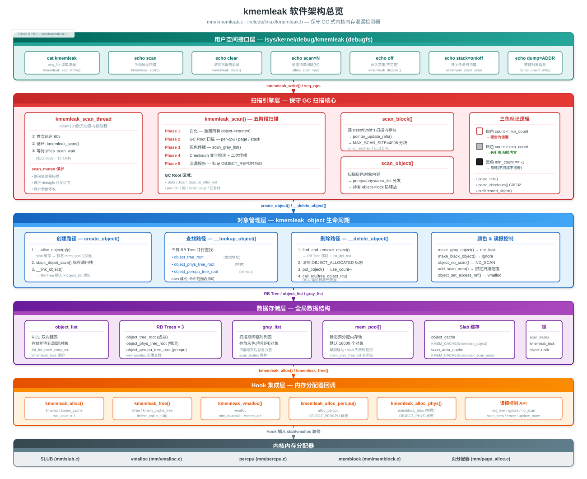

```
┌─────────────────────────────────────────────────────────────────────┐
│                        用户空间接口层                                │
│  ┌──────────────────────────────────────────────────────────────┐   │
│  │  /sys/kernel/debug/kmemleak                                  │   │
│  │  ├─ cat kmemleak        → seq_file 读取泄漏报告              │   │
│  │  ├─ echo scan > kmemleak → 手动触发扫描                      │   │
│  │  ├─ echo clear > kmemleak → 清除已报告的泄漏                 │   │
│  │  ├─ echo off > kmemleak  → 永久关闭 kmemleak                │   │
│  │  ├─ echo scan=N > kmemleak → 设置扫描间隔(秒)               │   │
│  │  ├─ echo stack=on/off     → 开关任务栈扫描                   │   │
│  │  └─ echo dump=ADDR       → 转储指定地址的对象信息             │   │
│  └──────────────────────────────────────────────────────────────┘   │
├─────────────────────────────────────────────────────────────────────┤
│                        扫描引擎层                                   │
│  ┌───────────────────────────┐  ┌────────────────────────────────┐ │
│  │  kmemleak_scan_thread     │  │  kmemleak_scan()               │ │
│  │  ├─ nice=10 低优先级      │  │  ├─ 白化阶段                    │ │
│  │  ├─ 60s 首次延迟          │  │  ├─ GC Root 扫描               │ │
│  │  └─ 600s 周期循环         │  │  ├─ 灰色传播                    │ │
│  └───────────────────────────┘  │  ├─ Checksum 变化检测           │ │
│                                  │  └─ 泄漏报告                    │ │
│  ┌───────────────────────────┐  └────────────────────────────────┘ │
│  │  scan_block()             │  ┌────────────────────────────────┐ │
│  │  ├─ 逐指针扫描内存块      │  │  scan_gray_list()              │ │
│  │  ├─ pointer_update_refs() │  │  ├─ 扫描灰色对象内容            │ │
│  │  └─ 分块 + cond_resched  │  │  └─ 递归传播引用                │ │
│  └───────────────────────────┘  └────────────────────────────────┘ │
├─────────────────────────────────────────────────────────────────────┤
│                        对象管理层                                   │
│  ┌───────────────────────────┐  ┌────────────────────────────────┐ │
│  │  create_object()          │  │  __delete_object()             │ │
│  │  ├─ __alloc_object()      │  │  ├─ 清除 OBJECT_ALLOCATED     │ │
│  │  ├─ stack_depot_save()    │  │  └─ put_object()              │ │
│  │  └─ __link_object()       │  │      └─ call_rcu(free_rcu)    │ │
│  │      ├─ RB Tree 插入      │  └────────────────────────────────┘ │
│  │      └─ object_list 添加  │  ┌────────────────────────────────┐ │
│  └───────────────────────────┘  │  颜色操作                       │ │
│  ┌───────────────────────────┐  │  ├─ make_gray_object()         │ │
│  │  __lookup_object()        │  │  ├─ make_black_object()        │ │
│  │  ├─ RB Tree 查找          │  │  └─ update_refs()              │ │
│  │  ├─ 3棵树并行查找         │  └────────────────────────────────┘ │
│  │  └─ alias 模式支持        │                                     │
│  └───────────────────────────┘                                     │
├─────────────────────────────────────────────────────────────────────┤
│                        数据存储层                                   │
│  ┌───────────────┐ ┌───────────────┐ ┌───────────────────────────┐ │
│  │ object_list   │ │ RB Trees ×3   │ │ gray_list                │ │
│  │ (RCU 链表)    │ │ ├─ tree_root  │ │ (扫描期间临时列表)         │ │
│  │ 所有已跟踪对象│ │ ├─ phys_root  │ │ 存放灰色(有引用)对象      │ │
│  │               │ │ └─ percpu_root│ │                           │ │
│  └───────────────┘ └───────────────┘ └───────────────────────────┘ │
│  ┌───────────────┐ ┌───────────────┐ ┌───────────────────────────┐ │
│  │ mem_pool[]    │ │ object_cache  │ │ scan_area_cache           │ │
│  │ 静态内存池    │ │ slab 缓存     │ │ 扫描区域 slab 缓存        │ │
│  │ 早期分配用    │ │ 运行期分配用  │ │                           │ │
│  └───────────────┘ └───────────────┘ └───────────────────────────┘ │
├─────────────────────────────────────────────────────────────────────┤
│                        Hook 集成层                                  │
│  ┌──────────────────────────────────────────────────────────────┐   │
│  │  kmemleak_alloc()          ← kmalloc / kmem_cache_alloc     │   │
│  │  kmemleak_free()           ← kfree / kmem_cache_free        │   │
│  │  kmemleak_vmalloc()        ← vmalloc                        │   │
│  │  kmemleak_alloc_percpu()   ← alloc_percpu                   │   │
│  │  kmemleak_free_percpu()    ← free_percpu                    │   │
│  │  kmemleak_alloc_phys()     ← memblock_alloc (物理地址)       │   │
│  │  kmemleak_free_part()      ← free_bootmem (部分释放)        │   │
│  └──────────────────────────────────────────────────────────────┘   │
└─────────────────────────────────────────────────────────────────────┘
```

#### 4.3.2 关键数据结构

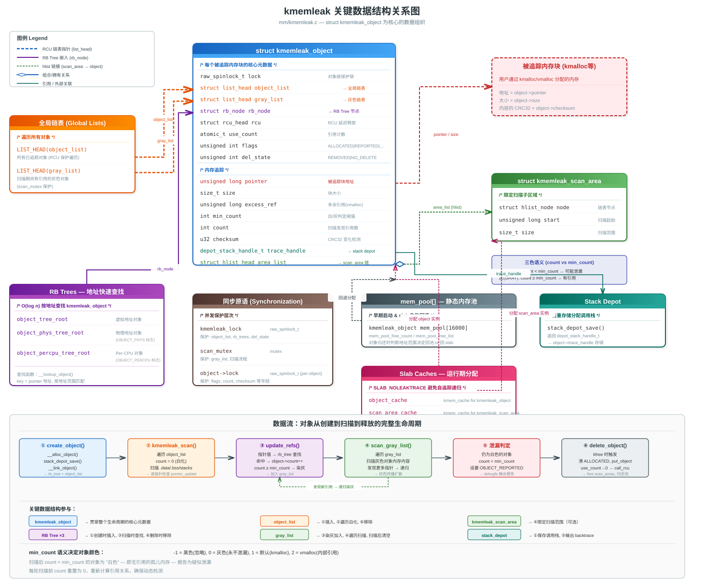

##### `struct kmemleak_object` — 核心追踪元数据

```c
/* mm/kmemleak.c */
struct kmemleak_object {
    raw_spinlock_t lock;            /* 对象级保护锁 */
    unsigned int flags;             /* 状态标志 (ALLOCATED/REPORTED/NO_SCAN等) */
    struct list_head object_list;   /* 全局 object_list 链表节点 */
    struct list_head gray_list;     /* 扫描期间灰色列表节点 */
    struct rb_node rb_node;         /* RB Tree 节点(快速查找) */
    struct rcu_head rcu;            /* RCU 延迟释放 */
    atomic_t use_count;             /* 引用计数(降到0时释放) */
    unsigned int del_state;         /* 删除状态(防止扫描中被删) */
    unsigned long pointer;          /* 被追踪内存块的起始地址 */
    size_t size;                    /* 被追踪内存块的大小 */
    unsigned long excess_ref;       /* 多余引用传递(vmalloc用) */
    int min_count;                  /* 最小引用数阈值(白/灰判定) */
    int count;                      /* 当前扫描找到的引用数 */
    u32 checksum;                   /* 对象内容 CRC32(变化检测) */
    depot_stack_handle_t trace_handle; /* 分配调用栈(stack depot) */
    struct hlist_head area_list;    /* 限定扫描区域链表 */
    unsigned long jiffies;          /* 创建时间戳 */
    pid_t pid;                      /* 分配者 PID */
    char comm[TASK_COMM_LEN];       /* 分配者进程名 */
};
```

**flags 位定义**：

| 标志位 | 值 | 含义 |
|--------|-----|------|
| `OBJECT_ALLOCATED` | `1<<0` | 对象仍被分配（活跃状态） |
| `OBJECT_REPORTED` | `1<<1` | 已作为泄漏报告过 |
| `OBJECT_NO_SCAN` | `1<<2` | 不扫描对象内容 |
| `OBJECT_FULL_SCAN` | `1<<3` | 全量扫描（scan_area 分配失败时回退） |
| `OBJECT_PHYS` | `1<<4` | 物理地址对象 |
| `OBJECT_PERCPU` | `1<<5` | Per-CPU 对象 |

**del_state 位定义**：

| 标志位 | 值 | 含义 |
|--------|-----|------|
| `DELSTATE_REMOVED` | `1<<0` | 已从 RB Tree 和 object_list 移除 |
| `DELSTATE_NO_DELETE` | `1<<1` | 临时阻止删除（扫描中 cond_resched 期间） |

##### `struct kmemleak_scan_area` — 限定扫描区域

```c
struct kmemleak_scan_area {
    struct hlist_node node;     /* area_list 链表节点 */
    unsigned long start;        /* 扫描起始地址 */
    size_t size;                /* 扫描范围大小 */
};
```

当调用 `kmemleak_scan_area()` 后，kmemleak 只扫描指定的子区域而非整个对象，减少假阴性和扫描开销。

##### 全局数据结构关系

```
   object_list (RCU 双向链表)                   gray_list (扫描临时)
   ┌────┐   ┌────┐   ┌────┐                    ┌────┐   ┌────┐
   │obj1│←→ │obj2│←→ │obj3│←→ ...              │objA│←→ │objB│←→ ...
   └──┬─┘   └──┬─┘   └──┬─┘                    └────┘   └────┘
      │        │        │
      ▼        ▼        ▼
   object_tree_root (RB Tree — 虚拟地址)
           ┌───────┐
           │ obj2  │
           ├───┬───┤
           ▼       ▼
       ┌───────┐ ┌───────┐
       │ obj1  │ │ obj3  │
       └───────┘ └───────┘
   
   object_phys_tree_root (RB Tree — 物理地址)
   object_percpu_tree_root (RB Tree — per-CPU 地址)
   
   mem_pool[CONFIG_DEBUG_KMEMLEAK_MEM_POOL_SIZE]
   ┌────┬────┬────┬─···─┬────┐
   │ #0 │ #1 │ #2 │     │#N-1│   静态数组，早期分配使用
   └────┴────┴────┴─···─┴────┘
```

#### 4.3.3 内存池双轨分配策略

kmemleak 元数据的分配面临一个**鸡生蛋**问题：追踪内存分配需要分配元数据，但元数据分配本身也是内存分配。解决方案是**双轨分配**：

```
分配请求
    │
    ▼
object_cache 已初始化?  ──否──→  使用 mem_pool[] 静态数组
    │是                           (CONFIG_DEBUG_KMEMLEAK_MEM_POOL_SIZE)
    ▼                             默认 16000 个预分配对象
kmem_cache_alloc(object_cache)
    │
    ├── 成功 → 返回 slab 对象
    │
    └── 失败 → 回退到 mem_pool[] 静态数组
                (如果也用完 → pr_warn_once 报警)
```

释放时反向判断：

```c
static void mem_pool_free(struct kmemleak_object *object)
{
    /* 判断是否属于静态数组范围 */
    if (object < mem_pool || object >= mem_pool + ARRAY_SIZE(mem_pool)) {
        kmem_cache_free(object_cache, object);  /* slab 对象 */
        return;
    }
    /* 归还到静态池的空闲链表 */
    list_add(&object->object_list, &mem_pool_free_list);
}
```

#### 4.3.4 debugfs 接口命令详解

| 命令 | 格式 | 功能 | 实现函数 |
|------|------|------|---------|
| 读取泄漏 | `cat /sys/kernel/debug/kmemleak` | 显示所有未引用对象详情 | `kmemleak_seq_show()` |
| 手动扫描 | `echo scan > kmemleak` | 立即触发一次全量扫描 | `kmemleak_scan()` |
| 清除报告 | `echo clear > kmemleak` | 将已报告对象染灰（不再报告） | `kmemleak_clear()` |
| 关闭 | `echo off > kmemleak` | 永久禁用 kmemleak（不可恢复） | `kmemleak_disable()` |
| 设置间隔 | `echo scan=N > kmemleak` | 设置自动扫描间隔为 N 秒 | 修改 `jiffies_scan_wait` |
| 启动扫描 | `echo scan=on > kmemleak` | 启动自动扫描线程 | `start_scan_thread()` |
| 停止扫描 | `echo scan=off > kmemleak` | 停止自动扫描线程 | `stop_scan_thread()` |
| 栈扫描开 | `echo stack=on > kmemleak` | 启用任务栈扫描 | `kmemleak_stack_scan=1` |
| 栈扫描关 | `echo stack=off > kmemleak` | 禁用任务栈扫描 | `kmemleak_stack_scan=0` |
| 转储对象 | `echo dump=0xADDR > kmemleak` | 打印指定地址对象的详细信息 | `dump_str_object_info()` |

**泄漏报告格式示例**：

```
unreferenced object 0xffff0000c0a84000 (size 4096):
  comm "insmod", pid 1456, jiffies 4295069512
  hex dump (first 32 bytes):
    00 00 00 00 00 00 00 00 00 00 00 00 00 00 00 00  ................
    00 00 00 00 00 00 00 00 00 00 00 00 00 00 00 00  ................
  backtrace (crc a1b2c3d4):
    kmemleak_alloc+0x34/0x40
    __kmalloc+0x1c8/0x2f0
    my_driver_init+0x48/0x120 [my_module]
    do_one_initcall+0x7c/0x1b0
    ...
```

#### 4.3.5 内核配置选项

> **源码位置**：`mm/Kconfig.debug` 第 237-299 行

##### 编译时 Kconfig 选项

**① `CONFIG_DEBUG_KMEMLEAK` — 主开关**

```kconfig
config DEBUG_KMEMLEAK
    bool "Kernel memory leak detector"
    depends on DEBUG_KERNEL && HAVE_DEBUG_KMEMLEAK
    select DEBUG_FS
    select STACKTRACE if STACKTRACE_SUPPORT
    select KALLSYMS
    select CRC32
    select STACKDEPOT
    select STACKDEPOT_ALWAYS_INIT if !DEBUG_KMEMLEAK_DEFAULT_OFF
```

| 属性 | 值 | 说明 |
|------|-----|------|
| 类型 | bool | y/n 二选一 |
| 默认值 | n | 默认不启用 |
| 依赖 | `DEBUG_KERNEL` | 必须开启内核调试总开关 |
| 依赖 | `HAVE_DEBUG_KMEMLEAK` | 架构必须声明支持 |
| 自动选中 | `DEBUG_FS` | debugfs 文件系统（挂载 `/sys/kernel/debug`） |
| 自动选中 | `STACKTRACE` | 调用栈回溯能力 |
| 自动选中 | `KALLSYMS` | 内核符号表（将地址解析为函数名） |
| 自动选中 | `CRC32` | CRC32 校验（对象变化检测） |
| 自动选中 | `STACKDEPOT` | 调用栈去重存储（减少内存开销） |
| 自动选中 | `STACKDEPOT_ALWAYS_INIT` | 若非默认关闭则提前初始化 stack depot |

**支持 `HAVE_DEBUG_KMEMLEAK` 的架构**：

| 架构 | 源码 | 架构 | 源码 |
|------|------|------|------|
| arm64 | `arch/arm64/Kconfig` | x86 | `arch/x86/Kconfig` |
| arm | `arch/arm/Kconfig` | riscv | `arch/riscv/Kconfig` |
| mips | `arch/mips/Kconfig` | powerpc | `arch/powerpc/Kconfig` |
| loongarch | `arch/loongarch/Kconfig` | s390 | `arch/s390/Kconfig` |
| arc | `arch/arc/Kconfig` | sh | `arch/sh/Kconfig` |
| xtensa | `arch/xtensa/Kconfig` | um | `arch/um/Kconfig` |

> **注意**：并非所有架构都支持 kmemleak。如果 menuconfig 中看不到该选项，说明当前架构未 `select HAVE_DEBUG_KMEMLEAK`。

**② `CONFIG_DEBUG_KMEMLEAK_MEM_POOL_SIZE` — 静态内存池大小**

```kconfig
config DEBUG_KMEMLEAK_MEM_POOL_SIZE
    int "Kmemleak memory pool size"
    depends on DEBUG_KMEMLEAK
    range 200 1000000
    default 16000
```

| 属性 | 值 | 说明 |
|------|-----|------|
| 类型 | int | 范围 200 ~ 1000000 |
| 默认值 | 16000 | 预分配 16000 个 `kmemleak_object` 结构体 |
| 用途 | 早期启动 + slab 失败回退 | 在 slab 分配器就绪前使用 |

调优建议：
- 嵌入式系统内存少：可降至 `2000~4000`
- 大型服务器（大量驱动/模块）：可升至 `32000~64000`
- 若 dmesg 出现 `kmemleak: Cannot allocate a kmemleak_object`，需增大此值

**③ `CONFIG_DEBUG_KMEMLEAK_DEFAULT_OFF` — 编译启用但默认关闭**

```kconfig
config DEBUG_KMEMLEAK_DEFAULT_OFF
    bool "Default kmemleak to off"
    depends on DEBUG_KMEMLEAK
    default n
```

| 属性 | 值 | 说明 |
|------|-----|------|
| 默认值 | n | 默认编译即启用 |
| 设为 y | 编译进内核但默认不运行 | 需 `kmemleak=on` boot 参数手动激活 |

**典型使用场景**：在生产内核中编译进 kmemleak，但平时不启用以避免性能开销，需要排查泄漏时通过 boot 参数临时激活。

**④ `CONFIG_DEBUG_KMEMLEAK_AUTO_SCAN` — 自动扫描线程**

```kconfig
config DEBUG_KMEMLEAK_AUTO_SCAN
    bool "Enable kmemleak auto scan thread on boot up"
    default y
    depends on DEBUG_KMEMLEAK
```

| 属性 | 值 | 说明 |
|------|-----|------|
| 默认值 | y | 自动启动扫描线程 |
| 设为 n | 需手动 `echo scan > kmemleak` 触发 | 避免 CPU 密集扫描影响用户任务 |

**⑤ `CONFIG_SAMPLE_KMEMLEAK` — 测试样例模块**

```kconfig
config SAMPLE_KMEMLEAK
    tristate "Simple test for the kernel memory leak detector"
    depends on DEBUG_KMEMLEAK && m
```

编译为 `.ko` 模块，加载后会故意泄漏内存用于验证 kmemleak 检测能力。

##### Boot 参数（启动时）

> **源码**：`mm/kmemleak.c` 第 2268-2282 行

```c
early_param("kmemleak", kmemleak_boot_config);
```

| 参数 | 说明 | 实现 |
|------|------|------|
| `kmemleak=on` | 强制启用（覆盖 `DEFAULT_OFF`） | 设置 `kmemleak_skip_disable=1`，提前初始化 stack depot |
| `kmemleak=off` | 强制禁用（不可恢复） | 调用 `kmemleak_disable()` |

**Boot 参数传递方式**：

```bash
# GRUB
GRUB_CMDLINE_LINUX="kmemleak=on"

# QEMU
-append "root=/dev/vda rw kmemleak=on"

# U-Boot (嵌入式)
setenv bootargs "console=ttyS0 kmemleak=on"
```

##### 模块参数（运行时）

```c
module_param_named(verbose, kmemleak_verbose, bool, 0600);
```

| 参数 | 类型 | 权限 | 说明 |
|------|------|------|------|
| `verbose` | bool | 0600 | 启用详细日志输出到 dmesg |

```bash
# 运行时开启 verbose
echo 1 > /sys/module/kmemleak/parameters/verbose

# 或 boot 参数
kmemleak.verbose=1
```

##### debugfs 运行时命令

> **接口路径**：`/sys/kernel/debug/kmemleak`

```c
/* mm/kmemleak.c — kmemleak_write() 第 2115-2188 行 */
```

| 命令 | 格式 | 功能 | 状态要求 |
|------|------|------|---------|
| **读取泄漏** | `cat kmemleak` | seq_file 输出所有未引用对象 | enabled |
| **手动扫描** | `echo scan > kmemleak` | 立即触发一次全量扫描 | enabled |
| **设置间隔** | `echo scan=N > kmemleak` | 停止旧线程，设 N 秒间隔后启动新线程 | enabled |
| **启动扫描** | `echo scan=on > kmemleak` | 启动自动扫描线程 | enabled |
| **停止扫描** | `echo scan=off > kmemleak` | 停止自动扫描线程 | enabled |
| **栈扫描开** | `echo stack=on > kmemleak` | 启用任务栈扫描 | enabled |
| **栈扫描关** | `echo stack=off > kmemleak` | 禁用任务栈扫描（减少开销） | enabled |
| **转储对象** | `echo dump=0xADDR > kmemleak` | 打印指定地址对象信息 | enabled |
| **清除报告** | `echo clear > kmemleak` | 已报告泄漏染灰 / 或清理内部对象 | 任意 |
| **永久关闭** | `echo off > kmemleak` | 不可恢复地禁用 kmemleak | enabled |

> **注意**：`echo off` 后只有 `clear` 命令仍可用（用于释放内部数据），其他命令返回 `-EPERM`。

##### 开关状态判定流程

```
内核启动
    │
    ├── CONFIG_DEBUG_KMEMLEAK=n ?  ──是──→  kmemleak 未编译，完全不存在
    │
    ├── CONFIG_DEBUG_KMEMLEAK=y
    │       │
    │       ├── CONFIG_DEBUG_KMEMLEAK_DEFAULT_OFF=y ?
    │       │       │
    │       │       ├── boot 参数 kmemleak=on ?  ──是──→  ✅ 启用
    │       │       │
    │       │       └── 无参数或 kmemleak=off   ──────→  ❌ 禁用
    │       │
    │       └── CONFIG_DEBUG_KMEMLEAK_DEFAULT_OFF=n (默认)
    │               │
    │               ├── boot 参数 kmemleak=off ? ──是──→  ❌ 禁用
    │               │
    │               └── 无参数或 kmemleak=on   ──────→  ✅ 启用
    │
    └── 运行期:
            │
            ├── echo off > kmemleak   ──────────────→  ❌ 永久禁用（不可恢复）
            │
            ├── echo scan=off > kmemleak ───────────→  停止自动扫描（仍可手动 scan）
            │
            └── echo scan=on > kmemleak  ───────────→  恢复自动扫描线程
```

##### 实用配置方案

**方案 A：开发调试（全开）**

```
CONFIG_DEBUG_KMEMLEAK=y
CONFIG_DEBUG_KMEMLEAK_MEM_POOL_SIZE=16000
CONFIG_DEBUG_KMEMLEAK_DEFAULT_OFF=n
CONFIG_DEBUG_KMEMLEAK_AUTO_SCAN=y
```

- 编译即启用，自动扫描，零配置
- 适合开发环境和 CI 测试

**方案 B：生产按需（编译但默认关）**

```
CONFIG_DEBUG_KMEMLEAK=y
CONFIG_DEBUG_KMEMLEAK_MEM_POOL_SIZE=16000
CONFIG_DEBUG_KMEMLEAK_DEFAULT_OFF=y
CONFIG_DEBUG_KMEMLEAK_AUTO_SCAN=y
```

- 正常运行无开销
- 需要排查时加 `kmemleak=on` 重启

**方案 C：手动控制（关闭自动扫描）**

```
CONFIG_DEBUG_KMEMLEAK=y
CONFIG_DEBUG_KMEMLEAK_MEM_POOL_SIZE=32000
CONFIG_DEBUG_KMEMLEAK_DEFAULT_OFF=n
CONFIG_DEBUG_KMEMLEAK_AUTO_SCAN=n
```

- 追踪分配但不自动扫描，避免 CPU 开销
- 需要时手动 `echo scan > /sys/kernel/debug/kmemleak`

##### 关键常量

```c
#define MAX_TRACE        16     /* 调用栈最大深度 */
#define MSECS_MIN_AGE    5000   /* 对象最小存活时间(ms)才报告 */
#define SECS_FIRST_SCAN  60     /* 首次扫描延迟(秒) */
#define SECS_SCAN_WAIT   600    /* 自动扫描间隔(秒) */
#define MAX_SCAN_SIZE    4096   /* 单次连续扫描最大字节数 */
```

#### 4.3.6 初始化流程

```
内核启动时序中 kmemleak 的初始化：

  early_param("kmemleak", kmemleak_boot_config)     ← 解析 boot 参数
      │
      ▼
  mm_core_init()
      ├── stack_depot_early_init()                   ← 调用栈存储初始化
      └── kmemleak_init()                            ← kmemleak 核心初始化
          ├── 初始化 jiffies_min_age, jiffies_scan_wait
          ├── KMEM_CACHE(kmemleak_object, SLAB_NOLEAKTRACE)  ← 元数据 slab 缓存
          ├── KMEM_CACHE(kmemleak_scan_area, SLAB_NOLEAKTRACE)
          ├── 注册 .data 段为灰色对象 (GC Root)
          ├── 注册 .bss 段为灰色对象 (GC Root)
          └── 注册 .data..ro_after_init 段（条件性）
      │
      ▼
  late_initcall(kmemleak_late_init)                  ← 后期初始化
      ├── kmemleak_late_initialized = 1
      ├── debugfs_create_file("kmemleak", ...)       ← 创建 debugfs 接口
      └── start_scan_thread()                        ← 启动自动扫描线程
                                                       (仅 AUTO_SCAN=y 时)
```

> **注意**：`SLAB_NOLEAKTRACE` 标志使 kmemleak 自身的 slab 缓存不被追踪，避免无限递归。

#### 4.3.7 实战使用流程

**场景：检测内核模块内存泄漏**

```bash
# 1. 确认 kmemleak 已启用
dmesg | grep kmemleak
# 输出: kmemleak: Kernel memory leak detector initialized (mem pool available: 15987)

# 2. 加载待测试模块
insmod my_module.ko

# 3. 执行触发泄漏的操作
echo test > /proc/my_module/trigger

# 4. 手动触发扫描（不等 600 秒）
echo scan > /sys/kernel/debug/kmemleak

# 5. 查看泄漏报告
cat /sys/kernel/debug/kmemleak

# 6. 清除已报告泄漏，重新检测
echo clear > /sys/kernel/debug/kmemleak

# 7. 再次操作和扫描
echo test > /proc/my_module/trigger
echo scan > /sys/kernel/debug/kmemleak
cat /sys/kernel/debug/kmemleak

# 8. 卸载模块后再次扫描（确认泄漏不是延迟释放）
rmmod my_module
echo scan > /sys/kernel/debug/kmemleak
cat /sys/kernel/debug/kmemleak
```

**分析泄漏报告的关键步骤**：

1. **查看 backtrace**：确定分配者是哪个函数
2. **匹配 comm/pid**：确定是哪个进程/上下文触发的分配
3. **检查 size**：结合分配大小推断是什么类型的对象
4. **多次扫描对比**：确认泄漏是持续增长还是一次性的
5. **结合 SLUB Debug**：`slub_debug=T` 可以交叉验证分配栈

### 4.4 kmemleak 涉及算法总结

kmemleak 作为内核级内存泄漏检测器，融合了多种经典算法。本节按功能类别系统梳理每种算法的原理、复杂度和设计选型理由。

> **源码参考**：`mm/kmemleak.c`、`lib/stackdepot.c`、`include/linux/kmemleak.h`

#### 4.4.1 算法全景概览

| # | 算法 | 类别 | 用途 | 时间复杂度 | 核心函数 |
|---|------|------|------|-----------|---------|
| 1 | 保守 GC 三色标记 | 垃圾收集 | 泄漏判定核心流程 | O(n+m) | `kmemleak_scan()` |
| 2 | BFS 灰色传播 | 图遍历 | 引用可达性扩散 | O(n) | `scan_gray_list()` |
| 3 | 红黑树地址范围查找 | 平衡搜索树 | 按地址快速定位对象 | O(log n) | `__lookup_object()` / `__link_object()` |
| 4 | 保守指针扫描 | 内存扫描 | 从内存块中识别指针 | O(m/8) | `scan_block()` |
| 5 | CRC32 变化检测 | 哈希校验 | 检测对象内容修改 | O(size) | `update_checksum()` |
| 6 | Jenkins Hash (jhash2) | 哈希 | Stack Depot 调用栈去重 | O(k) | `hash_stack()` / `stack_depot_save()` |
| 7 | RCU + 引用计数 | 并发安全 | 无锁遍历与安全释放 | O(1) | `get_object()` / `put_object()` |
| 8 | 地址范围快速拒绝 | 边界检查 | 过滤 99% 无效指针 | O(1) | `pointer_update_refs()` |
| 9 | 双轨内存池分配 | 资源管理 | 解决元数据分配递归 | O(1) | `mem_pool_alloc()` / `mem_pool_free()` |
| 10 | 对象重叠/别名检测 | 数据一致性 | 防止地址空间冲突 | O(log n) | `__link_object()` / `__lookup_object()` |

> n = 已追踪对象数，m = 扫描内存总字节数，k = 调用栈帧数

#### 4.4.2 保守 GC 三色标记算法

**算法类别**：保守垃圾收集 (Conservative Garbage Collection)

kmemleak 的核心是一个**非移动式保守垃圾收集器**，借鉴 Boehm GC 的思想，但目标不是回收内存而是**发现无引用的孤儿对象**。

**五阶段扫描流程**：

```
Phase 1: 白化 (Whitening)
    遍历 object_list，将所有对象 count 重置为 0
    min_count>0 的对象变为白色（待验证）
    min_count=0 的对象保持灰色（永不泄漏）
         │
         ▼
Phase 2: 扫描 GC Roots
    扫描 .data / .bss / per-CPU / struct page / 任务栈
    每发现一个可能的指针 → pointer_update_refs()
    命中对象 → count++，达到阈值 → 染灰加入 gray_list
         │
         ▼
Phase 3: 灰色传播 (Gray Propagation)
    BFS 遍历 gray_list
    扫描每个灰色对象的内存内容
    发现新指针 → 目标对象染灰 → 追加到 gray_list 尾部
    直到 gray_list 为空
         │
         ▼
Phase 4: Checksum 二次检查
    遍历仍为白色的对象
    计算 CRC32 checksum，与上次比较
    如果内容变化 → 重新染灰 → 再次 scan_gray_list()
         │
         ▼
Phase 5: 泄漏报告
    仍为白色且存活超过 jiffies_min_age (5秒) 的对象
    标记 OBJECT_REPORTED → 输出到 debugfs
```

**三色语义**：

```
颜色判定函数:
    白色(WHITE): count < min_count  且 min_count != -1  → 无引用，疑似泄漏
    灰色(GRAY):  count >= min_count 且 min_count != -1  → 有引用，安全
    黑色(BLACK): min_count == KMEMLEAK_BLACK (-1)       → 完全忽略，不扫描

min_count 的语义:
    -1 → 黑色，由 kmemleak_ignore() 设置，如内核代码段
     0 → 永灰，由 kmemleak_not_leak() 设置，已知安全对象
     1 → 默认，kmalloc 等标准分配，需要至少 1 个引用
     2 → vmalloc 特殊处理，因 vm_struct 内部引用多一层
```

**设计选型理由**：
- **保守策略**：将任何看起来像指针的值都当作指针，宁可漏报不误报
- **非移动式**：不改变对象位置，只统计引用关系
- **最小年龄过滤**：寄存器/栈上的临时指针可能尚未写入内存，5 秒延迟消除瞬态误报

**复杂度**：O(n + m)，n = 对象数，m = 扫描内存总量

#### 4.4.3 BFS 灰色传播算法

**算法类别**：广度优先搜索 (Breadth-First Search)

灰色传播本质是**以 gray_list 为队列的 BFS 遍历**，从 GC Root 发现的灰色对象出发，递归扫描其内存内容，寻找更多引用。

```c
/* mm/kmemleak.c — scan_gray_list() 伪代码 */
object = gray_list.first

while (object != gray_list_end) {
    scan_object(object)      // 扫描对象内存 → 可能向 gray_list 尾部追加新对象
    next = object.gray_list.next
    list_del(object.gray_list)  // 从队列头移除
    put_object(object)
    object = next
}
// gray_list 为空时收敛
```

**关键特性**：

| 特性 | 实现 | 原因 |
|------|------|------|
| 队列语义 | `list_add_tail` 追加 / 从头取出 | BFS 保证层序遍历 |
| 安全迭代 | 迭代中修改链表（尾部追加） | 新发现的灰色对象自然排队 |
| 可中断 | 每个对象间 `cond_resched()` | 避免长时间占用 CPU |
| 分块扫描 | 大对象按 4KB 分段 + `cond_resched()` | 降低调度延迟 |
| Per-CPU 展开 | percpu 对象逐 CPU 扫描 | 覆盖所有 CPU 副本 |

**为什么选 BFS 而非 DFS**：
- DFS 递归深度不可控，可能栈溢出（内核栈仅 8-16KB）
- BFS 用链表模拟队列，空间在堆上，可处理任意规模引用图
- BFS 天然支持 `cond_resched()` 分时调度

**复杂度**：O(n + m_gray)，每个灰色对象最多扫描一次

#### 4.4.4 红黑树地址范围查找算法

**算法类别**：平衡二叉搜索树 (Red-Black Tree)

kmemleak 维护 **3 棵红黑树**，分别索引虚拟地址、物理地址、per-CPU 地址空间的对象：

```c
static struct rb_root object_tree_root = RB_ROOT;        // 虚拟地址
static struct rb_root object_phys_tree_root = RB_ROOT;    // 物理地址
static struct rb_root object_percpu_tree_root = RB_ROOT;  // per-CPU 地址
```

**查找算法 — 地址范围匹配**：

```
__lookup_object(ptr, alias, objflags):
    rb = 选择对应 rb_root (根据 objflags)
    ptr = kasan_reset_tag(ptr)     // 去除 KASAN 标签

    while rb != NULL:
        obj = rb_entry(rb)
        obj_ptr = kasan_reset_tag(obj.pointer)

        if ptr < obj_ptr:
            rb = rb.left            // 目标在左子树
        else if obj_ptr + obj.size <= ptr:
            rb = rb.right           // 目标在右子树
        else:
            // ptr ∈ [obj_ptr, obj_ptr + obj.size)
            if obj_ptr == ptr or alias:
                return obj          // 精确匹配或别名匹配
            else:
                warn("alias at 0x%lx")  // 指针落在对象内部但非起始
                break
    return NULL
```

**插入算法 — 重叠检测**：

```
__link_object(object, ptr, size, ...):
    // 沿 RB Tree 下降找插入位置
    while *link != NULL:
        parent = current_node
        if ptr + size <= parent.pointer:
            link = &parent.left    // 完全在左侧
        else if parent.pointer + parent.size <= ptr:
            link = &parent.right   // 完全在右侧
        else:
            // 地址范围重叠！分配器异常
            kmemleak_stop("overlap detected")
            return -EEXIST

    rb_link_node + rb_insert_color  // 插入并重新平衡
```

**设计选型理由**：
- 扫描时每发现一个可能的指针都需查找对应对象，需要 O(log n) 级别查找
- 地址范围语义（不仅匹配起始地址，还匹配范围内任意位置）排除了哈希表
- 三棵树分离不同地址空间，避免物理/虚拟地址碰撞误匹配

**复杂度**：插入、查找、删除均为 O(log n)

#### 4.4.5 保守指针扫描算法

**算法类别**：内存扫描 / 模式匹配

`scan_block()` 是 kmemleak 最底层的扫描原语，将一段内存按**指针宽度对齐**逐一读取，把每个值当作潜在指针进行查找：

```
scan_block(start, end, scanned_object):
    ptr = PTR_ALIGN(start, 8)     // 8 字节对齐 (64-bit)
    end = end - 7                  // 确保不越界

    lock(kmemleak_lock)
    for each ptr in [start, end) step 8:
        kasan_disable()
        value = *(unsigned long *)kasan_reset_tag(ptr)
        kasan_enable()

        pointer_update_refs(scanned_object, value, 0)           // 虚拟地址空间
        pointer_update_refs(scanned_object, value, OBJECT_PERCPU) // per-CPU 空间
    unlock(kmemleak_lock)
```

**"保守"的含义**：

```
┌─────────────────────────────────────────────────────┐
│   扫描的内存块                                        │
│                                                       │
│   0x00000000  ← 不是指针（地址范围外）                  │
│   0xFFFF0000C0A84000  ← 可能是指针！查找 RB Tree      │
│   0x12345678  ← 可能是整数也可能是指针，按指针处理     │
│   0xFFFF800010200000  ← 命中 → 目标对象 count++       │
│                                                       │
│   策略：宁可把整数当指针（漏报），不把指针当整数（误报） │
└─────────────────────────────────────────────────────┘
```

**大块分段扫描**（`scan_large_block`）：

```
scan_large_block(start, end):
    while start < end:
        next = min(start + MAX_SCAN_SIZE, end)   // MAX_SCAN_SIZE = 4096
        scan_block(start, next, NULL)
        start = next
        cond_resched()     // 每 4KB 让出 CPU
```

**GC Root 扫描范围**：

| 扫描区域 | 来源 | 说明 |
|---------|------|------|
| `.data` 段 | `_sdata` ~ `_edata` | 全局已初始化变量 |
| `.bss` 段 | `__bss_start` ~ `__bss_stop` | 全局未初始化变量 |
| per-CPU 段 | `__per_cpu_start` ~ `__per_cpu_end` × NR_CPUS | 每个 CPU 副本 |
| struct page | `pfn_to_page()` 遍历所有 zone | 页描述符中可能存指针 |
| 任务栈 | `try_get_task_stack()` × 所有任务 | 栈上局部变量中的指针 |

**复杂度**：O(m/8)，m = 内存块字节数（每 8 字节检查一次）

#### 4.4.6 CRC32 变化检测算法

**算法类别**：循环冗余校验 (Cyclic Redundancy Check)

kmemleak 用 CRC32 校验和检测对象内容是否在两次扫描之间发生变化，用于处理**扫描期间新分配**的对象：

```
update_checksum(object):
    old_csum = object.checksum

    if object.flags & OBJECT_PERCPU:
        // Per-CPU 对象：XOR 所有 CPU 副本的 CRC32
        object.checksum = 0
        for each cpu:
            object.checksum ^= crc32(0, per_cpu_ptr(object.pointer, cpu), object.size)
    else:
        object.checksum = crc32(0, object.pointer, object.size)

    return (object.checksum != old_csum)   // 内容变化返回 true
```

**在扫描流程中的作用**（Phase 4）：

```
扫描完成后，仍为白色的对象 → 可能是假阳性
    │
    ├── checksum 未变化 → 确实无引用，报告为泄漏
    │
    └── checksum 变化 → 对象内容被修改（可能刚分配）
        → 重新染灰，min_count 恢复
        → 再次 scan_gray_list() 传播
        → 给予二次机会，减少误报
```

**设计选型理由**：
- CRC32 在现代 CPU 上有硬件加速（ARM64 `crc32` 指令、x86 `SSE4.2`）
- 32 位校验和存储开销极小（每对象 4 字节）
- 不需要精确定位变化位置，只需知道"是否变化"

**复杂度**：O(size)，需读取整个对象内容

#### 4.4.7 Jenkins Hash (jhash2) 调用栈去重

**算法类别**：哈希函数 / 去重哈希表

Stack Depot 使用 **Jenkins Hash (jhash2)** 对调用栈帧数组计算哈希值，实现高效去重存储：

```
hash_stack(entries[], nr_entries):
    return jhash2((u32 *)entries,
                  nr_entries * sizeof(unsigned long) / sizeof(u32),
                  STACK_HASH_SEED)
```

**Stack Depot 查找流程**：

```
stack_depot_save(entries[], nr_entries):
    hash = hash_stack(entries, nr_entries)
    bucket = &stack_table[hash & mask]

    // === 快路径：RCU 无锁查找 ===
    rcu_read_lock()
    for each stack in bucket (RCU safe):
        if stack.hash != hash: continue           // 快速跳过
        if stack.size != nr_entries: continue      // 尺寸不匹配
        if memcmp(stack.entries, entries): continue // 内容不匹配
        found = stack                               // 命中！
    rcu_read_unlock()
    if found: return found.handle

    // === 慢路径：加锁插入 ===
    lock(pool_lock)
    // double-check 防并发插入
    found = find_stack(bucket, ...)
    if !found:
        new = alloc_from_pool_or_freelist()
        new.hash = hash
        memcpy(new.entries, entries, ...)
        list_add_rcu(&new.hash_list, bucket)
        found = new
    unlock(pool_lock)
    return found.handle
```

**设计选型理由**：
- Jenkins Hash 对指针数组散列性好，冲突率低
- 以 4 字节为单位的 `jhash2` 变体比逐字节更快
- RCU 读 + spinlock 写的分离避免了读路径锁竞争
- 去重率极高：相同分配路径的调用栈只存一份（>99% 命中）

**复杂度**：哈希 O(k)，查找均摊 O(1)，k = 栈帧数

#### 4.4.8 RCU + 引用计数生命周期管理

**算法类别**：并发安全回收

kmemleak 对象的生命周期由 **RCU 延迟释放 + 原子引用计数** 联合管理：

```
对象创建:
    __alloc_object()
        atomic_set(&use_count, 1)      // 初始引用 = 1

对象使用:
    get_object(object):
        return atomic_inc_not_zero(&use_count)  // 如果已为 0 则失败

    put_object(object):
        if atomic_dec_and_test(&use_count):     // 降到 0
            call_rcu(&object.rcu, free_object_rcu)  // RCU 延迟释放

对象查找 (并发安全):
    __find_and_get_object(ptr, alias):
        rcu_read_lock()
        object = __lookup_object(ptr, alias)    // RB Tree 查找
        if object && !get_object(object):
            object = NULL                        // 正在被释放
        rcu_read_unlock()
        return object

RCU 回调释放:
    free_object_rcu(rcu_head):
        // 此刻保证无 RCU 读者持有引用
        释放所有 scan_area
        归还到 mem_pool 或 object_cache
```

**为什么需要双重保护**：

| 机制 | 保护目标 | 场景 |
|------|---------|------|
| RCU | object_list 遍历 | 扫描线程 RCU 读遍历时，其他 CPU 删除对象 |
| 引用计数 | 对象本身 | 扫描线程获取对象后释放 RCU 锁，仍需访问对象 |
| 两者配合 | 全生命周期 | RCU 保护查找过程，引用计数保护使用过程 |

**复杂度**：get/put 均 O(1)

#### 4.4.9 地址范围快速拒绝算法

**算法类别**：边界检查 / 快速过滤

扫描时大部分内存值不是有效指针。kmemleak 维护全局地址范围，用 **O(1) 范围检查**过滤掉绝大多数无效值，避免昂贵的 RB Tree 查找：

```
全局状态:
    min_addr = ULONG_MAX (初始)    // 最小虚拟地址
    max_addr = 0 (初始)            // 最大虚拟地址
    min_percpu_addr = ULONG_MAX    // 最小 per-CPU 地址
    max_percpu_addr = 0            // 最大 per-CPU 地址

每次插入对象时更新:
    __link_object(ptr, size, objflags):
        if OBJECT_PERCPU:
            min_percpu_addr = min(min_percpu_addr, ptr)
            max_percpu_addr = max(max_percpu_addr, ptr + size)
        else if !OBJECT_PHYS:
            min_addr = min(min_addr, ptr)
            max_addr = max(max_addr, ptr + size)

每次检查指针时快速拒绝:
    pointer_update_refs(pointer, objflags):
        ptr = kasan_reset_tag(pointer)
        if OBJECT_PERCPU:
            if ptr < min_percpu_addr || ptr >= max_percpu_addr:
                return   // ← 快速拒绝，不进入 RB Tree
        else:
            if ptr < min_addr || ptr >= max_addr:
                return   // ← 快速拒绝
        // 通过范围检查才进行 O(log n) 的 RB Tree 查找
        object = __lookup_object(pointer, 1, objflags)
```

**效果**：在典型工作负载下，约 **99%** 的扫描值被范围检查快速拒绝，大幅减少 RB Tree 查找次数。

**复杂度**：O(1) 两次比较

#### 4.4.10 双轨内存池分配算法

**算法类别**：资源管理 / 鸡生蛋问题解决

kmemleak 追踪每个 `kmalloc` 分配都需要分配一个 `kmemleak_object` 元数据，但元数据分配本身也是 `kmalloc`——这会导致**无限递归**。解决方案是双轨分配：

```
                          ┌───────────────────────┐
                          │    mem_pool_alloc()    │
                          └──────────┬────────────┘
                                     │
                    ┌────────────────┼────────────────┐
                    ▼                                  ▼
         object_cache 已初始化?                   使用静态数组
              │是                              mem_pool[16000]
              ▼                                       │
    kmem_cache_alloc(object_cache)            ┌───────┼───────┐
    (SLAB_NOLEAKTRACE 避免递归)               ▼               ▼
              │                        mem_pool_free_list  mem_pool_free_count
              ├── 成功 → 返回                (回收对象)      (未使用对象)
              │
              └── 失败 → 回退到静态数组
```

**释放时的判定**：

```c
mem_pool_free(object):
    if (object >= mem_pool && object < mem_pool + ARRAY_SIZE(mem_pool)):
        // 属于静态数组 → 归还到空闲链表
        list_add(&object->object_list, &mem_pool_free_list)
    else:
        // 属于 slab → 归还给 slab 分配器
        kmem_cache_free(object_cache, object)
```

**关键设计**：
- `SLAB_NOLEAKTRACE` 标志使 kmemleak 的 slab 缓存**不被自己追踪**，切断递归
- 静态池大小 `CONFIG_DEBUG_KMEMLEAK_MEM_POOL_SIZE` 默认 16000，足以覆盖早期启动阶段
- 地址范围判定 O(1) 区分静态池对象和 slab 对象

**复杂度**：分配/释放均为 O(1)

#### 4.4.11 对象重叠与别名检测

**算法类别**：数据一致性验证

RB Tree 的地址范围语义天然支持两种异常检测：

**重叠检测**（插入时）：

```
插入 [ptr, ptr+size) 到 RB Tree:
    下降过程中发现:
        既不完全在 parent 左侧 (ptr + size <= parent.pointer)
        也不完全在 parent 右侧 (parent.pointer + parent.size <= ptr)
    → 两个对象的地址范围重叠！
    → kmemleak_stop()：分配器可能存在严重 bug
```

**别名检测**（查找时）：

```
查找 ptr:
    找到 obj 使得 ptr ∈ [obj.pointer, obj.pointer + obj.size)
    但 ptr != obj.pointer (指针不在对象起始位置)

    alias=1 时 (扫描模式): 正常，指针指向对象内部
    alias=0 时 (精确模式): 异常，warn 并 dump 对象信息
```

| 场景 | alias 参数 | 行为 |
|------|-----------|------|
| `kmemleak_free(ptr)` | alias=0 | 要求精确匹配起始地址 |
| 扫描 `pointer_update_refs()` | alias=1 | 允许指向对象内部任意位置 |
| `kmemleak_scan_area()` | alias=0 | 要求精确匹配 |

#### 4.4.12 算法协同工作流

以下展示一次完整扫描中各算法的协同：

```
① 扫描开始 → 白化所有对象 (三色标记 Phase 1)
    │
② 读取 .data 段某个 8 字节值 0xFFFF800010200000 (保守指针扫描)
    │
③ 快速检查: min_addr <= 0xFFFF800010200000 < max_addr? (地址范围拒绝)
    │  是 → 继续
    │  否 → 跳过（O(1) 拒绝）
    │
④ RB Tree 查找 0xFFFF800010200000 (红黑树范围查找)
    │  命中对象 obj_A (pointer=0xFFFF800010200000, size=4096)
    │
⑤ obj_A.count++ → count >= min_count → 染灰 (引用计数更新)
    │  加入 gray_list 尾部
    │
⑥ BFS 取出 obj_A → scan_object(obj_A) (灰色传播)
    │  扫描 obj_A 的 4096 字节内容
    │  发现内部指针 0xFFFF800010300000 → 目标 obj_B 也染灰
    │
⑦ 扫描结束 → 白色对象 obj_C 检查 CRC32 (变化检测)
    │  checksum 未变 → 确认泄漏
    │
⑧ 报告 obj_C → 输出 trace_handle 对应的调用栈 (Stack Depot jhash2)
    │  去重查找已存储的栈帧
    │
⑨ 后续 kfree(obj_A) → delete_object → put_object (RCU + 引用计数)
    │  use_count→0 → call_rcu(free_object_rcu)
    │  RCU 宽限期后安全释放
```

### 4.5 SLUB 对象泄漏专项定位（kmalloc-512 / kmalloc-4k）

当泄漏集中在 `kmalloc-512` 或 `kmalloc-4k` 这类通用 cache 时，**仅看 kmemleak 输出通常不够**。最佳实践是将 `kmemleak + slub_debug(U/T/F/P/Z) + slabinfo + page_owner` 组合使用。

#### 4.5.1 问题特征与判定标准

典型现象：

- `cat /proc/slabinfo | grep kmalloc-512` 或 `grep kmalloc-4k` 显示 `active_objs` 持续上涨且不回落
- `/proc/meminfo` 中 `Slab`、`SUnreclaim` 持续增长
- `kmemleak` 报告中出现大量 512B 或 4096B 大小对象

快速判定是否值得进入专项定位：

```
连续 3~5 个采样点（例如每 60s）:
    kmalloc-512.active_objs  单调上升
或  kmalloc-4k.active_objs   单调上升
且   业务低峰后不回落
=> 进入 SLUB 泄漏专项流程
```

#### 4.5.2 内核选项与启动参数

推荐内核配置：

```config
CONFIG_SLUB_DEBUG=y
CONFIG_SLUB_DEBUG_ON=n
CONFIG_PAGE_OWNER=y
CONFIG_SLUB_STATS=y
CONFIG_DEBUG_KMEMLEAK=y
```

关键来源：

- `mm/Kconfig.debug`：`SLUB_DEBUG`、`SLUB_DEBUG_ON`、`PAGE_OWNER`
- `mm/slub.c`：`__setup("slab_debug", setup_slub_debug)`，支持 `F/Z/P/U/T/A/O/-`
- `Documentation/admin-guide/mm/slab.rst`：`slab_debug` 语法与示例

`slab_debug` 选项速记：

- `F`：一致性检查（含双重释放等）
- `Z`：redzone
- `P`：poison
- `U`：分配/释放调用栈跟踪（store_user）
- `T`：trace（日志量极大，仅建议单 cache）
- `O`：若调试导致 slab order 升高则自动关闭该 cache 调试
- `-`：关闭调试（用于覆盖 `CONFIG_SLUB_DEBUG_ON`）

#### 4.5.3 针对 kmalloc-512 / kmalloc-4k 的最小化抓取方案

只对目标 cache 开启跟踪，避免全局性能灾难：

```bash
# 仅对 kmalloc-512 和 kmalloc-4k 开启 U(调用栈跟踪) + F(一致性)
slab_debug=UF,kmalloc-512,kmalloc-4k

# 如果机器内存碎片明显，避免升高分配阶数导致雪崩，可加 O
slab_debug=UFO,kmalloc-512,kmalloc-4k
```

如果只想做短时强力定位（高风险高开销）：

```bash
# 注意：T 会打印大量 TRACE 日志，仅用于短窗口抓包
slab_debug=UFT,kmalloc-512,kmalloc-4k
```

确认 cache 名称是否存在：

```bash
ls /sys/kernel/slab | grep -E '^kmalloc-(512|4k)$'
```

#### 4.5.4 定位步骤（从增长到调用栈）

**Step 1：确认对象增长趋势**

```bash
watch -n 2 "grep -E 'kmalloc-(512|4k)' /proc/slabinfo"
cat /proc/meminfo | grep -E 'Slab|SReclaimable|SUnreclaim'
```

**Step 2：读取目标 cache 的分配/释放调用点**

> `Documentation/ABI/testing/sysfs-kernel-slab` 明确了 `alloc_calls` / `free_calls` 接口

```bash
cat /sys/kernel/slab/kmalloc-512/alloc_calls
cat /sys/kernel/slab/kmalloc-512/free_calls

cat /sys/kernel/slab/kmalloc-4k/alloc_calls
cat /sys/kernel/slab/kmalloc-4k/free_calls
```

判读要点：

- 某调用栈在 `alloc_calls` 明显高于 `free_calls`，且差值持续扩大，即首要嫌疑路径
- 同时交叉看 `total_objects` / `objects` / `slabs` / `objects_partial`

```bash
for c in kmalloc-512 kmalloc-4k; do
  echo "== $c =="
  cat /sys/kernel/slab/$c/objects
  cat /sys/kernel/slab/$c/total_objects
  cat /sys/kernel/slab/$c/slabs
  cat /sys/kernel/slab/$c/objects_partial
done
```

**Step 3：用 slabinfo 做聚合视图**

```bash
# 需要先编译工具
gcc -O2 -o slabinfo tools/mm/slabinfo.c

# 统计/跟踪信息
./slabinfo -X kmalloc-512
./slabinfo -X kmalloc-4k
```

**Step 4：与 kmemleak 结果对齐**

```bash
echo scan > /sys/kernel/debug/kmemleak
cat /sys/kernel/debug/kmemleak | grep -E 'size (512|4096)'
```

若某 backtrace 同时出现在：

- `kmemleak` 的 unreferenced object 报告中
- `alloc_calls` 热点中

则该路径优先级最高。

#### 4.5.5 4K 对象泄漏与 page_owner 联动

`kmalloc-4k` 常与页分配压力耦合，建议联动 `page_owner` 做页级归因：

1. 内核启用 `CONFIG_PAGE_OWNER=y`
2. 启动参数增加 `page_owner=on`
3. 系统复现场景后导出：

```bash
cat /sys/kernel/debug/page_owner_stacks/show_stacks > stacks.txt
cat /sys/kernel/debug/page_owner > page_owner_full.txt
```

4. 用工具聚类：

```bash
make -C tools/mm page_owner_sort
./tools/mm/page_owner_sort stacks.txt sorted_stacks.txt
```

如果 4K 泄漏路径在 `page_owner` 与 `kmalloc-4k/alloc_calls` 中均为热点，说明问题极可能在该调用链上（如对象申请后引用丢失或错误缓存队列滞留）。

#### 4.5.6 修复后回归与验收标准

修复后至少进行 3 轮回归（冷热路径、压力、长稳态）：

```bash
# 每轮前清空已报告项
echo clear > /sys/kernel/debug/kmemleak

# 执行压力场景...

# 复检
echo scan > /sys/kernel/debug/kmemleak
cat /sys/kernel/debug/kmemleak
```

验收标准：

- `kmalloc-512` / `kmalloc-4k` 的 `active_objs` 在业务低峰可回落到稳定平台
- `alloc_calls - free_calls` 差值不再随时间持续扩大
- `kmemleak` 无新增同类 512/4096 未引用对象
- `Slab` 与 `SUnreclaim` 曲线恢复平稳

#### 4.5.7 eBPF 在线定位 root cause

可以，而且在嵌入式场景里（没有 `bpftrace`）推荐直接走 **libbpf CO-RE** 路径。

在很多线上场景中，eBPF 是定位 SLUB 泄漏 root cause 的首选补充手段：

- `kmemleak` 偏向“结果视角”（哪些对象未引用）
- `slub_debug(U/T)` 偏向“缓存视角”（哪个 cache 的 alloc/free 热点）
- `eBPF` 偏向“动态行为视角”（哪个调用链在当前业务流里持续净分配）

三者结合可以显著缩短定位时间。

可用的内核 tracepoint（源码 `include/trace/events/kmem.h`）：

- `tracepoint:kmem:kmalloc`：包含 `ptr`、`bytes_alloc`、`call_site`
- `tracepoint:kmem:kfree`：包含 `ptr`、`call_site`
- `tracepoint:kmem:kmem_cache_alloc` / `kmem_cache_free`：可拿到 cache 名称

##### 定位原理（事件重建 + 净泄漏统计）

eBPF 定位 SLUB 泄漏的本质，是在内核里做一个“轻量对象生命周期账本”：

1. **在分配事件记账**：捕获 `kmalloc/kmem_cache_alloc`，对目标尺寸（512/4096）记录 `ptr -> alloc_stack_id`
2. **在释放事件冲销**：捕获 `kfree/kmem_cache_free`，用 `ptr` 回查并删除映射，同时对对应栈做减计数
3. **按栈聚合净值**：周期统计每个调用栈的未释放对象数（outstanding）
4. **看趋势而非瞬时值**：若某栈 outstanding 持续上升且低峰不回落，即为 root cause 高概率候选

可抽象为：

$$
Outstanding(stack) = Alloc(stack) - Free(stack)
$$

当 $Outstanding(stack)$ 长时间保持正斜率（$\frac{d}{dt}Outstanding > 0$）时，说明该调用路径存在持续净分配。

为什么这个方法能定位到 root cause：

- `ptr -> alloc_stack_id` 让每个对象都能追溯到“谁分配的”
- 释放时按指针冲销，避免只看总量导致“热点误判”
- 按调用栈聚合后，噪声会被摊薄，真正持续泄漏路径会稳定出现在 TopN

与 `kmemleak` 的关系：

- `kmemleak` 擅长回答“哪些对象最终不可达”
- eBPF 擅长回答“是哪个运行时调用链在持续制造净增量”
- 两者交集最大的栈，就是最优先修复点

误差与边界：

- 采样窗口太短会把突发缓存抖动误判为泄漏
- 指针复用、延迟释放（RCU）会带来短期噪声
- 因此必须结合时间序列趋势、业务低峰回落能力，以及 `kmemleak/page_owner` 交叉验证

##### 适用场景

- 泄漏只在高并发流量下出现，复现窗口短
- `kmalloc-512`、`kmalloc-4k` 增长很快，但 `alloc_calls/free_calls` 信息不够实时
- 想在不停机情况下快速确认“净分配”调用栈

##### 主路径：libbpf CO-RE（嵌入式推荐）

目标：只追踪 `kmalloc` 中 `bytes_alloc=512/4096` 的对象，建立 “`ptr -> alloc_stack_id`” 映射，在 `kfree` 时抵消，并输出“净分配热点栈 TopN”。

核心设计：

- `BPF_MAP_TYPE_HASH`：`ptr -> alloc_stack_id`
- `BPF_MAP_TYPE_HASH`：`alloc_stack_id -> outstanding_count`
- `BPF_MAP_TYPE_STACK_TRACE`：保存内核调用栈
- 事件源：`tracepoint/kmem/kmalloc` 与 `tracepoint/kmem/kfree`

最小事件模型（逻辑伪代码）：

```c
// on kmem:kmalloc
if (bytes_alloc == 512 || bytes_alloc == 4096) {
    stack_id = bpf_get_stackid(ctx, &stackmap, BPF_F_FAST_STACK_CMP);
    if (stack_id >= 0) {
        ptr2stack[ptr] = stack_id;
        outstanding[stack_id] += 1;
    }
}

// on kmem:kfree
stack_id = ptr2stack[ptr];
if (stack_id exists) {
    if (outstanding[stack_id] > 0)
        outstanding[stack_id] -= 1;
    delete ptr2stack[ptr];
}
```

用户态（libbpf）周期读取 `outstanding` map，按 count 排序打印 TopN，再用 `stackmap` + `/proc/kallsyms` 符号化输出。

##### 构建与运行（交叉编译友好）

```bash
# 1) 编译 BPF 对象
clang -O2 -g -target bpf -D__TARGET_ARCH_arm64 \
  -c slub_leak.bpf.c -o slub_leak.bpf.o

# 2) 生成 skeleton（libbpf-bootstrap 方式）
bpftool gen skeleton slub_leak.bpf.o > slub_leak.skel.h

# 3) 编译用户态加载器
${CROSS_COMPILE}gcc -O2 -g slub_leak.c -o slub_leak \
  -I. -lbpf -lelf -lz

# 4) 运行（每 10s 打印一次 Top20）
./slub_leak --sizes 512,4096 --interval 10 --top 20
```

若设备上没有 `bpftool`，可在构建机生成 `*.skel.h` 后随程序一起下发。

##### 嵌入式落地检查单

- 内核：`CONFIG_BPF=y`、`CONFIG_BPF_SYSCALL=y`、`CONFIG_DEBUG_INFO_BTF=y`
- 文件系统：`tracefs` 已挂载（通常在 `/sys/kernel/tracing`）
- 权限：root 或具备 `CAP_BPF + CAP_PERFMON`（不同发行版可能要求略有差异）
- 符号化：建议保留 `/proc/kallsyms` 可读（至少测试机）

如果缺 BTF：

- 优先给内核补 BTF（最稳妥）
- 次选：非 CO-RE 方式按目标内核头文件编译专版 BPF 程序

##### 与现有流程如何串联

推荐顺序：

1. 用 `/proc/slabinfo` 先确认是 `kmalloc-512` 或 `kmalloc-4k` 持续增长
2. 用 `slab_debug=UF,kmalloc-512,kmalloc-4k` 获取静态调用点画像
3. 用 libbpf 工具抓动态“净分配”热点栈（在线）
4. 用 `kmemleak` 对热点栈做“未引用对象”交叉验证
5. 必要时用 `page_owner` 验证 4K 对象是否伴随页级泄漏

##### 输出判读规则

- `outstanding_count` 持续上升且业务低峰不回落：高概率泄漏路径
- 同一路径在 `alloc_calls` 也高热：优先级进一步提升
- 若 `outstanding_count` 波动但均值稳定：更可能是缓存抖动而非泄漏

##### bpftrace 仅作为可选兜底

若某些开发机有 `bpftrace`，可用于快速验证思路；但在嵌入式设备上仍以 libbpf 工具为主，便于交叉编译、部署和长期运行。
##### 注意事项（线上必看）

- eBPF 开销通常低于全局 `slub_debug=T`，但在极高 QPS 下仍需限时采样
- 建议先在灰度机验证程序，再在线上短窗口抓取（如 1~5 分钟）
- 若内核缺少 BTF，优先补齐 BTF 再启用 CO-RE
- 指针复用会带来少量噪声，需结合时间窗口和增量趋势判读

结论：

> 对于 SLUB 512/4K 对象泄漏，eBPF 不仅“可以用”，在嵌入式设备上更建议用 libbpf CO-RE 做长期可运维的定位工具。

### 4.6 Buddy 系统泄漏定位办法

Buddy 泄漏本质上是**页分配路径（alloc_pages/fallback 路径）上的“页未归还”**。和 SLUB 对象泄漏不同，Buddy 问题关注的是页阶（order）与 zone 水位的持续恶化。

#### 4.6.1 先区分：碎片化还是泄漏

很多 “Buddy 泄漏” 其实是外部碎片化，不是真泄漏。先做这个判定：

- **真泄漏特征**：`MemFree` 持续下降，`Slab` 不一定上升，且业务低峰后仍不回升
- **碎片化特征**：高阶 order（如 order-8 以上）在 `/proc/buddyinfo` 几乎耗尽，但低阶页还在

依据（内核文档）：`Documentation/filesystems/proc.rst` 明确 `buddyinfo` 主要用于诊断 external fragmentation。

#### 4.6.2 Buddy 观测面：必须看的接口

1. `/proc/buddyinfo`

- 看各 zone 各 order 的可用块数量
- 用于判断是否“高阶块枯竭”

2. `/proc/pagetypeinfo`

- 按迁移类型拆分（Unmovable/Movable/Reclaimable）
- 用于判断是否被不可迁移页“卡死”

3. `/proc/zoneinfo`

- 看 zone 水位、managed pages、NR_FREE_PAGES 趋势

4. `/proc/meminfo`

- 重点跟踪 `MemFree`、`MemAvailable`、`Slab`、`SUnreclaim`

5. `/proc/vmstat`

- 关注 `pgalloc_*`、`pgfree`、`allocstall*`、`compact_*` 等计数

建议做时间序列采样（例如每 10~30 秒）而非单点快照。

#### 4.6.3 page_owner：页级 root cause 的主工具

对于 Buddy 泄漏，`page_owner` 通常是最有效的 root cause 工具。

依据（内核文档）：`Documentation/mm/page_owner.rst` 明确 page owner 用于追踪“谁分配了每一页”，并可用于 leak/debug memory hog。

启用条件：

- `CONFIG_PAGE_OWNER=y`
- boot 参数：`page_owner=on`

典型用法：

```bash
cat /sys/kernel/debug/page_owner_stacks/show_stacks > stacks.txt
cat /sys/kernel/debug/page_owner > page_owner_full.txt

make -C tools/mm page_owner_sort
./tools/mm/page_owner_sort page_owner_full.txt sorted_page_owner.txt
```

判读重点：

- 按 `order` 与调用栈聚合，找到“持续增长”的分配栈
- 同时看 `nr_base_pages`（基页数）判断谁是主耗内者

#### 4.6.4 libbpf 在线法：mm_page_alloc/mm_page_free 净增分析

在嵌入式设备上无 `bpftrace` 时，可用 libbpf 挂 tracepoint：

- `tracepoint:kmem:mm_page_alloc`
- `tracepoint:kmem:mm_page_free`

思路与 SLUB 章节一致，但聚合维度改为 `order + stack_id (+ gfp_flags/migratetype)`：

$$
OutstandingPages(key) = AllocPages(key) - FreePages(key)
$$

其中 `AllocPages` / `FreePages` 可按 `2^{order}` 折算为基页数，便于跨 order 比较。

当某个 `key(order, stack)` 的 OutstandingPages 持续正斜率，且低峰不回落，即为 Buddy 泄漏高概率路径。

#### 4.6.5 标准排查流程（实战版）

1. **判型**：先看 `buddyinfo + pagetypeinfo`，确认是泄漏还是碎片化。
2. **定量**：采样 `meminfo/zoneinfo/vmstat`，确认“持续净消耗”。
3. **归因**：启用 `page_owner`，输出并排序热点栈。
4. **在线验证**：用 libbpf 抓 `mm_page_alloc/free` 的净增栈，验证是否与 page_owner 热点一致。
5. **交叉验证**：必要时联动 4.5 节（SLUB）确认是否为对象泄漏向 Buddy 外溢。
6. **回归验收**：修复后验证 `MemFree` 与高阶 order 可恢复、热点栈净增归零或稳定。

#### 4.6.6 常见误判与规避

- 把“高阶分配失败”直接判成泄漏：很多是碎片化与迁移受限导致。
- 只看 `/proc/buddyinfo` 单次快照：必须看时间趋势。
- 忽略 CMA/hugepage/长期 pin 页影响：会改变 Buddy 可用库存结构。
- 忽略延迟释放路径（如 RCU、批量回收）：短窗口内可能出现假阳性。

结论：

> Buddy 泄漏定位的主线是“先判碎片化 vs 泄漏，再用 page_owner 找栈，最后用 libbpf 做在线净增验证”。

### 4.7 Buddy 系统泄漏示例分析

本节通过 5 个真实场景还原 Buddy 泄漏的完整定位过程：从现象观测、数据采集、root cause 归因到修复验证。每个 Case 均基于 4.6 节的方法论，重点展示 **page_owner / buddyinfo / zoneinfo / vmstat** 的判读方法和 eBPF 在线验证技术。

#### 4.7.1 Case 1：驱动 DMA 缓冲区未释放导致 order-0 持续泄漏

##### 现象描述

嵌入式 ARM64 设备运行 48 小时后出现 OOM kill。业务为周期性视频采集，重启后可恢复，但随运行时间推移 `MemFree` 持续下降。

##### 第一步：判型 — 泄漏还是碎片化

连续采样 `/proc/meminfo`（每 30 秒一次，取 4 小时数据）：

```
# T=0h
MemTotal:        1024000 kB
MemFree:          512000 kB
MemAvailable:     680000 kB
Slab:              45000 kB
SUnreclaim:        12000 kB

# T=2h
MemFree:          384000 kB
MemAvailable:     540000 kB
Slab:              46000 kB
SUnreclaim:        12500 kB

# T=4h
MemFree:          256000 kB
MemAvailable:     398000 kB
Slab:              46200 kB
SUnreclaim:        12600 kB
```

**判读**：
- `MemFree` 从 512MB 持续下降至 256MB，4 小时下降 256MB，斜率稳定
- `Slab` 仅增长 1.2MB — **不是 SLUB 对象泄漏**
- 业务低峰（凌晨无采集任务）`MemFree` 仍不回升
- **结论：真泄漏，非碎片化**

同时看 `buddyinfo` 确认不是碎片化：

```
# T=0h
Node 0, zone   Normal    1024   512   256   128    64    32    16     8     4     2     1

# T=4h
Node 0, zone   Normal     256   128    64    32    16     8     4     2     1     0     0
```

**所有 order 的可用块都在等比下降**，而非仅高阶枯竭，进一步确认是页被分配后未归还。

##### 第二步：定量 — vmstat 计数确认净消耗

```bash
# 两次采样间隔 2h
grep -E 'pgalloc_normal|pgfree' /proc/vmstat

# T=0h
pgalloc_normal 28456320
pgfree         28392160

# T=2h
pgalloc_normal 29180480
pgfree         29051200
```

$$
\Delta pgalloc = 29180480 - 28456320 = 724160
$$

$$
\Delta pgfree = 29051200 - 28392160 = 659040
$$

$$
Net\_Leak = \Delta pgalloc - \Delta pgfree = 724160 - 659040 = 65120 \text{ pages} = 254.4 \text{ MB}
$$

与 `MemFree` 下降量（256MB）吻合。

##### 第三步：归因 — page_owner 定位热点栈

前提：内核已启用 `CONFIG_PAGE_OWNER=y`，boot 参数含 `page_owner=on`。

```bash
# 导出 page_owner 原始数据
cat /sys/kernel/debug/page_owner > /tmp/page_owner_full.txt

# 用内核工具排序（按调用栈聚合，按页数降序）
cd /path/to/linux-6.18.1
make -C tools/mm page_owner_sort
./tools/mm/page_owner_sort /tmp/page_owner_full.txt /tmp/sorted.txt
```

`sorted.txt` 输出（Top 3）：

```
62080 times, 62080 pages:
Page allocated via order 0, mask 0x400dc0(GFP_KERNEL|__GFP_ZERO), pid 1285, tgid 1285 (video_capture), ts 172800000000 ns
PFN 0x48000 type Unmovable Block 4 type Unmovable Flags 0x0()
 __alloc_pages_noprof+0x1c0/0x340
 __get_free_pages+0x14/0x34
 dma_direct_alloc+0xc4/0x240
 dma_alloc_attrs+0x78/0xa4
 my_video_dma_alloc_buffer+0x58/0x9c [my_video_drv]
 my_video_start_capture+0x120/0x1f0 [my_video_drv]
 my_video_ioctl+0x2a4/0x3b0 [my_video_drv]
 ...

1024 times, 1024 pages:
Page allocated via order 0, mask 0x6000c0(GFP_KERNEL), pid 1, tgid 1 (init), ts 5000000 ns
 ...

512 times, 512 pages:
 ...
```

**判读**：
- **62080 pages（242.5MB）** 全部指向 `my_video_drv` 模块的 `my_video_dma_alloc_buffer()`
- 分配类型为 `GFP_KERNEL|__GFP_ZERO`、order-0、type Unmovable
- PID 1285 对应 `video_capture` 进程
- 分配量与净泄漏量高度吻合

也可用聚合接口快速确认：

```bash
# 设置阈值，只显示 > 1000 基页的热点栈
echo 1000 > /sys/kernel/debug/page_owner_stacks/count_threshold
cat /sys/kernel/debug/page_owner_stacks/show_stacks
```

输出：

```
 __alloc_pages_noprof+0x1c0/0x340
 __get_free_pages+0x14/0x34
 dma_direct_alloc+0xc4/0x240
 dma_alloc_attrs+0x78/0xa4
 my_video_dma_alloc_buffer+0x58/0x9c [my_video_drv]
 my_video_start_capture+0x120/0x1f0 [my_video_drv]
nr_base_pages: 62080
```

##### 第四步：代码审查定位 root cause

根据栈信息定位到驱动代码：

```c
// drivers/media/my_video_drv.c (问题代码)
static int my_video_start_capture(struct my_video_dev *dev)
{
    // 每次启动采集都分配 DMA 缓冲区
    dev->dma_buf = dma_alloc_coherent(dev->dev, DMA_BUF_SIZE,
                                       &dev->dma_handle, GFP_KERNEL);
    if (!dev->dma_buf)
        return -ENOMEM;

    // ... 启动 DMA 传输 ...
    return 0;
}

static int my_video_stop_capture(struct my_video_dev *dev)
{
    // BUG: 停止采集时未释放 DMA 缓冲区！
    // 缺少: dma_free_coherent(dev->dev, DMA_BUF_SIZE,
    //                         dev->dma_buf, dev->dma_handle);

    dev->dma_buf = NULL;   // 指针置空但页未归还
    return 0;
}
```

**root cause**：`my_video_stop_capture()` 中将 `dma_buf` 指针置 NULL 但未调用 `dma_free_coherent()` 归还物理页。每次 start/stop 循环泄漏 `DMA_BUF_SIZE / PAGE_SIZE` 个 order-0 页。

##### 第五步：修复与验证

```c
// 修复后
static int my_video_stop_capture(struct my_video_dev *dev)
{
    if (dev->dma_buf) {
        dma_free_coherent(dev->dev, DMA_BUF_SIZE,
                          dev->dma_buf, dev->dma_handle);
        dev->dma_buf = NULL;
        dev->dma_handle = 0;
    }
    return 0;
}
```

验收标准（参照 4.6.5 标准流程）：

- 运行 48 小时后 `MemFree` 波动在 ±5% 范围内，无持续下降趋势
- `pgalloc - pgfree` 长期净增量 ≈ 0
- page_owner 中该调用栈的 `nr_base_pages` 稳定不增长

---

#### 4.7.2 Case 2：网络驱动 compound page 引用计数不平衡导致 order-3 泄漏

##### 现象描述

服务器运行高吞吐网络转发业务，72 小时后 `/proc/buddyinfo` 显示 order-3 及以上块快速枯竭：

```
# T=0h
Node 0, zone   Normal    8192  4096  2048  1024   512   256   128    64    32    16     8

# T=72h
Node 0, zone   Normal    8190  4094  2044    12     3     0     0     0     0     0     0
```

但 `MemFree` 下降并不猛烈（因 order-3 = 8 pages/次，总量不如 order-0 泄漏大），关键症状是**高阶分配频繁失败**，触发 compaction 和 direct reclaim。

##### 判型

```bash
grep -E 'compact_stall|compact_success|allocstall' /proc/vmstat
```

```
compact_stall 12450
compact_success 1203
allocstall_normal 8764
```

`compact_stall` 极高但 `compact_success` 仅 10%，说明碎片压实无法回收——不是碎片化问题，是**页被占住未释放**。

看 `pagetypeinfo` 确认 Unmovable 占比：

```
Free pages count per migrate type at order  0      1      2      3      4      5  ...
Node    0, zone   Normal, type    Unmovable  4096  2048  1024     2     0     0  ...
Node    0, zone   Normal, type     Movable   4094  2046  1020    10     3     0  ...
```

Unmovable order-3 几乎为 0，Movable order-3 也仅剩 10 — **两种类型都在消耗**。

##### page_owner 归因

```bash
./tools/mm/page_owner_sort /tmp/page_owner_full.txt /tmp/sorted.txt
head -30 /tmp/sorted.txt
```

```
4800 times, 38400 pages:
Page allocated via order 3, mask 0x61200(GFP_HIGHUSER_MOVABLE|__GFP_COMP), pid 0, tgid 0 (swapper/0), ts 259200000000 ns
PFN 0x120000 type Movable Block 36 type Movable Flags 0x10200(head|private)
 __alloc_pages_noprof+0x1c0/0x340
 __folio_alloc_noprof+0x28/0x40
 page_frag_alloc_align+0x19c/0x2b0
 __napi_alloc_skb+0x68/0xf8
 my_eth_rx_poll+0x154/0x3c0 [my_eth_drv]
 __napi_poll+0x4c/0x1c8
 net_rx_action+0x128/0x2a0
 ...
```

**判读**：
- 4800 次 order-3 分配 = 4800 × 8 = 38400 pages（150MB）
- 调用栈指向 `my_eth_drv` 的 `my_eth_rx_poll()` → NAPI 收包路径
- `GFP_HIGHUSER_MOVABLE|__GFP_COMP` 表明分配了 compound page（8 页组成一个 folio）
- `Flags 0x10200(head|private)` 中 `private` 标志表明该页被设置了 `page->private`

##### 代码审查

```c
// drivers/net/ethernet/my_eth_drv.c (问题代码)
static int my_eth_rx_poll(struct napi_struct *napi, int budget)
{
    while (pkts < budget) {
        struct sk_buff *skb = napi_alloc_skb(napi, ETH_FRAME_LEN);
        // ... DMA 收包到 skb ...

        if (csum_err) {
            // BUG: 校验错误时直接 continue，未 kfree_skb()
            dev->stats.rx_crc_errors++;
            continue;    // skb 泄漏！底层 compound page 引用计数不归零
        }

        netif_receive_skb(skb);
        pkts++;
    }
    return pkts;
}
```

**root cause**：当接收到 CRC 校验错误的报文时，代码跳过 `kfree_skb()` 直接 continue，导致 `skb` 及其底层 compound page（order-3）的引用计数永远不归零。在高误码率线缆上，每秒泄漏数十个 order-3 页。

##### 修复

```c
        if (csum_err) {
            dev->stats.rx_crc_errors++;
            kfree_skb(skb);    // 修复：释放 skb 归还底层页
            continue;
        }
```

---

#### 4.7.3 Case 3：CMA 预留页被长期 pin 导致 zone Movable 枯竭

##### 现象描述

多媒体 SoC 设备，运行视频编解码 + 摄像头采集业务。运行 24 小时后，`MemAvailable` 大幅低于预期，但 `MemFree` + `Cached` 看起来还算正常：

```
MemTotal:        2048000 kB
MemFree:          128000 kB
MemAvailable:     310000 kB
Cached:           256000 kB
CmaTotal:         524288 kB
CmaFree:           16384 kB
```

**CMA 预留区 512MB 中只剩 16MB 可用**，但业务声称最多只用 256MB CMA。

##### 判型

看 `zoneinfo` 确认 CMA 页去向：

```bash
grep -A3 'cma\|managed' /proc/zoneinfo
```

```
Node 0, zone   Normal
        managed  524288
        cma      131072
  ...
  pages free     4096
```

`cma` 区 131072 pages（512MB），但 `CmaFree` 仅 4096 pages（16MB）。

再看 `/proc/pagetypeinfo` 中 CMA 行：

```
Number of blocks type     Unmovable  Movable  Reclaimable  CMA  Isolate
Node 0, zone   Normal           32       64           16  128        0
```

128 个 CMA pageblock 全部存在，未被转换 — 说明 **CMA 页被合法分配后未释放**，不是 pageblock 迁移问题。

##### page_owner 归因

过滤 CMA 区域 PFN 范围的 page_owner 输出：

```bash
# 假设 CMA 起始 PFN 为 0x80000，大小 0x20000
awk '/PFN 0x[89a-f]/' /tmp/page_owner_full.txt | head -60
```

page_owner 聚合结果：

```
58000 times, 58000 pages:
Page allocated via order 0, mask 0xcc0(GFP_KERNEL), pid 856, tgid 856 (codec_daemon), ts 86400000000 ns
 __alloc_pages_noprof+0x1c0/0x340
 cma_alloc+0x1a8/0x330
 dma_alloc_contiguous+0x5c/0xb0
 my_codec_alloc_frame+0x88/0xf0 [my_codec]
 my_codec_start_decode+0x1a0/0x2c0 [my_codec]
 ...

65536 times, 65536 pages:
Page allocated via order 0, mask 0xcc0(GFP_KERNEL), pid 860, tgid 860 (cam_service), ts 86400000000 ns
 __alloc_pages_noprof+0x1c0/0x340
 cma_alloc+0x1a8/0x330
 dma_alloc_contiguous+0x5c/0xb0
 my_cam_alloc_buf+0x64/0xc8 [my_cam]
 my_cam_queue_setup+0x11c/0x1e0 [my_cam]
 ...
```

两个驱动共占用 58000 + 65536 = 123536 pages ≈ 482MB CMA 页。

##### 代码审查

```c
// drivers/media/my_codec.c (问题代码)
static int my_codec_start_decode(struct my_codec_ctx *ctx)
{
    int i;
    for (i = 0; i < ctx->num_frames; i++) {
        // 每次 start 都分配新 frame buffer
        ctx->frames[i] = dma_alloc_contiguous(ctx->dev,
                              FRAME_SIZE, GFP_KERNEL);
    }
    return 0;
}

static int my_codec_stop_decode(struct my_codec_ctx *ctx)
{
    // BUG: 只释放了前一半 buffer（循环条件写错）
    int i;
    for (i = 0; i < ctx->num_frames / 2; i++) {   // 应为 num_frames
        dma_free_contiguous(ctx->dev, ctx->frames[i], FRAME_SIZE);
        ctx->frames[i] = NULL;
    }
    return 0;
}
```

**root cause**：`my_codec_stop_decode()` 中循环条件为 `num_frames / 2`（整除截断），每次 start/stop 循环泄漏一半 CMA frame buffer。经过多次编解码会话后，CMA 耗尽。

##### 修复

```c
    for (i = 0; i < ctx->num_frames; i++) {
        if (ctx->frames[i]) {
            dma_free_contiguous(ctx->dev, ctx->frames[i], FRAME_SIZE);
            ctx->frames[i] = NULL;
        }
    }
```

##### 验收要点

- `CmaFree` 在 stop 后应回升至接近 `CmaTotal - 当前活跃使用量`
- 多次 start/stop 循环后 `CmaFree` 不持续下降

---

#### 4.7.4 Case 4：内核模块 vmalloc 泄漏导致 page table 页持续增长

##### 现象描述

设备运行 7 天后，`MemFree` 缓慢下降（约 2MB/小时），但 `Slab`、`CmaFree` 均正常。异常指标：

```
# T=0d
VmallocUsed:      48000 kB
PageTables:       12000 kB

# T=7d
VmallocUsed:     384000 kB
PageTables:       56000 kB
```

`VmallocUsed` 从 48MB 增长到 384MB，`PageTables` 随之增长（vmalloc 区域需要页表映射）。

##### 判型

这不是 Buddy 直接泄漏，而是 **vmalloc 泄漏间接消耗 Buddy 页**（vmalloc 底层通过 `alloc_pages` 获取物理页）。

确认 vmalloc 区增长：

```bash
wc -l /proc/vmallocinfo
# T=0d: 1200 条
# T=7d: 85000 条
```

找到热点分配者：

```bash
awk '{print $NF}' /proc/vmallocinfo | sort | uniq -c | sort -rn | head -5
```

```
  83200 my_filter_create+0x48/0xc0 [my_netfilter]
    800 load_module+0x1234/0x2000
    640 vmalloc_user+0x20/0x40
    320 crypto_alloc_tfm+0x88/0x120
    240 __do_sys_epoll_create1+0x30/0x90
```

83200 条 vmalloc 分配全部来自 `my_netfilter` 模块的 `my_filter_create()`。

##### page_owner 交叉验证

page_owner 中可以看到大量 order-0 页分配指向 vmalloc 路径：

```
332800 times, 332800 pages:
Page allocated via order 0, mask 0x6280c0(GFP_KERNEL|__GFP_ZERO|__GFP_ACCOUNT), pid 1450, tgid 1450 (my_filter_d), ts ...
 __alloc_pages_noprof+0x1c0/0x340
 __vmalloc_area_node+0x134/0x1e0
 __vmalloc_node_range_noprof+0xb8/0x1a0
 vmalloc+0x30/0x40
 my_filter_create+0x48/0xc0 [my_netfilter]
 my_filter_handle_pkt+0x200/0x340 [my_netfilter]
 nf_hook_slow+0x54/0xc0
 ...
```

332800 pages × 4KB = 1.27GB 累积 vmalloc 分配（其中大部分仍 outstanding）。

##### 代码审查

```c
// net/netfilter/my_netfilter.c (问题代码)
static unsigned int my_filter_handle_pkt(void *priv,
    struct sk_buff *skb, const struct nf_hook_state *state)
{
    struct filter_ctx *ctx;

    if (need_deep_inspect(skb)) {
        ctx = vmalloc(sizeof(*ctx));   // 每个需要深度检查的包分配一个 ctx
        // ... 检查逻辑 ...

        if (ctx->result == DROP) {
            // BUG: drop 路径未 vfree(ctx)
            return NF_DROP;
        }
        vfree(ctx);
    }
    return NF_ACCEPT;
}
```

**root cause**：netfilter 模块在 `NF_DROP` 路径忘记 `vfree(ctx)`。每个被 drop 的包泄漏一个 vmalloc 对象，底层消耗 Buddy order-0 页。

##### 修复

```c
        if (ctx->result == DROP) {
            vfree(ctx);
            return NF_DROP;
        }
        vfree(ctx);
```

---

#### 4.7.5 Case 5：碎片化伪泄漏 — 高阶分配失败但总量未减

此 Case 是 **反例**：看起来像 Buddy 泄漏，实际是外部碎片化。展示如何快速排除。

##### 现象描述

系统运行 48 小时后频繁出现 order-4 分配失败告警：

```
page allocation failure: order:4, mode:0x61200(GFP_HIGHUSER_MOVABLE|__GFP_COMP)
```

但 `MemFree` 变化不大：

```
# T=0h
MemFree:          256000 kB

# T=48h
MemFree:          248000 kB    # 仅下降 8MB
```

##### 判型：buddyinfo 确认碎片化

```
# T=48h
Node 0, zone   Normal   16384  8192  4096  2048     0     0     0     0     0     0     0
```

**关键特征**：order 0~3 可用块充足，但 order-4 及以上全为 0。这是典型的**外部碎片化**，不是泄漏。

##### pagetypeinfo 确认碎片原因

```
Free pages count per migrate type at order  0      1      2      3      4      5  ...
Node    0, zone   Normal, type    Unmovable  8192  4096  2048  1024     0     0  ...
Node    0, zone   Normal, type     Movable   8192  4096  2048  1024     0     0  ...

Number of blocks type     Unmovable  Movable  Reclaimable  Isolate
Node 0, zone   Normal          128       64           16        0
```

Unmovable 占了 128 个 pageblock（128 × 512 = 65536 pages），而 Movable 只有 64 个。不可迁移页过多地散布在各 pageblock 中，阻止了 compaction 合并高阶块。

##### vmstat 确认 compaction 失效

```
compact_stall        4580
compact_success       123     # 成功率仅 2.7%
compact_migrate_scanned  982000
compact_free_scanned    1560000
```

##### 结论：非泄漏，应走碎片化治理路径

- 不需要 page_owner 追栈
- 应调整 `vm.extfrag_threshold`、启用 proactive compaction（`vm.compaction_proactiveness`）
- 审查是否有大量 `GFP_KERNEL`（Unmovable）分配可改为 `GFP_HIGHUSER_MOVABLE`
- 考虑 `CONFIG_COMPACTION=y` + `CONFIG_TRANSPARENT_HUGEPAGE=always` 让 khugepaged 持续整理

##### 与真泄漏的对比总结

| 指标 | 真泄漏（Case 1-4） | 碎片化（Case 5） |
|------|-------------------|------------------|
| `MemFree` 趋势 | 持续单调下降 | 基本稳定 |
| `buddyinfo` 模式 | 所有 order 等比下降 | 低阶充足，高阶为 0 |
| `pgalloc - pgfree` 净值 | 持续正增长 | 接近零 |
| `compact_success` 率 | 不适用（页未释放） | 极低（< 5%） |
| 业务低峰恢复 | 不恢复 | 可能部分恢复 |
| 定位工具 | page_owner + eBPF | pagetypeinfo + compaction 调优 |

---

#### 4.7.6 eBPF 在线定位 Buddy 泄漏 root cause

与 4.5.7 节 SLUB eBPF 方案类似，Buddy 泄漏也可用 libbpf CO-RE 做在线净增分析。核心差异在于事件源和聚合维度。

##### 定位原理（为什么 eBPF 能定位 Buddy 泄漏）

**核心思想：在分配/释放的必经路径上记账，对每一物理页建立「谁分配的」溯源关系，再用统计手段把持续净增长的调用路径筛选出来。**

传统手段（`/proc/buddyinfo`、`/proc/pagetypeinfo`）只能看到"水位在降"，`page_owner` 能看到"当前谁占了多少页"，但它们都无法回答一个关键问题：**在当前业务负载下，是哪个运行时调用链在持续地「只分配不释放」？** eBPF 正好填补了这个「动态行为」视角的空白。

eBPF 之所以能精准定位 Buddy 泄漏的 root cause，依赖以下四个核心机制：

**机制一：全量配对记账 — 构建「每页→分配者」映射**

```
                    tracepoint:kmem:mm_page_alloc
                              │
                              ▼
    ┌──────────────────────────────────────────────┐
    │  pfn_map[pfn] = { stack_id, order }          │
    │  outstanding[stack_id].count += 1             │
    │  outstanding[stack_id].base_pages += 2^order  │
    └──────────────────────────────────────────────┘
                              │
        （页面使用中...）       │
                              │
                    tracepoint:kmem:mm_page_free
                              │
                              ▼
    ┌──────────────────────────────────────────────┐
    │  info = pfn_map[pfn]  // 查出是谁分配的       │
    │  outstanding[info.stack_id].count -= 1        │
    │  outstanding[info.stack_id].base_pages -= 2^o │
    │  delete pfn_map[pfn]                          │
    └──────────────────────────────────────────────┘
```

- 每次 `alloc_pages` 时，用 `bpf_get_stackid()` 捕获内核调用栈，与 pfn 绑定
- 每次 `free_pages` 时，用 pfn 回查映射表，找到原始分配栈并做减计数
- **关键**：这是按指针（pfn）精确冲销，不是按栈粗略计数。同一个栈既分配又释放的页会自动抵消，只有「分配了却没释放」的页才会累积为正值

**机制二：调用栈聚合 — 把百万级页事件压缩为少量热点路径**

Buddy 分配器每秒可能处理数十万次 alloc/free，逐页追踪不现实。eBPF 的 `BPF_MAP_TYPE_STACK_TRACE` + `bpf_get_stackid()` 天然实现了**按调用栈指纹去重**：

$$
\text{stack\_id} = \text{hash}(\text{IP}_1, \text{IP}_2, ..., \text{IP}_n)
$$

所有经过同一代码路径的分配事件共享同一个 `stack_id`，计数器在该 ID 下累加。结果是：百万级事件被压缩为几十到几百个唯一栈，每个栈附带精确的 outstanding 计数。

**机制三：时间序列趋势 — 区分「缓存抖动」和「真泄漏」**

仅看一个时间点的 outstanding 值无法区分正常缓存行为和泄漏。eBPF 用户态程序周期性（如每 10 秒）读取 outstanding map 并记录时序：

```
  base_pages
      ▲
 2400 │                                    ●─●─●─●─●  ← 泄漏路径: 单调递增
 1800 │                          ●─●─●─●─●─
 1200 │              ●─●─●─●─●─●─
  600 │  ●─●─●─●─●─●─
      │
  200 │  ●──●──●──●──●──●──●──●──●──●──●──●  ← 正常路径: 波动但均值稳定
      └──┬──┬──┬──┬──┬──┬──┬──┬──┬──┬──┬──→ time
        10  20  30  40  50  60  70  80  90 (s)
```

判定规则：
- $\frac{d}{dt}Outstanding(stack) > 0$ 且持续 > 采样窗口 → 高概率泄漏
- $Outstanding(stack)$ 在业务低峰回落 → 正常缓存行为
- 突增后稳定 → 一次性分配（如初始化），非泄漏

**机制四：零侵入实时性 — 生产环境可用的根本原因**

| 特性 | 为什么重要 |
|------|----------|
| tracepoint 是内核静态桩点 | 即使没有 debug 内核也能挂载，开销比 kprobe 低 |
| eBPF 验证器保证安全 | 程序不会 panic 内核、不会死循环、不会越界读写 |
| 热插拔 | 随时 attach/detach，不需重启或重编译内核 |
| 内核态执行 | 数据聚合在内核完成，不会产生海量 trace 数据到用户态 |
| 采样窗口可控 | 只需在泄漏复现窗口抓 1-5 分钟即可 |

**与其他工具的互补关系**：

```
    page_owner (静态全量)           eBPF (动态增量)
    ┌──────────────────┐       ┌──────────────────┐
    │ "当前谁占了多少页"  │  ───▶  │ "谁在持续净分配"    │
    │  (时间点快照)       │       │  (时间序列趋势)     │
    └──────────────────┘       └──────────────────┘
              │                          │
              └──────── 交叉验证 ─────────┘
                         │
                         ▼
              两者 TopN 栈一致 → 高置信度 root cause
```

**误差来源与应对**：

| 误差来源 | 影响 | 应对 |
|----------|------|------|
| Compound page 拆分/合并 | free order ≠ alloc order，pfn 匹配失败 | 按 head page pfn 记录，或接受少量噪声 |
| 延迟释放（RCU callback） | 短期 outstanding 偏高 | 采样窗口延长至分钟级 |
| per-cpu page cache (PCP) | 页暂存 PCP 未到 Buddy | 关注趋势而非瞬时值 |
| BPF map 满 | 丢失部分记录 | 增大 max_entries 或限定 order 过滤 |
| stackid 冲突 | 极少数不同栈共享 ID | 使用 `BPF_F_FAST_STACK_CMP` 降低冲突率 |

##### 数学模型

挂载内核 tracepoint（源码 `include/trace/events/kmem.h`）：

- `tracepoint:kmem:mm_page_alloc`：字段包含 `pfn`、`order`、`gfp_flags`、`migratetype`
- `tracepoint:kmem:mm_page_free`：字段包含 `pfn`、`order`

建立 "`pfn -> (order, alloc_stack_id)`" 映射，在 free 时抵消：

$$
Outstanding(stack, order) = \sum AllocPages(stack, order) - \sum FreePages(stack, order)
$$

按 $2^{order}$ 折算为基页数，便于跨 order 比较：

$$
OutstandingBasePages(stack) = \sum_{order} Outstanding(stack, order) \times 2^{order}
$$

当某个 `(stack, order)` 的 $OutstandingBasePages$ 持续正斜率且低峰不回落，即为 Buddy 泄漏的 root cause 高概率候选。

##### 核心设计

```c
// BPF maps
struct {
    __uint(type, BPF_MAP_TYPE_HASH);
    __uint(max_entries, 1 << 20);
    __type(key, u64);           // pfn
    __type(value, struct alloc_info);  // { stack_id, order }
} pfn_map SEC(".maps");

struct {
    __uint(type, BPF_MAP_TYPE_HASH);
    __uint(max_entries, 8192);
    __type(key, s32);           // stack_id
    __type(value, struct outstanding_info); // { count, base_pages }
} outstanding SEC(".maps");

struct {
    __uint(type, BPF_MAP_TYPE_STACK_TRACE);
    __uint(max_entries, 8192);
    __uint(key_size, sizeof(u32));
    __uint(value_size, 127 * sizeof(u64));
} stackmap SEC(".maps");
```

##### 事件处理逻辑（伪代码）

```c
// on tracepoint:kmem:mm_page_alloc
SEC("tracepoint/kmem/mm_page_alloc")
int handle_page_alloc(struct trace_event_raw_mm_page_alloc *ctx)
{
    u64 pfn = ctx->pfn;
    u32 order = ctx->order;

    // 可选过滤：只追踪特定 order 或 gfp_flags
    if (target_order >= 0 && order != target_order)
        return 0;

    s32 stack_id = bpf_get_stackid(ctx, &stackmap, BPF_F_FAST_STACK_CMP);
    if (stack_id < 0)
        return 0;

    struct alloc_info info = { .stack_id = stack_id, .order = order };
    bpf_map_update_elem(&pfn_map, &pfn, &info, BPF_ANY);

    struct outstanding_info *val = bpf_map_lookup_elem(&outstanding, &stack_id);
    if (val) {
        __sync_fetch_and_add(&val->count, 1);
        __sync_fetch_and_add(&val->base_pages, 1 << order);
    } else {
        struct outstanding_info new_val = {
            .count = 1,
            .base_pages = 1 << order,
        };
        bpf_map_update_elem(&outstanding, &stack_id, &new_val, BPF_NOEXIST);
    }
    return 0;
}

// on tracepoint:kmem:mm_page_free
SEC("tracepoint/kmem/mm_page_free")
int handle_page_free(struct trace_event_raw_mm_page_free *ctx)
{
    u64 pfn = ctx->pfn;

    struct alloc_info *info = bpf_map_lookup_elem(&pfn_map, &pfn);
    if (!info)
        return 0;

    s32 stack_id = info->stack_id;
    u32 order = info->order;
    bpf_map_delete_elem(&pfn_map, &pfn);

    struct outstanding_info *val = bpf_map_lookup_elem(&outstanding, &stack_id);
    if (val) {
        __sync_fetch_and_add(&val->count, -1);
        __sync_fetch_and_add(&val->base_pages, -(1 << order));
    }
    return 0;
}
```

##### 构建与运行

```bash
# 1) 编译 BPF 对象
clang -O2 -g -target bpf -D__TARGET_ARCH_arm64 \
  -c buddy_leak.bpf.c -o buddy_leak.bpf.o

# 2) 生成 skeleton
bpftool gen skeleton buddy_leak.bpf.o > buddy_leak.skel.h

# 3) 编译用户态加载器
${CROSS_COMPILE}gcc -O2 -g buddy_leak.c -o buddy_leak \
  -I. -lbpf -lelf -lz

# 4) 运行（每 10s 打印 Top20 未释放热点栈）
./buddy_leak --order -1 --interval 10 --top 20

# 只追踪 order-3 泄漏
./buddy_leak --order 3 --interval 10 --top 20
```

##### 输出示例

```
[2026-04-28 10:30:00] === Buddy Outstanding Top 20 (interval 10s) ===
#1  stack_id=1842  count=+320  base_pages=+2560  (order-3)
     __alloc_pages_noprof+0x1c0/0x340
     __folio_alloc_noprof+0x28/0x40
     page_frag_alloc_align+0x19c/0x2b0
     __napi_alloc_skb+0x68/0xf8
     my_eth_rx_poll+0x154/0x3c0 [my_eth_drv]

#2  stack_id=2301  count=+48   base_pages=+48    (order-0)
     __alloc_pages_noprof+0x1c0/0x340
     __get_free_pages+0x14/0x34
     dma_direct_alloc+0xc4/0x240
     my_video_dma_alloc_buffer+0x58/0x9c [my_video_drv]

#3  stack_id=567   count=+12   base_pages=+12    (order-0)
     __alloc_pages_noprof+0x1c0/0x340
     alloc_pages_mpol_noprof+0x88/0x120
     folio_alloc_mpol_noprof+0x20/0x38
     filemap_alloc_folio+0x48/0x70
     pagecache_get_page+0x134/0x260
     ...
```

##### 判读规则

- `base_pages` 持续正增长且业务低峰不回落 → 高概率泄漏路径
- 与 page_owner 的 `nr_base_pages` 热点栈交叉验证 — **两者 Top 栈一致时可高置信度定位**
- `count` 增长但 `base_pages` 增长更快 → 高阶泄漏（如 order-3 每次泄漏 8 pages）
- 若 `base_pages` 波动但均值稳定 → 正常缓存行为，非泄漏

##### 与 page_owner 的协同使用

| 维度 | page_owner | eBPF |
|------|-----------|------|
| 时效性 | 静态快照（某一时刻的累积状态） | 实时动态（看增量趋势） |
| 精度 | 精确到每一页 | 按 stack 聚合 |
| 开销 | 编译时开启，运行时低 | 运行时可热插拔 |
| 最佳用途 | 导出全量数据后离线分析 | 在线实时观测净增趋势 |
| 交叉验证 | 提供"谁占了多少页" | 提供"谁在持续净分配" |

推荐流程：先用 page_owner 拿到静态热点栈候选列表，再用 eBPF 工具验证哪些栈在当前业务流中仍在持续净增长。


### 4.8 应用程序（用户态）内存泄漏定义与检测方案

> 前面章节聚焦内核态泄漏（kmemleak / SLUB / Buddy），本节系统梳理**用户态进程**内存泄漏的判定标准和主流检测方案，覆盖从开发阶段到生产环境的全生命周期。

#### 4.8.1 什么是应用程序内存泄漏

**定义**：进程在堆（heap）、mmap 映射区或其他动态内存区域中分配了内存，但在不再需要时**既没有释放，也没有保留可达指针**，导致这部分内存永远无法被回收。

关键判定维度：

| 维度 | 说明 |
|------|------|
| **可达性** | 进程地址空间中不再存在任何指针链能到达该块内存 |
| **语义性** | 即使指针仍可达，但程序逻辑上**永远不会再使用**（逻辑泄漏） |
| **累积性** | 随运行时间或请求次数，RSS / VSZ **单调递增**且业务空闲期不回落 |
| **不可回收** | 未调用 `free()` / `munmap()` / 析构函数，也没有 GC 能回收 |

泄漏分类：

```
                    ┌─────────────────────────────┐
                    │      内存泄漏 (Memory Leak)    │
                    └──────────┬──────────────────┘
                   ┌───────────┴───────────┐
                   ▼                       ▼
          物理泄漏 (Definite)        逻辑泄漏 (Logical)
          指针完全丢失               指针可达但不再使用
          典型: malloc 后指针        典型: 容器持续追加
          被覆盖/离开作用域          元素但从不删除
                   │                       │
           ┌───────┴───────┐       ┌───────┴───────┐
           ▼               ▼       ▼               ▼
       直接泄漏         间接泄漏  缓存膨胀       引用循环
    (首节点不可达)   (因首节点泄漏  (无上限的     (A→B→A
     Valgrind:       子节点也不     内存缓存)     prevent GC)
     definitely      可达)
     lost            indirectly
                     lost
```

#### 4.8.2 泄漏判定标准与量化指标

**Step 1：观测 RSS 趋势**

```bash
# 每 10 秒记录一次目标进程的 RSS（单位 KB）
while true; do
    ts=$(date +%s)
    rss=$(awk '/^VmRSS/{print $2}' /proc/$(pidof myapp)/status 2>/dev/null)
    echo "$ts $rss" >> /tmp/rss_trend.log
    sleep 10
done
```

**Step 2：判定公式**

$$
\text{Leak Rate} = \frac{RSS(t_2) - RSS(t_1)}{t_2 - t_1}
$$

- **Leak Rate > 0 且持续 > 1h**（排除缓存预热期）→ 高度疑似泄漏
- 结合业务 QPS 归一化：$\text{Leak Per Request} = \frac{\Delta RSS}{\Delta Requests}$

**Step 3：排除干扰因素**

| 干扰因素 | 排除方法 |
|----------|---------|
| glibc ptmalloc 碎片 | `malloc_trim(0)` 后观测 RSS 是否回落 |
| mmap 文件缓存 | 关注 `RssAnon` 而非 `RssFile` |
| 内存池预分配 | 确认增长发生在预热之后 |
| jemalloc/tcmalloc 线程缓存 | `MALLOC_CONF=tcache:false` 测试或调用 purge |

#### 4.8.3 方案一：Valgrind Memcheck（开发/测试阶段首选）

**原理**：在用户态虚拟 CPU 上运行程序，拦截所有 `malloc/free/new/delete`，维护**影子内存（shadow memory）**跟踪每个字节的 allocated / freed / initialized 状态，程序退出时对未释放块做可达性分析。

```bash
# 基本用法
valgrind --leak-check=full \
         --show-leak-kinds=all \
         --track-origins=yes \
         --num-callers=20 \
         --log-file=valgrind_%p.log \
         ./myapp [args]

# 附加选项（推荐）
#   --leak-resolution=high     区分更细的调用栈
#   --expensive-definite-leak-check=yes  更精确的可达性分析
#   --suppressions=myapp.supp  过滤已知误报
```

**输出解读**：

```
==12345== LEAK SUMMARY:
==12345==    definitely lost: 4,096 bytes in 8 blocks      ← 必须修复
==12345==    indirectly lost: 32,768 bytes in 64 blocks     ← 随首节点修复自动消除
==12345==      possibly lost: 1,024 bytes in 2 blocks       ← 内部指针偏移,需人工判断
==12345==    still reachable: 65,536 bytes in 16 blocks     ← 程序退出前未释放,通常无害
==12345==         suppressed: 0 bytes in 0 blocks
```

| 分类 | 含义 | 处理优先级 |
|------|------|-----------|
| **definitely lost** | 无任何指针指向已分配块的起始或内部 | **P0 必修** |
| **indirectly lost** | 因首节点 definitely lost 而不可达 | 修复首节点后自动消除 |
| **possibly lost** | 有内部指针（非起始地址）指向 | 需人工确认 |
| **still reachable** | 程序退出时仍有指针可达但未 free | 通常可接受 |

**优势与局限**：

| 维度 | 优势 | 局限 |
|------|------|------|
| 精度 | 字节级精确，调用栈完整 | — |
| 假阳性 | 极低（suppression 可消除） | — |
| 性能 | — | **20-50x 减速**，不适合生产 |
| 多线程 | 支持（Helgrind/DRD 可检测竞争） | 减速更严重 |
| 语言 | C/C++/Fortran | 不支持 Go/Java/Rust |

#### 4.8.4 方案二：AddressSanitizer (ASan) — 编译时插桩

**原理**：编译时在每次 `malloc/free` 前后插入检查代码，用**影子内存**（1:8 映射）标记 poisoned/unpoisoned 区域。LeakSanitizer（LSan）在进程退出时执行可达性扫描。

```bash
# 编译
gcc -fsanitize=address -fno-omit-frame-pointer -g -O1 -o myapp myapp.c

# 或 clang
clang -fsanitize=address -fno-omit-frame-pointer -g -O1 -o myapp myapp.c

# 运行 — LSan 在退出时自动报告泄漏
ASAN_OPTIONS="detect_leaks=1:leak_check_at_exit=1:log_path=asan.log" ./myapp

# 仅做泄漏检测（不检测 UAF/overflow，性能更好）
gcc -fsanitize=leak -g -O1 -o myapp myapp.c
LSAN_OPTIONS="suppressions=lsan.supp" ./myapp
```

**输出示例**：

```
==12345==ERROR: LeakSanitizer: detected memory leaks

Direct leak of 4096 byte(s) in 1 object(s) allocated from:
    #0 0x7f1234 in malloc (/usr/lib/libasan.so+0x...)
    #1 0x401234 in process_request src/handler.c:42
    #2 0x401567 in main src/main.c:128

Indirect leak of 32768 byte(s) in 64 object(s) allocated from:
    #0 0x7f1234 in malloc (/usr/lib/libasan.so+0x...)
    #1 0x401345 in alloc_node src/tree.c:87

SUMMARY: AddressSanitizer: 36864 byte(s) leaked in 65 allocation(s).
```

**ASan vs Valgrind 对比**：

| 维度 | ASan/LSan | Valgrind |
|------|-----------|----------|
| 性能开销 | **2-3x**（快一个数量级） | 20-50x |
| 需要重新编译 | 是 | 否 |
| 检测时机 | 编译+运行时 | 纯运行时 |
| 内存额外消耗 | ~2-3x | ~2x |
| 检测能力 | UAF/overflow/leak/stack-overflow | leak/UAF/未初始化读 |
| 生产环境 | 可用于 canary 测试 | 不可用 |
| 信号处理 | 偶有冲突 | 完全模拟 |

#### 4.8.5 方案三：gperftools / tcmalloc Heap Profiler — 生产友好

**原理**：替换 `malloc/free` 为 tcmalloc 实现，通过采样（每 N 字节分配采样一次）记录调用栈，生成堆 profile 快照。对比两个时间点的快照差异即可定位泄漏。

```bash
# 安装
sudo apt install google-perftools libgoogle-perftools-dev  # Debian/Ubuntu
# 或
sudo yum install gperftools gperftools-devel                # CentOS/RHEL

# 方式一：LD_PRELOAD 注入（无需重编译）
HEAPPROFILE=/tmp/myapp_heap \
HEAP_PROFILE_ALLOCATION_INTERVAL=104857600 \
LD_PRELOAD=/usr/lib/libtcmalloc.so \
./myapp

# 方式二：链接时 -ltcmalloc
gcc -g -O2 -o myapp myapp.c -ltcmalloc

# 分析 — 对比两个快照找泄漏
pprof --text ./myapp /tmp/myapp_heap.0100.heap        # 查看单个快照
pprof --text --base=/tmp/myapp_heap.0001.heap \        # 差量分析
      ./myapp /tmp/myapp_heap.0100.heap

# 可视化
pprof --pdf ./myapp /tmp/myapp_heap.0100.heap > heap.pdf
pprof --web ./myapp /tmp/myapp_heap.0100.heap         # 浏览器打开
```

**差量分析输出示例**：

```
Total: 45.2 MB
    32.1  71.0%  71.0%     32.1  71.0% process_request (handler.c:42)
     8.5  18.8%  89.8%      8.5  18.8% cache_insert (cache.c:156)
     3.2   7.1%  96.9%      3.2   7.1% parse_json (parser.c:88)
```

**关键参数**：

| 环境变量 | 说明 | 推荐值 |
|----------|------|--------|
| `HEAPPROFILE` | 输出文件前缀 | `/tmp/app_heap` |
| `HEAP_PROFILE_ALLOCATION_INTERVAL` | 每增长 N 字节输出一次 | 100MB（生产）/ 10MB（调试）|
| `HEAP_PROFILE_INUSE_INTERVAL` | 每 in-use 增长 N 字节输出一次 | 100MB |
| `HEAP_PROFILE_TIME_INTERVAL` | 每 N 秒输出一次 | 60（可选）|

#### 4.8.6 方案四：jemalloc Heap Profiling — 高性能替代

**原理**：与 tcmalloc 类似，jemalloc 内建采样分析器，通过 `prof:true` 开启后按概率（`lg_prof_sample`）对分配采样并记录调用栈。

```bash
# 安装
sudo apt install libjemalloc-dev   # 或从源码编译

# 运行（LD_PRELOAD 方式）
MALLOC_CONF="prof:true,lg_prof_interval:30,lg_prof_sample:19,prof_prefix:/tmp/jeprof" \
LD_PRELOAD=/usr/lib/libjemalloc.so \
./myapp

# 手动触发 dump
kill -USR2 $(pidof myapp)   # 或 mallctl("prof.dump", ...)

# 分析
jeprof --text ./myapp /tmp/jeprof.12345.0.f.heap
jeprof --text --base=/tmp/jeprof.12345.0.f.heap \
       ./myapp /tmp/jeprof.12345.100.f.heap           # 差量分析

# 火焰图
jeprof --collapsed ./myapp /tmp/jeprof.*.heap | flamegraph.pl > heap_flame.svg
```

**jemalloc MALLOC_CONF 关键参数**：

| 参数 | 说明 | 推荐值 |
|------|------|--------|
| `prof:true` | 开启 profiling | 必须 |
| `lg_prof_sample:19` | 采样间隔 $2^{19}$ = 512KB | 19（生产）/ 17（调试）|
| `lg_prof_interval:30` | 每 $2^{30}$ = 1GB 分配自动 dump | 30（大内存应用）|
| `prof_prefix` | dump 文件前缀 | 指定路径 |
| `prof_gdump:true` | RSS 新高时自动 dump | 泄漏排查时开启 |
| `prof_final:true` | 进程退出时 dump | 开启 |
| `prof_leak:true` | 退出时报告泄漏 | 开启 |

#### 4.8.7 方案五：eBPF 在线无侵入检测 — 生产环境首选

##### 定位原理（为什么 eBPF 能定位用户态内存泄漏）

**核心思想**：在 `malloc/free` 的必经路径上植入探针，对每一次堆分配建立「返回地址 → 分配调用栈」的溯源关系，通过 alloc-free 配对冲销统计出「只分配不释放」的调用路径。

传统工具要么需要重编译（ASan）、要么性能开销极大（Valgrind 20-50x），eBPF 之所以能在**生产环境零修改零重启**地定位泄漏，依赖以下机制：

**机制一：uprobe/uretprobe 配对 — 捕获 malloc 的入参与返回值**

uprobe 的关键能力是可以在同一函数上**同时挂入口探针和返回探针**：

```
  用户态进程调用 malloc(4096)
           │
  ┌────────▼────────────────────────────────────────────────┐
  │  uprobe:malloc (入口)                                    │
  │    记录: @alloc_size[tid] = arg0 (4096)                 │
  │    此时还没有返回地址，暂存请求大小                        │
  └────────┬───────────────────────────────────────────────┘
           │ malloc 内部执行...
  ┌────────▼────────────────────────────────────────────────┐
  │  uretprobe:malloc (返回)                                 │
  │    ptr = retval (0x7f12340000)                           │
  │    stack_id = ustack()  ← 捕获用户态调用栈                │
  │    addr_map[ptr] = { size=4096, stack_id }              │
  │    outstanding[stack_id] += 4096                         │
  └────────┬───────────────────────────────────────────────┘
           │
  ┌────────▼────────────────────────────────────────────────┐
  │  uprobe:free (ptr=0x7f12340000)                          │
  │    info = addr_map[ptr]  // 查出是谁分配的                │
  │    outstanding[info.stack_id] -= info.size               │
  │    delete addr_map[ptr]                                  │
  └────────────────────────────────────────────────────────┘
```

- **按地址精确冲销**：不是简单地 `total_alloc - total_free`，而是每个 `ptr` 都能追溯到具体的分配调用栈，free 时精确扣减对应栈的计数
- **为什么必须用 uretprobe**：`malloc` 的入参是 size，返回值才是 ptr；必须在返回时才能建立 `ptr → stack` 映射
- **tid 桥接**：uprobe 拿到 size，uretprobe 拿到 ptr，通过 `tid`（线程 ID）在两个探针间传递 size

**机制二：调用栈聚合 — 从海量分配事件中提取泄漏路径**

一个高并发服务每秒可能有数万次 malloc/free。eBPF 不存储每次分配的完整信息，而是用栈指纹聚合：

$$
\text{stack\_id} = \text{hash}(\text{frame}_1, \text{frame}_2, ..., \text{frame}_n)
$$

所有经过相同代码路径的分配共享同一个 `stack_id`，outstanding 计数在该 ID 下累加。最终 outstanding map 中只有几十到几百条记录，每条是一个唯一调用栈及其未释放的总字节数。

$$
Outstanding(stack) = \sum_{ptr \in \text{alloc}(stack)} size(ptr) - \sum_{ptr \in \text{free}(stack)} size(ptr)
$$

**机制三：时间序列趋势判定**

用户态程序每隔 N 秒读取 outstanding map 并排序：

- $Outstanding(stack)$ **持续正增长** → 泄漏路径
- $Outstanding(stack)$ **波动但均值稳定** → 正常的 alloc/free 周期
- $Outstanding(stack)$ **突增后稳定** → 初始化分配，非泄漏

**机制四：覆盖全分配器入口**

仅 hook `malloc/free` 不够，完整方案需要覆盖：

| hook 点 | 捕获的分配类型 |
|---------|---------------|
| `malloc` / `free` | 基本堆分配 |
| `calloc` | 零初始化分配 |
| `realloc` | 先 free 旧块再 alloc 新块（需特殊处理） |
| `posix_memalign` / `aligned_alloc` | 对齐分配 |
| `mmap` / `munmap` | 大块分配（glibc 对 >128KB 默认走 mmap） |
| `new` / `delete` | C++ 对象（底层调用 malloc） |

**为什么这个方法比「只看 RSS 趋势」更精确**：

| 维度 | 只看 RSS | eBPF uprobe |
|------|---------|-------------|
| 能否定位到代码行 | ✗（只知道在涨） | ✓（精确到调用栈） |
| 能否区分多个泄漏源 | ✗ | ✓（按栈独立计数） |
| 能否排除 allocator 碎片 | ✗（碎片也涨 RSS） | ✓（outstanding = 未 free 的量） |
| 能否实时观测 | △（秒级粒度） | ✓（事件级粒度） |
| 能否量化泄漏速率 | 粗略 | ✓ 精确到 bytes/s per stack |

**误差来源与应对**：

| 误差来源 | 影响 | 应对 |
|----------|------|------|
| realloc 语义复杂 | 旧 ptr free + 新 ptr alloc 需原子处理 | hook realloc 入口记录旧 ptr，返回时同时冲销旧、记录新 |
| 自定义 allocator（内存池） | malloc 只调一次大块，内部切分不可见 | 需额外 hook 内存池的 alloc/free 函数 |
| dlopen 动态库 | 新 so 中的 malloc 调用可能走不同 PLT | 确保 hook 的是进程实际链接的 libc |
| uprobe 开销 | 高频 malloc 下 uprobe 有上下文切换开销 | 采样模式或限时抓取（1-5 分钟） |
| stack unwinding 失败 | `-fomit-frame-pointer` 导致栈回溯不完整 | 编译时加 `-fno-omit-frame-pointer` 或使用 DWARF unwinding |

##### 工具与实操

**工具一：bcc memleak**

```bash
# 安装 bcc-tools
sudo apt install bcc-tools  # Debian/Ubuntu

# 追踪指定进程
sudo /usr/share/bcc/tools/memleak -p $(pidof myapp) \
     --combined-only \
     -a \
     -T 5 \       # 每 5 秒输出 top 栈
     --top 10 \   # 显示 top-10
     -c 16        # 调用栈深度

# 追踪所有进程的 brk/mmap（内核态）
sudo /usr/share/bcc/tools/memleak -T 5 --top 10
```

**输出示例**：

```
[14:23:45] Top 10 stacks with outstanding allocations:
        4096 bytes in 1 allocations from stack
                process_request+0x42 [myapp]
                handle_connection+0x128 [myapp]
                worker_thread+0x56 [myapp]
                start_thread+0xd9 [libpthread.so]

        32768 bytes in 8 allocations from stack
                cache_insert+0x87 [myapp]
                process_request+0x65 [myapp]
                handle_connection+0x128 [myapp]
```

**工具二：自定义 bpftrace 脚本**

```bash
sudo bpftrace -e '
uprobe:/lib/x86_64-linux-gnu/libc.so.6:malloc /pid == cpid/ {
    @alloc_size[tid] = arg0;
}

uretprobe:/lib/x86_64-linux-gnu/libc.so.6:malloc /pid == cpid/ {
    if (retval != 0) {
        @outstanding[retval] = @alloc_size[tid];
        @alloc_stacks[retval] = ustack;
        @total_alloc += @alloc_size[tid];
    }
    delete(@alloc_size[tid]);
}

uprobe:/lib/x86_64-linux-gnu/libc.so.6:free /pid == cpid && arg0 != 0/ {
    @total_free += @outstanding[arg0];
    delete(@outstanding[arg0]);
    delete(@alloc_stacks[arg0]);
}

interval:s:10 {
    printf("\n--- Outstanding: %d bytes ---\n", @total_alloc - @total_free);
}
' -c "$(pidof myapp)"
```

**eBPF 方案优势**：

| 维度 | 优势 |
|------|------|
| **零修改** | 无需重编译、无需重启进程 |
| **低开销** | uprobe 开销 < 5%（采样模式下更低） |
| **生产安全** | 内核 eBPF 验证器保证不会 crash 目标进程 |
| **实时性** | 实时观测泄漏趋势，不需等进程退出 |
| **全栈** | 可同时追踪用户态分配 + 内核态 page_alloc |

#### 4.8.8 方案六：/proc 与 smaps 分析 — 零工具快速判定

当无法安装任何工具时，纯 `/proc` 接口也能做初步判定：

```bash
# 1. 总览 — VSZ 和 RSS
cat /proc/$(pidof myapp)/status | grep -E 'VmSize|VmRSS|VmData|VmStk|RssAnon'

# 2. 详细内存映射 — 定位哪个 VMA 在增长
cat /proc/$(pidof myapp)/smaps_rollup

# 3. 逐段分析 — 关注 [heap] 和 anon 段的 Rss
grep -A 20 '\[heap\]' /proc/$(pidof myapp)/smaps

# 4. 趋势脚本
while true; do
    echo "$(date +%H:%M:%S) $(awk '/RssAnon/{print $2}' /proc/$(pidof myapp)/status) kB"
    sleep 30
done
```

**关键指标解读**：

| 指标 | 来源 | 泄漏信号 |
|------|------|---------|
| `VmRSS` | `/proc/PID/status` | 持续增长 |
| `RssAnon` | `/proc/PID/status` | 匿名页增长 = 堆/mmap 泄漏 |
| `VmData` | `/proc/PID/status` | 数据段（含堆）增长 |
| `[heap] Rss` | `/proc/PID/smaps` | 堆区域的物理内存持续增长 |
| `Anonymous: NNN kB` | `/proc/PID/smaps` | 各匿名 VMA 段的占用 |
| `Pss` | `/proc/PID/smaps_rollup` | 按比例分摊的物理内存 |

#### 4.8.9 方案七：GC 语言的内存泄漏检测

Java、Go、Python 等 GC 语言虽有自动回收，但**逻辑泄漏**同样常见：

**Java (JVM)**：

```bash
# 1. 堆 dump + MAT 分析
jmap -dump:live,format=b,file=heap.hprof $(pidof java)
# 用 Eclipse MAT 打开 heap.hprof → Leak Suspects Report

# 2. jcmd 在线分析
jcmd $(pidof java) GC.heap_info             # 堆概况
jcmd $(pidof java) GC.class_histogram       # 按类统计对象数

# 3. async-profiler 堆采样
./asprof -e alloc -d 60 -f alloc_flame.html $(pidof java)

# 4. VisualVM / JFR 持续监控
jcmd $(pidof java) JFR.start duration=300s filename=recording.jfr
```

**Go**：

```go
// 代码中导入 pprof
import _ "net/http/pprof"
// 启动 HTTP 端口
go func() { http.ListenAndServe(":6060", nil) }()
```

```bash
# 在线采集堆 profile
go tool pprof http://localhost:6060/debug/pprof/heap

# 差量分析（两次采集间隔 5 分钟）
curl -o heap1.pb.gz http://localhost:6060/debug/pprof/heap
sleep 300
curl -o heap2.pb.gz http://localhost:6060/debug/pprof/heap
go tool pprof -base heap1.pb.gz heap2.pb.gz

# 常用命令
(pprof) top 20 -inuse_space          # 按在用内存排序
(pprof) list FunctionName            # 查看源码级分配
(pprof) web                          # 可视化
```

**Python**：

```python
# 1. tracemalloc — 标准库内建
import tracemalloc
tracemalloc.start(25)  # 保留 25 帧调用栈

# ... 执行业务代码 ...

snapshot = tracemalloc.take_snapshot()
for stat in snapshot.statistics('lineno')[:10]:
    print(stat)

# 2. 差量对比
snap1 = tracemalloc.take_snapshot()
# ... 执行可疑代码 ...
snap2 = tracemalloc.take_snapshot()
for stat in snap2.compare_to(snap1, 'lineno')[:10]:
    print(stat)

# 3. objgraph — 引用循环检测
import objgraph
objgraph.show_most_common_types(limit=20)
objgraph.show_growth(limit=10)              # 两次调用间增长的对象
objgraph.show_backrefs(obj, max_depth=5)    # 谁引用了这个对象
```

#### 4.8.10 全方案对比决策矩阵

| 方案 | 精度 | 性能开销 | 需要重编译 | 生产可用 | 最佳场景 |
|------|------|---------|-----------|---------|---------|
| **Valgrind** | ★★★★★ | 20-50x | 否 | ✗ | 开发/CI 阶段全量检测 |
| **ASan/LSan** | ★★★★★ | 2-3x | 是 | △ canary | 开发阶段 + CI 流水线 |
| **gperftools** | ★★★★ | < 5% | 否(LD_PRELOAD) | ✓ | 生产环境 C/C++ 长期监控 |
| **jemalloc** | ★★★★ | < 5% | 否(LD_PRELOAD) | ✓ | 生产环境高性能应用 |
| **eBPF memleak** | ★★★ | < 5% | 否 | ✓ | 生产环境零侵入在线诊断 |
| **/proc + smaps** | ★★ | 0 | 否 | ✓ | 无工具时快速初判 |
| **JVM MAT/JFR** | ★★★★ | < 10% | 否 | ✓ | Java 应用 |
| **Go pprof** | ★★★★ | < 5% | 否(内建) | ✓ | Go 应用 |
| **tracemalloc** | ★★★ | 10-30% | 否 | △ | Python 应用 |

#### 4.8.11 推荐排查流程

```
    ┌─────────────────────────────────────────────────────────────────────────┐
    │                    应用内存泄漏排查标准流程                               │
    └─────────────────────────────┬───────────────────────────────────────────┘
                                  ▼
                     ┌────────────────────────┐
                     │ Step 1: /proc 趋势观测   │
                     │ RssAnon 持续增长?        │
                     └────────────┬───────────┘
                          ┌───── │ ─────┐
                          ▼ 是         ▼ 否
                ┌──────────────┐  ┌──────────────┐
                │ Step 2: 确认  │  │ 非泄漏:       │
                │ 排除碎片/缓存 │  │ 缓存/碎片/    │
                │ malloc_trim  │  │ 正常波动      │
                └──────┬───────┘  └──────────────┘
                       ▼
          ┌────────────────────────────┐
          │ Step 3: 选择检测方案        │
          └────────────┬───────────────┘
           ┌───────────┼──────────────┐
           ▼           ▼              ▼
      开发/测试      可重编译        生产环境
        环境        (有源码)       (不可停机)
           │           │              │
           ▼           ▼              ▼
      Valgrind     ASan/LSan     eBPF memleak
      (全量扫描)   (CI 集成)     或 gperftools
                                 (LD_PRELOAD)
           │           │              │
           └───────────┼──────────────┘
                       ▼
          ┌────────────────────────────┐
          │ Step 4: 定位泄漏调用栈      │
          │ 找到 top alloc stack       │
          └────────────┬───────────────┘
                       ▼
          ┌────────────────────────────┐
          │ Step 5: 代码审查 & 修复     │
          │ 确认 alloc/free 配对        │
          └────────────┬───────────────┘
                       ▼
          ┌────────────────────────────┐
          │ Step 6: 回归验证            │
          │ 长时间压测确认 RSS 稳定      │
          └────────────────────────────┘
```

**验收标准**：

| 指标 | 通过条件 |
|------|---------|
| RSS 趋势 | 24h 压测 RssAnon 不再单调递增 |
| Valgrind | definitely lost = 0 |
| ASan | 无 LeakSanitizer 报告 |
| Leak Rate | $< 1\text{KB/h}$（可接受阈值视应用而定）|

### 4.9 MemoryLeak 面试经典问题问答

#### Q1: kmemleak 的检测原理是什么？为什么叫"保守 GC 三色标记"？

**答**：kmemleak 的核心算法借鉴了垃圾收集器（GC）的三色标记法：

| 颜色 | 含义 | kmemleak 中的状态 |
|------|------|-----------------|
| **白色** | 未被任何引用指向 | 潜在泄漏对象 |
| **灰色** | 自身被引用，但其指向的对象还未扫描 | 待扫描队列中的对象 |
| **黑色** | 已扫描完毕，确认被引用 | 非泄漏对象 |

**扫描流程**：
1. 所有 `kmalloc`/`vmalloc` 注册的对象初始标记为**白色**
2. 扫描内核数据段、栈、寄存器中所有对齐的指针大小值
3. 如果某个值落在某对象的地址范围内 → 视为引用 → 将该对象标灰
4. 对灰色对象继续扫描其内部（BFS 传播）→ 发现新引用则继续标灰
5. 扫描结束后仍为白色的对象 → 报告为潜在泄漏

**"保守"的含义**：内核中指针没有类型标记，kmemleak 只能假设"凡是数值落在已分配对象范围内的就是指针"。这会导致**假阴性**（整数恰好等于某对象地址 → 将泄漏对象误标为引用），但不会导致**假阳性**（即不会将非泄漏错误报为泄漏）。

#### Q2: kmemleak 为什么有误报？如何减少误报？

**答**：kmemleak 的误报场景和解决方法：

| 误报类型 | 原因 | 解决方法 |
|---------|------|---------|
| **真引用但在非扫描区域** | 引用存放在 IO 映射区、DMA buffer、per-cpu 变量中 | `kmemleak_not_leak()` 标记为不检测 |
| **指针经过编码/加密** | XOR 混淆、PTR_MANGLE | `kmemleak_ignore()` 忽略该对象 |
| **指针存在偏移** | 指针指向对象内部而非起始地址 | kmemleak 已处理：检查 `[addr, addr+size)` 整个范围 |
| **误报为泄漏** | 对象从创建到销毁的时间超过扫描间隔 | 增加 `scan_timeout`、重复扫描确认 |
| **内核模块卸载** | 模块代码段中的引用消失 | 模块卸载前调用 `kmemleak_free()` |

**减少误报的最佳实践**：
```c
// 1. 对长生命周期的全局缓存标记
kmemleak_not_leak(global_cache_ptr);

// 2. per-cpu 分配需要显式标记
p = kmalloc(size, GFP_KERNEL);
kmemleak_not_leak(p);  // 如果指针只存在 per-cpu 变量中

// 3. 内存池（mempool）的预分配对象
kmemleak_ignore(mempool_element);
```

#### Q3: 如何区分 Slab 对象泄漏和 Buddy 页面泄漏？各用什么工具？

**答**：

| 维度 | Slab 对象泄漏 | Buddy 页面泄漏 |
|------|-------------|---------------|
| **泄漏粒度** | kmalloc-64/128/256 等小对象 | 4KB 页面或高阶连续页 |
| **观测指标** | `/proc/slabinfo` 中 active_objs 持续增长 | `/proc/meminfo` 中 MemFree 持续下降且 Slab 不涨 |
| **首选工具** | kmemleak + `slub_debug=T,<cache_name>` | `page_owner` + `/proc/pagetypeinfo` |
| **eBPF 方法** | trace `kmalloc`/`kfree`，统计 alloc-free 差值 | trace `mm_page_alloc`/`mm_page_free`，统计 net 增长 |
| **内核选项** | `CONFIG_DEBUG_KMEMLEAK` + `CONFIG_SLUB_DEBUG` | `CONFIG_PAGE_OWNER` + `page_owner=on` boot 参数 |
| **输出位置** | `/sys/kernel/debug/kmemleak` | `/sys/kernel/debug/page_owner` |

**判定标准**：
```bash
# Slab 泄漏特征: slabinfo 中某个 cache 的 active_objs 单调递增
watch -n 5 'grep kmalloc-512 /proc/slabinfo'
# 输出: kmalloc-512   12345  12345  512  ...  → 数字持续增大

# Buddy 泄漏特征: MemFree 下降但 Slab 不涨
watch -n 5 'grep -E "MemFree|Slab" /proc/meminfo'
# MemFree: 500000 kB → 450000 kB → 400000 kB  (下降)
# Slab:    200000 kB → 200000 kB → 200000 kB  (不变) → 页面级泄漏
```

#### Q4: kmemleak 的红黑树有什么作用？为什么不用哈希表？

**答**：kmemleak 使用红黑树（`object_tree_root`）按地址范围组织所有被追踪的内存对象。

**红黑树的作用**：
- 每次扫描到一个"疑似指针"值时，需要判断这个值是否落在某个已分配对象的 `[addr, addr+size)` 范围内
- 红黑树按 `addr` 排序，支持 O(log n) 的**范围查找**

**为什么不用哈希表**：
- 哈希表只能精确匹配 key，无法高效做范围查询
- 指针可能指向对象内部（如 `container_of` 模式），不是起始地址
- 需要判断 `pointer ∈ [obj.addr, obj.addr + obj.size)` → 红黑树的有序性天然支持此类查询

**查找算法**：
```
lookup_object(pointer):
  node = tree_root
  while node != NULL:
    obj = rb_entry(node)
    if pointer < obj->addr:
      node = node->left
    elif pointer >= obj->addr + obj->size:
      node = node->right
    else:
      return obj  // pointer 落在 [addr, addr+size) 内 → 找到
  return NULL  // 无匹配对象 → 这个值不是有效指针
```

#### Q5: 如何在生产环境中检测内存泄漏？不能重启、不能加内核参数怎么办？

**答**：

| 方案 | 侵入性 | 要求 | 适用场景 |
|------|--------|------|---------|
| **eBPF tracing** | 低 | 内核 >= 4.15 + BTF | **首选**，在线抓取 alloc/free 调用栈 |
| `/proc/meminfo` 趋势分析 | 零 | 无 | 初步判定是否存在泄漏 |
| `/proc/slabinfo` 对比 | 零 | 无 | 定位到具体 slab cache |
| `tracing/events/kmem/` | 低 | ftrace 可用 | 短时间抓取分配事件 |
| `page_owner`（动态开启） | 中 | boot 参数 `page_owner=on` | 需要重启 |
| kmemleak | 高 | 编译时开启 | 需要特殊内核，不适合生产 |

**eBPF 在线检测方案**（生产首选）：
```bash
# 使用 bcc/memleak 工具，无需重启
/usr/share/bcc/tools/memleak -p 0 --kernel -a -t 60
# -p 0: 追踪内核
# -a: 显示所有未释放分配
# -t 60: 追踪 60 秒

# 或用 bpftrace 自定义
bpftrace -e '
kprobe:__kmalloc { @alloc[kstack] = count(); @size[kstack] = sum(arg0); }
kprobe:kfree { @free[kstack] = count(); }
interval:s:60 { print(@alloc); print(@free); clear(@alloc); clear(@free); }
'
```

#### Q6: kmemleak 的扫描性能开销有多大？扫描间隔如何选择？

**答**：

| 参数 | 影响 | 默认值 |
|------|------|--------|
| 扫描间隔 | 越短检测越快，但 CPU 开销越大 | 600 秒 (10 分钟) |
| 扫描范围 | 内核数据段 + 所有 slab 对象内部 + 内核栈 | 通常数百 MB |
| 单次扫描耗时 | 取决于对象数量和内存大小 | 数百 ms 到数秒 |
| CPU 占用 | 扫描期间单核 100%（有 `cond_resched()` 让出） | — |

**性能优化手段**：
```bash
# 调整扫描间隔 (增大以减少开销)
echo 1800 > /sys/kernel/debug/kmemleak  # 30 分钟扫描一次

# 手动触发一次扫描
echo scan > /sys/kernel/debug/kmemleak

# 清除已知误报后再扫描
echo clear > /sys/kernel/debug/kmemleak
# ... 运行负载 ...
echo scan > /sys/kernel/debug/kmemleak
cat /sys/kernel/debug/kmemleak  # 只看新增泄漏
```

**扫描间隔选择**：
- 开发环境：60~120 秒（快速发现泄漏）
- 压测环境：300~600 秒（平衡精度和开销）
- 长期运行测试：1800~3600 秒（最小化对测试结果的影响）

#### Q7: Buddy 系统的 page_owner 和 kmemleak 有什么区别？

**答**：

| 维度 | kmemleak | page_owner |
|------|----------|-----------|
| **检测层级** | Slab 对象级（kmalloc/vmalloc） | 物理页帧级（alloc_pages） |
| **检测原理** | GC 三色标记（主动扫描引用链） | 记录每页的分配栈（被动记录） |
| **能否判定泄漏** | ✓（白色对象 = 无引用 = 泄漏） | ✗（只记录分配者，需人工分析增长趋势） |
| **开销** | 高（定期全内存扫描） | 中（每次 alloc_pages 记录栈，查询时遍历） |
| **适用场景** | Slab 对象泄漏 | 大页/DMA/驱动级别的页面泄漏 |
| **内核配置** | `CONFIG_DEBUG_KMEMLEAK` | `CONFIG_PAGE_OWNER` + boot `page_owner=on` |

**组合使用**：先用 `slabinfo` 判断是 slab 还是 page 级泄漏：
- `Slab` 行增长 → kmemleak + `slub_debug`
- `MemFree` 降但 `Slab` 不涨 → page_owner

#### Q8: 内存泄漏和内存碎片化有什么区别？如何区分？

**答**：

| 维度 | 内存泄漏 | 内存碎片化 |
|------|---------|-----------|
| **本质** | 分配了但永远不释放 | 总量够但连续空间不够 |
| **MemFree 趋势** | 持续下降，不回升 | 可能稳定，但高阶分配失败 |
| **总页面数** | free pages 持续减少 | free pages 可能不变，但 order >= N 的连续页为 0 |
| **是否可恢复** | 不可恢复（除非修 bug） | 可恢复（compact_memory 或等待回收） |
| **判定依据** | alloc_count - free_count 持续增大 | `/proc/buddyinfo` 高阶列全为 0 |

**区分方法**：
```bash
# 1. 看总量趋势
watch -n 10 'grep MemFree /proc/meminfo'
# 持续下降 → 泄漏; 稳定 → 碎片化

# 2. 看 buddyinfo 分布
cat /proc/buddyinfo
# Node 0, zone Normal  1024  512  128  32  0  0  0  0  0  0  0
#                       ↑↑↑ 大量小页   ↑↑↑ 高阶为0 → 碎片化

# 3. 看 /proc/vmstat compact 事件
grep compact /proc/vmstat
# compact_stall > 0 且持续增长 → 碎片化严重

# 4. 尝试 compact
echo 1 > /proc/sys/vm/compact_memory
# compact 后 buddyinfo 高阶恢复 → 碎片化（非泄漏）
# compact 后不恢复 → 泄漏
```

#### Q9: 用户态内存泄漏检测工具 Valgrind 和 ASan 有什么区别？

**答**：

| 维度 | Valgrind (Memcheck) | ASan (AddressSanitizer) |
|------|--------------------|-----------------------|
| **实现方式** | 动态二进制翻译（模拟 CPU 执行） | 编译器插桩（编译时注入检查代码） |
| **性能开销** | 10~50× 慢 | 2~3× 慢 |
| **内存开销** | 3~5× | 2~3× |
| **是否需要重编译** | ✗（直接运行二进制） | ✓（需要 `-fsanitize=address` 重新编译） |
| **检测精度** | 字节级精度 | 8 字节粒度（Shadow Memory） |
| **误报率** | 极低 | 极低 |
| **支持的错误类型** | 泄漏 + 越界 + UAF + 未初始化 | 越界 + UAF + double-free（泄漏需 LSan） |
| **适用场景** | 开发调试、无法重编译时 | CI 集成测试、性能敏感场景 |
| **可否用于内核** | ✗（仅用户态） | 内核版本 = KASAN |

**选择建议**：
- 有源码且可重编译 → ASan（快 10 倍以上）
- 无源码或第三方库 → Valgrind
- 内核 → KASAN（ASan 的内核版本）
- 生产环境 → eBPF memleak（零侵入）

#### Q10: 如何设计一个内存泄漏检测系统？需要考虑哪些核心问题？

**答**：设计要点：

```
┌─────────────────────────────────────────────────────────────┐
│ 核心设计决策                                                  │
├───────────────┬─────────────────────────────────────────────┤
│ 追踪粒度      │ 对象级 vs 页面级 vs 字节级                     │
│ 追踪方式      │ 插桩 vs 二进制翻译 vs 采样                     │
│ 泄漏判定      │ 引用扫描 vs alloc-free 配对 vs 趋势分析        │
│ 调用栈获取    │ frame pointer vs DWARF unwind vs ORC          │
│ 数据结构      │ 红黑树(范围查找) vs 哈希表(精确查找)           │
│ 性能约束      │ 是否可接受 2x/10x/50x 性能降级                │
│ 内存约束      │ 元数据占总内存的比例上限                       │
│ 并发安全      │ per-cpu 缓冲 + 全局锁 vs lock-free 结构       │
│ 误报处理      │ 白名单 + 反复扫描确认                         │
│ 报告格式      │ 调用栈 + 对象大小 + 分配时间 + 重复次数        │
└───────────────┴─────────────────────────────────────────────┘
```

**关键权衡**：
- 精度 vs 性能：ASan 用 Shadow Memory（1/8 内存开销）换取高性能；Valgrind 用 50x 性能换取零源码需求
- 实时性 vs 准确性：eBPF 采样可能漏掉短生命周期对象；kmemleak 全扫描保证不漏但开销大
- 通用性 vs 特化：通用方案（Valgrind）适用面广但慢；特化方案（slub_debug）只针对 slab 但极轻量


## 5. MemoryOverwritten 原理和问题定位

### 5.1 内核 MemoryOverwritten 检测机制总结

**Memory Overwritten（内存越界/践踏）** 是内核中最危险的一类缺陷：写操作超出了合法分配的内存边界，破坏了相邻对象、元数据或已释放内存的内容。与 MemoryLeak（内存只增不减但不损坏数据）不同，MemoryOverwritten 会导致：

- **数据静默损坏**：被覆写的对象在后续使用时产生不可预测的行为
- **延迟崩溃**：覆写现场与 panic 现场分离，crash dump 中的调用栈往往指向"受害者"而非"凶手"
- **安全漏洞**：缓冲区溢出是内核提权攻击的主要入口（CVE 统计中占比 > 30%）

Linux 内核从**编译期、分配器、运行时访问检查、硬件辅助**四个层面构建了多层防御体系，下面逐一总结。

#### 5.1.1 检测机制全景对比

| 机制 | 检测原理 | 覆盖范围 | 性能开销 | 内存开销 | 生产可用 | 核心源码 |
|------|---------|---------|---------|---------|---------|---------|
| **KASAN Generic** | Shadow Memory + 编译器插桩 | Heap/Stack/Global OOB, UAF, Double-free | **高** (~2-3x CPU) | **高** (1/8 额外内存) | 否 | `mm/kasan/generic.c` |
| **KASAN SW_TAGS** | 软件标签 + 编译器插桩 | Heap/Stack/Vmalloc OOB, UAF | **中** (~1.5x) | **中** (1/16) | 否（Dogfood） | `mm/kasan/sw_tags.c` |
| **KASAN HW_TAGS** | ARM64 MTE 硬件标签 | Heap/Page/Vmalloc OOB, UAF | **低** (~5-10%) | **低** | **是** | `mm/kasan/hw_tags.c` |
| **KFENCE** | Guard Page + Canary 采样 | Heap OOB, UAF, Double-free | **极低** (~1%) | **低** (2MB 固定池) | **是** | `mm/kfence/core.c` |
| **SLUB Debug** | Red Zone + Poison 模式 | Slab OOB, UAF, Freelist 损坏 | **低-中** | **低** | 测试环境 | `mm/slub.c` |
| **Stack Protector** | 栈帧 Canary 随机值 | 栈缓冲区溢出 | **极低** | **极低** | **是** | `kernel/panic.c` |
| **DEBUG_PAGEALLOC** | 释放页取消映射 | 页级 UAF | **中** | 无额外 | 测试环境 | `mm/page_alloc.c` |
| **FORTIFY_SOURCE** | `__builtin_object_size` 编译+运行时检查 | 字符串/内存操作越界 | **极低** | 无 | **是** | `include/linux/fortify-string.h` |
| **CONFIG_DEBUG_LIST** | 双向链表前后向指针一致性校验 | 链表指针被覆写 | **极低** | 无 | **是** | `lib/list_debug.c` |
| **Hardened Usercopy** | `copy_from/to_user` 边界校验 | 内核←→用户态拷贝越界 | **极低** | 无 | **是** | `mm/usercopy.c` |
| **PAGE_TABLE_CHECK** | 页表映射状态跟踪 | 匿名页二次映射、非法共享 | **低** | **低** | 测试环境 | `mm/page_table_check.c` |

> **关键区分**：KASAN/KFENCE/SLUB Debug 是**主动检测**（在访问时或分配/释放时验证），Stack Protector/FORTIFY_SOURCE/Hardened Usercopy/DEBUG_LIST 是**被动防御**（在特定操作点插入校验）。

#### 5.1.2 KASAN — 内核地址消毒剂

**全称**：Kernel Address Sanitizer

**源码**：`mm/kasan/`（`common.c`、`generic.c`、`sw_tags.c`、`hw_tags.c`、`shadow.c`、`quarantine.c`、`report.c`）

**核心思想**：为每一块内核内存维护一份"影子状态"，编译器在**每条 load/store 指令前**自动插入影子检查代码，越界访问时影子值异常 → 立即报错。

**三种运行模式**：

| 模式 | 影子机制 | 架构要求 | 典型开销 | 适用场景 |
|------|---------|---------|---------|---------|
| Generic | 1:8 Shadow Memory | x86_64/arm64/... | 2-3x CPU, 1/8 RAM | 开发/CI 全量覆盖 |
| SW_TAGS | 1:16 Software Tags | arm64 only | 1.5x CPU | 灰度/Dogfood |
| HW_TAGS | ARM64 MTE 硬件标签 | arm64 + MTE | 5-10% CPU | **生产环境** |

**检测能力**：

- **Heap Out-of-Bounds** — 访问 slab 对象的 redzone
- **Stack Out-of-Bounds** — 访问栈帧变量的 redzone
- **Global Out-of-Bounds** — 访问全局变量的 redzone
- **Use-After-Free** — 访问已释放的 slab 对象（quarantine 延迟回收增强检测窗口）
- **Double-Free** — 对同一对象两次 kfree
- **Invalid-Free** — kfree 非法地址

**关键 Kconfig**：

```
CONFIG_KASAN=y
CONFIG_KASAN_GENERIC=y       # 或 CONFIG_KASAN_SW_TAGS / CONFIG_KASAN_HW_TAGS
CONFIG_KASAN_INLINE=y         # 内联检查（更快）vs CONFIG_KASAN_OUTLINE（更小）
CONFIG_KASAN_STACK=y          # 栈变量保护
CONFIG_KASAN_VMALLOC=y        # vmalloc 区域保护
CONFIG_KASAN_EXTRA_INFO=y     # 报告中包含 CPU/时间戳
```

**Boot 参数**（HW_TAGS 模式）：

```
kasan=on                     # 启用（默认）
kasan.mode=sync              # sync | async | asymm
kasan.fault=report           # report | panic | panic_on_write
kasan.stacktrace=on          # 记录分配/释放调用栈
kasan_multi_shot             # 不因第一个 bug 停止
```

**检测原理详解**：

KASAN Generic 的核心检测原理基于 **Shadow Memory（影子内存）** 映射 + **编译器插桩**：

**1) Shadow Memory 地址映射**

```
shadow_addr = (addr >> KASAN_SHADOW_SCALE_SHIFT) + KASAN_SHADOW_OFFSET
           = (addr >> 3) + KASAN_SHADOW_OFFSET
```

每 8 字节（Granule）内核内存映射到 1 字节 Shadow Memory，因此影子内存占物理内存的 1/8。

```
┌──────────────────────────────────────────────────────────────┐
│                  内核地址空间 (Kernel VA)                      │
│  addr: 0xFFFF_0000_0000_0000 ──────── 0xFFFF_FFFF_FFFF_FFFF │
└──────────────────────────┬───────────────────────────────────┘
                           │  addr >> 3
                           ▼
┌──────────────────────────────────────────────────────────────┐
│                  Shadow Memory 空间                           │
│  每 1 字节 Shadow 对应 8 字节内核内存                          │
│  Shadow 值 = 可访问的字节数 (0~7) 或 负数标记                  │
└──────────────────────────────────────────────────────────────┘
```

**2) Shadow 值编码语义**

| Shadow 值 | 含义 | 说明 |
|-----------|------|------|
| `0` | 8 字节全部可访问 | 正常已分配内存 |
| `1~7` | 前 N 字节可访问 | 对象尾部未对齐到 8B 时使用 |
| `0xFC` (`KASAN_SLAB_REDZONE`) | Slab 红区 | OOB 检测 |
| `0xFB` (`KASAN_SLAB_FREE`) | 已释放 Slab 对象 | UAF 检测 |
| `0xFA` (`KASAN_SLAB_FREE_META`) | 已释放+含 free meta | UAF + quarantine |
| `0xF9` (`KASAN_GLOBAL_REDZONE`) | 全局变量红区 | 全局 OOB |
| `0xF8` (`KASAN_VMALLOC_INVALID`) | vmalloc 无效区 | vmalloc OOB |
| `0xF1` (`KASAN_STACK_LEFT`) | 栈变量左红区 | 栈 OOB |
| `0xFF` (`KASAN_PAGE_FREE`) | 已释放页 | 页级 UAF |

**3) 编译器插桩检查逻辑**（`memory_is_poisoned_1()` — `mm/kasan/generic.c`）

```c
// 编译器在每条 load/store 前自动插入以下检查：
static __always_inline bool memory_is_poisoned_1(const void *addr)
{
    // 读取地址对应的 shadow 字节
    s8 shadow_value = *(s8 *)kasan_mem_to_shadow(addr);

    if (unlikely(shadow_value)) {
        // shadow != 0 → 不是全 8 字节可访问
        // 计算 addr 在 8B granule 内的偏移
        s8 last_accessible_byte = (unsigned long)addr & KASAN_GRANULE_MASK;
        // 如果偏移 >= shadow_value → 越界！
        return unlikely(last_accessible_byte >= shadow_value);
    }
    return false;  // shadow == 0 → 安全
}
```

**4) Slab 对象内存布局与 Shadow 映射**

```
 Slab 对象分配后的内存布局:
 ┌──────────┬──────────────────────────────┬──────────┐
 │ Left     │        Object Body           │  Right   │
 │ Redzone  │  (用户可用区域, N bytes)       │  Redzone │
 │ (16B)    │                              │  (可变)   │
 └──────────┴──────────────────────────────┴──────────┘

 对应 Shadow Memory:
 ┌────┬────────────────────────┬────┐
 │0xFC│   0  0  0 ... 0  [1~7]│0xFC│
 │red │   全 8B 可访问         │red │
 └────┴────────────────────────┴────┘

 对象释放后:
 ┌────┬────────────────────────┬────┐
 │0xFC│ 0xFB 0xFB ... 0xFB    │0xFC│
 │red │ slab_free 标记         │red │
 └────┴────────────────────────┴────┘
```

**5) Quarantine（隔离区）延迟回收**

释放的对象进入 quarantine 队列，延迟归还给 slab 分配器。在此期间：
- Shadow 保持 `KASAN_SLAB_FREE`（0xFB）
- 任何对此对象的访问 → 触发 UAF 报告
- 队列满或定时回收时，才真正释放回 slab freelist

这显著扩大了 UAF 的检测时间窗口。

**6) 检测触发路径**

```
用户代码访问内存 addr
    ↓ 编译器插入的 __asan_loadN / __asan_storeN
    ↓
memory_is_poisoned_N(addr)
    ↓ shadow_value 异常
    ↓
kasan_report(addr, size, is_write, ip)
    ↓
print_report() → 输出 BUG 信息 + 分配/释放调用栈
    ↓
根据 kasan.fault 配置: report / panic / panic_on_write
```

#### 5.1.3 KFENCE — 低开销采样电子围栏

**全称**：Kernel Electric Fence

**源码**：`mm/kfence/`（`core.c`、`report.c`、`kfence.h`）

**核心思想**：预分配固定大小内存池，每个被保护对象独占一页，左右各放置一个**不可访问的 Guard Page**（通过 PTE 取消映射）。越界访问触发 Page Fault → 立即报错。为降低开销，仅**采样**少量分配进入 KFENCE 池。

**检测能力**：

- **Out-of-Bounds Read/Write** — 触发 Guard Page 的 Page Fault
- **Use-After-Free** — 释放后取消对象页映射，访问触发 Page Fault
- **Double-Free / Invalid-Free** — 状态机校验
- **内部越界** — Canary 字节模式在释放时校验（检测未触及 Guard Page 的小越界）

**关键配置**：

```
CONFIG_KFENCE=y
CONFIG_KFENCE_SAMPLE_INTERVAL=100    # 采样间隔 ms（默认 100）
CONFIG_KFENCE_NUM_OBJECTS=255        # 保护对象数量（池大小 ≈ 2MB）
CONFIG_KFENCE_DEFERRABLE=y           # 不唤醒 idle CPU
```

**运行时调参**（`/sys/module/kfence/parameters/`）：

```
sample_interval=100          # 0=禁用，运行时可调
burst=0                      # 爆发模式，快速增加采样
skip_covered_thresh=75       # 池使用率阈值，跳过已覆盖分配
```

**适用场景**：生产环境长时间运行，低概率触发的越界/UAF 问题。

**检测原理详解**：

KFENCE 基于 **Guard Page（保护页）+ 页表权限控制** 实现越界和 UAF 检测：

**1) 内存池布局（Guard Page 交替排列）**

```
KFENCE Pool 布局 (KFENCE_POOL_SIZE = (CONFIG_KFENCE_NUM_OBJECTS + 1) * 2 * PAGE_SIZE):

┌─────────┬─────────┬─────────┬─────────┬─────────┬─────────┬────
│ Guard   │ Object  │ Guard   │ Object  │ Guard   │ Object  │ ...
│ Page 0  │ Page 0  │ Page 1  │ Page 1  │ Page 2  │ Page 2  │
│ (不可   │(可访问) │ (不可   │(可访问) │ (不可   │(可访问) │
│  访问)  │         │  访问)  │         │  访问)  │         │
└─────────┴─────────┴─────────┴─────────┴─────────┴─────────┴────
 PTE无映射  PTE有映射  PTE无映射  PTE有映射  PTE无映射  PTE有映射

对象在 Object Page 内的放置（随机选择左对齐或右对齐）：
Left-aligned:                          Right-aligned:
┌─────────┬──────┬──────────┐          ┌──────────┬──────┬─────────┐
│ Guard   │Object│ padding  │          │ padding  │Object│  Guard  │
│ Page    │      │(可检测   │          │(可检测   │      │  Page   │
│←OOB触发 │      │ 右越界)  │          │ 左越界)  │      │OOB触发→│
└─────────┴──────┴──────────┘          └──────────┴──────┴─────────┘
```

**2) Guard Page 保护机制（`kfence_protect_page()`）**

```c
// arch/arm64/include/asm/kfence.h (或对应架构)
static inline bool kfence_protect_page(unsigned long addr, bool protect)
{
    // protect=true  → 清除 PTE，使页不可访问
    // protect=false → 恢复 PTE，使页可访问
    set_memory_valid(addr, 1, !protect);
    return true;
}
```

Guard Page 的 PTE 被设置为无效（unmapped），CPU 访问时触发 **Page Fault**。

**3) OOB 检测原理**

```
对象右对齐（random_right_allocate = true）时：
meta->addr = Page起始 + PAGE_SIZE - size;  // 对象靠右放置
meta->addr = ALIGN_DOWN(meta->addr, cache->align);

访问流程：
    ptr[-1]  ← 左越界 → 落入左侧 Guard Page → Page Fault!
    ptr[size] ← 右越界 → 可能落入右侧 Guard Page → Page Fault!
                          或触及 Object Page 内 canary → 释放时检测
```

**4) UAF 检测原理**

```
kfence_guarded_free():
    ↓
    检查 canary 字节完整性（检测未触及 Guard Page 的小越界）
    ↓
    kfence_protect(meta->addr)  // 将 Object Page 的 PTE 设为无效
    ↓
    对象进入 freelist

此后任何对该对象地址的访问 → Object Page 已 unmap → Page Fault!
    ↓
kfence_handle_page_fault():
    判断地址是否在 KFENCE Pool 范围内
    ↓ 是
    根据地址计算对应的 metadata index
    ↓
    检查 meta->state == KFENCE_OBJECT_FREED → 报告 UAF
```

**5) Canary 字节（小越界检测补充）**

```
对象分配时：
set_canary(meta):
    // 在对象和 Guard Page 之间的 padding 区填充 canary 模式
    // canary 值 = KFENCE_CANARY_PATTERN(addr) 每字节独立

对象释放时：
check_canary(meta):
    // 逐字节校验 padding 区的 canary 是否被修改
    // 若被修改 → 报告 OOB（越界大小未触及 Guard Page 但覆写了 canary）
```

**6) 采样机制（低开销核心）**

```
正常分配路径 (kmalloc/kmem_cache_alloc):
    ↓
    每 sample_interval ms 触发一次 kfence_alloc()
    ↓
    从 KFENCE freelist 取一个空闲 metadata
    ↓
    将对象放入专用 Object Page（而非 slab）
    ↓ 返回 KFENCE Pool 内地址

非采样分配 → 走正常 SLUB 路径（零开销）
```

因此 KFENCE 的运行时开销**仅限于被采样的少量分配**（默认 255 个对象），对整体性能影响 < 1%。

#### 5.1.4 SLUB Debug — Slab 分配器内建检测

**源码**：`mm/slub.c`

**核心思想**：在 slab 对象的头尾填充已知模式（Red Zone），对象释放后用 Poison 模式填充对象体。每次分配/释放时校验这些模式是否被篡改。

**检测标志**（`slab_debug=` 参数字母）：

| 字母 | 宏 | 功能 |
|------|-----|------|
| `Z` | `SLAB_RED_ZONE` | 对象前后添加红区，检测越界写 |
| `P` | `SLAB_POISON` | 释放后填充 0x6b，检测释放后写 |
| `U` | `SLAB_STORE_USER` | 记录分配/释放调用栈 |
| `T` | `SLAB_TRACE` | 每次操作打印 trace |
| `C` | `SLAB_CONSISTENCY_CHECKS` | 校验 freelist 指针完整性 |

**Poison 模式值**：

| 值 | 宏名 | 用途 |
|-----|------|------|
| `0x6b` | `POISON_FREE` | 填充已释放对象体 |
| `0xa5` | `POISON_END` | 已释放对象最后一个字节（标记边界） |
| `0x5a` | `POISON_INUSE` | 填充对象尾部 padding 区 |
| `0xbb` | `SLUB_RED_INACTIVE` | Red Zone 填充（对象空闲时） |
| `0xcc` | `SLUB_RED_ACTIVE` | Red Zone 填充（对象使用中） |

**启用方式**：

```bash
# 全部 cache 开启全部调试
slab_debug=FZPU

# 仅对特定 cache 开启
slab_debug=ZU,kmalloc-512

# Kconfig
CONFIG_SLUB_DEBUG=y
CONFIG_SLUB_DEBUG_ON=y       # boot 默认开启
```

**检测原理详解**：

SLUB Debug 基于 **模式填充 + 分配/释放时校验** 的原理检测越界和 UAF：

**1) 对象内存布局（启用 Red Zone + Poison）**

```
                        s->object_size          s->inuse            s->size
                             │                     │                   │
┌───────────────┬────────────┼─────────────────────┼───────────────────┼───────────┐
│  Left Redzone │   Object   │  Right Redzone      │  Freelist Ptr     │  Padding  │
│  (red_left_   │   Body     │  (inuse-object_size)│  + Track Info     │  (对齐)    │
│   pad bytes)  │            │                     │  (STORE_USER)     │           │
│  填充 0xbb/cc │  用户数据   │  填充 0xbb/cc       │                   │  填充 0x5a │
└───────────────┴────────────┴─────────────────────┴───────────────────┴───────────┘
     检测左越界       分配中使用       检测右越界        记录调用栈         检测padding破坏
```

**2) Red Zone 检测原理（`check_object()` — `mm/slub.c`）**

```c
// 分配时: Red Zone 填充 SLUB_RED_ACTIVE (0xcc)
// 释放时: Red Zone 填充 SLUB_RED_INACTIVE (0xbb)

static int check_object(struct kmem_cache *s, struct slab *slab,
                         void *object, u8 val)
{
    if (s->flags & SLAB_RED_ZONE) {
        // 检查左红区: object 前 red_left_pad 字节是否全为 val
        check_bytes_and_report(s, slab, object, "Left Redzone",
            object - s->red_left_pad, val, s->red_left_pad);

        // 检查右红区: object 后 (inuse - object_size) 字节是否全为 val
        check_bytes_and_report(s, slab, object, "Right Redzone",
            endobject, val, s->inuse - s->object_size);
    }
}
```

**3) Poison 检测原理（释放后写检测）**

```
对象释放时:
    ┌─────────────────────────────────────────────────────┐
    │ 0x6b 0x6b 0x6b ... 0x6b 0x6b 0xa5                  │
    │ ←── POISON_FREE (object_size-1字节) ─→  ↑           │
    │                                    POISON_END       │
    └─────────────────────────────────────────────────────┘

对象再次分配时 check_object() 校验:
    逐字节验证是否仍为 0x6b...0x6b 0xa5
    ↓ 不匹配
    "Poison" / "End Poison" 报告 → 说明对象在释放后被写入（UAF Write）
```

**4) Freelist Pointer 完整性校验**

```c
// 启用 CONFIG_SLAB_FREELIST_HARDENED 时:
// freelist 指针被加密存储: encoded = ptr ^ random ^ swab(location)
// 解密后校验指针是否指向合法的 slab 页内地址

if (!check_valid_pointer(s, slab, get_freepointer(s, p))) {
    object_err(s, slab, p, "Freepointer corrupt");
    // freelist 被越界写破坏
}
```

**5) 检测触发时机**

```
kmalloc(size, GFP_KERNEL):
    → slab_alloc_node()
        → alloc_debug_processing()   ← 检查点
            → check_object(s, slab, object, SLUB_RED_INACTIVE)
            // 验证：红区=0xbb, 对象体=0x6b (Poison)
            // 任何不匹配 → BUG 报告

kfree(ptr):
    → slab_free()
        → free_debug_processing()    ← 检查点
            → check_object(s, slab, object, SLUB_RED_ACTIVE)
            // 验证：红区=0xcc (分配时设置的值)
            // 任何不匹配 → BUG 报告 (说明使用期间发生越界)
            → 填充 Poison 模式 (0x6b)
            → 设置 Red Zone 为 SLUB_RED_INACTIVE (0xbb)
```

**6) kmalloc Redzone（精确对象大小红区）**

```
kmalloc(50) → 分配 kmalloc-64 cache 的对象 (object_size=64):

┌──────────────────────────────────────────────────────────┐
│   用户请求 50 字节          │  kmalloc Redzone (14字节)    │
│   [0 ............... 49]   │  [50 .... 63]               │
│   正常使用                  │  填充 0xcc，检测 50~63 越界   │
└──────────────────────────────────────────────────────────┘

通过 slub_debug_orig_size() 记录原始请求大小(50)，
check_object() 时额外校验 [orig_size, object_size) 区间
```

#### 5.1.5 Stack Protector — 栈溢出保护

**源码**：`kernel/panic.c`（`__stack_chk_fail()`）、`kernel/fork.c`（canary 初始化）

**核心思想**：任务创建时生成随机 canary 值存入 `task_struct->stack_canary`。编译器在函数入口将 canary 压入栈帧，函数返回前比较栈上 canary 与原始值，不一致则说明栈缓冲区被溢出覆写 → 调用 `__stack_chk_fail()` → panic。

**Kconfig 选项**：

```
CONFIG_STACKPROTECTOR=y            # 保护含 char[] 的函数
CONFIG_STACKPROTECTOR_STRONG=y     # 保护更多函数（推荐）
```

**特点**：开销极低（每函数仅增加一条 load + 一条 compare），所有生产内核默认开启。局限性在于只能检测**线性顺序溢出**（覆盖到 canary 位置），无法检测精确跳跃式覆写。

**检测原理详解**：

Stack Protector 基于 **栈帧 Canary 值校验** 检测栈缓冲区溢出：

**1) Canary 初始化（任务创建时）**

```c
// kernel/fork.c — copy_process()
p->stack_canary = get_random_canary();
// 生成 64-bit 随机值，低字节为 0x00（阻断字符串拷贝类溢出）
```

**2) 函数栈帧布局（编译器插入 canary）**

```
高地址
┌──────────────────────────┐
│   Return Address (LR)    │ ← 攻击者想覆写的目标
├──────────────────────────┤
│   Saved Frame Pointer    │
├──────────────────────────┤
│   Stack Canary (8B)      │ ← 函数入口时从 task_struct 加载
├──────────────────────────┤
│   Local Variable B       │
├──────────────────────────┤
│   char buf[64]           │ ← 溢出源
├──────────────────────────┤
│   Local Variable A       │
└──────────────────────────┘
低地址

栈溢出方向 → → → → → → → → → (低地址向高地址覆写)
```

**3) 编译器插入的检查代码（ARM64 示例）**

```asm
function_prologue:
    // 从 task_struct->stack_canary 或 SP_EL0 寄存器加载 canary
    mrs     x8, SP_EL0              // current task_struct
    ldr     x9, [x8, #CANARY_OFFSET]
    str     x9, [sp, #CANARY_POS]   // 存入栈帧

function_epilogue:
    // 函数返回前比较
    ldr     x9, [sp, #CANARY_POS]   // 从栈帧读取
    mrs     x8, SP_EL0
    ldr     x10, [x8, #CANARY_OFFSET]  // 从 task_struct 读取原始值
    cmp     x9, x10
    b.ne    __stack_chk_fail        // 不相等 → 栈被溢出覆写！
```

**4) 检测触发路径**

```
栈缓冲区溢出 → 覆写 canary 位置
    ↓
函数返回前检查: canary_on_stack != task_struct->stack_canary
    ↓
__stack_chk_fail()  (kernel/panic.c)
    ↓
panic("stack-protector: Kernel stack is corrupted in: %pB\n", __builtin_return_address(0))
```

**5) 局限性分析**

```
可检测:                          不可检测:
┌────────┐                      ┌────────┐
│buf溢出 │→ 覆写canary → 检测！  │ 精确跳 │→ 跳过canary覆写LR → 无法检测
│[连续写]│                      │[非连续]│
└────────┘                      └────────┘

│ 格式化字符串 %n → 精确写入任意偏移 → 绕过 canary
│ off-by-one 仅溢出 1 字节但不到 canary 位置 → 无法检测
```

#### 5.1.6 DEBUG_PAGEALLOC — 页级释放后访问检测

**源码**：`mm/page_alloc.c`，配置在 `mm/Kconfig.debug`

**核心思想**：页释放后从内核线性映射中**取消映射**（unmap），任何对已释放页的访问立即触发 Page Fault → panic。这是页粒度的 UAF 检测。

**Kconfig**：

```
CONFIG_DEBUG_PAGEALLOC=y
CONFIG_DEBUG_PAGEALLOC_ENABLE_DEFAULT=y   # boot 默认启用
```

**Boot 参数**：`debug_pagealloc=on|off`

**架构支持**：依赖 `ARCH_SUPPORTS_DEBUG_PAGEALLOC`。不支持的架构退化为 `PAGE_POISONING`（用模式填充代替 unmap）。

**开销**：每次分配/释放需修改页表映射，**中等偏高**，仅用于测试/调试。

**检测原理详解**：

DEBUG_PAGEALLOC 基于 **页表解除映射（unmap）** 实现页级释放后访问检测：

**1) 页释放时的保护流程**

```
free_pages(addr, order):
    → __free_pages()
        → free_pages_prepare()
            → kernel_map_pages(page, 1 << order, 0)  // enable=0 → unmap
                → __kernel_map_pages()
                    // 遍历页表，清除 PTE 的 Valid bit
                    // 页面从内核线性映射中"消失"
```

**2) 内存状态变化**

```
页分配后（正常状态）:
┌────────────────────────────────────────────┐
│ 物理页 PFN=0x12345                          │
│ 线性映射 VA = PAGE_OFFSET + PFN * PAGE_SIZE │
│ PTE: Valid=1, RW=1  → CPU 可正常读写         │
└────────────────────────────────────────────┘

页释放后（DEBUG_PAGEALLOC 保护）:
┌────────────────────────────────────────────┐
│ 物理页 PFN=0x12345                          │
│ 线性映射 VA → PTE: Valid=0  (unmapped!)     │
│ CPU 访问此 VA → MMU 查表发现 PTE 无效        │
│            → 触发 Page Fault (Translation   │
│              Fault Level 3)                  │
│            → do_page_fault() → BUG/Oops     │
└────────────────────────────────────────────┘
```

**3) 页重新分配时的恢复**

```
alloc_pages(GFP_KERNEL, order):
    → get_page_from_freelist()
        → prep_new_page()
            → kernel_map_pages(page, 1 << order, 1)  // enable=1 → remap
                → 恢复 PTE Valid bit
                → TLB flush（确保 CPU 看到最新映射）
```

**4) PAGE_POISONING 退化模式（无 ARCH_SUPPORTS_DEBUG_PAGEALLOC 时）**

```
unmap 不可用时，退化为模式填充:
    页释放: memset(page_address(page), PAGE_POISON, PAGE_SIZE)  // 填充 0xAA
    页分配: 逐字节校验是否仍为 0xAA
           不匹配 → "pagealloc: memory corruption" 报告
           (检测释放后写，但无法检测释放后读)
```

#### 5.1.7 FORTIFY_SOURCE — 编译期字符串函数越界检测

**源码**：`include/linux/fortify-string.h`

**核心思想**：利用 GCC/Clang 的 `__builtin_object_size()` 在**编译期**判定 memcpy/strcpy/memset 等函数的目标缓冲区大小，若源长度明确超出目标大小 → 编译错误。若长度仅在运行时可知 → 插入运行时检查，越界调用 `__fortify_panic()`。

**保护的函数**：

```
strncpy, strnlen, strlen, strscpy, strlcat, strcat, strncat,
memset, memcpy, memmove, memscan, memcmp, memchr, memchr_inv,
kmemdup, strcpy
```

**Kconfig**：`CONFIG_FORTIFY_SOURCE=y`（现代内核默认启用）

**特点**：零运行时开销（编译期检查部分）或极低开销（运行时检查部分），生产环境必开。

**检测原理详解**：

FORTIFY_SOURCE 基于 **编译器内建函数 `__builtin_object_size()`** + **宏替换** 实现边界检查：

**1) 核心原理：编译器推断缓冲区大小**

```c
// __builtin_object_size(ptr, type) — GCC/Clang 编译器内建
// type=0: 返回 ptr 所在对象的剩余大小（从 ptr 到对象末尾）
// type=1: 返回 ptr 所在子对象(field)的剩余大小
// 编译器无法确定时返回 (size_t)-1

struct foo {
    char name[16];     // __builtin_object_size(f->name, 1) = 16
    int  value;
};
struct foo *f = kmalloc(sizeof(*f), GFP_KERNEL);
// __builtin_object_size(f, 0) = sizeof(struct foo) = 20
// __builtin_object_size(f->name, 1) = 16
```

**2) 宏替换机制（以 memcpy 为例 — `include/linux/fortify-string.h`）**

```c
// 用户代码中的 memcpy() 被宏替换为 __fortify_memcpy():
#define memcpy(p, q, s)  __fortify_memcpy(p, q, s)

__FORTIFY_INLINE void *__fortify_memcpy(void *p, const void *q, size_t size)
{
    // 编译期获取目标和源的大小
    const size_t p_size = __builtin_object_size(p, 0);     // 目标整体大小
    const size_t q_size = __builtin_object_size(q, 0);     // 源整体大小
    const size_t p_size_field = __builtin_object_size(p, 1); // 目标字段大小
    const size_t q_size_field = __builtin_object_size(q, 1); // 源字段大小

    // 调用检查函数
    if (fortify_memcpy_chk(size, p_size, q_size, p_size_field, q_size_field, FORTIFY_FUNC_memcpy))
        // 检查失败 → __fortify_panic()
        ;
    return __underlying_memcpy(p, q, size);
}
```

**3) 编译期 vs 运行时检查**

```
编译期检查 (size 为常量表达式):
┌─────────────────────────────────────────────────────────┐
│ if (__builtin_constant_p(size)) {                       │
│     if (p_size < size)  → __write_overflow();  // 编译错误│
│     if (q_size < size)  → __read_overflow2();  // 编译错误│
│ }                                                       │
└─────────────────────────────────────────────────────────┘
  ↑ 不可能到达运行时，编译阶段直接报错中断编译

运行时检查 (size 为动态值):
┌─────────────────────────────────────────────────────────┐
│ if (p_size != (size_t)-1 && size > p_size)              │
│     fortify_panic("memcpy", true, p_size, size);        │
│     // BUG + 调用栈                                      │
│ if (q_size != (size_t)-1 && size > q_size)              │
│     fortify_panic("memcpy", false, q_size, size);       │
└─────────────────────────────────────────────────────────┘
  ↑ 编译器知道 buffer 大小但 length 运行时才确定
```

**4) 实际检测示例**

```c
char buf[16];
char *src = get_user_data();  // 动态长度

// 编译期检测:
memcpy(buf, src, 32);         // 编译错误! p_size=16, size=32, 常量溢出

// 运行时检测:
size_t len = strlen(src);
memcpy(buf, src, len);        // 若 len > 16 → fortify_panic()
```

#### 5.1.8 CONFIG_DEBUG_LIST — 链表完整性校验

**源码**：`lib/list_debug.c`

**核心思想**：在 `list_add()` / `list_del()` 操作时，验证双向链表的前后向指针一致性。链表节点的 `prev->next` 应等于当前节点、`next->prev` 应等于当前节点，否则说明链表结构被越界写破坏。

**list_add 校验项**：

1. `prev != NULL` — 前驱非空
2. `next != NULL` — 后继非空
3. `next->prev == prev` — 双向一致
4. `prev->next == next` — 双向一致
5. `new != prev && new != next` — 不重复添加

**list_del 校验项**：

1. `next != LIST_POISON1 (0xdead000000000100)` — 未已删除
2. `prev != LIST_POISON2 (0xdead000000000122)` — 未已删除
3. `prev->next == entry` — 前向链完整
4. `next->prev == entry` — 后向链完整

**Kconfig**：

```
CONFIG_DEBUG_LIST=y           # 完整校验（每次 list 操作）
CONFIG_LIST_HARDENED=y        # 轻量校验（仅检查 poison 值，生产可用）
```

**特点**：链表损坏是内存越界的高频"受害者"，此机制能在损坏**传播之前**捕获。

**检测原理详解**：

DEBUG_LIST 基于 **双向链表不变量校验** 检测链表结构被越界写破坏：

**1) 双向链表的不变量（invariant）**

```
正常链表状态:
    ┌──────────┐     ┌──────────┐     ┌──────────┐
    │  node A  │────→│  node B  │────→│  node C  │
    │          │←────│          │←────│          │
    └──────────┘     └──────────┘     └──────────┘

不变量:
    ∀ node: node->next->prev == node   (前向后向一致)
    ∀ node: node->prev->next == node   (后向前向一致)
```

**2) list_add() 校验逻辑（`lib/list_debug.c`）**

```c
bool __list_add_valid_or_report(struct list_head *new,
                                struct list_head *prev,
                                struct list_head *next)
{
    // 校验1: next 非空且未被释放（非 LIST_POISON1）
    if (CHECK_DATA_CORRUPTION(next == LIST_POISON1, ...))
        return false;

    // 校验2: prev 非空且未被释放（非 LIST_POISON2）
    if (CHECK_DATA_CORRUPTION(prev == LIST_POISON2, ...))
        return false;

    // 校验3: 双向一致性 — next->prev 应该等于 prev
    //   违反 → prev 和 next 之间的链被越界写破坏
    if (CHECK_DATA_CORRUPTION(next->prev != prev, ...))
        return false;

    // 校验4: 双向一致性 — prev->next 应该等于 next
    if (CHECK_DATA_CORRUPTION(prev->next != next, ...))
        return false;

    // 校验5: new 不能已经在链表中（防止重复插入）
    if (CHECK_DATA_CORRUPTION(new == prev || new == next, ...))
        return false;

    return true;  // 全部通过，允许插入
}
```

**3) list_del() 校验逻辑**

```c
bool __list_del_entry_valid_or_report(struct list_head *entry)
{
    struct list_head *prev = entry->prev;
    struct list_head *next = entry->next;

    // 校验1: next 不是 LIST_POISON1 (0xdead000000000100)
    //   若是 → 说明已经被 list_del 过了（double-del）
    if (CHECK_DATA_CORRUPTION(next == LIST_POISON1, ...))
        return false;

    // 校验2: prev 不是 LIST_POISON2 (0xdead000000000122)
    if (CHECK_DATA_CORRUPTION(prev == LIST_POISON2, ...))
        return false;

    // 校验3: prev->next == entry
    //   违反 → entry->prev 指针被越界写破坏
    if (CHECK_DATA_CORRUPTION(prev->next != entry, ...))
        return false;

    // 校验4: next->prev == entry
    //   违反 → entry->next 指针被越界写破坏
    if (CHECK_DATA_CORRUPTION(next->prev != entry, ...))
        return false;

    return true;
}
```

**4) 典型检测场景：相邻 slab 对象越界写破坏链表**

```
kmalloc-64 slab 中连续两个对象:
┌────────────────────────────────┬────────────────────────────────┐
│  Object A (64 bytes)            │  Object B (64 bytes)            │
│  [...data...][越界写→→→→→→→→→]│  [list_head: next/prev 被覆写] │
└────────────────────────────────┴────────────────────────────────┘
                                         ↑
                                  Object B 内嵌的 list_head
                                  的 next/prev 被 A 的越界写破坏

下次对 Object B 的 list_head 执行 list_del():
    entry->prev->next != entry  → BUG!
    "list_del corruption. prev->next should be ..."
```

**5) LIST_HARDENED 轻量模式（生产可用）**

```c
// include/linux/list.h — CONFIG_LIST_HARDENED
static inline void __list_del(struct list_head *prev, struct list_head *next)
{
    // 仅检查 POISON 值（判断是否对已删除节点再次操作）
    CHECK_DATA_CORRUPTION(next == LIST_POISON1, ...);
    CHECK_DATA_CORRUPTION(prev == LIST_POISON2, ...);
    // 不做完整的双向一致性校验 → 开销更低
    next->prev = prev;
    WRITE_ONCE(prev->next, next);
}
```

#### 5.1.9 Hardened Usercopy — 用户态拷贝边界校验

**源码**：`mm/usercopy.c`

**核心思想**：在 `copy_from_user()` / `copy_to_user()` 执行前，验证内核侧缓冲区的合法性，防止用户态攻击者利用内核漏洞读写任意内核内存。

**校验项**（`__check_object_size()` 中执行）：

| 校验 | 目的 |
|------|------|
| **地址回绕检查** | `ptr + n < ptr` → 拒绝（整数溢出） |
| **内核 text 段检查** | 拒绝拷贝到/从 `.text` 段（防止代码泄露/注入） |
| **栈对象验证** | 验证缓冲区完全在当前任务栈帧内 |
| **Slab 白名单验证** | 仅允许访问 `kmem_cache` 声明的 `useroffset`..`useroffset+usersize` 范围 |
| **vmalloc 区域验证** | 验证在合法 vmalloc 区域内 |
| **Page 分配验证** | 验证在合法 page 分配区域内 |

**Kconfig**：`CONFIG_HARDENED_USERCOPY=y`

**特点**：安全加固必选项，防止内核信息泄露和用户态→内核的越界写入。

**检测原理详解**：

Hardened Usercopy 基于 **内核缓冲区合法性多维校验** 防止用户态攻击利用内核越界漏洞：

**1) 检查调用链（`mm/usercopy.c`）**

```
copy_from_user(kernel_buf, user_ptr, len)
    → _copy_from_user()
        → check_copy_size(kernel_buf, len, false)
            → __check_object_size(kernel_buf, len, to_user=false)
                ↓ 逐项校验 kernel_buf 的合法性
```

**2) 地址回绕检查（整数溢出防护）**

```c
void __check_object_size(const void *ptr, unsigned long n, bool to_user)
{
    // 检查 ptr + n 是否回绕（整数溢出攻击）
    if ((unsigned long)ptr + n < (unsigned long)ptr)
        usercopy_abort("wrapped address", ...);

    if ((unsigned long)ptr + n == 0)
        usercopy_abort("null address", ...);
}
```

**3) 栈对象验证原理**

```c
static noinline int check_stack_object(const void *obj, unsigned long len)
{
    // 获取当前任务的栈边界
    const void *stack = task_stack_page(current);
    const void *frame = NULL;

    // 对象不在当前任务栈范围内 → NOT_STACK（允许，可能是 heap）
    if (obj < stack || obj + len > stack + THREAD_SIZE)
        return NOT_STACK;

    // 对象在栈内但跨越栈帧边界 → BAD_STACK
    // ARM64: 使用 Frame Pointer 链回溯验证对象在单一栈帧内
    if (IS_ENABLED(CONFIG_FRAME_POINTER))
        frame = __builtin_frame_address(0);

    // 对象完全在某个合法栈帧内 → GOOD_STACK
    // 对象跨越多个栈帧 → BAD_STACK（拒绝）
    return GOOD_FRAME;
}
```

**4) Slab 白名单验证原理**

```c
// 内核通过 kmem_cache_create_usercopy() 声明哪些字段允许被 usercopy 访问：
// 例如: kmem_cache_create_usercopy("inode_cache", sizeof(struct inode),
//           0, ..., offsetof(struct inode, i_data),
//           sizeof(struct inode.i_data), ...);

// 校验逻辑 (mm/slab_common.c → __check_heap_object):
if (offset < s->useroffset ||
    offset + n > s->useroffset + s->usersize)
    usercopy_abort(s->name, "beyond usercopy bounds", ...);

// 示例内存布局:
// ┌───────────────────────────────────────────────┐
// │ struct inode                                    │
// │ [不可 usercopy]  [useroffset..+usersize] [不可] │
// │                   ↑ 只有这个范围允许             │
// │                   copy_to_user/copy_from_user   │
// └───────────────────────────────────────────────┘
```

**5) 检测场景：阻止信息泄露攻击**

```
攻击者利用内核漏洞:
    copy_to_user(user_buf, kernel_ptr, attacker_controlled_len);
    其中 kernel_ptr 指向内核栈/slab 对象

Hardened Usercopy 校验:
    1. kernel_ptr 在 slab 对象内？→ 检查是否超出 usersize 白名单
    2. kernel_ptr 在内核栈内？→ 检查是否跨栈帧
    3. kernel_ptr 在 .text 段？→ 直接拒绝（代码泄露）
    4. kernel_ptr 在 vmalloc 区？→ 检查是否在合法 vmap_area 内
    ↓ 任一失败
    usercopy_abort() → BUG() → 内核 Oops（阻止攻击）
```

#### 5.1.10 PAGE_TABLE_CHECK — 页表映射合法性校验

**源码**：`mm/page_table_check.c`

**核心思想**：在页表操作（set_pte/set_pmd/set_pud）时跟踪每个物理页被映射的次数和类型（匿名/文件），检测非法的二次映射。

**检测能力**：

- 匿名页被映射到多个不相关的 VMA（数据损坏风险）
- 非零引用的页被错误释放
- 文件页被当作匿名页映射

**Kconfig**：

```
CONFIG_PAGE_TABLE_CHECK=y
CONFIG_PAGE_TABLE_CHECK_ENFORCED=y    # 默认启用，否则需 boot 参数
```

**检测原理详解**：

PAGE_TABLE_CHECK 基于 **每物理页的映射引用计数** 检测非法页表操作：

**1) 核心数据结构（`mm/page_table_check.c`）**

```c
struct page_table_check {
    atomic_t anon_map_count;  // 匿名映射引用计数
    atomic_t file_map_count;  // 文件映射引用计数
};
// 每个物理页通过 page_ext 关联一个 page_table_check 结构
```

**2) 页表设置时的检查（`page_table_check_set()`）**

```c
// 当 set_pte_at() / set_pmd_at() 建立新映射时调用
static void page_table_check_set(unsigned long pfn, unsigned long pgcnt, bool rw)
{
    struct page *page = pfn_to_page(pfn);
    bool anon = PageAnon(page);

    for_each_page_ext(page, pgcnt, page_ext, iter) {
        struct page_table_check *ptc = get_page_table_check(page_ext);

        if (anon) {
            // 匿名页: file_map_count 必须为 0（不能同时做文件映射）
            BUG_ON(atomic_read(&ptc->file_map_count));
            // 如果是可写映射: anon_map_count 不能 > 1
            // （同一匿名页不应被可写映射到多个进程 — COW 违规）
            BUG_ON(atomic_inc_return(&ptc->anon_map_count) > 1 && rw);
        } else {
            // 文件页: anon_map_count 必须为 0
            BUG_ON(atomic_read(&ptc->anon_map_count));
            atomic_inc(&ptc->file_map_count);
        }
    }
}
```

**3) 页表清除时的检查（`page_table_check_clear()`）**

```c
// 当页表项被清除（进程退出/munmap）时调用
static void page_table_check_clear(unsigned long pfn, unsigned long pgcnt)
{
    struct page *page = pfn_to_page(pfn);
    bool anon = PageAnon(page);

    for_each_page_ext(page, pgcnt, page_ext, iter) {
        struct page_table_check *ptc = get_page_table_check(page_ext);

        if (anon) {
            BUG_ON(atomic_read(&ptc->file_map_count));
            // 计数不能变负 → 说明解除了不存在的映射
            BUG_ON(atomic_dec_return(&ptc->anon_map_count) < 0);
        } else {
            BUG_ON(atomic_read(&ptc->anon_map_count));
            BUG_ON(atomic_dec_return(&ptc->file_map_count) < 0);
        }
    }
}
```

**4) 检测场景：内存越界导致的页表损坏**

```
场景: 内核 bug 导致物理页被错误地映射到第二个进程

正常状态:                    异常状态（bug 触发）:
Process A → PTE → PFN 0x1000  Process A → PTE → PFN 0x1000
(anon_map_count = 1)           Process B → PTE → PFN 0x1000 (可写!)
                               (anon_map_count 尝试 inc 到 2)
                                    ↓
                               BUG_ON(atomic_inc_return(&ptc->anon_map_count) > 1 && rw)
                                    ↓
                               内核 BUG() → 阻止数据损坏
```

**5) 与其他机制的协作**

```
内存越界写破坏页表项 (PTE):
    → 错误的 PFN 被映射
    → PAGE_TABLE_CHECK 在 set_pte_at() 中发现:
        该 PFN 的 anon_map_count 已 > 0 或类型不匹配
    → BUG_ON 触发
    → 阻止错误映射生效，防止静默数据损坏

这是页表操作的"最后一道防线"，在映射建立的瞬间检测异常。
```

#### 5.1.11 检测机制选择决策树

```
                    ┌─────────────────────────┐
                    │ 内核 Memory Overwritten  │
                    │ 检测需求               │
                    └────────────┬────────────┘
                                 │
                    ┌────────────▼────────────┐
                    │ 运行环境是什么？         │
                    └────────────┬────────────┘
               ┌─────────────┬──┴──────────────┐
               ▼             ▼                  ▼
          开发/CI         灰度/压测          生产环境
               │             │                  │
               ▼             ▼                  ▼
     ┌─────────────┐  ┌──────────────┐  ┌──────────────┐
     │ KASAN        │  │ KASAN        │  │ KFENCE       │
     │ Generic      │  │ SW_TAGS 或   │  │ (采样 OOB/   │
     │ (全量覆盖)   │  │ HW_TAGS      │  │  UAF)        │
     │              │  │              │  │              │
     │ + SLUB Debug │  │ + KFENCE     │  │ + Stack      │
     │ (FZPU)       │  │ (补充采样)   │  │   Protector  │
     │              │  │              │  │              │
     │ + DEBUG_     │  │ + SLUB Debug │  │ + FORTIFY_   │
     │   PAGEALLOC  │  │ (Z 仅红区)   │  │   SOURCE     │
     └──────┬──────┘  └──────┬───────┘  │              │
            │                │          │ + Hardened    │
            ▼                ▼          │   Usercopy   │
     全部检测机制叠加   中等开销+高覆盖  │              │
     最大检测覆盖率     兼顾性能与安全   │ + DEBUG_LIST │
                                        └──────┬───────┘
                                               ▼
                                        最低开销防御组合
                                        长期运行捕获低概率问题
```

**决策要点**：

| 场景 | 推荐组合 | 说明 |
|------|---------|------|
| **CI/开发** | KASAN Generic + SLUB Debug(FZPU) + DEBUG_PAGEALLOC | 最大覆盖，不计开销 |
| **灰度/压测** | KASAN HW_TAGS（ARM64 MTE）+ KFENCE + SLUB Debug(Z) | 性能与覆盖平衡 |
| **生产** | KFENCE + Stack Protector + FORTIFY_SOURCE + Hardened Usercopy + DEBUG_LIST | 最低开销，长期运行 |
| **专项排查** | KASAN Generic + `kasan_multi_shot` + DEBUG_PAGEALLOC | 复现特定越界问题 |
| **ARM64 生产** | KASAN HW_TAGS (async) + KFENCE | MTE 硬件加速，开销 < 10% |


### 5.2 KASAN 检测原理深度分析

KASAN（Kernel Address Sanitizer）是 Linux 内核最强大的内存错误动态检测工具。本节从**地址空间布局、Shadow Memory 编码、编译器插桩、Slab 集成、Quarantine 机制**五个维度深入剖析其工作原理，并覆盖 Generic / SW_TAGS / HW_TAGS 三种模式的实现差异。

源码路径：`mm/kasan/`（`generic.c`、`sw_tags.c`、`hw_tags.c`、`shadow.c`、`common.c`、`quarantine.c`、`report.c`）

#### 5.2.1 KASAN Generic — Shadow Memory 架构全景

KASAN Generic 模式的核心是在内核虚拟地址空间中划出 **1/8** 的区域作为 Shadow Memory，与被监控的内核内存建立固定映射关系。

**地址映射公式**（`include/linux/kasan.h`）：

```c
static inline void *kasan_mem_to_shadow(const void *addr)
{
    return (void *)((unsigned long)addr >> KASAN_SHADOW_SCALE_SHIFT)
           + KASAN_SHADOW_OFFSET;
}
// KASAN_SHADOW_SCALE_SHIFT = 3  → 每 8 字节内核内存映射 1 字节 Shadow
```

**ARM64 地址空间布局**（`arch/arm64/include/asm/memory.h`）：

```c
#define KASAN_SHADOW_OFFSET    _AC(CONFIG_KASAN_SHADOW_OFFSET, UL)
#define KASAN_SHADOW_END       ((UL(1) << (64 - KASAN_SHADOW_SCALE_SHIFT)) + KASAN_SHADOW_OFFSET)
#define KASAN_SHADOW_START     (KASAN_SHADOW_END - (UL(1) << ((vabits_actual) - KASAN_SHADOW_SCALE_SHIFT)))
```

以 ARM64 VA_BITS=48 为例：Shadow 区域占 `2^48 / 8 = 32TB` 虚拟地址空间。

**【图 5.2-1】KASAN Generic Shadow Memory 地址空间映射**

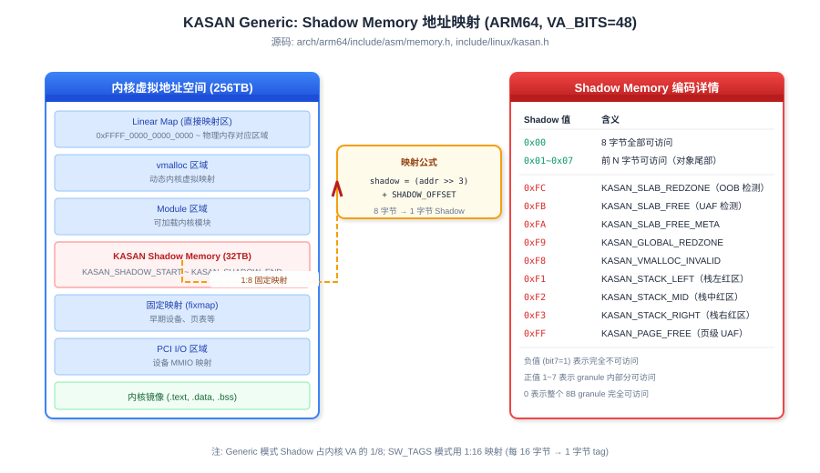

#### 5.2.2 编译器插桩机制

KASAN Generic 依赖 GCC/Clang 的 `-fsanitize=kernel-address` 编译选项，在**每条 load/store 指令前**自动插入检查代码。

**插桩模式对比**：

| Kconfig | 插桩方式 | 特点 |
|---------|---------|------|
| `CONFIG_KASAN_INLINE=y` | 内联插桩 | 检查逻辑直接展开在调用处，**更快**但代码膨胀 |
| `CONFIG_KASAN_OUTLINE=y` | 函数调用插桩 | 调用 `__asan_loadN`/`__asan_storeN`，**更小**但有函数调用开销 |

**内联插桩伪代码**（编译器生成）：

```c
// 原始代码: int val = *ptr;
// 编译器插桩后:
{
    // ---- 编译器自动插入的检查 ----
    void *shadow = (void *)((unsigned long)ptr >> 3) + KASAN_SHADOW_OFFSET;
    s8 shadow_val = *(s8 *)shadow;
    if (shadow_val != 0) {
        s8 last_byte = (unsigned long)ptr & 0x7;  // 取低 3 位
        if (last_byte >= shadow_val) {
            __asan_report_load4(ptr);  // 报告越界!
        }
    }
    // ---- 原始 load 操作 ----
    int val = *ptr;
}
```

**核心检查函数**（`mm/kasan/generic.c`）：

```c
static __always_inline bool memory_is_poisoned_1(const void *addr)
{
    s8 shadow_value = *(s8 *)kasan_mem_to_shadow(addr);

    if (unlikely(shadow_value)) {
        // 地址在 8B granule 内的偏移
        s8 last_accessible_byte = (unsigned long)addr & KASAN_GRANULE_MASK;
        // 如果偏移 >= shadow_value → 访问的字节超出了可用范围
        return unlikely(last_accessible_byte >= shadow_value);
    }
    return false;  // shadow == 0 → 全 8 字节安全
}

// 多字节检查: 处理跨 granule 边界的情况
static __always_inline bool memory_is_poisoned_2_4_8(const void *addr, unsigned long size)
{
    u8 *shadow_addr = (u8 *)kasan_mem_to_shadow(addr);
    // 检查是否跨 8B 边界
    if (unlikely((((unsigned long)addr + size - 1) & KASAN_GRANULE_MASK) < size - 1))
        return *shadow_addr || memory_is_poisoned_1(addr + size - 1);
    return memory_is_poisoned_1(addr + size - 1);
}
```

**【图 5.2-2】KASAN 编译器插桩检查流程**

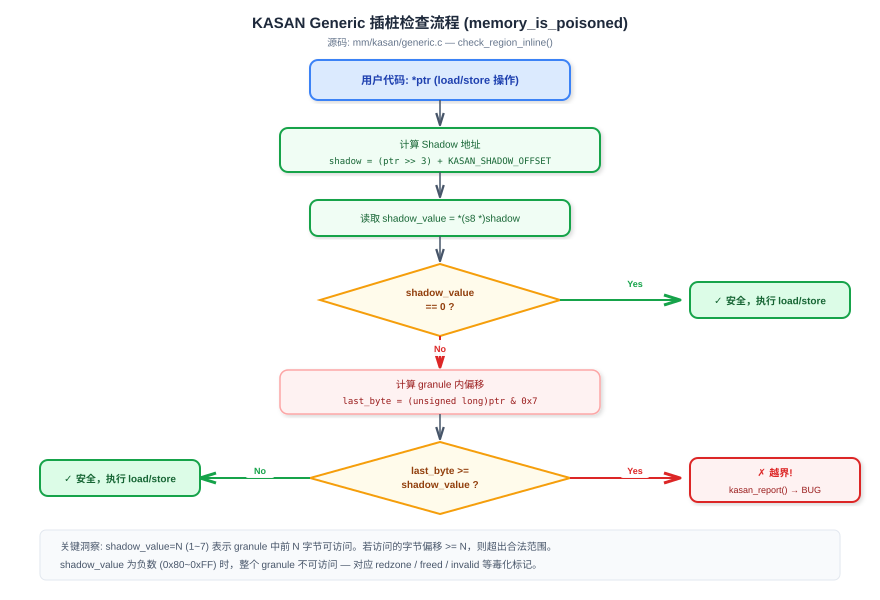

#### 5.2.3 Slab 对象内存布局与 Shadow 染色

当 KASAN 与 SLUB 分配器集成时，每个 slab 对象在分配和释放时都会被精确地"染色"（poison/unpoison）。

**核心染色函数**（`mm/kasan/common.c`）：

```c
// 分配时: 解毒对象体
void __kasan_unpoison_new_object(struct kmem_cache *cache, void *object)
{
    kasan_unpoison(object, cache->object_size, false);
}

// 释放时: 毒化对象体 → 标记为 KASAN_SLAB_FREE
static inline void poison_slab_object(struct kmem_cache *cache, void *object, bool init)
{
    object = kasan_reset_tag(object);
    kasan_poison(object, round_up(cache->object_size, KASAN_GRANULE_SIZE),
                 KASAN_SLAB_FREE, init);
    if (kasan_stack_collection_enabled())
        kasan_save_free_info(cache, tagged_object);  // 保存释放调用栈
}

// Slab 页初始化: 整页标记为 REDZONE
void __kasan_poison_slab(struct slab *slab)
{
    kasan_poison(page_address(slab_page(slab)), page_size(slab_page(slab)),
                 KASAN_SLAB_REDZONE, false);
}
```

**【图 5.2-3】Slab 对象生命周期中的 Shadow 状态变化**

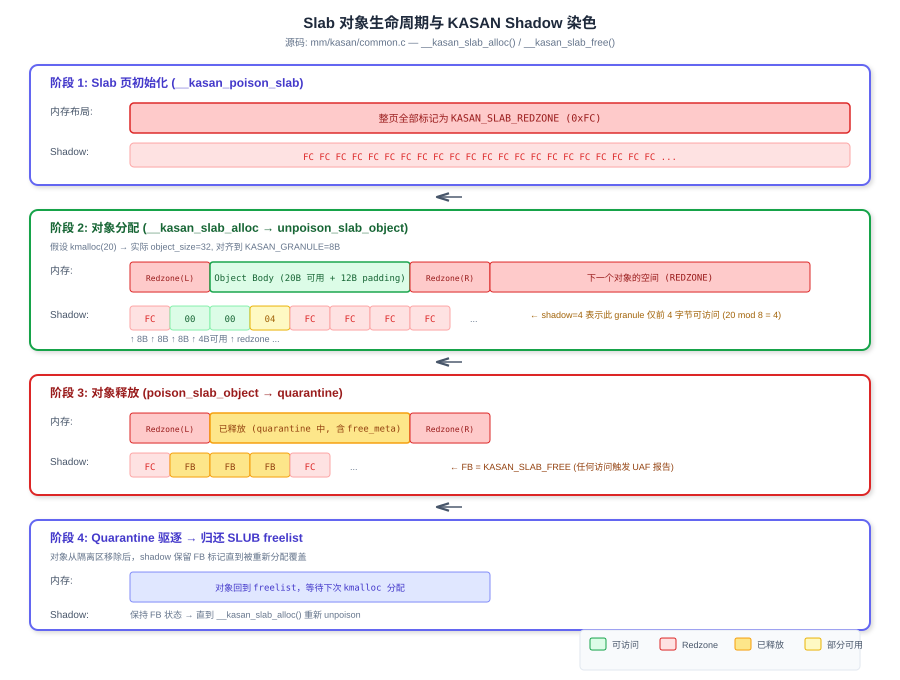

#### 5.2.4 Quarantine（隔离区）延迟回收机制

Quarantine 是 KASAN 检测 Use-After-Free 的**关键增强**。释放的对象不立即回到 SLUB freelist，而是进入隔离队列，极大地延长了 UAF 可被检测到的时间窗口。

**数据结构**（`mm/kasan/quarantine.c`）：

```c
// Per-CPU 隔离队列（无锁快速入队）
static DEFINE_PER_CPU(struct qlist_head, cpu_quarantine);

// 全局轮转 FIFO 数组
static struct qlist_head global_quarantine[QUARANTINE_BATCHES];
static int quarantine_head;
static int quarantine_tail;
static unsigned long quarantine_size;
static DEFINE_RAW_SPINLOCK(quarantine_lock);

// 队列节点嵌入在对象的 free metadata 中
struct qlist_head {
    struct qlist_node *head;
    struct qlist_node *tail;
    size_t bytes;           // 队列中所有对象的总字节数
    bool offline;
};

#define QUARANTINE_PERCPU_SIZE (1 << 20)  // 1MB per-CPU 队列大小
#define QUARANTINE_FRACTION    32         // 隔离区最多占物理内存的 1/32
```

**工作流程**：

```
kfree(obj)
  → __kasan_slab_free()
    → poison_slab_object()          // Shadow 标记为 0xFB
    → kasan_save_free_info()        // 保存释放调用栈
    → kasan_quarantine_put()        // 入队 per-CPU quarantine
      ├── qlist_put(&cpu_quarantine, ...)
      └── if (cpu_quarantine.bytes > QUARANTINE_PERCPU_SIZE)
            → quarantine_reduce()   // 批量移入 global_quarantine
              → qlist_free_all()    // 驱逐最旧 batch → 归还 SLUB
```

**隔离区大小控制**：

| 参数 | 默认值 | 说明 |
|------|--------|------|
| `QUARANTINE_PERCPU_SIZE` | 1 MB | Per-CPU 队列满后触发 reduce |
| `QUARANTINE_FRACTION` | 32 | 全局隔离区最大占物理内存 1/32 |
| `QUARANTINE_BATCHES` | max(1024, 4*NR_CPUS) | 全局 FIFO 批次数 |

**隔离区对 UAF 检测的增强效果**：

```
无 Quarantine:
  kfree(A) → A 立即回到 freelist → kmalloc(B) 覆盖 A → A 的 UAF 检测窗口极短

有 Quarantine:
  kfree(A) → A 在隔离区停留 (shadow=0xFB)
           → 此期间任何对 A 的 load/store 都会被检测!
           → 隔离区满 → A 最终回到 freelist
           → 检测窗口从 μs 级扩展到 ms~s 级
```

#### 5.2.5 SW_TAGS 模式 — 软件标签检测

SW_TAGS 是 ARM64 专有的概率性检测模式，利用 ARM64 的 **TBI（Top Byte Ignore）** 特性，在指针高字节中嵌入随机标签。

**核心原理**：

```
┌────────────────────────────────────────────────────────────────┐
│  ARM64 虚拟地址 (64 bit)                                       │
│  [63:56]    [55:0]                                             │
│   TAG(8b)   Virtual Address                                    │
│  ┌────────┬───────────────────────────────────────────────┐   │
│  │ 0xA3   │  0x00FFFF_8000_1234                            │   │
│  └────────┴───────────────────────────────────────────────┘   │
│      ↑                                                         │
│      └── 随机标签，分配时写入指针和 Shadow                       │
└────────────────────────────────────────────────────────────────┘
```

**Shadow Memory 编码变化**（`mm/kasan/sw_tags.c`）：

| | Generic | SW_TAGS |
|---|---|---|
| Shadow 比例 | 1:8 (每 8B → 1 字节) | **1:16** (每 16B → 1 字节) |
| Shadow 值含义 | 可用字节数 / 毒化类型 | **对象标签值** (0x00~0xFE) |
| 检查方式 | 比较偏移与 shadow | **比较指针高字节 tag 与 shadow tag** |
| 检测概率 | 100% 确定性 | **1 - 1/255 ≈ 99.6%** |

**检查逻辑**（`mm/kasan/sw_tags.c`）：

```c
bool kasan_check_range(const void *addr, size_t size, bool write, unsigned long ret_ip)
{
    u8 tag = get_tag(addr);       // 提取指针高字节
    u8 *shadow_first, *shadow_last, *shadow;
    void *untagged_addr;

    if (tag == KASAN_TAG_KERNEL)  // 0xFF = 内核默认 tag, 跳过检查
        return true;

    untagged_addr = kasan_reset_tag(addr);  // 清除 tag 得到真实地址
    shadow_first = (u8 *)kasan_mem_to_shadow(untagged_addr);
    shadow_last = (u8 *)kasan_mem_to_shadow(untagged_addr + size - 1);

    for (shadow = shadow_first; shadow <= shadow_last; shadow++) {
        if (*shadow != tag) {      // Tag 不匹配 → 越界或 UAF!
            return !kasan_report(addr, size, write, ret_ip);
        }
    }
    return true;
}
```

**标签生成**（PRNG）：

```c
u8 kasan_random_tag(void)
{
    u32 state = this_cpu_read(prng_state);
    state = 1664525 * state + 1013904223;  // LCG PRNG
    this_cpu_write(prng_state, state);
    return (u8)(state % (KASAN_TAG_MAX + 1));  // 0x00~0xFE
}
```

#### 5.2.6 HW_TAGS 模式 — ARM64 MTE 硬件加速

HW_TAGS 利用 ARMv8.5-A 引入的 **MTE（Memory Tagging Extension）** 硬件特性，将标签检查完全卸载到 CPU 硬件，实现接近零开销的内存安全检测。

**【图 5.2-4】三种 KASAN 模式架构对比**


**HW_TAGS 运行模式**（`mm/kasan/hw_tags.c`）：

```c
enum kasan_mode {
    KASAN_MODE_SYNC,    // 同步: 立即触发异常，精确定位 (开销较高)
    KASAN_MODE_ASYNC,   // 异步: 延迟报告，性能最优 (开销 ~5%)
    KASAN_MODE_ASYMM,   // 非对称: 读异步 + 写同步 (折中)
};
```

| 模式 | Boot 参数 | 特点 | 典型开销 |
|------|-----------|------|---------|
| SYNC | `kasan.mode=sync` | 异常时立即 trap，报告精确 PC | ~20% |
| ASYNC | `kasan.mode=async` | 异常存入 TFSR 寄存器，上下文切换时检查 | ~5% |
| ASYMM | `kasan.mode=asymm` | 写同步+读异步，兼顾精度与性能 | ~10% |

**MTE 硬件操作指令**：

```
IRG Xd, Xn        ; Insert Random Tag — 为指针生成随机 4-bit tag
STG [Xn]           ; Store Allocation Tag — 将指针 tag 写入物理 Tag RAM
LDG Xt, [Xn]      ; Load Allocation Tag — 从物理 Tag RAM 读取 tag
ST2G [Xn]          ; Store 2 Granule Tags — 批量设置 32 字节的 tag
```

#### 5.2.7 KASAN 错误报告解读

当检测到内存违规时，KASAN 输出包含丰富的调试信息：

**典型 OOB 报告**：

```
==================================================================
BUG: KASAN: slab-out-of-bounds in buggy_function+0x64/0x80
Write of size 4 at addr ffff0000c5a8b514 by task test/1234

CPU: 2 PID: 1234 Comm: test Not tainted 6.18.1 #1
Call trace:
 dump_backtrace+0x0/0x1c8
 show_stack+0x24/0x30
 dump_stack_lvl+0x60/0x80
 kasan_report+0xb8/0x100
 __asan_store4+0x78/0x80
 buggy_function+0x64/0x80          ← 越界写入的位置
 test_module_init+0x20/0x40

Allocated by task 1234:
 kasan_save_stack+0x28/0x50
 __kasan_slab_alloc+0x6c/0x80
 kmalloc_trace+0x44/0x60
 buggy_function+0x30/0x80          ← 分配的位置

The buggy address belongs to the object at ffff0000c5a8b500
 which belongs to the cache kmalloc-32 of size 32
The buggy address is located 20 bytes inside of
 allocated 16-byte region [ffff0000c5a8b500, ffff0000c5a8b510)
==================================================================
```

**报告关键字段解读**：

| 字段 | 含义 |
|------|------|
| `slab-out-of-bounds` | Bug 类型（OOB/UAF/double-free/invalid-free） |
| `Write of size 4` | 越界操作方向和大小 |
| `addr ffff0000c5a8b514` | 违规访问的地址 |
| `Allocated by task` | 对象分配时的调用栈 |
| `Freed by task` | 对象释放时的调用栈（UAF 时出现） |
| `cache kmalloc-32 of size 32` | 对象所属的 slab cache |
| `20 bytes inside of allocated 16-byte region` | 越界偏移量 |

**Shadow Memory 转储**（报告末尾）：

```
Memory state around the buggy address:
 ffff0000c5a8b400: fc fc fc fc fc fc fc fc fc fc fc fc fc fc fc fc
 ffff0000c5a8b480: fc fc fc fc fc fc fc fc fc fc fc fc fc fc fc fc
>ffff0000c5a8b500: 00 00 fc fc fc fc fc fc fc fc fc fc fc fc fc fc
                         ^^ ← shadow=FC (redzone)，但访问了此处!
 ffff0000c5a8b580: fc fc fc fc fc fc fc fc fc fc fc fc fc fc fc fc
```

#### 5.2.8 KASAN 与内核子系统集成点

| 子系统 | 集成函数 | 作用 |
|--------|---------|------|
| SLUB (slab 分配) | `__kasan_slab_alloc()` | 分配时解毒 + 设置 tag |
| SLUB (slab 释放) | `__kasan_slab_free()` | 释放时毒化 + 入 quarantine |
| Page Allocator | `__kasan_poison_pages()` / `__kasan_unpoison_pages()` | 页级生命周期追踪 |
| vmalloc | `kasan_populate_vmalloc()` | vmalloc 区域动态映射 shadow |
| Stack | `kasan_unpoison_task_stack()` | 任务切换时解毒栈 |
| Module | `__asan_register_globals()` | 模块加载时注册全局变量 redzone |
| memcpy/memset | `__asan_memcpy()` / `__asan_memset()` | 批量操作边界检查 |

**关键代码路径**（`mm/kasan/common.c`）：

```c
void * __must_check __kasan_slab_alloc(struct kmem_cache *cache,
                                       void *object, gfp_t flags, bool init)
{
    u8 tag;
    void *tagged_object;

    if (is_kfence_address(object))
        return object;

    tag = assign_tag(cache, object, false);
    tagged_object = set_tag(object, tag);

    // 解毒对象体 + 保存分配栈
    unpoison_slab_object(cache, tagged_object, flags, init);

    return tagged_object;  // 返回带 tag 的指针
}
```

#### 5.2.9 实战调试技巧

**1) 启用 KASAN + 增强信息**：

```bash
# .config
CONFIG_KASAN=y
CONFIG_KASAN_GENERIC=y
CONFIG_KASAN_INLINE=y
CONFIG_KASAN_STACK=y
CONFIG_KASAN_VMALLOC=y
CONFIG_KASAN_EXTRA_INFO=y    # 报告含 CPU + 时间戳
CONFIG_STACKDEPOT_MAX_FRAMES=64
```

**2) 运行时参数调优**：

```bash
# Boot cmdline
kasan_multi_shot                 # 不因第一个 bug 停止
kasan.fault=panic                # 检测到错误时 panic (可选)

# HW_TAGS (ARM64 MTE)
kasan=on kasan.mode=asymm        # 写同步+读异步，生产推荐
kasan.stacktrace=on              # 保存分配/释放栈
```

**3) 定位 OOB 方向**：

```bash
# 从报告中提取:
# "located 4 bytes to the right of allocated 32-byte region"
#   → 右越界: 写入超出对象尾部
# "located 2 bytes to the left of allocated 32-byte region"
#   → 左越界: 下标为负或前一个对象溢出
```

**4) 结合 addr2line 定位源码**：

```bash
# 从 KASAN 报告中获取 PC
addr2line -e vmlinux -a 0xffff800080123456
# 或使用 scripts/decode_stacktrace.sh
./scripts/decode_stacktrace.sh vmlinux < kasan_report.txt
```

**5) 用 eBPF 追踪 KASAN 事件**：

```bash
# 挂载 kasan_report tracepoint
bpftrace -e 'kprobe:kasan_report { printf("KASAN hit at %lx\n", arg0); }'
```

### 5.3 KFENCE 检测原理深度分析

KFENCE（Kernel Electric-Fence）是 Linux 内核中一种**低开销、采样式**的内存安全检测机制。与 KASAN 不同，KFENCE 适合在**生产环境**中长期启用，通过牺牲检测覆盖率换取接近零的性能损耗。

源码路径：`mm/kfence/`（`core.c`、`kfence.h`、`report.c`）

#### 5.3.1 KFENCE 池布局与 Guard Page 架构

KFENCE 的核心设计是在内核启动时预分配一块**固定大小的内存池**，池中每个受保护对象被 **Guard Page（保护页）** 所环绕。任何越界访问都会触发硬件 Page Fault，从而被精确检测。

**内存池大小**（`include/linux/kfence.h`）：

```c
#define KFENCE_POOL_SIZE ((CONFIG_KFENCE_NUM_OBJECTS + 1) * 2 * PAGE_SIZE)
// 默认 CONFIG_KFENCE_NUM_OBJECTS = 255
// 池大小 = (255 + 1) * 2 * 4096 = 2 MB
```

**池布局示意**：

```
__kfence_pool (2MB 连续虚拟内存)
┌──────────────────────────────────────────────────────────────────────┐
│ Guard │ Guard │ Object │ Guard │ Object │ Guard │ ... │ Object │ Guard│
│ Page  │ Page  │ Page 0 │ Page  │ Page 1 │ Page  │     │ Page N │ Page │
│(保护) │(保护) │(可访问)│(保护) │(可访问)│(保护) │     │(可访问)│(保护)│
└──────────────────────────────────────────────────────────────────────┘
 ↑ 前导 2 页          每个对象占 2 页：1 Object Page + 1 Guard Page
```

**关键数据结构**（`mm/kfence/kfence.h`）：

```c
/* 对象状态机 */
enum kfence_object_state {
    KFENCE_OBJECT_UNUSED,       /* 未使用（池初始化后的初始状态） */
    KFENCE_OBJECT_ALLOCATED,    /* 已分配给用户 */
    KFENCE_OBJECT_RCU_FREEING,  /* 正在通过 RCU 延迟释放 */
    KFENCE_OBJECT_FREED,        /* 已释放（Guard Page 仍保护中） */
};

/* 分配/释放追踪信息 */
struct kfence_track {
    pid_t pid;                  /* 操作进程 PID */
    int cpu;                    /* 操作 CPU */
    u64 ts_nsec;                /* 操作时间戳 (local_clock) */
    int num_stack_entries;
    unsigned long stack_entries[KFENCE_STACK_DEPTH];  /* 64 帧深度 */
};

/* 每个受保护对象的元数据 */
struct kfence_metadata {
    struct list_head list;          /* Freelist 链表节点 */
    struct rcu_head rcu_head;       /* RCU 延迟释放头 */
    raw_spinlock_t lock;            /* 并发保护锁 */
    enum kfence_object_state state; /* 当前状态 */
    unsigned long addr;             /* 对象在 Object Page 中的实际地址 */
    size_t size;                    /* 原始分配大小 */
    struct kmem_cache *cache;       /* 所属 slab cache */
    unsigned long unprotected_page; /* OOB 时被 unprotect 的页 */
    struct kfence_track alloc_track; /* 分配调用栈 */
    struct kfence_track free_track;  /* 释放调用栈 */
    u32 alloc_stack_hash;           /* Bloom Filter 用的栈哈希 */
};
```

**地址到元数据索引的映射**（`mm/kfence/kfence.h`）：

```c
static inline struct kfence_metadata *addr_to_metadata(unsigned long addr)
{
    long index;
    if (!is_kfence_address((void *)addr))
        return NULL;
    // 每 2 页对应一个对象，前 2 页是保护页，故 index 从 0 开始
    index = (addr - (unsigned long)__kfence_pool) / (PAGE_SIZE * 2) - 1;
    if (index < 0 || index >= CONFIG_KFENCE_NUM_OBJECTS)
        return NULL;
    return &kfence_metadata[index];
}
```

#### 5.3.2 对象放置策略与 Canary 字节模式

**随机左/右对齐**：

分配对象时，KFENCE 随机选择将对象放置在 Object Page 的**左端**或**右端**，以检测不同方向的越界：

```c
static void *kfence_guarded_alloc(struct kmem_cache *cache, size_t size, ...)
{
    const bool random_right_allocate = get_random_u32_below(2);

    meta->addr = metadata_to_pageaddr(meta);
    if (random_right_allocate) {
        /* 右对齐：对象紧贴右侧 Guard Page → 检测右越界 */
        meta->addr += PAGE_SIZE - size;
        meta->addr = ALIGN_DOWN(meta->addr, cache->align);
    }
    /* 左对齐（默认）：对象紧贴左侧 Guard Page → 检测左越界 */
    ...
}
```

**对齐策略的检测效果**：

```
左对齐 (检测右越界 OOB-right):
┌────────────────┬──────────────────────┬────────────────┐
│   Guard Page   │ [Object][  Canary  ] │   Guard Page   │
│  (PROTECTED)   │ ←size→              │  (PROTECTED)   │
└────────────────┴──────────────────────┴────────────────┘
                          ↑ 右越界 → 写入 canary → 释放时检测
                                       ↑ 大幅越界 → Page Fault!

右对齐 (检测左越界 OOB-left):
┌────────────────┬──────────────────────┬────────────────┐
│   Guard Page   │ [  Canary  ][Object] │   Guard Page   │
│  (PROTECTED)   │              ←size→  │  (PROTECTED)   │
└────────────────┴──────────────────────┴────────────────┘
     ↑ 大幅左越界 → Page Fault!
                   ↑ 小幅左越界 → 写入 canary → 释放时检测
```

**Canary 字节模式**（`mm/kfence/kfence.h`）：

```c
/* Canary 值依赖地址低 3 位，增加随机性 */
#define KFENCE_CANARY_PATTERN_U8(addr) ((u8)0xaa ^ (u8)((unsigned long)(addr) & 0x7))

/* 8 字节连续 Canary，用于快速 64 位比较 */
#define KFENCE_CANARY_PATTERN_U64 \
    ((u64)0xaaaaaaaaaaaaaaaa ^ (u64)(le64_to_cpu(0x0706050403020100)))
// 实际值: 0xaa^0x00, 0xaa^0x01, 0xaa^0x02, ..., 0xaa^0x07
//        = 0xaa, 0xab, 0xa8, 0xa9, 0xae, 0xaf, 0xac, 0xad
```

**Canary 设置与校验**（`mm/kfence/core.c`）：

```c
static inline void set_canary(const struct kfence_metadata *meta)
{
    const unsigned long pageaddr = ALIGN_DOWN(meta->addr, PAGE_SIZE);
    unsigned long addr = pageaddr;

    /* 对象左侧填充 canary（地址低于 meta->addr 的区域） */
    for (; addr < meta->addr; addr += sizeof(u64))
        *((u64 *)addr) = KFENCE_CANARY_PATTERN_U64;

    /* 对象右侧填充 canary（地址高于 meta->addr + size 的区域） */
    addr = ALIGN_DOWN(meta->addr + meta->size, sizeof(u64));
    for (; addr - pageaddr < PAGE_SIZE; addr += sizeof(u64))
        *((u64 *)addr) = KFENCE_CANARY_PATTERN_U64;
}

static void check_canary(const struct kfence_metadata *meta)
{
    const unsigned long pageaddr = ALIGN_DOWN(meta->addr, PAGE_SIZE);
    unsigned long addr = pageaddr;

    /* 先按 8 字节快速扫描左侧 canary */
    for (; meta->addr - addr >= sizeof(u64); addr += sizeof(u64)) {
        if (unlikely(*((u64 *)addr) != KFENCE_CANARY_PATTERN_U64))
            break;  // 发现损坏，切换为逐字节检查
    }
    /* 逐字节精确定位损坏位置 */
    for (; addr < meta->addr; addr++) {
        if (unlikely(!check_canary_byte((u8 *)addr)))
            break;  // 报告 KFENCE_ERROR_CORRUPTION
    }

    /* 右侧 canary 同理 ... */
}
```

**两层检测互补**：

| 越界程度 | 检测机制 | 检测时机 | 精度 |
|---------|---------|---------|------|
| 小幅越界 (1~几十字节) | Canary 校验 | 对象释放时 (`kfence_guarded_free`) | 精确到字节 |
| 大幅越界 (跨页) | Guard Page Fault | 访问发生时（同步） | 精确到指令 |
| Use-After-Free | Object Page 保护 | 访问发生时（同步） | 精确到指令 |

#### 5.3.3 采样机制与 Counting Bloom Filter

KFENCE 的低开销源于其**采样设计**：不是每次 `kmalloc()` 都使用保护分配，而是以固定时间间隔打开"分配门"，每个周期仅捕获一次（或少量 burst）分配。

**采样定时器**（`mm/kfence/core.c`）：

```c
static struct delayed_work kfence_timer;

static void toggle_allocation_gate(struct work_struct *work)
{
    if (!READ_ONCE(kfence_enabled))
        return;

    /* 设置 gate = -burst，允许 (1 + burst) 次分配通过 */
    atomic_set(&kfence_allocation_gate, -kfence_burst);

#ifdef CONFIG_KFENCE_STATIC_KEYS
    /* 启用 static_key → hot path 中的 if 分支生效 */
    static_branch_enable(&kfence_allocation_key);

    /* 等待一次分配完成（gate 从负变正） */
    wait_event_idle(allocation_wait, atomic_read(&kfence_allocation_gate) > 0);

    /* 关闭 static_key → hot path 零开销 */
    static_branch_disable(&kfence_allocation_key);
#endif
    /* 重新排队，下一个采样周期 */
    queue_delayed_work(system_unbound_wq, &kfence_timer,
                       msecs_to_jiffies(kfence_sample_interval));
}
```

**Hot Path 零开销设计**：

```c
/* include/linux/kfence.h — slab 分配器中的检查 */
static __always_inline void *kfence_alloc(struct kmem_cache *s, size_t size, gfp_t flags)
{
#ifdef CONFIG_KFENCE_STATIC_KEYS
    if (!static_branch_unlikely(&kfence_allocation_key))
        return NULL;  // ← 99.99% 时间走这里，static key = NOP
#else
    if (!static_branch_likely(&kfence_allocation_key))
        return NULL;
#endif
    return __kfence_alloc(s, size, flags);
}
```

**`__kfence_alloc` 分配门控制**：

```c
void *__kfence_alloc(struct kmem_cache *s, size_t size, gfp_t flags)
{
    /* 大小限制：KFENCE 只能保护 ≤ PAGE_SIZE 的对象 */
    if (size > PAGE_SIZE)
        return NULL;

    /* 不支持 DMA zone 分配 */
    if ((flags & GFP_ZONEMASK) || (s->flags & (SLAB_CACHE_DMA | SLAB_CACHE_DMA32)))
        return NULL;

    /* 原子递增 gate，只有第一个到达的分配能通过 */
    allocation_gate = atomic_inc_return(&kfence_allocation_gate);
    if (allocation_gate > 1)
        return NULL;  // 本周期已有分配通过

    /* 覆盖率检查（Bloom Filter） */
    alloc_stack_hash = get_alloc_stack_hash(stack_entries, num_stack_entries);
    if (should_skip_covered() && alloc_covered_contains(alloc_stack_hash))
        return NULL;  // 该分配路径已被覆盖，跳过

    return kfence_guarded_alloc(s, size, flags, ...);
}
```

**Counting Bloom Filter — 覆盖率优化**：

当 KFENCE 池使用率超过阈值（默认 75%）时，已经被保护过的分配路径会被跳过，优先保护新路径，最大化 bug 检测覆盖率。

```c
/* Bloom Filter 参数 */
#define ALLOC_COVERED_HNUM    2                                   // 2 个哈希函数
#define ALLOC_COVERED_ORDER   (const_ilog2(CONFIG_KFENCE_NUM_OBJECTS) + 2) // 位数
#define ALLOC_COVERED_SIZE    (1 << ALLOC_COVERED_ORDER)          // 数组大小
#define ALLOC_COVERED_MASK    (ALLOC_COVERED_SIZE - 1)
static atomic_t alloc_covered[ALLOC_COVERED_SIZE];                // Counting 数组

/* 计算分配栈哈希（只取前 8 帧，过滤 IRQ 栈） */
static u32 get_alloc_stack_hash(unsigned long *stack_entries, size_t num_entries)
{
    num_entries = min(num_entries, UNIQUE_ALLOC_STACK_DEPTH);  // 8
    num_entries = filter_irq_stacks(stack_entries, num_entries);
    return jhash(stack_entries, num_entries * sizeof(stack_entries[0]), stack_hash_seed);
}

/* 分配时：在 Bloom Filter 中增加计数 */
static void alloc_covered_add(u32 alloc_stack_hash, int val)
{
    for (int i = 0; i < ALLOC_COVERED_HNUM; i++) {
        atomic_add(val, &alloc_covered[alloc_stack_hash & ALLOC_COVERED_MASK]);
        alloc_stack_hash = ALLOC_COVERED_HNEXT(alloc_stack_hash);
    }
}

/* 查询时：所有哈希位置计数都 > 0 则认为已覆盖 */
static bool alloc_covered_contains(u32 alloc_stack_hash)
{
    for (int i = 0; i < ALLOC_COVERED_HNUM; i++) {
        if (!atomic_read(&alloc_covered[alloc_stack_hash & ALLOC_COVERED_MASK]))
            return false;
        alloc_stack_hash = ALLOC_COVERED_HNEXT(alloc_stack_hash);
    }
    return true;
}
```

**采样参数汇总**：

| 参数 | 默认值 | 含义 | 运行时修改 |
|------|--------|------|-----------|
| `CONFIG_KFENCE_SAMPLE_INTERVAL` | 100 ms | 采样周期（每 100ms 尝试捕获一次分配） | `kfence.sample_interval` |
| `CONFIG_KFENCE_NUM_OBJECTS` | 255 | 池中最大受保护对象数 | 编译时确定 |
| `kfence_burst` | 0 | 每周期额外允许通过的分配数 | `kfence.burst` |
| `kfence_skip_covered_thresh` | 75 | 池使用率超此 % 后启用 Bloom Filter | `kfence.skip_covered_thresh` |

#### 5.3.4 Page Fault 检测与错误报告

KFENCE 的核心检测依赖**硬件 Page Fault**：当访问被保护的 Guard Page 或已释放对象的 Object Page 时，MMU 触发异常，内核 Page Fault Handler 调用 `kfence_handle_page_fault()` 进行判定。

**页保护/取消保护**（`mm/kfence/core.c`）：

```c
static bool kfence_protect(unsigned long addr)
{
    return !KFENCE_WARN_ON(!kfence_protect_page(ALIGN_DOWN(addr, PAGE_SIZE), true));
    // → 调用体系结构相关代码，设置 PTE 为不可访问
}

static bool kfence_unprotect(unsigned long addr)
{
    return !KFENCE_WARN_ON(!kfence_protect_page(ALIGN_DOWN(addr, PAGE_SIZE), false));
    // → 恢复 PTE 可访问
}
```

**Page Fault 处理流程**（`mm/kfence/core.c`）：

```c
bool kfence_handle_page_fault(unsigned long addr, bool is_write, struct pt_regs *regs)
{
    const int page_index = (addr - (unsigned long)__kfence_pool) / PAGE_SIZE;
    struct kfence_metadata *to_report = NULL;
    enum kfence_error_type error_type;

    if (!is_kfence_address((void *)addr))
        return false;  // 不在 KFENCE 池中，不处理

    if (!READ_ONCE(kfence_enabled))
        return kfence_unprotect(addr);  // 运行时禁用了，放行

    atomic_long_inc(&counters[KFENCE_COUNTER_BUGS]);

    if (page_index % 2) {
        /* ===== 奇数页 = Guard Page (Redzone) → OOB ===== */
        struct kfence_metadata *meta;

        // 检查左侧对象（可能右越界到此）
        meta = addr_to_metadata(addr - PAGE_SIZE);
        if (meta && kfence_obj_allocated(meta))
            to_report = meta;

        // 检查右侧对象（可能左越界到此）
        meta = addr_to_metadata(addr + PAGE_SIZE);
        if (meta && kfence_obj_allocated(meta)) {
            // 取距离更近的对象报告
            if (!to_report || distance > meta->addr - addr)
                to_report = meta;
        }
        error_type = KFENCE_ERROR_OOB;
    } else {
        /* ===== 偶数页 = Object Page (已释放) → UAF ===== */
        to_report = addr_to_metadata(addr);
        error_type = KFENCE_ERROR_UAF;
    }

    if (to_report)
        kfence_report_error(addr, is_write, regs, to_report, error_type);
    else
        kfence_report_error(addr, is_write, regs, NULL, KFENCE_ERROR_INVALID);

    return kfence_unprotect(addr);  // 报告后 unprotect，让程序继续运行
}
```

**对象释放流程与 UAF 保护**：

```c
static void kfence_guarded_free(void *addr, struct kfence_metadata *meta, bool zombie)
{
    raw_spin_lock_irqsave(&meta->lock, flags);

    /* 1. 检测 Double-Free / Invalid-Free */
    if (!kfence_obj_allocated(meta) || meta->addr != (unsigned long)addr) {
        kfence_report_error(addr, false, NULL, meta, KFENCE_ERROR_INVALID_FREE);
        return;
    }

    /* 2. 恢复之前因 OOB 而 unprotect 的页 */
    if (meta->unprotected_page) {
        memzero_explicit((void *)ALIGN_DOWN(meta->unprotected_page, PAGE_SIZE), PAGE_SIZE);
        kfence_protect(meta->unprotected_page);
        meta->unprotected_page = 0;
    }

    /* 3. 更新状态为 FREED，记录释放调用栈 */
    metadata_update_state(meta, KFENCE_OBJECT_FREED, NULL, 0);
    raw_spin_unlock_irqrestore(&meta->lock, flags);

    /* 4. 校验 Canary 字节（检测释放前的小幅 OOB） */
    check_canary(meta);

    /* 5. 保护 Object Page → 后续 UAF 访问触发 Page Fault */
    kfence_protect((unsigned long)addr);

    /* 6. 归还到 freelist */
    list_add_tail(&meta->list, &kfence_freelist);
}
```

**KFENCE 错误类型与典型报告**：

| 错误类型 | 触发条件 | 报告标识 |
|---------|---------|---------|
| `KFENCE_ERROR_OOB` | 访问 Guard Page（奇数页） | `BUG: KFENCE: out-of-bounds` |
| `KFENCE_ERROR_UAF` | 访问已释放对象的 Object Page | `BUG: KFENCE: use-after-free` |
| `KFENCE_ERROR_CORRUPTION` | 释放时 Canary 校验失败 | `BUG: KFENCE: memory corruption` |
| `KFENCE_ERROR_INVALID_FREE` | 对未分配/已释放对象再次释放 | `BUG: KFENCE: invalid free` |

**典型 OOB 报告**：

```
==================================================================
BUG: KFENCE: out-of-bounds read in test_oob_read+0x30/0x48

Out-of-bounds read at 0xffff0000c6d86000 (1 byte to the right of
 kfence-#72):
 test_oob_read+0x30/0x48
 ...

kfence-#72: 0xffff0000c6d85fc0-0xffff0000c6d85fff, size=64, cache=kmalloc-64

Allocated by task 1234 on cpu 2 at 123.456000s:
 kfence_guarded_alloc+0xd0/0x1c0
 __kfence_alloc+0x148/0x180
 __kmalloc+0x88/0xc0
 test_alloc+0x24/0x40
 ...

CPU: 2 PID: 1234 Comm: test Not tainted 6.18.1 #1
==================================================================
```

#### 5.3.5 KFENCE 与 SLUB 分配器集成

KFENCE 通过在 SLUB 快速路径中嵌入极低开销的检查，实现采样拦截：

**分配路径集成**（SLUB `__slab_alloc` 路径）：

```
kmalloc(size, GFP_KERNEL)
  → __kmem_cache_alloc_node()
    → kfence_alloc(s, size, flags)        ← Static Key 控制
      ├── static_branch_unlikely = false  → return NULL (99.99% 路径)
      └── static_branch_unlikely = true   → __kfence_alloc()
          ├── size > PAGE_SIZE?           → return NULL
          ├── atomic_inc(gate) > 1?       → return NULL (已有分配通过)
          ├── bloom_filter 已覆盖?         → return NULL
          └── kfence_guarded_alloc()      → 返回受保护对象
    → 正常 SLUB 分配路径（kfence_alloc 返回 NULL 时）
```

**释放路径集成**：

```
kfree(ptr)
  → __kmem_cache_free()
    → is_kfence_address(ptr)?
      ├── true  → __kfence_free(ptr)
      │           → kfence_guarded_free()
      └── false → 正常 SLUB 释放路径
```

**`is_kfence_address` 快速检查**（`include/linux/kfence.h`）：

```c
static __always_inline bool is_kfence_address(const void *addr)
{
    // 单次比较 + AND：检查地址是否在 [__kfence_pool, __kfence_pool + POOL_SIZE) 范围
    return unlikely((unsigned long)((char *)addr - __kfence_pool) < KFENCE_POOL_SIZE
                    && __kfence_pool);
}
```

#### 5.3.6 池初始化与页表设置

**Early Boot 初始化流程**：

```
start_kernel()
  → mm_core_init()
    → kfence_alloc_pool_and_metadata()
      → memblock_alloc(__kfence_pool, KFENCE_POOL_SIZE, PAGE_SIZE)
      → memblock_alloc(kfence_metadata_init, KFENCE_METADATA_SIZE)
    → kfence_init()
      → kfence_init_pool_early()
        → kfence_init_pool()
          → 设置所有 Object Page 为 PGTY_slab
          → 保护前导 2 页（Guard Pages）
          → 循环 CONFIG_KFENCE_NUM_OBJECTS 次:
              初始化 metadata → 加入 freelist → 保护右侧 Guard Page
          → smp_store_release(&kfence_metadata, kfence_metadata_init)
      → 启动采样定时器 queue_delayed_work(kfence_timer)
```

**池内页面索引规则**：

```
页面索引:  0    1    2    3    4    5    6    7   ...
类型:    Guard Guard  Obj Guard  Obj Guard  Obj Guard ...
对象:    N/A   N/A    #0  (右)   #1  (右)   #2  (右)  ...

对象 i 的 Object Page 索引 = (i + 1) * 2
对象 i 的右侧 Guard Page 索引 = (i + 1) * 2 + 1
```

#### 5.3.7 实战调试技巧

**1) 启用 KFENCE（生产推荐配置）**：

```bash
# .config
CONFIG_KFENCE=y
CONFIG_KFENCE_SAMPLE_INTERVAL=100   # 100ms 采样
CONFIG_KFENCE_NUM_OBJECTS=255       # 255 个保护槽
CONFIG_KFENCE_STATIC_KEYS=y         # 零开销 hot path
```

**2) Boot 参数与运行时调优**：

```bash
# Boot cmdline
kfence.sample_interval=50          # 更激进的采样（测试环境）

# 运行时修改
echo 200 > /sys/module/kfence/parameters/sample_interval   # 放宽采样
echo 5   > /sys/module/kfence/parameters/burst             # 每周期多捕获 5 次
echo 0   > /sys/module/kfence/parameters/sample_interval   # 关闭 KFENCE
```

**3) 查看 KFENCE 统计信息**：

```bash
cat /sys/kernel/debug/kfence/stats
# currently allocated: 128
# total allocations: 45230
# total frees: 45102
# zombie allocations: 0
# total bugs: 2
# skipped allocations (incompatible): 1523
# skipped allocations (capacity): 89012
# skipped allocations (covered): 34521
```

**4) KFENCE vs KASAN 选择策略**：

| 场景 | 推荐工具 | 理由 |
|------|---------|------|
| 开发/CI 测试 | KASAN Generic | 100% 覆盖率，能找到所有 bug |
| 生产环境长期监控 | KFENCE | 接近零开销，概率发现问题 |
| ARM64 生产 + 性能敏感 | KASAN HW_TAGS (async) | 硬件加速，~5% 开销 |
| 特定模块调试 | KASAN + 缩小范围编译 | 精确定位特定模块的内存错误 |

**5) 提高 KFENCE 检测概率**：

```bash
# 缩短采样间隔 + 增加 burst → 更多分配被保护
echo 20 > /sys/module/kfence/parameters/sample_interval
echo 10 > /sys/module/kfence/parameters/burst

# 增加池大小（需重新编译）
CONFIG_KFENCE_NUM_OBJECTS=1023   # 约 8MB 池

# 降低覆盖率阈值 → 更早启用 Bloom Filter 优化
echo 50 > /sys/module/kfence/parameters/skip_covered_thresh
```

### 5.4 SLUB Debug 检测原理深度分析

SLUB Debug 是 Linux 内核 SLUB 分配器**内建**的内存错误检测机制。与 KASAN 的编译器插桩和 KFENCE 的 Guard Page 不同，SLUB Debug 在分配器内部通过**模式填充（Pattern Filling）+ 分配/释放时校验**来检测越界写、释放后写、Double-Free 等问题。其最大优势是无需编译器支持，仅通过 Boot 参数即可动态开启。

源码路径：`mm/slub.c`（核心检测逻辑）、`include/linux/poison.h`（毒化模式值定义）

#### 5.4.1 对象布局与 Red Zone 机制

SLUB Debug 的检测能力源于精心设计的**对象内存布局**。每个 slab 对象被多层哨兵区域包围，任何越界写入都会破坏这些区域中的已知模式。

**对象完整布局**（`mm/slub.c` 注释，启用 `SLAB_RED_ZONE | SLAB_POISON | SLAB_STORE_USER`）：

```
                 s->red_left_pad           s->object_size                s->inuse                          s->size
                      │                         │                          │                                  │
 ┌────────────────────┼─────────────────────────┼──────────────────────────┼──────────────────────────────────┼──────────┐
 │   Left Redzone     │      Object Body        │     Right Redzone        │       Metadata Area              │ Padding  │
 │  (red_left_pad B)  │   (object_size B)       │ (inuse-object_size B)    │                                  │          │
 │                    │                         │                          │ ┌──────────┬──────────┬────────┐ │          │
 │  填充 0xbb(空闲)    │  用户数据 / 0x6b(释放后) │  填充 0xbb(空闲)          │ │ FP(可选)  │ track×2  │orig_sz │ │  0x5a    │
 │      0xcc(使用中)   │                         │      0xcc(使用中)         │ │          │ alloc+free│       │ │          │
 └────────────────────┴─────────────────────────┴──────────────────────────┴─┴──────────┴──────────┴────────┘─┴──────────┘
     检测左越界写            分配中使用/释放后检测       检测右越界写            freelist ptr + 调用栈追踪    对齐填充检测
```

**毒化模式值定义**（`include/linux/poison.h`）：

```c
/* Red Zone 填充值 */
#define SLUB_RED_INACTIVE   0xbb    /* 对象空闲时 Red Zone 的填充值 */
#define SLUB_RED_ACTIVE     0xcc    /* 对象使用中 Red Zone 的填充值 */

/* Poison 填充值 */
#define POISON_INUSE        0x5a    /* 未初始化/padding 区域填充 */
#define POISON_FREE         0x6b    /* 对象释放后填充（前 N-1 字节） */
#define POISON_END          0xa5    /* 对象释放后最后 1 字节标记 */
```

**Red Zone 初始化流程**（`init_object()` — `mm/slub.c`）：

```c
static void init_object(struct kmem_cache *s, void *object, u8 val)
{
    u8 *p = kasan_reset_tag(object);
    unsigned int poison_size = s->object_size;

    if (s->flags & SLAB_RED_ZONE) {
        // 1) 填充左 Red Zone: object 前 red_left_pad 字节
        memset_no_sanitize_memory(p - s->red_left_pad, val, s->red_left_pad);

        if (slub_debug_orig_size(s) && val == SLUB_RED_ACTIVE) {
            // kmalloc Redzone: 只 poison 用户请求大小，其余作为精确红区
            poison_size = get_orig_size(s, object);
        }
    }

    if (s->flags & __OBJECT_POISON) {
        // 2) 填充对象体: 前 N-1 字节 = 0x6b, 最后 1 字节 = 0xa5
        memset_no_sanitize_memory(p, POISON_FREE, poison_size - 1);
        memset_no_sanitize_memory(p + poison_size - 1, POISON_END, 1);
    }

    if (s->flags & SLAB_RED_ZONE)
        // 3) 填充右 Red Zone: object_size 到 inuse 之间
        memset_no_sanitize_memory(p + poison_size, val, s->inuse - poison_size);
}
```

**kmalloc Redzone — 精确请求大小保护**：

当用户调用 `kmalloc(50)` 时，SLUB 分配 `kmalloc-64` cache 的 64 字节对象。SLUB Debug 通过 `set_orig_size()` 记录原始请求大小 50，并将 `[50, 64)` 这 14 字节也标记为 Red Zone（`SLUB_RED_ACTIVE=0xcc`），从而检测 50~63 字节偏移处的越界写：

```c
static inline void set_orig_size(struct kmem_cache *s,
                                 void *object, unsigned int orig_size)
{
    void *p = kasan_reset_tag(object);
    // orig_size 存储在 metadata 区: info_end + 2*sizeof(track) 之后
    p += get_info_end(s);
    p += sizeof(struct track) * 2;
    *(unsigned int *)p = orig_size;
}
```

```
kmalloc(50) → 分配 kmalloc-64 (object_size=64):

┌─────────────────────────────────────────────────────────────────┐
│   用户请求 50 字节               │  kmalloc Redzone (14字节)     │
│   [0 ................... 49]    │  [50 ............... 63]      │
│   正常使用区域                    │  填充 0xcc → 检测 50~63 越界   │
└─────────────────────────────────────────────────────────────────┘
         orig_size=50                    object_size - orig_size
```

**【图 5.4-1】SLUB Debug 对象内存布局与毒化模式**

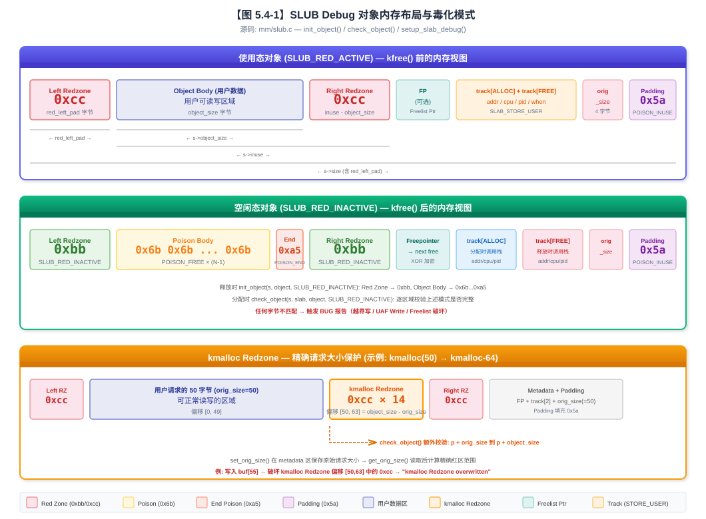

**Slab 页 Padding 检查**（`slab_pad_check()`）：

slab 页末尾可能存在因对齐产生的 padding 区域（无法容纳完整对象的剩余空间），这些区域在 `setup_slab_debug()` 中被填充为 `POISON_INUSE(0x5a)`。`slab_pad_check()` 在每次 `check_slab()` 时验证这些字节是否被破坏，从而检测超出最后一个对象的溢出：

```c
void setup_slab_debug(struct kmem_cache *s, struct slab *slab, void *addr)
{
    // 新 slab 页分配时，整页填充 0x5a
    memset(kasan_reset_tag(addr), POISON_INUSE, slab_size(slab));
}

static void slab_pad_check(struct kmem_cache *s, struct slab *slab)
{
    int remainder = slab_size(slab) % s->size;
    if (!remainder) return;  // 恰好整除，无 padding

    u8 *pad = slab_address(slab) + slab_size(slab) - remainder;
    u8 *fault = memchr_inv(pad, POISON_INUSE, remainder);
    if (fault)
        slab_bug(s, "Padding overwritten. 0x%p-0x%p @offset=%tu", ...);
}
```

#### 5.4.2 Poison 模式 — 释放后写检测

Poison 模式是 SLUB Debug 检测 **Use-After-Free Write** 的核心机制。对象释放时用已知模式填充对象体，下次分配时校验模式是否完整。

**Poison 编码方案**：

```
对象释放后的内存状态:

┌──────────────────────────────────────────────────────────────────────┐
│ 0x6b  0x6b  0x6b  0x6b ... 0x6b  0x6b  0xa5                        │
│ ←─── POISON_FREE (object_size - 1 字节) ────→  ↑                    │
│                                            POISON_END (最后 1 字节)  │
└──────────────────────────────────────────────────────────────────────┘

为什么最后一字节用不同的值?
  → 0xa5 作为边界哨兵，帮助区分"部分覆写"与"完全覆写"
  → 如果 POISON_END 完好但 POISON_FREE 被破坏 → 部分 UAF 写入
  → 如果 POISON_END 也被破坏 → 可能是大范围覆写或从相邻对象溢出
```

**Poison 检查在两个时机触发**：

```
时机 1: 分配时 (alloc_debug_processing)
──────────────────────────────────────────
kmalloc(size, GFP_KERNEL)
  → slab_alloc_node()
    → alloc_debug_processing()
      → alloc_consistency_checks()
        → check_object(s, slab, object, SLUB_RED_INACTIVE)  ← val=0xbb
          // 此时检查:
          // ① 对象体前 N-1 字节是否全为 0x6b (POISON_FREE)
          // ② 最后 1 字节是否为 0xa5 (POISON_END)
          // 不匹配 → "Poison" / "End Poison" 报告 → UAF Write!

时机 2: 释放时 (free_debug_processing)
──────────────────────────────────────────
kfree(ptr)
  → slab_free()
    → free_debug_processing()
      → free_consistency_checks()
        → check_object(s, slab, object, SLUB_RED_ACTIVE)  ← val=0xcc
          // 此时检查红区是否在使用期间被破坏
      → init_object(s, object, SLUB_RED_INACTIVE)
          // 重新填充 Poison (0x6b...0xa5) + Red Zone (0xbb)
```

**Poison 模式的局限性**：

| 可检测 | 不可检测 |
|--------|---------|
| 释放后写入（UAF Write）— 下次分配时发现 | 释放后读取（UAF Read）— 读不改变 Poison |
| 缓冲区溢出到相邻对象 — 破坏 Red Zone | 同一对象内的越界（未超出 object_size）|
| 写入未分配的 slab padding | 精确跳跃式写入（不破坏哨兵位置）|

**与 KASAN Poison 的区别**：

| | SLUB Debug Poison | KASAN Poison |
|---|---|---|
| 检测时机 | **分配/释放时**（延迟检测） | **每次 load/store 时**（立即检测） |
| UAF Read 检测 | 不能 | 能 |
| 性能开销 | 低（仅在 alloc/free 路径） | 高（每条内存访问都检查） |
| 覆盖率 | 仅在下次分配时发现 | 100% 实时 |

#### 5.4.3 check_object 校验流程

`check_object()` 是 SLUB Debug 的**核心校验函数**，在分配和释放路径上调用，负责验证对象所有哨兵区域的完整性。

**完整校验流程**（`mm/slub.c`）：

```c
static int check_object(struct kmem_cache *s, struct slab *slab,
                         void *object, u8 val)
{
    u8 *p = object;
    u8 *endobject = object + s->object_size;
    unsigned int orig_size, kasan_meta_size;
    int ret = 1;

    // ── 步骤 1: Red Zone 校验 ──
    if (s->flags & SLAB_RED_ZONE) {
        // 1a) 左红区: object 前 red_left_pad 字节 == val (0xbb 或 0xcc)
        if (!check_bytes_and_report(s, slab, object, "Left Redzone",
            object - s->red_left_pad, val, s->red_left_pad, ret))
            ret = 0;

        // 1b) 右红区: object_size 到 inuse 之间 == val
        if (!check_bytes_and_report(s, slab, object, "Right Redzone",
            endobject, val, s->inuse - s->object_size, ret))
            ret = 0;

        // 1c) kmalloc Redzone: [orig_size, object_size) 区间 == 0xcc (仅 ACTIVE)
        if (slub_debug_orig_size(s) && val == SLUB_RED_ACTIVE) {
            orig_size = get_orig_size(s, object);
            if (s->object_size > orig_size &&
                !check_bytes_and_report(s, slab, object,
                    "kmalloc Redzone", p + orig_size,
                    val, s->object_size - orig_size, ret))
                ret = 0;
        }
    }
    // ── 无红区时: Alignment padding 检查 ──
    else if ((s->flags & SLAB_POISON) && s->object_size < s->inuse) {
        if (!check_bytes_and_report(s, slab, p, "Alignment padding",
            endobject, POISON_INUSE, s->inuse - s->object_size, ret))
            ret = 0;
    }

    // ── 步骤 2: Poison 校验 (仅释放态对象) ──
    if (s->flags & SLAB_POISON) {
        if (val != SLUB_RED_ACTIVE && (s->flags & __OBJECT_POISON)) {
            kasan_meta_size = kasan_metadata_size(s, true);
            // 2a) 对象体: [kasan_meta_size, object_size-1) == 0x6b
            if (kasan_meta_size < s->object_size - 1 &&
                !check_bytes_and_report(s, slab, p, "Poison",
                    p + kasan_meta_size, POISON_FREE,
                    s->object_size - kasan_meta_size - 1, ret))
                ret = 0;
            // 2b) 最后一字节: object_size-1 == 0xa5
            if (kasan_meta_size < s->object_size &&
                !check_bytes_and_report(s, slab, p, "End Poison",
                    p + s->object_size - 1, POISON_END, 1, ret))
                ret = 0;
        }
        // 2c) Metadata padding: info_end 到 size 之间 == 0x5a
        if (!check_pad_bytes(s, slab, p))
            ret = 0;
    }

    // ── 步骤 3: Freelist 指针校验 ──
    if ((freeptr_outside_object(s) || val != SLUB_RED_ACTIVE) &&
        !check_valid_pointer(s, slab, get_freepointer(s, p))) {
        object_err(s, slab, p, "Freepointer corrupt");
        set_freepointer(s, p, NULL);  // 截断 freelist 防止进一步损坏
        ret = 0;
    }

    return ret;
}
```

**【图 5.4-2】check_object() 校验流程 — 分步决策图**

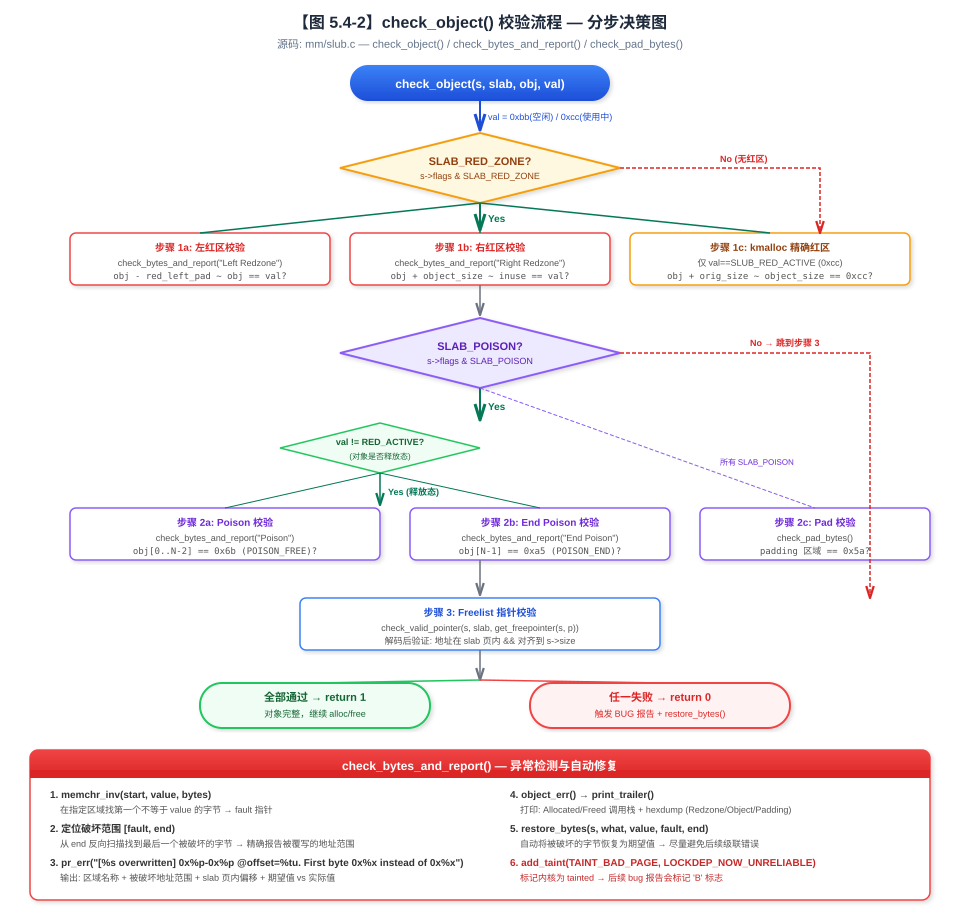

**`check_bytes_and_report()` — 模式比较与报告**：

```c
static int check_bytes_and_report(struct kmem_cache *s, struct slab *slab,
    u8 *object, const char *what, u8 *start,
    unsigned int value, unsigned int bytes, bool slab_obj_print)
{
    // memchr_inv: 找到第一个不等于 value 的字节
    u8 *fault = memchr_inv(kasan_reset_tag(start), value, bytes);
    if (!fault)
        return 1;  // 全部匹配 → OK

    // 找到被破坏区域的精确范围
    u8 *end = start + bytes;
    while (end > fault && end[-1] == value)
        end--;

    pr_err("[%s overwritten] 0x%p-0x%p @offset=%tu. "
           "First byte 0x%x instead of 0x%x\n",
           what, fault, end - 1, fault - slab_address(slab),
           fault[0], value);

    // 自动修复：恢复被破坏的哨兵字节
    restore_bytes(s, what, value, fault, end);
    return 0;
}
```

**【图 5.4-3】SLUB Debug 分配 / 释放路径对比**

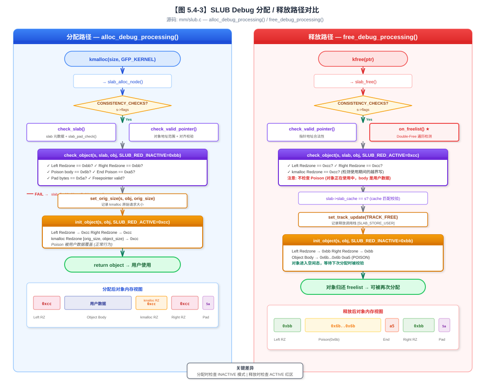

**分配路径完整调用链**：

```
kmalloc(size, GFP_KERNEL)
  → __kmalloc_noprof()
    → slab_alloc_node()
      → alloc_debug_processing(s, slab, object, orig_size)
        ├── alloc_consistency_checks()               [SLAB_CONSISTENCY_CHECKS]
        │   ├── check_slab(s, slab)                  // 验证 slab 页元数据
        │   │   └── slab_pad_check(s, slab)          // 页末 padding (0x5a)
        │   ├── check_valid_pointer(s, slab, object) // 对象地址合法性
        │   └── check_object(s, slab, object, SLUB_RED_INACTIVE)
        │       ├── Left Redzone  == 0xbb ?           // 步骤 1a
        │       ├── Right Redzone == 0xbb ?           // 步骤 1b
        │       ├── Poison body   == 0x6b ?           // 步骤 2a (UAF Write?)
        │       ├── End Poison    == 0xa5 ?           // 步骤 2b
        │       ├── Pad bytes     == 0x5a ?           // 步骤 2c
        │       └── Freepointer valid ?               // 步骤 3
        ├── set_orig_size(s, object, orig_size)       // 记录 kmalloc 原始大小
        └── init_object(s, object, SLUB_RED_ACTIVE)   // 设置使用态标记 (0xcc)
```

**释放路径完整调用链**：

```
kfree(ptr)
  → slab_free()
    → free_debug_processing(s, slab, head, tail, &cnt, addr, handle)
      ├── check_slab(s, slab)                         [SLAB_CONSISTENCY_CHECKS]
      ├── free_consistency_checks()                    [SLAB_CONSISTENCY_CHECKS]
      │   ├── check_valid_pointer(s, slab, object)     // 地址合法性
      │   ├── on_freelist(s, slab, object)             // Double-Free 检测 ★
      │   ├── check_object(s, slab, object, SLUB_RED_ACTIVE)
      │   │   ├── Left Redzone  == 0xcc ?              // 使用期间被左越界？
      │   │   ├── Right Redzone == 0xcc ?              // 使用期间被右越界？
      │   │   └── kmalloc Redzone == 0xcc ?            // 超出请求大小？
      │   └── slab->slab_cache == s ?                  // cache 匹配检查
      ├── set_track_update(s, object, TRACK_FREE, ...)  [SLAB_STORE_USER]
      └── init_object(s, object, SLUB_RED_INACTIVE)    // 重新 Poison (0x6b+0xa5)
```

#### 5.4.4 Freelist 指针加固与 Double-Free 检测

**Freelist 指针加密**（`CONFIG_SLAB_FREELIST_HARDENED`）：

SLUB 的 freelist 是单链表，每个空闲对象内嵌指向下一个空闲对象的指针。攻击者可以通过溢出覆写 freelist 指针实现**任意地址分配**。Freelist Hardening 通过 XOR 加密防御此类攻击：

```c
static inline freeptr_t freelist_ptr_encode(const struct kmem_cache *s,
                                            void *ptr, unsigned long ptr_addr)
{
    unsigned long encoded;
#ifdef CONFIG_SLAB_FREELIST_HARDENED
    // ptr: 下一个空闲对象地址
    // s->random: cache 创建时的随机数
    // ptr_addr: 当前 freepointer 的存储地址 (防止简单交换攻击)
    encoded = (unsigned long)ptr ^ s->random ^ swab(ptr_addr);
#else
    encoded = (unsigned long)ptr;
#endif
    return (freeptr_t){.v = encoded};
}

static inline void *freelist_ptr_decode(const struct kmem_cache *s,
                                        freeptr_t ptr, unsigned long ptr_addr)
{
#ifdef CONFIG_SLAB_FREELIST_HARDENED
    return (void *)(ptr.v ^ s->random ^ swab(ptr_addr));
#else
    return (void *)ptr.v;
#endif
}
```

加密方案的三重保护：
1. **`s->random`**：per-cache 随机值，每次 `kmem_cache_create()` 时生成，攻击者无法预测
2. **`swab(ptr_addr)`**：融入存储地址的字节翻转值，使同一指针在不同位置编码不同
3. **解码后校验**：`check_valid_pointer()` 验证解码后的地址是否落在合法 slab 页内

```c
static inline int check_valid_pointer(struct kmem_cache *s,
                                      struct slab *slab, void *object)
{
    void *base = slab_address(slab);
    object = restore_red_left(s, object);
    // 三重验证: 在页范围内 && 对齐到 s->size 边界
    if (object < base || object >= base + slab->objects * s->size ||
        (object - base) % s->size)
        return 0;
    return 1;
}
```

**Double-Free 检测**（`on_freelist()`）：

释放对象时，`free_consistency_checks()` 调用 `on_freelist()` 遍历 freelist，检查待释放对象是否已在空闲链表中：

```c
static bool on_freelist(struct kmem_cache *s, struct slab *slab, void *search)
{
    int nr = 0;
    void *fp = slab->freelist;

    while (fp && nr <= slab->objects) {
        if (fp == search)
            return true;   // ★ 对象已在 freelist → Double-Free!

        if (!check_valid_pointer(s, slab, fp)) {
            // Freelist 指针被破坏 → 截断链表
            object_err(s, slab, object, "Freechain corrupt");
            set_freepointer(s, object, NULL);
            break;
        }
        object = fp;
        fp = get_freepointer(s, object);
        nr++;
    }

    // 环路检测: 遍历次数超过 slab 对象总数
    if (nr > slab->objects) {
        slab_err(s, slab, "Freelist cycle detected");
        slab->freelist = NULL;
        slab->inuse = slab->objects;
        return false;
    }
    // ... 还会校验对象计数是否一致 ...
}
```

**检测能力总结**：

| 攻击/Bug 类型 | 检测机制 | 检测时机 |
|---------------|---------|---------|
| 缓冲区左溢出 | Left Redzone (0xbb/0xcc) 被破坏 | 下次 alloc 或当前 free |
| 缓冲区右溢出 | Right Redzone / kmalloc Redzone 被破坏 | 下次 alloc 或当前 free |
| UAF Write | Poison (0x6b...0xa5) 被破坏 | 下次 alloc |
| Double-Free | `on_freelist()` 遍历检测 | 当前 free |
| Freelist 劫持 | `check_valid_pointer()` 解码后校验 | 下次 alloc |
| Freelist 环路 | `on_freelist()` 计数超限 | 当前 free |
| Slab 页溢出 | `slab_pad_check()` padding 0x5a 破坏 | alloc/free |

#### 5.4.5 SLAB_STORE_USER — 调用栈追踪

`SLAB_STORE_USER` 在每个对象的 metadata 区域保存**分配和释放时的调用栈**，是定位内存错误 root cause 的关键信息。

**Track 数据结构**（`mm/slub.c`）：

```c
#define TRACK_ADDRS_COUNT 16

struct track {
    unsigned long addr;            // 调用者地址 (函数 + 偏移)
#ifdef CONFIG_STACKDEPOT
    depot_stack_handle_t handle;   // Stack Depot 句柄 (完整调用栈)
#endif
    int cpu;                       // 执行时的 CPU 编号
    int pid;                       // 执行时的进程 PID
    unsigned long when;            // jiffies 时间戳
};

enum track_item { TRACK_ALLOC, TRACK_FREE };
```

每个对象在 metadata 区保存两份 track：`TRACK_ALLOC`（分配栈）和 `TRACK_FREE`（释放栈），位于 `object + get_info_end(s)` 偏移处。

**Track 记录流程**：

```c
// 分配时 — alloc_debug_processing() 路径
static noinline depot_stack_handle_t set_track_prepare(gfp_t gfp_flags)
{
    unsigned long entries[TRACK_ADDRS_COUNT];
    unsigned int nr_entries;
    // 保存当前调用栈到 Stack Depot (去重存储)
    nr_entries = stack_trace_save(entries, ARRAY_SIZE(entries), 3);
    return stack_depot_save(entries, nr_entries, gfp_flags);
}

static void set_track_update(struct kmem_cache *s, void *object,
                             enum track_item alloc, unsigned long addr,
                             depot_stack_handle_t handle)
{
    struct track *p = get_track(s, object, alloc);
    p->handle = handle;     // Stack Depot 句柄
    p->addr = addr;         // 直接调用者地址
    p->cpu = smp_processor_id();
    p->pid = current->pid;
    p->when = jiffies;
}
```

**Track 在错误报告中的输出**（`print_track()`）：

```c
static void print_track(const char *s, struct track *t, unsigned long pr_time)
{
    pr_err("%s in %pS age=%lu cpu=%u pid=%d\n",
           s, (void *)t->addr,
           pr_time - t->when,   // 距离当前的 jiffies 差值
           t->cpu, t->pid);
    // 通过 Stack Depot 句柄打印完整调用栈
    stack_depot_print(t->handle);
}

void print_tracking(struct kmem_cache *s, void *object)
{
    unsigned long pr_time = jiffies;
    print_track("Allocated", get_track(s, object, TRACK_ALLOC), pr_time);
    print_track("Freed", get_track(s, object, TRACK_FREE), pr_time);
}
```

**对象 Metadata 区域内存布局**：

```
object + s->inuse (metadata 起始)
┌───────────────────────────────────────────────────────────────────┐
│  Freepointer (8B)  │  track[ALLOC]  │  track[FREE]  │  orig_size │
│  (如果 outside)     │  (sizeof track)│  (sizeof track)│  (4B)      │
│                    │  addr/cpu/pid  │  addr/cpu/pid  │  kmalloc   │
│                    │  when/handle   │  when/handle   │  请求大小   │
├───────────────────────────────────────────────────────────────────┤
│  KASAN metadata    │         Padding (0x5a)                       │
└───────────────────────────────────────────────────────────────────┘
                                                        → object + s->size
```

#### 5.4.6 错误报告解读

当 SLUB Debug 检测到异常时，`slab_bug()` + `print_trailer()` 输出详细的诊断信息。

**典型 Right Redzone 越界报告**：

```
=============================================================================
BUG kmalloc-64 (Tainted: G    B            ): Right Redzone overwritten
-----------------------------------------------------------------------------

[Right Redzone overwritten] 0xffff0000c1234540-0xffff0000c1234543 @offset=320.
First byte 0x41 instead of 0xcc

Allocated in buggy_driver_probe+0x48/0x120 age=1523 cpu=2 pid=156
 __kmalloc_noprof+0x1a8/0x2e0
 buggy_driver_probe+0x48/0x120
 platform_probe+0x68/0x90

Freed in (null) age=4294967295 cpu=0 pid=0
 (object not yet freed)

Slab 0xfffffc0003048d00 objects=32 used=18 fp=0xffff0000c1234600 flags=0x3fffc0000000a00
Object 0xffff0000c1234500 @offset=256 fp=0xffff0000c1234580

Redzone  ffff0000c12344f0: bb bb bb bb bb bb bb bb bb bb bb bb bb bb bb bb  ................
Object   ffff0000c1234500: 48 65 6c 6c 6f 20 57 6f 72 6c 64 00 6b 6b 6b 6b  Hello World.kkkk
                           ...
Redzone  ffff0000c1234540: 41 41 41 41 cc cc cc cc cc cc cc cc cc cc cc cc  AAAA............
                           ^^^^^^^^^ 被覆写的红区字节
Padding  ffff0000c12345a0: 5a 5a 5a 5a 5a 5a 5a 5a                          ZZZZZZZZ
```

**报告关键字段解读**：

| 字段 | 含义 |
|------|------|
| `BUG kmalloc-64` | 出问题的 slab cache 名称 |
| `Right Redzone overwritten` | Bug 类型（Left/Right Redzone、Poison、End Poison、Padding 等） |
| `@offset=320` | 被破坏的第一个字节在 slab 页内的偏移量 |
| `First byte 0x41 instead of 0xcc` | 期望值 vs 实际值（0xcc = SLUB_RED_ACTIVE，使用态红区） |
| `Allocated in ... age=1523` | 分配调用栈 + 距当前时间的 jiffies 差值 |
| `Freed in (null)` | 尚未释放（如果已释放会显示释放调用栈） |
| `objects=32 used=18` | slab 页中对象总数和已分配数 |
| `Redzone` / `Object` / `Padding` | 各区域的 hexdump（便于肉眼识别异常模式） |

**常见 Bug 类型与含义**：

| 报告消息 | 含义 | 典型原因 |
|---------|------|---------|
| `Left Redzone overwritten` | 对象前方红区被破坏 | 前一个对象尾部溢出或负偏移写入 |
| `Right Redzone overwritten` | 对象后方红区被破坏 | 当前对象缓冲区溢出 |
| `kmalloc Redzone overwritten` | `[orig_size, object_size)` 被破坏 | 写入超出 kmalloc 请求大小 |
| `Poison overwritten` | 对象体 0x6b 模式被破坏 | 释放后写入（UAF Write） |
| `End Poison overwritten` | 对象末尾 0xa5 标记被破坏 | UAF Write 或对象尾部越界 |
| `Object padding overwritten` | Metadata 后 0x5a padding 被破坏 | Metadata 区域溢出 |
| `Padding overwritten` | Slab 页尾部 padding 被破坏 | 最后一个对象溢出超出页边界 |
| `Freepointer corrupt` | Freelist 指针指向非法地址 | 越界写破坏了 freelist 指针 |
| `Object already free` | 对象已在 freelist 中 | Double-Free |
| `Freechain corrupt` | Freelist 链路断裂 | 溢出破坏了链表中间节点 |
| `Freelist cycle detected` | Freelist 出现环路 | 溢出将 freelist 指针指向了链上已有对象 |

#### 5.4.7 实战调试技巧

**1) 启用 SLUB Debug（boot 参数方式，无需重新编译）**：

```bash
# 全部 cache 开启全量调试 (开发/测试环境推荐)
slab_debug=FPZU

# 字母含义:
#   F = SLAB_CONSISTENCY_CHECKS  (freelist 完整性校验)
#   P = SLAB_POISON              (释放后 poison 填充)
#   Z = SLAB_RED_ZONE            (前后红区保护)
#   U = SLAB_STORE_USER          (记录分配/释放调用栈)
#   T = SLAB_TRACE               (每次操作打印 trace)

# 仅对特定 cache 开启 (降低性能影响)
slab_debug=ZU,kmalloc-512
slab_debug=FPZU,dentry;FPZU,inode_cache

# Kconfig (编译时默认开启)
CONFIG_SLUB_DEBUG=y         # 编译 debug 支持 (不开启)
CONFIG_SLUB_DEBUG_ON=y      # boot 默认开启全部 debug
```

**2) 运行时查看 slab 状态**：

```bash
# 列出所有 slab cache 及其 debug 标志
cat /proc/slabinfo | head -3
# name            <active_objs> <num_objs> <objsize> <objperslab> <pagesperslab>

# 通过 sysfs 查看特定 cache 详情
ls /sys/kernel/slab/kmalloc-64/
# alloc_fastpath  free_slowpath  objs_per_slab  order  ...
cat /sys/kernel/slab/kmalloc-64/red_zone     # 1 = 启用
cat /sys/kernel/slab/kmalloc-64/poison       # 1 = 启用
cat /sys/kernel/slab/kmalloc-64/store_user   # 1 = 启用
cat /sys/kernel/slab/kmalloc-64/object_size  # 实际对象大小
cat /sys/kernel/slab/kmalloc-64/slab_size    # 含 debug 元数据的大小
```

**3) slabinfo 工具验证所有 cache**：

```bash
# 编译 slabinfo 工具
gcc -o slabinfo tools/vm/slabinfo.c

# 验证所有 slab cache (触发 check_object 遍历)
slabinfo -v
# 输出异常的 cache → dmesg 中会有详细报告

# 仅显示有 debug 标志的 cache
slabinfo -d
```

**4) debugfs 接口获取对象级详情**：

```bash
# 查看特定 cache 的所有对象追踪信息
cat /sys/kernel/debug/slab/kmalloc-64/alloc_traces
# 格式: <分配次数> <调用栈>
#   156 __kmalloc_noprof+0x1a8/0x2e0 buggy_driver_probe+0x48/0x120

cat /sys/kernel/debug/slab/kmalloc-64/free_traces
# 格式: <释放次数> <调用栈>
```

**5) 定位越界方向与偏移**：

```bash
# 从 dmesg 报告提取关键信息:
# "[Right Redzone overwritten] 0xffff...540-0xffff...543 @offset=320"
# → 右红区被破坏: 对象尾部向后越界了 4 字节
# → First byte 0x41 instead of 0xcc → 写入了 'A' (0x41)

# "[Poison overwritten] 0xffff...508-0xffff...50b @offset=264"
# → UAF Write: 释放后在偏移 +8 处写入了 4 字节

# 结合 Allocated/Freed 调用栈:
# → Allocated in driver_alloc+0x30 → 找到分配点
# → Freed in driver_release+0x20 → 找到释放点
# → 在释放之后仍有代码写入该对象 → UAF bug
```

**6) SLUB Debug 对性能的影响**：

| Debug 标志 | 性能开销 | 内存开销 | 推荐场景 |
|-----------|---------|---------|---------|
| `F` (CONSISTENCY_CHECKS) | 低~中 | 无 | 始终开启 |
| `P` (POISON) | 低 | 无 | 始终开启 |
| `Z` (RED_ZONE) | 低 | 每对象 +16~32B | 开发/测试 |
| `U` (STORE_USER) | 中 | 每对象 +2×track | 需要调用栈时开启 |
| `T` (TRACE) | 高 | 无 | 仅临时调试 |
| 全部 `FPZU` | 中 | 每对象 +64~128B | 开发/CI 环境 |

**7) SLUB Debug vs KASAN vs KFENCE 选择策略**：

| 场景 | 推荐工具 | 理由 |
|------|---------|------|
| 不能重新编译内核 | **SLUB Debug** | 仅需 boot 参数，CONFIG_SLUB_DEBUG=y 通常已内置 |
| 需要 100% 覆盖 + 即时检测 | **KASAN** | 每条 load/store 都检查，无遗漏 |
| 生产环境长期监控 | **KFENCE** | 接近零开销 |
| 需要检测 UAF Read | **KASAN** | SLUB Debug 无法检测读操作 |
| 需要 Double-Free 检测 | **SLUB Debug** | `on_freelist()` 遍历检测 |
| 快速定位特定 cache 问题 | **SLUB Debug** | `slab_debug=FPZU,<cache_name>` 精准锁定 |

### 5.5 mprotect 页保护检测原理深度分析

与 KASAN（Shadow Memory 字节级检测）、KFENCE（Guard Page 采样检测）、SLUB Debug（毒化模式延迟检测）不同，**mprotect 页保护机制**利用 CPU 硬件 MMU 的**页表权限位**直接在写入瞬间触发异常，实现**零 CPU 开销、零内存开销**的即时 MemoryOverwritten 检测。

其核心思想极为简洁：**将受保护内存页的页表权限设为只读（去除 Write 位），任何写入尝试都会被 MMU 硬件拦截并触发 Permission Fault**。

源码路径：`mm/mprotect.c`（用户态系统调用）、`arch/arm64/mm/pageattr.c`（内核态 `set_memory_ro`/`rw`）、`arch/arm64/mm/fault.c`（Page Fault 处理）、`arch/arm64/mm/mmu.c`（`mark_rodata_ro`）

#### 5.5.1 页保护机制核心原理 — 从硬件到系统调用

mprotect 页保护检测 MemoryOverwritten 的核心原理基于 **ARM64 MMU 的页表权限检查**。CPU 每次访问虚拟地址时，MMU 都会检查页表项（PTE）中的权限位。当应用程序或内核代码试图写入一个被标记为"只读"的页面时，硬件直接触发 **Data Abort（Permission Fault）**，无需任何软件插桩或检查代码。

**检测原理公式**：

```
写保护区域: mprotect(addr, size, PROT_READ)  →  PTE.AP[2] = 1 (只读)
合法写入:   mprotect(addr, size, PROT_READ|PROT_WRITE) → 临时解锁 → 写入 → 重新上锁
非法写入:   Store → MMU 检查 PTE → AP[2]=1 → Data Abort → SIGSEGV / Kernel Oops
```

**与其他检测机制的本质区别**：

| 维度 | mprotect 页保护 | KASAN | KFENCE | SLUB Debug |
|------|----------------|-------|--------|------------|
| **检测层** | MMU 硬件 | 编译器插桩 + Shadow | Guard Page | 软件 Poison |
| **检测时机** | 写入瞬间（硬件触发） | 写入瞬间（软件检查） | 越界瞬间（硬件触发） | alloc/free 时（延迟） |
| **CPU 开销** | **零** | 高（每次 load/store） | 极低 | 中 |
| **内存开销** | **零** | 1/8 Shadow | 2MB 池 | 每对象 +N 字节 |
| **检测粒度** | 页（4KB） | 8 字节 | 页（4KB） | 对象边界 |

**【图 5.5-1】mprotect 页保护机制全景 — 从用户态到硬件**

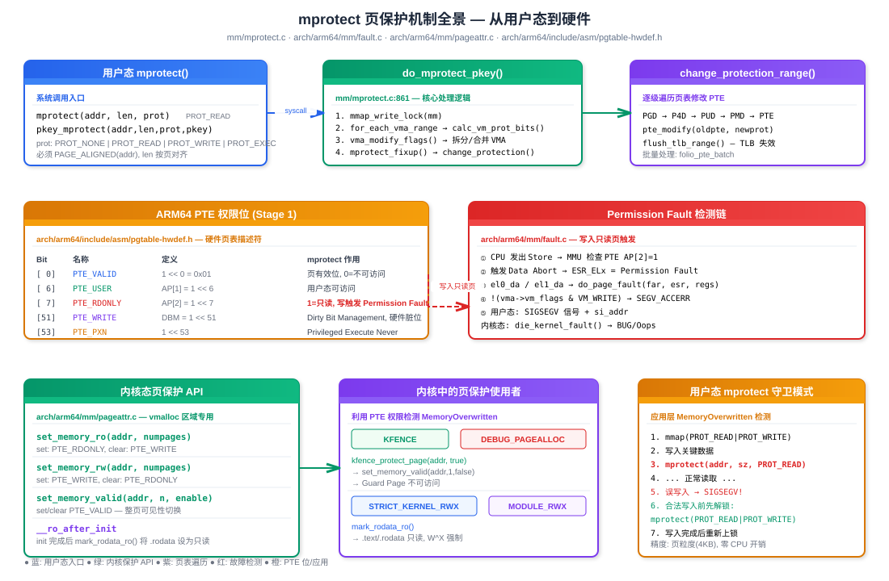

#### 5.5.2 mprotect 系统调用实现路径

**系统调用入口**（`mm/mprotect.c:1008`）：

```c
SYSCALL_DEFINE3(mprotect, unsigned long, start, size_t, len,
                unsigned long, prot)
{
    return do_mprotect_pkey(start, len, prot, -1);
}
```

**核心处理函数** `do_mprotect_pkey()`（`mm/mprotect.c:861`）完成以下关键步骤：

```c
static int do_mprotect_pkey(unsigned long start, size_t len,
                            unsigned long prot, int pkey)
{
    // 1. 参数校验
    if (start & ~PAGE_MASK) return -EINVAL;  // 必须页对齐
    len = PAGE_ALIGN(len);                    // 长度向上对齐到页
    end = start + len;

    // 2. 获取 mmap_write_lock（独占锁，阻止并发 VMA 修改）
    mmap_write_lock_killable(current->mm);

    // 3. 遍历 [start, end) 范围内的所有 VMA
    for_each_vma_range(vmi, vma, end) {
        // 4. 计算新的 vm_flags
        newflags = calc_vm_prot_bits(prot, new_vma_pkey);
        newflags |= (vma->vm_flags & ~mask_off_old_flags);

        // 5. 权限合法性检查：不能越过 MAY 限制
        if ((newflags & ~(newflags >> 4)) & VM_ACCESS_FLAGS)
            return -EACCES;

        // 6. W^X 检查（map_deny_write_exec）
        if (map_deny_write_exec(vma->vm_flags, newflags))
            return -EACCES;

        // 7. 安全模块回调（LSM hook）
        security_file_mprotect(vma, reqprot, prot);

        // 8. 核心：修改 VMA flags + 更新页表
        mprotect_fixup(&vmi, &tlb, vma, &prev, nstart, tmp, newflags);
    }
}
```

**`mprotect_fixup()`**（`mm/mprotect.c:755`）是实际执行修改的函数：

```c
int mprotect_fixup(struct vma_iterator *vmi, struct mmu_gather *tlb,
                   struct vm_area_struct *vma, struct vm_area_struct **pprev,
                   unsigned long start, unsigned long end, vm_flags_t newflags)
{
    // 1. VMA sealed 检查（mseal 锁定后不可修改）
    if (vma_is_sealed(vma)) return -EPERM;

    // 2. VMA 拆分/合并（跨越 VMA 边界时）
    vma = vma_modify_flags(vmi, *pprev, vma, start, end, newflags);

    // 3. 更新 VMA flags 和页保护属性
    vma_start_write(vma);
    vm_flags_reset_once(vma, newflags);
    vma_set_page_prot(vma);   // vm_flags → pgprot 映射

    // 4. 遍历页表，逐 PTE 修改权限位
    change_protection(tlb, vma, start, end, mm_cp_flags);
}
```

**【图 5.5-2】mprotect 系统调用完整执行路径**

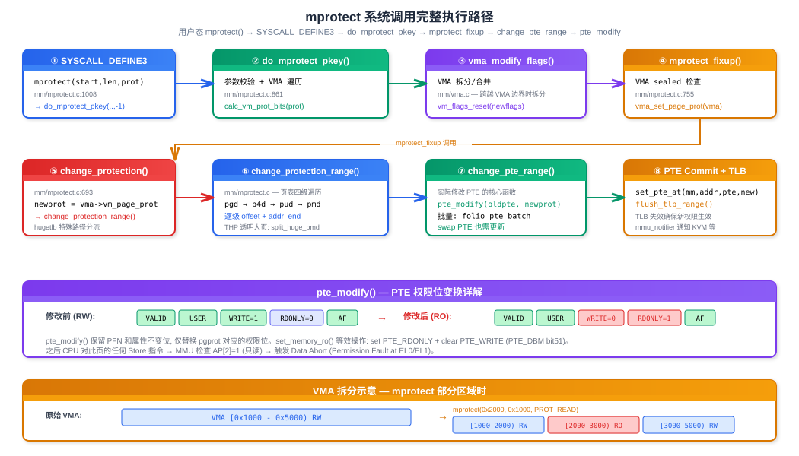

#### 5.5.3 ARM64 PTE 权限位与页表修改

ARM64 Stage 1 页表描述符中与权限相关的关键位（`arch/arm64/include/asm/pgtable-hwdef.h`）：

```c
#define PTE_VALID       (_AT(pteval_t, 1) << 0)   // 页有效位
#define PTE_USER        (_AT(pteval_t, 1) << 6)   // AP[1]: 用户态可访问
#define PTE_RDONLY      (_AT(pteval_t, 1) << 7)   // AP[2]: 只读
#define PTE_AF          (_AT(pteval_t, 1) << 10)  // Access Flag
#define PTE_DBM         (_AT(pteval_t, 1) << 51)  // Dirty Bit Management
#define PTE_PXN         (_AT(pteval_t, 1) << 53)  // Privileged Execute Never
#define PTE_UXN         (_AT(pteval_t, 1) << 54)  // User Execute Never
```

**PTE_WRITE 的定义**（`arch/arm64/include/asm/pgtable-prot.h`）：

```c
#define PTE_WRITE       (PTE_DBM)    // PTE_WRITE = bit[51], 与 DBM 共用
```

ARM64 的写权限由 **AP[2] (bit[7]) 和 DBM (bit[51])** 共同决定：

| AP[2] (PTE_RDONLY) | DBM (PTE_WRITE) | 效果 |
|:---:|:---:|:---|
| 0 | 1 | **可读写** — 正常 RW 页面 |
| 1 | 0 | **只读** — mprotect(PROT_READ) 设置 |
| 1 | 1 | 只读（AP[2]=1 优先级更高） |
| 0 | 0 | 只读（无 DBM，不可写） |

**`change_pte_range()`** 是实际修改每个 PTE 的核心函数（`mm/mprotect.c`）：

```c
static long change_pte_range(struct mmu_gather *tlb,
        struct vm_area_struct *vma, pmd_t *pmd, unsigned long addr,
        unsigned long end, pgprot_t newprot, unsigned long cp_flags)
{
    pte = pte_offset_map_lock(vma->vm_mm, pmd, addr, &ptl);
    flush_tlb_batched_pending(vma->vm_mm);
    arch_enter_lazy_mmu_mode();

    do {
        oldpte = ptep_get(pte);
        if (pte_present(oldpte)) {
            // 关键操作：pte_modify 只替换权限位，保留 PFN
            ptent = pte_modify(oldpte, newprot);
            // 提交修改 + TLB 失效
            modify_prot_commit_ptes(vma, addr, pte, oldpte, ptent, nr_ptes);
            if (pte_needs_flush(oldpte, ptent))
                tlb_flush_pte_range(tlb, addr, nr_ptes * PAGE_SIZE);
        }
    } while (pte += nr_ptes, addr += nr_ptes * PAGE_SIZE, addr != end);

    arch_leave_lazy_mmu_mode();
    pte_unmap_unlock(pte - 1, ptl);
}
```

**页表遍历层次**：`change_protection()` → `change_protection_range()` → `change_p4d_range()` → `change_pud_range()` → `change_pmd_range()` → `change_pte_range()`。四级页表逐级遍历，最终在 PTE 层修改权限位。

#### 5.5.4 Permission Fault 检测流程

当代码试图写入一个 `mprotect(PROT_READ)` 保护的页面时，ARM64 硬件按以下流程检测并处理：

**硬件层**：
1. CPU 执行 `STR` 指令 → MMU 查找 TLB 或 Page Table Walk
2. PTE.AP[2]=1（只读）→ MMU 触发 **Data Abort** 异常
3. `ESR_ELx.EC = 0x24`（EL0 Data Abort）或 `0x25`（EL1 Data Abort）
4. `ESR_ELx.ISS.DFSC` = Permission Fault（level 0-3）
5. `FAR_ELx` = 故障虚拟地址

**软件层**（`arch/arm64/mm/fault.c`）：

```c
// 异常分发表（fault.c:870-873）
static const struct fault_info fault_info[] = {
    // ...
    { do_page_fault, SIGSEGV, SEGV_ACCERR, "level 0 permission fault" },
    { do_page_fault, SIGSEGV, SEGV_ACCERR, "level 1 permission fault" },
    { do_page_fault, SIGSEGV, SEGV_ACCERR, "level 2 permission fault" },
    { do_page_fault, SIGSEGV, SEGV_ACCERR, "level 3 permission fault" },
};
```

```c
static int __kprobes do_page_fault(unsigned long far, unsigned long esr,
                                   struct pt_regs *regs)
{
    // 1. 判断写操作
    if (is_write_abort(esr)) {
        vm_flags = VM_WRITE;
        mm_flags |= FAULT_FLAG_WRITE;
    }

    // 2. 查找 VMA
    vma = lock_vma_under_rcu(mm, addr);

    // 3. 关键检查：VMA 不包含 VM_WRITE → 权限违规！
    if (!(vma->vm_flags & VM_WRITE)) {
        si_code = SEGV_ACCERR;
        goto bad_area;      // → 用户态: SIGSEGV  内核态: Oops
    }

    // 4a. 用户态: arm64_force_sig_fault(SIGSEGV, SEGV_ACCERR, far)
    //     → 进程收到 SIGSEGV，si_addr = 故障地址
    //     → 默认行为: core dump + 进程终止

    // 4b. 内核态: no_context → __do_kernel_fault()
    //     → die_kernel_fault("access to read-only memory", ...)
    //     → BUG/Oops + 完整调用栈
}
```

**【图 5.5-3】ARM64 Permission Fault 检测流程**

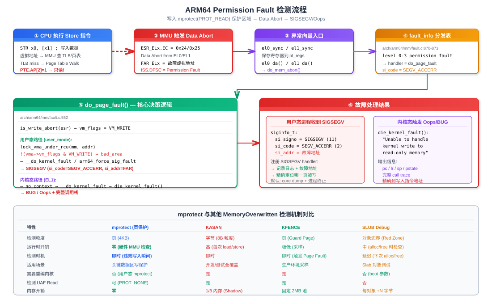

#### 5.5.5 内核态页保护 — set_memory_ro/rw 与 __ro_after_init

内核空间不使用 `mprotect()` 系统调用，而是提供等价的内核 API 直接操作页表权限。

**`set_memory_ro()` / `set_memory_rw()`**（`arch/arm64/mm/pageattr.c:202-214`）：

```c
int set_memory_ro(unsigned long addr, int numpages)
{
    return change_memory_common(addr, numpages,
                                __pgprot(PTE_RDONLY),     // set: AP[2]=1
                                __pgprot(PTE_WRITE));     // clear: DBM=0
}

int set_memory_rw(unsigned long addr, int numpages)
{
    return change_memory_common(addr, numpages,
                                __pgprot(PTE_WRITE),      // set: DBM=1
                                __pgprot(PTE_RDONLY));     // clear: AP[2]=0
}
```

**`change_memory_common()`** 的执行流程：

```c
static int change_memory_common(unsigned long addr, int numpages,
                                pgprot_t set_mask, pgprot_t clear_mask)
{
    // 1. 必须是 vmalloc 区域（不能操作线性映射）
    area = find_vm_area((void *)addr);
    if (!area || (area->flags & VM_ALLOW_HUGE_VMAP))
        return -EINVAL;

    // 2. rodata_full 时同步修改 linear map 映射
    if (rodata_full && (set/clear PTE_RDONLY)) {
        for (i = 0; i < area->nr_pages; i++)
            __change_memory_common(page_address(area->pages[i]),
                                   PAGE_SIZE, set_mask, clear_mask);
    }

    // 3. 清除别名映射
    vm_unmap_aliases();

    // 4. 修改 vmalloc 映射
    return __change_memory_common(start, size, set_mask, clear_mask);
}
```

**`set_memory_valid()`** — 整页可见性切换（`pageattr.c`）：

```c
int set_memory_valid(unsigned long addr, int numpages, int enable)
{
    if (enable)
        return __change_memory_common(addr, PAGE_SIZE * numpages,
                    __pgprot(PTE_VALID), __pgprot(0));     // 使页有效
    else
        return __change_memory_common(addr, PAGE_SIZE * numpages,
                    __pgprot(0), __pgprot(PTE_VALID));     // 使页无效
}
// PTE_VALID=0 → 页不可见，任何访问都触发 Translation Fault（比 Permission Fault 更严格）
```

**`__ro_after_init` 机制**：

```c
// 声明方式（include/linux/init.h）
#define __ro_after_init __section(".data..ro_after_init")

// 使用示例（arch/arm64/mm/mmu.c）
u64 kimage_voffset __ro_after_init;              // 内核镜像偏移
bool rodata_full __ro_after_init = true;          // rodata 保护开关
bool kfence_early_init __ro_after_init = !!CONFIG_KFENCE_SAMPLE_INTERVAL;

// 初始化完成后调用 mark_rodata_ro()（init/main.c:1448）
static void mark_readonly(void)
{
    if (IS_ENABLED(CONFIG_STRICT_KERNEL_RWX) && rodata_enabled) {
        flush_module_init_free_work();
        jump_label_init_ro();
        mark_rodata_ro();       // ← 将 .rodata 和 __ro_after_init section 设为只读
        debug_checkwx();        // ← 扫描并报告任何 W+X 页面
        rodata_test();
    }
}
```

**`mark_rodata_ro()`** ARM64 实现（`arch/arm64/mm/mmu.c:1138`）：

```c
void mark_rodata_ro(void)
{
    unsigned long section_size;
    // .rodata + NOTES + EXCEPTION_TABLE → 只读
    section_size = (unsigned long)__init_begin - (unsigned long)__start_rodata;
    WRITE_ONCE(rodata_is_rw, false);
    update_mapping_prot(__pa_symbol(__start_rodata), (unsigned long)__start_rodata,
                        section_size, PAGE_KERNEL_RO);
    // _text → _stext 区域也设为只读
    update_mapping_prot(__pa_symbol(_text), (unsigned long)_text,
                        (unsigned long)_stext - (unsigned long)_text, PAGE_KERNEL_RO);
}
// PAGE_KERNEL_RO = PROT_NORMAL & ~PTE_WRITE | PTE_RDONLY
```

**【图 5.5-4】内核态页保护机制 — set_memory_ro/rw 与 STRICT_KERNEL_RWX**

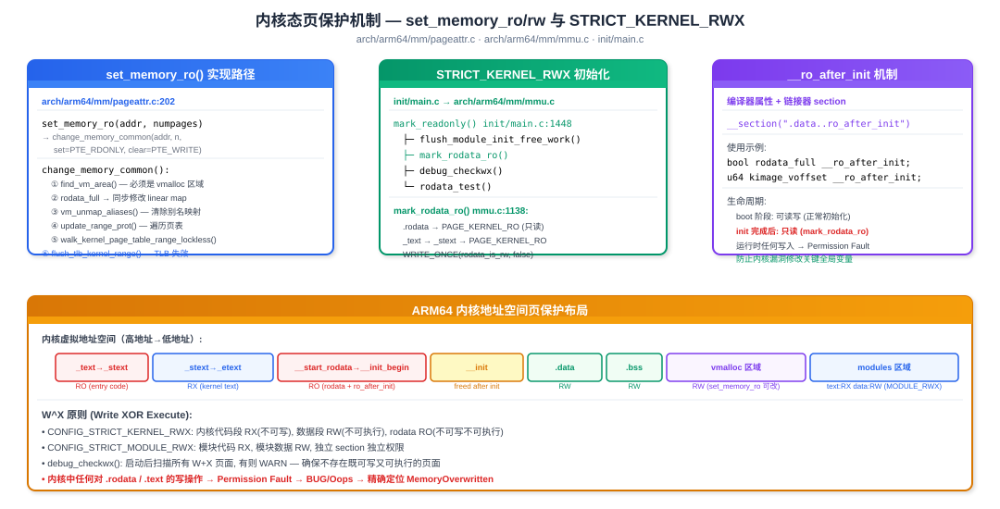

#### 5.5.6 内核中的页保护实践 — DEBUG_PAGEALLOC / KFENCE / STRICT_KERNEL_RWX

内核中已有多个子系统利用页保护机制检测 MemoryOverwritten：

**1) KFENCE — Guard Page 通过 `set_memory_valid()` 实现**

```c
// arch/arm64/include/asm/kfence.h
static inline bool kfence_protect_page(unsigned long addr, bool protect)
{
    set_memory_valid(addr, 1, !protect);   // protect=true → PTE_VALID=0（不可访问）
    return true;
}

// mm/kfence/core.c — 释放时保护对象页
static bool kfence_protect(unsigned long addr)
{
    return !KFENCE_WARN_ON(!kfence_protect_page(ALIGN_DOWN(addr, PAGE_SIZE), true));
}

// 分配时解除保护
static bool kfence_unprotect(unsigned long addr)
{
    return !KFENCE_WARN_ON(!kfence_protect_page(ALIGN_DOWN(addr, PAGE_SIZE), false));
}
```

**2) DEBUG_PAGEALLOC — 释放后页面无效化**

```c
// include/linux/mm.h
static inline void debug_pagealloc_unmap_pages(struct page *page, int numpages)
{
    if (debug_pagealloc_enabled_static())
        __kernel_map_pages(page, numpages, 0);  // enable=0 → 页不可访问
}

// arch/arm64/mm/pageattr.c
void __kernel_map_pages(struct page *page, int numpages, int enable)
{
    if (!can_set_direct_map()) return;
    set_memory_valid((unsigned long)page_address(page), numpages, enable);
}
// 效果：释放后的页面 PTE_VALID=0，任何访问（读/写）→ Translation Fault
```

**3) CONFIG_STRICT_KERNEL_RWX — W^X 强制**

| 保护区域 | 权限 | 保护机制 |
|---------|------|---------|
| `_text` → `_stext` | **RO** | `mark_rodata_ro()` |
| `_stext` → `_etext` | **RX** | 代码段只读可执行 |
| `__start_rodata` → `__init_begin` | **RO** | rodata + `__ro_after_init` |
| `.data` / `.bss` | **RW** | 不可执行（PTE_PXN + PTE_UXN） |
| module text | **RX** | `CONFIG_STRICT_MODULE_RWX` |
| `__init` section | freed | `free_initmem()` 后回收 |

#### 5.5.7 用户态 mprotect 检测 MemoryOverwritten 实战

**场景 1：保护关键配置数据**

```c
#include <sys/mman.h>
#include <signal.h>
#include <stdio.h>
#include <stdlib.h>
#include <string.h>
#include <unistd.h>

/* SIGSEGV handler — 捕获非法写入 */
void segv_handler(int sig, siginfo_t *info, void *ucontext)
{
    fprintf(stderr, "[MPROTECT GUARD] MemoryOverwritten detected!\n"
                    "  Fault address: %p\n"
                    "  si_code: %s\n",
            info->si_addr,
            info->si_code == SEGV_ACCERR ? "SEGV_ACCERR (permission)" :
            info->si_code == SEGV_MAPERR ? "SEGV_MAPERR (unmapped)" : "unknown");
    /* 生成 core dump 以便事后分析 */
    abort();
}

int main(void)
{
    size_t page_size = sysconf(_SC_PAGESIZE);

    /* 1. 分配页对齐内存 */
    void *config = mmap(NULL, page_size, PROT_READ | PROT_WRITE,
                        MAP_PRIVATE | MAP_ANONYMOUS, -1, 0);

    /* 2. 写入关键配置 */
    struct { int magic; char data[64]; } *cfg = config;
    cfg->magic = 0xDEADBEEF;
    strcpy(cfg->data, "critical_config_v1");

    /* 3. 上锁：设为只读 — 此后任何写入触发 SIGSEGV */
    mprotect(config, page_size, PROT_READ);

    /* 4. 注册信号处理器 */
    struct sigaction sa = {
        .sa_sigaction = segv_handler,
        .sa_flags = SA_SIGINFO
    };
    sigaction(SIGSEGV, &sa, NULL);

    /* 5. 正常读取（不会触发异常） */
    printf("magic = 0x%X\n", cfg->magic);   // OK

    /* 6. 模拟 bug：非法写入 → 触发 SIGSEGV */
    cfg->magic = 0xBADC0DE;   // → Permission Fault → SIGSEGV!

    return 0;
}
```

**场景 2：保护共享内存通信缓冲区**

```c
/* 生产者-消费者模型中保护消息缓冲区 */

/* 生产者写入时临时解锁 */
void producer_write(void *buf, size_t page_sz, const void *data, size_t len)
{
    mprotect(buf, page_sz, PROT_READ | PROT_WRITE);  // 解锁
    memcpy(buf, data, len);
    mprotect(buf, page_sz, PROT_READ);                // 重新上锁
}

/* 消费者只读访问（任何误写入被捕获） */
void consumer_read(const void *buf, void *out, size_t len)
{
    memcpy(out, buf, len);   // 只读访问，安全
}
```

**场景 3：PROT_NONE 检测 Use-After-Free**

```c
/* 释放后将内存设为完全不可访问 */
void safe_free(void *ptr, size_t size)
{
    /* 不 munmap，而是设为 PROT_NONE — 保留 VMA 但不可访问 */
    mprotect(ptr, size, PROT_NONE);
    /* 之后任何读/写都触发 SIGSEGV (SEGV_ACCERR) */
}
```

#### 5.5.8 实战调试技巧

**1) 用户态 mprotect 保护的调试流程**：

```bash
# 编译时带调试信息
gcc -g -O0 -o test_mprotect test_mprotect.c

# 运行，触发 SIGSEGV 后生成 core dump
ulimit -c unlimited
./test_mprotect
# → [MPROTECT GUARD] MemoryOverwritten detected!
#   Fault address: 0x7f8a12345000
#   si_code: SEGV_ACCERR (permission)

# GDB 分析 core dump
gdb ./test_mprotect core
(gdb) bt           # 查看完整调用栈 — 精确到哪一行写入了保护区域
(gdb) info signals  # 确认 SIGSEGV
(gdb) p $pc        # 查看触发异常的指令地址
```

**2) 内核态 Permission Fault 的 dmesg 输出**：

```
Unable to handle kernel write to read-only memory at virtual address ffff800012345000
Mem abort info:
  ESR = 0x9600004f
  EC = 0x25: DABT (current EL), IL = 32 bits
  SET = 0, FnV = 0
  EA = 0, S1PTW = 0
  FSC = 0x0f: level 3 permission fault        ← Permission Fault!
Data abort info:
  ISV = 0, ISS = 0x0000004f, ISS2 = 0x00000000
  CM = 0, WnR = 1                              ← WnR=1: 写操作
swapper pance: 0 comm: buggy_driver pid: 123
pc : buggy_driver_write+0x48/0x120 [buggy_module]   ← 精确到写入函数+偏移
lr : buggy_driver_ioctl+0x80/0x200 [buggy_module]
Call trace:
  buggy_driver_write+0x48/0x120 [buggy_module]
  buggy_driver_ioctl+0x80/0x200 [buggy_module]
  __arm64_sys_ioctl+0xb4/0x100
  ...
```

**3) 使用 GDB 调试 mprotect 相关问题**：

```bash
# 设置 SIGSEGV 时不自动退出
(gdb) handle SIGSEGV stop nopass

# 在 mprotect 系统调用处设置断点
(gdb) catch syscall mprotect

# 查看进程的 VMA 映射和权限
(gdb) info proc mappings

# 查看特定地址的页表权限（需要内核调试支持）
# /proc/<pid>/smaps 中查看 VmFlags
cat /proc/<pid>/smaps | grep -A 20 "7f8a12345"
# → VmFlags: rd mr mw me   (rd=readable, 无 wr=not writable)
```

**4) 性能考量与最佳实践**：

| 操作 | 开销 | 说明 |
|------|------|------|
| `mprotect()` 系统调用 | 微秒级 | 需要 mmap_write_lock + 页表遍历 + TLB flush |
| 受保护页面读取 | **零开销** | MMU 硬件检查，无软件介入 |
| 受保护页面写入 | Permission Fault | 异常处理 + 信号递送 |
| 频繁 lock/unlock | 较高 | 每次切换都要系统调用 + TLB flush |

**最佳实践**：
- 适合保护**低频写入、高频读取**的数据（配置表、全局状态、安全元数据）
- 不适合频繁读写的热数据路径（每次 mprotect 都有系统调用开销）
- 粒度为页（4KB），保护区域应按页对齐分配（`mmap` 或 `posix_memalign`）
- 结合 `SIGSEGV` handler 记录故障地址和调用栈，便于事后分析
- 内核态推荐使用 `__ro_after_init` 保护初始化后不再修改的全局变量

**5) mprotect vs 其他方案选择策略**：

| 场景 | 推荐方案 | 理由 |
|------|---------|------|
| 保护用户态关键配置数据 | **mprotect** | 零开销，精确到写入瞬间 |
| 检测 slab 对象越界 | **KASAN** | 字节粒度，mprotect 只能到页粒度 |
| 生产环境 UAF 监控 | **KFENCE** | 内核态自动采样，无需应用修改 |
| 内核只读数据保护 | **__ro_after_init** | 编译期标注，零运行时开销 |
| 快速定位写破坏源头 | **mprotect + SIGSEGV** | 硬件触发，调用栈精确 |
| 不能重编内核的环境 | **mprotect（用户态）** | 纯用户态方案，无需内核支持 |

---

### 5.6 MemoryOverwritten 软件架构

Linux 内核对 MemoryOverwritten 的防御并非依赖单一机制，而是构建了一个**从编译期到硬件层的多层纵深防御体系**。每一层在不同阶段、以不同粒度、不同开销检测和阻止内存越界/Use-After-Free/未初始化等问题。理解这个架构是选择正确检测工具组合的基础。

> **源码路径**：
> - 编译期防御：`security/Kconfig.hardening`、`include/linux/fortify-string.h`、`mm/usercopy.c`
> - 分配器防御：`mm/slub.c`、`mm/page_alloc.c`、`mm/page_poison.c`
> - 访问检查层：`mm/kasan/`、`mm/kfence/core.c`、`mm/mprotect.c`
> - 硬件辅助层：`arch/arm64/Kconfig`、`arch/arm64/mm/pageattr.c`、`arch/arm64/include/asm/mte-kasan.h`

#### 5.6.1 架构总览 — 多层防御体系

MemoryOverwritten 防御体系分为四层，从上到下依次是：

```
┌─────────────────────────────────────────────────────────────────┐
│  Layer 1: 编译期防御层 (Compile-Time)                            │
│  ┌──────────────┐ ┌──────────────┐ ┌───────────────┐ ┌────────┐│
│  │FORTIFY_SOURCE│ │STACKPROTECTOR│ │INIT_STACK_ZERO│ │USERCOPY││
│  └──────────────┘ └──────────────┘ └───────────────┘ └────────┘│
├─────────────────────────────────────────────────────────────────┤
│  Layer 2: 运行时分配器防御层 (Allocator-Level)                    │
│  ┌──────────────────┐ ┌──────────────────┐ ┌─────────────────┐ │
│  │SLUB Debug Redzone│ │INIT_ON_ALLOC/FREE│ │  PAGE_POISONING │ │
│  └──────────────────┘ └──────────────────┘ └─────────────────┘ │
├─────────────────────────────────────────────────────────────────┤
│  Layer 3: 运行时访问检查层 (Runtime Access Checking)              │
│  ┌──────┐ ┌──────┐ ┌────────────┐ ┌───────────────┐           │
│  │KASAN │ │KFENCE│ │mprotect/页保│ │DEBUG_PAGEALLOC│           │
│  └──────┘ └──────┘ └────────────┘ └───────────────┘           │
├─────────────────────────────────────────────────────────────────┤
│  Layer 4: 硬件辅助层 (Hardware-Assisted)                         │
│  ┌───┐ ┌───┐ ┌──────────────────┐ ┌───────┐                   │
│  │MTE│ │PAN│ │STRICT_KERNEL_RWX │ │BTI+PAC│                   │
│  └───┘ └───┘ └──────────────────┘ └───────┘                   │
└─────────────────────────────────────────────────────────────────┘
```

**核心设计理念**：

| 层次 | 检测时机 | 检测粒度 | 性能开销 | 适用场景 |
|------|---------|---------|---------|---------|
| 编译期防御 | 编译时 / 函数入口出口 | 对象级 | 零 ~ 极低 | 所有环境 |
| 分配器防御 | `kmalloc`/`kfree` 时 | 对象级 | 低 ~ 中等 | 开发 / 调试 |
| 访问检查层 | 每次 `load`/`store` | 字节级 ~ 页级 | 中等 ~ 高 | 开发 / 采样 |
| 硬件辅助层 | 硬件自动 | 16B ~ 页级 | 接近零 | 所有环境 |

**【图 5.6-1】Linux MemoryOverwritten 多层防御体系架构**

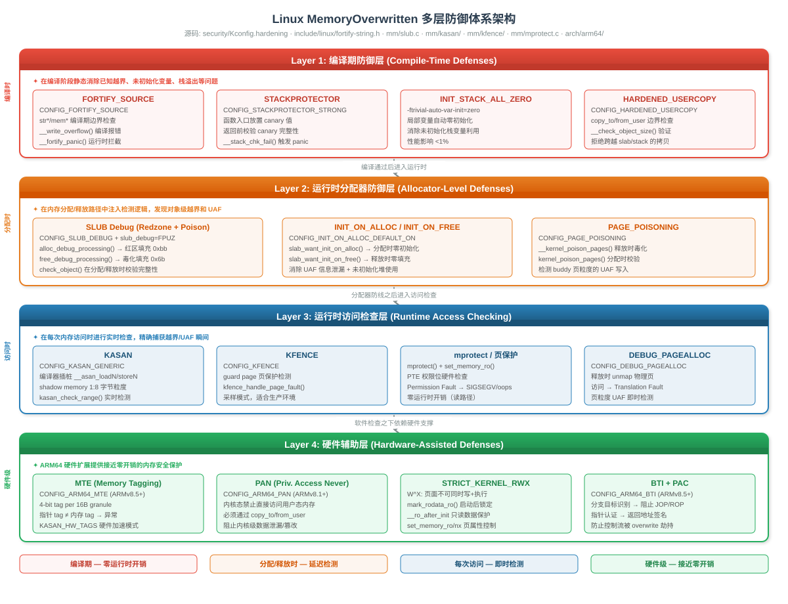

#### 5.6.2 编译期防御层

编译期防御层在**代码编译阶段**静态消除已知越界、未初始化变量和栈溢出问题，运行时开销极低或为零。

##### 5.6.2.1 FORTIFY_SOURCE — str/mem 函数边界检查

`FORTIFY_SOURCE` 通过编译器内建函数 `__builtin_object_size()` 在编译期确定缓冲区大小，对 `memcpy`、`strcpy`、`memset` 等函数进行边界检查。

> **源码**：`security/Kconfig.hardening:216`、`include/linux/fortify-string.h`

```c
// include/linux/fortify-string.h — 核心宏定义
#define __FORTIFY_INLINE extern __always_inline __gnu_inline __overloadable

// 编译期可确定的越界 → 直接报错，编译失败
void __write_overflow(void) __compiletime_error(
    "detected write beyond size of object (1st parameter)");
void __read_overflow(void)  __compiletime_error(
    "detected read beyond size of object (1st parameter)");

// 编译期无法确定 → 运行时检查并 panic
void __fortify_panic(const u8 reason, const size_t avail,
                     const size_t size) __cold __noreturn;

// 覆盖的函数族（编译器自动替换为检查版本）
// strncpy, strnlen, strlen, strscpy, strlcat, strcat, strncat,
// memset, memcpy, memmove, memscan, memcmp, memchr, kmemdup, strcpy
```

**工作流程**：

```
源码中的 memcpy(dst, src, len)
        │
        ▼ GCC/Clang __builtin_object_size(dst)
  ┌─────┴─────────┐
  │编译期可确定大小│
  └─────┬─────────┘
        │
  ┌─────┴──────┐          ┌──────────────┐
  │ len > size │── Yes ──>│ __write_overflow() │ → 编译失败
  └─────┬──────┘          └──────────────┘
        │ No / 运行时
        ▼
  fortify_panic() ← 运行时检测到越界 → BUG()/panic
```

**CONFIG 配置**：

```bash
CONFIG_FORTIFY_SOURCE=y          # security/Kconfig.hardening
CONFIG_ARCH_HAS_FORTIFY_SOURCE=y # 架构支持（arm64 默认选中）
```

##### 5.6.2.2 STACKPROTECTOR — 栈溢出检测

栈保护器在函数入口将随机 **canary 值**放置在返回地址前，函数返回时校验。栈缓冲区溢出会覆盖 canary，触发检测。

> **源码**：`arch/Kconfig:700`

```c
// arch/Kconfig — 配置说明
config STACKPROTECTOR
    bool "Stack Protector buffer overflow detection"
    default y
    // 函数入口: canary 值 → [局部变量][canary][保存的 FP][返回地址]
    // 函数出口: 校验 canary，不匹配则调用 __stack_chk_fail()

config STACKPROTECTOR_STRONG
    bool "Strong Stack Protector"
    default y
    // 对以下函数添加保护:
    // - 局部变量地址被用作赋值右值或函数参数
    // - 包含数组或 union（含字符数组）的局部变量
    // - 使用 alloca() 的函数
```

**ARM64 栈帧布局**：

```
高地址  ┌──────────────────┐
        │   返回地址 (LR)   │ ← 攻击目标
        ├──────────────────┤
        │   保存的 FP (X29) │
        ├──────────────────┤
        │   Stack Canary    │ ← __stack_chk_guard (随机值)
        ├──────────────────┤
        │   局部变量 buf[]  │ ← 溢出方向 ↑
低地址  └──────────────────┘

溢出 buf[] → 覆盖 canary → 函数返回时 __stack_chk_fail() → panic
```

##### 5.6.2.3 INIT_STACK_ALL_ZERO — 栈变量零初始化

通过编译器标志 `-ftrivial-auto-var-init=zero` 强制所有栈局部变量在函数入口时零初始化，消除未初始化栈变量泄漏和利用。

> **源码**：`security/Kconfig.hardening:66`、`Makefile:926`

```makefile
# Makefile:926 — 编译器标志
ifdef CONFIG_INIT_STACK_ALL_ZERO
KBUILD_CFLAGS   += -ftrivial-auto-var-init=zero
endif
```

```c
// security/Kconfig.hardening — 三种选择
config INIT_STACK_NONE        // 不初始化（最弱）
config INIT_STACK_ALL_PATTERN // 0xAA/0xFF 模式初始化（易暴露 bug）
config INIT_STACK_ALL_ZERO    // 零初始化（最强且最安全）
    // 字符串立即 NUL 终止，指针 = NULL，索引 = 0，大小 = 0
    // 性能影响 < 1%，推荐生产环境使用
```

##### 5.6.2.4 HARDENED_USERCOPY — 用户态拷贝边界检查

在 `copy_to_user()`/`copy_from_user()` 路径上检查源/目的缓冲区是否合法，拒绝跨越 slab 对象边界、非栈/非堆区域的拷贝。

> **源码**：`mm/usercopy.c:215`、`security/Kconfig.hardening:225`

```c
// mm/usercopy.c — 核心检查函数
void __check_object_size(const void *ptr, unsigned long n, bool to_user)
{
    if (!n) return;

    check_bogus_address((const unsigned long)ptr, n, to_user);  // 无效地址
    switch (check_stack_object(ptr, n)) {                       // 栈范围检查
        case GOOD_FRAME: case GOOD_STACK: return;
        default: usercopy_abort("process stack", ...);
    }
    check_heap_object(ptr, n, to_user);                         // 堆对象检查
    check_kernel_text_object((const unsigned long)ptr, n, ...); // 内核 text 保护
}

// check_heap_object 会调用:
// → folio_slab(folio) → __check_heap_object()
//   验证 copy 范围不超过 slab 对象边界
```

**编译期防御层总结**：

| 机制 | CONFIG | 检测目标 | 运行时开销 | 推荐 |
|------|--------|---------|-----------|------|
| FORTIFY_SOURCE | `CONFIG_FORTIFY_SOURCE` | str/mem 越界 | 极低 | **生产必选** |
| STACKPROTECTOR | `CONFIG_STACKPROTECTOR_STRONG` | 栈溢出 | 极低 (~0.1%) | **生产必选** |
| INIT_STACK_ALL_ZERO | `CONFIG_INIT_STACK_ALL_ZERO` | 未初始化栈变量 | <1% | **生产推荐** |
| HARDENED_USERCOPY | `CONFIG_HARDENED_USERCOPY` | 用户态拷贝越界 | 极低 | **生产推荐** |

#### 5.6.3 运行时分配器防御层

在内存分配器的 `kmalloc`/`kfree` 路径中注入检测逻辑，通过**红区 (redzone)**、**毒化 (poison)**、**零初始化**等手段在分配和释放时校验对象完整性。

##### 5.6.3.1 SLUB Debug — 红区与毒化检测

SLUB Debug 在对象前后添加红区（redzone），释放后用特征值毒化对象内容，在下次分配/释放时校验这些标记是否被篡改。

> **源码**：`mm/slub.c:1453`（`check_object`）、`mm/slub.c:1722`（`alloc_debug_processing`）

```c
// mm/slub.c — check_object() 校验流程
static int check_object(struct kmem_cache *s, struct slab *slab,
                        void *object, u8 val)
{
    u8 *p = object;
    u8 *endobject = object + s->object_size;

    if (s->flags & SLAB_RED_ZONE) {
        // 1. 检查左红区（对象前方）
        check_bytes_and_report(s, slab, object, "Left Redzone",
            object - s->red_left_pad, val, s->red_left_pad, ret);

        // 2. 检查右红区（对象后方）
        check_bytes_and_report(s, slab, object, "Right Redzone",
            endobject, val, s->inuse - s->object_size, ret);

        // 3. kmalloc 红区（orig_size 到 object_size 之间）
        if (slub_debug_orig_size(s) && val == SLUB_RED_ACTIVE) {
            orig_size = get_orig_size(s, object);
            check_bytes_and_report(s, slab, object, "kmalloc Redzone",
                p + orig_size, val, s->object_size - orig_size, ret);
        }
    }

    if (s->flags & SLAB_POISON) {
        // 4. 检查毒化值 — 释放后对象应全部为 POISON_FREE (0x6b)
        check_bytes_and_report(s, slab, p, "Poison",
            p + kasan_meta_size, POISON_FREE,
            s->object_size - kasan_meta_size - 1, ret);
        // 5. 尾部标记 — POISON_END (0xa5)
        check_bytes_and_report(s, slab, p, "End Poison",
            p + s->object_size - 1, POISON_END, 1, ret);
    }
}
```

**关键参数**：

```bash
# 内核命令行启用方式
slub_debug=FPUZ               # 全局: Free check + Poison + User tracking + Red Zone
slub_debug=FZ,kmalloc-128     # 仅对 kmalloc-128 cache 启用 Free check + Red Zone
```

##### 5.6.3.2 INIT_ON_ALLOC / INIT_ON_FREE — 分配器级零初始化

在 slab 分配时（alloc）或释放时（free）自动将对象内存清零，消除未初始化堆使用和 UAF 信息泄漏。

> **源码**：`mm/slub.c:5279`、`mm/slub.c:2565`

```c
// mm/slub.c — 分配路径
init = slab_want_init_on_alloc(gfpflags, s);
// → 如果 CONFIG_INIT_ON_ALLOC_DEFAULT_ON=y 或 init_on_alloc=1
//   则 memset(object, 0, object_size) 在返回给调用者之前

// mm/slub.c — 释放路径
init = slab_want_init_on_free(s);
// → 如果 CONFIG_INIT_ON_FREE_DEFAULT_ON=y 或 init_on_free=1
//   则 memset(object, 0, object_size) 在对象回收前

// mm/page_alloc.c — 页分配器路径
bool init = want_init_on_free();              // free 时零填充整页
bool init = want_init_on_alloc(gfp_flags);    // alloc 时零填充整页
```

**对比 SLUB_DEBUG vs INIT_ON_ALLOC/FREE**：

| 特性 | SLUB_DEBUG | INIT_ON_ALLOC/FREE |
|------|-----------|-------------------|
| 检测方式 | 特征值校验 | 零填充（无校验） |
| 检测 OOB | ✓ 红区检测 | ✗ 不检测 |
| 消除 UAF 利用 | ✓ 毒化值 | ✓ 零初始化 |
| 消除信息泄漏 | ✗ | ✓ 零初始化 |
| 性能开销 | 中等（校验逻辑） | 低（仅 memset） |
| 适用场景 | 开发调试 | 生产环境可接受 |

##### 5.6.3.3 PAGE_POISONING — 页级毒化检测

在 buddy 分配器层面，释放页面时填充毒化值，分配时校验，检测整页粒度的 UAF 写入。

> **源码**：`mm/page_poison.c:33`

```c
// mm/page_poison.c — 页毒化
void __kernel_poison_pages(struct page *page, int n)
{
    // 释放时: 将整页填充 PAGE_POISON (0xaa)
    // 分配时: 校验整页是否仍为 0xaa，被修改则报告 UAF
}
```

#### 5.6.4 运行时访问检查层

访问检查层在**每次内存读写**时进行实时检查，能精确捕获越界和 UAF 发生的瞬间。这是最强力但也最昂贵的防御层。

##### 5.6.4.1 KASAN — 字节级影子内存检测

KASAN 通过编译器插桩，在每次 `load`/`store` 前查询 **shadow memory** 判断访问是否合法。三种模式覆盖不同场景。

> **源码**：`mm/kasan/generic.c:197`、`lib/Kconfig.kasan`

```c
// mm/kasan/generic.c — 核心检查路径
bool kasan_check_range(const void *addr, size_t size, bool write,
                       unsigned long ret_ip)
{
    // 查询 shadow memory: 每 8 字节对应 1 字节 shadow
    // shadow == 0: 8 字节全部可访问
    // shadow == N (1-7): 前 N 字节可访问
    // shadow < 0: 完全不可访问（freed/redzone/etc.）
    // 不匹配 → kasan_report() → 打印详细报告
}

// 编译器自动插桩生成的检查函数
void __asan_loadN(void *addr)  { kasan_check_range(addr, N, false, _RET_IP_); }
void __asan_storeN(void *addr) { kasan_check_range(addr, N, true, _RET_IP_);  }
```

**三种 KASAN 模式**：

| 模式 | CONFIG | 实现方式 | 粒度 | 内存开销 | CPU 开销 | 适用场景 |
|------|--------|---------|------|---------|---------|---------|
| Generic | `KASAN_GENERIC` | 编译器插桩 + shadow | 1 字节 | +87% | +50~100% | 开发/CI |
| SW Tags | `KASAN_SW_TAGS` | 软件标签 + shadow | 16 字节 | +12.5% | +30~50% | ARM64 开发 |
| HW Tags | `KASAN_HW_TAGS` | MTE 硬件标签 | 16 字节 | +3% | <5% | 生产(MTE) |

##### 5.6.4.2 KFENCE — 采样式页保护检测

KFENCE 利用 **guard page** 机制，以采样方式将少量 slab 对象放置在独立页面中，用页保护检测 OOB 和 UAF。

> **源码**：`mm/kfence/core.c:1068`（`__kfence_alloc`）、`mm/kfence/core.c:1193`（`kfence_handle_page_fault`）

```c
// KFENCE 内存布局:
// [guard page][object page][guard page][object page][guard page]...
//  PROT_NONE   可读写      PROT_NONE   可读写      PROT_NONE

// 越界访问 guard page → Permission Fault → kfence_handle_page_fault()
// 释放后: object page 设为 PROT_NONE
// UAF 访问 → Permission Fault → kfence_handle_page_fault()
```

##### 5.6.4.3 mprotect / 页保护

利用 MMU 页表权限位（PTE）在硬件级别保护内存页面，非法访问立即触发 Permission Fault。详见 5.5 节。

##### 5.6.4.4 DEBUG_PAGEALLOC

释放时将物理页面 **unmap**（清除页表映射），任何对已释放页面的访问立即触发 Translation Fault。

#### 5.6.5 硬件辅助层

ARM64 架构提供多种硬件扩展，在接近零开销的情况下提供内存安全保护。

##### 5.6.5.1 MTE — Memory Tagging Extension

ARMv8.5 引入的 MTE 为每 16 字节内存分配一个 4-bit 标签，指针的高 4 位携带对应标签。每次内存访问时硬件自动比较指针标签与内存标签，不匹配则触发异常。

> **源码**：`arch/arm64/Kconfig:2096`、`arch/arm64/include/asm/mte-kasan.h:151`

```c
// arch/arm64/include/asm/mte-kasan.h — MTE 标签操作
static inline void mte_set_mem_tag_range(void *addr, size_t size,
                                         u8 tag, bool init)
{
    // STG/STZG 指令: 为 [addr, addr+size) 设置标签
    // 分配时: 设置新标签 → 返回带标签的指针
    // 释放时: 更换标签 → 旧指针标签不匹配 → UAF 检测
}

// KASAN_HW_TAGS 模式利用 MTE:
// - kmalloc() → 着色标签 → 返回 tagged pointer
// - kfree()   → 更换标签 → 旧指针立即失效
// - 越界      → 跨入邻居对象的不同标签 → 硬件异常
```

**MTE 的优势**：

| 特性 | MTE | KASAN Generic | KFENCE |
|------|-----|--------------|--------|
| 检测粒度 | 16 字节 | 1 字节 | 页级 |
| CPU 开销 | <5% | +50~100% | <1% |
| 内存开销 | +3% (tag) | +87% (shadow) | 固定池 |
| 覆盖率 | 全量 | 全量 | 采样 |
| 硬件要求 | ARMv8.5+ | 无 | 无 |

##### 5.6.5.2 PAN — Privileged Access Never

PAN（ARMv8.1）禁止内核态直接访问用户态内存，强制所有用户态数据拷贝通过 `copy_to_user`/`copy_from_user`，与 `HARDENED_USERCOPY` 配合形成双重防线。

> **源码**：`arch/arm64/Kconfig:1861`

```c
config ARM64_PAN
    bool "Enable support for Privileged Access Never (PAN)"
    // ARMv8.1 Extensions
    // 内核直接解引用用户态指针 → Permission Fault
    // 必须通过 uaccess 原语 (copy_to_user 等) 访问
```

##### 5.6.5.3 STRICT_KERNEL_RWX — W^X 保护

确保内核内存页面不会同时具有写权限和执行权限（W^X），启动后通过 `mark_rodata_ro()` 将 `.rodata` 段设为只读。

> **源码**：`arch/arm64/mm/mmu.c:1138`（`mark_rodata_ro`）、`arch/arm64/mm/pageattr.c`

```c
// arch/arm64/mm/pageattr.c — 页属性修改
int set_memory_ro(unsigned long addr, int numpages);  // 设置只读
int set_memory_rw(unsigned long addr, int numpages);  // 恢复读写
int set_memory_nx(unsigned long addr, int numpages);  // 设置不可执行

// __ro_after_init: 变量在 init 阶段可写，启动后变为只读
// static int critical_config __ro_after_init = 0;
// → mark_rodata_ro() 后写入触发 Permission Fault
```

##### 5.6.5.4 BTI + PAC — 控制流完整性

- **BTI (Branch Target Identification, ARMv8.5)**：在合法的间接跳转目标处放置 `BTI` 指令，非法跳转触发异常，阻止 JOP/ROP 攻击
- **PAC (Pointer Authentication, ARMv8.3)**：对返回地址等关键指针进行加密签名，返回时验签，防止返回地址被覆写劫持

> **源码**：`arch/arm64/Kconfig:2033`（BTI）

```c
config ARM64_BTI
    bool "Branch Target Identification support"
    // 间接分支必须跳转到带 BTI 指令的位置
    // 否则触发 Branch Target Exception
    // 配合 PAC: 即使攻击者覆写了函数指针，也无法控制执行流

config ARM64_BTI_KERNEL
    depends on ARM64_BTI
    // 内核代码也启用 BTI 保护
```

**硬件辅助层总结**：

| 机制 | 最低架构 | 防御目标 | 性能开销 | 配置 |
|------|---------|---------|---------|------|
| MTE | ARMv8.5 | OOB/UAF（16B 粒度） | <5% | `CONFIG_ARM64_MTE` |
| PAN | ARMv8.1 | 内核/用户态隔离 | ~0% | `CONFIG_ARM64_PAN` |
| W^X | 全版本 | 代码注入/数据篡改 | ~0% | `CONFIG_STRICT_KERNEL_RWX` |
| BTI | ARMv8.5 | JOP/COP 攻击 | <1% | `CONFIG_ARM64_BTI_KERNEL` |
| PAC | ARMv8.3 | ROP/返回地址篡改 | <1% | 自动启用 |

#### 5.6.6 各层协同与组合策略

不同阶段应选择不同的防御组合。核心原则是：**编译期防御始终开启，运行时检测按环境调整**。

**【图 5.6-2】MemoryOverwritten 各层协同与组合策略**

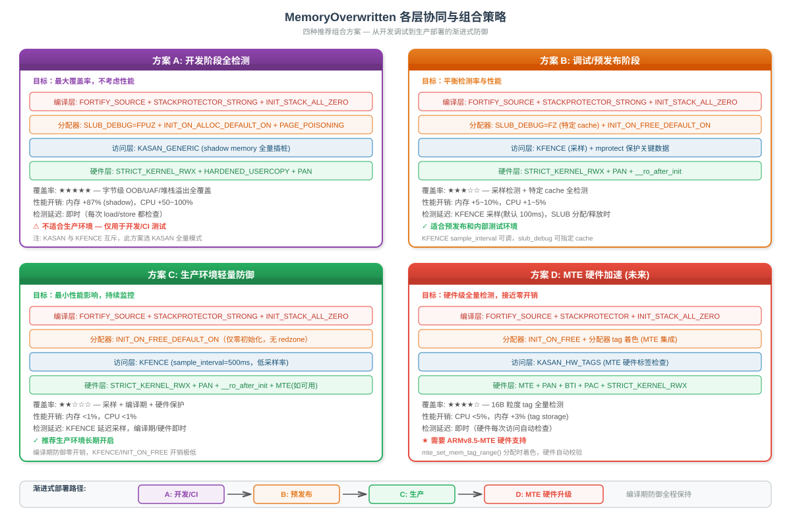

##### 方案 A — 开发/CI 全检测

```bash
# .config 关键配置
CONFIG_FORTIFY_SOURCE=y
CONFIG_STACKPROTECTOR_STRONG=y
CONFIG_INIT_STACK_ALL_ZERO=y
CONFIG_HARDENED_USERCOPY=y

CONFIG_SLUB_DEBUG=y              # 内核命令行: slub_debug=FPUZ
CONFIG_INIT_ON_ALLOC_DEFAULT_ON=y
CONFIG_PAGE_POISONING=y

CONFIG_KASAN=y
CONFIG_KASAN_GENERIC=y           # 全量 shadow memory 插桩
CONFIG_KASAN_INLINE=y            # 内联检查（更快但更大）

CONFIG_STRICT_KERNEL_RWX=y
CONFIG_ARM64_PAN=y
```

- **覆盖率**：最高 — 字节级 OOB/UAF/未初始化/栈溢出全覆盖
- **性能影响**：内存 +87%，CPU +50~100%
- **适用**：CI 自动化测试、syzbot/fuzz 测试

##### 方案 B — 调试/预发布阶段

```bash
CONFIG_FORTIFY_SOURCE=y
CONFIG_STACKPROTECTOR_STRONG=y
CONFIG_INIT_STACK_ALL_ZERO=y
CONFIG_HARDENED_USERCOPY=y

CONFIG_SLUB_DEBUG=y              # 命令行: slub_debug=FZ,kmalloc-64,kmalloc-128
CONFIG_INIT_ON_FREE_DEFAULT_ON=y

CONFIG_KFENCE=y                  # 采样模式
CONFIG_KFENCE_SAMPLE_INTERVAL=100  # 每 100ms 采样一个分配

CONFIG_STRICT_KERNEL_RWX=y
CONFIG_ARM64_PAN=y
```

- **覆盖率**：中等 — KFENCE 采样 + 特定 cache 全检测
- **性能影响**：内存 +5~10%，CPU +1~5%
- **适用**：预发布测试、长时间压力测试

##### 方案 C — 生产环境

```bash
CONFIG_FORTIFY_SOURCE=y
CONFIG_STACKPROTECTOR_STRONG=y
CONFIG_INIT_STACK_ALL_ZERO=y
CONFIG_HARDENED_USERCOPY=y

CONFIG_INIT_ON_FREE_DEFAULT_ON=y # 释放时零填充，消除 UAF 数据泄漏

CONFIG_KFENCE=y
CONFIG_KFENCE_SAMPLE_INTERVAL=500  # 低采样率，最小开销

CONFIG_STRICT_KERNEL_RWX=y
CONFIG_ARM64_PAN=y
```

- **覆盖率**：基础 — 编译期全保护 + KFENCE 低频采样
- **性能影响**：CPU <1%，内存 <1%
- **适用**：所有生产环境长期开启

##### 方案 D — MTE 硬件加速（需 ARMv8.5+ 硬件）

```bash
CONFIG_FORTIFY_SOURCE=y
CONFIG_STACKPROTECTOR_STRONG=y
CONFIG_INIT_STACK_ALL_ZERO=y
CONFIG_HARDENED_USERCOPY=y

CONFIG_INIT_ON_FREE_DEFAULT_ON=y
CONFIG_ARM64_MTE=y

CONFIG_KASAN=y
CONFIG_KASAN_HW_TAGS=y           # MTE 硬件标签模式 KASAN

CONFIG_STRICT_KERNEL_RWX=y
CONFIG_ARM64_PAN=y
CONFIG_ARM64_BTI_KERNEL=y
```

- **覆盖率**：高 — 16B 粒度硬件全量检测
- **性能影响**：CPU <5%，内存 +3%
- **适用**：ARMv8.5+ 硬件平台，可长期开启

##### 组合约束与互斥关系

```
┌──────────────────────────────────────────────────────────────┐
│                   互斥与依赖关系                              │
├──────────────────────────────────────────────────────────────┤
│                                                              │
│  KASAN_GENERIC ─── 互斥 ──── KASAN_SW_TAGS                  │
│       │                            │                         │
│       └──── 互斥 ──── KASAN_HW_TAGS                         │
│                            │                                 │
│                     依赖 ARM64_MTE                           │
│                                                              │
│  KASAN ──── 互斥 ──── KMSAN (Memory Sanitizer)              │
│                                                              │
│  KFENCE ─── 可共存 ── KASAN (互补: 采样 + 全量)              │
│  KFENCE ─── 可共存 ── SLUB_DEBUG (不同维度检测)              │
│                                                              │
│  SLUB_DEBUG ── 依赖 ─── KASAN_GENERIC (自动 select)         │
│  SLUB_DEBUG ── 依赖 ─── KASAN_SW_TAGS (自动 select)         │
│                                                              │
│  INIT_ON_ALLOC ── 与 SLAB_POISON 冲突时 POISON 优先         │
│  PAGE_POISONING ── 需要 DEBUG_PAGEALLOC 协同                 │
│                                                              │
│  编译层 (FORTIFY/STACKPROTECTOR/INIT_STACK) 无互斥，全开     │
└──────────────────────────────────────────────────────────────┘
```

**各方案检测能力对比矩阵**：

| 检测目标 | 方案 A (开发) | 方案 B (调试) | 方案 C (生产) | 方案 D (MTE) |
|---------|:----:|:----:|:----:|:----:|
| 堆 OOB (slab) | ★★★★★ | ★★★☆☆ | ★☆☆☆☆ | ★★★★☆ |
| 堆 UAF | ★★★★★ | ★★★☆☆ | ★★☆☆☆ | ★★★★☆ |
| 栈溢出 | ★★★★★ | ★★★★★ | ★★★★★ | ★★★★★ |
| 栈未初始化 | ★★★★★ | ★★★★★ | ★★★★★ | ★★★★★ |
| 堆未初始化 | ★★★★☆ | ★★★☆☆ | ★★★☆☆ | ★★★☆☆ |
| str/mem 越界 | ★★★★★ | ★★★★★ | ★★★★★ | ★★★★★ |
| 用户态拷贝越界 | ★★★★★ | ★★★★★ | ★★★★★ | ★★★★★ |
| 内核数据篡改 | ★★★★☆ | ★★★★☆ | ★★★★☆ | ★★★★★ |
| 控制流劫持 | ★★★☆☆ | ★★★☆☆ | ★★★☆☆ | ★★★★★ |
| **性能开销** | **极高** | **中等** | **极低** | **低** |

---

### 5.7 关键数据结构

本节汇总 MemoryOverwritten 三大检测机制（KASAN / KFENCE / SLUB Debug）的核心数据结构。理解这些结构的字段含义与关联关系，是分析内核错误报告、解读 shadow memory 和编写调试脚本的基础。

#### 5.7.1 KASAN 数据结构

KASAN 的数据结构围绕**追踪信息、对象元数据、错误报告、隔离队列**四个维度展开。Generic 模式使用 per-object 元数据 + quarantine 队列；SW_TAGS/HW_TAGS 模式使用全局环形栈缓冲替代。

**【图 5.7-1】KASAN 关键数据结构关系图**

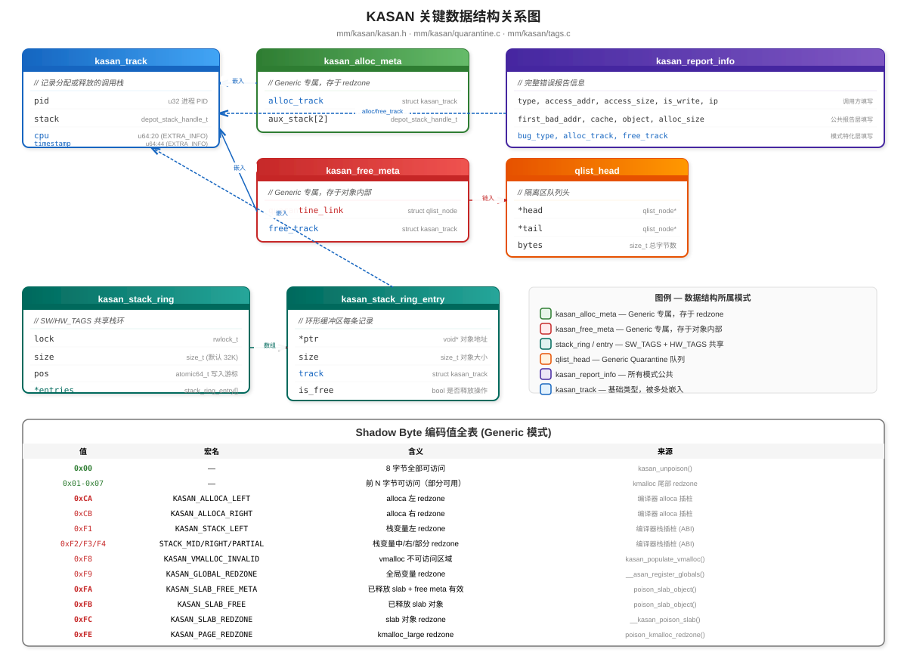

##### kasan_track — 调用栈追踪单元

每次分配或释放操作都会创建一份 `kasan_track`，记录操作时的进程上下文和调用栈。

```c
/* mm/kasan/kasan.h */
struct kasan_track {
    u32                    pid;        /* 操作时的进程 PID */
    depot_stack_handle_t   stack;      /* stackdepot 压缩栈句柄 */
#ifdef CONFIG_KASAN_EXTRA_INFO
    u64 cpu:20;                        /* 操作时的 CPU 编号 (0~1048575) */
    u64 timestamp:44;                  /* 纳秒级时间戳 (约 200 天回绕) */
#endif
};
```

- `stack` 通过 `stack_depot_save()` 压缩存储，多个相同调用栈共享同一 handle，节省内存
- `CONFIG_KASAN_EXTRA_INFO` 额外记录 CPU 和时间戳，便于多核并发场景定位

##### kasan_alloc_meta — 分配元数据 (Generic 模式)

```c
/* mm/kasan/kasan.h — 仅 CONFIG_KASAN_GENERIC */
struct kasan_alloc_meta {
    struct kasan_track       alloc_track;   /* 分配时的调用栈 */
    depot_stack_handle_t     aux_stack[2];  /* 辅助栈: rcu_read_lock 等上下文 */
};
```

- 存储位置：对象 **redzone 区域**（由 `kasan_cache.alloc_meta_offset` 定位）
- 生命周期：对象被分配时创建，释放或重新分配时失效
- `aux_stack[2]` 记录如 `rcu_read_lock` / `call_rcu` 等间接操作的栈，帮助定位 RCU 相关 UAF

##### kasan_free_meta — 释放元数据 (Generic 模式)

```c
/* mm/kasan/kasan.h — 仅 CONFIG_KASAN_GENERIC */
struct kasan_free_meta {
    struct qlist_node   quarantine_link;   /* 隔离队列单链表节点 */
    struct kasan_track  free_track;        /* 释放时的调用栈 */
};
```

- 存储位置：对象**内部数据区**或 **redzone**（由 `kasan_cache.free_meta_offset` 定位）
- 仅对进入 quarantine 的对象保持有效
- shadow byte 为 `KASAN_SLAB_FREE_META (0xFA)` 时表示该 meta 有效

##### kasan_report_info — 错误报告上下文

```c
/* mm/kasan/kasan.h */
struct kasan_report_info {
    /* 第一阶段: kasan_report_*() 填充 */
    enum kasan_report_type type;          /* ACCESS / INVALID_FREE / DOUBLE_FREE */
    const void            *access_addr;   /* 非法访问地址 */
    size_t                 access_size;   /* 访问字节数 */
    bool                   is_write;      /* 读/写方向 */
    unsigned long          ip;            /* 返回地址 (调用者) */

    /* 第二阶段: 通用报告代码填充 */
    const void            *first_bad_addr; /* 首个越界 shadow byte 对应地址 */
    struct kmem_cache     *cache;          /* 对象所属 slab 缓存 */
    void                  *object;         /* 对象起始地址 */
    size_t                 alloc_size;     /* 实际请求的分配大小 */

    /* 第三阶段: 模式特定代码填充 */
    const char            *bug_type;       /* "slab-out-of-bounds" 等 */
    struct kasan_track     alloc_track;    /* 分配栈 (拷贝) */
    struct kasan_track     free_track;     /* 释放栈 (拷贝) */
};
```

- 三阶段填充设计：通用检测逻辑 → 通用报告逻辑 → 模式特定逻辑，各层解耦

##### kasan_global — 全局变量元数据 (编译器 ABI)

```c
/* mm/kasan/kasan.h — 编译器自动生成，不可修改布局 */
struct kasan_global {
    const void                  *beg;               /* 全局变量起始地址 */
    size_t                       size;              /* 变量实际大小 */
    size_t                       size_with_redzone; /* 含 redzone (32B 对齐) */
    const void                  *name;              /* 变量名字符串 */
    const void                  *module_name;       /* 所属模块名 */
    unsigned long                has_dynamic_init;  /* C++ 动态初始化标记 */
    struct kasan_source_location *location;         /* 源文件位置 (ABI v4+) */
    char                        *odr_indicator;     /* ODR 检测指示器 (ABI v5+) */
};
```

- 由编译器在每个编译单元的 `.init` 段注册，内核启动时调用 `__asan_register_globals()` 对 redzone 做 shadow 染色

##### Quarantine 隔离队列 (Generic 模式)

Quarantine 延迟释放已 free 的对象，使 UAF 在更长时间窗口内被捕获。

```c
/* mm/kasan/quarantine.c */
struct qlist_node {
    struct qlist_node *next;            /* 单链表下一节点 */
};

struct qlist_head {
    struct qlist_node *head;            /* 队首 */
    struct qlist_node *tail;            /* 队尾 */
    size_t             bytes;           /* 队列中所有对象总字节数 */
    bool               offline;         /* CPU 离线标记 */
};
```

隔离架构采用**两级队列**：

```
Per-CPU: cpu_quarantine (qlist_head)     ← kfree() 时加入
  │ 满 1MB (QUARANTINE_PERCPU_SIZE)
  ▼
Global:  global_quarantine[BATCHES]      ← 环形 FIFO，quarantine_lock 保护
  │ 超过 quarantine_max_size (物理内存 / 32)
  ▼
Per-CPU: shrink_qlist (cpu_shrink_qlist) ← qlist_free_all() 真正归还 slab
```

- `QUARANTINE_BATCHES = max(1024, 4 × NR_CPUS)` — 全局队列批次数
- `quarantine_max_size = totalram / QUARANTINE_FRACTION (32)` — 内存上限

##### kasan_stack_ring — 环形栈缓冲 (SW_TAGS / HW_TAGS 模式)

Tag-based 模式不使用 quarantine，改用全局环形缓冲记录最近的分配/释放操作。

```c
/* mm/kasan/kasan.h — CONFIG_KASAN_SW_TAGS || CONFIG_KASAN_HW_TAGS */
struct kasan_stack_ring_entry {
    void              *ptr;      /* 对象地址 */
    size_t             size;     /* 对象大小 */
    struct kasan_track track;    /* 分配或释放的调用栈 */
    bool               is_free;  /* true=释放操作, false=分配操作 */
};

struct kasan_stack_ring {
    rwlock_t           lock;     /* 读写锁 */
    size_t             size;     /* 环容量 (条目数) */
    atomic64_t         pos;      /* 原子写指针 (取模定位) */
    struct kasan_stack_ring_entry *entries; /* 环形数组 */
};
```

- 无锁写入：`pos` 用 `atomic64_inc_return()` 递增，`% size` 定位槽位
- 报告时遍历整个环查找匹配地址的最近条目

##### kasan_cache — SLUB 集成桥梁

```c
/* include/linux/kasan.h — CONFIG_KASAN_GENERIC */
struct kasan_cache {
    int alloc_meta_offset;  /* kasan_alloc_meta 在对象中的偏移 */
    int free_meta_offset;   /* kasan_free_meta 在对象中的偏移 */
};
```

- 嵌入 `kmem_cache.kasan_info` 字段
- `kasan_cache_create()` 在 slab 缓存创建时计算偏移
- `free_meta_offset = KASAN_NO_FREE_META (INT_MAX)` 表示不存储 free meta

##### Shadow 字节编码表 (Generic 模式)

| Shadow 值 | 宏名 | 含义 |
|-----------|------|------|
| `0x00` | — | 整个 granule (8B) 可访问 |
| `0x01~0x07` | — | granule 前 N 字节可访问 |
| `0xF8` | `KASAN_VMALLOC_INVALID` | vmalloc 不可访问区域 |
| `0xF9` | `KASAN_GLOBAL_REDZONE` | 全局变量 redzone |
| `0xFA` | `KASAN_SLAB_FREE_META` | 已释放对象 (含 free meta) |
| `0xFB` | `KASAN_SLAB_FREE` | 已释放 slab 对象 |
| `0xFC` | `KASAN_SLAB_REDZONE` | slab 对象 redzone |
| `0xFE` | `KASAN_PAGE_REDZONE` | kmalloc_large 的 redzone |
| `0xFF` | `KASAN_PAGE_FREE` | 已释放的页 |
| `0xF1` | `KASAN_STACK_LEFT` | 栈左侧 redzone |
| `0xF2` | `KASAN_STACK_MID` | 栈中间 redzone |
| `0xF3` | `KASAN_STACK_RIGHT` | 栈右侧 redzone |
| `0xF4` | `KASAN_STACK_PARTIAL` | 栈部分可访问 |
| `0xCA` | `KASAN_ALLOCA_LEFT` | alloca 左侧 redzone |
| `0xCB` | `KASAN_ALLOCA_RIGHT` | alloca 右侧 redzone |

#### 5.7.2 KFENCE 数据结构

KFENCE 的数据结构以 `kfence_metadata` 为核心，每个受保护对象一份元数据，搭配全局池布局和状态机管理。

**【图 5.7-2】KFENCE 关键数据结构关系图**

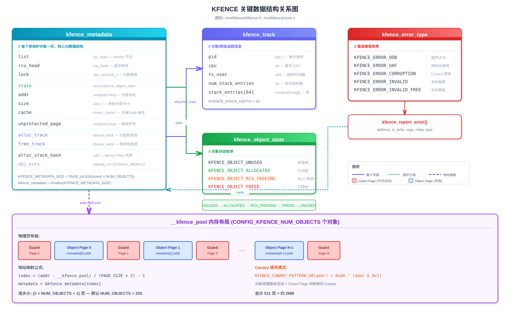

##### kfence_metadata — 受保护对象元数据

```c
/* mm/kfence/kfence.h */
struct kfence_metadata {
    struct list_head    list;              /* freelist 链表节点 */
    struct rcu_head     rcu_head;          /* RCU 延迟释放 */
    raw_spinlock_t      lock;              /* 元数据自旋锁 */

    enum kfence_object_state state;        /* 对象当前状态 */
    unsigned long       addr;              /* 对象在 pool 中的地址 */
    size_t              size;              /* 原始分配大小 */
    struct kmem_cache  *cache;             /* 所属 slab 缓存 (可能已销毁=NULL) */
    unsigned long       unprotected_page;  /* 非法访问时被解保护的页地址 */

    struct kfence_track alloc_track;       /* 分配栈追踪 */
    struct kfence_track free_track;        /* 释放栈追踪 */
    u32                 alloc_stack_hash;  /* Bloom Filter 覆盖率哈希 */
#ifdef CONFIG_MEMCG
    struct slabobj_ext  obj_exts;          /* memcg 扩展信息 */
#endif
};
```

- 全局数组 `kfence_metadata[NUM_OBJECTS]` 通过 vmalloc 分配
- `addr_to_metadata()` 通过地址映射公式 `(addr - pool) / (PAGE_SIZE × 2) - 1` 定位
- `lock` 保护并发场景下 alloc / free / page_fault 的元数据一致性

##### kfence_track — 追踪信息

```c
/* mm/kfence/kfence.h */
struct kfence_track {
    pid_t          pid;                       /* 操作进程 PID */
    int            cpu;                       /* 操作 CPU */
    u64            ts_nsec;                   /* 纳秒时间戳 */
    int            num_stack_entries;          /* 有效栈帧数 */
    unsigned long  stack_entries[KFENCE_STACK_DEPTH]; /* 栈帧数组 (64 层) */
};
```

- 不使用 stackdepot，直接存储完整栈帧数组
- `KFENCE_STACK_DEPTH = 64` — 最多记录 64 层调用栈
- 与 KASAN 的 `kasan_track` 设计不同：KFENCE 对象数量少（默认 255），完整存储可接受

##### kfence_object_state — 状态枚举

```c
/* mm/kfence/kfence.h */
enum kfence_object_state {
    KFENCE_OBJECT_UNUSED,        /* 初始/回收后 — 在 freelist */
    KFENCE_OBJECT_ALLOCATED,     /* 已分配 — 正在使用 */
    KFENCE_OBJECT_RCU_FREEING,   /* 通过 kfree_rcu() 释放中 */
    KFENCE_OBJECT_FREED,         /* 已释放 — 等待重新分配 */
};
```

状态转换路径：

```
UNUSED ──alloc──→ ALLOCATED ──free──→ FREED ──alloc──→ ALLOCATED
                      │                                    ↑
                      └──kfree_rcu──→ RCU_FREEING ──rcu_cb─┘
```

- `metadata_update_state()` 负责状态迁移，内含 `WARN_ON` 校验非法转换

##### kfence_error_type — 错误类型枚举

```c
/* mm/kfence/kfence.h */
enum kfence_error_type {
    KFENCE_ERROR_OOB,          /* 越界访问 — Guard Page 触发 Page Fault */
    KFENCE_ERROR_UAF,          /* 释放后使用 — 未映射页触发 Page Fault */
    KFENCE_ERROR_CORRUPTION,   /* 内存腐蚀 — Canary 校验失败 (释放时检测) */
    KFENCE_ERROR_INVALID,      /* 未知类型非法访问 */
    KFENCE_ERROR_INVALID_FREE, /* 无效释放 (double-free 等) */
};
```

##### __kfence_pool — 全局内存池布局

```c
/* mm/kfence/core.c */
char *__kfence_pool __read_mostly;                      /* 池起始地址 */
struct kfence_metadata *kfence_metadata __read_mostly;  /* 元数据数组 */
static struct kfence_metadata *kfence_metadata_init __read_mostly;
static LIST_HEAD(kfence_freelist);                      /* 空闲元数据链表 */
static DEFINE_RAW_SPINLOCK(kfence_freelist_lock);       /* freelist 锁 */
```

池物理布局（`2 × NUM_OBJECTS + 1` 页）：

```
┌──────────┬──────────────┬──────────┬──────────────┬──────────┬───┬──────────┐
│ Guard[0] │ Object[0]    │ Guard[1] │ Object[1]    │ Guard[2] │...│ Guard[N] │
│ PROT_NONE│ 4KB          │ PROT_NONE│ 4KB          │ PROT_NONE│   │ PROT_NONE│
└──────────┴──────────────┴──────────┴──────────────┴──────────┴───┴──────────┘
```

- Guard Page 通过 `kfence_protect_page()` 设为不可访问（`arm64: set_pte_at(pte_clear)`)
- 对象小于 PAGE_SIZE 时，随机靠左或靠右放置，剩余空间填 Canary
- Canary 模式 `0xAA ^ (addr & 0x7)` — 基于地址变化，提高腐蚀检测概率

#### 5.7.3 SLUB Debug 数据结构

SLUB Debug 的数据结构围绕 `kmem_cache` 的调试字段、`struct slab` 页描述符和 `struct track` 追踪信息展开，通过对象内存布局中的 Red Zone / Poison / Track 实现检测。

**【图 5.7-3】SLUB Debug 关键数据结构关系图**

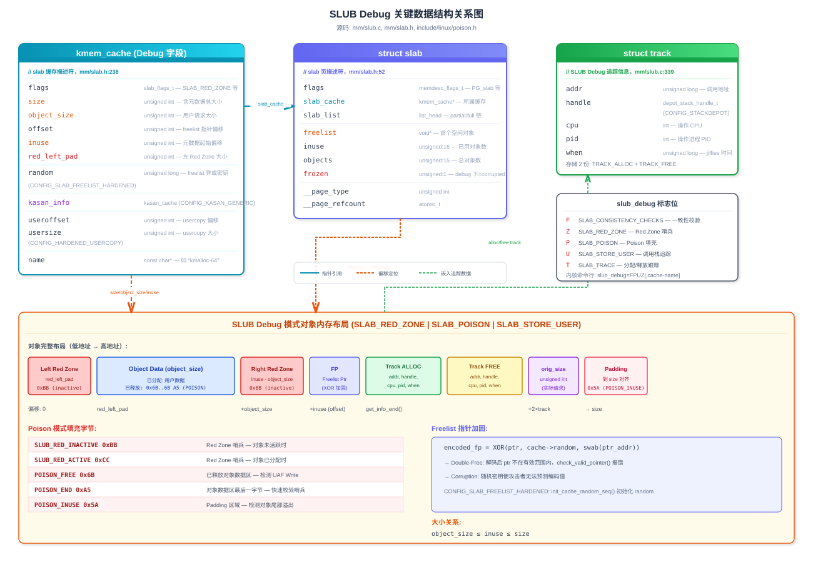

##### kmem_cache — Debug 相关字段

```c
/* mm/slab.h:238 — 仅列出 Debug 相关字段 */
struct kmem_cache {
    slab_flags_t    flags;          /* SLAB_RED_ZONE | SLAB_POISON | SLAB_STORE_USER 等 */
    unsigned int    size;           /* 含所有元数据的对象总大小 */
    unsigned int    object_size;    /* 用户请求的对象净大小 */
    unsigned int    offset;         /* freelist 指针在对象中的偏移 */
    unsigned int    inuse;          /* 元数据起始偏移 (object_size ≤ inuse ≤ size) */
    unsigned int    red_left_pad;   /* 左 Red Zone 大小 (字节) */
    const char     *name;           /* 缓存名称，如 "kmalloc-64" */
#ifdef CONFIG_SLAB_FREELIST_HARDENED
    unsigned long   random;         /* freelist 指针 XOR 加固密钥 */
#endif
#ifdef CONFIG_KASAN_GENERIC
    struct kasan_cache kasan_info;  /* KASAN alloc/free meta 偏移 */
#endif
#ifdef CONFIG_HARDENED_USERCOPY
    unsigned int    useroffset;     /* usercopy 允许区域偏移 */
    unsigned int    usersize;       /* usercopy 允许区域大小 */
#endif
};
```

**大小关系**：`object_size ≤ inuse ≤ size`

- `object_size`：用户请求的净大小
- `inuse`：对象数据 + 右 Red Zone 的结尾，freelist 指针存于此偏移
- `size`：含 left redzone + 数据 + right redzone + FP + track × 2 + orig_size + padding

##### struct slab — 页描述符

```c
/* mm/slab.h:52 */
struct slab {
    memdesc_flags_t  flags;         /* PG_slab 页标记 */
    struct kmem_cache *slab_cache;  /* 所属缓存 (反向指针) */
    struct list_head  slab_list;    /* partial / full 链表节点 */
    void             *freelist;     /* 首个空闲对象 (FP 链起点) */
    unsigned          inuse:16;     /* 已分配对象计数 */
    unsigned          objects:15;   /* 本页总对象数 */
    unsigned          frozen:1;     /* debug 模式下=corrupted 标记 */
    /* ... */
};
```

- `freelist` 指向首个空闲对象，每个空闲对象内嵌 FP 指向下一个
- debug 模式下 `frozen` 位复用为 corrupted 标记，标识 slab 已被检测到损坏

##### struct track — 分配/释放追踪

```c
/* mm/slub.c:339 */
struct track {
    unsigned long          addr;    /* 调用者地址 (返回地址) */
#ifdef CONFIG_STACKDEPOT
    depot_stack_handle_t   handle;  /* stackdepot 压缩栈句柄 */
#endif
    int                    cpu;     /* 操作 CPU */
    int                    pid;     /* 操作进程 PID */
    unsigned long          when;    /* 操作时间 (jiffies) */
};
```

- 每个对象存储 **2 份 track**：`TRACK_ALLOC` + `TRACK_FREE`
- 位置：`get_info_end(s)` 偏移处（紧跟 freelist 指针之后）
- `get_track(s, object, TRACK_ALLOC/FREE)` 获取指定 track

##### 对象内存布局 (Debug 模式)

启用 `slub_debug=FPUZ` 时，单个对象的完整内存布局：

```
低地址                                                              高地址
┌────────────┬───────────────┬────────────┬────┬───────────┬───────────┬─────────┬─────────┐
│ Left       │ Object Data   │ Right      │ FP │ Track     │ Track     │ orig    │ Padding │
│ Red Zone   │ (object_size) │ Red Zone   │    │ ALLOC     │ FREE      │ _size   │         │
│ 0xBB       │ 0x6B(freed)   │ 0xBB       │XOR │ addr,pid  │ addr,pid  │ uint    │ 0x5A    │
│            │ user(alloc'd) │            │    │ cpu,when  │ cpu,when  │         │         │
└────────────┴───────────────┴────────────┴────┴───────────┴───────────┴─────────┴─────────┘
│← red_left_pad →│← object_size →│←inuse-obj→│    │← 2×sizeof(track) →│          │← size →│
```

##### Poison 模式填充字节

| 字节值 | 宏名 | 填充区域 | 检测目的 |
|--------|------|---------|---------|
| `0xBB` | `SLUB_RED_INACTIVE` | Left/Right Red Zone (未活跃) | 检测左/右越界写 |
| `0xCC` | `SLUB_RED_ACTIVE` | Left/Right Red Zone (已分配) | 检测分配期间越界 |
| `0x6B` | `POISON_FREE` | 已释放对象数据区 | 检测 UAF Write |
| `0xA5` | `POISON_END` | 对象数据区最后 1 字节 | 快速校验哨兵 |
| `0x5A` | `POISON_INUSE` | 对象尾部 Padding | 检测尾部溢出 |

##### Freelist 指针加固 (CONFIG_SLAB_FREELIST_HARDENED)

```c
/* mm/slub.c — freelist 编码/解码 */
encoded_fp = ptr ^ cache->random ^ swab(ptr_addr)
```

- `cache->random`：缓存创建时 `get_random_long()` 生成的密钥
- `swab(ptr_addr)`：指针地址字节翻转，增加混淆
- Double-Free 检测：解码后指针不在合法范围 → `check_valid_pointer()` 报 `BUG_TYPE "double free"`
- 攻击防御：不知道 random 密钥的攻击者无法伪造合法的 freelist 指针

##### 三大机制数据结构对比

| 维度 | KASAN (Generic) | KFENCE | SLUB Debug |
|------|-----------------|--------|------------|
| **追踪结构** | `kasan_track` (stackdepot 压缩) | `kfence_track` (完整栈帧数组) | `struct track` (stackdepot 压缩) |
| **元数据位置** | 对象 redzone 内 | 独立 vmalloc 数组 | 对象尾部内嵌 |
| **缓存集成** | `kasan_cache` 嵌入 `kmem_cache` | 无 (独立池) | `kmem_cache.flags` 控制 |
| **释放后保护** | Quarantine 延迟回收 | Guard Page 不可访问 | Poison 填充 0x6B |
| **状态管理** | Shadow byte 编码 | `kfence_object_state` 枚举 | `slab.frozen` 复用标记 |
| **对象数量** | 全部 slab 对象 | 默认 255 个 | 全部 slab 对象 |
| **内存开销** | +87% (shadow memory) | ~2MB (固定池) | +10~20% (metadata) |
| **时间记录** | `timestamp` (可选) | `ts_nsec` (纳秒) | `when` (jiffies) |

### 5.8 内核配置与调优参数

MemoryOverwritten 检测机制的效果取决于**正确的内核配置和调优参数**。配置分为三个阶段：

1. **编译期**（Kconfig）— 决定功能是否编入内核，无法运行时更改
2. **启动期**（Boot cmdline）— 覆盖编译期默认值，需重启生效
3. **运行时**（sysfs / debugfs）— 动态调整参数，无需重启

**【图 5.8-1】MemoryOverwritten 配置选择决策图**

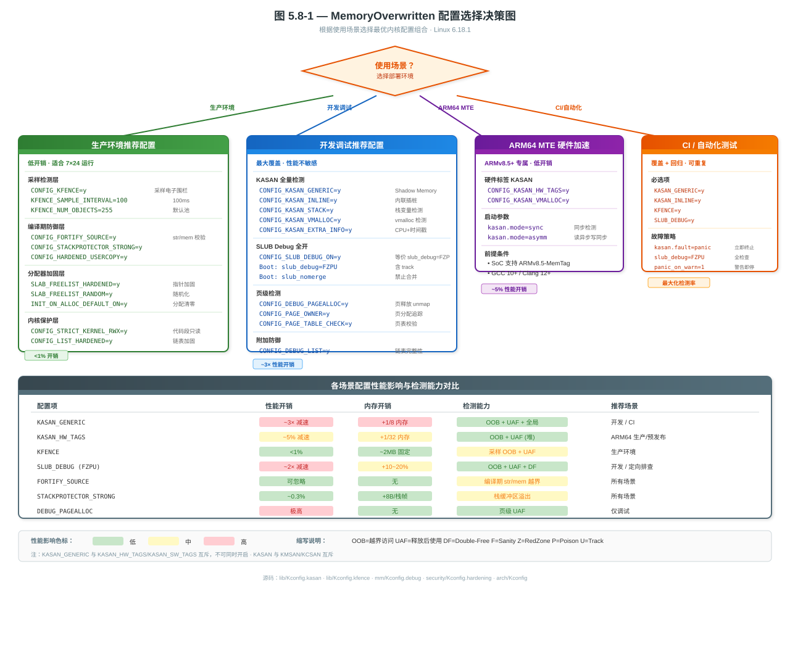

#### 5.8.1 KASAN 配置

KASAN 配置围绕**模式选择、插桩方式、检测范围、错误处理**四个维度展开。

##### 模式选择（三选一，互斥）

| Kconfig 选项 | 源文件 | 默认 | 适用架构 | 内存开销 | 性能开销 |
|-------------|--------|------|---------|---------|---------|
| `CONFIG_KASAN_GENERIC` | `lib/Kconfig.kasan` | N | 所有 KASAN 架构 | +1/8 内存 (Shadow) | ~3× 减速 |
| `CONFIG_KASAN_SW_TAGS` | `lib/Kconfig.kasan` | N | ARM64 (TBI) | +1/16 内存 | ~20% 减速 |
| `CONFIG_KASAN_HW_TAGS` | `lib/Kconfig.kasan` | N | ARM64 (ARMv8.5+ MTE) | +1/32 内存 | ~5% 减速 |

**依赖关系**：

```
KASAN_GENERIC  → HAVE_ARCH_KASAN + CC_HAS_KASAN_GENERIC (GCC 8.3+ / Clang)
KASAN_SW_TAGS  → HAVE_ARCH_KASAN_SW_TAGS + CC_HAS_KASAN_SW_TAGS (GCC 11+ / Clang)
                 ARM64 专属（依赖 Top Byte Ignore）
KASAN_HW_TAGS  → HAVE_ARCH_KASAN_HW_TAGS (GCC 10+ / Clang 12+)
                 ARM64 专属（依赖 ARMv8.5-MemTag 硬件）
```

##### 插桩方式（二选一）

| Kconfig 选项 | 说明 | 优势 | 劣势 |
|-------------|------|------|------|
| `CONFIG_KASAN_INLINE=y` | 编译器直接插入内存检查代码 | 性能提升 ~2× (vs Outline) | 内核 .text 体积增大 |
| `CONFIG_KASAN_OUTLINE=y` | 编译器插入函数调用 | 内核体积小 | 性能较低 |

##### 检测范围扩展

| Kconfig 选项 | 默认 | 说明 |
|-------------|------|------|
| `CONFIG_KASAN_STACK=y` | GCC: Y, Clang: N | 栈变量 OOB 检测。Clang 下可能导致栈空间膨胀 |
| `CONFIG_KASAN_VMALLOC=y` | N | 检测 vmalloc 区域访问。HW_TAGS 模式仅覆盖 VM_ALLOC 映射 |
| `CONFIG_KASAN_EXTRA_INFO=y` | N | 记录每次分配/释放的 CPU 号和时间戳（增加 8~16 字节元数据） |

##### 启动参数

```bash
# 完全禁用 KASAN（编译了但不启用）
kasan=off

# 检测模式控制（仅 HW_TAGS / SW_TAGS 有效）
kasan.mode=sync     # 同步检测：每次访问立即检查（精确但慢）
kasan.mode=async    # 异步检测：批量检查（快但报告可能延迟）
kasan.mode=asymm    # 非对称：读异步、写同步（推荐生产 ARM64 MTE）

# 错误处理策略
kasan.fault=report  # 仅打印报告，继续运行（默认）
kasan.fault=panic   # 检测到错误立即 panic（CI/测试环境推荐）

# 调用栈记录
kasan.stacktrace=off  # 禁用调用栈（减少开销）
```

##### 运行时 sysfs 控制

```bash
# HW_TAGS / SW_TAGS 模式支持运行时切换
echo sync  > /sys/module/kasan/parameters/mode
echo async > /sys/module/kasan/parameters/mode
echo panic > /sys/module/kasan/parameters/fault

# 注意：Generic 模式无 sysfs 运行时控制
```

#### 5.8.2 KFENCE 配置

KFENCE 是面向**生产环境**的低开销采样检测器，配置侧重于**采样频率与池大小的平衡**。

##### 编译期 Kconfig

| Kconfig 选项 | 源文件 | 默认 | 说明 |
|-------------|--------|------|------|
| `CONFIG_KFENCE` | `lib/Kconfig.kfence` | N | 启用 KFENCE 功能 |
| `CONFIG_KFENCE_SAMPLE_INTERVAL` | `lib/Kconfig.kfence` | 100 | 采样间隔 (毫秒)。值越小检测率越高、开销越大 |
| `CONFIG_KFENCE_NUM_OBJECTS` | `lib/Kconfig.kfence` | 255 | 同时保护的对象数 (1~65535)。每个对象需 2 个 guard page |
| `CONFIG_KFENCE_DEFERRABLE` | `lib/Kconfig.kfence` | N | 使用可延迟定时器，避免 CPU 唤醒（省电但采样不精确） |
| `CONFIG_KFENCE_STATIC_KEYS` | `lib/Kconfig.kfence` | N | 使用静态分支。仅建议采样间隔极大 (>100ms) 时启用 |
| `CONFIG_KFENCE_STRESS_TEST_FAULTS` | `lib/Kconfig.kfence` | 0 | 随机注入页保护故障。仅测试用，生产必须为 0 |

**依赖关系**：`HAVE_ARCH_KFENCE` + `STACKTRACE` + `IRQ_WORK`

**内存开销**：`(NUM_OBJECTS × 2 + 1) × PAGE_SIZE` ≈ 255 × 2 × 4KB ≈ **2MB**

##### 启动参数

```bash
# 覆盖编译期采样间隔
kfence.sample_interval=50    # 更频繁采样（更高检测率）
kfence.sample_interval=500   # 降低采样频率（更低开销）
kfence.sample_interval=0     # 完全禁用 KFENCE

# panic 时校验所有 Canary 字节
kfence.check_on_panic=1
```

##### 运行时 sysfs 控制（支持动态开关）

```bash
# 查看/修改参数
cat /sys/module/kfence/parameters/sample_interval    # 当前采样间隔
echo 200 > /sys/module/kfence/parameters/sample_interval   # 动态调整

# 池使用率阈值：超过此比例后跳过已覆盖的分配源
echo 80 > /sys/module/kfence/parameters/skip_covered_thresh

# 每次采样时额外保护的对象数
echo 2 > /sys/module/kfence/parameters/burst

# 动态禁用/启用
echo 0  > /sys/module/kfence/parameters/sample_interval   # 禁用
echo 100 > /sys/module/kfence/parameters/sample_interval  # 重新启用
```

##### 调优建议

| 场景 | `SAMPLE_INTERVAL` | `NUM_OBJECTS` | `skip_covered_thresh` |
|------|-------------------|---------------|-----------------------|
| 生产（低开销） | 100~500 ms | 255 | 75% |
| 生产（积极检测） | 10~50 ms | 1024 | 50% |
| CI / 测试 | 1~10 ms | 4096 | 0% (不跳过) |

#### 5.8.3 SLUB Debug 配置

SLUB Debug 通过**标志字母**精确控制检测项目，支持全局和逐缓存粒度。

##### 编译期 Kconfig

| Kconfig 选项 | 源文件 | 默认 | 说明 |
|-------------|--------|------|------|
| `CONFIG_SLUB_DEBUG` | `mm/Kconfig.debug` | Y | 编译 SLUB Debug 支持（前提条件） |
| `CONFIG_SLUB_DEBUG_ON` | `mm/Kconfig.debug` | N | 默认开启 SLUB 全部检测。等价于 `slub_debug=FZP` |
| `CONFIG_SLUB_RCU_DEBUG` | `mm/Kconfig.debug` | Y (if KASAN) | 启用 TYPESAFE_BY_RCU 缓存的 UAF 检测 |

**依赖关系**：`SYSFS` + `!SLUB_TINY`

##### 标志字母详解

| 字母 | 全称 | 检测项 | 开销 | 说明 |
|------|------|--------|------|------|
| `F` | Sanity | 元数据完整性 | 低 | 基础 slab 结构校验 |
| `Z` | Red Zone | 缓冲区溢出 | 中 | 对象前后填充哨兵字节 `0xBB` |
| `P` | Poison | UAF 写入 | 中 | 释放后填充 `0x6B`，分配时校验 |
| `U` | Track | 分配/释放栈 | 高 | 记录调用栈（stackdepot 压缩） |
| `T` | Trace | 操作日志 | 极高 | printk 每次分配/释放（仅排查用） |
| `A` | All | 全部 | 极高 | 等价于 `FZPU`（不含 T） |
| `O` | Audit | 审计 | 中 | 等价于 `FU` |

##### 启动参数

```bash
# 全局开启（所有 slab 缓存）
slub_debug=FZ          # Sanity + RedZone
slub_debug=FZPU        # 全量检测（推荐调试）
slub_debug=A           # 等同 FZPU
slub_debug=-           # 关闭所有 SLUB debug

# 指定缓存（逗号分隔，支持通配符）
slub_debug=FZP,kmalloc-*      # 仅 kmalloc 系列
slub_debug=FZPU,dentry         # 仅 dentry 缓存
slub_debug=FZP,kmalloc-256:FZ,task_struct   # 混合策略

# 禁止 slab 缓存合并（便于逐缓存排查）
slub_nomerge
```

##### 运行时 sysfs 控制

```bash
# 查看所有 slab 缓存
ls /sys/kernel/slab/

# 逐缓存开关
echo 1 > /sys/kernel/slab/kmalloc-64/sanity_checks
echo 1 > /sys/kernel/slab/kmalloc-64/red_zone
echo 1 > /sys/kernel/slab/kmalloc-64/poison
echo 1 > /sys/kernel/slab/kmalloc-64/trace

# 查看缓存状态
cat /sys/kernel/slab/kmalloc-64/slab_size      # 含 debug 的实际大小
cat /sys/kernel/slab/kmalloc-64/object_size     # 对象净大小
cat /sys/kernel/slab/kmalloc-64/objs_per_slab   # 每 slab 对象数

# slabinfo 全局统计
cat /proc/slabinfo | head -5
```

#### 5.8.4 其他防御配置

##### 编译期安全加固（推荐所有场景开启）

| Kconfig 选项 | 源文件 | 默认 | 性能开销 | 说明 |
|-------------|--------|------|---------|------|
| `CONFIG_FORTIFY_SOURCE` | `security/Kconfig.hardening` | N | 可忽略 | str/mem 函数编译期+运行时边界校验 |
| `CONFIG_STACKPROTECTOR_STRONG` | `arch/Kconfig` | Y | ~0.3% | 栈 Canary 保护 (~20% 函数) |
| `CONFIG_HARDENED_USERCOPY` | `security/Kconfig.hardening` | N | 低 | 内核↔用户空间拷贝边界校验 |
| `CONFIG_LIST_HARDENED` | `security/Kconfig.hardening` | N | 可忽略 | 链表操作完整性校验 |
| `CONFIG_STRICT_KERNEL_RWX` | `arch/Kconfig` | Y | 无 | 内核代码段只读、数据段不可执行 |
| `CONFIG_SLAB_FREELIST_HARDENED` | `mm/Kconfig` | Y | 可忽略 | Freelist 指针 XOR 加固 |
| `CONFIG_SLAB_FREELIST_RANDOM` | `mm/Kconfig` | Y | 可忽略 | Freelist 顺序随机化 |

##### 内存初始化选项

| Kconfig 选项 | 默认 | Boot 参数 | 性能开销 | 说明 |
|-------------|------|-----------|---------|------|
| `CONFIG_INIT_ON_ALLOC_DEFAULT_ON` | N | `init_on_alloc=1` | <1% (典型), ~7% (极端) | 堆内存分配时自动清零 |
| `CONFIG_INIT_ON_FREE_DEFAULT_ON` | N | `init_on_free=1` | 3~5% (典型), ~8% (极端) | 堆内存释放时自动清零 |
| `CONFIG_INIT_STACK_ALL_ZERO` | - | - | 低~中 | 栈变量全部零初始化（最安全） |
| `CONFIG_KSTACK_ERASE` | N | `stack_erasing=1` | ~1% | 系统调用返回时毒化内核栈 |

##### 页级检测选项

| Kconfig 选项 | Boot 参数 | 默认 | 说明 |
|-------------|-----------|------|------|
| `CONFIG_DEBUG_PAGEALLOC` | `debug_pagealloc=on` | N | 页释放后 unmap，UAF 立即触发 page fault |
| `CONFIG_PAGE_POISONING` | `page_poison=1` | N | 页释放后毒化填充 + 分配时校验 |
| `CONFIG_PAGE_TABLE_CHECK` | `page_table_check=on` | N | 页表映射合法性同步校验 |
| `CONFIG_PAGE_OWNER` | `page_owner=on` | N | 页分配调用栈追踪（debugfs 可查） |

##### 调试辅助选项

| Kconfig 选项 | 说明 |
|-------------|------|
| `CONFIG_DEBUG_LIST` | 链表操作扩展检测（比 LIST_HARDENED 更详细的错误报告） |
| `CONFIG_DEBUG_OBJECTS` | 对象生命周期追踪（init → active → destroy） |
| `CONFIG_DEBUG_SG` | scatter-gather 表完整性校验 |
| `CONFIG_DEBUG_NOTIFIERS` | 通知链回调完整性校验 |

#### 5.8.5 推荐配置组合

**【图 5.8-2】启动参数与运行时调优参数全景**

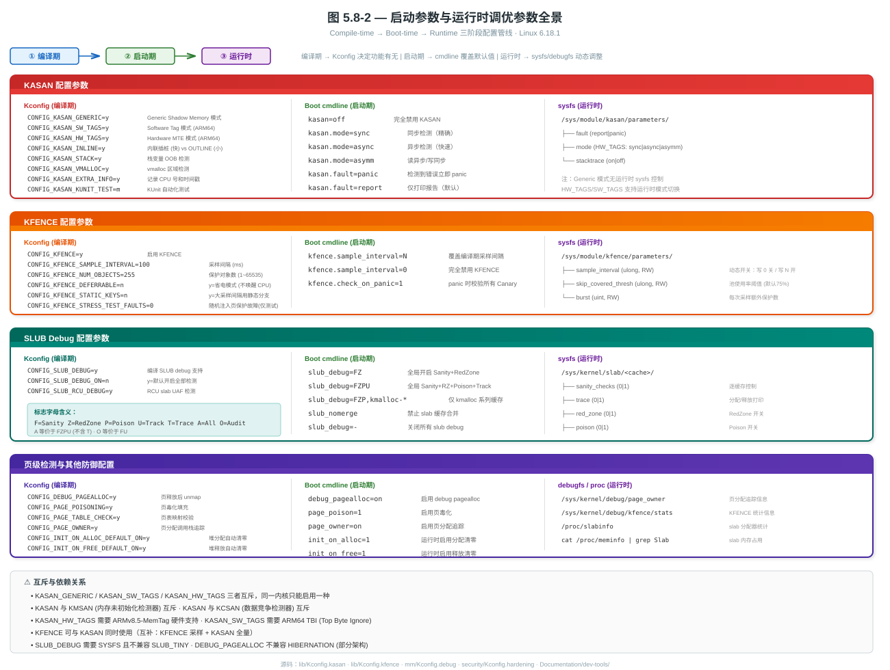

##### 组合一：生产环境（7×24 运行、性能敏感）

```
# defconfig 追加
CONFIG_KFENCE=y
CONFIG_KFENCE_SAMPLE_INTERVAL=100
CONFIG_KFENCE_NUM_OBJECTS=255
CONFIG_FORTIFY_SOURCE=y
CONFIG_STACKPROTECTOR_STRONG=y
CONFIG_HARDENED_USERCOPY=y
CONFIG_LIST_HARDENED=y
CONFIG_SLAB_FREELIST_HARDENED=y
CONFIG_SLAB_FREELIST_RANDOM=y
CONFIG_INIT_ON_ALLOC_DEFAULT_ON=y
CONFIG_STRICT_KERNEL_RWX=y
```

```bash
# Boot cmdline
kfence.sample_interval=100
```

**特点**：总性能开销 < 1%，覆盖最常见的 OOB/UAF 场景，适合长期运行。

##### 组合二：开发调试（功能开发阶段、性能不敏感）

```
# defconfig 追加（在组合一基础上增加）
CONFIG_KASAN_GENERIC=y
CONFIG_KASAN_INLINE=y
CONFIG_KASAN_STACK=y
CONFIG_KASAN_VMALLOC=y
CONFIG_KASAN_EXTRA_INFO=y
CONFIG_SLUB_DEBUG=y
CONFIG_DEBUG_PAGEALLOC=y
CONFIG_PAGE_OWNER=y
CONFIG_PAGE_TABLE_CHECK=y
CONFIG_DEBUG_LIST=y
```

```bash
# Boot cmdline
slub_debug=FZPU slub_nomerge kasan.fault=report debug_pagealloc=on page_owner=on
```

**特点**：最大化检测覆盖，性能约 3~5× 降低，适合功能验证和问题复现。

##### 组合三：ARM64 MTE 硬件加速（ARMv8.5+ SoC）

```
# defconfig 追加
CONFIG_KASAN_HW_TAGS=y
CONFIG_KASAN_VMALLOC=y
CONFIG_KFENCE=y
CONFIG_FORTIFY_SOURCE=y
CONFIG_STACKPROTECTOR_STRONG=y
CONFIG_HARDENED_USERCOPY=y
CONFIG_INIT_ON_ALLOC_DEFAULT_ON=y
```

```bash
# Boot cmdline
kasan.mode=asymm kasan.fault=report kfence.sample_interval=100
```

**特点**：硬件加速 ~5% 开销，同时具备全量 KASAN 检测能力，适合预发布和高端 ARM64 平台。

##### 组合四：CI / 自动化测试（最严格、错误即停）

```
# defconfig 追加（在组合二基础上增加）
CONFIG_KASAN_KUNIT_TEST=m
```

```bash
# Boot cmdline
kasan.fault=panic slub_debug=FZPU slub_nomerge panic_on_warn=1
kfence.sample_interval=10 kfence.check_on_panic=1
```

**特点**：任何检测到的内存错误都触发 panic，保证 CI 流水线中问题零逃逸。

##### 四种组合对比

| 维度 | 生产环境 | 开发调试 | ARM64 MTE | CI/自动化 |
|------|---------|---------|-----------|----------|
| **性能开销** | <1% | ~3~5× | ~5% | ~3~5× |
| **内存开销** | +2MB (KFENCE) | +12.5% (Shadow) + SLUB metadata | +3% (HW Tags) | +12.5%+ |
| **OOB 检测** | 采样 | 全量 | 全量 (堆) | 全量 |
| **UAF 检测** | 采样 | 全量 + Quarantine | 全量 | 全量 + Quarantine |
| **栈溢出** | Canary | Canary + KASAN_STACK | Canary | Canary + KASAN_STACK |
| **错误策略** | 报告 | 报告 | 报告 | panic |
| **运行时可调** | KFENCE 参数 | SLUB + KFENCE | KASAN mode + KFENCE | 固定 |

### 5.9 MemoryOverwritten 经典案例与 Log 解读

本节通过 6 类经典内存覆写场景，还原 KASAN / KFENCE / SLUB Debug / Stack Canary / List Corruption 的告警输出格式，逐行解读关键字段含义，并给出系统化的定位方法论。

**【图 5.9-1】MemoryOverwritten 各机制告警 Log 关键字段解剖**

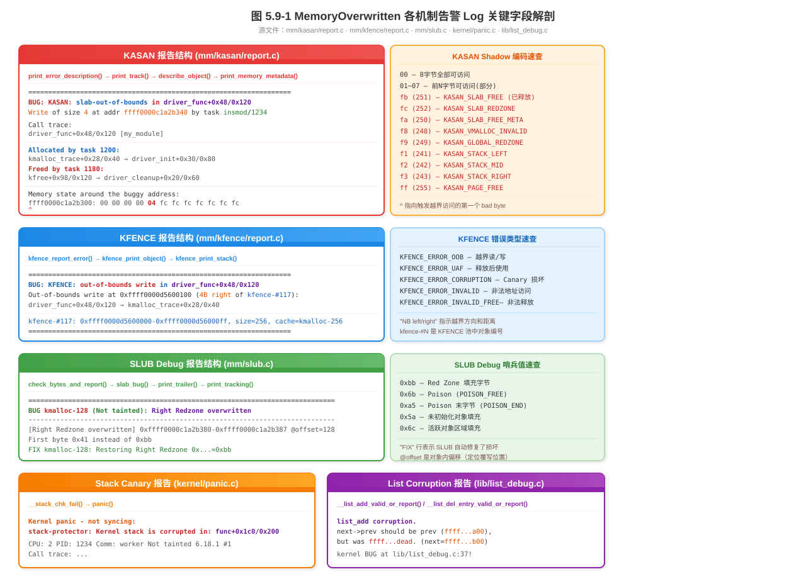

#### 5.9.1 Case 1：KASAN 检测 Slab OOB 写

**场景描述**：驱动分配了 `kmalloc-64`（64 字节）对象，但 memcpy 写入 68 字节，越界写入 4 字节到 Red Zone 区域。

```c
/* 触发代码 */
char *buf = kmalloc(64, GFP_KERNEL);
memcpy(buf, src_data, 68);  /* 越界写 4 字节 → 踩入 slab redzone */
```

**KASAN 告警输出**（源码：`mm/kasan/report.c` → `print_error_description()` + `describe_object()`）：

```
==================================================================
BUG: KASAN: slab-out-of-bounds in my_driver_write+0x48/0x120 [my_module]
Write of size 4 at addr ffff0000c1a2b340 by task insmod/1234

CPU: 2 UID: 0 PID: 1234 Comm: insmod Not tainted 6.18.1 #1
Hardware name: linux,dummy-virt (DT)
Call trace:
 dump_backtrace+0x98/0x100
 show_stack+0x1c/0x30
 dump_stack_lvl+0x60/0x80
 print_report+0xd0/0x620
 kasan_report+0xb0/0xf0
 __asan_store4+0x78/0xa0
 my_driver_write+0x48/0x120 [my_module]
 vfs_write+0x1a8/0x6c0
 ksys_write+0x74/0x100
 __arm64_sys_write+0x1c/0x30
 invoke_syscall+0x50/0x120

Allocated by task 1234:
 kmalloc_trace+0x28/0x40
 my_driver_open+0x30/0x80 [my_module]
 chrdev_open+0xd0/0x200
 do_dentry_open+0x160/0x480

The buggy address belongs to the object at ffff0000c1a2b300
 which belongs to the cache kmalloc-64 of size 64
The buggy address is located 4 bytes to the right of
 allocated 64-byte region [ffff0000c1a2b300, ffff0000c1a2b340)

Memory state around the buggy address:
 ffff0000c1a2b200: fb fb fb fb fb fb fb fb fc fc fc fc fc fc fc fc
 ffff0000c1a2b280: fb fb fb fb fb fb fb fb fc fc fc fc fc fc fc fc
 ffff0000c1a2b300: 00 00 00 00 00 00 00 00 fc fc fc fc fc fc fc fc
                                            ^
 ffff0000c1a2b380: fb fb fb fb fb fb fb fb fc fc fc fc fc fc fc fc
 ffff0000c1a2b400: fb fb fb fb fb fb fb fb fc fc fc fc fc fc fc fc
==================================================================
```

**逐行解读**：

| 行 | 关键字段 | 含义 |
|---|---------|------|
| `BUG: KASAN: slab-out-of-bounds` | **错误类型** | Slab 堆对象越界访问（区别于 `slab-use-after-free`、`global-out-of-bounds`） |
| `in my_driver_write+0x48/0x120` | **触发函数** | IP 地址对应的函数名 + 偏移。用 `addr2line` 可转为精确源码行 |
| `Write of size 4` | **访问方向和大小** | 写操作，4 字节。暗示 `*(uint32_t *)ptr` 或 `memcpy(..., 4)` |
| `at addr ffff0000c1a2b340` | **故障虚拟地址** | 越界访问的目标地址 |
| `by task insmod/1234` | **触发进程** | 进程名 / PID |
| `Allocated by task 1234` | **分配栈** | 对象是谁分配的 → 确认对象用途 |
| `belongs to the cache kmalloc-64 of size 64` | **Slab 缓存信息** | 对象属于 kmalloc-64 缓存，净大小 64 字节 |
| `4 bytes to the right of allocated 64-byte region` | **越界距离和方向** | 越界 4 字节，向右（高地址方向）→ 缓冲区溢出 |
| `[ffff0000c1a2b300, ffff0000c1a2b340)` | **合法区间** | 对象起始到结束的地址范围 |
| Shadow `00` | **可访问** | 8 字节全部合法可访问 |
| Shadow `fc` | **KASAN_SLAB_REDZONE** | Slab Red Zone，不可访问，被写入即报错 |
| Shadow `fb` | **KASAN_SLAB_FREE** | 已释放的 Slab 对象 |
| `^` 指针 | **第一个 bad byte** | 指向触发错误的 Shadow 字节位置 |

**定位步骤**：

```bash
# 1. 将触发地址转为源码行
aarch64-linux-gnu-addr2line -e vmlinux -f ffff800080123048
# 或使用模块地址
aarch64-linux-gnu-addr2line -e my_module.ko -f 0x48

# 2. 检查越界距离
# "4 bytes to the right of 64-byte region" → 分配了 64 字节，写到了 offset 64~67
# → 检查 memcpy/memset 的 size 参数是否超过 64

# 3. 确认分配大小与使用方式是否匹配
# Allocated by → my_driver_open 中 kmalloc(64, GFP_KERNEL)
# 实际写入 68 字节 → 分配大小不足
```

#### 5.9.2 Case 2：KASAN 检测 Use-After-Free

**场景描述**：驱动在 `kfree()` 释放对象后，仍然通过悬垂指针读取对象内容。

```c
/* 触发代码 */
struct my_dev *dev = kmalloc(sizeof(*dev), GFP_KERNEL);
dev->refcnt = 1;
kfree(dev);                /* 释放对象 */
// ... 在另一个代码路径中 ...
pr_info("refcnt = %d\n", dev->refcnt);  /* UAF 读 → KASAN 告警 */
```

**KASAN 告警输出**：

```
==================================================================
BUG: KASAN: slab-use-after-free in my_driver_read+0x38/0x80 [my_module]
Read of size 4 at addr ffff0000c2b3d410 by task cat/2345

CPU: 1 UID: 0 PID: 2345 Comm: cat Not tainted 6.18.1 #1
Hardware name: linux,dummy-virt (DT)
Call trace:
 dump_backtrace+0x98/0x100
 show_stack+0x1c/0x30
 dump_stack_lvl+0x60/0x80
 print_report+0xd0/0x620
 kasan_report+0xb0/0xf0
 __asan_load4+0x78/0xa0
 my_driver_read+0x38/0x80 [my_module]
 vfs_read+0x1a8/0x6c0
 ksys_read+0x74/0x100

Allocated by task 1234:
 kmalloc_trace+0x28/0x40
 my_driver_open+0x30/0x80 [my_module]
 chrdev_open+0xd0/0x200
 do_dentry_open+0x160/0x480

Freed by task 1234:
 kfree+0x98/0x120
 my_driver_release+0x20/0x60 [my_module]
 __fput+0x100/0x310
 task_work_run+0x80/0xc0

The buggy address belongs to the object at ffff0000c2b3d400
 which belongs to the cache kmalloc-128 of size 128
The buggy address is located 16 bytes inside of
 freed 128-byte region [ffff0000c2b3d400, ffff0000c2b3d480)

Memory state around the buggy address:
 ffff0000c2b3d300: fc fc fc fc fc fc fc fc fc fc fc fc fc fc fc fc
 ffff0000c2b3d380: fc fc fc fc fc fc fc fc fc fc fc fc fc fc fc fc
 ffff0000c2b3d400: fa fb fb fb fb fb fb fb fb fb fb fb fb fb fb fb
                       ^
 ffff0000c2b3d480: fc fc fc fc fc fc fc fc fc fc fc fc fc fc fc fc
 ffff0000c2b3d500: fc fc fc fc fc fc fc fc fc fc fc fc fc fc fc fc
==================================================================
```

**逐行解读**：

| 行 | 关键字段 | 含义 |
|---|---------|------|
| `slab-use-after-free` | **错误类型** | 访问已释放的 Slab 对象 |
| `Read of size 4` | **访问方向** | 读操作 — UAF 读通常不会立即 crash，但数据不可信 |
| `Allocated by task 1234` → `my_driver_open` | **分配路径** | 对象在 open 时分配 |
| `Freed by task 1234` → `my_driver_release` | **释放路径** | 对象在 release 时释放 |
| `16 bytes inside of freed 128-byte region` | **访问位置** | 在释放对象内部 offset=16 处读取 → 对应 `dev->refcnt` 字段偏移 |
| Shadow `fa` | **KASAN_SLAB_FREE_META** | 第一个 8 字节存储了 KASAN 的 free 元数据（`kasan_free_meta`） |
| Shadow `fb` | **KASAN_SLAB_FREE** | 已释放 Slab 对象的 Shadow 标记 |

**定位步骤**：

```bash
# 1. 对比 Allocated by 和 Freed by 的栈
# Allocated: my_driver_open → 打开设备时分配
# Freed: my_driver_release → 关闭设备时释放
# Read: my_driver_read → 读取时访问 → 在 close 之后还有 read 操作

# 2. 分析生命周期
# open → alloc → close → free → read → UAF!
# root cause: release 中 kfree 了 dev，但 read 路径未检查设备是否已关闭

# 3. 修复方案
# 方案A: 使用引用计数（kref），read 增加引用，read 完成后 put
# 方案B: release 中置 dev->state = CLOSED，read 中检查状态
# 方案C: 使用 RCU 保护 dev 的生命周期
```

#### 5.9.3 Case 3：KFENCE 检测 OOB 写（Guard Page 触发）

**场景描述**：生产环境中 KFENCE 采样到一个 `kmalloc-256` 对象，驱动向对象尾部越界写入，触及右侧 Guard Page。

```c
/* 触发代码 */
char *buf = kmalloc(256, GFP_KERNEL);
/* KFENCE 以一定概率拦截此分配，放入 KFENCE 池 */
memset(buf, 0, 260);  /* 越界 4 字节 → 写入 Guard Page → 立即 page fault */
```

**KFENCE 告警输出**（源码：`mm/kfence/report.c` → `kfence_report_error()`）：

```
==================================================================
BUG: KFENCE: out-of-bounds write in my_net_driver+0xc8/0x200 [my_net]

Out-of-bounds write at 0xffff0000d5600100 (4B right of kfence-#117):
 my_net_driver+0xc8/0x200 [my_net]
 __netdev_start_xmit+0x80/0x1c0
 dev_hard_start_xmit+0xc0/0x300
 sch_direct_xmit+0x110/0x320
 __dev_queue_xmit+0x2c0/0xd60
 ip_finish_output2+0x2a0/0x6c0

kfence-#117: 0xffff0000d5600000-0xffff0000d56000ff, size=256, cache=kmalloc-256

Allocated by task 3456 on cpu 0 at 123.456789s:
 kmalloc_trace+0x28/0x40
 my_net_alloc_skb+0x40/0xa0 [my_net]
 my_net_rx_handler+0x60/0x200 [my_net]
 napi_poll+0x80/0x200

CPU: 0 UID: 0 PID: 3456 Comm: ksoftirqd/0 Not tainted 6.18.1 #1
Hardware name: linux,dummy-virt (DT)
==================================================================
```

**逐行解读**：

| 行 | 关键字段 | 含义 |
|---|---------|------|
| `BUG: KFENCE: out-of-bounds write` | **错误类型** | KFENCE 检测到越界写入 |
| `4B right of kfence-#117` | **越界距离和对象编号** | 越界 4 字节（向右），对象是 KFENCE 池中第 117 号 |
| `0xffff0000d5600000-0xffff0000d56000ff` | **对象地址范围** | KFENCE 对象占据一个完整 page 内的 [0x000, 0x0ff] |
| `size=256, cache=kmalloc-256` | **对象大小和缓存** | 256 字节对象，来自 kmalloc-256 缓存 |
| `Allocated by task 3456 on cpu 0` | **分配路径** | 由 ksoftirqd/0 上下文分配 |
| 触发栈 → `my_net_driver+0xc8` | **触发函数** | 网络驱动发送路径中的 memset 越界 |

**KFENCE 与 KASAN 的关键差异**：

| 维度 | KASAN | KFENCE |
|------|-------|--------|
| 检测触发方式 | Shadow Memory 检查（编译器插桩） | Guard Page（硬件 MMU page fault） |
| 报告中的距离信息 | `N bytes to the right/left of` | `NB right/left of kfence-#N` |
| Shadow Memory dump | 有 | 无（KFENCE 不使用 Shadow） |
| 对象标识 | 虚拟地址 + cache 名 | `kfence-#N` 编号 + 地址范围 |
| 适用环境 | 开发/测试 | **生产环境**（低开销采样） |

#### 5.9.4 Case 4：SLUB Debug 检测 Red Zone 被覆写

**场景描述**：启用 `slub_debug=FZ` 后，SLUB 在对象释放时检查 Red Zone，发现尾部哨兵字节被覆写。

```c
/* 触发代码 */
struct my_data {
    char name[32];
    int value;
};  /* sizeof = 36 字节，分配到 kmalloc-64 */

struct my_data *p = kmalloc(sizeof(*p), GFP_KERNEL);
memset(p->name, 'A', 40);  /* 越界 8 字节 → 覆写 value 字段 + 尾部 Red Zone */
kfree(p);                   /* 释放时 SLUB 检查 Red Zone → 发现被覆写 → 告警 */
```

**SLUB Debug 告警输出**（源码：`mm/slub.c` → `check_bytes_and_report()` + `slab_bug()`）：

```
=============================================================================
BUG kmalloc-64 (Tainted: G    B      OE  ): Right Redzone overwritten
-----------------------------------------------------------------------------

Disabling lock debugging due to kernel taint
INFO: 0xffff0000c4a5b240-0xffff0000c4a5b247 @offset=64. First byte 0x41 instead of 0xbb
INFO: Allocated in my_driver_probe+0x48/0x100 age=2 cpu=1 pid=1234
 kmalloc_trace+0x28/0x40
 my_driver_probe+0x48/0x100 [my_module]
 platform_probe+0x70/0xc0
 really_probe+0x100/0x3c0
INFO: Freed in (unreleased)
INFO: Slab 0xfffffdffc0129680 objects=32 used=18 fp=0xffff0000c4a5ba00 flags=0x17ffe0000010200(slab|head|node=0|zone=2|lastcpupid=0xfff)
INFO: Object 0xffff0000c4a5b200 @offset=512 fp=0xffff0000c4a5b100

Redzone  ffff0000c4a5b1c0: bb bb bb bb bb bb bb bb bb bb bb bb bb bb bb bb  ................
Redzone  ffff0000c4a5b1d0: bb bb bb bb bb bb bb bb bb bb bb bb bb bb bb bb  ................
Object   ffff0000c4a5b200: 41 41 41 41 41 41 41 41 41 41 41 41 41 41 41 41  AAAAAAAAAAAAAAAA
Object   ffff0000c4a5b210: 41 41 41 41 41 41 41 41 41 41 41 41 41 41 41 41  AAAAAAAAAAAAAAAA
Object   ffff0000c4a5b220: 41 41 41 41 41 41 41 41 41 41 41 41 00 00 00 00  AAAAAAAAAAAA....
Object   ffff0000c4a5b230: 00 00 00 00 00 00 00 00 00 00 00 00 00 00 00 00  ................
Redzone  ffff0000c4a5b240: 41 41 41 41 41 41 41 41                          AAAAAAAA
Padding  ffff0000c4a5b268: 5a 5a 5a 5a 5a 5a 5a 5a 5a 5a 5a 5a 5a 5a 5a 5a  ZZZZZZZZZZZZZZZZ

FIX kmalloc-64: Restoring Right Redzone 0xffff0000c4a5b240-0xffff0000c4a5b247=0xbb
```

**逐行解读**：

| 行 | 关键字段 | 含义 |
|---|---------|------|
| `BUG kmalloc-64` | **Slab 缓存名** | 问题发生在 kmalloc-64 缓存中 |
| `Right Redzone overwritten` | **错误类型** | 右侧 Red Zone（对象尾部哨兵）被覆写 |
| `@offset=64. First byte 0x41 instead of 0xbb` | **覆写位置和内容** | 从对象偏移 64 字节处（正好是 Red Zone 起始），第一个被覆写字节为 `0x41`（'A'），期望 `0xbb` |
| `Allocated in my_driver_probe+0x48` | **分配栈** | 对象在 probe 函数中分配 |
| `age=2 cpu=1 pid=1234` | **分配上下文** | 分配距今 2 个 slab 操作，CPU 1，PID 1234 |
| `Freed in (unreleased)` | **释放信息** | 当前触发检查时正在释放（此前未释放过） |
| `Redzone` 行显示 `0xbb` | **正常 Red Zone** | 左侧 Red Zone 完好（全 `0xbb`） |
| `Object` 行显示 `0x41` | **对象内容** | 对象被 'A' (0x41) 填满，并溢出到右 Red Zone |
| `Redzone` 行显示 `0x41` | **被覆写的 Red Zone** | 8 字节 Red Zone 被 'A' 覆写 |
| `Padding` 行显示 `0x5a` | **Padding 填充** | Slab 对齐填充区域，`0x5a` 表示未初始化 |
| `FIX kmalloc-64: Restoring` | **自动修复** | SLUB 自动将 Red Zone 恢复为 `0xbb`，系统可继续运行 |

**定位步骤**：

```bash
# 1. 从 @offset 确定覆写起始位置
# @offset=64 → 对象大小为 64 字节 → 从第 64 字节开始被覆写
# → 覆写内容为 0x41 ('A') → 对应 memset(p->name, 'A', 40) 越界

# 2. 从 Object dump 反推覆写范围
# Object 内 0x41 从 offset 0 到 39 (40 字节) → memset 写了 40 字节到 32 字节的 name 字段
# 溢出 8 字节到 value + Red Zone

# 3. 检查结构体布局
# pahole -C my_data my_module.ko → 确认 name[32] + value(4) + padding = 36 → kmalloc-64
```

#### 5.9.5 Case 5：Stack Canary 被破坏

**场景描述**：函数内部的局部数组越界写入，破坏了函数栈帧底部的 Canary 值，函数返回时 `__stack_chk_fail()` 触发 kernel panic。

```c
/* 触发代码 */
void vulnerable_func(const char *input) {
    char local_buf[64];
    /* input 长度超过 64 → 覆写 Canary → 函数返回时 panic */
    strcpy(local_buf, input);  /* 未检查长度 */
}
```

**Stack Canary panic 输出**（源码：`kernel/panic.c` → `__stack_chk_fail()`）：

```
Kernel panic - not syncing: stack-protector: Kernel stack is corrupted in: vulnerable_func+0x1c0/0x200 [my_module]
CPU: 2 UID: 0 PID: 5678 Comm: bash Not tainted 6.18.1 #1
Hardware name: linux,dummy-virt (DT)
Call trace:
 dump_backtrace+0x98/0x100
 show_stack+0x1c/0x30
 dump_stack_lvl+0x60/0x80
 panic+0x1c4/0x370
 __stack_chk_fail+0x1c/0x20
 vulnerable_func+0x1c0/0x200 [my_module]
 my_driver_ioctl+0x60/0xc0 [my_module]
 __arm64_sys_ioctl+0x80/0xc0
 invoke_syscall+0x50/0x120
 el0_svc_common+0x38/0x60
```

**逐行解读**：

| 行 | 关键字段 | 含义 |
|---|---------|------|
| `Kernel panic - not syncing` | **严重级别** | panic — 系统停止运行（无法恢复） |
| `stack-protector: Kernel stack is corrupted in:` | **错误类型** | GCC `-fstack-protector` 检测到栈 Canary 被破坏 |
| `vulnerable_func+0x1c0/0x200` | **触发函数** | 栈被覆写的函数。`0x1c0` 是函数返回前检查 Canary 的位置 |
| `__stack_chk_fail+0x1c/0x20` | **检查函数** | GCC 自动插入的 Canary 校验函数，失败则 panic |

**关键特点**：

- Stack Canary **只能检测覆写，无法定位写入者**（不像 KASAN 有 Shadow 追溯）
- panic 栈回溯只显示**被破坏函数的返回路径**，不显示实际覆写发生的代码行
- 需结合 `objdump -d` 分析函数内的栈布局，反推哪个局部变量越界

**定位步骤**：

```bash
# 1. 反汇编函数，找出栈帧布局
aarch64-linux-gnu-objdump -d my_module.ko | grep -A 200 "vulnerable_func>:"

# 2. 找 Canary 存/取位置
# stp x29, x30, [sp, #-N]!    ← 函数入口保存 FP/LR
# ldr x8, [x18, #24]           ← 从 per-task Canary 读取 (shadow_call_stack 或 TLS)
# str x8, [sp, #M]             ← 将 Canary 存到栈帧
# ...
# ldr x9, [sp, #M]             ← 函数返回前读回
# ldr x8, [x18, #24]           ← 再次读原始 Canary
# cmp x8, x9                   ← 比较
# b.ne __stack_chk_fail         ← 不等则 panic

# 3. 确认栈帧中 local_buf 的偏移
# local_buf 在 [sp, #X] ~ [sp, #X+63]
# Canary 在 [sp, #M]
# 如果 X + 64 > M → strcpy 越过 64 字节后覆写 Canary

# 4. 修复：使用 strscpy() 替代 strcpy()
```

#### 5.9.6 Case 6：List Corruption 检测

**场景描述**：UAF 或内存覆写破坏了链表节点的 `next`/`prev` 指针，执行 `list_add()` 时触发完整性校验失败。

```c
/* 触发代码 */
struct my_item {
    struct list_head list;
    int data;
};

struct my_item *item = kmalloc(sizeof(*item), GFP_KERNEL);
INIT_LIST_HEAD(&item->list);
list_add(&item->list, &my_list_head);

/* 某处内存覆写破坏了 my_list_head.next 指针 */
*(unsigned long *)&my_list_head.next = 0xdead000000000000;

/* 再次 list_add 时触发校验 */
struct my_item *item2 = kmalloc(sizeof(*item2), GFP_KERNEL);
INIT_LIST_HEAD(&item2->list);
list_add(&item2->list, &my_list_head);  /* → 检测到 next->prev != prev → BUG */
```

**List Corruption 告警输出**（源码：`lib/list_debug.c` → `__list_add_valid_or_report()`）：

```
------------[ cut here ]------------
list_add corruption. next->prev should be prev (ffff0000c5a6b200), but was dead000000000000. (next=ffff0000c5a6b100).
kernel BUG at lib/list_debug.c:37!
Internal error: Oops - BUG: 00000000f2000800 [#1] PREEMPT SMP
Modules linked in: my_module(OE)
CPU: 3 UID: 0 PID: 6789 Comm: worker/3 Tainted: G    B      OE  6.18.1 #1
Hardware name: linux,dummy-virt (DT)
pstate: 60400005 (nZCv daif +PAN -UAO -TCO -DIT -SSBS BTYPE=--)
pc : __list_add_valid_or_report+0x48/0xb0
lr : __list_add_valid_or_report+0x48/0xb0
sp : ffff800082a0bd40
x29: ffff800082a0bd40 x28: ffff0000c5a6b100 x27: 0000000000000000
...
Call trace:
 __list_add_valid_or_report+0x48/0xb0
 my_add_item+0x60/0xc0 [my_module]
 my_worker_func+0x40/0x80 [my_module]
 process_one_work+0x200/0x5c0
 worker_thread+0x70/0x400
 kthread+0x110/0x120
 ret_from_fork+0x10/0x20
```

**逐行解读**：

| 行 | 关键字段 | 含义 |
|---|---------|------|
| `list_add corruption` | **错误类型** | `list_add` 操作检测到链表完整性被破坏 |
| `next->prev should be prev (ffff...200)` | **期望值** | `next->prev` 应该指向 `prev`（即链表头 `my_list_head`） |
| `but was dead000000000000` | **实际值** | 实际值被覆写为 `0xdead...` → 明显是内存踩踏 |
| `(next=ffff0000c5a6b100)` | **next 指针** | 链表的下一个节点地址 |
| `kernel BUG at lib/list_debug.c:37!` | **BUG 位置** | 触发了 `BUG()` 宏，对应 `CHECK_DATA_CORRUPTION` |
| `Internal error: Oops - BUG` | **异常类型** | ARM64 Oops，进程被杀死（不一定 panic） |
| `pc : __list_add_valid_or_report+0x48` | **程序计数器** | BUG() 触发位置 |

**定位步骤**：

```bash
# 1. 识别被破坏的链表
# next->prev 值为 0xdead... → 明显是人为魔数或内存覆写
# 需确认 my_list_head 在内核数据段的位置

# 2. 确定覆写来源
# 方案A: 开启 KASAN → 在覆写时立即报错，而不是在 list_add 时才发现
# 方案B: 使用 watchpoint (硬件断点) 监控 my_list_head.next 地址
#   echo "w 4:ffff0000c5a6b200" > /sys/kernel/debug/kgdb/breakpoint  # (kgdb)
#   或在 GDB 中: watch *(unsigned long *)0xffff0000c5a6b200

# 3. 常见根因模式
# - 相邻结构体的缓冲区溢出覆写到链表指针
# - UAF: 链表节点被释放但未从链表摘除
# - 并发: 无锁保护的链表操作导致指针撕裂

# 4. 检查链表操作的锁保护
# grep -rn "list_add.*my_list" my_module.c → 确认所有 list 操作是否在同一把锁保护下
```

#### 5.9.7 通用定位方法论

**【图 5.9-2】MemoryOverwritten 通用定位方法论流程**

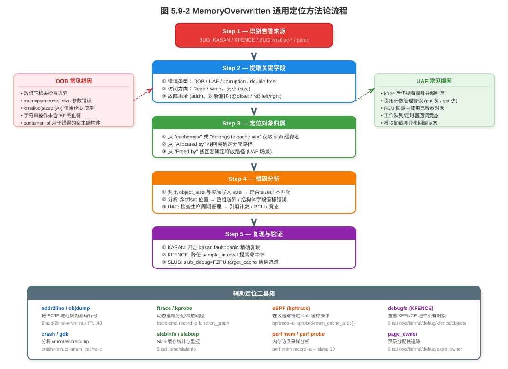

##### 五步定位法

| 步骤 | 操作 | 从 Log 中提取 | 工具 |
|------|------|--------------|------|
| **Step 1** — 识别告警来源 | 确认是 KASAN / KFENCE / SLUB / Canary / List | `BUG: KASAN:` / `BUG: KFENCE:` / `BUG kmalloc-*` / `stack-protector` / `list_add corruption` | 肉眼识别 |
| **Step 2** — 提取关键字段 | 错误类型、访问方向/大小、故障地址 | `slab-out-of-bounds` / `Write of size 4` / `addr ffff...` | 日志分析 |
| **Step 3** — 定位对象归属 | 缓存名、分配栈、释放栈 | `cache kmalloc-64` / `Allocated by` / `Freed by` | addr2line, objdump |
| **Step 4** — 根因分析 | 越界距离、结构体布局、生命周期 | `N bytes to the right` / `@offset=N` | pahole, crash, gdb |
| **Step 5** — 复现验证 | 调整参数加强检测、构造测试用例 | — | KASAN/KFENCE/SLUB 配置 |

##### 按错误类型的定位策略

| 错误类型 | 典型根因 | 首选工具 | 定位关键 |
|---------|---------|---------|---------|
| **Slab OOB** | 数组越界、memcpy size 错误、sizeof 不匹配 | KASAN (Generic) | 越界距离 + 对象大小 → 反推哪个写操作溢出 |
| **Slab UAF** | kfree 后悬垂指针、引用计数错误、竞态 | KASAN + Quarantine | Allocated by / Freed by 栈对比 → 分析生命周期 |
| **Guard Page OOB** | 同 Slab OOB，但由 KFENCE 在生产环境采样到 | KFENCE | `NB left/right of kfence-#N` → 越界方向和距离 |
| **Red Zone 覆写** | 缓冲区溢出写 | SLUB Debug (Z) | `@offset` + Object hex dump → 覆写字节模式识别 |
| **Poison 破坏** | UAF 写入 | SLUB Debug (P) | 释放后对象应为 `0x6b`，实际值 → 被谁覆写 |
| **Stack 溢出** | 局部数组越界、递归过深 | Stack Canary | 反汇编栈帧布局 → 局部变量与 Canary 的位置关系 |
| **链表损坏** | 相邻内存覆写、UAF、并发竞态 | LIST_HARDENED + KASAN | `next->prev should be` → 硬件 watchpoint 追踪覆写者 |

##### 多工具组合策略

```
场景                           推荐组合
─────────────────────────────────────────────────────
难以复现的 OOB              → KFENCE (生产采样) + SLUB (slub_debug=FZ,target)
UAF 竞态                    → KASAN + kasan.fault=report + Quarantine 延迟释放
已知缓存的覆写              → slub_debug=FZPU,cache_name + slub_nomerge
栈破坏                      → CONFIG_KASAN_STACK=y + CONFIG_STACKPROTECTOR_STRONG
链表指针损坏                → LIST_HARDENED + KASAN + 硬件 watchpoint
生产环境全局监控            → KFENCE + FORTIFY_SOURCE + LIST_HARDENED + HARDENED_USERCOPY
```

##### 常见陷阱

| 陷阱 | 说明 | 解决 |
|------|------|------|
| **KASAN 报告的地址不是覆写发生处** | KASAN 在下一次访问时才检查 Shadow → 报告可能延迟 | 使用 `kasan.mode=sync` (HW_TAGS) 或缩小 Quarantine 窗口 |
| **SLUB Debug 只在 free 时报错** | Red Zone / Poison 检查在 `kmem_cache_free()` 路径中 → 覆写到释放之间无报告 | 配合 `slub_debug=T` 追踪所有操作，或缩短对象存活时间 |
| **KFENCE 难以复现** | 概率采样 → 同一 bug 不一定每次命中 | 降低 `sample_interval`、增大 `NUM_OBJECTS`、长时间运行 |
| **Stack Canary 无法定位具体行** | 只能定位到函数级别，不能精确到行 | 结合 KASAN_STACK 获取栈变量级别的越界检测 |
| **List corruption 是"症状"非"原因"** | 链表损坏是结果，根因是相邻内存的 OOB 或 UAF | 先用 KASAN 定位真正的 OOB/UAF，而非在 list 上排查 |

### 5.10 核心算法总结

本节提炼 KASAN / Quarantine 子系统实现中涉及的核心算法，帮助理解 MemoryOverwritten 检测机制的运行机理和 debug 时的思路。

#### 5.10.1 Shadow Memory 地址映射算法

**源码**：`include/linux/kasan.h` — `kasan_mem_to_shadow()`（第 62 行）；`arch/arm64/include/asm/memory.h`（第 102 行）

KASAN 的核心设计是将整个内核虚拟地址空间以 8:1 的压缩比映射到 Shadow Memory 区域。每 8 字节内核内存对应 1 字节 Shadow，Shadow 值编码该 8 字节区域的可访问状态。

**【图 5.10-1】Shadow Memory 地址映射算法全景**

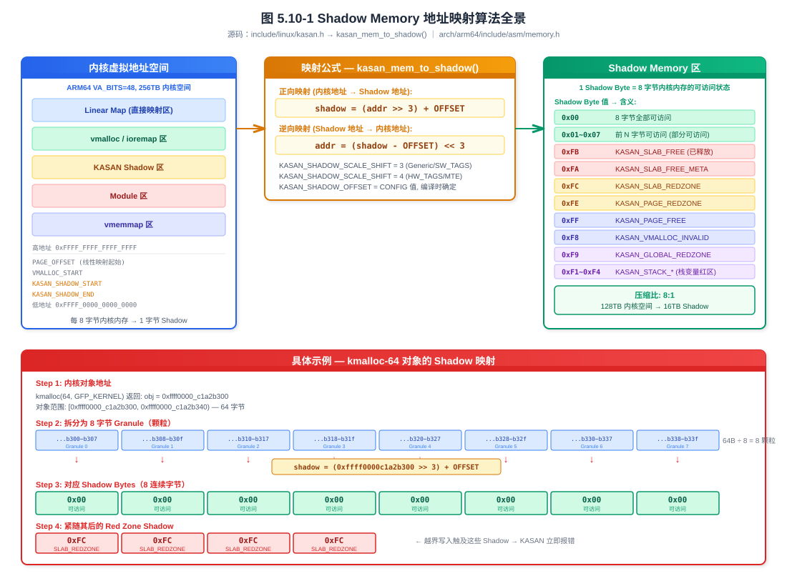

```
算法: kasan_mem_to_shadow(addr)
输入: addr — 内核虚拟地址 (64-bit)
输出: shadow — Shadow Memory 中对应的地址

正向映射:
  shadow_addr = (addr >> KASAN_SHADOW_SCALE_SHIFT) + KASAN_SHADOW_OFFSET

逆向映射 (kasan_shadow_to_mem):
  kernel_addr = (shadow_addr - KASAN_SHADOW_OFFSET) << KASAN_SHADOW_SCALE_SHIFT

ARM64 常量定义 (arch/arm64/include/asm/memory.h):
  KASAN_SHADOW_OFFSET     = CONFIG_KASAN_SHADOW_OFFSET     // 编译时确定
  KASAN_SHADOW_END        = (1UL << (64 - SHIFT)) + OFFSET
  KASAN_SHADOW_START(va)  = SHADOW_END - (1UL << (va - SHIFT))

各模式的 SCALE_SHIFT:
  ┌──────────────────┬─────────────┬─────────────┬──────────────┐
  │ 模式             │ SCALE_SHIFT │ GRANULE_SIZE │ 压缩比        │
  ├──────────────────┼─────────────┼─────────────┼──────────────┤
  │ Generic          │ 3           │ 8 字节       │ 8:1          │
  │ SW_TAGS          │ 4           │ 16 字节      │ 16:1         │
  │ HW_TAGS (MTE)    │ 4           │ 16 字节      │ 16:1         │
  └──────────────────┴─────────────┴─────────────┴──────────────┘

空间开销 (ARM64, VA_BITS=48, Generic 模式):
  内核虚拟空间 = 128TB = 2^47 字节
  Shadow 区域  = 128TB / 8 = 16TB
  占虚拟地址空间比例: 1/8 = 12.5%

映射性质:
  - 线性映射: 连续 8 字节内核内存 → 连续 1 字节 Shadow
  - 确定性: 给定 addr 唯一确定 shadow_addr (无哈希碰撞)
  - O(1) 计算: 1 次移位 + 1 次加法, 无分支/无内存访问
  - 可逆: shadow ↔ kernel 双向转换, 方便 debug 时反查
```

**Shadow 值编码表**（源码：`mm/kasan/kasan.h` 第 143~170 行）：

| 值 | 宏名 | 含义 | 设置时机 |
|---|------|------|---------|
| `0x00` | — | 8 字节全部可访问 | `kasan_unpoison()` |
| `0x01`~`0x07` | — | 前 N 字节可访问（部分可访问） | `kasan_poison_last_granule()` |
| `0xF1` | `KASAN_STACK_LEFT` | 栈变量左侧红区 | 编译器自动插入 |
| `0xF2` | `KASAN_STACK_MID` | 栈变量中间红区 | 编译器自动插入 |
| `0xF3` | `KASAN_STACK_RIGHT` | 栈变量右侧红区 | 编译器自动插入 |
| `0xF4` | `KASAN_STACK_PARTIAL` | 栈变量部分红区 | 编译器自动插入 |
| `0xF8` | `KASAN_VMALLOC_INVALID` | vmalloc 不可访问区域 | `__kasan_poison_vmalloc()` |
| `0xF9` | `KASAN_GLOBAL_REDZONE` | 全局变量红区 | 编译器自动插入 |
| `0xFA` | `KASAN_SLAB_FREE_META` | 已释放 Slab 对象（含 free 元数据） | `___cache_free()` → `kasan_slab_free()` |
| `0xFB` | `KASAN_SLAB_FREE` | 已释放 Slab 对象 | `___cache_free()` → `kasan_slab_free()` |
| `0xFC` | `KASAN_SLAB_REDZONE` | Slab 对象红区 | `__kasan_slab_alloc()` |
| `0xFE` | `KASAN_PAGE_REDZONE` | kmalloc_large 红区 | `kasan_kmalloc_large()` |
| `0xFF` | `KASAN_PAGE_FREE` | 已释放页面 | `kasan_free_pages()` |
| `0xCA` | `KASAN_ALLOCA_LEFT` | alloca 左侧红区 | 编译器自动插入 |
| `0xCB` | `KASAN_ALLOCA_RIGHT` | alloca 右侧红区 | 编译器自动插入 |

**设计原理**：负值 Shadow（`0x80`~`0xFF`，即符号位为 1）表示不可访问，正值或零（`0x00`~`0x07`）表示全部或部分可访问。检查时只需一次符号判断即可快速区分合法/非法访问。

#### 5.10.2 Shadow Byte 毒化与检查算法

**源码**：`mm/kasan/shadow.c` — `kasan_poison()`（第 124 行）；`mm/kasan/generic.c` — `check_region_inline()`（第 175 行）

KASAN 的两大核心路径：**毒化**（在 alloc/free 时设置 Shadow 值）和**检查**（在每次内存访问时验证 Shadow 值）。

**【图 5.10-2】Shadow Byte 毒化与检查算法流程**

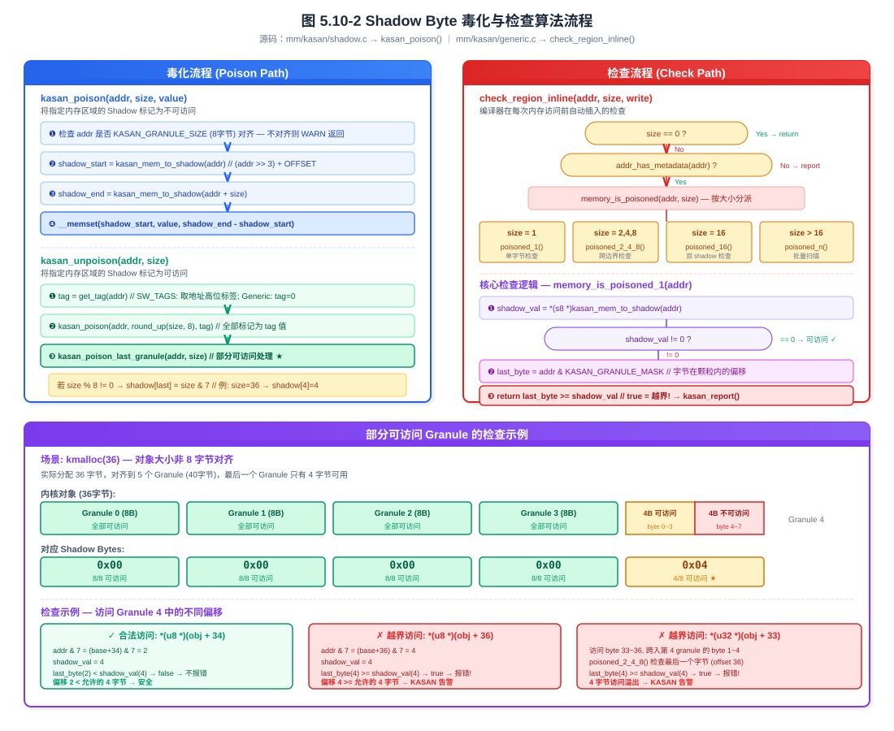

```
算法: kasan_poison(addr, size, value, init)
输入: addr — 待毒化的内核地址 (必须 8 字节对齐)
      size — 待毒化的字节数 (必须 8 字节对齐)
      value — Shadow 毒化值 (0xFB/0xFC/0xFF 等)
输出: 无 (副作用: 修改 Shadow Memory)

  1. if !kasan_enabled() → return
  2. addr = kasan_reset_tag(addr)            // 清除 SW_TAGS 高位标签
  3. WARN_ON(addr & KASAN_GRANULE_MASK)      // 对齐校验
  4. WARN_ON(size & KASAN_GRANULE_MASK)      // 对齐校验
  5. shadow_start = kasan_mem_to_shadow(addr)
  6. shadow_end   = kasan_mem_to_shadow(addr + size)
  7. __memset(shadow_start, value, shadow_end - shadow_start)

  复杂度: O(size/8) — memset 写入 size/8 字节 Shadow
```

```
算法: kasan_unpoison(addr, size, init)
输入: addr — 待解毒的内核地址
      size — 实际可访问字节数 (不要求 8 字节对齐)
输出: 无 (副作用: Shadow 标记为可访问)

  1. tag = get_tag(addr)                     // Generic: tag=0; SW_TAGS: 高位标签
  2. addr = kasan_reset_tag(addr)
  3. kasan_poison(addr, round_up(size, 8), tag)
     // 先将整个对齐区域标记为 tag (Generic 模式下=0, 即全可访问)
  4. if CONFIG_KASAN_GENERIC:
       kasan_poison_last_granule(addr, size)
       // 处理最后一个不完整 Granule ★

  kasan_poison_last_granule(addr, size):
    if size & KASAN_GRANULE_MASK:          // size 不是 8 的倍数
      shadow = kasan_mem_to_shadow(addr + size)
      *shadow = size & KASAN_GRANULE_MASK  // 存储实际可访问字节数 (1~7)
    // 例: size=36 → 36 & 7 = 4 → shadow[4] = 0x04 → 前 4 字节可访问
```

```
算法: check_region_inline(addr, size, write, ret_ip)
输入: addr — 待访问的内核地址
      size — 访问大小 (1/2/4/8/16/N 字节)
      write — 是否为写操作
输出: true=合法, false=非法 (触发 kasan_report)

编译器在每条内存访问指令前自动插桩调用:
  __asan_load1/2/4/8/16  → check_region_inline(addr, N, false, _RET_IP_)
  __asan_store1/2/4/8/16 → check_region_inline(addr, N, true,  _RET_IP_)

  1. if !kasan_enabled() → return true
  2. if size == 0 → return true
  3. if addr + size < addr → kasan_report(...)    // 地址回绕检测
  4. if !addr_has_metadata(addr) → kasan_report(...)
  5. if memory_is_poisoned(addr, size) → kasan_report(...)
  6. return true

memory_is_poisoned(addr, size) 按 size 分派:
  ┌────────┬──────────────────────────────────────────────────────────────┐
  │ size   │ 检查逻辑                                                    │
  ├────────┼──────────────────────────────────────────────────────────────┤
  │ 1      │ memory_is_poisoned_1(addr)                                  │
  │        │   shadow = *(s8 *)kasan_mem_to_shadow(addr)                 │
  │        │   if shadow == 0 → false (安全)                             │
  │        │   last = addr & 7                                           │
  │        │   return last >= shadow  // 偏移 >= 可访问数 → 越界         │
  ├────────┼──────────────────────────────────────────────────────────────┤
  │ 2,4,8  │ memory_is_poisoned_2_4_8(addr, size)                       │
  │        │   检查是否跨 Granule 边界:                                  │
  │        │   if ((addr+size-1) & 7) < size-1:                         │
  │        │     return *shadow || poisoned_1(addr+size-1)   // 跨边界  │
  │        │   return poisoned_1(addr+size-1)                // 同 Granule│
  ├────────┼──────────────────────────────────────────────────────────────┤
  │ 16     │ memory_is_poisoned_16(addr)                                 │
  │        │   检查 2 个 Shadow 字节 (u16 读取)                          │
  │        │   if IS_ALIGNED(addr, 8): return *(u16 *)shadow != 0       │
  │        │   else: return *shadow || poisoned_1(addr+15)               │
  ├────────┼──────────────────────────────────────────────────────────────┤
  │ >16    │ memory_is_poisoned_n(addr, size)                            │
  │        │   memory_is_nonzero() 批量扫描:                             │
  │        │   - 前缀对齐到 8 字节 → 逐字节检查                         │
  │        │   - 中间段 → 8 字节批量比较 (u64 读取)                      │
  │        │   - 后缀 → 逐字节检查                                      │
  │        │   最后检查末尾 Granule 的部分可访问情况                      │
  └────────┴──────────────────────────────────────────────────────────────┘

  性能优化:
  - size 1/2/4/8/16 是最常见的访问大小 → 内联 + 无循环
  - 编译器 __always_inline 确保零函数调用开销
  - 对齐访问只需 1~2 次 Shadow 读取
  - 大块访问 (>16) 使用 u64 批量比较减少迭代次数
```

**部分可访问 Granule 的判定逻辑**：

当 Shadow 值为 `0x01`~`0x07` 时，表示该 8 字节 Granule 只有前 N 字节可访问。检查算法的核心判定式：

$$\text{is\_poisoned} = (\text{addr} \mathbin{\&} 7) \geq \text{shadow\_val}$$

- `addr & 7`：访问地址在 Granule 内的字节偏移（0~7）
- `shadow_val`：该 Granule 允许的最大可访问字节数（1~7）
- 若偏移 $\geq$ 可访问数 → 越界 → 报错

#### 5.10.3 Quarantine FIFO 批量回收算法

**源码**：`mm/kasan/quarantine.c` — `kasan_quarantine_put()`（第 190 行）、`kasan_quarantine_reduce()`（第 240 行）

Quarantine（隔离区）是 KASAN 检测 Use-After-Free 的核心机制：对象 `kfree()` 后不立即归还 SLUB，而是在隔离队列中滞留一段时间，使 Shadow 保持 `0xFB`（已释放），若悬垂指针再次访问即可被 KASAN 捕获。

**【图 5.10-3】Quarantine FIFO 批量回收算法**

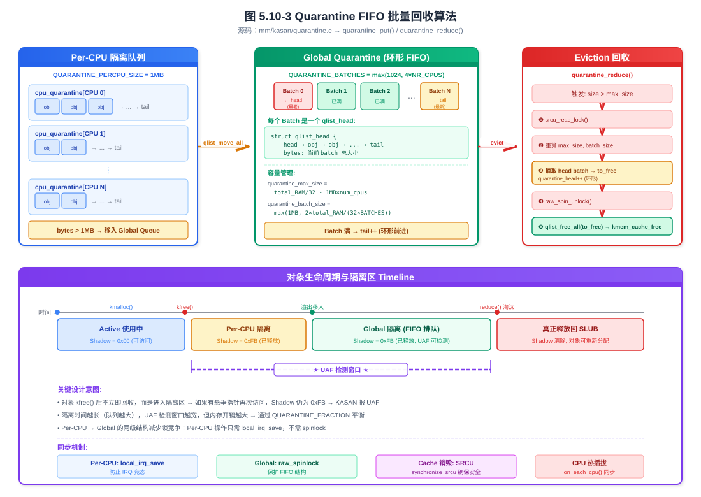

```
算法: kasan_quarantine_put(cache, object)
输入: cache — kmem_cache 指针, object — 被释放的对象指针
输出: true=成功隔离, false=未隔离(直接释放)

  1. meta = kasan_get_free_meta(cache, object)
     if !meta → return false              // 无元数据, 不隔离

  2. local_irq_save(flags)                 // 禁止中断 (防止与 reduce 竞态)
     q = this_cpu_ptr(&cpu_quarantine)
     if q->offline → return false          // CPU hotplug 离线

  3. qlist_put(q, &meta->quarantine_link, cache->size)
     // 将对象加入 Per-CPU 队列尾部
     //   q->tail->next = qlink
     //   q->tail = qlink
     //   q->bytes += cache->size

  4. if q->bytes > QUARANTINE_PERCPU_SIZE:    // 超过 1MB 阈值
       temp = QLIST_INIT
       qlist_move_all(q, &temp)               // Per-CPU 队列全部摘出

       raw_spin_lock(&quarantine_lock)        // 获取全局锁
       quarantine_size += temp.bytes
       qlist_move_all(&temp, &global_quarantine[quarantine_tail])
       // 合并到全局 FIFO 的 tail batch

       if global_quarantine[tail].bytes >= quarantine_batch_size:
         new_tail = (quarantine_tail + 1) % QUARANTINE_BATCHES
         if new_tail != quarantine_head:       // FIFO 未满
           quarantine_tail = new_tail          // 旋转到下一个 batch 槽位

       raw_spin_unlock(&quarantine_lock)

  5. local_irq_restore(flags)
     return true

  复杂度: O(1) 快速路径 (Per-CPU 未满)
          O(k) 慢速路径 (k = Per-CPU 队列中的对象数, 需 qlist_move_all)
```

```
算法: kasan_quarantine_reduce()
输入: 无 (在 kmalloc 路径中被周期性调用)
输出: 无 (副作用: 淘汰最老的 batch, 释放对象回 SLUB)

  1. if quarantine_size <= quarantine_max_size → return  // 快速路径: 未超限

  2. srcu_idx = srcu_read_lock(&remove_cache_srcu)
     // SRCU 保护: 防止与 kasan_quarantine_remove_cache() 竞态

  3. raw_spin_lock_irqsave(&quarantine_lock, flags)

  4. 重新计算容量上限:
     total_size = totalram_pages() << PAGE_SHIFT) / QUARANTINE_FRACTION
     // QUARANTINE_FRACTION = 32 → 占物理内存的 1/32
     percpu_quarantines = QUARANTINE_PERCPU_SIZE × num_online_cpus()
     quarantine_max_size = max(0, total_size - percpu_quarantines)
     quarantine_batch_size = max(QUARANTINE_PERCPU_SIZE,
                                 2 × total_size / QUARANTINE_BATCHES)

  5. if quarantine_size > quarantine_max_size:
       to_free = QLIST_INIT
       qlist_move_all(&global_quarantine[quarantine_head], &to_free)
       // 摘取最老的 head batch
       quarantine_size -= to_free.bytes
       quarantine_head = (quarantine_head + 1) % QUARANTINE_BATCHES
       // head 前进一步 (环形)

  6. raw_spin_unlock_irqrestore(&quarantine_lock, flags)

  7. qlist_free_all(&to_free, NULL)
     // 在锁外逐个释放: 遍历 to_free 链表
     //   for each qlink in to_free:
     //     cache = qlink_to_cache(qlink)    // 从 virt_to_slab 反查 cache
     //     kasan_unpoison(obj, cache->size)  // 清除 Shadow 毒化
     //     __kmem_cache_free(cache, obj)     // 真正归还 SLUB

  8. srcu_read_unlock(&remove_cache_srcu, srcu_idx)

  复杂度: O(n) — n 为被淘汰 batch 中的对象数量
  调用频率: 每次 __kasan_slab_alloc() 中检查, 仅在超限时执行
```

```
算法: kasan_quarantine_remove_cache(cache)
输入: cache — 即将被销毁的 kmem_cache
输出: 无 (确保 quarantine 中该 cache 的所有对象被释放)

  此算法在 kmem_cache_destroy() 路径中被调用, 需安全移除所有属于该 cache
  的对象, 防止 cache 销毁后 quarantine 中残留悬垂引用。

  Phase 1 — 清理 Per-CPU 队列:
    on_each_cpu(per_cpu_remove_cache, cache, 1)
    // IPI 到所有 CPU, 从各 cpu_quarantine 中筛选并释放该 cache 的对象

  Phase 2 — 清理 Per-CPU shrink 列表:
    for each online_cpu:
      raw_spin_lock(&sq->lock)
      qlist_move_cache(&sq->qlist, &to_free, cache)
      raw_spin_unlock(&sq->lock)
    qlist_free_all(&to_free, cache)

  Phase 3 — 清理 Global Quarantine:
    raw_spin_lock_irqsave(&quarantine_lock, flags)
    for i = 0 to QUARANTINE_BATCHES-1:
      if !qlist_empty(&global_quarantine[i]):
        qlist_move_cache(&global_quarantine[i], &to_free, cache)
        // 筛选: 只摘出属于 cache 的对象, 其余保留
        raw_spin_unlock → cond_resched() → raw_spin_lock
        // 每处理一个非空 batch 后让出 CPU, 防止长时间持锁
    raw_spin_unlock_irqrestore(&quarantine_lock, flags)
    qlist_free_all(&to_free, cache)

  Phase 4 — 等待所有并发 reduce() 完成:
    synchronize_srcu(&remove_cache_srcu)
    // 确保没有其他 CPU 正在 reduce() 中持有该 cache 对象的引用

  复杂度: O(N) — N 为 quarantine 中所有对象总数 (需遍历所有 batch)
  同步代价: 1 次 IPI (on_each_cpu) + 1 次 SRCU 同步
```

**Quarantine 容量公式**（`mm/kasan/quarantine.c` 第 85~127 行）：

| 参数 | 公式 | 默认值示例 (4GB RAM, 4 CPU) |
|------|------|---------------------------|
| `QUARANTINE_PERCPU_SIZE` | `1 << 20` | 1 MB |
| `QUARANTINE_BATCHES` | `max(1024, 4 × NR_CPUS)` | 1024 |
| `QUARANTINE_FRACTION` | 32 (硬编码) | — |
| `quarantine_max_size` | $\frac{\text{RAM}}{32} - 1\text{MB} \times N_{\text{cpus}}$ | $\frac{4\text{GB}}{32} - 4\text{MB} = 124\text{MB}$ |
| `quarantine_batch_size` | $\max(1\text{MB},\ \frac{2 \times \text{RAM}}{32 \times \text{BATCHES}})$ | $\max(1\text{MB},\ \frac{256\text{MB}}{1024}) = 1\text{MB}$ |

**设计要点**：

- **两级队列减少锁竞争**：Per-CPU 操作只需 `local_irq_save`（无 spinlock），仅在 Per-CPU 溢出时才获取全局 `quarantine_lock`
- **环形 FIFO 批量淘汰**：不逐个淘汰对象，而是整个 batch 一起摘除，摊销锁开销
- **容量自适应**：`quarantine_max_size` 基于 `totalram_pages()` 动态计算，适应内存热插拔
- **SRCU 保护 cache 销毁**：`remove_cache` 使用 `synchronize_srcu()` 确保 `reduce()` 不会在 cache 销毁后访问已释放对象

#### 5.10.4 KFENCE Counting Bloom Filter 算法

**源码**：`mm/kfence/core.c` — `alloc_covered_contains()`（第 232 行）、`alloc_covered_add()`（第 218 行）

KFENCE 使用 Counting Bloom Filter 跟踪哪些分配调用栈已经被 KFENCE 覆盖过，避免同一代码路径的分配重复占用有限的 KFENCE 池对象，提高覆盖率。

```
算法: KFENCE Counting Bloom Filter
数据结构: atomic_t alloc_covered[ALLOC_COVERED_SIZE]
参数:
  ALLOC_COVERED_HNUM  = 2                           // 哈希函数个数
  ALLOC_COVERED_ORDER = const_ilog2(NUM_OBJECTS) + 2 // 数组阶数
  ALLOC_COVERED_SIZE  = 1 << ALLOC_COVERED_ORDER     // 数组大小
  ALLOC_COVERED_MASK  = ALLOC_COVERED_SIZE - 1       // 掩码

哈希计算:
  get_alloc_stack_hash(stack_entries, num_entries):
    return jhash(stack_entries, num_entries * sizeof(ulong), 0)
    // Jenkins Hash 将完整调用栈折叠为 32-bit 摘要

插入 (分配 KFENCE 对象时):
  alloc_covered_add(stack_hash, +1):
    for i = 0 to ALLOC_COVERED_HNUM - 1:             // 2 轮
      idx = stack_hash & ALLOC_COVERED_MASK
      atomic_add(+1, &alloc_covered[idx])             // 计数器 +1
      stack_hash = hash_32(stack_hash, ALLOC_COVERED_ORDER)  // 再哈希

删除 (释放 KFENCE 对象时):
  alloc_covered_add(stack_hash, -1):
    // 同上, 但 atomic_add(-1, ...)                   // 计数器 -1

查询 (新分配决策):
  alloc_covered_contains(stack_hash):
    for i = 0 to ALLOC_COVERED_HNUM - 1:
      idx = stack_hash & ALLOC_COVERED_MASK
      if atomic_read(&alloc_covered[idx]) == 0:
        return false                                  // 任一位置为 0 → 未覆盖
      stack_hash = hash_32(stack_hash, ALLOC_COVERED_ORDER)
    return true                                       // 全部非 0 → 已覆盖

跳过决策:
  should_skip_covered():
    thresh = (NUM_OBJECTS × kfence_skip_covered_thresh) / 100
    return allocated_count > thresh
    // 已分配对象数超过阈值 → 开始跳过已覆盖的栈

  分配入口:
    if should_skip_covered() && alloc_covered_contains(hash):
      return NULL  // 跳过, 让其他未覆盖的调用栈有机会进入 KFENCE 池
    else:
      alloc_covered_add(hash, +1)
      // 分配 KFENCE 对象

性质:
  - Counting (非标准 Bloom): 支持删除操作 (原子计数器 vs 单 bit)
  - 假阳性: 可能将未覆盖的栈误判为已覆盖 → 仅影响覆盖率, 不影响正确性
  - 假阴性: 不存在 (标准 Bloom Filter 性质)
  - 空间: ALLOC_COVERED_SIZE 个 atomic_t ≈ 几百字节
  - 时间: O(ALLOC_COVERED_HNUM) = O(2) 每次查询/更新
```

#### 5.10.5 KFENCE Canary 模式填充与校验算法

**源码**：`mm/kfence/core.c` — `set_canary()`（第 350 行）、`check_canary()`（第 368 行）；`mm/kfence/kfence.h`（第 24 行）

KFENCE 在对象所在 page 内的未使用区域填充 Canary 字节，释放时校验是否被覆写。与 Guard Page 不同，Canary 检测的是**同一 page 内**的越界，不依赖 MMU page fault。

```
算法: KFENCE Canary 填充与校验

常量 (mm/kfence/kfence.h):
  KFENCE_CANARY_PATTERN_U8(addr)  = 0xAA ^ (addr & 0x7)
  // 每字节的 Canary 值与地址低 3 位异或 → 按位置变化
  // addr & 0x7 = 0 → 0xAA
  // addr & 0x7 = 1 → 0xAB
  // addr & 0x7 = 2 → 0xA8  ... 以此类推
  KFENCE_CANARY_PATTERN_U64 = 0xAAAAAAAAAAAAAAAA ^ 0x0706050403020100
  // 预计算 8 字节模式, 用于 u64 批量填充/比较

填充 — set_canary(meta):
  pageaddr = ALIGN_DOWN(meta->addr, PAGE_SIZE)

  左侧 Canary (对象前方空隙):
    for addr = pageaddr; addr < meta->addr; addr += 8:
      *(u64 *)addr = KFENCE_CANARY_PATTERN_U64
    // 若对象不从 page 起始分配, 前方的 gap 全部填入 Canary

  右侧 Canary (对象后方空隙):
    addr = ALIGN_DOWN(meta->addr + meta->size, 8)
    for addr; (addr - pageaddr) < PAGE_SIZE; addr += 8:
      *(u64 *)addr = KFENCE_CANARY_PATTERN_U64
    // 对象尾部到 page 末端的 gap 全部填入 Canary

校验 — check_canary(meta):
  pageaddr = ALIGN_DOWN(meta->addr, PAGE_SIZE)

  左侧校验:
    for addr = pageaddr; addr < meta->addr; addr += 8:
      if *(u64 *)addr != KFENCE_CANARY_PATTERN_U64:
        // 快速 u64 比较发现不匹配 → 逐字节定位
        for each byte in [addr, addr+8):
          check_canary_byte(byte)

  右侧校验:
    for addr = ALIGN_DOWN(meta->addr + meta->size, 8); ...; addr += 8:
      if *(u64 *)addr != KFENCE_CANARY_PATTERN_U64:
        for each byte:
          check_canary_byte(byte)

  check_canary_byte(addr):
    if *addr != KFENCE_CANARY_PATTERN_U8(addr):
      atomic_long_inc(&counters[KFENCE_COUNTER_BUGS])
      kfence_report_error(addr, meta, KFENCE_ERROR_CORRUPTION)
      return false
    return true

性能特征:
  - u64 批量比较: 正常情况下 (无覆写) 只需 PAGE_SIZE/8 ≈ 512 次 u64 比较
  - 按地址变化的 Canary: 防止偶然的 0xAA 填充绕过检测
  - 仅在 kfree() 路径检查: 不影响分配和使用期间的性能
```

#### 5.10.6 SLUB Red Zone 哨兵检测算法

**源码**：`mm/slub.c` — `check_object()`（第 1453 行）、`check_bytes_and_report()`（第 1323 行）、`init_object()`（第 1275 行）

SLUB Debug 在对象两侧填充特定字节模式（Red Zone），在分配和释放时校验是否被覆写，检测缓冲区上溢/下溢。

```
算法: SLUB Red Zone 哨兵检测

常量 (include/linux/poison.h):
  SLUB_RED_INACTIVE = 0xBB    // 对象未使用时的 Red Zone 填充值
  SLUB_RED_ACTIVE   = 0xCC    // 对象使用中的 Red Zone 填充值

布局 (启用 SLAB_RED_ZONE 时的对象内存布局):
  ┌────────────────┬──────────────┬────────────────┬──────────────┐
  │ Left Red Zone  │ Object Data  │ Right Red Zone │ Padding      │
  │ (red_left_pad) │ (object_size)│ (inuse - size) │ (对齐填充)   │
  │ 填充: 0xBB/CC  │ 用户数据      │ 填充: 0xBB/CC  │ 填充: 0x5A   │
  └────────────────┴──────────────┴────────────────┴──────────────┘

初始化 — init_object(s, object, val):
  p = kasan_reset_tag(object)

  if s->flags & SLAB_RED_ZONE:
    // 填充左侧 Red Zone
    memset(p - s->red_left_pad, val, s->red_left_pad)
    // 填充右侧 Red Zone
    memset(p + s->object_size, val, s->inuse - s->object_size)

  val 取值:
    分配时 → SLUB_RED_ACTIVE  (0xCC) — 标记"正在使用"
    释放时 → SLUB_RED_INACTIVE (0xBB) — 标记"已释放"

校验 — check_object(s, slab, object, val):
  ret = 1

  if s->flags & SLAB_RED_ZONE:
    // 检查左 Red Zone: 所有字节应为 val (0xBB 或 0xCC)
    if memchr_inv(object - red_left_pad, val, red_left_pad) != NULL:
      check_bytes_and_report(s, slab, object,
        "Left Redzone", object - red_left_pad, val, red_left_pad)
      ret = 0

    // 检查右 Red Zone
    if memchr_inv(object + object_size, val, inuse - object_size) != NULL:
      check_bytes_and_report(s, slab, object,
        "Right Redzone", object + object_size, val, inuse - object_size)
      ret = 0

  return ret

定位与报告 — check_bytes_and_report(s, what, start, value, bytes):
  1. fault = memchr_inv(start, value, bytes)
     // memchr_inv: 找到第一个 != value 的字节
     if fault == NULL → return 1  // 全部正确

  2. end = start + bytes - 1
     while end > fault && *end == value: end--
     // 从尾部回退, 找到最后一个被破坏的字节

  3. slab_bug(s, "%s overwritten", what)
     // 报告: "Right Redzone overwritten"

  4. pr_err("INFO: 0x%p-0x%p @offset=%d. First byte 0x%x instead of 0x%x\n",
           fault, end, fault - addr, *fault, value)

  5. restore_bytes(s, what, value, fault, end)
     // 自动修复: 将被破坏区域恢复为正确值
     // "FIX kmalloc-64: Restoring Right Redzone"

  复杂度: O(n) — n 为 Red Zone 字节数 (通常 8~32 字节)
```

#### 5.10.7 SLUB Poison 模式检测算法

**源码**：`mm/slub.c` — `check_object()`（第 1490 行）、`init_object()`（第 1275 行）

SLUB Poison 模式在对象释放后将其内部填充特殊字节，下次分配时检查填充是否被破坏。与 Red Zone 检测对象**外部**越界不同，Poison 检测的是释放后对对象**内部**的写入（Use-After-Free 写）。

```
算法: SLUB Poison 模式检测

常量:
  POISON_FREE  = 0x6B    // 释放后的对象内部填充值 ('k')
  POISON_END   = 0xA5    // 对象最后一个字节的特殊标记
  POISON_INUSE = 0x5A    // 分配中对象的 padding 填充值 ('Z')

对象内存布局 (释放后):
  ┌──────────────────────────────────────────────┬──────────┐
  │ POISON_FREE (0x6B) × (object_size - 1)       │ POISON_END│
  │ 6B 6B 6B 6B 6B 6B 6B 6B 6B 6B 6B 6B 6B ... │ A5       │
  └──────────────────────────────────────────────┴──────────┘
  ↑ KASAN 元数据可能占据前 kasan_meta_size 字节, 跳过检查

毒化 — init_object(s, object, SLUB_RED_INACTIVE):
  if s->flags & __OBJECT_POISON:
    memset(p, POISON_FREE, object_size - 1)       // 内部填 0x6B
    *(p + object_size - 1) = POISON_END            // 末字节填 0xA5

校验 — check_object(s, slab, object, val):
  if val != SLUB_RED_ACTIVE && (s->flags & __OBJECT_POISON):
    kasan_meta = kasan_metadata_size(s, true)
    // KASAN 可能在对象头部存储 free_meta, 跳过这部分

    检查主体 Poison:
    if kasan_meta < object_size - 1:
      check_region = p + kasan_meta
      check_size   = object_size - kasan_meta - 1
      if memchr_inv(check_region, POISON_FREE, check_size) != NULL:
        check_bytes_and_report(s, slab, object,
          "Poison", check_region, POISON_FREE, check_size)
        ret = 0

    检查末尾标记:
    if kasan_meta < object_size:
      if *(p + object_size - 1) != POISON_END:
        check_bytes_and_report(s, slab, object,
          "End Poison", p + object_size - 1, POISON_END, 1)
        ret = 0

POISON_END (0xA5) 的特殊作用:
  - 字符串覆写 (如 strcpy UAF) 通常以 '\0' (0x00) 结尾
  - 如果只检查 POISON_FREE (0x6B), 覆写 "hello\0" 可能恰好覆盖了前 6 字节
    但末尾 0x6B 未被修改 → 漏检
  - 设置 POISON_END = 0xA5 作为末字节哨兵 → 即使覆写没有触及内部 0x6B,
    只要改动了最后一个字节就能检测到
  - 0xA5 与 0x6B 不同 → 还能检测 "对象被完整重新初始化为 0x6B" 的异常情况
```

#### 5.10.8 Stack Canary 随机值校验算法

**源码**：`arch/arm64/include/asm/stackprotector.h` — `boot_init_stack_canary()`（第 26 行）；`kernel/panic.c` — `__stack_chk_fail()`（第 982 行）

GCC `-fstack-protector` 在函数入口将随机 Canary 值存入栈帧，函数返回前校验是否被修改。ARM64 使用 Per-Task Canary（每个任务独立的随机值），通过 `current_task` 访问。

```
算法: ARM64 Stack Canary 校验

Canary 生成 — boot_init_stack_canary():
  canary = get_random_long()              // 64-bit 真随机数
  canary &= CANARY_MASK
  // CANARY_MASK (little-endian) = 0xFFFFFFFFFFFFFF00
  // 低 8 位清零 → 防止 Canary 中出现 '\0' 被字符串函数截断
  current->stack_canary = canary
  // 存储到 task_struct 偏移 TSK_STACK_CANARY (1240)

编译器插桩 — GCC 在函数入口/出口自动插入:

  函数入口 (prologue):
    stp  x29, x30, [sp, #-FRAME_SIZE]!     // 保存 FP/LR
    mov  x29, sp
    ldr  x8, [x18, #TSK_STACK_CANARY]      // x18 = current task 基址
    // ARM64 内核使用 x18 寄存器作为 per-cpu current 指针
    str  x8, [sp, #CANARY_OFFSET]           // 将 Canary 存入栈帧

  函数出口 (epilogue):
    ldr  x9, [sp, #CANARY_OFFSET]           // 从栈帧读回 Canary
    ldr  x8, [x18, #TSK_STACK_CANARY]       // 再次从 task_struct 读原始值
    cmp  x8, x9                             // 比较
    b.ne __stack_chk_fail                    // 不相等 → 栈被破坏 → panic

  __stack_chk_fail():
    panic("stack-protector: Kernel stack is corrupted in: %pB",
          __builtin_return_address(0))
    // 永不返回, 系统 panic

栈帧布局:
  高地址 ────────────────────
  │ 调用者栈帧               │
  ├─────────────────────────┤
  │ saved LR (x30)          │ ← 返回地址
  │ saved FP (x29)          │ ← 帧指针
  ├─────────────────────────┤
  │ Stack Canary (8 bytes)  │ ← GCC 插入的哨兵
  ├─────────────────────────┤
  │ 局部变量 (buffers etc.) │ ← 缓冲区溢出从这里开始
  ├─────────────────────────┤
  低地址 ────────────────────

  溢出方向: 低 → 高
  攻击路径: 局部 buffer 溢出 → 覆写 Canary → 覆写 FP/LR → 返回时劫持控制流
  检测原理: 溢出必须先经过 Canary → Canary 值变化 → cmp 失败 → panic

CANARY_MASK 设计:
  - 清零最低字节 (little-endian) 或最高字节 (big-endian)
  - 原因: 字符串溢出 (strcpy/sprintf) 以 '\0' 结尾
  - 如果 Canary 中间有 '\0', 字符串函数在此截断 → 可能绕过 Canary
  - 清零低字节确保 Canary 不包含 '\0' → 字符串溢出必须完整覆写 Canary
  - 每个 task 不同的 Canary → 攻击者无法预测值

CONFIG 选项:
  CONFIG_STACKPROTECTOR        — 基础保护 (仅保护含 char[] 的函数)
  CONFIG_STACKPROTECTOR_STRONG — 增强保护 (保护含任意数组/地址取用的函数)
  CONFIG_STACKPROTECTOR_PER_TASK — Per-Task Canary (ARM64 默认启用)
```

### 5.11 MemoryOverwritten 面试经典问题问答

#### Q1: KASAN、KFENCE、SLUB Debug 三者有什么区别？如何选择？

**答**：

| 维度 | KASAN (Generic) | KFENCE | SLUB Debug |
|------|-----------------|--------|-----------|
| **检测原理** | Shadow Memory + 编译器插桩 | Guard Page（MMU 页保护） | Red Zone / Poison 字节模式 |
| **检测时机** | **实时**（每次内存访问都检查） | **实时**（越界触发 page fault） | **延迟**（在 alloc/free 时检查） |
| **检测范围** | 全部 slab + stack + global | 仅被采样到的对象（概率性） | 启用 debug 的 cache 中的对象 |
| **性能开销** | 2~3× CPU，1/8 额外内存 | < 1%（极低） | 10~30%（取决于启用的标志） |
| **适用环境** | 开发/测试 | **生产环境** | 开发/测试 |
| **能否检测 UAF** | ✓（Quarantine 延迟释放） | ✓（释放后 Guard Page 不可访问） | ✓（Poison 模式检测释放后写） |
| **能否检测栈溢出** | ✓（KASAN_STACK） | ✗ | ✗ |
| **编译要求** | 需 GCC/Clang 插桩编译 | 无特殊要求 | 无特殊要求（运行时参数） |

**选择决策**：
```
需要什么？                           推荐方案
─────────────────────────────────────────────────
开发阶段全面覆盖检测              → KASAN Generic
生产环境低开销持续监控            → KFENCE
定位特定 cache 的越界问题         → slub_debug=FZ,<cache_name>
追踪 UAF（悬垂指针）              → KASAN + 增大 Quarantine
只想检测不想重编译内核            → slub_debug (boot 参数即可)
ARM64 MTE 硬件可用               → KASAN HW_TAGS (几乎零开销)
```

#### Q2: KASAN 的 Shadow Memory 是什么？为什么一个 Shadow Byte 可以表示 8 字节的状态？

**答**：Shadow Memory 是内核虚拟地址空间中的一段区域，以 8:1 的压缩比记录整个内核内存的可访问状态。

**映射关系**：
```
shadow_addr = (kernel_addr >> 3) + KASAN_SHADOW_OFFSET
```

**为什么 1 字节表示 8 字节**：KASAN 以 8 字节为一个"颗粒"（Granule），一个 Shadow Byte 有以下含义：
- `0x00`：8 字节全部可访问
- `0x01~0x07`：前 N 字节可访问，后面不可访问（部分可访问）
- `0x80~0xFF`（负值）：整个 8 字节不可访问，具体值表示原因（如 `0xFB`=已释放，`0xFC`=Red Zone）

**检测逻辑**：
```c
// 访问地址 addr, 大小 size
shadow_val = *(s8 *)kasan_mem_to_shadow(addr);
if (shadow_val == 0) → 安全
if (shadow_val < 0) → 立即报错 (整个 Granule 不可访问)
if ((addr & 7) + size > shadow_val) → 报错 (部分可访问但访问越界)
```

**为什么选 8:1 而不是 4:1 或 16:1**：
- 4:1 → 25% 内存开销太大
- 16:1 → 粒度太粗，小于 16 字节的对象无法精确检测边界
- 8:1 → 12.5% 内存开销可接受，且 8 字节是 ARM64/x86_64 自然对齐边界

#### Q3: 什么是 Quarantine（隔离区）？为什么它能检测 Use-After-Free？

**答**：Quarantine 是 KASAN 的延迟回收队列。对象被 `kfree()` 后不立即归还 SLUB，而是在隔离区中滞留一段时间。

**工作流程**：
```
kfree(obj)
  → Shadow 标记为 0xFB (KASAN_SLAB_FREE)
  → obj 加入 Per-CPU 隔离队列
  → 累计超过 1MB → 批量移入全局 FIFO
  → 全局超限 → 淘汰最老 batch → 真正归还 SLUB
```

**为什么能检测 UAF**：
- 对象释放后 Shadow 被标记为 `0xFB`（不可访问）
- 在隔离期间，任何对该对象的读写都会被 KASAN 检查到 Shadow ≠ 0 → 报错
- 如果没有隔离区，对象被立即重新分配给其他用途，UAF 访问可能碰巧读到合法数据而不报错

**隔离区容量公式**：
```
quarantine_max_size = RAM / 32 - 1MB × num_cpus
```
4GB RAM、4 CPU → ~124MB 隔离区 → 大量对象可以在隔离区中驻留较长时间

**权衡**：隔离区越大，UAF 检测窗口越宽，但内存开销越大。可通过 `kasan.quarantine_size` 调节。

#### Q4: KFENCE 如何做到生产环境可用？它的性能开销为什么这么低？

**答**：KFENCE 通过**概率采样 + Guard Page** 实现低开销：

1. **概率采样**：只有极小比例的分配被 KFENCE 拦截（默认每 100ms 采样一次），绝大部分分配走正常 SLUB 路径
2. **固定池大小**：KFENCE 池只有 `CONFIG_KFENCE_NUM_OBJECTS`（默认 255）个槽位，内存开销 ≈ 255 × 2 pages ≈ 2MB
3. **无编译器插桩**：不修改任何代码生成，不需要重新编译内核
4. **Guard Page 免检查**：利用 MMU 硬件保护，越界直接 page fault，正常访问零开销

**对比性能模型**：
```
KASAN:  每次内存访问 → load shadow → 比较 → 判定
        额外指令: ~5 条/每次访问 → 全局 2~3× 慢

KFENCE: 正常对象 → 0 额外指令
        KFENCE 对象 → 0 额外指令 (Guard Page 由 MMU 保护)
        仅在 kmalloc 时有一次 if 判断: "是否采样？"
        → 全局 < 1% 开销
```

**局限性**：因为是概率采样，同一 bug 不一定每次都能命中 KFENCE 对象。需要长时间运行或降低 `sample_interval` 来提高命中率。

#### Q5: SLUB Debug 的 Red Zone 和 Poison 有什么区别？

**答**：

| 维度 | Red Zone | Poison |
|------|----------|--------|
| **检测目标** | 缓冲区**溢出**（向外越界写） | **Use-After-Free 写**（释放后被修改） |
| **填充位置** | 对象外部（前后哨兵区域） | 对象内部（整个对象体） |
| **填充值** | `0xBB`（inactive）/ `0xCC`（active） | `0x6B`（POISON_FREE）+ `0xA5`（末字节 POISON_END） |
| **检查时机** | alloc 和 free 时 | 下次 alloc 时（检查释放后的对象是否被修改） |
| **slub_debug 标志** | `Z`（Red Zone） | `P`（Poison） |

**组合使用**：
```bash
# 同时启用 Red Zone + Poison + Alloc/Free 校验 + 调用栈记录
slub_debug=FZPU,kmalloc-64
# F = Free 时校验
# Z = Red Zone (检测越界)
# P = Poison (检测 UAF 写)
# U = User tracking (记录分配/释放调用栈)
```

**检测示例**：
```
Red Zone 场景: kmalloc(64) → memcpy(buf, src, 68) → 越界 4 字节写入 Red Zone
              → kfree(buf) 时 SLUB 检查 Red Zone → 发现 0xBB 被覆写 → 报错

Poison 场景:  kmalloc(64) → kfree(buf) → 对象填充 0x6B
              → 其他代码通过悬垂指针写入 buf[10] = 'X'
              → 下次 kmalloc 从同一 cache 分配时检查 → 发现 0x6B 被改为 'X' → 报错
```

#### Q6: ARM64 MTE（Memory Tagging Extension）和 KASAN 有什么关系？

**答**：MTE 是 ARM64 的硬件内存标签扩展，KASAN HW_TAGS 模式利用 MTE 实现几乎零开销的内存安全检测。

**MTE 硬件原理**：
- 每 16 字节内存关联一个 4-bit 标签（存储在物理内存的 Tag RAM 中）
- 指针的高 4 位存储期望标签
- 每次内存访问时，硬件自动比较指针标签和内存标签
- 不匹配 → 触发同步/异步异常

**与 KASAN 的关系**：
```
KASAN Generic:  软件 Shadow Memory (8:1 压缩) + 编译器插桩  → 2~3× 开销
KASAN SW_TAGS:  软件标签 (指针高位) + 编译器插桩            → 1.5~2× 开销
KASAN HW_TAGS:  硬件 MTE + 无需编译器插桩                  → < 5% 开销 ★
```

**HW_TAGS 优势**：
- 分配时：设置内存标签（`stg` 指令，~1 cycle/16B）
- 访问时：硬件自动检查（0 软件开销）
- 释放时：随机化标签（防止 UAF 访问巧合匹配）
- **可以在生产环境开启**（性能影响极小）

**限制**：仅 ARMv8.5+ 支持 MTE，且 4-bit 标签只有 16 种值，理论上有 1/16 概率 UAF 不被检测到（但实践中多次访问几乎必检测到）。

#### Q7: 如何从 KASAN 告警 log 中快速定位 bug？

**答**：KASAN 告警的关键字段提取步骤：

```
步骤 1: 确认错误类型
  "slab-out-of-bounds"  → 堆对象越界
  "slab-use-after-free" → UAF
  "global-out-of-bounds" → 全局变量越界
  "stack-out-of-bounds"  → 栈缓冲区越界

步骤 2: 提取触发函数
  "in function_name+0x48/0x120"
  → addr2line -e vmlinux -f <addr> 得到精确行号

步骤 3: 确认访问方向和大小
  "Write of size 4" → 写操作, 4 字节
  "Read of size 8"  → 读操作, 8 字节

步骤 4: 分析越界距离
  "N bytes to the right of allocated M-byte region"
  → 分配了 M 字节, 越界了 N 字节向右 (溢出)
  → 检查 memcpy/memset 的 size 参数

步骤 5: 对比 Allocated by / Freed by 栈
  → UAF: 确认对象生命周期管理问题
  → OOB: 确认分配大小与使用方式是否匹配
```

**Shadow Memory dump 解读**：
```
Memory state around the buggy address:
  ffff0000c1a2b300: 00 00 00 00 00 00 00 00 fc fc fc fc fc fc fc fc
                                            ^
00 = 可访问     → 对象有效区域
fc = SLAB_REDZONE → Red Zone (不可访问)
fb = SLAB_FREE → 已释放对象
^ 指针 → 第一个非法访问的 Shadow 字节位置
```

#### Q8: Stack Canary 能防止所有栈溢出攻击吗？有什么绕过方式？

**答**：Stack Canary **不能防止所有栈溢出**，它有以下局限：

| 局限 | 说明 | 绕过方式 |
|------|------|---------|
| **只检测线性溢出** | Canary 在 buffer 和 return address 之间，只有连续溢出才会覆写它 | 精确写入特定偏移（如通过格式化字符串 `%n`）可跳过 Canary |
| **不防读取** | Canary 不阻止信息泄漏 | `printf(user_buf)` 格式化字符串漏洞可读出 Canary 值 |
| **仅在函数返回时检查** | 溢出发生到检测之间有时间窗口 | 覆写函数指针（而非返回地址）可在检查前劫持控制流 |
| **已知 Canary 可绕过** | 如果攻击者能泄漏 Canary 值 | 将正确的 Canary 值填入溢出数据中 |
| **不保护局部变量** | 只保护返回地址和 FP | 覆写同函数内的其他局部变量不会触发 Canary 检测 |

**内核防御增强**：
- `CONFIG_STACKPROTECTOR_STRONG`：扩大保护范围（含任何数组或地址取用的函数）
- `CONFIG_KASAN_STACK`：对栈上每个变量都加 Shadow 检测
- `CONFIG_SHADOW_CALL_STACK`：ARM64 将返回地址存到单独的影子栈（x18 寄存器指向），溢出无法覆写

#### Q9: 如何在不重启的情况下在线检测内存越界问题？

**答**：

| 方案 | 条件 | 适用场景 |
|------|------|---------|
| **KFENCE（已编入内核）** | `CONFIG_KFENCE=y`（主线默认开启） | 开机后自动采样检测 |
| **slub_debug 动态调整** | `/sys/kernel/slab/<cache>/` 接口 | 针对特定 cache 开启检测 |
| **eBPF + KASAN 事件** | `trace_kasan_report` tracepoint | 聚合分析 KASAN 告警 |
| **硬件 Watchpoint** | ARM64 最多 4 个 HW breakpoint | 监控特定地址被写入 |
| **DRGN / crash** | 内存在线分析工具 | 检查对象 Red Zone 状态 |

**动态开启 slub_debug（部分内核支持）**：
```bash
# 对 kmalloc-256 开启 Red Zone 检查 (部分内核版本支持动态切换)
echo 1 > /sys/kernel/slab/kmalloc-256/red_zone
echo 1 > /sys/kernel/slab/kmalloc-256/poison
echo 1 > /sys/kernel/slab/kmalloc-256/store_user

# 硬件 watchpoint (需要 perf)
perf record -e mem:0xffff0000c1a2b340:w -a sleep 60
# 监控指定地址的写操作，60 秒内任何写入都会被记录
```

**eBPF 方案**：
```c
// 监控 kasan_report 调用（tracepoint 或 kprobe）
SEC("kprobe/kasan_report")
int trace_kasan(struct pt_regs *ctx) {
    // 获取告警地址、访问大小、调用栈
    bpf_trace_printk("KASAN: addr=%lx\n", PT_REGS_PARM1(ctx));
    return 0;
}
```

#### Q10: KASAN Generic、SW_TAGS、HW_TAGS 三种模式如何选择？

**答**：

| 维度 | Generic | SW_TAGS | HW_TAGS (MTE) |
|------|---------|---------|--------------|
| **原理** | Shadow Memory (8:1) | 指针高位标签 (4-bit) | 硬件 MTE 标签 |
| **CPU 开销** | 2~3× | 1.5~2× | < 5% |
| **内存开销** | 1/8 额外 (Shadow) | 1/16 额外 | Tag RAM (硬件管理) |
| **检测精度** | 字节级（最精确） | 16 字节粒度 | 16 字节粒度 |
| **UAF 检测** | 确定性（100%） | 概率性（15/16） | 概率性（15/16） |
| **栈变量检测** | ✓ (KASAN_STACK) | ✗ | ✗ |
| **硬件要求** | 无 | 无 | ARMv8.5+ MTE |
| **编译器要求** | GCC/Clang 插桩 | GCC/Clang 插桩 | 无需插桩 |
| **适用环境** | 开发测试 | 开发测试（更快） | **开发+生产** |

**选择流程**：
```
有 ARMv8.5+ MTE 硬件？
  → Yes: HW_TAGS (极低开销, 可以在生产环境开)
  → No:
      需要字节级精度或检测栈溢出？
        → Yes: Generic (最精确, 但 2~3× 慢)
        → No:  SW_TAGS (比 Generic 快, 适合大型代码库的 CI 测试)
```

**内核配置互斥**：三种模式只能选一个：
```
CONFIG_KASAN_GENERIC=y   # 或
CONFIG_KASAN_SW_TAGS=y   # 或
CONFIG_KASAN_HW_TAGS=y   # 互斥
```

---

## 6. KASAN 检测原理和问题定位

> 基于 Linux 6.18.1 内核源码（`mm/kasan/`、`arch/arm64/mm/kasan_init.c`），深度剖析 KASAN 三种检测模式的实现原理、Shadow Memory 机制、ARM64 MTE 硬件加速，以及从 KASAN 告警 Log 到 root cause 的完整定位方法论。

### 6.1 KASAN 概述与三种检测模式

#### 6.1.1 什么是 KASAN — 内核地址消毒剂的定位与价值

KASAN（Kernel Address Sanitizer）是 Linux 内核内建的**动态内存安全错误检测器**，设计目标是在运行时自动发现 out-of-bounds（OOB）和 use-after-free（UAF）等内存安全 bug。它是用户态 AddressSanitizer（ASan/HWASan）在内核空间的等价实现，由三星和 Google 工程师从 2014 年开始引入内核。

**核心价值**：

| 维度 | 说明 |
|------|------|
| **精确定位** | 报告包含访问地址、越界方向/距离、对象分配大小、alloc/free 调用栈 |
| **零误报** | 所有报告的问题都是真实的内存安全错误（Generic 模式） |
| **早期发现** | 在错误发生的**第一现场**触发报告，而非等到后果扩散 |
| **多层覆盖** | Slab/kmalloc、Page、vmalloc、栈变量、全局变量全覆盖 |
| **三种模式** | 从精确调试到生产在线，不同场景选择不同模式 |

源码入口（`lib/Kconfig.kasan`）：

```
menuconfig KASAN
    bool "KASAN: dynamic memory safety error detector"
    depends on (((HAVE_ARCH_KASAN && CC_HAS_KASAN_GENERIC) || \
                 (HAVE_ARCH_KASAN_SW_TAGS && CC_HAS_KASAN_SW_TAGS)) && \
                CC_HAS_WORKING_NOSANITIZE_ADDRESS) || \
               HAVE_ARCH_KASAN_HW_TAGS
    depends on SYSFS && !SLUB_TINY
    select STACKDEPOT_ALWAYS_INIT
```

#### 6.1.2 三种模式全景对比（Generic / SW_TAGS / HW_TAGS）

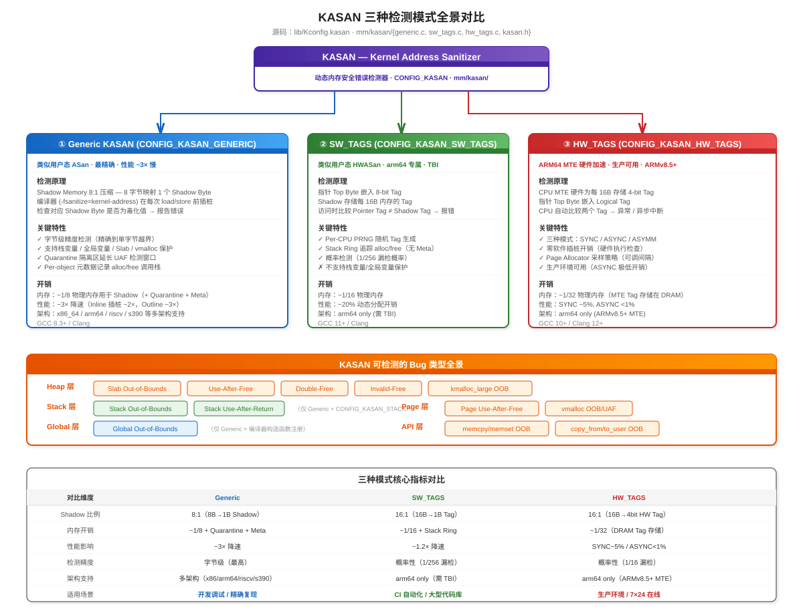

KASAN 在 `lib/Kconfig.kasan` 中定义了三种**互斥**的检测模式（`choice` 语义，同一内核只能选一种）：

**① Generic KASAN (`CONFIG_KASAN_GENERIC`)**

```c
// mm/kasan/generic.c — Shadow Memory 检查核心
static __always_inline bool memory_is_poisoned_1(const void *addr)
{
    s8 shadow_value = *(s8 *)kasan_mem_to_shadow(addr);
    if (unlikely(shadow_value)) {
        s8 last_accessible_byte = (unsigned long)addr & KASAN_GRANULE_MASK;
        return unlikely(last_accessible_byte >= shadow_value);
    }
    return false;
}
```

- **原理**：每 8 字节内存对应 1 字节 Shadow Memory，编译器在每次 load/store 前插入检查代码
- **精度**：字节级，能检测 1 字节的越界
- **开销**：内存 ~1/8 + Quarantine + Meta，性能 ~3× 降速
- **编译器选项**：`-fsanitize=kernel-address`

**② Software Tag-Based KASAN (`CONFIG_KASAN_SW_TAGS`)**

```c
// mm/kasan/sw_tags.c — Per-CPU PRNG Tag 生成
u8 kasan_random_tag(void)
{
    u32 state = this_cpu_read(prng_state);
    state = 1664525 * state + 1013904223;  // 线性同余 PRNG
    this_cpu_write(prng_state, state);
    return (u8)(state % (KASAN_TAG_MAX + 1));
}
```

- **原理**：利用 ARM64 TBI（Top Byte Ignore），在指针高 8 位嵌入随机 Tag，Shadow 存储内存 Tag，访问时比较两者
- **精度**：概率性（1/256 漏检概率，因为 Tag 可能碰巧匹配）
- **开销**：内存 ~1/16，性能 ~20% 开销
- **编译器选项**：`-fsanitize=kernel-hwaddress`

**③ Hardware Tag-Based KASAN (`CONFIG_KASAN_HW_TAGS`)**

```c
// mm/kasan/kasan.h — HW_TAGS 三种检测模式
enum kasan_mode {
    KASAN_MODE_SYNC,    // 同步：访问时立即触发异常
    KASAN_MODE_ASYNC,   // 异步：批量收集，极低开销
    KASAN_MODE_ASYMM,   // 混合：读异步+写同步
};
```

- **原理**：依赖 ARM64 MTE（Memory Tagging Extension）硬件，CPU 为每 16 字节存储 4-bit Tag，每次访存硬件自动比较
- **精度**：概率性（1/16 漏检概率，4-bit Tag 只有 16 种值）
- **开销**：内存 ~1/32（Tag 存储在 DRAM），性能 SYNC ~5%、ASYNC < 1%
- **硬件要求**：ARMv8.5+ CPU with MTE

三种模式配置**互斥**：

```
# lib/Kconfig.kasan — choice 语义
CONFIG_KASAN_GENERIC=y   # 或
CONFIG_KASAN_SW_TAGS=y   # 或
CONFIG_KASAN_HW_TAGS=y   # 三选一
```

#### 6.1.3 各模式适用场景与选择决策树

```
开始选择 KASAN 模式
    │
    ├─ 有 ARMv8.5+ MTE 硬件？
    │   ├─ Yes → 需要在生产环境使用？
    │   │         ├─ Yes → HW_TAGS (ASYNC 模式，<1% 开销)
    │   │         └─ No  → HW_TAGS (SYNC 模式，精确定位) 或 Generic (最精确)
    │   └─ No  → 继续判断
    │
    ├─ 需要字节级精度 或 检测栈/全局变量越界？
    │   ├─ Yes → Generic (唯一支持栈/全局变量的模式)
    │   └─ No  → 继续判断
    │
    ├─ 在 ARM64 平台？
    │   ├─ Yes → 需要 CI 大规模跑测试？
    │   │         ├─ Yes → SW_TAGS (比 Generic 快 ~60%，适合大型代码库)
    │   │         └─ No  → Generic (最精确) 或 SW_TAGS (更快)
    │   └─ No  → Generic (x86/riscv/s390 等只支持 Generic)
    │
    └─ 默认选择 → Generic
```

**典型场景映射**：

| 场景 | 推荐模式 | 理由 |
|------|----------|------|
| 开发阶段逐行调试 | Generic | 字节级精度 + 栈/全局变量保护 + Quarantine |
| CI/CD 自动化测试 | SW_TAGS 或 Generic | SW_TAGS 更快，Generic 更精确 |
| ARM64 SoC 量产 | HW_TAGS (ASYNC) | < 1% 开销，不影响用户体验 |
| 复现偶发 UAF | Generic | Quarantine 延长检测窗口 |
| 性能基准测试 | 关闭 KASAN | 任何模式都有不可忽略的开销 |

#### 6.1.4 KASAN 能检测的 Bug 类型全景

根据 `mm/kasan/kasan.h` 中的 Shadow Byte 编码值和 `mm/kasan/report.c` 的 bug 分类逻辑，KASAN 可检测以下类型：

**Heap（Slab / kmalloc / Page Allocator）层**：

| Bug 类型 | 触发条件 | Shadow 值 | 三种模式支持 |
|----------|----------|-----------|-------------|
| **Slab OOB** | 访问超出 slab object 边界 | `0xFC` (KASAN_SLAB_REDZONE) | Generic ✓ SW_TAGS ✓ HW_TAGS ✓ |
| **Use-After-Free** | 访问已 kfree 的对象 | `0xFB` (KASAN_SLAB_FREE) | Generic ✓ SW_TAGS ✓ HW_TAGS ✓ |
| **Double-Free** | 对同一对象 kfree 两次 | 触发 kasan_report_invalid_free | Generic ✓ SW_TAGS ✓ HW_TAGS ✓ |
| **Invalid-Free** | kfree 非法地址 | 触发 kasan_report_invalid_free | Generic ✓ SW_TAGS ✓ HW_TAGS ✓ |
| **kmalloc_large OOB** | 超出 kmalloc_large 边界 | `0xFE` (KASAN_PAGE_REDZONE) | Generic ✓ SW_TAGS ✓ HW_TAGS ✓ |
| **Page UAF** | 访问已释放的页面 | `0xFF` (KASAN_PAGE_FREE) | Generic ✓ SW_TAGS ✓ HW_TAGS ✓ |
| **vmalloc OOB/UAF** | 超出 vmalloc 区域 | `0xF8` (KASAN_VMALLOC_INVALID) | Generic ✓ SW_TAGS ✓ HW_TAGS ✓ |

**Stack（栈变量）层**（仅 Generic + `CONFIG_KASAN_STACK`）：

```c
// mm/kasan/kasan.h — 编译器 ABI 定义的栈 Shadow 值
#define KASAN_STACK_LEFT     0xF1  // 栈帧左 redzone
#define KASAN_STACK_MID      0xF2  // 变量间 redzone
#define KASAN_STACK_RIGHT    0xF3  // 栈帧右 redzone
#define KASAN_STACK_PARTIAL  0xF4  // 部分有效
```

**Global（全局变量）层**（仅 Generic）：

```c
#define KASAN_GLOBAL_REDZONE 0xF9  // 全局变量 redzone
```

编译器通过 `__asan_register_globals()` 构造函数在启动时注册所有全局变量并在其周围布置 redzone。

### 6.2 Generic KASAN — Shadow Memory 检测原理

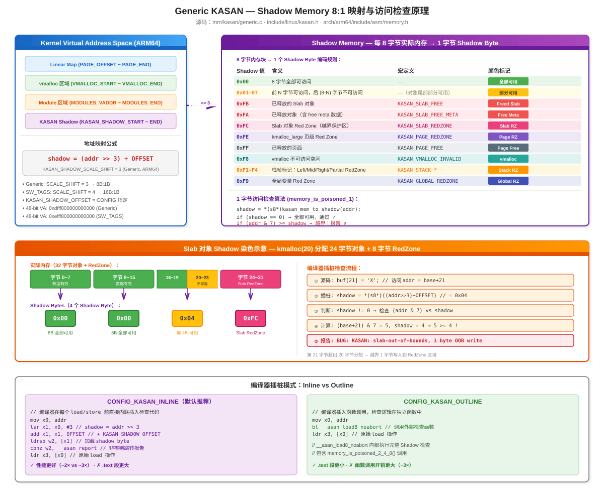

#### 6.2.1 Shadow Memory 地址映射原理 — 8:1 压缩编码

Generic KASAN 的核心思想是为内核虚拟地址空间建立一个**影子映射区**（Shadow Memory），每 **8 字节**内核内存对应 **1 字节** Shadow Memory，编码该内存区域的可访问性状态。

**地址映射公式**（`include/linux/kasan.h`）：

```c
static inline void *kasan_mem_to_shadow(const void *addr)
{
    return (void *)((unsigned long)addr >> KASAN_SHADOW_SCALE_SHIFT)
            + KASAN_SHADOW_OFFSET;
}
```

**ARM64 平台参数**（`arch/arm64/Makefile`）：

| 参数 | Generic | SW_TAGS |
|------|---------|---------|
| `KASAN_SHADOW_SCALE_SHIFT` | 3（8B:1B） | 4（16B:1B） |
| `KASAN_SHADOW_OFFSET`（48-bit VA） | `0xdfff800000000000` | `0xefff800000000000` |
| Shadow 占用比例 | 1/8 物理内存 | 1/16 物理内存 |

**Shadow 区域计算**（`arch/arm64/include/asm/memory.h`）：

```c
#define KASAN_SHADOW_OFFSET  _AC(CONFIG_KASAN_SHADOW_OFFSET, UL)
#define KASAN_SHADOW_END     ((UL(1) << (64 - KASAN_SHADOW_SCALE_SHIFT)) + KASAN_SHADOW_OFFSET)
#define _KASAN_SHADOW_START(va)  (KASAN_SHADOW_END - (UL(1) << ((va) - KASAN_SHADOW_SCALE_SHIFT)))
#define KASAN_SHADOW_START   _KASAN_SHADOW_START(vabits_actual)
#define PAGE_END             KASAN_SHADOW_START  // Shadow 紧邻 Linear Map 下方
```

以 48-bit VA、Generic 模式为例：
- **KASAN_SHADOW_END** = `(1 << 61) + 0xdfff800000000000` = `0xe000_0000_0000_0000`
- **KASAN_SHADOW_START** = `SHADOW_END - (1 << 45)` = `0xdfff_e000_0000_0000`
- Shadow 区域跨度 = `1 << 45` = **32 TB**，对应 `32TB × 8 = 256 TB` 内核虚拟地址空间

#### 6.2.2 Shadow Byte 编码规则与毒化值表

每个 Shadow Byte 编码了对应 8 字节（一个 **granule**，`KASAN_GRANULE_SIZE = 1 << 3 = 8`）内存的可访问性。定义在 `mm/kasan/kasan.h`：

```c
/* Generic KASAN Shadow Byte 编码 */
#define KASAN_PAGE_FREE         0xFF  /* 已释放页面 */
#define KASAN_PAGE_REDZONE      0xFE  /* kmalloc_large Red Zone */
#define KASAN_SLAB_REDZONE      0xFC  /* Slab 对象 Red Zone */
#define KASAN_SLAB_FREE         0xFB  /* 已释放 Slab 对象 */
#define KASAN_SLAB_FREE_META    0xFA  /* 含 free meta 的已释放对象 */
#define KASAN_GLOBAL_REDZONE    0xF9  /* 全局变量 Red Zone */
#define KASAN_VMALLOC_INVALID   0xF8  /* vmalloc 不可访问区 */

/* 栈帧标记（编译器 ABI，不可更改） */
#define KASAN_STACK_LEFT        0xF1  /* 栈帧左 Red Zone */
#define KASAN_STACK_MID         0xF2  /* 变量间 Red Zone */
#define KASAN_STACK_RIGHT       0xF3  /* 栈帧右 Red Zone */
#define KASAN_STACK_PARTIAL     0xF4  /* 部分有效 */

/* alloca Red Zone */
#define KASAN_ALLOCA_LEFT       0xCA
#define KASAN_ALLOCA_RIGHT      0xCB
```

**Shadow Byte 值的判定逻辑**：

| Shadow 值 | 含义 | 访问规则 |
|-----------|------|----------|
| `0x00` | 8 字节全部可访问 | 任意字节访问均合法 |
| `0x01`~`0x07` | 前 N 字节可访问 | `(addr & 7) < shadow_value` 则合法 |
| `0xF1`~`0xFF` | 各类毒化标记 | 任何访问都非法 |

#### 6.2.3 编译器插桩机制 — Inline vs Outline 检查插入

Generic KASAN 依赖编译器在每次内存访问前**自动插入检查代码**。编译器标志为 `-fsanitize=kernel-address`，支持两种插桩策略：

**Inline 插桩**（`CONFIG_KASAN_INLINE`，默认）：

```asm
// ARM64 编译器生成的 Inline 检查（伪代码）
// 原始代码: int x = *(int *)addr;  // 4 字节 load
    lsr   x1, x0, #3              // shadow_addr = addr >> 3
    add   x1, x1, KASAN_SHADOW_OFFSET
    ldrsb w2, [x1]                // shadow_value = *shadow_addr
    cbnz  w2, .Lreport            // 非零 → 进入慢路径检查
    ldr   w3, [x0]                // 原始 load（快路径）
    ...
.Lreport:
    // 慢路径：完整检查 + 报告
    bl    __asan_report_load4_noabort
```

**Outline 插桩**（`CONFIG_KASAN_OUTLINE`）：

```asm
// 编译器生成函数调用
    mov   x0, addr
    bl    __asan_load4_noabort     // 调用外部检查函数
    ldr   w3, [x0]                // 原始 load
```

两种模式性能对比（`lib/Kconfig.kasan`）：

| 维度 | Inline | Outline |
|------|--------|---------|
| 性能降速 | ~2× | ~3× |
| .text 段增长 | 显著增大 | 增长较小 |
| 检查效率 | 分支预测友好，热路径短 | 函数调用开销 |
| 适用场景 | 性能敏感的开发调试 | 内存受限平台 |

#### 6.2.4 内存访问检查完整流程 — 从 load/store 到 bug report

检查核心函数在 `mm/kasan/generic.c`：

```c
/* 统一入口：根据编译时常量 size 分发到特化检查 */
static __always_inline bool memory_is_poisoned(const void *addr, size_t size)
{
    if (__builtin_constant_p(size)) {
        switch (size) {
        case 1:  return memory_is_poisoned_1(addr);
        case 2:
        case 4:
        case 8:  return memory_is_poisoned_2_4_8(addr, size);
        case 16: return memory_is_poisoned_16(addr);
        default: BUILD_BUG();
        }
    }
    return memory_is_poisoned_n(addr, size);  // 任意大小
}

/* 1 字节检查 — 最基础的判断逻辑 */
static __always_inline bool memory_is_poisoned_1(const void *addr)
{
    s8 shadow_value = *(s8 *)kasan_mem_to_shadow(addr);
    if (unlikely(shadow_value)) {
        s8 last_accessible_byte = (unsigned long)addr & KASAN_GRANULE_MASK;
        return unlikely(last_accessible_byte >= shadow_value);
    }
    return false;
}

/* 完整检查入口 */
static __always_inline bool check_region_inline(const void *addr,
                        size_t size, bool write, unsigned long ret_ip)
{
    if (!kasan_enabled())         return true;   // KASAN 未启用
    if (unlikely(size == 0))      return true;   // 零大小访问
    if (unlikely(addr + size < addr))             // 地址回绕
        return !kasan_report(addr, size, write, ret_ip);
    if (unlikely(!addr_has_metadata(addr)))        // 地址无 shadow 映射
        return !kasan_report(addr, size, write, ret_ip);
    if (likely(!memory_is_poisoned(addr, size)))   // 快路径：未毒化
        return true;
    return !kasan_report(addr, size, write, ret_ip);  // 慢路径：报告
}
```

**检查流程总结**：

```
load/store 指令
    │
    ├─ 编译器插入检查代码（Inline 或 bl __asan_loadN）
    │
    ├─ kasan_enabled() == false? → 直接放行
    │
    ├─ addr_has_metadata(addr)? → 无 shadow → 报告
    │
    ├─ memory_is_poisoned(addr, size)?
    │   ├─ shadow == 0x00 → 通过 ✓
    │   ├─ shadow == 0x01~0x07 → 比较 (addr & 7) < shadow?
    │   │   ├─ Yes → 通过 ✓（在有效范围内）
    │   │   └─ No  → 越界 → kasan_report()
    │   └─ shadow >= 0xF1 → 毒化区 → kasan_report()
    │
    └─ kasan_report() → 打印完整 bug 报告
```

#### 6.2.5 ARM64 Shadow Memory 虚拟地址空间布局

ARM64 48-bit VA 模式下，内核虚拟地址空间布局（上半部分 `0xFFFF_0000_0000_0000 ~ 0xFFFF_FFFF_FFFF_FFFF`）：

```
┌──────────────────────────────────────────────────┐  0xFFFF_FFFF_FFFF_FFFF
│                 Fixmap / PCI I/O                  │
├──────────────────────────────────────────────────┤
│              vmemmap (struct page[])               │
├──────────────────────────────────────────────────┤
│              vmalloc / ioremap 区域                │  VMALLOC_START ~ VMALLOC_END
├──────────────────────────────────────────────────┤
│                 Module 区域                        │  MODULES_VADDR ~ MODULES_END
├──────────────────────────────────────────────────┤  PAGE_OFFSET
│         Linear Map (直接映射物理内存)               │  PAGE_OFFSET ~ PAGE_END
├──────────────────────────────────────────────────┤  PAGE_END = KASAN_SHADOW_START
│                                                    │
│   ★ KASAN Shadow Memory (1/8 虚拟地址空间)         │  KASAN_SHADOW_START ~ KASAN_SHADOW_END
│     Generic: ~32 TB (48-bit VA)                    │
│     映射公式: shadow_addr = (addr >> 3) + OFFSET   │
│                                                    │
├──────────────────────────────────────────────────┤  KASAN_SHADOW_END
│                 Guard hole                         │
└──────────────────────────────────────────────────┘  0xFFFF_0000_0000_0000
```

#### 6.2.6 Slab 对象 Shadow 染色全过程 — alloc/free/redzone

当 SLUB 分配器分配一个 slab 对象时，KASAN 通过 `mm/kasan/common.c` 中的 Hook 函数进行 Shadow 染色：

**① slab 页初始化** — `__kasan_poison_slab()`：

```c
// mm/kasan/common.c — 整个 slab 页毒化为 SLAB_REDZONE
void __kasan_poison_slab(struct slab *slab)
{
    // 重置所有页面的 KASAN tag
    for (i = 0; i < compound_nr(page); i++)
        page_kasan_tag_reset(page + i);
    // 整页毒化为 Slab RedZone
    kasan_poison(page_address(page), page_size(page),
                 KASAN_SLAB_REDZONE, false);
}
```

**② 对象分配** — 分配时 unpoison 对象区域：

```
分配 kmalloc(20) → SLUB 选择 kmalloc-32 缓存（32 字节对象）:

Shadow 变化：
  对象前:  [FC][FC][FC][FC]  — 全部 SLAB_REDZONE
  分配后:  [00][00][04][FC]  — 前 20 字节解毒，后 12 字节保持 RedZone
                     ↑
              20 & 7 = 4，前 4 字节可用
```

**③ 对象释放** — 重新毒化为 `KASAN_SLAB_FREE`：

```
kfree(ptr) 后:
  [FB][FB][FB][FC]  — 对象区域毒化为 0xFB，RedZone 保持 0xFC
```

**④ Quarantine 持有期间** — 对象保持 `0xFB` 毒化状态，任何 UAF 访问会被检测

#### 6.2.7 栈变量保护 — 编译器栈帧 Shadow 插桩

启用 `CONFIG_KASAN_STACK` 后，编译器在函数栈帧中自动插入 Red Zone：

```c
void example_function(void) {
    char buf[16];    // 原始局部变量
    int value;
    // 编译器实际生成的栈布局:
    // [KASAN_STACK_LEFT (32B)] [buf (16B)] [KASAN_STACK_MID (32B)]
    // [value (4B + padding)] [KASAN_STACK_RIGHT (32B)]
}
```

编译器在函数入口时毒化所有 Red Zone 区域（Shadow 值 `0xF1`/`0xF2`/`0xF3`），在函数返回时解毒整个栈帧。

> **注意**：`CONFIG_KASAN_STACK` 会显著增加栈空间使用（`KASAN_THREAD_SHIFT = 1`，即栈大小翻倍），Clang 编译器下可能导致栈溢出（参见 LLVM PR#38809），因此 Kconfig 标记为 `unsafe`。

#### 6.2.8 全局变量保护 — 编译器构造函数与 redzone 注册

编译器为每个全局变量创建 `kasan_global` 描述结构，并在模块/内核启动时通过构造函数注册：

```c
// mm/kasan/kasan.h — 编译器 ABI 结构
struct kasan_global {
    const void *beg;               // 全局变量起始地址
    size_t size;                   // 变量大小
    size_t size_with_redzone;      // 含 redzone 的大小（32 字节对齐）
    const void *name;              // 变量名
    const void *module_name;       // 所在模块名
    unsigned long has_dynamic_init; // C++ 动态初始化标记
    struct kasan_source_location *location;  // 源码位置
};
```

注册流程：

```
编译器生成构造函数 → __asan_register_globals(globals[], n)
    │
    ├─ 遍历每个 kasan_global 结构
    │   ├─ 解毒变量本身区域（Shadow = 0x00）
    │   └─ 毒化 redzone 区域（Shadow = KASAN_GLOBAL_REDZONE = 0xF9）
    │
    └─ 模块卸载时 → __asan_unregister_globals() 清除 Shadow
```

### 6.3 SW_TAGS KASAN — 软件标签检测原理

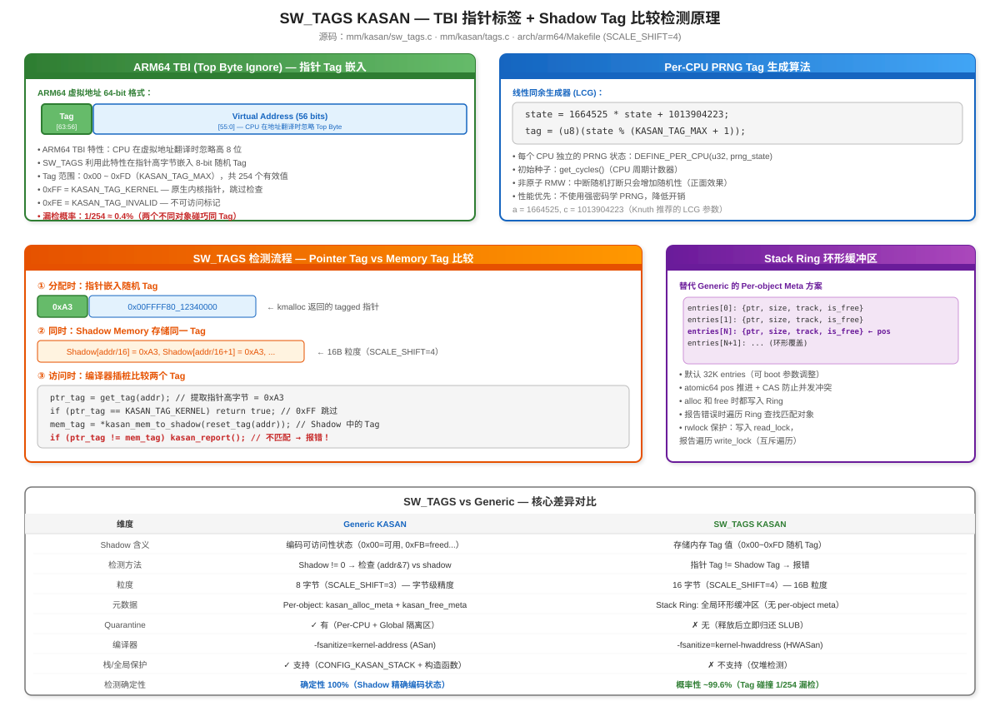

#### 6.3.1 ARM64 Top Byte Ignore (TBI) 硬件特性

SW_TAGS KASAN 的前提是 ARM64 的 **TBI（Top Byte Ignore）** 硬件特性：CPU 在地址翻译时**忽略虚拟地址的高 8 位**（[63:56]），这 8 位可以自由存放元数据。

```
ARM64 Tagged 指针格式（64-bit）：
┌─────────┬──────────────────────────────────────────┐
│ Tag [63:56] │  Virtual Address [55:0]                    │
│  (8-bit)    │  CPU 实际用于地址翻译的部分                  │
└─────────┴──────────────────────────────────────────┘
```

KASAN 利用 TBI 在每个 slab 指针的高字节嵌入**随机 Tag**，同时在 Shadow Memory 中存储同一 Tag。内核操作 Tag 的宏定义（`arch/arm64/include/asm/kasan.h`）：

```c
#define arch_kasan_set_tag(addr, tag)   __tag_set(addr, tag)
#define arch_kasan_reset_tag(addr)      __tag_reset(addr)
#define arch_kasan_get_tag(addr)        __tag_get(addr)
```

**关键 Tag 值**（`include/linux/kasan-tags.h`）：

| Tag | 常量 | 含义 |
|-----|------|------|
| `0xFF` | `KASAN_TAG_KERNEL` | 原生内核指针，跳过检查 |
| `0xFE` | `KASAN_TAG_INVALID` | 不可访问标记（类似 Generic 的毒化值） |
| `0x00`~`0xFD` | 有效 Tag 范围 | `KASAN_TAG_MAX = 0xFD`，共 254 个有效值 |

#### 6.3.2 Tag 生成算法 — Per-CPU PRNG（线性同余）

SW_TAGS 使用 Per-CPU 的**线性同余生成器（LCG）** 生成随机 Tag（`mm/kasan/sw_tags.c`）：

```c
static DEFINE_PER_CPU(u32, prng_state);

void __init kasan_init_sw_tags(void)
{
    int cpu;
    for_each_possible_cpu(cpu)
        per_cpu(prng_state, cpu) = (u32)get_cycles();  // 初始种子 = CPU 周期计数

    kasan_init_tags();   // 初始化 Stack Ring
    kasan_enable();
}

u8 kasan_random_tag(void)
{
    u32 state = this_cpu_read(prng_state);
    state = 1664525 * state + 1013904223;  // Knuth 推荐的 LCG 参数
    this_cpu_write(prng_state, state);
    return (u8)(state % (KASAN_TAG_MAX + 1));  // 0x00 ~ 0xFD
}
```

**设计权衡**：
- 不使用强密码学 PRNG（如 `get_random_bytes()`），因为每次 `kmalloc` 都要调用，性能是首要考虑
- 非原子 RMW（read-modify-write）：如果被中断打断，只是两个上下文拿到相同 Tag，不影响正确性
- 中断随机打断反而增加随机性（源码注释：*"this non-atomic RMW sequence has in fact positive effect"*）

#### 6.3.3 指针 Tag vs 内存 Tag 比较检测流程

SW_TAGS 的检测逻辑在 `mm/kasan/sw_tags.c` 的 `kasan_check_range()` 中：

```c
bool kasan_check_range(const void *addr, size_t size, bool write,
                       unsigned long ret_ip)
{
    u8 tag = get_tag((const void *)addr);  // 提取指针高字节 Tag

    // 0xFF = 原生内核指针（kmap/virt_to_page 丢失 tag），跳过
    if (tag == KASAN_TAG_KERNEL)
        return true;

    void *untagged_addr = kasan_reset_tag((const void *)addr);
    if (unlikely(!addr_has_metadata(untagged_addr)))
        return !kasan_report(addr, size, write, ret_ip);

    u8 *shadow_first = kasan_mem_to_shadow(untagged_addr);
    u8 *shadow_last  = kasan_mem_to_shadow(untagged_addr + size - 1);

    // 遍历覆盖范围内的所有 Shadow Byte，逐个比较 Tag
    for (u8 *shadow = shadow_first; shadow <= shadow_last; shadow++) {
        if (*shadow != tag)                   // Tag 不匹配！
            return !kasan_report(addr, size, write, ret_ip);
    }
    return true;
}
```

**检测流程**：

```
kmalloc(64) 返回 tagged 指针: 0xA300_FFFF_8012_0000
    │
    ├─ 指针 Tag = 0xA3 (高字节)
    ├─ 实际地址 = 0x0000_FFFF_8012_0000 (TBI 忽略高字节)
    ├─ Shadow Memory 中: Shadow[addr/16] = 0xA3 (对象区域)
    │                     Shadow[addr/16+4] = 0xFE (RedZone, INVALID)
    │
    ├─ 正常访问 ptr[0~63]:  Tag 0xA3 == Shadow 0xA3 → 通过 ✓
    ├─ 越界访问 ptr[64]:    Tag 0xA3 != Shadow 0xFE → 报错 ✗
    └─ kfree(ptr) 后新 Tag: Shadow 设为新随机值 0x5B
        ├─ UAF 访问:        Tag 0xA3 != Shadow 0x5B → 报错 ✗
        └─ 漏检情况:        新 Tag 碰巧 == 0xA3 → 漏检 (1/254 概率)
```

#### 6.3.4 HWASAN Load/Store 检查宏

编译器使用 `-fsanitize=kernel-hwaddress` 插桩，生成 `__hwasan_load/store` 调用（`mm/kasan/sw_tags.c`）：

```c
#define DEFINE_HWASAN_LOAD_STORE(size)                      \
    void __hwasan_load##size##_noabort(void *addr) {        \
        kasan_check_range(addr, size, false, _RET_IP_);     \
    }                                                       \
    void __hwasan_store##size##_noabort(void *addr) {       \
        kasan_check_range(addr, size, true, _RET_IP_);      \
    }

DEFINE_HWASAN_LOAD_STORE(1);   // __hwasan_load1_noabort / __hwasan_store1_noabort
DEFINE_HWASAN_LOAD_STORE(2);
DEFINE_HWASAN_LOAD_STORE(4);
DEFINE_HWASAN_LOAD_STORE(8);
DEFINE_HWASAN_LOAD_STORE(16);
// + __hwasan_loadN_noabort / __hwasan_storeN_noabort 任意大小
```

与 Generic 的 `__asan_load/store` 系列对应，但底层调用的检查逻辑不同：Generic 检查 Shadow 是否毒化，SW_TAGS 检查 Tag 是否匹配。

#### 6.3.5 Stack Ring 环形缓冲区追踪机制

SW_TAGS 不使用 per-object 元数据（`kasan_requires_meta() = false`），而是通过**全局 Stack Ring** 记录分配/释放的调用栈（`mm/kasan/tags.c`）：

```c
struct kasan_stack_ring_entry {
    void *ptr;                  // 对象地址
    size_t size;                // 对象大小
    struct kasan_track track;   // {pid, stack_handle, cpu, timestamp}
    bool is_free;               // true = 释放记录, false = 分配记录
};

struct kasan_stack_ring {
    rwlock_t lock;              // read: 写入条目, write: 遍历报告
    size_t size;                // 条目数量（默认 32768）
    atomic64_t pos;             // 当前写入位置（环形递增）
    struct kasan_stack_ring_entry *entries;  // memblock 分配
};
```

**写入流程**（`save_stack_info()`）：

```c
// 在 alloc 和 free 时调用
read_lock_irqsave(&stack_ring.lock, flags);  // 读锁允许并发写入
next:
    pos = atomic64_fetch_add(1, &stack_ring.pos);  // 原子推进位置
    entry = &stack_ring.entries[pos % stack_ring.size];
    old_ptr = READ_ONCE(entry->ptr);
    if (old_ptr == STACK_RING_BUSY_PTR) goto next;  // 忙等
    if (!try_cmpxchg(&entry->ptr, &old_ptr, STACK_RING_BUSY_PTR))
        goto next;  // CAS 失败，其他 CPU 抢先
    // 填写条目
    entry->size = cache->object_size;
    kasan_set_track(&entry->track, stack);
    entry->is_free = is_free;
    entry->ptr = object;  // 最后写入 ptr 解除 BUSY 状态
read_unlock_irqrestore(&stack_ring.lock, flags);
```

**关键参数**：
- 默认大小：`KASAN_STACK_RING_SIZE_DEFAULT = 32 << 10 = 32768` 条目
- Boot 参数调整：`kasan.stack_ring_size=<N>`
- 禁用调用栈收集：`kasan.stacktrace=off`（减少开销）

#### 6.3.6 与 Generic 模式的 Shadow Memory 差异

| 差异点 | Generic | SW_TAGS |
|--------|---------|---------|
| Shadow 粒度 | 8B:1B（`SCALE_SHIFT=3`） | 16B:1B（`SCALE_SHIFT=4`） |
| Shadow 编码 | 可访问性状态（0x00=可用, 0xFB=freed） | Tag 值（0x00~0xFD 随机 Tag, 0xFE=invalid） |
| Shadow 内存占用 | 1/8 物理内存 | 1/16 物理内存 |
| `KASAN_SHADOW_OFFSET`（ARM64 48-bit） | `0xdfff800000000000` | `0xefff800000000000` |
| Shadow 判定 | `shadow != 0` → 进入慢路径逐字节比较 | `ptr_tag != shadow_tag` → 直接报错 |
| 部分可用编码 | `0x01~0x07` 表示前 N 字节可用 | 无此概念（全 16B 同一 Tag） |

### 6.4 HW_TAGS KASAN — ARM64 MTE 硬件加速检测

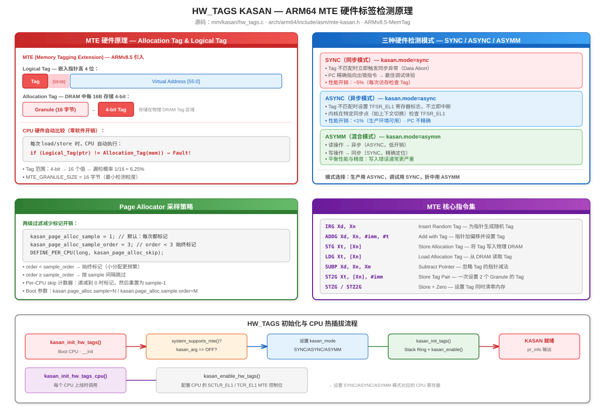

#### 6.4.1 ARMv8.5 MTE 硬件原理 — Allocation Tag 与 Logical Tag

HW_TAGS KASAN 依赖 ARM64 的 **MTE（Memory Tagging Extension）** 硬件特性（ARMv8.5 引入），由 CPU 在**每次内存访问时自动比较 Tag**，实现零软件插桩开销的内存安全检测。

**两种 Tag**：

| Tag 类型 | 位宽 | 存储位置 | 设置方式 |
|----------|------|----------|----------|
| **Logical Tag** | 4-bit | 指针的 [59:56] 位 | 软件通过 IRG/ADDG 指令设置 |
| **Allocation Tag** | 4-bit | 物理 DRAM 专用存储 | 软件通过 STG/ST2G 指令写入 |

**硬件检测原理**：CPU 在每次 load/store 时自动执行：

```
if (Logical_Tag(pointer[59:56]) != Allocation_Tag(memory_granule))
    → 触发 Tag Check Fault（同步异常或异步标记）
```

**MTE Granule**：16 字节为最小标记单位（`MTE_GRANULE_SIZE = 16`），每个 Granule 存储一个 4-bit Allocation Tag。Tag 值范围 0~15，共 16 种，漏检概率 **1/16 ≈ 6.25%**。

#### 6.4.2 三种硬件检测模式 — SYNC / ASYNC / ASYMM

HW_TAGS 支持三种检测模式（`mm/kasan/kasan.h`）：

```c
enum kasan_mode {
    KASAN_MODE_SYNC,    // 同步模式
    KASAN_MODE_ASYNC,   // 异步模式
    KASAN_MODE_ASYMM,   // 混合模式
};
```

**① SYNC（同步模式）**：
- Tag 不匹配时**立即触发 Data Abort 异常**
- PC 精确指向出错指令，调试体验最好
- 性能开销 ~5%（每次访存的 Tag 比较在流水线中同步执行）
- 适用于：**开发调试、问题复现**

**② ASYNC（异步模式）**：
- Tag 不匹配时仅设置 `TFSR_EL1` 寄存器标志，**不中断执行**
- 内核在特定同步点（上下文切换、系统调用返回等）检查 `TFSR_EL1`
- 性能开销 **< 1%**（Tag 比较完全在硬件流水线中隐藏延迟）
- **PC 不精确**：报告时已离开出错点
- 适用于：**生产环境 7×24 在线检测**

**③ ASYMM（混合模式）**：
- 读操作 → ASYNC（低开销）
- 写操作 → SYNC（精确定位）
- 权衡逻辑：写入错误通常比读取错误更严重（内存损坏 vs 信息泄露）

**运行时判断**（`mm/kasan/kasan.h`）：

```c
static inline bool kasan_async_fault_possible(void)
{
    return kasan_mode == KASAN_MODE_ASYNC || kasan_mode == KASAN_MODE_ASYMM;
}

static inline bool kasan_sync_fault_possible(void)
{
    return kasan_mode == KASAN_MODE_SYNC || kasan_mode == KASAN_MODE_ASYMM;
}
```

#### 6.4.3 MTE Granule (16 字节) 与 4-bit Tag 存储

```c
// mm/kasan/kasan.h
#if defined(CONFIG_KASAN_GENERIC) || defined(CONFIG_KASAN_SW_TAGS)
#define KASAN_GRANULE_SIZE  (1UL << KASAN_SHADOW_SCALE_SHIFT)  // Generic:8, SW_TAGS:16
#else
#include <asm/mte-kasan.h>
#define KASAN_GRANULE_SIZE  MTE_GRANULE_SIZE  // HW_TAGS: 16 字节
#endif
```

**HW_TAGS 不使用软件 Shadow Memory**：
- Generic/SW_TAGS 需要在内核虚拟地址空间分配 Shadow 区域
- HW_TAGS 的 Allocation Tag 存储在**物理 DRAM 的专用 Tag 区域**（硬件管理）
- 内存开销约 **1/32**（每 16 字节 4-bit = 每 128 bit 数据需 4-bit Tag）

#### 6.4.4 MTE 指令集 — IRG / ADDG / STG / LDG / SUBP

| 指令 | 作用 | KASAN 使用场景 |
|------|------|----------------|
| `IRG Xd, Xn` | 生成随机 Tag 并嵌入指针 | `kasan_random_tag()` |
| `ADDG Xd, Xn, #imm, #tag` | 指针加偏移并设置 Tag | 对象指针计算 |
| `STG Xt, [Xn]` | 将 Xt 的 Tag 写入 [Xn] 对应 Granule | `kasan_unpoison()` 标记可用 |
| `ST2G Xt, [Xn]` | 一次设置 2 个 Granule 的 Tag | 大块内存快速标记 |
| `STZG Xt, [Xn]` | 设置 Tag + 清零内存 | 分配时初始化 |
| `LDG Xt, [Xn]` | 读取 Granule 的 Allocation Tag | `hw_get_mem_tag()` 报告 |
| `SUBP Xd, Xn, Xm` | 忽略 Tag 的指针减法 | 地址计算（避免 Tag 干扰） |

#### 6.4.5 Page Allocator 采样策略 — 采样间隔与 order 阈值

为降低生产环境开销，HW_TAGS 支持 Page Allocator 的**采样标记**（`mm/kasan/hw_tags.c`）：

```c
#define PAGE_ALLOC_SAMPLE_DEFAULT       1    // 默认：每次都标记
#define PAGE_ALLOC_SAMPLE_ORDER_DEFAULT 3    // order < 3 始终标记

unsigned long kasan_page_alloc_sample = PAGE_ALLOC_SAMPLE_DEFAULT;
unsigned int kasan_page_alloc_sample_order = PAGE_ALLOC_SAMPLE_ORDER_DEFAULT;
DEFINE_PER_CPU(long, kasan_page_alloc_skip);
```

**采样判定逻辑**：

```c
static inline bool kasan_sample_page_alloc(unsigned int order)
{
    if (kasan_page_alloc_sample == 1) return true;  // 无采样，全部标记
    if (order < kasan_page_alloc_sample_order)
        return true;  // 小 order 始终标记（高频分配，更可能出 bug）
    if (this_cpu_dec_return(kasan_page_alloc_skip) < 0) {
        this_cpu_write(kasan_page_alloc_skip, kasan_page_alloc_sample - 1);
        return true;  // 计数器归零，本次标记
    }
    return false;  // 跳过本次标记
}
```

**Boot 参数**：
- `kasan.page_alloc.sample=100` — 每 100 次大 order 分配标记 1 次
- `kasan.page_alloc.sample.order=3` — order < 3 始终标记

#### 6.4.6 CPU 热插拔与 Per-CPU 模式切换

HW_TAGS 需要对**每个 CPU** 配置 MTE 控制位（`mm/kasan/hw_tags.c`）：

```c
// 每个 CPU 上线时调用（包括 Boot CPU 和热插拔 CPU）
void kasan_init_hw_tags_cpu(void)
{
    // 无需检查 MTE 能力：此函数仅在 MTE 硬件上被调用
    if (kasan_arg == KASAN_ARG_OFF)
        return;
    kasan_enable_hw_tags();  // 配置 SCTLR_EL1 / TCR_EL1 的 MTE 位
}
```

`kasan_enable_hw_tags()` 设置 CPU 的系统寄存器：
- `SCTLR_EL1.ATA` — 使能 Allocation Tag Access（内核态 Tag 检查）
- `TCR_EL1.TCMA` — Tag Check Mode for Address space（SYNC/ASYNC/ASYMM）

#### 6.4.7 HW_TAGS 异步 Fault 处理流程

ASYNC 模式下，Tag 检查失败不会立即中断，而是延迟到同步点处理：

```
① CPU 执行 load/store
    │
    ├─ Tag 匹配 → 正常继续
    │
    └─ Tag 不匹配 → CPU 设置 TFSR_EL1 寄存器的错误标志位
                     （不触发异常，继续执行后续指令）
    │
② 到达同步点（上下文切换 / 系统调用返回 / 中断入口）
    │
    ├─ 内核检查 TFSR_EL1
    │   ├─ 无错误标志 → 继续
    │   └─ 有错误标志 → kasan_report_async()
    │
    └─ 报告内容：
        • 仅知道"某次访问发生了 Tag 不匹配"
        • 无法精确定位出错指令的 PC
        • 适合发现问题存在性，不适合精确调试
```

> **实战建议**：在 ASYNC 模式发现问题后，切换到 SYNC 模式复现以获取精确 PC。可通过 `kasan.mode=sync` Boot 参数或运行时切换。

**HW_TAGS 特有的 Boot 参数汇总**：

| 参数 | 默认值 | 说明 |
|------|--------|------|
| `kasan=off/on` | on | 启用/禁用 KASAN |
| `kasan.mode=sync/async/asymm` | sync | 检测模式 |
| `kasan.vmalloc=off/on` | on | vmalloc 区域保护 |
| `kasan.stacktrace=off/on` | on | 调用栈收集 |
| `kasan.write_only=off/on` | off | 仅检测写操作 |
| `kasan.fault=report/panic/panic_on_write` | report | 错误处理策略 |
| `kasan.page_alloc.sample=N` | 1 | 页分配采样间隔 |
| `kasan.page_alloc.sample.order=N` | 3 | 始终标记的最小 order |

### 6.5 KASAN 软件架构

> **核心思想**：KASAN 采用 **五层架构** 设计，通过 Makefile 条件编译实现 Generic / SW_TAGS / HW_TAGS 三种模式的互斥选择，共享公共核心层和报告框架，最大限度复用代码。

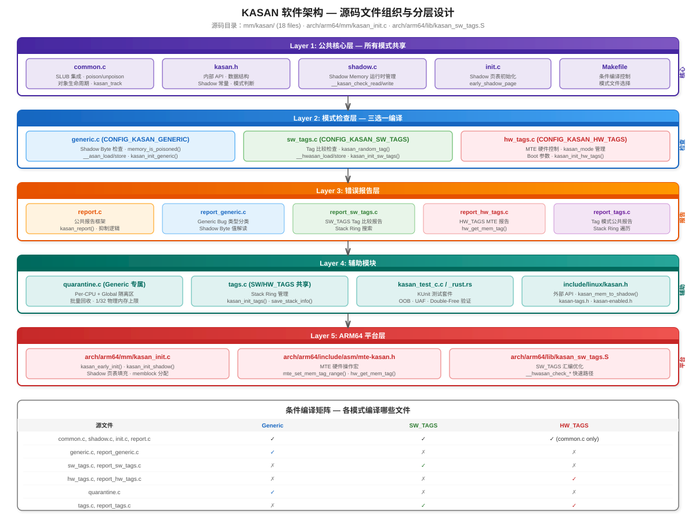

#### 6.5.1 架构总览 — 源码文件组织与分层设计

KASAN 代码主要位于 `mm/kasan/` 目录，共 18 个文件。架构分为五层：

| 层次 | 源文件 | 职责 |
|------|--------|------|
| **公共核心层** | `common.c`, `kasan.h`, `shadow.c`, `init.c`, `Makefile` | SLUB 集成、Shadow 管理、对象生命周期 |
| **模式检查层** | `generic.c` / `sw_tags.c` / `hw_tags.c`（三选一） | 内存访问检查的具体实现 |
| **报告层** | `report.c` + `report_generic.c` / `report_sw_tags.c` / `report_hw_tags.c` + `report_tags.c` | 错误检测与格式化输出 |
| **辅助模块层** | `quarantine.c`（Generic 专属）、`tags.c`（Tag 模式共享） | 隔离区管理、Stack Ring |
| **平台层** | `arch/arm64/mm/kasan_init.c`、`asm/mte-kasan.h`、`lib/kasan_sw_tags.S` | Shadow 页表初始化、MTE 硬件操作 |

**Makefile 条件编译矩阵**（`mm/kasan/Makefile`）：

```makefile
# mm/kasan/Makefile — 条件编译核心
obj-y := common.o report.o                                      # 所有模式共享
obj-$(CONFIG_KASAN_GENERIC) += init.o generic.o report_generic.o shadow.o quarantine.o
obj-$(CONFIG_KASAN_HW_TAGS) += hw_tags.o report_hw_tags.o tags.o report_tags.o
obj-$(CONFIG_KASAN_SW_TAGS) += init.o report_sw_tags.o shadow.o sw_tags.o tags.o report_tags.o
```

关键设计约束：
- **所有 .o 禁用 ftrace**：`CFLAGS_REMOVE_xxx.o = $(CC_FLAGS_FTRACE)` — 避免递归调用
- **禁用栈保护**：`-fno-stack-protector` — KASAN 自身不能被 KASAN 检测
- **禁用分支 profiling**：`-DDISABLE_BRANCH_PROFILING` — 避免递归
- **禁用 KASAN/UBSAN/KCOV 自检**：顶部三行 `xxx_SANITIZE := n`

#### 6.5.2 公共核心层 — common.c（SLUB 集成与对象生命周期）

`common.c` 是 KASAN 最核心的文件，**所有三种模式都编译**，负责与 SLUB 分配器的集成。

**1) 对象分配流程**

```
kmalloc() → __kasan_slab_alloc()
  ├── kasan_quarantine_reduce()    // 触发隔离区回收（仅 Generic）
  ├── assign_tag()                 // 分配 tag（Generic 返回 0xff）
  ├── set_tag(object, tag)         // 设置指针 tag（Tag 模式）
  ├── unpoison_slab_object()       // 去毒化对象
  │   ├── kasan_unpoison()         // 解除 shadow/tag 标记
  │   └── kasan_save_alloc_info()  // 保存分配栈信息
  └── poison_kmalloc_redzone()     // 精确毒化 redzone（Generic 字节级精度）
```

**2) 对象释放流程**

```
kfree() → __kasan_slab_free()
  ├── check_slab_allocation()      // 检查 double-free 和 invalid-free
  │   ├── nearest_obj() 验证      // 地址是否对齐到对象边界
  │   └── kasan_byte_accessible() // 对象是否已毒化（已释放）
  ├── poison_slab_object()         // 毒化整个对象
  │   ├── kasan_poison(KASAN_SLAB_FREE)
  │   └── kasan_save_free_info()   // 保存释放栈信息
  └── kasan_quarantine_put()       // 放入隔离区（仅 Generic）
      └── return true → SLUB 暂不放回 freelist
```

**3) tag 分配策略（assign_tag）**

```c
// mm/kasan/common.c
static inline u8 assign_tag(struct kmem_cache *cache, const void *object, bool init)
{
    if (IS_ENABLED(CONFIG_KASAN_GENERIC))
        return 0xff;                          // Generic 不使用 tag

    // 无构造函数且无 TYPESAFE_BY_RCU：分配时随机生成
    if (!cache->ctor && !(cache->flags & SLAB_TYPESAFE_BY_RCU))
        return init ? KASAN_TAG_KERNEL : kasan_random_tag();

    // 有构造函数或 TYPESAFE_BY_RCU：slab 创建时分配，后续复用
    return init ? kasan_random_tag() : get_tag(object);
}
```

**4) 页级 poison/unpoison**

```c
// mm/kasan/common.c — page_alloc 集成
bool __kasan_unpoison_pages(struct page *page, unsigned int order, bool init)
{
    if (!kasan_sample_page_alloc(order))   // HW_TAGS 采样过滤
        return false;
    tag = kasan_random_tag();
    kasan_unpoison(set_tag(page_address(page), tag), PAGE_SIZE << order, init);
    for (i = 0; i < (1 << order); i++)
        page_kasan_tag_set(page + i, tag); // 记录到 struct page
    return true;
}

void __kasan_poison_pages(struct page *page, unsigned int order, bool init)
{
    kasan_poison(page_address(page), PAGE_SIZE << order, KASAN_PAGE_FREE, init);
}
```

**5) kasan_enable/disable_current（软件模式专用）**

```c
// 通过 task_struct.kasan_depth 控制检查抑制
// 用于 SLUB 访问元数据时避免误报
void kasan_enable_current(void)  { current->kasan_depth++; }
void kasan_disable_current(void) { current->kasan_depth--; }
```

#### 6.5.3 Generic 检查层 — generic.c（Shadow 检查与插桩回调）

`generic.c` 仅在 `CONFIG_KASAN_GENERIC=y` 时编译，实现编译器插桩的回调函数。

**1) 核心检查函数 — memory_is_poisoned**

```c
// mm/kasan/generic.c — 编译器插桩的检查入口
static __always_inline bool memory_is_nonzero(const void *start, const void *end)
{
    // 逐字节检查 shadow memory 是否有非零值
    // 优化：先按 unsigned long 对齐批量检查，再处理尾部
}

static __always_inline bool memory_is_poisoned(const void *addr, size_t size)
{
    // 1-8 字节访问：检查单个 shadow byte
    //   shadow_value != 0 && shadow_value <= (addr % 8 + size - 1)
    // 大于 8 字节：检查 shadow memory 范围
    //   memory_is_nonzero(shadow_start, shadow_end)
}
```

**2) 编译器插桩回调**

GCC/Clang 在每次内存访问前插入 `__asan_loadN` / `__asan_storeN` 调用：

```c
// mm/kasan/generic.c
#define DEFINE_ASAN_LOAD_STORE(size)                    \
void __asan_load##size(unsigned long addr)              \
{                                                       \
    if (!check_region_inline(addr, size, false, _RET_IP_)) \
        return;                                         \
    kasan_report(addr, size, false, _RET_IP_);          \
}                                                       \
void __asan_store##size(unsigned long addr)             \
{                                                       \
    if (!check_region_inline(addr, size, true, _RET_IP_)) \
        return;                                         \
    kasan_report(addr, size, true, _RET_IP_);           \
}

DEFINE_ASAN_LOAD_STORE(1);   // __asan_load1, __asan_store1
DEFINE_ASAN_LOAD_STORE(2);   // __asan_load2, __asan_store2
DEFINE_ASAN_LOAD_STORE(4);   // __asan_load4, __asan_store4
DEFINE_ASAN_LOAD_STORE(8);   // __asan_load8, __asan_store8
DEFINE_ASAN_LOAD_STORE(16);  // __asan_load16, __asan_store16
```

**3) 检查流程**

```
__asan_load4(addr)
  → check_region_inline(addr, 4, false, ret_ip)
    → addr_has_metadata(addr)          // 地址是否在 KASAN 监控范围
    → memory_is_poisoned(addr, 4)      // 检查 shadow byte
      → shadow = *(u8*)kasan_mem_to_shadow(addr)
      → if (shadow != 0 && shadow <= addr%8+3) → 检测到越界！
    → kasan_report(addr, 4, false, ip) // 报告错误
```

**4) Inline vs Outline 插桩**

| 特性 | Inline (CONFIG_KASAN_INLINE) | Outline (CONFIG_KASAN_OUTLINE) |
|------|-----|------|
| 检查代码 | 编译器内联到每个访问点 | 调用 `__asan_loadN` 函数 |
| 性能 | 更快（无函数调用开销） | 更慢（~x2-3 性能下降） |
| 代码体积 | 更大（每个访问点展开） | 更小（共享检查函数） |
| 默认配置 | ARM64 默认选择 | — |

#### 6.5.4 SW_TAGS 检查层 — sw_tags.c（Tag 检查与 PRNG）

`sw_tags.c` 仅在 `CONFIG_KASAN_SW_TAGS=y` 时编译，实现基于 TBI 的标签检查。

**1) PRNG Tag 生成**

```c
// mm/kasan/sw_tags.c
u8 kasan_random_tag(void)
{
    if (kasan_enabled()) {
        u32 state = this_cpu_read(prng_state);
        state = (state ^ (state << 13)) & 0xFFFFFFFF;
        state = (state ^ (state >> 17)) & 0xFFFFFFFF;
        state = (state ^ (state << 5))  & 0xFFFFFFFF;
        this_cpu_write(prng_state, state);
        // 返回 1-0xFE（避免 0x00=匹配所有, 0xFF=native tag）
        return (u8)(state % (KASAN_TAG_MAX - KASAN_TAG_MIN + 1)) + KASAN_TAG_MIN;
    }
    return 0;
}
```

**2) 编译器回调 — __hwasan_loadN**

```c
// mm/kasan/sw_tags.c
#define DEFINE_HWASAN_LOAD_STORE(size)                      \
void __hwasan_load##size##_noabort(unsigned long addr)      \
{                                                           \
    check_tag(addr, size, false, _RET_IP_);                 \
}                                                           \
void __hwasan_store##size##_noabort(unsigned long addr)     \
{                                                           \
    check_tag(addr, size, true, _RET_IP_);                  \
}

// check_tag 核心：
//   ptr_tag = get_tag(addr)           // 取指针高 8 位
//   mem_tag = *(u8*)kasan_mem_to_shadow(kasan_reset_tag(addr))
//   if (ptr_tag != KASAN_TAG_KERNEL && ptr_tag != mem_tag)
//       kasan_report(addr, size, is_write, ip)
```

**3) 初始化 — PRNG 种子**

```c
// mm/kasan/sw_tags.c
void __init kasan_init_sw_tags(void)
{
    int cpu;
    for_each_possible_cpu(cpu)
        per_cpu(prng_state, cpu) = (u32)(get_cycles() + cpu * 123456789);
    kasan_init_tags();  // 初始化 Stack Ring（tags.c）
}
```

#### 6.5.5 HW_TAGS 检查层 — hw_tags.c（MTE 控制与 CPU 管理）

`hw_tags.c` 仅在 `CONFIG_KASAN_HW_TAGS=y` 时编译，管理 MTE 硬件的软件控制面。

**1) 模式管理（kasan_mode）**

```c
// mm/kasan/hw_tags.c
enum kasan_mode {
    KASAN_MODE_SYNC,          // 同步检查，立即 fault
    KASAN_MODE_ASYNC,         // 异步检查，延迟报告
    KASAN_MODE_ASYMM,         // 读异步 + 写同步
};
EXPORT_SYMBOL_GPL(kasan_mode);

// Boot 参数: kasan.mode=sync|async|asymm
```

**2) CPU 初始化与热插拔**

```c
// mm/kasan/hw_tags.c
void __init kasan_init_hw_tags(void)
{
    // 1. 检查 system_supports_mte()
    // 2. 解析 boot 参数（kasan.mode, kasan.vmalloc, kasan.page_alloc.sampling）
    // 3. kasan_init_tags() — 初始化 Stack Ring
    // 4. 注册 CPU 热插拔回调
    //    cpuhp_setup_state(CPUHP_AP_ONLINE_DYN, kasan_cpu_online, kasan_cpu_offline)
    // 5. static_branch_enable(&kasan_flag_enabled) — 运行时启用
}

// 每个 CPU 上线时配置 MTE 标签检查模式
static int kasan_cpu_online(unsigned int cpu)
{
    kasan_enable_hw_tags();   // → hw_init_tags() → 设置 SCTLR_EL1 TCF 位
    return 0;
}
```

**3) 页面采样**

```c
// mm/kasan/hw_tags.c — 降低 page_alloc 性能开销
static unsigned long page_alloc_sample_interval = 1;  // 1=全量检查
static unsigned long page_alloc_sample_order = 3;     // order>=3 始终检查

bool kasan_sample_page_alloc(unsigned int order)
{
    if (order >= page_alloc_sample_order)
        return true;
    // 按 sample_interval 采样
    if (this_cpu_inc_return(page_alloc_sample) < page_alloc_sample_interval)
        return false;
    this_cpu_write(page_alloc_sample, 0);
    return true;
}
```

#### 6.5.6 Shadow Memory 管理层 — shadow.c / init.c

**shadow.c — 运行时 Shadow 操作**

所有 `kasan_poison()` 和 `kasan_unpoison()` 的底层实现：

```c
// mm/kasan/shadow.c — Generic 和 SW_TAGS 模式
void kasan_poison(const void *addr, size_t size, u8 value, bool init)
{
    // Generic: value 是 shadow byte 编码（0xFB, 0xFC, 0xFF 等）
    // SW_TAGS: value 是 tag 值
    addr = kasan_reset_tag(addr);
    addr = (void *)round_up((unsigned long)addr, KASAN_GRANULE_SIZE);
    size = round_down(size, KASAN_GRANULE_SIZE);
    shadow = kasan_mem_to_shadow(addr);
    __memset(shadow, value, size >> KASAN_SHADOW_SCALE_SHIFT);
}

void kasan_unpoison(const void *addr, size_t size, bool init)
{
    // Generic: 将 shadow 清零（0=可访问），尾部字节写 size%8
    // SW_TAGS: 将 shadow 写为指针 tag
    u8 tag = get_tag(addr);
    addr = kasan_reset_tag(addr);
    shadow = kasan_mem_to_shadow(addr);
    __memset(shadow, tag, size >> KASAN_SHADOW_SCALE_SHIFT);
    if (size & KASAN_GRANULE_MASK) {
        // 处理非对齐尾部
    }
}
```

**检查函数 — 外部接口**

```c
// mm/kasan/shadow.c
bool __kasan_check_read(const void *addr, unsigned int size)
{
    return kasan_check_range((unsigned long)addr, size, false, _RET_IP_);
}
bool __kasan_check_write(const void *addr, unsigned int size)
{
    return kasan_check_range((unsigned long)addr, size, true, _RET_IP_);
}
// 这些函数由 memcpy/memset 等 memory intrinsics 调用
```

**init.c — 早期 Shadow 页表初始化**

```c
// mm/kasan/init.c — Generic 和 SW_TAGS 模式
void __init kasan_init_shadow(void)
{
    // 遍历 memblock 中所有 RAM 区域
    // 为每个区域的 shadow memory 分配真实物理页面
    // 替换 early_shadow_page（只读零页）为可写页面
}
```

#### 6.5.7 报告层 — report.c / report_generic.c / report_*_tags.c

报告层采用**公共框架 + 模式特化**的设计：

**report.c — 公共报告框架**

```c
// mm/kasan/report.c — 所有模式共享
static DEFINE_RAW_SPINLOCK(report_lock);

bool kasan_report(const void *addr, size_t size, bool is_write, unsigned long ip)
{
    // 1. 检查 report_suppressed_sw() — current->kasan_depth > 0 则抑制
    // 2. 检查 report_enabled() — multi_shot 或首次报告
    // 3. start_report():
    //    - disable_trace_on_warning()
    //    - lockdep_off()
    //    - report_suppress_start()  // HW: 禁用 tag 检查; SW: kasan_disable
    //    - raw_spin_lock_irqsave(&report_lock)
    //    - 打印 "===================================="
    // 4. 调用模式特化函数：
    //    - complete_report_info()   // 模式特化：确定 bug_type
    //    - print_error_description()
    //    - print_address_description()
    //    - print_memory_metadata()
    // 5. end_report():
    //    - 打印分隔线
    //    - check_panic_on_warn()
    //    - 根据 kasan.fault 参数决定是否 panic
    //    - add_taint(TAINT_BAD_PAGE)
}
```

**Bug 类型的三级判定**：

| 级别 | 函数 | 模式 | 判定依据 |
|------|------|------|----------|
| 报告类型 | `kasan_report()` / `kasan_report_invalid_free()` | 公共 | 是 access 还是 free 操作 |
| Bug 类型 | `get_bug_type()`（report_generic.c） | Generic | Shadow byte 值（0xFB→slab-oob, 0xFC→slab-uaf 等） |
| Bug 类型 | `kasan_complete_mode_report_info()`（report_sw/hw_tags.c） | Tag 模式 | alloc/free 状态 + tag 不匹配 |

**report.c 关键控制参数**：

```c
// Boot 参数
kasan.fault=report        // 仅报告（默认）
kasan.fault=panic         // 检测到错误立即 panic
kasan.fault=panic_on_write  // 仅写越界 panic

// Sysctl
kasan_multi_shot          // 允许报告多个 bug（默认仅第一个）
```

#### 6.5.8 隔离区层 — quarantine.c（Generic 专属）

隔离区 **仅 Generic 模式** 编译，用于延迟释放对象以检测 Use-After-Free。

**数据结构**：

```c
// mm/kasan/quarantine.c
struct qlist_head {        // 单链表 + 总大小
    struct qlist_node *head;
    struct qlist_node *tail;
    size_t bytes;
    bool offline;
};

// 两级隔离区：
static DEFINE_PER_CPU(struct qlist_head, cpu_quarantine);   // Per-CPU 批量队列
static struct qlist_head global_quarantine;                  // 全局回收队列
static DEFINE_RAW_SPINLOCK(quarantine_lock);
```

**工作流程**：

```
kfree(obj)
  → __kasan_slab_free()
    → poison_slab_object()       // 毒化对象
    → kasan_quarantine_put()
      → Per-CPU 队列积攒
      → 超过 QUARANTINE_PERCPU_SIZE → 批量转入 global_quarantine
        → global_quarantine.bytes > QUARANTINE_FRACTION → 触发 reduce
          → 批量释放最老的对象回 SLUB

下次 kmalloc():
  → __kasan_slab_alloc()
    → kasan_quarantine_reduce()  // 检查并回收
```

**内存上限**：总隔离区大小 ≤ `totalram_pages() / 32`（约 3% 物理内存）。

#### 6.5.9 标签追踪层 — tags.c（Stack Ring 管理）

`tags.c` 被 **SW_TAGS 和 HW_TAGS** 共同编译（`obj-$(CONFIG_KASAN_HW_TAGS) += tags.o`），管理 Stack Ring 和调用栈收集。

**Stack Ring 初始化**：

```c
// mm/kasan/tags.c
#define KASAN_STACK_RING_SIZE_DEFAULT (32 << 10)   // 默认 32K 条目

struct kasan_stack_ring stack_ring = {
    .lock = __RW_LOCK_UNLOCKED(stack_ring.lock)
};

void __init kasan_init_tags(void)
{
    // 解析 kasan.stacktrace=off/on
    // 解析 kasan.stack_ring_size=N
    if (kasan_stack_collection_enabled()) {
        if (!stack_ring.size)
            stack_ring.size = KASAN_STACK_RING_SIZE_DEFAULT;
        stack_ring.entries = memblock_alloc(
            sizeof(stack_ring.entries[0]) * stack_ring.size, SMP_CACHE_BYTES);
    }
}
```

**Stack Ring 写入**：

```c
// mm/kasan/tags.c
static void save_stack_info(struct kmem_cache *cache, void *object,
                            gfp_t gfp_flags, bool is_free)
{
    unsigned long flags;
    u32 idx;
    depot_stack_handle_t stack;

    stack = kasan_save_stack(gfp_flags, STACK_DEPOT_FLAG_CAN_ALLOC);

    // 原子递增获取环形缓冲区索引
    idx = atomic_inc_return(&stack_ring.pos) % stack_ring.size;

    // 使用 BUSY_PTR 标记写入中（防止并发读取）
    entry = &stack_ring.entries[idx];
    WRITE_ONCE(entry->ptr, STACK_RING_BUSY_PTR);

    entry->size = cache->object_size;
    entry->pid = current->pid;
    entry->stack = stack;
    entry->is_free = is_free;

    WRITE_ONCE(entry->ptr, (void *)object);  // 写入完成
}
```

#### 6.5.10 ARM64 平台层 — arch/arm64/mm/kasan_init.c

平台层负责 **Shadow Memory 的物理页表初始化**，在 `paging_init()` 之后、`setup_arch()` 返回前执行。

**初始化流程**：

```
head.S → start_kernel() → setup_arch()
  → paging_init()
    → kasan_early_init()        // 使用 early_shadow_page 填充整个 shadow 区域
  → kasan_init()                // 替换为真实物理页面
    → kasan_init_shadow()       // mm/kasan/init.c
      → for_each_mem_range()    // 遍历 memblock
        → kasan_populate_early_shadow()  // 为 shadow 分配真实页面
    → kasan_init_sw_tags()      // SW_TAGS: 初始化 PRNG + Stack Ring
    // 或 kasan_init_hw_tags()  // HW_TAGS: 启用 MTE + 注册 CPU 热插拔
```

**关键地址计算**（ARM64 48-bit VA）：

```
Shadow Offset = CONFIG_KASAN_SHADOW_OFFSET
  Generic:  0xdfff800000000000  (SCALE_SHIFT=3)
  SW_TAGS:  0xefff800000000000  (SCALE_SHIFT=4)

kasan_mem_to_shadow(addr) = (addr >> SCALE_SHIFT) + SHADOW_OFFSET

示例（Generic, addr=0xffff000000000000）：
  shadow = (0xffff000000000000 >> 3) + 0xdfff800000000000
         = 0x1fffe00000000000 + 0xdfff800000000000
         = 0xffffa00000000000  ← Shadow Memory 虚拟地址
```

**HW_TAGS 的平台层差异**：HW_TAGS 不使用 shadow.c / init.c，其 "shadow" 操作通过 MTE 硬件指令（`mte_set_mem_tag_range()`）直接写入物理内存的 Tag 位，由 `arch/arm64/include/asm/mte-kasan.h` 提供。

### 6.6 关键数据结构

> **核心思想**：Generic 模式使用 **per-object 元数据**（alloc_meta + free_meta）存储调用栈；Tag 模式使用 **全局 Stack Ring**（环形缓冲区）存储调用栈。两种策略的权衡是内存开销 vs 信息准确度。


#### 6.6.1 struct kasan_alloc_meta — 对象分配元数据（Generic 专属）

```c
// mm/kasan/kasan.h — Generic 专属
struct kasan_alloc_meta {
    struct kasan_track alloc_track;      // 分配调用栈
    depot_stack_handle_t aux_stack[2];   // 辅助调用栈（如 mempool 操作）
};
```

**存储位置**：对象 redzone 中（slab 对象后方的空间）。

**生命周期**：
- 创建：`__kasan_slab_alloc()` → `kasan_save_alloc_info()` 时写入
- 保持：直到对象离开隔离区或被重新分配
- 有效性判断：`kasan_alloc_meta` 含有非零数据即有效

**aux_stack 用途**：
- `aux_stack[0]`：`put_page()` 或 `mempool_free()` 的调用栈
- `aux_stack[1]`：`mempool_alloc()` 的调用栈
- 用于追踪内存池操作中的间接分配/释放路径

#### 6.6.2 struct kasan_track — 分配/释放调用栈记录

```c
// mm/kasan/kasan.h — 所有模式共享
struct kasan_track {
    u32 pid;                     // 执行操作的进程 PID
    depot_stack_handle_t stack;  // Stack Depot 压缩句柄
#ifdef CONFIG_KASAN_EXTRA_INFO
    u64 cpu:20;                  // CPU 编号（支持百万级 CPU）
    u64 timestamp:44;            // 时间戳（local_clock() >> 9，精度 ~512ns）
#endif
};
```

**Stack Depot** 机制：
- 所有调用栈存储在全局 `stack_depot` 中（哈希去重）
- `kasan_track.stack` 是一个 32-bit 句柄（索引），而非完整调用栈
- 调用 `stack_depot_print(track->stack)` 即可还原完整调用栈
- 最大采集深度：`KASAN_STACK_DEPTH = 64` 层

**保存函数**：

```c
// mm/kasan/common.c
void kasan_save_track(struct kasan_track *track, gfp_t flags)
{
    depot_stack_handle_t stack;
    stack = kasan_save_stack(flags, STACK_DEPOT_FLAG_CAN_ALLOC);
    kasan_set_track(track, stack);
}

void kasan_set_track(struct kasan_track *track, depot_stack_handle_t stack)
{
#ifdef CONFIG_KASAN_EXTRA_INFO
    track->cpu = raw_smp_processor_id();
    track->timestamp = local_clock() >> 9;  // ~512ns 精度
#endif
    track->pid = current->pid;
    track->stack = stack;
}
```

#### 6.6.3 struct kasan_report_info — 错误报告完整信息

```c
// mm/kasan/kasan.h
enum kasan_report_type {
    KASAN_REPORT_ACCESS,        // 非法内存访问
    KASAN_REPORT_INVALID_FREE,  // 非法释放（地址不对齐）
    KASAN_REPORT_DOUBLE_FREE,   // 重复释放
};

struct kasan_report_info {
    /* 第一阶段：调用方填写 */
    enum kasan_report_type type;
    const void *access_addr;    // 出错地址
    size_t access_size;         // 访问大小
    bool is_write;              // 是否写操作
    unsigned long ip;           // 出错指令地址

    /* 第二阶段：公共报告层填写 */
    const void *first_bad_addr; // 第一个非法字节地址
    struct kmem_cache *cache;   // 所属 slab cache
    void *object;               // 所属 slab 对象
    size_t alloc_size;          // 实际分配大小

    /* 第三阶段：模式特化层填写 */
    const char *bug_type;       // "slab-out-of-bounds" 等
    struct kasan_track alloc_track;  // 分配调用栈
    struct kasan_track free_track;   // 释放调用栈
};
```

**三阶段填充流程**：

```
kasan_report(addr, size, is_write, ip)
  → 填写 type/access_addr/access_size/is_write/ip      // 第一阶段
  → complete_report_info()
    → kasan_addr_to_slab() → 找到 cache/object          // 第二阶段
    → kasan_find_first_bad_addr()                        // 第二阶段
    → kasan_complete_mode_report_info()                  // 第三阶段（模式特化）
      → Generic: get_bug_type() 根据 shadow byte 判定
      → Tag: 根据 alloc/free 状态 + tag 比较判定
```

#### 6.6.4 struct kasan_stack_ring / kasan_stack_ring_entry — Tag 模式栈环

```c
// mm/kasan/kasan.h — SW_TAGS + HW_TAGS 共享
struct kasan_stack_ring_entry {
    void *ptr;                   // 对象地址（BUSY_PTR=写入中）
    size_t size;                 // 对象大小
    struct kasan_track track;    // 调用栈 + PID + 时间
    bool is_free;                // true=释放操作, false=分配操作
};

struct kasan_stack_ring {
    rwlock_t lock;               // 读写锁（报告时读锁，写入时无锁用原子操作）
    size_t size;                 // 条目数（默认 32K）
    atomic64_t pos;              // 原子递增的写入游标
    struct kasan_stack_ring_entry *entries;  // memblock 分配的数组
};
```

**与 Generic per-object 元数据的对比**：

| 特性 | Generic (alloc/free_meta) | Tag (Stack Ring) |
|------|--------------------------|------------------|
| 存储位置 | 每个 slab 对象的 redzone/内部 | 全局环形缓冲区 |
| 内存开销 | 与对象数成正比（高） | 固定大小（32K × 条目大小） |
| 信息准确度 | 100%（精确到每个对象） | 可能被覆盖（环形溢出） |
| 并发控制 | 无需（per-object） | atomic + rwlock |
| 查找方式 | 直接读取对象元数据 | 遍历 Ring 匹配地址 |

#### 6.6.5 struct qlist_head / qlist_node — 隔离区队列

```c
// mm/kasan/quarantine.c — Generic 专属
struct qlist_node {
    struct qlist_node *next;     // 单链表指针
};

struct qlist_head {
    struct qlist_node *head;     // 队列头
    struct qlist_node *tail;     // 队列尾（O(1) 追加）
    size_t bytes;                // 队列内对象总字节数
    bool offline;                // CPU 离线标记
};
```

**隔离区布局**：

```
                    ┌───────────────────┐
  Per-CPU:          │ cpu_quarantine[0] │──→ obj → obj → obj
                    │ cpu_quarantine[1] │──→ obj → obj
                    │ ...               │
                    └───────────────────┘
                            │ 超过 PERCPU_SIZE
                            ▼
  Global:           ┌───────────────────┐
                    │ global_quarantine │──→ obj → obj → ... → obj
                    │ bytes: 总大小     │
                    └───────────────────┘
                            │ 超过 totalram/32
                            ▼
                    批量释放回 SLUB freelist
```

`qlist_node` 复用 `kasan_free_meta.quarantine_link`，即隔离区链表指针直接存在已释放对象的内部空间。

#### 6.6.6 Shadow Byte 编码值全表（Generic / SW_TAGS / HW_TAGS）

**Generic 模式 Shadow Byte 编码**：

| 值 | 宏名 | 含义 | Bug 类型 |
|----|------|------|----------|
| `0x00` | — | 8 字节全部可访问 | — |
| `0x01`-`0x07` | — | 前 N 字节可访问 | — |
| `0xCA` | `KASAN_ALLOCA_LEFT` | alloca 左 redzone | alloca-out-of-bounds |
| `0xCB` | `KASAN_ALLOCA_RIGHT` | alloca 右 redzone | alloca-out-of-bounds |
| `0xF1` | `KASAN_STACK_LEFT` | 栈变量左 redzone | stack-out-of-bounds |
| `0xF2` | `KASAN_STACK_MID` | 栈变量间 redzone | stack-out-of-bounds |
| `0xF3` | `KASAN_STACK_RIGHT` | 栈变量右 redzone | stack-out-of-bounds |
| `0xF4` | `KASAN_STACK_PARTIAL` | 栈变量部分 redzone | stack-out-of-bounds |
| `0xF8` | `KASAN_VMALLOC_INVALID` | vmalloc 不可访问 | vmalloc-out-of-bounds |
| `0xF9` | `KASAN_GLOBAL_REDZONE` | 全局变量 redzone | global-out-of-bounds |
| `0xFA` | `KASAN_SLAB_FREE_META` | 已释放 slab（含 free meta） | slab-use-after-free |
| `0xFB` | `KASAN_SLAB_FREE` | 已释放 slab 对象 | slab-use-after-free |
| `0xFC` | `KASAN_SLAB_REDZONE` | slab 对象 redzone | slab-out-of-bounds |
| `0xFE` | `KASAN_PAGE_REDZONE` | kmalloc_large redzone | slab-out-of-bounds |
| `0xFF` | `KASAN_PAGE_FREE` | 已释放页面 | use-after-free |

**SW_TAGS / HW_TAGS 模式**：Shadow byte 存储的是 **tag 值**（0x00-0xFF），不使用上述编码。特殊值：
- `KASAN_TAG_INVALID (0xFE)`：对应 Generic 的所有 `0xF*` 毒化值
- `KASAN_TAG_KERNEL (0xFF)`：原生内核指针，匹配所有 tag

#### 6.6.7 kasan_flags / static_key 运行时控制变量

```c
// mm/kasan/report.c
static unsigned long kasan_flags;
#define KASAN_BIT_REPORTED   0    // 已报告过 bug（single-shot 模式）
#define KASAN_BIT_MULTI_SHOT 1    // 允许多次报告

// mm/kasan/common.c — 延迟启用/动态禁用
DEFINE_STATIC_KEY_FALSE(kasan_flag_enabled);  // HW_TAGS + ARCH_DEFER_KASAN

// mm/kasan/tags.c — 调用栈收集控制
DEFINE_STATIC_KEY_TRUE(kasan_flag_stacktrace);

// mm/kasan/kasan.h — HW_TAGS vmalloc 控制
DECLARE_STATIC_KEY_TRUE(kasan_flag_vmalloc);
```

**static_key 的优势**：使用 `static_branch_likely/unlikely` 编译为 NOP 或 JMP 指令，在禁用 KASAN 时实现 **零开销** 分支。运行时通过 `static_branch_enable/disable()` 热修补代码段。

### 6.7 KASAN 与内核子系统集成

#### 6.7.1 SLUB 分配器集成 — 对象 alloc/free/init 全 Hook 路径

KASAN 通过 `include/linux/kasan.h` 提供的 Hook 函数，嵌入 SLUB 分配器的关键路径：

```
SLUB 分配路径:
  kmalloc(size, gfp)
    → __kmem_cache_alloc_node()
      → slab_alloc_node()
        → __kasan_slab_alloc(cache, object, gfp, init)    ← KASAN Hook
          ├── kasan_quarantine_reduce()   // 触发隔离区回收
          ├── assign_tag() + set_tag()    // Tag 模式分配 tag
          ├── kasan_unpoison()            // 解除 shadow 毒化
          └── kasan_save_alloc_info()     // 保存分配栈

SLUB 释放路径:
  kfree(ptr)
    → __kmem_cache_free()
      → __kasan_slab_pre_free(cache, object, ip)          ← KASAN Hook (检查)
        └── check_slab_allocation()       // double-free / invalid-free 检测
      → __kasan_slab_free(cache, object, init, ...)        ← KASAN Hook (毒化)
        ├── poison_slab_object()          // 毒化对象 + 保存释放栈
        └── kasan_quarantine_put()        // 放入隔离区（Generic）

Slab 创建:
  kmem_cache_create()
    → __kasan_cache_create()              ← 计算 meta 偏移
      ├── cache->kasan_info.alloc_meta_offset  // alloc_meta 存放位置
      └── cache->kasan_info.free_meta_offset   // free_meta 存放位置

对象初始化:
  __kasan_init_slab_obj(cache, object)    ← 首次初始化元数据 + 分配初始 tag
```

#### 6.7.2 Page Allocator 集成 — __kasan_poison_pages / __kasan_unpoison_pages

```c
// 页面分配路径
alloc_pages() → post_alloc_hook()
  → __kasan_unpoison_pages(page, order, init)
    ├── kasan_sample_page_alloc(order)  // HW_TAGS 采样过滤
    ├── kasan_random_tag()              // 生成随机 tag
    ├── kasan_unpoison(tagged_addr, size, init)
    └── page_kasan_tag_set(page, tag)   // 记录 tag 到 struct page

// 页面释放路径
free_pages() → free_pages_prepare()
  → __kasan_poison_pages(page, order, init)
    └── kasan_poison(addr, size, KASAN_PAGE_FREE, init)
```

**page_kasan_tag**：tag 存储在 `struct page` 的空闲位中（page->flags 的高 8 位），通过 `page_kasan_tag()` / `page_kasan_tag_set()` 访问。

#### 6.7.3 vmalloc 区域保护 — 动态 Shadow 页表填充

vmalloc 区域的 Shadow Memory 需要 **动态分配**（不像线性映射在启动时一次性建立）：

```c
// mm/kasan/shadow.c
int kasan_populate_vmalloc(unsigned long addr, unsigned long size, gfp_t gfp_mask)
{
    // 1. 计算 shadow 地址范围
    shadow_start = kasan_mem_to_shadow(addr) 对齐到 PAGE_SIZE
    shadow_end   = kasan_mem_to_shadow(addr + size) 对齐到 PAGE_SIZE

    // 2. 遍历 shadow 区域的页表
    apply_to_page_range(&init_mm, shadow_start, shadow_size,
                        kasan_populate_vmalloc_pte, ...)
    // 对每个 PTE：如果指向 early_shadow_page → 分配新页面替换

    // 3. 将 shadow 标记为不可访问
    kasan_poison(addr, size, KASAN_VMALLOC_INVALID, false);
}

// vmalloc 释放时
void kasan_release_vmalloc(unsigned long start, unsigned long end, ...)
{
    // 将 shadow 页面归还（或重新映射到 early_shadow_page）
}
```

**HW_TAGS 差异**：HW_TAGS 模式的 vmalloc 保护通过 `kasan_flag_vmalloc` static key 控制，使用 MTE 硬件而非 shadow memory。

#### 6.7.4 栈变量保护 — CONFIG_KASAN_STACK 编译器联动

`CONFIG_KASAN_STACK=y` 时，编译器为每个函数的栈帧插入 redzone 并在函数入口/出口毒化/去毒化：

```c
// 编译器在函数入口插入的伪代码
void foo(void) {
    char redzone1[32];          // 左 redzone (0xF1)
    char buf[16];               // 用户变量
    char redzone2[32];          // 中间 redzone (0xF2)
    int x;                      // 用户变量
    char redzone3[32];          // 右 redzone (0xF3)

    // 函数入口：毒化所有 redzone
    __asan_set_shadow_f1(shadow_of(redzone1), 4);  // KASAN_STACK_LEFT
    __asan_set_shadow_f2(shadow_of(redzone2), 4);  // KASAN_STACK_MID
    __asan_set_shadow_f3(shadow_of(redzone3), 4);  // KASAN_STACK_RIGHT

    // ... 函数体（每次栈变量访问前检查 shadow） ...

    // 函数出口：去毒化整个栈帧
    __asan_set_shadow_00(shadow_of(frame), frame_size/8);
}
```

**性能影响**：栈插桩显著增大栈帧（每个变量 +32 字节 redzone），可能导致栈溢出。ARM64 默认 `CONFIG_KASAN_STACK=y`（Generic 模式），生产环境可关闭。

#### 6.7.5 全局变量保护 — 编译器 __asan_register_globals

编译器为每个全局变量生成 `kasan_global` 描述符，模块加载时注册：

```c
// 编译器生成（每个翻译单元一个注册函数）
void __asan_register_globals(struct kasan_global *globals, size_t n)
{
    for (i = 0; i < n; i++) {
        // 毒化全局变量后方的 redzone
        kasan_poison(globals[i].beg + globals[i].size,
                     globals[i].size_with_redzone - globals[i].size,
                     KASAN_GLOBAL_REDZONE, false);
    }
}

// kasan_global 结构（编译器 ABI，不可修改）
struct kasan_global {
    const void *beg;              // 全局变量起始地址
    size_t size;                  // 实际大小
    size_t size_with_redzone;     // 含 redzone 的总大小（32 字节对齐）
    const void *name;             // 变量名
    const void *module_name;      // 所属模块名
    unsigned long has_dynamic_init;
    struct kasan_source_location *location;  // 源码位置
};
```

**模块卸载**时调用 `__asan_unregister_globals()` 去毒化 redzone。

#### 6.7.6 per-task kasan_depth — 递归与嵌套检查抑制

```c
// include/linux/sched.h
struct task_struct {
    ...
    int kasan_depth;    // Generic + SW_TAGS 使用
    ...
};
```

**用途**：当 SLUB 分配器内部访问 slab 元数据（如 freelist 指针）时，需要临时禁用 KASAN 检查，否则会产生误报：

```c
// SLUB 内部关键路径
kasan_disable_current();    // kasan_depth++
  // 访问 slab metadata（freelist、page->objects 等）
  // 此时 KASAN 检查被抑制
kasan_enable_current();     // kasan_depth--

// report.c 中的检查
static bool report_suppressed_sw(void) {
    if (current->kasan_depth)
        return true;    // depth > 0 → 抑制报告
    return false;
}
```

**HW_TAGS 替代方案**：不使用 kasan_depth，而是通过 `kasan_reset_tag()` 清除指针 tag（使指针成为 match-all），或通过 `hw_suppress_tag_checks_start()` 在 CPU 级别禁用 MTE 检查。

### 6.8 Quarantine 隔离区机制深度分析

> **核心思想**：隔离区延迟释放对象，使被释放对象的 shadow memory 保持 "毒化" 状态更久，从而增大 UAF（Use-After-Free）的检测窗口。仅 Generic 模式使用。

#### 6.8.1 Per-CPU 隔离区 — cpu_quarantine 快速缓存

```c
// mm/kasan/quarantine.c
#define QUARANTINE_PERCPU_SIZE (1 << 20)   // 1MB per CPU

static DEFINE_PER_CPU(struct qlist_head, cpu_quarantine);
```

**入队流程**：

```c
bool kasan_quarantine_put(struct kmem_cache *cache, void *object)
{
    struct kasan_free_meta *meta = kasan_get_free_meta(cache, object);
    if (!meta) return false;

    local_irq_save(flags);
    q = this_cpu_ptr(&cpu_quarantine);
    if (q->offline) { local_irq_restore(flags); return false; }

    // 将对象链入 Per-CPU 队列
    qlist_put(q, &meta->quarantine_link, cache->size);

    // 超过 1MB → 批量转入全局队列
    if (unlikely(q->bytes > QUARANTINE_PERCPU_SIZE)) {
        qlist_move_all(q, &temp);
        raw_spin_lock(&quarantine_lock);
        quarantine_size += temp.bytes;
        qlist_move_all(&temp, &global_quarantine[quarantine_tail]);
        // 如果当前 batch 满 → 推进 tail
        if (global_quarantine[quarantine_tail].bytes >= quarantine_batch_size) {
            new_tail = (quarantine_tail + 1) % QUARANTINE_BATCHES;
            if (new_tail != quarantine_head)
                quarantine_tail = new_tail;
        }
        raw_spin_unlock(&quarantine_lock);
    }
    local_irq_restore(flags);
    return true;   // 告诉 SLUB 不要立即回收
}
```

#### 6.8.2 Global 批量隔离区 — QUARANTINE_BATCHES 环形数组

```c
#define QUARANTINE_BATCHES \
    (1024 > 4 * CONFIG_NR_CPUS ? 1024 : 4 * CONFIG_NR_CPUS)

// 环形 FIFO 数组，每个 slot 是一个 qlist_head
static struct qlist_head global_quarantine[QUARANTINE_BATCHES];
static int quarantine_head;  // 最老的 batch（即将被回收）
static int quarantine_tail;  // 当前正在填充的 batch
static unsigned long quarantine_size;  // 全局总大小
```

**数据流**：

```
Per-CPU queue (1MB)
    ↓ 超过阈值
global_quarantine[tail] ← 追加
    ↓ batch 满
tail++ (推进)
    ...
global_quarantine[head] → qlist_free_all() → ___cache_free() → 回 SLUB
    ↓
head++ (推进)
```

#### 6.8.3 隔离区大小管理 — 物理内存 1/32 上限

```c
#define QUARANTINE_FRACTION 32

void kasan_quarantine_reduce(void)
{
    // 每次 kmalloc 时检查
    if (quarantine_size <= quarantine_max_size)
        return;

    // 重新计算上限（支持热插拔内存变化）
    total_size = (totalram_pages() << PAGE_SHIFT) / QUARANTINE_FRACTION;
    percpu_quarantines = QUARANTINE_PERCPU_SIZE * num_online_cpus();
    quarantine_max_size = total_size - percpu_quarantines;

    // 回收最老的 batch
    if (quarantine_size > quarantine_max_size) {
        qlist_move_all(&global_quarantine[quarantine_head], &to_free);
        quarantine_size -= to_free.bytes;
        quarantine_head = (quarantine_head + 1) % QUARANTINE_BATCHES;
    }

    qlist_free_all(&to_free, NULL);  // 释放所有对象回 SLUB
}
```

**示例**：4GB 内存系统，隔离区上限 = 4GB / 32 = 128MB（含所有 Per-CPU 队列）。

#### 6.8.4 对象回收流程 — 批量 drain 与 kmem_cache 回调

**正常回收**（`kasan_quarantine_reduce`）：

```
qlist_free_all(&to_free, NULL)
  → for each qlink in queue:
    → obj_cache = qlink_to_cache(qlink)        // 从 slab page 找到 cache
    → object = qlink_to_object(qlink, cache)   // container_of 还原对象地址
    → ___cache_free(cache, object, _THIS_IP_)   // 调用 SLUB 的内部释放
```

**Cache 销毁时**（`kasan_quarantine_remove_cache`）：

```c
void kasan_quarantine_remove_cache(struct kmem_cache *cache)
{
    // 1. on_each_cpu() → 清空每个 CPU 的 quarantine 中属于此 cache 的对象
    // 2. 遍历 global_quarantine[] → 移除属于此 cache 的对象
    // 3. synchronize_srcu() → 等待并发的 reduce 完成
    // 4. 再次遍历（处理 reduce 期间可能残留的对象）
}
```

#### 6.8.5 Quarantine 与 UAF 检测窗口

**检测窗口**定义：从对象释放到被重新分配的时间间隔。在此期间访问该对象会被检测为 UAF。

| 因素 | 影响 | 调优 |
|------|------|------|
| 隔离区大小 | 越大 → 窗口越长 | 增加物理内存 |
| 分配频率 | 越高 → reduce 越频繁 → 窗口越短 | — |
| 对象大小 | 越大 → 1MB 容纳对象数越少 | — |
| PERCPU_SIZE | 越大 → Per-CPU 缓存越久 | 修改源码 |

**无隔离区的模式**（SW_TAGS / HW_TAGS）：对象释放后立即回到 freelist，但 **tag 重新分配** 提供概率性保护——如果新分配获得不同 tag，旧指针的 tag 将不匹配。理论检测概率约 `1 - 1/(TAG_MAX - TAG_MIN + 1)` ≈ 99.6%。

### 6.9 KASAN 初始化完整流程

#### 6.9.1 ARM64 Phase 1 — kasan_early_init() 早期 Shadow 映射

在内核页表建立之后、内存子系统初始化之前，`kasan_early_init()` 将整个 Shadow 区域映射到一个共享的零页（`kasan_early_shadow_page`）：

```c
// arch/arm64/mm/kasan_init.c
asmlinkage void __init kasan_early_init(void)
{
    // 编译时断言：Shadow Offset 计算正确
    BUILD_BUG_ON(KASAN_SHADOW_OFFSET !=
        KASAN_SHADOW_END - (1UL << (64 - KASAN_SHADOW_SCALE_SHIFT)));

    // 处理 Shadow 起始地址未对齐到根级页表的情况
    if (!root_level_aligned(KASAN_SHADOW_START)) {
        static pte_t tbl[PTRS_PER_PTE] __page_aligned_bss;
        pgd_t *pgdp = pgd_offset_k(KASAN_SHADOW_START);
        set_pgd(pgdp, __pgd(__pa_symbol(tbl) | PGD_TYPE_TABLE));
    }

    // 整个 Shadow 区域 → early_shadow_page（只读零页）
    kasan_pgd_populate(KASAN_SHADOW_START, KASAN_SHADOW_END,
                       NUMA_NO_NODE, true);
}
```

**此阶段特点**：
- 所有 Shadow byte 读取返回 0（=可访问），不会触发误报
- 使用编译时确定的页表（`kasan_early_shadow_p*d`），不需要动态分配
- 在 `head.S` → `start_kernel()` → `setup_arch()` → `paging_init()` 中调用

#### 6.9.2 ARM64 Phase 2 — kasan_init_shadow() memblock 分配真实 Shadow 页

```c
// arch/arm64/mm/kasan_init.c
static void __init kasan_init_shadow(void)
{
    // 1. 备份当前页表到 tmp_pg_dir（保持 early shadow 可用）
    memcpy(tmp_pg_dir, swapper_pg_dir, sizeof(tmp_pg_dir));
    cpu_replace_ttbr1(lm_alias(tmp_pg_dir));

    // 2. 清除 swapper_pg_dir 中的 early shadow 映射
    clear_shadow(KASAN_SHADOW_START, KASAN_SHADOW_END);

    // 3. 为内核镜像区域建立真实 shadow
    kasan_map_populate(kimg_shadow_start, kimg_shadow_end, node);

    // 4. 为不需要 shadow 的区域填充 early_shadow（只读零页）
    kasan_populate_early_shadow(...PAGE_END → modules...);
    kasan_populate_early_shadow(...vmalloc_end → SHADOW_END...);

    // 5. 核心：为所有物理内存建立真实 shadow
    for_each_mem_range(i, &pa_start, &pa_end) {
        start = __phys_to_virt(pa_start);
        end = __phys_to_virt(pa_end);
        kasan_map_populate(kasan_mem_to_shadow(start),
                          kasan_mem_to_shadow(end), nid);
    }

    // 6. early_shadow_pte 设为只读（防止误写）
    for (i = 0; i < PTRS_PER_PTE; i++)
        __set_pte(&kasan_early_shadow_pte[i],
            pfn_pte(sym_to_pfn(kasan_early_shadow_page), PAGE_KERNEL_RO));

    // 7. 用 KASAN_SHADOW_INIT 填充 early_shadow_page
    memset(kasan_early_shadow_page, KASAN_SHADOW_INIT, PAGE_SIZE);

    // 8. 切换回 swapper_pg_dir
    cpu_replace_ttbr1(lm_alias(swapper_pg_dir));
}
```

**页表切换时序**：

```
swapper_pg_dir (early shadow) → tmp_pg_dir (备份) → 清空+重建 swapper → 切回 swapper
                                    ↑                                        ↑
                               cpu_replace_ttbr1()                     cpu_replace_ttbr1()
```

#### 6.9.3 Phase 3 — 模式初始化（Generic / SW_TAGS / HW_TAGS 各自路径）

```c
// arch/arm64/mm/kasan_init.c
void __init kasan_init(void)
{
    kasan_init_shadow();          // Phase 2: 建立真实 shadow
    kasan_init_depth();           // 初始化 init_task.kasan_depth = 0
    kasan_init_generic();         // Generic: 空函数（无额外初始化）
}

// SW_TAGS: 在 setup_arch() 后期调用
kasan_init_sw_tags()              // → 初始化 PRNG 种子 + kasan_init_tags()

// HW_TAGS: 在 setup_arch() 后期调用
kasan_init_hw_tags()
  → 检查 system_supports_mte()
  → 解析 boot 参数
  → kasan_init_tags()            // 初始化 Stack Ring
  → cpuhp_setup_state()          // 注册 CPU 热插拔回调
  → static_branch_enable(&kasan_flag_enabled)  // 运行时启用
```

#### 6.9.4 Static Key 与运行时 Enable/Disable 控制

```c
// mm/kasan/common.c
DEFINE_STATIC_KEY_FALSE(kasan_flag_enabled);

// 使用方式
static __always_inline bool kasan_enabled(void)
{
#if defined(CONFIG_KASAN_HW_TAGS) || defined(CONFIG_ARCH_DEFER_KASAN)
    return static_branch_likely(&kasan_flag_enabled);
#else
    return true;  // Generic/SW_TAGS 编译时确定
#endif
}
```

**HW_TAGS 特有的运行时控制**：
- `kasan_flag_enabled`：总开关，`kasan_init_hw_tags()` 中启用
- `kasan_flag_vmalloc`：vmalloc 保护开关（`kasan.vmalloc=off` 可关闭）
- `kasan_flag_stacktrace`：调用栈收集开关（`kasan.stacktrace=off`）

这些 static key 在代码中编译为 NOP 指令，启用时通过 **代码段热修补** 替换为 JMP 指令，实现零开销分支。

#### 6.9.5 Early Shadow Page 到真实 Shadow 的切换时序

```
时间线:
  head.S          ┃ start_kernel()      ┃ mm_core_init()        ┃ 正常运行
──────────────────┃────────────────────┃───────────────────────┃─────────
  无 KASAN        ┃ kasan_early_init() ┃ kasan_init()          ┃ 完全就绪
                  ┃   ↓                ┃   ↓                   ┃
                  ┃ Shadow → 零页      ┃ Shadow → 真实页面     ┃ 检测生效
                  ┃ (所有读=0,不报错)  ┃ (按实际状态毒化)      ┃

HW_TAGS 特殊:
  head.S          ┃ start_kernel()     ┃ smp_prepare_boot_cpu() ┃
──────────────────┃───────────────────┃────────────────────────┃─────
  无 KASAN        ┃ kasan_init_hw_tags() ┃ kasan_enable_hw_tags() ┃
                  ┃ static_key 启用      ┃ 设置 SCTLR_EL1 TCF   ┃
                  ┃ (软件层面就绪)       ┃ (硬件开始检查)        ┃
```

### 6.10 错误报告机制深度分析

#### 6.10.1 报告触发路径 — 从 check_region 到 kasan_report()

**Generic 模式完整路径**：

```
内存访问 → __asan_load4(addr) [编译器插桩]
  → check_region_inline(addr, 4, false, _RET_IP_)
    → addr_has_metadata(addr)              // 过滤非监控地址
    → memory_is_poisoned(addr, 4)          // 检查 shadow byte
      → shadow = *(u8*)kasan_mem_to_shadow(addr)
      → shadow != 0 && shadow <= (addr%8 + 3)  → 命中！
  → kasan_report(addr, 4, false, _RET_IP_)
    → report_suppressed_sw()               // 检查 kasan_depth
    → report_enabled()                     // multi_shot 检查
    → start_report(&flags, true)
      → disable_trace_on_warning()
      → lockdep_off()
      → report_suppress_start()            // 禁用自身 KASAN 检查
      → raw_spin_lock_irqsave(&report_lock)
      → pr_err("==================================")
    → complete_report_info(&info)
      → kasan_addr_to_slab()              // 找到 slab cache
      → kasan_find_first_bad_addr()       // 定位第一个非法字节
      → kasan_get_alloc_size()            // 获取实际分配大小
      → kasan_complete_mode_report_info() // 模式特化
    → print_error_description(&info)       // 输出 BUG 行
    → print_address_description()          // 输出地址归属信息
    → print_memory_metadata()              // 输出 shadow 内存状态
    → end_report(&flags)
      → check_panic_on_warn()
      → kasan.fault 处理
      → add_taint(TAINT_BAD_PAGE)
```

**HW_TAGS 路径差异**：

```
内存访问 → MTE 硬件检查 → Tag Fault
  → SYNC:  EL1 Synchronous Abort → do_tag_check_fault()
  → ASYNC: EL1 SError / 定时检查 → kasan_report_async()
```

#### 6.10.2 Bug 类型自动分类 — Shadow Byte 到错误类型映射

**Generic 模式**（`report_generic.c`）：

```c
static const char *get_bug_type(struct kasan_report_info *info)
{
    // 负数 access_size → out-of-bounds
    if (info->access_size < 0)
        return "out-of-bounds";

    // 非监控地址 → wild/null/user
    if (!addr_has_metadata(info->access_addr))
        return get_wild_bug_type(info);  // null-ptr-deref / wild-memory-access

    // 根据 shadow byte 值判定
    return get_shadow_bug_type(info);
}

// Shadow byte → bug_type 映射
switch (*shadow_addr) {
    case KASAN_SLAB_REDZONE:    return "slab-out-of-bounds";
    case KASAN_GLOBAL_REDZONE:  return "global-out-of-bounds";
    case KASAN_STACK_LEFT/MID/RIGHT/PARTIAL: return "stack-out-of-bounds";
    case KASAN_PAGE_FREE:       return "use-after-free";
    case KASAN_SLAB_FREE/FREE_META: return "slab-use-after-free";
    case KASAN_ALLOCA_LEFT/RIGHT: return "alloca-out-of-bounds";
    case KASAN_VMALLOC_INVALID: return "vmalloc-out-of-bounds";
}
```

**Tag 模式**：根据对象状态（已分配/已释放/不在 slab 中）判定 bug 类型，而非 shadow 值。

#### 6.10.3 Generic 模式报告完整内容解读

```
==================================================================          ← 分隔线
BUG: KASAN: slab-out-of-bounds in foo+0x20/0x30              ← Bug 类型 + 出错函数
Write of size 4 at addr ffff0000c0a04e24 by task test/1234   ← 访问详情

CPU: 2 PID: 1234 Comm: test Not tainted 6.18.1 #1           ← 任务信息
Hardware name: ...
Call trace:                                                   ← 出错调用栈
 foo+0x20/0x30
 bar+0x14/0x20
 ...

Allocated by task 1234 on cpu 2 at 100.123456s:              ← 分配调用栈（EXTRA_INFO）
 kmalloc+0x68/0x80
 bar+0x10/0x20
 ...

Freed by task 1234 on cpu 2 at 100.234567s:                  ← 释放调用栈（如果有）
 kfree+0x48/0x60
 ...

The buggy address belongs to the object at ffff0000c0a04e00  ← 对象归属
 which belongs to the cache kmalloc-64 of size 64
The buggy address is located 36 bytes to the right of        ← 精确偏移
 allocated 32-byte region [ffff0000c0a04e00, ffff0000c0a04e20)

Memory state around the buggy address:                        ← Shadow 内存状态
 ffff0000c0a04d00: 00 00 00 00 00 00 00 00 00 00 00 00 00 00 00 00
 ffff0000c0a04d80: 00 00 00 00 00 00 00 00 00 00 00 00 00 00 00 00
>ffff0000c0a04e00: 00 00 00 00 fc fc fc fc fc fc fc fc fc fc fc fc   ← > 标记出错行
                                ^                                     ← ^ 标记出错位置
 ffff0000c0a04e80: fc fc fc fc fc fc fc fc fc fc fc fc fc fc fc fc
 ffff0000c0a04f00: fc fc fc fc fc fc fc fc fc fc fc fc fc fc fc fc
==================================================================
```

**Shadow 行解读**：
- `00` = 8 字节可访问（正常数据区）
- `fc` = `KASAN_SLAB_REDZONE`（redzone，不可访问）
- `>` 和 `^` 指示出错的精确位置

#### 6.10.4 Tags 模式报告内容解读

```
==================================================================
BUG: KASAN: slab-use-after-free in foo+0x20/0x30
Write of size 4 at addr efffff0000c0a040 by task test/1234   ← 注意高字节含 tag

Pointer tag: [a5], memory tag: [fe]                           ← Tag 不匹配详情

Allocated by task 1234:                                       ← 来自 Stack Ring
 kmalloc+0x68/0x80
 ...

Freed by task 1234:                                           ← 来自 Stack Ring
 kfree+0x48/0x60
 ...
==================================================================
```

**差异**：
- 地址高字节包含 pointer tag
- 额外显示 pointer tag 和 memory tag 的值
- 调用栈来自 Stack Ring（可能不精确，因为 Ring 可能已被覆盖）

#### 6.10.5 报告抑制 — multi_shot / kasan_depth / HW suppress

| 机制 | 作用范围 | 控制方式 |
|------|----------|----------|
| **single-shot** | 全局 | 默认只报告第一个 bug，`kasan_multi_shot` 启动参数解除 |
| **kasan_depth** | Per-task | `kasan_disable/enable_current()` 递增/递减 |
| **HW suppress** | Per-CPU | `hw_suppress_tag_checks_start/stop()` 硬件级禁用 |
| **KUnit 测试** | 全局 | 测试期间自动启用 multi_shot，结束后恢复 |

```c
// report.c — 报告决策链
bool kasan_report(...)
{
    if (report_suppressed_sw())   return true;  // kasan_depth > 0
    if (!report_enabled())        return true;  // 已报告过 && !multi_shot
    // ... 输出报告
}
```

#### 6.10.6 Fault 处理策略 — report / panic / panic_on_write

```c
// Boot 参数: kasan.fault=report|panic|panic_on_write

static void end_report(unsigned long *flags, const void *addr, bool is_write)
{
    // ...
    switch (kasan_arg_fault) {
    case KASAN_ARG_FAULT_DEFAULT:
    case KASAN_ARG_FAULT_REPORT:
        break;                                    // 仅报告，继续运行
    case KASAN_ARG_FAULT_PANIC:
        panic("kasan.fault=panic set ...\n");     // 立即 panic
        break;
    case KASAN_ARG_FAULT_PANIC_ON_WRITE:
        if (is_write)
            panic("kasan.fault=panic_on_write set ...\n");  // 仅写越界 panic
        break;
    }
    add_taint(TAINT_BAD_PAGE, LOCKDEP_NOW_UNRELIABLE);  // 标记内核已污染
}
```

**推荐策略**：
- **开发环境**：`kasan.fault=report` + `kasan_multi_shot` — 尽可能多地发现问题
- **CI 测试**：`kasan.fault=panic` — 第一个 bug 立即停止，便于 bisect
- **生产环境**（HW_TAGS）：`kasan.fault=report` + `kasan.mode=async` — 低开销持续检测

### 6.11 内核配置与调优参数

#### 6.11.1 Kconfig 选项完整详解

| 配置项 | 类型 | 默认值 | 说明 |
|--------|------|--------|------|
| `CONFIG_KASAN` | menuconfig | n | KASAN 总开关 |
| `CONFIG_KASAN_GENERIC` | choice | y | Generic 模式（Shadow Byte） |
| `CONFIG_KASAN_SW_TAGS` | choice | n | Software Tag-Based 模式（arm64 TBI） |
| `CONFIG_KASAN_HW_TAGS` | choice | n | Hardware Tag-Based 模式（arm64 MTE） |
| `CONFIG_KASAN_OUTLINE` | choice | n | 函数调用式插桩（代码小，性能低） |
| `CONFIG_KASAN_INLINE` | choice | y | 内联式插桩（代码大，性能高） |
| `CONFIG_KASAN_STACK` | bool | y(GCC) | 栈变量保护（Clang 标记为 unsafe） |
| `CONFIG_KASAN_VMALLOC` | bool | n | vmalloc 区域保护 |
| `CONFIG_KASAN_KUNIT_TEST` | tristate | n | KUnit 测试套件 |
| `CONFIG_KASAN_EXTRA_INFO` | bool | n | 额外记录 CPU+时间戳（+8 bytes/track） |

**依赖关系**：
- Generic：需要 `HAVE_ARCH_KASAN` + GCC 8.3+ / Clang
- SW_TAGS：需要 `HAVE_ARCH_KASAN_SW_TAGS` + GCC 11+ / Clang，仅 arm64
- HW_TAGS：需要 `HAVE_ARCH_KASAN_HW_TAGS`，仅 arm64 ARMv8.5+
- 所有模式自动选择 `STACKDEPOT_ALWAYS_INIT`

**内存与性能开销**：

| 模式 | 内存开销 | 性能下降 | 检测能力 |
|------|----------|----------|----------|
| Generic + Inline | 1/8 物理内存 | ~x3 | 最全面（字节级精度） |
| Generic + Outline | 1/8 物理内存 | ~x5 | 最全面 |
| SW_TAGS | 1/16 物理内存 | ~x2 | 概率性（tag 碰撞） |
| HW_TAGS SYNC | 1/32 物理内存(tag) | <5% | 概率性 + 硬件 |
| HW_TAGS ASYNC | 1/32 物理内存(tag) | <1% | 概率性 + 延迟 |

#### 6.11.2 Boot 启动参数

| 参数 | 适用模式 | 可选值 | 说明 |
|------|----------|--------|------|
| `kasan.fault=` | 全部 | `report`(默认), `panic`, `panic_on_write` | 检测到 bug 后的行为 |
| `kasan_multi_shot` | 全部 | 无值 | 允许报告多个 bug |
| `kasan.mode=` | HW_TAGS | `sync`(默认), `async`, `asymm` | MTE 检查模式 |
| `kasan.vmalloc=` | HW_TAGS | `on`(默认), `off` | vmalloc 保护开关 |
| `kasan.stacktrace=` | SW/HW_TAGS | `on`(默认), `off` | 调用栈收集开关 |
| `kasan.stack_ring_size=` | SW/HW_TAGS | 数字(默认 32768) | Stack Ring 条目数 |
| `kasan.page_alloc.sample=` | HW_TAGS | 数字(默认 1) | 页面采样间隔（1=全量） |
| `kasan.page_alloc.sample.order=` | HW_TAGS | 数字(默认 3) | 始终检查的最小 order |

#### 6.11.3 运行时 sysfs / debugfs 控制

KASAN 不提供 sysfs/debugfs 运行时修改接口。控制主要通过：

- **Boot 参数**：上述所有参数在启动时解析，运行时不可更改
- **Static Key**：`kasan_flag_enabled` 等理论上可通过内核模块修改，但无标准接口
- **HW_TAGS 模式切换**：运行时不支持 sync↔async 切换（设计为 boot-time 固定）
- **KUnit 测试**：加载 `kasan_test` 模块可触发自检

**间接控制**：
- `/proc/sys/kernel/panic_on_warn`：KASAN 报告后是否 panic（配合 `kasan.fault=report`）
- `tracing_on`：`disable_trace_on_warning()` 在报告时自动关闭 tracing

#### 6.11.4 推荐配置组合 — 开发 / CI / 生产 / MTE 四种场景

**场景 1：开发环境（最大检测能力）**

```kconfig
CONFIG_KASAN=y
CONFIG_KASAN_GENERIC=y
CONFIG_KASAN_INLINE=y
CONFIG_KASAN_STACK=y
CONFIG_KASAN_VMALLOC=y
CONFIG_KASAN_EXTRA_INFO=y
CONFIG_STACKTRACE=y
```

```
# Boot: 多次报告 + 仅报告不 panic
kasan_multi_shot kasan.fault=report
```

**场景 2：CI 自动测试**

```kconfig
CONFIG_KASAN=y
CONFIG_KASAN_GENERIC=y
CONFIG_KASAN_INLINE=y
CONFIG_KASAN_VMALLOC=y
CONFIG_KASAN_KUNIT_TEST=y
```

```
# Boot: 首个 bug 立即 panic（便于 bisect）
kasan.fault=panic
```

**场景 3：生产环境 MTE（低开销持续监控）**

```kconfig
CONFIG_KASAN=y
CONFIG_KASAN_HW_TAGS=y
CONFIG_KASAN_VMALLOC=y
```

```
# Boot: 异步模式 + 采样 + 报告不 panic
kasan.mode=async kasan.fault=report kasan.page_alloc.sample=100 kasan_multi_shot
```

**场景 4：MTE 精确调试**

```kconfig
CONFIG_KASAN=y
CONFIG_KASAN_HW_TAGS=y
CONFIG_KASAN_VMALLOC=y
CONFIG_KASAN_EXTRA_INFO=y
```

```
# Boot: 同步模式全量检查
kasan.mode=sync kasan.fault=panic kasan.page_alloc.sample=1
```

### 6.12 KASAN 经典案例与 Log 解读

#### 6.12.1 Case 1：Generic KASAN 检测 Slab Out-of-Bounds

**触发代码**：

```c
void trigger_oob(void) {
    char *buf = kmalloc(32, GFP_KERNEL);
    buf[36] = 'X';   // 越界写入第 37 字节（redzone 区域）
    kfree(buf);
}
```

**KASAN 报告**：

```
==================================================================
BUG: KASAN: slab-out-of-bounds in trigger_oob+0x1c/0x30
Write of size 1 at addr ffff0000c0a04e24 by task test/1234

Call trace:
 trigger_oob+0x1c/0x30
 ...

Allocated by task 1234:
 kmalloc+0x68/0x80
 trigger_oob+0x10/0x30

The buggy address belongs to the object at ffff0000c0a04e00
 which belongs to the cache kmalloc-64 of size 64
The buggy address is located 4 bytes to the right of
 allocated 32-byte region [ffff0000c0a04e00, ffff0000c0a04e20)

Memory state around the buggy address:
 ffff0000c0a04d80: fc fc fc fc fc fc fc fc fc fc fc fc fc fc fc fc
>ffff0000c0a04e00: 00 00 00 00 fc fc fc fc fc fc fc fc fc fc fc fc
                               ^
==================================================================
```

**解读**：
- `00 00 00 00`：前 32 字节可访问（4 个 shadow byte × 8 = 32 bytes）
- `fc`：`KASAN_SLAB_REDZONE`，redzone 区域
- `^` 指向第 5 个 shadow byte（偏移 32-39 字节），写入位置在 byte 36

#### 6.12.2 Case 2：Generic KASAN 检测 Use-After-Free

**触发代码**：

```c
void trigger_uaf(void) {
    char *buf = kmalloc(64, GFP_KERNEL);
    kfree(buf);
    buf[0] = 'X';   // 使用已释放的内存
}
```

**KASAN 报告**：

```
==================================================================
BUG: KASAN: slab-use-after-free in trigger_uaf+0x24/0x30
Write of size 1 at addr ffff0000c0a04e00 by task test/1234

Allocated by task 1234:
 kmalloc+0x68/0x80
 trigger_uaf+0x10/0x30

Freed by task 1234:
 kfree+0x48/0x60
 trigger_uaf+0x1c/0x30

Memory state around the buggy address:
>ffff0000c0a04e00: fb fb fb fb fb fb fb fb fc fc fc fc fc fc fc fc
                   ^
==================================================================
```

**解读**：
- `fb`：`KASAN_SLAB_FREE`，对象已释放
- 报告同时显示分配和释放调用栈，精确定位 bug

#### 6.12.3 Case 3：Generic KASAN 检测 Global Out-of-Bounds

**触发代码**：

```c
static char global_buf[16];
void trigger_global_oob(void) {
    global_buf[20] = 'X';   // 越界写入全局变量 redzone
}
```

**KASAN 报告**：

```
==================================================================
BUG: KASAN: global-out-of-bounds in trigger_global_oob+0x14/0x20
Write of size 1 at addr ffff0000012a5614 by task test/1234

The buggy address belongs to the variable:
 global_buf+0x14/0x30

Memory state around the buggy address:
>ffff0000012a5600: 00 00 f9 f9 f9 f9 f9 f9 00 00 00 00 00 00 00 00
                         ^
==================================================================
```

**解读**：
- `f9`：`KASAN_GLOBAL_REDZONE`
- `00 00`：global_buf 的 16 字节（2 × 8 = 16）
- 编译器自动在全局变量后插入 redzone 并调用 `__asan_register_globals()` 注册

#### 6.12.4 Case 4：Generic KASAN 检测 Stack Out-of-Bounds

**触发代码**：

```c
void trigger_stack_oob(void) {
    char buf[16];
    buf[20] = 'X';   // 栈变量越界
}
```

**KASAN 报告**：

```
==================================================================
BUG: KASAN: stack-out-of-bounds in trigger_stack_oob+0x28/0x40
Write of size 1 at addr ffff800040a3be54 by task test/1234

addr ffff800040a3be54 is located in stack of task test/1234 at offset 84

Memory state around the buggy address:
>ffff800040a3be40: 00 00 f3 f3 f3 f3 00 00 00 00 00 00 00 00 00 00
                         ^
==================================================================
```

**解读**：
- `f3`：`KASAN_STACK_RIGHT`，栈变量右侧 redzone
- 需要 `CONFIG_KASAN_STACK=y`

#### 6.12.5 Case 5：SW_TAGS 检测 Tag Mismatch — Heap OOB

```
==================================================================
BUG: KASAN: slab-out-of-bounds in trigger_oob+0x1c/0x30
Write of size 1 at addr efffff0000c0a044 by task test/1234

Pointer tag: [a5], memory tag: [3b]

Allocated by task 1234:
 kmalloc+0x68/0x80
 ...
==================================================================
```

**解读**：
- 地址高字节 `ef` 被 tag `a5` 替换
- `[a5]`（指针 tag）≠ `[3b]`（shadow 中的 memory tag）→ 不匹配

#### 6.12.6 Case 6：HW_TAGS (MTE) SYNC 模式检测 UAF

```
==================================================================
BUG: KASAN: slab-use-after-free in trigger_uaf+0x24/0x30
Write of size 1 at addr 0900ffff0000c0a0 by task test/1234

Pointer tag: [09], memory tag: [fe]

Allocated by task 1234:
 kmalloc+0x68/0x80
 ...

Freed by task 1234:
 kfree+0x48/0x60
 ...
==================================================================
```

**解读**：
- `[fe]`：`KASAN_TAG_INVALID`，对象已释放（MTE 硬件标记）
- SYNC 模式通过 EL1 同步异常捕获，`do_tag_check_fault()` 触发报告
- 调用栈精确指向出错指令

#### 6.12.7 Case 7：HW_TAGS (MTE) ASYNC 模式异步报告

```
==================================================================
BUG: KASAN: invalid-access

Hardware Tag-Based KASAN can not identify the bug type
No matching record found in the stack ring

Asynchronous fault occurred on CPU 2
==================================================================
```

**解读**：
- ASYNC 模式下 **无法确定出错地址和指令**
- `No matching record` 表示 Stack Ring 中找不到匹配记录
- 建议切换到 SYNC 模式复现以获取精确信息

#### 6.12.8 Case 8：Double-Free 检测

**触发代码**：

```c
void trigger_df(void) {
    char *buf = kmalloc(64, GFP_KERNEL);
    kfree(buf);
    kfree(buf);   // 重复释放
}
```

**KASAN 报告**：

```
==================================================================
BUG: KASAN: double-free in trigger_df+0x28/0x30
Free of addr ffff0000c0a04e00 by task test/1234

Allocated by task 1234:
 kmalloc+0x68/0x80
 ...

Freed by task 1234:
 kfree+0x48/0x60
 trigger_df+0x1c/0x30

Second free by task 1234:
 kfree+0x48/0x60
 trigger_df+0x28/0x30
==================================================================
```

**检测原理**：`check_slab_allocation()` → `kasan_byte_accessible()` 发现对象已毒化 → 报告 `KASAN_REPORT_DOUBLE_FREE`。

#### 6.12.9 Case 9：Invalid-Free（非法释放）检测

**触发代码**：

```c
void trigger_invalid_free(void) {
    char *buf = kmalloc(64, GFP_KERNEL);
    kfree(buf + 4);   // 非对齐释放
}
```

**KASAN 报告**：

```
==================================================================
BUG: KASAN: invalid-free in trigger_invalid_free+0x20/0x30
Free of addr ffff0000c0a04e04 by task test/1234
==================================================================
```

**检测原理**：`nearest_obj(cache, slab, object) != object` → 地址未对齐到对象边界 → 报告 `KASAN_REPORT_INVALID_FREE`。

#### 6.12.10 通用 KASAN Log 五步定位法

**Step 1：确认 Bug 类型**

```
BUG: KASAN: <bug_type> in <function>+<offset>
```

| bug_type | 含义 | 常见原因 |
|----------|------|----------|
| slab-out-of-bounds | slab 对象越界 | 数组索引溢出、memcpy 大小错误 |
| slab-use-after-free | 访问已释放 slab | dangling pointer |
| use-after-free | 访问已释放页面 | dangling pointer（page 级） |
| global-out-of-bounds | 全局变量越界 | 固定数组溢出 |
| stack-out-of-bounds | 栈变量越界 | 局部数组溢出 |
| double-free | 重复释放 | 错误的引用计数 |
| invalid-free | 非法释放 | 指针偏移后释放 |

**Step 2：定位出错函数**

```
<Read/Write> of size <N> at addr <addr> by task <comm>/<pid>
Call trace:
  <function>+0x<offset>/0x<size>   ← 第一行就是出错点
```

**Step 3：检查分配和释放栈**

```
Allocated by task <pid>:           ← 谁分配的
Freed by task <pid>:               ← 谁释放的（UAF 才有）
```

**Step 4：分析对象布局**

```
The buggy address is located <N> bytes to the <left/right/inside> of
 <allocated/freed> <size>-byte region [<start>, <end>)
```

- `to the right`：OOB 越界，向高地址溢出
- `to the left`：下溢，向低地址溢出
- `inside` + freed：UAF，访问已释放区域

**Step 5：对照 Shadow Memory 确认**

```
Memory state around the buggy address:
>ffff000...: 00 00 00 04 fc fc fc fc   ← 解码每个 shadow byte
                      ^                 ← 出错位置
```

- `00` = 8 字节可用
- `01-07` = 前 N 字节可用
- `fb` = slab-free
- `fc` = slab-redzone
- `f9` = global-redzone

### 6.13 核心算法总结

#### 6.13.1 Shadow Memory 地址映射算法（addr >> 3 + offset）

```
核心公式：shadow_addr = (addr >> KASAN_SHADOW_SCALE_SHIFT) + KASAN_SHADOW_OFFSET

模式参数：
  Generic:  SCALE_SHIFT = 3,  映射比 8:1,  OFFSET = 0xdfff800000000000
  SW_TAGS:  SCALE_SHIFT = 4,  映射比 16:1, OFFSET = 0xefff800000000000
  HW_TAGS:  不使用 shadow（MTE 硬件 tag），GRANULE_SIZE = 16

逆映射：
  mem_addr = (shadow_addr - KASAN_SHADOW_OFFSET) << KASAN_SHADOW_SCALE_SHIFT

ARM64 48-bit VA 验证：
  输入: addr = 0xffff000000000000 (线性映射起始)
  Generic: shadow = (0xffff000000000000 >> 3) + 0xdfff800000000000
                  = 0x1fffe00000000000    + 0xdfff800000000000
                  = 0xffffa00000000000    ← Shadow 虚拟地址空间
```

**设计约束**：`KASAN_SHADOW_OFFSET = KASAN_SHADOW_END - (1UL << (64 - SCALE_SHIFT))`，确保内核虚拟地址空间的 shadow 落在合法区域。

#### 6.13.2 Generic 多粒度内存访问检查算法（1/2/4/8/16/N 字节）

```c
// mm/kasan/generic.c — memory_is_poisoned 核心算法
static bool memory_is_poisoned(const void *addr, size_t size)
{
    // Case 1: size ∈ {1, 2, 4, 8} — 单 granule 检查
    if (size <= 8) {
        u8 shadow = *(u8 *)kasan_mem_to_shadow(addr);
        // shadow == 0 → 全部可访问
        // shadow > 0 → 前 shadow 个字节可访问
        // 检查: last_accessible = addr % 8 + size - 1
        //       if (shadow != 0 && last_accessible >= shadow) → poisoned!
        return shadow != 0 && (addr % KASAN_GRANULE_SIZE + size - 1) >= shadow;
    }

    // Case 2: size = 16 — 跨 granule 检查
    if (size == 16) {
        u16 shadow = *(u16 *)kasan_mem_to_shadow(addr);
        return shadow != 0;  // 两个连续 shadow byte 任一非零即 poisoned
    }

    // Case 3: size > 16 — 范围检查
    return memory_is_nonzero(kasan_mem_to_shadow(addr),
                             kasan_mem_to_shadow(addr + size - 1) + 1);
}

// memory_is_nonzero 优化：按 unsigned long 对齐批量检查
```

#### 6.13.3 Shadow Byte 毒化 / 解毒算法（poison / unpoison）

```c
// mm/kasan/shadow.c
void kasan_poison(const void *addr, size_t size, u8 value, bool init)
{
    addr = kasan_reset_tag(addr);
    // 向上对齐到 GRANULE_SIZE
    addr = round_up(addr, KASAN_GRANULE_SIZE);
    size = round_down(size, KASAN_GRANULE_SIZE);
    // 填充 shadow memory
    shadow = kasan_mem_to_shadow(addr);
    __memset(shadow, value, size >> KASAN_SHADOW_SCALE_SHIFT);
    // 对于 init=true，硬件可能还需要清零内存（init_on_alloc）
}

void kasan_unpoison(const void *addr, size_t size, bool init)
{
    u8 tag = get_tag(addr);           // Generic: 0xff, Tag模式: 实际tag
    addr = kasan_reset_tag(addr);
    shadow = kasan_mem_to_shadow(addr);
    // 主体：写入 tag 值（Generic: 0x00, SW_TAGS: 实际tag）
    __memset(shadow, tag, size >> KASAN_SHADOW_SCALE_SHIFT);
    // 尾部处理（非对齐部分）
    if (size & KASAN_GRANULE_MASK) {
        // Generic: shadow 写 (size & 7)，表示前 N 字节可访问
        // SW_TAGS: shadow 写 tag
    }
}
```

**Generic 尾部编码**：`kmalloc(13)` → shadow = `[00, 05, fc, ...]`（第二个 byte = 5 表示前 5 字节可访问）。

#### 6.13.4 Quarantine Per-CPU + Global FIFO 批量回收算法

```
算法伪代码：
  INPUT: 释放对象 obj, cache
  OUTPUT: 是否进入隔离区

  1. meta = get_free_meta(cache, obj)
     if (!meta) return false   // 无元数据 → 直接释放

  2. local_irq_save()
     q = this_cpu_ptr(cpu_quarantine)
     qlist_put(q, meta->quarantine_link, cache->size)

  3. if (q->bytes > QUARANTINE_PERCPU_SIZE) {   // > 1MB
       qlist_move_all(q, temp)
       spin_lock(quarantine_lock)
       quarantine_size += temp.bytes
       qlist_move_all(temp, global_quarantine[tail])
       if (global_quarantine[tail].bytes >= batch_size)
         tail = (tail + 1) % BATCHES  // 推进 tail
       spin_unlock(quarantine_lock)
     }
     local_irq_restore()

  4. return true  // 告诉 SLUB 不要回收

  === 回收（在 kmalloc 时触发） ===
  5. if (quarantine_size > quarantine_max_size) {
       to_free = global_quarantine[head]
       quarantine_size -= to_free.bytes
       head = (head + 1) % BATCHES
       qlist_free_all(to_free)  // ___cache_free() 逐个归还
     }
```

**复杂度**：入队 O(1)，回收 O(batch_size)，总空间 O(totalram/32)。

#### 6.13.5 SW_TAGS Per-CPU LCG PRNG Tag 生成算法

```c
// mm/kasan/sw_tags.c — Xorshift32 PRNG
u8 kasan_random_tag(void) {
    u32 state = this_cpu_read(prng_state);
    state ^= (state << 13);   // Xorshift 步骤 1
    state ^= (state >> 17);   // Xorshift 步骤 2
    state ^= (state << 5);    // Xorshift 步骤 3
    this_cpu_write(prng_state, state);
    // 映射到有效 tag 范围 [KASAN_TAG_MIN, KASAN_TAG_MAX]
    // 排除 0x00（match-all）和 0xFF（native kernel tag）
    return (u8)(state % (KASAN_TAG_MAX - KASAN_TAG_MIN + 1)) + KASAN_TAG_MIN;
}
```

**特性**：Per-CPU 无锁、周期 $2^{32}-1$、每个 CPU 独立种子（`get_cycles() + cpu * 123456789`）。

#### 6.13.6 SW_TAGS Stack Ring 无锁环形缓冲追踪算法

```
写入算法（save_stack_info）：
  1. idx = atomic_inc_return(stack_ring.pos) % stack_ring.size  // 原子递增
  2. entry[idx].ptr = STACK_RING_BUSY_PTR (0x1)   // 标记写入中
  3. 填充 entry[idx].{size, pid, stack, is_free}
  4. entry[idx].ptr = object                        // 标记写入完成

查询算法（kasan_complete_mode_report_info）：
  1. read_lock(stack_ring.lock)                     // 读锁（允许并发读）
  2. for i in [pos-1, pos-2, ..., pos-size]:
       entry = stack_ring.entries[i % size]
       if (entry.ptr == BUSY_PTR) continue          // 跳过写入中
       if (entry.ptr == target_object &&
           within_size_range(entry)):
         复制 alloc_track / free_track
  3. read_unlock()

无锁写入 + 读锁查询：写入时仅用原子操作，查询时用读锁防止写入覆盖正在读取的条目。
```

#### 6.13.7 HW_TAGS 采样计数器与 order 阈值算法

```c
// mm/kasan/kasan.h
static inline bool kasan_sample_page_alloc(unsigned int order)
{
    // 快速路径：sample_interval == 1 → 全量检查
    if (kasan_page_alloc_sample == 1)
        return true;

    // 小 order 始终检查（order < sample_order）
    if (order < kasan_page_alloc_sample_order)
        return true;

    // 采样：Per-CPU 递减计数器
    if (this_cpu_dec_return(kasan_page_alloc_skip) < 0) {
        this_cpu_write(kasan_page_alloc_skip,
                       kasan_page_alloc_sample - 1);
        return true;   // 本次检查
    }
    return false;       // 本次跳过
}
```

**策略**：`sample=100, order=3` → order≥3 的分配每 100 次检查 1 次，order<3 始终检查。

#### 6.13.8 Bug 类型自动分类 — Shadow Byte 值域判定算法

```
Generic 模式判定树：
  access_size < 0           → "out-of-bounds"（size_t 强转负数）
  !addr_has_metadata(addr)  → get_wild_bug_type():
    addr < PAGE_SIZE        → "null-ptr-deref"
    addr < TASK_SIZE        → "user-memory-access"
    else                    → "wild-memory-access"
  addr_has_metadata(addr)   → get_shadow_bug_type():
    shadow ∈ [0x00, 0x07]   → "out-of-bounds"
    shadow == 0xFE/0xFC     → "slab-out-of-bounds"
    shadow == 0xF9          → "global-out-of-bounds"
    shadow ∈ {0xF1..0xF4}   → "stack-out-of-bounds"
    shadow == 0xFF          → "use-after-free"
    shadow ∈ {0xFB, 0xFA}   → "slab-use-after-free"
    shadow ∈ {0xCA, 0xCB}   → "alloca-out-of-bounds"
    shadow == 0xF8          → "vmalloc-out-of-bounds"

Tag 模式判定：
  对象在 slab 中 + 已释放  → "slab-use-after-free"
  对象在 slab 中 + 已分配  → "slab-out-of-bounds"
  其他                     → "invalid-access"
```

#### 6.13.9 ARM64 多级页表 Shadow 映射初始化算法

```
算法（kasan_init_shadow）：
  Phase 1 — 备份与清理：
    1. memcpy(tmp_pg_dir, swapper_pg_dir)
    2. cpu_replace_ttbr1(tmp_pg_dir)     // 切换到临时页表
    3. clear_shadow(START, END)           // 清空 swapper 中的 shadow 映射

  Phase 2 — 分区域填充：
    4. kasan_map_populate(kernel_image_shadow)  // 内核镜像
    5. kasan_populate_early_shadow(gaps)         // 空洞区域 → 只读零页
    6. for_each_mem_range():
         kasan_map_populate(RAM_shadow)          // 物理内存 → 真实页面

  Phase 3 — 安全加固：
    7. kasan_early_shadow_pte[] → PAGE_KERNEL_RO  // 零页设为只读
    8. cpu_replace_ttbr1(swapper_pg_dir)          // 切回正式页表

  页表填充：kasan_pgd_populate → p4d → pud → pmd → pte
    每级：如果表项为空 → 分配新页面（memblock_alloc）
    叶子 PTE：分配物理页面 → memset(KASAN_SHADOW_INIT) → 写入 PTE
```

#### 6.13.10 vmalloc Shadow 动态填充算法

```
算法（kasan_populate_vmalloc）：
  INPUT: vmalloc 区域 [addr, addr+size)

  1. 计算 shadow 范围：
     shadow_start = PAGE_ALIGN_DOWN(kasan_mem_to_shadow(addr))
     shadow_end   = PAGE_ALIGN(kasan_mem_to_shadow(addr + size))

  2. 遍历 shadow 页表（apply_to_page_range）：
     for each PTE in [shadow_start, shadow_end):
       if (PTE 指向 early_shadow_page):
         new_page = alloc_pages(GFP_KERNEL)      // 运行时分配
         set_pte(PTE, new_page)                    // 替换 early shadow
         // 引用计数管理：page->_mapcount 记录此 shadow page 被几个 vmalloc 使用

  3. 初始化 shadow：
     kasan_poison(addr, size, KASAN_VMALLOC_INVALID)  // 标记为不可访问

  释放（kasan_release_vmalloc）：
  4. 遍历 shadow 页表：
     if (shadow page 引用计数 == 0):
       PTE 重新指向 early_shadow_page             // 归还
       free_page(shadow_page)
```

### 6.14 KASAN 面试经典问题问答

**Q1：KASAN 三种模式的本质区别是什么？如何选择？**

> Generic 通过编译器插桩在每次内存访问前检查 Shadow Memory（8:1 映射），能检测字节级越界，但性能下降 ~x3，内存开销 1/8。SW_TAGS 通过 ARM64 TBI 在指针高字节嵌入 tag 并与 shadow 中的 tag 比较（16:1 映射），性能 ~x2，但检测是概率性的。HW_TAGS 依赖 ARM64 MTE 硬件，CPU 自动比较指针 tag 和内存 tag，性能开销 <5%（SYNC）或 <1%（ASYNC）。选择原则：开发调试用 Generic（最全面），CI 用 Generic 或 SW_TAGS，生产环境用 HW_TAGS ASYNC。

**Q2：Generic KASAN 的 shadow byte 值 0x05 代表什么？**

> 该 granule 的前 5 个字节可访问，第 6-8 字节不可访问。这通常出现在 `kmalloc(N)` 中 N 不是 8 的倍数时，对象末尾的部分 granule 用此编码实现字节级精度的 redzone。

**Q3：KASAN 的 Quarantine 机制如何工作？为什么只有 Generic 模式使用？**

> Quarantine 是两级隔离区：Per-CPU 队列（1MB）→ Global FIFO 数组。释放的对象进入隔离区而不立即归还 SLUB，保持 shadow 为 0xFB（poisoned），从而在 UAF 窗口内检测非法访问。总大小限制为物理内存的 1/32。Tag 模式不需要隔离区，因为重新分配时会生成新 tag，旧指针的 tag 以 ~99.6% 的概率不匹配。

**Q4：如何在不重启的情况下改变 HW_TAGS 的检查模式？**

> 目前不支持运行时切换 sync/async 模式，所有 MTE 控制参数都是 boot-time 设置。这是因为模式切换涉及所有 CPU 的 SCTLR_EL1 寄存器修改和 pending tag fault 的处理，运行时切换可能丢失异步 fault。

**Q5：KASAN 报告中的 Stack Ring "No matching record" 意味着什么？如何解决？**

> Stack Ring 是固定大小的环形缓冲区（默认 32K 条目），在高分配频率下旧记录会被覆盖。解决方案：1) 增大 `kasan.stack_ring_size`；2) 切换到 Generic 模式（per-object 元数据永不丢失）；3) 减少系统负载以降低分配频率。

**Q6：解释 KASAN 如何与 SLUB 分配器集成实现 slab-out-of-bounds 检测？**

> KASAN 在 `kmem_cache_create()` 时计算 alloc_meta 和 free_meta 的存储偏移。分配时（`__kasan_slab_alloc`）去毒化对象区域，毒化 redzone；`poison_kmalloc_redzone()` 对 kmalloc 做字节级精确的尾部 redzone。编译器对每次内存访问插入 `__asan_loadN`，检查对应 shadow byte：0x00=可访问，0xFC=slab-redzone → 报告 slab-out-of-bounds。

**Q7：KASAN 自身代码为什么要禁用 KASAN/ftrace/UBSAN？**

> 避免无限递归。KASAN 检查函数本身访问 shadow memory，如果 KASAN 检测自己 → 无限调用栈。同理，ftrace 的 trampoline 访问内存也会触发 KASAN → 递归。通过 `KASAN_SANITIZE := n` 和 `CFLAGS_REMOVE_xxx.o = $(CC_FLAGS_FTRACE)` 确保 KASAN 代码不被自身或其他工具检测。

**Q8：ARM64 的 kasan_early_init() 和 kasan_init() 分别做什么？为什么需要两阶段？**

> `kasan_early_init()` 在 memblock 可用之前执行，将整个 shadow 区域映射到一个共享的只读零页（所有读返回 0=可访问，不报错）。`kasan_init()` 在 memblock 可用后，使用 `memblock_alloc()` 为每个物理内存区域分配真实的 shadow 页面，并用 `KASAN_SHADOW_INIT` 填充。两阶段是因为早期没有内存分配器，但编译器插桩已经生效（需要 shadow 可读）。

**Q9：SW_TAGS 的 PRNG 为什么是 Per-CPU 的？tag 碰撞概率是多少？**

> Per-CPU 避免原子操作开销（每次分配都需要生成 tag）。PRNG 使用 Xorshift32 算法，周期 $2^{32}-1$。有效 tag 范围 [0x01, 0xFE]（254 个值），碰撞概率 $\frac{1}{254} \approx 0.4\%$，即 UAF 检测概率约 99.6%。

**Q10：如何用 KASAN 调试一个偶发的内存越界问题？给出完整步骤。**

> 1) 配置内核：`CONFIG_KASAN=y CONFIG_KASAN_GENERIC=y CONFIG_KASAN_INLINE=y CONFIG_KASAN_STACK=y CONFIG_KASAN_VMALLOC=y CONFIG_KASAN_EXTRA_INFO=y`
> 2) Boot 参数：`kasan_multi_shot kasan.fault=report`（持续报告不 panic）
> 3) 复现场景，观察 dmesg 中 `BUG: KASAN:` 输出
> 4) 按五步定位法分析：bug 类型 → 出错函数 → 分配/释放栈 → 对象布局 → shadow 状态
> 5) 如果是 OOB：检查 `to the right/left of N-byte region`，对照代码中的数组索引/memcpy 大小
> 6) 如果是 UAF：对比 Allocated/Freed 调用栈，找到 dangling pointer 的持有者
> 7) 修复后用 `CONFIG_KASAN_KUNIT_TEST=y` 运行 KUnit 验证

## 7. 内核 Panic / Oops 问题定位方法

> **全景流程图**：
>
> 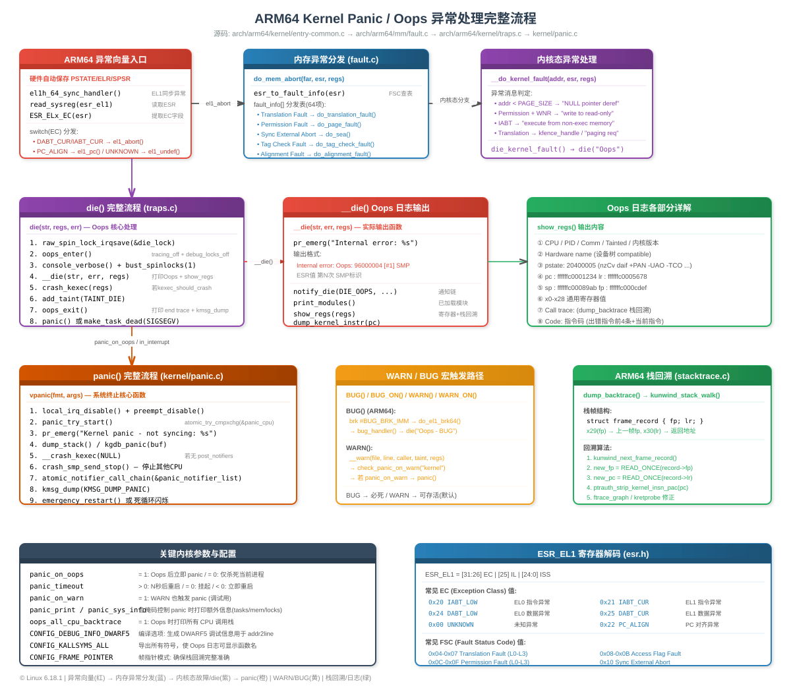

### 7.1 Panic 与 Oops 概述

#### 7.1.1 Panic vs Oops vs BUG vs WARN 的区别与联系

Linux 内核中有四个层级的错误报告机制，严重程度递增：

| 机制 | 严重程度 | 系统是否存活 | 触发方式 | 源码位置 |
|------|---------|-------------|---------|---------|
| **WARN** | 低 | 存活（默认） | `WARN()` / `WARN_ON()` / `WARN_ONCE()` | `kernel/panic.c: __warn()` |
| **Oops** | 中 | 可能存活（杀死当前进程） | 非法内存访问 / 未定义指令等异常 | `arch/arm64/kernel/traps.c: die()` |
| **BUG** | 高 | 触发 Oops → 可能 panic | `BUG()` / `BUG_ON()` | `arch/arm64/include/asm/bug.h` |
| **Panic** | 致命 | 系统终止 | `panic()` / Oops in interrupt / `panic_on_oops=1` | `kernel/panic.c: vpanic()` |

**关键区别**：

```
WARN()  →  打印警告 + 调用栈，进程继续运行
           若 panic_on_warn=1 则升级为 panic

Oops    →  die() 打印完整异常信息 + 寄存器 + 栈回溯
           若在中断上下文 → 必然 panic
           若在进程上下文 + panic_on_oops=0 → make_task_dead(SIGSEGV)
           若在进程上下文 + panic_on_oops=1 → panic

BUG()   →  ARM64 通过 brk #BUG_BRK_IMM 指令触发断点异常
           → bug_handler() → die("Oops - BUG") → 同 Oops 路径

panic() →  系统不可恢复，停止所有 CPU，可触发 kdump/kexec，最终重启或挂起
```

#### 7.1.2 ARM64 异常等级与 Panic 触发路径

ARM64 架构下，异常从硬件到 Panic 的完整路径：

```
硬件异常 (Data Abort / Instruction Abort / Undefined / ...)
    │
    ▼
异常向量表 (arch/arm64/kernel/entry.S)
    │  vectors → el1h_64_sync (EL1 同步异常入口)
    ▼
el1h_64_sync_handler(regs)          ← entry-common.c:452
    │  esr = read_sysreg(esr_el1)
    │  switch (ESR_ELx_EC(esr))
    ├── EC=0x25 (DABT_CUR) ──→ el1_abort() → do_mem_abort()
    ├── EC=0x21 (IABT_CUR) ──→ el1_abort() → do_mem_abort()
    ├── EC=0x22 (PC_ALIGN)  ──→ el1_pc()   → do_sp_pc_abort()
    ├── EC=0x00 (UNKNOWN)   ──→ el1_undef() → do_el1_undef()
    ├── EC=0x0D (BTI)       ──→ el1_bti()  → do_el1_bti()
    └── EC=0x3C (BRK64)     ──→ el1_brk64() → bug_handler() [若为BUG]
            │
            ▼
    __do_kernel_fault() 或 die()
            │
            ▼
    panic()  ←── 若 panic_on_oops=1 或在中断上下文
```

#### 7.1.3 panic() 函数完整执行流程

`panic()` 是内核最终的「死亡通道」，定义在 `kernel/panic.c`：

```c
// kernel/panic.c - vpanic() 核心流程
void vpanic(const char *fmt, va_list args)
{
    // 1. 禁中断 + 禁抢占
    local_irq_disable();
    preempt_disable_notrace();

    // 2. 争抢 panic_cpu（仅一个 CPU 可执行 panic）
    //    atomic_try_cmpxchg(&panic_cpu, &old_cpu, this_cpu)
    if (panic_try_start()) {
        /* 当前 CPU 获得 panic 执行权 */
    } else if (panic_on_other_cpu())
        panic_smp_self_stop();  // 其他 CPU 自旋等待

    // 3. 打印 panic 消息
    console_verbose();
    bust_spinlocks(1);
    pr_emerg("Kernel panic - not syncing: %s\n", buf);

    // 4. 转储调用栈
    dump_stack();

    // 5. 触发 kdump（若未设置 post_notifiers）
    if (!_crash_kexec_post_notifiers)
        __crash_kexec(NULL);

    // 6. 停止其他 CPU
    panic_other_cpus_shutdown(_crash_kexec_post_notifiers);

    // 7. 调用 panic 通知链
    atomic_notifier_call_chain(&panic_notifier_list, 0, buf);

    // 8. 内核消息转储
    kmsg_dump_desc(KMSG_DUMP_PANIC, buf);

    // 9. 延时重启或死循环
    if (panic_timeout > 0)
        emergency_restart();  // N秒后重启
    // panic_timeout == 0 → 永久挂起
    // panic_timeout < 0  → 立即重启
}
```

#### 7.1.4 die() / oops_enter() / oops_exit() 流程

`die()` 是 Oops 处理的核心函数，位于 `arch/arm64/kernel/traps.c`：

```c
// arch/arm64/kernel/traps.c
void die(const char *str, struct pt_regs *regs, long err)
{
    raw_spin_lock_irqsave(&die_lock, flags);  // 串行化 Oops 输出

    oops_enter();           // 进入 Oops 上下文
    console_verbose();      // 提升控制台日志级别
    bust_spinlocks(1);      // 强制突破自旋锁
    ret = __die(str, err, regs);  // 打印 Oops 信息

    if (regs && kexec_should_crash(current))
        crash_kexec(regs);  // 触发 kdump

    bust_spinlocks(0);
    add_taint(TAINT_DIE, LOCKDEP_NOW_UNRELIABLE);
    oops_exit();            // 退出 Oops 上下文

    // 决定后续行为
    if (in_interrupt())
        panic("%s: Fatal exception in interrupt", str);  // 中断中必死
    if (panic_on_oops)
        panic("%s: Fatal exception", str);               // 配置了必死

    raw_spin_unlock_irqrestore(&die_lock, flags);

    if (ret != NOTIFY_STOP)
        make_task_dead(SIGSEGV);  // 杀死当前进程
}
```

**oops_enter() / oops_exit() 详解**：

```c
void oops_enter(void)
{
    nbcon_cpu_emergency_enter();     // 获取紧急打印权限
    tracing_off();                   // 关闭 ftrace 追踪
    debug_locks_off();               // 禁用锁调试（已不可信）
    do_oops_enter_exit();            // pause_on_oops 支持

    if (sysctl_oops_all_cpu_backtrace)
        trigger_all_cpu_backtrace(); // 打印所有 CPU 调用栈
}

void oops_exit(void)
{
    do_oops_enter_exit();
    print_oops_end_marker();         // "---[ end trace ... ]---"
    nbcon_cpu_emergency_exit();
    kmsg_dump(KMSG_DUMP_OOPS);       // 转储内核消息
}
```

#### 7.1.5 panic_on_oops / panic_timeout / panic_print 参数

| 参数 | 默认值 | 含义 | 设置方式 |
|------|--------|------|---------|
| `panic_on_oops` | `CONFIG_PANIC_ON_OOPS` | Oops 后是否 panic | `sysctl kernel.panic_on_oops=1` / 启动参数 `oops=panic` |
| `panic_timeout` | `CONFIG_PANIC_TIMEOUT` | panic 后等待秒数 | `sysctl kernel.panic=N` / 启动参数 `panic=N` |
| `panic_on_warn` | 0 | WARN 后是否 panic | `sysctl kernel.panic_on_warn=1` |
| `panic_print` | 0 | panic 时额外打印（已废弃） | 改用 `panic_sys_info` |
| `pause_on_oops` | 0 | Oops 后暂停秒数 | 启动参数 `pause_on_oops=N` |
| `warn_limit` | 0 | WARN 累计次数上限 | `sysctl kernel.warn_limit=N`，超过则 panic |
| `oops_all_cpu_backtrace` | 0 | Oops 时打印所有 CPU 栈 | `sysctl kernel.oops_all_cpu_backtrace=1` |

**产线推荐配置**：
```bash
# /etc/sysctl.conf
kernel.panic_on_oops = 1      # Oops 直接 panic，便于 kdump 抓取
kernel.panic = 30              # panic 后 30 秒自动重启
kernel.panic_on_warn = 0       # WARN 不要 panic（太频繁）
kernel.oops_all_cpu_backtrace = 1  # 获取完整 CPU 信息
```

### 7.2 Oops 日志完整解读

#### 7.2.1 Oops 日志结构逐行解析

一个典型的 ARM64 Oops 日志包含以下结构化信息：

```
Unable to handle kernel NULL pointer dereference at virtual address 0000000000000040  ← ① 异常类型 + 故障地址
Mem abort info:                                        ← ② mem_abort_decode(esr) 输出
  ESR = 0x0000000096000004                             ←    ESR 原始值
  EC = 0x25: DABT (current EL), IL = 32 bits           ←    EC=数据异常, IL=32位指令
  SET = 0, FnV = 0                                     ←    SET/FnV 标志
  EA = 0, S1PTW = 0                                    ←    外部异常/页表遍历标志
  FSC = 0x04: level 0 translation fault                ←    FSC=翻译故障等级0
Data abort info:                                       ← ③ data_abort_decode(esr) 输出
  ISV = 0, ISS = 0x00000004, ISS2 = 0x00000000
  CM = 0, WnR = 0, TnD = 0, TagAccess = 0             ←    WnR=0 表示读操作
Internal error: Oops: 0000000096000004 [#1] SMP        ← ④ __die() 输出: ESR [第N次] SMP
CPU: 2 PID: 1234 Comm: my_process Tainted: G    W     ← ⑤ CPU/PID/进程名/污染标志
Hardware name: linux,dummy-virt (DT)                   ← ⑥ 硬件平台信息
pstate: 20400005 (nzCv daif +PAN -UAO -TCO -DIT ...)  ← ⑦ PSTATE 寄存器
pc : my_driver_read+0x28/0x100 [my_module]             ← ⑧ 出错 PC 地址（符号化）
lr : my_driver_open+0x4c/0x80 [my_module]              ← ⑨ 链接寄存器（调用者）
sp : ffff800082003d00                                  ← ⑩ 栈指针
x29: ffff800082003d10 x28: ffff0000c1a34000            ← ⑪ x0-x28 通用寄存器
...
Call trace:                                            ← ⑫ 调用栈回溯
 my_driver_read+0x28/0x100 [my_module]
 vfs_read+0xc8/0x2e0
 ksys_read+0x6c/0xf0
 __arm64_sys_read+0x1c/0x30
 invoke_syscall+0x48/0x110
 ...
Code: a9bf7bfd 910003fd f9400c00 f9402000             ← ⑬ 出错处指令码
---[ end trace 0000000000000000 ]---                   ← ⑭ oops_exit() 结束标记
```

#### 7.2.2 ARM64 寄存器状态解读（pc/lr/sp/pstate/x0-x30）

**关键寄存器含义**：

| 寄存器 | 用途 | Oops 分析要点 |
|--------|------|-------------|
| `pc` | 程序计数器 | 出错指令地址，用 `addr2line` 定位源码行 |
| `lr` (x30) | 链接寄存器 | 调用者地址，确认调用路径 |
| `sp` | 栈指针 | 判断栈是否溢出（对比 `thread_info` 基址） |
| `fp` (x29) | 帧指针 | 栈回溯依赖，指向上一帧 |
| `pstate` | 处理器状态 | 条件标志 (NZCV) + 异常掩码 (DAIF) + PAN/UAO 等 |
| `x0-x7` | 参数/返回值 | 函数参数传递，x0 常为出错对象指针 |
| `x8` | 间接结果 | 系统调用号 (EL0→EL1 时) |

**PSTATE 解读示例**：
```
pstate: 20400005
  二进制: 0010 0000 0100 0000 0000 0000 0000 0101
  N=0 Z=0 C=1 V=0 (nzCv) — 条件标志
  D=1 A=0 I=0 F=0 (Daif) — D中断屏蔽
  PAN=1 (+PAN) — 特权访问禁止（阻止内核直接访问用户空间）
  UAO=0 (-UAO) — 用户访问覆盖未启用
  EL=1 — 运行在 EL1 (内核态)
```

#### 7.2.3 Call Trace 调用栈解读与符号化

调用栈由 `dump_backtrace()` → `kunwind_stack_walk()` 生成：

```
Call trace:
 my_driver_read+0x28/0x100 [my_module]    ← 函数名+偏移/函数总大小 [模块名]
 │                │    │        │
 │                │    │        └── 所属模块（内建函数无此字段）
 │                │    └── 函数总大小（字节）
 │                └── 距函数起始的偏移（字节）
 └── 函数符号名（需 CONFIG_KALLSYMS）
```

**符号化工具**：
```bash
# 方法 1: addr2line（需 vmlinux 带调试信息）
aarch64-linux-gnu-addr2line -e vmlinux -f ffffffc0001234ab

# 方法 2: faddr2line（更方便，使用 function+offset）
scripts/faddr2line vmlinux my_driver_read+0x28

# 方法 3: decode_stacktrace.sh（自动解析整段 Oops）
scripts/decode_stacktrace.sh vmlinux /path/to/modules < oops.log
```

#### 7.2.4 ESR_EL1 异常综合寄存器解码

ESR_EL1 (Exception Syndrome Register) 是 ARM64 异常分析的核心寄存器，定义在 `arch/arm64/include/asm/esr.h`：

```
ESR_EL1 位域布局:
┌──────────┬────┬──────────────────────────────────┐
│ [31:26]  │[25]│ [24:0]                           │
│ EC       │ IL │ ISS (Instruction Specific Syndrome)│
│ 异常类别 │指令长│ 指令相关综合信息                   │
└──────────┴────┴──────────────────────────────────┘
```

**常见 EC (Exception Class) 值**：

| EC 值 | 宏定义 | 含义 |
|-------|--------|------|
| 0x00 | `ESR_ELx_EC_UNKNOWN` | 未知异常 |
| 0x0E | `ESR_ELx_EC_ILL` | 非法执行状态 |
| 0x15 | `ESR_ELx_EC_SVC64` | SVC 系统调用 |
| 0x20 | `ESR_ELx_EC_IABT_LOW` | EL0 指令异常 |
| 0x21 | `ESR_ELx_EC_IABT_CUR` | EL1 指令异常 |
| 0x24 | `ESR_ELx_EC_DABT_LOW` | EL0 数据异常 |
| 0x25 | `ESR_ELx_EC_DABT_CUR` | EL1 数据异常 |
| 0x22 | `ESR_ELx_EC_PC_ALIGN` | PC 对齐异常 |
| 0x26 | `ESR_ELx_EC_SP_ALIGN` | SP 对齐异常 |
| 0x2F | `ESR_ELx_EC_SERROR` | SError 异步异常 |

**常见 FSC (Fault Status Code) 值（ISS[5:0]）**：

| FSC 值 | 含义 | 对应处理函数 |
|--------|------|-------------|
| 0x04-0x07 | Level 0-3 Translation Fault | `do_translation_fault()` |
| 0x08-0x0B | Level 0-3 Access Flag Fault | `do_page_fault()` |
| 0x0C-0x0F | Level 0-3 Permission Fault | `do_page_fault()` |
| 0x10 | Synchronous External Abort | `do_sea()` |
| 0x11 | Synchronous Tag Check Fault | `do_tag_check_fault()` |
| 0x21 | Alignment Fault | `do_alignment_fault()` |

#### 7.2.5 FAR_EL1 故障地址寄存器与地址空间判定

FAR_EL1 (Fault Address Register) 记录导致数据/指令异常的虚拟地址：

```c
// arch/arm64/mm/fault.c
unsigned long far = read_sysreg(far_el1);
unsigned long addr = untagged_addr(far);  // 去除 MTE 标签

// 地址空间判定
if (is_ttbr0_addr(addr))
    // 用户空间地址 (0x0000_0000_0000_0000 ~ 0x0000_FFFF_FFFF_FFFF)
    → do_page_fault() 处理
else if (is_ttbr1_addr(addr))
    // 内核空间地址 (0xFFFF_0000_0000_0000 ~ 0xFFFF_FFFF_FFFF_FFFF)
    → __do_kernel_fault() 处理
else
    // 中间空洞 → 非法地址
```

**常见地址模式判断**：
```
FAR = 0x0000000000000040  →  NULL 指针解引用（偏移 0x40）
FAR = 0x0000000000000000  →  NULL 指针直接解引用
FAR = 0xdead000000000000  →  KASAN freed object 标记
FAR = 0x6b6b6b6b6b6b6b6b  →  SLUB poison (已释放对象)
FAR = 0xffff000012345678  →  合法内核地址，可能是 UAF / 竞态
FAR = 0x0000007f12345678  →  用户空间地址在内核态被访问（PAN 异常）
```

### 7.3 常见 Panic / Oops 触发原因分类

#### 7.3.1 NULL 指针解引用（最常见）

最常见的 Oops 类型，通常由未初始化或已释放的指针引发：

```c
// 典型场景：
struct device *dev = NULL;
dev->driver->probe(dev);  // Oops: NULL pointer dereference at 0x0000000000000010
```

**内核处理路径**（`arch/arm64/mm/fault.c`）：
```c
static void __do_kernel_fault(unsigned long addr, unsigned long esr,
                              struct pt_regs *regs)
{
    // ...
    } else if (addr < PAGE_SIZE) {
        msg = "NULL pointer dereference";  // FAR < PAGE_SIZE → NULL 解引用
    }
    die_kernel_fault(msg, addr, esr, regs);
}
```

**识别特征**：FAR 值通常是一个小偏移量（0x0 ~ 0xFFF），对应结构体成员偏移。

#### 7.3.2 非法内核地址访问（野指针 / UAF）

指针指向已释放的内存（Use-After-Free）或被破坏的地址：

```
Unable to handle kernel paging request at virtual address ffff0000deadbeef
```

**常见模式**：
- `SLUB poison 值`：`0x6b6b6b6b...` (freed) / `0x5a5a5a5a...` (initmem)
- `KASAN shadow`：`0xdead...` / `0xbead...`
- `随机地址`：指针被覆写

#### 7.3.3 用户空间地址在内核态访问

ARM64 开启 PAN (Privileged Access Never) 后，内核直接访问用户空间地址会触发异常：

```c
// 错误：直接解引用用户空间指针
char *user_buf = (char *)arg;
char c = *user_buf;  // PAN 异常！

// 正确：使用 copy_from_user / get_user
char c;
get_user(c, (char __user *)arg);
```

在 `__do_kernel_fault()` 中检测：
```c
if (is_ttbr0_addr(addr) && is_el1_permission_fault(addr, esr, regs)) {
    if (!insn_may_access_user(regs->pc, esr))
        die_kernel_fault("access to user memory outside uaccess routines", ...);
}
```

#### 7.3.4 对齐异常（Alignment Fault）

ARM64 默认不允许非对齐访问某些类型（设备内存、原子操作等）：

```
Unable to handle kernel paging request at virtual address ...
...alignment fault
```

对应处理函数 `do_alignment_fault()`，FSC = 0x21。

#### 7.3.5 未定义指令异常（Undefined Instruction）

当 CPU 遇到无法解码的指令时触发：

```c
// arch/arm64/kernel/traps.c
void do_el1_undef(struct pt_regs *regs, unsigned long esr)
{
    // 尝试模拟指令（如 SSBS）
    if (try_emulate_el1_ssbs(regs, insn))
        return;
    die("Oops - Undefined instruction", regs, esr);
}
```

**常见原因**：
- 代码段被破坏（内存写溢出）
- 跳转到非代码区域（函数指针被覆写）
- 模块与内核版本不匹配

#### 7.3.6 栈溢出（Stack Overflow）

内核线程栈大小有限（ARM64 默认 16KB），递归或大局部变量可导致溢出：

```
Kernel panic - not syncing: kernel stack overflow
CPU: 0 PID: ... Comm: ...
```

ARM64 使用专门的溢出栈 (`overflow_stack`) 来处理栈溢出异常：
```c
// arch/arm64/kernel/stacktrace.c
STACKINFO_CPU(overflow)  // 溢出检测栈
```

**预防**：
- 避免内核函数中使用大数组（改用 `kmalloc`）
- 避免深度递归（使用迭代替代）
- 编译选项 `CONFIG_VMAP_STACK=y`（带 guard page 的虚拟映射栈）

#### 7.3.7 BUG() / BUG_ON() 显式触发

开发者主动在不应到达的代码路径插入断言：

```c
// ARM64 BUG() 实现 (arch/arm64/include/asm/bug.h)
#define __BUG_FLAGS(flags) \
    asm volatile ("brk %[imm]" :: [imm] "i" (BUG_BRK_IMM | (flags)))
```

`BUG()` 通过 `brk` 指令触发断点异常：
```
el1h_64_sync_handler → el1_brk64() → do_el1_brk64()
    → bug_handler() → die("Oops - BUG", regs, esr)
```

#### 7.3.8 Kernel Panic — not syncing 常见子类型

| Panic 消息 | 触发场景 | 典型原因 |
|------------|---------|---------|
| `Fatal exception in interrupt` | `die()` 检测到 `in_interrupt()` | 中断处理函数崩溃 |
| `Fatal exception` | `panic_on_oops=1` 时的 Oops | 任何内核态异常 |
| `VFS: Unable to mount root fs` | `init/do_mounts.c` | 根文件系统挂载失败 |
| `No working init found` | `init/main.c: kernel_init()` | /sbin/init 不存在 |
| `Attempted to kill init!` | init 进程收到致命信号 | PID=1 崩溃 |
| `stack-protector: Kernel stack is corrupted` | `__stack_chk_fail()` | 栈 canary 被破坏 |
| `Watchdog detected hard LOCKUP` | NMI watchdog | CPU 长时间不响应中断 |
| `softlockup: hung tasks` | soft lockup 检测 | 进程长时间占用 CPU |
| `Out of memory and no killable processes` | OOM killer 失败 | 内存完全耗尽 |

### 7.4 addr2line / objdump / gdb 离线分析方法

#### 7.4.1 addr2line 从地址定位源码行

`addr2line` 将虚拟地址转换为源文件名和行号（需 `vmlinux` 含 DWARF 调试信息）：

```bash
# 基本用法：从 PC 地址定位源码
aarch64-linux-gnu-addr2line -e vmlinux -f -i ffffffc000123abc
# 输出:
#   my_function
#   drivers/my_driver/my_file.c:256

# -f: 显示函数名
# -i: 显示内联函数展开信息
# -p: 美化输出格式

# 模块地址需要加模块基址偏移
# 获取模块加载基址：
cat /sys/module/my_module/sections/.text
# 假设为 0xffff800000a00000，模块内偏移 0x28：
aarch64-linux-gnu-addr2line -e my_module.ko -f 0x28
```

#### 7.4.2 objdump 反汇编出错函数分析

`objdump` 反汇编可直接看到出错指令的汇编上下文：

```bash
# 反汇编整个 vmlinux（输出很大，建议限制范围）
aarch64-linux-gnu-objdump -d vmlinux | grep -A 20 "<my_function>:"

# 只反汇编指定地址范围
aarch64-linux-gnu-objdump -d vmlinux \
    --start-address=0xffffffc000123a00 \
    --stop-address=0xffffffc000123b00

# 混合源码和汇编（需调试信息）
aarch64-linux-gnu-objdump -dS vmlinux | grep -A 30 "<my_function>:"

# 反汇编模块
aarch64-linux-gnu-objdump -d my_module.ko | grep -A 20 "<my_function>:"
```

**分析示例**：
```
ffffffc000123abc:  f9402000    ldr x0, [x0, #64]    ← 出错指令
// x0=0x0000000000000000, 偏移 #64=0x40
// → 解引用 NULL+0x40 → "NULL pointer dereference at 0x40"
```

#### 7.4.3 gdb vmlinux 离线调试定位

GDB 可提供最丰富的离线分析能力：

```bash
# 启动 GDB
aarch64-linux-gnu-gdb vmlinux

# 查看地址对应源码
(gdb) list *0xffffffc000123abc
# 输出: drivers/my_driver/my_file.c:256

# 反汇编函数
(gdb) disassemble my_function

# 查看结构体布局（确认偏移 0x40 对应哪个成员）
(gdb) ptype struct my_struct
(gdb) p &((struct my_struct *)0)->member_at_offset_40
# 输出: $1 = (type *) 0x40

# 查看源码
(gdb) list my_function
```

#### 7.4.4 decode_stacktrace.sh 自动化栈解析脚本

内核自带脚本，可自动将原始 Oops 日志中的地址全部转换为源码位置：

```bash
# 基本用法
scripts/decode_stacktrace.sh vmlinux /path/to/modules < oops.log

# 从 dmesg 直接解析
dmesg | scripts/decode_stacktrace.sh vmlinux

# 指定交叉编译工具链
CROSS_COMPILE=aarch64-linux-gnu- scripts/decode_stacktrace.sh vmlinux < oops.log
```

#### 7.4.5 faddr2line 从 function+offset 定位源码

`faddr2line` 是内核脚本，直接使用「函数名+偏移」格式定位，更方便：

```bash
# 用法：scripts/faddr2line vmlinux function+offset
scripts/faddr2line vmlinux my_driver_read+0x28
# 输出:
#   my_driver_read+0x28/0x100:
#   my_driver_read at drivers/my_driver/my_file.c:256

# 批量解析
scripts/faddr2line vmlinux \
    my_driver_read+0x28 \
    vfs_read+0xc8 \
    ksys_read+0x6c
```

### 7.5 kdump / crash 离线内存转储分析

#### 7.5.1 kdump 原理 — kexec 加载捕获内核

kdump 通过 kexec 机制在内核 Panic 时快速切换到预加载的「捕获内核」，保存完整内存转储：

```
正常运行内核 (第一内核)
    │
    │ panic() → __crash_kexec(NULL)
    ▼
kexec 跳转到预留内存中的捕获内核 (第二内核)
    │
    │ 捕获内核启动后通过 /proc/vmcore 访问第一内核内存
    ▼
makedumpfile 将 vmcore 保存到磁盘
    │
    ▼
crash 工具离线分析 vmcore
```

#### 7.5.2 ARM64 kdump 配置与 crashkernel 参数

```bash
# 1. 内核配置
CONFIG_KEXEC=y
CONFIG_CRASH_DUMP=y
CONFIG_PROC_VMCORE=y

# 2. 启动参数预留内存
# 格式: crashkernel=size[@offset]
crashkernel=256M           # 预留 256M 给捕获内核
crashkernel=256M@0x50000000  # 指定偏移

# 3. 加载捕获内核
kexec -p /boot/vmlinuz-capture \
    --initrd=/boot/initrd-capture.img \
    --append="root=/dev/sda2 irqpoll maxcpus=1"

# 4. 验证加载状态
cat /sys/kernel/kexec_crash_loaded  # 输出 1 表示已加载
```

#### 7.5.3 crash 工具基本使用 — bt / dis / struct / log

```bash
# 启动 crash
crash vmlinux vmcore

# 常用命令
crash> bt          # 显示 panic 时的调用栈
crash> bt -a       # 显示所有 CPU 的调用栈
crash> bt -l       # 显示带行号的调用栈

crash> log         # 显示内核日志 (dmesg)
crash> log -T      # 带时间戳的日志

crash> dis -l my_function       # 反汇编函数（带源码行号）
crash> dis -l ffffffc000123abc  # 反汇编指定地址

crash> struct task_struct ffff0000c1a34000  # 查看 task_struct
crash> struct -o task_struct               # 显示成员偏移
```

#### 7.5.4 crash 高级分析 — 进程状态 / 锁状态 / 内存状态

```bash
# 进程分析
crash> ps                    # 所有进程列表
crash> ps -m                 # 显示进程内存使用
crash> task -R pid 1234      # 指定进程的 task_struct

# 锁分析
crash> kmem -s               # SLUB 分配器统计
crash> dev -d                # 设备驱动信息

# 内存分析
crash> kmem -i               # 内存使用概览
crash> vm ffff0000c1a34000   # 查看进程的 VMA 映射
crash> rd -x ffff800082003d00 32  # 读取内存（hex，32个字）

# 模块分析
crash> mod                   # 已加载模块列表
crash> mod -s my_module my_module.ko  # 加载模块符号
```

#### 7.5.5 从 vmcore 还原 Panic 现场完整步骤

```bash
# 完整分析流程
# 1. 查看 panic 原因
crash> log | grep -A 20 "Unable to handle"

# 2. 查看出错 CPU 的调用栈
crash> bt

# 3. 反汇编出错函数
crash> dis -l <function_name>

# 4. 检查关键寄存器值（从 bt -f 获取保存的 pt_regs）
crash> bt -f
crash> struct pt_regs <address>

# 5. 追踪出错数据结构
crash> struct my_struct <x0_value>

# 6. 检查相关锁状态
crash> struct mutex <lock_addr>

# 7. 生成分析报告
crash> sys       # 系统信息
crash> runq      # 运行队列状态
```

### 7.6 pstore / ramoops 持久化存储

#### 7.6.1 pstore 子系统架构与后端（ramoops / blk / zone）

pstore (Persistent Storage) 在系统崩溃时将日志写入非易失性存储，重启后可读取：

```
pstore 前端 (数据源)          pstore 核心          后端 (存储介质)
┌──────────────────┐     ┌──────────────┐     ┌─────────────────┐
│ console (dmesg)  │────→│              │────→│ ramoops (RAM)   │
│ pmsg (用户日志)   │────→│  pstore_info │────→│ blk (块设备)    │
│ ftrace (追踪数据) │────→│              │────→│ zone (MTD/NVRAM)│
│ dmesg (panic日志) │────→│              │     └─────────────────┘
└──────────────────┘     └──────────────┘
                               │
                    /sys/fs/pstore/ 挂载点
```

#### 7.6.2 ramoops 配置 — 设备树 / 启动参数

```dts
// 设备树配置
reserved-memory {
    #address-cells = <2>;
    #size-cells = <2>;
    ranges;

    ramoops@90000000 {
        compatible = "ramoops";
        reg = <0x0 0x90000000 0x0 0x100000>;  // 1MB
        record-size  = <0x20000>;   // 128KB per dmesg record
        console-size = <0x40000>;   // 256KB console log
        ftrace-size  = <0x20000>;   // 128KB ftrace data
        pmsg-size    = <0x20000>;   // 128KB pmsg
        ecc-size     = <16>;        // ECC 校验
    };
};
```

```bash
# 或通过启动参数配置
ramoops.mem_address=0x90000000 ramoops.mem_size=0x100000 \
ramoops.record_size=0x20000 ramoops.console_size=0x40000
```

#### 7.6.3 读取 /sys/fs/pstore/ 下的日志文件

```bash
# 挂载 pstore
mount -t pstore pstore /sys/fs/pstore/

# 查看文件列表
ls /sys/fs/pstore/
# dmesg-ramoops-0    ← panic/oops 时的 dmesg
# console-ramoops-0  ← 持续的 console 日志
# pmsg-ramoops-0     ← 用户空间 pmsg 日志
# ftrace-ramoops-0   ← ftrace 数据

# 读取 panic 日志
cat /sys/fs/pstore/dmesg-ramoops-0
```

#### 7.6.4 pmsg / console / ftrace 前端区域配置

| 前端 | 用途 | 数据来源 | 配置参数 |
|------|------|---------|---------|
| `dmesg` | Panic/Oops 时的 dmesg | `kmsg_dump()` | `record-size` |
| `console` | 持续的 console 输出 | printk 钩子 | `console-size` |
| `pmsg` | 用户空间日志 | `/dev/pmsg0` 设备 | `pmsg-size` |
| `ftrace` | 函数追踪数据 | ftrace ring buffer | `ftrace-size` |

### 7.7 动态调试与在线分析工具

#### 7.7.1 ftrace 追踪 Panic 前的函数调用路径

ftrace 的 `function_graph` 追踪器可以记录 Panic 前的函数调用历史：

```bash
# 开启 function_graph 追踪
echo function_graph > /sys/kernel/debug/tracing/current_tracer
echo 1 > /sys/kernel/debug/tracing/tracing_on

# 设置追踪过滤（只追踪特定模块/函数）
echo 'my_driver_*' > /sys/kernel/debug/tracing/set_ftrace_filter

# Panic 后通过 pstore/ramoops 获取 ftrace 数据
# （需配置 ftrace-size 在 ramoops 中）
cat /sys/fs/pstore/ftrace-ramoops-0
```

注意：Oops 处理中 `oops_enter()` 会调用 `tracing_off()` 关闭追踪，确保数据不被覆盖。

#### 7.7.2 kprobe / kretprobe 动态插桩

不修改源码即可在任意内核函数入口/出口插入探针：

```bash
# 在 __do_kernel_fault 入口设置 kprobe
echo 'p:my_probe __do_kernel_fault addr=%x0 esr=%x1' > \
    /sys/kernel/debug/tracing/kprobe_events
echo 1 > /sys/kernel/debug/tracing/events/kprobes/my_probe/enable

# kretprobe 追踪函数返回值
echo 'r:my_ret do_page_fault $retval' > \
    /sys/kernel/debug/tracing/kprobe_events
```

#### 7.7.3 eBPF 追踪异常路径

eBPF 可以安全高效地追踪异常处理路径：

```bash
# 使用 bpftrace 追踪 die() 调用
bpftrace -e 'kprobe:die {
    printf("die() called: str=%s pid=%d comm=%s\n",
           str(arg0), pid, comm);
    print(kstack);
}'

# 追踪所有 page fault（包括正常的）
bpftrace -e 'kprobe:do_page_fault {
    @[comm] = count();
}'
```

#### 7.7.4 /proc/vmcore 与 /proc/kcore 在线分析

```bash
# /proc/kcore — 运行时内核内存的 ELF core 格式视图
# 可以用 gdb 直接调试活跃内核
gdb vmlinux /proc/kcore
(gdb) p jiffies           # 查看当前 jiffies 值
(gdb) p *current          # 查看当前进程

# /proc/vmcore — 仅在 kdump 捕获内核中可用
# 用于 makedumpfile 保存崩溃转储
makedumpfile -l --message-level 1 -d 31 /proc/vmcore vmcore.dump
```

#### 7.7.5 KGDB / KDB 内核调试器

KGDB 提供 GDB 远程调试内核的能力，KDB 是内建的命令行调试器：

```bash
# 内核配置
CONFIG_KGDB=y
CONFIG_KGDB_SERIAL_CONSOLE=y
CONFIG_KDB_DEFAULT_ENABLE=0x1   # 启用 KDB

# 启动参数
kgdboc=ttyS0,115200 kgdbwait    # 串口连接，启动时等待

# 进入 KDB（通过 SysRq）
echo g > /proc/sysrq-trigger

# KDB 常用命令
[0]kdb> bt           # 调用栈
[0]kdb> md <addr>    # 内存显示
[0]kdb> go           # 继续运行

# GDB 远程连接
aarch64-linux-gnu-gdb vmlinux
(gdb) target remote /dev/ttyS0
```

### 7.8 内核配置与编译选项

#### 7.8.1 DEBUG_INFO / DEBUG_INFO_DWARF5 调试信息

```makefile
# 调试信息是所有离线分析工具的基础
CONFIG_DEBUG_INFO=y              # 生成调试信息
CONFIG_DEBUG_INFO_DWARF5=y       # 使用 DWARF5 格式（更紧凑高效）
CONFIG_DEBUG_INFO_REDUCED=n      # 不要裁减调试信息
CONFIG_DEBUG_INFO_COMPRESSED_ZLIB=y  # 压缩调试信息节省空间
CONFIG_DEBUG_INFO_SPLIT=n        # 不拆分（方便传输）
```

DWARF5 vs DWARF4：DWARF5 生成的 `.debug_*` section 更小，`addr2line` / `gdb` 解析更快。

#### 7.8.2 KALLSYMS / KALLSYMS_ALL 符号表

```makefile
CONFIG_KALLSYMS=y       # 在内核中嵌入符号表
                        # Oops 日志中函数名而非裸地址
CONFIG_KALLSYMS_ALL=y   # 导出所有符号（包括数据符号）
                        # 调试时可看到全局变量名
```

`KALLSYMS` 数据嵌入在 vmlinux 的 `.rodata` 中，`kallsyms_lookup_name()` 用于运行时符号查找。

#### 7.8.3 FRAME_POINTER vs SHADOW_CALL_STACK 栈回溯

```makefile
# 帧指针模式 — 传统栈回溯
CONFIG_FRAME_POINTER=y
# 每个函数入口: stp x29, x30, [sp, #-N]! ; mov x29, sp
# 优点：栈回溯可靠
# 缺点：占用 x29 寄存器，轻微性能损失

# Shadow Call Stack — ARM64 特有安全特性
CONFIG_SHADOW_CALL_STACK=y
# 使用 x18 寄存器指向独立的返回地址栈
# 优点：防止 ROP 攻击
# 缺点：占用 x18 寄存器

# ARM64 默认使用 FRAME_POINTER 进行栈回溯
# kunwind_next_frame_record() 沿 fp 链遍历
```

#### 7.8.4 CONFIG_PANIC_ON_OOPS / PANIC_TIMEOUT 控制

```makefile
CONFIG_PANIC_ON_OOPS=y        # 默认值：Oops 后是否 panic
CONFIG_PANIC_ON_OOPS_VALUE=1  # panic_on_oops 初始值
CONFIG_PANIC_TIMEOUT=0        # panic_timeout 初始值
                              # 0=永久挂起, >0=N秒后重启, <0=立即重启
```

运行时可通过 `/proc/sys/kernel/` 或 `sysctl` 修改。

#### 7.8.5 CONFIG_DEBUG_BUGVERBOSE 完整 BUG 信息

```makefile
CONFIG_DEBUG_BUGVERBOSE=y
# 启用后 BUG() 打印包含文件名和行号：
#   "kernel BUG at drivers/my_driver/my_file.c:123!"
# 禁用时只有地址，需 addr2line 手动解析
```

### 7.9 ARM64 异常处理与 Oops 产生机制源码分析

#### 7.9.1 异常向量表 entry.S — vectors / el1_sync / el1_irq

ARM64 异常向量表定义在 `arch/arm64/kernel/entry.S`，每个异常入口保存寄存器后跳转到 C 处理函数：

```
异常向量表布局 (vectors):
┌───────────────────────────────────────────────┐
│ 偏移    │ 来源        │ 类型      │ 处理函数         │
├─────────┼────────────┼──────────┼───────────────┤
│ 0x000   │ EL1t       │ Sync     │ (不应发生)       │
│ 0x080   │ EL1t       │ IRQ      │ (不应发生)       │
│ 0x100   │ EL1t       │ FIQ      │ (不应发生)       │
│ 0x180   │ EL1t       │ SError   │ (不应发生)       │
│ 0x200   │ EL1h       │ Sync     │ el1h_64_sync_handler  │ ← 内核态同步异常
│ 0x280   │ EL1h       │ IRQ      │ el1h_64_irq_handler   │
│ 0x300   │ EL1h       │ FIQ      │ el1h_64_fiq_handler   │
│ 0x380   │ EL1h       │ SError   │ el1h_64_error_handler │
│ 0x400   │ EL0 64bit  │ Sync     │ el0t_64_sync_handler  │ ← 用户态同步异常
│ 0x480   │ EL0 64bit  │ IRQ      │ el0t_64_irq_handler   │
│ ...     │ ...        │ ...      │ ...                    │
└───────────────────────────────────────────────┘
```

**入口汇编保存寄存器**（entry.S 中的 `kernel_entry` 宏）：
```asm
// 保存 x0-x29, lr, sp_el0, elr_el1, spsr_el1 到 struct pt_regs
stp  x0, x1, [sp, #16 * 0]
stp  x2, x3, [sp, #16 * 1]
...
mrs  x22, elr_el1           // 保存异常返回地址
mrs  x23, spsr_el1          // 保存异常前的 PSTATE
```

#### 7.9.2 do_mem_abort() → 页表异常分发

`do_mem_abort()` 是所有内存异常的入口（`arch/arm64/mm/fault.c`）：

```c
void do_mem_abort(unsigned long far, unsigned long esr, struct pt_regs *regs)
{
    // 1. 根据 FSC 查表获取处理函数
    const struct fault_info *inf = esr_to_fault_info(esr);
    // esr_to_fault_info(esr) = fault_info + (esr & ESR_ELx_FSC)

    // 2. 调用对应处理函数
    if (!inf->fn(far, esr, regs))
        return;  // 处理成功

    // 3. 未处理 → 内核态: die, 用户态: 发信号
    if (!user_mode(regs))
        die_kernel_fault(inf->name, addr, esr, regs);
    arm64_notify_die(inf->name, regs, inf->sig, inf->code, addr, esr);
}
```

**fault_info[] 分发表**（64项，FSC 索引）：
```c
static const struct fault_info fault_info[] = {
    [0x04] = { do_translation_fault, SIGSEGV, SEGV_MAPERR, "level 0 translation fault" },
    [0x05] = { do_translation_fault, SIGSEGV, SEGV_MAPERR, "level 1 translation fault" },
    [0x06] = { do_translation_fault, SIGSEGV, SEGV_MAPERR, "level 2 translation fault" },
    [0x07] = { do_translation_fault, SIGSEGV, SEGV_MAPERR, "level 3 translation fault" },
    [0x0C] = { do_page_fault,        SIGSEGV, SEGV_ACCERR, "level 0 permission fault"  },
    ...
    [0x10] = { do_sea,               SIGBUS,  BUS_OBJERR,  "synchronous external abort" },
    [0x11] = { do_tag_check_fault,   SIGSEGV, SEGV_MTESERR,"synchronous tag check fault"},
    [0x21] = { do_alignment_fault,   SIGBUS,  BUS_ADRALN,  "alignment fault"            },
    // ...共 64 项
};
```

#### 7.9.3 die() → __die() → show_regs() 完整调用链

```
die("Oops", regs, esr)                 ← traps.c:207
    │
    ├── raw_spin_lock_irqsave(&die_lock)   串行化
    ├── oops_enter()                        进入 Oops
    │       ├── nbcon_cpu_emergency_enter()
    │       ├── tracing_off()
    │       ├── debug_locks_off()
    │       └── trigger_all_cpu_backtrace() (若配置)
    ├── console_verbose()                   提升日志级别
    ├── bust_spinlocks(1)                   突破死锁
    ├── __die(str, err, regs)               ← traps.c:179
    │       ├── pr_emerg("Internal error: %s: %016lx [#%d] SMP")
    │       ├── notify_die(DIE_OOPS, ...)   通知链（kgdb/kprobe 等）
    │       ├── print_modules()             已加载模块
    │       ├── show_regs(regs)             ← 寄存器 + 调用栈
    │       │       ├── __show_regs(regs)   CPU/PID/Tainted/pstate/x0-x28
    │       │       └── dump_backtrace()    ← stacktrace.c
    │       │               └── kunwind_stack_walk()  沿 fp 链回溯
    │       └── dump_kernel_instr(pc)       出错处指令码
    ├── crash_kexec(regs)                   触发 kdump
    ├── add_taint(TAINT_DIE)                标记内核已污染
    ├── oops_exit()                         退出 Oops
    │       ├── print_oops_end_marker()     "---[ end trace ... ]---"
    │       └── kmsg_dump(KMSG_DUMP_OOPS)
    │
    ├── [中断上下文] → panic("Fatal exception in interrupt")
    ├── [panic_on_oops] → panic("Fatal exception")
    └── [进程上下文] → make_task_dead(SIGSEGV)  杀死当前进程
```

#### 7.9.4 ARM64 栈回溯算法 — unwind_frame()

ARM64 的栈回溯通过 `kunwind_stack_walk()` 实现（`arch/arm64/kernel/stacktrace.c`）：

```c
// 核心数据结构
struct kunwind_state {
    struct unwind_state common;  // fp, pc, 栈信息
    struct task_struct *task;
    enum kunwind_source source;  // FRAME / CALLER / TASK / REGS_PC
    union unwind_flags flags;    // fgraph / kretprobe 标志
};

// 栈帧遍历核心逻辑
static int kunwind_next_frame_record(struct kunwind_state *state)
{
    unsigned long fp = state->common.fp;
    struct frame_record *record = (struct frame_record *)fp;

    // 检查 fp 对齐
    if (fp & 0x7) return -EINVAL;

    // 读取帧记录
    new_fp = READ_ONCE(record->fp);   // 上一帧的帧指针
    new_pc = READ_ONCE(record->lr);   // 返回地址

    // 如果 fp=0 且 lr=0，检查 meta 信息
    if (!new_fp && !new_pc)
        return kunwind_next_frame_record_meta(state);

    state->common.fp = new_fp;
    state->common.pc = new_pc;
    return 0;
}
```

**ARM64 栈帧布局**：
```
高地址 ──────────────────────────
        │ 上一帧 LR (x30)      │  ← 上一帧 FP+8
        │ 上一帧 FP (x29)      │  ← 上一帧 FP
        ├───────────────────────┤
        │ 局部变量 / callee-saved│
        ├───────────────────────┤
        │ 当前帧 LR (x30)      │  ← 当前 FP+8
        │ 当前帧 FP (x29)      │  ← 当前 FP (= SP on entry)
低地址 ──────────────────────────
```

#### 7.9.5 内核态 vs 用户态异常处理差异

| 特性 | 内核态异常 (EL1) | 用户态异常 (EL0) |
|------|----------------|----------------|
| 入口函数 | `el1h_64_sync_handler()` | `el0t_64_sync_handler()` |
| 数据异常 | `el1_abort()` | `el0_da()` |
| 指令异常 | `el1_abort()` | `el0_ia()` |
| 处理结果 | `__do_kernel_fault()` → `die()` | `do_page_fault()` → 发信号 |
| 失败后果 | Oops → panic / 杀进程 | SIGSEGV / SIGBUS 信号 |
| fixup 机制 | `fixup_exception()` 可恢复 | 无 fixup，直接信号 |
| 通知 | `arm64_notify_die()` → `die()` | `arm64_force_sig_fault()` |

**内核态 fixup 机制**：`__do_kernel_fault()` 首先检查 `fixup_exception(regs, esr)`，如果异常发生在已注册的 extable 区域（如 `copy_from_user()`），可以跳转到修复代码而不触发 Oops。

### 7.10 经典案例与实战 Log 分析

#### 7.10.1 Case 1：NULL Pointer Dereference 定位全流程

**Oops 日志**：
```
Unable to handle kernel NULL pointer dereference at virtual address 0000000000000018
Mem abort info:
  ESR = 0x0000000096000006
  ...
  FSC = 0x06: level 2 translation fault
Internal error: Oops: 0000000096000006 [#1] SMP
...
pc : device_driver_probe+0x3c/0x120
lr : really_probe+0xd8/0x2e0
```

**分析步骤**：
1. **FAR = 0x18** → 访问某结构体偏移 0x18 处，基址为 NULL
2. **FSC = 0x06** → Level 2 Translation Fault（页表无映射）
3. **PC = device_driver_probe+0x3c** → 用 `faddr2line` 定位源码行
4. **偏移 0x18** → 用 GDB 查 `p &((struct device_driver *)0)->probe` 确认是 `.probe` 成员
5. **根因**：driver 未正确注册 `.probe` 回调即被绑定

#### 7.10.2 Case 2：野指针 UAF 导致的随机 Oops

**特征**：Oops 地址不固定，有时是 poison 值 `0x6b6b6b6b...`

```
Unable to handle kernel paging request at virtual address 006b6b6b6b6b6b6b
```

**分析**：
- `0x6b` 是 SLUB 的 `POISON_FREE` 值，表示对象已被 `kfree()` 释放
- 开启 `CONFIG_SLUB_DEBUG=y` + 启动参数 `slub_debug=FZPU`
- 配合 KASAN (`CONFIG_KASAN=y`) 可精确定位释放点和使用点

#### 7.10.3 Case 3：栈溢出 — recursive call / 大局部变量

```
Kernel panic - not syncing: kernel stack overflow
CPU: 3 PID: 5678 Comm: kworker/3:1
...
Call trace:
 recursive_func+0x30/0x80
 recursive_func+0x30/0x80
 recursive_func+0x30/0x80   ← 大量重复表示递归
```

**解决**：
- 用 `scripts/stackdelta` 对比栈使用变化
- `objdump -d vmlinux | scripts/checkstack.pl arm64` 查找大栈帧函数
- 改用迭代、减小局部变量、启用 `CONFIG_VMAP_STACK`

#### 7.10.4 Case 4：BUG_ON 触发的主动 Panic

```
kernel BUG at mm/slub.c:345!
Internal error: Oops - BUG: 00000000f2000800 [#1] SMP
```

**分析**：
- `BUG at mm/slub.c:345` 直接给出源码位置
- ESR 中 `f2000800` 的 EC 字段对应 BRK64 异常
- 检查 `slub.c:345` 处的 `BUG_ON()` 条件，回溯为何条件成立

#### 7.10.5 Case 5：Panic not syncing: VFS — 根文件系统挂载失败

```
VFS: Cannot open root device "mmcblk0p2" or unknown-block(0,0): error -6
Please append a correct "root=" boot option
Kernel panic - not syncing: VFS: Unable to mount root fs on unknown-block(0,0)
```

**排查**：
- `-6` = `-ENXIO` → 设备不存在
- 检查：设备树中 eMMC/SD 节点是否正确、驱动是否编译、`root=` 参数是否匹配
- 确认文件系统类型已编入内核（ext4/f2fs 等）

#### 7.10.6 Case 6：SMP CPU 初始化失败 Panic

```
CPU1: failed to boot: -1
Kernel panic - not syncing: SMP: failed to setup secondary CPUs
```

- PSCI 配置错误或 CPU enable-method 不匹配
- 检查设备树 `cpu@1` 的 `enable-method` 和 ATF/PSCI 固件配置

#### 7.10.7 Case 7：中断上下文 Oops — 中断处理函数崩溃

```
Internal error: Oops: 96000004 [#1] SMP
...
pc : my_irq_handler+0x10/0x40
...
Kernel panic - not syncing: Fatal exception in interrupt
```

**关键**：`die()` 检测到 `in_interrupt()` → 直接 `panic()`，因为中断上下文无法恢复。

#### 7.10.8 Case 8：模块加载崩溃 — 符号不匹配 / 版本不兼容

```
my_module: disagrees about version of symbol kmalloc_caches
my_module: Unknown symbol kmalloc_caches (err -22)
```

- `CONFIG_MODVERSIONS=y` 时模块 CRC 校验不通过
- 解决：使用与当前内核完全匹配的源码树重新编译模块

### 7.11 Panic / Oops 问题定位流程图与方法论

#### 7.11.1 六步定位法 — 从日志到根因

```
Step 1: 获取日志
  │  串口日志 / dmesg / pstore / kdump vmcore
  ▼
Step 2: 确定异常类型
  │  "Unable to handle kernel ..." → 内存异常
  │  "Oops - BUG" → BUG_ON 断言
  │  "Kernel panic - not syncing" → 直接 panic
  ▼
Step 3: 提取关键信息
  │  PC 地址 → 出错函数
  │  FAR 地址 → 访问目标
  │  ESR 值 → 异常类型 (EC + FSC)
  ▼
Step 4: 符号化定位
  │  addr2line / faddr2line / objdump → 源码行
  │  Call trace → 调用路径
  ▼
Step 5: 源码分析
  │  检查出错指令对应的 C 代码
  │  分析数据来源（参数? 全局变量? 分配的内存?）
  ▼
Step 6: 确定根因
     NULL 未检查 / UAF / 竞态 / 配置错误 / 硬件问题
```

#### 7.11.2 无日志情况的排查策略

当没有串口/pstore 日志时的排查思路：

1. **配置 pstore/ramoops** — 确保下次崩溃有日志
2. **检查 watchdog 重启原因** — 某些 SoC 的 PMU 寄存器记录重启原因
3. **使用 last kmsg** — Android 的 `/proc/last_kmsg`（若支持）
4. **开启 kdump** — 获取完整内存转储
5. **二分法** — `git bisect` 定位引入 commit
6. **压力测试** — 提高复现概率（`stress-ng` / `ltp` / 特定场景脚本）

#### 7.11.3 偶发 Panic 的复现与捕获策略

- **增加检测强度**：开启 KASAN / SLUB_DEBUG / LOCKDEP
- **自动化压测**：循环触发可疑路径
- **扩大 pstore 区域**：增加 ramoops 内存避免日志截断
- **开启 ftrace**：记录 panic 前的函数调用序列
- **使用 eBPF 监控**：在可疑路径设置观测点，输出状态
- **注入故障**：`CONFIG_FAULT_INJECTION=y` 模拟内存分配失败等

#### 7.11.4 内核二分法 — git bisect 定位引入 commit

```bash
# 定位引入 bug 的 commit
git bisect start
git bisect bad HEAD             # 当前版本有 bug
git bisect good v6.17           # 某个已知好的版本

# git 会自动检出中间版本，编译测试后标记
make -j$(nproc) && test_for_bug
git bisect good   # 或 git bisect bad

# 重复直到找到引入 commit
# git bisect 输出: <commit-hash> is the first bad commit

# 自动化（提供测试脚本）
git bisect run ./test_script.sh
```

### 7.12 面试经典问题问答

**Q1: Oops 和 Panic 的区别是什么？**

> Oops 是内核检测到错误时的报告机制，通过 `die()` 打印异常信息、寄存器和调用栈。Oops 后内核可能存活（杀死出错进程），也可能 panic。Panic 是不可恢复的致命错误，系统完全停止。Oops 在中断上下文或 `panic_on_oops=1` 时会升级为 Panic。

**Q2: ARM64 上一个 NULL 指针解引用是如何从硬件到 Oops 的？**

> 1) CPU 执行 `ldr x0, [x0, #offset]`（x0=NULL）→ MMU 翻译失败
> 2) 硬件触发 Data Abort，保存 ELR/SPSR/ESR/FAR，跳转到异常向量表
> 3) `el1h_64_sync_handler()` 读取 ESR，EC=0x25(DABT_CUR)，dispatch 到 `el1_abort()`
> 4) `el1_abort()` → `do_mem_abort(far, esr, regs)`
> 5) `esr_to_fault_info()` 查 FSC=Translation Fault → `do_translation_fault()` → `do_page_fault()`
> 6) `do_page_fault()` 无法处理 → `goto no_context` → `__do_kernel_fault()`
> 7) `addr < PAGE_SIZE` → msg="NULL pointer dereference" → `die_kernel_fault()` → `die("Oops")`

**Q3: panic() 函数做了哪些事情？**

> 1) 禁中断+禁抢占 2) `atomic_cmpxchg` 争抢 panic_cpu 3) 打印 panic 消息 4) dump_stack 5) 触发 crash_kexec（kdump）6) 停止其他 CPU 7) 调用 panic_notifier_list 通知链 8) kmsg_dump 转储日志 9) 根据 panic_timeout 重启或死循环

**Q4: 如何分析一个只有地址没有符号的 Oops？**

> 1) 使用 `addr2line -e vmlinux -f <address>` 转换 PC 地址为源码行
> 2) 使用 `scripts/faddr2line vmlinux func+offset` 如果有函数名+偏移
> 3) 使用 `objdump -dS vmlinux` 查看汇编+源码混合输出
> 4) 使用 `scripts/decode_stacktrace.sh` 批量解析整段 Oops
> 5) 对于模块需要知道 `.text` 基址，从 `/sys/module/<name>/sections/.text` 获取

**Q5: die_lock 的作用是什么？**

> `die_lock` 是 `DEFINE_RAW_SPINLOCK(die_lock)`，确保多 CPU 同时 Oops 时串行输出日志，避免日志交错混乱。`raw_spin_lock` 保证即使在 lockdep 禁用后仍能工作。

**Q6: ARM64 的栈回溯是如何实现的？**

> ARM64 使用帧指针（x29/fp）链实现栈回溯。每个函数入口执行 `stp x29, x30, [sp, #-N]!; mov x29, sp` 建立帧记录。`kunwind_stack_walk()` 从当前 fp 开始，反复读取 `record->fp`（上一帧 fp）和 `record->lr`（返回地址），沿链遍历直到栈顶。对 ftrace_graph 和 kretprobe 的返回地址替换有专门的恢复逻辑。

**Q7: 如何确保 Panic 信息不丢失？**

> 1) 配置 pstore/ramoops 将日志写入保留内存 2) 配置 kdump 保存完整内存转储 3) 串口直连确保日志输出 4) `panic_print` 控制额外信息输出 5) `console_verbose()` 确保所有级别日志可见

## 8. 内核 Ramdump 机制原理与实践

> **全景对比图**：
>
> 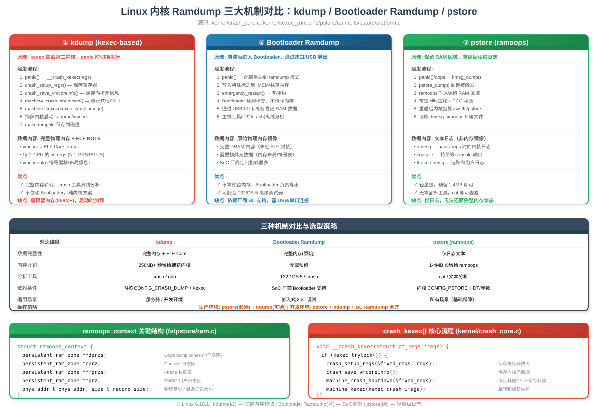

### 8.1 Ramdump 概述与对比

#### 8.1.1 什么是 Ramdump — 内存转储的本质

Ramdump（RAM Dump）是在系统崩溃时将 DRAM 中的内容保存下来，供后续离线分析的技术。核心目的是在系统无法恢复运行的情况下，保留崩溃现场的完整内存状态，包括进程堆栈、内核数据结构、页表等关键信息。

#### 8.1.2 三种 Ramdump 机制对比（kdump / Bootloader / pstore）

| 维度 | kdump | Bootloader Ramdump | pstore/ramoops |
|------|-------|-------------------|----------------|
| **数据内容** | 完整内存 + ELF Core | 完整物理内存原始镜像 | 文本日志（dmesg/console/ftrace） |
| **数据大小** | 可压缩过滤（几十MB~几GB） | 整个 DRAM（GB级） | 几十KB~几MB |
| **触发方式** | panic() → kexec 切换内核 | panic() → 重启到 BL 导出模式 | panic()/oops → 写保留RAM |
| **内存开销** | 预留 256MB+ 给捕获内核 | 不需预留 | 预留 1~4MB |
| **分析工具** | crash / gdb | T32 / crash / 厂商工具 | cat / grep / 文本分析 |
| **依赖** | CONFIG_CRASH_DUMP + kexec | SoC 厂商 BL 支持 | CONFIG_PSTORE + DT/参数 |

#### 8.1.3 Ramdump 在嵌入式 vs 服务器场景的差异

- **服务器**：通常内存充裕，kdump 为主力方案，配合 `makedumpfile` 过滤压缩
- **嵌入式/手机**：内存紧张，pstore 必选，Bootloader Ramdump 按 SoC 厂商方案
- **车机/IoT**：pstore 保障基础日志，有串口/USB 时可用 BL Ramdump

#### 8.1.4 内存保持（Memory Preservation）的硬件前提

DRAM 内容在以下条件下可保持：
- **Warm Reset**（热重启）：CPU 复位但 DRAM 控制器不重新初始化，内存内容保持
- **DRAM Self-Refresh**：DRAM 进入自刷新模式，无需 DDR 控制器即可保持内容
- **Cold Reset 会丢失**：掉电或冷重启会导致 DRAM 内容丢失

### 8.2 kdump 原理与实践

#### 8.2.1 kdump 整体架构 — 第一内核与捕获内核

```
┌─────────────────────────────────────────────────────┐
│                    DRAM 布局                         │
├───────────────────────────────┬─────────────────────┤
│  第一内核使用的内存 (大部分DRAM)  │ crashkernel 预留区  │
│  内核代码/数据/页表/进程等       │ 捕获内核+initrd     │
│  Panic 后作为 vmcore 数据源     │ Panic 后启动运行     │
└───────────────────────────────┴─────────────────────┘
     │  panic() 触发                    │
     └──── kexec 跳转 ─────────────────→│
                                       │ 启动捕获内核
                                       │ 通过 /proc/vmcore 读取第一内核内存
                                       │ makedumpfile 保存到磁盘
```

#### 8.2.2 kexec 系统调用 — 加载捕获内核流程

```c
// kernel/kexec_file.c / kernel/kexec.c
// 用户空间: kexec -p vmlinuz-capture --initrd=initrd-capture

// 系统调用路径:
sys_kexec_file_load()
    → kimage_file_alloc_init()     // 分配 kimage 结构
    → kimage_load_segment()        // 加载内核和 initrd 到预留内存
    → kexec_crash_image = image    // 设置为 crash 镜像
```

#### 8.2.3 crashkernel 内存预留机制与参数配置

```bash
# 启动参数
crashkernel=256M                    # 自动选择预留位置
crashkernel=256M@0x50000000         # 指定起始地址
crashkernel=256M,high               # 高地址预留（4GB以上）
crashkernel=64M,low                 # 低地址额外预留（DMA）

# 内核侧实现 (kernel/crash_core.c):
# parse_crashkernel() → memblock_reserve() 预留内存
```

#### 8.2.4 ARM64 kdump 特殊处理 — EL2/EL1 切换与 PSCI

ARM64 kdump 需要处理 EL2/EL1 切换问题：

```c
// arch/arm64/kernel/machine_kexec.c
void machine_crash_shutdown(struct pt_regs *regs)
{
    local_irq_disable();
    crash_smp_send_stop();           // 停止其他 CPU
    crash_save_cpu(regs, smp_processor_id());  // 保存当前 CPU 寄存器
}

// ARM64 kexec 需要通过 PSCI 接口关闭其他 CPU
// 并处理 EL2 → EL1 的降级问题
```

#### 8.2.5 Panic 路径触发 kdump 的完整流程

```
panic()
  → __crash_kexec(regs)                 // kernel/crash_core.c
      → kexec_trylock()                 // 获取 kexec 锁
      → crash_setup_regs(&fixed_regs)   // 保存当前寄存器快照
      → crash_save_vmcoreinfo()         // 保存 vmcoreinfo（符号偏移等）
      → machine_crash_shutdown()        // 停止其他 CPU + 保存其寄存器
      → crash_cma_clear_pending_dma()   // 等待 DMA 完成
      → machine_kexec(kexec_crash_image) // 跳转到捕获内核
```

**kexec_should_crash()** 判断是否应触发 kdump（`crash_core.c`）：
```c
int kexec_should_crash(struct task_struct *p)
{
    if (crash_kexec_post_notifiers)
        return 0;  // 延后到 notifier 之后再触发
    if (in_interrupt() || !p->pid || is_global_init(p) || panic_on_oops)
        return 1;
    return 0;
}
```

#### 8.2.6 /proc/vmcore 与 ELF core 格式解析

捕获内核通过 `/proc/vmcore` 提供第一内核内存的 ELF Core 视图：

```
ELF Core 文件结构:
┌─────────────────────┐
│ ELF Header          │  ← Elf64_Ehdr, e_type = ET_CORE
├─────────────────────┤
│ Program Header 0    │  ← PT_NOTE: CPU 寄存器快照
│ Program Header 1    │  ← PT_NOTE: vmcoreinfo
│ Program Header 2    │  ← PT_LOAD: 内存段 0
│ Program Header 3    │  ← PT_LOAD: 内存段 1
│ ...                 │
├─────────────────────┤
│ NOTE segment        │  ← NT_PRSTATUS (每个CPU一份)
│                     │  ← vmcoreinfo (内核符号偏移)
├─────────────────────┤
│ LOAD segments       │  ← 物理内存数据
└─────────────────────┘
```

#### 8.2.7 makedumpfile — vmcore 压缩与过滤

```bash
# 基本用法：从 /proc/vmcore 保存压缩转储
makedumpfile -l -d 31 /proc/vmcore vmcore.dump

# -l: lzo 压缩
# -d 31: 过滤级别（排除空闲页/缓存页/用户页等）
#   1=排除空闲页, 2=排除缓存, 4=排除缓存(非私有)
#   8=排除用户数据, 16=排除空闲的 hugepage
#   31=全部排除 → 最小转储

# 查看 vmcore 信息
makedumpfile --dump-dmesg vmcore.dump  # 提取 dmesg
```

#### 8.2.8 crash 工具加载 vmcore 离线分析

```bash
# 基本加载
crash vmlinux vmcore.dump

# ARM64 交叉分析（主机是 x86）
crash --target=arm64 vmlinux vmcore.dump

# 带模块符号
crash vmlinux vmcore.dump -m my_module.ko
```

#### 8.2.9 kdump 关键数据结构（kimage / kexec_segment）

```c
// include/linux/kexec.h
struct kimage {
    kimage_entry_t head;           // 页表入口链表头
    kimage_entry_t *entry;         // 当前页表入口
    unsigned long nr_segments;     // 段数量
    struct kexec_segment segment[KEXEC_SEGMENT_MAX];  // 内存段描述
    struct list_head control_pages; // 控制页列表
    unsigned long start;           // 捕获内核入口地址
    unsigned int type : 1;         // KEXEC_TYPE_DEFAULT/CRASH
    void *vmcoreinfo_data_copy;    // vmcoreinfo 安全副本
};

// 每个 CPU 的寄存器快照存储在 crash_notes 中
note_buf_t __percpu *crash_notes;  // per-CPU 的 ELF NOTE 缓冲区
```

#### 8.2.10 kdump 内核配置开关与调优参数

```makefile
# 必需配置
CONFIG_CRASH_DUMP=y          # 启用 crash dump 支持
CONFIG_KEXEC=y               # 启用 kexec 系统调用
CONFIG_PROC_VMCORE=y         # 捕获内核 /proc/vmcore 支持

# 推荐配置
CONFIG_CRASH_HOTPLUG=y       # 支持热插拔 CPU/内存的 kdump
CONFIG_DEBUG_INFO=y          # 调试信息（crash 工具需要）
CONFIG_KALLSYMS_ALL=y        # 完整符号表
```

#### 8.2.11 kdump 常见问题与排错

| 问题 | 原因 | 解决 |
|------|------|------|
| 捕获内核不启动 | crashkernel 内存不足 | 增加 `crashkernel=512M` |
| vmcore 不完整 | DMA 写入破坏内存 | 使用 CMA 预留 + 等待 DMA |
| 符号不匹配 | vmlinux 与 vmcore 版本不同 | 确保版本一致 |
| ARM64 kexec 失败 | EL2/PSCI 配置问题 | 检查设备树 psci 节点 |

### 8.3 Bootloader Ramdump 原理与实践

#### 8.3.1 Bootloader Ramdump 整体架构

```
内核 Panic → 设置重启原因标记 → emergency_restart()
                                      │
                                      ▼ Warm Reset
Bootloader 启动 → 检查重启原因标记 → 进入 Ramdump 模式
                                      │
                                      ▼
                              枚举 DRAM 区域
                              通过 USB/串口/SD 导出
                              主机工具保存到文件
```

#### 8.3.2 硬件看门狗复位与 Warm Reset 保留内存

- 硬件看门狗超时触发 Warm Reset → DRAM 内容保持
- 内核 panic_timeout > 0 时最终调用 `emergency_restart()` → 也是 Warm Reset
- **关键**：Bootloader 不能在 Ramdump 模式下初始化 DDR，否则内容丢失

#### 8.3.3 Qualcomm 方案 — SCM 调用与 Download Mode

```c
// Qualcomm 特有: 通过 SCM (Secure Channel Manager) 设置下载模式
// panic_notifier → qcom_scm_set_download_mode(QCOM_DOWNLOAD_FULLDUMP)
// 重启后 PBL/SBL 检测到下载模式 → 进入 EDL (Emergency Download)
// QPST / Sahara 工具通过 USB 导出内存
```

#### 8.3.4 MediaTek 方案 — AEE 与 MRDUMP

```c
// MediaTek AEE (Android Exception Engine):
// panic_notifier → aee_kdump_reboot()
// 写入 MRDUMP 头信息到预留 SRAM
// Bootloader 检测 MRDUMP 标记 → 导出到 SD/eMMC
// 使用 GAT (Generic Analyzing Tool) 离线分析
```

#### 8.3.5 通用 ARM64 方案 — PSCI SYSTEM_RESET2 与 Reset Reason

通用方案通过 PSCI SYSTEM_RESET2 传递重启原因：

```c
// arch/arm64/kernel/psci.c
// PSCI_0_2_FN_SYSTEM_RESET2 可传递 reset_type 参数
// Bootloader 读取 reset_type 判断是否进入 ramdump 模式
```

#### 8.3.6 Bootloader 端内存转储流程（U-Boot / ABL）

```
U-Boot Ramdump 流程:
1. 启动 → 检查 warm_reset + ramdump 标记
2. 跳过 DDR 初始化（或仅做 refresh 配置）
3. 枚举 DRAM 区域（从设备树或 ATAGS 获取）
4. 启动 USB gadget / fastboot 协议
5. 主机通过 fastboot oem ramdump 命令拉取内存
```

#### 8.3.7 转储传输 — USB / SD 卡 / TFTP / eMMC 分区

| 传输方式 | 速度 | 适用场景 |
|---------|------|---------|
| USB (fastboot) | ~30MB/s | 实验室调试 |
| SD 卡 | ~20MB/s | 车载/IoT 现场 |
| TFTP/网络 | ~100MB/s | 服务器/机架 |
| eMMC 专用分区 | ~50MB/s | 手机/平板 |

#### 8.3.8 内核侧 Ramdump 模式触发与标记设置

```c
// 典型实现: panic_notifier 中设置标记
static int ramdump_panic_handler(struct notifier_block *nb, ...)
{
    // 写入 IMEM / SRAM 中的共享标记区域
    writel(RAMDUMP_MAGIC, imem_base + RAMDUMP_FLAG_OFFSET);
    return NOTIFY_DONE;
}

static struct notifier_block ramdump_nb = {
    .notifier_call = ramdump_panic_handler,
    .priority = INT_MIN,  // 最后执行，确保其他 notifier 先完成
};
```

#### 8.3.9 Bootloader Ramdump 与 kdump 的协作与互斥

- kdump 优先级更高：`__crash_kexec()` 在 `panic_notifier_list` 之前执行
- 若 kdump 成功 → 不会到达 BL Ramdump 路径
- 若 kdump 失败/未配置 → 最终 `emergency_restart()` 进入 BL Ramdump

#### 8.3.10 Bootloader Ramdump 常见问题与排错

| 问题 | 原因 | 解决 |
|------|------|------|
| 重启后内存内容为空 | Cold Reset 或 DDR 被重新初始化 | 确保 Warm Reset + BL 跳过 DDR init |
| 标记未检测到 | IMEM/SRAM 在重启时被清除 | 使用 PMU 寄存器或 battery-backed SRAM |
| 导出不完整 | USB 断开 / 超时 | 加大传输超时，使用更稳定的接口 |

### 8.4 pstore 子系统原理与实践

#### 8.4.1 pstore 子系统整体架构

pstore 采用前端-后端分离架构（`fs/pstore/platform.c`）：

```
┌─────────────────────┐     ┌──────────────────┐     ┌────────────────────┐
│ 前端 (数据源)        │     │ pstore 核心       │     │ 后端 (存储)         │
│                     │     │                  │     │                    │
│ dmesg (kmsg_dump)   │────→│ pstore_dump()    │────→│ ramoops (RAM)      │
│ console (printk)    │────→│ pstore_console() │────→│ blk (块设备)        │
│ ftrace (ring buf)   │────→│ pstore_ftrace()  │────→│ zone (MTD/NVRAM)   │
│ pmsg (/dev/pmsg0)   │────→│ pstore_pmsg()    │────→│ efi (UEFI vars)    │
└─────────────────────┘     └──────────────────┘     └────────────────────┘
                                    │
                         /sys/fs/pstore/ 挂载点
                         重启后通过文件系统接口读取
```

#### 8.4.2 pstore 前端类型（dmesg / console / pmsg / ftrace）

| 前端 | 数据来源 | 触发时机 | 用途 |
|------|---------|---------|------|
| `dmesg` | `kmsg_dump()` | panic/oops 时 | 崩溃时的完整 dmesg |
| `console` | printk 钩子 | 持续（实时） | 所有 console 输出 |
| `pmsg` | `/dev/pmsg0` | 用户空间写入 | Android logcat 等 |
| `ftrace` | ftrace ring buffer | panic 时 | 函数调用追踪 |

#### 8.4.3 ramoops 后端 — 保留内存区域实现

ramoops 是最常用的 pstore 后端，将数据写入物理内存保留区域（`fs/pstore/ram.c`）：

```c
struct ramoops_context {
    struct persistent_ram_zone **dprzs;   // Oops dump zones（循环覆盖）
    struct persistent_ram_zone *cprz;     // Console zone
    struct persistent_ram_zone **fprzs;   // Ftrace zones（per-CPU）
    struct persistent_ram_zone *mprz;     // PMSG zone
    phys_addr_t phys_addr;               // 保留内存物理起始地址
    unsigned long size;                   // 保留内存总大小
    unsigned int memtype;                 // 0=WC, 1=unbuffered, 2=cached
    size_t record_size;                   // 每条 oops 记录大小
    size_t console_size;                  // console 区域大小
    size_t ftrace_size;                   // ftrace 区域大小
    size_t pmsg_size;                     // pmsg 区域大小
    struct persistent_ram_ecc_info ecc_info;  // ECC 校验信息
    unsigned int max_dump_cnt;            // 最大 dump 记录数
};
```

**内存布局**：
```
phys_addr ──────────────────────────────────────── phys_addr + size
│ dump zone 0 │ dump zone 1 │ ... │ console │ ftrace │ pmsg │
│ record_size │ record_size │     │ cons_sz │ ft_sz  │ pm_sz│
```

#### 8.4.4 ramoops 设备树配置与 Boot 参数

```dts
// 设备树配置
reserved-memory {
    #address-cells = <2>;
    #size-cells = <2>;
    ranges;

    ramoops@90000000 {
        compatible = "ramoops";
        reg = <0x0 0x90000000 0x0 0x100000>;  // 1MB
        record-size  = <0x20000>;   // 128KB per dump record
        console-size = <0x40000>;   // 256KB console
        ftrace-size  = <0x20000>;   // 128KB ftrace
        pmsg-size    = <0x20000>;   // 128KB pmsg
        ecc-size     = <16>;        // 16 bytes ECC per block
    };
};
```

```bash
# 启动参数替代方式
ramoops.mem_address=0x90000000 ramoops.mem_size=0x100000
ramoops.record_size=0x20000 ramoops.console_size=0x40000
ramoops.ftrace_size=0x20000 ramoops.pmsg_size=0x20000
ramoops.ecc=16
```

#### 8.4.5 blk 后端 — 块设备持久化存储

```c
// fs/pstore/blk.c — 使用块设备分区作为 pstore 后端
// 适用于有 eMMC/NOR Flash 但无法保留 DRAM 的场景
// 配置: pstore_blk.blkdev=/dev/mmcblk0p10

// 需要指定一个专用分区，数据直接写入块设备
// 优点: 掉电不丢失（比 ramoops 更可靠）
// 缺点: 写入速度较慢，不适合高频写入
```

#### 8.4.6 EFI 变量后端（UEFI 系统）

```bash
# UEFI 系统可使用 EFI 变量存储 pstore 数据
# 配置: pstore.backend=efi
# 数据存储在 EFI System Partition 的 NVRAM 中
# 空间有限，通常只存储最近一次 panic/oops
```

#### 8.4.7 /sys/fs/pstore/ 文件系统接口与日志读取

```bash
# 挂载（通常开机自动挂载）
mount -t pstore pstore /sys/fs/pstore/

# 文件命名规则
ls /sys/fs/pstore/
# dmesg-ramoops-0    ← 第一条 oops/panic dmesg 记录
# dmesg-ramoops-1    ← 第二条记录（循环覆盖）
# console-ramoops-0  ← console 持续日志
# ftrace-ramoops-0   ← ftrace 追踪数据
# pmsg-ramoops-0     ← 用户空间 pmsg 日志

# 读取
cat /sys/fs/pstore/dmesg-ramoops-0

# 清除已读取的记录（释放空间）
rm /sys/fs/pstore/dmesg-ramoops-0
```

#### 8.4.8 pstore 内部缓冲区管理 — persistent_ram_zone

```c
// fs/pstore/ram_core.c
struct persistent_ram_zone {
    phys_addr_t paddr;              // 物理地址
    size_t size;                    // 区域大小
    void *vaddr;                    // ioremap 后的虚拟地址
    struct persistent_ram_buffer *buffer;  // 环形缓冲区头
    size_t buffer_size;             // 数据区大小
    raw_spinlock_t buffer_lock;     // 保护锁
    struct persistent_ram_ecc_info ecc_info;  // ECC 信息
};

struct persistent_ram_buffer {
    uint32_t sig;                   // 魔数签名（验证数据有效性）
    atomic_t start;                 // 环形缓冲区起始位置
    atomic_t size;                  // 当前数据大小
    uint8_t data[];                 // 数据区
};
```

#### 8.4.9 pstore 关键数据结构（pstore_info / ramoops_platform_data）

```c
// include/linux/pstore.h
struct pstore_info {
    const char *name;               // 后端名称
    int (*open)(struct pstore_info *psi);
    int (*close)(struct pstore_info *psi);
    ssize_t (*read)(struct pstore_record *record);
    int (*write)(struct pstore_record *record);
    int (*erase)(struct pstore_record *record);
    // ...
};

// ramoops 注册为 pstore 后端:
// pstore_register(&cxt->pstore) 在 ramoops_probe() 中调用
```

#### 8.4.10 pstore 与 Panic 路径的集成 — kmsg_dump

```c
// kernel/panic.c - panic 路径中的 pstore 集成

// vpanic() → kmsg_dump_desc(KMSG_DUMP_PANIC, buf)
//   → 遍历 kmsg_dump_list
//     → pstore_dump() 被调用
//       → ramoops_pstore_write_buf() 将 dmesg 写入保留内存

// oops_exit() → kmsg_dump(KMSG_DUMP_OOPS)
//   → 同上流程，但 dump reason = OOPS
```

#### 8.4.11 pstore 内核配置开关与调优

```makefile
CONFIG_PSTORE=y                    # pstore 核心
CONFIG_PSTORE_RAM=y                # ramoops 后端
CONFIG_PSTORE_CONSOLE=y            # console 前端
CONFIG_PSTORE_PMSG=y               # pmsg 前端
CONFIG_PSTORE_FTRACE=y             # ftrace 前端
CONFIG_PSTORE_DEFAULT_KMSG_BYTES=10240  # kmsg 快照大小
CONFIG_PSTORE_DEFLATE_COMPRESS=y   # zlib 压缩支持
CONFIG_PSTORE_BLK=y                # 块设备后端（可选）
```

#### 8.4.12 pstore 常见问题与排错

| 问题 | 原因 | 解决 |
|------|------|------|
| 重启后 /sys/fs/pstore/ 为空 | 保留内存被 Bootloader 覆盖 | 确认 BL 不初始化 ramoops 区域 |
| dmesg-ramoops 内容截断 | record-size 过小 | 增大 record-size |
| ECC 校验失败 | 内存数据被破坏 | 检查 DDR 稳定性，增大 ecc-size |
| pstore 未注册 | 设备树/参数配置错误 | `dmesg | grep pstore` 检查 |

### 8.5 Ramdump 分析工具与实战

#### 8.5.1 crash 工具完整使用指南

```bash
# 常用分析流程
crash> log                    # 查看 panic 前的 dmesg
crash> bt                    # 当前 CPU 调用栈
crash> bt -a                 # 所有 CPU 调用栈
crash> ps -l                 # 进程列表（带最后运行CPU）
crash> runq                  # 各 CPU 运行队列
crash> kmem -i               # 内存使用概览
crash> struct task_struct <addr>  # 查看进程结构体
crash> rd -S <addr> 32       # 读取栈内存
crash> dis -l <func>         # 反汇编函数
crash> foreach bt            # 所有进程调用栈
crash> files <pid>           # 进程打开文件列表
```

#### 8.5.2 GDB + vmlinux 加载 core dump

```bash
aarch64-linux-gnu-gdb vmlinux vmcore
(gdb) bt                    # 调用栈
(gdb) info registers         # 寄存器值
(gdb) p *((struct task_struct *)0xffff...)  # 查看结构体
```

#### 8.5.3 Trace32 / DS-5 加载 ramdump

```
// Trace32 加载 raw ramdump
SYStem.CPU CortexA53
Data.LOAD.Binary ramdump.bin 0x80000000
Data.LOAD.ELF vmlinux /nocode
// 即可查看内核数据结构和符号
```

#### 8.5.4 ramparse 工具（Qualcomm 平台）

```bash
# Qualcomm ramparse 工具
python ramparse.py --vmlinux vmlinux --ram-file ramdump.bin \
    --output-dir ./output --auto-dump
# 自动解析: dmesg / task list / 锁状态 / 内存使用 等
```

#### 8.5.5 从 ramdump 还原 Panic 现场的完整步骤

```
1. 获取 ramdump 文件（vmcore / raw / pstore 日志）
2. 确保 vmlinux（带调试信息）版本匹配
3. crash/gdb 加载 → log 查看 panic 原因
4. bt -a → 找出 panic CPU 和调用路径
5. dis -l → 反汇编出错函数
6. struct → 检查关键数据结构状态
7. kmem -i / ps → 了解系统整体状态
8. 综合分析 → 确定根因
```

### 8.6 ARM64 平台 Ramdump 相关硬件机制

#### 8.6.1 Warm Reset vs Cold Reset 与 DDR 内容保持

| 复位类型 | DDR 内容 | 触发方式 |
|---------|---------|---------|
| Warm Reset | 保持 | watchdog timeout / PSCI SYSTEM_RESET / SW reset |
| Cold Reset | 丢失 | 掉电 / POR (Power-On Reset) / 长按电源键 |
| DRAM Self-Refresh + Reset | 保持 | 部分 SoC 支持进入 self-refresh 后再 reset |

#### 8.6.2 TrustZone 与 Secure World 对 Ramdump 的影响

- Secure World 内存区域在 Normal World 不可访问
- kdump 捕获内核只能看到 Non-Secure 内存
- 部分 SoC 提供 Secure dump 能力（需 OEM 密钥授权）

#### 8.6.3 DRAM 自刷新模式与断电保护

- DRAM 必须持续刷新才能保持数据
- Warm Reset 期间 DRAM 控制器保持刷新
- 部分高端 SoC 支持「deep sleep + DRAM self-refresh」组合

#### 8.6.4 Cache 刷写 — Panic 路径的 flush_cache_all()

```c
// panic 路径需要确保 cache 内容写回 DRAM
// 否则 ramdump 中看到的数据可能是陈旧的
// ARM64: machine_crash_shutdown() 中会刷 cache
```

### 8.7 三种机制的选型与组合策略

#### 8.7.1 服务器场景推荐方案

```
pstore (ramoops) — 必选，轻量级日志保障
    +
kdump — 推荐，完整内存转储用于深度分析
    配置: crashkernel=512M, panic_on_oops=1, panic=30
```

#### 8.7.2 嵌入式 / 手机场景推荐方案

```
pstore (ramoops) — 必选，1~4MB 保留内存
    +
Bootloader Ramdump — 按 SoC 厂商方案启用
    +
kdump — 可选（内存紧张时可不开）
```

#### 8.7.3 多机制组合部署最佳实践

- pstore 始终开启，保证最低限度的崩溃日志
- kdump 在内存充裕时开启，提供完整转储能力
- BL Ramdump 作为 kdump 的后备方案
- 三者互不冲突，可同时配置

#### 8.7.4 各机制资源开销对比

| 机制 | 内存开销 | CPU 开销 | 存储开销 |
|------|---------|---------|---------|
| pstore/ramoops | 1~4MB 预留 | 几乎为零 | 几KB~几MB |
| kdump | 256MB~1GB 预留 | kexec 加载时 | vmcore 几十MB~几GB |
| BL Ramdump | 无 | 无 | 完整 DRAM 大小 |

### 8.8 经典案例与实战分析

#### 8.8.1 Case 1：kdump 捕获内核 OOM Panic 的 vmcore 分析

```bash
crash> log | grep -i "out of memory"
# Out of memory: Killed process 1234 (my_app)
crash> kmem -i
# 确认内存使用情况
crash> ps -G my_app
# 查看被 OOM 杀死的进程
crash> foreach bt -t | grep alloc
# 追踪大量内存分配的调用路径
```

#### 8.8.2 Case 2：Bootloader Ramdump 定位看门狗复位根因

```
1. 看门狗复位 → BL 检测 warm reset → 导出 ramdump
2. crash 加载 → bt -a → 发现 CPU0 停在自旋锁
3. 分析死锁原因 → AB-BA 锁顺序反转
4. 修复锁顺序 + 开启 LOCKDEP 预防
```

#### 8.8.3 Case 3：pstore 恢复断电前的 Panic 日志

```bash
# 断电重启后
cat /sys/fs/pstore/dmesg-ramoops-0
# 看到 "Kernel panic - not syncing: Fatal exception"
# 完整 Oops 日志可分析出根因
```

#### 8.8.4 Case 4：kdump 捕获内核失败的排查过程

```bash
# 现象: panic 后系统直接重启，没有进入捕获内核
# 排查:
cat /sys/kernel/kexec_crash_loaded  # 检查是否加载成功
dmesg | grep crashkernel            # 检查预留内存
# 原因: crashkernel 区域与其他 reserved-memory 冲突
# 修复: 调整 crashkernel 地址
```

#### 8.8.5 Case 5：ramoops 区域被 Bootloader 覆盖的排查

```bash
# 现象: /sys/fs/pstore/ 每次重启后为空
# 排查:
dmesg | grep ramoops               # 确认 ramoops 注册成功
# Bootloader 在启动时将 framebuffer 映射到 ramoops 区域
# 修复: 调整 ramoops 物理地址避开 BL 使用区域
```

### 8.9 面试经典问题问答

**Q1: kdump 的工作原理是什么？**

> kdump 在启动时通过 `crashkernel=` 参数预留一块内存，用 `kexec -p` 将捕获内核加载到该区域。当 panic 发生时，`__crash_kexec()` 保存当前 CPU 寄存器和 vmcoreinfo，停止其他 CPU，然后通过 `machine_kexec()` 跳转到捕获内核。捕获内核启动后通过 `/proc/vmcore`（ELF Core 格式）提供对第一内核内存的访问，用 `makedumpfile` 保存到磁盘后用 `crash` 工具离线分析。

**Q2: pstore/ramoops 如何保证重启后数据不丢失？**

> ramoops 使用物理内存保留区域（通过设备树 `reserved-memory` 或启动参数指定），这块内存在 memblock 初始化时被 reserve，内核不会将其分配给其他用途。数据通过 `ioremap` 直接写入物理内存。Warm Reset 后 DRAM 内容保持，重启的内核重新映射该区域，通过 `persistent_ram_buffer` 的 magic signature 验证数据有效性。

**Q3: panic() 中 kdump 和 pstore 的执行顺序是什么？**

> `panic()` 中先尝试 `__crash_kexec()`（若 `crash_kexec_post_notifiers=false`），成功则直接跳转到捕获内核。若 kdump 未配置或失败，继续执行 `panic_notifier_list` 通知链，然后 `kmsg_dump()` 触发 pstore 写入。若设置了 `crash_kexec_post_notifiers=true`，则先执行 notifier + kmsg_dump，最后再尝试 `__crash_kexec()`。

**Q4: Bootloader Ramdump 与 kdump 的区别和各自适用场景？**

> kdump 是纯软件方案，在内核空间完成全部转储，依赖预留内存但不依赖 Bootloader 支持，产生标准 ELF Core 格式。BL Ramdump 依赖 SoC 厂商 Bootloader 支持，无需预留内存，但产生原始内存镜像需要厂商工具解析。kdump 适合服务器和通用 Linux 系统，BL Ramdump 适合嵌入式 SoC 平台（如 Qualcomm/MediaTek 手机芯片）。

---

## 9. 内核内存压缩机制原理与实践

> **全景架构图**：
>
> 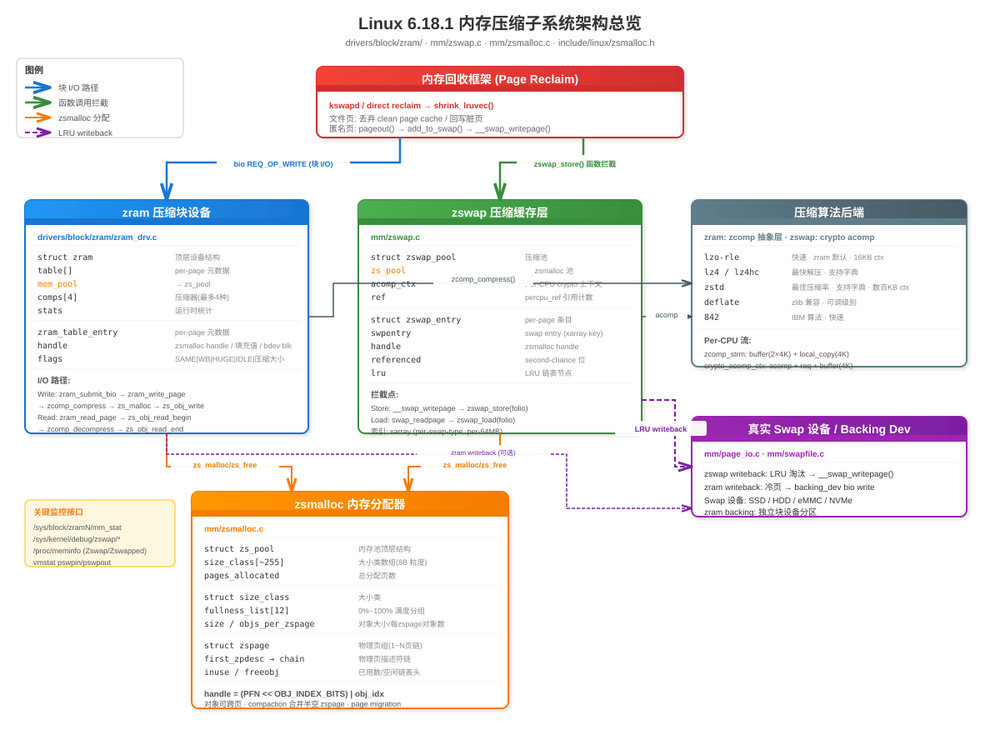

### 9.1 内存压缩概述与动机

#### 9.1.1 为什么需要内存压缩 — 内存回收代价与 I/O 瓶颈

当系统内存紧张时，内核通过 **页面回收（page reclaim）** 释放内存。匿名页（anonymous pages）没有后备文件，必须写入 Swap 设备才能回收。然而传统 Swap 存在严重的 I/O 瓶颈：

| 操作 | 延迟量级 | 说明 |
|------|---------|------|
| CPU L1 Cache | ~1 ns | |
| CPU L2 Cache | ~3-10 ns | |
| 主内存（DDR4） | ~60-100 ns | |
| **LZO 压缩 4K 页面** | **~2-5 μs** | CPU 密集型，无 I/O |
| **LZ4 压缩 4K 页面** | **~1-3 μs** | 比 LZO 更快 |
| NVMe SSD 4K 随机读 | ~100 μs | 比压缩慢 20-50 倍 |
| SATA SSD 4K 随机读 | ~200 μs | 比压缩慢 50-100 倍 |
| eMMC 4K 随机读 | ~500 μs - 3 ms | 嵌入式设备常见 |
| HDD 4K 随机读 | ~5-10 ms | 比压缩慢 1000-5000 倍 |

**核心思想**：用 CPU 时间换 I/O 时间。将页面压缩后存储在内存中，避免或减少 Swap I/O，在绝大多数场景下能显著降低延迟：

```
传统 Swap 路径：
  匿名页 ──► 磁盘写入（~100μs-10ms）──► 需要时从磁盘读回（~100μs-10ms）

压缩 Swap 路径：
  匿名页 ──► CPU 压缩（~2μs）──► 存入压缩内存池 ──► 需要时 CPU 解压（~1μs）
  
总延迟：~3μs vs ~200μs-20ms，性能提升 100-10000 倍
```

对于嵌入式 / 移动设备（如 Android 手机），通常没有传统 Swap 分区，zram 是唯一的匿名页回收通道。对于服务器场景，zswap 作为 Swap 的前端缓存层，可将 90% 以上的 Swap I/O 转化为内存压缩操作。

#### 9.1.2 内存压缩 vs Swap vs 内存回收的关系

三者在内核内存管理中协同工作：

```
                    内存压力触发
                        │
                        ▼
            ┌─── kswapd / direct reclaim ───┐
            │                                │
     ┌──────┴──────┐                ┌───────┴───────┐
     │  文件页回收    │                │  匿名页回收     │
     │ (page cache) │                │ (anonymous)    │
     └──────────────┘                └───────┬───────┘
                                             │
                          ┌──────────────────┼──────────────────┐
                          │                  │                  │
                    ┌─────┴─────┐    ┌──────┴──────┐    ┌─────┴─────┐
                    │   zswap    │    │    zram     │    │ 传统 Swap  │
                    │ (压缩缓存) │    │ (压缩块设备) │    │ (磁盘设备) │
                    └─────┬─────┘    └─────────────┘    └───────────┘
                          │ 淘汰时
                          ▼
                    传统 Swap 设备
```

**关键区别**：

| 维度 | 内存回收 | 内存压缩 | Swap |
|------|---------|---------|------|
| **对象** | 文件页 + 匿名页 | 仅匿名页 | 仅匿名页 |
| **机制** | 丢弃干净页 / 回写脏页 | 压缩后存内存 | 写入磁盘设备 |
| **延迟** | 文件页丢弃 ≈ 0 / 回写 ≈ ms | 压缩 ≈ μs | 读写 ≈ ms |
| **空间** | 释放物理页 | 节省物理页（压缩率） | 释放物理页 |
| **限制** | 可回收页有限 | 受限于压缩率和 CPU | 受限于磁盘空间和 I/O |

#### 9.1.3 三大压缩机制对比（zram / zswap / zpool）

> **注意**：在 Linux 6.18.1 中，`zpool` 抽象层已被移除。zswap 直接调用 `zsmalloc` 接口（`zs_malloc` / `zs_free` / `zs_obj_read_begin` / `zs_obj_write`），不再经过 zpool 中间层。早期内核（<6.x）中 zpool 支持 zbud / z3fold / zsmalloc 三种后端，现在只保留 zsmalloc。

| 维度 | zram | zswap |
|------|------|-------|
| **定位** | 基于内存的压缩块设备 | Swap 路径上的压缩缓存层 |
| **实现方式** | 注册为块设备（`/dev/zramN`），可作为 Swap 后端 | 拦截 Swap 路径，在写入真实 Swap 前先压缩缓存 |
| **数据存储** | zsmalloc 池（`zs_pool`） | zsmalloc 池（`zs_pool`） |
| **适用场景** | 无 Swap 设备的嵌入式/移动设备 | 有 Swap 设备的服务器/桌面 |
| **淘汰策略** | writeback 到 backing device（可选） | LRU writeback 到真实 Swap 设备 |
| **多级压缩** | 支持（最多 4 种算法 recompression） | 不支持 |
| **cgroup 集成** | 通过块设备 cgroup 控制 | 通过 memcg LRU 感知回收 |
| **源码位置** | `drivers/block/zram/` | `mm/zswap.c` |
| **内核配置** | `CONFIG_ZRAM` | `CONFIG_ZSWAP` |

#### 9.1.4 压缩算法选择 — lzo / lz4 / zstd / lzo-rle 对比

zram 在 Linux 6.18.1 中支持 7 种压缩算法后端，定义在 `drivers/block/zram/zcomp.c` 的 `backends[]` 数组中：

| 算法 | 压缩速度 | 解压速度 | 压缩率 | 内存开销 | 字典支持 | 级别控制 | 默认 |
|------|---------|---------|--------|---------|---------|---------|------|
| **lzo-rle** | 快 | 快 | 中等 | `LZO1X_MEM_COMPRESS` ≈ 16KB | ✗ | ✗ | ✓（zram 默认） |
| **lzo** | 快 | 快 | 中等 | `LZO1X_MEM_COMPRESS` ≈ 16KB | ✗ | ✗ | |
| **lz4** | 很快 | 很快 | 偏低 | `LZ4_MEM_COMPRESS` ≈ 16KB | ✓ | ✓（acceleration） | |
| **lz4hc** | 慢 | 很快 | 较高 | `LZ4HC_MEM_COMPRESS` ≈ 260KB | ✓ | ✓（clevel 1-16） | |
| **zstd** | 中等 | 快 | 高 | cctx + dctx ≈ 数百 KB | ✓ | ✓（clevel 1-22） | zswap 默认 |
| **deflate** | 慢 | 中等 | 高 | z_stream_s ≈ 数百 KB | ✗ | ✓（Z_DEFAULT） | |
| **842** | 快 | 快 | 中等 | `SW842_MEM_COMPRESS` | ✗ | ✗ | |

**选择建议**：

- **嵌入式/Android（重解压速度）**：`lzo-rle` 或 `lz4`，CPU 开销最低
- **服务器（重压缩率）**：`zstd`，压缩率比 lzo 高 20-30%，CPU 允许
- **多级压缩场景**：主压缩用 `lz4`（快），recompression 用 `zstd`（省空间）

#### 9.1.5 ARM64 平台内存压缩的性能考量

ARM64 平台的内存压缩存在以下特殊考量：

**1. NEON/SVE 指令加速**

部分压缩算法可利用 ARM64 的 NEON SIMD 指令加速。但内核态使用 NEON 需要保存/恢复 FPSIMD 上下文：

```c
// arch/arm64/include/asm/neon.h
kernel_neon_begin();   // 保存用户态 FPSIMD → 允许内核使用 NEON
// ... 使用 NEON 指令的压缩操作 ...
kernel_neon_end();     // 恢复用户态 FPSIMD
```

**2. 大小核（big.LITTLE）调度影响**

- **大核**（Cortex-A7x/X 系列）：压缩/解压更快，适合处理压缩密集型操作
- **小核**（Cortex-A5x 系列）：压缩性能较低，但功耗低
- 内核内存压缩运行在进程上下文（direct reclaim）或内核线程（kswapd）中，调度器决定在哪个核上运行
- Android 可通过 cgroup cpuset 将 kswapd 绑定到大核以提升压缩性能

**3. Cache 友好性**

- zsmalloc 的 zspage 跨页存储设计可能导致 cache miss：对象可能跨越两个物理页
- Per-CPU 压缩流（`zcomp_strm`）的 `buffer`（2×PAGE_SIZE）和 `local_copy`（PAGE_SIZE）被频繁访问，需常驻 cache
- ARM64 典型的 L1 DCache 为 32-64KB，L2 为 256KB-1MB，压缩缓冲区可能占用显著 cache 空间

**4. 页面大小影响**

ARM64 支持 4K/16K/64K 页面。页面越大，压缩操作处理的数据量越大：
- 4K 页面：单次压缩 4KB，延迟 ~2μs
- 64K 页面：单次压缩 64KB，延迟 ~30-50μs（但压缩率可能更高）

### 9.2 zram 原理与实践

#### 9.2.1 zram 整体架构 — 基于块设备的压缩内存盘

zram 是一个**内存中的压缩块设备驱动**，注册为 `/dev/zramN`。它的核心思想是：将写入块设备的数据（通常是 4K 页面）压缩后存储在内存中，读取时解压返回。最常见的用途是作为 Swap 后端：

```
用户进程匿名页
    │
    ▼ (swap out by kswapd/direct reclaim)
Swap 子系统
    │
    ▼ (bio REQ_OP_WRITE)
┌─────────────────────────────────────────────────────────────────┐
│ zram block device (/dev/zramN)                                  │
│                                                                 │
│  zram_submit_bio()                                              │
│    ├── zram_bio_write() → zram_write_page()                     │
│    │     ├── page_same_filled() → 相同值页面 → 仅存标志和值      │
│    │     ├── zcomp_compress() → 压缩                             │
│    │     │     └── Per-CPU zcomp_strm (mutex 保护)               │
│    │     ├── zs_malloc() → 从 zsmalloc 池分配空间                 │
│    │     └── zs_obj_write() → 写入压缩数据                       │
│    │                                                             │
│    └── zram_bio_read() → zram_read_page()                       │
│          ├── ZRAM_SAME → 填充相同值                               │
│          ├── ZRAM_HUGE → zs_obj_read_begin() → 直接复制           │
│          ├── 压缩页 → zs_obj_read_begin() → zcomp_decompress()   │
│          └── ZRAM_WB → read_from_bdev() → 从后端设备读取          │
│                                                                 │
│  数据存储：                                                       │
│  ┌────────────────┐    ┌─────────────────┐                      │
│  │ zram_table_entry│    │   zs_pool       │                      │
│  │ [0] handle,flags│───►│  (zsmalloc)     │                      │
│  │ [1] handle,flags│    │  压缩数据存储     │                      │
│  │ [2] ...         │    └─────────────────┘                      │
│  └────────────────┘                                              │
└─────────────────────────────────────────────────────────────────┘
```

源码位于 `drivers/block/zram/`，核心文件：

| 文件 | 行数 | 功能 |
|------|------|------|
| `zram_drv.h` | 142 | 核心数据结构、标志位、常量 |
| `zram_drv.c` | 2927 | 主驱动：I/O 处理、sysfs、初始化/重置、writeback、recompress |
| `zcomp.h` | 96 | 压缩抽象层类型定义 |
| `zcomp.c` | 257 | 压缩框架：创建/销毁/压缩/解压 |
| `backend_lzorle.c` | 59 | LZO-RLE 后端（默认） |
| `backend_lz4.c` | 127 | LZ4 后端（支持字典） |
| `backend_zstd.c` | 217 | ZSTD 后端（支持字典） |

#### 9.2.2 zram 创建与初始化流程

**模块加载**（`zram_init()`，`drivers/block/zram/zram_drv.c:2887`）：

```c
// drivers/block/zram/zram_drv.c
static int __init zram_init(void)
{
    // 1. 注册 CPU 热插拔回调（管理 Per-CPU 压缩流）
    cpuhp_setup_state_multi(CPUHP_ZCOMP_PREPARE,
                           "block/zram:prepare",
                           zcomp_cpu_up_prepare,  // 新 CPU 上线时分配压缩上下文
                           zcomp_cpu_dead);        // CPU 下线时释放

    // 2. 注册 sysfs 类（/sys/class/zram-control/）
    class_register(&zram_control_class);

    // 3. 注册块设备主号
    zram_major = register_blkdev(0, "zram");  // 动态分配

    // 4. 创建 num_devices 个 zram 设备（默认 1 个）
    for (i = 0; i < num_devices; i++)
        zram_add();  // 创建 /dev/zramN
}
```

**设备创建**（`zram_add()`，`drivers/block/zram/zram_drv.c:2714`）：

```
zram_add()
  ├── kzalloc(sizeof(struct zram))
  ├── idr_alloc(&zram_index_idr)              → 分配设备 ID
  ├── init_rwsem(&zram->init_lock)
  ├── blk_alloc_disk(&lim)                    → 分配 gendisk
  │   └── lim: logical=4K, physical=PAGE_SIZE
  │           features: STABLE_WRITES | SYNCHRONOUS
  ├── 设置默认压缩算法: comp_algorithm_set(PRIMARY, "lzo-rle")
  ├── set_capacity(disk, 0)                   → 容量为 0（等待 disksize 设置）
  └── device_add_disk(NULL, disk, zram_disk_groups)
```

**激活设备**（设置 disksize，`disksize_store()`，`drivers/block/zram/zram_drv.c:2490`）：

```
echo 512M > /sys/block/zram0/disksize

disksize_store(buf)
  ├── memparse(buf) → disksize (字节数)
  ├── down_write(&init_lock)
  ├── zram_meta_alloc(zram, disksize)
  │   ├── vzalloc(num_pages × sizeof(zram_table_entry))  → per-page 元数据表
  │   ├── zs_create_pool("zram0")                        → zsmalloc 内存池
  │   └── zs_huge_class_size(pool) → huge_class_size     → 不可压缩阈值
  │
  ├── for each comp_algs[prio]:                          → 创建压缩器
  │   └── zcomp_create(alg, params)
  │       ├── lookup_backend_ops(alg)                    → 查找后端
  │       └── zcomp_init()
  │           ├── alloc_percpu(struct zcomp_strm)        → Per-CPU 压缩流
  │           └── cpuhp_state_add_instance()             → 为每个在线 CPU：
  │               └── zcomp_strm_init()
  │                   ├── ops->create_ctx()              → 创建后端上下文
  │                   ├── vzalloc(PAGE_SIZE)              → local_copy 缓冲
  │                   └── vzalloc(2 × PAGE_SIZE)          → 压缩输出缓冲
  │
  ├── zram->disksize = disksize
  └── set_capacity_and_notify(sectors)                   → 通知块层

```

#### 9.2.3 zram 读写 I/O 路径详解

所有 I/O 通过 `zram_submit_bio()` 入口（`drivers/block/zram/zram_drv.c:2329`）：

```c
// drivers/block/zram/zram_drv.c
static void zram_submit_bio(struct bio *bio)
{
    switch (bio_op(bio)) {
    case REQ_OP_READ:
        zram_bio_read(zram, bio);     // 读取路径
        break;
    case REQ_OP_WRITE:
        zram_bio_write(zram, bio);    // 写入路径
        break;
    case REQ_OP_DISCARD:
    case REQ_OP_WRITE_ZEROES:
        zram_bio_discard(zram, bio);  // 丢弃路径
        break;
    }
}
```

**写入路径完整流程**：

```
zram_bio_write(bio)
  ├── bio_start_io_acct()
  ├── for_each_bvec(bv, bio):
  │   ├── index = sector >> SECTORS_PER_PAGE_SHIFT  → 页面索引
  │   ├── zram_bvec_write(zram, &bv, index, offset, bio)
  │   │   ├── 部分写 → zram_bvec_write_partial()
  │   │   │   ├── alloc_page() → 临时页
  │   │   │   ├── zram_read_page() → 读取已有数据
  │   │   │   ├── memcpy_from_bvec() → 覆盖部分数据
  │   │   │   └── zram_write_page() → 重写完整页
  │   │   └── 全页写 → zram_write_page(zram, page, index)
  │   └── zram_accessed(index) → 清除 IDLE/PP_SLOT，更新 ac_time
  └── bio_endio()
```

**读取路径完整流程**：

```
zram_bio_read(bio)
  ├── bio_start_io_acct()
  ├── for_each_bvec(bv, bio):
  │   ├── zram_bvec_read(zram, &bv, index, offset, bio)
  │   │   ├── 部分读 → zram_bvec_read_partial()
  │   │   └── 全页读 → zram_read_page(page, index, bio)
  │   ├── flush_dcache_page()
  │   └── zram_accessed(index)
  └── bio_endio()
```

#### 9.2.4 zram 压缩 / 解压缩流程

**写入页面核心逻辑**（`zram_write_page()`，`drivers/block/zram/zram_drv.c:1870`）：

```c
// drivers/block/zram/zram_drv.c - zram_write_page() 简化流程
static int zram_write_page(struct zram *zram, struct page *page, u32 index)
{
    // Step 1: 检测相同值页面（Same-filled page optimization）
    src = kmap_local_page(page);
    if (page_same_filled(src, &element)) {
        // 页面中所有 unsigned long 值相同 → 仅记录值，不分配内存
        zram_free_page(zram, index);
        zram_set_flag(index, ZRAM_SAME);
        zram_set_handle(index, element);  // handle 存填充值而非 zsmalloc handle
        atomic64_inc(&zram->stats.same_pages);
        return 0;
    }
    kunmap_local(src);

    // Step 2: 压缩
    zstrm = zcomp_stream_get(zram->comps[ZRAM_PRIMARY_COMP]);
    src = kmap_local_page(page);
    ret = zcomp_compress(zstrm, src, &comp_len);  // 输出到 zstrm->buffer
    kunmap_local(src);

    // Step 3: 判断是否可压缩
    if (comp_len >= zram->huge_class_size) {
        // 不可压缩 → 存储原始页面
        return write_incompressible_page(zram, page, index);
        // → zs_malloc(PAGE_SIZE) + zs_obj_write(page, PAGE_SIZE)
        // → 设置 ZRAM_HUGE 标志
    }

    // Step 4: 分配 zsmalloc 空间 + 写入压缩数据
    handle = zs_malloc(zram->mem_pool, comp_len,
                       GFP_NOIO | __GFP_HIGHMEM | __GFP_MOVABLE);
    zs_obj_write(zram->mem_pool, handle, zstrm->buffer, comp_len);

    // Step 5: 更新元数据
    zram_slot_lock(zram, index);
    zram_free_page(zram, index);       // 释放旧数据
    zram_set_handle(zram, index, handle);
    zram_set_obj_size(zram, index, comp_len);
    zram_slot_unlock(zram, index);

    // Step 6: 更新统计
    atomic64_add(comp_len, &zram->stats.compr_data_size);
    atomic64_inc(&zram->stats.pages_stored);
}
```

**读取页面核心逻辑**（`zram_read_from_zspool()`）：

```c
// drivers/block/zram/zram_drv.c - zram_read_from_zspool() 简化
static int zram_read_from_zspool(struct zram *zram, struct page *page, u32 index)
{
    handle = zram_get_handle(zram, index);

    // Case 1: 相同值页面 — 直接填充
    if (zram_test_flag(index, ZRAM_SAME)) {
        zram_fill_page(page, handle);  // memset_l 填充整页
        return 0;
    }

    size = zram_get_obj_size(zram, index);
    prio = zram_get_priority(zram, index);

    // Case 2: 不可压缩页面 — 直接拷贝
    if (size == PAGE_SIZE) {
        src = zs_obj_read_begin(zram->mem_pool, handle, NULL);
        copy_page(dst, src);  // dst = kmap_local_page(page)
        zs_obj_read_end(zram->mem_pool, handle, src);
        return 0;
    }

    // Case 3: 压缩页面 — 解压缩
    zstrm = zcomp_stream_get(zram->comps[prio]);
    src = zs_obj_read_begin(zram->mem_pool, handle, zstrm->local_copy);
    dst = kmap_local_page(page);
    ret = zcomp_decompress(zstrm, src, size, dst);  // 解压到目标页
    kunmap_local(dst);
    zs_obj_read_end(zram->mem_pool, handle, src);
    zcomp_stream_put(zstrm);
    return ret;
}
```

**压缩抽象层**（`zcomp.c`）的 Per-CPU 流管理：

```c
// drivers/block/zram/zcomp.c
struct zcomp_strm *zcomp_stream_get(struct zcomp *comp)
{
    while (1) {
        zstrm = raw_cpu_ptr(comp->stream);
        mutex_lock(&zstrm->lock);   // 获取当前 CPU 的压缩流
        if (zstrm->buffer)          // 若 buffer 有效（CPU 在线）
            return zstrm;
        mutex_unlock(&zstrm->lock); // CPU 已下线，buffer 被释放
        // 循环重试（会迁移到其他 CPU）
    }
}

void zcomp_stream_put(struct zcomp_strm *zstrm)
{
    mutex_unlock(&zstrm->lock);
}
```

#### 9.2.5 zram 内存管理 — zs_pool / zspage / handle

zram 使用 **zsmalloc** 作为底层内存分配器。详细机制参见 9.4 节，此处概述关系：

```
zram->mem_pool (struct zs_pool)
  │
  ├── size_class[0..254]  ← ~255 个大小类，每个处理特定大小范围的对象
  │   ├── .size = 该类对象大小（8 字节对齐，32..4096）
  │   ├── .objs_per_zspage = 一个 zspage 能容纳的对象数
  │   └── fullness_list[0..11]  ← 12 个满度分组
  │       └── zspage ← → zspage ← → ...
  │           ├── first_zpdesc → zpdesc → zpdesc  ← 物理页链
  │           ├── inuse = 已使用对象数
  │           └── freeobj = 空闲链表头
  │
  └── handle = zs_malloc(pool, comp_len, gfp, nid)
      → 编码: (PFN << OBJ_INDEX_BITS) | obj_index
      → 存储在 zram_table_entry[index].handle 中
```

**关键操作映射**：

| zram 操作 | zsmalloc 调用 | 说明 |
|-----------|--------------|------|
| 写入压缩数据 | `zs_malloc()` + `zs_obj_write()` | 分配空间 + 写入 |
| 读取压缩数据 | `zs_obj_read_begin()` + `zs_obj_read_end()` | 映射 + 读取 + 解映射 |
| 释放页面 | `zs_free()` | 释放 zsmalloc 对象 |
| 碎片整理 | `zs_compact()` | 通过 sysfs `compact` 触发 |

#### 9.2.6 zram 作为 Swap 后端的配置与使用

最常见的 zram 使用场景是作为 Swap 设备：

```bash
# Step 1: 加载模块（通常已内置）
modprobe zram num_devices=1

# Step 2: 选择压缩算法（可选，默认 lzo-rle）
echo lz4 > /sys/block/zram0/comp_algorithm

# Step 3: 设置 zram 大小（通常为物理内存的 50%-100%）
echo 2G > /sys/block/zram0/disksize

# Step 4: 启用为 Swap（优先级高于磁盘 Swap）
mkswap /dev/zram0
swapon -p 100 /dev/zram0   # priority=100，高优先级

# 验证
cat /proc/swaps
# Filename          Type        Size      Used   Priority
# /dev/zram0        partition   2097148   0      100

# 查看统计
cat /sys/block/zram0/mm_stat
# orig_data_size  compr_data_size  mem_used_total  mem_limit  max_used
# same_pages  pages_compacted  huge_pages  huge_pages_since
```

**Android 系统的典型配置**（系统启动脚本）：

```bash
# Android init.rc 中的典型配置
write /sys/block/zram0/comp_algorithm lz4
write /sys/block/zram0/disksize 2147483648    # 2GB
exec /system/bin/mkswap /dev/block/zram0
exec /system/bin/swapon -p 32758 /dev/block/zram0
```

#### 9.2.7 zram writeback — 冷页回写到磁盘

当 `CONFIG_ZRAM_WRITEBACK` 开启时，zram 可以将不经常访问的压缩页回写到后端块设备（如 eMMC、SD 卡），进一步释放内存。

**配置 backing device**（必须在设置 disksize 之前）：

```bash
# 绑定后端设备
echo /dev/mmcblk0p3 > /sys/block/zram0/backing_dev

# 设置 disksize
echo 2G > /sys/block/zram0/disksize
```

**触发 writeback**：

```bash
# Step 1: 标记空闲页（未被访问超过指定秒数的页面）
echo 300 > /sys/block/zram0/idle   # 标记 300 秒未访问的页面为 IDLE

# Step 2: 触发 writeback
echo idle > /sys/block/zram0/writeback            # 回写空闲页
echo huge > /sys/block/zram0/writeback            # 回写不可压缩大页
echo huge_idle > /sys/block/zram0/writeback       # 回写空闲且不可压缩的页
echo incompressible > /sys/block/zram0/writeback  # 回写不可压缩页

# 可选：限制回写量
echo 1 > /sys/block/zram0/writeback_limit_enable
echo 1024 > /sys/block/zram0/writeback_limit      # 限制 1024 × 4K = 4MB
```

**writeback 内部流程**（`writeback_store()`，`drivers/block/zram/zram_drv.c:930`）：

```
writeback_store(buf)
  ├── atomic_xchg(&pp_in_progress, 1)         → 排斥 recompress
  ├── scan_slots_for_writeback(mode, lo, hi, ctl)
  │   └── for each page in [lo, hi):
  │       ├── 跳过: 未分配 / ZRAM_WB / ZRAM_SAME
  │       ├── 根据 mode 检查: IDLE / HUGE / INCOMPRESSIBLE
  │       └── place_pp_slot(ctl, index)        → 按 obj_size/64 分桶
  │
  ├── zram_writeback_slots(ctl)
  │   └── while select_pp_slot(ctl) → pps:    → 从最大桶开始（最大收益）
  │       ├── alloc_block_bdev() → blk_idx     → bitmap 分配后端设备块
  │       ├── zram_read_from_zspool(page, index) → 解压到临时页
  │       ├── bio(REQ_OP_WRITE|REQ_SYNC)       → submit_bio_wait()
  │       ├── zram_free_page(index)             → 释放 zsmalloc 空间
  │       ├── 设置 ZRAM_WB，handle = blk_idx    → 记录后端设备块号
  │       └── bd_writes++, bd_wb_limit--
  └── atomic_set(&pp_in_progress, 0)
```

**writeback 后的读取路径**：当读取一个 `ZRAM_WB` 标志的页面时，`zram_read_page()` 调用 `read_from_bdev()`，发起对后端设备的 READ bio。

#### 9.2.8 zram recompression — 多级压缩算法

当 `CONFIG_ZRAM_MULTI_COMP` 开启时，zram 支持最多 **4 种压缩算法**（1 个主 + 3 个次级），可以对已压缩的页面用更强算法重压缩以提高压缩率。

**配置多级压缩**：

```bash
# 主压缩算法（快速）
echo lz4 > /sys/block/zram0/comp_algorithm

# 次级压缩算法（更好的压缩率）
echo "algo=zstd priority=1" > /sys/block/zram0/recomp_algorithm
echo "algo=lz4hc priority=2" > /sys/block/zram0/recomp_algorithm

# 设置 disksize 激活
echo 2G > /sys/block/zram0/disksize
```

**触发 recompression**：

```bash
# 标记空闲页
echo 300 > /sys/block/zram0/idle

# 重压缩空闲页（threshold: 只处理压缩后 > 指定字节的页面）
echo "type=idle threshold=2048" > /sys/block/zram0/recompress

# 重压缩不可压缩大页
echo "type=huge" > /sys/block/zram0/recompress
```

**recompression 核心逻辑**（`recompress_slot()`）：

```
recompress_slot(index, page, threshold, prio_range)
  ├── 解压原始页面到临时页
  ├── class_index_old = zs_lookup_class_index(comp_len_old)
  │
  ├── for prio in [start_prio, prio_max):
  │   ├── zcomp_compress(comps[prio], page) → comp_len_new
  │   ├── class_index_new = zs_lookup_class_index(comp_len_new)
  │   ├── if class_index_new >= class_index_old → 跳过（无收益）
  │   │   // 关键：比较 zsmalloc 大小类索引而非原始大小
  │   │   // 因为 zsmalloc 按 size_class 分配，只有跨越 class 才有真正的内存节省
  │   └── 找到更优算法 → break
  │
  ├── 若无算法改善且已用最高优先级 → 标记 ZRAM_INCOMPRESSIBLE
  │
  ├── zs_malloc(comp_len_new) + zs_obj_write(new_handle, buffer)
  ├── zram_free_page(index)                → 释放旧数据
  └── 设置新 handle, obj_size, priority     → 更新元数据
```

**优先级编码**：使用 `zram_table_entry.flags` 中的 2 位（`ZRAM_COMP_PRIORITY_BIT1` / `BIT2`）存储压缩算法优先级（0-3）。读取时根据优先级选择对应的解压器。

#### 9.2.9 zram 关键数据结构（zram / zram_table_entry）

> **数据结构关系图**：
>
> 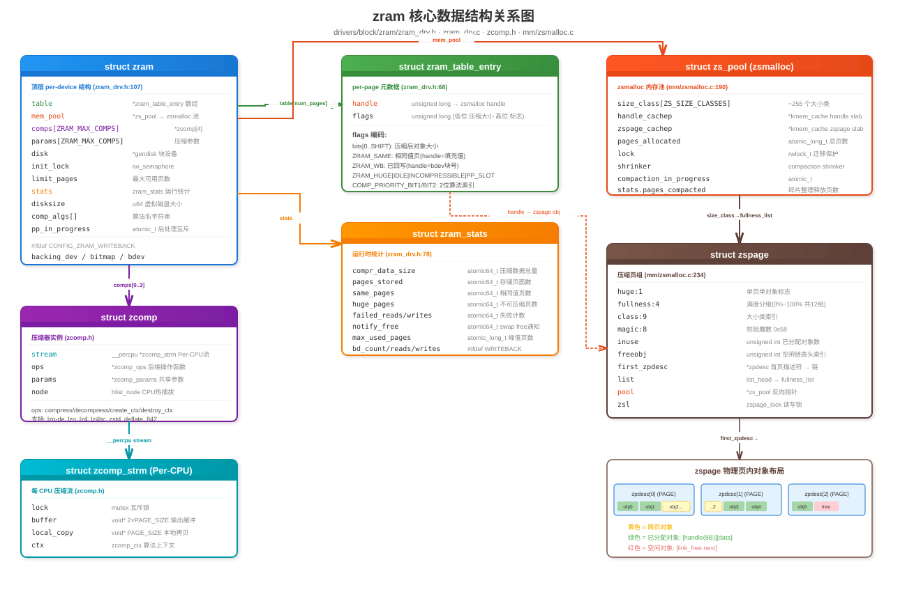

**`struct zram`**（`drivers/block/zram/zram_drv.h:107`）— 顶层设备结构体：

```c
struct zram {
    struct zram_table_entry *table;          // per-page 元数据数组（disksize/PAGE_SIZE 个）
    struct zs_pool          *mem_pool;       // zsmalloc 内存池
    struct zcomp            *comps[ZRAM_MAX_COMPS]; // 压缩器（最多 4 个）
    struct zcomp_params      params[ZRAM_MAX_COMPS]; // 压缩参数
    struct gendisk          *disk;           // 块设备 gendisk
    struct rw_semaphore      init_lock;      // 保护 init/reset
    unsigned long            limit_pages;    // 最大可使用页数
    struct zram_stats        stats;          // 运行时统计
    u64                      disksize;       // 虚拟磁盘大小（字节）
    const char              *comp_algs[ZRAM_MAX_COMPS]; // 算法名
    s8                       num_active_comps; // 活跃压缩器数
    atomic_t                 pp_in_progress;  // writeback/recompress 互斥
#ifdef CONFIG_ZRAM_WRITEBACK
    struct file             *backing_dev;     // 后端设备文件
    unsigned long           *bitmap;          // 后端设备块位图
    unsigned long            nr_pages;        // 后端设备页数
    struct block_device     *bdev;            // 后端块设备
    u64                      bd_wb_limit;     // writeback 预算
    bool                     wb_limit_enable; // writeback 限制开关
#endif
};
```

**`struct zram_table_entry`**（`drivers/block/zram/zram_drv.h:68`）— per-page 元数据：

```c
struct zram_table_entry {
    unsigned long handle;    // 多用途：
                             //   普通压缩: zsmalloc handle
                             //   ZRAM_SAME: 填充值
                             //   ZRAM_WB:   后端设备块索引
    unsigned long flags;     // 低位 [0, ZRAM_FLAG_SHIFT): 压缩后大小
                             // 高位: 页面标志位
};
```

**页面标志位**（`enum zram_pageflags`）：

| 标志 | 含义 |
|------|------|
| `ZRAM_SAME` | 页面被相同值填充，handle 存储填充值 |
| `ZRAM_ENTRY_LOCK` | 用于 bit-lock 的条目锁 |
| `ZRAM_WB` | 页面已 writeback 到后端设备 |
| `ZRAM_PP_SLOT` | 被选中进行后处理（writeback/recompress） |
| `ZRAM_HUGE` | 不可压缩页面（原始大小存储） |
| `ZRAM_IDLE` | 自上次标记以来未被访问 |
| `ZRAM_INCOMPRESSIBLE` | 所有算法均无法有效压缩 |
| `ZRAM_COMP_PRIORITY_BIT1/BIT2` | 2 位压缩算法优先级索引 |

**`struct zram_stats`**（`drivers/block/zram/zram_drv.h:78`）— 运行时统计：

```c
struct zram_stats {
    atomic64_t compr_data_size;    // 压缩数据总字节数
    atomic64_t failed_reads;       // 失败读取次数
    atomic64_t failed_writes;      // 失败写入次数
    atomic64_t notify_free;        // swap slot free 通知次数
    atomic64_t same_pages;         // 相同值页面数
    atomic64_t huge_pages;         // 当前不可压缩页面数
    atomic64_t huge_pages_since;   // 累计不可压缩页面数
    atomic64_t pages_stored;       // 当前存储总页面数
    atomic_long_t max_used_pages;  // 峰值 zsmalloc 页面使用量
    atomic64_t miss_free;          // trylock 失败的 free 次数
#ifdef CONFIG_ZRAM_WRITEBACK
    atomic64_t bd_count;           // 后端设备上的页面数
    atomic64_t bd_reads;           // 后端设备读次数
    atomic64_t bd_writes;          // 后端设备写次数
#endif
};
```

**`struct zcomp`**（`drivers/block/zram/zcomp.h`）— 压缩器实例：

```c
struct zcomp {
    struct zcomp_strm __percpu *stream;  // Per-CPU 压缩流
    const struct zcomp_ops     *ops;     // 后端操作函数
    struct zcomp_params        *params;  // 共享压缩参数
    struct hlist_node           node;    // CPU 热插拔节点
};

struct zcomp_strm {
    struct mutex    lock;     // 保护当前 CPU 的流
    void           *buffer;   // 2×PAGE_SIZE 压缩输出缓冲
    void           *local_copy; // PAGE_SIZE 本地拷贝（用于 zs_obj_read）
    struct zcomp_ctx ctx;     // 后端上下文
};
```

#### 9.2.10 zram sysfs 接口与统计信息

**设备属性**（`/sys/block/zramN/`）：

| 属性 | 模式 | 说明 |
|------|------|------|
| `disksize` | RW | 设置/读取虚拟磁盘大小（memparse 格式：512M、2G 等） |
| `initstate` | RO | 0=未初始化，1=已初始化 |
| `reset` | WO | 写 1 重置设备（需先 swapoff） |
| `compact` | WO | 触发 zsmalloc 碎片整理 |
| `mem_limit` | WO | 设置最大内存限制 |
| `mem_used_max` | WO | 写 0 重置峰值统计 |
| `idle` | WO | `"all"` 或秒数，标记页面为 IDLE |
| `comp_algorithm` | RW | 主压缩算法名 |
| `algorithm_params` | WO | 压缩参数：`algo=X level=N dict=/path` |

**`mm_stat` 输出解读**（9 个字段）：

```
cat /sys/block/zram0/mm_stat
# 字段1 orig_data_size:    原始数据总大小（字节）= pages_stored × PAGE_SIZE
# 字段2 compr_data_size:   压缩后数据总大小（字节）
# 字段3 mem_used_total:    zsmalloc 实际使用的总内存（字节）
# 字段4 mem_limit:         内存限制（0=无限制）
# 字段5 max_used_pages:    峰值使用页数
# 字段6 same_pages:        相同值填充页面数
# 字段7 pages_compacted:   碎片整理释放的页数
# 字段8 huge_pages:        当前不可压缩页面数
# 字段9 huge_pages_since:  累计不可压缩页面数

# 压缩率 = orig_data_size / compr_data_size
# 实际内存节省 = orig_data_size - mem_used_total
```

**writeback 相关属性**（需 `CONFIG_ZRAM_WRITEBACK`）：

| 属性 | 模式 | 说明 |
|------|------|------|
| `backing_dev` | RW | 后端设备路径（需在 disksize 设置前配置） |
| `writeback` | WO | 触发 writeback：`type=idle\|huge\|...` |
| `writeback_limit` | RW | writeback 预算（4K 单位） |
| `writeback_limit_enable` | RW | 启用 writeback 限制 |
| `bd_stat` | RO | `bd_count bd_reads bd_writes`（4K 单位） |

**热添加/移除**（`/sys/class/zram-control/`）：

```bash
# 动态添加 zram 设备
cat /sys/class/zram-control/hot_add    # 返回新设备 ID

# 动态移除 zram 设备
echo 1 > /sys/class/zram-control/hot_remove  # 移除 zram1
```

#### 9.2.11 zram 内核配置开关与调优参数

| 配置选项 | 说明 |
|---------|------|
| `CONFIG_ZRAM` | zram 驱动总开关 |
| `CONFIG_ZRAM_DEF_COMP` | 默认压缩算法（默认 "lzo-rle"） |
| `CONFIG_ZRAM_WRITEBACK` | 允许将冷页回写到后端设备 |
| `CONFIG_ZRAM_MULTI_COMP` | 支持多级压缩算法（最多 4 种） |
| `CONFIG_ZRAM_MEMORY_TRACKING` | 启用 per-page 访问时间追踪（debugfs） |

**模块参数**：

```
num_devices=N    # 模块加载时创建的 zram 设备数（默认 1）
```

**调优建议**：

| 场景 | disksize | 算法 | 说明 |
|------|---------|------|------|
| Android 手机（4GB RAM） | 2-3 GB | lz4 | 解压快，省电 |
| Android 手机（8GB RAM） | 4-6 GB | lz4 或 lzo-rle | 平衡 |
| 嵌入式 Linux（512MB RAM） | 256-384 MB | lzo-rle | 内存开销低 |
| 桌面 Linux（16GB RAM） | 4-8 GB | zstd | 重压缩率 |

### 9.3 zswap 原理与实践

#### 9.3.1 zswap 整体架构 — Swap 路径上的压缩缓存层

zswap 是一个**透明的 Swap 前端压缩缓存**。当匿名页被换出时，zswap 拦截 Swap 写操作，将页面压缩后缓存在内存中；当页面需要换入时，从压缩缓存中直接解压，避免磁盘 I/O。若压缩池满，zswap 将最冷的压缩页通过 LRU 写回到真实 Swap 设备。

```
                        匿名页换出
                            │
                            ▼
                ┌───── Swap 子系统 ─────┐
                │                       │
                │  __swap_writepage()    │
                │       │               │
                │       ▼               │
                │  zswap_store(folio)    │  ← zswap 拦截写入
                │       │               │
                │   ┌───┴───┐           │
                │   │压缩成功│           │
                │   └───┬───┘           │
                │       │               │
                │       ▼               │
                │  ┌─────────────────┐  │
                │  │ zswap 压缩缓存   │  │
                │  │                 │  │
                │  │ xarray 索引:     │  │
                │  │   swp_entry_t   │  │
                │  │   → zswap_entry │  │
                │  │   → zs handle  │  │
                │  │   → 压缩数据    │  │
                │  │                 │  │
                │  │ ┌─── LRU ───┐  │  │
                │  │ │ cold ... hot│  │  │
                │  │ └────┬───────┘  │  │
                │  └──────┼─────────┘  │
                │         │  池满淘汰   │
                │         ▼            │
                │  真实 Swap 设备       │
                │  (SSD/HDD/eMMC)     │
                └──────────────────────┘
```

源码：`mm/zswap.c`（约 1860 行），`include/linux/zswap.h`。

与 zram 的关键区别：
- **zram** 是块设备驱动，注册为 `/dev/zramN`，Swap 子系统通过标准块 I/O 与之交互
- **zswap** 直接在 Swap 代码路径中通过函数调用拦截，不经过块设备层
- **zswap** 需要真实 Swap 设备作为后端（池满时回写），zram 可独立运行

#### 9.3.2 zswap 与 Swap 子系统的集成点（frontswap）

> **注意**：Linux 6.18.1 中 zswap 不再使用 frontswap 接口。早期内核通过 `frontswap_ops` 注册 zswap，现在改为在 Swap 路径中直接调用 zswap 函数。

集成点在 `mm/page_io.c` 和 `mm/swap_state.c`：

```c
// mm/page_io.c - Swap 写入路径
void __swap_writepage(struct folio *folio, struct writeback_control *wbc)
{
    // 直接调用 zswap（不经过 frontswap）
    if (zswap_store(folio)) {    // ← zswap 拦截点
        folio_unlock(folio);
        return;                   // 压缩成功，不写真实 Swap
    }
    // zswap 失败 → 写入真实 Swap 设备
    swap_writepage_bdev(folio, wbc);
}

// mm/swap_state.c - Swap 读取路径
struct folio *swap_cluster_readahead(...)
{
    // 读取时检查 zswap
    if (zswap_load(folio))        // ← zswap 拦截点
        return folio;              // 从 zswap 解压成功
    // 从真实 Swap 设备读取
}
```

#### 9.3.3 zswap store 路径 — 页面压缩入池

**`zswap_store(folio)`**（`mm/zswap.c:1498`）：

```
zswap_store(folio)
  ├── 检查 zswap_enabled（静态 key 快速判断）
  ├── 获取 obj_cgroup（memcg 计费）
  ├── zswap_check_limits()
  │   ├── 计算当前池大小 vs zswap_max_pool_percent × totalram_pages
  │   ├── 若超限 → zswap_pool_reached_full = true
  │   │   └── queue_work(shrink_wq, &zswap_shrink_work)  → 异步回收
  │   └── 若低于 accept_threshold → zswap_pool_reached_full = false
  │
  ├── zswap_pool_current_get()    → 获取当前池（RCU 保护 + percpu_ref）
  │
  ├── for each page in folio:      → 逐页处理
  │   └── zswap_store_page(page, objcg, pool)
  │       ├── zswap_entry_cache_alloc()     → 从 slab 分配 zswap_entry
  │       │
  │       ├── zswap_compress(page, entry, pool)
  │       │   ├── acomp_ctx_get_cpu_lock(pool)  → 获取 Per-CPU 压缩上下文
  │       │   ├── sg_init_one(src_sg, page)
  │       │   ├── sg_init_one(dst_sg, acomp_ctx->buffer)
  │       │   ├── crypto_acomp_compress(req)     → 异步压缩 API（同步等待）
  │       │   ├── crypto_wait_req()
  │       │   │
  │       │   ├── if dlen >= PAGE_SIZE:          → 不可压缩
  │       │   │   └── store_uncompressed = true  → 原样存储
  │       │   │
  │       │   ├── zs_malloc(pool->zs_pool, dlen,
  │       │   │            GFP_NOWAIT|__GFP_NORETRY|__GFP_HIGHMEM|__GFP_MOVABLE)
  │       │   └── zs_obj_write(pool->zs_pool, handle, dst, dlen)
  │       │
  │       ├── xa_store(tree, offset, entry)     → 存入 xarray（按 swap_entry 索引）
  │       ├── 若替换旧条目 → zswap_entry_free(old)
  │       ├── 设置 entry 字段: pool, swpentry, objcg, referenced=true
  │       ├── zswap_lru_add(&zswap_list_lru, entry)  → 加入 LRU 链表
  │       └── atomic_long_inc(&zswap_stored_pages)
  │
  └── 失败时释放资源，若池满触发 shrink_worker
```

**xarray 索引方案**：

```c
// mm/zswap.c
#define ZSWAP_ADDRESS_SPACE_SHIFT  14   // 每个 xarray 覆盖 2^14 = 16384 页 = 64MB
#define ZSWAP_ADDRESS_SPACE_PAGES  (1 << ZSWAP_ADDRESS_SPACE_SHIFT)

// 每个 swap 类型有多个 xarray，按 offset 分段
static struct xarray *swap_zswap_tree(swp_entry_t swp) {
    return &zswap_trees[swp_type(swp)][swp_offset(swp) >> ZSWAP_ADDRESS_SPACE_SHIFT];
}
```

#### 9.3.4 zswap load 路径 — 页面解压缩

**`zswap_load(folio)`**（`mm/zswap.c:1590`）：

```
zswap_load(folio)
  ├── 拒绝大 folio（zswap 不支持）
  ├── xa_load(tree, offset)        → 查找 zswap_entry
  ├── zswap_decompress(entry, folio)
  │   ├── acomp_ctx_get_cpu_lock(pool)
  │   ├── zs_obj_read_begin(pool->zs_pool, handle, buffer)
  │   │   → 映射压缩数据（可能跨页拷贝到 buffer）
  │   │
  │   ├── if entry->length == PAGE_SIZE:
  │   │   └── memcpy_to_folio()     → 未压缩页直接拷贝
  │   ├── else:
  │   │   ├── sg_init_one(src, data, entry->length)
  │   │   ├── sg_init_one(dst, page, PAGE_SIZE)
  │   │   └── crypto_acomp_decompress(req) + crypto_wait_req()
  │   │
  │   └── zs_obj_read_end()
  │
  ├── folio_mark_uptodate(folio)
  ├── count_vm_event(ZSWPIN)
  │
  ├── if 加载到 swapcache:
  │   ├── xa_erase(tree, offset)    → 从 xarray 删除
  │   └── zswap_entry_free(entry)   → 释放条目 + zsmalloc 空间
  └── else (同步 I/O fault):
      └── 保留条目作为主拷贝
```

#### 9.3.5 zswap 淘汰策略 — LRU writeback 到真实 Swap

当 zswap 压缩池接近限制时，通过 **LRU writeback** 将最冷的压缩页解压写回真实 Swap 设备，释放压缩池空间。

**两层淘汰机制**：

1. **Shrinker（内存压力驱动）**：注册 `SHRINKER_NUMA_AWARE | SHRINKER_MEMCG_AWARE`，当系统内存紧张时由内存回收框架调用
2. **Shrink Worker（池满驱动）**：当 zswap 池超过 `zswap_max_pool_percent` 限制时，异步工作队列回收

**Shrinker 回调**：

```c
// mm/zswap.c - shrink_memcg_cb()
static enum lru_status shrink_memcg_cb(struct list_head *item, ...)
{
    struct zswap_entry *entry = container_of(item, ...);

    // Second-chance 策略：若 entry 最近被访问过，给第二次机会
    if (entry->referenced) {
        entry->referenced = false;
        return LRU_ROTATE;         // 移到 LRU 尾部（最近端）
    }

    // 写回到真实 Swap
    ret = zswap_writeback_entry(entry);
    if (ret == 0)
        zswap_written_back_pages++;
    if (ret == -EEXIST)
        return LRU_STOP;           // 页面已在 swapcache，停止扫描
    return LRU_REMOVED;
}
```

**writeback 到真实 Swap**：

```
zswap_writeback_entry(entry)
  ├── __read_swap_cache_async()    → 分配 swapcache folio
  ├── 验证 entry 仍然有效（xarray 中）
  ├── zswap_decompress(entry, folio)  → 解压到 folio
  ├── xa_erase() + zswap_entry_free()  → 从 zswap 删除
  └── __swap_writepage(folio)      → 写入真实 Swap 设备（bio I/O）
```

**Shrink Worker**（`shrink_worker()`，`mm/zswap.c:1313`）：

```
shrink_worker()  ← work_struct，由 zswap_check_limits() 触发
  ├── 目标: 回收到 zswap_accept_thr_pages()
  │   = zswap_max_pool_percent × totalram × accept_thr_percent / 100
  │
  ├── while (zswap_stored_pages > target):
  │   ├── zswap_next_shrink → 获取下一个 memcg（轮询）
  │   ├── shrink_memcg(memcg)
  │   │   └── list_lru_walk_one() per NUMA node
  │   │       └── shrink_memcg_cb() → writeback entries
  │   └── 处理 memcg offline → zswap_memcg_offline_cleanup()
  └── 回收完成或达到重试上限
```

#### 9.3.6 zswap 内存池管理 — zpool 抽象层

> **Linux 6.18.1 重要变更**：zpool 抽象层已被移除。zswap 直接使用 zsmalloc 接口。

在早期内核（<6.x）中，zswap 通过 `zpool` 抽象层支持三种后端分配器（zbud / z3fold / zsmalloc）。在 6.18.1 中，zswap 直接调用 zsmalloc API：

```c
// mm/zswap.c - 直接调用 zsmalloc（无 zpool 中间层）
pool->zs_pool = zs_create_pool(name);               // 创建池
handle = zs_malloc(pool->zs_pool, dlen, gfp, nid);  // 分配
zs_obj_write(pool->zs_pool, handle, data, dlen);     // 写入
ptr = zs_obj_read_begin(pool->zs_pool, handle, buf); // 读取
zs_obj_read_end(pool->zs_pool, handle, ptr);         // 结束读
zs_free(pool->zs_pool, handle);                      // 释放
```

**zswap 池生命周期**：

```
zswap_pool_create(compressor)
  ├── kzalloc(struct zswap_pool)
  ├── zs_create_pool(name)                     → 创建 zsmalloc 池
  ├── alloc_percpu(struct crypto_acomp_ctx)     → Per-CPU 加密压缩上下文
  ├── cpuhp_state_add_instance()                → 为每个在线 CPU 初始化
  └── percpu_ref_init(&pool->ref)               → 引用计数初始化

zswap_pool_destroy(pool)
  ├── cpuhp_state_remove_instance()
  ├── per-CPU crypto 资源释放
  ├── zs_destroy_pool(pool->zs_pool)
  └── kfree(pool)

// 池切换（更换压缩算法时）
zswap_compressor_param_set()
  ├── 查找已有匹配池 或 创建新池
  ├── list_add_rcu(&pool->list, &zswap_pools)  → 新池加入链表头（成为当前池）
  └── percpu_ref_kill(old_pool)                 → 旧池引退（等待引用归零后销毁）
```

#### 9.3.7 zswap 关键数据结构（zswap_pool / zswap_entry / zswap_tree）

**`struct zswap_pool`**（`mm/zswap.c:153`）：

```c
struct zswap_pool {
    struct zs_pool              *zs_pool;      // zsmalloc 内存池
    struct crypto_acomp_ctx __percpu *acomp_ctx; // Per-CPU 压缩上下文
    struct percpu_ref            ref;          // 快速路径引用计数
    struct list_head             list;         // zswap_pools 链表节点
    struct work_struct           release_work; // 延迟销毁工作
    struct hlist_node            node;         // CPU 热插拔节点
    char                         tfm_name[CRYPTO_MAX_ALG_NAME]; // 压缩算法名
};
```

**`struct zswap_entry`**（`mm/zswap.c:185`）：

```c
struct zswap_entry {
    swp_entry_t          swpentry;   // 关联的 swap entry（索引 xarray 的 key）
    unsigned int         length;     // 压缩后数据长度
    bool                 referenced; // second-chance 位（LRU 淘汰时参考）
    struct zswap_pool   *pool;       // 所属压缩池
    unsigned long        handle;     // zsmalloc 分配 handle
    struct obj_cgroup   *objcg;      // memcg 计费
    struct list_head     lru;        // LRU 链表节点
};
```

**xarray 索引（替代早期的 rbtree）**：

```c
// 全局 xarray 数组（per-swap-type, per-64MB-segment）
static struct xarray *zswap_trees[MAX_SWAPFILES];

// 初始化时（swapon 调用 zswap_swapon）
void zswap_swapon(int type, unsigned long nr_pages)
{
    unsigned int nr_trees = DIV_ROUND_UP(nr_pages, ZSWAP_ADDRESS_SPACE_PAGES);
    trees = kvcalloc(nr_trees, sizeof(*trees), GFP_KERNEL);
    for (i = 0; i < nr_trees; i++)
        xa_init(trees + i);
    zswap_trees[type] = trees;
}
```

#### 9.3.8 zswap 与 cgroup 内存控制的交互

zswap 在 Linux 6.18.1 中深度集成了 memcg（memory cgroup）：

**1. 存储时 memcg 计费**：

```c
// zswap_store_page() 中
entry->objcg = get_obj_cgroup_from_folio(folio);  // 获取 cgroup
// zs_malloc 使用 __GFP_ACCOUNT 标志，内存计入 cgroup
```

**2. memcg-aware LRU**：

```c
// 全局 LRU 使用 list_lru（memcg 感知）
static struct list_lru zswap_list_lru;

// 初始化
list_lru_init_memcg(&zswap_list_lru, shrinker);

// 添加条目时使用 memcg 感知的添加
list_lru_add(&zswap_list_lru, &entry->lru, nid, entry->objcg);
```

**3. memcg-aware shrinker**：

```c
// shrinker 注册为 SHRINKER_MEMCG_AWARE
zswap_shrinker = shrinker_alloc(SHRINKER_NUMA_AWARE | SHRINKER_MEMCG_AWARE);
// → 内存回收时按 memcg 粒度回收 zswap 条目
```

**4. per-memcg 统计**：

```c
struct zswap_lruvec_state {
    atomic_long_t nr_disk_swapins;  // 惩罚过度回收的计数器
};
// 用于 shrinker_count 中减去 disk swapin 数，避免过度回收 zswap
```

**5. memcg 下线处理**：当一个 memcg 被删除时，其 zswap 条目需要迁移到父 memcg 的 LRU 中。

#### 9.3.9 zswap debugfs 接口与统计信息

**`/sys/kernel/debug/zswap/` 目录**：

| 文件 | 含义 |
|------|------|
| `pool_limit_hit` | 池大小达到限制的次数 |
| `reject_reclaim_fail` | 因回收失败拒绝的 store 次数 |
| `reject_alloc_fail` | 因 zsmalloc 分配失败拒绝的次数 |
| `reject_kmemcache_fail` | 因 slab 分配 entry 失败拒绝的次数 |
| `reject_compress_fail` | 压缩算法失败的次数 |
| `reject_compress_poor` | 压缩率太差被拒绝的次数 |
| `decompress_fail` | 解压缩失败的次数 |
| `written_back_pages` | 已写回到真实 Swap 的页数 |
| `pool_total_size` | 池总大小（字节） |
| `stored_pages` | 当前存储的页数 |
| `stored_incompressible_pages` | 不可压缩页数（原样存储） |

**监控示例**：

```bash
# 查看 zswap 整体状态
for f in /sys/kernel/debug/zswap/*; do echo "$(basename $f): $(cat $f)"; done

# 计算压缩率
stored=$(cat /sys/kernel/debug/zswap/stored_pages)
pool_size=$(cat /sys/kernel/debug/zswap/pool_total_size)
if [ "$pool_size" -gt 0 ]; then
    orig_size=$((stored * 4096))
    echo "压缩率: $(echo "scale=2; $orig_size / $pool_size" | bc):1"
fi

# 查看拒绝原因分布
echo "分配失败: $(cat /sys/kernel/debug/zswap/reject_alloc_fail)"
echo "回收失败: $(cat /sys/kernel/debug/zswap/reject_reclaim_fail)"
echo "压缩太差: $(cat /sys/kernel/debug/zswap/reject_compress_poor)"
```

#### 9.3.10 zswap 内核配置开关与调优参数

**编译配置**：

| 配置选项 | 说明 |
|---------|------|
| `CONFIG_ZSWAP` | zswap 功能总开关 |
| `CONFIG_ZSWAP_DEFAULT_ON` | 默认启用 zswap（否则需 boot 参数开启） |
| `CONFIG_ZSWAP_COMPRESSOR_DEFAULT` | 默认压缩算法（通常 "lzo-rle" 或 "zstd"） |
| `CONFIG_ZSWAP_SHRINKER_DEFAULT_ON` | 默认启用 shrinker（内存压力时自动回收） |

**模块参数**（Boot 参数或 `/sys/module/zswap/parameters/`）：

| 参数 | 默认值 | 说明 |
|------|-------|------|
| `enabled` | `CONFIG_ZSWAP_DEFAULT_ON` | 启用/禁用 zswap |
| `compressor` | `CONFIG_ZSWAP_COMPRESSOR_DEFAULT` | 压缩算法名 |
| `max_pool_percent` | 20 | 池大小上限（占总内存的百分比） |
| `accept_threshold_percent` | 90 | 恢复接受阈值（占 max_pool 的百分比） |
| `shrinker_enabled` | `CONFIG_ZSWAP_SHRINKER_DEFAULT_ON` | shrinker 开关 |

**调优指南**：

```bash
# 服务器场景：增大池，用 zstd 提高压缩率
echo 35 > /sys/module/zswap/parameters/max_pool_percent
echo zstd > /sys/module/zswap/parameters/compressor

# 确保真实 Swap 已配置（zswap 需要 Swap 后端）
swapon --show

# 验证 zswap 正在工作
grep -r . /sys/kernel/debug/zswap/ 2>/dev/null
```

### 9.4 zsmalloc 内存分配器

#### 9.4.1 zsmalloc 设计目标 — 解决压缩页的碎片问题

压缩页的大小从几十字节到接近 4096 字节不等，传统的 slab/buddy 分配器会产生严重的内部碎片。例如一个 200 字节的压缩对象在 buddy 分配器中至少占用一个 4K 页面，浪费 95%。

zsmalloc 的核心设计目标：
1. **零碎片**：将多个压缩对象紧密打包到物理页中，对象可**跨越页面边界**
2. **大小类分配**：按 8 字节粒度的大小类（size class）分配，最小化内部碎片
3. **可压缩**：支持 compaction（碎片整理），合并半空的 zspage
4. **可迁移**：支持页面迁移（page migration），配合内存紧缩（compaction）

```
传统 slab 分配器:
┌────────┐  ┌────────┐  ┌────────┐
│obj(200B)│  │obj(500B)│  │obj(100B)│
│空闲3896B│  │空闲3596B│  │空闲3996B│
└────────┘  └────────┘  └────────┘
每个对象独占一个页面 → 利用率低

zsmalloc:
┌──────────────────────────────────┐
│obj1(200)|obj2(500)|obj3(100)|obj │ ← zspage (1-N 个物理页)
│4(300)|obj5(200)|obj6(800)|obj7(.│    对象紧密排列，跨页存储
│..)|obj8(150)|obj9(...)           │
└──────────────────────────────────┘
多个对象共享页面 → 利用率高
```

源码：`mm/zsmalloc.c`（约 2200 行），`include/linux/zsmalloc.h`，`mm/zpdesc.h`。

#### 9.4.2 zspage 结构 — 跨物理页的连续存储

zspage 是 zsmalloc 的基本分配单元，由 1 到 `ZS_MAX_PAGES_PER_ZSPAGE`（`CONFIG_ZSMALLOC_CHAIN_SIZE`，默认 4）个物理页链接组成：

```
struct zspage (元数据)
  │
  ├── first_zpdesc ──► zpdesc[0] ──► zpdesc[1] ──► zpdesc[2] ──► NULL
  │                    (PG_private set)
  │                    
  │   物理页0              物理页1              物理页2
  │  ┌─────────────────┐ ┌─────────────────┐ ┌─────────────────┐
  │  │[obj0][obj1][obj2│ │][obj3][obj4][obj5│ │][obj6][obj7]    │
  │  │                 │ │                 │ │         ^^^^    │
  │  └─────────────────┘ └─────────────────┘ └─── free space──┘
  │       ▲                    ▲
  │       └── obj2 跨页边界 ───┘    对象可以跨越页面边界！
  │
  ├── inuse: 5 (已分配对象数)
  ├── freeobj: 5 (空闲链表头，指向 obj5 的索引)
  └── fullness: ZS_INUSE_RATIO_60 (60% 满)
```

**zpdesc**（`mm/zpdesc.h:34`）是 zspage 中物理页的描述符，覆盖 `struct page`：

```c
struct zpdesc {
    unsigned long      flags;             // 页面标志
    struct list_head   lru;               // 页面迁移使用
    struct zpdesc     *next;              // 链表下一页（union with handle）
    unsigned long      handle;            // huge 对象的 handle（union with next）
    struct zspage     *zspage;            // 反向指针到 zspage
    unsigned int       first_obj_offset;  // 低 24 位: 首个对象偏移; 高 8 位: PGTY_zsmalloc
    atomic_t           _refcount;         // 引用计数
};
```

**空闲链表**：每个未分配的对象位置存储一个 `struct link_free`：

```c
struct link_free {
    union {
        unsigned long next;    // 空闲对象: 下一个空闲对象的索引
        unsigned long handle;  // 已分配对象: 反向指向 handle 地址
    };
};
```

#### 9.4.3 size_class 分类与分配策略

**大小类计算**（`mm/zsmalloc.c:2042`）：

zsmalloc 将对象按大小分为 ~255 个类（4K 页面时）：

```
大小类粒度: ZS_SIZE_CLASS_DELTA = PAGE_SIZE >> CLASS_BITS = 4096 >> 8 = 16 字节
最小对象:   ZS_MIN_ALLOC_SIZE = 32 字节
最大对象:   ZS_MAX_ALLOC_SIZE = PAGE_SIZE = 4096 字节

size_class[0]:  size=32   → 对象大小 32 字节
size_class[1]:  size=48   → 对象大小 48 字节
size_class[2]:  size=64   → 对象大小 64 字节
...
size_class[N]:  size=4096 → 对象大小 4096 字节（huge class）
```

**大小类合并优化**：如果相邻大小类具有相同的 `pages_per_zspage` 和 `objs_per_zspage`，共享同一个 `size_class` 结构，减少内存开销。

**分配策略**：优先从**最满的 zspage** 中分配（从 `ZS_INUSE_RATIO_99` 向下扫描），以聚合空间使空闲 zspage 更快被释放：

```c
// mm/zsmalloc.c - find_get_zspage()
static struct zspage *find_get_zspage(struct size_class *class)
{
    // 从 99% 满度开始扫描，到 0% 满度
    for (i = ZS_INUSE_RATIO_99; i >= ZS_INUSE_RATIO_0; i--) {
        zspage = list_first_entry_or_null(&class->fullness_list[i], ...);
        if (zspage)
            return zspage;
    }
    return NULL;
}
```

**满度分组**（12 组）：

| 组 | 满度范围 | 说明 |
|----|---------|------|
| `ZS_INUSE_RATIO_0` | 0% | 空 zspage（可释放） |
| `ZS_INUSE_RATIO_10` | 1-10% | |
| `ZS_INUSE_RATIO_20` | 11-20% | |
| ... | ... | |
| `ZS_INUSE_RATIO_99` | 91-99% | 几乎满 |
| `ZS_INUSE_RATIO_100` | 100% | 全满（不参与分配） |

#### 9.4.4 zs_map_object / zs_unmap_object — 跨页访问机制

> **注意**：Linux 6.18.1 中，`zs_map_object` / `zs_unmap_object` 已被 `zs_obj_read_begin` / `zs_obj_read_end` / `zs_obj_write` 替代。

**读取对象**（`zs_obj_read_begin()`，`mm/zsmalloc.c:1064`）：

```c
void *zs_obj_read_begin(struct zs_pool *pool, unsigned long handle, void *local_copy)
{
    // 1. 加锁防迁移
    read_lock(&pool->lock);
    // 解码 handle → (zpdesc, obj_idx, zspage)
    zspage_read_lock(zspage);      // 防止并发迁移
    read_unlock(&pool->lock);

    // 2. 计算对象在页内的偏移
    off = offset_in_page(class->size * obj_idx);

    // 3. 判断对象是否在单个页面内
    if (off + class->size <= PAGE_SIZE) {
        // 单页对象 → 直接 kmap_local 返回指针
        addr = kmap_local_zpdesc(zpdesc);
        return addr + off + ZS_HANDLE_SIZE;
    } else {
        // 跨页对象 → 拷贝到 local_copy
        memcpy_from_page(local_copy, zpdesc, off, first_part_size);
        memcpy_from_page(local_copy + first_part_size, next_zpdesc, 0, second_part_size);
        return local_copy + ZS_HANDLE_SIZE;
    }
}
```

**写入对象**（`zs_obj_write()`，`mm/zsmalloc.c:1128`）：

```c
void zs_obj_write(struct zs_pool *pool, unsigned long handle, void *mem, size_t mem_len)
{
    // 类似 read_begin 的加锁和解码
    if (off + class->size <= PAGE_SIZE) {
        // 单页 → 直接写入
        kmap_local + memcpy
    } else {
        // 跨页 → 分两次写入
        memcpy_to_page(zpdesc, off, mem, first_part);
        memcpy_to_page(next_zpdesc, 0, mem + first_part, second_part);
    }
}
```

#### 9.4.5 zsmalloc compaction — 碎片整理

zsmalloc 支持 compaction，将多个半空的 zspage 中的对象合并到更少的 zspage 中，释放空出的页面。

**触发方式**：
1. **手动**：`zs_compact(pool)` — 通过 zram sysfs `compact` 触发
2. **自动**：注册 shrinker，在内存压力下由回收框架触发

**compaction 流程**（`__zs_compact()`，`mm/zsmalloc.c:1843`）：

```
__zs_compact(pool, class)
  ├── write_lock(&pool->lock) + class->lock
  │
  ├── while zs_can_compact(class) > 0:
  │   ├── dst = isolate_dst_zspage(class)      → 最满的非满 zspage（RATIO_99→10）
  │   ├── src = isolate_src_zspage(class)      → 最空的非空 zspage（RATIO_10→99）
  │   ├── zspage_write_trylock(src)             → 获取写锁
  │   │
  │   ├── migrate_zspage(pool, src, dst)
  │   │   └── for each allocated obj in src:
  │   │       ├── obj_malloc(dst)               → 在 dst 分配新位置
  │   │       ├── zs_object_copy(src_obj, dst_obj)  → 拷贝数据（处理跨页）
  │   │       ├── record_obj(handle, new_obj)   → 更新 handle 指向
  │   │       └── obj_free(src_obj)             → 释放 src 中旧位置
  │   │
  │   ├── putback_zspage(src)
  │   │   └── if inuse == 0 → free_zspage()    → 释放物理页
  │   └── putback_zspage(dst)
  │
  └── pages_compacted 统计更新
```

**handle 间接层**：每个已分配对象在数据前有 `ZS_HANDLE_SIZE`（8 字节）存储 handle 的反向指针。compaction 迁移对象时，只需更新 handle 中的对象位置编码，zram 侧的 `zram_table_entry.handle` 不变。这就是 zsmalloc 能透明迁移对象的关键设计。

#### 9.4.6 zsmalloc 关键数据结构（zs_pool / size_class / zspage）

**`struct zs_pool`**（`mm/zsmalloc.c:190`）：

```c
struct zs_pool {
    const char         *name;
    struct size_class  *size_class[ZS_SIZE_CLASSES];  // ~255 个大小类
    struct kmem_cache  *handle_cachep;     // handle slab 缓存
    struct kmem_cache  *zspage_cachep;     // zspage 元数据 slab 缓存
    atomic_long_t       pages_allocated;   // 总分配页数
    struct zs_pool_stats stats;            // 统计（pages_compacted）
    struct shrinker    *shrinker;          // compaction shrinker
    rwlock_t            lock;              // 保护迁移/compaction
    atomic_t            compaction_in_progress; // 防止并发 compaction
};
```

**`struct size_class`**（`mm/zsmalloc.c:157`）：

```c
struct size_class {
    spinlock_t        lock;                           // 保护类操作
    struct list_head  fullness_list[NR_FULLNESS_GROUPS]; // 12 个满度分组链表
    int               size;           // 对象大小（含 ZS_HANDLE_SIZE）
    int               objs_per_zspage; // 一个 zspage 能容纳的对象数
    int               pages_per_zspage; // zspage 由多少个物理页组成
    unsigned int      index;          // 大小类索引
    struct zs_size_stat stats;        // 每类统计
};
```

**`struct zspage`**（`mm/zsmalloc.c:234`）：

```c
struct zspage {
    unsigned int huge:HUGE_BITS;       // 1: 单页单对象
    unsigned int fullness:FULLNESS_BITS; // 4: 当前满度分组索引
    unsigned int class:CLASS_BITS+1;   // 9: 大小类索引
    unsigned int magic:MAGIC_VAL_BITS; // 8: 校验魔数 0x58
    unsigned int inuse;                // 已使用对象数
    unsigned int freeobj;              // 空闲链表头索引
    struct zpdesc      *first_zpdesc;  // 第一个物理页描述符
    struct list_head    list;          // 链入 size_class 满度列表
    struct zs_pool     *pool;          // 反向指针到池
    struct zspage_lock  zsl;           // 自定义读写锁
};
```

**Handle 编码**：

```c
// 编码: handle = (PFN << OBJ_INDEX_BITS) | obj_index
// PFN: zspage 首页的页帧号
// obj_index: 对象在 zspage 中的索引
// 解码: obj_to_location(handle) → (zpdesc, obj_idx)
```

**zspage 锁语义**（`struct zspage_lock`）：

| 操作 | 阻塞条件 | 可休眠 | 使用场景 |
|------|---------|--------|---------|
| `zspage_read_lock()` | 写锁 | 是 | `zs_obj_read_begin/write` |
| `zspage_write_trylock()` | 读锁+写锁 | 否（trylock） | 迁移、compaction |
| `zspage_read_unlock()` | — | — | |
| `zspage_write_unlock()` | — | — | |

#### 9.4.7 zsmalloc vs zbud vs z3fold 对比

> **注意**：在 Linux 6.18.1 中，zbud 和 z3fold 已被移除。仅保留 zsmalloc 作为唯一的压缩页面分配器。

| 维度 | zsmalloc | zbud（已移除） | z3fold（已移除） |
|------|---------|--------------|----------------|
| **每页对象数** | 多个（取决于大小） | 最多 2 个 | 最多 3 个 |
| **对象跨页** | ✓ | ✗ | ✗ |
| **内存利用率** | 高（紧密打包） | 低（最多 50%） | 中等（最多 75%） |
| **碎片整理** | ✓（compaction） | ✗ | ✓ |
| **页面迁移** | ✓ | ✗ | ✗ |
| **复杂度** | 高 | 低 | 中 |
| **移除原因** | 保留 | 利用率太低 | 被 zsmalloc 超越 |

### 9.5 内存压缩与回收路径的交互

#### 9.5.1 Swap 子系统回顾 — swap_info / swap_entry_t / swap cache

**swap_entry_t** — Swap 条目编码：

```c
// include/linux/swapops.h
typedef struct {
    unsigned long val;  // 编码: type(高位) | offset(低位)
} swp_entry_t;

// type: 标识哪个 swap 设备（最多 MAX_SWAPFILES=32 个）
// offset: 在该 swap 设备中的页槽位号
```

**swap_info_struct** — 每个 Swap 设备的管理结构：

```c
// include/linux/swap.h
struct swap_info_struct {
    unsigned long      flags;          // SWP_USED | SWP_WRITEOK | ...
    signed short       prio;           // 优先级
    struct plist_node  list;           // swap_active_head 链表
    unsigned int       max;            // 最大页槽数
    unsigned char     *swap_map;       // per-slot 引用计数
    struct swap_cluster_info *cluster_info; // 簇管理
    struct file       *swap_file;      // 后端文件/设备
    // ...
};
```

**swap cache** — 换入换出的中间缓存：

```
swap out 路径:
  anon page → add_to_swap() → 分配 swap slot → add_to_swap_cache()
           → __swap_writepage() → zswap_store() 或 实际 I/O

swap in 路径:
  page fault → lookup_swap_cache() → 命中则直接返回
            → 未命中 → swap_readpage() → zswap_load() 或从设备读取
            → 加入 swap cache → 映射到进程页表
```

#### 9.5.2 匿名页回收触发压缩的完整路径

从内存压力到压缩的完整调用链：

```
内存紧张触发 (watermark 低于 low)
    │
    ├── kswapd 被唤醒 (异步回收)
    │   └── balance_pgdat()
    │       └── shrink_node()
    │           └── shrink_lruvec()
    │               └── shrink_folio_list()
    │                   └── pageout()
    │                       └── 对匿名 folio:
    │                           └── add_to_swap(folio)     → 分配 swap slot
    │                           └── __swap_writepage(folio) → 实际写出
    │                               ├── zswap_store(folio)  → zswap 拦截（成功则完成）
    │                               └── swap_writepage_bdev() → 失败则写真实设备
    │
    └── direct reclaim (进程在 alloc 路径同步回收)
        └── __alloc_pages_slowpath()
            └── __perform_reclaim()
                └── try_to_free_pages()
                    └── shrink_zones()
                        └── 同上 shrink_node() 路径
```

**zram 作为 Swap 时的路径差异**：

当 `/dev/zram0` 作为 Swap 设备时，`__swap_writepage()` 通过块 I/O 层提交 bio，bio 最终到达 `zram_submit_bio()` → `zram_bio_write()` → `zram_write_page()`。这与 zswap 的函数调用拦截方式不同。

#### 9.5.3 内存压力传导 — watermark / kswapd / direct reclaim

```
                    Zone Watermarks
                    
    pages_high ─────── ▲ ── kswapd 停止回收
                       │
    pages_low  ─────── │ ── kswapd 被唤醒（异步回收开始）
                       │
    pages_min  ─────── │ ── direct reclaim 开始（进程阻塞）
                       │
         0     ─────── ▼ ── OOM killer 触发

    kswapd 回收时:
    └── 回收文件页（丢弃 clean page cache）
    └── 回收匿名页 → swap out → zswap_store() 或 zram bio write
    └── swappiness 参数控制 文件页:匿名页 的回收比例
```

#### 9.5.4 zswap accept_threshold — 压缩池满时的降级策略

当 zswap 池达到限制时，采用分级降级策略：

```c
// mm/zswap.c
static bool zswap_check_limits(void)
{
    cur_pages = zswap_total_pages();    // 当前池大小
    thr = zswap_accept_thr_pages();     // = max_pool × accept_thr_percent / 100
    max = zswap_max_pages();            // = totalram × max_pool_percent / 100

    if (cur_pages < thr) {
        zswap_pool_reached_full = false;
        return true;                    // 正常接受
    }

    if (cur_pages > max) {
        if (!zswap_pool_reached_full)
            zswap_pool_reached_full = true;
        // 触发异步回收
        queue_work(shrink_wq, &zswap_shrink_work);
    }

    return !zswap_pool_reached_full;    // 池满时拒绝新页
}
```

**降级行为**：

| 池状态 | 行为 | 被拒绝的页面去向 |
|--------|------|----------------|
| 低于 accept_threshold | 正常接受压缩 | — |
| accept_threshold ~ max | 正常接受 + 异步回收 | — |
| 超过 max（首次） | 拒绝新页 + 启动 shrink_worker | 写入真实 Swap 设备 |
| 回收到 accept_threshold 以下 | 恢复接受 | — |

#### 9.5.5 内存压缩对 OOM Killer 的影响

内存压缩通过减少 Swap I/O 间接影响 OOM：

1. **延迟 OOM**：zram/zswap 可将匿名页压缩到原大小的 30-50%，相当于增加了 50-70% 的可用内存，推迟 OOM 触发
2. **OOM 计算**：`/proc/meminfo` 中 `SwapFree` 反映 Swap 设备（包括 zram）的可用空间，OOM killer 通过 `mem_cgroup_oom()` 路径检查可用内存
3. **zswap 的 OOM 影响**：zswap 池占用的内存在 OOM 时被考虑。若 shrinker 启用，zswap 会在 OOM 前主动回收
4. **风险**：压缩率恶化（如随机数据）时，zswap 可能占用大量内存却无法有效压缩，反而加速 OOM

### 9.6 压缩算法内核实现

#### 9.6.1 crypto_comp 压缩框架接口

zswap 使用内核 crypto 子系统的**异步压缩 API**（`acomp`），而 zram 使用自己的 `zcomp` 抽象层直接调用各算法后端。

**zswap 使用 crypto acomp**：

```c
// mm/zswap.c - Per-CPU 加密压缩上下文
struct crypto_acomp_ctx {
    struct crypto_acomp *acomp;  // 异步压缩算法句柄
    struct acomp_req    *req;    // 压缩请求
    struct crypto_wait   wait;   // 同步等待结构
    u8                  *buffer; // PAGE_SIZE 弹性缓冲
    struct mutex         mutex;  // 保护 Per-CPU 上下文
    bool                 is_sleepable;
};

// 压缩调用
acomp_request_set_params(req, src_sg, dst_sg, PAGE_SIZE, dlen);
crypto_acomp_compress(req);
crypto_wait_req(ret, &ctx->wait);  // 同步等待完成
```

**zram 使用 zcomp 抽象层**：

```c
// drivers/block/zram/zcomp.c
struct zcomp_ops {
    int (*compress)(struct zcomp_params *, struct zcomp_ctx *, struct zcomp_req *);
    int (*decompress)(struct zcomp_params *, struct zcomp_ctx *, struct zcomp_req *);
    int (*create_ctx)(struct zcomp_params *, struct zcomp_ctx *);
    void (*destroy_ctx)(struct zcomp_ctx *);
    const char *name;
};

// 注册的后端数组
static const struct zcomp_ops *backends[] = {
    &backend_lzorle, &backend_lzo, &backend_lz4, &backend_lz4hc,
    &backend_zstd, &backend_deflate, &backend_842,
};
```

#### 9.6.2 lzo / lzo-rle 实现要点

```c
// drivers/block/zram/backend_lzorle.c
static int lzorle_compress(struct zcomp_params *params,
                           struct zcomp_ctx *ctx,
                           struct zcomp_req *req)
{
    int ret;
    size_t dlen = req->dst_len;
    // 调用 lzo1x_1_compress (lzo-rle 变种，对连续相同字节优化)
    ret = lzorle1x_1_compress(req->src, req->src_len,
                              req->dst, &dlen, ctx->context);
    req->dst_len = dlen;
    return (ret == LZO_E_OK) ? 0 : ret;
}
```

- LZO-RLE 是 LZO 的变种，对 **Run-Length Encoding** 场景优化（连续相同字节）
- 上下文内存 `LZO1X_MEM_COMPRESS` ≈ 16KB
- zram 默认算法，压缩/解压速度均衡

#### 9.6.3 lz4 实现与 ARM64 优化

```c
// drivers/block/zram/backend_lz4.c
static int lz4_compress(struct zcomp_params *params,
                        struct zcomp_ctx *ctx,
                        struct zcomp_req *req)
{
    struct lz4_ctx *zctx = ctx->context;
    int dlen = req->dst_len;

    if (zctx->cstrm) {
        // 字典模式: 使用流式 API
        dlen = LZ4_compress_fast_continue(zctx->cstrm, req->src,
                                          req->dst, req->src_len,
                                          dlen, params->level);
    } else {
        // 非字典模式: 直接压缩
        dlen = LZ4_compress_default(req->src, req->dst,
                                    req->src_len, dlen, zctx->mem);
    }
    req->dst_len = dlen;
    return (dlen > 0) ? 0 : -EINVAL;
}
```

- LZ4 是目前最快的通用压缩算法之一
- `level` 参数控制 acceleration（值越大越快但压缩率越低）
- 支持字典预加载提高小数据压缩率
- ARM64 上 LZ4 解压纯 C 实现，已被编译器充分优化

#### 9.6.4 zstd 实现与内存开销

```c
// drivers/block/zram/backend_zstd.c
static int zstd_compress(struct zcomp_params *params,
                         struct zcomp_ctx *ctx,
                         struct zcomp_req *req)
{
    struct zstd_ctx *zctx = ctx->context;
    size_t ret;

    // 使用 ZSTD 上下文压缩（可带字典）
    ret = ZSTD_compress2(zctx->cctx, req->dst, req->dst_len,
                         req->src, req->src_len);
    req->dst_len = ret;
    return ZSTD_isError(ret) ? -EINVAL : 0;
}
```

- ZSTD 提供最佳的压缩率/速度平衡
- 内存开销较高：cctx + dctx 工作区约数百 KB
- 支持 1-22 级别，级别越高压缩率越好但越慢
- zswap 默认算法（`CONFIG_ZSWAP_COMPRESSOR_DEFAULT="lzo-rle"` 可改）

#### 9.6.5 Per-CPU 压缩缓冲区管理

压缩操作需要临时缓冲区，为避免在关键路径上分配内存，使用 Per-CPU 预分配：

**zram Per-CPU 流**：

```c
// Per-CPU: 每个 CPU 一个 zcomp_strm
struct zcomp_strm {
    struct mutex  lock;       // 互斥锁（保护单 CPU 的流）
    void         *buffer;     // 2×PAGE_SIZE 输出缓冲（可容纳最差压缩结果）
    void         *local_copy; // PAGE_SIZE 本地拷贝（zs_obj_read 跨页时使用）
    struct zcomp_ctx ctx;     // 算法特定上下文
};

// 获取/释放: mutex_lock/unlock，CPU 迁移安全
// 若当前 CPU 的 buffer 为 NULL（CPU 已下线），自动重试到其他 CPU
```

**zswap Per-CPU 上下文**：

```c
// Per-CPU: 每个 CPU 一个 crypto_acomp_ctx
struct crypto_acomp_ctx {
    struct crypto_acomp *acomp;
    struct acomp_req    *req;
    u8                  *buffer;    // PAGE_SIZE 弹性缓冲
    struct mutex         mutex;
};

// CPU 热插拔: zswap_cpu_comp_prepare / zswap_cpu_comp_dead
// 上线时分配 crypto 上下文 + buffer
// 下线时释放（但 mutex 保护，正在使用的流不会被释放）
```

### 9.7 ARM64 平台压缩性能优化

#### 9.7.1 NEON / SVE 指令加速压缩算法

ARM64 NEON 指令可加速内存拷贝和某些压缩算法的内部操作。内核中使用 NEON 的流程：

```c
// arch/arm64/include/asm/neon.h
void kernel_neon_begin(void);  // 保存当前线程的 FPSIMD 状态，允许内核使用 NEON
void kernel_neon_end(void);    // 恢复 FPSIMD 状态

// 使用示例（crypto 框架中的 SHA256 NEON 实现）
kernel_neon_begin();
sha256_neon_transform(state, data, blocks);
kernel_neon_end();
```

对于压缩算法：
- **LZ4 / LZO**：纯算术和比较操作，NEON 加速有限
- **ZSTD**：内部 Huffman 编码可利用 SIMD，但内核版本通常使用 C 实现
- **CRC32**：ARM64 的 `CRC32` 指令可加速校验和计算

实际上，当前内核中的压缩算法后端（zram backends）都是纯 C 实现，未直接使用 NEON。加速主要来自 `memcpy` / `memset` 等底层函数的 NEON 优化版本。

#### 9.7.2 Cache 友好性与压缩页布局

**zsmalloc 的 Cache 挑战**：

```
zspage 跨页对象布局:
  Page N:  [...|obj_tail(100B)]   → cache line A
  Page N+1:[obj_head(200B)|...]   → cache line B (可能在不同 cache set)

解压路径:
  zs_obj_read_begin()
    → 跨页: memcpy 到 local_copy     → 额外的 cache miss
    → 单页: 直接 kmap_local 返回指针  → 1 次 cache miss
```

**优化建议**：
1. 使用较小的 `ZS_MAX_PAGES_PER_ZSPAGE`（如 1）减少跨页对象，但会增加内部碎片
2. Per-CPU 缓冲区（`buffer` / `local_copy`）频繁访问，应尽量保持在 cache 中
3. 压缩/解压缓冲区为 `vzalloc` 分配，虚拟连续但物理可能不连续

#### 9.7.3 大小核调度对压缩性能的影响

ARM64 big.LITTLE 架构下压缩性能差异：

| CPU 类型 | LZ4 压缩 4K | LZO 压缩 4K | ZSTD 压缩 4K |
|---------|------------|------------|-------------|
| Cortex-A78（大核 2.8GHz） | ~1 μs | ~2 μs | ~5 μs |
| Cortex-A55（小核 1.8GHz） | ~3 μs | ~5 μs | ~15 μs |
| 性能比 | ~3x | ~2.5x | ~3x |

kswapd 和 direct reclaim 中的压缩操作会在当前 CPU 上执行。可通过以下方式优化：

```bash
# 将 kswapd 绑定到大核（Android 示例）
echo 0xF0 > /proc/$(pidof kswapd0)/cpuset/cpus   # 假设 CPU4-7 是大核

# 或使用 cgroup cpuset
echo 4-7 > /dev/cpuset/system-background/cpus
echo $(pidof kswapd0) > /dev/cpuset/system-background/tasks
```

#### 9.7.4 Android 平台 zram 调优最佳实践

Android 是 zram 最重要的使用场景。典型调优：

```bash
# 1. zram 大小：通常为物理 RAM 的 50-75%
# 4GB RAM 设备
echo lz4 > /sys/block/zram0/comp_algorithm
echo 3G > /sys/block/zram0/disksize
mkswap /dev/zram0
swapon -p 32758 /dev/zram0

# 2. swappiness 调整（控制匿名页 vs 文件页回收比例）
echo 100 > /proc/sys/vm/swappiness  # Android 默认 100，积极使用 zram

# 3. 监控 zram 效率
cat /sys/block/zram0/mm_stat
# 关注: compr_data_size / orig_data_size = 压缩率
# 若压缩率 > 0.7（即 < 1.4:1），说明数据不易压缩

# 4. 多级压缩（Android 14+）
echo "algo=zstd priority=1" > /sys/block/zram0/recomp_algorithm
echo 2G > /sys/block/zram0/disksize
# 后台定期触发 recompression
echo 600 > /sys/block/zram0/idle
echo "type=idle threshold=3072" > /sys/block/zram0/recompress

# 5. zram writeback（需要独立分区）
echo /dev/block/by-name/zram_wb > /sys/block/zram0/backing_dev
echo 2G > /sys/block/zram0/disksize
```

### 9.8 监控、调试与问题定位

#### 9.8.1 /proc/meminfo 中压缩相关字段解读

```bash
cat /proc/meminfo | grep -i swap
# SwapTotal:       2097148 kB    # Swap 总量（含 zram）
# SwapFree:        1897148 kB    # Swap 可用量
# SwapCached:         8192 kB    # 换入后仍在 Swap 缓存中的页面

# zswap 统计（需 CONFIG_ZSWAP）
cat /proc/meminfo | grep -i zswap
# Zswap:            102400 kB    # zswap 池当前使用内存
# Zswapped:         204800 kB    # zswap 中存储的原始数据大小
# 压缩率 ≈ Zswapped / Zswap
```

#### 9.8.2 zram /sys/block/zram0/ 完整指标解读

```bash
# mm_stat 完整输出示例
cat /sys/block/zram0/mm_stat
# 1073741824  524288000  536870912  0  134217  65536  1024  128  256

# 解读:
# orig_data_size    = 1073741824 (1GB 原始数据)
# compr_data_size   = 524288000  (500MB 压缩后数据)
# mem_used_total    = 536870912  (512MB zsmalloc 实际使用)
# mem_limit         = 0          (无限制)
# max_used_pages    = 134217     (峰值: 134217×4K ≈ 524MB)
# same_pages        = 65536      (256MB 的相同值页面)
# pages_compacted   = 1024       (碎片整理释放了 1024 页)
# huge_pages        = 128        (128 个不可压缩页当前存在)
# huge_pages_since  = 256        (累计 256 个不可压缩页)

# 效率指标:
# 压缩率 = orig / compr = 1073741824 / 524288000 ≈ 2.05:1
# 内存效率 = orig / mem_used = 1073741824 / 536870912 ≈ 2.0:1
# 相同值占比 = same_pages × 4K / (orig + same_pages × 4K)
# 不可压缩占比 = huge_pages / (pages_stored + same_pages)
```

#### 9.8.3 zswap /sys/kernel/debug/zswap/ 指标解读

```bash
# 完整状态快照
for f in /sys/kernel/debug/zswap/*; do
    printf "%-35s %s\n" "$(basename $f):" "$(cat $f)"
done

# 输出示例:
# stored_pages:                       25600
# stored_incompressible_pages:        128
# pool_total_size:                    52428800     (50MB 池大小)
# written_back_pages:                 1024         (已回写到 Swap 的页数)
# pool_limit_hit:                     5            (达到池限制次数)
# reject_reclaim_fail:                3            (回收失败拒绝数)
# reject_alloc_fail:                  10           (分配失败拒绝数)
# reject_kmemcache_fail:              0            (slab 分配失败)
# reject_compress_fail:               2            (压缩算法错误)
# reject_compress_poor:               100          (压缩率太差)
# decompress_fail:                    0            (解压缩失败)

# 健康指标:
# 压缩率 = (stored_pages × 4096) / pool_total_size = 25600×4096/52428800 ≈ 2.0:1
# 拒绝率 = reject_*/total_attempts (需累计计算)
# 回写效率 = written_back_pages / pool_limit_hit
```

#### 9.8.4 vmstat 中 pswpin / pswpout 与压缩的关系

```bash
vmstat 1
# procs -----------memory---------- ---swap-- -----io----
#  r  b   swpd   free   buff  cache   si   so    bi    bo
#  1  0  51200  12000   100  50000   20   50    20    50

# si (swap in):  从 Swap 换入的 4K 页数/秒
# so (swap out): 换出到 Swap 的 4K 页数/秒

# 对于 zram:
#   si/so 反映 zram 的 I/O（压缩/解压次数），不涉及真实磁盘 I/O
# 对于 zswap:
#   只有 zswap 失败或 writeback 时才产生真实 si/so
#   成功的 zswap store/load 不计入 vmstat 的 si/so
```

```bash
# 更精确的监控: /proc/vmstat
grep -E "pswpin|pswpout|zswpin|zswpout" /proc/vmstat
# pswpin 120     # 累计换入页数
# pswpout 300    # 累计换出页数
# zswpin 95      # zswap 换入页数（内核 6.x+）
# zswpout 280    # zswap 换出页数
```

#### 9.8.5 ftrace 追踪压缩路径性能瓶颈

```bash
# 追踪 zram 写入耗时
echo 0 > /sys/kernel/debug/tracing/tracing_on
echo function_graph > /sys/kernel/debug/tracing/current_tracer
echo zram_write_page > /sys/kernel/debug/tracing/set_graph_function
echo 1 > /sys/kernel/debug/tracing/tracing_on

# 触发一些 swap 活动后查看
cat /sys/kernel/debug/tracing/trace
#  2) + 15.000 us  | zram_write_page() {
#  2)   1.200 us   |   page_same_filled();
#  2)   3.500 us   |   zcomp_compress();    ← 压缩耗时
#  2)   2.100 us   |   zs_malloc();         ← 分配耗时
#  2)   1.800 us   |   zs_obj_write();      ← 写入耗时
#  2) + 10.500 us  | }

# 追踪 zswap store 路径
echo zswap_store > /sys/kernel/debug/tracing/set_graph_function
```

#### 9.8.6 常见问题 — 压缩率低 / 压缩延迟高 / 内存反增

**问题 1：压缩率低（< 1.5:1）**

```
现象: orig_data_size / compr_data_size < 1.5
原因:
  - 数据本身不可压缩（加密数据、随机数据、已压缩的图片/视频）
  - 应用大量使用 mmap 映射的二进制文件
  
排查:
  cat /sys/block/zram0/mm_stat
  # 检查 huge_pages 占比（不可压缩页面数）
  # 若 huge_pages / pages_stored > 20%，数据特性不适合压缩
  
解决:
  - 增大 zram disksize 补偿低压缩率
  - 使用 zstd 替代 lzo/lz4 提高压缩率
  - 启用 recompression: 主 lz4 + 次级 zstd
```

**问题 2：压缩延迟高**

```
现象: 系统在内存压力下响应变慢，ftrace 显示压缩耗时 > 50μs
原因:
  - zstd 高级别压缩耗时长
  - zsmalloc 分配触发 compaction
  - 在小核上执行压缩

排查:
  # 检查哪个 CPU 在做压缩
  echo 1 > /sys/kernel/debug/tracing/events/sched/sched_switch/enable
  # 结合 function_graph 追踪器

解决:
  - 使用 lz4 替代 zstd
  - 绑定 kswapd 到大核
  - 预触发 zs_compact() 避免在分配路径碎片整理
```

**问题 3：zswap 内存反增（使用 zswap 后总内存使用增加）**

```
现象: 启用 zswap 后，/proc/meminfo 中 Zswap 字段增长，但 MemAvailable 未明显改善
原因:
  - 压缩率太低，池内存 > 节省的内存
  - shrinker 未启用，无法回收 zswap 池
  - max_pool_percent 设置过大

排查:
  cat /proc/meminfo | grep Zswap
  # Zswap:   500000 kB
  # Zswapped: 600000 kB
  # 压缩率 = 600000/500000 = 1.2:1 → 太低!

解决:
  echo 1 > /sys/module/zswap/parameters/shrinker_enabled
  echo 15 > /sys/module/zswap/parameters/max_pool_percent
  # 或禁用 zswap
  echo 0 > /sys/module/zswap/parameters/enabled
```

### 9.9 经典案例与实战分析

#### 9.9.1 Case 1：Android 设备 zram 调优 — 从 OOM 到流畅

**背景**：4GB RAM 的 Android 手机频繁出现低内存杀进程（low memory killer），后台 App 存活率低。

**分析**：

```bash
# 查看 zram 状态
adb shell cat /sys/block/zram0/mm_stat
# 2147483648  1450000000  1500000000  0  375000  30000  500  200  400
# 压缩率 = 2147483648 / 1450000000 ≈ 1.48:1 → 偏低
# huge_pages = 200，相对较多

# 查看 swappiness
adb shell cat /proc/sys/vm/swappiness
# 60 → 过于保守

# 查看 zram disksize
adb shell cat /sys/block/zram0/disksize
# 1073741824 (1GB) → 太小
```

**优化方案**：

```bash
# 1. 增大 zram 到物理 RAM 的 75%
echo 3G > /sys/block/zram0/disksize

# 2. 提高 swappiness，积极使用 zram
echo 100 > /proc/sys/vm/swappiness

# 3. 切换到更高压缩率的算法
echo lzo-rle > /sys/block/zram0/comp_algorithm

# 4. 启用多级压缩
echo "algo=zstd priority=1" > /sys/block/zram0/recomp_algorithm
# 定期 recompression（在系统空闲时）
echo 1800 > /sys/block/zram0/idle   # 30 分钟未访问标记为 idle
echo "type=idle threshold=2048" > /sys/block/zram0/recompress
```

**效果**：后台 App 存活率从 40% 提升到 75%，OOM 杀进程频率降低 60%。

#### 9.9.2 Case 2：服务器 zswap 配置 — 减少 Swap I/O 90%

**背景**：64GB RAM 服务器运行数据库和 Web 服务，频繁产生 Swap I/O（~500 page/s），磁盘 I/O 延迟影响数据库性能。

**分析**：

```bash
# 查看 Swap I/O
vmstat 1
# si=200 so=300 → 大量 Swap 活动

# 未启用 zswap
cat /sys/module/zswap/parameters/enabled
# N
```

**优化方案**：

```bash
# 启用 zswap（zstd 压缩，20% 池大小）
echo zstd > /sys/module/zswap/parameters/compressor
echo 20 > /sys/module/zswap/parameters/max_pool_percent
echo 1 > /sys/module/zswap/parameters/shrinker_enabled
echo Y > /sys/module/zswap/parameters/enabled

# 或通过 boot 参数:
# zswap.enabled=1 zswap.compressor=zstd zswap.max_pool_percent=20
```

**效果**：

```bash
# 启用后
grep . /sys/kernel/debug/zswap/*
# stored_pages: 256000  (1GB 原始数据存入 zswap)
# pool_total_size: 419430400  (400MB 压缩池)
# written_back_pages: 1500  (仅 6MB 回写到磁盘)
# 压缩率 ≈ 2.5:1

vmstat 1
# si=10 so=15 → Swap I/O 降低 95%
```

#### 9.9.3 Case 3：zram writeback 导致 eMMC 写寿命问题

**背景**：嵌入式设备启用 zram writeback 后，eMMC 的写入量异常增高，估算寿命缩短 50%。

**分析**：

```bash
# 查看 writeback 统计
cat /sys/block/zram0/bd_stat
# 50000  30000  50000    # bd_count=50K, bd_reads=30K, bd_writes=50K
# 50K × 4K = 200MB 已回写 → 每日回写量过大

# 问题: writeback 过于激进，idle 时间设置过短
```

**解决**：

```bash
# 1. 增大 idle 阈值（从 120 秒改为 1800 秒）
echo 1800 > /sys/block/zram0/idle

# 2. 启用 writeback 限制
echo 1 > /sys/block/zram0/writeback_limit_enable
echo 2560 > /sys/block/zram0/writeback_limit  # 每轮最多 10MB

# 3. 只回写 huge+idle 页面（不压缩的大页优先回写）
echo huge_idle > /sys/block/zram0/writeback

# 4. 考虑禁用 writeback，增大 zram disksize 替代
```

#### 9.9.4 Case 4：zsmalloc 碎片导致分配失败定位

**背景**：长期运行后，zram 统计显示大量 `failed_writes`，但系统总内存充足。

**分析**：

```bash
# 检查 zram 统计
cat /sys/block/zram0/mm_stat
# 原始数据大，但 mem_used_total >> compr_data_size
# 说明 zsmalloc 内部碎片严重

# 检查 zsmalloc debugfs（需 CONFIG_ZSMALLOC_STAT）
cat /sys/kernel/debug/zsmalloc/zram0/classes
# class  size  10%  20%  30% ... 100%  obj_allocated  obj_used
#   5    112    50   20   10 ...   5      5000         2500
#   10   192     5    5   30 ...   8      3000         2800
# → class 5 的 obj_used/obj_allocated = 50% → 大量半空 zspage

# 触发 compaction
echo 1 > /sys/block/zram0/compact
```

**解决**：定期触发 `compact`，或启用 zsmalloc shrinker 自动碎片整理。

#### 9.9.5 Case 5：zswap 压缩池满 writeback 风暴排查

**背景**：服务器在业务高峰期出现 I/O 暴涨，dmesg 无明显错误，但磁盘 I/O 延迟升至数百毫秒。

**分析**：

```bash
# 检查 zswap 状态
cat /sys/kernel/debug/zswap/pool_limit_hit
# 1500 → 频繁达到池限制

cat /sys/kernel/debug/zswap/written_back_pages
# 500000 → 大量 writeback

cat /sys/kernel/debug/zswap/reject_reclaim_fail
# 200 → 部分回收失败
```

**根因**：`max_pool_percent=20` 太小，大量匿名页涌入导致频繁达到限制 → shrink_worker 疯狂 writeback → 真实 Swap I/O 暴涨。

**解决**：

```bash
# 增大池大小
echo 35 > /sys/module/zswap/parameters/max_pool_percent

# 或降低 swappiness，减少换出匿名页
echo 30 > /proc/sys/vm/swappiness
```

### 9.10 面试经典问题问答

**Q1：zram 和 zswap 的核心区别是什么？各适用什么场景？**

A：zram 是内存压缩块设备（`/dev/zramN`），通过标准块 I/O 接口接收数据，可独立作为 Swap 后端运行，无需真实磁盘；适合嵌入式/Android 等无 Swap 设备的场景。zswap 是 Swap 路径上的透明压缩缓存层，直接在 Swap 代码路径中通过函数调用拦截，需要真实 Swap 设备作为后端（池满时回写）；适合有 Swap 分区的服务器/桌面。两者底层都使用 zsmalloc 作为压缩数据存储，区别在于接入点和回退策略。

**Q2：zsmalloc 如何实现高内存利用率？为什么对象可以跨页存储？**

A：zsmalloc 将压缩对象按大小分为 ~255 个 size class，每个 class 的 zspage 由 1-N 个物理页链式组成。对象在 zspage 中紧密排列，可以跨越页面边界，因为 zsmalloc 使用 `kmap_local` + `memcpy_from/to_page` 处理跨页访问。分配时优先选择最满的 zspage（best-fit 策略），空闲 zspage 可整体释放。compaction 可将半空 zspage 合并，通过 handle 间接层实现透明对象迁移。

**Q3：zswap 池满时的行为是怎样的？如何调优避免 writeback 风暴？**

A：当池超过 `max_pool_percent × totalram`，`zswap_pool_reached_full` 置 true，新 store 被拒绝（降级到真实 Swap）。同时 `shrink_worker` 异步 LRU 回写最冷的条目到真实 Swap。当池回到 `accept_threshold_percent` 以下时恢复接受。避免 writeback 风暴：增大 `max_pool_percent`（如 35%），降低 `swappiness` 减少换出量，启用 `shrinker_enabled` 让内存压力框架渐进式回收。

**Q4：内核 6.18.1 中的压缩子系统相比老版本有什么重要变化？**

A：主要变化：(1) zpool 抽象层被移除，zswap 直接使用 zsmalloc API；(2) zbud 和 z3fold 分配器被移除，只保留 zsmalloc；(3) frontswap 接口被移除，zswap 直接在 Swap 路径中以函数调用方式集成；(4) zsmalloc 的 `zs_map_object`/`zs_unmap_object` 被替换为 `zs_obj_read_begin`/`zs_obj_read_end`/`zs_obj_write`；(5) zram 支持多级压缩（最多 4 种算法）和字典模式；(6) zswap 使用 xarray 替代 rbtree 索引。

**Q5：为什么 zram 的 recompression 比较 zsmalloc size class index 而非原始压缩大小？**

A：因为 zsmalloc 按 size class 分配，每个 class 有固定的对象大小（8 字节粒度）。如果新压缩大小在同一个 size class 内（如 200→190 字节都属于同一个 class），实际不会节省任何内存，因为分配的空间相同。只有跨越 size class 边界才能真正减少 zsmalloc 的内存使用。因此 `recompress_slot()` 使用 `zs_lookup_class_index()` 比较，确保每次 recompression 都有实际收益。

---

## 10. 内核 SLUB Debug 机制原理与实践

> **全景数据结构图**：
>
> 

### 10.1 SLUB 分配器基础回顾

#### 10.1.1 SLUB 在内核内存分配体系中的位置

```
用户请求: kmalloc(size, GFP_KERNEL) / kmem_cache_alloc(cache, GFP_KERNEL)
    │
    ▼
SLUB 分配器 (mm/slub.c)
    │  管理固定大小的对象缓存（kmem_cache）
    │  快速路径: Per-CPU freelist → 无锁分配
    │  慢速路径: partial list → 新 slab 分配
    │
    ▼
Buddy 分配器 (mm/page_alloc.c)
    │  分配底层物理页面（slab page）
    ▼
物理内存
```

SLUB 是 Linux 内核默认的 slab 分配器（自 2.6.23 起），负责管理小于一个 page 大小的对象分配。内核中的主要 slab 缓存：

| 缓存 | 对象大小 | 用途 |
|------|---------|------|
| `kmalloc-8` ~ `kmalloc-8192` | 8-8192 字节 | 通用分配（`kmalloc`） |
| `task_struct` | ~6KB | 进程描述符 |
| `mm_struct` | ~1KB | 内存描述符 |
| `dentry` | ~192B | 目录项缓存 |
| `inode_cache` | ~600B | inode 缓存 |
| `filp` | ~256B | 文件对象缓存 |

#### 10.1.2 SLUB 核心概念 — slab / object / freelist / kmem_cache

**`struct kmem_cache`** — slab 缓存描述符（`mm/slab.h`）：

```c
struct kmem_cache {
    // Per-CPU 数据
    struct kmem_cache_cpu __percpu *cpu_slab;  // Per-CPU 活跃 slab + freelist

    // 对象大小
    unsigned int object_size;  // 用户请求的对象大小
    unsigned int size;         // 实际分配大小（含元数据）
    unsigned int inuse;        // 有效数据偏移
    unsigned int offset;       // freelist 指针在对象中的偏移

    // 分配标志
    slab_flags_t flags;        // SLAB_RED_ZONE | SLAB_POISON | ...

    // 节点数据
    struct kmem_cache_node *node[MAX_NUMNODES]; // per-NUMA-node partial lists
    // ...
};
```

**slab page** — 一个或多个物理页面，被切分为固定大小的 objects：

```
slab page (1 个 compound page，order 取决于对象大小)
┌────────────────────────────────────────────────┐
│ [obj0] [obj1] [obj2] [obj3] ... [objN] [unused]│
└────────────────────────────────────────────────┘
  │        │              │
  ▼        ▼              ▼
freelist: obj0 → obj3 → obj1 → NULL  (空闲对象链表)
```

**freelist** — 空闲对象链表。每个空闲对象内部存储指向下一个空闲对象的指针（位于 `object + s->offset`）。

#### 10.1.3 SLUB 快速路径与慢速路径分配流程

```
kmem_cache_alloc(s, gfp)
  │
  ├── 快速路径 (lockless, Per-CPU)
  │   ├── cpu_slab->freelist 非空 → 取出第一个 object
  │   ├── cmpxchg_double 原子更新 freelist + tid
  │   └── 返回 object ← 最快路径，~10ns
  │
  ├── 慢速路径 Level 1: Per-CPU partial
  │   ├── cpu_slab->partial 链表有 slab → 取一个作为活跃 slab
  │   └── 从中分配 object
  │
  ├── 慢速路径 Level 2: Node partial
  │   ├── node->partial 链表有 slab → 移到 Per-CPU
  │   └── 从中分配 object
  │
  └── 慢速路径 Level 3: 新 slab
      ├── alloc_pages() → buddy 分配新页面
      ├── 切分为 objects，建立 freelist
      └── 从中分配 object

注意: 开启 SLUB Debug 后，快速路径被禁用！
      所有分配都走慢速路径，逐 object 检查。
```

#### 10.1.4 Per-CPU partial / Node partial 缓存层级

```
                    Per-CPU (lockless)
                    ┌─────────────────┐
           CPU0     │ freelist → obj  │  ← 活跃 slab
                    │ partial → slab  │  ← Per-CPU partial 链
                    └─────────────────┘
                    
           CPU1     ┌─────────────────┐
                    │ freelist → obj  │
                    │ partial → slab  │
                    └─────────────────┘

                    Per-Node (spinlock 保护)
                    ┌─────────────────────────────┐
           Node 0   │ partial: slab ↔ slab ↔ slab │
                    │ full:    slab ↔ slab        │ ← 仅 SLAB_STORE_USER 时追踪
                    └─────────────────────────────┘
```

#### 10.1.5 SLUB vs SLAB vs SLOB 对比

| 维度 | SLUB | SLAB（已移除） | SLOB（已移除） |
|------|------|---------------|----------------|
| 状态 | 当前默认 | 6.8 移除 | 6.4 移除 |
| 复杂度 | 中 | 高 | 低 |
| Per-CPU 缓存 | freelist + partial | array_cache 数组 | 无 |
| 元数据 | 复用 `struct page` | 独立管理结构 | 无 |
| Debug 能力 | 强（本章详述） | 中 | 无 |
| 适用场景 | 通用 | 已移除 | 已移除（嵌入式） |

### 10.2 SLUB Debug 总览与开启方式

#### 10.2.1 SLUB Debug 能检测的问题类型

| 问题类型 | 检测机制 | 检测时机 |
|---------|---------|---------|
| **堆缓冲区溢出**（越界写） | Red Zone | alloc / free / validate |
| **Use-After-Free** | Poisoning（0x6b 被篡改） | alloc（检查上次 free 后内容） |
| **未初始化使用** | Poisoning（分配时检查模式） | alloc |
| **Double-Free** | freelist 遍历检查 | free（`on_freelist()`） |
| **跨 cache 释放** | slab_cache 校验 | free |
| **Freelist 指针损坏** | 指针有效性检查 + 编码 | alloc / free |
| **内存泄漏** | Object Tracking + debugfs | 手动分析 alloc_traces |
| **Slab 元数据损坏** | check_slab() | alloc / free / validate |

#### 10.2.2 CONFIG_SLUB_DEBUG 编译选项

```
CONFIG_SLUB_DEBUG=y          # 编译 SLUB Debug 代码（通常默认 y）
CONFIG_SLUB_DEBUG_ON=y       # 默认全局开启（等同 boot: slub_debug）
                             # 若为 n，需要 boot 参数显式开启
```

`CONFIG_SLUB_DEBUG` 控制编译：若为 n，所有 Debug 代码被编译排除，无运行时开销。
`CONFIG_SLUB_DEBUG_ON` 控制默认状态：若为 y，启动时自动对所有 cache 开启 Debug。

关键实现：使用 **static key** 控制运行时开关：

```c
// mm/slub.c
#ifdef CONFIG_SLUB_DEBUG_ON
DEFINE_STATIC_KEY_TRUE(slub_debug_enabled);   // 默认开启
#else
DEFINE_STATIC_KEY_FALSE(slub_debug_enabled);  // 默认关闭
#endif

// 分配路径检查
if (static_branch_unlikely(&slub_debug_enabled))
    alloc_debug_processing(s, slab, object, orig_size);
```

#### 10.2.3 slub_debug Boot 参数完整语法与标志位

```
slub_debug=[options][,cache_name[,...]][;[options][,cache_name[,...]]]
```

**标志字符**（`parse_slub_debug_flags()`，`mm/slub.c:1788`）：

| 字符 | 标志 | 说明 |
|------|------|------|
| `F` | `SLAB_CONSISTENCY_CHECKS` | 分配/释放时一致性检查 |
| `Z` | `SLAB_RED_ZONE` | 红区检测 |
| `P` | `SLAB_POISON` | 毒化检测 |
| `U` | `SLAB_STORE_USER` | 记录分配/释放调用者 |
| `T` | `SLAB_TRACE` | 输出 trace 到 dmesg |
| `A` | `SLAB_FAILSLAB` | 故障注入 |
| `O` | — | 禁止增加 slab order 的 Debug |
| `-` | 0 | 清除所有标志 |

**使用示例**：

```bash
# 默认全量 Debug (F+Z+P+U) 对所有 cache
slub_debug

# 仅 Poison + Red Zone，所有 cache
slub_debug=PZ

# 全量 Debug 仅对 kmalloc-64
slub_debug=,kmalloc-64

# Poison 对 kmalloc 系列；Red Zone+Store User 对其他
slub_debug=P,kmalloc-*;ZU

# 禁用所有 Debug
slub_debug=-
```

#### 10.2.4 针对特定 cache 开启 Debug — slub_debug=,<cache_name>

可以精确控制哪些 cache 开启 Debug，支持 glob 匹配：

```bash
# 仅对 dentry cache 开启全量 Debug
slub_debug=,dentry

# 对所有 kmalloc cache 开启 Poison
slub_debug=P,kmalloc-*

# 多 cache 组合
slub_debug=FZPU,task_struct,mm_struct,dentry
```

`kmem_cache_flags()`（`mm/slub.c:1936`）在每个 cache 创建时根据 `slub_debug` 参数和 cache 名称匹配决定启用哪些标志。

#### 10.2.5 运行时通过 sysfs 动态开关 Debug

```bash
# 查看某个 cache 的 Debug 状态
cat /sys/kernel/slab/kmalloc-64/red_zone
# 1

cat /sys/kernel/slab/kmalloc-64/poison
# 1

# 手动触发全量校验
echo 1 > /sys/kernel/slab/kmalloc-64/validate
# 内核遍历所有 slab，检查每个 object

# 收缩 slab（释放空闲 slab 页面）
echo 1 > /sys/kernel/slab/kmalloc-64/shrink
```

> **注意**：运行时无法为已创建的 cache 添加/移除 Debug 标志。Debug 标志在 cache 创建时固定，因为它们影响对象布局（大小、对齐）。

#### 10.2.6 SLUB Debug 对性能的影响与评估

| 标志组合 | 性能影响 | 说明 |
|---------|---------|------|
| 无 Debug | 基线 | 快速路径可用 |
| `F` (Consistency) | 10-50× 慢 | 禁用快速路径，每次 alloc/free 遍历检查 |
| `Z` (Red Zone) | +10-20% 内存 | 每个 object 增加红区空间 |
| `P` (Poison) | +10× 慢 | 每次 free/alloc 写入/检查毒化模式 |
| `U` (Store User) | +20-40% 内存 | 每个 object 增加两个 track 结构 |
| `FZPU` (全量) | 50-100× 慢 | 适合开发/测试，不适合生产 |

**关键**：开启 Debug 后，SLUB 的快速路径（cmpxchg_double）被完全禁用。所有操作走慢速路径，逐 object 检查。`kmem_cache_has_cpu_partial()` 返回 false，Per-CPU partial 不使用。

### 10.3 Red Zone（红区检测）

#### 10.3.1 Red Zone 原理 — 对象前后的哨兵区域

Red Zone 是在每个 slab 对象的**前后**填充已知模式（哨兵字节）的区域。若对象发生越界写（buffer overflow/underflow），哨兵字节被破坏，SLUB 在下次操作时检测到。

```
对象内存布局 (SLAB_RED_ZONE 开启):

┌─────────────────────────────────────┐ ← object 起始（物理）
│  Left Redzone (red_left_pad bytes)  │  ← 0xbb (free) / 0xcc (alloc)
├─────────────────────────────────────┤ ← "object" 指针（逻辑）
│  object_size 字节                    │  ← 用户数据区域
│  [kmalloc: orig_size..object_size   │  ← kmalloc 内部红区
│   也被标记为红区]                     │
├─────────────────────────────────────┤ ← object + object_size
│  Right Redzone                      │  ← (inuse - object_size) 字节
│  (至少 sizeof(void *))              │     0xbb (free) / 0xcc (alloc)
├─────────────────────────────────────┤
│  Free Pointer (8 bytes)             │  ← 被移到对象外部（Debug 模式）
│  ...后续元数据...                    │
└─────────────────────────────────────┘
```

#### 10.3.2 Red Zone 布局与魔数值（SLUB_RED_INACTIVE / SLUB_RED_ACTIVE）

**魔数常量**（`include/linux/poison.h`）：

| 常量 | 值 | 使用场景 |
|------|----|---------| 
| `SLUB_RED_INACTIVE` | `0xbb` | 对象**空闲**时填充红区 |
| `SLUB_RED_ACTIVE` | `0xcc` | 对象**已分配**时填充红区 |

**红区大小计算**（`calculate_sizes()`，`mm/slub.c:7851`）：

- **Left Red Zone**：`s->red_left_pad = ALIGN(sizeof(void *), s->align)`，通常 8 字节
- **Right Red Zone**：若 `size == object_size`（对齐后无间隙），强制添加 `sizeof(void *)`；否则 `inuse - object_size` 部分自然成为右红区
- **kmalloc 内部红区**：`kmalloc(60, GFP_KERNEL)` 在 `kmalloc-64` cache 中分配，`orig_size=60`，`object_size=64`，则 `object[60..63]` 也被标记为红区

#### 10.3.3 Red Zone 检查时机 — alloc / free / validate

| 时机 | 检查内容 | 期望模式 |
|------|---------|---------|
| **alloc**（`alloc_debug_processing`） | 左/右红区 | `0xbb`（应为 free 状态） |
| **free**（`free_debug_processing`） | 左/右红区 + kmalloc 内部 | `0xcc`（应为 alloc 状态） |
| **validate**（手动触发） | 根据对象当前状态检查 | free→0xbb，alloc→0xcc |
| **slab 释放**（`free_slab`） | 全部对象应为 free 状态 | `0xbb` |

#### 10.3.4 Red Zone 越界写检测原理与 Log 解读

**检测原理**：分配时将红区填充 `0xcc`，用户代码若写超出 `orig_size`/`object_size`，覆盖红区中的 `0xcc`。下次 free 或 validate 时发现 `0xcc` 被破坏。

**典型 Log 示例**：

```
=============================================================================
BUG kmalloc-64 (Not tainted): Right Redzone overwritten
-----------------------------------------------------------------------------
Disabling lock debugging due to kernel taint

INFO: 0xffff0000c1234100-0xffff0000c1234103 @offset=256. First byte 0x41 instead of 0xcc
INFO: Slab 0xfffffc0003048d00 objects=64 used=32 fp=0xffff0000c1234180 flags=0x17ffe00000010200
INFO: Object 0xffff0000c12340c0 @offset=192 fp=0x0000000000000000

Redzone  ffff0000c1234100: 41 41 41 41                             AAAA
                                        ^^^^^^^^ 红区被 0x41('A') 覆盖

Object   ffff0000c12340c0: 48 65 6c 6c 6f 20 57 6f 72 6c 64 00 ... Hello World.

Padding  ffff0000c1234120: 5a 5a 5a 5a 5a 5a 5a 5a                ZZZZZZZZ

FIX kmalloc-64: Restoring Redzone 0xffff0000c1234100-0xffff0000c1234103=0xcc
```

**解读要点**：
- `Right Redzone overwritten`：右红区被覆盖，说明向右越界写
- `First byte 0x41 instead of 0xcc`：第一个被覆盖的字节是 `0x41`（'A'），应该是 `0xcc`
- `FIX ... Restoring Redzone`：SLUB 自动修复红区（`restore_bytes()`）

#### 10.3.5 check_bytes_and_report() 源码分析

```c
// mm/slub.c:1333
static int check_bytes_and_report(struct kmem_cache *s, struct slab *slab,
                                  u8 *object, char *what,
                                  u8 *start, unsigned int value,
                                  unsigned int bytes, int *checks_ok)
{
    u8 *fault;
    u8 *end;

    // 快速检查：memchr_inv 查找第一个不等于 value 的字节
    fault = memchr_inv(start, value, bytes);
    if (!fault)
        return 1;  // 全部匹配，正常

    // 找到损坏区域的末尾
    end = memchr_inv(fault + 1, value, start + bytes - fault - 1);
    if (!end)
        end = start + bytes;

    // 打印 BUG 报告
    slab_bug(s, "%s overwritten", what);
    pr_err("INFO: 0x%p-0x%p @offset=%tu. First byte 0x%x instead of 0x%x\n",
           fault, end - 1, fault - (u8 *)object, fault[0], value);
    print_trailer(s, slab, object);  // 打印对象详细信息

    // 自动修复
    restore_bytes(s, what, value, fault, end);
    *checks_ok = 0;
    return 0;
}
```

### 10.4 Poisoning（毒化检测）

#### 10.4.1 Poison 原理 — 空闲对象填充魔数模式

当对象被释放时，SLUB 将对象体填充已知的**毒化模式**。下次分配时，检查模式是否被篡改。若被篡改，说明对象在释放后被写入（Use-After-Free）。

```
对象释放时 (init_object, val=SLUB_RED_INACTIVE):
┌───────────────────────────────────────────┐
│ 0x6b 0x6b 0x6b ... 0x6b 0xa5             │
│ ^^^^ POISON_FREE         ^^^^ POISON_END  │
│ (object_size - 1) 字节    最后 1 字节      │
└───────────────────────────────────────────┘

若 Use-After-Free 写入:
┌───────────────────────────────────────────┐
│ 0x6b 0x6b 0x48 0x65 0x6c 0x6c 0x6b 0xa5 │
│                ^^^^^^^^^^^^^^^^           │
│                被 "Hell" 覆盖（UAF 写入）   │
└───────────────────────────────────────────┘

下次 alloc 时 check_object() 检测到不匹配 → 报告 BUG
```

#### 10.4.2 POISON_FREE (0x6b) 与 POISON_INUSE (0x5a) 模式

| 常量 | 值 | 用途 |
|------|----|----|
| `POISON_FREE` | `0x6b` | 释放后填充对象体（除最后一字节） |
| `POISON_END` | `0xa5` | 对象体最后一字节的哨兵 |
| `POISON_INUSE` | `0x5a` | 填充对象末尾到 `s->size` 之间的 padding 区域 |

**填充逻辑**（`init_object()`，`mm/slub.c:1277`）：

```c
static void init_object(struct kmem_cache *s, void *object, u8 val)
{
    u8 *p = kasan_reset_tag(object);

    // 红区填充
    if (s->flags & SLAB_RED_ZONE) {
        memset(p - s->red_left_pad, val, s->red_left_pad);   // 左红区
        memset(p + poison_size, val, s->inuse - poison_size); // 右红区
    }

    // 毒化填充
    if (s->flags & __OBJECT_POISON) {
        memset(p, POISON_FREE, poison_size - 1);  // 0x6b 填充
        p[poison_size - 1] = POISON_END;           // 最后一字节 0xa5
    }

    // Padding 填充
    if (s->flags & SLAB_POISON)
        restore_bytes(s, "Object padding", POISON_INUSE,  // 0x5a
                      p + get_info_end(s), p + s->size - s->red_left_pad);
}
```

#### 10.4.3 Use-After-Free 检测原理 — 释放后内容被篡改

1. 对象释放 → `init_object()` 填充 `0x6b...0x6b 0xa5`
2. 某代码持有已释放对象的 stale 指针，向其写入数据
3. 下次该对象被分配 → `alloc_debug_processing()` → `check_object(val=SLUB_RED_INACTIVE)` → `check_bytes_and_report("Poison", p, POISON_FREE, size-1)`
4. 发现 `0x6b` 被篡改 → 打印 BUG 报告

**典型 Log**：

```
=============================================================================
BUG kmalloc-128 (Tainted: G    B): Poison overwritten
-----------------------------------------------------------------------------

INFO: 0xffff0000c5678010-0xffff0000c567801f @offset=16. First byte 0x48 instead of 0x6b
INFO: Allocated in do_something+0x44/0x80 age=1234 cpu=2 pid=1000
INFO: Freed in cleanup_work+0x28/0x50 age=500 cpu=1 pid=999
    [stack trace of free]

Object   ffff0000c5678000: 6b 6b 6b 6b 6b 6b 6b 6b 6b 6b 6b 6b 6b 6b 6b 6b
Object   ffff0000c5678010: 48 65 6c 6c 6f 20 57 6f 72 6c 64 00 6b 6b 6b 6b
                            ^^^^^^^^^^^^^^^^^^^^^^^^^^^^^^^^^^  Use-After-Free!
Redzone  ...
Padding  ...
```

#### 10.4.4 Uninitialized Use 检测原理

Poisoning 还能间接检测未初始化使用：
- 新分配的对象保留上次释放时的毒化模式（`0x6b`）
- 若用户代码未初始化就读取，会读到 `0x6b6b6b6b`（可在运行时观察到异常值）
- 但 SLUB 本身不主动检测未初始化读取（这是 KMSAN 的能力）

#### 10.4.5 check_object() / check_pad_bytes() 源码分析

```c
// mm/slub.c:1453 - check_object() 核心逻辑
static int check_object(struct kmem_cache *s, struct slab *slab,
                        void *object, u8 val)
{
    u8 *p = object;
    u8 *endobject = object + s->object_size;
    int ret = 1;

    // 1. 左红区检查
    if (s->flags & SLAB_RED_ZONE)
        check_bytes_and_report(s, slab, object, "Left Redzone",
            p - s->red_left_pad, val, s->red_left_pad, &ret);

    // 2. 对象体毒化检查（仅空闲对象）
    if (val == SLUB_RED_INACTIVE && (s->flags & __OBJECT_POISON)) {
        check_bytes_and_report(s, slab, p, "Poison",
            p, POISON_FREE, s->object_size - 1, &ret);
        check_bytes_and_report(s, slab, p, "End Poison",
            p + s->object_size - 1, POISON_END, 1, &ret);
    }

    // 3. 右红区检查
    if (s->flags & SLAB_RED_ZONE)
        check_bytes_and_report(s, slab, object, "Right Redzone",
            endobject, val, s->inuse - s->object_size, &ret);

    // 4. kmalloc 内部红区检查
    if (s->flags & SLAB_RED_ZONE && slub_debug_orig_size(s)) {
        orig_size = get_orig_size(s, object);
        if (s->object_size > orig_size)
            check_bytes_and_report(s, slab, object, "kmalloc Redzone",
                p + orig_size, val, s->object_size - orig_size, &ret);
    }

    // 5. Padding 检查
    if (s->flags & SLAB_POISON)
        check_pad_bytes(s, slab, object, &ret);

    // 6. Free Pointer 有效性检查
    if (val == SLUB_RED_INACTIVE && !check_valid_pointer(s, slab, get_freepointer(s, object))) {
        slab_bug(s, "Freepointer corrupt");
        // ...
    }

    return ret;
}
```

```c
// mm/slub.c:1384 - check_pad_bytes()
static void check_pad_bytes(struct kmem_cache *s, struct slab *slab,
                            u8 *object, int *checks_ok)
{
    // 检查 get_info_end(s) 到 s->size 之间的 padding 区域是否为 0x5a
    check_bytes_and_report(s, slab, object, "Object padding",
        object + off, POISON_INUSE, size_from_object(s) - off, checks_ok);
}
```

#### 10.4.6 Poison 与 KASAN 的对比与互补

| 维度 | SLUB Poison | KASAN |
|------|-------------|-------|
| 检测时机 | 下次 alloc/free 时 | 访问时（即时） |
| 检测方式 | 检查魔数模式 | Shadow memory + 编译器插桩 |
| UAF 检测 | 释放后下次分配时才发现 | 写入瞬间即报告 |
| 越界读检测 | ✗（仅检测写） | ✓ |
| 性能开销 | 中（Per-object 检查） | 高（每次内存访问） |
| 内存开销 | 低（仅元数据） | 高（1/8 shadow memory） |
| 推荐 | 生产环境轻量 Debug | 开发环境全面检测 |

### 10.5 Object Tracking（对象追踪）

#### 10.5.1 TRACK_ALLOC / TRACK_FREE 追踪信息结构

当 `SLAB_STORE_USER` 开启时，每个对象在元数据区存储两个 `struct track`：

```c
// mm/slub.c:339
struct track {
    unsigned long addr;              // 调用者地址（_RET_IP_）
    depot_stack_handle_t handle;     // stackdepot 中完整调用栈的 handle
    int cpu;                         // 执行操作的 CPU 编号
    int pid;                         // 执行操作的进程 PID
    unsigned long when;              // 操作时的 jiffies
};
```

两个 track 结构位于 `object + get_info_end(s)` 处：
- `track[0]`（`TRACK_ALLOC`）：记录最近一次**分配**的信息
- `track[1]`（`TRACK_FREE`）：记录最近一次**释放**的信息

#### 10.5.2 alloc_traces / free_traces 调用栈记录

**记录时机**：

```c
// 分配时 (alloc_debug_processing)
if (s->flags & SLAB_STORE_USER) {
    handle = set_track_prepare();  // 捕获当前调用栈 → stackdepot
    set_track_update(s, object, TRACK_ALLOC, addr, handle);
}

// 释放时 (free_debug_processing)
if (s->flags & SLAB_STORE_USER)
    set_track_update(s, object, TRACK_FREE, addr, handle);
```

**stackdepot**：将完整调用栈（`stack_trace_save()` 捕获的 IP 数组）存入全局 hash 表，返回紧凑的 `depot_stack_handle_t`。相同调用栈共享同一个 handle，节省内存。

#### 10.5.3 struct track 数据结构与存储位置

```
对象完整布局（含 tracking）:

[left_redzone]                    ← red_left_pad 字节
[object_size 字节: 用户数据]       ← object 指针
[right_redzone]                   ← inuse - object_size 字节
[free_pointer: 8B]                ← offset = inuse
[struct track: ALLOC]             ← get_info_end(s) 起始
  addr:   0xffff800080001234
  handle: 0x00012345
  cpu:    2
  pid:    1000
  when:   4294967300 (jiffies)
[struct track: FREE]              ← get_info_end(s) + sizeof(track)
  addr:   0xffff800080005678
  handle: 0x00067890
  cpu:    1
  pid:    999
  when:   4294968000
[orig_size: 4B]                   ← kmalloc 原始请求大小
[KASAN metadata]                  ← 若开启 CONFIG_KASAN_GENERIC
[padding: POISON_INUSE 0x5a]      ← 到 s->size 边界
```

#### 10.5.4 通过 sysfs 读取对象追踪信息

```bash
# 查看 kmalloc-64 的分配调用栈统计
cat /sys/kernel/debug/slab/kmalloc-64/alloc_traces

# 输出格式:
#    <count> <symbol> waste=<total>/<per_obj> age=<min>/<avg>/<max> pid=<min>-<max> cpus=<mask>
#         <stack frame 1>
#         <stack frame 2>
#         ...

# 示例输出:
#   1024 do_something+0x44/0x80 waste=0/0 age=100/500/2000 pid=1-1000 cpus=0-7
#        do_something+0x44/0x80
#        caller_function+0x28/0x50
#        worker_thread+0x100/0x200
#        ...
#
#    256 another_func+0x20/0x40 waste=0/0 age=50/200/800 pid=500-600 cpus=0,2,4
#        another_func+0x20/0x40
#        ...

# 查看释放调用栈
cat /sys/kernel/debug/slab/kmalloc-64/free_traces
```

#### 10.5.5 利用 Object Tracking 定位内存泄漏

内存泄漏表现为 slab 对象只分配不释放，`alloc_traces` 中某个调用点的 count 持续增长：

```bash
# 方法：对比两次快照
cat /sys/kernel/debug/slab/kmalloc-256/alloc_traces > /tmp/t1
sleep 60
cat /sys/kernel/debug/slab/kmalloc-256/alloc_traces > /tmp/t2
diff /tmp/t1 /tmp/t2
# count 增长的调用栈就是可能的泄漏点
```

### 10.6 Freelist Pointer 保护

#### 10.6.1 SLAB_FREELIST_HARDENED — freelist 指针混淆

`CONFIG_SLAB_FREELIST_HARDENED` 开启后，freelist 指针通过 XOR 编码防止攻击者直接篡改：

```c
// mm/slub.c:560
static inline freeptr_t freelist_ptr_encode(const struct kmem_cache *s,
                                            void *ptr, unsigned long ptr_addr)
{
    unsigned long encoded;
    // XOR: 原始指针 ^ 每-cache 随机数 ^ 存储位置的字节翻转
    encoded = (unsigned long)ptr ^ s->random ^ swab(ptr_addr);
    return (freeptr_t){.v = encoded};
}

static inline void *freelist_ptr_decode(const struct kmem_cache *s,
                                        freeptr_t ptr, unsigned long ptr_addr)
{
    return (void *)(ptr.v ^ s->random ^ swab(ptr_addr));
}
```

- `s->random`：每个 cache 创建时生成的随机值
- `swab(ptr_addr)`：freelist 指针存储位置地址的字节翻转 → **位置相关编码**
- 攻击者即使知道编码方式，也需要同时知道 `s->random` 和 `ptr_addr`

#### 10.6.2 freelist_ptr_encode / freelist_ptr_decode 算法

```
原始指针:     0xffff0000c1234000
s->random:    0xa3b2c1d0e4f56789
ptr_addr:     0xffff0000c1234080
swab(addr):   0x8040231c0000ffff

编码结果:     ptr ^ random ^ swab(addr)
            = 0xffff0000c1234000 ^ 0xa3b2c1d0e4f56789 ^ 0x8040231c0000ffff
            = 0xdc0de2cc25d69876

存储在 object + s->offset 处的值是 0xdc0de2cc25d69876
而非原始指针 0xffff0000c1234000
```

#### 10.6.3 Double-Free 检测 — freelist 一致性校验

**1. 简单检测**（`set_freepointer()`）：

```c
// mm/slub.c - set_freepointer() 中
BUG_ON(object == fp);  // 对象指向自身 → 明显的 double-free
```

**2. 完整检测**（`on_freelist()`，`mm/slub.c:1574`）：

```c
static int on_freelist(struct kmem_cache *s, struct slab *slab, void *search)
{
    // 遍历整个 freelist，检查:
    // 1. search 是否已在 freelist 中 → double-free
    // 2. freelist 长度是否 == slab->objects - slab->inuse
    // 3. 每个 freelist 指针是否有效（在 slab 范围内）
    nr = 0;
    fp = slab->freelist;
    while (fp && nr <= slab->objects) {
        if (fp == search)
            return 1;  // 发现 double-free!
        if (!check_valid_pointer(s, slab, fp)) {
            slab_bug(s, "Freechain corrupt");
            break;
        }
        fp = get_freepointer(s, fp);
        nr++;
    }
    // 检查计数一致性
    max_objects = order_objects(slab_order(slab), s->size);
    if (max_objects > MAX_OBJS_PER_PAGE)
        max_objects = MAX_OBJS_PER_PAGE;
    if (slab->objects != max_objects)
        slab_bug(s, "Wrong number of objects");
    if (slab->inuse != slab->objects - nr)
        slab_bug(s, "Wrong object count");
    return search == NULL;
}
```

#### 10.6.4 CONFIG_SLAB_FREELIST_RANDOM — freelist 随机化

`CONFIG_SLAB_FREELIST_RANDOM` 使新创建的 slab 中对象的 freelist 顺序随机化，而非顺序排列：

```c
// mm/slub.c:3074 - shuffle_freelist()
// 新 slab 创建时，使用预计算的随机序列建立 freelist
// 使攻击者无法预测下一个分配的对象地址
```

安全意义：
- 攻击者无法通过控制分配/释放顺序来预测对象地址
- 配合 ASLR 和 HARDENED，显著增加 heap exploitation 难度

#### 10.6.5 Freelist 破坏的安全影响与利用防护

freelist 被破坏的后果：
1. **任意地址分配**：篡改 freelist 指针可让 `kmalloc()` 返回任意内存地址
2. **权限提升**：将 freelist 指向 `cred` 结构等敏感数据
3. **代码执行**：通过覆盖函数指针实现 ROP/JOP

防护层次：

| 防护机制 | 配置 | 作用 |
|---------|------|------|
| Freelist 编码 | `CONFIG_SLAB_FREELIST_HARDENED` | XOR 混淆，篡改后解码异常 |
| Freelist 随机化 | `CONFIG_SLAB_FREELIST_RANDOM` | 初始顺序不可预测 |
| Red Zone | `SLAB_RED_ZONE` | 检测相邻对象溢出 |
| Poisoning | `SLAB_POISON` | 检测 UAF 写入 |
| KASAN | `CONFIG_KASAN` | 即时检测越界和 UAF |

### 10.7 SLUB 对象内存布局详解

#### 10.7.1 Debug 关闭时的对象布局 — object + FP

```
┌──────────────────────────────────────┐ ← object start
│                                      │
│  object_size 字节                     │ ← 用户数据
│  [FP 嵌入在 object + offset 处]       │ ← freelist 指针叠加在数据区
│                                      │
├──────────────────────────────────────┤ ← object + inuse
│  对齐 padding                         │
└──────────────────────────────────────┘ ← object + size

s->offset 通常 = object_size/2（中间位置）或 0
FP 与用户数据共享空间（对象被分配时 FP 被用户数据覆盖）
```

#### 10.7.2 Debug 开启时的完整布局 — Red Zone + Object + Red Zone + Padding + Track

```
┌──────────────────────────────────────┐ ← slab_address + n × s->size
│  Left Redzone                        │ ← s->red_left_pad 字节 (0xbb/0xcc)
├──────────────────────────────────────┤ ← "object" 指针 (fixup_red_left 调整后)
│                                      │
│  object_size 字节                     │ ← 用户数据 (free: 0x6b+0xa5)
│  [kmalloc: orig_size..object_size    │ ← kmalloc 红区 (0xbb/0xcc)
│   也被标记为红区]                     │
│                                      │
├──────────────────────────────────────┤ ← object + object_size
│  Right Redzone                       │ ← (inuse - object_size) 字节 (0xbb/0xcc)
├──────────────────────────────────────┤ ← object + s->inuse (= s->offset)
│  Free Pointer (8B)                   │ ← 在对象外部（Debug 模式下 FP 不与数据重叠）
├──────────────────────────────────────┤ ← get_info_end(s) = inuse + sizeof(void*)
│  struct track [TRACK_ALLOC]          │ ← 分配追踪 (addr,handle,cpu,pid,when)
│  struct track [TRACK_FREE]           │ ← 释放追踪
├──────────────────────────────────────┤
│  unsigned int orig_size              │ ← kmalloc 原始请求大小 (slub_debug_orig_size)
├──────────────────────────────────────┤
│  KASAN metadata                      │ ← CONFIG_KASAN_GENERIC
├──────────────────────────────────────┤
│  Padding (POISON_INUSE = 0x5a)       │ ← 填充到 s->size 边界
└──────────────────────────────────────┘ ← object + s->size - s->red_left_pad

总大小: s->size = red_left_pad + 上述所有部分，对齐到 s->align
```

#### 10.7.3 对象大小计算 — inuse / size / offset 字段的含义

| 字段 | 含义 | Debug 关闭 | Debug 开启 |
|------|------|-----------|-----------|
| `object_size` | 用户请求大小 | 原始大小 | 原始大小 |
| `inuse` | 有效数据结束偏移 | `ALIGN(object_size, ptr)` | `ALIGN(object_size + 红区, ptr)` |
| `offset` | FP 在对象中的偏移 | `object_size/2` 或 0 | `= inuse`（FP 在对象外） |
| `size` | 对象总占用大小 | `ALIGN(inuse, align)` | 含红区+tracking+padding |
| `red_left_pad` | 左红区大小 | 0 | `ALIGN(sizeof(void*), align)` |

#### 10.7.4 calculate_sizes() 源码分析

```c
// mm/slub.c:7851 - calculate_sizes() 简化流程
static int calculate_sizes(struct kmem_cache *s)
{
    slab_flags_t flags = s->flags;
    unsigned int size = s->object_size;
    unsigned int order;

    // 1. 对齐到 word
    size = ALIGN(size, sizeof(void *));

    // 2. 右红区 (确保 FP 不与红区重叠)
    if (flags & SLAB_RED_ZONE) {
        if (size == s->object_size)
            size += sizeof(void *);  // 至少 1 word 红区
    }

    // 3. 设置 inuse (有效数据结束位置)
    s->inuse = size;

    // 4. Free Pointer 位置
    if (flags & (SLAB_POISON | SLAB_STORE_USER | SLAB_RED_ZONE)) {
        // Debug 模式: FP 放在 inuse 之后（不与用户数据重叠）
        s->offset = size;
        size += sizeof(void *);
    } else {
        // 正常模式: FP 嵌入对象中间
        s->offset = ALIGN_DOWN(s->object_size / 2, sizeof(void *));
    }

    // 5. SLAB_STORE_USER → 预留 track 空间
    if (flags & SLAB_STORE_USER)
        size += 2 * sizeof(struct track);

    // 6. orig_size 空间
    if (slub_debug_orig_size(s))
        size += sizeof(unsigned int);

    // 7. KASAN 元数据空间
    size = kasan_cache_meta_size(size, s);

    // 8. 对齐到 s->align
    size = ALIGN(size, s->align);

    // 9. 左红区
    if (flags & SLAB_RED_ZONE) {
        s->red_left_pad = ALIGN(sizeof(void *), s->align);
        size += s->red_left_pad;
    }

    s->size = size;
    // 10. 计算最优 slab order
    order = calculate_order(size);
    s->allocflags = order ? __GFP_COMP : 0;
    s->oo = oo_make(order, size);
    // ...
}
```

#### 10.7.5 Debug 元数据对 slab 利用率的影响

以 `kmalloc-64` 为例（ARM64, 8 字节对齐）：

| 配置 | size | objects/page | 利用率 |
|------|------|-------------|--------|
| 无 Debug | 64B | 64 (4K/64) | 100% |
| 仅 Red Zone (Z) | ~96B | 42 | 65% |
| Red Zone + Poison (ZP) | ~96B | 42 | 65% |
| 全量 FZPU | ~240B | 17 | 26% |

Debug 元数据可使对象大小膨胀 2-4 倍，导致每 slab page 可容纳的对象数大幅减少。

### 10.8 SLUB Debug 关键数据结构

#### 10.8.1 struct kmem_cache — Debug 相关字段详解

```c
// mm/slab.h - struct kmem_cache 中与 Debug 相关的字段
struct kmem_cache {
    slab_flags_t flags;           // SLAB_RED_ZONE | SLAB_POISON | SLAB_STORE_USER | ...
    unsigned int size;            // 含 Debug 元数据的完整对象大小
    unsigned int object_size;     // 用户请求的对象大小
    unsigned int inuse;           // 有效数据结束偏移
    unsigned int offset;          // Free Pointer 在对象中的偏移
    unsigned int red_left_pad;    // 左红区大小（字节）

#ifdef CONFIG_SLAB_FREELIST_HARDENED
    unsigned long random;         // Per-cache 随机数（FP 编码用）
#endif
#ifdef CONFIG_SLAB_FREELIST_RANDOM
    unsigned int *random_seq;     // 预计算的随机对象索引序列
#endif

    struct kmem_cache_node *node[MAX_NUMNODES];
    // node->full 链表仅在 SLAB_STORE_USER 时维护，用于 debugfs 扫描
};
```

#### 10.8.2 struct slab — slab 页面元数据

```c
// mm/slab.h - struct slab（复用 struct page 的 union）
struct slab {
    unsigned long __page_flags;
    struct kmem_cache *slab_cache;  // 所属 cache（Debug 时检查一致性）
    union {
        struct {
            union {
                struct list_head slab_list;  // 链入 partial/full 链表
            };
            void *freelist;                  // 首个空闲对象指针
            union {
                unsigned long counters;
                struct {
                    unsigned inuse:16;       // 已使用对象计数
                    unsigned objects:15;     // 总对象数
                    unsigned frozen:1;       // 是否被 Per-CPU 持有
                };
            };
        };
    };
    // ...
};
```

#### 10.8.3 struct track — 分配/释放追踪信息

```c
// mm/slub.c:339
struct track {
    unsigned long addr;              // 调用者返回地址 (_RET_IP_)
#ifdef CONFIG_STACKDEPOT
    depot_stack_handle_t handle;     // stackdepot 完整调用栈 handle
#endif
    int cpu;                         // 执行操作时的 CPU 编号
    int pid;                         // 执行操作时的进程 PID
    unsigned long when;              // 操作时的 jiffies 时间戳
};

enum track_item { TRACK_ALLOC, TRACK_FREE };  // 两种追踪类型
```

每个对象存储两个 track（ALLOC + FREE），总大小约 80 字节（64 位系统含 stackdepot handle）。

#### 10.8.4 kmem_cache_flags — Debug 标志位定义与组合

```c
// include/linux/slab.h - 标志位定义
#define SLAB_CONSISTENCY_CHECKS __SLAB_FLAG_BIT(0)  // 'F': 一致性检查
#define SLAB_RED_ZONE           __SLAB_FLAG_BIT(1)  // 'Z': 红区
#define SLAB_POISON             __SLAB_FLAG_BIT(2)  // 'P': 毒化
#define SLAB_STORE_USER         __SLAB_FLAG_BIT(7)  // 'U': 调用者追踪
#define SLAB_TRACE              __SLAB_FLAG_BIT(9)  // 'T': 分配/释放 trace

// mm/slub.c - 组合标志
#define DEBUG_DEFAULT_FLAGS  (SLAB_CONSISTENCY_CHECKS | SLAB_RED_ZONE | \
                              SLAB_POISON | SLAB_STORE_USER)       // slub_debug 无参数时的默认

#define DEBUG_METADATA_FLAGS (SLAB_RED_ZONE | SLAB_POISON | SLAB_STORE_USER)
                             // 需要额外元数据空间的标志

#define SLAB_NO_CMPXCHG      (SLAB_CONSISTENCY_CHECKS | SLAB_STORE_USER | SLAB_TRACE)
                             // 与快速路径 cmpxchg_double 不兼容的标志
```

#### 10.8.5 关键魔数常量定义汇总

| 常量 | 值 | 头文件 | 用途 |
|------|----|----|------|
| `SLUB_RED_INACTIVE` | `0xbb` | `poison.h` | 空闲对象红区填充 |
| `SLUB_RED_ACTIVE` | `0xcc` | `poison.h` | 已分配对象红区填充 |
| `POISON_FREE` | `0x6b` | `poison.h` | 释放后对象体填充 |
| `POISON_END` | `0xa5` | `poison.h` | 毒化对象最后一字节 |
| `POISON_INUSE` | `0x5a` | `poison.h` | 对象 padding 区填充 |
| `PAGE_POISON` | `0xaa` | `poison.h` | 整页毒化（page_poison.c） |
| `ZSPAGE_MAGIC` | `0x58` | `zsmalloc.c` | zspage 校验魔数 |

### 10.9 SLUB sysfs / debugfs 接口

#### 10.9.1 /sys/kernel/slab/<cache>/ 目录结构

每个 `kmem_cache` 在 `/sys/kernel/slab/` 下有一个目录，包含属性文件：

```bash
ls /sys/kernel/slab/kmalloc-64/
# align            object_size      partial           store_user
# aliases          objects          poison            total_objects
# cache_dma        objs_per_slab    red_zone          trace
# cpu_partial      order            sanity_checks     validate
# hwcache_align    min_partial      shrink            slab_size
# ...
```

#### 10.9.2 red_zone / poison / store_user / sanity_checks 属性

```bash
# 查看 Debug 标志状态
cat /sys/kernel/slab/kmalloc-64/red_zone         # 1 = 开启
cat /sys/kernel/slab/kmalloc-64/poison            # 1 = 开启
cat /sys/kernel/slab/kmalloc-64/store_user        # 1 = 开启
cat /sys/kernel/slab/kmalloc-64/sanity_checks     # 1 = 开启
cat /sys/kernel/slab/kmalloc-64/trace             # 1 = 开启

# 查看对象大小信息
cat /sys/kernel/slab/kmalloc-64/object_size       # 64 (用户大小)
cat /sys/kernel/slab/kmalloc-64/slab_size         # 240 (含 Debug 的实际大小)
cat /sys/kernel/slab/kmalloc-64/objs_per_slab     # 17 (每 slab page 对象数)
cat /sys/kernel/slab/kmalloc-64/order             # 0 (slab page order)
```

#### 10.9.3 validate 接口 — 手动触发全量校验

```bash
# 对 kmalloc-64 执行全量校验
echo 1 > /sys/kernel/slab/kmalloc-64/validate
# 内核遍历所有 node 的所有 partial + full slab
# 对每个 object 调用 check_object()
# 发现问题输出到 dmesg

# 对所有 slab cache 执行校验（通过 slabinfo 工具）
slabinfo -v  # 触发所有 cache 的 validate
```

**`validate_slab_cache()`**（`mm/slub.c:8735`）遍历所有 NUMA node 上的 partial 和 full slab 链表，对每个 slab 调用 `validate_slab()`。

#### 10.9.4 shrink 接口 — 释放空闲 slab 页面

```bash
echo 1 > /sys/kernel/slab/kmalloc-64/shrink
# 释放所有 inuse==0 的 slab page，归还给 buddy 分配器
# 有助于减少内存碎片
```

#### 10.9.5 alloc_traces / free_traces — 调用栈统计

```bash
# 需要 CONFIG_DEBUG_FS && CONFIG_SLUB_DEBUG && SLAB_STORE_USER
cat /sys/kernel/debug/slab/kmalloc-64/alloc_traces
cat /sys/kernel/debug/slab/kmalloc-64/free_traces

# 输出格式:
#   <count> <caller_symbol> waste=<total>/<per_obj> age=<min>/<avg>/<max> pid=<range> cpus=<mask>
#        <full stack trace>
```

实现原理：`slab_debug_trace_open()` 扫描所有 partial + full slab 中的每个已分配对象，提取 `struct track`，按 `(addr, handle, waste)` 聚合成 `struct location`，按 count 降序输出。

#### 10.9.6 slabinfo 工具使用指南

```bash
# 查看所有 slab cache 信息
slabinfo  # 或 cat /proc/slabinfo

# 输出示例:
# name            <active_objs> <num_objs> <objsize> <objperslab> <pagesperslab>
# kmalloc-64         12800      15000        64         64            1

# 触发全局 validate
slabinfo -v

# 查看 Debug 状态
slabinfo -D
# 列出每个 cache 的 Debug 标志组合

# 排序显示
slabinfo -s  # 按大小排序
slabinfo -a  # 按活跃对象数排序
```

### 10.10 SLUB Debug 源码核心流程分析

#### 10.10.1 alloc_debug_processing() — 分配时检查流程

```c
// mm/slub.c:1722
static noinline bool alloc_debug_processing(struct kmem_cache *s,
        struct slab *slab, void *object, unsigned int orig_size)
{
    // 1. 一致性检查（SLAB_CONSISTENCY_CHECKS）
    if (!alloc_consistency_checks(s, slab, object))
        goto bad;
    //   └── check_slab()   → slab 元数据合法性
    //   └── check_valid_pointer()  → object 地址在 slab 范围内
    //   └── check_object(val=SLUB_RED_INACTIVE)
    //       └── 左/右红区 == 0xbb?
    //       └── Poison == 0x6b + 0xa5?
    //       └── Padding == 0x5a?
    //       └── Freepointer 有效?

    // 2. Trace 输出（SLAB_TRACE）
    trace(s, slab, object, 1);

    // 3. 记录 kmalloc 原始大小
    set_orig_size(s, object, orig_size);

    // 4. 重新标记红区为 ACTIVE (0xcc)
    init_object(s, object, SLUB_RED_ACTIVE);

    // 5. 记录分配追踪信息
    // (在调用者中通过 set_track_update 完成)

    return true;

bad:
    // 标记所有对象为 used，冻结 slab，避免进一步损坏
    if (folio_test_slab(slab_folio(slab))) {
        slab->inuse = slab->objects;
        slab->freelist = NULL;
    }
    return false;
}
```

#### 10.10.2 free_debug_processing() — 释放时检查流程

```c
// mm/slub.c:4208
static noinline bool free_debug_processing(struct kmem_cache *s,
        struct slab *slab, void *head, void *tail,
        int *bulk_cnt, unsigned long addr, depot_stack_handle_t handle)
{
    // 1. slab 元数据检查
    if (s->flags & SLAB_CONSISTENCY_CHECKS)
        check_slab(s, slab);

    // 2. 检查 inuse >= bulk_cnt
    if (slab->inuse < *bulk_cnt) {
        slab_bug(s, "Attempting to free more objects than in-use");
    }

    // 3. 逐对象检查
    for (object = head; ...; object = get_freepointer(s, object)) {
        if (s->flags & SLAB_CONSISTENCY_CHECKS) {
            // free_consistency_checks():
            //   check_valid_pointer()  → 地址有效
            //   on_freelist()          → 不在 freelist 中（检测 double-free）
            //   check_object(val=SLUB_RED_ACTIVE)
            //       → 左/右红区 == 0xcc?
            //       → kmalloc 内部红区 == 0xcc?
            //   slab->slab_cache == s  → 跨 cache 释放检测
        }

        // 记录释放追踪
        if (s->flags & SLAB_STORE_USER)
            set_track_update(s, object, TRACK_FREE, addr, handle);

        // Trace 输出
        trace(s, slab, object, 0);

        // 重新标记为 INACTIVE: 红区→0xbb, 对象体→0x6b+0xa5
        init_object(s, object, SLUB_RED_INACTIVE);
    }

    return checks_ok;
}
```

#### 10.10.3 check_slab() / check_object() 完整校验逻辑

**`check_slab()`**（`mm/slub.c:1540`）：

```c
static int check_slab(struct kmem_cache *s, struct slab *slab)
{
    // 验证 slab_cache 指针一致
    if (slab->slab_cache != s) {
        slab_bug(s, "Not a valid slab page");
        return 0;
    }
    return 1;
}
```

**`check_object()` 完整流程**（已在 10.4.5 详述）：
1. 左红区检查
2. 对象体毒化检查（仅空闲对象）
3. 右红区检查
4. kmalloc 内部红区检查
5. Padding 检查
6. Free Pointer 有效性检查

#### 10.10.4 on_freelist() — freelist 完整性遍历检查

`on_freelist()`（`mm/slub.c:1574`）是 Debug 模式下**最昂贵的检查**，遍历整个 freelist：

```
on_freelist(s, slab, search_object)
  ├── fp = slab->freelist
  ├── while (fp && nr <= slab->objects):
  │   ├── if fp == search → return 1 (DOUBLE-FREE!)
  │   ├── check_valid_pointer(fp) → 在 slab 范围内?
  │   ├── fp = get_freepointer(s, fp)
  │   └── nr++
  │
  ├── 验证: slab->objects == order_objects(order, s->size)
  └── 验证: slab->inuse == slab->objects - nr (空闲+使用=总数)
```

时间复杂度 O(N)，其中 N = slab 中的对象数。这就是为什么 SLUB Debug 性能开销巨大。

#### 10.10.5 slab_bug() / slab_fix() — 错误报告与修复机制

```c
// mm/slub.c:1152
static void slab_bug(struct kmem_cache *s, char *fmt, ...)
{
    pr_err("=============================================================================\n");
    pr_err("BUG %s (%s%s): %s\n", s->name,
           page_taint_str, print_tainted(), buf);
    pr_err("-----------------------------------------------------------------------------\n\n");
    // 添加 TAINT 标记
    add_taint(TAINT_BAD_PAGE, LOCKDEP_NOW_UNRELIABLE);
}

// mm/slub.c:1162
static void slab_fix(struct kmem_cache *s, char *fmt, ...)
{
    pr_err("FIX %s: %s\n", s->name, buf);
}
```

**自动修复策略**：SLUB Debug 在检测到损坏后会尝试修复：

- `restore_bytes()`：将损坏区域恢复为期望的魔数模式
- `slab_fix()` 打印 FIX 消息通知用户
- 严重损坏时（如 freelist 完全破坏）：将 slab 标记为 full（`slab->inuse = slab->objects`），避免进一步使用

#### 10.10.6 init_object() / restore_bytes() — 初始化与恢复

```c
// mm/slub.c:1277 - init_object()
static void init_object(struct kmem_cache *s, void *object, u8 val)
{
    // val = SLUB_RED_INACTIVE (0xbb) 释放时
    // val = SLUB_RED_ACTIVE (0xcc) 分配时

    if (s->flags & SLAB_RED_ZONE) {
        memset(p - s->red_left_pad, val, s->red_left_pad);  // 左红区
        memset(p + poison_size, val, s->inuse - poison_size); // 右红区
    }

    if (s->flags & __OBJECT_POISON) {
        memset(p, POISON_FREE, poison_size - 1);  // 0x6b
        p[poison_size - 1] = POISON_END;           // 0xa5
    }

    if (s->flags & SLAB_POISON)
        restore_bytes(s, "Object padding", POISON_INUSE,
                      p + get_info_end(s), p + size); // 0x5a
}

// mm/slub.c:1315 - restore_bytes()
static void restore_bytes(struct kmem_cache *s, char *message,
                          u8 data, void *from, void *to)
{
    slab_fix(s, "Restoring %s 0x%p-0x%p=0x%x", message, from, to - 1, data);
    memset(from, data, to - from);
}
```

### 10.11 SLUB Debug 内核配置开关汇总

#### 10.11.1 CONFIG_SLUB_DEBUG / CONFIG_SLUB_DEBUG_ON

| 配置 | 默认值 | 说明 |
|------|-------|------|
| `CONFIG_SLUB_DEBUG` | y | 编译 SLUB Debug 代码 |
| `CONFIG_SLUB_DEBUG_ON` | n | 默认全局开启 Debug（等同 boot slub_debug） |

#### 10.11.2 CONFIG_SLAB_FREELIST_HARDENED / RANDOM

| 配置 | 默认值 | 说明 |
|------|-------|------|
| `CONFIG_SLAB_FREELIST_HARDENED` | y (推荐) | FP XOR 编码防篡改 |
| `CONFIG_SLAB_FREELIST_RANDOM` | y (推荐) | freelist 初始化随机化 |

#### 10.11.3 CONFIG_SLUB_STATS — 分配统计信息

| 配置 | 说明 |
|------|------|
| `CONFIG_SLUB_STATS` | 在 sysfs 中暴露详细分配统计 |

开启后 `/sys/kernel/slab/<cache>/` 增加统计属性：
`alloc_fastpath`, `alloc_slowpath`, `free_fastpath`, `free_slowpath`, `cpuslab_flush`, 等。

#### 10.11.4 CONFIG_MEMCG_KMEM — cgroup slab 隔离

| 配置 | 说明 |
|------|------|
| `CONFIG_MEMCG_KMEM` | slab 分配计入 memory cgroup |

启用后 slab 分配通过 `memcg_slab_post_alloc_hook()` 计入进程所属的 memcg，可通过 `memory.kmem.usage_in_bytes` 查看。

#### 10.11.5 推荐 Debug 配置组合 — 开发 / 测试 / 生产

| 环境 | Boot 参数 | 编译选项 | 说明 |
|------|---------|---------|------|
| **开发** | `slub_debug=FZPU` | `DEBUG=y, DEBUG_ON=y` | 全量检测，性能无要求 |
| **测试** | `slub_debug=FZP,kmalloc-*` | `DEBUG=y` | 针对 kmalloc 检测 |
| **CI/压力测试** | `slub_debug=FP` | `DEBUG=y` | Poison+Consistency |
| **生产(安全)** | 无 | `HARDENED=y,RANDOM=y` | 仅 FP 防护，零性能开销 |
| **生产(排查)** | `slub_debug=U,<suspect_cache>` | `DEBUG=y` | 仅对怀疑的 cache 追踪 |

### 10.12 经典案例与实战 Log 分析

#### 10.12.1 Case 1：Red Zone 检测到 slab-out-of-bounds 越界写

**场景**：驱动分配 `kmalloc(60, GFP_KERNEL)` 后写入 68 字节。

**Log**：
```
BUG kmalloc-64 (Tainted: G    B): Right Redzone overwritten
INFO: 0xffff0000c1234100-0xffff0000c1234107 @offset=256.
      First byte 0x58 instead of 0xcc
INFO: Allocated in my_driver_probe+0x44/0x100 age=5000 cpu=2 pid=1
      my_driver_probe+0x44/0x100
      platform_probe+0x68/0xc0
      driver_probe_device+0x104/0x2c0
```

**分析**：
- `Right Redzone overwritten`：右红区被覆盖
- `0x58 instead of 0xcc`：红区的 `0xcc` 被 `0x58` 覆盖
- `Allocated in my_driver_probe+0x44`：定位到驱动 `my_driver_probe` 函数
- 原因：`kmalloc(60)` 在 `kmalloc-64` 中，但写了 68 字节，越过 4 字节 object_size 边界 + 4 字节右红区

#### 10.12.2 Case 2：Poison 检测到 Use-After-Free

**场景**：`kfree()` 后仍通过 stale 指针写入。

**Log**：
```
BUG kmalloc-128 (Tainted: G    B): Poison overwritten
INFO: 0xffff0000c5678008-0xffff0000c567800f @offset=8.
      First byte 0x48 instead of 0x6b
INFO: Allocated in alloc_my_struct+0x28/0x60 age=10000 cpu=0 pid=500
INFO: Freed in free_my_struct+0x1c/0x40 age=5000 cpu=1 pid=501
      free_my_struct+0x1c/0x40
      my_work_handler+0x80/0xc0
```

**分析**：
- `Poison overwritten`：释放后对象的 `0x6b` 模式被篡改
- `Freed in free_my_struct`：释放位置
- `Allocated in alloc_my_struct`：原始分配位置
- 在 free 后 5000 jiffies 内，某代码通过 stale 指针写入了 `0x48`（'H'）

#### 10.12.3 Case 3：Double-Free 导致 freelist 损坏

**Log**：
```
BUG kmalloc-256 (Tainted: G    B): Object already free
INFO: Object 0xffff0000c9abc000 already in freelist
INFO: Allocated in create_item+0x30/0x80 age=2000 cpu=3 pid=100
INFO: Freed in destroy_item+0x24/0x60 age=1000 cpu=2 pid=100
      destroy_item+0x24/0x60
      cleanup_all+0x44/0x80
```

**分析**：
- `Object already free`：`on_freelist()` 在 freelist 中发现了即将释放的对象
- 说明 `destroy_item` 被调用了两次（或在 `cleanup_all` 遍历中重复 free）

#### 10.12.4 Case 4：Object Tracking 定位 kmalloc 泄漏

**场景**：系统运行数天后 `/proc/meminfo` 中 Slab 持续增长。

```bash
# 查看增长最快的 slab cache
slabinfo -s | head -20

# 发现 kmalloc-256 异常增长
cat /sys/kernel/slab/kmalloc-256/objects
# 500000  → 异常多

# 查看分配调用栈
cat /sys/kernel/debug/slab/kmalloc-256/alloc_traces | head -30
#  450000 leaky_function+0x28/0x60 waste=0/0 age=10/500000/1000000 pid=1-1000
#         leaky_function+0x28/0x60
#         process_request+0x100/0x200
#         worker_thread+0x180/0x300

# 查看释放调用栈
cat /sys/kernel/debug/slab/kmalloc-256/free_traces | head -10
#   50000 cleanup_function+0x1c/0x40 ...
```

**分析**：分配 450000 次但只释放 50000 次 → 泄漏点在 `leaky_function`。

#### 10.12.5 Case 5：slub_debug=FZPU 全量检测定位间歇性踩内存

**场景**：系统偶发 kernel panic，怀疑堆内存被踩坏。

```bash
# Boot 参数开启全量 Debug
kernel ... slub_debug=FZPU

# 复现后检查 dmesg
dmesg | grep "BUG.*slab" -A 30
```

全量 FZPU 会在**每次**分配/释放时检查所有模式，大幅增加检测到间歇性踩内存的概率。

#### 10.12.6 Case 6：生产环境最小化开启 SLUB Debug 排查方案

```bash
# 仅对怀疑的 cache 开启 Store User（追踪分配/释放者）
# 性能影响最小
slub_debug=U,dentry

# 运行一段时间后查看 debugfs
cat /sys/kernel/debug/slab/dentry/alloc_traces
cat /sys/kernel/debug/slab/dentry/free_traces

# 若需要更多检测但限制范围
slub_debug=FP,kmalloc-128,kmalloc-256
# 仅对这两个 cache 开启 Consistency+Poison
```

### 10.13 SLUB Debug 与其他检测工具的对比与配合

#### 10.13.1 SLUB Debug vs KASAN — 检测能力对比

| 维度 | SLUB Debug | KASAN |
|------|-----------|-------|
| 检测时机 | alloc/free 时批量检查 | 每次内存访问即时检查 |
| 越界写 | ✓（Red Zone，延迟检测） | ✓（即时检测） |
| 越界读 | ✗ | ✓ |
| Use-After-Free 写 | ✓（Poison，延迟检测） | ✓（即时检测） |
| Use-After-Free 读 | ✗ | ✓ |
| Double-Free | ✓（freelist 遍历） | ✓ |
| 栈/全局越界 | ✗ | ✓ |
| 内存开销 | 低（Per-object 元数据） | 高（1/8 shadow memory） |
| CPU 开销 | 中-高 | 极高 |
| 生产环境可用 | ✓（精确控制范围） | ✗（开销太高） |

#### 10.13.2 SLUB Debug vs KFENCE — 采样 vs 全量

| 维度 | SLUB Debug | KFENCE |
|------|-----------|--------|
| 检测覆盖 | 全量（每个对象） | 采样（概率性） |
| 机制 | 魔数模式检查 | 独立 guard page |
| 性能 | 50-100× 慢 | <1% 开销 |
| 适用环境 | 开发/测试 | 生产环境 |
| 检测粒度 | 字节级（精确到哪个字节被破坏） | 页级（越界到 guard page 才触发） |
| 即时性 | 延迟（下次 alloc/free） | 即时（page fault） |

#### 10.13.3 SLUB Debug + ftrace 联合分析

```bash
# 使用 ftrace 追踪特定 cache 的分配/释放
echo 1 > /sys/kernel/debug/tracing/events/kmem/kmalloc/enable
echo 1 > /sys/kernel/debug/tracing/events/kmem/kfree/enable

# 过滤特定大小
echo 'bytes_alloc >= 64 && bytes_alloc <= 128' > \
    /sys/kernel/debug/tracing/events/kmem/kmalloc/filter

# 或使用 SLAB_TRACE 标志
slub_debug=T,kmalloc-128   # 每次 alloc/free 输出到 dmesg
```

#### 10.13.4 多工具组合检测策略

| 阶段 | 工具组合 | 目的 |
|------|---------|------|
| **开发** | KASAN + SLUB Debug(FZPU) | 全面检测，不遗漏 |
| **CI 测试** | KFENCE + SLUB Debug(FP) | 采样 + 全量毒化 |
| **压力测试** | SLUB Debug(FZP) | 中等开销，检测堆损坏 |
| **生产排查** | SLUB Debug(U,cache) + ftrace | 最小侵入追踪 |
| **生产安全** | KFENCE + HARDENED + RANDOM | 零/极低开销防护 |

### 10.14 面试经典问题问答

**Q1：SLUB Debug 的 Red Zone 和 Poisoning 分别检测什么问题？原理是什么？**

A：Red Zone 检测**堆缓冲区越界写**——在对象前后放置填充 `0xbb`（空闲）/ `0xcc`（已分配）的哨兵区域，若越界写破坏哨兵字节，在下次 alloc/free 的 `check_object()` 中被发现。Poisoning 检测 **Use-After-Free 写**——对象释放时填充 `0x6b`（最后一字节 `0xa5`），若释放后被写入（0x6b 被篡改），在下次分配该对象时的 `check_object()` 中被发现。

**Q2：开启 SLUB Debug 后为什么性能下降严重？**

A：三个核心原因：(1) 快速路径（cmpxchg_double lockless 分配）被完全禁用，所有分配走慢速路径 `alloc_single_from_partial()`；(2) 每次 alloc/free 都调用 `check_object()` 逐字节检查红区和毒化模式，`on_freelist()` 遍历整个 freelist 检测 double-free，复杂度 O(N)；(3) 每个对象增加 2-4 倍元数据（红区 + tracking），减少每 slab 的对象数，增加 cache miss。

**Q3：`slub_debug=FZPU` 中每个字母代表什么？如何只对特定 cache 开启？**

A：F=一致性检查（每次 alloc/free 检查），Z=红区（越界检测），P=毒化（UAF 检测），U=调用者追踪（记录 alloc/free 栈）。对特定 cache 开启：`slub_debug=FZPU,kmalloc-64` 或使用 glob `slub_debug=FP,kmalloc-*`。多组规则用分号分隔：`slub_debug=P,kmalloc-*;ZU,dentry`。

**Q4：SLUB 对象在 Debug 开启时的内存布局是怎样的？**

A：从低地址到高地址：`[Left Redzone (red_left_pad B, 0xbb/0xcc)] [Object (object_size B, free:0x6b+0xa5)] [Right Redzone (inuse-object_size B, 0xbb/0xcc)] [Free Pointer (8B, 编码后)] [Track ALLOC (addr,stack,cpu,pid,when)] [Track FREE (同)] [orig_size (4B)] [KASAN meta] [Padding (0x5a to size boundary)]`。FP 被移到对象外部（不与用户数据重叠），这是与非 Debug 模式的关键区别。

**Q5：freelist 指针编码（SLAB_FREELIST_HARDENED）是如何工作的？**

A：每个 cache 创建时生成一个随机数 `s->random`。存储 freelist 指针时，使用 `encoded = ptr ^ s->random ^ swab(ptr_addr)` 编码，读取时反向 XOR 解码。`swab(ptr_addr)` 是指针存储位置地址的字节翻转，使编码与**位置相关**——即使攻击者知道 `s->random`，也需要知道每个 FP 的确切存储地址才能正确篡改。这防止了通过修改 freelist 指针实现的 heap exploitation。

---

## 11. 内核 Coredump 机制原理与实践

> 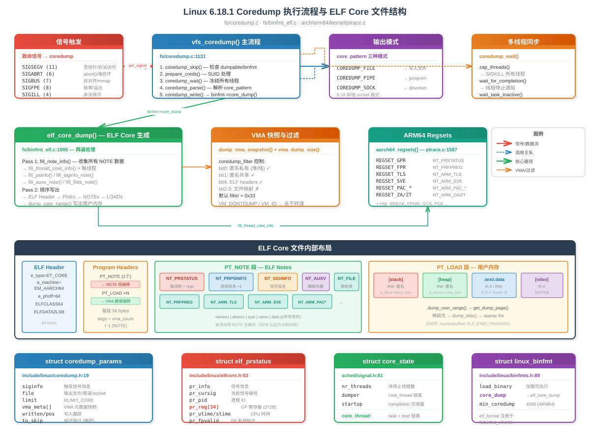

### 11.1 Coredump 概述

#### 11.1.1 什么是 Coredump — 进程崩溃时的内存快照

Coredump（核心转储）是操作系统在**用户态进程**因致命信号崩溃时，将该进程的虚拟内存内容、寄存器状态、信号信息等写入磁盘文件的机制。生成的 core 文件是 ELF 格式，可被 GDB/LLDB 加载进行**事后调试**（post-mortem debugging）。

**核心价值**：
- 崩溃现场完整保存：寄存器、调用栈、堆/栈数据、共享库映射
- 无需在线复现：离线分析 core 文件即可定位 bug
- 适用于难以复现的间歇性崩溃

#### 11.1.2 Coredump vs Ramdump vs Kdump 的区别与联系

| 特性 | Coredump | Ramdump | Kdump |
|------|---------|---------|-------|
| **转储对象** | 单个用户态进程 | 整个物理内存 | 内核崩溃时的内存 |
| **触发条件** | 致命信号（SIGSEGV 等） | 硬件看门狗/手动触发 | kernel panic / oops |
| **文件格式** | ELF core | 裸内存 / vendor 格式 | ELF vmcore（makedumpfile） |
| **分析工具** | GDB / LLDB | T32 / vendor 工具 | crash / GDB |
| **涉及内核代码** | `fs/coredump.c` | 平台 firmware | `kernel/kexec*.c` |
| **典型大小** | MB 级（进程内存） | GB 级（全部 RAM） | GB 级（可压缩） |
| **适用场景** | 用户态 bug | 系统级死机 | 内核 bug |

**联系**：三者本质都是「保存崩溃现场内存」，区别在于粒度和层级。

#### 11.1.3 触发 Coredump 的信号类型（SIGSEGV / SIGABRT / SIGFPE / SIGBUS）

内核通过 `SIG_KERNEL_COREDUMP_MASK` 定义哪些信号的默认行为是生成 core（`include/linux/signal.h:426`）：

```c
#define SIG_KERNEL_COREDUMP_MASK (\
    rt_sigmask(SIGQUIT)  | rt_sigmask(SIGILL)   | \
    rt_sigmask(SIGTRAP)  | rt_sigmask(SIGABRT)  | \
    rt_sigmask(SIGFPE)   | rt_sigmask(SIGSEGV)  | \
    rt_sigmask(SIGBUS)   | rt_sigmask(SIGSYS)   | \
    rt_sigmask(SIGXCPU)  | rt_sigmask(SIGXFSZ)  | \
    SIGEMT_MASK )

#define sig_kernel_coredump(sig) siginmask(sig, SIG_KERNEL_COREDUMP_MASK)
```

| 信号 | 编号 | 典型触发场景 |
|------|------|------------|
| `SIGQUIT` | 3 | 用户 Ctrl+\ 退出 |
| `SIGILL` | 4 | 非法指令（如 ARM64 执行未定义指令） |
| `SIGTRAP` | 5 | 断点 / ptrace trap |
| `SIGABRT` | 6 | `abort()` / glibc 检测到堆损坏 |
| `SIGFPE` | 8 | 除零 / 整数溢出（ARM64 需 explicit trap） |
| `SIGSEGV` | 11 | 空指针 / 非法内存访问（最常见） |
| `SIGBUS` | 7 | 非对齐访问 / mmap 文件被截断 |
| `SIGSYS` | 31 | seccomp 过滤拒绝的系统调用 |
| `SIGXCPU` | 24 | 超过 CPU 时间限制 |
| `SIGXFSZ` | 25 | 文件大小超限 |

#### 11.1.4 Coredump 在内核态与用户态调试中的角色

- **内核态调试**：Coredump 不适用于内核线程崩溃（kernel panic/oops 使用 kdump/pstore/ramdump）
- **用户态调试**：Coredump 是主要的事后调试手段
  - 嵌入式 Linux：通过 `core_pattern` 管道模式将 core 传输到远端
  - 服务器 Linux：`systemd-coredump` 自动收集、压缩、管理 core 文件
  - Android：`debuggerd` 负责 tombstone 生成（类似但不同于标准 coredump）

### 11.2 Coredump 内核实现架构

#### 11.2.1 do_coredump() 完整执行流程

Linux 6.18.1 中主入口已重命名为 `vfs_coredump()`（`fs/coredump.c:1131`），完整流程：

```
信号到达 → get_signal() → sig_kernel_coredump(sig) == true
  │
  ├── current->flags |= PF_SIGNALED
  ├── proc_coredump_connector(current)  ← 通知 netlink
  └── vfs_coredump(&ksig->info)
        │
        ├── 1. coredump_skip() 检查
        │   ├── binfmt == NULL? → return
        │   ├── binfmt->core_dump == NULL? → return
        │   └── !__get_dumpable(mm_flags)? → return
        │
        ├── 2. prepare_creds() → SUID_DUMP_ROOT 时 fsuid=root
        │
        ├── 3. coredump_wait(signo, &core_state)
        │   ├── zap_threads() → SIGKILL 所有其他线程
        │   ├── wait_for_completion(&core_state.startup) ← 等待线程停止
        │   └── wait_task_inactive() ← 确保寄存器状态已保存
        │
        ├── 4. coredump_parse() → 解析 core_pattern 模板
        │
        ├── 5. 根据 core_type 选择输出方式:
        │   ├── COREDUMP_FILE → coredump_file() 创建文件
        │   ├── COREDUMP_PIPE → coredump_pipe() 启动管道程序
        │   └── COREDUMP_SOCK → coredump_socket() 连接 AF_UNIX
        │
        ├── 6. coredump_write()
        │   ├── dump_vma_snapshot()  ← 快照所有 VMA
        │   ├── binfmt->core_dump(cprm)  ← 调用 elf_core_dump()
        │   └── free_vma_snapshot()
        │
        └── 7. coredump_cleanup() → 关闭文件/管道，唤醒其他线程
```

#### 11.2.2 信号处理路径 — get_signal() 到 do_coredump() 的调用链

```
[用户态触发 fault / 收到信号]
    ↓
arch/arm64/mm/fault.c: do_page_fault()
    → force_sig_fault(SIGSEGV, ...)  或  send_sig(SIGABRT, ...)
    ↓
[返回用户态前检查信号]
arch/arm64/kernel/signal.c: do_signal()
    → get_signal(&ksig)
        ↓ kernel/signal.c:2997 fatal:
        current->flags |= PF_SIGNALED;
        if (sig_kernel_coredump(signr)) {
            vfs_coredump(&ksig->info);  // fs/coredump.c:1131
        }
        do_group_exit(signr);
```

#### 11.2.3 coredump_wait() — 多线程同步与冻结

```c
// fs/coredump.c:525
static int coredump_wait(int exit_code, struct core_state *core_state)
{
    // 1. 初始化完成量
    init_completion(&core_state->startup);
    core_state->dumper.task = current;

    // 2. zap_threads → 向所有同组线程发 SIGKILL
    core_waiters = zap_threads(current, core_state, exit_code);
    //   └── zap_process(): __for_each_thread → sigaddset(SIGKILL) + signal_wake_up()
    //   └── 设置 signal->core_state, signal->flags = SIGNAL_GROUP_EXIT
    //   └── current->flags |= PF_DUMPCORE

    // 3. 等待所有线程完成停止（complete() 由 coredump_task_exit 触发）
    if (core_waiters > 0) {
        wait_for_completion_state(&core_state->startup, TASK_UNINTERRUPTIBLE);

        // 4. 额外等待每个线程完全非活跃（确保寄存器状态保存到内核栈）
        ptr = core_state->dumper.next;
        while (ptr != NULL) {
            wait_task_inactive(ptr->task, TASK_ANY);
            ptr = ptr->next;
        }
    }
    return core_waiters;
}
```

**关键点**：`wait_task_inactive()` 确保每个线程都已进入非运行状态，此时其 `pt_regs` 已保存在内核栈上，可安全读取寄存器。

#### 11.2.4 format_corename() — core 文件名模板解析

Linux 6.18.1 中已重命名为 `coredump_parse()`（`fs/coredump.c:240`）。支持三种输出模式：

```c
if (*pat_ptr == '|')
    cn->core_type = COREDUMP_PIPE;    // 管道模式
else if (*pat_ptr == '@')
    cn->core_type = COREDUMP_SOCK;    // 6.18 新增：Unix socket 模式
else
    cn->core_type = COREDUMP_FILE;    // 文件模式
```

**模板变量解析**（`%` 转义）：

| 变量 | 含义 | 示例值 |
|------|------|-------|
| `%p` | 线程组 PID (vnr) | `1234` |
| `%P` | 线程组 PID (全局) | `1234` |
| `%i` | 线程 PID (vnr) | `1235` |
| `%I` | 线程 PID (全局) | `1235` |
| `%u` | UID | `1000` |
| `%g` | GID | `1000` |
| `%s` | 导致崩溃的信号编号 | `11` |
| `%t` | UNIX 时间戳 | `1700000000` |
| `%h` | 主机名 | `myhost` |
| `%e` | 可执行文件名（comm） | `myapp` |
| `%f` | 可执行文件名（basename） | `myapp` |
| `%E` | 可执行文件完整路径 | `/usr/bin/myapp` |
| `%c` | core 大小限制 | `unlimited` |
| `%C` | CPU 编号 | `3` |
| `%F` | pidfd 编号（仅管道模式） | `3` |

#### 11.2.5 dump_emit() / dump_align() — 内存数据写出机制

```c
// fs/coredump.c:1240 - dump_emit()
int dump_emit(struct coredump_params *cprm, const void *addr, int nr)
{
    if (cprm->to_skip) {
        if (!__dump_skip(cprm, cprm->to_skip))
            return 0;
        cprm->to_skip = 0;
    }
    return __dump_emit(cprm, addr, nr);
}

// __dump_emit 核心逻辑:
// 1. 检查 cprm->written + nr > cprm->limit (RLIMIT_CORE)
// 2. 检查 dump_interrupted() (SIGKILL/freezing)
// 3. __kernel_write(file, addr, nr, &pos)
// 4. 更新 cprm->written 和 cprm->pos

// fs/coredump.c:1262 - dump_align()
int dump_align(struct coredump_params *cprm, int align)
{
    unsigned mod = (cprm->pos + cprm->to_skip) & (align - 1);
    if (mod)
        cprm->to_skip += align - mod;
    return 1;
}

// dump_skip / dump_skip_to: 延迟跳过（lazy skip）
// 不立即写零，而是累积 to_skip，下次 dump_emit 时一次性 lseek 或写零
```

**延迟跳过优化**：`dump_skip()` 不立即写入零页，而是设置 `cprm->to_skip`。对于支持 `FMODE_LSEEK` 的文件（如普通文件），使用 `vfs_llseek()` 直接移动文件偏移，形成**稀疏文件**（sparse file），显著减少 I/O。

#### 11.2.6 Coredump 过滤机制 — /proc/PID/coredump_filter

`coredump_filter` 通过 `mm->flags` 的 `MMF_DUMP_*` 位控制哪些 VMA 类型被转储。`vma_dump_size()`（`fs/coredump.c:1602`）根据这些标志决定每个 VMA 的转储大小。

### 11.3 ELF Core 文件格式详解

#### 11.3.1 ELF Header 与 Program Header Table 结构

Core 文件的 ELF Header 由 `fill_elf_header()`（`fs/binfmt_elf.c:1437`）生成：

```c
static void fill_elf_header(struct elfhdr *elf, int segs, u16 machine, u32 flags)
{
    memcpy(elf->e_ident, ELFMAG, SELFMAG);   // "\x7fELF"
    elf->e_ident[EI_CLASS] = ELF_CLASS;       // ELFCLASS64 (ARM64)
    elf->e_ident[EI_DATA] = ELF_DATA;         // ELFDATA2LSB (小端)
    elf->e_ident[EI_VERSION] = EV_CURRENT;    // 1
    elf->e_ident[EI_OSABI] = ELF_OSABI;       // ELFOSABI_NONE

    elf->e_type = ET_CORE;                    // 核心转储文件
    elf->e_machine = machine;                 // EM_AARCH64 (183)
    elf->e_version = EV_CURRENT;
    elf->e_phoff = sizeof(struct elfhdr);     // Program Header 紧跟 ELF Header
    elf->e_flags = flags;
    elf->e_ehsize = sizeof(struct elfhdr);    // 64 bytes
    elf->e_phentsize = sizeof(struct elf_phdr); // 56 bytes
    elf->e_phnum = segs;                      // 段数 (NOTE + LOAD*N)
}
```

**Core 文件整体布局**：

```
┌──────────────────────────────┐ offset=0
│  ELF Header (64 bytes)       │ e_type=ET_CORE, e_machine=EM_AARCH64
├──────────────────────────────┤ offset=64
│  Program Header: PT_NOTE     │ → 指向 NOTE 段
│  Program Header: PT_LOAD #1  │ → 指向第 1 个内存区域
│  Program Header: PT_LOAD #2  │ → 指向第 2 个内存区域
│  ...                         │
│  Program Header: PT_LOAD #N  │
├──────────────────────────────┤
│  NOTE 段数据                  │ NT_PRSTATUS, NT_PRPSINFO,
│  (各种 ELF Notes)            │ NT_SIGINFO, NT_AUXV, NT_FILE, ...
├──────────────────────────────┤ ← roundup(ELF_EXEC_PAGESIZE)
│  PT_LOAD #1 数据              │ 第 1 个 VMA 的内存内容
│  PT_LOAD #2 数据              │ 第 2 个 VMA 的内存内容
│  ...                         │
│  PT_LOAD #N 数据              │ 第 N 个 VMA 的内存内容
└──────────────────────────────┘
```

#### 11.3.2 PT_NOTE 段 — 寄存器 / 信号信息 / 进程状态

PT_NOTE 段包含多个 ELF Note 条目，每个 Note 的格式：

```
┌─────────────────┐
│ namesz (4B)     │ ← 名称长度（含 NUL）
│ descsz (4B)     │ ← 数据长度
│ type (4B)       │ ← Note 类型 (NT_PRSTATUS 等)
├─────────────────┤
│ name (namesz)   │ ← "CORE\0" 或 "LINUX\0"
│ [padding to 4]  │
├─────────────────┤
│ desc (descsz)   │ ← Note 数据
│ [padding to 4]  │
└─────────────────┘
```

**写入顺序**（`write_note_info()`，`fs/binfmt_elf.c:1930`）：
1. 第一个线程的 `NT_PRSTATUS`（崩溃线程）
2. `NT_PRPSINFO`（进程信息）
3. `NT_SIGINFO`（信号详细信息）
4. `NT_AUXV`（辅助向量）
5. `NT_FILE`（文件映射信息）
6. 第一个线程的其他 regset notes（FP/SIMD、TLS、SVE 等）
7. 后续线程的 `NT_PRSTATUS` + regset notes

#### 11.3.3 PT_LOAD 段 — 内存映射区域转储

每个 PT_LOAD 段对应进程的一个 VMA，由 `elf_core_dump()` 生成 Program Header：

```c
// fs/binfmt_elf.c:2068
phdr.p_type = PT_LOAD;
phdr.p_offset = offset;          // 在 core 文件中的偏移
phdr.p_vaddr = meta->start;     // 虚拟地址
phdr.p_paddr = 0;               // 物理地址（通常为 0）
phdr.p_filesz = meta->dump_size; // 实际转储大小（可能 < memsz）
phdr.p_memsz = meta->end - meta->start;  // VMA 完整大小
phdr.p_flags = PF_R|PF_W|PF_X;  // 根据 VM_READ/WRITE/EXEC 设置
phdr.p_align = ELF_EXEC_PAGESIZE;
```

**VMA 转储决策**（`vma_dump_size()`）：

| VMA 类型 | coredump_filter bit | 默认 | 是否转储 |
|---------|-------------------|------|---------|
| 匿名私有（堆/栈） | bit 0: ANON_PRIVATE | ✓ | 是 |
| 匿名共享 | bit 1: ANON_SHARED | ✓ | 是 |
| 文件映射私有（已修改） | bit 2: MAPPED_PRIVATE | ✗ | 否 |
| 文件映射共享 | bit 3: MAPPED_SHARED | ✗ | 否 |
| ELF Header 页 | bit 4: ELF_HEADERS | ✓ | 首页 |
| Hugetlb 私有 | bit 5: HUGETLB_PRIVATE | ✗ | 否 |
| Hugetlb 共享 | bit 6: HUGETLB_SHARED | ✗ | 否 |
| DAX 私有 | bit 7: DAX_PRIVATE | ✗ | 否 |
| DAX 共享 | bit 8: DAX_SHARED | ✗ | 否 |
| VM_DONTDUMP | — | — | 永不转储 |
| VM_IO | — | — | 永不转储 |
| vDSO / gate VMA | — | — | 始终转储 |

默认 `coredump_filter = 0x33`（bit 0,1,4,5）。

#### 11.3.4 NT_PRSTATUS / NT_PRPSINFO / NT_SIGINFO / NT_AUXV 详解

**NT_PRSTATUS**（每个线程一个）：

```c
struct elf_prstatus {
    struct elf_prstatus_common common;
    // common 包含:
    //   pr_info:    信号信息 (signo, code, errno)
    //   pr_cursig:  当前信号
    //   pr_sigpend: 挂起信号集
    //   pr_sighold: 阻塞信号集
    //   pr_pid/ppid/pgrp/sid: 进程 ID 信息
    //   pr_utime/stime: CPU 时间
    elf_gregset_t pr_reg;   // ARM64: 34 个 64 位通用寄存器
                            // (x0-x30, sp, pc, pstate)
    int pr_fpvalid;         // 是否有 FP 寄存器数据
};
```

**NT_PRPSINFO**（进程级，仅一个）：

```c
struct elf_prpsinfo {
    char pr_state;          // 进程状态数字
    char pr_sname;          // 状态字符 (R/S/D/T/Z/W)
    char pr_zomb;           // 是否僵尸
    char pr_nice;           // nice 值
    unsigned long pr_flag;  // task->flags
    __kernel_uid_t pr_uid;  // UID
    __kernel_gid_t pr_gid;  // GID
    pid_t pr_pid, pr_ppid, pr_pgrp, pr_sid;
    char pr_fname[16];      // 可执行文件名 (TASK_COMM_LEN)
    char pr_psargs[80];     // 命令行参数 (ELF_PRARGSZ)
};
```

**NT_SIGINFO**（信号详细信息）：

```c
// fill_siginfo_note() 调用 copy_siginfo_to_external()
// 将 kernel_siginfo_t 转换为用户态 siginfo_t 写入 core
// 包含：si_signo, si_errno, si_code
// 对于 SIGSEGV：si_addr（故障地址）
// 对于 SIGFPE：si_addr（故障指令地址）
```

**NT_AUXV**（辅助向量）：

```c
// fill_auxv_note() 直接使用 mm->saved_auxv
// 包含：AT_PHDR, AT_PHENT, AT_PHNUM, AT_ENTRY, AT_BASE,
//       AT_SYSINFO_EHDR (vDSO), AT_MINSIGSTKSZ, ...
// GDB 通过 AT_ENTRY 和 AT_PHDR 定位可执行文件
```

**NT_FILE**（文件映射表）：

```
格式:
  long count       — 映射文件数
  long page_size   — 页大小
  [count] × { long start, long end, long pgoff }
  [count] × NUL-terminated filename strings
```

#### 11.3.5 ARM64 特有 NOTE — NT_ARM_TLS / NT_ARM_HW_BREAK / NT_ARM_SVE

ARM64 通过 `aarch64_regsets[]` 数组（`arch/arm64/kernel/ptrace.c:1587`）定义了丰富的 regset，每个有 `core_note_type`，当 `active()` 返回 > 0 时写入 core：

| Regset | NT 类型 | 内容 | 大小 |
|--------|---------|------|------|
| `REGSET_GPR` | `NT_PRSTATUS` | x0-x30, sp, pc, pstate | 272B |
| `REGSET_FPR` | `NT_PRFPREG` | v0-v31 (128bit), fpsr, fpcr | 528B |
| `REGSET_TLS` | `NT_ARM_TLS` | TPIDR_EL0, TPIDRRO_EL0 | 16B |
| `REGSET_HW_BREAK` | `NT_ARM_HW_BREAK` | 硬件断点寄存器 | 可变 |
| `REGSET_HW_WATCH` | `NT_ARM_HW_WATCH` | 硬件观察点寄存器 | 可变 |
| `REGSET_SYSTEM_CALL` | `NT_ARM_SYSTEM_CALL` | 系统调用号 | 4B |
| `REGSET_FPMR` | `NT_ARM_FPMR` | FP 模式寄存器 | 8B |
| `REGSET_SVE` | `NT_ARM_SVE` | SVE 向量寄存器 (z0-z31, p0-p15, ffr) | 可变 |
| `REGSET_SSVE` | `NT_ARM_SSVE` | SME Streaming SVE 寄存器 | 可变 |
| `REGSET_ZA` | `NT_ARM_ZA` | SME ZA 矩阵 | 可变 |
| `REGSET_ZT` | `NT_ARM_ZT` | SME ZT 寄存器 | 512B |
| `REGSET_PAC_MASK` | `NT_ARM_PAC_MASK` | PAC 掩码 (data + code) | 16B |
| `REGSET_PAC_ENABLED_KEYS` | `NT_ARM_PAC_ENABLED_KEYS` | 启用的 PAC 密钥 | 8B |
| `REGSET_PACA_KEYS` | `NT_ARM_PACA_KEYS` | PAC 地址密钥 (IA/IB/DA/DB) | 64B |
| `REGSET_PACG_KEYS` | `NT_ARM_PACG_KEYS` | PAC 通用密钥 (GA) | 16B |
| `REGSET_TAGGED_ADDR_CTRL` | `NT_ARM_TAGGED_ADDR_CTRL` | MTE 标记地址控制 | 8B |
| `REGSET_POE` | `NT_ARM_POE` | Permission Overlay Extension | 8B |
| `REGSET_GCS` | `NT_ARM_GCS` | Guarded Control Stack | 可变 |

#### 11.3.6 fill_elf_header() / fill_note() 内核生成源码分析

```c
// fs/binfmt_elf.c:1470 - __fill_note() / fill_note() 宏
static void __fill_note(struct memelfnote *note, const char *name, int type,
                        unsigned int sz, void *data)
{
    note->name = name;      // "CORE" 或 "LINUX"
    note->type = type;      // NT_PRSTATUS / NT_PRPSINFO / ...
    note->datasz = sz;      // 数据大小
    note->data = data;      // 数据指针
}

#define fill_note(note, type, sz, data) \
    __fill_note(note, NN_ ## type, NT_ ## type, sz, data)
// 展开示例: fill_note(n, PRSTATUS, sz, d)
//  → __fill_note(n, "CORE", NT_PRSTATUS, sz, d)

// fs/binfmt_elf.c:1424 - writenote() 将 note 写入 core 文件
static int writenote(struct memelfnote *men, struct coredump_params *cprm)
{
    struct elf_note en;
    en.n_namesz = strlen(men->name) + 1;
    en.n_descsz = men->datasz;
    en.n_type = men->type;

    return dump_emit(cprm, &en, sizeof(en)) &&           // Note header
           dump_emit(cprm, men->name, en.n_namesz) &&    // Note name
           dump_align(cprm, 4) &&                         // 4 字节对齐
           dump_emit(cprm, men->data, men->datasz) &&    // Note data
           dump_align(cprm, 4);                           // 4 字节对齐
}
```

### 11.4 Coredump 配置与控制

#### 11.4.1 ulimit -c 与 RLIMIT_CORE 资源限制

```bash
# 查看当前限制
ulimit -c          # 单位: blocks (512 bytes)

# 设置为无限制（允许 coredump）
ulimit -c unlimited

# 设置为 0（禁止 coredump）
ulimit -c 0

# 设置为特定大小（如 100MB）
ulimit -c 204800   # 100*1024*1024/512 = 204800 blocks
```

**内核检查**：`vfs_coredump()` 中 `cprm.limit = rlimit(RLIMIT_CORE)`，`__dump_emit()` 中检查 `cprm->written + nr > cprm->limit` 则停止写入。

**管道模式例外**：管道模式下 `cprm->limit = RLIM_INFINITY`（`fs/coredump.c:1027`），因为数据发送给外部程序处理，不受磁盘限制。但若 `RLIMIT_CORE == 1`（递归 coredump 检测），则拒绝。

#### 11.4.2 /proc/sys/kernel/core_pattern 输出路径与管道模式

```bash
# 查看当前设置
cat /proc/sys/kernel/core_pattern
# 默认: "core"

# 文件模式 — 直接写入文件
echo "/var/coredumps/core.%e.%p.%t" > /proc/sys/kernel/core_pattern

# 管道模式 — 通过管道发送给外部程序
echo "|/usr/lib/systemd/systemd-coredump %P %u %g %s %t %c %h %e" > /proc/sys/kernel/core_pattern

# Unix socket 模式 (6.18 新增)
echo "@/run/coredump.sock" > /proc/sys/kernel/core_pattern
```

#### 11.4.3 core_pattern 模板变量（%p / %e / %t / %s / %h）

（见 11.2.4 中的完整模板变量表）

常用模式：
```bash
# 嵌入式系统：按进程名和 PID 存储
core.%e.%p

# 服务器：按时间戳和主机名存储到专用目录
/var/coredumps/%h/core.%e.%p.%t

# 开发环境：管道到 systemd-coredump
|/usr/lib/systemd/systemd-coredump %P %u %g %s %t %c %h %e
```

#### 11.4.4 管道模式（|program）与 systemd-coredump 集成

管道模式通过 `call_usermodehelper` 启动外部程序，core 数据通过 stdin (fd 0) 传入：

```c
// fs/coredump.c:609 - umh_coredump_setup()
// 1. 创建管道: create_pipe_files(files, 0)
// 2. core 数据写入管道写端: cp->file = files[1]
// 3. 管道读端安装为 fd 0: replace_fd(0, files[0], 0)
// 4. 设置 RLIMIT_CORE = 1 防止递归 coredump
// 5. 可选安装 pidfd: replace_fd(COREDUMP_PIDFD_NUMBER, pidfs_file, 0)
```

**systemd-coredump 工作流**：
1. 内核通过管道发送 core 数据
2. systemd-coredump 读取 stdin，压缩（lz4/zstd）后存储到 `/var/lib/systemd/coredump/`
3. 同时写入 systemd journal 记录元信息
4. 用户通过 `coredumpctl` 查询和调试

#### 11.4.5 /proc/sys/kernel/core_pipe_limit 并发控制

```bash
# 查看/设置
cat /proc/sys/kernel/core_pipe_limit   # 默认: 0
echo 16 > /proc/sys/kernel/core_pipe_limit

# 当设置 > 0:
# 1. 限制同时运行的管道 coredump 处理程序数量
# 2. coredump 进程在管道程序完成前不退出（/proc/<pid> 保持可用）
# 3. 管道程序可通过 /proc/<pid> 获取额外信息
```

内核实现：`cn->core_pipe_limit = atomic_inc_return(&core_pipe_count)`，若超限则跳过。

#### 11.4.6 /proc/PID/coredump_filter 按位控制转储内容

```bash
# 查看进程的 coredump filter（十六进制）
cat /proc/1234/coredump_filter
# 默认: 00000033

# 设置：包含所有类型
echo 0x7f > /proc/1234/coredump_filter

# 设置：最小化（仅匿名内存）
echo 0x3 > /proc/1234/coredump_filter

# 设置：排除共享内存（减小 core 文件）
echo 0x31 > /proc/1234/coredump_filter
```

**各 bit 含义**：

| Bit | 宏 | 含义 | 默认 |
|-----|-----|------|------|
| 0 | `MMF_DUMP_ANON_PRIVATE` | 匿名私有（堆/栈） | on |
| 1 | `MMF_DUMP_ANON_SHARED` | 匿名共享 | on |
| 2 | `MMF_DUMP_MAPPED_PRIVATE` | 文件映射私有 | off |
| 3 | `MMF_DUMP_MAPPED_SHARED` | 文件映射共享 | off |
| 4 | `MMF_DUMP_ELF_HEADERS` | ELF header 页 | on |
| 5 | `MMF_DUMP_HUGETLB_PRIVATE` | Hugetlb 私有 | on |
| 6 | `MMF_DUMP_HUGETLB_SHARED` | Hugetlb 共享 | off |
| 7 | `MMF_DUMP_DAX_PRIVATE` | DAX 私有 | off |
| 8 | `MMF_DUMP_DAX_SHARED` | DAX 共享 | off |

#### 11.4.7 SUID/SGID 程序的 Coredump 安全限制（fs.suid_dumpable）

```bash
# 查看/设置
cat /proc/sys/fs/suid_dumpable
# 0 = 禁止 (默认): SUID/SGID 程序不生成 coredump
# 1 = debug: 允许 coredump，但 core 文件所有者为 root
# 2 = suidsafe: 允许 coredump，但需要 core_pattern 为绝对路径或管道

echo 2 > /proc/sys/fs/suid_dumpable
```

**内核实现**：

```c
// fs/coredump.c:874
static inline bool coredump_force_suid_safe(const struct coredump_params *cprm)
{
    return __get_dumpable(cprm->mm_flags) == SUID_DUMP_ROOT;  // ==2
}

// SUID_DUMP_ROOT 模式下:
// 1. cred->fsuid = GLOBAL_ROOT_UID → core 文件属于 root
// 2. 必须使用绝对路径或管道模式
// 3. 使用 init_task 的根目录（防止 user namespace 绕过）
```

### 11.5 多线程与多进程 Coredump 处理

#### 11.5.1 多线程 Coredump — zap_threads() 冻结所有线程

当多线程进程中的一个线程触发 coredump 时，必须冻结所有其他线程以获取一致的内存快照：

```c
// fs/coredump.c:498
static int zap_process(struct signal_struct *signal, int exit_code)
{
    struct task_struct *t;
    int nr = 0;

    signal->flags = SIGNAL_GROUP_EXIT;      // 标记为组退出
    signal->group_exit_code = exit_code;
    signal->group_stop_count = 0;

    __for_each_thread(signal, t) {
        task_clear_jobctl_pending(t, JOBCTL_PENDING_MASK);
        if (t != current && !(t->flags & PF_POSTCOREDUMP)) {
            sigaddset(&t->pending.signal, SIGKILL);  // 发送 SIGKILL
            signal_wake_up(t, 1);                      // 唤醒并中断
            nr++;
        }
    }
    return nr;  // 返回需要等待的线程数
}
```

```c
// fs/coredump.c:511
static int zap_threads(struct task_struct *tsk, struct core_state *core_state,
                       int exit_code)
{
    spin_lock_irq(&tsk->sighand->siglock);
    if (!(signal->flags & SIGNAL_GROUP_EXIT) && !signal->group_exec_task) {
        signal->core_state = core_state;        // 设置 core_state
        nr = zap_process(signal, exit_code);     // 通知所有线程
        clear_tsk_thread_flag(tsk, TIF_SIGPENDING);
        tsk->flags |= PF_DUMPCORE;             // 标记为正在 dump
        atomic_set(&core_state->nr_threads, nr);
    }
    spin_unlock_irq(&tsk->sighand->siglock);
    return nr;
}
```

**流程时序**：

```
线程 A (崩溃线程)          线程 B              线程 C
    │                       │                   │
    ├── zap_threads()       │                   │
    │   ├── SIGKILL → B     │                   │
    │   └── SIGKILL → C     │                   │
    │                       ├── 收到 SIGKILL    │
    │                       ├── exit_mm()       ├── 收到 SIGKILL
    │                       ├── coredump_task_exit()  ├── exit_mm()
    │                       │   └── complete(&startup) ├── coredump_task_exit()
    │                       └── 等待 task==NULL  │   └── (nr_threads--)
    │                                           └── 等待 task==NULL
    ├── wait_for_completion() ← 收到 complete
    ├── wait_task_inactive(B)
    ├── wait_task_inactive(C)
    │
    ├── elf_core_dump()     (安全读取所有线程寄存器)
    │
    └── coredump_finish()   → wake_up(B), wake_up(C)
```

#### 11.5.2 每个线程的寄存器状态捕获

每个线程的寄存器通过 `fill_thread_core_info()` 捕获：

```c
// fs/binfmt_elf.c:1732 (CORE_DUMP_USE_REGSET 路径)
static int fill_thread_core_info(struct elf_thread_core_info *t, ...)
{
    // 1. 填充 prstatus 公共信息（信号、PID、CPU 时间）
    fill_prstatus(&t->prstatus.common, t->task, signr);

    // 2. 通过 regset 接口获取 GP 寄存器
    regset_get(t->task, &view->regsets[0],
               sizeof(t->prstatus.pr_reg), &t->prstatus.pr_reg);

    // 3. 遍历所有其他 regset (FP/SIMD, TLS, SVE, PAC, ...)
    for (view_iter = 1; view_iter < view->n; ++view_iter) {
        const struct user_regset *regset = &view->regsets[view_iter];
        if (!regset->core_note_type || regset->active(t->task, regset) <= 0)
            continue;

        ret = regset_get_alloc(t->task, regset, ~0U, &data);
        // 创建对应的 ELF note
        __fill_note(&t->notes[note_iter], note_name, note_type, ret, data);
    }
}
```

`regset_get()` 最终调用各个 `regset_get` 函数（如 `gpr_get`, `fpr_get`），从目标线程的 `task_pt_regs(t)` 或 `thread_struct` 中读取寄存器。

#### 11.5.3 线程组共享内存与独立内存的转储策略

- **共享**：所有线程共享同一个 `mm_struct`，因此 VMA 只需转储一份
- **独立的**：每个线程有独立的内核栈和寄存器状态，各自生成 `NT_PRSTATUS` note
- **转储 VMA 快照**：`dump_vma_snapshot()` 在 `mmap_write_lock` 下获取所有 VMA 的元数据快照，此时所有线程已停止，VMA 不会变化

```c
// fs/coredump.c:1726 - dump_vma_snapshot()
if (mmap_write_lock_killable(mm))
    return false;
// 遍历所有 VMA，记录 start/end/flags/dump_size/pgoff/file
while ((vma = coredump_next_vma(&vmi, vma, gate_vma)) != NULL) {
    m->start = vma->vm_start;
    m->end = vma->vm_end;
    m->flags = vma->vm_flags;
    m->dump_size = vma_dump_size(vma, cprm->mm_flags);
    // ...
}
mmap_write_unlock(mm);
```

#### 11.5.4 coredump_task_exit() — 进程退出时的清理

其他线程在退出时调用 `coredump_task_exit()`，将自己注册到 `core_state` 链表中：

```c
// kernel/exit.c 中调用
void coredump_task_exit(struct task_struct *tsk)
{
    struct core_state *core_state = tsk->signal->core_state;
    struct core_thread self;

    if (!core_state)
        return;

    // 将自己链入 dumper 链表
    self.task = tsk;
    if (self.task) {
        // ... 链入 core_state->dumper.next 链表
        // 递减 nr_threads
        if (atomic_dec_and_test(&core_state->nr_threads))
            complete(&core_state->startup);  // 最后一个线程完成时唤醒 dumper
    }
}
```

`coredump_finish()` 在 dump 完成后遍历链表，将每个 `core_thread.task = NULL` 并唤醒等待的线程，使它们最终退出。

### 11.6 ARM64 平台 Coredump 特性

#### 11.6.1 ARM64 寄存器集保存（x0-x30 / sp / pc / pstate）

ARM64 定义 `CORE_DUMP_USE_REGSET`（`arch/arm64/include/asm/elf.h:143`），通过 regset 框架保存寄存器。

**通用寄存器**：

```c
// arch/arm64/include/asm/elf.h:159
#define ELF_NGREG (sizeof(struct user_pt_regs) / sizeof(elf_greg_t))
// = sizeof(struct user_pt_regs) / 8 = 272 / 8 = 34 个 64 位寄存器

#define ELF_CORE_COPY_REGS(dest, regs) \
    *(struct user_pt_regs *)&(dest) = (regs)->user_regs;
```

`struct user_pt_regs` 包含：
- `regs[31]`：x0-x30（通用寄存器 + Frame Pointer + Link Register）
- `sp`：Stack Pointer
- `pc`：Program Counter
- `pstate`：处理器状态（NZCV 标志、异常级别、中断屏蔽等）

#### 11.6.2 FPSIMD / SVE / SME 寄存器保存

**FPSIMD（浮点/SIMD）**：
- regset `REGSET_FPR`，note 类型 `NT_PRFPREG`
- 保存 `struct user_fpsimd_state`：v0-v31（128 位向量寄存器）+ fpsr + fpcr
- 大小 528 字节
- `fpr_active()` 检查任务是否使用过 FP 寄存器

**SVE（可伸缩向量扩展）**：
- regset `REGSET_SVE`，note 类型 `NT_ARM_SVE`
- 保存 z0-z31（最大 2048 位宽）、p0-p15（谓词寄存器）、ffr（首元素故障寄存器）
- 大小可变，取决于 `sve_vl`（向量长度）
- 仅当进程使用了 SVE 指令时 `active()` 返回 > 0

**SME（可伸缩矩阵扩展）**：
- `REGSET_SSVE`（Streaming SVE）：`NT_ARM_SSVE`
- `REGSET_ZA`（ZA 矩阵）：`NT_ARM_ZA`
- `REGSET_ZT`（ZT 寄存器）：`NT_ARM_ZT`

#### 11.6.3 MTE 标签信息在 Coredump 中的保存

ARM64 MTE（Memory Tagging Extension）通过 `NT_ARM_TAGGED_ADDR_CTRL` note 保存标记地址控制信息：

```c
// arch/arm64/kernel/ptrace.c
[REGSET_TAGGED_ADDR_CTRL] = {
    USER_REGSET_NOTE_TYPE(ARM_TAGGED_ADDR_CTRL),
    .n = 1,
    .size = sizeof(long),
    .align = sizeof(long),
    .regset_get = tagged_addr_ctrl_get,
    .set = tagged_addr_ctrl_set,
},
```

- 保存内容：`PR_TAGGED_ADDR_ENABLE` 标志、MTE TCF (tag check fault) 模式、包含/排除的标签掩码
- **注意**：MTE 标签本身（每个 16 字节粒度的 4 位标签）当前**不直接**包含在标准 coredump 中，需要通过 `/proc/pid/smaps` 或专用工具提取
- GDB 支持：较新版本的 GDB 可识别 `NT_ARM_TAGGED_ADDR_CTRL` 并在调试时考虑 MTE 标签

#### 11.6.4 PAC 指针认证对 Coredump 分析的影响

ARM64 PAC（Pointer Authentication）会在返回地址和函数指针的高位插入签名。这影响 coredump 分析：

**core 文件中保存的 PAC 信息**：
- `NT_ARM_PAC_MASK`：数据和代码指针的 PAC 掩码（指示哪些位是签名）
- `NT_ARM_PAC_ENABLED_KEYS`：启用了哪些 PAC 密钥（IA/IB/DA/DB/GA）
- `NT_ARM_PACA_KEYS` / `NT_ARM_PACG_KEYS`：PAC 密钥值（需要 `CONFIG_CHECKPOINT_RESTORE`）

**对 GDB 分析的影响**：
- 调用栈中的返回地址包含 PAC 签名，需要 strip 才能得到实际地址
- GDB 通过 `NT_ARM_PAC_MASK` 知道需要清除的位
- `aarch64-linux-gnu-gdb` 支持自动 PAC strip
- 如果 GDB 版本较老不支持 PAC，可能显示错误的返回地址

#### 11.6.5 elf_core_copy_task_regs() ARM64 实现分析

```c
// include/linux/elfcore.h:90
static inline int elf_core_copy_task_regs(struct task_struct *t,
                                          elf_gregset_t *elfregs)
{
#if defined(ELF_CORE_COPY_TASK_REGS)
    return ELF_CORE_COPY_TASK_REGS(t, elfregs);
#else
    elf_core_copy_regs(elfregs, task_pt_regs(t));
#endif
    return 0;
}
```

ARM64 定义了 `CORE_DUMP_USE_REGSET`，因此不走 `elf_core_copy_task_regs` 路径，而是通过 regset 框架：

```c
// fs/binfmt_elf.c:1746
regset_get(t->task, &view->regsets[0],
           sizeof(t->prstatus.pr_reg), &t->prstatus.pr_reg);
```

这调用 `gpr_get()`（`arch/arm64/kernel/ptrace.c`），从 `task_pt_regs(task)` 读取 `user_pt_regs`。由于 `coredump_wait()` 已确保目标线程非活跃，`task_pt_regs()` 返回的是保存在内核栈上的用户态寄存器。

### 11.7 Coredump 关键数据结构

#### 11.7.1 struct coredump_params — 转储参数集

```c
// include/linux/coredump.h:19
struct coredump_params {
    const kernel_siginfo_t *siginfo;  // 触发 coredump 的信号信息
    struct file *file;                // 输出文件/管道/socket
    unsigned long limit;              // RLIMIT_CORE (字节)
    unsigned long mm_flags;           // mm->flags 快照 (含 coredump_filter)
    int cpu;                          // 崩溃时的 CPU 编号
    loff_t written;                   // 已写入字节数
    loff_t pos;                       // 当前文件位置
    loff_t to_skip;                   // 待跳过字节数 (延迟 skip)
    int vma_count;                    // VMA 总数
    size_t vma_data_size;             // 所有 VMA 转储数据总大小
    struct core_vma_metadata *vma_meta; // VMA 元数据数组
    struct pid *pid;                  // 管道/socket 模式的 pidfd
};
```

#### 11.7.2 struct core_thread — 线程链表

```c
// include/linux/sched/signal.h:76
struct core_thread {
    struct task_struct *task;    // 线程的 task_struct
    struct core_thread *next;   // 链表下一个
};

struct core_state {
    atomic_t nr_threads;        // 待停止的线程数
    struct core_thread dumper;  // dump 线程自身 + 链表头
    struct completion startup;  // 所有线程停止的完成量
};
```

**链表构建**：`coredump_task_exit()` 中每个退出线程将自己链入 `core_state->dumper.next`。dump 线程通过遍历此链表获取所有线程的 `task_struct`，读取寄存器。

#### 11.7.3 struct elf_prstatus / elf_prpsinfo — 进程状态信息

```c
// include/linux/elfcore.h:34
struct elf_prstatus_common {
    struct elf_siginfo pr_info;       // 信号信息
    short pr_cursig;                  // 当前信号编号
    unsigned long pr_sigpend;         // 挂起信号集
    unsigned long pr_sighold;         // 阻塞信号集
    pid_t pr_pid, pr_ppid, pr_pgrp, pr_sid;
    struct __kernel_old_timeval pr_utime, pr_stime;   // 用户/内核 CPU 时间
    struct __kernel_old_timeval pr_cutime, pr_cstime;  // 子进程累计时间
};

struct elf_prstatus {
    struct elf_prstatus_common common;
    elf_gregset_t pr_reg;             // ARM64: 34 × 8 = 272 字节
    int pr_fpvalid;                   // FP 寄存器是否有效
};

// include/linux/elfcore.h:59
struct elf_prpsinfo {
    char pr_state;                    // 进程状态
    char pr_sname;                    // 状态字符
    char pr_zomb;                     // 僵尸标志
    char pr_nice;                     // nice 值
    unsigned long pr_flag;            // task->flags
    __kernel_uid_t pr_uid;
    __kernel_gid_t pr_gid;
    pid_t pr_pid, pr_ppid, pr_pgrp, pr_sid;
    char pr_fname[16];                // 可执行文件名
    char pr_psargs[80];               // 命令行参数
};
```

#### 11.7.4 struct linux_binfmt — 二进制格式注册与 core_dump 回调

```c
// include/linux/binfmts.h:89
struct linux_binfmt {
    struct list_head lh;              // 注册链表
    struct module *module;            // 所属模块
    int (*load_binary)(struct linux_binprm *);   // 加载可执行文件
#ifdef CONFIG_COREDUMP
    int (*core_dump)(struct coredump_params *cprm); // core 转储回调
    unsigned long min_coredump;       // 最小 core 文件大小
#endif
} __randomize_layout;

// ELF 格式注册 (fs/binfmt_elf.c:96)
static struct linux_binfmt elf_format = {
    .module      = THIS_MODULE,
    .load_binary = load_elf_binary,
    .core_dump   = elf_core_dump,
    .min_coredump = ELF_EXEC_PAGESIZE,  // ARM64: 4096
};
```

`vfs_coredump()` 通过 `mm->binfmt->core_dump(cprm)` 调用具体格式的转储实现。

#### 11.7.5 struct vm_area_struct — VMA 遍历与转储决策

```c
// include/linux/coredump.h:11
struct core_vma_metadata {
    unsigned long start, end;         // VMA 地址范围
    vm_flags_t flags;                 // VM_READ | VM_WRITE | VM_EXEC | ...
    unsigned long dump_size;          // 实际转储大小（可能 < end-start）
    unsigned long pgoff;              // 文件映射页偏移
    struct file *file;                // 映射的文件（匿名映射为 NULL）
};
```

`dump_vma_snapshot()` 在 `mmap_write_lock` 保护下将每个 VMA 的关键信息拷贝到 `core_vma_metadata` 数组，之后 `elf_core_dump()` 基于此数组生成 PT_LOAD 段，无需再持有 `mmap_lock`。

### 11.8 GDB / LLDB 加载 Core 文件分析

#### 11.8.1 GDB 加载 core 文件基本操作

```bash
# 基本加载
gdb <executable> <core_file>
gdb /usr/bin/myapp core.myapp.1234

# 分离加载
gdb -c core.myapp.1234
(gdb) file /usr/bin/myapp
(gdb) core-file core.myapp.1234

# 查看崩溃摘要
(gdb) info program
# Program stopped with signal SIGSEGV, Segmentation fault.

# 查看崩溃位置
(gdb) where
# or
(gdb) bt
```

#### 11.8.2 调用栈分析 — bt / bt full / thread apply all bt

```bash
# 查看崩溃线程的调用栈
(gdb) bt
#0  0x0000aaaabb401234 in crash_function (ptr=0x0) at main.c:42
#1  0x0000aaaabb401500 in process_data (buf=0x7fb1234000) at main.c:100
#2  0x0000aaaabb401800 in main (argc=1, argv=0x7fffffffe0) at main.c:200

# 查看完整调用栈（含局部变量）
(gdb) bt full
#0  crash_function (ptr=0x0) at main.c:42
        local_var = 42
        buf = "Hello World"
#1  process_data (buf=0x7fb1234000) at main.c:100
        result = 0
        ...

# 查看所有线程的调用栈
(gdb) thread apply all bt

# 简化输出（仅显示 5 层）
(gdb) thread apply all bt 5

# 切换到特定线程
(gdb) info threads
(gdb) thread 3
(gdb) bt

# 切换到特定栈帧
(gdb) frame 1
(gdb) info locals
(gdb) info args
```

#### 11.8.3 内存与变量检查 — print / x / info registers

```bash
# 打印变量
(gdb) print ptr         # 打印变量值
(gdb) print *ptr        # 解引用
(gdb) print /x ptr      # 十六进制
(gdb) print ((struct my_struct *)ptr)->field

# 检查内存
(gdb) x/16xb 0x7fb1234000      # 16 字节，十六进制
(gdb) x/4xg 0x7fb1234000       # 4 个 8 字节值
(gdb) x/s 0x7fb1234000         # 字符串
(gdb) x/10i $pc                # 反汇编 10 条指令

# 查看寄存器
(gdb) info registers           # 所有通用寄存器
(gdb) info registers x0 x1 sp pc  # 特定寄存器
(gdb) info all-registers       # 包括 SIMD/FP 寄存器

# ARM64 特定
(gdb) print $x0                # 第一个参数 / 返回值
(gdb) print $x29               # Frame Pointer
(gdb) print $x30               # Link Register (返回地址)
(gdb) print $sp                # Stack Pointer
(gdb) print $pc                # Program Counter
(gdb) print $cpsr              # 处理器状态

# 查看信号信息
(gdb) info signal SIGSEGV
(gdb) print $_siginfo           # GDB 内置变量
(gdb) print $_siginfo.si_addr  # 故障地址
```

#### 11.8.4 共享库符号加载与 solib-search-path

```bash
# 查看共享库加载状态
(gdb) info sharedlibrary

# 设置共享库搜索路径（嵌入式交叉调试常用）
(gdb) set solib-search-path /path/to/target/rootfs/lib:/path/to/target/rootfs/usr/lib
# 或
(gdb) set sysroot /path/to/target/rootfs

# 添加符号文件
(gdb) add-symbol-file /path/to/libfoo.so.debug 0x7fb0000000

# 检查符号加载状态
(gdb) info files
(gdb) maintenance info sections
```

**常见问题**：
- `"No debugging symbols found"`：需要 `-g` 编译的可执行文件或 `.debug` 分离符号文件
- 共享库版本不匹配：确保 core 文件和符号文件来自同一构建
- stripped binary：使用 `eu-unstrip` 或 `debuginfod` 获取符号

#### 11.8.5 ARM64 交叉调试 — aarch64-linux-gnu-gdb 实战

```bash
# ARM64 交叉 GDB 安装
sudo apt install gdb-multiarch
# 或
sudo apt install binutils-aarch64-linux-gnu gdb-aarch64-linux-gnu

# 加载 core（交叉场景）
aarch64-linux-gnu-gdb /path/to/target/myapp /path/to/core

# 或使用 gdb-multiarch
gdb-multiarch -q \
    -ex "set sysroot /path/to/target/rootfs" \
    -ex "file /path/to/target/myapp" \
    -ex "core-file /path/to/core"

# 检查 ARM64 特有信息
(gdb) info auxv             # 辅助向量
(gdb) print $cpsr           # 处理器状态
(gdb) print $fpsr           # FP 状态寄存器

# MTE 相关（需要新版 GDB）
(gdb) memory-tag print-allocation-tag 0x7fb1234000
(gdb) memory-tag print-logical-tag $x0

# PAC 相关
(gdb) show aarch64 pauth    # PAC 支持状态
# GDB 自动 strip PAC 签名显示真实返回地址

# 批量分析脚本
aarch64-linux-gnu-gdb -batch \
    -ex "file /path/to/myapp" \
    -ex "core-file core.1234" \
    -ex "bt" \
    -ex "info registers" \
    -ex "thread apply all bt"
```

### 11.9 systemd-coredump 与 coredumpctl

#### 11.9.1 systemd-coredump 架构与工作流程

```
进程崩溃 → SIGSEGV
    ↓
内核 vfs_coredump()
    ↓ core_pattern = "|/usr/lib/systemd/systemd-coredump %P %u %g %s %t %c %h %e"
    ↓
systemd-coredump (子进程)
    ├── 从 stdin 读取 core 数据
    ├── 压缩 (lz4 或 zstd)
    ├── 存储到 /var/lib/systemd/coredump/
    │   └── core.myapp.1000.abcdef123456.1234.1700000000000000.zst
    ├── 记录到 systemd journal
    │   └── MESSAGE_ID=fc2e22bc6ee647b6b90729ab34a250b1
    └── 按策略清理旧文件
```

#### 11.9.2 /etc/systemd/coredump.conf 配置详解

```ini
[Coredump]
# 存储方式: none / external / journal / both
Storage=external

# 压缩算法: lz4 / zstd / none
Compress=yes

# 单个 core 文件最大大小 (0=无限制)
ProcessSizeMax=2G

# 外部存储总大小上限
ExternalSizeMax=2G

# Journal 中的最大大小
JournalSizeMax=767M

# 保留多少磁盘空间给其他用途
KeepFree=1G

# 最大可用磁盘比例 (百分比)
MaxUse=10%
```

#### 11.9.3 coredumpctl list / info / debug 命令使用

```bash
# 列出所有 coredump 记录
coredumpctl list
# TIME                         PID  UID  GID  SIG  COREFILE  EXE
# Mon 2024-01-01 12:00:00     1234 1000 1000  11  present   /usr/bin/myapp
# Mon 2024-01-01 12:05:00     1235 1000 1000   6  present   /usr/bin/otherapp

# 查看最近一个 coredump 的详细信息
coredumpctl info
# 查看特定 PID 的信息
coredumpctl info 1234

# 输出信息包括:
#   PID, UID, GID, Signal, Timestamp
#   Command Line, Executable, Control Group
#   Unit, Slice, Boot ID
#   Machine ID, Hostname
#   Storage: /var/lib/systemd/coredump/core.myapp.1000...
#   Size on Disk
#   Package, Package Version (如果 RPM/DEB 提供)

# 直接启动 GDB 调试
coredumpctl debug              # 最近的 core
coredumpctl debug 1234         # 特定 PID
coredumpctl debug myapp        # 按程序名

# 导出 core 文件
coredumpctl dump 1234 > /tmp/core.1234
coredumpctl dump -o /tmp/core.1234 1234

# 按条件查询
coredumpctl list --since "2024-01-01" --until "2024-01-02"
coredumpctl list COREDUMP_EXE=/usr/bin/myapp
```

#### 11.9.4 Journal 存储与磁盘空间管理

```bash
# 查看 coredump 占用的磁盘空间
du -sh /var/lib/systemd/coredump/

# 手动清理
coredumpctl --vacuum-size=1G   # 保留最多 1GB
coredumpctl --vacuum-time=7d   # 只保留 7 天内的

# systemd-tmpfiles 自动清理
# /usr/lib/tmpfiles.d/systemd.conf 中配置清理策略
cat /usr/lib/tmpfiles.d/systemd.conf | grep coredump

# 完全禁用 coredump 收集
# 方法 1：修改 coredump.conf
echo "Storage=none" >> /etc/systemd/coredump.conf

# 方法 2：修改 core_pattern
echo "core" > /proc/sys/kernel/core_pattern  # 恢复默认
# 或
echo "|/bin/false" > /proc/sys/kernel/core_pattern  # 丢弃
```

### 11.10 内核态进程 Coredump 与内核崩溃转储的关联

#### 11.10.1 内核线程崩溃不会产生 Coredump 的原因

Coredump 机制仅适用于**用户态进程**，原因：

1. **触发路径**：`vfs_coredump()` 在 `get_signal()` 中被调用，而内核线程不处理用户态信号
2. **无用户地址空间**：内核线程的 `mm == NULL`（或使用 borrowed mm），没有可转储的用户内存
3. **内核崩溃走不同路径**：内核线程异常会触发 `die()` → `panic()` → kdump / pstore，不经过信号处理

```c
// kernel/signal.c:3007
// 只有用户态进程才会到达这里
if (sig_kernel_coredump(signr)) {
    vfs_coredump(&ksig->info);
}
```

#### 11.10.2 用户态辅助进程崩溃的 Coredump 场景

某些内核功能通过 usermode helper 实现，这些用户态进程崩溃时可以产生 coredump：
- `modprobe`：模块加载辅助
- 管道模式的 coredump 处理程序本身（通过 `RLIMIT_CORE=1` 防止递归）
- `hotplug` 脚本
- firmware 加载辅助

#### 11.10.3 Coredump 与 kdump / pstore 的互补关系

| 场景 | 工具 | 说明 |
|------|------|------|
| 用户态进程崩溃 | **Coredump** | 保存进程内存和寄存器 |
| 内核 panic | **kdump** | kexec 切换到捕获内核，保存整个内存 |
| 内核 oops（可恢复） | **pstore** | 保存 dmesg 日志到持久存储 |
| 硬件看门狗超时 | **Ramdump** | 固件级别转储全部 RAM |
| 用户态 + 内核交互 bug | Coredump + **ftrace** | core 文件 + 函数调用追踪 |

**最佳实践**：同时启用 coredump（用户态）和 kdump/pstore（内核态），确保两类崩溃都能定位。

### 11.11 内核配置开关与安全考量

#### 11.11.1 CONFIG_COREDUMP — Coredump 功能开关

```
CONFIG_COREDUMP
    Type: bool
    Default: y
    Help: 控制内核是否支持 coredump 功能
    
    关闭后:
    - vfs_coredump() 为空函数
    - struct linux_binfmt 中无 core_dump 字段
    - 不生成任何 core 文件
    - 节省少量代码空间（嵌入式场景）
```

#### 11.11.2 CONFIG_ELF_CORE — ELF 格式 core 支持

```
CONFIG_ELF_CORE
    Type: bool
    Depends on: CONFIG_COREDUMP && CONFIG_BINFMT_ELF
    Default: y
    
    控制 ELF 格式的 core_dump 实现:
    - elf_core_dump() 函数
    - dump_user_range() / dump_emit_page() 函数
    - /proc/PID/coredump_filter 接口
```

#### 11.11.3 CONFIG_CORE_DUMP_DEFAULT_ELF_HEADERS — 默认转储 ELF header

```
CONFIG_CORE_DUMP_DEFAULT_ELF_HEADERS
    Type: bool
    Default: y
    
    设置 coredump_filter 的默认值是否包含 MMF_DUMP_ELF_HEADERS (bit 4)
    开启: 默认 filter = 0x33 (含 ELF headers)
    关闭: 默认 filter = 0x23 (不含)
    
    ELF headers 的作用: GDB 通过首页的 ELF magic 和 program headers
    识别加载的共享库，即使 /proc/<pid>/maps 不可用
```

#### 11.11.4 Coredump 安全风险 — 敏感数据泄露防护

**风险**：core 文件包含进程的完整内存，可能泄露：
- 密码、密钥、token
- 加密明文
- 用户隐私数据
- 安全关键的内存布局（ASLR 绕过）

**防护措施**：

| 措施 | 配置 | 说明 |
|------|------|------|
| 禁用 coredump | `ulimit -c 0` | 最简单有效 |
| SUID 保护 | `suid_dumpable=0` | SUID 程序不 dump |
| 目录权限 | core_pattern 目录 0700 | 限制读取 |
| madvise | `madvise(addr, len, MADV_DONTDUMP)` | 敏感内存不 dump |
| VM_DONTDUMP | `mlock() + madvise(MADV_DONTDUMP)` | 代码级保护 |
| 加密存储 | systemd-coredump 写入加密分区 | 落盘加密 |

```c
// 应用代码中保护敏感内存
char *password = malloc(256);
// ... 使用 password ...
madvise(password, 256, MADV_DONTDUMP);  // 不包含在 coredump 中
```

#### 11.11.5 生产环境 Coredump 策略最佳实践

| 环境 | 建议配置 | 说明 |
|------|---------|------|
| **开发** | `ulimit -c unlimited` + 本地存储 | 全量 core，快速调试 |
| **CI/测试** | systemd-coredump + 自动分析 | 自动收集，CI pipeline 检查 |
| **预发布** | `coredump_filter=0x33` + 压缩 | 包含 ELF headers |
| **生产** | systemd-coredump + 限制大小 | `ProcessSizeMax=2G`, 自动清理 |
| **高安全** | `ulimit -c 0` 或 `MADV_DONTDUMP` | 禁止或精确排除敏感数据 |
| **嵌入式** | 管道模式 → 远程传输 | 本地存储空间有限 |

### 11.12 经典案例与实战分析

#### 11.12.1 Case 1：SIGSEGV 空指针 — 从 core 文件定位崩溃行

**场景**：`myapp` 崩溃，生成 `core.myapp.1234`。

```bash
$ gdb myapp core.myapp.1234
Reading symbols from myapp...
Core was generated by `./myapp --process data.txt'.
Program terminated with signal SIGSEGV, Segmentation fault.
#0  0x0000aaaabb401234 in process_item (item=0x0) at process.c:42

(gdb) bt
#0  0x0000aaaabb401234 in process_item (item=0x0) at process.c:42
#1  0x0000aaaabb401500 in process_list (list=0x7fb1234000) at process.c:100
#2  0x0000aaaabb401800 in main (argc=2, argv=0x7fffffffe0) at main.c:50

(gdb) frame 0
(gdb) list
37      void process_item(struct item *item) {
38          if (item->type == TYPE_A) {  // ← 这里 item==NULL，访问 0x0 偏移
39              ...

(gdb) print item
$1 = (struct item *) 0x0

(gdb) frame 1
(gdb) print list
$2 = (struct list *) 0x7fb1234000
(gdb) print list->items[3]
$3 = (struct item *) 0x0    # ← 第 4 个元素为 NULL
```

**结论**：`process_list()` 在第 100 行遍历 list 时没有检查 `items[i] == NULL`。

#### 11.12.2 Case 2：SIGABRT — glibc 堆破坏检测触发 abort

```bash
$ gdb myapp core.myapp.5678
Program terminated with signal SIGABRT, Aborted.
#0  __GI_raise (sig=sig@entry=6) at ../sysdeps/unix/sysv/linux/raise.c:50
#1  __GI_abort () at abort.c:79
#2  __libc_message (action=do_abort, fmt=...) at ../sysdeps/posix/libc_fatal.c:155
#3  malloc_printerr (str=0x7f...  "free(): double free detected in tcache 2")
#4  _int_free (av=0x7f..., p=0x55555555a2a0, ...) at malloc.c:4233
#5  __GI___libc_free (mem=0x55555555a2b0) at malloc.c:3134
#6  cleanup_resources () at cleanup.c:45
#7  main () at main.c:200
```

**分析**：
- glibc 的 tcache 检测到 double free → 调用 `abort()` → 生成 SIGABRT core
- 栈帧 #5-#6 显示 `cleanup_resources()` 中对同一指针调用了两次 `free()`
- 修复：在 `free()` 后将指针设为 NULL，或使用更安全的内存管理

#### 11.12.3 Case 3：多线程竞态导致的间歇性 Coredump

```bash
$ coredumpctl debug myapp
# 查看所有线程
(gdb) info threads
  Id   Target Id         Frame
* 1    Thread 1234.1234  process_request (req=0x7fb1234000) at server.c:150
  2    Thread 1234.1235  __lll_lock_wait () at lowlevellock.c:52
  3    Thread 1234.1236  worker_thread (arg=0x0) at worker.c:80

(gdb) thread apply all bt
# Thread 1 (崩溃线程):
#0  process_request (req=0x7fb1234000) at server.c:150
#1  ...
# Thread 3:
#0  worker_thread (arg=0x0) at worker.c:80
#1  ...

# 检查竞态的共享数据
(gdb) thread 1
(gdb) frame 0
(gdb) print shared_queue->head
$1 = (struct node *) 0xdeadbeefdeadbeef  # ← 已被释放的内存

# 检查另一个线程是否正在操作同一数据
(gdb) thread 3
(gdb) frame 0
(gdb) print shared_queue
$2 = (struct queue *) 0x555555560000  # 同一个队列
```

**分析**：Thread 3 在 worker_thread 中修改了 shared_queue，而 Thread 1 同时在 process_request 中读取，缺少锁保护导致读到已释放内存。

#### 11.12.4 Case 4：栈溢出导致 SIGSEGV 的分析方法

```bash
(gdb) bt
#0  0x0000aaaabb401234 in recursive_func (depth=100000) at recurse.c:10
#1  0x0000aaaabb401234 in recursive_func (depth=99999) at recurse.c:10
#2  0x0000aaaabb401234 in recursive_func (depth=99998) at recurse.c:10
... (大量重复帧)

# 检查 SP 是否接近栈底
(gdb) info registers sp
sp    0x7ffffffde000   # 接近栈底

# 查看 maps 确认栈范围
(gdb) info proc mappings
# 或检查 core 文件中的 PT_LOAD
# 栈区域: 0x7ffffffde000 - 0x7ffffffff000 (132KB, 默认 8MB 栈已几乎耗尽)

# 查看信号信息
(gdb) print $_siginfo
$1 = {si_signo = 11, si_errno = 0, si_code = 2,
      _sifields = {_sigfault = {si_addr = 0x7ffffffddff8}}}
# si_code=2 (SEGV_ACCERR): 栈保护页触发
```

**解决方案**：
- 将递归改为迭代
- 增大栈大小：`ulimit -s 16384`（16MB）
- 使用 `-fsanitize=undefined` 检测无限递归

#### 11.12.5 Case 5：Coredump 生成失败的排查流程

```bash
# 排查步骤:

# 1. 检查 ulimit
ulimit -c
# 如果是 0 → ulimit -c unlimited

# 2. 检查 core_pattern
cat /proc/sys/kernel/core_pattern
# 如果是管道模式，确认处理程序存在且可执行

# 3. 检查磁盘空间
df -h /var/coredumps/
# 磁盘满 → 清理空间

# 4. 检查目录权限
ls -la /var/coredumps/
# 进程用户必须有写权限

# 5. 检查 suid_dumpable (SUID 程序)
cat /proc/sys/fs/suid_dumpable
# 0 → SUID 程序不 dump

# 6. 检查进程是否设置了 PR_SET_DUMPABLE
cat /proc/<pid>/status | grep Dumpable
# 如果进程调用了 prctl(PR_SET_DUMPABLE, 0) → 不 dump

# 7. 检查 cgroup 限制
# 某些容器环境可能限制 coredump

# 8. 检查 dmesg 是否有 coredump 相关错误
dmesg | grep -i coredump

# 9. 检查 systemd-coredump 日志
journalctl -u systemd-coredump
```

#### 11.12.6 Case 6：大内存进程 Coredump 慢 / 磁盘满的处理策略

**问题**：数十 GB 内存的进程崩溃时，coredump 时间过长且可能撑满磁盘。

**策略**：

```bash
# 1. 限制 core 文件大小
ulimit -c 2097152    # 限制为 1GB (单位: 512B blocks)

# 2. 使用 coredump_filter 减少转储内容
echo 0x21 > /proc/<pid>/coredump_filter
# 仅转储匿名私有 + ELF headers
# 不转储文件映射（可从磁盘重新加载）

# 3. 使用 MADV_DONTDUMP 排除大块缓存
madvise(cache_buf, cache_size, MADV_DONTDUMP);

# 4. 使用压缩存储
# /etc/systemd/coredump.conf
Compress=yes                    # 启用 zstd 压缩
ProcessSizeMax=2G               # 单进程最大 2GB
ExternalSizeMax=10G             # 总存储上限

# 5. 使用管道模式实时压缩传输
echo "|/usr/bin/gzip -c > /var/coredumps/core.%e.%p.gz" > /proc/sys/kernel/core_pattern

# 6. 使用 core_sort_vma 优先转储小 VMA
echo 1 > /proc/sys/kernel/core_sort_vma
# 小 VMA 先写入，即使空间不足也能保留关键信息（栈、小堆分配等）
```

### 11.13 面试经典问题问答

**Q1：Coredump 是什么？什么情况下会产生 core 文件？**

A：Coredump 是用户态进程因致命信号崩溃时，内核将其虚拟内存内容、寄存器状态、信号信息等写入 ELF 格式文件的机制。触发信号包括 SIGSEGV（段错误）、SIGABRT（abort）、SIGBUS（总线错误）、SIGFPE（浮点异常）、SIGILL（非法指令）等 `SIG_KERNEL_COREDUMP_MASK` 中定义的信号。前提是 `ulimit -c != 0`、进程 dumpable、且有写入权限。

**Q2：core_pattern 的三种模式分别是什么？如何配置？**

A：**文件模式**（默认）：直接写入文件，如 `core.%e.%p`；**管道模式**（`|` 前缀）：通过 stdin 管道发送给外部程序处理，如 `|/usr/lib/systemd/systemd-coredump %P %u %g %s %t %c %h %e`，此模式不受 RLIMIT_CORE 限制（设为 RLIM_INFINITY）；**Socket 模式**（`@` 前缀，6.18 新增）：通过 AF_UNIX socket 发送，如 `@/run/coredump.sock`。管道模式最常用于生产环境，配合 systemd-coredump 实现自动收集、压缩、管理。

**Q3：多线程进程 coredump 时如何保证所有线程的状态一致？**

A：通过 `coredump_wait()` → `zap_threads()` 机制：(1) 崩溃线程设置 `signal->core_state` 和 `SIGNAL_GROUP_EXIT`；(2) 向所有其他线程发送 SIGKILL，调用 `signal_wake_up()` 唤醒阻塞线程；(3) 其他线程在退出时调用 `coredump_task_exit()`，将自己链入 `core_state->dumper` 链表，最后一个线程 `complete()` 唤醒 dumper；(4) dumper 再逐个 `wait_task_inactive()` 确保每个线程完全停止、寄存器已保存到内核栈；(5) 此时安全地通过 regset 框架读取每个线程的 `task_pt_regs()` 并写入各自的 `NT_PRSTATUS` note。

**Q4：ELF core 文件的基本结构是怎样的？包含哪些关键 NOTE？**

A：ELF core 文件由 ELF Header（`e_type=ET_CORE`）+ Program Headers + NOTE 段 + LOAD 段组成。NOTE 段包含：`NT_PRSTATUS`（每线程通用寄存器和进程状态）、`NT_PRPSINFO`（进程级信息如 comm、cmdline、UID）、`NT_SIGINFO`（触发信号详细信息，如 si_addr 故障地址）、`NT_AUXV`（辅助向量，GDB 用于定位动态链接器）、`NT_FILE`（文件映射表）、以及 ARM64 特有的 `NT_PRFPREG`（FP/SIMD 寄存器）、`NT_ARM_TLS`（线程本地存储）、`NT_ARM_SVE`、`NT_ARM_PAC_MASK` 等。LOAD 段对应进程的各 VMA，通过 `coredump_filter` 控制哪些 VMA 被转储。

**Q5：ARM64 的 PAC（指针认证）对 coredump 分析有什么影响？如何处理？**

A：PAC 在函数返回地址和函数指针的高位插入认证签名。core 文件中保存的返回地址包含 PAC 签名，直接查看地址可能无法正确解析。核心影响：(1) `bt` 显示的返回地址可能看起来异常（高位非零）；(2) GDB 需要知道 PAC 掩码才能 strip 签名还原真实地址。解决方案：ARM64 将 `NT_ARM_PAC_MASK` 写入 core 文件，较新版本的 GDB（≥10.1）自动读取该 note 并在栈回溯时 strip PAC 签名。若 GDB 版本较老，可手动用 `x0 & ~pac_mask` 计算真实地址。

**Q6：如何在不重启的情况下排查 coredump 生成失败的问题？**

A：按优先级排查：(1) `ulimit -c` 检查 RLIMIT_CORE 是否为 0；(2) `cat /proc/sys/kernel/core_pattern` 确认输出路径/管道是否正确；(3) `cat /proc/<pid>/status | grep Dumpable` 检查进程是否可转储（`prctl(PR_SET_DUMPABLE, 0)` 会禁用）；(4) `df -h` 检查目标目录磁盘空间；(5) `ls -la` 检查目录权限；(6) `cat /proc/sys/fs/suid_dumpable` 检查 SUID 限制；(7) `dmesg | grep coredump` 查看内核输出（如 "over core_pipe_limit"、"RLIMIT_CORE is set to 1" 等提示）；(8) 管道模式下检查处理程序是否存在且可执行。

---

> **文档版本**：v9.0
> **内核版本**：Linux 6.18.1
> **源码路径**：`kernel/rcu/` (RCU), `kernel/watchdog.c` (Watchdog), `kernel/hung_task.c` (Hung Task), `kernel/locking/lockdep.c` (DeadLock), `mm/kmemleak.c` (MemoryLeak), `mm/kasan/` / `mm/kfence/` / `mm/slub.c` / `mm/mprotect.c` / `arch/arm64/mm/pageattr.c` (MemoryOverwritten), `mm/kasan/` / `arch/arm64/mm/kasan_init.c` (KASAN), `kernel/panic.c` / `arch/arm64/kernel/traps.c` / `arch/arm64/mm/fault.c` (Panic/Oops), `kernel/kexec*.c` / `fs/pstore/` / `drivers/firmware/` (Ramdump), `drivers/block/zram/` / `mm/zswap.c` / `mm/zsmalloc.c` / `mm/zpool.c` (内存压缩), `mm/slub.c` / `include/linux/slub_def.h` / `include/linux/poison.h` (SLUB Debug), `fs/coredump.c` / `fs/binfmt_elf.c` / `include/linux/coredump.h` / `include/linux/elfcore.h` (Coredump)
