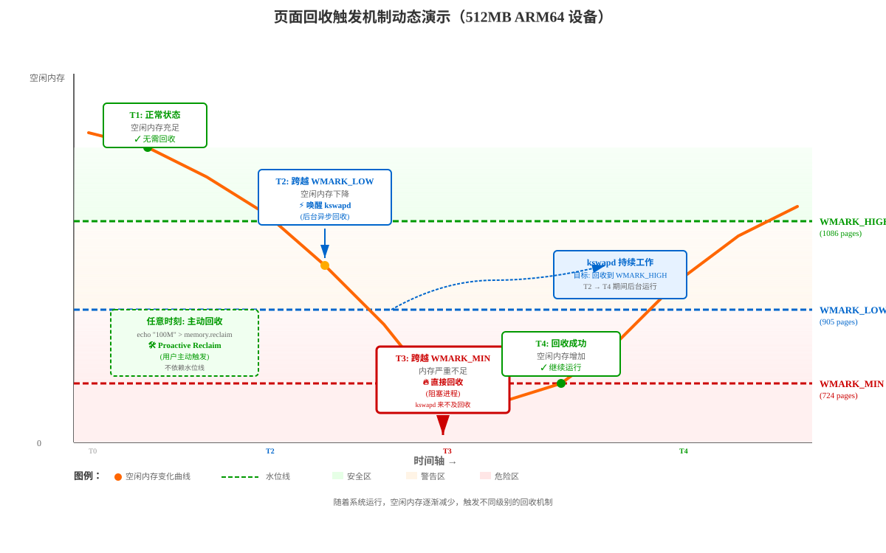

# ARM64 Linux 6.18.1 页面回收机制深度分析

> 基于 Linux 6.18.1 内核源码 (`mm/vmscan.c`, `mm/page_alloc.c`, `mm/workingset.c`, `mm/shrinker.c`)，
> 重点分析 ARM64 架构下页面回收的完整流程，并讨论嵌入式设备（512MB/1GB）场景下的回收行为。

## 目录

<details>
<summary><b>1. 页面回收整体架构</b></summary>

- 1.1 [回收触发路径](#11-回收触发路径)
  - 1.1.1 [三条路径的触发条件](#111-三条路径的触发条件)
  - 1.1.2 [触发条件对比表](#112-触发条件对比表)
- 1.2 [核心数据结构 scan_control](#12-核心数据结构-scan_control)
- 1.3 [LRU 列表组织](#13-lru-列表组织)
</details>
<details>
<summary><b>2. 水位线机制与回收触发</b></summary>

- 2.1 [水位线定义与数据结构](#21-水位线定义与数据结构)
  - 2.1.1 [水位线枚举定义](#211-水位线枚举定义)
  - 2.1.2 [存储结构](#212-存储结构)
  - 2.1.3 [水位线计算流程](#213-水位线计算流程)
  - 2.1.4 [计算公式总结](#214-计算公式总结)
- 2.2 [512MB/1GB 嵌入式设备水位线实例](#22-512mb1gb-嵌入式设备水位线实例)
- 2.3 [运行时调整与调优](#23-运行时调整与调优)
  - 2.3.1 [sysctl 参数调整](#231-sysctl-参数调整)
  - 2.3.2 [调优建议](#232-调优建议)
  - 2.3.3 [查看当前水位线](#233-查看当前水位线)
- 2.4 [kswapd 唤醒机制](#24-kswapd-唤醒机制)
</details>
<details>
<summary><b>3. 传统 LRU 回收路径</b></summary>

- 3.1 [direct reclaim 直接回收](#31-direct-reclaim-直接回收)
- 3.2 [kswapd 后台回收](#32-kswapd-后台回收)
- 3.3 [shrink_node 节点级回收](#33-shrink_node-节点级回收)
- 3.4 [匿名页与文件页的平衡](#34-匿名页与文件页的平衡)
- 3.5 [shrink_folio_list 逐页回收决策](#35-shrink_folio_list-逐页回收决策)
</details>
<details>
<summary><b>4. MGLRU 多代 LRU 回收机制</b></summary>

- 4.1 [MGLRU 基本原理](#41-mglru-基本原理)
- 4.2 [代际老化（Aging）](#42-代际老化aging)
- 4.3 [页面驱逐（Eviction）](#43-页面驱逐eviction)
- 4.4 [ARM64 硬件访问位支持](#44-arm64-硬件访问位支持)
- 4.5 [PID 反馈控制器](#45-pid-反馈控制器)
</details>
<details>
<summary><b>5. 嵌入式设备（512MB/1GB）页面回收分析</b></summary>

- 5.1 [内存布局与 zone 划分](#51-内存布局与-zone-划分)
- 5.2 [回收压力分析](#52-回收压力分析)
- 5.3 [swap 与 zram 配置策略](#53-swap-与-zram-配置策略)
- 5.4 [内存回收调优建议](#54-内存回收调优建议)
</details>
<details>
<summary><b>6. 页面回收案例分析</b></summary>

- 6.1 [案例一：文件缓存回收（读取大文件）](#61-案例一文件缓存回收读取大文件)
- 6.2 [案例二：匿名页交换（内存紧张时的 malloc）](#62-案例二匿名页交换内存紧张时的-malloc)
- 6.3 [案例三：slab 缓存回收（dentry/inode）](#63-案例三slab-缓存回收dentryinode)
- 6.4 [案例四：MGLRU 代际驱逐实例](#64-案例四mglru-代际驱逐实例)
</details>
<details>
<summary><b>7. 关键源码路径速查</b></summary>

- [关键源码路径速查](#7-关键源码路径速查)
</details>

---

## 1. 页面回收整体架构

### 1.1 回收触发路径

Linux 页面回收有三条主要路径：

```
┌─────────────────────────────────────────────────────────────────┐
│                      页面回收触发路径                              │
├─────────────────────────────────────────────────────────────────┤
│                                                                 │
│  ① 直接回收 (Direct Reclaim)                                    │
│     alloc_pages() → __alloc_pages_slowpath()                    │
│       → __perform_reclaim() → try_to_free_pages()               │
│       → do_try_to_free_pages() → shrink_zones()                 │
│                                                                 │
│  ② 后台回收 (kswapd)                                            │
│     kswapd 内核线程 → balance_pgdat()                           │
│       → kswapd_shrink_node() → shrink_node()                    │
│                                                                 │
│  ③ 主动回收 (Proactive Reclaim)                                 │
│     memory.reclaim cgroup 接口                                   │
│       → try_to_free_mem_cgroup_pages()                          │
│                                                                 │
│  共同路径:                                                       │
│     shrink_node() → shrink_lruvec() → shrink_list()             │
│       → shrink_inactive_list() → shrink_folio_list()            │
│                                                                 │
│  MGLRU 路径（如果启用）:                                          │
│     shrink_node() → lru_gen_shrink_node()                       │
│       → try_to_shrink_lruvec() → evict_folios()                │
│       → shrink_folio_list()                                      │
│                                                                 │
└─────────────────────────────────────────────────────────────────┘
```

#### 1.1.1 三条路径的触发条件

**① 直接回收 (Direct Reclaim) 触发条件**：

进程通过 `alloc_pages()` 分配内存时，满足以下条件会触发直接回收：

```c
// 判断逻辑（mm/page_alloc.c）
if (zone_free_pages < WMARK_MIN) {
    // 触发直接回收
    __perform_reclaim(gfp_mask, order, zonelist, nodemask);
}
```

- **核心条件**：zone 的空闲页数 **< WMARK_MIN（最低水位线）**
- **时机**：快速分配路径失败后，进入慢速路径 `__alloc_pages_slowpath()`
- **行为特征**：
  - **同步回收**：阻塞当前进程，直到回收完成
  - **优先级递减**：从 `DEF_PRIORITY=12` 逐步降到 0（越来越激进）
  - **回收目标**：默认回收 32 页 (`SWAP_CLUSTER_MAX`) 或满足分配需求
  - **退出条件**：达到回收目标、可以压缩内存、或优先级降到 0

**② 后台回收 (kswapd) 触发条件**：

kswapd 内核线程在以下条件下被唤醒：

```c
// 判断逻辑（mm/vmscan.c:wakeup_kswapd）
void wakeup_kswapd(struct zone *zone, gfp_t gfp_flags, int order,
                   enum zone_type highest_zoneidx)
{
    // 检查是否需要唤醒
    if (!pgdat_balanced(pgdat, order, highest_zoneidx)) {
        // zone 空闲页 < WMARK_LOW 时返回 false
        wake_up_interruptible(&pgdat->kswapd_wait);
    }
}
```

- **核心条件**：任一 zone 的空闲页数 **< WMARK_LOW（低水位线）**
- **时机**：内存分配路径中检测到水位线不足时调用 `wakeup_kswapd()`
- **行为特征**：
  - **异步回收**：在后台运行，不阻塞用户进程
  - **回收目标**：使所有 zone 空闲页达到 **WMARK_HIGH（高水位线）**
  - **优先级范围**：从 12 降到 1（kswapd 不会降到 0）
  - **自动停止**：通过 `pgdat_balanced()` 检查，达到 high watermark 后休眠

**③ 主动回收 (Proactive Reclaim) 触发条件**：

用户态主动触发的回收，通过 cgroup v2 接口：

```bash
# 触发方式
echo "100M" > /sys/fs/cgroup/xxx/memory.reclaim
```

```c
// 内核处理逻辑（mm/memcontrol.c）
static ssize_t memory_reclaim(struct kernfs_open_file *of, char *buf,
                              size_t nbytes, loff_t off)
{
    // 解析用户指定的回收量
    err = page_counter_memparse(buf, "", &nr_to_reclaim);
    
    // 触发回收
    reclaimed = try_to_free_mem_cgroup_pages(memcg, nr_to_reclaim, 
                                             GFP_KERNEL, ...);
}
```

- **核心条件**：用户态程序写入 `memory.reclaim` 接口
- **时机**：不依赖水位线，可在任意时刻主动触发
- **行为特征**：
  - **同步回收**：写操作阻塞直到回收完成或失败
  - **指定回收量**：可精确指定回收目标（如 "100M"）
  - **优先级范围**：从 12 降到 0
  - **应用场景**：内存管理优化、Android Low Memory Killer、容器资源控制

#### 1.1.2 触发条件对比表

> **📋 阅读提示**：下表使用颜色标注区分不同回收路径的特征：
> - 🔴 **红色背景/文字**：直接回收（紧急、阻塞、影响用户体验）
> - 🔵 **蓝色背景/文字**：后台回收（温和、异步、用户无感知）
> - 🟢 **绿色背景/文字**：主动回收（用户/管理员主动控制）

<table>
<thead>
<tr>
<th>回收路径</th>
<th>触发条件</th>
<th>同步/异步</th>
<th>回收目标</th>
<th>优先级范围</th>
<th>典型场景</th>
</tr>
</thead>
<tbody>
<tr style="background-color: #ffe6e6;">
<td><strong>直接回收<br/>(Direct Reclaim)</strong></td>
<td><span style="color: #cc0000; font-weight: bold;">空闲页 &lt; WMARK_MIN</span></td>
<td><span style="color: #cc0000; font-weight: bold;">同步（阻塞）</span></td>
<td>32 页或满足分配</td>
<td><span style="color: #cc0000;">12 → 0</span><br/><small>（最激进）</small></td>
<td><span style="color: #cc0000; font-weight: bold;">内存紧急不足</span></td>
</tr>
<tr style="background-color: #e6f2ff;">
<td><strong>后台回收<br/>(kswapd)</strong></td>
<td><span style="color: #0066cc; font-weight: bold;">空闲页 &lt; WMARK_LOW</span></td>
<td><span style="color: #0066cc; font-weight: bold;">异步（后台）</span></td>
<td>达到 WMARK_HIGH</td>
<td><span style="color: #0066cc;">12 → 1</span><br/><small>（较温和）</small></td>
<td><span style="color: #0066cc; font-weight: bold;">内存压力预防</span></td>
</tr>
<tr style="background-color: #e6ffe6;">
<td><strong>主动回收<br/>(Proactive Reclaim)</strong></td>
<td><span style="color: #009900; font-weight: bold;">用户写 memory.reclaim</span></td>
<td><span style="color: #009900; font-weight: bold;">同步（阻塞）</span></td>
<td><span style="color: #009900; font-weight: bold;">用户指定量</span></td>
<td><span style="color: #009900;">12 → 0</span><br/><small>（可调）</small></td>
<td><span style="color: #009900; font-weight: bold;">主动内存管理</span></td>
</tr>
</tbody>
</table>

**颜色说明**：
- <span style="color: #cc0000; font-weight: bold;">🔴 红色：直接回收（紧急、阻塞用户进程）</span>
- <span style="color: #0066cc; font-weight: bold;">🔵 蓝色：后台回收（温和、不阻塞用户）</span>
- <span style="color: #009900; font-weight: bold;">🟢 绿色：主动回收（用户主动控制）</span>

**水位线示例**（512MB ARM64 设备，单 ZONE_NORMAL）：

```
物理内存: 512MB
min_free_kbytes ≈ 2896 KB (根据公式 sqrt(lowmem_kbytes * 16) 计算)
```

<div style="background-color: #f5f5f5; padding: 15px; border-left: 4px solid #666; font-family: monospace;">
<div style="margin: 5px 0;">
<span style="color: #cc0000; font-weight: bold;">WMARK_MIN</span>  ≈ 724 pages (2.8 MB)  
<span style="color: #cc0000;">← 低于此触发直接回收 (Direct Reclaim)</span>
</div>
<div style="margin: 5px 0;">
<span style="color: #0066cc; font-weight: bold;">WMARK_LOW</span>  ≈ 905 pages (3.5 MB)  
<span style="color: #0066cc;">← 低于此唤醒 kswapd (后台回收)</span>
</div>
<div style="margin: 5px 0;">
<span style="color: #009900; font-weight: bold;">WMARK_HIGH</span> ≈ 1086 pages (4.2 MB) 
<span style="color: #009900;">← kswapd 回收到此停止</span>
</div>
<div style="margin: 10px 0 5px 0; color: #666;">
delta ≈ 181 pages (WMARK_HIGH - WMARK_LOW = WMARK_LOW - WMARK_MIN)
</div>
</div>

**水位线层次关系可视化**：

<div style="background-color: #f9f9f9; padding: 20px; border: 2px solid #ccc; margin: 15px 0;">
<div style="text-align: center; margin-bottom: 15px; font-weight: bold;">内存空闲页数从高到低</div>
<div style="margin: 10px 0; padding: 15px; background: linear-gradient(to right, #e6ffe6, #f0fff0); border-left: 4px solid #009900;">
<span style="color: #009900; font-weight: bold; font-size: 16px;">✓ 空闲页 ≥ WMARK_HIGH (1086 pages)</span><br/>
<span style="color: #666; margin-left: 20px;">→ kswapd 休眠，系统内存充足</span>
</div>
<div style="margin: 10px 0; padding: 15px; background: linear-gradient(to right, #e6f2ff, #f0f7ff); border-left: 4px solid #0066cc;">
<span style="color: #0066cc; font-weight: bold; font-size: 16px;">↓ WMARK_LOW &lt; 空闲页 &lt; WMARK_HIGH (905-1086 pages)</span><br/>
<span style="color: #666; margin-left: 20px;">→ kswapd 工作中，后台回收页面</span>
</div>
<div style="margin: 10px 0; padding: 15px; background: linear-gradient(to right, #fff9e6, #fffbf0); border-left: 4px solid #ff9900;">
<span style="color: #ff9900; font-weight: bold; font-size: 16px;">⚠ WMARK_MIN &lt; 空闲页 &lt; WMARK_LOW (724-905 pages)</span><br/>
<span style="color: #666; margin-left: 20px;">→ 唤醒 kswapd，分配继续（可能变慢）</span>
</div>
<div style="margin: 10px 0; padding: 15px; background: linear-gradient(to right, #ffe6e6, #fff0f0); border-left: 4px solid #cc0000;">
<span style="color: #cc0000; font-weight: bold; font-size: 16px;">✗ 空闲页 &lt; WMARK_MIN (724 pages)</span><br/>
<span style="color: #cc0000; margin-left: 20px; font-weight: bold;">→ 直接回收（阻塞进程），可能触发 OOM</span>
</div>
</div>

**触发判断流程图**：

```
alloc_pages() 分配内存
    ↓
检查快速路径（per-cpu 页缓存）
    ↓
失败 → 检查空闲页 vs 水位线
    ↓
```

<div style="background-color: #fafafa; padding: 15px; border: 1px solid #ddd; font-family: monospace; line-height: 1.8;">
<div style="padding-left: 20px;">
<span style="color: #cc0000; font-weight: bold;">├── free_pages &lt; WMARK_MIN</span> 
<span style="color: #cc0000;">→ 触发 Direct Reclaim（阻塞当前进程）</span><br/>
<span style="padding-left: 60px; color: #cc0000;">├─ 成功回收 → 继续分配</span><br/>
<span style="padding-left: 60px; color: #cc0000;">└─ 失败 → OOM Killer</span>
</div>
<div style="padding-left: 20px; margin-top: 10px;">
<span style="color: #0066cc; font-weight: bold;">├── free_pages &lt; WMARK_LOW</span>  
<span style="color: #0066cc;">→ 唤醒 kswapd（不阻塞）</span><br/>
<span style="padding-left: 60px; color: #0066cc;">继续尝试分配</span>
</div>
<div style="padding-left: 20px; margin-top: 10px;">
<span style="font-weight: bold;">└── free_pages ≥ WMARK_LOW → 正常分配</span>
</div>
<div style="margin-top: 20px; padding-top: 10px; border-top: 1px dashed #999;">
<span style="font-weight: bold;">用户主动触发</span><br/>
<span style="padding-left: 20px;">↓</span><br/>
<span style="color: #009900; font-weight: bold;">echo "100M" &gt; memory.reclaim</span> 
<span style="color: #009900;">→ 触发 Proactive Reclaim（阻塞写操作）</span><br/>
<span style="padding-left: 60px; color: #009900;">├─ 成功回收指定量 → 返回</span><br/>
<span style="padding-left: 60px; color: #009900;">└─ 失败或部分成功 → 返回已回收量</span>
</div>
</div>

**三种回收方式动态触发示意图**：



**动态过程解读**：

<table style="width: 100%; border-collapse: collapse; margin: 20px 0;">
<thead>
<tr style="background-color: #f0f0f0;">
<th style="padding: 10px; border: 1px solid #ddd;">时刻</th>
<th style="padding: 10px; border: 1px solid #ddd;">空闲内存状态</th>
<th style="padding: 10px; border: 1px solid #ddd;">触发的回收</th>
<th style="padding: 10px; border: 1px solid #ddd;">特征</th>
</tr>
</thead>
<tbody>
<tr style="background-color: #e6ffe6;">
<td style="padding: 10px; border: 1px solid #ddd;"><strong>T1</strong></td>
<td style="padding: 10px; border: 1px solid #ddd;">≥ WMARK_HIGH<br/>（充足）</td>
<td style="padding: 10px; border: 1px solid #ddd;"><span style="color: #009900;">✓ 无回收</span></td>
<td style="padding: 10px; border: 1px solid #ddd;">正常运行，kswapd 休眠</td>
</tr>
<tr style="background-color: #e6f2ff;">
<td style="padding: 10px; border: 1px solid #ddd;"><strong>T2</strong></td>
<td style="padding: 10px; border: 1px solid #ddd;">WMARK_LOW ~ WMARK_HIGH<br/>（下降）</td>
<td style="padding: 10px; border: 1px solid #ddd;"><span style="color: #0066cc; font-weight: bold;">⚡ kswapd 唤醒</span></td>
<td style="padding: 10px; border: 1px solid #ddd;">后台异步回收，用户无感知</td>
</tr>
<tr style="background-color: #ffe6e6;">
<td style="padding: 10px; border: 1px solid #ddd;"><strong>T3</strong></td>
<td style="padding: 10px; border: 1px solid #ddd;">&lt; WMARK_MIN<br/>（告急）</td>
<td style="padding: 10px; border: 1px solid #ddd;"><span style="color: #cc0000; font-weight: bold;">🔥 直接回收</span></td>
<td style="padding: 10px; border: 1px solid #ddd;">同步阻塞，进程卡顿</td>
</tr>
<tr style="background-color: #e6ffe6;">
<td style="padding: 10px; border: 1px solid #ddd;"><strong>T4</strong></td>
<td style="padding: 10px; border: 1px solid #ddd;">→ WMARK_HIGH<br/>（恢复）</td>
<td style="padding: 10px; border: 1px solid #ddd;"><span style="color: #009900;">✓ 回收完成</span></td>
<td style="padding: 10px; border: 1px solid #ddd;">kswapd 休眠，系统恢复正常</td>
</tr>
<tr style="background-color: #f0fff0;">
<td style="padding: 10px; border: 1px solid #ddd;"><strong>任意时刻</strong></td>
<td style="padding: 10px; border: 1px solid #ddd;">不限<br/>（独立）</td>
<td style="padding: 10px; border: 1px solid #ddd;"><span style="color: #009900; font-weight: bold;">🛠️ 主动回收</span></td>
<td style="padding: 10px; border: 1px solid #ddd;">用户触发，不依赖水位线</td>
</tr>
</tbody>
</table>

**关键观察点**：

1. **橙色曲线**：代表空闲内存随时间的变化，逐渐下降直到触发回收后恢复
2. **三条虚线**：WMARK_HIGH（绿）、WMARK_LOW（蓝）、WMARK_MIN（红）是回收触发的阈值
3. **T2→T3 阶段**：kswapd 在后台工作，但回收速度赶不上内存消耗
4. **T3 时刻**：跨越 WMARK_MIN 红线，被迫进入直接回收（最不希望发生的情况）
5. **主动回收框**（虚线边框）：可在任意时刻独立触发，不受水位线限制

### 1.2 核心数据结构 scan_control

`scan_control` 是贯穿整个回收过程的控制结构（`mm/vmscan.c:75`）：

```c
struct scan_control {
    unsigned long nr_to_reclaim;     /* 目标回收页数 */
    nodemask_t    *nodemask;         /* 允许的节点掩码 */
    struct mem_cgroup *target_mem_cgroup; /* 目标 cgroup */

    /* 匿名页/文件页回收压力平衡 */
    unsigned long anon_cost;
    unsigned long file_cost;

    /* 回收能力标志 */
    unsigned int may_writepage:1;    /* 允许回写脏页 */
    unsigned int may_unmap:1;        /* 允许解除映射 */
    unsigned int may_swap:1;         /* 允许换出匿名页 */

    /* 扫描控制 */
    s8 order;                        /* 分配阶 */
    s8 priority;                     /* 扫描优先级 (12→0, 越小越激进) */
    s8 reclaim_idx;                  /* 最高回收 zone 索引 */
    gfp_t gfp_mask;                  /* GFP 分配标志 */

    /* 统计计数器 */
    unsigned long nr_scanned;        /* 已扫描页数 */
    unsigned long nr_reclaimed;      /* 已回收页数 */
};
```

**优先级机制**：扫描量 = `total_pages >> priority`
- `DEF_PRIORITY = 12`：最温和，仅扫描 1/4096 页面
- `priority = 6`：扫描 1/64 页面
- `priority = 0`：最激进，扫描全部页面

### 1.3 LRU 列表组织

每个 `lruvec` 维护以下 LRU 列表：

```
┌─────────────────────────────────────────────────┐
│              LRU Lists (per lruvec)              │
├─────────────────────────────────────────────────┤
│  LRU_INACTIVE_ANON  ← 不活跃匿名页              │
│  LRU_ACTIVE_ANON    ← 活跃匿名页                │
│  LRU_INACTIVE_FILE  ← 不活跃文件页              │
│  LRU_ACTIVE_FILE    ← 活跃文件页                │
│  LRU_UNEVICTABLE    ← 不可回收页 (mlock等)       │
├─────────────────────────────────────────────────┤
│  MGLRU 模式下:                                   │
│  lrugen.nr_pages[gen][type][zone]               │
│    gen:  0 ~ MAX_NR_GENS-1 (4代)                │
│    type: ANON / FILE                            │
│    zone: 按 zone 索引                           │
└─────────────────────────────────────────────────┘
```

---

## 2. 水位线机制与回收触发

### 2.1 水位线定义与数据结构

#### 2.1.1 水位线枚举定义

水位线在内核中定义为枚举类型（`include/linux/mmzone.h:708`）：

```c
enum zone_watermarks {
    WMARK_MIN,     // 最低水位线（索引 0）
    WMARK_LOW,     // 低水位线（索引 1）
    WMARK_HIGH,    // 高水位线（索引 2）
    WMARK_PROMO,   // 提升水位线（索引 3，NUMA promotion 使用）
    NR_WMARK       // 水位线总数（4）
};
```

#### 2.1.2 存储结构

每个 zone 在 `struct zone` 中存储水位线的实际页数（`include/linux/mmzone.h:882-884`）：

```c
struct zone {
    /* zone watermarks, access with *_wmark_pages(zone) macros */
    unsigned long _watermark[NR_WMARK];  // 存储所有水位线的页数
    unsigned long watermark_boost;       // 动态调整值（碎片防护）
    ...
};
```

**访问方法**（`include/linux/mmzone.h:1082-1095`）：

```c
// 通用访问函数（加上 watermark_boost）
static inline unsigned long wmark_pages(const struct zone *z,
                                        enum zone_watermarks w)
{
    return z->_watermark[w] + z->watermark_boost;
}

// 获取 WMARK_MIN
static inline unsigned long min_wmark_pages(const struct zone *z)
{
    return wmark_pages(z, WMARK_MIN);
}

// 获取 WMARK_LOW
static inline unsigned long low_wmark_pages(const struct zone *z)
{
    return wmark_pages(z, WMARK_LOW);
}

// 获取 WMARK_HIGH
static inline unsigned long high_wmark_pages(const struct zone *z)
{
    return wmark_pages(z, WMARK_HIGH);
}
```

**实际访问值** = `zone->_watermark[WMARK_XXX] + zone->watermark_boost`

#### 2.1.3 水位线计算流程

水位线的计算分为两个步骤，在系统启动时由 `init_per_zone_wmark_min()` 触发：

**第一步：计算全局 `min_free_kbytes`**（`mm/page_alloc.c:6450`）

```c
void calculate_min_free_kbytes(void)
{
    unsigned long lowmem_kbytes;
    int new_min_free_kbytes;

    // 1. 计算可用于缓冲区的内存（不包括 HIGHMEM 和 MOVABLE zone）
    lowmem_kbytes = nr_free_buffer_pages() * (PAGE_SIZE >> 10);
    
    // 2. 平方根公式：min_free_kbytes = sqrt(lowmem_kbytes * 16)
    new_min_free_kbytes = int_sqrt(lowmem_kbytes * 16);

    // 3. 检查用户是否自定义了 min_free_kbytes
    if (new_min_free_kbytes > user_min_free_kbytes)
        // 限制在 128KB ~ 262144KB (256MB) 之间
        min_free_kbytes = clamp(new_min_free_kbytes, 128, 262144);
    else
        pr_warn("min_free_kbytes is not updated to %d because user defined value %d is preferred\n",
                new_min_free_kbytes, user_min_free_kbytes);
}
```

**公式解析**：
- `nr_free_buffer_pages()` 返回所有非 HIGHMEM/MOVABLE zone 的总页数
- `lowmem_kbytes * 16 = lowmem_kbytes << 4`
- `sqrt(x)` 确保水位线随内存大小**非线性增长**（避免大内存系统保留过多）
- 例如：512MB → 2896KB，1GB → 4096KB，4GB → 8192KB

**第二步：按 zone 比例分配水位线**（`mm/page_alloc.c:6338`）

```c
static void __setup_per_zone_wmarks(void)
{
    unsigned long pages_min = min_free_kbytes >> (PAGE_SHIFT - 10);  // KB 转页数
    unsigned long lowmem_pages = 0;
    struct zone *zone;
    unsigned long flags;

    // 1. 计算所有 lowmem zone 的总页数
    for_each_zone(zone) {
        if (!is_highmem(zone) && zone_idx(zone) != ZONE_MOVABLE)
            lowmem_pages += zone_managed_pages(zone);
    }

    // 2. 为每个 zone 按比例分配
    for_each_zone(zone) {
        u64 tmp;

        spin_lock_irqsave(&zone->lock, flags);
        
        // 2.1 计算该 zone 应得的 WMARK_MIN 页数
        tmp = (u64)pages_min * zone_managed_pages(zone);
        tmp = div64_ul(tmp, lowmem_pages);  // 按 zone 大小比例分配
        
        if (is_highmem(zone) || zone_idx(zone) == ZONE_MOVABLE) {
            // HIGHMEM/MOVABLE zone: 使用较小的固定值
            // 原因: __GFP_HIGH 和 PF_MEMALLOC 分配通常不需要这些 zone
            unsigned long min_pages;
            
            min_pages = zone_managed_pages(zone) / 1024;
            min_pages = clamp(min_pages, SWAP_CLUSTER_MAX, 128UL);
            zone->_watermark[WMARK_MIN] = min_pages;
        } else {
            // LOWMEM zone (ZONE_NORMAL, ZONE_DMA32): 使用比例分配的值
            zone->_watermark[WMARK_MIN] = tmp;
        }

        // 2.2 计算 delta（WMARK_LOW 和 WMARK_HIGH 之间的增量）
        // delta 控制异步页面回收的行为
        tmp = max_t(u64, tmp >> 2,  // 至少是 WMARK_MIN 的 1/4
                    mult_frac(zone_managed_pages(zone),
                              watermark_scale_factor, 10000));
        
        zone->watermark_boost = 0;
        
        // 2.3 设置 WMARK_LOW 和 WMARK_HIGH
        zone->_watermark[WMARK_LOW]  = min_wmark_pages(zone) + tmp;
        zone->_watermark[WMARK_HIGH] = low_wmark_pages(zone) + tmp;
        zone->_watermark[WMARK_PROMO] = high_wmark_pages(zone) + tmp;
        
        trace_mm_setup_per_zone_wmarks(zone);

        spin_unlock_irqrestore(&zone->lock, flags);
    }

    // 更新总保留页数
    calculate_totalreserve_pages();
}
```

#### 2.1.4 计算公式总结

对于 **lowmem zone（ZONE_NORMAL、ZONE_DMA32）**：

```
步骤 1: 全局计算
  lowmem_kbytes = 所有 lowmem zone 的总内存大小（KB）
  min_free_kbytes = sqrt(lowmem_kbytes * 16)
  限制范围: [128KB, 256MB]

步骤 2: 按 zone 比例分配
  pages_min = min_free_kbytes / 4  (假设 4KB 页)
  
  WMARK_MIN(zone) = pages_min * zone_managed_pages(zone) / total_lowmem_pages
  
  delta = max(WMARK_MIN >> 2,  // 至少 WMARK_MIN 的 25%
              zone_managed_pages * watermark_scale_factor / 10000)
  
  其中 watermark_scale_factor 默认值 = 10 (即 0.1%)
  
  WMARK_LOW  = WMARK_MIN + delta
  WMARK_HIGH = WMARK_LOW + delta
  WMARK_PROMO = WMARK_HIGH + delta
```

**三级水位线含义**：

<table>
<thead>
<tr>
<th>水位线</th>
<th>作用</th>
<th>触发行为</th>
</tr>
</thead>
<tbody>
<tr style="background-color: #e6ffe6;">
<td><span style="color: #009900; font-weight: bold;">WMARK_HIGH</span></td>
<td>高水位</td>
<td><span style="color: #009900;">kswapd 回收到此线停止</span></td>
</tr>
<tr style="background-color: #e6f2ff;">
<td><span style="color: #0066cc; font-weight: bold;">WMARK_LOW</span></td>
<td>低水位</td>
<td><span style="color: #0066cc;">快速路径分配阈值，低于此唤醒 kswapd</span></td>
</tr>
<tr style="background-color: #ffe6e6;">
<td><span style="color: #cc0000; font-weight: bold;">WMARK_MIN</span></td>
<td>最低水位</td>
<td><span style="color: #cc0000; font-weight: bold;">低于此触发直接回收（同步阻塞）</span></td>
</tr>
<tr style="background-color: #fff0f0;">
<td><span style="color: #990000; font-weight: bold;">&lt; WMARK_MIN</span></td>
<td><span style="color: #990000; font-weight: bold;">紧急</span></td>
<td><span style="color: #990000; font-weight: bold;">直接回收 + 可能触发 OOM Killer</span></td>
</tr>
</tbody>
</table>

### 2.2 512MB/1GB 嵌入式设备水位线实例

根据公式 `min_free_kbytes = sqrt(lowmem_kbytes * 16)`：

<table>
<thead>
<tr>
<th>物理内存</th>
<th>lowmem_kbytes</th>
<th>min_free_kbytes</th>
<th><span style="color: #cc0000;">WMARK_MIN (pages)</span></th>
<th>delta (pages)</th>
<th><span style="color: #0066cc;">WMARK_LOW</span></th>
<th><span style="color: #009900;">WMARK_HIGH</span></th>
</tr>
</thead>
<tbody>
<tr>
<td><strong>512MB</strong></td>
<td>~524288</td>
<td>~2896</td>
<td><span style="color: #cc0000; font-weight: bold;">~724</span></td>
<td>~181</td>
<td><span style="color: #0066cc; font-weight: bold;">~905</span></td>
<td><span style="color: #009900; font-weight: bold;">~1086</span></td>
</tr>
<tr>
<td><strong>1GB</strong></td>
<td>~1048576</td>
<td>~4096</td>
<td><span style="color: #cc0000; font-weight: bold;">~1024</span></td>
<td>~256</td>
<td><span style="color: #0066cc; font-weight: bold;">~1280</span></td>
<td><span style="color: #009900; font-weight: bold;">~1536</span></td>
</tr>
</tbody>
</table>

> 注: 以上为单 zone(ZONE_NORMAL) 简化计算，4KB 页面大小。
> 实际系统可能有 ZONE_DMA32 + ZONE_NORMAL 分配。

**对于 ARM64 嵌入式设备的 zone 布局**：
- 无 CONFIG_ZONE_DMA：全部内存在 ZONE_NORMAL
- 有 CONFIG_ZONE_DMA32：前 4GB 在 DMA32（对 512MB/1GB 设备等于全部内存）

所以 512MB 设备的实际回收相关参数：
```
min_free_kbytes ≈ 2896 KB (约 724 个 4KB 页)
WMARK_MIN ≈ 724 pages (约 2.8 MB)
WMARK_LOW ≈ 905 pages (约 3.5 MB)
WMARK_HIGH ≈ 1086 pages (约 4.2 MB)
```

**详细计算过程**（512MB 设备，单 ZONE_NORMAL）：

```
步骤 1: 全局计算
  lowmem_kbytes = 524288 KB
  min_free_kbytes = sqrt(524288 * 16) = sqrt(8388608) ≈ 2896 KB
  
步骤 2: 转换为页数
  pages_min = 2896 KB / 4 KB = 724 pages
  
步骤 3: 按 zone 分配（假设只有一个 zone）
  WMARK_MIN = 724 pages * zone_managed_pages / total_lowmem_pages
            = 724 pages (单 zone 时 100% 分配)
  
步骤 4: 计算 delta
  delta = max(WMARK_MIN >> 2, zone_managed_pages * 10 / 10000)
        = max(724 >> 2, 131072 * 10 / 10000)
        = max(181, 131)
        = 181 pages
  
步骤 5: 计算其他水位线
  WMARK_LOW  = 724 + 181 = 905 pages  (3.5 MB)
  WMARK_HIGH = 905 + 181 = 1086 pages (4.2 MB)
```

### 2.3 运行时调整与调优

#### 2.3.1 sysctl 参数调整

水位线可以在运行时通过 sysctl 接口动态调整：

**查看和修改 min_free_kbytes**：

```bash
# 查看当前值
cat /proc/sys/vm/min_free_kbytes

# 临时修改（会立即重新计算所有 zone 的水位线）
echo 4096 > /proc/sys/vm/min_free_kbytes

# 永久修改（写入 /etc/sysctl.conf）
echo "vm.min_free_kbytes = 4096" >> /etc/sysctl.conf
sysctl -p
```

**修改后的效果**（`mm/page_alloc.c:6490`）：

```c
static int min_free_kbytes_sysctl_handler(const struct ctl_table *table, int write,
                                          void *buffer, size_t *length, loff_t *ppos)
{
    int rc = proc_dointvec_minmax(table, write, buffer, length, ppos);
    
    if (rc)
        return rc;
    
    if (write) {
        user_min_free_kbytes = min_free_kbytes;  // 标记为用户设置
        setup_per_zone_wmarks();  // 重新计算所有水位线
    }
    return 0;
}
```

**调整 watermark_scale_factor（控制 delta 大小）**：

```bash
# 查看当前值（默认 10 = 0.1%）
cat /proc/sys/vm/watermark_scale_factor

# 增大 delta（更早唤醒 kswapd，减少直接回收）
echo 50 > /proc/sys/vm/watermark_scale_factor  # 0.5%

# 减小 delta（延迟 kswapd 唤醒，节省 CPU）
echo 5 > /proc/sys/vm/watermark_scale_factor   # 0.05%
```

**watermark_scale_factor 的影响**：

```
delta = max(WMARK_MIN >> 2, zone_managed_pages * scale_factor / 10000)

scale_factor = 10 (0.1%):  512MB 设备 delta ≈ 181 pages
scale_factor = 50 (0.5%):  512MB 设备 delta ≈ 655 pages (WMARK_LOW 更高)
scale_factor = 100 (1.0%): 512MB 设备 delta ≈ 1310 pages (更激进的后台回收)
```

#### 2.3.2 调优建议

**嵌入式设备（512MB/1GB）**：

<table>
<thead>
<tr>
<th>场景</th>
<th>min_free_kbytes</th>
<th>watermark_scale_factor</th>
<th>说明</th>
</tr>
</thead>
<tbody>
<tr style="background-color: #f0f0f0;">
<td><strong>默认</strong></td>
<td>自动计算 (~2896)</td>
<td>10</td>
<td>平衡性能与内存利用率</td>
</tr>
<tr style="background-color: #e6f9ff;">
<td><strong>低内存压力</strong></td>
<td><span style="color: #0088cc;">减小到 2048</span></td>
<td><span style="color: #0088cc;">5</span></td>
<td>提高内存利用率，适合后台任务少的设备</td>
</tr>
<tr style="background-color: #fff4e6;">
<td><strong>高内存压力</strong></td>
<td><span style="color: #ff8800; font-weight: bold;">增大到 4096</span></td>
<td><span style="color: #ff8800; font-weight: bold;">20-50</span></td>
<td><span style="color: #ff8800; font-weight: bold;">更早触发回收，减少直接回收卡顿</span></td>
</tr>
<tr style="background-color: #ffe6f0;">
<td><strong>实时系统</strong></td>
<td><span style="color: #cc0066; font-weight: bold;">增大到 8192</span></td>
<td><span style="color: #cc0066; font-weight: bold;">50-100</span></td>
<td><span style="color: #cc0066; font-weight: bold;">避免直接回收导致的延迟峰值</span></td>
</tr>
</tbody>
</table>

**调优原则**：

1. <span style="background-color: #fff9e6; padding: 2px 6px; border-left: 3px solid #ffbb33;">**增大 min_free_kbytes**</span> → 增加保留内存，减少直接回收概率，但降低可用内存
2. <span style="background-color: #e6f7ff; padding: 2px 6px; border-left: 3px solid #3399ff;">**增大 watermark_scale_factor**</span> → 扩大水位线间隔，kswapd 更早唤醒，更晚休眠
3. **512MB 设备建议**：
   - ✅ 默认配置通常够用（min_free_kbytes ≈ 2896）
   - ⚠️ 若频繁触发直接回收：增大到 4096-6144
   - ❌ 若内存总是紧张：检查应用内存泄漏，优化应用而非调大水位线

#### 2.3.3 查看当前水位线

```bash
# 查看所有 zone 的水位线（单位：页）
cat /proc/zoneinfo | grep -A 5 "pages free"

# 示例输出（512MB 设备）：
#   min      724
#   low      905
#   high     1086
#   spanned  131072
#   present  131072
#   managed  127856
```

### 2.4 kswapd 唤醒机制

`wakeup_kswapd()` (`mm/vmscan.c:7402`) 在分配路径中被调用：

```c
void wakeup_kswapd(struct zone *zone, gfp_t gfp_flags, int order,
                   enum zone_type highest_zoneidx)
{
    pg_data_t *pgdat = zone->zone_pgdat;

    // 若 kswapd 已失败多次，不再唤醒
    if (atomic_read(&pgdat->kswapd_failures) >= MAX_RECLAIM_RETRIES)
        return;

    // 检查是否需要唤醒：zone 空闲页 < low watermark
    if (pgdat_balanced(pgdat, order, highest_zoneidx))
        return;

    // 唤醒 kswapd 线程
    wake_up_interruptible(&pgdat->kswapd_wait);
}
```

**唤醒条件**：任一 zone 的空闲页数低于 `low_wmark_pages(zone)` 时触发。

---

## 3. 传统 LRU 回收路径

### 3.1 direct reclaim 直接回收

当内存分配在慢速路径失败时，进入直接回收（`mm/vmscan.c:6612`）：

```c
unsigned long try_to_free_pages(struct zonelist *zonelist, int order,
                                gfp_t gfp_mask, nodemask_t *nodemask)
{
    struct scan_control sc = {
        .nr_to_reclaim = SWAP_CLUSTER_MAX,  // 目标回收 32 页
        .gfp_mask = current_gfp_context(gfp_mask),
        .order = order,
        .priority = DEF_PRIORITY,           // 从优先级 12 开始
        .may_writepage = !laptop_mode,
        .may_unmap = 1,
        .may_swap = 1,
    };

    // 1. 检查是否需要节流（pfmemalloc 保护）
    throttle_direct_reclaim(sc.gfp_mask);

    // 2. 进入回收主循环
    return do_try_to_free_pages(zonelist, &sc);
}
```

**do_try_to_free_pages 主循环**：

```c
static unsigned long do_try_to_free_pages(struct zonelist *zonelist,
                                          struct scan_control *sc)
{
    // 优先级从 DEF_PRIORITY(12) 递减到 0
    do {
        shrink_zones(zonelist, sc);      // 扫描并回收

        if (sc->nr_reclaimed >= sc->nr_to_reclaim)
            break;                        // 达标退出

        if (sc->compaction_ready)
            break;                        // 可压缩退出

        // 优先级降低后允许回写
        if (sc->priority < DEF_PRIORITY - 2)
            sc->may_writepage = 1;

    } while (--sc->priority >= 0);

    return sc->nr_reclaimed;
}
```

### 3.2 kswapd 后台回收

kswapd 的核心循环在 `balance_pgdat()` (`mm/vmscan.c:7015`)：

```c
static int balance_pgdat(pg_data_t *pgdat, int order, int highest_zoneidx)
{
    struct scan_control sc = {
        .gfp_mask = GFP_KERNEL,
        .order = order,
        .may_unmap = 1,
    };

    // 从 DEF_PRIORITY 开始逐步加压
    sc.priority = DEF_PRIORITY;
    do {
        // 检查是否已平衡（所有 zone 都高于 high watermark）
        if (pgdat_balanced(pgdat, sc.order, highest_zoneidx))
            break;

        // 设置回收能力
        sc.may_writepage = !laptop_mode && sc.priority < DEF_PRIORITY - 2;
        sc.may_swap = true;

        // 执行节点级回收
        kswapd_shrink_node(pgdat, &sc);

        // 唤醒被节流的直接回收进程
        if (waitqueue_active(&pgdat->reclaim_wait[VMSCAN_THROTTLE_NOPROGRESS]))
            wake_up(&pgdat->reclaim_wait[VMSCAN_THROTTLE_NOPROGRESS]);

    } while (--sc.priority >= 1);  // kswapd 最低到 priority=1

    return sc.order;
}
```

**kswapd 的回收目标**：每次回收至少 `high_wmark_pages(zone)` 数量的页面。

### 3.3 shrink_node 节点级回收

`shrink_node()` (`mm/vmscan.c:6073`) 是节点级别的回收调度器：

```c
static void shrink_node(pg_data_t *pgdat, struct scan_control *sc)
{
    // MGLRU 启用时委托给 lru_gen_shrink_node()
    if (lru_gen_enabled()) {
        lru_gen_shrink_node(pgdat, sc);
        return;
    }

    // 遍历所有 memcg 进行回收
    do {
        memcg = mem_cgroup_iter(target_memcg, memcg, NULL);

        // 回收 LRU 页面
        shrink_lruvec(lruvec, sc);

        // 回收 slab 缓存
        shrink_slab(sc->gfp_mask, pgdat->node_id, memcg, sc->priority);

    } while ((memcg = mem_cgroup_iter(...)) != NULL);

    // 处理脏页/回写/拥塞
    if (sc->nr.writeback && sc->nr.writeback == sc->nr.taken)
        set_bit(PGDAT_WRITEBACK, &pgdat->flags);
}
```

### 3.4 匿名页与文件页的平衡

`get_scan_count()` (`mm/vmscan.c:2556`) 决定匿名页和文件页各扫描多少：

```c
static void get_scan_count(struct lruvec *lruvec, struct scan_control *sc,
                           unsigned long *nr)
{
    int swappiness = sc_swappiness(sc, memcg); // 默认 60

    // 无 swap 空间 → 只扫描文件页
    if (!sc->may_swap || !can_reclaim_anon_pages(...))
        scan_balance = SCAN_FILE;

    // priority == 0 (最紧急) → 等比例扫描
    else if (!sc->priority && swappiness)
        scan_balance = SCAN_EQUAL;

    // 文件页太少 → 强制扫描匿名页
    else if (sc->file_is_tiny)
        scan_balance = SCAN_ANON;

    // 有充足不活跃文件缓存 → 只回收文件页（保护匿名页工作集）
    else if (sc->cache_trim_mode)
        scan_balance = SCAN_FILE;

    // 默认：基于 swappiness 和 refault 效率的比例回收
    else {
        scan_balance = SCAN_FRACT;
        // 压力平衡公式:
        // ap = swappiness * (total_cost + 1) / (anon_cost + 1)
        // fp = (200 - swappiness) * (total_cost + 1) / (file_cost + 1)
        calculate_pressure_balance(sc, swappiness, fraction, &denominator);
    }
}
```

**在 512MB 嵌入式设备上的表现**：
- 无 swap 时：仅回收文件页（page cache、tmpfs）
- 有 zram swap 时：根据 swappiness 在匿名/文件间分配压力
- swappiness=60 时约 60% 压力给匿名页、40% 给文件页（受 refault 率修正）

### 3.5 shrink_folio_list 逐页回收决策

`shrink_folio_list()` (`mm/vmscan.c:1099`) 是最底层的逐页回收函数：

```c
static unsigned int shrink_folio_list(struct list_head *folio_list, ...)
{
    while (!list_empty(folio_list)) {
        folio = lru_to_folio(folio_list);

        // 1. 尝试获取页锁
        if (!folio_trylock(folio))
            goto keep;

        // 2. 检查是否可回收
        if (!folio_evictable(folio))
            goto activate_locked;

        // 3. 检查是否正在回写
        if (folio_test_writeback(folio)) {
            // kswapd + reclaim标记 → 激活（避免抖动）
            // 普通回收 → 标记 immediate，下次回收
            // legacy memcg → 等待回写完成
        }

        // 4. 检查引用状态
        references = folio_check_references(folio, sc);
        switch (references) {
            case FOLIOREF_ACTIVATE:  goto activate_locked;  // 重新激活
            case FOLIOREF_KEEP:      goto keep_locked;      // 保留
            case FOLIOREF_RECLAIM:   break;                 // 可回收
        }

        // 5. 尝试降级到低层 NUMA 节点
        if (do_demote_pass)
            list_add(&folio->lru, &demote_folios);

        // 6. 匿名页分配 swap 空间
        if (folio_test_anon(folio) && folio_test_swapbacked(folio)) {
            if (!folio_test_swapcache(folio))
                folio_alloc_swap(folio, ...);
        }

        // 7. 解除页表映射
        if (folio_mapped(folio))
            try_to_unmap(folio, TTU_BATCH_FLUSH);

        // 8. 处理脏页回写
        if (folio_test_dirty(folio)) {
            // 文件页: 只有 kswapd 在第二次遇到时才回写
            // 匿名页: 通过 swap 写出
            pageout(folio, mapping, ...);
        }

        // 9. 从 page cache / swap cache 移除
        __remove_mapping(mapping, folio, true, sc->target_mem_cgroup);

        // 10. 释放页面
        nr_reclaimed += nr_pages;
        free_unref_folios(&free_folios);
    }
}
```

**引用检查逻辑** (`folio_check_references`)：

```
页面被 VM_LOCKED 映射        → FOLIOREF_ACTIVATE（不可回收）
rmap 遍历锁竞争              → FOLIOREF_KEEP（下次再试）
有页表引用 + 之前已标记       → FOLIOREF_ACTIVATE（活跃）
有页表引用 + 首次发现         → FOLIOREF_KEEP（标记后保留一轮）
可执行文件页首次访问          → FOLIOREF_ACTIVATE（保护代码段）
无引用                       → FOLIOREF_RECLAIM（可回收）
```

---

## 4. MGLRU 多代 LRU 回收机制

### 4.1 MGLRU 基本原理

MGLRU（Multi-Generation LRU）是 Linux 6.1+ 引入的新型页面回收算法，默认启用。它用 **4 个代（generation）** 替代传统的 active/inactive 两级 LRU：

```
┌─────────────────────────────────────────────────────────────┐
│                    MGLRU 代际模型                             │
├─────────────────────────────────────────────────────────────┤
│                                                             │
│  max_seq (最新代)                                           │
│     ↑                                                       │
│     │  Gen 3: 最热页面（刚被访问）                            │
│     │  Gen 2: 较热页面                                       │
│     │  Gen 1: 较冷页面                                       │
│     │  Gen 0: 最冷页面（将被驱逐）     ← min_seq             │
│     ↓                                                       │
│  eviction (驱逐)                                            │
│                                                             │
│  Aging: max_seq++ → 创建新代，页面按访问状态被放入不同代        │
│  Eviction: min_seq++ → 最冷代的页面被回收                     │
│                                                             │
│  每个代进一步分为多个 tier (0~3)，基于引用计数:                 │
│    tier 0: 未被引用                                          │
│    tier 1: 引用 1 次                                         │
│    tier 2: 引用 2+ 次 或 workingset 标记                     │
│                                                             │
└─────────────────────────────────────────────────────────────┘
```

**相比传统 LRU 的优势**：
1. **更准确的冷热判断**：4 代而非 2 级，减少 false positive/negative
2. **高效的批量页表扫描**：通过 mm_walk 批量检查 PTE 访问位
3. **自适应反馈控制**：基于 refault 率的 PID 控制器

### 4.2 代际老化（Aging）

老化操作增加 `max_seq`，通过页表遍历检测页面访问状态：

```c
// mm/vmscan.c:4100
static bool try_to_inc_max_seq(struct lruvec *lruvec, unsigned long max_seq,
                               bool can_swap, bool force_scan)
{
    // 1. 遍历所有 mm_struct（进程地址空间）
    while (!iterate_mm_list(walk, &mm)) {
        if (mm) {
            // 2. 遍历进程页表
            walk_mm(lruvec, mm, walk);
            // 内部调用 walk_pte_range() / walk_pmd_range_locked()
            // 对每个 PTE:
            //   - 检查 pte_young() (ARM64: PTE_AF bit)
            //   - 若 young → 清除访问位，提升页面到新代
            //   - 若 not young → 页面留在当前代（变冷）
        }
    }

    // 3. 增加 max_seq，创建新代
    inc_max_seq(lruvec, can_swap, force_scan);
    return true;
}
```

**ARM64 上的页表遍历**（`walk_pte_range`）：

```c
// 简化的 PTE 遍历逻辑
for each PTE in range:
    if (!pte_present(pte))
        continue;

    // ARM64: pte_young() 检查 PTE_AF (bit 10)
    if (pte_young(pte)) {
        young++;
        // 清除访问位
        ptep_clear_young_notify(vma, addr, pte);
        // 将对应 folio 提升到新代
        folio = get_pfn_folio(pfn, memcg, pgdat, walk);
        old_gen = folio_update_gen(folio, new_gen);
        update_batch_size(walk, folio, old_gen, new_gen);
    }
    total++;

// 判断是否值得继续扫描
return suitable_to_scan(total, young);
// 标准: young * (cache_line_size / sizeof(pte_t)) >= total
```

### 4.3 页面驱逐（Eviction）

驱逐操作增加 `min_seq`，回收最冷代的页面：

```c
// mm/vmscan.c:4713
static int evict_folios(struct lruvec *lruvec, struct scan_control *sc,
                        int swappiness)
{
    // 1. 从最冷代隔离页面
    scanned = scan_folios(lruvec, sc, type, tier, &list);
    // scan_folios 内部调用 sort_folio() 决定每个页面的命运:
    //   - 属于更新的代 → 提升（不回收）
    //   - tier 高于当前 → 保护（提升代）
    //   - 正在回写/脏页 → 跳到下一代
    //   - 满足回收条件 → 加入回收列表

    // 2. 尝试推进 min_seq（让冷页从低代毕业）
    try_to_inc_min_seq(lruvec, can_swap);

    // 3. 调用底层回收函数
    reclaimed = shrink_folio_list(&list, pgdat, sc, &stat, false, memcg);

    return scanned;
}
```

**sort_folio 的分类决策**：

```c
static bool sort_folio(struct lruvec *lruvec, struct folio *folio,
                       struct scan_control *sc, int tier_idx)
{
    int gen = folio_lru_gen(folio);
    int type = folio_is_file_lru(folio);
    int zone = folio_zonenum(folio);
    int tier = folio_tier(folio);   // 基于引用计数

    // 已被提升到更新的代 → 保留
    if (gen != lru_gen_from_seq(lrugen->min_seq[type]))
        list_move(&folio->lru, &lrugen->folios[gen][type][zone]);
        return true;

    // 高 tier 且反馈控制认为应保护 → 提升代
    if (tier > tier_idx && positive_ctrl_err(sp, pv)) {
        int new_gen = folio_inc_gen(lruvec, folio, false);
        // 记录保护计数用于反馈
        lrugen->protected[hist][type][tier - 1]++;
        return true;
    }

    // 正在回写 → 跳到下一代等待
    if (folio_test_writeback(folio) || folio_test_dirty(folio)) {
        folio_inc_gen(lruvec, folio, true);
        return true;
    }

    // 其他: 允许回收
    return false;
}
```

### 4.4 ARM64 硬件访问位支持

ARM64 为 MGLRU 提供了关键的硬件支持：

```c
// arch/arm64/include/asm/pgtable.h

// PTE Access Flag - 硬件自动设置
#define PTE_AF   (_AT(pteval_t, 1) << 10)

static inline int pte_young(pte_t pte)
{
    return !!(pte_val(pte) & PTE_AF);
}

// 硬件支持的 dirty bit (DBM - Dirty Bit Management)
static inline int pte_dirty(pte_t pte)
{
    return pte_sw_dirty(pte) || pte_hw_dirty(pte);
}
```

**ARM64 MGLRU 特性检测**：

```c
// mm/vmscan.c
static bool should_walk_mmu(void)
{
    // ARM64: arch_has_hw_pte_young() = cpu_has_hw_af (ARMv8.1+)
    return arch_has_hw_pte_young() && get_cap(LRU_GEN_MM_WALK);
}

// cpu_has_hw_af: ARM64 v8.1+ 的 FEAT_HAFDBS 扩展
// 硬件自动管理 Access Flag，无需软件模拟
```

**`lru_gen_look_around()`** — 在 rmap 遍历时批量检查周围 PTE：

```c
// 当通过 rmap 发现一个页面被访问时，顺便检查同一 PMD 范围内的其他页面
void lru_gen_look_around(struct page_vma_mapped_walk *pvmw)
{
    // 扫描 [addr & PMD_MASK, addr | ~PMD_MASK] 范围
    // 限制在 MIN_LRU_BATCH * PAGE_SIZE 区域内
    pte = pvmw->pte - (pvmw->address - start) / PAGE_SIZE;

    for (addr = start; addr < end; addr += PAGE_SIZE, pte++) {
        if (pte_young(ptep_get(pte))) {
            // 清除 young 位
            ptep_test_and_clear_young(pvmw->vma, addr, pte);
            young++;
            // 提升对应页面到新代
            folio_update_gen(folio, new_gen);
        }
    }

    // 如果 young 比例高，更新 bloom filter
    if (suitable_to_scan(total, young))
        update_bloom_filter(mm_state, max_seq, pvmw->pte);
}
```

### 4.5 PID 反馈控制器

MGLRU 使用基于 PI（比例-积分）的反馈控制器来动态调整保护策略：

```c
// 控制器状态
struct ctrl_pos {
    unsigned long refaulted;  // refault 计数
    unsigned long total;      // 总计数(evicted + protected)
    int gain;                 // 增益系数
};

// 判断是否应该继续驱逐（正误差表示可以驱逐）
static bool positive_ctrl_err(struct ctrl_pos *sp, struct ctrl_pos *pv)
{
    // SP = setpoint (基准: 第一个 tier 的 refault 率)
    // PV = process variable (当前 tier 的 refault 率)

    // 如果 PV 的 refault 很少 → 可以驱逐
    if (pv->refaulted < MIN_LRU_BATCH)
        return true;

    // 如果 PV 的 refault/total 比率低于 SP → 可以驱逐
    return pv->refaulted * sp->total * sp->gain <=
           sp->refaulted * pv->total * pv->gain;
}
```

**工作集检测（workingset.c）**：

```c
// 页面被驱逐时记录影子条目
void lru_gen_eviction(struct folio *folio)
{
    // 编码: min_seq + refs → token
    token = (min_seq << LRU_REFS_WIDTH) | max(refs - 1, 0);
    // 统计: evicted[hist][type][tier]++
}

// 页面 refault 时检查是否属于工作集
void lru_gen_refault(struct folio *folio)
{
    if (lru_gen_test_recent(shadow, ...)) {
        // 这个页面在被驱逐后很快又被访问 → 工作集的一部分
        // 反馈: refaulted[hist][type][tier]++
        // 激活: 标记为 workingset，提升代
    }
}
```

---

## 5. 嵌入式设备（512MB/1GB）页面回收分析

### 5.1 内存布局与 zone 划分

典型 ARM64 嵌入式设备（512MB）的内存布局：

```
┌──────────────────────────────────────────────────────┐
│          512MB ARM64 嵌入式设备内存布局                │
├──────────────────────────────────────────────────────┤
│                                                      │
│  物理内存: 0x4000_0000 ~ 0x5FFF_FFFF (512MB)        │
│                                                      │
│  内核保留:          ~30-50 MB                         │
│    - 内核代码/数据   ~15 MB                           │
│    - 内核页表        ~2-4 MB                          │
│    - memblock 预留   ~10-20 MB                       │
│    - 设备树/驱动     ~5-10 MB                         │
│                                                      │
│  可管理页面:         ~460-480 MB                      │
│    - ZONE_DMA32:     全部 (< 4GB)                    │
│    - 或 ZONE_NORMAL: 全部 (无DMA32配置时)             │
│                                                      │
│  典型运行时分配:                                      │
│    - 用户进程匿名页:  ~100-200 MB                     │
│    - Page Cache:      ~50-150 MB                      │
│    - Slab (内核缓存): ~30-60 MB                       │
│    - 空闲页面:        ~50-100 MB                      │
│    - 其他(vmalloc等): ~20-40 MB                       │
│                                                      │
└──────────────────────────────────────────────────────┘
```

### 5.2 回收压力分析

**512MB 设备的回收特点**：

1. **水位线占比大**：WMARK_HIGH 约 4.2MB，占可管理内存的 ~0.9%，相对大内存系统（0.1%）比例更高

2. **inactive/active 比例**：
   ```
   // inactive_is_low() 中的 inactive_ratio 计算
   gb = (inactive + active) >> (30 - PAGE_SHIFT);
   // 对于 512MB: gb = 0，所以 inactive_ratio = 1
   // 意味着 active:inactive = 1:1（50% 允许不活跃）
   // 对比 1GB: inactive_ratio = 1 (同样 1:1)
   // 对比 10GB: inactive_ratio = 10 (active 可以是 inactive 的 10 倍)
   ```

3. **扫描量**：每次降低一个 priority 级别，扫描量翻倍
   ```
   512MB ≈ 131072 pages (可管理)
   priority 12: 扫描 131072 >> 12 = 32 pages
   priority 11: 扫描 131072 >> 11 = 64 pages
   priority 10: 扫描 131072 >> 10 = 128 pages
   ...
   priority 0:  扫描全部 131072 pages
   ```

4. **回收频率更高**：可用内存窗口小，kswapd 更容易被频繁唤醒

5. **OOM 风险更高**：缓冲空间小，突发内存需求容易直接触发 OOM

### 5.3 swap 与 zram 配置策略

嵌入式设备通常使用 zram（压缩内存块设备）作为 swap：

```bash
# 典型 512MB 设备的 zram 配置
# zram 大小建议为物理内存的 50%~100%
echo 256M > /sys/block/zram0/disksize
mkswap /dev/zram0
swapon -p 100 /dev/zram0

# 关键调优参数
echo 60 > /proc/sys/vm/swappiness        # 默认值，平衡 anon/file
echo 100 > /proc/sys/vm/vfs_cache_pressure # 回收 slab 的压力
echo 0 > /proc/sys/vm/page-cluster        # 禁用 swap readahead (zram不需要)
```

**swappiness 对 512MB 设备的影响**：

| swappiness | 行为 | 适用场景 |
|------------|------|----------|
| 0 | 仅在万不得已时换出匿名页 | 无 swap 或 swap 性能差 |
| 10-30 | 轻度换出，优先回收文件缓存 | I/O 密集型嵌入式应用 |
| 60 | 默认平衡 | 通用场景 |
| 100 | 积极换出匿名页 | 内存极度紧张+快速 zram |
| 200 | 仅换出匿名页 | 主动回收专用 |

### 5.4 内存回收调优建议

针对 512MB/1GB ARM64 嵌入式设备的调优：

```bash
# 1. 适当提高 min_free_kbytes（防止 OOM 但不过度保留）
echo 4096 > /proc/sys/vm/min_free_kbytes   # 4MB

# 2. 启用 MGLRU（Linux 6.1+，通常默认启用）
echo Y > /sys/kernel/mm/lru_gen/enabled

# 3. 降低 watermark_scale_factor（减少水位间距）
echo 10 > /proc/sys/vm/watermark_scale_factor  # 默认 10

# 4. 控制 dirty ratio（避免过多脏页导致回收困难）
echo 10 > /proc/sys/vm/dirty_ratio              # 最大 10% 脏页
echo 5 > /proc/sys/vm/dirty_background_ratio    # 5% 时开始后台回写

# 5. 配置 cgroup memory 限制（Android 常用）
echo 200M > /sys/fs/cgroup/memory/app/memory.max
echo 150M > /sys/fs/cgroup/memory/app/memory.high

# 6. 启用 memory.reclaim 主动回收（proactive）
echo "50M" > /sys/fs/cgroup/memory/app/memory.reclaim
```

**MGLRU 对嵌入式的优势**：
- 页表遍历比 rmap 遍历更高效（减少 CPU 开销）
- 4 代分级比 2 级 LRU 更精确（减少误回收）
- 特别适合 ARM64 有 HAFDBS 硬件支持的 SoC

---

## 6. 页面回收案例分析

### 6.1 案例一：文件缓存回收（读取大文件）

**场景**：512MB 设备上 `dd if=/dev/mmcblk0 of=/dev/null bs=1M count=300` 读取 300MB 文件。

**代码路径分析**：

```c
// 1. 读取过程中，page cache 不断增长
// generic_file_buffered_read() → filemap_get_pages() → filemap_alloc_folio()
//   → __alloc_pages() 分配页面放入 page cache

// 2. 当空闲页降到 low watermark 以下:
// get_page_from_freelist() 检查 zone_watermark_fast() 失败
//   → set_bit(ZONE_BELOW_HIGH, &zone->flags)
//   → wakeup_kswapd()  唤醒后台回收

// 3. kswapd 开始回收文件页:
balance_pgdat()
  → kswapd_shrink_node()
    → shrink_node()
      → shrink_lruvec()
        → get_scan_count()
          // 此时 cache_trim_mode = 1（有大量不活跃文件缓存）
          // scan_balance = SCAN_FILE（只回收文件页）
        → shrink_inactive_list(nr_to_scan, lruvec, sc, LRU_INACTIVE_FILE)
          → isolate_lru_folios()    // 从 inactive file LRU 尾部隔离页面
          → shrink_folio_list()     // 逐页决策

// 4. shrink_folio_list 中对文件缓存页的处理:
for each folio:
    // 这些页面是 dd 顺序读取的，通常：
    // - 不脏（只读）
    // - 引用计数 = 1（仅 page cache 引用）
    // - 未被映射（dd 使用 read() 不 mmap）

    folio_check_references(folio, sc)
      // referenced_ptes = 0（未 mmap）
      // referenced_folio = 0（readahead 标记清除后未再访问）
      → return FOLIOREF_RECLAIM  // ✓ 直接回收

    // 不脏，直接从 page cache 移除
    __remove_mapping(mapping, folio, true, target_memcg)
      // 创建 shadow entry 用于 refault 检测
      → workingset_eviction(folio, target_memcg)

    nr_reclaimed++  // 成功回收
```

**关键观察**：
- 顺序读取的文件缓存页通常只引用一次，很快被回收
- `readahead` 标记的页面不会被提升到 active list
- 回收是无 I/O 的（clean page 直接释放）

### 6.2 案例二：匿名页交换（内存紧张时的 malloc）

**场景**：512MB 设备(配置 256MB zram swap)，应用 malloc 300MB。

```c
// 1. 前 200MB 分配顺利（有足够空闲页）
// do_anonymous_page() → alloc_anon_folio() → __alloc_pages()

// 2. 空闲页不足时进入直接回收:
__alloc_pages_slowpath()
  → __alloc_pages_direct_reclaim()
    → __perform_reclaim()
      → try_to_free_pages()
        → do_try_to_free_pages()

// 3. 第一轮 priority=12:
shrink_lruvec()
  → get_scan_count()
    // swappiness=60, 有 swap
    // scan_balance = SCAN_FRACT
    // 计算:
    //   anon 扫描量 = (inactive_anon >> 12) * ap / (ap + fp)
    //   file 扫描量 = (inactive_file >> 12) * fp / (ap + fp)

  → shrink_inactive_list(nr_scan_anon, lruvec, sc, LRU_INACTIVE_ANON)
    → isolate_lru_folios()  // 从 inactive anon 尾部取页面
    → shrink_folio_list()   // 处理匿名页

// 4. 匿名页回收的关键步骤:
shrink_folio_list() 中:
    // 匿名页需要分配 swap 空间
    if (folio_test_anon(folio) && folio_test_swapbacked(folio)) {
        if (!folio_test_swapcache(folio)) {
            // 分配 swap 槽位
            err = folio_alloc_swap(folio, __GFP_HIGH | __GFP_NOWARN);
            if (err)
                goto activate_locked;  // swap 满则激活（不回收）
            folio_mark_dirty(folio);
        }
    }

    // 解除页表映射
    try_to_unmap(folio, TTU_BATCH_FLUSH | TTU_SYNC);
    // ARM64: 通过 ptep_get_and_clear() 清除 PTE
    //        通过 tlb_flush_mmu() 刷新 TLB

    // 将脏的匿名页写入 swap (zram)
    pageout(folio, mapping, &plug, folio_list);
      → swap_writeout(folio, plug);
        // zram: 压缩页面内容，存入 zram 内存池
        // 通常压缩比 2:1~3:1

    // 等待回写完成后释放
    __remove_mapping(mapping, folio, true, target_memcg);
    nr_reclaimed++;

// 5. 如果 priority=12 回收不够，降低 priority 继续
// priority 每降一级，扫描量翻倍
// 直到 nr_reclaimed >= SWAP_CLUSTER_MAX (32)
```

**zram 交换的性能影响**：
```
操作              延迟
─────────────────────────
swap out (压缩):  5-50 μs/page (取决于数据可压缩性)
swap in (解压):   3-20 μs/page
对比磁盘 swap:    5-15 ms/page (SSD) / 10-20 ms (eMMC)
```

### 6.3 案例三：slab 缓存回收（dentry/inode）

**场景**：大量文件操作后，dentry/inode 缓存占用 80MB。

```c
// slab 回收由 shrink_slab() 触发（在 shrink_node 中）
// mm/shrinker.c

// 1. 回收入口
shrink_node()
  → shrink_slab(sc->gfp_mask, nid, memcg, sc->priority)

// 2. 对每个注册的 shrinker（如 super_block 的 dentry/inode shrinker）
static unsigned long do_shrink_slab(struct shrink_control *shrinkctl,
                                    struct shrinker *shrinker, long priority)
{
    // 询问可释放对象数
    freeable = shrinker->count_objects(shrinker, shrinkctl);
    // 例如 super_operations->nr_cached_objects()
    // 返回: dentry 缓存中可回收的条目数

    // 计算本次扫描量
    // delta = (freeable >> priority) * 4 / shrinker->seeks
    // seeks = DEFAULT_SEEKS = 2 (dentry/inode)
    delta = (freeable >> priority) * 4 / 2;

    // 加上上次推迟的未完成量
    total_scan = deferred + delta;
    total_scan = min(total_scan, 2 * freeable);

    // 分批执行扫描
    while (total_scan >= SHRINK_BATCH) {  // SHRINK_BATCH = 128
        ret = shrinker->scan_objects(shrinker, shrinkctl);
        // 例如: prune_dcache_sb() / prune_icache_sb()
        //   - 从 LRU 尾部取 dentry
        //   - 检查引用计数
        //   - d_lru_del() + dentry_free()
        total_scan -= scanned;
    }

    // 未完成的量推迟到下次
    set_shrinker_nr_deferred(new_nr, shrinker, nid);
}
```

**dentry 回收链路**：
```
do_shrink_slab()
  → super_cache_scan()         (fs/super.c)
    → prune_dcache_sb()        (fs/dcache.c)
      → dentry_lru_isolate()   隔离 LRU 尾部的 dentry
      → shrink_dentry_list()
        → dentry_kill()         释放 dentry 结构
        → iput()                释放关联的 inode
          → evict_inode()       回收 inode 和关联的 page cache
```

### 6.4 案例四：MGLRU 代际驱逐实例

**场景**：1GB 设备运行多个应用，MGLRU 启用。

```c
// 初始状态:
// max_seq = 100, min_seq[FILE] = 97, min_seq[ANON] = 98
// Gen 100 (最新): 刚被访问的页面
// Gen 99:         上一轮老化后未访问的页面
// Gen 98:         较冷页面
// Gen 97:         最冷文件页（将被驱逐）

// 1. kswapd 触发回收
lru_gen_shrink_node(pgdat, sc)
  → shrink_many(pgdat, sc)     // 选择最大的 memcg
    → try_to_shrink_lruvec(lruvec, sc, ...)

// 2. 获取扫描目标
get_nr_to_scan(lruvec, sc, can_swap, &nr_to_scan)
  → should_run_aging(lruvec, max_seq, swappiness, &nr_to_scan)
    // min_seq[FILE]=97, max_seq=100
    // get_nr_gens = 100 - 97 + 1 = 4 (已满 MAX_NR_GENS)
    // 不需要 aging（代已满），直接 eviction

// 3. 执行驱逐
evict_folios(lruvec, sc, swappiness)
  // 选择 type = FILE（先驱逐文件页，因为 min_seq[FILE] < min_seq[ANON]）
  // gen = lru_gen_from_seq(97) → 最冷的文件代

  → scan_folios(lruvec, sc, type=FILE, tier=0, &list)
    // 遍历 Gen 97 的文件页
    for each folio in lrugen->folios[gen][FILE][zone]:
        // sort_folio() 分类:
        if (folio_lru_gen(folio) != gen)
            continue;  // 已被提升，跳过

        if (tier > 0 && positive_ctrl_err(&sp, &pv))
            // tier > 0 且 refault 率低 → 保护，提升到下一代
            folio_inc_gen(lruvec, folio, false);
            lrugen->protected[hist][FILE][tier-1]++;
            continue;

        // tier == 0 且无保护 → 加入回收列表
        list_move(&folio->lru, &list);
        isolated++;

  // 4. 推进 min_seq
  → try_to_inc_min_seq(lruvec, can_swap)
    // 如果 Gen 97 已清空（所有页面被回收或提升）
    // min_seq[FILE]++ → 98

  // 5. 底层回收
  → shrink_folio_list(&list, pgdat, sc, ...)
    // 对隔离的文件页执行实际回收
    // clean → 直接释放
    // dirty → 标记 reclaim，等下次 kswapd 回写

// 6. 之后如果 min_seq 追上 max_seq - MIN_NR_GENS:
//    should_run_aging() 返回 true
//    → try_to_inc_max_seq() 触发新一轮页表遍历
//    → 发现新的 young 页面，推到新代
//    → max_seq++ (101)
```

**MGLRU 在 1GB 设备上的表现**：

```
代际分布示例 (稳态运行):
┌──────────────────────────────────────────────┐
│ Gen 103 (newest): 2000 pages  [正在使用的热页]  │
│ Gen 102:          5000 pages  [刚降温的温页]    │
│ Gen 101:          8000 pages  [冷却中的页面]    │
│ Gen 100 (oldest): 12000 pages [将被回收]       │
└──────────────────────────────────────────────┘

回收效率: 
  - 传统 LRU: ~70% 命中率（部分活跃页被误回收）
  - MGLRU:    ~90% 命中率（精确的多级冷热分离）
```

---

## 7. 关键源码路径速查

| 功能 | 源文件 | 关键函数 | 行号 |
|------|--------|----------|------|
| 回收控制结构 | mm/vmscan.c | `struct scan_control` | 75 |
| 直接回收入口 | mm/vmscan.c | `try_to_free_pages()` | 6612 |
| kswapd 主循环 | mm/vmscan.c | `balance_pgdat()` | 7015 |
| 节点级回收 | mm/vmscan.c | `shrink_node()` | 6073 |
| LRU 扫描调度 | mm/vmscan.c | `shrink_lruvec()` | 5806 |
| 匿名/文件平衡 | mm/vmscan.c | `get_scan_count()` | 2556 |
| 逐页回收决策 | mm/vmscan.c | `shrink_folio_list()` | 1099 |
| 引用检查 | mm/vmscan.c | `folio_check_references()` | 906 |
| MGLRU 节点回收 | mm/vmscan.c | `lru_gen_shrink_node()` | 5065 |
| MGLRU 老化 | mm/vmscan.c | `try_to_inc_max_seq()` | 4100 |
| MGLRU 驱逐 | mm/vmscan.c | `evict_folios()` | 4713 |
| MGLRU 页面分类 | mm/vmscan.c | `sort_folio()` | 4350 |
| PTE 遍历 | mm/vmscan.c | `walk_pte_range()` | 3500 |
| 工作集检测 | mm/workingset.c | `lru_gen_refault()` | 280 |
| 水位线计算 | mm/page_alloc.c | `calculate_min_free_kbytes()` | 6450 |
| 水位线设置 | mm/page_alloc.c | `__setup_per_zone_wmarks()` | 6338 |
| slab 回收 | mm/shrinker.c | `do_shrink_slab()` | 350 |
| kswapd 唤醒 | mm/vmscan.c | `wakeup_kswapd()` | 7402 |
| ARM64 PTE_AF | arch/arm64/include/asm/pgtable.h | `pte_young()` | 186 |

---

## 附录：关键常量

```c
#define DEF_PRIORITY          12      // 默认（最温和）优先级
#define SWAP_CLUSTER_MAX      32      // 每次回收最小目标
#define MAX_RECLAIM_RETRIES   16      // kswapd 最大失败重试
#define MAX_NR_GENS           4       // MGLRU 最大代数
#define MIN_NR_GENS           2       // MGLRU 最小保持代数
#define MAX_NR_TIERS          4       // MGLRU tier 数
#define MIN_LRU_BATCH         8       // PTE 扫描最小批量
#define MAX_LRU_BATCH         128     // folio 处理最大批量
#define NR_BLOOM_FILTERS      2       // bloom filter 双缓冲
#define BLOOM_FILTER_SHIFT    15      // bloom filter 大小 (32K bits)
#define vm_swappiness         60      // 默认 swappiness
#define watermark_scale_factor 10     // 水位线比例因子 (0.1%)
```
