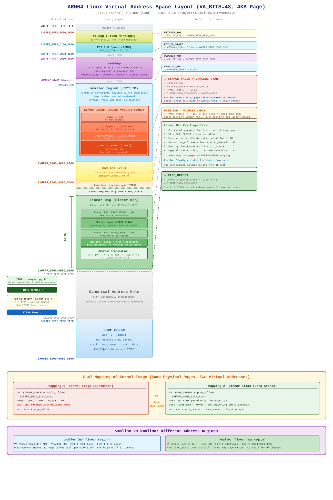

# ARM64 Linux 虚拟地址空间映射详解 (VA_BITS=48)

> 基于 linux-6.18 内核源码: `arch/arm64/include/asm/memory.h`, `arch/arm64/include/asm/pgtable.h`, `arch/arm64/mm/mmu.c`
>
> 虚拟地址空间布局图:
>
> 

---

## 1. 概述

ARM64 (AArch64) 架构使用 64 位虚拟地址空间，但硬件仅使用低位进行地址翻译。在 `VA_BITS=48`、4KB 页大小的配置下，可用虚拟地址范围为 2 x 256TB：

- **用户空间 (TTBR0)**: `0x0000_0000_0000_0000` ~ `0x0000_FFFF_FFFF_FFFF` (256 TB)
- **内核空间 (TTBR1)**: `0xFFFF_0000_0000_0000` ~ `0xFFFF_FFFF_FFFF_FFFF` (256 TB)
- **地址空洞 (Canonical Hole)**: `0x0001_0000_0000_0000` ~ `0xFFFE_FFFF_FFFF_FFFF` (硬件无法翻译)

硬件通过虚拟地址的 bit[55] 选择翻译表基地址寄存器：

| bit[55] | 寄存器 | 地址空间 |
|---------|--------|----------|
| 0 | TTBR0_EL1 | 用户空间 (每进程独立页表) |
| 1 | TTBR1_EL1 | 内核空间 (`swapper_pg_dir`) |

---

## 2. 内核虚拟地址空间布局

256TB 的内核地址空间 (TTBR1) 以 `PAGE_END` 为界，分为上下两半：

- **下半部** (`PAGE_OFFSET` ~ `PAGE_END`): **线性映射区** (direct map)，128 TB
- **上半部** (`PAGE_END` ~ `0xFFFF_FFFF_FFFF_FFFF`): **非线性映射区** (modules, vmalloc, 内核镜像, vmemmap, PCI I/O, fixmap)

### 2.1 地址区域总览表 (从高到低)

| 虚拟地址 | 宏定义 | 定义展开 | 区域说明 |
|----------|--------|----------|----------|
| `0xFFFF_FFFF_FFFF_FFFF` | — | — | 保护页 / 未使用 |
| `0xFFFF_FFFF_FF80_0000` | `FIXADDR_TOP` | `-UL(SZ_8M)` | **fixmap** (早期控制台, FDT) |
| `0xFFFF_FFFF_C180_0000` | `PCI_IO_END` | `PCI_IO_START + SZ_16M` | |
| `0xFFFF_FFFF_C080_0000` | `PCI_IO_START` | `VMEMMAP_END + SZ_8M` | **PCI I/O** (16MB) |
| | | | [保护间隔: 8MB] |
| `0xFFFF_FFFF_C000_0000` | `VMEMMAP_END` | `-UL(SZ_1G)` | **vmemmap** (struct page 数组) |
| (动态) | `VMEMMAP_START` | `VMEMMAP_END - VMEMMAP_SIZE` | |
| | | | [保护间隔: 8MB] |
| (动态) | `VMALLOC_END` | `VMEMMAP_START - SZ_8M` | **vmalloc 区** (~127 TB) |
| | | | 内核镜像位于此范围内 |
| `0xFFFF_8000_8000_0000` | `KIMAGE_VADDR` = `VMALLOC_START` | `MODULES_END` | |
| | | | **modules 模块区** (2GB) |
| `0xFFFF_8000_0000_0000` | `PAGE_END` = `MODULES_VADDR` | `-(1UL << 47)` | 分界线: 非线性区 / 线性区 |
| | | | **线性映射区** (128 TB) |
| `0xFFFF_0000_0000_0000` | `PAGE_OFFSET` | `-(1UL << 48)` | 内核地址空间起始 |

### 2.2 核心宏定义推导链

`arch/arm64/include/asm/memory.h` 中的核心定义：

```c
#define VA_BITS             (CONFIG_ARM64_VA_BITS)       // 48
#define _PAGE_OFFSET(va)    (-(UL(1) << (va)))           // -(1<<48) = 0xFFFF_0000_0000_0000
#define PAGE_OFFSET         (_PAGE_OFFSET(VA_BITS))
#define _PAGE_END(va)       (-(UL(1) << ((va) - 1)))     // -(1<<47) = 0xFFFF_8000_0000_0000
#define MODULES_VADDR       (_PAGE_END(VA_BITS_MIN))     // 0xFFFF_8000_0000_0000
#define MODULES_VSIZE       (SZ_2G)                      // 0x8000_0000
#define MODULES_END         (MODULES_VADDR + MODULES_VSIZE)  // 0xFFFF_8000_8000_0000
#define KIMAGE_VADDR        (MODULES_END)                // 0xFFFF_8000_8000_0000
```

`arch/arm64/include/asm/pgtable.h` 中的补充定义：

```c
#define VMALLOC_START       (MODULES_END)                // = KIMAGE_VADDR
#define VMALLOC_END         (VMEMMAP_START - SZ_8M)
```

---

## 3. 线性映射区 (Linear Map / Direct Map)

### 3.1 定义与作用

线性映射区是从 `PAGE_OFFSET` 开始、大小为 128TB 的连续虚拟地址区间，将**全部物理 RAM** 按固定偏移映射进来：

```c
// arch/arm64/include/asm/memory.h
#define __phys_to_virt(x)   ((unsigned long)((x) - PHYS_OFFSET) | PAGE_OFFSET)
#define __lm_to_phys(addr)  (((addr) - PAGE_OFFSET) + PHYS_OFFSET)
```

给定物理地址 `PA`，其线性映射虚拟地址为：

```
VA = (PA - PHYS_OFFSET) | PAGE_OFFSET
```

这是 `phys_to_virt()`、`virt_to_phys()`、`__va()`、`__pa()` 等函数的基础。

### 3.2 建立过程：`map_mem()`

线性映射在早期启动阶段由 `paging_init()` -> `map_mem(swapper_pg_dir)` 建立（位于 `arch/arm64/mm/mmu.c`）：

```c
void __init paging_init(void)
{
    map_mem(swapper_pg_dir);   // 建立线性映射
    memblock_allow_resize();
    create_idmap();            // 建立恒等映射
    declare_kernel_vmas();     // 注册内核 VMA
}
```

`map_mem()` 的执行分为以下步骤：

**第一步**：临时将内核镜像区域 `[_text, __init_begin)` 标记为 `NOMAP`：

```c
memblock_mark_nomap(kernel_start, kernel_end - kernel_start);
```

目的是防止通用循环为内核代码/只读数据段创建可写别名。

**第二步**：以 `PAGE_KERNEL | NX` 权限映射所有其他物理 RAM：

```c
for_each_mem_range(i, &start, &end) {
    __map_memblock(pgdp, start, end, pgprot_tagged(PAGE_KERNEL), flags);
}
```

`flags` 包含 `NO_EXEC_MAPPINGS` —— 线性映射区**永远不可执行**。

**第三步**：单独映射内核镜像区域，使用受控权限：

```c
__map_memblock(pgdp, kernel_start, kernel_end,
               PAGE_KERNEL, NO_CONT_MAPPINGS);
memblock_clear_nomap(kernel_start, kernel_end - kernel_start);
```

这创建了内核镜像的**线性别名**（详见第 4 节），初始为可写（用于 alternative patching 指令修补），后续收紧为只读。

**第四步**（启动后期）：`mark_linear_text_alias_ro()` 去除写权限：

```c
void __init mark_linear_text_alias_ro(void)
{
    update_mapping_prot(__pa_symbol(_text), (unsigned long)lm_alias(_text),
                        (unsigned long)__init_begin - (unsigned long)_text,
                        PAGE_KERNEL_RO);
}
```

### 3.3 线性映射区的重要性

- **页分配器 (buddy)**：返回的地址在线性映射区。`kmalloc()` 和 slab 分配器在此工作。
- **`phys_to_virt()` / `virt_to_phys()`**：仅适用于线性映射区地址。
- **休眠 / kexec**：通过线性别名以数据方式访问内核内存页。
- **DMA**：驱动通过 `virt_to_phys()` 获取 DMA 一致性缓冲区的物理地址。

---

## 4. 内核镜像的双重映射

这是 ARM64 内存布局中最重要的概念之一：内核镜像的物理页面拥有**两套不同的虚拟地址映射**，权限各不相同。

### 4.1 映射 1：执行映射（位于 `KIMAGE_VADDR` 附近）

由早期启动代码 `head.S` 创建。内核从这里执行代码。

| 属性 | 值 |
|------|-----|
| 虚拟地址 | `KIMAGE_VADDR + kaslr_offset`（约 `0xFFFF_8000_8xxx_xxxx`）|
| 转换公式 | `VA = PA + kimage_voffset` |
| `.text` 权限 | 只读 + 可执行 (`PAGE_KERNEL_ROX`) |
| `.rodata` 权限 | 只读 (`PAGE_KERNEL_RO`) |
| 用途 | **CPU 从这里取指令执行** |

### 4.2 映射 2：线性别名（位于 `PAGE_OFFSET` 区域）

由 `map_mem()` 创建。同一物理页在线性映射区再次出现。

| 属性 | 值 |
|------|-----|
| 虚拟地址 | `PAGE_OFFSET + 偏移`（约 `0xFFFF_0000_0xxx_xxxx`）|
| 转换公式 | `VA = (PA - PHYS_OFFSET) \| PAGE_OFFSET` |
| 权限 | 只读 + 不可执行 (`PAGE_KERNEL_RO`，`mark_linear_text_alias_ro()` 之后) |
| 用途 | **仅数据访问** —— 休眠、kexec、指令修补 (alternative patching) |

### 4.3 为什么需要两套映射？

当 `map_mem()` 把所有物理 RAM 映射到线性映射区时，内核镜像所在的物理页不可避免地也被包含在内。如果和普通 RAM 一样以 `PAGE_KERNEL`（可读写）权限映射，就会为只读的内核代码段创建一个**可写别名** —— 这是安全隐患（违反 W^X 策略）。

解决方案采用三阶段处理：

1. **跳过**：在通用 RAM 映射循环中，先用 `memblock_mark_nomap` 跳过内核镜像区域
2. **单独映射**：以 `PAGE_KERNEL` + `NO_CONT_MAPPINGS` 单独映射内核镜像（暂时允许写入，用于 alternative patching）
3. **收紧权限**：patching 完成后，`mark_linear_text_alias_ro()` 将权限收紧为 `PAGE_KERNEL_RO`

### 4.4 两套映射之间的地址转换

```c
// include/linux/mm.h
#define lm_alias(x)    __va(__pa_symbol(x))
```

给定一个内核符号地址（映射 1），`lm_alias()` 将其转换为线性映射地址（映射 2）：
1. `__pa_symbol(x)`：将内核镜像虚拟地址转为物理地址（使用 `kimage_voffset`）
2. `__va(pa)`：将物理地址转为线性映射虚拟地址（使用 `PAGE_OFFSET`）

举例（假设 `PHYS_OFFSET=0x4000_0000`，无 KASLR）：

```
_text 物理地址:         0x4100_0000

映射 1 (执行映射):      0xFFFF_8000_8100_0000  (= PA + kimage_voffset)
映射 2 (线性别名):      0xFFFF_0000_0100_0000  (= (PA - PHYS_OFFSET) | PAGE_OFFSET)

lm_alias(_text) = 0xFFFF_0000_0100_0000
```

两个虚拟地址之间的差距约为 128TB + 2GB，但指向**同一块物理内存**。

### 4.5 `__virt_to_phys()` 如何区分两种映射

```c
// arch/arm64/include/asm/memory.h
#define __virt_to_phys_nodebug(x) ({
    phys_addr_t __x = (phys_addr_t)(__tag_reset(x));
    __is_lm_address(__x) ? __lm_to_phys(__x) : __kimg_to_phys(__x);
})
```

内核通过 `__is_lm_address()` 判断虚拟地址属于哪套映射：
- 若在线性映射区范围（`PAGE_OFFSET` ~ `PAGE_END`）：用 `__lm_to_phys()`（减去 `PAGE_OFFSET`，加上 `PHYS_OFFSET`）
- 否则（内核镜像范围）：用 `__kimg_to_phys()`（减去 `kimage_voffset`）

---

## 5. vmalloc 与 kmalloc：不同的地址区间

### 5.1 vmalloc —— 非线性映射区

```c
// arch/arm64/include/asm/pgtable.h
#define VMALLOC_START   (MODULES_END)           // = 0xFFFF_8000_8000_0000
#define VMALLOC_END     (VMEMMAP_START - SZ_8M) // 接近 0xFFFF_FFFF_xxxx_xxxx
```

| 属性 | 说明 |
|------|------|
| 虚拟地址范围 | `0xFFFF_8000_8000_0000` ~ `VMEMMAP_START - 8MB`（约 127 TB）|
| 物理连续性 | **不要求** |
| 页表 | 每次分配按需创建 |
| 典型用途 | `vmalloc()`、`ioremap()`、`vmap()`、大块缓冲区 |

### 5.2 kmalloc —— 线性映射区

| 属性 | 说明 |
|------|------|
| 虚拟地址范围 | `PAGE_OFFSET` ~ `PAGE_END`（`0xFFFF_0000_xxxx` ~ `0xFFFF_8000_0000_0000`，128 TB）|
| 物理连续性 | **必须连续**（由 buddy 分配器保证）|
| 页表 | 启动时 `map_mem()` 已预建好，无需每次分配都建页表 |
| 典型用途 | `kmalloc()`、slab 对象、小型内核数据结构、DMA 缓冲区 |

### 5.3 对比总结

| | vmalloc | kmalloc |
|---|---------|---------|
| 地址区间 | 非线性区 (TTBR1 上半部) | 线性映射区 (TTBR1 下半部) |
| 物理页 | 可分散、不连续 | 必须物理连续 |
| 页表开销 | 每次分配都需建页表 | 零开销（使用预建的线性映射） |
| `virt_to_phys()` | **不可直接使用** | 可直接使用 |
| TLB 效率 | 可能较低（分散页面） | 较高（可使用 block/contiguous 映射） |
| 最大分配量 | 极大（TB 级虚拟地址空间） | 受限于连续空闲物理页 |

---

## 6. 其他关键区域

### 6.1 fixmap (固定映射区)

- **地址**：`0xFFFF_FFFF_FF80_0000` 附近 (`FIXADDR_TOP`)
- **用途**：编译时确定的固定虚拟地址，用于早期启动映射（FDT 设备树、早期控制台、临时 I/O 映射）。在完整的页分配器上线之前即可使用。

### 6.2 vmemmap

- **地址**：上界为 `0xFFFF_FFFF_C000_0000` (`VMEMMAP_END`)
- **用途**：`struct page` 的虚拟数组，服务于稀疏内存模型 (sparse memory model)。每个物理页帧都有对应的 `struct page`，可通过 `vmemmap[pfn]` 直接访问。

### 6.3 modules (模块加载区)

- **地址**：`0xFFFF_8000_0000_0000` ~ `0xFFFF_8000_8000_0000` (2GB)
- **用途**：可加载内核模块 (`.ko`) 的映射区域。2GB 范围确保模块可以使用直接跳转指令 (B/BL) 到达内核符号。

### 6.4 idmap (恒等映射)

不属于虚拟地址布局的一部分，但在上下文中很重要：

- 由 `paging_init()` 中的 `create_idmap()` 创建
- 映射 `VA == PA`（虚拟地址等于物理地址），仅覆盖一小段代码 (`__idmap_text_start` ~ `__idmap_text_end`)
- 用于开启/关闭 MMU、CPU 挂起/恢复、KPTI 页表切换等场景
- 存储在独立的页表 `idmap_pg_dir` 中，临时加载到 TTBR0

---

## 7. 启动流程：地址空间的建立过程

```
head.S (早期启动)
  |
  |-- 在 swapper_pg_dir 中创建初始内核镜像映射
  |   (将 _text ~ _end 映射到 KIMAGE_VADDR，可执行)
  |
  |-- 开启 MMU，跳转到 start_kernel()
  |
  v
paging_init()
  |
  |-- map_mem(swapper_pg_dir)
  |     |-- 将所有 RAM 映射到线性映射区 (PAGE_OFFSET 区域)
  |     |-- 对内核镜像线性别名做特殊处理
  |     '-- 映射 KFENCE 池 (如启用)
  |
  |-- memblock_allow_resize()
  |
  |-- create_idmap()
  |     '-- 在 idmap_pg_dir 中建立恒等映射
  |
  '-- declare_kernel_vmas()
        '-- 注册内核各段为早期 VMA
              (_text, _rodata, _init, _data)

  ... 启动后期 ...

mark_linear_text_alias_ro()
  '-- 将内核代码段的线性别名权限收紧为 PAGE_KERNEL_RO

mark_rodata_ro()
  '-- 将内核镜像映射中的 .rodata 段标记为只读
```

---

## 8. 总览图

完整的图形化布局请查看文档开头的 SVG 图，或直接打开 `image/arm64_va_space_48bit.svg`。

以下为 ASCII 文本版简图：

```
0xFFFF_FFFF_FFFF_FFFF  +-------------------------+
                       | 保护页                   |
0xFFFF_FFFF_FF80_0000  | fixmap 固定映射           |  FIXADDR_TOP
                       | PCI I/O (16MB)           |
0xFFFF_FFFF_C000_0000  | vmemmap                  |  VMEMMAP_END
                       | [保护间隔 8MB]            |
          (动态)       | vmalloc (~127TB)          |  VMALLOC_END
                       |   +-------------------+  |
                       |   | 内核镜像           |  |  (映射1: 执行映射)
                       |   | .text (只读+可执行) |  |
                       |   | .rodata (只读)     |  |
                       |   | .init (启动后释放)  |  |
                       |   | .data (可读写)     |  |
                       |   +-------------------+  |
0xFFFF_8000_8000_0000  | modules 模块区 (2GB)      |  KIMAGE_VADDR = VMALLOC_START
0xFFFF_8000_0000_0000  |===========================|  PAGE_END = MODULES_VADDR
                       | 线性映射区 (128TB)         |
                       |   普通 RAM (可读写, NX)    |
                       |   内核镜像线性别名         |  (映射2: 数据访问)
                       |     (只读, 不可执行)       |
                       |   kmalloc/slab 分配在此    |
0xFFFF_0000_0000_0000  +-------------------------+  PAGE_OFFSET
                       |                         |
                       |   地址空洞                |
                       |   (Canonical Hole)       |
                       |                         |
0x0000_FFFF_FFFF_FFFF  +-------------------------+
                       | 用户空间 (256TB)          |  TTBR0
0x0000_0000_0000_0000  +-------------------------+
```
