# Linux ARM64 虚拟内存管理学习指南

> 适用范围：Linux 6.18.1 / ARM64 / 当前工作区源码
>
> 文档目标：先聚焦 Linux ARM64 虚拟内存管理主线，再补充与 VM 强耦合的匿名页、page cache、页面回收、SLUB、rmap、KSM、Huge Page、页迁移、内存规整、OOM，以及它们与 buddy 和页表管理之间的关系。

---

## 目录

<details>
<summary><a href="#一句话先说清">一句话先说清</a></summary>

</details>

<details>
<summary><a href="#学习范围与边界">学习范围与边界</a></summary>

</details>

<details>
<summary><a href="#学习总图">学习总图</a></summary>

</details>

<details>
<summary><a href="#核心心智模型">核心心智模型</a></summary>

- [1. 硬件翻译层](#1-硬件翻译层)
- [2. 地址空间描述层](#2-地址空间描述层)
- [3. 页表维护层](#3-页表维护层)
- [4. 缺页与生命周期层](#4-缺页与生命周期层)

</details>

<details>
<summary><a href="#arm64-虚拟内存必须先懂的硬件知识">ARM64 虚拟内存必须先懂的硬件知识</a></summary>

- [1. TTBR0_EL1 和 TTBR1_EL1](#1-ttbr0_el1-和-ttbr1_el1)
- [2. TCR_EL1](#2-tcr_el1)
- [3. MAIR_EL1](#3-mair_el1)
- [4. 页表级数](#4-页表级数)
- [5. Data Abort / Instruction Abort](#5-data-abort--instruction-abort)

</details>

<details>
<summary><a href="#linux-里的地址空间对象模型">Linux 里的地址空间对象模型</a></summary>

- [1. mm_struct：一个进程的地址空间总控对象](#1-mm_struct一个进程的地址空间总控对象)
- [2. vm_area_struct：一段属性一致的虚拟地址区间](#2-vm_area_struct一段属性一致的虚拟地址区间)
- [3. Maple Tree：当前 VMA 主索引](#3-maple-tree当前-vma-主索引)
- [4. `shared.rb` 不是 VMA 主树](#4-sharedrb-不是-vma-主树)

</details>

<details>
<summary><a href="#arm64-用户虚拟地址空间怎么看">ARM64 用户虚拟地址空间怎么看</a></summary>

- [1. 用户地址空间](#1-用户地址空间)
- [2. 内核地址空间](#2-内核地址空间)
- [3. vmalloc：虚拟连续，但物理不一定连续](#3-vmalloc虚拟连续但物理不一定连续)

</details>

<details>
<summary><a href="#页表vm-的硬件落点">页表：VM 的硬件落点</a></summary>

- [1. 页表不是策略本身](#1-页表不是策略本身)
- [2. 用户页表最重要的几个对象](#2-用户页表最重要的几个对象)
- [3. 页表项里你最该关心什么](#3-页表项里你最该关心什么)
- [4. ARM64 常见 PTE 关键位速查](#4-arm64-常见-pte-关键位速查)
- [5. 把这些位翻译成直观语义](#5-把这些位翻译成直观语义)

</details>

<details>
<summary><a href="#malloc--kmalloc--mmap先分清谁在做决策">`malloc` / `kmalloc` / `mmap`：先分清谁在做决策</a></summary>

- [1. `kmalloc()`：内核小对象分配器](#1-kmalloc内核小对象分配器)
- [2. 用户态 `malloc()`：真正的策略层在 libc](#2-用户态-malloc真正的策略层在-libc)
- [3. `brk()`：扩展 heap VMA，而不是新建一个独立 mmap 区](#3-brk扩展-heap-vma而不是新建一个独立-mmap-区)
- [4. `mmap()`：真正的“建立用户映射”主路径](#4-mmap真正的建立用户映射主路径)
- [5. 一张总图：`malloc`、`brk`、`mmap`、`kmalloc`、`vmalloc`](#5-一张总图mallocbrkmmapkmallocvmalloc)

</details>

<details>
<summary><a href="#虚拟内存抽象出来的重要数据结构">虚拟内存抽象出来的重要数据结构</a></summary>

- [1. 一张总图：这些结构到底怎么连](#1-一张总图这些结构到底怎么连)
- [2. 重要数据结构总表](#2-重要数据结构总表)
- [3. `mm_struct`：进程用户地址空间的总控对象](#3-mm_struct进程用户地址空间的总控对象)
- [4. `maple_tree mm_mt`：当前 VMA 的主索引](#4-maple_tree-mm_mt当前-vma-的主索引)
- [5. `vm_area_struct`：一段属性一致的虚拟地址区间](#5-vm_area_struct一段属性一致的虚拟地址区间)
- [6. `anon_vma` 和 `anon_vma_chain`：匿名页世界里的“关系网络”](#6-anon_vma-和-anon_vma_chain匿名页世界里的关系网络)
- [7. `address_space`：文件页缓存和 file-backed 映射的总后端](#7-address_space文件页缓存和-file-backed-映射的总后端)
- [8. `vm_operations_struct`：VMA 的行为多态接口](#8-vm_operations_structvma-的行为多态接口)
- [9. `vm_fault`：一次缺页处理的现场包](#9-vm_fault一次缺页处理的现场包)
- [10. `folio / struct page`：最终承载内容的物理页抽象](#10-folio--struct-page最终承载内容的物理页抽象)
- [11. ARM64 视角还要多记一个：`mm_context_t`](#11-arm64-视角还要多记一个mm_context_t)
- [12. 内核 vmalloc 世界的对应结构：`vm_struct` 和 `vmap_area`](#12-内核-vmalloc-世界的对应结构vm_struct-和-vmap_area)
- [13. 一张关系总表：谁描述策略，谁描述后端，谁描述现场](#13-一张关系总表谁描述策略谁描述后端谁描述现场)
- [14. 最后的总记忆法](#14-最后的总记忆法)

</details>

<details>
<summary><a href="#这些关键结构在真实运行路径里如何协作">这些关键结构在真实运行路径里如何协作</a></summary>

- [1. 匿名缺页：`mm_struct -> VMA -> anon_vma -> folio/page -> PTE`](#1-匿名缺页mm_struct---vma---anon_vma---foliopage---pte)
- [2. 文件缺页：`VMA -> vm_file -> address_space -> i_pages -> folio/page`](#2-文件缺页vma---vm_file---address_space---i_pages---foliopage)
- [3. `munmap()`：先改地址空间形状，再拆 PTE 和页表，再销毁 VMA](#3-munmap先改地址空间形状再拆-pte-和页表再销毁-vma)
- [4. `fork()` 与 COW：先共享页并写保护，真正写入时再分裂](#4-fork-与-cow先共享页并写保护真正写入时再分裂)
- [5. 把四条路径并排对比](#5-把四条路径并排对比)

</details>

<details>
<summary><a href="#vma-管理mmap-这一层到底在干什么">VMA 管理：`mmap()` 这一层到底在干什么</a></summary>

- [1. `mmap()` 不是直接分配物理页](#1-mmap-不是直接分配物理页)
- [2. 你读 VMA 管理代码要看什么](#2-你读-vma-管理代码要看什么)
- [3. VMA 相关系统调用的学习顺序](#3-vma-相关系统调用的学习顺序)

</details>

<details>
<summary><a href="#arm64-缺页处理整条主线必须亲手走一遍">ARM64 缺页处理：整条主线必须亲手走一遍</a></summary>

- [1. 先给结论](#1-先给结论)
- [2. ARM64 入口](#2-arm64-入口)
- [3. 查找 VMA](#3-查找-vma)
- [4. `handle_mm_fault()` 的意义](#4-handle_mm_fault-的意义)
- [5. 一次用户态匿名页缺页的真实调用链](#5-一次用户态匿名页缺页的真实调用链)
- [6. 第一步：ARM64 捕获异常并进入 fault 路径](#6-第一步arm64-捕获异常并进入-fault-路径)
- [7. `do_mem_abort()` 不是最终处理者，而是总分发器](#7-do_mem_abort-不是最终处理者而是总分发器)
- [8. `do_page_fault()` 做的第一件大事不是分配页](#8-do_page_fault-做的第一件大事不是分配页)
- [9. 第二步：先找 VMA，再谈修 fault](#9-第二步先找-vma再谈修-fault)
- [10. 第三步：进入通用 MM 层](#10-第三步进入通用-mm-层)
- [11. 第四步：逐级走页表，直到 PTE 层](#11-第四步逐级走页表直到-pte-层)
- [12. 第五步：为什么会走到 `do_anonymous_page()`](#12-第五步为什么会走到-do_anonymous_page)
- [13. 第六步：`do_anonymous_page()` 到底干了什么](#13-第六步do_anonymous_page-到底干了什么)
- [12. 第七步：真正落地到页表的动作是什么](#12-第七步真正落地到页表的动作是什么)
- [13. 第八步：为什么这条路径能帮助你理解整个 VM](#13-第八步为什么这条路径能帮助你理解整个-vm)

</details>

<details>
<summary><a href="#匿名页和文件页为什么一定要分开学">匿名页和文件页：为什么一定要分开学</a></summary>

- [1. 匿名页](#1-匿名页)
- [2. 文件页](#2-文件页)
- [3. 你该看哪条文件缺页路径](#3-你该看哪条文件缺页路径)

</details>

<details>
<summary><a href="#fork-和-cow虚拟内存为什么比复制页表复杂得多">fork 和 COW：虚拟内存为什么比“复制页表”复杂得多</a></summary>

- [1. fork 的关键不是立刻复制所有页](#1-fork-的关键不是立刻复制所有页)
- [2. 你学习 COW 必须同时看三层](#2-你学习-cow-必须同时看三层)

</details>

<details>
<summary><a href="#mprotect--munmap--mremap映射关系怎么被改掉">`mprotect()` / `munmap()` / `mremap()`：映射关系怎么被改掉</a></summary>

- [1. `mprotect()`](#1-mprotect)
- [2. `munmap()`](#2-munmap)
- [3. `mremap()`](#3-mremap)

</details>

<details>
<summary><a href="#asidtlbtlb-shootdown不懂这个就不算真的懂-arm64-vm">ASID、TLB、TLB shootdown：不懂这个就不算真的懂 ARM64 VM</a></summary>

- [1. 为什么页表改了还不够](#1-为什么页表改了还不够)
- [2. ASID 到底是什么，为什么它能减少 flush](#2-asid-到底是什么为什么它能减少-flush)
- [3. TLB invalidation 在 ARM64 上到底怎么分层](#3-tlb-invalidation-在-arm64-上到底怎么分层)
- [4. TLB shootdown 为什么麻烦](#4-tlb-shootdown-为什么麻烦)
- [5. 把 ASID 和 TLB 放在一起理解](#5-把-asid-和-tlb-放在一起理解)

</details>

<details>
<summary><a href="#与-arm64-vm-强相关的内核地址空间主题">与 ARM64 VM 强相关的内核地址空间主题</a></summary>

- [1. linear map](#1-linear-map)
- [2. kernel image mapping](#2-kernel-image-mapping)
- [3. vmalloc](#3-vmalloc)
- [4. fixmap](#4-fixmap)
- [5. vmemmap](#5-vmemmap)

</details>

<details>
<summary><a href="#学-linux-arm64-vm-时必须会读的源码文件">学 Linux ARM64 VM 时必须会读的源码文件</a></summary>

- [第一批：对象定义](#第一批对象定义)
- [第二批：ARM64 fault 入口](#第二批arm64-fault-入口)
- [第三批：VMA 管理](#第三批vma-管理)
- [第四批：通用缺页与页表修改](#第四批通用缺页与页表修改)
- [第五批：文件映射与反向映射](#第五批文件映射与反向映射)

</details>

<details>
<summary><a href="#推荐学习顺序">推荐学习顺序</a></summary>

- [第 1 阶段：建立骨架](#第-1-阶段建立骨架)
- [第 2 阶段：跑通一次真实 fault](#第-2-阶段跑通一次真实-fault)
- [第 3 阶段：学地址空间修改](#第-3-阶段学地址空间修改)
- [第 4 阶段：补匿名页、文件页、COW](#第-4-阶段补匿名页文件页cow)

</details>

<details>
<summary><a href="#最容易踩的坑">最容易踩的坑</a></summary>

- [1. 把 VMA、页表、物理页混成一层](#1-把-vma页表物理页混成一层)
- [2. 只读 x86 资料，不补 ARM64 fault 入口](#2-只读-x86-资料不补-arm64-fault-入口)
- [3. 只学 `handle_mm_fault()`，不学 `mmap()`/`munmap()`](#3-只学-handle_mm_fault不学-mmapmunmap)
- [4. 看到 `rb_node` 就以为 VMA 还没换 Maple Tree](#4-看到-rb_node-就以为-vma-还没换-maple-tree)
- [5. 只背宏，不结合具体 fault 路径](#5-只背宏不结合具体-fault-路径)

</details>

<details>
<summary><a href="#面向当前工作区的练习建议">面向当前工作区的练习建议</a></summary>

- [练习 1：画一次匿名页读 fault 调用链](#练习-1画一次匿名页读-fault-调用链)
- [练习 2：对比匿名写 fault 和 COW fault](#练习-2对比匿名写-fault-和-cow-fault)
- [练习 3：对比 `mmap` 后未访问 与 已访问 的区别](#练习-3对比-mmap-后未访问-与-已访问-的区别)
- [练习 4：追踪 `munmap` 的页表拆除与 TLB flush](#练习-4追踪-munmap-的页表拆除与-tlb-flush)

</details>

<details>
<summary><a href="#你学会-arm64-vm-之后应该能回答的问题">你学会 ARM64 VM 之后，应该能回答的问题</a></summary>

</details>

<details>
<summary><a href="#最后的学习建议">最后的学习建议</a></summary>

</details>

<details>
<summary><a href="#进阶专题缺页之外的-vm-子系统全景">进阶专题：缺页之外的 VM 子系统全景</a></summary>

- [1. 匿名页面](#1-匿名页面)
- [2. Page Cache 和文件页](#2-page-cache-和文件页)
- [3. 页面回收](#3-页面回收)
- [4. SLAB / SLUB 与 VM 的关系](#4-slab--slub-与-vm-的关系)
- [5. 反向映射 rmap](#5-反向映射-rmap)
- [6. KSM](#6-ksm)
- [7. Huge Page / THP / HugeTLB](#7-huge-page--thp--hugetlb)
- [8. 页迁移](#8-页迁移)
- [9. 内存规整 compaction](#9-内存规整-compaction)
- [10. OOM](#10-oom)

</details>

<details>
<summary><a href="#vmbuddy-页面分配器页表管理之间的联系">VM、buddy 页面分配器、页表管理之间的联系</a></summary>

- [1. VM 和 buddy 页面分配器的联系](#1-vm-和-buddy-页面分配器的联系)
- [2. VM 和内核页表管理的联系](#2-vm-和内核页表管理的联系)
- [3. 把三者连成一条完整主线](#3-把三者连成一条完整主线)

</details>

---

## 一句话先说清

**Linux ARM64 虚拟内存管理的主线，就是把“CPU 的地址翻译硬件”与“内核维护的地址空间对象”接起来：硬件负责从 VA 走到页表，内核负责决定这段 VA 是否存在、权限是什么、缺页时该补什么页、何时拆映射与刷新 TLB。**

如果你先抓住这条主线，后面的 `mm_struct`、`vm_area_struct`、Maple Tree、页表、缺页异常、COW、`mmap()`、`munmap()`、TLB shootdown 都会自然归位。

---

## 学习范围与边界

这份文档只讨论 ARM64 虚拟内存管理的核心内容：

1. ARM64 地址翻译硬件与异常入口
2. Linux 进程地址空间对象模型
3. VMA 管理与 Maple Tree
4. 用户页表与页表项权限语义
5. 匿名页、文件页与缺页处理
6. fork/COW/mprotect/munmap 等会改映射关系的路径
7. ASID、TLB、TLB shootdown、页表释放
8. 内核虚拟地址空间布局中与 VM 强相关的区域

这份文档前半部分有意不展开：

1. memblock 初始化全过程
2. NUMA 和 memcg 的完整机制
3. 所有 reclaim policy 的调参细节
4. 所有 slab debug 选项与诊断接口

这些模块当然和 VM 有强联系，但它们不是 ARM64 虚拟内存的第一主线。为了不把主线打散，正文前半先把 fault、VMA、页表、TLB 讲清，再在文末补充这些“围绕 VM 旋转”的相邻子系统专题。

---

## 学习总图

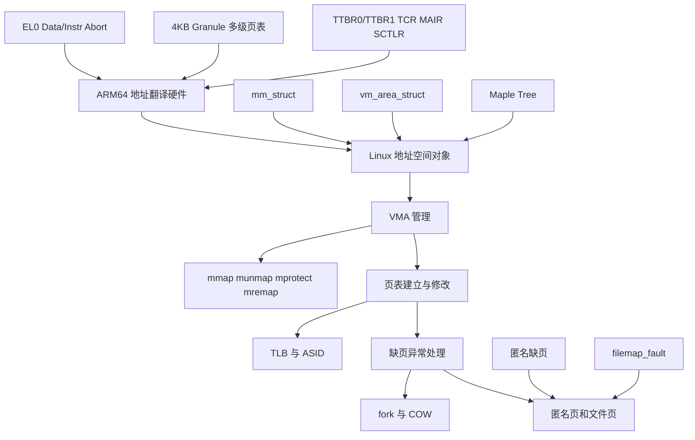

建议按这张图的顺序学习，不要一开始就扎进单个函数。

---

## 核心心智模型

把 ARM64 Linux VM 拆成下面四层：

### 1. 硬件翻译层

CPU 拿到虚拟地址后，使用 TTBR、TCR、MAIR、页表项权限位来完成地址翻译。

这层回答的是：

1. 这个 VA 属于 TTBR0 还是 TTBR1
2. 页表要走几级
3. 这一页是否可读、可写、可执行
4. 如果翻译失败，抛出哪类异常

### 2. 地址空间描述层

内核用 `mm_struct` 和 `vm_area_struct` 描述一个进程有哪些虚拟地址区间，以及这些区间应该具有什么属性。

这层回答的是：

1. 某个地址是否落在合法 VMA 中
2. 这段地址是匿名映射还是文件映射
3. 它是否允许写、执行、共享、增长栈等

### 3. 页表维护层

内核根据 VMA 策略，在真正访问时建立、修改或删除页表项。

这层回答的是：

1. 当前是否已经有 PTE/PMD 映射
2. 需要新建映射还是权限升级
3. 修改后如何与 TLB 一致

### 4. 缺页与生命周期层

当 CPU 因为页不存在、权限不对、COW 等原因触发异常时，Linux 进入 fault 路径处理。

这层回答的是：

1. 这是有效缺页还是非法访问
2. 该补零页、分配匿名页、读文件页、还是做 COW
3. 失败时返回 SIGSEGV、SIGBUS 还是 OOM

---

## ARM64 虚拟内存必须先懂的硬件知识

这一部分不是为了学体系结构考试，而是为了后面读 Linux fault 和页表代码时不迷路。

### 1. TTBR0_EL1 和 TTBR1_EL1

ARM64 EL1 下通常有两套翻译基址：

1. `TTBR0_EL1`：通常给用户地址空间
2. `TTBR1_EL1`：通常给内核地址空间

Linux 的直觉化理解是：

1. 用户态地址主要通过 `TTBR0_EL1` 翻译
2. 内核高地址主要通过 `TTBR1_EL1` 翻译

所以“切换进程地址空间”最核心的硬件动作之一，就是切换用户态那部分页表根；而内核全局映射一般保持在 TTBR1 侧。

#### Linux 不是只讲概念，它会先把每 CPU 的 MMU 状态准备好

这里要先补一句非常关键的话：

**“每个 CPU 都有独立的 MMU” 这件事，在 Linux 里不是一句抽象描述，而是每个 CPU 都必须亲自执行一遍 `__cpu_setup -> __enable_mmu -> 装入 VBAR/TTBR -> 运行中按需切换` 这条准备链。**

如果不把这条链补上，只看 `TTBR0_EL1` / `TTBR1_EL1` 的概念，很容易误以为“页表一建好，所有 CPU 自然就会用”。实际上不是这样。

#### 1.1 启动阶段：每个 CPU 先各自编程 MMU 寄存器，再打开 MMU

在 [arch/arm64/kernel/head.S](arch/arm64/kernel/head.S) 里，无论是 boot CPU 还是 secondary CPU，都会先走：

1. `__cpu_setup`
2. `__enable_mmu`
3. `__primary_switched()` / `__secondary_switched()`

对应关系是：

1. 主 CPU 在早期启动路径里调用 `__cpu_setup`，然后 `__enable_mmu`
2. 次级 CPU 在 `secondary_startup` 里也先调 `__cpu_setup`，再调 `__enable_mmu`
3. MMU 打开后，才进入 `__primary_switched()` / `__secondary_switched()`，再继续装 `VBAR_EL1` 等运行时状态

这一步说明的不是“有一台机器有一个 MMU 配置”，而是：

**每个 CPU 上电进入内核后，都要自己把本地翻译硬件寄存器准备好。**

#### 1.2 `__cpu_setup` 做的是“给这个 CPU 的 MMU 写规则”

`__cpu_setup` 在 [arch/arm64/mm/proc.S](arch/arm64/mm/proc.S) 里，它做的事情本质上是给“当前这个 CPU”的本地翻译硬件编程。

最关键的动作有：

1. `tlbi vmalle1`：先清本地 TLB 状态
2. `msr mair_el1, mair`：写当前 CPU 的内存属性编码
3. `msr tcr_el1, tcr`：写当前 CPU 的翻译规则
4. 必要时写 `tcr2_el1`
5. 最后返回要写入 `SCTLR_EL1` 的默认值

也就是说，`__cpu_setup` 还没有真正“切进某个进程页表”，它先做的是：

1. 定义这个 CPU 之后要按什么规则翻译地址
2. 定义页表 walk 的 cache/shareability 语义
3. 定义 VA 范围、ASID 行为、TBI 等全局翻译策略

#### 1.3 `__enable_mmu` 做的是“给这个 CPU 装上页表根并真正开 MMU”

`__enable_mmu` 在 [arch/arm64/kernel/head.S](arch/arm64/kernel/head.S) 里，关键动作是：

1. `msr ttbr0_el1, x2`
2. `load_ttbr1 x1, x1, x3`
3. `set_sctlr_el1 x0`

这三步可以直接理解成：

1. 给当前 CPU 装 TTBR0 侧页表根
2. 给当前 CPU 装 TTBR1 侧页表根
3. 置位 `SCTLR_EL1` 里的 MMU 开关，让这个 CPU 开始按页表翻译地址

所以“每 CPU 独立 MMU”的最硬核体现就在这里：

**CPU0 打开 MMU，不会自动替 CPU1 把 `TTBRx_EL1`、`TCR_EL1`、`SCTLR_EL1` 写好；CPU1 必须自己走一遍同样的初始化路径。**

#### 1.4 MMU 打开后，Linux 还会继续给这个 CPU 补齐异常入口环境

只打开 MMU 还不够。MMU 打开后，Linux 还会在：

1. `__primary_switched()`
2. `__secondary_switched()`

里继续设置：

1. `VBAR_EL1`
2. 当前 task/per-CPU 偏移等运行时环境

这一步和 `entry.S` 直接相关，因为没有 `VBAR_EL1 -> vectors` 这条链，这个 CPU 之后连异常入口都接不住。

所以顺序应该这样记：

1. 先有 `__cpu_setup`：翻译规则就位
2. 再有 `__enable_mmu`：MMU 开启，TTBR 生效
3. 再有 `VBAR_EL1 = vectors`：异常入口就位
4. 最后这个 CPU 才进入正常内核执行状态

#### 1.5 运行阶段：每个 CPU 还会各自切换自己的 TTBR/ASID

启动完成后，“每 CPU 独立 MMU”还会继续体现在运行时上下文切换里。

Linux ARM64 的关键函数是 [arch/arm64/mm/context.c](arch/arm64/mm/context.c) 里的 `cpu_do_switch_mm()`：

1. 读取当前 CPU 的 `ttbr1_el1`
2. 计算新 `asid`
3. 组装新的 `ttbr0`
4. 把 ASID 写入 `ttbr1_el1`
5. 把新页表根写入 `ttbr0_el1`

这说明：

1. 进程切换不是“系统里某个全局 MMU 被切换”
2. 而是“当前正在跑这个任务的那个 CPU，把它自己的 TTBR/ASID 改成新上下文”

如果另一个 CPU 还在运行别的任务，它的 `TTBR0_EL1` 可以完全不同。

#### 1.6 `entry.S` 不是最初初始化 MMU，但它持续消费这套每 CPU 状态

你刚才指出的缺口是对的：如果只讲 `TTBR0/TTBR1` 和 TLB，不把 `entry.S` 放进来，这条链是不闭合的。

`entry.S` 虽然不负责最初的 `__cpu_setup` / `__enable_mmu`，但它持续依赖并操作每 CPU 的运行时 MMU 相关状态。例如：

1. 入口/返回路径依赖已经设置好的 `VBAR_EL1`
2. `kernel_entry` / `kernel_exit` 处理异常前后寄存器现场
3. `__swpan_entry_el0` / `__swpan_exit_el0` 在 SW PAN 场景下处理 TTBR0 访问开关
4. KPTI/trampoline 场景下，返回 EL0 前会重新装当前 CPU 的向量表基址

也就是说，`entry.S` 的角色不是“第一次把 MMU 打开”，而是：

**在这个 CPU 已经拥有自己 MMU 上下文之后，负责在异常进入/退出时正确使用和切换这套本地硬件状态。**

#### 1.7 一张总图：每 CPU 独立 MMU 的完整准备链

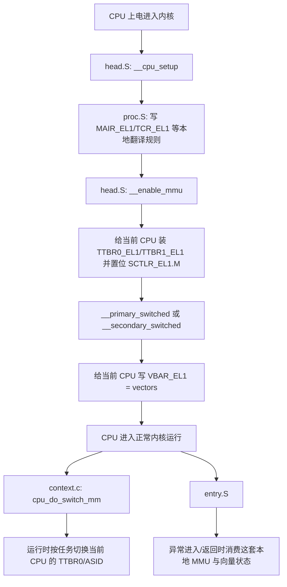

如果把这张图看懂，“每个 CPU 都有独立 MMU”就不会再抽象了。它真正指的是：

1. 每个 CPU 各自写自己的 `TCR_EL1/TTBRx_EL1/SCTLR_EL1/VBAR_EL1`
2. 每个 CPU 各自维护自己的 TLB
3. 每个 CPU 各自做 page walk
4. 但它们又可以共享同一份页表内存和同一份内核映射内容

所以正确理解不是“每个 CPU 有一套互相隔离的虚拟内存宇宙”，而是：

**每个 CPU 有自己独立的翻译硬件现场，但这些现场可以指向相同或不同的页表对象。**

### 2. TCR_EL1

`TCR_EL1` 决定翻译规则，最常见要点：

1. 虚拟地址大小
2. 页粒度，例如 4KB granule
3. cacheability / shareability
4. 物理地址位宽

你读 ARM64 内核 VM 时，要把 `VA_BITS`、`PAGE_SHIFT`、`CONFIG_PGTABLE_LEVELS` 和 TCR 联系起来看。

#### Linux 在启动时是怎么设置 TCR_EL1 的

ARM64 Linux 启动阶段会在 [arch/arm64/mm/proc.S](arch/arm64/mm/proc.S) 里拼出默认 `TCR_EL1` 值：

```asm
mov_q tcr, TCR_T0SZ(IDMAP_VA_BITS) | TCR_T1SZ(VA_BITS_MIN) | TCR_CACHE_FLAGS | \
           TCR_SHARED | TCR_TG_FLAGS | TCR_KASLR_FLAGS | TCR_ASID16 | \
           TCR_TBI0 | TCR_A1 | TCR_KASAN_SW_FLAGS | TCR_MTE_FLAGS
```

这行很重要，因为它把 ARM64 Linux VM 的几个核心假设一次性全写进硬件寄存器了。

#### 先抓最重要的字段

1. `T0SZ` / `T1SZ`

Linux 宏定义在 [arch/arm64/include/asm/pgtable-hwdef.h](arch/arm64/include/asm/pgtable-hwdef.h)：

```c
#define TCR_T0SZ(x) ((UL(64) - (x)) << TCR_T0SZ_OFFSET)
#define TCR_T1SZ(x) ((UL(64) - (x)) << TCR_T1SZ_OFFSET)
```

这里的关键不是死记位偏移，而是理解它表达的语义：

1. `x` 表示地址有效位数
2. `TxSZ = 64 - x`
3. 所以 Linux 代码里如果写 `TCR_T1SZ(VA_BITS)`，本质上是在告诉 CPU：`TTBR1` 这侧的虚拟地址空间有多少有效位

直观理解：

1. `T0SZ` 主要控制 `TTBR0_EL1` 侧，也就是用户地址翻译范围
2. `T1SZ` 主要控制 `TTBR1_EL1` 侧，也就是内核地址翻译范围

2. `TG0` / `TG1`

页粒度大小。Linux 在 [arch/arm64/mm/proc.S](arch/arm64/mm/proc.S) 里用 `TCR_TG_FLAGS` 统一选择：

1. 4KB pages：`TCR_TG0_4K | TCR_TG1_4K`
2. 16KB pages：`TCR_TG0_16K | TCR_TG1_16K`
3. 64KB pages：`TCR_TG0_64K | TCR_TG1_64K`

这会直接影响：

1. 单页大小
2. 页表层级
3. 每级索引位数

3. `IRGNx` / `ORGNx`

这两组位定义页表遍历本身的 cacheability，不是普通数据页的 AttrIndx。Linux 用：

1. `TCR_IRGN_WBWA`
2. `TCR_ORGN_WBWA`

并在 [arch/arm64/mm/proc.S](arch/arm64/mm/proc.S) 里组合成 `TCR_CACHE_FLAGS`，注释就是：

1. `PTWs cacheable, inner/outer WBWA`

这句话的意思是：

1. CPU 在走页表时，也要读页表页
2. Linux 希望这些页表遍历访问本身是可缓存的
3. 这样页表 walk 不至于性能太差

4. `SH0` / `SH1`

shareability。Linux 用 `TCR_SHARED`，在 [arch/arm64/include/asm/pgtable-hwdef.h](arch/arm64/include/asm/pgtable-hwdef.h) 里定义为：

1. `TCR_SH0_INNER | TCR_SH1_INNER`

直观含义：

1. 两侧翻译都按 Inner Shareable 处理
2. 多核系统里缓存一致性和页表可见性依赖这类属性协同工作

5. `IPS`

物理地址位宽。Linux 在 [arch/arm64/mm/proc.S](arch/arm64/mm/proc.S) 里根据 CPU 能力动态计算并写入 `TCR_EL1.IPS`。

你可以把它理解成：

1. 告诉硬件 stage-1 翻译最终能产生多宽的物理地址
2. 它必须和当前 CPU 支持的 PA range 匹配

6. `ASID16`

Linux 打开 `TCR_ASID16`，表示使用 16-bit ASID。它和后面的 TLB/上下文切换强相关，核心收益是：

1. 可以让更多地址空间上下文共存于 TLB
2. 降低频繁全量 TLB flush 的压力

这里还要顺手抓住 `TCR_A1` 的含义，因为它直接决定“查 TLB 时当前 ASID 从哪里来”：

1. Linux 把 `TCR_A1` 置 1
2. 这意味着 EL1 stage-1 翻译使用的 ASID 取自 `TTBR1_EL1` 的 ASID 字段
3. 它不改变“用户 VA 主要走 `TTBR0_EL1`、内核 VA 主要走 `TTBR1_EL1`”这件事
4. 它只决定“本次翻译和 TLB 匹配要带哪个 TTBR 中的 ASID”

所以不要把下面两件事混在一起：

1. `TTBR0` / `TTBR1` 解决的是“页表 walk 从哪棵树开始”
2. `TCR_A1` 解决的是“当前翻译使用哪个 TTBR 中携带的 ASID”

7. `TBI0` / `TBI1` / `TBIDx`

Top Byte Ignore。它控制地址高字节是否参与地址翻译。Linux 在 KASAN/MTE/Tagged Address ABI 场景下很依赖这些位。

直观理解：

1. 高字节可以被拿来装 tag
2. CPU 做地址翻译时可选择忽略它
3. 这就是为什么 ARM64 会有“带 tag 的指针仍能访问正常地址”的机制基础

8. `HA` / `HD`

硬件 Access Flag / Dirty 管理相关位。Linux 在 [arch/arm64/mm/proc.S](arch/arm64/mm/proc.S) 里会根据 CPU 能力决定是否打开 `TCR_HA`。

这背后的语义是：

1. 某些 CPU 可以帮内核自动更新访问位
2. 减少部分软件 fault/页表写回开销

#### 学 TCR_EL1 时最该抓住的结论

`TCR_EL1` 不是“页表内容”，它是“CPU 要如何解释这棵页表”的总开关。页表里存的是条目，而 `TCR_EL1` 决定：

1. 这些条目该按几级来走
2. 走出来的地址多宽
3. 表遍历是否缓存
4. 高位 tag 是否忽略
5. ASID 怎样参与上下文隔离

### 3. MAIR_EL1

`MAIR_EL1` 决定内存属性索引背后的真实语义，例如：

1. Normal memory
2. Device memory
3. Normal Non-Cacheable

Linux 页表项里不是直接写“这是设备内存”，而是写 AttrIndx，再由 MAIR 解释。

#### MAIR_EL1 到底在干什么

你可以把 `MAIR_EL1` 理解成一张“内存属性字典表”：

1. 页表项里只放一个小索引 `AttrIndx`
2. `MAIR_EL1` 里按槽位保存这个索引对应的真实属性编码
3. CPU 最终根据索引去查 `MAIR_EL1`

所以：

1. 页表项回答的是“我用哪个属性槽”
2. `MAIR_EL1` 回答的是“这个槽具体表示什么内存类型”

#### Linux 在 ARM64 上的默认 MAIR_EL1

Linux 在 [arch/arm64/mm/proc.S](arch/arm64/mm/proc.S) 里定义了：

```c
#define MAIR_EL1_SET                                                    \
    (MAIR_ATTRIDX(MAIR_ATTR_DEVICE_nGnRnE, MT_DEVICE_nGnRnE) |          \
     MAIR_ATTRIDX(MAIR_ATTR_DEVICE_nGnRE, MT_DEVICE_nGnRE) |            \
     MAIR_ATTRIDX(MAIR_ATTR_NORMAL_NC, MT_NORMAL_NC) |                  \
     MAIR_ATTRIDX(MAIR_ATTR_NORMAL, MT_NORMAL) |                        \
     MAIR_ATTRIDX(MAIR_ATTR_NORMAL, MT_NORMAL_TAGGED))
```

而索引定义在 [arch/arm64/include/asm/memory.h](arch/arm64/include/asm/memory.h)：

1. `MT_NORMAL = 0`
2. `MT_NORMAL_TAGGED = 1`
3. `MT_NORMAL_NC = 2`
4. `MT_DEVICE_nGnRnE = 3`
5. `MT_DEVICE_nGnRE = 4`

属性编码定义在 [arch/arm64/include/asm/sysreg.h](arch/arm64/include/asm/sysreg.h)：

1. `MAIR_ATTR_NORMAL = 0xff`
2. `MAIR_ATTR_NORMAL_NC = 0x44`
3. `MAIR_ATTR_DEVICE_nGnRnE = 0x00`
4. `MAIR_ATTR_DEVICE_nGnRE = 0x04`

#### 这些名字各自是什么意思

1. `Normal`

普通缓存内存。绝大多数内核线性映射、用户普通内存、page cache 都属于这一类。

2. `Normal_NC`

普通非缓存内存。它还是“正常内存语义”，但不走普通缓存策略。

3. `Device_nGnRnE`

设备内存，严格顺序，含义是：

1. non-Gathering
2. non-Reordering
3. no Early write acknowledgement

这是最强约束的设备类型。

4. `Device_nGnRE`

也是设备内存，但比 `nGnRnE` 略宽松，允许 Early write acknowledgement。

5. `Normal_Tagged`

与 MTE/tagged pointer 相关。Linux 启动早期先按 Normal memory 放，后续如果硬件支持 MTE，再切换到 tagged 语义。

#### MAIR 和页表项是怎么接起来的

连接点是 `PTE_ATTRINDX()`，定义在 [arch/arm64/include/asm/pgtable-hwdef.h](arch/arm64/include/asm/pgtable-hwdef.h)。

也就是说：

1. 页表项里存 `AttrIndx`
2. `AttrIndx(MT_NORMAL)` 表示“去 MAIR 里找 Normal 那个槽”
3. `AttrIndx(MT_DEVICE_nGnRnE)` 表示“去 MAIR 里找设备内存槽”

Linux 里很直观的例子在 [arch/arm64/include/asm/pgtable-prot.h](arch/arm64/include/asm/pgtable-prot.h)：

1. `PROT_NORMAL = ... | PTE_ATTRINDX(MT_NORMAL)`
2. `PROT_DEVICE_nGnRnE = ... | PTE_ATTRINDX(MT_DEVICE_nGnRnE)`

所以真正的完整链条是：

1. `pgprot_t` 选择某个 `MT_xxx`
2. 宏把它编码进 PTE 的 `AttrIndx`
3. CPU 再通过 `MAIR_EL1` 把这个索引翻译成真实内存属性

#### 学 MAIR_EL1 时最该抓住的结论

**页表项里不是直接写“缓存/设备/非缓存”的全文，而是写一个索引；`MAIR_EL1` 才是这组索引对应含义的总字典。**

### 4. 页表级数

ARM64 的页表级数受虚拟地址位数和页大小影响。你在 4KB granule 下最常见的是：

1. PGD
2. P4D
3. PUD
4. PMD
5. PTE

但不是每次都真的有独立 5 级，取决于配置和宏折叠。

学习时要记住：

1. Linux 通用 MM 用统一抽象层名
2. ARM64 实际层数由配置决定
3. 折叠层不代表概念消失，只是代码层面复用

### 5. Data Abort / Instruction Abort

当翻译失败或者权限检查失败时，ARM64 会产生内存访问异常。对 Linux VM 最重要的是：

1. 用户读写触发的数据异常
2. 指令取值触发的执行异常
3. 权限 fault 与 translation fault 的区别

ARM64 用户态缺页主入口可以从这里开始读：

1. [arch/arm64/kernel/entry-common.c](arch/arm64/kernel/entry-common.c)
2. [arch/arm64/mm/fault.c](arch/arm64/mm/fault.c)

---

## Linux 里的地址空间对象模型

这一部分是整个 VM 学习的“骨架”。

### 1. mm_struct：一个进程的地址空间总控对象

`mm_struct` 是进程用户地址空间的总对象，定义在 [include/linux/mm_types.h](include/linux/mm_types.h#L944)。

你至少要先认识这些成员：

1. `mm_mt`：当前 VMA 主索引，Maple Tree
2. `pgd`：用户页表根
3. `mmap_lock`：地址空间修改与查找的重要锁
4. `map_count`：VMA 数量
5. `page_table_lock`：部分页表和计数保护
6. `mmap_base` / `task_size`：用户地址空间布局关键参数

最关键的理解：

**`mm_struct` 是“这个进程拥有怎样的用户虚拟地址空间”的内核状态总和。**

### 2. vm_area_struct：一段属性一致的虚拟地址区间

`vm_area_struct` 定义在 [include/linux/mm_types.h](include/linux/mm_types.h#L813)。

一个 VMA 表示一段连续的地址区间 `[vm_start, vm_end)`，这段区间内部的访问属性和来源是一致的。

最重要成员：

1. `vm_start` / `vm_end`
2. `vm_mm`
3. `vm_page_prot`
4. `vm_flags`
5. `vm_file`
6. `vm_pgoff`
7. `anon_vma`
8. `vm_ops`

最关键的理解：

**VMA 不是页表，也不是物理页，它是“这段地址应该怎么被对待”的策略描述。**

### 3. Maple Tree：当前 VMA 主索引

`mm_struct` 里现在是 `struct maple_tree mm_mt;`，见 [include/linux/mm_types.h](include/linux/mm_types.h#L961)。

你要明确三件事：

1. 现在 VMA 主索引是 Maple Tree，不是历史上的 `mm_rb`
2. Maple Tree 很适合管理不重叠地址区间
3. `VMA_ITERATOR` / `vma_iter_init()` 是当前 VMA 遍历入口之一，见 [include/linux/mm_types.h](include/linux/mm_types.h#L1352)

### 4. `shared.rb` 不是 VMA 主树

`vm_area_struct` 里仍然还有：

```c
struct {
        struct rb_node rb;
        unsigned long rb_subtree_last;
} shared;
```

这不是旧的 VMA 主树残留，而是文件映射反向查询用的 `i_mmap interval tree` 节点。它服务的是“一个文件页范围被哪些 VMA 映射”，不是“一个进程有哪些 VMA”。

相关代码：

1. [mm/interval_tree.c](mm/interval_tree.c)
2. [mm/vma.c](mm/vma.c)

---

## ARM64 用户虚拟地址空间怎么看

学习 ARM64 VM 时，不要只盯着用户态。你需要同时分清用户地址和内核地址。

### 1. 用户地址空间

用户地址空间主要受这些因素控制：

1. `task_size`
2. `mmap_base`
3. 栈增长方向与 guard gap
4. 随机化布局

典型组成：

1. text/code
2. data/bss
3. heap/brk
4. mmap 区
5. stack
6. vdso/vvar

这些区间在内核里都会表现为一个或多个 VMA。

### 2. 内核地址空间

ARM64 学习 VM 时，必须把下面几块区分开：

1. linear map
2. kernel image mapping
3. vmalloc area
4. modules area
5. fixmap
6. vmemmap

你之前如果已经在研究 ARM64 地址转换，这一点尤其关键：

1. 线性映射地址转换和用户页表 fault 不是一回事
2. 内核镜像地址转换也不是用户 VMA 机制的一部分
3. 但它们都属于“ARM64 虚拟地址空间布局”的大图

### 3. vmalloc：虚拟连续，但物理不一定连续

`vmalloc` 是理解“内核虚拟地址空间”和“普通用户缺页路径不是一回事”最好的例子之一。

先说最关键的结论：

**`vmalloc` 不是去拿一块物理连续大内存，而是先保留一段内核虚拟地址，再从 buddy allocator 拿很多普通物理页，最后把这些页逐页映射进去。**

所以它提供的是：

1. 虚拟地址连续
2. 物理页可以离散

这和 `kmalloc` 很不一样。`kmalloc` 更偏向直接拿物理上连续、或者至少由 slab/buddy 直接组织好的对象；`vmalloc` 则明显更依赖页表来“拼接”地址空间。

#### `vmalloc()` 主调用链

如果只看最典型的 `vmalloc(size)`，主路径可以先压成下面这条链：

```text
vmalloc(size)
-> vmalloc_noprof(size)
-> __vmalloc_node_noprof(size, 1, GFP_KERNEL, NUMA_NO_NODE, caller)
-> __vmalloc_node_range_noprof(...)
    -> __get_vm_area_node(...)
    -> __vmalloc_area_node(...)
        -> vm_area_alloc_pages(...)
            -> alloc_pages_*() / alloc_pages_bulk_*()
        -> vmap_pages_range(...)
            -> vmap_range_noflush(...)
-> 返回一段 vmalloc 区间里的虚拟地址
```

最值得先盯住的关键函数点是：

1. [mm/vmalloc.c](mm/vmalloc.c) `vmalloc_noprof()`：`vmalloc()` 宏展开后的公开实现入口。
2. [mm/vmalloc.c](mm/vmalloc.c) `__vmalloc_noprof()`：带 `gfp_mask` 的通用入口。
3. [mm/vmalloc.c](mm/vmalloc.c) `__vmalloc_node_noprof()`：把默认参数补齐后转到 range 接口。
4. [mm/vmalloc.c](mm/vmalloc.c) `__vmalloc_node_range_noprof()`：vmalloc 主调度函数。
5. [mm/vmalloc.c](mm/vmalloc.c) `__get_vm_area_node()`：先在 vmalloc 地址空间里保留虚拟区间。
6. [mm/vmalloc.c](mm/vmalloc.c) `__vmalloc_area_node()`：真正分配物理页并建立页表映射。
7. [mm/vmalloc.c](mm/vmalloc.c) `vm_area_alloc_pages()`：真正向底层页分配器要页。
8. [mm/vmalloc.c](mm/vmalloc.c) `vmap_pages_range()`：把这些物理页装入 vmalloc 页表。

#### vmalloc 区间管理：查找 / 插入 / 合并

如果你只盯着 `vmalloc()` 返回一段地址，很容易把重点放错。真正决定它“从哪段虚拟地址拿空间”的，不是 buddy，而是 `mm/vmalloc.c` 里对 `vmap_area` 的管理。

这里最关键的结论是：

**`vmalloc` 先在 free tree 里找一段合适的虚拟区，分配成功后再把该区间插入 busy tree；释放时从 busy tree 摘掉，再插回 free tree，并尽量和前后相邻空闲区合并。**

可以把它理解成两套索引：

1. free tree：记录“哪些 vmalloc 虚拟区间还空着”，根是 `free_vmap_area_root`
2. busy tree：记录“哪些 vmalloc 虚拟区间已经被占用”，每个 `vmap_node` 都有自己的 `busy.root`

##### 涉及到的核心算法

如果只从算法视角看，`vmalloc` 区间管理其实是下面几种算法叠在一起：

1. **按起始地址排序的红黑树**：`vmap_area` 以 `va_start` 为键组织成 rb-tree，保证查找、插入、删除的基本复杂度是 $O(\log n)$。
2. **地址有序双向链表**：每个 `vmap_area` 同时挂在有序链表里，便于在释放时用 `prev/next` 做相邻块合并，邻居检查接近 $O(1)$。
3. **增强红黑树（augmented rb-tree）**：free tree 的每个节点维护 `subtree_max_size`，表示“以这个节点为根的子树里，最大的可用空闲区间有多大”。这使得分配时能快速剪枝。
4. **最低地址优先 first-fit**：`find_vmap_lowest_match()` 不是 best-fit，而是“在满足大小和对齐的前提下，尽量找最低地址的第一块”。
5. **区间切分算法**：`classify_va_fit_type()` + `va_clip()` 会把命中的 free range 分成 `FL/LE/RE/NE` 四种情况，对应整块拿走、左切、右切、中间切开。
6. **相邻区间合并算法**：`__merge_or_add_vmap_area()` 通过 `prev/next sibling` 判断首尾是否相接，如果相接就原地扩展区间，避免 free tree 碎片化。
7. **按地址点查找算法**：busy tree 上的 `__find_vmap_area()` 是标准的区间点查询，判断条件是 `addr < va_start`、`addr >= va_end` 或命中 `[va_start, va_end)`。
8. **增量传播算法**：`augment_tree_propagate_from()` 不会每次全树重算，而是从修改点向上更新 `subtree_max_size`，直到父节点不再变化为止。

把它们合在一起理解，可以得到一个最重要的工程结论：

**free tree 负责“找空位 + 剪枝 + 切分 + 合并”，busy tree 负责“按地址精确定位已分配区间”。**

##### `find_vmap_lowest_match()` 伪代码

如果把源码逻辑压成伪代码，`find_vmap_lowest_match()` 大致可以写成下面这样：

```text
input:
  root      = free_vmap_area_root
  size      = 请求大小
  align     = 对齐要求
  vstart    = 允许搜索的最低起点
  length    = size 或 size + align - 1

node = root

while node != NULL:
    va = node_to_vmap_area(node)

    if left_subtree.max_size >= length and vstart < va.va_start:
        node = node.left
        continue

    if is_within_this_va(va, size, align, vstart):
        return va

    if right_subtree.max_size >= length:
        node = node.right
        continue

    while parent(node) != NULL:
        node = parent(node)
        va = node_to_vmap_area(node)

        if is_within_this_va(va, size, align, vstart):
            return va

        if right_subtree(node).max_size >= length and vstart <= va.va_start:
            vstart = va.va_start + 1
            node = node.right
            break

return NULL
```

这里最容易忽略的两点是：

1. 它不是单纯的“左边不行就右边”，中间还有一次**向上回溯**。
2. 回溯时会更新 `vstart = parent->va_start + 1`，避免重新钻回已经确认失败的子树。

所以这段代码的搜索模式更准确地说是：

**带增强信息剪枝的 lowest-fit 搜索 + 必要时的父链回溯。**

##### `subtree_max_size` 的定义与更新公式

free tree 每个节点维护的不是“自己这块有多大”这么简单，而是：

$$
subtree\_max\_size(va)=\max\Big(va\_size(va),\ subtree\_max\_size(left),\ subtree\_max\_size(right)\Big)
$$

这正是源码里 `compute_subtree_max_size()` 做的事情。

它的意义是：

1. 当前节点自己的空闲区可能很小。
2. 但左子树或右子树里可能藏着更大的 hole。
3. 所以父节点需要一个“这整棵子树里最大 hole 有多大”的摘要值，才能决定是否继续搜索。

##### Mermaid 动态图：`subtree_max_size` 更新传播

下面这张图专门表达 `augment_tree_propagate_from()` 的增量传播过程。重点不是“从叶子一路无脑更新到根”，而是“更新到父节点值不再变化就停”。

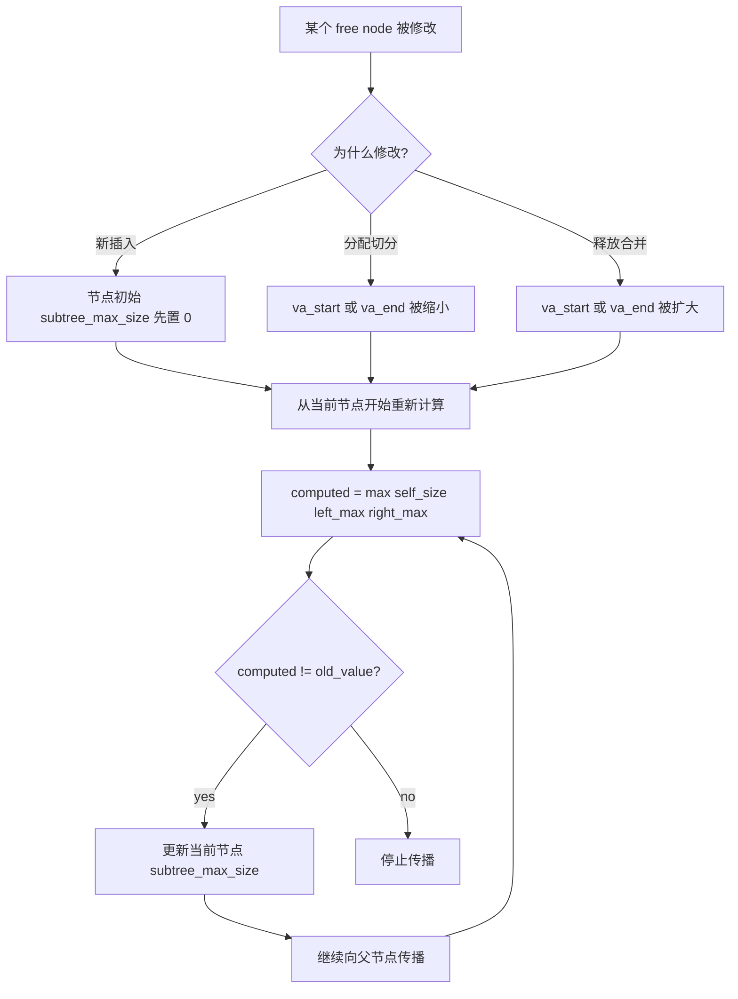

这个算法的关键收益是：

1. 插入、缩小、合并都只影响从当前节点到根路径上的一小段节点。
2. 不需要每次扫描整棵 tree。
3. 所以增强信息维护仍然保持在 $O(\log n)$ 量级。

##### Mermaid 动态图：三个典型更新场景

把 `augment_tree_propagate_from()` 放到具体场景里，可以看到它为什么能提前停止：

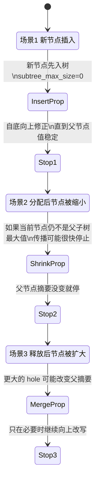

这也解释了源码注释里的那个意思：

1. 如果你缩小了一个节点，但它本来就不是父节点摘要值的来源，父节点可能根本不用变。
2. 如果你扩大了一个节点，并且它变成了更大的 hole，父链上的 `subtree_max_size` 才会继续向上传播。

##### `find_va_links()` 的算法作用

前面的图都默认“已经知道往哪插”，但真正找插入点的函数是 `find_va_links()`。

它做的其实是两件事：

1. 按 `va_start/va_end` 在 rb-tree 中做标准二叉搜索，找未来的 `parent + link`。
2. 在搜索过程中顺便做**区间重叠检查**：

```text
if new.va_end <= cur.va_start:
    go left
else if new.va_start >= cur.va_end:
    go right
else:
    overlap bug
```

所以 `find_va_links()` 不只是“找插入位置”，它还是区间正确性的第一道防线：

1. 左边条件保证新区间完全落在当前节点左侧。
2. 右边条件保证新区间完全落在当前节点右侧。
3. 其余情况就是区间重叠，源码会 `WARN()`。

##### 复杂度总结

把这些算法合在一起，`vmalloc` 区间管理的复杂度可以总结成：

1. free tree 查找：平均/典型 $O(\log n)$。
2. busy tree 按地址定位：平均/典型 $O(\log n)$。
3. 插入 / 删除 rb-tree：$O(\log n)$。
4. 相邻合并判断：借助有序链表，邻居访问接近 $O(1)$。
5. `subtree_max_size` 传播：沿父链更新，典型 $O(\log n)$。

所以它不是“一个单一算法”，而是一组互相配合的数据结构与增量维护策略。

##### `va_clip()` 四种切分分支的逐帧理解

前面已经说了 `FL/LE/RE/NE` 四种 fit type，但如果不把每一种切分前后画出来，读源码时还是很容易混。可以把 `va_clip()` 理解成：

**给定一个命中的 free range `va=[va_start, va_end)`，把其中一段 `NVA=[nva_start_addr, nva_start_addr + size)` 切出去，然后决定 free tree 里剩下什么。**

##### Mermaid 动态图：`FL_FIT_TYPE`

`FL_FIT_TYPE` 表示新分配区间正好等于整个 free node。

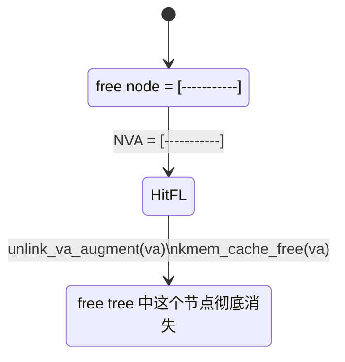

这时算法动作最简单：

1. 不保留左残块。
2. 不保留右残块。
3. 直接把这个 free node 从 free tree 删掉。

##### Mermaid 动态图：`LE_FIT_TYPE`

`LE_FIT_TYPE` 表示命中的是 free node 左边，右边还有剩余空间。

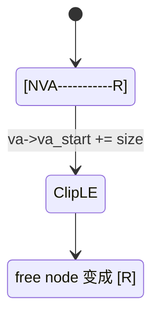

这里的核心是：

1. 原 free node 没被删除。
2. 只是把 `va_start` 向右推进到 `nva_start_addr + size`。
3. 也就是说“右残块”复用了原来的 `va` 对象。

##### Mermaid 动态图：`RE_FIT_TYPE`

`RE_FIT_TYPE` 表示命中的是 free node 右边，左边还有剩余空间。

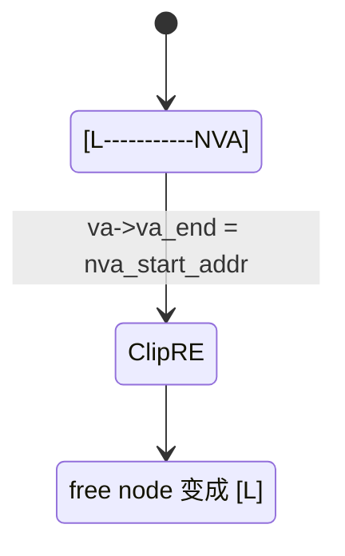

这里和 `LE_FIT_TYPE` 对称：

1. 原 free node 同样没被删。
2. 只是把 `va_end` 收缩到 `nva_start_addr`。
3. 这时留下的是“左残块”。

##### Mermaid 动态图：`NE_FIT_TYPE`

`NE_FIT_TYPE` 最关键，因为它会把一个 free node 一切为二。

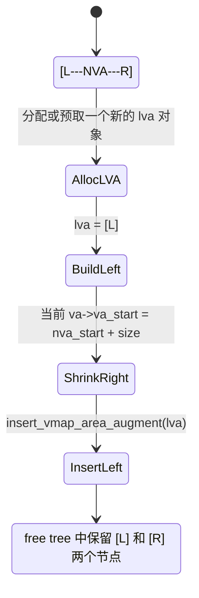

这也是 `va_clip()` 里唯一需要**额外分配一个 `vmap_area` 元数据对象**的场景，因为：

1. 右残块继续复用原 `va`。
2. 左残块必须由一个新的 `lva` 表示。
3. 所以源码会优先从 `ne_fit_preload_node` 拿一个预留对象，拿不到才 `kmem_cache_alloc(..., GFP_NOWAIT)`。

##### 四种切分的统一抽象

把四种情况统一起来，你可以记成下面这张表：

| fit type | NVA 位置 | free tree 剩余节点数 | 是否需要新 `vmap_area` |
|---|---|---:|---|
| `FL_FIT_TYPE` | 整块 | 0 | 否 |
| `LE_FIT_TYPE` | 左侧 | 1 个右残块 | 否 |
| `RE_FIT_TYPE` | 右侧 | 1 个左残块 | 否 |
| `NE_FIT_TYPE` | 中间 | 2 个残块 | 是 |

这张表背后的工程意义是：

1. `NE_FIT_TYPE` 是最贵的切分情况。
2. 所以源码专门为它准备了 `ne_fit_preload_node`，避免在关键路径上临时分配失败。

##### `__merge_or_add_vmap_area()` 的三种合并路径

释放回 free tree 时，`__merge_or_add_vmap_area()` 会先找到“如果要插入，这个节点应该放哪”，然后只检查**前后两个相邻 sibling**，不会去全树扫描。

它实际有三种分支：

1. 只和右邻居合并。
2. 只和左邻居合并。
3. 同时和左右邻居都合并。

##### Mermaid 动态图：只和右邻居合并

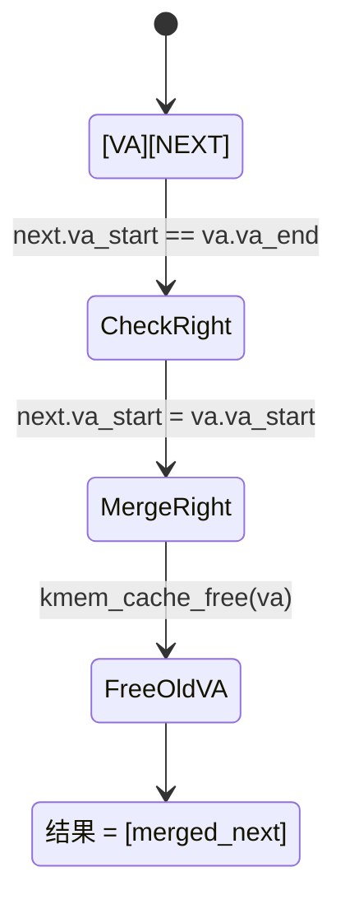

这里的关键点是：

1. 不是把 `next` 搬出来新建节点。
2. 而是直接把右邻居的 `va_start` 往左扩展。
3. 然后把当前 `va` 元数据对象释放掉。

##### Mermaid 动态图：只和左邻居合并

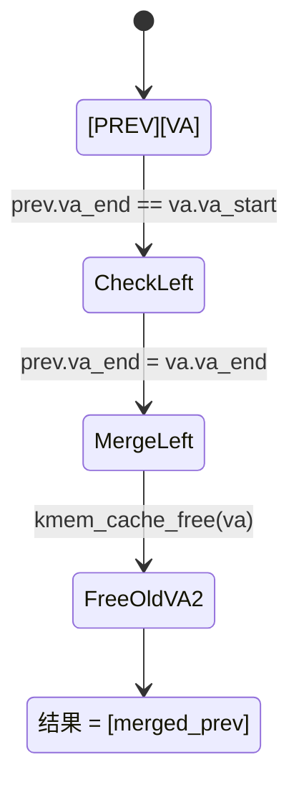

这里和右合并对称：

1. 左邻居直接扩到更大的 `va_end`。
2. 当前 `va` 被释放。

##### Mermaid 动态图：同时和左右邻居都合并

这条路径最值得单独讲，因为源码里有一个不太直观的顺序要求。

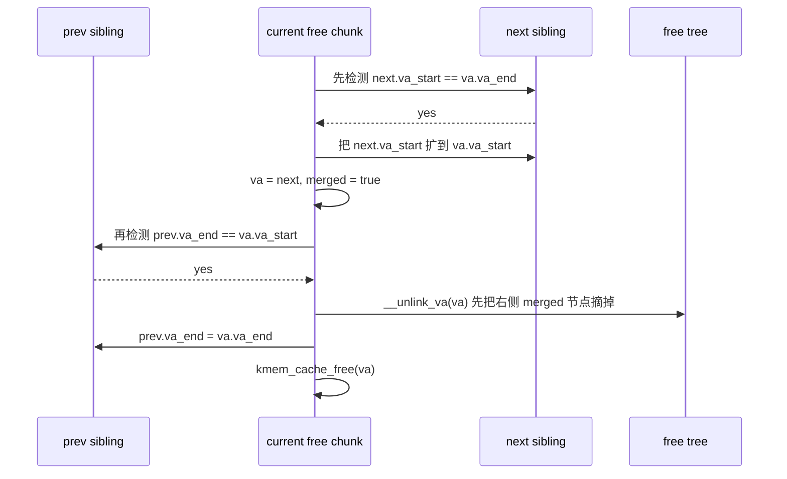

这里源码为什么强调“先 unlink 右邻居，再并到左邻居”，原因是：

1. 第一阶段如果先和右边并，当前代表 merged 结果的节点其实变成了“右邻居那个对象”。
2. 第二阶段如果又要和左边并，最终保留下来的应该是左邻居对象。
3. 所以必须先把那个“右邻居版本的 merged 节点”从 tree 里摘掉，再把左邻居扩展成最终结果。
4. 否则增强树在旋转或传播时，可能经历一个中间不一致状态。

这就是源码注释里那句“otherwise the tree might not be fully populated”的实际含义。

##### Mermaid 动态图：释放合并的完整决策树

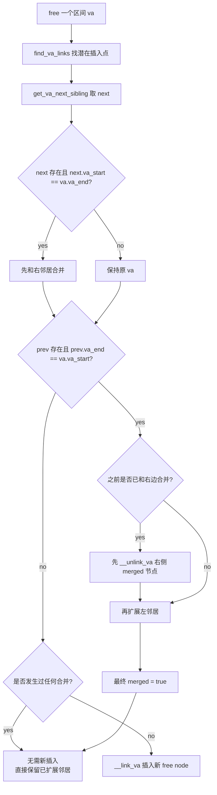

##### 一个容易忽略的实现点

`__merge_or_add_vmap_area()` 做合并时，本质上是在复用“相邻已存在 free node”的元数据对象，而不是总保留当前释放出来的 `va`。这也是为什么源码里会反复出现：

1. 修改 sibling 的 `va_start/va_end`
2. `kmem_cache_free(vmap_area_cachep, va)`
3. `va = sibling`

换句话说，**逻辑上的“合并结果”并不一定继续由最初那个 `va` 结构体承载。**

##### Mermaid 动态图：查找算法

下面这张图对应 `find_vmap_lowest_match()` 的动态过程。关键不是“遍历整棵树”，而是借助 `subtree_max_size` 跳过不可能成功的子树。

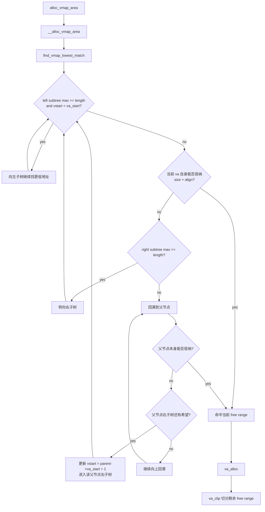

这里的算法要点是：

1. `subtree_max_size` 相当于“这棵子树值得不值得继续搜索”的摘要信息。
2. 左子树优先，保证最终返回的是**最低地址**可用区间。
3. 对齐会改变真正可用起点，所以搜索时有时要用 `size + align - 1` 估算最坏情况。

##### Mermaid 动态图：切分算法

命中某个 free range 之后，并不是总把整个节点拿走。`va_clip()` 的四种切分形态如下：

```mermaid
flowchart LR
    A[命中一个 free range] --> B{classify_va_fit_type}
    B -->|FL_FIT_TYPE| C[整块完全匹配\nunlink free node]
    B -->|LE_FIT_TYPE| D[左边命中\nva_start += size]
    B -->|RE_FIT_TYPE| E[右边命中\nva_end = nva_start]
    B -->|NE_FIT_TYPE| F[中间命中\n构造左残块 lva\n当前 va 缩成右残块]
    C --> G[返回新分配区间]
    D --> H[augment_tree_propagate_from]
    E --> H
    F --> I[insert_vmap_area_augment(lva)]
    I --> H
    H --> G
```

这一步的算法意义很大：

1. `vmalloc` 分配的是“虚拟地址子区间”，不是整个 free node 对象。
2. 所以真正被分配走的是 `[nva_start_addr, nva_start_addr + size)`。
3. 剩余的左边或右边区间必须继续留在 free tree 中，供下一次分配使用。

##### Mermaid 动态图：插入与增量维护

插入本身并不复杂，复杂的是插入后要同时维护两份有序结构，以及 free tree 的增强信息。

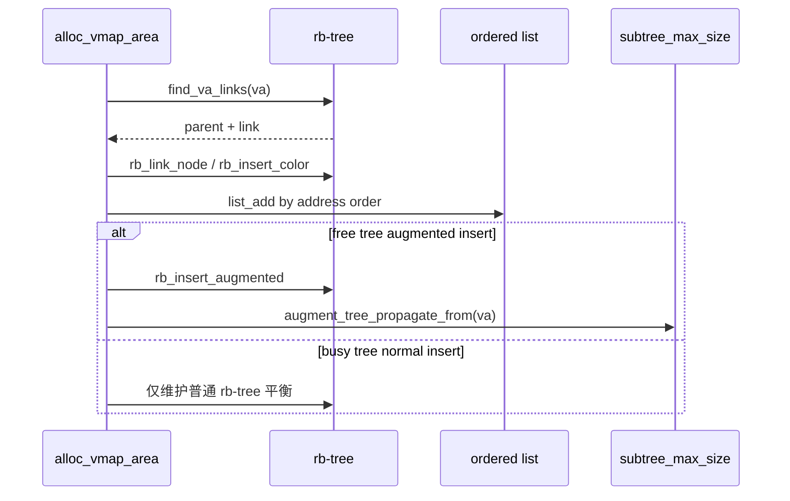

这里要特别区分两种插入：

1. **插入 busy tree**：目标是“以后能按地址找到这个已分配区间”，普通 rb-tree 就够了。
2. **插入 free tree**：目标是“以后能快速知道这棵子树里有没有足够大的空洞”，所以要维护 `subtree_max_size`。

##### Mermaid 动态图：释放与合并算法

释放侧最关键的不是 `vfree()` 本身，而是“摘 busy tree -> 回插 free tree -> 检查相邻区间是否可以合并”的动态过程：

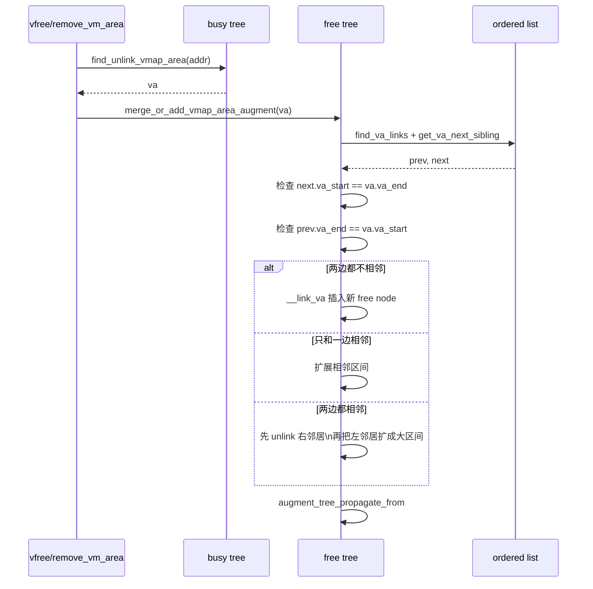

这个算法设计里最值得注意的是：

1. 相邻检测依赖的是**地址有序链表**，不是整棵 rb-tree 扫描。
2. 两边都能合并时，源码特意先处理右边，再并到左边，避免增强树在旋转过程中出现不完整状态。
3. 所以“红黑树负责全局有序和 $O(\log n)$ 定位，链表负责局部邻接和 $O(1)$ 邻居访问”。

##### Mermaid 动态图：A/B/C 案例演进

把前面的算法放到具体案例里，动态变化如下：

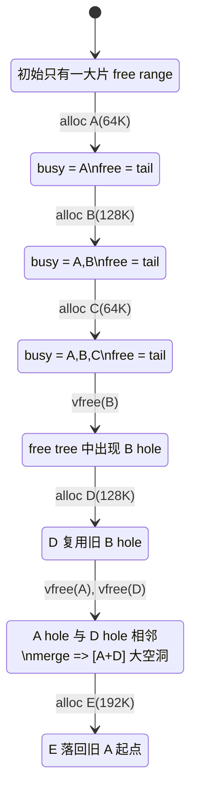

这个案例同时体现了四个算法动作：

1. `B` 被释放后回插 free tree。
2. `D` 再分配时，`find_vmap_lowest_match()` 命中旧 `B` 区间。
3. `A` 和 `D` 释放后，`__merge_or_add_vmap_area()` 把两个相邻 hole 合并。
4. `E` 最终证明这个合并结果又能被 first-fit 命中。

##### 1. 查找：从 free tree 里找最低满足请求的区间

主路径在：

1. [mm/vmalloc.c](mm/vmalloc.c) `alloc_vmap_area()`
2. [mm/vmalloc.c](mm/vmalloc.c) `__alloc_vmap_area()`
3. [mm/vmalloc.c](mm/vmalloc.c) `find_vmap_lowest_match()`

`find_vmap_lowest_match()` 的策略不是“随便找到一个就行”，而是：

1. 利用 augmented rb-tree 上保存的 `subtree_max_size`
2. 优先往左走，尽量找**最低地址**且满足 `size + align` 要求的 free range
3. 找到后再交给 `va_alloc()` / `va_clip()` 把该 free range 切走一块

这意味着 `vmalloc` 的虚拟地址选择策略更接近：

**最低地址优先的 first fit，而不是随机挑一块。**

##### 2. 插入：分配成功后插入 busy tree

一旦 free tree 里挑中了一块区间，`alloc_vmap_area()` 会把结果写回 `va->va_start/va->va_end`，然后执行：

1. [mm/vmalloc.c](mm/vmalloc.c) `insert_vmap_area()`

这里插入的是当前 node 的 `busy.root` 和 `busy.head`，表示：

1. 这段虚拟地址已经不再空闲
2. 后续 `find_vm_area()` / `remove_vm_area()` / `vfree()` 都会先从 busy tree 里按地址查到它

按地址查找 busy 区间的核心函数是：

1. [mm/vmalloc.c](mm/vmalloc.c) `__find_vmap_area()`
2. [mm/vmalloc.c](mm/vmalloc.c) `find_vmap_area()`
3. [mm/vmalloc.c](mm/vmalloc.c) `find_unlink_vmap_area()`

也就是说：

1. 分配时，free tree 负责“找空位”
2. 使用和释放时，busy tree 负责“按地址找到已占用区间”

##### 3. 合并：释放后回插 free tree，并尝试和前后邻居合并

释放侧的关键路径是：

1. [mm/vmalloc.c](mm/vmalloc.c) `vfree()`
2. [mm/vmalloc.c](mm/vmalloc.c) `remove_vm_area()`
3. [mm/vmalloc.c](mm/vmalloc.c) `free_vmap_area()`
4. [mm/vmalloc.c](mm/vmalloc.c) `merge_or_add_vmap_area_augment()`
5. [mm/vmalloc.c](mm/vmalloc.c) `__merge_or_add_vmap_area()`

`__merge_or_add_vmap_area()` 做的事情非常直接：

1. 先看 next sibling 是否满足 `sibling->va_start == va->va_end`
2. 再看 prev sibling 是否满足 `sibling->va_end == va->va_start`
3. 如果相邻，就直接把区间拼大，而不是新建一个碎片 free node
4. 只有前后都合不上的时候，才把这个 free 区间单独插回 free tree

这就是 vmalloc 能维持虚拟地址空间碎片相对可控的核心机制之一。

##### 4. 分割：一块 free 区间不一定整块拿走

即使找到了合适的 free range，也不代表整个区间都会被消耗掉。`va_clip()` 会按四种情况切分：

1. `FL_FIT_TYPE`：完全匹配，整个 free node 被拿走
2. `LE_FIT_TYPE`：命中左边，留下右半段 free range
3. `RE_FIT_TYPE`：命中右边，留下左半段 free range
4. `NE_FIT_TYPE`：命中中间，free range 被一分为二，左半和右半都保留

所以从工程视角看，vmalloc 的虚拟地址管理本质上是：

1. 在 free tree 里查找
2. 对 free range 做切分
3. 把结果插入 busy tree
4. 释放时再反向回插并合并

##### 对应案例

可以用一个最小案例把这三种动作串起来：

1. 分配 `A=64K`、`B=128K`、`C=64K`
2. `vfree(B)`
3. 再分配 `D=128K`
4. `vfree(A)`，再 `vfree(D)`
5. 最后分配 `E=192K`

这个案例里，你应该期待看到：

1. `D` 复用旧 `B` 的起始地址：体现 free tree 查找到了最低可用旧区间
2. `A` 和 `D` 释放后合并：否则 `E=192K` 无法在原 `A+B` 的位置放下
3. `E` 重新落在旧 `A` 的起始地址：体现相邻 free 区间被合并后再次被 first-fit 命中

##### 对应 QEMU 实验

仓库里现成的模块目录已经补了这个实验：

1. [kmodules/mem_allocator_lab/mem_allocator_lab.c](kmodules/mem_allocator_lab/mem_allocator_lab.c)
2. [kmodules/mem_allocator_lab/README.md](kmodules/mem_allocator_lab/README.md)

在当前仓库里可以这样跑：

1. 主机侧构建模块

```bash
ARCH=arm64 LLVM=/repo/ybzhang/kernel/rootfs/bin/ \
make -C /repo/ybzhang/kernel/linux-6.18.1 \
    M=$PWD/kmodules/mem_allocator_lab modules
```

2. 启动 QEMU

```bash
./launch.sh arm64 run
```

3. 来宾机里打开 vmalloc tracepoint

```bash
mount -t tracefs nodev /sys/kernel/tracing
echo 1 > /sys/kernel/tracing/events/vmalloc/alloc_vmap_area/enable
echo 1 > /sys/kernel/tracing/events/vmalloc/free_vmap_area_noflush/enable
echo 1 > /sys/kernel/tracing/events/vmalloc/purge_vmap_area_lazy/enable
cat /sys/kernel/tracing/trace_pipe
```

4. 加载实验模块

```bash
insmod /mnt/mem_allocator_lab/mem_allocator_lab.ko \
    vmalloc_base_kb=64 page_order=2 kmalloc_bytes=96 cache_bytes=128 cache_objects=8
dmesg | grep mem_allocator_lab
```

你重点看两行：

1. `reuse_check reused_old_B=1`
2. `merge_check reused_old_A=1`

如果这两个都成立，那么你就把 `find_vmap_lowest_match()`、`insert_vmap_area()`、`merge_or_add_vmap_area_augment()` 这三步用实际地址变化串起来了。

#### 第一步：先保留虚拟地址，而不是先分配物理页

这一步发生在：

1. [mm/vmalloc.c](mm/vmalloc.c) `__get_vm_area_node()`

这里的核心动作是：

1. 在 vmalloc 地址空间范围里找一段满足大小和对齐要求的虚拟地址
2. 创建 `vm_struct` / `vmap_area` 之类的描述对象
3. 把这段地址标记成已占用，避免和别的 vmalloc/vmap 区间冲突

这一阶段还没有真正的数据页，因此你可以把它理解成：

**先在“内核虚拟地址地图”上圈下一块地。**

#### 第二步：分配物理页

真正拿物理页发生在：

1. [mm/vmalloc.c](mm/vmalloc.c) `__vmalloc_area_node()`
2. [mm/vmalloc.c](mm/vmalloc.c) `vm_area_alloc_pages()`

`__vmalloc_area_node()` 会先给 `area->pages` 分配一个数组，用来保存每个 `PAGE_SIZE` 粒度对应的 `struct page *`。

然后 `vm_area_alloc_pages()` 才真正去拿页。它的策略大致是：

1. order-0 时优先尝试 bulk 分配
2. bulk 不够时回退到逐页 `alloc_pages_*()`
3. 如果尝试高阶页，会在需要时 `split_page()`，把它重新按小页视角交给 vmalloc 管理

也就是说，vmalloc 对底层 physical pages 的要求是：

1. 不需要整体连续
2. 只要能拼出足够数量的小页就行
3. 大页只是优化，不是语义前提

这一步和 buddy allocator 的关系非常直接：

**`vmalloc` 最后拿到的物理页，本质上还是由 buddy allocator 供应的。**

#### 第三步：建立 vmalloc 页表映射

拿到物理页之后，内核还不能直接使用这段地址，因为现在只有：

1. 一段保留好的虚拟地址范围
2. 一组离散的 `struct page *`

把两者接起来的关键函数是：

1. [mm/vmalloc.c](mm/vmalloc.c) `vmap_pages_range()`
2. [mm/vmalloc.c](mm/vmalloc.c) `vmap_pages_range_noflush()`
3. [mm/vmalloc.c](mm/vmalloc.c) `vmap_range_noflush()`

它做的事情本质上就是：

1. 遍历 `area->pages[]`
2. 取出每个 page 对应的物理地址
3. 在 vmalloc 这段虚拟区间里逐页建立页表映射
4. 最后做 `flush_cache_vmap()` 一类必要同步

所以 `vmalloc` 的关键工程语义是：

1. 虚拟地址连续由 vmap/vmalloc 层保证
2. 物理页来源由页分配器保证
3. 两者靠页表映射拼起来

#### 为什么 `vmalloc` 适合大块内存

它适合大块内存，根本原因不是“它更强”，而是“它不要求物理连续”。

当系统已经碎片化时：

1. 要一大块物理连续内存会很难
2. 但要很多离散小页通常仍然可行
3. `vmalloc` 就可以用页表把这些离散页拼成一段连续虚拟区间

代价也很明确：

1. 页表更多
2. TLB / page walk 开销更高
3. 不能假设物理连续，因此很多 DMA 场景不能直接用它

#### 和 ARM64 的关系

在 ARM64 上，`vmalloc` 这条链和用户缺页路径不同，但同样依赖页表管理与 TLB 一致性：

1. vmalloc 建的是内核虚拟地址空间的页表映射，不是用户 `mm_struct` 里的 VMA fault 映射
2. 最终仍要通过 ARM64 页表层级把 VA 映射到离散物理页
3. 页表建立后仍要遵守 cache / TLB 一致性要求
4. `HAVE_ARCH_HUGE_VMALLOC`、`contpte`、ARM64 页粒度和页表级数都会影响 vmalloc 的映射效率

你可以把 `vmalloc` 记成一句最准确的话：

**它是“内核地址空间里的 vmap 型分配器”，核心不是拿连续物理内存，而是管理一段内核虚拟区间并为它安装页表。**

---

## 页表：VM 的硬件落点

### 1. 页表不是策略本身

一个最常见误区是把页表当成 VM 的全部。

实际上：

1. VMA 描述“应该怎样”
2. 页表记录“当前已经怎样”

例如一个匿名可写 VMA：

1. 它可以存在但尚未建立任何 PTE
2. 第一次访问时才通过缺页分配页并填入 PTE
3. fork 后它仍然是可写 VMA，但页表可能暂时被降成只读以支持 COW

### 2. 用户页表最重要的几个对象

学习 Linux VM 时，至少要知道这些抽象层名：

1. `pgd_t`
2. `p4d_t`
3. `pud_t`
4. `pmd_t`
5. `pte_t`

以及两个重要概念：

1. 页表页本身也需要内核管理
2. 页表页现在有 `ptdesc` 抽象，定义在 [include/linux/mm_types.h](include/linux/mm_types.h#L522)

### 3. 页表项里你最该关心什么

学习 ARM64 VM，优先抓这些语义位，而不是一上来背所有 bit layout：

1. valid / present
2. writable
3. executable / PXN / UXN
4. accessed / dirty 相关语义
5. user accessible
6. shareable / memory attribute
7. huge mapping 还是普通页映射

### 4. ARM64 常见 PTE 关键位速查

如果你只想先建立读代码的直觉，最值得优先记住的是下面这些位。定义可以直接看 [arch/arm64/include/asm/pgtable-hwdef.h](arch/arm64/include/asm/pgtable-hwdef.h) 和 [arch/arm64/include/asm/pgtable.h](arch/arm64/include/asm/pgtable.h)。

1. `PTE_VALID`

表示这个 PTE 对硬件来说是否是有效映射。没有它，CPU 走到这里通常会触发 translation fault。

2. `PTE_USER`

表示用户态是否可访问。用户态映射通常需要它；纯内核映射通常不会带它。

3. `PTE_RDONLY`

表示硬件视角的只读限制。注意它和 Linux 软件语义里的“这个 VMA 将来可不可写”不是一回事，因为 COW 场景下 VMA 可以允许写，但当前 PTE 仍可能故意只读。

4. `PTE_AF`

Access Flag，表示这页已经被访问过。某些 CPU 能硬件更新它，Linux 也会在 fault 与回收路径里关注它。

5. `PTE_DBM`

Dirty Bit Management 相关位。ARM64 上 Linux 还把它复用为 `PTE_WRITE` 软件语义位，所以你在代码里会看到：

1. `pte_write(pte)` 实际检查的是 `PTE_WRITE`
2. `PTE_WRITE` 在头文件里又等同于 `PTE_DBM`

这正说明 Linux 软件层和 ARM64 硬件位语义是交织在一起使用的。

6. `PTE_PXN`

Privileged Execute-Never。置位时，特权态不能从这页取指执行。

7. `PTE_UXN`

User Execute-Never。置位时，用户态不能从这页取指执行。

8. `PTE_SHARED`

页的 shareability 属性。Linux 常见正常页映射通常会配成 inner-shareable。

9. `PTE_NG`

not Global。和 TLB/ASID 作用域有关，用户态映射通常会涉及它。

### 5. 把这些位翻译成直观语义

你可以先用下面这张简化表建立感觉：

| 关心的问题 | 主要看什么位 |
|---|---|
| 这页是否存在 | `PTE_VALID` |
| 用户态能否访问 | `PTE_USER` |
| 当前硬件是否只读 | `PTE_RDONLY` |
| 用户态能否执行 | `PTE_UXN` 是否清零 |
| 内核态能否执行 | `PTE_PXN` 是否清零 |
| 是否被访问过 | `PTE_AF` |
| 是否带可写/dirty 语义 | `PTE_DBM` / `PTE_WRITE` |
| 内存类型是什么 | `PTE_ATTRINDX(...)` + `MAIR_EL1` |

最重要的理解不是逐位硬背，而是知道：

1. 有的位是纯硬件语义
2. 有的位被 Linux 赋予了额外软件语义
3. fault 路径里经常同时检查 VMA 和 PTE，不能只看其中一层

---

## `malloc` / `kmalloc` / `mmap`：先分清谁在做决策

先给一句最关键的结论：

**用户态 `malloc()` 不是内核 syscall，它是 libc 分配器策略；内核真正看到的，通常是 `brk()` 或 `mmap()`。而内核态对应的“对象分配”接口是 `kmalloc()`，不是 `malloc()`。**

所以这几个名字不要混：

1. `malloc()`：用户态库函数，决定“这次向内核要 heap，还是直接做 `mmap()`”。
2. `brk()`：扩展或收缩进程 heap 区，也就是 `mm->brk` 所在那段 VMA。
3. `mmap()`：在用户地址空间里建立一段新的映射，匿名或文件都可以。
4. `kmalloc()`：内核里分配小到中等对象，核心依赖 SLUB/SLAB cache。
5. `vmalloc()`：内核里分配虚拟连续内存，核心依赖页表和 vmalloc 区间管理。

可以先把关系压成下面这张图：

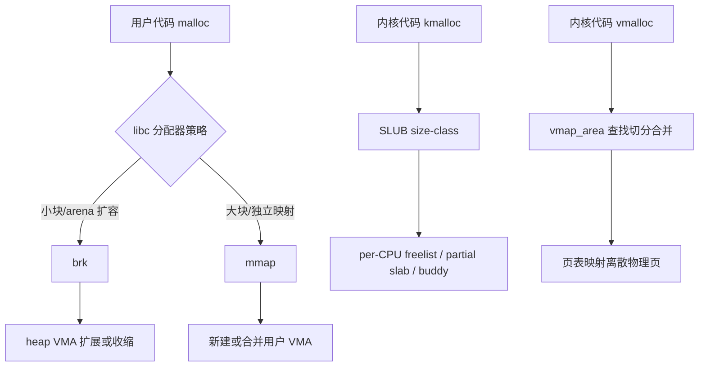

### 1. `kmalloc()`：内核小对象分配器

如果把 `kmalloc()` 放到和 `vmalloc()` 同一层理解，最重要的一句是：

**`kmalloc()` 的重点不是管理虚拟地址区间，而是把“请求大小”映射到某个 SLUB cache，然后尽量从现成 slab 的空闲对象里直接拿。**

#### `kmalloc()` 主调用链

典型路径可以压成：

```text
kmalloc(size, flags)
-> kmalloc_noprof(size, flags)
   -> 常量 size:
      -> __kmalloc_cache_noprof(cache, flags, size)
      -> kmem_cache_alloc_noprof(...)
      -> slab_alloc_node(...)
   -> 非常量或通用路径:
      -> __kmalloc_noprof(size, flags)
      -> __do_kmalloc_node(size, ..., flags, NUMA_NO_NODE, caller)
         -> size > KMALLOC_MAX_CACHE_SIZE ? __kmalloc_large_noprof()
         -> kmalloc_slab(size, ...)
         -> slab_alloc_node(...)
```

最值得抓住的函数点是：

1. [include/linux/slab.h](include/linux/slab.h) `kmalloc_noprof()`：编译期常量大小时，会直接选定 cache，尽量走快路径。
2. [mm/slub.c](mm/slub.c) `__do_kmalloc_node()`：通用调度入口，决定走普通 slab 还是大对象分配。
3. [mm/slub.c](mm/slub.c) `kmalloc_slab()`：把 size 映射到某个 kmalloc cache。
4. [mm/slub.c](mm/slub.c) `slab_alloc_node()`：真正从 SLUB cache 分配对象。
5. [mm/slub.c](mm/slub.c) `___kmalloc_large_node()`：超大对象直接走页分配器。

#### `kmalloc()` 涉及到的核心算法

`kmalloc()` 背后不是单一算法，而是下面几层组合：

1. **size-class 映射算法**：把请求大小映射到固定对象尺寸的 kmalloc cache。
2. **per-CPU freelist 快路径**：当前 CPU 上有现成空闲对象时，尽量无锁或低成本拿对象。
3. **partial slab 回退算法**：本 CPU 没有空闲对象时，从 partial slab 或 node 上的可用 slab 回退。
4. **buddy 兜底算法**：cache 里没有可用 slab 时，向 buddy 申请新页作为新的 slab。
5. **大对象直通算法**：超过 `KMALLOC_MAX_CACHE_SIZE` 时不再走对象 cache，而是直接按页分配。

最重要的区分是：

1. 小对象重点在“选哪个 cache”。
2. 大对象重点在“直接分几页”。

#### Mermaid 动态图：`kmalloc()` 决策树

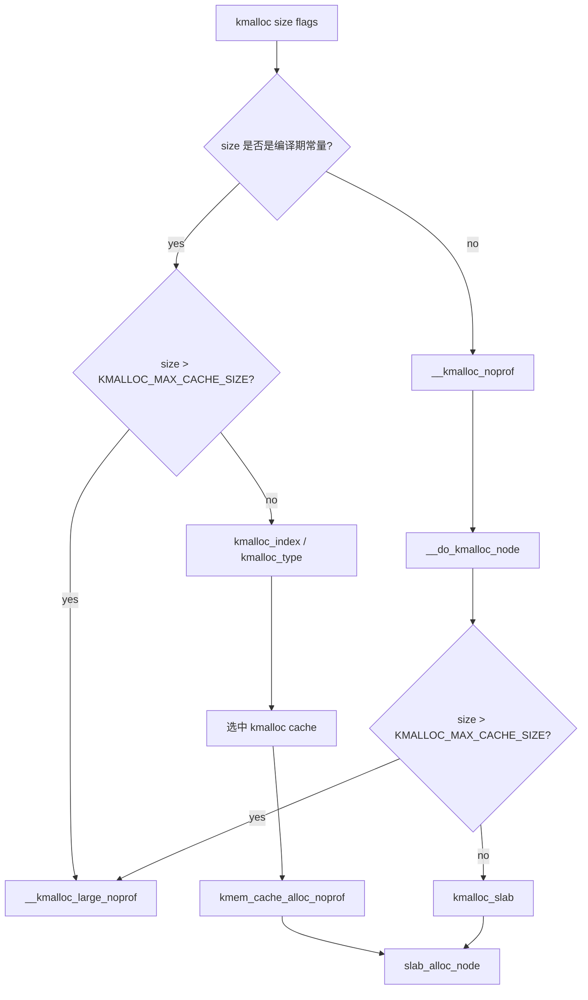

#### Mermaid 动态图：SLUB 对象分配过程

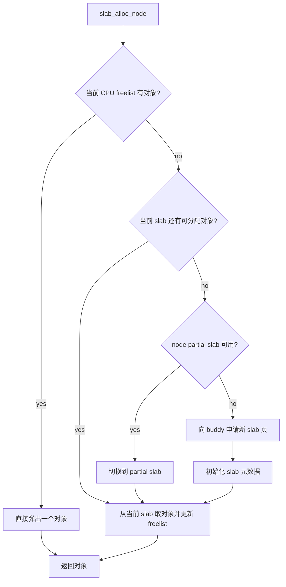

#### `kmalloc()` 和 `vmalloc()` 的根本差异

把两者放一起看，最该记住的是：

1. `kmalloc()` 重点是“对象 cache + slab 页”。
2. `vmalloc()` 重点是“虚拟区间 + 页表映射”。
3. `kmalloc()` 返回的大多数对象本来就在线性映射里，可直接访问。
4. `vmalloc()` 返回的是 vmalloc 区域虚拟地址，背后物理页可以离散。

所以：

1. `kmalloc()` 更像对象分配器。
2. `vmalloc()` 更像内核虚拟地址空间分配器。

### 2. 用户态 `malloc()`：真正的策略层在 libc

很多人第一次学 VM 会误以为：

```text
malloc()
-> 内核分配内存
```

这其实不对。更准确的说法是：

```text
malloc()
-> libc allocator 决定从 arena/heap 取，还是向内核继续要地址空间
-> 如果需要向内核要空间，通常走 brk 或 mmap
```

也就是说：

1. `malloc()` 是用户态策略。
2. `brk()` / `mmap()` 才是内核接口。
3. “多大时用 `mmap()`，多小时留在 heap/arena”主要是 libc 策略，不是内核 ABI。

#### Mermaid 动态图：用户态 `malloc()` 的典型决策

```mermaid
flowchart TD
    A[malloc n bytes] --> B{线程 arena / tcache / bins 可满足?}
    B -- yes --> C[直接返回现成块]
    B -- no --> D{是否适合扩 heap?}
    D -- yes --> E[调用 brk 或内部 sbrk 路径]
    D -- no --> F[调用 mmap 创建独立映射]
    E --> G[heap VMA 变大]
    F --> H[新增一个 mmap VMA]
    G --> I[切分用户态 chunk]
    H --> I
    I --> J[返回 malloc 指针]
```

这里最关键的理解是：

1. `malloc()` 指针只是用户态 allocator 切出来的 chunk。
2. 它的后端可能来自 heap/brk，也可能来自独立 `mmap()`。
3. 所以看到 `malloc()` 结果，不能直接推断内核一定做了哪条 syscall。

### 3. `brk()`：扩展 heap VMA，而不是新建一个独立 mmap 区

如果把 `malloc()` 走 heap 的情况落到内核，最核心的路径在：

1. [mm/mmap.c](mm/mmap.c) `SYSCALL_DEFINE1(brk)`
2. [mm/mmap.c](mm/mmap.c) `check_brk_limits()`
3. [mm/mmap.c](mm/mmap.c) `do_brk_flags()`

最关键的结论是：

**`brk()` 更像“调整 heap 末端”，不是像 `mmap()` 一样在地址空间任意位置新插一段映射。**

#### `brk()` 的主要算法动作

1. 检查 `min_brk`、`RLIMIT_DATA` 等限制。
2. 将新旧 `brk` 页对齐，判断是扩展还是收缩。
3. 收缩时，调用 `do_vmi_align_munmap()` 解除尾部区间。
4. 扩展时，检查和下一个 VMA 的 guard gap 是否冲突。
5. 最后调用 `do_brk_flags()` 去扩现有 brk VMA，或必要时创建匿名 VMA。

#### Mermaid 动态图：`brk()` 决策树

```mermaid
flowchart TD
    A[brk new_end] --> B[检查 min_brk 和 RLIMIT_DATA]
    B --> C[PAGE_ALIGN 新旧 brk]
    C --> D{oldbrk == newbrk?}
    D -- yes --> E[仅更新 mm->brk]
    D -- no --> F{是收缩吗?}
    F -- yes --> G[do_vmi_align_munmap 解除尾部]
    F -- no --> H[check_brk_limits]
    H --> I[检查 next VMA guard gap]
    I --> J[do_brk_flags]
    J --> K[扩展或创建 brk VMA]
```

### 4. `mmap()`：真正的“建立用户映射”主路径

`mmap()` 和 `brk()` 的最大区别是：

**`mmap()` 不是只动 heap 尾端，而是在用户地址空间里选择一段合适区间，然后新建或合并 VMA。**

#### `mmap()` 主调用链

典型路径可以压成：

```text
sys_mmap_pgoff
-> ksys_mmap_pgoff
-> vm_mmap_pgoff
-> do_mmap
   -> __get_unmapped_area
      -> mm_get_unmapped_area_vmflags
      -> generic_get_unmapped_area / generic_get_unmapped_area_topdown
      -> vm_unmapped_area
   -> mmap_region
      -> __mmap_region
         -> __mmap_prepare
         -> vma_merge_new_range (if possible)
         -> __mmap_new_vma (if merge fails)
         -> __mmap_complete
```

这条链里最值得先抓住的函数是：

1. [mm/mmap.c](mm/mmap.c) `do_mmap()`：参数检查、权限转换、地址选择、最后调用 `mmap_region()`。
2. [mm/mmap.c](mm/mmap.c) `__get_unmapped_area()`：决定这段映射要放在哪里。
3. [mm/mmap.c](mm/mmap.c) `generic_get_unmapped_area()` / `generic_get_unmapped_area_topdown()`：底向上或顶向下查找空洞。
4. [mm/vma.c](mm/vma.c) `mmap_region()`：真正进入 VMA 创建/合并阶段。
5. [mm/vma.c](mm/vma.c) `vma_merge_new_range()`：能并就并。
6. [mm/vma.c](mm/vma.c) `__mmap_new_vma()`：不能合并就分配一个新 VMA 并插入 Maple Tree。

#### `mmap()` 涉及到的核心算法

和 `vmalloc` 一样，`mmap()` 也不是单一算法，而是几层叠加：

1. **地址空洞搜索算法**：在 `[low_limit, high_limit)` 内查找满足长度和对齐要求的 unmapped area。
2. **top-down / bottom-up 布局算法**：取决于 `MMF_TOPDOWN` 和体系结构策略。
3. **VMA 合并算法**：前后 VMA 属性一致时，优先扩展已有 VMA，而不是新建。
4. **Maple Tree 插入算法**：不能合并时，把新 VMA 存入 `mm->mm_mt`。
5. **预拆/预卸载算法**：如有重叠，`__mmap_prepare()` 会准备好需要解除的旧映射。

#### Mermaid 动态图：`mmap()` 地址选择

```mermaid
flowchart TD
    A[do_mmap] --> B[__get_unmapped_area]
    B --> C{file 提供专用 get_unmapped_area?}
    C -- yes --> D[file specific get_area]
    C -- no --> E{匿名大映射且满足 THP 对齐?}
    E -- yes --> F[thp_get_unmapped_area_vmflags]
    E -- no --> G[mm_get_unmapped_area_vmflags]
    G --> H{MMF_TOPDOWN?}
    H -- yes --> I[generic_get_unmapped_area_topdown]
    H -- no --> J[generic_get_unmapped_area]
    I --> K[vm_unmapped_area]
    J --> K
    D --> L[返回候选地址]
    F --> L
    K --> L
```

这里最关键的不是“选哪个 syscall”，而是：

1. `mmap` 先选地址，再建 VMA。
2. 地址选择本身就是一个带布局策略的搜索算法。
3. top-down 失败时，源码还可能回退到底向上搜索。

#### Mermaid 动态图：`mmap_region()` 的 VMA 合并 / 新建

```mermaid
flowchart TD
    A[mmap_region] --> B[__mmap_region]
    B --> C[__mmap_prepare]
    C --> D{前后邻居 VMA 可合并?}
    D -- yes --> E[vma_merge_new_range]
    D -- no --> F[__mmap_new_vma]
    F --> G[vm_area_alloc]
    G --> H[vma_iter_prealloc]
    H --> I[vma_iter_store_new]
    I --> J[vma_link_file if file-backed]
    E --> K[__mmap_complete]
    J --> K
    K --> L[必要时解除旧映射并更新统计]
```

#### `mmap()` 与 `vmalloc()` 的相似点和不同点

两者看起来都在“找一段区间，再插入/合并”，但层次完全不同：

1. `mmap()` 管的是**用户地址空间 VMA**。
2. `vmalloc()` 管的是**内核 vmalloc 区域的 vmap_area**。
3. `mmap()` 的索引核心是 Maple Tree + VMA merge。
4. `vmalloc()` 的索引核心是 augmented rb-tree + 地址有序链表。
5. `mmap()` 不一定立刻分配物理页，常常等缺页。
6. `vmalloc()` 在返回前通常已经把 backing pages 和页表都准备好了。

可以把它们压成一句话：

**`mmap()` 更像“用户地址空间形状管理器”，`vmalloc()` 更像“内核虚拟区间与页表安装器”。**

### 5. 一张总图：`malloc`、`brk`、`mmap`、`kmalloc`、`vmalloc`

```mermaid
flowchart TD
    A[用户 malloc] --> B{libc 策略}
    B --> C[brk 扩 heap]
    B --> D[mmap 新建独立映射]

    C --> E[do_brk_flags]
    D --> F[do_mmap -> mmap_region]

    G[内核 kmalloc] --> H[SLUB size-class]
    H --> I[slab_alloc_node]
    I --> J[必要时向 buddy 申请 slab 页]

    K[内核 vmalloc] --> L[vmap_area 查找切分合并]
    L --> M[vm_area_alloc_pages]
    M --> N[vmap_pages_range]
```

如果你想把这五个名字彻底记住，就记下面三句话：

1. 用户态 `malloc()` 是策略，不是 syscall。
2. 内核态小对象分配看 `kmalloc()`，不是 `malloc()`。
3. 要理解用户地址空间形状变化，核心看 `brk()` 和 `mmap()`；要理解内核虚拟连续分配，核心看 `vmalloc()`。

---

## 虚拟内存抽象出来的重要数据结构

如果只记概念，不记结构体，Linux VM 很容易越学越散。先给一句最关键的结论：

**Linux 虚拟内存里最重要的数据结构可以分成三层：描述地址空间形状的、描述底层页与后端存储的、描述 fault 执行现场的。**

把这三层分清，后面的 `mmap()`、缺页、COW、page cache、rmap、`vmalloc()` 就都会自动归位。

### 1. 一张总图：这些结构到底怎么连

```mermaid
flowchart TD
    A[task_struct] --> B[mm_struct]
    B --> C[maple_tree mm_mt]
    C --> D[vm_area_struct]
    B --> E[pgd/page tables]
    B --> F[mm_context_t / ASID]

    D --> G[anon_vma]
    D --> H[vm_file]
    D --> I[vm_operations_struct]
    D --> J[shared.rb]

    H --> K[address_space]
    K --> L[i_pages page cache]
    K --> M[i_mmap interval tree]
    L --> N[folio / struct page]
    E --> N
    M --> D
    G --> O[anon_vma_chain]
    O --> D

    P[vm_fault] --> D
    P --> E
    P --> N

    Q[vm_struct] --> R[vmap_area]
    Q --> S[pages[]]
    S --> N
```

可以先这样记：

1. `mm_struct` 管整个进程的用户地址空间。
2. `vm_area_struct` 管其中一段属性一致的虚拟区间。
3. `folio / struct page` 才是最终承载内容的物理页抽象。
4. `address_space` 管文件页缓存和 file-backed 映射关系。
5. `anon_vma` 管匿名页相关 VMA 的反向关系。
6. `vm_fault` 是 fault 当下的执行上下文。
7. `vm_struct / vmap_area` 是内核 `vmalloc` 世界里的对应抽象，不属于用户 VMA 主线。

### 2. 重要数据结构总表

| 数据结构 | 所属层次 | 核心作用 | 最重要的关联 |
|---|---|---|---|
| `mm_struct` | 进程地址空间总控 | 描述整个进程的用户虚拟地址空间 | `mm_mt`、`pgd`、`mmap_lock`、`mmap_base`、`brk` |
| `maple_tree mm_mt` | VMA 索引层 | 按地址索引 VMA | `mm_struct -> mm_mt -> vm_area_struct` |
| `vm_area_struct` | 区间策略层 | 描述一段属性一致的虚拟区间 | `anon_vma`、`vm_file`、`vm_ops`、`shared.rb` |
| `anon_vma` | 匿名页反查层 | 把一组相关匿名 VMA 关联起来 | `anon_vma_chain`、COW、rmap |
| `anon_vma_chain` | 连接层 | 把 `vma` 与 `anon_vma` 双向挂接 | 一个 VMA 可关联多个 anon_vma |
| `address_space` | 文件后端层 | 管 page cache 和文件映射反查 | `i_pages`、`i_mmap`、`vm_file->f_mapping` |
| `vm_operations_struct` | 行为抽象层 | 不同 VMA 的 fault/map_pages/mkwrite 回调 | `vma->vm_ops` |
| `vm_fault` | fault 上下文层 | 记录本次缺页处理需要的现场信息 | `vma`、`address`、`pte`、`page/folio` |
| `folio / struct page` | 物理页承载层 | 真正承载匿名页、文件页、slab 页等内容 | `pte`、`address_space`、`anon_vma` |
| `vm_struct` | 内核 vmalloc 描述层 | 描述一段已保留/已映射的 vmalloc 区 | `pages[]`、`vmap_area` |
| `vmap_area` | 内核 vmalloc 区间层 | 管理 vmalloc 区间查找、切分、合并 | free/busy tree、`vm_struct` |

### 3. `mm_struct`：进程用户地址空间的总控对象

`mm_struct` 定义在 [include/linux/mm_types.h](include/linux/mm_types.h)。如果只看 VM 主线，最重要的字段是：

1. `mm_mt`：当前进程所有 VMA 的主索引。
2. `pgd`：该进程用户页表根。
3. `mmap_lock`：VMA 查找和修改的重要锁。
4. `mmap_base` / `task_size`：用户地址空间布局参数。
5. `map_count`、`total_vm`、`rss_stat`：VMA 数量和内存统计。
6. `start_brk` / `brk` / `start_stack`：heap 与 stack 的边界状态。
7. `context`：ARM64 上与 ASID、切换上下文有关的体系结构专属状态。

最应该记住的一点是：

**`mm_struct` 不是单个映射，而是“这个进程整张用户虚拟地址地图 + 页表根 + 统计信息 + 同步原语”的总对象。**

### 4. `maple_tree mm_mt`：当前 VMA 的主索引

现在进程地址空间里的 VMA 主索引不再是 rb-tree，而是 Maple Tree：

1. `find_vma()` / `find_vma_intersection()` 等查找都围绕 `mm->mm_mt`。
2. `mmap()` / `munmap()` / `mprotect()` / `mremap()` 修改地址空间形状时，最终都要更新 `mm_mt`。
3. fault 路径里按地址找 VMA，本质上也是在查 `mm_mt`。

所以：

1. `mm_struct` 是总控对象。
2. `mm_mt` 是它里面专门负责“按地址找 VMA”的索引结构。

### 5. `vm_area_struct`：一段属性一致的虚拟地址区间

`vm_area_struct` 不是页表，也不是物理页。它描述的是：

1. 一段地址范围 `[vm_start, vm_end)`
2. 这段范围允许什么访问权限
3. 它是匿名还是文件映射
4. 它需要用哪套回调处理 fault、mkwrite、map_pages

最关键的关联字段是：

1. `anon_vma` / `anon_vma_chain`：匿名私有页相关反查。
2. `vm_file`：文件映射的后端文件。
3. `vm_ops`：这段 VMA 的行为抽象。
4. `shared.rb`：挂入 `address_space->i_mmap` interval tree 的节点。
5. `vm_pgoff`：映射到文件或匿名对象的页偏移。

一句话记忆：

**VMA 描述的是“这段地址应该怎样”，而不是“这段地址现在已经映射了哪些物理页”。**

### 6. `anon_vma` 和 `anon_vma_chain`：匿名页世界里的“关系网络”

很多人知道匿名页会 COW，但不知道 Linux 靠什么把这些相关 VMA 串起来。答案就是：

1. [include/linux/rmap.h](include/linux/rmap.h) `struct anon_vma`
2. [include/linux/rmap.h](include/linux/rmap.h) `struct anon_vma_chain`

它们的核心作用不是描述地址范围，而是：

1. 把 fork、split、COW 之后“逻辑上相关”的匿名 VMA 组织起来。
2. 让匿名页的 rmap 能找到“谁还在映射这批匿名页”。
3. 支撑 page reclaim、migration、COW、KSM 等需要反向找映射者的操作。

#### Mermaid 动态图：匿名页关系

```mermaid
flowchart TD
    A[匿名 folio/page] --> B[anon_vma]
    B --> C[anon_vma_chain 1]
    B --> D[anon_vma_chain 2]
    C --> E[VMA in parent]
    D --> F[VMA in child after fork]
```

最关键的理解是：

1. 匿名页不会直接永久指向某一个具体 VMA。
2. 因为 VMA 会 split、merge、fork，单点绑定不稳定。
3. 所以 Linux 用 `anon_vma` 作为中间层，把“这批相关匿名映射”组织起来。

### 7. `address_space`：文件页缓存和 file-backed 映射的总后端

文件映射世界里，最重要的总后端对象不是 VMA，而是 `address_space`，定义在 [include/linux/fs.h](include/linux/fs.h)。

它最关键的字段是：

1. `i_pages`：page cache 的主索引，存文件页。
2. `i_mmap`：映射这个文件的 VMA interval tree。
3. `a_ops`：文件页读写回调。

它和 VMA 的关系是：

1. `vma->vm_file` 指向文件。
2. `file->f_mapping` 指向 `address_space`。
3. file-backed fault 时，会从 `address_space->i_pages` 找或创建 folio。
4. 回收、truncate、writeback 时，又会通过 `i_mmap` 反查有哪些 VMA 映射着这个文件范围。

#### Mermaid 动态图：文件映射关系

```mermaid
flowchart TD
    A[vm_area_struct] --> B[vm_file]
    B --> C[address_space]
    C --> D[i_pages page cache]
    C --> E[i_mmap interval tree]
    D --> F[folio / struct page]
    E --> A
```

所以 file-backed 映射最应该记住的是：

**VMA 只是“这个进程怎么看这段文件”，`address_space` 才是“这份文件页缓存本体和所有映射关系的总后端”。**

### 8. `vm_operations_struct`：VMA 的行为多态接口

虚拟内存里有个特别重要但容易被忽略的抽象，就是 `vm_operations_struct`。它定义在 [include/linux/mm.h](include/linux/mm.h)。

它的意义是：

1. 同样是一个 `vm_area_struct`，anonymous、shmem、设备映射、special mapping 的行为并不一样。
2. 所以 fault、map_pages、page_mkwrite、access 等动作不能写死在通用代码里。
3. Linux 把这部分差异抽成回调表，挂在 `vma->vm_ops` 上。

最常见的入口有：

1. `fault`
2. `map_pages`
3. `page_mkwrite`
4. `close`
5. `name`

一句话记忆：

**`vm_area_struct` 描述“是什么区间”，`vm_operations_struct` 描述“这段区间遇到 fault 或写入时该怎么做”。**

### 9. `vm_fault`：一次缺页处理的现场包

`vm_fault` 定义在 [include/linux/mm.h](include/linux/mm.h)。它不是长期存在的数据结构，而是 fault 处理过程中临时组织的一份上下文。

它把下面这些东西捆在一起：

1. 当前 fault 命中的 `vma`
2. fault 地址 `address`
3. `pgoff`
4. 当前 PTE/PMD 指针和原值
5. 本次 fault 可用的 `gfp_mask`
6. fault handler 返回或准备的 `page`

#### Mermaid 动态图：fault 上下文关系

```mermaid
flowchart TD
    A[ARM64 abort/fault] --> B[do_page_fault]
    B --> C[vm_fault]
    C --> D[vm_area_struct]
    C --> E[pte/pmd pointers]
    C --> F[page/folio]
    D --> G[vm_operations_struct]
```

最该记住的一点是：

**`vm_fault` 不是地址空间本身，而是“这次 fault 要解决问题时手里拿着的一组现场变量”。**

### 10. `folio / struct page`：最终承载内容的物理页抽象

虚拟内存里所有高层抽象，最后都要落到页上。这个承载层就是：

1. `struct page`
2. `struct folio`

从 VM 角度理解它们时，最重要的是：

1. 匿名页 fault 最终会分配匿名 folio/page。
2. 文件页 fault 最终会从 page cache 的 folio/page 建立 PTE。
3. `kmalloc`、SLUB、buddy、page cache、匿名页回收，本质上都绕不开 `page/folio`。

`struct page` 里最关键的 VM 相关字段之一就是：

1. `mapping`：对于 page cache 页，指向 `address_space`；对于匿名页，会编码匿名映射关系。
2. `_mapcount` / `_refcount`：记录映射和引用关系。

所以：

**VMA、页表、fault、rmap 最终都不是替代 `page/folio`，而是在围绕“这页怎么被描述、映射、回收、反查”工作。**

### 11. ARM64 视角还要多记一个：`mm_context_t`

如果只讲通用 MM，会遗漏 ARM64 很重要的一层：`mm_struct->context`。

它的作用不是描述 VMA，也不是描述物理页，而是：

1. 记录体系结构相关的地址空间上下文信息。
2. 在 ARM64 上和 ASID、TLB 上下文切换强相关。
3. 让不同进程即使页表根切换，也能通过 ASID 降低不必要的全局 TLB 冲刷。

所以从 ARM64 角度看：

1. `mm_struct` 负责通用地址空间状态。
2. `mm_context_t` 负责架构上下文状态。

### 12. 内核 vmalloc 世界的对应结构：`vm_struct` 和 `vmap_area`

前面讲的 `mm_struct` / `vm_area_struct` 是用户地址空间主线。内核 `vmalloc` 还有自己的一套对应抽象：

1. `vm_struct`：描述一段 vmalloc/vmap 区。
2. `vmap_area`：管理 vmalloc 地址区间的查找、切分、合并。

它们和用户 VMA 的关系是“相似但不同层”：

1. `vm_area_struct` 管用户 VMA。
2. `vmap_area` 管内核 vmalloc 区间。
3. `vm_struct` 更像 vmalloc 对外可见的描述符。

### 13. 一张关系总表：谁描述策略，谁描述后端，谁描述现场

| 问题 | 最该看的结构 |
|---|---|
| 这个进程有哪些虚拟区间？ | `mm_struct` + `mm_mt` + `vm_area_struct` |
| 这段区间是匿名还是文件映射？ | `vm_area_struct` |
| 这段文件映射背后的页缓存是谁管？ | `address_space` |
| 匿名页 COW/rmap 关系怎么串？ | `anon_vma` + `anon_vma_chain` |
| 这次 fault 手里有哪些上下文？ | `vm_fault` |
| 真正承载数据的是谁？ | `folio / struct page` |
| ARM64 的 ASID/地址空间上下文在哪里？ | `mm_struct->context` |
| 内核 vmalloc 区间由谁管理？ | `vm_struct` + `vmap_area` |

### 14. 最后的总记忆法

如果你想把这些结构体一口气记住，可以用下面这三句话：

1. `mm_struct` + `vm_area_struct` + `mm_mt` 解决“地址空间长什么样”。
2. `address_space` / `anon_vma` / `folio/page` 解决“底层页从哪里来、还能反查到谁”。
3. `vm_fault` / `vm_ops` 解决“fault 当下该按哪种规则处理”。

后面你再看 `mmap()`、缺页、COW、page cache、回收、`vmalloc()`，本质上都只是这些结构之间的交互。

---

## 这些关键结构在真实运行路径里如何协作

先记住一句最关键的话：

**真实运行时，顺序几乎总是先用 `mm_struct + mm_mt` 找到 `vm_area_struct`，再按 `vma` 类型选择匿名页、文件页、COW 或 unmap 路径，最后落到 `folio/page + PTE/page table`。**

也就是说，前面那一堆结构体不是并列摆设，而是在具体路径里各司其职：

1. `mm_struct` 提供整个地址空间和页表根。
2. `mm_mt` 决定 fault/unmap 命中了哪段 VMA。
3. `vm_area_struct` 决定这段区间的策略和后端类型。
4. `vm_fault` 把本次 fault 的现场包起来。
5. `anon_vma` 或 `address_space` 决定底层页该从匿名世界还是文件世界处理。
6. `folio/page` 与 PTE 决定最终怎么建立或拆除映射。

### 1. 匿名缺页：`mm_struct -> VMA -> anon_vma -> folio/page -> PTE`

匿名缺页的主线可以压缩成一句话：

**先从地址空间里找到 VMA，再由 `handle_mm_fault()` 进入匿名 fault 分支，最终分配匿名 folio 或映射 zero page，并把结果写进页表。**

关键代码锚点是：

1. `handle_mm_fault()` in `mm/memory.c`
2. `__handle_mm_fault()` in `mm/memory.c`
3. `do_anonymous_page()` in `mm/memory.c`

其中结构体分工是：

1. `mm_struct` 提供 `pgd`、`mmap_lock`、VMA 索引和统计上下文。
2. `vm_area_struct` 提供 `vm_flags`、`vm_page_prot`、`anon_vma`、`vm_mm`。
3. `vm_fault` 临时保存 `vma`、`address`、`pgoff`、`pte/pmd` 指针和最终 `page`。
4. `anon_vma` 在匿名页进入 rmap/COW 世界时成为关系中枢。
5. `folio/page` 是最终真正分配出来并被 PTE 指向的对象。

#### Mermaid 动态图：匿名缺页

```mermaid
flowchart TD
    A[用户态访问一个尚未建立 PTE 的匿名地址] --> B[do_page_fault]
    B --> C[按地址查 mm_struct.mm_mt]
    C --> D[命中 vm_area_struct]
    D --> E[handle_mm_fault]
    E --> F[__handle_mm_fault]
    F --> G[handle_pte_fault]
    G --> H[do_anonymous_page]
    H --> I{读 fault 且允许 zero page?}
    I -->|是| J[构造 zero-page PTE]
    I -->|否| K[vmf_anon_prepare]
    K --> L[alloc_anon_folio]
    L --> M[建立 anon rmap/LRU]
    M --> N[set_pte_at]
    J --> N
```

把它拆开理解：

1. fault 首先不是找 `page`，而是先找 `VMA`，因为内核必须先知道“这段地址应该按什么规则处理”。
2. `__handle_mm_fault()` 先把 `vm_fault` 现场组织好，再逐级走到 PTE 层。
3. 真正发现是匿名映射且没有现成 PTE 时，才进入 `do_anonymous_page()`。
4. 只读匿名缺页可能直接映射 zero page，不一定马上分配真实匿名页。
5. 写缺页或不能用 zero page 时，才会分配匿名 folio，并把匿名页纳入 rmap/LRU/计费体系。

所以匿名缺页最该记住的是：

**匿名页不是 VMA 本身的一部分，VMA 只是规则；真正落地的是匿名 `folio/page` 加上指向它的 PTE。**

### 2. 文件缺页：`VMA -> vm_file -> address_space -> i_pages -> folio/page`

文件映射缺页最关键的结论是：

**file-backed fault 的核心不是先分配匿名页，而是先沿着 `vma->vm_file->f_mapping` 找到 `address_space`，再从 page cache 里找或创建 folio。**

关键代码锚点是：

1. `do_fault()` in `mm/memory.c`
2. `vma->vm_ops->fault`
3. `filemap_fault()` in `mm/filemap.c`

这里几层结构体的职责非常清楚：

1. `vm_area_struct` 告诉内核这是 file-backed 映射，并给出 `vm_file`。
2. `vm_operations_struct` 决定要调用哪一个具体 `fault` 回调。
3. `address_space` 是文件页缓存总后端，里面的 `i_pages` 才是真正查 folio 的地方。
4. `vm_fault` 保存本次 fault 的页偏移 `pgoff` 和最终返回的 `page`。
5. `folio/page` 从 page cache 命中或读盘后返回，再由上层建立 PTE。

#### Mermaid 动态图：文件缺页

```mermaid
flowchart TD
    A[访问 file-backed VMA 中尚未建立 PTE 的地址] --> B[do_page_fault]
    B --> C[mm_mt 命中 vm_area_struct]
    C --> D[handle_mm_fault]
    D --> E[__handle_mm_fault]
    E --> F[handle_pte_fault]
    F --> G[do_fault]
    G --> H[vma->vm_ops->fault]
    H --> I[filemap_fault]
    I --> J[vm_file -> f_mapping -> address_space]
    J --> K{mapping->i_pages 里已有 folio?}
    K -->|有| L[锁住并校验 folio]
    K -->|没有| M[readahead / __filemap_get_folio]
    M --> N[必要时 read_folio 从磁盘读入]
    N --> L
    L --> O[vmf->page = folio_file_page]
    O --> P[上层建立 PTE]
```

这里最容易混淆的点有两个：

1. file-backed fault 的“后端真身”是 `address_space`，不是 VMA。
2. `address_space->i_mmap` 不是 fast path 查页缓存用的，它主要服务于 truncate、invalidate、回收等需要反向找到映射 VMA 的场景；真正按页偏移查文件页缓存时看的是 `i_pages`。

所以文件缺页要这样记：

**VMA 决定“这是哪个文件的哪段映射”，`address_space` 决定“这页文件内容现在是否已经在 page cache 里”。**

### 3. `munmap()`：先改地址空间形状，再拆 PTE 和页表，再销毁 VMA

`munmap()` 最重要的结论是：

**它不是直接“删一段地址”这么简单，而是先把受影响的 VMA 从 Maple Tree 逻辑上分离出来，必要时做 split，再清 PTE、拆页表、更新统计，最后释放 VMA。**

关键代码锚点是：

1. `do_vmi_munmap()` in `mm/vma.c`
2. `vms_gather_munmap_vmas()` in `mm/vma.c`
3. `vms_complete_munmap_vmas()` in `mm/vma.c`
4. `remove_vma()` / `unmap_region()` in `mm/vma.c`

对应结构体分工：

1. `mm_struct` 保存 `map_count`、`total_vm`、`locked_vm` 等全局统计。
2. `mm_mt`/VMA iterator 决定要移除哪些 VMA 节点。
3. `vm_area_struct` 可能先被 split，再被 detach，再被真正销毁。
4. 页表与 TLB teardown 在清 PTE、free page tables 阶段完成。
5. file-backed VMA 还会经过 `fput(vm_file)`，匿名或文件 VMA 的回调清理则通过 `vma_close()` 等完成。

#### Mermaid 动态图：`munmap()`

```mermaid
flowchart TD
    A[munmap start,len] --> B[do_vmi_munmap]
    B --> C[在 mm_mt 中找到首个重叠 VMA]
    C --> D[vms_gather_munmap_vmas]
    D --> E{边界是否落在 VMA 中间?}
    E -->|是| F[__split_vma]
    E -->|否| G[直接收集待删 VMA]
    F --> G
    G --> H[把待删 VMA 暂时 detach 到独立 maple tree]
    H --> I[vma_iter_clear_gfp 从 mm_mt 删除]
    I --> J[vms_complete_munmap_vmas]
    J --> K[clear PTE / zap 映射]
    K --> L[更新 total_vm/map_count 等统计]
    L --> M[remove_vma -> vma_close/fput/vm_area_free]
```

这条路径里最值得你抓住的点是：

1. `munmap()` 首先处理的是 VMA 拓扑，而不是物理页。
2. 只有先把地址空间形状从 `mm_mt` 里更新干净，后续页表拆除和 VMA 释放才有确定边界。
3. `__split_vma()` 说明 VMA 只是区间描述符，删除一段中间范围时经常需要把原 VMA 切成两边留下、中间移除。
4. 真正完成资源回收时，还包括统计更新、`vm_file` 引用释放、策略和回调收尾。

所以 `munmap()` 最该记住的是：

**它本质上是在同时修改两张图：一张是 `mm_mt/VMA` 组成的地址空间图，一张是 PTE/page table 组成的硬件映射图。**

### 4. `fork()` 与 COW：先共享页并写保护，真正写入时再分裂

`fork()`/COW 的最关键结论是：

**fork 时通常不会立刻复制所有匿名页，而是先复制地址空间元数据，并把可 COW 的 PTE 改成只读共享；真正发生写 fault 时，`do_wp_page()` 再决定复用还是复制。**

关键代码锚点是：

1. `copy_page_range()` in `mm/memory.c`
2. `copy_present_ptes()` / `copy_nonpresent_pte()` in `mm/memory.c`
3. `do_wp_page()` in `mm/memory.c`

结构体之间的配合是：

1. `vm_area_struct` 决定这段映射是不是 COW mapping。
2. `anon_vma`/`anon_vma_chain` 维持 parent/child 匿名映射的关系网络。
3. `copy_page_range()` 复制页表层次，但对可 COW 的 present PTE 会做写保护，而不是立即复制数据页。
4. parent 和 child 暂时共享同一个匿名 `folio/page`。
5. 后续某一方写入触发写保护 fault，`do_wp_page()` 再决定复用原页还是 `wp_page_copy()` 复制新页。

#### Mermaid 动态图：fork 到 COW 写 fault

```mermaid
flowchart TD
    A[fork] --> B[复制 mm/VMA 元数据]
    B --> C[copy_page_range]
    C --> D{该 VMA 需要复制页表吗?}
    D -->|否| E[留给后续 fault 懒建立]
    D -->|是| F[copy_present_ptes / copy_nonpresent_pte]
    F --> G[可 COW 的 PTE 改为只读]
    G --> H[parent 与 child 暂时共享同一 folio/page]
    H --> I[child 或 parent 发生写访问]
    I --> J[do_page_fault]
    J --> K[do_wp_page]
    K --> L{原匿名页可复用?}
    L -->|可| M[复用并提升为独占]
    L -->|不可| N[wp_page_copy 分配新页并复制]
    M --> O[写入新 PTE]
    N --> O
```

这里特别值得注意三点：

1. `copy_page_range()` 里对 COW mapping 的关键动作不是“复制页内容”，而是“写保护 parent/child 的 PTE”。
2. `anon_vma` 的价值在这里最明显，因为 fork 之后一批匿名映射不再是单个 VMA 能稳定描述的，需要中间关系层来支撑 rmap、回收和 COW。
3. `do_wp_page()` 不是无脑复制；如果页已经满足匿名独占复用条件，Linux 会直接复用原页，只更新权限和状态。

所以 COW 最应该这样记：

**fork 复制的是“映射关系和页表语义”，不是立刻复制所有物理页；真正复制物理页发生在后续写 fault。**

### 5. 把四条路径并排对比

| 场景 | 先看哪个结构 | 中间关键结构 | 最终落点 |
|---|---|---|---|
| 匿名缺页 | `mm_struct` / `mm_mt` / `vm_area_struct` | `vm_fault`、`anon_vma` | 匿名 `folio/page` + 新 PTE |
| 文件缺页 | `vm_area_struct` / `vm_ops` | `address_space`、`i_pages` | page cache `folio/page` + 新 PTE |
| `munmap()` | `mm_mt` / `vma iterator` | split/detach 的 `vm_area_struct` | 删除 VMA、清 PTE、拆页表 |
| `fork` + COW | `vm_area_struct` | `anon_vma`、`copy_page_range()`、`do_wp_page()` | 先共享只读，后续写 fault 时复用或复制 |

如果把这四条路径看懂，你对 Linux VM 的理解就会从“认识一堆结构体”变成“知道这些结构体在真实执行中谁先出场、谁决定策略、谁负责后端、谁最终改页表”。

---

## VMA 管理：`mmap()` 这一层到底在干什么

### 1. `mmap()` 不是直接分配物理页

它通常先做的是：

1. 在地址空间中找到合适区间
2. 建立或合并 VMA
3. 设置 `vm_flags`、`vm_file`、`vm_pgoff`、`vm_page_prot`
4. 暂时不一定分配物理页

真正分配页常常等到首次访问时通过缺页完成。

### 2. 你读 VMA 管理代码要看什么

建议先抓这几类操作：

1. 建立 VMA
2. 拆分 VMA
3. 合并 VMA
4. 删除 VMA
5. 修改 VMA 权限与属性

主文件是：

1. [mm/vma.c](mm/vma.c)

### 3. VMA 相关系统调用的学习顺序

建议顺序：

1. `mmap`
2. `munmap`
3. `mprotect`
4. `mremap`
5. `brk`

因为这几条路径几乎覆盖了“地址空间形状如何变化”的主要情况。

---

## ARM64 缺页处理：整条主线必须亲手走一遍

这是 Linux ARM64 虚拟内存里最关键的一条路径。

### 1. 先给结论

一次用户态缺页，最重要的步骤是：

1. ARM64 异常入口捕获 fault address 和 syndrome
2. Linux 判断是不是用户空间内存访问 fault
3. 查找该地址对应的 VMA
4. 判断 fault 类型：匿名页、文件页、COW、权限 fault、非法访问
5. 调 `handle_mm_fault()` 进入通用 MM
6. 建立或修改页表项
7. 返回用户态重试指令

### 2. ARM64 入口

建议从这里开始：

1. [arch/arm64/kernel/entry-common.c](arch/arm64/kernel/entry-common.c)
2. [arch/arm64/mm/fault.c](arch/arm64/mm/fault.c)

如果想把入口关系看完整，还应该补看：

1. [arch/arm64/kernel/entry.S](arch/arm64/kernel/entry.S)

可以先抓这几个函数名：

1. `do_mem_abort`
2. `do_page_fault`
3. `handle_mm_fault`

但如果你想把异常入口真正串完整，单看 C 函数还不够，前面还要再补上一层：

1. `VBAR_EL1`
2. `vectors`
3. `kernel_ventry`
4. `entry_handler`
5. `el0t_64_sync_handler()` / `el1h_64_sync_handler()`

也就是说，ARM64 缺页主线更完整的骨架其实是：

```text
VBAR_EL1
-> vectors
-> kernel_ventry
-> entry_handler
-> el0t_64_sync_handler() / el1h_64_sync_handler()
-> el0_da()/el0_ia() 或 el1_abort()
-> do_mem_abort()
-> fault_info[fsc].fn(...)
-> do_page_fault()
-> handle_mm_fault()
```

#### 2.1 `VBAR_EL1` 负责“指向哪张向量表”

当前 ARM64 内核已经不是靠“把向量表硬塞在 `head.S` 最开头”来工作，而是在启动后显式把 `VBAR_EL1` 指向 `vectors`。

关键代码在：

1. [arch/arm64/kernel/head.S](arch/arm64/kernel/head.S) `__primary_switched()` 中 `msr vbar_el1, x8`
2. [arch/arm64/kernel/head.S](arch/arm64/kernel/head.S) `__secondary_switched()` 中 `msr vbar_el1, x5`

这意味着：

1. 向量表不要求等于镜像起始地址。
2. CPU 真正关心的是 `VBAR_EL1` 里写入的基址。
3. 但它也绝不是“随意放哪都行”，仍然要满足对齐和映射约束。

最实用的记忆法是：

**现在不是“向量表必须放在 `head.S` 开头”，而是“向量表必须放在一个 `VBAR_EL1` 能正确指到、CPU 在异常时能取指执行的位置”。**

#### 2.1.1 `VBAR_EL1`、`vectors`、`this_cpu_vector` 三者不是同一个东西

这里最容易混的是：很多人会把寄存器、符号地址、per-CPU 变量混成一个“向量表变量”，但它们其实分属三层。

1. `VBAR_EL1`：CPU 系统寄存器，不在内存里，是“这个 CPU 在 EL1 异常时跳转表基址”的硬件寄存器。
2. `vectors`：链接出来的一段代码符号，表示 canonical exception vectors 这张向量表本身。
3. `this_cpu_vector`：Linux 的 per-CPU 变量，记录“这个 CPU 当前应该把 `VBAR_EL1` 装成哪一张向量表”。

它们的关系可以记成：

```text
this_cpu_vector[CPUi] 里存一个代码地址
-> Linux 把这个地址写入 CPUi 的 VBAR_EL1
-> CPUi 发生异常时，从这个地址对应的 vectors/trampoline vectors 开始取指
```

所以严格说：

1. `VBAR_EL1` 不是“变量”，而是每 CPU 一份的系统寄存器。
2. 真正像“变量”的，是 `this_cpu_vector` 这个 per-CPU 指针。
3. `vectors` 也不是变量，而是代码段里的符号地址。

#### 2.1.2 Linux 里哪些地方会写或用到它

最常见的使用点有四类：

1. 启动主 CPU：`head.S` 的 `__primary_switched()` 把 `vectors` 写进 `VBAR_EL1`。
2. 启动次级 CPU：`head.S` 的 `__secondary_switched()` 也会各自写一次 `VBAR_EL1`。
3. 返回用户态前切换向量：`entry.S` 在 KPTI/trampoline 场景下会从 `this_cpu_vector` 取值，再写回 `VBAR_EL1`。
4. CPU 特性/缓解切换：`proton-pack.c` 会更新每 CPU 的 `this_cpu_vector`，必要时同步写 `VBAR_EL1`。

再往更底层一点看，CPU 上下文恢复代码也会恢复 `VBAR_EL1`，所以它本质上属于“这个 CPU 的执行环境寄存器集合”，而不是某个进程的普通状态。

#### 2.1.3 多 CPU 下是不是都指向同一张向量表

一句话先说结论：

**通常情况下，大多数 CPU 最终会把 `VBAR_EL1` 指向同一个 `vectors` 虚拟地址；但从体系结构和 Linux 实现上说，它是 per-CPU 的，可以相同，也可以不同。**

默认情况：

1. `DEFINE_PER_CPU_READ_MOSTLY(const char *, this_cpu_vector) = vectors;`
2. 也就是说每个 CPU 的默认向量选择都是 canonical `vectors`
3. 于是多个 CPU 的 `VBAR_EL1` 常常会写成同一个虚拟地址

但它不要求必须完全相同，因为：

1. KPTI 场景下，返回 EL0 前会切到 trampoline vectors
2. 某些 Spectre/BHB 缓解场景下，会切到 hardening vectors
3. KVM/EL2 场景里，host 和 hyp 侧还可能切不同向量基址

所以正确表述不是“所有 CPU 永远共享同一个 `VBAR_EL1` 值”，而是：

**每个 CPU 都有自己独立的 `VBAR_EL1`，Linux 只是经常让它们指向同一张 canonical vectors。**

#### 2.1.4 为什么每个 CPU 都能访问到同一张向量表

这件事的关键不在 cache，而在地址空间设计。

先记最核心的一句：

**每个 CPU 虽然有自己的 MMU、TLB、I-cache、D-cache，但 Linux 给所有 CPU 安装的是兼容的内核全局映射；因此同一个内核虚拟地址上的 `vectors`，在每个 CPU 看来都能被翻译到同一份内核代码页。**

这里可以拆成四层：

1. `vectors` 位于内核 `.entry.text` / `.text` 映射中，是内核代码页的一部分。
2. ARM64 Linux 的内核高地址主要走 `TTBR1_EL1`，而内核全局映射由 `swapper_pg_dir` 提供。
3. 各 CPU 虽然各自做 page walk、维护自己的 TLB/cache，但看到的内核全局映射布局是一致的。
4. 因此把同一个 `vectors` 虚拟地址写入各 CPU 的 `VBAR_EL1` 后，各 CPU 都能在自己的 MMU 上把它翻译到同一份物理代码页。

所以：

1. “每 CPU 有自己的 MMU” 不等于 “每 CPU 的内核地址空间长得不一样”。
2. 它只是说明每个 CPU 自己做地址翻译、自己缓存翻译结果和指令数据。
3. 只要页表内容兼容、内核映射一致，同一虚拟地址就能在所有 CPU 上成立。

#### 2.1.5 cache 为什么不是问题

cache 层面最容易产生的误解是：“每 CPU 都有自己的 cache，那它们怎么共同执行同一张向量表？”

答案是：

1. `vectors` 是普通内核只读代码页，不是某个 CPU 私有副本。
2. 各 CPU 可以把这同一份代码页各自缓存到自己的 I-cache 里。
3. cache 私有的是缓存副本和状态，不是“代码逻辑上变成了多份不同的向量表”。
4. Linux/ARM64 所依赖的正常 cache 一致性模型保证这些内核代码页可被多 CPU 一致执行。

所以最简洁的理解是：

**多 CPU 看到的是同一个内核虚拟地址空间中的同一份 `vectors` 代码，只是每个 CPU 各自维护自己的 TLB 和 cache 副本。**

#### 2.2 `vectors` 在哪里，为什么不是“随便放”

正式异常向量表定义在 [arch/arm64/kernel/entry.S](arch/arm64/kernel/entry.S) 的 `SYM_CODE_START(vectors)`，而且前面有：

1. `.pushsection ".entry.text", "ax"`
2. `.align 11`

这里至少说明三件事：

1. 它被放进专门的 `.entry.text` 段，而不是启动头部代码段本身。
2. `.align 11` 表示 2KB 对齐，这正是 AArch64 异常向量基址需要满足的关键硬约束。
3. 它必须处在当前异常级可访问、可执行的映射中，否则异常一跳进去就会再次出错。

再加上 KPTI / trampoline / branch history mitigation 等场景，Linux 甚至还会切换不同的向量页，而不是永远只用一张固定向量表。所以更准确地说：

**ARM64 向量表的位置已经和镜像入口解耦，但没有和体系结构约束、映射约束、缓解机制约束解耦。**

#### 2.3 从 `VBAR_EL1` 到 `do_page_fault()` 的完整入口图

```mermaid
flowchart TD
    A[head.S: msr vbar_el1, vectors] --> B[CPU 发生同步异常]
    B --> C[硬件按异常来源/类型跳到 VBAR_EL1 + slot offset]
    C --> D[entry.S: vectors]
    D --> E[例如命中 EL0 64-bit sync 槽位]
    E --> F[kernel_ventry]
    F --> G[保存最早期现场 切换异常栈基础框架]
    G --> H[跳到 el0t_64_sync 或 el1h_64_sync 这类汇编入口]
    H --> I[entry_handler 生成的 stub]
    I --> J[kernel_entry]
    J --> K[x0 = sp, BL 对应 C handler]
    K --> L[el0t_64_sync_handler 或 el1h_64_sync_handler]
    L --> M[按 ESR_EL1.EC 分发]
    M --> N[el0_da / el0_ia / el1_abort]
    N --> O[读取 FAR_EL1]
    O --> P[do_mem_abort]
    P --> Q[fault_info[FSC].fn]
    Q --> R[do_page_fault]
    R --> S[handle_mm_fault]
```

这个图里，最关键的分层理解是：

1. `VBAR_EL1` 决定“异常先跳到哪张表”。
2. `vectors` 决定“按哪一个 slot 进入哪条汇编入口”。
3. `kernel_ventry` / `kernel_entry` 负责把 CPU 裸异常现场整理成内核可继续处理的 `pt_regs` 上下文。
4. `entry_handler` 只是把多个 slot 模板批量展开成具体入口。
5. 真正开始按 `ESR_EL1` 语义分类的是 `el0t_64_sync_handler()` / `el1h_64_sync_handler()`。
6. 真正开始进入 VM/fault 语义的是 `do_mem_abort()` 之后。

#### 2.4 `vectors` 不是一条入口，而是 16 个固定槽位

这里最关键的结论是：

**`VBAR_EL1` 指向的不是单个 handler，而是一整张 2KB 的向量页；CPU 会根据“异常来自哪里、异常类型是什么”自动跳到这张表里的固定槽位。**

在 [arch/arm64/kernel/entry.S](arch/arm64/kernel/entry.S) 里你会看到：

1. `vectors` 前有 `.align 11`，也就是整个表按 2KB 对齐。
2. `kernel_ventry` 宏内部有 `.align 7`，也就是每个槽位按 128B 对齐。
3. `kernel_ventry` 结尾有 `.org .Lventry_start + 128`，强制每个槽位大小固定为 128B。

所以整张表可以直接理解成：

| 维度 | 数量 | 说明 |
|---|---|---|
| 异常来源/栈形态 | 4 | `EL1t`、`EL1h`、`EL0 64-bit`、`EL0 32-bit` |
| 异常类型 | 4 | `sync`、`irq`、`fiq`、`error` |
| 每槽大小 | 128B | 由 `.align 7` 和 `.org + 128` 保证 |
| 整表大小 | 16 x 128B = 2KB | 对应 `.align 11` |

可以把它记成下面这张静态表：

```text
VBAR_EL1
    +0x000  EL1t  sync
    +0x080  EL1t  irq
    +0x100  EL1t  fiq
    +0x180  EL1t  error
    +0x200  EL1h  sync
    +0x280  EL1h  irq
    +0x300  EL1h  fiq
    +0x380  EL1h  error
    +0x400  EL0 64 sync
    +0x480  EL0 64 irq
    +0x500  EL0 64 fiq
    +0x580  EL0 64 error
    +0x600  EL0 32 sync
    +0x680  EL0 32 irq
    +0x700  EL0 32 fiq
    +0x780  EL0 32 error
```

所以用户态 64-bit 缺页时，真正命中的不是整个 `vectors`，而是其中 `EL0 64 sync` 那个 128B 槽位。

#### 2.5 `kernel_ventry` 和 `kernel_entry` 不是一回事

很多人第一次看 `entry.S` 时最容易混淆这两个宏，但它们负责的阶段并不一样：

1. `kernel_ventry` 负责“刚跳入向量槽位时最早期那几十条指令”。
2. `kernel_entry` 负责“把通用寄存器和元数据完整压成 `pt_regs` 框架”。

更直接一点说：

**`kernel_ventry` 解决的是‘先别死在入口上’，`kernel_entry` 解决的是‘把现场变成 C 代码可消费的 `pt_regs`’。**

`kernel_ventry` 最关键的工作有：

1. 先为 `pt_regs` 预留栈空间：`sub sp, sp, #PT_REGS_SIZE`
2. 做 stack overflow 检查
3. 必要时切到 overflow stack
4. 最后跳到具体汇编标签，例如 `el0t_64_sync`

`kernel_entry` 最关键的工作有：

1. 把 `x0` 到 `x29` 成对保存到异常栈上的 `pt_regs`
2. 读取 `elr_el1` 和 `spsr_el1`
3. 保存返回地址、异常前 SP、PC、PSTATE
4. 对 EL0 入口额外做用户态到内核态切换准备，比如 `sp_el0`、单步、MTE、PAC、SSBD 等
5. 建立 unwinder 需要的 metadata frame

一句话记忆：

1. `kernel_ventry` 先把“入口活下来”。
2. `kernel_entry` 再把“异常上下文组织完整”。

#### 2.6 `entry_handler` 只是模板展开器，它把 `sp` 交给 C handler

`entry_handler` 宏本身不做复杂分发，它做的事情其实很机械：

1. 调 `kernel_entry`
2. `mov x0, sp`
3. `bl el..._handler`
4. 根据异常来自 EL0 还是 EL1，最后跳 `ret_to_user` 或 `ret_to_kernel`

所以 `entry_handler` 的本质就是：

**把已经整理好的异常栈指针 `sp` 当成 `struct pt_regs *` 传给对应 C handler。**

这也是为什么 `el0t_64_sync_handler(struct pt_regs *regs)` 这种 C 函数一上来就能直接拿到 `regs`。

#### 2.7 `ESR_EL1` 分两次决定下一跳：先看 `EC`，再看 `FSC`

这一段如果想真正看懂，最关键的结论是：

**`ESR_EL1` 不是只分发一次，而是先在 `entry-common.c` 用 `EC` 做“异常大类分发”，再在 `fault.c` 用 `FSC` 做“memory abort 细类分发”。**

第一层分发发生在 `entry-common.c`：

1. `el0t_64_sync_handler()` 读取 `esr_el1`
2. `switch (ESR_ELx_EC(esr))`
3. `ESR_ELx_EC_DABT_LOW` -> `el0_da()`
4. `ESR_ELx_EC_IABT_LOW` -> `el0_ia()`

对应内核态同步异常时：

1. `el1h_64_sync_handler()` 读取 `esr_el1`
2. `ESR_ELx_EC_DABT_CUR` / `ESR_ELx_EC_IABT_CUR` -> `el1_abort()`

第二层分发发生在 `fault.c`：

1. `el0_da()` / `el0_ia()` / `el1_abort()` 先读 `far_el1`
2. 然后统一调用 `do_mem_abort(far, esr, regs)`
3. `do_mem_abort()` 内部调用 `esr_to_fault_info(esr)`
4. 再通过 `fault_info[]` 里的 `fn` 进入 `do_page_fault()`、`do_translation_fault()`、`do_alignment_fault()` 等更细分路径

可以把这两层压缩成下面这个判断链：

```text
ESR_EL1.EC
-> 这是 syscall / data abort / instruction abort / undef / debug 的哪一类？

如果是 memory abort:
    FAR_EL1 + ESR_EL1.FSC
    -> 这是 translation fault / permission fault / access flag fault / SEA / tag fault 的哪一类？
```

所以最该记住的不是某一个宏名字，而是：

1. `EC` 决定“先去哪个大门类 handler”。
2. `FSC` 决定“在 memory abort 里再细分到哪种 fault handler”。
3. `do_page_fault()` 只是第二层分发里最常见的一条路径，不是所有同步异常都会走到它。

这里要先纠正一个很常见的误解：

**`el1h_64_sync_handler` 不是“所有异常的总入口”，它只是 ARM64 异常向量表里“EL1h 64-bit synchronous exception” 这一格的 C 分发函数。**

在 [arch/arm64/kernel/entry.S](arch/arm64/kernel/entry.S) 里，异常向量按来源和类型至少分成：

1. EL1t sync / irq / fiq / error
2. EL1h sync / irq / fiq / error
3. EL0 64-bit sync / irq / fiq / error
4. EL0 32-bit sync / irq / fiq / error

所以：

1. `el1h_64_sync_handler` 只处理 EL1h 的同步异常
2. 用户态常见缺页更多是从 EL0 的 data abort / instruction abort 入口进来
3. 真正和 VMA/fault 关系最紧的，不是向量表本身，而是它后面调用的 `do_mem_abort()`

可以把入口层级先记成：

```text
entry.S 向量槽位
-> entry-common.c 中对应的 sync/irq/error handler
-> do_mem_abort()
-> fault.c 中进一步分发
```

### 3. 查找 VMA

fault 到达通用 MM 前，必须先知道这个地址是不是落在合法 VMA 中。

这一步的本质是：

1. 用 `mm_struct` 的 Maple Tree 查地址
2. 找到包含该地址或最近后继的 VMA
3. 检查权限和访问类型是否匹配

如果地址压根不在合法 VMA 中，通常直接走 SIGSEGV。

### 4. `handle_mm_fault()` 的意义

你可以把 `handle_mm_fault()` 理解成：

**通用 MM 层根据 VMA 策略、fault 类型和现有页表状态，决定这次 fault 应该如何修复。**

它会进一步分叉到：

1. 匿名缺页
2. 文件缺页
3. 写时复制
4. 大页相关处理
5. 权限升级或脏位处理

### 5. 一次用户态匿名页缺页的真实调用链

如果你想真正把 ARM64 VM 主线打通，最值得亲自走一遍的不是所有 fault 分支，而是“用户态访问一个尚未建立映射的匿名地址”这条最基本路径。

先给压缩版调用链：

```text
EL0 load/store
-> entry.S 中 EL0 64-bit sync 向量
-> el0t_64_sync_handler()
-> el0_da() / el0_ia()
-> do_mem_abort()
-> esr_to_fault_info()
-> fault_info[fsc].fn(...)
-> do_page_fault()
-> 找到 VMA 并检查 vm_flags
-> handle_mm_fault()
-> __handle_mm_fault()
-> handle_pte_fault()
-> do_anonymous_page()
-> 分配匿名 folio 或映射 zero page
-> set_pte_at()
-> 返回用户态重试
```

### 6. 第一步：ARM64 捕获异常并进入 fault 路径

ARM64 缺页不是直接从 `fault.c` 开始，而是先经过异常入口层。最值得先抓住的文件和函数是：

1. [arch/arm64/kernel/entry.S](arch/arm64/kernel/entry.S)
2. [arch/arm64/kernel/entry-common.c](arch/arm64/kernel/entry-common.c)
3. [arch/arm64/mm/fault.c](arch/arm64/mm/fault.c)

对用户态缺页，常见链路是：

1. `entry.S` 选中 EL0 64-bit sync 向量槽位
2. 该槽位先进入 `kernel_ventry`，构造最基础的异常栈框架
3. 再落到 `entry_handler` 展开的 `el0t_64_sync` 汇编入口
4. `entry_handler` 内部执行 `kernel_entry`，把寄存器保存到 `pt_regs`
5. 然后把 `sp` 作为参数传给 `el0t_64_sync_handler()`
6. `entry-common.c` 里的 `el0t_64_sync_handler()` 按 `ESR_EL1.EC` 分发
7. 对 data abort / instruction abort，继续进入 `el0_da()` / `el0_ia()`
8. 这两个入口读取 `FAR_EL1`，然后调用 `do_mem_abort(far, esr, regs)`

所以你至少要先抓住这三个函数：

1. `do_mem_abort()`
2. `do_page_fault()`
3. `el0_da()` / `el0_ia()`

如果把这段再压缩成一句话，就是：

**`entry.S` 负责“接住异常并整理现场”，`entry-common.c` 负责“按 ESR 语义分类”，`fault.c` 才真正开始“按虚拟内存规则处理缺页”。**

这里再强调一次：

**`entry-common.c` 负责把“ARM64 异常语义”送进 fault 路径，但它本身基本不直接做 VMA 查找。真正开始碰 VMA 的地方在 `fault.c` 的 `do_page_fault()`。**

### 7. `do_mem_abort()` 不是最终处理者，而是总分发器

`do_mem_abort()` 的核心不是自己处理所有 fault，而是根据 `ESR_EL1` 里的 `FSC` 字段选择下一跳。

关键代码关系是：

1. `esr_to_fault_info(esr)`
2. `fault_info[]`
3. `inf->fn(far, esr, regs)`

也就是说，`do_mem_abort()` 做的事本质上是：

```text
从 ESR 提取 FSC
-> 用 FSC 索引 fault_info[]
-> 取出表项中的 fn
-> 调用这个 fn
```

这里的 `fn` 不是运行时注册的 hook，而是在 [arch/arm64/mm/fault.c](arch/arm64/mm/fault.c) 里的 `fault_info[]` 静态表中直接初始化好的函数指针。常见映射是：

1. translation fault -> `do_translation_fault`
2. access flag fault -> `do_page_fault`
3. permission fault -> `do_page_fault`
4. alignment fault -> `do_alignment_fault`
5. synchronous external abort -> `do_sea`
6. tag check fault -> `do_tag_check_fault`

所以：

1. `do_mem_abort()` 是 ARM64 memory abort 总分发器
2. `fault_info[]` 是按 `FSC` 编码建立的静态跳转表
3. `do_page_fault()` 只是其中最常见、最重要的一条分支

### 8. `do_page_fault()` 做的第一件大事不是分配页

`do_page_fault()` 的本质不是“直接补页”，而是 ARM64 页故障协调器。它先把异常转换成 Linux VM 可以处理的语义，再把真正建页表的工作交给通用 MM。

它先做的是判断 fault 类型并构造访问语义：

1. 指令 fault 对应 `VM_EXEC`
2. 写 fault 对应 `VM_WRITE`
3. 读 fault 对应 `VM_READ`，并按架构语义补上必要的兼容检查

也就是说，ARM64 fault 入口先把 syndrome 翻译成 Linux VM 能理解的访问意图。

再往下，`do_page_fault()` 主要负责：

1. 判断当前上下文是否允许处理 page fault
2. 把 fault 归类成读 / 写 / 执行访问
3. 查找目标地址所在 VMA
4. 检查 `vma->vm_flags`、GCS、pkey 等访问限制
5. 调用 `handle_mm_fault()` 把工作交给通用 MM
6. 根据返回结果决定成功、重试、发信号还是内核报错

### 9. 第二步：先找 VMA，再谈修 fault

在 [arch/arm64/mm/fault.c](arch/arm64/mm/fault.c) 里，`do_page_fault()` 会先：

1. 找到 fault 地址所在 VMA
2. 检查 `vma->vm_flags` 是否允许本次访问
3. 不满足就直接走 `SEGV_MAPERR` 或 `SEGV_ACCERR`

这一点非常重要：

**缺页处理的前提不是“页表里没页”，而是“这个地址在 VMA 语义上首先得合法”。**

实现上，`do_page_fault()` 通常会先尝试：

1. `lock_vma_under_rcu(mm, addr)` 走 RCU 快路径
2. 快路径失败后，再走 `lock_mm_and_find_vma(mm, addr, regs)` 的慢路径

也就是说，它先解决“这个地址在地址空间语义上是否合法”，然后才把真正修映射的工作交给通用 MM。

### 10. 第三步：进入通用 MM 层

ARM64 侧确认地址合法后，调用：

1. `handle_mm_fault(vma, addr, flags, regs)`

这个函数在 [mm/memory.c](mm/memory.c) 中。它的职责可以概括成一句话：

**根据 VMA 和 fault flags，驱动真正的页表遍历与缺页修复。**

它会继续进入：

1. `__handle_mm_fault()`

### 11. 第四步：逐级走页表，直到 PTE 层

`__handle_mm_fault()` 在 [mm/memory.c](mm/memory.c) 里会依次做：

1. `pgd_offset()`
2. `p4d_alloc()`
3. `pud_alloc()`
4. `pmd_alloc()`
5. 最后进入 `handle_pte_fault()`

这一步体现的是：

1. fault 处理不只是“补一页”
2. 它还可能需要补中间页表页
3. 所以 OOM 可以发生在真正分配匿名页之前

### 12. 第五步：为什么会走到 `do_anonymous_page()`

在 [mm/memory.c](mm/memory.c) 里，PTE 层 fault 最终会按映射类型分流。

对于匿名映射，一个关键分支是：

1. `return do_anonymous_page(vmf);`

而文件映射则会去 `do_fault()` 再分成 `do_read_fault()`、`do_cow_fault()`、`do_shared_fault()` 等。

这就是匿名页和文件页必须分开学的原因：它们从 PTE fault 层开始就分岔了。

### 13. 第六步：`do_anonymous_page()` 到底干了什么

`do_anonymous_page()` 在 [mm/memory.c](mm/memory.c) 里，是理解匿名 demand paging 的核心函数。

先抓它最关键的两种情况：

1. 读 fault 且允许 zero page
2. 需要真正分配私有匿名页

#### 情况 A：只读首次访问，可能直接映射 zero page

如果这次 fault 不是写，并且当前 mm 没禁用 zeropage，代码会：

1. 构造指向 zero page 的特殊 PTE
2. 走到 `setpte` 路径安装 PTE

这就是为什么匿名内存首次读取并不总是立刻分配真实私有页。

#### 情况 B：写 fault 或必须私有化，分配匿名 folio

如果不能走 zero page，`do_anonymous_page()` 会：

1. `vmf_anon_prepare()`
2. `alloc_anon_folio(vmf)`
3. `__folio_mark_uptodate(folio)`
4. `folio_mk_pte(folio, vma->vm_page_prot)`
5. 根据 VMA 是否可写，补上 `pte_mkwrite()` 与 `pte_mkdirty()`
6. 最终安装 PTE

这一步很关键，因为它把三层信息真正接起来了：

1. VMA 给出保护属性来源 `vm_page_prot`
2. folio 提供底层物理页承载
3. PTE 把两者变成 CPU 可执行的映射

### 12. 第七步：真正落地到页表的动作是什么

匿名页 fault 最终真正让映射生效的关键动作，就是安装 PTE。

你在代码里会看到类似：

1. `set_pte_at(mm, addr, pte, entry)`

这意味着：

1. 该虚拟地址对应的 PTE 位置被写入新条目
2. 新条目指向 zero page 或新分配的匿名 folio
3. CPU 之后重试这条指令时，就能按新页表继续访问

### 13. 第八步：为什么这条路径能帮助你理解整个 VM

因为它把最核心的四个对象一次性串起来了：

1. ARM64 异常寄存器给出 fault 信息
2. VMA 决定地址在语义上是否合法
3. 页表层负责把缺失的层级和 PTE 补齐
4. 匿名 folio 提供底层物理页内容

只要这条路径你能完整讲出来，Linux ARM64 虚拟内存的主骨架就已经立住了。

---

## 匿名页和文件页：为什么一定要分开学

这是 Linux VM 的基础分水岭。

### 1. 匿名页

典型来源：

1. heap
2. stack
3. `MAP_ANONYMOUS`
4. 私有匿名内存

典型特征：

1. 没有 `vm_file`
2. 初次读常见是零页或分配新匿名页
3. fork 时容易进入 COW
4. 回收时可能走 swap

### 2. 文件页

典型来源：

1. 可执行文件映射
2. 共享库映射
3. 文件 `mmap`

典型特征：

1. 背后有 `address_space` 与 page cache
2. fault 时可能需要从 page cache 取页或发起 IO
3. 文件截断、写回、回收、反向映射关系更复杂

### 3. 你该看哪条文件缺页路径

建议先抓：

1. `filemap_fault`
2. page cache 与 VMA 的连接关系

主文件可以先看：

1. [mm/filemap.c](mm/filemap.c)
2. [mm/memory.c](mm/memory.c)

---

## fork 和 COW：虚拟内存为什么比“复制页表”复杂得多

### 1. fork 的关键不是立刻复制所有页

fork 后，父子进程最常见的策略不是立刻复制全部匿名页，而是：

1. 共享原页
2. 把相关映射临时降为只读
3. 当任一方写入时触发写 fault
4. fault 时分配新页并复制内容

这就是写时复制，COW。

### 2. 你学习 COW 必须同时看三层

1. VMA 仍然可能是可写的
2. 页表当前却可能被故意设置成只读
3. fault 路径负责在真正写入时恢复“每个进程独占的新页”

如果只看 VMA，不看页表，会误以为“可写 VMA 为什么还会 permission fault”。这正是 COW 的关键点。

---

## `mprotect()` / `munmap()` / `mremap()`：映射关系怎么被改掉

这三条路径建议你尽快补上，因为它们体现了 VM 不只是“建映射”，更是“修改映射”。

### 1. `mprotect()`

关注点：

1. 改 VMA 属性
2. 可能拆分或合并 VMA
3. 修改对应页表权限
4. 刷新 TLB

### 2. `munmap()`

关注点：

1. 从地址空间移除 VMA 或缩短它
2. 拆除页表映射
3. 通过 `mmu_gather` 批量回收页表和延迟 TLB flush

### 3. `mremap()`

关注点：

1. 变更地址区间
2. 迁移页表项
3. 维持 VMA 和页表的一致性

这些路径都能在 [mm/vma.c](mm/vma.c) 和 [mm/mremap.c](mm/mremap.c) 找到主代码。

---

## ASID、TLB、TLB shootdown：不懂这个就不算真的懂 ARM64 VM

### 1. 为什么页表改了还不够

因为 CPU 会缓存地址翻译结果到 TLB。

这意味着：

1. 内核修改页表后
2. 旧翻译可能仍停留在 TLB 中
3. 必须用正确方式失效本地或远端 CPU 上的 TLB

#### 什么叫“内核修改页表后”

这里的“修改页表”不是抽象说法，而是非常具体的代码动作：

1. 往页表内存里写入一个新的 PTE/PMD
2. 把原来存在的 PTE/PMD 清掉
3. 把只读 PTE 改成可写
4. 把 old page 的 PTE 改成 new page
5. 把 huge 映射拆成普通页映射，或反过来合并

在 Linux 代码里，这些动作通常表现为：

1. `set_pte_at()` / `set_pmd_at()`
2. `ptep_set_access_flags()`
3. `ptep_get_and_clear()` / `ptep_get_and_clear_full()`
4. huge page 版本的 `huge_ptep_*()`

例如在 [mm/memory.c](mm/memory.c) 里你会大量看到：

1. `set_pte_at(vma->vm_mm, addr, pte, entry)`
2. `ptep_set_access_flags(...)`
3. `ptep_get_and_clear_full(...)`

这些都属于“内核修改页表”。

#### 为什么这句话后面总跟着 TLB

因为页表只是内存里的数据结构，而 CPU 真正访问时通常先查 TLB。

所以可能出现这种时序：

1. 内核已经把页表从 A 改成 B
2. 但 CPU TLB 里还缓存着旧的 A
3. 如果不做 TLBI，CPU 可能继续按旧翻译访问

这就是“内核修改页表后还不够”的精确含义。

#### 如果同一个 VA 在 TLB 里出现“重复项”，硬件会怎么处理

这里一定要分两种情况。

第一种：同一个 VA，但属于不同 ASID。

这类重复是正常且可依赖的。比如两个进程都访问 `0x400000`，TLB 可以同时缓存：

1. `(VA, ASID_A) -> PA_A`
2. `(VA, ASID_B) -> PA_B`

CPU 查找时带着当前 ASID，只会命中当前地址空间那一项。

第二种：同一个 VA、同一个翻译上下文里同时残留 old translation 和 new translation。

这类重复不能被软件当成一个可依赖的“硬件会帮我挑新的那个”机制。对内核来说，正确处理逻辑不是依赖硬件选择优先级，而是：

1. 先按语义把旧页表项清掉或进入安全中间态
2. 执行合适范围的 TLBI
3. 用 barrier 保证失效完成
4. 再认为新翻译真正对所有 CPU 生效

也就是说，**ARM64/Linux 的正确性建立在“旧项必须被失效”，而不是“硬件会自动挑中你想要的那一项”。**

#### 具体到不同场景，修改页表分别意味着什么

1. 建立新映射

例如首次匿名缺页，内核分配新页后把 `pte_none()` 位置填成有效 PTE。这属于“从无到有”的页表写入。

2. 升级访问权限

例如 Access Flag / dirty / writable 变化，或者某些 fault 路径中把 PTE 从只读升级到可写。常见接口就是 `ptep_set_access_flags()`。

3. 删除映射

例如 `munmap()`、页回收、迁移、COW 替换旧映射时，会先把旧 PTE 清掉，再做 TLB flush，再安全释放后续资源。

4. 替换映射目标

例如 COW，把 old page 的只读共享映射替换成指向 new private page 的可写映射。

#### 为什么 `set_pte_at()` 不能随便拿来“覆盖已有映射”

在 [mm/debug_vm_pgtable.c](mm/debug_vm_pgtable.c) 里有一句非常关键的注释：

1. 架构可能为了性能优化 `set_pte_at()`，默认不做 TLB flush
2. 因而它不应该被拿来直接更新一个已经存在的 PTE
3. 正确做法常常是先 clear，再按语义选择合适的更新与 flush 路径

这正好说明：

1. “修改页表”不是普通 C 变量赋值
2. 它必须符合该架构对 TLB 一致性的约束

#### Linux 是怎么把页表修改和 TLB 回收绑在一起的

批量拆映射场景下，Linux 常常不是每改一条 PTE 就立刻 flush，而是用 `mmu_gather` 机制收集起来，最后统一处理。

核心接口：

1. `tlb_gather_mmu()`
2. `tlb_finish_mmu()`

而 [mm/mmu_gather.c](mm/mmu_gather.c) 对 `tlb_finish_mmu()` 的注释已经直接点明：

1. 有些路径会并行做 PTE 改动并批量延迟 flush
2. `munmap()` 一类操作还可能释放页表页
3. 对 AArch64 这样的架构，如果 flush 时机不对，可能留下 stale TLB entry

所以“内核修改页表后”在工程语义上通常等价于：

1. 修改页表内存里的条目
2. 选择正确的 barrier / cache / TLB 协议
3. 在本地或远端 CPU 上完成必要的失效
4. 然后才安全认为新映射状态真正生效

### 2. ASID 到底是什么，为什么它能减少 flush

先把一句最重要的话记住：

**TLB 里缓存的并不只是 “VA -> PA”，而更像是 “(VA page, ASID) -> PA”。**

这意味着同一个虚拟地址，只要属于不同地址空间，就可以靠不同 ASID 共存于 TLB，而不是每次进程切换都把整份 TLB 清空。

#### 先看硬件视角

先记住两个经常被混淆、但必须分开的维度：

1. 这个 VA 落在哪一侧，决定这次 page walk 选 `TTBR0_EL1` 还是 `TTBR1_EL1`
2. 这次翻译使用哪个 ASID，由 `TCR_A1` 决定从哪个 TTBR 取 ASID 字段

在 ARM64 Linux 上，用户地址空间仍主要通过 `TTBR0_EL1` 切换，但由于 Linux 把 `TCR_A1` 设成了 1，当前 EL1 stage-1 翻译使用的 ASID 取自 `TTBR1_EL1`。真正的切换逻辑在 [arch/arm64/mm/context.c](arch/arm64/mm/context.c#L349)：

```c
unsigned long ttbr1 = read_sysreg(ttbr1_el1);
unsigned long asid = ASID(mm);
unsigned long ttbr0 = phys_to_ttbr(pgd_phys);

/* Set ASID in TTBR1 since TCR.A1 is set */
ttbr1 &= ~TTBR_ASID_MASK;
ttbr1 |= FIELD_PREP(TTBR_ASID_MASK, asid);

write_sysreg(ttbr1, ttbr1_el1);
write_sysreg(ttbr0, ttbr0_el1);
```

这段代码对应的直觉化理解是：

1. `TTBR0_EL1` 主要承担“当前用户页表根”的角色
2. `TTBR1_EL1` 携带“当前上下文 ASID”的正式来源，因为 `TCR_A1=1`
3. 某些配置下 Linux 也会在 `TTBR0_EL1` 中保留一份 ASID 副本，供 SW PAN 等入口路径使用，但那不是这里最核心的体系结构语义

所以 CPU 做地址翻译时，不是只看 VA，而是会把“当前翻译上下文里的 ASID”一起带入 TLB 匹配。

#### 为什么说“查找时会带当前 ASID”

这里不是软件显式调用一个“TLB 查找接口”，再额外把 ASID 当参数传进去。真实情况是：

1. CPU 当前已经持有 `TTBR0_EL1` / `TTBR1_EL1` / `TCR_EL1` 这些翻译上下文寄存器
2. 当发生取指、load/store 或显式地址翻译时，硬件自动用当前上下文去查 TLB
3. 由于 `TCR_A1=1`，这个“当前上下文”里的 ASID 取自 `TTBR1_EL1`

因此可以把一次 TLB 匹配近似理解成：

1. VA page number
2. 当前 ASID
3. 当前 translation regime，例如 EL1 stage-1
4. 该项是否 global

#### Linux 里 ASID 存在哪里

ARM64 把地址空间上下文存在 `mm->context.id` 里。相关宏见 [arch/arm64/include/asm/mmu.h](arch/arm64/include/asm/mmu.h#L45-L64)。

```c
#define ASID(mm) (atomic64_read(&(mm)->context.id) & 0xffff)
```

这里有一个很关键的实现细节：

1. 硬件真正吃的是低 16 位 ASID
2. Linux 在 `mm->context.id` 里还额外塞了 generation 信息

也就是说，Linux 维护的不是单纯一个 “ASID 编号”，而是 “ASID + 代际号”。这样当 ASID 号用完后，内核可以进入下一代，继续复用同样的低位 ASID 编号，但软件仍能区分“旧时代的 ASID 0x23”和“新时代的 ASID 0x23”。

这套逻辑在 [arch/arm64/mm/context.c](arch/arm64/mm/context.c#L20-L39) 和 [arch/arm64/mm/context.c](arch/arm64/mm/context.c#L133-L189) 里。

#### 一个最小例子：为什么切进程不一定要 flush 全部 TLB

假设有两个进程：

1. 进程 A，ASID = `0x12`
2. 进程 B，ASID = `0x37`

它们恰好都访问用户虚拟地址 `0x400000`，但映射到不同物理页：

1. A: `(VA 0x400000, ASID 0x12) -> PA 0x12345000`
2. B: `(VA 0x400000, ASID 0x37) -> PA 0x9abc5000`

于是 TLB 里可以同时存在两条缓存：

1. `(0x400000, 0x12) -> 0x12345000`
2. `(0x400000, 0x37) -> 0x9abc5000`

当 CPU 从 A 切到 B 时，如果只是切了 `TTBR0_EL1` 和 ASID，那么 TLB 中 A 的项并不需要立刻删掉。因为当前 CPU 现在带着 ASID `0x37` 去查，不会错误命中 A 的 `0x12` 那条。

这就是 ASID 的第一层价值：

1. 降低进程切换时的全量 TLB flush 需求
2. 让多进程地址翻译缓存更容易保留热度
3. 减少 page walk

#### global 和 non-global 怎么影响 ASID

这里还要再补一层，不然很容易对“内核映射为什么切进程后还在 TLB 里”感到困惑。

TLB 项大致可以分成：

1. non-global 项：匹配时依赖当前 ASID
2. global 项：不依赖普通 ASID，可以跨地址空间共用

这意味着：

1. 大多数用户态映射是 non-global，所以需要 ASID 来隔离
2. 许多内核共享映射可以做成 global，因此切换进程后仍可继续命中
3. 但不要把它粗暴简化成“`TTBR1` 全都是 global”，像 KPTI 一类场景就会引入更复杂的 non-global 内核映射

#### Linux 是怎么分配 ASID 的

入口在 [arch/arm64/mm/context.c](arch/arm64/mm/context.c#L133-L189) 的 `new_context()`。

它的主线是：

1. 先看 `mm` 之前有没有旧 ASID 可以复用
2. 如果能复用，就尽量沿用
3. 如果不能复用，就从 `asid_map` 位图里找一个空闲号
4. 如果连空闲号都没了，就进入新 generation，并要求各 CPU 在下次切换时做一次本地全 TLB flush

这一步最容易被忽略的代码是 [arch/arm64/mm/context.c](arch/arm64/mm/context.c#L180-L188)：

```c
generation = atomic64_add_return_relaxed(ASID_FIRST_VERSION,
                                         &asid_generation);
flush_context();
```

`flush_context()` 做了两件事，见 [arch/arm64/mm/context.c](arch/arm64/mm/context.c#L93-L118)：

1. 保留当前仍在各 CPU 上活跃的 ASID
2. 给所有 CPU 打上 `tlb_flush_pending` 标记

注意这里并不是立刻跨核全刷，而是把“你下次切换上下文时记得先本地全刷一次”的债记下来。真正执行点在 [arch/arm64/mm/context.c](arch/arm64/mm/context.c#L191-L260) 的 `check_and_switch_context()`：

```c
if (cpumask_test_and_clear_cpu(cpu, &tlb_flush_pending))
    local_flush_tlb_all();
```

这就是 ARM64 Linux 里 ASID rollover 的工程实现。

#### 再给一个 rollover 例子

假设某平台只有 8-bit ASID，可用用户 ASID 数大致是 256 个量级。系统中不断创建、销毁进程，最后把这批编号都用过了。

此时 Linux 不能简单把旧的 ASID `0x2a` 直接发给一个全新的 `mm`，因为别的 CPU 的 TLB 里可能还残留着老进程的 `(VA, 0x2a)` 翻译。

它的做法是：

1. generation 加一
2. 标记所有 CPU：你们下次切换时先 `local_flush_tlb_all()`
3. 在新 generation 里重新使用低位 ASID 编号

所以真正安全的不是“ASID 号唯一”，而是“ASID 号和 generation 组合后在软件语义上唯一”。

#### rollover 与并发页表修改为什么能配合住

这部分最容易让人心里没底：

1. CPU0 正在清某个 PTE，并准备按 old ASID 发 TLBI
2. CPU1 这时正好因为 rollover，给同一个 `mm` 切到了 new ASID
3. CPU0 最后只发了 `TLBI(old ASID)`，会不会漏掉 CPU1

ARM64 Linux 之所以能保证这里正确，关键不在于“TLBI 一定同时打中新旧两个 ASID”，而在于：

1. 旧 ASID 上已存在的 stale translation 要被 TLBI 清掉
2. 新 ASID 必须是干净的，不能预先带着这个 `mm` 的旧 TLB 项
3. CPU1 即使用新 ASID 重新 page walk，也必须看到 CPU0 已经写下去的无效 PTE，而不是重新得到旧翻译

这一点在 [arch/arm64/include/asm/mmu.h](arch/arm64/include/asm/mmu.h#L31) 的注释里解释得很直接：先清 PTE、再做适当的 barrier，然后旧 ASID 的 TLBI 与新 ASID 上的 page walk 才能并发地保持正确。

所以这类并发的本质不是“硬件帮你合并 old/new 两代 ASID 的刷新语义”，而是：

1. 旧项靠 old-ASID TLBI 回收
2. 新 ASID 上不会重新生成旧翻译
3. 这依赖页表写入顺序、barrier 和“新 ASID 初始必须干净”这三个条件同时成立

#### `mm->context.id` 具体是什么

很多人第一次看到这里会误以为：

1. `mm->context.id` 就等于硬件 ASID
2. 低 16 位就是全部内容

实际上不是。

ARM64 上 `mm_context_t` 的定义在 [arch/arm64/include/asm/mmu.h](arch/arm64/include/asm/mmu.h#L15-L36)：

```c
typedef struct {
    atomic64_t id;
    ...
} mm_context_t;
```

而同一文件里又定义了：

```c
#define ASID(mm) (atomic64_read(&(mm)->context.id) & 0xffff)
```

这两句放在一起看，结论就很明确：

1. `mm->context.id` 是 Linux 软件维护的完整上下文 ID
2. `ASID(mm)` 只是从中截取给硬件使用的低位 ASID 字段

可以把它想成下面这个逻辑布局：

```text
63                                            asid_bits         0
+----------------------------------------------+-----------------+
|           generation / version bits          |   low ASID bits |
+----------------------------------------------+-----------------+
                                                ^
                                                |
                                   真正写入 TTBR0/TLBI 的硬件 ASID
```

也就是说：

1. 低位部分用于硬件 TLB 匹配
2. 高位部分只给 Linux 软件管理使用，用来区分 ASID 的代际

```mermaid
graph LR
    A[mm_struct] --> B[mm->context.id]
    B --> C[高位 generation]
    B --> D[低位 ASID bits]
    D --> E[ASID(mm)]
    E --> F[TTBR1_EL1\ncurrent ASID field bits 63:48]
    A --> G[mm->pgd]
    G --> H[TTBR0_EL1\npage table base]
    F --> I[CPU page table walk]
    H --> I
    I --> J[TLB lookup key\nVA + ASID]
```

#### `mm->context.id`、`active_asids`、`reserved_asids` 分别是什么

读 [arch/arm64/mm/context.c](arch/arm64/mm/context.c) 时，最容易绕晕的是这三份状态看起来都像“ASID 记录”，但职责并不一样。

1. `mm->context.id`
表示某个地址空间当前逻辑上持有的完整上下文 ID，也就是“generation + 低位硬件 ASID”。它是每个 `mm` 的正式软件账本。

2. `active_asids`
表示每个 CPU 当前正在运行、已经装入硬件上下文的那个 ASID。它更接近“CPU 现场状态”。

3. `reserved_asids`
表示 rollover 期间仍然不能随便复用的 ASID。即使某 CPU 的 `active_asids` 暂时被清空了，只要它可能还残留着旧时代的 TLB 状态，这个号码仍要先保留。

所以可以用一句话压缩理解：

1. `mm->context.id` 是“这个地址空间理论上是谁”
2. `active_asids` 是“这个 CPU 现在实际上在跑谁”
3. `reserved_asids` 是“rollover 期间谁还不能被当作彻底消失”

#### 为什么 `context.id` 要设计成这样

因为硬件 ASID 位数有限，但进程生命周期是无限流动的。

假设一台机器只有 8-bit ASID：

1. 可用 ASID 数大约只有 256 个
2. 系统长时间运行后，低位 ASID 编号一定会被复用

如果 Linux 只保存低位 ASID，那么它无法区分：

1. 老进程 A 使用过的 `0x2a`
2. 很久之后新进程 B 再次拿到的 `0x2a`

所以 Linux 才把 `context.id` 设计成“generation + asid”的组合。

你可以把它理解成：

1. 低位 ASID 像“房间号”
2. generation 像“楼层号”

硬件通常只看房间号，Linux 软件则看“楼层 + 房间号”。

#### `context.id` 会不会重复

这个问题要分两层回答。

第一层：低位 ASID 会不会重复。

会，而且这是正常设计。

例如：

1. 老进程 A 的低位 ASID 是 `0x12`
2. 若干轮进程创建/退出后
3. 新进程 B 也可能重新拿到低位 ASID `0x12`

因为低位 ASID 空间本来就是有限资源，不可能永远不重复。

第二层：完整的 `mm->context.id` 会不会在“当前有效语义”下冲突。

正常情况下不会，因为 generation 不同。

例如：

1. 老进程 A: `context.id = gen1 | 0x12`
2. 新进程 B: `context.id = gen2 | 0x12`

虽然低位 ASID 都是 `0x12`，但完整 `context.id` 并不一样。Linux 就靠这个区分“旧时代的 ASID 12”和“新时代的 ASID 12”。

#### 那硬件只看低位 ASID，为什么不会混淆

因为 Linux 在复用低位 ASID 之前，会先完成 generation rollover，并要求相关 CPU 在下一次上下文切换时清理旧 TLB。

这正是 [arch/arm64/mm/context.c](arch/arm64/mm/context.c#L180-L188) 与 [arch/arm64/mm/context.c](arch/arm64/mm/context.c#L191-L260) 这段组合逻辑的意义：

1. `asid_generation` 加一
2. `flush_context()` 给所有 CPU 记下 `tlb_flush_pending`
3. CPU 下次切换 `mm` 时，如果看到自己挂着 pending 标记，就先 `local_flush_tlb_all()`

所以真正的安全保证是：

1. 低位 ASID 可以重复
2. 但在旧 generation 的 TLB 痕迹被清掉之前，不会把这个低位 ASID 当成一个全新的上下文直接投入使用

```mermaid
sequenceDiagram
    participant CPU0 as CPU0
    participant Kernel as arm64 context code
    participant CPU1 as CPU1

    Note over Kernel: ASID space exhausted
    Kernel->>Kernel: asid_generation++
    Kernel->>CPU0: set tlb_flush_pending
    Kernel->>CPU1: set tlb_flush_pending

    Note over CPU0: next context switch
    CPU0->>CPU0: check tlb_flush_pending
    CPU0->>CPU0: local_flush_tlb_all()
    CPU0->>CPU0: load new mm with reused low ASID

    Note over CPU1: next context switch
    CPU1->>CPU1: check tlb_flush_pending
    CPU1->>CPU1: local_flush_tlb_all()
    CPU1->>CPU1: load next mm in new generation
```

#### 一个把三者连起来的例子

假设：

1. 进程 A 当前 `context.id = gen5 | 0x23`
2. 某个 CPU 的 TLB 中缓存着 `(VA=0x400000, ASID=0x23) -> P1`
3. 系统后来 ASID 用尽，进入 `gen6`
4. 新进程 B 得到 `context.id = gen6 | 0x23`

此时从 Linux 软件角度看：

1. A 和 B 的 `context.id` 不同
2. 所以它们不是同一个地址空间上下文

从硬件角度看：

1. A 和 B 最终都可能使用低位 ASID `0x23`
2. 但由于 generation rollover 后相关 CPU 会先刷掉旧 TLB
3. 所以 B 不会错误命中 A 时代遗留的 TLB 项

这就是 `mm->context.id`、低位 ASID、TLB 刷新三者之间的完整关系。

```mermaid
graph TD
    A[旧进程 A\ncontext.id = gen5|0x23] --> B[TLB 中缓存\nVA 0x400000 + ASID 0x23 -> P1]
    C[ASID exhaustion] --> D[asid_generation 进入 gen6]
    D --> E[所有 CPU 标记 tlb_flush_pending]
    E --> F[下次切换时 local_flush_tlb_all]
    F --> G[新进程 B\ncontext.id = gen6|0x23]
    G --> H[硬件仍用低位 ASID 0x23]
    H --> I[但旧时代 TLB 项已清掉]
```

#### 怎么理解“B 的 `context.id` 没过期”

这句话翻成代码语义，其实就是：

1. B 当前保存的 `mm->context.id`
2. 仍然属于当前全局 `asid_generation`
3. 因此不需要重新分配新的上下文号

真正的判断在 [arch/arm64/mm/context.c](arch/arm64/mm/context.c#L101-L102) 的 `asid_gen_match(asid)`。

它检查的不是“低位 ASID 号是不是还存在”，而是：

1. `context.id` 里的 generation 部分
2. 是否仍与当前全局 generation 一致

例如，假设当前系统已经进入 `gen6`：

1. 如果 B 的 `context.id = gen6 | 0x12`，那它没过期
2. 如果 B 的 `context.id = gen5 | 0x12`，那它已经过期

注意这里最容易混淆的一点：

1. “低位 ASID 还是 `0x12`”不代表没过期
2. 真正决定是否过期的是高位 generation

所以“B 的 `context.id` 没过期”更口语化一点就是：

**B 手里拿的还是当前这一代发的上下文凭证。**

如果它已经过期，那么 [arch/arm64/mm/context.c](arch/arm64/mm/context.c#L215-L244) 的 `check_and_switch_context()` 会调用 [arch/arm64/mm/context.c](arch/arm64/mm/context.c#L158-L203) 的 `new_context()`，为 B 换成当前 generation 的新值。

#### 不同进程会不会拿到相同的 ASID

会，但要分“低位 ASID”还是“完整 `context.id`”。

第一层：同一代里，两个不同进程正常不会拿到相同的低位 ASID。

因为 [arch/arm64/mm/context.c](arch/arm64/mm/context.c#L158-L203) 的 `new_context()` 会通过 `asid_map` 位图保证当前 generation 内的低位 ASID 分配不冲突。

第二层：跨 generation 之后，不同进程完全可能拿到相同的低位 ASID。

例如：

1. 老进程 A: `context.id = gen7 | 0x12`
2. 发生 rollover 后
3. 新进程 C: `context.id = gen8 | 0x12`

这时：

1. A 和 C 的低位 ASID 都是 `0x12`
2. 但完整 `context.id` 并不一样
3. Linux 软件仍能区分“旧时代的 `0x12`”和“新时代的 `0x12`”

所以准确的说法是：

1. 低位 ASID 号可以重复
2. 当前有效语义下的完整 `context.id` 不会冲突

也正因为硬件主要看低位 ASID，Linux 才必须在 generation rollover 时安排 TLB flush，避免硬件把“老进程遗留的 `(VA, ASID)` 缓存项”误认成“新进程的 `(VA, ASID)` 缓存项”。

#### ASID 只是上下文标签，进程怎么准确找到自己的物理地址

这里最重要的一点是：

**真正完成地址翻译的是“当前页表 + 虚拟地址”，ASID 的主要职责是给 TLB 条目打标签。**

换句话说：

1. 页表基址决定“去哪个地址空间的页表里查”
2. ASID 决定“TLB 里的缓存翻译属于哪个地址空间”

在 ARM64 上，进程切换时不仅会更新当前使用的 ASID，还会把该进程自己的页表基址装入硬件寄存器。主线见：

1. [arch/arm64/mm/context.c](arch/arm64/mm/context.c#L215-L260) 的 `check_and_switch_context()`
2. [arch/arm64/include/asm/mmu_context.h](arch/arm64/include/asm/mmu_context.h#L56-L61) 的 `cpu_switch_mm()`
3. [arch/arm64/mm/context.c](arch/arm64/mm/context.c#L349-L368) 的 `cpu_do_switch_mm()`

所以同一个用户虚拟地址在不同进程里完全可以同时存在，例如：

1. 进程 A 的 `0x400000 -> PA1`
2. 进程 B 的 `0x400000 -> PA2`

当 CPU 正在运行 A 时：

1. TLB 查找时使用的是 `VA + A 的 ASID`
2. 若 TLB miss，则从 A 的页表基址出发做 page walk
3. 最终得到 A 自己的物理页 `PA1`

当 CPU 切到 B 时：

1. 当前页表基址已切换成 B 的页表
2. TLB 查找时使用的是 `VA + B 的 ASID`
3. 若 TLB miss，则从 B 的页表出发做 page walk
4. 最终得到 B 自己的物理页 `PA2`

所以虚拟地址翻译真正依赖的是两层配合：

1. `TTBR0_EL1` 指向当前进程的页表根
2. TLB 以 `VA + ASID` 区分不同地址空间的缓存项

可以把它压缩成一句话：

1. 页表回答“这个进程的虚拟地址映射到哪里”
2. ASID 回答“TLB 里的这条缓存属于哪个进程上下文”

#### 再补一个细节：`context.id == 0` 通常表示什么

在软件语义上，`context.id == 0` 往往表示这个 `mm` 还没有拿到当前代有效的 ASID 上下文，或者还没被真正切换进 CPU 使用。

当该 `mm` 真正被调度运行时，`check_and_switch_context()` 会负责检查它是否属于当前 generation；如果不是，就重新分配一个新的 `context.id` 并写回。

#### 一次真实上下文切换里，ASID 是怎么被用到的

前面讲的是概念，这里把真实代码路径串起来。最关键的主线在这几个位置：

1. [arch/arm64/include/asm/mmu_context.h](arch/arm64/include/asm/mmu_context.h#L243-L262) 的 `__switch_mm()` / `switch_mm()`
2. [arch/arm64/mm/context.c](arch/arm64/mm/context.c#L206-L260) 的 `check_and_switch_context()`
3. [arch/arm64/mm/context.c](arch/arm64/mm/context.c#L349-L368) 的 `cpu_do_switch_mm()`

把它们串起来，流程是这样的。

1. 调度器准备切到 `next->mm`
2. ARM64 进入 `switch_mm(prev, next, tsk)`
3. 如果 `prev != next`，调用 `__switch_mm(next)`
4. `__switch_mm(next)` 对普通用户 `mm` 调用 `check_and_switch_context(next)`
5. `check_and_switch_context()` 检查 `mm->context.id` 是否还属于当前 generation
6. 如果已经过期，就调用 `new_context(mm)` 分配一个新的 `context.id`
7. 如果当前 CPU 因 ASID rollover 挂着 `tlb_flush_pending`，先本地 `local_flush_tlb_all()`
8. 然后通过 `cpu_switch_mm(mm->pgd, mm)` 进入 `cpu_do_switch_mm()`
9. `cpu_do_switch_mm()` 把页表基址和低位 ASID 分别整理后写入 `TTBR0_EL1/TTBR1_EL1`

也就是说，真正的职责分工是：

1. `check_and_switch_context()` 负责“这个 `mm` 该用哪个 ASID，上下文是否过期，是否要先 flush”
2. `cpu_do_switch_mm()` 负责“把这个结果真正灌进 CPU 的翻译寄存器”

#### `switch_mm()` 这层在做什么

先看 [arch/arm64/include/asm/mmu_context.h](arch/arm64/include/asm/mmu_context.h#L243-L262)。

`__switch_mm(next)` 先判断：

1. 如果 `next == &init_mm`，说明当前没有普通用户地址空间要激活，只需要把 `TTBR0` 设成保留值
2. 否则就进入 `check_and_switch_context(next)`

这一步说明了一个很关键的事实：

**ASID 逻辑主要针对用户地址空间，也就是 `TTBR0_EL1` 对应的那部分翻译上下文。**

#### `check_and_switch_context()` 这层在做什么

这个函数是 ASID 逻辑的核心，见 [arch/arm64/mm/context.c](arch/arm64/mm/context.c#L206-L260)。

它大致分成两条路。

第一条是 fast path：

1. 当前 CPU 已经有一个 `active_asids`
2. `mm->context.id` 仍属于当前 generation
3. 通过 `cmpxchg` 成功更新当前 CPU 的活跃 ASID
4. 直接跳到 `switch_mm_fastpath`

这条路径的意义是：

1. 不重新分配 ASID
2. 不走全套慢锁路径
3. 直接复用已有上下文，尽量降低切换成本

第二条是 slow path：

1. 拿 `cpu_asid_lock`
2. 再检查一次 `mm->context.id` 是否仍匹配当前 generation
3. 如果不匹配，就调用 `new_context(mm)` 分配/复用新的上下文号
4. 如果本 CPU 在 `tlb_flush_pending` 掩码里，就先 `local_flush_tlb_all()`
5. 把新的上下文号记到本 CPU 的 `active_asids`

这一层可以理解成：

**先把软件世界的上下文号和 TLB 一致性问题处理干净，再去真正切页表。**

#### `cpu_do_switch_mm()` 这层在做什么

实现见 [arch/arm64/mm/context.c](arch/arm64/mm/context.c#L349-L368)。

最关键的几行是：

```c
unsigned long asid = ASID(mm);
unsigned long ttbr0 = phys_to_ttbr(pgd_phys);

ttbr1 &= ~TTBR_ASID_MASK;
ttbr1 |= FIELD_PREP(TTBR_ASID_MASK, asid);

write_sysreg(ttbr1, ttbr1_el1);
write_sysreg(ttbr0, ttbr0_el1);
isb();
```

这里面最容易忽略的点有两个。

第一，ASID 是从 `ASID(mm)` 取低位得到的，而不是直接把完整 `context.id` 原样写进去。

第二，注释里已经写明：

1. `TCR.A1` 已经设置
2. 所以 ASID 字段放在 `TTBR1` 一侧参与解释

这也是为什么你前面会看到：

1. Linux 软件用 `mm->context.id` 管完整上下文
2. 硬件实际用的是低位 ASID
3. 真正写寄存器时只抽取 `ASID(mm)` 那部分

#### 把整个调用链压缩成一张图

```mermaid
sequenceDiagram
    participant S as scheduler
    participant M as switch_mm/__switch_mm
    participant C as check_and_switch_context
    participant N as new_context
    participant H as cpu_do_switch_mm
    participant CPU as TTBR0_EL1/TTBR1_EL1

    S->>M: switch_mm(prev, next, tsk)
    M->>C: check_and_switch_context(next)
    alt context.id 属于当前 generation
        C->>C: fast path reuse active_asid
    else context.id 过期或尚未分配
        C->>N: new_context(mm)
        N-->>C: new context.id = generation | low_asid
        C->>C: atomic64_set(mm->context.id, new)
    end
    opt 当前 CPU 有 tlb_flush_pending
        C->>C: local_flush_tlb_all()
    end
    C->>H: cpu_switch_mm(mm->pgd, mm)
    H->>CPU: write TTBR1_EL1 with ASID
    H->>CPU: write TTBR0_EL1 with pgd base
    H->>CPU: isb()
```

#### 一个具体切换例子

假设 CPU0 现在从进程 A 切到进程 B。

1. A 的 `mm->context.id = gen7 | 0x31`
2. B 的 `mm->context.id = gen7 | 0x52`
3. 当前 generation 仍然是 `gen7`

那么最理想的路径是：

1. `switch_mm()` 调到 `check_and_switch_context(B)`
2. 发现 B 的 `context.id` 没过期
3. 不需要重新分配 ASID
4. 直接进 fast path
5. `cpu_do_switch_mm()` 把 B 的 `pgd` 和低位 ASID `0x52` 装入硬件寄存器

这时并不需要“先把所有旧 TLB 清光再切 B”。

反过来，如果此时刚好发生过 ASID rollover：

1. B 的旧 `context.id` 已不属于当前 generation
2. `check_and_switch_context()` 会调用 `new_context(B)`
3. 必要时本 CPU 先做 `local_flush_tlb_all()`
4. 然后再带着新 generation 对应的低位 ASID 切换进去

这就把“进程切换”“ASID 更新”“TLB 清理”“TTBR 改写”四件事连成了一条真实的执行链。

### 3. TLB invalidation 在 ARM64 上到底怎么分层

TLB 失效不是一个动作，而是一组不同粒度的动作。`arch/arm64/include/asm/tlbflush.h` 的注释已经把 API 分层讲得很清楚，见 [arch/arm64/include/asm/tlbflush.h](arch/arm64/include/asm/tlbflush.h#L186-L256)。

先记住最常见的三类：

1. `flush_tlb_mm(mm)`：失效整个用户地址空间
2. `flush_tlb_range(vma, start, end)`：失效某个地址范围
3. `flush_tlb_page(vma, addr)`：失效单页

#### 1. 按整个地址空间失效：`flush_tlb_mm(mm)`

实现见 [arch/arm64/include/asm/tlbflush.h](arch/arm64/include/asm/tlbflush.h#L273-L282)：

```c
asid = __TLBI_VADDR(0, ASID(mm));
__tlbi(aside1is, asid);
```

这里发的是 `TLBI ASIDE1IS`。语义可以近似理解成：

**把这个 ASID 对应的 EL1 用户地址空间 TLB 项都干掉。**

所以它不是“把所有进程的 TLB 都清掉”，而是“按 ASID 定位到某一个 mm 的缓存项”。

#### 2. 按单页失效：`flush_tlb_page(vma, addr)`

实现见 [arch/arm64/include/asm/tlbflush.h](arch/arm64/include/asm/tlbflush.h#L284-L305)：

```c
addr = __TLBI_VADDR(uaddr, ASID(mm));
__tlbi(vale1is, addr);
```

这里发的是 `TLBI VALE1IS`。可以把它理解成：

**按 “虚拟地址 + ASID” 失效一个 leaf page translation。**

典型场景是：

1. 某个 PTE 被清掉
2. 某个页从只读变成可写
3. COW 用新页替换旧页

如果只是单页变化，就没必要把整个 `mm` 的 TLB 项都丢掉。

#### 3. 按范围失效：`flush_tlb_range(vma, start, end)`

实现见 [arch/arm64/include/asm/tlbflush.h](arch/arm64/include/asm/tlbflush.h#L436-L484)。

这里会根据场景选择：

1. 用 `VAE1IS` / `VALE1IS` 一页页打
2. 如果 CPU 支持 range TLBI，就尽量拼成范围 TLBI
3. 如果范围太大，直接退化成 `flush_tlb_mm(mm)`

也就是说，Linux 在 ARM64 上不是机械地一页页 TLBI，而是会根据范围大小和硬件能力做分层选择。

### 4. TLB shootdown 为什么麻烦

因为一个 `mm` 可以同时跑在多个 CPU 上。

假设有这样一个场景：

1. CPU0 和 CPU1 都在跑进程 A
2. 进程 A 的 `mm` 相同，ASID 也相同
3. CPU0 执行 `munmap()`，把地址 `0x7f000000` 对应的 PTE 清掉

如果 CPU0 只改自己本地内存中的页表，而不让 CPU1 的 TLB 失效，会发生什么？

1. CPU1 的 TLB 里仍然可能有 `(0x7f000000, ASID_A) -> old page`
2. CPU1 可能继续访问旧物理页
3. 而 CPU0 甚至可能已经准备回收旧页表页或旧物理页

这就是 stale TLB entry 的危险。

所以所谓 shootdown，实质上就是：

1. 某个 CPU 改了页表
2. 必须让所有可能缓存过这个翻译的 CPU 都丢掉相应 TLB 项
3. 之后才能安全认为旧翻译真的消失了

```mermaid
sequenceDiagram
    participant CPU0 as CPU0\n执行 munmap
    participant MM as 共享 mm / page tables
    participant CPU1 as CPU1\n运行同一 mm

    CPU0->>MM: 清掉 old PTE
    CPU0->>CPU0: DSB ISHST
    CPU0->>CPU0: TLBI by VA or range
    CPU0-->>CPU1: shootdown / remote invalidation effect
    CPU1->>CPU1: 丢弃对应 TLB 项
    CPU0->>CPU0: DSB ISH
    CPU0->>MM: 安全回收 old page / old page table
```

#### 一个更具体的 `munmap()` 例子

假设：

1. 进程 A 的 ASID 是 `0x12`
2. 地址 `0x4000_0000` 原来映射到物理页 P1
3. CPU0 在做 `munmap()`
4. CPU1 仍在跑 A 的另一个线程

时序上可以粗略理解为：

1. CPU0 先清 PTE
2. CPU0 发 `TLBI`，目标是 `(VA 0x4000_0000, ASID 0x12)` 或更大范围
3. 相关 barrier 确保其他 CPU 看到失效结果
4. 最后才安全回收旧页表页或旧物理页

`arch/arm64/include/asm/tlbflush.h` 的注释把模板写得非常明确，见 [arch/arm64/include/asm/tlbflush.h](arch/arm64/include/asm/tlbflush.h#L186-L204)：

1. `DSB ISHST`：先保证页表写入已经对外可见
2. `TLBI ...`：再失效 TLB
3. `DSB ISH`：等待失效真正完成
4. 必要时 `ISB`

这就是为什么“清 PTE”绝不是普通变量写零。

### 5. 把 ASID 和 TLB 放在一起理解

把两者合起来，你就能得到 ARM64 VM 非常关键的一条理解：

1. ASID 解决的是“不同地址空间怎样共存于 TLB，减少无谓全刷”
2. TLBI 解决的是“同一个地址空间内容发生变化后，怎样精确废掉旧缓存”
3. shootdown 解决的是“别的 CPU 也缓存了这份旧翻译怎么办”

所以它们不是三个独立概念，而是一条连续链路：

1. 切进程时，ASID 让 TLB 可以按地址空间复用
2. 改映射时，TLBI 让旧翻译按页、按范围、按 ASID 被精确打掉
3. 改的是共享 `mm` 时，shootdown 保证别的 CPU 也一起失效

这也是 `tlb_gather_mmu()` / `tlb_finish_mmu()` 存在的重要背景，相关声明就在 [include/linux/mm_types.h](include/linux/mm_types.h#L1407)。

---

## 与 ARM64 VM 强相关的内核地址空间主题

如果你学习 ARM64 VM 只看用户态，也是不够的。至少还要建立这几个内核地址区的正确区分：

### 1. linear map

内核对物理内存的线性映射。它和用户页表 fault 不是一套机制，但同属 ARM64 虚拟地址空间设计的一部分。

### 2. kernel image mapping

内核镜像代码与数据所在虚拟区，和 linear map 不是同一个概念。

### 3. vmalloc

用于非连续物理页拼接出连续虚拟地址空间。

### 4. fixmap

少量固定用途虚拟地址。

### 5. vmemmap

用于映射 `struct page` 数组的虚拟区。

这些内容虽然不等于用户态 VM，但对 ARM64 地址空间全局图非常重要。

---

## 学 Linux ARM64 VM 时必须会读的源码文件

下面这批文件建议你反复来回看。

### 第一批：对象定义

1. [include/linux/mm_types.h](include/linux/mm_types.h)
2. [include/linux/mm.h](include/linux/mm.h)
3. [include/linux/maple_tree.h](include/linux/maple_tree.h)

### 第二批：ARM64 fault 入口

1. [arch/arm64/kernel/entry-common.c](arch/arm64/kernel/entry-common.c)
2. [arch/arm64/mm/fault.c](arch/arm64/mm/fault.c)

### 第三批：VMA 管理

1. [mm/vma.c](mm/vma.c)
2. [mm/mmap.c](mm/mmap.c)

### 第四批：通用缺页与页表修改

1. [mm/memory.c](mm/memory.c)
2. [mm/mprotect.c](mm/mprotect.c)
3. [mm/mremap.c](mm/mremap.c)

### 第五批：文件映射与反向映射

1. [mm/filemap.c](mm/filemap.c)
2. [mm/rmap.c](mm/rmap.c)
3. [mm/interval_tree.c](mm/interval_tree.c)

---

## 推荐学习顺序

这是当前工作区里最稳的学习顺序。

### 第 1 阶段：建立骨架

目标：先知道“有哪些对象”和“它们之间是什么关系”。

先读：

1. [include/linux/mm_types.h](include/linux/mm_types.h)
2. [include/linux/maple_tree.h](include/linux/maple_tree.h)

要回答的问题：

1. `mm_struct` 管什么
2. `vm_area_struct` 管什么
3. `mm_mt` 为什么取代了旧 VMA rb tree
4. `shared.rb` 为什么还存在

### 第 2 阶段：跑通一次真实 fault

目标：建立“用户访问 VA -> ARM64 异常 -> Linux fault -> 页表更新”的完整链路。

顺序：

1. [arch/arm64/kernel/entry-common.c](arch/arm64/kernel/entry-common.c)
2. [arch/arm64/mm/fault.c](arch/arm64/mm/fault.c)
3. [mm/memory.c](mm/memory.c)

要回答的问题：

1. fault address 从哪里来
2. 如何找到 VMA
3. 为什么会分匿名页和文件页
4. 页表何时真正建立

### 第 3 阶段：学地址空间修改

目标：理解 VMA 不是静态表，而是会持续变化。

顺序：

1. [mm/vma.c](mm/vma.c)
2. [mm/mprotect.c](mm/mprotect.c)
3. [mm/mremap.c](mm/mremap.c)

要回答的问题：

1. VMA 如何拆分合并
2. 改权限为什么要动页表和 TLB
3. `munmap` 如何安全拆映射

### 第 4 阶段：补匿名页、文件页、COW

顺序：

1. [mm/filemap.c](mm/filemap.c)
2. [mm/rmap.c](mm/rmap.c)
3. [mm/memory.c](mm/memory.c)

要回答的问题：

1. 匿名 fault 和文件 fault 差别在哪
2. COW 为什么要把页表临时设成只读
3. 文件页为什么要通过 page cache 和 i_mmap 反查

---

## 最容易踩的坑

### 1. 把 VMA、页表、物理页混成一层

一定要分清：

1. VMA 是策略
2. 页表是当前硬件映射状态
3. 物理页是底层承载对象

### 2. 只读 x86 资料，不补 ARM64 fault 入口

Linux 通用 MM 很多思想跨架构相通，但 ARM64 的异常模型、页表位语义、ASID/TLB 细节必须单独掌握。

### 3. 只学 `handle_mm_fault()`，不学 `mmap()`/`munmap()`

这样会只理解“怎么补页”，却不理解“地址空间是怎么长出来和被拆掉的”。

### 4. 看到 `rb_node` 就以为 VMA 还没换 Maple Tree

要区分：

1. VMA 主索引：Maple Tree
2. 文件映射反向索引：interval tree，底层仍是 rb tree
3. NOMMU region tree：仍是 rb tree

### 5. 只背宏，不结合具体 fault 路径

学习 VM 时最容易沉迷宏和位定义，但真正有价值的是把一个真实场景从头走通。

---

## 面向当前工作区的练习建议

下面这些练习最适合当前 ARM64 源码环境。

### 练习 1：画一次匿名页读 fault 调用链

目标：从 ARM64 异常入口一直追到建立 PTE。

建议起点：

1. [arch/arm64/mm/fault.c](arch/arm64/mm/fault.c)
2. [mm/memory.c](mm/memory.c)

输出要求：

1. 标出每一层函数
2. 标出在哪一步找到 VMA
3. 标出在哪一步分配匿名页
4. 标出在哪一步填 PTE

### 练习 2：对比匿名写 fault 和 COW fault

目标：分清“普通匿名首次写入”和“fork 后写入”的差异。

重点观察：

1. 页表原始权限
2. fault flag
3. 是否需要复制旧页内容

### 练习 3：对比 `mmap` 后未访问 与 已访问 的区别

目标：理解 VMA 存在不等于页表已建立。

重点观察：

1. VMA 已经创建
2. 但真正的物理页和 PTE 可能尚不存在
3. 首次访问才进入 demand paging

### 练习 4：追踪 `munmap` 的页表拆除与 TLB flush

目标：理解“删映射”比“建映射”更讲究同步与时序。

重点观察：

1. 哪一步修改 VMA
2. 哪一步批量收集旧页表
3. 哪一步真正 flush TLB

---

## 你学会 ARM64 VM 之后，应该能回答的问题

如果下面这些问题你都能顺口讲清，说明虚拟内存主线已经打通。

1. `mm_struct` 和 `vm_area_struct` 分别代表什么
2. 为什么 VMA 主索引换成了 Maple Tree
3. 为什么 `vm_area_struct` 里还保留 `shared.rb`
4. 一次 ARM64 用户态 data abort 是怎么走到 `handle_mm_fault()` 的
5. 合法 VMA 与非法地址是怎么区分的
6. 匿名缺页和文件缺页分别补什么东西
7. COW 为什么会把可写 VMA 上的页表暂时降成只读
8. `mprotect()` 为什么一定伴随页表和 TLB 操作
9. 修改页表后为什么不能忘记 TLB
10. linear map、kernel image、vmalloc 与用户页表 fault 的关系分别是什么

---

## 最后的学习建议

学习 Linux ARM64 虚拟内存，不要把它学成“零散宏和函数名的集合”。

你应该始终围绕这条主线反复练：

1. 先看地址是否合法落入某个 VMA
2. 再看这段 VMA 的策略是什么
3. 再看当前页表状态是什么
4. 最后看 fault 或系统调用如何把两者调整到一致

只要你一直用这条线索去读 [include/linux/mm_types.h](include/linux/mm_types.h)、[arch/arm64/mm/fault.c](arch/arm64/mm/fault.c)、[mm/vma.c](mm/vma.c)、[mm/memory.c](mm/memory.c)，Linux ARM64 VM 就会越来越清晰，而不会越学越碎。

---

## 进阶专题：缺页之外的 VM 子系统全景

上面一整段主线主要回答的是：一次地址访问为什么会缺页、如何找到 VMA、怎样落到页表。

但真正的 Linux VM 不止有 fault path。匿名页只是入口，后面还有 file-backed page cache、页面回收、反向映射、KSM、Huge Page、迁移、规整、OOM，以及内核对象分配器和 buddy allocator 之间的联动。

这一章按专题单独补齐。

### 1. 匿名页面

#### 定义、含义、作用

匿名页是“不以 inode/file 为后端”的页。它的来源通常是：

1. 用户堆和栈
2. `MAP_ANONYMOUS` 建立的 VMA
3. fork 之后的 CoW 私有页

它的核心作用是：给进程提供私有、按需分配、可换出的普通内存。

#### 实现框架

匿名页的主路径是：

1. VMA 先描述这段地址是匿名映射
2. 首次访问时进入 [mm/memory.c](mm/memory.c) 的 `do_anonymous_page()`
3. 读 fault 可能先映射 zero page
4. 写 fault 或需要私有化时，真正分配 folio
5. 通过 [mm/rmap.c](mm/rmap.c) 把页挂到 anon rmap 体系
6. 后续可进入 reclaim、swap、migration、KSM、COW 等路径

#### 重点代码和函数

1. [mm/memory.c](mm/memory.c) `do_anonymous_page()`：匿名页首次缺页的核心入口。它决定这次是走 zero page，还是分配新的匿名 folio。
2. [mm/memory.c](mm/memory.c) `handle_pte_fault()`：PTE 层 fault 的总分发点，匿名页和文件页在这里开始分岔。
3. [mm/rmap.c](mm/rmap.c) `folio_add_new_anon_rmap()`：把新匿名页挂入反向映射体系。
4. [mm/rmap.c](mm/rmap.c) `anon_vma_chain_link()`：把 VMA 连接到 anon_vma 树，支撑 fork/COW 后的反查。
5. [arch/arm64/mm/fault.c](arch/arm64/mm/fault.c) `do_page_fault()`：ARM64 侧先把异常解释成读/写/执行 fault，再把匿名页修复工作交给通用 MM。

#### 涉及到的算法

1. Demand paging：第一次访问才真正分配页。
2. Zero-page optimization：匿名只读首次访问可先共享全零页。
3. CoW：fork 后先共享只读页，写时再复制。
4. Anon rmap：后续 reclaim、migration、KSM、unmap 都依赖反查。

#### 应用场景

1. 用户空间 heap、stack
2. `malloc()` 背后的匿名内存
3. 私有匿名 `mmap`
4. fork 后子进程写入私有数据

#### 和 ARM64 的关系

1. ARM64 先在 [arch/arm64/kernel/entry-common.c](arch/arm64/kernel/entry-common.c) 和 [arch/arm64/mm/fault.c](arch/arm64/mm/fault.c) 完成异常分发。
2. ARM64 页表支持 contpte 优化，见 [arch/arm64/mm/contpte.c](arch/arm64/mm/contpte.c)。大量匿名页在页表层会受它影响。

### 2. Page Cache 和文件页

#### 定义、含义、作用

page cache 是文件页的内核缓存层。文件映射和普通文件读写，最终都会和 page cache 相遇。

它的核心作用是：

1. 把磁盘文件页缓存成内存中的 folio/page
2. 作为 file-backed mmap 的后端页来源
3. 承接 readahead、writeback、脏页管理

#### 实现框架

1. 文件后端对象是 `address_space`
2. 缓存页挂在 `address_space->i_pages` 上
3. 文件映射 fault 时优先查 page cache
4. cache miss 才发起读盘或 filesystem fault-in
5. 脏页由 writeback 回写

#### 重点代码和函数

1. [mm/filemap.c](mm/filemap.c) `filemap_fault()`：file-backed 缺页主路径。
2. [mm/filemap.c](mm/filemap.c) `filemap_map_pages()`：批量把 page cache 中的页装入用户 PTE，减少 fault 次数。
3. [mm/readahead.c](mm/readahead.c)：顺序访问预测和预读。
4. [mm/page-writeback.c](mm/page-writeback.c)：脏页回写和回写节流。
5. [mm/memory.c](mm/memory.c) `do_fault()`：generic fault dispatcher，file-backed 路径会从这里再分到 `do_read_fault()`、`do_shared_fault()`、`do_cow_fault()`。
6. [mm/interval_tree.c](mm/interval_tree.c) 和 [mm/rmap.c](mm/rmap.c)：文件页反查依赖 `address_space->i_mmap` interval tree。

#### 涉及到的算法

1. XArray / page cache index：按文件 offset 索引 folio。
2. Readahead：根据访问模式预测将来要读的页。
3. Writeback：脏页异步回写而不是每次写都同步落盘。
4. File rmap：页回收、truncate、migration 需要知道“这页被哪些 VMA 映射”。

#### 应用场景

1. `mmap()` 文件后首次访问
2. 普通文件读写缓存
3. 可执行文件代码段映射
4. page cache 命中提升 I/O 性能

#### 和 ARM64 的关系

1. ARM64 自身不改 page cache 的抽象层，但 file-backed fault 最终仍然回到 [arch/arm64/mm/fault.c](arch/arm64/mm/fault.c) 建立用户 PTE。
2. ARM64 页表属性位和 [arch/arm64/include/asm/pgtable-prot.h](arch/arm64/include/asm/pgtable-prot.h) 决定这些文件页以什么权限落入页表。

### 3. 页面回收

#### 定义、含义、作用

页面回收的任务是：在内存紧张时回收“还能丢”或“能写回/能换出”的内存，尽量避免直接 OOM。

它回收的主要对象有：

1. page cache
2. 可换出的匿名页
3. slab shrinker 暴露出来的可回收内核缓存

#### 实现框架

1. 后台线程 `kswapd` 按 zone/node 水位回收
2. 分 direct reclaim 和 background reclaim
3. LRU 或 multi-gen aging 挑选候选 folio
4. 文件页优先回写或丢弃 clean page
5. 匿名页则可能先 unmap，再进 swap
6. slab 通过 shrinker 接口参与

#### 重点代码和函数

1. [mm/vmscan.c](mm/vmscan.c) `kswapd()`：后台回收线程主循环。
2. [mm/vmscan.c](mm/vmscan.c) `shrink_lruvec()`：回收扫描核心框架。
3. [mm/shrinker.c](mm/shrinker.c)：shrinker 注册与调用。
4. [mm/swap.c](mm/swap.c)：匿名页换出/换回涉及的通用路径。
5. [mm/page-writeback.c](mm/page-writeback.c)：文件页回写与脏页节流。
6. [mm/rmap.c](mm/rmap.c) `try_to_unmap` 一类路径：回收前需要先拆映射。

#### 涉及到的算法

1. LRU 或多代老化：优先回收冷页。
2. Watermark-driven reclaim：按 zone 水位驱动。
3. Shrinker callback：把 slab/cache 纳入统一内存压力框架。
4. Reclaim 与 writeback 联动：脏页不能直接丢。

#### 应用场景

1. 系统内存接近 low/min watermark
2. 大页分配前需要腾挪内存
3. 大量 page cache 或匿名页占用内存时

#### 和 ARM64 的关系

1. 回收本身主要是通用 MM 代码。
2. 但 unmap、TLB flush、页表遍历会落到 ARM64 的 [arch/arm64/include/asm/tlbflush.h](arch/arm64/include/asm/tlbflush.h) 和 contpte 处理路径。

#### LRU 链表：回收到底在扫什么

页面回收最容易让人误解的一点是：“内核是不是把所有页放在一个大链表里，然后从头扫到尾？”

不是。Linux 把可回收页按冷热和类型分层组织。

最经典的模型是 active/inactive LRU，相关枚举在 [include/linux/mmzone.h](include/linux/mmzone.h) 里，至少包括：

1. `LRU_INACTIVE_ANON`
2. `LRU_ACTIVE_ANON`
3. `LRU_INACTIVE_FILE`
4. `LRU_ACTIVE_FILE`

你可以把它先理解成两条大轴：

1. anon 还是 file
2. active 还是 inactive

这四条链的直觉含义是：

1. `inactive_file`：最容易被回收的一批 page cache
2. `active_file`：近期还比较热的文件页
3. `inactive_anon`：可以考虑换出的匿名页
4. `active_anon`：近期更热、更不适合立即换出的匿名页

而真正组织这些 LRU 状态的对象是 `lruvec`，它本质上是“某个 node + memcg 维度下的一组 LRU 容器”。所以回收不是全局一把梭，而是按 node / zone / memcg 局部推进。

另外，当前内核还可能启用 multi-gen LRU。你在 [include/linux/mmzone.h](include/linux/mmzone.h) 和 [mm/vmscan.c](mm/vmscan.c) 能看到 `lru_gen` 相关代码。它不是推翻 LRU，而是把“冷热”从简单 active/inactive 两层进一步细分成多代。

#### Workingset 和 refault：内核怎么判断“这页其实还很热”

如果只有简单 LRU，一个刚被回收的页很快又 fault 回来，内核很难判断这是不是一次偶然访问，还是说明刚才驱逐错了。

workingset 机制解决的就是这个问题。

它的核心思想是：

1. 页面被驱逐时，不是完全“无痕消失”
2. 内核会保留一个 shadow entry，记录它离开缓存时的一些信息
3. 如果它很快 refault 回来，就说明这个页可能本来就属于 working set
4. 这时内核会更积极地把它重新提升到 active / hot 集合里

最值得看的文件是 [mm/workingset.c](mm/workingset.c)。它里面解释得很清楚：workingset 的关键不是精确统计访问次数，而是估算 refault distance。

你可以先抓住几个核心点：

1. `node->nonresident_age` 一类计数器记录“页不在内存时的时间/距离参考”
2. eviction 时把信息编码成 shadow entry
3. refault 时通过 `workingset_refault()` 判断它是不是应该被更积极保护
4. reclaim 时通过 `workingset_age_nonresident()` 维护这套距离度量

这套机制的算法直觉是：

1. 如果一个页刚被赶出去没多久又回来了
2. 并且它的 refault distance 说明它本来可以留在内存里
3. 那么当前缓存策略可能低估了它的热度

这就是为什么 page cache 和 swap cache 都会看到 shadow / refault 相关逻辑。

#### MGLRU：为什么现在不再只满足于 active/inactive 两层

传统 LRU 的优点是直观，但它把“冷热”压缩成 active/inactive 两层，表达能力有限。

MGLRU，也就是 Multi-Gen LRU，要解决的是：

1. 更准确表达访问新近性
2. 更好地区分真正的冷页和只是暂时没访问的页
3. 在大内存和高压力环境下降低 reclaim CPU 开销和误杀热页概率

它的官方设计文档就在 [Documentation/mm/multigen_lru.rst](Documentation/mm/multigen_lru.rst)。

先抓核心概念：

1. 每个 `lruvec` 不再只分 active/inactive，而是维护多个 generation
2. 更新访问热度时，页会被提升到更年轻的 generation
3. 回收时优先从最老 generation 开始消费
4. generation 内部还可以再按 tier 细分，用于区分 file descriptor 访问模式等

相关关键实现点在：

1. [mm/vmscan.c](mm/vmscan.c) `lru_gen_shrink_lruvec()`：MGLRU 下的回收入口。
2. [mm/vmscan.c](mm/vmscan.c) `lru_gen_enabled()`：是否启用 MGLRU 的关键判断。
3. [include/linux/mmzone.h](include/linux/mmzone.h)：`lrugen`、generation、tier 相关定义。
4. [mm/rmap.c](mm/rmap.c) 中与 `lru_gen` 配合的 PTE look-around / accessed-bit 逻辑。

MGLRU 最重要的算法收益不是“它有更多链表”，而是：

1. 更像时间轴地表示页面新近性
2. 更容易比较 anon/file 两类页谁更该回收
3. 通过 page table walk、rmap feedback、Bloom filter、PID controller 等机制降低误判

如果你只记一句话：

**传统 LRU 更像粗粒度冷热二分，MGLRU 更像带反馈控制的多代年龄模型。**

#### 页面扫描：扫描器到底怎么推进

页面扫描的主框架可以先抓住 [mm/vmscan.c](mm/vmscan.c) 里的这几个函数：

1. `kswapd()`：后台回收线程入口
2. `shrink_lruvec()`：按 lruvec 进行一次回收扫描
3. `get_scan_count()`：决定 anon/file、active/inactive 各要扫多少
4. `shrink_list()`：针对某条 LRU 链推进扫描
5. `shrink_folio_list()`：真正尝试回收一批 folio

把它压成一条调用逻辑就是：

```text
kswapd 或 direct reclaim
-> shrink_lruvec()
-> get_scan_count() 决定扫描比例
-> shrink_list()
-> shrink_folio_list()
-> 对每个 folio 判断：保留、激活、写回、unmap、回收、换出
```

这里最关键的思想不是“扫固定数量”，而是“按内存压力、anon/file 比例、热点程度动态调整扫描比例”。

也就是说，页面扫描不是简单 FIFO，而是一个带反馈控制的淘汰过程。

#### Watermark：为什么会触发回收

LRU 解决的是“回收谁”，watermark 解决的是“什么时候必须开始回收”。

相关核心代码在 [mm/page_alloc.c](mm/page_alloc.c)：

1. `__setup_per_zone_wmarks()`：为每个 zone 计算 `WMARK_MIN/LOW/HIGH/PROMO`
2. `__zone_watermark_ok()`：判断当前 zone 空闲页是否还够
3. `__alloc_pages_slowpath()`：快路径分配失败后进入 reclaim/compaction/OOM 的慢路径

最值得先记住的三个 watermark 是：

1. `WMARK_MIN`
2. `WMARK_LOW`
3. `WMARK_HIGH`

它们的直觉语义是：

1. 低于 `LOW`：唤醒 `kswapd`，后台开始补空闲页
2. 低于 `MIN`：普通分配就不能再乐观了，可能触发 direct reclaim
3. 回收到高于 `HIGH`：`kswapd` 可以认为这轮补货基本够了

这三个值不是手写常量，而是 [mm/page_alloc.c](mm/page_alloc.c) 里根据：

1. `vm.min_free_kbytes`
2. `watermark_scale_factor`
3. zone 管理页数量

动态算出来的。

所以你可以把 watermark 理解成 buddy allocator 给 VM scanner 的压力信号线：

1. buddy 发现空闲页不够
2. watermark 判定进入压力区间
3. VM reclaim 开始回收 page cache / anon / shrinker 对象

#### 回收 Page Cache：为什么文件页通常更容易回收

回收 page cache 时，内核的想法通常是：

1. 如果是 clean file page，直接丢掉成本最低
2. 如果是 dirty file page，先回写再考虑回收
3. 如果仍被页表映射，先拆 PTE 或等合适时机处理

也就是说，文件页比匿名页更容易回收，根本原因是：

**它有稳定后端文件，丢掉后将来还能从磁盘重新读回来。**

关键代码主线：

1. [mm/vmscan.c](mm/vmscan.c) `shrink_folio_list()`：对 file folio 判断是否可回收
2. [mm/page-writeback.c](mm/page-writeback.c)：脏页回写
3. [mm/filemap.c](mm/filemap.c)：page cache 本体
4. [mm/rmap.c](mm/rmap.c)：必要时拆文件页映射

常见回收结局：

1. clean page 直接回收
2. dirty page 进入 writeback 后再回收
3. 热页被重新激活，回到 active file

#### 回收匿名页面：为什么它通常更“贵”

匿名页没有 inode 后端，所以回收匿名页通常不能像 clean page cache 那样直接丢。

它的典型路径是：

1. 先通过 rmap 找到所有映射
2. 尝试 unmap 对应 PTE
3. 如果页内容将来还可能需要，就把它换出到 swap
4. 等再次访问时再 swapin

所以匿名页回收比 page cache 回收更贵，原因在于：

1. 需要更重的反向映射和拆页表工作
2. 往往要依赖 swap 后端
3. 未来再次访问时要付出 swapin 成本

这里你要特别记一个概念：`swappiness`。

它不是简单控制“要不要换出”，而是影响 anon/file 两类页在回收时的相对倾向。直观上：

1. 更偏向 file reclaim：尽量保留匿名页，先回收 page cache
2. 更偏向 anon reclaim：更积极把匿名页送去 swap

关键代码主线：

1. [mm/vmscan.c](mm/vmscan.c) `get_scan_count()`：anon/file 扫描比例的重要决策点
2. [mm/rmap.c](mm/rmap.c) `try_to_unmap` 一类路径：匿名页回收前先拆映射
3. [mm/swap.c](mm/swap.c) 和 swap cache 路径：匿名页换出后续管理

#### 页面换出 swapout：匿名页是怎样被送到 swap 的

把“匿名页被回收”说完整，不能只停留在“它会被换出”。真正值得抓住的是：

1. 不是所有匿名页都能立刻丢
2. 真正可回收的匿名页，往往要先拿到 swap entry
3. 还要把页内容写到 swap 后端
4. 然后页表中的 present PTE 才会变成 swap entry

这条路径最值得先看的是 [mm/vmscan.c](mm/vmscan.c) 的 `shrink_folio_list()`。在匿名 folio 确认适合回收后，它会尝试：

1. `folio_alloc_swap()`：给这个匿名 folio 分配 swap slot
2. `swap_writeout()`：把 folio 内容写到 swap 设备
3. 后续通过 `try_to_unmap()` / 页表修改，让原来的 present PTE 被 swap entry 替代

相关核心代码分布在：

1. [mm/vmscan.c](mm/vmscan.c) `shrink_folio_list()`：reclaim 主循环里触发 swapout。
2. [mm/swapfile.c](mm/swapfile.c) `folio_alloc_swap()`：为匿名页分配 swap entry。
3. [mm/page_io.c](mm/page_io.c) `swap_writeout()`：把内容真正写向 swap 后端。
4. [mm/rmap.c](mm/rmap.c) `try_to_unmap` 一类路径：把页从现有页表映射中拆掉。

你可以把 swapout 压成这条主线：

```text
匿名页进入 reclaim 候选
-> shrink_folio_list()
-> folio_alloc_swap() 分配 swap slot
-> swap_writeout() 写出页内容
-> 原 present PTE 被替换为 swap entry
-> 物理页得以释放回 buddy
```

这里最重要的认知是：

**swapout 不是简单“把页扔到磁盘”，而是同时改写页表语义、swap 元数据和物理页生命周期。**

#### Swap cache：为什么 swap 也要有“缓存”

很多人第一次看到 swap cache 会疑惑：都已经换出了，为什么还要有 cache？

原因是 swap 也需要一个中间层，来解决：

1. 多个线程同时 fault 同一个 swap entry 时避免重复读盘
2. swapin / swapout 过程中需要有一个稳定的内存对象承接状态
3. 便于保留 shadow / refault 这类 workingset 信息

swap cache 的关键文件是 [mm/swap_state.c](mm/swap_state.c)。里面最值得抓住的函数有：

1. `swap_cache_get_folio()`：按 swap entry 查 cache 中的 folio。
2. `swap_cache_add_folio()`：把 folio 放进 swap cache。
3. `swap_cache_del_folio()`：在合适时机把 folio 从 swap cache 里摘掉。
4. `read_swap_cache_async()` / `__read_swap_cache_async()`：异步把 swap entry 对应的内容读入 cache。

所以 swap cache 可以理解成：

1. 对磁盘 swap 内容的页缓存层
2. swapin / swapout 期间的状态承接层
3. 并发 fault 的去重层

它和 page cache 很像，但服务对象不是文件 inode，而是 swap entry。

#### 页面换入 swapin：为什么缺页时会从 swap 把页再拉回来

匿名页被换出后，PTE 里不再是普通 present PTE，而会变成 swap entry。之后进程再次访问这个地址，就会进入“换入型缺页”。

这一条主路径的关键函数在 [mm/memory.c](mm/memory.c)：

1. `do_swap_page()`：swapin fault 主处理函数
2. `swapin_readahead()`：换入时的预读
3. `read_swap_cache_async()` 或相邻路径：从 swap 设备异步读入 swap cache

你可以把 swapin 主线先记成：

```text
访问一个已经被换出的匿名页
-> do_page_fault()
-> handle_pte_fault()
-> do_swap_page()
-> 先查 swap cache
-> 没命中就从 swap 设备读入
-> folio 变成 uptodate
-> 重新安装 present PTE
-> 指令重试
```

这里有几个非常重要的概念：

1. Swap cache：避免多个并发 fault 对同一 swap entry 重复读盘。
2. Swapin readahead：不是只读当前一页，而是基于局部性顺带把附近页一起拉回来。
3. Major fault：如果真发生了磁盘 I/O，通常会记成 major fault。

#### zswap 和 zram：现代 swap 路径里常见的两个压缩层

如果只把 swap 理解成“匿名页写到磁盘分区”，那已经不够了。现代 Linux 里，swap 路径常常还会经过压缩层。

这里最容易混淆的是 zswap 和 zram，它们不是一回事。

##### zswap

zswap 是一个“写 swap 之前先压缩并缓存在内存里”的前置缓存层。

它的直觉模型是：

1. 匿名页准备 swapout
2. 先尝试压缩后存进 zswap 池
3. 如果命中，就不必立刻写到底层慢设备
4. swapin 时优先从 zswap 里解压取回
5. 只有 zswap 放不下、失败或需要回写时，才真正落到底层 swap 设备

当前内核里，你可以直接看：

1. [mm/page_io.c](mm/page_io.c) `swap_writeout()`：里面会先尝试 `zswap_store(folio)`。
2. [mm/page_io.c](mm/page_io.c) swap read 路径：会先尝试 `zswap_load(folio)`。
3. [mm/swapfile.c](mm/swapfile.c)：swapon/swapoff 和 zswap 的配合。

所以 zswap 的本质是：

1. swap 的压缩缓存前端
2. 用内存换 I/O
3. 尽量减少真正的磁盘 swapin/swapout 次数

##### zram

zram 不是 swap 缓存层，而是一个“压缩的 RAM block device”。

它的常见使用方式是：

1. 创建 `/dev/zramX`
2. 把它格式化为 swap device
3. 内核把匿名页 swap 到这个压缩内存块设备里

也就是说：

1. zswap 是 swap 前面的缓存层
2. zram 是 swap 后端设备本身，只不过这个设备也是内存做的，而且带压缩

相关代码主要在：

1. [drivers/block/zram/zram_drv.c](drivers/block/zram/zram_drv.c)
2. [Documentation/admin-guide/blockdev/zram.rst](Documentation/admin-guide/blockdev/zram.rst)

##### zswap 和 zram 怎么一起看

最容易记住的方式是：

1. zswap：压缩 swap cache/frontswap 风格的前端缓存
2. zram：压缩的 swap block device 后端

它们可以单独用，也可以组合用，但概念层次不同。

如果你的目标是读当前内核 VM 代码，优先级建议是：

1. 先理解普通 swapout/swapin
2. 再看 `page_io.c` 里 zswap 怎么插在 I/O 前后
3. 最后再把 zram 看成一种特殊 swap backend

#### 把 reclaim 和 swapin 串成一个闭环

如果你把这整套逻辑压缩成一条闭环，它其实是：

```text
watermark 触发内存压力
-> 扫描 LRU / MGLRU
-> file pages 尽量直接回收或写回后回收
-> anon pages 尽量 unmap 并换出到 swap
-> 未来再次访问匿名页
-> do_swap_page() 执行 swapin
-> 重新建立 PTE
```

这条闭环非常关键，因为它说明：

1. 缺页处理不只是在“第一次访问”时发生
2. reclaim 会主动制造未来的 swapin fault
3. reclaim、swap、fault、页表更新，其实是同一条 VM 生命周期的不同阶段

---

### 4. SLAB / SLUB 与 VM 的关系

#### 定义、含义、作用

SLAB/SLUB 不是用户页 fault 的主体，但它是内核对象分配器。很多 VM 元数据和页表相关对象都间接受它影响。

它的核心作用是：

1. 把 buddy 提供的页切成小对象
2. 为高频内核对象提供低开销分配/释放
3. 降低通用页分配器直接服务小对象时的浪费

#### 实现框架

1. buddy allocator 提供整页或高阶页
2. SLUB 把这些页组织成 slab
3. `kmem_cache` 描述对象大小、对齐、构造等属性
4. per-CPU freelist 提供快速无锁或低锁分配
5. 内存压力下，partial slab 可被回收

#### 重点代码和函数

1. [mm/slub.c](mm/slub.c)：当前主线最值得优先阅读的 slab 实现。
2. [mm/slab_common.c](mm/slab_common.c)：kmem_cache 通用逻辑。
3. [include/linux/slab.h](include/linux/slab.h)：`kmalloc`、`kmem_cache_alloc` 等接口。
4. [arch/arm64/mm/pgd.c](arch/arm64/mm/pgd.c)：ARM64 的 PGD 分配会用到 `kmem_cache`。
5. [mm/page_alloc.c](mm/page_alloc.c)：SLUB 的页来源最终仍然来自 buddy。

#### 涉及到的算法

1. Per-CPU freelist：降低争锁。
2. Object cache coloring / alignment：提升缓存友好性。
3. Partial slab 管理：平衡利用率和碎片。

#### 应用场景

1. `task_struct`、`vm_area_struct`、`anon_vma_chain` 等小对象分配
2. 页表上层元数据或架构页表目录缓存
3. 高频内核对象的快速分配释放

#### 和 VM 的关系

1. VM 的很多“控制对象”来自 slab，而“真正的数据页”主要来自 buddy。
2. 页表根目录等特定对象在 ARM64 上会落到 [arch/arm64/mm/pgd.c](arch/arm64/mm/pgd.c)。

### 5. 反向映射 rmap

#### 定义、含义、作用

rmap 的核心问题是：

**已知一个物理页，怎样反向找到它当前被哪些 VMA、哪些页表项映射。**

没有 rmap，就很难高效完成：

1. reclaim 时拆映射
2. migration 时改所有 PTE
3. KSM 合并/拆分
4. COW 与 page_mkclean 一类操作

#### 实现框架

1. 匿名页走 anon_vma 体系
2. 文件页走 `address_space->i_mmap` interval tree
3. `folio_add_*_rmap()` 在建映射时登记
4. `rmap_walk()`、`try_to_unmap()` 一类路径在需要时回扫所有映射

#### 重点代码和函数

1. [mm/rmap.c](mm/rmap.c)：rmap 主文件。
2. [include/linux/rmap.h](include/linux/rmap.h)：rmap API。
3. [mm/page_vma_mapped.c](mm/page_vma_mapped.c)：按 VMA/PTE 遍历映射辅助逻辑。
4. [mm/interval_tree.c](mm/interval_tree.c)：文件页反查依赖的 interval tree。
5. [mm/rmap.c](mm/rmap.c) `folio_add_new_anon_rmap()`：匿名页新建映射登记。

#### 涉及到的算法

1. 双路径反查：匿名页和文件页分别走不同索引。
2. Interval tree：快速找到某个文件 offset 区间被哪些 VMA 覆盖。
3. anon_vma chain：支撑 fork 之后的匿名页共享与反查。

#### 应用场景

1. 页面回收前 `try_to_unmap`
2. 页迁移时更新所有旧映射
3. KSM 合并页面
4. write-protect 和 COW 路径

#### 和 ARM64 的关系

1. rmap 是通用 MM 逻辑。
2. 但最后的拆映射、改权限、TLBI 仍要落到 ARM64 页表和 TLB 路径。

### 6. KSM

#### 定义、含义、作用

KSM 的目标是：把内容完全相同的匿名页合并成一页共享页，写时再拆开。

它解决的是“很多进程有大量相同匿名内存副本”的问题。

#### 实现框架

1. `ksmd` 后台扫描已注册的 KSM VMA
2. 候选页先进入 unstable tree
3. 稳定合并页进入 stable tree
4. 合并后页表通常会写保护
5. 写 fault 再触发 break COW / unmerge

#### 重点代码和函数

1. [mm/ksm.c](mm/ksm.c)：KSM 主实现。
2. [include/linux/ksm.h](include/linux/ksm.h)：KSM 相关接口。
3. [mm/ksm.c](mm/ksm.c) `break_ksm()`：写入时打破合并。
4. [mm/ksm.c](mm/ksm.c) `break_cow()`：处理 KSM 页面写时复制。
5. [mm/memory.c](mm/memory.c) `ksm_might_need_to_copy()`：某些写 fault 会经过这类检查。

#### 涉及到的算法

1. 内容比较与哈希候选筛选
2. Stable tree / unstable tree 双树管理
3. Write-protect + COW 维持逻辑正确性

#### 应用场景

1. 大量相似虚拟机内存页
2. 大量相似语言运行时堆页
3. 节省内存但容忍一定扫描开销的环境

#### 和 ARM64 的关系

1. KSM 没有很强的 ARM64 专属逻辑。
2. 它最终仍依赖 ARM64 fault、PTE 权限、TLB flush 完成写保护与拆分。

### 7. Huge Page / THP / HugeTLB

#### 定义、含义、作用

Huge Page 的核心收益是：

1. 减少 TLB miss
2. 减少页表层级和页表占用
3. 提高大范围顺序访问的效率

这里要区分：

1. THP：透明大页，尽量自动化
2. HugeTLB：显式大页，预留和管理更刚性

#### 实现框架

1. THP 在 fault、collapse、reclaim、split 中动态变化
2. `khugepaged` 后台尝试把小页合并成大页
3. HugeTLB 通过专门池和 hugetlbfs 管理
4. 不满足条件时，大页可 split 回小页

#### 重点代码和函数

1. [mm/huge_memory.c](mm/huge_memory.c)：THP 核心逻辑。
2. [mm/khugepaged.c](mm/khugepaged.c)：后台 collapse 线程。
3. [mm/hugetlb.c](mm/hugetlb.c)：HugeTLB 显式大页。
4. [include/linux/huge_mm.h](include/linux/huge_mm.h)：THP 关键接口。
5. [arch/arm64/mm/hugetlbpage.c](arch/arm64/mm/hugetlbpage.c)：ARM64 huge page 适配。

#### 涉及到的算法

1. Collapse：把一组连续小页合成大页。
2. Split：在 reclaim、migration、mprotect、COW 等场景把大页拆回小页。
3. PMD/PUD 映射：减少 PTE 数量和 page walk 深度。

#### 应用场景

1. 大型数据库
2. 大内存应用
3. 减少 TLB 开销的热点匿名内存
4. 用户显式申请 hugetlbfs

#### 和 ARM64 的关系

1. ARM64 对 huge page 有专门支持文件 [arch/arm64/mm/hugetlbpage.c](arch/arm64/mm/hugetlbpage.c)。
2. ARM64 的页粒度、页表级数、contpte、TLBI 语义都会影响大页表现。

### 8. 页迁移

#### 定义、含义、作用

页迁移的本质是：

**虚拟地址不变，把底层物理页换到新的物理位置。**

它常见于：

1. NUMA 迁移
2. compaction
3. 内存热插拔
4. 硬件错误恢复

#### 实现框架

1. 先隔离页
2. 锁页并冻结关键状态
3. 分配目标页并复制内容
4. 利用 rmap 找到所有映射并改 PTE
5. 更新 page cache 或 anon 元数据
6. 释放旧页

#### 重点代码和函数

1. [mm/migrate.c](mm/migrate.c)：页迁移主文件。
2. [mm/migrate.c](mm/migrate.c) `migrate_pages()`：主要迁移入口。
3. [mm/migrate.c](mm/migrate.c) `migrate_pages_batch()`：批量迁移框架。
4. [mm/page_isolation.c](mm/page_isolation.c)：页隔离。
5. [mm/rmap.c](mm/rmap.c)：迁移前后改 PTE 时依赖反向映射。

#### 涉及到的算法

1. Isolate -> copy -> remap 三阶段
2. Freeze/refcount 协调，避免并发修改
3. 批量迁移减少锁和 TLB 开销

#### 应用场景

1. 内存规整
2. NUMA 平衡
3. 大页分配前腾挪
4. 错页隔离和硬件故障恢复

#### 和 ARM64 的关系

1. 大页迁移和 TLB 刷新依赖 ARM64 页表/TLB 机制。
2. ARM64 huge page migration 相关支持可从 [arch/arm64/mm/hugetlbpage.c](arch/arm64/mm/hugetlbpage.c) 继续看。

### 9. 内存规整 compaction

#### 定义、含义、作用

compaction 的目标不是回收总量，而是整理碎片，拼出更大的连续物理内存块。

它对 THP、HugeTLB、高阶 buddy 分配非常关键。

#### 实现框架

1. 一边扫描可迁移页
2. 一边扫描空闲页
3. 把可迁移页搬到别处
4. 在原位置凑出连续 free block

#### 重点代码和函数

1. [mm/compaction.c](mm/compaction.c)：compaction 主文件。
2. [mm/compaction.c](mm/compaction.c) `isolate_freepages_block()`：找可用空闲页。
3. [mm/compaction.c](mm/compaction.c) `fast_isolate_freepages()`：优化扫描。
4. [mm/page_isolation.c](mm/page_isolation.c)：页隔离。
5. [mm/migrate.c](mm/migrate.c)：真正搬页由 migration 完成。
6. [include/linux/compaction.h](include/linux/compaction.h)：公共接口。

#### 涉及到的算法

1. 双扫描器：free scanner 和 migrate scanner 对向推进。
2. Pageblock 粒度整理。
3. Deferred compaction / direct compaction 根据上下文选择时机。

#### 应用场景

1. THP 分配
2. 高阶 buddy 分配失败前补救
3. 内存碎片长期累积后的整理

#### 和 ARM64 的关系

1. compaction 主体是通用 MM。
2. 但 compaction 成败会直接影响 ARM64 上的大页映射和 TLB 效率。

### 10. OOM

#### 定义、含义、作用

OOM 是内核在 reclaim、writeback、compaction 等手段都无法满足分配时的最后保险丝。

它的作用不是“修好内存”，而是“通过杀掉合适的进程，把系统从彻底卡死里拉回来”。

#### 实现框架

1. 分配失败后进入 OOM 决策
2. 评估候选进程 badness
3. 选择 victim
4. 发送 `SIGKILL`
5. 等待其释放地址空间、页表、匿名页、page cache 引用等

#### 重点代码和函数

1. [mm/oom_kill.c](mm/oom_kill.c)：OOM 主文件。
2. [mm/oom_kill.c](mm/oom_kill.c) `oom_kill_process()`：执行 kill。
3. [include/linux/oom.h](include/linux/oom.h)：OOM 接口与控制结构。
4. [mm/page_alloc.c](mm/page_alloc.c)：许多高阶或普通页分配失败后会走到 OOM 判定。

#### 涉及到的算法

1. OOM badness 打分
2. `oom_score_adj` 调整优先级
3. 全局 OOM 与 memcg OOM 的区分

#### 应用场景

1. buddy allocator 无法满足分配
2. direct reclaim + compaction 都失败
3. 系统处于严重内存紧缺状态

#### 和 ARM64 的关系

1. OOM 主体与架构无关。
2. 但被杀进程退出时，会连带释放 ARM64 用户页表、TLB 上下文、ASID 对应地址空间映射。

---

## VM、buddy 页面分配器、页表管理之间的联系

这一节最关键的结论是：

**VM 决定“该不该有这段映射、访问语义是什么”；buddy 决定“有没有物理页可给你”；页表决定“CPU 当前实际怎么翻译这个地址”。**

三者不是同一层，但它们构成了一条完整供应链。

### 1. VM 和 buddy 页面分配器的联系

#### 先说分工

1. VMA / fault / rmap / reclaim / migration 属于 VM 语义层
2. buddy allocator 属于底层物理页供应层
3. slab/slub 位于中间，为小对象服务

#### 真实调用关系

以匿名页缺页为例：

```text
用户访问匿名地址
-> do_page_fault()
-> handle_mm_fault()
-> do_anonymous_page()
-> 分配 folio/page
-> 底层最终向 buddy allocator 要页
-> 安装 PTE
```

以 page cache 为例：

```text
filemap_fault()
-> cache miss
-> 分配 cache folio
-> 底层最终也向 buddy allocator 要页
-> 建立 file-backed PTE
```

也就是说：

1. 匿名页来自 buddy
2. page cache 来自 buddy
3. THP/huge page 也最终依赖 buddy 提供更大连续块
4. slab 本身也向 buddy 要页
5. 页表页同样要么直接、要么间接来自 buddy

#### 重点代码和函数

1. [mm/page_alloc.c](mm/page_alloc.c)：buddy allocator 主文件。
2. [include/linux/gfp.h](include/linux/gfp.h)：GFP flag 定义，VM 向 buddy 提需求时靠它表达语义。
3. [mm/mmzone.c](mm/mmzone.c)：zone 和 node 数据结构。
4. [mm/memory.c](mm/memory.c)：fault 修复最终会落到页分配。
5. [mm/slub.c](mm/slub.c)：内核对象分配器建立在 buddy 之上。

#### 涉及到的算法

1. Buddy splitting / merging：按 $2^n$ 阶管理空闲块。
2. Watermark + fallback：决定此刻能否分配。
3. Reclaim + compaction：buddy 不够用时的补救路径。

#### 应用场景

1. 匿名页缺页分配 4KB 页
2. page cache 分配 folio
3. THP 请求高阶连续页
4. slab 向 buddy 申请 backing pages

### 2. VM 和内核页表管理的联系

#### 先说分工

1. VMA 记录“应该怎样”
2. 页表记录“现在已经怎样”
3. fault path 和系统调用路径负责把两者调到一致

这也是为什么你不能把 VMA 和页表混成一个对象。

#### 用户页表和内核页表

1. 用户页表根在 `mm_struct->pgd`
2. 内核全局页表根在 `init_mm` / `swapper_pg_dir`
3. ARM64 通过 TTBR0/TTBR1 把两侧地址空间拆开

#### 页表管理框架

1. fault 时由 [mm/memory.c](mm/memory.c) 分配中间页表页、建立 PTE/PMD
2. `mmap`、`munmap`、`mprotect`、`mremap` 会改 VMA，并触发页表同步调整
3. `set_pte_at`、`set_pmd_at` 一类操作真正改硬件可见映射
4. 修改页表后还要做 TLB flush，避免 CPU 继续用旧翻译

#### 重点代码和函数

1. [mm/memory.c](mm/memory.c)：页表 walk、PTE fault、建立映射的总文件。
2. [arch/arm64/mm/pgd.c](arch/arm64/mm/pgd.c)：ARM64 PGD 分配与释放。
3. [arch/arm64/include/asm/pgalloc.h](arch/arm64/include/asm/pgalloc.h)：页表层级分配辅助接口。
4. [arch/arm64/mm/context.c](arch/arm64/mm/context.c)：ASID 管理。
5. [arch/arm64/include/asm/tlbflush.h](arch/arm64/include/asm/tlbflush.h)：TLB flush。
6. [arch/arm64/mm/mmu.c](arch/arm64/mm/mmu.c)：ARM64 启动期页表建立。
7. [arch/arm64/mm/contpte.c](arch/arm64/mm/contpte.c)：ARM64 连续 PTE 优化。
8. [include/linux/mm_types.h](include/linux/mm_types.h) `ptdesc`：页表页相关抽象。

#### 涉及到的算法和机制

1. Multi-level page table walk：PGD -> P4D -> PUD -> PMD -> PTE。
2. Lazy allocation：只有 fault 到来才补中间页表页和最终 PTE。
3. ASID：减少上下文切换时的全量 TLB 刷新。
4. TLBI：页表修改后强制失效旧翻译。
5. contpte：ARM64 上把一组连续 PTE 当成更大粒度优化对象。

#### 应用场景

1. 匿名页第一次访问时建立用户 PTE
2. `mprotect()` 修改权限后同步修改页表并刷新 TLB
3. `munmap()` 拆映射并回收页表页
4. fork 时复制页表结构并设置 CoW 权限

### 3. 把三者连成一条完整主线

你可以把 VM、buddy、页表管理压缩成下面这条线：

```text
VMA 决定策略
-> fault 或系统调用决定要不要改映射
-> buddy / slab 提供底层页和对象
-> memory.c / pgalloc 建立或修改页表
-> ARM64 TLB/ASID 让 CPU 看见新映射
-> reclaim / rmap / migration / compaction / OOM 在压力下反向调整这套状态
```

只要这条线不乱，你再去看匿名页、page cache、reclaim、KSM、Huge Page、migration、compaction、OOM，就不会把它们看成彼此孤立的模块。
