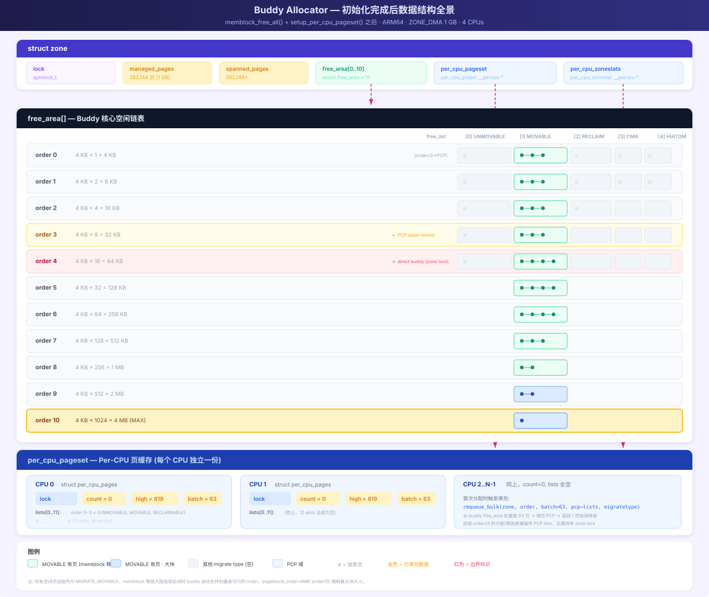

# Linux Buddy Allocator 初始化过程解析

> 基于 Linux 6.18.1，ARM64 架构，源码路径：`mm/page_alloc.c` · `mm/percpu.c` · `mm/memblock.c`

## 一、ARM64 当前内核配置

| 常量 | 值 | 来源 |
|------|-----|------|
| `PAGE_SHIFT` | 12 | `.config:845` |
| `PAGE_SIZE` | 4096 (4 KB) | `1 << 12` |
| `ARCH_FORCE_MAX_ORDER` | 10 | `.config:481` |
| `MAX_PAGE_ORDER` | 10 | `mmzone.h:32` |
| `NR_PAGE_ORDERS` | 11 | `MAX_PAGE_ORDER + 1` (order 0~10) |
| `MAX_ORDER_NR_PAGES` | 1024 (4 MB) | `1 << MAX_PAGE_ORDER` |
| `CONFIG_NUMA` | y | `.config:455` |
| `CONFIG_ZONE_DMA` | y | `.config:1071` |
| `CONFIG_ZONE_DMA32` | y | `.config:1072` |
| `MAX_NR_ZONES` | 4 | DMA, DMA32, NORMAL, MOVABLE |
| `MIGRATE_TYPES` | 6 | UNMOVABLE, MOVABLE, RECLAIMABLE, HIGHATOMIC, CMA, ISOLATE |
| `CONFIG_SPARSEMEM_VMEMMAP` | y | `.config:1006` |

---

## 二、核心数据结构

### 2.1 `struct free_area`

```c
// include/linux/mmzone.h:138
struct free_area {
    struct list_head  free_list[MIGRATE_TYPES];  // 每种迁移类型一条链表
    unsigned long     nr_free;                    // 该 order 的空闲页块数
};
```

### 2.2 zone 内的 free_area 数组

```c
// include/linux/mmzone.h:999
struct zone {
    struct free_area  free_area[NR_PAGE_ORDERS];  // NR_PAGE_ORDERS = 11 (order 0~10)
};
```

**每个 order 是完全独立的桶**，不同 order 的页面不在同一条链表上。

### 2.3 整体视图

```
zone->free_area[]
 ┌────────────────────────────────────────────────────────────────┐
 │ [0]  nr_free=N0    free_list[UNMOVABLE]:  page ⇄ page ⇄ ...   │
 │                     free_list[MOVABLE]:    page ⇄ ...          │
 │                     free_list[RECLAIMABLE]: ...                │
 │                     free_list[HIGHATOMIC]:  ...                │
 │                     free_list[CMA]:        ...                 │
 │                     free_list[ISOLATE]:    ...                 │
 ├────────────────────────────────────────────────────────────────┤
 │ [1]  nr_free=N1    free_list[MOVABLE]:    page ⇄ ...          │
 │                     ...                                        │
 ├────────────────────────────────────────────────────────────────┤
 │ ...                                                            │
 ├────────────────────────────────────────────────────────────────┤
 │ [9]  nr_free=N9    ...                                        │
 ├────────────────────────────────────────────────────────────────┤
 │[10]  nr_free=N10   free_list[MOVABLE]:   page ⇄ page ⇄ ...   │
 │                     ...                                        │
 └────────────────────────────────────────────────────────────────┘
```

---

## 三、`__add_to_free_list` 函数解析

```c
// page_alloc.c:806
static inline void __add_to_free_list(struct page *page, struct zone *zone,
                                      unsigned int order, int migratetype,
                                      bool tail)
{
    struct free_area *area = &zone->free_area[order];
    int nr_pages = 1 << order;

    VM_WARN_ONCE(get_pageblock_migratetype(page) != migratetype, ...);

    if (tail)
        list_add_tail(&page->buddy_list, &area->free_list[migratetype]);
    else
        list_add(&page->buddy_list, &area->free_list[migratetype]);
    area->nr_free++;

    if (order >= pageblock_order && !is_migrate_isolate(migratetype))
        __mod_zone_page_state(zone, NR_FREE_PAGES_BLOCKS, nr_pages);
}
```

### 逐行解析

| 行 | 代码 | 说明 |
|----|------|------|
| `area = &zone->free_area[order]` | 按 order 定位桶 | 取 `free_area` 数组中对应 order 的元素 |
| `tail` 参数 | `true` → `list_add_tail`，`false` → `list_add` | memblock 释放用 `FPI_TO_TAIL` → 插入链表尾；expand 拆分用 `false` → 插入链表头 |
| `page->buddy_list` | 每个 `struct page` 内嵌的 `list_head` | 页面通过此字段串联 |
| `area->free_list[migratetype]` | 链表头 | 同一 order、同一迁移类型的页面挂在同一链表 |
| `area->nr_free++` | 计数递增 | 快速获取该 order 的空闲块数，`/proc/buddyinfo` 读的就是这个字段 |
| `order >= pageblock_order` | 大块统计 | 释放 order ≥ pageblock_order 的整块时，更新 `NR_FREE_PAGES_BLOCKS` 计数器 |

### `list_add` vs `list_add_tail` 的区别

```
list_add(&page->buddy_list, &free_list):        list_add_tail(&page->buddy_list, &free_list):

  插入前:  head ⇄ A ⇄ B                插入前:  head ⇄ A ⇄ B
  插入后:  head → page → A ⇄ B         插入后:  head ⇄ A ⇄ B ⇄ page
           ↑_____________↓                       ↑_________________↓
  (page 放在 head 后面，下次分配优先命中)     (page 放在尾部，降低被快速重新分配的概率)
```

**memblock 移交使用 `FPI_TO_TAIL`**：4MB 大块放到链表尾，降低与 buddy 已存在的同样 4MB 块竞争，让原本就在 buddy 的空闲块优先被分配，新加入的块作为后备。

---

## 四、不同 Order 的串联机制

不同 order **没有横向链表直接相连**，它们通过两个操作在 order 间流动：

### 4.1 `expand()` — 分配时从上拆下

当请求小 order 页面但只有大 order 块时，将大块拆分，剩余部分加入低 order 链表：

```c
// page_alloc.c:1689
static inline unsigned int expand(struct zone *zone, struct page *page,
                                  int low, int high, int migratetype)
{
    unsigned int size = 1 << high;

    while (high > low) {
        high--;
        size >>= 1;                      // 每次减半
        __add_to_free_list(&page[size], zone, high, migratetype, false);
        set_buddy_order(&page[size], high);
    }
    // 返回 page，大小为 2^low
}
```

**实例**：请求 order=2 (16KB)，只有 order=4 (64KB) 块：

```
初始:  0 ────────────────────── 15  (order=4, 64KB, 16页)
       从 free_area[4] 取出

expand(page, low=2, high=4):
  high=4→3: 拆出 page[8..15]  →  free_area[3] +1   order=3 (32KB)
  high=3→2: 拆出 page[4..7]   →  free_area[2] +1   order=2 (16KB)

最终:  page[0..3] 返回给调用者
       free_area[2] 新增 page[4..7]
       free_area[3] 新增 page[8..15]
```

### 4.2 `__free_one_page` — 释放时从下合上

释放页面时，检查其 buddy 是否空闲。若空闲，从低 order 链表删除 buddy，合并后升级到高 order：

```c
// page_alloc.c:941
static inline void __free_one_page(struct page *page,
        unsigned long pfn, struct zone *zone, unsigned int order, ...)
{
    while (order < MAX_PAGE_ORDER) {
        buddy = find_buddy_page_pfn(page, pfn, order, &buddy_pfn);
        if (!buddy)
            goto done_merging;              // buddy 不在 → 停止合并

        __del_page_from_free_list(buddy, zone, order, buddy_mt);  // 从链表删除
        combined_pfn = buddy_pfn & pfn;
        page = page + (combined_pfn - pfn);
        pfn = combined_pfn;
        order++;                             // 升级到更高 order
    }

done_merging:
    set_buddy_order(page, order);            // PG_buddy + order 标记
    __add_to_free_list(page, zone, order, migratetype, to_tail);  // 加入对应链表
}
```

**实例**：依次释放 PFN 4~7 (均为 order=0)：

```
初始: free_area 全空

释放 pfn=4:  无伙伴 → free_area[0] +1       free_area[0] = {4}
释放 pfn=5:  buddy=4 空闲 → 删4, 合并为 order=1 (pfn=4)
                              free_area[0] 空
                              free_area[1] +1  {4-5}
释放 pfn=6:  无伙伴 → free_area[0] +1       free_area[0] = {6}
释放 pfn=7:  buddy=6 空闲 → 删6, 合并为 order=1 (pfn=6)
                              buddy=4 (order=1) 也空闲 → 删4-5, 合并为 order=2 (pfn=4)
                              free_area[0] 空
                              free_area[1] 空
                              free_area[2] +1  {4-7}
```

### 4.3 流动示意图

```
                  expand() (从上拆)
              ──────────────────────→
  order=10 ←→ order=9 ←→ ... ←→ order=0
              ←──────────────────────
              __free_one_page (从下合)
```

---

## 五、memblock → Buddy 完整交接链路

```
memblock_free_all()                          [mm/memblock.c:2341]
  ├─ free_unused_memmap()                    [ARM64: 空函数，SPARSEMEM_VMEMMAP=y]
  ├─ reset_all_zones_managed_pages()         [全 zone managed_pages 归零]
  ├─ memblock_clear_kho_scratch_only()
  └─ free_low_memory_core_early()           [mm/memblock.c:2291]
       ├─ memblock_clear_hotplug(0, -1)      [清除所有 MEMBLOCK_HOTPLUG 标志]
       ├─ memmap_init_reserved_pages()        [标记 reserved 页为 PageReserved]
       └─ for_each_free_mem_range()
            └─ __free_memory_core(start, end) [mm/memblock.c:2225]
                 └─ __free_pages_memory()     [最大对齐拆分]
                      └─ memblock_free_pages()
                           └─ __free_pages_core(page, order, MEMINIT_EARLY)
                                ├─ __ClearPageReserved × n   [清除 reserved 标志]
                                ├─ set_page_count(p, 0) × n  [refcount 1→0]
                                ├─ atomic_long_add(managed_pages)
                                └─ __free_pages_ok(page, order, FPI_TO_TAIL)
                                     └─ free_one_page(zone, page, pfn, order)
                                          └─ split_large_buddy(zone, page, pfn, order)
                                               └─ __free_one_page()          ★ 核心交接点 ★
                                                    ├─ buddy 合并循环
                                                    ├─ set_buddy_order()
                                                    └─ __add_to_free_list()  ← 加入 buddy 链表
```

**最终交接点**：`__free_one_page` 中的 `__add_to_free_list` —— 页面加入 `zone->free_area[order].free_list[migratetype]`，从此由伙伴分配器接管。

---

## 六、`/proc/buddyinfo` 与 `/proc/pagetypeinfo` 解读

### 6.1 数据对应

```
__add_to_free_list(&page, zone, order, migratetype, ...)
    │                  │     │        │
    │                  │     │        └── pagetypeinfo 的列 (迁移类型)
    │                  │     └── buddyinfo 的 order 列
    │                  └── "Node X, zone Y"
    └── 写入 page->buddy_list ⇄ free_area[order].free_list[migratetype]
```

### 6.2 示例解读

以 order=9 为例，`pagetypeinfo` 显示：

```
Order:       9
Unmovable:   1
Movable:     1
Reclaimable: 1
CMA:         1
HighAtomic:  0
Isolate:     0
```

对应的 `free_area[9]` 结构：

```
free_area[9]
┌──────────────────────────────────────────────┐
│ free_list[UNMOVABLE]:    ┌─→ page_A ←─┐     │
│                          └────────────┘     │
│ free_list[MOVABLE]:      ┌─→ page_B ←─┐     │
│                          └────────────┘     │
│ free_list[RECLAIMABLE]:  ┌─→ page_C ←─┐     │
│                          └────────────┘     │
│ free_list[CMA]:          ┌─→ page_D ←─┐     │
│                          └────────────┘     │
│ free_list[HIGHATOMIC]:   (empty)            │
│ free_list[ISOLATE]:      (empty)            │
│                                              │
│ nr_free = 4                                  │
└──────────────────────────────────────────────┘

每个 page_X 都是 2^9 = 512 页连续物理内存 (2MB)
```

### 6.3 `Number of blocks type` 含义

```
Number of blocks type  Unmovable  Movable  Reclaimable  HighAtomic  CMA  Isolate
Node 0, zone DMA            12      476            8           0   16        0
```

这是 **pageblock 级别**的迁移类型统计，每个 pageblock (此处 512 页 = 2MB) 拥有一个主导迁移类型。12 + 476 + 8 + 16 = 512 个 pageblock，zone 总大小 = 512 × 2MB = 1GB。

### 6.4 内存状态判断

- **低 order (0~3) Unmovable 主导**：内核代码、slab、驱动 DMA 缓冲区等不可迁移小分配导致，不可合并
- **高 order (10) Movable 主导**：用户态匿名页、页缓存等合并为大块，内存连续性良好
- **Movable pageblock 占比 93%**：内存布局健康，大页分配（THP、hugetlb）无压力

---

## 七、迁移类型（Migratetype）的界定

### 7.1 GFP 标志 → 迁移类型映射

```c
// include/linux/gfp.h:20
#define GFP_MOVABLE_MASK (__GFP_RECLAIMABLE | __GFP_MOVABLE)
#define GFP_MOVABLE_SHIFT 3

static inline int gfp_migratetype(const gfp_t gfp_flags)
{
    if (unlikely(page_group_by_mobility_disabled))
        return MIGRATE_UNMOVABLE;

    return (gfp_flags & GFP_MOVABLE_MASK) >> GFP_MOVABLE_SHIFT;
}
```

| `__GFP_MOVABLE` (bit 3) | `__GFP_RECLAIMABLE` (bit 4) | 结果 | 迁移类型 |
|:---:|:---:|------|------|
| 0 | 0 | `0b00 >> 3 = 0` | **MIGRATE_UNMOVABLE** |
| 1 | 0 | `0b01 >> 3 = 1` | **MIGRATE_MOVABLE** |
| 0 | 1 | `0b10 >> 3 = 2` | **MIGRATE_RECLAIMABLE** |
| 1 | 1 | `0b11 >> 3 = 3` | **MIGRATE_HIGHATOMIC** |

编译时一致性检查：

```c
BUILD_BUG_ON((___GFP_MOVABLE >> 3) != MIGRATE_MOVABLE);          // 1 == 1 ✓
BUILD_BUG_ON((___GFP_RECLAIMABLE >> 3) != MIGRATE_RECLAIMABLE);  // 2 == 2 ✓
BUILD_BUG_ON(((___GFP_MOVABLE | ___GFP_RECLAIMABLE) >> 3)        // 3 == 3 ✓
             != MIGRATE_HIGHATOMIC);
```

### 7.2 六种类型详解

#### ① MIGRATE_UNMOVABLE — 不可移动

| 项 | 说明 |
|----|------|
| GFP 标志 | 无 `__GFP_MOVABLE` 也无 `__GFP_RECLAIMABLE` |
| 典型 GFP | `GFP_KERNEL`, `GFP_ATOMIC`, `GFP_DMA` |
| 分配来源 | `kmalloc`/slab、`vmalloc`、驱动 DMA 缓冲区 |
| 能否迁移 | ❌ 不可，内存碎片化的主要来源 |

#### ② MIGRATE_MOVABLE — 可移动（默认）

| 项 | 说明 |
|----|------|
| GFP 标志 | `__GFP_MOVABLE` 置位 |
| 典型 GFP | `GFP_HIGHUSER`, `GFP_USER` |
| 分配来源 | 用户态匿名页、页缓存 |
| 能否迁移 | ✅ 可通过 page migration / compaction 迁移 |
| 初始状态 | **所有 pageblock 启动时默认 MIGRATE_MOVABLE** |

```c
// mm/mm_init.c:959
memmap_init_range(..., MIGRATE_MOVABLE, false);
// 注释: "Usually, we want to mark the pageblock MIGRATE_MOVABLE,
//         such that unmovable allocations won't be scattered
//         all over the place during system boot."
```

#### ③ MIGRATE_RECLAIMABLE — 可回收

| 项 | 说明 |
|----|------|
| GFP 标志 | `__GFP_RECLAIMABLE` 置位 |
| 分配来源 | 可收缩 slab：dentry cache、inode cache（`SLAB_RECLAIM_ACCOUNT`） |
| 能否迁移 | 不可直接迁移，通过 `shrink_slab()` 回收后重建 |

#### ④ MIGRATE_HIGHATOMIC — 高阶原子预留

| 项 | 说明 |
|----|------|
| GFP 标志 | `__GFP_MOVABLE | __GFP_RECLAIMABLE` 同时置位 |
| 来源 | 从其他类型主动借调，为 `GFP_ATOMIC` 高阶分配预留 |
| 典型场景 | 网络驱动需要 order-1 以上连续内存时的 fallback |

#### ⑤ MIGRATE_CMA — 连续内存预留

| 项 | 说明 |
|----|------|
| 来源 | **不通过 GFP 标志**，在 pageblock 级别设置 |
| 设置方式 | Device Tree `linux,cma` / 命令行 `cma=256M` / `__free_pageblock_cma()` |
| 用途 | DMA 大块连续内存、显存共享 |
| 能否分配 unmovable | ❌ `is_migrate_cma()` 阻止 unmovable 落入 CMA |

#### ⑥ MIGRATE_ISOLATE — 隔离区

| 项 | 说明 |
|----|------|
| 来源 | `set_pageblock_isolate()` — 内存热插拔 / compaction 隔离 |
| 能否分配 | ❌ 完全不可分配，所有 allocator 跳过 |

#### ⑦ 如何追踪 CMA 内存的分配者

`/proc/pagetypeinfo` 只显示 CMA 的空闲页数，无法直接看出谁在使用已分配的 CMA 内存。有两种追踪方式：

**方式一：ftrace tracepoint（无需重编内核）**

```bash
ls /sys/kernel/debug/tracing/events/cma/
# cma_alloc_start    cma_alloc_finish    cma_release

# 开启跟踪
echo 1 > /sys/kernel/debug/tracing/events/cma/cma_alloc_start/enable
echo 1 > /sys/kernel/debug/tracing/events/cma/cma_alloc_finish/enable
echo 1 > /sys/kernel/debug/tracing/events/cma/cma_release/enable

# 开启调用栈（可选）
echo stacktrace > /sys/kernel/debug/tracing/events/cma/cma_alloc_finish/trigger

# 监控输出
cat /sys/kernel/debug/tracing/trace_pipe
```

输出示例：

```
cma_alloc_start: name=cma count=4 align=0
cma_alloc_finish: name=cma pfn=0x88000 count=4
     => cma_alloc
     => dma_alloc_contiguous
     => hns3_dma_init               ← 使用者：hns3 网卡驱动
```

**方式二：CMA debugfs（需 `CONFIG_CMA_DEBUGFS=y`）**

```bash
# 本例配置中未开启（.config:1062: # CONFIG_CMA_DEBUGFS is not set）
# 若已开启，可查看：
cat /sys/kernel/debug/cma/cma/count      # 当前已分配页数
cat /sys/kernel/debug/cma/cma/alloc      # 累计分配次数
cat /sys/kernel/debug/cma/cma/used       # 已使用位图
```

**CMA 分配的两种调用路径**：

| 路径 | 调用链 | 场景 |
|------|-------|------|
| 驱动直调 | `dma_alloc_contiguous()` → `cma_alloc()` → `alloc_contig_range()` | 驱动申请 DMA 大块连续内存 |
| MOVABLE fallback | `alloc_pages(GFP_USER)` → `__rmqueue_cma_fallback()` | MOVABLE 链表空时从 CMA 借页（触发条件：`NR_FREE_CMA_PAGES > NR_FREE_PAGES/2`） |

### 7.3 Pageblock 级别 vs 单页级别

迁移类型在两个层面存在：

| 层面 | 粒度 | 存储 | 读取 |
|------|------|------|------|
| **Pageblock** | 512 页（2MB） | pageblock 位图 | `get_pageblock_migratetype()` |
| **单页/块** | 1 页 ~ 1024 页 | 所在的 `free_list[]` | 由链表位置隐式决定 |

`pageblock_order`（本次=9）以下，单页 migratetype 可与 pageblock 不同；`pageblock_order` 以上必须一致。`__add_to_free_list` 中有断言检查：

```c
// page_alloc.c:806
VM_WARN_ONCE(get_pageblock_migratetype(page) != migratetype, ...);
```

### 7.4 Pageblock 窃取机制详解

这是 UNMOVABLE / RECLAIMABLE / HIGHATOMIC 类型 **首次出现**的唯一途径。

> **时序说明**：窃取发生在 `memblock_free_all()` **完成之后**的运行时分配过程，而非 buddy 初始化阶段。此时 buddy 已就绪，所有 pageblock 均为 MOVABLE，`alloc_pages()` 可用但 `kmalloc()` 尚未初始化（slab 需要额外的初始化步骤）。UNMOVABLE/RECLAIMABLE 是通过 `alloc_pages(GFP_KERNEL)` 等调用反应式产生的——没有预先"判定"，只有按需"窃取"。

#### 7.4.1 分配回退的四级模式

```c
// page_alloc.c:2431 — 分配优先级逐级回退
enum rmqueue_mode {
    RMQUEUE_NORMAL,  // ① 优先从本类型 free_list 取
    RMQUEUE_CMA,     // ② 从 CMA 区域取（仅 ALLOC_CMA 标志时）
    RMQUEUE_CLAIM,   // ③ 窃取整个 pageblock
    RMQUEUE_STEAL,   // ④ 窃取单个页（不改变 pageblock 类型）
};
```

分配流程：

```
__rmqueue(zone, order, MIGRATE_UNMOVABLE, ...)
  │
  ├─ RMQUEUE_NORMAL: __rmqueue_smallest(UNMOVABLE)
  │    └─ UNMOVABLE 链表空 → fallthrough
  ├─ RMQUEUE_CMA: 不适用（非 ALLOC_CMA）→ fallthrough
  ├─ RMQUEUE_CLAIM: __rmqueue_claim(zone, order, UNMOVABLE)  ★ 尝试窃取整块
  │    └─ 成功 → 返回 page, mode 切回 RMQUEUE_NORMAL
  │    └─ 失败 → fallthrough
  └─ RMQUEUE_STEAL: __rmqueue_steal(zone, order, UNMOVABLE)   ★ 窃取单页
       └─ 成功 → 返回 page, mode 保持 RMQUEUE_STEAL
```

#### 7.4.2 `should_try_claim_block` — 是否尝试窃取的决策规则

```c
// page_alloc.c:2203
static bool should_try_claim_block(unsigned int order, int start_mt)
{
    // 规则1: order ≥ pageblock_order → 总是尝试（释放的块就是完整 pageblock）
    if (order >= pageblock_order)
        return true;

    // 规则2: order ≥ 半个 pageblock → 总是尝试（大块碎片化严重）
    if (order >= pageblock_order / 2)
        return true;

    // 规则3: UNMOVABLE / RECLAIMABLE → 总是尝试
    // 原因: 它们落入 MOVABLE pageblock 会造成永久碎片化
    if (start_mt == MIGRATE_RECLAIMABLE || start_mt == MIGRATE_UNMOVABLE)
        return true;

    // 规则4: MOVABLE 小分配 → 不尝试窃取整块
    // 原因: MOVABLE 可被 compaction 迁移，临时混入不会永久碎片化
    return false;
}
```

| 请求类型 | order | 是否尝试 claim | 原因 |
|----------|:-----:|:---:|------|
| MOVABLE | 0~4 | ❌ 不尝试 | 小页不影响，compaction 可修复 |
| MOVABLE | 5~8 | ✅ 尝试 | order ≥ pageblock_order/2 |
| MOVABLE | 9~10 | ✅ 尝试 | order ≥ pageblock_order |
| **UNMOVABLE** | **任意** | ✅ **总是** | 防止永久碎片化 |
| **RECLAIMABLE** | **任意** | ✅ **总是** | 防止永久碎片化 |

#### 7.4.3 `__rmqueue_claim` — 寻找可以窃取的目标

```c
// page_alloc.c:2354
static struct page *
__rmqueue_claim(struct zone *zone, int order, int start_migratetype, ...)
{
    // 从最大 order 开始往下找，优先窃取大块
    for (current_order = MAX_PAGE_ORDER; current_order >= min_order;
         --current_order) {

        // 从 fallback 表中找有空闲的目标类型
        fallback_mt = find_suitable_fallback(area, current_order,
                                             start_migratetype, true);
        if (fallback_mt == -1)   // 该 order 所有 fallback 类型都空
            continue;
        if (fallback_mt == -2)   // order 太小不值得窃取整块
            break;

        page = get_page_from_free_area(area, fallback_mt);  // 取一个块
        page = try_to_claim_block(zone, page, current_order, order,
                                  start_migratetype, fallback_mt, ...);
        if (page)
            return page;  // 窃取成功
    }
    return NULL;
}
```

**关键**：从高 order 往下找，因为大块携带着更多空闲页，更容易满足"半个 pageblock"的窃取条件。

#### 7.4.4 `try_to_claim_block` — 窃取判断核心

```c
// page_alloc.c:2278
static struct page *
try_to_claim_block(struct zone *zone, struct page *page,
                   int current_order, int order, int start_type,
                   int block_type, unsigned int alloc_flags)
{
    int free_pages, movable_pages, alike_pages;

    // === 路径 A: 被取出的块 ≥ 整个 pageblock ===
    if (current_order >= pageblock_order) {
        del_page_from_free_list(page, zone, current_order, block_type);
        change_pageblock_range(page, current_order, start_type);  // 改位图
        nr_added = expand(zone, page, order, current_order, start_type);
        return page;  // 无条件窃取成功
    }

    // === 路径 B: 被取出的块 < pageblock → 统计 pageblock 内部状态 ===
    prep_move_freepages_block(zone, page, &start_pfn,
                              &free_pages, &movable_pages);
    // free_pages:   pageblock 内空闲页数
    // movable_pages: pageblock 内可迁移页数（LRU 或 movable_ops）

    // === 计算 "兼容" 页数 ===
    if (start_type == MIGRATE_MOVABLE) {
        alike_pages = movable_pages;  // MOVABLE → 只算可迁移页
    } else {
        if (block_type == MIGRATE_MOVABLE)
            // UNMOVABLE 回退到 MOVABLE pageblock:
            //   非空闲非 MOVABLE 的页 = 兼容（内核已分配的 unmovable 页）
            alike_pages = pageblock_nr_pages - (free_pages + movable_pages);
        else
            // UNMOVABLE 回退到 RECLAIMABLE 或反之:
            //   保守：不认为任何非空闲页是兼容的
            alike_pages = 0;
    }

    // === 窃取条件: 空闲 + 兼容 ≥ 半个 pageblock ===
    if (free_pages + alike_pages >= (1 << (pageblock_order-1))) {
        __move_freepages_block(zone, start_pfn, block_type, start_type);
        //  ↑ 将 pageblock 内所有空闲页从 free_list[block_type] 移到 free_list[start_type]
        set_pageblock_migratetype(pfn_to_page(start_pfn), start_type);
        //  ↑ 改写 pageblock 位图
        return __rmqueue_smallest(zone, order, start_type);
    }

    return NULL;  // 条件不满足，窃取失败 → 交给 __rmqueue_steal 处理
}
```

#### 7.4.5 完整窃取实例

**重要前提**：以下发生在 `memblock_free_all()` **完成之后**。此时 buddy 已初始化完毕，所有空闲页均为 `MIGRATE_MOVABLE`，但 `kmalloc` 尚不可用（slab 还未初始化）。UNMOVABLE 是由 `alloc_pages(GFP_KERNEL)` 触发的。

以 **首次 `alloc_pages(GFP_KERNEL, 0)`** 触发 UNMOVABLE pageblock 的产生为例：

```
初始状态:
  所有 pageblock 位图: MIGRATE_MOVABLE (=1)
  free_area[0~10].free_list[MOVABLE]: 包含 zone 内所有空闲页
  free_area[0~10].free_list[UNMOVABLE]: 全空 —— 没有任何 UNMOVABLE 页

分配请求: alloc_pages(GFP_KERNEL, 0)
  → gfp_migratetype(GFP_KERNEL) = MIGRATE_UNMOVABLE (=0)
  → 这是 buddy 初始化后首次 UNMOVABLE 分配
```

**Step 1**: `__rmqueue(zone, 0, UNMOVABLE, ...)` → `RMQUEUE_NORMAL`

```
__rmqueue_smallest(zone, 0, UNMOVABLE)
  → free_area[0].free_list[UNMOVABLE] = 空
  → free_area[1].free_list[UNMOVABLE] = 空
  → ...
  → free_area[10].free_list[UNMOVABLE] = 空
  → 返回 NULL，fallthrough 到 RMQUEUE_CLAIM
```

**Step 2**: `__rmqueue_claim(zone, 0, UNMOVABLE)`

```
current_order=10:
  find_suitable_fallback(area[10], UNMOVABLE, claimable=true)
    → should_try_claim_block(10, UNMOVABLE) → true  (规则1)
    → fallbacks[UNMOVABLE][0] = RECLAIMABLE → free_area[10].free_list[RECLAIMABLE] = 空
    → fallbacks[UNMOVABLE][1] = MOVABLE    → free_area[10].free_list[MOVABLE] = 有块!
    → 返回 MOVABLE

  get_page_from_free_area(area[10], MOVABLE) → page (一个 4MB MOVABLE 块)
  → try_to_claim_block(zone, page, current_order=10, order=0,
                        start_type=UNMOVABLE, block_type=MOVABLE)
```

**Step 3**: `try_to_claim_block` 路径 A（`current_order=10 ≥ pageblock_order=9`）：

```
current_order=10 → 块跨 2 个 pageblock: P_block0 和 P_block1

del_page_from_free_list(page, zone, 10, MOVABLE)
  → 从 free_area[10].free_list[MOVABLE] 删除该 4MB 块

change_pageblock_range(page, current_order=10, start_type=UNMOVABLE)
  → set_pageblock_migratetype(P_block0, UNMOVABLE)  位图[block0] = 0
  → set_pageblock_migratetype(P_block1, UNMOVABLE)  位图[block1] = 0

expand(zone, page, low=0, high=10, UNMOVABLE):
  → 拆出 order=9,8,...,1 的块，全放入 free_list[UNMOVABLE]
  → 返回 order=0 给调用者

account_freepages(zone, nr_added=1023, UNMOVABLE)  // 1024-1=1023 页进入 UNMOVABLE 统计

/proc/pagetypeinfo 变化:
  Number of blocks type Unmovable: 0 → 2
  Number of blocks type Movable:   496 → 494
```

**Step 4**: 单页窃取示例（当整块窃取失败时）

```
请求: GFP_USER → MIGRATE_MOVABLE, order=0
  MOVABLE 链表空 → fallback to UNMOVABLE

__rmqueue_claim 尝试窃取失败（alike_pages 不足一半）
  → fallthrough to RMQUEUE_STEAL

__rmqueue_steal(zone, 0, MOVABLE):
  → 找到 free_area[2].free_list[UNMOVABLE] 有空闲 order=2 块
  → page_del_and_expand(zone, page, low=0, high=2, UNMOVABLE)
      → 不改变 pageblock 位图！
      → 拆出 order=1,0 放入 free_list[UNMOVABLE]（仍是 UNMOVABLE）
      → 返回 order=0 给 MOVABLE 请求者

结果: MOVABLE 分配从 UNMOVABLE pageblock 拿走一页，
      pageblock 仍为 UNMOVABLE，不产生新类型
```

#### 7.4.6 三种窃取路径对比

| | `current_order ≥ pageblock_order` | 整块窃取（half-page） | 单页窃取（steal） |
|---|---|---|---|
| 触发函数 | `__rmqueue_claim` 路径A | `__rmqueue_claim` 路径B | `__rmqueue_steal` |
| 条件 | 取出的块 ≥ 完整 pageblock | `free + alike ≥ 半 pageblock` | claim 失败后的 fallback |
| pageblock 位图 | ✅ 改变 | ✅ 改变 | ❌ 不变 |
| 空闲页迁移 | `expand()` 全部放入新类型 | `__move_freepages_block` 迁移 | `page_del_and_expand` 只有拆出的子块 |
| 产生新类型 | ✅ | ✅ | ❌ |
| 碎片化风险 | 无 | 低 | **高** — 跨类型混用 pageblock |

### 7.5 总结表

| 迁移类型 | 值 | 来源 | 能否移动 | 链表位置 |
|----------|:---:|------|:---:|------|
| UNMOVABLE | 0 | `GFP_KERNEL`，无特殊标志 | ❌ | `free_list[0]` |
| MOVABLE | 1 | `__GFP_MOVABLE` + 启动默认 | ✅ | `free_list[1]` |
| RECLAIMABLE | 2 | `__GFP_RECLAIMABLE` | 可回收 | `free_list[2]` |
| HIGHATOMIC | 3 | `__GFP_MOVABLE\|RECLAIMABLE` 或借调 | ✅ | `free_list[3]` |
| CMA | 4 | DT `linux,cma` / `cma=` 命令行 | ✅ | `free_list[4]` |
| ISOLATE | 5 | `set_pageblock_isolate()` | — | `free_list[5]`（始终空） |

### 7.6 memblock 无类型 → buddy 有类型的转换机制

**核心问题**：memblock 只记录物理区间，没有任何 migratetype 概念。免费页释放到 buddy 时，迁移类型从哪里来？

**答案**：迁移类型**不来自 memblock**，而是来自 pageblock 位图。该位图在 `memblock_free_all()` **之前**已由 zone 初始化写好。

#### 时序

```
start_kernel()
  → mm_init()
      → paging_init()
          → free_area_init()
              → free_area_init_core()
                  → memmap_init_range(..., MIGRATE_MOVABLE)  ★ 步骤1: 写位图
                      → init_pageblock_migratetype(page, MIGRATE_MOVABLE)
                          → __set_pfnblock_flags_mask(...)

      → mem_init()
          → memblock_free_all()                                ★ 步骤2: 读位图释放
              → ... → split_large_buddy()
                  → mt = get_pfnblock_migratetype(page, pfn)  // 读回 MOVABLE
                  → __add_to_free_list(..., MIGRATE_MOVABLE)  // 放入 free_list[1]
```

#### 关键代码衔接

**写入侧**（zone init，先执行）：

```c
// mm/mm_init.c:936
init_pageblock_migratetype(page, MIGRATE_MOVABLE, false);

// page_alloc.c:551
void __meminit init_pageblock_migratetype(struct page *page,
                                          enum migratetype migratetype, ...)
{
    flags = migratetype;   // MIGRATE_MOVABLE = 1
    __set_pfnblock_flags_mask(page, page_to_pfn(page), flags,
                              MIGRATETYPE_AND_ISO_MASK);  // 写入 pageblock 位图
}
```

**读取侧**（memblock 释放，后执行）：

```c
// page_alloc.c:1497 split_large_buddy()
int mt = get_pfnblock_migratetype(page, pfn);  // 从位图读回 MIGRATE_MOVABLE

// page_alloc.c:444
get_pfnblock_migratetype(const struct page *page, unsigned long pfn)
{
    flags = __get_pfnblock_flags_mask(page, pfn, MIGRATETYPE_AND_ISO_MASK);
    return flags & MIGRATETYPE_MASK;  // → 1 = MIGRATE_MOVABLE
}
```

#### 转换示意图

```
memblock 中的空闲区间:
  [0x40000000, 0x80000000)  2GB, nid=0    ← 只有物理地址 + nid，无类型概念

       ↓ 步骤1: memmap_init_range() 已预先写入 pageblock 位图

pageblock 位图 (以 2MB 为粒度):
  ┌──────┬──────┬──────┬─────┬──────┐
  │  01  │  01  │  01  │ ... │  01  │   ← 全是 MIGRATE_MOVABLE=1
  └──────┴──────┴──────┴─────┴──────┘

       ↓ 步骤2: memblock_free_all() 读位图释放

buddy 链表:
  free_area[0~10].free_list[MOVABLE]:
    page ⇄ page ⇄ page ⇄ ...  ← 所有 memblock 空闲页以 MOVABLE 身份入列

/proc/pagetypeinfo:
  Number of blocks type Movable: 476 (默认)
  Number of blocks type CMA: 16     (由 init_cma_reserved_pageblock 单独改写)
  Number of blocks type Unmovable: 0  ← 内核尚未分配，全为 MOVABLE
```

#### CMA 的特例

CMA pageblock 不走默认 MOVABLE，由 CMA 子系统单独改写：

```c
// mm/mm_init.c:2237
void __init init_cma_reserved_pageblock(struct page *page)
{
    // ... 清除 reserved 标志、重置 refcount ...
    init_pageblock_migratetype(page, MIGRATE_CMA, false);  // 写 CMA 到位图
    __free_pages(page, pageblock_order);                   // 释放到 buddy
}
```

#### 一句话总结

**memblock 不携带类型**。迁移类型由 `memmap_init_range()` 在 zone 初始化时预写入 pageblock 位图（默认全为 `MIGRATE_MOVABLE`），`memblock_free_all()` 释放时通过 `get_pfnblock_migratetype()` 回读该位图，再交给 `__add_to_free_list()` 放入对应的 `free_list[]`。CMA 区域由 CMA 子系统在 pageblock 位图中单独改写。

---

## 八、PCP（Per-CPU Pages）初始化

### 8.1 两阶段初始化

PCP 是 buddy 分配器的**每 CPU 页缓存**，用于减少 `zone->lock` 竞争。初始化分为两个阶段：

**阶段一：Boot Pageset（zone 初始化期间，先于 `memblock_free_all`）**

```c
// mm/mm_init.c:1433 — free_area_init_core() 中调用
zone_pcp_init(zone);

// page_alloc.c:6139
__meminit void zone_pcp_init(struct zone *zone)
{
    zone->per_cpu_pageset = &boot_pageset;      // 指向静态 boot pageset
    zone->per_cpu_zonestats = &boot_zonestats;
    zone->pageset_high_min = BOOT_PAGESET_HIGH; // = 0
    zone->pageset_high_max = BOOT_PAGESET_HIGH; // = 0
    zone->pageset_batch = BOOT_PAGESET_BATCH;   // = 1
}
```

`boot_pageset` 是所有 zone **共享**的静态 per-CPU 变量，在 `build_all_zonelists_init()` 中初始化：

```c
// page_alloc.c:5786
for_each_possible_cpu(cpu)
    per_cpu_pages_init(&per_cpu(boot_pageset, cpu), ...);
```

boot pageset 参数：

| 参数 | 值 | 效果 |
|------|:---:|------|
| `high` | 0 | **不做缓存**，每次分配/释放直接穿透到 buddy |
| `batch` | 1 | 每次从 buddy 只取 1 页 |
| 存储 | `DEFINE_PER_CPU` 静态 | 所有 zone 共享同一套 |

**为什么 high=0？** percpu 动态分配器此时尚未就绪，无法分配真正的 per-CPU pageset。boot pageset 只是占位符，确保 `memblock_free_all()` 之后 buddy 立即可用，但不做任何缓存——每个 alloc/free 都穿透到 `zone->lock` 保护的 buddy 核心路径。

**阶段二：Real Per-CPU Pageset（percpu 分配器就绪后）**

```c
// page_alloc.c:6110
void __init setup_per_cpu_pageset(void)
{
    for_each_populated_zone(zone)
        setup_zone_pageset(zone);
}

// page_alloc.c:6045
void __meminit setup_zone_pageset(struct zone *zone)
{
    zone->per_cpu_pageset = alloc_percpu(struct per_cpu_pages);     // 动态分配
    zone->per_cpu_zonestats = alloc_percpu(struct per_cpu_zonestat);

    for_each_possible_cpu(cpu) {
        pcp = per_cpu_ptr(zone->per_cpu_pageset, cpu);
        per_cpu_pages_init(pcp, pzstats);  // 清零 + 初始化 lists[]
    }

    zone_set_pageset_high_and_batch(zone, 0);  // 根据 zone 大小计算 batch/high
}
```

**`alloc_percpu` 此时从哪里分配内存？**

此时 `alloc_percpu()` 调用，内部会发 `pcpu_alloc_noprof()`。这个阶段 buddy allocator 虽然已经可用（`memblock_free_all()` 已完成），但 `alloc_percpu` **并不经过 buddy**，而是直接从 percpu 第一块（first chunk）的预填充区域分配：

```
alloc_percpu(type)
  → __alloc_percpu(sizeof, __alignof__)          // reserved=false, GFP_KERNEL
    → pcpu_alloc_noprof(size, align, false, GFP_KERNEL)
      → 在 pcpu_first_chunk 中找空闲空间
      → 检查是否需要填充页面（pcpu_populate_chunk）→ 不需要！
      → 直接返回虚拟地址
```

关键：**第一块的所有页面在 `pcpu_setup_first_chunk()` 中就已经全部填充完毕**，见 `mm/percpu.c`：

```c
// pcpu_alloc_first_chunk(), mm/percpu.c:1390
chunk->immutable = true;
bitmap_fill(chunk->populated, chunk->nr_pages);   // 全部标记为已填充
```

因此在 `pcpu_alloc_noprof()` 中：

```c
// mm/percpu.c:1865-1872
for_each_clear_bitrange_from(rs, re, chunk->populated, page_end) {
    // ↑ 由于 populated 位图全是 1，这个循环根本不会进入
    ret = pcpu_populate_chunk(chunk, rs, re, pcpu_gfp);  // ← 不会被调用
}
```

`pcpu_populate_chunk()` 才是真正会调用 buddy allocator（`alloc_pages_node()`）的路径，但第一块分配时它被跳过了。**`alloc_percpu` 此时只做位图级别的预留，物理页面早在启动早期由 memblock 分配并映射好了。**

**物理内存 vs 虚拟地址空间**

这里容易产生一个疑问：memblock 管理的是物理内存，但 percpu 变量是通过虚拟地址访问的，二者如何统一？取决于第一块的模式：

| 模式 | 物理内存 | 虚拟地址空间 | 页表映射 |
|------|---------|-------------|---------|
| **embed**（默认，ARM64 等） | `memblock_alloc` | 内核线性映射（direct map），无需额外映射 | 复用线性映射已有页表 |
| **page**（fallback，32-bit NUMA） | `memblock_alloc` | `vm_area_register_early()` 在 vmalloc 区预留 | 手动 `pcpu_populate_pte()` + `__pcpu_map_pages()` |

**embed 模式**（`pcpu_embed_first_chunk()`）：percpu 区域「寄生」在内核的线性映射上。memblock 分配的物理页面本身就位于内核线性映射范围，`pcpu_fc_alloc()` 返回的 `ptr` 即是可直接访问的虚拟地址，不需要额外建立页表。注释中明确写道：

> *"it is allocated by calling pcpu_fc_alloc and used as-is **without being mapped into vmalloc area**. This enables the first chunk to **piggy back on the linear physical mapping**."*

**page 模式**（`pcpu_page_first_chunk()`）：先通过 `vm_area_register_early()` 在 vmalloc 区域预留虚拟地址空间，再将 memblock 分配的物理页逐页建立 PTE 映射进去。

无论哪种模式，物理页都来自 memblock，虚拟地址来自内核的映射机制。buddy allocator 全程不参与。

`zone_set_pageset_high_and_batch` 根据 zone 大小动态计算：

```c
batch = max(1, zone_batchsize(zone));
// zone_batchsize ≈ zone_managed_pages(zone) / 1024

high = max(6 * batch, zone_highsize(zone, batch, ...));
// high ≈ min(6 * batch, zone_managed_pages(zone) / 4)
```

### 8.2 PCP 数据结构

```c
// include/linux/mmzone.h:744
struct per_cpu_pages {
    spinlock_t lock;
    int count;           // 当前缓存的页数
    int high;            // 高水位，超过则批量回收到 buddy
    int batch;           // 批量操作粒度
    struct list_head lists[NR_PCP_LISTS];  // 链表数组
};
```

`NR_PCP_LISTS`（本次配置）：

```
NR_LOWORDER_PCP_LISTS = MIGRATE_PCPTYPES × (PAGE_ALLOC_COSTLY_ORDER + 1)
                      = 3 × 4 = 12

lists[0]:  UNMOVABLE,  order=0     lists[4]:  UNMOVABLE,  order=2
lists[1]:  MOVABLE,    order=0     lists[5]:  MOVABLE,    order=2
lists[2]:  RECLAIMABLE, order=0    lists[6]:  RECLAIMABLE, order=2
lists[3]:  UNMOVABLE,  order=1     ...
lists[4]:  MOVABLE,    order=1     lists[11]: RECLAIMABLE, order=3
```

### 8.3 PCP 只缓存小 order

```c
// page_alloc.c:691
static inline bool pcp_allowed_order(unsigned int order)
{
    if (order <= PAGE_ALLOC_COSTLY_ORDER)  // order ≤ 3 (≤ 32KB)
        return true;
    return false;
}
```

order ≥ 4 的页面直接走 buddy 核心路径（`free_one_page()` / `__rmqueue()`），不经 PCP。

### 8.4 PCP ↔ Buddy 交互

```
free 路径:                              alloc 路径:
─────────                              ──────────
free_page(page)                       alloc_pages(GFP_KERNEL, 0)
  → __free_frozen_pages()               → __rmqueue_pcplist()
      order ≤ 3? ✓                           PCP 有页? ✓
        → list_add(page, pcp->lists[])           → 直接从 PCP 返回 (无锁)
        → pcp->count++                           → pcp->count--
        → pcp->count > high?
            → 回收 batch 页到 buddy          PCP 有页? ✗
                ↓                               → rmqueue_bulk(zone,order,
              __free_one_page()                        batch,list,migratetype)
                ↓                                   ↓
              __add_to_free_list()               __rmqueue() × batch
                                                    ↓
                                                 从 buddy free_list 取 batch 页
                                                 加入 PCP lists[]
                                                 返回 1 页给调用者
```

### 8.5 完整启动时序

```
start_kernel()
  → mm_init()
      → build_all_zonelists_init()
          → per_cpu_pages_init(&boot_pageset)        ← boot pageset 清零
      → paging_init()
          → free_area_init()
              → zone_pcp_init(zone)                  ← ① 指向 boot_pageset
      → mem_init()
          → memblock_free_all()                      ← buddy 全 MOVABLE
             (PCP: boot pageset, high=0, 无缓存)
      → kmem_cache_init()                            ← 首次 alloc_pages(GFP_KERNEL)
             (仍用 boot pageset)
      → setup_per_cpu_pageset()                      ← ② 分配真正的 per-CPU pageset
          → alloc_percpu(struct per_cpu_pages)
          → zone_set_pageset_high_and_batch()
             (此后 PCP 缓存生效)
```

### 8.6 `batch` 和 `high` 的计算规则

#### `batch` 计算

```c
// page_alloc.c:5853
static int zone_batchsize(struct zone *zone)
{
    // 步骤1: 取 zone 大小的 0.1% 和 1MB 的较小值
    batch = min(zone_managed_pages(zone) >> 10,      // zone_pages / 1024
                SZ_1M / PAGE_SIZE);                   // 1MB / 4KB = 256
    batch /= 4;                         // 步骤2: /4
    if (batch < 1) batch = 1;          // 步骤3: 保底
    // 步骤4: 向 (2^n - 1) 形式对齐
    batch = rounddown_pow_of_two(batch + batch/2) - 1;
    return batch;
}
```

| zone 大小 | raw | /4 | 最终 batch | 相当于 |
|-----------|:---:|:---:|:---:|-------|
| 128 MB | 32 | 8 | `rounddown(8+4)-1` = **7** | 28 KB |
| 256 MB | 64 | 16 | `rounddown(16+8)-1` = **15** | 60 KB |
| 512 MB | 128 | 32 | `rounddown(32+16)-1` = **31** | 124 KB |
| **1 GB** | 256 | 64 | `rounddown(64+32)-1` = **63** | **252 KB** |
| ≥ 4 GB | 256(cap) | 64 | **63** | 252 KB |

**1MB 上限的设计意图**：注释原文——

> *"The number of pages to batch allocate is either ~0.1% of the zone or 1MB, whichever is smaller. The batch size is striking a balance between allocation latency and zone lock contention."*

zone ≥ 1GB 后 batch 不再增长，锁在 63 页 (252KB)，避免大内存系统单次批量操作延迟过高。

**`2^n - 1` 对齐的原因**：避免 cache aliasing。两个任务交替分配 `2^n` 对齐的 batch 会导致各自占据一半 cache color 产生抖动。奇数 batch 打破了这种对称性。

#### `high` 计算

```c
// page_alloc.c:5901
static int zone_highsize(struct zone *zone, int batch, int cpu_online,
                         int high_fraction)
{
    if (!high_fraction)
        total_pages = low_wmark_pages(zone);          // high_min
    else
        total_pages = zone_managed_pages(zone) / high_fraction;  // high_max

    nr_split_cpus = cpumask_weight(cpumask_of_node(zone_to_nid(zone))) + cpu_online;
    if (!nr_split_cpus)
        nr_split_cpus = num_online_cpus();
    high = total_pages / nr_split_cpus;

    high = max(high, batch << 2);  // 保底 batch × 4
    return high;
}
```

`high` 有两个值，在 `zone_set_pageset_high_and_batch()` 中同时计算：

```c
new_high_min = zone_highsize(zone, new_batch, cpu_online, 0);
//                         high_fraction=0 → total_pages = low_wmark_pages

new_high_max = zone_highsize(zone, new_batch, cpu_online, 8);
//                         MIN_PERCPU_PAGELIST_HIGH_FRACTION=8 → total_pages = managed/8
```

| 参数 | `high_fraction` | `total_pages` | 含义 |
|------|:---:|------|------|
| `high_min` | 0 | `low_wmark_pages(zone)` | 默认值，满时不会提前触发后台回收 |
| `high_max` | 8 | `zone_managed_pages / 8` | PCP 可膨胀到的最大水位 |

PCP 的 `high` 在 `[high_min, high_max]` 之间动态浮动：内存压力大时升高（允许更多缓存），压力小时降低。

#### ZONE_DMA 1GB / 4 CPUs 示例

```
batch = 63
假设 low_wmark_pages ≈ 4096 页
nr_split_cpus = 4 + 1 = 5

high_min = max(4096/5=819, 63×4=252) = 819 页/CPU   (≈ 3.2 MB/CPU)
high_max = max(262144/8/5=6553, 252) = 6553 页/CPU  (≈ 25.6 MB/CPU)
```

#### 公式总结

```
batch = rounddown_pow_of_two(
            min(managed_pages / 1024, 256) / 4 × 1.5
        ) - 1

high_min = max(low_wmark_pages / nr_node_cpus, batch × 4)
high_max = max(managed_pages / 8 / nr_node_cpus, batch × 4)

PCP 水位: high ∈ [high_min, high_max]，运行时动态浮动；当 pcp->count > pcp->high 时回收 batch 页到 buddy
```

---

## 十、Buddy 初始化完成后数据结构全景图

> 下图展示 `memblock_free_all()` + `setup_per_cpu_pageset()` 全部完成后，
> buddy allocator 各核心数据结构的内容和相互关系。



**图例说明：**

| 标注 | 含义 |
|------|------|
| `free_area[0..10]` | 11 个 order 级别（MAX_PAGE_ORDER=10），每个含 6 条 migrate type 链表 |
| `M=UNMOVABLE` | MIGRATE_UNMOVABLE，列表中**为空**（memblock 释放的页全是 MOVABLE） |
| `M=MOVABLE` | MIGRATE_MOVABLE，**大部分空闲页在此**，高 order 块数多 |
| `M=RECLAIMABLE` | MIGRATE_RECLAIMABLE，初始**为空** |
| `M=CMA/HIGHATOMIC` | 初始**为空**，ISOLATE 仅在运行时用于内存热插拔/compaction |
| `count=0` | PCP 刚初始化完毕，各 CPU 的 per-CPU 缓存为空，首次分配将从 buddy 取 `batch` 页 |
| `high=819` | 以 1GB ZONE_DMA / 4 CPU 为例，高水位约 819 页/CPU |
| `batch=63` | 批量操作粒度 63 页（~252KB） |

**关键要点：**

1. **所有空闲页都在 buddy free_area 链表中**，PCP 初始为空。每个物理页通过 `page->lru` 链入对应 order + migratetype 的链表。
2. **higher order 块更「富裕」**：memblock 释放的大段连续物理内存会被 buddy 尽量以最大 order 管理，order 10（4MB）和 order 9（2MB）的块数量远多于 order 0。
3. **zone lock 保护**：`zone->lock` 是 spinlock，所有对 `free_area[]` 的插入/删除（以及 PCP 与 buddy 之间的批量迁移）都必须持有此锁。
4. **PCP 是 order 0~3 的快速路径**：分配 order ≤ 3 时走无锁的 PCP lists；order ≥ 4 直接操作 buddy free_area（持 zone lock）。

---

## 九、关键函数索引

| 函数 | 位置 | 作用 |
|------|------|------|
| `memblock_free_all` | `mm/memblock.c:2341` | memblock→buddy 总入口 |
| `free_low_memory_core_early` | `mm/memblock.c:2291` | 遍历空闲区间释放到 buddy |
| `__free_pages_memory` | `mm/memblock.c:2200` | 最大对齐拆分大区间 |
| `memblock_free_pages` | `mm/mm_init.c:2484` | 清除 reserved，调用 core free |
| `__free_pages_core` | `mm/page_alloc.c:1575` | 初始化 struct page + 更新 managed_pages |
| `__free_pages_ok` | `mm/page_alloc.c:1565` | 路由到 free_one_page |
| `free_one_page` | `mm/page_alloc.c:1527` | 获取 zone lock |
| `split_large_buddy` | `mm/page_alloc.c:1497` | 大块按 pageblock 拆分 |
| `__free_one_page` | `mm/page_alloc.c:941` | buddy 合并 + 加入链表 |
| `__add_to_free_list` | `mm/page_alloc.c:806` | **最终插入 free_list** |
| `expand` | `mm/page_alloc.c:1689` | 分配时从上往下拆分 |
| `__rmqueue_smallest` | `mm/page_alloc.c:1876` | 分配时搜索最小可用 order |

---

## 十、常用 Buddy API 速查

> API 定义位于 `include/linux/gfp.h`，实现位于 `mm/page_alloc.c`

### 10.1 核心分配 API（返回 `struct page *`）

| API | 等价形式 | 说明 |
|-----|---------|------|
| `alloc_pages(gfp, order)` | — | **最常用**，分配 2^order 个连续物理页，返回 `struct page *` |
| `alloc_page(gfp)` | `alloc_pages(gfp, 0)` | 分配单页 |
| `__alloc_pages(gfp, order, nid, nodemask)` | — | 指定 NUMA 节点 + nodemask，底层入口（`mm/page_alloc.c:5207`） |
| `alloc_pages_node(nid, gfp, order)` | — | 指定节点，节点 offline 时自动 fallback |
| `__alloc_pages_node(nid, gfp, order)` | — | 指定节点，不做 fallback（节点 offline 则返回 NULL） |
| `alloc_pages_nolock(gfp, nid, order)` | — | 无锁分配，仅用于 raw_spinlock / NMI 上下文 |

### 10.2 虚拟地址便捷 API（返回 `unsigned long`）

| API | 等价形式 | 说明 |
|-----|---------|------|
| `__get_free_pages(gfp, order)` | `page_address(alloc_pages(...))` | 返回内核虚拟地址，**不能用于 HIGHMEM**（`mm/page_alloc.c:5233`） |
| `__get_free_page(gfp)` | `__get_free_pages(gfp, 0)` | 单页版，返回虚拟地址 |
| `get_zeroed_page(gfp)` | `__get_free_pages(gfp \| __GFP_ZERO, 0)` | 返回已清零的单页虚拟地址 |
| `__get_dma_pages(gfp, order)` | `__get_free_pages(gfp \| GFP_DMA, order)` | 从 DMA zone 分配 |

### 10.3 释放 API

| API | 参数类型 | 说明 |
|-----|---------|------|
| `__free_pages(page, order)` | `struct page *` | **最常用释放**，通过 page* + order 释放 |
| `free_pages(addr, order)` | `unsigned long` | 通过虚拟地址释放（对应 `__get_free_pages` 的返回值） |
| `free_page(addr)` | `unsigned long` | 单页版，等价 `free_pages(addr, 0)` |
| `free_pages_nolock(page, order)` | `struct page *` | 无锁释放，raw_spinlock / NMI 安全 |
| `free_pages_exact(virt, size)` | `void *` | 释放 `alloc_pages_exact()` 分配的页面 |

### 10.4 特殊目的 API

| API | 说明 |
|-----|------|
| `alloc_pages_bulk(gfp, nr_pages, page_array)` | **批量分配**，一次取 nr_pages 页，减少 zone lock 争用 |
| `alloc_pages_bulk_node(gfp, nid, nr_pages, arr)` | 批量 + 指定 NUMA 节点 |
| `alloc_pages_exact(size, gfp)` | 按字节精确分配（非 2^n 大小，内部用 `alloc_pages` + `split_page`），返回 `void *` |
| `alloc_pages_exact_nid(nid, size, gfp)` | 精确分配 + 指定 NUMA 节点 |

### 10.5 调用关系

```
alloc_page()           __get_free_page()      get_zeroed_page()
    │                       │                      │
    ▼                       ▼                      ▼
alloc_pages()          __get_free_pages()          (order=0, __GFP_ZERO)
    │                       │
    ▼                       ▼
alloc_pages_node()      get_free_pages_noprof()
    │                       │
    ▼                       ▼ page_address()
__alloc_pages_node() ─→ alloc_pages_noprof()
    │                       │
    ▼                       ▼
__alloc_pages() ────→ __alloc_pages_noprof()
    ↑                    │
alloc_pages_bulk()       ├── [快速] __rmqueue_pcplist()    ← order≤3
                         └── [慢速] __alloc_pages_slowpath() ← order≥4 或 PCP 空
                                              │
                              __alloc_pages_direct_reclaim()
                              __alloc_pages_direct_compact()
                              __alloc_pages_may_oom()
```

释放侧：

```
free_page() ──→ free_pages() ──→ __free_pages() ──→ ___free_pages()
                                                        │
                                                        ▼
                                                 __free_frozen_pages()
                                                        │
                                           ┌────────────┴────────────┐
                                           ▼                         ▼
                                   order≤3 && pcp→count<pcp→high   否则
                                   → 加入 PCP lists[]         → __free_one_page()
                                                              → buddy 合并 + add_to_free_list
```

### 10.6 API 选择指南

| 场景 | 推荐 API |
|------|---------|
| 仅需 page 指针（如构建 pagevec） | `alloc_pages(gfp, order)` |
| 需直接访问页内容（内核用） | `__get_free_pages(gfp, order)` |
| 需零初始化内存 | `get_zeroed_page(gfp)` 或 `__GFP_ZERO` |
| 不关心物理连续性（大块内存） | `vmalloc()` 而非 buddy |
| 频繁分配 order≤3 小页 | 直接 `alloc_pages`，内核会自动走 PCP 快速路径 |
| 一次需要大量 order≤3 页 | `alloc_pages_bulk()` |
| 中断/软中断上下文 | 必须 `GFP_ATOMIC`（如 `GFP_ATOMIC \| __GFP_NOWARN`） |
| 内存热插拔路径 | `alloc_pages_nolock()` / `free_pages_nolock()` |

---

## 十一、`alloc_pages()` 分配路径深度分析

> 入口：`mm/page_alloc.c:5143` `__alloc_frozen_pages_noprof()`

### 11.1 完整调用链

```
alloc_page(gfp) / alloc_pages(gfp, order)              ← 用户 API (gfp.h:342)
  └─ alloc_pages_noprof(gfp, order)                    ← gfp.h:325
       └─ alloc_pages_node_noprof(numa_node_id(), gfp)  ← gfp.h:306
            └─ __alloc_pages_node_noprof(nid, gfp)       ← gfp.h:282
                 └─ __alloc_pages_noprof(gfp,order,nid,NULL) ← page_alloc.c:5207
                      └─ __alloc_frozen_pages_noprof()       ← page_alloc.c:5143 【主逻辑入口】
                           ├── [1] prepare_alloc_pages()     ← 构建 alloc_context
                           ├── [2] get_page_from_freelist()  ← 快速路径
                           └── [3] __alloc_pages_slowpath()  ← 慢速路径
```

### 11.2 阶段一：`prepare_alloc_pages()` — 构建分配上下文

`page_alloc.c:4925`，纯填充操作，不分配内存：

```c
ac->highest_zoneidx  = gfp_zone(gfp_mask);          // 根据 gfp 确定最高可用 zone
ac->zonelist         = node_zonelist(preferred_nid); // 该节点的 zone 优先级列表
ac->nodemask         = nodemask;                     // NUMA 节点约束
ac->migratetype      = gfp_migratetype(gfp_mask);    // 迁移类型
ac->spread_dirty_pages = (gfp_mask & __GFP_WRITE);   // dirty page 跨节点均衡
ac->preferred_zoneref = first_zones_zonelist(...);    // 首选 zone
```

| 字段 | 示例值（`GFP_KERNEL`） | 含义 |
|------|------------------------|------|
| `highest_zoneidx` | `ZONE_NORMAL` | 只从 NORMAL 及以下 zone 分配 |
| `migratetype` | `MIGRATE_UNMOVABLE` | 内核分配默认不可移动 |
| `zonelist` | NODE0→NODE1→... | NUMA 近到远排列 |

### 11.3 阶段二：`get_page_from_freelist()` — 快速路径

`page_alloc.c:3726`，遍历 zonelist 对每个 zone 依次尝试。

#### 11.3.1 水位检查

```c
mark = wmark_pages(zone, alloc_flags & ALLOC_WMARK_MASK);
if (!zone_watermark_fast(zone, order, mark, ...))
    // 水位不足 → 跳过此 zone
```

默认水位 `ALLOC_WMARK_LOW`。水位足 → `try_this_zone`，不足 → 尝试 `node_reclaim()` 后重试。

#### 11.3.2 `rmqueue()` — 实际取页的核心分支

`page_alloc.c:3327`：

```c
if (likely(pcp_allowed_order(order))) {     // order ≤ 3 ?
    page = rmqueue_pcplist(...);            // → PCP 快速路径
    if (likely(page)) goto out;
}
page = rmqueue_buddy(...);                  // → buddy 直接分配
```

##### 分支 A：`rmqueue_pcplist()` — PCP 路径（order ≤ 3）

`page_alloc.c:3280`：

```c
pcp = pcp_spin_trylock(zone->per_cpu_pageset);     // PCP 自旋锁，非 zone lock
list = &pcp->lists[order_to_pindex(migratetype, order)];
page = __rmqueue_pcplist(zone, order, migratetype, alloc_flags, pcp, list);
```

`__rmqueue_pcplist()` (`page_alloc.c:3250`)：

```c
if (list_empty(list)) {
    batch = nr_pcp_alloc(pcp, zone, order);    // 计算批量大小（默认 batch=63）
    alloced = rmqueue_bulk(...);               // 从 buddy 批量取 batch 页到 PCP
    pcp->count += alloced << order;
}
page = list_first_entry(list, struct page, pcp_list);  // 从 PCP 头部取 1 页
list_del(&page->pcp_list);
pcp->count -= 1 << order;
```

**关键设计**：
- PCP 操作**不持 zone lock**，只持 PCP 自身的 spinlock，消除多 CPU 对 zone lock 的争用
- 只有当 PCP 为空时才调用 `rmqueue_bulk()`（此调用短暂持 zone lock 批量取 `batch` 页）
- `alloc_factor`：连续分配未释放时，`batch` 翻倍，减少 zone lock 获取频率

##### 分支 B：`rmqueue_buddy()` — 直接操作 buddy（order ≥ 4 或 PCP 空）

`page_alloc.c:3151`：

```c
spin_lock_irqsave(&zone->lock, flags);            // ← 必须持 zone lock

if (alloc_flags & ALLOC_HIGHATOMIC)
    page = __rmqueue_smallest(zone, order, MIGRATE_HIGHATOMIC);

if (!page)
    page = __rmqueue(zone, order, migratetype, alloc_flags, &rmqm);
        // ↓ 四层 fallback

spin_unlock_irqrestore(&zone->lock, flags);
```

##### `__rmqueue()` — 迁移类型四层 fallback

`page_alloc.c:2446`：

| 阶段 | 操作 | 含义 |
|------|------|------|
| `RMQUEUE_NORMAL` | `__rmqueue_smallest(zone, order, migratetype)` | 从首选迁移类型链表取 |
| `RMQUEUE_CMA` | `__rmqueue_cma_fallback()` | CMA 空闲过半时从 CMA 取（仅 `ALLOC_CMA`） |
| `RMQUEUE_CLAIM` | `__rmqueue_claim()` | 从其他迁移类型整块 claim 一个 pageblock（改变其 migratetype） |
| `RMQUEUE_STEAL` | `__rmqueue_steal()` | 直接 steal 单个 block（不改变 migratetype，造成碎片） |

三类迁移类型的 fallback 顺序：

```
UNMOVABLE:   RECLAIMABLE → MOVABLE
MOVABLE:     RECLAIMABLE → UNMOVABLE
RECLAIMABLE: UNMOVABLE → MOVABLE
```

##### `__rmqueue_smallest()` → `page_del_and_expand()` — buddy 拆分

`page_alloc.c:1876`：

```c
for (current_order = order; current_order < NR_PAGE_ORDERS; ++current_order) {
    page = get_page_from_free_area(area, migratetype);
    if (!page) continue;
    page_del_and_expand(zone, page, order, current_order, migratetype);
    return page;
}
```

`page_del_and_expand()` (`page_alloc.c:1717`)：

```c
__del_page_from_free_list(page, zone, high, migratetype);  // 从高阶链表删除
nr_pages -= expand(zone, page, low, high, migratetype);    // 拆分剩余 -> 低阶链表
```

**示例**：请求 order=2 (16KB)，找到 order=5 (128KB) →
1. 从 order=5 链表删除 128KB 块
2. 拆分剩余的 112KB：order=4(64KB) + order=3(32KB) + order=2(16KB, 被取的) + order=1(8KB) + order=0(4KB)
3. 将 order 4,3,1,0 的块插入对应链表
4. 返回 order=2 的 16KB 页面

### 11.4 阶段三：`__alloc_pages_slowpath()` — 慢速路径

`page_alloc.c:4626`。快速路径失败后触发：

```
1. gfp_to_alloc_flags()            → 放宽 alloc_flags（降低水位要求、允许 ALLOC_HARDER 等）
2. get_page_from_freelist()        → 用放宽后条件重试
3. wake_all_kswapds()              → 唤醒 kswapd 后台回收
4. __alloc_pages_direct_compact()  → 同步内存压缩（仅 costly 或 high-order non-MOVABLE）
5. __alloc_pages_direct_reclaim()  → 直接回收（尝试释放页面）
6. __alloc_pages_may_oom()         → OOM killer（最后手段）
7. 循环 retry（最多 16 次无进展）
```

**关键捷径**：

| 条件 | 行为 |
|------|------|
| `costly_order && __GFP_NORETRY` | 跳过 direct reclaim，快速返回 NULL（THP fault 常见模式） |
| `__GFP_NOFAIL` (order ≤ 1) | 无限重试，永不返回 NULL |
| `PF_MEMALLOC` | 突破所有水位限制（`ALLOC_NO_WATERMARKS`） |

### 11.5 路径决策树

```
                    alloc_pages(gfp, order)
                           │
                    prepare_alloc_pages()
                           │
                    get_page_from_freelist()
                           │
              ┌────────────┴────────────┐
              ▼                         ▼
        水位检查通过                 水位检查失败
              │                         │
         rmqueue()              node_reclaim() ?
              │                   ├─ 成功 → rmqueue()
         ┌────┴────┐              └─ 失败 → 下一 zone
         ▼         ▼
    order ≤ 3   order ≥ 4
         │         │
     PCP 尝试  buddy 直接
     (无zone   (持zone
      lock)     lock)
         │         │
    ┌────┴────┐    │
    ▼         ▼    ▼
  PCP有页   PCP空  __rmqueue()
    │         │    ├── NORMAL: __rmqueue_smallest()
    ▼         ▼    │     → get_page_from_free_area()
  返回1页  rmqueue  │     → page_del_and_expand() [split]
           _bulk()  ├── CMA: __rmqueue_cma_fallback()
              │     ├── CLAIM: __rmqueue_claim()  [整块转换]
              ▼     └── STEAL: __rmqueue_steal()  [单块偷取]
          返回1页
              │
         所有 zone 都失败
              │
              ▼
     __alloc_pages_slowpath()
       ├── compact
       ├── reclaim
       └── OOM
```

### 11.6 锁与并发

| 路径 | 锁 | 争用程度 |
|------|-----|---------|
| PCP 取页（order≤3，缓存命中） | `pcp->lock` (per-CPU) | 极低（仅本 CPU） |
| PCP 补充（rmqueue_bulk） | `pcp->lock` + 短暂 `zone->lock` | 低 |
| buddy 直接分配（order≥4） | `zone->lock` | 高（多 CPU 共享） |
| slowpath（reclaim/compact/OOM） | `zone->lock` + 各种 reclaim 锁 | 极高 |
