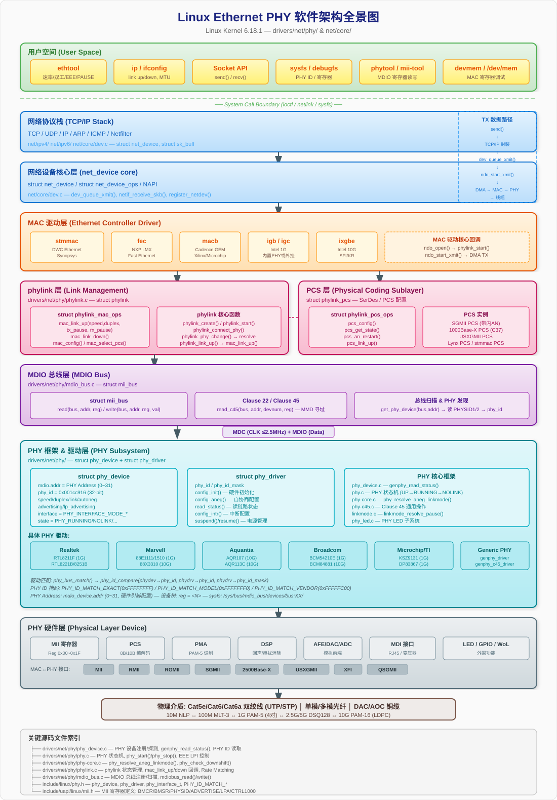

# Linux Ethernet PHY 子系统深度解析

> 基于 Linux 6.18.1 内核源码分析
> 源码路径：`include/linux/phy.h`、`include/linux/phylink.h`、`include/uapi/linux/mii.h`、`drivers/net/phy/`

---

## 目录

<details>
<summary><a href="#1-ethernet-phy-接口类型总结">1. Ethernet PHY 接口类型总结</a></summary>

- [1.1 内核定义的 PHY 接口类型枚举](#11-内核定义的-phy-接口类型枚举)
- [1.2 接口类型分类对比表](#12-接口类型分类对比表)
- [1.3 RGMII 延迟变体说明](#13-rgmii-延迟变体说明)
- [1.4 MAC-PHY 接口速率适应模式分析](#14-mac-phy-接口速率适应模式分析)

</details>

<details>
<summary><a href="#2-ethernet-软件框架分析">2. Ethernet 软件框架分析</a></summary>

- [2.1 Linux Ethernet 整体分层架构](#21-linux-ethernet-整体分层架构)
- [2.2 关键数据结构](#22-关键数据结构)
- [2.3 PHY 状态机](#23-phy-状态机)
- [2.4 数据收发流程（简化）](#24-数据收发流程简化)
- [2.5 MDIO 总线通信](#25-mdio-总线通信)
- [2.6 EEE（Energy Efficient Ethernet）详解](#26-eeeenergy-efficient-ethernet详解)
- [2.7 PHY 速率协商结果解析](#27-phy-速率协商结果解析)
- [2.8 PHY Address 与 PHY ID 详解](#28-phy-address-与-phy-id-详解)

</details>

<details>
<summary><a href="#3-1g25g5g10g-phy-协议规范">3. 1G/2.5G/5G/10G PHY 协议规范</a></summary>

- [3.1 IEEE 802.3 标准总览](#31-ieee-8023-标准总览)
- [3.2 关键规范说明](#32-关键规范说明)
- [3.3 Clause 22 vs Clause 45 MDIO](#33-clause-22-vs-clause-45-mdio)

</details>

<details>
<summary><a href="#4-phy-驱动案例分析">4. PHY 驱动案例分析</a></summary>

- [4.1 Realtek RTL8211F — 1G PHY 驱动分析](#41-realtek-rtl8211f--1g-phy-驱动分析)
- [4.2 Aquantia AQR107 — 10G PHY 驱动分析](#42-aquantia-aqr107--10g-phy-驱动分析)
- [4.3 Realtek RTL822x 系列 — 2.5G PHY](#43-realtek-rtl822x-系列--25g-phy)
- [4.4 Marvell 88X3310 — 10G 多速率 PHY](#44-marvell-88x3310--10g-多速率-phy)

</details>

<details>
<summary><a href="#5-1g-ethernet-通用寄存器详解">5. 1G Ethernet 通用寄存器详解</a></summary>

- [5.1 IEEE 802.3 Clause 22 标准寄存器（适用于所有兼容 PHY）](#51-ieee-8023-clause-22-标准寄存器适用于所有兼容-phy)
- [5.2 BMCR — 基本模式控制寄存器 (Reg 0x00)](#52-bmcr--基本模式控制寄存器-reg-0x00)
- [5.3 BMSR — 基本模式状态寄存器 (Reg 0x01)](#53-bmsr--基本模式状态寄存器-reg-0x01)
- [5.4 PHYSID1/PHYSID2 — PHY 标识寄存器 (Reg 0x02/0x03)](#54-physid1physid2--phy-标识寄存器-reg-0x020x03)
- [5.5 ADVERTISE — 自协商通告寄存器 (Reg 0x04)](#55-advertise--自协商通告寄存器-reg-0x04)
- [5.6 LPA — 链路伙伴能力寄存器 (Reg 0x05)](#56-lpa--链路伙伴能力寄存器-reg-0x05)
- [5.7 CTRL1000 — 1000BASE-T 控制寄存器 (Reg 0x09)](#57-ctrl1000--1000base-t-控制寄存器-reg-0x09)
- [5.8 STAT1000 — 1000BASE-T 状态寄存器 (Reg 0x0a)](#58-stat1000--1000base-t-状态寄存器-reg-0x0a)
- [5.9 MMD 间接访问寄存器 (Reg 0x0d/0x0e)](#59-mmd-间接访问寄存器-reg-0x0d0x0e)
- [5.10 SGMII 带内自协商寄存器](#510-sgmii-带内自协商寄存器)

</details>

<details>
<summary><a href="#6-phy-硬件内部物理设计">6. PHY 硬件内部物理设计</a></summary>

- [6.1 1G PHY 内部架构（以 RTL8211F 为例）](#61-1g-phy-内部架构以-rtl8211f-为例)
- [6.2 各功能模块说明](#62-各功能模块说明)
- [6.3 10G PHY 内部架构差异](#63-10g-phy-内部架构差异)
- [6.4 PHY 供电设计](#64-phy-供电设计)

</details>

<details>
<summary><a href="#7-面试常见问题与答案">7. 面试常见问题与答案</a></summary>

- [Q1: MII、RMII、GMII、RGMII、SGMII 各有什么区别？](#q1-miirmiigmiirgmiisgmii-各有什么区别)
- [Q2: RGMII 为什么需要延迟？如何配置？](#q2-rgmii-为什么需要延迟如何配置)
- [Q3: PHY 的自协商过程是怎样的？协商结果如何确定？](#q3-phy-的自协商过程是怎样的协商结果如何确定)
- [Q4: 如何判断链路已经 UP？](#q4-如何判断链路已经-up)
- [Q5: Clause 22 和 Clause 45 MDIO 有什么区别？](#q5-clause-22-和-clause-45-mdio-有什么区别)
- [Q6: 什么是 MDIO 总线？一条总线能挂多少个 PHY？](#q6-什么是-mdio-总线一条总线能挂多少个-phy)
- [Q7: PHY 驱动的 probe 流程是怎样的？](#q7-phy-驱动的-probe-流程是怎样的)
- [Q8: 什么是 EEE（Energy Efficient Ethernet）？](#q8-什么是-eeeenergy-efficient-ethernet)
- [Q9: PHY 中断模式和轮询模式的区别？](#q9-phy-中断模式和轮询模式的区别)
- [Q10: MAC 和 PHY 之间如何实现速率协商同步？](#q10-mac-和-phy-之间如何实现速率协商同步)

</details>

<details>
<summary><a href="#8-qemu-实践实验">8. QEMU 实践实验</a></summary>

- [实验环境准备](#实验环境准备)
- [实验 1：探索虚拟网卡的 MII/PHY 寄存器](#实验-1探索虚拟网卡的-miiphy-寄存器)
- [实验 2：使用 ethtool 观察自协商过程](#实验-2使用-ethtool-观察自协商过程)
- [实验 3：MDIO 总线和 PHY 设备树探索](#实验-3mdio-总线和-phy-设备树探索)
- [实验 4：编写简单的 PHY 寄存器读取内核模块](#实验-4编写简单的-phy-寄存器读取内核模块)
- [实验 5：使用 QEMU TAP 网络实现双机通信](#实验-5使用-qemu-tap-网络实现双机通信)
- [实验 6：PHY 状态机观察](#实验-6phy-状态机观察)
- [实验 7：使用 devmem 直接访问 MAC/PHY 寄存器（QEMU virt 平台）](#实验-7使用-devmem-直接访问-macphy-寄存器qemu-virt-平台)
- [实验 8：编写简单的 MDIO 用户空间访问程序](#实验-8编写简单的-mdio-用户空间访问程序)

</details>

<details>
<summary><a href="#附录">附录</a></summary>

- [A. 常用内核源码路径](#a-常用内核源码路径)
- [B. 设备树 PHY 配置示例](#b-设备树-phy-配置示例)
- [C. 参考文档](#c-参考文档)

</details>

---

## 1. Ethernet PHY 接口类型总结

### 1.1 内核定义的 PHY 接口类型枚举

内核在 `include/linux/phy.h` 中定义了 `phy_interface_t` 枚举，共 **39 种**接口模式（含 `NA` 和 `MAX`）：

```c
typedef enum {
    PHY_INTERFACE_MODE_NA,           // 不适用 - 不触碰
    PHY_INTERFACE_MODE_INTERNAL,     // 无接口 - MAC 和 PHY 合一
    PHY_INTERFACE_MODE_MII,          // 媒体无关接口 (10/100Mbps)
    PHY_INTERFACE_MODE_GMII,         // 千兆媒体无关接口 (1Gbps)
    PHY_INTERFACE_MODE_SGMII,        // 串行千兆媒体无关接口
    PHY_INTERFACE_MODE_TBI,          // 十位接口
    PHY_INTERFACE_MODE_REVMII,       // 反向 MII
    PHY_INTERFACE_MODE_RMII,         // 精简 MII (10/100Mbps)
    PHY_INTERFACE_MODE_REVRMII,      // 反向 RMII（PHY 角色）
    PHY_INTERFACE_MODE_RGMII,        // 精简千兆 MII
    PHY_INTERFACE_MODE_RGMII_ID,     // RGMII + 内部收发延迟
    PHY_INTERFACE_MODE_RGMII_RXID,   // RGMII + 内部接收延迟
    PHY_INTERFACE_MODE_RGMII_TXID,   // RGMII + 内部发送延迟
    PHY_INTERFACE_MODE_RTBI,         // 精简 TBI
    PHY_INTERFACE_MODE_SMII,         // 串行 MII
    PHY_INTERFACE_MODE_XGMII,       // 万兆媒体无关接口 (10Gbps)
    PHY_INTERFACE_MODE_XLGMII,      // 40G 媒体无关接口
    PHY_INTERFACE_MODE_MOCA,         // 同轴电缆多媒体
    PHY_INTERFACE_MODE_PSGMII,      // 五端口 SGMII
    PHY_INTERFACE_MODE_QSGMII,      // 四端口 SGMII
    PHY_INTERFACE_MODE_TRGMII,      // Turbo RGMII
    PHY_INTERFACE_MODE_100BASEX,     // 100Base-X（光纤）
    PHY_INTERFACE_MODE_1000BASEX,    // 1000Base-X（光纤）
    PHY_INTERFACE_MODE_2500BASEX,    // 2500Base-X
    PHY_INTERFACE_MODE_5GBASER,      // 5G Base-R
    PHY_INTERFACE_MODE_RXAUI,        // 精简 XAUI（2x 3.125Gbps）
    PHY_INTERFACE_MODE_XAUI,         // 万兆附件单元接口 (4x 3.125Gbps)
    PHY_INTERFACE_MODE_10GBASER,     // 10G Base-R (XFI/SFI，单通道)
    PHY_INTERFACE_MODE_25GBASER,     // 25G Base-R
    PHY_INTERFACE_MODE_USXGMII,      // 通用串行万兆 MII
    PHY_INTERFACE_MODE_10GKR,        // 10GBASE-KR + Clause 73 自协商
    PHY_INTERFACE_MODE_QUSGMII,      // 四端口通用 SGMII
    PHY_INTERFACE_MODE_1000BASEKX,   // 1000Base-KX + Clause 73 自协商
    PHY_INTERFACE_MODE_10G_QXGMII,   // 10G-QXGMII (4端口 over USXGMII)
    PHY_INTERFACE_MODE_50GBASER,     // 50GBase-R + Clause 134 FEC
    PHY_INTERFACE_MODE_LAUI,         // 50G 附件单元接口
    PHY_INTERFACE_MODE_100GBASEP,    // 100GBase-P + Clause 134 FEC
    PHY_INTERFACE_MODE_MIILITE,      // MII-Lite (无 RXER/TXER/CRS/COL)
    PHY_INTERFACE_MODE_MAX,          // 边界标记
} phy_interface_t;
```

### 1.2 接口类型分类对比表

| 分类 | 接口模式 | 速率 | 数据位宽 | 时钟频率 | 引脚数 | 典型应用场景 |
|------|----------|------|----------|----------|--------|-------------|
| **并行低速** | MII (Media Independent Interface) | 10/100M | 4bit | 2.5/25MHz | 18 | 传统嵌入式 |
| | RMII (Reduced Media Independent Interface) | 10/100M | 2bit | 50MHz | 9 | 引脚受限的嵌入式 |
| | SMII (Serial Media Independent Interface) | 10/100M | 1bit | 125MHz | 4 | 多端口交换机 |
| | MII-Lite (Lite Media Independent Interface) | 10/100M | 4bit | 2.5/25MHz | 14 | 简化 MII |
| **并行千兆** | GMII (Gigabit Media Independent Interface) | 1G | 8bit | 125MHz | 24 | 早期千兆设计 |
| | RGMII (Reduced Gigabit Media Independent Interface) | 1G | 4bit DDR | 125MHz | 12 | **最广泛的千兆接口** |
| | RGMII_ID/RXID/TXID (RGMII Internal Delay variants) | 1G | 4bit DDR | 125MHz | 12 | 需要内部延迟调整 |
| | TRGMII (Turbo Reduced Gigabit Media Independent Interface) | 2G+ | 4bit DDR | >125MHz | 12 | MediaTek 交换机 |
| **串行千兆** | SGMII (Serial Gigabit Media Independent Interface) | 10/100/1G | 1bit | 1.25GHz SerDes | 2 | **服务器/交换机最常用** |
| | 1000Base-X | 1G | 1bit | 1.25GHz SerDes | 2 | 光纤模块(SFP) |
| | 1000Base-KX | 1G | 1bit | 1.25GHz SerDes | 2 | 背板互联 |
| | QSGMII (Quad Serial Gigabit Media Independent Interface) | 4x 1G | 1bit | 5GHz SerDes | 2 | 多端口交换机 |
| | PSGMII (Penta Serial Gigabit Media Independent Interface) | 5x 1G | 1bit | 6.25GHz SerDes | 2 | Qualcomm交换芯片 |
| **多千兆** | 2500Base-X | 2.5G | 1bit | 3.125GHz SerDes | 2 | 2.5G以太网 |
| | 5GBase-R | 5G | 1bit | 5.15625GHz SerDes | 2 | 5G以太网 |
| | USXGMII (Universal Serial 10 Gigabit Media Independent Interface) | 10M-10G | 1bit | 10.3125GHz SerDes | 2 | **多速率自适应** |
| | QUSGMII (Quad Universal Serial Gigabit Media Independent Interface) | 4x 2.5G | 1bit | 10.3125GHz SerDes | 2 | 4端口2.5G |
| | 10G-QXGMII | 4x 2.5G | 1bit | 10.3125GHz SerDes | 2 | 4端口 over USXGMII |
| **万兆** | XGMII (10 Gigabit Media Independent Interface) | 10G | 32/64bit | 156.25/312.5MHz | 74 | 早期10G |
| | XAUI (10 Gigabit Attachment Unit Interface) | 10G | 4x 3.125G | 3.125GHz | 8 | 10G多通道 |
| | RXAUI (Reduced 10 Gigabit Attachment Unit Interface) | 10G | 2x 6.25G | 6.25GHz | 4 | 精简 XAUI |
| | 10GBase-R (XFI/SFI) | 10G | 1bit | 10.3125GHz SerDes | 2 | **主流10G接口** |
| | 10GBase-KR | 10G | 1bit | 10.3125GHz SerDes | 2 | 背板+Clause73 AN |
| **超高速** | 25GBase-R | 25G | 1bit | 25.78125GHz | 2 | 25G以太网 |
| | 50GBase-R | 50G | 1bit | 26.5625GHz PAM4 | 2 | 50G以太网 |
| | LAUI (LAN Attachment Unit Interface) | 50G | 1bit | - | 2 | 50G附件单元接口 |
| | 100GBase-P | 100G | 1bit | - | 2 | 100G以太网 |
| | XLGMII (40 Gigabit Media Independent Interface) | 40G | 64bit | 312.5MHz | 74+ | 40G以太网 |

记忆规律：MII = Media Independent Interface，R = Reduced，S = Serial，G = Gigabit，XG = 10 Gigabit，Q = Quad（4 路），P = Penta（5 路），U = Universal。按这个规则，RGMII、QSGMII、USXGMII 这类名称可以直接按前后缀拆开记。

### 1.3 RGMII 延迟变体说明

RGMII 接口使用 DDR（双沿采样），数据在时钟的上升沿和下降沿同时变化，需要 **2ns 延迟**（内部或外部）来对齐：

| 变体 | TX 延迟 | RX 延迟 | 说明 |
|------|---------|---------|------|
| RGMII | 外部 | 外部 | 需要 PCB 走线延迟或外部器件 |
| RGMII_ID | PHY 内部 | PHY 内部 | PHY 同时提供收发延迟 |
| RGMII_RXID | 外部 | PHY 内部 | PHY 仅提供接收延迟 |
| RGMII_TXID | PHY 内部 | 外部 | PHY 仅提供发送延迟 |

### 1.4 MAC-PHY 接口速率适应模式分析

当链路协商的实际速率低于接口的原生速率时（例如 2500Base-X 接口但链路速率为 100Mbps），MAC 和 PHY 之间需要一种机制来适配速率差异。根据接口类型的不同，分为 **原生多速率自适应** 和 **需要速率匹配（Rate Matching）** 两种情况。

#### 1.4.1 原生多速率自适应接口（不需要 Rate Matching）

这类接口本身在协议层面支持多种速率，MAC 和 PHY 会**自动**根据链路速率调整时钟/编码：

| 接口 | 支持速率 | 自适应机制 | 说明 |
|------|----------|------------|------|
| **MII** | 10M / 100M | MAC 切换 TX_CLK（2.5MHz/25MHz） | 经典并行接口，天然多速率 |
| **RMII** | 10M / 100M | 固定 50MHz 时钟，10M 时每符号重复 10 次 | 时钟不变，数据率自适应 |
| **GMII** | 10M / 100M / 1G | MAC 切换 GTX_CLK 频率 | 向下兼容 MII 速率 |
| **RGMII** | 10M / 100M / 1G | 时钟自动降频（125/25/2.5 MHz） | **最常用**，天然支持三速 |
| **SGMII** | 10M / 100M / 1G | 带内自协商（In-band AN）通告速率 | SerDes 始终 1.25GHz，通过编码适配 |
| **QSGMII** | 4×(10M/100M/1G) | 每端口独立 SGMII 带内自协商 | 四端口共享 SerDes |
| **USXGMII** | 10M ~ 10G | 带内自协商，SerDes 固定 10.3125GHz | **终极多速率接口** |
| **QUSGMII** | 4×(10M~2.5G) | USXGMII 多端口变体 | 四端口 over 单 SerDes |
| **10G-QXGMII** | 4×(10M~2.5G) | 同 QUSGMII | USXGMII 四端口分时复用 |
| **MII-Lite** | 10M / 100M | 与 MII 相同 | 精简 MII |

**关键点**：SGMII/USXGMII 等串行接口的 SerDes 时钟保持不变，通过带内信令帧告知对端实际链路速率，PHY 内部在线速和 SerDes 速率间做适配。

#### 1.4.2 固定速率接口（需要 Rate Matching 或手动切换）

这类接口只支持单一原生速率。当链路速率低于接口速率时，需要额外的 **速率匹配** 机制，或者 MAC 驱动必须**手动切换**接口模式：

| 接口 | 原生速率 | 低速处理方式 | 说明 |
|------|----------|-------------|------|
| **1000Base-X** | 1G only | ❌ 无法降速 | 光纤 802.3z，仅支持 1G |
| **2500Base-X** | 2.5G only | 需要 Rate Matching 或切换到 SGMII | PHY 可用 PAUSE 帧做速率匹配 |
| **5GBase-R** | 5G only | 需要 Rate Matching | 单一速率 SerDes |
| **10GBase-R (XFI/SFI)** | 10G only | 需要 Rate Matching 或切换到 SGMII | PHY 内部做速率适配 |
| **10GBase-KR** | 10G only | 需要 Rate Matching 或 Clause73 降速 | 背板可 AN 到低速 |
| **25GBase-R** | 25G only | 需要 Rate Matching | 单一速率 |
| **XGMII** | 10G only | 不支持 | 并行万兆，固定速率 |
| **XAUI/RXAUI** | 10G only | 不支持 | 多通道万兆 |
| **RGMII** 变体 (TRGMII) | 2G+ | 不支持降速到标准 RGMII | 厂商定制 |

#### 1.4.3 内核 Rate Matching 机制

内核在 `include/uapi/linux/ethtool.h` 中定义了 4 种速率匹配模式：

```c
#define RATE_MATCH_NONE       0  // 无速率匹配（接口速率=链路速率）
#define RATE_MATCH_PAUSE      1  // PHY 通过 PAUSE 帧节流 MAC 发送速率
#define RATE_MATCH_CRS        2  // PHY 通过拉高 CRS 信号阻止 MAC 发送
#define RATE_MATCH_OPEN_LOOP  3  // MAC 编程足够大的 IPG（帧间隔）
```

PHY 驱动通过 `get_rate_matching()` 回调报告其支持的模式：

```c
// Realtek RTL822xB: 在 2500Base-X 模式下使用 PAUSE 速率匹配
static int rtl822xb_get_rate_matching(struct phy_device *phydev,
                                      phy_interface_t iface)
{
    if (iface != PHY_INTERFACE_MODE_2500BASEX)
        return RATE_MATCH_NONE;  // 非 2500Base-X 不做匹配
    // 检查是否是纯 2500Base-X 模式（而非 2500Base-X + SGMII 双模）
    // 纯 2500Base-X 模式时使用 PAUSE 帧做速率匹配
    return RATE_MATCH_PAUSE;
}

// Aquantia AQR107: 在 10GBase-R 和 2500Base-X 模式下使用 PAUSE
static int aqr_gen2_get_rate_matching(struct phy_device *phydev,
                                      phy_interface_t iface)
{
    if (iface == PHY_INTERFACE_MODE_10GBASER ||
        iface == PHY_INTERFACE_MODE_2500BASEX)
        return RATE_MATCH_PAUSE;
    return RATE_MATCH_NONE;
}
```

#### 1.4.4 速率匹配流程图

```
场景：2500Base-X 接口，链路速率协商为 100Mbps

                 2500Base-X (3.125Gbps SerDes)
  MAC ◄──────────────────────────────────────────► PHY ◄──► 铜缆 (100Mbps)
       ├── MAC 以 2.5Gbps 速率发送数据帧 ──────►│
       │                                          │
       │◄── PHY 发送 PAUSE 帧节流 MAC ──────────│ ← 缓冲区快满时
       │                                          │
       │── MAC 暂停发送，等待 PAUSE 超时 ────────│
       │                                          │──► 以 100Mbps 发到线缆
       │── MAC 恢复发送 ─────────────────────────│
```

#### 1.4.5 实际接口选择决策表

| 场景 | 推荐接口 | 原因 |
|------|----------|------|
| 1G PHY，引脚充足 | RGMII | 天然三速自适应，成熟可靠 |
| 1G PHY，引脚紧张 | SGMII | 仅 2 差分对，带内 AN 自适应 |
| 2.5G PHY，MAC 支持 SGMII+2500Base-X | 2500Base-X (高速) + SGMII (低速切换) | phylink 自动切换 |
| 2.5G PHY，MAC 仅支持 2500Base-X | 2500Base-X + Rate Matching (PAUSE) | PHY 做速率适配 |
| 多速率 PHY (10M~10G) | USXGMII | 一个 SerDes 覆盖全速率范围 |
| 10G PHY，MAC 支持 XFI | 10GBase-R + Rate Matching | PHY 内部做速率匹配 |
| 多端口交换芯片 (4×1G) | QSGMII | 4 端口共享一个 SerDes |
| 多端口交换芯片 (4×2.5G) | 10G-QXGMII 或 QUSGMII | 4 端口 over USXGMII |

---

## 2. Ethernet 软件框架分析

### 2.1 Linux Ethernet 整体分层架构

```
┌──────────────────────────────────────────────┐
│              用户空间 (User Space)              │
│   应用程序 (socket API) / ethtool / ip 命令     │
├──────────────────────────────────────────────┤
│              网络协议栈 (TCP/IP Stack)           │
│   TCP / UDP / IP / ARP / ICMP                  │
├──────────────────────────────────────────────┤
│         网络设备核心层 (net_device core)         │
│    struct net_device / struct net_device_ops    │
├──────────────────────────────────────────────┤
│               MAC 驱动层                        │
│    e.g., stmmac / fec / macb / igb             │
│    实现: ndo_open, ndo_start_xmit 等            │
├─────────────┬────────────────────────────────┤
│  phylink 层  │        PCS 层                    │
│ (连接管理)   │  struct phylink_pcs             │
│              │  (SerDes/PCS 配置)              │
├─────────────┴────────────────────────────────┤
│              MDIO 总线层                        │
│    struct mii_bus / mdio_bus.c                  │
│    (PHY 寄存器读写通道)                          │
├──────────────────────────────────────────────┤
│              PHY 驱动层                         │
│    struct phy_driver / struct phy_device        │
│    drivers/net/phy/*.c                          │
├──────────────────────────────────────────────┤
│              PHY 硬件 (Physical Layer)          │
│    Realtek RTL8211F / Aquantia AQR107 等       │
└──────────────────────────────────────────────┘
```

**完整软件架构 SVG 图**（包含所有层次、数据结构、驱动实例和源码索引）：



### 2.2 关键数据结构

#### 2.2.1 `struct net_device_ops`（MAC 驱动操作集）

```c
// include/linux/netdevice.h
struct net_device_ops {
    int  (*ndo_init)(struct net_device *dev);           // 设备初始化
    int  (*ndo_open)(struct net_device *dev);           // ifconfig up
    int  (*ndo_stop)(struct net_device *dev);           // ifconfig down
    netdev_tx_t (*ndo_start_xmit)(struct sk_buff *skb, // 发送数据包
                    struct net_device *dev);
    void (*ndo_set_rx_mode)(struct net_device *dev);    // 设置接收模式/组播
    int  (*ndo_set_mac_address)(struct net_device *dev, // 设置MAC地址
                    void *addr);
    int  (*ndo_eth_ioctl)(struct net_device *dev,       // ethtool ioctl
                    struct ifreq *ifr, int cmd);
    int  (*ndo_change_mtu)(struct net_device *dev,      // 修改MTU
                    int new_mtu);
    void (*ndo_tx_timeout)(struct net_device *dev,      // 发送超时处理
                    unsigned int txqueue);
    void (*ndo_get_stats64)(struct net_device *dev,     // 获取统计信息
                    struct rtnl_link_stats64 *storage);
    // ... 更多操作
};
```

#### 2.2.2 `struct phy_device`（PHY 设备核心结构）

```c
// include/linux/phy.h
struct phy_device {
    struct mdio_device mdio;           // MDIO 设备基类
    const struct phy_driver *drv;      // 指向 PHY 驱动
    u32 phy_id;                        // PHY 标识符 (从寄存器2,3读取)
    phy_interface_t interface;         // 当前接口模式 (RGMII/SGMII等)
    
    /* 链路状态 */
    int speed;                         // 当前速率 (SPEED_10/100/1000/...)
    int duplex;                        // 全双工/半双工
    unsigned link:1;                   // 链路状态
    unsigned autoneg:1;                // 是否自协商
    
    /* 能力通告 */
    __ETHTOOL_DECLARE_LINK_MODE_MASK(supported);      // 支持的链路模式
    __ETHTOOL_DECLARE_LINK_MODE_MASK(advertising);    // 当前通告的模式
    __ETHTOOL_DECLARE_LINK_MODE_MASK(lp_advertising); // 对端通告的模式
    
    /* EEE 节能以太网 */
    __ETHTOOL_DECLARE_LINK_MODE_MASK(supported_eee);
    __ETHTOOL_DECLARE_LINK_MODE_MASK(advertising_eee);
    bool enable_tx_lpi;                // 启用LPI发送
    
    /* 中断 */
    int irq;                           // PHY 中断号
    unsigned interrupts:1;             // 中断是否已启用
    
    enum phy_state state;              // PHY 状态机状态
    struct phy_driver *drv;            // PHY 驱动程序
    void *priv;                        // 驱动私有数据
};
```

#### 2.2.3 `struct phy_driver`（PHY 驱动操作集）

```c
// include/linux/phy.h
struct phy_driver {
    struct mdio_driver_common mdiodrv;
    u32 phy_id;                        // 匹配的 PHY ID
    char *name;                        // 驱动名称
    u32 phy_id_mask;                   // PHY ID 掩码
    u32 flags;                         // 标志位
    const unsigned long * const features; // PHY 特性集
    
    /* 核心回调 */
    int (*soft_reset)(struct phy_device *phydev);    // 软复位
    int (*config_init)(struct phy_device *phydev);   // 初始化配置
    int (*probe)(struct phy_device *phydev);         // 探测/私有数据分配
    int (*get_features)(struct phy_device *phydev);  // 获取硬件能力
    int (*config_aneg)(struct phy_device *phydev);   // 配置自协商
    int (*aneg_done)(struct phy_device *phydev);     // 自协商完成检查
    int (*read_status)(struct phy_device *phydev);   // 读取链路状态
    
    /* 中断 */
    int (*config_intr)(struct phy_device *phydev);         // 配置中断
    irqreturn_t (*handle_interrupt)(struct phy_device *);  // 中断处理
    
    /* 电源管理 */
    int (*suspend)(struct phy_device *phydev);       // 挂起
    int (*resume)(struct phy_device *phydev);        // 恢复
    
    /* MMD 寄存器访问 */
    int (*read_mmd)(struct phy_device *dev, int devnum, u16 regnum);
    int (*write_mmd)(struct phy_device *dev, int devnum, u16 regnum, u16 val);
    
    /* 页寄存器 */
    int (*read_page)(struct phy_device *dev);        // 读当前页
    int (*write_page)(struct phy_device *dev, int page); // 切换页
    
    /* 高速率匹配 */
    int (*get_rate_matching)(struct phy_device *phydev, phy_interface_t iface);
    
    /* WoL */
    int (*set_wol)(struct phy_device *dev, struct ethtool_wolinfo *wol);
    void (*get_wol)(struct phy_device *dev, struct ethtool_wolinfo *wol);
    
    /* LED 控制 */
    int (*led_brightness_set)(struct phy_device *dev, u8 index, ...);
    int (*led_hw_is_supported)(struct phy_device *dev, u8 index, ...);
    int (*led_hw_control_set)(struct phy_device *dev, u8 index, ...);
    int (*led_hw_control_get)(struct phy_device *dev, u8 index, ...);
};
```

#### 2.2.4 `struct phylink_mac_ops`（phylink MAC 操作集）

```c
// include/linux/phylink.h
struct phylink_mac_ops {
    unsigned long (*mac_get_caps)(struct phylink_config *config,
                                  phy_interface_t interface);
    struct phylink_pcs *(*mac_select_pcs)(struct phylink_config *config,
                                          phy_interface_t interface);
    int (*mac_prepare)(struct phylink_config *config, unsigned int mode,
                       phy_interface_t iface);
    void (*mac_config)(struct phylink_config *config, unsigned int mode,
                       const struct phylink_link_state *state);
    int (*mac_finish)(struct phylink_config *config, unsigned int mode,
                      phy_interface_t iface);
    void (*mac_link_down)(struct phylink_config *config, unsigned int mode,
                          phy_interface_t interface);
    void (*mac_link_up)(struct phylink_config *config,
                        struct phy_device *phy, unsigned int mode,
                        phy_interface_t interface, int speed, int duplex,
                        bool tx_pause, bool rx_pause);
    void (*mac_disable_tx_lpi)(struct phylink_config *config);
    int (*mac_enable_tx_lpi)(struct phylink_config *config, u32 timer,
                             bool tx_clk_stop);
};
```

### 2.3 PHY 状态机

```
                      ┌──────────┐
                      │   DOWN   │  <── 初始/关闭状态
                      └────┬─────┘
                           │ phy_start()
                      ┌────▼─────┐
                      │    UP    │  <── 启动状态
                      └────┬─────┘
                           │ 检测到链路
                      ┌────▼─────┐
              ┌───────│ RUNNING  │ <── 正常运行
              │       └────┬─────┘
              │            │ 链路丢失
              │       ┌────▼─────┐
              │       │ NOLINK   │ <── 无链路
              │       └────┬─────┘
              │            │ 检测到链路
              │            ▼
              │       回到 RUNNING
              │
              │ phy_stop()
              └────► DOWN
```

### 2.4 数据收发流程（简化）

```
发送路径 (TX):
  应用层 send() → socket → TCP/IP → dev_queue_xmit()
  → ndo_start_xmit() → DMA → MAC → PHY → 线缆

接收路径 (RX):
  线缆 → PHY → MAC → DMA 中断 → NAPI poll
  → napi_gro_receive() → netif_receive_skb()
  → 协议栈 → socket → 应用层 recv()
```

### 2.5 MDIO 总线通信

```
MAC ──── MDIO Bus ──── PHY0 (addr=0)
              │──────── PHY1 (addr=1)
              │──────── PHY2 (addr=2)
              └──────── ...

MDIO 协议：
- MDC: 时钟线（MAC 驱动，最高 2.5MHz）
- MDIO: 双向数据线
- Clause 22: 5位寄存器地址空间（0-31），适用于1G以下
- Clause 45: 扩展寻址（Device + Register），适用于多千兆/万兆
```

### 2.6 EEE（Energy Efficient Ethernet）详解

#### 2.6.1 EEE 概述

EEE（节能以太网）由 **IEEE 802.3az (2010)** 标准定义，后续被整合到 IEEE 802.3-2022 中。其核心思想是：以太网链路在大部分时间处于空闲状态，此时仍保持全功率运行是浪费。EEE 允许在无数据传输时进入 **LPI（Low Power Idle）** 模式，关闭 PHY 的大部分模拟电路，节省 50%-80% 的功耗。

#### 2.6.2 EEE 工作状态机

```
                    tx_lpi_timer 超时
 ┌──────────┐     ┌──────────────┐     ┌────────────┐
 │  Active   │────▶│  LPI Request │────▶│  LPI (Quiet)│
 │ (正常传输) │     │  (发送 LPI   │     │  (低功耗    │
 │           │◀────│   信号)      │     │   休眠)     │
 └──────────┘     └──────────────┘     └─────┬──────┘
      ▲                                       │
      │           ┌──────────────┐             │ 有数据要发
      └───────────│   Wake       │◀────────────┘
                  │  (唤醒恢复)   │
                  │ Tw 恢复时间   │
                  └──────────────┘

状态说明：
  Active     → 正常传输数据，全功率
  LPI Request→ MAC 发送 LPI 信号通知 PHY 即将休眠
  Quiet      → PHY 关闭 AFE/PLL 等模拟电路，仅保持基本同步
  Refresh    → 周期性短暂唤醒，维持链路同步（防止失锁）
  Wake       → 收到数据后发送唤醒信号，等待 Tw 时间恢复
```

#### 2.6.3 EEE 关键时序参数

| 参数 | 100BASE-TX | 1000BASE-T | 10GBASE-T | 2.5G/5GBASE-T |
|------|-----------|------------|-----------|----------------|
| Ts (Sleep 进入时间) | 200μs | 182μs | 2.88μs | ~3μs |
| Tw (Wake 恢复时间) | 30μs | 16.5μs | 4.48μs | ~5μs |
| Tq (Quiet 持续时间) | 25ms | 2ms | 39μs | ~40μs |
| Tr (Refresh 持续时间) | 200μs | 182μs | 2.88μs | ~3μs |
| **典型节能比** | ~80% | ~60% | ~50% | ~55% |

> **注意**：Tw（唤醒时间）直接影响延迟敏感型应用。1000BASE-T 的 16.5μs 唤醒延迟对大多数应用无感，但对高频交易等场景可能不可接受。

#### 2.6.4 EEE 协议层次

```
┌──────────────────────────────────┐
│         MAC 子层                  │
│  ┌────────────────────────────┐  │
│  │ LPI Client (MAC 决策层)     │  │
│  │ - 判断何时进入/退出 LPI     │  │
│  │ - tx_lpi_timer 控制         │  │
│  └────────────┬───────────────┘  │
│  ┌────────────▼───────────────┐  │
│  │ LPI MAC (LPI 信号生成/检测) │  │
│  │ - 发送 LPI 编码            │  │
│  │ - 检测对端 LPI 信号        │  │
│  └────────────┬───────────────┘  │
├───────────────┼──────────────────┤
│  ┌────────────▼───────────────┐  │
│  │ PCS 子层                    │  │
│  │ - LPI 编码/解码            │  │
│  │ - 1000BASE-T: 特殊空闲码   │  │
│  └────────────┬───────────────┘  │
├───────────────┼──────────────────┤
│  ┌────────────▼───────────────┐  │
│  │ PMA/AFE (模拟前端)          │  │
│  │ - Quiet: 关闭 TX 驱动器     │  │
│  │ - Refresh: 短暂开启同步     │  │
│  │ - 关闭 PLL / 降低偏置电流   │  │
│  └────────────────────────────┘  │
└──────────────────────────────────┘
```

#### 2.6.5 内核 EEE 数据结构与配置

**EEE 配置结构** (`include/net/eee.h`):

```c
struct eee_config {
    u32 tx_lpi_timer;    // LPI 进入前的等待时间 (μs)
                         // MAC 空闲超过此时间才发送 LPI
    bool tx_lpi_enabled; // 是否允许 MAC 发送 LPI
    bool eee_enabled;    // EEE 总开关 (master on/off)
};
```

**PHY 设备中的 EEE 字段** (`include/linux/phy.h`):

```c
struct phy_device {
    // ...
    __ETHTOOL_DECLARE_LINK_MODE_MASK(supported_eee);    // PHY 硬件支持的 EEE 模式
    __ETHTOOL_DECLARE_LINK_MODE_MASK(advertising_eee);  // 当前通告的 EEE 模式
    __ETHTOOL_DECLARE_LINK_MODE_MASK(eee_disabled_modes);// 被禁用的 EEE 模式
    bool enable_tx_lpi;   // phylink 设置: MAC 是否应发送 LPI
    bool eee_active;      // EEE 是否已成功协商
    struct eee_config eee_cfg;  // 用户 EEE 配置
};
```

**phylink 配置中的 EEE** (`include/linux/phylink.h`):

```c
struct phylink_config {
    // ...
    bool eee_rx_clk_stop_enable; // 允许 LPI 期间停止 RX 时钟
    DECLARE_PHY_INTERFACE_MASK(lpi_interfaces); // 支持 LPI 的接口模式
    unsigned long lpi_capabilities;  // 支持 LPI 的速率 (MAC_100FD|MAC_1000FD 等)
    u32 lpi_timer_default;           // 默认 LPI 定时器值
    bool eee_enabled_default;        // 创建时是否默认启用 EEE
};

// MAC 驱动需实现的 LPI 回调:
struct phylink_mac_ops {
    void (*mac_disable_tx_lpi)(struct phylink_config *config);
    int  (*mac_enable_tx_lpi)(struct phylink_config *config,
                              u32 timer,         // LPI 超时 (μs)
                              bool tx_clk_stop); // 是否可停 TX 时钟
};
```

#### 2.6.6 EEE MDIO 寄存器 (Clause 45)

| 寄存器 | MMD.Reg | 说明 |
|--------|---------|------|
| EEE Capability | 3.20 | PCS 支持的 EEE 速率 |
| EEE Advertisement | 7.60 | 本端通告的 EEE 速率 |
| EEE LP Ability | 7.61 | 对端通告的 EEE 速率 |
| EEE Advertisement 2 | 7.62 | 扩展 EEE 通告 (2.5G/5G) |
| EEE LP Ability 2 | 7.63 | 扩展 EEE 对端能力 |

EEE 速率能力位定义 (`include/uapi/linux/mdio.h`):

```c
#define MDIO_EEE_100TX   0x0002  // 100BASE-TX EEE
#define MDIO_EEE_1000T   0x0004  // 1000BASE-T EEE
#define MDIO_EEE_10GT    0x0008  // 10GBASE-T EEE
#define MDIO_EEE_1000KX  0x0010  // 1000BASE-KX EEE
#define MDIO_EEE_10GKX4  0x0020  // 10GBASE-KX4 EEE
#define MDIO_EEE_10GKR   0x0040  // 10GBASE-KR EEE
// 扩展寄存器 (7.62):
#define MDIO_EEE_2_5GT   0x0001  // 2.5GBASE-T EEE
#define MDIO_EEE_5GT     0x0002  // 5GBASE-T EEE
```

#### 2.6.7 EEE 协商流程

```
         PHY A                              PHY B
           │                                  │
     ① 写 EEE ADV 寄存器 (7.60)              │
           │──── 自协商 (AN) 交换能力 ───────▶│
           │◀─── 对端 EEE 能力 ──────────────│
           │                                  │
     ② 读 EEE LP Ability (7.61)              │
           │                                  │
     ③ 双方支持的速率取交集                    │
           │                                  │
     ④ eee_active = true (协商成功)           │
           │                                  │
     ⑤ MAC 启用 LPI                           │
     mac_enable_tx_lpi(timer, tx_clk_stop)    │
           │                                  │
     ⑥ 空闲 tx_lpi_timer μs 后               │
           │──── LPI 信号 ──────────────────▶│
           │         双方进入低功耗             │
```

#### 2.6.8 EEE 用户空间控制

```bash
# 查看 EEE 状态
ethtool --show-eee eth0
# 输出示例:
#   EEE status: enabled - active
#   Supported EEE link modes:  100baseT/Full
#                               1000baseT/Full
#   Advertised EEE link modes: 100baseT/Full
#                               1000baseT/Full
#   Link partner advertised EEE link modes: 1000baseT/Full
#   Tx LPI: 250 (us)

# 禁用 EEE（低延迟场景）
ethtool --set-eee eth0 eee off

# 启用 EEE 并设置 LPI 定时器
ethtool --set-eee eth0 eee on tx-lpi on tx-timer 500

# 仅通告 1000BASE-T EEE（不通告 100M EEE）
ethtool --set-eee eth0 eee on advertise 0x0004
```

#### 2.6.9 EEE 对系统的影响

| 方面 | 影响 | 说明 |
|------|------|------|
| **功耗** | 降低 50-80% | 空闲链路功耗从 ~0.5W 降到 ~0.1W (1G) |
| **延迟** | 增加 Tw (16-30μs) | 唤醒恢复时间影响首包延迟 |
| **抖动** | 可能增加 | LPI 进入/退出引起的时钟恢复抖动 |
| **兼容性** | 需双端支持 | 两端都要通告 EEE 才能启用 |
| **网络监控** | 可能丢 PAUSE | LPI 期间 PAUSE 帧处理可能异常 |

> **最佳实践**：
> - 一般办公/家用场景：**启用 EEE**，节能效果明显
> - 延迟敏感场景（VoIP、实时控制、高频交易）：**禁用 EEE**
> - 数据中心：根据负载模式决定，突发流量多的可启用

#### 2.6.10 PHY EEE 与 MAC EEE 两种模式

在 Linux 内核中，EEE 的实现涉及 **PHY 侧**和 **MAC 侧**两个独立但协作的部分：

```
┌────────────────────────────────────────────────────────────────┐
│                    EEE 控制分层                                  │
│                                                                │
│  ┌─────────────────────┐    ┌─────────────────────┐            │
│  │    MAC 侧 EEE       │    │    PHY 侧 EEE       │            │
│  │                     │    │                     │            │
│  │ • mac_enable_tx_lpi │    │ • EEE 能力检测      │            │
│  │ • mac_disable_tx_lpi│    │   (读 PCS 3.20)     │            │
│  │ • tx_lpi_timer 控制 │    │ • EEE 通告/协商     │            │
│  │ • tx_clk_stop 选项  │    │   (写/读 AN 7.60/61)│            │
│  │ • LPI 信号生成/检测 │    │ • eee_active 判定   │            │
│  │                     │    │ • SmartEEE (PHY独立) │            │
│  └──────────┬──────────┘    └──────────┬──────────┘            │
│             │                          │                       │
│             │   enable_tx_lpi = true   │                       │
│             │◀─────────────────────────│                       │
│             │   (PHY协商成功后通知MAC)    │                       │
│             │                          │                       │
│  ┌──────────▼──────────────────────────▼──────────┐            │
│  │              phylink 协调层                      │            │
│  │  phy_enable_tx_lpi + mac_supports_eee           │            │
│  │  → 两者都为 true 时调用 phylink_activate_lpi()   │            │
│  └────────────────────────────────────────────────┘            │
└────────────────────────────────────────────────────────────────┘
```

##### PHY 侧 EEE（PHY EEE）

PHY 侧负责 EEE 的**协商**和**物理层信号**处理：

| 职责 | 实现 | 说明 |
|------|------|------|
| 能力检测 | 读 PCS Capability (MMD 3.20) | 确认 PHY 硬件支持哪些速率的 EEE |
| EEE 通告 | 写 AN EEE ADV (MMD 7.60/62) | 将 `advertising_eee` 写入 PHY 寄存器 |
| 协商结果 | 读 AN EEE LP (MMD 7.61/63) | 读取对端通告，取交集判断 `eee_active` |
| LPI 物理信号 | PHY 内部 PCS/PMA | 在 Quiet 期间关闭 AFE，Refresh 时短暂唤醒 |
| SmartEEE | PHY 独立控制 | 部分 PHY（如 Broadcom）可自主进入 LPI，无需 MAC 参与 |

内核中 PHY 侧 EEE 的核心判定逻辑（`drivers/net/phy/phy.c`）：

```c
// 链路建立后，检查 EEE 是否成功协商
if (phydev->link && phydev->state != PHY_RUNNING) {
    // 读取 LP 的 EEE 通告，与本地通告取交集
    err = genphy_c45_eee_is_active(phydev, NULL);
    phydev->eee_active = err > 0;  // 交集非空 = EEE 生效
    
    // 只有用户启用了 tx_lpi 且 EEE 协商成功才通知 MAC
    phydev->enable_tx_lpi = phydev->eee_cfg.tx_lpi_enabled &&
                            phydev->eee_active;
} else if (!phydev->link) {
    phydev->eee_active = false;
    phydev->enable_tx_lpi = false;  // 链路断开时清除
}
```

`genphy_c45_eee_is_active()` 的判定过程：

```c
int genphy_c45_eee_is_active(struct phy_device *phydev, unsigned long *lp)
{
    // 1. 用户没启用 EEE → 直接返回 0
    if (!phydev->eee_cfg.eee_enabled)
        return 0;

    // 2. 读对端 EEE LP Ability (MMD 7.61 / 7.63)
    ret = genphy_c45_read_eee_lpa(phydev, tmp_lp);

    // 3. 本地通告 ∩ 对端通告
    linkmode_and(common, phydev->advertising_eee, tmp_lp);
    if (linkmode_empty(common))
        return 0;  // 无共同 EEE 模式

    // 4. 检查当前链路速率是否在共同 EEE 模式中
    return phy_check_valid(phydev->speed, phydev->duplex, common);
}
```

##### MAC 侧 EEE（MAC EEE）

MAC 侧负责 **LPI 信号的生成和定时**：

| 职责 | 实现 | 说明 |
|------|------|------|
| LPI 发送决策 | LPI Client（MAC 硬件） | 发送队列空闲超过 `tx_lpi_timer` 后发送 LPI |
| LPI 信号编码 | MAC 硬件 | 在 xMII 接口上发送特殊的 LPI 编码 |
| TX 时钟停止 | 可选 (`tx_clk_stop`) | LPI 期间可停止 xMII TX 时钟以进一步节能 |
| 唤醒恢复 | MAC 硬件 | 检测到发送需求时先发唤醒信号再传数据 |

MAC 驱动通过 phylink 回调实现 EEE：

```c
// phylink MAC 操作中的 EEE 回调
struct phylink_mac_ops {
    // 禁用 LPI 生成（链路断开或 EEE 关闭时调用）
    void (*mac_disable_tx_lpi)(struct phylink_config *config);
    
    // 启用并配置 LPI（链路建立且 EEE 协商成功后调用）
    int (*mac_enable_tx_lpi)(struct phylink_config *config,
                             u32 timer,         // LPI 超时 (μs)
                             bool tx_clk_stop); // 是否停止 TX 时钟
};

// MAC 通过 phylink_config 声明 EEE 能力:
struct phylink_config {
    DECLARE_PHY_INTERFACE_MASK(lpi_interfaces); // 哪些接口模式支持 LPI
    unsigned long lpi_capabilities;  // 哪些速率支持 LPI (MAC_100FD|MAC_1000FD...)
    u32 lpi_timer_default;           // 默认 LPI 定时器值
    bool eee_enabled_default;        // 创建时是否默认启用 EEE
    bool eee_rx_clk_stop_enable;     // 是否允许 LPI 期间停止 RX 时钟
};
```

##### PHY EEE vs MAC EEE 对比

| 维度 | PHY EEE | MAC EEE |
|------|---------|----------|
| **标准位置** | 802.3az PCS/PMA 层 | 802.3az MAC 子层 |
| **核心功能** | EEE 协商 + 物理层 LPI 信号 | LPI 发送决策 + 定时控制 |
| **寄存器** | MMD 3.20 (Capability)、7.60/61 (ADV/LP) | MAC 控制器内部 EEE 寄存器 |
| **内核代码** | `drivers/net/phy/phy-c45.c` | MAC 驱动 + phylink |
| **控制接口** | `phy_support_eee()` / `phy_disable_eee()` | `mac_enable_tx_lpi()` / `mac_disable_tx_lpi()` |
| **独立性** | SmartEEE 可独立工作 | 必须依赖 PHY 协商结果 |
| **配置流程** | MAC 驱动调用 `phy_support_eee()` → PHY 通告 | phylink 检查 `enable_tx_lpi` → 调用 MAC 回调 |

##### SmartEEE（PHY 独立 EEE）

部分 PHY（如 Broadcom BCM54210E、Marvell 88E1510）支持 **SmartEEE**，即 PHY 可以**独立**于 MAC 进入 LPI 模式：

```
正常 MAC EEE:                    SmartEEE:
  MAC 决定进入 LPI                 PHY 自主检测空闲
  MAC → LPI 信号 → PHY             PHY 直接进入 LPI
  PHY 关闭 AFE                     PHY 对 MAC 隐藏 LPI
  MAC 知道当前在 LPI                MAC 不知道在 LPI
```

SmartEEE 优势：
- MAC 不需要支持 EEE 就能享受节能
- 对 MAC 完全透明，无需驱动改动

SmartEEE 风险：
- MAC 不知道 PHY 在 LPI，可能导致收发时序异常
- 唤醒延迟不可控，某些 MAC 可能丢包
- 内核中通常建议：MAC 不支持 EEE 时调用 `phy_disable_eee()` 彻底关闭

##### 完整 EEE 配置流程

```
MAC 驱动 probe/attach:
  │
  ├─ MAC 支持 EEE:
  │   │
  │   ├─ phylink_config.lpi_interfaces 设置支持的接口
  │   ├─ phylink_config.lpi_capabilities 设置支持的速率
  │   ├─ 实现 mac_enable_tx_lpi / mac_disable_tx_lpi 回调
  │   └─ 调用 phy_support_eee(phydev)
  │       → phydev->advertising_eee = supported_eee
  │       → eee_cfg.eee_enabled = true
  │       → eee_cfg.tx_lpi_enabled = true
  │
  └─ MAC 不支持 EEE:
      └─ 调用 phy_disable_eee(phydev)
          → advertising_eee 清零
          → eee_disabled_modes 全部填充（阻止用户重新启用）

链路建立后:
  PHY 状态机检测到 link up
  │
  ├─ genphy_c45_eee_is_active()
  │   ├─ 读 LP EEE (MMD 7.61)
  │   ├─ advertising_eee ∩ lp_eee → common
  │   └─ 检查当前速率是否在 common 中
  │
  ├─ eee_active = true (如果协商成功)
  ├─ enable_tx_lpi = eee_cfg.tx_lpi_enabled && eee_active
  │
  └─ phylink_phy_change() 通知 phylink
      ├─ pl->phy_enable_tx_lpi = phydev->enable_tx_lpi
      ├─ pl->mac_tx_lpi_timer = eee_cfg.tx_lpi_timer
      └─ phylink_link_up()
          └─ if (mac_supports_eee && phy_enable_tx_lpi)
              └─ phylink_activate_lpi()
                  ├─ pcs_enable_eee()    // PCS 侧 EEE 启用
                  └─ mac_enable_tx_lpi() // MAC 侧 LPI 生成启用
```

### 2.7 PHY 速率协商结果解析

#### 2.7.1 自协商结果确定流程

链路建立后，PHY 驱动通过 `read_status()` 回调读取协商结果，通用实现为 `genphy_read_status()`：

```c
// drivers/net/phy/phy_device.c
int genphy_read_status(struct phy_device *phydev)
{
    // 1. 更新链路状态（读两次 BMSR 处理 latched-low）
    err = genphy_update_link(phydev);
    
    // 2. 如果是千兆 PHY，读取 Master/Slave 状态
    if (phydev->is_gigabit_capable)
        genphy_read_master_slave(phydev);
    
    // 3. 读取对端通告（LPA 寄存器）
    genphy_read_lpa(phydev);
    
    // 4. 根据本地通告和对端通告解析速率
    if (phydev->autoneg == AUTONEG_ENABLE && phydev->autoneg_complete)
        phy_resolve_aneg_linkmode(phydev);  // 自协商模式
    else
        genphy_read_status_fixed(phydev);   // 强制模式
}
```

#### 2.7.2 自协商速率解析算法

`phy_resolve_aneg_linkmode()` 是自协商结果的核心解析函数：

```c
// drivers/net/phy/phy-core.c
void phy_resolve_aneg_linkmode(struct phy_device *phydev)
{
    __ETHTOOL_DECLARE_LINK_MODE_MASK(common);
    
    // 1. 本地通告 ∩ 对端通告 = 共同能力
    linkmode_and(common, phydev->lp_advertising, phydev->advertising);
    
    // 2. 从共同能力中选择最高速率+全双工优先
    c = phy_caps_lookup_by_linkmode(common);
    if (c) {
        phydev->speed = c->speed;    // 协商后的速率
        phydev->duplex = c->duplex;  // 协商后的双工
    }
    
    // 3. 解析 PAUSE 流控
    phy_resolve_aneg_pause(phydev);
}
```

**优先级顺序**（IEEE 802.3 Table 28B-3）：

```
高 ←───────────────────────────────────────── 低

10GBASE-T FD > 5GBASE-T FD > 2.5GBASE-T FD >
1000BASE-T FD > 1000BASE-T HD >
100BASE-TX FD > 100BASE-T4 > 100BASE-TX HD >
10BASE-T FD > 10BASE-T HD
```

#### 2.7.3 对端通告读取（LPA）

```c
// genphy_read_lpa() 流程：
// 1. 读 STAT1000 (Reg 0x0a) → 千兆对端能力
lpagb = phy_read(phydev, MII_STAT1000);
mii_stat1000_mod_linkmode_lpa_t(phydev->lp_advertising, lpagb);
// → 检查 LPA_1000FULL / LPA_1000HALF
// → 检查 Master/Slave 失败 (LPA_1000MSFAIL)

// 2. 读 LPA (Reg 0x05) → 百兆/十兆对端能力
lpa = phy_read(phydev, MII_LPA);
mii_lpa_mod_linkmode_lpa_t(phydev->lp_advertising, lpa);
// → 检查 LPA_100FULL / LPA_100HALF / LPA_10FULL / LPA_10HALF
// → 检查 PAUSE / ASYM_PAUSE
```

#### 2.7.4 PAUSE 帧与流控机制详解

##### 2.7.4.1 PAUSE 帧概述

PAUSE 帧是 **IEEE 802.3x** 定义的以太网链路层流控机制，用于解决收发速率不匹配导致的缓冲区溢出和丢包问题。当接收方处理不过来时，向发送方发送 PAUSE 帧请求暂停发送。

**关键约束**：
- PAUSE **仅在全双工**模式下工作（半双工使用背压 backpressure）
- PAUSE 帧**不会被转发**，仅在直连的两个设备之间生效
- PAUSE 是 **MAC 层**机制，PHY 对其透明（但 PHY 负责通告 PAUSE 能力）

##### 2.7.4.2 PAUSE 帧格式

```
PAUSE 帧 (IEEE 802.3x MAC Control Frame):
┌──────────────────────────────────────────────────────────┐
│ 字段                │  长度   │  值                       │
├─────────────────────┼─────────┼───────────────────────────┤
│ 目的 MAC 地址       │  6 字节 │ 01:80:C2:00:00:01        │
│                     │         │ (保留多播地址，不可配置)   │
├─────────────────────┼─────────┼───────────────────────────┤
│ 源 MAC 地址         │  6 字节 │ 发送方 MAC 地址            │
├─────────────────────┼─────────┼───────────────────────────┤
│ EtherType           │  2 字节 │ 0x8808 (MAC Control)       │
│                     │         │ (内核: ETH_P_PAUSE)        │
├─────────────────────┼─────────┼───────────────────────────┤
│ MAC Control Opcode  │  2 字节 │ 0x0001 (PAUSE)             │
├─────────────────────┼─────────┼───────────────────────────┤
│ Pause Time (quanta) │  2 字节 │ 0x0000 ~ 0xFFFF           │
│                     │         │ 单位: 512 bit-time          │
│                     │         │ 1G: 1 quanta = 512ns       │
│                     │         │ 100M: 1 quanta = 5.12μs    │
│                     │         │ 0x0000 = 取消暂停(unpause) │
│                     │         │ 0xFFFF = 最大暂停 33.5ms(1G)│
├─────────────────────┼─────────┼───────────────────────────┤
│ Padding             │ 42 字节 │ 0x00 (填充到最小帧长 64B)  │
├─────────────────────┼─────────┼───────────────────────────┤
│ FCS                 │  4 字节 │ CRC-32 校验                │
└──────────────────────────────────────────────────────────┘

总帧长 = 6+6+2+2+2+42+4 = 64 字节（最小以太网帧）
```

**Pause Time 计算示例**：
- 1Gbps 链路：1 quanta = 512 bit / 1Gbps = **512ns**
- `Pause Time = 0xFFFF`（65535）→ 65535 × 512ns ≈ **33.5ms**
- `Pause Time = 0x0000` → 取消暂停，发送方可立即恢复

##### 2.7.4.3 PAUSE 类型：对称 vs 非对称

| 类型 | 自协商通告位 | 描述 | 典型场景 |
|------|-------------|------|----------|
| **对称 PAUSE** (Symmetric) | `ADVERTISE_PAUSE_CAP` (Bit10) | 双方都可以发送和接收 PAUSE | 两端处理能力相当 |
| **非对称 PAUSE** (Asymmetric) | `ADVERTISE_PAUSE_ASYM` (Bit11) | 仅一个方向发送 PAUSE | 服务器(高速) ↔ 交换机(可能拥塞) |

```
对称 PAUSE:
  设备A ──PAUSE──▶ 设备B (A叫B暂停)
  设备A ◀──PAUSE── 设备B (B叫A暂停)
  双方都能发，双方都能收

非对称 PAUSE (仅 RX):
  设备A ◀──PAUSE── 设备B (B叫A暂停)
  设备A 只接收 PAUSE，不发送
  典型: A=服务器(不拥塞), B=交换机(可能拥塞)

非对称 PAUSE (仅 TX):
  设备A ──PAUSE──▶ 设备B (A叫B暂停)
  设备A 只发送 PAUSE，不接收
  典型: A=交换机(可能拥塞), B=服务器(不拥塞)
```

##### 2.7.4.4 PAUSE 帧工作流程

```
发送方 (MAC A)                          接收方 (MAC B)
    │                                       │
    │──── 数据帧 ────────────────────────▶  │
    │──── 数据帧 ────────────────────────▶  │
    │──── 数据帧 ────────────────────────▶  │ ← RX 缓冲区到达高水位线
    │                                       │
    │  ◀──── PAUSE (quanta=0x00FF) ─────── │ ← B 发送 PAUSE 帧
    │                                       │
    │  (暂停发送，启动定时器              ) │
    │  (timer = 0xFF × 512ns = 130μs @1G ) │
    │                                       │ ← B 处理积压数据
    │                                       │
    │  [定时器到期或收到 PAUSE quanta=0]    │
    │                                       │
    │──── 数据帧 ────────────────────────▶  │ ← A 恢复发送
    │──── 数据帧 ────────────────────────▶  │
```

**提前恢复**：接收方可以在暂停期间发送 `Pause Time = 0` 的 PAUSE 帧，提前取消暂停。

##### 2.7.4.5 PAUSE 寄存器定义

自协商通告寄存器（Reg 0x04）中的 PAUSE 位：

```c
// include/uapi/linux/mii.h
#define ADVERTISE_PAUSE_CAP   0x0400  // Bit10: 通告对称 PAUSE 能力
#define ADVERTISE_PAUSE_ASYM  0x0800  // Bit11: 通告非对称 PAUSE 能力

// 对端能力寄存器 (Reg 0x05)
#define LPA_PAUSE_CAP         0x0400  // Bit10: 对端支持对称 PAUSE
#define LPA_PAUSE_ASYM        0x0800  // Bit11: 对端支持非对称 PAUSE

// 流控标志
#define FLOW_CTRL_TX          0x01    // 可以发送 PAUSE 帧
#define FLOW_CTRL_RX          0x02    // 可以接收/响应 PAUSE 帧
```

##### 2.7.4.6 PAUSE 协商算法

内核在 `linkmode_resolve_pause()` 中实现了完整的 IEEE 802.3 Table 28B-3 协商算法（`drivers/net/phy/linkmode.c`）：

```c
void linkmode_resolve_pause(const unsigned long *local_adv,
                            const unsigned long *partner_adv,
                            bool *tx_pause, bool *rx_pause)
{
    __ETHTOOL_DECLARE_LINK_MODE_MASK(m);
    linkmode_and(m, local_adv, partner_adv);  // 取交集

    if (linkmode_test_bit(ETHTOOL_LINK_MODE_Pause_BIT, m)) {
        // 双方都通告了 Pause → 对称全双工流控
        *tx_pause = true;
        *rx_pause = true;
    } else if (linkmode_test_bit(ETHTOOL_LINK_MODE_Asym_Pause_BIT, m)) {
        // 双方都通告了 Asym_Pause → 非对称流控
        // 谁通告了 Pause，谁就接收 PAUSE 帧(即对端可以让我暂停)
        *tx_pause = linkmode_test_bit(ETHTOOL_LINK_MODE_Pause_BIT,
                                      partner_adv);
        *rx_pause = linkmode_test_bit(ETHTOOL_LINK_MODE_Pause_BIT,
                                      local_adv);
    } else {
        // 无共同 PAUSE 能力 → 禁用流控
        *tx_pause = false;
        *rx_pause = false;
    }
}
```

**协商结果解释**：
- `tx_pause = true`：本地 MAC 需要**响应**对端的 PAUSE 帧（收到后暂停发送）
- `rx_pause = true`：本地 MAC **可以发送** PAUSE 帧给对端（对端会暂停发送）
- 命名注意：`tx_pause` 不是"我发送 PAUSE"，而是"我的 TX 会被 PAUSE"

完整协商结果矩阵（IEEE 802.3 Table 28B-3）：

| 本地 Pause | 本地 AsymDir | 对端 Pause | 对端 AsymDir | TX PAUSE（本地TX被暂停） | RX PAUSE（本地可发PAUSE） |
|-----------|-------------|-----------|-------------|----------|----------|
| 0 | 0 | x | x | ✗ | ✗ |
| 0 | 1 | 0 | x | ✗ | ✗ |
| 0 | 1 | 1 | 1 | ✓ | ✗ |
| 1 | 0 | 0 | x | ✗ | ✗ |
| 1 | 0 | 1 | 0 | ✓ | ✓ |
| 1 | 0 | 1 | 1 | ✓ | ✓ |
| 1 | 1 | 0 | 1 | ✗ | ✓ |
| 1 | 1 | 1 | 0 | ✓ | ✓ |
| 1 | 1 | 1 | 1 | ✓ | ✓ |

##### 2.7.4.7 内核 PAUSE 配置 API

```c
// MAC 驱动在 probe 时声明 PAUSE 支持能力：

// 方式1: 仅支持对称 PAUSE（双方同时暂停或都不暂停）
phy_support_sym_pause(phydev);
// → 清除 Asym_Pause 位，只保留 Pause 位

// 方式2: 支持非对称 PAUSE（可单方向流控）
phy_support_asym_pause(phydev);
// → 保留 Pause 和 Asym_Pause 位

// ethtool 设置时调用：
// 对称 PAUSE 设置
phy_set_sym_pause(phydev, rx, tx, autoneg);

// 非对称 PAUSE 设置（会触发重新自协商）
phy_set_asym_pause(phydev, rx, tx);

// 获取协商后的 PAUSE 结果：
bool tx_pause, rx_pause;
phy_get_pause(phydev, &tx_pause, &rx_pause);
// 内部调用 linkmode_resolve_pause()
// 仅在全双工模式下返回有效结果
```

##### 2.7.4.8 ethtool 通告与结果转换

ethtool 中 `tx/rx` 的含义与 802.3 通告位的映射关系：

```c
// linkmode_set_pause() 转换表:
//  tx  rx   Pause  AsymDir
//  0   0     0       0      ← 完全禁用
//  0   1     1       1      ← 想接收PAUSE(让对端暂停)
//  1   0     0       1      ← 想发送PAUSE(让我暂停对端)
//  1   1     1       0      ← 双向对称PAUSE

// 注意: 这个映射有歧义问题！
// tx=0,rx=1 设置 Pause=1,AsymDir=1
// 但协商对端如果也是 Pause=1,AsymDir=0 → 结果是 TX+RX 全开
// 这与用户意图 "仅接收" 矛盾！
// 这是 IEEE 802.3 协议本身的限制。
```

##### 2.7.4.9 PAUSE 帧与 Rate Matching

PAUSE 帧的另一重要用途是 **Rate Matching**（速率匹配），当 MAC-PHY 接口速率高于线缆实际速率时：

```
场景: 2500Base-X 接口 (3.125G SerDes), 线缆协商为 100Mbps

  MAC ◀── 2500Base-X ──▶ PHY ◀── 铜缆 100Mbps ──▶ 对端

  PHY 内部:
    ┌─────────────────────────────────────────┐
    │ RX 方向 (线缆→MAC):                     │
    │   100Mbps 数据 → 缓冲 → 2.5Gbps 突发发  │
    │                                          │
    │ TX 方向 (MAC→线缆):                      │
    │   2.5Gbps 数据接收 → 缓冲              │
    │   缓冲区快满 → 向 MAC 发送 PAUSE 帧      │
    │   MAC 暂停发送                            │
    │   缓冲区数据以 100Mbps 速率发到线缆       │
    │   缓冲区低水位 → 发送 PAUSE(quanta=0)    │
    │   MAC 恢复发送                            │
    └─────────────────────────────────────────┘

// 内核中 Rate Match PAUSE 的处理 (phylink.c):
case RATE_MATCH_PAUSE:
    // PHY 做速率匹配，MAC 以接口最大速率工作
    speed = phylink_interface_max_speed(link_state.interface);
    duplex = DUPLEX_FULL;
    rx_pause = true;  // MAC 必须响应 PAUSE 帧
    break;
```

##### 2.7.4.10 PFC（Priority-based Flow Control, IEEE 802.1Qbb）

传统 PAUSE 帧会暂停**整个链路**上的所有流量。PFC 是增强版本，可以按**优先级队列**独立暂停：

```
传统 PAUSE (IEEE 802.3x):
  PAUSE → 整个链路暂停 → 所有流量停止（包括高优先级！）
  问题: 低优先级拥塞导致高优先级也被暂停 ("head-of-line blocking")

PFC (IEEE 802.1Qbb):
  PFC PAUSE → 仅暂停指定优先级 → 其他优先级正常传输
  支持 8 个优先级 (CoS 0-7)

PFC 帧格式:
  EtherType = 0x8808 (同 PAUSE)
  Opcode = 0x0101 (PFC, 区别于 0x0001 普通 PAUSE)
  Priority Enable Vector: 8位，每位对应一个优先级
  Pause Quanta[0-7]: 每个优先级独立的暂停时间

典型应用:
  - 数据中心: RoCE/RDMA 需要无损网络
  - 存储网络: iSCSI, FCoE
  - 优先级 3 = RoCE 流量 → PFC 保护，零丢包
  - 优先级 0 = 普通 TCP → 允许丢包，靠 TCP 重传
```

##### 2.7.4.11 PAUSE 对性能的影响

| 场景 | 影响 | 建议 |
|------|------|------|
| **缓冲区溢出** | PAUSE 可防止丢包 | 启用 PAUSE |
| **延迟敏感** | PAUSE 增加队列延迟 | 禁用 PAUSE，依赖上层重传 |
| **多端口交换机** | PAUSE 可能导致 HoL blocking | 使用 PFC 或禁用 PAUSE |
| **Rate Matching** | PAUSE 是唯一的速率适配手段 | 必须启用 |
| **NFS/iSCSI** | PAUSE 防止存储 IO 丢包 | 启用 PAUSE |
| **TCP 大流量** | PAUSE 可能造成全局暂停 | 考虑禁用，TCP 有自己的流控 |

```bash
# ethtool 查看/配置 PAUSE
ethtool -a eth0          # 查看 PAUSE 状态
# 输出:
#   Pause parameters for eth0:
#   Autonegotiate:  on
#   RX:             on        ← 可以发送 PAUSE 给对端
#   TX:             on        ← 响应对端的 PAUSE

# 禁用 PAUSE（延迟敏感场景）
ethtool -A eth0 autoneg off rx off tx off

# 启用非对称 PAUSE（仅接收方向）
ethtool -A eth0 autoneg on rx on tx off
```

#### 2.7.5 Master/Slave 协商（1000BASE-T）

1000BASE-T 需要协商 Master/Slave 角色，Master 提供 TX 时钟源：

```
寄存器 CTRL1000 (Reg 0x09) 配置:
  Bit 12: ENABLE_MASTER = 1 → 启用手动 M/S 配置
  Bit 11: AS_MASTER     = 1 → 强制为 Master
  Bit 10: PREFER_MASTER = 1 → 偏好 Master

寄存器 STAT1000 (Reg 0x0a) 结果:
  Bit 15: MSFAIL = 1 → M/S 协商失败（两端都强制同角色）
  Bit 14: MSRES  = 1 → 当前为 Master, 0 → Slave

常见故障:
  两端都设置 ENABLE_MASTER + AS_MASTER → MSFAIL!
  内核日志: "Master/Slave resolution failed, maybe conflicting manual settings?"
```

#### 2.7.6 强制速率模式（autoneg off）

```c
// genphy_read_status_fixed() - 自协商关闭时直接读取 BMCR
int bmcr = phy_read(phydev, MII_BMCR);

// 速率解析:
if (bmcr & BMCR_SPEED1000)     // Bit6=1, Bit13=0
    phydev->speed = SPEED_1000;
else if (bmcr & BMCR_SPEED100) // Bit6=0, Bit13=1
    phydev->speed = SPEED_100;
else                            // Bit6=0, Bit13=0
    phydev->speed = SPEED_10;

// 双工解析:
phydev->duplex = (bmcr & BMCR_FULLDPLX) ? DUPLEX_FULL : DUPLEX_HALF;
```

#### 2.7.7 协商结果通知 MAC 的完整路径

```
PHY 状态机 (phy.c)
  │
  ├─ phy_read_status()          // 调用 drv->read_status()
  │   ├─ phydev->speed = 1000
  │   ├─ phydev->duplex = FULL
  │   ├─ phydev->pause = 1
  │   └─ phydev->link = 1
  │
  ├─ phy_link_up() / phy_link_change()
  │
  └─ phylink_phy_change(phydev, up=true)
      │
      ├─ pl->phy_state.speed = phydev->speed
      ├─ pl->phy_state.duplex = phydev->duplex
      ├─ pl->phy_state.pause = MLO_PAUSE_TX | MLO_PAUSE_RX
      │
      └─ phylink_link_up()
          │
          ├─ 处理 Rate Matching:
          │   if (RATE_MATCH_PAUSE)
          │     speed = 接口最大速率, rx_pause = true
          │
          ├─ pcs_link_up()       // 配置 PCS
          │
          ├─ mac_link_up()       // 通知 MAC 驱动
          │   参数: interface, speed, duplex, tx_pause, rx_pause
          │   → MAC 调整时钟/DMA/FIFO 配置
          │
          └─ netif_carrier_on()  // 通知网络协议栈链路已建立
              → 打印: "Link is Up - 1000Mbps/Full - flow control rx/tx"
```

#### 2.7.8 Downshift 检测

当 PHY 因线缆质量差等原因降速运行时，内核会发出警告：

```c
void phy_check_downshift(struct phy_device *phydev)
{
    // 1. 计算协商后的理论最高速率
    linkmode_and(common, lp_advertising, advertising);
    c = phy_caps_lookup_by_linkmode(common);
    speed = c->speed;  // 理论应达到的速率
    
    // 2. 比较实际速率
    if (phydev->speed < speed) {
        phydev_warn(phydev,
            "Downshift occurred from negotiated speed %s to actual speed %s, "
            "check cabling!\n",
            phy_speed_to_str(speed), phy_speed_to_str(phydev->speed));
        phydev->downshifted_rate = 1;
    }
}
// 典型日志: "Downshift occurred from negotiated speed 1Gbps to actual speed 100Mbps, check cabling!"
```

#### 2.7.9 ethtool 查看协商结果

```bash
# 查看完整协商结果
$ ethtool eth0
Settings for eth0:
    Supported ports: [ TP ]
    Supported link modes:   10baseT/Half 10baseT/Full
                            100baseT/Half 100baseT/Full
                            1000baseT/Full
    Supports auto-negotiation: Yes
    Advertised link modes:  10baseT/Half 10baseT/Full
                            100baseT/Half 100baseT/Full
                            1000baseT/Full
    Advertised auto-negotiation: Yes
    Speed: 1000Mb/s                ← 协商后速率
    Duplex: Full                   ← 协商后双工
    Auto-negotiation: on           ← 自协商已启用
    master-slave cfg: preferred slave
    master-slave status: slave     ← M/S 协商结果
    Link detected: yes             ← 链路状态

# 查看对端通告
$ ethtool eth0 | grep -A5 "Link partner"
    Link partner advertised link modes:  10baseT/Half 10baseT/Full
                                         100baseT/Half 100baseT/Full
                                         1000baseT/Full
    Link partner advertised pause frame use: Symmetric Receive-only
    Link partner advertised auto-negotiation: Yes
```

#### 2.7.10 1G 网卡对接 1G 网卡：各种模式下协商结果全解析

本节系统梳理两端都是 1G PHY（如 RTL8211F、88E1111 等 10/100/1000BASE-T PHY）在**不同 autoneg / speed / duplex 配置组合**下的链路建立结果。这是工程调试中最常遇到的问题之一。

##### 2.7.10.1 三种配置模式

| 模式 | ethtool 命令 | BMCR 寄存器状态 | 内核处理函数 |
|------|-------------|----------------|-------------|
| **自协商** (autoneg on) | `ethtool -s eth0 autoneg on` | `BMCR_ANENABLE=1` → 启用 AN | `genphy_config_aneg()` → 通告 + 重启 AN |
| **强制 10/100M** | `ethtool -s eth0 autoneg off speed 100 duplex full` | `BMCR_ANENABLE=0`, 直接设 speed/duplex | `genphy_setup_forced()` → 写 BMCR |
| **"强制" 1000M** | `ethtool -s eth0 autoneg off speed 1000 duplex full` | `BMCR_ANENABLE=1`！仅通告 1000M | `genphy_config_aneg()` → 限制通告为仅 1000M |

> **关键知识点**：1000BASE-T (IEEE 802.3ab) **强制要求自协商**。因为 1000BASE-T 必须通过自协商来确定 Master/Slave 角色（Master 提供 TX 时钟源）。所以内核中即使用户设置 `autoneg off speed 1000`，实际上仍然会启用自协商，只是将通告限制为仅 1000M。

对应内核代码：
```c
// __genphy_config_aneg() - drivers/net/phy/phy_device.c
if (phydev->autoneg == AUTONEG_ENABLE) {
    // 正常自协商: 通告所有支持的速率
    advert = phydev->advertising;
} else if (phydev->speed < SPEED_1000) {
    // 10/100M 强制模式: 直接写 BMCR，禁用 AN
    return genphy_setup_forced(phydev);
} else {
    // ≥1000M "强制"模式: 仍然启用 AN，但只通告目标速率！
    c = phy_caps_lookup(phydev->speed, phydev->duplex,
                        phydev->supported, true);
    linkmode_and(fixed_advert, phydev->supported, c->linkmodes);
    advert = fixed_advert;  // 仅通告 1000M Full
}
// 后续统一走 genphy_config_advert() + genphy_check_and_restart_aneg()
```

##### 2.7.10.2 场景一：双方都开启自协商 (最佳实践)

```
设备 A: autoneg on, 通告 10H/10F/100H/100F/1000F
设备 B: autoneg on, 通告 10H/10F/100H/100F/1000F

  A                                    B
  │                                    │
  │◀═══ FLP (Fast Link Pulse) 交换 ═══▶│
  │  A的通告: {10H,10F,100H,100F,1000F} │
  │  B的通告: {10H,10F,100H,100F,1000F} │
  │                                    │
  │  取交集 → {10H,10F,100H,100F,1000F} │
  │  选最高优先级 → 1000BASE-T Full     │
  │                                    │
  │  M/S 协商 → A=Master, B=Slave      │
  │  PAUSE 协商 → 取决于 PAUSE 通告位   │
  │                                    │
  ✓ 结果: 1000Mbps / Full / Link UP    ✓
```

**完整速率优先级**（IEEE 802.3 Table 28B-2，从高到低）：

| 优先级 | 速率/双工 | 对应 LPA 位 |
|--------|----------|-------------|
| 1 (最高) | 1000BASE-T Full | `STAT1000.LPA_1000FULL` |
| 2 | 1000BASE-T Half | `STAT1000.LPA_1000HALF` |
| 3 | 100BASE-TX Full | `LPA_100FULL` |
| 4 | 100BASE-T4 | `LPA_100BASE4` |
| 5 | 100BASE-TX Half | `LPA_100HALF` |
| 6 | 10BASE-T Full | `LPA_10FULL` |
| 7 (最低) | 10BASE-T Half | `LPA_10HALF` |

> 注意：1000BASE-T Half 虽然在标准中定义，但**几乎没有设备支持**。Linux 内核中大多数 PHY 驱动不通告此模式。

**限制通告速率的场景**：

```bash
# A 只通告 100M，B 通告全部
ethtool -s eth0 autoneg on advertise 0x00F   # A: 10H/10F/100H/100F
# B: 默认通告 10H/10F/100H/100F/1000F

# 结果: 交集={10H,10F,100H,100F}, 最高=100M Full ✓
# 注意: Link UP，但是降速到 100M

# A 只通告 1000M Full
ethtool -s eth0 autoneg on advertise 0x20    # A: 1000F only
# B: 默认通告全部

# 结果: 交集={1000F}, Link UP at 1000M Full ✓
# 但如果 B 不通告 1000F → 交集为空 → Link DOWN ✗
```

##### 2.7.10.3 场景二：双方都强制模式

**10/100M 强制模式** — 真正的 Forced Mode（BMCR 中 `ANENABLE=0`）：

| A 配置 | B 配置 | 结果 | 原因 |
|--------|--------|------|------|
| **100M Full** | **100M Full** | **Link UP ✓** | 双方速率和双工完全匹配 |
| **100M Half** | **100M Half** | **Link UP ✓** | 匹配 |
| **10M Full** | **10M Full** | **Link UP ✓** | 匹配 |
| **10M Half** | **10M Half** | **Link UP ✓** | 匹配 |
| **100M Full** | **100M Half** | **Link UP ⚠️ 但双工不匹配！** | **速率匹配即建链**，双工不匹配导致严重问题（见下文） |
| **100M Full** | **10M Full** | **Link DOWN ✗** | 速率不匹配，物理层无法同步 |
| **100M Full** | **10M Half** | **Link DOWN ✗** | 速率不匹配 |
| **10M Full** | **100M Half** | **Link DOWN ✗** | 速率不匹配 |

> **致命陷阱: 双工不匹配 (Duplex Mismatch)**
>
> 当两端速率相同但双工不同时（如 A=100M Full, B=100M Half），PHY 物理层仍然能同步建链！但：
> - Full Duplex 端认为链路是全双工，**不做 CSMA/CD 碰撞检测**
> - Half Duplex 端认为链路是半双工，**会做碰撞检测**
> - 当 Full 端和 Half 端同时发送时：
>   - Half 端检测到碰撞，退避重传 → 延迟大增
>   - Full 端不检测碰撞，继续发送 → Half 端收到损坏帧 → CRC 错误
> - 结果：**丢包率极高、延迟剧增、吞吐量骤降**，但 `Link is Up`！
> - 这是网络故障排查中最难发现的问题之一

```bash
# 双工不匹配的典型症状:
$ ethtool -S eth0 | grep -E "crc|collision|drop"
     rx_crc_errors: 284756        # ← CRC 错误暴增！
     tx_late_collisions: 15234     # ← 迟碰撞（仅 Half 端可见）
     rx_dropped: 9821
# 如果看到这种 pattern，检查两端双工配置！
```

**1000M 强制模式的特殊行为**：

| A 配置 | B 配置 | 结果 | 原因 |
|--------|--------|------|------|
| **1000M Full forced** | **1000M Full forced** | **Link UP ✓** | 内核实际仍启用 AN（仅通告 1000F），双方 AN 成功 |
| **1000M Full forced** | **1000M Full autoneg** | **Link UP ✓** | A 仅通告 1000F，B 通告全部，AN 交集=1000F |
| **1000M Full forced** | **100M Full forced** | **Link DOWN ✗** | A 启用 AN（仅通告1000F），B 关闭 AN → 并行检测只能检测到 10/100M |

```c
// 内核中 1000M "forced" 的实际行为:
// A: ethtool -s eth0 autoneg off speed 1000 duplex full
//
// __genphy_config_aneg() 中:
//   phydev->speed = 1000 → 不走 genphy_setup_forced()
//   而是: 通告仅包含 1000BASE-T Full, 然后启用 AN
//
// 所以两端 "forced 1000M" 实际上都在做自协商！
// 只是通告范围被限制为仅 1000M Full
```

##### 2.7.10.4 场景三：一端自协商 + 一端强制 (最危险的配置)

这是**实际工程中最常见的错误配置**，也是 IEEE 802.3 **并行检测 (Parallel Detection)** 机制的应用场景。

**并行检测原理**：
```
设备 A: autoneg ON (发送 FLP)
设备 B: autoneg OFF, forced 100M Full (发送 NLP, 不发送 FLP)

  A (autoneg ON)                      B (forced 100M Full)
  │                                    │
  │──── FLP ───────────────────────▶   │ ← B 忽略 FLP (AN 关闭)
  │                                    │
  │   ◀──── NLP (Normal Link Pulse) ── │ ← B 只发 NLP (链路测试脉冲)
  │                                    │
  │  A 收到 NLP 但没有 FLP 回应        │
  │  → 触发 "并行检测" 机制            │
  │  → 只能检测到信号存在，但不知道     │
  │    对端的速率/双工                  │
  │                                    │
  │  并行检测结果:                      │
  │  → 速率: 可以检测 (10/100 通过信号) │
  │  → 双工: 不可检测! 默认 Half Duplex │
  │                                    │
  ⚠️ A 的结果: 100Mbps / Half Duplex    ✓ B: 100Mbps / Full Duplex
  ─────────────────────────────────────
  结果: 双工不匹配！A=Half, B=Full → 严重性能问题
```

**完整矩阵**：

| A (autoneg ON) 通告 | B (autoneg OFF) 强制 | A 的协商结果 | B 的配置 | 是否匹配 | 问题 |
|---------------------|---------------------|-------------|---------|---------|------|
| 10H/10F/100H/100F/1000F | **10M Half** | 10M Half | 10M Half | **✓ 匹配** | 无 |
| 10H/10F/100H/100F/1000F | **10M Full** | **10M Half** ⚠️ | 10M Full | **✗ 双工不匹配** | 并行检测默认 Half |
| 10H/10F/100H/100F/1000F | **100M Half** | 100M Half | 100M Half | **✓ 匹配** | 无 |
| 10H/10F/100H/100F/1000F | **100M Full** | **100M Half** ⚠️ | 100M Full | **✗ 双工不匹配** | 并行检测默认 Half |
| 10H/10F/100H/100F/1000F | **1000M Full** | **1000M Full** ✓ | 1000M Full | **✓ 匹配** | 内核1000M仍用AN |

> **核心问题**：并行检测（Parallel Detection）**无法检测到对端的双工模式**。
>
> 原理：
> - FLP (Fast Link Pulse) 携带完整的自协商信息（速率、双工、PAUSE等）
> - NLP (Normal Link Pulse) 只是简单的电脉冲，仅表示"链路存在"
> - 强制模式端发送 NLP，不发送 FLP
> - 自协商端通过信号特征可以判断速率（10M NLP 频率 vs 100M 信号模式）
> - 但**无法判断对端是 Full 还是 Half Duplex**
> - IEEE 802.3 规定并行检测结果**默认为 Half Duplex**

**并行检测的速率检测原理**：

```
10BASE-T 检测:
  NLP = 100ns 正脉冲, 每 16ms 一次
  AN端检测到这种 NLP 模式 → 判断对端是 10M

100BASE-TX 检测:
  100M 物理层使用 MLT-3 编码，有持续的信号活动
  AN端检测到 100M 信号特征 → 判断对端是 100M
  但无法从信号判断是 Full 还是 Half → 默认 Half

1000BASE-T 检测:
  因为内核中 1000M forced 实际仍使用 AN，所以不会
  触发并行检测，而是正常完成自协商
```

##### 2.7.10.5 场景四：限制自协商通告速率

在两端都开启自协商的情况下，可以通过限制通告速率来控制协商结果：

| A 通告 | B 通告 | 协商结果 | 说明 |
|--------|--------|---------|------|
| 1000F | 10H/10F/100H/100F/1000F | **1000M Full ✓** | 交集={1000F} |
| 100H/100F | 10H/10F/100H/100F/1000F | **100M Full ✓** | 交集最高=100F |
| 100F only | 10H/10F/100H/100F/1000F | **100M Full ✓** | 交集={100F} |
| 10F only | 10H/10F/100H/100F/1000F | **10M Full ✓** | 交集={10F} |
| 1000F | 100H/100F | **Link DOWN ✗** | 交集为空! |
| 10H only | 100F only | **Link DOWN ✗** | 交集为空! |
| 100H/100F | 100H only | **100M Half ✓** | 交集={100H} |
| 10H/10F | 10F/100F/1000F | **10M Full ✓** | 交集={10F} |

```c
// 内核中通告限制如何生效:
// phy_resolve_aneg_linkmode() - drivers/net/phy/phy-core.c
void phy_resolve_aneg_linkmode(struct phy_device *phydev)
{
    linkmode_and(common, phydev->lp_advertising, phydev->advertising);
    //              ↑ 取交集: 本地通告 ∩ 对端通告
    c = phy_caps_lookup_by_linkmode(common);
    //              ↑ 从交集中选最高优先级
    phydev->speed = c->speed;
    phydev->duplex = c->duplex;
}
```

##### 2.7.10.6 场景五：Master/Slave 冲突

1000BASE-T 必须协商 Master/Slave 角色。如果两端都强制同一角色，会导致链路失败：

| A 的 M/S 配置 | B 的 M/S 配置 | 结果 | 内核日志 |
|--------------|--------------|------|---------|
| preferred slave | preferred slave | **Link UP ✓** | 自动选择一个为 Master |
| preferred master | preferred slave | **Link UP ✓** | A=Master, B=Slave |
| preferred master | preferred master | **Link UP ✓** | 随机选择一个为 Master |
| **forced master** | **forced master** | **Link DOWN ✗** | `Master/Slave resolution failed, maybe conflicting manual settings?` |
| **forced slave** | **forced slave** | **Link DOWN ✗** | `Master/Slave resolution failed, maybe conflicting manual settings?` |
| forced master | forced slave | **Link UP ✓** | A=Master, B=Slave |
| forced master | preferred slave | **Link UP ✓** | A=Master, B=Slave |

```c
// 检测 M/S 失败 - genphy_read_lpa()
lpagb = phy_read(phydev, MII_STAT1000);
if (lpagb & LPA_1000MSFAIL) {
    int adv = phy_read(phydev, MII_CTRL1000);
    if (adv & CTL1000_ENABLE_MASTER)
        phydev_err(phydev, "Master/Slave resolution failed, "
                   "maybe conflicting manual settings?\n");
    else
        phydev_err(phydev, "Master/Slave resolution failed\n");
    return -ENOLINK;
}
```

```bash
# ethtool 配置 Master/Slave
ethtool -s eth0 master-slave-cfg preferred-slave   # 偏好 Slave (默认)
ethtool -s eth0 master-slave-cfg preferred-master  # 偏好 Master
ethtool -s eth0 master-slave-cfg forced-master     # 强制 Master (危险)
ethtool -s eth0 master-slave-cfg forced-slave      # 强制 Slave (危险)

# 查看当前状态
ethtool eth0 | grep master-slave
#   master-slave cfg:  preferred slave
#   master-slave status: slave
```

##### 2.7.10.7 场景汇总速查表

| # | A 配置 | B 配置 | 链路状态 | 协商速率 | 双工 | 风险 |
|---|--------|--------|---------|---------|------|------|
| 1 | AN on (全通告) | AN on (全通告) | **UP ✓** | 1000M | Full | 无 |
| 2 | AN on (仅100F) | AN on (全通告) | **UP ✓** | 100M | Full | 无 |
| 3 | AN on (仅1000F) | AN on (仅100F) | **DOWN ✗** | - | - | 通告无交集 |
| 4 | AN off, 100M Full | AN off, 100M Full | **UP ✓** | 100M | Full | 无 |
| 5 | AN off, 100M Full | AN off, 100M Half | **UP ⚠️** | 100M | **不匹配!** | **双工不匹配** |
| 6 | AN off, 100M | AN off, 10M | **DOWN ✗** | - | - | 速率不匹配 |
| 7 | AN on (全通告) | AN off, 100M Full | **UP ⚠️** | 100M | **Half!** | **并行检测默认Half** |
| 8 | AN on (全通告) | AN off, 100M Half | **UP ✓** | 100M | Half | 巧合匹配 |
| 9 | AN on (全通告) | AN off, 10M Half | **UP ✓** | 10M | Half | 巧合匹配 |
| 10 | AN on (全通告) | AN off, 10M Full | **UP ⚠️** | 10M | **Half!** | **并行检测默认Half** |
| 11 | AN off, 1000M Full | AN off, 1000M Full | **UP ✓** | 1000M | Full | 内核实际用AN |
| 12 | AN off, 1000M Full | AN on (全通告) | **UP ✓** | 1000M | Full | 内核实际用AN |
| 13 | AN off, 1000M Full | AN off, 100M Full | **DOWN ✗** | - | - | AN vs forced 不匹配 |

##### 2.7.10.8 最佳实践与故障排查

**黄金准则**：
1. **两端都开启自协商** — 这是 IEEE 802.3 推荐的唯一正确配置
2. **永远不要一端 AN on、一端 forced** — 必然导致双工不匹配（除非 forced half）
3. **如需降速，通过限制通告实现** — 而非关闭自协商
4. **1000M 必须使用自协商** — IEEE 802.3ab 强制要求，内核也强制执行

```bash
# ✓ 正确: 限速到 100M (两端都 AN on)
ethtool -s eth0 autoneg on advertise 0x00F  # 仅通告 10/100M

# ✗ 错误: 强制 100M Full (可能导致对端双工不匹配)
ethtool -s eth0 autoneg off speed 100 duplex full

# ✓ 如果必须强制，确保两端完全一致:
# A: ethtool -s eth0 autoneg off speed 100 duplex full
# B: ethtool -s eth0 autoneg off speed 100 duplex full

# 故障排查: 检查双工不匹配
ethtool eth0                               # 查看 Speed/Duplex/Autoneg
ethtool -S eth0 | grep -i "crc\|collision\|error\|drop"  # 检查错误计数器

# 典型双工不匹配症状:
#   1. rx_crc_errors 持续增长
#   2. tx_late_collisions > 0 (仅 Half 端)
#   3. 吞吐量远低于预期 (100M Full 理论100Mbps，实际可能仅30-40Mbps)
#   4. ping 延迟波动大，偶尔超时
```

**数据中心/服务器环境推荐配置**：

```bash
# 1G 铜缆直连: 全部默认 autoneg on, 通告全部
ethtool -s eth0 autoneg on

# 连接旧设备 (不支持 AN): 两端都强制相同配置
ethtool -s eth0 autoneg off speed 100 duplex full  # 两端都执行

# 调试链路问题: 查看完整协商信息
ethtool eth0
ethtool -S eth0
dmesg | grep -i "link\|phy\|duplex\|master\|slave\|downshift"
```

### 2.8 PHY Address 与 PHY ID 详解

PHY Address 和 PHY ID 是 PHY 设备管理的两个核心概念，分别解决**"如何找到 PHY"**和**"PHY 是什么型号"**两个问题。

#### 2.8.1 PHY Address（MDIO 总线地址）

PHY Address 是 PHY 在 MDIO 总线上的**物理寻址编号**，用于 MAC 通过 MDIO 协议访问特定的 PHY。

##### 地址范围

```
Clause 22 (标准 PHY):
  PHY Address = 5 位 = 0x00 ~ 0x1F (0 ~ 31)
  每条 MDIO 总线最多连接 32 个 PHY

Clause 45 (扩展 PHY):
  Port Address = 5 位 = 0x00 ~ 0x1F (0 ~ 31)
  同样 32 个设备，但每个设备内有多个 MMD (MDIO Manageable Device)
```

内核定义:
```c
// include/linux/phy.h
#define PHY_MAX_ADDR  32  // MDIO 总线上最多 32 个 PHY 地址

struct mii_bus {
    // MDIO 读写函数: addr 参数就是 PHY Address
    int (*read)(struct mii_bus *bus, int addr, int regnum);
    int (*write)(struct mii_bus *bus, int addr, int regnum, u16 val);

    // Clause 45 扩展: addr=PHY地址, devnum=MMD编号
    int (*read_c45)(struct mii_bus *bus, int addr, int devnum, int regnum);
    int (*write_c45)(struct mii_bus *bus, int addr, int devnum,
                     int regnum, u16 val);

    struct mdio_device *mdio_map[PHY_MAX_ADDR];  // 地址→设备映射表
    u32 phy_mask;                                 // 扫描时忽略的地址位图
    int irq[PHY_MAX_ADDR];                        // 每个地址的中断号
};
```

##### 地址如何确定

PHY Address 通常由**硬件引脚**配置，不是软件可随意更改的：

```
PHY 芯片地址配置方式（以 RTL8211F 为例）:

  PHYAD[2:0] 引脚 → 配置 PHY 地址的低 3 位
  PHYAD[4:3] → 通常固定为 0 或由其他引脚决定

  硬件连接:
  ┌────────────────────────────────────┐
  │ RTL8211F PHY 芯片                   │
  │                                     │
  │  PHYAD[0] ── 上拉/下拉 ── GND (0)  │
  │  PHYAD[1] ── 上拉/下拉 ── GND (0)  │
  │  PHYAD[2] ── 上拉/下拉 ── GND (0)  │
  │                                     │
  │  → PHY Address = 0b00000 = 0x00     │
  └────────────────────────────────────┘

  多 PHY 场景（如交换机 SoC）:
  ┌──────────────────┐
  │ MDIO Bus         │
  │  ├── PHY0 (0x00) │  PHYAD[2:0] = 000
  │  ├── PHY1 (0x01) │  PHYAD[2:0] = 001
  │  ├── PHY2 (0x02) │  PHYAD[2:0] = 010
  │  ├── PHY3 (0x03) │  PHYAD[2:0] = 011
  │  └── PHY4 (0x04) │  PHYAD[2:0] = 100
  └──────────────────┘
```

##### 设备树中指定 PHY Address

```dts
/* MAC 节点中引用 PHY */
&ethernet0 {
    phy-handle = <&phy0>;
    phy-mode = "rgmii-id";
};

/* MDIO 总线节点中声明 PHY */
&mdio {
    phy0: ethernet-phy@0 {    /* @0 = PHY Address 是 0 */
        reg = <0>;            /* reg 属性指定 PHY Address */
        reset-gpios = <&gpio1 5 GPIO_ACTIVE_LOW>;
    };

    phy1: ethernet-phy@1 {    /* @1 = PHY Address 是 1 */
        reg = <1>;
    };

    /* 也可以通过 compatible 指定特定 PHY ID */
    phy2: ethernet-phy@3 {
        reg = <3>;
        compatible = "ethernet-phy-id001c.c916";  /* RTL8211F */
    };
};
```

##### MDIO 总线扫描

当设备树没有明确声明 PHY 时，内核会扫描 MDIO 总线上所有 32 个地址来发现 PHY：

```c
// MDIO 总线扫描过程 (简化):
for (addr = 0; addr < PHY_MAX_ADDR; addr++) {  // 0 ~ 31
    if (bus->phy_mask & (1 << addr))
        continue;  // 跳过被屏蔽的地址

    // 尝试读取该地址上的 PHY ID
    phydev = get_phy_device(bus, addr, is_c45);
    if (IS_ERR(phydev))
        continue;  // 该地址无设备

    // 发现 PHY，注册设备
    phy_device_register(phydev);
}
```

##### 内核中 PHY 设备的命名

PHY 设备使用 `bus_id:phy_addr` 格式命名：

```c
// include/linux/phy.h
#define PHY_ID_FMT "%s:%02x"    // 格式: "总线名:地址(2位hex)"
// 示例: "stmmac-0:00" → stmmac-0 总线上地址为 0x00 的 PHY

// sysfs 路径:
//   /sys/bus/mdio_bus/devices/stmmac-0:00/
//   /sys/bus/mdio_bus/devices/stmmac-0:00/phy_id       ← PHY ID
//   /sys/bus/mdio_bus/devices/stmmac-0:00/phy_interface ← 接口类型
```

#### 2.8.2 PHY ID（PHY 标识符）

PHY ID 是 PHY 芯片的**全球唯一型号标识**，由 IEEE 分配的 OUI（Organizationally Unique Identifier）和厂商定义的型号/版本号组成。

##### PHY ID 寄存器格式

PHY ID 存储在 MII 标准寄存器 Reg 0x02 (PHYSID1) 和 Reg 0x03 (PHYSID2) 中：

```
PHY ID = (PHYSID1 << 16) | PHYSID2  （共 32 位）

┌─────────────────────────────────────────────────────┐
│ Bit 31                                        Bit 0 │
│                                                     │
│ ┌──────────────────┬──────────┬─────────────┐       │
│ │   OUI (22 bits)   │  Model   │  Revision   │       │
│ │  [31:10]          │ [9:4]    │  [3:0]      │       │
│ │  IEEE 分配给厂商   │ 芯片型号  │ 芯片版本    │       │
│ └──────────────────┴──────────┴─────────────┘       │
│                                                     │
│ PHYSID1 (Reg 0x02) = Bit[31:16] = OUI[3:18]        │
│ PHYSID2 (Reg 0x03) = Bit[15:0]                      │
│   Bit[15:10] = OUI[19:24]                            │
│   Bit[9:4]   = Model Number                          │
│   Bit[3:0]   = Revision Number                       │
└─────────────────────────────────────────────────────┘
```

##### 内核读取 PHY ID 的代码

```c
// drivers/net/phy/phy_device.c - get_phy_c22_id()
static int get_phy_c22_id(struct mii_bus *bus, int addr, u32 *phy_id)
{
    int phy_reg;

    // 读取 PHYSID1 (Reg 0x02) → PHY ID 高 16 位
    phy_reg = mdiobus_read(bus, addr, MII_PHYSID1);
    if (phy_reg < 0)
        return -ENODEV;
    *phy_id = phy_reg << 16;

    // 读取 PHYSID2 (Reg 0x03) → PHY ID 低 16 位
    phy_reg = mdiobus_read(bus, addr, MII_PHYSID2);
    if (phy_reg < 0)
        return -ENODEV;
    *phy_id |= phy_reg;

    // 如果 ID 全是 0x1FFF_FFFF，表示该地址无设备
    if ((*phy_id & 0x1fffffff) == 0x1fffffff)
        return -ENODEV;

    return 0;
}
```

Clause 45 PHY 的 ID 读取（每个 MMD 都有自己的 Device ID）：
```c
// Clause 45: 每个 MMD 独立读取 ID
for (i = 1; i < num_ids; i++) {
    if (!(devs_in_pkg & (1 << i)))
        continue;

    // 读取 MMD i 的 Device ID
    phy_reg = mdiobus_c45_read(bus, addr, i, MII_PHYSID1);
    c45_ids->device_ids[i] = phy_reg << 16;

    phy_reg = mdiobus_c45_read(bus, addr, i, MII_PHYSID2);
    c45_ids->device_ids[i] |= phy_reg;
}
```

##### 常见厂商 PHY ID 列表

| 厂商 | OUI (22-bit) | PHY 型号 | 完整 PHY ID | 速率 |
|------|-------------|---------|------------|------|
| **Realtek** | 0x00732 (001CC) | RTL8201CP | `0x00008201` | 100M |
| | | RTL8201F | `0x001cc816` | 100M |
| | | RTL8208 | `0x001cc880` | 100M (8-port) |
| | | RTL8211 | `0x001cc910` | 1G |
| | | RTL8211B | `0x001cc912` | 1G |
| | | RTL8211C | `0x001cc913` | 1G |
| | | RTL8211E | `0x001cc915` | 1G |
| | | **RTL8211F** | **`0x001cc916`** | **1G** |
| | | RTL8211F-VD | `0x001cc878` | 1G |
| | | RTL8226 | `0x001cc838` | 2.5G |
| | | RTL8221B | `0x001cc840` | 2.5G |
| | | RTL8251B | `0x001cc862` | 5G |
| **Marvell** | 0x005043 (01410) | 88E1101 | `0x01410c60` | 1G |
| | | 88E1111 | `0x01410cc0` | 1G |
| | | 88E1112 | `0x01410c90` | 1G |
| | | 88E1118 | `0x01410e10` | 1G |
| | | 88E1121R | `0x01410cb0` | 1G |
| | | 88E1318S | `0x01410e90` | 1G |
| | | 88E1510 | `0x01410dd0` | 1G |
| | | 88E1540 | `0x01410eb0` | 1G |
| | 0x00AC2C (002B0) | 88X3310 | `0x002b09a0` | 10G |
| | | 88E2110 | `0x002b09b0` | 2.5G |
| **Aquantia (Marvell)** | | AQR107 | `0x03a1b4e0` | 10G |
| **Broadcom** | | BCM5421 | `0x002060e0` | 1G |
| | | BCM54210E | `0x600d84a0` | 1G |
| | | BCM54810 | `0x03625d10` | 1G |
| **Micrel/Microchip** | | KSZ9031 | `0x00221620` | 1G |
| | | KSZ9131 | `0x00221640` | 1G |
| **TI (Texas Instruments)** | | DP83867 | `0x2000a231` | 1G |
| | | DP83869 | `0x2000a0f1` | 1G |

##### PHY ID 解码示例

```
PHY ID = 0x001cc916 (RTL8211F)

二进制: 0000 0000 0001 1100 1100 1001 0001 0110

分解:
  OUI (bit 31-10): 00 0000 0001 1100 1100 10 = 0x00732
  → IEEE OUI = 0x001CC (Realtek Semiconductor)

  Model (bit 9-4): 01 0001 = 0x11 (17)
  → RTL82xx 系列型号 17

  Revision (bit 3-0): 0110 = 0x6
  → 版本 6

PHY ID = 0x01410cc0 (Marvell 88E1111)

分解:
  OUI (bit 31-10): 00 0001 0100 0001 0000 11 = 0x05043
  → IEEE OUI = 0x01410 (Marvell Technology)

  Model (bit 9-4): 00 1100 = 0x0C (12)
  Revision (bit 3-0): 0000 = 0x0
```

#### 2.8.3 PHY ID Mask（匹配掩码）

内核 PHY 驱动通过 `phy_id` + `phy_id_mask` 来匹配 PHY 设备，支持不同精度的匹配：

```c
// include/linux/phy.h

// 精确匹配: 必须每一位都匹配（包括 Revision）
#define PHY_ID_MATCH_EXTACT_MASK  GENMASK(31, 0)  // 0xFFFFFFFF
#define PHY_ID_MATCH_EXACT(id)    .phy_id = (id), .phy_id_mask = PHY_ID_MATCH_EXTACT_MASK

// 型号匹配: 忽略 Revision (低4位)
#define PHY_ID_MATCH_MODEL_MASK   GENMASK(31, 4)   // 0xFFFFFFF0
#define PHY_ID_MATCH_MODEL(id)    .phy_id = (id), .phy_id_mask = PHY_ID_MATCH_MODEL_MASK

// 厂商匹配: 只匹配 OUI (忽略型号和版本)
#define PHY_ID_MATCH_VENDOR_MASK  GENMASK(31, 10)  // 0xFFFFFC00
#define PHY_ID_MATCH_VENDOR(id)   .phy_id = (id), .phy_id_mask = PHY_ID_MATCH_VENDOR_MASK
```

匹配比较函数：
```c
// phy_id_compare() - 判断两个 ID 在 mask 下是否匹配
static inline bool phy_id_compare(u32 id1, u32 id2, u32 mask)
{
    return !((id1 ^ id2) & mask);
    // XOR 后再 AND mask → 只比较 mask 为 1 的位
}
```

驱动中的实际使用：
```c
// drivers/net/phy/realtek/realtek_main.c
static struct phy_driver realtek_drvs[] = {
    {
        // 精确匹配: 只匹配 RTL8211F (id=0x001cc916)
        PHY_ID_MATCH_EXACT(0x001cc916),
        .name = "RTL8211F Gigabit Ethernet",
        // ...
    }, {
        // 型号匹配: 匹配 RTL8208 所有 Revision (0x001cc88?)
        PHY_ID_MATCH_MODEL(0x001cc880),
        .name = "RTL8208 Fast Ethernet",
        // ...
    },
};

// include/linux/marvell_phy.h
#define MARVELL_PHY_ID_MASK  0xfffffff0  // = PHY_ID_MATCH_MODEL_MASK
// Marvell 驱动使用型号匹配，忽略 Revision 差异
```

#### 2.8.4 PHY Driver 匹配流程

```
MDIO 总线扫描或设备树声明
       │
       ▼
 get_phy_device(bus, addr, is_c45)
       │
       ├── Clause 22: get_phy_c22_id()
       │     读取 Reg 0x02 / 0x03 → 组合成 32-bit phy_id
       │
       └── Clause 45: get_phy_c45_ids()
             读取每个 MMD 的 Device ID → c45_ids.device_ids[]
       │
       ▼
 phy_device_create(bus, addr, phy_id, is_c45, &c45_ids)
       │
       ├── 创建 struct phy_device
       ├── phydev->mdio.addr = addr          // 保存 PHY Address
       ├── phydev->phy_id = phy_id           // 保存 PHY ID
       └── mdiodev->bus_match = phy_bus_match // 设置匹配函数
       │
       ▼
 phy_device_register() → 触发 driver/device 匹配
       │
       ▼
 phy_bus_match(dev, drv)
       │
       ├── 自定义匹配: phydrv->match_phy_device(phydev, phydrv)
       │   (部分驱动使用，如 Realtek 通用驱动)
       │
       └── 通用匹配: genphy_match_phy_device(phydev, phydrv)
             │
             ├── Clause 22:
             │     phy_id_compare(phydev->phy_id,
             │                    phydrv->phy_id, phydrv->phy_id_mask)
             │     // 设备的 phy_id 与驱动的 phy_id 在 mask 下比较
             │
             └── Clause 45:
                   遍历 c45_ids.device_ids[1..31]
                   任意一个 MMD 的 ID 匹配即可
       │
       ▼
 匹配成功 → 调用 phydrv->probe() → PHY 驱动接管设备
```

#### 2.8.5 Clause 45 MMD（MDIO Manageable Device）

Clause 45 PHY 内部被划分为多个逻辑设备（MMD），每个 MMD 有独立的寄存器空间和 Device ID：

```
Clause 45 PHY 内部结构:
┌──────────────────────────────────────────────┐
│ PHY (Port Address = 0x04)                     │
│                                               │
│  ┌──────────────────────┐ MMD 1               │
│  │ PMA/PMD              │ Physical Medium      │
│  │ Device ID: 0x002b09a0│ Attachment           │
│  └──────────────────────┘                     │
│                                               │
│  ┌──────────────────────┐ MMD 3               │
│  │ PCS                  │ Physical Coding      │
│  │ Device ID: 0x002b09a0│ Sublayer             │
│  └──────────────────────┘                     │
│                                               │
│  ┌──────────────────────┐ MMD 7               │
│  │ AN                   │ Auto-Negotiation     │
│  │ Device ID: 0x002b09a0│                      │
│  └──────────────────────┘                     │
│                                               │
│  ┌──────────────────────┐ MMD 30              │
│  │ Vendor Specific 1    │ 厂商自定义寄存器      │
│  │ Device ID: 0x002b09a0│                      │
│  └──────────────────────┘                     │
│                                               │
│  ┌──────────────────────┐ MMD 31              │
│  │ Vendor Specific 2    │ 厂商自定义寄存器      │
│  │ Device ID: 0x002b09a0│                      │
│  └──────────────────────┘                     │
└──────────────────────────────────────────────┘
```

内核定义:
```c
// include/uapi/linux/mdio.h
#define MDIO_MMD_PMAPMD   1   // PMA/PMD - 物理介质接入
#define MDIO_MMD_WIS      2   // WAN 接口子层
#define MDIO_MMD_PCS      3   // 物理编码子层
#define MDIO_MMD_PHYXS    4   // PHY 扩展子层
#define MDIO_MMD_DTEXS    5   // DTE 扩展子层
#define MDIO_MMD_TC       6   // 传输汇聚层
#define MDIO_MMD_AN       7   // 自协商
#define MDIO_MMD_POWER_UNIT 13 // PHY 电源单元
#define MDIO_MMD_C22EXT   29  // Clause 22 扩展
#define MDIO_MMD_VEND1    30  // 厂商特定 1
#define MDIO_MMD_VEND2    31  // 厂商特定 2
```

Clause 45 访问方式：
```
Clause 22 寻址:
  MDIO 帧: [ST=01][OP][PHY_ADDR(5b)][REG_ADDR(5b)][TA][DATA(16b)]
  寄存器空间: 32 个寄存器 (Reg 0~31)

Clause 45 寻址:
  地址帧:  [ST=00][OP=00(ADDR)][PORT_ADDR(5b)][DEV_ADDR(5b)][TA][REG_ADDR(16b)]
  数据帧:  [ST=00][OP=01(READ)][PORT_ADDR(5b)][DEV_ADDR(5b)][TA][DATA(16b)]
  寄存器空间: 每个 MMD 有 65536 个寄存器 (Reg 0~0xFFFF)

  总寻址能力: 32 端口 × 32 MMD × 65536 寄存器 = 67M 个寄存器！
```

#### 2.8.6 设备树中通过 PHY ID 指定驱动

当 MDIO 总线扫描无法正确识别 PHY 时（如 PHY ID 寄存器返回 0），可以通过 `compatible` 属性强制指定：

```dts
/* 方式1: 使用标准 PHY ID compatible */
phy0: ethernet-phy@0 {
    reg = <0>;
    compatible = "ethernet-phy-id001c.c916";
    /* 格式: "ethernet-phy-id" + PHYSID1(hex4) + "." + PHYSID2(hex4) */
};

/* 方式2: 使用 IEEE 速率标识 */
phy0: ethernet-phy@0 {
    reg = <0>;
    compatible = "ethernet-phy-ieee802.3-c22";    /* Clause 22 通用 PHY */
    /* 或 "ethernet-phy-ieee802.3-c45" for Clause 45 */
};
```

内核解析 compatible 中的 PHY ID:
```c
// drivers/net/phy/phy_device.c
int fwnode_get_phy_id(struct fwnode_handle *fwnode, u32 *phy_id)
{
    unsigned int upper, lower;
    const char *cp;

    ret = fwnode_property_read_string(fwnode, "compatible", &cp);
    // 解析 "ethernet-phy-idXXXX.YYYY"
    if (sscanf(cp, "ethernet-phy-id%4x.%4x", &upper, &lower) != 2)
        return -EINVAL;

    *phy_id = ((upper & GENMASK(15, 0)) << 16) | (lower & GENMASK(15, 0));
    return 0;
}
```

#### 2.8.7 PHY Address 与 PHY ID 的查看和调试

```bash
# 查看 MDIO 总线上所有 PHY 设备
ls /sys/bus/mdio_bus/devices/
# stmmac-0:00  stmmac-0:01  ...
#       ↑         ↑
#    bus name   PHY addr

# 查看某个 PHY 的 ID
cat /sys/bus/mdio_bus/devices/stmmac-0:00/phy_id
# 0x001cc916   ← RTL8211F

# 查看 PHY 接口模式
cat /sys/bus/mdio_bus/devices/stmmac-0:00/phy_interface
# rgmii-id

# 查看 PHY 绑定的驱动
ls -la /sys/bus/mdio_bus/devices/stmmac-0:00/driver
# → ../../drivers/RTL8211F Gigabit Ethernet

# 直接读取 MII 寄存器获取 PHY ID
# 使用 phytool (如果安装)
phytool read eth0/0/2     # 读取 addr=0 的 PHYSID1 (reg 2)
phytool read eth0/0/3     # 读取 addr=0 的 PHYSID2 (reg 3)

# 使用 mii-tool
mii-tool -v eth0

# 使用 ethtool
ethtool -d eth0           # dump PHY 寄存器 (需驱动支持)

# 内核启动日志
dmesg | grep -i "phy\|mdio"
# 典型输出:
# [    2.345678] stmmac-0 mdio: MDIO device at address 0 is not found.
# [    2.456789] stmmac-0:00: attached PHY driver RTL8211F Gigabit Ethernet (mii_bus:phy_addr=stmmac-0:00, irq=POLL)
# [    2.567890] stmmac-0:00: phy_id=0x001cc916

# debugfs (如果启用)
cat /sys/kernel/debug/mdio_bus/stmmac-0/0   # PHY addr 0 的信息
```

#### 2.8.8 PHY Address vs PHY ID 对比总结

| 特性 | PHY Address | PHY ID |
|------|------------|--------|
| **是什么** | MDIO 总线地址 (位置) | 芯片型号标识 (身份) |
| **类比** | 门牌号/座位号 | 身份证号 |
| **位宽** | 5 位 (0~31) | 32 位 |
| **唯一性** | 同一总线内唯一 | 全球唯一 (OUI + Model) |
| **来源** | 硬件引脚配置 | 芯片出厂固化 |
| **可修改** | 不可软件修改 (硬件决定) | 不可修改 (ROM) |
| **存储位置** | MDIO 帧的地址字段 | MII Reg 0x02/0x03 |
| **用途** | MAC 访问 PHY 的寻址 | 匹配 PHY 驱动 |
| **内核字段** | `phydev->mdio.addr` | `phydev->phy_id` |
| **设备树** | `reg = <N>` | `compatible = "ethernet-phy-idXXXX.YYYY"` |
| **sysfs** | 设备名的一部分 (`:00`) | `/sys/.../phy_id` |

---

## 3. 1G/2.5G/5G/10G PHY 协议规范

### 3.1 IEEE 802.3 标准总览

| 速率 | 标准 | 子规范 | 介质 | MAC-PHY接口 | 编码 |
|------|------|--------|------|-------------|------|
| **10M** | 802.3 (1983) | 10BASE-T | Cat3 UTP | MII | Manchester |
| **100M** | 802.3u (1995) | 100BASE-TX | Cat5 UTP | MII/RMII | 4B5B+MLT-3 |
| | | 100BASE-FX | 光纤 | MII | 4B5B+NRZI |
| **1G** | 802.3ab (1999) | 1000BASE-T | Cat5e UTP | GMII/RGMII/SGMII | PAM-5 (4对) |
| | 802.3z (1998) | 1000BASE-X | 光纤 | GMII/SGMII | 8B/10B |
| | | 1000BASE-KX | 背板 | SGMII | 8B/10B |
| **2.5G** | 802.3bz (2016) | 2.5GBASE-T | Cat5e UTP | 2500Base-X/SGMII | PAM-16 DSQ128 |
| **5G** | 802.3bz (2016) | 5GBASE-T | Cat6 UTP | 5GBase-R/USXGMII | PAM-16 DSQ128 |
| **10G** | 802.3ae (2002) | 10GBASE-T | Cat6a UTP | XGMII/XFI/SFI | PAM-16 (LDPC) |
| | | 10GBASE-R | 光纤 | XFI/SFI | 64B/66B |
| | | 10GBASE-KR | 背板 | 10GBase-KR | 64B/66B+Clause73 |
| **25G** | 802.3by (2016) | 25GBASE-CR/SR/LR | 铜缆/光纤 | 25GBase-R | 64B/66B+RS-FEC |
| **50G** | 802.3cd (2018) | 50GBASE-R | 光纤/铜缆 | 50GBase-R | PAM4+Clause134 FEC |
| **100G** | 802.3ba (2010) | 100GBASE-CR4/SR4 | 多通道 | CAUI | 64B/66B (4x25G) |

### 3.2 关键规范说明

#### 1000BASE-T (IEEE 802.3ab)
- **4 对双绞线**同时双向传输（回声消除）
- 每对使用 **PAM-5** 编码（5 个电平：-2, -1, 0, +1, +2）
- 每对每符号 2bit，4对 = 8bit/符号周期
- 符号速率 125M symbols/s × 8bit = 1Gbps
- 需要 **Clause 28** 自协商

#### 10GBASE-T (IEEE 802.3an)
- **4 对双绞线**，每对 **PAM-16** 编码（16 电平）
- 符号速率 800M symbols/s
- 使用 **LDPC** (Low-Density Parity-Check) 前向纠错
- **Clause 45** MDIO 接口
- 需要 Cat6a/Cat7 线缆（100m）

#### NBASE-T / Multi-Gigabit (IEEE 802.3bz)
- 在现有 Cat5e/Cat6 基础设施上实现 2.5G/5G
- 使用与 10GBASE-T 相同的 DSP 技术，降低符号率
- 2.5G: 200M symbols/s, 5G: 400M symbols/s

### 3.3 Clause 22 vs Clause 45 MDIO

| 特性 | Clause 22 | Clause 45 |
|------|-----------|-----------|
| 寄存器空间 | 32 个（5位地址） | 65536 × 32 设备 |
| 适用速率 | ≤1G | >1G |
| 帧格式 | ST=01, OP=R/W | ST=00, OP=Addr/R/W |
| PHY 地址 | 5位 | 5位 PRTAD + 5位 DEVAD |
| 扩展方式 | 厂商页寄存器 | 标准MMD寻址 |

---

## 4. PHY 驱动案例分析

### 4.1 Realtek RTL8211F — 1G PHY 驱动分析

**源码位置**: `drivers/net/phy/realtek/realtek_main.c`

RTL8211F 是最广泛使用的 1G PHY 之一，支持 RGMII 接口。

#### 4.1.1 驱动注册

```c
// phy_driver 结构体注册
{
    PHY_ID_MATCH_EXACT(0x001cc916),
    .name           = "RTL8211F Gigabit Ethernet",
    .probe          = rtl8211f_probe,        // 探测初始化
    .config_init    = &rtl8211f_config_init, // 硬件配置
    .read_status    = rtlgen_read_status,    // 读链路状态
    .config_intr    = &rtl8211f_config_intr, // 中断配置
    .handle_interrupt = rtl8211f_handle_interrupt,
    .set_wol        = rtl8211f_set_wol,      // Wake-on-LAN
    .get_wol        = rtl8211f_get_wol,
    .suspend        = rtl8211f_suspend,
    .resume         = rtl8211f_resume,
    .read_page      = rtl821x_read_page,     // 页寄存器
    .write_page     = rtl821x_write_page,
    .flags          = PHY_ALWAYS_CALL_SUSPEND,
    .led_hw_is_supported = rtl8211x_led_hw_is_supported,
    .led_hw_control_get  = rtl8211f_led_hw_control_get,
    .led_hw_control_set  = rtl8211f_led_hw_control_set,
},
```

#### 4.1.2 关键初始化流程

```c
// 探测阶段 - 分配私有数据，配置 ALDPS 和 CLKOUT
static int rtl8211f_probe(struct phy_device *phydev) {
    // 1. 调用通用 rtl821x_probe 分配 priv 结构
    // 2. 读取 PHYCR1 寄存器，配置低功耗（ALDPS）
    // 3. 通过设备树读取 "realtek,aldps-enable" 属性
    // 4. 禁用所有 PME 事件
    // 5. 检查 "wakeup-source" 属性，注册 WoL 中断
}
```

#### 4.1.3 RGMII 延迟配置（config_init 关键部分）

```c
// RTL8211F 通过 0xd08 页的寄存器配置 RGMII 延迟
#define RTL8211F_RGMII_PAGE    0xd08
#define RTL8211F_TXCR          0x11
#define RTL8211F_TX_DELAY      BIT(8)   // TX 延迟使能位
#define RTL8211F_RXCR          0x15
#define RTL8211F_RX_DELAY      BIT(3)   // RX 延迟使能位

// 根据 phydev->interface 决定设置哪些延迟
switch (phydev->interface) {
    case PHY_INTERFACE_MODE_RGMII:       // 无内部延迟
    case PHY_INTERFACE_MODE_RGMII_ID:    // TX+RX 内部延迟
    case PHY_INTERFACE_MODE_RGMII_RXID:  // 仅 RX 内部延迟
    case PHY_INTERFACE_MODE_RGMII_TXID:  // 仅 TX 内部延迟
}
```

#### 4.1.4 页寄存器机制

RTL8211F 使用寄存器 `0x1f`（PAGE_SELECT）来切换寄存器页：

```c
static int rtl821x_read_page(struct phy_device *phydev) {
    return __phy_read(phydev, 0x1f);  // 读当前页号
}
static int rtl821x_write_page(struct phy_device *phydev, int page) {
    return __phy_write(phydev, 0x1f, page);  // 切换到目标页
}
```

### 4.2 Aquantia AQR107 — 10G PHY 驱动分析

**源码位置**: `drivers/net/phy/aquantia/aquantia_main.c`

AQR107 支持 10G/5G/2.5G/1G/100M 多速率，使用 **Clause 45** MDIO。

#### 4.2.1 驱动注册

```c
{
    PHY_ID_MATCH_MODEL(PHY_ID_AQR107),     // PHY ID: 0x03a1b4e0
    .name           = "Aquantia AQR107",
    .probe          = aqr107_probe,
    .get_rate_matching = aqr_gen2_get_rate_matching,
    .config_init    = aqr_gen2_config_init,
    .config_aneg    = aqr_config_aneg,       // 自协商配置
    .read_status    = aqr_gen2_read_status,  // 读状态（多速率）
    .config_intr    = aqr_config_intr,
    .handle_interrupt = aqr_handle_interrupt,
    .get_sset_count = aqr107_get_sset_count, // 统计计数器
    .get_strings    = aqr107_get_strings,
    .get_stats      = aqr107_get_stats,
    .link_change_notify = aqr107_link_change_notify,
    .inband_caps    = aqr_gen2_inband_caps,
    .config_inband  = aqr_gen2_config_inband,
},
```

#### 4.2.2 多速率自协商

```c
static int aqr_config_aneg(struct phy_device *phydev) {
    // 1. 配置 MDI-X（交叉线检测模式）
    // 2. 标准 Clause 45 自协商配置
    // 3. 厂商寄存器配置 1000BASE-T / 2500BASE-T / 5000BASE-T
    //    MDIO_AN_VEND_PROV (0xc400) 寄存器:
    //    - BIT(15): 1000BASE-T Full
    //    - BIT(14): 1000BASE-T Half
    //    - BIT(11): 5000BASE-T Full
    //    - BIT(10): 2500BASE-T Full
    // 4. 重启自协商
}
```

#### 4.2.3 接口状态读取

```c
// AQR107 通过厂商寄存器确定当前 SerDes 接口模式
#define MDIO_PHYXS_VEND_IF_STATUS    0xe812
// TYPE 字段映射:
// 0 = KR, 1 = KX, 2 = XFI
// 3 = USXGMII, 4 = XAUI
// 6 = SGMII, 7 = RXAUI
```

### 4.3 Realtek RTL822x 系列 — 2.5G PHY

```c
// RTL8226/RTL8221B 2.5G PHY
{
    .name           = "RTL8226B_RTL8221B 2.5Gbps PHY",
    .get_features   = rtl822x_get_features,
    .config_aneg    = rtl822x_config_aneg,
    .config_init    = rtl822xb_config_init,
    .get_rate_matching = rtl822xb_get_rate_matching,
    .read_status    = rtl822xb_read_status,
},

// RTL8251B 5Gbps PHY
{
    .name           = "RTL8251B 5Gbps PHY",
    .get_features   = rtl822x_get_features,
    .config_aneg    = rtl822x_config_aneg,
    .read_status    = rtl822x_read_status,
},
```

### 4.4 Marvell 88X3310 — 10G 多速率 PHY

**源码位置**: `drivers/net/phy/marvell10g.c`

```
数据通路（单通道 SerDes）:
  SGMII PHYXS ── BASE-T PCS ── 10G PMA ── AN ── 铜缆 (≤1G)
  10GBASE-KR PHYXS ── BASE-T PCS ── 10G PMA ── AN ── 铜缆 (10G)
  10GBASE-KR PHYXS ── BASE-R PCS ── 光纤
```

---

## 5. 1G Ethernet 通用寄存器详解

### 5.1 IEEE 802.3 Clause 22 标准寄存器（适用于所有兼容 PHY）

来源：`include/uapi/linux/mii.h`

| 寄存器 | 地址 | 名称 | 说明 |
|--------|------|------|------|
| BMCR | 0x00 | Basic Mode Control | 基本模式控制寄存器 |
| BMSR | 0x01 | Basic Mode Status | 基本模式状态寄存器 |
| PHYSID1 | 0x02 | PHY Identifier 1 | PHY 标识符高16位 |
| PHYSID2 | 0x03 | PHY Identifier 2 | PHY 标识符低16位 |
| ADVERTISE | 0x04 | AN Advertisement | 自协商通告寄存器 |
| LPA | 0x05 | Link Partner Ability | 对端能力寄存器 |
| EXPANSION | 0x06 | AN Expansion | 自协商扩展寄存器 |
| CTRL1000 | 0x09 | 1000BASE-T Control | 千兆控制寄存器 |
| STAT1000 | 0x0a | 1000BASE-T Status | 千兆状态寄存器 |
| MMD_CTRL | 0x0d | MMD Access Control | MMD 间接访问控制 |
| MMD_DATA | 0x0e | MMD Access Data | MMD 间接访问数据 |
| ESTATUS | 0x0f | Extended Status | 扩展状态寄存器 |

### 5.2 BMCR — 基本模式控制寄存器 (Reg 0x00)

```
Bit 15: RESET        = 1 → 软复位（自动清零）
Bit 14: LOOPBACK     = 1 → 启用环回模式
Bit 13: SPEED100     = 1 → 选择 100Mbps（与 Bit6 组合）
Bit 12: ANENABLE     = 1 → 启用自协商
Bit 11: PDOWN        = 1 → 进入低功耗模式（关闭发射器）
Bit 10: ISOLATE      = 1 → 隔离 PHY（MII 接口高阻态）
Bit  9: ANRESTART    = 1 → 重启自协商（自动清零）
Bit  8: FULLDPLX     = 1 → 全双工模式（自协商关闭时有效）
Bit  7: CTST         = 1 → 冲突测试（COL 信号测试）
Bit  6: SPEED1000    = 1 → 选择 1000Mbps (与 Bit13 组合)
Bits[5:0]: 保留

速度选择组合:
  Bit6=0, Bit13=0 → 10Mbps
  Bit6=0, Bit13=1 → 100Mbps
  Bit6=1, Bit13=0 → 1000Mbps
```

### 5.3 BMSR — 基本模式状态寄存器 (Reg 0x01)

```
Bit 15: 100BASE4      = 1 → 支持 100BASE-T4
Bit 14: 100FULL       = 1 → 支持 100BASE-TX 全双工
Bit 13: 100HALF       = 1 → 支持 100BASE-TX 半双工
Bit 12: 10FULL        = 1 → 支持 10BASE-T 全双工
Bit 11: 10HALF        = 1 → 支持 10BASE-T 半双工
Bit  8: ESTATEN       = 1 → 扩展状态寄存器(0x0f)存在
Bit  5: ANEGCOMPLETE  = 1 → 自协商已完成（只读）
Bit  4: RFAULT        = 1 → 检测到远端故障
Bit  3: ANEGCAPABLE   = 1 → 支持自协商
Bit  2: LSTATUS       = 1 → 链路已建立（**锁存低**，需读两次确认）
Bit  1: JCD           = 1 → 检测到 Jabber（10Mbps）
Bit  0: ERCAP         = 1 → 支持扩展寄存器

注意: LSTATUS 是 "锁存清零" (latched low) 类型：
  一旦链路断开，该位变为 0 并保持，直到被读取后才会反映当前状态。
  因此需要连续读两次才能获得实时链路状态。
```

### 5.4 PHYSID1/PHYSID2 — PHY 标识寄存器 (Reg 0x02/0x03)

```
Reg 0x02 (PHYSID1): OUI 高位 [3:18]
Reg 0x03 (PHYSID2):
  Bits[15:10]: OUI 低位 [19:24]
  Bits[9:4]:   Model Number（型号）
  Bits[3:0]:   Revision Number（版本）

完整 PHY ID = (PHYSID1 << 16) | PHYSID2
示例:
  RTL8211F: 0x001cc916
  AQR107:   0x03a1b4e0
```

### 5.5 ADVERTISE — 自协商通告寄存器 (Reg 0x04)

```
Bit 15: NPAGE        = 1 → 支持下一页
Bit 14: LPACK        = 1 → 已收到链路伙伴应答
Bit 13: RFAULT       = 1 → 通告远端故障
Bit 11: PAUSE_ASYM   = 1 → 通告非对称 PAUSE
Bit 10: PAUSE_CAP    = 1 → 通告 PAUSE 能力
Bit  9: 100BASE4     = 1 → 通告 100BASE-T4
Bit  8: 100FULL      = 1 → 通告 100Mbps 全双工
Bit  7: 100HALF      = 1 → 通告 100Mbps 半双工
Bit  6: 10FULL       = 1 → 通告 10Mbps 全双工
Bit  5: 10HALF       = 1 → 通告 10Mbps 半双工
Bits[4:0]: 选择器字段 = 00001 (IEEE 802.3)
```

### 5.6 LPA — 链路伙伴能力寄存器 (Reg 0x05)

格式与 ADVERTISE 相同，但反映的是**对端设备通告的能力**。

### 5.7 CTRL1000 — 1000BASE-T 控制寄存器 (Reg 0x09)

```
Bit 12: ENABLE_MASTER = 1 → 启用手动 Master/Slave 配置
Bit 11: AS_MASTER     = 1 → 配置为 Master
Bit 10: PREFER_MASTER = 1 → 偏好 Master 角色
Bit  9: 1000FULL      = 1 → 通告 1000BASE-T 全双工
Bit  8: 1000HALF      = 1 → 通告 1000BASE-T 半双工
```

### 5.8 STAT1000 — 1000BASE-T 状态寄存器 (Reg 0x0a)

```
Bit 15: MSFAIL        = 1 → Master/Slave 协商失败
Bit 14: MSRES         = 1 → 当前为 Master, 0 → Slave
Bit 13: LOCALRXOK     = 1 → 本地接收器状态 OK
Bit 12: REMRXOK       = 1 → 远端接收器状态 OK
Bit 11: 1000FULL      = 1 → 对端支持 1000BASE-T 全双工
Bit 10: 1000HALF      = 1 → 对端支持 1000BASE-T 半双工
```

### 5.9 MMD 间接访问寄存器 (Reg 0x0d/0x0e)

用于 **Clause 22** PHY 间接访问 **Clause 45** 寄存器空间：

```
Reg 0x0d (MMD_CTRL):
  Bits[15:14]: 操作模式
    00 = 地址模式（写入目标寄存器地址到 0x0e）
    01 = 数据模式（无自增）
    10 = 数据模式（读写后自增）
    11 = 数据模式（仅写后自增）
  Bits[4:0]: MMD Device Address (DEVAD)

Reg 0x0e (MMD_DATA):
  Bits[15:0]: 地址或数据
```

### 5.10 SGMII 带内自协商寄存器

```c
#define ADVERTISE_SGMII         0x0001  // MAC 支持 SGMII
#define LPA_SGMII               0x0001  // PHY 支持 SGMII
#define LPA_SGMII_10            0x0000  // 10Mbps
#define LPA_SGMII_100           0x0400  // 100Mbps
#define LPA_SGMII_1000          0x0800  // 1000Mbps
#define LPA_SGMII_FULL_DUPLEX   0x1000  // 全双工
#define LPA_SGMII_LINK          0x8000  // PHY 链路状态
```

---

## 6. PHY 硬件内部物理设计

### 6.1 1G PHY 内部架构（以 RTL8211F 为例）

```
                        ┌─────────────────────────────────┐
                        │         RTL8211F PHY             │
                        │                                  │
  RGMII   ┌─────────┐  │  ┌──────┐  ┌─────┐  ┌────────┐  │  RJ45
  TX_CLK ──▶│         │──│─▶│      │──│     │──│ Line   │──│──▶ TP+/TP-
  TXD[3:0]─▶│  RGMII  │  │  │ MAC  │  │ PCS │  │ Driver │  │    (4对)
  TX_CTL ──▶│Interface│  │  │ 接口 │  │     │  │ / AFE  │  │
            │  层     │  │  │ 适配 │  │ 编码│  │ 模拟前│  │
  RX_CLK ◀──│         │◀─│──│      │◀─│ 解码│◀─│ 端    │◀─│──◀ TP+/TP-
  RXD[3:0]◀─│         │  │  │      │  │     │  │        │  │
  RX_CTL ◀──│         │  │  │      │  │     │  │  DAC/  │  │
            └─────────┘  │  └──────┘  └─────┘  │  ADC   │  │
                         │                      └────────┘  │
                         │  ┌──────┐  ┌─────┐  ┌────────┐  │
              MDC ───────│─▶│ MDIO │  │ 自协│  │ DSP    │  │
              MDIO ◀────▶│──│ 接口 │──│ 商  │──│ 数字信 │  │
                         │  └──────┘  │引擎 │  │ 号处理 │  │
                         │            └─────┘  └────────┘  │
                         │  ┌──────┐  ┌─────────────────┐  │
                         │  │ LED  │  │   寄存器文件     │  │
              LED0 ◀─────│──│控制器│  │ (标准+厂商扩展)  │  │
              LED1 ◀─────│──│      │  │                  │  │
              LED2 ◀─────│──│      │  │ WoL / EEE / PME │  │
                         │  └──────┘  └─────────────────┘  │
                         │  ┌──────┐                        │
              INTB ◀─────│──│ 中断 │  VCC / GND / XTAL     │
                         │  │控制器│                        │
                         │  └──────┘                        │
                         └─────────────────────────────────┘
```

### 6.2 各功能模块说明

| 模块 | 功能 | 说明 |
|------|------|------|
| **RGMII/GMII 接口** | MAC-PHY 数据通路 | DDR 时钟域转换，可配延迟 |
| **PCS (Physical Coding Sublayer)** | 编码/解码 | 1000BASE-T 使用 PAM-5 编码；100M 使用 4B5B |
| **PMA (Physical Medium Attachment)** | 串行化/解串行化 | 将并行数据转为线缆信号 |
| **AFE (Analog Front End)** | 模拟前端 | DAC 发送 + ADC 接收 + 线路驱动 |
| **DSP (Digital Signal Processing)** | 数字信号处理 | 回声消除、串扰消除、均衡器、时钟恢复 |
| **自协商引擎** | 链路协商 | FLP 脉冲序列交换能力，Clause 28 |
| **MDIO 接口** | 管理通道 | 寄存器读写，MDC/MDIO 两线 |
| **LED 控制器** | 状态指示 | 链路/活动/速度指示，可编程 |
| **WoL/PME** | 唤醒/电源管理 | Magic Packet 检测，PME 信号 |

### 6.3 10G PHY 内部架构差异

10G PHY（如 AQR107）相比 1G PHY 增加了：

```
┌──────────────────────────────────────────────┐
│              AQR107 10G PHY                   │
│                                               │
│  ┌──────────┐  ┌──────────┐  ┌──────────┐   │
│  │ SerDes   │──│ 多速率   │──│ 高速 AFE │   │
│  │(10.3125G)│  │ PCS/PMA  │  │ (PAM-16) │   │
│  └──────────┘  └──────────┘  └──────────┘   │
│                                               │
│  ┌──────────┐  ┌──────────┐                  │
│  │ 嵌入式   │  │ FEC引擎  │ ← LDPC纠错     │
│  │ CPU/FW   │  │(前向纠错)│                  │
│  └──────────┘  └──────────┘                  │
│                                               │
│  ┌──────────┐  ┌──────────┐                  │
│  │ Clause45 │  │ 固件     │                  │
│  │ MDIO     │  │ 闪存接口 │                  │
│  └──────────┘  └──────────┘                  │
└──────────────────────────────────────────────┘

关键差异:
- SerDes: 高速串行收发器 (XFI/USXGMII/SGMII 可切换)
- FEC: 前向纠错引擎 (LDPC for 10GBASE-T)
- 嵌入式处理器: 运行固件，处理复杂的 DSP 和协议
- 固件加载: 需要从外部 Flash 或主机加载 firmware
- 多通道 DSP: 4对差分线的回声消除和 NEXT/FEXT 串扰消除
```

### 6.4 PHY 供电设计

| 电源域 | 电压 | 说明 |
|--------|------|------|
| 数字核心 | 1.0V / 1.1V | PCS/DSP/逻辑 |
| IO | 2.5V / 3.3V | RGMII/MDIO 接口 |
| 模拟 | 1.0V + 3.3V | AFE/PLL |
| 线路驱动 | 3.3V | 差分驱动器 |

---

## 7. 面试常见问题与答案

### Q1: MII、RMII、GMII、RGMII、SGMII 各有什么区别？

**答**：这些都是 MAC 与 PHY 之间的接口标准：

| 接口 | 速率 | 数据宽度 | 时钟 | 引脚数 | 特点 |
|------|------|----------|------|--------|------|
| MII | 10/100M | 4bit | 25MHz(100M)/2.5MHz(10M) | 18 | 最基本的标准 |
| RMII | 10/100M | 2bit | 50MHz (外部) | 9 | 引脚减半，成本低 |
| GMII | 1G | 8bit | 125MHz | 24 | 千兆版MII，引脚太多 |
| RGMII | 1G | 4bit DDR | 125MHz | 12 | **最常用千兆接口**，DDR采样 |
| SGMII | 10M-1G | SerDes | 1.25GHz | 2差分对 | 串行化，节省引脚 |

### Q2: RGMII 为什么需要延迟？如何配置？

**答**：RGMII 使用 DDR（双沿采样），数据在时钟边沿同时变化。接收端需要在数据稳定的窗口采样，因此需要约 **2ns** 的延迟使时钟边沿落在数据眼图中间。

配置方式有三种：
1. **PHY 内部延迟**：通过 PHY 寄存器配置（如 RTL8211F 的 `0xd08` 页），设备树指定 `rgmii-id`/`rgmii-rxid`/`rgmii-txid`
2. **MAC 端延迟**：某些 MAC 控制器支持配置延迟
3. **PCB 走线延迟**：通过蛇形走线实现，设备树指定 `rgmii`

### Q3: PHY 的自协商过程是怎样的？协商结果如何确定？

**答**：1000BASE-T 自协商（Clause 28）流程：

1. **FLP 脉冲发送**：两端互发 Fast Link Pulse 脉冲序列
2. **能力交换**：通过 FLP 编码的 Link Code Word 交换支持的速率/双工/PAUSE能力
3. **优先级选择**：按协议优先级选择最高匹配模式  
   1000FD > 1000HD > 100FD > 100HD > 10FD > 10HD
4. **Master/Slave 协商**：1000BASE-T 需要确定 Master（发送时钟源）和 Slave
5. **训练完成**：链路建立，BMSR 的 LSTATUS 和 ANEGCOMPLETE 位置位

**协商结果确定**：内核调用 `phy_resolve_aneg_linkmode()`，将本地 `advertising` 和对端 `lp_advertising` 取交集（`linkmode_and`），然后通过 `phy_caps_lookup_by_linkmode()` 从交集中选出最高速率+全双工优先的组合，设置到 `phydev->speed` 和 `phydev->duplex`。PAUSE 流控也在此时根据双方通告结果解析。

如果 PHY 因线缆质量差等原因实际运行速率低于协商速率，内核会通过 `phy_check_downshift()` 发出 **Downshift 警告**。

### Q4: 如何判断链路已经 UP？

**答**：
```c
// 方法 1：读 BMSR 寄存器
// 注意：LSTATUS 是锁存低(latched low)，需要读两次
val = phy_read(phydev, MII_BMSR);  // 第一次读，清除锁存
val = phy_read(phydev, MII_BMSR);  // 第二次读，获取实时状态
link_up = (val & BMSR_LSTATUS) != 0;

// 方法 2：使用 genphy_read_status()
// 内核 PHY 框架自动处理
```

### Q5: Clause 22 和 Clause 45 MDIO 有什么区别？

**答**：
- **Clause 22**：5位寄存器地址（32个寄存器），帧起始码 `01`，适用于 ≤1G PHY
- **Clause 45**：通过 DEVAD（设备地址）+ 16位寄存器地址，支持 65536×32 个寄存器，帧起始码 `00`，适用于多千兆/万兆 PHY
- Clause 22 PHY 可通过 **MMD 间接访问**（寄存器 0x0d/0x0e）访问 Clause 45 寄存器空间

### Q6: 什么是 MDIO 总线？一条总线能挂多少个 PHY？

**答**：
- MDIO（Management Data I/O）是 PHY 管理接口，由 MDC（时钟）和 MDIO（数据）两条线组成
- MDC 最高频率 2.5MHz，由 MAC 驱动
- PHY 地址 5 位，一条 MDIO 总线最多挂 **32 个** PHY（地址 0-31）
- 可以通过 MDIO MUX 扩展

### Q7: PHY 驱动的 probe 流程是怎样的？

**答**：
1. 内核启动时 MDIO 总线扫描，读取每个地址的 PHYSID1/PHYSID2 寄存器
2. 得到 PHY ID 后，与已注册的 `phy_driver` 列表匹配（`phy_id & phy_id_mask`）
3. 匹配成功后创建 `phy_device` 结构体
4. MAC 驱动通过 `of_phy_connect()` 或 `phylink_of_phy_connect()` 绑定 PHY
5. 调用 `phy_driver->probe()` 进行驱动私有初始化
6. 调用 `phy_driver->config_init()` 配置硬件

### Q8: 什么是 EEE（Energy Efficient Ethernet）？

**答**：IEEE 802.3az 标准，在链路空闲时进入低功耗模式（LPI - Low Power Idle）：
- PHY 进入"quiet"模式，关闭大部分模拟电路
- 需要发数据时，先发 wake 信号，等待恢复后传输
- 典型节省功耗 50%-80%
- 内核通过 `advertising_eee` 和 `enable_tx_lpi` 控制

### Q9: PHY 中断模式和轮询模式的区别？

**答**：
- **中断模式**：PHY 链路变化时触发硬件中断（通过 INTB 引脚），低延迟但需要中断线
- **轮询模式**（`PHY_POLL`）：内核定时器每秒查询 PHY 状态，简单但有延迟
- 内核通过 `phydev->irq` 决定：`PHY_POLL`(-1) 表示轮询，其他值表示中断

### Q10: MAC 和 PHY 之间如何实现速率协商同步？

**答**：
1. PHY 完成自协商后，链路速率确定
2. PHY 驱动的 `read_status()` 更新 `phydev->speed` 和 `phydev->duplex`
3. phylink 层检测到变化，调用 `mac_link_up()` 通知 MAC 驱动
4. MAC 驱动根据新速率调整时钟/DMA/FIFO 配置
5. 对于 SGMII，可以使用 **带内自协商**（In-band AN）自动同步

---

## 8. QEMU 实践实验

### 实验环境准备

QEMU 默认的网络后端使用 `e1000`/`virtio-net` 等虚拟网卡，不包含真实 PHY 硬件。但我们可以通过以下方式实践以太网相关知识：

### 实验 1：探索虚拟网卡的 MII/PHY 寄存器

```bash
# 启动 QEMU (ARM64)
qemu-system-aarch64 \
    -M virt \
    -cpu cortex-a57 \
    -m 1024 \
    -kernel Image \
    -append "root=/dev/vda console=ttyAMA0" \
    -drive file=rootfs.img,format=raw \
    -netdev user,id=net0,hostfwd=tcp::2222-:22 \
    -device e1000,netdev=net0 \
    -nographic

# 在 Guest 中执行
# 查看网卡信息
ip link show
ethtool eth0

# 读取 PHY 寄存器 (e1000 模拟了基本的 MII 寄存器)
ethtool -d eth0                    # dump 寄存器
cat /sys/class/net/eth0/phydev/phy_id   # PHY ID

# 查看 PHY 驱动信息
ls -la /sys/class/net/eth0/phydev/
cat /sys/class/net/eth0/phydev/phy_interface
```

### 实验 2：使用 ethtool 观察自协商过程

```bash
# 查看当前协商结果
ethtool eth0

# 查看支持的链路模式
ethtool eth0 | grep -A 20 "Supported link modes"

# 强制设置速率（关闭自协商）
ethtool -s eth0 speed 100 duplex full autoneg off

# 重新启用自协商
ethtool -s eth0 autoneg on

# 观察链路变化
watch -n 1 "ethtool eth0 | grep -E 'Speed|Link|Auto'"

# 查看 EEE 状态
ethtool --show-eee eth0
```

### 实验 3：MDIO 总线和 PHY 设备树探索

```bash
# 在内核启动后查看 MDIO 设备
ls /sys/bus/mdio_bus/devices/

# 查看 PHY 详细信息
for phy in /sys/bus/mdio_bus/devices/*; do
    echo "=== $(basename $phy) ==="
    cat $phy/phy_id 2>/dev/null
    cat $phy/phy_interface 2>/dev/null
    cat $phy/phy_has_fixups 2>/dev/null
done

# 查看已加载的 PHY 驱动
ls /sys/bus/mdio_bus/drivers/
```

### 实验 4：编写简单的 PHY 寄存器读取内核模块

```c
/* phy_reg_reader.c - 简单的 PHY 寄存器读取模块 */
#include <linux/module.h>
#include <linux/kernel.h>
#include <linux/netdevice.h>
#include <linux/phy.h>
#include <linux/mii.h>

static char *ifname = "eth0";
module_param(ifname, charp, 0644);

static int __init phy_reader_init(void)
{
    struct net_device *dev;
    struct phy_device *phydev;
    int i;

    dev = dev_get_by_name(&init_net, ifname);
    if (!dev) {
        pr_err("Cannot find device %s\n", ifname);
        return -ENODEV;
    }

    phydev = dev->phydev;
    if (!phydev) {
        pr_err("No PHY attached to %s\n", ifname);
        dev_put(dev);
        return -ENODEV;
    }

    pr_info("=== PHY Info for %s ===\n", ifname);
    pr_info("PHY ID: 0x%08x\n", phydev->phy_id);
    pr_info("PHY Driver: %s\n", phydev->drv ? phydev->drv->name : "none");
    pr_info("Interface: %s\n", phy_modes(phydev->interface));
    pr_info("Speed: %d, Duplex: %s, Link: %s\n",
            phydev->speed,
            phydev->duplex == DUPLEX_FULL ? "Full" : "Half",
            phydev->link ? "Up" : "Down");

    /* 读取标准 MII 寄存器 */
    pr_info("=== Standard MII Registers ===\n");
    for (i = 0; i <= 0x0f; i++) {
        int val = phy_read(phydev, i);
        if (val >= 0)
            pr_info("  Reg 0x%02x: 0x%04x\n", i, val);
    }

    /* 解析 BMCR */
    {
        int bmcr = phy_read(phydev, MII_BMCR);
        if (bmcr >= 0) {
            pr_info("=== BMCR (0x%04x) ===\n", bmcr);
            pr_info("  Reset: %d\n", !!(bmcr & BMCR_RESET));
            pr_info("  Loopback: %d\n", !!(bmcr & BMCR_LOOPBACK));
            pr_info("  AN Enable: %d\n", !!(bmcr & BMCR_ANENABLE));
            pr_info("  Power Down: %d\n", !!(bmcr & BMCR_PDOWN));
            pr_info("  Isolate: %d\n", !!(bmcr & BMCR_ISOLATE));
        }
    }

    /* 解析 BMSR */
    {
        int bmsr = phy_read(phydev, MII_BMSR);
        if (bmsr >= 0) {
            pr_info("=== BMSR (0x%04x) ===\n", bmsr);
            pr_info("  Link Status: %d\n", !!(bmsr & BMSR_LSTATUS));
            pr_info("  AN Complete: %d\n", !!(bmsr & BMSR_ANEGCOMPLETE));
            pr_info("  AN Capable: %d\n", !!(bmsr & BMSR_ANEGCAPABLE));
            pr_info("  100Full: %d, 100Half: %d\n",
                    !!(bmsr & BMSR_100FULL), !!(bmsr & BMSR_100HALF));
            pr_info("  10Full: %d, 10Half: %d\n",
                    !!(bmsr & BMSR_10FULL), !!(bmsr & BMSR_10HALF));
        }
    }

    dev_put(dev);
    return 0;
}

static void __exit phy_reader_exit(void)
{
    pr_info("PHY reader module unloaded\n");
}

module_init(phy_reader_init);
module_exit(phy_reader_exit);
MODULE_LICENSE("GPL");
MODULE_DESCRIPTION("Simple PHY register reader");
```

对应 Makefile：

```makefile
obj-m += phy_reg_reader.o

KDIR ?= /lib/modules/$(shell uname -r)/build

all:
	make -C $(KDIR) M=$(PWD) modules

clean:
	make -C $(KDIR) M=$(PWD) clean
```

使用方法：

```bash
# 编译
make KDIR=/path/to/kernel/build

# 加载
insmod phy_reg_reader.ko ifname=eth0

# 查看输出
dmesg | tail -50

# 卸载
rmmod phy_reg_reader
```

### 实验 5：使用 QEMU TAP 网络实现双机通信

```bash
# 主机端创建 TAP 设备
sudo ip tuntap add dev tap0 mode tap
sudo ip addr add 192.168.100.1/24 dev tap0
sudo ip link set tap0 up

# 启动 QEMU VM1
qemu-system-aarch64 \
    -M virt -cpu cortex-a57 -m 512 \
    -kernel Image -append "root=/dev/vda console=ttyAMA0 ip=192.168.100.2::192.168.100.1:255.255.255.0" \
    -drive file=rootfs1.img,format=raw \
    -netdev tap,id=net0,ifname=tap0,script=no,downscript=no \
    -device virtio-net-device,netdev=net0 \
    -nographic

# 在 Guest 中
ip addr show eth0
ping 192.168.100.1

# 使用 tcpdump 抓包观察 ARP/ICMP
tcpdump -i eth0 -n -v
```

### 实验 6：PHY 状态机观察

```bash
# 在 Guest 中观察 PHY 状态变化
watch -n 1 "cat /sys/class/net/eth0/operstate && \
            cat /sys/class/net/eth0/carrier && \
            ethtool eth0 | head -20"

# 模拟链路断开/恢复
ip link set eth0 down
sleep 2
ip link set eth0 up

# 查看内核日志中的 PHY 状态变化
dmesg | grep -i "phy\|link\|carrier"

# 查看 PHY 统计
cat /sys/class/net/eth0/statistics/*
```

### 实验 7：使用 devmem 直接访问 MAC/PHY 寄存器（QEMU virt 平台）

```bash
# 注意：此实验依赖具体平台的 MAC 基地址
# 在 QEMU virt 平台 e1000 的情况下

# 查看设备的 MMIO 地址
lspci -v        # 找到网卡的 BAR 地址
cat /proc/iomem | grep -i eth

# 如果有 devmem2 工具
# 读取 MAC 控制寄存器
devmem2 <BAR_ADDR+offset> w
```

### 实验 8：编写简单的 MDIO 用户空间访问程序

```c
/* mdio_tool.c - 通过 ioctl 访问 PHY 寄存器 */
#include <stdio.h>
#include <stdlib.h>
#include <string.h>
#include <unistd.h>
#include <sys/ioctl.h>
#include <net/if.h>
#include <linux/mii.h>
#include <linux/sockios.h>

int main(int argc, char *argv[])
{
    int fd;
    struct ifreq ifr;
    struct mii_ioctl_data *mii;

    if (argc < 3) {
        printf("Usage: %s <interface> <register> [value]\n", argv[0]);
        printf("  Read:  %s eth0 0\n", argv[0]);
        printf("  Write: %s eth0 0 0x1140\n", argv[0]);
        return 1;
    }

    fd = socket(AF_INET, SOCK_DGRAM, 0);
    if (fd < 0) {
        perror("socket");
        return 1;
    }

    memset(&ifr, 0, sizeof(ifr));
    strncpy(ifr.ifr_name, argv[1], IFNAMSIZ - 1);
    mii = (struct mii_ioctl_data *)&ifr.ifr_data;

    /* 获取 PHY 地址 */
    if (ioctl(fd, SIOCGMIIPHY, &ifr) < 0) {
        perror("SIOCGMIIPHY");
        close(fd);
        return 1;
    }
    printf("PHY address: %d\n", mii->phy_id);

    mii->reg_num = strtoul(argv[2], NULL, 0);

    if (argc == 4) {
        /* 写寄存器 */
        mii->val_in = strtoul(argv[3], NULL, 0);
        if (ioctl(fd, SIOCSMIIREG, &ifr) < 0) {
            perror("SIOCSMIIREG");
            close(fd);
            return 1;
        }
        printf("Write Reg 0x%02x = 0x%04x\n", mii->reg_num, mii->val_in);
    } else {
        /* 读寄存器 */
        if (ioctl(fd, SIOCGMIIREG, &ifr) < 0) {
            perror("SIOCGMIIREG");
            close(fd);
            return 1;
        }
        printf("Read Reg 0x%02x = 0x%04x\n", mii->reg_num, mii->val_out);
    }

    close(fd);
    return 0;
}
```

编译和使用：

```bash
# 编译（在 Guest 或交叉编译）
gcc -o mdio_tool mdio_tool.c

# 读取所有标准寄存器
for reg in $(seq 0 15); do
    ./mdio_tool eth0 $reg
done

# 读取 BMCR
./mdio_tool eth0 0

# 触发软复位
./mdio_tool eth0 0 0x8000

# 读取 PHY ID
./mdio_tool eth0 2
./mdio_tool eth0 3
```

---

## 附录

### A. 常用内核源码路径

| 路径 | 说明 |
|------|------|
| `include/linux/phy.h` | PHY 核心头文件 (phy_interface_t, phy_device, phy_driver) |
| `include/linux/phylink.h` | phylink 框架头文件 |
| `include/linux/mdio.h` | MDIO 核心头文件 |
| `include/uapi/linux/mii.h` | MII 标准寄存器定义 |
| `include/linux/netdevice.h` | net_device / net_device_ops |
| `drivers/net/phy/phy_device.c` | PHY 设备核心实现 |
| `drivers/net/phy/phy.c` | PHY 状态机实现 |
| `drivers/net/phy/phylink.c` | phylink 框架实现 |
| `drivers/net/phy/mdio_bus.c` | MDIO 总线实现 |
| `drivers/net/phy/realtek/` | Realtek PHY 驱动 |
| `drivers/net/phy/aquantia/` | Aquantia 10G PHY 驱动 |
| `drivers/net/phy/marvell10g.c` | Marvell 10G PHY 驱动 |
| `drivers/net/phy/micrel.c` | Microchip/Micrel PHY 驱动 |
| `drivers/net/phy/broadcom.c` | Broadcom PHY 驱动 |

### B. 设备树 PHY 配置示例

```dts
&mdio {
    phy0: ethernet-phy@0 {
        reg = <0>;                           // PHY 地址
        compatible = "ethernet-phy-id001c.c916"; // RTL8211F
        realtek,aldps-enable;
        realtek,clkout-disable;
    };
};

&ethernet {
    phy-mode = "rgmii-id";                   // 接口模式
    phy-handle = <&phy0>;                    // 引用 PHY 节点
    status = "okay";
};
```

### C. 参考文档

- IEEE 802.3-2022 标准
- IEEE 802.3ab (1000BASE-T)
- IEEE 802.3bz (2.5G/5GBASE-T)
- IEEE 802.3an (10GBASE-T)
- IEEE 802.3az (EEE)
- Linux 内核文档: `Documentation/networking/phy.rst`
- Linux 内核文档: `Documentation/networking/phylink.rst`
