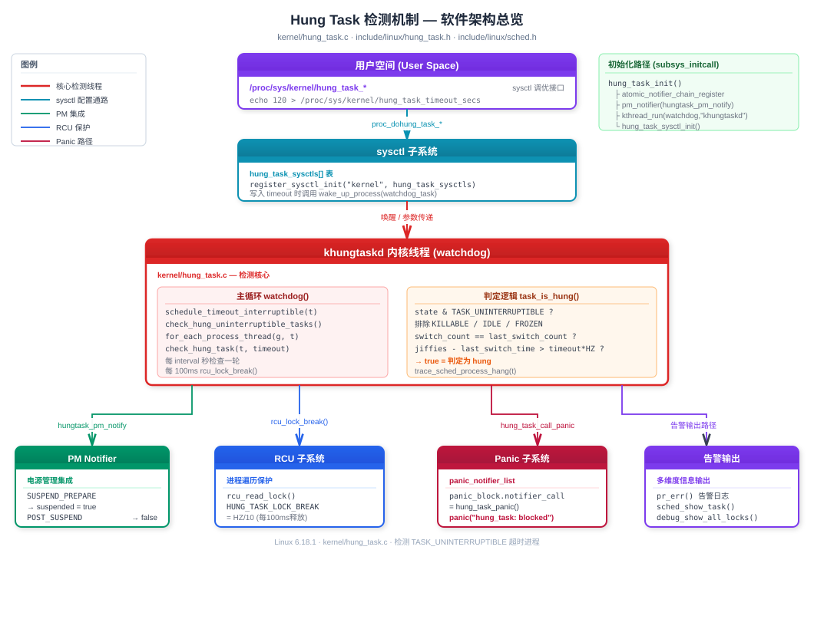
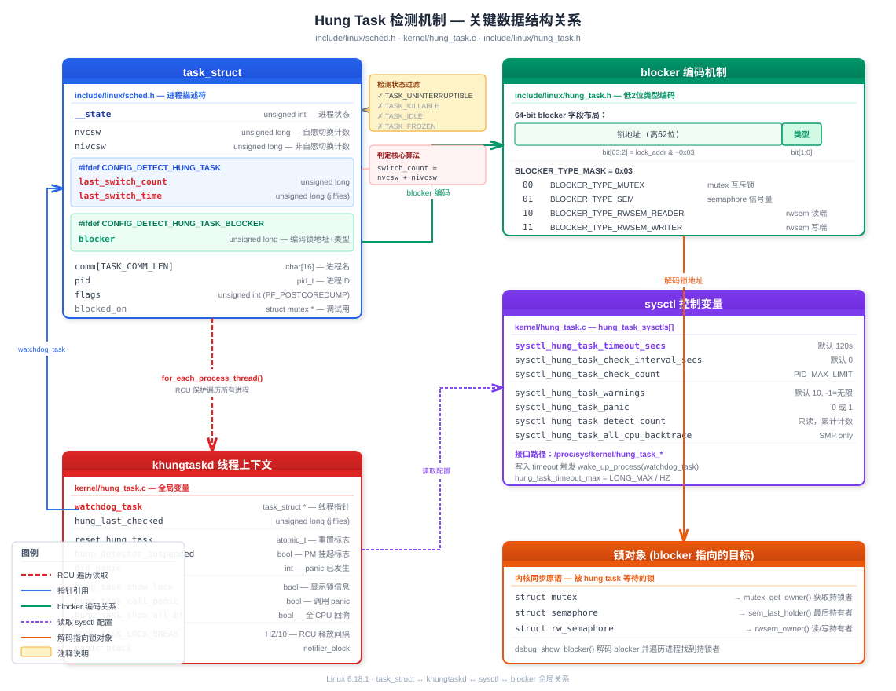

# Linux Kernel Hung Task 检测机制深度解析

> 基于 Linux 6.18.1 内核源码（`kernel/hung_task.c`、`include/linux/hung_task.h`、`include/linux/sched.h`）

## 目录

<details>
<summary><b>1. 软件架构总览</b></summary>

- 1.1 [设计目标](#11-设计目标)
- 1.2 [整体架构图](#12-整体架构图)
- 1.3 [核心源文件](#13-核心源文件)
- 1.4 [Kconfig 编译选项](#14-kconfig-编译选项)
</details>
<details>
<summary><b>2. 关键数据结构及其关系</b></summary>

- 2.1 [task_struct 中的 hung task 字段](#21-task_struct-中的-hung-task-字段)
- 2.2 [blocker 编码机制](#22-blocker-编码机制)
- 2.3 [sysctl 控制变量](#23-sysctl-控制变量)
- 2.4 [数据结构关系图](#24-数据结构关系图)
</details>
<details>
<summary><b>3. 实现原理</b></summary>

- 3.1 [khungtaskd 内核线程](#31-khungtaskd-内核线程)
- 3.2 [task_is_hung 判定算法](#32-task_is_hung-判定算法)
- 3.3 [check_hung_task 处理流程](#33-check_hung_task-处理流程)
- 3.4 [RCU 锁分段机制](#34-rcu-锁分段机制)
- 3.5 [blocker 追踪机制](#35-blocker-追踪机制)
- 3.6 [电源管理集成](#36-电源管理集成)
- 3.7 [完整检测流程图](#37-完整检测流程图)
</details>
<details>
<summary><b>4. 用法总结</b></summary>

- 4.1 [编译配置](#41-编译配置)
- 4.2 [运行时 sysctl 调优](#42-运行时-sysctl-调优)
- 4.3 [内核启动参数](#43-内核启动参数)
- 4.4 [典型使用场景](#44-典型使用场景)
</details>
<details>
<summary><b>5. hung task 发生意味着什么</b></summary>

- 5.1 [D 状态的本质](#51-d-状态的本质)
- 5.2 [常见根因分类](#52-常见根因分类)
- 5.3 [与其他检测机制的区别](#53-与其他检测机制的区别)
- 5.4 [生产环境影响](#54-生产环境影响)
</details>
<details>
<summary><b>6. QEMU 模拟实验</b></summary>

- 6.1 [实验环境准备](#61-实验环境准备)
- 6.2 [实验一：触发基本 hung task 告警](#62-实验一触发基本-hung-task-告警)
- 6.3 [实验二：hung_task_panic 触发内核 panic](#63-实验二hung_task_panic-触发内核-panic)
- 6.4 [实验三：观察 blocker 信息输出](#64-实验三观察-blocker-信息输出)
- 6.5 [实验四：动态调整 sysctl 参数](#65-实验四动态调整-sysctl-参数)
</details>
<details>
<summary><b>7. 面试经典问题与答案</b></summary>

- [Q1: 什么是 hung task？](#q1-什么是-hung-task)
- [Q2: khungtaskd 如何判断一个任务是 hung？](#q2-khungtaskd-如何判断一个任务是-hung)
- [Q3: 为什么只检测 TASK_UNINTERRUPTIBLE 而不检测 TASK_INTERRUPTIBLE？](#q3-为什么只检测-task_uninterruptible-而不检测-task_interruptible)
- [Q4: TASK_KILLABLE 的任务会被检测为 hung 吗？](#q4-task_killable-的任务会被检测为-hung-吗)
- [Q5: hung task 与 soft lockup / hard lockup 有什么区别？](#q5-hung-task-与-soft-lockup--hard-lockup-有什么区别)
- [Q6: 为什么检测循环中需要 RCU lock break？](#q6-为什么检测循环中需要-rcu-lock-break)
- [Q7: blocker 字段是如何编码的？](#q7-blocker-字段是如何编码的)
- [Q8: 生产环境中如何处理 hung task？](#q8-生产环境中如何处理-hung-task)
- [Q9: hung task 检测在 suspend/resume 流程中如何处理？](#q9-hung-task-检测在-suspendresume-流程中如何处理)
- [Q10: 如何区分真正的 hung task 和合理的长时间 D 状态？](#q10-如何区分真正的-hung-task-和合理的长时间-d-状态)
</details>

---

## 1. 软件架构总览

### 1.1 设计目标

Hung task 检测器的核心使命：**发现长时间处于 `TASK_UNINTERRUPTIBLE`（D 状态）而未被调度的任务，并发出告警或触发 panic**。

在正常的内核运行中，进程进入 D 状态是为了等待不可中断的 I/O 操作（如磁盘读写），通常在毫秒级别就会返回。当一个进程在 D 状态停留超过 120 秒（默认值），几乎可以确定内核存在 bug——可能是死锁、驱动异常或资源泄漏。

### 1.2 整体架构图



### 1.3 核心源文件

| 文件 | 作用 |
|------|------|
| `kernel/hung_task.c` | 检测器完整实现：khungtaskd 线程、判定逻辑、sysctl 接口 |
| `include/linux/hung_task.h` | blocker 类型定义、辅助函数（`hung_task_set_blocker` 等） |
| `include/linux/sched.h` | `task_struct` 中 `last_switch_count`/`last_switch_time`/`blocker` 字段 |
| `lib/Kconfig.debug` | `CONFIG_DETECT_HUNG_TASK` 等编译选项 |

### 1.4 Kconfig 编译选项

```kconfig
CONFIG_DETECT_HUNG_TASK        # 主开关，依赖 DEBUG_KERNEL
CONFIG_DEFAULT_HUNG_TASK_TIMEOUT  # 默认超时（秒），默认 120
CONFIG_BOOTPARAM_HUNG_TASK_PANIC  # 启动时即 panic on hung task
CONFIG_DETECT_HUNG_TASK_BLOCKER   # 输出阻塞者（持锁任务）堆栈
```

> 源码位置：`lib/Kconfig.debug` 第 1230–1290 行

---

## 2. 关键数据结构及其关系

### 2.1 task_struct 中的 hung task 字段

```c
/* include/linux/sched.h */
struct task_struct {
    /* ... */
    unsigned long  nvcsw;              /* 自愿上下文切换计数 */
    unsigned long  nivcsw;             /* 非自愿上下文切换计数 */

#ifdef CONFIG_DETECT_HUNG_TASK
    unsigned long  last_switch_count;  /* 上次检测时的 nvcsw+nivcsw */
    unsigned long  last_switch_time;   /* 上次切换时的 jiffies */
#endif

#ifdef CONFIG_DETECT_HUNG_TASK_BLOCKER
    unsigned long  blocker;            /* 编码后的锁地址 + 阻塞类型 */
#endif
    /* ... */
};
```

**三组关键字段**：

| 字段 | 类型 | 含义 |
|------|------|------|
| `nvcsw` | `unsigned long` | 累计自愿上下文切换次数（voluntary context switch） |
| `nivcsw` | `unsigned long` | 累计非自愿上下文切换次数（involuntary context switch） |
| `last_switch_count` | `unsigned long` | khungtaskd 上次检查时记录的 `nvcsw + nivcsw` |
| `last_switch_time` | `unsigned long` | 上次发生切换的 `jiffies` 时间戳 |
| `blocker` | `unsigned long` | 低 2 位编码锁类型，高位存储锁地址 |

### 2.2 blocker 编码机制

`blocker` 字段利用锁地址的对齐特性（至少 4 字节对齐，低 2 位恒为 0），在低 2 位编码阻塞类型：

```c
/* include/linux/hung_task.h */
#define BLOCKER_TYPE_MUTEX         0x00UL  /* 00 - mutex */
#define BLOCKER_TYPE_SEM           0x01UL  /* 01 - semaphore */
#define BLOCKER_TYPE_RWSEM_READER  0x02UL  /* 10 - rwsem 读端 */
#define BLOCKER_TYPE_RWSEM_WRITER  0x03UL  /* 11 - rwsem 写端 */
#define BLOCKER_TYPE_MASK          0x03UL
```

编码/解码操作：

```
设置: blocker = lock_addr | type
取类型: type = blocker & BLOCKER_TYPE_MASK
取锁地址: lock_addr = blocker & ~BLOCKER_TYPE_MASK

示例：锁地址 0xFFFF0000DEAD0040，类型 mutex(0x00)
      blocker = 0xFFFF0000DEAD0040 | 0x00 = 0xFFFF0000DEAD0040
      
示例：锁地址 0xFFFF0000DEAD0040，类型 rwsem_writer(0x03)
      blocker = 0xFFFF0000DEAD0040 | 0x03 = 0xFFFF0000DEAD0043
```

### 2.3 sysctl 控制变量

```c
/* kernel/hung_task.c 中的全局变量 */
static int  sysctl_hung_task_check_count;        /* 每轮最多检查任务数, 默认 PID_MAX_LIMIT */
static unsigned long sysctl_hung_task_detect_count;  /* 累计检测到的 hung task 数（只读）*/
unsigned long sysctl_hung_task_timeout_secs;      /* 超时阈值，默认 120 秒 */
static unsigned long sysctl_hung_task_check_interval_secs; /* 检查间隔, 0=同 timeout */
static int  sysctl_hung_task_warnings;            /* 剩余告警次数, 默认 10 */
static unsigned int sysctl_hung_task_panic;       /* 是否 panic, 0 或 1 */
static unsigned int sysctl_hung_task_all_cpu_backtrace; /* 是否 dump 所有 CPU 回溯 */
```

对应 `/proc/sys/kernel/` 下的文件：

| sysctl 路径 | 变量 | 默认值 | 权限 | 说明 |
|-------------|------|--------|------|------|
| `hung_task_timeout_secs` | `sysctl_hung_task_timeout_secs` | 120 | 0644 | 超时阈值（0=禁用） |
| `hung_task_check_interval_secs` | `sysctl_hung_task_check_interval_secs` | 0 | 0644 | 检测间隔（0=同 timeout） |
| `hung_task_check_count` | `sysctl_hung_task_check_count` | PID_MAX_LIMIT | 0644 | 每轮最大检查数 |
| `hung_task_warnings` | `sysctl_hung_task_warnings` | 10 | 0644 | 剩余告警次数（-1=无限） |
| `hung_task_panic` | `sysctl_hung_task_panic` | 0 | 0644 | 检测到 hung 时是否 panic |
| `hung_task_detect_count` | `sysctl_hung_task_detect_count` | 0 | 0444 | 累计 hung 次数（只读） |
| `hung_task_all_cpu_backtrace` | `sysctl_hung_task_all_cpu_backtrace` | 0 | 0644 | 是否 dump 所有 CPU（SMP） |

### 2.4 数据结构关系图



<!--
原始文本版保留供参考：
```
┌──────────────────────────────────────────┐
│            task_struct (进程)              │
├──────────────────────────────────────────┤
│  __state          : TASK_UNINTERRUPTIBLE │──── 检测前提
│  nvcsw            : 自愿切换计数          │──┐
│  nivcsw           : 非自愿切换计数        │──┤
│                                          │  │  switch_count = nvcsw + nivcsw
│  last_switch_count: 上次记录的切换计数    │◄─┘
│  last_switch_time : 上次切换的 jiffies    │──── 用于超时判定
│                                          │
│  blocker          : 编码的锁地址+类型     │──── debug_show_blocker() 解码
│  comm[16]         : 进程名               │
│  pid              : 进程 ID              │
│  flags (PF_POSTCOREDUMP)                 │──── coredump 阻塞标记
└──────────────────────────────────────────┘
            ▲
            │ for_each_process_thread() 遍历
            │
┌──────────────────────────────────────────┐
│           khungtaskd 线程                 │
├──────────────────────────────────────────┤
│  watchdog_task    : 线程 task_struct 指针 │
│  hung_last_checked: 上次检查的 jiffies    │
│  reset_hung_task  : atomic 重置标志       │
│  hung_detector_suspended: PM 挂起标志     │
│                                          │
│  sysctl 控制:                            │
│    timeout / interval / check_count      │
│    warnings / panic / all_cpu_backtrace  │
└──────────────────────────────────────────┘
```
-->

---

## 3. 实现原理

### 3.1 khungtaskd 内核线程

khungtaskd 是整个机制的驱动核心，在 `subsys_initcall` 阶段启动：

```c
static int __init hung_task_init(void)
{
    atomic_notifier_chain_register(&panic_notifier_list, &panic_block);
    pm_notifier(hungtask_pm_notify, 0);          /* 注册电源管理回调 */
    watchdog_task = kthread_run(watchdog, NULL, "khungtaskd");
    hung_task_sysctl_init();                      /* 注册 sysctl 接口 */
    return 0;
}
subsys_initcall(hung_task_init);
```

`watchdog()` 函数是线程主循环：

```c
static int watchdog(void *dummy)
{
    unsigned long hung_last_checked = jiffies;
    set_user_nice(current, 0);               /* nice=0, 普通优先级 */

    for ( ; ; ) {
        unsigned long timeout = sysctl_hung_task_timeout_secs;
        unsigned long interval = sysctl_hung_task_check_interval_secs;
        long t;

        if (interval == 0)
            interval = timeout;              /* 间隔默认等于超时 */
        interval = min_t(unsigned long, interval, timeout);
        t = hung_timeout_jiffies(hung_last_checked, interval);
        
        if (t <= 0) {
            if (!atomic_xchg(&reset_hung_task, 0) &&   /* 未被重置 */
                !hung_detector_suspended)                /* 未在 suspend */
                check_hung_uninterruptible_tasks(timeout);
            hung_last_checked = jiffies;
            continue;
        }
        schedule_timeout_interruptible(t);   /* 可中断睡眠 */
    }
}
```

关键设计点：
- **`set_user_nice(current, 0)`**：不需要高优先级，正常调度即可
- **`schedule_timeout_interruptible(t)`**：可中断睡眠，支持被 sysctl 写入唤醒
- **`atomic_xchg(&reset_hung_task, 0)`**：检查并清除重置标志，防止误报（如 debug 工具主动重置）

### 3.2 task_is_hung 判定算法

这是最核心的判定函数，用 **"切换计数 + 时间窗口"双重检测**：

```c
static bool task_is_hung(struct task_struct *t, unsigned long timeout)
{
    unsigned long switch_count = t->nvcsw + t->nivcsw;
    unsigned int state = READ_ONCE(t->__state);

    /* 排除不需要检测的状态 */
    if (!(state & TASK_UNINTERRUPTIBLE) ||
        (state & (TASK_WAKEKILL | TASK_NOLOAD | TASK_FROZEN)))
        return false;

    /* 从未被调度过的新进程，跳过 */
    if (unlikely(!switch_count))
        return false;

    /* 切换计数有变化 → 进程被调度过，刷新记录 */
    if (switch_count != t->last_switch_count) {
        t->last_switch_count = switch_count;
        t->last_switch_time = jiffies;
        return false;
    }

    /* 切换计数未变，但还没超时 */
    if (time_is_after_jiffies(t->last_switch_time + timeout * HZ))
        return false;

    return true;  /* 判定为 hung */
}
```

**状态过滤逻辑详解**：

```
进程状态          是否检测    原因
───────────────────────────────────────────────
TASK_RUNNING        否       正在运行/可运行
TASK_INTERRUPTIBLE  否       可被信号唤醒
TASK_UNINTERRUPTIBLE 是      ← 唯一检测目标
TASK_KILLABLE       否       WAKEKILL 位排除
TASK_IDLE           否       NOLOAD 位排除
TASK_FROZEN         否       FROZEN 位排除（freezer 合理冻结）
```

**判定流程**（一图胜千言）：

```
        进入 task_is_hung(t, timeout)
                    │
        ┌───────────▼───────────┐
        │ state 是 D 状态？      │──否──→ return false
        │ 排除 KILLABLE/IDLE/   │
        │ FROZEN?               │
        └───────────┬───────────┘
                    │是
        ┌───────────▼───────────┐
        │ switch_count == 0 ?   │──是──→ return false
        │ (从未被调度过)         │        (新建进程)
        └───────────┬───────────┘
                    │否
        ┌───────────▼───────────┐
        │ switch_count !=       │──是──→ 更新 last_switch_count
        │ last_switch_count ?   │        更新 last_switch_time
        │ (发生过切换)           │        return false
        └───────────┬───────────┘
                    │否(计数相同)
        ┌───────────▼───────────┐
        │ jiffies < last_time   │──是──→ return false
        │ + timeout * HZ ?      │        (还没超时)
        └───────────┬───────────┘
                    │否
                    ▼
              return true ← 判定 hung!
```

### 3.3 check_hung_task 处理流程

当 `task_is_hung()` 返回 true 时的处理：

```c
static void check_hung_task(struct task_struct *t, unsigned long timeout)
{
    if (!task_is_hung(t, timeout))
        return;

    sysctl_hung_task_detect_count++;          /* 累计计数 */
    trace_sched_process_hang(t);              /* tracepoint 事件 */

    if (sysctl_hung_task_panic) {
        console_verbose();                    /* 提升 console 日志级别 */
        hung_task_show_lock = true;
        hung_task_call_panic = true;
    }

    if (sysctl_hung_task_warnings || hung_task_call_panic) {
        if (sysctl_hung_task_warnings > 0)
            sysctl_hung_task_warnings--;      /* 递减告警计数 */

        /* 打印 hung task 告警信息 */
        pr_err("INFO: task %s:%d blocked for more than %ld seconds.\n",
               t->comm, t->pid, (jiffies - t->last_switch_time) / HZ);
        pr_err("      %s %s %.*s\n", print_tainted(), ...);

        if (t->flags & PF_POSTCOREDUMP)
            pr_err("      Blocked by coredump.\n");

        sched_show_task(t);                   /* 打印任务堆栈 */
        debug_show_blocker(t, timeout);       /* 打印阻塞者信息 */
    }

    touch_nmi_watchdog();                     /* 防止 NMI watchdog 误报 */
}
```

输出示例：
```
INFO: task modprobe:1234 blocked for more than 120 seconds.
      Tainted: G           OE     6.18.1 #1
"echo 0 > /proc/sys/kernel/hung_task_timeout_secs" disables this message.
task:modprobe        state:D stack:12345 pid:1234 tgid:1234 ...
Call trace:
 __schedule+0x2c4/0x700
 schedule+0x3c/0xd0
 schedule_preempt_disabled+0x14/0x20
 __mutex_lock+0x374/0x5b0
 ...
INFO: task modprobe:1234 is blocked on a mutex likely owned by task kworker:5678.
```

### 3.4 RCU 锁分段机制

遍历所有进程线程需要在 RCU 读端临界区中进行。但长时间持有 RCU 读锁会延迟 grace period，影响整个系统。内核用 **分段锁** 策略解决：

```c
#define HUNG_TASK_LOCK_BREAK (HZ / 10)   /* 每 100ms 打断一次 */

static void check_hung_uninterruptible_tasks(unsigned long timeout)
{
    unsigned long last_break = jiffies;
    struct task_struct *g, *t;

    rcu_read_lock();
    for_each_process_thread(g, t) {
        if (!max_count--)
            goto unlock;
        /* 每 100ms 释放一次 RCU 锁，让其他 RCU 回调有机会执行 */
        if (time_after(jiffies, last_break + HUNG_TASK_LOCK_BREAK)) {
            if (!rcu_lock_break(g, t))
                goto unlock;              /* 进程已退出，停止遍历 */
            last_break = jiffies;
        }
        check_hung_task(t, timeout);
    }
unlock:
    rcu_read_unlock();
    /* ... */
}
```

`rcu_lock_break()` 的实现：

```c
static bool rcu_lock_break(struct task_struct *g, struct task_struct *t)
{
    get_task_struct(g);            /* 增加引用计数，防止释放 */
    get_task_struct(t);
    rcu_read_unlock();             /* 释放 RCU 读锁 */
    cond_resched();                /* 让出 CPU */
    rcu_read_lock();               /* 重新获取 RCU 读锁 */
    can_cont = pid_alive(g) && pid_alive(t);  /* 检查进程是否还活着 */
    put_task_struct(t);
    put_task_struct(g);
    return can_cont;
}
```

### 3.5 blocker 追踪机制

`CONFIG_DETECT_HUNG_TASK_BLOCKER` 启用后，内核在 mutex、semaphore、rwsem 的慢路径中调用 `hung_task_set_blocker()`，记录当前任务被哪把锁阻塞：

```c
/* 加锁慢路径中（如 __mutex_lock_common）*/
hung_task_set_blocker(lock, BLOCKER_TYPE_MUTEX);
schedule_preempt_disabled();     /* 进入 D 状态等待 */
hung_task_clear_blocker();       /* 获得锁后清除 */
```

当检测到 hung task 时，`debug_show_blocker()` 解码 blocker：

1. 提取锁地址和类型
2. 根据类型调用 `mutex_get_owner()` / `sem_last_holder()` / `rwsem_owner()` 获取持锁者
3. 遍历所有进程匹配持锁者
4. 打印持锁者信息和堆栈（如果持锁者本身不是 hung 的话）

### 3.6 电源管理集成

系统 suspend/resume 期间，许多进程会合理地长时间处于 D 状态。检测器通过 PM notifier 自动暂停：

```c
static int hungtask_pm_notify(struct notifier_block *self,
                              unsigned long action, void *hcpu)
{
    switch (action) {
    case PM_SUSPEND_PREPARE:
    case PM_HIBERNATION_PREPARE:
    case PM_RESTORE_PREPARE:
        hung_detector_suspended = true;      /* 暂停检测 */
        break;
    case PM_POST_SUSPEND:
    case PM_POST_HIBERNATION:
    case PM_POST_RESTORE:
        hung_detector_suspended = false;     /* 恢复检测 */
        break;
    }
    return NOTIFY_OK;
}
```

### 3.7 完整检测流程图

```
系统启动
    │
    ▼
hung_task_init()  [subsys_initcall]
    ├── 注册 panic_notifier
    ├── 注册 pm_notifier (suspend 暂停检测)
    ├── kthread_run(watchdog) → 创建 khungtaskd
    └── hung_task_sysctl_init() → 注册 /proc/sys/kernel/hung_task_*
            │
            ▼
    ┌── watchdog() 主循环 ──────────────────────────┐
    │                                                │
    │  计算 interval = min(check_interval, timeout)  │
    │  计算剩余 jiffies t                            │
    │       │                                        │
    │       ├─ t > 0 → schedule_timeout_interruptible│
    │       │          (可被 sysctl 写入唤醒)          │
    │       │                                        │
    │       └─ t ≤ 0 → 是否 reset? suspended?        │
    │                    │                           │
    │                    ├─是→ 跳过本轮               │
    │                    │                           │
    │                    └─否→ check_hung_uninterruptible_tasks()
    │                              │                 │
    │                              ▼                 │
    │                    rcu_read_lock()              │
    │                    for_each_process_thread:     │
    │                        │                       │
    │                        ├─ 每100ms rcu_lock_break│
    │                        │                       │
    │                        └─ check_hung_task(t):  │
    │                             task_is_hung()?    │
    │                               │                │
    │                            ┌──┴──┐             │
    │                           否     是             │
    │                            │   trace + 告警    │
    │                            │   show_blocker    │
    │                            │   可能 panic      │
    │                            │                   │
    │                    rcu_read_unlock()            │
    │                    debug_show_all_locks()       │
    │                    trigger_all_cpu_backtrace()  │
    │                                                │
    └────────────────────────────────────────────────┘
```

---

## 4. 用法总结

### 4.1 编译配置

```bash
# 启用 hung task 检测
CONFIG_DETECT_HUNG_TASK=y

# 默认超时 120 秒（可根据需要调整）
CONFIG_DEFAULT_HUNG_TASK_TIMEOUT=120

# 启用 blocker 追踪（推荐）
CONFIG_DETECT_HUNG_TASK_BLOCKER=y

# 检测到 hung task 时直接 panic（生产高可用场景）
# CONFIG_BOOTPARAM_HUNG_TASK_PANIC=y
```

### 4.2 运行时 sysctl 调优

```bash
# 查看当前配置
sysctl -a | grep hung_task

# 调整超时时间为 60 秒（调试时缩短等待）
echo 60 > /proc/sys/kernel/hung_task_timeout_secs

# 禁用检测（设为 0）
echo 0 > /proc/sys/kernel/hung_task_timeout_secs

# 检测到 hung task 时 panic
echo 1 > /proc/sys/kernel/hung_task_panic

# 不限制告警次数
echo -1 > /proc/sys/kernel/hung_task_warnings

# 查看累计检测到的 hung task 数
cat /proc/sys/kernel/hung_task_detect_count

# 设置检查间隔为 30 秒（比 timeout 更频繁地检查）
echo 30 > /proc/sys/kernel/hung_task_check_interval_secs

# dump 所有 CPU 回溯（SMP 系统调试）
echo 1 > /proc/sys/kernel/hung_task_all_cpu_backtrace
```

### 4.3 内核启动参数

```bash
# 通过 bootargs 设置
hung_task_panic=1       # 等同于 CONFIG_BOOTPARAM_HUNG_TASK_PANIC
```

### 4.4 典型使用场景

| 场景 | 推荐配置 |
|------|---------|
| 开发调试 | timeout=30, warnings=-1, panic=0 |
| 生产服务器 | timeout=120, panic=1, panic_timeout=30 |
| 嵌入式看门狗 | timeout=60, panic=1, panic_timeout=0（立即重启） |
| CI/CD 测试 | timeout=60, panic=0, all_cpu_backtrace=1 |

---

## 5. hung task 发生意味着什么

### 5.1 D 状态的本质

`TASK_UNINTERRUPTIBLE`（D 状态）意味着进程正在等待一个**不可中断的内核操作**完成。这种状态的特点：

- **不响应信号**：`kill -9` 也无法终止
- **不可抢占**：进程主动让出 CPU，等待事件唤醒
- **设计用途**：保护关键的内核数据一致性操作（如磁盘 I/O、锁等待）

正常情况下 D 状态是**短暂**的。当进程在 D 状态停留超过 120 秒，说明：

### 5.2 常见根因分类

```
hung task 根因
    │
    ├── 1. 锁相关问题
    │   ├── 死锁：A 持锁等 B，B 持锁等 A
    │   ├── 锁饥饿：高优先级任务长时间持锁
    │   └── 锁被 hung 的持有者阻塞（链式阻塞）
    │
    ├── 2. I/O 子系统问题
    │   ├── 存储设备无响应（硬盘故障、NFS 服务器宕机）
    │   ├── 块设备驱动 bug（请求丢失、完成回调未触发）
    │   └── I/O 调度器异常
    │
    ├── 3. 驱动程序 bug
    │   ├── 未正确释放资源
    │   ├── 中断处理错误导致唤醒丢失
    │   └── 固件异常导致设备不响应
    │
    ├── 4. 内存压力
    │   ├── 内存回收路径阻塞
    │   ├── OOM 处理过程中的锁竞争
    │   └── writeback 路径等待 I/O 完成
    │
    └── 5. 其他内核 bug
        ├── 唤醒条件丢失（lost wakeup）
        ├── wait_queue 使用不当
        └── coredump 阻塞（PF_POSTCOREDUMP）
```

### 5.3 与其他检测机制的区别

| 特性 | hung task | soft lockup | hard lockup |
|------|-----------|-------------|-------------|
| **检测目标** | D 状态进程 | 独占 CPU 不调度 | CPU 被锁死（中断也不响应） |
| **检测线程** | khungtaskd | watchdog/N (per-CPU) | NMI watchdog |
| **默认超时** | 120 秒 | 20 秒 | 10 秒 |
| **进程状态** | TASK_UNINTERRUPTIBLE | TASK_RUNNING（在内核态循环） | 任意（中断禁止） |
| **CPU 是否空闲** | 是（进程让出了 CPU） | 否（CPU 被占满） | 否（CPU 完全卡死） |
| **能否响应中断** | 能 | 能 | 不能 |
| **触发 panic** | 可选 | 可选 | 可选 |

### 5.4 生产环境影响

- **用户可见**：进程卡住无响应，`ps` 显示 D 状态
- **系统影响**：如果 hung 的进程持有关键锁，可能导致其他进程连锁阻塞
- **数据风险**：如果涉及文件系统 I/O，可能导致数据丢失
- **恢复方式**：通常需要解决根因（修复驱动/恢复 I/O 路径）或重启

---

## 6. QEMU 模拟实验

### 6.1 实验环境准备

```bash
# 确保内核编译选项开启
CONFIG_DETECT_HUNG_TASK=y
CONFIG_DEFAULT_HUNG_TASK_TIMEOUT=120
CONFIG_DETECT_HUNG_TASK_BLOCKER=y
CONFIG_MODULES=y

# 编译内核
make -j$(nproc)

# 启动 QEMU (arm64 示例)
qemu-system-aarch64 \
    -machine virt \
    -cpu cortex-a57 \
    -nographic \
    -kernel arch/arm64/boot/Image \
    -append "console=ttyAMA0 root=/dev/vda rw" \
    -drive file=rootfs.img,format=raw \
    -m 1024
```

### 6.2 实验一：触发基本 hung task 告警

编写一个内核模块，创建线程进入 D 状态并永远不唤醒：

```c
/* hung_task_test.c */
#include <linux/module.h>
#include <linux/kthread.h>
#include <linux/delay.h>
#include <linux/sched.h>

static struct task_struct *test_thread;

static int hung_thread_fn(void *data)
{
    pr_info("hung_task_test: entering D state...\n");

    /* 设置为 TASK_UNINTERRUPTIBLE 并永远不唤醒 */
    set_current_state(TASK_UNINTERRUPTIBLE);
    schedule();

    /* 不会执行到这里 */
    return 0;
}

static int __init hung_task_test_init(void)
{
    pr_info("hung_task_test: loading module\n");
    test_thread = kthread_run(hung_thread_fn, NULL, "hung_test");
    if (IS_ERR(test_thread))
        return PTR_ERR(test_thread);
    return 0;
}

static void __exit hung_task_test_exit(void)
{
    pr_info("hung_task_test: unloading module\n");
    /* 注意：hung 的线程无法被正常停止 */
}

module_init(hung_task_test_init);
module_exit(hung_task_test_exit);
MODULE_LICENSE("GPL");
MODULE_DESCRIPTION("Hung task detector test module");
```

操作步骤：

```bash
# 缩短超时加速实验
echo 30 > /proc/sys/kernel/hung_task_timeout_secs

# 加载模块
insmod hung_task_test.ko

# 等待 30+ 秒后查看 dmesg
dmesg | grep -A 20 "blocked for more than"
```

预期输出：
```
INFO: task hung_test:XXX blocked for more than 30 seconds.
      Not tainted 6.18.1 #1
"echo 0 > /proc/sys/kernel/hung_task_timeout_secs" disables this message.
task:hung_test       state:D stack:XXXX pid:XXX ...
Call trace:
 __schedule+0x.../0x...
 schedule+0x.../0x...
 hung_thread_fn+0x.../0x...
 kthread+0x.../0x...
 ret_from_fork+0x.../0x...
```

### 6.3 实验二：hung_task_panic 触发内核 panic

```bash
# 启用 panic on hung task
echo 1 > /proc/sys/kernel/hung_task_panic

# 设置 panic 后自动重启（10 秒后）
echo 10 > /proc/sys/kernel/panic

# 缩短超时
echo 30 > /proc/sys/kernel/hung_task_timeout_secs

# 加载测试模块
insmod hung_task_test.ko

# 30 秒后系统将 panic 并在 10 秒后重启
```

预期输出：
```
INFO: task hung_test:XXX blocked for more than 30 seconds.
...
Kernel panic - not syncing: hung_task: blocked tasks
...
```

### 6.4 实验三：观察 blocker 信息输出

编写模块让一个线程持锁不放，另一个线程等锁进入 D 状态：

```c
/* hung_blocker_test.c */
#include <linux/module.h>
#include <linux/kthread.h>
#include <linux/mutex.h>
#include <linux/delay.h>

static DEFINE_MUTEX(test_mutex);
static struct task_struct *holder_thread;
static struct task_struct *waiter_thread;

/* 持锁线程：获取锁后进入 D 状态不释放 */
static int holder_fn(void *data)
{
    mutex_lock(&test_mutex);
    pr_info("blocker_test: holder got the lock, going to D state\n");
    set_current_state(TASK_UNINTERRUPTIBLE);
    schedule();  /* 永远不会醒来，锁不会释放 */
    mutex_unlock(&test_mutex);
    return 0;
}

/* 等锁线程：尝试获取被持有的锁，进入 D 状态 */
static int waiter_fn(void *data)
{
    msleep(1000);  /* 确保 holder 先获取锁 */
    pr_info("blocker_test: waiter trying to get the lock\n");
    mutex_lock(&test_mutex);  /* 阻塞在这里 */
    mutex_unlock(&test_mutex);
    return 0;
}

static int __init blocker_test_init(void)
{
    holder_thread = kthread_run(holder_fn, NULL, "lock_holder");
    waiter_thread = kthread_run(waiter_fn, NULL, "lock_waiter");
    return 0;
}

static void __exit blocker_test_exit(void)
{
    pr_info("blocker_test: unloading\n");
}

module_init(blocker_test_init);
module_exit(blocker_test_exit);
MODULE_LICENSE("GPL");
```

预期输出（含 blocker 信息）：

```
INFO: task lock_waiter:XXX blocked for more than 30 seconds.
...
INFO: task lock_waiter:XXX is blocked on a mutex likely owned by task lock_holder:YYY.
task:lock_holder     state:D stack:XXXX pid:YYY ...
Call trace:
 __schedule+0x.../0x...
 schedule+0x.../0x...
 holder_fn+0x.../0x...
 ...
```

### 6.5 实验四：动态调整 sysctl 参数

```bash
# 实时监控 hung task 检测次数
watch -n 1 cat /proc/sys/kernel/hung_task_detect_count

# 动态调整告警次数（设为无限）
echo -1 > /proc/sys/kernel/hung_task_warnings

# 动态缩短检查间隔
echo 10 > /proc/sys/kernel/hung_task_check_interval_secs

# 修改 timeout 会立即唤醒 khungtaskd
echo 20 > /proc/sys/kernel/hung_task_timeout_secs
# → proc_dohung_task_timeout_secs() 调用 wake_up_process(watchdog_task)
```

---

## 7. 面试经典问题与答案

### Q1: 什么是 hung task？

**答**：hung task 是指在 `TASK_UNINTERRUPTIBLE`（D 状态）停留超过阈值（默认 120 秒）而未被调度的任务。内核通过 `khungtaskd` 线程周期性遍历所有进程，检测是否存在这种异常。D 状态本身是合法的（用于等待不可中断 I/O），但长时间停留通常意味着内核 bug（死锁、驱动故障、I/O 路径阻塞等）。

### Q2: khungtaskd 如何判断一个任务是 hung？

**答**：通过**两阶段比较**：

1. **切换计数比较**：取 `nvcsw + nivcsw`（自愿+非自愿上下文切换总数），与上次记录的 `last_switch_count` 对比。如果有变化，说明进程被调度过，刷新记录并跳过。
2. **超时判定**：如果切换计数不变，检查 `jiffies - last_switch_time` 是否超过 `timeout * HZ`。超过则判定为 hung。

这种双重检测避免了因单次检查时序问题导致的误报。

### Q3: 为什么只检测 TASK_UNINTERRUPTIBLE 而不检测 TASK_INTERRUPTIBLE？

**答**：`TASK_INTERRUPTIBLE` 的进程可以被信号唤醒，用户可以通过 `kill` 终止它。即使长时间等待，也不构成"不可恢复"的问题。而 `TASK_UNINTERRUPTIBLE` 的进程无法响应任何信号（包括 SIGKILL），如果等待条件永远无法满足，进程将永久卡死，这才是需要检测的真正问题。

### Q4: TASK_KILLABLE 的任务会被检测为 hung 吗？

**答**：不会。`TASK_KILLABLE` 定义为 `TASK_WAKEKILL | TASK_UNINTERRUPTIBLE`。在 `task_is_hung()` 中会检查：

```c
if (state & (TASK_WAKEKILL | TASK_NOLOAD | TASK_FROZEN))
    return false;
```

`TASK_WAKEKILL` 位被排除，因为这类进程虽然不响应普通信号，但可以被 fatal signal（如 SIGKILL）唤醒，不会真正"hung"住。

### Q5: hung task 与 soft lockup / hard lockup 有什么区别？

**答**：

| 维度 | hung task | soft lockup | hard lockup |
|------|-----------|-------------|-------------|
| 症状 | 进程睡眠不醒 | CPU 在内核态死循环 | CPU 连中断都不响应 |
| CPU 状态 | 空闲（进程已让出） | 被占满 | 完全锁死 |
| 检测机制 | khungtaskd 遍历进程 | per-CPU watchdog 线程 | NMI watchdog |
| 超时 | 120s | 20s | 10s |
| 根因 | 锁竞争/IO阻塞 | 内核代码无限循环 | 禁中断代码死循环 |

核心区别：hung task 中进程是**主动让出 CPU** 等待唤醒的，CPU 本身是正常的；而 lockup 是 **CPU 被占用** 无法执行其他任务。

### Q6: 为什么检测循环中需要 RCU lock break？

**答**：遍历所有进程线程在 `rcu_read_lock()` 保护下进行。长时间持有 RCU 读锁会导致：
- **grace period 延迟**：RCU 回调（如内存释放）被推迟，可能导致内存压力
- **可抢占性降低**：在非 PREEMPT_RCU 配置中，RCU 读端临界区禁止抢占

因此每隔 `HUNG_TASK_LOCK_BREAK`（100ms）就释放一次 RCU 读锁，调用 `cond_resched()` 让出 CPU，然后重新获取锁继续遍历。通过 `get_task_struct()` 增加引用计数防止遍历中的进程被释放。

### Q7: blocker 字段是如何编码的？

**答**：利用锁指针的**自然对齐**特性（至少 4 字节对齐，低 2 位恒为 0），将锁地址和阻塞类型编码在一个 `unsigned long` 中：

- **高位**：锁的内核地址
- **低 2 位**：阻塞类型（`00`=mutex，`01`=semaphore，`10`=rwsem 读端，`11`=rwsem 写端）

设置时 `blocker = lock_addr | type`，解码时 `type = blocker & 0x03`，`lock = blocker & ~0x03`。如果锁地址不对齐（低位非零），则静默跳过该锁的追踪。

### Q8: 生产环境中如何处理 hung task？

**答**：

1. **立即分析 dmesg**：获取 hung task 的堆栈和 blocker 信息，确定阻塞点
2. **检查 I/O 路径**：`iostat`、`blktrace` 确认存储设备是否正常
3. **检查锁竞争**：`/proc/lock_stat`、`debug_show_all_locks()` 输出分析死锁
4. **高可用场景**：启用 `hung_task_panic=1` + `panic_timeout=N` 实现自动重启恢复
5. **长期修复**：根据堆栈定位 bug 位置（驱动、文件系统、锁顺序等），提交内核补丁

### Q9: hung task 检测在 suspend/resume 流程中如何处理？

**答**：通过 PM notifier 机制自动管理。在 `PM_SUSPEND_PREPARE`/`PM_HIBERNATION_PREPARE` 时设置 `hung_detector_suspended = true`，暂停检测。在 `PM_POST_SUSPEND`/`PM_POST_HIBERNATION` 时恢复。这是因为 suspend 过程中很多进程会合法地长时间处于 D 状态（等待设备 suspend 完成），不应误报。

### Q10: 如何区分真正的 hung task 和合理的长时间 D 状态？

**答**：

| 判断因素 | 真正 hung | 合理等待 |
|---------|----------|---------|
| 堆栈位置 | 锁等待/死锁点 | NFS/网络 I/O 等待 |
| 是否可恢复 | 条件永远无法满足 | 等待外部事件（如网络恢复） |
| 影响范围 | 连锁阻塞其他进程 | 仅影响自身 |

对于合理的长时间等待（如 NFS 挂载点网络断开），应：
- 使用 `TASK_KILLABLE` 替代 `TASK_UNINTERRUPTIBLE`（允许 kill 终止）
- 调大 `hung_task_timeout_secs`
- 在特定代码路径中调用 `reset_hung_task_detector()` 重置检测计时器

---

> **源码参考**：
> - `kernel/hung_task.c` — 完整检测器实现
> - `include/linux/hung_task.h` — blocker 类型定义和辅助函数
> - `include/linux/sched.h` — task_struct 中 hung task 相关字段
> - `lib/Kconfig.debug` — 编译配置选项
