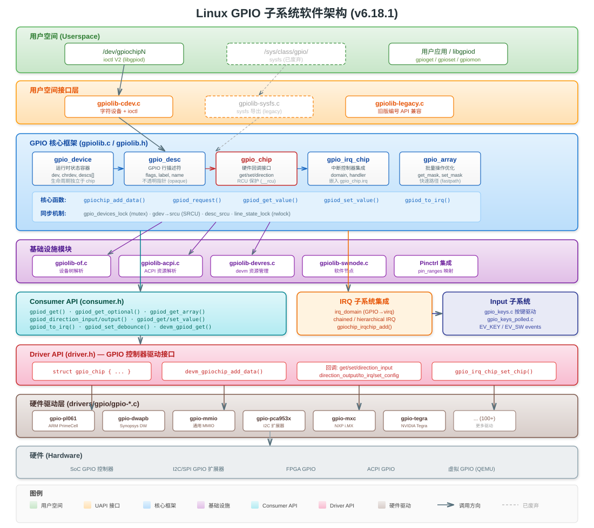
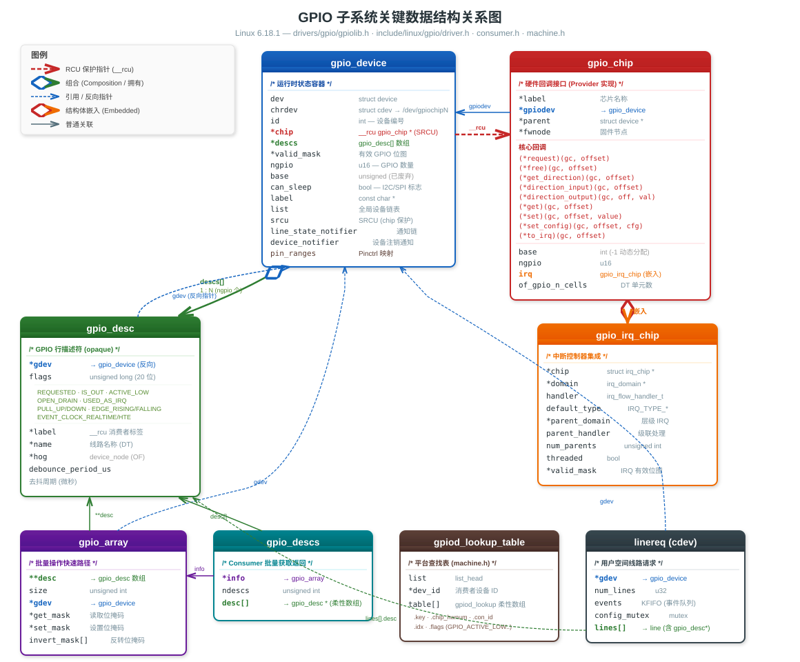

# Linux 内核 GPIO 子系统深度分析 (Linux 6.18.1)

---

## 目录

<details>
<summary><a href="#1-软件架构总览">1. 软件架构总览</a></summary>

- [架构全景图](#架构全景图)
- [文本架构图](#文本架构图)
- [1.1 设计原则](#11-设计原则)

</details>

<details>
<summary><a href="#2-分层架构详解">2. 分层架构详解</a></summary>

- [2.1 硬件驱动层（Provider）](#21-硬件驱动层provider)
- [2.2 核心框架层（gpiolib）](#22-核心框架层gpiolib)
- [2.3 消费者接口层（Consumer API）](#23-消费者接口层consumer-api)
- [2.4 用户空间接口层](#24-用户空间接口层)

</details>

<details>
<summary><a href="#3-核心数据结构">3. 核心数据结构</a></summary>

- [3.1 struct gpio_device — GPIO 设备容器](#31-struct-gpio_device--gpio-设备容器)
- [3.2 struct gpio_desc — GPIO 行描述符](#32-struct-gpio_desc--gpio-行描述符)
- [3.3 struct gpio_chip — GPIO 控制器硬件接口](#33-struct-gpio_chip--gpio-控制器硬件接口)
- [3.4 struct gpio_irq_chip — GPIO 中断控制器](#34-struct-gpio_irq_chip--gpio-中断控制器)
- [3.5 struct gpio_array — 批量操作描述符](#35-struct-gpio_array--批量操作描述符)
- [3.6 struct gpio_descs — GPIO 描述符集合](#36-struct-gpio_descs--gpio-描述符集合)
- [3.7 平台查找表结构](#37-平台查找表结构)
- [3.8 数据结构关系图](#38-数据结构关系图)

</details>

<details>
<summary><a href="#4-内核空间-consumer-api描述符接口">4. 内核空间 Consumer API（描述符接口）</a></summary>

- [4.1 获取/释放 GPIO](#41-获取释放-gpio)
- [4.2 方向控制](#42-方向控制)
- [4.3 值读写（非睡眠上下文）](#43-值读写非睡眠上下文)
- [4.4 值读写（可睡眠上下文）](#44-值读写可睡眠上下文)
- [4.5 配置与属性](#45-配置与属性)
- [4.6 逻辑值 vs 原始值](#46-逻辑值-vs-原始值)

</details>

<details>
<summary><a href="#5-gpio-驱动注册-apiprovider-接口">5. GPIO 驱动注册 API（Provider 接口）</a></summary>

- [5.1 芯片注册与注销](#51-芯片注册与注销)
- [5.2 注册流程 (`gpiochip_add_data_with_key`)](#52-注册流程-gpiochip_add_data_with_key)
- [5.3 通用辅助回调](#53-通用辅助回调)
- [5.4 IRQ 芯片集成辅助](#54-irq-芯片集成辅助)

</details>

<details>
<summary><a href="#6-用户空间接口">6. 用户空间接口</a></summary>

- [6.1 字符设备接口（V2 API，推荐）](#61-字符设备接口v2-api推荐)
- [6.2 sysfs 接口（已废弃）](#62-sysfs-接口已废弃)

</details>

<details>
<summary><a href="#7-中断子系统集成gpio_irq_chip">7. 中断子系统集成（gpio_irq_chip）</a></summary>

- [7.1 GPIO 中断架构](#71-gpio-中断架构)
- [7.2 驱动中配置 IRQ 芯片](#72-驱动中配置-irq-芯片)
- [7.3 软件去抖流程（cdev 边沿事件）](#73-软件去抖流程cdev-边沿事件)

</details>

<details>
<summary><a href="#8-设备树device-tree集成">8. 设备树（Device Tree）集成</a></summary>

- [8.1 设备树 GPIO 描述格式](#81-设备树-gpio-描述格式)
- [8.2 DT 标志位](#82-dt-标志位)
- [8.3 关键 DT 解析函数](#83-关键-dt-解析函数)

</details>

<details>
<summary><a href="#9-pinctrl-子系统集成">9. Pinctrl 子系统集成</a></summary>

</details>

<details>
<summary><a href="#10-设备资源管理devm接口">10. 设备资源管理（devm）接口</a></summary>

</details>

<details>
<summary><a href="#11-同步与并发机制">11. 同步与并发机制</a></summary>

- [11.1 全局锁](#111-全局锁)
- [11.2 设备级锁](#112-设备级锁)
- [11.3 字符设备级锁](#113-字符设备级锁)
- [11.4 SRCU 保护的 chip 访问模式](#114-srcu-保护的-chip-访问模式)

</details>

<details>
<summary><a href="#12-典型驱动实例pl061">12. 典型驱动实例：PL061</a></summary>

- [12.1 驱动结构体](#121-驱动结构体)
- [12.2 probe 函数关键流程](#122-probe-函数关键流程)
- [12.3 中断处理链](#123-中断处理链)

</details>

<details>
<summary><a href="#13-gpio-请求与查找流程">13. GPIO 请求与查找流程</a></summary>

- [13.1 内核消费者的查找优先级](#131-内核消费者的查找优先级)
- [13.2 完整请求流程](#132-完整请求流程)

</details>

<details>
<summary><a href="#14-源码文件组织">14. 源码文件组织</a></summary>

- [14.1 头文件](#141-头文件)
- [14.2 核心实现](#142-核心实现)
- [14.3 硬件驱动（100+ 个）](#143-硬件驱动100-个)

</details>

<details>
<summary><a href="#15-架构总结">15. 架构总结</a></summary>

- [15.1 核心设计模式](#151-核心设计模式)
- [15.2 API 选择指南](#152-api-选择指南)
- [15.3 关键 API 速查表](#153-关键-api-速查表)

</details>

<details>
<summary><a href="#16-实战如何申请-gpio-和-button">16. 实战：如何申请 GPIO 和 Button</a></summary>

- [16.1 内核驱动中申请 GPIO 的三种方式](#161-内核驱动中申请-gpio-的三种方式)
- [16.2 GPIO flags 参数详解](#162-gpio-flags-参数详解)
- [16.3 gpio-keys 驱动深度解析](#163-gpio-keys-驱动深度解析)
- [16.4 gpio-keys DT 绑定规范](#164-gpio-keys-dt-绑定规范)
- [16.5 常用 KEY 码速查](#165-常用-key-码速查)

</details>

<details>
<summary><a href="#17-qemu-gpiobutton-实践">17. QEMU GPIO/Button 实践</a></summary>

- [17.1 QEMU virt 平台 GPIO 硬件](#171-qemu-virt-平台-gpio-硬件)
- [17.2 实践一：编写 GPIO 测试内核模块](#172-实践一编写-gpio-测试内核模块)
- [17.3 实践二：用户空间 GPIO 操作 (chardev 方式)](#173-实践二用户空间-gpio-操作-chardev-方式)
- [17.4 实践三：sysfs GPIO 操作 (Legacy，已废弃)](#174-实践三sysfs-gpio-操作-legacy已废弃)
- [17.5 QEMU 调试 GPIO 状态](#175-qemu-调试-gpio-状态)
- [17.6 完整 QEMU GPIO 实践步骤](#176-完整-qemu-gpio-实践步骤)
- [17.7 GPIO 用户空间接口对比](#177-gpio-用户空间接口对比)

</details>

---

## 1. 软件架构总览

Linux GPIO 子系统采用经典的 **分层解耦** 设计，将硬件操作、核心框架、内核消费者、用户空间接口清晰分离。

### 架构全景图



### 文本架构图

```
┌─────────────────────────────────────────────────────────────────────┐
│                        用户空间 (Userspace)                         │
│  ┌─────────────────────┐    ┌──────────────────────────────────┐   │
│  │  /dev/gpiochipN     │    │  /sys/class/gpio/ (已废弃)        │   │
│  │  (chardev ioctl V2) │    │  (sysfs legacy interface)        │   │
│  └─────────┬───────────┘    └──────────────┬───────────────────┘   │
├─────────────┼──────────────────────────────┼───────────────────────┤
│  ┌──────────┴───────────┐    ┌─────────────┴──────────────────┐    │
│  │   gpiolib-cdev.c     │    │     gpiolib-sysfs.c            │    │
│  │   字符设备层          │    │     sysfs 接口层               │    │
│  └──────────┬───────────┘    └─────────────┬──────────────────┘    │
│             │                              │                       │
│  ┌──────────┴──────────────────────────────┴──────────────────┐    │
│  │                    gpiolib.c / gpiolib.h                    │    │
│  │               GPIO 核心框架 (Core Framework)                │    │
│  │  ┌──────────┐  ┌──────────┐  ┌──────────┐  ┌───────────┐  │    │
│  │  │gpio_device│  │gpio_desc │  │gpio_chip │  │gpio_array │  │    │
│  │  └──────────┘  └──────────┘  └──────────┘  └───────────┘  │    │
│  └──────────┬──────────────────────────────┬──────────────────┘    │
│             │                              │                       │
│  ┌──────────┴──────┐  ┌───────────────┐  ┌┴──────────────────┐    │
│  │ gpiolib-of.c    │  │gpiolib-acpi.c │  │ gpiolib-devres.c  │    │
│  │ 设备树支持      │  │ ACPI 支持      │  │ devm 资源管理     │    │
│  └─────────────────┘  └───────────────┘  └───────────────────┘    │
│                                                                    │
│  ┌─────────────────────────────────────────────────────────────┐   │
│  │               Consumer API (include/linux/gpio/consumer.h)  │   │
│  │           gpiod_get() / gpiod_set_value() / gpiod_to_irq() │   │
│  └──────────────────────────────┬──────────────────────────────┘   │
│                    内核空间 (Kernel Space)                          │
├─────────────────────────────────┼──────────────────────────────────┤
│  ┌──────────────────────────────┴──────────────────────────────┐   │
│  │               Driver API (include/linux/gpio/driver.h)      │   │
│  │       struct gpio_chip + gpiochip_add_data() 注册接口        │   │
│  └──────────────────────────────┬──────────────────────────────┘   │
│                                 │                                  │
│  ┌──────────────────────────────┴──────────────────────────────┐   │
│  │              硬件驱动层 (Hardware Drivers)                    │   │
│  │  gpio-pl061.c  gpio-dwapb.c  gpio-mxc.c  gpio-pca953x.c   │   │
│  │  gpio-mmio.c   gpio-rcar.c   gpio-tegra.c  ...  (100+)     │   │
│  └─────────────────────────────────────────────────────────────┘   │
│                    硬件层 (Hardware)                                │
└────────────────────────────────────────────────────────────────────┘
```

### 1.1 设计原则

| 设计原则 | 实现方式 |
|---------|---------|
| **硬件抽象** | `gpio_chip` 定义统一回调接口，屏蔽底层硬件差异 |
| **描述符化** | 使用 `gpio_desc` 不透明指针替代全局 GPIO 编号 |
| **生命周期解耦** | `gpio_device` 可在 `gpio_chip` 移除后继续存在（支持热插拔） |
| **RCU 保护** | `gpio_chip` 指针受 SRCU 保护，支持安全的并发访问 |
| **多源查找** | 支持 DT → ACPI → 平台查找表 → 行名 的优先级查找链 |
| **Pinctrl 整合** | GPIO 与 pin 复用通过 pin_ranges 链表关联 |

---

## 2. 分层架构详解

### 2.1 硬件驱动层（Provider）

每个 GPIO 控制器硬件驱动（如 `gpio-pl061.c`）需实现 `struct gpio_chip` 中的回调函数，
然后调用 `gpiochip_add_data()` / `devm_gpiochip_add_data()` 注册到核心框架。

### 2.2 核心框架层（gpiolib）

`gpiolib.c` 是整个子系统的核心，负责：
- 管理全局 `gpio_device` 链表
- 分配和管理 `gpio_desc` 描述符数组
- 实现 GPIO 请求/释放的引用计数
- 路由 `gpiod_get_value()` 等调用到底层 `gpio_chip` 回调
- 集成中断域（IRQ domain）、Pinctrl、DT/ACPI 解析

### 2.3 消费者接口层（Consumer API）

定义在 `include/linux/gpio/consumer.h`，提供面向内核驱动的 GPIO 操作接口。
所有操作基于 `struct gpio_desc *` 描述符，自动处理 active-low、open-drain 等逻辑。

### 2.4 用户空间接口层

- **字符设备接口**（推荐）：通过 `/dev/gpiochipN`，使用 `ioctl()` 进行 GPIO 操作
- **sysfs 接口**（已废弃）：通过 `/sys/class/gpio/` 进行简单的 GPIO 控制

---

## 3. 核心数据结构

### 3.1 struct gpio_device — GPIO 设备容器

> 定义位置：`drivers/gpio/gpiolib.h`

`gpio_device` 是 GPIO 控制器在内核中的**运行时状态容器**，其生命周期独立于底层硬件（`gpio_chip`）。
即使硬件驱动被移除，只要用户空间还持有 `/dev/gpiochipN` 的文件描述符，`gpio_device` 就会继续存在。

```c
struct gpio_device {
    struct device       dev;            /* Linux 设备模型集成 */
    struct cdev         chrdev;         /* 字符设备 /dev/gpiochipN */
    int                 id;             /* 设备编号 (gpiochipN 中的 N) */
    struct module       *owner;         /* 所属模块 */

    struct gpio_chip __rcu *chip;       /* 指向硬件 chip (RCU 保护) */
    struct gpio_desc    *descs;         /* GPIO 描述符数组 (ngpio 个) */
    unsigned long       *valid_mask;    /* 有效 GPIO 位图 */
    struct srcu_struct  desc_srcu;      /* 描述符同步保护 */

    unsigned int        base;           /* 全局 GPIO 编号基址 (已废弃) */
    u16                 ngpio;          /* GPIO 线路数量 */
    bool                can_sleep;      /* 回调是否可能睡眠 (I2C/SPI) */
    const char          *label;         /* 设备标签 */
    void                *data;          /* 驱动私有数据 */

    struct list_head    list;           /* 全局设备链表 */

    /* 通知机制 */
    struct raw_notifier_head      line_state_notifier;   /* 线路状态变更通知 */
    rwlock_t                      line_state_lock;       /* 通知器保护锁 */
    struct workqueue_struct       *line_state_wq;        /* 异步通知工作队列 */
    struct blocking_notifier_head device_notifier;       /* 设备注销通知 */
    struct srcu_struct            srcu;                  /* chip 指针 SRCU 保护 */

#ifdef CONFIG_PINCTRL
    struct list_head    pin_ranges;     /* pinctrl 映射范围 */
#endif
};
```

**关键设计要点：**
- `chip` 指针使用 `__rcu` 标注，通过 SRCU 实现无锁读并发
- `descs` 数组在设备注册时一次性分配，大小为 `ngpio`
- `device_notifier` 用于通知 cdev 用户设备已移除

### 3.2 struct gpio_desc — GPIO 行描述符

> 定义位置：`drivers/gpio/gpiolib.h`

每条 GPIO 线路对应一个 `gpio_desc`，是 GPIO 子系统的**核心抽象单元**。
对消费者来说是不透明的——只能通过 `gpiod_*` API 操作。

```c
struct gpio_desc {
    struct gpio_device  *gdev;          /* 所属 GPIO 设备 */
    unsigned long       flags;          /* 状态位标志 */

    struct gpio_desc_label __rcu *label; /* 消费者标签 (RCU 保护) */
    const char          *name;           /* 线路名称 (来自 DT/ACPI) */

#ifdef CONFIG_OF_DYNAMIC
    struct device_node  *hog;           /* DT hog 节点 */
#endif
#ifdef CONFIG_GPIO_CDEV
    unsigned int        debounce_period_us; /* 去抖周期 (微秒) */
#endif
};
```

**Flag 位定义：**

| Flag 位 | 值 | 含义 |
|---------|---|------|
| `GPIOD_FLAG_REQUESTED` | 0 | GPIO 已被请求使用 |
| `GPIOD_FLAG_IS_OUT` | 1 | GPIO 配置为输出模式 |
| `GPIOD_FLAG_EXPORT` | 2 | GPIO 已导出到用户空间 |
| `GPIOD_FLAG_SYSFS` | 3 | GPIO 通过 sysfs 导出 |
| `GPIOD_FLAG_ACTIVE_LOW` | 6 | 逻辑电平取反 |
| `GPIOD_FLAG_OPEN_DRAIN` | 7 | 开漏输出模式 |
| `GPIOD_FLAG_OPEN_SOURCE` | 8 | 开源输出模式 |
| `GPIOD_FLAG_USED_AS_IRQ` | 9 | 用作中断源 |
| `GPIOD_FLAG_IRQ_IS_ENABLED` | 10 | 中断已启用 |
| `GPIOD_FLAG_IS_HOGGED` | 11 | 被内核 hog 占用 |
| `GPIOD_FLAG_TRANSITORY` | 12 | 休眠/复位时可能丢失值 |
| `GPIOD_FLAG_PULL_UP` | 13 | 使能上拉电阻 |
| `GPIOD_FLAG_PULL_DOWN` | 14 | 使能下拉电阻 |
| `GPIOD_FLAG_BIAS_DISABLE` | 15 | 禁用偏置 |
| `GPIOD_FLAG_EDGE_RISING` | 16 | 检测上升沿事件 |
| `GPIOD_FLAG_EDGE_FALLING` | 17 | 检测下降沿事件 |
| `GPIOD_FLAG_EVENT_CLOCK_REALTIME` | 18 | 使用实时时钟戳 |
| `GPIOD_FLAG_EVENT_CLOCK_HTE` | 19 | 使用硬件时间戳引擎 |

### 3.3 struct gpio_chip — GPIO 控制器硬件接口

> 定义位置：`include/linux/gpio/driver.h`

这是 GPIO 驱动开发者需要实现的**核心结构体**，定义了控制器的能力和操作回调。

```c
struct gpio_chip {
    /* 标识信息 */
    const char          *label;         /* 芯片标签 */
    struct gpio_device  *gpiodev;       /* 关联的 gpio_device */
    struct device       *parent;        /* 父设备 (platform_device 等) */
    struct fwnode_handle *fwnode;        /* 固件节点 */
    struct module       *owner;         /* 驱动模块 */

    /* ========== 核心操作回调 ========== */
    int  (*request)(struct gpio_chip *gc, unsigned int offset);
    void (*free)(struct gpio_chip *gc, unsigned int offset);

    int  (*get_direction)(struct gpio_chip *gc, unsigned int offset);
    int  (*direction_input)(struct gpio_chip *gc, unsigned int offset);
    int  (*direction_output)(struct gpio_chip *gc, unsigned int offset, int value);

    int  (*get)(struct gpio_chip *gc, unsigned int offset);
    int  (*get_multiple)(struct gpio_chip *gc, unsigned long *mask,
                         unsigned long *bits);

    int  (*set)(struct gpio_chip *gc, unsigned int offset, int value);
    int  (*set_multiple)(struct gpio_chip *gc, unsigned long *mask,
                         unsigned long *bits);

    int  (*set_config)(struct gpio_chip *gc, unsigned int offset,
                       unsigned long config);
    int  (*to_irq)(struct gpio_chip *gc, unsigned int offset);

    /* ========== 可选回调 ========== */
    void (*dbg_show)(struct seq_file *s, struct gpio_chip *gc);
    int  (*init_valid_mask)(struct gpio_chip *gc, unsigned long *valid_mask,
                            unsigned int ngpios);
    int  (*add_pin_ranges)(struct gpio_chip *gc);
    int  (*en_hw_timestamp)(struct gpio_chip *gc, u32 offset, unsigned long flags);
    int  (*dis_hw_timestamp)(struct gpio_chip *gc, u32 offset, unsigned long flags);

    /* ========== 配置属性 ========== */
    int             base;               /* GPIO 编号基址 (-1 表示动态分配) */
    u16             ngpio;              /* 管理的 GPIO 数量 */
    u16             offset;             /* 多芯片设备中的偏移 */
    const char *const *names;           /* GPIO 线路别名数组 */
    bool            can_sleep;          /* 回调是否可能睡眠 */

    /* ========== IRQ 集成 ========== */
    struct gpio_irq_chip irq;           /* 中断控制器集成 */

    /* ========== Device Tree 支持 ========== */
    unsigned int    of_gpio_n_cells;    /* GPIO 描述符单元数 (通常为 2) */
    int (*of_xlate)(struct gpio_chip *gc,
                    const struct of_phandle_args *gpiospec, u32 *flags);
};
```

**核心回调说明：**

| 回调函数 | 必需性 | 说明 |
|---------|-------|------|
| `request` | 可选 | GPIO 被请求时调用，用于引脚复用等 |
| `free` | 可选 | GPIO 被释放时调用 |
| `get_direction` | 推荐 | 返回方向：0=输出，1=输入 |
| `direction_input` | 条件必须 | 配置为输入（非纯输出芯片必须实现） |
| `direction_output` | 条件必须 | 配置为输出并设置值 |
| `get` | **必须** | 读取 GPIO 电平值 |
| `set` | **必须** | 设置 GPIO 输出电平 |
| `get_multiple` | 可选 | 批量读取，性能优化 |
| `set_multiple` | 可选 | 批量设置，性能优化 |
| `set_config` | 可选 | 通用配置（去抖、偏置等） |
| `to_irq` | 可选 | GPIO 偏移转中断号 |

### 3.4 struct gpio_irq_chip — GPIO 中断控制器

> 定义位置：`include/linux/gpio/driver.h`

嵌入在 `gpio_chip.irq` 中，将 GPIO 控制器与 Linux 中断子系统集成。

```c
struct gpio_irq_chip {
    struct irq_chip       *chip;              /* IRQ 芯片实现 */
    struct irq_domain     *domain;            /* 中断翻译域 */
    irq_flow_handler_t    handler;            /* IRQ 流处理函数 */
    unsigned int          default_type;       /* 默认触发类型 */

    /* 层级中断支持 */
    struct irq_domain     *parent_domain;     /* 父中断域 */
    int (*child_to_parent_hwirq)(...);        /* 子→父 IRQ 映射 */

    /* 级联中断支持 */
    irq_flow_handler_t    parent_handler;     /* 父中断处理函数 */
    unsigned int          num_parents;        /* 父中断数量 */
    unsigned int          *parents;           /* 父中断号数组 */
    unsigned int          *map;               /* 每线路父中断映射 */

    /* 控制标志 */
    bool                  threaded;           /* 使用线程化中断处理 */
    bool                  per_parent_data;    /* 每父中断独立数据 */
    bool                  initialized;        /* 初始化完成标志 */

    /* 有效性掩码 */
    unsigned long         *valid_mask;        /* 可用于中断的 GPIO 位图 */
    void (*init_valid_mask)(...);             /* 初始化有效掩码回调 */
    int (*init_hw)(struct gpio_chip *gc);     /* 硬件初始化回调 */
};
```

### 3.5 struct gpio_array — 批量操作描述符

> 定义位置：`drivers/gpio/gpiolib.h`

通过 `gpiod_get_array()` 获取，用于批量 GPIO 操作的快速路径优化。

```c
struct gpio_array {
    struct gpio_desc  **desc;           /* GPIO 描述符指针数组 */
    unsigned int      size;             /* 描述符数量 */
    struct gpio_device *gdev;           /* 父 GPIO 设备 */
    unsigned long     *get_mask;        /* 读取掩码 (快速路径) */
    unsigned long     *set_mask;        /* 设置掩码 (快速路径) */
    unsigned long     invert_mask[];    /* 逻辑反转掩码 */
};
```

### 3.6 struct gpio_descs — GPIO 描述符集合

> 定义位置：`include/linux/gpio/consumer.h`

消费者通过 `gpiod_get_array()` 获得的返回值。

```c
struct gpio_descs {
    struct gpio_array *info;            /* 批量操作优化信息 */
    unsigned int      ndescs;           /* 描述符数量 */
    struct gpio_desc  *desc[];          /* 柔性数组：描述符指针 */
};
```

### 3.7 平台查找表结构

> 定义位置：`include/linux/gpio/machine.h`

用于无设备树的平台（如 x86 板级支持包），通过代码静态注册 GPIO 映射。

```c
/* GPIO 查找条目 */
struct gpiod_lookup {
    const char      *key;               /* chip 标签或 GPIO 行名 */
    u16             chip_hwnum;         /* 相对于 chip 的硬件编号 */
    const char      *con_id;            /* 连接标识符 */
    unsigned int    idx;                /* 同名 GPIO 的索引 */
    unsigned long   flags;              /* GPIO_ACTIVE_LOW 等标志 */
};

/* GPIO 查找表 */
struct gpiod_lookup_table {
    struct list_head list;              /* 链表节点 */
    const char      *dev_id;           /* 消费者设备 ID */
    struct gpiod_lookup table[];        /* 柔性数组：查找条目 */
};

/* GPIO hog 条目 */
struct gpiod_hog {
    struct list_head list;
    const char      *chip_label;       /* 芯片标签 */
    u16             chip_hwnum;        /* 硬件编号 */
    const char      *line_name;        /* 线路名称 */
    unsigned long   lflags;            /* 查找标志 */
    int             dflags;            /* 方向标志 */
};
```

**查找标志 (enum gpio_lookup_flags)：**

```c
enum gpio_lookup_flags {
    GPIO_ACTIVE_HIGH    = (0 << 0),    /* 高电平有效（默认） */
    GPIO_ACTIVE_LOW     = (1 << 0),    /* 低电平有效 */
    GPIO_OPEN_DRAIN     = (1 << 1),    /* 开漏输出 */
    GPIO_OPEN_SOURCE    = (1 << 2),    /* 开源输出 */
    GPIO_PERSISTENT     = (0 << 3),    /* 持久值（默认） */
    GPIO_TRANSITORY     = (1 << 3),    /* 瞬态值 */
    GPIO_PULL_UP        = (1 << 4),    /* 上拉 */
    GPIO_PULL_DOWN      = (1 << 5),    /* 下拉 */
    GPIO_PULL_DISABLE   = (1 << 6),    /* 禁用偏置 */
};
```

### 3.8 数据结构关系图



以下为文本版关系示意：

```
 gpiod_lookup_table                        gpio_device
 ┌──────────────┐                    ┌─────────────────────┐
 │ dev_id       │                    │ dev (struct device)  │
 │ table[]      │                    │ chrdev (struct cdev) │  ──> /dev/gpiochipN
 └──────────────┘                    │ id                   │
                                     │ chip ──────────────────┐ (RCU)
    gpio_descs (Consumer)            │ descs[] ──────┐       │
    ┌──────────────┐                 │ ngpio          │       │
    │ info ─────────┼─> gpio_array   │ valid_mask     │       │
    │ ndescs        │                │ srcu           │       │
    │ desc[] ───────┼─┐              │ pin_ranges     │       │
    └──────────────┘  │              └────────────────┘       │
                      │                      │                │
                      ▼                      ▼                ▼
                 gpio_desc[0]          gpio_desc[N]     gpio_chip
                 ┌───────────┐        ┌───────────┐    ┌──────────────┐
                 │ gdev  ────┼──┐     │ gdev      │    │ label        │
                 │ flags     │  │     │ flags     │    │ ngpio        │
                 │ label     │  │     │ label     │    │ base         │
                 │ name      │  │     │ name      │    │ get()        │
                 │ debounce  │  │     │ debounce  │    │ set()        │
                 └───────────┘  │     └───────────┘    │ direction_*()│
                                │                      │ irq (gpio_irq_chip)
                                └──────────────────────│ of_xlate()   │
                                  (gdev 反向指向)       └──────────────┘
```

---

## 4. 内核空间 Consumer API（描述符接口）

> 头文件：`include/linux/gpio/consumer.h`

### 4.1 获取/释放 GPIO

```c
/* ===== 单个 GPIO 获取 ===== */
struct gpio_desc *gpiod_get(struct device *dev, const char *con_id,
                            enum gpiod_flags flags);
struct gpio_desc *gpiod_get_optional(struct device *dev, const char *con_id,
                                     enum gpiod_flags flags);
struct gpio_desc *gpiod_get_index(struct device *dev, const char *con_id,
                                  unsigned int idx, enum gpiod_flags flags);

/* ===== 批量 GPIO 获取 ===== */
struct gpio_descs *gpiod_get_array(struct device *dev, const char *con_id,
                                   enum gpiod_flags flags);
struct gpio_descs *gpiod_get_array_optional(struct device *dev,
                                            const char *con_id,
                                            enum gpiod_flags flags);

/* ===== 释放 ===== */
void gpiod_put(struct gpio_desc *desc);
void gpiod_put_array(struct gpio_descs *descs);
```

**获取标志 (enum gpiod_flags)：**

| 标志 | 说明 |
|------|------|
| `GPIOD_ASIS` | 保持当前状态不变 |
| `GPIOD_IN` | 设为输入模式 |
| `GPIOD_OUT_LOW` | 设为输出，驱动低 |
| `GPIOD_OUT_HIGH` | 设为输出，驱动高 |
| `GPIOD_OUT_LOW_OPEN_DRAIN` | 开漏输出，驱动低 |
| `GPIOD_OUT_HIGH_OPEN_DRAIN` | 开漏输出，驱动高 |

### 4.2 方向控制

```c
int gpiod_direction_input(struct gpio_desc *desc);
int gpiod_direction_output(struct gpio_desc *desc, int value);
int gpiod_direction_output_raw(struct gpio_desc *desc, int value);
int gpiod_get_direction(struct gpio_desc *desc);
```

### 4.3 值读写（非睡眠上下文）

适用于 MMIO 类 GPIO 控制器（`can_sleep == false`）。

> **什么是 MMIO 类 GPIO 控制器？**
>
> MMIO（Memory-Mapped I/O）类 GPIO 控制器指通过**内存映射寄存器**控制 GPIO 引脚的硬件模块。CPU 能像访问普通内存一样，用 `readl()`/`writel()` 直接读写固定地址的寄存器，延迟极低（纳秒级），**操作不会睡眠**。典型代表：PL061、MPC8XXX 以及内核通用 `gpio-mmio.c`（bgpio）驱动覆盖的所有 SoC 片上 GPIO。
>
> 与之对立的是 **I2C/SPI 总线扩展 GPIO**（如 PCF8574、MCP23017），它们需要总线事务，操作可能睡眠，因此 `can_sleep = true`。
>
> `gpio_chip.can_sleep` 字段即为区分点：
> - `false`（MMIO 类）— 回调可在**中断上下文 / 持自旋锁**时安全调用，使用本节的非睡眠 API
> - `true`（总线类）— 只能在**进程上下文**调用，需使用 4.4 节的 `_cansleep` 后缀 API

```c
/* 逻辑值（考虑 active-low） */
int  gpiod_get_value(const struct gpio_desc *desc);
void gpiod_set_value(struct gpio_desc *desc, int value);

/* 原始物理值 */
int  gpiod_get_raw_value(const struct gpio_desc *desc);
void gpiod_set_raw_value(struct gpio_desc *desc, int value);

/* 批量操作 */
int gpiod_get_array_value(unsigned int array_size,
                          struct gpio_desc **desc_array,
                          struct gpio_array *array_info,
                          unsigned long *value_bitmap);
int gpiod_set_array_value(unsigned int array_size,
                          struct gpio_desc **desc_array,
                          struct gpio_array *array_info,
                          unsigned long *value_bitmap);
```

### 4.4 值读写（可睡眠上下文）

适用于 I2C/SPI 总线扩展的 GPIO（`can_sleep == true`）。

```c
int  gpiod_get_value_cansleep(const struct gpio_desc *desc);
void gpiod_set_value_cansleep(struct gpio_desc *desc, int value);
int  gpiod_get_raw_value_cansleep(const struct gpio_desc *desc);
void gpiod_set_raw_value_cansleep(struct gpio_desc *desc, int value);

/* 批量操作 (可睡眠) */
int gpiod_get_array_value_cansleep(...);
int gpiod_set_array_value_cansleep(...);
```

### 4.5 配置与属性

```c
int  gpiod_set_config(struct gpio_desc *desc, unsigned long config);
int  gpiod_set_debounce(struct gpio_desc *desc, unsigned int debounce);
void gpiod_toggle_active_low(struct gpio_desc *desc);
int  gpiod_is_active_low(const struct gpio_desc *desc);
int  gpiod_cansleep(const struct gpio_desc *desc);
int  gpiod_to_irq(const struct gpio_desc *desc);      /* 获取 IRQ 编号 */
int  gpiod_count(struct device *dev, const char *con_id);
```

### 4.6 逻辑值 vs 原始值

```
                物理电平        Active-Low 标志        逻辑值
 gpiod_set_value(desc, 1):
   active-high:   HIGH    →    无反转           →     1 (active)
   active-low:    LOW     →    反转             →     1 (active)

 gpiod_set_raw_value(desc, 1):
   active-high:   HIGH    →    不处理           →     1
   active-low:    HIGH    →    不处理           →     1
```

---

## 5. GPIO 驱动注册 API（Provider 接口）

> 头文件：`include/linux/gpio/driver.h`

### 5.1 芯片注册与注销

```c
/* 注册 GPIO 芯片 (带私有数据) */
int gpiochip_add_data(struct gpio_chip *gc, void *data);

/* 设备资源管理版本 (推荐) */
int devm_gpiochip_add_data(struct device *dev, struct gpio_chip *gc, void *data);

/* 注销 */
void gpiochip_remove(struct gpio_chip *gc);

/* 获取/设置驱动私有数据 */
void *gpiochip_get_data(struct gpio_chip *gc);
```

### 5.2 注册流程 (`gpiochip_add_data_with_key`)

```
gpiochip_add_data()
  │
  ├── 1. 分配 gpio_device (kzalloc)
  ├── 2. 设置 device 类型和总线
  ├── 3. RCU 赋值 gdev->chip = gc
  ├── 4. 分配 IDA 获取设备 ID
  ├── 5. 获取 ngpio 数量
  ├── 6. 分配 gpio_desc 描述符数组
  ├── 7. 分配全局 GPIO base (动态)
  │
  ├── 8. 加入全局 gpio_devices 链表
  ├── 9. 初始化描述符 (gdev 反向指针, 名称)
  │
  ├── 10. of_gpiochip_add() — 注册 DT 支持
  ├── 11. gpiochip_add_pin_ranges() — Pinctrl 集成
  ├── 12. gpiochip_add_irqchip() — IRQ 域集成
  │
  ├── 13. device_add() — 注册到设备模型
  ├── 14. gpiolib_cdev_register() — 创建字符设备
  │
  └── 15. gpiochip_setup_devs() — 设置 debugfs
```

### 5.3 通用辅助回调

框架预定义了一些常用的 `request/free` 回调，用于 Pinctrl 集成：

```c
int gpiochip_generic_request(struct gpio_chip *gc, unsigned int offset);
void gpiochip_generic_free(struct gpio_chip *gc, unsigned int offset);
int gpiochip_generic_config(struct gpio_chip *gc, unsigned int offset,
                            unsigned long config);
```

### 5.4 IRQ 芯片集成辅助

```c
void gpio_irq_chip_set_chip(struct gpio_irq_chip *girq,
                            const struct irq_chip *chip);
void gpiochip_enable_irq(struct gpio_chip *gc, unsigned int offset);
void gpiochip_disable_irq(struct gpio_chip *gc, unsigned int offset);
```

---

## 6. 用户空间接口

### 6.1 字符设备接口（V2 API，推荐）

> 实现位置：`drivers/gpio/gpiolib-cdev.c`

每个注册的 GPIO 控制器创建 `/dev/gpiochipN` 字符设备。

#### ioctl 命令

| ioctl 命令 | 说明 |
|-----------|------|
| `GPIO_GET_CHIPINFO_IOCTL` | 获取芯片信息（名称、标签、线路数） |
| `GPIO_V2_GET_LINEINFO_IOCTL` | 获取线路信息 |
| `GPIO_V2_GET_LINEINFO_WATCH_IOCTL` | 监听线路信息变化 |
| `GPIO_V2_GET_LINEINFO_UNWATCH_IOCTL` | 停止监听 |
| `GPIO_V2_LINE_REQUEST_IOCTL` | 请求 GPIO 线路（返回新 fd） |

#### 线路请求 fd 的 ioctl

| ioctl 命令 | 说明 |
|-----------|------|
| `GPIO_V2_LINE_GET_VALUES_IOCTL` | 读取线路值 |
| `GPIO_V2_LINE_SET_VALUES_IOCTL` | 设置线路值 |
| `GPIO_V2_LINE_SET_CONFIG_IOCTL` | 重新配置线路 |

#### 线路请求标志

```c
GPIO_V2_LINE_FLAG_INPUT            /* 输入模式 */
GPIO_V2_LINE_FLAG_OUTPUT           /* 输出模式 */
GPIO_V2_LINE_FLAG_ACTIVE_LOW       /* 逻辑反转 */
GPIO_V2_LINE_FLAG_OPEN_DRAIN       /* 开漏输出 */
GPIO_V2_LINE_FLAG_OPEN_SOURCE      /* 开源输出 */
GPIO_V2_LINE_FLAG_BIAS_PULL_UP     /* 使能上拉 */
GPIO_V2_LINE_FLAG_BIAS_PULL_DOWN   /* 使能下拉 */
GPIO_V2_LINE_FLAG_BIAS_DISABLED    /* 禁用偏置 */
GPIO_V2_LINE_FLAG_EDGE_RISING      /* 上升沿事件 */
GPIO_V2_LINE_FLAG_EDGE_FALLING     /* 下降沿事件 */
GPIO_V2_LINE_FLAG_EVENT_CLOCK_REALTIME  /* 实时时钟戳 */
GPIO_V2_LINE_FLAG_EVENT_CLOCK_HTE      /* 硬件时间戳 */
```

#### 事件结构

```c
struct gpio_v2_line_event {
    __u64 timestamp_ns;     /* 事件时间戳 (纳秒) */
    __u32 id;               /* 事件类型: RISING_EDGE / FALLING_EDGE */
    __u32 offset;           /* 线路在芯片中的偏移 */
    __u32 seqno;            /* 全局序列号 */
    __u32 line_seqno;       /* 单线路序列号 */
    __u32 padding[6];
};
```

#### cdev 内部关键数据结构

```c
/* 线路请求 */
struct linereq {
    struct gpio_device *gdev;
    const char *label;
    u32 num_lines;
    wait_queue_head_t wait;
    u32 event_buffer_size;
    DECLARE_KFIFO_PTR(events, struct gpio_v2_line_event);
    atomic_t seqno;                     /* 事件序列号 */
    struct mutex config_mutex;          /* 配置互斥锁 */
    struct line lines[];                /* 线路数组 */
};

/* 单条线路 */
struct line {
    struct gpio_desc *desc;
    struct linereq *req;
    unsigned int irq;                   /* 中断号 */
    u64 edflags;                        /* 边沿检测标志 */
    u64 timestamp_ns;                   /* 缓存时间戳 */
    u32 req_seqno;                      /* 请求级序列号 */
    u32 line_seqno;                     /* 线路级序列号 */
    struct delayed_work work;           /* 去抖延迟工作 */
    unsigned int sw_debounced;          /* 软件去抖活跃标志 */
    unsigned int level;                 /* 去抖后稳定电平 */
};
```

#### 用户空间使用流程

```
1. open("/dev/gpiochip0")  ──────────────────> 获取 chip_fd

2. ioctl(chip_fd, GPIO_GET_CHIPINFO_IOCTL)  ──> 获取芯片信息

3. ioctl(chip_fd, GPIO_V2_LINE_REQUEST_IOCTL) ─> 获取 line_fd
   (指定 offset、方向、标志)

4. ioctl(line_fd, GPIO_V2_LINE_GET_VALUES_IOCTL) ──> 读值
   ioctl(line_fd, GPIO_V2_LINE_SET_VALUES_IOCTL) ──> 写值

5. (边沿检测) poll(line_fd) + read(line_fd)  ────> 获取事件

6. close(line_fd)
7. close(chip_fd)
```

### 6.2 sysfs 接口（已废弃）

> 实现位置：`drivers/gpio/gpiolib-sysfs.c`

| 路径 | 操作 | 说明 |
|------|------|------|
| `/sys/class/gpio/export` | 写入 GPIO 编号 | 导出 GPIO |
| `/sys/class/gpio/unexport` | 写入 GPIO 编号 | 取消导出 |
| `/sys/class/gpio/gpioN/direction` | 读写 "in"/"out" | 方向控制 |
| `/sys/class/gpio/gpioN/value` | 读写 0/1 | 值控制 |
| `/sys/class/gpio/gpioN/edge` | 读写 "none"/"rising"/"falling"/"both" | 中断边沿 |
| `/sys/class/gpio/gpioN/active_low` | 读写 0/1 | 反转逻辑 |

> **注意：** sysfs 接口在新的内核开发中不应使用，请使用 `/dev/gpiochipN` 字符设备接口。

---

## 7. 中断子系统集成（gpio_irq_chip）

### 7.1 GPIO 中断架构

```
          硬件中断触发
               │
               ▼
      ┌──────────────────┐
      │  GIC / 父中断控制器│
      └────────┬─────────┘
               │
               ▼
      ┌──────────────────┐     ┌─────────────────────┐
      │  parent_handler  │────>│  chained_irq_enter() │
      │  (级联处理)       │     │  读取 GPIO 挂起状态   │
      └────────┬─────────┘     │  chained_irq_exit()  │
               │               └─────────────────────┘
               ▼
      ┌──────────────────┐
      │  irq_domain       │  GPIO 偏移 → Linux virq 映射
      │  (中断翻译域)      │
      └────────┬─────────┘
               │
       ┌───────┼────────┐
       ▼       ▼        ▼
    消费者   消费者    CDEV 用户
    IRQ处理  IRQ处理   (KFIFO事件)
```

### 7.2 驱动中配置 IRQ 芯片

```c
/* 1. 定义 irq_chip (必须标记为 IMMUTABLE) */
static const struct irq_chip my_irq_chip = {
    .irq_ack      = my_irq_ack,
    .irq_mask     = my_irq_mask,
    .irq_unmask   = my_irq_unmask,
    .irq_set_type = my_irq_set_type,
    .flags        = IRQCHIP_IMMUTABLE,
    GPIOCHIP_IRQ_RESOURCE_HELPERS,
};

/* 2. 在 probe 中配置 */
struct gpio_irq_chip *girq = &gc->irq;
gpio_irq_chip_set_chip(girq, &my_irq_chip);
girq->parent_handler = my_irq_handler;
girq->num_parents = 1;
girq->parents = devm_kcalloc(dev, 1, sizeof(*girq->parents), GFP_KERNEL);
girq->parents[0] = parent_irq;
girq->default_type = IRQ_TYPE_NONE;
girq->handler = handle_bad_irq;

/* 3. 注册时自动设置 IRQ 域 */
devm_gpiochip_add_data(dev, gc, data);
```

### 7.3 软件去抖流程（cdev 边沿事件）

```
1. 硬件边沿 → IRQ 触发
2. debounce_irq_handler() → 调度 delayed_work
3. 延迟 debounce_period_us 后执行 debounce_work_func()
4. 读取稳定电平，与上次比较
5. 电平变化 → 生成 gpio_v2_line_event
6. 入队到 KFIFO → 唤醒 poll() 等待者
```

---

## 8. 设备树（Device Tree）集成

> 实现位置：`drivers/gpio/gpiolib-of.c`

### 8.1 设备树 GPIO 描述格式

```dts
/* GPIO 控制器节点 */
gpio0: gpio@e8a0b000 {
    compatible = "arm,pl061", "arm,primecell";
    reg = <0xe8a0b000 0x1000>;
    interrupts = <GIC_SPI 84 IRQ_TYPE_LEVEL_HIGH>;
    gpio-controller;                /* 标记为 GPIO 控制器 */
    #gpio-cells = <2>;             /* 每个 GPIO 说明符占 2 个单元 */
    interrupt-controller;          /* 也是中断控制器 */
    #interrupt-cells = <2>;
};

/* 消费者节点 */
leds {
    compatible = "gpio-leds";
    led0 {
        gpios = <&gpio0 3 GPIO_ACTIVE_LOW>;   /* gpio0, offset=3, active-low */
        label = "heartbeat";
    };
};

/* GPIO hog (内核启动时自动配置) */
gpio1: gpio@e8a0c000 {
    line_b {
        gpio-hog;
        gpios = <6 0>;
        output-high;
        line-name = "foo-bar-gpio";
    };
};
```

### 8.2 DT 标志位

| 位 | 含义 |
|----|------|
| Bit 0 | Active-low |
| Bit 1 | 单端模式（single-ended） |
| Bit 2 | 开漏模式 |
| Bit 3 | 瞬态（transitory） |
| Bit 4-5 | 上拉/下拉 |

### 8.3 关键 DT 解析函数

```c
/* 计算 DT 属性中的 GPIO 数量 */
int of_gpio_named_count(const struct device_node *np, const char *propname);

/* GPIO 说明符翻译为描述符 */
struct gpio_desc *of_xlate_and_get_gpiod_flags(struct gpio_chip *gc,
    const struct of_phandle_args *gpiospec, enum of_gpio_flags *flags);

/* 注册 GPIO 芯片的 DT 支持 */
int of_gpiochip_add(struct gpio_chip *gc);

/* GPIO 属性名后缀搜索 (gpios, gpio) */
for_each_gpio_property_name(propname, con_id) { ... }
```

---

## 9. Pinctrl 子系统集成

GPIO 子系统与 Pinctrl 子系统通过 **pin ranges** 实现关联：

```c
/* 添加引脚范围映射 */
int gpiochip_add_pin_range(struct gpio_chip *gc, const char *pinctl_name,
                           unsigned int gpio_offset, unsigned int pin_offset,
                           unsigned int npins);

/* 移除引脚范围 */
void gpiochip_remove_pin_ranges(struct gpio_chip *gc);

/* 通用 request/free 回调 (自动处理 pinctrl) */
int gpiochip_generic_request(struct gpio_chip *gc, unsigned int offset);
void gpiochip_generic_free(struct gpio_chip *gc, unsigned int offset);
```

**工作流程：**
```
消费者调用 gpiod_get()
  → gpiod_request()
    → gc->request()    [= gpiochip_generic_request]
      → pinctrl_gpio_request()
        → 配置引脚为 GPIO 功能（而非 SPI/I2C/UART 等）
```

---

## 10. 设备资源管理（devm）接口

> 实现位置：`drivers/gpio/gpiolib-devres.c`

提供自动资源释放的 GPIO 接口，驱动 `remove()` 时自动清理。

```c
/* ===== 获取 GPIO (自动释放) ===== */
struct gpio_desc *devm_gpiod_get(struct device *dev, const char *con_id,
                                 enum gpiod_flags flags);
struct gpio_desc *devm_gpiod_get_optional(struct device *dev,
                                          const char *con_id,
                                          enum gpiod_flags flags);
struct gpio_desc *devm_gpiod_get_index(struct device *dev,
                                       const char *con_id,
                                       unsigned int idx,
                                       enum gpiod_flags flags);
struct gpio_descs *devm_gpiod_get_array(struct device *dev,
                                        const char *con_id,
                                        enum gpiod_flags flags);

/* ===== 通过 fwnode 获取 ===== */
struct gpio_desc *devm_fwnode_gpiod_get_index(struct device *dev,
    struct fwnode_handle *fwnode, const char *con_id,
    int index, enum gpiod_flags flags, const char *label);

/* ===== 手动释放 / 解除关联 ===== */
void devm_gpiod_put(struct device *dev, struct gpio_desc *desc);
void devm_gpiod_unhinge(struct device *dev, struct gpio_desc *desc);

/* ===== 注册 GPIO 芯片 (自动注销) ===== */
int devm_gpiochip_add_data(struct device *dev, struct gpio_chip *gc, void *data);
```

---

## 11. 同步与并发机制

### 11.1 全局锁

| 锁 | 类型 | 保护对象 |
|----|------|---------|
| `gpio_devices_lock` | mutex | 全局 `gpio_device` 链表 (写入) |
| `gpio_devices_srcu` | SRCU | 全局设备链表 (读取遍历) |

### 11.2 设备级锁

| 锁 | 类型 | 保护对象 |
|----|------|---------|
| `gdev->srcu` | SRCU | `gpio_chip` 指针 (热插拔安全) |
| `gdev->desc_srcu` | SRCU | 描述符状态一致性 |
| `gdev->line_state_lock` | rwlock | 线路状态通知链 |

### 11.3 字符设备级锁

| 锁 | 类型 | 保护对象 |
|----|------|---------|
| `linereq->config_mutex` | mutex | 线路配置 ioctl 串行化 |

### 11.4 SRCU 保护的 chip 访问模式

```c
/* 安全访问 gpio_chip 的作用域守护 */
CLASS(gpio_chip_guard, guard)(desc);
if (!guard.gc)
    return -ENODEV;          /* 芯片已移除 */
/* 在此安全使用 guard.gc */
guard.gc->get(guard.gc, gpio_chip_hwgpio(desc));
/* 退出作用域自动释放 SRCU 读锁 */
```

---

## 12. 典型驱动实例：PL061

> 源码位置：`drivers/gpio/gpio-pl061.c`

ARM PrimeCell PL061 是一个典型的 SoC GPIO 控制器，支持 8 个 GPIO，同时集成中断功能。

### 12.1 驱动结构体

```c
struct pl061 {
    raw_spinlock_t    lock;             /* 寄存器访问保护 */
    void __iomem      *base;            /* MMIO 基地址 */
    struct gpio_chip  gc;               /* 嵌入 gpio_chip */
    int               parent_irq;       /* 父中断号 */
#ifdef CONFIG_PM
    struct pl061_context_save_regs csave_regs;  /* PM 上下文保存 */
#endif
};
```

### 12.2 probe 函数关键流程

```c
static int pl061_probe(struct amba_device *adev, const struct amba_id *id)
{
    struct pl061 *pl061;
    struct gpio_irq_chip *girq;

    /* 1. 分配驱动私有结构 */
    pl061 = devm_kzalloc(dev, sizeof(*pl061), GFP_KERNEL);

    /* 2. 映射 MMIO 寄存器 */
    pl061->base = devm_ioremap_resource(dev, &adev->res);

    /* 3. 配置 gpio_chip 回调 */
    pl061->gc.request          = gpiochip_generic_request;
    pl061->gc.free             = gpiochip_generic_free;
    pl061->gc.base             = -1;              /* 动态分配 */
    pl061->gc.get_direction    = pl061_get_direction;
    pl061->gc.direction_input  = pl061_direction_input;
    pl061->gc.direction_output = pl061_direction_output;
    pl061->gc.get              = pl061_get_value;
    pl061->gc.set              = pl061_set_value;
    pl061->gc.ngpio            = PL061_GPIO_NR;   /* 8 */
    pl061->gc.label            = dev_name(dev);
    pl061->gc.parent           = dev;

    /* 4. 配置 IRQ 芯片 */
    girq = &pl061->gc.irq;
    gpio_irq_chip_set_chip(girq, &pl061_irq_chip);
    girq->parent_handler = pl061_irq_handler;
    girq->num_parents    = 1;
    girq->parents[0]     = irq;
    girq->default_type   = IRQ_TYPE_NONE;
    girq->handler        = handle_bad_irq;

    /* 5. 一键注册 (GPIO + IRQ + cdev) */
    ret = devm_gpiochip_add_data(dev, &pl061->gc, pl061);
    return ret;
}
```

### 12.3 中断处理链

```c
/* 级联中断处理 */
static void pl061_irq_handler(struct irq_desc *desc)
{
    struct gpio_chip *gc = irq_desc_get_handler_data(desc);
    struct pl061 *pl061 = gpiochip_get_data(gc);
    struct irq_chip *irqchip = irq_desc_get_chip(desc);

    chained_irq_enter(irqchip, desc);           /* 通知父 IRQ 控制器 */

    pending = readb(pl061->base + GPIOMIS);      /* 读取中断状态 */
    for_each_set_bit(offset, &pending, PL061_GPIO_NR)
        generic_handle_domain_irq(gc->irq.domain, offset);  /* 分发到子 IRQ */

    chained_irq_exit(irqchip, desc);
}
```

---

## 13. GPIO 请求与查找流程

### 13.1 内核消费者的查找优先级

```
gpiod_get(dev, "reset", GPIOD_OUT_LOW)
  │
  ├── 1. 设备树查找 (of_find_gpio)
  │      查找 "reset-gpios" 或 "reset-gpio" 属性
  │
  ├── 2. ACPI 查找 (acpi_find_gpio)
  │      查找 ACPI GPIO 资源
  │
  ├── 3. 软件节点查找 (swnode_find_gpio)
  │      查找 swnode 属性
  │
  └── 4. 平台查找表 (gpiod_find_lookup_table)
         匹配 dev_id + con_id
```

### 13.2 完整请求流程

```
gpiod_get(dev, con_id, flags)
  │
  ├── gpiod_find_and_request()
  │     ├── 按优先级查找 GPIO 描述符
  │     ├── gpiod_request() — 标记为已使用
  │     │     ├── 检查 GPIOD_FLAG_REQUESTED
  │     │     ├── 调用 gc->request() (如 pinctrl_gpio_request)
  │     │     └── 设置 label, 发送 LINE_CHANGED_REQUESTED 通知
  │     └── gpiod_configure_flags() — 应用方向和电平配置
  │           ├── 设置 active-low / open-drain / bias 标志
  │           ├── gpiod_direction_input() 或 gpiod_direction_output()
  │           └── 通知线路状态变更
  │
  └── 返回 struct gpio_desc *
```

---

## 14. 源码文件组织

### 14.1 头文件

| 文件路径 | 说明 |
|---------|------|
| `include/linux/gpio/consumer.h` | 消费者 API（gpiod_get、gpiod_set_value 等） |
| `include/linux/gpio/driver.h` | 驱动 API（gpio_chip 结构体、注册接口） |
| `include/linux/gpio/machine.h` | 平台查找表（gpiod_lookup、GPIO_LOOKUP 宏） |
| `include/linux/gpio/property.h` | 软件节点 GPIO 属性 |
| `include/linux/gpio/regmap.h` | regmap 基础 GPIO 支持 |
| `include/linux/gpio.h` | 旧版兼容头文件（不建议使用） |

### 14.2 核心实现

| 文件路径 | 说明 |
|---------|------|
| `drivers/gpio/gpiolib.c` | 核心框架：注册、请求、值操作、IRQ 集成 |
| `drivers/gpio/gpiolib.h` | 内部头文件：gpio_device、gpio_desc 定义 |
| `drivers/gpio/gpiolib-cdev.c` | 字符设备接口：ioctl 处理、事件分发 |
| `drivers/gpio/gpiolib-of.c` | 设备树支持：DT GPIO 说明符解析 |
| `drivers/gpio/gpiolib-acpi-core.c` | ACPI 支持 |
| `drivers/gpio/gpiolib-sysfs.c` | sysfs 接口（已废弃） |
| `drivers/gpio/gpiolib-devres.c` | devm 资源管理封装 |
| `drivers/gpio/gpiolib-legacy.c` | 旧版 API 兼容层 |
| `drivers/gpio/gpiolib-swnode.c` | 软件节点支持 |
| `drivers/gpio/gpio-mmio.c` | 通用 MMIO GPIO 辅助 |
| `drivers/gpio/gpio-regmap.c` | regmap GPIO 辅助 |

### 14.3 硬件驱动（100+ 个）

| 驱动文件 | 芯片类型 |
|---------|---------|
| `gpio-pl061.c` | ARM PrimeCell PL061 |
| `gpio-dwapb.c` | Synopsys DesignWare APB |
| `gpio-mxc.c` | NXP i.MX GPIO |
| `gpio-tegra.c` | NVIDIA Tegra |
| `gpio-rcar.c` | Renesas R-Car |
| `gpio-pca953x.c` | NXP PCA953x I2C 扩展 |
| `gpio-pcf857x.c` | NXP PCF857x I2C 扩展 |
| `gpio-mmio.c` | 通用内存映射 GPIO |
| ... | 更多 100+ 硬件驱动 |

---

## 15. 架构总结

### 15.1 核心设计模式

| 模式 | 应用 |
|------|------|
| **Strategy 模式** | `gpio_chip` 回调函数表，不同硬件提供不同实现 |
| **Descriptor 模式** | `gpio_desc` 作为不透明句柄，隐藏内部实现细节 |
| **Observer 模式** | `line_state_notifier` 和 `device_notifier` 通知链 |
| **Facade 模式** | `gpiod_*` API 统一封装，屏蔽底层复杂性 |
| **Bridge 模式** | `gpio_device` 桥接用户空间接口与硬件 `gpio_chip` |
| **RAII 模式** | `devm_*` 接口，资源生命周期与设备绑定 |

### 15.2 API 选择指南

| 使用场景 | 推荐 API | 头文件 |
|---------|---------|--------|
| 内核驱动获取/操作 GPIO | `gpiod_get()` + `gpiod_set_value()` | `consumer.h` |
| 内核驱动（需自动释放） | `devm_gpiod_get()` | `consumer.h` |
| GPIO 控制器驱动开发 | `gpio_chip` + `devm_gpiochip_add_data()` | `driver.h` |
| 无 DT 的平台 GPIO 映射 | `gpiod_lookup_table` + `gpiod_add_lookup_table()` | `machine.h` |
| 用户空间 GPIO 控制 | `/dev/gpiochipN` + ioctl V2 API | `<linux/gpio.h>` (uapi) |
| ~~旧版内核驱动~~ | ~~`gpio_request()` + `gpio_get_value()`~~ | ~~`gpio.h`~~ (已废弃) |

### 15.3 关键 API 速查表

```c
/* ========== 消费者 (Consumer) ========== */
gpiod_get(dev, con_id, flags)           // 获取 GPIO
gpiod_get_optional(dev, con_id, flags)  // 获取 GPIO (可选，不存在返回 NULL)
gpiod_put(desc)                         // 释放 GPIO
gpiod_direction_input(desc)             // 设为输入
gpiod_direction_output(desc, value)     // 设为输出
gpiod_get_value(desc)                   // 读逻辑值
gpiod_set_value(desc, value)            // 写逻辑值
gpiod_get_value_cansleep(desc)          // 读值 (可睡眠)
gpiod_set_value_cansleep(desc, value)   // 写值 (可睡眠)
gpiod_to_irq(desc)                      // 获取中断号
gpiod_set_debounce(desc, usec)          // 设置去抖

/* ========== 驱动 (Provider) ========== */
gpiochip_add_data(gc, data)             // 注册 GPIO 芯片
devm_gpiochip_add_data(dev, gc, data)   // 注册 (自动注销)
gpiochip_remove(gc)                     // 注销 GPIO 芯片
gpiochip_get_data(gc)                   // 获取私有数据
gpio_irq_chip_set_chip(girq, chip)      // 设置 IRQ 芯片
gpiochip_enable_irq(gc, offset)         // 启用 GPIO IRQ
gpiochip_disable_irq(gc, offset)        // 禁用 GPIO IRQ

/* ========== devm 封装 ========== */
devm_gpiod_get(dev, con_id, flags)      // 获取 (自动释放)
devm_gpiod_get_optional(...)            // 获取可选 (自动释放)
devm_gpiod_get_array(dev, con_id, flags)// 批量获取 (自动释放)
```

---

## 16. 实战：如何申请 GPIO 和 Button

### 16.1 内核驱动中申请 GPIO 的三种方式

#### 方式一：描述符 API (推荐，现代方式)

```c
#include <linux/gpio/consumer.h>

static int my_probe(struct platform_device *pdev)
{
    struct device *dev = &pdev->dev;
    struct gpio_desc *led_gpio, *reset_gpio;

    /* 1. 从 DT/ACPI/查找表 获取 GPIO 描述符 */
    led_gpio = devm_gpiod_get(dev, "led", GPIOD_OUT_LOW);
    if (IS_ERR(led_gpio))
        return PTR_ERR(led_gpio);

    /* 可选 GPIO (不存在时返回 NULL 而非错误) */
    reset_gpio = devm_gpiod_get_optional(dev, "reset", GPIOD_OUT_HIGH);
    if (IS_ERR(reset_gpio))
        return PTR_ERR(reset_gpio);

    /* 2. 读/写 GPIO (逻辑值，自动处理 active-low) */
    gpiod_set_value(led_gpio, 1);       /* 点亮 LED */
    int val = gpiod_get_value(led_gpio); /* 读取状态 */

    /* 3. 获取中断号 */
    int irq = gpiod_to_irq(led_gpio);
    if (irq < 0)
        return irq;

    devm_request_irq(dev, irq, my_isr, IRQF_TRIGGER_RISING, "my-gpio", dev);

    /* 4. devm_ 系列无需手动释放，驱动卸载时自动清理 */
    return 0;
}
```

**对应 DT 节点：**
```dts
my-device {
    compatible = "vendor,my-device";
    /* "led" 对应 devm_gpiod_get(dev, "led", ...) */
    led-gpios = <&gpio0 5 GPIO_ACTIVE_LOW>;
    /* "reset" 对应 devm_gpiod_get(dev, "reset", ...) */
    reset-gpios = <&gpio1 3 GPIO_ACTIVE_HIGH>;
};
```

> **命名规则：** `devm_gpiod_get(dev, "xxx", flags)` 对应 DT 属性 `xxx-gpios`。

#### 方式二：批量获取 GPIO

```c
/* 获取一组 GPIO (如 8-bit 数据总线) */
struct gpio_descs *bus = devm_gpiod_get_array(dev, "data", GPIOD_OUT_LOW);
if (IS_ERR(bus))
    return PTR_ERR(bus);

/* bus->ndescs = GPIO 数量 */
/* bus->desc[i] = 每个 GPIO 描述符 */
for (int i = 0; i < bus->ndescs; i++)
    gpiod_set_value(bus->desc[i], (byte >> i) & 1);

/* 高性能批量操作 */
DECLARE_BITMAP(values, 8);
bitmap_zero(values, bus->ndescs);
values[0] = 0xAB;  /* 一次设置所有 GPIO */
gpiod_set_array_value(bus->ndescs, bus->desc, bus->info, values);
```

#### 方式三：从 Device Tree 固件节点获取 (用于子设备)

```c
/* 在遍历子节点时使用 */
struct fwnode_handle *child;
device_for_each_child_node(dev, child) {
    struct gpio_desc *gpiod;
    gpiod = devm_fwnode_gpiod_get(dev, child, NULL, GPIOD_IN, "button");
    if (IS_ERR(gpiod)) {
        fwnode_handle_put(child);
        return PTR_ERR(gpiod);
    }
    /* gpio-keys 驱动就使用此方式 */
}
```

### 16.2 GPIO flags 参数详解

| Flag | 含义 |
|------|------|
| `GPIOD_ASIS` | 保持当前方向不变 |
| `GPIOD_IN` | 设为输入 |
| `GPIOD_OUT_LOW` | 设为输出，逻辑低 |
| `GPIOD_OUT_HIGH` | 设为输出，逻辑高 |
| `GPIOD_OUT_LOW_OPEN_DRAIN` | 输出低 + 开漏模式 |
| `GPIOD_OUT_HIGH_OPEN_DRAIN` | 输出高 + 开漏模式 |

### 16.3 gpio-keys 驱动深度解析

`gpio-keys` 是内核标准的**按键/开关**驱动，把 GPIO 事件转换为 Input 子系统事件。

**核心数据结构：**

```c
/* 单个按钮配置 (include/linux/gpio_keys.h) */
struct gpio_keys_button {
    unsigned int code;              /* KEY_POWER, KEY_UP 等 */
    int          gpio;              /* GPIO 号 (legacy, -1 禁用) */
    int          active_low;        /* 1 = 低电平有效 */
    const char   *desc;             /* 按钮标签 */
    unsigned int type;              /* EV_KEY / EV_SW */
    int          debounce_interval; /* 去抖间隔 (ms) */
    int          wakeup;            /* 可唤醒系统 */
    unsigned int irq;               /* 显式 IRQ 号 (可选) */
};

/* 运行时按钮数据 (gpio_keys.c 内部) */
struct gpio_button_data {
    struct gpio_desc     *gpiod;           /* GPIO 描述符 */
    struct input_dev     *input;           /* Input 设备 */
    unsigned int          irq;             /* 中断号 */
    unsigned int          software_debounce; /* 软件去抖 (ms) */
    struct delayed_work   work;            /* 去抖工作队列 */
    struct hrtimer        debounce_timer;  /* 高精度去抖定时器 */
    bool                  key_pressed;     /* 按键状态 */
};
```

**Probe 流程：**

```
gpio_keys_probe(pdev)
  │
  ├─ gpio_keys_get_devtree_pdata(dev)    // 解析 DT 属性
  │    └─ device_for_each_child_node()    // 遍历子节点
  │         fwnode_property_read_u32(child, "linux,code", &code)
  │
  ├─ devm_input_allocate_device(dev)      // 分配 Input 设备
  │
  ├─ for each button:
  │    gpio_keys_setup_key(pdev, input, ddata, button, child)
  │    │
  │    ├─ devm_fwnode_gpiod_get(dev, child, NULL, GPIOD_IN, desc)
  │    │                                   // 申请 GPIO (描述符)
  │    ├─ gpiod_set_debounce(gpiod, ms*1000)
  │    │                                   // 尝试硬件去抖
  │    │   如果失败 → software_debounce = ms
  │    │
  │    ├─ gpiod_to_irq(gpiod)             // GPIO → IRQ 号
  │    │
  │    └─ devm_request_any_context_irq(dev, irq,
  │         gpio_keys_gpio_isr,
  │         IRQF_TRIGGER_RISING | IRQF_TRIGGER_FALLING,
  │         desc, bdata)                   // 注册中断
  │
  └─ input_register_device(input)          // 注册 Input 设备
```

**中断处理与去抖流程：**

```
GPIO 电平变化
  │
  ▼
gpio_keys_gpio_isr()                  ← 硬件中断
  │ pm_stay_awake()                    ← 保持唤醒
  │ hrtimer_start(debounce_timer, ms)  ← 启动去抖定时器
  │
  ▼ (去抖超时后)
gpio_keys_debounce_event()
  │
  ├─ gpio_keys_gpio_report_event()
  │    state = gpiod_get_value(gpiod)  ← 读取 GPIO 逻辑值
  │    input_event(input, EV_KEY, code, state)
  │
  └─ input_sync(input)                ← 同步事件到用户空间
      pm_relax()                       ← 释放唤醒
```

### 16.4 gpio-keys DT 绑定规范

```dts
gpio-keys {
    compatible = "gpio-keys";         /* 必须 */
    autorepeat;                        /* 可选：启用按键重复 */

    button-power {                     /* 子节点 = 一个按钮 */
        label = "Power Button";        /* 按钮标签 */
        linux,code = <116>;            /* KEY_POWER (input-event-codes.h) */
        gpios = <&gpio0 3 GPIO_ACTIVE_LOW>;  /* GPIO 引用 */
        debounce-interval = <10>;      /* 去抖 10ms */
        wakeup-source;                 /* 可唤醒系统 */
    };

    button-vol-up {
        label = "Volume Up";
        linux,code = <115>;            /* KEY_VOLUMEUP */
        gpios = <&gpio0 4 GPIO_ACTIVE_LOW>;
        debounce-interval = <10>;
    };

    switch-lid {
        label = "Lid Switch";
        linux,code = <0>;              /* SW_LID */
        linux,input-type = <5>;        /* EV_SW (开关事件) */
        gpios = <&gpio1 0 GPIO_ACTIVE_LOW>;
    };
};
```

**关键属性：**

| 属性 | 类型 | 必须 | 说明 |
|------|------|------|------|
| `compatible` | string | 是 | `"gpio-keys"` 或 `"gpio-keys-polled"` |
| `linux,code` | u32 | 是 | 事件码，见 `include/uapi/linux/input-event-codes.h` |
| `gpios` | phandle | 是* | GPIO 引用 (`&控制器 引脚 标志`) |
| `interrupts` | - | 是* | 或使用中断替代 GPIO (* 二选一) |
| `label` | string | 否 | 按钮描述 |
| `linux,input-type` | u32 | 否 | 默认 EV_KEY(1)，开关用 EV_SW(5) |
| `debounce-interval` | u32 | 否 | 去抖间隔 ms，默认 5 |
| `wakeup-source` | bool | 否 | 系统唤醒源 |

### 16.5 常用 KEY 码速查

```c
/* include/uapi/linux/input-event-codes.h */
#define KEY_POWER       116
#define KEY_VOLUMEUP    115
#define KEY_VOLUMEDOWN  114
#define KEY_HOME        102
#define KEY_BACK        158
#define KEY_MENU        139
#define KEY_UP          103
#define KEY_DOWN        108
#define KEY_LEFT        105
#define KEY_RIGHT       106
#define KEY_ENTER       28
#define KEY_ESC         1
#define KEY_WAKEUP      143
#define BTN_0           0x100
#define SW_LID          0x00     /* 盖子开关 */
#define SW_HEADPHONE_INSERT 0x02 /* 耳机插入 */
```

---

## 17. QEMU GPIO/Button 实践

### 17.1 QEMU virt 平台 GPIO 硬件

QEMU ARM virt 平台默认提供 **PL061 GPIO 控制器**（ARM PrimeCell GPIO）：

| 特性 | 值 |
|------|---|
| 控制器 | PL061 (AMBA ID: 0x00041061) |
| 每控制器 GPIO 数 | 8 |
| 驱动 | `drivers/gpio/gpio-pl061.c` |
| 发现方式 | AMBA 总线自动探测 (非 DT compatible) |
| 中断 | 每引脚可独立配置边沿/电平触发 |
| Kconfig | `CONFIG_GPIO_PL061=y` |

**PL061 寄存器映射：**

```
偏移     名称       功能
0x400    GPIODIR    方向寄存器 (0=输入, 1=输出)
0x404    GPIOIS     中断类型 (0=边沿, 1=电平)
0x408    GPIOIBE    双边沿触发使能
0x40C    GPIOIEV    中断事件 (0=下降/低, 1=上升/高)
0x410    GPIOIE     中断使能
0x414    GPIORIS    原始中断状态
0x418    GPIOMIS    屏蔽后中断状态
0x41C    GPIOIC     中断清除
0x000~   GPIODATA   数据寄存器 (地址线选位掩码)
```

### 17.2 实践一：编写 GPIO 测试内核模块

创建一个内核模块，演示 GPIO 申请、读写和中断：

```c
/* kmodules/gpio_test/gpio_test.c */
#include <linux/module.h>
#include <linux/platform_device.h>
#include <linux/gpio/consumer.h>
#include <linux/interrupt.h>

struct gpio_test_data {
    struct gpio_desc *out_gpio;
    struct gpio_desc *in_gpio;
    int irq;
};

static irqreturn_t gpio_test_isr(int irq, void *dev_id)
{
    struct gpio_test_data *data = dev_id;
    int val = gpiod_get_value(data->in_gpio);
    pr_info("gpio_test: IRQ! input GPIO value = %d\n", val);
    /* 翻转输出 GPIO */
    gpiod_set_value(data->out_gpio, !gpiod_get_value(data->out_gpio));
    return IRQ_HANDLED;
}

static int gpio_test_probe(struct platform_device *pdev)
{
    struct device *dev = &pdev->dev;
    struct gpio_test_data *data;

    data = devm_kzalloc(dev, sizeof(*data), GFP_KERNEL);
    if (!data)
        return -ENOMEM;

    /* 申请输出 GPIO */
    data->out_gpio = devm_gpiod_get(dev, "output", GPIOD_OUT_LOW);
    if (IS_ERR(data->out_gpio)) {
        dev_err(dev, "Failed to get output GPIO: %ld\n",
                PTR_ERR(data->out_gpio));
        return PTR_ERR(data->out_gpio);
    }

    /* 申请输入 GPIO (可选) */
    data->in_gpio = devm_gpiod_get_optional(dev, "input", GPIOD_IN);
    if (IS_ERR(data->in_gpio))
        return PTR_ERR(data->in_gpio);

    /* 注册中断 */
    if (data->in_gpio) {
        data->irq = gpiod_to_irq(data->in_gpio);
        if (data->irq < 0) {
            dev_err(dev, "Failed to get IRQ: %d\n", data->irq);
            return data->irq;
        }

        int ret = devm_request_irq(dev, data->irq, gpio_test_isr,
                                   IRQF_TRIGGER_RISING | IRQF_TRIGGER_FALLING,
                                   "gpio-test", data);
        if (ret) {
            dev_err(dev, "Failed to request IRQ: %d\n", ret);
            return ret;
        }
        dev_info(dev, "Registered IRQ %d for input GPIO\n", data->irq);
    }

    /* 测试：设置输出 GPIO 为高 */
    gpiod_set_value(data->out_gpio, 1);
    dev_info(dev, "GPIO test probe OK, output GPIO set HIGH\n");

    platform_set_drvdata(pdev, data);
    return 0;
}

static const struct of_device_id gpio_test_of_match[] = {
    { .compatible = "test,gpio-demo" },
    { }
};
MODULE_DEVICE_TABLE(of, gpio_test_of_match);

static struct platform_driver gpio_test_driver = {
    .probe  = gpio_test_probe,
    .driver = {
        .name = "gpio-test",
        .of_match_table = gpio_test_of_match,
    },
};
module_platform_driver(gpio_test_driver);

MODULE_LICENSE("GPL");
MODULE_DESCRIPTION("GPIO Test Module for QEMU virt");
```

**对应 Makefile：**

```makefile
# kmodules/gpio_test/Makefile
obj-m += gpio_test.o
```

### 17.3 实践二：用户空间 GPIO 操作 (chardev 方式)

QEMU virt 启动后，可通过 `/dev/gpiochipN` 操作 GPIO：

**查看 GPIO 控制器信息：**

```bash
# 查看系统中的 GPIO 芯片
ls /sys/class/gpio/
cat /sys/kernel/debug/gpio    # 需要 CONFIG_DEBUG_FS=y

# 或使用 gpioinfo (libgpiod)
gpioinfo
```

**使用 libgpiod 命令行工具：**

```bash
# 列出所有 GPIO 芯片
gpiodetect
# gpiochip0 [9030000.gpio] (8 lines)

# 列出某芯片的所有引脚
gpioinfo gpiochip0
# line   0: unnamed unused input active-high
# line   1: unnamed unused input active-high
# ...

# 读取 GPIO 值
gpioget gpiochip0 0

# 设置 GPIO 输出
gpioset gpiochip0 3=1    # Pin 3 输出高

# 监控 GPIO 事件 (中断)
gpiomon gpiochip0 0      # 等待 Pin 0 边沿事件
# event: RISING  EDGE offset: 0 timestamp: [1234567.890]
```

**使用 C 语言 chardev API：**

```c
/* userspace gpio_chardev_example.c */
#include <stdio.h>
#include <fcntl.h>
#include <unistd.h>
#include <string.h>
#include <sys/ioctl.h>
#include <linux/gpio.h>

int main(void)
{
    int fd, ret;

    /* 1. 打开 GPIO 芯片 */
    fd = open("/dev/gpiochip0", O_RDONLY);
    if (fd < 0) {
        perror("open gpiochip0");
        return 1;
    }

    /* 2. 获取芯片信息 */
    struct gpiochip_info chip_info;
    ret = ioctl(fd, GPIO_GET_CHIPINFO_IOCTL, &chip_info);
    if (ret == 0) {
        printf("Chip: %s, label: %s, lines: %u\n",
               chip_info.name, chip_info.label, chip_info.lines);
    }

    /* 3. 获取线路信息 */
    struct gpio_v2_line_info line_info = { .offset = 0 };
    ret = ioctl(fd, GPIO_V2_GET_LINEINFO_IOCTL, &line_info);
    if (ret == 0) {
        printf("Line 0: name=%s, consumer=%s, flags=0x%llx\n",
               line_info.name, line_info.consumer, 
               (unsigned long long)line_info.flags);
    }

    /* 4. 请求线路 (GPIO Pin 3 设为输出) */
    struct gpio_v2_line_request req;
    memset(&req, 0, sizeof(req));
    req.offsets[0] = 3;
    req.num_lines = 1;
    req.config.flags = GPIO_V2_LINE_FLAG_OUTPUT;
    strncpy(req.consumer, "my-app", sizeof(req.consumer) - 1);

    ret = ioctl(fd, GPIO_V2_GET_LINE_IOCTL, &req);
    if (ret < 0) {
        perror("request line");
        close(fd);
        return 1;
    }

    /* 5. 设置输出值 */
    struct gpio_v2_line_values vals = {
        .bits = 1,     /* Pin 3 = HIGH */
        .mask = 1,     /* 操作第一个偏移 */
    };
    ioctl(req.fd, GPIO_V2_LINE_SET_VALUES_IOCTL, &vals);
    printf("Set GPIO pin 3 = HIGH\n");

    /* 6. 清理 */
    close(req.fd);
    close(fd);
    return 0;
}
```

### 17.4 实践三：sysfs GPIO 操作 (Legacy，已废弃)

```bash
# 注意：sysfs GPIO 接口已被标记为废弃 (deprecated)
# 新代码应使用 chardev (/dev/gpiochipN) 接口
# 以下仅供参考

# 导出 GPIO (假设 PL061 base=480, pin=3 → GPIO 483)
echo 483 > /sys/class/gpio/export
echo out > /sys/class/gpio/gpio483/direction
echo 1 > /sys/class/gpio/gpio483/value
cat /sys/class/gpio/gpio483/value

# 取消导出
echo 483 > /sys/class/gpio/unexport
```

### 17.5 QEMU 调试 GPIO 状态

**通过 QEMU Monitor 查看设备状态：**

在 QEMU 运行时按 `Ctrl+A, C` 进入 Monitor 模式：

```
(qemu) info qtree
# 可以看到 PL061 GPIO 控制器的设备树

(qemu) info mtree
# 查看内存映射，PL061 寄存器地址
```

**通过内核 debugfs 查看：**

```bash
# 需要 CONFIG_DEBUG_FS=y
mount -t debugfs none /sys/kernel/debug

# 查看所有 GPIO 状态
cat /sys/kernel/debug/gpio
# gpiochip0: GPIOs 480-487, parent: 9030000.gpio, pl061_gpio:
#  gpio-480 (                    |output              ) out hi
#  gpio-483 (                    |my-app              ) out lo

# 查看 GPIO 设备详情
ls /sys/bus/gpio/devices/
# gpiochip0 → 指向 PL061 实例
```

### 17.6 完整 QEMU GPIO 实践步骤

```bash
# === 步骤 1: 确保内核配置正确 ===
cd /repo/ybzhang/kernel/linux-6.18.1
grep -E "GPIO_PL061|KEYBOARD_GPIO|INPUT_EVDEV|DEBUG_FS" \
    arch/arm64/configs/ybzhang_defconfig
# CONFIG_GPIO_PL061=y
# CONFIG_KEYBOARD_GPIO=y
# CONFIG_INPUT_EVDEV=y

# === 步骤 2: 编译内核 (如需) ===
make ARCH=arm64 CROSS_COMPILE=aarch64-linux-gnu- -j$(nproc)

# === 步骤 3: 启动 QEMU ===
./launch.sh arm64 run

# === 步骤 4: 在 QEMU 内查看 GPIO 信息 ===
# (进入 QEMU shell 后)
cat /sys/kernel/debug/gpio

# === 步骤 5: 用户空间 GPIO 操作 ===
# 查看 gpiochip 设备
ls -la /dev/gpiochip*

# 使用 sysfs 快速测试 (legacy)
echo 480 > /sys/class/gpio/export
echo out > /sys/class/gpio/gpio480/direction
echo 1 > /sys/class/gpio/gpio480/value
cat /sys/class/gpio/gpio480/value
echo 480 > /sys/class/gpio/unexport

# === 步骤 6: 加载自定义内核模块 (可选) ===
# 编译模块
# make -C /repo/ybzhang/kernel/linux-6.18.1 M=kmodules/gpio_test modules
# 通过 9p 挂载后 insmod
mount -t 9p -o trans=virtio kmod_mount /mnt
insmod /mnt/gpio_test/gpio_test.ko
dmesg | grep gpio_test
```

### 17.7 GPIO 用户空间接口对比

| 接口 | 方式 | 状态 | 功能 |
|------|------|------|------|
| **chardev** (`/dev/gpiochipN`) | ioctl (GPIO_V2_*) | **推荐** | 完整功能：读/写/事件/配置/批量 |
| **sysfs** (`/sys/class/gpio/`) | echo/cat | **已废弃** | 仅基础读写，无事件/批量 |
| **libgpiod** | 命令行 + C 库 | **推荐** | chardev 的用户友好封装 |

**chardev vs sysfs 的优势：**

| 特性 | chardev (V2 API) | sysfs (Legacy) |
|------|------------------|----------------|
| 原子批量操作 | ✅ 一次 ioctl 操作多线路 | ❌ 只能逐个操作 |
| 边沿事件监听 | ✅ poll/epoll + 时间戳 | ❌ 不支持 |
| 消费者标识 | ✅ 自动追踪请求者 | ❌ 匿名 |
| 线路配置 | ✅ 上拉/下拉/去抖/开漏 | ❌ 仅方向和值 |
| 生命周期管理 | ✅ fd 关闭自动释放 | ❌ 需手动 unexport |
| 多进程安全 | ✅ 内核强制排他 | ❌ 竞争条件 |
