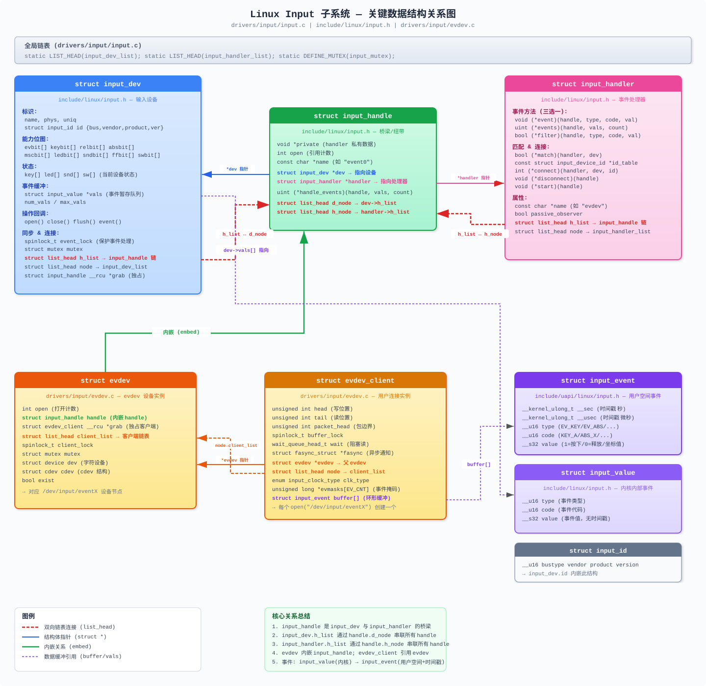
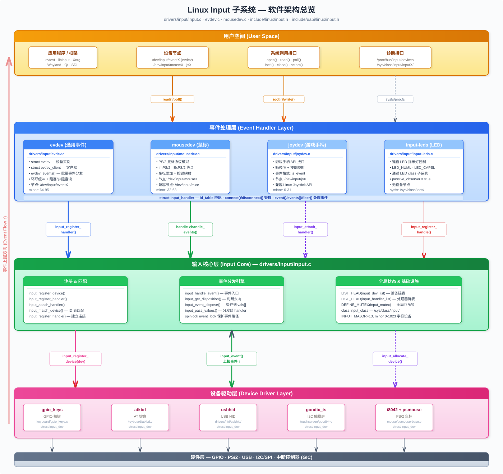

# Linux Input 子系统深度分析 (Linux 6.18.1)

> 基于 linux-6.18.1 内核源码，全面分析 Input 子系统的关键数据结构、软件框架、初始化路径，并提供带注释的实例。

---

## 目录

<details>
<summary><a href="#1-子系统概述">1. 子系统概述</a></summary>

</details>

<details>
<summary><a href="#2-关键数据结构">2. 关键数据结构</a></summary>

- [数据结构关系总览](#数据结构关系总览)
- [2.1 struct input_dev — 输入设备](#21-struct-input_dev--输入设备)
- [2.2 struct input_handler — 事件处理器](#22-struct-input_handler--事件处理器)
- [2.3 struct input_handle — 设备与处理器的桥梁](#23-struct-input_handle--设备与处理器的桥梁)
- [2.4 struct input_event — 用户空间事件](#24-struct-input_event--用户空间事件)
- [2.5 struct input_value — 内核内部事件](#25-struct-input_value--内核内部事件)
- [2.6 struct input_id — 设备标识](#26-struct-input_id--设备标识)
- [2.7 struct input_absinfo — 绝对轴参数](#27-struct-input_absinfo--绝对轴参数)
- [2.8 struct evdev / struct evdev_client — evdev 处理器内部结构](#28-struct-evdev--struct-evdev_client--evdev-处理器内部结构)
- [2.9 struct input_device_id — 设备匹配表条目](#29-struct-input_device_id--设备匹配表条目)

</details>

<details>
<summary><a href="#3-软件框架分析">3. 软件框架分析</a></summary>

- [软件架构总览](#软件架构总览)
- [3.1 设备注册流程](#31-设备注册流程)
- [3.2 处理器注册流程](#32-处理器注册流程)
- [3.3 设备-处理器匹配机制](#33-设备-处理器匹配机制)
- [3.4 事件流转机制](#34-事件流转机制)
- [3.5 设备打开/关闭流程](#35-设备打开关闭流程)
- [3.6 独占抓取 (Grab) 机制](#36-独占抓取-grab-机制)

</details>

<details>
<summary><a href="#4-初始化路径">4. 初始化路径</a></summary>

- [4.1 Input Core 初始化](#41-input-core-初始化)
- [4.2 完整的设备节点创建路径](#42-完整的设备节点创建路径)
- [4.3 全局数据结构初始状态](#43-全局数据结构初始状态)

</details>

<details>
<summary><a href="#5-案例分析gpio_keys-驱动">5. 案例分析：gpio_keys 驱动</a></summary>

- [5.1 核心数据结构](#51-核心数据结构)
- [5.2 探测函数 (Probe) — 驱动初始化入口](#52-探测函数-probe--驱动初始化入口)
- [5.3 中断处理与事件上报](#53-中断处理与事件上报)
- [5.4 完整事件链路追踪](#54-完整事件链路追踪)
- [5.5 设备树配置示例](#55-设备树配置示例)
- [5.6 用户空间测试程序](#56-用户空间测试程序)

</details>

<details>
<summary><a href="#附录关键-api-速查">附录：关键 API 速查</a></summary>

- [设备驱动常用 API](#设备驱动常用-api)
- [Handler 常用 API](#handler-常用-api)

</details>

<details>
<summary><a href="#6-qemu-实践实验">6. QEMU 实践实验</a></summary>

- [6.1 实验一：探索 QEMU virt 默认 Input 设备](#61-实验一探索-qemu-virt-默认-input-设备)
- [6.2 实验二：使用 uinput 创建虚拟输入设备](#62-实验二使用-uinput-创建虚拟输入设备)
- [6.3 实验三：内核模块模拟输入设备](#63-实验三内核模块模拟输入设备)
- [6.4 实验四：使用 evdev 事件监控工具](#64-实验四使用-evdev-事件监控工具)
- [6.5 实验五：EVIOCGRAB 独占抓取实验](#65-实验五eviocgrab-独占抓取实验)
- [6.6 实验六：GDB 追踪事件分发路径](#66-实验六gdb-追踪事件分发路径)
- [6.7 实验总结与关键观察](#67-实验总结与关键观察)

</details>

<details>
<summary><a href="#7-面试题精选">7. 面试题精选</a></summary>

- [7.1 架构与设计类](#71-架构与设计类)
- [7.2 事件流转类](#72-事件流转类)
- [7.3 设备注册与匹配类](#73-设备注册与匹配类)
- [7.4 并发与同步类](#74-并发与同步类)
- [7.5 实践与调试类](#75-实践与调试类)
- [7.6 高级与深入类](#76-高级与深入类)

</details>

<details>
<summary><a href="#8-调试指南">8. 调试指南</a></summary>

- [8.1 调试工具总览](#81-调试工具总览)
- [8.2 第一步：procfs/sysfs 快速诊断](#82-第一步procfssysfs-快速诊断)
- [8.3 第二步：evtest 实时事件监控](#83-第二步evtest-实时事件监控)
- [8.4 第三步：dmesg 内核日志分析](#84-第三步dmesg-内核日志分析)
- [8.5 第四步：dynamic_debug 动态调试](#85-第四步dynamic_debug-动态调试)
- [8.6 第五步：ftrace 函数追踪](#86-第五步ftrace-函数追踪)
- [8.7 第六步：kprobes 动态探测](#87-第六步kprobes-动态探测)
- [8.8 第七步：GDB 内核调试](#88-第七步gdb-内核调试)
- [8.9 第八步：KUnit 单元测试](#89-第八步kunit-单元测试)
- [8.10 调试决策流程图](#810-调试决策流程图)

</details>

<details>
<summary><a href="#9-常见问题与解决方案">9. 常见问题与解决方案</a></summary>

- [9.1 设备注册类问题](#91-设备注册类问题)
- [9.2 事件丢失类问题](#92-事件丢失类问题)
- [9.3 驱动开发类问题](#93-驱动开发类问题)
- [9.4 多点触摸类问题](#94-多点触摸类问题)
- [9.5 电源管理类问题](#95-电源管理类问题)
- [9.6 性能类问题](#96-性能类问题)
- [9.7 问题速查表](#97-问题速查表)

</details>

---

## 1. 子系统概述

Linux Input 子系统采用**三层架构**，将输入设备驱动与用户空间接口解耦：

```
┌─────────────────────────────────────────────────────────┐
│                    用户空间 (User Space)                   │
│       /dev/input/event0   /dev/input/mouse0   ...        │
│              read() / poll() / ioctl()                   │
└────────────────────────┬────────────────────────────────┘
                         │
┌────────────────────────▼────────────────────────────────┐
│                  事件处理层 (Handler Layer)                │
│   evdev       mousedev       joydev       input-leds     │
│  (通用事件)   (鼠标协议)    (游戏手柄)    (LED反馈)        │
│                                                          │
│  struct input_handler  ←→  struct input_handle           │
└────────────────────────┬────────────────────────────────┘
                         │
┌────────────────────────▼────────────────────────────────┐
│                  输入核心层 (Input Core)                   │
│               drivers/input/input.c                      │
│                                                          │
│  • 设备/处理器注册管理                                     │
│  • 设备与处理器的匹配连接                                  │
│  • 事件分发调度                                           │
│  • /proc/bus/input/ 接口                                 │
│  • 字符设备主号 13 (INPUT_MAJOR) 管理                     │
└────────────────────────┬────────────────────────────────┘
                         │
┌────────────────────────▼────────────────────────────────┐
│                  设备驱动层 (Device Driver Layer)          │
│  gpio_keys    atkbd     i8042     usbhid    goodix_ts    │
│  (GPIO按键)  (AT键盘)  (PS/2控制器) (USB HID) (触摸屏)    │
│                                                          │
│  struct input_dev                                        │
└─────────────────────────────────────────────────────────┘
```

**核心源文件分布：**

| 文件 | 说明 |
|------|------|
| `drivers/input/input.c` | Input 核心实现 |
| `drivers/input/evdev.c` | 通用事件设备处理器 |
| `drivers/input/mousedev.c` | 鼠标设备处理器 |
| `drivers/input/joydev.c` | 游戏手柄设备处理器 |
| `drivers/input/input-mt.c` | 多点触摸支持 |
| `drivers/input/input-poller.c` | 轮询式输入设备支持 |
| `include/linux/input.h` | 内核态头文件 |
| `include/uapi/linux/input.h` | 用户空间接口头文件 |
| `include/uapi/linux/input-event-codes.h` | 事件类型与代码定义 |

---

## 2. 关键数据结构

### 数据结构关系总览

下图展示了 Input 子系统核心数据结构之间的引用、内嵌和链表连接关系：



**关系要点：**
- `input_handle` 是 `input_dev` 与 `input_handler` 之间的**桥梁**，通过双向链表 (`d_node` / `h_node`) 分别挂在设备和处理器上
- `evdev` **内嵌**一个 `input_handle`，每个 `/dev/input/eventX` 对应一个 `evdev` 实例
- 每个用户进程 `open()` 设备节点时创建一个 `evdev_client`，其环形缓冲区存储 `struct input_event`
- 内核内部事件使用 `struct input_value`（无时间戳），传递给用户空间时转换为 `struct input_event`（含时间戳）

### 2.1 struct input_dev — 输入设备

> 定义：`include/linux/input.h`

每个物理输入设备（键盘、鼠标、触摸屏等）对应一个 `input_dev` 实例。

```c
struct input_dev {
    /* ===== 设备标识 ===== */
    const char *name;       // 设备名称，如 "gpio-keys"
    const char *phys;       // 物理路径，如 "usb-0000:00:14.0-1/input0"
    const char *uniq;       // 唯一标识符（如蓝牙设备的 MAC 地址）
    struct input_id id;     // 设备 ID（bustype, vendor, product, version）

    /* ===== 能力位图 (Capability Bitmaps) ===== */
    unsigned long propbit[BITS_TO_LONGS(INPUT_PROP_CNT)];   // 设备属性（如 INPUT_PROP_DIRECT）
    unsigned long evbit[BITS_TO_LONGS(EV_CNT)];             // 支持的事件类型（EV_KEY/EV_REL/EV_ABS...）
    unsigned long keybit[BITS_TO_LONGS(KEY_CNT)];           // 支持的按键/按钮
    unsigned long relbit[BITS_TO_LONGS(REL_CNT)];           // 支持的相对轴（鼠标移动）
    unsigned long absbit[BITS_TO_LONGS(ABS_CNT)];           // 支持的绝对轴（触摸屏坐标）
    unsigned long mscbit[BITS_TO_LONGS(MSC_CNT)];           // 杂项事件
    unsigned long ledbit[BITS_TO_LONGS(LED_CNT)];           // LED 指示灯
    unsigned long sndbit[BITS_TO_LONGS(SND_CNT)];           // 声音效果
    unsigned long ffbit[BITS_TO_LONGS(FF_CNT)];             // 力反馈效果
    unsigned long swbit[BITS_TO_LONGS(SW_CNT)];             // 开关（如合盖检测）

    /* ===== 设备当前状态 ===== */
    unsigned long key[BITS_TO_LONGS(KEY_CNT)];    // 当前按键按下状态
    unsigned long led[BITS_TO_LONGS(LED_CNT)];    // 当前 LED 状态
    unsigned long snd[BITS_TO_LONGS(SND_CNT)];    // 当前声音状态
    unsigned long sw[BITS_TO_LONGS(SW_CNT)];      // 当前开关状态

    /* ===== 键码映射 ===== */
    void *keycode;                 // 扫描码→键码映射表
    unsigned int keycodemax;       // 映射表最大索引
    unsigned int keycodesize;      // 每个键码元素的字节大小
    int (*getkeycode)(...);        // 获取键码回调
    int (*setkeycode)(...);        // 设置键码回调

    /* ===== 绝对轴信息 ===== */
    struct input_absinfo *absinfo; // 绝对轴参数数组（min/max/fuzz/flat/resolution）

    /* ===== 事件队列 ===== */
    unsigned int num_vals;         // 当前队列中的事件数
    unsigned int max_vals;         // 队列最大容量
    struct input_value *vals;      // 事件值缓冲区

    /* ===== 自动重复 ===== */
    int rep[REP_CNT];              // rep[0]=REP_DELAY(ms), rep[1]=REP_PERIOD(ms)
    unsigned int repeat_key;       // 正在重复的键码
    struct timer_list timer;       // 自动重复定时器

    /* ===== 设备操作回调 ===== */
    int (*open)(struct input_dev *dev);    // 第一个用户打开时调用
    void (*close)(struct input_dev *dev);  // 最后一个用户关闭时调用
    int (*flush)(struct input_dev *dev, struct file *file);  // 刷新设备状态
    int (*event)(struct input_dev *dev, unsigned int type,
                 unsigned int code, int value);  // 事件反馈（如控制 LED）

    /* ===== 力反馈 ===== */
    struct ff_device *ff;          // 力反馈设备结构

    /* ===== 轮询支持 ===== */
    struct input_dev_poller *poller;  // 轮询机制

    /* ===== 多点触摸 ===== */
    struct input_mt *mt;           // 多点触摸插槽数据

    /* ===== 同步与保护 ===== */
    spinlock_t event_lock;         // 保护事件处理（中断上下文使用）
    struct mutex mutex;            // 保护 open/close/flush 操作

    /* ===== 用户与状态追踪 ===== */
    unsigned int users;            // 打开此设备的 handler 数
    struct input_handle __rcu *grab;  // 独占抓取的 handle
    bool going_away;               // 设备正在注销
    bool inhibited;                // 设备被抑制（事件被忽略）

    /* ===== Linux 设备模型 ===== */
    struct device dev;             // 内嵌 device 结构
    struct list_head h_list;       // 附加到此设备的 handle 链表
    struct list_head node;         // 全局 input_dev_list 链表节点

    /* ===== 时间戳 ===== */
    ktime_t timestamp[INPUT_CLK_MAX];  // REAL/MONOTONIC/BOOT 时钟时间戳
};
```

**核心关系：** `input_dev` 通过 `h_list` 链表连接多个 `input_handle`，每个 handle 关联一个 `input_handler`。

---

### 2.2 struct input_handler — 事件处理器

> 定义：`include/linux/input.h`

事件处理器实现对输入事件的具体处理逻辑，如将事件传递给用户空间。

```c
struct input_handler {
    void *private;  // 处理器私有数据

    /* ===== 事件处理方法（三选一） ===== */
    void (*event)(struct input_handle *handle,
                  unsigned int type, unsigned int code, int value);
        // 单事件回调（最简单）

    unsigned int (*events)(struct input_handle *handle,
                           struct input_value *vals, unsigned int count);
        // 批量事件回调（最高效，如 evdev 使用此接口）

    bool (*filter)(struct input_handle *handle,
                   unsigned int type, unsigned int code, int value);
        // 过滤回调（返回 true 表示过滤/丢弃事件）

    /* ===== 设备匹配 ===== */
    bool (*match)(struct input_handler *handler, struct input_dev *dev);
        // 在 id_table 匹配成功后的精细匹配

    const struct input_device_id *id_table;
        // 设备 ID 匹配表（以空条目结尾）

    /* ===== 连接生命周期 ===== */
    int (*connect)(struct input_handler *handler, struct input_dev *dev,
                   const struct input_device_id *id);
        // 设备匹配后的连接回调

    void (*disconnect)(struct input_handle *handle);
        // 断开连接回调

    void (*start)(struct input_handle *handle);
        // 连接完成后的启动回调

    /* ===== 标志与属性 ===== */
    bool passive_observer;   // 仅观察事件，不触发设备 open
    bool legacy_minors;      // 使用旧版次设备号范围
    int minor;               // 旧版次设备号起始值
    const char *name;        // 处理器名称

    /* ===== 链表节点 ===== */
    struct list_head h_list; // 此处理器拥有的 handle 链表
    struct list_head node;   // 全局 input_handler_list 链表节点
};
```

**内核内置处理器：**

| Handler | 名称 | 功能 | 设备节点 |
|---------|------|------|----------|
| evdev | "evdev" | 通用事件接口 | `/dev/input/eventX` |
| mousedev | "mousedev" | PS/2 鼠标协议 | `/dev/input/mouseX` |
| joydev | "joydev" | 游戏手柄接口 | `/dev/input/jsX` |
| input-leds | "leds" | LED 反馈 | sysfs LED 类 |

---

### 2.3 struct input_handle — 设备与处理器的桥梁

> 定义：`include/linux/input.h`

`input_handle` 是 `input_dev` 和 `input_handler` 之间的**连接纽带**，一个设备可以有多个 handle（连接多个处理器），一个处理器也可以有多个 handle（处理多个设备）。

```c
struct input_handle {
    void *private;                // 处理器为此连接分配的私有数据
    int open;                     // 引用计数（open/close 追踪）
    const char *name;             // 名称（如 "event0", "mouse0"）

    struct input_dev *dev;        // 指向输入设备
    struct input_handler *handler;// 指向事件处理器

    unsigned int (*handle_events)(struct input_handle *handle,
                                  struct input_value *vals,
                                  unsigned int count);
        // 由 input core 根据 handler 的方法自动设置

    struct list_head d_node;      // 设备的 h_list 中的节点
    struct list_head h_node;      // 处理器的 h_list 中的节点
};
```

**三者的关系图：**

```
  input_dev_list (全局)               input_handler_list (全局)
  ┌────────┐                          ┌────────────┐
  │input_dev│                          │input_handler│
  │ (键盘)  │                          │  (evdev)    │
  │         │    input_handle          │             │
  │ h_list ─┼───►┌──────────┐◄────────┼─ h_list     │
  │         │    │ d_node   │         │             │
  │         │    │ h_node   │         │             │
  │         │    │ *dev ────┼─────────┼→            │
  │         │    │ *handler─┼────►    │             │
  └────┬───┘    └──────────┘         └─────┬──────┘
       │                                     │
       │        input_handle                 │
  ┌────▼───┐   ┌──────────┐          ┌─────▼──────┐
  │input_dev│◄──┤ d_node   │──────────┤input_handler│
  │ (鼠标)  │   │ h_node   │          │ (mousedev)  │
  └────────┘   └──────────┘          └────────────┘
```

---

### 2.4 struct input_event — 用户空间事件

> 定义：`include/uapi/linux/input.h`

用户空间通过 `read()` 从 `/dev/input/eventX` 读取的事件结构。

```c
struct input_event {
    __kernel_ulong_t __sec;   // 时间戳（秒）
    __kernel_ulong_t __usec;  // 时间戳（微秒）
    __u16 type;               // 事件类型（EV_KEY, EV_REL, EV_ABS 等）
    __u16 code;               // 事件代码（KEY_A, REL_X, ABS_X 等）
    __s32 value;              // 事件值（按键: 1=按下/0=释放/2=重复; 轴: 坐标值）
};
```

**常见事件类型 (`type`)：**

| 类型 | 值 | 说明 | 示例 |
|------|----|------|------|
| `EV_SYN` | 0x00 | 同步事件（事件包分隔符） | `SYN_REPORT` |
| `EV_KEY` | 0x01 | 按键/按钮事件 | `KEY_A`, `BTN_LEFT` |
| `EV_REL` | 0x02 | 相对轴事件 | `REL_X`, `REL_WHEEL` |
| `EV_ABS` | 0x03 | 绝对轴事件 | `ABS_X`, `ABS_MT_POSITION_X` |
| `EV_MSC` | 0x04 | 杂项事件 | `MSC_SCAN` |
| `EV_SW`  | 0x05 | 开关事件 | `SW_LID`, `SW_TABLET_MODE` |
| `EV_LED` | 0x11 | LED 事件 | `LED_NUML`, `LED_CAPSL` |
| `EV_REP` | 0x14 | 自动重复参数 | `REP_DELAY`, `REP_PERIOD` |
| `EV_FF`  | 0x15 | 力反馈事件 | `FF_RUMBLE` |

---

### 2.5 struct input_value — 内核内部事件

> 定义：`include/linux/input.h`

内核内部使用的事件表示，不含时间戳，用于高效的批量事件处理。

```c
struct input_value {
    __u16 type;    // 事件类型
    __u16 code;    // 事件代码
    __s32 value;   // 事件值
};
```

---

### 2.6 struct input_id — 设备标识

> 定义：`include/uapi/linux/input.h`

```c
struct input_id {
    __u16 bustype;  // 总线类型：BUS_USB, BUS_I2C, BUS_HOST, BUS_BLUETOOTH 等
    __u16 vendor;   // 厂商 ID
    __u16 product;  // 产品 ID
    __u16 version;  // 版本号
};
```

---

### 2.7 struct input_absinfo — 绝对轴参数

> 定义：`include/uapi/linux/input.h`

```c
struct input_absinfo {
    __s32 value;       // 最近报告的值
    __s32 minimum;     // 最小可能值
    __s32 maximum;     // 最大可能值
    __s32 fuzz;        // 模糊阈值（噪声过滤）
    __s32 flat;        // 死区（在此范围内的值报告为 0）
    __s32 resolution;  // 分辨率（每毫米单位数或每度/秒单位数）
};
```

---

### 2.8 struct evdev / struct evdev_client — evdev 处理器内部结构

> 定义：`drivers/input/evdev.c`

```c
/* evdev 设备实例（每个 /dev/input/eventX 对应一个） */
struct evdev {
    int open;                          // 打开计数
    struct input_handle handle;        // 到 input core 的连接
    struct evdev_client __rcu *grab;   // 独占抓取的客户端
    struct list_head client_list;      // 已连接的客户端链表
    spinlock_t client_lock;            // 保护 client_list
    struct mutex mutex;                // 结构保护互斥锁
    struct device dev;                 // 字符设备对应的 device
    struct cdev cdev;                  // 字符设备结构
    bool exist;                        // 设备是否仍然存在
};

/* 每个打开 /dev/input/eventX 的进程对应一个 client */
struct evdev_client {
    unsigned int head;                 // 环形缓冲区写位置
    unsigned int tail;                 // 环形缓冲区读位置
    unsigned int packet_head;          // 下一个包（SYN_REPORT）的位置
    spinlock_t buffer_lock;            // 保护 buffer/head/tail
    wait_queue_head_t wait;            // 阻塞读的等待队列
    struct fasync_struct *fasync;      // 异步 I/O 信号通知
    struct evdev *evdev;               // 父 evdev 设备
    struct list_head node;             // evdev->client_list 中的节点
    enum input_clock_type clk_type;    // 时钟类型
    bool revoked;                      // 访问是否已撤销
    unsigned long *evmasks[EV_CNT];    // 事件过滤掩码
    unsigned int bufsize;              // 缓冲区大小
    struct input_event buffer[];       // 事件环形缓冲区（柔性数组）
};
```

---

### 2.9 struct input_device_id — 设备匹配表条目

> 定义：`include/linux/mod_devicetable.h`

```c
struct input_device_id {
    kernel_ulong_t flags;   // 匹配标志位

    __u16 bustype;          // 总线类型
    __u16 vendor;           // 厂商 ID
    __u16 product;          // 产品 ID
    __u16 version;          // 版本号

    /* 能力位图要求（handler 要求设备具有这些能力） */
    kernel_ulong_t evbit[INPUT_DEVICE_ID_EV_MAX / BITS_PER_LONG + 1];
    kernel_ulong_t keybit[INPUT_DEVICE_ID_KEY_MAX / BITS_PER_LONG + 1];
    kernel_ulong_t relbit[INPUT_DEVICE_ID_REL_MAX / BITS_PER_LONG + 1];
    kernel_ulong_t absbit[INPUT_DEVICE_ID_ABS_MAX / BITS_PER_LONG + 1];
    kernel_ulong_t mscbit[INPUT_DEVICE_ID_MSC_MAX / BITS_PER_LONG + 1];
    kernel_ulong_t ledbit[INPUT_DEVICE_ID_LED_MAX / BITS_PER_LONG + 1];
    kernel_ulong_t sndbit[INPUT_DEVICE_ID_SND_MAX / BITS_PER_LONG + 1];
    kernel_ulong_t ffbit[INPUT_DEVICE_ID_FF_MAX / BITS_PER_LONG + 1];
    kernel_ulong_t swbit[INPUT_DEVICE_ID_SW_MAX / BITS_PER_LONG + 1];
    kernel_ulong_t propbit[INPUT_DEVICE_ID_PROP_MAX / BITS_PER_LONG + 1];

    kernel_ulong_t driver_info;  // 驱动私有数据
};
```

**匹配标志位：**
- `INPUT_DEVICE_ID_MATCH_BUS` — 匹配 bustype
- `INPUT_DEVICE_ID_MATCH_VENDOR` — 匹配 vendor
- `INPUT_DEVICE_ID_MATCH_PRODUCT` — 匹配 product
- `INPUT_DEVICE_ID_MATCH_VERSION` — 匹配 version
- `INPUT_DEVICE_ID_MATCH_EVBIT` — 匹配事件类型位图
- `INPUT_DEVICE_ID_MATCH_KEYBIT` — 匹配按键位图
- ... 以此类推

---

## 3. 软件框架分析

### 软件架构总览

下图展示了 Input 子系统从硬件到用户空间的五层软件架构，以及层间的核心 API 调用关系：



### 3.1 设备注册流程

```
驱动程序                         Input Core                        Handler
  │                                 │                                 │
  │ input_allocate_device()         │                                 │
  │ ─────────────────────►          │                                 │
  │ (分配 input_dev, 初始化锁/链表) │                                 │
  │                                 │                                 │
  │ 设置能力位图:                    │                                 │
  │  set_bit(EV_KEY, dev->evbit)   │                                 │
  │  set_bit(KEY_A, dev->keybit)   │                                 │
  │                                 │                                 │
  │ input_register_device(dev)      │                                 │
  │ ─────────────────────►          │                                 │
  │                          ┌──────▼──────┐                          │
  │                          │ 1.EV_SYN 置位│                          │
  │                          │ 2.清理位图    │                          │
  │                          │ 3.device_add │                          │
  │                          │   创建 sysfs │                          │
  │                          │ 4.加入全局链表│                          │
  │                          └──────┬──────┘                          │
  │                                 │                                 │
  │                          ┌──────▼──────┐                          │
  │                          │遍历所有handler│                          │
  │                          │input_attach_ │                          │
  │                          │  handler()   │                          │
  │                          └──────┬──────┘                          │
  │                                 │   input_match_device()          │
  │                                 │ ──────────────────────►         │
  │                                 │       匹配 id_table?            │
  │                                 │ ◄──────────────────────         │
  │                                 │                                 │
  │                                 │   handler->connect()            │
  │                                 │ ──────────────────────►         │
  │                                 │         创建 input_handle       │
  │                                 │         input_register_handle() │
  │                                 │ ◄──────────────────────         │
  │                                 │                                 │
  │                                 │   handler->start()              │
  │                                 │ ──────────────────────►         │
  │                                 │                                 │
```

**`input_register_device()` 关键步骤（`drivers/input/input.c`）：**

1. **能力验证** — 检查声明了 `EV_ABS` 的设备是否设置了 `absinfo`
2. **位图标准化** — 强制设置 `EV_SYN` 位；清除 `KEY_RESERVED`；清洗无效位
3. **事件队列分配** — 根据设备能力估算事件队列大小
4. **自动重复设置** — 如果支持 `EV_KEY` 且未自定义重复参数，设置默认值
5. **设备注册** — 调用 `device_add()` 创建 `/sys/class/input/inputX`
6. **匹配连接** — 遍历 `input_handler_list`，调用 `input_attach_handler()` 尝试匹配

---

### 3.2 处理器注册流程

```
Handler                          Input Core
  │                                 │
  │ input_register_handler(handler) │
  │ ─────────────────────►          │
  │                          ┌──────▼──────┐
  │                          │ 1.验证事件方法│
  │                          │   (三选一)    │
  │                          │ 2.初始化 h_list│
  │                          │ 3.加入全局链表 │
  │                          └──────┬──────┘
  │                                 │
  │                          ┌──────▼──────┐
  │                          │遍历所有 device│
  │                          │input_attach_ │
  │                          │  handler()   │
  │                          └──────┬──────┘
  │                                 │
  │   handler->connect()            │
  │ ◄──────────────────────         │
  │                                 │
```

**要求：** `handler` 只能定义 `event()` / `events()` / `filter()` 三者之一。

---

### 3.3 设备-处理器匹配机制

**`input_match_device()`** 执行两级匹配：

```
第一级：ID Table 匹配
  ┌─────────────────────────────────────────────────┐
  │ 遍历 handler->id_table 的每个条目 id：             │
  │                                                   │
  │ 1. 如果 flags 含 MATCH_BUS:                       │
  │    dev->id.bustype == id->bustype ?               │
  │                                                   │
  │ 2. 如果 flags 含 MATCH_VENDOR:                    │
  │    dev->id.vendor == id->vendor ?                 │
  │                                                   │
  │ 3. 如果 flags 含 MATCH_EVBIT:                     │
  │    dev->evbit 是否包含 id->evbit 的所有位？         │
  │    (即 handler 要求的能力是设备能力的子集)           │
  │                                                   │
  │ 4. 类似检查 keybit, relbit, absbit 等              │
  └─────────────────────────────────────────────────┘
                        │ 通过
                        ▼
第二级：精细匹配
  ┌─────────────────────────────────────────────────┐
  │ 如果 handler->match 回调存在：                     │
  │   调用 handler->match(handler, dev)               │
  │   返回 true → 匹配成功                            │
  │   返回 false → 匹配失败                           │
  └─────────────────────────────────────────────────┘
```

**evdev 的 id_table（匹配所有设备）：**
```c
static const struct input_device_id evdev_ids[] = {
    { .driver_info = 1 },  /* 无 flags → 匹配所有设备 */
    { },                    /* 终止条目 */
};
```

---

### 3.4 事件流转机制

这是 Input 子系统最核心的数据路径：

```
        驱动层                    Input Core                    Handler 层
          │                          │                             │
          │ input_event(dev,         │                             │
          │  EV_KEY, KEY_A, 1)       │                             │
          │ ─────────────►           │                             │
          │                   ┌──────▼──────┐                      │
          │                   │取 event_lock │                      │
          │                   │ (spinlock)   │                      │
          │                   └──────┬──────┘                      │
          │                          │                             │
          │                   ┌──────▼──────────────┐              │
          │                   │input_handle_event()  │              │
          │                   │                      │              │
          │                   │ 1.input_get_         │              │
          │                   │   disposition()      │              │
          │                   │   判断事件去向:        │              │
          │                   │  ·PASS_TO_HANDLERS   │              │
          │                   │  ·PASS_TO_DEVICE     │              │
          │                   │  ·IGNORE_EVENT       │              │
          │                   │                      │              │
          │                   │ 2.input_event_       │              │
          │                   │   dispose()          │              │
          │                   │  ·缓存到 dev->vals[] │              │
          │                   └──────┬──────────────┘              │
          │                          │                             │
          │ input_sync(dev)          │                             │
          │  = input_event(dev,      │                             │
          │    EV_SYN, SYN_REPORT,0) │                             │
          │ ─────────────►           │                             │
          │                   ┌──────▼──────────────┐              │
          │                   │disposition = FLUSH    │              │
          │                   │                      │              │
          │                   │input_pass_values()   │              │
          │                   │ 遍历 dev->h_list:    │              │
          │                   │                      │              │
          │                   │ ① 过滤器(filter)     │              │
          │                   │    在链表头部         │              │
          │                   │    可丢弃事件         │              │
          │                   │                      │              │
          │                   │ ② 普通 handler       │              │
          │                   │    在链表尾部         │              │
          │                   │    接收所有未被过滤事件│              │
          │                   └──────┬──────────────┘              │
          │                          │                             │
          │                          │ handle->handle_events()     │
          │                          │─────────────────────►       │
          │                          │                      ┌──────▼──────┐
          │                          │                      │evdev_events()│
          │                          │                      │              │
          │                          │                      │遍历 client:  │
          │                          │                      │ 写入环形缓冲 │
          │                          │                      │ 唤醒等待队列 │
          │                          │                      └──────┬──────┘
          │                          │                             │
          │                          │                      ┌──────▼──────┐
          │                          │                      │用户空间 read()│
          │                          │                      │从 buffer 取出│
          │                          │                      │input_event   │
          │                          │                      └─────────────┘
```

**事件处置判断 (`input_get_disposition`)：**

| 事件类型 | 处置逻辑 |
|----------|----------|
| `EV_SYN` / `SYN_REPORT` | `INPUT_FLUSH` — 刷新队列到 handler |
| `EV_KEY` | 检查状态变化：新状态 ≠ 旧状态 → `PASS_TO_HANDLERS`；相同 → `IGNORE` |
| `EV_ABS` | 应用 defuzz 去噪→ 值有变化 → `PASS_TO_HANDLERS` |
| `EV_REL` | 值 ≠ 0 → `PASS_TO_HANDLERS` |
| `EV_LED` / `EV_SND` | `PASS_TO_HANDLERS` + `PASS_TO_DEVICE`（反馈到设备） |
| `EV_SW` | 状态变化 → `PASS_TO_HANDLERS` |

---

### 3.5 设备打开/关闭流程

```
用户空间 open("/dev/input/event0")
    │
    ▼
evdev_open()
    │
    ├─ 分配 evdev_client, 初始化环形缓冲
    ├─ input_open_device(handle)
    │      │
    │      ├─ 获取 dev->mutex
    │      ├─ handle->open++
    │      ├─ 如果非 passive_observer:
    │      │    dev->users++
    │      │    如果 dev->users == 1 (第一个用户):
    │      │        调用 dev->open(dev) ← 驱动的 open 回调
    │      │        启动轮询 (如果有 poller)
    │      └─ 释放 dev->mutex
    │
    └─ 将 client 加入 evdev->client_list

用户空间 close(fd)
    │
    ▼
evdev_release()
    │
    ├─ input_close_device(handle)
    │      │
    │      ├─ 获取 dev->mutex
    │      ├─ 如果被 grab: 释放 grab
    │      ├─ 如果非 passive_observer:
    │      │    dev->users--
    │      │    如果 dev->users == 0 (最后一个用户):
    │      │        停止轮询
    │      │        调用 dev->close(dev) ← 驱动的 close 回调
    │      ├─ handle->open--
    │      └─ 释放 dev->mutex
    │
    └─ 从 client_list 移除, 释放 client
```

---

### 3.6 独占抓取 (Grab) 机制

```c
/* 用户空间通过 ioctl 实现独占 */
ioctl(fd, EVIOCGRAB, 1);  // 获取独占控制
ioctl(fd, EVIOCGRAB, 0);  // 释放独占控制
```

当设备被 grab 后，事件**只发送给抓取者**，其他 handler 接收不到事件。这在需要独占输入设备时非常有用（如游戏引擎、输入法切换）。

---

## 4. 初始化路径

### 4.1 Input Core 初始化

```
内核启动
  │
  ▼
do_initcalls()
  │
  ├─ subsys_initcall(input_init)       ← 优先级 4 (较早)
  │      │
  │      ▼
  │  input_init() [drivers/input/input.c]
  │      │
  │      ├─ 1. class_register(&input_class)
  │      │     创建 /sys/class/input/ 目录
  │      │     input_class.name = "input"
  │      │     input_class.devnode = input_devnode
  │      │
  │      ├─ 2. input_proc_init()
  │      │     创建 /proc/bus/input/ 目录
  │      │     创建 /proc/bus/input/devices 文件（只读，列出所有设备）
  │      │     创建 /proc/bus/input/handlers 文件（只读，列出所有处理器）
  │      │
  │      └─ 3. register_chrdev_region(MKDEV(13, 0), 1024, "input")
  │            注册字符设备主号 13，次设备号 0-1023
  │
  ├─ module_init(evdev_init)           ← 优先级 6 (模块初始化)
  │      │
  │      ▼
  │  evdev_init()
  │      └─ input_register_handler(&evdev_handler)
  │            注册 evdev 处理器到 input_handler_list
  │            遍历已有设备尝试匹配连接
  │
  ├─ late_initcall(gpio_keys_init)     ← 优先级 7 (设备驱动)
  │      │
  │      ▼
  │  platform_driver_register(&gpio_keys_device_driver)
  │      └─ 当 platform_device 匹配时调用 gpio_keys_probe()
  │            ├─ input_allocate_device()
  │            ├─ 设置能力位图
  │            ├─ input_register_device(input)
  │            │    └─ 触发与 evdev 的匹配连接
  │            │       └─ 创建 /dev/input/eventX
  │            └─ 设备就绪，可接收事件
  │
  └─ ... 其他输入驱动
```

### 4.2 完整的设备节点创建路径

```
input_register_device(dev)
    │
    ├─ device_add(&dev->dev)
    │    → 创建 /sys/class/input/inputX/
    │
    ├─ input_attach_handler(dev, evdev_handler)
    │    │
    │    ├─ input_match_device(evdev_handler->id_table, dev)
    │    │    → evdev_ids 匹配所有设备（无 flags）→ 匹配成功
    │    │
    │    └─ evdev_handler->connect(handler, dev, id)
    │         = evdev_connect()
    │              │
    │              ├─ 分配 struct evdev
    │              ├─ minor = input_get_new_minor(EVDEV_MINOR_BASE, EVDEV_MINORS, true)
    │              │    → 分配次设备号 64-95 范围
    │              ├─ dev_set_name(&evdev->dev, "event%d", dev_no)
    │              ├─ evdev->dev.devt = MKDEV(INPUT_MAJOR, minor)
    │              │    → 如 MKDEV(13, 64) 即 /dev/input/event0
    │              ├─ evdev->dev.class = &input_class
    │              ├─ evdev->dev.parent = &dev->dev
    │              ├─ cdev_init(&evdev->cdev, &evdev_fops)
    │              │    → 绑定 evdev 的文件操作 (open/read/write/ioctl/poll)
    │              ├─ cdev_device_add(&evdev->cdev, &evdev->dev)
    │              │    → 创建字符设备节点
    │              │    → udev/mdev 收到 uevent 后创建 /dev/input/eventX
    │              ├─ input_register_handle(&evdev->handle)
    │              │    → 将 handle 加入 dev->h_list 和 handler->h_list
    │              └─ return 0
    │
    └─ 设备注册完成
```

### 4.3 全局数据结构初始状态

```c
/* drivers/input/input.c */

static LIST_HEAD(input_dev_list);        // 全局设备链表
static LIST_HEAD(input_handler_list);    // 全局处理器链表
static DEFINE_IDA(input_ida);            // 次设备号分配器
static DEFINE_MUTEX(input_mutex);        // 保护两个链表的互斥锁

/* input_class 用于 sysfs 设备类 */
const struct class input_class = {
    .name    = "input",
    .devnode = input_devnode,   // 返回 "input/%s" 格式的设备节点名
};
```

---

## 5. 案例分析：gpio_keys 驱动

> 源码：`drivers/input/keyboard/gpio_keys.c`

`gpio_keys` 是一个经典的 GPIO 按键驱动，支持设备树配置、去抖动、中断唤醒等特性。以下是带详细中文注释的核心代码分析。

### 5.1 核心数据结构

```c
/*
 * 每个 GPIO 按键的运行时数据
 */
struct gpio_button_data {
    const struct gpio_keys_button *button;  /* 按键配置参数 */
    struct input_dev *input;                /* 关联的 input 设备 */
    struct gpio_desc *gpiod;                /* GPIO 描述符 */
    unsigned short *code;                   /* 指向键码的指针 */

    struct hrtimer release_timer;           /* 按键释放定时器 */
    struct delayed_work work;               /* 去抖动延迟工作 */
    struct hrtimer debounce_timer;          /* 去抖动高精度定时器 */
    unsigned int software_debounce;         /* 软件去抖动时间(ms) */

    unsigned int irq;                       /* 中断号 */
    spinlock_t lock;                        /* 保护状态的自旋锁 */
    bool disabled;                          /* 通过 sysfs 禁用 */
    bool key_pressed;                       /* 当前按键状态 */
    bool suspended;                         /* 系统休眠状态 */
};

/*
 * 驱动整体私有数据
 */
struct gpio_keys_drvdata {
    const struct gpio_keys_platform_data *pdata;  /* 平台数据 */
    struct input_dev *input;                      /* input 设备 */
    struct mutex disable_lock;                    /* 保护禁用操作 */
    unsigned short *keymap;                       /* 键码映射表 */
    struct gpio_button_data data[];               /* 按键数据(柔性数组) */
};
```

### 5.2 探测函数 (Probe) — 驱动初始化入口

```c
static int gpio_keys_probe(struct platform_device *pdev)
{
    struct device *dev = &pdev->dev;
    const struct gpio_keys_platform_data *pdata = dev_get_platdata(dev);
    struct fwnode_handle *child = NULL;
    struct gpio_keys_drvdata *ddata;
    struct input_dev *input;
    int i, error;
    int wakeup = 0;

    /* ===== 第一步: 获取平台数据 ===== */
    /* 支持设备树(DT)和传统平台数据两种方式 */
    if (!pdata) {
        pdata = gpio_keys_get_devtree_pdata(dev);
        if (IS_ERR(pdata))
            return PTR_ERR(pdata);
    }

    /* ===== 第二步: 分配驱动私有数据 ===== */
    /* struct_size 宏安全计算含柔性数组的总大小 */
    ddata = devm_kzalloc(dev,
                         struct_size(ddata, data, pdata->nbuttons),
                         GFP_KERNEL);
    if (!ddata)
        return -ENOMEM;

    /* 分配键码映射表 */
    ddata->keymap = devm_kcalloc(dev,
                                 pdata->nbuttons, sizeof(ddata->keymap[0]),
                                 GFP_KERNEL);
    if (!ddata->keymap)
        return -ENOMEM;

    /* ===== 第三步: 分配 input 设备 ===== */
    /*
     * devm_input_allocate_device() 是 input_allocate_device() 的
     * 资源管理版本，设备销毁时自动释放
     */
    input = devm_input_allocate_device(dev);
    if (!input)
        return -ENOMEM;

    ddata->pdata = pdata;
    ddata->input = input;
    mutex_init(&ddata->disable_lock);

    /* 将私有数据保存到 platform_device */
    platform_set_drvdata(pdev, ddata);

    /* ===== 第四步: 配置 input 设备属性 ===== */
    input->name = pdata->name ? : pdev->name;     /* 设备名称 */
    input->phys = "gpio-keys/input0";              /* 物理路径 */
    input->dev.parent = dev;                        /* 父设备 */
    input->open = gpio_keys_open;                   /* 打开回调 */
    input->close = gpio_keys_close;                 /* 关闭回调 */

    /* 设置设备 ID */
    input->id.bustype = BUS_HOST;   /* 总线类型：主机内部总线 */
    input->id.vendor  = 0x0001;     /* 厂商 ID */
    input->id.product = 0x0001;     /* 产品 ID */
    input->id.version = 0x0100;     /* 版本号 */

    /* 设置键码映射表 */
    input->keycode     = ddata->keymap;
    input->keycodesize = sizeof(ddata->keymap[0]);
    input->keycodemax  = pdata->nbuttons;

    /* ===== 第五步: 声明设备能力 ===== */
    /*
     * 在 evbit 中设置 EV_KEY，声明此设备能产生按键事件。
     * input core 在注册时会自动设置 EV_SYN。
     */
    __set_bit(EV_KEY, input->evbit);

    /* 如果平台数据指定支持自动重复 */
    if (pdata->rep)
        __set_bit(EV_REP, input->evbit);

    /* ===== 第六步: 配置每个按键 ===== */
    for (i = 0; i < pdata->nbuttons; i++) {
        const struct gpio_keys_button *button = &pdata->buttons[i];

        if (!button->code) {
            /* 从设备树获取 fwnode */
            child = device_get_next_child_node(dev, child);
        }

        /*
         * gpio_keys_setup_key() 完成：
         * 1. 获取 GPIO 描述符或 IRQ 号
         * 2. 配置去抖动参数
         * 3. 请求中断 (devm_request_any_context_irq)
         * 4. 设置按键能力: input_set_capability(input, type, code)
         *    → 等价于 set_bit(code, input->keybit)
         */
        error = gpio_keys_setup_key(pdev, input, ddata,
                                    button, i, child);
        if (error) {
            fwnode_handle_put(child);
            return error;
        }

        if (button->wakeup)
            wakeup = 1;
    }
    fwnode_handle_put(child);

    /* ===== 第七步: 注册 input 设备 ===== */
    /*
     * 这是关键调用！
     * input_register_device() 会:
     *   1. 将设备加入 input_dev_list
     *   2. 遍历 input_handler_list 寻找匹配的 handler
     *   3. evdev 匹配成功 → 调用 evdev_connect()
     *      → 创建 /dev/input/eventX 设备节点
     *   4. 其他 handler 如果匹配也会被连接
     */
    error = input_register_device(input);
    if (error) {
        dev_err(dev, "Unable to register input device, error: %d\n", error);
        return error;
    }

    /* ===== 第八步: 配置唤醒能力 ===== */
    device_init_wakeup(dev, wakeup);

    return 0;
}
```

### 5.3 中断处理与事件上报

```c
/*
 * GPIO 中断处理函数
 * 在中断上下文中执行，启动去抖动延时
 */
static irqreturn_t gpio_keys_gpio_isr(int irq, void *dev_id)
{
    struct gpio_button_data *bdata = dev_id;

    BUG_ON(irq != bdata->irq);

    /*
     * 不在中断中直接读取 GPIO 和上报事件，
     * 而是启动去抖动定时器/工作队列，
     * 等待按键信号稳定后再处理。
     *
     * 典型的软件去抖动时间: 5-20ms
     */
    if (bdata->debounce_use_hrtimer)
        hrtimer_start(&bdata->debounce_timer,
                      ms_to_ktime(bdata->software_debounce),
                      HRTIMER_MODE_REL);
    else
        mod_delayed_work(system_wq, &bdata->work,
                         msecs_to_jiffies(bdata->software_debounce));

    return IRQ_HANDLED;
}

/*
 * 去抖动完成后的事件上报
 */
static void gpio_keys_gpio_report_event(struct gpio_button_data *bdata)
{
    const struct gpio_keys_button *button = bdata->button;
    struct input_dev *input = bdata->input;
    unsigned int type = button->type ?: EV_KEY;   /* 默认为按键事件 */
    int state;

    /* 读取 GPIO 引脚当前状态 (0 或 1) */
    state = gpiod_get_value_cansleep(bdata->gpiod);
    if (state < 0) {
        dev_err(input->dev.parent,
                "failed to get gpio state: %d\n", state);
        return;
    }

    /*
     * 通过 input_event() 向 input core 报告事件:
     *
     *   input_event(input, EV_KEY, KEY_POWER, 1)  → 按下
     *   input_event(input, EV_KEY, KEY_POWER, 0)  → 释放
     *
     * 内部流程:
     *   input_event()
     *     → spin_lock(event_lock)
     *     → input_handle_event()
     *       → input_get_disposition()  判断事件去向
     *       → input_event_dispose()    缓存到 dev->vals[]
     *     → spin_unlock(event_lock)
     */
    if (type == EV_ABS) {
        if (state)
            input_event(input, type, button->code, button->value);
    } else {
        input_event(input, type, *bdata->code, state);
    }
}

/*
 * 去抖动工作函数 — 在进程上下文执行
 */
static void gpio_keys_debounce_event(struct gpio_button_data *bdata)
{
    /* 上报按键事件 */
    gpio_keys_gpio_report_event(bdata);

    /*
     * input_sync() 是核心的事件刷新操作:
     *   等价于 input_event(input, EV_SYN, SYN_REPORT, 0)
     *
     * 触发 input_pass_values()：
     *   遍历 dev->h_list 中所有 handle，
     *   调用 handle->handle_events() 将缓冲区中的事件
     *   分发到各个 handler（如 evdev）。
     *
     * 在 evdev 中:
     *   evdev_events() → evdev_pass_values()
     *     → 写入每个 client 的环形缓冲区
     *     → wake_up_interruptible(&client->wait)
     *     → 用户空间的 read()/poll() 返回
     */
    input_sync(bdata->input);
}
```

### 5.4 完整事件链路追踪

以下是用户按下 GPIO 按键到用户空间收到事件的完整链路：

```
 ┌─────────────────────────────────────────────────────────────────┐
 │ 1. 硬件层                                                       │
 │    用户按下按钮 → GPIO 引脚电平变化 → GIC 触发 IRQ              │
 └──────────────────────────┬──────────────────────────────────────┘
                            │
 ┌──────────────────────────▼──────────────────────────────────────┐
 │ 2. 中断处理                                                     │
 │    gpio_keys_gpio_isr()                                        │
 │    ├─ 在中断上下文执行                                          │
 │    └─ 启动去抖动: hrtimer_start() 或 mod_delayed_work()         │
 └──────────────────────────┬──────────────────────────────────────┘
                            │ (等待 5-20ms 去抖动)
 ┌──────────────────────────▼──────────────────────────────────────┐
 │ 3. 去抖动完成                                                   │
 │    gpio_keys_debounce_event()                                  │
 │    ├─ gpiod_get_value() → 读取 GPIO 状态                       │
 │    ├─ input_event(input, EV_KEY, KEY_POWER, 1) → 报告按键      │
 │    └─ input_sync(input) → 刷新事件到 handler                    │
 └──────────────────────────┬──────────────────────────────────────┘
                            │
 ┌──────────────────────────▼──────────────────────────────────────┐
 │ 4. Input Core 处理                                              │
 │    input_event()                                                │
 │    ├─ spin_lock(&dev->event_lock)                               │
 │    ├─ input_handle_event()                                      │
 │    │   ├─ input_get_disposition() → INPUT_PASS_TO_HANDLERS      │
 │    │   └─ 缓存 {EV_KEY, KEY_POWER, 1} 到 dev->vals[]           │
 │    └─ spin_unlock(&dev->event_lock)                             │
 │                                                                 │
 │    input_sync() → input_event(EV_SYN, SYN_REPORT, 0)           │
 │    ├─ disposition = INPUT_FLUSH                                 │
 │    └─ input_pass_values(dev, dev->vals, count)                  │
 │        ├─ 检查 dev->grab (独占抓取)                              │
 │        └─ 遍历 dev->h_list:                                     │
 │            ├─ filter handle → filter() → 可能过滤事件           │
 │            └─ normal handle → handle_events()                   │
 └──────────────────────────┬──────────────────────────────────────┘
                            │
 ┌──────────────────────────▼──────────────────────────────────────┐
 │ 5. evdev Handler 处理                                           │
 │    evdev_events(handle, vals, count)                            │
 │    └─ 遍历 evdev->client_list:                                  │
 │        evdev_pass_values(client, vals, count, time)             │
 │        ├─ 检查事件掩码过滤 (__evdev_is_filtered)                │
 │        ├─ client->buffer[client->head++] = {                    │
 │        │      .time = timestamp,                                │
 │        │      .type = EV_KEY,                                   │
 │        │      .code = KEY_POWER,                                │
 │        │      .value = 1                                        │
 │        │  };                                                    │
 │        ├─ client->buffer[client->head++] = {                    │
 │        │      .type = EV_SYN, .code = SYN_REPORT, .value = 0   │
 │        │  };                                                    │
 │        ├─ client->packet_head = client->head                    │
 │        ├─ wake_up_interruptible(&client->wait)                  │
 │        └─ kill_fasync(&client->fasync, SIGIO, POLL_IN)          │
 └──────────────────────────┬──────────────────────────────────────┘
                            │
 ┌──────────────────────────▼──────────────────────────────────────┐
 │ 6. 用户空间                                                     │
 │    read(fd, buf, sizeof(struct input_event) * N)                │
 │    → evdev_read()                                               │
 │      ├─ 等待: wait_event_interruptible(client->wait, ...)       │
 │      └─ 从 client->buffer[tail...head] 复制事件到用户 buf       │
 │                                                                 │
 │    收到两个 input_event:                                         │
 │    [0] { type=EV_KEY, code=KEY_POWER, value=1 }  ← 按键按下    │
 │    [1] { type=EV_SYN, code=SYN_REPORT, value=0 } ← 同步分隔    │
 └─────────────────────────────────────────────────────────────────┘
```

### 5.5 设备树配置示例

```dts
/* 设备树 (Device Tree) 中的 gpio-keys 节点 */
gpio-keys {
    compatible = "gpio-keys";          /* 匹配驱动名称 */

    /* 电源键 */
    power-key {
        label = "Power Key";           /* 按键标签 */
        gpios = <&gpio1 3 GPIO_ACTIVE_LOW>;  /* GPIO1_IO03, 低电平有效 */
        linux,code = <KEY_POWER>;      /* 键码: 116 */
        debounce-interval = <10>;      /* 去抖动: 10ms */
        wakeup-source;                 /* 可唤醒系统 */
    };

    /* 音量加键 */
    volume-up {
        label = "Volume Up";
        gpios = <&gpio1 5 GPIO_ACTIVE_LOW>;
        linux,code = <KEY_VOLUMEUP>;   /* 键码: 115 */
        debounce-interval = <10>;
    };

    /* 音量减键 */
    volume-down {
        label = "Volume Down";
        gpios = <&gpio1 6 GPIO_ACTIVE_LOW>;
        linux,code = <KEY_VOLUMEDOWN>; /* 键码: 114 */
        debounce-interval = <10>;
    };
};
```

### 5.6 用户空间测试程序

```c
/*
 * 简单的 input 事件读取程序
 * 编译: gcc -o input_test input_test.c
 * 运行: ./input_test /dev/input/event0
 */
#include <stdio.h>
#include <stdlib.h>
#include <fcntl.h>
#include <unistd.h>
#include <linux/input.h>

int main(int argc, char *argv[])
{
    struct input_event ev;
    int fd;

    if (argc < 2) {
        fprintf(stderr, "Usage: %s /dev/input/eventX\n", argv[0]);
        return 1;
    }

    /* 打开 input 事件设备 */
    fd = open(argv[1], O_RDONLY);
    if (fd < 0) {
        perror("open");
        return 1;
    }

    printf("Reading events from %s ...\n", argv[1]);

    /* 循环读取事件 */
    while (1) {
        ssize_t n = read(fd, &ev, sizeof(ev));
        if (n != sizeof(ev)) {
            perror("read");
            break;
        }

        /*
         * 每次 read 返回一个 input_event：
         * - type: 事件类型
         * - code: 事件代码
         * - value: 事件值
         *
         * EV_SYN/SYN_REPORT 表示一组事件的结束
         */
        printf("Event: type=%d code=%d value=%d\n",
               ev.type, ev.code, ev.value);

        /* 检测到按键事件 */
        if (ev.type == EV_KEY) {
            printf("  Key %d %s\n", ev.code,
                   ev.value == 1 ? "PRESSED" :
                   ev.value == 0 ? "RELEASED" : "REPEATED");
        }
    }

    close(fd);
    return 0;
}
```

---

## 附录：关键 API 速查

### 设备驱动常用 API

| API | 说明 |
|-----|------|
| `input_allocate_device()` | 分配 input_dev 结构 |
| `devm_input_allocate_device()` | 资源管理版本的分配 |
| `input_register_device(dev)` | 注册 input 设备 |
| `input_unregister_device(dev)` | 注销 input 设备 |
| `input_set_capability(dev, type, code)` | 声明设备能力 |
| `input_set_abs_params(dev, axis, min, max, fuzz, flat)` | 设置绝对轴参数 |
| `input_event(dev, type, code, value)` | 报告输入事件 |
| `input_report_key(dev, code, value)` | 报告按键事件（宏） |
| `input_report_rel(dev, code, value)` | 报告相对轴事件（宏） |
| `input_report_abs(dev, code, value)` | 报告绝对轴事件（宏） |
| `input_sync(dev)` | 发送 SYN_REPORT（刷新事件） |
| `input_mt_init_slots(dev, num, flags)` | 初始化多点触摸 |
| `input_mt_report_slot_state(dev, tool, active)` | 报告触摸点状态 |

### Handler 常用 API

| API | 说明 |
|-----|------|
| `input_register_handler(handler)` | 注册事件处理器 |
| `input_unregister_handler(handler)` | 注销事件处理器 |
| `input_register_handle(handle)` | 注册设备-处理器连接 |
| `input_unregister_handle(handle)` | 注销连接 |
| `input_open_device(handle)` | 打开设备（增加用户计数） |
| `input_close_device(handle)` | 关闭设备（减少用户计数） |
| `input_grab_device(handle)` | 独占抓取设备 |
| `input_release_device(handle)` | 释放独占抓取 |

---

## 6. QEMU 实践实验

> **环境：** QEMU `virt` 机型 + ARM64 (Cortex-A57)，使用 `launch.sh` 启动。
> 内核配置要求：`CONFIG_INPUT_EVDEV=y`，`CONFIG_KEYBOARD_GPIO=y`，`CONFIG_GPIO_PL061=y`。

### 6.1 实验一：探索 QEMU virt 默认 Input 设备

**目标：** 了解 QEMU virt 机型自动创建了哪些 input 设备，理解设备注册到 input 子系统的过程。

**步骤 1 — 启动 QEMU 并查看已注册 Input 设备**

```bash
# 启动 QEMU（使用现有 launch.sh）
./launch.sh arm64 run
```

进入 shell 后执行：

```bash
# 查看所有已注册 input 设备
cat /proc/bus/input/devices

# 典型输出示例（QEMU virt 自带的按键设备）：
# I: Bus=0019 Vendor=0001 Product=0001 Version=0100
# N: Name="gpio-keys"
# P: Phys=gpio-keys/input0
# S: Sysfs=/devices/platform/gpio-keys/input/input0
# U: Uniq=
# H: Handlers=kbd event0
# B: PROP=0
# B: EV=3
# B: KEY=4000000000000 0
```

**字段解析：**

| 字段 | 含义 | 示例解读 |
|------|------|----------|
| `I:` | `input_id`（bus/vendor/product/version） | Bus=0019 → `BUS_HOST` |
| `N:` | `input_dev->name` | 设备名称 |
| `P:` | `input_dev->phys` | 物理路径 |
| `H:` | 已连接的 handler 列表 | `kbd` = 键盘 handler，`event0` = evdev |
| `B: EV=` | `evbit[]` 位图（十六进制） | 0x3 = EV_SYN + EV_KEY |
| `B: KEY=` | `keybit[]` 位图 | 支持的键码 |

**步骤 2 — 查看已注册 Handler**

```bash
cat /proc/bus/input/handlers

# 输出示例：
# N: Number=0 Name=kbd
# N: Number=1 Name=mousedev Minor=32
# N: Number=2 Name=evdev Minor=64
```

**步骤 3 — 查看 sysfs 信息**

```bash
# 列出所有 input 设备
ls /sys/class/input/

# 查看具体设备属性
cat /sys/class/input/input0/name
cat /sys/class/input/input0/phys

# 查看 capabilities（能力位图）
cat /sys/class/input/input0/capabilities/ev    # 事件类型
cat /sys/class/input/input0/capabilities/key   # 按键能力

# 查看设备节点（evdev 分配的次设备号）
ls -la /dev/input/
# crw-rw---- 1 root root 13, 64 ... event0
```

**理解要点：**
- QEMU virt 设备树可能包含 `gpio-keys` 节点（用于电源按钮）
- `INPUT_MAJOR = 13`，evdev 次设备号从 64 开始
- 一个 `input_dev` 可以同时被多个 handler 处理（如 `kbd` + `evdev`）

---

### 6.2 实验二：使用 uinput 创建虚拟输入设备

**目标：** 通过 `/dev/uinput` 在用户空间创建虚拟 input 设备，模拟按键事件，理解事件从设备→core→handler→用户空间的完整路径。

> **内核配置：** 需要 `CONFIG_INPUT_UINPUT=y` 或 `=m`。如果是模块需先 `modprobe uinput`。

**步骤 1 — 在 defconfig 中开启 uinput**

```bash
# 编辑 defconfig 添加：
# CONFIG_INPUT_UINPUT=y

# 重新编译内核
./launch.sh arm64 compile
```

**步骤 2 — 创建虚拟键盘设备并注入事件**

将以下程序交叉编译后放入 rootfs：

```c
/* uinput_demo.c — 创建虚拟键盘并模拟按键 */
#include <linux/uinput.h>
#include <fcntl.h>
#include <unistd.h>
#include <string.h>
#include <stdio.h>

/*
 * 通过 uinput 创建虚拟 input 设备的流程：
 *   1. open("/dev/uinput")
 *   2. ioctl UI_SET_EVBIT / UI_SET_KEYBIT 声明能力
 *   3. write struct uinput_setup 设置设备信息
 *   4. ioctl UI_DEV_CREATE 注册设备
 *   → input core 分配 input_dev，遍历 handler 匹配
 *   → evdev 创建 /dev/input/eventX
 *   5. write struct input_event 注入事件
 *   6. ioctl UI_DEV_DESTROY 销毁设备
 */

static void emit(int fd, int type, int code, int val)
{
    struct input_event ie = {0};
    ie.type = type;
    ie.code = code;
    ie.value = val;
    write(fd, &ie, sizeof(ie));
}

int main(void)
{
    int fd;
    struct uinput_setup usetup = {0};

    /* 1. 打开 uinput 设备 */
    fd = open("/dev/uinput", O_WRONLY | O_NONBLOCK);
    if (fd < 0) {
        perror("open /dev/uinput");
        return 1;
    }

    /*
     * 2. 声明设备能力
     *    UI_SET_EVBIT  → 设置 evbit[]
     *    UI_SET_KEYBIT → 设置 keybit[]
     *    这些 ioctl 直接操作底层 input_dev 的能力位图
     */
    ioctl(fd, UI_SET_EVBIT, EV_KEY);       /* 支持按键事件 */
    ioctl(fd, UI_SET_KEYBIT, KEY_A);       /* 支持 KEY_A */
    ioctl(fd, UI_SET_KEYBIT, KEY_B);       /* 支持 KEY_B */
    ioctl(fd, UI_SET_KEYBIT, KEY_ENTER);   /* 支持 KEY_ENTER */

    /* 3. 设置设备标识信息 → 填充 input_id */
    usetup.id.bustype = BUS_USB;
    usetup.id.vendor  = 0x1234;
    usetup.id.product = 0x5678;
    strncpy(usetup.name, "QEMU Virtual Keyboard Demo", UINPUT_MAX_NAME_SIZE - 1);

    ioctl(fd, UI_DEV_SETUP, &usetup);

    /*
     * 4. 创建设备
     *    内核执行流程：
     *    uinput_ioctl → uinput_create_device()
     *      → input_register_device(udev->dev)
     *        → input_attach_handler() 遍历 handler
     *          → evdev_connect() 创建 /dev/input/eventX
     */
    ioctl(fd, UI_DEV_CREATE);

    printf("Virtual keyboard created! Check /proc/bus/input/devices\n");
    printf("Waiting 2 seconds before sending events...\n");
    sleep(2);

    /*
     * 5. 注入按键事件
     *    内核路径：
     *    write() → uinput_write()
     *      → input_event(udev->dev, type, code, value)
     *        → input_handle_event()
     *          → input_get_disposition() → PASS_TO_HANDLERS
     *          → input_event_dispose() 缓存到 dev->vals[]
     *
     *    当 EV_SYN/SYN_REPORT 到达时：
     *      → input_pass_values()
     *        → evdev_events()
     *          → 写入每个 evdev_client 的环形缓冲
     *          → wake_up_interruptible(&client->wait)
     */
    printf("Pressing KEY_A...\n");
    emit(fd, EV_KEY, KEY_A, 1);        /* KEY_A 按下 (value=1) */
    emit(fd, EV_SYN, SYN_REPORT, 0);  /* 同步：刷新到 handler */
    usleep(200000);

    emit(fd, EV_KEY, KEY_A, 0);        /* KEY_A 释放 (value=0) */
    emit(fd, EV_SYN, SYN_REPORT, 0);
    usleep(200000);

    printf("Pressing KEY_B...\n");
    emit(fd, EV_KEY, KEY_B, 1);
    emit(fd, EV_SYN, SYN_REPORT, 0);
    usleep(200000);

    emit(fd, EV_KEY, KEY_B, 0);
    emit(fd, EV_SYN, SYN_REPORT, 0);

    printf("Events sent! Sleeping 5s for observation...\n");
    sleep(5);

    /* 6. 销毁虚拟设备 */
    ioctl(fd, UI_DEV_DESTROY);
    close(fd);
    printf("Virtual keyboard destroyed.\n");
    return 0;
}
```

**步骤 3 — 交叉编译并运行**

```bash
# 交叉编译
aarch64-linux-gnu-gcc -static -o uinput_demo uinput_demo.c

# 放入 rootfs
cp uinput_demo /path/to/rootfs/

# 启动 QEMU 后执行
./uinput_demo &

# 在另一个终端（或同一终端）观察
cat /proc/bus/input/devices
# 应该看到新增设备：
# N: Name="QEMU Virtual Keyboard Demo"
# H: Handlers=kbd event1
```

**步骤 4 — 用 hexdump 监听事件**

```bash
# 在 QEMU shell 中读取 evdev 事件（raw 格式）
# event1 是 uinput 创建的虚拟设备
hexdump -C /dev/input/event1 &

# 运行 uinput_demo 后观察 hexdump 输出：
# 每个 input_event 占 24 字节 (aarch64)：
#   8 字节 sec + 8 字节 usec + 2 字节 type + 2 字节 code + 4 字节 value
```

**理解要点：**
- uinput 是理解整个事件路径最好的工具：可以从用户空间触发完整的 input_event → input_handle_event → evdev_events 流程
- `EV_SYN/SYN_REPORT` 是**事件分发的触发器** — 在此之前事件仅缓存在 `dev->vals[]`
- 每个 `evdev_client` 有独立的环形缓冲，多个进程可以同时 read 同一个 eventX

---

### 6.3 实验三：内核模块模拟输入设备

**目标：** 编写内核模块创建 input_dev，使用定时器定期上报事件，深入理解驱动层如何调用 input core API。

**步骤 1 — 编写内核模块**

```c
/* virtual_input_demo.c — 内核模块：创建虚拟输入设备 */
#include <linux/module.h>
#include <linux/input.h>
#include <linux/timer.h>
#include <linux/jiffies.h>

/*
 * 实验目的：
 *   从内核模块层面理解 input_dev 的注册和事件上报流程
 *   观察 input core 如何将事件分发到 evdev handler
 *
 * 调用链：
 *   timer_callback()
 *     → input_report_key(dev, KEY_SPACE, 1)
 *       → input_event(dev, EV_KEY, KEY_SPACE, 1)
 *         → input_handle_event()
 *     → input_sync(dev)
 *       → input_event(dev, EV_SYN, SYN_REPORT, 0)
 *         → input_pass_values() → 分发到所有 handler
 */

static struct input_dev *virt_input;
static struct timer_list event_timer;
static int key_state;  /* 0=释放, 1=按下 */

static void timer_callback(struct timer_list *t)
{
    /* 翻转按键状态 */
    key_state = !key_state;

    /*
     * input_report_key() 展开为：
     *   input_event(dev, EV_KEY, code, !!value)
     *
     * input_sync() 展开为：
     *   input_event(dev, EV_SYN, SYN_REPORT, 0)
     *
     * input_event() 内部执行：
     *   spin_lock_irqsave(&dev->event_lock, flags)
     *   input_handle_event(dev, type, code, value)
     *   spin_unlock_irqrestore(&dev->event_lock, flags)
     */
    input_report_key(virt_input, KEY_SPACE, key_state);
    input_sync(virt_input);

    pr_info("virtual_input: KEY_SPACE %s\n",
            key_state ? "PRESSED" : "RELEASED");

    /* 每 2 秒触发一次 */
    mod_timer(&event_timer, jiffies + msecs_to_jiffies(2000));
}

static int __init virtual_input_init(void)
{
    int err;

    /*
     * 1. 分配 input_dev
     *    input_allocate_device() 内部执行：
     *      kzalloc(sizeof(struct input_dev))
     *      INIT_LIST_HEAD(&dev->h_list)
     *      INIT_LIST_HEAD(&dev->node)
     *      spin_lock_init(&dev->event_lock)
     *      mutex_init(&dev->mutex)
     *      device_initialize(&dev->dev)
     */
    virt_input = input_allocate_device();
    if (!virt_input) {
        pr_err("virtual_input: input_allocate_device() failed\n");
        return -ENOMEM;
    }

    /* 2. 设置设备标识信息 → 填充 input_dev 的 name/id */
    virt_input->name = "QEMU Virtual Input Module";
    virt_input->phys = "virtual/input0";
    virt_input->id.bustype = BUS_HOST;
    virt_input->id.vendor  = 0x0001;
    virt_input->id.product = 0x0001;
    virt_input->id.version = 0x0100;

    /*
     * 3. 声明设备能力
     *    input_set_capability() 内部执行：
     *      __set_bit(type, dev->evbit)  → 设置事件类型
     *      __set_bit(code, dev->keybit) → 设置键码（当 type=EV_KEY）
     */
    input_set_capability(virt_input, EV_KEY, KEY_SPACE);
    input_set_capability(virt_input, EV_KEY, KEY_ENTER);
    input_set_capability(virt_input, EV_KEY, KEY_UP);
    input_set_capability(virt_input, EV_KEY, KEY_DOWN);

    /*
     * 4. 注册设备
     *    input_register_device() 执行：
     *      → __set_bit(EV_SYN, dev->evbit)  强制设置 EV_SYN
     *      → input_estimate_events_per_packet(dev) 估算事件队列大小
     *      → input_alloc_vals(dev) 分配 dev->vals[] 缓冲
     *      → device_add(&dev->dev) 创建 sysfs: /sys/class/input/inputX
     *      → list_add_tail(&dev->node, &input_dev_list) 加入全局链表
     *      → 遍历 input_handler_list 调用 input_attach_handler()
     *        → input_match_device() 匹配 evdev 的 id_table
     *        → evdev_connect() 创建 /dev/input/eventX
     */
    err = input_register_device(virt_input);
    if (err) {
        pr_err("virtual_input: input_register_device() failed: %d\n", err);
        input_free_device(virt_input);
        return err;
    }

    /* 5. 启动定时器，定期上报事件 */
    timer_setup(&event_timer, timer_callback, 0);
    mod_timer(&event_timer, jiffies + msecs_to_jiffies(3000));

    pr_info("virtual_input: module loaded, device registered\n");
    return 0;
}

static void __exit virtual_input_exit(void)
{
    del_timer_sync(&event_timer);

    /*
     * input_unregister_device() 执行：
     *   → 遍历 dev->h_list，对每个 handle 调用 handler->disconnect()
     *     → evdev_disconnect() 销毁 /dev/input/eventX
     *   → list_del_init(&dev->node) 从全局链表移除
     *   → device_del(&dev->dev)
     *   → input_put_device(dev) 释放
     */
    input_unregister_device(virt_input);

    pr_info("virtual_input: module unloaded\n");
}

module_init(virtual_input_init);
module_exit(virtual_input_exit);
MODULE_LICENSE("GPL");
MODULE_DESCRIPTION("Virtual Input Device Demo for QEMU");
```

**步骤 2 — 编写 Makefile 并编译**

```makefile
# kmodules/virtual_input/Makefile
obj-m := virtual_input_demo.o
KDIR  := /repo/ybzhang/kernel/linux-6.18.1
ARCH  := arm64
CROSS := aarch64-linux-gnu-

all:
	make -C $(KDIR) M=$(PWD) ARCH=$(ARCH) CROSS_COMPILE=$(CROSS) modules
clean:
	make -C $(KDIR) M=$(PWD) clean
```

```bash
cd kmodules/virtual_input
make
```

**步骤 3 — QEMU 中加载模块并观察**

```bash
# 启动 QEMU（kmodules 目录已通过 9p virtfs 共享）
./launch.sh arm64 run

# 挂载共享目录
mkdir -p /mnt/kmod
mount -t 9p -o trans=virtio kmod_mount /mnt/kmod

# 加载模块前，记录当前设备列表
cat /proc/bus/input/devices

# 加载模块
insmod /mnt/kmod/virtual_input/virtual_input_demo.ko

# 观察 dmesg — 追踪注册流程
dmesg | tail -20
# [   xx.xxx] virtual_input: module loaded, device registered
# [   xx.xxx] input: QEMU Virtual Input Module as /devices/virtual/input/input1

# 查看新增设备
cat /proc/bus/input/devices
# 新增一条：
# I: Bus=0019 Vendor=0001 Product=0001 Version=0100
# N: Name="QEMU Virtual Input Module"
# H: Handlers=kbd event1
# B: EV=3
# B: KEY=10000000000400 0

# 查看 sysfs
ls /sys/class/input/input1/
# capabilities  device  event1  id  modalias  name  phys  ...

cat /sys/class/input/input1/capabilities/key
# 10000000000400 0  → bit 14(KEY_ENTER) + bit 57(KEY_SPACE) 等
```

**步骤 4 — 监听定时器上报的事件**

```bash
# 方式1：hexdump 直接读 evdev 设备
hexdump -C /dev/input/event1
# 每 2 秒打印一组事件（按下 + SYN_REPORT / 释放 + SYN_REPORT）

# 方式2：简单 C 程序读取（参考第5节 evtest 代码）

# 方式3：查看内核日志
dmesg -w
# [   xx.xxx] virtual_input: KEY_SPACE PRESSED
# [   xx.xxx] virtual_input: KEY_SPACE RELEASED
```

**步骤 5 — 卸载模块并观察清理过程**

```bash
rmmod virtual_input_demo

dmesg | tail -5
# [   xx.xxx] virtual_input: module unloaded

# 确认设备已从 input 子系统移除
cat /proc/bus/input/devices
# 不再包含 "QEMU Virtual Input Module"

ls /dev/input/
# event1 已不存在
```

---

### 6.4 实验四：使用 evdev 事件监控工具

**目标：** 在 QEMU 中监控所有 input 事件，理解 `evdev_client` 的环形缓冲机制。

**步骤 1 — 编写简易 evtest**

```c
/* simple_evtest.c — 监听 input 事件 */
#include <stdio.h>
#include <fcntl.h>
#include <unistd.h>
#include <linux/input.h>
#include <poll.h>
#include <string.h>

/*
 * 当用户 open("/dev/input/eventX") 时：
 *   → evdev_open()
 *     → 分配 evdev_client（含环形缓冲 buffer[]）
 *     → input_open_device(handle)
 *       → dev->users++ (第一次则调用 dev->open 回调)
 *     → 将 client 加入 evdev->client_list
 *
 * 当用户 read() 时：
 *   → evdev_read()
 *     → 等待 client->wait（如果 buffer 空）
 *     → 从 client->buffer[tail] 取出 input_event
 *     → copy_to_user()
 *     → tail++（环形推进）
 */

static const char *ev_type_name(int type)
{
    switch (type) {
    case EV_SYN: return "EV_SYN";
    case EV_KEY: return "EV_KEY";
    case EV_REL: return "EV_REL";
    case EV_ABS: return "EV_ABS";
    case EV_MSC: return "EV_MSC";
    case EV_SW:  return "EV_SW";
    case EV_LED: return "EV_LED";
    case EV_REP: return "EV_REP";
    default:     return "UNKNOWN";
    }
}

int main(int argc, char *argv[])
{
    struct input_event ev;
    struct pollfd pfd;
    int fd;

    if (argc < 2) {
        fprintf(stderr, "Usage: %s /dev/input/eventX\n", argv[0]);
        return 1;
    }

    fd = open(argv[1], O_RDONLY);
    if (fd < 0) {
        perror("open");
        return 1;
    }

    /* 获取设备名称 — 通过 ioctl EVIOCGNAME */
    char name[256] = "Unknown";
    ioctl(fd, EVIOCGNAME(sizeof(name)), name);
    printf("Device: %s\n", name);

    /* 获取设备 ID — 通过 ioctl EVIOCGID */
    struct input_id id;
    ioctl(fd, EVIOCGID, &id);
    printf("  Bus: 0x%04x Vendor: 0x%04x Product: 0x%04x Version: 0x%04x\n",
           id.bustype, id.vendor, id.product, id.version);

    printf("Listening for events... (Ctrl+C to stop)\n\n");

    /*
     * 使用 poll() 实现非阻塞等待：
     *   → evdev_poll()
     *     → poll_wait(file, &client->wait, wait)
     *     → 当 client->head != client->tail 时返回 POLLIN
     */
    pfd.fd = fd;
    pfd.events = POLLIN;

    while (1) {
        int ret = poll(&pfd, 1, -1);
        if (ret <= 0) break;

        ssize_t n = read(fd, &ev, sizeof(ev));
        if (n != sizeof(ev)) break;

        if (ev.type == EV_SYN && ev.code == SYN_REPORT) {
            printf("---------- SYN_REPORT ----------\n");
        } else {
            printf("%-8s code=%-4d value=%-6d\n",
                   ev_type_name(ev.type), ev.code, ev.value);
        }
    }

    close(fd);
    return 0;
}
```

**步骤 2 — 编译并运行**

```bash
aarch64-linux-gnu-gcc -static -o simple_evtest simple_evtest.c
cp simple_evtest /path/to/rootfs/

# QEMU 内运行
./simple_evtest /dev/input/event0
# Device: gpio-keys
# Bus: 0x0019 Vendor: 0x0001 Product: 0x0001 Version: 0x0100
# Listening for events...
```

**步骤 3 — 多客户端并发读取实验**

```bash
# 终端1：后台监听
./simple_evtest /dev/input/event1 &

# 终端2：再启动一个监听
./simple_evtest /dev/input/event1 &

# 两个进程都能收到完整事件流！
# 原因：每个 open() 创建独立的 evdev_client
#        evdev_events() 遍历 client_list，每个 client 都写入事件
#
# 数据路径：
#   input_pass_values()
#     → evdev_events()
#       → list_for_each_entry_rcu(client, &evdev->client_list, node)
#           → __pass_event(client, &ev) → 写入 client->buffer[head++]
#           → wake_up_interruptible(&client->wait)
```

---

### 6.5 实验五：EVIOCGRAB 独占抓取实验

**目标：** 理解 `input_dev->grab` 机制 — 一旦某个 handle 独占设备，其他 handler 无法收到事件。

```c
/* grab_demo.c — 独占抓取 input 设备 */
#include <stdio.h>
#include <fcntl.h>
#include <unistd.h>
#include <linux/input.h>

/*
 * EVIOCGRAB 内核路径：
 *   evdev_ioctl() → evdev_ioctl_handler()
 *     → case EVIOCGRAB:
 *       → input_grab_device(&evdev->handle)
 *         → rcu_assign_pointer(dev->grab, handle)
 *
 * 抓取后事件分发路径变化：
 *   input_pass_values()
 *     → grab = rcu_dereference(dev->grab)
 *     → if (grab)
 *         仅调用 grab->handle_events()  ← 只有抓取者收到
 *       else
 *         遍历 dev->h_list 所有 handler  ← 正常广播
 */

int main(int argc, char *argv[])
{
    int fd;
    struct input_event ev;

    if (argc < 2) {
        fprintf(stderr, "Usage: %s /dev/input/eventX\n", argv[0]);
        return 1;
    }

    fd = open(argv[1], O_RDONLY);
    if (fd < 0) { perror("open"); return 1; }

    /* 获取独占控制 */
    if (ioctl(fd, EVIOCGRAB, 1) < 0) {
        perror("EVIOCGRAB");
        close(fd);
        return 1;
    }
    printf("Device grabbed! Other readers will NOT receive events.\n");
    printf("Reading events for 10 seconds...\n");

    /* 读取事件（只有本进程能收到） */
    int count = 0;
    while (count < 20) {
        ssize_t n = read(fd, &ev, sizeof(ev));
        if (n == sizeof(ev)) {
            if (ev.type != EV_SYN)
                printf("  type=%d code=%d value=%d\n",
                       ev.type, ev.code, ev.value);
            count++;
        }
    }

    /* 释放独占 */
    ioctl(fd, EVIOCGRAB, 0);
    printf("Device released.\n");

    close(fd);
    return 0;
}
```

**验证步骤：**

```bash
# 1. 先启动普通监听器
./simple_evtest /dev/input/event1 &

# 2. 启动独占抓取
./grab_demo /dev/input/event1
# → simple_evtest 将不再收到任何事件
# → grab_demo 独享所有事件

# 3. grab_demo 退出后
# → simple_evtest 恢复接收事件
```

---

### 6.6 实验六：GDB 追踪事件分发路径

**目标：** 使用 QEMU + GDB 在内核中设置断点，单步追踪事件从 `input_event()` 到 `evdev_events()` 的完整路径。

**步骤 1 — 启动 QEMU 调试模式**

```bash
./launch.sh arm64 debug
```

**步骤 2 — GDB 连接并设置断点**

```bash
# 在另一个终端中
aarch64-linux-gnu-gdb vmlinux

(gdb) target remote :1234

# 在关键函数设置断点
(gdb) b input_handle_event
(gdb) b input_get_disposition
(gdb) b input_pass_values
(gdb) b evdev_events

(gdb) c
```

**步骤 3 — 触发事件并追踪**

在 QEMU shell 中运行 `uinput_demo` 或加载 `virtual_input_demo.ko`，然后观察 GDB 命中断点：

```
Breakpoint 1, input_handle_event (dev=0xffff..., type=1, code=57, value=1)
    at drivers/input/input.c:XXX

(gdb) bt
#0  input_handle_event (dev=..., type=1, code=57, value=1)
#1  input_event (dev=..., type=1, code=57, value=1)
#2  timer_callback (t=...)              ← 我们的定时器回调
#3  call_timer_fn (timer=...)
...

(gdb) p dev->name
$1 = "QEMU Virtual Input Module"

(gdb) p dev->users
$2 = 1

# 查看事件缓冲
(gdb) p dev->num_vals
$3 = 0              ← 事件还未缓存

(gdb) c
# → 命中 input_get_disposition

(gdb) finish         # 查看返回值
$4 = INPUT_PASS_TO_HANDLERS    ← 事件应传递给 handler

(gdb) c
# → 当 SYN_REPORT 到达时命中 input_pass_values

(gdb) c
# → 命中 evdev_events — 事件到达 handler
Breakpoint 4, evdev_events (handle=0xffff..., vals=0xffff..., count=2)

(gdb) p count
$5 = 2              ← 1 个 KEY 事件 + 1 个 SYN_REPORT

(gdb) p vals[0]
$6 = {type = 1, code = 57, value = 1}     ← EV_KEY/KEY_SPACE/1

(gdb) p vals[1]
$7 = {type = 0, code = 0, value = 0}      ← EV_SYN/SYN_REPORT/0
```

**关键断点函数及其作用：**

| 函数 | 文件 | 作用 |
|------|------|------|
| `input_handle_event()` | input.c | 事件入口，在 event_lock 保护下执行 |
| `input_get_disposition()` | input.c | 判断事件去向（PASS/IGNORE/FLUSH） |
| `input_event_dispose()` | input.c | 缓存到 dev->vals[] 或立即刷新 |
| `input_pass_values()` | input.c | 遍历 h_list 分发到各 handler |
| `evdev_events()` | evdev.c | evdev 接收批量事件，写入 client 缓冲 |
| `__pass_event()` | evdev.c | 写入单个 client 的环形缓冲 |
| `evdev_read()` | evdev.c | 用户空间 read 取出事件 |

---

### 6.7 实验总结与关键观察

| 实验 | 核心知识点 | 观察手段 |
|------|-----------|----------|
| 实验一 | 设备注册后的 sysfs/procfs 表现 | `/proc/bus/input/devices`，`/sys/class/input/` |
| 实验二 | uinput 用户空间虚拟设备 → 完整事件路径 | `hexdump /dev/input/eventX` |
| 实验三 | 内核模块 input_dev 注册/事件上报/注销 | `dmesg`，`insmod/rmmod` |
| 实验四 | evdev_client 环形缓冲，多客户端并发 | 多进程同时读同一个 eventX |
| 实验五 | EVIOCGRAB 独占抓取，事件路由变化 | 对比 grab 前后其他读者的行为 |
| 实验六 | GDB 单步追踪内核事件分发完整路径 | 断点 + `bt` + `p` 变量 |

**事件完整流转路径（所有实验共同验证）：**

```
驱动/uinput                                用户空间
   │                                          ↑
   │ input_event(dev, type, code, value)      │ read(fd, &ev, sizeof(ev))
   ↓                                          │
┌──────────────────────────────┐    ┌─────────┴──────────┐
│ input_handle_event()         │    │ evdev_read()        │
│  → input_get_disposition()   │    │  → copy_to_user()   │
│  → input_event_dispose()     │    │  → buffer[tail++]   │
│    → vals[num_vals++] = event│    └─────────┬──────────┘
│                              │              │
│ 当 SYN_REPORT:               │    ┌─────────┴──────────┐
│  → input_pass_values()       │    │ evdev_events()      │
│    → 检查 dev->grab          │    │  → for each client: │
│    → 遍历 dev->h_list        │    │    buffer[head++]   │
│    → handle->handle_events() │───→│    wake_up(wait)    │
└──────────────────────────────┘    └────────────────────┘
      Input Core (input.c)              evdev (evdev.c)
```

---

---

## 7. 面试题精选

### 7.1 架构与设计类

---

**Q1：Linux Input 子系统的整体架构是什么？为什么要这样设计？**

**A：** 三层架构：**设备驱动层 → 输入核心层 (Input Core) → 事件处理层 (Handler)**。

```
设备驱动层          Input Core            Handler 层           用户空间
gpio_keys/atkbd → input_event() → evdev/mousedev/joydev → /dev/input/eventX
```

设计理由：
- **解耦**：设备驱动只负责硬件交互和事件上报，不需要知道事件如何传递到用户空间
- **复用**：一个设备的事件可以同时被多个 handler 处理（如键盘同时连接 evdev 和 kbd）
- **可扩展**：新增设备类型只需写驱动调用 `input_event()`，无需修改 core 或 handler
- **N:M 关系**：N 个设备 × M 个处理器 通过 `input_handle` 桥接，避免 N×M 的紧耦合

---

**Q2：`input_dev`、`input_handler`、`input_handle` 三者的关系是什么？为什么需要 `input_handle`？**

**A：**

| 结构体 | 角色 | 实例 |
|--------|------|------|
| `input_dev` | 输入设备 | 键盘、鼠标、触摸屏 |
| `input_handler` | 事件处理器 | evdev、mousedev、joydev |
| `input_handle` | 连接桥梁 | 每对 (dev, handler) 的关联实例 |

**为什么需要 input_handle：**

一个设备可以同时被多个 handler 处理（如键盘同时被 evdev 和 kbd 处理），一个 handler 也可以处理多个设备（如 evdev 处理所有输入设备）。这是 **多对多关系**，需要一个中间表来维护连接。`input_handle` 就是这个中间表的一行记录。

```
input_dev (键盘) ──handle_A──→ input_handler (evdev)
                 ──handle_B──→ input_handler (kbd)

input_dev (鼠标) ──handle_C──→ input_handler (evdev)
                 ──handle_D──→ input_handler (mousedev)
```

链表连接方式：
- `input_dev.h_list` 串联该设备的所有 handle（通过 `handle.d_node`）
- `input_handler.h_list` 串联该处理器的所有 handle（通过 `handle.h_node`）

---

**Q3：evdev 和 mousedev 有什么区别？为什么现代系统主要使用 evdev？**

**A：**

| 对比项 | evdev | mousedev |
|--------|-------|----------|
| 事件格式 | `struct input_event`（原始、完整） | PS/2 鼠标协议（3-4字节包） |
| 事件类型 | 支持所有类型（KEY/REL/ABS/...） | 仅鼠标移动和按键 |
| 设备节点 | `/dev/input/eventX` | `/dev/input/mouseX`，`/dev/input/mice` |
| 匹配设备 | 匹配**所有** input 设备 | 仅匹配有鼠标能力的设备 |
| 精度 | 不丢失信息 | 坐标被裁剪为 PS/2 协议范围 |
| minor 范围 | 64-95 | 32-63 |

evdev 是**通用事件接口**，不对事件做任何转换，保留完整的 type/code/value 三元组。现代用户空间框架（libinput、Wayland、X11 evdev 驱动）全部使用 evdev。mousedev 仅为兼容遗留程序保留。

---

### 7.2 事件流转类

---

**Q4：一个按键事件从硬件中断到用户空间 `read()` 返回，经历了哪些步骤？**

**A：** 以 gpio_keys 为例，完整路径：

```
① 硬件中断触发
   → GIC 分发到 CPU → IRQ handler

② gpio_keys_irq_isr() 或 gpio_keys_gpio_work_func()
   → 读取 GPIO 电平，判断按键状态
   → input_report_key(input, code, value)  // 宏展开为 input_event()
   → input_sync(input)                     // 宏展开为 input_event(EV_SYN, SYN_REPORT, 0)

③ input_event() [drivers/input/input.c]
   → spin_lock_irqsave(&dev->event_lock)
   → input_handle_event(dev, type, code, value)

④ input_handle_event()
   → input_get_disposition(): 判断事件去向
     EV_KEY + 状态变化 → PASS_TO_HANDLERS
   → input_event_dispose(): 缓存到 dev->vals[num_vals++]

⑤ 当 EV_SYN/SYN_REPORT 到达:
   → input_pass_values(dev, vals, count)
     → 检查 dev->grab (独占模式)
     → 遍历 dev->h_list 上的每个 handle
     → 调用 handle->handle_events(handle, vals, count)

⑥ evdev_events() [drivers/input/evdev.c]
   → 遍历 evdev->client_list
   → 对每个 client:
     → input_value 转为 input_event（附加时间戳）
     → 写入 client->buffer[head++]  (环形缓冲)
     → wake_up_interruptible(&client->wait)

⑦ 用户空间 read(fd, &ev, sizeof(ev))
   → evdev_read()
     → wait_event_interruptible() 等待事件
     → 从 buffer[tail++] 取出 input_event
     → copy_to_user()
```

**关键点：**
- ③-⑤ 在 `event_lock` (spinlock) 保护下执行，可在中断上下文运行
- 事件先缓存到 `dev->vals[]`，直到 `SYN_REPORT` 才批量刷新到 handler
- 每个 `evdev_client` 有独立的环形缓冲，多进程可并发读取

---

**Q5：为什么事件不是逐个发送给 handler，而是要等 `SYN_REPORT` 才批量发送？**

**A：** 这是**事件原子性**的保证。

一次物理动作可能产生多个事件。比如触摸屏一次移动会产生：
```
EV_ABS  ABS_X  500
EV_ABS  ABS_Y  300
EV_SYN  SYN_REPORT  0   ← 这一组是一个原子包
```

如果逐个发送，handler 可能在只收到 X 坐标时就处理，导致坐标不一致。通过**先缓存到 `dev->vals[]`，遇到 `SYN_REPORT` 再批量调用 `handle_events(handle, vals, count)`**，handler 收到的是完整的一组事件，可以原子处理。

`evdev` 的 `events()` 回调也正是利用这一点：它将一组事件整体写入每个 client 的缓冲区，然后设置 `packet_head` 标记包边界，确保用户空间读到完整的事件包。

---

**Q6：`input_get_disposition()` 对不同事件类型的处理策略有什么不同？**

**A：**

| 事件类型 | 处置策略 | 说明 |
|----------|----------|------|
| `EV_SYN/SYN_REPORT` | `INPUT_FLUSH` | 触发刷新，将缓存的事件批量发给 handler |
| `EV_KEY` | 检查状态变化：新值 ≠ 旧值 → `PASS_TO_HANDLERS`；相同 → `IGNORE` | 防止重复按键事件；同时更新 `dev->key[]` 位图 |
| `EV_ABS` | defuzz 去噪后判断：值变化 → `PASS`；无变化 → `IGNORE` | `abs_info->fuzz` 消除微小抖动 |
| `EV_REL` | 值 ≠ 0 → `PASS`；值 = 0 → `IGNORE` | 相对位移为 0 无意义 |
| `EV_LED`/`EV_SND` | `PASS_TO_HANDLERS` + `PASS_TO_DEVICE` | 既通知 handler 又回调驱动 `dev->event()` |
| `EV_SW` | 状态变化 → `PASS`；无变化 → `IGNORE` | 开关状态去重 |
| `EV_FF` | `PASS_TO_DEVICE` | 力反馈仅发给设备 |

---

**Q7：什么是 EVIOCGRAB？它改变了事件分发的哪个环节？**

**A：** `EVIOCGRAB` 是 evdev 的 ioctl 命令，实现**独占抓取 (exclusive grab)**。

```c
ioctl(fd, EVIOCGRAB, 1);  // 抓取
ioctl(fd, EVIOCGRAB, 0);  // 释放
```

内核执行 `input_grab_device(handle)` 将 `dev->grab` 设为当前 handle。

**影响的环节：** `input_pass_values()` 中的分发逻辑：

```c
// drivers/input/input.c
handle = rcu_dereference(dev->grab);
if (handle) {
    // 独占模式：仅发给抓取者
    count = handle->handle_events(handle, vals, count);
} else {
    // 正常模式：遍历 dev->h_list 发给所有 handler
    list_for_each_entry_rcu(handle, &dev->h_list, d_node)
        count = handle->handle_events(handle, vals, count);
}
```

**使用场景：** 游戏引擎独占键盘/手柄，防止输入法拦截按键；安全软件锁定输入设备。

---

### 7.3 设备注册与匹配类

---

**Q8：`input_register_device()` 内部做了哪些关键操作？**

**A：** 六个关键步骤：

1. **强制设置 `EV_SYN`** — `__set_bit(EV_SYN, dev->evbit)`，所有设备都必须支持同步事件
2. **位图清洗** — 清除 `KEY_RESERVED` 等无效位；如果设置了 `EV_ABS` 但没有 `absinfo` 则清除对应位
3. **事件队列分配** — `input_estimate_events_per_packet()` 根据能力位图估算每次事件包的大小，分配 `dev->vals[]` 缓冲
4. **自动重复设置** — 如果支持 `EV_KEY` 且未设置重复参数，使用默认值 `REP_DELAY=250ms`，`REP_PERIOD=33ms`
5. **设备注册** — `device_add(&dev->dev)` 创建 sysfs 节点 `/sys/class/input/inputX`
6. **匹配连接** — 遍历全局 `input_handler_list`，对每个 handler 调用 `input_attach_handler(dev, handler)` 尝试匹配和连接

---

**Q9：设备和处理器是如何匹配的？匹配算法是什么？**

**A：** 两级匹配：

**第一级 — ID Table 匹配 (`input_match_device()`)：**

遍历 `handler->id_table[]`，每个条目是 `struct input_device_id`：
- 根据 `flags` 字段决定匹配哪些项（bustype/vendor/product/version）
- 检查能力位图：`id->evbit` 是否是 `dev->evbit` 的子集（handler 要求的能力设备都支持）
- 同理检查 keybit、relbit、absbit 等

```c
// 例：evdev 的 id_table 匹配所有设备
static const struct input_device_id evdev_ids[] = {
    { .driver_info = 1 },  // 无 flags → 无条件匹配
    { },
};
```

**第二级 — 精细匹配 (`handler->match()`)：**

ID Table 匹配通过后，如果 handler 定义了 `match` 回调，再做进一步判断。例如 joydev 检查设备是否真的是游戏手柄（有绝对轴 + 按键）。

匹配成功后调用 `handler->connect()`（如 `evdev_connect()`），创建 `input_handle` 并建立双向链表连接。

---

**Q10：`input_register_device()` 和 `input_register_handler()` 的注册顺序有影响吗？**

**A：** **没有影响**，两者都会触发匹配。

- `input_register_device()` 注册设备时：遍历 `input_handler_list` 中所有已注册的 handler，尝试匹配
- `input_register_handler()` 注册处理器时：遍历 `input_dev_list` 中所有已注册的设备，尝试匹配

这种**双向遍历**保证了无论设备和处理器谁先注册，都能完成匹配连接。这在模块化内核中很重要 — evdev 可能在设备驱动之前或之后加载。

全局 `input_mutex` 互斥锁保护两个链表和匹配过程的线程安全。

---

### 7.4 并发与同步类

---

**Q11：Input 子系统中有哪些锁？各自保护什么？**

**A：**

| 锁 | 类型 | 保护对象 | 使用上下文 |
|----|------|----------|------------|
| `input_mutex` | mutex | 全局 `input_dev_list` 和 `input_handler_list`；设备注册/注销 | 进程上下文 |
| `dev->mutex` | mutex | `open()`/`close()`/`flush()`操作；`dev->users` 计数 | 进程上下文 |
| `dev->event_lock` | spinlock | 事件处理路径：`input_handle_event()`、`dev->vals[]` 缓冲 | 中断/进程上下文 |
| `evdev->client_lock` | spinlock | `evdev->client_list` 链表 | 中断/进程上下文 |
| `client->buffer_lock` | spinlock | `client->buffer[]`、`head`/`tail` 指针 | 中断/进程上下文 |

**关键设计：** `event_lock` 是 spinlock 而非 mutex，因为 `input_event()` 可能在**硬件中断上下文**被调用（如 gpio_keys 的中断处理函数中），中断上下文不允许睡眠，所以必须用 spinlock。

---

**Q12：`evdev_client` 的环形缓冲区溢出时怎么处理？**

**A：** 当 `head` 追上 `tail`（缓冲区满）时，evdev 采用**丢弃旧事件**策略：

```c
// drivers/input/evdev.c — __pass_event()
if (client->head == client->tail) {
    // 缓冲区满 → 跳过最旧的事件包
    client->tail = (client->tail + 1) & (client->bufsize - 1);
    // 插入 SYN_DROPPED 事件通知用户空间
}
```

用户空间收到 `SYN_DROPPED` 后应该：
1. 丢弃当前积累的不完整事件包
2. 通过 `ioctl(EVIOCG*)` 重新获取设备当前状态（按键状态、轴位置等）
3. 从下一个 `SYN_REPORT` 开始重新处理

缓冲区默认大小约 64 个事件（可通过 `EVIOCSBUFSIZE` 调整）。

---

**Q13：`input_event()` 可以在中断上下文调用吗？为什么？**

**A：** **可以**。这是 Input 子系统的重要设计特点。

```c
void input_event(struct input_dev *dev, unsigned int type,
                 unsigned int code, int value)
{
    unsigned long flags;

    if (is_event_supported(type, dev->evbit, EV_MAX)) {
        spin_lock_irqsave(&dev->event_lock, flags);  // 禁中断+加锁
        input_handle_event(dev, type, code, value);
        spin_unlock_irqrestore(&dev->event_lock, flags);
    }
}
```

原因：
- 很多输入设备驱动在**中断处理函数**或 **threaded IRQ handler** 中调用 `input_event()` 上报事件
- 使用 `spin_lock_irqsave()` 保证中断安全
- 整个事件路径（`input_handle_event` → `input_pass_values` → `evdev_events`）都在 spinlock 保护下执行，不会睡眠
- `evdev_events()` 写入环形缓冲并 `wake_up_interruptible()`，wake_up 本身在中断上下文是安全的

---

### 7.5 实践与调试类

---

**Q14：如何在不修改内核的情况下从用户空间创建虚拟输入设备？**

**A：** 使用 **uinput** (`/dev/uinput`)：

```c
int fd = open("/dev/uinput", O_WRONLY | O_NONBLOCK);

// 1. 声明能力
ioctl(fd, UI_SET_EVBIT, EV_KEY);
ioctl(fd, UI_SET_KEYBIT, KEY_A);

// 2. 设置设备信息
struct uinput_setup setup = {
    .id = { .bustype = BUS_USB, .vendor = 0x1234, .product = 0x5678 },
    .name = "My Virtual Keyboard",
};
ioctl(fd, UI_DEV_SETUP, &setup);

// 3. 创建设备 → 内部调用 input_register_device()
ioctl(fd, UI_DEV_CREATE);

// 4. 注入事件 → 内部调用 input_event()
struct input_event ev = { .type = EV_KEY, .code = KEY_A, .value = 1 };
write(fd, &ev, sizeof(ev));
ev.type = EV_SYN; ev.code = SYN_REPORT; ev.value = 0;
write(fd, &ev, sizeof(ev));
```

**用途：** 自动化测试、远程输入、无物理设备时的功能验证。

---

**Q15：如何判断一个 Input 设备支持哪些事件？**

**A：** 三种方法：

**方法 1 — 读 `/proc/bus/input/devices`：**
```bash
cat /proc/bus/input/devices
# B: EV=120013   → 支持的事件类型位图（十六进制）
# B: KEY=...     → 支持的按键位图
```

**方法 2 — 读 sysfs 能力文件：**
```bash
cat /sys/class/input/input0/capabilities/ev   # evbit
cat /sys/class/input/input0/capabilities/key  # keybit
cat /sys/class/input/input0/capabilities/abs  # absbit
```

**方法 3 — ioctl 查询（编程方式）：**
```c
unsigned long evbits[NBITS(EV_MAX)];
ioctl(fd, EVIOCGBIT(0, sizeof(evbits)), evbits);           // 获取 evbit
ioctl(fd, EVIOCGBIT(EV_KEY, sizeof(keybits)), keybits);    // 获取 keybit
ioctl(fd, EVIOCGBIT(EV_ABS, sizeof(absbits)), absbits);    // 获取 absbit
ioctl(fd, EVIOCGABS(ABS_X), &absinfo);                     // 获取绝对轴参数
```

---

**Q16：如何调试 Input 子系统的事件丢失问题？**

**A：** 分层排查：

| 排查层次 | 方法 | 命令/工具 |
|----------|------|----------|
| **驱动层** | 确认中断是否触发 | `cat /proc/interrupts`；`dmesg` 查看驱动日志 |
| **Input Core** | GDB 断点 `input_handle_event` | 检查 `input_get_disposition()` 返回值是否为 IGNORE |
| **Handler 层** | 检查 `SYN_DROPPED` | 用户程序检查是否收到 `SYN_DROPPED` 表示缓冲溢出 |
| **用户空间** | 使用 evtest | `evtest /dev/input/event0` 直接监听原始事件 |
| **匹配问题** | 确认设备已连接 handler | `cat /proc/bus/input/devices` 检查 `H:` 行 |

**常见原因：**
- **EV_KEY 状态去重**：相同值的按键事件被 `input_get_disposition()` 判为 `IGNORE`
- **EV_ABS defuzz**：`absinfo->fuzz` 值过大导致微小变化被过滤
- **缓冲区溢出**：用户空间读取太慢，环形缓冲满后丢事件（`SYN_DROPPED`）
- **设备被 grab**：其他进程独占了设备，当前进程收不到事件
- **设备被 inhibit**：`dev->inhibited = true` 时所有事件被丢弃

---

### 7.6 高级与深入类

---

**Q17：`input_handler` 的三种事件回调 `event()`、`events()`、`filter()` 有什么区别？**

**A：** 三选一，只能定义一个：

| 回调 | 签名 | 特点 | 使用者 |
|------|------|------|--------|
| `event()` | `void (*event)(handle, type, code, value)` | 逐事件回调，最简单 | 较少使用 |
| `events()` | `uint (*events)(handle, vals, count)` | **批量回调**，一次传入 SYN_REPORT 之前的所有事件 | evdev、mousedev |
| `filter()` | `bool (*filter)(handle, type, code, value)` | 返回 true 表示**过滤/丢弃**该事件 | 自定义过滤器 |

**执行顺序：** Input Core 为它们设置不同的 `handle->handle_events` 包装函数：
- `filter` handler 被放在 `dev->h_list` **头部**，优先执行
- 普通 handler 放在 `dev->h_list` **尾部**
- filter 返回 true 后，该事件从 vals 数组中移除，后续 handler 看不到

---

**Q18：多点触摸 (Multi-Touch, MT) 在 Input 子系统中是如何实现的？**

**A：** 通过 **MT Protocol B**（slot-based）：

```c
// 驱动初始化时
input_mt_init_slots(input, max_contacts, INPUT_MT_DIRECT);

// 上报触摸事件
for (i = 0; i < contacts; i++) {
    input_mt_slot(input, i);                              // 选择 slot
    input_mt_report_slot_state(input, MT_TOOL_FINGER, true); // 激活
    input_report_abs(input, ABS_MT_POSITION_X, x[i]);    // X 坐标
    input_report_abs(input, ABS_MT_POSITION_Y, y[i]);    // Y 坐标
    input_report_abs(input, ABS_MT_PRESSURE, pressure[i]);
}
input_mt_sync_frame(input);   // 标记帧结束
input_sync(input);            // SYN_REPORT
```

**核心数据结构：** `struct input_mt` 包含 `input_mt_slot[]` 数组，每个 slot 跟踪一个触摸点。Protocol B 的优势是只上报**变化的 slot**，减少数据量。

---

**Q19：`dev->open()` 和 `dev->close()` 回调的触发时机是什么？**

**A：**

- **`dev->open()`**：当**第一个** handler 打开设备时调用（`dev->users` 从 0 变为 1）
- **`dev->close()`**：当**最后一个** handler 关闭设备时调用（`dev->users` 从 1 变为 0）

```c
// input_open_device() 中
if (!dev->inhibited && !dev->users++ && dev->open)
    retval = dev->open(dev);   // 仅第一个用户触发
```

**用途：** 驱动利用这对回调实现**按需供电**：
- `open()`：使能时钟、上电、启用中断
- `close()`：关闭中断、下电、关时钟

当没有用户空间程序打开设备节点时，设备可以处于低功耗状态。注意 `passive_observer` 类型的 handler（如 input-leds）不计入 `users` 计数。

---

**Q20：如果让你从零实现一个 input 设备驱动，关键步骤有哪些？**

**A：** 以 platform 设备为例的标准模板：

```c
static int my_input_probe(struct platform_device *pdev)
{
    struct input_dev *input;
    int error;

    // 1. 分配（资源管理版本，设备销毁时自动释放）
    input = devm_input_allocate_device(&pdev->dev);
    if (!input) return -ENOMEM;

    // 2. 设置标识
    input->name = "My Input Device";
    input->phys = "my-input/input0";
    input->id.bustype = BUS_HOST;

    // 3. 声明能力
    input_set_capability(input, EV_KEY, KEY_POWER);
    // 或批量设置：
    // __set_bit(EV_ABS, input->evbit);
    // input_set_abs_params(input, ABS_X, 0, 1024, 4, 0);

    // 4. 设置回调（可选）
    input->open = my_input_open;
    input->close = my_input_close;

    // 5. 注册
    error = input_register_device(input);
    if (error) return error;  // devm 版本无需手动释放

    // 6. 申请中断（在中断或工作队列中上报事件）
    devm_request_irq(&pdev->dev, irq, my_isr, 0, "my-input", input);

    return 0;
}

// ISR 中上报事件
static irqreturn_t my_isr(int irq, void *dev_id)
{
    struct input_dev *input = dev_id;
    input_report_key(input, KEY_POWER, 1);
    input_sync(input);
    return IRQ_HANDLED;
}
```

**易错点：**
- 忘记 `input_sync()` → handler 永远收不到事件（事件被缓存但不刷新）
- 能力位图不正确 → handler 匹配失败，不会创建设备节点
- 在 `input_register_device()` 后又调用 `input_free_device()` → double free（注册成功后由 input core 管理生命周期）

---

---

## 8. 调试指南

> 本节系统总结 Input 子系统的调试方法和工具链，按照**分层排查**的思路组织：从用户空间到内核，从现象到根因。

### 8.1 调试工具总览

| 工具/接口 | 层次 | 用途 | 依赖配置 |
|-----------|------|------|----------|
| `evtest` | 用户空间 | 实时监听 evdev 原始事件 | `CONFIG_INPUT_EVDEV=y` |
| `hexdump /dev/input/eventX` | 用户空间 | 裸读事件二进制数据 | — |
| `/proc/bus/input/devices` | procfs | 查看所有已注册设备和 handler | `CONFIG_PROC_FS=y` |
| `/proc/bus/input/handlers` | procfs | 查看所有已注册 handler | `CONFIG_PROC_FS=y` |
| `/sys/class/input/inputX/` | sysfs | 查看设备属性、能力位图、inhibit 控制 | — |
| `/proc/interrupts` | procfs | 确认中断是否触发 | — |
| `dmesg` / `printk` | 内核日志 | 查看驱动注册/错误信息 | — |
| dynamic_debug | 内核 | 动态启用 `dev_dbg()`/`pr_debug()` 输出 | `CONFIG_DYNAMIC_DEBUG=y` |
| ftrace | 内核 | 追踪函数调用链和耗时 | `CONFIG_FTRACE=y` |
| kprobes / kretprobes | 内核 | 动态插入断点不重编译 | `CONFIG_KPROBES=y` |
| GDB (QEMU) | 内核 | 单步调试，查看内核数据结构 | `-s -S` 启动参数 |
| KUnit 测试 | 内核 | Input 子系统单元测试 | `CONFIG_INPUT_KUNIT_TEST=y` |
| uinput | 用户空间 | 创建虚拟设备注入事件 | `CONFIG_INPUT_UINPUT=y/m` |

---

### 8.2 第一步：procfs/sysfs 快速诊断

这是最基本的排查手段，无需任何额外工具。

**检查设备是否注册成功：**

```bash
# 查看所有 input 设备
cat /proc/bus/input/devices

# 关键字段解析：
# I: Bus=0019 Vendor=0001 Product=0001 Version=0100  → input_id
# N: Name="gpio-keys"                                 → input_dev->name
# P: Phys=gpio-keys/input0                            → input_dev->phys
# S: Sysfs=/devices/platform/gpio-keys/input/input0   → sysfs 路径
# U: Uniq=                                            → input_dev->uniq
# H: Handlers=kbd event0                              → 已连接的 handler
# B: PROP=0                                           → propbit[]
# B: EV=3                                             → evbit[] (0x3 = EV_SYN + EV_KEY)
# B: KEY=4000000000000 0                              → keybit[]
```

**如果设备不在列表中：**
- 驱动 probe 可能失败 → 检查 `dmesg | grep input`
- 设备树节点可能有误 → 检查 `status = "okay"` 和 `compatible` 字符串

**如果 Handlers 行为空：**
- handler 未加载 → 检查 `cat /proc/bus/input/handlers` 是否有 evdev
- 能力位图不匹配 → 检查 `B: EV=` 和 `B: KEY=` 是否正确

**检查设备能力位图：**

```bash
# 通过 sysfs 查看详细能力（每种事件类型独立文件）
cat /sys/class/input/input0/capabilities/ev    # 事件类型位图
cat /sys/class/input/input0/capabilities/key   # 按键位图
cat /sys/class/input/input0/capabilities/abs   # 绝对轴位图
cat /sys/class/input/input0/capabilities/rel   # 相对轴位图

# 查看设备标识
cat /sys/class/input/input0/id/bustype
cat /sys/class/input/input0/id/vendor
cat /sys/class/input/input0/id/product

# 查看/控制设备 inhibit 状态
cat /sys/class/input/input0/inhibited    # 0=正常, 1=被抑制
echo 1 > /sys/class/input/input0/inhibited  # 抑制设备（停止产生事件）
echo 0 > /sys/class/input/input0/inhibited  # 恢复设备
```

**能力位图解析技巧：**

```bash
# EV=120013 解析：
# 二进制: 0001 0010 0000 0000 0001 0011
# bit 0  = EV_SYN  (0x01)
# bit 1  = EV_KEY  (0x02)
# bit 4  = EV_MSC  (0x10)
# bit 17 = EV_LED
# bit 20 = EV_REP

# 用 Python 快速解析：
python3 -c "bits=0x120013; [print(f'bit {i}') for i in range(32) if bits & (1<<i)]"
```

---

### 8.3 第二步：evtest 实时事件监控

`evtest` 是调试 input 设备最常用的工具，直接读取 evdev 原始事件。

```bash
# 列出可用设备
evtest
# /dev/input/event0: gpio-keys
# /dev/input/event1: QEMU Virtual Keyboard
# Select the device event number: 0

# 指定设备监听
evtest /dev/input/event0

# 输出示例：
# Event: time 1234.567890, type 1 (EV_KEY), code 116 (KEY_POWER), value 1
# Event: time 1234.567890, -------------- SYN_REPORT ------------
# Event: time 1234.768900, type 1 (EV_KEY), code 116 (KEY_POWER), value 0
# Event: time 1234.768900, -------------- SYN_REPORT ------------
```

**没有 evtest 时的替代方案：**

```bash
# 方法1：hexdump 读取原始二进制
hexdump -C /dev/input/event0
# 每个 input_event 在 aarch64 上占 24 字节：
# [8字节 sec][8字节 usec][2字节 type][2字节 code][4字节 value]

# 方法2：用 dd 读取并配合 od 解析
dd if=/dev/input/event0 bs=24 count=1 2>/dev/null | od -A x -t x1

# 方法3：简易 C 程序（参考 6.4 节的 simple_evtest）
```

---

### 8.4 第三步：dmesg 内核日志分析

```bash
# 查看 input 子系统相关的所有内核日志
dmesg | grep -iE 'input|evdev|event[0-9]|gpio.key'

# 典型正常注册日志：
# [    1.234] input: gpio-keys as /devices/platform/gpio-keys/input/input0
# [    1.235] input: QEMU Virtual Keyboard as /devices/virtual/input/input1

# 典型错误日志：
# [    1.234] input: failed to register input device
# [    1.235] input: handler (xxx) has both event() and events() methods, abort
# [    1.236] input: input_value: unknown type 99 for XXX
```

**Input Core 的内置诊断（`drivers/input/input.c`）：**

内核代码中有以下自动诊断机制：
- `input_event()` 对无效 type/code 调用 `pr_err()` + `dump_stack()` 打印完整调用栈
- `input_register_handler()` 如果 handler 同时定义了多个事件回调会 `pr_err()` 报错
- `input_register_device()` 检查 `EV_ABS` 设备必须有 `absinfo` 数据

---

### 8.5 第四步：dynamic_debug 动态调试

无需重编译内核即可启用 `dev_dbg()` / `pr_debug()` 输出。Input Core 在设备注册、注销等关键路径有 `dev_dbg()` 调用。

```bash
# 查看 input.c 中可用的 dynamic debug 点
cat /sys/kernel/debug/dynamic_debug/control | grep input.c

# 启用 drivers/input/input.c 所有 debug 输出
echo 'file input.c +p' > /sys/kernel/debug/dynamic_debug/control

# 启用 evdev.c 所有 debug 输出
echo 'file evdev.c +p' > /sys/kernel/debug/dynamic_debug/control

# 启用特定函数的 debug
echo 'func input_register_device +p' > /sys/kernel/debug/dynamic_debug/control
echo 'func input_attach_handler +p' > /sys/kernel/debug/dynamic_debug/control

# 启用带函数名和行号的输出
echo 'file input.c +pfl' > /sys/kernel/debug/dynamic_debug/control
# +p = 打印, +f = 函数名, +l = 行号

# 关闭
echo 'file input.c -p' > /sys/kernel/debug/dynamic_debug/control
```

**启用后在 dmesg 中可看到：**
```
[  xx.xxx] input input0: dev_dbg: registering input device ...
[  xx.xxx] input input0: dev_dbg: unregistering input device ...
```

---

### 8.6 第五步：ftrace 函数追踪

用 ftrace 追踪事件路径中每个函数的调用关系和耗时，适合分析延迟和性能问题。

**追踪事件分发路径：**

```bash
# 1. 设置追踪目标函数
cd /sys/kernel/debug/tracing

echo 0 > tracing_on
echo function_graph > current_tracer

# 只追踪 input 子系统相关函数
echo 'input_*' > set_ftrace_filter
echo 'evdev_*' >> set_ftrace_filter

# 2. 开始追踪
echo 1 > tracing_on

# 3. 触发事件（按键/运行 uinput_demo 等）

# 4. 停止并查看
echo 0 > tracing_on
cat trace
```

**输出示例（function_graph 模式）：**

```
 # CPU  DURATION      FUNCTION CALLS
 # |     |   |         |   |   |   |
  0)               |  input_event() {
  0)               |    input_handle_event() {
  0)   0.420 us    |      input_get_disposition();
  0)   0.180 us    |      input_event_dispose();
  0)               |      input_pass_values() {
  0)               |        evdev_events() {
  0)   0.310 us    |          __pass_event();
  0)   0.290 us    |          __pass_event();
  0)   0.150 us    |          wake_up_interruptible();
  0)   2.890 us    |        }
  0)   3.560 us    |      }
  0)   5.120 us    |    }
  0)   5.890 us    |  }
```

**追踪设备注册流程：**

```bash
echo 0 > tracing_on
echo function_graph > current_tracer
echo 'input_register_device' > set_graph_function  # 只展开此函数的调用图
echo 1 > tracing_on

# 触发设备注册（如 insmod 模块）

echo 0 > tracing_on
cat trace
```

**使用 trace_printk 测量延迟：**

```bash
# 追踪 input_event 到 evdev_events 的延迟
echo 0 > tracing_on
echo nop > current_tracer
echo 'p:probe/input_ev input_event type=%x2 code=%x3 value=%x4' > kprobe_events
echo 'p:probe/evdev_ev evdev_events count=%x3' >> kprobe_events
echo 1 > events/probe/enable
echo 1 > tracing_on

# 触发事件后
cat trace_pipe
# 对比两个探测点的时间戳即可计算延迟
```

---

### 8.7 第六步：kprobes 动态探测

无需修改源码，可在任意内核函数入口/返回处插入探测。

```bash
# 探测 input_handle_event 入口参数
echo 'p:myprobe/input_evt input_handle_event dev=%x0:u64 type=%x1:u16 code=%x2:u16 value=%x3:s32' \
  > /sys/kernel/debug/tracing/kprobe_events

echo 1 > /sys/kernel/debug/tracing/events/myprobe/input_evt/enable
echo 1 > /sys/kernel/debug/tracing/tracing_on

# 触发事件后查看
cat /sys/kernel/debug/tracing/trace_pipe
# myprobe/input_evt: input_handle_event+0x0/0x... dev=ffff... type=1 code=57 value=1
```

**探测 disposition 返回值：**

```bash
# kretprobe 捕获 input_get_disposition 返回值
echo 'r:myprobe/disp_ret input_get_disposition $retval:u32' \
  > /sys/kernel/debug/tracing/kprobe_events

echo 1 > /sys/kernel/debug/tracing/events/myprobe/disp_ret/enable
# 返回值含义：
# 0 = INPUT_IGNORE_EVENT
# 1 = INPUT_PASS_TO_HANDLERS
# 2 = INPUT_PASS_TO_DEVICE
# 3 = INPUT_PASS_TO_ALL
# 0x80000000 = INPUT_FLUSH
```

---

### 8.8 第七步：GDB 内核调试

使用 QEMU + GDB 可以设置断点、查看内核数据结构、单步追踪。

```bash
# 启动 QEMU 调试模式
./launch.sh arm64 debug

# 另一终端连接 GDB
aarch64-linux-gnu-gdb vmlinux
(gdb) target remote :1234
```

**常用断点和调试命令：**

```gdb
# ===== 事件路径断点 =====
b input_handle_event
b input_get_disposition
b input_pass_values
b evdev_events
b __pass_event

# ===== 注册路径断点 =====
b input_register_device
b input_attach_handler
b input_match_device
b evdev_connect

# ===== 查看 input_dev 结构体 =====
# 命中断点后
p dev->name
p dev->phys
p dev->id
p dev->users
p dev->inhibited
p dev->grab

# 查看能力位图
p/x dev->evbit[0]       # 事件类型
p/x dev->keybit[0]      # 按键能力
p dev->num_vals          # 当前缓存的事件数
p dev->max_vals          # 缓冲区大小

# ===== 查看 handler 链表 =====
# 遍历 dev->h_list（input_handle 链表）
p dev->h_list
p ((struct input_handle *)((char *)dev->h_list.next - offsetof(struct input_handle, d_node)))->handler->name

# ===== 查看 evdev_client 状态 =====
# 在 evdev_events 断点处
p client->head
p client->tail
p client->bufsize
p client->head - client->tail   # 缓冲区中的事件数

# ===== 查看全局链表 =====
p input_dev_list
p input_handler_list
```

---

### 8.9 第八步：KUnit 单元测试

Linux 6.18.1 Input 子系统自带 KUnit 测试套件，位于 `drivers/input/tests/input_test.c`。

```bash
# 启用 KUnit 测试
echo 'CONFIG_INPUT_KUNIT_TEST=y' >> arch/arm64/configs/ybzhang_defconfig

# 内置测试用例：
#   input_test_polling      — 轮询设备 setup 和 interval 管理
#   input_test_timestamp    — 时间戳获取和设置
#   input_test_match_device_id — 设备 ID 匹配逻辑
#   input_test_grab         — 设备 grab/release 机制

# 运行方式1：启动后自动运行并输出到 dmesg
dmesg | grep kunit

# 运行方式2：使用 kunit.py 工具
cd tools/testing/kunit
./kunit.py run --kconfig_add CONFIG_INPUT_KUNIT_TEST=y input
```

---

### 8.10 调试决策流程图

```
问题现象
  │
  ├─ 设备节点不存在 (/dev/input/eventX 找不到)
  │    │
  │    ├─ cat /proc/bus/input/devices → 设备在列表中？
  │    │    ├─ 不在 → 驱动 probe 失败 → dmesg 查看错误
  │    │    │         → 设备树/平台数据 → compatible 是否正确？
  │    │    │         → CONFIG_KEYBOARD_GPIO=y ？
  │    │    │
  │    │    └─ 在列表中但 H: 行为空 → handler 未匹配
  │    │         → cat /proc/bus/input/handlers → evdev 在吗？
  │    │         → CONFIG_INPUT_EVDEV=y ？
  │    │         → 检查 B: EV= 能力位图是否正确
  │    │
  │    └─ ls -la /dev/input/ → 文件权限？
  │         → udev 规则是否正确？
  │         → mknod 手动创建测试
  │
  ├─ 设备存在但无事件输出
  │    │
  │    ├─ cat /proc/interrupts → 中断有计数增加？
  │    │    ├─ 无增加 → 硬件问题 / 中断未配置
  │    │    │         → GPIO 电平是否变化？
  │    │    │         → 中断号是否正确？
  │    │    │
  │    │    └─ 有增加 → 驱动/core 层问题
  │    │         → 启用 dynamic_debug: echo 'file input.c +p' > ...
  │    │         → ftrace 追踪 input_handle_event
  │    │         → kprobe 检查 disposition 返回值
  │    │
  │    ├─ cat /sys/class/input/input0/inhibited → 是否被抑制？
  │    │    → echo 0 > inhibited 取消抑制
  │    │
  │    └─ 设备是否被 grab？
  │         → 检查是否有其他进程独占了设备
  │
  ├─ 有事件但部分丢失
  │    │
  │    ├─ 看到 SYN_DROPPED → 缓冲区溢出
  │    │    → 用户程序 read 太慢
  │    │    → 增大缓冲区: ioctl(fd, EVIOCSBUFSIZE, bigger_size)
  │    │
  │    ├─ EV_KEY 重复按下但只收到一次 → 状态去重
  │    │    → input_get_disposition() 判定 IGNORE
  │    │    → 驱动应先发 value=0 再发 value=1
  │    │
  │    └─ EV_ABS 微小变化无事件 → defuzz 过滤
  │         → 检查 absinfo->fuzz 值是否过大
  │         → input_set_abs_params(dev, axis, min, max, fuzz, flat)
  │
  └─ 延迟高 / 性能问题
       │
       ├─ ftrace function_graph 追踪事件路径耗时
       ├─ 检查 client_list 长度（过多 client 增加分发开销）
       └─ 检查是否在 event_lock 自旋锁下做了耗时操作
```

---

## 9. 常见问题与解决方案

### 9.1 设备注册类问题

---

**问题 1：`/dev/input/eventX` 设备节点未创建**

**现象：** 驱动 probe 成功但 `/dev/input/` 下找不到对应的设备节点。

**排查：**
```bash
# 1. 确认设备已在 input core 注册
cat /proc/bus/input/devices
# 如果看不到设备 → probe 失败

# 2. 如果设备在列表但 H: 行为空
cat /proc/bus/input/handlers
# 检查 evdev handler 是否加载

# 3. 确认 evdev 已加载
lsmod | grep evdev
# 或 zcat /proc/config.gz | grep INPUT_EVDEV
```

**根因与解决：**

| 根因 | 解决方案 |
|------|----------|
| `CONFIG_INPUT_EVDEV` 未开启 | 内核配置添加 `CONFIG_INPUT_EVDEV=y` |
| evdev 编译为模块但未加载 | `modprobe evdev` |
| 能力位图为空（忘记 `set_bit`） | 驱动中必须设置至少一种事件类型的能力 |
| udev/mdev 未运行 | 手动 `mknod /dev/input/event0 c 13 64` 或启动 udevd |
| `input_register_device()` 返回错误 | 检查 dmesg 错误信息，常见：absinfo 缺失 |

---

**问题 2：`input_register_device()` 返回 `-EINVAL`**

**现象：** 驱动 probe 时注册设备失败。

**常见原因：**

```c
/* 原因1：声明了 EV_ABS 但未设置 absinfo */
__set_bit(EV_ABS, dev->evbit);
__set_bit(ABS_X, dev->absbit);
// 错误！缺少：
// input_set_abs_params(dev, ABS_X, 0, 1024, 0, 0);

/* input core 会检查：如果设备有 EV_ABS 位但对应轴没有 absinfo，
 * 则清除该位并打印警告。如果清除后 absbit 为空但 EV_ABS 仍然设置，
 * 则会产生不一致。 */

/* 原因2：input_dev 为 NULL 或未正确初始化 */
struct input_dev *dev = NULL;
input_register_device(dev);  // → crash

/* 原因3：重复注册同一个 input_dev */
input_register_device(dev);  // 第一次成功
input_register_device(dev);  // 第二次失败或 crash
```

**解决：** 使用 `input_set_abs_params()` 而非手动设置 absbit；确保 `input_allocate_device()` 成功。

---

**问题 3：设备注册成功但 handler 未匹配**

**现象：** `/proc/bus/input/devices` 中设备存在但 `H:` 行为空。

**排查：**
```bash
# 查看设备能力
cat /sys/class/input/input0/capabilities/ev
# 输出 0 → 设备没有任何能力，handler 无法匹配

# 正确值示例：
# 3 → EV_SYN + EV_KEY
# 120013 → EV_SYN + EV_KEY + EV_MSC + EV_LED + EV_REP
```

**根因：** 驱动忘记设置能力位图。修复示例：
```c
/* 必须在 input_register_device() 之前设置 */
input_set_capability(dev, EV_KEY, KEY_POWER);  // 正确方式
// 或
__set_bit(EV_KEY, dev->evbit);
__set_bit(KEY_POWER, dev->keybit);
```

---

### 9.2 事件丢失类问题

---

**问题 4：按键事件未到达用户空间**

**现象：** 硬件按键按下，中断触发，但 `evtest` 无输出。

**分层排查脚本：**

```bash
#!/bin/sh
# input_diag.sh — Input 事件丢失快速排查
DEVICE="input0"
EVENT="event0"

echo "=== 1. 设备信息 ==="
cat /proc/bus/input/devices | grep -A 8 "$DEVICE"

echo "\n=== 2. 中断计数 ==="
grep gpio /proc/interrupts

echo "\n=== 3. 设备状态 ==="
echo "inhibited: $(cat /sys/class/input/$DEVICE/inhibited 2>/dev/null || echo N/A)"

echo "\n=== 4. 能力位图 ==="
for cap in ev key rel abs; do
    echo "  $cap: $(cat /sys/class/input/$DEVICE/capabilities/$cap 2>/dev/null)"
done

echo "\n=== 5. 监听事件（5秒）==="
timeout 5 hexdump -C /dev/input/$EVENT 2>/dev/null || echo "无事件或设备不存在"
```

**各层排查要点：**

| 层 | 检查点 | 方法 |
|----|--------|------|
| 硬件/中断 | 中断是否触发 | `cat /proc/interrupts` 前后对比 |
| 驱动 | `input_event()` 是否被调用 | kprobe on `input_event` |
| Input Core | disposition 是否为 IGNORE | kretprobe on `input_get_disposition` |
| evdev | `evdev_events()` 是否被调用 | kprobe on `evdev_events` |
| 用户空间 | `read()` 是否返回数据 | strace 用户程序 |

---

**问题 5：收到 `SYN_DROPPED` 事件**

**现象：** 用户程序收到 `type=0, code=3, value=0` (即 `EV_SYN/SYN_DROPPED`)。

**含义：** evdev_client 的环形缓冲区溢出，部分事件被丢弃。

**原因：**
- 用户程序 `read()` 速度跟不上事件产生速度
- 缓冲区默认较小（约 64 个 input_event）
- 触摸屏等高频设备容易触发

**解决方案：**

```c
/* 方案1：增大缓冲区（用户程序中） */
unsigned int bufsize = 1024;  // 增大到 1024 个事件
ioctl(fd, EVIOCSBUFSIZE, bufsize);

/* 方案2：使用 poll/epoll 及时读取 */
struct pollfd pfd = { .fd = fd, .events = POLLIN };
while (1) {
    poll(&pfd, 1, -1);
    /* 立即读取所有可用事件 */
    while (read(fd, &ev, sizeof(ev)) == sizeof(ev)) {
        process_event(&ev);
    }
}

/* 方案3：处理 SYN_DROPPED 后重新同步状态 */
if (ev.type == EV_SYN && ev.code == SYN_DROPPED) {
    /* 丢弃当前不完整的事件包 */
    /* 通过 ioctl 重新获取设备当前状态 */
    ioctl(fd, EVIOCGKEY(sizeof(key_state)), key_state);  // 按键状态
    ioctl(fd, EVIOCGABS(ABS_X), &abs_x);                 // 绝对轴值
    /* 从下一个 SYN_REPORT 开始重新处理 */
}
```

---

**问题 6：EV_KEY 相同按键重复上报无效**

**现象：** 驱动连续上报 `input_report_key(dev, KEY_A, 1)` 多次，但用户空间只收到第一次。

**根因：** `input_get_disposition()` 的**状态去重**逻辑。

```c
// drivers/input/input.c — input_get_disposition()
case EV_KEY:
    if (!!test_bit(code, dev->key) == !!value)  // 新值 == 旧值
        return INPUT_IGNORE_EVENT;               // → 被丢弃！
```

内核维护 `dev->key[]` 位图记录每个键的当前按下状态。如果上报的值和当前状态相同，事件被判定为重复并丢弃。

**解决方案：**
```c
/* 正确方式：按下和释放成对上报 */
input_report_key(dev, KEY_A, 1);  // 按下
input_sync(dev);
/* ... 等待 ... */
input_report_key(dev, KEY_A, 0);  // 释放
input_sync(dev);
input_report_key(dev, KEY_A, 1);  // 再次按下 → 有效！
input_sync(dev);

/* 错误方式：连续按下无释放 */
input_report_key(dev, KEY_A, 1);  // 有效
input_sync(dev);
input_report_key(dev, KEY_A, 1);  // 被 IGNORE！
input_sync(dev);
```

---

**问题 7：EV_ABS 微小变化不产生事件**

**现象：** 触摸屏或传感器轴值微小变化时无事件输出。

**根因：** `absinfo->fuzz` 去噪阈值过大。

```c
// drivers/input/input.c — input_defuzz_abs_event()
// 如果 |新值 - 旧值| < fuzz，则新值被替换为旧值 → 无变化 → IGNORE
```

**解决方案：**
```c
/* 调小 fuzz 值 */
input_set_abs_params(dev, ABS_X, 0, 4096, 2, 0);  // fuzz=2 (小值)
// 不要设置过大的 fuzz，如 fuzz=100 会过滤掉 100 以内的变化

/* 用户空间可通过 ioctl 查看/验证 */
struct input_absinfo absinfo;
ioctl(fd, EVIOCGABS(ABS_X), &absinfo);
printf("fuzz=%d flat=%d\n", absinfo.fuzz, absinfo.flat);
```

---

### 9.3 驱动开发类问题

---

**问题 8：忘记调用 `input_sync()`**

**现象：** 驱动上报了事件但用户空间完全无输出。

**根因：** 事件被缓存在 `dev->vals[]` 中但从未刷新到 handler。

```c
/* 错误示例 */
input_report_key(dev, KEY_A, 1);  // → 缓存到 dev->vals[0]
// 缺少 input_sync(dev);           // → 永远不会触发 input_pass_values()

/* 正确示例 */
input_report_key(dev, KEY_A, 1);  // → 缓存到 dev->vals[0]
input_sync(dev);                   // → EV_SYN/SYN_REPORT → input_pass_values()
```

**调试确认：**
```bash
# kprobe 确认 input_event 被调用但 input_pass_values 未被调用
echo 'p:probe/ie input_event type=%x1:u16' > /sys/kernel/debug/tracing/kprobe_events
echo 'p:probe/pv input_pass_values' >> /sys/kernel/debug/tracing/kprobe_events
echo 1 > /sys/kernel/debug/tracing/events/probe/enable
echo 1 > /sys/kernel/debug/tracing/tracing_on
# 如果只看到 ie 探测点但没有 pv → 确认缺少 input_sync()
```

---

**问题 9：`input_register_device()` 后调用 `input_free_device()` 导致 crash**

**现象：** 驱动卸载时内核 panic 或 use-after-free。

**根因：** 生命周期管理错误。

```c
/* 错误代码 */
dev = input_allocate_device();
input_register_device(dev);
// ... 后续某处 ...
input_free_device(dev);  // ← 错误！注册后不能调用 free

/* 正确做法 */
// 注册成功 → 由 input_unregister_device() 管理释放
// 注册失败 → 调用 input_free_device()

ret = input_register_device(dev);
if (ret) {
    input_free_device(dev);  // 仅在注册失败时释放
    return ret;
}
// 注册成功后，卸载时调用 input_unregister_device(dev)
```

**最佳实践：** 使用 `devm_input_allocate_device()` + `input_register_device()`，由设备资源管理自动处理释放。

---

**问题 10：在中断上下文调用了可能睡眠的函数**

**现象：** `BUG: sleeping function called from invalid context` 或 `scheduling while atomic`。

**根因：** 在硬中断或 `event_lock` 持有期间调用了可能睡眠的操作。

```c
/* 错误示例 */
static irqreturn_t my_isr(int irq, void *data)
{
    struct input_dev *dev = data;
    int value = read_hw_register();  // OK，I/O 操作
    
    mutex_lock(&my_mutex);           // ← 错误！中断上下文不能获取 mutex
    input_report_key(dev, KEY_A, value);
    input_sync(dev);
    mutex_unlock(&my_mutex);
    return IRQ_HANDLED;
}

/* 正确做法1：使用 threaded IRQ */
devm_request_threaded_irq(&pdev->dev, irq, NULL, my_thread_fn,
                          IRQF_ONESHOT, "my-input", dev);
// threaded handler 运行在进程上下文，可以使用 mutex

/* 正确做法2：使用工作队列延迟处理 */
static irqreturn_t my_isr(int irq, void *data)
{
    schedule_work(&my_work);  // 延迟到进程上下文
    return IRQ_HANDLED;
}
```

---

### 9.4 多点触摸类问题

---

**问题 11：MT (Multi-Touch) 事件乱序或触摸点混淆**

**现象：** 多指触摸时触摸点 ID 不稳定或坐标互相串扰。

**根因与解决：**

| 根因 | 解决 |
|------|------|
| 使用了 Protocol A（已过时） | 迁移到 Protocol B（slot-based） |
| slot 编号不连续 | 确保 slot 编号从 0 开始连续分配 |
| 忘记 `input_mt_sync_frame()` | 每帧结束必须调用 |
| 触摸点释放未上报 | 必须对不活跃 slot 调用 `input_mt_report_slot_state(dev, 0, false)` |

```c
/* 正确的 MT Protocol B 上报流程 */
for (i = 0; i < MAX_CONTACTS; i++) {
    input_mt_slot(input, i);  // 选择 slot
    
    if (contact_active[i]) {
        input_mt_report_slot_state(input, MT_TOOL_FINGER, true);
        input_report_abs(input, ABS_MT_POSITION_X, x[i]);
        input_report_abs(input, ABS_MT_POSITION_Y, y[i]);
    } else {
        input_mt_report_slot_state(input, MT_TOOL_FINGER, false);  // 必须！
    }
}
input_mt_sync_frame(input);  // 必须！标记帧结束
input_sync(input);
```

---

### 9.5 电源管理类问题

---

**问题 12：休眠唤醒后 input 设备不工作**

**现象：** 系统从 suspend 恢复后，按键/触摸屏无响应。

**常见原因：**

```c
/* 原因1：驱动 resume 时未重新启用中断 */
static int my_input_resume(struct device *dev)
{
    // 忘记重新 enable_irq()
    return 0;
}

/* 原因2：硬件需要重新初始化但驱动未处理 */
static int my_input_resume(struct device *dev)
{
    // I2C 触摸屏可能需要重新发送配置寄存器
    write_config_registers(ts);  // 必须！
    enable_irq(ts->irq);
    return 0;
}

/* 原因3：GPIO 控制器状态在休眠后丢失 */
// 需要在 resume 中重新配置 GPIO 方向和中断触发方式
```

**唤醒设备配置：**
```c
/* 使 input 设备成为唤醒源 */
device_init_wakeup(&pdev->dev, true);

/* 在 suspend 回调中保留中断 */
static int my_input_suspend(struct device *dev)
{
    if (device_may_wakeup(dev))
        enable_irq_wake(irq);    // 保留中断用于唤醒
    else
        disable_irq(irq);        // 非唤醒源则禁用
    return 0;
}
```

---

### 9.6 性能类问题

---

**问题 13：Input 事件延迟高**

**排查步骤：**

```bash
# 1. 测量中断到事件分发的延迟
echo 0 > /sys/kernel/debug/tracing/tracing_on
echo function_graph > /sys/kernel/debug/tracing/current_tracer
echo input_event > /sys/kernel/debug/tracing/set_graph_function
echo 1 > /sys/kernel/debug/tracing/tracing_on
# 触发事件后查看 DURATION 列

# 2. 检查 client 数量（每个 client 都要遍历写入）
ls -la /proc/*/fd/ 2>/dev/null | grep 'input/event' | wc -l
# 过多进程打开同一设备会增加 evdev_events() 的遍历开销

# 3. 检查是否有 filter handler
cat /proc/bus/input/handlers
# filter handler 在链表头部优先执行，可能增加延迟
```

**优化方向：**

| 场景 | 优化 |
|------|------|
| 高频设备（触摸屏 >100Hz） | 驱动使用 `events()` 批量回调而非 `event()` 逐个 |
| 过多 client | 关闭不需要的监听程序 |
| defuzz 计算开销 | 合理设置 fuzz 值，避免 0（每次都上报） |
| 自动重复定时器 | 适当增大 `REP_PERIOD` 减少高频重复事件 |

---

### 9.7 问题速查表

| # | 问题 | 关键症状 | 快速定位 | 解决方案 |
|---|------|----------|----------|----------|
| 1 | 设备节点不存在 | `/dev/input/eventX` 缺失 | `cat /proc/bus/input/devices` | 检查 CONFIG、驱动 probe、udev |
| 2 | 注册失败 | dmesg 报错 `-EINVAL` | 检查 absinfo 是否设置 | `input_set_abs_params()` |
| 3 | handler 未匹配 | `H:` 行为空 | 检查能力位图 | 正确设置 `evbit[]`/`keybit[]` |
| 4 | 无事件输出 | evtest 无打印 | `cat /proc/interrupts` | 检查中断+驱动 `input_event()` 调用 |
| 5 | `SYN_DROPPED` | 事件包不完整 | 用户程序检查 SYN_DROPPED | 增大缓冲区 / 加快读取 |
| 6 | 重复按键无效 | 只收到首次按下 | kretprobe disposition | 确保按下/释放成对上报 |
| 7 | 微小变化无事件 | ABS 值变化但无输出 | 检查 `absinfo->fuzz` | 减小 fuzz 值 |
| 8 | 事件全无 | 驱动调用了 input_event | 检查是否有 `input_sync()` | 添加 `input_sync()` |
| 9 | 卸载 crash | use-after-free panic | 检查 free/unregister 顺序 | 用 `devm_` API |
| 10 | 中断上下文 sleep | BUG scheduling while atomic | 检查 ISR 代码 | 用 threaded IRQ |
| 11 | MT 触摸点乱 | 坐标串扰 | 检查 Protocol B 流程 | 正确使用 slot + sync_frame |
| 12 | 休眠后不工作 | resume 后无响应 | 检查 suspend/resume 回调 | 重新初始化硬件+中断 |
| 13 | 延迟高 | 事件到达慢 | ftrace function_graph | 减少 client 数/优化 handler |

---

> **总结：** Linux Input 子系统通过三层架构（设备驱动层 → Input Core → Handler 层）实现了输入设备与用户空间接口的完全解耦。`input_dev` 描述设备能力，`input_handler` 实现事件处理，`input_handle` 连接两者。事件通过 `input_event()` → `input_pass_values()` → `handler->events()` 的路径从驱动流向用户空间。evdev 作为通用处理器为每个设备创建 `/dev/input/eventX` 节点，用户程序通过标准文件 I/O 读取 `struct input_event` 即可获取输入事件。
