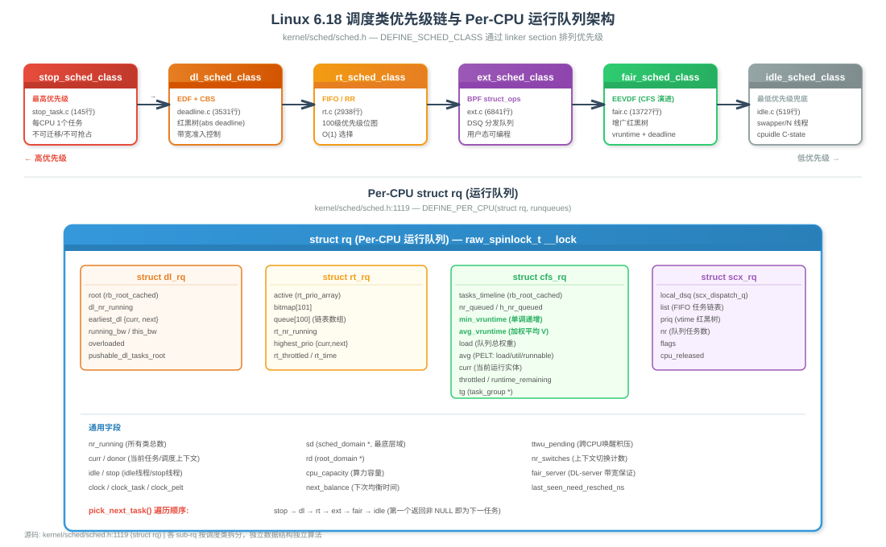
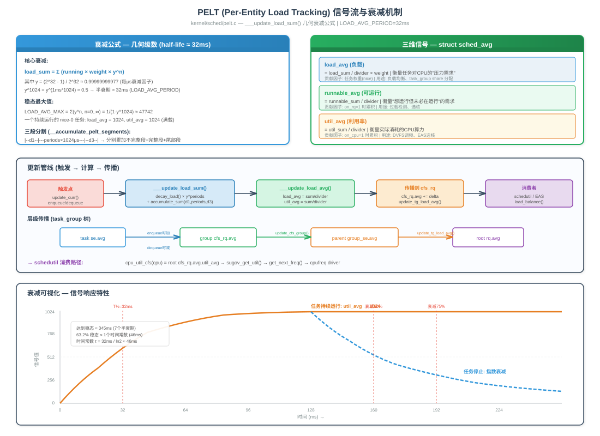
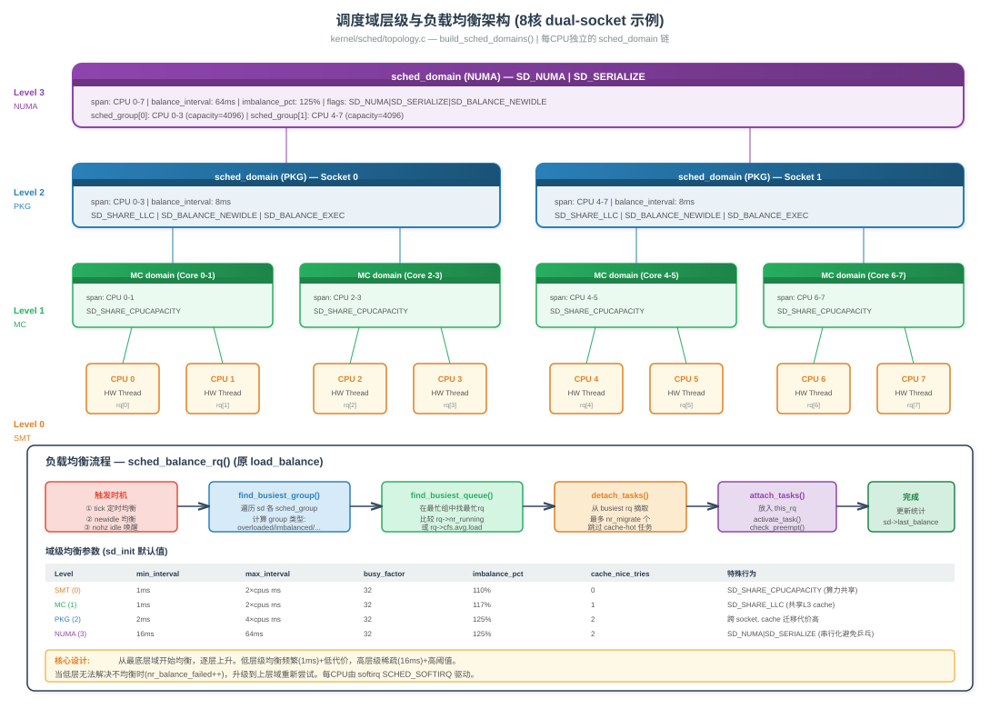
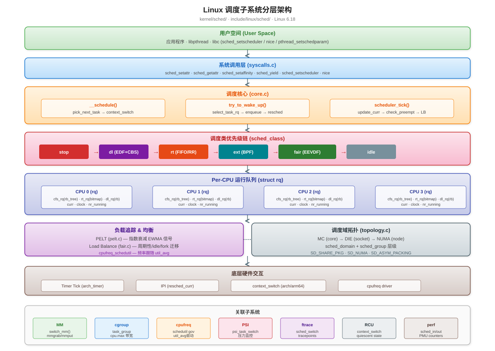
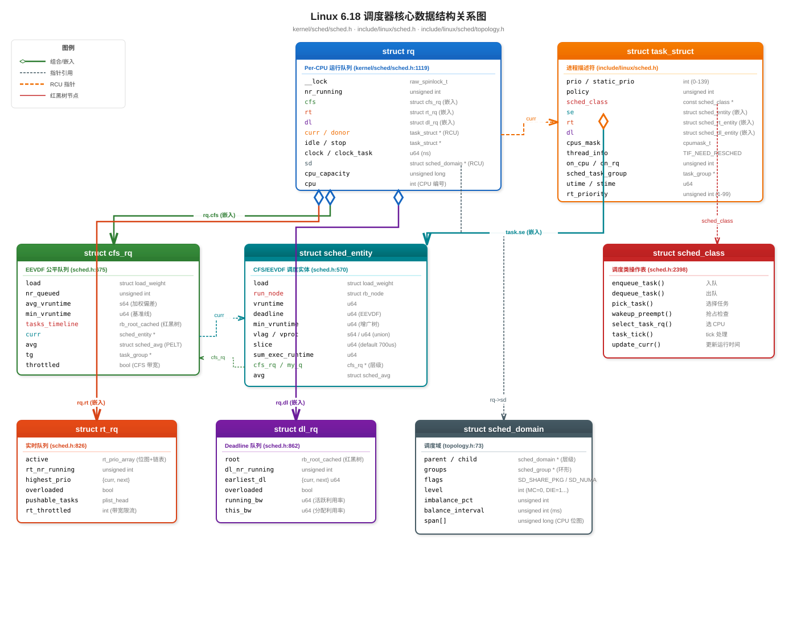
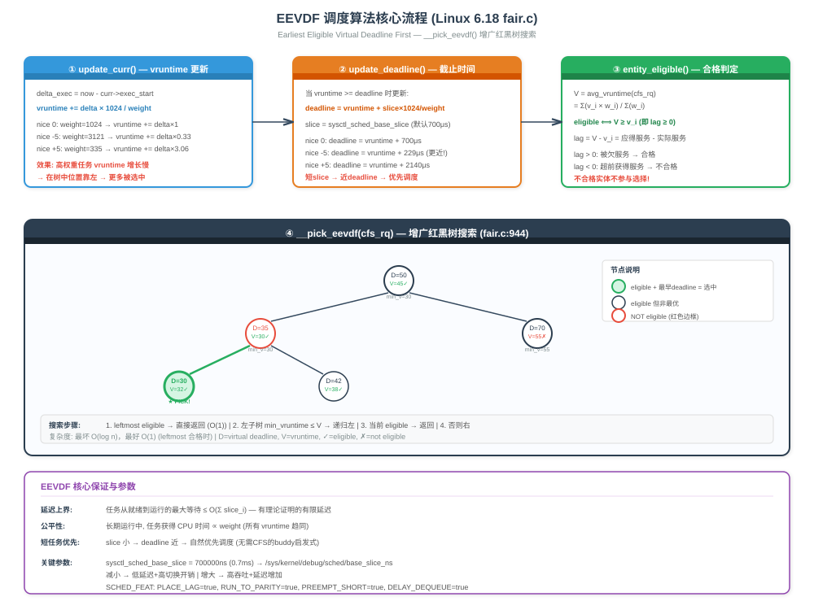

# Linux 6.18.1 内核调度子系统源码学习指南

> 基于 `kernel/sched/` 目录及 `include/linux/sched/` 头文件，按功能模块组织，方便系统性学习。

## 目录

<details>
<summary><b>1. 编译结构与 Unity Build</b></summary>

- 1.1 [Makefile 编译规则](#11-makefile-编译规则)
- 1.2 [build_policy.c 聚合编译](#12-build_policyc-聚合编译)
- 1.3 [build_utility.c 聚合编译](#13-build_utilityc-聚合编译)
</details>
<details>
<summary><b>2. 核心框架</b></summary>

- 2.1 [sched.h — 内部总头文件](#21-schedh--内部总头文件)
- 2.2 [core.c — 调度核心](#22-corec--调度核心)
- 2.3 [features.h — 特性开关](#23-featuresh--特性开关)
- 2.4 [smp.h — SMP 内部声明](#24-smph--smp-内部声明)
</details>
<details>
<summary><b>3. 五大调度类实现</b></summary>

- 3.1 [stop_task.c — stop 调度类（最高优先级）](#31-stop_taskc--stop-调度类最高优先级)
- 3.2 [deadline.c — SCHED_DEADLINE 调度类](#32-deadlinec--sched_deadline-调度类)
- 3.3 [rt.c — 实时调度类](#33-rtc--实时调度类)
- 3.4 [fair.c — CFS/EEVDF 公平调度类](#34-fairc--cfseevdf-公平调度类)
- 3.5 [idle.c — idle 调度类（最低优先级）](#35-idlec--idle-调度类最低优先级)
</details>
<details>
<summary><b>4. sched_ext — BPF 可扩展调度器</b></summary>

- 4.1 [ext.c — 主实现](#41-extc--主实现)
- 4.2 [ext.h — 公共接口](#42-exth--公共接口)
- 4.3 [ext_idle.c — 空闲 CPU 选择策略](#43-ext_idlec--空闲-cpu-选择策略)
- 4.4 [ext_idle.h — 空闲选择辅助声明](#44-ext_idleh--空闲选择辅助声明)
- 4.5 [ext_internal.h — 内部常量与枚举](#45-ext_internalh--内部常量与枚举)
</details>
<details>
<summary><b>5. 负载追踪与 CPU 时间统计</b></summary>

- 5.1 [pelt.c — Per-Entity Load Tracking](#51-peltc--per-entity-load-tracking)
- 5.2 [pelt.h / sched-pelt.h — PELT 接口与衰减表](#52-pelth--sched-pelth--pelt-接口与衰减表)
- 5.3 [loadavg.c — 全局负载平均值](#53-loadavgc--全局负载平均值)
- 5.4 [cputime.c — CPU 时间统计](#54-cputimec--cpu-时间统计)
- 5.5 [cpuacct.c — cpuacct cgroup 控制器](#55-cpuacctc--cpuacct-cgroup-控制器)
</details>
<details>
<summary><b>6. CPU 频率与能效调节</b></summary>

- 6.1 [cpufreq.c — 调度器-cpufreq 集成层](#61-cpufreqc--调度器-cpufreq-集成层)
- 6.2 [cpufreq_schedutil.c — schedutil 调频策略](#62-cpufreq_schedutilc--schedutil-调频策略)
</details>
<details>
<summary><b>7. 拓扑与负载均衡域</b></summary>

- 7.1 [topology.c — 调度域层级构建](#71-topologyc--调度域层级构建)
- 7.2 [cpupri.c — RT 任务 CPU 优先级位图](#72-cpupric--rt-任务-cpu-优先级位图)
- 7.3 [cpudeadline.c — DL 任务 CPU deadline 堆](#73-cpudeadlinec--dl-任务-cpu-deadline-堆)
</details>
<details>
<summary><b>8. 调度器时钟</b></summary>

- [调度器时钟](#8-调度器时钟)
</details>
<details>
<summary><b>9. 统计与调试</b></summary>

- 9.1 [stats.c / stats.h — schedstat 统计](#91-statsc--statsh--schedstat-统计)
- 9.2 [debug.c — debugfs 调试接口](#92-debugc--debugfs-调试接口)
</details>
<details>
<summary><b>10. 同步原语</b></summary>

- 10.1 [completion.c — 完成量机制](#101-completionc--完成量机制)
- 10.2 [wait.c — 通用等待队列](#102-waitc--通用等待队列)
- 10.3 [wait_bit.c — 位等待队列](#103-wait_bitc--位等待队列)
- 10.4 [swait.c — 简单等待队列](#104-swaitc--简单等待队列)
</details>
<details>
<summary><b>11. Cgroup、隔离与杂项</b></summary>

- 11.1 [autogroup.c — 自动任务分组](#111-autogroupc--自动任务分组)
- 11.2 [core_sched.c — 核心调度（SMT 安全）](#112-core_schedc--核心调度smt-安全)
- 11.3 [isolation.c — CPU 隔离](#113-isolationc--cpu-隔离)
- 11.4 [psi.c — 压力失速信息](#114-psic--压力失速信息)
- 11.5 [membarrier.c — membarrier 系统调用](#115-membarrierc--membarrier-系统调用)
- 11.6 [syscalls.c — 调度相关系统调用](#116-syscallsc--调度相关系统调用)
</details>
<details>
<summary><b>12. 公共头文件 (include/linux/sched/)</b></summary>

- 12.1 [核心定义头文件](#121-核心定义头文件)
- 12.2 [调度策略头文件](#122-调度策略头文件)
- 12.3 [负载与统计头文件](#123-负载与统计头文件)
- 12.4 [任务管理头文件](#124-任务管理头文件)
- 12.5 [拓扑与隔离头文件](#125-拓扑与隔离头文件)
- 12.6 [调试与杂项头文件](#126-调试与杂项头文件)
</details>
<details>
<summary><b>13. 建议阅读顺序</b></summary>

- [建议阅读顺序](#13-建议阅读顺序)
</details>
<details>
<summary><b>14. 调度器发展历史</b></summary>

- 14.1 [O(n) 调度器（Linux 2.4 及之前）](#141-on-调度器linux-24-及之前)
- 14.2 [O(1) 调度器（Linux 2.6 早期）](#142-o1-调度器linux-26-早期)
- 14.3 [CFS 完全公平调度器（Linux 2.6.23+）](#143-cfs-完全公平调度器linux-2623)
- 14.4 [EEVDF 调度器（Linux 6.6+）](#144-eevdf-调度器linux-66)
- 14.5 [sched_ext BPF 可扩展调度（Linux 6.12+）](#145-sched_ext-bpf-可扩展调度linux-612)
- 14.6 [实时调度与 PREEMPT_RT 演进](#146-实时调度与-preempt_rt-演进)
</details>
<details>
<summary><b>15. 软件架构</b></summary>

- 15.1 [调度子系统整体架构图](#151-调度子系统整体架构图)
- 15.2 [调度类层次与优先级链](#152-调度类层次与优先级链)
- 15.3 [Per-CPU 运行队列架构](#153-per-cpu-运行队列架构)
- 15.4 [调度域与负载均衡层级](#154-调度域与负载均衡层级)
- 15.5 [时钟与 Tick 驱动模型](#155-时钟与-tick-驱动模型)
- 15.6 [调度器与内核其他子系统的交互](#156-调度器与内核其他子系统的交互)
</details>
<details>
<summary><b>16. 关键数据结构联系</b></summary>

- 16.1 [task_struct 调度相关字段全景](#161-task_struct-调度相关字段全景)
- 16.2 [struct rq — Per-CPU 运行队列](#162-struct-rq--per-cpu-运行队列)
- 16.3 [struct cfs_rq / rt_rq / dl_rq 子队列](#163-struct-cfs_rq--rt_rq--dl_rq-子队列)
- 16.4 [struct sched_entity / sched_rt_entity / sched_dl_entity](#164-struct-sched_entity--sched_rt_entity--sched_dl_entity)
- 16.5 [struct sched_class — 调度类操作表](#165-struct-sched_class--调度类操作表)
- 16.6 [struct sched_domain / sched_group — 拓扑描述](#166-struct-sched_domain--sched_group--拓扑描述)
- 16.7 [数据结构关系总图（SVG）](#167-数据结构关系总图svg)
</details>
<details>
<summary><b>17. 调度器原理机制分析</b></summary>

- 17.1 [主调度路径 schedule() 深度分析](#171-主调度路径-schedule-深度分析)
- 17.2 [唤醒路径 try_to_wake_up() 分析](#172-唤醒路径-try_to_wake_up-分析)
- 17.3 [上下文切换 context_switch() 机制](#173-上下文切换-context_switch-机制)
- 17.4 [CFS/EEVDF vruntime 与公平性算法](#174-cfseevdf-vruntime-与公平性算法)
- 17.5 [负载均衡与任务迁移机制](#175-负载均衡与任务迁移机制)
- 17.6 [PELT 负载追踪算法原理](#176-pelt-负载追踪算法原理)
- 17.7 [RT 调度与带宽限流](#177-rt-调度与带宽限流)
- 17.8 [Deadline 调度 EDF+CBS 算法](#178-deadline-调度-edfcbs-算法)
- 17.9 [抢占模型与时机分析](#179-抢占模型与时机分析)
- 17.10 [CPU 亲和性与 cpuset 机制](#1710-cpu-亲和性与-cpuset-机制)
</details>
<details>
<summary><b>18. 调度器 Debug 和观测</b></summary>

- 18.1 [/proc/sched_debug 与 /proc/schedstat](#181-procsched_debug-与-procschedstat)
- 18.2 [ftrace sched 相关 tracepoint](#182-ftrace-sched-相关-tracepoint)
- 18.3 [perf sched 工具使用](#183-perf-sched-工具使用)
- 18.4 [bpftrace 调度器观测脚本](#184-bpftrace-调度器观测脚本)
- 18.5 [schedstat 统计项解读](#185-schedstat-统计项解读)
- 18.6 [PSI 压力失速监控实战](#186-psi-压力失速监控实战)
- 18.7 [常见调度异常诊断方法](#187-常见调度异常诊断方法)
</details>
<details>
<summary><b>19. 调度器涉及的算法</b></summary>

- 19.1 [红黑树 — CFS/EEVDF 任务排序](#191-红黑树--cfseevdf-任务排序)
- 19.2 [加权公平排队（WFQ）与虚拟运行时间](#192-加权公平排队wfq与虚拟运行时间)
- 19.3 [EEVDF 最早合格虚拟截止时间优先算法](#193-eevdf-最早合格虚拟截止时间优先算法)
- 19.4 [EDF 最早截止时间优先算法](#194-edf-最早截止时间优先算法)
- 19.5 [CBS 恒定带宽服务器算法](#195-cbs-恒定带宽服务器算法)
- 19.6 [PELT 指数加权移动平均（EWMA）](#196-pelt-指数加权移动平均ewma)
- 19.7 [位图优先级数组 — RT/O(1) 调度](#197-位图优先级数组--rto1-调度)
- 19.8 [最小堆 — Deadline CPU 选择](#198-最小堆--deadline-cpu-选择)
- 19.9 [负载均衡迭代与 busiest/idlest 启发式](#199-负载均衡迭代与-busiestidlest-启发式)
- 19.10 [指数衰减与半衰期计算](#1910-指数衰减与半衰期计算)
- 19.11 [RCU 无锁读取在调度路径中的应用](#1911-rcu-无锁读取在调度路径中的应用)
</details>
<details>
<summary><b>20. QEMU 实验设计</b></summary>

- 20.1 [QEMU 多核 ARM64 环境搭建](#201-qemu-多核-arm64-环境搭建)
- 20.2 [实验一：观察 CFS 公平性与 vruntime 变化](#202-实验一观察-cfs-公平性与-vruntime-变化)
- 20.3 [实验二：RT 任务抢占与优先级反转](#203-实验二rt-任务抢占与优先级反转)
- 20.4 [实验三：负载均衡与任务迁移跟踪](#204-实验三负载均衡与任务迁移跟踪)
- 20.5 [实验四：Deadline 调度带宽控制验证](#205-实验四deadline-调度带宽控制验证)
- 20.6 [实验五：sched_ext BPF 自定义调度策略](#206-实验五sched_ext-bpf-自定义调度策略)
- 20.7 [实验六：CPU 隔离与 cpuset 配置](#207-实验六cpu-隔离与-cpuset-配置)
</details>
<details>
<summary><b>21. 面试经典问答</b></summary>

- 21.1 [进程/线程调度基础问题](#211-进程线程调度基础问题)
- 21.2 [CFS/EEVDF 算法原理问题](#212-cfseevdf-算法原理问题)
- 21.3 [实时调度与优先级反转问题](#213-实时调度与优先级反转问题)
- 21.4 [多核负载均衡问题](#214-多核负载均衡问题)
- 21.5 [调度延迟与性能优化问题](#215-调度延迟与性能优化问题)
- 21.6 [调度器数据结构与实现细节问题](#216-调度器数据结构与实现细节问题)
- 21.7 [场景设计与故障排查问题](#217-场景设计与故障排查问题)
</details>

---

## 1. 编译结构与 Unity Build

### 1.1 Makefile 编译规则

**文件**: `kernel/sched/Makefile`（约 40 行）

调度子系统的 Makefile 采用**三段式**编译策略，将 35000+ 行代码划分为 4 个编译单元：

```makefile
# kernel/sched/Makefile 关键部分

# 禁用 KCOV/KCSAN（调度路径噪声太大，非输入敏感）
KCOV_INSTRUMENT := n
KCSAN_SANITIZE := n
KCSAN_INSTRUMENT_BARRIERS := y   # 但保留 barrier 插桩（避免假阳性）

# 保留帧指针用于 WCHAN（ps 显示进程阻塞在哪个函数）
ifneq ($(CONFIG_SCHED_OMIT_FRAME_POINTER),y)
CFLAGS_core.o := $(PROFILING) -fno-omit-frame-pointer
endif

# 禁用 branch profiling（非 noinstr 安全）
ifdef CONFIG_TRACE_BRANCH_PROFILING
CFLAGS_build_policy.o += -DDISABLE_BRANCH_PROFILING
CFLAGS_build_utility.o += -DDISABLE_BRANCH_PROFILING
endif

# 四个编译单元，体量接近，并行编译效率最优
obj-y += core.o          # ~10930 行，调度核心
obj-y += fair.o          # ~13727 行，CFS/EEVDF 公平调度
obj-y += build_policy.o  # ~聚合 8+ 个策略文件
obj-y += build_utility.o # ~聚合 15+ 个工具文件
```

**设计哲学**:

| 设计决策 | 原因 |
|----------|------|
| `core.c` 独立编译 | 10930 行，修改频率高，独立增量编译快 |
| `fair.c` 独立编译 | 13727 行，最大文件，算法复杂度高 |
| 其余文件 Unity Build | 聚合编译摊销头文件解析开销（`sched.h` 有 3907 行） |
| 4 个单元体量均衡 | 并行 `make -j4` 时各核完成时间接近 |
| `-fno-omit-frame-pointer` | 仅限 `core.o`，保证 `/proc/<pid>/wchan` 正确 |
| 禁用 KCOV/KCSAN | 调度路径产生大量非确定性覆盖率/竞态数据 |

**关于 WCHAN**:

`/proc/<pid>/wchan` 显示进程阻塞在哪个内核函数。调度器是所有进程进入睡眠的必经之路（`schedule()` → `__schedule()`），如果省略帧指针，栈回溯将无法正确展开，导致 `ps` 的 WCHAN 列显示错误。

### 1.2 build_policy.c 聚合编译

**文件**: `kernel/sched/build_policy.c`

这个文件用 `#include "xxx.c"` 方式将**调度策略相关**源文件聚合为单一编译单元：

```c
/* kernel/sched/build_policy.c — 关键结构 */

/* === 公共头文件（只解析一次，所有 .c 共享） === */
#include <linux/sched/clock.h>
#include <linux/sched/cputime.h>
#include <linux/sched/hotplug.h>
#include <linux/sched/isolation.h>
#include <linux/sched/posix-timers.h>
#include <linux/sched/rt.h>
#include <linux/cpuidle.h>
#include <linux/livepatch.h>
/* ... 约 20 个系统头文件 ... */

/* 内部头文件 */
#include "sched.h"       /* 调度器核心数据结构（3907 行） */
#include "smp.h"         /* SMP 内部声明 */
#include "autogroup.h"   /* 自动分组 */
#include "stats.h"       /* schedstat 统计 */
#include "pelt.h"        /* PELT 负载追踪 */

/* === 源文件聚合（顺序有依赖关系） === */
#include "idle.c"         /* idle 调度类 — 最简单，无外部依赖 */
#include "rt.c"           /* RT 调度类 (FIFO/RR) */
#include "cpudeadline.c"  /* DL CPU 选择堆 — deadline.c 的前置依赖 */
#include "pelt.c"         /* PELT 负载追踪算法 */
#include "cputime.c"      /* CPU 时间记账 */
#include "deadline.c"     /* Deadline 调度类 (EDF+CBS) */

#ifdef CONFIG_SCHED_CLASS_EXT
# include "ext_internal.h" /* sched_ext 内部常量 */
# include "ext.c"          /* sched_ext 主实现 */
# include "ext_idle.c"     /* sched_ext 空闲 CPU 策略 */
#endif

#include "syscalls.c"     /* 调度相关系统调用入口 */
```

**包含顺序的依赖关系**:

```
cpudeadline.c ──→ deadline.c (DL CPU 选择需要 cpudl 结构)
pelt.c ──→ deadline.c, rt.c (负载追踪被 DL/RT 的 update_curr 调用)
idle.c ──→ 独立 (最简单的调度类)
```

**Unity Build 的性能收益**:

典型 ARM64 defconfig 编译数据（参考值）:
- 分别编译 8 个 .c 文件: 头文件解析 8 次 × ~2s ≈ 16s 头文件开销
- Unity Build: 头文件解析 1 次 ≈ 2s，编译源码 ~4s，总计 ~6s
- **节省约 60% 的编译时间**

### 1.3 build_utility.c 聚合编译

**文件**: `kernel/sched/build_utility.c`

聚合**工具性质**的源文件 — 这些不是调度策略核心，但提供时钟、统计、拓扑、同步等辅助功能：

```c
/* kernel/sched/build_utility.c — 源文件聚合 */

/* 无条件包含 */
#include "clock.c"       /* 调度器时钟稳定化 (508 行) */
#include "debug.c"       /* debugfs 接口 */
#include "loadavg.c"     /* /proc/loadavg 计算 */
#include "completion.c"  /* 完成量同步原语 */
#include "swait.c"       /* 简单等待队列 (RT-safe) */
#include "wait_bit.c"    /* 位等待队列 */
#include "wait.c"        /* 通用等待队列 */
#include "cpupri.c"      /* RT CPU 优先级位图 */
#include "stop_task.c"   /* stop 调度类 */
#include "topology.c"    /* 调度域构建 */

/* 条件编译 */
#ifdef CONFIG_CGROUP_CPUACCT
# include "cpuacct.c"            /* cpuacct cgroup 控制器 */
#endif
#ifdef CONFIG_CPU_FREQ
# include "cpufreq.c"            /* 调度器-cpufreq 钩子 */
#endif
#ifdef CONFIG_CPU_FREQ_GOV_SCHEDUTIL
# include "cpufreq_schedutil.c"  /* schedutil 调频策略 */
#endif
#ifdef CONFIG_SCHEDSTATS
# include "stats.c"              /* schedstat 统计 */
#endif
#ifdef CONFIG_SCHED_CORE
# include "core_sched.c"         /* SMT 安全调度 */
#endif
#ifdef CONFIG_PSI
# include "psi.c"                /* 压力失速信息 */
#endif
#ifdef CONFIG_MEMBARRIER
# include "membarrier.c"         /* membarrier 系统调用 */
#endif
#ifdef CONFIG_CPU_ISOLATION
# include "isolation.c"          /* CPU 隔离 */
#endif
#ifdef CONFIG_SCHED_AUTOGROUP
# include "autogroup.c"          /* TTY 自动分组 */
#endif
```

**条件编译的设计意图**:

| 配置项 | 默认值 | 场景 |
|--------|--------|------|
| `CONFIG_CGROUP_CPUACCT` | y (桌面/服务器) | 容器 CPU 记账 |
| `CONFIG_CPU_FREQ` | y (移动/笔记本) | 动态调频支持 |
| `CONFIG_CPU_FREQ_GOV_SCHEDUTIL` | y | PELT 驱动调频 |
| `CONFIG_SCHEDSTATS` | n (性能关键系统) | 开发调试用 |
| `CONFIG_SCHED_CORE` | y (云服务器) | SMT 侧信道防护 |
| `CONFIG_PSI` | y | 内存/CPU/IO 压力监控 |
| `CONFIG_MEMBARRIER` | y | 高性能用户态 RCU |
| `CONFIG_CPU_ISOLATION` | y | 实时/低延迟场景 |
| `CONFIG_SCHED_AUTOGROUP` | y (桌面) | 桌面交互性优化 |

**编译单元文件数量统计**:

| 编译单元 | 行数 | 无条件文件 | 条件文件 | 总计 |
|----------|------|-----------|----------|------|
| `core.o` | 10930 | 1 | 0 | 1 |
| `fair.o` | 13727 | 1 | 0 | 1 |
| `build_policy.o` | ~11000 | 7 | 1 (ext) | 8 |
| `build_utility.o` | ~10000 | 10 | 9 | 19 |
| **总计** | ~45000+ | 19 | 10 | 29 |
| `core_sched.c` | `CONFIG_SCHED_CORE` |
| `psi.c` | `CONFIG_PSI` |
| `membarrier.c` | `CONFIG_MEMBARRIER` |
| `isolation.c` | `CONFIG_CPU_ISOLATION` |
| `autogroup.c` | `CONFIG_SCHED_AUTOGROUP` |

---

## 2. 核心框架

### 2.1 sched.h — 内部总头文件

**文件**: `kernel/sched/sched.h`（3907 行）

调度子系统的"大脑"，所有 `kernel/sched/*.c` 文件通过 `#include "sched.h"` 共享其定义。这个文件**不**对外导出（不在 `include/` 下），是调度子系统私有的内部接口。

**核心数据结构定义位置**:

| 结构体 | 行号 | 说明 |
|--------|------|------|
| `struct cfs_rq` | ~675 | CFS/EEVDF 运行队列 |
| `struct rt_rq` | ~826 | RT 优先级数组 |
| `struct dl_rq` | ~862 | DL 红黑树 |
| `struct rq` | 1119 | Per-CPU 运行队列（总控） |
| `struct sched_class` | 2398 | 调度类虚函数表 |

**重要内联辅助函数**（热路径零开销调用）:

```c
/* 获取本 CPU 的 rq（编译期常量地址） */
#define cpu_rq(cpu)    (&per_cpu(runqueues, cpu))
#define this_rq()      this_cpu_ptr(&runqueues)

/* 调度类优先级比较（利用链接器 section 地址排序） */
static inline bool sched_class_above(const struct sched_class *a,
                                     const struct sched_class *b)
{
    return a < b;  /* section 地址越小 = 优先级越高 */
}

/* DEFINE_SCHED_CLASS 宏 — 利用 linker section 实现优先级链 */
#define DEFINE_SCHED_CLASS(name) \
const struct sched_class name##_sched_class \
    __aligned(__alignof__(struct sched_class)) \
    __section("__" #name "_sched_class")
```

**设计特点**:
- 所有热路径函数用 `static inline` 避免函数调用开销
- `__cacheline_aligned` 用于避免 false sharing（如 `rq->clock_task`）
- `CONFIG_*` 条件编译裁剪不需要的字段（嵌入式可大幅缩减 `struct rq` 体积）
- `raw_spinlock_t` 用于 rq 锁（RT 内核下不转为 mutex，保证调度路径无递归）

### 2.2 core.c — 调度核心

**文件**: `kernel/sched/core.c`（10930 行，最核心文件）

这是整个内核中**最关键的文件之一**。所有任务状态转换、上下文切换、唤醒逻辑的总入口都在此。

**函数定位索引**（按功能分组）:

| 函数 | 行号 | 职责 | 调用频率 |
|------|------|------|----------|
| `__schedule()` | 6784 | 主调度逻辑 | 极高（每次调度） |
| `schedule()` | 6910+ | 公开调度入口 | 每次 sleep/yield |
| `try_to_wake_up()` | 4143 | 唤醒任务 | 极高（每次 wake） |
| `context_switch()` | 5269 | 上下文切换 | 每次任务切换 |
| `scheduler_tick()` | ~5700 | tick 处理 | 每 tick (4ms@250HZ) |
| `sched_fork()` | ~4500 | fork 时初始化 | 每次 fork |
| `wake_up_new_task()` | ~4700 | 新任务首次入队 | 每次 fork |
| `pick_next_task()` | ~6000 | 选择下一任务 | 每次调度 |
| `set_cpus_allowed_ptr()` | ~9200 | 设置亲和性 | 用户调用 |
| `preempt_schedule()` | ~7000 | 内核抢占入口 | 抢占点 |

**`__schedule()` 源码核心逻辑** (line 6784):

```c
static void __sched notrace __schedule(int sched_mode)
{
    struct task_struct *prev, *next;
    bool preempt = sched_mode > SM_NONE;  /* SM_PREEMPT / SM_RTLOCK_WAIT */
    struct rq *rq;
    int cpu;

    cpu = smp_processor_id();
    rq = cpu_rq(cpu);
    prev = rq->curr;

    /* 1. 调试检查 + livepatch 回调 */
    schedule_debug(prev, preempt);
    klp_sched_try_switch(prev);

    /* 2. 关中断 + RCU 静止状态通知 */
    local_irq_disable();
    rcu_note_context_switch(preempt);  /* 推进 RCU 宽限期 */

    /* 3. 获取 rq 锁 + 更新时钟 */
    rq_lock(rq, &rf);
    smp_mb__after_spinlock();      /* 配合 signal_pending 的内存序 */
    update_rq_clock(rq);           /* 读取硬件时钟更新 rq->clock */

    /* 4. 处理 prev 任务状态 */
    if (sched_mode == SM_IDLE) {
        /* Idle 模式：如果 rq 为空则保持 idle */
        if (!rq->nr_running && !scx_enabled()) {
            next = prev; goto picked;
        }
    } else if (!preempt && prev_state) {
        /* 非抢占 + prev 非 RUNNING → 尝试出队 */
        try_to_block_task(rq, prev, &prev_state, !task_is_blocked(prev));
    }

    /* 5. 选择下一个任务 (核心决策) */
    next = pick_next_task(rq, rq->donor, &rf);

    /* 6. 上下文切换 */
    if (likely(prev != next)) {
        rq->nr_switches++;
        rq->curr = next;
        context_switch(rq, prev, next, &rf);  /* 不返回（切换到 next） */
    }
    /* 如果 prev == next，释放锁继续运行 */
}
```

**关键设计点**:
- `SM_NONE` = 主动调度（sleep/yield），`SM_PREEMPT` = 抢占调度，`SM_IDLE` = idle 循环调度
- `smp_mb__after_spinlock()` 确保 `signal_pending_state()` 与 `set_current_state()` 的正确排序
- `pick_next_task()` 是调度决策的核心——遍历调度类优先级链
- Proxy Execution (CONFIG_SCHED_PROXY_EXEC): `donor` 和 `curr` 分离，用于优先级继承场景

**`try_to_wake_up()` 关键内存序** (line 4143):

```c
int try_to_wake_up(struct task_struct *p, unsigned int state, int wake_flags)
{
    /* 特殊路径：唤醒自己（无需锁） */
    if (p == current) {
        ttwu_do_wakeup(p);
        goto out;
    }

    /* 获取 pi_lock（保护优先级继承链） */
    scoped_guard(raw_spinlock_irqsave, &p->pi_lock) {
        smp_mb__after_spinlock();

        /* 检查状态是否匹配 */
        if (!ttwu_state_match(p, state, &success))
            break;

        /* 关键内存序：先读 state 再读 on_rq */
        smp_rmb();
        if (READ_ONCE(p->on_rq) && ttwu_runnable(p, wake_flags))
            break;  /* 已在 rq 上，直接唤醒 */

        /* p 不在 rq 上 → 需要入队 */
        smp_acquire__after_ctrl_dep();  /* control dependency acquire */
        WRITE_ONCE(p->__state, TASK_WAKING);

        /* 选择目标 CPU */
        cpu = select_task_rq(p, p->wake_cpu, wake_flags);

        /* 入队到目标 rq（可能跨 CPU） */
        ttwu_queue(p, cpu, wake_flags);
    }
}
```

**内存序要点**（面试高频）:
- `smp_rmb()` 保证 `p->state` 的读在 `p->on_rq` 之前（防止错误地认为 p 不在 rq）
- `smp_acquire__after_ctrl_dep()` 确保 schedule() 的 deactivate_task() 对 wake 端可见
- 与 `__schedule()` 中的 `smp_mb__after_spinlock()` 配对

### 2.3 features.h — 特性开关

**文件**: `kernel/sched/features.h`

通过 debugfs (`/sys/kernel/debug/sched/features`) 动态控制的调度行为开关。底层通过 `static_branch`（jump label）实现，开启/关闭零运行时开销。

**完整特性列表** (Linux 6.18.1):

| 特性 | 默认 | 说明 | 影响 |
|------|------|------|------|
| `PLACE_LAG` | true | 唤醒时恢复 lag（保持跨 sleep 公平性） | EEVDF 放置策略 #1 |
| `PLACE_DEADLINE_INITIAL` | true | 新任务给半个 slice 的 deadline 缓冲 | 减少新任务延迟 |
| `PLACE_REL_DEADLINE` | true | 迁移时保持相对 deadline | 跨 CPU 公平性 |
| `RUN_TO_PARITY` | true | 抑制抢占直到当前任务达到 0-lag 或用完 slice | 减少切换次数 |
| `PREEMPT_SHORT` | true | 短 slice 任务可取消 RUN_TO_PARITY 保护 | 短任务延迟优化 |
| `NEXT_BUDDY` | false | 唤醒失败时记住 next 候选 | 缓存局部性 |
| `PICK_BUDDY` | true | 允许 pick 时考虑 buddy 提示 | 与 NEXT_BUDDY 配合 |
| `CACHE_HOT_BUDDY` | true | buddy 任务视为 cache-hot | 减少不必要迁移 |
| `DELAY_DEQUEUE` | true | 延迟出队非合格任务（让其烧掉负 lag） | EEVDF 核心机制 |
| `DELAY_ZERO` | true | 出队/唤醒时 clip lag 到 0 | 防止 lag 无限累积 |

**运行时查看与修改**:
```bash
# 查看所有特性状态
cat /sys/kernel/debug/sched/features
# 输出: PLACE_LAG PLACE_DEADLINE_INITIAL RUN_TO_PARITY ...
#       NO_NEXT_BUDDY (表示 NEXT_BUDDY 关闭)

# 关闭 RUN_TO_PARITY（允许更积极的抢占）
echo NO_RUN_TO_PARITY > /sys/kernel/debug/sched/features

# 开启 NEXT_BUDDY
echo NEXT_BUDDY > /sys/kernel/debug/sched/features
```

**static_branch 实现原理**:
```c
/* kernel/sched/sched.h */
#define sched_feat(x)  static_branch_##x(&sched_feat_keys[__SCHED_FEAT_##x])

/* 编译时生成 NOP 指令，运行时通过修改代码段来开关 */
/* 关闭时 = 跳转（分支预测友好），开启时 = 直通 */
```

### 2.4 smp.h — SMP 内部声明

**文件**: `kernel/sched/smp.h`

跨 CPU 唤醒是调度器中最复杂的路径之一，`smp.h` 声明了 SMP 唤醒的内部接口：

```c
/* kernel/sched/smp.h 核心接口 */

/* 处理远程 CPU 积压的唤醒请求 */
extern void sched_ttwu_pending(void *arg);

/* 机制说明:
 * try_to_wake_up() 跨 CPU 唤醒时不直接获取远程 rq 锁（避免竞争）
 * 而是将任务放入远程 CPU 的 wake_list，然后发送 IPI
 * 远程 CPU 在 IPI handler 或 scheduler_tick 中调用 sched_ttwu_pending()
 * 批量处理 wake_list 中所有待唤醒任务
 */
```

**ttwu (try_to_wake_up) 跨 CPU 路径**:
```
CPU 0 (唤醒者)                    CPU 1 (被唤醒任务所在)
─────────────────                 ─────────────────────
try_to_wake_up(p)
  → p 应放在 CPU 1
  → ttwu_queue(p, cpu=1)
    → llist_add(&p->wake_entry,
                &cpu_rq(1)->ttwu_list)
    → send_call_function_single_ipi(1)
                                  ← 收到 IPI
                                  sched_ttwu_pending()
                                    → 遍历 ttwu_list
                                    → ttwu_do_activate(p)
                                      → enqueue_task(p)
                                      → wakeup_preempt(p)
```

**设计优势**:
- 避免远程 rq 锁竞争（batch 处理多个唤醒）
- IPI 频率可调（`ttwu_queue_cond` 判断是否值得发 IPI）
- 与 `nohz_full` 配合减少对隔离 CPU 的干扰

---

## 3. 五大调度类实现

> Linux 6.18 中有 6 个调度类（含 sched_ext），通过链接器 section 排列形成优先级链。每个类实现 `struct sched_class` 虚函数表。
>
> 调度类优先级链与 Per-CPU rq 架构图



### 五大调度类的实现意义与应用场景总览

#### 优先级链的设计本质

内核在 `sched_init()` 中用 `BUG_ON()` 硬性校验优先级链（`kernel/sched/core.c:8649`）：

```c
/* sched_init() — 启动时校验链接器排列正确 */
BUG_ON(!sched_class_above(&stop_sched_class, &dl_sched_class));
BUG_ON(!sched_class_above(&dl_sched_class,   &rt_sched_class));
BUG_ON(!sched_class_above(&rt_sched_class,   &fair_sched_class));
BUG_ON(!sched_class_above(&fair_sched_class,  &idle_sched_class));
```

这个优先级链不是随意设计的，而是反映了**不同类别任务对确定性的需求层级**：

```
优先级          调度类          核心需求              典型延迟要求
━━━━━━━━━━━━━━━━━━━━━━━━━━━━━━━━━━━━━━━━━━━━━━━━━━━━━━━━━━━━━━
最高 ──→  stop         绝对独占，不可打断         0（立即执行）
  │       deadline     硬实时，截止时间保证        µs ~ ms 级
  │       rt           软实时，固定优先级          ms 级
  │       fair(EEVDF)  公平共享，交互响应          ms ~ 数十ms
最低 ──→  idle         无任务时的占位符            无要求
```

**为什么是这个顺序？**

| 排序理由 | 解释 |
|----------|------|
| stop 必须最高 | 它服务于内核自身的基础设施（CPU 热插拔、代码热修补），如果被抢占会导致系统不一致 |
| deadline 高于 rt | DL 有准入控制（admission control），**数学可证明不会过载**；RT 没有准入控制，可能无限抢占 |
| rt 高于 fair | 实时任务的确定性需求高于普通任务的公平性需求 |
| fair 高于 idle | 只要有任何一个普通任务就绪，idle 就不应该运行 |

#### 每个调度类的实现意义和场景深入分析

**（一）stop 调度类 — 内核的"原子操作执行器"**

**核心实现意义**：stop 类是内核用来执行**需要独占 CPU 的不可打断操作**的机制。每个 CPU 上有且仅有一个 stop 任务（即 `migration/N` 内核线程），它通过 `stop_machine()` 和 `cpu_stopper` 框架被激活。

**为什么需要它？** 某些内核操作必须在目标 CPU 上执行，并且执行期间**不能有任何其他任务被调度**。比如把一个正在运行的任务从 CPU 上迁走——你不能从远程 CPU 直接操作正在运行的任务的栈和寄存器。

**关键设计约束**（全部通过 `BUG()` 强制）：

```c
yield_task_stop()    → BUG()  // 不允许让出 CPU — 必须执行完
switched_to_stop()   → BUG()  // 不允许运行时切换到 stop 类
prio_changed_stop()  → BUG()  // 没有优先级概念
select_task_rq_stop() → return task_cpu(p)  // 永不迁移
```

**实际场景清单**（基于 `core.c` 中对 `stop_one_cpu()` 的调用）：

| 场景 | 调用路径 | 为什么必须用 stop？ |
|------|----------|---------------------|
| **active balance 任务迁移** | `migration_cpu_stop()` | 需要停住源 CPU 才能安全 dequeue 正在运行的任务 |
| **set_cpus_allowed 亲和性修改** | `__set_cpus_allowed_ptr()` → `stop_one_cpu()` | 目标任务可能正在运行，需要在其 CPU 上原子修改 |
| **CPU 热插拔下线** | `__balance_push_cpu_stop()` | 必须把该 CPU 上所有可运行任务清空 |
| **ftrace 动态代码修补** | `stop_machine()` | 修改正在执行的代码需要所有 CPU 暂停 |
| **内核模块卸载** | `stop_machine()` | 确保模块代码不在任何 CPU 的执行路径上 |
| **CPU 微码更新** | `stop_machine()` | 更新 CPU 固件需要原子化 |

> **面试要点**：`migration/N` 线程不是用来做负载均衡的（负载均衡在 softirq 中完成），而是用来执行"需要在目标 CPU 上原子完成"的操作。

---

**（二）deadline 调度类 — 唯一有准入控制的实时调度类**

**核心实现意义**：DL 类基于 EDF（最早截止时间优先）+ CBS（恒定带宽服务器）算法，是 Linux 中**唯一能提供数学可证明的调度保证**的调度类。与 RT 类的关键区别：**DL 有准入控制（admission control），RT 没有。**

**准入控制的实现**（`kernel/sched/deadline.c:213`）：

```c
static inline bool
__dl_overflow(struct dl_bw *dl_b, unsigned long cap, u64 old_bw, u64 new_bw)
{
    return dl_b->bw != -1 &&
           cap_scale(dl_b->bw, cap) < dl_b->total_bw - old_bw + new_bw;
}
/* 如果 ΣU = Σ(runtime/period) > CPU 总容量 → 返回 -EBUSY 拒绝 */
```

**为什么准入控制这么重要？**
- RT 类：你可以创建 100 个优先级为 99 的 SCHED_FIFO 任务，它们会互相饿死，系统也会挂
- DL 类：如果新任务的带宽需求加上已有任务超出 CPU 容量，`sched_setattr()` 直接返回 `-EBUSY`
- 因此 DL 在理论上**保证所有已接受的任务都能在 deadline 前完成**

**三参数模型**（用户通过 `sched_setattr()` 设置）：

```
┌───────────────────── period (周期) ─────────────────────┐
│                                                          │
│  ┌── runtime ──┐              ┌── runtime ──┐           │
│  │  执行预算    │              │  下个周期    │           │
│  └─────────────┘              └─────────────┘           │
│  ↑                            ↑                          │
│  release                      deadline                   │
│                               (必须在此前完成)            │
└──────────────────────────────────────────────────────────┘

利用率 U = runtime / period (例如 5ms / 20ms = 25%)
```

**CBS 带宽补充机制**（防止任务占用超额带宽）：

```c
/* dl_task_timer() — hrtimer 回调 */
/* 当 runtime 耗尽时，任务被 throttle（暂停） */
/* 定时器到期后：补充 runtime、推迟 deadline 到下个周期、重新入队 */
dl_se->runtime = dl_se->dl_runtime;
dl_se->deadline += dl_se->dl_period;
```

**dl_server：6.x 的重大创新 — DL 为 CFS 提供带宽保证**

Linux 6.x 引入了 `dl_server` 机制（`kernel/sched/fair.c:8965`），让 DL 类作为 CFS 任务的"带宽服务器"：

```c
/* fair.c:8965 — 初始化 fair_server */
void fair_server_init(struct rq *rq)
{
    struct sched_dl_entity *dl_se = &rq->fair_server;
    init_dl_entity(dl_se);
    dl_server_init(dl_se, rq, fair_server_pick_task);
}
```

**为什么需要 dl_server？** 当系统中有大量 RT 任务（优先级高于 CFS）时，CFS 任务可能被完全饿死。`dl_server` 在 DL 层级为 CFS 预留了一块带宽，即使 RT 任务很多，CFS 也能获得最低保障执行时间。

```
update_curr() 中的关键逻辑：
    if (dl_server_active(&rq->fair_server))
        dl_server_update(&rq->fair_server, delta_exec);
/* CFS 任务的执行时间会记账到 fair_server 的 DL 预算中 */
```

**实际场景清单**：

| 场景 | 三参数设置示例 | 说明 |
|------|----------------|------|
| **工业控制环路** | runtime=1ms, period=10ms, deadline=10ms | 100Hz 控制频率，10% CPU |
| **视频编码帧处理** | runtime=5ms, period=33ms, deadline=30ms | 30fps，每帧有 30ms 截止 |
| **5G 基站 TTI 处理** | runtime=0.5ms, period=1ms, deadline=1ms | 1ms TTI，50% CPU |
| **汽车 ADAS 传感器融合** | runtime=3ms, period=20ms, deadline=15ms | 50Hz 传感器，15% CPU |
| **音频 DSP 处理** | runtime=2ms, period=5ms, deadline=5ms | 200Hz，40% CPU |
| **dl_server 保底** | runtime=5ms, period=100ms | 保证 CFS 任务至少获得 5% CPU |

> **面试要点**：面试官问"RT 和 DL 有什么区别"，最核心的回答是**准入控制**。RT 给你绝对优先级但不管过载；DL 在接受时就确保不过载，所以能提供数学保证。

---

**（三）rt 调度类 — 固定优先级的软实时调度**

**核心实现意义**：RT 类提供 100 个固定优先级等级（0-99），实现 `SCHED_FIFO`（先来先服务，不主动让出就一直运行）和 `SCHED_RR`（轮转，相同优先级之间时间片轮转）。它的算法极其简单——**永远选最高优先级的就绪任务**。

**O(1) 选择的硬件级实现**（`kernel/sched/rt.c:1665`）：

```c
static struct sched_rt_entity *pick_next_rt_entity(struct rt_rq *rt_rq)
{
    idx = sched_find_first_bit(array->bitmap);  /* ARM64: CLZ 指令，1 个时钟周期 */
    /* 100 位的位图 → 找到最高优先级的非空队列 */
    return list_entry(array->queue[idx].next, ...);  /* 取队列头 */
}
```

**RT 带宽限流 — 防止 RT 任务饿死系统**

RT 类最大的问题是**没有准入控制**——任何人都可以用 `sched_setscheduler()` 把任务设为 SCHED_FIFO:99。如果这个任务是死循环，整个 CPU 就被锁死了。内核通过带宽限流来缓解：

```
默认配置：
  sched_rt_period_us  = 1000000 (1 秒)
  sched_rt_runtime_us = 950000  (0.95 秒)

含义：每 1 秒内，RT 任务最多运行 0.95 秒，剩余 0.05 秒强制让给 CFS
     → 即使 RT 任务死循环，系统至少有 5% CPU 可用于 shell/ssh 排障
```

**FIFO vs RR 的实现差异**：

```c
/* task_tick_rt() — tick 到来时的处理 */
static void task_tick_rt(struct rq *rq, struct task_struct *p, int queued)
{
    if (p->policy != SCHED_RR)
        return;    /* FIFO：tick 不做任何事，任务永远运行 */

    if (--p->rt.time_slice)
        return;    /* RR：时间片未耗尽，继续 */

    /* RR 时间片耗尽 → 重填 + 放到同优先级队列尾部 */
    p->rt.time_slice = sched_rr_timeslice;  /* 默认 100ms */
    list_move_tail(&p->rt.run_list, ...);   /* 队尾 */
    resched_curr(rq);                        /* 触发重调度 */
}
```

**Push/Pull 多核均衡**：

```
场景：CPU0 有 prio=99 和 prio=50 两个 RT 任务，CPU1 空闲
  → push_rt_task(): 将 prio=50 推送到 CPU1
  → 利用 cpupri 位图 O(1) 找到"当前运行优先级最低"的 CPU

场景：CPU0 的 prio=99 任务结束，CPU1 有 prio=80 任务等待
  → pull_rt_task(): 从 CPU1 拉取 prio=80 到 CPU0
```

**实际场景清单**：

| 场景 | 策略/优先级 | 说明 |
|------|-------------|------|
| **IRQ 线程化** | SCHED_FIFO:50 | 中断下半部在内核线程中执行（`PREEMPT_RT` 补丁集） |
| **cyclictest 延迟测试** | SCHED_FIFO:80 | 测量系统最坏调度延迟 |
| **音频服务 (PulseAudio/PipeWire)** | SCHED_FIFO:50-60 | 防止音频卡顿（buffer underrun） |
| **数据库 WAL 写入线程** | SCHED_FIFO:40 | 保证事务日志及时刷盘 |
| **实时视频采集** | SCHED_RR:70 | 多个摄像头线程轮转共享 CPU |
| **看门狗 (watchdog/N)** | SCHED_FIFO:99 | 内核软锁检测，最高 RT 优先级 |
| **RCU callback 处理** | SCHED_FIFO:1 | 低优先级但必须及时处理 |

> **面试要点**：RT 类的带宽限流是**安全网而非设计目标**。正确使用 RT 应该设计好优先级层次，而不是依赖 5% 的保底。如果需要严格保证，应该用 SCHED_DEADLINE。

---

**（四）fair 调度类 — EEVDF 公平调度，Linux 的"默认人格"**

**核心实现意义**：fair 类处理系统中 99% 的任务。从 Linux 6.6 开始，算法从经典 CFS（vruntime 最小者优先）演进为 EEVDF（最早合格虚拟截止时间优先），在公平性之上增加了**延迟保证**。

**EEVDF 相比 CFS 解决了什么问题？**

经典 CFS 的缺陷：
- 只看 vruntime 最小的任务 → 新唤醒的交互式任务可能等很久
- 没有"截止时间"概念 → 无法区分"紧急"和"不紧急"的公平需求
- sleeper bonus 等启发式补偿容易被游戏/exploit

EEVDF 的解决方案：
- 每个任务有一个虚拟截止时间（`se->deadline = se->vruntime + slice/weight`）
- 只调度**合格**（eligible）的任务：`entity_eligible()` 检查 `lag ≥ 0`
- 合格任务中选**虚拟截止时间最早**的 → 兼顾公平性和延迟

```c
/* entity_eligible() 的数学含义 (fair.c:738) */
/* lag_i = S - s_i = w_i * (V - v_i)
 *   V = 加权平均 vruntime（队列整体进度）
 *   v_i = 任务 i 的 vruntime（个体进度）
 *   lag ≥ 0 → 任务落后于整体 → 有权获得 CPU → 合格 (eligible)
 *   lag < 0 → 任务超前于整体 → 无权获得 CPU → 不合格
 */
int entity_eligible(struct cfs_rq *cfs_rq, struct sched_entity *se)
{
    return vruntime_eligible(cfs_rq, se->vruntime);
}

/* update_deadline() 的核心公式 (fair.c:1041) */
/* EEVDF: vd_i = ve_i + r_i / w_i
 *   ve_i = 当前 vruntime
 *   r_i  = slice (默认 0.7ms × (1+ilog(ncpus)))
 *   w_i  = weight (由 nice 值决定)
 */
se->deadline = se->vruntime + calc_delta_fair(se->slice, se);
```

**增广红黑树搜索 — O(log n) 找到最佳任务**：

```
__pick_eevdf() 在红黑树中搜索：
  1. 先看最左节点（vruntime 最小），如果 eligible → 直接选它 (O(1) 命中)
  2. 否则利用增广信息（每个节点的 min_vruntime）剪枝搜索
  3. 找到 "eligible 且 deadline 最早" 的实体

增广信息的剪枝效果：
  如果某子树的 min_vruntime > V → 整个子树没有 eligible 实体 → 跳过
  实测大部分情况下 1-3 步即完成，远好于 O(log n) 最坏情况
```

**三种用户态调度策略在 fair 类中的差异**：

| 策略 | nice 范围 | 特殊行为 | 场景 |
|------|-----------|----------|------|
| `SCHED_NORMAL` | -20 ~ +19 | 标准 EEVDF，tick 抢占检查 | 99% 的普通进程 |
| `SCHED_BATCH` | -20 ~ +19 | 禁止唤醒抢占（`wakeup_preempt` 不设置 `TIF_NEED_RESCHED`） | 编译、数据处理、批量任务 |
| `SCHED_IDLE` (策略) | — | weight 极低（3，对比 nice 0 的 1024） | 后台索引、备份、低优先级守护进程 |

> 注意：`SCHED_IDLE` **策略**在 fair 类中执行（用极低权重），和 **idle 调度类**完全不同。

**能量感知调度（EAS）— 大小核异构系统的功耗优化**：

```c
/* find_energy_efficient_cpu() — 在 big.LITTLE / P-core+E-core 系统中 */
/* 选择 "完成任务所需能量最低" 的 CPU:
 *   - 小核功耗低但计算慢
 *   - 大核功耗高但计算快
 *   - EAS 综合考虑 capacity、utilization 和 energy model
 *   - 只在异构系统 (rd->pd != NULL) 且未过载时启用
 */
```

**NUMA 均衡集成**：

```
CFS 内建 NUMA 感知任务放置（仅限 CONFIG_NUMA_BALANCING=y）:
  1. 周期性扫描任务的内存页，标记为 PROT_NONE
  2. 当任务访问被标记的页 → 触发 page fault → 记录 NUMA 节点亲和性
  3. 如果任务大部分内存在远端节点 → 尝试迁移任务到该节点
  4. 扫描频率自适应：共享页多 → 降低频率；私有页多 → 增加频率
```

**实际场景清单**：

| 场景 | 策略 | 关键特性 | 说明 |
|------|------|----------|------|
| **Web 服务器请求处理** | SCHED_NORMAL | EEVDF 低延迟 | 每个请求快速获得 CPU |
| **桌面应用交互** | SCHED_NORMAL, nice 0 | 唤醒抢占 + slice 保护 | 鼠标/键盘事件立即响应 |
| **内核编译 make -j** | SCHED_NORMAL, nice +10 | 公平分享 | 多个 gcc 进程均匀分配 CPU |
| **CI/CD 构建任务** | SCHED_BATCH | 禁止唤醒抢占 | 减少上下文切换，提高吞吐 |
| **后台文件索引** | SCHED_IDLE 策略 | weight=3 | 只在 CPU 完全空闲时才运行 |
| **容器 CPU 配额** | SCHED_NORMAL + cgroup | CFS bandwidth control | `cpu.max` 限制 100ms 周期内最多用 N ms |
| **手机前台 App** | SCHED_NORMAL + EAS | 能量感知 CPU 选择 | 在大小核间智能分配，平衡功耗和性能 |
| **数据库 OLTP** | SCHED_NORMAL, nice -5 | NUMA 均衡 | 自动将线程迁移到数据所在的 NUMA 节点 |

> **面试要点**：EEVDF 的核心优势是**同时满足公平性和延迟保证**。CFS 只保证公平，但一个刚唤醒的任务可能等很久；EEVDF 通过 eligible + deadline 机制，确保"欠了 CPU 时间的任务"能在有限时间内被调度。

---

**（五）idle 调度类 — 系统"无事可做"时的电力管家**

**核心实现意义**：idle 类**不调度任何用户任务**。它只运行每 CPU 的 idle 线程（`swapper/N`），负责在没有就绪任务时让 CPU 进入低功耗状态。它是调度器和 cpuidle 子系统的桥梁。

**do_idle() 主循环**（`kernel/sched/idle.c:257`）：

```c
static void do_idle(void)
{
    __current_set_polling();      /* 标记 idle 在 polling → 设置 need_resched 立即生效 */
    tick_nohz_idle_enter();       /* 通知 NO_HZ：可能要停 tick 省电 */

    while (!need_resched()) {
        local_irq_disable();

        if (cpu_is_offline(cpu))
            arch_cpu_idle_dead();  /* CPU 被热移除 → 永不返回 */

        arch_cpu_idle_enter();
        rcu_nocb_flush_deferred_wakeup();  /* 清理 RCU 延迟唤醒 */

        if (cpu_idle_force_poll || tick_check_broadcast_expired()) {
            cpu_idle_poll();       /* 忙等待模式（低延迟场景） */
        } else {
            cpuidle_idle_call();   /* 正常路径：进入 C-state 省电 */
        }

        arch_cpu_idle_exit();
    }

    tick_nohz_idle_exit();        /* 恢复 tick */
    __current_clr_polling();      /* 清除 polling 标记 */
}
```

**cpuidle C-state 选择**：

```
idle.c → cpuidle_idle_call() → cpuidle governor 选择 C-state:

C-state    功耗     唤醒延迟     场景
━━━━━━━━━━━━━━━━━━━━━━━━━━━━━━━━━━━━━━━━
C0 (poll)  最高     ~0           低延迟服务器（idle=poll 内核参数）
C1 (halt)  中等     ~1-10µs      通用服务器
C2 (stop)  低       ~100µs       笔记本、桌面
C3+ (deep) 极低     ~1ms+        移动设备、省电优先
```

**为什么 idle 类几乎所有回调都是空函数？**

```c
wakeup_preempt_idle()    → 空（任何任务都能抢占 idle）
task_tick_idle()         → 空（idle 不需要 tick 检查）
update_curr_idle()       → 空（idle 不累计 vruntime）
select_task_rq_idle()    → return task_cpu(p)（不迁移）
```

因为 idle 不参与任何调度决策——它只是"所有真正调度类都说没有任务"时的兜底。

**`SCHED_IDLE` 策略 vs idle 调度类 — 关键区分**：

| 对比项 | `SCHED_IDLE` 策略 | idle 调度类 |
|--------|-------------------|-------------|
| **所属调度类** | **fair**（CFS/EEVDF） | **idle** |
| **运行条件** | CFS 中 weight=3 的任务，只要 eligible 就能运行 | 只有所有调度类都无就绪任务才运行 |
| **用户可设** | 是（`sched_setscheduler()`） | 否（内核内部使用） |
| **任务类型** | 用户进程/线程 | `swapper/N` 内核线程 |
| **能否被普通任务抢占** | 可以（weight 极低，很快就不 eligible） | 任何就绪任务立即抢占 |
| **典型使用** | `SCHED_IDLE` 策略的后台任务 | 无任务时 CPU 省电 |

**实际场景清单**：

| 场景 | 特性 | 说明 |
|------|------|------|
| **服务器节能** | C1/C2 state | 空闲核心自动降频/休眠，降低数据中心电费 |
| **移动设备待机** | 深度 C-state | 手机屏幕关闭后 CPU 进入深度睡眠 |
| **低延迟交易系统** | `idle=poll` | 禁止进入 C-state，CPU 忙等待，微秒级唤醒 |
| **NOHZ_FULL 隔离核** | 停 tick + idle | 被隔离的 CPU 无任务时进入 idle 并停止周期性 tick |
| **CPU 热插拔** | `arch_cpu_idle_dead()` | CPU 下线后 idle 线程调用此函数永不返回 |

---

#### 五大调度类的协作关系

```
用户态进程
    │
    ├── sched_setattr(SCHED_DEADLINE, ...) ──→ deadline 类 (EDF+CBS)
    │                                              │
    │                                              ├── dl_server → 为 fair 类预留带宽
    │                                              │
    ├── sched_setscheduler(SCHED_FIFO/RR, prio) ──→ rt 类 (优先级位图)
    │                                              │
    │                                              ├── rt_bandwidth → 防饿死 CFS
    │                                              │
    ├── fork() / SCHED_NORMAL / SCHED_BATCH ──→ fair 类 (EEVDF)
    │   └── SCHED_IDLE 策略也在这里 ────────┘      │
    │                                              ├── EAS → 大小核功耗优化
    │                                              ├── NUMA → 跨节点数据亲和
    │                                              ├── cgroup → 容器 CPU 配额
    │                                              │
    │   ┌──── 所有类都没有就绪任务 ──────────────→ idle 类 → cpuidle → C-state 省电
    │   │
内核 │  └── stop_machine() / 任务迁移 ──────────→ stop 类 → migration/N 线程
```

**跨类保护机制总结**：

| 保护机制 | 实现方式 | 保护目标 |
|----------|----------|----------|
| DL 准入控制 | `__dl_overflow()` 返回 `-EBUSY` | 防止 DL 任务过载导致 deadline miss |
| RT 带宽限流 | `sched_rt_runtime_us / sched_rt_period_us` | 防止 RT 任务饿死 CFS |
| dl_server | fair 类获得 DL 级别的带宽保留 | 防止 CFS 被 RT 完全饿死 |
| CFS bandwidth | `cpu.max` cgroup 控制 | 防止容器/用户组占用过多 CPU |
| idle 强制保底 | stop > dl > rt > fair > idle 严格优先级 | 保证有任务就不会空转 |

### 3.1 stop_task.c — stop 调度类（最高优先级）

**文件**: `kernel/sched/stop_task.c`（145 行，最简单的调度类）

**定位**: 最高优先级，不可被任何其他调度类抢占。由 `stop_machine` 内核机制专用。

**设计特点**（从源码分析）:

```c
/* 145 行文件揭示了极简设计哲学 */

static int select_task_rq_stop(struct task_struct *p, int cpu, int flags)
{
    return task_cpu(p);  /* 永不迁移！stop 任务绑定在创建它的 CPU */
}

static void wakeup_preempt_stop(struct rq *rq, struct task_struct *p, int flags)
{
    /* 空函数 — 没有什么能抢占 stop 任务 */
}

static void yield_task_stop(struct rq *rq)
{
    BUG();  /* stop 任务永远不应该 yield */
}

static void switched_to_stop(struct rq *rq, struct task_struct *p)
{
    BUG();  /* 不可能切换到 stop 类（内部创建） */
}

static void prio_changed_stop(struct rq *rq, struct task_struct *p, int oldprio)
{
    BUG();  /* 没有优先级概念 */
}

static struct task_struct *pick_task_stop(struct rq *rq)
{
    if (!sched_stop_runnable(rq))
        return NULL;
    return rq->stop;  /* 每个 CPU 只有一个 stop 任务 */
}
```

**使用场景**:
| 场景 | 触发函数 | 说明 |
|------|----------|------|
| CPU 热插拔 | `stop_machine()` | 安全地将任务从被移除的 CPU 迁出 |
| 负载均衡 active balance | `migration_cpu_stop()` | 强制迁移当前运行中的任务 |
| 内核模块卸载 | `stop_machine()` | 确保代码不再被执行 |
| ftrace 代码修补 | `stop_machine()` | 安全修改运行中的代码 |

**对应内核线程**: 每个 CPU 有一个 `migration/N` 线程即为 stop 任务（`rq->stop`）。

### 3.2 deadline.c — SCHED_DEADLINE 调度类

**文件**: `kernel/sched/deadline.c`（3531 行）

**算法**: EDF (Earliest Deadline First) + CBS (Constant Bandwidth Server)

**核心数据结构**:
```c
struct dl_rq {
    struct rb_root_cached root;           /* 按绝对 deadline 排序的红黑树 */
    unsigned int dl_nr_running;           /* DL 就绪任务数 */
    struct { u64 curr, next; } earliest_dl; /* 最早/次早 deadline */
    bool overloaded;                      /* >1 个 DL 任务在此 CPU → 需要 push */
    struct rb_root_cached pushable_dl_tasks_root; /* 可迁移的 DL 任务 */
    u64 running_bw;                       /* Σ(runtime/period) 活跃利用率 */
    u64 this_bw;                          /* 分配给此 CPU 的总带宽 */
};
```

**任务选择算法** (line 3095 附近的 `pick_task_dl`):
```c
static struct task_struct *pick_task_dl(struct rq *rq)
{
    struct dl_rq *dl_rq = &rq->dl;
    struct rb_node *left = rb_first_cached(&dl_rq->root);  /* O(1) 取最左 */
    /* 最左 = 绝对 deadline 最早 = 最紧急 */
    struct sched_dl_entity *dl_se = rb_entry(left, ...);
    return dl_task_of(dl_se);
}
```

**带宽补充机制** (CBS 核心):
```c
/* dl_task_timer() — hrtimer 回调，在 runtime 耗尽后触发 */
static enum hrtimer_restart dl_task_timer(struct hrtimer *timer)
{
    struct sched_dl_entity *dl_se = container_of(timer, ...);

    /* 补充 runtime */
    dl_se->runtime = dl_se->dl_runtime;

    /* 推迟 deadline 到下一个周期 */
    dl_se->deadline += dl_se->dl_period;

    /* 如果任务还在等待 → 重新入队 */
    if (dl_se->dl_throttled) {
        dl_se->dl_throttled = 0;
        enqueue_task_dl(rq, p, ENQUEUE_REPLENISH);
    }
}
```

**准入控制** (`sched_setattr()` 路径):
```c
/* __dl_overflow() — 检查总带宽是否超出 */
static bool __dl_overflow(struct dl_bw *dl_b, unsigned long cap,
                          u64 old_bw, u64 new_bw)
{
    return dl_b->bw - old_bw + new_bw > cap;
    /* cap = CPU 总容量 × 全局 DL 带宽上限比例 */
}
/* 超出则返回 -EBUSY */
```

**Push/Pull 多核均衡**:
- **Push**: 本 CPU 有多个 DL 任务时，将非最紧急的推送到 deadline 最宽松的 CPU
- **Pull**: 本 CPU 的 DL 任务结束时，从其他 CPU 拉取更紧急的 DL 任务
- CPU 选择通过 `cpudeadline.c` 的最大堆实现

### 3.3 rt.c — 实时调度类

**文件**: `kernel/sched/rt.c`（2938 行）

**调度策略**: `SCHED_FIFO` + `SCHED_RR`，100 个固定优先级等级 (0-99)

**核心数据结构**:
```c
struct rt_prio_array {
    DECLARE_BITMAP(bitmap, MAX_RT_PRIO + 1);  /* 101 位的位图 */
    struct list_head queue[MAX_RT_PRIO];       /* 100 个优先级链表 */
};

struct rt_rq {
    struct rt_prio_array active;              /* 活跃优先级数组 */
    unsigned int rt_nr_running;               /* 就绪 RT 任务总数 */
    unsigned int rr_nr_running;               /* RR 策略任务数 */
    struct { int curr, next; } highest_prio;  /* 最高/次高优先级 */
    bool overloaded;                          /* 需要 push 任务 */
    struct plist_head pushable_tasks;         /* 可迁移任务列表 */
    int rt_throttled;                         /* 带宽限流标志 */
    u64 rt_time;                             /* 本周期已消耗时间 */
    u64 rt_runtime;                          /* 本周期配额 */
};
```

**O(1) 任务选择** (line 1665):
```c
static struct sched_rt_entity *pick_next_rt_entity(struct rt_rq *rt_rq)
{
    struct rt_prio_array *array = &rt_rq->active;
    int idx;

    /* O(1): 使用 CPU 位操作找到最高优先级（最低 bit 编号） */
    idx = sched_find_first_bit(array->bitmap);  /* ARM64: CLZ 指令 */
    BUG_ON(idx >= MAX_RT_PRIO);

    /* 取该优先级链表头（FIFO 顺序） */
    struct list_head *queue = array->queue + idx;
    return list_entry(queue->next, struct sched_rt_entity, run_list);
}
```

**RT 带宽限流** (源码 line 974):
```c
static void update_curr_rt(struct rq *rq)
{
    struct task_struct *curr = rq->curr;
    u64 delta_exec = rq_clock_task(rq) - curr->se.exec_start;

    curr->se.sum_exec_runtime += delta_exec;
    curr->se.exec_start = rq_clock_task(rq);

    /* 累加本周期 RT 消耗 */
    struct rt_rq *rt_rq = rt_rq_of_se(&curr->rt);
    rt_rq->rt_time += delta_exec;

    /* 检查是否超出配额 */
    if (sched_rt_runtime(rt_rq) != RUNTIME_INF) {
        if (rt_rq->rt_time > rt_rq->rt_runtime) {
            /* 限流！RT 任务被暂停，让出 CPU 给 CFS */
            sched_rt_runtime_exceeded(rt_rq);
            /* rt_rq->rt_throttled = 1 */
        }
    }
}
```

**关键 sysctl 参数**:
| 参数 | 默认值 | 说明 |
|------|--------|------|
| `sched_rt_period_us` | 1000000 (1s) | RT 限流周期 |
| `sched_rt_runtime_us` | 950000 (0.95s) | 每周期 RT 配额 |
| `sched_rr_timeslice_ms` | 100ms | RR 时间片 |

**含义**: RT 任务每 1 秒最多运行 0.95 秒，剩余 50ms 留给 CFS 任务（防饥饿）。设 `-1` 表示不限制。

**Push/Pull 机制** (line 1933):
```c
static int push_rt_task(struct rq *rq, bool pull)
{
    struct task_struct *next_task = pick_next_pushable_task(rq);
    /* 选可迁移的最高优先级 RT 任务 */

    /* 利用 cpupri 位图找到最低优先级的 CPU */
    int target_cpu = find_lowest_rq(next_task);
    /* cpupri_find() → O(1) 位图查找 */

    /* 迁移任务 */
    deactivate_task(rq, next_task, 0);
    set_task_cpu(next_task, target_cpu);
    activate_task(target_rq, next_task, 0);
}
```

### 3.4 fair.c — CFS/EEVDF 公平调度类

**文件**: `kernel/sched/fair.c`（13727 行，内核最大的单文件之一）

**算法演进**: CFS (2.6.23) → EEVDF (6.6+)。6.18 中已完全是 EEVDF。

**核心函数定位**:

| 函数 | 行号 | 职责 |
|------|------|------|
| `__pick_eevdf()` | 944 | EEVDF 核心选择算法（增广树搜索） |
| `pick_eevdf()` | 1005 | 调用包装（处理 curr 和保护逻辑） |
| `update_deadline()` | 1041 | 更新实体的虚拟截止时间 |
| `update_curr()` | ~1120 | 更新 vruntime + PELT |
| `__enqueue_entity()` | 848 | 红黑树插入 |
| `__dequeue_entity()` | 857 | 红黑树删除 |
| `place_entity()` | 3768 | 新/唤醒任务的 vruntime 放置策略 |
| `select_task_rq_fair()` | ~7800 | CPU 选择（wake affine + EAS） |
| `sched_balance_rq()` | ~10000 | 负载均衡主逻辑 |
| `task_tick_fair()` | ~5400 | tick 检查抢占 |

**EEVDF 选择算法深度解析** (line 944):

```c
static struct sched_entity *__pick_eevdf(struct cfs_rq *cfs_rq, bool protect)
{
    struct rb_node *node = cfs_rq->tasks_timeline.rb_root.rb_node;
    struct sched_entity *se = __pick_first_entity(cfs_rq);  /* 最左节点 */
    struct sched_entity *curr = cfs_rq->curr;
    struct sched_entity *best = NULL;

    /* 优化：只有一个实体时跳过搜索 */
    if (cfs_rq->nr_queued == 1)
        return curr && curr->on_rq ? curr : se;

    /* 当前任务合格且处于 slice 保护期 → 继续运行 */
    if (curr && protect && protect_slice(curr))
        return curr;

    /* 尝试最左节点（deadline 最小）*/
    if (se && entity_eligible(cfs_rq, se)) {
        best = se;
        goto found;
    }

    /* === 增广红黑树堆搜索 === */
    while (node) {
        struct rb_node *left = node->rb_left;

        /* 左子树有合格节点？（利用 min_vruntime 增广信息剪枝） */
        if (left && vruntime_eligible(cfs_rq, __node_2_se(left)->min_vruntime)) {
            node = left;    /* 递归左 — deadline 更小 */
            continue;
        }

        se = __node_2_se(node);
        /* 当前节点合格？ */
        if (entity_eligible(cfs_rq, se)) {
            best = se;      /* 找到！这是合格实体中 deadline 最早的 */
            break;
        }

        node = node->rb_right;  /* 左边和当前都不合格 → 去右边 */
    }
found:
    /* 如果 curr 比 best 的 deadline 更早 → 选 curr */
    if (!best || (curr && entity_before(curr, best)))
        best = curr;

    return best;
}
```

**增广红黑树的作用**:
- 每个节点维护 `se->min_vruntime` = min(自身 vruntime, 左子树 min_vruntime, 右子树 min_vruntime)
- `vruntime_eligible(cfs_rq, min_vruntime)` 判断子树中是否**可能**存在合格实体
- 如果子树的最小 vruntime > V → 整个子树没有合格实体 → 剪枝
- 复杂度：最坏 O(log n)，但通常走最左路径 O(1)~O(log n)

**vruntime 更新** (`update_curr()`, line ~1120):
```c
static void update_curr(struct cfs_rq *cfs_rq)
{
    struct sched_entity *curr = cfs_rq->curr;
    u64 now = rq_clock_task(rq_of(cfs_rq));
    u64 delta_exec = now - curr->exec_start;

    curr->exec_start = now;
    curr->sum_exec_runtime += delta_exec;

    /* 核心公式：vruntime += delta * NICE_0_LOAD / weight */
    curr->vruntime += calc_delta_fair(delta_exec, curr);

    /* 更新 deadline */
    update_deadline(cfs_rq, curr);

    /* 更新队列最小 vruntime（单调递增） */
    update_min_vruntime(cfs_rq);

    /* PELT 负载追踪更新 */
    update_curr_se(rq, cfs_rq, curr);
}
```

### 3.5 idle.c — idle 调度类（最低优先级）

**文件**: `kernel/sched/idle.c`（519 行）

**功能**: 当所有调度类都没有就绪任务时，调度 idle 线程。同时管理 CPU 进入低功耗 C-state。

**关键函数**:

```c
/* do_idle() — CPU 空闲主循环 (line ~270) */
static void do_idle(void)
{
    while (!need_resched()) {
        /* 1. 通知 RCU 进入扩展静止期 */
        rcu_idle_enter();

        /* 2. 尝试进入 C-state (省电) */
        cpuidle_idle_call();  /* → cpuidle 子系统 */

        /* 3. 退出后检查是否有任务被唤醒 */
        rcu_idle_exit();
    }
    /* TIF_NEED_RESCHED 被设置 → 退出 idle → 调用 schedule() */
}

/* pick_task_idle() — 永远返回 idle 线程 */
static struct task_struct *pick_task_idle(struct rq *rq)
{
    return rq->idle;  /* 每 CPU 一个 idle 线程 (swapper/N) */
}

/* idle 类的 select_task_rq 不做 CPU 选择 */
static int select_task_rq_idle(struct task_struct *p, int cpu, int flags)
{
    return task_cpu(p);  /* 不迁移 */
}
```

**cpuidle 集成**:
- `idle.c` 是调度器与 `cpuidle` 子系统的桥梁
- 根据预期 idle 时长选择 C-state（C0 polling / C1 halt / C2 深睡眠...）
- `POLL_IDLE` 模式：忙等待而非深度睡眠（低延迟场景）
- `idle_state` 选择器由 `cpuidle` governor 决定（`menu`/`teo`/`ladder`）

**调度类声明** (line 519):
```c
DEFINE_SCHED_CLASS(idle) = {
    .enqueue_task       = enqueue_task_idle,
    .dequeue_task       = dequeue_task_idle,
    .wakeup_preempt     = wakeup_preempt_idle,
    .pick_task          = pick_task_idle,
    .put_prev_task      = put_prev_task_idle,
    .set_next_task      = set_next_task_idle,
    .balance            = balance_idle,
    .select_task_rq     = select_task_rq_idle,
    .task_tick          = task_tick_idle,
    .prio_changed       = prio_changed_idle,
    .switched_to        = switched_to_idle,
    .update_curr        = update_curr_idle,
};
```

---

## 4. sched_ext — BPF 可扩展调度器

> Linux 6.12+ 引入，允许用户态 BPF 程序实现完整的调度策略，无需重编译内核。

### 4.1 ext.c — 主实现

**文件**: `kernel/sched/ext.c`（6841 行）

sched_ext 是调度子系统的"革命性"扩展——第一次让用户态程序能完全控制任务调度决策。

**核心架构**:

```
用户态 BPF 调度器 (struct_ops)
    ┌─────────────────────────────────┐
    │  ops.select_cpu()               │  ← 选择运行 CPU
    │  ops.enqueue()                  │  ← 任务入队策略
    │  ops.dequeue()                  │  ← 任务出队通知
    │  ops.dispatch()                 │  ← 从 DSQ 取任务
    │  ops.running() / ops.stopping() │  ← 运行时通知
    │  ops.tick()                     │  ← 每 tick 回调
    └─────────────────────────────────┘
            ↕ BPF struct_ops
    ┌─────────────────────────────────┐
    │  kernel/sched/ext.c             │  ← 内核侧框架
    │  - DSQ (Dispatch Queue) 管理     │
    │  - 回退安全机制                   │
    │  - kfunc 辅助接口                │
    └─────────────────────────────────┘
            ↕
    ┌─────────────────────────────────┐
    │  core.c 调度核心                 │
    │  pick_next_task() → ext_sched_class │
    └─────────────────────────────────┘
```

**全局管理结构**:
```c
/* ext.c:20 — 全局唯一的活跃 BPF 调度器 */
static struct scx_sched __rcu *scx_root;

/* scx_sched 包含:
 * - struct sched_ext_ops ops  → BPF 回调函数指针
 * - struct rhashtable dsq_hash → 用户自定义 DSQ 哈希表
 * - global DSQ (per-node)     → 内建全局队列
 */
```

**Dispatch Queue (DSQ) 机制**:

```c
/* include/linux/sched/ext.h:59 */
struct scx_dispatch_q {
    raw_spinlock_t  lock;
    struct list_head list;   /* FIFO 顺序的任务链表 */
    struct rb_root  priq;    /* 可选: 按 dsq_vtime 排序 (用于公平性) */
    u32  nr;                 /* 队列中任务数 */
    u64  id;                 /* DSQ 标识符 */
    struct rhash_head hash_node;  /* 哈希表挂载点 */
};
```

**DSQ 类型**:
| DSQ 类型 | ID | 说明 |
|----------|-----|------|
| Local DSQ | `SCX_DSQ_LOCAL` | 每 CPU 一个，任务直接在本 CPU 执行 |
| Global DSQ | `SCX_DSQ_GLOBAL` | 全局队列，任何 CPU 都可消费 |
| User DSQ | 自定义 u64 | BPF 程序创建的自定义队列 |

**任务生命周期**:
```
fork/wakeup → ops.select_cpu()    [选 CPU]
           → ops.enqueue()        [BPF 决定放入哪个 DSQ]
              └→ scx_bpf_dispatch(p, dsq_id, slice, flags)
                 [辅助函数: 将 p 放入指定 DSQ]

调度时  → ops.dispatch(cpu)       [CPU 空闲时, BPF 决定从哪个 DSQ 取]
           └→ scx_bpf_consume(dsq_id)
              [辅助函数: 从 DSQ 消费任务到 local DSQ]

running → ops.running(p)          [任务开始执行通知]
tick    → ops.tick(p)             [每 tick 可检查是否需要抢占]
stop    → ops.stopping(p)        [任务停止执行通知]
```

**入队核心逻辑** (ext.c:1215):
```c
static void do_enqueue_task(struct rq *rq, struct task_struct *p,
                            u64 enq_flags, int sticky_cpu)
{
    struct scx_sched *sch = scx_root;

    if (sch->ops.enqueue) {
        /* 调用 BPF 程序决策 */
        sch->ops.enqueue(p, enq_flags);
    } else {
        /* 无自定义 enqueue → 默认放全局 DSQ */
        scx_bpf_dispatch(p, SCX_DSQ_GLOBAL, SCX_SLICE_DFL, enq_flags);
    }
}
```

**失败安全机制**:
- BPF 程序 panic/timeout → 自动卸载 ext 调度器 → 回退到 CFS
- `scx_exit()` / `scx_vexit()` — 安全退出路径
- watchdog 超时检测: 任务在 DSQ 中等待过久触发
- 退出类型: `SCX_EXIT_UNREG`(正常) / `SCX_EXIT_ERROR`(BPF错误) / `SCX_EXIT_SYSRQ`(用户触发)

### 4.2 ext.h — 公共接口

**文件**: `kernel/sched/ext.h`

向 `core.c` 导出的 sched_ext 钩子点：

```c
/* core.c 中的调用点 */
void scx_pre_fork(struct task_struct *p);     /* fork 前初始化 */
int  scx_fork(struct task_struct *p);         /* fork 时注册任务 */
void scx_post_fork(struct task_struct *p);    /* fork 后激活 */
void scx_cancel_fork(struct task_struct *p);  /* fork 失败清理 */
void scx_rq_activate(struct rq *rq);         /* rq 上线 */
void scx_rq_deactivate(struct rq *rq);       /* rq 下线 */
bool task_should_scx(int policy);            /* 策略判定 */
```

### 4.3 ext_idle.c — 空闲 CPU 选择策略

**文件**: `kernel/sched/ext_idle.c`

内建的空闲 CPU 选择算法，BPF 调度器可通过 `scx_bpf_select_cpu_dfl()` 调用：

**选择策略层次**:
```
1. 优先选择同 LLC (Last-Level-Cache) 的空闲 CPU
2. 其次同 NUMA 节点的空闲 CPU  
3. 最后任意空闲 CPU
4. 如果都没有 → 返回 -1（任务等待或放当前 CPU）
```

**与 CFS `select_task_rq_fair()` 对比**:
- CFS: 复杂的 wake-affine + EAS (Energy Aware Scheduling) 逻辑
- ext_idle: 纯拓扑感知的 idle CPU 查找（简单但有效）
- BPF 程序可完全忽略 ext_idle，实现自己的 CPU 选择

### 4.4 ext_idle.h — 空闲选择辅助声明

**文件**: `kernel/sched/ext_idle.h`

导出 `scx_select_cpu_dfl()` 等内部接口给 `ext.c` 使用。

### 4.5 ext_internal.h — 内部常量与枚举

**文件**: `kernel/sched/ext_internal.h`

**关键常量**:
```c
/* 默认时间片 = 20ms */
#define SCX_SLICE_DFL   (20 * NSEC_PER_MSEC)

/* DSQ 标识符特殊值 */
#define SCX_DSQ_GLOBAL      0       /* 全局队列 */
#define SCX_DSQ_LOCAL       ULLONG_MAX  /* 本 CPU 队列 */
#define SCX_DSQ_LOCAL_ON    0xfffffffe  /* 指定 CPU 的 local DSQ */

/* 退出原因 */
enum scx_exit_kind {
    SCX_EXIT_NONE,
    SCX_EXIT_DONE,         /* BPF 程序正常完成 */
    SCX_EXIT_UNREG,        /* 正常卸载 */
    SCX_EXIT_UNREG_BPF,    /* BPF 端请求卸载 */
    SCX_EXIT_UNREG_KERN,   /* 内核端请求卸载 */
    SCX_EXIT_SYSRQ,        /* SysRq 触发 */
    SCX_EXIT_ERROR,        /* 错误退出 */
    SCX_EXIT_ERROR_BPF,    /* BPF 程序出错 */
    SCX_EXIT_ERROR_STALL,  /* 调度死锁检测 */
};
```

**BPF kfunc 辅助函数**（BPF 程序可调用的内核函数）:

| kfunc | 作用 |
|-------|------|
| `scx_bpf_dispatch()` | 将任务分发到指定 DSQ |
| `scx_bpf_consume()` | 从 DSQ 消费任务到 local DSQ |
| `scx_bpf_select_cpu_dfl()` | 使用默认 idle CPU 选择 |
| `scx_bpf_kick_cpu()` | 触发指定 CPU 重新调度 |
| `scx_bpf_dsq_nr_queued()` | 查询 DSQ 中排队任务数 |
| `scx_bpf_task_running()` | 查询任务是否正在运行 |
| `scx_bpf_task_cpu()` | 查询任务当前 CPU |
| `scx_bpf_create_dsq()` | 创建自定义 DSQ |
| `scx_bpf_destroy_dsq()` | 销毁自定义 DSQ |

---

## 5. 负载追踪与 CPU 时间统计

> PELT 三维信号衰减机制与消费者管线



### 5.1 pelt.c — Per-Entity Load Tracking

**文件**: `kernel/sched/pelt.c`（约 450 行，算法密度极高）

PELT 是调度器负载感知的数学基础，为调度决策（均衡、频率、能效）提供量化信号。

**核心思想**: 将历史划分为 1024μs（约 1ms）的周期，对每个周期的"运行"贡献做**指数加权衰减**累加：

$$S = u_0 + u_1 \cdot y + u_2 \cdot y^2 + u_3 \cdot y^3 + \ldots$$

其中 $y^{32} = 0.5$（32ms 半衰期），$u_i$ 是第 $i$ 个周期内实体运行/就绪的时间比例。

**衰减函数** (line 32):
```c
static u64 decay_load(u64 val, u64 n)
{
    /* y^32 = 0.5，因此 y^(32k) = 2^(-k) 可用右移实现 */
    if (unlikely(n >= LOAD_AVG_PERIOD)) {
        val >>= n / LOAD_AVG_PERIOD;  /* 快速路径: 2^(-k) */
        n %= LOAD_AVG_PERIOD;
    }
    /* 残余部分查表: val * y^n (定点数乘法) */
    val = mul_u64_u32_shr(val, runnable_avg_yN_inv[n], 32);
    return val;
}
```

**跨周期累加** (line 58):
```c
/* 场景: 上次更新到现在跨越了 p 个完整周期
 *
 *           d1          d2           d3
 *           ^           ^            ^
 *         |<->|<------- p 个周期 ------->|<--->|
 *   ... |---x---|------| ... |------|-----x (now)
 *
 * 新值 = 旧值*y^p + d1*y^p + 1024*Σy^n(n=1..p-1) + d3
 */
static u32 __accumulate_pelt_segments(u64 periods, u32 d1, u32 d3)
{
    u32 c1 = decay_load((u64)d1, periods);  /* d1 衰减 p 个周期 */

    /* 中间完整周期的贡献 = PELT_MAX - 衰减后的 PELT_MAX - 1024
     * 利用等比级数: 1024 * Σ(y^n, n=1..p-1) */
    u32 c2 = LOAD_AVG_MAX - decay_load(LOAD_AVG_MAX, periods) - 1024;

    u32 c3 = d3;  /* 当前周期贡献 (y^0 = 1) */

    return c1 + c2 + c3;
}
```

**核心更新函数 `accumulate_sum()`** (line 103):
```c
static u32 accumulate_sum(u64 delta, struct sched_avg *sa,
                          unsigned long load, unsigned long runnable, int running)
{
    u64 periods = (delta + sa->period_contrib) / 1024;

    if (periods) {
        /* Step 1: 衰减旧累加值 */
        sa->load_sum = decay_load(sa->load_sum, periods);
        sa->runnable_sum = decay_load(sa->runnable_sum, periods);
        sa->util_sum = decay_load(sa->util_sum, periods);

        /* Step 2: 计算新贡献 */
        u32 contrib = __accumulate_pelt_segments(periods,
                        1024 - sa->period_contrib,  /* d1: 上周期剩余 */
                        delta % 1024);               /* d3: 当前周期已过 */
    }

    /* Step 3: 按维度累加新贡献 */
    if (load)     sa->load_sum     += load * contrib;
    if (runnable) sa->runnable_sum += runnable * contrib << SCHED_CAPACITY_SHIFT;
    if (running)  sa->util_sum     += contrib << SCHED_CAPACITY_SHIFT;

    return periods;  /* 返回跨越周期数（调用者用于判断是否需要更新 avg） */
}
```

**三个信号维度的精确定义**:

| 信号 | load_sum | runnable_sum | util_sum |
|------|----------|--------------|----------|
| 计算条件 | `load=se->load.weight`, on_rq 时 | `runnable=1`, on_rq 时 | `running=1`, 实际运行时 |
| 含义 | 加权负载（考虑 nice/weight） | 在 rq 上的时间占比 | 实际使用 CPU 的时间占比 |
| 用途 | 负载均衡决策 | 过载判断 | cpufreq 调频 |
| 最大值 | weight × LOAD_AVG_MAX | LOAD_AVG_MAX << SCHED_CAPACITY_SHIFT | LOAD_AVG_MAX << SCHED_CAPACITY_SHIFT |

**LOAD_AVG_MAX 推导**:
$$PELT\_MAX = \frac{1024}{1-y} = \frac{1024}{1-2^{-1/32}} \approx 47742$$

**load_avg 最终计算**:
```c
sa->load_avg = div_u64(sa->load_sum, divider);
/* divider ≈ PELT_MAX，归一化到 [0, weight] 范围 */
sa->util_avg = sa->util_sum / divider;
/* 归一化到 [0, SCHED_CAPACITY_SCALE=1024] 范围 */
```

### 5.2 pelt.h / sched-pelt.h — PELT 接口与衰减表

**文件**: `kernel/sched/pelt.h`, `kernel/sched/sched-pelt.h`

`sched-pelt.h` 包含预计算的衰减系数查找表（编译时由脚本生成）:
```c
/* 32 个条目: runnable_avg_yN_inv[n] = y^n 的 32 位定点数表示 */
static const u32 runnable_avg_yN_inv[] = {
    0xffffffff,  /* y^0 = 1.0 */
    0xfa83b2da,  /* y^1 ≈ 0.97852 */
    0xf5257d14,  /* y^2 ≈ 0.95751 */
    /* ... */
    0x80000000,  /* y^31 ≈ 0.5044 (接近 0.5) */
};

/* 等比级数部分和: runnable_avg_yN_sum[n] = 1024*Σ(y^i, i=0..n) */
static const u32 runnable_avg_yN_sum[] = { ... };
```

**`pelt.h` 导出的 per-调度类更新接口**:
```c
int  update_load_avg(struct cfs_rq *cfs_rq, struct sched_entity *se, int flags);
void update_rt_rq_load_avg(u64 now, struct rq *rq, int running);
void update_dl_rq_load_avg(u64 now, struct rq *rq, int running);
void update_irq_load_avg(struct rq *rq, u64 running);
void update_thermal_load_avg(u64 now, struct rq *rq, u64 capacity);
```

### 5.3 loadavg.c — 全局负载平均值

**文件**: `kernel/sched/loadavg.c`

计算 `/proc/loadavg` 显示的 1/5/15 分钟全局负载平均值。

**算法**: 指数加权移动平均，每 5 秒 (LOAD_FREQ) 采样一次:

$$load_t = load_{t-1} \cdot e^{-5/T} + active_t \cdot (1 - e^{-5/T})$$

三个时间常数:
| 维度 | T (秒) | 衰减因子 $e^{-5/T}$ | 定点数 (EXP_*) |
|------|--------|---------------------|----------------|
| 1 min | 60 | 0.9200 | 1884 (EXP_1) |
| 5 min | 300 | 0.9835 | 2014 (EXP_5) |
| 15 min | 900 | 0.9945 | 2037 (EXP_15) |

**`active` 的定义**: `nr_running + nr_uninterruptible`（所有 CPU 汇总）

**分布式无锁计算**:
```c
/* 避免全局锁: 每个 CPU 维护本地计数，周期性汇总 */
void calc_global_load_tick(struct rq *this_rq)
{
    long delta = calc_load_fold_active(this_rq, 0);
    if (delta)
        atomic_long_add(delta, &calc_load_tasks);
        /* calc_load_tasks 是全局原子变量，各 CPU 异步贡献 */
}
```

### 5.4 cputime.c — CPU 时间统计

**文件**: `kernel/sched/cputime.c`

为 `task_struct->utime/stime` 和 `/proc/stat` 提供精确的时间记账。

**三种记账模式**:

| 模式 | 条件 | 精度 | 开销 |
|------|------|------|------|
| tick-based | 默认 | 低 (tick 粒度) | 极低 |
| VIRT_CPU_ACCOUNTING_NATIVE | 架构支持 | 高 (syscall 边界) | 低 |
| VIRT_CPU_ACCOUNTING_GEN | 通用 vtime | 高 | 中等 |

**tick-based 记账的"不精确性"**:
- 每个 tick（4ms@250Hz）在 `account_process_tick()` 中判断当前在 user/system
- 如果任务在 tick 间隔内反复切换 user/system → 统计不准
- 短命令（如 `ls`）可能完全不被计入

**vtime（虚拟时间记账）**: 在每次 user↔kernel 转换时精确记录
```c
/* 进入内核 */
vtime_account_kernel(prev);  /* 记录从 user 进入的时刻 */

/* 返回用户态 */
vtime_account_user(current); /* 累加从进入到返回的 system 时间 */
```

**steal time（虚拟化）**: hypervisor 偷走的时间，对 guest 不可见但需要记账
```c
/* 从 steal_account_process_time() */
steal = paravirt_steal_clock(smp_processor_id());
/* 被偷的时间不算进 user/system，单独记账 */
```

### 5.5 cpuacct.c — cpuacct cgroup 控制器

**文件**: `kernel/sched/cpuacct.c`

为 cgroup 提供 per-group 的 CPU 使用量统计。

**数据结构**:
```c
struct cpuacct {
    struct cgroup_subsys_state css;
    u64 __percpu *cpuusage;           /* per-CPU 总使用量 (ns) */
    struct kernel_cpustat __percpu *cpustat; /* per-CPU user/system 分项 */
};
```

**记账路径**:
```
update_curr() → cgroup_account_cputime(curr, delta)
    → cpuacct_charge(curr, delta)
        → __this_cpu_add(*ca->cpuusage, delta)
        /* 沿 cgroup 层级向上累加（直到 root） */
```

**用户态接口**:
```bash
# cgroup v2
cat /sys/fs/cgroup/mygroup/cpu.stat
# usage_usec 123456789     ← 总使用时间
# user_usec 100000000      ← 用户态
# system_usec 23456789     ← 内核态
```

**文件**: `kernel/sched/cputime.c`

- IRQ time accounting
- Virtual time (vtime) accounting
- Steal time 统计（虚拟化环境）
- user / system / idle / iowait 时间拆分

### 5.5 cpuacct.c — cpuacct cgroup 控制器

**文件**: `kernel/sched/cpuacct.c`

- `cpuacct` cgroup 控制器
- 按 cgroup 层级统计 user/system CPU 使用量
- 支持 per-CPU 统计粒度

---

## 6. CPU 频率与能效调节

### 6.1 cpufreq.c — 调度器-cpufreq 集成层

**文件**: `kernel/sched/cpufreq.c`

调度器与 cpufreq 子系统之间的桥梁层。提供回调注册机制，让 cpufreq governor 接收调度器的负载信号。

**核心机制**:
```c
/* 调度器在关键路径发出频率更新通知 */
void cpufreq_update_util(struct rq *rq, unsigned int flags)
{
    struct update_util_data *data = rcu_dereference(rq->cpufreq_update_util_data);
    if (data)
        data->func(data, rq_clock(rq), flags);
    /* func 指向 schedutil 的 sugov_update_single_freq() 等 */
}
```

**触发时机**（flags 标识来源）:

| 触发点 | 函数 | Flags | 说明 |
|--------|------|-------|------|
| tick | `scheduler_tick()` → `update_curr()` | `SCHED_CPUFREQ_MIGRATION` | 周期性更新 |
| 唤醒 | `enqueue_task()` | `0` | 新任务入队 |
| 迁移 | `set_task_cpu()` | `SCHED_CPUFREQ_MIGRATION` | 负载迁移后 |
| DL replenish | `dl_task_timer()` | `SCHED_CPUFREQ_MIGRATION` | DL 带宽补充 |
| IO boost | `sched_set_io_wait()` | `SCHED_CPUFREQ_IOWAIT` | IO 等待结束 |

**注册/注销**:
```c
/* governor 启动时注册 */
void cpufreq_add_update_util_data(int cpu, struct update_util_data *data,
                                   void (*func)(...))
{
    data->func = func;
    rcu_assign_pointer(per_cpu(cpufreq_update_util_data, cpu), data);
}

/* governor 停止时注销 */
void cpufreq_remove_update_util_data(int cpu)
{
    rcu_assign_pointer(per_cpu(cpufreq_update_util_data, cpu), NULL);
    synchronize_rcu();  /* 等待所有 reader 退出 */
}
```

### 6.2 cpufreq_schedutil.c — schedutil 调频策略

**文件**: `kernel/sched/cpufreq_schedutil.c`（937 行）

**设计哲学**: 利用调度器的 PELT 信号直接驱动 CPU 频率，替代传统的周期采样式 governor（ondemand/conservative）。

**核心数据结构**:
```c
struct sugov_policy {
    struct cpufreq_policy *policy;       /* 对应的 cpufreq policy */
    struct sugov_tunables *tunables;     /* 可调参数 */
    unsigned int next_freq;              /* 下一个目标频率 */
    unsigned int cached_raw_freq;        /* 缓存避免重复计算 */
    bool need_freq_update;              /* 强制更新标志 */
    struct irq_work irq_work;           /* 延迟执行频率切换 */
    struct kthread_work work;           /* kthread 执行实际切换 */
    u64 last_freq_update_time;          /* 上次更新时间（rate-limit） */
};

struct sugov_cpu {
    struct sugov_policy *sg_policy;
    unsigned long util;                  /* PELT 利用率信号 */
    unsigned long bw_min;               /* 最小带宽需求 */
    /* IO-wait boost */
    unsigned long iowait_boost;
    u64 last_update;
};
static DEFINE_PER_CPU(struct sugov_cpu, sugov_cpu);
```

**频率计算管线**:

```
cpufreq_update_util()  [调度器热路径调用]
    → sugov_update_single_freq()
        → sugov_get_util(sg_cpu)           /* 获取 CPU 利用率 */
            → cpu_util_cfs_boost(cpu)       /* CFS PELT util_avg */
            → effective_cpu_util(cpu, ...)  /* + RT/DL/IRQ 贡献 */
            → sugov_effective_cpu_perf()    /* + DVFS headroom */
        → sugov_iowait_apply()             /* IO-wait boost 叠加 */
        → get_next_freq(sg_policy, util, max)  /* util → freq 映射 */
            → freq = map_util_freq(util, freq, max)
            /* 核心公式: next_freq = ref_freq * util / max */
            → cpufreq_driver_resolve_freq() /* 就近取硬件支持频率 */
        → sugov_update_next_freq()         /* rate-limit 检查 */
        → cpufreq_driver_fast_switch()     /* 快速路径直接切频 */
        或 → irq_work_queue(&sg_policy->irq_work)  /* 慢速路径 */
```

**频率映射公式**:
```c
static unsigned int get_next_freq(struct sugov_policy *sg_policy,
                                  unsigned long util, unsigned long max)
{
    unsigned int freq = get_capacity_ref_freq(policy);
    freq = map_util_freq(util, freq, max);
    /* 等价于: next_freq = max_freq * (util / max_capacity)
     * 加上 25% headroom: next_freq *= 1.25 (map_util_perf) */
    return cpufreq_driver_resolve_freq(policy, freq);
}
```

**DVFS Headroom（余量）**:
- `map_util_perf()` 在利用率基础上加 25% 余量（`util + util >> 2`）
- 目的: 避免 CPU 频率刚好等于需求 → 频繁切换 → 不稳定
- 效果: 80% 利用率时就已经升到最大频率

**IO-Wait Boost 机制**:
```c
static void sugov_iowait_boost(struct sugov_cpu *sg_cpu, u64 time, ...)
{
    /* IO 等待结束后翻倍 boost（模拟 ondemand 的快速响应） */
    sg_cpu->iowait_boost <<= 1;  /* 每次 IO wake 翻倍 */
    if (sg_cpu->iowait_boost > max)
        sg_cpu->iowait_boost = max;
}

/* 如果一段时间没有 IO wake → boost 快速衰减 */
static unsigned long sugov_iowait_apply(struct sugov_cpu *sg_cpu, ...)
{
    if (time_after(time, sg_cpu->last_update + tick_nsec)) {
        sg_cpu->iowait_boost >>= 1;  /* 每 tick 减半 */
    }
    return max(util, sg_cpu->iowait_boost);
}
```

**Rate-Limit（防抖）**:
- 两次频率切换之间的最小间隔 = `transition_delay_us`（通常 1ms）
- 避免频繁调频导致的硬件开销和功耗抖动
- 快速路径 (`fast_switch`): 在调度器上下文直接调用硬件寄存器
- 慢速路径: 通过 `irq_work` + kthread 异步执行

**与传统 governor 对比**:

| 维度 | ondemand | schedutil |
|------|----------|-----------|
| 采样方式 | 定时器周期采样 (10ms) | 调度器事件驱动 |
| 信号来源 | /proc/stat 差值 | PELT util_avg |
| 响应速度 | 10-20ms | <1ms（调度器直接通知） |
| CPU 开销 | 额外定时器 + 采样 | 零额外开销（搭便车） |
| 准确性 | 采样间隔平均值 | 实时指数衰减信号 |
| 适用性 | 通用 | 需要 PELT (Linux 4.7+) |

---

## 7. 拓扑与负载均衡域

> 调度域 4 层层级与负载均衡流程图



### 7.1 topology.c — 调度域层级构建

**文件**: `kernel/sched/topology.c`（2872 行）

调度域是负载均衡的**拓扑抽象层**，将物理硬件层次（SMT/Core/LLC/Socket/NUMA）映射为统一的均衡决策框架。

**默认拓扑层级** (line 1771):
```c
static struct sched_domain_topology_level default_topology[] = {
#ifdef CONFIG_SCHED_SMT
    SDTL_INIT(tl_smt_mask, cpu_smt_flags, SMT),   /* 超线程层 */
#endif
#ifdef CONFIG_SCHED_CLUSTER
    SDTL_INIT(tl_cls_mask, cpu_cluster_flags, CLS), /* 集群层 (ARM big.LITTLE) */
#endif
#ifdef CONFIG_SCHED_MC
    SDTL_INIT(tl_mc_mask, cpu_core_flags, MC),     /* 多核层 (共享 LLC) */
#endif
    SDTL_INIT(tl_pkg_mask, NULL, PKG),             /* 封装/Socket 层 */
    { NULL, },  /* 终止标记 */
};
/* NUMA 层在此之上动态添加 (sd_numa_mask) */
```

**构建流程** (`build_sched_domains()`):
```
系统启动 / CPU 热插拔
    → partition_sched_domains()
        → build_sched_domains(cpu_map)
            for_each_sd_topology(tl):  /* 从底层向上 */
                for_each_cpu(cpu):
                    sd = sd_init(tl, cpu)  /* 创建调度域 */
                    sd->parent = 上层域
                    sd->child = 下层域
                    build_sched_groups(sd)  /* 创建域内分组 */

/* 最终结构:
   CPU 0 → SMT(0,1) → MC(0-3) → PKG(0-7) → NUMA(0-15)
   CPU 1 → SMT(0,1) → MC(0-3) → PKG(0-7) → NUMA(0-15)
   ...每个 CPU 有独立的 domain chain */
```

**`sd_init()` 初始化参数** (line 1625):
```c
static struct sched_domain *sd_init(struct sched_domain_topology_level *tl, ...)
{
    struct sched_domain *sd = ...;

    /* 根据域层级设置均衡参数 */
    sd->min_interval = 1;                    /* 最小均衡间隔 (jiffies) */
    sd->max_interval = 2 * sd->span_weight;  /* 最大间隔随 CPU 数线性增长 */
    sd->busy_factor = 32;    /* 忙时将间隔扩大 32 倍（减少均衡频率） */
    sd->imbalance_pct = 117; /* 不均衡 >17% 时才迁移（MC 层） */
    sd->cache_nice_tries = 2;/* 迁移前尝试保持缓存亲和性的次数 */
    sd->flags = tl->sd_flags ? tl->sd_flags(cpu) : 0;

    /* NUMA 层特殊参数 */
    if (sd->flags & SD_NUMA) {
        sd->imbalance_pct = 125;  /* NUMA 跨节点代价高，阈值更松 */
        sd->cache_nice_tries = 0; /* 不考虑缓存亲和性 */
    }
}
```

**调度域标志** (`include/linux/sched/sd_flags.h`):

| 标志 | 含义 | 典型层级 |
|------|------|----------|
| `SD_SHARE_CPUCAPACITY` | 共享 CPU 算力（超线程） | SMT |
| `SD_SHARE_PKG_RESOURCES` | 共享 LLC 缓存 | MC |
| `SD_NUMA` | 跨 NUMA 节点 | NUMA |
| `SD_ASYM_PACKING` | 非对称封装（优先选高算力核） | big.LITTLE |
| `SD_ASYM_CPUCAPACITY` | CPU 算力不对称 | 异构 SoC |
| `SD_SERIALIZE` | 序列化均衡（避免并行均衡冲突） | DIE/NUMA |

**能效模型 (Energy Model) 集成**:
```c
/* EAS (Energy Aware Scheduling) 需要 EM */
/* topology.c: build_perf_domains() 构建能效域 */
/* 条件: 系统中存在非对称 CPU 容量 + EM 注册 */
/* 效果: select_task_rq_fair() 中调用 find_energy_efficient_cpu() */
```

### 7.2 cpupri.c — RT 任务 CPU 优先级位图

**文件**: `kernel/sched/cpupri.c`（317 行）

为 RT push 均衡提供 **O(1)** 的"最低优先级 CPU"查找。

**数据结构**:
```c
/* 2 + MAX_RT_PRIO 个优先级等级 */
#define CPUPRI_NR_PRIORITIES  (MAX_RT_PRIO + 2)
/*  [0] = INVALID (CPU offline)
 *  [1] = NORMAL (运行 CFS 任务)
 *  [2..101] = RT 优先级 0-99 */

struct cpupri_vec {
    atomic_t count;           /* 该优先级等级的 CPU 数 */
    cpumask_var_t mask;       /* 该等级的 CPU 位图 */
};

struct cpupri {
    struct cpupri_vec pri_to_cpu[CPUPRI_NR_PRIORITIES];
    int *cpu_to_pri;          /* 反向映射: CPU → 当前优先级 */
};
```

**查找算法**:
```c
int cpupri_find(struct cpupri *cp, struct task_struct *p,
                struct cpumask *lowest_mask)
{
    /* 从最低优先级开始向上搜索 */
    for (idx = 0; idx < task_pri; idx++) {
        if (atomic_read(&cp->pri_to_cpu[idx].count) > 0) {
            /* 找到比 p 优先级低的 CPU 集合 */
            cpumask_and(lowest_mask,
                       cp->pri_to_cpu[idx].mask,
                       p->cpus_ptr);
            if (!cpumask_empty(lowest_mask))
                return 1;
        }
    }
    return 0;  /* 没有更低优先级的 CPU */
}
```

**更新时机**: 每次 RT 任务入队/出队时更新对应 CPU 的优先级等级。

### 7.3 cpudeadline.c — DL 任务 CPU deadline 堆

**文件**: `kernel/sched/cpudeadline.c`（296 行）

为 DL push 均衡提供"deadline 最宽松的 CPU"查找。

**数据结构**:
```c
struct cpudl_item {
    u64 dl;    /* 该 CPU 上最早的绝对 deadline */
    int cpu;   /* CPU 编号 */
    int idx;   /* 在堆中的位置 */
};

struct cpudl {
    raw_spinlock_t lock;
    int size;                 /* 堆中元素数 */
    cpumask_var_t free_cpus;  /* 无 DL 任务的空闲 CPU */
    struct cpudl_item *elements; /* 最大堆数组 */
};
```

**最大堆语义**: 堆顶 = deadline 最大的 CPU = 最不紧急 = 最适合接收新 DL 任务

**查找算法**:
```c
int cpudl_find(struct cpudl *cp, struct task_struct *p,
               struct cpumask *later_mask)
{
    /* 1. 首先检查完全空闲的 CPU */
    if (cpumask_and(later_mask, cp->free_cpus, p->cpus_ptr))
        return 1;

    /* 2. 堆顶 CPU 的 deadline > p 的 deadline → 可以接收 */
    if (cp->elements[0].dl > p->dl.deadline) {
        cpumask_set_cpu(cp->elements[0].cpu, later_mask);
        cpumask_and(later_mask, later_mask, p->cpus_ptr);
        return !cpumask_empty(later_mask);
    }
    return 0;
}
```

**复杂度**: 查找 O(1)（只看堆顶），更新 O(log n_cpus)（堆调整）。

---

## 8. 调度器时钟

**文件**: `kernel/sched/clock.c`（508 行）

调度器时钟是所有调度时间计算的基础 — vruntime、PELT 衰减、均衡间隔都依赖它。

### 8.1 问题背景

硬件时钟（如 x86 TSC、ARM arch_timer）存在以下问题：
- **跨 CPU 不同步**: 不同核的 TSC 可能存在漂移
- **频率变化**: 动态调频 (DVFS) 导致 TSC 计数速率变化
- **CPU 深睡眠**: C-state 可能停止计数器
- **虚拟化**: hypervisor 时间偷取（steal time）

调度器时钟层负责**屏蔽**这些硬件差异，提供稳定、单调递增、高精度的纳秒时钟。

### 8.2 核心数据结构

```c
/* Per-CPU 时钟数据 (kernel/sched/clock.c:91) */
struct sched_clock_data {
    u64  tick_raw;   /* 上次 tick 时的原始 sched_clock() 值 */
    u64  tick_gtod;  /* 上次 tick 时的 GTOD (ktime_get_ns()) 值 */
    u64  clock;      /* 稳定化后的调度器时钟值 (输出) */
};
static DEFINE_PER_CPU_SHARED_ALIGNED(struct sched_clock_data, sched_clock_data);
```

### 8.3 稳定化算法

`sched_clock_local()` 的核心逻辑：用 GTOD（可靠但慢）校正 sched_clock（快但不稳）:

```c
static u64 sched_clock_local(struct sched_clock_data *scd)
{
    u64 now = sched_clock_noinstr();  /* 读硬件计数器 (TSC/arch_timer) */
    s64 delta = now - scd->tick_raw;  /* 与上次 tick 的差值 */
    if (delta < 0) delta = 0;         /* 过滤倒退（TSC wrap/reset） */

    u64 gtod = scd->tick_gtod + __gtod_offset;
    u64 clock = gtod + delta;         /* GTOD 基准 + 高精度 delta */

    /* 窗口限制: clock ∈ [max(gtod, old_clock), max(old_clock, gtod+TICK)] */
    u64 min_clock = wrap_max(gtod, old_clock);      /* 不回退 */
    u64 max_clock = wrap_max(old_clock, gtod + TICK_NSEC); /* 不超前太多 */

    clock = clamp(clock, min_clock, max_clock);

    /* 无锁更新 (cmpxchg) */
    raw_try_cmpxchg64(&scd->clock, &old_clock, clock);
    return clock;
}
```

**设计思想**: 
- 用 `sched_clock()` 提供 tick 间的高精度插值
- 用 GTOD 每 tick 校正一次（防止长期漂移）
- `wrap_max/wrap_min` 保证**单调递增**（不回退）且不超前超过一个 tick

### 8.4 rq 时钟层次

`struct rq` 中有多个时钟字段，各有用途：

```c
struct rq {
    u64 clock;           /* rq 总时钟 (含中断时间) */
    u64 clock_task;      /* 任务时钟 (排除中断/偷取时间) */
    u64 clock_pelt;      /* PELT 专用时钟 (可能被 idle 缩放) */
};
```

**更新调用链**:
```
scheduler_tick() / __schedule()
  → update_rq_clock(rq)
      → rq->clock = sched_clock_cpu(cpu)           /* 总时钟 */
      → rq->clock_task = clock - irq_delta          /* 减去中断 */
      → update_rq_clock_pelt(rq, delta)            /* PELT 时钟 */
```

**为什么需要 `clock_task`**:
- `update_curr()` 用 `clock_task` 计算 vruntime（公平！中断不应算进任务运行时间）
- 如果用 `clock` 则中断多的 CPU 上任务 vruntime 虚高 → 不公平

**为什么需要 `clock_pelt`**:
- PELT 需要知道 CPU "忙碌"了多久
- 当 CPU 进入 idle 时，`clock_pelt` 停止推进（idle 时间不算负载）
- 通过 `lost_idle_time` 字段跟踪 idle 期间错过的时间

### 8.5 API 层次

| API | 上下文 | 精度 | 跨 CPU 一致性 |
|-----|--------|------|---------------|
| `sched_clock()` | 任何（含 NMI） | 高 | ❌ 不保证 |
| `sched_clock_cpu(i)` | 需要禁止抢占 | 高 | ⚠️ 有界漂移 |
| `local_clock()` | 需要禁止抢占 | 高 | N/A（本 CPU） |
| `cpu_clock(i)` | 任何 | 高 | ⚠️ 可能短暂回退 |
| `ktime_get_ns()` (GTOD) | 任何 | 中等 | ✅ 全局一致 |

**ARM64 特有**:
- `sched_clock()` 直接读 `CNTVCT_EL0`（虚拟计数器），全系统同步
- 因此 ARM64 通常 `!CONFIG_HAVE_UNSTABLE_SCHED_CLOCK`
- `sched_clock_local()` 的大部分稳定化逻辑被跳过（arch_timer 已稳定）

---

## 9. 统计与调试

### 9.1 stats.c / stats.h — schedstat 统计

**文件**: `kernel/sched/stats.c`（220 行）, `kernel/sched/stats.h`

需要 `CONFIG_SCHEDSTATS=y`。提供 per-rq 和 per-task 的调度性能统计。

**`/proc/schedstat` 输出格式**:
```
version 15
timestamp 4295043200
cpu0 0 0 0 0 0 0 46234567890 12345678 123456
     ↑         ↑ ↑          ↑        ↑
     yld_count  | |          |        pcount (被调度次数)
               sched_count   |
                         rq_cpu_time (ns, 在 rq 上总运行时间)
                                     run_delay (ns, 累计等待)

domain0 <cpumask> <lb统计: lb_count, lb_balanced, lb_failed, ...>
```

**per-task 统计** (`struct sched_statistics`, 嵌入 `task_struct`):
```c
struct sched_statistics {
    u64  wait_start;         /* 最近一次入队等待开始 */
    u64  wait_max;           /* 历史最大等待时间 */
    u64  wait_count;         /* 等待次数 */
    u64  wait_sum;           /* 累计等待时间 */
    u64  iowait_count;       /* IO 等待次数 */
    u64  iowait_sum;         /* 累计 IO 等待时间 */
    u64  sleep_start;        /* 最近一次睡眠开始 */
    u64  sleep_max;          /* 历史最大睡眠时长 */
    u64  sum_sleep_runtime;  /* 累计睡眠时间 */
    u64  block_start;        /* 最近一次不可中断阻塞开始 */
    u64  block_max;          /* 历史最大阻塞时长 */
    u64  nr_migrations_cold; /* 冷迁移次数 */
    u64  nr_failed_migrations_hot;  /* 因 cache-hot 拒绝的迁移 */
};
```

**用户态查看**:
```bash
# 查看单个进程的调度统计
cat /proc/<pid>/sched
# 输出: se.statistics.wait_max, block_max, sleep_max 等

# 查看进程的 3 个值汇总
cat /proc/<pid>/schedstat
# <运行时间ns> <等待时间ns> <调度切换次数>
```

**stats.c 的导出接口**:
```c
/* 创建 /proc/schedstat */
static int __init proc_schedstat_init(void)
{
    proc_create("schedstat", 0, NULL, &sched_schedstat_fops);
}
/* show_schedstat() 遍历所有 CPU 和域输出统计 */
```

### 9.2 debug.c — debugfs 调试接口

**文件**: `kernel/sched/debug.c`（1284 行）

创建 `/sys/kernel/debug/sched/` 目录，导出调度器内部状态和可调参数。

**debugfs 文件列表** (line 495+):
```c
static __init int sched_init_debug(void)
{
    debugfs_sched = debugfs_create_dir("sched", NULL);

    /* 核心参数文件 */
    debugfs_create_file("features", 0644, ...);        /* 特性开关 */
    debugfs_create_file("verbose", 0644, ...);         /* 详细输出开关 */
    debugfs_create_file("preempt", 0644, ...);         /* 抢占模型切换 */
    debugfs_create_u32("base_slice_ns", 0644, ...);    /* EEVDF 基础片 */
    debugfs_create_u32("latency_warn_ms", 0644, ...);  /* 延迟告警阈值 */
    debugfs_create_u32("latency_warn_once", 0644, ...);/* 只告警一次 */
    debugfs_create_file("tunable_scaling", 0644, ...); /* 缩放模式 */

    /* per-CPU fair_server 目录 */
    d_fair = debugfs_create_dir("fair_server", debugfs_sched);
    for_each_possible_cpu(cpu) {
        debugfs_create_file("runtime", 0644, d_cpu, ...);
        debugfs_create_file("period", 0644, d_cpu, ...);
    }
}
```

**`/proc/sched_debug` 输出内容** (由 `sched_debug_show()` 生成):
1. 全局调度器参数（sysctl 值）
2. 每个 CPU 的 rq 状态
3. 每个 CPU 的 CFS/RT/DL 子队列详情
4. 当前运行任务和等待任务的 vruntime/deadline/slice

**实践技巧**:
```bash
# 动态调整 EEVDF 时间片（调延迟/吞吐平衡）
echo 300000 > /sys/kernel/debug/sched/base_slice_ns  # 0.3ms (低延迟)
echo 4000000 > /sys/kernel/debug/sched/base_slice_ns # 4ms (高吞吐)

# 开启调度延迟告警（超过 N ms 未被调度时内核 warning）
echo 100 > /sys/kernel/debug/sched/latency_warn_ms

# 运行时切换抢占模型
echo "full" > /sys/kernel/debug/sched/preempt   # PREEMPT
echo "voluntary" > /sys/kernel/debug/sched/preempt
echo "none" > /sys/kernel/debug/sched/preempt
```

---

## 10. 同步原语

> 以下同步原语虽放在 `kernel/sched/` 下，但被整个内核广泛使用。它们的实现与调度器紧密耦合（需要 `schedule()` 来睡眠/唤醒）。

### 10.1 completion.c — 完成量机制

**文件**: `kernel/sched/completion.c`（358 行）

Completion 是内核中**最常用的一次性同步点**，典型用于"等待某事完成"的场景。

**数据结构**:
```c
struct completion {
    unsigned int done;              /* 完成计数器 (>0 表示已完成) */
    struct swait_queue_head wait;   /* 简单等待队列 (RT-safe) */
};
#define DECLARE_COMPLETION(x)  struct completion x = { 0, __SWAIT_QUEUE_HEAD_INITIALIZER(...) }
```

**核心实现**:
```c
/* 等待完成 */
void wait_for_completion(struct completion *x)
{
    /* 如果 done > 0 → 直接返回（不睡眠） */
    if (!READ_ONCE(x->done)) {
        /* 进入睡眠 */
        DECLARE_SWAITQUEUE(wait);
        do {
            prepare_to_swait_exclusive(&x->wait, &wait, TASK_UNINTERRUPTIBLE);
            if (!READ_ONCE(x->done))
                schedule();  /* ← 让出 CPU，等待 complete() 唤醒 */
        } while (!READ_ONCE(x->done));
        finish_swait(&x->wait, &wait);
    }
    x->done--;  /* 消费一次完成信号 */
}

/* 通知完成 */
void complete(struct completion *x)
{
    unsigned long flags;
    raw_spin_lock_irqsave(&x->wait.lock, flags);
    if (x->done != UINT_MAX)
        x->done++;
    swake_up_locked(&x->wait);  /* 唤醒一个等待者 */
    raw_spin_unlock_irqrestore(&x->wait.lock, flags);
}

/* 通知所有等待者 */
void complete_all(struct completion *x)
{
    x->done = UINT_MAX / 2;  /* 设置极大值，所有 wait 都能通过 */
    swake_up_all_locked(&x->wait);
}
```

**变体**:
| 函数 | 特性 |
|------|------|
| `wait_for_completion()` | 不可中断，无超时等待 |
| `wait_for_completion_interruptible()` | 可被信号中断 |
| `wait_for_completion_timeout()` | 超时返回 |
| `wait_for_completion_killable()` | 只能被 SIGKILL 中断 |
| `wait_for_completion_io()` | IO 等待（统计为 iowait） |

**`wait_for_completion()` 为什么说是"不可中断，无超时等待"？**

从当前 6.18 源码看，它本质上只是一个薄封装：

```c
void __sched wait_for_completion(struct completion *x)
{
    wait_for_common(x, MAX_SCHEDULE_TIMEOUT, TASK_UNINTERRUPTIBLE);
}
```

这里有两个关键信息：

| 参数 | 含义 | 结果 |
|------|------|------|
| `TASK_UNINTERRUPTIBLE` | 进入不可中断睡眠态 | 普通信号不会把它提前打醒 |
| `MAX_SCHEDULE_TIMEOUT` | 传入一个几乎无限大的 timeout | 内核不会因为超时自动返回 |

所以它的准确语义不是"一定永远不返回"，而是：

1. **只接受 completion 事件唤醒**：正常路径必须等到其他上下文调用 `complete()` 或 `complete_all()`。
2. **不会被普通信号打断**：即使线程收到了信号，也不会像 `interruptible` 版本那样返回 `-ERESTARTSYS`。
3. **不会自己超时退出**：没有超时保护，调用方也拿不到失败返回值。

**为什么很多资料会把它写成"永久等待"？**

因为如果 `complete()` 这一侧由于 bug、竞态、硬件异常或者错误路径遗漏而**永远不发生**，那等待者就会一直挂在等待队列上，任务状态通常表现为 `D` 状态（不可中断睡眠），外部很难把它拉回来。

可以把它理解成：

```text
wait_for_completion()
    = 不可中断 + 无超时 + 必须等别人 complete

如果 complete 永远不来
    = 调用者就会一直睡下去
```

**它为什么要设计成不可中断？**

这种接口适合那些"中途撤销会破坏状态机一致性"的场景。例如：

| 场景 | 为什么不适合中断 |
|------|------------------|
| 硬件复位流程等待 | 设备已经进入 reset 中间态，半路退出会让驱动和硬件状态不一致 |
| DMA/固件握手完成 | 请求已经提交给设备，软件不能假装没发生过 |
| 内核线程启动同步 | 资源发布顺序固定，必须等对端完成初始化 |
| suspend/resume 某一步骤完成 | 电源管理状态机要求严格的完成顺序 |

在这些场景里，"收到一个信号就提前返回"往往不是帮忙，而是把上层状态机搞坏。

**什么时候不该用 `wait_for_completion()`？**

如果你满足下面任意一条，通常都应该换成别的变体：

| 需求 | 更合适的接口 |
|------|----------------|
| 用户可取消（如 `rmmod`、进程退出、信号终止） | `wait_for_completion_interruptible()` / `killable()` |
| 硬件可能失联，必须有兜底 | `wait_for_completion_timeout()` |
| 等待的是块 IO 完成，希望记入 iowait | `wait_for_completion_io()` |

**调试角度要特别注意**：

- 如果任务卡在 `wait_for_completion()`，通常说明不是这个 API 自己出错，而是**发出 `complete()` 的那条路径没有走到**。
- 排查重点应放在：中断是否到达、回调是否注册、错误分支是否漏掉 `complete()`、对象生命周期是否在等待期间被破坏。
- 这类问题常见现象就是进程长期处于 `D` 状态，`sysrq-w` 或 hung task 报告里能看到阻塞栈停在 completion 等待路径。

**典型使用场景**: 驱动初始化等待、DMA 完成通知、线程同步。

### 10.2 wait.c — 通用等待队列

**文件**: `kernel/sched/wait.c`（465 行）

通用等待队列是内核中最基础的睡眠/唤醒机制，`mutex`、`semaphore`、IO 等都依赖它。

**数据结构**:
```c
struct wait_queue_head {
    spinlock_t lock;
    struct list_head head;          /* 等待者链表 */
};

struct wait_queue_entry {
    unsigned int flags;             /* WQ_FLAG_EXCLUSIVE 等 */
    void *private;                  /* 通常指向 task_struct */
    wait_queue_func_t func;         /* 唤醒回调 (default_wake_function) */
    struct list_head entry;         /* 链表节点 */
};
```

**睡眠/唤醒模式（典型用法）**:
```c
/* 等待端 (wait_event 宏展开) */
DEFINE_WAIT(wait);
while (!condition) {
    prepare_to_wait(&wq_head, &wait, TASK_INTERRUPTIBLE);
    if (!condition)
        schedule();  /* 让出 CPU */
}
finish_wait(&wq_head, &wait);

/* 唤醒端 */
wake_up(&wq_head);  /* 宏展开为 __wake_up() */
```

**`__wake_up_common()` 核心逻辑** (line 92):
```c
static int __wake_up_common(struct wait_queue_head *wq_head,
                            unsigned int mode, int nr_exclusive, ...)
{
    struct wait_queue_entry *curr, *next;

    list_for_each_entry_safe(curr, next, &wq_head->head, entry) {
        /* 调用唤醒回调（通常 = try_to_wake_up） */
        int ret = curr->func(curr, mode, wake_flags, key);

        /* 如果是独占等待者，唤醒一个就停止 */
        if (ret && (curr->flags & WQ_FLAG_EXCLUSIVE) && !--nr_exclusive)
            break;
    }
}
```

**独占唤醒 (WQ_FLAG_EXCLUSIVE)**:
- 多个任务等待同一个事件时，只唤醒一个（避免惊群效应）
- 典型场景: `accept()` 等待新连接，多个 worker 监听同一 socket
- 独占等待者排在链表**尾部**（普通在头部），保证至少唤醒一个独占者

**`wake_up` 变体**:
| 宏 | 行为 |
|------|------|
| `wake_up()` | 唤醒所有非独占 + 1 个独占 |
| `wake_up_all()` | 唤醒所有（含独占） |
| `wake_up_interruptible()` | 只唤醒 TASK_INTERRUPTIBLE 状态 |
| `wake_up_sync()` | 同步唤醒（不触发抢占，减少切换） |

**一个资源有很多任务在等时，内核到底怎么决定唤醒谁、放到哪个 CPU、最后跑谁？**

这个问题要拆成 **3 层决策**，不能把它们混成一个步骤：

1. **等待队列层**：这次事件准备通知哪些等待者
2. **唤醒路径层**：每个被通知的任务放到哪个 CPU 的 rq 上
3. **真正调度层**：目标 CPU 上当前和新唤醒任务谁先跑

也就是说，**等待队列只负责“叫人起来”**，但**不负责最终把资源判给谁**。

#### 第一层：等待队列先决定“这次叫醒几个、叫醒队列里的哪些人”

`wait.c` 里的核心逻辑是遍历 `wait_queue_head.head` 链表，逐个调用等待者自己的唤醒回调：

```c
list_for_each_entry_safe_from(curr, next, &wq_head->head, entry) {
    unsigned flags = curr->flags;
    int ret;

    ret = curr->func(curr, mode, wake_flags, key);
    if (ret < 0)
        break;
    if (ret && (flags & WQ_FLAG_EXCLUSIVE) && !--nr_exclusive)
        break;
}
```

这里有 3 个关键点：

| 决策点 | 由谁决定 | 含义 |
|--------|----------|------|
| 唤醒几个 | 资源类型/调用者 | 例如 `wake_up()`、`wake_up_all()`、`complete()`、`complete_all()` |
| 遍历顺序 | 等待队列链表顺序 | 谁先挂进去、是否是优先/独占等待者 |
| 是否继续唤醒后续等待者 | `nr_exclusive` + 回调返回值 | 常见情况是唤醒所有非独占者，再唤醒 1 个独占者 |

**这一步还没有“资源归属”**。它只是说：发生了一个事件，现在哪些睡眠任务有资格起来重新竞争。

例如一个 socket 有多个 `accept()` 线程在等：
- 如果它们是独占等待者，典型只唤醒一个，避免惊群
- 如果是 `wake_up_all()`，那所有等待者都可能被唤醒

#### 第二层：每个被唤醒的任务，再走 `try_to_wake_up()` 决定放到哪个 CPU

等待队列里的默认唤醒回调最后通常会走到 `try_to_wake_up()`。这时调度器才开始介入：

```c
int try_to_wake_up(struct task_struct *p, unsigned int state, int wake_flags)
{
    ...
    cpu = select_task_rq(p, p->wake_cpu, &wake_flags);
    ttwu_queue(p, cpu, wake_flags);
}
```

`select_task_rq()` 不是统一策略，而是**按调度类分派**：

```c
if (p->nr_cpus_allowed > 1 && !is_migration_disabled(p))
    cpu = p->sched_class->select_task_rq(p, cpu, *wake_flags);
else
    cpu = cpumask_any(p->cpus_ptr);
```

所以“放哪个 CPU”其实取决于任务属于哪个调度类：

| 调度类 | CPU 选择原则 |
|--------|--------------|
| `fair` | 优先当前 CPU / wake affine / 空闲 sibling / EAS 能效 CPU / 负载均衡 |
| `rt` | 尽量留在当前 affine CPU；若会压垮该 CPU 或容量不匹配，则 `find_lowest_rq()` 找更合适 CPU |
| `deadline` | 倾向满足 deadline 和带宽约束的 CPU，必要时 push/pull |
| `stop` / `idle` | 基本固定，不做普通迁移选择 |

例如 `fair` 的唤醒放置逻辑：

```c
if ((wake_flags & WF_CURRENT_CPU) && cpumask_test_cpu(cpu, p->cpus_ptr))
    return cpu;

if (!is_rd_overutilized(this_rq()->rd)) {
    new_cpu = find_energy_efficient_cpu(p, prev_cpu);
    if (new_cpu >= 0)
        return new_cpu;
}

new_cpu = select_idle_sibling(p, prev_cpu, new_cpu);
```

这说明：
- 先看能不能留在当前 CPU，减少 cache miss
- 再看异构系统上有没有更省电/更合适的 CPU
- 再看有没有空闲 sibling CPU 能更快运行

而 `rt` 更强调优先级和不压垮 runqueue：

```c
if (test || !rt_task_fits_capacity(p, cpu)) {
    int target = find_lowest_rq(p);
    if (target != -1 && p->prio < cpu_rq(target)->rt.highest_prio.curr)
        cpu = target;
}
```

也就是说，**CPU 选择不是看“哪个等待队列类型”，而是看“这个被唤醒任务是什么调度类、允许跑在哪些 CPU、当前系统拓扑和负载如何”。**

#### 第三层：任务入队以后，目标 CPU 再决定“现在就抢占，还是稍后再跑”

任务被放进目标 `rq` 以后，并不等于它立刻运行。`ttwu_do_activate()` 里真正做的是：

```c
activate_task(rq, p, en_flags);
wakeup_preempt(rq, p, wake_flags);
ttwu_do_wakeup(p);
```

这里的 `wakeup_preempt()` 再次是**按调度类不同而不同**：

| 调度类 | 抢占判定 |
|--------|----------|
| `rt` | 新任务优先级更高就 `resched_curr()` |
| `deadline` | 新任务 deadline 更早就 `resched_curr()` |
| `fair` | EEVDF 判断新任务是否已成为最 eligible、deadline 最早的实体 |

例如：

```c
/* RT */
if (p->prio < donor->prio)
    resched_curr(rq);

/* DL */
if (dl_entity_preempt(&p->dl, &rq->donor->dl))
    resched_curr(rq);

/* FAIR */
if (__pick_eevdf(cfs_rq, !do_preempt_short) == pse)
    goto preempt;
```

所以最后“先跑谁”取决于：
- 这个任务所属调度类
- 目标 CPU 当前正在跑谁
- 是否满足立即抢占条件
- 即使不立即抢占，也会在下一次调度点由 `pick_next_task()` 重新比较

#### 最关键的本质：真正拿到资源的，不一定是第一个被唤醒的任务

很多人最容易混淆这一点。

等待队列唤醒的是**等待事件**，不是直接分配**资源所有权**。真正的资源归属通常还要靠上层对象自己的锁/条件再次确认：

```c
for (;;) {
    prepare_to_wait(&wq, &wait, TASK_INTERRUPTIBLE);
    if (resource_available())
        break;
    schedule();
}
finish_wait(&wq, &wait);
```

被唤醒以后，任务通常还要重新检查：
- 条件是否真的满足
- 锁是否已经被别人抢先拿走
- 数据是否已经被其他 CPU 上更快的任务消费掉

如果它醒来后发现条件又不成立，就会再次睡回去。

也就是说：

```text
等待队列决定“谁有资格起来”
调度器决定“它先去哪颗 CPU”
调度类决定“它能不能马上抢占”
资源本身的锁/条件决定“最终是谁真正拿到资源”
```

#### 一个典型例子：多个线程等同一把锁/同一个 socket 事件

假设 CPU0 上有 8 个线程在等同一个 socket 可读事件：

1. 网卡中断到来，协议栈把数据放进 socket 接收队列
2. socket 的等待队列执行 `wake_up()`
3. 如果等待者是独占的，通常只唤醒 1 个，避免 8 个线程全起来抢
4. 这个被唤醒线程进入 `try_to_wake_up()`
5. `select_task_rq_fair()` 可能把它放到当前 CPU，也可能放到空闲 sibling CPU
6. 目标 CPU 上如果当前任务优先级/EEVDF 上不占优，它未必立刻运行
7. 真正运行后，它再去拿 socket 锁、取数据
8. 如果数据已被别人先取走，它会重新检查条件并再次睡眠

所以，**等待队列解决的是通知与去惊群，调度器解决的是 CPU 放置与运行先后，资源对象自己解决的是最终归属。**

**系统里到底有多少个等待队列？**

严格说，**没有一个固定总数**，也没有一个"全局等待队列表"可以直接枚举。

原因从实现上就能看出来：

```c
struct wait_queue_head {
    spinlock_t      lock;
    struct list_head head;
};

#define DECLARE_WAIT_QUEUE_HEAD(name) \
    struct wait_queue_head name = __WAIT_QUEUE_HEAD_INITIALIZER(name)

#define init_waitqueue_head(wq_head) \
    __init_waitqueue_head((wq_head), #wq_head, &__key)
```

`wait_queue_head` 只是一个被各个子系统**嵌入自己对象里的通用容器**：
- socket 有自己的等待队列
- pipe / eventfd / epoll 有自己的等待队列
- 块层、TTY、驱动私有对象也常嵌入等待队列
- 某些对象是静态定义的，某些是运行时动态分配的

而 `wait.c` 做的事情只是：
- 往某个 `wait_queue_head` 上挂 `wait_queue_entry`
- 遍历这个链表执行唤醒

它**并不会把所有等待队列注册到一个中央目录**里，所以内核没有办法直接回答"系统现在一共有多少个等待队列"。

> 从这个内核源码树里粗略搜索 `DECLARE_WAIT_QUEUE_HEAD` / `struct wait_queue_head` / `wait_queue_head_t`，就能找到约 1817 处相关声明或使用点。这只能说明等待队列分布极广，但**不是运行时实例总数**；真正的实例数还会随着 socket、pipe、文件、驱动对象的创建销毁动态变化。

**哪些等待队列是固定数量的？哪些不是？**

| 类型 | 数量特征 | 例子 |
|------|----------|------|
| 普通 `wait_queue_head` | 不固定，随对象动态变化 | socket、pipe、eventfd、驱动私有对象 |
| `wait_bit` 哈希等待队列 | **固定** | `wait_bit.c` 里 256 个 bucket |
| `completion` 等待队列 | 不固定，但它用的是 `swait_queue_head`，不是这里的 `wait_queue_head` | 驱动完成通知、线程同步 |
| `swait` 简单等待队列 | 不固定 | completion、RT-safe 场景 |

**怎么查看系统当前的等待队列？**

分两层理解：

1. **任务视角**：哪些任务正在等待
2. **对象视角**：它们具体挂在哪个 `wait_queue_head` 上

通常排障先看任务视角，因为这是最容易直接看到的。

#### 1. 查看当前哪些任务正在等待

最常用的方法是看任务状态、`wchan` 和内核栈：

```bash
ps -e -o pid,ppid,stat,wchan:32,comm
```

重点看：
- `STAT=D`：不可中断睡眠，往往是在等待 IO、页锁、completion、设备响应等
- `STAT=S`：可中断睡眠，可能挂在某个 wait queue 上，也可能在其他睡眠点
- `WCHAN`：当前阻塞的大致函数，例如 `wait_for_completion`、`pipe_read`、`futex_wait_queue_me`

查看某个进程更细的阻塞位置：

```bash
cat /proc/<pid>/wchan
cat /proc/<pid>/stack
```

其中：
- `/proc/<pid>/wchan` 只给一个当前睡眠函数名
- `/proc/<pid>/stack` 能看到完整内核调用栈，通常能直接看出是在 `prepare_to_wait_event()`、`schedule()`、`wait_for_completion()`、`io_schedule()` 哪条路径里睡下去的

如果系统里有很多卡住的任务，可以直接抓全局阻塞栈：

```bash
echo w > /proc/sysrq-trigger
dmesg -T | tail -200
```

这会把所有处于不可运行状态的任务栈打印到内核日志，定位 hung task 很常用。

#### 2. 查看某个具体等待队列上挂了谁

这个就没有通用 `/proc` 文件了，因为内核没有维护全局等待队列目录。你必须**先知道具体对象**，再去看它内部的 `wait_queue_head`。

典型方法：

| 方法 | 适用场景 | 说明 |
|------|----------|------|
| `crash` / `drgn` | 线上死机、vmcore、live kernel 调试 | 直接遍历指定对象里的 `wait_queue_head.head` 链表 |
| `gdb + /proc/kcore` | 调试内核映像 | 能看结构体，但没有 `crash/drgn` 顺手 |
| 自定义内核模块 / BPF / tracepoint | 定向排查某类对象 | 需要自己写代码打印等待者 |

比如你已经知道某个对象里有 `wait_queue_head_t wait;`，在 `crash/drgn` 里就可以：

1. 先找到这个对象地址
2. 取出 `wait` 字段地址
3. 遍历 `wait.head` 链表里的 `wait_queue_entry`
4. 再从 `wait_queue_entry.private` 取到对应的 `task_struct`

也就是说，**等待队列的查看通常是“已知对象 → 看这个对象的 wait queue”，而不是“系统给你一张所有等待队列的列表”。**

#### 3. 排障时最实用的观察顺序

如果你怀疑系统里有大量等待队列/等待者，建议按这个顺序看：

1. `ps -e -o pid,stat,wchan:32,comm` 看有哪些任务在睡
2. `cat /proc/<pid>/stack` 看它睡在哪条等待路径
3. 顺着栈回到具体对象，例如 pipe、socket、completion、页锁、bit waitqueue
4. 如果需要精确知道同一等待队列上还有谁，再用 `crash/drgn` 看那个对象内部的 `wait_queue_head`

**一句话总结**：

- **系统等待队列有多少？** 没有固定值，也没有统一总表；数量取决于运行时创建了多少内核对象。
- **怎么查看当前等待队列？** 通常先看"当前哪些任务在等待"，再按对象定点查看它的 `wait_queue_head`；内核没有现成接口一次性列出全系统所有等待队列。

### 10.3 wait_bit.c — 位等待队列

**文件**: `kernel/sched/wait_bit.c`

高效等待某个内存位清零/置位。用于**页锁 (`PG_locked`)**、**inode 锁**等内核核心路径。

**设计**: 全局哈希表避免为每个 bit 维护独立的 wait_queue:
```c
/* 全局哈希表 (256 个 bucket) */
#define WAIT_TABLE_SIZE  256
static struct wait_queue_head bit_wait_table[WAIT_TABLE_SIZE];

/* 哈希函数: 基于 word 地址 + bit 编号 */
struct wait_queue_head *bit_waitqueue(void *word, int bit)
{
    return bit_wait_table + hash_long((unsigned long)word * bit, 8);
}
```

**典型用法（页锁）**:
```c
/* 等待页面解锁 */
void wait_on_page_locked(struct page *page)
{
    wait_on_bit(&page->flags, PG_locked, TASK_UNINTERRUPTIBLE);
}

/* 解锁页面并唤醒等待者 */
void unlock_page(struct page *page)
{
    clear_bit_unlock(PG_locked, &page->flags);
    wake_up_bit(&page->flags, PG_locked);
}
```

### 10.4 swait.c — 简单等待队列

**文件**: `kernel/sched/swait.c`

极简版等待队列，专为 **RT 内核**和**调度器自用**设计:

| 对比 | wait_queue | swait_queue |
|------|-----------|-------------|
| 锁类型 | `spinlock_t` | `raw_spinlock_t` |
| RT 安全 | ❌ (spinlock 在 RT 下可睡眠) | ✅ |
| 功能 | 完整 (callback, exclusive, poll) | 极简 (只支持 wake) |
| 用途 | 通用 | completion, 调度路径内部 |
| 链表操作 | 多种模式 | 仅 FIFO |

**为什么需要 swait**: 
- RT 内核把 `spinlock_t` 转为 `rt_mutex`（可睡眠）
- 如果在**调度器内部**用 `spinlock_t` → 可能递归调用 `schedule()` → 死锁
- `raw_spinlock_t` 永远是真正的自旋锁，不会调用 `schedule()`
- `completion` 使用 `swait` 而非 `wait` 正是出于这个原因

---

## 11. Cgroup、隔离与杂项

### 11.1 autogroup.c — 自动任务分组

**文件**: `kernel/sched/autogroup.c`（293 行）, `kernel/sched/autogroup.h`

**问题**: 桌面系统中编译任务（make -j16）会创建大量线程，CFS 按线程数公平分配 → 前台 GUI 被饿死。

**解决方案**: 按 TTY 会话自动将任务分组到独立 `task_group`:
```c
/* sched_create_group() 在 setsid()/fork() 时自动调用 */
void sched_autogroup_create_attach(struct task_struct *p)
{
    struct autogroup *ag = autogroup_create();
    /* ag->tg = 新的 task_group，拥有独立的 cfs_bandwidth */
    autogroup_move_group(p, ag);
}
```

**效果**:
```
终端1: make -j16 (16 个线程 → 1 个 autogroup)
终端2: firefox (1 个线程 → 1 个 autogroup)

无 autogroup: firefox 获得 1/17 = 5.9% CPU
有 autogroup: firefox 获得 1/2 = 50% CPU (两个组各占一半)
```

**控制接口**:
```bash
# 全局开关
sysctl kernel.sched_autogroup_enabled=1

# 查看进程的 autogroup
cat /proc/<pid>/autogroup
# /autogroup-234 nice 0

# 调整 autogroup 的 nice 值（整组调整）
echo -5 > /proc/<pid>/autogroup
```

### 11.2 core_sched.c — 核心调度（SMT 安全）

**文件**: `kernel/sched/core_sched.c`（302 行）

**问题**: SMT (超线程) 共享物理核资源 → 侧信道攻击（Spectre/MDS/L1TF/TAA）可窃取同核兄弟线程的数据。

**解决方案**: 基于 **cookie** 的核心调度——只有持有相同 cookie 的任务才能同时在同一物理核的超线程上运行:

```c
/* cookie 匹配规则 */
static bool sched_core_cookie_match(struct rq *rq, struct task_struct *p)
{
    /* 兄弟 CPU 上运行的任务 */
    struct task_struct *sibling = rq->core->core_pick;

    /* cookie 为 0 = 不信任（idle 线程除外）*/
    if (!p->core_cookie || !sibling->core_cookie)
        return p->core_cookie == sibling->core_cookie;

    /* 相同 cookie = 互信 */
    return p->core_cookie == sibling->core_cookie;
}
```

**用户态接口**:
```c
/* prctl 设置 core cookie */
prctl(PR_SCHED_CORE, PR_SCHED_CORE_CREATE, 0, ...);  /* 创建新 cookie */
prctl(PR_SCHED_CORE, PR_SCHED_CORE_SHARE_TO, pid, ...); /* 共享给另一进程 */
prctl(PR_SCHED_CORE, PR_SCHED_CORE_SHARE_FROM, pid, ...); /* 从另一进程获取 */
```

**性能代价**: 
- 如果兄弟 CPU 没有匹配 cookie 的任务 → 兄弟 CPU 被迫 idle（force-idle）
- 典型开销: 5-30% 吞吐下降（取决于工作负载的 SMT 利用率）

### 11.3 isolation.c — CPU 隔离

**文件**: `kernel/sched/isolation.c`（253 行）

管理 `isolcpus=` 和 `nohz_full=` 启动参数，将 CPU 从系统活动中隔离出来。

**隔离类型** (`include/linux/sched/isolation.h`):
```c
enum hk_type {
    HK_TYPE_DOMAIN,        /* 从调度域中排除（不参与负载均衡） */
    HK_TYPE_MANAGED_IRQ,   /* 不接收受管中断 */
    HK_TYPE_KERNEL_NOISE,  /* 不执行内核噪声（tick/timer/RCU/kthread/WQ） */
    HK_TYPE_MAX,
    /* 别名 */
    HK_TYPE_TICK    = HK_TYPE_KERNEL_NOISE,
    HK_TYPE_TIMER   = HK_TYPE_KERNEL_NOISE,
    HK_TYPE_RCU     = HK_TYPE_KERNEL_NOISE,
    HK_TYPE_KTHREAD = HK_TYPE_KERNEL_NOISE,
    HK_TYPE_WQ      = HK_TYPE_KERNEL_NOISE,
};
```

**`isolcpus=` 参数语法**:
```bash
# 完整语法
isolcpus=[flags,]<cpu_list>

# flags:
#   domain    - 从调度域排除 (默认)
#   managed_irq - 不接收受管中断
#   nohz      - 停止 tick (等同 nohz_full=)

# 示例
isolcpus=domain,managed_irq,2-3  # 隔离 CPU 2-3
nohz_full=2-3                     # CPU 2-3 进入 adaptive-tick 模式
rcu_nocbs=2-3                     # RCU 回调不在 CPU 2-3 执行
```

**housekeeping CPU 查询**:
```c
/* 内核中查询哪些 CPU 负责"杂务" */
const struct cpumask *housekeeping_cpumask(enum hk_type type);
int housekeeping_any_cpu(enum hk_type type);
bool housekeeping_enabled(enum hk_type type);

/* 将任务绑定到 housekeeping CPU */
void housekeeping_affine(struct task_struct *t, enum hk_type type);
```

**nohz_full 的调度器影响**:
- 隔离 CPU 上只有 1 个任务时，停止定时器 tick（`tick_nohz_full_cpu()`）
- 不触发 `scheduler_tick()` → 不做周期性均衡
- 需要远程 CPU 通过 IPI 唤醒均衡 (`nohz_balancer_kick()`)

### 11.4 psi.c — 压力失速信息

**文件**: `kernel/sched/psi.c`（1682 行）

PSI 是 Linux 内核中最重要的**资源压力量化**机制（Facebook/Meta 贡献）。

**三个资源维度 × 两个级别**:
```
/proc/pressure/cpu     → some / full
/proc/pressure/memory  → some / full
/proc/pressure/io      → some / full
```

**状态机定义**:
```c
/* 每个任务在每个时刻处于以下状态之一 */
enum psi_task_count {
    NR_IOWAIT,          /* 等待 IO */
    NR_MEMSTALL,        /* 等待内存（reclaim/swap） */
    NR_RUNNING,         /* 可运行但未运行（等 CPU） */
    NR_MEMSTALL_RUNNING,/* 内存回收路径中运行 */
    NR_PSI_TASK_COUNTS,
};

/* 压力级别 */
/* SOME: 至少一个任务因资源竞争而停滞 */
/* FULL: 所有可运行任务都因资源竞争而停滞 (CPU 维度通常为 0) */
```

**调度器集成点**:
```c
/* core.c: 每次任务切换时更新 PSI 状态 */
static void psi_sched_switch(struct task_struct *prev, struct task_struct *next, bool sleep)
{
    /* prev 停止运行 → 根据 prev->in_iowait/in_memstall 更新计数 */
    /* next 开始运行 → 减少相应等待计数 */
    psi_task_change(prev, psi_flags(prev), 0);
    psi_task_change(next, 0, psi_flags(next));
}
```

**PSI 触发器（内存压力事件通知）**:
```c
/* 用户态设置触发器 */
fd = open("/proc/pressure/memory", O_RDWR);
write(fd, "some 150000 1000000", 19);  /* 150ms/1s = 15% 压力 */
/* 然后 poll(fd) 阻塞等待，超阈值时返回 POLLPRI */

/* 内核侧: PSI 触发器驱动内存回收决策 */
/* Android 的 lmkd (Low Memory Killer Daemon) 基于 PSI 触发器工作 */
```

### 11.5 membarrier.c — membarrier 系统调用

**文件**: `kernel/sched/membarrier.c`

`membarrier()` 系统调用提供**跨 CPU 内存屏障**，无需在读端每次操作都执行 barrier。

**使用场景**:
- 用户态 RCU 实现（`liburcu`）
- JIT 编译器代码修补（修改完代码后确保所有 CPU 看到新代码）
- 无锁数据结构的 publish/subscribe 模式

**实现原理**:
```c
/* 写端调用 membarrier() */
sys_membarrier(MEMBARRIER_CMD_GLOBAL, 0)
    → 等待所有其他 CPU 经过一个调度点 (schedule/trampoline)
    → 调度点隐含 full memory barrier (smp_mb)
    → 效果等同于在所有 CPU 上执行了 smp_mb()

/* 优化: 不需要发 IPI 到所有 CPU
 * 利用调度器的 context_switch() 作为隐式 barrier */
```

**新增的 per-mm CID (Concurrency ID)**:
```c
/* switch_mm_cid() — 在 context_switch() 中调用 */
/* 为 membarrier 提供精确的"哪些 CPU 运行了该 mm"信息 */
/* 避免向不相关的 CPU 发送 IPI */
```

### 11.6 syscalls.c — 调度相关系统调用

**文件**: `kernel/sched/syscalls.c`

所有调度相关系统调用的入口和参数验证:

| 系统调用 | 参数 | 权限要求 |
|----------|------|----------|
| `sched_setscheduler(pid, policy, param)` | 策略+优先级 | CAP_SYS_NICE (RT) |
| `sched_setattr(pid, attr, flags)` | 扩展属性(含DL) | CAP_SYS_NICE |
| `sched_setaffinity(pid, len, mask)` | CPU 位图 | 同 UID 或 CAP |
| `sched_yield()` | 无 | 无 |
| `nice(inc)` | nice 增量 | 降低 nice 需 CAP |
| `sched_get_priority_max(policy)` | 策略 | 无 |
| `sched_rr_get_interval(pid, interval)` | PID | 无 |

**`sched_setattr()` — 最通用的调度属性设置**:
```c
struct sched_attr {
    u32 size;
    u32 sched_policy;       /* SCHED_NORMAL / FIFO / RR / DEADLINE / EXT */
    u64 sched_flags;        /* SCHED_FLAG_RESET_ON_FORK 等 */
    s32 sched_nice;         /* [-20, 19] */
    u32 sched_priority;     /* [0, 99] for RT */
    /* SCHED_DEADLINE 专用 */
    u64 sched_runtime;      /* 每周期最大运行时间 (ns) */
    u64 sched_deadline;     /* 相对截止时间 (ns) */
    u64 sched_period;       /* 周期 (ns) */
};
```

**安全检查**:
```c
/* __sched_setscheduler() 中的权限验证 */
if (rt_policy(policy) && !capable(CAP_SYS_NICE)) {
    /* 普通用户不能设 RT — 防止优先级反转 DoS */
    if (!rlim_rtprio_ok(policy, attr))
        return -EPERM;
}
/* DL 准入控制 */
if (dl_policy(policy)) {
    if (__dl_overflow(dl_b, cap, 0, new_bw))
        return -EBUSY;  /* 带宽不足 */
}
```

---

## 12. 公共头文件 (include/linux/sched/)

调度子系统的公共接口分布在 `include/linux/sched/` 目录下约 30 个头文件中。本章按功能分类，提取每个头文件的**关键定义**和**使用模式**。

### 12.1 核心定义头文件

#### `include/linux/sched.h` — 2431 行，内核最大头文件之一

`task_struct` 定义于第 819 行，调度相关字段摘要：

```c
struct task_struct {
    struct thread_info      thread_info;    // 必须首位 (current_thread_info)
    unsigned int            __state;        // TASK_RUNNING/INTERRUPTIBLE/...

    int                     on_cpu;         // 正在某CPU上执行
    int                     on_rq;          // 0=不在就绪队列, TASK_ON_RQ_QUEUED/MIGRATING
    int                     prio;           // 有效优先级 (考虑PI提升后)
    int                     static_prio;    // nice映射 [100,139]
    int                     normal_prio;    // 不含PI的正常优先级
    unsigned int            rt_priority;    // RT优先级 [0,99], 用户空间视角

    struct sched_entity     se;             // CFS/EEVDF 调度实体
    struct sched_rt_entity  rt;             // RT 调度实体
    struct sched_dl_entity  dl;             // Deadline 调度实体
    struct sched_ext_entity scx;            // sched_ext BPF 实体
    const struct sched_class *sched_class;  // 所属调度类指针

    /* 亲和性与迁移 */
    cpumask_t               cpus_mask;      // 允许运行的CPU集合
    int                     nr_cpus_allowed;
    int                     recent_used_cpu;// 上次唤醒时选的CPU
    int                     wake_cpu;       // try_to_wake_up选中的CPU
    unsigned int            wakee_flips;    // 唤醒模式切换计数(选核启发式)
    struct task_struct      *last_wakee;    // 上次唤醒的目标

    /* cgroup 调度 */
    struct task_group       *sched_task_group;
    struct uclamp_se        uclamp_req[2];  // util_min/util_max 夹持

    /* 统计 */
    u64                     sched_info.last_arrival;
    struct sched_statistics stats;
};
```

**优先级数值空间**（来自 `prio.h`）：

```
┌─────────────────────────────────────────────────────┐
│  0                99  100           119          139 │
│  ├── DL/RT 优先级 ──┤  ├── NORMAL (nice -20~+19) ──┤│
│  MAX_DL_PRIO=0       MAX_RT_PRIO=100     DEFAULT=120│
│  (数值越小优先级越高)                       MAX_PRIO=140│
└─────────────────────────────────────────────────────┘
```

关键宏（`include/linux/sched/prio.h`）：
```c
#define MAX_NICE         19
#define MIN_NICE        -20
#define MAX_RT_PRIO     100
#define MAX_PRIO        (MAX_RT_PRIO + NICE_WIDTH)  // 140
#define DEFAULT_PRIO    (MAX_RT_PRIO + NICE_WIDTH / 2)  // 120
#define NICE_TO_PRIO(nice)  ((nice) + DEFAULT_PRIO)
#define PRIO_TO_NICE(prio)  ((prio) - DEFAULT_PRIO)
```

#### `include/linux/sched/signal.h` — 线程组与信号

关键结构 `signal_struct` 包含整个线程组共享的调度资源：
- `rlim[RLIMIT_RTPRIO]` / `rlim[RLIMIT_NICE]` — RT/nice 权限限制
- `cputimer` — 进程级CPU时间统计（ITIMER_PROF/ITIMER_VIRTUAL）
- `thread_head` — 线程组链表，`for_each_thread()` 遍历
- `autogroup` — 自动分组指针
- `oom_score_adj` — OOM 评分调整（影响调度器memory pressure感知）

### 12.2 调度策略头文件

#### `include/linux/sched/rt.h` — RT 策略判定

```c
static inline int rt_prio(int prio)        { return prio < MAX_RT_PRIO; }
static inline int rt_task(struct task_struct *p) { return rt_prio(p->prio); }
static inline int dl_prio(int prio)        { return prio == MAX_DL_PRIO; }  // == 0
static inline bool rt_or_dl_task(struct task_struct *p) {
    return dl_prio(p->prio) || rt_prio(p->prio);
}
```

使用场景：内核各处需要判断当前任务是否为实时任务时调用，如 `might_sleep()` 内的 RT 锁处理、内存分配回退路径等。

#### `include/linux/sched/ext.h` — sched_ext BPF 接口

定义 BPF 程序可访问的常量和结构：
- `SCX_SLICE_DFL` (20ms) / `SCX_SLICE_INF` — 默认/无限时间片
- `SCX_DSQ_LOCAL` / `SCX_DSQ_GLOBAL` — 内置 DSQ ID
- `enum scx_dsq_id_flags` — DSQ ID 标志位
- `struct scx_exit_info` — BPF 调度器退出信息

#### `include/linux/sched/idle.h` — Idle 状态枚举

```c
enum cpu_idle_type {
    CPU_IDLE,           // CPU 完全空闲
    CPU_NOT_IDLE,       // CPU 有任务运行
    CPU_NEWLY_IDLE,     // CPU 刚变空闲(schedule()路径)
    CPU_MAX_IDLE_TYPES
};
```

这三个状态决定负载均衡的触发时机和策略激进程度。

### 12.3 负载与统计头文件

#### `include/linux/sched/loadavg.h` — 指数衰减负载平均

核心的**指数加权移动平均 (EWMA)** 算法：

```c
#define FSHIFT      11                    // 11位小数精度
#define FIXED_1     (1<<FSHIFT)           // 1.0 = 2048
#define LOAD_FREQ   (5*HZ+1)             // 每5秒采样一次
#define EXP_1       1884                  // e^(-5/60) * 2048 ≈ 1884 (1分钟窗口)
#define EXP_5       2014                  // e^(-5/300) * 2048 (5分钟窗口)
#define EXP_15      2037                  // e^(-5/900) * 2048 (15分钟窗口)

// 每次更新: load = load × exp + active × (1 - exp)
static inline unsigned long calc_load(unsigned long load,
                                      unsigned long exp,
                                      unsigned long active) {
    unsigned long newload = load * exp + active * (FIXED_1 - exp);
    if (active >= load) newload += FIXED_1 - 1;  // 向上取整
    return newload / FIXED_1;
}
```

`/proc/loadavg` 显示的三个数字就是用这个公式每 5 秒更新一次的结果。

#### `include/linux/sched/cpufreq.h` — 调度器→调频驱动接口

```c
#define SCHED_CPUFREQ_IOWAIT    (1U << 0)  // IO等待boost标志

struct update_util_data {
    void (*func)(struct update_util_data *data, u64 time, unsigned int flags);
};

// 每CPU一个hook槽位, schedutil/其他governor注册:
void cpufreq_add_update_util_hook(int cpu, struct update_util_data *data, ...);
void cpufreq_remove_update_util_hook(int cpu);

// 将利用率映射到频率 (线性映射 + 25%余量):
static inline unsigned long map_util_freq(unsigned long util,
                                          unsigned long freq,
                                          unsigned long cap)
{ return freq * util / cap; }

static inline unsigned long map_util_perf(unsigned long util)
{ return util + (util >> 2); }  // 1.25倍余量
```

调度器在 `update_curr()` 和 `enqueue_task()` 路径中调用 `cpufreq_update_util(rq, flags)` 触发频率调节。

#### `include/linux/sched/clock.h` — 调度时钟接口

```c
extern u64 sched_clock(void);           // 架构相关的纳秒级时钟
extern u64 sched_clock_cpu(int cpu);    // Per-CPU 稳定化后的时钟
extern void sched_clock_init(void);

// ARM64: 读取 CNTVCT_EL0 寄存器
// x86: 优先 TSC, 回退到 jiffies
```

### 12.4 任务管理头文件

#### `include/linux/sched/task.h` — 任务生命周期

关键 API：
```c
// 创建内核线程
pid_t kernel_thread(int (*fn)(void *), void *arg, const char *name,
                    unsigned long flags);

// fork核心实现 (clone3系统调用最终走这里)
struct task_struct *copy_process(struct pid *, int, int,
                                struct kernel_clone_args *);

// 引用计数管理 (RCU安全)
void get_task_struct(struct task_struct *t);  // refcount_inc
void put_task_struct(struct task_struct *t);  // refcount_dec → __put_task_struct
void put_task_struct_rcu_user(struct task_struct *t);  // 延迟到RCU释放
```

#### `include/linux/sched/wake_q.h` — 批量唤醒队列

设计模式：**先收集要唤醒的任务，释放锁后再统一唤醒**，避免持锁唤醒导致的优先级反转。

```c
struct wake_q_head {
    struct wake_q_node *first;
    struct wake_q_node **lastp;
};

#define DEFINE_WAKE_Q(name)  struct wake_q_head name = ...

// 典型使用模式 (futex/IPC):
DEFINE_WAKE_Q(wake_q);
spin_lock(&some_lock);
    // ... 找到要唤醒的任务 ...
    wake_q_add(&wake_q, task1);
    wake_q_add(&wake_q, task2);
spin_unlock(&some_lock);
wake_up_q(&wake_q);  // 锁外批量唤醒, 避免锁序问题

// 便捷 unlock+wakeup 组合 (禁抢占保证):
raw_spin_unlock_wake(lock, &wake_q);  // unlock → wake_up_q, preempt_disable保护
```

每个 `task_struct` 内嵌 `struct wake_q_node`，同一时刻只能在一个 wake_q 中。

#### `include/linux/sched/mm.h` — 调度器↔内存管理接口

```c
// 安全获取/释放 mm_struct (跨进程访问时):
struct mm_struct *mm_access(struct task_struct *task, unsigned int mode);
void mmput(struct mm_struct *mm);           // 释放引用, 可能销毁
void mmgrab(struct mm_struct *mm);          // 临时引用(不阻止exit)

// kthread 临时借用用户进程mm (减少TLB flush):
void kthread_use_mm(struct mm_struct *mm);
void kthread_unuse_mm(struct mm_struct *mm);
```

### 12.5 拓扑与隔离头文件

#### `include/linux/sched/topology.h` — 调度域核心定义

```c
struct sched_domain {
    struct sched_domain __rcu *parent;    // 上层域 (NULL=根)
    struct sched_domain __rcu *child;     // 下层域 (NULL=叶)
    struct sched_group  *groups;          // 本层的平衡组链表

    unsigned long min_interval;           // 最小均衡间隔(ms)
    unsigned long max_interval;           // 最大均衡间隔(ms)
    unsigned int  busy_factor;            // 繁忙时降低均衡频率
    unsigned int  imbalance_pct;          // 不均衡阈值百分比
    unsigned int  cache_nice_tries;       // 缓存热度保护次数
    int           flags;                  // SD_BALANCE_NEWIDLE|SD_WAKE_AFFINE|...
    int           level;                  // SMT=0, MC=1, PKG=2, NUMA=3...

    /* 运行时统计 */
    unsigned long last_balance;
    unsigned int  balance_interval;
    unsigned int  nr_balance_failed;
    u64           max_newidle_lb_cost;
};

struct sched_domain_shared {
    atomic_t ref;
    atomic_t nr_busy_cpus;
    int      has_idle_cores;       // 快速判断域内是否有空闲核
    int      nr_idle_scan;         // select_idle_cpu扫描深度
};
```

#### `include/linux/sched/sd_flags.h` — X-Macro 标志定义

```c
// 通过 X-macro 技巧同时生成枚举值和调试字符串:
SD_FLAG(SD_BALANCE_NEWIDLE,   SD_BALANCE_NEWIDLE   | SDF_SHARED_CHILD)
SD_FLAG(SD_BALANCE_EXEC,      SD_BALANCE_EXEC      | SDF_SHARED_CHILD)
SD_FLAG(SD_BALANCE_FORK,      SD_BALANCE_FORK      | SDF_SHARED_CHILD)
SD_FLAG(SD_BALANCE_WAKE,      0)
SD_FLAG(SD_WAKE_AFFINE,       0)
SD_FLAG(SD_ASYM_CPUCAPACITY,  SDF_SHARED_PARENT | SDF_NEEDS_GROUPS)
SD_FLAG(SD_ASYM_PACKING,      SDF_NEEDS_GROUPS)
SD_FLAG(SD_SHARE_CPUCAPACITY, SD_SHARE_CPUCAPACITY | SDF_SHARED_CHILD)
SD_FLAG(SD_CLUSTER,           0)
SD_FLAG(SD_SHARE_LLC,         SD_SHARE_LLC | SDF_SHARED_CHILD)
SD_FLAG(SD_SERIALIZE,         0)
SD_FLAG(SD_OVERLAP,           0)
SD_FLAG(SD_NUMA,              0)
```

#### `include/linux/sched/isolation.h` — CPU 隔离

```c
enum hk_type {
    HK_TYPE_TIMER,          // 不向该CPU调度定时器
    HK_TYPE_RCU,            // 排除RCU回调
    HK_TYPE_MISC,           // 杂项 (workqueue等)
    HK_TYPE_SCHED,          // 调度器不均衡到该CPU
    HK_TYPE_TICK,           // 关闭定时tick (nohz_full)
    HK_TYPE_DOMAIN,         // 不加入调度域 (isolcpus)
    HK_TYPE_WQ,             // workqueue不使用该CPU
    HK_TYPE_MANAGED_IRQ,    // 不分配管理中断
    HK_TYPE_KTHREAD,        // 内核线程不绑定
    HK_TYPE_KERNEL_NOISE,   // 所有内核噪声隔离
    HK_TYPE_MAX
};

// 内核启动参数对应关系:
// isolcpus=domain,managed_irq,3-7 → HK_TYPE_DOMAIN + HK_TYPE_MANAGED_IRQ
// nohz_full=3-7 → HK_TYPE_TICK + HK_TYPE_RCU + ...
```

### 12.6 调试与杂项头文件

#### `include/linux/sched/debug.h` — 调试接口

```c
void dump_cpu_task(int cpu);        // 打印指定CPU当前任务栈
void show_state_filter(unsigned int state_filter);  // 打印所有匹配状态的任务
void sched_show_task(struct task_struct *p);         // 打印单个任务调度信息

// SysRq-t 触发时调用 show_state_filter(0) 打印所有任务
```

#### `include/linux/sched/sysctl.h` — 可调参数声明

调度相关 sysctl 变量（由 `kernel/sched/debug.c` 注册到 debugfs）：

| 变量 | 默认值 | 说明 |
|------|--------|------|
| `sysctl_sched_base_slice` | 700000ns | EEVDF 基础时间片 |
| `sysctl_sched_tunable_scaling` | 1 | 自动按CPU数缩放参数 |
| `sysctl_sched_migration_cost` | 500000ns | 迁移代价(缓存热度) |
| `sysctl_sched_nr_migrate` | 32 | 一次均衡最大迁移数 |

路径：`/sys/kernel/debug/sched/` 或 `/proc/sys/kernel/sched_*`

#### `include/linux/sched/autogroup.h` — 自动分组

```c
struct autogroup;
extern void sched_autogroup_create_attach(struct task_struct *p);
extern void sched_autogroup_detach(struct task_struct *p);
extern void sched_autogroup_fork(struct signal_struct *sig);
extern void sched_autogroup_exit(struct signal_struct *sig);
// 按 session 自动分组, 避免编译任务饿死桌面交互
// /proc/<pid>/autogroup 查看/调整 nice
```

---

## 13. 建议阅读顺序

### 13.1 阶段一：理解框架（建立全局观）

| 顺序 | 文件 | 行数 | 目标 | 关注点 |
|------|------|------|------|--------|
| ① | `include/linux/sched.h` | 2431 | task_struct 全貌 | 从 `__state` 到 `sched_entity`，理解每个任务携带哪些调度元数据 |
| ② | `kernel/sched/sched.h` | 3907 | 内部架构 | `struct rq`、`struct sched_class` 操作表、Per-CPU 设计 |
| ③ | `kernel/sched/core.c` | 10930 | 核心调度路径 | 先读 `__schedule()`（第6650行附近）、再读 `try_to_wake_up()`（第4340行） |

**阅读技巧**:
- `sched.h` 不要逐行读，先搜索 `struct rq {`、`struct sched_class {`
- `core.c` 用 `__schedule` 作为入口，顺着 `pick_next_task` → 各调度类 `pick_task` 追踪
- 理解 `context_switch()` 中 `switch_mm_irqs_off()` + `switch_to()` 的分工

### 13.2 阶段二：公平调度深入（最常用路径）

| 顺序 | 文件 | 行数 | 目标 | 关注点 |
|------|------|------|------|--------|
| ④ | `kernel/sched/fair.c` | 13727 | EEVDF 算法 | `update_curr()`→`update_deadline()`→`__pick_eevdf()` 三件套 |
| ⑤ | `kernel/sched/pelt.c` | 466 | 负载信号 | `___update_load_sum()`→`___update_load_avg()` 衰减公式 |

**阅读技巧**:
- `fair.c` 太大，分块读：选任务（900-1100行）→ 入队出队（7000-7500行）→ 负载均衡（9000行后）
- `avg_vruntime()` 和 `entity_eligible()` 是 EEVDF 的数学核心
- PELT 只需理解 `accumulate_sum()` 的 period 分段逻辑

### 13.3 阶段三：实时与 Deadline（确定性调度）

| 顺序 | 文件 | 行数 | 目标 | 关注点 |
|------|------|------|------|--------|
| ⑥ | `kernel/sched/rt.c` | 2938 | FIFO/RR | `pick_next_rt_entity()` O(1)位图、`push_rt_task()`/`pull_rt_task()` 迁移 |
| ⑦ | `kernel/sched/deadline.c` | 3531 | EDF+CBS | `dl_task_timer()` 带宽补充、`push_dl_task()` 全局最早deadline |

**阅读技巧**:
- RT 重点在 `rt_prio_array` 的 bitmap + 链表设计
- Deadline 重点在 CBS replenish 逻辑（`dl_task_timer` 回调）和准入控制（`sched_dl_overflow()`）
- 先读 `enqueue_task_rt/dl` 再读 `pick_next_task_rt/dl`

### 13.4 阶段四：拓扑与调频（硬件感知）

| 顺序 | 文件 | 行数 | 目标 | 关注点 |
|------|------|------|------|--------|
| ⑧ | `kernel/sched/topology.c` | 2887 | 域构建 | `build_sched_domains()` 如何从 DT/ACPI 构造 SMT→MC→PKG→NUMA 层级 |
| ⑨ | `kernel/sched/cpufreq_schedutil.c` | 856 | DVFS | `sugov_update_single/shared()` 如何将 util 映射为频率 |

**阅读技巧**:
- `topology.c` 配合 `/sys/kernel/debug/sched/domains/cpu0/` 实际域结构理解
- schedutil 关注 `get_next_freq()` 公式和 rate_limit_us 节流

### 13.5 阶段五：扩展与可观测性（前沿特性）

| 顺序 | 文件 | 行数 | 目标 | 关注点 |
|------|------|------|------|--------|
| ⑩ | `kernel/sched/ext.c` | 6841 | BPF 调度 | `dispatch_to_local_dsq()` DSQ 机制、`scx_ops_bypass()` 故障恢复 |
| ⑪ | `kernel/sched/psi.c` | 1492 | 压力监控 | `psi_task_switch()` 状态机、`psi_trigger` 用户态通知 |
| ⑫ | `kernel/sched/core_sched.c` | 314 | SMT安全 | `sched_core_pick()` cookie 匹配、强制idle |

**阅读技巧**:
- ext.c 需要先理解 BPF struct_ops 框架（`include/linux/bpf.h`）
- PSI 的 `psi_group_change()` 是状态转移核心，配合 `/proc/pressure/cpu` 验证
- core_sched 较短，可以完整通读

### 13.6 进阶路线：辅助子系统

读完上述核心后，按兴趣深入：

```
性能调优:  debug.c → schedstat → perf sched
内存交互:  fair.c的NUMA balancing部分 → mm/migrate.c
容器调度:  autogroup.c → cgroup bandwidth → task_group
电源管理:  idle.c → cpuidle → menu governor
安全隔离:  isolation.c → nohz_full → irq affinity
```

### 13.7 调试辅助命令速查

```bash
# 实时观察调度事件:
perf sched record -a -- sleep 1 && perf sched latency

# 查看调度域拓扑:
find /sys/kernel/debug/sched/domains -name "name" -exec sh -c 'echo "$1: $(cat $1)"' _ {} \;

# 查看当前EEVDF参数:
cat /sys/kernel/debug/sched/base_slice_ns

# trace 调度路径:
echo 1 > /sys/kernel/debug/tracing/events/sched/sched_switch/enable
cat /sys/kernel/debug/tracing/trace_pipe | head -20

# 查看任务调度策略:
chrt -p <pid>
cat /proc/<pid>/sched
```

---

## 14. 调度器发展历史

### 14.1 O(n) 调度器（Linux 2.4 及之前）

**时间线**: Linux 1.0 ~ 2.4（1994–2003）

**核心思想**:
- 维护一个全局就绪队列链表
- 每次调度遍历所有可运行任务，计算动态优先级，选最高者
- 时间片用完后需要一次性重新计算所有任务的时间片（`recalculate`）

**算法特征**:

| 特性 | 描述 |
|------|------|
| 数据结构 | 全局单链表 |
| 选择复杂度 | O(n)，n 为就绪任务数 |
| 时间片分配 | 静态基值 + 剩余时间片继承 |
| SMP 支持 | 全局锁保护，严重竞争 |
| 交互性 | 通过剩余时间片奖励交互任务 |

**主要问题**:
- 任务数增多时调度延迟线性增长
- 全局自旋锁导致 SMP 严重不扩展
- recalculate 循环在大量任务时产生明显延迟尖峰

### 14.2 O(1) 调度器（Linux 2.6 早期）

**时间线**: Linux 2.6.0 ~ 2.6.22（2003–2007），作者 Ingo Molnar

**核心思想**:
- 引入 Per-CPU 运行队列，消除全局锁
- 使用两个优先级数组（active/expired）+ 位图实现 O(1) 选择
- 140 级优先级：0–99 为实时，100–139 为普通

**算法特征**:

| 特性 | 描述 |
|------|------|
| 数据结构 | Per-CPU `struct runqueue`，含 active/expired 两个优先级数组 |
| 选择复杂度 | O(1)，`find_first_bit()` 位图查找 |
| 时间片分配 | 基于静态优先级的时间片映射表 |
| 交互性探测 | 启发式 interactivity estimator（sleep_avg 奖惩） |
| 负载均衡 | 周期性 pull/push，引入调度域概念 |

**主要问题**:
- 交互性启发式过于复杂，参数难以调优
- "饥饿"问题：某些工作负载下公平性差
- 启发式 bug 导致桌面卡顿被广泛报告

### 14.3 CFS 完全公平调度器（Linux 2.6.23+）

**时间线**: Linux 2.6.23（2007.10），作者 Ingo Molnar，受 Con Kolivas 的 SD 调度器启发

**核心思想**:
- 基于加权公平排队（WFQ）思想，每个任务维护虚拟运行时间 `vruntime`
- 使用红黑树按 `vruntime` 排序，每次选最左节点（最小 vruntime）
- 权重由 nice 值映射，nice 每差 1 对应 ~1.25x 的 CPU 份额比

**源码位置**: `kernel/sched/fair.c`

**关键数据结构**:
```c
struct sched_entity {
    struct rb_node  run_node;       /* 红黑树节点 */
    u64             vruntime;       /* 虚拟运行时间 */
    u64             sum_exec_runtime; /* 实际累计运行时间 */
    struct load_weight load;        /* 权重 */
};
```

**算法核心**:
- `vruntime += delta_exec * NICE_0_LOAD / weight`
- 选择 `vruntime` 最小的任务运行
- 新任务初始 vruntime = `cfs_rq->min_vruntime`（避免饥饿旧任务）

**优势**: 数学上可证明的公平性，消除启发式调参困难

### 14.4 EEVDF 调度器（Linux 6.6+）

**时间线**: Linux 6.6（2023.10），由 Peter Zijlstra 实现，基于 1995 年 Stoica & Abdel-Wahab 论文

**核心思想**:
- EEVDF = Earliest Eligible Virtual Deadline First
- 在 CFS 的 vruntime 基础上，为每个任务计算虚拟截止时间 `deadline`
- 只从**合格**（eligible）实体中选择截止时间最早的任务

**源码位置**: `kernel/sched/fair.c` — `pick_eevdf()`, `entity_eligible()`

**关键改进**:
```c
struct sched_entity {
    u64  deadline;       /* 虚拟截止时间 = vruntime + slice/weight*NICE_0 */
    u64  min_vruntime;   /* 增广红黑树：子树最小 vruntime */
    s64  vlag;           /* lag = 应得服务 - 实际服务 */
    u64  slice;          /* 调度粒度，默认 0.7ms*scaling */
};
```

**合格性判定**（`entity_eligible()`）:
- 实体的 lag ≥ 0（即 V ≥ v_i）时合格
- V = 所有实体 vruntime 的加权平均值（`avg_vruntime()`）

**选择算法**（`__pick_eevdf()`）:
1. 检查最左节点是否 eligible → 如果是，直接选（deadline 最小）
2. 否则，在增广红黑树上进行堆搜索：利用 `min_vruntime` 剪枝左子树

**相比 CFS 的优势**:
- 延迟保证有数学上界：短任务不会被大时间片任务"夹塞"
- 消除了 CFS 的 `next`/`last` buddy 启发式
- 内核默认 `sysctl_sched_base_slice = 700000ns`（0.7ms）

### 14.5 sched_ext BPF 可扩展调度（Linux 6.12+）

**时间线**: Linux 6.12（2024.11），主要贡献者 Tejun Heo (Meta), David Vernet

**核心思想**:
- 新增 `sched_class_ext` 调度类，优先级在 fair 之上、rt 之下
- 调度决策逻辑通过 BPF struct_ops 程序实现
- 用户态可加载自定义调度策略，无需重编译内核

**源码位置**: `kernel/sched/ext.c`, `kernel/sched/ext.h`

**关键特性**:
- 支持 `ops.enqueue`/`ops.dequeue`/`ops.dispatch`/`ops.select_cpu` 等回调
- 内建 DSQ（Dispatch Queue）机制：local per-CPU DSQ + global DSQ
- 空闲 CPU 选择通过 `ext_idle.c` 优化
- 失败安全：BPF 程序崩溃自动回退到 CFS

**典型用例**:
- Meta 的 `scx_layered`：按规则分层调度
- 游戏/桌面：`scx_lavd` 延迟感知调度
- 大规模集群：定制化负载感知策略

### 14.6 实时调度与 PREEMPT_RT 演进

**时间线**: PREEMPT_RT 补丁 2004 年起由 Ingo Molnar/Thomas Gleixner 维护，逐步合入主线

**Linux 实时调度策略**:

| 策略 | 引入版本 | 算法 | 说明 |
|------|----------|------|------|
| `SCHED_FIFO` | 1.0 | 固定优先级，不抢占同级 | 最简单的 RT 策略 |
| `SCHED_RR` | 1.0 | 固定优先级 + 轮转时间片 | 同优先级间轮转 |
| `SCHED_DEADLINE` | 3.14（2014） | EDF + CBS | 带宽保证的硬实时 |

**PREEMPT_RT 关键演进**:
- 自旋锁转为可睡眠互斥锁（`rt_mutex`）
- 中断线程化（threaded IRQ）
- 优先级继承（PI）解决优先级反转
- Linux 5.15：`PREEMPT_RT` 核心代码合入主线
- Linux 6.x：持续优化 `printk`、`timer` 等路径的确定性

---

## 15. 软件架构

### 15.1 调度子系统整体架构图

> 调度子系统整体架构图



调度子系统的分层架构：

```
┌─────────────────────────────────────────────────────────────────┐
│                     用户空间 (User Space)                        │
├─────────────────────────────────────────────────────────────────┤
│  syscalls: sched_setscheduler / sched_setattr / sched_yield     │
│            sched_setaffinity / nice / sched_getattr             │
├─────────────────────────────────────────────────────────────────┤
│                     系统调用层 (syscalls.c)                      │
├─────────────────────────────────────────────────────────────────┤
│                                                                 │
│  ┌──────────────────── 调度核心 (core.c) ────────────────────┐  │
│  │  schedule() → __schedule() → pick_next_task()             │  │
│  │  try_to_wake_up() → select_task_rq() → enqueue_task()    │  │
│  │  context_switch() → switch_mm() + switch_to()            │  │
│  └───────────────────────────────────────────────────────────┘  │
│                          ↕                                      │
│  ┌───────────── 调度类优先级链 (sched_class) ────────────────┐  │
│  │  stop > dl > rt > [ext] > fair > idle                     │  │
│  │  每个类实现统一接口: enqueue/dequeue/pick_task/...         │  │
│  └───────────────────────────────────────────────────────────┘  │
│                          ↕                                      │
│  ┌──────────── Per-CPU 运行队列 (struct rq) ─────────────────┐  │
│  │  rq.cfs  → struct cfs_rq (红黑树, EEVDF)                  │  │
│  │  rq.rt   → struct rt_rq  (优先级链表数组)                  │  │
│  │  rq.dl   → struct dl_rq  (红黑树, EDF)                    │  │
│  │  rq.scx  → struct scx_rq (BPF dispatch queues)           │  │
│  └───────────────────────────────────────────────────────────┘  │
│                          ↕                                      │
│  ┌──────────── 负载追踪 & 均衡 ──────────────────────────────┐  │
│  │  PELT (pelt.c)          → 指数衰减负载信号                 │  │
│  │  Load Balancing (fair.c) → 调度域层级迁移                  │  │
│  │  cpufreq_schedutil       → 频率跟随负载                    │  │
│  └───────────────────────────────────────────────────────────┘  │
│                          ↕                                      │
│  ┌──────────── 调度域拓扑 (topology.c) ──────────────────────┐  │
│  │  MC (core) → DIE (socket) → NUMA (node)                  │  │
│  │  sched_domain + sched_group 层级描述硬件拓扑               │  │
│  └───────────────────────────────────────────────────────────┘  │
│                          ↕                                      │
│  ┌──────────── 底层硬件交互 ─────────────────────────────────┐  │
│  │  Timer tick (scheduler_tick)  │  IPI (resched_curr)       │  │
│  │  context_switch (arch/)       │  cpufreq driver           │  │
│  └───────────────────────────────────────────────────────────┘  │
└─────────────────────────────────────────────────────────────────┘
```

### 15.2 调度类层次与优先级链

Linux 6.18 定义了 6 个调度类，通过链接器排列的优先级顺序（`DEFINE_SCHED_CLASS` 宏）：

```
最高优先级                                          最低优先级
    ┌──────┐  ┌────┐  ┌────┐  ┌─────┐  ┌──────┐  ┌──────┐
    │ stop │→ │ dl │→ │ rt │→ │ ext │→ │ fair │→ │ idle │
    └──────┘  └────┘  └────┘  └─────┘  └──────┘  └──────┘
     迁移专用   EDF+CBS  FIFO/RR  BPF扩展  EEVDF   空闲兜底
```

**优先级遍历逻辑**（`pick_next_task()` 核心路径）:
- 从最高优先级类开始遍历，第一个返回非 NULL 的即为下一个运行任务
- 优化快速路径：如果所有任务都是 fair 类，跳过遍历

**源码**: `kernel/sched/core.c` — `__pick_next_task()`

```c
/* 快速路径：所有任务都是公平类 */
if (likely(!sched_class_above(prev->sched_class, &fair_sched_class) &&
           rq->nr_running == rq->cfs.h_nr_queued)) {
    p = pick_next_task_fair(rq, prev, rf);
    ...
}
/* 慢速路径：逐类遍历 */
for_each_class(class) {
    p = class->pick_next_task(rq, prev, rf);
    if (p) return p;
}
```

### 15.3 Per-CPU 运行队列架构

每个 CPU 拥有独立的 `struct rq`，消除了全局锁竞争：

```
CPU 0                    CPU 1                    CPU 2
┌────────────────┐       ┌────────────────┐       ┌────────────────┐
│  struct rq     │       │  struct rq     │       │  struct rq     │
│  ├─ __lock     │       │  ├─ __lock     │       │  ├─ __lock     │
│  ├─ nr_running │       │  ├─ nr_running │       │  ├─ nr_running │
│  ├─ cfs (cfs_rq)│     │  ├─ cfs (cfs_rq)│     │  ├─ cfs (cfs_rq)│
│  │   └─ rb_tree│       │  │   └─ rb_tree│       │  │   └─ rb_tree│
│  ├─ rt (rt_rq) │       │  ├─ rt (rt_rq) │       │  ├─ rt (rt_rq) │
│  │   └─ bitmap │       │  │   └─ bitmap │       │  │   └─ bitmap │
│  ├─ dl (dl_rq) │       │  ├─ dl (dl_rq) │       │  ├─ dl (dl_rq) │
│  │   └─ rb_tree│       │  │   └─ rb_tree│       │  │   └─ rb_tree│
│  ├─ curr       │       │  ├─ curr       │       │  ├─ curr       │
│  ├─ idle       │       │  ├─ idle       │       │  ├─ idle       │
│  ├─ clock      │       │  ├─ clock      │       │  ├─ clock      │
│  └─ sd (domain)│       │  └─ sd (domain)│       │  └─ sd (domain)│
└────────────────┘       └────────────────┘       └────────────────┘
        │                        │                        │
        └────────────── sched_domain 层级 ────────────────┘
```

**关键字段**（源码 `kernel/sched/sched.h:1119`）:

| 字段 | 说明 |
|------|------|
| `__lock` | Per-CPU 自旋锁，保护本队列 |
| `nr_running` | 所有调度类就绪任务总数 |
| `cfs` / `rt` / `dl` / `scx` | 各调度类的子运行队列 |
| `curr` / `donor` | 当前执行任务 / 调度上下文（proxy exec） |
| `idle` | 本 CPU 的 idle 线程 |
| `clock` / `clock_task` | 调度器时钟（ns） |
| `sd` | 本 CPU 的最底层调度域指针 |
| `cpu_capacity` | 本 CPU 的算力容量 |

### 15.4 调度域与负载均衡层级

调度域是多核负载均衡的拓扑抽象，层级结构映射硬件：

```
              ┌─────────────────────────────────┐
              │     NUMA Domain (SD_NUMA)        │
              │   span: CPU 0-7 (跨 NUMA 节点)    │
              └────────────────┬────────────────┘
                               │
         ┌─────────────────────┴─────────────────────┐
         │                                           │
┌────────────────────┐                    ┌────────────────────┐
│  DIE Domain        │                    │  DIE Domain        │
│  (SD_SHARE_PKG)    │                    │  (SD_SHARE_PKG)    │
│  span: CPU 0-3     │                    │  span: CPU 4-7     │
└─────────┬──────────┘                    └─────────┬──────────┘
          │                                         │
    ┌─────┴─────┐                             ┌─────┴─────┐
    │           │                             │           │
┌───────┐ ┌───────┐                     ┌───────┐ ┌───────┐
│MC Dom │ │MC Dom │                     │MC Dom │ │MC Dom │
│CPU 0-1│ │CPU 2-3│                     │CPU 4-5│ │CPU 6-7│
└───────┘ └───────┘                     └───────┘ └───────┘
```

**域级别标志**:
- `SD_SHARE_PKG_RESOURCES` — 共享 LLC（最常触发均衡的层级）
- `SD_NUMA` — 跨 NUMA 节点（均衡频率低，考虑迁移代价）
- `SD_ASYM_PACKING` — 非对称封装（big.LITTLE）

### 15.5 时钟与 Tick 驱动模型

调度器的时间驱动来源：

```
硬件定时器 (arch_timer/LAPIC)
         │
         ▼
┌─────────────────────┐
│  tick_handle_periodic│  或 tick_nohz_handler (NO_HZ)
└─────────┬───────────┘
          │
          ▼
┌─────────────────────┐
│  scheduler_tick()    │  ← 每个 tick (通常 4ms@250HZ)
│  ├─ update_rq_clock()│
│  ├─ curr->sched_class->task_tick()  │
│  │   └─ task_tick_fair()            │
│  │       ├─ update_curr()           │
│  │       └─ check preempt (resched) │
│  ├─ trigger_load_balance()          │
│  └─ calc_global_load_tick()         │
└─────────────────────┘
          │
          ▼ (如果设置了 TIF_NEED_RESCHED)
┌─────────────────────┐
│  返回用户态/中断退出  │
│  → preempt_schedule()│
│  → schedule()        │
└─────────────────────┘
```

**NO_HZ (tickless) 模式**:
- `CONFIG_NO_HZ_IDLE`: CPU 空闲时停止 tick
- `CONFIG_NO_HZ_FULL`: CPU 只有一个任务时也停止 tick（减少开销）
- 被 `nohz_balancer_kick()` 唤醒执行负载均衡

### 15.6 调度器与内核其他子系统的交互

```
┌────────────┐     ┌────────────┐     ┌─────────────┐
│  Memory    │     │  cpufreq   │     │  cgroup     │
│  (mm/)     │     │  (drivers/)│     │  (cgroup/)  │
└─────┬──────┘     └─────┬──────┘     └──────┬──────┘
      │                   │                    │
      │ mmgrab/mmput      │ schedutil_gov      │ task_group
      │ switch_mm()       │ cpufreq_update     │ bandwidth
      ▼                   ▼                    ▼
┌──────────────────────────────────────────────────────┐
│                   调度核心 (core.c)                    │
├──────────────────────────────────────────────────────┤
      │                   │                    │
      ▼                   ▼                    ▼
┌────────────┐     ┌────────────┐     ┌─────────────┐
│  PSI        │    │  perf      │     │  tracing    │
│  (psi.c)   │     │  (perf/)   │     │  (ftrace)   │
└────────────┘     └────────────┘     └─────────────┘
```

**主要交互点**:

| 子系统 | 交互方式 | 说明 |
|--------|----------|------|
| MM | `switch_mm_irqs_off()` | 上下文切换时切换地址空间 |
| cpufreq | `cpufreq_update_util()` | PELT 信号驱动频率调整 |
| cgroup | `task_group` / `cpu.cfs_quota` | 带宽控制与组调度 |
| PSI | `psi_task_switch()` | 记录调度延迟压力 |
| perf | `perf_event_task_sched_in/out` | 性能计数器上下文切换 |
| ftrace | `trace_sched_switch` 等 tracepoint | 调度事件追踪 |
| RCU | `rcu_note_context_switch()` | 通知 RCU 静止状态 |
| 信号 | `signal_wake_up()` → `try_to_wake_up()` | 信号触发唤醒 |

---

## 16. 关键数据结构联系

### 16.1 task_struct 调度相关字段全景

`include/linux/sched.h` 中 `task_struct` 与调度直接相关的字段：

```c
struct task_struct {
    /* === 调度策略与优先级 === */
    int                     prio;           /* 动态优先级 (0-139) */
    int                     static_prio;    /* 静态优先级 (nice → 100-139) */
    int                     normal_prio;    /* 归一化优先级 */
    unsigned int            rt_priority;    /* RT 优先级 (1-99) */
    unsigned int            policy;         /* SCHED_NORMAL/FIFO/RR/DEADLINE/... */
    const struct sched_class *sched_class;  /* 所属调度类 */

    /* === 调度实体（嵌入式，一对一） === */
    struct sched_entity     se;             /* CFS/EEVDF 调度实体 */
    struct sched_rt_entity  rt;             /* RT 调度实体 */
    struct sched_dl_entity  dl;             /* Deadline 调度实体 */

    /* === CPU 亲和性 === */
    cpumask_t               cpus_mask;      /* 允许运行的 CPU 集合 */
    int                     nr_cpus_allowed;

    /* === 抢占与调度标志 === */
    struct thread_info      thread_info;    /* TIF_NEED_RESCHED 等标志 */
    unsigned int            flags;          /* PF_IDLE, PF_KTHREAD 等 */

    /* === 统计信息 === */
    u64                     utime, stime;   /* 用户态/内核态时间 */
    struct sched_info       sched_info;     /* schedstat 统计 */

    /* === cgroup 与 autogroup === */
    struct task_group       *sched_task_group;
    ...
};
```

**优先级映射关系**:
```
   prio 范围       policy              含义
  ─────────────────────────────────────────────
   0  - 99        SCHED_FIFO/RR/DL    实时优先级 (MAX_RT_PRIO=100)
  100 - 139       SCHED_NORMAL/BATCH  普通优先级 (nice -20 → +19)
```

### 16.2 struct rq — Per-CPU 运行队列

**源码**: `kernel/sched/sched.h:1119`

```c
struct rq {
    raw_spinlock_t      __lock;         /* Per-CPU 自旋锁 */
    unsigned int        nr_running;     /* 所有类就绪任务总数 */

    /* 各调度类子队列 */
    struct cfs_rq       cfs;            /* EEVDF 队列 */
    struct rt_rq        rt;             /* RT 队列 */
    struct dl_rq        dl;             /* Deadline 队列 */
    struct scx_rq       scx;            /* sched_ext 队列 (CONFIG_SCHED_CLASS_EXT) */

    struct sched_dl_entity fair_server; /* CFS 的 DL-server 带宽保证 */

    /* 当前任务指针 */
    struct task_struct  *curr;          /* 当前执行的任务 */
    struct task_struct  *donor;         /* 调度上下文（proxy exec） */
    struct task_struct  *idle;          /* idle 线程 */
    struct task_struct  *stop;          /* stop 线程 (migration/) */

    /* 时钟 */
    u64                 clock;          /* rq 时钟 (ns) */
    u64                 clock_task;     /* 任务时钟 (排除中断时间) */
    u64                 clock_pelt;     /* PELT 时钟 */

    /* 拓扑 */
    struct sched_domain *sd;            /* 最底层调度域 */
    struct root_domain  *rd;            /* 根域 */
    unsigned long       cpu_capacity;   /* CPU 算力容量 */

    /* 负载均衡 */
    unsigned long       next_balance;   /* 下次均衡时间 */
    int                 active_balance;
    int                 push_cpu;
    int                 cpu;            /* 本 CPU 编号 */
};
```

### 16.3 struct cfs_rq / rt_rq / dl_rq 子队列

#### cfs_rq — EEVDF 公平队列

**源码**: `kernel/sched/sched.h:675`

```c
struct cfs_rq {
    struct load_weight      load;               /* 队列总权重 */
    unsigned int            nr_queued;          /* 入队实体数 */
    unsigned int            h_nr_queued;        /* 层级入队数（含子组） */

    /* EEVDF 核心 */
    s64                     avg_vruntime;       /* 加权 vruntime 偏差累计 */
    u64                     avg_load;           /* 加权负载累计 */
    u64                     min_vruntime;       /* 单调递增的基准线 */
    struct rb_root_cached   tasks_timeline;     /* 红黑树 (按 deadline 排序) */
    struct sched_entity     *curr;              /* 当前运行实体 */

    /* PELT 负载追踪 */
    struct sched_avg        avg;                /* 队列级 load/util/runnable */

    /* 组调度 (CONFIG_FAIR_GROUP_SCHED) */
    struct rq               *rq;                /* 所属 CPU 的 rq */
    struct task_group       *tg;                /* 所属任务组 */
    int                     on_list;            /* 是否在 leaf 列表 */

    /* CFS 带宽控制 (CONFIG_CFS_BANDWIDTH) */
    s64                     runtime_remaining;  /* 剩余配额 */
    bool                    throttled;          /* 是否被限流 */
};
```

#### rt_rq — 实时队列

**源码**: `kernel/sched/sched.h:826`

```c
struct rt_rq {
    struct rt_prio_array    active;         /* 100 级优先级链表数组 + 位图 */
    unsigned int            rt_nr_running;  /* RT 就绪任务数 */
    unsigned int            rr_nr_running;  /* RR 策略任务数 */
    struct {
        int curr, next;                     /* 最高/次高优先级 */
    } highest_prio;
    bool                    overloaded;     /* 是否需要 push 任务 */
    struct plist_head       pushable_tasks; /* 可迁移任务列表 */

    /* RT 带宽限流 (CONFIG_RT_GROUP_SCHED) */
    int                     rt_throttled;
    u64                     rt_time;        /* 本周期已消耗 RT 时间 */
    u64                     rt_runtime;     /* 本周期配额 (default 950ms/1s) */
};
```

#### dl_rq — Deadline 队列

**源码**: `kernel/sched/sched.h:862`

```c
struct dl_rq {
    struct rb_root_cached   root;               /* 红黑树 (按绝对 deadline 排序) */
    unsigned int            dl_nr_running;      /* DL 就绪任务数 */
    struct {
        u64 curr, next;                         /* 最早/次早 deadline */
    } earliest_dl;
    bool                    overloaded;         /* 是否需要 push */
    struct rb_root_cached   pushable_dl_tasks_root; /* 可迁移 DL 任务 */
    u64                     running_bw;         /* 活跃利用率 */
    u64                     this_bw;            /* 分配利用率 */
};
```

### 16.4 struct sched_entity / sched_rt_entity / sched_dl_entity

#### sched_entity — CFS/EEVDF 调度实体

**源码**: `include/linux/sched.h:570`

```c
struct sched_entity {
    struct load_weight  load;               /* 权重 (nice → weight 映射) */
    struct rb_node      run_node;           /* 红黑树节点 */

    /* EEVDF 核心字段 */
    u64                 deadline;           /* 虚拟截止时间 */
    u64                 min_vruntime;       /* 增广树：子树最小 vruntime */
    u64                 min_slice;          /* 最小时间片 */
    u64                 vruntime;           /* 虚拟运行时间 */
    s64                 vlag;               /* 滞后量 (off-rq) / vprot (on-rq curr) */
    u64                 slice;              /* 调度粒度 (default 700us) */

    /* 统计 */
    u64                 exec_start;         /* 本次开始执行时间戳 */
    u64                 sum_exec_runtime;   /* 累计实际运行时间 */
    u64                 prev_sum_exec_runtime;

    /* 层级调度 (组调度) */
    struct sched_entity *parent;            /* 父实体 */
    struct cfs_rq       *cfs_rq;            /* 所在队列 */
    struct cfs_rq       *my_q;             /* 拥有的子队列 (非叶子实体) */

    /* PELT */
    struct sched_avg    avg;                /* 负载/利用率/可运行性 */
};
```

#### sched_rt_entity — 实时调度实体

```c
struct sched_rt_entity {
    struct list_head    run_list;           /* 挂入优先级链表 */
    unsigned long       timeout;           /* watchdog 超时计数 */
    unsigned int        time_slice;        /* RR 剩余时间片 */
    struct sched_rt_entity *back;          /* push/pull 辅助 */

    /* 组调度 */
    struct sched_rt_entity *parent;
    struct rt_rq        *rt_rq;            /* 所在队列 */
    struct rt_rq        *my_q;             /* 拥有的子队列 */
};
```

#### sched_dl_entity — Deadline 调度实体

```c
struct sched_dl_entity {
    struct rb_node      rb_node;            /* 红黑树节点 */

    /* 原始参数 (用户设置) */
    u64                 dl_runtime;         /* 每实例最大运行时间 */
    u64                 dl_deadline;        /* 相对截止时间 */
    u64                 dl_period;          /* 周期 */
    u64                 dl_bw;              /* runtime/period */

    /* 运行时状态 */
    s64                 runtime;            /* 本实例剩余运行时间 */
    u64                 deadline;           /* 绝对截止时间 */

    /* 标志位 */
    unsigned int        dl_throttled  : 1;  /* 耗尽 runtime */
    unsigned int        dl_server     : 1;  /* DL-server 模式 */
    unsigned int        dl_defer      : 1;  /* 延迟服务器 */

    /* 定时器 */
    struct hrtimer      dl_timer;           /* 带宽补充定时器 */
    struct hrtimer      inactive_timer;     /* 0-lag 利用率衰减 */
};
```

### 16.5 struct sched_class — 调度类操作表

**源码**: `kernel/sched/sched.h:2398`

调度类是面向对象的虚函数表，定义调度行为的统一接口：

```c
struct sched_class {
    /* 入队/出队 */
    void (*enqueue_task)(struct rq *rq, struct task_struct *p, int flags);
    bool (*dequeue_task)(struct rq *rq, struct task_struct *p, int flags);

    /* 任务选择 */
    struct task_struct *(*pick_task)(struct rq *rq);
    struct task_struct *(*pick_next_task)(struct rq *rq, struct task_struct *prev);

    /* 上下文切换辅助 */
    void (*put_prev_task)(struct rq *rq, struct task_struct *p, struct task_struct *next);
    void (*set_next_task)(struct rq *rq, struct task_struct *p, bool first);

    /* 抢占检查 */
    void (*wakeup_preempt)(struct rq *rq, struct task_struct *p, int flags);

    /* CPU 选择与迁移 */
    int  (*select_task_rq)(struct task_struct *p, int task_cpu, int flags);
    void (*migrate_task_rq)(struct task_struct *p, int new_cpu);

    /* 负载均衡 */
    int  (*balance)(struct rq *rq, struct task_struct *prev, struct rq_flags *rf);

    /* tick 与 fork */
    void (*task_tick)(struct rq *rq, struct task_struct *p, int queued);
    void (*task_fork)(struct task_struct *p);

    /* 优先级/权重变更 */
    void (*prio_changed)(struct rq *this_rq, struct task_struct *task, int oldprio);
    void (*reweight_task)(struct rq *rq, struct task_struct *task, const struct load_weight *lw);

    /* 运行时间更新 */
    void (*update_curr)(struct rq *rq);
};
```

**六个调度类实例**:

| 类名 | 源文件 | 策略 | pick 算法 |
|------|--------|------|-----------|
| `stop_sched_class` | `stop_task.c` | 内部 | 唯一 stop 线程 |
| `dl_sched_class` | `deadline.c` | `SCHED_DEADLINE` | 红黑树最左 (最早 deadline) |
| `rt_sched_class` | `rt.c` | `SCHED_FIFO/RR` | 位图最高优先级链表头 |
| `ext_sched_class` | `ext.c` | `SCHED_EXT` | BPF 自定义 |
| `fair_sched_class` | `fair.c` | `SCHED_NORMAL/BATCH/IDLE` | EEVDF (eligible + earliest deadline) |
| `idle_sched_class` | `idle.c` | 内部 | 永远返回 idle 线程 |

### 16.6 struct sched_domain / sched_group — 拓扑描述

#### sched_domain — 调度域

**源码**: `include/linux/sched/topology.h:73`

```c
struct sched_domain {
    struct sched_domain *parent;         /* 上层域 (NULL 表示最顶) */
    struct sched_domain *child;          /* 下层域 (NULL 表示最底) */
    struct sched_group  *groups;         /* 本域内的 CPU 组 (环形链表) */

    /* 均衡参数 */
    unsigned long       min_interval;    /* 最小均衡间隔 (ms) */
    unsigned long       max_interval;    /* 最大均衡间隔 (ms) */
    unsigned int        busy_factor;     /* 繁忙时降低均衡频率 */
    unsigned int        imbalance_pct;   /* 不均衡阈值百分比 */

    /* 运行时状态 */
    unsigned long       last_balance;    /* 上次均衡时间 (jiffies) */
    unsigned int        balance_interval;/* 当前均衡间隔 */
    unsigned int        nr_balance_failed;

    int                 flags;           /* SD_SHARE_PKG_RESOURCES, SD_NUMA 等 */
    int                 level;           /* 层级编号 */
    unsigned int        span_weight;     /* 域内 CPU 数量 */
    unsigned long       span[];          /* 域内 CPU 位图 (变长数组) */
};
```

#### sched_group — 调度组

```c
struct sched_group {
    struct sched_group      *next;       /* 环形链表 */
    unsigned int            group_weight;/* 组内 CPU 数量 */
    unsigned long           cpumask[];   /* 组内 CPU 位图 */
    struct sched_group_capacity *sgc;    /* 组容量信息 */
};
```

**域-组关系**:
- 每个 `sched_domain` 将其 `span` 内的 CPU 划分为若干 `sched_group`
- 负载均衡在同一域内的各 `sched_group` 之间进行任务迁移

### 16.7 数据结构关系总图（SVG）

> 数据结构关系总图



---

## 17. 调度器原理机制分析

### 17.1 主调度路径 schedule() 深度分析

**源码**: `kernel/sched/core.c:6784` — `__schedule()`

**调用链**:
```
schedule()
  → __schedule(SM_NONE)         /* 主动调度 */

preempt_schedule()
  → __schedule(SM_PREEMPT)      /* 抢占调度 */

schedule_idle()
  → __schedule(SM_IDLE)         /* idle 调度 */
```

**`__schedule()` 核心流程**:

```
__schedule(sched_mode):
    ┌─────────────────────────────────────────────────┐
    │ 1. 获取当前 CPU 的 rq 和 prev 任务              │
    │    cpu = smp_processor_id()                     │
    │    rq = cpu_rq(cpu); prev = rq->curr            │
    ├─────────────────────────────────────────────────┤
    │ 2. 关中断 + RCU 通知                            │
    │    local_irq_disable()                          │
    │    rcu_note_context_switch()                    │
    ├─────────────────────────────────────────────────┤
    │ 3. 获取 rq 锁 + 更新时钟                       │
    │    rq_lock(rq, &rf)                             │
    │    update_rq_clock(rq)                          │
    ├─────────────────────────────────────────────────┤
    │ 4. 处理 prev 任务状态                           │
    │    if (!preempt && prev_state != RUNNING)        │
    │        try_to_block_task() → dequeue prev       │
    ├─────────────────────────────────────────────────┤
    │ 5. 选择下一个任务                               │
    │    next = pick_next_task(rq, rq->donor, &rf)    │
    ├─────────────────────────────────────────────────┤
    │ 6. 执行上下文切换（如果 prev != next）           │
    │    rq->curr = next                              │
    │    context_switch(rq, prev, next, &rf)          │
    └─────────────────────────────────────────────────┘
```

**`pick_next_task()` 快速路径与慢速路径**:
- **快速路径**: 如果所有就绪任务都是 fair 类 → 直接调用 `pick_next_task_fair()`
- **慢速路径**: 按优先级遍历所有调度类：stop → dl → rt → ext → fair → idle

### 17.2 唤醒路径 try_to_wake_up() 分析

**源码**: `kernel/sched/core.c:4143`

**完整流程**:

```
try_to_wake_up(p, state, wake_flags):
    ┌─────────────────────────────────────────────────┐
    │ 1. 快速路径：唤醒自己                           │
    │    if (p == current) → ttwu_do_wakeup()         │
    ├─────────────────────────────────────────────────┤
    │ 2. 获取 p->pi_lock                             │
    │    检查状态匹配: p->state & state               │
    ├─────────────────────────────────────────────────┤
    │ 3. 如果 p->on_rq: 已在就绪队列                  │
    │    → ttwu_runnable(): 直接唤醒                  │
    ├─────────────────────────────────────────────────┤
    │ 4. 选择目标 CPU                                 │
    │    cpu = select_task_rq(p, p->wake_cpu, flags)  │
    │    调用对应调度类的 select_task_rq()             │
    ├─────────────────────────────────────────────────┤
    │ 5. 入队到目标 rq                                │
    │    ttwu_queue(p, cpu, wake_flags)               │
    │      → enqueue_task() + wakeup_preempt()        │
    ├─────────────────────────────────────────────────┤
    │ 6. 如果需要抢占目标 CPU                         │
    │    → resched_curr(rq): 设置 TIF_NEED_RESCHED    │
    │    如果是远程 CPU → 发送 IPI                    │
    └─────────────────────────────────────────────────┘
```

**CFS 的 `select_task_rq_fair()` 策略**:
1. 优先选择与唤醒者共享缓存的 CPU（affine wakeup）
2. 如果目标 CPU 过载 → 寻找同域内最空闲的 CPU
3. 考虑 EAS（能效感知）：在满足性能的前提下选低能耗 CPU

### 17.3 上下文切换 context_switch() 机制

**源码**: `kernel/sched/core.c:5269`

```
context_switch(rq, prev, next, rf):
    ┌─────────────────────────────────────────────────┐
    │ 1. prepare_task_switch(rq, prev, next)          │
    │    - perf_event_task_sched_out()                 │
    │    - fire_sched_out_preempt_notifiers()          │
    ├─────────────────────────────────────────────────┤
    │ 2. 地址空间切换                                  │
    │    if (!next->mm)  /* 内核线程 */                 │
    │        enter_lazy_tlb() + 借用 prev->active_mm  │
    │    else  /* 用户进程 */                           │
    │        switch_mm_irqs_off(prev->mm, next->mm)   │
    │        → 切换页表 (TTBR0/CR3)                   │
    ├─────────────────────────────────────────────────┤
    │ 3. switch_mm_cid() — membarrier CID 更新         │
    ├─────────────────────────────────────────────────┤
    │ 4. switch_to(prev, next, prev)                  │
    │    → 保存/恢复寄存器 + 切换内核栈               │
    │    ARM64: cpu_switch_to() 汇编                  │
    ├─────────────────────────────────────────────────┤
    │ 5. finish_task_switch(prev)                     │
    │    - 释放前一个任务的资源 (mm_struct 等)         │
    │    - 如果 prev 是 TASK_DEAD → put_task_struct() │
    └─────────────────────────────────────────────────┘
```

**ARM64 特有**:
- `switch_to()` 展开为 `__switch_to()` → `cpu_switch_to()`（汇编）
- 保存 callee-saved 寄存器 x19-x28、FP、LR、SP 到 `thread_struct`
- 如果启用 FPSIMD/SVE → 延迟保存/恢复

### 17.4 CFS/EEVDF vruntime 与公平性算法

**源码**: `kernel/sched/fair.c:1207` — `update_curr()`

#### vruntime 更新公式

```
delta_exec = now - curr->exec_start         (实际运行纳秒数)

vruntime += delta_exec * NICE_0_LOAD / se->load.weight

等价于: vruntime += delta_exec / relative_weight
```

- `NICE_0_LOAD = 1024`（nice 0 的权重）
- nice 每降 1 级，权重 × 1.25；nice 每升 1 级，权重 / 1.25
- 效果：高权重任务 vruntime 增长慢 → 被调度频率高

#### EEVDF 虚拟截止时间

```c
/* update_deadline() in fair.c */
se->deadline = se->vruntime + calc_delta_fair(se->slice, se);
```

- `se->slice` 默认 = `sysctl_sched_base_slice` = 700000ns (0.7ms)
- `deadline = vruntime + slice * NICE_0_LOAD / weight`
- 高权重任务 deadline 更近 → 更容易被选中

#### 合格性判定 (Eligibility)

```
entity eligible ⟺ V ≥ v_i ⟺ lag_i ≥ 0

V = avg_vruntime(cfs_rq) = min_vruntime + Σ((v_i - v0) * w_i) / Σ(w_i)
```

#### EEVDF 选择算法

```
__pick_eevdf(cfs_rq):
    1. 如果 leftmost 节点 eligible → 返回它 (deadline 最小)
    2. 否则: 增广红黑树堆搜索
       - 左子树有 eligible 节点 (min_vruntime ≤ V) → 递归左
       - 当前节点 eligible → 返回 (最早 deadline)
       - 否则 → 递归右
    复杂度: O(log n)
```

### 17.5 负载均衡与任务迁移机制

**源码**: `kernel/sched/fair.c` — `sched_balance_rq()`, `sched_balance_newidle()`

#### 触发时机

| 触发方式 | 函数 | 场景 |
|----------|------|------|
| 周期性 | `trigger_load_balance()` → `sched_balance_softirq()` | 每 tick 通过 softirq 触发 |
| Idle 时 | `sched_balance_newidle()` | CPU 即将进入 idle |
| Fork/Exec | `select_task_rq_fair()` | 新任务放置 |
| 唤醒时 | `select_task_rq_fair()` | wake affine |

#### 均衡流程

```
sched_balance_rq(cpu, sd):
    ┌─────────────────────────────────────────────────┐
    │ 1. 找到最繁忙组: find_busiest_group(sd)         │
    │    比较各 sched_group 的负载/利用率/任务数       │
    ├─────────────────────────────────────────────────┤
    │ 2. 找到最繁忙 CPU: find_busiest_queue(group)    │
    │    选组内负载最高的 rq                           │
    ├─────────────────────────────────────────────────┤
    │ 3. 迁移任务: detach_tasks() + attach_tasks()    │
    │    从 busiest rq dequeue → 在本 rq enqueue      │
    ├─────────────────────────────────────────────────┤
    │ 4. 如果迁移失败 → active_balance (stop 线程)    │
    └─────────────────────────────────────────────────┘
```

#### 不均衡类型

| 类型 | 判定条件 | 迁移策略 |
|------|----------|----------|
| `migration_type = load` | 组间负载差 > imbalance_pct | 按负载迁移 |
| `migration_type = util` | 利用率差异大 | 按利用率迁移 |
| `migration_type = task` | 任务数不均 | 按任务数迁移 |
| `migration_type = misfit` | 任务不适合当前 CPU 容量 | 迁到大核 |

### 17.6 PELT 负载追踪算法原理

**源码**: `kernel/sched/pelt.c:103` — `accumulate_sum()`

#### 核心公式

PELT 使用指数加权移动平均（EWMA），衰减因子 y 满足：

$$y^{32} = 0.5$$

即每 32ms（32 个 1024μs 周期）信号衰减为一半。

负载信号更新:
$$load\_avg = u_0 + u_1 \cdot y + u_2 \cdot y^2 + u_3 \cdot y^3 + \ldots$$

其中 $u_i$ 是第 $i$ 个周期的贡献系数（0 或 1 取决于是否在运行/就绪）。

#### 三个信号维度

| 信号 | 含义 | 计算条件 |
|------|------|----------|
| `load_sum` / `load_avg` | 负载 | 任务在就绪队列时 (weight × 占比) |
| `runnable_sum` / `runnable_avg` | 可运行性 | 任务 on_rq 时 |
| `util_sum` / `util_avg` | 利用率 | 任务实际 running 时 |

#### 跨周期计算

```c
/* accumulate_sum() in pelt.c */
periods = delta / 1024;      /* 跨越了多少个周期 */

/* Step 1: 衰减旧值 */
sa->load_sum = decay_load(sa->load_sum, periods);

/* Step 2: 计算跨周期贡献 */
contrib = __accumulate_pelt_segments(periods, d1, d3);

/* Step 3: 累加新贡献 */
sa->load_sum += load * contrib;
sa->util_sum += contrib << SCHED_CAPACITY_SHIFT;
```

#### load_avg 最终计算

```c
/* ___update_load_avg() */
sa->load_avg = div_u64(sa->load_sum, divider);
sa->util_avg = sa->util_sum / divider;
/* divider ≈ PELT maximum value (~47742) */
```

### 17.7 RT 调度与带宽限流

**源码**: `kernel/sched/rt.c`

#### 选择算法

```c
/* pick_next_rt_entity() */
static struct sched_rt_entity *pick_next_rt_entity(struct rt_rq *rt_rq)
{
    idx = sched_find_first_bit(rt_rq->active.bitmap);  /* O(1) 位图查找 */
    queue = &rt_rq->active.queue[idx];                 /* 该优先级的链表 */
    return list_entry(queue->next, ...);               /* 链表头 (FIFO) */
}
```

#### RT 带宽限流

- 默认参数: `rt_runtime = 950ms`, `rt_period = 1000ms`
- 即 RT 任务最多占用 95% 的 CPU 时间，保留 5% 给 CFS
- 超额后 `rt_throttled = 1`，等下一个周期补充

```
scheduler_tick() → task_tick_rt()
    → update_curr_rt()
        rt_rq->rt_time += delta_exec
        if (rt_rq->rt_time > rt_runtime)
            → throttle: sched_rt_runtime_exceeded()
```

#### Push/Pull 迁移

- **Push**: 本 CPU 有多个 RT 任务时，将低优先级 RT 任务推送到其他 CPU
- **Pull**: 本 CPU RT 任务结束后，从其他 CPU 拉取 RT 任务
- 通过 `pushable_tasks` 链表和 `cpupri` 位图快速定位

### 17.8 Deadline 调度 EDF+CBS 算法

**源码**: `kernel/sched/deadline.c`

#### EDF (Earliest Deadline First)

- 每次选择**绝对 deadline 最早**的任务运行
- 使用红黑树按 deadline 排序，选最左节点
- 可证明是单处理器最优调度算法

#### CBS (Constant Bandwidth Server)

CBS 为每个任务提供带宽保证，防止过载任务影响其他任务：

```
参数三元组: (runtime, deadline, period)
带宽: bw = runtime / period

补充规则:
  if (runtime <= 0 || deadline 已过):
      deadline = current_time + period   /* 绝对 deadline 更新 */
      runtime = dl_runtime               /* 补充 runtime */
```

#### 准入控制

```c
/* 系统总 DL 带宽不超过可用容量 */
Σ (dl_runtime_i / dl_period_i) ≤ total_cpu_capacity
```

- 新任务设置 SCHED_DEADLINE 时执行准入检查
- 如果超出带宽上限 → 返回 `-EBUSY`

### 17.9 抢占模型与时机分析

Linux 6.18 支持多种抢占模型（编译时或运行时选择）:

| 模型 | 配置 | 抢占时机 |
|------|------|----------|
| `PREEMPT_NONE` | 服务器 | 仅在系统调用返回/中断返回时检查 |
| `PREEMPT_VOLUNTARY` | 桌面 | 上述 + 内核中显式 `cond_resched()` 点 |
| `PREEMPT` | 低延迟 | 上述 + spin_unlock/中断使能后立即检查 |
| `PREEMPT_RT` | 硬实时 | 几乎任何点都可抢占（除少数临界区） |
| `PREEMPT_LAZY` | 新模型 (6.x) | 惰性抢占：仅对时间敏感任务立即抢占 |

**`TIF_NEED_RESCHED` 设置时机**:
1. `scheduler_tick()` → `task_tick()` → 时间片用完
2. `try_to_wake_up()` → `wakeup_preempt()` → 高优先级任务唤醒
3. `set_user_nice()` / `sched_setscheduler()` → 优先级变更

**`PREEMPT_DYNAMIC`（运行时切换）**:
```bash
# 查看当前抢占模型
cat /sys/kernel/debug/sched/preempt

# 运行时切换
echo "full" > /sys/kernel/debug/sched/preempt
```

### 17.10 CPU 亲和性与 cpuset 机制

#### CPU 亲和性

```c
/* task_struct 中 */
cpumask_t  cpus_mask;         /* 允许运行的 CPU 位图 */
int        nr_cpus_allowed;   /* 允许 CPU 数 */

/* 系统调用 */
sched_setaffinity(pid, sizeof(mask), &mask);
sched_getaffinity(pid, sizeof(mask), &mask);
```

调度器在 `select_task_rq()` 和 `migration` 时严格遵守 `cpus_mask`。

#### cpuset (cgroup v1/v2)

```bash
# cgroup v2 设置
echo "0-3" > /sys/fs/cgroup/mygroup/cpuset.cpus
echo "0" > /sys/fs/cgroup/mygroup/cpuset.mems
```

- `cpuset.cpus` → 限制组内任务可用 CPU 集合
- 与 `sched_setaffinity` 取交集
- `cpuset.cpus.partition` → 创建独占 CPU 分区

#### isolcpus 与 nohz_full

```bash
# 内核启动参数
isolcpus=4-7          # 隔离 CPU 4-7，不参与默认均衡
nohz_full=4-7         # CPU 4-7 停止 tick（减少干扰）
rcu_nocbs=4-7         # RCU 回调不在隔离 CPU 执行
```

---

## 18. 调度器 Debug 和观测

### 18.1 /proc/sched_debug 与 /proc/schedstat

#### /proc/sched_debug

```bash
cat /proc/sched_debug
```

输出每个 CPU 的运行队列状态：
```
cpu#0, 2400.000 MHz
  .nr_running                    : 3
  .nr_switches                   : 1523456
  .nr_uninterruptible            : 0
  .curr->pid                     : 1234
  .clock                         : 98765432100.123456

cfs_rq[0]:/
  .nr_queued                     : 2
  .load                          : 2048
  .min_vruntime                  : 12345678.901234
  .avg_vruntime                  : 12345680.123456
  .avg_load                      : 2048

rt_rq[0]:/
  .rt_nr_running                 : 1
  .rt_throttled                  : 0

runnable tasks:
 S            task   PID    vruntime    deadline      slice  ...
 ─────────────────────────────────────────────────────────────
 R         stress  1234   12345678    12346378     700000
 S          bash   5678   12345600    12346300     700000
```

**关键 debugfs 接口**（`/sys/kernel/debug/sched/`）:

| 文件 | 说明 |
|------|------|
| `features` | 调度特性开关（如 `HRTICK`, `PLACE_LAG`） |
| `verbose` | 详细调试输出开关 |
| `preempt` | 当前抢占模型（可运行时切换） |
| `base_slice_ns` | EEVDF 基础时间片 (default 700000) |
| `latency_warn_ms` | 调度延迟告警阈值 |

#### /proc/schedstat

```bash
cat /proc/schedstat
```

每 CPU 统计（需要 `CONFIG_SCHEDSTATS=y`）:
```
cpu0 <yld_count> <legacy> <sched_count> <sched_goidle> <ttwu_count> <ttwu_local> <rq_cpu_time> <run_delay> <pcount>
domain0 <...load balance stats...>
```

### 18.2 ftrace sched 相关 tracepoint

**源码**: `include/trace/events/sched.h`

#### 核心 tracepoint 列表

| Tracepoint | 触发时机 | 关键字段 |
|------------|----------|----------|
| `sched_switch` | 任务切换 | prev_comm, prev_pid, next_comm, next_pid, prev_state |
| `sched_waking` | 唤醒发起 | comm, pid, prio, target_cpu |
| `sched_wakeup` | 唤醒完成 | comm, pid, prio, target_cpu |
| `sched_wakeup_new` | 新任务首次唤醒 | comm, pid |
| `sched_migrate_task` | 任务迁移 | comm, pid, orig_cpu, dest_cpu |
| `sched_process_fork` | fork | parent_pid, child_pid |
| `sched_process_exit` | 进程退出 | comm, pid, prio |
| `sched_stat_wait` | 等待统计 | comm, pid, delay (ns) |
| `sched_stat_runtime` | 运行统计 | comm, pid, runtime, vruntime |

#### 使用示例

```bash
# 追踪调度切换
cd /sys/kernel/debug/tracing
echo 1 > events/sched/sched_switch/enable
echo 1 > tracing_on
cat trace_pipe | head -20

# 输出格式:
# <idle>-0   [001] 1234.567890: sched_switch: prev=idle:0 [120] ==> next=stress:1234 [120]

# 追踪唤醒延迟
echo 1 > events/sched/sched_waking/enable
echo 1 > events/sched/sched_wakeup/enable

# 函数追踪 schedule 路径
echo function_graph > current_tracer
echo __schedule > set_graph_function
```

### 18.3 perf sched 工具使用

#### perf sched record + latency

```bash
# 记录调度事件 (10 秒)
perf sched record -- sleep 10

# 分析调度延迟
perf sched latency
# 输出:
#  Task               |   Runtime ms  | Switches | Avg delay ms | Max delay ms |
# ─────────────────────────────────────────────────────────────────────────────
#  stress:1234        |   8523.456    |   12345  |    0.045     |    2.345     |
#  nginx:5678         |    234.567    |    5678  |    0.012     |    0.456     |

# 查看调度时间线
perf sched timehist
# 输出每次切换的时间、等待时长、运行时长

# 生成调度地图
perf sched map
# 输出 CPU 与任务的时间映射关系
```

#### perf sched 关键子命令

| 子命令 | 功能 |
|--------|------|
| `perf sched record` | 录制调度事件 |
| `perf sched latency` | 按任务汇总延迟 |
| `perf sched timehist` | 逐事件时间线 |
| `perf sched map` | CPU-任务映射图 |
| `perf sched replay` | 重放调度行为 |
| `perf sched script` | 输出原始事件 |

### 18.4 bpftrace 调度器观测脚本

#### 调度延迟分布

```bash
#!/usr/bin/env bpftrace
// sched_delay.bt - 统计任务从唤醒到实际运行的延迟

tracepoint:sched:sched_wakeup
{
    @qtime[args->pid] = nsecs;
}

tracepoint:sched:sched_switch
{
    $prev = args->prev_pid;
    $next = args->next_pid;

    if (@qtime[$next]) {
        $delay = nsecs - @qtime[$next];
        @usecs = hist($delay / 1000);
        delete(@qtime[$next]);
    }
}

END
{
    clear(@qtime);
}
```

#### 任务运行时间统计

```bash
#!/usr/bin/env bpftrace
// run_time.bt - 统计每个任务的每次运行时长

tracepoint:sched:sched_switch
{
    if (args->prev_pid != 0) {
        @runtime[args->prev_comm] = hist(
            (nsecs - @start[args->prev_pid]) / 1000);
    }
    @start[args->next_pid] = nsecs;
}
```

#### 负载均衡观测

```bash
#!/usr/bin/env bpftrace
// lb_monitor.bt - 观测负载均衡

kprobe:sched_balance_rq
{
    @lb_count[cpu] = count();
}

kretprobe:find_busiest_group
{
    @busiest_found = count();
}

tracepoint:sched:sched_migrate_task
{
    printf("migrate: %s(%d) cpu%d -> cpu%d\n",
           args->comm, args->pid, args->orig_cpu, args->dest_cpu);
    @migrations = count();
}
```

### 18.5 schedstat 统计项解读

每个 `sched_entity` 的 schedstat（`CONFIG_SCHEDSTATS`）:

| 统计项 | 字段 | 含义 |
|--------|------|------|
| `wait_start` | schedstat | 最近一次入队等待开始时间 |
| `wait_max` | schedstat | 历史最大等待时间 |
| `wait_count` | schedstat | 等待次数 |
| `wait_sum` | schedstat | 累计等待时间 |
| `run_delay` | `/proc/<pid>/schedstat` | 累计调度延迟 (ns) |
| `pcount` | `/proc/<pid>/schedstat` | 被调度次数 |

```bash
# 查看进程的调度统计
cat /proc/1234/schedstat
# 输出: <run_time> <run_delay> <nr_switches>

# 查看所有进程的调度延迟
awk '{print $1, $2}' /proc/*/schedstat 2>/dev/null | sort -k2 -rn | head
```

### 18.6 PSI 压力失速监控实战

**PSI (Pressure Stall Information)** — 量化资源竞争压力:

```bash
# 查看全局 CPU 压力
cat /proc/pressure/cpu
# some avg10=5.00 avg60=3.20 avg300=2.10 total=123456789
# full avg10=0.00 avg60=0.00 avg300=0.00 total=0

# 查看 cgroup 级别压力
cat /sys/fs/cgroup/mygroup/cpu.pressure
```

**含义**:
- `some`: 至少有一个任务因等待 CPU 而停滞的时间占比
- `full`: 所有任务都因等待而停滞的时间占比（CPU 维度通常为 0）

**PSI 触发器**（事件通知）:

```bash
# 设置触发器：当 some 超过 10% 持续 1 秒时触发
echo "some 100000 1000000" > /proc/pressure/cpu
# 然后使用 poll/epoll 监听该 fd
```

```c
/* 用户态监控示例 */
int fd = open("/proc/pressure/cpu", O_RDWR);
write(fd, "some 100000 1000000", 19);  /* 10% for 1s */
struct pollfd fds = { .fd = fd, .events = POLLPRI };
poll(&fds, 1, -1);  /* 阻塞等待触发 */
```

### 18.7 常见调度异常诊断方法

#### 问题一：调度延迟抖动

**现象**: 任务偶发性延迟数毫秒

**诊断步骤**:
```bash
# 1. 用 perf sched 定位延迟来源
perf sched record -a -- sleep 30
perf sched latency --sort max

# 2. 检查是否有 RT 任务抢占
cat /proc/sched_debug | grep rt_nr_running

# 3. 检查 CFS 带宽限流
cat /sys/fs/cgroup/*/cpu.stat | grep throttled

# 4. 检查中断/softirq 占用
cat /proc/interrupts
perf top -e irq:*
```

#### 问题二：CPU 负载不均衡

**现象**: 部分 CPU 繁忙，部分空闲

```bash
# 1. 查看各 CPU 负载
cat /proc/stat | grep ^cpu

# 2. 检查调度域均衡统计
cat /proc/schedstat | grep domain

# 3. 检查任务亲和性限制
for pid in $(pgrep myapp); do
    taskset -p $pid
done

# 4. 检查 cpuset 限制
cat /sys/fs/cgroup/*/cpuset.cpus.effective
```

#### 问题三：实时任务饥饿普通任务

**现象**: RT 任务长期占用 CPU，CFS 任务得不到运行

```bash
# 1. 检查 RT 限流是否生效
cat /proc/sys/kernel/sched_rt_runtime_us   # 应该是 950000
cat /proc/sys/kernel/sched_rt_period_us    # 应该是 1000000

# 2. 检查 RT 任务运行时间
ps -eo pid,cls,pri,time,comm | grep -E "FF|RR"

# 3. 临时增加 CFS 保护时间
echo 800000 > /proc/sys/kernel/sched_rt_runtime_us  # RT 只用 80%
```

---

## 19. 调度器涉及的算法

### 19.1 红黑树 — CFS/EEVDF 任务排序

**应用场景**: `cfs_rq->tasks_timeline`, `dl_rq->root`

**性质**:
1. 每个节点红或黑
2. 根节点黑
3. 红节点的子节点必须是黑
4. 从任一节点到其后代叶子的所有路径包含相同数量的黑节点
5. 保证最长路径不超过最短路径的 2 倍 → O(log n) 操作

**内核实现**: `lib/rbtree.c` + `include/linux/rbtree_augmented.h`

```c
/* 缓存最左节点实现 O(1) 取最小 */
struct rb_root_cached {
    struct rb_root  rb_root;
    struct rb_node  *rb_leftmost;  /* 缓存！ */
};
```

**EEVDF 增广**: 每个节点额外维护 `min_vruntime`（子树最小 vruntime），用于 eligible 搜索剪枝。

### 19.2 加权公平排队（WFQ）与虚拟运行时间

**算法思想**: 将物理时间按权重比例分配给各任务

**核心公式**:
$$v_i(t) = v_i(t-1) + \frac{\Delta t_{actual}}{w_i / w_{total}}$$

简化为:
$$vruntime += \frac{delta\_exec \times W_0}{weight_i}$$

其中 $W_0 = 1024$（nice 0 的权重基准）。

**nice 到权重映射**（`kernel/sched/core.c` — `sched_prio_to_weight[]`）:

| nice | weight | 相对 nice-0 比例 |
|------|--------|------------------|
| -20 | 88761 | 86.7x |
| -10 | 9548 | 9.3x |
| 0 | 1024 | 1.0x |
| +10 | 110 | 0.107x |
| +19 | 15 | 0.015x |

每 nice 差 1 ≈ 权重 × 1.25（精确值使得相邻 nice 差 10% CPU）。

### 19.3 EEVDF 最早合格虚拟截止时间优先算法

> EEVDF 算法示意图



**论文**: Ion Stoica & Hussein Abdel-Wahab, 1995 — "Earliest Eligible Virtual Deadline First"

**算法步骤**:
1. 为每个任务计算虚拟截止时间: $d_i = v_i + \frac{slice}{w_i} \times W_0$
2. 判定合格性: $V \geq v_i$（V 是系统虚拟时间 = 加权平均 vruntime）
3. 从合格任务中选择 deadline 最小的

**性质**:
- 延迟上界: 任务的最大等待时间 ≤ $O(r_{max})$，$r_{max}$ 为最大 slice
- 公平性: 长期运行中所有任务获得的服务与权重成正比
- 短任务友好: slice 小 → deadline 近 → 优先调度

**内核实现关键**:
```c
/* fair.c: update_deadline() */
se->deadline = se->vruntime + calc_delta_fair(se->slice, se);

/* fair.c: entity_eligible() */
return avg >= (s64)(vruntime - cfs_rq->min_vruntime) * load;

/* fair.c: __pick_eevdf() - 增广树搜索 */
while (node) {
    if (left && vruntime_eligible(cfs_rq, __node_2_se(left)->min_vruntime))
        node = left;      /* 左子树有合格节点，递归左 */
    else if (entity_eligible(cfs_rq, se))
        return se;        /* 当前节点合格且 deadline 最早 */
    else
        node = node->rb_right;
}
```

### 19.4 EDF 最早截止时间优先算法

**定理**: EDF 是单处理器上最优的动态优先级调度算法 —— 如果任何算法能满足所有 deadline，则 EDF 也能。

**可调度性条件**:
$$U = \sum_{i=1}^{n} \frac{C_i}{T_i} \leq 1$$

其中 $C_i$ 为执行时间，$T_i$ 为周期。

**内核实现** (`deadline.c`):
- 红黑树按**绝对 deadline** 排序
- `pick_next_task_dl()`: 取最左节点（deadline 最早）
- 任务完成后 deadline 更新: `dl_next_period()` → deadline += period

**多核 EDF**:
- 不再是最优（全局 EDF 的 Dhall 效应）
- Linux 使用分区 EDF (partitioned): 每个 CPU 独立调度
- 通过 push/pull 在 CPU 间迁移过载任务

### 19.5 CBS 恒定带宽服务器算法

**目的**: 隔离任务间的干扰 —— 即使任务超出预算，也不影响其他任务

**核心规则**:
```
每个任务有 (runtime Q, period T)，带宽 U = Q/T

执行时消耗 runtime:
    runtime -= delta_exec

当 runtime ≤ 0（预算耗尽）:
    deadline += period    /* 推迟到下一个周期 */
    runtime = Q           /* 补充预算 */
    → 任务被"推后"，不会抢占其他任务的服务
```

**内核实现**:
```c
/* deadline.c: update_dl_entity() */
if (dl_se->runtime <= 0) {
    dl_se->deadline += dl_se->dl_period;
    dl_se->runtime += dl_se->dl_runtime;
}

/* 如果 deadline 已过但还有 runtime → replenish */
if (dl_time_before(dl_se->deadline, rq_clock(rq))) {
    dl_se->deadline = rq_clock(rq) + dl_se->dl_deadline;
    dl_se->runtime = dl_se->dl_runtime;
}
```

### 19.6 PELT 指数加权移动平均（EWMA）

**算法**: 以 1024μs (≈1ms) 为采样周期，对历史信号做指数衰减

**衰减因子**:
$$y^{32} = 0.5 \implies y \approx 0.978520$$

**信号更新**:
$$S(t) = u_0 + u_1 \cdot y + u_2 \cdot y^2 + \ldots = \sum_{i=0}^{\infty} u_i \cdot y^i$$

**跨周期快速计算**（`__accumulate_pelt_segments()`）:

设跨越 p 个完整周期:
$$S' = S_{old} \cdot y^p + d_1 \cdot y^p + 1024 \cdot \sum_{n=1}^{p-1} y^n + d_3$$

其中:
- $d_1$: 上一周期剩余部分的贡献
- 中间完整周期: 利用等比级数公式预计算（`runnable_avg_yN_sum[]` 查表）
- $d_3$: 当前周期已过部分的贡献

**PELT 最大值**:
$$S_{max} = \frac{1024}{1-y} \approx 47742$$

`load_avg = load_sum / PELT_MAX` 归一化到 [0, 1024] 范围。

### 19.7 位图优先级数组 — RT/O(1) 调度

**数据结构** (`kernel/sched/sched.h`):
```c
struct rt_prio_array {
    DECLARE_BITMAP(bitmap, MAX_RT_PRIO + 1);  /* 100+1 位 */
    struct list_head queue[MAX_RT_PRIO];       /* 100 个链表 */
};
```

**算法**:
- `enqueue`: 将任务挂入对应优先级的链表，置位 bitmap
- `dequeue`: 从链表摘除，若链表空则清位
- `pick`: `sched_find_first_bit(bitmap)` → O(1) 找到最高优先级
  - ARM64: 使用 `CLZ` (Count Leading Zeros) 指令，1 个周期

**复杂度**: 入队 O(1)、出队 O(1)、选择 O(1) — 真正的常数时间

### 19.8 最小堆 — Deadline CPU 选择

**应用**: `cpudeadline.c` — 在多核间为 DL 任务选择最合适的 CPU

```c
struct cpudl {
    struct cpudl_item *elements;  /* 堆数组 */
    int size;
};

struct cpudl_item {
    u64 dl;     /* CPU 上最早的 deadline */
    int cpu;
};
```

**算法**:
- 堆按 CPU 上"当前最晚 deadline"排序（最大堆）
- 选择 CPU: 取堆顶 = deadline 最宽松的 CPU → 新 DL 任务放那里影响最小
- 复杂度: O(log n_cpus)

### 19.9 负载均衡迭代与 busiest/idlest 启发式

**算法框架**:

```
sched_balance_rq():
    for each sched_domain (从底向上):
        1. 分类各 sched_group:
           - group_has_spare / group_fully_busy / group_misfit /
             group_asym_packing / group_imbalanced / group_overloaded
        2. 找 busiest group:
           - overloaded > imbalanced > misfit > fully_busy
           - 同类型比较: max(avg_load) 或 max(group_util)
        3. 找 busiest CPU within group:
           - 最高 load_avg 的 rq
        4. 计算 imbalance:
           - amount = (busiest_load - avg_load) / 2
        5. 迁移任务:
           - detach_tasks(): 从 busiest 摘取刚好满足 imbalance 的任务
           - 选择标准: 不能是 cache-hot、不能违反亲和性、不能是当前运行
```

**启发式优化**:
- **cache-hot 判断**: 任务最近在 busiest CPU 运行时间 < `sysctl_sched_migration_cost` (500μs)
- **capacity aware**: 在异构系统 (big.LITTLE) 中考虑 CPU 容量
- **NUMA 感知**: 跨节点迁移有额外代价，阈值更高

### 19.10 指数衰减与半衰期计算

**PELT 的指数衰减**:

衰减函数:
$$decay\_load(val, n) = val \cdot y^n$$

其中 $y = 2^{-1/32}$，使得:
- 32ms 前的信号衰减到 50%
- 64ms 前衰减到 25%
- 128ms 前衰减到 6.25%

**快速计算**（避免浮点运算）:
```c
/* sched-pelt.h 预计算衰减表 */
static const u32 runnable_avg_yN_inv[] = {
    /* y^0, y^1, y^2, ..., y^31 的定点数表示 */
    0xffffffff, 0xfa83b2da, 0xf5257d14, ...
};

/* 查表 + 位移实现: val * y^n */
static u64 decay_load(u64 val, u64 n) {
    for (; n >= 32; n -= 32)
        val = mul_u64_u32_shr(val, runnable_avg_yN_inv[31], 32);
    if (n)
        val = mul_u64_u32_shr(val, runnable_avg_yN_inv[n], 32);
    return val;
}
```

**全局 loadavg 的指数衰减** (`loadavg.c`):

$$load(t) = load(t-1) \cdot e^{-1/\tau} + active(t) \cdot (1 - e^{-1/\tau})$$

三个时间常数:
- 1 分钟: $e^{-5s/60s}$
- 5 分钟: $e^{-5s/300s}$
- 15 分钟: $e^{-5s/900s}$

### 19.11 RCU 无锁读取在调度路径中的应用

**问题**: 调度器热路径需要读取频繁更新的数据（如 sched_domain, task_group），锁会成为瓶颈

**RCU 应用点**:

| 场景 | 数据 | 保护方式 |
|------|------|----------|
| 读调度域 | `rq->sd` | `rcu_dereference(rq->sd)` |
| 读 task_group | `task->sched_task_group` | RCU 保护 |
| 读 rq->curr | `rcu_dereference(rq->curr)` | 读者无锁 |
| 域重建 | `sched_domain` 整棵树 | RCU 宽限期后释放旧树 |

**调度器内的 RCU 通知**:
```c
/* __schedule() 中 */
rcu_note_context_switch(preempt);
/* 通知 RCU: 当前 CPU 经过了一个静止状态
 * 这使得 RCU 宽限期可以推进 */
```

**关键设计模式**:
- **读端**: 在 rcu_read_lock/unlock 之间读取（调度器热路径通常已在 preempt_disable 中，隐式 RCU 读临界区）
- **写端**: 创建新结构 → `rcu_assign_pointer()` 替换 → 等待宽限期 → 释放旧结构
- **优势**: 读端零开销（无原子操作、无缓存行竞争）

---

## 20. QEMU 实验设计

### 20.1 QEMU 多核 ARM64 环境搭建

#### 启动脚本

```bash
#!/bin/bash
# launch_sched_lab.sh - 调度器实验专用 QEMU 启动

KERNEL=./arch/arm64/boot/Image
ROOTFS=./rootfs/rootfs.ext4

qemu-system-aarch64 \
    -machine virt \
    -cpu cortex-a72 \
    -smp 4 \
    -m 2048 \
    -nographic \
    -kernel ${KERNEL} \
    -drive file=${ROOTFS},format=raw,if=virtio \
    -append "root=/dev/vda rw console=ttyAMA0 \
             nokaslr \
             sched_debug \
             schedstats=enable" \
    -netdev user,id=net0,hostfwd=tcp::2222-:22 \
    -device virtio-net-pci,netdev=net0
```

#### 内核配置要点

```bash
# 调度器 debug 必要配置
CONFIG_SCHEDSTATS=y
CONFIG_SCHED_DEBUG=y
CONFIG_SCHED_INFO=y
CONFIG_CGROUP_SCHED=y
CONFIG_FAIR_GROUP_SCHED=y
CONFIG_RT_GROUP_SCHED=y
CONFIG_CFS_BANDWIDTH=y
CONFIG_SCHED_CLASS_EXT=y    # sched_ext 支持
CONFIG_PSI=y

# ftrace 支持
CONFIG_FTRACE=y
CONFIG_FUNCTION_TRACER=y
CONFIG_FUNCTION_GRAPH_TRACER=y
CONFIG_SCHED_TRACER=y

# 调试辅助
CONFIG_PREEMPT_DYNAMIC=y    # 运行时切换抢占模型
CONFIG_DEBUG_PREEMPT=y
```

#### rootfs 工具准备

```bash
# 在 rootfs 中安装必要工具
apt install -y stress-ng rt-tests trace-cmd perf bpftrace
```

### 20.2 实验一：观察 CFS 公平性与 vruntime 变化

**目标**: 验证不同 nice 值任务的 CPU 时间分配比例和 vruntime 增长速率

#### 实验步骤

```bash
# 1. 启动两个 CPU 密集型任务，不同 nice 值
nice -n 0  stress-ng --cpu 1 --timeout 30s &
nice -n 5  stress-ng --cpu 1 --timeout 30s &

# 2. 绑定到同一 CPU
taskset -c 0 -p $(pgrep -f "nice.*-n 0")
taskset -c 0 -p $(pgrep -f "nice.*-n 5")

# 3. 观察 vruntime 变化
watch -n 1 'cat /proc/sched_debug | grep -A 20 "cpu#0"'

# 4. 用 ftrace 记录调度切换
cd /sys/kernel/debug/tracing
echo sched_switch > set_event
echo 1 > tracing_on
sleep 10
echo 0 > tracing_on
cat trace | grep "cpu 0" | head -50
```

#### 预期结果

- nice 0 的任务获得约 **75.7%** 的 CPU 时间（权重 1024）
- nice 5 的任务获得约 **24.3%** 的 CPU 时间（权重 335）
- 比例 = 1024 / (1024 + 335) ≈ 3.06 : 1
- 两个任务的 vruntime 增长速率基本一致（公平性保证）

#### 验证方法

```bash
# 检查各任务的 CPU 时间
ps -o pid,ni,time,comm -p $(pgrep stress-ng)

# 计算 vruntime 增长率 (应接近相等)
# nice 0: vruntime += delta * 1024/1024 = delta
# nice 5: vruntime += delta * 1024/335  ≈ delta * 3.06
# 但 nice 5 实际运行时间少 3.06 倍，所以 vruntime 增量≈相等
```

### 20.3 实验二：RT 任务抢占与优先级反转

**目标**: 观察 RT 任务对 CFS 任务的抢占行为，以及优先级反转问题

#### 实验步骤

```bash
# 1. 启动 CFS 负载（占满 CPU 0）
taskset -c 0 stress-ng --cpu 1 --timeout 60s &

# 2. 启动 RT 任务（FIFO，优先级 50）
taskset -c 0 chrt -f 50 stress-ng --cpu 1 --timeout 10s &

# 3. 追踪抢占事件
echo 1 > /sys/kernel/debug/tracing/events/sched/sched_switch/enable
sleep 12
cat /sys/kernel/debug/tracing/trace | grep "cpu.*0.*==>"

# 4. 观察 RT 限流
cat /proc/sys/kernel/sched_rt_runtime_us   # 950000
cat /proc/sys/kernel/sched_rt_period_us    # 1000000
cat /proc/sched_debug | grep rt_throttled
```

#### 优先级反转实验

```bash
# 使用 rt-tests 工具
# pi_stress: 触发优先级继承场景
taskset -c 0 pi_stress --duration=10 --groups=1

# cyclictest: 测量 RT 延迟
cyclictest -t1 -p 80 -n -i 1000 -l 10000 -a 0
# 输出: Min/Avg/Max latency (us)
```

### 20.4 实验三：负载均衡与任务迁移跟踪

**目标**: 观察多核间的负载均衡行为和任务迁移

#### 实验步骤

```bash
# 1. 在 CPU 0 上启动 4 个任务 (制造不均衡)
for i in $(seq 4); do
    taskset -c 0 stress-ng --cpu 1 --timeout 30s &
done

# 2. 追踪迁移事件
echo 1 > /sys/kernel/debug/tracing/events/sched/sched_migrate_task/enable
echo 1 > /sys/kernel/debug/tracing/tracing_on
sleep 15

# 3. 分析迁移
cat /sys/kernel/debug/tracing/trace | grep migrate
# 输出: stress:PID [000] -> [001] migrate_task

# 4. 观察各 CPU 负载变化
for i in 0 1 2 3; do
    echo "CPU $i: $(cat /proc/sched_debug | grep -A5 "cpu#$i" | grep nr_running)"
done

# 5. 查看调度域均衡统计
cat /proc/schedstat | grep domain
```

#### bpftrace 迁移统计

```bash
bpftrace -e '
tracepoint:sched:sched_migrate_task {
    @[args->orig_cpu, args->dest_cpu] = count();
}
interval:s:5 { print(@); clear(@); }
'
```

#### 预期结果

- 约 5-10 秒内，4 个任务应均匀分布到 4 个 CPU
- `sched_migrate_task` 事件在初期密集，稳定后减少
- `nr_running` 最终每个 CPU ≈ 1

### 20.5 实验四：Deadline 调度带宽控制验证

**目标**: 验证 SCHED_DEADLINE 的带宽保证和准入控制

#### 实验步骤

```bash
# 1. 设置 DL 任务: runtime=5ms, deadline=20ms, period=20ms (25% CPU)
chrt -d --sched-runtime 5000000 \
        --sched-deadline 20000000 \
        --sched-period 20000000 \
        0 stress-ng --cpu 1 --timeout 20s &

# 2. 验证 CPU 占用率
pidstat -p $(pgrep stress-ng) 1 10
# 预期: ~25% CPU 利用率

# 3. 准入控制测试 - 尝试超出带宽
# 设置第二个 DL 任务: runtime=15ms, period=20ms (75% CPU)
# 总计 100%，应该被允许
chrt -d --sched-runtime 15000000 \
        --sched-deadline 20000000 \
        --sched-period 20000000 \
        0 stress-ng --cpu 1 --timeout 20s &

# 4. 尝试超出 (应返回 EBUSY)
chrt -d --sched-runtime 5000000 \
        --sched-deadline 20000000 \
        --sched-period 20000000 \
        0 echo "should fail"
# 预期: "failed to set pid 0's policy: Device or resource busy"

# 5. ftrace 观测 DL 定时器补充
echo 1 > /sys/kernel/debug/tracing/events/timer/hrtimer_expire_entry/enable
cat /sys/kernel/debug/tracing/trace | grep dl_task_timer
```

### 20.6 实验五：sched_ext BPF 自定义调度策略

**目标**: 加载 BPF 调度器替换默认 CFS 策略

#### 前提

```bash
# 确认内核支持
cat /boot/config-$(uname -r) | grep SCHED_CLASS_EXT
# CONFIG_SCHED_CLASS_EXT=y
```

#### 使用 scx_simple（最小 BPF 调度器）

```bash
# 编译 scx 工具 (tools/sched_ext/)
cd tools/sched_ext
make

# 加载简单调度器
./scx_simple

# 在另一个终端验证
cat /sys/kernel/debug/sched/ext
# 输出当前活跃的 ext 调度器信息

# 运行负载观察行为
stress-ng --cpu 4 --timeout 10s

# 卸载 (Ctrl-C scx_simple 或)
echo 0 > /sys/kernel/debug/sched/ext
```

#### 自定义 FIFO 策略示例 (BPF)

```c
/* scx_my_fifo.bpf.c - 简单全局 FIFO */
#include <scx/common.bpf.h>

char _license[] SEC("license") = "GPL";

/* 所有任务入全局队列 */
void BPF_STRUCT_OPS(my_fifo_enqueue, struct task_struct *p, u64 enq_flags)
{
    scx_bpf_dispatch(p, SCX_DSQ_GLOBAL, SCX_SLICE_DFL, enq_flags);
}

/* CPU 从全局队列取任务 */
void BPF_STRUCT_OPS(my_fifo_dispatch, s32 cpu, struct task_struct *prev)
{
    scx_bpf_consume(SCX_DSQ_GLOBAL);
}

SEC(".struct_ops.link")
struct sched_ext_ops my_fifo_ops = {
    .enqueue   = my_fifo_enqueue,
    .dispatch  = my_fifo_dispatch,
    .name      = "my_fifo",
};
```

### 20.7 实验六：CPU 隔离与 cpuset 配置

**目标**: 验证 cpuset 隔离效果和对调度均衡的影响

#### 实验步骤

```bash
# 1. 创建隔离 cgroup (cgroup v2)
mkdir /sys/fs/cgroup/isolated
echo "2-3" > /sys/fs/cgroup/isolated/cpuset.cpus
echo "0" > /sys/fs/cgroup/isolated/cpuset.mems

# 2. 将任务放入隔离组
stress-ng --cpu 2 --timeout 30s &
echo $! > /sys/fs/cgroup/isolated/cgroup.procs

# 3. 验证任务只在 CPU 2-3 运行
ps -o pid,psr,comm -p $(pgrep stress-ng)
# PSR 列应只显示 2 或 3

# 4. 验证 CPU 0-1 不受影响
mpstat -P ALL 1 5

# 5. 内核启动参数隔离 (更彻底)
# 在 QEMU append 中添加:
# isolcpus=2-3 nohz_full=2-3 rcu_nocbs=2-3

# 6. 验证隔离效果
cat /sys/devices/system/cpu/isolated    # 输出: 2-3
cat /sys/devices/system/cpu/nohz_full   # 输出: 2-3

# 7. 检查均衡域是否排除了隔离 CPU
cat /proc/schedstat | grep domain
# 隔离 CPU 不出现在 domain span 中
```

#### 性能对比

```bash
# 在隔离 CPU 上运行延迟敏感任务
taskset -c 2 cyclictest -t1 -p 80 -n -i 100 -l 100000
# 对比非隔离 CPU
taskset -c 0 cyclictest -t1 -p 80 -n -i 100 -l 100000
# 隔离 CPU 的 Max latency 应显著更低
```

---

## 21. 面试经典问答

### 21.1 进程/线程调度基础问题

**Q1: Linux 进程有哪些状态？状态转换如何触发？**

```
TASK_RUNNING (R) ←→ TASK_INTERRUPTIBLE (S)
       ↕                      ↕
TASK_UNINTERRUPTIBLE (D) → TASK_DEAD (X/Z)
```

- R→S: 调用 `schedule()` 且 state 非 RUNNING（如等待 IO）
- S→R: `try_to_wake_up()` 被唤醒（信号/IO 完成/定时器）
- R→D: 进入不可中断等待（如直接 IO、锁等待）
- *→X: `do_exit()` → `do_task_dead()`

**Q2: schedule() 在什么时候被调用？**

1. **主动调度**: 任务调用阻塞操作（mutex_lock, wait_event, sleep）
2. **抢占调度**: 从中断/系统调用返回时检查 `TIF_NEED_RESCHED`
3. **周期性**: `scheduler_tick()` 检测时间片耗尽设置 resched
4. **Idle**: CPU 无任务时进入 `do_idle()` → `schedule_idle()`

**Q3: 内核抢占和用户抢占的区别？**

- **用户抢占**: 从内核态返回用户态时检查（所有配置都支持）
- **内核抢占**: 在内核态也可被抢占（`CONFIG_PREEMPT`）
  - 触发点: spin_unlock()、中断退出、preempt_enable()
  - 条件: preempt_count == 0 且 `TIF_NEED_RESCHED` 置位

### 21.2 CFS/EEVDF 算法原理问题

**Q4: 什么是 vruntime？为什么能保证公平？**

- vruntime = 任务的"虚拟"运行时间，按权重归一化
- `vruntime += delta_exec * NICE_0_LOAD / task_weight`
- 高权重任务 vruntime 增长慢 → 在红黑树中位置靠左 → 更多被调度
- **公平性**: 长时间运行后，所有任务的 vruntime 趋于相等
- 每 nice 级差 ≈ 10% CPU 时间差异（权重比 1.25:1）

**Q5: EEVDF 相比 CFS 有什么改进？**

| 对比维度 | CFS | EEVDF |
|----------|-----|-------|
| 选择策略 | 最小 vruntime | eligible + 最早 deadline |
| 延迟保证 | 无理论上界 | 有限延迟界 ($\leq r_{max}$) |
| 短任务优先 | 依赖 buddy 启发式 | 短 slice → 近 deadline → 自然优先 |
| 实现复杂度 | 简单 | 增广红黑树 + eligibility 检查 |

**Q6: 解释 EEVDF 的 eligible 概念**

- Eligible（合格）= 任务已经接受了不少于应得份额的等待
- 数学表达: $lag_i = w_i \cdot (V - v_i) \geq 0$，即 $V \geq v_i$
- V = 所有任务 vruntime 的加权平均
- 不合格的任务不能被选中运行（即使 deadline 最早）
- 保证: 不会有任务"超前"获得服务

### 21.3 实时调度与优先级反转问题

**Q7: SCHED_FIFO 和 SCHED_RR 的区别？**

| 特性 | SCHED_FIFO | SCHED_RR |
|------|-----------|----------|
| 时间片 | 无限（不被同级抢占） | 有时间片 (100ms 默认) |
| 同优先级 | 先来先服务 | 时间片轮转 |
| 让出 CPU | 仅被高优先级抢占或主动 yield | 时间片到 + 高优先级抢占 |
| 适用场景 | 确定性执行 | 同优先级公平共享 |

**Q8: 什么是优先级反转？Linux 如何解决？**

**优先级反转**: 高优先级任务被低优先级任务间接阻塞（低优先级持锁，中优先级抢占低优先级）

**解决方案 — 优先级继承 (PI)**:
```
正常情况: High(等锁) → Medium(运行) → Low(持锁，被Medium抢占)
PI 修复:  Low 继承 High 的优先级 → Low 不被 Medium 抢占 → 快速释放锁
```

Linux 实现: `rt_mutex` + `PI futex`
- `task_struct->pi_waiters`: PI 等待者红黑树
- `task_struct->pi_top_task`: 当前继承的最高优先级
- PI chain 可传递（A→B→C，C 继承 A 的优先级）

**Q9: SCHED_DEADLINE 的 EDF+CBS 是什么？**

- **EDF**: 永远选择绝对 deadline 最早的任务
- **CBS**: 给每个任务一个"带宽预算"(runtime/period)，超预算就延迟 deadline
- 效果: 任务 A 即使过载，也不会影响任务 B 的 deadline 保证
- 准入控制: 系统总带宽 ≤ CPU 容量时，所有 deadline 都能满足

### 21.4 多核负载均衡问题

**Q10: Linux 负载均衡的触发时机和层级？**

**触发时机**:
1. 周期性: `scheduler_tick()` → `trigger_load_balance()` → softirq
2. Idle 时: `sched_balance_newidle()` — CPU 即将 idle 时尝试 pull
3. Fork/Exec: `select_task_rq_fair()` — 放到合适 CPU
4. 唤醒: `select_task_rq_fair()` — wake affine

**层级**（调度域）:
- MC (多核): 共享 L2/L3 缓存的核间均衡（频率高，代价低）
- DIE (封装): 同 socket 各 cluster 间（频率中等）
- NUMA (节点): 跨 NUMA 节点（频率低，代价高）

**Q11: 负载均衡中的 "busiest" 是如何判断的？**

`find_busiest_group()` 考虑因素:
1. 组类型: regular / overloaded / imbalanced / misfit
2. 比较指标: avg_load (负载) / group_util (利用率) / nr_running (任务数)
3. 不均衡阈值: `imbalance_pct`（默认 117-125%，视域层级）
4. 迁移代价: cache miss + NUMA 距离

**Q12: wake affine 是什么？为什么重要？**

- 唤醒任务时，优先放到**唤醒者所在 CPU** 或其兄弟 CPU
- 原因: 唤醒者和被唤醒者通常有数据共享关系（生产者-消费者）
- 放在同一缓存域 → 热数据在 L2/L3 中 → 减少 cache miss
- 判断条件: wake affine 的额外负载不超过 capacity 的一定比例

### 21.5 调度延迟与性能优化问题

**Q13: 如何测量和优化调度延迟？**

**测量工具**:
```bash
# RT 延迟
cyclictest -t4 -p 90 -n -i 1000 -l 100000

# 通用延迟
perf sched latency
cat /proc/<pid>/schedstat  # 第二个字段 = 累计 run_delay

# PSI
cat /proc/pressure/cpu
```

**优化手段**:
- 使用 `PREEMPT`/`PREEMPT_RT` 内核
- CPU 隔离: `isolcpus` + `nohz_full`
- 减少 RT 限流: 适当调整 `rt_runtime_us`
- 绑核: 关键任务 `taskset` 到专用 CPU
- 减少均衡干扰: 配置 cpuset 分区

**Q14: CFS 的 base_slice 如何影响延迟和吞吐？**

- `base_slice` (EEVDF) = 任务每次获得的最小运行时间粒度
- **值小** (如 100μs): 低延迟、高交互性，但上下文切换多
- **值大** (如 4ms): 高吞吐、低切换开销，但延迟高
- 默认 700μs：折中
- 调整: `echo 300000 > /sys/kernel/debug/sched/base_slice_ns`

### 21.6 调度器数据结构与实现细节问题

**Q15: 为什么调度器使用红黑树而不是堆/跳表？**

| 数据结构 | 插入 | 删除 | 查最小 | 遍历 | 适用性 |
|----------|------|------|--------|------|--------|
| 红黑树 | O(log n) | O(log n) | O(1)* | O(n) | **最适合** |
| 二叉堆 | O(log n) | O(n) | O(1) | O(n) | 删除太慢 |
| 跳表 | O(log n) | O(log n) | O(1) | O(n) | 缓存不友好 |

*红黑树使用 `rb_root_cached` 缓存最左节点 → O(1) 取最小*

调度器需要频繁的:
- 插入（enqueue）: O(log n) ✓
- 删除（dequeue）: O(log n) ✓ — 堆的短板
- 取最小（pick）: O(1) ✓
- EEVDF 增广搜索: 利用红黑树的有序性 + 子树信息

**Q16: Per-CPU 设计解决了什么问题？**

- 消除全局锁竞争（O(n) 调度器的致命缺陷）
- 每个 CPU 有独立 `struct rq` + 独立自旋锁
- 缓存友好: 每个 CPU 访问自己的热数据
- 代价: 需要负载均衡机制保证全局公平

**Q17: sched_class 的设计模式是什么？**

- **策略模式 (Strategy Pattern)** 的 C 语言实现
- `struct sched_class` = 虚函数表（函数指针结构体）
- 每个调度类是一个全局静态实例
- 通过链接器 section 排序实现优先级链（无显式 `.next` 指针）
- `for_each_class()` 按内存地址顺序遍历

### 21.7 场景设计与故障排查问题

**Q18: 设计题 — 如何实现一个保证延迟的 Web 服务器调度策略？**

**方案一: SCHED_DEADLINE**
```bash
# 每 10ms 周期保证 2ms 运行时间
chrt -d --sched-runtime 2000000 \
        --sched-deadline 10000000 \
        --sched-period 10000000 0 nginx
```

**方案二: cgroup CPU 带宽**
```bash
echo "20000 100000" > /sys/fs/cgroup/webserver/cpu.max  # 20%保证
```

**方案三: sched_ext BPF**
- 自定义调度器：对请求处理线程分配更高优先级
- 根据请求排队时间动态调整 DSQ 优先级

**Q19: 故障题 — 系统 load 很高但 CPU 使用率不高，原因？**

分析:
- Load average 包含 R (running) + D (uninterruptible sleep) 状态任务
- CPU 使用率只反映 R 状态
- 大量 D 状态 = IO 等待 / 锁等待

诊断:
```bash
# 查看 D 状态进程
ps aux | awk '$8=="D"'

# 查看被什么阻塞
cat /proc/<pid>/wchan
cat /proc/<pid>/stack

# PSI 确认
cat /proc/pressure/io     # IO 压力
cat /proc/pressure/memory # 内存压力
```

**Q20: 设计题 — 如何在 8 核系统上隔离延迟敏感任务？**

```bash
# 方案: 2 核隔离给延迟敏感任务，6 核给普通负载
# 1. 内核参数
isolcpus=6-7 nohz_full=6-7 rcu_nocbs=6-7

# 2. 中断隔离
for irq in /proc/irq/*/smp_affinity; do
    echo 3f > $irq  # 只在 CPU 0-5 处理中断
done

# 3. 延迟敏感任务绑定
taskset -c 6-7 ./latency_sensitive_app
chrt -f 50 -p $(pgrep latency_sensitive_app)

# 4. 验证
cyclictest -a 6 -t1 -p 90 -n -i 100 -l 100000
# 预期 Max latency < 50μs
```

