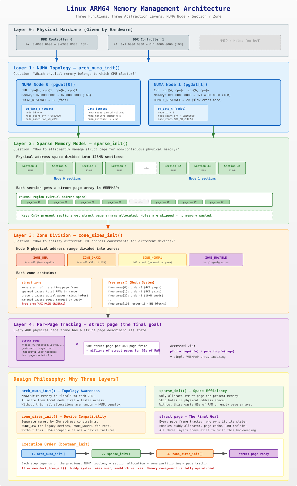

# Linux ARM64 内存管理架构：三个函数，三层抽象

## 概述

在 `bootmem_init()` 中，三个函数按顺序执行，共同构建了 Linux 内核的物理内存管理体系：

```c
// arch/arm64/mm/init.c: bootmem_init()
arch_numa_init();     // 第1步：确定 NUMA 拓扑 —— "内存属于谁"
sparse_init();        // 第2步：建立稀疏内存模型 —— "如何跟踪每一页"
zone_sizes_init();    // 第3步：划分内存区域 —— "不同用途的内存如何分类"
```

这三个函数的本质是：**用三种不同维度的数据结构，对同一块物理内存进行层层抽象管理。**



---

## 1. arch_numa_init() — 拓扑感知：谁的内存离谁近？

### 1.1 解决的问题

现代多核处理器（特别是服务器）中，不同 CPU 核心访问不同物理内存的速度不一样。例如：

```
CPU 0-3 访问 DDR Controller 0 的内存 → 10ns (本地)
CPU 0-3 访问 DDR Controller 1 的内存 → 20ns (跨节点)
```

如果内核不知道这个"远近关系"，分配内存时可能总是给 CPU 分配"远端"内存，造成系统性能下降。

### 1.2 核心数据结构

| 数据结构 | 类型 | 作用 |
|---------|------|------|
| `pg_data_t` (pgdat) | `struct pglist_data` | 每个 NUMA 节点一个，是该节点所有内存管理的根 |
| `numa_nodes_parsed` | `nodemask_t` (位图) | 标记系统中发现了哪些节点 |
| `numa_distance[]` | `u8[]` (N×N 矩阵) | 记录任意两个节点之间的访问距离 |
| `numa_meminfo` | `struct numa_meminfo` | 临时结构，记录每段物理内存的节点归属 |

### 1.3 做了什么

```
arch_numa_init()
  └── numa_init(of_numa_init)
        ├── 从 DTB 解析: CPU→节点映射, 内存→节点映射, 距离矩阵
        ├── numa_cleanup_meminfo(): 和 memblock 对齐
        ├── numa_register_meminfo(): 把 nid 写入 memblock.memory.regions[]
        ├── numa_register_nodes(): 为每个节点创建 pgdat（见 1.4 详解）
        └── setup_node_to_cpumask_map(): CPU→节点映射表
```

### 1.4 pgdat 的创建：`numa_register_nodes()` 详解

`pgdat`（`pg_data_t`）是每个 NUMA 节点的管理根结构，它的创建过程如下：

```c
// drivers/base/arch_numa.c
static int __init numa_register_nodes(void)
{
    for_each_node_mask(nid, numa_nodes_parsed) {      // 遍历 DTB 解析到的节点
        unsigned long start_pfn, end_pfn;
        get_pfn_range_for_nid(nid, &start_pfn, &end_pfn);  // 取该节点的 PFN 范围
        setup_node_data(nid, start_pfn, end_pfn);           // 创建 pgdat
        node_set_online(nid);                               // 标记节点上线
    }
    ...
}
```

`setup_node_data()` 调用 `alloc_node_data()` 完成 pgdat 的物理分配：

```c
// mm/numa.c
struct pglist_data *node_data[MAX_NUMNODES];   // 全局指针数组
// NODE_DATA(nid) 宏展开就是 node_data[nid]

void __init alloc_node_data(int nid)
{
    const size_t nd_size = roundup(sizeof(pg_data_t), SMP_CACHE_BYTES);

    // 关键：优先从 nid 节点的本地内存分配 pgdat
    nd_pa = memblock_phys_alloc_try_nid(nd_size, SMP_CACHE_BYTES, nid);
    if (!nd_pa)
        panic("Cannot allocate %zu bytes for node %d data\n", nd_size, nid);

    // 验证是否真的分配在本地节点
    tnid = early_pfn_to_nid(nd_pa >> PAGE_SHIFT);
    if (tnid != nid)
        pr_info("    NODE_DATA(%d) on node %d\n", nid, tnid);  // 降级警告

    node_data[nid] = __va(nd_pa);               // 物理地址 → 虚拟地址，存入全局数组
    memset(NODE_DATA(nid), 0, sizeof(pg_data_t)); // 清零（zone 等字段后续初始化）
}
```

然后 `setup_node_data()` 填充身份字段：

```c
// drivers/base/arch_numa.c
static void __init setup_node_data(int nid, u64 start_pfn, u64 end_pfn)
{
    alloc_node_data(nid);                                  // 分配内存
    NODE_DATA(nid)->node_id = nid;                         // 节点 ID
    NODE_DATA(nid)->node_start_pfn = start_pfn;            // 起始 PFN
    NODE_DATA(nid)->node_spanned_pages = end_pfn - start_pfn;  // 跨度
}
```

**为什么 pgdat 要从本地节点分配？**

`pgdat` 是该节点上访问最频繁的管理结构（每次页分配/回收都要经过它），如果 pgdat 存储在远端节点的内存上，每次访问都有额外的跨节点延迟：

```
正确:  CPU@Node0 → 访问 Node0 本地的 pgdat → 10ns（本地访问）
错误:  CPU@Node0 → 访问 Node1 上分配的 pgdat → 20ns+（跨节点访问）
```

**创建 ≠ 初始化完成**：`numa_register_nodes()` 只分配内存并设置节点身份字段，此时 `pgdat->node_zones[]` 全是零。zone 的初始化要等到后面的 `zone_sizes_init()` 才完成：

```
numa_register_nodes():  分配 pgdat + 设置 node_id/start_pfn      ← 此处
        ↓
sparse_init():          分配 struct page 数组 + VMEMMAP 映射
        ↓
zone_sizes_init():      填充 pgdat->node_zones[]，初始化每个 zone
        ↓
memblock_free_all():    空闲页释放到 buddy → zone->free_area[] 有内容
```

### 1.5 设计思想

**局部性原则（Locality Principle）**：优先从"近"的内存分配。`pgdat` 是 per-node 的管理根节点，后续的 zone、buddy、slab 分配器都优先在本地节点操作。

---

## 2. sparse_init() — 空间效率：如何管理不连续的物理内存？

### 2.1 解决的问题

内核需要为每一个 4KB 物理页框维护一个 `struct page` 结构体（约 64 字节）。如果物理地址空间是连续的，用一个大数组即可。但实际情况是：

```
物理地址空间:
[RAM][RAM][RAM][HOLE][HOLE][HOLE][RAM][RAM][HOLE]...

如果用平坦数组(FLATMEM):
  page[0] page[1] page[2] page[3] page[4] page[5] page[6] page[7] page[8]
                           ↑       ↑       ↑
                           这三个page从不使用，但占了 3×64 = 192 字节

当物理地址空间有大量空洞时，浪费可达数百 MB。
```

### 2.2 SPARSEMEM 方案

把物理地址空间切成固定大小的 **section**（ARM64 上 128MB），只为实际有内存的 section 分配 `struct page` 数组：

```
物理地址空间 (每格 = 128MB section):
[sec0][sec1][sec2][    hole    ][sec8][sec9]

FLATMEM:  page[0]~page[N]  全部分配 → 浪费 hole 部分
SPARSEMEM: 只分配 sec0,1,2,8,9 的 page 数组 → hole 部分跳过，零浪费
```

### 2.3 核心数据结构

| 数据结构 | 作用 |
|---------|------|
| `struct mem_section` | 每个 128MB section 的描述符，记录该 section 的 `struct page` 数组位置 |
| `mem_section[]` | 全局 section 数组，通过 section 编号索引 |
| `VMEMMAP` 区域 | 虚拟地址空间中的一段，线性映射到各 section 的 `struct page` 数组 |

### 2.4 `sparse_init()` 具体做了什么

#### 总体流程

```
sparse_init()
  ├── memblocks_present(): 遍历 memblock，标记哪些 section 有内存 + 记录 nid
  └── 按 NUMA 节点分组遍历 present section:
        sparse_init_nid(nid, pnum_begin, pnum_end, map_count)
          ├── sparse_usage_init():    批量分配 usage 结构（subsection_map + pageblock_flags）
          ├── sparse_buffer_init():   批量预分配 struct page 数组的物理内存
          └── for 每个 present section:
                ├── __populate_section_memmap(): 从预分配缓冲区切出 2MB
                ├── memmap_boot_pages_add():     统计元数据消耗
                └── sparse_init_early_section(): 注册到 mem_section 描述符
```

#### 第 1 步：`memblocks_present()` — 扫描并标记

遍历 memblock 中的所有内存范围，为每段内存覆盖到的 section 调用 `memory_present(nid, start, end)`：

```c
// mm/sparse.c
static void __init memblocks_present(void)
{
    for_each_mem_pfn_range(i, MAX_NUMNODES, &start, &end, &nid)
        memory_present(nid, start, end);
}
```

`memory_present()` 把起始地址向下对齐到 128MB 边界，然后对每个覆盖到的 section：
- 初始化二级索引表 `mem_section[root]`（按需分配一页）
- 记录 nid 到 `section_mem_map` 低位
- 设置 `SECTION_MARKED_PRESENT` 标志

#### 第 2 步：按节点分组计数

```c
// sparse_init() 内部
pnum_begin = first_present_section_nr();
nid_begin = sparse_early_nid(...);
map_count = 1;

for_each_present_section_nr(pnum_begin + 1, pnum_end) {
    int nid = sparse_early_nid(...);
    if (nid == nid_begin) {
        map_count++;    // 同节点 → 计数累加
        continue;
    }
    // 节点切换 → 处理上一个节点
    sparse_init_nid(nid_begin, pnum_begin, pnum_end, map_count);
    nid_begin = nid;
    pnum_begin = pnum_end;
    map_count = 1;
}
sparse_init_nid(nid_begin, pnum_begin, pnum_end, map_count); // 最后一个节点
```

`map_count` 是**该节点有多少个 present section**。例如 1GB 连续 RAM = 8 个 section → `map_count = 8`。这个数量决定了后续批量分配的大小。

#### 第 3 步：`sparse_init_nid()` — 每个节点的核心处理

##### ① 批量分配 usage 结构

```c
sparse_usage_init(nid, map_count);
// 从 nid 本地内存一次性分配 map_count 个 mem_section_usage
// 包含 subsection_map (64-bit) + pageblock_flags
// 存入 sparse_usagebuf，后续逐个切给每个 section
```

##### ② 批量预分配 struct page 数组

```c
sparse_buffer_init(map_count * section_map_size(), nid);
// section_map_size() = ALIGN(sizeof(struct page) * 32768, 2MB) = 2MB
// 一次性从 nid 本地内存分配 map_count × 2MB 连续物理内存
// 例: 8 个 section → 预分配 16MB 连续内存
```

**为什么批量分配？** 保证各 section 的 struct page 数组在物理上连续，减少 TLB 缺失。

##### ③ 遍历每个 section，切片分发 + 注册

```c
for_each_present_section_nr(pnum_begin, pnum) {
    if (pnum >= pnum_end) break;

    // 从预分配缓冲区切出 2MB 给该 section 的 struct page 数组
    map = __populate_section_memmap(pfn, PAGES_PER_SECTION, nid, NULL, NULL);
    //  └── sparse_buffer_alloc(2MB): 从缓冲区顺序切出
    //      切不到则 memmap_alloc() 单独分配

    // 统计: 每个 section 消耗 512 页 (2MB) 用于 struct page
    memmap_boot_pages_add(512);

    // 注册到 mem_section 描述符
    sparse_init_early_section(nid, map, pnum, 0);
    //  ├── 从 sparse_usagebuf 切出一个 usage 结构
    //  └── sparse_init_one_section():
    //        ms->section_mem_map = encode(map) | HAS_MEM_MAP | IS_EARLY
    //        ms->usage = usage (含 subsection_map + pageblock_flags)
}
```

缓冲区切片过程示意（8 个 section）：

```
struct page 缓冲区 (16MB):
初始:    [                     16MB                         ]
         ↑ sparsemap_buf                     sparsemap_buf_end ↑

sec 4:   [2MB 已切][              14MB 剩余                 ]
sec 5:   [2MB][2MB][              12MB 剩余                 ]
...
sec 11:  [2MB][2MB][2MB][2MB][2MB][2MB][2MB][2MB]  全部切完

usage 缓冲区 (8 个 usage):
初始:    [u0][u1][u2][u3][u4][u5][u6][u7]
sec 4:   [已分][u1][u2]...    ← u0 给 section 4
sec 5:   [已分][已分][u2]...  ← u1 给 section 5
...
```

##### ④ 归还剩余 + 失败处理

```c
sparse_buffer_fini();  // 缓冲区有剩余则归还 memblock
sparse_usage_fini();   // 清理 usage 指针
```

分配失败时不 panic，而是清除失败 section 的 present 标记（`section_mem_map = 0`），对应物理内存不可用，但系统可继续启动。

#### 第 4 步完成后的数据结构变化

`sparse_init()` 执行前后，以下数据结构发生了变化：

**`mem_section[][]` 二级索引表**

| 字段 | 执行前 | 执行后 |
|------|--------|--------|
| `mem_section[root]` | 已由 `memblocks_present()` 分配 | 不变 |
| `ms->section_mem_map` | 仅有 `nid` 编码 + `MARKED_PRESENT` 标志 | **新增**: `encode(struct page数组)` + `HAS_MEM_MAP` + `IS_EARLY` |
| `ms->usage` | NULL | **新增**: 指向 `mem_section_usage`（含 `subsection_map` 和 `pageblock_flags`） |

**VMEMMAP 虚拟地址空间**（CONFIG_SPARSEMEM_VMEMMAP 时）

| 执行前 | 执行后 |
|--------|--------|
| VMEMMAP 区域无页表映射 | 每个 present section 的 VMEMMAP 区域建立了页表映射 → `VMEMMAP_START + pfn * 64` 指向实际的 struct page 物理内存 |

**memblock**

| 执行前 | 执行后 |
|--------|--------|
| 空闲内存较多 | 被消耗了一部分，用于 struct page 数组 + usage 结构。1GB RAM 约消耗 16MB + 若干 KB |

**可用的接口**

| 接口 | 执行前 | 执行后 |
|------|--------|--------|
| `pfn_to_page(pfn)` | **不可用**（无映射） | **可用** → 返回 VMEMMAP 中的 struct page 指针 |
| `page_to_pfn(page)` | 不可用 | **可用** → 反向计算 PFN |
| `pfn_valid(pfn)` | 只能判断 section 级 present | **可用** → 可查 subsection_map 精确到 2MB |

**未变化的结构**（仍然等待后续初始化）

| 结构 | 状态 | 何时初始化 |
|------|------|-----------|
| `pgdat->node_zones[]` | 全零 | `zone_sizes_init()` |
| `struct page` 的内容 | 未初始化（只分配了内存，内容不确定） | `zone_sizes_init()` → `memmap_init()` |
| `zone->free_area[]` | 空 | `memblock_free_all()` |

### 2.5 当内存区间不足 128MB 时：两级粒度机制

section（128MB）是 struct page 数组分配的最小单位，但现实中物理内存区间未必是 128MB 对齐的整数倍。内核用**两级粒度**来处理这个情况。

#### 第一级：Section（128MB）—— 整体标记

在 `memory_present()` 中，任何被内存覆盖到的 section，**整个 128MB 都会被标记为 present**，并为全部 32768 个页框分配 `struct page` 数组，哪怕该 section 里只有少量 RAM：

```c
// mm/sparse.c: memory_present()
start &= PAGE_SECTION_MASK;   // 起始地址向下对齐到 128MB 边界
for (pfn = start; pfn < end; pfn += PAGES_PER_SECTION) {
    // 整个 section 标记为 present
    __section_mark_present(ms, section_nr);
}
```

#### 第二级：Subsection（2MB）—— 精确跟踪

`struct mem_section_usage` 内嵌一个 64 位的位图（64 个 bit，每 bit 对应 2MB），记录该 section 内部哪些 2MB 块实际有 RAM：

```c
// include/linux/mmzone.h
struct mem_section_usage {
    DECLARE_BITMAP(subsection_map, SUBSECTIONS_PER_SECTION);  // 64 个 bit
    unsigned long pageblock_flags[0];
};
```

`subsection_map_init()` 按 memblock 实际范围逐个 2MB 块置位；`pfn_valid()` 最终查询该位图：

```c
// include/linux/mmzone.h: pfn_valid()
ret = early_section(ms) || pfn_section_valid(ms, pfn);  // 查 subsection_map
```

#### 具体例子

```
SECTION_SIZE_BITS = 27 → section  = 2^27 = 128MB = 0x800_0000
SUBSECTION_SHIFT  = 21 → subsection = 2^21 = 2MB = 0x20_0000
每个 section = 64 个 subsection

物理内存布局:
  Region A: 0x8000_0000 ~ 0x8400_0000  (64MB, Section 4 前半段)
  Region B: 0x8C00_0000 ~ 0x9000_0000  (64MB, Section 5 后半段)
  空洞:     0x8400_0000 ~ 0x8C00_0000  (128MB)

Section 边界:
  Section 4: 0x8000_0000 ~ 0x87FF_FFFF (128MB)
  Section 5: 0x8800_0000 ~ 0x8FFF_FFFF (128MB)
```

| | Section 4 | Section 5 |
|---|---|---|
| 实际 RAM | 0x8000_0000~0x8400_0000 (64MB) | 0x8C00_0000~0x9000_0000 (64MB) |
| 整体标记 present | ✓ | ✓ |
| struct page 分配量 | 全部 32768 个 | 全部 32768 个 |
| subsection_map | **bit 0~31 = 1**（前 64MB 有 RAM）<br>bit 32~63 = 0（空洞） | bit 0~31 = 0（空洞）<br>**bit 32~63 = 1**（后 64MB 有 RAM） |
| pfn_valid() 空洞区 | Section 4 后半段返回 0 | Section 5 前半段返回 0 |
| 浪费的 struct page | 16384 个（不进 buddy） | 16384 个（不进 buddy） |

**subsection bit 计算方法**：
```
offset   = RAM起点 - section起点
bit_start = offset / 2MB
bit_end   = (RAM终点 - section起点) / 2MB - 1

Section 5 的 Region B:
  offset   = 0x8C00_0000 - 0x8800_0000 = 0x400_0000 = 64MB
  bit_start = 64MB / 2MB = 32
  bit_end   = 128MB / 2MB - 1 = 63
  → bit 32~63 置 1
```

#### 代价边界

section 内空洞造成的 struct page 浪费上限是固定的：

```
最大浪费 = PAGES_PER_SECTION × sizeof(struct page)
         = 32768 × 64 字节
         = 2MB / 每个 section 最多浪费 2MB 元数据
```

这 2MB 的代价换来了 `pfn_to_page()` / `page_to_pfn()` 永远是 **O(1) 数组索引**，不需要任何范围查找或遍历，是 SPARSEMEM+VMEMMAP 设计的核心权衡。

### 2.6 设计思想

**按需分配（On-demand Allocation）**：只为实际存在的内存分配管理结构，跳过物理地址空间中的空洞。这和操作系统的核心理念一致：不为不存在的资源付出成本。

**NUMA 感知分配**：`struct page` 数组从对应节点的本地内存分配，保证 `pfn_to_page()` 访问时的 NUMA 局部性。这就是为什么 `sparse_init()` 必须在 `arch_numa_init()` 之后执行。

---

## 3. zone_sizes_init() — 设备兼容：不同地址范围的内存用途不同

### 3.1 解决的问题

不同外设的 DMA 引擎有不同的地址限制：

```
ISA 设备:  只能 DMA 到 0 ~ 16MB    (24位地址)
PCI 设备:  只能 DMA 到 0 ~ 4GB     (32位地址)
现代设备:  可以 DMA 到任意地址      (64位地址)
```

如果给 ISA 设备分配了 4GB 以上的内存做 DMA 缓冲区，设备无法访问，直接故障。所以必须按照 DMA 能力把内存分类管理。

### 3.2 Zone 划分

```c
// arch/arm64/mm/init.c: zone_sizes_init()
max_zone_pfns[ZONE_DMA]    = PFN_DOWN(arm64_dma_phys_limit);  // ~4GB
max_zone_pfns[ZONE_DMA32]  = PFN_DOWN(dma32_phys_limit);      // ~4GB
max_zone_pfns[ZONE_NORMAL] = max_pfn;                          // 到最高地址
free_area_init(max_zone_pfns);
```

ARM64 上的典型 zone 布局：

```
物理地址空间:
0 ─────────── 4GB ─────────── end
│   ZONE_DMA   │  ZONE_NORMAL │
│  (受限设备)   │  (通用分配)   │
```

### 3.3 `CONFIG_ZONE_DMA` 和 `CONFIG_ZONE_DMA32` 的编译条件与历史背景

代码里用 `#ifdef` 控制这两段 zone 的编译：

```c
// arch/arm64/mm/init.c
#ifdef CONFIG_ZONE_DMA
    max_zone_pfns[ZONE_DMA] = PFN_DOWN(arm64_dma_phys_limit);
#endif
#ifdef CONFIG_ZONE_DMA32
    max_zone_pfns[ZONE_DMA32] = PFN_DOWN(dma32_phys_limit);
#endif
```

#### 编译开关的定义

```kconfig
# mm/Kconfig
config ZONE_DMA
    bool "Support DMA zone" if ARCH_HAS_ZONE_DMA_SET
    default y if ARM64 || X86          ← ARM64/x86 默认开启

config ZONE_DMA32
    bool "Support DMA32 zone" if ARCH_HAS_ZONE_DMA_SET
    depends on !X86_32                  ← 32 位 x86 不支持
    default y if ARM64                  ← ARM64 默认开启

# arch/arm64/Kconfig
select ARCH_HAS_ZONE_DMA_SET if EXPERT  ← 只有 EXPERT 模式才允许用户手动关闭
```

**结论**：ARM64 平台上两个 zone 默认都开启（编译期总是包含相关代码）。只有在 `CONFIG_EXPERT` 专家模式下，用户才能手动关闭，普通配置无法修改。

#### ZONE_DMA 的历史根源：ISA 总线（1980~90 年代）

ISA（Industry Standard Architecture）总线的 DMA 控制器只有 **24 根地址线**，最多寻址 **16MB**：

```
ISA DMA 控制器 (24位地址线):
  寻址上限 = 2^24 = 16MB

  后果: 如果 DMA 缓冲区分配在 16MB 以上 → 设备写到错误地址或直接失败
  解决: 内核保留 0~16MB 的内存专供这类设备 → 这就是 ZONE_DMA 的起源
```

现代 ARM64 上 ZONE_DMA 的含义泛化为"平台特定的、受最严格 DMA 限制的内存"，上限从 DTB `dma-ranges` 动态读取，不再固定为 16MB。

#### ZONE_DMA32 的历史根源：32 位 PCI 总线（1990~2000 年代）

32 位 PCI 设备（网卡、声卡等）有 **32 根地址线**，DMA 寻址上限 **4GB**：

```
32 位 PCI 设备 (32位地址线):
  寻址上限 = 2^32 = 4GB

  后果: 当服务器装了超过 4GB 内存时，4GB 以上的内存这些设备无法访问
  解决: 单独划出一段 0~4GB 的内存池专供 32 位 DMA 设备 → ZONE_DMA32
```

#### 两个 Zone 的物理地址范围：首尾相接，不重叠

**关键点**：ZONE_DMA 和 ZONE_DMA32 不是两段独立的地址范围，而是以 `zone_dma_limit` 为分界点**首尾相接**：

```
0          zone_dma_limit              4GB                    end
├──ZONE_DMA──────┤────ZONE_DMA32────────┤──ZONE_NORMAL──────────┤
```

`zone_dma_limit` 决定了分界线的位置，两者合起来才覆盖 0~4GB：

| `zone_dma_limit` 值 | ZONE_DMA 范围 | ZONE_DMA32 范围 | 适用场景 |
|---|---|---|---|
| **16MB** | 0 ~ 16MB | 16MB ~ 4GB | x86 服务器（ISA 历史遗留）|
| **1GB** | 0 ~ 1GB | 1GB ~ 4GB | 某些 ARM 平台有严格 DMA 约束 |
| **4GB** | 0 ~ 4GB | **空** | ARM64 嵌入式（无 dma-ranges 时的默认情况）|

**两个 zone 同时有内容的典型场景**（x86 服务器，32GB 内存）：

```
0      16MB          4GB                    32GB
├─DMA──┤────DMA32────┤──────NORMAL──────────┤

ZONE_DMA:   0~16MB    → ISA 声卡、老设备专用
ZONE_DMA32: 16MB~4GB  → 32 位 PCI 网卡、显卡等
ZONE_NORMAL: 4GB~32GB → 现代 NVMe、应用程序等
```

**ARM64 嵌入式（ZONE_DMA32 为空的原因）**：

```
zone_dma_limit = min(PHYS_ADDR_MAX, U32_MAX=4GB) = 4GB
ZONE_DMA   = 0 ~ 4GB     ← "吃掉"了 DMA32 本应覆盖的范围
ZONE_DMA32 = 4GB ~ 4GB   ← 空（两个端点相同）
```

`#ifdef` 使得这两段代码参与编译，但 `max_zone_pfns[ZONE_DMA32]` 的值等于 `max_zone_pfns[ZONE_DMA]`，`free_area_init()` 判断区间为空，不分配任何内存，`/proc/buddyinfo` 因此不显示该 zone。

### 3.4 Zone 边界是物理地址，且由硬件描述动态决定

Zone 的划分边界全部是**物理地址**（以 PFN 表示），与虚拟地址无关。更重要的是，这些边界不是内核源码里写死的常量，而是启动时从硬件描述中**动态计算**出来的。

#### 三个决定来源

```
启动时 zone_sizes_init() 的计算流程:

  ①  of_dma_get_max_cpu_address()      ← 读 DTB 的 dma-ranges 属性
  ②  acpi_iort_dma_get_max_cpu_address() ← 读 ACPI IORT 表（服务器）

  zone_dma_limit = min(①, ②)           ← 取最严格的限制（短板原则）

  ③ 硬编码兜底:
     if (DRAM 起点 < 4GB):
         zone_dma_limit = min(zone_dma_limit, U32_MAX=4GB)

  ZONE_DMA 上限 = min(zone_dma_limit, DRAM终点)
  ZONE_NORMAL   = ZONE_DMA上限 ~ DRAM终点
```

#### 来源①：DTB 的 `dma-ranges`（嵌入式平台主要来源）

`of_dma_get_max_cpu_address()` 递归遍历整个设备树，读取每个总线节点上的 `dma-ranges` 属性，找出所有设备里 DMA 能力最弱的那个（短板原则）：

```dts
/* DTB 片段示例 */
soc {
    /* 这条总线上的设备只能 DMA 到 CPU 物理地址 0x0~2GB */
    dma-ranges = <0x0  0x0  0x8000_0000>;
    /*           ^bus  ^cpu  ^size        */
};

pcie {
    /* PCIe 控制器可以访问 CPU 物理地址 0x0~4GB */
    dma-ranges = <0x0 0x0  0x0 0x0  0x1 0x0>;
};
```

内核取所有节点中最小的上限作为 `zone_dma_limit`，保证连能力最弱的设备也能访问 ZONE_DMA 里的内存。

如果 DTB 里没有任何 `dma-ranges`，`of_dma_get_max_cpu_address()` 返回 `PHYS_ADDR_MAX`（视为无限制），走兜底逻辑③。

#### 来源③：硬编码兜底（你的机器走的是这条）

```c
if (memblock_start_of_DRAM() < U32_MAX)
    zone_dma_limit = min(zone_dma_limit, U32_MAX);  // 限制到 4GB
```

只要 DRAM 起点在 4GB 以内，DMA 上限就被压到 4GB。原因是历史遗留：大量老旧外设只有 32 位地址线，无法访问 4GB 以上的内存，内核必须为它们保留这段低地址内存。

#### 为什么只有 ZONE_DMA（实际案例解析）

以 `/proc/buddyinfo` 只显示 DMA 的 1GB 嵌入式机器为例：

```
已知: 1GB RAM, 物理地址全在 4GB 以内, DTB 无 dma-ranges

① of_dma_get_max_cpu_address()  = PHYS_ADDR_MAX (无限制)
② acpi 禁用                      = PHYS_ADDR_MAX

zone_dma_limit = PHYS_ADDR_MAX

③ DRAM 起点 < U32_MAX(4GB):
   zone_dma_limit = min(PHYS_ADDR_MAX, 4GB) = 4GB

ZONE_DMA 上限 = min(4GB, DRAM终点≈1GB) = 1GB = DRAM终点
ZONE_DMA    = [0, 1GB)  ← 覆盖全部内存
ZONE_NORMAL = [1GB, 1GB) = 空 → /proc/buddyinfo 不显示
```

如果这台机器有 8GB RAM（物理地址 0x0 ~ 0x2_0000_0000），超过 4GB 的部分就会进入 ZONE_NORMAL，`buddyinfo` 才会显示两个 zone。

### 3.4 核心数据结构

| 数据结构 | 作用 |
|---------|------|
| `struct zone` | 每个 zone 的管理结构，嵌在 `pgdat->node_zones[]` 中 |
| `zone->free_area[]` | **伙伴系统（Buddy System）** 的核心——按 order 组织的空闲页链表 |
| `zone->spanned_pages` | 该 zone 跨越的总页框数（包含空洞） |
| `zone->present_pages` | 该 zone 中实际存在的页框数 |
| `zone->managed_pages` | 被 buddy 管理的页框数（去掉预留的） |

### 3.5 `zone_sizes_init()` → `free_area_init()` 完整执行分析

`zone_sizes_init()` 传入 `max_zone_pfns[]` 后，`free_area_init()` 分四个阶段执行：

#### 阶段一：计算全局 zone 地址边界

```c
start_pfn = PHYS_PFN(memblock_start_of_DRAM());  // DRAM 起点 PFN

for (i = 0; i < MAX_NR_ZONES; i++) {
    if (zone == ZONE_MOVABLE) continue;           // 跳过 MOVABLE
    end_pfn = max(max_zone_pfn[zone], start_pfn); // 防止边界回退
    arch_zone_lowest_possible_pfn[zone]  = start_pfn;
    arch_zone_highest_possible_pfn[zone] = end_pfn;
    start_pfn = end_pfn;                          // 下一 zone 从此开始
}
```

**首尾相接原则**：zone 按地址从低到高依次排列，上一个 zone 的终点就是下一个 zone 的起点。`lowest == highest` 表示该 zone 为空。

以 1GB 嵌入式设备（RAM: 0x4000_0000~0x8000_0000）为例：

```
max_zone_pfns: [DMA=0x80000, DMA32=0x80000, NORMAL=0x80000]
start_pfn = 0x40000 (DRAM 起点)

i=0 ZONE_DMA:
  end_pfn = max(0x80000, 0x40000) = 0x80000
  lowest[DMA]  = 0x40000
  highest[DMA] = 0x80000  → 覆盖全部 1GB
  start_pfn → 0x80000

i=1 ZONE_DMA32:
  end_pfn = max(0x80000, 0x80000) = 0x80000  ← 相等！
  lowest[DMA32] = highest[DMA32] = 0x80000   → 空 zone

i=2 ZONE_NORMAL: 同 DMA32，empty

i=3 ZONE_MOVABLE: continue，跳过
```

#### 阶段二：subsection_map 精确置位

```c
for_each_mem_pfn_range(i, MAX_NUMNODES, &start_pfn, &end_pfn, &nid) {
    subsection_map_init(start_pfn, end_pfn - start_pfn);
}
```

遍历 memblock 的实际 RAM 范围，按 2MB 粒度在各 section 的 `subsection_map` 位图中置位。这是 `pfn_valid()` 精确到 2MB 的基础，在 `sparse_init()` 分配好 usage 结构后，这里才真正填充内容。

#### 阶段三：自检验证

```c
mminit_verify_pageflags_layout();
```

验证 `page->flags` 中 section/node/zone 三段位域没有互相重叠：

```c
// 位重叠检测技巧：OR 结果 vs 加法结果
or_mask  = (ZONES_MASK << ZONES_PGSHIFT) | (NODES_MASK << NODES_PGSHIFT) | ...
add_mask = (ZONES_MASK << ZONES_PGSHIFT) + (NODES_MASK << NODES_PGSHIFT) + ...
BUG_ON(or_mask != add_mask);  // 有重叠则加法产生进位，两者不等 → panic
```

若某种配置导致位域超出 64 位或相互覆盖，立即 panic，防止带错误布局继续运行。

`setup_nr_node_ids()` 将 `nr_node_ids` 从 `MAX_NUMNODES=16` 缩减为实际节点数（单节点系统 = 1），后续所有节点循环都以此为上限。

#### 阶段四：per-node 初始化（单节点只进一次）

```c
for_each_node(nid) {      // 单节点: nid=0，只执行一次
    free_area_init_node(nid);
    if (pgdat->node_present_pages)
        node_set_state(nid, N_MEMORY);
}
```

`free_area_init_node()` 的执行链：

```
free_area_init_node(nid=0)
  ├── get_pfn_range_for_nid(): 从 memblock 取 PFN 范围
  │
  ├── calculate_node_totalpages(): 计算三个页面计数
  │     对每个 zone:
  │       spanned = zone 地址跨度（含空洞）
  │       absent  = 空洞页数
  │       present = spanned - absent   ← 实际有 RAM 的页数
  │
  │     pgdat->node_spanned_pages = 所有 zone spanned 之和
  │     pgdat->node_present_pages = 所有 zone present 之和
  │
  └── free_area_init_core(): 初始化每个 zone 内部结构
        zone_init_internals():
          zone->managed_pages = present_pages (临时值)
          zone->zone_pgdat    = NODE_DATA(nid)  ← 反向指针
          zone->name          = "DMA" / ...
          spin_lock_init(&zone->lock)
          zone_pcp_init()    ← per-CPU 页面缓存（占位初始化，见下文）

        init_currently_empty_zone():
          zone->zone_start_pfn = start_pfn
          zone_init_free_lists():
            for order 0~10, for migrate_type 0~5:
              INIT_LIST_HEAD(&free_area[order].free_list[t])
              nr_free = 0                ← buddy 骨架就绪，但为空
          zone->initialized = 1
```

#### spanned / present / managed 三个计数的含义

```
node 物理地址空间（有空洞的例子）:

  0x40000  0x60000  (空洞)  0x80000  0xA0000
  ├──RAM───┤─────HOLE──────┤──RAM───┤

  spanned  = 0xA0000 - 0x40000 = 393216  (含空洞的总跨度)
  absent   = 0x80000 - 0x60000 = 131072  (空洞页数)
  present  = 393216 - 131072  = 262144   (实际 RAM 页数)
  managed  = present - reserved           (buddy 可分配的页数，memblock_free_all 后才正确)

关系: spanned >= present >= managed
```

| 计数 | 谁使用 | 用途 |
|------|--------|------|
| `spanned_pages` | 热插拔、地址范围计算 | 节点覆盖的物理地址跨度 |
| `present_pages` | kswapd、OOM、`/proc/meminfo` | 实际拥有的物理页数 |
| `managed_pages` | buddy 分配器、水位线 | buddy 可分配的页数 |

`/proc/meminfo` 的 `MemTotal` = 所有节点 `present_pages` 之和减去预留，不是 `spanned_pages`。

#### 执行完成后的状态

| 数据结构 | 状态 |
|---------|------|
| `arch_zone_lowest/highest_possible_pfn[]` | 每种 zone 的全局地址范围 ✓ |
| `zone->zone_start_pfn` / `spanned/present_pages` | 填充完毕 ✓ |
| `zone->free_area[0~10].free_list[]` | 空链表，buddy 骨架就绪 ✓ |
| `zone->initialized` | = 1 ✓ |
| `zone->managed_pages` | 临时值，`memblock_free_all()` 后才正确 |
| `zone->per_cpu_pageset` | 指向 `boot_pageset`（占位），PCP 逻辑上被禁用 |
| `struct page` 的内容 | 尚未初始化（由 `memmap_init()` 负责，在 buddy 接管时执行）|

**此刻 buddy 骨架完全就绪，但 `free_area` 里没有任何空闲页。`memblock_free_all()` 会把 memblock 管理的空闲页逐一释放进链表，buddy 系统才真正开始工作。**

#### 附：`calc_nr_kernel_pages()` —— 量体裁衣的内存统计

`free_area_init()` 完成后立即调用此函数，遍历 memblock 所有空闲区间，累计两个 `__initdata` 变量：

```c
static unsigned long nr_kernel_pages;  // NR = Number（数量），低端可直接访问的页数
static unsigned long nr_all_pages;     // 全部空闲物理内存页数
```

> **NR** 是内核中极其常见的前缀，来自拉丁语 *numerus*，即 "number（数量）"。
> 内核到处可见：`nr_cpu_ids`、`NR_ZONES`、`nr_free`、`NR_VM_ZONE_STAT_ITEMS`……

**两者的差异只在 32 位 HIGHMEM 场景：**

```
ARM64 / x86_64（无 HIGHMEM）：
  nr_kernel_pages == nr_all_pages   ← 全部内存内核均可直接映射

32 位 arm32（有 CONFIG_HIGHMEM）：
  低于 ZONE_HIGHMEM 起点 → 同时计入两者
  高于 ZONE_HIGHMEM 起点 → 只计入 nr_all_pages（内核无法直接访问）
```

**1GB 嵌入式设备的计算示例：**

```
memblock 空闲区间: [0x4000_0000, 0x8000_0000)
  start_pfn = PFN_UP(0x4000_0000)  = 0x40000
  end_pfn   = PFN_DOWN(0x8000_0000) = 0x80000

  nr_all_pages    += 0x80000 - 0x40000 = 262144 页（= 1GB）
  nr_kernel_pages += 262144             （无 HIGHMEM，两者相同）
```

**这两个变量之后的用途：**

```
alloc_large_system_hash()      ← 分配 inode cache、dentry cache、pid hash 等哈希表
  numentries = nr_kernel_pages  ← 以低端内存页数为基准计算哈希桶数量
  max = nr_all_pages × 4KB / 16 ← 哈希表总大小不超过全部内存的 1/16
```

这是典型的"先量体裁衣"设计：在分配各种内核固定数据结构之前先精确统计可用内存，哈希表等结构按内存规模自适应——嵌入式 256MB 与服务器 512GB 的哈希桶数量相差几个数量级，绝不写死固定值。

#### 附：`zone_pcp_init()` —— PCP 占位初始化

**PCP = Per-CPU Pages（per-CPU 页面缓存/Pageset）**

PCP 是每个 CPU 私有的小页面缓冲池，设计目标是绕开 zone 级别的全局 spinlock：

```
分配路径:  kmalloc → get_free_pages → 先查本 CPU 的 PCP 缓存
                                      → PCP 空才加锁，从 buddy 批量补充
释放路径:  kfree   →                 → 先放入 PCP 缓存
                                      → PCP 超水位才批量归还 buddy
```

多核系统下，绝大多数内存分配/释放命中 PCP 缓存，无需竞争全局锁，显著提升吞吐量。

**`zone_pcp_init()` 的实现：**

```c
// mm/page_alloc.c
zone->per_cpu_pageset   = &boot_pageset;    // 所有 zone 共用同一个临时 pageset
zone->per_cpu_zonestats = &boot_zonestats;  // 统计也共用临时对象
zone->pageset_high_min  = BOOT_PAGESET_HIGH;  // = 0
zone->pageset_high_max  = BOOT_PAGESET_HIGH;  // = 0
zone->pageset_batch     = BOOT_PAGESET_BATCH; // = 1
```

`BOOT_PAGESET_HIGH = 0`、`BOOT_PAGESET_BATCH = 1` 实际上**把 PCP 缓存完全禁用**：

```
high = 0  → 缓存上限为 0，放入 1 页立即溢出 → 直接进 buddy
batch = 1  → 无批量效益，每次只补充/回收 1 页
```

这样设计是因为此时 **per-CPU 子系统尚未初始化**，所有 zone 必须指向合法指针但不能真正使用缓存。`boot_pageset` 是一个全局 per-CPU 变量，此时退化为普通全局对象，充当安全占位符。

**何时切换到真正的 PCP：**

```
setup_per_cpu_pageset()            ← 内核启动后期调用
  → 为每个在线 CPU × 每个非空 zone，
    从对应 NUMA 节点分配独立的 struct per_cpu_pages
  → zone->per_cpu_pageset != &boot_pageset  表示 PCP 真正就绪
  → high 根据 zone 大小动态计算，batch 设为合理的批量大小（通常数十页）
```

**`struct per_cpu_pages` 关键字段：**

```c
struct per_cpu_pages {
    int  count;    // 当前缓存的页数
    int  high;     // 水位上限，超过则批量回收给 buddy
    int  batch;    // 每次从 buddy 补充/归还的页数
    struct list_head lists[NR_PCP_LISTS];  // 按 migrate type 分类的页链表
};
```

#### 附：`memmap_init()` —— struct page 批量填充

**`memmap_init()` 是 buddy 建立前的最后一道工序**：把 `sparse_init()` 已分配好的 `struct page` 数组从"裸内存"变成"有内容的页描述符"。

**调用链：**

```
memmap_init()
  ├── for_each_mem_pfn_range()        ← 遍历 memblock 所有 RAM 区间
  │     for each zone:
  │       memmap_init_zone_range()    ← 裁剪到 zone 边界内
  │         ├── memmap_init_range()   ← 处理有 RAM 的 PFN 段
  │         │     for each pfn:
  │         │       __init_single_page()          ← 初始化 struct page
  │         │       if pageblock_aligned(pfn):
  │         │         init_pageblock_migratetype(MIGRATE_MOVABLE)
  │         └── init_unavailable_range()  ← 处理空洞 PFN
  │               __init_single_page() + __SetPageReserved()
  └── 尾部空洞处理（到 section 对齐边界）
        init_unavailable_range(hole_pfn, round_up(end_pfn))
```

**`__init_single_page()` 的操作：**

```c
mm_zero_struct_page(page);           // ① 清零 struct page
set_page_links(page, zone, nid, pfn); // ② flags 中编码 zone/nid/section
init_page_count(page);               // ③ _refcount = 1（暂由内核持有，Reserved）
atomic_set(&page->_mapcount, -1);   // ④ -1 = 未映射到任何用户进程
INIT_LIST_HEAD(&page->lru);         // ⑤ lru/buddy 链表节点初始化
```

统一策略：**所有 RAM 页一视同仁，全部设为 refcount=1（Reserved），不区分里面装的是内核代码、DTB 还是空白内存。**

**`pfn_to_page()` 不分配内存，只是指针算术：**

```c
// include/asm-generic/memory_model.h
#define pfn_to_page(pfn)   (vmemmap + (pfn))

// arch/arm64/include/asm/pgtable.h
#define vmemmap   ((struct page *)VMEMMAP_START - (memstart_addr >> PAGE_SHIFT))
```

`pfn_to_page(pfn)` = 直接下标访问 VMEMMAP 区域，O(1)，零开销。  
VMEMMAP 背后的物理内存在 `sparse_init()` 里由 `vmemmap_populate()` 从 memblock 分配并建立页表——分配和初始化是完全分离的两步。

**`memblock_free_all()` 时内容才发生分叉：**

```
memblock.memory[]   = 所有 RAM
memblock.reserved[] = 内核代码/数据 + 页表 + DTB + initrd
                    + struct page 数组 + pg_data_t + memblock 元数据

memblock_free_all()
  → for_each_free_mem_range() 遍历 memory - reserved
  → 这些页 refcount 降为 0，挂入 buddy free_area
  → 其余（reserved）继续保持 refcount=1，永不进 buddy
```

以 1GB 设备为例：

```
物理地址                    reserved?   memblock_free_all 后的状态
─────────────────────────────────────────────────────────────────
0x4000_0000~0x4020_0000   YES (内核)   refcount=1, Reserved, 不进 buddy
0x4020_0000~0x4021_0000   YES (DTB)    refcount=1, Reserved, 不进 buddy
0x4021_0000~0x4100_0000   YES (struct page数组) 同上
0x4100_0000~0x8000_0000   NO  (空闲)   refcount=0, 进 buddy free_area ✓
```

#### 附：`struct page` —— 64 字节的极致压缩

`struct page` 是一块被多个子系统**分时共用**的内存，没有"owner"字段，持有者身份隐藏在 `flags` 的 Page* 标志位里，union 的解读由当前持有者按约定决定：

```c
struct page {
    memdesc_flags_t flags;   // PageBuddy / PageSlab / PageAnon / PageReserved...
                             // flags 里的 bit = 当前持有者的隐式标记

    union {                  // 同一块内存，不同持有者有不同解读
        struct { buddy_list; private/*=order*/; };   // ① buddy 空闲页
        struct { lru; mapping; folio_index; private; }; // ② page cache/匿名页
        struct { pp_magic; pp; dma_addr; };           // ③ 网络 page_pool
        struct { compound_head; };                    // ④ 复合页尾页
        struct { zone_device_data; };                 // ⑤ ZONE_DEVICE
    };

    page_type / _mapcount;   // 4 字节：类型标记 或 页表映射次数
    _refcount;               // 引用计数：0=buddy空闲 1=单一持有 N=多方共享
};
```

| `flags` 标志 | 持有者 | union 当前解读 |
|-------------|--------|---------------|
| `PageBuddy` | buddy（空闲） | `buddy_list` + `private=order` |
| `PageSlab` | slab/slub 分配器 | slab 内部元数据 |
| `PageAnon` | 进程匿名页（堆/栈） | `mapping`=anon_vma，`_mapcount`=映射次数 |
| `PageMappedToDisk` | 文件 page cache | `mapping`=address_space，`index`=文件偏移 |
| `PageReserved` | 内核/固件保留 | 不受 buddy 管理 |

**`_refcount` 是持有计数，不是持有者身份：**

```
_refcount = 0    → buddy 空闲页（无人持有）
_refcount = 1    → 单一持有（内核分配、文件映射...）
_refcount = N    → N 方共享（共享内存、多进程 mmap 同一文件）
```

**设计精髓**：`struct page` 只管"这页现在归谁、状态如何"，内容是内核代码还是用户数据，它完全不关心——内容的语义由持有者自己负责。这是**所有权与内容彻底分离**的原则，用 64 字节撑起了整个内存管理体系。

#### 附：`set_high_memory()` —— 标定线性映射区上边界

```c
static void __init set_high_memory(void)
{
    phys_addr_t highmem = memblock_end_of_DRAM();  // DRAM 终点物理地址

    if (high_memory)   // ARM64 不预设，此处为 NULL
        return;

    // CONFIG_HIGHMEM 未定义（64 位架构不需要），跳过 ifdef 块

    high_memory = phys_to_virt(highmem - 1) + 1;  // DRAM 终点线性虚拟地址
}
```

**ARM64 + 1GB 内存（RAM: 0x4000_0000 ~ 0x8000_0000）的执行结果：**

```
memblock_end_of_DRAM()  = 0x8000_0000（物理）
high_memory             = phys_to_virt(0x8000_0000)
                        = PAGE_OFFSET + (0x8000_0000 - memstart_addr)
                        = PAGE_OFFSET + 0x4000_0000
                        ← 线性映射区中 DRAM 终点对应的虚拟地址
```

**`high_memory` 的含义：内核线性映射区的上边界**

```
PAGE_OFFSET
│
├── [PAGE_OFFSET ~ high_memory)  ← 线性映射区：内核可直接解引用、virt_to_phys() 安全
│     物理 RAM 的 1:1 线性虚拟映射
│
├── high_memory                  ← 分界线（= DRAM 终点对应的线性虚拟地址）
│
└── [high_memory ~ ...)          ← vmalloc / VMEMMAP / modules 区域，不能直接 virt_to_phys()
```

使用场景：

```c
if ((unsigned long)addr < (unsigned long)high_memory)
    phys = virt_to_phys(addr);  // 线性映射区，安全
else
    /* vmalloc 区域，必须通过页表查找物理地址 */
```

32 位 ARM（CONFIG_HIGHMEM）：内核虚拟空间只有 1GB，`high_memory` 被设为 ZONE_HIGHMEM 起点的线性虚拟地址，高于此的物理内存需要 `kmap()` 临时映射才能访问。ARM64 无此限制，`high_memory` 就是 DRAM 终点，一行有效代码。

### 3.6 NUMA 和 Zone 的数量由什么决定？

#### NUMA 节点数量

上限由内核配置决定，实际数量由硬件拓扑（DTB/ACPI）描述：

```
CONFIG_NODES_SHIFT = 4  →  MAX_NUMNODES = 2^4 = 16（编译期上限）
实际数量 = node_online_map 中的置位数（运行时由硬件决定）
```

| 场景 | 节点数 | 原因 |
|------|--------|------|
| 单 SoC 嵌入式（1GB 板子） | 1 | 一个 DDR 控制器，所有 CPU 到内存距离一样 |
| 双路服务器（2 CPU socket） | 2 | 每个 socket 有独立的 DDR 控制器 |
| 四路服务器（4 CPU socket） | 4 | 每个 socket 一个节点 |
| 带 HBM 的处理器（AI 芯片等） | 2+ | HBM 和 DDR 是不同节点（延迟不同） |

**判断标准**：CPU 到内存有不同的访问延迟路径 → 划分为不同 NUMA 节点。

#### Zone 数量

编译期由 CONFIG 决定上限，运行时看哪些 zone 有内存：

```c
// include/linux/mmzone.h
enum zone_type {
    ZONE_DMA,      // CONFIG_ZONE_DMA=y 时存在
    ZONE_DMA32,    // CONFIG_ZONE_DMA32=y 时存在
    ZONE_NORMAL,   // 永远存在
    ZONE_MOVABLE,  // 永远存在（需启动参数配置才非空）
    ZONE_DEVICE,   // CONFIG_ZONE_DEVICE=y 时存在
    __MAX_NR_ZONES // 当前内核配置: MAX_NR_ZONES = 4
};
```

| Zone | 什么时候有内存 |
|------|--------------|
| ZONE_DMA | RAM 起点 < DMA 限制地址（通常 < 4GB） |
| ZONE_DMA32 | DMA 和 DMA32 限制地址不同时才独立存在 |
| ZONE_NORMAL | **RAM 超过 DMA 限制地址的部分**。RAM 全在 4GB 以内时为空 |
| ZONE_HIGHMEM | 仅 32 位架构，RAM 超出内核直映范围（> 896MB） |
| ZONE_MOVABLE | 需 `kernelcore=`/`movablecore=` 启动参数或内存热插拔 |
| ZONE_DEVICE | 持久化内存（PMEM）、GPU 显存（HMM）等非常规设备 |

#### 实际案例对比：嵌入式 vs 服务器

**嵌入式板子（1GB ARM64）**:

```
~ # cat /proc/buddyinfo
Node 0, zone      DMA     27     21     13      4      6      6      5      4      4      5    221

RAM: 1GB，全部 < 4GB
  → ZONE_DMA 覆盖全部内存，ZONE_DMA32/NORMAL 为空
  → buddyinfo 只显示一个 zone
  → order-10 (4MB) 有 221 个空闲块，内存碎片很少
```

**x86 服务器（82GB，物理地址 0~82GB）**:

```
$ cat /proc/buddyinfo
Node 0, zone      DMA      1      0      0      1      2      1      1      0      1      1      3
Node 0, zone    DMA32   7653   8301  14461     73      2      0      0      0      0      1      0
Node 0, zone   Normal 390435 419125  25979     36      3      3      3      3      1      0      0

$ free -h
              total    used    free    shared  buff/cache  available
Mem:           82Gi    17Gi   5.4Gi     5.4Gi       59Gi       58Gi
```

三个 zone 的内存分布：

```
物理地址:
0          16MB          4GB                                      82GB
├─ZONE_DMA──┤──ZONE_DMA32──┤──────── ZONE_NORMAL ─────────────────┤
│  ~16MB     │  ~4GB        │  ~78GB（绝大多数内存在这里）         │
│  极少空闲  │  ~325MB 空闲 │  ~5.1GB 空闲（高度碎片化）          │
```

各 zone 空闲内存估算（从 buddyinfo 计算）:

| Zone | 空闲页数 | 空闲量 | 碎片状况 |
|------|---------|--------|---------|
| DMA | ~3977 页 | ~15.5MB | 正常（zone 本身就小） |
| DMA32 | ~83227 页 | ~325MB | 中等 |
| Normal | ~1333865 页 | ~5.1GB | **严重碎片化**：order-10=0，全是小块 |

ZONE_NORMAL 碎片严重的原因：`buff/cache = 59GB`，服务器长期运行，Movable 页频繁分配释放，空闲内存碎成单页（order-0 有 39 万个）和双页（order-1 有 42 万个），几乎无法分配大连续块。

#### 系统总 zone 实例数

每个节点各有一套独立的 zone，总数 = `在线节点数 × MAX_NR_ZONES`。这就是 `pgdat->node_zones[MAX_NR_ZONES]` 的含义——每个节点自己管理自己的 DMA/DMA32/NORMAL 分区。

### 3.7 设计思想

**约束分类（Constraint-based Classification）**：把物理内存按"能被谁使用"分类，使得分配器能快速找到满足约束的内存。当设备请求 DMA 内存时，只需从 `ZONE_DMA` 分配；普通内存请求则从 `ZONE_NORMAL` 分配。

**分层降级（Fallback）**：zone 之间有降级关系——`ZONE_NORMAL` 用完时可以从 `ZONE_DMA` 借用（但反过来不行），保证系统不会因为单个 zone 耗尽而完全无法分配内存。

---

## 4. 数据结构的具体抽象与表达

三个概念（NUMA / Sparse / Zone）各自通过一组核心数据结构来表达，这些结构之间通过指针和索引互相引用，共同构成完整的物理内存管理体系。

### 4.1 NUMA：三个数据结构共同表达拓扑

NUMA 拓扑本身由三个独立的结构表达，它们各司其职：

#### ① `pg_data_t`：节点的身份 + zone 的容器（双重角色）

`pg_data_t` 是一个**双重角色**的结构，要注意区分：

```c
// include/linux/mmzone.h
typedef struct pglist_data {
    /* ── zone 管理（容器角色）── */
    struct zone  node_zones[MAX_NR_ZONES]; // 该节点拥有的 zone（DMA/NORMAL等）
    int          nr_zones;                 // 该节点实际有效的 zone 数量

    /* ── NUMA 节点身份（节点角色）── */
    int           node_id;            // 节点 ID（0, 1, 2...）
    unsigned long node_start_pfn;     // 该节点起始页帧号
    unsigned long node_present_pages; // 该节点实际存在的物理页数
    unsigned long node_spanned_pages; // 该节点地址范围总页数（含空洞）

    /* ── 分配策略（非 NUMA 拓扑）── */
    struct zonelist node_zonelists[MAX_ZONELISTS];
    // ↑ 注意：这不是 NUMA 拓扑描述，而是分配时的 fallback 搜索顺序。
    //   当本节点内存不足时，按照这个列表的顺序去其他节点借内存。
    //   它是"分配策略"，不是"硬件拓扑"。

    struct task_struct *kswapd;       // 该节点的内存回收内核线程
} pg_data_t;
```

**访问方式**：`NODE_DATA(nid)` 宏返回节点 nid 的 `pg_data_t` 指针，底层是一个全局数组。

#### ② `numa_distance[]`：节点间的访问延迟矩阵

这才是 NUMA **拓扑距离**的直接表达——一个 N×N 的 `u8` 矩阵（用一维数组模拟），记录任意两个节点之间的访问代价：

```c
// mm/numa_memblks.c
int  numa_distance_cnt;  // N（系统中节点数）
u8  *numa_distance;      // 大小 N×N，访问方式:
                         //   numa_distance[from_nid * N + to_nid]
                         //   本节点到本节点 = 10（LOCAL_DISTANCE，最快）
                         //   跨节点访问    ≥ 20（数值越大延迟越高）
```

分配器查询这个矩阵来决定**从哪个节点分配**代价最小，也决定了 `node_zonelists[]` 的构建顺序。

#### ③ `nodemask_t`：节点的在线状态位图

用来追踪系统中节点的状态（哪些已上线、哪些可能存在等）：

```c
// include/linux/nodemask.h
#define node_online_map   node_states[N_ONLINE]    // 已上线并可分配的节点
#define node_possible_map node_states[N_POSSIBLE]  // 理论上可能存在的节点
// 本质: typedef struct { unsigned long bits[1]; } nodemask_t; (MAX_NUMNODES=16)
```

#### 三者关系

```
硬件拓扑（静态描述）:          运行时管理（动态管理）:
  numa_distance[N×N]              nodemask_t (在线状态)
        │                               │
        │ 决定 fallback 顺序            │ 决定哪些 pgdat 有效
        ▼                               ▼
  pg_data_t [node 0] ←── NODE_DATA(0) ──── pg_data_t [node 1]
    node_id = 0                              node_id = 1
    node_zones[]   ← zone 容器               node_zones[]
    node_zonelists[] ← 分配 fallback 链       node_zonelists[]
```

---

### 4.2 Sparse：用 `mem_section` 表达内存分段

SPARSEMEM 把物理地址空间切分为 128MB 的 section，每段用一个 `struct mem_section` 描述：

```c
// include/linux/mmzone.h
struct mem_section {
    unsigned long section_mem_map; // 编码后的 struct page 数组起点指针
                                   // 早期 boot 时还编码了 nid（节点ID）
    struct mem_section_usage *usage; // 指向 subsection_map 位图和 pageblock_flags
};

struct mem_section_usage {
    DECLARE_BITMAP(subsection_map, SUBSECTIONS_PER_SECTION); // 64位图
                                                              // 每 bit 对应 2MB 子段
                                                              // 1=有RAM 0=空洞
    unsigned long pageblock_flags[0]; // 每个 2MB 块的迁移类型（Movable/Unmovable...）
};
```

**全局索引表**：所有 section 通过二级数组索引（`SPARSEMEM_EXTREME` 时为指针数组节省空间）：

```c
// 非EXTREME模式: 静态二维数组
extern struct mem_section mem_section[NR_SECTION_ROOTS][SECTIONS_PER_ROOT];

// 查找: pfn → section
static inline struct mem_section *__nr_to_section(unsigned long nr) {
    unsigned long root = nr / SECTIONS_PER_ROOT;
    return &mem_section[root][nr & SECTION_ROOT_MASK];
}

// 核心访问接口 (O(1))
pfn_to_page(pfn)  =  VMEMMAP_START + pfn * sizeof(struct page)
                   // 由 sparse_init() 建立的 VMEMMAP 页表映射实现
```

**`section_mem_map` 的巧妙编码**：这个字段不是直接的指针，而是：

```
section_mem_map = (struct page 数组基址) - section_nr_to_pfn(section_nr)

因此: pfn_to_page(pfn) = section->section_mem_map + pfn
      page_to_pfn(page) = page - section->section_mem_map

低位 bit 被复用存储标志位（SECTION_MARKED_PRESENT 等）
```

---

### 4.3 Zone：用 `struct zone` + `free_area` 表达内存分类

每个 zone 由 `struct zone` 描述，嵌入在 `pgdat->node_zones[]` 数组中：

```c
// include/linux/mmzone.h
struct zone {
    /* ── 水位线：控制内存回收时机 ── */
    unsigned long _watermark[NR_WMARK]; // WMARK_MIN / WMARK_LOW / WMARK_HIGH
    long lowmem_reserve[MAX_NR_ZONES];  // 为低 zone 保留的页数（防止被高 zone 耗尽）

    /* ── 地址范围 ── */
    unsigned long zone_start_pfn;   // 该 zone 的起始 PFN（物理地址）
    unsigned long spanned_pages;    // 总 PFN 跨度（含空洞）
    unsigned long present_pages;    // 实际存在的物理页数（去掉空洞）
    atomic_long_t managed_pages;    // buddy 管理的页数（去掉预留页）

    /* ── 伙伴系统核心 ── */
    struct free_area free_area[NR_PAGE_ORDERS]; // order 0~10 的空闲链表

    struct pglist_data *zone_pgdat; // 反向指针回到所属的 pgdat（节点）
    spinlock_t lock;                // 保护 free_area 的自旋锁
};
```

`free_area` 是 buddy 系统的直接载体，每个 order 对应一层：

```c
// include/linux/mmzone.h
struct free_area {
    struct list_head free_list[MIGRATE_TYPES]; // 按迁移类型分组的空闲页链表
    unsigned long    nr_free;                  // 该 order 的空闲块总数
};

// MIGRATE_TYPES 包括:
// MIGRATE_UNMOVABLE  - 内核数据结构，不可移动
// MIGRATE_MOVABLE    - 用户页，可迁移（支持内存碎片整理）
// MIGRATE_RECLAIMABLE - 页缓存，可回收
// MIGRATE_CMA        - 连续内存分配器预留区
```

---

### 4.4 `struct page`：每个页框的"身份证"

每个 4KB 物理页框在 VMEMMAP 中有一个对应的 `struct page`，大小约 64 字节：

```c
// include/linux/mm_types.h
struct page {
    memdesc_flags_t flags;  // 关键！高位编码 zone 和 node，低位是页状态标志
                            //   zone bits: page_zonenum(page) → 所属 zone 编号
                            //   node bits: page_to_nid(page)  → 所属 NUMA 节点
                            //   PG_locked / PG_dirty / PG_uptodate / PG_reserved ...

    union {
        struct {            // 页缓存 / 匿名页
            struct list_head lru;       // 在 LRU 链表中的位置（页回收用）
            struct list_head buddy_list;// 空闲时：在 buddy free_list 中
            struct address_space *mapping; // 指向所属地址空间
            unsigned long private; // buddy 中存 order，缓存中存 buffer_head
        };
        // ... 其他 union 分支（page_pool、compound page 等）
    };

    atomic_t _mapcount;  // 有多少个用户空间页表项指向本页（-1=无映射）
    atomic_t _refcount;  // 引用计数（0=空闲，可被 buddy 分配）
};
```

`flags` 字段中 zone 和 node 的编码位置（ARM64 64位）：

```
bit 63 ... [node bits] ... [zone bits] ... [page flags] ... bit 0
             ↑ node编号       ↑ zone编号      ↑ PG_locked等标志

访问:
  page_to_nid(page)    = (page->flags >> NODES_PGSHIFT) & NODES_MASK
  page_zonenum(page)   = (page->flags >> ZONES_PGSHIFT) & ZONES_MASK
  PageLocked(page)     = test_bit(PG_locked, &page->flags)
```

---

### 4.5 三层数据结构的关系图

下图展示了 NUMA、Sparse、Zone 三层如何通过数据结构的指针和索引关系结合在一起管理物理内存：


---

## 5. 三层抽象的协作关系

### 4.1 数据结构的层次关系

```
pgdat (per-node)                      ← arch_numa_init() 创建
  └── node_zones[MAX_NR_ZONES]        ← zone_sizes_init() 初始化
        └── zone->free_area[]          ← memblock_free_all() 时填充 (buddy)
              └── free pages           ← 每个 page 有 struct page 描述
                    │
                    └── struct page    ← sparse_init() 分配空间 + VMEMMAP 映射
```

### 4.2 一个物理页框的身份描述

以物理地址 `0x8400_0000` 为例（假设 4K 页，pfn = 0x84000）：

```
Q: 这个页框属于哪个 NUMA 节点？
A: 查 memblock.memory → region->nid = 0 → Node 0

Q: 这个页框的 struct page 在哪？
A: pfn_to_page(0x84000) → VMEMMAP_START + 0x84000 * sizeof(struct page)
   由 sparse_init() 建立的页表映射保证可访问

Q: 这个页框属于哪个 zone？
A: struct page->flags 中编码了 zone 信息 → ZONE_DMA (因为 < 4GB)
   由 zone_sizes_init() → memmap_init() 设置

Q: 这个页框是空闲的还是被占用的？
A: 查 struct page->_refcount
   0 = 空闲（在 buddy 的 free_list 上）
   >0 = 被占用（被 kmalloc/page cache/用户进程等使用）
```

### 4.3 执行顺序的依赖关系

```
arch_numa_init()  ──必须先于──>  sparse_init()  ──必须先于──>  zone_sizes_init()
      │                               │                              │
      │ 原因: sparse_init()           │ 原因: zone_sizes_init()      │
      │ 需要从正确的 NUMA             │ 需要 struct page 数组已      │
      │ 节点分配 struct page           │ 分配好，才能初始化每个        │
      │ 数组 (NUMA 局部性)            │ page 的 zone/node 信息        │
      │                               │                              │
      v                               v                              v
  memblock 有 nid              VMEMMAP 映射就绪              struct page 初始化完成
```

---

## 6. 设计思想总结

### 5.1 分层抽象

| 层次 | 抽象维度 | 解决的问题 | 数据结构 |
|------|---------|-----------|---------|
| Node | 拓扑/距离 | 访问延迟不均匀 | `pgdat` |
| Section | 空间/存在性 | 物理地址不连续 | `mem_section` |
| Zone | 功能/约束 | DMA 地址限制 | `struct zone` |
| Page | 个体/状态 | 每页的使用跟踪 | `struct page` |

### 5.2 核心设计原则

**1. 局部性优先（NUMA Awareness）**

内存分配优先选择离请求 CPU 最近的节点，减少跨节点访问延迟。这个原则贯穿了从 `pgdat` 到 `slab` 的所有分配器层次。

**2. 按需分配（No Waste on Absent Memory）**

SPARSEMEM 模型只为实际存在的物理内存分配管理结构，物理地址空间的空洞不会浪费一字节。

**3. 约束驱动分类（Constraint-Driven Classification）**

Zone 的设计来自硬件约束——不同设备能寻址的范围不同。与其在每次分配时检查地址约束，不如提前把内存分类，分配时直接从对应类别取。

**4. 渐进式构建（Progressive Bootstrap）**

三个函数严格按序执行，每一步都依赖上一步的结果。这种分步构建方式解决了"要管理内存先得有内存来存管理结构"的鸡生蛋问题：

```
memblock (极简分配器, 不需要 struct page)
  → 分配 pgdat / mem_section / struct page 数组
    → buddy system (完整分配器, 基于 struct page)
```

**5. 信息编码到 page->flags（O(1) 查询）**

`struct page->flags` 中同时编码了 zone 编号和 node 编号，使得运行时查询一个页框"属于哪个节点、哪个 zone"只需一次位运算，无需查表或遍历。

---

## 7. 最难理解的知识点

### 6.1 VMEMMAP 与 SPARSEMEM 的关系

**难点**：`pfn_to_page(pfn)` 看似是简单的数组索引，但背后的虚拟地址到物理地址的映射是按 section 粒度建立的，空洞 section 没有映射。理解这一点需要同时掌握虚拟地址空间布局、页表映射、和 section 的概念。

```
VMEMMAP_START + pfn * sizeof(struct page) = 虚拟地址
  │
  │ 页表查找 (由 sparse_init() 建立的映射)
  ▼
物理地址 → struct page 数据
```

### 6.2 memblock 到 buddy 的交接

**难点**：memblock 和 buddy 是两套独立的分配系统，交接时需要：
1. 先用 memblock 分配好所有管理结构（pgdat、zone、struct page 数组）
2. 然后把 memblock 中未预留的空闲页释放给 buddy
3. 释放后 memblock 退役，buddy 接管

这个"自举"过程涉及多个数据结构的协调，时序稍有错误就会导致内核崩溃。

### 6.3 三层抽象的交叉索引

**难点**：一个物理页同时存在于三个维度中——属于某个 node、某个 section、某个 zone。`struct page->flags` 用位域同时编码了 zone 和 node 信息，`pfn_to_page` 通过 VMEMMAP 索引，`page_to_pfn` 通过反向计算。这三套索引机制的交织是最容易混淆的部分。

### 6.4 Zone 的 spanned/present/managed 三个计数

**难点**：
- `spanned_pages`：zone 地址范围覆盖的总页框数（包含空洞）
- `present_pages`：实际存在 RAM 的页框数（去掉空洞）
- `managed_pages`：buddy 管理的页框数（去掉预留的）

三者关系：`spanned >= present >= managed`，容易混淆。

```
zone 地址范围:   [=============================]  spanned = 100
实际有 RAM:      [=====]    [=====]    [=====]    present = 60 (去掉 holes)
buddy 管理:      [===]      [=====]    [===]      managed = 50 (去掉 reserved)
```

---

## 8. 一句话总结

> **`arch_numa_init()` 告诉内核"这块内存离哪个 CPU 近"，`sparse_init()` 告诉内核"怎么找到每一页的账本"，`zone_sizes_init()` 告诉内核"这块内存能给谁用"。三者协作，使得内核能够高效、正确、节省地管理物理内存。**
