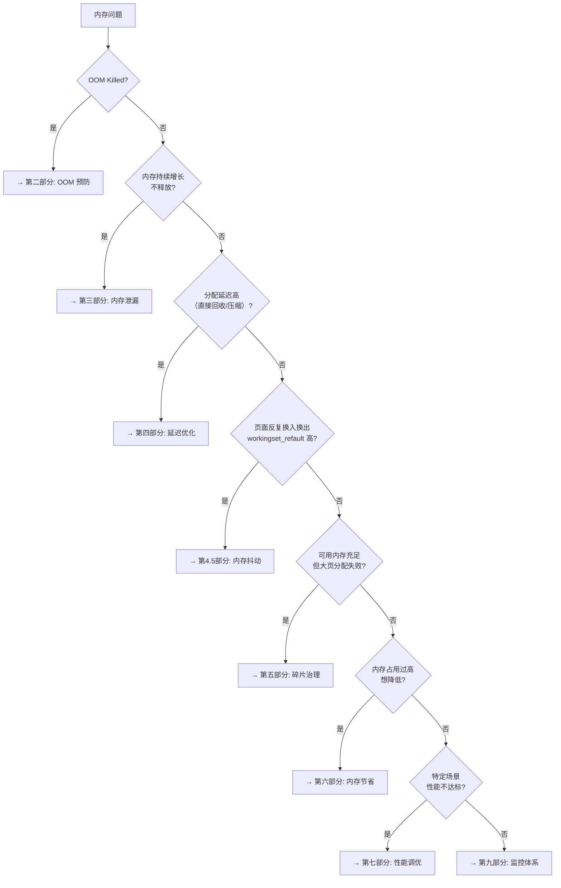
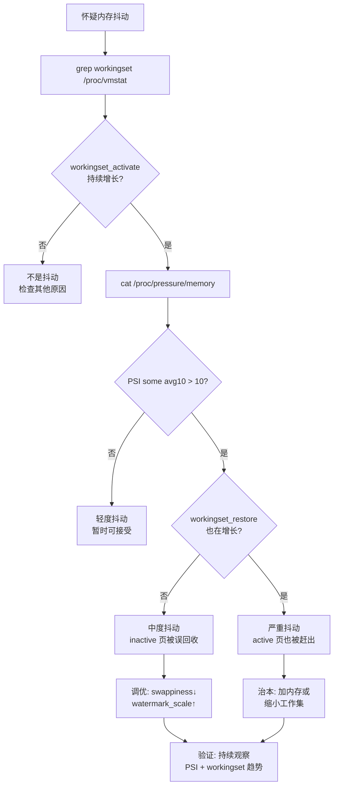

# Linux ARM64 内存优化实战指南

> **基于**：Linux 6.18.1 / ARM64 / 前置知识：arm64_memory_learning_guide.md 全部12课
> **目标读者**：已掌握 Linux 内存管理原理，希望将知识应用到实际优化中

---

## 目录

<details>
<summary><a href="#总览内存管理知识能解决什么问题">总览：内存管理知识能解决什么问题？</a></summary>

</details>

<details>
<summary><a href="#第一部分问题诊断--你遇到的是什么问题">第一部分：问题诊断 — 你遇到的是什么问题？</a></summary>

- [1.1 问题分类决策树](#11-问题分类决策树)
- [1.2 第一步永远是：采集数据](#12-第一步永远是采集数据)

</details>

<details>
<summary><a href="#第二部分oom-预防与治理">第二部分：OOM 预防与治理</a></summary>

- [2.1 原理回顾（你已学过）](#21-原理回顾你已学过)
- [2.2 可调优的点](#22-可调优的点)

</details>

<details>
<summary><a href="#第三部分内存泄漏检测">第三部分：内存泄漏检测</a></summary>

- [3.1 内核态泄漏](#31-内核态泄漏)
- [3.2 用户态泄漏](#32-用户态泄漏)

</details>

<details>
<summary><a href="#第四部分延迟优化">第四部分：延迟优化</a></summary>

- [4.1 延迟来源分析](#41-延迟来源分析)
- [4.2 优化方案](#42-优化方案)

</details>

<details>
<summary><a href="#第五部分碎片治理">第五部分：碎片治理</a></summary>

- [5.1 碎片检测](#51-碎片检测)
- [5.2 优化方案](#52-优化方案)

</details>

<details>
<summary><a href="#第六部分内存节省">第六部分：内存节省</a></summary>

- [6.1 内核态内存节省](#61-内核态内存节省)
- [6.2 用户态内存节省](#62-用户态内存节省)

</details>

<details>
<summary><a href="#第七部分特定场景性能调优">第七部分：特定场景性能调优</a></summary>

- [7.1 数据库（MySQL/PostgreSQL）](#71-数据库mysqlpostgresql)
- [7.2 JVM 应用](#72-jvm-应用)
- [7.3 容器 / Kubernetes](#73-容器--kubernetes)
- [7.4 嵌入式设备（512MB - 2GB）](#74-嵌入式设备512mb---2gb)
- [7.5 实时系统（低延迟要求）](#75-实时系统低延迟要求)

</details>

<details>
<summary><a href="#第八部分内存抖动thrashing诊断与治理">第八部分：内存抖动（Thrashing）诊断与治理</a></summary>

- [8.1 什么是内存抖动](#81-什么是内存抖动)
- [8.2 抖动的三种类型](#82-抖动的三种类型)
- [8.3 内核如何检测抖动：workingset refault 算法](#83-内核如何检测抖动workingset-refault-算法)
- [8.4 /proc/vmstat 抖动相关计数器详解](#84-procvmstat-抖动相关计数器详解)
- [8.5 内核的自动抖动缓解机制](#85-内核的自动抖动缓解机制)
- [8.6 抖动优化方案](#86-抖动优化方案)
- [8.7 QEMU 实验：制造并观察内存抖动](#87-qemu-实验制造并观察内存抖动)
- [8.8 抖动诊断流程图](#88-抖动诊断流程图)
- [8.9 检查清单](#89-检查清单)

</details>

<details>
<summary><a href="#第九部分监控体系">第九部分：监控体系</a></summary>

- [9.1 完整监控指标](#91-完整监控指标)
- [9.2 一键监控脚本](#92-一键监控脚本)
- [9.3 ftrace 实时追踪模板](#93-ftrace-实时追踪模板)
- [9.4 DAMON — 数据访问模式分析（高级）](#94-damon--数据访问模式分析高级)

</details>

<details>
<summary><a href="#第十部分调试工具速查表">第十部分：调试工具速查表</a></summary>

</details>

<details>
<summary><a href="#第十一部分深入研究路线图">第十一部分：深入研究路线图</a></summary>

- [11.1 研究方向](#111-研究方向)
- [11.2 推荐阅读顺序](#112-推荐阅读顺序)

</details>

<details>
<summary><a href="#附录参数速查">附录：参数速查</a></summary>

- [关键 /proc/sys/vm/ 参数](#关键-procsysvm-参数)

</details>

---

## 总览：内存管理知识能解决什么问题？

```
 ┌──────────────────────────────────────────────────────────────────────────────┐
 │                     你学到的知识 → 能解决的实际问题                          │
 ├──────────────────────────────────────────────────────────────────────────────┤
 │                                                                              │
 │  head.S/页表        →  启动内存优化、内核镜像瘦身、KASLR 安全分析           │
 │  memblock           →  预留内存规划（嵌入式/多媒体设备 reserved memory）      │
 │  Buddy 伙伴系统     →  内存碎片治理、大页分配失败排查、watermark 调优         │
 │  SLUB 分配器        →  内核内存泄漏检测、slab cache 膨胀分析、false sharing  │
 │  VMA/mmap           →  进程内存映射优化、mmap vs brk 选型、VMA 数量控制      │
 │  缺页异常           →  页面预取、fault-around 调优、COW 性能优化             │
 │  页面回收           →  OOM 预防、kswapd 调优、直接回收延迟优化               │
 │  THP                →  数据库/JVM 大页优化、THP 导致延迟抖动的排查           │
 │  CMA                →  DMA 缓冲区规划、视频/GPU 内存预留                     │
 │  KSM                →  虚拟化内存去重、容器密度提升                           │
 │  SWAP/zswap         →  嵌入式设备内存扩展、SSD 寿命保护                      │
 │                                                                              │
 └──────────────────────────────────────────────────────────────────────────────┘
```

---

## 第一部分：问题诊断 — 你遇到的是什么问题？

### 1.1 问题分类决策树



### 1.2 第一步永远是：采集数据

```bash
# 快速全景诊断（5条命令搞定）
cat /proc/meminfo                          # 全局内存分布
cat /proc/vmstat | grep -E "pgfault|pgmajfault|pswpin|pswpout|oom_kill|allocstall|compact_"
cat /proc/zoneinfo | grep -A 5 "Node 0"   # 水位线状态
cat /proc/pressure/memory                  # PSI 内存压力
slabtop -o -s c | head -20                 # slab cache Top 20
```

---

## 第二部分：OOM 预防与治理

### 2.1 原理回顾（你已学过）

```
 内存分配请求
    │
    ▼
 Buddy 分配 → 失败
    │
    ▼
 直接回收（direct reclaim）→ 仍不够
    │
    ▼
 内存压缩（compaction）→ 仍不够
    │
    ▼
 OOM Killer ← 选择 oom_score 最高的进程杀掉
```

### 2.2 可调优的点

#### 点1：水位线调优（mm/page_alloc.c）

```bash
# 核心参数
cat /proc/sys/vm/min_free_kbytes          # 默认: 根据内存自动计算
cat /proc/sys/vm/watermark_scale_factor   # 默认: 10（万分之十）
cat /proc/sys/vm/watermark_boost_factor   # 默认: 15000（碎片 boost）

# 计算公式（你在第10课学过）：
#   min = min_free_kbytes 转换为页数，分摊到各 zone
#   low = min + min * watermark_scale_factor / 10000
#   high = min + min * watermark_scale_factor / 10000 * 2
```

**优化方案**：

| 场景 | 动作 | 原因 |
|------|------|------|
| 嵌入式设备频繁 OOM | `min_free_kbytes=8192` | 保留更多空闲页，提前触发 kswapd |
| 服务器大内存(64GB+) | `watermark_scale_factor=300` | 拉大 low-high 差距，kswapd 回收更从容 |
| 数据库突发大分配 | `watermark_boost_factor=0` | 禁用碎片 boost，避免不必要的回收 |

```bash
# QEMU 实验：调整水位线观察 kswapd 行为变化
echo 65536 > /proc/sys/vm/min_free_kbytes
# GDB:
# b wakeup_kswapd
# 观察 order 和 highest_zoneidx 参数
# 对比调整前后 kswapd 唤醒频率
```

#### 点2：OOM 优先级控制

```bash
# 每个进程的 OOM 分数调整
echo -1000 > /proc/<pid>/oom_score_adj   # 完全不可杀（如数据库主进程）
echo 1000 > /proc/<pid>/oom_score_adj    # 优先杀掉（如非关键 worker）
echo -17 > /proc/<pid>/oom_adj           # 旧接口（已废弃但仍可用）

# 全局 OOM 策略
echo 1 > /proc/sys/vm/panic_on_oom       # OOM 时直接 panic（嵌入式看门狗重启）
echo 2 > /proc/sys/vm/overcommit_memory  # 禁止 overcommit（金融系统）
echo 80 > /proc/sys/vm/overcommit_ratio  # overcommit=2 时，只允许 80%+swap
```

#### 点3：Memory Cgroup 限制（容器场景）

```bash
# 限制容器内存（cgroupv2）
echo 512M > /sys/fs/cgroup/<container>/memory.max
echo 480M > /sys/fs/cgroup/<container>/memory.high  # 软限制，触发节流

# 关键监控
cat /sys/fs/cgroup/<container>/memory.current
cat /sys/fs/cgroup/<container>/memory.events
# low 0, high 42, max 3, oom 1, oom_kill 1, oom_group_kill 0
```

---

## 第三部分：内存泄漏检测

### 3.1 内核态泄漏

#### 工具1：kmemleak（最直接）

```bash
# 配置内核：CONFIG_DEBUG_KMEMLEAK=y
# 运行时：
echo scan > /sys/kernel/debug/kmemleak       # 触发扫描
cat /sys/kernel/debug/kmemleak                # 查看泄漏报告
# 输出示例：
# unreferenced object 0xffff0000c0835600 (size 192):
#   comm "kworker/0:1", pid 23, jiffies 4294937451
#   backtrace:
#     kmalloc_trace+0x28/0x40       ← 分配点
#     my_driver_probe+0x94/0x120    ← ★ 泄漏发生处
```

**原理**（mm/kmemleak.c）：追踪所有 `kmalloc`/`vmalloc`/`kmem_cache_alloc`，周期性扫描内存中的指针引用，找不到引用的对象 → 泄漏报告。

#### 工具2：slabinfo + slabtop（定位膨胀的 cache）

```bash
# 定期采集 slab 数据
slabtop -o -s c | head -20                    # 按 cache size 排序
watch -n 5 'cat /proc/slabinfo | sort -rnk 3 | head -20'

# 重点关注：
# 1. 某个 cache 的 active_objs 持续增长
# 2. num_objs >> active_objs（碎片严重）
# 3. 自定义驱动创建的 kmem_cache（名字不是 kmalloc-XX）

# 具体某个 cache 的详细信息
cat /sys/kernel/slab/my_driver_cache/object_size
cat /sys/kernel/slab/my_driver_cache/objs_per_slab
cat /sys/kernel/slab/my_driver_cache/partial
cat /sys/kernel/slab/my_driver_cache/total_objects
```

#### 工具3：page_owner（追踪页级泄漏）

```bash
# 内核配置：CONFIG_PAGE_OWNER=y
# 启动参数：page_owner=on
# 运行后：
cat /sys/kernel/debug/page_owner > /tmp/page_owner.txt
# 用内核自带工具分析：
python3 tools/mm/page_owner_sort.py /tmp/page_owner.txt
# 按分配者聚合，找出持有页面最多的调用栈
```

### 3.2 用户态泄漏

```bash
# 方法1：/proc/<pid>/smaps_rollup（不需要工具）
cat /proc/<pid>/smaps_rollup
# Rss: 45600 kB ← 实际物理内存
# Pss: 32000 kB ← 按共享比例分摊
# 定期采集 Rss，如果持续增长 → 泄漏

# 方法2：/proc/<pid>/maps + smaps 分析
cat /proc/<pid>/smaps | grep -B 1 "Rss:" | sort -rnk 2 | head -20
# 找出 RSS 最大的 VMA 段

# 方法3：通过 RSS 事件追踪
echo 1 > /sys/kernel/debug/tracing/events/kmem/rss_stat/enable
cat /sys/kernel/debug/tracing/trace
# 看到每次 RSS 变化的进程和调用栈
```

---

## 第四部分：延迟优化

### 4.1 延迟来源分析

```
 ┌─ 用户感知的 "卡顿" ────────────────────────────────────────────────────────┐
 │                                                                              │
 │  1. 直接回收（allocstall）      ← 分配时立即同步回收，耗时 ms~100ms          │
 │  2. 内存压缩（compact_stall）   ← 碎片严重时同步压缩，耗时 ms~100ms          │
 │  3. 主缺页（pgmajfault）        ← 需要从磁盘/swap 读入，耗时 ms~10ms         │
 │  4. THP 缺页分配               ← 需要连续 2MB/1GB 大块，可能触发压缩         │
 │  5. SLUB 慢路径                ← slab 耗尽需要向 buddy 要页面               │
 │                                                                              │
 └──────────────────────────────────────────────────────────────────────────────┘
```

```bash
# 诊断：确认延迟来源
cat /proc/vmstat | grep -E "allocstall|compact_stall|pgmajfault|thp_fault_fallback"
# allocstall_dma=0   allocstall_normal=42   allocstall_movable=8  ← 直接回收次数
# compact_stall=12                                                 ← 同步压缩次数
# thp_fault_fallback=156                                           ← THP 分配失败回退

# PSI 量化影响
cat /proc/pressure/memory
# some avg10=2.34 avg60=1.50 avg300=0.80 total=45234567
# ★ avg10=2.34 意味着最近10s内有 2.34% 时间有任务因内存而停顿
```

### 4.2 优化方案

#### 点1：提前回收，避免直接回收

```bash
# 拉大 low-high 水位差距 → kswapd 更早醒来、回收更多
echo 300 > /proc/sys/vm/watermark_scale_factor  # 默认10，改为300

# 降低 swappiness → 减少 swap I/O 导致的延迟
echo 10 > /proc/sys/vm/swappiness               # 默认60，服务器设10-30

# 更积极的后台回写 → 减少脏页堆积导致的回收延迟
echo 5 > /proc/sys/vm/dirty_background_ratio     # 脏页超5%开始后台回写
echo 15 > /proc/sys/vm/dirty_ratio                # 脏页超15%同步回写
```

#### 点2：THP 延迟抖动治理

```bash
# 问题：THP 分配需要连续 2MB，可能触发同步压缩（compact_stall++）
# 方案1：禁用 THP（延迟敏感的实时系统）
echo never > /sys/kernel/mm/transparent_hugepage/enabled

# 方案2：仅 madvise 时使用（数据库推荐）
echo madvise > /sys/kernel/mm/transparent_hugepage/enabled

# 方案3：调整 defrag 策略
echo defer+madvise > /sys/kernel/mm/transparent_hugepage/defrag
#   defer   = 异步碎片整理（kcompactd）
#   madvise = 仅 MADV_HUGEPAGE 的 VMA 同步碎片整理

# 新特性（6.18）：per-size THP 控制
echo always > /sys/kernel/mm/transparent_hugepage/hugepages-2048kB/enabled
echo never  > /sys/kernel/mm/transparent_hugepage/hugepages-1048576kB/enabled
# ★ 允许 2MB 大页，禁止 1GB 大页
```

#### 点3：Per-VMA Lock（你的内核已启用）

```
 # 缺页异常并行化（CONFIG_PER_VMA_LOCK=y，你的内核已配置）
 # 原理（第9课学过）：
 #   旧：所有缺页都持 mm->mmap_lock → 多线程严重争锁
 #   新：每个 VMA 一把锁 → 不同 VMA 的缺页可以并行处理
 #
 # 效果：多线程程序缺页延迟降低 50-75%（不需要任何调优，编译时开启即可）
 # 验证：
 cat /proc/vmstat | grep vma_lock
 # vma_lock_success=12345    ← Per-VMA 锁成功次数
 # vma_lock_abort=67         ← 回退到 mmap_lock 次数
```

#### 点4：缺页预取（fault-around）

```bash
# 原理：第一次缺页时，不止映射一页，而是把周围的页也一起映射
# 代码位置：mm/filemap.c 的 filemap_map_pages()
# 控制参数：
cat /proc/sys/vm/page-cluster  # 默认3，表示2^3=8页 readahead
# 对于顺序访问的工作负载（数据库顺序扫描），增大此值：
echo 4 > /proc/sys/vm/page-cluster  # 2^4=16 页预取
```

---

## 第五部分：碎片治理

### 5.1 碎片检测

```bash
# 查看 buddy 各 order 空闲页数量
cat /proc/buddyinfo
# Node 0, zone   Normal  1024  512  256  128  64  32  16  8  4  2  1
#                 order:    0    1    2    3   4   5   6  7  8  9  10
# ★ 如果高 order（6-10）全是 0，说明碎片严重

# 外部碎片指数（mm/vmstat.c 导出）
cat /sys/kernel/debug/extfrag/extfrag_index
# 越接近 1.0 碎片越严重，越接近 0 越健康
```

### 5.2 优化方案

#### 点1：主动内存压缩

```bash
# 手动触发压缩
echo 1 > /proc/sys/vm/compact_memory

# 开启主动压缩（proactive compaction，后台定期执行）
echo 20 > /proc/sys/vm/compaction_proactiveness  # 0-100，默认20
# 越高 → kcompactd 越积极，碎片更低，但 CPU 开销更大

# 外部碎片阈值
echo 500 > /proc/sys/vm/extfrag_threshold  # 默认500
# 低于此值时不做压缩（认为碎片可接受）
```

#### 点2：CMA（连续内存分配器）

```bash
# 适用场景：需要大块连续物理内存（DMA、视频编解码、GPU）
# 启动参数配置
# cmdline: cma=128M   ← 预留 128MB CMA 区域

# 运行时查看
cat /proc/meminfo | grep Cma
# CmaTotal:     131072 kB
# CmaFree:      112640 kB

# CMA 原理（你在第11课学过）：
# 预留区域平时可被 movable 页使用
# 需要时通过迁移腾出连续空间
```

#### 点3：migratetype 策略

```bash
# 查看各 migratetype 分布
cat /proc/pagetypeinfo
# 关注 Unmovable 的比例 — 它是碎片化的根源
# 内核分配（SLUB、page table）都是 Unmovable，不可迁移

# 优化思路：
# 1. 减少内核态不可移动分配（优化内核模块/驱动）
# 2. 增大 CMA 区域用于大块分配
# 3. 使用 hugetlbfs 预留大页（绕过 buddy 碎片问题）
echo 512 > /proc/sys/vm/nr_hugepages  # 预留 512 个 2MB 大页
```

---

## 第六部分：内存节省

### 6.1 内核态内存节省

#### 点1：SLUB cache 优化

```bash
# 审计所有 slab cache，找出浪费大户
slabtop -o -s c | head -20
# OBJS    ACTIVE  USE   OBJ SIZE  SLABS  OBJ/SLAB  CACHE SIZE  NAME
# 15360   14200   92%     0.19K    384      40      1536K       dentry
# 8192    7800    95%     0.25K    256      32      1024K       vm_area_struct
# 4096    4096   100%     0.06K     64      64       256K       kmalloc-64

# 内存浪费公式（你在第7课学过）：
# 浪费 = (slab_size - object_size) × total_objs
#       + (objs_per_slab × object_size 与 PAGE_SIZE 的对齐碎片)

# SLUB min_partial 调优（减少缓存的空闲 slab）
echo 3 > /sys/kernel/slab/dentry/min_partial    # 默认5，降低2-3
# ★ 减小 → 更快归还空闲 slab 给 buddy，但分配可能更慢
```

#### 点2：减少页表内存

```bash
# 页表本身消耗内存！每个 4KB PTE 页覆盖 2MB 虚拟范围
cat /proc/meminfo | grep PageTables
# PageTables: 12345 kB

# 优化方案：
# 1. 使用 THP → 一个 PMD 条目覆盖 2MB，节省 512 个 PTE
# 2. 减少进程数/VMA 数 → 减少页表分配
# 3. madvise(MADV_DONTNEED) 释放不用的 VMA 对应的页表
```

#### 点3：内核配置裁剪（嵌入式）

```
# 关闭不需要的功能可节省数十 MB：
CONFIG_NUMA=n                    # 单节点系统不需要 NUMA（节省 pg_data_t * 15）
CONFIG_TRANSPARENT_HUGEPAGE=n    # 嵌入式不需要 THP（节省 khugepaged 线程 + 管理开销）
CONFIG_MEMCG=n                   # 不用容器就不需要 memcg（节省每 page 的 memcg 指针）
CONFIG_KSM=n                     # 不用虚拟化就不需要 KSM
CONFIG_SWAP=n                    # 无 swap 分区可关闭（嵌入式 flash 设备）
CONFIG_COMPACTION=n              # 不需要碎片整理（内存小、生命周期短）
CONFIG_DEBUG_INFO=n              # vmlinux 从 200MB → 20MB（不含调试信息）
```

### 6.2 用户态内存节省

#### 点1：KSM（内核同页合并）

```bash
# 适用场景：多个相同内核的虚拟机 / 多个相同镜像的容器
# 效果：30-50% 内存节省（KVM 场景实测）

# 启用
echo 1 > /sys/kernel/mm/ksm/run
echo 200 > /sys/kernel/mm/ksm/pages_to_scan  # 每次扫描200页
echo 20 > /sys/kernel/mm/ksm/sleep_millisecs  # 扫描间隔20ms

# 监控效果
cat /sys/kernel/mm/ksm/pages_sharing   # 正在共享的页数
cat /sys/kernel/mm/ksm/pages_shared    # 去重后的唯一页数
# 节省内存 = (pages_sharing - pages_shared) × 4KB

# ★ 代价：写入共享页触发 COW（你在第9课学过）
# ★ 安全风险：KSM side-channel attack（合并时间差可推测内容）
```

#### 点2：zswap（压缩 swap 前端）

```bash
# 原理：页面被 swap out 前先压缩存到内存池中
# 效果：2:1~3:1 压缩比，大幅减少实际磁盘 swap I/O

echo Y > /sys/module/zswap/parameters/enabled
echo lz4   > /sys/module/zswap/parameters/compressor    # lz4 速度最快
echo zsmalloc > /sys/module/zswap/parameters/zpool       # 或 z3fold
echo 25   > /sys/module/zswap/parameters/max_pool_percent # 最多用25%内存

# 监控
grep -A 20 "Zswap" /sys/kernel/debug/zswap/
cat /sys/kernel/debug/zswap/stored_pages    # 已压缩页数
cat /sys/kernel/debug/zswap/pool_total_size # 压缩池实际大小
```

#### 点3：madvise 精细控制

```c
 /* 应用程序可主动告知内核内存使用模式 */

 // 不再需要的内存（立即释放物理页，保留 VMA）
 madvise(addr, len, MADV_DONTNEED);

 // 即将需要的内存（提前预取）
 madvise(addr, len, MADV_WILLNEED);

 // 可合并的内存（启用 KSM）
 madvise(addr, len, MADV_MERGEABLE);

 // 请求使用大页
 madvise(addr, len, MADV_HUGEPAGE);

 // 释放但保留数据（可被回收，需要时从 swap 换回）
 madvise(addr, len, MADV_PAGEOUT);    // 主动 swap out

 // 冷数据标记（影响 LRU 位置）
 madvise(addr, len, MADV_COLD);       // 移到 inactive list
```

---

## 第七部分：特定场景性能调优

### 7.1 数据库（MySQL/PostgreSQL）

```bash
# 1. 大页配置（减少 TLB miss，提升10-20%）
echo madvise > /sys/kernel/mm/transparent_hugepage/enabled
echo defer+madvise > /sys/kernel/mm/transparent_hugepage/defrag
# 数据库配置中启用 huge pages（如 PostgreSQL: huge_pages = try）

# 2. 预留 HugeTLB 页面（更确定性的大页）
echo 2048 > /proc/sys/vm/nr_hugepages  # 预留 4GB（2048×2MB）
# 数据库 shared_buffers 使用 hugetlbfs 挂载

# 3. NUMA 亲和性（多 socket 服务器）
numactl --membind=0 --cpunodebind=0 mysqld
# 确保内存分配在本地 NUMA 节点

# 4. 禁止 OOM 杀数据库
echo -1000 > /proc/$(pidof mysqld)/oom_score_adj

# 5. swappiness（数据库通常不希望被 swap）
echo 1 > /proc/sys/vm/swappiness  # 几乎不 swap
```

### 7.2 JVM 应用

```bash
# 1. THP + JVM 大堆
# JVM 11+ 支持 -XX:+UseTransparentHugePages
echo always > /sys/kernel/mm/transparent_hugepage/enabled
# 或使用 hugetlbfs：-XX:+UseLargePages -XX:LargePageSizeInBytes=2m

# 2. 预连接大页：避免运行时碎片
echo 4096 > /proc/sys/vm/nr_hugepages     # 启动前预留
echo never > /sys/kernel/mm/transparent_hugepage/defrag  # 不碎片整理

# 3. JVM GC 与 madvise 配合
# ZGC/Shenandoah GC 会调用 madvise(MADV_DONTNEED) 释放不用的堆区域
# 确保 vm.max_map_count 足够大（JVM 大堆 VMA 数量多）
echo 262144 > /proc/sys/vm/max_map_count  # 默认65530
```

### 7.3 容器 / Kubernetes

```bash
# 1. 内存限制（cgroupv2）
echo 2G > /sys/fs/cgroup/<pod>/memory.max
echo 1800M > /sys/fs/cgroup/<pod>/memory.high  # 节流线

# 2. KSM 提升容器密度
echo 1 > /sys/kernel/mm/ksm/run
# 多个相同镜像的容器共享大量相同页面

# 3. 监控容器内存压力
cat /sys/fs/cgroup/<pod>/memory.pressure
# 当 avg10 > 5.00 时告警

# 4. swap 限制
echo max > /sys/fs/cgroup/<pod>/memory.swap.max  # 允许 swap
echo 0   > /sys/fs/cgroup/<pod>/memory.swap.max  # 禁止 swap
```

### 7.4 嵌入式设备（512MB - 2GB）

```bash
# 1. zram（创建内存压缩块设备作为 swap）
modprobe zram num_devices=1
echo lz4 > /sys/block/zram0/comp_algorithm
echo 256M > /sys/block/zram0/disksize
mkswap /dev/zram0
swapon /dev/zram0
# 等效将 256M 内存扩展到 ~500M（2:1 压缩比）

# 2. 内核参数紧凑化
# cmdline: cma=16M mem=512M
echo 1024 > /proc/sys/vm/min_free_kbytes   # 小内存设备不需要预留太多
echo 100 > /proc/sys/vm/vfs_cache_pressure  # 默认100，加速 inode/dentry 回收

# 3. 关闭不需要的子系统
echo 0 > /sys/kernel/mm/ksm/run
echo never > /sys/kernel/mm/transparent_hugepage/enabled
```

### 7.5 实时系统（低延迟要求）

```bash
# 1. 锁定内存避免缺页
mlockall(MCL_CURRENT | MCL_FUTURE)  # 在 C 程序中
# 或 ulimit -l unlimited

# 2. 禁用所有可能导致延迟的内存特性
echo never > /sys/kernel/mm/transparent_hugepage/enabled
echo 0 > /proc/sys/vm/compaction_proactiveness
echo 0 > /proc/sys/vm/watermark_boost_factor

# 3. 预分配 + 预 fault
# 程序启动时 mmap 并写入一次所有页面（触发所有缺页）
# 运行时不再有新的缺页异常

# 4. 使用 PREEMPT_RT 内核（你的内核 CONFIG_PREEMPTION=y 但非 RT）
# 真正的 RT 需要 CONFIG_PREEMPT_RT=y
```

---

## 第八部分：内存抖动（Thrashing）诊断与治理

### 8.1 什么是内存抖动

内存抖动（Thrashing）是指**页面被回收后又立即被访问导致频繁的换入换出**，系统把大量时间花在页面调度而非有用计算上。这是内存不足场景下最严重的性能退化模式。

```
 ┌─────────────────────────────────────────────────────────┐
 │                 内存抖动的恶性循环                       │
 │                                                         │
 │   工作集 > 可用内存                                     │
 │       │                                                 │
 │       ▼                                                 │
 │   kswapd/直接回收 开始回收页面                           │
 │       │                                                 │
 │       ▼                                                 │
 │   被回收的页面很快又被进程访问（refault）                │
 │       │                                                 │
 │       ▼                                                 │
 │   触发缺页 → 从磁盘/swap 读回 → 排挤另一个页面          │
 │       │                                                 │
 │       ▼                                                 │
 │   那个被排挤的页面又很快被访问 → 循环往复                │
 │       │                                                 │
 │       ▼                                                 │
 │   CPU 大部分时间在做 I/O 等待、回收、压缩                │
 │   用户感知：系统极度卡顿，几乎不响应                     │
 └─────────────────────────────────────────────────────────┘
```

### 8.2 抖动的三种类型

```
 ┌──────────────────┬──────────────────────────────────────────────────────────┐
 │ 类型              │ 特征                                                    │
 ├──────────────────┼──────────────────────────────────────────────────────────┤
 │ 全局抖动          │ 整个系统内存不足，所有进程互相抢夺物理页                │
 │ (System-wide)    │ 表现：PSI full > 50%，pswpin/pswpout 飙高              │
 │                  │ 根因：总工作集 > 物理内存                                │
 ├──────────────────┼──────────────────────────────────────────────────────────┤
 │ cgroup 级抖动     │ 容器/cgroup 内部抖动，全局内存充足                      │
 │ (Per-cgroup)     │ 表现：memory.pressure full > 50%，memory.events high++  │
 │                  │ 根因：memory.max 设置过低                                │
 ├──────────────────┼──────────────────────────────────────────────────────────┤
 │ THP 放大抖动      │ 2MB 大页被拆分为 512 个 4KB 页后                        │
 │ (THP-amplified)  │ 大部分基页被回收，再次访问时反复 refault                 │
 │                  │ 表现：thp_fault_fallback 高，workingset_refault 飙升     │
 └──────────────────┴──────────────────────────────────────────────────────────┘
```

### 8.3 内核如何检测抖动：workingset refault 算法

这是内核内存管理中最精巧的算法之一，位于 `mm/workingset.c`。

#### 核心思想

```
 页面被回收时:
   workingset_eviction() 把当前 nonresident_age 快照存入 shadow entry
   shadow entry 存储在 page cache 的 xarray 槽位中（页没了但槽位还在）

 页面被重新访问时（refault）:
   workingset_refault() 从 shadow entry 取出 eviction 时的 age
   计算: refault_distance = (当前 age - eviction age)

 判断:
   refault_distance ≤ workingset_size?  →  抖动！立即激活该页
   refault_distance >  workingset_size?  →  随机访问，忽略
```

#### 数学模型（mm/workingset.c:111）

$$\text{refault\_distance} = (R - E) \mod \text{EVICTION\_MASK}$$

$$\text{workingset\_size} = NR\_{active\_file} + NR\_{inactive\_anon} + NR\_{active\_anon}$$

如果 $\text{refault\_distance} \leq \text{workingset\_size}$，说明该页在 eviction 与 refault 之间只有少量其他页被访问过——它**本应留在内存中**，是被错误回收的。

#### 代码路径（mm/workingset.c:534）

```c
 void workingset_refault(struct folio *folio, void *shadow)
 {
     // 统计 refault 事件
     mod_lruvec_state(lruvec, WORKINGSET_REFAULT_BASE + file, nr);

     // 检查是否「最近被回收」
     if (!workingset_test_recent(shadow, file, &workingset, true))
         return;   // refault_distance 太大 → 随机访问，不需要特殊处理

     // ★ 确认抖动！立即激活该页
     folio_set_active(folio);   // 直接放入 active list，跳过 inactive
     workingset_age_nonresident(lruvec, nr);
     mod_lruvec_state(lruvec, WORKINGSET_ACTIVATE_BASE + file, nr);

     if (workingset) {
         // 这个页之前就在 active list 上 → 更严重的抖动
         folio_set_workingset(folio);
         lru_note_cost_refault(folio);   // ★ 调整 anon/file 回收平衡
         mod_lruvec_state(lruvec, WORKINGSET_RESTORE_BASE + file, nr);
     }
 }
```

### 8.4 /proc/vmstat 抖动相关计数器详解

```bash
# 查看抖动计数器
grep -E "workingset|pswp" /proc/vmstat
```

```
 ┌──────────────────────────────┬──────────────────────────────────────────────────┐
 │ 计数器                        │ 含义                                             │
 ├──────────────────────────────┼──────────────────────────────────────────────────┤
 │ workingset_refault_anon      │ 匿名页 refault 总数（从 swap 换回）              │
 │ workingset_refault_file      │ 文件页 refault 总数（从磁盘重读）                │
 │                              │ ★ 这两个是原始 refault 计数                     │
 ├──────────────────────────────┼──────────────────────────────────────────────────┤
 │ workingset_activate_anon     │ 匿名页 refault 且 distance ≤ workingset_size    │
 │ workingset_activate_file     │ 文件页 refault 且 distance ≤ workingset_size    │
 │                              │ ★ 确认的抖动！这些页不应该被回收                │
 ├──────────────────────────────┼──────────────────────────────────────────────────┤
 │ workingset_restore_anon      │ 之前在 active list 的匿名页被恢复               │
 │ workingset_restore_file      │ 之前在 active list 的文件页被恢复               │
 │                              │ ★ 严重抖动！连 active 页都被赶出去了            │
 ├──────────────────────────────┼──────────────────────────────────────────────────┤
 │ workingset_nodereclaim       │ shadow entry 的 xarray 节点被回收               │
 │                              │ 被回收 = 丢失抖动检测信息 = 检测盲区            │
 ├──────────────────────────────┼──────────────────────────────────────────────────┤
 │ pswpin / pswpout             │ swap 换入/换出页数                               │
 │                              │ 持续高值 = swap 层面的抖动                       │
 ├──────────────────────────────┼──────────────────────────────────────────────────┤
 │ allocstall_*                 │ 直接回收次数（分配者被迫同步回收）               │
 │                              │ 抖动的伴随症状                                   │
 └──────────────────────────────┴──────────────────────────────────────────────────┘
```

#### 判断抖动严重程度

```bash
#!/bin/bash
# thrash_check.sh — 内存抖动快速诊断

echo "=== 抖动计数器（每5秒变化量）==="
A=$(grep -E "workingset_activate|pswpin|pswpout" /proc/vmstat)
sleep 5
B=$(grep -E "workingset_activate|pswpin|pswpout" /proc/vmstat)
paste <(echo "$A") <(echo "$B") | awk '{print $1, "delta:", $4-$2, "/5s"}'

echo -e "\n=== PSI 内存压力 ==="
cat /proc/pressure/memory

echo -e "\n=== 抖动严重度判断 ==="
ACT_FILE=$(grep workingset_activate_file /proc/vmstat | awk '{print $2}')
REF_FILE=$(grep workingset_refault_file /proc/vmstat | awk '{print $2}')
if [ "$REF_FILE" -gt 0 ]; then
    RATIO=$((ACT_FILE * 100 / REF_FILE))
    echo "activate/refault ratio = ${RATIO}%"
    if [ "$RATIO" -gt 50 ]; then
        echo "★ 严重抖动：超过 50% 的 refault 都是有效工作集被误回收"
    elif [ "$RATIO" -gt 20 ]; then
        echo "△ 中度抖动：约 ${RATIO}% 的 refault 是误回收"
    else
        echo "○ 轻微或无抖动"
    fi
fi
```

### 8.5 内核的自动抖动缓解机制

#### 机制1：回收节流（mm/vmscan.c:540）

当检测到回收无进展（抖动高发场景），内核会让回收线程**主动睡眠**：

```c
 void reclaim_throttle(pg_data_t *pgdat, enum vmscan_throttle_state reason)
```

| 触发条件 | 睡眠时间 | 代码含义 |
|---------|---------|----------|
| `VMSCAN_THROTTLE_WRITEBACK` | 100ms | 脏页回写风暴，等待 I/O 完成 |
| `VMSCAN_THROTTLE_CONGESTED` | 1 jiffy | 后端存储拥塞 |
| `VMSCAN_THROTTLE_NOPROGRESS` | 1 jiffy | 回收扫了很多页但没回收到 → 抖动 |
| `VMSCAN_THROTTLE_ISOLATED` | 20ms | 太多并发回收者互相抢页 |

#### 机制2：回收平衡（anon vs file）

`snapshot_refaults()`（mm/vmscan.c:6352）在每轮回收后记录 refault 计数。
下一轮 `get_scan_count()` 对比 refault 变化量，**哪种类型 refault 多就少扫那种**：

```
 workingset_activate_file 增长快 → 减少 file 页扫描，多扫 anon 页
 workingset_activate_anon 增长快 → 减少 anon 页扫描，多扫 file 页
```

这是一种**负反馈控制**：哪边抖动严重就保护哪边。

#### 机制3：MGLRU 多代改进（mm/vmscan.c:2688+）

你的内核支持 MGLRU（Multi-Gen LRU），它提供了更精细的抖动检测：

```
 传统 LRU:  active ←→ inactive（只有2个状态）
 MGLRU:     gen 0 → gen 1 → gen 2 → gen 3（多代跟踪）

       max_seq (最新一代)
         ↑  try_to_inc_max_seq() 遍历页表，发现 accessed 的页提升
         |
         gen N   → 热页（最近访问过）
         gen N-1 → 温页
         gen N-2 → 冷页
         gen N-3 → 最冷页 → evict_folios() 从这里回收
         ↓
       min_seq (最旧一代)
```

MGLRU 的抖动检测（mm/workingset.c:230）对比传统方法的改进：

| | 传统 LRU | MGLRU |
|---|---|---|
| 粒度 | active/inactive 二分 | 多代 + tier（访问频率层级） |
| refault 判断 | nonresident_age 差值 | 代数差值 < MAX_NR_GENS |
| 回收精度 | 可能误伤温页 | 按代从冷到热精确淘汰 |
| 扫描方式 | LRU 链表遍历 | 页表遍历（利用 PTE Accessed 位） |

```bash
# 检查 MGLRU 是否启用
cat /sys/kernel/mm/lru_gen/enabled
# 输出 0x0007 = 全部启用（mm_walk + nonleaf_young + 基础功能）

# 查看 MGLRU 代信息
cat /sys/kernel/debug/lru_gen
# 可看到每个 memcg/node/zone 的各代页面数量
```

### 8.6 抖动优化方案

#### 方案1：增加物理内存（治本）

```bash
# 确认工作集大小 > 物理内存
# 方法：观察 inactive list 大小 + refault rate
grep -E "Active|Inactive" /proc/meminfo
# Active(anon):    204800 kB
# Inactive(anon):  512000 kB   ← 如果 inactive很大且refault高,
# Active(file):    102400 kB   ←   说明内存确实不够
# Inactive(file):  307200 kB

# QEMU 实验：调整内存大小观察抖动变化
# -m 512M → -m 1G → -m 2G 分别运行相同负载
```

#### 方案2：缩小工作集（治本）

```bash
# 1. 减少进程数量
# 2. 限制进程堆大小
# 3. 使用 madvise 主动释放冷数据
madvise(cold_region, size, MADV_COLD);     # 标记为冷（影响LRU位置）
madvise(cold_region, size, MADV_PAGEOUT);  # 立即换出到 swap
madvise(unused, size, MADV_DONTNEED);      # 完全释放（不保留数据）

# 4. 数据库场景：调整 buffer pool 大小使其 < 物理内存 × 70%
```

#### 方案3：swap 调优（减轻 I/O 抖动）

```bash
# 降低 swappiness → 保护匿名页，优先回收文件页
echo 10 > /proc/sys/vm/swappiness   # 默认60

# 使用 zswap 减少实际磁盘 I/O（压缩 swap 前端）
echo Y > /sys/module/zswap/parameters/enabled
echo lz4 > /sys/module/zswap/parameters/compressor
echo 30 > /sys/module/zswap/parameters/max_pool_percent
# 换出的页先压缩存内存 → 换回时无需磁盘 I/O → 抖动延迟从 ms 降到 μs

# zram 方案（嵌入式）
# 全内存压缩块设备，完全消除磁盘 swap I/O
echo lz4 > /sys/block/zram0/comp_algorithm
echo 256M > /sys/block/zram0/disksize
mkswap /dev/zram0 && swapon -p 100 /dev/zram0
```

#### 方案4：THP 抖动治理

```bash
# THP 拆分放大效应：
#   2MB THP → 回收时拆分为 512 × 4KB → 大部分 4KB 页被回收
#   → 重新访问时 512 个缺页 → workingset_refault 飙升

# 方案4a：禁用 THP（消除放大效应）
echo never > /sys/kernel/mm/transparent_hugepage/enabled

# 方案4b：控制 defrag 避免同步压缩加剧抖动
echo defer+madvise > /sys/kernel/mm/transparent_hugepage/defrag

# 方案4c：开启 shrink_underused（6.18 新特性）
# 检测利用率低的 THP 并主动拆分，避免浪费
cat /sys/kernel/mm/transparent_hugepage/hugepages-2048kB/shrink_underused
```

#### 方案5：DAMON 主动回收冷页（预防抖动）

```bash
# 思路：在抖动发生前，提前识别冷页并回收
# DAMON 通过采样 PTE Accessed 位监控真实访问模式

echo Y > /sys/module/damon_reclaim/parameters/enabled
echo 120000000  > /sys/module/damon_reclaim/parameters/min_age
# min_age = 120s → 120秒未访问的页面主动回收
# 效果：保持更多空闲页 → kswapd 唤醒频率降低 → 减少回收-refault 循环

# 监控效果
cat /sys/module/damon_reclaim/parameters/nr_reclaimed
```

#### 方案6：cgroup 级抖动控制

```bash
# 容器场景：限制 + 监控 + 自动扩容

# 监控单个 cgroup 的抖动
cat /sys/fs/cgroup/<pod>/memory.stat | grep workingset
# workingset_refault_anon 1234
# workingset_refault_file 5678
# workingset_activate_anon 234
# workingset_activate_file 1234  ← 如果持续增长，该 cgroup 在抖动

# 监控 cgroup 内存压力
cat /sys/fs/cgroup/<pod>/memory.pressure
# some avg10=15.00 ← 有 15% 的时间在等内存

# PSI 触发器：利用 epoll 监控抖动并自动告警
fd = open("/sys/fs/cgroup/<pod>/memory.pressure", O_RDWR);
write(fd, "some 150000 1000000");  # 1秒窗口内 150ms 压力 → 触发
poll(fd, POLLIN, -1);              # 阻塞直到触发
# → 执行告警或自动扩容逻辑

# 设置 memory.high 实现软限制 + 节流（而非硬 OOM）
echo 1800M > /sys/fs/cgroup/<pod>/memory.high
# 超出 high 后进程分配变慢（节流），但不会被杀
```

### 8.7 QEMU 实验：制造并观察内存抖动

```bash
# 实验1：制造 swap 抖动
# QEMU 启动参数：-m 256M（小内存）
# 确保有 swap 分区

# 制造抖动的 C 程序
cat > /tmp/thrash.c << 'EOF'
#include <stdio.h>
#include <stdlib.h>
#include <string.h>
#include <unistd.h>

int main() {
    // 分配 400MB — 超过 256MB 物理内存
    size_t size = 400UL * 1024 * 1024;
    char *buf = malloc(size);
    if (!buf) { perror("malloc"); return 1; }

    printf("Allocated %lu MB, now randomly touching pages...\n", size/1024/1024);
    // 随机访问 → 触发大量 swap-in/swap-out
    while (1) {
        size_t offset = (rand() % (size / 4096)) * 4096;
        buf[offset] = 42;  // 每次触碰不同的页
    }
}
EOF

# 编译并运行
gcc -o /tmp/thrash /tmp/thrash.c
/tmp/thrash &

# 同时观察抖动指标
watch -n 1 'grep -E "workingset_activate|pswpin|pswpout|allocstall" /proc/vmstat'
# 预期看到：pswpin/pswpout 持续飙升，workingset_activate 持续增长
```

```bash
# 实验2：GDB 追踪 workingset_refault()
(gdb) b workingset_refault
(gdb) c

# 触发后查看参数：
(gdb) p folio->flags           # 页面标志
(gdb) p shadow                 # shadow entry（编码了 eviction 时间）
# 单步进入 workingset_test_recent() 观察 refault_distance 计算
(gdb) s
(gdb) p refault_distance
(gdb) p workingset_size
# ★ 如果 refault_distance <= workingset_size → 抖动确认
```

```bash
# 实验3：ftrace 追踪回收节流
cd /sys/kernel/debug/tracing
echo 1 > events/vmscan/mm_vmscan_throttled/enable
echo 1 > events/vmscan/mm_vmscan_direct_reclaim_begin/enable
echo 1 > events/vmscan/mm_vmscan_lru_shrink_inactive/enable
echo 1 > tracing_on
# 运行 thrash 程序后查看
cat trace | grep -E "throttled|direct_reclaim|shrink_inactive"
# 预期：看到 VMSCAN_THROTTLE_NOPROGRESS 和持续的 direct_reclaim 事件
```

### 8.8 抖动诊断流程图



### 8.9 检查清单

- [ ] 能区分三种抖动类型（全局/cgroup/THP 放大）
- [ ] 理解 workingset refault distance 算法：$(R-E) \leq workingset\_size$
- [ ] 会看 `/proc/vmstat` 的 `workingset_refault`/`activate`/`restore` 三级指标
- [ ] 理解内核自动缓解机制：回收节流、anon/file 平衡、MGLRU 多代淘汰
- [ ] 能用 PSI trigger 实现自动抖动告警
- [ ] 会用 zswap/zram 减轻 swap I/O 抖动
- [ ] 能在 QEMU 中制造抖动并用 GDB/ftrace 观察完整路径

---

## 第九部分：监控体系

### 9.1 完整监控指标

```
 ┌──────────────┬───────────────────────┬──────────────────────────────────────┐
 │ 层面          │ 监控指标              │ 数据来源                             │
 ├──────────────┼───────────────────────┼──────────────────────────────────────┤
 │ 压力指标      │ PSI memory avg10/60   │ /proc/pressure/memory                │
 │              │ allocstall_*          │ /proc/vmstat                         │
 │              │ compact_stall         │ /proc/vmstat                         │
 ├──────────────┼───────────────────────┼──────────────────────────────────────┤
 │ 水位健康      │ free vs min/low/high  │ /proc/zoneinfo                       │
 │              │ kswapd_wake 频率      │ ftrace: mm_vmscan_kswapd_wake        │
 ├──────────────┼───────────────────────┼──────────────────────────────────────┤
 │ 碎片指标      │ buddyinfo 各 order    │ /proc/buddyinfo                      │
 │              │ extfrag_index         │ /sys/kernel/debug/extfrag/            │
 │              │ compact_success/fail  │ /proc/vmstat                         │
 ├──────────────┼───────────────────────┼──────────────────────────────────────┤
 │ 回收效率      │ pgsteal_* / pgscan_*  │ /proc/vmstat                         │
 │              │ pgmajfault            │ /proc/vmstat                         │
 │              │ pswpin/pswpout        │ /proc/vmstat                         │
 ├──────────────┼───────────────────────┼──────────────────────────────────────┤
 │ SLUB 健康     │ slab 总大小趋势      │ /proc/meminfo (Slab/SReclaimable)    │
 │              │ 各 cache 对象数趋势   │ /proc/slabinfo                       │
 ├──────────────┼───────────────────────┼──────────────────────────────────────┤
 │ THP          │ thp_fault_alloc       │ /proc/vmstat                         │
 │              │ thp_fault_fallback    │ /proc/vmstat                         │
 │              │ thp_collapse_alloc    │ /proc/vmstat                         │
 ├──────────────┼───────────────────────┼──────────────────────────────────────┤
 │ OOM          │ oom_kill              │ /proc/vmstat                         │
 │              │ memory.events         │ cgroup memory.events                 │
 └──────────────┴───────────────────────┴──────────────────────────────────────┘
```

### 9.2 一键监控脚本

```bash
#!/bin/bash
# mm_health_check.sh — 内存健康度快速检查

RED='\033[0;31m'
YEL='\033[0;33m'
GRN='\033[0;32m'
NC='\033[0m'

echo "=== 内存总览 ==="
free -h

echo -e "\n=== PSI 内存压力 ==="
PSI=$(awk '/some/ {print $2}' /proc/pressure/memory | cut -d= -f2)
if (( $(echo "$PSI > 5" | bc -l 2>/dev/null || echo 0) )); then
    echo -e "${RED}WARNING: memory pressure avg10=$PSI${NC}"
else
    echo -e "${GRN}OK: memory pressure avg10=$PSI${NC}"
fi

echo -e "\n=== 水位线状态 ==="
awk '/Node 0, zone/{zone=$NF} /pages free/{free=$NF} /min/{min=$NF} /low/{low=$NF} /high/{high=$NF; if(free<low) print "'${RED}'"zone": free="free" < low="low"'${NC}'"; else print "'${GRN}'"zone": free="free" >= low="low"'${NC}'"}' /proc/zoneinfo

echo -e "\n=== Buddy 碎片（高 order 可用页数）==="
cat /proc/buddyinfo

echo -e "\n=== 关键 vmstat 计数器 ==="
grep -E "allocstall|compact_stall|oom_kill|pgmajfault|thp_fault_fallback|pswpout" /proc/vmstat

echo -e "\n=== SLUB Top 10 (按大小) ==="
if [ -f /proc/slabinfo ]; then
    head -2 /proc/slabinfo
    tail -n +3 /proc/slabinfo | sort -rnk 5 | head -10
fi

echo -e "\n=== 页表内存 ==="
grep PageTables /proc/meminfo
```

### 9.3 ftrace 实时追踪模板

```bash
# 追踪内存分配延迟热点
cd /sys/kernel/debug/tracing

# 场景1：追踪直接回收
echo 1 > events/vmscan/mm_vmscan_direct_reclaim_begin/enable
echo 1 > events/vmscan/mm_vmscan_direct_reclaim_end/enable
echo 1 > tracing_on
# 运行负载后：
cat trace | grep direct_reclaim
# 关注 begin→end 的时间差

# 场景2：追踪 OOM 前的分配失败
echo 1 > events/kmem/mm_page_alloc/enable
echo 'gfp_flags & 0x100' > events/kmem/mm_page_alloc/filter  # __GFP_RETRY_MAYFAIL
cat trace

# 场景3：追踪大页(order>0)分配
echo 1 > events/kmem/mm_page_alloc/enable
echo 'order > 0' > events/kmem/mm_page_alloc/filter
cat trace

# 追踪完记得关闭
echo 0 > tracing_on
echo > trace
```

### 9.4 DAMON — 数据访问模式分析（高级）

```bash
# 适用于：分析工作负载的真实内存访问模式，找出冷热数据

# 方式1：DAMON 自动回收冷页面
echo Y > /sys/module/damon_reclaim/parameters/enabled
echo 120000000 > /sys/module/damon_reclaim/parameters/min_age
# min_age = 120s → 120秒未访问的页面才会被回收

# 方式2：用 damo 工具分析
# damo record $(pidof my_app)   # 记录访问模式
# damo report heats             # 热力图
# 根据结果：
#   - 热数据 → madvise(MADV_HUGEPAGE)
#   - 冷数据 → madvise(MADV_COLD) 或 MADV_PAGEOUT
```

---

## 第十部分：调试工具速查表

```
 ┌──────────────────┬────────────────────────────┬──────────────────────────────┐
 │ 工具              │ 作用                       │ 开启方式                     │
 ├──────────────────┼────────────────────────────┼──────────────────────────────┤
 │ kmemleak         │ 内核内存泄漏检测           │ CONFIG_DEBUG_KMEMLEAK=y      │
 │ slub_debug       │ slab 越界/use-after-free   │ cmdline: slub_debug=FZPU    │
 │ KASAN            │ 地址越界/use-after-free    │ CONFIG_KASAN=y              │
 │ page_owner       │ 页级分配追踪               │ CONFIG_PAGE_OWNER=y          │
 │                  │                            │ cmdline: page_owner=on       │
 │ kmemleak+ftrace  │ 泄漏点精确定位             │ 两者结合使用                 │
 ├──────────────────┼────────────────────────────┼──────────────────────────────┤
 │ /proc/vmstat     │ 全局 VM 统计计数器         │ 始终可用                     │
 │ /proc/zoneinfo   │ 每 zone 详细信息           │ 始终可用                     │
 │ /proc/meminfo    │ 内存概览                   │ 始终可用                     │
 │ /proc/slabinfo   │ slab cache 统计            │ CONFIG_SLUB_DEBUG=y          │
 │ /proc/buddyinfo  │ buddy 碎片信息             │ 始终可用                     │
 │ /proc/pagetypeinfo│ 迁移类型分布              │ 始终可用                     │
 ├──────────────────┼────────────────────────────┼──────────────────────────────┤
 │ PSI              │ 内存/IO/CPU 压力指标       │ CONFIG_PSI=y（默认开启）     │
 │ ftrace           │ 内核函数/事件追踪          │ CONFIG_FTRACE=y              │
 │ DAMON            │ 数据访问模式监控           │ CONFIG_DAMON=y               │
 │ perf mem         │ 内存访问性能分析           │ perf 工具                    │
 └──────────────────┴────────────────────────────┴──────────────────────────────┘
```

---

## 第十一部分：深入研究路线图

学完基础知识 + 掌握优化工具后，可以在以下方向深入研究：

### 11.1 研究方向

```
 ┌───────────────────┬────────────────────────────────────────────────────────────┐
 │ 方向               │ 具体课题                                                  │
 ├───────────────────┼────────────────────────────────────────────────────────────┤
 │ 1. 碎片化研究      │ · compaction 算法优化（migrate scanner + free scanner）    │
 │                   │ · 大页预留策略（HugeTLB vs THP vs CMA 对比）               │
 │                   │ · 内存热插拔与在线碎片整理                                 │
 ├───────────────────┼────────────────────────────────────────────────────────────┤
 │ 2. 回收策略        │ · MGLRU (Multi-Gen LRU) 新一代回收算法                    │
 │                   │ · DAMON-based 智能回收（数据驱动 vs 启发式）               │
 │                   │ · workingset 检测调优                                      │
 ├───────────────────┼────────────────────────────────────────────────────────────┤
 │ 3. 大页优化        │ · THP 分裂/合并策略（khugepaged 效率）                    │
 │                   │ · HugeTLB 预留 vs 运行时分配                               │
 │                   │ · 1GB 大页在数据库中的应用                                 │
 ├───────────────────┼────────────────────────────────────────────────────────────┤
 │ 4. NUMA 优化       │ · 自动 NUMA 均衡（AutoNUMA / Task Placement）            │
 │                   │ · 远端内存访问开销量化                                     │
 │                   │ · CXL 内存扩展与 NUMA 层次                                 │
 ├───────────────────┼────────────────────────────────────────────────────────────┤
 │ 5. 安全加固        │ · KASAN/MTE 在生产环境的部署                              │
 │                   │ · 内核栈溢出检测（VMAP_STACK）                             │
 │                   │ · KASLR 强度分析与改进                                     │
 ├───────────────────┼────────────────────────────────────────────────────────────┤
 │ 6. 新硬件适配      │ · ARM MTE（Memory Tagging Extension）                     │
 │                   │ · ARM PAN/UAO（用户访问保护）                              │
 │                   │ · CXL Type 3 内存设备                                      │
 │                   │ · SMMU（系统 MMU / IOMMU）                                 │
 └───────────────────┴────────────────────────────────────────────────────────────┘
```

### 11.2 推荐阅读顺序

```
 入门完成（你现在的位置）
    │
    ├── 实践方向（运维/性能工程师）
    │    ├── 掌握本文档所有工具
    │    ├── 在真实系统中复现每个调优场景
    │    ├── 建立监控 → 定位 → 调优 → 验证 的完整闭环
    │    └── 深入 perf、bpftrace 等高级追踪工具
    │
    ├── 内核开发方向
    │    ├── 阅读 mm/ 子系统邮件列表（linux-mm@kvack.org）
    │    ├── 追踪最新 patchset（MGLRU、maple tree 优化、folio 重构）
    │    ├── 给 mm/ 子系统提交补丁（从 cleanup 开始）
    │    └── 研究 mmtests benchmark 框架
    │
    └── 安全研究方向
         ├── KASAN/MTE 检测能力边界分析
         ├── 页表侧信道攻击（Meltdown/Spectre 变种）
         ├── Rowhammer 物理内存攻击防护
         └── KSM side-channel 信息泄露
```

---

## 附录：参数速查

### 关键 /proc/sys/vm/ 参数

| 参数 | 默认值 | 作用 | 调优场景 |
|------|--------|------|----------|
| `min_free_kbytes` | 自动 | 最小空闲页保留 | OOM 预防 |
| `watermark_scale_factor` | 10 | low/high 与 min 的差距 | 回收提前量 |
| `watermark_boost_factor` | 15000 | 碎片时临时提升水位 | 碎片相关 |
| `swappiness` | 60 | 匿名页/文件页回收比例 | swap 倾向 |
| `dirty_background_ratio` | 10 | 后台回写脏页比例 | I/O 延迟 |
| `dirty_ratio` | 20 | 同步回写脏页比例 | I/O 延迟 |
| `overcommit_memory` | 0 | 内存 overcommit 策略 | OOM 预防 |
| `overcommit_ratio` | 50 | mode=2 时的 overcommit 比例 | 金融系统 |
| `compact_memory` | — | 触发手动压缩 | 碎片整理 |
| `compaction_proactiveness` | 20 | 主动压缩积极度 | 碎片预防 |
| `extfrag_threshold` | 500 | 压缩触发阈值 | 碎片控制 |
| `page-cluster` | 3 | readahead 页数(2^n) | 顺序访问优化 |
| `vfs_cache_pressure` | 100 | inode/dentry 回收压力 | 文件系统缓存 |
| `max_map_count` | 65530 | 进程最大 VMA 数量 | JVM/大应用 |
| `nr_hugepages` | 0 | HugeTLB 预留大页数 | 数据库 |
| `panic_on_oom` | 0 | OOM 时是否 panic | 嵌入式重启 |
