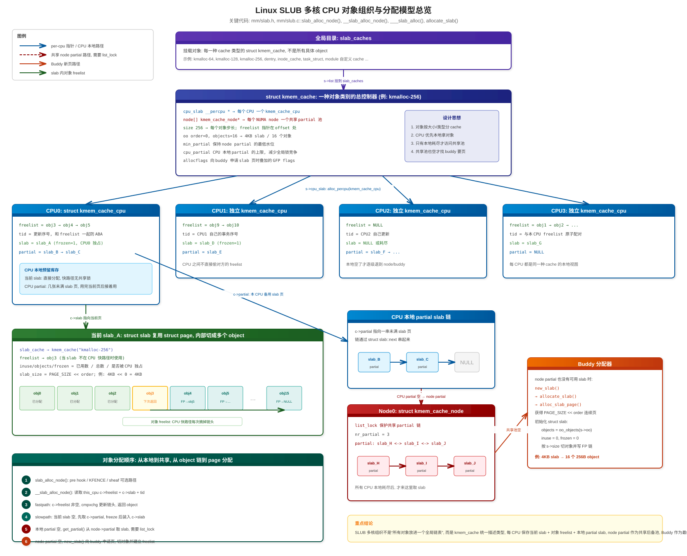
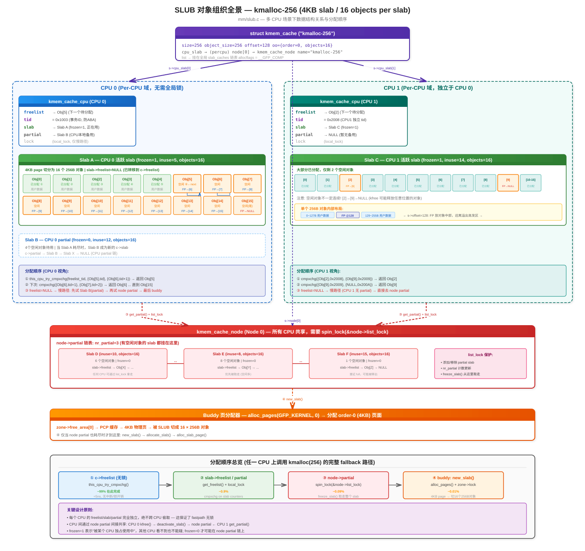
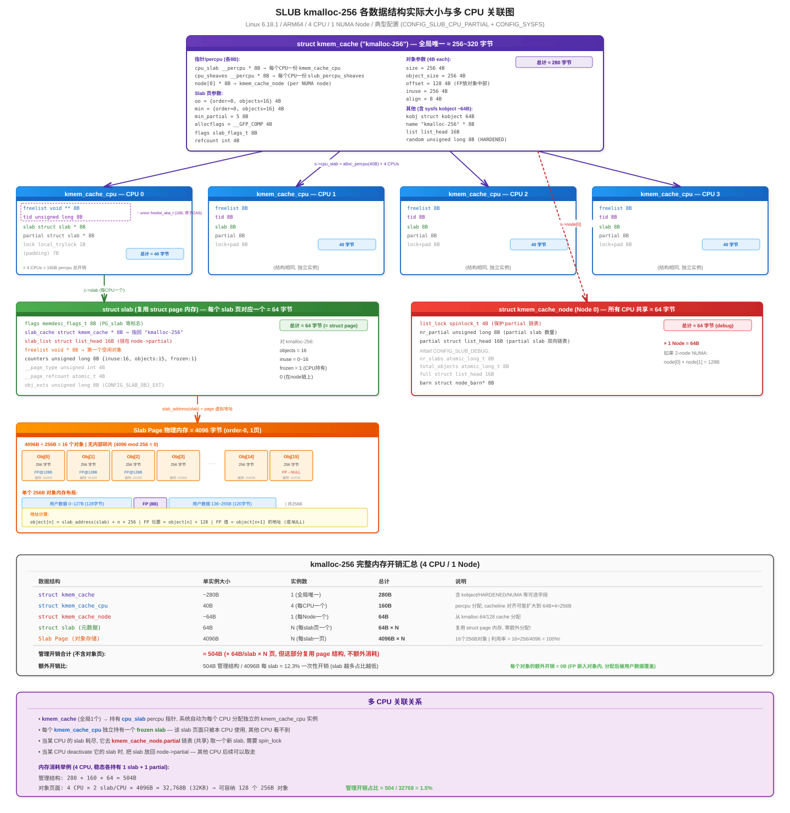
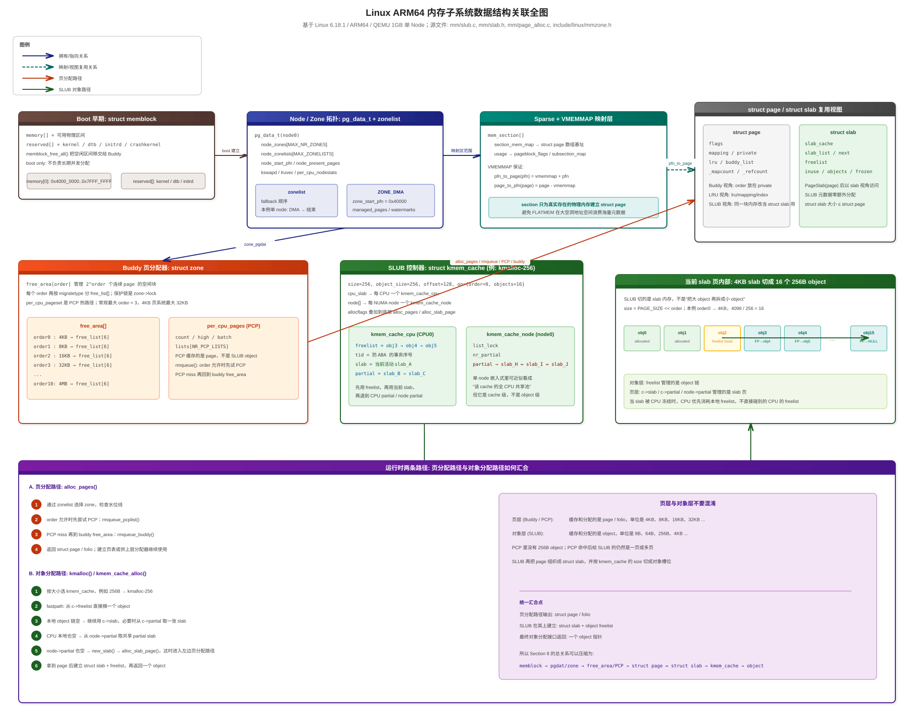

# Linux ARM64 内存子系统核心数据结构全景分析

> 基于 Linux 6.18.1 / ARM64 / QEMU 1GB

---

## 目录

<details>
<summary><a href="#1-总览五大子系统关系图">1. 总览：五大子系统关系图</a></summary>

</details>

<details>
<summary><a href="#2-memblock--早期启动内存管理">2. Memblock — 早期启动内存管理</a></summary>

- [2.1 数据结构](#21-数据结构)
- [2.2 结构关系图](#22-结构关系图)
- [2.3 设计目的](#23-设计目的)

</details>

<details>
<summary><a href="#3-numa--节点拓扑描述">3. NUMA — 节点拓扑描述</a></summary>

- [3.1 数据结构](#31-数据结构)
- [3.2 结构关系图（QEMU 1GB 单 node）](#32-结构关系图qemu-1gb-单-node)
- [3.3 设计目的](#33-设计目的)

</details>

<details>
<summary><a href="#4-sparse-memory--物理内存到-struct-page-的映射">4. Sparse Memory — 物理内存到 struct page 的映射</a></summary>

- [4.1 数据结构](#41-数据结构)
- [4.2 结构关系图](#42-结构关系图)
- [4.3 PFN ↔ struct page 转换（VMEMMAP 模式）](#43-pfn-↔-struct-page-转换vmemmap-模式)
- [4.4 设计目的](#44-设计目的)

</details>

<details>
<summary><a href="#5-buddy--页帧分配器">5. Buddy — 页帧分配器</a></summary>

- [5.1 数据结构](#51-数据结构)
- [5.2 Buddy 核心结构图](#52-buddy-核心结构图)
- [5.3 分配与释放流程](#53-分配与释放流程)
- [5.4 设计目的](#54-设计目的)

</details>

<details>
<summary><a href="#6-slub--小对象分配器">6. SLUB — 小对象分配器</a></summary>

- [6.1 数据结构](#61-数据结构)
- [6.2 SLUB 三级缓存结构](#62-slub-三级缓存结构)
- [6.3 分配流程](#63-分配流程)
- [6.4 设计目的](#64-设计目的)

</details>

<details>
<summary><a href="#7-struct-page--万能元数据载体">7. struct page — 万能元数据载体</a></summary>

- [7.1 struct page 在不同子系统中的身份](#71-struct-page-在不同子系统中的身份)
- [7.2 设计目的](#72-设计目的)

</details>

<details>
<summary><a href="#8-数据结构关联全图">8. 数据结构关联全图</a></summary>

</details>

<details>
<summary><a href="#9-生命周期流程图">9. 生命周期流程图</a></summary>

- [9.1 启动阶段（从硬件到 kmalloc 可用）](#91-启动阶段从硬件到-kmalloc-可用)
- [9.2 运行时分配路径](#92-运行时分配路径)

</details>

<details>
<summary><a href="#10-各子系统对比总结">10. 各子系统对比总结</a></summary>

</details>

<details>
<summary><a href="#11-为什么要这么设计设计哲学">11. 为什么要这么设计？设计哲学</a></summary>

- [11.1 分层的必要性](#111-分层的必要性)
- [11.2 核心设计原则](#112-核心设计原则)

</details>

<details>
<summary><a href="#12-五大子系统的角色分类">12. 五大子系统的角色分类</a></summary>

- [12.1 三个分配器（有对外分配 API）](#121-三个分配器有对外分配-api)
- [12.2 两个基础设施（无独立分配 API）](#122-两个基础设施无独立分配-api)

</details>

<details>
<summary><a href="#13-为什么-buddy-不能独立工作">13. 为什么 Buddy 不能独立工作？</a></summary>

- [13.1 没有 Sparse 会怎样？](#131-没有-sparse-会怎样)
- [13.2 没有 Zone 会怎样？](#132-没有-zone-会怎样)
- [13.3 没有 NUMA 会怎样？](#133-没有-numa-会怎样)
- [13.4 总结](#134-总结)

</details>

<details>
<summary><a href="#14-pfn-与-struct-page-深入详解">14. PFN 与 struct page 深入详解</a></summary>

- [14.1 PFN（Page Frame Number）— 物理页的编号](#141-pfnpage-frame-number-物理页的编号)
- [14.2 struct page — 物理页的元数据](#142-struct-page--物理页的元数据)
- [14.3 PFN ↔ struct page 转换](#143-pfn-↔-struct-page-转换)
- [14.4 具体场景举例](#144-具体场景举例)
- [14.5 一句话总结](#145-一句话总结)

</details>

---

## 1. 总览：五大子系统关系图

```
┌─────────────────────────────────────────────────────────────────────────┐
│                                                                         │
│  用户态 malloc()                     内核态 kmalloc()                    │
│       │                                    │                            │
│       ▼                                    ▼                            │
│  glibc (brk/mmap)               ┌──────────────┐                       │
│       │                         │   SLUB 分配器 │ kmem_cache_alloc      │
│       ▼                         │  (小对象管理) │                       │
│  系统调用 → 缺页异常             └──────┬───────┘                       │
│       │                                │ alloc_pages()                  │
│       │   直接分配页                    │                               │
│       └──────────┐                     │                               │
│                  ▼                     ▼                               │
│              ┌──────────────────────────────┐                          │
│              │      Buddy 分配器            │  __alloc_pages()          │
│              │     (页帧管理, 4KB~4MB)      │                          │
│              └──────────────┬───────────────┘                          │
│                             │ 通过 zone->free_area[] 管理              │
│                             ▼                                          │
│              ┌─────────────────────────────┐                           │
│              │         Zone 层             │                           │
│              │  DMA | DMA32 | Normal | ... │                           │
│              └─────────────┬───────────────┘                           │
│                            │ 属于                                      │
│                            ▼                                           │
│              ┌─────────────────────────────┐                           │
│              │      NUMA Node (pgdat)      │                           │
│              │    pg_data_t per node        │                           │
│              └─────────────┬───────────────┘                           │
│                            │ 通过 mem_section 映射                     │
│                            ▼                                           │
│              ┌─────────────────────────────┐                           │
│              │   Sparse Memory Model       │                           │
│              │  mem_section → struct page   │                           │
│              └─────────────┬───────────────┘                           │
│                            │ 接管自                                    │
│                            ▼                                           │
│              ┌─────────────────────────────┐                           │
│              │      Memblock (早期启动)     │ boot 完成后废弃           │
│              │   memory[] + reserved[]      │                           │
│              └─────────────────────────────┘                           │
└─────────────────────────────────────────────────────────────────────────┘
```

---

## 2. Memblock — 早期启动内存管理

### 2.1 数据结构

```c
struct memblock {
    bool bottom_up;              // 分配方向：自底向上 or 自顶向下
    phys_addr_t current_limit;   // 当前分配上限
    struct memblock_type memory;   // 可用物理内存集合
    struct memblock_type reserved; // 已预留内存集合
};

struct memblock_type {
    unsigned long cnt;                // region 数量
    unsigned long max;                // region 数组容量
    phys_addr_t total_size;           // 总大小
    struct memblock_region *regions;  // region 数组
    char *name;                       // "memory" 或 "reserved"
};

struct memblock_region {
    phys_addr_t base;                 // 起始物理地址
    phys_addr_t size;                 // 大小
    enum memblock_flags flags;        // HOTPLUG/MIRROR/NOMAP 等
    int nid;                          // NUMA node ID
};
```

### 2.2 结构关系图

```
struct memblock (全局唯一，静态初始化)
  ├── memory (memblock_type)
  │     └── regions[] ──→ [region0: base=0x4000_0000, size=0x4000_0000, nid=0]
  │                       [region1: ...]
  └── reserved (memblock_type)
        └── regions[] ──→ [region0: kernel代码/DTB/initrd 等]
                          [region1: ...]

空闲内存 = memory 中未被 reserved 覆盖的部分
```

### 2.3 设计目的

| 特性 | 说明 |
|------|------|
| **为什么需要** | 内核启动最早期，buddy/slab 都还没建立，需要一个极简分配器 |
| **核心思想** | 两个有序数组（memory + reserved）描述物理内存布局 |
| **分配方式** | 遍历 memory[]，跳过 reserved[]，找到空闲区间 |
| **局限性** | 线性扫描 O(n)、无并发保护、无 order 分级、无法回收碎片 |
| **生命周期** | `memblock_free_all()` 后移交 buddy，随后 `memblock_discard()` 释放自身 |

---

## 3. NUMA — 节点拓扑描述

### 3.1 数据结构

```c
typedef struct pglist_data {
    // ====== Zone 管理 ======
    struct zone node_zones[MAX_NR_ZONES];       // 本 node 的所有 zone
    struct zonelist node_zonelists[MAX_ZONELISTS]; // 分配 fallback 列表
    int nr_zones;                                // 已填充的 zone 数

    // ====== 物理范围 ======
    unsigned long node_start_pfn;     // 本 node 起始 PFN
    unsigned long node_present_pages; // 实际物理页数（扣除空洞）
    unsigned long node_spanned_pages; // 跨越的 PFN 范围（含空洞）
    int node_id;                      // NUMA node 编号

    // ====== 内存回收 ======
    struct task_struct *kswapd;       // 页回收守护进程
    wait_queue_head_t kswapd_wait;
    struct lruvec __lruvec;           // LRU 链表集合（非 memcg 时使用）

    // ====== 其他 ======
    unsigned long totalreserve_pages; // 预留页数
    struct per_cpu_nodestat __percpu *per_cpu_nodestats;
} pg_data_t;
```

```c
struct zonelist {
    struct zoneref _zonerefs[MAX_ZONES_PER_ZONELIST + 1];
};

struct zoneref {
    struct zone *zone;    // 指向具体 zone
    int zone_idx;         // zone 类型索引
};
```

### 3.2 结构关系图（QEMU 1GB 单 node）

```
pg_data_t  (node 0)
  │
  ├── node_zones[MAX_NR_ZONES]
  │     ├── [ZONE_DMA]     zone_start_pfn=0x40000, spanned=262144页 (1GB)
  │     ├── [ZONE_DMA32]   空 (1GB 全在 DMA 范围)
  │     ├── [ZONE_NORMAL]  空
  │     └── [ZONE_MOVABLE]  空
  │
  ├── node_zonelists[2]
  │     ├── [ZONELIST_FALLBACK]    → DMA → (结束)
  │     └── [ZONELIST_NOFALLBACK]  → DMA → (结束)   (仅 NUMA 时有意义)
  │
  ├── node_start_pfn = 0x40000
  ├── node_present_pages = 262144  (1GB / 4KB)
  └── kswapd → (内核线程指针)
```

### 3.3 设计目的

| 特性 | 说明 |
|------|------|
| **为什么需要 pgdat** | 描述一个 NUMA 节点的完整内存视图，即使 UMA 也有一个 node |
| **为什么需要 zone** | 不同硬件（DMA 控制器、32位设备）对物理地址有不同约束 |
| **为什么需要 zonelist** | 分配时当前 zone 不够用，需要按优先级 fallback 到其他 zone/node |
| **NUMA 距离排序** | zonelist 中远 node 排后面，保证局部性优先 |

---

## 4. Sparse Memory — 物理内存到 struct page 的映射

### 4.1 数据结构

```c
struct mem_section {
    unsigned long section_mem_map;        // 编码了 struct page 数组基地址 + flags
    struct mem_section_usage *usage;      // pageblock_flags + subsection_map
};

struct mem_section_usage {
    struct rcu_head rcu;
    DECLARE_BITMAP(subsection_map, SUBSECTIONS_PER_SECTION);  // 子section 存在位图
    unsigned long pageblock_flags[0];    // 每个 pageblock 的迁移类型标记
};
```

### 4.2 结构关系图

```
                  全局数组: mem_section[][]
                  (二级数组，EXTREME模式下按需分配root)
                  
 section_nr ──→ mem_section[root][offset]
                     │
                     ├── section_mem_map ──→ struct page 数组
                     │   （通过 VMEMMAP 映射到虚拟地址连续区域）
                     │
                     │   PFN → struct page 的转换：
                     │   page = vmemmap + pfn
                     │   pfn  = page - vmemmap
                     │
                     └── usage
                           ├── subsection_map[]: 哪些 2MB 子块实际有物理内存
                           └── pageblock_flags[]: 每个 pageblock 的迁移类型
                                                  (UNMOVABLE/MOVABLE/...)

ARM64 典型参数：
  SECTION_SIZE_BITS = 27 → 每个 section = 128MB = 32768 页
  PAGES_PER_SECTION = 32768
  SUBSECTIONS_PER_SECTION = 64 (每个 subsection = 2MB)
  pageblock_order = 9 (每个 pageblock = 2MB = 512页)
```

### 4.3 PFN ↔ struct page 转换（VMEMMAP 模式）

```
物理地址空间                        虚拟地址空间 (vmemmap 区域)
┌────────────┐                    ┌──────────────────────┐
│ 0x40000000 │ PFN=0x40000  ───→  │ vmemmap + 0x40000    │ struct page[0]
│ 0x40001000 │ PFN=0x40001  ───→  │ vmemmap + 0x40001    │ struct page[1]
│    ...     │                    │       ...            │
│ 0x7FFFF000 │ PFN=0x7FFFF  ───→  │ vmemmap + 0x7FFFF    │ struct page[N]
└────────────┘                    └──────────────────────┘

pfn_to_page(pfn) = vmemmap + pfn    (一次加法，O(1))
page_to_pfn(page) = page - vmemmap  (一次减法，O(1))
```

### 4.4 设计目的

| 特性 | 说明 |
|------|------|
| **为什么需要 Sparse** | 物理内存可以有大量空洞（热插拔、NUMA），FLATMEM 会为空洞也分配 struct page，浪费大量内存 |
| **Section 的意义** | 按固定粒度（128MB）管理，只有有物理内存的 section 才分配 struct page |
| **VMEMMAP 的作用** | 利用页表映射，让 `pfn_to_page()` 仍然是 O(1) 的数组下标访问 |
| **pageblock_flags** | 记录每个 2MB 块的迁移类型，buddy 分配器用来做反碎片决策 |
| **subsection_map** | 支持比 section 更细粒度（2MB）的内存热插拔 |

---

## 5. Buddy — 页帧分配器

### 5.1 数据结构

```c
struct zone {
    // ====== 水位线 ======
    unsigned long _watermark[NR_WMARK];  // MIN/LOW/HIGH/PROMO 四级水位
    unsigned long watermark_boost;

    long lowmem_reserve[MAX_NR_ZONES];   // 为低端 zone 保留的页数

    // ====== 核心：Buddy 空闲链表 ======
    struct free_area free_area[NR_PAGE_ORDERS];  // [11] order 0~10
    spinlock_t lock;                              // 保护 free_area

    // ====== Per-CPU 页缓存 ======
    struct per_cpu_pages __percpu *per_cpu_pageset;

    // ====== 范围信息 ======
    unsigned long zone_start_pfn;
    unsigned long spanned_pages;    // 跨越范围（含空洞）
    unsigned long present_pages;    // 实际页数
    atomic_long_t managed_pages;    // buddy 管理的页数（= present - reserved）

    struct pglist_data *zone_pgdat; // 反向指针到所属 node
    const char *name;               // "DMA"/"Normal"/...
};

struct free_area {
    struct list_head free_list[MIGRATE_TYPES]; // 按迁移类型分的空闲链表
    unsigned long    nr_free;                   // 本 order 空闲块数
};

// 迁移类型
enum migratetype {
    MIGRATE_UNMOVABLE,    // 0: 内核常驻分配
    MIGRATE_MOVABLE,      // 1: 用户页面，可迁移
    MIGRATE_RECLAIMABLE,  // 2: 页缓存，可回收
    MIGRATE_PCPTYPES,     // 3: PCP 只缓存以上三种
    MIGRATE_HIGHATOMIC=3, // 3: 高优先级原子分配预留
    MIGRATE_CMA,          // 4: CMA 连续内存预留
    MIGRATE_ISOLATE,      // 5: 隔离中（热插拔/compaction）
    MIGRATE_TYPES         // 6: 总数，用作数组大小
};

struct per_cpu_pages {
    spinlock_t lock;
    int count;       // 当前缓存页数
    int high;        // 高水位，超过则归还 buddy
    int batch;       // 每次批量操作的页数
    struct list_head lists[NR_PCP_LISTS]; // per-migratetype × per-order 链表
};
```

### 5.2 Buddy 核心结构图

```
struct zone (以 ZONE_DMA 为例)
  │
  ├── free_area[0]  (order-0, 4KB 块)
  │     ├── free_list[UNMOVABLE]  ──→ page ←→ page ←→ ...
  │     ├── free_list[MOVABLE]    ──→ page ←→ page ←→ ...
  │     ├── free_list[RECLAIMABLE]──→ (空)
  │     ├── free_list[HIGHATOMIC] ──→ (空)
  │     ├── free_list[CMA]        ──→ (空)
  │     ├── free_list[ISOLATE]    ──→ (空)
  │     └── nr_free = 1
  │
  ├── free_area[1]  (order-1, 8KB 块)
  │     ├── free_list[...] ──→ ...
  │     └── nr_free = 2
  │
  ├── ...
  │
  ├── free_area[9]  (order-9, 2MB 块)
  │     └── nr_free = 7
  │
  └── free_area[10] (order-10, 4MB 块, 最大)
        ├── free_list[MOVABLE] ──→ page ←→ page ←→ ... (223个)
        └── nr_free = 223

/proc/buddyinfo 输出对照：
  Node 0, zone DMA: 1 2 4 3 3 4 5 6 10 7 223
                     ^order0        ...        ^order10
```

### 5.3 分配与释放流程

```
分配 alloc_pages(gfp, order):
  ┌─────────────────────────────────────────┐
  │  1. 选择 zone (通过 zonelist fallback)    │
  │  2. 检查水位线 (_watermark[WMARK_LOW])    │
  │  3. 优先从 PCP 取 (order=0 时)           │
  │  4. 从 free_area[order] 取              │
  │     └─ __rmqueue_smallest():             │
  │        从 order 往上找第一个非空 free_list │
  │        取出 page, 多余的部分 expand() 拆分│
  │        放回低 order 的 free_list          │
  └─────────────────────────────────────────┘

释放 __free_pages(page, order):
  ┌─────────────────────────────────────────┐
  │  1. free_pages_prepare() 清理元数据       │
  │  2. __free_one_page():                   │
  │     while (order < MAX_PAGE_ORDER) {     │
  │       buddy = pfn ^ (1 << order)         │
  │       if (buddy 空闲) 合并, order++       │
  │       else break                         │
  │     }                                    │
  │  3. __add_to_free_list(page, zone,       │
  │        order, migratetype)               │
  └─────────────────────────────────────────┘
```

### 5.4 设计目的

| 特性 | 说明 |
|------|------|
| **为什么用 Buddy** | 快速合并/拆分连续页块，O(1) 找伙伴（XOR 操作），避免外部碎片 |
| **为什么分 order** | 支持 2^N 页的连续分配，拆分和合并都只需移动链表指针 |
| **为什么分 migratetype** | 把可迁移/不可迁移的页分开管理，减少内存碎片（反碎片策略） |
| **为什么有 PCP** | 热路径（order-0）避免频繁获取 zone->lock，提高多核性能 |
| **水位线的作用** | MIN: 紧急保底；LOW: 唤醒 kswapd；HIGH: kswapd 停止回收 |

---

## 6. SLUB — 小对象分配器

### 6.1 数据结构

```c
struct kmem_cache {
    // ====== Per-CPU 快速路径 ======
    struct kmem_cache_cpu __percpu *cpu_slab;

    // ====== 对象参数 ======
    unsigned int size;           // 含元数据的对象大小
    unsigned int object_size;    // 用户请求的对象大小
    unsigned int offset;         // freelist 指针在对象内的偏移
    unsigned int inuse;          // 对象有效数据末尾偏移
    unsigned int align;          // 对齐要求

    // ====== Slab 页参数 ======
    struct kmem_cache_order_objects oo;  // 优选：order + objects_per_slab
    struct kmem_cache_order_objects min; // 最小：内存紧张时的退化参数
    gfp_t allocflags;                    // 向 buddy 申请页时的 GFP flags

    const char *name;            // 缓存名称，如 "kmalloc-64"
    struct list_head list;       // 全局 slab_caches 链表

    // ====== Per-Node 管理 ======
    struct kmem_cache_node *node[MAX_NUMNODES];
};

struct kmem_cache_cpu {              // Per-CPU，无锁快速路径
    void **freelist;                 // 当前 slab 的空闲对象链
    unsigned long tid;               // 事务 ID（防 ABA）
    struct slab *slab;               // 当前正在分配的 slab
    struct slab *partial;            // CPU 本地 partial slab 链
};

struct kmem_cache_node {             // Per-Node
    spinlock_t list_lock;
    unsigned long nr_partial;        // partial slab 数量
    struct list_head partial;        // partial slab 链表
};

struct slab {                       // 复用 struct page 的内存布局
    memdesc_flags_t flags;
    struct kmem_cache *slab_cache;   // 所属 kmem_cache
    struct list_head slab_list;      // 挂在 node->partial 上
    void *freelist;                  // 第一个空闲对象
    unsigned inuse:16;               // 已分配对象数
    unsigned objects:15;             // 总对象数
    unsigned frozen:1;               // 是否被 CPU 冻结（正在使用）
};
```

### 6.2 SLUB 三级缓存结构

> **完整模型图**: 结合 `struct kmem_cache`、`struct kmem_cache_cpu`、`struct kmem_cache_node`、`struct slab` 与 `slab_alloc_node()` 分配路径，展示多核 CPU 上 SLUB 对象如何按 CPU 本地、Node 共享池、Buddy 后备页源逐级组织:
>
> 

> **完整结构图**: 以 `kmalloc-256` (4KB slab / 16 objects) 为例，展示多 CPU 下的对象组织与分配顺序，参见:
>
> 

```
struct kmem_cache ("kmalloc-64")
  │
  ├── cpu_slab (Per-CPU) ──────────────────────────────────────────
  │     │                                                          │
  │     │  CPU 0                    CPU 1                          │
  │     │  ┌──────────────────┐    ┌──────────────────┐            │
  │     │  │ freelist ──→ obj │    │ freelist ──→ obj │            │
  │     │  │ slab ──→ [slab页]│    │ slab ──→ [slab页]│            │
  │     │  │ partial ──→ ...  │    │ partial ──→ ...  │            │
  │     │  └──────────────────┘    └──────────────────┘            │
  │     │  无锁 cmpxchg 分配        无锁 cmpxchg 分配              │
  │     └──────────────────────────────────────────────────────────┘
  │                    ↑ 2.从 partial 补充
  │                    │
  ├── node[0] (Per-Node) 
  │     ├── partial ──→ slab ←→ slab ←→ slab   (有空闲对象的 slab)
  │     └── nr_partial = 3
  │                    ↑ 3.从 buddy 申请新 slab
  │                    │
  └── (buddy allocator: alloc_pages)
```

### 6.3 分配流程

```
kmalloc(64, GFP_KERNEL)
  │
  ▼
kmem_cache_alloc(kmalloc_caches[64], ...)
  │
  ▼
┌─ 快速路径 (this_cpu, 无锁) ─────────────────────┐
│  1. freelist = cpu_slab->freelist                │
│  2. if (freelist != NULL)                        │
│       object = freelist                          │
│       cpu_slab->freelist = *(void**)freelist     │
│       return object     ← 99% 走这条            │
└──────────────────────────────────────────────────┘
  │ freelist 为空
  ▼
┌─ 慢速路径 ──────────────────────────────────────┐
│  3. 检查 cpu_slab->partial，有则换一个 slab      │
│  4. 检查 node->partial，有则取一个 slab          │
│  5. 都没有 → alloc_pages() 从 buddy 申请新页     │
│     初始化为 slab，切割成对象，设置 freelist      │
└──────────────────────────────────────────────────┘
```

### 6.4 数据结构实际大小

> 以 `kmalloc-256` (4KB page / 16 objects / 4 CPU / 1 Node) 为例，各数据结构的实际内存开销:
>
> 

### 6.5 设计目的

| 特性 | 说明 |
|------|------|
| **为什么需要 SLUB** | Buddy 最小分配 4KB，内核大量 64B/128B 小对象会极度浪费 |
| **Per-CPU freelist** | 无锁快速路径，cmpxchg 原子操作，每次分配约 20ns |
| **三级缓存** | CPU → Node partial → Buddy，逐级升级，兼顾速度和内存利用率 |
| **对象复用相同大小** | `kmalloc-8/16/32/64/...` 等 size class 避免碎片 |
| **struct slab 复用 struct page** | 不额外分配管理结构，零开销 |

---

## 7. struct page — 万能元数据载体

`struct page` 是整个内存子系统的**最核心数据结构**，通过 union 复用同一块内存给不同子系统使用：

```c
struct page {                           // 64 字节 (ARM64)
    memdesc_flags_t flags;              // 8B: zone | node | section | PG_xxx 标志位
    
    union {                             // 40B: 以下几种身份互斥
        struct {  /* Buddy / LRU 页 */
            struct list_head buddy_list; // 挂在 free_area[order].free_list 上
            struct address_space *mapping;
            unsigned long private;       // buddy: 存储 order
        };
        struct {  /* SLUB slab 页 (通过 struct slab 视图访问) */
            struct list_head slab_list;  // 挂在 node->partial
            void *freelist;              // 空闲对象链头
            unsigned inuse:16;           // 已分配对象数
            unsigned objects:15;         // 总对象数
        };
        struct {  /* 复合页尾页 */
            unsigned long compound_head; // 指向首页，bit0=1 标记尾页
        };
    };
    
    union {                             // 4B
        unsigned int page_type;         // 页类型（typed folios）
        atomic_t _mapcount;              // 页表映射计数 (-1=未映射)
    };
    
    atomic_t _refcount;                 // 4B: 引用计数
};
```

### 7.1 struct page 在不同子系统中的身份

```
               ┌─────────── struct page ───────────┐
               │                                    │
    ┌──────────┼──────────────┬────────────────────┐│
    │          │              │                    ││
    ▼          ▼              ▼                    ▼│
  Buddy      SLUB          LRU/PageCache      Compound
  空闲页      slab页         用户/文件页        复合页尾

 buddy_list  slab_list      lru              compound_head
 private     freelist       mapping          (指向head)
 (=order)    inuse/objects  index
 PageBuddy   PG_slab        PG_lru
```

### 7.2 设计目的

| 特性 | 说明 |
|------|------|
| **Union 复用** | 一个页同一时刻只有一种身份，union 节省内存（每 4KB 物理页 = 64B struct page） |
| **flags 编码** | 高位存 section/node/zone，低位存 PG_xxx 状态标志，一个字段多用 |
| **零分配管理** | struct page 本身由 sparse/vmemmap 管理，不需要额外分配 |

---

## 8. 数据结构关联全图

> **完整关联图**: 把启动期 `memblock`、运行期 `pg_data_t/zone/free_area/PCP`、`mem_section/vmemmap/struct page`、以及 `kmem_cache/kmem_cache_cpu/kmem_cache_node/struct slab` 放到一张图里，强调“页层”和“对象层”是如何汇合的:
>
> 

阅读这张图时，可以按下面 4 层去看：

1. 启动期: `memblock` 只负责描述物理区间，`memblock_free_all()` 之后把空闲页交给 Buddy。
2. 页层: `pg_data_t`/`zone`/`free_area`/`PCP` 管理的是 `page`，不是 SLUB object；`alloc_pages()` 在这里完成 zonelist 选择、水位线检查、PCP 和 buddy 取页。
3. 映射层: `mem_section + vmemmap` 提供 `pfn_to_page()`/`page_to_pfn()` 的 O(1) 转换，`struct page` 由此成为所有子系统共享的页元数据载体。
4. 对象层: `kmem_cache` 统一描述对象类型，`kmem_cache_cpu` 负责 per-CPU `freelist/slab/partial`，`kmem_cache_node.partial` 是同一 cache 的 node 级共享池；当 SLUB 需要新 slab 时，才重新掉回左边的页分配路径。

这张图还额外强调了一个经常混淆的点：

1. PCP 缓存的是 page，常规最大 order 为 3；在 4KB 页系统里就是最大 32KB。
2. SLUB 返回的是 object；即使 `alloc_slab_page()` 命中了 PCP，SLUB 拿到的仍然是一页或多页，随后才会建立 `struct slab` 并按 `kmem_cache->size` 切出对象槽位。

---

## 9. 生命周期流程图

### 9.1 启动阶段（从硬件到 kmalloc 可用）

```
   固件/DTB 提供物理内存信息
          │
          ▼
   ┌─────────────────────────────────────────┐
   │ 1. memblock_add(base, size)             │  建立 memblock.memory[]
   │    memblock_reserve(kernel, dtb, ...)   │  建立 memblock.reserved[]
   └─────────────────────┬───────────────────┘
                         │
                         ▼
   ┌─────────────────────────────────────────┐
   │ 2. sparse_init()                        │
   │    为每个有物理内存的 section 分配:       │
   │    - mem_section_usage (pageblock_flags) │
   │    - struct page 数组 (via vmemmap)      │
   └─────────────────────┬───────────────────┘
                         │
                         ▼
   ┌─────────────────────────────────────────┐
   │ 3. zone_sizes_init() → free_area_init() │
   │    - 计算每个 zone 的 PFN 范围           │
   │    - zone_init_free_lists(): 空 buddy 骨架│
   │    - memmap_init(): 初始化所有 struct page│
   └─────────────────────┬───────────────────┘
                         │
                         ▼
   ┌─────────────────────────────────────────┐
   │ 4. build_all_zonelists()                │
   │    为每个 node 构建 zonelist (fallback)  │
   └─────────────────────┬───────────────────┘
                         │
                         ▼
   ┌─────────────────────────────────────────┐
   │ 5. memblock_free_all()                  │  ★ memblock → buddy 搬运
   │    遍历 memory[] - reserved[]            │
   │    按对齐约束计算 order                   │
   │    __free_pages_core → __free_one_page   │
   │    → __add_to_free_list()               │
   │                                         │
   │    完成后: alloc_pages() 可用             │
   └─────────────────────┬───────────────────┘
                         │
                         ▼
   ┌─────────────────────────────────────────┐
   │ 6. kmem_cache_init()                    │
   │    创建 boot kmem_cache                  │
   │    初始化 kmalloc_caches[] 数组          │
   │                                         │
   │    完成后: kmalloc() 可用                 │
   └─────────────────────────────────────────┘
```

### 9.2 运行时分配路径

```
用户 malloc(100)
  │
  ▼
用户态 → 内核态 (brk/mmap)
  │
  ▼
┌─ 页分配 ─────────────────────────────────┐    ┌─ 对象分配 ──────────────────┐
│ alloc_pages(GFP_xxx, order)              │    │ kmalloc(size, GFP_xxx)      │
│  │                                       │    │  │                          │
│  ├─ 选 zone (via zonelist)               │    │  ├─ 选 kmem_cache (size→idx)│
│  ├─ 检查水位线                            │    │  ├─ CPU freelist 快取       │
│  ├─ PCP 快取 (order=0)                   │    │  ├─ CPU partial             │
│  ├─ __rmqueue_smallest:                  │    │  ├─ Node partial            │
│  │   从 free_area[order] 找              │    │  └─ alloc_pages() 新 slab   │
│  │   必要时从高 order 拆分 (expand)       │    │     └─ (进入左边页分配路径)  │
│  └─ 返回 struct page*                    │    │                             │
└──────────────────────────────────────────┘    └─────────────────────────────┘
```

---

## 10. 各子系统对比总结

| 子系统 | 管理粒度 | 数据结构 | 生命周期 | 核心算法 |
|--------|----------|----------|----------|----------|
| **Memblock** | 任意大小物理区间 | `memblock_region[]` | boot 早期 → `memblock_free_all()` | 有序区间数组，线性扫描 |
| **Sparse** | 128MB section | `mem_section` + `vmemmap` | boot 中建立，永久存在 | 二级数组 + 虚拟地址映射 |
| **NUMA/Zone** | 物理地址范围 | `pg_data_t` + `zone` | boot 中建立，永久存在 | zonelist fallback |
| **Buddy** | 4KB ~ 4MB 连续页 | `free_area[11][6]` | `memblock_free_all()` 后永久 | 伙伴合并/拆分，O(1) XOR |
| **SLUB** | 8B ~ 8KB 对象 | `kmem_cache` + `slab` | `kmem_cache_init()` 后永久 | Per-CPU freelist，无锁 cmpxchg |

---

## 11. 为什么要这么设计？设计哲学

### 11.1 分层的必要性

```
问题：从 8 字节到 4MB，分配需求跨越 19 个数量级，没有单一算法能高效覆盖全部。

解法：                     分配大小          性能特征
  SLUB (对象)            8B ~ 8KB         无锁 O(1)，Per-CPU
     │ 向 Buddy 申请页
  Buddy (页)             4KB ~ 4MB        O(1) 合并/拆分
     │ 初始化时从 Memblock 接管
  Memblock (物理区间)    任意大小          线性扫描，boot only
```

### 11.2 核心设计原则

1. **启动递进**: memblock → buddy → slab，每层建立在上一层之上
2. **缓存层次**: PCP / CPU freelist 减少锁竞争，符合 CPU 缓存局部性
3. **反碎片**: migratetype 分离可迁移/不可迁移页，减少长期碎片化
4. **稀疏支持**: sparse memory 只为存在物理内存的 section 分配 struct page
5. **零开销元数据**: struct page 复用 union，struct slab 复用 struct page

---

## 12. 五大子系统的角色分类

五个子系统并非都是"分配器"，它们分为三个分配器和两个基础设施：

### 12.1 三个分配器（有对外分配 API）

| 分配器 | 对外 API | 管理粒度 | 生命周期 |
|--------|----------|----------|----------|
| **Memblock** | `memblock_alloc()` / `memblock_phys_alloc()` | 任意大小物理区间 | boot 早期 → `memblock_free_all()` 后废弃 |
| **Buddy** | `alloc_pages()` / `__get_free_pages()` | 4KB ~ 4MB 连续页 | `memblock_free_all()` 后永久运行 |
| **SLUB** | `kmalloc()` / `kmem_cache_alloc()` | 8B ~ 8KB 小对象 | `kmem_cache_init()` 后永久运行 |

三者是递进关系：memblock 引导 buddy，buddy 支撑 slub：

```
memblock_alloc()   →  仅 boot 阶段可用
     │ memblock_free_all() 移交所有空闲页
     ▼
alloc_pages()      →  buddy 可用（页级分配）
     │ kmem_cache_init() 在 buddy 上建立 slab
     ▼
kmalloc()          →  slub 可用（对象级分配）
```

### 12.2 两个基础设施（无独立分配 API）

| 基础设施 | 作用 | 提供什么 |
|----------|------|----------|
| **NUMA (pgdat + zone)** | 拓扑描述层 | 描述"内存在哪个 node/zone"，buddy 通过 zonelist 做 fallback 决策 |
| **Sparse** | 映射层 | 提供 `pfn_to_page()` / `page_to_pfn()` 的 O(1) 转换 |

它们不分配内存，但所有分配器都依赖它们：
- Buddy 需要 **Zone** 来判断"这个页能不能给 DMA 设备"
- Buddy 需要 **Sparse** 来做 PFN ↔ struct page 转换
- SLUB 需要 **NUMA** 来决定"从哪个 node 分配 slab 页"

---

## 13. 为什么 Buddy 不能独立工作？

Buddy 看似只需要 free_area 链表就能工作，但实际上它**必须依赖** Sparse 和 NUMA/Zone。

### 13.1 没有 Sparse 会怎样？

Buddy 对每个 4KB 物理页维护一个 struct page（64B）。必须有某种方式把 PFN 映射到 struct page。

| 方案 | 做法 | 问题 |
|------|------|------|
| **FLATMEM** | 一个巨大连续数组 `mem_map[max_pfn]` | 物理地址 0~2GB 有内存，100GB~102GB 有内存 → 中间 98GB 空洞也要分配 struct page = 浪费 ~1.5GB |
| **SPARSEMEM** | 按 128MB section 按需分配 | 只为有物理内存的 section 分配 struct page，空洞不浪费 |

ARM64 物理地址空间 48 位（256TB），如果用 FLATMEM，`struct page` 数组本身就要 **4TB**。用 Sparse 后只为实际有内存的部分分配。

**结论：没有 Sparse，buddy 在大内存/有空洞的系统上根本无法启动。**

### 13.2 没有 Zone 会怎样？

```
DMA 控制器只能访问 0~16MB 的内存
用户进程 malloc 把 0~16MB 全部分掉了
→ DMA 设备无法工作，内核 panic
```

Zone 就是把物理内存按地址约束分区，DMA 区域的页优先留给 DMA 设备。

**结论：没有 Zone，DMA 等硬件约束无法满足，这是正确性问题。**

### 13.3 没有 NUMA 会怎样？

```
2-socket 服务器，CPU0 访问本地内存 100ns，访问远端内存 300ns
没有 NUMA 信息 → buddy 随机分配 → 50% 概率分到远端 → 性能下降 3x
有 NUMA → 优先从本地 node 分配 → 保证局部性
```

**结论：UMA 系统可以不要 NUMA，但多 socket 系统没有 NUMA 会性能暴跌。**

### 13.4 总结

```
                 能不能去掉            去掉的代价
Sparse           不能（大内存必需）      struct page 数组爆炸，无法启动
Zone             不能（硬件约束必需）    DMA 设备无内存可用
NUMA             可以（UMA 系统）        多 socket 系统性能暴跌
```

> QEMU 单 node 1GB 环境下确实感觉 Sparse/NUMA 是多余的——因为只有一个 node、内存连续、
> 全在 DMA 范围内。但内核代码要跑在所有硬件上，从 1GB 嵌入式到 12TB 的 8-socket 服务器。

---

## 14. PFN 与 struct page 深入详解

### 14.1 PFN（Page Frame Number）— 物理页的编号

PFN 就是物理页的编号，等于物理地址右移 12 位（除以 4KB）：

```
物理地址:  0x4000_0000 (1GB)
PFN:       0x4000_0000 >> 12 = 0x40000

物理地址 = PFN << 12 = PFN × 4KB
PFN      = 物理地址 >> 12 = 物理地址 / 4KB
```

**为什么需要 PFN？** 因为内存管理都以 4KB 页为单位，用字节地址太浪费。PFN 就是物理页的"身份证号"。

**谁在用 PFN：**

| 使用者 | 怎么用 | 举例 |
|--------|--------|------|
| **Memblock** | 描述内存范围 `[start_pfn, end_pfn)` | `for_each_mem_pfn_range()` |
| **Zone** | 记录本 zone 的 PFN 范围 | `zone->zone_start_pfn = 0x40000` |
| **Sparse** | PFN → section_nr → mem_section | `section_nr = pfn >> PFN_SECTION_SHIFT` |
| **Buddy** | 计算伙伴地址 | `buddy_pfn = pfn ^ (1 << order)` |
| **页表** | PTE 里存的就是 PFN | `pte = pfn << PAGE_SHIFT | flags` |
| **struct page** | 互相转换 | `pfn_to_page(pfn)` / `page_to_pfn(page)` |

### 14.2 struct page — 物理页的元数据

每个 4KB 物理页对应一个 64 字节的 struct page，记录这个页的所有元数据：

```
物理内存 1GB = 262144 个 4KB 页 = 262144 个 struct page = 16MB 元数据开销
```

#### struct page 的多重身份

通过 union 复用，同一时刻只有一种身份：

| 身份 | 存储的内容 | 谁在读写 | 标志判断 |
|------|-----------|----------|----------|
| ① Buddy 空闲页 | `buddy_list`（链表指针）、`private`（order 阶数） | buddy 分配器 | `PageBuddy(page)` |
| ② 用户匿名页 | `lru`（LRU 链表）、`mapping`（→anon_vma）、`_mapcount` | kswapd、RMAP | `PageLRU(page)` |
| ③ 文件页缓存 | `lru`、`mapping`（→address_space）、`index`（文件偏移） | 文件 I/O、kswapd | `PageLRU(page)` |
| ④ SLUB slab 页 | `slab_list`、`freelist`（空闲对象链）、`inuse/objects` | slub 分配器 | `PageSlab(page)` |
| ⑤ 复合页尾页 | `compound_head`（指向首页，bit0=1） | THP / hugetlb | `PageTail(page)` |

#### flags 字段编码

```
flags 高位编码                    flags 低位标志 (PG_xxx)
┌───────────────────────────┐    ┌────────────────────────────┐
│ SECTION | NODE | ZONE     │    │ PG_locked   - 正在 I/O     │
│ (定位这个页属于哪个       │    │ PG_dirty    - 脏页待写回   │
│  section/node/zone)       │    │ PG_lru      - 在 LRU 链上  │
│                           │    │ PG_buddy    - buddy 空闲页  │
│ 由 set_page_links() 设置  │    │ PG_slab     - SLUB slab 页 │
│ __init_single_page() 时   │    │ PG_reserved - 保留不可用   │
└───────────────────────────┘    │ PG_head     - 复合页首页   │
                                 └────────────────────────────┘

通过 flags 可以：
  page_zone(page)   → 拿到所属 zone
  page_to_nid(page) → 拿到所属 NUMA node
  PageBuddy(page)   → 判断是否是 buddy 空闲页
  PageSlab(page)    → 判断是否是 slab 页
```

### 14.3 PFN ↔ struct page 转换

```
                    pfn_to_page()
        PFN  ─────────────────────→  struct page *
     (物理页号)                       (元数据指针)
              ←─────────────────────
                    page_to_pfn()

VMEMMAP 实现（ARM64）：
  pfn_to_page(pfn)  = vmemmap + pfn          // 一次加法
  page_to_pfn(page) = page - vmemmap         // 一次减法

vmemmap 是一个虚拟地址常量（ARM64: 0xFFFF_FE00_0000_0000 附近）
内核通过页表把 vmemmap 区域映射到实际存放 struct page 的物理内存上
```

### 14.4 具体场景举例

#### 场景 1：Buddy 分配一页给用户进程

```
alloc_pages(GFP_USER, 0)
  │
  ├─ 从 zone->free_area[0].free_list 取出一个 page
  │    此时 page 身份：Buddy 空闲页
  │    page->buddy_list 从链表摘除
  │    ClearPageBuddy(page)
  │
  ├─ pfn = page_to_pfn(page)        ← 需要 PFN 写进页表
  │
  ├─ 建立用户页表映射：
  │    pte = pfn_pte(pfn, prot)      ← PFN 写入 PTE
  │    set_pte(ptep, pte)
  │
  └─ page 身份变成：用户匿名页
       page->mapping = anon_vma
       page->_mapcount = 0  (被1个PTE引用)
       SetPageLRU(page)     → 放入 LRU 链表
```

#### 场景 2：kswapd 回收一个文件页

```
kswapd 扫描 LRU 链表
  │
  ├─ 从 lruvec->lists[LRU_INACTIVE_FILE] 取出 page
  │    page->lru 从链表摘除
  │
  ├─ 检查 page->mapping → address_space → 文件 inode
  │    如果 PageDirty(page)：先 writeback
  │
  ├─ 解除页表映射：
  │    pfn = page_to_pfn(page)  ← 需要 PFN 找页表
  │    RMAP: page->mapping + page->index → 找到所有映射它的 PTE
  │    清除每个 PTE
  │
  └─ __free_pages(page, 0)
       page 身份变回：Buddy 空闲页
       page->buddy_list 挂回 free_area
       SetPageBuddy(page)
       page->private = order
```

#### 场景 3：kmalloc 分配 64 字节

```
kmalloc(64, GFP_KERNEL)
  │
  ├─ 找到 kmem_cache "kmalloc-64"
  ├─ cpu_slab->freelist 不为空 → 直接取对象 (不涉及 page)
  │
  ├─ freelist 空了 → 需要新 slab 页
  │    alloc_pages(...) → 拿到一个 page
  │    page 被转换为 struct slab 视角:
  │      slab->slab_cache = kmem_cache
  │      slab->freelist = 第一个对象地址
  │      slab->objects = 页内可切几个 64B 对象
  │      __SetPageSlab(page)  → 标记为 slab 页
  │
  └─ kfree(ptr) 时：
       page = virt_to_page(ptr)      ← 虚拟地址 → PFN → page
       slab = page_slab(page)        ← 通过 page 找到 slab 信息
       cache = slab->slab_cache      ← 知道是哪个 kmem_cache
       对象归还到 freelist
```

### 14.5 一句话总结

- **PFN** = 物理页的编号，是所有子系统之间的**通用语言**（页表用它、zone 用它、buddy 用它算伙伴）
- **struct page** = 物理页的元数据，是所有子系统的**共享状态载体**（buddy 在里面存 order，slub 在里面存 freelist，LRU 在里面存回收链表）
- **pfn_to_page / page_to_pfn** = 连接两者的桥梁，由 Sparse + VMEMMAP 提供 O(1) 转换
