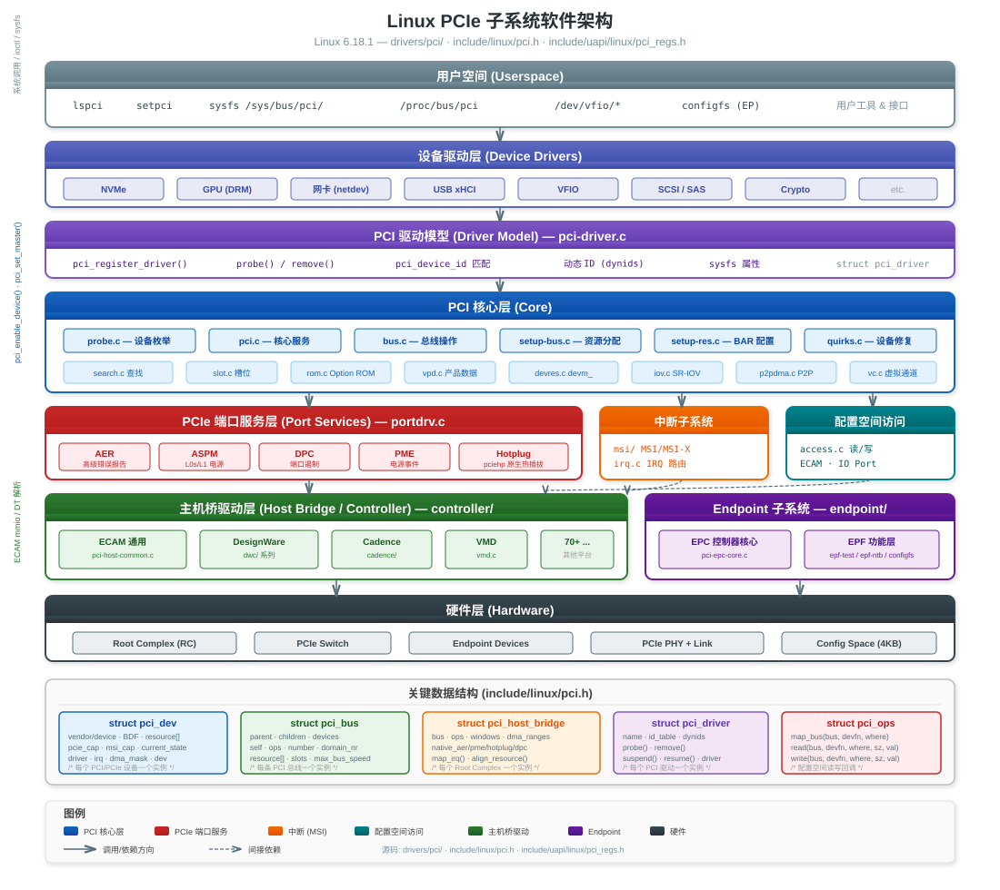
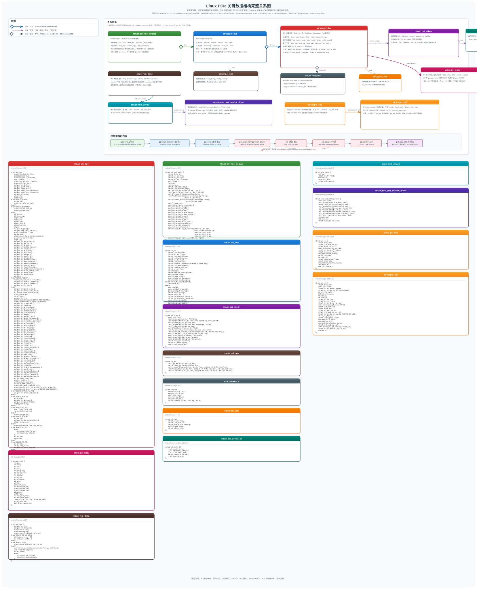
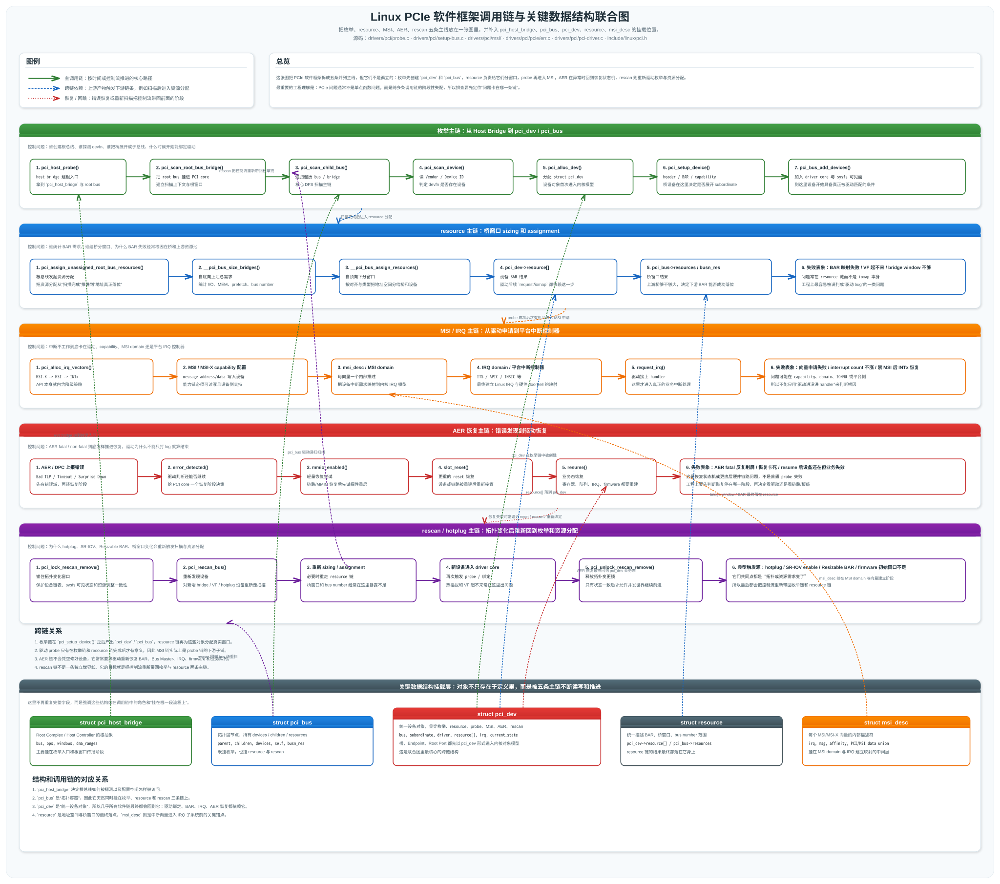

# PCIe 深度学习指南

> **基于 Linux 6.18.1 内核源码** — 涵盖协议规范、发展历史、版本速率、专业术语及内核子系统软件架构  
> 源码路径：`drivers/pci/`、`include/linux/pci.h`、`include/uapi/linux/pci_regs.h`

---

## 目录

<details>
<summary><a href="#1-pcie-协议规范总结">1. PCIe 协议规范总结</a></summary>

- [1.1 协议分层模型](#11-协议分层模型)
- [1.2 事务层协议 (TLP)](#12-事务层协议-tlp)
- [1.3 数据链路层协议 (DLLP)](#13-数据链路层协议-dllp)
- [1.4 物理层协议](#14-物理层协议)
- [1.5 配置空间规范](#15-配置空间规范)
- [1.6 电源管理规范](#16-电源管理规范)
- [1.7 中断机制规范](#17-中断机制规范)
- [1.8 相关规范文档索引](#18-相关规范文档索引)

</details>

<details>
<summary><a href="#2-pcie-发展历史">2. PCIe 发展历史</a></summary>

- [2.1 从 PCI 到 PCIe 的演进](#21-从-pci-到-pcie-的演进)
- [2.2 PCIe 版本演进时间线](#22-pcie-版本演进时间线)
- [2.3 关键里程碑](#23-关键里程碑)

</details>

<details>
<summary><a href="#3-pcie-各版本速率总结">3. PCIe 各版本速率总结</a></summary>

- [3.1 速率对照表](#31-速率对照表)
- [3.2 编码方式演进](#32-编码方式演进)
- [3.3 带宽计算示例](#33-带宽计算示例)

</details>

<details>
<summary><a href="#4-pcie-专业术语词典">4. PCIe 专业术语词典</a></summary>

- [4.1 拓扑与设备术语](#41-拓扑与设备术语)
- [4.2 协议与传输术语](#42-协议与传输术语)
- [4.3 配置空间与能力术语](#43-配置空间与能力术语)
- [4.4 电源与链路状态术语](#44-电源与链路状态术语)
- [4.5 错误处理与可靠性术语](#45-错误处理与可靠性术语)
- [4.6 高级特性术语](#46-高级特性术语)

</details>

<details>
<summary><a href="#5-linux-pcie-子系统软件架构">5. Linux PCIe 子系统软件架构</a></summary>

- [5.1 总体分层架构](#51-总体分层架构)
- [5.2 核心源码文件与职责](#52-核心源码文件与职责)
- [5.3 关键数据结构](#53-关键数据结构)
- [5.4 PCIe 端口服务框架](#54-pcie-端口服务框架)
- [5.5 主机桥驱动层](#55-主机桥驱动层)
- [5.6 设备枚举流程](#56-设备枚举流程)
- [5.7 中断子系统 (MSI/MSI-X)](#57-中断子系统-msimsi-x)
- [5.8 Endpoint 子系统](#58-endpoint-子系统)
- [5.9 关键 Kconfig 配置](#59-关键-kconfig-配置)
- [5.10 目录结构总览](#510-目录结构总览)
- [5.11 核心调用链速览](#511-核心调用链速览)

</details>

<details>
<summary><a href="#6-wifi-pcie-驱动案例分析">6. WiFi PCIe 驱动案例分析</a></summary>

- [6.1 为什么选 `mt7915` PCIe 驱动](#61-为什么选-mt7915-pcie-驱动)
- [6.2 设备匹配与 `probe` 主路径](#62-设备匹配与-probe-主路径)
- [6.3 BAR 映射、DMA、IRQ 和第二 HIF](#63-bar-映射dmairq-和第二-hif)
- [6.4 它和 PCIe 核心数据结构的对应关系](#64-它和-pcie-核心数据结构的对应关系)
- [6.5 调试这个 WiFi PCIe 驱动时看什么](#65-调试这个-wifi-pcie-驱动时看什么)

</details>

<details>
<summary><a href="#7-qemu-中-pcie-实践测试例子">7. QEMU 中 PCIe 实践测试例子</a></summary>

- [7.1 当前工作区里的 QEMU PCIe 基线环境](#71-当前工作区里的-qemu-pcie-基线环境)
- [7.2 实践一：观察默认 PCIe 根总线和设备枚举](#72-实践一观察默认-pcie-根总线和设备枚举)
- [7.3 实践二：给 QEMU 挂一个 NVMe PCIe 设备](#73-实践二给-qemu-挂一个-nvme-pcie-设备)
- [7.4 实践三：用 root port 观察桥和下级总线](#74-实践三用-root-port-观察桥和下级总线)
- [7.5 如果想在 QEMU 里进一步逼近 WiFi PCIe 场景](#75-如果想在-qemu-里进一步逼近-wifi-pcie-场景)

</details>

<details>
<summary><a href="#8-pcie-面试高频问题与答案">8. PCIe 面试高频问题与答案</a></summary>

- [8.1 PCI 和 PCIe 最大区别是什么](#81-pci-和-pcie-最大区别是什么)
- [8.2 PCIe 为什么是点对点还需要 bus 概念](#82-pcie-为什么是点对点还需要-bus-概念)
- [8.3 PCIe 的三层分别做什么](#83-pcie-的三层分别做什么)
- [8.4 TLP 和 DLLP 的区别是什么](#84-tlp-和-dllp-的区别是什么)
- [8.5 Posted 和 Non-Posted 请求有什么区别](#85-posted-和-non-posted-请求有什么区别)
- [8.6 MSI 和 MSI-X 的区别是什么](#86-msi-和-msi-x-的区别是什么)
- [8.7 BAR 是什么，本质上在做什么](#87-bar-是什么本质上在做什么)
- [8.8 为什么驱动里常常要 `pci_set_master`](#88-为什么驱动里常常要-pci_set_master)
- [8.9 PCIe 设备枚举的大致流程是什么](#89-pcie-设备枚举的大致流程是什么)
- [8.10 `struct pci_dev` 和 `struct pci_bus` 分别代表什么](#810-struct-pci_dev-和-struct-pci_bus-分别代表什么)
- [8.11 Root Complex、Root Port、Switch、Endpoint 分别是什么](#811-root-complexroot-portswitchendpoint-分别是什么)
- [8.12 SR-IOV 里 PF 和 VF 的区别是什么](#812-sr-iov-里-pf-和-vf-的区别是什么)
- [8.13 ATS、PRI、PASID 分别解决什么问题](#813-atspripasid-分别解决什么问题)
- [8.14 ASPM 是什么，为什么有些驱动会关闭它](#814-aspm-是什么为什么有些驱动会关闭它)
- [8.15 AER 和 DPC 是做什么的](#815-aer-和-dpc-是做什么的)
- [8.16 面试里如果让你分析一个 PCIe 驱动，你应该怎么答](#816-面试里如果让你分析一个-pcie-驱动你应该怎么答)

</details>

<details>
<summary><a href="#9-pcie-软件框架涉及到的算法">9. PCIe 软件框架涉及到的算法</a></summary>

- [9.1 总线递归扫描算法](#91-总线递归扫描算法)
- [9.2 BAR 大小探测算法](#92-bar-大小探测算法)
- [9.3 桥窗口 sizing 与资源分配算法](#93-桥窗口-sizing-与资源分配算法)
- [9.4 MSI/MSI-X 向量分配与降级算法](#94-msimsi-x-向量分配与降级算法)
- [9.5 错误恢复与状态机算法](#95-错误恢复与状态机算法)

</details>

<details>
<summary><a href="#10-pcie-debug-调试工具和内核方法">10. PCIe debug 调试工具和内核方法</a></summary>

- [10.1 用户态排查工具](#101-用户态排查工具)
- [10.2 sysfs 和配置空间直接观察法](#102-sysfs-和配置空间直接观察法)
- [10.3 内核日志、dynamic debug 和驱动内埋点](#103-内核日志dynamic-debug-和驱动内埋点)
- [10.4 ftrace、trace-cmd 和函数调用链跟踪](#104-ftracetrace-cmd-和函数调用链跟踪)
- [10.5 PCIe 专项 debug 方法](#105-pcie-专项-debug-方法)
- [10.6 一个实用的 PCIe 调试顺序](#106-一个实用的-pcie-调试顺序)
- [10.7 PCIe 调试命令速查表](#107-pcie-调试命令速查表)
- [10.8 PCIe debug checklist](#108-pcie-debug-checklist)

</details>

<details>
<summary><a href="#11-pcie-面试追问题">11. PCIe 面试追问题</a></summary>

- [11.1 `pci_enable_device()` 和 `pcim_enable_device()` 的区别](#111-pci_enable_device-和-pcim_enable_device-的区别)
- [11.2 `pci_request_regions()`、`pci_iomap()`、`pcim_iomap_regions()` 的关系](#112-pci_request_regionspci_iomappcim_iomap_regions-的关系)
- [11.3 `resource` 是怎么分配出来的](#113-resource-是怎么分配出来的)
- [11.4 MSI 申请失败时 Linux 一般怎么降级](#114-msi-申请失败时-linux-一般怎么降级)
- [11.5 为什么 `remove` 路径经常比 `probe` 更难写对](#115-为什么-remove-路径经常比-probe-更难写对)
- [11.6 为什么有些驱动 prefer `devm` 或 `pcim` 管理接口](#116-为什么有些驱动-prefer-devm-或-pcim-管理接口)
- [11.7 什么时候要重新分配桥资源或重新扫描总线](#117-什么时候要重新分配桥资源或重新扫描总线)
- [11.8 `pci_enable_device_mem()` 和 `pci_enable_device()` 怎么选](#118-pci_enable_device_mem-和-pci_enable_device-怎么选)
- [11.9 `pci_select_bars()` 是干什么的](#119-pci_select_bars-是干什么的)
- [11.10 `pci_save_state()` 和 `pci_restore_state()` 什么时候必须关心](#1110-pci_save_state-和-pci_restore_state-什么时候必须关心)
- [11.11 AER 回调顺序和 `pci_error_handlers` 应该怎么理解](#1111-aer-回调顺序和-pci_error_handlers-应该怎么理解)
- [11.12 热插拔、rescan 和 remove 为什么要加锁](#1112-热插拔rescan-和-remove-为什么要加锁)

</details>

<details>
<summary><a href="#12-pcie-故障定位面试题">12. PCIe 故障定位面试题</a></summary>

- [12.1 场景一：设备枚举不到](#121-场景一设备枚举不到)
- [12.2 场景二：BAR 映射失败](#122-场景二bar-映射失败)
- [12.3 场景三：MSI 或 MSI-X 不工作](#123-场景三msi-或-msi-x-不工作)
- [12.4 场景四：驱动 probe 失败但设备已经枚举到](#124-场景四驱动-probe-失败但设备已经枚举到)
- [12.5 场景五：链路能起来但吞吐异常或不稳定](#125-场景五链路能起来但吞吐异常或不稳定)
- [12.6 真实案例题：mt7915 这类 WiFi PCIe 驱动 probe 失败怎么排](#126-真实案例题mt7915-这类-wifi-pcie-驱动-probe-失败怎么排)
- [12.7 真实案例题：QEMU 里 NVMe 已挂载但 guest 看不到怎么排](#127-真实案例题qemu-里-nvme-已挂载但-guest-看不到怎么排)
- [12.8 真实案例题：系统报 AER fatal error 该怎么答](#128-真实案例题系统报-aer-fatal-error-该怎么答)
- [12.9 真实案例题：SR-IOV 打开后 VF 起不来怎么排](#129-真实案例题sr-iov-打开后-vf-起不来怎么排)
- [12.10 真实案例题：suspend/resume 后设备失效怎么排](#1210-真实案例题suspendresume-后设备失效怎么排)

</details>

---

## 1. PCIe 协议规范总结

### 1.1 协议分层模型

PCIe 采用**三层协议栈**架构，类似网络 OSI 模型，每层各司其职：

```
┌──────────────────────────────────────────────────┐
│              软件层 (Software Layer)               │
│     配置/内存/IO 事务 → 操作系统 & 驱动程序          │
├──────────────────────────────────────────────────┤
│         事务层 (Transaction Layer)                 │
│  ┌──────────────────────────────────────────┐    │
│  │ TLP (Transaction Layer Packet)           │    │
│  │ · 内存读/写 (MRd, MWr)                   │    │
│  │ · IO 读/写 (IORd, IOWr)                  │    │
│  │ · 配置读/写 (CfgRd0/1, CfgWr0/1)        │    │
│  │ · 消息 (Msg, MsgD)                       │    │
│  │ · 完成包 (Cpl, CplD)                     │    │
│  └──────────────────────────────────────────┘    │
│  流控 (Flow Control) · 排序规则 (Ordering)         │
├──────────────────────────────────────────────────┤
│        数据链路层 (Data Link Layer)                │
│  ┌──────────────────────────────────────────┐    │
│  │ DLLP (Data Link Layer Packet)            │    │
│  │ · ACK/NAK 应答                            │    │
│  │ · 流控更新 (FC Update)                    │    │
│  │ · 电源管理 (PM_Enter_L1 等)               │    │
│  └──────────────────────────────────────────┘    │
│  重传缓冲区 · CRC 校验 · 序列号                     │
├──────────────────────────────────────────────────┤
│          物理层 (Physical Layer)                   │
│  ┌──────────────────────────────────────────┐    │
│  │ 逻辑子层 (Logical)                        │    │
│  │ · 编码 (8b/10b, 128b/130b, 242B/256B)    │    │
│  │ · 链路训练 (LTSSM)                        │    │
│  │ · 通道对齐 / 极性反转                       │    │
│  ├──────────────────────────────────────────┤    │
│  │ 电气子层 (Electrical)                     │    │
│  │ · 差分信号对 (Tx+/Tx-, Rx+/Rx-)          │    │
│  │ · 均衡 (Equalization)                     │    │
│  │ · 参考时钟 (100MHz)                       │    │
│  └──────────────────────────────────────────┘    │
└──────────────────────────────────────────────────┘
```

### 1.2 事务层协议 (TLP)

TLP 是 PCIe 的基本传输单元，封装所有请求/完成操作：

**TLP 通用格式：**

```
┌─────────┬────────────┬──────────────┬──────────┐
│ 3/4 DW  │  可选      │  0~1024 DW   │  可选     │
│ Header  │  ECRC      │  Data Payload│  ECRC    │
│         │ (4 Bytes)  │  (0~4096 B)  │ (4 Bytes)│
└─────────┴────────────┴──────────────┴──────────┘
```

**TLP 类型：**

| 类型 | 缩写 | 方向 | 说明 |
|------|------|------|------|
| Memory Read | MRd / MRdLk | Requester → Completer | 读取内存映射空间 |
| Memory Write | MWr | Requester → Completer | 写入内存映射空间 (Posted) |
| IO Read | IORd | Requester → Completer | 读取 IO 空间 (Legacy) |
| IO Write | IOWr | Requester → Completer | 写入 IO 空间 (Legacy) |
| Config Read Type 0 | CfgRd0 | RC → 直连设备 | 读自身配置空间 |
| Config Read Type 1 | CfgRd1 | RC → 下游桥 → 设备 | 读非直连设备配置空间 |
| Config Write Type 0/1 | CfgWr0/1 | 同上 | 写配置空间 |
| Message | Msg / MsgD | 多种路由 | 中断、错误、电源管理等 |
| Completion | Cpl / CplD | Completer → Requester | 对 Non-Posted 请求的应答 |
| AtomicOp | FetchAdd / Swap / CAS | Requester → Completer | 原子操作 (PCIe 3.0+) |

**Posted vs Non-Posted：**

| 类别 | 事务类型 | 特点 |
|------|---------|------|
| **Posted** | Memory Write, Message | 发送方不等待完成包，最高性能 |
| **Non-Posted** | Memory Read, IO R/W, Config R/W | 需要完成包 (Completion) 应答 |

**排序规则 (Ordering Rules)：**

PCIe 定义了严格的排序模型，确保数据一致性：

| 规则 | 含义 |
|------|------|
| 强排序 (Strong Ordering) | 同一 TC 内 Posted Write 必须按发送顺序到达 |
| 宽松排序 (Relaxed Ordering) | 设置 RO 位后，Read Completion 可超越 Write |
| ID-Based Ordering (IDO) | PCIe 3.0+，不同 Requester ID 间可乱序 |

### 1.3 数据链路层协议 (DLLP)

DLLP 负责链路级别的可靠传输：

| DLLP 类型 | 功能 |
|-----------|------|
| **ACK** | 确认 TLP 正确接收 |
| **NAK** | 通知 TLP 接收错误，触发重传 |
| **InitFC1/InitFC2/UpdateFC** | 流控信用初始化与更新 |
| **PM_Enter_L1 / PM_Request_Ack** | 电源状态转换握手 |
| **Vendor Specific** | 厂商自定义 |

**重传机制：**

```
发送方                          接收方
  │  TLP (Seq# = N)  ────────→  │
  │                              │ CRC 校验
  │  ←──────────  ACK (Seq# N)   │  ✓ 正确
  │                              │
  │  TLP (Seq# = N+1) ────────→ │
  │                              │ CRC 错误!
  │  ←──────────  NAK (Seq# N+1) │  ✗
  │                              │
  │  重传 TLP (Seq# N+1) ──────→│  从重放缓冲区重发
```

### 1.4 物理层协议

**链路训练状态机 (LTSSM)：**

LTSSM 管理链路从复位到正常工作的全部状态转换：

```
                    ┌─────────┐
         ┌──────── │ Detect  │ ←── 复位/热插拔
         │         └────┬────┘
         │              │ 检测到对端
         │         ┌────▼────┐
         │         │ Polling │  TS1/TS2 交换
         │         └────┬────┘
         │              │ 训练完成
         │         ┌────▼─────────┐
         │         │ Configuration│  协商速率/宽度
         │         └────┬─────────┘
         │              │
         │         ┌────▼────┐
         │    ┌──→ │   L0    │ ◄── 正常工作
         │    │    └──┬───┬──┘
         │    │       │   │ 空闲/省电
         │    │  ┌────▼─┐ ┌▼────┐
         │    │  │Recovery│ │L0s  │ 快速省电
         │    │  └────┬──┘ └─────┘
         │    │       │
         │    └───────┘
         │
    ┌────▼────┐    ┌───────┐
    │ Disabled│    │Loopback│
    └─────────┘    └───────┘
```

**编码演进：**

| 世代 | 编码 | 开销 | 说明 |
|------|------|------|------|
| Gen 1~2 | 8b/10b | 20% | 每 8 位数据编码为 10 位符号 |
| Gen 3~5 | 128b/130b | 1.54% | 128 位数据 + 2 位同步头 |
| Gen 6~7 | 242B/256B (FLIT) | ~5.4% | FLIT 模式 + FEC 前向纠错 |

### 1.5 配置空间规范

PCIe 设备拥有 **4KB 配置空间**（PCI 兼容 256B + PCIe 扩展 3840B）：

```
偏移 (Offset)
0x000 ┌──────────────────────────────────┐
      │  PCI 兼容配置头 (Type 0 / 1)     │
      │  · Vendor ID, Device ID          │
      │  · Command, Status               │
      │  · Class Code, Revision ID       │
      │  · BAR0 ~ BAR5 (Type 0)         │
      │  · 或 Bus Number (Type 1 桥)     │
      │  · Capabilities Pointer (0x34)   │
0x040 ├──────────────────────────────────┤
      │  PCI Capabilities 链表            │
      │  · MSI (Cap ID 0x05)             │
      │  · MSI-X (Cap ID 0x11)           │
      │  · Power Management (Cap ID 0x01)│
      │  · PCI Express (Cap ID 0x10)     │
0x100 ├──────────────────────────────────┤
      │  PCIe 扩展配置空间                 │
      │  Extended Capabilities 链表       │
      │  · AER (Ext Cap ID 0x0001)       │
      │  · VC (0x0002)                   │
      │  · SR-IOV (0x0010)              │
      │  · LTR (0x0018)                 │
      │  · L1 PM Substates (0x001E)     │
      │  · DPC (0x001D)                 │
      │  · PTM (0x001F)                 │
0xFFF └──────────────────────────────────┘
```

> **访问方式：**
> - PCI 兼容 (256B)：IO 端口 0xCF8/0xCFC（x86 Legacy）
> - ECAM (4KB)：内存映射，地址 = ECAM_Base + (Bus << 20 | Dev << 15 | Func << 12 | Reg)

### 1.6 电源管理规范

PCIe 定义了 **设备电源状态 (D-States)** 和 **链路电源状态 (L-States)**：

**设备 D-States：**

| 状态 | 功耗 | 延迟 | 说明 |
|------|------|------|------|
| D0 | 全功率 | 0 | 完全工作状态 |
| D1 | 降低 | 快速 | 轻度省电（可选） |
| D2 | 更低 | 中等 | 中度省电（可选） |
| D3hot | 最低 | 慢 | 深度省电，Vaux 仍供电，配置空间可访问 |
| D3cold | 零 | 最慢 | 完全断电，需重新初始化 |

**链路 L-States (ASPM)：**

| 状态 | 进入条件 | 恢复延迟 | 省电效果 |
|------|---------|---------|---------|
| L0 | 正常 | 0 | 无（工作态） |
| L0s | 短暂空闲 | < 1 μs | 低（发送端关闭） |
| L1 | 较长空闲 | 2~4 μs | 中（链路时钟关闭） |
| L1.1 | ASPM L1 子状态 | ~32 μs | 高（PLL 关闭） |
| L1.2 | ASPM L1 子状态 | ~32 μs | 更高（参考时钟也可关闭） |
| L2 | 设备进入 D3hot | ~ms | 很高 |
| L3 | 设备进入 D3cold | 需重训练 | 最高（完全断电） |

### 1.7 中断机制规范

PCIe 支持三种中断机制，从传统到现代：

| 机制 | 引入版本 | 向量数 | 特点 |
|------|---------|-------|------|
| **INTx** (Legacy) | PCI 2.1 | 4 (A/B/C/D) | 边带信号，PCIe 用 Assert/Deassert MSG 模拟，共享式 |
| **MSI** | PCI 2.2 | 1/2/4/8/16/32 | 内存写事务触发中断，无需物理中断线 |
| **MSI-X** | PCI 3.0 | 最多 2048 | 独立表 (BAR 内)，每向量独立地址/数据，支持单独 mask |

**MSI-X 表结构 (位于设备 BAR 空间内)：**

```
┌───────┬──────────────┬──────────────┬──────────┬──────────┐
│ Entry │ Msg Addr Low │ Msg Addr Hi  │ Msg Data │ Mask Bit │
│  #0   │  (32-bit)    │  (32-bit)    │ (32-bit) │ (32-bit) │
├───────┼──────────────┼──────────────┼──────────┼──────────┤
│  #1   │              │              │          │          │
├───────┼──────────────┼──────────────┼──────────┼──────────┤
│  ...  │              │              │          │          │
├───────┼──────────────┼──────────────┼──────────┼──────────┤
│ #2047 │              │              │          │          │
└───────┴──────────────┴──────────────┴──────────┴──────────┘
```

### 1.8 相关规范文档索引

| 规范 | 发布组织 | 说明 |
|------|---------|------|
| **PCI Express Base Specification** | PCI-SIG | 核心协议规范（当前 Rev 7.0） |
| **PCI Express Card Electromechanical (CEM) Spec** | PCI-SIG | 物理卡槽、连接器、电气规范 |
| **PCI Express Mini CEM Spec** | PCI-SIG | Mini PCIe 卡规范 |
| **PCI Express M.2 Spec** | PCI-SIG | M.2 (NGFF) 接口规范 |
| **PCI Express External Cabling Spec** | PCI-SIG | 外部线缆连接规范 |
| **PCI Code and ID Assignment Spec** | PCI-SIG | Vendor ID、Class Code 分配 |
| **PCI Power Management Spec** | PCI-SIG | 设备电源管理接口 |
| **PCI Firmware Specification** | PCI-SIG | BIOS/UEFI/ACPI 集成 |
| **Single Root I/O Virtualization (SR-IOV)** | PCI-SIG | 硬件虚拟化 |
| **Multi-Root I/O Virtualization (MR-IOV)** | PCI-SIG | 多主机虚拟化 |
| **ECAM (Enhanced Configuration Access Mechanism)** | PCI-SIG | 内存映射配置空间访问 |
| **CXL (Compute Express Link)** | CXL Consortium | 基于 PCIe PHY 的缓存一致性协议 |

---

## 2. PCIe 发展历史

### 2.1 从 PCI 到 PCIe 的演进

```
1992          1995        2002          2003         2004 ──→ 今
 │             │            │             │            │
 PCI 1.0      PCI 2.1      PCI-X 2.0    PCIe 1.0    PCIe 1.1 ──→ 7.0
 并行总线      64位/66MHz   ECC/DDR       串行点对点     持续迭代
 33MHz/32bit  引入 MSI      533MHz peak   2.5 GT/s     ↓
 133 MB/s     266 MB/s     4.3 GB/s      250 MB/s/ln  见下表
```

**为什么从并行转向串行？**

| 问题 | PCI 并行总线 | PCIe 串行点对点 |
|------|-------------|----------------|
| 信号完整性 | 多设备共享总线，信号干扰严重 | 点对点连接，无共享 |
| 时钟频率 | 受限于并行走线偏斜 (skew) | 嵌入式时钟，频率自由提升 |
| 拓扑 | 共享总线仲裁 | Switch 交换，全双工 |
| 扩展性 | 增加设备性能下降 | 增加 Lane 数线性提升 |
| 热插拔 | 困难 | 原生支持 |

### 2.2 PCIe 版本演进时间线

| 年份 | 版本 | 关键特性 |
|------|------|---------|
| **2003** | PCIe 1.0 | 首个正式规范，2.5 GT/s，8b/10b 编码 |
| **2005** | PCIe 1.1 | 修正勘误，增加 ASPM 细化规则 |
| **2007** | PCIe 2.0 | 速率翻倍至 5.0 GT/s，软件兼容 1.0 |
| **2010** | PCIe 3.0 | 8.0 GT/s，128b/130b 编码（开销从 20% 降至 1.54%），引入均衡 (Equalization)，AtomicOp |
| **2014** | PCIe 3.1 | 规范更新，增加 L1 PM Substates |
| **2017** | PCIe 4.0 | 16.0 GT/s，保持 128b/130b |
| **2019** | PCIe 5.0 | 32.0 GT/s，增加信号完整性要求 |
| **2022** | PCIe 6.0 | 64.0 GT/s，PAM4 调制，FLIT 模式，FEC 前向纠错，242B/256B 编码 |
| **2025** | PCIe 7.0 | 128.0 GT/s，PAM4，带宽再翻倍 |

### 2.3 关键里程碑

| 里程碑 | 意义 |
|--------|------|
| **PCI → PCIe 转型 (2004)** | Intel 率先在芯片组中支持，终结并行总线时代 |
| **128b/130b 编码 (Gen3)** | 编码效率从 80% 提升到 98.46%，同频率带宽跃升 |
| **SR-IOV 引入** | 硬件虚拟化，一个物理设备虚拟为多个 VF，推动云计算 |
| **NVMe over PCIe** | SSD 直连 PCIe 绕过 SATA/SAS，延迟降低一个数量级 |
| **PAM4 调制 (Gen6)** | 每符号传 2 比特，突破 NRZ 频率瓶颈 |
| **FLIT 模式 (Gen6)** | 定长传输单元 + FEC，从重传机制变为纠错机制 |
| **CXL 兴起** | 基于 PCIe PHY 的缓存一致性互联，统一 CPU-加速器内存 |

---

## 3. PCIe 各版本速率总结

### 3.1 速率对照表

| 版本 | 传输速率 (GT/s) | 编码 | 编码效率 | 单 Lane 带宽 | x4 带宽 | x8 带宽 | x16 带宽 |
|------|----------------|------|---------|-------------|---------|---------|----------|
| **1.0** | 2.5 | 8b/10b | 80% | 250 MB/s | 1 GB/s | 2 GB/s | 4 GB/s |
| **2.0** | 5.0 | 8b/10b | 80% | 500 MB/s | 2 GB/s | 4 GB/s | 8 GB/s |
| **3.0** | 8.0 | 128b/130b | 98.46% | ~985 MB/s | ~3.94 GB/s | ~7.88 GB/s | ~15.75 GB/s |
| **4.0** | 16.0 | 128b/130b | 98.46% | ~1.97 GB/s | ~7.88 GB/s | ~15.75 GB/s | ~31.51 GB/s |
| **5.0** | 32.0 | 128b/130b | 98.46% | ~3.94 GB/s | ~15.75 GB/s | ~31.51 GB/s | ~63.02 GB/s |
| **6.0** | 64.0 | 242B/256B + FEC | ~94.6% | ~7.56 GB/s | ~30.24 GB/s | ~60.48 GB/s | ~120.96 GB/s |
| **7.0** | 128.0 | 242B/256B + FEC | ~94.6% | ~15.13 GB/s | ~60.5 GB/s | ~121 GB/s | ~242 GB/s |

> 注：以上为**单方向**（单工）带宽，PCIe 是**全双工**，双向总带宽 ×2。

### 3.2 编码方式演进

```
Gen 1/2 — 8b/10b 编码
━━━━━━━━━━━━━━━━━━━━━━━━━━━━━━━━━━
每 8 位数据 → 编码为 10 位符号
开销 = 2/10 = 20%
有效带宽 = 传输速率 × 80%

例：Gen2 = 5.0 GT/s × 80% = 4.0 Gb/s = 500 MB/s (每 Lane)


Gen 3/4/5 — 128b/130b 编码
━━━━━━━━━━━━━━━━━━━━━━━━━━━━━━━━━━
每 128 位数据 + 2 位同步头 = 130 位
开销 = 2/130 ≈ 1.54%
有效带宽 = 传输速率 × 98.46%

例：Gen5 = 32.0 GT/s × 98.46% ≈ 31.5 Gb/s ≈ 3.94 GB/s (每 Lane)


Gen 6/7 — 242B/256B + FLIT + FEC
━━━━━━━━━━━━━━━━━━━━━━━━━━━━━━━━━━
FLIT (Flow Control Unit) = 256 字节定长单元
  · 242 字节有效数据 + 8 字节 CRC + 6 字节 FEC 冗余
  · PAM4 调制：每符号 2 比特（NRZ 每符号 1 比特）
开销 ≈ 14/256 ≈ 5.4%

例：Gen6 = 64.0 GT/s × (242/256) ≈ 60.5 Gb/s ≈ 7.56 GB/s (每 Lane)
```

### 3.3 带宽计算示例

**例 1：NVMe SSD (PCIe 4.0 x4)**
```
单 Lane 带宽 = 16.0 GT/s × (128/130) = 15.75 Gb/s
x4 单向 = 15.75 × 4 = 63.02 Gb/s ≈ 7.88 GB/s
实际 NVMe 读取峰值 ≈ 7.0 GB/s（协议开销 + TLP 头部）
```

**例 2：GPU (PCIe 5.0 x16)**
```
单 Lane 带宽 = 32.0 GT/s × (128/130) ≈ 31.5 Gb/s
x16 单向 = 31.5 × 16 ≈ 504 Gb/s ≈ 63 GB/s
双向总带宽 ≈ 126 GB/s
```

**例 3：网卡 (PCIe 5.0 x8, 200GbE)**
```
x8 单向 = 31.5 × 8 ≈ 252 Gb/s ≈ 31.5 GB/s
200Gb/s 以太网需要 ≈ 25 GB/s → PCIe 5.0 x8 足够承载
```

---

## 4. PCIe 专业术语词典

### 4.1 拓扑与设备术语

| 术语 | 英文全称 | 说明 |
|------|---------|------|
| **RC** | Root Complex | 根复合体，CPU 侧的 PCIe 入口，内含主机桥、根端口 |
| **RP** | Root Port | 根端口，RC 的下行端口，连接到 PCIe 链路 |
| **EP** | Endpoint | 端点设备，PCIe 链路的终端（如 NVMe、GPU、网卡） |
| **Switch** | PCIe Switch | 交换器，扩展 PCIe 端口数，含一个上行端口和多个下行端口 |
| **Bridge** | PCI-to-PCI Bridge | 桥，连接两条总线（每个 Switch 端口本质是一个桥） |
| **Upstream Port** | — | 上行端口，面向 RC 方向 |
| **Downstream Port** | — | 下行端口，面向 EP 方向 |
| **BDF** | Bus:Device.Function | 设备的三级编址：总线号:设备号.功能号（如 01:00.0） |
| **Requester** | — | 发起事务的一方（通常是 EP 或 RP） |
| **Completer** | — | 完成事务的一方（响应请求的设备） |
| **RID** | Requester ID | 请求者标识 = BDF |
| **Multi-Function Device** | — | 多功能设备，单物理设备最多 8 个 Function |
| **RCEC** | Root Complex Event Collector | 根复合体事件收集器，收集 RC 内部错误 |
| **RCRB** | Root Complex Register Block | 根复合体寄存器块 |

### 4.2 协议与传输术语

| 术语 | 英文全称 | 说明 |
|------|---------|------|
| **TLP** | Transaction Layer Packet | 事务层包，所有 PCIe 数据传输的基本单元 |
| **DLLP** | Data Link Layer Packet | 数据链路层包，ACK/NAK/流控 |
| **FLIT** | Flow Control Unit | 流控单元（Gen6+ 定长 256B 传输单元） |
| **Lane** | — | 通道，一对差分信号（一发一收），x1/x2/x4/x8/x16/x32 |
| **Link** | — | 链路，由 1~32 条 Lane 组成的连接 |
| **GT/s** | Giga Transfers per second | 每秒十亿次传输，衡量原始信号速率 |
| **MPS** | Max Payload Size | 最大有效载荷，TLP 数据部分最大值（128/256/512/1024/2048/4096 B） |
| **MRRS** | Max Read Request Size | 最大读请求大小 |
| **RCB** | Read Completion Boundary | 读完成边界（64B 或 128B） |
| **TC** | Traffic Class | 流量类别 (0~7)，映射到 VC 实现 QoS |
| **VC** | Virtual Channel | 虚拟通道，提供独立缓冲和仲裁的流量通道 |
| **Tag** | — | 事务标识符，追踪未完成的 Non-Posted 请求 |
| **CplD** | Completion with Data | 带数据的完成包 |
| **Posted / Non-Posted** | — | Posted 无需应答（写）；Non-Posted 需要完成包（读） |
| **PAM4** | Pulse Amplitude Modulation 4-level | 4 电平脉冲幅度调制（Gen6+，每符号 2 比特） |
| **NRZ** | Non-Return to Zero | 不归零编码（Gen1~5，每符号 1 比特） |

### 4.3 配置空间与能力术语

| 术语 | 英文全称 | 说明 |
|------|---------|------|
| **BAR** | Base Address Register | 基地址寄存器，映射设备内存/IO 到 CPU 地址空间 |
| **ECAM** | Enhanced Configuration Access Mechanism | 增强配置访问机制，4KB/function 内存映射 |
| **Capability** | PCI Capability | PCI 能力（链表结构），偏移 0x00~0xFF |
| **Extended Capability** | PCIe Extended Capability | PCIe 扩展能力，偏移 0x100~0xFFF |
| **VPD** | Vital Product Data | 产品关键数据，存储序列号、型号等 |
| **VSEC** | Vendor-Specific Extended Capability | 厂商自定义扩展能力 |
| **DVSEC** | Designated Vendor-Specific Extended Cap | 指定厂商扩展能力（CXL 等使用） |
| **Type 0 Header** | — | 端点设备配置头（6 个 BAR） |
| **Type 1 Header** | — | 桥设备配置头（2 个 BAR + 总线号） |
| **Command Register** | — | 控制寄存器：Bus Master Enable、Memory/IO Space Enable |
| **Status Register** | — | 状态寄存器：中断状态、能力列表存在位 |

### 4.4 电源与链路状态术语

| 术语 | 英文全称 | 说明 |
|------|---------|------|
| **ASPM** | Active State Power Management | 活动状态电源管理（L0s/L1 自动省电） |
| **L0** | Link State 0 | 正常工作状态 |
| **L0s** | Link State 0s | 低延迟省电（< 1 μs 恢复） |
| **L1** | Link State 1 | 中等省电（需 DLLP 握手进入） |
| **L1.1 / L1.2** | L1 PM Substates | L1 子状态，关闭 PLL / 参考时钟 |
| **D0 ~ D3cold** | Device Power States | 设备电源状态（D0 满功率 → D3cold 完全断电） |
| **PME** | Power Management Event | 电源管理事件（如唤醒信号） |
| **LTSSM** | Link Training and Status State Machine | 链路训练状态机，管理链路初始化和恢复 |
| **LTR** | Latency Tolerance Reporting | 延迟容忍度报告（EP 告知平台可接受唤醒延迟） |
| **OBFF** | Optimized Buffer Flush/Fill | 优化缓冲刷新/填充（协调设备 DMA 与平台省电） |
| **PTM** | Precision Time Measurement | 精确时间测量（跨设备时钟同步） |

### 4.5 错误处理与可靠性术语

| 术语 | 英文全称 | 说明 |
|------|---------|------|
| **AER** | Advanced Error Reporting | 高级错误报告，PCIe 扩展能力 |
| **CE** | Correctable Error | 可纠正错误（硬件自动恢复，如 Bad TLP 重传成功） |
| **UCE** | Uncorrectable Error | 不可纠正错误 |
| **Non-Fatal Error** | — | 非致命错误（可继续运行，但需软件干预） |
| **Fatal Error** | — | 致命错误（链路不可靠，需复位） |
| **DPC** | Downstream Port Containment | 下游端口遏制，自动隔离出错链路 |
| **ECRC** | End-to-End CRC | 端到端 CRC，检测 TLP 数据完整性 |
| **LCRC** | Link CRC | 链路级 CRC，每个 DLLP/TLP 的校验 |
| **FEC** | Forward Error Correction | 前向纠错（Gen6+，FLIT 模式内嵌） |
| **Replay** | — | 重放/重传，NAK 触发从缓冲区重发 TLP |
| **Poisoned TLP** | — | 中毒 TLP，标记数据不可信（EP 位设置） |
| **UR** | Unsupported Request | 不支持的请求（目标设备不识别该事务） |
| **CA** | Completer Abort | 完成者中止（设备无法完成请求） |

### 4.6 高级特性术语

| 术语 | 英文全称 | 说明 |
|------|---------|------|
| **SR-IOV** | Single Root I/O Virtualization | 单根虚拟化，一个 PF 生成多个 VF |
| **PF** | Physical Function | 物理功能，拥有完整配置空间 |
| **VF** | Virtual Function | 虚拟功能，轻量级，直通给虚拟机 |
| **MR-IOV** | Multi-Root I/O Virtualization | 多根虚拟化（多主机共享设备） |
| **ATS** | Address Translation Service | 地址翻译服务（设备请求 IOMMU 翻译） |
| **PRI** | Page Request Interface | 页面请求接口（设备触发缺页） |
| **PASID** | Process Address Space ID | 进程地址空间标识（设备区分不同进程） |
| **ACS** | Access Control Services | 访问控制服务（防止 P2P 绕过 IOMMU） |
| **TPH** | TLP Processing Hints | TLP 处理提示（告知目标缓存行为） |
| **IDE** | Integrity & Data Encryption | 完整性与数据加密（Gen5+，链路加密） |
| **CMA/SPDM** | Component Measurement & Authentication | 组件测量与认证 |
| **DOE** | Data Object Exchange | 数据对象交换（设备间结构化通信） |
| **CXL** | Compute Express Link | 计算快速链路，基于 PCIe PHY 的缓存一致性协议 |
| **AtomicOp** | Atomic Operation | 原子操作（FetchAdd、Swap、CAS） |
| **Resizable BAR** | — | 可变大小 BAR（GPU 大显存直接映射） |

---

## 5. Linux PCIe 子系统软件架构



### 5.1 总体分层架构

```
┌──────────────────────────────────────────────────────────────────────┐
│                    用户空间 (Userspace)                               │
│  lspci · setpci · sysfs (/sys/bus/pci/) · /proc/bus/pci            │
├──────────────────────────────────────────────────────────────────────┤
│                    设备驱动层 (Device Drivers)                        │
│  NVMe · GPU (DRM) · 网卡 (net) · USB xHCI · VFIO · etc.           │
├──────────────────────────────────────────────────────────────────────┤
│                    PCI 驱动模型 (Driver Model)                       │
│  pci-driver.c : probe/remove/bind · ID匹配 · sysfs 属性            │
├──────────────────────────────────────────────────────────────────────┤
│                    PCI 核心层 (Core)                                  │
│  ┌────────────┬────────────┬─────────────┬────────────────┐         │
│  │ probe.c    │ bus.c      │ pci.c       │ setup-bus.c    │         │
│  │ 设备枚举    │ 总线操作    │ 核心服务     │ 资源分配       │         │
│  ├────────────┼────────────┼─────────────┼────────────────┤         │
│  │ search.c   │ slot.c     │ rom.c       │ vpd.c          │         │
│  │ 设备查找    │ 热插拔槽位  │ Option ROM  │ 产品数据       │         │
│  └────────────┴────────────┴─────────────┴────────────────┘         │
├──────────────────────────────────────────────────────────────────────┤
│              PCIe 端口服务层 (Port Services)                          │
│  ┌───────────┬───────────┬──────────┬───────┬─────────────┐         │
│  │ portdrv.c │ aer.c     │ aspm.c   │ dpc.c │ pme.c       │         │
│  │ 端口总线   │ 高级错误   │ 电源管理  │ 端口  │ 电源事件     │         │
│  │ 驱动      │ 报告      │ L0s/L1   │ 遏制  │              │         │
│  └───────────┴───────────┴──────────┴───────┴─────────────┘         │
├──────────────────────────────────────────────────────────────────────┤
│              中断子系统 (Interrupt)           配置空间访问              │
│  ┌──────────────────────┐         ┌──────────────────────┐          │
│  │ msi/ : MSI/MSI-X 核心│         │ access.c : 配置读/写  │          │
│  │ irq.c : IRQ 路由     │         │ ECAM · IO Port      │          │
│  └──────────────────────┘         └──────────────────────┘          │
├──────────────────────────────────────────────────────────────────────┤
│              主机桥驱动层 (Host Bridge / Controller Drivers)          │
│  ┌──────────────────────────────────────────────────────┐           │
│  │ controller/ (70+ 驱动)                                │           │
│  │  · pci-host-common.c (ECAM 通用)                      │           │
│  │  · dwc/ (DesignWare 系列: 多 SoC 使用)                │           │
│  │  · cadence/ (Cadence PCIe IP)                         │           │
│  │  · pcie-xilinx.c, pcie-mediatek.c, ...                │           │
│  └──────────────────────────────────────────────────────┘           │
├──────────────────────────────────────────────────────────────────────┤
│              Endpoint 子系统 (PCIe 设备角色)                          │
│  ┌──────────────────────────────────────────────────────┐           │
│  │ endpoint/ : EPC core + EPF functions + configfs      │           │
│  └──────────────────────────────────────────────────────┘           │
├──────────────────────────────────────────────────────────────────────┤
│                    硬件 (Hardware)                                    │
│  PCIe Controller · Root Complex · Switch · Endpoint Devices         │
└──────────────────────────────────────────────────────────────────────┘
```

### 5.2 核心源码文件与职责

**`drivers/pci/` 核心文件：**

| 文件 | 职责 |
|------|------|
| `pci.c` | **核心服务**：设备初始化、电源管理 (D-state 转换)、能力查询、设备使能/禁用 |
| `pci.h` | **内部头文件**：PCIe 常量定义、能力结构体、内部函数原型 |
| `probe.c` | **设备枚举**：扫描总线、创建 `pci_dev`、检测桥/EP、分配 BDF |
| `bus.c` | **总线操作**：资源窗口管理、添加/移除设备 |
| `pci-driver.c` | **驱动绑定**：ID 匹配、probe/remove 回调、动态 ID 支持 |
| `access.c` | **配置空间读写**：`pci_read_config_*()` / `pci_write_config_*()` |
| `setup-bus.c` | **资源分配**：I/O / Memory / Prefetchable 空间分配算法 |
| `setup-res.c` | **BAR 配置**：BAR 大小探测、地址分配 |
| `irq.c` | **IRQ 路由**：中断分配、INTx 路由 |
| `search.c` | **设备查找**：按 vendor/device/class 等条件搜索 |
| `iomap.c` | **IO 映射**：`pci_iomap()` 等便捷函数 |
| `slot.c` | **物理槽位**：sysfs 中 slot 属性 |
| `rom.c` | **Option ROM**：扩展 ROM 读取 |
| `vpd.c` | **VPD**：Vital Product Data 访问 |
| `devres.c` | **资源管理**：`devm_` 系列 PCI 资源管理函数 |
| `vc.c` | **虚拟通道**：VC 配置 |

**`drivers/pci/pcie/` PCIe 特性：**

| 文件 | 职责 |
|------|------|
| `portdrv.c` | **端口驱动框架**：PCIe 端口总线驱动，管理各端口服务 |
| `aer.c` | **AER**：高级错误报告——检测、记录、恢复 |
| `aspm.c` | **ASPM**：L0s/L1 电源管理策略 |
| `dpc.c` | **DPC**：下游端口遏制——故障隔离 |
| `pme.c` | **PME**：电源管理事件处理 |
| `rcec.c` | **RCEC**：根复合体事件收集器 |
| `bwctrl.c` | **带宽控制**：链路带宽变更通知 |
| `err.c` | **错误恢复**：通用错误恢复框架 |
| `edr.c` | **EDR**：Error Disconnect Recover (ACPI 固件优先错误处理) |

**`drivers/pci/hotplug/` 热插拔：**

| 文件 | 职责 |
|------|------|
| `pciehp_*.c` | **PCIe 原生热插拔**：注意/电源/LED 控制 |
| `acpiphp_*.c` | **ACPI 热插拔**：固件管理的热插拔 |
| `shpchp_*.c` | **SHPC**：标准热插拔控制器 |

**`include/linux/pci.h` — 公共 API（1400+ 行）：**
- `struct pci_dev`、`struct pci_bus`、`struct pci_driver`
- `pci_enable_device()`、`pci_set_master()`、`pci_request_regions()`
- `pci_read_config_*()` / `pci_write_config_*()`
- `pci_alloc_irq_vectors()`、MSI/MSI-X 管理

### 5.3 关键数据结构

Linux PCIe 子系统最重要的结构可以按三条主线理解：

- **拓扑主线**：`pci_host_bridge -> pci_bus -> pci_dev`
- **控制主线**：`pci_ops + pci_driver + pci_device_id`
- **扩展主线**：`resource + pci_slot + pci_sriov + pcie_device`

下面这张图把这些结构放到同一张关系图里，重点展示“谁拥有谁、谁引用谁、谁负责回调”。



#### 5.3.1 核心结构总览

| 结构体 | 源码位置 | 核心职责 | 最关键的关系字段 |
|--------|----------|----------|------------------|
| `struct pci_host_bridge` | `include/linux/pci.h:596` | Root Complex / Host Controller 的内核抽象 | `bus`, `ops`, `child_ops`, `windows`, `dma_ranges`, `map_irq` |
| `struct pci_bus` | `include/linux/pci.h:661` | 一条 PCI 总线及其桥窗口、设备集合 | `parent`, `children`, `devices`, `self`, `resource[]`, `ops` |
| `struct pci_dev` | `include/linux/pci.h:338` | 每个 PCI/PCIe 功能设备的核心对象 | `bus`, `subordinate`, `slot`, `driver`, `resource[]`, `dev` |
| `struct pci_driver` | `include/linux/pci.h:972` | PCI 驱动的注册与回调入口 | `id_table`, `probe`, `remove`, `err_handler`, `driver` |
| `struct pci_device_id` | `include/linux/mod_devicetable.h:44` | 设备匹配规则 | `vendor`, `device`, `subvendor`, `subdevice`, `class` |
| `struct pci_ops` | `include/linux/pci.h:828` | 配置空间读写后端 | `map_bus`, `read`, `write` |
| `struct resource` | `include/linux/ioport.h:21` | BAR、桥窗口、Bus Number 的统一资源描述 | `start`, `end`, `flags`, `parent`, `child` |
| `struct pci_slot` | `include/linux/pci.h:76` | 物理槽位与热插拔的外层抽象 | `bus`, `hotplug`, `number`, `kobj` |
| `struct pci_sriov` | `drivers/pci/pci.h:564` | PF 上维护的 SR-IOV 运行时状态 | `total_VFs`, `num_VFs`, `offset`, `stride`, `barsz[]`, `self` |
| `struct pcie_device` | `drivers/pci/pcie/portdrv.h:59` | 端口服务框架拆出的逻辑设备 | `irq`, `port`, `service`, `priv_data` |
| `struct pcie_port_service_driver` | `drivers/pci/pcie/portdrv.h:78` | AER/PME/DPC/Hotplug 等服务驱动 | `probe`, `remove`, `slot_reset`, `port_type`, `service` |

#### 5.3.2 拓扑主线：`pci_host_bridge -> pci_bus -> pci_dev`

**1. `struct pci_host_bridge` 是根**

- 它描述一个 Host Controller，也就是 CPU 一侧看到的 PCIe Root Complex 入口。
- `bus` 指向根总线；`windows` 和 `dma_ranges` 描述 CPU 地址空间如何映射到 PCIe 地址空间。
- `ops` / `child_ops` 决定内核如何访问配置空间；`map_irq` / `swizzle_irq` 决定中断路由。

**2. `struct pci_bus` 是层次骨架**

- `parent`、`children` 把所有 bus 串成树。
- `devices` 挂着本总线上的全部 `pci_dev`；`self` 指向“从父总线看过来的那个桥设备”。
- `resource[]`、`resources` 和 `busn_res` 不是设备资源，而是**这条总线能向下转发的地址/总线号窗口**。

**3. `struct pci_dev` 是统一设备对象**

- 无论是普通 Endpoint、Root Port、Switch Downstream Port 还是桥设备，内核都统一用 `pci_dev` 表示。
- `bus` 表示自己挂在哪条 bus 上；若它本身是桥，则 `subordinate` 指向下级 bus。
- `resource[DEVICE_COUNT_RESOURCE]` 保存 BAR、ROM，以及桥类型头里的窗口资源。
- `dev` 把 `pci_dev` 接到 Linux 通用设备模型中，随后 sysfs、电源管理、DMA、driver core 都围绕这个嵌入对象展开。

**4. `struct pci_slot` 是物理外壳，不是枚举核心**

- `pci_slot` 主要给物理槽位、热插拔控制、sysfs 命名使用。
- `pci_dev->slot` 只是把逻辑设备关联回物理插槽；没有 slot 也完全不影响枚举主线。

#### 5.3.3 控制主线：配置访问、匹配与绑定

**1. `struct pci_ops` 决定“怎么读写配置空间”**

- `read()` / `write()` 是配置访问的真正后端。
- `map_bus()` 负责把 `(bus, devfn, where)` 映射到平台的 ECAM 或其他配置访问窗口。
- `pci_host_bridge->ops` 和 `pci_bus->ops` 把平台相关实现接到 PCI core 上。

**2. `struct pci_device_id` 决定“谁能匹配谁”**

- 它只是规则，不承载生命周期。
- `vendor/device/subvendor/subdevice/class` 定义匹配条件，`driver_data` 给驱动传私有常量。

**3. `struct pci_driver` 决定“匹配成功后做什么”**

- `id_table` 指向匹配表；匹配成功后调用 `probe(struct pci_dev *dev, const struct pci_device_id *id)`。
- `remove()`、`shutdown()`、`suspend()`、`resume()` 负责生命周期管理。
- `err_handler` 指向 `struct pci_error_handlers`，把 AER/错误恢复回调挂进来。
- 当驱动绑定后，`pci_dev->driver` 会回指当前 `pci_driver`，形成双向联系。

#### 5.3.4 资源与扩展主线

**1. `struct resource` 统一了 BAR、桥窗口和 bus number 资源**

- `pci_dev->resource[]` 主要描述设备 BAR、Expansion ROM 和桥设备窗口。
- `pci_bus->resource[]` / `resources` 描述这条总线下方可转发的地址空间。
- `busn_res` 虽然是 bus number，不是 MMIO/PIO，但仍复用 `resource` 这套资源树模型。

**2. `struct pci_sriov` 挂在 PF 的 `pci_dev` 上**

- 对 PF 而言，`pci_dev->sriov` 保存 SR-IOV 能力的运行时状态。
- 关键字段包括 `total_VFs`、`num_VFs`、`offset`、`stride`、`barsz[]`，用于推导 VF 的 Routing ID 和 BAR 布局。
- 对 VF 而言，`pci_dev` 不再持有 `sriov`，而是通过 `physfn` 回指自己的 PF。

**3. `struct pcie_device` / `struct pcie_port_service_driver` 是端口服务框架的二级抽象**

- `portdrv` 不直接把 AER、PME、DPC、Hotplug 都塞进 `pci_dev` 驱动里，而是给每个服务拆一个 `pcie_device`。
- `pcie_device->port` 回指真正的端口 `pci_dev`；`service` 指明这是 AER、PME 还是 DPC。
- `pcie_port_service_driver` 再像普通驱动一样通过 `probe/remove/slot_reset` 绑定这些服务设备。

#### 5.3.5 这些结构之间的关键联系

**1. 枚举时的对象生成顺序**

1. 主机桥驱动先创建 `pci_host_bridge`，并提供 `pci_ops`。
2. PCI core 以 `pci_host_bridge->bus` 为起点建立根总线 `pci_bus`。
3. 扫描每个 devfn 时创建 `pci_dev`，挂入 `pci_bus->devices`。
4. 如果 `pci_dev` 是桥，就继续创建它的 `subordinate` 总线并递归扫描。

**2. 桥设备为什么既是 `pci_dev`，又能长出新的 `pci_bus`**

- 这是 Linux PCI 树最关键的设计点：桥本身首先是一个普通配置头，因此必须先有 `pci_dev`。
- 但桥又会把事务转发到下游，因此它再通过 `subordinate` 拥有下一层 `pci_bus`。
- `pci_bus->self` 正好把这两层对象重新连起来。

**3. 驱动绑定为什么总是落到 `pci_dev` 上**

- 因为 `pci_dev` 是枚举结果，也是设备模型中的真正设备对象。
- `pci_driver`、`pci_device_id`、AER 恢复、DMA mask、电源状态、BAR 映射，最终都围绕 `pci_dev` 组织。
- `pci_bus` 更偏向拓扑容器，`pci_host_bridge` 更偏向控制器入口，它们通常不是功能驱动绑定点。

**4. 资源编排为什么分成“设备资源”和“总线窗口”两层**

- `pci_dev->resource[]` 说的是“设备自己需要什么 BAR/窗口”。
- `pci_bus->resources` 说的是“这条桥下面允许通过多大的地址窗口”。
- 前者决定设备寄存器和内存暴露在哪里，后者决定上游桥寄存器怎么编程才能把这些事务放行。

**5. 端口服务框架为什么额外引入 `pcie_device`**

- 因为一个 Root Port 可能同时有 AER、PME、DPC、Hotplug 等多种服务。
- 如果全部直接绑定在一个 `pci_driver` 里，服务边界会变得很糟糕。
- `pcie_device` 把“端口本体”与“端口服务”拆开，使每个服务像独立子设备一样注册和处理中断。

**6. SR-IOV 为什么不用单独的 VF 管理树**

- Linux 仍然坚持“VF 也是 `pci_dev`”这条统一模型。
- PF 额外挂一个 `pci_sriov` 结构保存能力状态；VF 则通过 `physfn` 反向找到 PF。
- 这样枚举、驱动绑定、BAR 管理、IOMMU/DMA 逻辑都不需要为 VF 另起一套对象模型。

### 5.4 PCIe 端口服务框架

PCIe 端口驱动 (`portdrv`) 将根端口/下游端口的功能拆分为**独立服务**：

```
┌─────────────────────────────────────────────────────────┐
│                PCIe 端口 (Root Port / Downstream Port)   │
│                         portdrv.c                        │
├────────┬────────┬────────┬────────┬─────────────────────┤
│  PME   │  AER   │  HP    │  DPC   │  BWCTRL             │
│ 服务   │ 服务   │ 服务   │ 服务   │  服务                │
│ pme.c  │ aer.c  │pciehp  │ dpc.c  │ bwctrl.c            │
│        │        │        │        │                      │
│ Bit 0  │ Bit 1  │ Bit 2  │ Bit 3  │ Bit 4               │
└────────┴────────┴────────┴────────┴─────────────────────┘
       每个服务 = 独立的 pcie_device + 独立 IRQ/MSI-X 向量
```

**端口服务类型：**

| 服务 | 掩码位 | 功能 | 对应文件 |
|------|--------|------|---------|
| **PME** | Bit 0 | 电源管理事件（设备唤醒） | `pcie/pme.c` |
| **AER** | Bit 1 | 高级错误检测与恢复 | `pcie/aer.c` |
| **HP** (Hotplug) | Bit 2 | 原生热插拔（注意按钮、LED、电源） | `hotplug/pciehp_*.c` |
| **DPC** | Bit 3 | 下游端口遏制（故障隔离） | `pcie/dpc.c` |
| **BWCTRL** | Bit 4 | 带宽变更通知（降速检测） | `pcie/bwctrl.c` |

**工作流程：**

```
1. portdrv_probe() 检测端口支持哪些服务
2. 为每个服务创建 pcie_device 对象
3. 各服务驱动独立注册到 pcie_port_bus
4. 中断到来时，portdrv 根据中断源分发到对应服务
```

### 5.5 主机桥驱动层

`drivers/pci/controller/` 包含 70+ 个主机桥驱动，适配不同 SoC/平台：

| 分类 | 驱动 | 覆盖平台 |
|------|------|---------|
| **ECAM 通用** | `pci-host-common.c`, `pci-host-generic.c` | 标准 ECAM 的所有平台 (QEMU virt 等) |
| **DesignWare** | `dwc/` 目录 | Intel/Synopsys DWC IP (最广泛的 PCIe IP) |
| **Cadence** | `cadence/` 目录 | TI K3 等 |
| **ARM** | `pcie-iproc.c`, `pcie-brcmstb.c`, `pci-aardvark.c` | Broadcom/Marvell ARM SoC |
| **x86** | `vmd.c` (Volume Management Device) | Intel VMD |
| **RISC-V** | `pcie-fu740.c` | SiFive FU740 |
| **虚拟化** | `pci-hyperv.c` | Hyper-V 虚拟 PCI |

**主机桥注册流程：**

```c
// 平台驱动 probe 中的典型流程
static int xxx_pcie_probe(struct platform_device *pdev) {
    struct pci_host_bridge *bridge;

    // 1. 分配 host bridge
    bridge = devm_pci_alloc_host_bridge(dev, sizeof(*priv));

    // 2. 配置操作回调
    bridge->ops = &xxx_pci_ops;
    bridge->sysdata = priv;

    // 3. 解析 DT 中的地址窗口
    pci_parse_request_of_pci_ranges(dev, &bridge->windows, ...);

    // 4. 初始化硬件 (PHY, 链路训练等)
    xxx_pcie_setup_hw(priv);

    // 5. 注册并触发枚举
    pci_host_probe(bridge);  // → pci_scan_root_bus_bridge() → probe.c
}
```

### 5.6 设备枚举流程

```
pci_host_probe(bridge)
  │
  ├─ pci_scan_root_bus_bridge(bridge)
  │   │
  │   ├─ pci_register_host_bridge(bridge)   // 注册 host bridge 到 sysfs
  │   │
  │   └─ pci_scan_child_bus(bus)             // 开始递归扫描
  │       │
  │       ├─ for devfn = 0..255:
  │       │    pci_scan_slot(bus, devfn)
  │       │      │
  │       │      └─ pci_scan_single_device(bus, devfn)
  │       │           │
  │       │           ├─ pci_scan_device(bus, devfn)
  │       │           │    · pci_bus_read_dev_vendor_id()  // 读 Vendor/Device ID
  │       │           │    · pci_alloc_dev(bus)             // 分配 pci_dev
  │       │           │    · pci_setup_device()             // 解析头类型、BAR、能力
  │       │           │
  │       │           └─ pci_device_add(dev, bus)
  │       │                · device_add(&dev->dev)          // 注册到设备模型
  │       │
  │       └─ 如果发现桥 (hdr_type == PCI_HEADER_TYPE_BRIDGE):
  │            pci_scan_bridge(bus, dev)
  │              └─ 递归 pci_scan_child_bus(child_bus)
  │
  ├─ pci_assign_unassigned_root_bus_resources(bus)  // 分配资源
  │
  └─ pci_bus_add_devices(bus)                        // 触发驱动匹配
       └─ 对每个设备调用 device_attach() → pci_driver.probe()
```

### 5.7 中断子系统 (MSI/MSI-X)

```c
// 典型驱动中的 MSI/MSI-X 分配
int nvec = pci_alloc_irq_vectors(pdev, min_vecs, max_vecs,
                                  PCI_IRQ_MSIX | PCI_IRQ_MSI | PCI_IRQ_INTX);
int irq = pci_irq_vector(pdev, vector_nr);
request_irq(irq, handler, 0, "my_driver", data);
```

**MSI 子系统架构 (`drivers/pci/msi/`)：**

```
┌──────────────────────────────────────┐
│ 设备驱动: pci_alloc_irq_vectors()    │
├──────────────────────────────────────┤
│ MSI 核心: msi/api.c, msi/irqdomain.c│
│ · 分配/释放 MSI 描述符              │
│ · 创建 irq_domain 映射              │
│ · 配置 MSI/MSI-X Capability         │
├──────────────────────────────────────┤
│ 平台 MSI 控制器                      │
│ (GICv3 ITS / x86 APIC / RISCV IMSIC)│
├──────────────────────────────────────┤
│ 硬件: PCIe 设备 → Memory Write TLP  │
│        → 中断控制器 → CPU            │
└──────────────────────────────────────┘
```

### 5.8 Endpoint 子系统

`drivers/pci/endpoint/` 支持 SoC 作为 **PCIe 设备角色**（而非 Host）：

```
┌────────────────────────────────────────┐
│          configfs 用户接口              │
│   /sys/kernel/config/pci_ep/           │
├────────────────────────────────────────┤
│     EPF (Endpoint Function) 层         │
│   · pci-epf-core.c   函数核心          │
│   · pci-epf-test.c   测试功能          │
│   · pci-epf-mhi.c    MHI 功能          │
│   · pci-epf-ntb.c    NTB 功能          │
│   · pci-epf-vntb.c   虚拟 NTB          │
├────────────────────────────────────────┤
│     EPC (Endpoint Controller) 层       │
│   · pci-epc-core.c   控制器抽象        │
│   · pci-epc-mem.c    内存管理          │
├────────────────────────────────────────┤
│     EPC 驱动 (平台相关)                │
│   · Cadence / DWC / Layerscape / ...   │
└────────────────────────────────────────┘
```

### 5.9 关键 Kconfig 配置

| 配置项 | 默认 | 说明 |
|--------|------|------|
| `CONFIG_PCI` | y/n | PCI 子系统总开关 |
| `CONFIG_PCI_MSI` | y | MSI/MSI-X 中断支持 |
| `CONFIG_PCIEPORTBUS` | y | PCIe 端口总线驱动（AER/ASPM/HP/DPC 的前提） |
| `CONFIG_PCIEAER` | y | Advanced Error Reporting |
| `CONFIG_PCIEASPM` | y | Active State Power Management |
| `CONFIG_PCIE_DPC` | y | Downstream Port Containment |
| `CONFIG_HOTPLUG_PCI_PCIE` | y | PCIe 原生热插拔 |
| `CONFIG_PCI_IOV` | n | SR-IOV 虚拟化支持 |
| `CONFIG_PCI_ECAM` | y | ECAM 配置空间访问 |
| `CONFIG_PCI_ENDPOINT` | n | Endpoint 子系统 |
| `CONFIG_PCI_ENDPOINT_CONFIGFS` | n | Endpoint configfs 接口 |
| `CONFIG_PCIEAER_INJECT` | n | AER 错误注入（调试） |
| `CONFIG_PCIE_TPH` | n | TLP Processing Hints |
| `CONFIG_PCI_REALLOC_ENABLE_AUTO` | y | 自动资源重分配 |

### 5.10 目录结构总览

```
drivers/pci/
├── pci.c              # 核心服务 (电源管理、设备初始化)
├── pci.h              # 内部头文件
├── probe.c            # 设备枚举 (总线扫描)
├── bus.c              # 总线操作 (资源窗口)
├── pci-driver.c       # 驱动绑定 (ID 匹配)
├── access.c           # 配置空间读/写
├── setup-bus.c        # 资源分配算法
├── setup-res.c        # BAR 配置
├── irq.c              # IRQ 路由
├── search.c           # 设备查找
├── iomap.c            # IO 映射
├── slot.c             # 物理槽位
├── rom.c              # Option ROM
├── vpd.c              # Vital Product Data
├── devres.c           # devm 资源管理
├── vc.c               # 虚拟通道
├── ats.c              # Address Translation Service
├── iov.c              # SR-IOV 核心
├── mmap.c             # 用户空间 mmap
├── p2pdma.c           # Peer-to-Peer DMA
├── quirks.c           # 设备 Quirk 修复
├── of.c               # Device Tree 支持
├── pci-acpi.c         # ACPI 集成
│
├── pcie/              # PCIe 特性服务
│   ├── portdrv.c      # 端口总线驱动
│   ├── aer.c          # Advanced Error Reporting
│   ├── aspm.c         # Active State Power Management
│   ├── dpc.c          # Downstream Port Containment
│   ├── pme.c          # Power Management Events
│   ├── rcec.c         # Root Complex Event Collector
│   ├── bwctrl.c       # 带宽控制
│   ├── edr.c          # Error Disconnect Recover
│   └── err.c          # 错误恢复框架
│
├── hotplug/           # 热插拔子系统
│   ├── pciehp_*.c     # PCIe 原生热插拔
│   ├── acpiphp_*.c    # ACPI 热插拔
│   └── shpchp_*.c     # SHPC 热插拔
│
├── controller/        # 主机桥驱动 (70+)
│   ├── pci-host-common.c    # ECAM 通用框架
│   ├── pci-host-generic.c   # 通用 ECAM 驱动
│   ├── dwc/                 # DesignWare PCIe IP
│   ├── cadence/             # Cadence PCIe IP
│   ├── mobiveil/            # Mobiveil PCIe IP
│   ├── vmd.c                # Intel VMD
│   └── ...
│
├── endpoint/          # Endpoint 子系统
│   ├── pci-epc-core.c       # EPC 核心
│   ├── pci-epf-core.c       # EPF 核心
│   ├── functions/           # EPF 功能实现
│   └── ...
│
├── msi/               # MSI/MSI-X 中断管理
│   ├── api.c
│   ├── irqdomain.c
│   └── msi.c
│
├── switch/            # PCIe Switch 管理
│   └── switchtec.c
│
└── pwrctrl/           # 电源控制
```

### 5.11 核心调用链速览

这一节把 Linux PCIe 软件框架里最关键的几条调用链压缩成“面试可复述、调试可定位”的形式。你不需要背所有细节，但最好知道每条链是从哪里进、在哪里做关键决定。



#### 1. 枚举主链

```text
pci_host_probe()
  -> pci_scan_root_bus_bridge()
    -> pci_scan_child_bus()
      -> pci_scan_slot() / pci_scan_device()
        -> pci_alloc_dev()
        -> pci_setup_device()
    -> pci_assign_unassigned_root_bus_resources()
    -> pci_bus_add_devices()
```

这条链回答的是：根总线什么时候出现，`pci_dev` 什么时候创建，资源什么时候分配，设备什么时候真正暴露给驱动层。

#### 2. 资源分配主链

```text
pci_assign_unassigned_root_bus_resources()
  -> __pci_bus_size_bridges()
  -> __pci_bus_assign_resources()
```

这是 PCI 树资源窗口 sizing 和 assignment 的主轴。理解这条链，后面看 BAR 分配失败、桥窗口不够、SR-IOV 资源不够时就不会只盯单个 BAR。

#### 3. 驱动 probe 主链

```text
pci_register_driver()
  -> pci_match_device()
  -> probe(pdev, id)
     -> pci_enable_device()/pcim_enable_device()
     -> pci_request_regions()/pcim_iomap_regions()
     -> dma_set_mask()
     -> pci_set_master()
     -> pci_alloc_irq_vectors()
```

这条链对应大多数现代 PCIe 驱动的骨架：enable、BAR、DMA、Bus Master、IRQ，然后才是业务逻辑初始化。

#### 4. MSI / IRQ 主链

```text
pci_alloc_irq_vectors()
  -> MSI/MSI-X capability 配置
  -> MSI domain / IRQ domain 分配
  -> 平台中断控制器建立映射
```

这条链说明为什么中断不工作时不能只看驱动，因为问题也可能卡在 capability、IRQ domain 或平台中断控制器。

#### 5. AER 恢复主链

```text
AER error
  -> error_detected()
  -> mmio_enabled()
  -> slot_reset()
  -> resume()
```

这条链最重要的意义是：AER 恢复是分阶段状态机，不是单个“error callback”。

#### 6. 热插拔 / rescan 主链

```text
pci_lock_rescan_remove()
  -> pci_rescan_bus()
  -> 新设备扫描 / 新资源分配
  -> pci_unlock_rescan_remove()
```

这条链用来解释为什么 PCI 拓扑变化不能随便并发发生，因为设备生命周期、资源窗口和 sysfs 可见状态都必须保持一致。

---

## 6. WiFi PCIe 驱动案例分析

### 6.1 为什么选 `mt7915` PCIe 驱动

如果要从 Linux 内核里挑一个真实的 **WiFi PCIe 驱动** 来观察 PCIe 子系统如何落地，`drivers/net/wireless/mediatek/mt76/mt7915/pci.c` 是一个很合适的案例：

- 它是标准的 `struct pci_driver + struct pci_device_id` 模型，没有被平台总线或 ACPI 包装得过深。
- `probe()` 里能看到 PCIe 驱动最常见的一整套动作：`pcim_enable_device()`、BAR 映射、`pci_set_master()`、DMA mask 设置、IRQ 申请、设备注册。
- 它还带一个比较有代表性的扩展点：**双 HIF / 第二 PCIe 功能块**，可以帮助理解一个无线芯片为什么会在 PCIe 层面拆成多个功能入口。

这个驱动的 PCIe ID 表定义在：

```c
static const struct pci_device_id mt7915_pci_device_table[] = {
  { PCI_DEVICE(PCI_VENDOR_ID_MEDIATEK, 0x7915) },
  { PCI_DEVICE(PCI_VENDOR_ID_MEDIATEK, 0x7906) },
  { },
};

static const struct pci_device_id mt7915_hif_device_table[] = {
  { PCI_DEVICE(PCI_VENDOR_ID_MEDIATEK, 0x7916) },
  { PCI_DEVICE(PCI_VENDOR_ID_MEDIATEK, 0x790a) },
  { },
};
```

从这里可以直接看出：

- **主功能设备** 用 `mt7915_pci_driver` 绑定。
- **第二 HIF 设备** 用 `mt7915_hif_driver` 绑定。
- 两者底层都是 PCIe 设备，只是驱动侧把它们当作两个角色不同的 PCIe function 来处理。

### 6.2 设备匹配与 `probe` 主路径

这个案例里最关键的入口是：

```c
struct pci_driver mt7915_pci_driver = {
  .name      = KBUILD_MODNAME,
  .id_table  = mt7915_pci_device_table,
  .probe     = mt7915_pci_probe,
  .remove    = mt7915_pci_remove,
};
```

也就是说，PCI core 在枚举到 `Vendor ID = MEDIATEK`、`Device ID = 0x7915/0x7906` 的 `pci_dev` 后，最终会进入：

```c
static int mt7915_pci_probe(struct pci_dev *pdev,
              const struct pci_device_id *id)
```

这个 `probe()` 的主路径非常典型，可以直接按步骤理解：

1. `pcim_enable_device(pdev)`
   启用设备，使配置空间和 BAR 访问准备就绪。

2. `pcim_iomap_regions(pdev, BIT(0), pci_name(pdev))`
   映射 BAR0，对驱动来说这一步之后就有了 MMIO 寄存器窗口。

3. `pci_set_master(pdev)`
   打开 Bus Master，使设备能够主动发起 DMA。

4. `dma_set_mask(&pdev->dev, DMA_BIT_MASK(32))`
   约束 DMA 地址宽度，这里要求设备在 32-bit DMA 地址空间里工作。

5. `mt76_pci_disable_aspm(pdev)`
   出于设备稳定性或时延考虑，显式关闭 ASPM。这也是很多高吞吐 PCIe 设备驱动里会看到的动作。

6. `mt7915_mmio_probe(&pdev->dev, pcim_iomap_table(pdev)[0], id->device)`
   把 PCIe BAR 上的 MMIO 窗口进一步封装成无线子系统自己的寄存器访问对象。

7. `mt7915_wfsys_reset(dev)`
   对无线子系统做一次硬件级 reset，确保 MAC/MCU/WFDMA 状态干净。

8. `mt7915_mmio_wed_init(...)` + `pci_alloc_irq_vectors(...)`
   初始化加速数据通路或退回到普通 PCIe IRQ/MSI 路径。

9. `devm_request_irq(...)`
   申请主 IRQ；如果存在第二 HIF，再对第二条 IRQ 也注册中断处理函数。

10. `mt7915_register_device(dev)`
  到这一步才真正把设备接入 `mac80211` / `mt76` 无线协议栈。

可以把它压缩成下面这个控制流：

```text
pci core 枚举出 pci_dev
  -> pci_driver.id_table 匹配
  -> mt7915_pci_probe()
   -> enable device
   -> map BAR0
   -> set bus master
   -> set DMA mask
   -> init mmio + reset wifi subsystem
   -> alloc irq / request irq
   -> register mt76/mac80211 device
```

这条路径很适合用来对照你前面已经总结过的 `pci_dev`、`pci_driver`、`pci_ops`、`resource`、`msi_desc` 这些核心结构。

### 6.3 BAR 映射、DMA、IRQ 和第二 HIF

#### 1. BAR 映射

```c
ret = pcim_iomap_regions(pdev, BIT(0), pci_name(pdev));
```

这说明驱动实际关注的是 **BAR0**。在 PCIe 视角下，这意味着：

- `pci_dev->resource[0]` 保存 BAR0 的物理资源范围。
- `pcim_iomap_regions()` 把这个 `resource` 对应的地址窗口映射到内核虚拟地址。
- 之后 `pcim_iomap_table(pdev)[0]` 就成了驱动访问设备寄存器的基地址。

对 WiFi 驱动来说，这类 BAR 通常会承载：

- WFDMA 环形队列控制寄存器
- 中断状态 / mask 寄存器
- MCU mailbox
- 芯片识别和复位控制寄存器

#### 2. DMA 能力

```c
ret = dma_set_mask(&pdev->dev, DMA_BIT_MASK(32));
pci_set_master(pdev);
```

这两步合起来，才构成“设备可以稳定 DMA”的最小前提：

- `pci_set_master()` 开启配置空间里的 Bus Master bit
- `dma_set_mask()` 告诉 DMA API 设备可接受的 DMA 地址范围

WiFi 设备和 NVMe、网卡类似，本质上都依赖 DMA 环：

- TX ring：主机准备数据描述符，设备通过 DMA 取走报文
- RX ring：设备 DMA 回主机内存，驱动在中断或 NAPI 中取包
- Event / MCU ring：固件事件与控制消息通过 DMA 共享内存交互

#### 3. IRQ / MSI 路径

这个驱动里会根据具体路径申请 PCIe IRQ：

```c
ret = pci_alloc_irq_vectors(pdev, 1, 1, PCI_IRQ_ALL_TYPES);
ret = devm_request_irq(mdev->dev, irq, mt7915_irq_handler,
             IRQF_SHARED, KBUILD_MODNAME, dev);
```

这里可以直接对应前面讲过的中断层次：

- 从驱动视角看，拿到的是 Linux `irq` 号。
- 从 PCIe 视角看，底层可能是 INTx、MSI 或 MSI-X 中的一种。
- 从内核内部看，分配出来的中断描述最终会落到 `msi_desc`、IRQ domain 和平台中断控制器上。

#### 4. 第二 HIF (`hif2`) 为什么重要

`mt7915` PCIe 驱动比较特别的一点，是它不只处理一个 `pci_dev`，还会额外寻找并初始化第二 HIF：

```c
hif2 = mt7915_pci_init_hif2(pdev);
```

这说明对某些高性能 WiFi 芯片来说，PCIe 不只是“挂一个 BAR + 一个 IRQ”这么简单，而是可能出现：

- 主功能负责主数据面
- 第二功能负责额外的数据面 / 控制面 / 扩展 DMA 通路

从 PCIe 数据结构角度看，这一点很有代表性：

- 它仍然没有脱离统一的 `pci_dev` 模型。
- 驱动只是额外维护了一个 `struct mt7915_hif` 列表，把多个 `pci_dev` 组织成一个逻辑无线设备。
- 这正体现了 Linux PCI 核心和具体功能驱动的职责边界：**PCI core 只负责枚举和抽象对象，设备间怎么拼成一个逻辑功能，由驱动自己决定。**

### 6.4 它和 PCIe 核心数据结构的对应关系

把这个 WiFi 驱动映射回前面的大图，可以得到下面这张“对照表”：

| PCIe 核心对象 | 在 `mt7915` 案例里的具体体现 |
|---------------|-------------------------------|
| `struct pci_device_id` | `mt7915_pci_device_table[]` / `mt7915_hif_device_table[]` |
| `struct pci_driver` | `mt7915_pci_driver` / `mt7915_hif_driver` |
| `struct pci_dev` | `probe()` 里传入的 `pdev`，代表每个被枚举到的 WiFi PCIe function |
| `struct resource` | `pdev->resource[0]` 对应 BAR0，随后被 `pcim_iomap_regions()` 映射 |
| `struct pci_ops` | 驱动本身不直接接触，但配置空间读写仍由所属 host bridge 的 `pci_ops` 完成 |
| `struct msi_desc` | 驱动侧不可见，但 `pci_alloc_irq_vectors()` 背后会创建和管理它 |
| `struct pci_bus` | 表示 WiFi 设备挂载的那条总线，影响其 BDF 和上游桥路径 |

也就是说，这个案例很好地体现了一个现实结论：

> 对具体设备驱动作者而言，最常直接打交道的是 `pci_dev`、`pci_driver`、`resource`、DMA API、IRQ API。  
> `pci_bus`、`pci_host_bridge`、`pci_ops` 更多是 PCI core 和主机桥驱动在背后配合完成的基础设施。

### 6.5 调试这个 WiFi PCIe 驱动时看什么

如果后续你想继续深挖 PCIe 和无线驱动怎么交叉工作，建议优先看这几个观察点：

#### 1. 先确认 PCIe 层是否健康

```bash
dmesg | grep -Ei "pci|pcie|msi|irq"
ls /sys/bus/pci/devices/
```

先确认设备确实被枚举到了，再去看无线子系统。

#### 2. 再确认 BAR 和 IRQ

```bash
cat /sys/bus/pci/devices/0000:01:00.0/resource
cat /sys/bus/pci/devices/0000:01:00.0/irq
```

如果 BAR 没映射好、IRQ 没起来，后面大概率只是连锁失败。

#### 3. 最后看无线协议栈注册

`mt7915_register_device()` 成功后，才说明 PCIe 初始化已经完成，开始真正进入 `mt76/mac80211` 逻辑。

换句话说，这个案例可以分三层调试：

1. **PCIe 枚举层**：设备有没有出现
2. **PCIe 资源层**：BAR、DMA、IRQ 是否工作
3. **无线协议层**：固件、MAC、队列、mac80211 是否注册成功

---

## 7. QEMU 中 PCIe 实践测试例子

### 7.1 当前工作区里的 QEMU PCIe 基线环境

你当前工作区已经有一个可直接启动的 ARM64 QEMU 环境：

```bash
./launch.sh arm64 run
```

它对应的核心参数大致是：

```bash
qemu-system-aarch64 -machine virt -cpu cortex-a57 \
  -m 1024 -smp 4 \
  -kernel arch/arm64/boot/Image \
  --append "nokaslr rdinit=/linuxrc console=ttyAMA0" \
  -nographic
```

对 PCIe 学习来说，这个环境有两个重要意义：

- `virt` 机器默认带标准化的 PCIe Root Complex / ECAM 配置空间访问路径。
- 它非常适合验证 **PCIe 枚举、配置空间、BAR、驱动绑定** 这些内核路径。

但它也有一个限制：

- 默认并不会模拟一个真正的 WiFi PCIe 设备，所以你能很好地练 PCIe 框架，但不能直接复现 `mt7915` 这类真实 WiFi 芯片的固件交互。

### 7.2 实践一：观察默认 PCIe 根总线和设备枚举

这个实验的目标不是看具体功能驱动，而是验证 **PCIe root bus -> pci_dev -> driver** 这条最基础路径。

#### 启动

```bash
./launch.sh arm64 run
```

#### 在 guest 里观察

```bash
ls /sys/bus/pci/devices/

for dev in /sys/bus/pci/devices/*; do
  echo "== $dev =="
  cat "$dev/vendor"
  cat "$dev/device"
  cat "$dev/class"
  cat "$dev/irq" 2>/dev/null
done
```

#### 想确认配置空间内容时

```bash
dev=/sys/bus/pci/devices/0000:00:00.0
od -Ax -tx1 -N 64 "$dev/config"
```

这个实验能帮助你把前面讲的几个概念真正对应起来：

- `/sys/bus/pci/devices/0000:xx:yy.z` 对应一个 `struct pci_dev`
- `vendor/device/class` 来自 PCI 配置头
- `resource` 文件对应 `pci_dev->resource[]`

#### 建议同时观察内核日志

```bash
dmesg | grep -Ei "pci|pcie"
```

这里经常能直接看到根总线创建、资源分配、驱动绑定的线索。

### 7.3 实践二：给 QEMU 挂一个 NVMe PCIe 设备

如果你想看一个**真实功能驱动**如何挂到 PCIe 上，QEMU 里最实用的练习对象不是 WiFi，而是 **NVMe**。原因很简单：

- QEMU 原生支持 `-device nvme`
- Linux 内核里 NVMe 驱动成熟，容易看到 probe 成功路径
- 它同样是标准 PCIe 设备，能完整覆盖 BAR、DMA、IRQ、驱动绑定这些核心点

#### 先创建一个后端镜像

在 host 上执行：

```bash
truncate -s 128M /tmp/qemu-nvme.img
```

#### 用手动命令启动 QEMU

```bash
qemu-system-aarch64 \
  -machine virt -cpu cortex-a57 -m 1024 -smp 4 \
  -kernel arch/arm64/boot/Image \
  --append "nokaslr rdinit=/linuxrc console=ttyAMA0" \
  -nographic \
  --fsdev local,id=kmod_dev,path=$PWD/kmodules,security_model=none \
  -device virtio-9p-device,fsdev=kmod_dev,mount_tag=kmod_mount \
  -drive file=/tmp/qemu-nvme.img,if=none,id=nvme0,format=raw \
  -device nvme,serial=nvme-demo,drive=nvme0,bus=pcie.0
```

#### 在 guest 中验证

```bash
dmesg | grep -Ei "pci|nvme"
ls /sys/bus/pci/devices/
ls /sys/block/
```

如果内核启用了 NVMe 驱动，通常会看到类似：

- PCIe 层先枚举出一个新的 `pci_dev`
- 随后 `nvme` 驱动 probe 成功
- `/sys/block/nvme0n1` 出现

#### 继续看资源和绑定关系

```bash
for dev in /sys/bus/pci/devices/*; do
  echo "== $dev =="
  readlink "$dev/driver" 2>/dev/null || true
  cat "$dev/resource" 2>/dev/null || true
done
```

这个实验非常适合把“PCIe 框架”和“功能驱动”连起来理解。

### 7.4 实践三：用 root port 观察桥和下级总线

如果你想把前面大图里的 **`pci_dev <-> subordinate <-> pci_bus`** 真正观察到，可以显式给 QEMU 增加一个 root port。

#### 启动示例

```bash
truncate -s 128M /tmp/qemu-nvme-rp.img

qemu-system-aarch64 \
  -machine virt -cpu cortex-a57 -m 1024 -smp 4 \
  -kernel arch/arm64/boot/Image \
  --append "nokaslr rdinit=/linuxrc console=ttyAMA0" \
  -nographic \
  --fsdev local,id=kmod_dev,path=$PWD/kmodules,security_model=none \
  -device virtio-9p-device,fsdev=kmod_dev,mount_tag=kmod_mount \
  -device pcie-root-port,id=rp1,bus=pcie.0,addr=0x2 \
  -drive file=/tmp/qemu-nvme-rp.img,if=none,id=nvme1,format=raw \
  -device nvme,serial=nvme-rp-demo,drive=nvme1,bus=rp1
```

#### 在 guest 中观察桥和下级设备

```bash
ls /sys/bus/pci/devices/

for dev in /sys/bus/pci/devices/*; do
  echo "== $dev =="
  cat "$dev/class"
  cat "$dev/vendor"
  cat "$dev/device"
done
```

这时候你通常会看到：

- 一个 Root Port / bridge 类型的 PCIe 设备
- 一个挂在它下游 bus 上的 NVMe 设备

如果你后续愿意继续深入，可以配合 `lspci -tv` 之类的树形视图工具，直观看到 bus 拓扑。

### 7.5 如果想在 QEMU 里进一步逼近 WiFi PCIe 场景

这里需要先说一个现实限制：

- QEMU 默认没有像 `mt7915` 这种“真实 WiFi 芯片级行为”的通用仿真模型。
- 也就是说，你能在 QEMU 里很好地练 **PCIe 框架**，但很难只靠 QEMU 练“真实 WiFi 固件 + 射频 + DMA + MCU 交互”。

如果你真的想在这个工作区里把 WiFi PCIe 驱动也跑起来，通常有两条路径：

#### 路径 1：做 PCIe 框架验证，不追求真实 WiFi 芯片

继续使用 QEMU 的 `nvme`、`virtio-net-pci`、`edu` 等设备，重点验证：

- PCIe 枚举
- BAR 映射
- IRQ/MSI
- 驱动 probe / remove

这条路径适合先把 PCIe 主线搞清楚。

#### 路径 2：做 VFIO 直通，把真实 WiFi 设备交给 QEMU guest

如果 host 上有可直通的 PCIe WiFi 设备，那么可以考虑：

- 在 host 上把它绑定到 `vfio-pci`
- 用 `-device vfio-pci,host=xxxx:xx:xx.x` 直通给 guest

这样 guest 里看到的就是真实的 `pci_dev`，对应的 `mt7915` / `iwlwifi` 一类驱动才有机会真正 probe 成功。

不过这已经不是“纯 QEMU 仿真”了，而是 **QEMU + VFIO + 真实硬件** 的实验路径。

#### 一个更实际的学习顺序

建议按这个顺序练：

1. 先用默认 `virt` 环境确认根总线和配置空间访问正常
2. 再用 `nvme` 或 `edu` 练 BAR、IRQ、驱动绑定
3. 最后如果你手上有真实硬件，再上 VFIO 直通练真实 WiFi PCIe 驱动

---

## 8. PCIe 面试高频问题与答案

这一节不是规范全文复述，而是偏向面试里真正高频、且容易被继续追问的问题。每个问题都尽量给出一个**可以直接说出口的答案框架**。

### 8.1 PCI 和 PCIe 最大区别是什么

**简答版：**

PCI 是**并行共享总线**，PCIe 是**高速串行点对点互连**。

**面试展开版：**

- PCI 多个设备共享同一条总线，需要总线仲裁，频率上去以后会遇到信号完整性和时钟偏斜问题。
- PCIe 改成了点对点链路，每个设备通过 lane 和 switch / root port 连接，天然更适合高带宽扩展。
- PCIe 虽然软件上仍保留了 PCI 兼容配置空间和 BDF 寻址模型，但物理和链路层已经完全不同。

一句话总结：

> PCIe 本质上不是“更快的 PCI”，而是“保留了 PCI 软件模型的全新串行互连架构”。

### 8.2 PCIe 为什么是点对点还需要 bus 概念

**简答版：**

因为 Linux 和 PCI 规范的软件抽象仍然沿用了 **Bus:Device.Function (BDF)** 的寻址模型。

**面试展开版：**

- 物理上，PCIe 是点对点链路。
- 但软件枚举、配置空间访问、设备标识、驱动匹配，仍然以 bus 为层级单位。
- 所以 Linux 内核里仍然需要 `struct pci_bus` 来描述一层总线拓扑，以及桥下可转发的资源窗口。

这也是为什么桥设备会同时关联两个对象：

- 它自己先是一个 `struct pci_dev`
- 然后再通过 `subordinate` 长出新的 `struct pci_bus`

### 8.3 PCIe 的三层分别做什么

**标准答案：**

- **Transaction Layer**：负责生成和消费 TLP，处理内存读写、配置读写、完成包、消息等事务。
- **Data Link Layer**：负责链路可靠性，包括序列号、ACK/NAK、重传、流控。
- **Physical Layer**：负责电气传输、编码、链路训练、lane 对齐和速率协商。

**面试时最好再补一句：**

Transaction Layer 决定“传什么”，Data Link Layer 决定“可靠地传到”，Physical Layer 决定“怎么在导线上传”。

### 8.4 TLP 和 DLLP 的区别是什么

**简答版：**

- **TLP** 是事务层包，承载真正的业务请求和完成数据。
- **DLLP** 是数据链路层包，承载 ACK/NAK、流控更新、电源管理握手等控制信息。

**面试展开版：**

- 内存读写、配置读写、Completion，这些都走 TLP。
- ACK/NAK 和 credit update 不属于业务负载，而是链路维护，所以走 DLLP。
- 如果把 PCIe 类比成快递系统，TLP 是包裹本体，DLLP 更像物流确认和仓位控制信息。

### 8.5 Posted 和 Non-Posted 请求有什么区别

**标准答案：**

- **Posted Request**：发送方发出后不等待 completion，典型例子是 Memory Write。
- **Non-Posted Request**：发送方需要收到 Completion 才算完成，典型例子是 Memory Read、Config Read/Write。

**为什么重要：**

- Posted 写吞吐高，但软件不能把“包发出”误认为“对端已经处理完成”。
- Non-Posted 请求会引入往返时延，但能拿到明确完成结果。

### 8.6 MSI 和 MSI-X 的区别是什么

**简答版：**

MSI-X 比 MSI 更灵活，向量更多，且每个向量都能独立配置地址、数据和 mask。

**面试展开版：**

- MSI 向量数量有限，通常是 1/2/4/8/16/32 这种 2 的幂次。
- MSI-X 最多支持 2048 个向量。
- MSI-X 表位于设备 BAR 里，驱动和内核可以对每个向量单独编程。

一句话回答：

> MSI-X 是更现代、更适合多队列高性能设备的中断机制，所以 NVMe、网卡、现代 WiFi 设备更偏向使用 MSI-X。

### 8.7 BAR 是什么，本质上在做什么

**简答版：**

BAR 是 Base Address Register，用来告诉系统“这个设备希望暴露一段多大的 MMIO / IO 空间”。

**本质上：**

- 设备通过 BAR 声明寄存器或本地内存窗口大小。
- 固件或内核在枚举阶段给它分配实际地址。
- 驱动再通过 `pci_iomap()`、`pcim_iomap_regions()` 等把这些地址映射进内核虚拟地址空间。

面试里常见追问：

> BAR 不是设备寄存器本身，而是“设备资源映射到系统地址空间的入口”。

### 8.8 为什么驱动里常常要 `pci_set_master`

**标准答案：**

因为设备要发起 DMA，必须打开配置空间里的 Bus Master Enable 位。

**补充说明：**

- 不调用 `pci_set_master()`，很多设备虽然 BAR 已经能访问，但设备本身不能主动往主机内存发起 DMA。
- 对网卡、NVMe、WiFi 这类基于 DMA ring 的设备来说，这一步通常是必需的。

### 8.9 PCIe 设备枚举的大致流程是什么

**可以直接背的版本：**

1. Host bridge 驱动创建 `pci_host_bridge`
2. PCI core 创建根总线 `pci_bus`
3. 扫描每个 devfn，读取 Vendor ID / Device ID
4. 如果设备存在，就分配 `struct pci_dev`
5. 解析 header type、BAR、capability
6. 如果是桥，就创建下级 bus 并递归扫描
7. 分配资源、建立 sysfs 设备模型
8. 最后按 `pci_device_id` 匹配 `pci_driver` 并调用 `probe`

如果面试官继续追问 Linux 代码路径，可以补：

- `pci_host_probe()`
- `pci_scan_root_bus_bridge()`
- `pci_scan_child_bus()`
- `pci_alloc_dev()`
- `pci_bus_add_devices()`

### 8.10 `struct pci_dev` 和 `struct pci_bus` 分别代表什么

**简答版：**

- `pci_dev` 代表一个具体的 PCIe function
- `pci_bus` 代表一层总线拓扑和其资源转发窗口

**面试展开版：**

- `pci_dev` 是驱动最常接触的对象，里面有 BDF、BAR、irq、capability、driver、power state 等。
- `pci_bus` 更像拓扑容器，管理子设备链表、下级总线、桥窗口和 bus number 范围。

最关键的一句：

> 设备驱动通常绑定 `pci_dev`，而不是绑定 `pci_bus`。

### 8.11 Root Complex、Root Port、Switch、Endpoint 分别是什么

**标准答案：**

- **Root Complex (RC)**：CPU / SoC 一侧的 PCIe 根复合体，是整个 PCIe 拓扑的起点。
- **Root Port (RP)**：RC 向外连接的一条下行端口。
- **Switch**：PCIe 交换设备，一个上行口，多个下行口。
- **Endpoint (EP)**：最终功能设备，如 NVMe、网卡、WiFi、GPU。

面试里容易加分的一句：

> 从 Linux 对象模型看，Root Port、Switch Downstream Port、普通 Endpoint，本质上都先会被枚举成 `pci_dev`。

### 8.12 SR-IOV 里 PF 和 VF 的区别是什么

**简答版：**

- **PF** 是 Physical Function，完整功能入口，负责管理和配置 SR-IOV 能力。
- **VF** 是 Virtual Function，轻量级功能实例，通常给虚拟机或容器直通使用。

**面试展开版：**

- PF 有完整配置空间和管理权限，可以创建和控制多个 VF。
- VF 是被 PF 派生出来的，资源更轻量，通常没有全部管理能力。
- Linux 内核里 PF 通过 `pci_sriov` 维护 VF 相关状态，VF 则通过 `physfn` 反向指回 PF。

### 8.13 ATS、PRI、PASID 分别解决什么问题

这是 PCIe / IOMMU / 加速器方向很爱问的一组。

**标准答案：**

- **ATS**：Address Translation Service，让设备能够缓存 IOMMU 的地址翻译结果。
- **PRI**：Page Request Interface，让设备在缺页时向主机发请求，类似设备侧“页错误上报”。
- **PASID**：Process Address Space ID，让设备区分不同进程地址空间。

一句话总结：

> ATS / PRI / PASID 组合起来，是为了让高性能设备更深地参与虚拟内存系统，而不是只会做简单 DMA。

### 8.14 ASPM 是什么，为什么有些驱动会关闭它

**简答版：**

ASPM 是 Active State Power Management，用来让链路在空闲时进入 L0s / L1 等低功耗状态。

**为什么会关闭：**

- 某些设备或平台对 ASPM 兼容性不好。
- 某些高吞吐、低时延场景不希望链路频繁进入省电状态。
- 驱动作者宁可牺牲一些功耗，也要换稳定性和时延确定性。

所以面试里如果被问到“关闭 ASPM 是不是 bug”，比较稳妥的回答是：

> 不一定，这是典型的稳定性、兼容性、时延和功耗之间的工程折中。

### 8.15 AER 和 DPC 是做什么的

**标准答案：**

- **AER**：Advanced Error Reporting，负责更细粒度地报告 Correctable / Non-Fatal / Fatal 错误。
- **DPC**：Downstream Port Containment，在下游链路出故障时，快速把故障隔离在端口下方，避免扩散。

可以这样理解：

- AER 更偏“发现和上报错误”
- DPC 更偏“发生严重错误时先隔离故障域”

### 8.16 面试里如果让你分析一个 PCIe 驱动，你应该怎么答

这类题最怕答散。比较稳妥的回答框架是五步：

#### 第一步：看它怎么匹配设备

- `struct pci_device_id`
- `struct pci_driver`
- `probe()` 入口在哪里

#### 第二步：看它怎么初始化 PCIe 资源

- 有没有 `pci_enable_device()` / `pcim_enable_device()`
- 映射了哪些 BAR
- 有没有 `pci_set_master()`
- DMA mask 怎么设

#### 第三步：看它怎么处理中断

- 用的是 INTx、MSI 还是 MSI-X
- `pci_alloc_irq_vectors()` 怎么用
- 中断 handler 和 NAPI / workqueue / tasklet 怎么衔接

#### 第四步：看它怎么接上上层子系统

- 网卡接 `netdev`
- WiFi 接 `mac80211`
- NVMe 接块层
- GPU 接 DRM

#### 第五步：看异常路径和 remove

- probe 失败时如何回滚
- remove 时怎么释放 IRQ、DMA、BAR、firmware 资源

如果能这样答，面试官通常会觉得你不是背概念，而是真的会拆驱动。

---

## 9. PCIe 软件框架涉及到的算法

Linux PCIe 子系统虽然从外部看像“枚举 + 配置 + 驱动绑定”，但内部其实包含了好几类很典型的算法。这里说的“算法”不是竞赛题，而是内核里真正决定行为的**扫描、 sizing、分配、降级、恢复**策略。

### 9.1 总线递归扫描算法

对应代码主线在：

- `drivers/pci/probe.c`
- `pci_scan_child_bus_extend()`
- `pci_scan_child_bus()`

这套算法本质上是一个**带桥递归展开的深度优先扫描**：

1. 对当前 `pci_bus`，遍历所有可能的 `devfn`
2. 先读 Vendor ID / Device ID 判断设备是否存在
3. 如果存在，就创建 `pci_dev`
4. 解析 header type，如果是桥，则创建 `subordinate` bus
5. 再递归进入子总线继续扫描

可以把它理解成：

```text
scan(bus):
  for each devfn on bus:
    if device exists:
      create pci_dev
      if device is bridge:
        create child bus
        scan(child bus)
```

它的关键点不只是 DFS，而是**桥设备既是当前层的 `pci_dev`，又是下一层 `pci_bus` 的入口**。这正是 Linux PCI 树的核心建模方式。

### 9.2 BAR 大小探测算法

对应代码主要在：

- `drivers/pci/setup-res.c`
- `drivers/pci/probe.c`

BAR sizing 是 PCIe 驱动里最经典的硬件探测算法之一。思路是：

1. 保存 BAR 当前值
2. 往 BAR 写全 1
3. 再读回来
4. 根据返回值中哪些位被硬件硬连为 0，推出 BAR 对齐和大小
5. 恢复 BAR 原值

核心原理是：

- BAR 可实现的地址位会被硬件屏蔽一部分
- 被屏蔽的低位数量决定最小对齐
- 反推出的地址窗口大小就是这个 BAR 请求的资源尺寸

一句话总结：

> BAR sizing 的本质是“利用硬件对全 1 掩码写入的响应模式，反推出寄存器窗口大小”。

### 9.3 桥窗口 sizing 与资源分配算法

对应代码主线在：

- `drivers/pci/setup-bus.c`
- `__pci_bus_size_bridges()`
- `__pci_bus_assign_resources()`
- `pci_assign_unassigned_root_bus_resources()`

这一块是 PCIe 软件框架里最容易被忽略、但工程含量很高的算法。

它分两步：

#### 第一步：sizing

- 遍历桥下的所有设备 BAR 和子桥窗口
- 统计每种资源类型的总需求：I/O、MEM、prefetchable MEM、bus number
- 结合对齐要求，推导出桥窗口至少需要多大

#### 第二步：assignment

- 从上游可用资源池里给桥和设备分地址段
- 按资源类型和对齐要求分配
- 如果失败，进入 fail list 或触发重新调整

这本质上有点像：

- 树形资源需求汇总
- 再做带约束的区间分配

不必把它简单理解成“线性分地址”，更准确的说法是：

> 这是一个沿着 PCI 树自底向上估算需求、再自顶向下分配窗口的层次化资源分配算法。

### 9.4 MSI/MSI-X 向量分配与降级算法

对应接口和路径通常是：

- 驱动入口：`pci_alloc_irq_vectors()`
- 释放接口：`pci_free_irq_vectors()`
- 内部涉及：MSI domain、IRQ domain、平台中断控制器分配

对驱动作者来说，这套算法最重要的特征是**自动选择和降级**：

1. 优先尝试 MSI-X
2. 如果设备或平台不支持，再尝试 MSI
3. 再不行，就退回 INTx

所以很多驱动会这样写：

```c
pci_alloc_irq_vectors(pdev, min, max,
                      PCI_IRQ_MSIX | PCI_IRQ_MSI | PCI_IRQ_INTX);
```

这不是简单的 API convenience，而是一个明确的**中断能力降级策略**。

### 9.5 错误恢复与状态机算法

对应组件通常包括：

- AER
- DPC
- `struct pci_error_handlers`
- 驱动的 `error_detected/mmio_enabled/slot_reset/resume`

这部分更像一套**恢复状态机**：

1. 发现错误
2. 汇总各设备驱动对恢复阶段的响应
3. 判断是否可以继续、是否需要 reset
4. 执行 slot reset 或 link recovery
5. 重新使能 MMIO / DMA
6. 让驱动恢复业务

也就是说，PCIe 错误恢复不是“打个 log 就完”，而是一个明确的阶段式状态机。

---

## 10. PCIe debug 调试工具和内核方法

这一节重点回答两个问题：

1. 出问题时用什么工具看
2. 在 Linux 内核里怎么把问题一步步压缩到枚举、资源、中断、驱动某一层

### 10.1 用户态排查工具

最常用的有四类：

#### 1. `lspci`

最常用来确认：

- 设备是否被枚举到
- BDF 是多少
- class code / vendor / device 是什么
- 能力链和 BAR 是否看起来合理

常用命令：

```bash
lspci
lspci -nn
lspci -vv
lspci -tv
```

#### 2. `setpci`

用来直接读写配置空间寄存器，适合验证：

- Command 寄存器
- BAR
- Link Status / Link Control
- MSI / MSI-X capability

示例：

```bash
setpci -s 01:00.0 COMMAND
setpci -s 01:00.0 CAP_EXP+10.w
```

#### 3. `dmesg`

最快速的第一视角。

```bash
dmesg | grep -Ei "pci|pcie|aer|msi|irq"
```

#### 4. QEMU monitor / 虚拟平台日志

如果是在 QEMU 里调，除了 guest 里的 `dmesg`，还要看：

- QEMU 命令行设备参数是否正确
- 是否真的挂到了 `pcie.0` 或某个 root port 下
- monitor 里设备树 / memory map 是否符合预期

### 10.2 sysfs 和配置空间直接观察法

这是 Linux PCIe 调试里非常实用的一类方法。

#### 1. 看设备节点

```bash
ls /sys/bus/pci/devices/
```

#### 2. 看资源

```bash
cat /sys/bus/pci/devices/0000:01:00.0/resource
```

这可以直接对应 `pci_dev->resource[]`。

#### 3. 看配置空间

```bash
od -Ax -tx1 -N 128 /sys/bus/pci/devices/0000:01:00.0/config
```

#### 4. 看驱动绑定关系

```bash
readlink /sys/bus/pci/devices/0000:01:00.0/driver
```

#### 5. 看 IRQ

```bash
cat /sys/bus/pci/devices/0000:01:00.0/irq
cat /proc/interrupts
```

一句话总结：

> `sysfs` 是从“Linux PCI 对象模型”视角看问题，配置空间原始转储是从“硬件协议”视角看问题，两者最好结合起来用。

### 10.3 内核日志、dynamic debug 和驱动内埋点

#### 1. 先看 `dev_err/dev_warn/dev_info`

很多问题其实 `dmesg` 已经给出了一半答案，比如：

- BAR 分配失败
- IRQ 向量分配失败
- AER fatal error
- ASPM 禁用

#### 2. 再开动态调试

如果驱动用了 `pr_debug()` / `dev_dbg()`，可以考虑开启 dynamic debug。

典型思路是：

```bash
echo 'file drivers/pci/* +p' > /sys/kernel/debug/dynamic_debug/control
echo 'file drivers/net/wireless/mediatek/mt76/mt7915/* +p' > /sys/kernel/debug/dynamic_debug/control
```

这样可以把很多平时默认关闭的 debug log 打开。

#### 3. 驱动内埋点怎么加

如果你要自己 debug 某个驱动，比较实用的埋点位置通常有：

- probe 入口
- BAR 映射成功后
- `pci_alloc_irq_vectors()` 之后
- 中断 handler 入口
- remove 和错误回滚路径

### 10.4 ftrace、trace-cmd 和函数调用链跟踪

如果单靠 log 不够，下一步很常见的是上 ftrace。

#### 1. function graph trace

适合看枚举和 probe 的调用链：

```bash
echo function_graph > /sys/kernel/debug/tracing/current_tracer
echo pci_* > /sys/kernel/debug/tracing/set_ftrace_filter
cat /sys/kernel/debug/tracing/trace
```

#### 2. 精确跟踪某几个函数

比如看枚举路径：

- `pci_host_probe`
- `pci_scan_root_bus_bridge`
- `pci_scan_child_bus`
- `pci_bus_add_devices`

比如看资源路径：

- `pci_assign_unassigned_root_bus_resources`
- `__pci_bus_size_bridges`
- `__pci_bus_assign_resources`

#### 3. trace-cmd / perf

如果环境允许，也可以用 `trace-cmd record` 或 `perf probe` 去抓特定函数调用和时延。

### 10.5 PCIe 专项 debug 方法

#### 1. 用内核参数快速做二分

下面这类参数很适合判断问题落在哪一层：

- `pci=nomsi`：怀疑 MSI 路径有问题时，先强制退回非 MSI
- `pcie_aspm=off`：怀疑 ASPM 或链路省电状态导致不稳定时，先关闭省电路径

这类参数的意义不是“永久解决”，而是**快速缩小故障面**。

#### 2. 用 AER / DPC 信息判断链路是否真的出错

当系统报：

- Bad TLP
- Completion Timeout
- Surprise Down
- Receiver Error

这通常说明问题已经不只是驱动逻辑，而可能进入链路层或硬件层。

#### 3. 看链路训练和速率协商

如果设备吞吐不对，或者设备偶现掉线，别只盯驱动，也要看：

- 链路是否真的在预期速率和宽度上训练成功
- 是否频繁 retrain
- 是否被降成 x1 / Gen1

### 10.6 一个实用的 PCIe 调试顺序

建议固定按这六步走：

1. **先确认设备是否枚举到**：`lspci` / `/sys/bus/pci/devices`
2. **再确认 BAR 和配置空间是否合理**：`resource` / `config` / `setpci`
3. **再确认 IRQ / MSI 是否工作**：`irq` / `/proc/interrupts` / `pci=nomsi` 对照
4. **再确认驱动 probe 到哪一步失败**：`dmesg` + dynamic debug
5. **再确认链路和电源管理是否影响行为**：`pcie_aspm=off`、速率/宽度检查
6. **最后才怀疑硬件或固件**：AER、DPC、reset、设备自检日志

这个顺序的意义是：

> 先排“有没有”，再排“通不通”，再排“稳不稳”，最后才排“驱动逻辑对不对”。

### 10.7 PCIe 调试命令速查表

这一节不讲原理，直接给你一份常用命令清单。真正调试时，先把这些命令跑一遍，信息面会比只看一条 `dmesg` 大很多。

#### 1. 看拓扑和设备身份

```bash
lspci
lspci -nn
lspci -tv
lspci -s 01:00.0 -vv
```

用途：

- 设备是否枚举到
- BDF 是多少
- 在哪一级桥下面
- BAR、capability、链路信息是否正常

#### 2. 看 sysfs 里的 Linux 对象视角

```bash
ls /sys/bus/pci/devices/
readlink /sys/bus/pci/devices/0000:01:00.0/driver
cat /sys/bus/pci/devices/0000:01:00.0/resource
cat /sys/bus/pci/devices/0000:01:00.0/irq
```

用途：

- 是否绑定了驱动
- `resource[]` 最终被分到了什么地址
- 当前 IRQ 号是多少

#### 3. 看原始配置空间

```bash
od -Ax -tx1 -N 128 /sys/bus/pci/devices/0000:01:00.0/config
setpci -s 01:00.0 COMMAND
setpci -s 01:00.0 CAP_EXP+12.w
```

用途：

- Command 寄存器是否开了 Memory Space / Bus Master
- PCIe Capability 里的 Link Status 是否合理
- BAR / capability 链是否异常

#### 4. 看中断是否真的来了

```bash
cat /proc/interrupts | grep -iE 'msi|nvme|mt79|pci'
cat /sys/bus/pci/devices/0000:01:00.0/irq
dmesg | grep -Ei 'msi|msix|irq'
```

用途：

- 向量有没有分配成功
- 中断计数有没有增长
- 是申请失败还是申请成功但设备没发中断

#### 5. 看驱动 probe 路径

```bash
dmesg | grep -Ei 'pci|pcie|probe|firmware|dma|iommu'
echo 'file drivers/pci/* +p' > /sys/kernel/debug/dynamic_debug/control
echo 'file drivers/net/wireless/mediatek/mt76/mt7915/* +p' > /sys/kernel/debug/dynamic_debug/control
```

用途：

- 失败点是在 enable、BAR、DMA、IRQ，还是上层注册
- PCI core 还是具体业务驱动在报错

#### 6. 用 ftrace 抓调用链

```bash
echo function_graph > /sys/kernel/debug/tracing/current_tracer
echo 'pci_*' > /sys/kernel/debug/tracing/set_ftrace_filter
cat /sys/kernel/debug/tracing/trace
```

如果你只想抓枚举和资源路径，可把 filter 收缩到：

- `pci_host_probe`
- `pci_scan_root_bus_bridge`
- `pci_scan_child_bus`
- `pci_assign_unassigned_root_bus_resources`

#### 7. 用内核参数做快速二分

```text
pci=nomsi
pcie_aspm=off
```

用途：

- `pci=nomsi` 用来判断问题是否集中在 MSI 路径
- `pcie_aspm=off` 用来判断问题是否和链路低功耗状态切换相关

### 10.8 PCIe debug checklist

这一节把前面的工具和方法压缩成一份按问题类型分类的 checklist。真正现场调试时，不要散着想，按类型走会更稳。

#### 1. 枚举不到 checklist

- `lspci` 看不到设备时，先看 root port / host bridge 是否先出现
- 看 `dmesg | grep -Ei 'pci|pcie|link|aer|timeout'`
- 看物理链路条件：供电、复位、参考时钟、PERST#、link training
- 在虚拟平台里先看 QEMU 拓扑，再看 guest 枚举

#### 2. BAR / resource 异常 checklist

- 看 `/sys/bus/pci/devices/.../resource`
- 看 `setpci` / `config` 里的 BAR 和 Command
- 看桥窗口是否足够，是否被上游截断
- 看 `setup-bus.c` 路径是否完成 sizing 和 assignment

#### 3. MSI / IRQ 异常 checklist

- 看 `pci_alloc_irq_vectors()` 返回值
- 看 `/proc/interrupts` 计数是否增长
- 用 `pci=nomsi` 做二分
- 看平台 IRQ domain / IOMMU / MSI 控制器路径

#### 4. probe 失败 checklist

- 先确认 `pci_device_id` 是否匹配
- 再看失败发生在 enable、BAR、DMA、IRQ 还是上层注册
- 用 dynamic debug 和驱动埋点缩小到具体阶段
- 检查错误回滚路径是否把前面的资源提前释放了

#### 5. 吞吐或稳定性异常 checklist

- 看链路速率、宽度、是否 retrain
- 看是否有 AER correctable / non-fatal error
- 用 `pcie_aspm=off` 做对照
- 再看 DMA、queue depth、中断亲和性、NAPI 或 completion 路径

一句话记忆：

> PCIe 调试最怕“同时怀疑一切”，最好按 枚举 -> 资源 -> 中断 -> 驱动逻辑 -> 性能/稳定性 这条线性路径收缩。

---

## 11. PCIe 面试追问题

这一节是偏 Linux 内核实现的追问，不是协议名词。面试官如果发现你基础概念没问题，下一步经常就会追这些。

### 11.1 `pci_enable_device()` 和 `pcim_enable_device()` 的区别

**简答版：**

- `pci_enable_device()` 是普通接口，需要驱动自己负责回滚和释放。
- `pcim_enable_device()` 是 PCI managed 版本，和 device lifecycle 绑定，更适合配合 `pcim_*` 资源管理接口使用。

**面试展开版：**

- 前者适合需要完全自定义资源生命周期的驱动。
- 后者适合 probe 失败回滚复杂、想减少手工清理代码的驱动。
- 很多现代 PCIe 驱动会搭配 `pcim_iomap_regions()` 一起用。

### 11.2 `pci_request_regions()`、`pci_iomap()`、`pcim_iomap_regions()` 的关系

**可以这么答：**

- `pci_request_regions()` 负责申请 BAR 资源所有权，防止别人占用。
- `pci_iomap()` 负责把 BAR 映射到内核虚拟地址。
- `pcim_iomap_regions()` 是 managed 版本，通常会把“请求 + 映射 + 生命周期管理”一起做掉。

一句话：

> 一个偏资源占用声明，一个偏地址映射，一个偏带生命周期托管的整合接口。

### 11.3 `resource` 是怎么分配出来的

这个问题最容易答空。

比较稳的说法是：

- 设备通过 BAR 或桥窗口声明自己需要多大的地址空间。
- PCI core 在枚举后先做 sizing。
- `setup-bus.c` 里会沿 PCI 树统计需求并分配地址。
- 根总线层通常通过 `pci_assign_unassigned_root_bus_resources()` 启动这轮分配。

再进一步说：

- `pci_dev->resource[]` 保存的是设备资源结果
- `pci_bus->resources` / `busn_res` 保存的是桥和总线窗口结果

### 11.4 MSI 申请失败时 Linux 一般怎么降级

**简答版：**

常见路径是：**MSI-X -> MSI -> INTx**。

驱动里通常通过：

```c
pci_alloc_irq_vectors(pdev, min, max,
                      PCI_IRQ_MSIX | PCI_IRQ_MSI | PCI_IRQ_INTX);
```

让内核按能力逐层尝试。

如果面试官继续问“为什么要这样设计”，可以答：

> 因为平台中断控制器、固件配置、IOMMU、设备 capability 都可能限制 MSI/MSI-X，可用性并不总是稳定一致，所以必须有降级路径。

### 11.5 为什么 `remove` 路径经常比 `probe` 更难写对

因为 `probe` 是线性成功路径，`remove` 需要覆盖：

- 完整初始化成功后的正常卸载
- probe 半途失败后的局部回滚
- 中断、DMA、workqueue、firmware、子设备之间的依赖顺序

一句话概括：

> `remove` 难在“逆拓扑释放”和“兼容 probe 任意中途失败状态”。

### 11.6 为什么有些驱动 prefer `devm` 或 `pcim` 管理接口

因为 PCIe 驱动的资源种类多：

- BAR 映射
- IRQ
- DMA 相关对象
- 子设备
- firmware buffer

一旦 probe 失败路径复杂，手工清理很容易漏。`devm_*` / `pcim_*` 的价值在于：

- 减少重复回滚代码
- 降低 remove / error path 出错概率
- 让驱动作者把精力放在设备逻辑，而不是释放顺序模板代码上

### 11.7 什么时候要重新分配桥资源或重新扫描总线

常见场景有：

- 热插拔后新增设备
- SR-IOV 打开后出现新的 VF
- Resizable BAR 改变窗口大小
- 固件没有正确预留桥窗口，需要 OS 重新分配

这时经常会牵涉：

- `pci_scan_child_bus()`
- `pci_bus_assign_resources()`
- `pci_assign_unassigned_root_bus_resources()`

核心点是：

> PCIe 资源分配不是一次性写死的，只要拓扑或资源需求变化，就可能需要重新 sizing 和 assignment。

### 11.8 `pci_enable_device_mem()` 和 `pci_enable_device()` 怎么选

**简答版：**

- `pci_enable_device()` 同时考虑 I/O port 和 memory BAR。
- `pci_enable_device_mem()` 更偏向只关心 MMIO BAR 的驱动。

**面试展开版：**

- 现代 PCIe 设备大多数主要用 MMIO，所以很多驱动只需要 memory space。
- 如果设备根本不依赖 legacy I/O port，`pci_enable_device_mem()` 的语义更准确。
- 这类问题真正想考的是：你有没有区分清楚 PCI 资源类型，而不是只会无脑套模板。

### 11.9 `pci_select_bars()` 是干什么的

它的作用是：

- 按资源类型从设备 BAR 里筛选出一个 mask
- 常见用法是挑出所有 MEM BAR 或某一类 BAR，再配合 request / iomap 使用

如果面试官问这个，比较好的回答是：

> `pci_select_bars()` 不是做映射，而是先帮你决定“哪些 BAR 值得被后续操作处理”。

### 11.10 `pci_save_state()` 和 `pci_restore_state()` 什么时候必须关心

最常见的场景有：

- suspend / resume
- function level reset 或 slot reset 前后
- 某些错误恢复路径
- VFIO 或设备状态切换场景

比较稳的回答方式是：

> 当设备配置空间可能被硬件 reset、平台电源管理、错误恢复流程覆盖掉时，就要关心 save/restore state，否则驱动恢复后可能丢 BAR、Command、capability 相关配置。

### 11.11 AER 回调顺序和 `pci_error_handlers` 应该怎么理解

面试里不要只背字段名，直接按阶段说：

1. `error_detected()`：先通知驱动发生了错误，驱动决定还能不能继续
2. `mmio_enabled()`：如果链路和 MMIO 恢复到可访问状态，驱动可以尝试做轻量恢复
3. `slot_reset()`：如果前面不够，需要更重的 reset 恢复
4. `resume()`：恢复完成，驱动重新回到正常工作态

关键理解是：

> 这不是几个松散回调，而是一条受 PCI core 驱动的恢复状态机。

### 11.12 热插拔、rescan 和 remove 为什么要加锁

这类题可以直接落到：

- `pci_lock_rescan_remove()`
- `pci_unlock_rescan_remove()`
- `pci_rescan_bus()`

核心原因是：

- rescan 可能在创建新 `pci_dev`
- remove 可能在释放旧 `pci_dev`
- hotplug 可能同时改变拓扑和资源窗口

如果这些操作并发交错，就很容易出现：

- 设备链表遍历和修改竞争
- 资源窗口重分配和设备释放交错
- sysfs / driver core 可见状态不一致

所以面试里最稳的一句是：

> 这些锁保护的不是一个简单变量，而是整个 PCI 拓扑和设备生命周期的一致性。

---

## 12. PCIe 故障定位面试题

这一节不是单纯的“答案”，而是训练你在面试里怎么结构化排查。

### 12.1 场景一：设备枚举不到

**题目：** 板子上插了一个 PCIe 设备，但 `lspci` 看不到，怎么查？

**推荐答法：**

1. 先确认物理链路是否起来：供电、复位、时钟、PERST#、参考时钟、链路训练状态
2. 再确认 host bridge 和 ECAM 是否正常：根总线有没有建起来
3. 看内核日志里是否有 bus scan、AER、link down、timeout
4. 如果是 QEMU 或平台仿真，确认设备是否真的挂到了 `pcie.0` 或 root port 下
5. 如果 root port 存在但下游设备没有出现，重点看桥下扫描和链路训练

**加分点：**

如果设备完全没出现在 PCI 树里，通常优先怀疑**硬件链路 / host bridge / 配置空间访问路径**，而不是驱动 probe。

### 12.2 场景二：BAR 映射失败

**题目：** 设备枚举到了，但驱动 `pci_iomap()` 或 `pcim_iomap_regions()` 失败，怎么排查？

**推荐答法：**

1. 先看 `resource` 文件，确认 BAR 是否真的被分配到了地址
2. 看 BAR 类型和大小是否合理，是否是 64-bit BAR
3. 看桥窗口是否足够，是否被上游桥截断
4. 看是不是资源冲突或固件资源预留异常
5. 必要时看 `setup-bus.c` 相关日志，确认 sizing / assignment 是否成功

**一句话判断：**

> BAR 映射失败通常不是 `ioremap` 本身的问题，而是前面的资源分配链条已经出了问题。

### 12.3 场景三：MSI 或 MSI-X 不工作

**题目：** 设备能跑起来，但中断就是不进，怎么排查？

**推荐答法：**

1. 看驱动是否成功执行了 `pci_alloc_irq_vectors()`
2. 看 `/proc/interrupts` 是否真的有对应向量
3. 看驱动申请的是 MSI-X、MSI 还是 INTx
4. 用 `pci=nomsi` 做二分，判断问题是否确实落在 MSI 路径
5. 看平台中断控制器、IOMMU、irq domain 是否正确建立映射

**面试里最好补一句：**

如果禁用 MSI 后 INTx 可以工作，那通常说明设备基本枚举和 BAR 没问题，问题被压缩到了 **MSI capability / 平台 IRQ 域 / 配置路径**。

### 12.4 场景四：驱动 probe 失败但设备已经枚举到

**题目：** `lspci` 能看到设备，但驱动没绑上，或者 probe 失败，怎么查？

**推荐答法：**

1. 先看 `vendor/device/subsystem/class` 是否真能匹配 `pci_device_id`
2. 看模块是否已加载，驱动是否注册成功
3. 看 `dmesg` 中 probe 失败停在哪一步：enable、BAR、DMA、IRQ、firmware、上层注册
4. 如果是多功能设备，确认是不是功能号或二级功能没匹配到
5. 再看 `driver_override`、blacklist、模块依赖是否影响绑定

### 12.5 场景五：链路能起来但吞吐异常或不稳定

**题目：** 设备能工作，但性能远低于预期，或者偶发掉线，怎么查？

**推荐答法：**

1. 先确认链路速率和宽度是否符合预期，比如是否意外降成 Gen1 x1
2. 看是否频繁 retrain 或有 AER correctable error
3. 关闭 ASPM 做对照，判断是否是省电状态切换引发不稳定
4. 检查设备和平台的 DMA / cache / IOMMU 路径是否异常
5. 最后再回到驱动看 ring 配置、中断合并、NAPI / queue depth 是否合理

**核心思想：**

> 性能问题不要一上来就怪驱动，先确认链路物理能力、协商结果和中断/DMA 基本面是否正常。

### 12.6 真实案例题：mt7915 这类 WiFi PCIe 驱动 probe 失败怎么排

**题目：** 设备能被 `lspci` 看到，`mt7915` 模块也加载了，但驱动 probe 失败，怎么排？

**推荐答法：**

1. 先确认 `pci_device_id` 是否真的匹配，避免你看的设备和实际绑定的 function 不是同一个
2. 看 `dmesg` 里 probe 失败停在 `pcim_enable_device()`、BAR 映射、DMA mask、IRQ 申请还是 firmware 初始化
3. 看 `resource` 和 `config`，确认 BAR 已经有地址，Command 里 Memory Space / Bus Master 已开启
4. 看 `pci_alloc_irq_vectors()` 是否失败，如果失败就检查 MSI/MSI-X capability、平台 IRQ 域以及是否能退回 INTx
5. 如果前面都过了，再看 `mt7915_mmio_probe()`、reset、WED、mac80211 注册这些 WiFi 子系统接入点

**面试里最加分的一句：**

> 这种题不能只答“看 dmesg”，而要先把问题切成 PCI core 基础设施、设备初始化、再到 WiFi 上层注册三层。

### 12.7 真实案例题：QEMU 里 NVMe 已挂载但 guest 看不到怎么排

**题目：** QEMU 命令行里已经加了 `-device nvme,...`，但 guest 里 `lspci` 看不到，怎么排？

**推荐答法：**

1. 先看 QEMU 命令行，确认 NVMe 是挂在 `pcie.0` 还是某个 `pcie-root-port` 下，参数有没有写错
2. 再看 guest 启动日志，确认 host bridge 和根总线是否正常创建
3. 如果挂在 root port 下，确认 root port 自己是否先被枚举到了，再看其下游 bus 是否被扫描
4. 如果 `lspci -tv` 里只有桥没有 endpoint，优先怀疑 root port 挂接、bus scan 或链路建立失败
5. 如果 `lspci` 能看到 NVMe 但驱动没起来，再转到 BAR、MSI、NVMe probe 路径排查

**一句话总结：**

> QEMU 里的 PCIe 故障，第一步永远不是改驱动，而是先确认虚拟拓扑到底有没有按你想的方式建出来。

### 12.8 真实案例题：系统报 AER fatal error 该怎么答

**题目：** 系统日志里不断出现 `AER: Uncorrected (Fatal)`、`Completion Timeout` 或 `Surprise Down`，你怎么排？

**推荐答法：**

1. 先区分是 Correctable、Non-Fatal 还是 Fatal，Fatal 一般意味着不能再把它当普通驱动告警看
2. 再看报错点是在 endpoint、root port 还是 switch port，因为上报设备不一定就是根因设备
3. 看错误类型是 Bad TLP、Completion Timeout、Surprise Down 还是 Receiver Error，不同类型分别偏向事务层超时、链路掉线或物理质量问题
4. 然后看驱动是否实现了 `pci_error_handlers`，恢复停在 `error_detected()`、`mmio_enabled()`、`slot_reset()` 还是 `resume()`
5. 最后才回到硬件层确认供电、时钟、reset、链路质量和板级信号完整性

**面试里加分点：**

> AER fatal error 的关键不是“看到 fatal 就重启”，而是先判断错误域、恢复阶段和链路层症状，再决定它是驱动恢复问题还是硬件链路问题。

### 12.9 真实案例题：SR-IOV 打开后 VF 起不来怎么排

**题目：** PF 正常，但打开 SR-IOV 后 VF 没出现，或者 VF 枚举到了但驱动起不来，怎么排？

**推荐答法：**

1. 先确认 PF 自己是否真的完整初始化好了，包括 BAR、DMA、MSI、firmware 和管理通道
2. 看是否成功启用了 VF，VF 数量、bus number 和桥窗口是否发生了预期变化
3. 如果 VF 没出现，优先怀疑 rescan、桥资源、bus number 或总线窗口不够
4. 如果 VF 出现了但驱动起不来，再看 VF 的 `pci_device_id`、resource、MSI 和 IOMMU 路径
5. 如果是虚拟化场景，还要检查 VF 绑定、直通、隔离域和宿主机管理面是否一致

**一句话总结：**

> SR-IOV 问题通常不是 VF 这个点单独坏了，而是 PF 初始化、资源重分配、拓扑变化和 VF 驱动支持四件事没有对齐。

### 12.10 真实案例题：suspend/resume 后设备失效怎么排

**题目：** 设备冷启动正常，但系统 suspend/resume 一次后设备失效，怎么排？

**推荐答法：**

1. 先确认是链路没恢复、配置空间没恢复，还是驱动业务态没恢复
2. 看 resume 路径里是否重新 enable 了设备，是否重新设置了 Bus Master、DMA mask 和 IRQ
3. 看是否需要 `pci_save_state()` / `pci_restore_state()`，特别是 BAR、Command 和 capability 相关状态有没有丢
4. 看驱动是否只恢复了软件队列，却没有恢复硬件寄存器、doorbell、MSI 或 firmware 上下文
5. 如果平台启用了 ASPM、D3hot/D3cold 或 runtime PM，还要检查电源状态切换是否和驱动假设冲突

**面试里最稳的一句：**

> resume 失败最容易错在“软件以为设备还在原状态，硬件其实已经被 reset 或掉电重建了”。

---

> **参考资料：**
> - PCI Express Base Specification (Rev 7.0), PCI-SIG
> - Linux 内核源码 6.18.1: `drivers/pci/`, `include/linux/pci.h`
> - 内核文档: `Documentation/PCI/`
> - `lspci` / `setpci` 工具 (pciutils)
