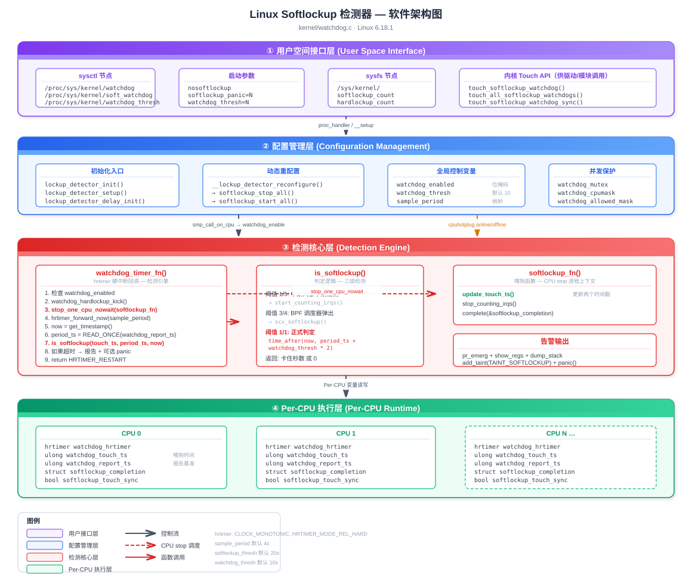
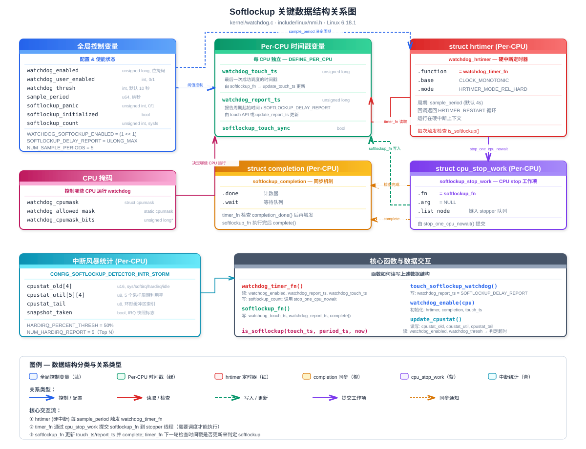

# Linux Kernel Softlockup 检测器深度解析

> 基于 Linux 6.18.1 源码 `kernel/watchdog.c`

## 目录

<details>
<summary><b>1. 软件架构总览</b></summary>

- [软件架构总览](#1-软件架构总览)
</details>
<details>
<summary><b>2. 关键数据结构及其关系</b></summary>

- [关键数据结构及其关系](#2-关键数据结构及其关系)
</details>
<details>
<summary><b>3. 实现原理</b></summary>

- 3.1 [核心思想](#31-核心思想)
- 3.2 [初始化流程](#32-初始化流程)
- 3.3 [定时器回调 watchdog_timer_fn](#33-定时器回调-watchdog_timer_fn)
- 3.4 [喂狗函数 softlockup_fn](#34-喂狗函数-softlockup_fn)
- 3.5 [判定逻辑 is_softlockup](#35-判定逻辑-is_softlockup)
- 3.6 [Touch 机制（延迟报告）](#36-touch-机制延迟报告)
- 3.7 [中断风暴检测](#37-中断风暴检测)
- 3.8 [告警与 Panic 流程](#38-告警与-panic-流程)
</details>
<details>
<summary><b>4. 用法总结</b></summary>

- 4.1 [内核配置 Kconfig](#41-内核配置-kconfig)
- 4.2 [启动参数](#42-启动参数)
- 4.3 [运行时 sysctl 参数](#43-运行时-sysctl-参数)
- 4.4 [驱动/内核模块中的 Touch API](#44-驱动内核模块中的-touch-api)
- 4.5 [告警信息解读](#45-告警信息解读)
- 4.6 [常见问题与调试](#46-常见问题与调试)
</details>
<details>
<summary><b>5. Softlockup 发生意味着什么</b></summary>

- 5.1 [直接含义](#51-直接含义)
- 5.2 [对系统的影响](#52-对系统的影响)
- 5.3 [典型根因分类](#53-典型根因分类)
- 5.4 [与其他内核异常的关系](#54-与其他内核异常的关系)
</details>
<details>
<summary><b>6. QEMU 模拟实验</b></summary>

- 6.1 [实验环境搭建](#61-实验环境搭建)
- 6.2 [实验一：内核模块死循环触发 softlockup](#62-实验一内核模块死循环触发-softlockup)
- 6.3 [实验二：关抢占长时间执行](#63-实验二关抢占长时间执行)
- 6.4 [实验三：自旋锁长时间持有](#64-实验三自旋锁长时间持有)
- 6.5 [观察与验证](#65-观察与验证)
</details>
<details>
<summary><b>7. 面试经典问题与答案</b></summary>

- 7.1 [基础概念类](#71-基础概念类)
- 7.2 [实现原理类](#72-实现原理类)
- 7.3 [实战调试类](#73-实战调试类)
- 7.4 [进阶设计类](#74-进阶设计类)
</details>

---

## 1. 软件架构总览

Softlockup 检测器的软件架构分为四个层次：**用户空间接口层**、**配置管理层**、**检测核心层**、**Per-CPU 执行层**。用户通过 sysctl / 启动参数配置检测参数，配置管理层协调 watchdog 在各 CPU 上的启停，检测核心层基于 hrtimer 硬中断周期性检查调度器是否正常运行，Per-CPU 层维护独立的时间戳与状态。

<div align="center">



</div>

<details>
<summary><b>架构图说明</b></summary>

- **用户空间接口层**：通过 `/proc/sys/kernel/` 下的 sysctl 节点和内核启动参数提供配置入口
- **配置管理层**：`lockup_detector_init()` / `lockup_detector_reconfigure()` 协调全局配置变更，通过 `watchdog_mutex` 保护并发访问
- **检测核心层**：`watchdog_timer_fn()` 作为 hrtimer 硬中断回调是检测引擎，`softlockup_fn()` 通过 CPU stop 机制执行喂狗操作
- **Per-CPU 执行层**：每个 CPU 独立维护 hrtimer、时间戳（`watchdog_touch_ts` / `watchdog_report_ts`）、completion 同步对象

</details>

---

## 2. 关键数据结构及其关系

Softlockup 检测器不依赖复杂的自定义结构体，而是通过 **Per-CPU 变量** 和 **全局控制变量** 的配合实现。每个 CPU 拥有独立的 hrtimer 和时间戳变量，全局变量控制使能状态和阈值。

<div align="center">



</div>

<details>
<summary><b>数据结构说明</b></summary>

- **全局控制变量**：`watchdog_enabled`（位掩码）、`watchdog_thresh`（阈值秒数）、`sample_period`（采样周期纳秒）、`watchdog_cpumask`（运行 CPU 掩码）
- **Per-CPU 变量组**：每个 CPU 独立拥有一组变量，包括 hrtimer 定时器、两个时间戳、completion 同步对象、cpu_stop_work 和 touch_sync 标志
- **watchdog_touch_ts** 记录最近一次成功调度的时间（由 `softlockup_fn` 更新）
- **watchdog_report_ts** 记录最近一次报告周期的起点（由 `softlockup_fn` 或 touch API 更新）
- **两个时间戳解耦**：`touch_ts` 用于计算锁住时长，`report_ts` 用于判定是否超时

</details>

---

## 3. 实现原理

### 3.1 核心思想

Softlockup 检测器的核心思想是：**如果一个 CPU 长时间不进行进程调度（即不让出 CPU），说明该 CPU 可能被某个内核路径"软锁住"了**。

实现方式：
1. 在每个 CPU 上启动一个 **hrtimer 硬中断定时器**，周期为 `sample_period`（默认 4 秒）
2. 每次 hrtimer 触发时，通过 **CPU stop 机制** 尝试执行 `softlockup_fn()`（该函数只能在进程上下文中执行，需要调度）
3. `softlockup_fn()` 执行时会更新时间戳（"喂狗"）
4. 如果时间戳长期不更新（超过 `watchdog_thresh * 2` 秒，默认 20 秒），说明调度器卡住了

关键公式：

$$\text{softlockup\_thresh} = \text{watchdog\_thresh} \times 2$$

$$\text{sample\_period} = \frac{\text{softlockup\_thresh}}{5} \text{ (seconds)}$$

默认值：`watchdog_thresh = 10s` → `softlockup_thresh = 20s` → `sample_period = 4s`

### 3.2 初始化流程

```
lockup_detector_init()                    // 内核启动时调用
  ├── cpumask_copy(&watchdog_cpumask, housekeeping_cpumask(HK_TYPE_TIMER))
  ├── watchdog_hardlockup_probe()         // 探测硬锁检测器
  └── lockup_detector_setup()
        ├── lockup_detector_update_enable()  // 设置 watchdog_enabled 位掩码
        ├── __lockup_detector_reconfigure()
        │     ├── set_sample_period()     // 计算采样周期
        │     └── softlockup_start_all()
        │           └── for_each_cpu(cpu, &watchdog_allowed_mask)
        │                 └── smp_call_on_cpu(cpu, softlockup_start_fn)
        │                       └── watchdog_enable(cpu)
        │                             ├── init_completion(done)
        │                             ├── hrtimer_setup(hrtimer, watchdog_timer_fn,
        │                             │                 CLOCK_MONOTONIC, HRTIMER_MODE_REL_HARD)
        │                             ├── hrtimer_start(hrtimer, sample_period)
        │                             ├── update_touch_ts()    // 初始化时间戳
        │                             └── watchdog_hardlockup_enable(cpu)
        └── softlockup_initialized = true
```

### 3.3 定时器回调 watchdog_timer_fn

`watchdog_timer_fn()` 是整个检测机制的核心引擎，运行在 **硬中断上下文** (HRTIMER_MODE_REL_HARD)：

```c
static enum hrtimer_restart watchdog_timer_fn(struct hrtimer *hrtimer)
{
    // 1. 检查是否启用
    if (!watchdog_enabled) return HRTIMER_NORESTART;
    if (panic_in_progress()) return HRTIMER_NORESTART;

    // 2. 踢一下硬锁检测器
    watchdog_hardlockup_kick();

    // 3. 如果上次 softlockup_fn 已完成，再次触发
    if (completion_done(this_cpu_ptr(&softlockup_completion))) {
        reinit_completion(this_cpu_ptr(&softlockup_completion));
        stop_one_cpu_nowait(smp_processor_id(),
                softlockup_fn, NULL,
                this_cpu_ptr(&softlockup_stop_work));
    }

    // 4. 重新调度 hrtimer
    hrtimer_forward_now(hrtimer, ns_to_ktime(sample_period));

    // 5. 读取时间戳并检测
    now = get_timestamp();
    period_ts = READ_ONCE(*this_cpu_ptr(&watchdog_report_ts));

    // 6. 如果是被 touch 过的（SOFTLOCKUP_DELAY_REPORT），重置
    if (period_ts == SOFTLOCKUP_DELAY_REPORT) {
        update_report_ts();
        return HRTIMER_RESTART;
    }

    // 7. 检测 softlockup
    touch_ts = __this_cpu_read(watchdog_touch_ts);
    duration = is_softlockup(touch_ts, period_ts, now);
    if (unlikely(duration)) {
        // 报告 softlockup ...
    }
    return HRTIMER_RESTART;
}
```

### 3.4 喂狗函数 softlockup_fn

`softlockup_fn()` 是真正的"看门狗喂狗"函数，通过 `stop_one_cpu_nowait()` 触发，运行在 **进程上下文**（migration/N 内核线程）：

```c
static int softlockup_fn(void *data)
{
    update_touch_ts();       // 更新 watchdog_touch_ts 和 watchdog_report_ts
    stop_counting_irqs();    // 停止中断计数（如果开启了中断风暴检测）
    complete(this_cpu_ptr(&softlockup_completion));  // 通知 hrtimer 本轮完成
    return 0;
}
```

关键点：`softlockup_fn` 必须等到 CPU 能够执行进程上下文代码时才能运行。如果 CPU 一直在执行内核代码不让出（如死循环、长时间关中断），`softlockup_fn` 就无法执行，时间戳就不会更新，最终触发检测。

### 3.5 判定逻辑 is_softlockup

```c
static int is_softlockup(unsigned long touch_ts,
                          unsigned long period_ts,
                          unsigned long now)
{
    if ((watchdog_enabled & WATCHDOG_SOFTOCKUP_ENABLED) && watchdog_thresh) {
        // 中断风暴早期检测（1/5 阈值）
        if (time_after_eq(now, period_ts + get_softlockup_thresh() / NUM_SAMPLE_PERIODS)
            && need_counting_irqs())
            start_counting_irqs();

        // BPF 调度器弹出（3/4 阈值）
        if (time_after_eq(now, period_ts + get_softlockup_thresh() * 3 / 4))
            scx_softlockup(now - touch_ts);

        // 正式判定（完整阈值）
        if (time_after(now, period_ts + get_softlockup_thresh()))
            return now - touch_ts;  // 返回卡住的秒数
    }
    return 0;
}
```

判定时间线（默认 `watchdog_thresh = 10`，`softlockup_thresh = 20s`）：

| 时间点 | 事件 |
|--------|------|
| 0s | `softlockup_fn` 更新 `period_ts` |
| 4s | 第一个 `sample_period` 结束，开始中断统计检查 |
| 15s | 达到 3/4 阈值，通知 sched_ext 弹出 BPF 调度器 |
| 20s | **触发 softlockup 报告** |

### 3.6 Touch 机制（延迟报告）

Touch 机制允许内核代码在已知会长时间占用 CPU 的路径中主动"抚摸"看门狗，避免误报：

| API | 作用 | 使用场景 |
|-----|------|----------|
| `touch_softlockup_watchdog()` | 设置 `watchdog_report_ts = SOFTLOCKUP_DELAY_REPORT`，同时 touch workqueue watchdog | 通用接口，驱动/模块常用 |
| `touch_softlockup_watchdog_sched()` | 仅设置 `watchdog_report_ts = SOFTLOCKUP_DELAY_REPORT` | 调度器内部路径（如 idle 进入） |
| `touch_all_softlockup_watchdogs()` | touch 所有 CPU 的 watchdog | 全局性长操作（如 suspend/resume） |
| `touch_softlockup_watchdog_sync()` | 设置 `softlockup_touch_sync = true` + delay report | 需要同步 sched_clock 的场景 |

当 `watchdog_timer_fn` 检测到 `period_ts == SOFTLOCKUP_DELAY_REPORT` 时，会调用 `update_report_ts()` 重置报告时间戳，但**不会修改 `watchdog_touch_ts`**——这保证了最终报告的"stuck for Xs"时间是真实的卡住时长。

### 3.7 中断风暴检测

当 `CONFIG_SOFTLOCKUP_DETECTOR_INTR_STORM` 开启时，softlockup 检测器可以额外诊断中断风暴：

1. 每个 `sample_period` 统计一次 CPU 各状态时间（system/softirq/hardirq/idle）
2. 如果 hardirq 占比超过 `HARDIRQ_PERCENT_THRESH`（50%），开始逐 IRQ 计数
3. softlockup 触发时，输出最近 5 个采样周期的 CPU 利用率分布和 Top 5 中断源

### 3.8 告警与 Panic 流程

当 `is_softlockup()` 返回非零值时：

```
1. softlockup_count++                    // sysfs 计数
2. 如果 softlockup_all_cpu_backtrace，取全局锁防止并发 dump
3. update_report_ts()                    // 重置报告周期
4. pr_emerg("BUG: soft lockup - CPU#%d stuck for %us! [%s:%d]\n", ...)
5. report_cpu_status()                   // 打印 CPU 利用率 + 中断统计
6. print_modules()                       // 打印已加载模块
7. print_irqtrace_events(current)        // 打印中断跟踪
8. show_regs(regs) / dump_stack()        // 打印寄存器/调用栈
9. add_taint(TAINT_SOFTLOCKUP)           // 标记内核 tainted
10. if (softlockup_panic) panic("softlockup: hung tasks")  // 可选 panic
```

---

## 4. 用法总结

### 4.1 内核配置 Kconfig

| 配置项 | 说明 |
|--------|------|
| `CONFIG_SOFTLOCKUP_DETECTOR` | 启用 softlockup 检测器（默认 y） |
| `CONFIG_BOOTPARAM_SOFTLOCKUP_PANIC` | 检测到 softlockup 时自动 panic（默认 n） |
| `CONFIG_SOFTLOCKUP_DETECTOR_INTR_STORM` | 启用中断风暴辅助诊断 |
| `CONFIG_DETECT_HUNG_TASK` | hung task 检测（与 softlockup 互补） |

### 4.2 启动参数

| 参数 | 说明 | 示例 |
|------|------|------|
| `nowatchdog` | 完全禁用 watchdog | `nowatchdog` |
| `nosoftlockup` | 仅禁用 softlockup 检测 | `nosoftlockup` |
| `softlockup_panic=1` | 检测到 softlockup 时 panic | `softlockup_panic=1` |
| `watchdog_thresh=N` | 设置阈值为 N 秒（实际超时 2N 秒） | `watchdog_thresh=20` |

### 4.3 运行时 sysctl 参数

| sysctl 路径 | 默认值 | 说明 |
|-------------|--------|------|
| `/proc/sys/kernel/watchdog` | 1 | 主开关（同时控制 soft + hard） |
| `/proc/sys/kernel/soft_watchdog` | 1 | softlockup 独立开关 |
| `/proc/sys/kernel/watchdog_thresh` | 10 | 阈值秒数（0 = 禁用） |
| `/proc/sys/kernel/softlockup_panic` | 0 | 是否 panic |
| `/proc/sys/kernel/softlockup_all_cpu_backtrace` | 0 | 是否 dump 所有 CPU 调用栈 |
| `/proc/sys/kernel/watchdog_cpumask` | 全部 housekeeping CPU | 运行 watchdog 的 CPU 掩码 |

运行时调整示例：

```bash
# 调整阈值为 30 秒（实际超时 60 秒）
echo 30 > /proc/sys/kernel/watchdog_thresh

# 禁用 softlockup 检测
echo 0 > /proc/sys/kernel/soft_watchdog

# 启用 panic-on-softlockup
echo 1 > /proc/sys/kernel/softlockup_panic

# 限制 watchdog 仅在 CPU 0-3 上运行
echo 0-3 > /proc/sys/kernel/watchdog_cpumask

# 启用所有 CPU backtrace
echo 1 > /proc/sys/kernel/softlockup_all_cpu_backtrace
```

### 4.4 驱动/内核模块中的 Touch API

当编写可能长时间执行的内核代码时，应在合适位置调用 touch 函数避免误报：

```c
#include <linux/nmi.h>

void my_long_running_function(void)
{
    int i;
    for (i = 0; i < HUGE_COUNT; i++) {
        do_work(i);
        
        // 每处理一批数据后 touch watchdog
        if (!(i % 10000))
            touch_softlockup_watchdog();
    }
}
```

常见使用场景：
- **固件加载/初始化**：某些硬件初始化可能需要数十秒
- **大批量数据处理**：如 RAID 重建、文件系统 fsck
- **系统 suspend/resume**：全局 `touch_all_softlockup_watchdogs()`
- **调度器空闲路径**：`touch_softlockup_watchdog_sched()`

### 4.5 告警信息解读

典型 softlockup 告警：

```
BUG: soft lockup - CPU#2 stuck for 23s! [kworker/2:1:1234]
CPU#2 Utilization every 4000ms during lockup:
    #1:  98% system,   0% softirq,   2% hardirq,   0% idle
    #2:  97% system,   0% softirq,   3% hardirq,   0% idle
    #3:  99% system,   0% softirq,   1% hardirq,   0% idle
    #4:  98% system,   1% softirq,   1% hardirq,   0% idle
    #5:  97% system,   0% softirq,   3% hardirq,   0% idle
Modules linked in: my_driver ...
CPU: 2 PID: 1234 Comm: kworker/2:1 Tainted: G        L ...
Call trace:
 my_driver_process+0x1a4/0x200 [my_driver]
 ...
```

解读要点：
- **"stuck for Xs"**：CPU 已有 X 秒未成功调度
- **CPU Utilization**：显示最近 5 个采样周期的 CPU 状态分布
  - 高 system% → 内核代码死循环或长时间执行
  - 高 hardirq% → 中断风暴
  - 高 softirq% → 软中断处理过多
- **Call trace**：定位具体卡住的代码位置
- **Tainted: L** → 已被标记 TAINT_SOFTLOCKUP

### 4.6 常见问题与调试

| 场景 | 原因 | 解决方案 |
|------|------|----------|
| 虚拟机频繁触发 | 宿主机 CPU 超卖导致 vCPU 被调度出去 | 增大 `watchdog_thresh` 或设 `nosoftlockup` |
| 驱动初始化触发 | 硬件轮询等待超时 | 在等待循环中调用 `touch_softlockup_watchdog()` |
| 关中断代码触发 | 长时间 `local_irq_disable()` | 重构代码减少关中断时间 |
| nohz_full CPU 触发 | 无 tick 的 CPU 无法运行 watchdog | 默认已排除 nohz_full CPU |
| RCU stall 伴随触发 | 通常与 softlockup 同一根因 | 检查 call trace 定位根因 |

查看 softlockup 统计：

```bash
# 查看 softlockup 触发次数（需 CONFIG_SYSFS）
cat /sys/kernel/softlockup_count

# 查看当前配置
cat /proc/sys/kernel/watchdog_thresh
cat /proc/sys/kernel/soft_watchdog
```

---

## 5. Softlockup 发生意味着什么

### 5.1 直接含义

Softlockup 的核心含义是：**某个 CPU 上的调度器已经超过 `watchdog_thresh * 2` 秒（默认 20 秒）没有执行进程切换**。

这说明该 CPU 上正在执行的内核代码路径存在以下某种情况：

| 状态 | 说明 |
|------|------|
| **内核态不让出 CPU** | 某段内核代码持续执行，不调用 `schedule()` 或任何可能导致调度的函数 |
| **关抢占 (preempt_disable)** | 代码关闭了内核抢占，调度器无法抢占当前任务 |
| **持有自旋锁 (spinlock)** | 自旋锁隐式关抢占，长时间持锁 = 长时间不可调度 |
| **中断上下文停不下来** | 硬中断/软中断处理函数持续执行过久 |

> **关键区分**：Softlockup ≠ 死锁。Softlockup 意味着 CPU 仍在运行代码（中断还能响应），只是不执行调度。真正的死锁（两个任务互相等待自旋锁）是 hardlockup 或直接 hang。

### 5.2 对系统的影响

```
                    Softlockup 发生
                         │
          ┌──────────────┼──────────────┐
          ▼              ▼              ▼
     该 CPU 上的      其他 CPU 可能    系统整体
     所有任务饿死      受间接影响      可能降级
          │              │              │
   ┌──────┼─────┐    ┌───┼────┐    ┌───┼────┐
   │用户进程无法│    │跨CPU锁 │    │RCU stall│
   │被调度执行  │    │等待超时 │    │连锁触发  │
   │定时器回调  │    │IPI 响应 │    │内核 taint│
   │无法执行    │    │延迟增大 │    │可选 panic│
   └────────────┘    └────────┘    └─────────┘
```

具体影响：

1. **该 CPU 上所有就绪任务饿死**：包括用户进程、内核线程、workqueue 任务
2. **RT 任务延迟爆炸**：实时任务无法在截止时间内调度，违反实时性约束
3. **RCU 宽限期阻塞**：该 CPU 无法通过 RCU 静默态，导致 `rcu_sched stall` 连锁报告
4. **Watchdog 超时**：如果系统配有硬件 watchdog，可能因无法及时喂狗而触发硬件复位
5. **网络/存储超时**：该 CPU 处理的网络连接、块 I/O 请求超时，上层应用出错
6. **内核标记 tainted**：`TAINT_SOFTLOCKUP` (L) 标记，后续任何 oops 都会显示 tainted

### 5.3 典型根因分类

| 分类 | 占比（经验值） | 典型场景 | 内核日志特征 |
|------|:---:|------|------|
| **驱动 bug** | ~40% | 硬件轮询死循环、DMA 等待无超时 | Call trace 指向驱动模块 |
| **死循环/活锁** | ~25% | 内核路径逻辑错误导致无限循环 | 100% system，单一函数反复出现 |
| **锁竞争** | ~15% | 自旋锁高竞争、优先级反转 | 多个 CPU 同时卡住，Call trace 含 `_raw_spin_lock` |
| **中断风暴** | ~10% | 硬件故障产生海量中断 | 高 hardirq%，Top IRQ 计数异常 |
| **虚拟化误报** | ~10% | 宿主机 CPU 超卖，vCPU 被调度走 | 无明显 CPU 忙碌，VM 场景 |

### 5.4 与其他内核异常的关系

| 异常类型 | 与 Softlockup 的关系 |
|----------|---------------------|
| **Hardlockup** | CPU 连中断都无法响应（hrtimer 都不能触发），比 softlockup 更严重。通常由 NMI watchdog 检测 |
| **RCU stall** | 常与 softlockup 同时出现。CPU 不调度 → 无法通过 RCU quiescent state → RCU stall。根因相同 |
| **Hung task** | 进程在 TASK_UNINTERRUPTIBLE 超过 120s。关注的是单个任务等待 I/O，与 CPU 调度无关 |
| **OOM kill** | 内存不足时杀进程。如果 OOM 路径卡住（如等锁），可能间接引发 softlockup |
| **Kernel panic** | softlockup 本身可配置触发 panic (`softlockup_panic=1`) |

---

## 6. QEMU 模拟实验

### 6.1 实验环境搭建

**前提**：已编译好带 `CONFIG_SOFTLOCKUP_DETECTOR=y` 的内核镜像。

```bash
# 启动 QEMU（以 arm64 为例）
qemu-system-aarch64 \
  -M virt \
  -cpu cortex-a72 \
  -smp 2 \
  -m 1024 \
  -kernel Image \
  -initrd rootfs.cpio.gz \
  -append "console=ttyAMA0 watchdog_thresh=5" \
  -nographic

# x86_64 示例
qemu-system-x86_64 \
  -kernel bzImage \
  -initrd rootfs.cpio.gz \
  -append "console=ttyS0 watchdog_thresh=5" \
  -smp 2 -m 1024 \
  -nographic
```

> **提示**：设 `watchdog_thresh=5` 可将超时缩短到 10 秒，加快实验速度。

### 6.2 实验一：内核模块死循环触发 softlockup

编写一个故意死循环的内核模块：

```c
// softlockup_test.c
#include <linux/module.h>
#include <linux/kernel.h>
#include <linux/kthread.h>
#include <linux/delay.h>

static struct task_struct *test_thread;

static int lockup_thread(void *data)
{
    pr_info("softlockup_test: starting busy loop on CPU %d\n",
            smp_processor_id());

    /*
     * 关闭抢占后死循环 —— 经典 softlockup 场景
     * 中断仍然可以响应，所以 hrtimer 能触发 watchdog_timer_fn
     * 但调度器无法切换进程
     */
    preempt_disable();
    while (!kthread_should_stop()) {
        cpu_relax();  // 避免编译器优化掉循环
    }
    preempt_enable();

    return 0;
}

static int __init softlockup_test_init(void)
{
    pr_info("softlockup_test: loading module\n");
    test_thread = kthread_run(lockup_thread, NULL, "lockup_test");
    if (IS_ERR(test_thread))
        return PTR_ERR(test_thread);
    return 0;
}

static void __exit softlockup_test_exit(void)
{
    if (test_thread)
        kthread_stop(test_thread);
    pr_info("softlockup_test: module unloaded\n");
}

module_init(softlockup_test_init);
module_exit(softlockup_test_exit);
MODULE_LICENSE("GPL");
MODULE_DESCRIPTION("Softlockup trigger test module");
```

对应的 Makefile：

```makefile
obj-m += softlockup_test.o

KDIR ?= /lib/modules/$(shell uname -r)/build

all:
	$(MAKE) -C $(KDIR) M=$(PWD) modules

clean:
	$(MAKE) -C $(KDIR) M=$(PWD) clean
```

在 QEMU guest 中加载：

```bash
# 加载模块
insmod softlockup_test.ko

# 约 10 秒后（watchdog_thresh=5 时）会看到：
# BUG: soft lockup - CPU#0 stuck for 11s! [lockup_test:xxx]
```

### 6.3 实验二：关抢占长时间执行

```c
// softlockup_preempt_test.c
#include <linux/module.h>
#include <linux/kernel.h>
#include <linux/delay.h>
#include <linux/preempt.h>

static int __init preempt_test_init(void)
{
    unsigned long j;

    pr_info("preempt_test: disabling preemption for 25s\n");

    preempt_disable();
    j = jiffies + 25 * HZ;  // 25 秒
    while (time_before(jiffies, j)) {
        cpu_relax();
    }
    preempt_enable();

    pr_info("preempt_test: done\n");
    return 0;
}

static void __exit preempt_test_exit(void) { }

module_init(preempt_test_init);
module_exit(preempt_test_exit);
MODULE_LICENSE("GPL");
```

此模块在 `module_init` 中关抢占 25 秒，足以触发默认 20 秒阈值的 softlockup。

### 6.4 实验三：自旋锁长时间持有

```c
// softlockup_spinlock_test.c
#include <linux/module.h>
#include <linux/kernel.h>
#include <linux/spinlock.h>
#include <linux/delay.h>

static DEFINE_SPINLOCK(test_lock);

static int __init spinlock_test_init(void)
{
    unsigned long j;

    pr_info("spinlock_test: holding spinlock for 25s\n");

    /*
     * spin_lock() 仅关抢占，不关中断
     * → hrtimer 仍能触发 → 能检测到 softlockup
     *
     * 如果改成 spin_lock_irqsave() 则关中断 + 关抢占
     * → hrtimer 无法触发 → 变成 hardlockup
     */
    spin_lock(&test_lock);
    j = jiffies + 25 * HZ;
    while (time_before(jiffies, j)) {
        cpu_relax();
    }
    spin_unlock(&test_lock);

    pr_info("spinlock_test: done\n");
    return 0;
}

static void __exit spinlock_test_exit(void) { }

module_init(spinlock_test_init);
module_exit(spinlock_test_exit);
MODULE_LICENSE("GPL");
```

> **对比实验**：将 `spin_lock()` 改为 `spin_lock_irqsave()` 后重新加载，观察触发的是 hardlockup 而非 softlockup（前提是 NMI watchdog 可用）。

### 6.5 观察与验证

```bash
# 实验前：确认 watchdog 已启用
cat /proc/sys/kernel/soft_watchdog     # 应为 1
cat /proc/sys/kernel/watchdog_thresh   # 查看阈值

# 加载测试模块后观察 dmesg
dmesg -w
# 期望输出：
# [  xx.xxx] BUG: soft lockup - CPU#0 stuck for 22s! [lockup_test:123]
# [  xx.xxx] CPU: 0 PID: 123 Comm: lockup_test Not tainted ...
# [  xx.xxx] Call trace:
# [  xx.xxx]  lockup_thread+0x28/0x40 [softlockup_test]
# [  xx.xxx]  kthread+0x124/0x130
# [  xx.xxx]  ret_from_fork+0x10/0x20

# 验证 taint 标志
cat /proc/sys/kernel/tainted
# 输出包含 TAINT_SOFTLOCKUP (值 16384)

# 查看触发计数
cat /sys/kernel/softlockup_count

# 如果想测试 panic 行为
echo 1 > /proc/sys/kernel/softlockup_panic
insmod softlockup_test.ko
# → 系统将 panic 并停止（或 reboot，取决于 panic= 参数）

# 卸载模块恢复
rmmod softlockup_test
```

**QEMU 调试技巧**：

```bash
# 结合 GDB 观察 watchdog_timer_fn 执行
qemu-system-aarch64 ... -s -S &
aarch64-linux-gnu-gdb vmlinux
(gdb) target remote :1234
(gdb) break watchdog_timer_fn
(gdb) continue

# 在 hrtimer 断点处检查时间戳
(gdb) p *this_cpu_ptr(&watchdog_touch_ts)
(gdb) p *this_cpu_ptr(&watchdog_report_ts)
(gdb) p watchdog_thresh
```

---

## 7. 面试经典问题与答案

### 7.1 基础概念类

---

**Q1: 什么是 softlockup？与 hardlockup 有什么区别？**

**A**: Softlockup 是指一个 CPU **长时间不执行进程调度**（默认 20 秒），但中断仍然可以响应。Hardlockup 是指 CPU **连中断都无法响应**（hrtimer 回调都无法执行）。

| 对比项 | Softlockup | Hardlockup |
|--------|-----------|------------|
| 中断响应 | 正常 | 不响应 |
| 检测方式 | hrtimer 硬中断 + CPU stop | NMI（不可屏蔽中断） |
| 检测代码 | `watchdog_timer_fn()` | `watchdog_hardlockup_check()` |
| 阈值 | `watchdog_thresh × 2` | `watchdog_thresh` |
| 典型原因 | 关抢占死循环、长时间持锁 | 关中断死循环、NMI 处理卡死 |

---

**Q2: Softlockup 的默认阈值是多少？为什么是这个值？**

**A**: 默认 `watchdog_thresh = 10` 秒，实际 softlockup 判定阈值 = 10 × 2 = **20 秒**。

设计为 hardlockup 阈值的 2 倍，原因是：
- Softlockup 更容易出现误报（VM 调度延迟、负载高峰等）
- 给予更长的容错窗口减少误报
- Hardlockup 更严重，需要更快响应

---

**Q3: 为什么 softlockup 的检测用 hrtimer 而不是普通 timer？**

**A**: 因为 softlockup 要检测的就是"调度器是否卡住"。普通 timer（`timer_list`）的回调运行在软中断上下文（`TIMER_SOFTIRQ`），如果 CPU 忙于内核代码不调度，软中断也无法执行，无法完成检测。而 **hrtimer 配置为 `HRTIMER_MODE_REL_HARD`，回调直接运行在硬中断上下文**，只要中断没被关闭就能触发。

---

### 7.2 实现原理类

---

**Q4: 请描述 softlockup 的检测流程。**

**A**: 核心流程分三步：

1. **定时器触发**：每个 CPU 上的 hrtimer 每 `sample_period`（默认 4 秒）在硬中断中触发 `watchdog_timer_fn()`
2. **喂狗尝试**：`watchdog_timer_fn()` 通过 `stop_one_cpu_nowait()` 提交 `softlockup_fn()` 到 stopper 线程。stopper 线程是最高优先级的内核线程，**只有 CPU 能调度时才能执行**
3. **超时判定**：`softlockup_fn()` 执行时更新 `watchdog_touch_ts` 时间戳。如果该时间戳超过 `watchdog_thresh * 2` 秒未更新，说明 `softlockup_fn()` 一直没机会执行，即调度器卡住了

```
hrtimer (硬中断)                    stopper 线程 (进程上下文)
  │                                      │
  │── watchdog_timer_fn() ──────────────▶ softlockup_fn()
  │   检查 period_ts + thresh < now       update_touch_ts()
  │   如果超时 → 报警                      complete()
  │                                      │
  │◀── 读 watchdog_report_ts ────────────│
```

---

**Q5: `watchdog_touch_ts` 和 `watchdog_report_ts` 两个时间戳为什么要分开？**

**A**: 这是一个精巧的设计：

- `watchdog_touch_ts`：记录最后一次 `softlockup_fn()` 成功执行的时间，**只由 softlockup_fn 更新**，代表"真正的最后调度时间"
- `watchdog_report_ts`：记录报告周期的基准时间，**可由 touch API 重置为 `SOFTLOCKUP_DELAY_REPORT`**

分开的好处：
1. 调用 `touch_softlockup_watchdog()` 时，只修改 `report_ts` 延迟报告，不修改 `touch_ts`
2. 当 softlockup 最终还是触发时，`now - touch_ts` 能正确反映 CPU 真实卡住的总时长
3. 如果合二为一，touch 后再报告时无法知道实际卡了多久

---

**Q6: 为什么用 `stop_one_cpu_nowait()` 而不是直接在 hrtimer 回调里更新时间戳？**

**A**: 因为检测目标是"调度器是否正常工作"。如果直接在 hrtimer 回调（硬中断）中更新时间戳，那只要中断能响应就会更新，即使调度器已经卡住。

`stop_one_cpu_nowait()` 将 `softlockup_fn` 提交给 **migration/N** stopper 线程，这是一个进程上下文的内核线程。只有 CPU 能执行进程切换（调度器正常）时，stopper 线程才能运行并更新时间戳。

---

**Q7: `get_timestamp()` 为什么用 `running_clock() >> 30` 而不是直接用秒？**

**A**:
- `running_clock()` 返回纳秒级时间戳
- `>> 30` 相当于除以 $2^{30} \approx 1.07 \times 10^9$，近似于除以 $10^9$（纳秒转秒）
- 用移位代替除法，在硬中断上下文中更高效（避免昂贵的 64 位除法）
- 约 7% 的精度误差对于 20 秒级别的阈值完全可接受

---

### 7.3 实战调试类

---

**Q8: 看到 softlockup 告警，第一步应该做什么？**

**A**: 按以下步骤分析：

1. **看 Call trace**：定位卡住的具体函数。最重要的信息
2. **看进程名和 PID**：`[kworker/2:1:1234]` 提示是哪个内核线程或用户进程
3. **看 CPU Utilization**（如果有中断风暴统计）：
   - 高 system% → 内核代码死循环
   - 高 hardirq% → 中断风暴，查 Top IRQ
   - 高 softirq% → 软中断 / 网络包过多
4. **看 Modules linked in**：判断是否由第三方模块引起
5. **看是否有 RCU stall 同时出现**：如果有，根因相同，以 call trace 为准

---

**Q9: 如何区分是真正的 softlockup 还是虚拟机误报？**

**A**:
- **真正的 softlockup**：CPU Utilization 显示高 system% 或 hardirq%，call trace 指向具体内核函数
- **虚拟机误报**：CPU Utilization 各项都较低或不规律，call trace 无明显热点函数。原因是宿主机将 vCPU 调度走了，guest 内时间跳跃

解决方案：
```bash
# 增大阈值
echo 30 > /proc/sys/kernel/watchdog_thresh
# 或完全禁用
echo 0 > /proc/sys/kernel/soft_watchdog
# 或启动参数
nosoftlockup
```

---

**Q10: 驱动中如何正确避免 softlockup 误报？**

**A**: 在已知会长时间执行的路径中周期性调用 touch 函数：

```c
// 方案 1：简单场景 — 周期性 touch
for (i = 0; i < huge_count; i++) {
    do_work(i);
    if (!(i & 0xFFF))  // 每 4096 次迭代
        touch_softlockup_watchdog();
}

// 方案 2：有时间感知 — 可以用 cond_resched()
for (i = 0; i < huge_count; i++) {
    do_work(i);
    cond_resched();  // 如果需要调度则让出 CPU
}

// 方案 3：中断上下文无法调度时
irqreturn_t my_irq_handler(int irq, void *dev)
{
    // 将耗时操作移到 threaded irq 或 workqueue
    schedule_work(&my_work);
    return IRQ_HANDLED;
}
```

**最佳实践**：优先使用 `cond_resched()`（让出 CPU）而非 `touch_softlockup_watchdog()`（仅消除告警）。前者真正解决问题，后者只是掩盖问题。

---

### 7.4 进阶设计类

---

**Q11: 如果让你重新设计 softlockup 检测器，你会怎么改进？**

**A**: 可从以下角度思考（这也是社区持续改进的方向）：

1. **减少误报**：
   - 已有改进：`SOFTLOCKUP_DELAY_REPORT` 机制、touch API
   - 可考虑：结合调度器统计（runqueue 长度、调度延迟）做多维判定

2. **更精确的根因诊断**：
   - 已有改进：中断风暴检测 (`CONFIG_SOFTLOCKUP_DETECTOR_INTR_STORM`)
   - 可考虑：自动采样 CPU 调用栈（类似 perf record），报告热点函数而非单一时刻的 call trace

3. **虚拟化感知**：
   - 已有改进：`kvm_check_and_clear_guest_paused()`
   - 可考虑：利用 steal time 自动调整阈值

4. **动态阈值**：根据系统负载自适应调整，而非全局静态阈值

---

**Q12: `sample_period` 设为 `softlockup_thresh / 5` 的设计考量是什么？**

**A**: 这里的 `5` (`NUM_SAMPLE_PERIODS`) 是一个平衡多方面需求的值：

- **足够多次采样**：在 softlockup 判定前有 5 次 hrtimer 触发机会，减少因单次偶发延迟的误报
- **hardlockup 兼容**：hardlockup 阈值 = `watchdog_thresh`（softlockup 阈值的一半），`sample_period` 保证在 hardlockup 判定前 hrtimer 至少触发 2-3 次
- **系统开销可控**：4 秒一次的 hrtimer 开销极低（仅更新几个变量）

$$\text{sample\_period} = \frac{\text{watchdog\_thresh} \times 2}{5} = \frac{10 \times 2}{5} = 4 \text{s}$$

---

**Q13: 为什么 softlockup 检测可以和 hardlockup 检测共存在同一个 hrtimer 中？**

**A**: 巧妙的共用设计：

1. `watchdog_timer_fn()` 运行在 **硬中断** 上下文
2. 函数内首先调用 `watchdog_hardlockup_kick()` → 递增 `hrtimer_interrupts` 计数器
3. 另一个 CPU 通过 buddy 机制检查该计数器是否递增，来判定 hardlockup
4. 然后同一函数继续处理 softlockup 逻辑

共用的好处：
- 一个 hrtimer 完成两种检测，减少系统开销
- Hardlockup 检测实际上是"检测 hrtimer 本身是否还能运行"，而 softlockup 是"检测进程调度是否正常"
- 两者天然互补：如果 hrtimer 都不触发了 → hardlockup；hrtimer 触发但调度不了 → softlockup

---

**Q14: 为什么 `touch_softlockup_watchdog()` 要导出为 `EXPORT_SYMBOL` 而不是 `EXPORT_SYMBOL_GPL`？**

**A**: 这是有意为之的设计决策：
- 使用 `EXPORT_SYMBOL` 允许非 GPL 模块（如某些商业驱动）也能调用
- 如果不导出给非 GPL 模块，这些驱动无法避免 softlockup 误报，可能导致系统不稳定
- 这只是一个"touch"操作（重置计时），不涉及内核安全敏感信息泄露
- 社区的务实考量：与其让闭源驱动引发大量误报 bug report，不如让它们能正确 touch watchdog
