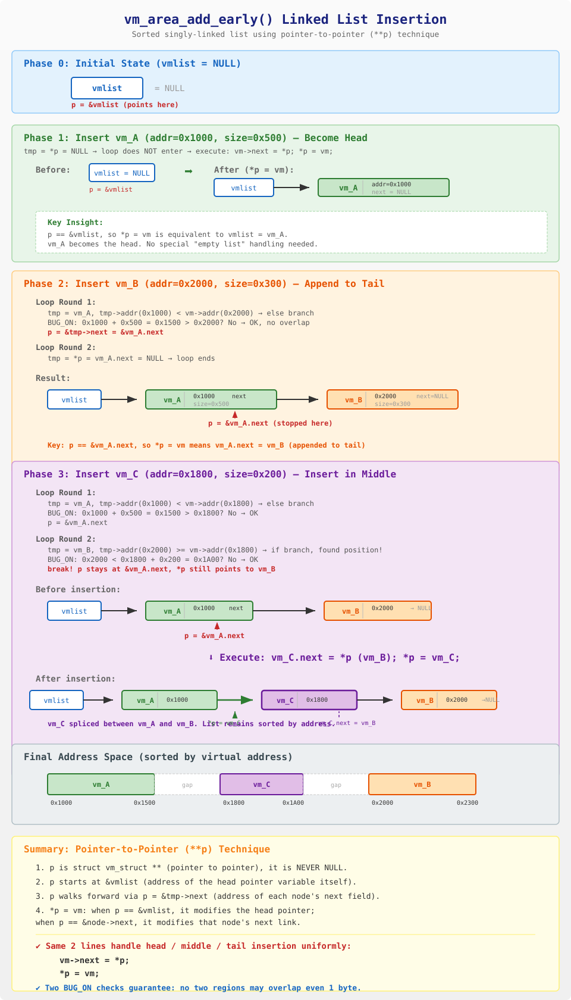

# vm_area_add_early() 函数深度解析

## 1. 函数概述

`vm_area_add_early()` 是 Linux 内核启动早期使用的函数，用于在 `vmalloc_init()` 初始化之前，将固定的内核虚拟地址区域（如内核镜像的 `.text`、`.rodata`、`.data` 等段）注册到一个临时的有序单链表 `vmlist` 中。

这样做的目的是：**告诉后续的 `vmalloc` 分配器，这些地址已经被占用了，不要再分配出去。**

### 调用链

```
paging_init()
  └── declare_kernel_vmas()
        └── declare_vma()        × 5 (5个内核段)
              └── vm_area_add_early()
```

## 2. 源码分析

### 2.1 核心数据结构

```c
// include/linux/vmalloc.h
struct vm_struct {
    struct vm_struct    *next;      // 链表指针（侵入式链表的关键）
    void                *addr;      // 虚拟地址起始
    unsigned long       size;       // 区域大小
    unsigned long       flags;      // 标志位
    struct page         **pages;
    unsigned int        nr_pages;
    phys_addr_t         phys_addr;
    const void          *caller;
    unsigned long       requested_size;
};
```

**关键点**：`struct vm_struct` 的第一个成员就是 `next` 指针。这意味着每个节点自身就包含了链表连接信息——这就是 Linux 内核中经典的**侵入式链表（intrusive linked list）**设计。

### 2.2 链表头指针

```c
// mm/vmalloc.c
static struct vm_struct *vmlist __initdata;
```

`vmlist` 是一个**裸指针**，充当链表的头指针：

- 它**不是**一个链表结构体，**就是**一个普通的 `struct vm_struct *` 指针
- 初始值为 `NULL`（BSS 段自动清零），表示空链表
- `__initdata` 标记表示它只在启动阶段使用，启动完成后会被释放

### 2.3 函数源码

```c
// mm/vmalloc.c
void __init vm_area_add_early(struct vm_struct *vm)
{
    struct vm_struct *tmp, **p;

    BUG_ON(vmap_initialized);
    for (p = &vmlist; (tmp = *p) != NULL; p = &tmp->next) {
        if (tmp->addr >= vm->addr) {
            BUG_ON(tmp->addr < vm->addr + vm->size);
            break;
        } else
            BUG_ON(tmp->addr + tmp->size > vm->addr);
    }
    vm->next = *p;
    *p = vm;
}
```

### 2.4 逐行解读

| 行 | 代码 | 说明 |
|----|------|------|
| 1 | `struct vm_struct *tmp, **p;` | `tmp` 是当前遍历到的节点；`p` 是**二级指针**，指向"存放节点指针的那个变量" |
| 2 | `BUG_ON(vmap_initialized);` | 断言：此函数只能在 `vmalloc_init()` 之前调用 |
| 3 | `p = &vmlist;` | `p` 初始指向链表头指针变量自身的地址 |
| 4 | `(tmp = *p) != NULL` | 取出 `p` 指向的指针值赋给 `tmp`，如果为 NULL 则停止 |
| 5 | `p = &tmp->next` | 迭代步进：`p` 移动到当前节点的 `next` 字段的地址 |
| 6 | `tmp->addr >= vm->addr` | 找到第一个地址 >= 新节点的已有节点 |
| 7 | `BUG_ON(tmp->addr < vm->addr + vm->size)` | 重叠检测：新节点尾部不能超过已有节点头部 |
| 8 | `BUG_ON(tmp->addr + tmp->size > vm->addr)` | 重叠检测：已有节点尾部不能超过新节点头部 |
| 9 | `vm->next = *p;` | 新节点的 next 指向原来 `p` 位置上的节点（可能是 NULL） |
| 10 | `*p = vm;` | 将新节点写入 `p` 指向的位置——完成插入 |

## 3. 二级指针技巧详解

这是本函数最精妙的设计。`p` 是 `struct vm_struct **`，始终指向某个"存放 `struct vm_struct *` 的内存位置"：

```
情况1: p = &vmlist
       p 指向 vmlist 变量本身
       *p = vm 等价于 vmlist = vm （修改链表头）

情况2: p = &tmp->next
       p 指向某个节点的 next 字段
       *p = vm 等价于 tmp->next = vm （在中间/尾部插入）
```

**好处**：不需要 `if (vmlist == NULL)` 这样的特殊分支，头部、中间、尾部插入都用相同的两行代码完成。

## 4. 完整插入过程举例

以 3 个节点为例，故意不按地址顺序插入来展示排序插入能力：

```
vm_A: addr=0x1000, size=0x500
vm_B: addr=0x2000, size=0x300
vm_C: addr=0x1800, size=0x200  (地址在A和B之间，但第三个插入)
```

### 4.1 插入 vm_A —— 空链表，成为 head

**初始状态**：`vmlist = NULL`

```
执行步骤:
  p = &vmlist           // p 指向 vmlist 变量(地址假设 0xF000)
  tmp = *p = NULL       // 取出 vmlist 的值
  tmp != NULL? → false  // 循环条件不满足，不进入循环体
                        // 注意: p = &tmp->next 根本不执行!

  vm->next = *p;        // vm_A.next = NULL
  *p = vm;              // vmlist = &vm_A (等价于 *(&vmlist) = &vm_A)
```

**结果**：

```
vmlist ──> [vm_A: addr=0x1000, next=NULL]
```

`*p = vm` 此时 `p == &vmlist`，所以直接修改了头指针，vm_A 自动成为 head。

### 4.2 插入 vm_B —— 追加到尾部

**当前状态**：`vmlist -> vm_A -> NULL`

```
执行步骤:
  p = &vmlist             // p 指向 vmlist
  tmp = *p = &vm_A        // tmp 指向 vm_A
  tmp != NULL? → true     // 进入循环

  [循环第1轮]
    tmp->addr(0x1000) >= vm->addr(0x2000)? → false (else分支)
    BUG_ON: 0x1000+0x500=0x1500 > 0x2000? → No, OK
    p = &tmp->next        // p 移到 vm_A 的 next 字段的地址

  [循环第2轮]
    tmp = *p = vm_A.next = NULL
    tmp != NULL? → false  // 循环结束

  vm->next = *p;          // vm_B.next = NULL (链表尾)
  *p = vm;                // vm_A.next = &vm_B (追加到A后面)
```

**结果**：

```
vmlist ──> [vm_A: 0x1000] ──> [vm_B: 0x2000] ──> NULL
```

`*p = vm` 此时 `p == &vm_A.next`，所以修改的是 vm_A 的 next 指针。

### 4.3 插入 vm_C —— 插入到中间

**当前状态**：`vmlist -> vm_A -> vm_B -> NULL`

```
执行步骤:
  p = &vmlist             // p 指向 vmlist
  tmp = *p = &vm_A        // tmp 指向 vm_A
  tmp != NULL? → true     // 进入循环

  [循环第1轮]
    tmp->addr(0x1000) >= vm->addr(0x1800)? → false (else分支)
    BUG_ON: 0x1000+0x500=0x1500 > 0x1800? → No, OK
    p = &tmp->next        // p 移到 vm_A 的 next 字段

  [循环第2轮]
    tmp = *p = &vm_B      // vm_A.next 指向 vm_B
    tmp != NULL? → true

    tmp->addr(0x2000) >= vm->addr(0x1800)? → true! (if分支)
    BUG_ON: 0x2000 < 0x1800+0x200=0x1A00? → No, OK
    break!                // 找到插入位置，跳出循环

  // 此时: p = &vm_A.next, *p = &vm_B

  vm->next = *p;          // vm_C.next = &vm_B (C的next指向B)
  *p = vm;                // vm_A.next = &vm_C (A的next改为指向C)
```

**结果**：

```
vmlist ──> [vm_A: 0x1000] ──> [vm_C: 0x1800] ──> [vm_B: 0x2000] ──> NULL
```

vm_C 被完美地插入到 A 和 B 之间，链表保持地址有序。

## 5. 插入过程可视化



## 6. 重叠检测机制

两个 `BUG_ON` 确保任何两个区域不存在地址重叠：

```
情况1: 新节点在已有节点前面
    BUG_ON(tmp->addr < vm->addr + vm->size)

    vm:   [=========]
    tmp:      [=========]    ← tmp->addr 落在 vm 范围内? → BUG!
              ^
              tmp->addr < vm->addr + vm->size → 重叠!


情况2: 新节点在已有节点后面
    BUG_ON(tmp->addr + tmp->size > vm->addr)

    tmp:  [=========]
    vm:       [=========]    ← vm->addr 落在 tmp 范围内? → BUG!
              ^
              tmp->addr + tmp->size > vm->addr → 重叠!
```

如果检测到重叠，内核会直接 `BUG()`——触发 panic，因为这属于严重的内核配置错误。

## 7. 生命周期：从临时链表到正式管理

```
┌─────────────────────────┐          ┌─────────────────────────────┐
│     启动早期 (Boot)      │          │      启动后期 (vmalloc_init) │
│                         │          │                             │
│  declare_kernel_vmas()  │          │  遍历 vmlist                │
│    │                    │          │    │                        │
│    ├─ vm_area_add_early │          │    ├─ 每个节点 → vmap_area   │
│    ├─ vm_area_add_early │  ────→   │    ├─ 插入红黑树 (busy)     │
│    ├─ vm_area_add_early │          │    └─ 识别空闲区间 (free)    │
│    ├─ vm_area_add_early │          │                             │
│    └─ vm_area_add_early │          │  vmap_initialized = true    │
│                         │          │                             │
│  数据结构: vmlist 单链表  │          │  数据结构: 红黑树 + free list│
│  标记: __initdata (临时) │          │  标记: 永久                  │
└─────────────────────────┘          └─────────────────────────────┘

vmalloc_init() 中的关键代码:

    for (tmp = vmlist; tmp; tmp = tmp->next) {
        va = kmem_cache_zalloc(vmap_area_cachep, GFP_NOWAIT);
        va->va_start = (unsigned long)tmp->addr;
        va->va_end   = va->va_start + tmp->size;
        va->vm       = tmp;
        insert_vmap_area(va, &vn->busy.root, &vn->busy.head);
    }

此后 vmalloc() 只从 free tree 中分配地址，自动绕开已注册的内核段。
vmlist 本身（__initdata）在启动完成后被释放。
```

## 8. 总结

| 特性 | 说明 |
|------|------|
| **设计模式** | 侵入式单链表 + 二级指针有序插入 |
| **链表头** | `vmlist`——一个裸指针，不是结构体 |
| **排序方式** | 按虚拟地址从低到高排列 |
| **安全检查** | 两个 `BUG_ON` 保证无地址重叠 |
| **使用阶段** | 仅在 `vmalloc_init()` 之前（`__init`） |
| **后续处理** | `vmalloc_init()` 将链表导入红黑树后，链表被废弃 |
| **二级指针优势** | 头/中/尾插入统一两行代码，无需特判空链表 |

### 核心两行代码的本质

```c
vm->next = *p;    // 新节点接管 p 位置原来指向的后续节点
*p = vm;          // p 位置改为指向新节点
```

无论 `p` 指向 `&vmlist` 还是 `&某节点->next`，这两行代码的语义完全一致：**在 p 这个位置把新节点"嫁接"进去**。这就是 Linus Torvalds 所推崇的"理解指针的指针"的经典范例。
